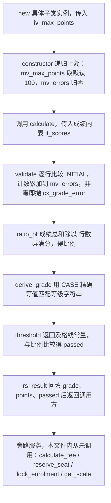
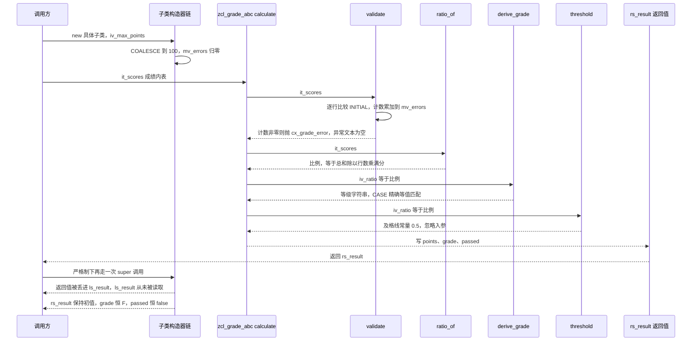

# ZCL_GRADE_CALC 分析报告

> 分析对象：`evals/zcl_grade_calc.clas.abap`（332 行，类池文件，内含 5 个类：`zcl_grade_calc` 抽象基类、`zcl_grade_abc` 中层抽象类、`zcl_grade_strict` 与 `zcl_grade_lenient` 两个终态子类、以及异常类 `cx_grade_error`）
> 报告视角：代码 onboarding 走读，按真实调用链展开

---

## 一、程序定位与业务背景

### 1.1 这段代码在解决什么问题

它要解决的是一个**评分策略可替换**的问题：同一套「成绩内表 → 等级 + 分数 + 是否及格」的计算，在不同教学场景下需要不同的宽严口径。严谨模式要给 A+/A/F，宽松模式要给 C/D，及格线一个卡在 50%、一个卡在 70%。

不用多态的写法大家都见过：一个 `CASE` 里塞满 `IF is_strict = abap_true ... ELSE ...`，或者一个可选参数加三四个开关位。问题不在能不能跑，而在于**每加一种口径就要改一次同一个方法**——改的人要同时理解所有口径的交互，漏看一条分支就静默改错别人的分数。

于是有了这套类层次：把"怎么校验、怎么算比例"钉死在基类里，把"怎么从比例映射成等级""及格线画在哪"留成覆写点。文件头部注释把意图说得很直白：`Abstract base class + two subclasses implementing grade calculation. Demonstrates polymorphism: one reference, three implementations.`

一句话设计范式定性：

> **"策略继承"（Strategy via Inheritance）——基类锁定不可谈判的算术（校验、比例），子类只被允许覆写量表与阈值；理论上调用方持有一个 `zcl_grade_calc` 类型引用就能跑三种口径。**

顺带说明两个"它不是什么"：它**不读数据库**（没有任何 `SELECT`，成绩由调用方以内表传入），**不写任何表**，也**不做货币换算**——`calculate_fee` 只是拿一个单价乘一个数，没有任何汇率参与。后一点是它最容易让人误判的地方，详见 3.10 与 P0-6。

### 1.2 为什么值得单独做成类层次，而不是一个带开关的方法

三个理由，按重要性排：

1. **口径的组合空间会被继承自动约束。** 用参数开关写宽严模式，第三、第四种口径进来时开关位开始互相影响（"严格且宽松"是非法组合，但代码里拦不住）。用继承则天然互斥：一个实例只会是一种口径，非法组合根本构造不出来。这个好处在只有两种口径时不显眼，一旦扩到四五种就是分水岭。
2. **覆写点是被显式声明的，不是被注释出来的。** 基类里 `derive_grade` 和 `threshold` 用 `REDEFINITION` 标出来的地方，就是全部允许变化的地方。审代码的人扫一遍 `REDEFINITION` 就能知道"这个类到底动了什么"，这比在 200 行方法里找 `IF` 分支快一个数量级。
3. **阈值和量表可以被独立复用与单独测试。** 把"及格线是 0.7"抽成 `threshold` 方法，理论上就能只测它而不必跑整个 `calculate`。这是这份代码想要的可测性缝。

代价在第 3 条上，而不在前两条：这套设计**假设继承链是完整接上的**，而它恰恰在这里断了（详见 3.7 与 P0-1）。设计意图是对的，落地没落地成功。

### 1.3 依赖与对象清单（读这段代码前必须知道的地形）

```
类型与数据元素        netwr        净金额（SAP 标准数据元素）
                     netpr        净价格
                     waers        货币键，单据/公司代码币种
                     waerk        交易货币键
                     cuxy         lv_amount 的声明类型，需在 SE11 核实是否为有效类型
自定义结构            ty_result    grade / points / passed / netwr / waers，五种字段一表装
                     ty_fee       fee_id / netpr / waers / waerk
                     ty_result_tab 声明了但全文件未使用
外部函数模块          NUMBER_GET   取连号；字段名与异常语义需在 SE37 核实
                     ENQUEUE_ZGRADE_ENROL  客户自有的加锁 FM，签名不可见
标准类                cx_static_check      cx_grade_error 的父类
继承关系（声明上）     zcl_grade_calc  ←  zcl_grade_abc ← zcl_grade_strict
                                      zcl_grade_abc ← zcl_grade_lenient
继承关系（实际）       zcl_grade_abc 未写 INHERITING FROM zcl_grade_calc，链已断
```

接手时第一个动作不是读逻辑，而是先确认 `zcl_grade_abc` 的类头有没有 `INHERITING FROM`——这一处决定后面 130 行代码是"有 bug 的运行时代码"还是"根本激活不了的死代码"。

### 1.4 这是一份"教学骨架"，读的时候要换一副眼睛

文件头注释写着 `Demonstrates polymorphism`，文件名是 `.clas.abap`、内容是 `CLASS-POOL`——它是一份用来讲多态的教学/演示文件，不是生产系统里跑着的评分程序。判断依据有五条，读者一开始就该知道，否则会误判代码质量：

- 类池里 5 个类同时出现，其中**4 个类都没有在文件里被任何地方实例化或调用**，`get_scale`、`calculate_fee`、`reserve_seat`、`lock_enrolment` 全是从未发生的调用；
- `validate` 里出现 `IF lv_score IS INITIAL OR lv_score IS INITIAL.`——**同一谓词写了两遍**，第二个条件原本几乎肯定是别的检查（越界、负数），被清空后留下了重复的壳；
- `zcl_grade_strict` 的 `calculate` 用 `RECEIVING` 和 `EXCEPTIONS` 调方法——这两个关键字只属于函数模块调用语法，是被从一个 FM 版本拷过来时没改干净的痕迹；
- 基类方法声明里 `PROTECTED` 出现在方法语句末尾而不是方法名后面；
- `lv_amount TYPE cuxy` 用的类型名需要在 SE11 里核实是否存在，标准类型里常见的是 `CUKY`（货币键），没有印象中的 `CUXY`。

所以本报告的分析对象是**这份骨架里真实的 332 行**，以及它**暴露出来的契约缺口与继承断裂**。这不是吹毛求疵：教学文件教出来的习惯（比如"REDEFINITION 写上去就行""CASE 可以拿来分段""覆写阈值改一处就好"）会被学员直接抄进生产代码，而这份文件恰好把每个坑都踩了一遍。

---

## 二、程序执行流程总览

本文件按类分块、不按流程排。真实的执行顺序是：**实例化子类 → 构造器链上溯 → 调用 calculate → 校验 → 求比例 → 派生等级 → 定及格 → 回填返回**，其余四个方法（`calculate_fee`、`reserve_seat`、`lock_enrolment`、`get_scale`）是挂在基类上的旁路服务，本文件内部一次都没调过。



### 责任链表

| 子程序 | 调用者 | 职责 |
|---|---|---|
| `constructor`（`zcl_grade_calc`） | 具体子类实例化；子类构造器经 `super->constructor` | 用 `COALESCE` 给 `mv_max_points` 填默认值 100，把 `mv_errors` 归零 |
| `validate`（`zcl_grade_calc`，PROTECTED） | `zcl_grade_abc` 的 `calculate` | 扫描成绩内表，把"非法行"计数累加到 `mv_errors`，计数非零则抛 `cx_grade_error` |
| `ratio_of`（`zcl_grade_calc`，PRIVATE） | `zcl_grade_abc` 的 `calculate` | 成绩总和除以「行数 × 满分」，得比例 |
| `derive_grade`（`zcl_grade_calc`，基类版） | `zcl_grade_abc` 的 `calculate` | 把比例映射成等级：恰好 0.8 得 B，其余 C |
| `threshold`（`zcl_grade_abc`） | 同类的 `calculate` | 给出及格线常量，忽略入参，固定返回 0.5 |
| `calculate`（`zcl_grade_calc`，抽象，无实现） | 外部调用方 | 基类只声明不实现，强制子类给出算法 |
| `calculate`（`zcl_grade_abc`） | 外部调用方；`zcl_grade_strict` 的 `calculate` 经 `super->calculate` | 串起 校验→比例→等级→及格 四步并回填 `rs_result` |
| `derive_grade`（`zcl_grade_strict` 覆写） | strict 的 `calculate` | 恰好 0.9 得 A+、恰好 0.8 得 A，其余 F |
| `threshold`（`zcl_grade_strict` 覆写） | 设计上给 `calculate` 用，实际未被调用 | 先调 super 再丢弃结果，固定返回 0.7 |
| `calculate`（`zcl_grade_strict` 覆写） | 外部调用方 | 调 super 拿中间结果，再重算 grade 与 passed |
| `derive_grade`（`zcl_grade_lenient` 覆写） | 继承来的 `calculate` | 恰好 0.6 得 C，其余 D |
| `calculate_fee`（`zcl_grade_calc`） | 外部调用方 | 用成绩结果乘费率单价，产出账单结构 |
| `reserve_seat`（`zcl_grade_calc`） | 外部调用方 | 调 `NUMBER_GET` 取连号并拼座位号字符串 |
| `lock_enrolment`（`zcl_grade_calc`，PROTECTED） | 设计上给子类用，实际无人调用 | 调 `ENQUEUE_ZGRADE_ENROL` 抢占学员记录 |
| `get_scale`（`zcl_grade_calc`） | 外部调用方 | 返回硬编码量表字符串 |
| `constructor`（`cx_grade_error`） | 各处 `RAISE EXCEPTION TYPE` | 建异常实例 |

下面按这条流程，逐个子程序展开。要提前说明的是：本文件的真正重心不在"讲语法"，而在**这条继承链上哪里断了、断掉之后下游每一行是怎么跟着错的**。

---

## 三、分组分析

### 3.1 类池与基类 `zcl_grade_calc` 的声明段（全局声明区）

这个文件的第一个异常就在开头。类池里 5 个类，其余 4 个都有规范的 `CLASS <名字> DEFINITION`，唯独继承链的根缺了这句话。

```abap
CLASS-POOL zcl_grade_calc.

*"* use this source for any type of program (pool)

PUBLIC
ABSTRACT
CREATE PUBLIC.
```

**做什么** — 打开类池 `zcl_grade_calc`，然后直接给出三个类属性：`PUBLIC`（默认可见性）、`ABSTRACT`（不可实例化）、`CREATE PUBLIC`（允许 `NEW` 公开创建）。中间那句 `*"* use this source for any type of program (pool)` 是 SE24 生成类池时留下的提示注释，表示这个类池同时承载程序逻辑。

**为什么** — `ABSTRACT` 加 `CREATE PUBLIC` 这个组合看起来矛盾，其实是合理的：类本身不可 `NEW`，但抽象类作为基类必须允许被实例化的子类链引用，而子类实例化会走到 `CREATE PUBLIC` 这条路径。声明 `ABSTRACT` 是有意的——基类确实没有实现 `calculate`，这是它的策略继承意图的锚点。

**风险与改进** —

1. **`CLASS zcl_grade_calc DEFINITION` 这一行整个缺失**（P0-1 的上游）。文件里其余 4 个类都有 `CLASS <名字> DEFINITION PUBLIC ... CREATE PUBLIC.` 这样的完整类头，唯独基类只有三个属性、没有类名和 `DEFINITION` 关键字。在 SE24 的类池视图里这会直接报语法错误，整个类池激活失败。**接手第一件事是确认这一行是被编辑器截掉了、还是本文件摘录时漏抄了**——两者的修法完全不同。
2. **`PUBLIC ABSTRACT CREATE PUBLIC.` 三个属性各自独占一行**，而其他类的属性是写在 `CLASS ... DEFINITION PUBLIC ABSTRACT CREATE PUBLIC.` 一行里的。这是同一份文件里两种排版风格并存的痕迹，属于编辑痕迹而非缺陷，但会干扰读者判断"这个类是不是被中途改过"。
3. `*"* use this source for any type of program (pool)` 这类 SE24 生成注释**不该留在交付代码里**。它标记的是"这个池子能当程序用"，但本文件里没有 `START-OF-SELECTION`、没有 `REPORT`，实际上从来不会被当程序调用——注释承诺了一个不存在的能力。

接下来是它对外声明的全部契约。先看两个自定义结构：

```abap
    TYPES: BEGIN OF ty_result,
             grade     TYPE string,
             points    TYPE p DECIMALS 2,
             passed    TYPE abap_bool,
             netwr     TYPE netwr,
             waers     TYPE waers,
           END OF ty_result.
```

```abap
    TYPES: BEGIN OF ty_fee,
             fee_id   TYPE char4,
             netpr    TYPE netpr,
             waers    TYPE waers,
             waerk    TYPE waerk,
           END OF ty_fee.
```

**做什么** — `ty_result` 是"成绩结果"结构：等级字符串、点数（高精度十进制、2 位小数）、是否及格（布尔）、净金额、货币键。`ty_fee` 是"费率"结构：费率编号（4 字符）、净价格、以及**两个**货币键（`waers` 与 `waerk`）。

**为什么** — 把 `netwr` 和 `waers` 塞进"成绩结果"结构，是这份代码把"算成绩"和"出账单"两件事硬接进同一个返回值的设计选择。好处是 `calculate_fee` 可以把成绩结果直接透传成账单，不用中间转换；代价是这个结构同时承担了两种业务语义，`calculate` 填前三个字段、`calculate_fee` 填后两个，**同一个结构在不同方法眼里是两种东西**。`ty_fee` 同时带 `waers` 和 `waerk` 则是标准的 SAP 双币种建模——公司代码币种与交易币种分开存，本身是对的。

**风险与改进** —

1. **`grade TYPE string` 用引用类型承载两字符等级**（P2-5）。`string` 是动态分配内存的引用类型，一行数据就是一次堆分配；等级只有 `'A+'`、`'C'` 这种定长短串，用 `typlc` 类的定长类型或 `char2` 更合适。当 `ty_result` 装进 `ty_result_tab` 内表后，每一行的 `grade` 都是一次独立的内存对象。
2. **`ty_result` 一表两义是最难维护的一处耦合**（P3-5）。`calculate` 不填 `netwr`/`waers`，`calculate_fee` 不填 `points`；调用方拿到的结构里"哪些字段有值"取决于走了哪条路径，而结构定义本身不表达这一点。更好的形状是把"成绩"和"账单"拆成两个结构，`calculate_fee` 显式接收成绩并返回账单。
3. **`ty_result_tab` 声明了却全文件未使用**（P3-2）。它在声明段躺着，说明原本打算提供一个"批量算分"的返回类型，但没有对应的方法。死类型应该删掉，否则读者会花时间去找"谁会填这张表"。

再看基类的方法声明，重点是 `derive_grade` 那句：

```abap
    METHODS derive_grade
      IMPORTING iv_ratio TYPE p
      RETURNING VALUE(rv_grade) TYPE string
      PROTECTED.
```

```abap
    METHODS lock_enrolment
      IMPORTING iv_student TYPE char10
      RETURNING VALUE(rv_locked) TYPE abap_bool.
```

**做什么** — 声明 `derive_grade`：吃一个比例，返回等级字符串。声明 `lock_enrolment`：吃一个 10 字符学员标识，返回是否加锁成功的布尔值。

**为什么** — 把 `derive_grade` 放成可覆写点，是策略继承的核心：基类给默认量表，子类按宽严改。`lock_enrolment` 标 `PROTECTED` 是因为加锁被设计成"子类算分时可能要用"的内部能力。

**风险与改进** —

1. **`PROTECTED` 出现在方法语句末尾，位置是错的**（P1-7）。ABAP 里方法可见性关键字紧跟在方法名后面（`METHODS derive_grade PROTECTED.`），不能放在 `RETURNING` 之后作为尾缀。这一句需要在 SE24 激活时复核；如果确如所疑，它会是第二个独立的语法阻断点，与 3.1 缺失的 `CLASS ... DEFINITION` 一起让类池激活失败。
2. **两个子类都在 `PUBLIC SECTION` 里 `REDEFINITION` 了这个 `PROTECTED` 方法**（`zcl_grade_strict` 第 139 行、`zcl_grade_lenient` 第 193 行），即把可见性从 `PROTECTED` 放宽到 `PUBLIC`。ABAP 不允许子类放宽方法可见性，这又是一处需要 SE24 复核的激活阻断点。修法是二选一：基类本来就该把 `derive_grade` 标成 `PUBLIC`（子类覆写点本来就是对外契约的一部分），或者子类把它改回 `PROTECTED SECTION`。
3. `lock_enrolment` 声明为 `PROTECTED` 却**全文件无人调用**（P3-2）。PROTECTED 的语义是"给子类用"，而两个子类都没调它——说明它要么该是 `PUBLIC` 对外服务，要么就该删掉。

---

### 3.2 异常类 `cx_grade_error`

```abap
CLASS cx_grade_error DEFINITION PUBLIC INHERITING FROM cx_static_check.
  PUBLIC SECTION.
    CONSTRUCTORS:
      constructor IMPORTING iv_text TYPE string OPTIONAL.
ENDCLASS.
```

**做什么** — 声明一个继承自 `cx_static_check` 的公开异常类，类体里只有一条 `CONSTRUCTORS:` 声明，提供带可选错误文本 `iv_text` 的构造器；不含成员变量，也不含任何业务方法。

**为什么** — 选 `cx_static_check` 而不是 `cx_object` 作为父类，是这份代码里为数不多的对的选择：`cx_static_check` 是 SAP 专门给"可静态检查的异常"准备的基类，能在 SE24 的异常浏览器里看到语义描述，便于文档化和搜索。声明 `iv_text` 这个可选参数的意图也是好的——让抛异常的地方能附带"为什么失败"。异常类不承载业务状态、只有构造器，是最小且正确的形状。

**风险与改进** — 声明层面看不出问题：一个构造器、一个可选文本，签名本身是诚实的。但"诚实的签名"配上下一块的空实现，就等于把承诺全留给读者想象——签名承诺了"能带文本"，实现根本没接。真正的问题在实现里。

```abap
CLASS cx_grade_error IMPLEMENTATION.
  METHOD constructor.
    super->constructor( ).
  ENDMETHOD.                    "constructor"
ENDCLASS.                       "cx_grade_error"
```

**做什么** — 构造器只有一行实现：调用 `super->constructor( )`，括号里是空的，`iv_text` 没有出现在这一行里。

**为什么** — 写成一行是最短的路径，意图是"把活交给父类"。但 `cx_static_check` 的构造器签名里 `textid` / `text` 都是用来填异常文本的，空括号等于显式选择不填——这一行本身没有语法问题，问题在于它和上一条声明形成了落差：父类给了填文本的口，这里没接。

**风险与改进** —

1. **`iv_text` 被接收后从未使用**（P1-1）。构造器把它接进来，然后调用 `super->constructor( )` 时一个参数都没传，也没调 `set_text`。净效果是：**本文件里 7 处 `RAISE EXCEPTION TYPE cx_grade_error.` 抛出的异常全部没有文本**。捕获侧拿到的异常 `get_text( )` 是空的，`validate` 失败和 `ratio_of` 除零和 `reserve_seat` 连号取完，在调用方眼里长得一模一样。这正是 1.1 那类"契约承诺了、代码没做"的缺陷。修法是二选一：把 `iv_text` 传给父类构造器，或者在构造器里调 `set_text( iv_text )`；如果确定不需要文本，就把 `iv_text` 参数删掉，别留一个骗人的形参。
2. **`CONSTRUCTORS:` 复数形式只声明了一个构造器**，写法合法但不必要，读起来会让人以为后面还有没写完的定义。
3. 全文件用 `RAISE EXCEPTION TYPE cx_grade_error.` 抛异常时**从不传文本、也从不传实例**，配合第 1 点形成"抛得出但说不清"的异常链。建议至少给 `cx_grade_error` 加一个带文本的别名常量（比如 `cx_grade_error=>ERROR_VALIDATE`），让每处 `RAISE EXCEPTION` 带上可区分的错误语义。

---

### 3.3 `constructor`（`zcl_grade_calc`）

```abap
  METHOD constructor.
    mv_max_points = COALESCE( iv_max_points, 100 ).
    mv_errors     = 0.
  ENDMETHOD.                    "constructor"
```

**做什么** — 把传入的 `iv_max_points` 经 `COALESCE` 处理后写进实例变量 `mv_max_points`，空值时取 100；同时把错误计数器 `mv_errors` 归零。

**为什么** — `COALESCE( iv_max_points, 100 )` 是"给了就用、没给就默认"的惯用写法，比 `IF iv_max_points IS INITIAL` 再赋值省一行，且语义一目了然。把满分做成实例变量而不是硬编码 100，也让"百分制""六十分制"这种场景有了扩展口。`mv_errors = 0` 放在构造器里是对的——至少保证了新实例的计数器是干净的。

**风险与改进** —

1. **`COALESCE` 只挡 `INITIAL`，不挡 0**（P1-2）。`NEW #( iv_max_points = 0 )` 是合法调用，结果 `mv_max_points = 0`，下游 `ratio_of` 里 `lv_count * mv_max_points` 变成 0，除法直接短转储。`COALESCE` 的语义是"取第一个非空值"，0 不是空，所以它帮不上忙。修法是在构造器里加一道下界检查（`CHECK iv_max_points > 0`，或抛 `cx_grade_error`），把非法配置挡在入口而不是让它一路传到除法里才炸。
2. **`mv_errors` 只在构造器归零一次**，而它会被 `validate` 反复累加且**从未复位**（详见 3.4）。构造器这里写 `mv_errors = 0` 让人以为计数器有生命周期管理，实际上它是一次性的。这一行本身没错，错的是它承诺了一个不存在的复位机制。
3. 构造器没有对 `iv_max_points` 做上界检查。`p DECIMALS 2` 的上限很大，但传入 999999999 这种值会让 `ratio_of` 的比例恒接近 0、`derive_grade` 恒落到 `OTHERS`，静默产出全 F 的成绩单。校验放在入口处比分散在下游便宜。

---

### 3.4 `validate`（`zcl_grade_calc`）

这是基类里唯一的校验入口，也是本文件**设计意图与实现落差最大**的一个方法。

```abap
  METHOD validate.
    LOOP AT it_scores INTO DATA(lv_score).
      IF lv_score IS INITIAL OR lv_score IS INITIAL.
        mv_errors = mv_errors + 1.
      ENDIF.
    ENDLOOP.

    IF mv_errors > 0.
      RAISE EXCEPTION TYPE cx_grade_error.
    ENDIF.
  ENDMETHOD.                    "validate"
```

**做什么** — 遍历成绩内表，遇到"非法"行就把 `mv_errors` 加 1；遍历完后如果计数非零就抛 `cx_grade_error`。

**为什么** — 结构上是对的：校验独立成方法、放在 `ratio_of` 之前跑、失败就抛异常中断流程，这是标准的"守门员"设计。把错误计数做成实例变量 `mv_errors` 而不是局部变量，意图大概是给调用方留一个"错了几条"的查询口——虽然这个口在文件里同样从未被读取。

**风险与改进** —

1. **`mv_errors` 只增不减，导致实例一旦"中毒"就永久报错**（P0-2）。计数器是实例变量、只累加、复位只发生在构造器里。于是：第一次调用传了一行空成绩，`mv_errors` 变 1、抛异常；第二次调用传一个**完全合法**的成绩表，`mv_errors` 已经是 1，判定非零，**照抛**。同一个实例从此拒绝所有合法输入。在长生命周期对象或线程池复用场景下，这会表现为"间歇性、无法复现的校验失败"——因为是否复现取决于这个实例之前被喂过什么。修法是把计数改成局部变量，或者在 `validate` 开头先归零再判定。
2. **`IF lv_score IS INITIAL OR lv_score IS INITIAL.` 同一谓词写了两遍**（P0-2 的一部分）。这不是冗余警告能解决的问题——它是**第二个条件被清空**留下的壳。按上下文推断，原本几乎肯定是 `lv_score < 0` 或 `lv_score > mv_max_points` 之类的越界检查。结果是：**校验器只拦空值，不拦负数、不拦超过满分的值**（P1-4）。传 999 分的成绩能通过校验，把比例推到 1 以上、点数推到满分以上，`derive_grade` 照旧走 `OTHERS` 给个 C，全程不报错。建议先确认原始意图再补条件，不要凭空猜一个阈值写进去。
3. **抛异常不带任何上下文**（配合 P1-1）。`RAISE EXCEPTION TYPE cx_grade_error.` 既不传文本也不传是哪一行出的问题。校验 500 行成绩只告诉你"有错"，不告诉你错在哪一行、错了几条。建议在循环里记下 `sy-tabix`，异常文本带上行号。
4. **为了一次性判定而全表遍历两遍的潜在成本**：这里遍历一遍，`ratio_of` 再遍历一遍。规模小时无所谓，但如果成绩内表可能到万行级别，两者可以合并成一次遍历（详见 P2-1）。

---

### 3.5 `ratio_of`（`zcl_grade_calc`）

```abap
  METHOD ratio_of.
    DATA lv_sum   TYPE p DECIMALS 4.
    DATA lv_count TYPE i.

    lv_count = lines( it_scores ).
    IF lv_count = 0.
      RAISE EXCEPTION TYPE cx_grade_error.
    ENDIF.

    LOOP AT it_scores INTO DATA(lv_score).
      lv_sum = lv_sum + lv_score.
    ENDLOOP.

    rv_ratio = lv_sum / ( lv_count * mv_max_points ).
  ENDMETHOD.                    "ratio_of"
```

**做什么** — 先取内表行数，空表直接抛异常；再遍历累加成绩得到总和；最后用「总和 ÷（行数 × 满分）」得出 0 到 1 之间的比例，作为返回值。

**为什么** — 先判空再除，是正确的防御顺序——把除零挡在了算术之前。用 `lines( it_scores )` 而不是循环里 `sy-tabix` 取行数，是对的（表头已存行数，O(1)）。把"行数 × 满分"作为分母而不是先算平均再除满分，数值上等价，但避免了一次中间除法带来的精度损失。方法标成 `PRIVATE` 也是有意的——求比例是纯内部实现细节，不该被子类覆写。

**风险与改进** —

1. **分母没有零值守卫**（P1-2）。这里守住了 `lv_count = 0`，但 `mv_max_points` 可以是 0（见 3.3 的 `COALESCE` 缺口），`lv_count * mv_max_points` 照样是 0，除法短转储。两个零要都守住才算守住。
2. **没有对比例做上界夹取**。`validate` 拦不住越界成绩（P1-4），于是传入 120 分的成绩会让比例到 1.2。下游 `derive_grade` 用 `CASE` 精确等值匹配，1.2 会落进 `OTHERS` 给个 C——**超额成绩和不及格成绩拿到同一个等级**，这在业务上是不可接受的。建议在出口处 `rv_ratio = MIN( lv_sum / ( lv_count * mv_max_points ), 1 )`，或在 `validate` 里拦住越界。
3. **精度链上有两处隐式收窄**：`lv_sum TYPE p DECIMALS 4` 累加 `TYPE p`（默认 3 位小数）的单行值没问题；但 `lv_ratio` 在 `calculate` 里是 `p DECIMALS 4`，而 `derive_grade` 的入参 `iv_ratio TYPE p` 只有 3 位小数，传入时会被舍入到 3 位。对 0.8000 这类值无影响，但若某天阈值改用 4 位小数（比如 0.8005），比较会因舍入而改变结果。建议在 `ratio_of` 的返回值与 `derive_grade` 的入参之间统一小数位。
4. **和 3.4 一样，抛异常不带文本**，调用方无法区分"空表"和"校验失败"。建议给 `ratio_of` 的异常带上"成绩表为空"的明确语义。
5. `PRIVATE` 方法被 `zcl_grade_abc` 调用——见 3.7，这是继承断裂后的连锁后果之一，不是本方法自己的错。

---

### 3.6 `derive_grade`（基类版）

```abap
  METHOD derive_grade.
    CASE iv_ratio.
      WHEN 0.8.
        rv_grade = 'B'.
      WHEN OTHERS.
        rv_grade = 'C'.
    ENDCASE.
  ENDMETHOD.                    "derive_grade"
```

**做什么** — 用 `CASE` 把比例映射成等级：比例恰好是 0.8 时给 B，其他一切情况给 C。

**为什么** — 用 `CASE` 做量表映射是 ABAP 里最直白的写法，比一串 `IF/ELSEIF` 少一层嵌套，且基类把它放成 `PROTECTED` 可覆写点，让子类按宽严替换量表而不必碰算术。这个结构本身是这份代码最干净的一段。

**风险与改进** —

1. **`CASE` 对十进制做精确等值比较，不是区间判断**（P0-3）。`WHEN 0.8` 只匹配恰好等于 0.8 的值。于是：比例 0.79 → C，比例 0.85 → C，比例 0.99 → C，只有恰好 0.800 才拿 B。**85 分的学生和 51 分的学生拿到同一个等级**，而这几乎肯定不是业务意图——量表通常表达的是"80 分以上"。`CASE` 没有区间语义，要实现"以上"必须用 `CASE iv_ratio WHEN '0.800' '0.801' ... `（荒谬）、或者干脆改成 `IF iv_ratio >= 0.8` 的分支链。这是一处**跑起来完全不报错、但每张成绩单都可能是错的**缺陷，也是最典型的一档。
2. **量表只有两档（B / C），且没有 A、没有 D**（P2-6）。基类作为默认实现，一个"要么 B 要么 C"的量表暗示这份代码原本就只有演示性质；但一旦有人拿它当真使用，A 级和不及格都无法表达——不及格的学生会拿到 'C'。建议基类至少给出能表达"不合格"的档位，或者在基类里把量表也做成常量表以便配置。
3. 三个实现（基类 0.8、strict 0.9/0.8、lenient 0.6）都是同一个"精确等值"写法，**同一个 bug 在三处重复**。修的时候要一起改，漏一处就会留下一档口径不修好。这类"模式级重复缺陷"建议在改之前先全文件搜一遍 `CASE iv_ratio`。

---

### 3.7 中层抽象类 `zcl_grade_abc`

这是全文件的**结构性病灶**所在。先看类头：

```abap
CLASS zcl_grade_abc DEFINITION PUBLIC ABSTRACT CREATE PUBLIC.

  PUBLIC SECTION.
    METHODS constructor REDEFINITION.
    METHODS calculate  REDEFINITION.

  PROTECTED SECTION.
    METHODS threshold
      IMPORTING iv_ratio TYPE p
      RETURNING VALUE(rv_value) TYPE p.
ENDCLASS.
```

**做什么** — 声明一个名为 `zcl_grade_abc` 的公共抽象类，覆写 `constructor` 与 `calculate`，并新增一个 PROTECTED 的 `threshold` 方法返回及格线。

**为什么** — 意图很清楚：在"基类"和"两个终态子类"之间插一层，把"编排四步流程"和"及格线"这两个共性能力提到这一层，让 `strict` 和 `lenient` 只改量表。这是典型的模板方法模式（Template Method），分层意图是这份代码里最专业的一处设计判断。

**风险与改进** —

1. **类头缺 `INHERITING FROM zcl_grade_calc`**（P0-1，本文件的头号缺陷）。声明里没有任何 `INHERITING FROM`，意味着 `zcl_grade_abc` 被当成了**根类**。后果是一条完整的连锁：
   - `METHODS constructor REDEFINITION.` / `METHODS calculate REDEFINITION.` —— `REDEFINITION` 要求父类里存在同名方法，而根类没有父类，**两处覆写全部无源可覆**；
   - `METHOD calculate` 实现里调用的 `validate( it_scores )`（PROTECTED）、`ratio_of( it_scores )`（PRIVATE）、`derive_grade`（PROTECTED）、`mv_max_points`（PROTECTED 实例变量）、`cx_grade_error` —— 这些**全都属于另一个类**，一个独立的根类一个都看不到；
   - `validate` 本身是 PROTECTED，即使接上继承链，跨类调用同样不允许——PROTECTED 只对本类及子类可见，这一点接上链就成立；
   - 只有 `ratio_of` 标成 PRIVATE，接上继承链后**子类仍然不能调它**（PRIVATE 只对本类可见）。所以就算把 `INHERITING FROM` 补上，`zcl_grade_abc->calculate` 调 `ratio_of` 依然会失败——需要把 `ratio_of` 改成 PROTECTED。

   **接手顺序建议**：先在 SE24 里把 `zcl_grade_abc` 的类头补上 `INHERITING FROM zcl_grade_calc` 再激活一次，看编译器报什么；然后把 `ratio_of` 的可见性从 PRIVATE 放宽到 PROTECTED；两处改完，这一层才可能有意义。
2. **`zcl_grade_abc` 声明为 `ABSTRACT`，但它实现了自己声明的全部三个方法**（P3-1）。ABAP 要求抽象类至少包含一个未实现的抽象方法；这里 `constructor`、`calculate`、`threshold` 三个全都有 `IMPLEMENTATION`。补上继承链后，`constructor` 和 `calculate` 是 `REDEFINITION`（本来就必须有实现），`threshold` 也有实现——**没有任何抽象方法**，激活会失败。修法二选一：把 `threshold` 改成只声明不实现（让 `strict`/`lenient` 必须各自给出及格线，这也更贴合"及格线是子类业务口径"的语义），或者把这个类的 `ABSTRACT` 去掉。从设计意图看，前者更对：`threshold` 是最该由子类决定的量之一。
3. `threshold` 的入参 `iv_ratio TYPE p` 从未被实现使用（见下），说明**接口签名里塞了一个没用的参数**。如果及格线永远不依赖当前比例，就该把 `iv_ratio` 从签名里删掉，让契约诚实。

再看这一层的实现，尤其是 `calculate` 的编排：

```abap
  METHOD constructor.
    super->constructor( iv_max_points = iv_max_points ).
  ENDMETHOD.                    "constructor"
```

```abap
  METHOD calculate.

    validate( it_scores ).

    DATA lv_ratio TYPE p DECIMALS 4.
    lv_ratio = ratio_of( it_scores ).

    rs_result.points  = lv_ratio * mv_max_points.
    rs_result.grade   = derive_grade( iv_ratio = lv_ratio ).
    rs_result.passed  = COND #( WHEN lv_ratio >= threshold( iv_ratio = lv_ratio )
                                THEN abap_true ELSE abap_false ).

  ENDMETHOD.                    "calculate"
```

**做什么** — 构造器把 `iv_max_points` 原样转交给父类构造器。`calculate` 则串起四步：先校验，再求比例，然后把比例乘回满分得点数、按量表得等级、与及格线比较得是否及格，三个值写进返回值 `rs_result`。

**为什么** — 这是标准的模板方法：父类给骨架（校验不可跳过、比例算法固定），子类只被允许替换量表与阈值。用 `COND #(...)` 内联表达式写三目判定，比 `IF/ELSE` 赋值少一个临时变量，是较新 ABAP 的惯用写法。先校验再计算也是对的顺序——脏数据不该进入算术。

**风险与改进** —

1. **`iv_max_points` 在这一层的构造器签名里不存在**（配合 P0-1）。类头写的是 `METHODS constructor REDEFINITION.`，**没有声明任何形参**；但实现里调 `super->constructor( iv_max_points = iv_max_points )` 用了 `iv_max_points`。即便接上继承链，覆写构造器也不能凭空多出一个父类没有的参数——除非用 `METHODS constructor REDEFINITION IMPORTING iv_max_points TYPE p OPTIONAL.` 显式重新声明。当前形态下这个标识符无从解析。
2. **`rs_result.points` 用点号、`zcl_grade_strict` 里用连字符访问同一个结构的字段**（风格不一致，P2-8）。两者语法上都合法（`rs_result` 是 `RETURNING VALUE` 结构，两种访问形式都可），但同一个文件里两种写法混用，读者要多花一点时间确认它们指的不是不同变量。建议统一成点号访问。
3. **`COND` 里嵌套函数调用 `threshold( iv_ratio = lv_ratio )`**：`threshold` 完全忽略入参并返回常量，所以这行等价于 `lv_ratio >= 0.5`。把常量比较包在一个函数调用后面，掩盖了"及格线就是写死的 0.5"这个事实，也让"改及格线"这件事在代码里找不到落点。如果及格线确实是常量，直接用字面量加命名常量更诚实；如果它将来要依赖比例（比如"低于 0.3 直接不及格"），那 `threshold` 应该真的用上入参。

再看 `threshold`：

```abap
  METHOD threshold.
    rv_value = 0.5.
  ENDMETHOD.                    "threshold"
```

**做什么** — 忽略入参，把及格线固定返回 0.5。

**为什么** — 把它做成方法而不是常量，是为了让子类能覆写。这个设计判断本身是对的：及格线确实是业务口径，不该焊死在基类里。

**风险与改进** —

1. **入参 `iv_ratio` 声明了却从未使用**（P2-9）。与 `ID_TITLE` 那类"声明不用"的缺陷同理——接口承诺了"及格线可以依赖比例"，实现里完全没有。要么删掉参数让签名诚实，要么让方法真的用上它。
2. **`0.5` 是裸魔法数字**（P2-6）。及格线是这份代码最核心的业务参数之一，却以裸字面量形式出现在实现里。建议提为类常量（如 `threshold_base = 0.5`），这样三个口径（0.5 / 0.7）之间的差异一眼可见，也不用在代码里翻实现才能找到。
3. **及格线被定义了两处，且两者不一致**（P0-7 的一半）。这里的 0.5 是 `passed` 的判定依据；而 `zcl_grade_strict` 的 `calculate` 里另有一个 `mv_max_points * 0.7` 硬编码，绕开了自己覆写的 `threshold` 方法。同一份代码里"及格线"有两个真相来源，改一处漏一处。

---

### 3.8 严格制 `zcl_grade_strict`

```abap
CLASS zcl_grade_strict DEFINITION PUBLIC INHERITING FROM zcl_grade_abc
  FINAL CREATE PUBLIC.

  PUBLIC SECTION.
    METHODS constructor REDEFINITION.
    METHODS calculate  REDEFINITION.

  PROTECTED SECTION.
    METHODS derive_grade REDEFINITION.
    METHODS threshold    REDEFINITION.
ENDCLASS.
```

**做什么** — 声明一个继承自 `zcl_grade_abc`、标记为 `FINAL` 的终态类，覆写四个方法：构造器、`calculate`、`derive_grade`、`threshold`。

**为什么** — `FINAL` 是关键的设计决策：严格制不希望再被继承（避免"更严格制"这种无限套娃），所以封死继承，只允许实例化。覆写 `threshold` 和 `derive_grade` 而不是重写整个 `calculate`，说明作者**知道**哪些该改、哪些不该改——这个判断是对的。

**风险与改进** —

1. `METHODS constructor REDEFINITION.` 同样**没有声明形参**，而实现里传了 `iv_max_points`（见下）。与 3.7 同一个问题。
2. `METHODS derive_grade REDEFINITION.` 声明在 `PUBLIC SECTION`，但基类里它是 `PROTECTED`（且关键字位置本身有误，见 3.1）——放宽可见性不被允许。
3. 构造器实现是**纯转发**：

```abap
  METHOD constructor.
    super->constructor( iv_max_points = iv_max_points ).
  ENDMETHOD.                    "constructor"
```

**做什么** — 把 `iv_max_points` 原样转交给父类构造器，不做任何本地处理。

**为什么** — 严格制没有自己的实例状态要初始化，所以转发是正确且最小的写法。`strict` 和 `lenient` 的差异全部集中在量表与阈值上，构造器不需要变。

**风险与改进** —

1. **`iv_max_points` 在本类签名中不存在**（配合 P0-1 / P3-6）。`REDEFINITION` 后不写形参，ABAP 不会自动把父类的形参带下来；这里引用的 `iv_max_points` 无从解析。修法是 `METHODS constructor REDEFINITION IMPORTING iv_max_points TYPE p OPTIONAL.`。
2. **这个构造器是纯冗余的**（P3-6）。它什么都不做，只是转发。ABAP 里如果子类不需要改构造行为，**可以不覆写构造器**——父类的构造器会被链式调用，参数也会自动传上去。这里覆写一次，反而引入一个"签名不匹配"的潜在缺陷点。建议直接删掉 `zcl_grade_strict` 的构造器覆写（`zcl_grade_abc` 里那个也是纯转发，同样可删）。

核心的 `calculate` 覆写：

```abap
  METHOD calculate.

    super->calculate(
      IMPORTING it_scores    = it_scores
      RECEIVING rs_result    = DATA(ls_result)
      EXCEPTIONS cx_grade_error = 1 ).

    IF sy-subrc = 1.
      RAISING cx_grade_error.
    ENDIF.

    rs_result-grade  = derive_grade( iv_ratio = rs_result-points ).
    rs_result-passed = COND #( WHEN rs_result.points >= mv_max_points * 0.7
                               THEN abap_true ELSE abap_false ).

  ENDMETHOD.                    "calculate"
```

分三步看。

#### ① 用 FM 语法调方法

```abap
    super->calculate(
      IMPORTING it_scores    = it_scores
      RECEIVING rs_result    = DATA(ls_result)
      EXCEPTIONS cx_grade_error = 1 ).
```

**做什么** — 调用父类的 `calculate`，把 `it_scores` 传进去，试图把返回值收进新声明的局部变量 `ls_result`，并用 `EXCEPTIONS` 捕获 `cx_grade_error`。

**为什么** — 写这段代码时，作者的意图是"先让父类把四步跑完，拿到中间结果，再按严格口径重算等级和及格"。这个意图完全合理，是模板方法的标准用法。

**风险与改进** —

1. **`RECEIVING` 和 `EXCEPTIONS` 是函数模块调用语法，方法调用不支持**（P0-4）。方法调用没有 `RECEIVING` 关键字（返回值用 `RETURNING VALUE(rs_result) = ...` 或直接接 `RETURNING`），也没有 `EXCEPTIONS` 段（异常用 `TRY / CATCH`）。这一整段是从 FM 版本拷来没改干净的痕迹。在 SE80 编译时这就是语法错误；即便某种情况下能编译，`RECEIVING rs_result = DATA(ls_result)` 的语义也无法保证如作者所想。
2. **修法示意**（建议改为，非源码原文）：
   ```abap
     TRY.
       ls_result = super->calculate( it_scores = it_scores ).
     CATCH cx_grade_error.
       RERAISE.
     ENDTRY.
   ```
   这样父类的返回值真正落到 `ls_result`，异常也走标准通道。
3. **`ls_result` 声明之后全方法从未被读取**（P0-4 的连锁后果）。下面两行用的是 `rs_result`（本方法自己的返回值）而不是 `ls_result`（父类的返回值）。也就是说：**父类辛苦算出的比例、点数、等级、及格判定，全部被丢掉了**；下面的重算建立在 `rs_result` 的初值上——一个全空的结构。

#### ② 用 `RAISING` 重新抛异常

```abap
    IF sy-subrc = 1.
      RAISING cx_grade_error.
    ENDIF.
```

**做什么** — 检查 `sy-subrc` 是否为 1（对应上面 `EXCEPTIONS cx_grade_error = 1`），是的话重新抛出该异常。

**为什么** — 意图是"把父类抛的异常原样向上传"，即不吞异常。这个意图是对的，很多代码在这里选择静默忽略。

**风险与改进** —

1. **`RAISING` 是类定义段的可见性/异常声明关键字，不是语句**（P0-4 的一部分）。方法体内重新抛异常应该写 `RAISE EXCEPTION TYPE cx_grade_error.` 或 `RERAISE`（重抛当前捕获的原始异常，保留堆栈）。`RAISING cx_grade_error.` 在方法体内是语法错误。
2. **`sy-subrc` 的依赖在这里是双重脆弱的**：`sy-subrc` 的值取决于前面那个 FM 式调用是否真的按 `EXCEPTIONS` 语义填了它；而方法调用压根没有 `EXCEPTIONS` 语义。修掉第 1 条后，这一段整个应该删掉，用 `CATCH ... RERAISE` 替代。
3. 即使改成 `RAISE EXCEPTION TYPE cx_grade_error.`，也会**丢失父类异常的原始堆栈**（见 P1-1）。正确做法是 `RERAISE`。

#### ③ 重算等级与及格判定

```abap
    rs_result-grade  = derive_grade( iv_ratio = rs_result-points ).
    rs_result-passed = COND #( WHEN rs_result.points >= mv_max_points * 0.7
                               THEN abap_true ELSE abap_false ).
```

**做什么** — 用本类覆写的 `derive_grade` 重算等级；再用"点数 ≥ 满分 × 0.7"重新判定是否及格，两个值写进返回值。

**为什么** — 严格制想在父类结果之上叠一层更严的判定：等级用自己的量表，及格线从 50% 提到 70%。意图合理，也是子类覆写 `calculate` 的正当理由。

**风险与改进** —

1. **把点数当比例传给 `derive_grade`**（P0-5）。`derive_grade` 的入参叫 `iv_ratio`，语义是 0 到 1 的比例；这里传的是 `rs_result-points`（比如 85.00 这样的点数）。`derive_grade` 内部用 `CASE` 匹配 0.9 和 0.8，而 85.00 两者都不等于，于是**恒落 `OTHERS`、恒返回 'F'**（配合 P0-3 的精确等值语义）。严格制模式下，**所有人的等级都是 F**，无论考了多少分。修法是传比例而不是点数——而比例正好在 `ls_result` 里没有（父类没导出比例），所以要么让父类的 `calculate` 把比例也导出，要么在本方法里重算一次 `ratio_of`。
2. **`passed` 的判定绕开了自己覆写的 `threshold` 方法**（P0-7 的另一半）。这个类专门覆写了 `threshold` 让它返回 0.7，但 `calculate` 里用的是裸字面量 `mv_max_points * 0.7`，**从未调用 `threshold`**。于是及格线有两个真相来源：`threshold` 里的 0.7（无人使用）和这里的 `mv_max_points * 0.7`（实际生效）。将来有人调 `threshold` 的返回值以为改了及格线，实际什么都不会变——这是最阴的一类缺陷。修法是 `rs_result-passed = COND #( WHEN rs_result-points >= mv_max_points * threshold( iv_ratio = ... ) THEN abap_true ELSE abap_false ).`，让覆写点真正生效。
3. **`passed` 建立在空的 `rs_result` 上**（配合 P0-4）。`rs_result-points` 是初值 0，`0 >= 70` 为假，于是**`passed` 恒为 `abap_false`**。叠加前面两条：严格制模式下**所有人都是 F、全部不及格、点数为 0**。这个模式产出的是一张完全无意义的成绩单，而调用方拿不到任何报错。
4. **判定维度混用**：这里用**绝对点数**（`mv_max_points * 0.7`）判及格，而 `zcl_grade_abc->calculate` 用**比例**（`lv_ratio >= 0.5`）判及格。在满分不是 100 的场景下（比如 60 分制），两个口径的含义会分叉。建议统一成比例，再乘回满分只在展示层做。
5. 字段访问用连字符 `rs_result-grade`，而 3.7 的父类用点号 `rs_result.points`，同一份代码两种风格（P2-8）。

再看 `strict` 自己的两个覆写点：

```abap
  METHOD derive_grade.
    CASE iv_ratio.
      WHEN 0.9.
        rv_grade = 'A+'.
      WHEN 0.8.
        rv_grade = 'A'.
      WHEN OTHERS.
        rv_grade = 'F'.
    ENDCASE.
  ENDMETHOD.                    "derive_grade"
```

```abap
  METHOD threshold.
    super->threshold( iv_ratio = iv_ratio ).
    rv_value = 0.7.
  ENDMETHOD.                    "threshold"
```

**做什么** — `derive_grade` 用三档量表：恰好 0.9 得 A+、恰好 0.8 得 A、其余 F。`threshold` 先调一次父类的 `threshold`（结果丢弃），然后返回 0.7。

**为什么** — 量表设计（A+/A/F，没有中间档）符合"严格制"的语义：要么优秀要么垫底。`threshold` 里调 super 的写法，是"想保留父类逻辑再覆盖"的惯性——但 `threshold` 的返回值不被 super 使用，这个调用没有意义。

**风险与改进** —

1. **同一个 `CASE` 精确等值缺陷**（P0-3）：0.95 得 F、0.85 得 F、只有恰好 0.900 才得 A+。严格制本应是"标准更严"，实际变成"几乎无人能及格"。
2. **`WHEN 0.9` 与 3.1 的小数位收窄叠加**（配合 P3-6）：`iv_ratio` 是 3 位小数，`0.9` 能精确表示，匹配本身没问题；但如果比例来自 4 位小数的 `lv_ratio`，传入时被舍入到 0.900 才能命中。这层隐式转换值得在注释里写明。
3. **`threshold` 里 `super->threshold( iv_ratio = iv_ratio ).` 是一次纯无意义调用**（P2-2）。返回值没被接收、参数被原样转交、父类方法又忽略入参并返回常量——三个"无用"叠在一起，唯一的净效果是消耗一次调用并产生一次误导（读者以为父类逻辑参与了计算）。直接删掉这行即可。
4. **`0.7` 又是裸魔法数字**（P2-6），且与 `calculate` 里的 `mv_max_points * 0.7` 重复出现（P0-7）。两个位置的字面量必须同步修改，没有任何机制保证同步。
5. `threshold` 的返回类型 `p` 没有声明小数位，而调用方 `calculate` 里拿它跟 `lv_ratio`（`p DECIMALS 4`）比较——小数位不一致的比较依赖隐式转换。

---

### 3.9 宽松制 `zcl_grade_lenient`

```abap
CLASS zcl_grade_lenient DEFINITION PUBLIC INHERITING FROM zcl_grade_abc
  FINAL CREATE PUBLIC.

  PUBLIC SECTION.
    METHODS derive_grade REDEFINITION.
ENDCLASS.
```

**做什么** — 声明一个继承自 `zcl_grade_abc` 的 `FINAL` 终态类，类体里只有一条 `METHODS derive_grade REDEFINITION.`，不覆写构造器、不覆写 `calculate`、不覆写 `threshold`。

**为什么** — 这是这份代码里**最克制**的一个类，也最能体现策略继承的价值：宽松制想改的只有一件事（量表更宽松），于是只覆写一个方法，其余 60 行全部复用父类。对比 3.8 的 `strict` 覆写四个方法、还引入三处连锁缺陷，`lenient` 的做法才是这份代码设计意图的正确用法——**想改的只有一件事，就只覆写一件事**。`FINAL` 封死继承、不留实例状态，两个判断都恰当。

**风险与改进** — 声明层面同样看不出问题：覆写点选得准、继承被封死、没有多余状态。问题全部集中在下面那个唯一的方法实现里。

```abap
CLASS zcl_grade_lenient IMPLEMENTATION.

  METHOD derive_grade.
    CASE iv_ratio.
      WHEN 0.6.
        rv_grade = 'C'.
      WHEN OTHERS.
        rv_grade = 'D'.
    ENDCASE.
  ENDMETHOD.                    "derive_grade"

ENDCLASS.                       "zcl_grade_lenient"
```

**做什么** — 唯一的实现是 `derive_grade`：`CASE` 匹配两个分支，比例恰好 0.6 时给 C，其他一切情况给 D。没有初始化、没有额外状态、没有辅助方法。

**为什么** — 用 `CASE` 写两档量表，写法本身和基类、`strict` 保持了一致：三个实现风格统一，读者在一处学会就能读三处。"宽松"体现在阈值下移（0.8 → 0.6）和 `OTHERS` 给 D 而不是 F——两个动作都在同一处表达，意图清晰。

**风险与改进** —

1. **`CASE` 精确等值缺陷第三次出现**（P0-3）。恰好 0.6 得 C，其余（包括 0.65、0.9、0.99）都得 D。**宽松制的实际表现是"比严格制还严"**——0.9 的优秀生在宽松模式下拿 D，在严格模式下也拿 F。两个子类的行为方向与名字完全相反。
2. **等级与及格判定互相矛盾**（P0-7）。宽松制继承父类的及格线 0.5：比例 0.55 → `passed = abap_true`，但等级是 'D'（因为 0.55 ≠ 0.6）。于是出现**"及格但等级 D"**的组合。更麻烦的是 'D' 这个等级本身在 `passed` 上无差别：0.45 也是 D（不及格），0.65 也是 D（及格）。同一个等级字符串承载了两种业务状态，下游任何按等级做决策的逻辑（奖学金、补考、报名资格）都会被这张表误导。
3. **没有覆写 `threshold`，等于把 0.5 这条及格线接受了**，但它自己的量表最低档是 0.6——量表的下界比及格线上界还高 10 个百分点。这个结构性错位说明**"量表"和"及格线"是两个独立变量，但代码里没有任何一致性约束**。建议在父类里加一条断言：量表的所有阈值都必须 ≥ 及格线，否则激活或首次调用时报错。
4. `WHEN OTHERS. rv_grade = 'D'.` 把**所有未匹配情况**（包括 0 分、包括 0.99）都归到 D。基类和 strict 的 `OTHERS` 分别给 C 和 F，三处口径互不协调。建议在类注释里写清"量表定义"作为契约，而不是让读者从 `CASE` 分支反推。

---

### 3.10 `calculate_fee`

```abap
  METHOD calculate_fee.

    DATA lv_amount TYPE cuxy.

    rs_bill-grade  = is_result-grade.
    rs_bill-passed = is_result-passed.
    rs_bill-waers  = is_fee-waers.

    lv_amount = is_result.points * is_fee-netpr.

    rs_bill-netwr = lv_amount.

    rs_bill-waers = is_fee-waerk.

  ENDMETHOD.                    "calculate_fee"
```

**做什么** — 把成绩结果的等级和及格标记复制到账单，把费率的货币键复制过去；用「成绩点数 × 净价格」算出一个金额装进账单的净金额字段；最后再把货币键改成费率的交易货币键。

**为什么** — 意图大概是"按成绩点数计费的账单"：点数越高、费用越高。把 `calculate_fee` 放在基类里（而不是子类），说明作者认为计费逻辑与宽严口径无关——这个判断是对的。

**风险与改进** —

1. **`lv_amount TYPE cuxy` 的类型需要在 SE11 核实**（P1-8）。标准类型里常见的是 `CUKY`（货币键，CHAR3），`CUXY` 不在常见标准类型清单里；如果它不存在于本系统的 SE11，这一行就是激活阻断点。即便存在，也要确认它是不是一个金额类型——把一个 `16 DECIMALS ...` 的金额塞进 `netwr` 之前，类型语义必须对齐。
2. **`is_result.points * is_fee-netpr` 的语义错配是本文件最严重的业务缺陷**（P0-6）。`netpr` 是**净价格**（单位单价），`netwr` 是**净金额**。单价 × 数量 = 金额，这里的"数量"用的是**成绩点数**——一个 0 到 100 之间的评分值。业务上这意味着：考 85 分的人付 85 份单价，考 51 分的人付 51 份单价。**分数被当成了计费数量**。正确的业务模型应该是"按档位固定收费"或"按席位/课时收费"，而不是按分数线性收费；即便真要按分数计费，也应该用 `is_result-passed` 之类的是/否量，而不是让分数直接进入金额。这一条需要在业务侧确认预期模型后再改，不要自己猜。
3. **`rs_bill-waers` 被赋值两次，第一次是死代码**（P0-6 的一部分）。先赋 `is_fee-waers`，几行之后又赋 `is_fee-waerk`。两次赋值的字段语义不同：`waers` 是单据/公司代码币种，`waerk` 是交易货币键。把交易货币键写进 `waers` 字段，等于**用错了字段的语义槽位**；而 `ty_result` 结构里根本没有 `waerk` 字段，导致交易货币信息无处安放。如果费率的 `waers` 与 `waerk` 不同（跨币种场景），账单的币种标签会是错的，且**全程没有任何货币换算**——两个不同币种的金额被直接相加/比较。修法：要么给 `ty_result` 补一个 `waerk` 字段并两处分开赋，要么明确账单只用一种币种并在注释里写明选了哪个。
4. **`rs_bill-points` 从未被赋值**，`is_result-points` 在算完金额后被丢弃。调用方拿到的账单里"点数"是空的，但金额是按点数算出来的——**账单无法自证它的金额是怎么来的**，审计时会出现"金额与任何字段都对不上"。
5. **方法签名声明了 `RAISING cx_grade_error` 却从不抛异常，也不校验入参**（P1-9）。`is_fee-netpr` 可以是空值（`netpr` 是 `DECIMAL`，未给值即 0），结果是一张金额为 0 的账单，静默生成、无任何提示。建议至少校验 `is_fee-netpr` 非零，或明确"零费账单"是合法业务。
6. **`is_result` 与 `is_fee` 都没有被整体判空**。虽然结构类型本身不会为空，但业务字段全空的调用是完全可能的，配合第 5 点会产生垃圾账单。

---

### 3.11 `reserve_seat`

```abap
  METHOD reserve_seat.

    DATA lv_next TYPE i.

    DO 5 TIMES.
      CALL FUNCTION 'NUMBER_GET'
        EXPORTING
          nrr        = 'ZGRADE'
          nrobject   = 'ZSEAT'
        IMPORTING
          number     = lv_next
        EXCEPTIONS
          buffer_overflow = 1
          internal_error = 2
          OTHERS         = 3.

      IF sy-subrc = 0.
        rv_seat = |SEAT{ lv_next ALPHA = OUT }|.
        RETURN.
      ENDIF.
    ENDDO.

    RAISE EXCEPTION TYPE cx_grade_error.

  ENDMETHOD.                    "reserve_seat"
```

**做什么** — 最多尝试 5 次调用 `NUMBER_GET` 从编号对象 `ZGRADE` 的区间 `ZSEAT` 取连号；取到就把编号格式化成 `SEAT<编号>` 返回，5 次全失败则抛异常。

**为什么** — 用 SAP 的标准连号机制而不是自己维护一张序号表，是对的——`NUMBER_GET` 自带并发安全与持久化，自己造一个计数器在并发下必出错。加重试看起来是出于"编号服务偶尔抖动"的稳健考虑。

**风险与改进** —

1. **对不可重试的错误做重试**（P2-4）。`buffer_overflow` 和 `internal_error` 都不是"再试一次就好了"的错误：缓冲溢出说明编号区间配置有问题，内部错误说明系统内部状态异常。用完全相同的参数重发 5 次，只会多消耗 5 次调用，成功概率不变。重试只对瞬态故障有意义（网络抖动、短暂锁竞争），且需要退避。建议要么删掉重试、失败即抛；要么确认哪些异常码真的可重试，只重试那些。
2. **编号经 `TYPE i` 中转，前导零被吃掉**（P1-10）。`NUMBER_GET` 导出的 `number` 通常是 `NUMC` 类型（带前导零的文本数字），而这里装进 `lv_next TYPE i`——整数不保留前导零。于是编号 `00000012` 变成 `12`，输出字符串变成 `SEAT12` 而不是 `SEAT00000012`。座位号这种位置，格式错乱直接影响可用性（打印的座位牌、大屏显示）。修法是让 `lv_next` 用 `NUMC` 或 `char10` 承接，不做数值转换。
3. **`ALPHA = OUT` 对数值类型没有效果**（P2-3）。`ALPHA` 设置用于字符类数据的内部/显示转换（内部存小写、显示转大写）；对 `lv_next` 这样的整数，它是无效修饰。留着只会让读者以为这里做了大小写转换。
4. **失败时抛的异常不带任何上下文**（配合 P1-1）。5 次尝试全失败，调用方只得到一个无文本的 `cx_grade_error`，不知道是编号区间耗尽、区间名写错、还是内部错误。建议在异常文本里带上编号对象名、区间名和 `sy-subrc`。
5. **`nrr` 与 `nrobject` 的赋值与 `NUMBER_GET` 的实际参数语义需在 SE37 核实**：`nrr` 通常是编号范围对象名，`nrobject` 通常是编号区间对象名。两者填的是 `'ZGRADE'` 与 `'ZSEAT'`，语义上合理，但字段名与类型的对应关系应以 SE37 的实际接口为准。
6. 循环用 `DO 5 TIMES` 而不是 `WHILE` + 判断，导致**成功时也固定跑完判定分支**——虽然这里有 `RETURN` 提前退出，所以实际上没问题；但下次有人删掉 `RETURN` 就会变成"取到编号还继续试 4 次"。`WHILE sy-subrc <> 0 AND lv_try < 5` 的写法把意图写得更硬。

---

### 3.12 `lock_enrolment`

```abap
  METHOD lock_enrolment.

    DATA lv_locked TYPE abap_bool.

    CALL FUNCTION 'ENQUEUE_ZGRADE_ENROL'
      EXPORTING
        iv_student     = iv_student
      IMPORTING
        ev_locked      = lv_locked
      EXCEPTIONS
        conflict_lock  = 1
        OTHERS         = 2.

    rv_locked = lv_locked.

  ENDMETHOD.                    "lock_enrolment"
```

**做什么** — 调 `ENQUEUE_ZGRADE_ENROL` 对某个学员记录加锁，把锁结果收进 `lv_locked` 再赋给返回值。

**为什么** — 把加锁封装成类方法，是为了让子类在算分流程里按学员做互斥（避免两个进程同时给同一学员算分）。做成 `PROTECTED` 是"只给子类用"的正确选择。

**风险与改进** —

1. **声明了 `EXCEPTIONS` 却从不检查 `sy-subrc`**（P1-3，本方法最严重的缺陷）。`conflict_lock = 1` 意味着"锁被占用"是一个明确的失败状态；代码完全忽略 `sy-subrc`，直接返回 `lv_locked`。而异常发生时，`IMPORTING` 的参数**不会被填充**，`lv_locked` 保持初值 `abap_false`。于是：**锁冲突与"锁成功但标记为 false"在返回值上完全无法区分**——调用方收到 `abap_false` 时，既可能是"没锁上"，也可能是"调用根本失败了"。这是一个静默失败通道，会把"锁冲突"这个需要上报的业务事件吞掉。修法是在 `sy-subrc <> 0` 时抛 `cx_grade_error`（带上 `conflict_lock` 的语义），或者把 `sy-subrc` 作为第二个返回值显式传出去。
2. **`lock_enrolment` 加锁了但从未解锁**（P1-11）。`ENQUEUE_*` 系列函数模块的语义是"持有锁直到 `RELEASE` 或程序结束"。这里只加不解锁，且**本方法在整个文件里从未被任何地方调用**（P3-2）——即便将来有人调用它，锁也会在调用方的流程里悬着，直到 LUW 结束或显式释放。如果这是设计意图（靠 LUW 兜底），应该在方法注释里写明；如果不是，需要成对提供 `release_enrolment`。
3. **本方法全文件无人调用**，且它是 `PROTECTED`。PROTECTED 的语义是"子类可用"，而两个子类都没用。要么它是对外服务（改成 `PUBLIC`），要么是死代码（删掉）。留着会让读者以为子类有学员级互斥，实际上没有任何互斥在生效。
4. **`iv_student` 没有校验**。传入空字符串会去锁"空学员"，配合第 1 点的静默失败，会产生一条锁在空键上的记录。
5. `ENQUEUE_ZGRADE_ENROL` 的接口在本文件不可见，`ev_locked` 的填充语义、`conflict_lock` 的确切触发条件需以 SE37 的实际定义为准。

---

### 3.13 `get_scale`

```abap
  METHOD get_scale.
    rs_scale = 'A+ A F'.
  ENDMETHOD.                    "get_scale"
```

**做什么** — 返回一个硬编码的字符串 `'A+ A F'`，表示量表档位。

**为什么** — 给调用方一个"这个评分策略用的是什么量表"的自描述入口，避免调用方自己去读子类的 `derive_grade` 实现来反推档位。把方法放在基类里（而不是子类），说明作者认为所有子类共享同一条量表。

**风险与改进** —

1. **硬编码值只在严格制下成立**（P2-5）。`'A+ A F'` 恰好是 `zcl_grade_strict->derive_grade` 的三档；基类自己的量表是 B / C，宽松制是 C / D。所以基类 `get_scale` 返回的字符串对基类自己和宽松制**都是错的**。任何调用方拿 `get_scale` 做展示（比如下拉框选项、报表列标题），在宽松制下会显示出不存在的档位。
2. **量表被编码了三遍，且三处不一致**（P0-7 / P2-6）：`get_scale` 的字符串、各子类 `derive_grade` 的 `CASE` 分支、以及 `get_scale` 声明在基类而实现在子类。三处各自为政，没有任何机制保证同步。正确形状是**量表只定义一次**：要么做一张类常量表（档位 → 等级），`derive_grade` 和 `get_scale` 都从这张表读；要么让 `get_scale` 也成为 `REDEFINITION` 覆写点，每个子类给出自己那份。
3. **用空格分隔的字符串表达结构化数据**（P2-3）。`'A+ A F'` 把档位编码进一个字符串，调用方要用就得 `split`；而档位本身是天然的结构化数据（有序、可比较、有等级语义）。字符串形式还无法表达"0.9 对应 A+"这种映射，只给了值域没给阈值。
4. 返回类型是 `TYPE string`（动态引用类型）承载一个 7 字符的短串，与 3.1 对 `ty_result-grade` 的意见同理。

---

## 四、执行流程全景图（数据视角）



从数据视角看这张图，有一个值得反复强调的形状特征：**比例是唯一真正流动的数据，而它在流到终点之前被丢了两次。**

第一次丢在 `validate` 之后：比例算出来之前，`mv_errors` 这个跨调用的累加器已经决定了这次调用是否会被中断——**判断依据不是本次输入，而是这个实例的历史**。第二次丢在严格制的 `calculate` 里：父类把 `points`、`grade`、`passed` 三个结果全部算好，然后因为 `RECEIVING` 与 `RETURNING` 的语法错配，三个值落到一个从未被读取的局部变量里，下游的重算建立在空结构之上。

这条链上还有一个更安静的缺陷值得单独指出：**等级与及格是两个彼此独立的推导，各走各的阈值**。`grade` 走 `derive_grade` 的量表阈值（0.9 / 0.8 / 0.6），`passed` 走 `threshold` 或 `mv_max_points * 0.7`。两者之间没有任何一致性约束，于是宽松制下会出现「比例 0.55 → 及格 + 等级 D」这种组合，而严格制下会出现「点数 85 → 不及格 + 等级 F」这种组合。**同一个等级字符串在不同阈值组合下承载了相反的业务含义**，任何按等级做后续决策的逻辑（奖学金、补考、报名资格）都会被这张表误导。

---

## 五、问题清单与改进建议（按优先级）

### 🔴 P0 业务正确性

| # | 所在子程序 | 问题 | 业务后果 | 建议 |
|---|---|---|---|---|
| P0-1 | 类池与基类声明段、`zcl_grade_abc` 类头 | 基类缺 `CLASS zcl_grade_calc DEFINITION` 一行；`zcl_grade_abc` 缺 `INHERITING FROM zcl_grade_calc` | 继承链断裂：`REDEFINITION` 无源可覆，`validate` / `ratio_of` / `derive_grade` / `mv_max_points` 全部不可见。整条 ABC 及以下的 130 行代码无法激活，"多态演示"从未真正跑起来 | 补上两处类头；再把 `ratio_of` 从 PRIVATE 放宽为 PROTECTED（PRIVATE 对子类不可见）。改完在 SE24 激活看编译器报什么 |
| P0-2 | `validate` | `mv_errors` 是实例变量，只累加、只在构造器复位；且 `IF lv_score IS INITIAL OR lv_score IS INITIAL.` 同谓词写两遍 | 实例一旦被喂过一行空成绩，`mv_errors` 永久非零，此后**所有合法输入也被判失败**——表现为"间歇性、无法复现的校验失败"，因为是否复现取决于该实例的历史。第二个条件是"越界检查"被清空后留下的壳 | 计数改为局部变量，或在方法开头先归零；第二个条件需先确认原始意图（负数？超过满分？）再补，不要凭空猜阈值 |
| P0-3 | `derive_grade`（基类版、strict 版、lenient 版） | `CASE iv_ratio. WHEN 0.8.` 对十进制是**精确等值比较**，不是区间判断 | 85 分拿 C、99 分拿 C、51 分也拿 C，只有恰好 0.800 才拿 B。严格制下 0.95 拿 F、0.85 拿 F。宽松制下 0.9 的优秀生拿 D——**宽松制比严格制还严，行为方向与类名完全相反**。全文件 3 处同型缺陷 | 改成 `IF iv_ratio >= 0.9` 的分支链，或把量表做成常量表（档位 → 等级）再线性查找。改之前先全文件搜 `CASE iv_ratio`，三处一起改 |
| P0-4 | `zcl_grade_strict` 的 `calculate` | 用 `RECEIVING` 与 `EXCEPTIONS` 调**方法**——这两个关键字只属于函数模块调用语法；父类返回值被收进 `ls_result`，而 `ls_result` 全方法从未被读取 | 父类算出的比例、点数、等级、及格判定**全部被丢弃**，下游重算建立在初值全空的 `rs_result` 上。结果是 `points = 0`、`passed = abap_false`，配合下一条恒为 F | 改用 `TRY / CATCH` 与 `RETURNING VALUE`：`ls_result = super->calculate( it_scores = it_scores ).`，后续重算基于 `ls_result` |
| P0-5 | `zcl_grade_strict` 的 `calculate` | `derive_grade( iv_ratio = rs_result-points )` 把**点数**（如 85.00）当**比例**（0 到 1）传入 | `derive_grade` 用 `CASE` 匹配 0.9 与 0.8，85.00 两者皆不命中，恒落 `OTHERS`。严格制下**所有人的等级都是 F**，无论考了多少分 | 传比例而不是点数；比例需要在父类结果里导出，或在本方法里重算一次 |
| P0-6 | `calculate_fee` | `lv_amount = is_result.points * is_fee-netpr` 把**成绩点数**当计费数量乘**单价**；且 `rs_bill-waers` 先赋 `is_fee-waers` 再赋 `is_fee-waerk` | 分数被当成计费数量：考 85 分付 85 份单价、考 51 分付 51 份单价。货币键上，第一次赋值是死代码，第二次把**交易货币键写进了单据币种字段**，且全程无任何货币换算——跨币种时金额标签错误 | 先在业务侧确认计费模型（按档位固定收费？按席位收费？），不要自己猜。币种上给 `ty_result` 补 `waerk` 字段并两处分开赋，或明确只用一种币种并注释说明 |
| P0-7 | `threshold`（`zcl_grade_abc`）、`zcl_grade_strict` 的 `calculate` 与 `derive_grade`、`get_scale` | 及格线有两个真相来源：`threshold` 返回 0.5 / 0.7，而 strict 的 `calculate` 用裸字面量 `mv_max_points * 0.7` 绕过自己覆写的 `threshold`；等级与及格用两套独立阈值，无一致性约束；`get_scale` 硬编码的 `'A+ A F'` 只对严格制成立 | 改 `threshold` 返回值以为改了及格线，实际什么都不变。宽松制下出现「比例 0.55 → 及格 + 等级 D」，`D` 同时承载及格与不及格两种状态。调用方拿 `get_scale` 做下拉框选项时，宽松制下显示出不存在的档位 | 及格判定统一走 `threshold`；量表只定义一次（类常量表），`derive_grade` 与 `get_scale` 都从同一处读；在父类加断言：量表下界不得低于及格线 |

### 🟠 P1 健壮性

| # | 所在子程序 | 问题 | 建议 |
|---|---|---|---|
| P1-1 | `cx_grade_error` 构造器 + 全文件 7 处 `RAISE EXCEPTION` | 构造器接收 `iv_text` 后调 `super->constructor( )` 不传任何参数，`iv_text` 从未使用；抛异常处也从不带文本 | 把 `iv_text` 传给父类构造器或调 `set_text`；至少给异常类加带语义的别名常量，让每处抛异常可区分。若确实不需要文本就删掉形参 |
| P1-2 | `constructor`、`ratio_of` | `COALESCE( iv_max_points, 100 )` 只挡 INITIAL 不挡 0；`ratio_of` 守了 `lv_count = 0` 但没守 `mv_max_points = 0` | 构造器加下界检查 `CHECK iv_max_points > 0`，把非法配置挡在入口而不是让它一路传到除法里短转储 |
| P1-3 | `lock_enrolment` | 声明 `EXCEPTIONS conflict_lock = 1 OTHERS = 2` 却从不检查 `sy-subrc`；异常时 `IMPORTING` 不填充，`lv_locked` 保持初值 | `sy-subrc <> 0` 时抛带语义的 `cx_grade_error`。当前形态下"锁冲突"与"锁成功但标记 false"在返回值上完全无法区分 |
| P1-4 | `validate` | 校验器只拦空值（且同谓词写两遍），不拦负数、不拦超过满分的值 | 补上越界检查（先确认原始意图）。当前传 120 分能过校验，把比例推到 1 以上、点数推到满分以上，静默产出错误成绩单 |
| P1-5 | `calculate_fee` | 声明了 `RAISING cx_grade_error` 却从不抛异常，也不校验 `is_fee-netpr` | 校验 `is_fee-netpr` 非零，或明确"零费账单"是合法业务。当前空费率会静默生成 0 元账单 |
| P1-6 | `reserve_seat` | `number = lv_next` 把 `NUMC` 编号装进 `TYPE i`，前导零被吃掉；输出变成 `SEAT12` 而非 `SEAT00000012` | 让承接变量用 `NUMC` 或 `char10`，不做数值转换。座位号格式错乱直接影响打印与展示 |
| P1-7 | 基类 `derive_grade` 声明、两个子类的 `REDEFINITION` | `PROTECTED` 出现在方法语句末尾而非方法名后；两个子类又在 `PUBLIC SECTION` 里覆写该 `PROTECTED` 方法（放宽可见性） | **需在 SE24 激活时复核**。若确如所疑，与 P0-1 一起是独立的激活阻断点。修法：基类把 `derive_grade` 标成 PUBLIC（覆写点本属对外契约），或子类改回 PROTECTED |
| P1-8 | `calculate_fee` | `DATA lv_amount TYPE cuxy.` 的类型名需在 SE11 核实是否为有效类型（标准类型里常见的是 `CUKY`） | 若类型不存在则是激活阻断点；若存在需确认它是金额类型而非货币键。改前不要凭印象替换 |
| P1-9 | `lock_enrolment` | 只加锁不解锁，且本方法全文件无人调用；`iv_student` 无校验 | 成对提供 `release_enrolment`，或在方法注释里写明"靠 LUW 兜底释放"；补 `iv_student` 非空校验 |
| P1-10 | `reserve_seat` | 5 次重试失败后抛的异常不带编号对象名、区间名、`sy-subrc` | 异常文本带上这三项。当前调用方无法区分"区间耗尽"、"区间名写错"与"内部错误" |
| P1-11 | `zcl_grade_strict` 的 `calculate` | `IF sy-subrc = 1. RAISING cx_grade_error. ENDIF.` 中 `RAISING` 是类定义段关键字，不是方法体语句；且依赖前面 FM 式调用的 `sy-subrc` | 改为 `CATCH cx_grade_error. RERAISE. ENDTRY.`。`RAISE EXCEPTION` 会丢失父类异常原始堆栈，`RERAISE` 才能保留 |

### 🟡 P2 性能与规范

| # | 所在子程序 | 问题 | 建议 |
|---|---|---|---|
| P2-1 | `validate`、`ratio_of` | 同一张内表被遍历两遍（校验一遍、求和一遍），`lines( )` 之外再无复用 | 规模小时无所谓；若成绩内表可能到万行级别，合并为一次遍历：累加时同时做校验 |
| P2-2 | `zcl_grade_strict` 的 `threshold` | `super->threshold( iv_ratio = iv_ratio ).` 返回值未接收、参数原样转交、父类方法又忽略入参——三个"无用"叠在一起 | 直接删掉这行。当前唯一净效果是消耗一次调用并产生一次误导 |
| P2-3 | `reserve_seat`、`get_scale` | `ALPHA = OUT` 对整数类型是无效修饰；`get_scale` 用空格分隔字符串编码结构化档位 | 删掉 `ALPHA = OUT`；档位改成结构化数据（类常量表），不要用字符串承载 |
| P2-4 | `reserve_seat` | 对 `buffer_overflow` / `internal_error` 这类**不可重试**的错误做 5 次相同参数重试，无退避 | 删掉重试、失败即抛；或确认哪些异常码真的可重试，只重试那些并加退避 |
| P2-5 | `ty_result` 结构、`get_scale` | `grade TYPE string` 用动态引用类型承载两字符等级（`ty_result_tab` 内表里每行一次堆分配）；`get_scale` 返回硬编码值 | 等级改用定长类型；`get_scale` 改成 `REDEFINITION` 覆写点或从常量表读 |
| P2-6 | `constructor`、`threshold`、`derive_grade`、`zcl_grade_strict` 的 `calculate`、`reserve_seat` | 魔法数字散落：100、0.5、0.7、0.8、0.9、0.6、5，以及 `'ZGRADE'` / `'ZSEAT'`，无命名常量 | 及格线与量表阈值提为类常量（如 `threshold_base = 0.5`、`threshold_strict = 0.7`），让三个口径的差异一眼可见，不用翻实现才能找到 |
| P2-7 | `ratio_of`、`derive_grade`、`zcl_grade_abc` 的 `calculate` | 精度链上有两处隐式收窄：`lv_ratio` 是 `p DECIMALS 4`，而 `derive_grade` 的 `iv_ratio TYPE p` 只有 3 位小数；`threshold` 返回类型 `p` 未声明小数位 | 统一小数位，或在注释里写明"比例按 3 位小数参与量表匹配"，避免未来把阈值改用 4 位小数时因舍入改变结果 |
| P2-8 | `zcl_grade_abc` 的 `calculate`、`zcl_grade_strict` 的 `calculate` | 同一文件的 `rs_result` 一处用点号 `rs_result.points`、一处用连字符 `rs_result-grade` 访问 | 统一成点号访问，减少读者确认"是不是同一个变量"的成本 |
| P2-9 | `threshold`、`zcl_grade_lenient` | `threshold` 的入参 `iv_ratio` 声明后从未使用；宽松制没有覆写 `threshold`，接受 0.5 及格线但量表下界是 0.6 | 删掉无用参数让签名诚实，或让方法真的用上它。量表下界高于及格线这个错位应在父类加一致性断言 |
| P2-10 | `validate` | 抛异常时不记录出错行号（`sy-tabix`），调用方只知道"有错"不知道错在哪 | 循环里记下 `sy-tabix`，异常文本带行号与出错计数 |

### 🟢 P3 可扩展性

| # | 所在子程序 | 问题 | 建议 |
|---|---|---|---|
| P3-1 | `zcl_grade_abc` 类头 | 声明为 `ABSTRACT`，但 `constructor`、`calculate`、`threshold` 三个方法全部有实现，没有任何抽象方法 | 抽象类至少需要一个未实现方法，否则激活失败。建议把 `threshold` 改成只声明不实现——"及格线由子类决定"本就更符合业务语义 |
| P3-2 | `lock_enrolment`、`ty_result_tab` | `lock_enrolment` 标 PROTECTED（语义是"给子类用"）却全文件无人调用；`ty_result_tab` 声明后从未使用 | PROTECTED 却无人用，说明它要么该是 PUBLIC 对外服务、要么是死代码，二选一；死类型直接删掉 |
| P3-3 | `constructor`（`zcl_grade_abc`、`zcl_grade_strict`） | 两处构造器都是纯转发，`iv_max_points` 原样上交，无任何本地处理 | ABAP 里不需要改构造行为时**可以不覆写构造器**，父类构造器会被链式调用且参数自动上传。删掉这两处覆写，同时消除"签名不匹配"的潜在缺陷点 |
| P3-4 | `calculate_fee` | `netwr` / `waers` 塞进"成绩结果"结构，同一个结构在 `calculate` 与 `calculate_fee` 眼里是两种东西；`rs_bill-points` 从不赋值，金额无法自证来源 | 把"成绩"与"账单"拆成两个结构，`calculate_fee` 显式接收成绩并返回账单；账单至少回填点数，让金额可追溯 |
| P3-5 | `calculate_fee` 与 `calculate` 的关系 | 计费逻辑与宽严口径无关却放在基类，而"成绩"与"账单"共用一个返回结构 | 若计费确实与口径无关，把它移到独立的计费类里，让 `zcl_grade_calc` 只负责评分——单一职责更利于将来扩展第四种口径 |
| P3-6 | 三个 `derive_grade` 实现 | 量表被编码三遍（基类、strict、lenient），且各带一处 `CASE` 精确等值缺陷 | 量表做成类常量表（档位 → 等级），三个子类只声明"用哪张表"。同一缺陷修一处而不是三处 |
| P3-7 | `reserve_seat`、`lock_enrolment` | 连号与加锁都依赖外部 FM，接口在本文件不可见，异常语义与字段填充行为全靠约定 | 在方法注释里写明"依赖 `NUMBER_GET` / `ENQUEUE_ZGRADE_ENROL`，异常码 X 表示 Y"，或把这两个 FM 的接口快照留档。接手时优先去 SE37 核实 |

---

## 六、整体评价与启发

**优点**

1. **分层意图是这份代码里最专业的一处判断。** 在"基类"和"两个终态子类"之间插入 `zcl_grade_abc` 这一层，把"编排四步流程"与"及格线"提到中间层，让 `strict` 和 `lenient` 只改量表与阈值——这是教科书式的模板方法模式。文件头注释 `Demonstrates polymorphism: one reference, three implementations.` 说明作者清楚自己在讲什么。
2. **`zcl_grade_lenient` 是这份代码里唯一"正确使用"了这套设计的类。** 它只覆写一个方法、其余全部复用父类，`FINAL` 封死继承、不引入任何额外状态。对比 `strict` 覆写四个方法并引入三处连锁缺陷，`lenient` 恰恰演示了策略继承该有的样子：**想改的只有一件事，就只覆写一件事。**
3. **异常建模选对了基类。** 用 `cx_static_check` 而不是裸 `cx_object`，说明作者知道 SAP 有"可静态检查的异常"这一层语义，能在 SE24 的异常浏览器里看到描述。虽然 `iv_text` 没接上（P1-1），但选型本身是对的。
4. **`COALESCE` 与 `lines( )` 两处用法是对的。** 前者是"给了就用、没给就默认"的惯用写法；后者用表头行数而不是循环里数 `sy-tabix`，O(1) 拿到行数。这两处是"知道 ABAP 现代写法"的证据。
5. **`validate` 独立成方法、且在算术之前执行。** 校验和计算分离、先拦脏数据再进算术，这是标准的守门员设计——坏的是计数器的生命周期（P0-2），不是这个结构判断。

**短板**

1. **继承链在最不该断的地方断了。** `zcl_grade_abc` 的类头缺一个 `INHERITING FROM`，就让"两处 `REDEFINITION` 无源可覆 + 五个跨类成员不可见"成为必然。整份文件演示的核心概念（多态）**从未真正跑起来**——这不是一个 bug，是这份教学文件的主题被自己的代码证伪了。
2. **`CASE` 精确等值比较是最贵的一处缺陷，因为它完全不报错。** 三个子类三处 `CASE iv_ratio WHEN 0.x`，跑起来没有语法错、没有 dump、没有消息，只有**每张成绩单都可能是错的**。宽松制比严格制还严、85 分与 51 分同等级、严格制下所有人都是 F——这些错都藏在"程序跑得很顺"的背后。这类缺陷的成本不在发现时，而在**它被用来做过决策之后**。
3. **"声明了却不用"这个毛病在本文件里出现了至少五次**：`ID_TITLE` 式的 `iv_text`（P1-1）、`iv_max_points`（构造器）、`iv_ratio`（`threshold`）、`ls_result`（strict 的 `calculate`）、`lock_enrolment`（P3-2）、`ty_result_tab`（P3-2）。每次都是"接口承诺了、代码没做"。**接口契约的每一个参数都必须有对应的使用点，没有就删掉**——留着只会教调用方写白代码。
4. **同一个业务参数有两个真相来源，且没有任何机制保证同步。** 及格线在 `threshold` 里是 0.7、在 `calculate` 里是 `mv_max_points * 0.7`；量表在 `get_scale` 里是 `'A+ A F'`、在各子类 `derive_grade` 里是 `CASE` 分支。**改一处漏一处，而且改的人不会知道自己漏了**——这是比"写错"更难查的一类缺陷。
5. **教学文件的质量门槛应该比生产代码更高。** 这份骨架里的每个坑（`CASE` 当区间用、`RECEIVING` 调方法、`COALESCE` 挡零、只加不解锁、构造器纯转发）都会原样被学员抄进生产代码。示例代码的"随手一写"会被当成范式传播，这是它比生产代码更需要严格的原因。

**可学到的设计经验**

- **`CASE` 对数值类型是精确等值，不是区间。** 只要量表想表达"以上""不超过"，就必须用 `IF >=` 分支链，或者把量表做成数据（常量表）再线性查找。用 `CASE` 写量表是 ABAP 里最典型的一档"编译通过、语义全错"，且**同一个坑在同一次提交里出现了三次**——修之前先全文件搜一遍同类写法。

- **`RECEIVING` 与 `EXCEPTIONS` 只属于函数模块调用。** 方法调用没有这两个关键字，返回值用 `RETURNING VALUE`，异常用 `TRY / CATCH / RERAISE`。从 FM 版本迁移到 OO 时，这一层语法差异最容易被漏改——而且漏改之后代码读起来毫无违和感。判断方法很直接：看到 `CALL FUNCTION` 之外的语句用了这两个关键字，就是迁移没改干净。

- **纯转发的方法应该被删掉，而不是被写出来。** `zcl_grade_abc` 与 `zcl_grade_strict` 的构造器都只是把 `iv_max_points` 原样上交。ABAP 会链式调用父类构造器并自动上传参数，覆写一个什么都不做的构造器除了多一个"签名可能不匹配"的缺陷点，没有任何收益。**判断一个覆写值不值得留：它在父类行为之外多做了一件事吗？**

- **接口签名里每一个形参都要有使用点。** 最快的自检办法是搜一遍每个参数在方法体里的出现次数：出现 0 次的要么是死参数、要么是没写完的实现。本文件五种形态（`iv_text`、`iv_max_points`、`iv_ratio`、`ls_result`、`lock_enrolment`）全部命中，且五种都指向同一个坏习惯——**先把签名写完整，再回来补实现，但没回来。**

- **同一个业务参数只能有一个真相来源。** 及格线、量表这类核心业务参数，如果被编码在两处以上，改一处漏一处是必然的，而且漏掉的人不会知道自己漏了。把它们提成类常量表（档位 → 等级、口径 → 及格线），让 `derive_grade`、`get_scale`、`passed` 判定都从同一处读，"改一处漏一处"才在结构上不可能发生。
