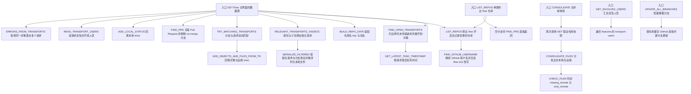
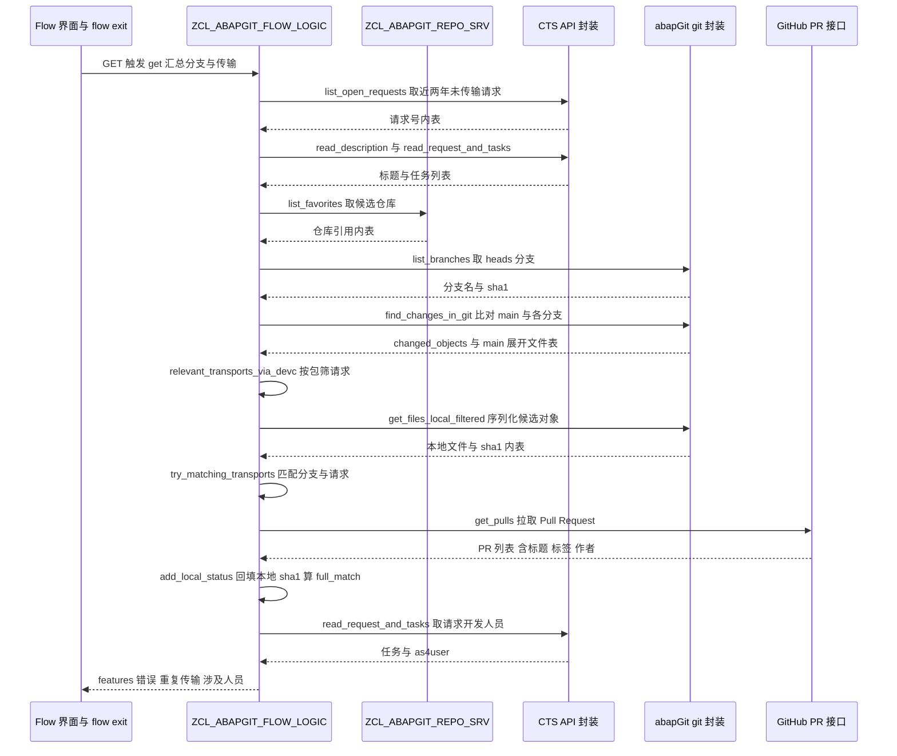

# ZCL_ABAPGIT_FLOW_LOGIC 分析报告

> 分析对象：`abapGit — Test-source/real/abapGit__abapGit__zcl_abapgit_flow_logic.clas.abap`（1114 行，全局类 `ZCL_ABAPGIT_FLOW_LOGIC` 的定义段 + 实现段）
> 报告视角：代码 onboarding 走读，按真实调用链展开
> 分组单位：19 个类方法 + 1 个声明区，共 20 组，全部展开

---

## 一、程序定位与业务背景

### 1.1 这段代码在解决什么问题

先说清楚它**不是**什么：它不做序列化、不写文件、不碰数据库表，也不直接发 HTTP 请求（只调别人），**也不决定要不要阻止一次传输**。它是 abapGit 的 **Flow 功能区（Git Flow）的"读模型 + 诊断"层**——一个把散落信息汇总成一张表、再在这张表上做体检的纯计算类。

背景是这样的。SAP 世界里对象进生产的标准路径是 **CTS 传输请求（Transport Request）**：一次改动 = 一个请求 = 一批对象。但这套模型有个众所周知��痛点——**一个传输请求只能整体走生命周期，无法表达"我先把 5 个程序发到测试系统，剩下 3 个还在改"**。于是出现了"用 Git 分支代替传输请求"的诉求：本地照常在 CTS 里记录改动，但发布时按 **Git 分支**切，测试系统定期从 GitHub 拉所有分支，主干（`refs/heads/main`）保持随时可发布的干净状态。

abapGit 的 Flow 就是这个诉求的实现。它不替换 CTS，而是**两头对齐**：CTS 请求继续记录改动，GitHub 分支继续承载发布，两者靠"**这个对象同时出现在哪个请求里、又出现在哪个分支上**"这条线索关联起来。用户打开 Flow 界面想知道的就三件事：

1. **哪些分支落后了 / 跟谁冲突了？** —— 分支上的文件和本地序列化的文件 sha1 不一致，就是"没推上去"或"被覆盖了"。
2. **哪些改动没被任何分支认领？** —— 本地文件在远端找不到、也不在任何分支的改动清单里，就是"漏掉了"。
3. **哪些配置做得不对？** —— 分支没有对应的传输请求、请求没有对应的分支、同一对象落在多个传输里，全是要人处理的问题。

这个类就是回答这三个问题的**唯一数据来源**。界面（Flow GUI）只是它的渲染层：它甚至连界面都不关心——所有输出都写进 `ty_information` / `ty_consolidate` 这两个结构里，让上层自己决定怎么画。

| 它做的事 | 它刻意不做的事 |
|---|---|
| 汇总「仓库 × 分支 × 传输请求 × PR × 文件 sha1」五维信息 | 不序列化任何对象（委托给 `get_files_local_filtered`） |
| 把分支与传输请求双向匹配，标出「有分支没请求 / 有请求没分支」 | 不创建、不修改、不删除任何传输请求或分支 |
| 检测同一对象落在多个传输请求里 | 不自动拆分传输，也不阻断保存 |
| 在合并检查（consolidate）里算出漏掉的文件、只在远端的文件 | 不决定是否允许合并，只产出告警文本 |
| 批量把落后的分支重新推上去（`update_all_branches`） | 不处理 PR 的评审状态、不碰冲突解决 |

一句话设计范式定性：

> **"无状态聚合器 + 单一上游数据源"——全部 19 个方法都是 `CLASS-METHODS`（没有一个实例方法），所有副作用都委托给 `ZCL_ABAPGIT_FACTORY` / `ZCL_ABAPGIT_REPO_SRV` 这类单例门面；本类自身只做"取数 → 关联 → 体检 → 输出文本"。**

这个定性不是套话，它同时是本类的**最大优点**和**最大可测性障碍**，见 3.1 与 3.2。

### 1.2 为什么值得单独做成一个类，而不是散在界面控制器里

三个理由，按重要性排：

1. **它被两个完全不同的入口复用。** `GET`（Flow 主界面的数据源）和 `CONSOLIDATE`（合并前体检）读的是同一批数据、算的是同一批关系，只是输出结构不同。放进界面控制器就必然复制一遍；而复制之后两边会各自演化，最后"主界面说有 3 个漏文件、合并检查说有 5 个"。
2. **它是 Flow 扩展点的挂载点。** `FIND_GITHUB_USERNAME` 里调了 `ZCL_ABAPGIT_FLOW_EXIT=>get_instance( )->change_github_username( )`——这是 abapGit 著名的 **flow exit 扩展 include**：客户不改 ZCL_ABAPGIT 的源码，只在 exit include 里补一段自己的逻辑，Flow 的用户名解析就能被接管。这个设计要求聚合器**不含任何界面假设**，否则扩展点无处安放。
3. **它是一份可以被别的工具复用的"体检逻辑"。** 合并检查本质上是一个"如果把本地推到远端会丢什么"的静态分析器，与界面无关，自然可以做成命令行报告或 CI 门禁。

代价在第 1 条的另一面：`CONSOLIDATE` 为了复用 `GET` 的结果，直接**把 `GET` 整个跑了一遍**，包括它并不需要的 GitHub PR 拉取（见 3.17）。复用做到了，代价是每次合并检查都要打一次 GitHub API。

### 1.3 依赖清单（读这段代码前必须知道的地形）

```
客户自有接口    ZIF_ABAPGIT_FLOW_LOGIC         全局接口：ty_information / ty_features /
                                             ty_local_files / ty_users_tt / c_main /
                                             c_open_transport_days 等类型与常量
                ZIF_ABAPGIT_REPO              离线仓库接口（提供 get_files_local_filtered）
                ZIF_ABAPGIT_REPO_ONLINE       在线仓库接口（在 ZIF_ABAPGIT_REPO 上加 URL）
                ZIF_ABAPGIT_REPO_SRV          仓库服务器（提供实例与收藏夹清单）
                ZIF_ABAPGIT_CTS_API            CTS 封装（请求 / 任务 / 对象 / 创建日期）
                ZIF_ABAPGIT_GIT_DEFINITIONS   git 相关类型：ty_expanded_tt、ty_git_branch_list_tt
                ZIF_ABAPGIT_PR_ENUM_PROVIDER  GitHub PR 数据结构
                ZIF_ABAPGIT_SAP_PACKAGE       SAP 包（子包列表、是否记录到传输）
                ZIF_ABAPGIT_PERSISTENCE       持久化值类型
全局类（本类之外）ZCL_ABAPGIT_FACTORY         工厂门面：get_cts_api / get_tadir / get_sap_package
                ZCL_ABAPGIT_GIT_FACTORY        git 门面：get_v2_porcelain
                ZCL_ABAPGIT_FLOW_GIT           find_changes_in_git：核心 diff 逻辑
                ZCL_ABAPGIT_FLOW_EXIT          Flow 扩展点（change_github_username）
                ZCL_ABAPGIT_LOGIN_MANAGER      GitHub 用户名解析
                ZCL_ABAPGIT_PR_ENUMERATOR      PR 枚举器（new 构造）
                ZCL_ABAPGIT_PR_ENUM_GITHUB     GitHub PR 更新（update_pull_request_branch）
                ZCL_ABAPGIT_HTTP_AGENT         HTTP 代理（create 构造）
                ZCL_ABAPGIT_FILENAME_LOGIC     对象名 → 文件名（object_to_file）
                ZCL_ABAPGIT_AFF_FACTORY        ABAP File Format 工厂（is_supported_object_type）
                ZCL_ABAPGIT_OBJECT_FILTER_OBJ  对象过滤器（构造参数 it_filter）
本类私有类型    ty_transport / ty_transports_tt / ty_trkorr_tt / ty_repos_tt / ty_update_result
```

**读之前必须知道的两条边界**：

- `ZCL_ABAPGIT_FLOW_GIT=>FIND_CHANGES_IN_GIT` 是本类的**算法心脏**（"这个分支相对 main 改了什么"），但它不在本文件里。本报告只能描述它的**输入输出契约**，无法评价它的正确性。
- `ZIF_ABAPGIT_FLOW_LOGIC` 的 DDIC 类型（`ty_local_files` 的表键、`ty_features` 的子表键）也不在本文件里。**多个性能结论依赖这些键定义**，凡是依赖的地方本报告都标注了"需在 SE11 核实"。

### 1.4 这是一份"带着 TODO 上线"的代码，读的时候要换一副眼睛

这不是一份完成度不足的草稿——它是 abapGit 的核心类，有完整的类型体系、命名规范和扩展点设计。但源码里留下了**六处作者自己标注的 `todo`**，它们精确地圈出了当前实现的边界，读者一开始就该知道：

- `* todo: handling multiple repositories`（`consolidate` 开头）
- `* todo: this is not correct for AFF enabled objects`（`consolidate_files` 里按 tadir 推文件名的分支）
- `* todo`（`check_files` 里文件路径不同的情况）
- `* todo: branches without pull requests?`（`consolidate` 末尾）
- `ls_changed_file-path = '/src/'. " todo?`（删除对象的路径硬编码）
- `* todo: double check, there might have been changes while consolidation is running`

这些不是"代码没写完"的谦逊标记，而是**作者对自己实现边界的诚实标注**。本报告把它们当成一等公民来分析：每一条都对应一个真实的业务后果，见第五节。

---

## 二、程序执行流程总览

本类有 **5 个 PUBLIC 入口**，其中 `GET` 是主入口（下文按它的真实调用顺序展开），`CONSOLIDATE` 是第二条独立链路，`GET_INVOLVED_USERS` 与 `UPDATE_ALL_BRANCHES` 是轻量入口。



### 责任链表

| 子程序 | 调用者 | 职责 |
|---|---|---|
| `GET`（主入口，全局类方法） | Flow 主界面 / 任何需要 flow 快照的调用方 | 编排：取传输快照 → 列仓库 → 逐仓库装配分支、匹配传输、关联 PR、回填 sha1、汇总人员 → 检测重复传输；输出 `ty_information` |
| `FIND_OPEN_TRANSPORTS` | `GET`、`CONSOLIDATE_FILES` | 查近两年未传输的请求，把每个请求展开成"一行一个对象"的 `ty_transports_tt` |
| `GET_LATEST_TASK_TIMESTAMP` | `FIND_OPEN_TRANSPORTS` | 取某请求最后一个任务的时间，转成 timestamp |
| `LIST_REPOS` | `GET`、外部调用方 | 从收藏夹或全量仓库里筛出 `flow = abap_true` 且记录变更到传输请求的仓库 |
| `FIND_GITHUB_USERNAME` | `GET` | 解析 GitHub 用户名，并让 flow exit 有机会改写它 |
| `BUILD_REPO_DATA` | `GET`、`CONSOLIDATE_FILES`、`TRY_MATCHING_TRANSPORTS` | 把仓库接口的三个 getter 装配成 feature 的 `repo` 子结构 |
| `RELEVANT_TRANSPORTS_VIADEVC` | `GET` | 用包与子包清单过滤传输表，得出与本仓库相关的请求号集合 |
| `SERIALIZE_FILTERED` | `GET` | 把"相关请求里的对象"和"分支改动清单里的对象"合并去重，交给过滤器序列化成本地文件清单 |
| `TRY_MATCHING_TRANSPORTS` | `GET` | 分支侧按 `changed_objects` 匹配请求；剩余请求侧按包匹配并新建 feature |
| `ADD_OBJECTS_AND_FILES_FROM_TR` | `TRY_MATCHING_TRANSPORTS` | 把某请求的对象与文件（本地 sha1 + 远端 sha1）写进 feature 的 `changed_objects` / `changed_files` |
| `FIND_PRS` | `GET` | 拉取仓库的 PR 列表，按 head 分支名关联；带 `no-merge` 标签的分支从结果里剔除 |
| `ADD_LOCAL_STATUS` | `GET` | 用本地文件清单回填每个 `changed_files` 的 `local_sha1` |
| `READ_TRANSPORT_USERS` | `GET` | 取某请求的 `as4user` 列表 |
| `ERRORS_FROM_TRANSPORTS` | `GET` | 检测同一对象同时出现在两个不同请求里，产出错误文本与重复清单 |
| `GET_INVOLVED_USERS`（轻量入口） | Flow 界面的人员展示 | 汇总所有 feature 的 `transport-users`，去掉初始值 |
| `CONSOLIDATE`（第二入口） | Flow 合并检查 | 调 `GET` 取快照，逐条挑出"有分支没请求 / 有请求没分支"的错误文本，再委托 `CONSOLIDATE_FILES` |
| `CONSOLIDATE_FILES` | `CONSOLIDATE` | 分批比对本地文件与远端展开表，产出 `missing_remote`、截断告警与 `only_remote` |
| `CHECK_FILES` | `CONSOLIDATE_FILES` | 对一批本地文件判定"远端缺失 / sha1 不一致 / 已被分支认领"，并从远端表里划掉已配对项 |
| `UPDATE_ALL_BRANCHES`（轻量入口） | Flow 界面"全部更新"按钮 | 逐个落后的分支调用 GitHub PR 更新接口，统计 updated / errors / skipped |
| 类定义段（全局声明区） | 全部 | 定义 5 个公开方法、14 个私有方法、`ty_transport` 等私有类型与 `c_max_missing_files` 常量 |

下面按这条流程，逐个子程序展开。要提前说明两点：其一，本类的**算法复杂度问题几乎全部来自"嵌套循环 + 线性 `READ TABLE`"这一组合**，而不是单个复杂算法，所以后面多处分析会指向同一个根因；其二，本类的**正确性问题几乎全部来自"跨方法的隐式状态假设"**——`ct_transports` 被就地修改、`lt_main_expanded` 不清空、缓存依赖输入顺序，逐个方法看都合情合理，串起来看才有洞。

---

## 三、分组分析（按程序流程 / 子程序）

### 3.1 类定义段（全局声明区）

先把契约读透。这个类定义段只有 181 行，但信息密度很高：它声明了 5 个公开方法、14 个私有方法、5 个私有类型和 1 个常量。这里分三步看：**对外契约**、**私有数据模型**、**访问级别**。

#### ① 对外契约：五个公开方法的形状

```abap
CLASS zcl_abapgit_flow_logic DEFINITION PUBLIC.
  PUBLIC SECTION.
    CLASS-METHODS get
      RETURNING
        VALUE(rs_information) TYPE zif_abapgit_flow_logic=>ty_information
      RAISING
        zcx_abapgit_exception.

    CLASS-METHODS get_involved_users
      IMPORTING
        is_information  TYPE zif_abapgit_flow_logic=>ty_information
      RETURNING
        VALUE(rt_users) TYPE zif_abapgit_flow_logic=>ty_users_tt.
```

**做什么** — 声明类的身份与两个公开入口。`GET` 是无入参、出一个结构、可能抛异常——典型的"给我一份完整快照"接口；`GET_INVOLVED_USERS` 是入一个快照、出一个人名单、不抛异常——典型的纯投影接口。

**为什么** — `GET` 选择 `RETURNING` 结构而不是多个出参，是因为它要交付的字段有十多个（features、errors、warnings、enabled_repositories、github_username、transport_duplicates）。用多个出口参数会让调用方写出十几行接收代码，而 ABAP 里这种接口的标准解法就是打包成一个结构。`GET_INVOLVED_USERS` 用 `is_information` 而不是 `REF TO`，也刻意保持了这个风格。

**风险与改进** — 契约本身没有语法或设计缺陷，但有两个**可读性缺口**：

1. **`GET` 的返回结构 `ty_information` 的字段分布在 `GET`、`ERRORS_FROM_TRANSPORTS` 三个方法里**，接口声明处没有任何提示。接手时要拼出"谁写哪个字段"，必须读完 `GET` 的 108 行实现体。改进方向：在接口里加注释列出字段与写入者的对应关系（ABAP 的 `TYPES` 段支持 `* @` 风格的注释块）。
2. **`GET` 声明 `RAISING zcx_abapgit_exception`，但它内部的四个外部调用（git 分支列举、序列化、PR 拉取、CTS 读取）各自抛什么、哪些会被吞掉，接口一概不表达**。调用方无法知道"抛异常"是"仓库配错了"还是"GitHub 超时了"。这个缺口在 3.17 会被放大成实际问题。

其余三个公开方法的签名（`CONSOLIDATE`、`LIST_REPOS`、`UPDATE_ALL_BRANCHES`）与其行为的关系，见各自的分析小节。

#### ② 私有数据模型与常量

```abap
    CONSTANTS c_max_missing_files TYPE i VALUE 1000.

    TYPES: BEGIN OF ty_transport,
             trkorr     TYPE trkorr,
             title      TYPE string,
             object     TYPE tadir-object,
             obj_name   TYPE tadir-obj_name,
             devclass   TYPE tadir-devclass,
             created_on TYPE d,
             changed_at TYPE timestamp,
           END OF ty_transport.

    TYPES ty_transports_tt TYPE STANDARD TABLE OF ty_transport WITH NON-UNIQUE KEY trkorr.

    TYPES ty_trkorr_tt TYPE STANDARD TABLE OF trkorr WITH DEFAULT KEY.

    TYPES ty_repos_tt TYPE STANDARD TABLE OF REF TO zif_abapgit_repo_online WITH DEFAULT KEY.
```

**做什么** — 定义内部使用的四个类型：一个"传输 × 对象"的行结构、一张按请求号排序的传输表、一张请求号表、一张仓库引用表；以及一个常量 `c_max_missing_files = 1000`，用来限制合并检查里"漏掉的文件"清单的条数。

**为什么** — 把 `ty_transport` 私有化而不是复用全局接口的同名类型，是对的：它是本类内部的中间产物，字段命名（`trkorr` 而不是 `request`、`devclass` 而不是 `package`）贴着 CTS 与 TADIR 的原生词汇，不对外承诺，正好符合 abapGit 对全局接口的态度（全局接口只放界面要用的东西）。`c_max_missing_files` 的用意也明确：**合并检查的结果是要画在屏幕上的**，几万个文件条目既慢又没法看，所以必须封顶。

**风险与改进** — 三处设计问题，都会影响运行效率：

1. **`ty_transports_tt` 的键声明选了最不利的组合**。`WITH NON-UNIQUE KEY trkorr` 声明的是一个**未排序的二级键**，ABAP 对这种键不能做二分查找，只能全表扫描。而本类**四处**按 `trkorr` 查这张表（3.3 的 `READ TABLE ... WITH TABLE KEY trkorr`、`RELEVANT_TRANSPORTS_VIADEVC` 的嵌套查找、`SERIALIZE_FILTERED` 的 `LOOP ... WHERE`、`TRY_MATCHING_TRANSPORTS` 的包匹配）。改成 `WITH NON-UNIQUE SORTED KEY trkorr` 就能让这四处全部走二分。**这一条改动的收益大于本报告其余所有性能建议之和**，因为它零风险、只改一行、影响面覆盖全类。
   （需在 SE11 核实 `TY_TRANSPORTS_TT` 是否有额外的排序键定义；本文件内的声明就是全部依据。）
2. **`ty_trkorr_tt` 和 `ty_repos_tt` 都用了 `WITH DEFAULT KEY`**，而 `DEFAULT KEY` 等价于"整行做非唯一键"。对 `ty_trkorr_tt` 而言，`TRKORR` 本身是 DDIC 表键字段（CHAR12），用 `DEFAULT KEY` 意味着重复的请求号会被当成两行保留，而不是被拒；`RELEVANT_TRANSPORTS_VIADEVC` 靠 `DELETE ADJACENT DUPLICATES` 手工去重正是这个选择的代价。改成 `HASHED WITH UNIQUE KEY trkorr`（或至少 `SORTED`）能同时省掉去重循环。
3. **`c_max_missing_files` 是提了常量，但同一个类里的另一个数量阈值 `500` 是裸数字**（`CONSOLIDATE_FILES` 的分批大小）。**同一个类里两种阈值纪律并存**，后来的��只会看到其中一个。建议 `c_serialize_batch_size` 提为常量，与 `c_max_missing_files` 放在一起——它们本来就是一对（一个控制内存峰值，一个控制 UI 行数）。

#### ③ 访问级别与实现形态

```abap
  PROTECTED SECTION.
  PRIVATE SECTION.
```

**做什么** — `PROTECTED SECTION` 是空的，紧接着就是 `PRIVATE SECTION`，之后是 14 个 `CLASS-METHODS`。

**为什么** — 一个空的 `PROTECTED` 段是重构留下的痕迹：这个类曾经有过给子类用的成员（abapGit 的 Flow 曾做过子类化），后来全部收进 `PRIVATE` 并改成类方法。留一个空段在语法上完全合法。

**风险与改进** — 值得讨论的不是这个空段，而是它引出的整体形态：**19 个方法全部是 `CLASS-METHODS`，没有一个实例方法、一个实例属性**。这个选择让本类可以处处用 `ZCL_ABAPGIT_FLOW_LOGIC=>GET( )` 直接调用，读代码时不用找实例，确实清爽。但代价是 `CONSOLIDATE_FILES` 里那 17 个局部变量、那个跨 500 条循环的过滤器对象、全程累积的 `missing_remote` 表，全都是方法局部状态——**没有任何一个测试可以只测其中一段**。要用 ABAP Unit 测它，就得为 `ZCL_ABAPGIT_FACTORY`、`ZCL_ABAPGIT_REPO_SRV`、`ZCL_ABAPGIT_GIT_FACTORY` 至少准备三组 linking 双件。这不是"写得不够好"，是形态选择的必然代价；但它是这个类最难补测试的地方，改进方向是给 `CONSOLIDATE_FILES` 抽出可注入的序列化与过滤函数（见 P3-2）。

### 3.2 `GET` — 主入口，分五步展开

`GET` 是本类的编排中枢，108 行代码里没有一个自己的算法，全是"调谁、传谁、存哪"。但**正是这段编排里藏着本类最危险的两个缺陷**（跨仓库状态污染、传输表被就地消费），所以必须逐段读。

#### ① 局部数据声明

```abap
    DATA lt_branches TYPE zif_abapgit_git_definitions=>ty_git_branch_list_tt.
    DATA ls_branch LIKE LINE OF lt_branches.
    DATA ls_result LIKE LINE OF rs_information-features.
    DATA li_repo_online TYPE REF TO zif_abapgit_repo_online.
    DATA lt_features LIKE rs_information-features.
    DATA lt_all_transports TYPE ty_transports_tt.
    DATA lt_relevant_transports TYPE ty_trkorr_tt.
    DATA lt_repos TYPE ty_repos_tt.
    DATA lt_main_expanded TYPE zif_abapgit_git_definitions=>ty_expanded_tt.
    DATA lt_local TYPE zif_abapgit_flow_logic=>ty_local_files.
    DATA lt_real_transports LIKE lt_all_transports.
```

**做什么** — 声明 12 个局部对象，覆盖三类数据：仓库清单（`lt_repos`）、传输快照（`lt_all_transports` 及其副本 `lt_real_transports`）、单个仓库的比对素材（分支 `lt_branches`、feature 集合 `lt_features`、远端展开表 `lt_main_expanded`、本地文件 `lt_local`）。

**为什么** — 值得注意的是**逐仓库循环体内复用的数据只有 3 个**：`lt_branches`（每次整体赋值）、`lt_features`（每次 `CLEAR`）、`lt_local`（每次整体赋值）。而 `lt_main_expanded` **不在其中**——它既不清空也不覆盖，靠 `FIND_CHANGES_IN_GIT` 自己处理。这是 3.2 ③ 要讲的核心问题的根源。

**风险与改进** — 声明本身没有缺陷，但**两处命名严重误导读者**，而读者正要靠这些名字判断状态：

1. **`lt_real_transports` 是个坏名字**。它是 `lt_all_transports` 在进入仓库循环**之前**的一份拷贝，用途只有一个：防止 `TRY_MATCHING_TRANSPORTS` 就地删除已匹配的传输影响后续的重复检测（`ERRORS_FROM_TRANSPORTS` 需要未被本类改动过的全量视图）。但 "real" 看起来像"真实的传输"，实际语义是"未被本类改动过的原始快照"。名字应表达**它为什么存在**，比如 `lt_transports_snapshot`。这个名字的成本会在 P0-2 里再次体现。
2. **`lt_main_expanded` 没有任何注释说明它的生命周期跨越整个仓库循环**。它是唯一一个"跨迭代存活且不清空"的可变表，而这正是 3.2 ③ 缺陷的源头。加一行 `* persists across the repo loop on purpose; see check_files` 之类的说明，成本为零，收益是让下一个改这里的人知道自己动了什么。

#### ② 第一步：取传输快照、列仓库、解析用户名

```abap
    lt_all_transports = find_open_transports( ).
    lt_real_transports = lt_all_transports.

* list branches on favorite + flow enabled + transported repos
    lt_repos = list_repos( ).
    rs_information-enabled_repositories = lines( lt_repos ).
    rs_information-github_username = find_github_username( lt_repos ).

* Repository instances may contain stale snapshots when Flow is first opened
    LOOP AT lt_repos INTO li_repo_online.
      li_repo_online->zif_abapgit_repo~refresh( ).
    ENDLOOP.
```

**做什么** — 进仓库循环之前做四件事：把全系统的开放传输请求扫成一张表（并立刻复制一份留底）；从收藏夹里筛出 flow 仓库并把数量写进结果结构；解析 GitHub 用户名写进结果结构；最后对每个仓库实例调一次 `refresh` 刷新本地快照。

**为什么** — `refresh` 那一段前面有注释解释得很到位：*"Repository instances may contain stale snapshots when Flow is first opened"*。这是真实存在的坑——`LIST_REPOS` 拿到的仓库对象来自 `ZCL_ABAPGIT_REPO_SRV` 的服务层，可能在本次会话早些时候（比如用户刚在 Flow 界面上做过别的操作）已经被创建过并缓存了旧的本地文件状态。不刷新就会拿着旧快照去和远端比，得出"有文件没推上去"的假结论。**把仓库列表先全部刷新一遍、再进主循环**，顺序是对的。

**风险与改进** — 三处问题：

1. **注释与代码不符**（P2）。注释写 *"favorite + flow enabled + transported repos"*，但 `LIST_REPOS( )` 的实现（3.5）**只返回收藏夹里 `flow = abap_true` 且记录变更的仓库**，完全不涉及 "transported repos"。所谓"被传输过的仓库"是通过事后的 `TRY_MATCHING_TRANSPORTS` 发现并新建 feature 的，不是这句注释描述的行为。注释误导的代价是：接手的人会以为"没进收藏夹但有传输的仓库会漏掉"，从而在错误的地方找 bug。**注释要么改，要么删**——删掉比留着错的好。
2. **`refresh` 在循环里逐个调用，且通过 `zif_abapgit_repo~refresh( )` 的接口限定符调用**。`LT_REPOS` 是 `STANDARD TABLE ... WITH DEFAULT KEY`（即整行做非唯一键），`LIST_REPOS` 又没有对返回结果去重。如果同一个仓库在 `LIST_FAVORITES` 的返回里出现两次（跨收藏夹分组，或服务层去重不严），这里会对同一个实例刷新两次，仓库循环也会跑两遍——**所有 feature 会被 `INSERT LINES OF` 追加两次**，界面上的重复项就来自这里。
3. **`refresh` 是无条件调用的**。即便实例是全新的，也是一次无谓的服务层往返。更要紧的是：如果 `ZCL_ABAPGIT_REPO_SRV` 返回的是**共享的缓存实例**，`refresh` 就是对全局共享状态的写操作——A 用户打开 Flow 会改变 B 用户手里的同一实例。这个取决于 `ZCL_ABAPGIT_REPO_SRV` 的缓存语义，**需在 SE24 核实**；若确实共享，本方法应改为在循环内对副本刷新，或让 `LIST_REPOS` 每次返回新实例。

#### ③ 第二步：逐仓库列出分支并装配 feature 骨架

```abap
    LOOP AT lt_repos INTO li_repo_online.

      lt_branches = zcl_abapgit_git_factory=>get_v2_porcelain( )->list_branches(
        iv_url    = li_repo_online->get_url( )
        iv_prefix = zif_abapgit_git_definitions=>c_git_branch-heads_prefix )->get_all( ).

      CLEAR lt_features.
      LOOP AT lt_branches INTO ls_branch WHERE display_name <> zif_abapgit_flow_logic=>c_main.
        ls_result-repo = build_repo_data( li_repo_online ).
        ls_result-branch-display_name = ls_branch-display_name.
        ls_result-branch-sha1 = ls_branch-sha1.
        INSERT ls_result INTO TABLE lt_features.
      ENDLOOP.
```

**做什么** — 对每个仓库，用 git porcelain 列出 `refs/heads/` 前缀下的所有分支，过滤掉主干 `c_main`，为每个分支建一条空的 feature（只填仓库信息和分支名 + 分支 SHA1）。

**为什么** — `WHERE display_name <> zif_abapgit_flow_logic=>c_main` 这个设计很关键：Flow 的模型是 **main 永远干净、发布只走 main**，所有功能改动都在特性分支上。所以主干既不是待办事项也不是分支列表的一行——它只作为 diff 的基准存在（传给 `FIND_CHANGES_IN_GIT` 的 `it_branches` 用的是**未过滤**的 `lt_branches`，过滤只发生在建 feature 这一层）。这个分层是对的：基准要全，条目要干净。

**风险与改进** — 一处设计缺陷、一处说明缺失：

1. **`lt_branches` 传给下游时是全量（含 main），`lt_features` 是过滤后的，两个变量长得像、语义相反**，在同一段代码里共存却没有任何注释标注这个区别。下一个改这里的人如果顺手把传给 `FIND_CHANGES_IN_GIT` 的也改成过滤后的 `lt_features` 对应分支表，diff 会全部退化成空——因为没有基准了。这类"两个变量长得像、语义相反"的地方必须靠注释守住。
2. **`ls_result` 被反复复用而从不 `CLEAR`**。`ls_result` 是 `LIKE LINE OF rs_information-features`，即 feature 全结构。三行赋值只填了 `repo`、`branch-display_name`、`branch-sha1` 三个字段，**其余字段（`changed_objects`、`changed_files`、`transport-*`、`pr-*`、`full_match` 等）保留上一轮的值**。当前之所以正确，是因为下游的每个方法（`TRY_MATCHING_TRANSPORTS`、`FIND_PRS`、`ADD_LOCAL_STATUS`）都是"只在需要时写入"，字段初值恰好不重要。**但这是巧合而非设计**——只要有人往 `ty_features` 里加一个"建 feature 时就该有初值"的字段（比如 `branch-up_to_date = abap_true`），这里就会静默串值。插入前加一句 `CLEAR ls_result`（`INSERT INTO TABLE` 会覆盖整行所以不需要先 `CLEAR lt_features`，但工作区变量需要）是零成本保险。**注意**：`INSERT ls_result INTO TABLE lt_features` 会整行替换，所以 `lt_features` 里的残留也不受影响——真正需要 `CLEAR` 的只有工作区变量。

#### ④ 第三步：筛相关请求、序列化、匹配传输、关联 PR、回填本地状态

```abap
      lt_relevant_transports = relevant_transports_via_devc(
        ii_repo        = li_repo_online
        it_transports  = lt_all_transports ).

      lt_local = serialize_filtered(
        it_relevant_transports = lt_relevant_transports
        ii_repo                = li_repo_online
        it_features            = lt_features
        it_all_transports      = lt_all_transports ).

      try_matching_transports(
        EXPORTING
          ii_repo          = li_repo_online
          it_local         = lt_local
          it_main_expanded = lt_main_expanded
        CHANGING
          ct_transports    = lt_all_transports
          ct_features      = lt_features ).

      find_prs(
        EXPORTING
          iv_url      = li_repo_online->get_url( )
        CHANGING
          ct_features = lt_features ).

      add_local_status(
        EXPORTING
          it_local     = lt_local
        CHANGING
          ct_features = lt_features ).
```

**做什么** — 单个仓库的五步处理：按包筛出相关请求号（`lt_relevant_transports`）；把这些请求里的对象和分支改动清单里的对象合并，序列化成���地文件清单（`lt_local`）；用本地文件和远端展开表做分支与请求的匹配（**顺手把已消费的请求从 `lt_all_transports` 里删掉**）；拉 PR 并关联到分支；用 `lt_local` 回填每个分支改动文件的本地 SHA1。

**为什么** — **序列化放在匹配之前**，这个顺序是对的：匹配需要"这个对象对应的本地文件长什么样、sha1 是多少"才能填 `local_sha1`，而"这个对象在远端长什么样"由 `FIND_CHANGES_IN_GIT` 提供。两条信息凑齐，`FULL_MATCH` 才算得出来（见 ⑤）。同理，`FIND_PRS` 放在匹配之后、状态回填之前，因为 `DELETE ct_features` 会改变表的下标，而 `ADD_LOCAL_STATUS` 是 `ASSIGNING` 遍历——不受下标变化影响。整体顺序是自洽的。

**风险与改进** — 这里是本类**最严重的结构性缺陷**所在：

1. **`lt_main_expanded` 不清空、也不整体赋值**（P0-1）。`FIND_CHANGES_IN_GIT` 用的是 `IMPORTING et_main_expanded = lt_main_expanded`——`IMPORTING`（即 `EXPORTING` 的 `VALUE` 变体）语义是传值赋值，正常情况下会把整张表替换掉。但如果那个方法内部对 `et_main_expanded` 用了 `APPEND` 而没有先 `CLEAR`（这在 ABAP 里极常见，尤其是它内部按分支多次累积 diff 的写法），那么**第一个仓库的远端文件会残留在第二个仓库的表里**。后果不是"多几行数据"，而是 `TRY_MATCHING_TRANSPORTS` 里那句 `READ TABLE ct_main_expanded ... WITH TABLE KEY path_name COMPONENTS path = ... name = ...` 会在**错误的仓库**里找到同名同路径的文件（不同仓库的文件路径高度相似，`/src/zcl_foo.clas.abap` 这种），于是 `remote_sha1` 取到别的仓库的值，`FULL_MATCH` 判定随之错误，`CONSOLIDATE_FILES` 的 `only_remote` 也会混进别的仓库的文件。
   **这条的严重性取决于 `ZCL_ABAPGIT_FLOW_GIT=>FIND_CHANGES_IN_GIT` 的实现，本文件看不到，需在 SE24 核实**。但无论核实结果如何，**`GET` 这一侧都该防一手**：在调用前加一句 `CLEAR lt_main_expanded` 是零成本、零副作用的。同一段代码里 `CLEAR lt_features` 就在上一屏出现了，说明作者知道要清，只是漏了这张表。
2. **`lt_all_transports` 被 `try_matching_transports` 就地修改，且这个修改跨仓库累积**（P0-2）。`ct_transports = lt_all_transports` 传的是引用，被匹配掉的请求会被 `DELETE`。于是**第一个仓库消费掉的请求，对第二个仓库就不存在了**。对"每个仓库一个独立包"的常见部署这是无害的；但对**包之间有重叠**（子包被两个仓库共享，或同一对象在两个仓库的包树里都出现）的部署，共享子包里的对象只会归属到先处理的那个仓库，另一个仓库的界面上会漏掉这部分改动。`CONSOLIDATE` 里那句 `* todo: handling multiple repositories` 和 `CONSOLIDATE_FILES` 里对 AFF 的 `* todo` 都在提示这个类正在往多仓库场景扩张，而这里正是多仓库的第一块多米诺。
   修法不复杂：给每个仓库循环一份 `lt_repo_transports = lt_all_transports` 供匹配消费，全局快照继续用 `lt_real_transports`。这同时让 `lt_real_transports` 这个变量名终于名副其实。
3. **`FIND_PRS` 在这里是无条件的网络调用**。每个仓库一次 GitHub API `GET /pulls`，用的是 `ZCL_ABAPGIT_LOGIN_MANAGER` 解析出来的凭据。仓库数 × 分支数决定了这是一次不可忽略的延迟，而 `GET` 是 Flow 主界面的数据源——**界面加载时间直接受 GitHub 响应速度支配**。仓库多（10+）或外网不通时，用户面对的是一个转圈不结束的界面，而错误只在 `FIND_PRS` 抛出时才可见（见 3.12 与 P1-2）。

#### ⑤ 第四步：算 FULL_MATCH、取人员、追加结果、检测重复传输

```abap
      LOOP AT lt_features ASSIGNING <ls_feature>.
        <ls_feature>-full_match = abap_true.
        LOOP AT <ls_feature>-changed_files ASSIGNING <ls_path_name>.
          IF <ls_path_name>-remote_sha1 <> <ls_path_name>-local_sha1.
            <ls_feature>-full_match = abap_false.
          ENDIF.
        ENDLOOP.

        IF <ls_feature>-transport-trkorr IS NOT INITIAL.
          <ls_feature>-transport-users = read_transport_users( <ls_feature>-transport-trkorr ).
        ENDIF.
      ENDLOOP.

      INSERT LINES OF lt_features INTO TABLE rs_information-features.
    ENDLOOP.

    errors_from_transports(
      EXPORTING
        it_all_transports  = lt_real_transports
      CHANGING
        cs_information     = rs_information ).
```

**做什么** — 对本仓库的每条 feature：先把 `full_match` 置真，然后只要有任何一个改动文件的远端 sha1 与本地 sha1 不等，就置假；feature 挂了传输请求号的话，再去读这个请求涉及的开发人员。全仓库处理完，把本仓库的 feature 追加进总结果。最后用**进循环前留底的那份传输快照**检测"同一对象落在多个传输"。

**为什么** — **`full_match` 的定义是"远端与本地完全一致"**，即分支上推完了、且推的就是现在本地这份。这个定义是对的：它回答的是用户最常问的"我这个分支还需要再推一次吗"。用 `<>` 而不是 `boolc( )` 或位运算累积，是因为只需要一个"存在任一不等"的存在性判断，早退出不适用（内层循环要把所有文件都过一遍，因为外层还要算人员）。而 `ERRORS_FROM_TRANSPORTS` 用 `lt_real_transports` 而不是已经被消费过的 `lt_all_transports`——**这一点是本方法里最容易做错、而作者做对了的地方**，值得单独指出：重复检测问的是"系统里本来是什么样"，不是"本类消费之后还剩什么"。

**风险与改进** — 四点：

1. **`full_match` 对"没有改动文件"的分支恒为真**（P1）。新建分支还没推任何改动时，`changed_files` 为空、内层循环不执行，`full_match` 停在 `abap_true`。语义上"没推东西"确实等于"远端等于本地"，但界面上一个 `full_match = true` 的分支很容易被用户读成"这个分支已经完成、可以合并了"。`UPDATE_ALL_BRANCHES` 里 `IF ls_feature-branch-up_to_date <> abap_false. CONTINUE.` 用的又是另一个字段 `branch-up_to_date`——**本类里存在两个语义相近但来源不同的"是否最新"标志**（`full_match` 在这里算，`branch-up_to_date` 不知在何处被填充），它们的取值可能不一致。**需在 SE24 核实 `ty_features-branch-up_to_date` 的写入点**；如果它确实由 `FIND_CHANGES_IN_GIT` 填而与 `full_match` 分开维护，那么"用哪个字段判断分支是否需要更新"就是一个必须回答的一致性问题。
2. **`READ_TRANSPORT_USERS` 是循环内的远程调用，且与 `FIND_OPEN_TRANSPORTS` 重复取同一份数据**（P1）。同一个 `trkorr`，`FIND_OPEN_TRANSPORTS` 已经调过 `get_cts_api( )->read_request_and_tasks( trkorr )`（在 `GET_LATEST_TASK_TIMESTAMP` 里），现在 `READ_TRANSPORT_USERS` 又调一遍，只为了取 `as4user`。1000 个开放传输、其中 200 个被关联到分支，就是 200 次重复的远程往返。修法很直接：把 `as4user` 加进 `ty_transport`，在 `FIND_OPEN_TRANSPORTS` 里一次取齐。
3. **`INSERT LINES OF lt_features INTO TABLE rs_information-features` 不去重**。结合 3.2 ② 提到的 `LT_REPOS` 可能重复的情况，以及（若 `FIND_CHANGES_IN_GIT` 不清表）跨仓库残留，`rs_information-features` 里出现重复行的路径是通的。界面层的过滤策略不可见，**但把重复挡在数据层更便宜**。
4. **仓库循环没有任何 `TRY/CATCH`**。一个仓库的 git 列举失败，整个 `GET` 抛异常，**其他本来没问题的仓库也一起看不到**。对"多个仓库的 Flow 总览"这个场景，部分失败比整体失败有用得多。至少应把每个仓库的处理包进 `TRY`，失败时记一条 `rs_information-errors` 并继续下一个仓库——`ty_information` 里本来就有 `errors` 表可用（`ERRORS_FROM_TRANSPORTS` 正在往里写）。

### 3.3 `FIND_OPEN_TRANSPORTS` — 全系统的开放传输快照

这是 `GET` 的第一个依赖，也是全类数据量最大的一个方法：它决定了后面所有方法面对的表有多大。

#### ① 日期范围与批量取数

```abap
    DATA lt_trkorr    TYPE zif_abapgit_cts_api=>ty_trkorr_tt.
    DATA lv_trkorr    LIKE LINE OF lt_trkorr.
    DATA ls_result    LIKE LINE OF rt_transports.
    DATA lt_objects   TYPE zif_abapgit_cts_api=>ty_transport_obj_tt.
    DATA lv_obj_name  TYPE tadir-obj_name.
    DATA lt_date      TYPE zif_abapgit_cts_api=>ty_date_range.
    DATA ls_date      LIKE LINE OF lt_date.

* only look for transports that are created/changed in the last two years
    ls_date-sign = 'I'.
    ls_date-option = 'GE'.
    ls_date-low = sy-datum - zif_abapgit_flow_logic=>c_open_transport_days.
    INSERT ls_date INTO TABLE lt_date.

    lt_trkorr = zcl_abapgit_factory=>get_cts_api( )->list_open_requests( lt_date ).
    lt_created_on = zcl_abapgit_factory=>get_cts_api( )->read_creation_dates( lt_trkorr ).
```

**做什么** — 构造一个"创建或修改日期 ≥ 今天的 `c_open_transport_days` 天前"的单条日期区间（`sign = 'I'`、`option = 'GE'`），交给 CTS API 列出**未传输的请求**；再用这批请求号一次性批量读取创建日期。

**为什么** — 这个日期上限是**业务必需**的，不是性能优化。abapGit 的 Flow 模型里，用户可能有一个放了半年的开发请求，里面装着几十个还没进任何分支的对象。如果不设时间窗，Flow 界面会把所有历史遗留请求都列出来，用户完全无法处理。取"最近两年"（`c_open_transport_days` 应该是 730）是"足够覆盖一个正常项目周期"和"不至于淹没界面"之间的折中。`read_creation_dates` 也正确地做了**批量读取**而不是逐个读——这一点作者做对了，与后面 ② 的逐对象 `read_single` 形成鲜明对比。

**风险与改进** — 两点：

1. **注释说"created/changed"，代码只覆盖了一个维度**（P2）。`ls_date-low` 单值区间传给 `LIST_OPEN_REQUESTS`，注释说它同时按创建和修改日期过滤。`ZIF_ABAPGIT_CTS_API=>TY_DATE_RANGE` 里 `sign`/`option`/`low` 三字段的语义由该接口类定义决定（很可能是封装 `E070` 的 `DATE_REQUESTED_RANGE`），**需在 SE24 核实该字段组究竟对应"请求日期"还是"最后更改日期"**。若它只按请求创建日过滤，则一个两年前创建、上周还在改的请求**不会**被列出——而它的对象恰恰是用户现在最需要处理的。
2. **`zcl_abapgit_factory=>get_cts_api( )` 在一个方法里被调用 4 次**（本块 2 次，后面 ② 里还有 2 次）。工厂方法通常带单例查找或构造，重复调用是纯浪费。提一个 `DATA li_cts_api TYPE REF TO zif_abapgit_cts_api.` 在开头取一次即可。这条本身是 P2，但它是全类最容易改、最无争议的清理项。

#### ② 逐请求展开成"一行一个对象"

```abap
    LOOP AT lt_trkorr INTO lv_trkorr.
      ls_result-trkorr = lv_trkorr.
      ls_result-title  = zcl_abapgit_factory=>get_cts_api( )->read_description( lv_trkorr ).
      READ TABLE lt_created_on INTO ls_created_on WITH TABLE KEY trkorr = lv_trkorr.
      IF sy-subrc = 0.
        ls_result-created_on = ls_created_on-created_on.
      ELSE.
        CLEAR ls_result-created_on.
      ENDIF.
      ls_result-changed_at = get_latest_task_timestamp( lv_trkorr ).
```

**做什么** — 对每个请求号：读标题，从批量取回的创建日期表里按 `trkorr` 查创建日期（查不到就置空），再委托 `GET_LATEST_TASK_TIMESTAMP` 取"最后一次修改时间"。

**为什么** — 创建日期用**批量表 + 线性查找**、修改时间用**逐请求远程调用**，这个不对称是有原因的：创建日期是请求的属性，一次 `read_creation_dates` 就能全拿到；最后修改时间藏在任务列表里，必须逐请求读。`ty_transport` 同时存 `created_on` 和 `changed_at` 两个时间，是因为界面要展示"这个请求是什么时候建的 / 最后什么时候有人动过"——两个是不同的问题。`IF sy-subrc = 0 ... ELSE ... CLEAR` 的写法也把"查不到"和"查到但是空"分开了，虽然这里两者结果相同。

**风险与改进** — 两点：

1. **这是典型的 N+1 远程调用**（P1）。每个请求一次 `read_description` + 一次 `read_request_and_tasks`（在 `get_latest_task_timestamp` 内部），1000 个开放请求就是 2000 次往返。SAP GUI 界面上的默认超时（`SET PARAMETER ID 'SOFTPMSGS' TO 'P'`，约 5 秒）会让这套串行调用几乎必然超时。改进方向有二，且不互斥：把 `read_description` 合并进已有的批量读取（如果 `ZIF_ABAPGIT_CTS_API` 有批量版本的描述接口），以及把任务读取改成按请求组批量。**最低成本的止血**是给 `ty_transport` 加一个"是否参与 Flow 后续计算"的标记，在第一轮就只展开那些真的含有 flow 相关对象的请求。
2. **`READ TABLE lt_created_on ... WITH TABLE KEY trkorr = lv_trkorr` 的键选择需要核实**（P2）。`lt_created_on` 的类型来自 `ZIF_ABAPGIT_CTS_API=>TY_TRANSPORT_CREATION_DATES_TT`，其表键不在本文件内。`WITH TABLE KEY` 只对**表的主键**有效（不是二级键），若该表的键不是 `trkorr`，ABAP 会抛语法或运行错误而非静默降级。**需在 SE24 核实**。

#### ③ LIMU 过滤与对象展开到 TADIR

```abap
* LIMU skipped here:
" SOTT = Concept (Online Text Repository) - Short Texts for packages are not serialized anyhow
      CLEAR ls_limu_skip.
      ls_limu_skip-sign = 'I'.
      ls_limu_skip-option = 'EQ'.
      ls_limu_skip-low = 'SOTT'.
      INSERT ls_limu_skip INTO TABLE lt_limu_skip.
      lt_objects = zcl_abapgit_factory=>get_cts_api( )->list_r3tr_by_request(
        iv_request         = lv_trkorr
        it_skip_limu_types = lt_limu_skip ).

* R3TR can be skipped here
      LOOP AT lt_objects ASSIGNING <ls_object>
          WHERE object <> 'CINS'
          AND object <> 'NOTE'.
        ls_result-object   = <ls_object>-object.
        ls_result-obj_name = <ls_object>-obj_name.

        lv_obj_name = <ls_object>-obj_name.
        ls_result-devclass = zcl_abapgit_factory=>get_tadir( )->read_single(
          iv_object   = ls_result-object
          iv_obj_name = lv_obj_name )-devclass.
        IF ls_result-devclass IS NOT INITIAL.
          INSERT ls_result INTO TABLE rt_transports.
        ENDIF.
      ENDLOOP.
```

**做什么** — 构造一条 LIMU 类型排除项（只排除 `SOTT`，理由写在注释里：包描述的短文本本来就不会被序列化），列出该请求的对象清单，再在结果里排除 `CINS` 与 `NOTE` 两类对象；对每个剩下的对象查一次 TADIR 拿它所属的包，**只有能查到包的行才插入结果表**。

**为什么** — 这一串过滤反映了一条真实的领域规则：**Flow 只关心能被序列化成文件的、且归属于某个 SAP 包的 ABAP 对象**。`SOTT`（Online Text Repository 概念短文本）本来就没有序列化文件，排除它省事；`CINS`（C_INformationsystem）和 `NOTE`（注释）同理。`devclass IS NOT INITIAL` 这个门槛最关键：**对象必须属于某个包**，否则它不会被 abapGit 序列化（没有包的本地对象不在任何 git 仓库里），把它算进 Flow 只会让界面上报出一个用户根本处理不了的"漏文件"。把领域规则写进代码的正确位置。

**风险与改进** — 四点，前两点是实质缺陷：

1. **`read_single` 是这个方法的性能瓶颈**（P1）。它是**每个对象一次**的 TADIR 读取，而 TADIR 读取与本方法开头已经批量做过的事（取请求对象清单）是同一份数据。1000 个请求、平均每请求 20 个对象 = **2 万次 `read_single`**。正确做法是一次批量读（如 `READ TABLE tadir ... FOR ALL ENTRIES` 或走 `ZCL_ABAPGIT_FACTORY=>GET_TADIR( )` 的批量接口），把结果按 `object + obj_name` 建内存查找表。这条与 3.3 ① 的 `read_description` 是同一个根因，**两者合计构成本类最重的运行时开销**。
2. **`ls_result` 从不 `CLEAR`**，七个字段分两处赋值（外层四个、内层三个）。当前不出错，是因为每次插入前七个字段都恰好被赋过值——但这是**巧合**：外层赋的 `trkorr`/`title`/`created_on`/`changed_at` 在内层是跨行保留的，一旦内层的 `devclass IS NOT INITIAL` 判断跳过某行，`ls_result` 就带着上一行的 `object`/`obj_name` 残留，而**下一次迭代的内层循环会先覆盖 `object` 和 `obj_name` 再判断**——所以确实安全。这个安全性对外部读者却是不可见的。`CLEAR ls_result.` 放在外层循环开头，一行成本消除全部疑虑。
3. **`ls_limu_skip` 每次外层迭代都重建，值是常量**（P2）。这段构造只依赖字符串 `'SOTT'`，与请求无关。提到 `METHODS` 外不行（类方法是静态的、局部变量无法跨方法），但可以把��放在外层循环之前构造一次——反正方法本就要改结构。或者干脆提一个类常量 `c_skip_limu_sott`。
4. **`* R3TR can be skipped here` 这句注释是半成品**（P2）。紧跟其后的是 `WHERE object <> 'CINS' AND object <> 'NOTE'`，排除的是 `CINS`/`NOTE` 而不是 R3TR。这句注释像是写了一半被打断的思路记录（作者可能在考虑能否只取 R3TR 条目来省掉 LIMU 处理）。留着不解��的半成品注释比删掉更糟——读的人会花时间去找"哪里跳过了 R3TR"。建议补全或删除。

### 3.4 `GET_LATEST_TASK_TIMESTAMP` — 一个方法，一个真实缺陷

这个方法只有 27 行，是全类最短的方法之一，也是唯一一个**返回值语义可能被静默破坏**的方法。

```abap
  METHOD get_latest_task_timestamp.

    DATA lt_tasks    TYPE zif_abapgit_cts_api=>ty_request_and_tasks_tt.
    DATA ls_task     LIKE LINE OF lt_tasks.
    DATA lv_max_date TYPE d.
    DATA lv_max_time TYPE t.

    TRY.
        lt_tasks = zcl_abapgit_factory=>get_cts_api( )->read_request_and_tasks( iv_trkorr ).

        LOOP AT lt_tasks INTO ls_task.
          IF ls_task-as4date > lv_max_date
              OR ( ls_task-as4date = lv_max_date AND ls_task-as4time > lv_max_time ).
            lv_max_date = ls_task-as4date.
            lv_max_time = ls_task-as4time.
          ENDIF.
        ENDLOOP.

        IF lv_max_date IS NOT INITIAL.
          CONVERT DATE lv_max_date TIME lv_max_time INTO TIME STAMP rv_changed_at TIME ZONE sy-zonlo.
        ELSE.
          GET TIME STAMP FIELD rv_changed_at.
        ENDIF.
      CATCH zcx_abapgit_exception.
        GET TIME STAMP FIELD rv_changed_at.
      ENDTRY.

  ENDMETHOD.
```

**做什么** — 取某请求的全部任务，逐个比较 `as4date` 与 `as4time` 找最大值；有最大值就从**本地时间**转成 UTC timestamp 填进 `rv_changed_at`；没有任务、或读任务时抛了 `zcx_abapgit_exception`，就**填当前时间**。

**为什么** — 比较逻辑本身写得对：先用日期比，日期相等再比时间，这是"求最大值"的正确两段式写法（`as4date` 与 `as4time` 分开存，无法直接比较时间戳）。`TIME ZONE sy-zonlo` 说明作者知道 timestamp 与本地时间有区别，主动做了转换——这是细节到位的一处。

**风险与改进** — 三点，第一点是本方法的核心问题：

1. **失败时返回"现在"是一个语义错误，而且是最难发现的那一类**（P0-3）。`GET TIME STAMP FIELD rv_changed_at` 在异常分支里的意思是"我不知道这个请求什么时候改的"。但返回给调用方的是一个看起来完全合法的"最后修改时间 = 本次扫描的时刻"。这个值随后被存进 `ty_transport-changed_at`，被 `TRY_MATCHING_TRANSPORTS` 写进 `ty_features-transport-changed_at`，在 Flow 界面上用来**排序和筛选"最近改动的传输"**。于是一个 CTS API 读取失败、或一个没有任何任务��请求，会在界面上显示为"刚刚修改"，被用户当成最需要处理的传输优先处理——**用户越优先处理它，就越快发现"这个请求其实是空的"**，而排查方向会完全跑偏到"是不是我刚才做了什么把它清空了"。正确做法是返回初始值并让调用方知道（示意，源码中不存在）：
   ```abap-fix
         CATCH zcx_abapgit_exception.
           CLEAR rv_changed_at.
         ENDTRY.
   ```
   同样的问题也在 `IF lv_max_date IS NOT INITIAL ... ELSE GET TIME STAMP` 的 `ELSE` 分支上——**请求存在但一个任务都没有**，返回的也是"现在"。这两个分支合起来构成了 P0-3。
2. **`CONVERT ... TIME ZONE sy-zonlo` 的前提需要核实**（P1）。这一句假设 `as4date` / `as4time` 是**服务器本地时间**。而 `as4date` / `as4time` 在 CTS 领域确实是服务器本地时间（这也是它和 `AS4TIME` 配对出现在 `E070` 里的原因），所以转换方向是对的。但如果 `ZIF_ABAPGIT_CTS_API=>READ_REQUEST_AND_TASKS` 的封装层已经把值换算成了别的时区，**结果会偏移一个 UTC 时差量**——表现是"最后修改时间"整体错几个小时。**需在 SE24 核实 `TY_REQUEST_AND_TASKS_TT` 的 `as4date` / `as4time` 语义**；核实成本很低（看一眼接口的类型引用），但出错时是静默的。
3. **异常被吞掉且不打日志**（P1）。`CATCH zcx_abapgit_exception` 里只有一个 `GET TIME STAMP`，没有 `WRITE`、没有 `sy-subit`，`CX_ABAPGIT_EXCEPTION` 也没有被重新抛出。这意味着**这个请求的失败在系统里没有任何痕迹**：不能从日志追、不能在界面上看到、不能统计失败率。整个类的失败可观测性缺一块——`UPDATE_ALL_BRANCHES`（3.20）有同样问题。建议至少写一条应用日志（abapGit 体系里通常用 `zcl_abapgit_log` 或 `zcx_abapgit_exception` 的上下文）。**本文件看不到日志设施，若无现成通道需先确认**。

### 3.5 `LIST_REPOS` — 候选仓库的筛选

```abap
  METHOD list_repos.

    DATA lt_repos  TYPE zif_abapgit_repo_srv=>ty_repo_list.
    DATA li_repo   LIKE LINE OF lt_repos.
    DATA li_online TYPE REF TO zif_abapgit_repo_online.

    IF iv_favorites_only = abap_true.
      lt_repos = zcl_abapgit_repo_srv=>get_instance( )->list_favorites( abap_false ).
    ELSE.
      lt_repos = zcl_abapgit_repo_srv=>get_instance( )->list( abap_false ).
    ENDIF.

    LOOP AT lt_repos INTO li_repo.
      IF li_repo->get_local_settings( )-flow = abap_false.
        CONTINUE.
      ELSEIF zcl_abapgit_factory=>get_sap_package( li_repo->get_package( )
          )->are_changes_recorded_in_tr_req( ) = abap_false.
        CONTINUE.
      ENDIF.

      li_online ?= li_repo.
      INSERT li_online INTO TABLE rt_repos.
    ENDLOOP.

  ENDMETHOD.
```

**做什么** — 按 `iv_favorites_only`（默认真）决定从收藏夹还是全量仓库清单起步，然后对每个仓库做两道准入判断：本地设置里 `flow` 必须为真；且该仓库所属的 SAP 包必须开启了"记录到传输请求"。两道都过，才把仓库引用放进结果表。

**为什么** — 第二道判断是**领域知识的直接体现**，也是这个方法最有价值的一行：如果一个包没开"记录到传输请求"，那么它的对象改动不会出现在任何 CTS 请求里，Flow 就**永远无法把分支和传输关联起来**——用户看到的是一堆"有分支没传输"的错误提示，而原因是包配置不对。把这种"配置不满足前提"的仓库提前排除，等于把一类无法自助解决的问题挡在界面之外。这是把领域规则写进代码的正确位置。

**风险与改进** — 三点：

1. **`li_online ?= li_repo.` 的移动赋值可能失败，且失败形态取决于 `LIST` 的语义**（P0-4）。`li_repo` 是 `REF TO zif_abapgit_repo`（离线仓库接口），`li_online` 是 `REF TO zif_abapgit_repo_online`（在线接口，继承自前者）。这是**上转型赋值**，成功的前提是实际对象同时实现两个接口。走 `IV_FAVORITES_ONLY = abap_true` 分支时，`LIST_FAVORITES` 返回的几乎必然是真在线仓库，赋值成功。但 `IV_FAVORITES_ONLY` 传假时走的是 `LIST( abap_false )`——这个 `abap_false` 参数的语义（是"不过滤离线仓库"还是别的）**需在 SE24 核实**；如果它的含义是"包含未推送到远端的本地仓库"，那么返回的列表里就会有纯离线仓库，`?=` 会失败。**`?=` 的失败形态必须核实**：在中等级值的检查等级下不会抛 `CX_SY_MOVE_CAST_ERROR`，无检查时则让 `li_online` 保持未赋值——后一种情况下 `INSERT li_online INTO TABLE rt_repos` 会插入一个空引用，随后 `GET` 里的 `li_repo_online->get_url( )` 直接 dump。**无论哪种**，都建议改成显式校验：
   ```abap-fix
         IF li_repo IS BOUND
            AND li_repo->is_supported( ) = abap_true.  " 具体方法名需核实
           li_online ?= li_repo.
           INSERT li_online INTO TABLE rt_repos.
         ENDIF.
   ```
   确切写法取决于 `ZIF_ABAPGIT_REPO` 上是否已有类似"是否在线"的判定方法，**需在 SE24 核实**。
2. **结果表不去重**（P1）。`RT_REPOS` 是 `ty_repos_tt`，声明为 `WITH DEFAULT KEY`（非唯一），所以同一个仓库出现两次不会被拒。`LIST_FAVORITES` 是否可能重复返回同一仓库，**需在 SE24 核实**。若会，则 `GET` 的仓库循环会跑两遍、`rs_information-features` 出现重复 feature。修法一行：`SORT rt_repos BY table_line.` 之后去重（把 `ty_repos_tt` 声明成 `HASHED WITH UNIQUE KEY table_line` 更彻底）。
3. **两个排除条件用了 `ELSEIF`，语义上等价（第一个不成立才看第二个），但没有把排除原因记下来**（P1，可读性兼正确性观感）。一个用户打开 Flow 发现自己的仓库没出现，无从知道是"没在收藏夹里"（第一个分支就排除了）、"没开 flow 开关"还是"包没开传输记录"。这三类原因的处理动作完全不同（加收藏夹 / 改本地设置 / 改包配置）。给 `ty_repos_tt` 加一个 `reason` 字段或返回一个 `ty_excluded` 表，是这类"静默过滤"值得付出的成本——**这也是全类反复出现的一个模式**（`CONSOLIDATE_FILES` 里排除开放传输、`FIND_OPEN_TRANSPORTS` 里排除 `devclass` 为空的对象，都是静默过滤）。

### 3.6 `FIND_GITHUB_USERNAME` — 扩展点的正确用法

```abap
  METHOD find_github_username.

    DATA li_repo_online TYPE REF TO zif_abapgit_repo_online.
    DATA li_exit        TYPE REF TO zif_abapgit_flow_exit.

    READ TABLE it_repos INTO li_repo_online INDEX 1.
    IF sy-subrc = 0.
      TRY.
          rv_username = zcl_abapgit_login_manager=>get_username( li_repo_online->get_url( ) ).
        CATCH zcx_abapgit_exception ##NO_HANDLER.
      ENDTRY.
    ENDIF.

    TRY.
        li_exit = zcl_abapgit_flow_exit=>get_instance( ).
        li_exit->change_github_username( CHANGING cv_username = rv_username ).
      CATCH zcx_abapgit_exception ##NO_HANDLER.
      ENDTRY.

  ENDMETHOD.
```

**做什么** — 只取 `IT_REPOS` 的**第一行**（`INDEX 1`），用它的 URL 调 `ZCL_ABAPGIT_LOGIN_MANAGER=>GET_USERNAME` 解析 GitHub 用户名，成功则填入返回值；随后无论前一步成功与否，都取 flow exit 实例，把用户名（可能是空的）交出去让客户代码改写一次。

**为什么** — 这是全类里**扩展点用法最标准**的一处，值得作为正面样本讲：flow exit 是 abapGit 允许客户定制行为的地方，正确的使用姿势是"**先尽力算出默认值，再让 exit 覆盖**"。这里的结构正是 `rv_username = <默认值>` 然后 `change_github_username( CHANGING cv_username = rv_username )`——exit 收到的是"算出来的值"，返回的是"客户改过的值"。而且**即使默认值解析失败（异常被吞、`rv_username` 留空），exit 仍然被调用**，所以客户只要在 exit 里实现了 `change_github_username`，就能完全接管这个字段。这是一个设计良好的扩展点。

**风险与改进** — 三点：

1. **只用第一个仓库解析用户名**（P1）。`INDEX 1` 意味着"只看一个仓库"。在所有 flow 仓库指向同一个 GitHub 账号的常规部署里没问题；但**一旦有一个仓库指向别人的 fork、或者指向 GitLab（用户名机制不同）**，整个 Flow 界面的用户名就是错的或空的，而用户没有任何线索。取全部仓库的候选用户名、优先取非空的（甚至做一次多数表决），比取第一行稳健得多。
2. **`##NO_HANDLER` 静默吞掉两处异常，用户名可能静默变空**（P1）。`##NO_HANDLER` 是给 ABC 分析器看的 pragma，作用是告诉 Code Inspector "这个 CATCH 是有意的，不要报异常未处理"。它的代价是**没有任何运行痕迹**：`ZCL_ABAPGIT_LOGIN_MANAGER` 失败（比如 token 过期、网络不通）和"这个仓库不属于 GitHub"这两种完全不同的情况，都会得到同一个结果——用户名为空。界面上的表现可能是用户名位置空白，也可能是后续某个用 `rv_username` 的操作失败。至少应把捕获到的异常对象落进应用日志。
3. **两次 `TRY` 之间没有 `ELSE` 分支**（P2）。当前逻辑等价于"解析失败 → 空值 → 交给 exit"，逻辑正确。但代码形态掩盖了它——把 `IF sy-subrc = 0 ... ENDIF` 与第二个 `TRY` 并列摆在一起，读者需要自己推出"第二个 TRY 无论如何都会执行"。加一句注释 `* the exit may supply the username even when the lookup above failed` 就够了。

### 3.7 `BUILD_REPO_DATA` — 三行装配

```abap
  METHOD build_repo_data.
    rs_data-name = ii_repo->get_name( ).
    rs_data-key = ii_repo->get_key( ).
    rs_data-package = ii_repo->get_package( ).
  ENDMETHOD.
```

**做什么** — 把仓库接口的三个 getter（`get_name`、`get_key`、`get_package`）的值填进返回结构 `rs_data` 的三个字段。

**为什么** — 纯委托，**没有任何自己的逻辑**，值得单独指出的是它存在的必要性：`ty_features` 里的 `repo` 子结构要在三个不同的地方被填充（`GET` 的分支装配、`CONSOLIDATE_FILES` 的分支装配、`TRY_MATCHING_TRANSPORTS` 新建传输型 feature），如果每次都写三行赋值，同一个字段集合在三处就有可能写漏一项或顺序不一致。抽成方法后，"feature 的仓库信息长什么样"有了唯一定义。

**风险与改进** — **无明显风险**，但有两点补充：

1. **函数名与返回参数名不匹配**：方法名是 `BUILD_REPO_DATA`，返回参数却叫 `rs_data`。全类其他方法都遵守 `rs_<something>` 的命名（`RS_INFORMATION`、`RS_RESULT`、`RS_CONSOLIDATE`），这里的 `RS_DATA` 与方法名不同源，读者容易误以为返回的是"数据表"。改成 `rs_repo` 或方法改名 `build_repo_info` 都更一致。这属于 P3 级别的规范问题。
2. **`?=` 语义上的一个隐患**：本方法不做任何有效性检查，若 `ii_repo` 未赋值（`IS BOUND` 为假），第一个 `get_name( )` 调用就会 dump。三个调用点传的都是已确认 `IS BOUND` 的引用（`li_repo_online` 或 `ii_online ?= ii_online` 之后的 `li_repo`），所以当前安全。**建议加一行 `CHECK ii_repo IS BOUND.`**——这是 ABAP 的标准前置守卫写法，零成本。

### 3.8 `RELEVANT_TRANSPORTS_VIADEVC` — 用包树过滤请求

```abap
  METHOD relevant_transports_via_devc.

    DATA lt_packages TYPE zif_abapgit_sap_package=>ty_devclass_tt.
    DATA lv_found    TYPE abap_bool.
    DATA lt_trkorr   TYPE ty_transports_tt.

    FIELD-SYMBOLS <ls_trkorr>  LIKE LINE OF it_transports.
    FIELD-SYMBOLS <lv_package> LIKE LINE OF lt_packages.

    lt_trkorr = it_transports.
    SORT lt_trkorr BY trkorr.
    DELETE ADJACENT DUPLICATES FROM lt_trkorr COMPARING trkorr.

    lt_packages = zcl_abapgit_factory=>get_sap_package( ii_repo->get_package( ) )->list_subpackages( ).
    INSERT ii_repo->get_package( ) INTO TABLE lt_packages.

    LOOP AT lt_trkorr ASSIGNING <ls_trkorr>.
      lv_found = abap_false.

      LOOP AT lt_packages ASSIGNING <lv_package>.
        READ TABLE it_transports TRANSPORTING NO FIELDS WITH KEY trkorr = <ls_trkorr>-trkorr devclass = <lv_package>.
        IF sy-subrc = 0.
          lv_found = abap_true.
          EXIT.
        ENDIF.
      ENDLOOP.
      IF lv_found = abap_false.
        CONTINUE.
      ENDIF.

      IF lv_found = abap_true.
        INSERT <ls_trkorr>-trkorr INTO TABLE rt_transports.
      ENDIF.
    ENDLOOP.
```

**做什么** — 先把传入的传输表整份拷贝一份、排序、按 `trkorr` 去重，得到"本仓库涉及的候选请求号"；然后取该仓库包的**全部子包加上包本身**，对每个候选请求号，在传输表里找"这个请求号下有没有对象的 `devclass` 落在某个包里（含子包）"；找到就把请求号放进结果。

**为什么** — 这是"仓库 → 传输"的第一次关联。关联依据是 **TADIR 的包归属**，而不是仓库 URL、不是对象前缀——这个选择是对的：包是 SAP 世界的组织单位，一个包（含子包）就是一个序列化单元，abapGit 的仓库也正是按包建的。所以"某个请求改了这个包里的东西"就等于"这个请求可能属于这个仓库"。`EXIT` 优化也是对的：一个请求只要在这个包里改过东西，它就是相关的，不需要再查其他子包。

**风险与改进** — 四点，全部指向性能：

1. **`READ TABLE it_transports ... WITH KEY trkorr = ... devclass = ...` 是线性扫描**（P1）。`ty_transports_tt` 的二级键是非唯一的 `trkorr`（未排序），而 `devclass` **根本不是键字段**——指定非键字段做 `WITH KEY` 匹配时，ABAP 无法使用任何索引，只能从第一行扫到最后一行。复杂度是 **O(候选请求数 × 包数 × 传输表行数)**。一个 500 子包、5000 行传输表的仓库：**500 × 5000 = 250 万次字段比较**，而这只是 `GET` 里 19 个方法中的一个调用点。同样的写法在 `TRY_MATCHING_TRANSPORTS`（3.10 ③）里又出现一次。修法：先把 `it_transports` 按 `trkorr + devclass` 排一次序，再 `READ ... WITH KEY`（ABAP 会用排序键的顺序做局部二分），或者一次性把包集合做成 `HASHED` 表、按 `devclass` 反查。
2. **`lt_trkorr = it_transports` 整表拷贝只为去重 `trkorr`**（P2）。5000 行 × 约 60 字节 = 300KB 的纯拷贝。而且 `ty_transports_tt` 的表键已经是 `trkorr`（非唯一），用 `SELECT trkorr FROM it_transports INTO TABLE @DATA(lt)` 或 `SORT` + `DELETE ADJACENT DUPLICATES` 都比整表拷贝便宜得多——`try_matching_transports` 的后半段就是后一种写法，**同一个类里两种做法并存**。
3. **`IF lv_found = abap_false. CONTINUE. ENDIF.` 之后紧接着 `IF lv_found = abap_true.`**（P1，可读性兼正确性观感）。前一个 `IF` 已经排除了假值，所以后一个条件恒为真。这两段合起来就是"继续下一条"，逻辑正确，但**读起来像是在两个互斥条件里挑选**，而实际上第二个条件是恒真的。合成一个不带条件的 `INSERT`（把 `CONTINUE` 换成 `ELSE`）更直白，ABAP Unit 覆盖率报告也会更准。
4. **没有区分"包列表为空"的情况**（P2）。`LIST_SUBPACKAGES` 理论上可能返回空（对象不属于任何包、或权限不足），此时 `lt_packages` 只剩主包一个元素，方法退化为"只查主包"——行为正确但会静默漏掉子包里的对象。**需在 SE24 核实 `ZIF_ABAPGIT_SAP_PACKAGE=>LIST_SUBPACKAGES` 在无权限时的行为**；若它会抛异常则由调用方兜住，若它静默返回空则这里需要一条告警。

### 3.9 `SERIALIZE_FILTERED` — 候选对象的并集与序列化

```abap
  METHOD serialize_filtered.

    DATA lv_trkorr         TYPE trkorr.
    DATA lt_filter         TYPE zif_abapgit_definitions=>ty_tadir_tt.
    DATA lo_filter         TYPE REF TO zcl_abapgit_object_filter_obj.
    DATA ls_feature        LIKE LINE OF it_features.
    DATA ls_changed_object LIKE LINE OF ls_feature-changed_objects.

    FIELD-SYMBOLS <ls_transport> LIKE LINE OF it_all_transports.
    FIELD-SYMBOLS <ls_filter> LIKE LINE OF lt_filter.

* from all relevant transports(matched via package)
    LOOP AT it_relevant_transports INTO lv_trkorr.
      LOOP AT it_all_transports ASSIGNING <ls_transport> WHERE trkorr = lv_trkorr.
        APPEND INITIAL LINE TO lt_filter ASSIGNING <ls_filter>.
        <ls_filter>-object = <ls_transport>-object.
        <ls_filter>-obj_name = <ls_transport>-obj_name.
      ENDLOOP.
    ENDLOOP.

* and from git
    LOOP AT it_features INTO ls_feature.
      LOOP AT ls_feature-changed_objects INTO ls_changed_object.
        APPEND INITIAL LINE TO lt_filter ASSIGNING <ls_filter>.
        <ls_filter>-object = ls_changed_object-obj_type.
        <ls_filter>-obj_name = ls_changed_object-obj_name.
      ENDLOOP.
    ENDLOOP.

    SORT lt_filter BY object obj_name.
    DELETE ADJACENT DUPLICATES FROM lt_filter COMPARING object obj_name.

    CREATE OBJECT lo_filter EXPORTING it_filter = lt_filter.
    rt_local = ii_repo->get_files_local_filtered( lo_filter ).

  ENDMETHOD.
```

**做什么** — 构造一个"对象清单"过滤器：先把**相关请求里包含的所有对象**逐个加进去（外层遍历请求号，内层用 `WHERE trkorr = ` 扫传输表），再把**分支的 `changed_objects` 里的对象**也加进去；按 `object + obj_name` 排序去重；把清单交给 `ZCL_ABAPGIT_OBJECT_FILTER_OBJ`，然后让仓库接口序列化"只属于这个清单的对象"，返回本地文件清单。

**为什么** — 这是全类**最重要的性能取舍**，也是唯一一处"故意少做序列化"的地方。abapGit 的全量序列化会把整个包（可能上万个文件）读进内存并逐个算 sha1；Flow 界面只需要知道"**这个请求里的对象、以及这个分支改的对象**"的本地状态。所以这里先算出一个候选对象集合，只序列化集合里的对象——省掉了大量无关 I/O。注释 `* from all relevant transports(matched via package)` 和 `* and from git` 恰好把"两个来源"讲清楚了，是全类注释写得最好的两行。

**风险与改进** — 四点：

1. **内层 `LOOP AT it_all_transports WHERE trkorr = lv_trkorr` 是线性扫描，复杂度 O(请求数 × 传输表行数)**（P1）。这是本方法的主要开销来源，也是 3.8 那条问题的第二次出现。改用 `READ TABLE it_all_transports ... WITH KEY trkorr = lv_trkorr` 可以在键上二分（前提是把二级键改成排序键，见 3.1 ② 第 1 条）；更好的做法是**先把传输表按 `trkorr` 分组**再逐组取，一次线性扫描就能替代 N 次。
2. **`rt_local = ii_repo->get_files_local_filtered( lo_filter )` 是一次性序列化，没有分批**（P1）。同一个类里的 `CONSOLIDATE_FILES` 对同类操作做了 500 条一批的分批（3.18 ①），而这里没有。一个含 300 个开放请求、每个 50 个对象的大包，会在这一行一次性把 15000 个对象的文件内容读进内存。**两处对同类操作的处理方式不一致，是本类最容易引起内存问题的地方**（见 P2-1）。修法是把 `CONSOLIDATE_FILES` 的分批循环抽成一个可复用的私有方法，两处共用。
3. **两个来源的字段名映射不对称**（P2）。第一个循环写 `<ls_filter>-object = <ls_transport>-object`（同名字段），第二个循环写 `<ls_filter>-object = ls_changed_object-obj_type`（`obj_type` → `object`）。语义上正确（传输表用 TADIR 词汇 `object`，分支改动清单用 abapGit 词汇 `obj_type`），但这个映射**只在这一行里体现**，别处读 `ls_changed_object-obj_type` 时要重新想一遍。字段命名的不一致源头在 `ZIF_ABAPGIT_FLOW_LOGIC` 的 `ty_feature-changed_objects` 定义（本文件不可见）。**这一条不值得改接口**（改动面太大），但**值得加注释**。
4. **`CREATE OBJECT` 是旧式构造语法**（P2）。全类同时出现了三种构造风格：本行的 `CREATE OBJECT lo_filter EXPORTING ...`、`UPDATE_ALL_BRANCHES` 里的 `CREATE OBJECT lo_github`、以及 `FIND_PRS` 里的 `zcl_abapgit_pr_enumerator=>new( iv_url )`。既然已经用了 `new( )`，就应统一到它——ABAP 7.40 以后 `CREATE OBJECT` 已标记为过时，且 `new( )` 支持 `REF TO #(...)` 的类型推导。这是纯粹的规范问题，不影响运行。

### 3.10 `TRY_MATCHING_TRANSPORTS` — 分支与请求的双向匹配

这是全类算法逻辑最密的一个方法，分两步：**先让分支认领请求，再让剩余请求自己成条 feature**。

#### ① 声明与排序

```abap
    DATA lt_trkorr       LIKE ct_transports.
    DATA ls_trkorr       LIKE LINE OF lt_trkorr.
    DATA ls_result       LIKE LINE OF ct_features.
    DATA lt_packages     TYPE zif_abapgit_sap_package=>ty_devclass_tt.
    DATA lv_package      LIKE LINE OF lt_packages.
    DATA lv_found        TYPE abap_bool.

    FIELD-SYMBOLS <ls_feature>   LIKE LINE OF ct_features.
    FIELD-SYMBOLS <ls_transport> LIKE LINE OF ct_transports.
    FIELD-SYMBOLS <ls_changed>   LIKE LINE OF <ls_feature>-changed_objects.


    SORT ct_transports BY object obj_name.
```

**做什么** — 声明 9 个工作变量，然后把传入的传输表（`ct_transports`，引用传参）**就地按 `object + obj_name` 排序**。

**为什么** — 这次排序是为了服务下一步的 `BINARY SEARCH`。ABAP 的二分查找有硬性前提：**排序键必须与查找键严格一致**。这里 `SORT ... BY object obj_name` 对应后面的 `WITH KEY object = ... obj_name = ... BINARY SEARCH`，是教科书式的正确用法——比 3.8 里的 `WITH KEY trkorr + devclass` 那种混用要规范得多。`<ls_changed>` 直接指向 `ct_features` 的内嵌子表（`LIKE LINE OF <ls_feature>-changed_objects`），这是 ABAP 里处理嵌套表的标准手法。

**风险与改进** — 一处隐式契约，一处副作用：

1. **就地排序 `ct_transports` 是对外可见的副作用，但方法签名没有表达**（P1）。`CT_TRANSPORTS` 是 `CHANGING` 参数，调用方（本类的 `GET`）能看到这个顺序变化。`GET` 里恰好在 `TRY_MATCHING_TRANSPORTS` **之后**不再按旧顺序使用 `lt_all_transports`，所以当前无害；但这属于"当前碰巧不出错"。**建议**：要么在方法注释里写明"会重排 `CT_TRANSPORTS`"，要么改成对局部副本排序、把匹配结果写进 `CT_FEATURES` 之外的结构（后者改动大，前者零成本）。
2. **`lt_trkorr` 声明为 `LIKE ct_transports`**，也就是整行结构（`ty_transport`），但方法后半段**只用它的 `trkorr` 一个字段**。前半段的代价是内存（拷贝整张表），后半段是意图不清——用整行表类型去遍历请求号。声明成 `ty_trkorr_tt`（本类已经有的请求号表类型）能同时省内存、让意图更清楚——**而 `ty_trkorr_tt` 的存在本身就说明作者考虑过这件事，这里漏用了**。

#### ② 分支侧匹配：让每个分支认领第一个匹配它的请求

```abap
    LOOP AT ct_features ASSIGNING <ls_feature>.
      LOOP AT <ls_feature>-changed_objects ASSIGNING <ls_changed>.
        READ TABLE ct_transports ASSIGNING <ls_transport>
          WITH KEY object = <ls_changed>-obj_type obj_name = <ls_changed>-obj_name BINARY SEARCH.
        IF sy-subrc = 0.
          <ls_feature>-transport-trkorr = <ls_transport>-trkorr.
          <ls_feature>-transport-title = <ls_transport>-title.
          <ls_feature>-transport-created_on = <ls_transport>-created_on.
          <ls_feature>-transport-changed_at = <ls_transport>-changed_at.

          add_objects_and_files_from_tr(
            EXPORTING
              iv_trkorr        = <ls_transport>-trkorr
              it_local         = it_local
              it_main_expanded = it_main_expanded
              it_transports    = ct_transports
            CHANGING
              cs_feature       = <ls_feature> ).

          DELETE ct_transports WHERE trkorr = <ls_transport>-trkorr.
          EXIT.
        ENDIF.
      ENDLOOP.
    ENDLOOP.
```

**做什么** — 对每条分支 feature（外层），遍历它改动过的对象（内层），在**已排序**的传输表里二分查找"对象类型与对象名都相同"的那一行；找到就把该请求的四个字段（号、标题、创建时间、最后修改时间）拷进 feature，然后调 `ADD_OBJECTS_AND_FILES_FROM_TR` 把这个请求的对象与文件明细填进 feature，接着**从传输表里删掉这个请求的所有行**，最后 `EXIT` 跳出内层——**一个分支最多认领一个请求**。

**为什么** — 方向是"**分支去找请求**"，因为在用户的心智模型里，一个分支对应一次开发任务、对应一个传输请求，这个关系通常是一对一的。`EXIT` 强制了一对一：一个分支即使改了两个对象分别落在两个请求里，也只认领**第一个**被匹配到的请求。`DELETE ... WHERE trkorr = ` 把该请求从候选池里移除，保证同一个请求不会被两个分支重复认领——这是一个**贪心匹配**（greedy matching），也正是它带来 ③ 要讲的缺陷。

**风险与改进** — 三点：

1. **贪心匹配的顺序依赖**（P0-5）。匹配结果完全取决于 `ct_features` 的行顺序与 `changed_objects` 的行顺序，而这两个顺序都来自 `FIND_CHANGES_IN_GIT` 的产出顺序（本文件不可见）。举例：一个分支改了 `ZFOO` 和 `ZBAR`，`ZFOO` 在请求 T1、`ZBAR` 在请求 T2。若先遇到 `ZFOO`，这个分支就绑定 T1，T2 被删出候选池——即使 T2 才是更合适的选择。按分支名或按"对象重合度最高"排序后再匹配，能显著降低这类误配。**这不是语法错误，是一个真实的业务正确性问题**：界面上会把用户的分支标到错误的传输请求下，用户据此判断"我的改动在哪个请求里"就会得到错误答案。
2. **`EXIT` 让"改动跨请求"的分支静默丢信息**（P1）。上一情形的另一半后果：未被认领的请求 T2 最终会走 ③ 的后半段，被当作"有请求没分支"新建一条独立 feature，界面上出现一条与该分支无关的孤立记录 + 一条 "Transport T2 has no branch" 错误。**用户看到的错误提示是对的（确实没有分支对应它），但根因是匹配算法的顺序依赖，不是用户忘了建分支。** 这类"提示正确但归因错误"的缺陷极难排查。
3. **`DELETE ct_transports WHERE trkorr = ...` 是 `WHERE` 删除，一次删多行**（P1，性能）。传输表没有主键，`WHERE trkorr =` 是线性扫描并删除所有匹配行，而 `ty_transports_tt` 是标准表，删除中间行要移动后续所有行。特征数 × 传输表行数的搬移量在规模大时不可忽略。改成"在有序表上二分定位 + 逐行删除"或把传输表换成 `SORTED`，都能改善。

#### ③ 请求侧匹配：把落单的请求变成独立 feature

```abap
* unmatched transports
    lt_trkorr = ct_transports.
    SORT lt_trkorr BY trkorr.
    DELETE ADJACENT DUPLICATES FROM lt_trkorr COMPARING trkorr.

    lt_packages = zcl_abapgit_factory=>get_sap_package( ii_repo->get_package( ) )->list_subpackages( ).
    INSERT ii_repo->get_package( ) INTO TABLE lt_packages.

    LOOP AT lt_trkorr INTO ls_trkorr.
      lv_found = abap_false.
      LOOP AT lt_packages INTO lv_package.
        READ TABLE ct_transports ASSIGNING <ls_transport> WITH KEY trkorr = ls_trkorr-trkorr devclass = lv_package.
        IF sy-subrc = 0.
          lv_found = abap_true.
          EXIT.
        ENDIF.
      ENDLOOP.
      IF lv_found = abap_false.
        CONTINUE.
      ENDIF.

      CLEAR ls_result.
      ls_result-repo = build_repo_data( ii_repo ).
      ls_result-transport-trkorr = <ls_transport>-trkorr.
      ls_result-transport-title = <ls_transport>-title.
      ls_result-transport-created_on = <ls_transport>-created_on.
      ls_result-transport-changed_at = <ls_transport>-changed_at.

      add_objects_and_files_from_tr(
        EXPORTING
          iv_trkorr        = ls_trkorr-trkorr
          it_local         = it_local
          it_main_expanded = it_main_expanded
          it_transports    = ct_transports
        CHANGING
          cs_feature       = ls_result ).

      INSERT ls_result INTO TABLE ct_features.
    ENDLOOP.
```

**做什么** — 前半段做完后，传输表里剩下的是**没有被任何分支认领**的请求。把它们按请求号去重，逐个检查该请求下是否有对象的 `devclass` 属于本仓库的包（含子包）；是的话，就为它新建一条 feature：仓库信息 + 该请求的四个字段，明细同样交给 `ADD_OBJECTS_AND_FILES_FROM_TR`，然后插进 `ct_features`。

**为什么** — 这一段是**分支侧匹配的镜像**，两条腿合起来才完整：分支找请求找不到的，就让请求自己站成"一行"。这样界面上的 feature 列表就同时包含"分支视图"和"请求视图"两种行——`CONSOLIDATE`（3.17）判定"有请求没分支"时，靠的正是这类行 `branch-display_name IS INITIAL`。`CLEAR ls_result` 在这里出现是**必须的**：这些行的 `branch-*` 字段必须为空，否则 `CONSOLIDATE` 的条件会被误判。**这一处作者做对了**，与 3.10 ① 里指出的 `ls_result` 复用问题是同一枚硬币的两面。

**风险与改进** — 三点，全是这个方法的精髓部分：

1. **`<ls_transport>` 在内层循环之外被使用**（P1，可读性与健壮性）。`ls_result-transport-trkorr = <ls_transport>-trkorr` 这一行出现在 `LOOP AT lt_packages` **结束之后**。它之所以正确，是因为 `ASSIGNING` 让字段符号一直指向内层最后一次赋值的那一行，而 `IF lv_found = abap_false. CONTINUE.` 保证了能走到这里时 `<ls_transport>` 一定在本轮被赋过值。**但这是"借用了一个已经失效的作用域里的变量"**：读代码的人必须知道 `ASSIGNING` 字段符号的赋值不会随循环结束而复原，才能确认这里安全。ABAP 编程规范明确不建议这种用法。既然 `ls_trkorr-trkorr` 就是请求号，而 `lt_trkorr` 是按 `trkorr` 去重来的，改用 `ls_trkorr-trkorr` 直接取值更直白。
2. **`READ TABLE ct_transports ASSIGNING <ls_transport> WITH KEY trkorr = ... devclass = ...` 是 3.8 那个线性查找的第二次出现**（P1，性能）。两处的修法相同，一并处理最划算。
3. **`<ls_transport>` 可能指向"该请求下的任意一行"**（P2）。一个请求改了 10 个分布在 3 个子包的对象，`lt_packages` 的第一个匹配包决定 `<ls_transport>` 指向哪一行。本方法只用它的 `trkorr`（相同），所以无害；但如果将来有人想读 `devclass` 或 `object`，就会拿到不确定的值。改成按 `trkorr` 取值（见 1）同时消掉这个隐患。

```abap-fix
      CLEAR ls_result.
      ls_result-repo = build_repo_data( ii_repo ).
      ls_result-transport-trkorr = ls_trkorr-trkorr.
      ls_result-transport-title = read_from_ct_transports_by_key( ... )-title.
      ls_result-transport-created_on = ...-created_on.
      ls_result-transport-changed_at = ...-changed_at.
```

（上面只是示意方向：把"查到的整行"先 `READ TABLE ... INTO ls_transport` 到一个稳定的工作区，而不是借用字段符号。）

### 3.11 `ADD_OBJECTS_AND_FILES_FROM_TR` — 对象与文件明细的回填

这个方法把"传输"翻译成"改动清单"，分三段。它的**第二段末尾的 `sy-subrc` 判断**是全类最需要小心读的一处代码。

#### ① 声明

```abap
    DATA ls_changed      LIKE LINE OF cs_feature-changed_objects.
    DATA ls_changed_file LIKE LINE OF cs_feature-changed_files.
    DATA ls_item         TYPE zif_abapgit_definitions=>ty_item.
    DATA lv_filename     TYPE string.
    DATA lv_extension    TYPE string.
    DATA lv_main_file    TYPE string.

    FIELD-SYMBOLS <ls_transport>     LIKE LINE OF it_transports.
    FIELD-SYMBOLS <ls_local>         LIKE LINE OF it_local.
    FIELD-SYMBOLS <ls_main_expanded> LIKE LINE OF it_main_expanded.
```

**做什么** — 声明两个 feature 子表的行工作区、一个"对象描述"结构、以及三个字符串变量（文件名、扩展名、主文件名），外加三个字段符号分别指向传输表、本地文件表、远端展开表的行。

**为什么** — 三个字段符号分别服务于三个不同来源的表，且都是 `ASSIGNING` 遍历（需要在循环体内写回），用字段符号比 `INTO` 工作区省一次拷贝。`ls_item` 用的是 `ZIF_ABAPGIT_DEFINITIONS=>TY_ITEM` 而不是 feature 的子结构——因为下一步要把它传给 `ZCL_ABAPGIT_FILENAME_LOGIC=>OBJECT_TO_FILE`，那个方法的形参就是这个类型。

**风险与改进** — **无明显语法风险**，但 `lv_filename`、`lv_extension` 的**用途发生了翻转**，必须指出，否则读代码会迷路：

1. **`lv_extension` 前后含义不同**（P1，可读性）。它在 ② 段里先是**不含点的扩展名** `'json'` / `'xml'`；到了 ③ 段执行完 `CONCATENATE '.' lv_extension INTO lv_extension.` 之后变成了**带点的后缀** `.json`。一个变量在同一方法里承载两种含义，是典型的"给读代码的人下陷阱"。改成两个变量（`lv_ext` / `lv_suffix`）或把后缀提成常量 `.json` / `.xml`，成本几乎为零。
2. **`lv_filename` 的含义也翻转**（P2）。前半段它是"用于 `CP` 匹配的主文件名（带通配符）"，后半段变成"逐个远端文件的实际文件名"。同一变量两种角色。

#### ② 主路径：本地存在的对象，回填本地与远端 SHA1

```abap
    LOOP AT it_transports ASSIGNING <ls_transport> WHERE trkorr = iv_trkorr.
      ls_changed-obj_type = <ls_transport>-object.
      ls_changed-obj_name = <ls_transport>-obj_name.
      INSERT ls_changed INTO TABLE cs_feature-changed_objects.

      LOOP AT it_local ASSIGNING <ls_local>
          WHERE file-filename <> zif_abapgit_definitions=>c_dot_abapgit
          AND item-obj_type = <ls_transport>-object
          AND item-obj_name = <ls_transport>-obj_name.

        CLEAR ls_changed_file.
        ls_changed_file-path       = <ls_local>-file-path.
        ls_changed_file-filename   = <ls_local>-file-filename.
        ls_changed_file-local_sha1 = <ls_local>-file-sha1.

        READ TABLE it_main_expanded ASSIGNING <ls_main_expanded>
          WITH TABLE KEY path_name COMPONENTS
          path = ls_changed_file-path
          name = ls_changed_file-filename.
        IF sy-subrc = 0.
          ls_changed_file-remote_sha1 = <ls_main_expanded>-sha1.
        ENDIF.

        INSERT ls_changed_file INTO TABLE cs_feature-changed_files.
      ENDLOOP.
```

**做什么** — 外层扫传输表里属于本请求的所有行，把每个对象（类型 + 名称）记进 `changed_objects`；内层扫本地文件清单，找出属于这些对象、且文件名不是 `.abapgit` 配置文件的文件，把路径、文件名、本地 sha1 填进 `changed_files`，再用**路径 + 文件名两个分量**在远端展开表里二分查 sha1（查到就填，查不到就留空）。

**为什么** — 两个细节做对了：一是 `WHERE ... file-filename <> zif_abapgit_definitions=>c_dot_abapgit` 把 abapGit 的配置文件排除在"业务改动"之外（`.abapgit` 是描述包/对象归属的元数据文件，它变了不代表代码变了）；二是远端查找用 `WITH TABLE KEY path_name COMPONENTS path = ... name = ...`，**明确指定了复合键的两个分量**——这正是 `CHECK_FILES`（3.19）里做错的那件事，两相对照，同一个类里同一张表的两种用法，一对一错。

**风险与改进** — 三点：

1. **`INSERT ls_changed INTO TABLE cs_feature-changed_objects` 前没有 `CLEAR ls_changed`**（P1）。`ls_changed` 是 feature 子表的行结构，每轮外层只赋两个字段。若 `ty_feature-changed_objects` 恰好只有这两个字段（从 `TRY_MATCHING_TRANSPORTS` 读 `obj_type` / `obj_name` 来看极可能如此），当前是安全的；但**这是对 DDIC 结构的隐式假设**，`ZIF_ABAPGIT_FLOW_LOGIC` 的定义不在本文件里，**需在 SE11 核实**。一行 `CLEAR ls_changed.` 就能把这个假设从代码里移走。
2. **`INSERT ls_changed_file INTO TABLE cs_feature-changed_files` 的重复行语义取决于表键**（P1）。如果 `ty_feature-changed_files` 有**唯一键**，重复插入会设 `sy-subrc = 1` 并**静默丢弃**新行；如果是非唯一键，重复行会全部保留。重复从哪来？同一请求下若 `it_transports` 有两行 `object + obj_name` 相同（典型成因是 CTS 请求的对象清单里同时有 R3TR 条目与其下的 LIMU 条目，两者 `object`/`obj_name` 相同——`FIND_OPEN_TRANSPORTS` 只排除了 `SOTT` 一种 LIMU 类型，见 3.3 ③），内层循环会把同一批文件插入两次。界面上就会看到同一个文件在"改动清单"里出现两次。**需在 SE11 核实 `ty_feature-changed_files` 的键**，然后按结论决定是加 `DISTINCT` 过滤还是接受。
3. **复杂度 O(请求对象数 × 本地文件数)**（P2）。内层 `LOOP AT it_local WHERE item-obj_type = ... AND item-obj_name = ...` 对每个对象都全表扫一遍本地文件清单。`it_local` 在 `GET` 路径下是整个包过滤后的序列化结果（`SERIALIZE_FILTERED` 的输出），规模可达上万。改成先按 `object + obj_name` 对 `it_local` 排序、再用有序查找，或按对象分组一次扫完，是这个方法的主要优化空间。

#### ③ 兜底路径：本地已删除的对象

```abap
      IF sy-subrc <> 0.
* then its a deletion
        CLEAR ls_item.
        ls_item-obj_type = <ls_transport>-object.
        ls_item-obj_name = <ls_transport>-obj_name.

        IF zcl_abapgit_aff_factory=>get_registry( )->is_supported_object_type( <ls_transport>-object ) = abap_true.
          lv_extension = 'json'.
        ELSE.
          lv_extension = 'xml'.
        ENDIF.

        lv_main_file = zcl_abapgit_filename_logic=>object_to_file(
          is_item = ls_item
          iv_ext  = lv_extension ).
        CONCATENATE '.' lv_extension INTO lv_extension.
        lv_filename = lv_main_file.
        REPLACE FIRST OCCURRENCE OF lv_extension IN lv_filename WITH '*'.

        IF lv_filename = 'package.devc*'.
* this might leave deleted packages in git, but its okay for now
          CONTINUE.
        ENDIF.
```

**做什么** — 如果内层循环**一行都没匹配到**（`sy-subrc <> 0`），就认定这个对象在本地已被删除（本地文件清单里找不到它）。于是：按对象类型判断它是否走 ABAP File Format（AFF），决定扩展名是 `json` 还是 `xml`；调 `ZCL_ABAPGIT_FILENAME_LOGIC=>OBJECT_TO_FILE` 推出 git 里的主文件名；把扩展名替换成 `.*` 通配符；如果算出来正好是 `package.devc*`，说明这是**被删除的包**，直接跳过。

**为什么** — 这个分支处理的是一个真实的 Git 概念：**"删除"在 git 里没有独立表达，只能表现为"这个文件在远端存在、在本地不存在"**。abapGit 判断一个对象被删除的方法就是"本地序列化不产出它的文件"。于是这里反向操作：从对象类型和名字推出它**应该**叫什么文件名，去远端展开表里找，找到就是一次"待删除的改动"。AFF 判定（`json` vs `xml`）也反映了 ABAP 开发对象格式的分裂：ABAP 文件格式（`.clas.abap`、`.prog.abap`）vs ABAP 文件格式元数据（`.clas.json`）。`package.devc*` 被单独排除是因为**删除一个包在 git 里没有干净的表达**，注释也坦然承认了这一点。

**风险与改进** — 四点，第一点是全类最需要仔细读的一行：

1. **`IF sy-subrc <> 0.` 依赖的是内层 `LOOP ... ENDLOOP` 之后的 `sy-subrc`，而循环体的最后一句是 `INSERT ... INTO TABLE`**（P1）。ABAP 的 `sy-subrc` 在 `LOOP AT ... WHERE` 正常跑完且至少处理过一行时是 0，但**循环体里的语句会改写它**，这里最后改写它的是 `INSERT ... INTO TABLE`。`INSERT INTO TABLE` 对 `sy-subrc` 的影响取决于目标表有没有唯一键：有唯一键时重复插入设 1、无键插入设 0；**非唯一键表的 `INSERT INTO TABLE` 的 `sy-subrc` 约定需要在 SE38 核实**（不同版本对非唯一键表的约定不完全一致）。**结论：这段代码的正确性依赖一个未在代码中声明、也未在注释中说明的系统字段行为。** 而且它的后果很重：`sy-subrc` 若意外非零，一个**存在着的对象会被当成已删除**，进而在远端表里把所有 `name CP 'zcl_foo.clas*'` 的文件当成"待删除"——用户会看到一个"我的类被删了"的假警告，还可能据此做出错误操作。稳妥写法是**不要依赖循环后的 `sy-subrc`，改用一个显式计数**（示意，源码中不存在）：
   ```abap-fix
             DATA lv_matched TYPE i.
             ...
             LOOP AT it_local ASSIGNING <ls_local> WHERE ....
               lv_matched = lv_matched + 1.
               ...
             ENDLOOP.
             IF lv_matched = 0.
   ```
   这样无论 `INSERT` 怎么设 `sy-subrc` 都不影响判断。**同一个方法里紧接着下面这一处的 `IF sy-subrc <> 0.` 也是同样的写法**，两处一起改。
2. **`REPLACE FIRST OCCURRENCE OF lv_extension IN lv_filename WITH '*'` 会误伤**（P1）。它替换的是 `lv_main_file` 里**第一次出现**的 `.json` / `.xml`。如果对象名本身含有这个子串（SAP 对象名允许字母数字下划线，所以 `.xml` 这种带点的组合不会出现在合法对象名里——这一点**需在 SE11 核实 `TADIR-OBJ_NAME` 是否允许点号**），风险很低。但如果 `OBJECT_TO_FILE` 返回的文件名里扩展名不止出现一次（例如某些对象类型同时产出主文件与附属文件），`FIRST OCCURRENCE` 就可能替换错位置。
3. **`lv_filename` 只有通配符尾部，前缀完全匹配**（P2）。`REPLACE` 产生的是 `zcl_foo.clas*`，随后用它做 `CP` 匹配。SAP 的对象类型缩写与文件名的对应不是简单的一一映射（比如 `CLAS` 的某些变体、程序带后缀、表格的 `TABD`/`TABL` 多条目），所以 `CP 'zcl_foo.clas*'` 匹配到的文件可能超出预期。注释 `* todo` 也承认这条路径不完整。
4. **`package.devc*` 的特判用的是字面量**（P2）。它硬编码了 abapGit 的包文件命名。一个项目里如果出现多个与包文件同名的对象（例如某个包真的叫 `PACKAGE`），这个判断就会误伤。而 `ZCL_ABAPGIT_FILENAME_LOGIC` 本来就负责这个映射，用它提供的常量或加一个"这是包吗"的方法会比字面量可靠。

#### ④ 删除对象在远端的实际文件

```abap
        LOOP AT it_main_expanded ASSIGNING <ls_main_expanded>
            WHERE name CP lv_filename.
          CLEAR ls_changed_file.
          ls_changed_file-filename    = <ls_main_expanded>-name.
          ls_changed_file-path        = <ls_main_expanded>-path.
          ls_changed_file-remote_sha1 = <ls_main_expanded>-sha1.
          INSERT ls_changed_file INTO TABLE cs_feature-changed_files.
        ENDLOOP.
        IF sy-subrc <> 0.
          CLEAR ls_changed_file.
          ls_changed_file-filename    = lv_main_file.
          ls_changed_file-path        = '/src/'. " todo?
* after its deleted locally and remote then remote and local sha1 will match(be empty)
          INSERT ls_changed_file INTO TABLE cs_feature-changed_files.
        ENDIF.

      ENDIF.

    ENDLOOP.

  ENDMETHOD.
```

**做什么** — 在远端展开表里用 `name CP lv_filename` 找出该对象对应的**全部**文件（一个对象可能有主文件加附属文件），把路径、文件名、远端 sha1 记进 `changed_files`（注意：**不填 `local_sha1`**，因为本地已不存在）。如果一个都没找到，就造一条只含文件名、路径硬编码为 `/src/`、sha1 全空的记录——注释解释了原因：本地和远端都删了之后，两边 sha1 都是空，自然"相等"，所以不需要单独表达删除状态。

**为什么** — 这段的双重兜底很务实：主路径（`CP` 匹配远端）覆盖绝大多数情况；兜底路径覆盖"远端也没有"的情况。用"两个 sha1 都为空"来表达删除，避免了给 `ty_path_name` 加一个 `is_deleted` 字段——**用现有字段的空值语义表达状态，是一个节省设计成本的好选择**，代价是"文件真的丢失"和"文件已删除"变得无法区分。

**风险与改进** — 三点：

1. **两处 `IF sy-subrc <> 0.` 依赖循环后的 `sy-subrc`**，与 ③ 第 1 点完全相同的问题，而且这里的后果同样严重：`sy-subrc` 若意外非零，一个远端确实有文件的删除对象，会被记成"只有一条 `/src/` 空记录"——于是 `ADD_LOCAL_STATUS`（3.13）找不到匹配的本地文件、`local_sha1` 留空，而 `remote_sha1` 也是空——`FULL_MATCH` 判定为真——**一次真实的删除被静默吞掉，界面上不显示任何东西**。修法同上：显式计数。
2. **`ls_changed_file-path = '/src/'. " todo?` 的硬编码路径会造出一条假记录**（P1）。`/src/` 是 abapGit 仓库里源码的约定目录（`ZIF_ABAPGIT_DEFINITIONS` 里应该有对应常量），但这里用的是字面量加一句 `todo?`。兜底记录一旦落进 `cs_feature-changed_files`，下游 `CHECK_FILES` / `CONSOLIDATE_FILES` 会拿这个假路径去匹配远端表（匹配不上），`ADD_LOCAL_STATUS` 也匹配不上本地文件——**它唯一的作用是让 `changed_files` 不为空，从而使 `FULL_MATCH` 的循环至少跑一次并因两边 sha1 都空而判定为真**。如果路径写成真实路径，效果与现在相同；写假路径只是让界面上这一行的路径列显示成一个不存在的目录。建议至少改成常量引用。
3. **`LOOP ... WHERE name CP lv_filename` 只按 `name` 匹配，不带 `path`**（P1，与 3.19 同源）。同名文件出现在多个目录（主包与子包、或不同扩展名的同名文件）时，会把**全部**匹配行都记进 `changed_files`，数量可能远超用户预期；反过来，若文件名规则与 `CP` 模式不完全吻合，又可能一条都匹配不到而落进 ④ 的兜底。**这一处与 3.11 ② 中"用复合键两个分量精确匹配"的做法并存于同一方法内**，两处的严谨程度差了一个量级。

### 3.12 `FIND_PRS` — 关联 Pull Request

```abap
  METHOD find_prs.

    DATA lt_pulls TYPE zif_abapgit_pr_enum_provider=>ty_pull_requests.
    DATA ls_pull LIKE LINE OF lt_pulls.
    DATA lv_index TYPE i.

    FIELD-SYMBOLS <ls_branch> LIKE LINE OF ct_features.


    IF lines( ct_features ) = 0.
      " only main branch
      RETURN.
    ENDIF.

    lt_pulls = zcl_abapgit_pr_enumerator=>new( iv_url )->get_pulls( ).

    LOOP AT ct_features ASSIGNING <ls_branch>.
      lv_index = sy-tabix.

      READ TABLE lt_pulls INTO ls_pull WITH KEY head_branch = <ls_branch>-branch-display_name.
      IF sy-subrc <> 0.
        CONTINUE.
      ENDIF.

      READ TABLE ls_pull-labels WITH KEY table_line = 'no-merge' TRANSPORTING NO FIELDS.
      IF sy-subrc = 0.
        DELETE ct_features INDEX lv_index.
        CONTINUE.
      ENDIF.

      <ls_branch>-pr-title_raw = ls_pull-title.

      " remove markdown formatting,
      REPLACE ALL OCCURRENCES OF '`' IN ls_pull-title WITH ''.

      <ls_branch>-pr-title = |{ ls_pull-title } #{ ls_pull-number }|.
      <ls_branch>-pr-url = ls_pull-html_url.
      <ls_branch>-pr-number = ls_pull-number.
      <ls_branch>-pr-draft = ls_pull-draft.
      <ls_branch>-pr-author = ls_pull-user.
    ENDLOOP.

  ENDMETHOD.
```

**做什么** — 若 feature 表为空（只有主干），直接返回、不去打 GitHub；否则一次性拉取该仓库的全部 PR，然后逐条 feature：用**分支名**去 PR 列表里找 head 分支匹配的 PR；找不到就跳过；找到了先看这个 PR 有没有 `no-merge` 标签，有的话**把这条 feature 从表里删掉**（这是一个"已决定不合并"的约定标记）；没有的话，把标题原样存进 `pr-title_raw`，把标题里的反引号（markdown 代码标记）去掉后拼上 PR 号存进 `pr-title`，再存 URL、编号、draft 标志、作者。

**为什么** — 三个设计值得肯定。**第一，空表提前返回**：只有一个主干时不该为了一个必然为空的结果去发网络请求，这是很实在的优化。**第二，一次拉取全部 PR 再本地匹配**，而不是每个分支查一次——N 次网络往返变成 1 次，是这个方法最重要的性能决策。**第三，`pr-title_raw` 与 `pr-title` 分开存**：`pr-title_raw` 给需要原始文本的场景（搜索、导出），`pr-title` 给界面显示（去掉了 markdown 噪音，还追加了 PR 号便于界面直接渲染成链接文字）。

**风险与改进** — 四点：

1. **分支名是唯一的关联键**（P1）。`head_branch = <ls_branch>-branch-display_name` 意味着"GitHub 上 PR 的 head 分支名"必须和"本地 git 的分支名"逐字相同。分支改名、PR 来自 fork（head 在别人的仓库里）、或者用 GitHub API 拉列表时该 PR 已经关闭且 head 分支已删除——任何一种情况都会导致匹配不上。匹配不上时 `pr-number` 保持初始值，而 `UPDATE_ALL_BRANCHES`（3.20）正是**靠 `pr-number IS INITIAL` 来判定"跳过"**，于是这类分支会被静默跳过、永不更新。这个链条从方法到方法跨越了 100 行，是本类里最隐蔽的一条因果链。
2. **`DELETE ct_features INDEX lv_index` 与 `sy-tabix` 的配合依赖循环指针语义**（P1）。`lv_index = sy-tabix` 在循环开头捕获，然后用它删除**当前这一行**。语义上是对的（删的就是当前行），但**删除当前行之后 ABAP 对循环指针与 `sy-tabix` 的调整规则需要核实**：文档规定 `DELETE` 之后 `sy-tabix` 指向被删行的位置（即下一行现在占据的位置），循环随即继续到被删行的下一行——若这条成立则不漏行；若 `sy-tabix` 被设为"最后一行"或循环不复用 `sy-tabix`，行为就不同。**这个判断依赖系统字段在循环与删除交互处的取值，必须在 SE38 核实。** 与 3.11 ③ 的 `sy-subrc` 问题不同，这里的后果方向是"漏掉一条本该处理的分支"（相对良性），但同样不可验证。
   更稳妥的写法是不依赖下标（示意，源码中不存在）：
   ```abap-fix
     FIELD-SYMBOLS <ls_branch> LIKE LINE OF ct_features.
     DATA lt_delete TYPE ty_delete_marks_tt.   " 或用一行标记字段
     ...
           IF sy-subrc = 0.
             APPEND <ls_branch>-branch-display_name TO lt_delete.
             CONTINUE.
           ENDIF.
     ...
     LOOP AT ct_features ASSIGNING <ls_branch>.
       READ TABLE lt_delete WITH KEY table_line = <ls_branch>-branch-display_name.
       IF sy-subrc = 0.
         DELETE ct_features.   " 循环内删除当前行，ABAP 保证指针正确
       ENDIF.
     ENDLOOP.
   ```
   这样就完全不涉及"下标是否还准"的问题——`DELETE ct_features`（无 `INDEX`、无 `WHERE`）在 `ASSIGNING` 循环里删除当前行是 ABAP 明确支持、指针语义无歧义的操作。
3. **`'no-merge'` 是硬编码字面量**（P1）。这个标签名是 abapGit 的一项约定（用户手动在 GitHub 上给 PR 打上 `no-merge` 标签，表示"这个分支不要合并"）。硬编码的直接后果：**它不可扩展**。客户想加一个自己的 `hold` 标签、或者想改这个约定，只能改 ZCL_ABAPGIT 的源码（ABAP 增强点帮不上，因为 flow exit 只能改用户名）。正确的做法是提供出口（类似 `change_github_username` 的模式）或至少提成类常量让客户能通过配置影响。
4. **`REPLACE ALL OCCURRENCES OF '`' IN ls_pull-title WITH ''` 只处理反引号，不处理其他 markdown**（P2）。注释写 *"remove markdown formatting"*，但实际只删了反引号（代码块标记）。`**粗体**`、`_斜体_`、`[链接](url)` 在 PR 标题里都很常见，删了反引号之后这些标记仍然原样显示在界面上，**比完整的 markdown 更难看**。要么按注释的承诺做完整的 markdown 清理，要么把注释改成"去掉代码块标记"以免误导。

### 3.13 `ADD_LOCAL_STATUS` — 回填本地 SHA1

```abap
  METHOD add_local_status.

    FIELD-SYMBOLS <ls_branch>       LIKE LINE OF ct_features.
    FIELD-SYMBOLS <ls_local>        LIKE LINE OF it_local.
    FIELD-SYMBOLS <ls_changed_file> TYPE zif_abapgit_flow_logic=>ty_path_name.


    LOOP AT ct_features ASSIGNING <ls_branch>.
      LOOP AT <ls_branch>-changed_files ASSIGNING <ls_changed_file>.
        READ TABLE it_local ASSIGNING <ls_local>
          WITH KEY file-filename = <ls_changed_file>-filename
          file-path = <ls_changed_file>-path.
        IF sy-subrc = 0.
          <ls_changed_file>-local_sha1 = <ls_local>-file-sha1.
        ENDIF.
      ENDLOOP.
    ENDLOOP.

  ENDMETHOD.
```

**做什么** — 双重循环：外层每条 feature，内层它每个改动文件；用**文件名 + 路径**两个条件去本地文件清单里找对应行，找到就把本地文件的 sha1 拷进 `changed_files-local_sha1`。找不到就**不动**（保留原值——`ADD_OBJECTS_AND_FILES_FROM_TR` 若已经填过就还是那个值，若没填过就是空）。

**为什么** — 精确的"文件名 + 路径"匹配与 3.11 ② 的远端查找口径一致，这很好：**同一份 `changed_files` 记录，两侧都用 `path + name` 两个分量来定位**，所以 `local_sha1` 与 `remote_sha1` 一定是指向同一个文件的两个值，`FULL_MATCH` 的比较才有意义。找不到时不置空而是保留，也是对的：删除类记录（3.11 ④）本来就该保持 `local_sha1` 为空。

**风险与改进** — 三点，全部是性能：

1. **三层嵌套，整体复杂度 O(分支数 × 每分支文件数 × 本地文件数)**（P1）。本地文件清单在 `GET` 路径下是 `SERIALIZE_FILTERED` 的输出，也就是**整个包过滤后的序列化结果**——一个中型包轻易上万行。如果 `ty_local_files` 的表键不是以 `file-filename` + `file-path` 开头，`WITH KEY` 只能线性扫描，这个方法就是本类最大的 CPU 热点。**需在 SE11 核实 `TY_LOCAL_FILES` 的表键**：如果是 `WITH TABLE KEY file-sha1` 或别的字段，这里必然是线性扫描。修法有两条：一是把 `ty_local_files` 声明成以 `file-filename + file-path` 为键的 `SORTED` / `HASHED` 表；二是把 `it_local` 先构造成 `HASHED` 查找表放在方法开头，一次构建、多次 O(1) 查。
2. **同一个本地文件被重复查找**（P1）。多个 feature（多个分支）经常改到同一个文件，`it_local` 里那一行会被反复扫到。哈希表方案同时解决这一点。
3. **没有按 feature 组织查找的中间索引**（P2）。当前是"分支 × 文件 × 全表"的三重循环；改成"文件 × 本地表"的二重循环（先遍历一次 `it_local` 建索引，再遍历 feature 填值），复杂度降到 O(本地文件数 + 分支文件总数)。这是这个方法最实质的改法。

### 3.14 `READ_TRANSPORT_USERS` — 传输涉及的人员

```abap
  METHOD read_transport_users.

    DATA lt_tasks TYPE zif_abapgit_cts_api=>ty_request_and_tasks_tt.
    DATA ls_task  LIKE LINE OF lt_tasks.

    lt_tasks = zcl_abapgit_factory=>get_cts_api( )->read_request_and_tasks( iv_trkorr ).
    LOOP AT lt_tasks INTO ls_task.
      INSERT ls_task-as4user INTO TABLE rt_users.
    ENDLOOP.

  ENDMETHOD.
```

**做什么** — 取指定请求的全部任务，把每个任务的 `as4user`（做这个任务的用户名）插进结果表。

**为什么** — 字段选择是对的：**用户名来自任务而不是请求的创建者或负责人**。一个请求可能由 A 创建、B 改代码、C 做测试，三个人都该出现在"涉及人员"里，界面上用于通知与筛选。从任务表投影出人员集合，是正确的建模。

**风险与改进** — 三点：

1. **与 `GET_LATEST_TASK_TIMESTAMP` 重复调用同一个远程接口**（P1）。同一个 `trkorr`，`FIND_OPEN_TRANSPORTS` → `GET_LATEST_TASK_TIMESTAMP` 已经调过 `read_request_and_tasks( trkorr )`，`GET` → 这里又调一遍，取的还是同一张表里的数据。**把 `as4user` 加进 `ty_transport`（它已经有 `changed_at` 这类同源字段），在 `FIND_OPEN_TRANSPORTS` 里一次取齐**，`READ_TRANSPORT_USERS` 这个方法可以直接消失。这是全类最值得做的一次合并优化。
2. **不判重**（P1）。同一个用户在一个请求里做 5 个任务，就会出现 5 行同名。`ty_users_tt` 的表键决定后果：**若为非唯一键**，`GET_INVOLVED_USERS`（3.16）汇总时人员数会翻倍，界面上"涉及 12 人"实际只有 3 个名字；**若为唯一键**，`INSERT` 会静默丢弃重复行，行为正确。**需在 SE11 核实 `TY_USERS_TT` 的键**。无论哪种，把 `rt_users` 声明成 `HASHED WITH UNIQUE KEY table_line` 或在方法末尾 `SORT` + 去重，都能让行为不依赖外部定义。
3. **返回值参数 `rt_users` 在异常时的状态未定义**（P2）。方法声明 `RAISING zcx_abapgit_exception`，所以 `read_request_and_tasks` 失败会向上抛。此时 `rt_users` 保持初始（空），调用方 `GET` 里那句 `<ls_feature>-transport-users = read_transport_users( ... )` 不会执行到，`transport-users` 保持初始值——行为正确但没有日志。同 3.4 第 3 点，这个类的失败可观测性是一致性的短板。

### 3.15 `ERRORS_FROM_TRANSPORTS` — 重复传输检测

```abap
  METHOD errors_from_transports.

    DATA lv_message    TYPE string.
    DATA lt_transports LIKE it_all_transports.
    DATA lv_index      TYPE i.
    DATA ls_next       LIKE LINE OF lt_transports.
    DATA ls_transport  LIKE LINE OF lt_transports.
    DATA ls_duplicate  LIKE LINE OF cs_information-transport_duplicates.
    DATA lv_found1     TYPE abap_bool.
    DATA lv_found2     TYPE abap_bool.

    lt_transports = it_all_transports.
    SORT lt_transports BY object obj_name trkorr.

    LOOP AT lt_transports INTO ls_transport.
      lv_index = sy-tabix + 1.
      READ TABLE lt_transports INTO ls_next INDEX lv_index.
      IF sy-subrc <> 0.
        CONTINUE.
      ENDIF.

      IF ls_next-object = ls_transport-object
          AND ls_next-trkorr <> ls_transport-trkorr
          AND ls_next-obj_name = ls_transport-obj_name.

        READ TABLE cs_information-features WITH KEY transport-trkorr = ls_transport-trkorr TRANSPORTING NO FIELDS.
        lv_found1 = boolc( sy-subrc = 0 ).
        READ TABLE cs_information-features WITH KEY transport-trkorr = ls_next-trkorr TRANSPORTING NO FIELDS.
        lv_found2 = boolc( sy-subrc = 0 ).
        IF lv_found1 = abap_false AND lv_found2 = abap_false.
          " not in any favorite flow enabled repo
          CONTINUE.
        ENDIF.

        lv_message = |Object <tt>{ ls_transport-object }</tt> <tt>{ ls_transport-obj_name
          }</tt> is in multiple transports: <tt>{ ls_transport-trkorr }</tt> and <tt>{ ls_next-trkorr }</tt>|.
        INSERT lv_message INTO TABLE cs_information-errors.

        CLEAR ls_duplicate.
        ls_duplicate-obj_type = ls_transport-object.
        ls_duplicate-obj_name = ls_transport-obj_name.
        INSERT ls_duplicate INTO TABLE cs_information-transport_duplicates.
      ENDIF.
    ENDLOOP.

  ENDMETHOD.
```

**做什么** — 把传入的传输表拷一份、按 `object + obj_name + trkorr` 三键排序，然后**每行只与它的直接后一行比较**：如果后一行的对象类型和对象名与自己相同、但请求号不同，就说明这个对象同时落在两个传输里。此时进一步检查：这两个传输里**至少有一个**出现在当前 feature 结果中（有它才说明用户在 Flow 界面上管得到）；两个都没有就跳过（注释 *not in any favorite flow enabled repo* 说明这是有意过滤）。确认相关后，生成一条带 `<tt>` 标记的错误文本插进 `errors`，并把对象类型与名字插进 `transport_duplicates`。

**为什么** — 这个方法的**排序键设计是关键且正确的**：按 `object + obj_name + trkorr` 排序后，"同一个对象的所有行必然相邻，且按请求号有序"。于是"是否存在至少两个传输包含同一对象"这个全局问题，被化简成了"相邻两行是否构成重复"——这是标准的**相邻去重技巧**，而且它对"三个传输"也成立：行 i 与 i+1 相邻构成重复，行 i+1 与 i+2 相邻也构成重复。更重要的是第二层过滤：**只报告用户管得到的对象**。一个别人项目里的传输重复，与当前 Flow 视图无关，不该出现在用户的错误列表里。这个"全局检测 + 本地相关性"的组合是这个方法里最值得学的部分。

**风险与改进** — 四点：

1. **只比较相邻行会导致同一对象报出多条重复消息**（P2）。一个对象出现在 3 个传输里，会产生 2 条错误文本（"在 T1 和 T2"、"在 T2 和 T3"），`transport_duplicates` 里也会插 2 行相同内容。界面上同一个问题显示两遍，用户会以为是两个不同的冲突。`transport_duplicates` 里插 2 行更是纯粹冗余（`ty_information` 里已经有 `features`，它的消费者需要去重才知道是一个对象）。修法：在插入 `ls_duplicate` 前加一句"这个对象是否已经报过"的检查（需要一张已处理对象的 `HASHED` 表），或者在循环里对同一对象 `EXIT`。
2. **错误文本直接拼接未转义的字段值**（P1）。`lv_message` 里的 `<tt>` 是给 HTML 渲染器用的标记，而被插入的内容是 `ls_transport-object`、`ls_transport-obj_name`、`ls_transport-trkorr`。这些值来自 TADIR 与 CTS，理论上都受 SAP 命名规范约束（对象名是 `[A-Z][0-9A-Z_/]*`，**不含尖括号**）——**所以当前不会出问题**。但这是一个**依赖外部数据规范的隐式假设**，而同一段代码里 `branch-display_name`（分支名）就可能含 GitHub 允许的任意字符（`CONSOLIDATE` 里也做了同样的拼接，见 3.17）。一旦下游渲染器不做 HTML 转义、且某个字段带了特殊字符，界面会显示错乱。**建议**：要么统一做一次转义（abapGit 若已有 `escape_html` 类工具则复用，**需核实**），要么在生成消息处注明"调用方必须转义"。
3. **`cs_information` 作为 `CHANGING` 参数但只做追加，方法不可重入**（P2）。两次调用会把同样的错误插两遍。当前 `GET` 只调一次，所以无害；但签名表达的契约是"可以传一个已有的 `ty_information` 进来继续写"，而实际上重复调用会污染结果。`rs_information-errors` 的清空责任应由调用方（`GET`）承担，或在方法的契约里写明"只应调用一次"。
4. **`lt_transports = it_all_transports` 的整表拷贝**（P2，性能）。这个方法只读不写，拷贝纯粹是为了"排序不影响调用方的顺序"——而调用方传进来的 `lt_real_transports` 反正是 `GET` 循环前的快照、之后不再用于他处（见 3.2 ⑤）。`GET` 侧完全可以先排好序再传进来，省掉一次 5000 行级别的拷贝。但保留拷贝也让方法"不修改入参"这个性质显式化。**这条属于"可以改但不必改"，列出来是为了让读者知道作者是刻意这么写的。**

### 3.16 `GET_INVOLVED_USERS` — 人员汇总

```abap
  METHOD get_involved_users.

    FIELD-SYMBOLS <ls_feature> LIKE LINE OF is_information-features.

    DATA lv_user TYPE syuname.

    LOOP AT is_information-features ASSIGNING <ls_feature>.
      LOOP AT <ls_feature>-transport-users INTO lv_user.
        INSERT lv_user INTO TABLE rt_users.
      ENDLOOP.
    ENDLOOP.

    DELETE rt_users WHERE table_line IS INITIAL.

  ENDMETHOD.
```

**做什么** — 遍历快照里所有 feature 的 `transport-users` 子表，把每个用户名插进结果表；最后删掉所有空值行。

**为什么** — 这是一个纯粹的**投影方法**：从"按 feature 组织的嵌套结构"里抽出"扁平、与 feature 无关的人员名单"，供界面上的人员筛选框使用。`DELETE rt_users WHERE table_line IS INITIAL` 这一句体现了一个真实的考虑：`transport-users` 在 feature 没有关联传输请求时是空的，但**如果某个任务没有 `as4user`**（理论上可能，比如某些系统自动生成的记录），插进来的就是空值。用户筛选框里出现一个空选项是明显的界面缺陷，所以这一步过滤是必要的。

**风险与改进** — 三点：

1. **不判重**，与 3.14 ② 同源。`DELETE ... WHERE table_line IS INITIAL` 只清空值，**不清重复**。若 `ty_users_tt` 是非唯一键，同一个人在 10 个 feature 里就出现 10 次。界面上如果是复选列表，用户会看到 10 个同名项。修法：把 `rt_users` 声明成 `HASHED WITH UNIQUE KEY table_line`，或在末尾加 `SORT` + `DELETE ADJACENT DUPLICATES`。
2. **`lv_user TYPE syuname` 与子表元素的类型必须一致**（P1，需核实）。内层循环用 `INTO lv_user`，工作区类型是 `syuname`（`SY-UNAME` 类型的字段，通常 CHAR 12）；而 `<ls_feature>-transport-users` 的行类型由 `ZIF_ABAPGIT_FLOW_LOGIC` 定义（**需在 SE11 核实**）。`LOOP ... INTO` 要求行类型与工作区类型可转换——如果子表行类型是更长的用户名类型（如 CHAR 40），赋值会**静默截断成 12 位**，两个不同的长用户名会变成同一个值。反之如果子表行类型更短（如 CHAR 8），则安全无虞。**这是典型的"长度看似匹配就放过"的陷阱**——必须核实两端的长度语义。
3. **方法不抛异常、也不做入参校验**（P2）。`is_information` 是 `IMPORTING`（值传参），传空表进来就返回空表，行为正确。但如果传入的结构不是 `GET` 产生的（例如某个 feature 的 `transport-users` 里混进了别的格式），这里没有任何防护。作为一个纯投影方法这是可接受的，但**值得在注释里写明"输入必须来自 `GET`"**。

### 3.17 `CONSOLIDATE` — 合并前体检（第二入口）

```abap
  METHOD consolidate.

    DATA lt_features  TYPE zif_abapgit_flow_logic=>ty_features.
    DATA ls_feature   LIKE LINE OF lt_features.
    DATA lv_string    TYPE string.
    DATA li_repo      TYPE REF TO zif_abapgit_repo.
    DATA ls_transport TYPE zif_abapgit_cts_api=>ty_transport_data.


* todo: handling multiple repositories

    li_repo ?= ii_online.
    lt_features = get( )-features.

    LOOP AT lt_features INTO ls_feature WHERE repo-key = li_repo->get_key( ).
```

**做什么** — 声明变量后，**把 `ii_online` 赋给一个离线仓库类型的引用**，然后**直接调用 `GET( )` 拿到整份快照**，从中取出 `features`；接着按"仓库 key 等于本仓库"过滤，只看本仓库的 feature。

**为什么** — 复用 `GET` 拿到"分支与请求的对应关系"这部分数据，是这个方法存在的基础（1.2 第 1 条）。过滤条件用 `repo-key = li_repo->get_key( )` 而不是 `rs_consolidate` 里已填的字段，是因为 `get` 一次返回**所有** flow 仓库的数据，而合并检查只关心这一个仓库。

**风险与改进** — 四点，第一点是本方法最重要的问题：

1. **`GET( )` 是全量执行，而 `CONSOLIDATE` 只用其中一部分**（P0-6）。`GET` 做的事包括：扫全系统开放传输、列收藏夹、对**每一个** flow 仓库刷新实例、逐仓库跑 git 分支列举、逐仓库跑 `FIND_CHANGES_IN_GIT`、**逐仓库调用一次 GitHub API 拉 PR**、逐仓库序列化、逐 feature 读传输人员。而 `CONSOLIDATE` 只需要"本仓库的 feature 列表"，且只看其中三个字段（`branch-display_name`、`transport-trkorr`、`full_match`）。**代价清单**：10 个 flow 仓库的用户做一次合并检查 = 10 次 GitHub API 调用 + 10 个仓库的全量序列化，其中 9 个的结果被 `WHERE repo-key = ...` 立刻丢掉。而且 `FIND_PRS` 的失败（token 过期、GitHub 不可达）会让 `CONSOLIDATE` 整个抛异常——**一个与合并检查毫无关系的外部依赖成了合并检查的单点故障**。
   修法方向有二，且不互斥：给 `GET` 加一个"只处理这个仓库"的入参（改动大），或者把 `CONSOLIDATE` 需要的"分支 ↔ 请求"关联抽成一个只跑本仓库的私有方法（改动小、更干净）。无论哪种，`FIND_PRS` 都应该从这条链路上摘掉——`CONSOLIDATE` 的三条错误信息里没有一条用到 PR 数据。
2. **`li_repo ?= ii_online.` 是一次无意义的赋值**（P2）。`ii_online` 是 `REF TO zif_abapgit_repo_online`，`li_repo` 是它的基接口 `REF TO zif_abapgit_repo`。`?=` 在这里是"向下转型"，功能上等价于直接用 `ii_online` 调 `get_key( )`。它的存在让人误以为"`ii_online` 可能没赋值"。**这个 `?=` 和那句 `* todo: handling multiple repositories` 放在一起看，暴露了作者对多仓库场景的犹豫**：本该是"遍历所有 flow 仓库逐个检查"的循环，被简化成了"只检查传进来的这一个"，而那行 `?=` 正是简化后残留的痕迹。
3. **`GET` 被调用的结果与 `CONSOLIDATE_FILES` 内部重新算出的数据来自两个不同的时点**（P1）。`CONSOLIDATE_FILES` 会**再次**调 `FIND_CHANGES_IN_GIT`（3.18 ①）。也就是说"用来判定错误信息的分支状态"和"用来计算漏文件的数据"是两次独立取数，中间隔着 GitHub PR 拉取与本地序列化（可能是几秒到几十秒）。这中间用户如果又改了一次代码、检查了文件，两个视图就不一致了。源码里 `* todo: double check, there might have been changes while consolidation is running` 承认了这一点。**这是所有"多次取数"设计的通病**：要么在方法入口拍一个快照贯穿到底，要么明确接受这种时点差异并在界面上标注检查时间。
4. **`LOOP AT ... WHERE repo-key = li_repo->get_key( )` 在循环条件里调用方法**（P3，规范）。ABAP 会在每次迭代时求值 `get_key( )`。这既浪费（一次接口调用 × feature 数），也让"这个 key 是否稳定"成了一个隐含假设（若 `get_key( )` 内部有动态计算，返回值可能变）。提到循环外的一个局部变量里，一行成本。

### 3.18 `CONSOLIDATE_FILES` — 本地与远端的逐批比对

这是 `CONSOLIDATE` 的第二个阶段，也是全类唯一有"分批处理"结构的方法。分五段看。

#### ① 声明与向下转型

```abap
    DATA lt_branches TYPE zif_abapgit_git_definitions=>ty_git_branch_list_tt.
    DATA lt_tadir    TYPE zif_abapgit_definitions=>ty_tadir_tt.
    DATA lt_filter   TYPE zif_abapgit_definitions=>ty_tadir_tt.
    DATA lo_filter   TYPE REF TO zcl_abapgit_object_filter_obj.
    DATA lt_local    TYPE zif_abapgit_flow_logic=>ty_local_files.
    DATA lt_features TYPE zif_abapgit_flow_logic=>ty_features.
    DATA li_repo     TYPE REF TO zif_abapgit_repo.
    DATA lt_main_expanded TYPE zif_abapgit_git_definitions=>ty_expanded_tt.
    DATA ls_expanded LIKE LINE OF lt_main_expanded.
    DATA ls_branch   LIKE LINE OF lt_branches.
    DATA ls_only_remote TYPE zif_abapgit_flow_logic=>ty_path_name.
    DATA ls_result   LIKE LINE OF lt_features.
    DATA lt_all_transports TYPE ty_transports_tt.

    FIELD-SYMBOLS <ls_tadir> LIKE LINE OF lt_tadir.

    li_repo ?= ii_online.
```

**做什么** — 声明 17 个局部对象：TADIR 清单、过滤器与其内表、本地文件表、feature 表、远端展开表、"只在远端"记录类型、传输快照；然后做一次向下转型赋值。

**为什么** — 这段声明本身就是**这个方法职责过重的证据**：一个"找出漏掉的文件"的方法需要同时管理 TADIR 清单、过滤器对象、本地文件表、远端展开表、分支列表、feature 表、传输快照、"只在远端"清单、缺文件清单、告警表——**十个以上相互关联的数据集**挤在一个方法里，其中四五个是要跨 500 条循环存活的。分方法拆分的收益不只是可读性，更是**可测性**：把"分批序列化 + 调用 `CHECK_FILES`"抽成一个方法，就能单独测。

**风险与改进** — 两条设计问题：

1. **`li_repo ?= ii_online.` 与 3.17 完全相同**，是重复的无用赋值。而这个类里出现了**三次**这样的向下转型（`CONSOLIDATE`、`CONSOLIDATE_FILES`，以及 `LIST_REPOS` 里方向相反的向上转型且有实际意义）。前两处可以直接用 `ii_online` 调接口方法（`get_key( )`、`get_dot_abapgit( )`、`get_package( )` 都在基接口 `ZIF_ABAPGIT_REPO` 上——从调用方式可以确认这一点）。
2. **变量 `lt_features` 在本方法里走完了一个生命周期**（建骨架 → 传给 `FIND_CHANGES_IN_GIT` 填充 → 传给 `CHECK_FILES` 只读），但**它算出来的 feature 从不被返回**。`cs_information` 的 `ty_consolidate` 结构里没有 feature 字段（只有 `errors`、`warnings`、`missing_remote`、`only_remote`）。也就是说 `FIND_CHANGES_IN_GIT` 那一步的产物只被 `CHECK_FILES` 用来判断"这个文件是否已在某个分支的改动清单里"——**而 `FIND_CHANGES_IN_GIT` 完全可以被直接询问"这个文件在不在某个分支的改动清单里"**，这一步是纯开销。但改动大、收益明确。

#### ② 列出分支、装配 feature、算 diff、读 TADIR 与开放传输

```abap
* find all that exists local, serialize these, skip if no changes or if in any branch
    lt_branches = zcl_abapgit_git_factory=>get_v2_porcelain( )->list_branches(
      iv_url    = ii_online->get_url( )
      iv_prefix = zif_abapgit_git_definitions=>c_git_branch-heads_prefix )->get_all( ).

    CLEAR lt_features.
    LOOP AT lt_branches INTO ls_branch WHERE display_name <> zif_abapgit_flow_logic=>c_main.
      ls_result-repo = build_repo_data( ii_online ).
      ls_result-branch-display_name = ls_branch-display_name.
      ls_result-branch-sha1 = ls_branch-sha1.
      INSERT ls_result INTO TABLE lt_features.
    ENDLOOP.

    zcl_abapgit_flow_git=>find_changes_in_git(
      EXPORTING
        iv_url           = ii_online->get_url( )
        io_dot           = li_repo->get_dot_abapgit( )
        iv_package       = li_repo->get_package( )
        it_branches      = lt_branches
      IMPORTING
        et_main_expanded = lt_main_expanded
      CHANGING
        ct_features      = lt_features ).

    lt_tadir = zcl_abapgit_factory=>get_tadir( )->read(
      iv_package        = li_repo->get_package( )
      io_dot            = li_repo->get_dot_abapgit( )
      iv_ignore_delflag = abap_true
      iv_check_exists   = abap_false ).

    lt_all_transports = find_open_transports( ).
```

**做什么** — 四步：列分支、过滤掉主干并建 feature 骨架、委托 `FIND_CHANGES_IN_GIT` 算出改动清单与远端展开表、读 TADIR 得到本包的对象清单（忽略删除标志、不检查存在性）、再取一次全系统开放传输。

**为什么** — `iv_ignore_delflag = abap_true` 与 `iv_check_exists = abap_false` 这两个参数的组合是有讲究的：合并检查要回答"如果把本地推到远端，远端会怎样"，所以它需要**包括已在本地删除的对象**（这些正是待推送的删除），并且**不需要检查对象是否还在 TADIR 里存在**（本地新建但还没激活的对象也要算）。这两个开关把 TADIR 读取从"当前有效对象清单"变成了"本地文件系统视角的对象清单"，与合并检查的语义吻合。注释 *"find all that exists local, serialize these, skip if no changes or if in any branch"* 也把整个方法的意图说清楚了。

**风险与改进** — 两点：

1. **`find_open_transports( )` 在这里被第二次调用**（P1，跨方法）。`CONSOLIDATE` → `GET` 内部已经调过一次，同一次合并检查里这个方法会跑两遍完整的 CTS 扫描（含每请求的 `read_description`、每对象的 `read_single`——见 3.3 ①②）。这是 P0-6 的另一面：`GET` 算出来的东西没有被传下来，这里只好重算。
2. **`li_repo->get_dot_abapgit( )` 被调用两次**（P2），传给两个不同的外部方法。取一次存局部变量更清晰，也让两次调用一定取到同一个值。

#### ③ 排除开放传输已覆盖的对象，并分批序列化比对

```abap
    LOOP AT lt_tadir ASSIGNING <ls_tadir>.
" skip the object if it is in any open transport
      READ TABLE lt_all_transports WITH KEY object = <ls_tadir>-object obj_name = <ls_tadir>-obj_name TRANSPORTING NO FIELDS.
      IF sy-subrc = 0 AND <ls_tadir>-object <> 'DEVC'.
* todo: this is not correct for AFF enabled objects
        lv_filename = |{ to_lower( <ls_tadir>-obj_name ) }.{ to_lower( <ls_tadir>-object ) }*|.
        DELETE lt_main_expanded WHERE name CP lv_filename.
        CONTINUE.
      ENDIF.

      INSERT <ls_tadir> INTO TABLE lt_filter.

      IF lines( lt_filter ) >= 500.
        CREATE OBJECT lo_filter EXPORTING it_filter = lt_filter.
        lt_local = li_repo->get_files_local_filtered( lo_filter ).
        CLEAR lt_filter.
        check_files(
          EXPORTING
            it_local          = lt_local
            it_features       = lt_features
          CHANGING
            ct_main_expanded  = lt_main_expanded
            ct_missing_remote = cs_information-missing_remote ).
      ENDIF.
    ENDLOOP.

    IF lines( lt_filter ) > 0.
      CREATE OBJECT lo_filter EXPORTING it_filter = lt_filter.
      lt_local = li_repo->get_files_local_filtered( lo_filter ).
      CLEAR lt_filter.
      check_files(
        EXPORTING
          it_local          = lt_local
          it_features       = lt_features
        CHANGING
          ct_main_expanded  = lt_main_expanded
          ct_missing_remote = cs_information-missing_remote ).
    ENDIF.
```

**做什么** — 遍历 TADIR 对象清单：对每个对象，先查它是否已在任何开放传输里；**如果在、且不是包对象（`DEVC`）**，就用"`对象名.对象类型*`"这个模式从远端展开表里删掉它的文件（并跳过本对象）；否则把对象加入过滤清单，凑够 500 个就序列化这批、交给 `CHECK_FILES` 处理、清空清单重来。循环结束后若还有剩余，再走一次同样的流程处理尾批。

**为什么** — 分批的思路是对的：一次序列化整个包可能读进上万文件，500 一批把内存峰值压下来，而且 `CHECK_FILES` 会顺手把已配对的文件从 `ct_main_expanded` 里划掉，所以后续批次面对的远端表越来越小。尾批单独处理（`IF lines( lt_filter ) > 0`）也是必要的——否则最后不足 500 个对象会被漏掉。

**风险与改进** — 三点：

1. **`lt_local = li_repo->get_files_local_filtered( lo_filter )` 是整体赋值，不是累积**（P2）。变量名 `lt_local` 让人以为是"到目前为止的本地文件"，实际是"这一批的本地文件"。当前无害，因为紧接着就把同一个变量传给了 `CHECK_FILES`，一次批量的生命周期是完整的。但这个命名/语义的不一致与 3.9 的 `rt_local` 是同一类问题。
2. **两段批处理代码完全重复**（P2，可维护性）。`CREATE OBJECT` + 序列化 + `CLEAR` + `CHECK_FILES` 这四步写了两遍，只差 `lines( ) > 0` 的门槛。抽成一个内联形式（或者干脆写成一个小私有方法）能省掉一半代码，也让"批次"的定义只有一个地方。
3. **`<ls_tadir>-object <> 'DEVC'` 这个例外配合一句承认真伪的注释**（P0-7，见下）。包对象被排除在"删除远端文件"之外，因为包在 git 里的表达方式与普通对象不同；注释 `* todo: this is not correct for AFF enabled objects` 明确承认这套按"`对象名.对象类型*`"推文件名的做法**对 ABAP File Format 启用的对象不正确**。后果是：一个启用了 AFF 的对象如果在开放传输里，它在远端展开表里的文件**不会被删掉**，于是会一路留到最后的"只在远端"清单里，被当成"这个文件只在远端有、本地没有、也不在任何开放传输里"报给用户——**而它其实正在被某个传输处理着**。这是一条已被作者承认但未修复的正确性缺陷。

关于这一点还有两处连带问题：

4. **`lv_filename = |{ to_lower( <ls_tadir>-obj_name ) }.{ to_lower( <ls_tadir>-object ) }*|` 这个文件名推导是脆弱的**（P1）。它假设 abapGit 的文件命名就是"`小写对象名`.`小写对象类型`.*`"。这个假设对多数类型成立，但 SAP 的对象类型缩写与文件扩展名并非一一对应（`CLAS`/`clas`、`PROG`/`prog`、`TABL`/`tabl`、`DEVC`/`devc`，但也有 `DTEL`/`dtel`、`ENHO`/`enho` 这类，以及带子类型的情况），而且对 AFF 对象是 `.json`、非 AFF 是 `.abap`。更关键的是 **`DELETE lt_main_expanded WHERE name CP lv_filename` 只按 `name` 匹配、不带 `path`**（与 3.11 ④、3.19 同源）：同名对象出现在不同目录下时会被**过度删除**——把别的目录下的文件也从远端表里划掉，于是它们永远不会出现在最后的"只在远端"清单里，**真正的"本地缺失文件"被漏报**。作者用 `to_lower` 说明他知道文件名是小写的，这一点是对的。
5. **`DELETE lt_main_expanded WHERE name CP lv_filename` 在 `LOOP AT lt_tadir` 内部，是 O(远端表行数) 的删除**（P1，性能）。整体是 O(对象数 × 远端文件数)。改成先按 `name` 建一张 `HASHED` 索引、循环结束后统一处理，可以降到线性。

### 3.19 `CHECK_FILES` — 单批文件的判定

```abap
  METHOD check_files.

    DATA ls_missing      LIKE LINE OF ct_missing_remote.
    DATA lv_found_main   TYPE abap_bool.
    DATA ls_feature      LIKE LINE OF it_features.
    DATA lv_found_branch TYPE abap_bool.

    FIELD-SYMBOLS <ls_local> LIKE LINE OF it_local.
    FIELD-SYMBOLS <ls_expanded> LIKE LINE OF ct_main_expanded.

    LOOP AT it_local ASSIGNING <ls_local> WHERE file-filename <> zif_abapgit_definitions=>c_dot_abapgit.
      READ TABLE ct_main_expanded WITH KEY name = <ls_local>-file-filename ASSIGNING <ls_expanded>.
      lv_found_main = boolc( sy-subrc = 0 ).

      lv_found_branch = abap_false.
      LOOP AT it_features INTO ls_feature.
        READ TABLE ls_feature-changed_files TRANSPORTING NO FIELDS
          WITH KEY filename = <ls_local>-file-filename.
        IF sy-subrc = 0.
          lv_found_branch = abap_true.
          EXIT.
        ENDIF.
      ENDLOOP.

      IF lv_found_main = abap_false AND lv_found_branch = abap_false.
        CLEAR ls_missing.
        ls_missing-path = <ls_local>-file-path.
        ls_missing-filename = <ls_local>-file-filename.
        ls_missing-local_sha1 = <ls_local>-file-sha1.
        INSERT ls_missing INTO TABLE ct_missing_remote.
      ELSEIF lv_found_branch = abap_false AND <ls_expanded>-path <> <ls_local>-file-path.
* todo
      ELSEIF lv_found_branch = abap_false AND <ls_expanded>-sha1 <> <ls_local>-file-sha1.
        CLEAR ls_missing.
        ls_missing-path = <ls_local>-file-path.
        ls_missing-filename = <ls_local>-file-filename.
        ls_missing-local_sha1 = <ls_local>-file-sha1.
        ls_missing-remote_sha1 = <ls_expanded>-sha1.
        INSERT ls_missing INTO TABLE ct_missing_remote.
      ENDIF.

      IF lv_found_main = abap_true OR lv_found_branch = abap_true.
        DELETE ct_main_expanded WHERE name = <ls_local>-file-filename AND path = <ls_local>-file-path.
      ENDIF.
    ENDLOOP.

  ENDMETHOD.
```

**做什么** — 对本批每个本地文件（排除 `.abapgit` 配置）：先在远端展开表里**只按文件名**找，找到与否记为 `lv_found_main`；再遍历所有分支的改动清单，看有没有哪个分支的改动文件里出现过这个文件名，记为 `lv_found_branch`（找到就 `EXIT`）。然后三段判定：远端也没有、分支也没认领 → 记入"缺文件"清单（只带本地 sha1）；分支没认领、但远端那个文件的**路径不同** → 落入一段空实现（只有一句 `todo`）；分支没认领、且远端 sha1 与本地不等 → 记入"缺文件"清单（带本地与远端两个 sha1）。最后，若远端找到了或分支认领了，就从远端展开表里删掉这个文件。

**为什么** — 整体意图是清晰的：**这次合并检查要把远端展开表"消耗"成"只剩真正只在远端的文件"**。每处理一个本地文件，就把能在远端表里配对上的、或已被某个分支认领的都划掉；最后剩下的就是"只在远端、本地没有、也没人认领"的孤儿文件。分批处理时这个"消耗"状态必须跨批存活，所以 `ct_main_expanded` 是 `CHANGING` 参数——这个设计是对的，也是分批能成立的前提。`TRANSPORTING NO FIELDS` 用在"只关心存在性"的查找上，也是对的。

**风险与改进** — 三点，第一点是本类里最具体的一个错误输出：

1. **查找用 `name`、删除用 `name AND path`，两处口径不一致**（P1）。`READ TABLE ct_main_expanded WITH KEY name = <ls_local>-file-filename` 只用文件名匹配，而 `DELETE ct_main_expanded WHERE name = ... AND path = ...` 用文件名加路径。当同一个文件名出现在多个路径时（主包与子包各有 `zcl_foo.clas.abap`，或 `/src/` 与 `/test/` 下同名文件——这在 abapGit 仓库里很常见），查找会取到**第一个**同名行（可能是错误路径的那一行），于是：
   - `ls_missing-remote_sha1 = <ls_expanded>-sha1` 拿的是**另一个文件**的 sha1，`missing_remote` 清单里出现一个错误的 sha1；
   - 末尾的 `DELETE ... WHERE name AND path` 只删掉了路径匹配的那一行（如果恰好存在），**另一行同名文件残留在 `ct_main_expanded` 里**，最终被 `CONSOLIDATE_FILES` 的末尾循环当成 `only_remote`（"只在远端"）报给用户。
   
   **净效果：同一个文件既没被正确配对，又可能被误报成"只在远端"。** 对照 3.11 ②——同一个类里，`ADD_OBJECTS_AND_FILES_FROM_TR` 用的是 `WITH TABLE KEY path_name COMPONENTS path = ... name = ...`，明确指定两个分量，**一精确一模糊，两相对照，错得非常清楚**。
2. **`<ls_expanded>` 可能未赋值就被解引用**（P1，需核实）。`READ TABLE ... ASSIGNING <ls_expanded>` 在 `sy-subrc <> 0` 时字段符号处于未赋值状态。当 `lv_found_main = abap_false` 且 `lv_found_branch = abap_true` 时，第一个 `IF` 不成立，落到第二、第三个 `ELSEIF`——它们的条件是 `lv_found_branch = abap_false AND <ls_expanded>-path <> ...`，前半段为假。**ABAP 对 `AND` 是否短路求值、或者说在这个具体求值顺序下未赋值字段符号是否会被解引用，其行为需要在 SE38 核实**；而无论核实结果如何，这段写法都把安全性寄托在求值顺序上。更重要的是：**这条的正确性依赖一个未在代码中声明、也未在注释中说明的编译器/运行时行为**，与 3.11 ③ 的 `sy-subrc` 问题属于同一类"靠隐式行为兜底"。
3. **`READ TABLE ct_main_expanded WITH KEY name = ...` 大概率无法二分**（P1，性能）。`it_main_expanded` 的类型是 `ty_expanded_tt`，而 3.11 ② 里对它用的是 `WITH TABLE KEY path_name COMPONENTS path = ... name = ...`——这证明该表有一个名为 `path_name` 的**结构化键**，其首组件是 `path`。只按 `name` 查找时，`name` 不是这个键的首组件，ABAP 无法用有序查找，只能线性扫描。而这个查找在每个本地文件、每批 500 个对象时各做一次，再加上末尾的 `DELETE ... WHERE` 也是线性的，整体是 O(本地文件数 × 远端文件数)。**把查找改成 `WITH TABLE KEY path_name COMPONENTS path = ... name = ...`（与 3.11 ② 一致）既修正确性问题（P0 那条）又修性能**，是本类性价比最高的一处改动。

### 3.20 `UPDATE_ALL_BRANCHES` — 批量重推分支

```abap
  METHOD update_all_branches.

    DATA ls_feature      LIKE LINE OF it_features.
    DATA li_repo_online  TYPE REF TO zif_abapgit_repo_online.
    DATA lo_github       TYPE REF TO zcl_abapgit_pr_enum_github.
    DATA lv_previous_key TYPE zif_abapgit_persistence=>ty_value.
    DATA lv_url          TYPE string.
    DATA lv_user         TYPE string.
    DATA lv_repo         TYPE string.

    LOOP AT it_features INTO ls_feature.
      IF ls_feature-branch-up_to_date <> abap_false.
        CONTINUE.
      ENDIF.
      IF ls_feature-pr-number IS INITIAL.
        rs_result-skipped = rs_result-skipped + 1.
        CONTINUE.
      ENDIF.

      IF lv_previous_key <> ls_feature-repo-key.
        li_repo_online ?= zcl_abapgit_repo_srv=>get_instance( )->get( ls_feature-repo-key ).
        lv_url = li_repo_online->get_url( ).

        FIND FIRST OCCURRENCE OF REGEX 'github\.com\/([^\/]+)\/([^\/]+)'
          IN lv_url
          SUBMATCHES lv_user lv_repo ##REGEX_POSIX.
        IF sy-subrc <> 0.
          rs_result-skipped = rs_result-skipped + 1.
          CONTINUE.
        ENDIF.
        lv_repo = replace(
          val = lv_repo
          regex = '\.git$'
          with = '' ) ##REGEX_POSIX.

        CREATE OBJECT lo_github
          EXPORTING
            iv_user_and_repo = |{ lv_user }/{ lv_repo }|
            ii_http_agent    = zcl_abapgit_http_agent=>create( ).
        lv_previous_key = ls_feature-repo-key.
      ENDIF.

      TRY.
          lo_github->update_pull_request_branch(
            iv_pull_number       = ls_feature-pr-number
            iv_expected_head_sha = ls_feature-branch-sha1 ).
          rs_result-updated = rs_result-updated + 1.
        CATCH zcx_abapgit_exception.
          rs_result-errors = rs_result-errors + 1.
      ENDTRY.
    ENDLOOP.

  ENDMETHOD.
```

**做什么** — 逐条遍历 feature：分支已是最新（`branch-up_to_date <> abap_false`）就跳过；没有 PR 编号（`pr-number` 为空）就计入 `skipped` 并跳过；**若当前这条的仓库 key 与上一条不同**，就去仓库服务取实例、拿 URL、用正则从 URL 里抠出 GitHub 的用户名与仓库名（去掉 `.git` 后缀）、构造一个 `ZCL_ABAPGIT_PR_ENUM_GITHUB` 对象（含 HTTP 代理）并缓存住；然后用 TRY 调 `update_pull_request_branch`，传入 PR 编号与**期望的 head SHA**，成功计 `updated`、失败计 `errors`。

**为什么** — 两个设计值得肯定。**第一，按仓库缓存连接对象**：HTTP 代理与 PR 客户端的构造有开销，同一仓库的多个分支共用一个是合理的优化。**第二，传 `iv_expected_head_sha`**：这是一个防冲突的乐观锁——GitHub 更新 PR 分支时会检查"当前 head 是否还是我以为的那个 SHA"，如果别人在这期间推了新提交，更新会被拒绝并抛异常。这避免了一个真实的并发事故：A 用户点了"全部更新"，B 用户同时推了提交，A 的更新把 B 的提交覆盖掉。有这个参数在，正确性有保障。

**风险与改进** — 四点：

1. **URL 正则硬编码 `github.com`**（P1）。`'github\.com\/([^\/]+)\/([^\/]+)'` 只认 GitHub。**GitLab、Azure DevOps、Bitbucket 或任何自建 Git 服务上的部署，这条正则永远不匹配**，于是每个分支都被计入 `skipped` 并 `CONTINUE`——**"全部更新分支"这个功能在非 GitHub 环境下静默地什么都不做**，而返回的 `ty_update_result` 看起来是正常的（`skipped` 有值、`updated` 为 0、`errors` 为 0），界面上不会有任何异常提示。这是本类里最典型的"硬编码假设外部世界形态"的缺陷。正确的做法是从 `zif_abapgit_flow_logic` 或某个配置里读入服务类型，或者至少把"不支持的服务"作为一个独立的、可辨识的返回状态，而不是混进 `skipped`。
2. **`CATCH zcx_abapgit_exception` 只加一个计数，不留任何信息**（P1）。`ty_update_result` 只有 `updated` / `errors` / `skipped` 三个数字，没有消息集合。调用方拿到"errors = 3"却不知道：是哪三个 PR 失败、失败原因是什么（网络？权限？SHA 不匹配即"别人推了新提交"？）。而 SHA 不匹配恰恰是**用户最需要看到的那个**——它意味着"你的更新被拒绝了，因为有别人也在改这个分支"，这是一个需要人来协调的场景。对照 `CONSOLIDATE` 里的做法（把错误拼成字符串插进 `errors` 表），**同一个类里两种截然不同的错误策略**是明显的不一致。`ty_update_result` 应加一个 `messages` 表。
3. **仓库缓存依赖输入顺序**（P1）。`lv_previous_key <> ls_feature-repo-key` 这个判断假设 `it_features` 是**按仓库分组连续排列**的。在 `GET` 产生的顺序里这一点恰好成立（逐仓库追加），但 `update_all_branches` 是一个 **PUBLIC API**，任意调用方都可以传入任意顺序的 feature 表；一旦顺序被打散（按更新时间排序、按分支名排序、从界面勾选产生），每个分支都会触发一次"仓库变了"的重建——包括一次 `zcl_abapgit_repo_srv=>get_instance( )->get( )` 和一次 `zcl_abapgit_http_agent=>create( )`。功能仍正确，但开销可能从"每仓库一次"退化为"每分支一次"。要么用一张 `HASHED` 表缓存所有已构造的客户端，要么在方法入口按 `repo-key` 排一次序。
4. **`CREATE OBJECT` 与 `replace( )` 内建函数混用，且 `rs_result` 作为 `RETURNING` 结构未显式 `CLEAR`**（P2）。前者与 3.9、3.18 ① 是同一件事：`new( )` 已经在这个类里被用了（`FIND_PRS`），应统一过去。后者其实没问题——`RETURNING` 参数在方法入口已被初始化为初始值，三个计数器从 0 开始是对的，不必 `CLEAR`。

至此，19 个类方法与 1 个声明区全部展开完毕。

---

## 四、执行流程全景图（数据视角）



从数据视角看这张图，有一个值得反复强调的形状特征：**`changed_files` 记录是全类唯一的"数据脊柱"**——`FIND_CHANGES_IN_GIT` 生成它，`ADD_OBJECTS_AND_FILES_FROM_TR` 填入 `remote_sha1`，`ADD_LOCAL_STATUS` 填入 `local_sha1`，`FIND_PRS` 可能删掉整行 feature，`TRY_MATCHING_TRANSPORTS` 决定它属于哪个 feature。所有界面上的判断最终都落在这张表的两个 sha1 字段的比较上。

由此产生三个结构性风险，它们都不是某一行代码的错，而是**这张表被四个方法接力加工**的必然结果：

- **两个 sha1 的定位口径必须完全一致，否则比较无意义。** `ADD_OBJECTS_AND_FILES_FROM_TR` 用 `path_name` 复合键的两个分量定位远端文件，`ADD_LOCAL_STATUS` 用 `file-filename` + `file-path` 两个条件定位本地文件——这两处是对的。但 `CHECK_FILES` 用 `WITH KEY name = ...` 只按文件名定位远端文件，与前者不一致。**同一张 `ty_expanded_tt`，同一个类，三处定位口径，两处精确一处模糊。**
- **`changed_files` 里的 `path` 字段有两个来源，而其中一个是假值。** 真实路径来自远端展开表与本地文件清单；兜底路径 `'/src/'` 是硬编码的假值（3.11 ④）。这张表被下游按 `path` 匹配时，假路径匹配不上任何东西——**它唯一的作用是让行数不为零，从而使 `full_match` 的循环跑一次并因两个 sha1 都空而判定为真**。
- **`sy-subrc` 在三处承担了它不该承担的角色。** `ADD_OBJECTS_AND_FILES_FROM_TR` 靠它判断"对象是否被删除"（两次），`FIND_PRS` 靠 `sy-tabix` 决定删除哪一行（一次）。这三处的正确性都依赖系统字段在循环与删除交互处的、未在代码中声明的取值约定。

还有一条横跨数据视角的因果链值得单独画出：**分支名 → PR 匹配 → `pr-number` → 是否更新**。`FIND_PRS` 按 `head_branch` 与分支显示名匹配；匹配不上则 `pr-number` 为空；`UPDATE_ALL_BRANCHES` 见到 `pr-number` 为空就计入 `skipped` 并跳过。于是**一个被改过名的分支、或一个 head 在 fork 里的 PR，会导致该分支永远不会被自动更新，而所有计数都看起来正常**。

---

## 五、问题清单与改进建议（按优先级）

### 🔴 P0 业务正确性

| # | 所在子程序 | 问题 | 业务后果 | 建议 |
|---|---|---|---|---|
| P0-1 | `GET`（分支匹配与远端表装配段） | `lt_main_expanded` 跨仓库循环不清空、不整体赋值；若 `ZCL_ABAPGIT_FLOW_GIT=>FIND_CHANGES_IN_GIT` 内部对该参数用 `APPEND` 而非整体赋值（需在 SE24 核实），前一个仓库的远端文件会残留在后一个仓库的表里 | `TRY_MATCHING_TRANSPORTS` 在**错误的仓库**里找到同名同路径的文件（`/src/zcl_foo.clas.abap` 这类路径跨仓高度相似），`remote_sha1` 取到别的仓库的值，`full_match` 判定随之错误，`only_remote` 清单混进别仓文件。多仓库部署下界面直接给出错误的"是否已推送"结论 | 在调用 `FIND_CHANGES_IN_GIT` 之前加一句 `CLEAR lt_main_expanded`。零成本、零副作用，无论上游实现如何都正确 |
| P0-2 | `GET`（传输匹配段）与 `TRY_MATCHING_TRANSPORTS` | `lt_all_transports` 以 `CHANGING` 引用传入并被就地 `DELETE`，修改跨仓库循环累积：第一个仓库消费掉的请求，对第二个仓库就不存在 | 包之间有重叠（子包被两个仓库共享，或同一对象出现在两个仓库的包树里）时，共享子包里的对象只归属先处理的仓库，另一个仓库的界面**漏掉这部分改动**，用户以为已经处理完 | 给每个仓库循环一份 `lt_repo_transports = lt_all_transports` 供匹配消费，全局快照继续用 `lt_real_transports`。同时把这个变量改名为 `lt_transports_snapshot`，让"它为什么存在"写在名字里 |
| P0-3 | `GET_LATEST_TASK_TIMESTAMP`（异常分支与 `ELSE` 分支） | 读任务失败、或请求存在但无任务时，返回 `GET TIME STAMP` 即**当前时间**，冒充"最后修改时间" | 该值被存进 `ty_transport-changed_at` 与 `ty_features-transport-changed_at`，界面上用来排序筛选"最近改动的传输"。失败的请求显示为"刚刚修改"，被用户优先处理；排查方向会跑偏到"是不是我刚才清空了它"，而真实原因是一次读取失败 | 改为返回初始值并让调用方感知（示意）：`CATCH zcx_abapgit_exception. CLEAR rv_changed_at. ENDTRY.`，`ELSE` 分支同样 `CLEAR`。若界面上需要区分"未知"，给 `ty_transport` 加一个 `changed_at_is_known` 标记 |
| P0-4 | `LIST_REPOS`（赋值段） | `li_online ?= li_repo.` 是从 `zif_abapgit_repo` 到 `zif_abapgit_repo_online` 的上转型；当 `iv_favorites_only` 为假走 `LIST( abap_false )` 且该参数含意为"包含未推送的本地仓库"时，返回列表里含纯离线仓库，赋值失败（该 `abap_false` 参数语义需在 SE24 核实，`?=` 的失败形态也需核实） | 失败形态决定后果：中等级值检查下不抛异常，`li_online` 保持未赋值，空引用被插入结果表，随后 `GET` 里 `li_repo_online->get_url( )` 直接 dump——**整个 Flow 界面打不开** | 改为显式校验后再赋值（示意，方法名需核实）：`IF li_repo IS BOUND AND li_repo->is_supported( ) = abap_true. li_online ?= li_repo. INSERT ... ENDIF.` |
| P0-5 | `TRY_MATCHING_TRANSPORTS`（分支侧匹配段） | 贪心匹配的顺序依赖：分支认领"第一个"匹配到的请求并把它从候选池删除；结果完全取决于 `ct_features` 与 `changed_objects` 的行顺序，而这两个顺序来自本文件不可见的 `FIND_CHANGES_IN_GIT` | 一个分支改了 `ZFOO`（在 T1）和 `ZBAR`（在 T2），若先遇到 `ZFOO` 就绑定 T1，T2 被删出候选池。界面上分支被标到错误的传输下，用户据此判断"我的改动在哪个请求里"得到错误答案；且 T2 落单后报"Transport T2 has no branch"——**提示正确但归因错误**，极难排查 | 匹配前按分支名或"对象重合度最高"排序，把最合适的配对留到最后；或对同一 feature 的多个候选请求做一次显式的择优，而不是取第一个 |
| P0-6 | `CONSOLIDATE`（取快照段） | 调 `GET( )` 取全量快照，但只用其中本仓库的三个字段。`GET` 会对**每一个** flow 仓库刷实例、跑 git diff、**各调一次 GitHub API 拉 PR**、做全量序列化 | 10 个 flow 仓库的用户做一次合并检查 = 10 次 GitHub API 调用 + 10 个仓库的序列化，其中 9 个的结果被 `WHERE repo-key = ...` 立刻丢弃。更严重的是 `FIND_PRS` 失败（token 过期、GitHub 不可达）会让 `CONSOLIDATE` 整个抛异常——**一个与合并检查毫无关系的外部依赖成了它的单点故障** | 把"分支 ↔ 请求"关联抽成只跑本仓库的私有方法；无论哪种做法，都应把 `FIND_PRS` 从这条链路上摘掉——三条错误信息里没有一条用 PR 数据。若上游不可用，应降级为"本次检查未覆盖 PR 相关判断"而非整体失败 |
| P0-7 | `CONSOLIDATE_FILES`（开放传输排除段） | 按 `to_lower( obj_name ) + '.' + to_lower( object ) + '*'` 推文件名并从远端表删除该对象的文件；源码注释 `* todo: this is not correct for AFF enabled objects` 已承认对 ABAP File Format 对象不正确 | 启用了 AFF 的对象若在开放传输里，它在远端展开表里的文件**不会被划掉**，一路留到末尾的"只在远端"清单，被报成"这个文件只在远端、本地没有、也不在任何开放传输里"——**而它其实正在被某个传输处理着**。用户会为一个不存在的冲突去排查 | 把 AFF 判定（`zcl_abapgit_aff_factory=>get_registry( )->is_supported_object_type( )`，`ADD_OBJECTS_AND_FILES_FROM_TR` 里已在用）也接进文件名推导；更彻底的做法是不要在这里按文件名反推，直接问 `ZCL_ABAPGIT_FLOW_GIT` 要"这些对象的远端文件列表" |

### 🟠 P1 健壮性

| # | 所在子程序 | 问题 | 建议 |
|---|---|---|---|
| P1-1 | `ADD_OBJECTS_AND_FILES_FROM_TR`（删除分支入口与远端匹配段） | 两处 `IF sy-subrc <> 0.` 依赖内层 `LOOP ... ENDLOOP` 之后的 `sy-subrc`，而循环体最后一句是 `INSERT ... INTO TABLE`；`INSERT` 对非唯一键表的 `sy-subrc` 约定**需在 SE38 核实** | 改用显式计数（示意）：`DATA lv_matched TYPE i.` 循环内 `lv_matched = lv_matched + 1.`，判断改为 `IF lv_matched = 0.`。无论 `INSERT` 怎么设 `sy-subrc` 都不影响判断 |
| P1-2 | `FIND_PRS`（关联与删除段） | `GET_PULLS( )` 无异常处理且失败必然抛出；`GET` 的仓库循环无 `TRY`，任一仓库失败则全部仓库不可见 | 至少把每个仓库的处理包进 `TRY`，失败时记一条 `rs_information-errors` 并继续下一个仓库——该结构里本来就有 `errors` 表。`FIND_PRS` 单独失败时降级为"PR 信息缺失"而非整体失败 |
| P1-3 | `CHECK_FILES`（判定段） | `READ TABLE ct_main_expanded WITH KEY name = ...` 只按文件名定位，末尾 `DELETE ... WHERE name = ... AND path = ...` 却用两个条件，口径不一致；同名文件跨路径时 `remote_sha1` 取错、另一行残留到末尾被误报 `only_remote`。同时 `<ls_expanded>` 在 `sy-subrc <> 0` 时未赋值却被第二个 `ELSEIF` 的条件引用（ABAP 对 `AND` 的求值顺序需在 SE38 核实） | 查找改为与 `ADD_OBJECTS_AND_FILES_FROM_TR` 一致的 `WITH TABLE KEY path_name COMPONENTS path = ... name = ...`，两处口径统一后同时消除取错 sha1、残留误报、以及未赋值解引用三个问题 |
| P1-4 | `UPDATE_ALL_BRANCHES`（错误统计段） | `CATCH zcx_abapgit_exception` 只加一个计数，`ty_update_result` 无消息集合；且 URL 正则硬编码 `github.com` | `ty_update_result` 加 `messages` 表，逐条记录 PR 号与失败原因。**尤其要单独标识 `iv_expected_head_sha` 不匹配**——它意味着"你的更新被拒绝，因为有别人也在改这个分支"，是唯一需要人来协调的场景。同时把"非 GitHub 服务"从 `skipped` 里拆成独立可辨识的状态，否则该功能在 GitLab/Azure 上静默无效而计数看起来正常 |
| P1-5 | `FIND_OPEN_TRANSPORTS`（对象展开段） | 每对象一次 `get_tadir( )->read_single( )`；1000 请求 × 20 对象 = 2 万次远程读取，叠加每请求一次 `read_description` 与 `read_request_and_tasks`，是全类最重的运行时开销 | TADIR 批量读一次，按 `object + obj_name` 建内存查找表；`read_description` 若接口有批量版本则合并。**最低成本的止血**是给 `ty_transport` 加"是否参与 Flow 后续计算"标记，第一轮就只展开真有 flow 相关对象的请求 |
| P1-6 | `RELEVANT_TRANSPORTS_VIADEVC` 与 `TRY_MATCHING_TRANSPORTS` 与 `SERIALIZE_FILTERED` | 三处 `WITH KEY trkorr + devclass` / `LOOP ... WHERE trkorr =` 都是线性扫描，复杂度分别为 O(请求数 × 包数 × 表行数)、同、以及 O(请求数 × 表行数) | 先把表按 `trkorr + devclass` 排一次序再 `READ ... WITH KEY`（ABAP 会用排序键顺序做局部二分）；或把包集合做成 `HASHED` 表按 `devclass` 反查；`SERIALIZE_FILTERED` 则可先按 `trkorr` 分组再一次扫完 |
| P1-7 | `ADD_LOCAL_STATUS` | 三层嵌套 `READ TABLE it_local WITH KEY file-filename + file-path`，若 `TY_LOCAL_FILES` 的表键不是以这两个字段开头则必然线性扫描（**需在 SE11 核实**），整体复杂度 O(分支文件总数 × 本地文件数)，是全类最大的 CPU 热点 | 把 `it_local` 构造成 `HASHED` 查找表放在方法开头（一次构建、多次 O(1) 查）；或改用显式的"文件 × 本地表"二重循环，复杂度降到 O(本地文件数 + 分支文件总数) |
| P1-8 | `GET`（`full_match` 计算段） | `full_match` 与 `branch-up_to_date` 是两个语义相近但来源不同的"是否最新"标志；空 `changed_files` 的新分支恒得 `full_match = abap_true`。`branch-up_to_date` 的写入点**需在 SE24 核实** | 确认两个字段的语义与一致性；若确实分开维护，明确"用哪个字段判断是否需要更新"，并在 §5 结论里固定下来。界面上建议把"无改动文件"与"已推送且一致"显示成不同状态，避免用户误读为"可以合并了" |
| P1-9 | `READ_TRANSPORT_USERS` 与 `GET_INVOLVED_USERS` | 两者都不判重，且结果表类型 `ty_users_tt` 的键**需在 SE11 核实**；非唯一键时界面会出现多个同名人员项。此外两者都与 `FIND_OPEN_TRANSPORTS` 重复调用 `read_request_and_tasks( )` | 把 `as4user` 加进 `ty_transport`（已有 `changed_at` 这类同源字段），在 `FIND_OPEN_TRANSPORTS` 里一次取齐，`READ_TRANSPORT_USERS` 可直接删除；同时把 `rt_users` 声明成 `HASHED WITH UNIQUE KEY table_line`，行为不再依赖外部定义 |
| P1-10 | `GET_INVOLVED_USERS` | `lv_user TYPE syuname` 与 `transport-users` 的行类型是否等长**需在 SE11 核实**；子表行类型若更长（如 CHAR 40），赋值会静默截断成 12 位，两个不同长用户名变成同一值 | 两端长度必须语义校核，不能只看"都是用户名"就放过。要么把工作区类型改为与子表行类型完全一致（用 `LIKE LINE OF`），要么在接口侧统一长度 |
| P1-11 | `GET_LATEST_TASK_TIMESTAMP` 与 `FIND_GITHUB_USERNAME` 与 `UPDATE_ALL_BRANCHES` | 三处 `CATCH` 后只有 `GET TIME STAMP` / 空实现 / 加计数，没有任何日志或 `sy-subit`；`##NO_HANDLER` 进一步让 Code Inspector 也不报 | 落一条应用日志（abapGit 体系里通常用 `zcl_abapgit_log`，**本文件看不到日志设施，若无现成通道需先确认**）。整个类目前**没有任何失败可观测性**：不能追日志、不能在界面看到、不能统计失败率 |
| P1-12 | `ERRORS_FROM_TRANSPORTS` 与 `CONSOLIDATE`（消息拼接段） | 错误文本直接拼接未转义的字段值并带 `<tt>` HTML 标记。传输侧字段受 SAP 命名约束（不含尖括号）所以当前不出问题，但分支名 `branch-display_name` 可含 GitHub 允许的任意字符 | 要么统一做一次转义（abapGit 若已有 `escape_html` 工具则复用，**需核实**），要么在生成消息处注明"调用方必须转义"。同一类消息拼接出现在两个方法里，应抽成一个格式化函数 |
| P1-13 | `CONSOLIDATE`（取快照段）与 `CONSOLIDATE_FILES`（初始化段） | 同一数据被取两次：`GET` 内的 `FIND_CHANGES_IN_GIT` 用于判定错误信息，`CONSOLIDATE_FILES` 内再取一次用于计算漏文件；中间隔着 GitHub PR 拉取与本地序列化。源码注释已承认 | 要么在方法入口拍一份快照贯穿到底，要么明确接受时点差异并在界面上标注检查时间。这是所有"多次取数"设计的通病 |
| P1-14 | `TRY_MATCHING_TRANSPORTS`（请求侧匹配段） | `<ls_transport>` 在内层循环之外被使用，正确性依赖"`ASSIGNING` 字段符号的赋值不会随循环结束复原"这一未在注释中说明的语义 | 改用 `ls_trkorr-trkorr` 直接取值（`lt_trkorr` 已按 `trkorr` 去重），或把查到的整行先 `READ TABLE ... INTO` 一个稳定的工作区。既消除作用域借用的脆弱性，也消除"读到不确定的 `devclass`/`object`"的隐患 |
| P1-15 | `LIST_REPOS`（筛选段） | 三类不同的排除原因（不在收藏夹 / 没开 flow 开关 / 包没开传输记录）用静默 `CONTINUE` 表达，调用方无法向用户解释"我的仓库为什么没出现" | `ty_repos_tt` 加 `reason` 字段或另返回一个 `ty_excluded` 表。**这是全类反复出现的模式**（`CONSOLIDATE_FILES` 排除开放传输、`FIND_OPEN_TRANSPORTS` 排除 `devclass` 为空的对象，都是静默过滤），值得统一处理 |

### 🟡 P2 性能与规范

| # | 所在子程序 | 问题 | 建议 |
|---|---|---|---|
| P2-1 | `SERIALIZE_FILTERED` 与 `CONSOLIDATE_FILES` | 对同类操作（过滤后序列化）一处**一次性**、一处**500 条分批**，处理方式不一致；前者在大包上会一次性把上万对象的文件内容读进内存 | 把 `CONSOLIDATE_FILES` 的分批循环抽成可复用的私有方法，两处共用。这是全类最容易引起内存问题的地方 |
| P2-2 | 类定义段（私有类型声明） | `ty_transports_tt` 用未排序的非唯一二级键 `trkorr`，导致全类四处按 `trkorr` 的查找全部线性扫描；`ty_trkorr_tt` 用 `DEFAULT KEY` 迫使 `RELEVANT_TRANSPORTS_VIADEVC` 手工去重；`ty_repos_tt` 的 `DEFAULT KEY` 无法阻止重复仓库 | 改成 `WITH NON-UNIQUE SORTED KEY trkorr`。**这一条改动的收益大于本报告其余所有性能建议之和**：零风险、只改一行、影响面覆盖全类。`ty_trkorr_tt` 同时改 `HASHED WITH UNIQUE KEY trkorr` |
| P2-3 | 类定义段（常量声明） | `c_max_missing_files` 提了常量，同一类的另一个阈值 `500`（分批大小）是裸数字——两种阈值纪律并存，后人只会看到一个 | `c_serialize_batch_size` 提为常量与它放在一起；这两个阈值本就是一对（一个控制内存峰值，一个控制 UI 行数） |
| P2-4 | `CONSOLIDATE_FILES`（开放传输排除段）与 `CHECK_FILES`（删除段） | `DELETE ... WHERE name CP lv_filename` 与 `DELETE ... WHERE name AND path` 都在大循环内，各为 O(表行数)，整体 O(对象数 × 远端文件数)；后者还会移动标准表的后续所有行 | 循环结束后统一处理，或先按 `name` 建 `HASHED` 索引；把远端表换成 `SORTED` 并用二分定位 + 逐段删除 |
| P2-5 | `SERIALIZE_FILTERED` 与 `CONSOLIDATE_FILES` 与 `UPDATE_ALL_BRANCHES` | 三处 `CREATE OBJECT` 旧式构造语法，与 `FIND_PRS` 的 `zcl_abapgit_pr_enumerator=>new( )` 并存 | 统一到 `new( )`：ABAP 7.40 以后 `CREATE OBJECT` 已标记过时，且 `new( )` 支持 `REF TO #(...)` 类型推导。纯规范问题，不影响运行 |
| P2-6 | `FIND_OPEN_TRANSPORTS`（多处） | `zcl_abapgit_factory=>get_cts_api( )` 在一个方法里调用 4 次；`zcl_abapgit_repository` 相关工厂调用在多个方法里重复取 | 提一个 `DATA li_cts_api TYPE REF TO zif_abapgit_cts_api.` 在开头取一次。全类最容易改、最无争议的清理项 |
| P2-7 | `FIND_OPEN_TRANSPORTS`（对象展开段与外层循环） | `ls_result` 从不 `CLEAR`，七个字段分两处赋值；安全性依赖"每次插入前七字段恰好都被赋过值"这一巧合。`ls_limu_skip` 每次外层迭代重建而值是常量 | `CLEAR ls_result.` 放在外层循环开头；`ls_limu_skip` 提到循环之前构造一次，或提为类常量 `c_skip_limu_sott` |
| P2-8 | `GET`（分支装配段）与 `ADD_OBJECTS_AND_FILES_FROM_TR`（主路径段） | `ls_result` / `ls_changed` 这类工作区变量被反复复用而从不 `CLEAR`，正确性依赖下游"只在需要时写入"的巧合与 DDIC 结构恰好只有被赋值的字段 | 在循环内赋值前加 `CLEAR`。`INSERT INTO TABLE` 会整行替换，所以真正需要 `CLEAR` 的只有工作区变量，成本一行 |
| P2-9 | `CHECK_FILES`（远端查找段）与 `ADD_OBJECTS_AND_FILES_FROM_TR`（删除对象段） | `CHECK_FILES` 的 `WITH KEY name = ...` 因 `ty_expanded_tt` 的结构化键首组件是 `path`（由另一处的 `WITH TABLE KEY path_name COMPONENTS path = ... name = ...` 直接证明）而无法二分查找，退化为线性扫描 | 与 P1-3 同一处修改：改为复合键两个分量，**同时修正确性与性能**，是本类性价比最高的一处改动 |
| P2-10 | `FIND_OPEN_TRANSPORTS`（外层循环）、`GET`（分支装配段）、`FIND_PRS`（标题处理段） | 注释与代码不符或半成品：`* list branches on favorite + flow enabled + transported repos`（实际不涉及 transported）；`* R3TR can be skipped here`（实际排除的是 CINS/NOTE）；`" remove markdown formatting`（实际只删反引号） | 注释要么改准要么删掉。留着半成品注释比删掉更糟——读者会花时间去找代码里不存在的东西 |
| P2-11 | `BUILD_REPO_DATA` | 方法名 `BUILD_REPO_DATA` 与返回参数 `rs_data` 不同源，全类其他方法都遵守 `rs_<something>` 命名 | 改成 `rs_repo` 或方法改名 `build_repo_info`。另建议加一行 `CHECK ii_repo IS BOUND.` 作为前置守卫 |

### 🟢 P3 可扩展性

| # | 所在子程序 | 问题 | 建议 |
|---|---|---|---|
| P3-1 | `FIND_PRS`（标签过滤段） | `'no-merge'` 硬编码为字面量，客户想加自己的 `hold` 标签或改这个约定只能改 ZCL_ABAPGIT 源码；flow exit 在这里帮不上忙（它只能改用户名） | 提供出口（仿照 `FIND_GITHUB_USERNAME` 里 `change_github_username` 的模式）或至少提成类常量让客户能通过配置影响。**这是全类唯一没有扩展点的判定逻辑**，与类整体的扩展点设计不一致 |
| P3-2 | `CONSOLIDATE_FILES`（整个方法） | 17 个局部变量、四个跨 500 条循环存活的数据集（过滤器对象、`missing_remote`、`lt_main_expanded`、`lt_features`），全部是方法局部状态，无一可单独测试 | 把"分批序列化 + 调用 `CHECK_FILES`"抽成一个方法（同时解决 P2-1 的重复代码），把"消息文本格式化"抽成一个函数（同时解决 P1-12 的两处不一致）。改完之后这几段都能写 ABAP Unit |
| P3-3 | 类定义段与整体形态 | 19 个方法全是 `CLASS-METHODS`、零实例状态。好处是处处可直接调用、读代码不找实例；代价是所有中间状态都在方法局部，测试必须为 `ZCL_ABAPGIT_FACTORY`、`ZCL_ABAPGIT_REPO_SRV`、`ZCL_ABAPGIT_GIT_FACTORY` 至少准备三组 linking 双件 | 不必推翻这个选择（它在可读性上是净收益）。更实际的路径是：只对"值得测的纯逻辑"（P3-2 抽出的那几段、`CHECK_FILES` 的判定）做依赖注入，其余保持静态方法 |
| P3-4 | `FIND_OPEN_TRANSPORTS`（日期过滤段） | `ty_date_range` 的三字段语义决定了注释所称的"created/changed"是否成立；若只按请求创建日过滤，两年前创建、上周还在改的请求不会出现在 Flow 里 | 在 `ZIF_ABAPGIT_CTS_API` 的 `ty_date_range` 定义处写明它对应 `E070` 的哪个字段组；并考虑同时传两个日期区间（创建日 + 最后更改日），让"最近才动过的老请求"也能被发现 |
| P3-5 | `FIND_GITHUB_USERNAME`（扩展点段） | 只用第一个仓库解析用户名；flow exit 的 `change_github_username` 模式设计得很好，但只覆盖了这一个字段 | 把同一模式扩展到 `FIND_PRS` 的 `no-merge` 标签判定与 `UPDATE_ALL_BRANCHES` 的服务类型判定上——这三处都是"外部世界形态"的判定点，都需要扩展口 |

---

## 六、整体评价与启发

**优点**

1. **注释写在了刀刃上，而且写的是业务理由而不是代码复述。** 全类最有价值的三行注释是：`find_open_transports` 开头那句 *only look for transports that are created/changed in the last two years*、`GET` 里那句 *Repository instances may contain stale snapshots when Flow is first opened*、以及 `add_objects_and_files_from_tr` 里那句 *after its deleted locally and remote then remote and local sha1 will match(be empty)*。三处都在解释"为什么需要这段看起来多余的代码"，而不是"这段代码做了什么"。尤其第三处，它把一个反直觉的实现（用"两个 sha1 都空"表达删除）讲清楚了，新人不用反推就能理解。**注释的价值不在数量而在位置**，这三处的位置都选对了。

2. **领域知识写在了代码的正确位置。** `FIND_OPEN_TRANSPORTS` 里排除 `SOTT`（包短文本不会被序列化）、排除 `CINS`/`NOTE`、以及最关键的 `devclass IS NOT INITIAL`——"对象必须属于某个包，否则不会被 abapGit 序列化"这条规则被写成了代码而不是文档。`LIST_REPOS` 里 `are_changes_recorded_in_tr_req( )` 那道门槛同理：**把"配置不满足前提"的仓库提前挡在界面之外，而不是让用户去面对一堆无法自助解决的报错**。这是成熟代码库与教学代码库最明显的区别。

3. **二分查找用对了的地方，值得当范本。** `TRY_MATCHING_TRANSPORTS` 的 `SORT ct_transports BY object obj_name` 配 `READ ... WITH KEY object = ... obj_name = ... BINARY SEARCH`，排序键与查找键严格一致，这是教科书式的正确用法。同一个类里的反例（`WITH KEY trkorr + devclass`、`WITH KEY name = ...`）因此格外刺眼——**正因为作者知道什么是对的样子，错误才更值得改**。

4. **扩展点用得标准。** `FIND_GITHUB_USERNAME` 的"先尽力算出默认值，再让 flow exit 覆盖"是正确的扩展点姿势，而且**即使默认值解析失败 exit 仍然被调用**，客户可以完全接管这个字段。`update_pull_request_branch` 传 `iv_expected_head_sha` 作为乐观锁，避免了"A 用户点全部更新覆盖掉 B 用户刚推的提交"这类真实事故。`ADD_OBJECTS_AND_FILES_FROM_TR` 里用"两个 sha1 都为空"表达删除，省掉了一个字段——**用现有字段的空值语义表达状态，是节省设计成本的好选择**。

**短板**

1. **正确性的根因不在任何一行，而在"同一个动作被做两次"。** P0-1（`lt_main_expanded` 跨仓库不清）、P1-13（`CONSOLIDATE` 里 `GET` 与 `CONSOLIDATE_FILES` 各取一次 diff）、`GET` 里 `full_match` 与 `branch-up_to_date` 两个标志并存、`READ_TRANSPORT_USERS` 与 `GET_LATEST_TASK_TIMESTAMP` 重复调同一个 CTS 接口——**这些缺陷单个看都是局部决定，串起来才是系统性问题**。这一类缺陷用 code review 很难抓全，因为每一处都"当时看起来是对的"。接手这个类的人应该做的第一件事，是把所有"同一份数据被取用两次"的地方列成一张表，再逐条判断两次取数之间是否可能发生变化。

2. **依赖系统字段的未声明行为，是本类最需要小心的一类风险。** `ADD_OBJECTS_AND_FILES_FROM_TR` 的两处 `IF sy-subrc <> 0.`（依据循环后的 `sy-subrc`，而循环体最后一句是 `INSERT`）、`FIND_PRS` 的 `DELETE ct_features INDEX lv_index`（依据 `sy-tabix` 在循环与删除交互处的取值）、`CHECK_FILES` 里未赋值字段符号可能被解引用（依据 `AND` 的求值顺序）——**这三处的正确性都依赖一个没有在代码中声明、也没有在注释中说明的运行时约定**。它们的后果都不是编译期或测试期能发现的，而是在特定数据形态下才暴露的错值或 dump。**凡是靠 `sy-subrc` 判断"循环有没有跑过"的地方，都应该换成显式计数**——这不是风格问题，是这一类代码唯一可靠的写法。

3. **性能问题的形态高度一致，但作者似乎没有意识到。** 全类至少六处 `WITH KEY` / `LOOP ... WHERE` 是在一张未排序的标准表上做线性扫描（`RELEVANT_TRANSPORTS_VIADEVC`、`TRY_MATCHING_TRANSPORTS`、`SERIALIZE_FILTERED`、`CHECK_FILES`、`ADD_OBJECTS_AND_FILES_FROM_TR`、`ADD_LOCAL_STATUS`），而根因只有一个：**`ty_transports_tt` 声明了未排序的非唯一二级键**。改一行（`WITH NON-UNIQUE SORTED KEY trkorr`）就能让其中四处立刻走二分。**这说明一个类的性能问题往往不在算法，而在类型声明**——而类型声明是审代码时最容易跳过的部分，因为它是"样板"。

4. **失败一律静默，且失败的信息被丢弃。** `get_latest_task_timestamp` 吞异常后返回"当前时间"（P0-3）、`find_github_username` 用 `##NO_HANDLER` 吞掉两种完全不同的失败、`update_all_branches` 只加一个计数不记原因、`add_objects_and_files_from_tr` 的 `CONTINUE` 静默跳过被删除的包、`list_repos` 静默排除三类原因不同的仓库。**结果是这个类的失败可观测性几乎为零**：不能追日志、不能在界面看到、不能统计失败率。P0-3 之所以排在 P0，是因为它不只是"缺日志"，而是**用错误的值顶替了正确的值**，让用户和排查者都被引向错误方向。**判断一条 catch 分支合不合格，有一个简单标准：出错之后，调用方能不能知道出错了、以及错在哪。** 这个类里大部分 catch 分支都没过这道标准。

**可学到的设计经验**

- **类型声明是性能设计的一部分，不是样板。** `WITH NON-UNIQUE KEY` 与 `WITH NON-UNIQUE SORTED KEY` 的区别，决定了后面所有 `READ TABLE ... WITH KEY` 走二分还是全扫；`WITH KEY a + b` 里只要有一个字段不是表键首组件，二分就失效。**review 时看到 `WITH KEY` 就应该问一句"这能走索引吗"**，这是投入产出比最高的一个检查动作。
- **判断一段代码好不好改，先看它的纯逻辑有没有被从副作用里摘出来。** 这个类的 `CHECK_FILES` 判定逻辑（远端缺失 / sha1 不一致 / 已被分支认领）本可以是一个纯函数，但它被裹在"遍历本地文件 + 线性查找 + 就地删除远端表"里，于是无法单独验证。同理，`ty_transport` 同时存了 `created_on`（批量取）与 `changed_at`（逐个取），说明数据模型是对的——**错的只是取数方式**。抽出一个 `lv_matched` 计数器、抽出一个分批序列化的方法，都是把纯逻辑从副作用里摘出来的动作。
- **"同一概念只有一个来源"要贯彻到字段级别。** 这个类里 `ty_expanded_tt`（远端展开表）被三处以三种口径定位：`WITH TABLE KEY path_name COMPONENTS path + name`（精确）、`WITH KEY name`（模糊）、`DELETE ... WHERE name + path`（又精确但与前者口径不同）。而 `ty_path_name` 这个结构本身已经把 `path` 和 `name` 定义成一对，**接口已经给出了正确的用法，代码没有一致地遵循它**。当一个数据结构定义了复合定位，所有使用它的地方都应该用同一种定位方式——**口径不一致是最难被发现的一类缺陷，因为它在简单场景下总是对的**。
- **"未处理"和"处理成默认值"要分开。** `get_latest_task_timestamp` 的问题是它没有忽略错误，而是给错误编了一个看起来合理的值。区分很简单：默认值必须是**这个问题在没有答案时唯一合理的答案**。"这个请求的最后修改时间"没有答案时的合理默认值是"未知"，不是"现在"；"列表为空时显示什么"的合理默认值可以是空白行。**一旦默认值是一个"看起来像答案的具体值"，它就会被下游当成事实使用**——这比抛异常或返回初始值危险得多。
