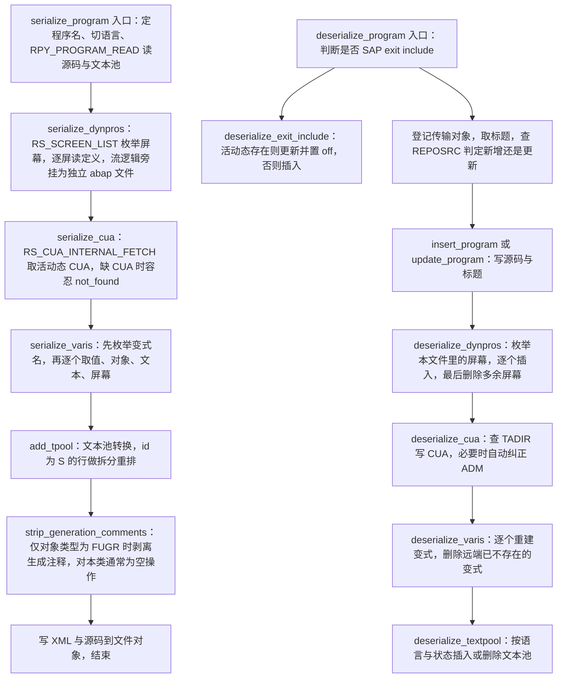
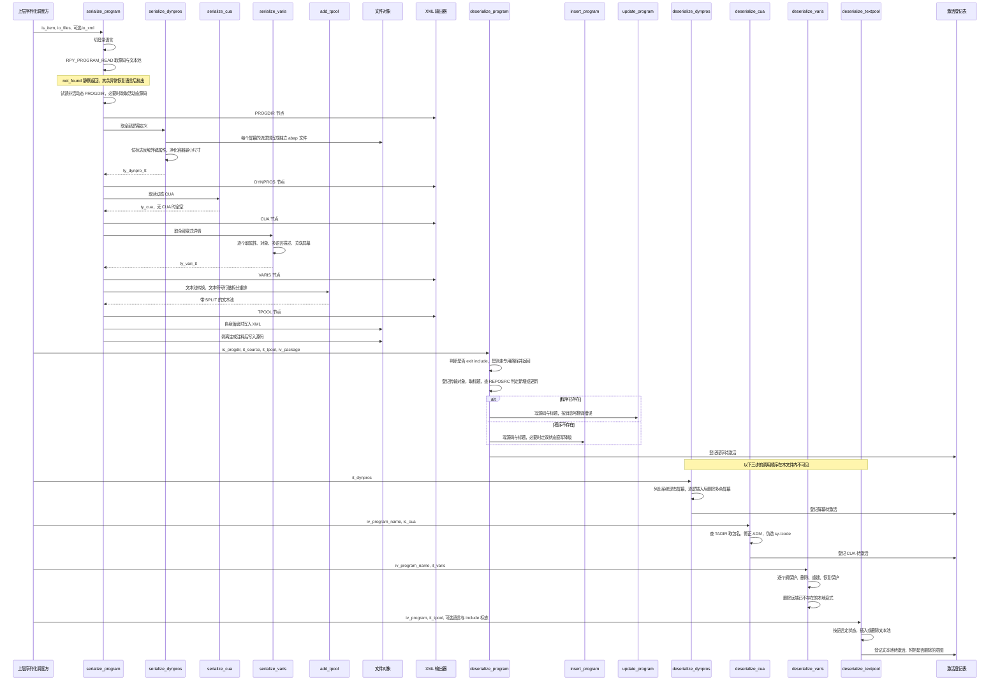

# ZCL_ABAPGIT_OBJECTS_PROGRAM 分析报告

> 分析对象：`Test-source/real/abapGit__abapGit__zcl_abapgit_objects_program.clas.abap`（1597 行，全局类 `ZCL_ABAPGIT_OBJECTS_PROGRAM` 的完整定义段 + 实现段）
> 报告视角：代码 onboarding 走读，按真实调用链展开
> 所属项目：abapGit —— 把 SAP 里的程序对象序列化进 Git、反过来从 Git 还原回 SAP 的开源版本管理框架

---

## 一、程序定位与业务背景

### 1.1 这段代码在解决什么问题

先说清楚它**不是**什么：它不是报表，不做业务过账，不生成屏幕，不画 ALV，也**不负责事务申请、不负责锁、不负责激活**。

它是一个**双向搬运工**，而且是 abapGit 里最重的一个搬运工。因为"一个 ABAP 报表程序"在 SAP 里的物理存在远远不止源码那一坨文本：

| 子对象 | 存在哪 | 谁负责（abapGit 里的分工） |
|---|---|---|
| 程序属性（PROGDIR：程序名、类型、作者、状态、UCCHECK 等） | `REPOSRC` / `TRDIR` | 本类的 `insert_program` / `update_program` |
| 源码 | `REPOSRC` 的分页文本 | 本类 `serialize_program` / `update_program` |
| 文本元素 / 文本符号（Textpool） | `TEXTPOOL` | 本类 `serialize_program` + `deserialize_textpool` |
| 屏幕（Screen，含流逻辑、字段属性、容器） | `D020S` / `D021S` / `RPY_DYFATC` 一族 | 本类 `serialize_dynpros` / `deserialize_dynpros` |
| CUA（GUI 状态、标题、菜单、按钮、变式屏幕） | `RSMPE_*` 一族 | 本类 `serialize_cua` / `deserialize_cua` |
| 变式（Variant，含值、屏幕、文本） | `VARID` / `VARANZ` / `RSL` / `RSVARKEY` 一族 | 本类 `serialize_varis` / `deserialize_varis` |

Git 只认识文本。所以 abapGit 面临的真正问题是：**把这五类结构化数据，压成"能进 Git 的纯文本"，并且能在另一台系统上原样还原**。这就是本类的全部使命。

它刻意不做的事同样重要：

| 它做的事 | 它刻意不做的事 |
|---|---|
| 读/写 SAP 标准 FM 与 DDIC 表，把程序"打包成 XML + 若干 .abap 片段" | 不做语法检查、不做代码格式化（只做了一处生成注释剥离） |
| 决定每个子对象该用哪条 FM 路径（原生 dynpro vs 传统 dynpro、当前语言 vs 主语言） | 不决定要不要做；做不做由上层的对象注册表决定 |
| 记录"哪些对象待激活" | 不执行激活——激活由 `zcl_abapgit_objects_activation` 统一批量做 |
| 判断能否安全修改（三个 `is_*_locked`） | 不自己上锁；锁由 `exists_a_lock_entry_for` 查询、由上层获取 |

一句话设计范式定性：

> **"双向往返适配器（Bidirectional Serialization Adapter）"—— 上层只说"把这个程序导出 / 还原"，本类负责把 SAP 的多张物理表与十几个 FM 拼装成一份可 diff 的文本；副作用（待激活对象、语言切换、锁检查）全部登记到公共设施上，自己不做主。**

### 1.2 为什么值得做成一个类，而不是一堆 FORM

三个理由，按重要性排：

1. **状态是多入口的。** 一个程序对象的数据散在 5 组物理表里，导出和还原各自需要一个"当前对象是谁 / 当前语言是哪个 / 文件对象在哪"的上下文。这些上下文（`ms_item`、`mv_language`、`mo_files`、`mo_i18n_params`）继承自 `zcl_abapgit_objects_super`，把它们放在子类里比放进函数组全局更自然，也让"这个类只服务于一个对象实例"这件事在类型上成立。
2. **FFI（SAP 标准 FM）有版本差异，必须集中兜底。** 代码里到处是同一个动作：`CALL FUNCTION '某个 FM' ... CATCH cx_sy_dyn_call_param_not_found.` 然后用**少几个参数**再调一次——因为目标系统的补丁级别可能没有那个新参数（源码注释写得很直白：`" suppress parameters do not exist in older releases"`、`" does not exist on lower releases"`）。这种"低版本降级调用"如果没有一个统一的位置，就会散落到几十个方法里，现在的样子已经接近这个最坏情况了（见 `delete_vari` 与 `insert_program` 两处近乎复制）。
3. **可测性的形状对了。** 方法粒度小、输入输出都是结构体与内表、没有 UI 依赖，`serialize_dynpros( iv_program_name )` 返回一张 `ty_dynpro_tt` 这种形状可以直接写 ABAP Unit。真正难测的部分（依赖 SAP 内部 FM 与内存）被挡在 `get_program_title` 这一个方法里——这已经是相当好的隔离。

代价也在第 2 条上：`insert_program` 与 `delete_vari` 各自手写了一遍 try/catch 降级，而不是有一个"兼容调用"的辅助方法。

### 1.3 依赖清单（读这段代码前必须知道的地形）

本文件里出现的**全部**外部依赖，按"能不能在本文件内看懂"分类：

```
继承自 zcl_abapgit_objects_super（本文件不可见，需 SE24 核实）
  ms_item     TYPE zif_abapgit_definitions=>ty_item   当前正在处理的对象（obj_type / obj_name / 等）
  mv_language                                     当前登录语言上下文
  mo_files    REF TO zcl_abapgit_objects_files      旁挂 .abap 文件的读写器
  mo_i18n_params                                  语言过滤参数提供者
  mo_xml / mo_files 的 add_abap / read_abap       屏幕流逻辑的旁挂文件通道
  exists_a_lock_entry_for( )                       锁查询入口

全局类（本文件不可见，需 SE24 核实）
  zcl_abapgit_factory=>get_cts_api( )              传输请求 / CTS API
  zcl_abapgit_factory=>get_sap_report( )           PROGDIR / 源码的读写门面
  zcl_abapgit_activation（实际调用名 zcl_abapgit_objects_activation=>add( )）
                                                   待激活对象登记表
  zcl_abapgit_language=>set_current_language / restore_login_language
                                                   登录语言切换与还原
  zcl_abapgit_xml_output                           XML 输出器

异常类
  zcx_abapgit_exception                            统一异常（raise / raise_t100）
  cx_sy_dyn_call_param_not_found                  低版本 FM 降级用的系统异常

接口 / 类型
  zif_abapgit_xml_output                           XML 输出接口
  zif_abapgit_sap_report=>ty_progdir               PROGDIR 结构
  zif_abapgit_definitions=>ty_item                 序列化项目结构
  zif_abapgit_lang_definitions=>ty_tpool_tt         带 SPLIT 的文本池结构（本类自定义）
  zif_abapgit_environment=>ty_system_language_filter 语言范围表

SAP 标准 FM（需 SE37 核实参数与异常语义）
  RPY_PROGRAM_READ / RPY_PROGRAM_INSERT / RPY_INCLUDE_UPDATE
  RS_SCREEN_LIST / RPY_DYNPRO_READ / RPY_DYNPRO_READ_NATIVE
  RPY_DYNPRO_INSERT / RPY_DYNPRO_INSERT_NATIVE / RS_SCRP_DELETE
  RS_CUA_INTERNAL_FETCH / RS_CUA_INTERNAL_WRITE
  RS_ALL_VARIANTS_4_1_REPORT / RS_GET_SCREENS_4_1_VARIANT
  RS_VARIANT_VALUES_TECH_DAT_255 / RS_VARIANT_CONTENTS_255
  RS_CREATE_VARIANT_255 / RS_CHANGE_CREATED_VARIANT_255 / RS_VARIANT_DELETE

直接 SQL 触及的 SAP 表（本类绕过 FM 直写，风险自负）
  TADIR（只读）REPOSRC（只读）VARID（读写，带 FOR UPDATE）VARIT（只读）D021T（直写）

SAP 内部内存（Hack）
  (SAPLSIFP)TTAB                              动态 ASSIGN，直接清空 SAP 标准全局
  sy-tcode                                     deserialize_cua 里被直接改写

声明但在本文件内无调用点的成员
  read_tpool（protected class-method）            见 3.10 与 P3-1
  lv_recreate（deserialize_varis 的局部变量）    见 3.23 与 P1-12
```

### 1.4 这份代码的"年龄"决定了它的读法

abapGit 是社区维护的开源项目（MIT），这份源码里能明显看到三个时期的叠加，读者必须先知道自己面对的是哪一层：

1. **SAPLink 兼容期**（源码注释直接点名：`" if moving code from SAPlink, see https://github.com/abapGit/abapGit/issues/562"`）。SAPLink 是 abapGit 的前身，格式不同。本类里 `uncondense_flow`、`ty_dynpro-spaces` 都是那套格式的遗留物，注释自己写了 `" todo: kept for compatibility, remove after grace period #3680`。
2. **低版本兼容期**。大量 `CATCH cx_sy_dyn_call_param_not_found` 降级调用、`unknown_version` 异常、"字段不存在于所有版本"的 `ASSIGN COMPONENT` 探测。
3. **生产事故修复期**。大量 `#2746`、`#2747`、`#1807`、`note 2159455` 的定点修补，以及 `##SUBRC_OK`、`##FM_SUBRC_OK`、`##NEEDED`、`##WRITE_OK`、`##NO_HANDLER` 这些把 ATC 警告压下去的伪注释。

这三层叠加的结果是：**代码里有很多"看不懂为什么"的分支，而它们的答案都在注释里。** 这是本文件的一个特点，也是它最大的阅读成本——注释在这里不是装饰，是必需品。相应地，注释一旦与代码不符（P0-1）就格外危险。

---

## 二、程序执行流程总览

本类有两个对外入口（`serialize_program` 与 `deserialize_program`），各自是一条主干加若干分支；导出侧的调用顺序由 `serialize_program` 显式编排，还原侧的调用顺序**在本文件内不可见**（见 3.23 与 P3-2），这里按可推断的编排画出。



### 责任链表

| 子程序 | 调用者 | 职责 |
|---|---|---|
| `serialize_program` | 上层序列化调度方（对象注册表 / `zcl_abapgit_objects_super` 模板方法） | 导出总控：定程序名、切登录语言、读源码与文本池、决定是否导出屏幕/CUA/变式、写 XML 与源码 |
| `serialize_dynpros` | `serialize_program`；`is_any_dynpro_locked` | 枚举并读出全部屏幕定义，流逻辑旁挂成独立文件，返回 `ty_dynpro_tt` |
| `serialize_cua` | `serialize_program` | 取活动态 CUA（ADM + 11 张明细表），无 CUA 时容忍 |
| `serialize_varis` | `serialize_program` | 汇总导出全部变式的属性、值、对象、文本与变式屏幕 |
| `get_varis_for_report` | `serialize_varis`、`deserialize_varis` | 按名称白名单枚举程序名下现存的变式名 |
| `get_vari_data` | `serialize_varis` | 取单个变式的 VARID 属性、对象与多语言描述 |
| `get_vari_screens` | `serialize_varis` | 取单个变式关联的屏幕号 |
| `add_tpool` | `serialize_program` | 文本池转成带 SPLIT 的可序列化结构 |
| `read_tpool` | （本文件内无调用者） | `add_tpool` 的逆变换 |
| `strip_generation_comments` | `serialize_program` | 仅对 FUGR 剥离生成头注释 |
| `uncondense_flow` | `deserialize_dynpros` | 按空格表把压缩过的流逻辑右移还原 |
| `deserialize_program` | 上层反序列化调度方 | 还原总控：判定 exit include、登记传输、写源码、更新 PROGDIR、登记激活 |
| `deserialize_exit_include` | `deserialize_program` | SAP exit include 的专用还原路径 |
| `is_exit_include` | `deserialize_program`、`deserialize_exit_include`、`update_program` | 按程序名判是否 SAP exit include |
| `get_program_title` | `deserialize_program`、`deserialize_exit_include` | 从文本池取 'R' 行作为程序标题 |
| `insert_program` | `deserialize_program`、`deserialize_exit_include` | 新增程序；`name_not_allowed` 时走双状态直写降级 |
| `update_program` | `deserialize_program`、`deserialize_exit_include` | 更新已有程序；把 EU510 / EU522 翻译成人话 |
| `deserialize_dynpros` | 还原调度方（本文件内不可见） | 插入全部屏幕，最后删除仓库里没有的多余屏幕 |
| `deserialize_cua` | 还原调度方（本文件内不可见） | 写 CUA，并登记待激活 |
| `auto_correct_cua_adm` | `deserialize_cua` | 从功能/菜单/PF 键反推缺失的 ADM 码 |
| `deserialize_textpool` | 还原调度方（本文件内不可见） | 按语言与状态插入或删除文本池，登记待激活 |
| `deserialize_varis` | 还原调度方（本文件内不可见） | 重建全部变式，删除远端已删除的变式 |
| `create_vari` | `deserialize_varis` | 建变式并回写其对象与文本 |
| `delete_vari` | `deserialize_varis` | 删变式（带低版本降级） |
| `set_vari_protection` | `deserialize_varis` | 临时摘除并恢复变式的保护标志 |
| `is_any_dynpro_locked` | 锁检查模板（本文件内不可见） | 任一屏幕被锁即返回真 |
| `is_cua_locked` | 锁检查模板（本文件内不可见） | CUA 是否被锁 |
| `is_text_locked` | 锁检查模板（本文件内不可见） | 文本池是否被锁 |

下面按这条流程逐个子程序展开。因为方法数量多，本节把每个方法都单独开一个 `###` 小节，重点方法（导出总控、还原总控、屏幕与变式两条链）深挖，样板性方法（两个 tpool 转换、三个锁查询）用较短篇幅带过——但每个方法的三层标签一律不缺。

---

## 三、分组分析

### 3.1 类定义段与全局声明区（`ZCL_ABAPGIT_OBJECTS_PROGRAM` 类定义段）

先把"契约面"读透。这个类的定义段占了全文近两成，里面没有一行可执行逻辑，但它决定了后面所有方法能做什么、不能做什么。分四块看：继承、公开入口、受保护的序列化原语、私有的实现细节。

第一块是继承与可见性骨架：

```abap
CLASS zcl_abapgit_objects_program DEFINITION
  PUBLIC
  INHERITING FROM zcl_abapgit_objects_super
  CREATE PUBLIC .

  PUBLIC SECTION.

    TYPES:
      BEGIN OF ty_cua,
        adm TYPE rsmpe_adm,
        sta TYPE STANDARD TABLE OF rsmpe_stat WITH DEFAULT KEY,
        fun TYPE STANDARD TABLE OF rsmpe_funt WITH DEFAULT KEY,
        men TYPE STANDARD TABLE OF rsmpe_men WITH DEFAULT KEY,
        mtx TYPE STANDARD TABLE OF rsmpe_mnlt WITH DEFAULT KEY,
        act TYPE STANDARD TABLE OF rsmpe_act WITH DEFAULT KEY,
        but TYPE STANDARD TABLE OF rsmpe_but WITH DEFAULT KEY,
        pfk TYPE STANDARD TABLE OF rsmpe_pfk WITH DEFAULT KEY,
        set TYPE STANDARD TABLE OF rsmpe_staf WITH DEFAULT KEY,
        doc TYPE STANDARD TABLE OF rsmpe_atrt WITH DEFAULT KEY,
        tit TYPE STANDARD TABLE OF rsmpe_titt WITH DEFAULT KEY,
        biv TYPE STANDARD TABLE OF rsmpe_buts WITH DEFAULT KEY,
      END OF ty_cua.
```

**做什么** — 声明类头与公开的第一个类型 `ty_cua`：一个 CUA（GUI 界面）的完整快照，1 张 ADM 头表 + 11 张明细内表（状态条、功能、菜单、菜单文本、动作、按钮、PF 键、集合、文档、标题、按钮图像）。每一张都是 `STANDARD TABLE ... WITH DEFAULT KEY`，即标准表 + 默认键。类本身声明为 `PUBLIC`、`CREATE PUBLIC`，并从 `zcl_abapgit_objects_super` 继承。

**为什么** — `ty_cua` 的形状是**为序列化量身定做的**，不是业务模型：它与 `RS_CUA_INTERNAL_FETCH` / `RS_CUA_INTERNAL_WRITE` 的 FM 接口逐字对齐（11 个 TABLES 参数一一对应），所以 `serialize_cua` 里 11 行赋值可以机械直译，反序列化时也只需整表回传。这是"用结构体当 FM 签名的替身"的标准做法，好处是新增一张 CUA 明细表只需在类型里加一个组件、在 FM 调用里加一行，编译器会把遗漏点出来。`ty_cua` 放在 `PUBLIC SECTION` 而不是 `PROTECTED`，说明它是**对外承诺的格式契约**——外部读 XML 的消费方可能依赖它。

**风险与改进** — 三处：

1. **`WITH DEFAULT KEY` 是这份代码里最值得商榷的一个选择。** 对 `rsmpe_*` 这类行结构，`DEFAULT KEY` 取的是**非数值、非字符型的第一个字段**——如果恰好落在一个低选择性的字段上，主键就退化成"大部分行相同"。后果是：`ASSIGNING` 循环正常，但 `DELETE`/`READ ... WITH KEY`/`MODIFY` 会退化成全表线性扫描。更隐蔽的是它对 `INSERT INTO TABLE` 的语义影响：默认键表按非键部分去重插入，重复行可能被静默丢弃而不是报错。本类里 `ty_cua` 的 11 张表只被整表赋值与整表回传，没有按行操作，所以**当前不暴露**；但它作为 `PUBLIC` 类型一旦被外部按行操作，问题就会浮现。建议改为显式主键（各 `rsmpe_*` 行的 `TRKY`/`CODE` 之类字段，需在 SE11 核实）。
2. **`ty_cua` 定义在 `PUBLIC SECTION` 但语义上是内部快照格式。** 外部若直接依赖它，未来改 XML 结构就会变成破坏性变更。至少加一句注释说明"此结构与 CUA XML 的 schema 一一对应，改动需同步 XML 格式版本"。
3. **`ty_cua` 缺少 `adm` 之外的 ADM 相关分量**：`RS_CUA_INTERNAL_FETCH` 的 `IMPORTING` 只有 `adm`，这一点与类型一致，属于**正确的对齐**——这里没有问题要记。

接下来是公开入口：

```abap
    METHODS serialize_program
      IMPORTING
        !io_xml     TYPE REF TO zif_abapgit_xml_output OPTIONAL
        !is_item    TYPE zif_abapgit_definitions=>ty_item
        !io_files   TYPE REF TO zcl_abapgit_objects_files
        !iv_program TYPE syrepid OPTIONAL
        !iv_extra   TYPE clike OPTIONAL
      RAISING
        zcx_abapgit_exception.
    METHODS deserialize_program
      IMPORTING
        !is_progdir TYPE zif_abapgit_sap_report=>ty_progdir
        !it_source  TYPE abaptxt255_tab
        !it_tpool   TYPE textpool_table
        !iv_package TYPE devclass
      RAISING
        zcx_abapgit_exception.
```

**做什么** — 声明两个对外方法：`serialize_program` 接受一个待序列化的对象 `is_item`、一个文件对象 `io_files`、可选的 XML 汇入口 `io_xml`、可选的程序名覆盖 `iv_program` 与可选的文件名后缀 `iv_extra`，返回无（结果写进文件）；`deserialize_program` 接受 PROGDIR 结构、源码内表、文本池与包名，无返回。两者都声明 `RAISING zcx_abapgit_exception`。

**为什么** — 导出入口把"XML 汇入口"做成可选参数是个有经验的设计：`io_xml IS BOUND` 时表示"我已经在给一个更大的 XML 追加内容"（函数组的多个 include 共用一个 XML 就是这种场景），此时本方法只往里加节点、不自己落盘；不 bound 时自己 `CREATE OBJECT` 一个输出器再落盘。这一对 `IF` 把"单文件"与"多合一"两种形态统一在一个方法里，避免了复制整个方法。`iv_program` 与 `iv_extra` 同理，都是为"一次导出多个相关程序"预留的钩子。

**风险与改进** — 两处：

1. **`is_item` 与 `io_files` 都是必填参数，但方法内部几乎不用 `is_item`。** 全方法只用了 `is_item-obj_name` 一次（取程序名），其余全靠继承来的 `ms_item`；而 `io_files` 只在"自己落盘"分支里用，`serialize_dynpros` 里写屏幕流逻辑用的是继承来的 `mo_files`。也就是说**同一个方法里并存两套"当前对象"与两套"文件对象"**，而方法签名承诺的是参数那一套。见 3.2 与 P1-10：调用方传了一个与 `mo_files` 不同的 `io_files` 时，屏幕流逻辑会写到另一个目录。
2. **`deserialize_program` 的入参里没有程序名也没有语言。** 程序名从 `is_progdir-name` 取（可以），但语言**完全缺失**——文本池由调用方以 `textpool_table` 整表传入，语言信息丢失在调用方那边；而同类的 `deserialize_textpool` 反而**有** `iv_language` 参数。同一个类里两条语言路径的参数策略不一致，见 3.22 与 P1-4。

第二块是受保护的序列化原语声明（只列签名，实现见后文）：

```abap
  PROTECTED SECTION.

    TYPES:
      ty_spaces_tt TYPE STANDARD TABLE OF i WITH DEFAULT KEY .
    TYPES:
      BEGIN OF ty_dynpro,
        header     TYPE rpy_dyhead,
        containers TYPE dycatt_tab,
        fields     TYPE dyfatc_tab,
        flow_logic TYPE swydyflow,
        spaces     TYPE ty_spaces_tt,
        nat_header TYPE d020s,
        nat_fields TYPE STANDARD TABLE OF d021s WITH DEFAULT KEY,
        nat_texts  TYPE STANDARD TABLE OF d021t WITH DEFAULT KEY,
      END OF ty_dynpro .
    TYPES:
      ty_dynpro_tt TYPE STANDARD TABLE OF ty_dynpro WITH DEFAULT KEY .
```

**做什么** — 声明 `ty_dynpro`（一个屏幕的完整快照，9 个组件）与 `ty_spaces_tt`（每行流逻辑对应的前导空格数）。

**为什么** — `ty_dynpro` 里同时存在**两套并存的屏幕表示**：一套是传统 dynpro（`header` + `containers` + `fields`，来自 `RPY_DYNPRO_READ`），一套是原生 dynpro（`nat_header` + `nat_fields` + `nat_texts`，来自 `RPY_DYNPRO_READ_NATIVE` / `D020S` / `D021S`）。这对应 SAP 里两条真实的屏幕技术路线，两者的字段属性编码完全不同（后面会看到为此专门去解 `flg1`/`flg3` 位）。设计者选择"两个都放进同一个结构，用 `nat_header` 是否初始来隐式区分"，省掉了一个联合类型，代价是**结构里永远有一半是垃圾值**。

**风险与改进** — 三处：

1. **`ty_dynpro_tt` 用 `WITH DEFAULT KEY`，而它的结构包含 9 个大组件。** `ty_dynpro` 里没有"唯一键"性质的字段（`header` 是 `rpy_dyhead`，理论上 `program`+`screen` 才是键，但那是复合的）。默认键很可能落到 `header` 的第一个非字符/非数值字段上，实际效果约等于"非键表"。本类对 `rt_dynpro` 只做 `APPEND`、不回查，所以不暴露；但 `is_any_dynpro_locked` 拿了 `lt_dynpros` 之后也是顺序 `LOOP`，同样不依赖键。**换成带显式主键（`header-program` + `header-screen`）的排序表，或至少用 `SORTED`，会同时解决 XML 顺序稳定性和回查效率两个问题。**
2. **`spaces` 与 `flow_logic` 两个组件在序列化侧永不赋值。** `serialize_dynpros` 把流逻辑写到 `mo_files->add_abap( )` 而不是填这两个组件，`spaces` 则完全没有写入点。因此仓库里的 XML 永远带着一个空的 `FLOW_LOGIC` 和一个空的 `SPACES`。这不是 bug，但它是"这份类型曾经服务于 SAPLink 格式"的化石，见 3.12 与 P2-4。
3. **`ty_dynpro` 的 `nat_fields` / `nat_texts` 用 `WITH DEFAULT KEY`**，与 3.1 第一块同样的顾虑；`nat_texts` 是 `d021t`，其主键是 `prog`+`dynr`+（语言相关的文本标识），默认键很可能不是它。

第三块与第四块是私有常量与方法声明：

```abap
  PRIVATE SECTION.

    CONSTANTS:
      BEGIN OF c_state,
        active   TYPE r3state VALUE 'A',
        inactive TYPE r3state VALUE 'I',
        off      TYPE r3state VALUE '',
      END OF c_state.

    CONSTANTS c_native_dynpro TYPE c LENGTH 2 VALUE 'IN'.

    CONSTANTS c_sysvari_clnt        TYPE mandt      VALUE '000'.
    CONSTANTS c_sysvari_pattern_sap TYPE c LENGTH 5 VALUE 'SAP&*'.
    CONSTANTS c_sysvari_pattern_cus TYPE c LENGTH 5 VALUE 'CUS&*'.
```

**做什么** — 声明五个常量：屏幕/源码状态的三个取值（`A` 活动、`I` 非活动、空串＝置 off）、原生 dynpro 的类型标识 `IN`、变式所属客户端 `000`，以及两个变式名白名单模式 `SAP&*` 与 `CUS&*`。

**为什么** — `c_state` 这组把"用空串表示第三种状态"这个反直觉的做法集中到了一个常量组里，比在代码里散落 `'A'` / `'I'` / `''` 好得多；`deserialize_textpool` 的注释 `"Translations are always active"` 之所以读得懂，正是因为有 `c_state-active` 这个名字在。`c_native_dynpro` 用 `CA`（字符包含）而不是 `=` 比较，因为 `RPY_DYHEAD-TYPE` 可能带修饰位（源码里确实写的是 `CA c_native_dynpro`），这是对的。`c_sysvari_pattern_*` 里的 `&` 是 ABAP 内部字段名模式里的客户端占位符，用来匹配"SAP 客户端的变式"和"客户自定义的变式"两类命名前缀——这个技巧很省事。

**风险与改进** — 两处，都是"这个常量比它看起来更重要"：

1. **`c_sysvari_clnt` 把客户端硬编码成 `'000'`，并且被用在**直接 SQL** 上（`varit` 的 `SELECT ... CLIENT SPECIFIED`、`varid` 的 `SELECT`/`UPDATE`），而不是用在 FM 上。**而同一批变式操作里的 `RS_CREATE_VARIANT_255` / `RS_VARIANT_DELETE` / `RS_VARIANT_CONTENTS_255` 走的是 FM，FM 操作的是当前客户端。** 在 000 客户端的系统里两者恰好一致；在别的客户端上就会出现"变式内容按 000 的过滤条件导出、保护标志改在 000、而创建/删除发生在当前客户端"的错位。这是本类里最隐蔽的一处跨层不一致，见 3.26 与 P0-4。
2. **`c_sysvari_pattern_sap` / `c_sysvari_pattern_cus` 是一条隐式契约，且没有任何注释。** 它同时决定了"哪些变式会被导出"和"哪些变式会在导入时被当作远端已删除而删掉"（见 3.23）。命名不符合 `SAP…` / `CUS…` 前缀的变式既不会被导出，也不会被删除——这在数据上是安全的，但意味着用户的本地变式静默不参与版本管理；反过来，任何碰巧匹配前缀的变式都会在 pull 时被删掉。这种后果需要写进注释或配置项，而不是留在一行无注释的常量里。

### 3.2 子程序类型 `serialize_program`（导出总控）

这是本类最重要的方法之一，分七步：定程序名、切语言读源码与文本池、补活动态源码、建 XML 器、按程序类型导出屏幕/CUA/变式、清理文本池、写文件。它是唯一有"总体编排"职责的方法。

#### ① 定程序名与切登录语言

```abap
    IF iv_program IS INITIAL.
      lv_program_name = is_item-obj_name.
    ELSE.
      lv_program_name = iv_program.
    ENDIF.

    zcl_abapgit_language=>set_current_language( mv_language ).
```

**做什么** — `iv_program` 为空就用当前对象的名称，否则用调用方覆盖的名字，结果放进局部变量 `lv_program_name`；随后把当前登录语言切到 `mv_language`，让后面的 SAP 标准 FM 按正确的语言返回文本。

**为什么** — `iv_program` 的存在是因为一次导出可能要处理"与当前对象不同的程序"（例如函数组的入口程序与 include 关系），所以允许覆盖；但默认值取 `is_item-obj_name` 让最常见的一步到位。切语言这一步很关键：SAP 标准 FM（尤其是屏幕、CUA、文本池相关）读的是**当前登录语言**下的数据，不切语言就会导出成导出者个人的语言版本——这类 bug 在 abapGit 早期很常见。

**风险与改进** — 两处：

1. **`set_current_language` 与后面的 `restore_login_language` 之间的所有代码都在"语言已改"的状态下运行，而这些代码里可能抛出 `zcx_abapgit_exception`。** 源码里确实在异常路径上先调了 `restore_login_language( )` 再 `raise`，这一点是对的；但**这两句之间的其他调用（比如后面 `serialize_dynpros` 的 FM 出错）会不会让语言残留，取决于上层有没有统一的清理**。整个类里没有 `TRY ... CLEANUP` 或统一出口来兜底，`update_program` 里也是同样的手工配对。这是全类范围内最脆弱的"配对式资源管理"，见 P1-7。
2. **`lv_program_name` 用参数 `is_item-obj_name`，而下面 `serialize_dynpros` 里用的是 `iv_program`（方法自己的参数）、`deserialize_dynpros` 里用的是 `ms_item-obj_name`。** 三条路径取程序名的来源各不相同，本方法虽然把解析结果统一到 `lv_program_name` 并往下传，但 `mo_files->read_abap( iv_extra = 'screen_' && ls_dynpro-header-screen )` 这类**只拼屏幕号、不带程序名**的文件名约定，使得"同一个屏幕在不同程序下同名"这件事没有在文件名层面被区分——这一点依赖旁挂文件的作用域是"单个对象"，需要核实。

#### ② 读源码与文本池

```abap
    CALL FUNCTION 'RPY_PROGRAM_READ'
      EXPORTING
        program_name     = lv_program_name
        with_includelist = abap_false
        with_lowercase   = abap_true
      TABLES
        source_extended  = lt_source
        textelements     = lt_tpool
      EXCEPTIONS
        cancelled        = 1
        not_found        = 2
        permission_error = 3
        OTHERS           = 4.

    IF sy-subrc = 2.
      zcl_abapgit_language=>restore_login_language( ).
      RETURN.
    ELSEIF sy-subrc <> 0.
      zcl_abapgit_language=>restore_login_language( ).
      zcx_abapgit_exception=>raise_t100( ).
    ENDIF.

    zcl_abapgit_language=>restore_login_language( ).
```

**做什么** — 调 `RPY_PROGRAM_READ` 取程序源码（分页的 `abaptxt255` 内表）与文本元素（`TEXTPOOL`）。三个参数值得注意：`with_includelist = abap_false` 表示不展开 include（include 单独作为对象导出），`with_lowercase = abap_true` 表示保留小写（ABAP 大小写不敏感，但源码要 diff 就不能丢）。异常分支：`not_found`（程序不存在）**静默返回**——不报错、不产出对象；其余错误恢复语言后抛 `zcx_abapgit_exception`。

**为什么** — 区分"程序不存在"与"其他错误"是必要的：`not_found` 在版本管理的语义下很常见（仓库里有这个文件但目标系统还没这个程序，或者反过来），把它当错误会让一次正常的 pull 失败；而 `permission_error` 则必须让用户知道。`restore_login_language( )` 在三个出口上都出现，是刻意的配对。

**风险与改进** — 三处：

1. **`with_lowercase = abap_true` 有一个真实的对称性要求：还原侧必须用同样的读取约定，否则 diff 噪声。** 源码通过 `update_program` 的 `RPY_INCLUDE_UPDATE` 写入，参数里没有 `with_lowercase` 这个概念——写入侧是否保留小写取决于该 FM 的行为（需在 SE37 核实）。如果读取保留、写入不保留（或反之），同一份代码在两台系统间往返会产生逐行变化。这是"导出侧为了 diff 友好做的选择，必须在导入侧被对齐"的典型。
2. **`sy-subrc = 2` 的静默 `RETURN` 会让上层拿到一个"什么都没发生"的结果。** 如果上层的契约是"调用 `serialize_program` 就一定会产出文件"，那么目标系统里程序不存在时，这个对象就会在 Git 里"保持不变"而不是被删除——用户会看到一个幽灵状态。**正确的做法是让上层区分"对象不存在（应从仓库删除）"与"对象存在但无法导出"**。需要核实上层如何处理这个 `RETURN`。
3. **`with_includelist = abap_false` 意味着 include 不在本次导出范围内。** 这要求上层把 include 注册成独立对象，否则 include 会丢。需核实对象注册表里的对象类型登记。

#### ③ 补活动态源码（TRY 块里的一次死赋值）

```abap
    TRY.
        " Raises exception if inactive version does not exist
        ls_progdir = li_report->read_progdir(
          iv_name  = lv_program_name
          iv_state = c_state-inactive ).

        " Explicitly request active source code
        lt_source = li_report->read_report(
          iv_name  = lv_program_name
          iv_state = c_state-active ).
      CATCH zcx_abapgit_exception ##NO_HANDLER.
    ENDTRY.

    ls_progdir = li_report->read_progdir(
      iv_name  = lv_program_name
      iv_state = c_state-active ).

    clear_abap_language_version( CHANGING cv_abap_language_version = ls_progdir-uccheck ).
```

**做什么** — 先试读**非活动态**的 PROGDIR（源码注释明说这一步"没有非活动版本就抛异常"），拿到后用 `read_report( iv_state = c_state-active )` 显式取活动态源码覆盖 `lt_source`。TRY 块被 CATCH 静默吞掉——**目的不是用 `ls_progdir`，而是借用"非活动版本存在"这个信号来判断要不要覆盖源码**。块外无条件再读一次活动态 PROGDIR，然后调 `clear_abap_language_version` 清掉 `uccheck`（ABAP 语言版本标记，避免低版本系统遇到高版本语法）。

**为什么** — 这里的业务意图值得说清楚：`RPY_PROGRAM_READ` 在存在非活动版本时**不返回活动版本**的源码（源码注释：`" If inactive version exists, then RPY_PROGRAM_READ does not return the active code`）。但 abapGit 要导出的是"开发者实际在编辑的那一份"，也就是**优先非活动态、其次活动态**。所以先用"试读非活动态 PROGDIR"当作探测，再用 `read_report` 显式拉活动态源码——两个动作合起来实现了"存在未激活修改就导未激活版本"。`clear_abap_language_version` 则是跨版本兼容的必要动作：把导出物里的语言版本标记归零，让目标系统按自己的语言版本重新处理。

**风险与改进** — 四处，第三处是本方法最值得改的地方：

1. **`##NO_HANDLER` + 空 CATCH 体，把"读 PROGDIR 失败"和"没有非活动版本"这两种完全不同的情况压成了同一个结果。** 后者是正常路径，前者是真异常。如果 `read_progdir` 因为权限不足或传输组织问题抛异常，用户会得到一份缺了非活动修改的导出物，而没有任何提示。
2. **`read_report( iv_state = c_state-active )` 被调用了两次语义上相同的读取**（第二次在 3.13 的序列化路径里没有，但 TRY 块里这一次是多余的）：既然随后无条件执行了 `read_progdir( iv_state = c_state-active )`，那 TRY 块里对 `ls_progdir` 的赋值就是**死赋值**——它要么被覆盖，要么在 CATCH 之后从未被使用。读代码的人会以为 TRY 块的 PROGDIR 有用。正确形状是让 TRY 块只做一个布尔探测（例如一个 `lv_has_inactive` 标志），不写 `ls_progdir`。见 P1-9。
3. **`clear_abap_language_version` 的入参类型与 `uccheck` 的类型需要核对。** `zif_abapgit_sap_report=>ty_progdir` 的 `uccheck` 字段承载的是"ABAP 语言版本 / 程序检查标记"，这个常量的语义在不同系统上并不完全一致（源码注释 `uccheck = is_progdir-uccheck " does not exist on lower releases` 本身就说明了版本差异）。清零它是对的（导出物不该携带目标系统无关的版本标记），但**清零之后依赖它做判断的下游会怎么变**，需要核实。
4. **`lt_source` 被 `read_report` 整体覆盖。** 如果 `read_report` 返回的是活动态源码而 `RPY_PROGRAM_READ` 返回的是非活动态源码（存在非活动版本时），那么"优先非活动态"的意图其实只对 PROGDIR 成立、对源码不成立——源码被强行切回活动态。这与 3.13 里"导出活动态源码"的注释一致，但和"导出开发者正在编辑的那一份"的直觉相反。需要核实 `read_report` 在存在非活动版本时的默认行为（需在 SE24 核实 `zif_abapgit_sap_report` 实现）。

#### ④ 建立 XML 输出器

```abap
    IF io_xml IS BOUND.
      li_xml = io_xml.
    ELSE.
      CREATE OBJECT li_xml TYPE zcl_abapgit_xml_output.
    ENDIF.
```

**做什么** — 决定 XML 写到哪儿：调用方给了 `io_xml` 就往调用方的输出器里追加（多合一场景），否则自己建一个。

**为什么** — 这一对 `IF` 是"可组合导出"的核心技巧：函数组类导出一个 FUGR 时，需要把主程序和几十个 include 的 XML 合并到同一份文件里，于是它先建一个输出器，然后逐个调用子对象的 `serialize_program( io_xml = li_xml )`，最后自己落盘。这个模式让"谁负责落盘"成为一个显式选择而不是隐式约定。

**风险与改进** — 一处：

- **`io_files` 仍然是必填参数，但这个分支里完全没用到它。** 也就是说"必须传一个文件对象"这条契约，在"由调用方汇入 XML"的模式下是空约束；反过来在另一模式下，`serialize_dynpros` 用的却是继承的 `mo_files`，而不是传进来的 `io_files`。**同一个对象在一次导出里有两个文件出口**，这是 P1-10 的根源。正确形状是二者统一：要么去掉参数、全部用 `mo_files`；要么把 `serialize_dynpros` 改成显式接收文件对象。

#### ⑤ 按程序类型导出屏幕、CUA 与变式

```abap
    li_xml->add( iv_name = 'PROGDIR'
                 ig_data = ls_progdir ).
    IF ls_progdir-subc = '1' OR ls_progdir-subc = 'M'.
      lt_dynpros = serialize_dynpros( lv_program_name ).
      li_xml->add( iv_name = 'DYNPROS'
                   ig_data = lt_dynpros ).

      ls_cua = serialize_cua( lv_program_name ).
      li_xml->add( iv_name = 'CUA'
                   ig_data = ls_cua ).

      lt_varis = serialize_varis( lv_program_name ).
      li_xml->add( iv_name = 'VARIS'
                   ig_data = lt_varis ).
    ENDIF.
```

**做什么** — 先无条件写 `PROGDIR` 节点，然后判断 `ls_progdir-subc`：等于 `'1'` 或 `'M'` 时，额外导出屏幕（`DYNPROS`）、CUA（`CUA`）与变式（`VARIS`），各写一个 XML 节点。

**为什么** — `SUBC` 是程序类型字段，只有可执行程序与模块池这类"用户界面型程序"才有屏幕和变式；包含（include）、函数组入口这类对象没有需要单独管理的界面资源，跳过它们能显著减少无谓的 FM 调用。条件只判两个取值而不是"排除若干取值"，是**白名单式**的写法——新增一种程序类型时不会被意外地拉进这条昂贵路径，这个选择是对的。

**风险与改进** — 三处：

1. **`SUBC` 的域值语义需要核实后再定论。** 这里只覆盖 `'1'` 与 `'M'` 两种类型，**具体这两类分别对应哪些程序类型、是否遗漏了需要处理屏幕的类型（比如带屏幕的函数组入口、或某种生成类），需在 SE11 核实 `PROGDIR-SUBC` 的域值与 `RPY_PROGRAM_READ` 对该字段的赋值规则**。本报告不对具体码值下断言。可以确定的是：还原侧 `deserialize_program` **完全没有对应的条件判断**——也就是说屏幕/CUA/变式的还原是否受同样约束，取决于调用方（本文件不可见）。
2. **三个子导出之间没有失败隔离。** `serialize_dynpros` 抛异常时，CUA 与变式一个都不会导出，但 XML 里 `PROGDIR` 已经写进去了——如果 `io_xml IS BOUND`（调用方汇入），调用方手上就有一份**只写了一半的 XML**，而上层并不知道。至少应该把 `PROGDIR` 的写入放在三个子导出全部成功之后，或者让 `add( )` 具备事务语义。
3. **三次 `add( )` 的顺序即 XML 内的元素顺序。** 这是 diff 友好性的关键（顺序稳定 → Git diff 干净），当前顺序固定，好。`DYNPROS` 内部的顺序依赖 `serialize_dynpros` 的排序（它 `SORT lt_d020s BY dnum ASCENDING`），也稳定。

#### ⑥ 清理文本池并转换

```abap
    READ TABLE lt_tpool WITH KEY id = 'R' INTO ls_tpool.
    IF sy-subrc = 0 AND ls_tpool-key = '' AND ls_tpool-length = 0.
      DELETE lt_tpool INDEX sy-tabix.
    ENDIF.

    li_xml->add( iv_name = 'TPOOL'
                 ig_data = add_tpool( lt_tpool ) ).
```

**做什么** — 在文本池里找 `id = 'R'`（报表标题）的那一行；**只有当它的 `key` 为空且 `length` 为 0 时**才把这行删掉。然后把整张文本池交给 `add_tpool` 转换后写入 `TPOOL` 节点。

**为什么** — 意图是去掉"空标题"这一行噪声。程序标题在 PROGDIR 里已经有一份（`insert_program` / `update_program` 的 `title_string`），文本池里那条 'R' 行是同一个信息的第二份副本；空的那条（没有任何标题文本）在 XML 里是纯噪声，删掉让 diff 更干净。用 `READ TABLE ... WITH KEY id = 'R'` 而不是 `loops`，是 O(1) 的表头查找，选得对。

**风险与改进** — 三处：

1. **`key = ''` 这个条件对 `KEY` 字段的语义假设没有写在任何地方。** 文本池的 `KEY` 字段承载的是"文本元素的键"（对文本符号而言是符号名，对标题而言通常为空）。当前逻辑的含义是"这一行既没有键、长度也是 0 → 是条空壳，删掉"。**如果 `RPY_PROGRAM_READ` 返回的 `KEY` 字段填的是别的值（例如 `' '`、程序名、或某个固定标记），这个条件就永远不成立，这段清理就成了空操作。** 需在真实导出上核实 `RPY_PROGRAM_READ` 对 `id='R'` 行各字段的填充规则。
2. **只删了第一条匹配。** `WITH KEY id = 'R'` 在默认键表上是表头查找，命中即返回；如果文本池里有多条 `id = 'R'`（不同 `KEY` 的多条标题行在某些文本池实现里是可能的，需核实），其余的仍会进 XML。
3. **`DELETE lt_tpool INDEX sy-tabix` 依赖紧邻的 `READ TABLE` 设置的 `sy-tabix`。** 这是正确的用法，但把 `READ`/`DELETE` 拆成两段、并靠 `sy-tabix` 隐式传递位置，不如 `DELETE lt_tpool WITH KEY id = 'R'` 一句来得直白（后者在多匹配时行为不同，需要权衡）。属于可读性而非正确性问题。

#### ⑦ 剥离生成注释并写文件

```abap
    IF NOT io_xml IS BOUND.
      io_files->add_xml( iv_extra = iv_extra
                         ii_xml   = li_xml ).
    ENDIF.

    strip_generation_comments( CHANGING ct_source = lt_source ).

    io_files->add_abap( iv_extra = iv_extra
                        it_abap  = lt_source ).
```

**做什么** — 自己落盘时才把 XML 交给文件对象（`add_xml`）；随后调 `strip_generation_comments` 就地删改源码，最后把源码写成一个 `.abap` 文件（`add_abap`）。

**为什么** — 落盘放在 `strip_generation_comments` **之前**是刻意的：XML 与源码是两个文件，剥离只影响源码，与 XML 无关。`iv_extra` 作为文件名后缀传给两个写入方法，使一次导出可以产出 `NAME.xml` / `NAME.abap` / `NAME_scr0100.abap` 这样一组同前缀的文件——旁挂文件靠前缀区分归属。

**风险与改进** — 两处：

1. **文件写入顺序是"XML 先、源码后"。** 如果源码写失败（比如文件对象内部抛异常），磁盘上会留下一份孤立的 XML，而上层拿到的异常无法区分"什么都没写"与"写了一半"。需要核实 `zcl_abapgit_objects_files` 的写入是否原子（是否先写临时文件再改名）。这类问题在版本管理工具里特别难受，因为用户看到的是"Git 里多了一个残缺的对象"。
2. **`strip_generation_comments` 对本类几乎恒为空操作**（它第一句就判 `ms_item-obj_type <> 'FUGR'` 就返回）。也就是说**这个方法调用对 PROG/INCL 类对象是纯粹的样板开销**，且真正需要它的类（函数组）另有其人。见 3.11 与 P2-5。这一句更值得商榷的是：它作为 `PROTECTED` 方法放在本类、被本类调用，而按对象类型分支——这暗示本类历史上可能也服务于 FUGR，需核实对象注册表。

### 3.3 子程序类型 `serialize_dynpros`（屏幕导出）

屏幕导出是这个类里最长的方法，也是最容易出问题的一个。它要处理 SAP 的两条屏幕技术路线，两套字段编码，还要为一批历史缺陷打补丁。分五步。

#### ① 声明与常量

```abap
    DATA: ls_header               TYPE rpy_dyhead,
          lt_containers           TYPE dycatt_tab,
          lt_fields_to_containers TYPE dyfatc_tab,
          lt_flow_logic           TYPE swydyflow,
          lt_d020s                TYPE TABLE OF d020s,
          lt_texts                TYPE TABLE OF d021t,
          lt_fieldlist_int        TYPE TABLE OF d021s. "internal format
```

**做什么** — 声明七个工作内表：屏幕头、容器、字段到容器的映射、流逻辑、`D020S` 屏幕清单、原生字段文本、**原生格式的字段表**（注释标为 `"internal format`）。

**为什么** — `lt_fields_to_containers` 与 `lt_fieldlist_int` **同时存在**是本方法的理解钥匙：`RPY_DYNPRO_READ` 返回的是**转换后的格式**（`rpy_dyfatc`，带 `FROM_DICT` 这类 DDIC 友好标志），而 `RPY_DYNPRO_READ_NATIVE` 返回的是**SAP 内部位标志格式**（`d021s`，用 `FLG1` / `FLG3` 的单个 bit 位编码二十多个属性）。要正确还原一个字段的"外键检查"属性，必须去解内部格式的位——所以两张表要一起读、交叉比对。注释直接写 `"internal format` 并在后面配了 `lc_flg1ddf` 之类的常量，说明作者清楚这个区别。

**风险与改进** — 两处：

1. **七个内表全部在循环体里被反复 `READ`/`LOOP`，但只有 `lt_fieldlist_int` 做了 `FREE`。** `lt_containers`、`lt_fields_to_containers`、`lt_texts` 在每轮 `LOOP` 里都被 FM 整表重填。SAP 的 FM 在 `TABLES` 参数上通常会先清空再填（需在 SE37 核实 `RPY_DYNPRO_READ` 的实现约定），如果某个 FM 是**追加**而非替换，跨屏幕的数据就会串味——这是本类里一个需要实测确认的隐患。`lt_fieldlist_int` 作者显式 `FREE` 了，说明**至少有一个 FM 不清空**，那么另外两个凭什么可以不清空？见 P2-6 的同类问题。
2. **`lt_fieldlist_int` 的类型是 `TABLE OF d021s`（匿名内表），没有表键。** 它在每轮 `LOOP` 里都要被 `READ ... WITH KEY fnam = ` 线性查找。一个几十个字段的屏幕 × 几十个屏幕 = O(n²) 次比较，量级不大，但改用 `SORTED TABLE ... WITH UNIQUE KEY fnam` 是零成本的改进。

#### ② 枚举屏幕并跳过生成的选择屏

```abap
    CALL FUNCTION 'RS_SCREEN_LIST'
      EXPORTING
        dynnr     = ''
        progname  = iv_program_name
      TABLES
        dynpros   = lt_d020s
      EXCEPTIONS
        not_found = 1
        OTHERS    = 2.
    IF sy-subrc = 2.
      zcx_abapgit_exception=>raise_t100( ).
    ENDIF.

    SORT lt_d020s BY dnum ASCENDING.
```

**做什么** — 调 `RS_SCREEN_LIST` 列出程序名下**全部**屏幕（`dynnr = ''` 表示不过滤具体屏幕号），只把 `OTHERS` 当错误处理（`not_found` 被容忍），然后按屏幕号升序排序。

**为什么** — `dynnr = ''` + 只容忍 `not_found` 是正确的组合：一个没有屏幕的程序会返回 `not_found`，此时应该产出空表而不是报错。**排序是本方法最重要的两行之一**——它把屏幕按 `dnum` 排好，使得（a）XML 里的顺序稳定，Git diff 干净；（b）后面按屏幕号逐个删除多余屏幕时能配合二分查找（还原侧的 `BINARY SEARCH` 依赖这个顺序）。这是"序列化代码也要为 diff 优化"的正确实践。

**风险与改进** — 一处：

- **`IF sy-subrc = 2.` 而不是 `<> 0`。** 这个写法等价于"只有 `OTHERS` 才报错"，语义正确；但它把 `not_found` 与"0 成功"混在一起，读者需要回推才能理解。与 3.4 的 `IF sy-subrc > 1.` 属于同类写法。**建议统一成显式的多分支或用常量注释说明**，否则"为什么这里不是 `<> 0`"会成为每个读者的第一个疑问。

#### ③ 读单个屏幕（两套 FM）

```abap
    LOOP AT lt_d020s ASSIGNING <ls_d020s>
        WHERE type <> 'S' AND type <> 'W' AND type <> 'J'
        AND NOT dnum IS INITIAL.

      CALL FUNCTION 'RPY_DYNPRO_READ'
        EXPORTING
          progname             = iv_program_name
          dynnr                = <ls_d020s>-dnum
        IMPORTING
          header               = ls_header
        TABLES
          containers           = lt_containers
          fields_to_containers = lt_fields_to_containers
          flow_logic           = lt_flow_logic
        EXCEPTIONS
          cancelled            = 1
          not_found            = 2
          permission_error     = 3
          OTHERS               = 4.
      IF sy-subrc <> 0.
        zcx_abapgit_exception=>raise_t100( ).
      ENDIF.
```

**做什么** — 遍历屏幕清单，**过滤掉类型为 `S`、`W`、`J` 的屏幕以及屏幕号为空的条目**，剩下的逐个调 `RPY_DYNPRO_READ` 读出完整定义（头、容器、字段、流逻辑）。异常全都不容忍。

**为什么** — 过滤条件里的 `type <> 'S' AND type <> 'W' AND type <> 'J'` 是这一行的灵魂：`S`（选择屏 / selection screen）、`W`（列表屏幕生成的变式屏）、`J`（生成的 join screen）是**SAP 自动生成**的屏幕，不是开发者手写的，把它们导出再导入只会制造噪声和无意义的激活对象。所以这里从源头排除，比"导出后再过滤"更干净。`AND NOT dnum IS INITIAL` 排掉表头行残留。**注释 `" loop dynpros and skip generated selection screens` 放在 `LOOP` 正上方，把意图说清楚了**，这是本方法注释写得最好的地方。

**风险与改进** — 两处：

1. **过滤条件是"黑名单式"（排除三种）。** 如果某个系统版本还会生成其他类型的屏幕（例如某种模板生成的屏幕、或客户增强带来的 `T` 类型），这些屏幕会被原样导出并在还原时插回去，产生与 SAP 自动生成内容冲突的记录。白名单式过滤（按 `type` 明确列出"开发者手写"的取值）需要更完整的域值知识，但更稳。至少应加注释说明这三种取值的来源。
2. **`RPY_DYNPRO_READ` 的 `cancelled = 1` 被当作错误抛出。** `CANCELLED` 在屏幕 FM 里通常表示"用户或系统取消了操作"——在后台、无 UI 的版本管理场景下，这个异常出现的真实原因（可能是前一步留下的不一致状态）与"真的出错了"处理方式不同。至少应把它单独区分，给出可理解的错误消息而不是 `raise_t100` 的原始消息。

#### ④ 两套字段属性互相校验（核心）

```abap
      "#2746: we need the dynpro fields in internal format:
      FREE lt_fieldlist_int.

      CALL FUNCTION 'RPY_DYNPRO_READ_NATIVE'
        EXPORTING
          progname   = iv_program_name
          dynnr      = <ls_d020s>-dnum
        TABLES
          fieldlist  = lt_fieldlist_int
          fieldtexts = lt_texts.

      LOOP AT lt_fields_to_containers ASSIGNING <ls_field>.
* output style is a NUMC field, the XML conversion will fail if it contains invalid value
* field does not exist in all versions
        ASSIGN COMPONENT 'OUTPUTSTYLE' OF STRUCTURE <ls_field> TO <lv_outputstyle>.
        IF sy-subrc = 0 AND <lv_outputstyle> = '  '.
          CLEAR <lv_outputstyle>.
        ENDIF.
```

**做什么** — 释放并重读原生格式的字段表，随后遍历转换格式的字段：对每个字段探测 `OUTPUTSTYLE` 组件（注释说它是 NUMC 字段，值为 `"  "` 时 XML 转换会失败，必须清空），并且注释明确写了"该字段并非所有版本都存在"。

**为什么** — 两处处理都是"为序列化做的数据净化"，不是业务逻辑：`OUTPUTSTYLE` 的 `'"  "'` 组合在 DDIC 里是非法的 NUMC 取值，**XML 序列化器（abapGit 自己的）会拒绝它**，所以导出前必须清零；而字段"并非所有版本都存在"说明它是在某个补丁级别才加进 `rpy_dyfatc` 的，作者用 `ASSIGN COMPONENT` 做**动态存在性探测**而不是版本判断——这比 `#IF 版本` 好得多，因为补丁号难以判定。

**风险与改进** — 三处：

1. **`RPY_DYNPRO_READ_NATIVE` 后完全没有检查 `sy-subrc`。** 它的调用里**没有写 `EXCEPTIONS` 段**，因此出错时 `sy-subrc` 会是 0（未列出的异常不被处理），程序继续用一个空或残留的 `lt_fieldlist_int` 往下走。后果是接下来的位标志比对全部落空，`foreignkey` 会被逐个 `CLEAR`（见下一步的 `ELSE` 分支）——**导出物会静默丢失所有字段的外键属性**。这是本方法最严重的一处静默失真，见 P0-3。
2. **`ASSIGN COMPONENT` 的 `sy-subrc` 语义依赖"字段不存在"与"赋值失败"共用一个返回码。** 在实践中 `ASSIGN COMPONENT` 不存在的组件时 `sy-subrc = 4`，字段存在但类型不匹配也会非 0——当前处理（不满足 `sy-subrc = 0` 就不动）是安全的。**但如果字段存在而 DDIC 类型在低版本上长度不同（比如 `OUTPUTSTYLE` 从 `CHAR(2)` 变成 `NUMC(2)`），赋值会成功而语义不同**，当前的 `= '  '` 判断就会误判。需要核实。
3. **`CLEAR <lv_outputstyle>` 改的是 `<ls_field>` 的组件**（因为 `ASSIGN COMPONENT ... TO` 指向的正是那个组件的存储位置），这是对的；但读者第一眼很难看出这一点——`lv_outputstyle` 这个名字像是局部副本，实际是对 `<ls_field>-OUTPUTSTYLE` 的别名。**建议在变量声明处加一行注释说明这一点**，否则很容易被后人"修正"成一个真正的局部变量，从而静默改变行为。

#### ⑤ 位标志反解与容器最小尺寸净化

```abap
        "2746: we apply the same logic as in SAPLWBSCREEN
        "for setting or unsetting the foreignkey field:
        UNASSIGN <ls_field_int>.
        READ TABLE lt_fieldlist_int ASSIGNING <ls_field_int> WITH KEY fnam = <ls_field>-name.
        IF <ls_field_int> IS ASSIGNED.
          IF <ls_field_int>-flg1 O lc_flg1ddf AND
              <ls_field_int>-flg3 O lc_flg3for AND
              <ls_field_int>-flg3 Z lc_flg3fdu AND
              <ls_field_int>-flg3 Z lc_flg3fku.
            <ls_field>-foreignkey = 'X'.
          ELSE.
            CLEAR <ls_field>-foreignkey.
          ENDIF.
        ENDIF.

        IF <ls_field>-from_dict = abap_true AND
           <ls_field>-modific   <> 'F' AND
           <ls_field>-modific   <> 'X'.
          CLEAR <ls_field>-text.
        ENDIF.
      ENDLOOP.

      LOOP AT lt_containers ASSIGNING <ls_container>.
        IF <ls_container>-c_resize_v = abap_false.
          CLEAR <ls_container>-c_line_min.
        ENDIF.
        IF <ls_container>-c_resize_h = abap_false.
          CLEAR <ls_container>-c_coln_min.
        ENDIF.
      ENDLOOP.
```

**做什么** — 对每个字段：先 `UNASSIGN` 再按 `fnam` 在原生格式表里找对应行，命中则按 `FLG1` / `FLG3` 的三个位标志组合判断是否设置外键检查（是则写 `'X'`，否则清空），**没命中就什么都不做**。然后对"来自 DDIC 且修改属性既不是 `F` 也不是 `X`"的字段清掉文本。最后遍历容器：如果容器不允许纵向/横向调整，就把对应的最小尺寸清掉。

**为什么** — 位标志的组合判断与 `SAPLWBSCREEN`（SAP 自己的屏幕工具）保持一致，注释直接引用了它——这是**正确的做法**：SAP 自己的程序是这套位编码的事实标准，abapGit 复制它而不是自己发明，代价是这四个位含义的权威解释在 SAP 源码里而不是本文件里。第二段（`modific` 不是 `F`/`X` 就清文本）是净化：如果一个字段的文本来自 DDIC 且用户没设修改属性，那这段文本是多余的，推到目标系统会造成无意义的文本条目。第三段同理——容器不可调整时，最小尺寸是派生值，导出它只会制造 diff 噪声。

**风险与改进** — 四处：

1. **`<ls_field_int> IS ASSIGNED` 的 `IF` 让"原生表里没有这个字段"这件事静默通过。** 结合上一处"原生 FM 没有异常检查"，会出现一种一致的失败模式：**原生读取失败 → 原生表为空 → 所有字段都跳过位标志解算 → 走还原侧时所有字段的外键属性被统一置成 `/`（见 3.19）→ 导出/导入往返后字段的外键检查全部消失，且没有任何报错。** 这是一条从静默失真到静默失真的完整链路，是本类里最需要加固的地方之一。
2. **位标志常量是裸的十六进制位。** `lc_flg1ddf = '20'`、`lc_flg3fku = '08'`、`lc_flg3for = '04'`、`lc_flg3fdu = '02'`，注释只说"取自 include MSEUSBIT"。这些位的**业务名字**（`ddf` 是什么、`for` / `fdu` / `fku` 各代表哪个属性）完全不可读。`lc_flg1ddf` 这个名字还与它的含义对不上（`ddf` 看起来像"DDIC reference field"）。建议把位含义写进注释，或引用 `MSEUSBIT` 的具体字段名——否则这块逻辑对读者是完全黑箱。
3. **`UNASSIGN <ls_field_int>` 之后立刻 `READ ... ASSIGNING`，是必需的正确写法**（避免残留上一轮的指向），这一点做对了，值得一提。但紧接着 `IF <ls_field_int> IS ASSIGNED.` 的 `ELSE` 分支缺失，意味着"没找到"与"找到但不该设外键"被区别对待了（后者 `CLEAR`，前者不动）——**这个区别是否有意为之，代码里没有说明**。
4. **容器净化只处理了 `c_resize_v` / `c_resize_h` 两个方向的最小尺寸。** 是否还有别的派生字段（如最大尺寸、步长）会随环境变化？需核实 `DYCAT` 的字段全集。这是"净化清单可能不完整"的典型风险：清单型修补最容易在下一次 SAP 升级时漏项。

#### ⑥ 装配与落盘（含原生 / 传统分流）

```abap
      APPEND INITIAL LINE TO rt_dynpro ASSIGNING <ls_dynpro>.
      <ls_dynpro>-header = ls_header.

      " Store flow logic as separate ABAP files instead of XML
      mo_files->add_abap(
        iv_extra = 'screen_' && ls_header-screen
        it_abap  = lt_flow_logic ).

      READ TABLE lt_fieldlist_int TRANSPORTING NO FIELDS WITH KEY fill = 'X'.
      IF ls_header-type CA c_native_dynpro AND sy-subrc = 0.
        " In particular for dynpros with splitter
        <ls_dynpro>-nat_header = <ls_d020s>.
        CLEAR: <ls_dynpro>-nat_header-dgen, <ls_dynpro>-nat_header-tgen.
        <ls_dynpro>-nat_fields = lt_fieldlist_int.
        <ls_dynpro>-nat_texts  = lt_texts.
      ELSE.
        <ls_dynpro>-containers = lt_containers.
        <ls_dynpro>-fields     = lt_fields_to_containers.
      ENDIF.

    ENDLOOP.
```

**做什么** — 追加一个空的 `ty_dynpro` 行；把**流逻辑单独写成一个 `screen_<屏幕号>.abap` 文件**（不进 XML）；然后读原生字段表里是否存在 `fill = 'X'` 的行（`TRANSPORTING NO FIELDS`，只为取 `sy-subrc`），**若屏幕类型含原生标识 `IN` 且存在 filler 字段**，就走原生路线：把 `D020S` 行作为 `nat_header`（并清掉生成时间戳）、把原生字段表与原生文本表装进去；否则走传统路线，装 `containers` 与 `fields`。

**为什么** — 流逻辑不进 XML 是**有意的架构决策**，注释直接写了 `" Store flow logic as separate ABAP files instead of XML`。理由很实在：流逻辑是 ABAP 源码（一行行的字符），塞进 XML 会带一堆转义字符，diff 完全没法看；作为独立的 `.abap` 文件就能享受正常的语法着色与逐行 diff。这个决策在本类里贯彻得很彻底（还原侧用 `mo_files->read_abap` 读回来）。

`fill = 'X'` 这个条件对应的是**带 splitter（分隔器）的屏幕**——注释 `" In particular for dynpros with splitter` 说得很清楚：splitter 的实现依赖原生格式的 filler 字段，因此这类屏幕**必须**走原生路线，否则还原后 splitter 布局丢失。这是一处"从现象反推出必须条件"的漂亮注释。

`CLEAR nat_header-dgen, nat_header-tgen` 是把 `D020S` 里的生成日期/时间清掉——导出物不该带目标系统无关的时间戳，否则每次导出 diff 都变。

**风险与改进** — 四处：

1. **`flow_logic` 组件永远不被赋值，`spaces` 也永远不被赋值。** `ty_dynpro` 里这两个字段在导出侧是死分量；还原侧却要为它们写兼容代码（`uncondense_flow`）。当前设计是自洽的（走旁挂文件），但结构里留着两个恒空的分量会误导读者，也制造了一个不显式的契约——"结构体里的流逻辑永远是空的"。要么删掉这两个分量并加注释，要么让它们承载"该屏幕流逻辑的旁挂文件名"，让契约显式化。
2. **`mo_files` 与 3.2 里的 `io_files` 参数是两个不同的对象。** 这里用的是继承的 `mo_files`，而 3.2 写 XML 与源码用的是参数 `io_files`。调用方如果传了一个与 `mo_files` 不同的文件对象（`serialize_program` 的参数签名允许这么暗示），屏幕流逻辑文件会落到别处。见 P1-10。
3. **文件名 `'screen_' && ls_header-screen` 里不含程序名。** 在"一次导出多个程序"（`iv_extra` 或 `io_xml IS BOUND` 的汇入场景）下，不同程序的 `0100` 屏会拼出同一个文件名 `screen_0100`。**除非**文件对象的命名空间是按对象隔离的（这一点必须核实 `zcl_abapgit_objects_files` 的路径规则），否则这是**文件互相覆盖**。考虑到 `iv_extra` 已经在 XML 与源码的文件名里起了区分作用，而这里没带 `iv_extra`，风险偏高。见 P1-10 的补充。
4. **`READ TABLE ... TRANSPORTING NO FIELDS WITH KEY fill = 'X'` 是在内表里找"是否存在 filler"，但 `fill` 字段名没有出现在常量里，也没有注释说明它对应哪个内部字段。** 结合位标志那段的无注释常量，这里连续出现两处"必须读 SAP 内部编码才能看懂"的代码。作者在注释里引用了 `MSEUSBIT`，却没给这一行任何提示。建议把 `fill` 的来源（哪个 include、哪个字段、什么含义）标出来。

### 3.4 子程序类型 `serialize_cua`（CUA 导出）

最短也最干净的一个方法，一块代码说完。它是本类里唯一"容忍某个具体异常"的地方。

```abap
    CALL FUNCTION 'RS_CUA_INTERNAL_FETCH'
      EXPORTING
        program         = iv_program_name
        language        = mv_language
        state           = c_state-active
      IMPORTING
        adm             = rs_cua-adm
      TABLES
        sta             = rs_cua-sta
        fun             = rs_cua-fun
        men             = rs_cua-men
        mtx             = rs_cua-mtx
        act             = rs_cua-act
        but             = rs_cua-but
        pfk             = rs_cua-pfk
        set             = rs_cua-set
        doc             = rs_cua-doc
        tit             = rs_cua-tit
        biv             = rs_cua-biv
      EXCEPTIONS
        not_found       = 1
        unknown_version = 2
        OTHERS          = 3.
    IF sy-subrc > 1.
      zcx_abapgit_exception=>raise_t100( ).
    ENDIF.

  ENDMETHOD.
```

**做什么** — 调 `RS_CUA_INTERNAL_FETCH` 取**活动态** CUA，把 ADM 头与 11 张明细表全部装进 `ty_cua` 并整体返回。异常处理是本方法的核心判断：`not_found`（该程序没有 CUA，编号 1）**被容忍**，`unknown_version`（2）与 `OTHERS`（3）都抛 `zcx_abapgit_exception`。

**为什么** — `IF sy-subrc > 1.` 这个写法精确表达了业务语义：**"没有 CUA"是正常状态，"有 CUA 但读不出来或版本不认识"才是错误。** 一半以上的可执行程序根本没有 CUA，如果把它们当错误处理，一次正常的导出会在第一个没有界面的程序上失败。整段没有一句注释解释 `> 1` 的含义——这是本类里注释最欠缺的一个地方，但代码本身是对的。它与 3.3 的 `IF sy-subrc = 2.` 是同一种"按语义而非按成功失败判断"的写法，两处一致，说明是有意的风格。

**风险与改进** — 三处：

1. **`sy-subrc = 1`（`not_found`）时 `rs_cua` 的内容没有显式保证。** 本方法返回的是 `RETURNING` 参数，进入时是初始的，若 FM 在抛 `not_found` 前已经往某些 TABLES 里写了数据，就会返回半张表。更关键的是与还原侧的契约：3.20 的 `deserialize_cua` **以"11 张表全空"为提前返回的判据**，所以只要 `not_found` 分支下 `rs_cua` 确实全空（或者全被 `CLEAR`），这对就是自洽的；一旦不成立，就会往目标系统写一份残缺的 CUA。**建议在 `IF sy-subrc > 1` 之前补一句 `IF sy-subrc = 1. CLEAR rs_cua. ENDIF.` 把契约钉死**——用一行代码换掉一个隐式前提。
2. **`unknown_version` 被当成硬错误，但它的名字暗示"目标系统的 CUA 表结构比本代码认识的版本新"。** 这是一个**向后不兼容点**：abapGit 未来支持了新的 CUA 版本后，用旧版 abapGit 读新版系统导出的 CUA 就会撞上这里。而 `raise_t100` 的消息对用户没有指导意义。**建议抛出带版本信息的自定义消息**（`zcx_abapgit_exception=>raise( ... )`），让用户知道"你的 abapGit 版本不支持该系统的 CUA 版本，请升级"。
3. **`state = c_state-active` 意味着只导出活动态 CUA。** 这是合理的（CUA 的非活动态在 SAP 里意义有限），但要注意与还原侧的配合：3.20 写入时用 `c_state-inactive` 并登记激活，最终激活后仍是活动态。**导出活动态 / 还原非活动态 + 激活**，这个组合是自洽的（激活前不动现有程序），值得肯定。

### 3.5 子程序类型 `serialize_varis`（变式导出）

变式导出是一条"枚举 → 逐个取详情"的两段式链路，本方法负责第二段。

```abap
    lt_varis = get_varis_for_report( iv_program_name ).

    LOOP AT lt_varis ASSIGNING <ls_varikey>.
      CLEAR: ls_vari,
             ls_varid.

      get_vari_data( EXPORTING is_vari    = <ls_varikey>
                     IMPORTING es_varid   = ls_varid
                               et_values  = ls_vari-values
                               et_objects = ls_vari-objects
                               et_texts   = ls_vari-texts ).

      MOVE-CORRESPONDING ls_varid TO ls_vari.

      " Clear texts - they will be provided in TEXTPOOL section
      LOOP AT ls_vari-objects ASSIGNING <ls_object>.
        CLEAR <ls_object>-text.
      ENDLOOP.

      ls_vari-variscreens = get_vari_screens( <ls_varikey> ).

      INSERT ls_vari INTO TABLE rt_varis.
    ENDLOOP.
```

**做什么** — 先调 `get_varis_for_report` 拿到程序下的**变式名清单**，然后逐个遍历：清空输出结构，取该变式的属性（`ls_varid`）、值、对象与文本，把属性 `MOVE-CORRESPONDING` 进输出结构，**再遍历 `objects` 把每一行的 `text` 字段清空**，取该变式的屏幕号装进 `variscreens`，最后追加到结果表。

**为什么** — "先枚举名、再逐个取详情"是必要的，因为 SAP 没有一个 FM 能一次给出程序的全部变式详情——只能先用 `RS_ALL_VARIANTS_4_1_REPORT` 拿目录，再用按变式的 FM 逐个取。`get_vari_data` 的四个 `IMPORTING` 参数直接对应输出结构的四个组件（`es_varid` 单独一个结构再 `MOVE-CORRESPONDING`，因为 `VARID` 里有一部分字段不在 `ty_vari` 里），这种"用 `EXPORTING` 直接写进目标结构的组件位置"的写法避免了中间变量，是 ABAP 的标准技巧。**注意 `MOVE-CORRESPONDING ls_varid TO ls_vari.` 放在 `get_vari_data` 之后**——顺序很重要：`get_vari_data` 只填属性，值/对象/文本三个组件是它通过参数直接填的，`MOVE-CORRESPONDING` 只覆盖同名字段，两者不冲突。

**风险与改进** — 四处，第一处是本报告的 P0-1：

1. **注释与代码说的不是一回事。** 注释写 `" Clear texts - they will be provided in TEXTPOOL section`，但代码清的是 `ls_vari-objects` 里每一行的 **`text`** 字段（`VANZ-TEXT`），而不是 `ty_vari` 里那个叫 **`texts`** 的组件（变式的多语言描述，来自 `VARIT-VTEXT`）。这两个是完全不同的东西。**并且 `texts` 组件此刻正是有值的**（`get_vari_data` 刚把它填上），它会照常进 XML。所以至少有三种可能：注释是过时的（原本该清 `texts`，后来改成了清 `objects-text`）；或者作者本意是清 `VANZ-TEXT`（因为变式对象描述属于"界面配置"而打算由文本池承载）但注释没跟着改；或者注释是对的、代码错了。**结论：这处不一致必须澄清，因为每种可能对应完全不同的数据后果**——要么是"变式描述其实被导出了，注释误导"，要么是"`VANZ-TEXT` 的内容在往返中丢失，而它在文本池里根本没有对应物"。见 P0-1。
2. **`MOVE-CORRESPONDING` 的静默丢弃特性。** `ty_vari` 有 13 个组件，`VARID` 只有前 9 个是同名的；`variscreens`、`objects`、`values`、`texts` 会被自动忽略（它们没有同名来源）。这个行为正是当前代码需要的，但它是**静默的**：如果将来有人往 `ty_vari` 加一个组件并期望它自动往返，会得到一个静默不生效的结果，而编译器不报错。建议在 `MOVE-CORRESPONDING` 旁加一行注释，列出"哪些组件由 `get_vari_data` 直接填、不经过这里"。
3. **遍历顺序即 XML 内变式的顺序**，它来自 `get_varis_for_report` 的 `SORT rt_varis.`（按结构默认键 = 变式名），所以是稳定的——**这是好实践**，diff 友好。但 `INSERT ls_vari INTO TABLE rt_varis.` 往 `WITH DEFAULT KEY` 表里逐行插入，每次都要扫表；变式数量大时（有的程序有几百个变式）是 O(n²)。改成先 `APPEND` 到排序表、或者先收集到 `ty_vari_tt` 再统一 `SORT`，成本很低。
4. **`get_vari_data` 可能抛异常，而此时前面已经处理过的变式都在 `rt_varis` 里。** 由于 `rt_varis` 是 `RETURNING` 参数，异常传播时调用方拿到的是"未定义"状态——ABAP 不会保证 `RETURNING` 参数在异常路径上的内容。所以不存在"半个结果被误用"的问题，这一点是安全的。

### 3.6 子程序类型 `get_varis_for_report`（变式名枚举）

```abap
    CALL FUNCTION 'RS_ALL_VARIANTS_4_1_REPORT'
      EXPORTING
        program = iv_repid
      IMPORTING
        cat     = ls_catalog
      EXCEPTIONS
        OTHERS  = 1.
    IF sy-subrc <> 0.
      zcx_abapgit_exception=>raise_t100( ).
    ENDIF.

    ls_vari-report = iv_repid.
    LOOP AT ls_catalog-cat ASSIGNING <ls_cat>
         WHERE variant CP c_sysvari_pattern_sap
         OR variant CP c_sysvari_pattern_cus.
      ls_vari-variant = <ls_cat>-variant.
      INSERT ls_vari INTO TABLE rt_varis.
    ENDLOOP.

    SORT rt_varis.
```

**做什么** — 调 `RS_ALL_VARIANTS_4_1_REPORT` 取程序下的全部变式目录；把 `REPORT` 填进输出行的 `report` 字段，**用 `WHERE ... CP 'SAP&*' OR CP 'CUS&*'` 过滤**，只保留匹配这两种命名前缀的变式名，装进结果表；最后 `SORT`（不加 `BY`，即按默认主键排序）。

**为什么** — 这是整个变式链路的**过滤器所在**，也是本类里数据后果最不可见的一处逻辑。`CP` 模式里的 `&` 是 ABAP 内部字段名模式中的客户端占位符，所以 `SAP&*` 实际匹配的是"SAP 客户端前缀 + 任意后缀"，`CUS&*` 是"客户前缀"。为什么需要这个过滤？变式可以由用户自由命名，一个程序下可能同时存在**SAP 自己的变式**（如 `SAPLXYUVAR1` 之类）、**客户自己建的业务变式**，以及**纯粹个人的调试变式**。abapGit 的立场是：只把系统性的、可识别的变式纳入版本管理，其余的视为本地私产。`SORT` 保证输出顺序确定（导出稳定性）。

**风险与改进** — 四处：

1. **这条过滤规则同时决定"导出什么"和"导入时删什么"。** 3.23 的还原逻辑把"本地存在、但远端没导出"的变式当作"远端已删除"而删掉——而"没导出"的原因**可能是被这个 `CP` 过滤器排除掉了**。也就是说：**一个命名不匹配 `SAP…` / `CUS…` 的变式，在 pull 时会不会被删掉，取决于它是否恰好在 `lt_local_varis` 里——而 `lt_local_varis` 也是同一个过滤器筛出来的，所以它不会被删。** 这一点是安全的（过滤是对称的），但**它是隐式对称的**：任何一边改了过滤条件而另一边没改，就会立刻变成"pull 时删掉用户变式"的数据丢失事故。**这个对称性必须写进注释**，它现在只存在于作者脑子里。
2. **`ls_vari` 从未 `CLEAR`，只在方法开头声明一次。** 当前每次循环都显式赋 `report`（循环外一次）与 `variant`（循环内一次），`rsvarkey` 的其余字段若存在就会**跨行残留**。当前恰好无害（只用到这两个字段），但这是典型的"靠巧合正确"。建议在循环内加 `CLEAR ls_vari.`。
3. **`SORT rt_varis.` 不带 `BY`。** 默认排序按表的主键，而主键是 `DEFAULT KEY` 自动推导的——**这意味着排序规则依赖于 ABAP 从 `rsvarkey` 结构里推导出哪个字段当键**。如果这个推导结果变了（比如因为字段顺序或类型变化），导出的变式顺序就会变，产生大面积无意义的 diff。**建议显式 `SORT rt_varis BY report variant.`**，把顺序写死在代码里。
4. **`CP` 过滤把 `&` 当客户端占位符这件事没有注释。** 读者看到 `'SAP&*'` 只会以为是"含 & 的通配"。这个语义（以及它为什么能用）值得一行注释，否则很容易被后人"修正"成一个真正的通配符。

### 3.7 子程序类型 `get_vari_data`（单个变式的详情）

```abap
    CLEAR: es_varid,
           et_values,
           et_objects,
           et_texts.

    CALL FUNCTION 'RS_VARIANT_VALUES_TECH_DAT_255'
      EXPORTING
        report         = is_vari-report
        variant        = is_vari-variant
        sorted         = abap_true
      IMPORTING
        techn_data     = es_varid
      TABLES
        variant_values = et_values " is ignored
      EXCEPTIONS
        OTHERS         = 1.
    IF sy-subrc <> 0.
      zcx_abapgit_exception=>raise_t100( ).
    ENDIF.

    " Use variant values from CONTENTS call
    " both calls have this parameter as non-optional
    CLEAR et_values.
```

**做什么** — 先清空四个 `EXPORTING` 参数（防御式初始化），调 `RS_VARIANT_VALUES_TECH_DAT_255` 取变式的技术数据（`VARID` 结构）与变式值表；**紧接着把刚取到的 `et_values` 清空**，注释解释了原因。

**为什么** — `CLEAR: es_varid, ...` 在开头是**值得表扬的实践**：ABAP 里 `EXPORTING` 参数在异常路径上可能保持传入值或初始值，显式清空让调用方看到的永远是确定的结果。这个方法返回给调用方的四个参数全部来自 FM，方法内的行为完全由 FM 决定，所以先清空是唯一的自证方式。

第二段是这个方法里最值得说的代码：**它明知故犯地先取再清**。原因写在注释里：`et_values` 是两个 FM 的共同必填参数（`both calls have this parameter as non-optional`），不传就会 dump；取来的值是"技术数据格式"（`RSL` / `RSLVT` 那一族），不适合进 XML，所以清空后改用下一个 FM 拿"内容格式"。**这是典型的"FM 签名比业务需要更宽"的副作用**：被迫做一次无用的调用与一次无用的内表分配。

**风险与改进** — 三处：

1. **一次纯浪费的 FM 调用 + 内表分配。** `variant_values = et_values` 取来的整张内表立刻 `CLEAR`，对 `RS_VARIANT_VALUES_TECH_DAT_255` 的调用成本（它内部还要展开变式的所有技术数据）没有任何回报。每个变式都付一次。这是本类里最容易被优化掉的一处，代价极低（把 `variant_values` 指向一个专用的废弃内表，仍需分配；但如果该 FM 支持传空表或该参数允许不传，成本就完全省掉——需在 SE37 核实）。见 P2-1。
2. **两个 FM 的异常都归为 `OTHERS = 1`，无法区分"变式不存在"与"变式损坏"。** 对调用方来说这两者处理方式应该不同：不存在可以跳过，存在但读失败应该报错并中止。建议至少对第二个 FM（`RS_VARIANT_CONTENTS_255`）细分异常。
3. **`sorted = abap_true` 传给第一个 FM，但真正决定 XML 顺序的是方法末尾的三个 `SORT`。** 也就是说"排序"这件事在这个链路里做了**两次**——一次在 FM 里（可能让 FM 内部更高效），一次在方法里（保证确定性）。不冲突，但 `sorted = abap_true` 是否真的影响 FM 的行为、还是只是被忽略的兼容参数，需核实（这是个可能的冗余参数）。

### 3.8 子程序类型 `get_vari_data` 的文本与对象取值（同一方法第二段）

接着上一小节，同一方法的余下部分：

```abap
    IF mo_i18n_params->ms_params-main_language_only <> abap_true.
      lt_language_filter = mo_i18n_params->build_language_filter( ).
    ENDIF.
    ls_language_filter-sign   = 'I'.
    ls_language_filter-option = 'EQ'.
    ls_language_filter-low    = mv_language.
    CLEAR ls_language_filter-high.
    INSERT ls_language_filter INTO TABLE lt_language_filter.

    " SELECT because RS_VARIANT_TEXT and related FMs cannot list available languages
    SELECT langu vtext FROM varit CLIENT SPECIFIED
      INTO CORRESPONDING FIELDS OF TABLE et_texts
      WHERE mandt = c_sysvari_clnt
        AND report = is_vari-report
        AND variant = is_vari-variant
        AND langu IN lt_language_filter
      ORDER BY langu.
```

**做什么** — 若不是"只要主语言"模式，就先从 `mo_i18n_params` 取一份语言过滤表；然后**无条件**往里插一条 `SIGN = 'I'`、`OPTION = 'EQ'`、`LOW = mv_language` 的条件（即"语言 = 当前语言"）；最后**绕过 FM 直接 SELECT `VARIT`**（`CLIENT SPECIFIED`，`mandt = '000'`），按 `langu` 升序取该变式的多语言描述。

**为什么** — 直接 SQL 的理由写在注释里：`" SELECT because RS_VARIANT_TEXT and related FMs cannot list available languages`。这是一个**很实在的判断**：SAP 的变式文本 FM 只能按已知语言去问，没法枚举"这个变式有哪些语言的描述"，所以要拿到完整的语言集合只能直接查 `VARIT`。语言集合的正确性对 abapGit 很关键——如果导出时漏了某种语言的描述，拉回来就会丢掉翻译。用 `SELECT` 而不是 FM，还有个附带好处：`ORDER BY langu` 在 SQL 里一次完成排序。

`SIGN = 'I'` / `OPTION = 'EQ'` / `LOW` / `CLEAR high` 这一组是把一个范围表项构造到能用于 `IN` 的形状，标准写法。

**风险与改进** — 四处：

1. **`CLIENT SPECIFIED` + `mandt = c_sysvari_clnt`（硬编码 `'000'`）与同一方法里 FM 操作的客户端不一致。** 这就是 3.1 里点出的 `c_sysvari_clnt` 问题的第一个现场：**变式的属性、值、对象来自 FM（当前客户端），而变式的描述文本来自 SQL（000 客户端）。** 在非 000 客户端的系统上，拉回来的变式会是"当前客户端的设置 + 000 客户端的描述"的拼接体。见 P0-4。**且 `SELECT` 没有 `sy-subrc` 检查**——查不到行不会报错，只是 `et_texts` 为空，于是变式的描述静默丢失（可能被误认为"这个变式没有多语言描述"）。
2. **`ls_language_filter` 在主语言模式下被反复 `INSERT`。** `main_language_only` 为真时 `lt_language_filter` 是空的，随后插入一条当前语言条件；为假时先 `build_language_filter( )` 填一批，再插入当前语言。如果 `build_language_filter( )` 返回的表里**已经包含**当前语言，这里会插入一条重复条件——SQL 里重复的范围项不报错也不影响结果，所以无害，但让"这个过滤器到底包含什么"更难读。
3. **`et_texts` 声明为 `ty_vari_text_tt`（`langu` + `vtext` 两字段的结构表），而源表 `VARIT` 有更多字段。** `INTO CORRESPONDING FIELDS OF TABLE` 按同名字段搬运，`MANDT` / `REPORT` / `VARIANT` 因为目标结构里没有对应分量而被丢弃——**这正是想要的行为**（这三个字段是查询条件，已经在别处保存）。但用 `INTO CORRESPONDING FIELDS` 而非显式字段列表，意味着**如果 `VARIT` 和 `ty_vari_text` 将来新增了同名字段，就会自动被搬进来**，可能带来不需要的数据（例如一个不应进 XML 的内部标记）。显式字段列表更稳。
4. **`SELECT` 直查 `VARIT` 是"绕过标准接口访问 SAP 表"的一个实例。** 它本身是对的（FM 能力不足），但它与 3.26 里 `set_vari_protection` 的直写、3.19 里对 `D021T` 的直写、3.20 里对 `TADIR` 的直查一起，构成了一条"这个类大量依赖 SAP 内部表结构"的暗线：**SAP 升级时这些表结构的变化不会触发编译错误，只会在运行时静默出错。** 这是本类最需要被记录为"技术债"的一处系统性特征，建议在本类的注释头部写一段集中的"本类直接依赖的 SAP 内部对象清单"。

### 3.9 子程序类型 `get_vari_screens`（变式关联屏幕）

```abap
    DATA lt_dynnr LIKE rt_vari_screens ##NEEDED.

    CALL FUNCTION 'RS_GET_SCREENS_4_1_VARIANT'
      EXPORTING
        program     = is_vari-report
        variant     = is_vari-variant
      TABLES
        dynnr       = lt_dynnr
        variscreens = rt_vari_screens
      EXCEPTIONS
        OTHERS      = 1.
    IF sy-subrc <> 0.
      zcx_abapgit_exception=>raise_t100( ).
    ENDIF.

    SORT rt_vari_screens.
```

**做什么** — 声明一个"被 FM 要求但本类不用"的内表 `lt_dynnr`（用 `##NEEDED` 压掉 ATC 警告），调 `RS_GET_SCREENS_4_1_VARIANT` 取变式关联的屏幕号进 `rt_vari_screens`，然后 `SORT` 保证顺序确定。

**为什么** — `##NEEDED` 这个伪注释在这里的含义是"这个变量**必须**声明（FM 签名要求），但本方法不用它"——即"FM 的参数集比业务需要宽"。这与 3.7 里被迫先取再清 `et_values` 是同一个根源。`SORT` 同样是为了导出稳定性（与 3.6 的 `SORT rt_varis.` 配合，让 `VARIS` 节点内的顺序完全确定）。

**风险与改进** — 两处：

1. **`lt_dynnr` 与 `rt_vari_screens` 是两个不同的内表，都被传给同一个 FM 的 `TABLES`。** `rt_vari_screens` 是 `ty_vari_dynnr_tt`（`TABLE OF rsdynnr`），`lt_dynnr` 用 `LIKE rt_vari_screens` 所以类型相同。**两者语义上的区别是什么、`variscreens` 与 `dynnr` 分别对应 SAP 的哪两个概念**，代码里没有任何说明——而它们被传给了同一个 FM 的两个不同参数，SAP 一定区分了它们。**这是本类里"接口语义不可见"最轻的一处**，读者只能靠猜。建议加注释区分这两个参数的含义（需在 SE37 核实）。
2. **`SORT rt_vari_screens.` 同样不带 `BY`**，与 3.6 第 3 点相同的顾虑：依赖 `DEFAULT KEY` 自动推导出的主键决定顺序。

### 3.10 子程序类型 `add_tpool` 与 `read_tpool`（文本池双向转换）

这两个方法放在一起讲，因为它们是同一对变换的两半——而且**这一对现在是断开的**，这是本报告的 P0-2。

先看导出侧的 `add_tpool`：

```abap
    FIELD-SYMBOLS: <ls_tpool_in>  LIKE LINE OF it_tpool,
                   <ls_tpool_out> LIKE LINE OF rt_tpool.


    LOOP AT it_tpool ASSIGNING <ls_tpool_in>.
      APPEND INITIAL LINE TO rt_tpool ASSIGNING <ls_tpool_out>.
      MOVE-CORRESPONDING <ls_tpool_in> TO <ls_tpool_out>.
      IF <ls_tpool_out>-id = 'S'.
        <ls_tpool_out>-split = <ls_tpool_out>-entry.
        <ls_tpool_out>-entry = <ls_tpool_out>-entry+8.
      ENDIF.
    ENDLOOP.
```

**做什么** — 逐行遍历文本池，每行先 `APPEND` 一条初始行到输出表、再用 `MOVE-CORRESPONDING` 按同名字段搬运；**只在 `id = 'S'`（文本符号，即字符串字面量）这一支做一次重排**——把整条 `entry` 复制到 `split`，同时把 `entry` **截掉前 8 个字符**（`entry+8`）。

**为什么** — 意图很清楚：文本符号那一行需要一种能表达"前后都有内容"的表示，而 SAP 的 `TEXTPOOL` 表结构只有一个 `ENTRY` 字段放不下两段，所以用额外的 `split` 分量承载其中一段。`zif_abapgit_lang_definitions=>ty_tpool_tt` 这个自定义结构多出的 `SPLIT` 分量就是为这件事存在的——**它不是业务模型的一部分，而是序列化格式的一部分**，这一点决定了它的正确性只能靠"往返一致"来验证，而不能靠编译期。

**风险与改进** — 两处：

1. **`entry+8` 是一个裸魔法数字，且没有任何注释说明"8 是什么"。** 文本符号那一行的 `entry` 里前 8 个字符是什么、为什么要剥掉它们，代码里完全没有交代（`TEXTPOOL` 表的存储格式需在 SE11 核实）。**这意味着这个变换无法被独立验证**——读者既不知道输入长什么样，也不知道输出该长什么样。这正是 P0-2 的根源之一。
2. **这是一个有损变换，而它的逆变换在别处（下面的 `read_tpool`）。** 只要两边的规则有一处对不上（顺序不同、偏移量不同、是否去空白不同），**数据就会在往返中改变，而且两次都会成功**。`add_tpool` 自身没有任何可观测性——它不会告诉调用方"我改了哪几行"。

再看还原侧那半（`read_tpool`）：

```abap
    FIELD-SYMBOLS: <ls_tpool_in>  LIKE LINE OF it_tpool,
                   <ls_tpool_out> LIKE LINE OF rt_tpool.


    LOOP AT it_tpool ASSIGNING <ls_tpool_in>.
      APPEND INITIAL LINE TO rt_tpool ASSIGNING <ls_tpool_out>.
      MOVE-CORRESPONDING <ls_tpool_in> TO <ls_tpool_out>.
      IF <ls_tpool_out>-id = 'S'.
        CONCATENATE <ls_tpool_in>-split <ls_tpool_in>-entry
          INTO <ls_tpool_out>-entry
          RESPECTING BLANKS.
      ENDIF.
    ENDLOOP.
```

**做什么** — 骨架与 `add_tpool` **逐字相同**（同样的两个字段符号声明、同样的 `APPEND INITIAL LINE`、同样的 `MOVE-CORRESPONDING`），差别只在 `id = 'S'` 那一支：把 `split` 与 `entry` **首尾相连**（`CONCATENATE ... RESPECTING BLANKS`）写回 `entry`。注意它是从 `<ls_tpool_in>`（输入行）取两个片段、写到 `<ls_tpool_out>-entry`（输出行）——**这一步是在覆盖 `MOVE-CORRESPONDING` 刚搬过来的值**。

**为什么** — 这一支显然是想做 `add_tpool` 的逆运算：把导出时拆开的两段重新接回一个 `ENTRY`。**意图是清楚的，实现与意图不符**——见下。

**风险与改进** — 这是 P0-2，四点，需要读者特别注意：

1. **两个方法不是互逆变换。** 按字面推导：`add_tpool` 之后是 `split = E`、`entry = E` 去掉前 8 字符；把这两个值喂给 `read_tpool`，得到 `entry = E` 拼接上（`E` 去掉前 8 字符），**比原始的 `E` 更长**。也就是说：即使两个方法都被调用，`read_tpool` 也不是 `add_tpool` 的逆运算。差异源于两边用了不同的组合方式（一头一尾 vs 头接尾）。**这个结论来自对源码的逐字推导，不依赖对 `TEXTPOOL` 表语义的理解，因此是确定的。**
2. **更关键的是 `read_tpool` 在本文件内没有任何调用点。** 它是 `PROTECTED SECTION` 里的 **class-method**（静态方法），而 ABAP 的 `protected` 可见性只对**本类和本类的子类**开放——父类 `zcl_abapgit_objects_super` 看不到它，本类内部也没有任何一处调用它。因此**"把 `add_tpool` 的拆分还原回去"这个动作，在这份代码里从未发生**。
3. **还原路径根本不经过这两个方法。** 3.22 的 `deserialize_textpool` 收到的参数类型是 `textpool_table`（SAP `TEXTPOOL` 表的 DDIC 表类型），它直接 `INSERT TEXTPOOL iv_program FROM it_tpool`。**这里既没有调 `read_tpool`，也没有任何"把 `split` 合回 `entry`"的动作。** 这就带出一个必须核实的类型问题：**`TEXTPOOL_TAB` 这个 DDIC 表类型里到底有没有 `SPLIT` 分量？**（需在 SE11 核实 `TEXTPOOL` 表结构与 `TEXTPOOL_TAB` 表类型定义。）
   - 如果**有** `SPLIT`：那么导出的 `'S'` 行带着"完整内容在 `split`、前 8 字符被砍掉的内容在 `entry`"这一形态被直接写进目标系统的文本池，`entry` 内容是被截断的。
   - 如果**没有** `SPLIT`（这是更可能的情况，因为 `TEXTPOOL` 是 SAP 标准表，不太可能为 abapGit 加字段）：那么从 XML 映射进 `textpool_table` 时 `split` 会被**丢弃**，而 `entry`（已砍掉前 8 字符）会写进目标系统——**文本符号的字面量内容在往返后丢失了前 8 个字符**。

   两种情况都是数据损失，且都不会报错。**这一条需要在真实的文本符号程序上做一次往返实测才能定论**，但在实测之前，它应当按"待证实的 P0"对待，而不是按"没问题"处理。
4. **两个方法 90% 的代码是重复的。** `FIELD-SYMBOLS` 声明、`APPEND INITIAL LINE`、`MOVE-CORRESPONDING` 完全一样，只有 `if` 分支不同。而正因为重复，"改一边忘了另一边"就很容易发生——**从现状看（`read_tpool` 无调用点）它很可能已经发生了**。合并成"一个带方向标志的方法"或一个共用的行转换辅助方法，能从结构上消除这类不同步。

### 3.11 子程序类型 `strip_generation_comments`（生成注释剥离）

```abap
    FIELD-SYMBOLS <lv_line> TYPE any. " Assuming CHAR (e.g. abaptxt255_tab) or string (FUGR)

    IF ms_item-obj_type <> 'FUGR'.
      RETURN.
    ENDIF.

    " Case 1: MV FM main prog and TOPs
    READ TABLE ct_source INDEX 1 ASSIGNING <lv_line>.
    IF sy-subrc = 0 AND <lv_line> CP '#**regenerated at *'.
      DELETE ct_source INDEX 1.
      RETURN.
    ENDIF.

    " Case 2: MV FM includes
    IF lines( ct_source ) < 5. " Generation header length
      RETURN.
    ENDIF.

    READ TABLE ct_source INDEX 1 ASSIGNING <lv_line>.
    ASSERT sy-subrc = 0.
    IF NOT <lv_line> CP '#*---*'.
      RETURN.
    ENDIF.

    READ TABLE ct_source INDEX 2 ASSIGNING <lv_line>.
    ASSERT sy-subrc = 0.
    IF NOT <lv_line> CP '#**'.
      RETURN.
    ENDIF.

    READ TABLE ct_source INDEX 3 ASSIGNING <lv_line>.
    ASSERT sy-subrc = 0.
    IF NOT <lv_line> CP '#**generation date:*'.
      RETURN.
    ENDIF.

    READ TABLE ct_source INDEX 4 ASSIGNING <lv_line>.
    ASSERT sy-subrc = 0.
    IF NOT <lv_line> CP '#**generator version:*'.
      RETURN.
    ENDIF.

    READ TABLE ct_source INDEX 5 ASSIGNING <lv_line>.
    ASSERT sy-subrc = 0.
    IF NOT <lv_line> CP '#*---*'.
      RETURN.
    ENDIF.

    DELETE ct_source INDEX 4.
    DELETE ct_source INDEX 3.
```

**做什么** — 用一个 `TYPE any` 的字段符号读源码行，按两种情形识别 SAP 生成的文件头：

- **情形 1**（函数组主程序与 TOP）：第 1 行匹配 `'#**regenerated at *'` → 删掉这一行，结束。
- **情形 2**（函数组 include）：源文件至少 5 行（注释注明 `" Generation header length`），且第 1–5 行依次匹配 `#*---*` / `#**` / `#**generation date:*` / `#**generator version:*` / `#*---*` → 删掉第 4、3 行（生成日期与生成器版本），**保留第 1、2、5 行的框架**。

任何一步不匹配就原样返回，不做任何修改。

**为什么** — 这个功能解决的是一个具体的版本管理难题：SAP 生成的函数组源码头部含"生成时间 + 生成器版本"，**每次重新生成都会变**。如果原样导出，每一次 pull 都会产生一个只差时间戳的假 diff，把真正的代码变更淹没。所以要把这两行剥离。这个动机值得肯定。

用 `CP` 做前缀模式匹配 + **逐行严格校验**（五个模式全中才动手）是正确的防御方式：宁可漏剥离（多一次无害 diff），不可错剥离（删掉开发者自己写的注释）。`lines( ct_source ) < 5` 提前挡住越界读取，也是对的。

**风险与改进** — 五处：

1. **`ASSERT sy-subrc = 0.` 出现了五次，全部作用在"按 `INDEX` 读取"之后。** 按索引读取一个已知非空（`lines( ) >= 5` 已保证）的内表，`sy-subrc` 必然为 0，所以这五个断言**逻辑上永远不会触发**——但它们在导入/导出路径上引入了一次全量断言检查，且一旦真的触发就是 dump 而非可读的错误。**这些断言表达的是"我信任自己的前置检查"，而不是"我要校验什么"**，属于把调试手段留在生产代码里。建议直接删掉（前置 `lines( )` 检查已经足够），或者改成有意义的断言（若要表达不变量，就检查匹配的内容而不只是 `sy-subrc`）。同类问题见 P1-8。
2. **`ASSERT` 在 ABAP 里是可被 `ASSERTIONS` 配置关掉的**，也就是说它在开发系统与生产系统的行为可能不同。用它做前置条件校验会让"生产上少一道校验"。这也是应该删掉它的另一个理由。
3. **`INDEX 1` 被读了两次**（情形 1 一次、情形 2 一次），两次之间没有代码改动，第一次的结果白白丢掉。合并成一次读取能让"情形 2 不匹配则回落到情形 1 语义"变得不可能——**当前这两个情形其实是互斥的，第一次读失败后第二次读不可能成功，所以重复是纯冗余**。
4. **`<lv_line> TYPE any.` 让整个方法失去类型安全。** `ct_source` 的类型是 `TYPE STANDARD TABLE`（完全无元素类型），字段符号是 `any`，于是 `CP` 匹配、`ASSIGNING`、索引访问全部在运行时做类型转换。注释诚实地写明了假设（`" Assuming CHAR (e.g. abaptxt255_tab) or string (FUGR)`），**但假设本身是这个方法最脆弱的地方**：如果调用方（3.2 的 `serialize_program`）传进来的表行类型不是字符型，`CP` 的行为不可预测（可能抛转换异常，可能得到非预期结果）。方法签名应该约束为 `STANDARD TABLE OF string` 或专门定义一个"源码行表类型"，让调用时就暴露问题。见 P2-6。
5. **对 PROG / INCL 类对象，本方法恒为空操作**（第一句就 `RETURN`）。而 3.2 的 `serialize_program` 无条件调用它。**这说明两件事**：要么本类历史上也服务于 FUGR（那现在的对象注册表需要核实），要么这个方法是从函数组类复制过来的、`PROTECTED` 可见性让它能被复制走。无论哪种，**在本类里它是一段永不执行的代码**，却仍占据一个调用点和一整套逻辑——新人读到这里会以为 PROG 也要处理生成头。见 P2-5。

### 3.12 子程序类型 `uncondense_flow`（流逻辑解压缩）

```abap
    DATA: lv_spaces LIKE LINE OF it_spaces.

    FIELD-SYMBOLS: <ls_flow>   LIKE LINE OF it_flow,
                   <ls_output> LIKE LINE OF rt_flow.


    LOOP AT it_flow ASSIGNING <ls_flow>.
      APPEND INITIAL LINE TO rt_flow ASSIGNING <ls_output>.
      <ls_output>-line = <ls_flow>-line.

      READ TABLE it_spaces INDEX sy-tabix INTO lv_spaces.
      IF sy-subrc = 0.
        SHIFT <ls_output>-line RIGHT BY lv_spaces PLACES IN CHARACTER MODE.
      ENDIF.
    ENDLOOP.
```

**做什么** — 遍历（被压缩过的）流逻辑行，逐行复制到输出表；然后按**当前行号**从空格表 `it_spaces` 里取一个数，若取到就把该行**右移**这么多个字符位。

**为什么** — SAP 的屏幕流逻辑在 XML / 传输格式里会被"压缩"：每行的前导空格被抽出来存进一张平行的整数表，避免行首出现大量空白（在某些 XML 转换器里前导空白不可靠）。这个方法做的事就是还原它。**注意它只处理了 `SHIFT ... RIGHT` 一个方向**——如果格式允许负数（表示"这一行原本有多余的前导空格被压缩掉了若干个"），那么负数会让 `SHIFT RIGHT BY <负数>` 变成左移，把文本推到行首之外。

**风险与改进** — 四处：

1. **没有任何对负值的防护。** `SHIFT ... RIGHT BY` 接受 `IN CHARACTER MODE` 下的负值，含义是左移。**如果传输格式里确实会出现负数**（这需要核实该格式的规范，以及 `it_spaces` 元素类型 `i` 是有符号整型这一事实所暗示的可能性），那么负数会让屏幕流逻辑静默损坏。**当前数据量下不会暴露**——因为这个方法在本类的实际链路上几乎不会被调用（见下一点），所以它现在是"安静的"。但它一旦被真正用起来，这就是一个静默失真点。建议加一句 `IF lv_spaces > 0.` 或写清"负值表示什么"的注释。
2. **这个方法在本类里恒为空操作。** 因为序列化侧从不填 `spaces`（见 3.3 第六步第 1 点：`serialize_dynpros` 里 `ty_dynpro-spaces` 没有任何写入点）。于是还原侧调用它时 `it_spaces` 恒为空表，`READ TABLE ... INDEX sy-tabix` 每次都失败，循环体退化为"逐行复制"。**这一事实与调用点上的注释一致**：3.19 里那句 `" todo: kept for compatibility, remove after grace period #3680` 就是在说这段是为 SAPLink 时代格式保留的。**注释写得很好，但"保留着"的时间已经由作者自己标为"宽限期之后应删"，而宽限期何时结束没有任何机制跟踪。**
3. **`SHIFT ... RIGHT ... IN CHARACTER MODE` 会丢弃被移出右边界的字符。** 流逻辑的行长是固定宽度，若某行的实际内容比行宽长，右移会把尾部字符截掉且无任何提示。这个风险在"格式正确"的前提下不存在，但一旦空格数与行内容不匹配（来自外部的仓库文件、跨版本格式），就是**静默截断**。
4. **用 `sy-tabix` 传递"当前是第几行"。** 它的正确性依赖于"紧邻的 `APPEND ... TO rt_flow` 会把 `sy-tabix` 设成新表的行数"这个约定——这是对的，但约定是隐式的：`APPEND` 与 `READ TABLE INDEX sy-tabix` 之间如果插入任何会改 `sy-tabix` 的语句，配对就断了。用一个显式的 `DATA lv_idx TYPE i. lv_idx = lv_idx + 1.` 会让意图完全显式，代价为零。

### 3.13 子程序类型 `deserialize_program`（还原总控）

还原侧的入口，比导出侧短，但藏着一个真正的架构问题：它是**不对称的一半**。

```abap
    DATA:
      lv_progname TYPE reposrc-progname,
      lv_title    TYPE rglif-title.

    IF is_exit_include( is_progdir-name ) = abap_true.
      deserialize_exit_include(
        is_progdir = is_progdir
        it_source  = it_source
        it_tpool   = it_tpool
        iv_package = iv_package ).
      RETURN.
    ENDIF.

    zcl_abapgit_factory=>get_cts_api( )->insert_transport_object(
      iv_object   = 'ABAP'
      iv_obj_name = is_progdir-name
      iv_package  = iv_package
      iv_language = mv_language ).

    lv_title = get_program_title( it_tpool ).

    " Check if program already exists
    SELECT SINGLE progname FROM reposrc INTO lv_progname
      WHERE progname = is_progdir-name
      AND r3state = c_state-active.

    IF sy-subrc = 0.
      update_program(
        is_progdir = is_progdir
        it_source  = it_source
        iv_title   = lv_title ).
    ELSE.
      insert_program(
        is_progdir = is_progdir
        it_source  = it_source
        iv_title   = lv_title
        iv_package = iv_package ).
    ENDIF.
```

**做什么** — 四步：先判是否 SAP exit include（是则走专用路径后返回）；否则把对象登记进传输请求；取程序标题；查 `REPOSRC` 判断活动态版本是否已存在，据此在 `update_program` 与 `insert_program` 之间二选一。

**为什么** — 第 1 步的提前返回**必须放在最前面**，因为 exit include 走的是完全不同的路径（不能进传输请求，见 3.14）。传输请求登记放在写源码**之前**，是为了保证如果写入失败，CTS 里能看到这个对象。`SELECT ... R3STATE = c_state-active` 而不是"程序名存在就算存在"，是为了区分"已激活的程序"与"只有非激活版本"——后者应当走"插入"路径还是"更新"路径，取决于 `RPY_*_INSERT` 的实现，这里选择插入更安全。注释 `" Check if program already exists` 把意图点明了。

**风险与改进** — 五处：

1. **最要紧的一点：这个方法不还原屏幕、CUA 与变式。** `is_tpool` 被传给了 `deserialize_exit_include`（但那个方法也不用它，见 3.14），主路径上 `it_tpool` 只用于 `get_program_title` 提取标题——**文本池本身没有被插入**。屏幕（`deserialize_dynpros`）、CUA（`deserialize_cua`）、变式（`deserialize_varis`）在这份文件里**没有任何调用点**。它们必然是被上层的还原调度方（XML 反序列化器或父类的模板方法）直接调用的。这造成一个真实的架构不对称：**导出一个方法搞定一切，还原要靠五个方法被外部编排**。后果是——（a）`is_item` / `ms_item` 在还原侧必须被外部设好，而这正是 3.19、3.20 里那些"用 `ms_item-obj_name` 代替显式参数"问题的来源；（b）调用顺序（先插源码还是先插屏幕、先写 CUA 还是先写变式）**在文件里不可见**，而这个顺序是有依赖的（变式引用屏幕号、屏幕删除依赖程序已存在）。见 P3-2。
2. **文本池被静默丢弃（主路径）。** `it_tpool` 传进来了，但除了提取标题之外没有任何 `deserialize_textpool` 调用。**如果外部调度方不调用 `deserialize_textpool`，那么这次还原之后程序的文本元素就是空的。** 这需要核实：还原调度方是否一定会调用它？如果"不一定会"，这就是一个 P0 级的静默数据丢失。见 P3-2 与本节的补充。
3. **`SELECT SINGLE progname FROM reposrc INTO lv_progname`，而 `lv_progname` 从未被读取。** 它纯粹是个"存在性探针"，值被丢弃。更直白的写法是让内表被清空（`SELECT ... INTO TABLE` 空内表）或用一个明确命名的布尔量。**同样的模式在 `deserialize_exit_include` 里重复了一遍**（见 3.14），两处一起改成本很低。
4. **`SELECT` 后没有 `sy-subrc` 的分支含义说明。** `IF sy-subrc = 0` 与 `ELSE` 合起来覆盖了"找到"与"没找到（含 DB 异常）"两种情况。**在 `SELECT SINGLE` 上，"没找到"和"查询出错"确实都是 `sy-subrc <> 0`，所以逻辑上没有漏洞**——出错时走插入路径，插入失败会给出更准确的错误。这一点是可以接受的，不算缺陷。
5. **`get_program_title` 的返回值被直接用作 `iv_title` 传给两个写方法，中间没有任何空值处理。** 见 3.16 的风险点：`REPTI` 与 `TEXTPOOL-ENTRY` 的长度关系未核实，而这里是把一个可能超长的文本赋给一个定长字段。

### 3.14 子程序类型 `deserialize_exit_include`（exit include 专用路径）

```abap
    DATA:
      lv_progname TYPE reposrc-progname,
      lv_title    TYPE rglif-title.

    " Includes in SAP exit function groups must be processed in active state only
    " (check in RS_INSERT_INTO_WORKING_AREA)
    lv_title = get_program_title( it_tpool ).

    SELECT SINGLE progname FROM reposrc INTO lv_progname
      WHERE progname = is_progdir-name
      AND r3state = c_state-active.

    IF sy-subrc = 0.
      update_program(
        is_progdir = is_progdir
        it_source  = it_source
        iv_title   = lv_title
        iv_state   = c_state-off ).
    ELSE.
      insert_program(
        is_progdir = is_progdir
        it_source  = it_source
        iv_title   = lv_title
        iv_package = iv_package ).
    ENDIF.
```

**做什么** — 取标题，查活动态版本是否存在：**存在则调 `update_program` 并把 `iv_state` 传成 `c_state-off`（空串）**，否则调 `insert_program`。两条注释说明了原因。

**为什么** — 这段代码回答了一个非常具体的 SAP 约束，注释也答了：`" Includes in SAP exit function groups must be processed in active state only`（括号里还给出了出处：`" check in RS_INSERT_INTO_WORKING_AREA`）。`c_state-off` 这个"第三种状态"的意义就在这里——它让 `RPY_INCLUDE_UPDATE` 把源码写进去但**既不激活也不标记为待激活**，因为 SAP 的 exit include 是系统生成的，激活时机由 SAP 自己控制。**这是全类里 `c_state` 那个"空串＝off"约定唯一真正被用上的地方**，也说明常量组的命名是有效的——读者看到 `c_state-off` 就能理解意图。

跳过传输请求登记（这在 `deserialize_program` 里已经做了）也是对的：SAP exit include 属于 SAP 标准对象，不该出现在客户的传输请求里。

**风险与改进** — 四处：

1. **方法里取出了 `lv_title`，但 `it_tpool` 除此之外没有任何用途——文本池被丢弃。** 这与 3.13 第 2 点是同一个问题，在 exit include 路径上同样存在。注释解释了"不能激活文本池"，但没有解释"为什么不插入文本池"，也没有解释为什么这里**要**取标题（`iv_title` 照样传给了 `insert_program` / `update_program`，说明标题还是要用的）。逻辑上成立，但"取标题"与"丢弃文本池"这两件事在代码里紧挨着，容易被误读为"文本池由标题代表"。
2. **存在则 `iv_state = c_state-off`、不存在则不传 `iv_state`（用默认值 `c_state-inactive`）。** 两条路径写出的状态不同，这是有意的（新建的至少有非激活版本，更新的一个都没有）。但**没有任何注释解释这个不对称**，而它对最终结果有实际影响。属于"重要但无说明"的代码。
3. **与 `deserialize_program` 的后四行几乎逐字重复**（同样的 `get_program_title` + `SELECT SINGLE ... INTO lv_progname` + 同样的 `IF sy-subrc = 0` 二选一），唯一差别是 `iv_state` 与"是否登记传输"。**两段代码应该合并成一个接受"状态与是否登记传输"参数的私有方法**，重复的 `SELECT` 一旦要加索引提示或 `CLIENT SPECIFIED`，很容易只改一处。
4. **`SELECT SINGLE progname FROM reposrc` 的索引依赖。** `REPOSRC` 是源码表，按 `PROGNAME` 过滤并同时过滤 `R3STATE`，**这条查询需要的索引是否为 `REPOSRC` 的主键（`MANDT` + `PROGNAME`）需要核实**；如果没有 `R3STATE` 在索引里，它会被当作过滤条件（而非索引前缀）在结果集上再筛——对一个可能有几十万行的源码表，且每个程序每个对象都要查一次，这值得确认。见 P2-7。

### 3.15 子程序类型 `is_exit_include`（exit include 判别）

```abap
    rv_is_exit_include = boolc(
      iv_program CP 'LX*' OR iv_program CP 'SAPLX*' OR
      iv_program+1 CP '/LX*' OR iv_program+1 CP '/SAPLX*' ).
```

**做什么** — 用四条 `CP` 模式判断程序名是否是 SAP exit 函数组的 include：直接以 `LX` 或 `SAPLX` 开头，或者去掉第一个字符后以 `/LX` 或 `/SAPLX` 开头（即存在 `/LX…`、`/SAPLX…` 这样的客户命名空间变体）。结果用 `boolc( )` 转成 `abap_bool` 返回。

**为什么** — **只按名字判断，不查对象属性。** 这是刻意的：exit include 的识别必须发生在"对象还不存在于目标系统"的时候（判断它该走哪条写入路径），那时候没法靠 DB 查询。而 exit 函数组的 include 在命名上有强约定（`LX…` / `SAPLX…` 前缀），所以名字判断在这个场景下足够。`boolc( )` 让四种情况的合并只有一个返回值，形状正确。

**风险与改进** — 三处：

1. **误判风险实在存在：用户自建的程序如果叫 `LX_FOO` 或 `/LXBAR`，会被当成 SAP exit include**，进而走 3.14 的路径——不登记传输请求、以 `c_state-off` 写入。这不是理论问题：ABAP 世界里 `LX` 前缀和"逻辑排除 / Local eXclude"这类自定义约定都有使用者。**建议在名字判别之外加一道兜底**：至少检查程序所属的功能组（`RPY_PROGRAM_...` 或 `TADIR` 的 `PGMID = 'R3TR' / OBJECT = 'FUGR'`）确实是 SAP 标准 exit 函数组。这条兜底不一定要在这里做（可以放在 `deserialize_program` 那个 `IF` 之前），但**必须有**。见 P0-5。
2. **四条模式里后两条是前两条的"带命名空间"变体，但写法上用了 `iv_program+1` 而不是 `iv_program+0(...)` 之类的显式长度。** 对一个长度不足 2 的程序名，`+1` 的行为是把偏移超出长度的部分当作初始值处理（`CP` 匹配失败），结果正确；但这个行为依赖于 ABAP 的偏移语义而非显式判断。写成 `iv_program+1(4) CP ...` 会更明确，也避免读者怀疑。
3. **这个方法在一次还原里被调用两次**（`deserialize_program` 里一次，`update_program` 的 EU522 分支里再一次，见 3.18）。第二次调用是纯冗余——`deserialize_program` 已经判定过结果了，而 `update_program` 是从 `deserialize_exit_include` 或 `deserialize_program` 调下来的。**把判定结果作为参数传下去（或者干脆在 `update_program` 里不做这个判断）成本更低。**

### 3.16 子程序类型 `get_program_title`（标题提取）

这个方法很短，但它是本类里最需要"读者有 SAP 背景"才能看懂的一段——也是最深的一次 hack。

```abap
    DATA ls_tpool LIKE LINE OF it_tpool.

    FIELD-SYMBOLS <lg_any> TYPE any.

    READ TABLE it_tpool INTO ls_tpool WITH KEY id = 'R'.
    IF sy-subrc = 0.
      " there is a bug in RPY_PROGRAM_UPDATE, the header line of TTAB is not
      " cleared, so the title length might be inherited from a different program.
      ASSIGN ('(SAPLSIFP)TTAB') TO <lg_any>.
      IF sy-subrc = 0.
        CLEAR <lg_any>.
      ENDIF.

      rv_title = ls_tpool-entry.
    ENDIF.
```

**做什么** — 在文本池里找 `id = 'R'` 的行（报表标题）；找到后，用**动态 `ASSIGN`** 尝试把 SAP 函数组 `SAPLSIFP` 里的内部表 `TTAB` 抓到一个 `any` 类型的字段符号上，**如果成功就 `CLEAR` 它**；最后把文本池那一行的 `entry` 赋给返回值。

**为什么** — 注释把动机说得很清楚：`RPY_PROGRAM_UPDATE` 有一个 bug——它使用的 `TTAB` 的**表头行（header line）没有被清空**，于是程序标题的长度可能被**上一个处理过的程序继承**。也就是说：先用同一个系统写程序 A（标题 20 字符）、再写程序 B（标题 5 字符），B 会带着 A 的长度残留。这是 SAP 标准程序里的 bug，abapGit 无权修复，只能**绕过**——在调用写入 FM 之前把那个全局内存清掉。

`ASSIGN ('(SAPLSIFP)TTAB') TO <lg_any>` 里 `TTAB` **不带括号**：ABAP 的动态赋值里，带括号表示"局部变量（在 SAP 堆栈里）"，不带括号表示"全局变量"。所以这里访问的是 `SAPLSIFP` 的**全局** `TTAB`。而且这个 FM 的调用方式是**间接**的：`CLEAR <lg_any>` 清的是"表头行"（header line），不是整张内表——这正是 bug 描述里说的那个对象。

**风险与改进** — 四处：

1. **`ASSIGN` 失败被静默忽略，等于"绕过方案不生效也不报错"。** 动态赋值失败的原因可能是：目标系统没有 `SAPLSIFP` 这个函数组（极不可能）、该 FM 当前未加载（可能——`ASSIGN` 到未加载 FM 的全局变量需要该 FM 在内存中）、或者未来 SAP 把 `TTAB` 改名。**任一情况发生，用户会得到"标题长度随机残留"的错乱现象，而没有任何诊断信息。** 这是一个"silent no-op"式的防护失败，见 P1-11。
2. **直接清空 SAP 标准的全局内存，且没有恢复。** `CLEAR <lg_any>` 是**单向**的：它把 `TTAB` 的表头行清零，但**不把它还原**。这个副作用会一直留到本次 LUW 结束、甚至在被 `ROLLBACK` 时也保留（内存改动不随 DB 回滚）。对 abapGit 来说无害（下一个写程序的动作正是要清它），但如果同一会话里还有别的代码依赖 `TTAB` 的表头，就会被影响。**这不是可以"接受就好的"取舍，而是需要写进注释的风险**，否则下一个人会以为这里无害。
3. **`rv_title = ls_tpool-entry.` 的类型兼容性未核实。** `rv_title` 是 `REPTI`，`ls_tpool-entry` 是文本池的文本字段（`TEXTPOOL-ENTRY`，其宽度需在 SE11 核实）。**如果 `ENTRY` 比 `REPTI` 宽，超长部分会被截断**（定长赋值）；如果窄则补空格。标题被截断意味着用户看到的程序名描述不完整——**而这恰恰是本方法存在的原因**（bug 就是关于标题长度的），所以这个长度关系是一个必须核实的点，而不是可以略过的细节。本报告不对具体宽度下断言。
4. **`READ TABLE ... WITH KEY id = 'R'` 之后没有 `CLEAR rv_title` 或默认值处理。** 找不到 `R` 行时返回的就是初始值（空标题），这与"程序没有标题"的语义是一致的，**所以这是对的**——与 3.7 里显式 `CLEAR` 四个 `EXPORTING` 参数相比，这里的"不处理"反而是正确的（默认值本身就是正确答案）。提这一条是为了说明：**同一个类里两种清空策略并存，各自都是对的**——区别在于 `get_program_title` 的输出有"无标题"这个合法状态，而 `get_vari_data` 的输出没有。

### 3.17 子程序类型 `insert_program`（程序新增，含低版本降级）

```abap
    TRY.
        CALL FUNCTION 'RPY_PROGRAM_INSERT'
          EXPORTING
            development_class = iv_package
            program_name      = is_progdir-name
            program_type      = is_progdir-subc
            title_string      = iv_title
            save_inactive     = iv_state
            suppress_dialog   = abap_true
            uccheck           = is_progdir-uccheck " does not exist on lower releases
          TABLES
            source_extended   = it_source
          EXCEPTIONS
            already_exists    = 1
            cancelled         = 2
            name_not_allowed  = 3
            permission_error  = 4
            OTHERS            = 5 ##FM_SUBRC_OK.
      CATCH cx_sy_dyn_call_param_not_found.
        CALL FUNCTION 'RPY_PROGRAM_INSERT'
          EXPORTING
            development_class = iv_package
            program_name      = is_progdir-name
            program_type      = is_progdir-subc
            title_string      = iv_title
            save_inactive     = iv_state
            suppress_dialog   = abap_true
          TABLES
            source_extended   = it_source
          EXCEPTIONS
            already_exists    = 1
            cancelled         = 2
            name_not_allowed  = 3
            permission_error  = 4
            OTHERS            = 5 ##FM_SUBRC_OK.
    ENDTRY.
    IF sy-subrc = 3.

      " For cases that standard function does not handle (like FUGR),
      " we save active and inactive version of source with the given PROGRAM TYPE.
      " Without the active version, the code will not be visible in case of activation errors.
      zcl_abapgit_factory=>get_sap_report( )->insert_report(
        iv_name         = is_progdir-name
        iv_package      = iv_package
        it_source       = it_source
        iv_state        = c_state-active
        iv_version      = is_progdir-uccheck
        iv_program_type = is_progdir-subc ).

      zcl_abapgit_factory=>get_sap_report( )->insert_report(
        iv_name         = is_progdir-name
        iv_package      = iv_package
        it_source       = it_source
        iv_state        = c_state-inactive
        iv_version      = is_progdir-uccheck
        iv_program_type = is_progdir-subc ).

    ELSEIF sy-subrc > 0.
      zcx_abapgit_exception=>raise_t100( ).
    ENDIF.
```

**做什么** — 先调 `RPY_PROGRAM_INSERT` 写程序；**如果因为目标系统版本较低而不认识 `uccheck` 这个参数**（ABAP 在动态调用时抛出 `cx_sy_dyn_call_param_not_found`），就抓这个异常、用**去掉 `uccheck` 的参数表**再调一次。两次调用后统一看 `sy-subrc`：**等于 3（`name_not_allowed`）时走降级路线**——直接往 `REPOSRC` 一族里写两次源码（一次活动态、一次非活动态）；大于 0 的其他值都抛 `zcx_abapgit_exception`。

**为什么** — 这一段是本类"低版本兼容期"最典型的一处，形状值得学习：

- **`TRY` + `CATCH cx_sy_dyn_call_param_not_found` 是 ABAP 里做"FM 签名随版本变化"的标准手法**：不判断版本号（补丁号无法可靠判断），而是**乐观调用，被拒了就用旧签名重试**。这比 `#IF 版本号` 健壮得多，因为版本判断在补丁层面完全不可靠。
- `name_not_allowed` 的降级理由写在注释里，而且理由很到位：`" For cases that standard function does not handle (like FUGR)`。也就是说标准 FM **拒绝**某种程序类型（函数组就是典型例子——它需要多个 include 联合成一个对象），这时只能绕过 FM 直接写表。
- **降级时写两份源码**（活动 + 非活动）也有明确理由：`" Without the active version, the code will not be visible in case of activation errors`。也就是说，如果只写非活动版本，一旦激活失败，**开发者在 SE38 里什么都看不到**（非活动版本在 SE38 里默认不显示），问题无法排查。双写让两种状态都可见。**这是一个从实际排障经验里长出来的决定，注释是它存在的原因。**

**风险与改进** — 五处：

1. **两次 `CALL FUNCTION` 之间是完整的参数复制粘贴，只少了一个参数。** 每新增一个版本相关的参数，就要在这里复制一遍。这在本类里还会再发生一次（3.25 的 `delete_vari`）。**正确形状是抽出一个私有方法（比如 `call_rpy_program_insert( ... iv_with_uccheck = abap_true/false )`），用 `TRY` 包住"带参数"的调用、由方法内部的降级负责**，让两处调用点各自只写一次参数名。
2. **`##FM_SUBRC_OK` 压掉了 ATC 的"异常未检查"警告，而真正的检查在 `ENDTRY` 之后。** 这个组合是**正确的**（检查存在，只是位置在 TRY 块外），但它让读者容易误以为"这里不管 `sy-subrc`"。`sy-subrc` 在 `ENDTRY` 之后仍然是有效的（ABAP 里 `sy-subrc` 不会被 `ENDTRY` 清除），所以逻辑没问题。**建议在 `##FM_SUBRC_OK` 旁边加一行注释说明"`sy-subrc` 在 ENDTRY 之后统一检查"**，这能省掉后来者的怀疑。
3. **`INSERT TEXTPOOL`/`INSERT REPORT` 在降级路径上完全没有错误检查。** 两处 `insert_report` 的返回值（`abap_bool` 成功标志或异常）**都没有被接住**——既没有 `IF` 也没有 `MOVE` 到变量。这意味着**降级路径上的写入失败是完全静默的**。而降级路径恰恰是最容易失败的一条（它绕过了标准 FM 的全部校验）。这是一个应当在 P1 里记录的实打实的健壮性缺口。
4. **`is_progdir-uccheck` 在降级路径里被用作 `iv_version` 传给 `insert_report`。** 也就是说在"标准 FM 不认识 `uccheck` 参数"的这条路径上，代码**转手又把这个参数交给了另一个接口**。这个逻辑是自洽的（abapGit 自己的门面认识它），但**它说明"目标系统版本低"这个判断是针对 `RPY_PROGRAM_INSERT` 这个 FM 而言的，不是针对整个系统**——降级并没有解决"低版本系统不支持这个语言版本标记"的根本问题，而是绕开了。**如果 `insert_report` 最终也是写 `REPOSRC`，那么它写进去的 `uccheck` 值在低版本系统上会被怎么解释，需要核实。**
5. **`already_exists`（1）被当成错误抛出。** 在 `deserialize_program` 里已经查过 `REPOSRC` 确认不存在的情况下走到 `insert_program`，又报 `already_exists`，说明这两处的"存在性判断"不一致（一个查活动态、一个 FM 认为已存在）。**`already_exists` 在这里更可能是可容忍的**（比如只有非活动版本存在的情况），把它当错误会让一次本可成功的还原失败。需要核实 `RPY_PROGRAM_INSERT` 对"只有非活动版本"时抛哪个异常。

### 3.18 子程序类型 `update_program`（程序更新，含错误信息翻译）

```abap
    zcl_abapgit_language=>set_current_language( mv_language ).

    CALL FUNCTION 'RPY_INCLUDE_UPDATE'
      EXPORTING
        include_name     = is_progdir-name
        title_string     = iv_title
        save_inactive    = iv_state
      TABLES
        source_extended  = it_source
      EXCEPTIONS
        not_found        = 1
        cancelled        = 2
        permission_error = 3
        OTHERS           = 4.

    IF sy-subrc <> 0.
      zcl_abapgit_language=>restore_login_language( ).

      IF sy-msgid = 'EU' AND sy-msgno = '510'.
        zcx_abapgit_exception=>raise( 'User is currently editing program' ).
      ELSEIF sy-msgid = 'EU' AND sy-msgno = '522'.
        " for generated table maintenance function groups, the author is set to SAP* instead of the user which
        " generates the function group. This hits some standard checks, pulling new code again sets the author
        " to the current user which avoids the check
        IF is_exit_include( is_progdir-name ) = abap_false.
          zcx_abapgit_exception=>raise( |Delete function group and pull again, { is_progdir-name } (EU522)| ).
        ENDIF.
    ELSE.
        zcx_abapgit_exception=>raise_t100( ).
      ENDIF.
    ENDIF.

    zcl_abapgit_language=>restore_login_language( ).
```

**做什么** — 切登录语言，调 `RPY_INCLUDE_UPDATE` 写源码。出错时先恢复语言，然后**按消息号翻译 SAP 的错误**：`EU510` 换成"User is currently editing program"；`EU522` 且不是 exit include 时换成一条带程序名与消息号的建议（"删掉函数组再 pull"）；其余情况用 `raise_t100` 原样抛出。全部成功时恢复语言。

**为什么** — 这一段的价值全在**把 SAP 的消息号翻译成可行动的建议**。两个例子：

- **`EU510` = 别人正在编辑这个程序。** SAP 的原消息对不熟悉的人没有指导性，"User is currently editing program" 直接告诉用户"等对方退出再来"。
- **`EU522` = 作者校验失败。** 注释解释了根因（生成的表维护函数组作者是 `SAP*` 而不是使用者，触发 SAP 的标准检查；重新 pull 会把作者改成当前用户从而绕过检查），并给出**可执行的补救动作**——"删掉函数组再 pull"。这比"用户检查失败"有用一百倍。

**这是本类里最值得学习的一段代码**：abapGit 面向的是不写 ABAP 的开发者和管理员，他们看到的是 SE38 的报错框。把系统消息翻译成"该做什么"，是这个工具的核心价值之一。语言切换 + 出错时恢复的配对也做得对。

**风险与改进** — 四处：

1. **语言恢复仍是手工配对，仍不在统一出口上。** 异常路径恢复了一次、成功路径恢复了一次，一共两处 `restore_login_language`；而如果 `RPY_INCLUDE_UPDATE` 之后、`IF sy-subrc` 之前发生别的事，或者未来有人在这两处之间插代码，就会漏。与 3.2 第 1 点是同一个问题。**建议改成 `TRY ... CLEANUP. zcl_abapgit_language=>restore_login_language( ). CLEANUP.` 或在类里做一个"带语言切换的调用包装"**——把配对收进一个结构里，而不是散落在各个出口。
2. **`is_exit_include` 在这里被重复判定**（3.15 第 3 点已提）。而且这次的判定结果决定了"是否吞掉这个错误"——**这是一个有业务后果的判定，却依赖一个纯名字前缀的启发式**（见 P0-5）。换句话说：如果一个用户程序叫 `LX_FOO` 且触发 EU522，这个错误会被**静默吞掉**，用户什么都看不到。
3. **错误判定依赖 `sy-msgid` / `sy-msgno` 这两个系统字段在报错瞬间的值。** 这符合"某个 FM 在某个位置抛出特定消息"的常见写法，但**它把正确的判定建立在一个隐含假设上：被捕获的异常一定是 `EU510` / `EU522` 之一**。`raise_t100` 依赖 `sy-msgid`/`sy-msgno`/`sy-msgv1-v4` 在调用瞬间仍然有效——**这一点需要在目标系统核实**（`raise_t100` 通常带 `EXPORTING` 或从系统字段取，不同实现不同，需在 SE24 核实 `zcx_abapgit_exception` 的 `raise_t100` 实现）。如果不是从系统字段取，那这段翻译代码实际上永远走不到 `ELSE` 之外的分支。
4. **`EU522` 分支在 `is_exit_include = abap_true` 时什么都不做**（没有 `ELSE`），于是方法正常结束、异常被吞掉。这与 3.18 第 2 点是同一件事：**吞异常必须是有意且有注释的**，这里既没有注释也没有日志。从代码评审的角度，"一个错误分支里没有 else" 是最容易被后人"顺手补上"的地方。

### 3.19 子程序类型 `deserialize_dynpros`（屏幕还原）

本类里最长、最危险的方法。它要插入全部屏幕、删除多余屏幕，并且有两处直接 SQL。分五步。

#### ① 声明与常数

```abap
    CONSTANTS lc_rpyty_force_off TYPE c LENGTH 1 VALUE '/'.

    DATA: lv_name            TYPE dwinactiv-obj_name,
          lt_d020s_to_delete TYPE TABLE OF d020s,
          ls_d020s           LIKE LINE OF lt_d020s_to_delete,
          lt_params          TYPE TABLE OF d023s,
          ls_dynpro          LIKE LINE OF it_dynpros.

    FIELD-SYMBOLS: <ls_field> TYPE rpy_dyfatc.
```

**做什么** — 声明一个常量 `lc_rpyty_force_off`（值 `'/'`）与五个工作变量：`DWINACTIV-OBJ_NAME` 类型的名称、待删除屏幕清单、其行、参数表、当前屏幕行；以及一个 `rpy_dyfatc` 类型的字段符号用于遍历字段。

**为什么** — `lc_rpyty_force_off` 被用在**四个地方**（后面会看到），把它提成常量是正确做法：**它承载的是"DDIC 里表示关闭这个属性的特殊值"这个语义**，值本身不重要，语义才重要。而 `'/'` 这个取值在 ABAP 里表示"无定义 / 不适用"，是 SAP 的传统约定。`lt_d020s_to_delete` 的命名（一望即知是"待删清单"）和 `lv_name` 用 `DWINACTIV-OBJ_NAME` 这个**专门的 DDIC 类型**（而不是 `STRING`），都说明作者对屏幕对象的类型体系很熟。

**风险与改进** — 两处：

1. **`lt_params` 声明后只在一个 FM 调用里作为空内表传入，永远不会被填充。** `RPY_DYNPRO_INSERT_NATIVE` 的 `params` 参数显然是非空的（传空内表可能意味着"不生成参数化"或触发 dump，需在 SE37 核实）。**这是一个"传空表可能不是本意"的点**，与 3.7 里被迫传 `et_values`、3.9 里被迫传 `lt_dynnr` 是同一根源。至少应加注释说明"故意传空"。
2. **`lt_d020s_to_delete TYPE TABLE OF d020s` 是匿名内表，且后面要按 `dnum` 做 `BINARY SEARCH`。** 它在 3.2 里被 `SORT ... BY dnum ASCENDING` 排过序，所以二分查找的前提成立——**但这个前提跨越了方法边界**（在 `serialize_dynpros` 里排序、在 `deserialize_dynpros` 里搜索）。**如果有人重构时把排序挪走，二分查找会静默失效**（找不到就 `sy-subrc <> 0`，然后那个屏幕不会被从待删清单里去掉，最后被误删）。建议在这里加一行注释指出排序前提，或者干脆用 `SORTED TABLE ... WITH UNIQUE KEY dnum` 从类型上保证前提成立。**这是本方法里最容易在未来重构中被打断的不变量。**

#### ② 枚举现有屏幕

```abap
    " Delete DYNPROs which are not in the list
    CALL FUNCTION 'RS_SCREEN_LIST'
      EXPORTING
        dynnr     = ''
        progname  = ms_item-obj_name
      TABLES
        dynpros   = lt_d020s_to_delete
      EXCEPTIONS
        not_found = 1
        OTHERS    = 2.
    IF sy-subrc = 2.
      zcx_abapgit_exception=>raise_t100( ).
    ENDIF.

    SORT lt_d020s_to_delete BY dnum ASCENDING.
```

**做什么** — 列出目标系统里该程序**当前的全部屏幕**放进 `lt_d020s_to_delete`（命名已经说明了用途：这是"待删清单"，实际是把仓库里的屏幕逐个从清单里"划掉"，剩下的就是要删的），按屏幕号升序排序，只把 `OTHERS` 当错误。

**为什么** — **"先列全量、再逐个划掉、剩下的删除"** 是实现"声明式同步"的经典算法：仓库里的 XML 描述了"应该有哪些屏幕"，系统里的清单是"实际有哪些"，两者做差集，多出来的就是该删的。这个算法避免了"反向删除"（逐个找系统里没有的）需要全量扫描的困难。注释 `" Delete DYNPROs which are not in the list` 直接说明了意图。

**风险与改进** — 三处：

1. **`progname = ms_item-obj_name`——用继承来的 `ms_item`，而这个方法的签名里根本没有程序名参数。** 对比导出侧：`serialize_dynpros( iv_program_name )` 显式接收程序名。**同一个类里，同一件事的两侧用了两种依赖获取方式。** 后果是：还原侧只能用于"当前 `ms_item` 指向的那个程序"，无法被复用于别的对象；如果外部调度方忘了正确设置 `ms_item`，这个方法会去删**别的程序**的屏幕。**这一条比"风格不一致"严重得多**——它是这个方法里唯一没有显式输入的关键参数。见 P1-1。
2. **`IF sy-subrc = 2.` 的容错与 3.3 一致（只容忍 `not_found`），这里是对的。** 但注意：容错之后 `lt_d020s_to_delete` 可能为空（正常），也可能是**部分内容**（如果 FM 内部出错但 `not_found` 分支仍写了数据）。空与部分两种情况的后果差别很大，后者会导致误删屏幕。属于上一条所说的"失败模式不清"问题。
3. **注释说"删除不在清单里的屏幕"，但方法名与实际动作是"插入 + 删除"两步。** 注释只覆盖了第二步，容易让人以为这是一个纯删除方法。属于注释定位偏窄。

#### ③ 逐屏插入（字段修正 + 原生/传统分流）

```abap
* ls_dynpro is changed by the function module, a field-symbol will cause
* the program to dump since it_dynpros cannot be changed
    LOOP AT it_dynpros INTO ls_dynpro.

      READ TABLE lt_d020s_to_delete WITH KEY dnum = ls_dynpro-header-screen
        TRANSPORTING NO FIELDS
        BINARY SEARCH.
      IF sy-subrc = 0.
        DELETE lt_d020s_to_delete INDEX sy-tabix.
      ENDIF.

      " todo: kept for compatibility, remove after grace period #3680
      ls_dynpro-flow_logic = uncondense_flow(
        it_flow   = ls_dynpro-flow_logic
        it_spaces = ls_dynpro-spaces ).

      IF ls_dynpro-flow_logic IS INITIAL.
        ls_dynpro-flow_logic = mo_files->read_abap( iv_extra = 'screen_' && ls_dynpro-header-screen ).
      ENDIF.
```

**做什么** — 用工作变量 `ls_dynpro`（而不是字段符号）逐屏遍历，从待删清单里二分查到同号屏幕并划掉；对流逻辑做兼容性解压缩；**如果流逻辑为空，就从旁挂文件读回来**（文件名 `'screen_' && 屏幕号`，与导出侧完全对称）。

**为什么** — 两处都值得说：

- **为什么用工作变量而不是 `ASSIGNING`？注释直接回答了**：`" ls_dynpro is changed by the function module, a field-symbol will cause the program to dump since it_dynpros cannot be changed`。这是因为 `it_dynpros` 是 `IMPORTING` 参数（非 `CHANGING`），**不允许被修改**；用字段符号直接改它的组件会 dump。所以必须复制一份到局部工作变量上改。**这是一个"签名与实现意图冲突"的典型例子**，注释把冲突写清楚了，读者不用去猜。
- **流逻辑的双路径**：先试 XML 里的（SAPLink 时代格式），为空则从旁挂 `.abap` 文件读（当前格式）。这让**两种历史格式的仓库都能被还原**——一个真正的向后兼容实现。`#3680` 的 todo 注释说明作者打算在某次"宽限期"后删掉第一段，**但这个兼容代码没有版本标记**：一个当前格式的仓库里流逻辑恒为空，走第一段纯属浪费（虽然无害）。见 P2-4。

**风险与改进** — 三处：

1. **改的是工作变量 `ls_dynpro`，修改只在这一屏内有效——但下一屏的流逻辑又从 `it_dynpros` 原值开始。** 这是正确的（每屏独立处理），只是读者要意识到"流逻辑修正不累积"。没有缺陷，提一句是为了对照后面直接 SQL 用的是哪个变量。
2. **`mo_files->read_abap( iv_extra = 'screen_' && ls_dynpro-header-screen )` 的文件名里不含程序名**，与导出侧完全一致（见 3.3 第 3 点）。对称是好事，**但两侧同时缺少程序名这件事在"一次还原多个程序"时是真实的冲突来源**，因为函数组的多个 include 各自有各自的屏幕号。
3. **`uncondense_flow` 在这里被调用，但由于 `spaces` 恒为空，它实际是"整表逐行复制"**（见 3.12 第 2 点）。**每次还原都要为一次空操作付出内表分配成本。** 保留它是为了兼容旧格式，代价很小，可接受——但 todo 注释里的"宽限期"应该被真正跟踪。

接下来是字段修正的两处规则：

```abap
      LOOP AT ls_dynpro-fields ASSIGNING <ls_field>.
* if the DDIC element has a PARAMETER_ID and the flag "from_dict" is active
* the import will enable the SET-/GET_PARAM flag. In this case: "force off"
        IF <ls_field>-param_id IS NOT INITIAL
            AND <ls_field>-from_dict = abap_true.
          IF <ls_field>-set_param IS INITIAL.
            <ls_field>-set_param = lc_rpyty_force_off.
          ENDIF.
          IF <ls_field>-get_param IS INITIAL.
            <ls_field>-get_param = lc_rpyty_force_off.
          ENDIF.
        ENDIF.

* If the previous conditions are met the value 'F' will be taken over
* during de-serialization potentially overlapping other fields in the screen,
* we set the tag to the correct value 'X'
        IF <ls_field>-type = 'CHECK'
            AND <ls_field>-from_dict = abap_true
            AND <ls_field>-text IS INITIAL
            AND <ls_field>-modific IS INITIAL.
          <ls_field>-modific = 'X'.
        ENDIF.

        "fix for issue #2747:
        IF <ls_field>-foreignkey IS INITIAL.
          <ls_field>-foreignkey = lc_rpyty_force_off.
        ENDIF.

      ENDLOOP.
```

**做什么** — 遍历每个字段，施加三条修正规则：

1. 字段有 `PARAMETER_ID` 且来自 DDIC → 若 `SET_PARAM` / `GET_PARAM` 为空，置 `'/'`（关闭）。
2. 字段是 `CHECK` 类型、来自 DDIC、无文本、无修改属性 → 把 `MODIFIC` 置 `'X'`。
3. 字段的 `FOREIGNKEY` 为空 → 无条件置 `'/'`。

**为什么** — 三条规则都是**"还原前净化"**，注释解释得很清楚：

- **规则 1** 防止导入过程意外打开 SPA/GPA 参数传递（注释说的是"import will enable the SET-/GET_PARAM flag"）。
- **规则 2** 修的是规则 1 的副作用：参数传递开启后，某个 `CHECK` 字段会被自动置成 `'F'`（"自动填充"），而 `'F'` 会与其他字段区域重叠；所以在还原前先把 `MODIFIC` 改成正确的 `'X'`。**注释把"为什么是这个值"写出来了**，这比代码本身更值钱。
- **规则 3** 是 issue `#2747` 的定点修复：字段没有外键检查时必须显式置 `'/'` 而不是留空。**无条件、无条件判断，任何字段都过一遍**——这是一次"宁滥勿缺"的批量修补。

**风险与改进** — 四处：

1. **规则 3 无条件执行，意味着它覆盖了导出侧的全部判断。** 导出侧（3.3 第五步）是用位标志精确算出 `foreignkey` 该不该是 `'X'`，还原侧却对**所有初始值**统一置 `'/'`。两者结合的结果是：导出侧算出 `CLEAR`（空）→ 还原侧置 `'/'`。**于是 XML 里出现两种"无外键"的表示：空串与 `'/'`。** 第二次导出时，`RPY_DYNPRO_READ` 会把 `'/'` 读回来吗？如果会，XML 里就会出现 `'/'` 而不是空串——**同一状态的两种表示，让不同系统之间的 diff 出现噪声**。见 P2-9。
2. **规则 2 的触发条件里 `AND <ls_field>-text IS INITIAL` 意味着"字段有文本"时不做修正。** 注释说前一个条件成立时值 `'F'` 会被"接管"（`potentially overlapping`），但实际是否重叠取决于字段的屏幕位置与文本长度，**而代码里只检查了"有没有文本"，没有检查文本内容**。这个近似的正确性依赖 SAP 的实际行为，**没有说明为什么"有文本"就能避免重叠**。属于需要向 SAP 行为核实的不变量。
3. **三条规则都改的是 `ls_dynpro-fields`，而 `ls_dynpro` 是工作变量。** 也就是说**这些修正在写进数据库之前发生，不会污染 `it_dynpros`**——这一点是对的。但也意味着：规则 1 和 2 只对传统格式的字段生效（`fields`），**对原生格式（`nat_fields`，`d021s`）不做任何修正**。如果原生格式的字段也有 `SET_PARAM` / `GET_PARAM` / `FOREIGNKEY` / `MODIFIC` 这些属性，那么**带 splitter 的屏幕（走原生路线的那一支）会绕过全部三条规则**。这是一个需要核实的覆盖缺口。
4. **规则 3 是"无条件修补"，没有注释说明它为什么可以无条件。** issue `#2747` 的链接没写，读者无法知道那个 issue 里讨论的具体场景。相比之下规则 1、2 都有完整的因果注释。**同一段代码里三条规则的注释质量差别很大**，说明它们是在不同时期由不同人加的。

#### ④ 原生与传统两条插入路径

```abap
      IF ls_dynpro-header-type CA c_native_dynpro AND ls_dynpro-nat_header IS NOT INITIAL.
        DELETE FROM d021t WHERE prog = ls_dynpro-header-program AND dynr = ls_dynpro-header-screen ##SUBRC_OK.
        INSERT d021t FROM TABLE ls_dynpro-nat_texts ##SUBRC_OK.

        ls_dynpro-nat_header-dgen = sy-datum.
        ls_dynpro-nat_header-tgen = sy-uzeit.

        CALL FUNCTION 'RPY_DYNPRO_INSERT_NATIVE'
          EXPORTING
            header             = ls_dynpro-nat_header
            dynprotext         = ls_dynpro-header-descript
          TABLES
            fieldlist          = ls_dynpro-nat_fields
            flowlogic          = ls_dynpro-flow_logic
            params             = lt_params
          EXCEPTIONS
            cancelled          = 1
            already_exists     = 2
            program_not_exists = 3
            not_executed       = 4
            OTHERS             = 5.
      ELSE.
        CALL FUNCTION 'RPY_DYNPRO_INSERT'
          EXPORTING
            header                 = ls_dynpro-header
            suppress_exist_checks  = abap_true
            suppress_generate      = ls_dynpro-header-no_execute
          TABLES
            containers             = ls_dynpro-containers
            fields_to_containers   = ls_dynpro-fields
            flow_logic             = ls_dynpro-flow_logic
          EXCEPTIONS
            cancelled              = 1
            already_exists         = 2
            program_not_exists     = 3
            not_executed           = 4
            missing_required_field = 5
            illegal_field_value    = 6
            field_not_allowed      = 7
            not_generated          = 8
            illegal_field_position = 9
            OTHERS                 = 10.
      ENDIF.
      IF sy-subrc <> 2 AND sy-subrc <> 0.
        zcx_abapgit_exception=>raise_t100( ).
      ENDIF.
```

**做什么** — 分流插入：若屏幕类型含 `IN` 且 `nat_header` 非空，走 `RPY_DYNPRO_INSERT_NATIVE`（并**直接 DELETE 掉 `D021T` 里该屏幕的文本行、再 INSERT 新的**）；否则走传统的 `RPY_DYNPRO_INSERT`（传 `suppress_exist_checks = abap_true` 和 `suppress_generate = no_execute`）。两条路径共用一个异常判断：**只有 `already_exists`（2）被容忍，其他所有异常都抛。**

**为什么** — 几条都值得说：

- **传统路径的两个开关有明确含义**：`suppress_exist_checks = abap_true` 因为前面已经查过存在性、且流程本就是"覆盖"；`suppress_generate = ls_dynpro-header-no_execute` 把"不生成屏幕"这个属性从导出物里还原回来。**参数值来自数据而不是写死**，这是对的。
- **`already_exists` 被容忍**是必需的：前面的 `READ TABLE` 只做了"从待删清单划掉"，没有真正删除已存在的屏幕，所以插入时必然撞上"已存在"。容忍它让插入变成幂等的 upsert。
- **`DELETE FROM d021t` + `INSERT d021t FROM TABLE` 是"文本行整体替换"**：原生屏幕的文本是独立于屏幕定义的行记录，改文本就必须先删后插。

**风险与改进** — 五处，其中第一、二条是本类最需要立刻处理的：

1. **`DELETE` 与 `INSERT` 都用 `##SUBRC_OK` 完全吞掉 `sy-subrc`，两次都是。** 后果链条很具体：`DELETE` 因锁（别人正在编辑）或权限失败而没删掉 → 紧接着 `INSERT ... FROM TABLE` 遇到**主键冲突**（`D021T` 的键是 `prog` + `dynr` + 文本标识）→ **`INSERT` 在没有 `INTO DUPLICATES` / `ACCEPTING DUPLICATES` 时遇到重复键会直接 dump**。也就是说：**一次被吞掉的删除失败，会变成一次无法拦截的 dump。** 更糟的是这个 dump 发生在还原流程中间，屏幕处于"定义已插入、文本未替换"的不一致状态。见 P0-7。
2. **这两次 SQL 完全绕过了 SAP 的锁与检查机制。** `RS_SCRP_DELETE` / `RPY_DYNPRO_INSERT*` 至少会做锁检查和存在性校验，直接 `DELETE`/`INSERT` 数据库表则完全不会。**本类已经提供了三个锁查询方法（3.27–3.29），但这个方法一个都没调用**（见 3.27 的说明）。所以"有人正在编辑这个屏幕"这种最常见的人为冲突，在这里既不会被提前发现，也不会被优雅处理——只在 `D021T` 上表现为一次 dump。
3. **`ls_dynpro-nat_header-dgen = sy-datum` / `tgen = sy-uzeit` 把生成时间写成了"现在"。** 导出侧（3.3 第六步）特意 `CLEAR` 了这两个字段，为的是不让导出物携带时间戳；还原侧填回当前时间戳，是为了满足 `D020S` 的必填语义。**这个不对称是有意的、也是合理的**（导出物不携带、目标系统自己记），值得肯定。但**没有注释说明这一点**，读者容易以为导出侧的 `CLEAR` 和这里的赋值是"一来一回"的配对而困惑。
4. **`IF sy-subrc <> 2 AND sy-subrc <> 0.` 写成了双重否定。** 等价于"既不是已存在，也不是成功"。**`sy-subrc = 1`（`cancelled`）也走抛异常**——在一个无 UI 的批处理还原场景下，`CANCELLED` 通常不是"用户取消了"，把它当错误至少应该是可读的错误消息而不是 `raise_t100` 的原始消息（与 3.3 第 2 点同源问题）。
5. **`lt_params` 传的是空内表**（3.19 第 1 点已提），且 `##SUBRC_OK` 之后这些 SQL 的结果也不检查。综合起来，原生路径的健壮性**明显弱于**传统路径（传统路径至少经过了 FM 的异常体系）。见 P1-14。

#### ⑤ 删除多余屏幕

```abap
      CONCATENATE ls_dynpro-header-program ls_dynpro-header-screen
        INTO lv_name RESPECTING BLANKS.
      ASSERT NOT lv_name IS INITIAL.

      zcl_abapgit_objects_activation=>add(
        iv_type = 'DYNP'
        iv_name = lv_name ).

    ENDLOOP.

    " Delete obsolete screens
    LOOP AT lt_d020s_to_delete INTO ls_d020s.

      CALL FUNCTION 'RS_SCRP_DELETE'
        EXPORTING
          dynnr                  = ls_d020s-dnum
          progname               = ms_item-obj_name
          with_popup             = abap_false
        EXCEPTIONS
          enqueued_by_user       = 1
          enqueue_system_failure = 2
          not_executed           = 3
          not_exists             = 4
          no_modify_permission   = 5
          popup_canceled         = 6.
      IF sy-subrc <> 0.
        zcx_abapgit_exception=>raise_t100( ).
      ENDIF.

    ENDLOOP.
```

**做什么** — 每屏插入后，把「程序名 + 屏幕号」拼成一个名字（`RESPECTING BLANKS`）并 `ASSERT` 它非空，然后登记为待激活对象（类型 `'DYNP'`）。整个插入循环结束后，遍历剩余的待删清单，**逐个调 `RS_SCRP_DELETE` 删除**，任何一个返回异常就抛。

**为什么** — 登记待激活而不是当场激活，是正确的：abapGit 的整体设计是"所有对象都写完，再统一激活"，这样一次激活失败不会留下"一半已激活、一半未激活"的中间态（激活是一个系统级操作，逐个激活既慢又不一致）。而 `'DYNP'` 这个类型标识与 `DWINACTIV-OBJ_NAME` 这个专用 DDIC 类型配对使用，说明作者知道屏幕激活对象名有固定的构造规则（程序 + 屏幕号，去掉空白）。

`RESPECTING BLANKS` 是必需的：`RPY_DYHEAD-PROGRAM` 是定长字段带尾部空格，不去空白拼出来的名字会与激活系统的期望键不匹配。

**风险与改进** — 四处，这是本方法里最尖锐的一段：

1. **`ASSERT NOT lv_name IS INITIAL.` 用 `ASSERT` 给一个"从外部数据算出来的名字"做校验。** `lv_name` 来自 `ls_dynpro-header-program` 与 `-screen`，也就是**来自仓库里的 XML**——完全不可信的输入。如果某个屏幕定义缺失程序名或屏幕号，拼出来的名字就是空的，**`ASSERT` 会 dump**，而正确的行为是抛一个可读的 `zcx_abapgit_exception`。用 `ASSERT` 做外部输入校验，等于把"格式错误的仓库文件"变成"不可捕获的运行时错误"。见 P1-8。
2. **同一个锁参数被用两种不同的方式构造。** 这里拼的是 **`程序名` + `屏幕号`**（`RESPECTING BLANKS`），而 3.27 的 `is_any_dynpro_locked` 拼的是 **`屏幕号` + `程序名`**（不去空白），那一行是 `lv_object = |{ <ls_dynpro>-header-screen }{ <ls_dynpro>-header-program }|.`。**两者都是给 ESCRP 这个锁对象的参数，而顺序相反、空白处理相反、字段类型也不同**（一个是 `dwinactiv-obj_name`，一个是 `seqg3-garg`）。**除非 `exists_a_lock_entry_for` 内部做了归一化，否则这两个键不是同一个键，锁检查会永远查不到实际存在的锁——等于是没有锁保护。** 这是一个跨方法的、只有把两个方法并排读才能发现的问题，也是本报告里价值最高的发现之一。见 P0-6。
3. **`RS_SCRP_DELETE` 没有 `OTHERS`。** 只列了六个具名异常。这意味着**任何未列出的异常都不会被赋值给 `sy-subrc`**（ABAP 里未列出的异常会让 `sy-subrc` 保持 0），于是 `IF sy-subrc <> 0` **检查不到它们**，异常被静默吞掉、循环继续。是否如此需在 SE37 核实 `RS_SCRP_DELETE` 的异常清单与未列出异常的处理约定——**但无论如何，"写六个具名异常却不写 `OTHERS`"是一个需要确认的形状**，因为具名异常的处理方式通常与 `OTHERS` 不同（例如 `ENQUEUED_BY_USER` 往往应该给用户一个"有人在编辑"的友好提示，而不是 `raise_t100`）。
4. **`not_exists`（4）被当成错误抛出。** 一个屏幕"不存在"完全可能是因为并发删除、或者因为 `D020S` 里有一条陈旧记录。把它当错误会让整次还原失败，且用户的错误信息是一句看不懂的 SAP 消息。**至少应把 `not_exists` 容忍掉**（它对"达到目标状态"没有影响）。同时 `enqueued_by_user`（有人正在编辑）是最需要给友好提示的一个——而本类在 `update_program` 里已经展示过怎么把 SAP 消息号翻译成人话（3.18），**这里却没有做同样的处理**，是一处不一致。

### 3.20 子程序类型 `deserialize_cua`（CUA 还原）

先看入口的空表守卫：

```abap
    DATA: ls_tr_key TYPE trkey,
          ls_adm    TYPE rsmpe_adm.


    IF lines( is_cua-sta ) = 0
        AND lines( is_cua-fun ) = 0
        AND lines( is_cua-men ) = 0
        AND lines( is_cua-mtx ) = 0
        AND lines( is_cua-act ) = 0
        AND lines( is_cua-but ) = 0
        AND lines( is_cua-pfk ) = 0
        AND lines( is_cua-set ) = 0
        AND lines( is_cua-doc ) = 0
        AND lines( is_cua-tit ) = 0
        AND lines( is_cua-biv ) = 0.
      RETURN.
    ENDIF.
```

**做什么** — 一进来就用十一次 `lines( ) = 0` 的与运算检查 CUA 的 11 张明细表是否**全部为空**，是则立刻返回。

**为什么** — 空表提前返回与导出侧的 `IF sy-subrc > 1.` 容错是**一对严密的配合**：导出侧在"没有 CUA"时返回空结构（见 3.4 第 1 点的风险），还原侧看到空结构就什么都不做。**这是一对设计得很好的对称契约**——如果导出侧将来改成部分填充，这个判据就会失配，所以它需要保护。十一个条件手写而不是写循环，是正确的：ABAP 里没有"对结构的所有表组件"的通用反射写法，手写虽然啰嗦但编译期就能发现字段拼错。

**风险与改进** — 两处：

1. **这个判据的正确性完全依赖导出侧"没有 CUA 时返回全空结构"这个契约，而契约本身没有写在任何地方。** 导出侧 `serialize_cua` 只是"容忍了 `not_found`"，**并没有显式 `CLEAR rs_cua`**（见 3.4 第 1 点）。也就是说：**如果 `RS_CUA_INTERNAL_FETCH` 在抛出 `not_found` 之前已经往某些 TABLES 里写了数据，这个守卫就会放行**，然后一段残缺的 CUA 被写进目标系统。这是一条完全靠巧合成立的链——**守卫与被守卫的一侧之间没有任何显式的契约声明**。正确的修法是在导出侧的容忍分支里加一句显式 `CLEAR`（3.4 已建议），或者在 `ty_cua` 的定义注释里写明"全空 = 无 CUA"。
2. **十一个 `lines( )` 手写出来的检查，与 `ty_cua` 的组件数量是硬绑定的。** 将来 `ty_cua` 加了第十二张明细表（比如某种新的 CUA 明细），**这个守卫不会被编译器提醒**，它只是安静地少检查一张表——而新增的那张表在"无 CUA"时若恰好非空，整段逻辑就会被误判成"有 CUA"而写入一个残缺对象。**建议在 `ty_cua` 的类型定义处加一行注释，提醒"修改本结构的组件时必须同步更新 `deserialize_cua` 的空表守卫"**，或者干脆把守卫写成"检查除 `adm` 外所有组件"并在注释里说明这个约定。

接着是传输键的组装与 ADM 修正：

```abap
    SELECT SINGLE devclass INTO ls_tr_key-devclass
      FROM tadir
      WHERE pgmid = 'R3TR'
      AND object = ms_item-obj_type
      AND obj_name = ms_item-obj_name.                  "#EC CI_GENBUFF
    IF sy-subrc <> 0.
      zcx_abapgit_exception=>raise( 'not found in tadir' ).
    ENDIF.

    ls_tr_key-obj_type = ms_item-obj_type.
    ls_tr_key-obj_name = ms_item-obj_name.
    ls_tr_key-sub_type = 'CUAD'.
    ls_tr_key-sub_name = iv_program_name.

    ls_adm = is_cua-adm.
    auto_correct_cua_adm( EXPORTING is_cua = is_cua CHANGING cs_adm = ls_adm ).
```

**做什么** — 从 `TADIR` 查出当前对象所属的包名放进传输键的 `DEVCLASS`（`"#EC CI_GENBUFF` 压掉"未使用检查缓冲区"的警告，因为紧接着就用它）；再用 `ms_item` 填 `OBJ_TYPE` / `OBJ_NAME`，把 `SUB_TYPE` 写死为 `'CUAD'`、`SUB_NAME` 填参数 `iv_program_name`；最后把 XML 带来的 ADM 头复制出来，交给 `auto_correct_cua_adm` 修正。

**为什么** — `TRKEY` 结构（`DEVCLASS` / `OBJ_TYPE` / `OBJ_NAME` / `SUB_TYPE` / `SUB_NAME`）是 SAP 传输键的标准形状，`SUB_TYPE = 'CUAD'` 表示"CUA 定义"，`SUB_NAME` 放程序名——这套键值组合是 `RS_CUA_INTERNAL_WRITE` 要求的，必须精确。**查 `TADIR` 是因为 CUAD 在传输系统里必须挂在父对象的包下**，而 abapGit 手上只有包名（`iv_package` 在这个方法里根本没有作为参数传入），所以只能反查。

**风险与改进** — 四处：

1. **`SELECT` 的过滤条件用的是 `ms_item-obj_type` / `ms_item-obj_name`（又是隐式的 `ms_item`，与 3.19 同一个问题）。** 而这里查的是**父对象在 `TADIR` 里的记录**——这个记录需要**程序已经被插入**才会存在。**如果 `deserialize_cua` 被上层在写程序之前调用，整个还原就会以 `'not found in tadir'` 失败。** 也就是说：这个方法对调用顺序有硬依赖，而这个依赖在文件里既没有体现也没有检查。见 P1-3。
2. **查询失败只有抛异常一条路，没有回退。** 一个完全合理的场景是"目标系统里这个程序存在但 `TADIR` 记录还没建好"（例如通过其他工具直接写了源码）。此时还原会失败。**至少可以退回到用调用方传入的包名**，而这个方法的签名里**连包名参数都没有**——这是签名与实现需求不匹配的一个实例。
3. **`SUB_TYPE = 'CUAD'` 与 `SUB_NAME = iv_program_name` 是写死的字符串约定**，没有任何注释说明为什么是这个组合。这正是 3.18 里那条 SAP 消息翻译所体现的同一类知识（"SAP 的内部约定"），**在本方法里却完全没有留下注释**——同一份代码里注释质量差异很大。
4. **`ls_adm = is_cua-adm.` 之后再 `auto_correct_cua_adm( CHANGING cs_adm = ls_adm )`——修正是无条件执行的。** 这个设计是给 issue `#1807` 兜底（历史上 CUA 存错导致 ADM 没被存进 XML），但风险是**修正逻辑会覆盖 XML 里的真实值**：如果一个 CUA 确实存在"ADM 记录的码与明细表里的码不一致"的合法状态（需核实 SAP 的 CUA 语义是否允许），修正就会改变它。而 3.21 的修正逻辑本身是启发式的（取第一条匹配的数字码）。见 P1-16。

最后是那句 hack 与写入本身：

```abap
    sy-tcode = 'SE41' ##WRITE_OK. " evil hack, workaround to handle fixes in note 2159455
    CALL FUNCTION 'RS_CUA_INTERNAL_WRITE'
      EXPORTING
        program   = iv_program_name
        language  = mv_language
        tr_key    = ls_tr_key
        adm       = ls_adm
        state     = c_state-inactive
      TABLES
        sta       = is_cua-sta
        fun       = is_cua-fun
        men       = is_cua-men
        mtx       = is_cua-mtx
        act       = is_cua-act
        but       = is_cua-but
        pfk       = is_cua-pfk
        set       = is_cua-set
        doc       = is_cua-doc
        tit       = is_cua-tit
        biv       = is_cua-biv
      EXCEPTIONS
        not_found = 1
        OTHERS    = 2.
    IF sy-subrc <> 0.
* if moving code from SAPlink, see https://github.com/abapGit/abapGit/issues/562
      zcx_abapgit_exception=>raise_t100( ).
    ENDIF.

    zcl_abapgit_objects_activation=>add(
      iv_type = 'CUAD'
      iv_name = iv_program_name ).
```

**做什么** — 把 `sy-tcode` 直接写成 `'SE41'`，然后调 `RS_CUA_INTERNAL_WRITE` 把 ADM 与 11 张明细表整表写入（`state = c_state-inactive`）；出错则抛异常（注释里附了 SAPLink 迁移场景的 issue 链接）；成功后登记待激活（类型 `'CUAD'`、名称为程序名）。

**为什么** — 写入用 11 个 `TABLES` 参数整表回传，与 `ty_cua` 的结构、与导出侧的 `RS_CUA_INTERNAL_FETCH` 逐字对称——**这对 FM 签名与结构的对齐是本类做得最漂亮的一处**（3.1 里已经点出）。`state = c_state-inactive` 与导出侧的 `c_state-active` 配对，语义正确：还原时先不激活，等所有对象都写完再统一激活。登记 `'CUAD'` 的激活对象名只用程序名（不像屏幕要"程序+屏幕号"），也符合 `CUAD` 对象的粒度。

**风险与改进** — 四处，第一处是本方法最尖锐的问题：

1. **`sy-tcode = 'SE41' ##WRITE_OK.` 是一处 hack，而且改完不还原。** 注释说明了动机：`" evil hack, workaround to handle fixes in note 2159455`。也就是说 SAP 的一个修复说明要求某些代码路径里 `sy-tcode` 必须是 SE41，否则不走正确的分支。作者用直接写系统字段的方式绕过——`##WRITE_OK` 是压制 ATC 警告的伪注释。问题有三层：（a）**这是写系统字段，属于全局副作用**；（b）**没有保存与还原**，本次 LUW 之后 `sy-tcode` 仍然是 `'SE41'`，同会话后续任何依赖 `sy-tcode` 的逻辑都会看到错误的值；（c）它**在 SAP 标准 FM 的调用之前**，被伪造的上下文会被 FM 当真。**注释里用了 "evil hack" 这个词，说明作者完全清楚它的性质**——这很诚实，但"诚实"不等于"可以长期留着"。见 P1-2。
2. **`language = mv_language` 而签名里没有语言参数。** 与 `deserialize_textpool` 有 `iv_language` 形成对比。**如果一个程序的 CUA 需要按非登录语言还原，这个方法做不到。** 需核实 `RS_CUA_INTERNAL_WRITE` 的语言语义（是"该语言下的 CUA"还是"当前语言下的 CUA"）以及 SAP 是否支持多语言 CUA。见 P1-4。
3. **`raise_t100( )` 抛出的消息对用户没有指导性。** 本类的 `update_program` 已经示范了怎么把 SAP 消息翻译成可行动建议（3.18），这里却用了裸的 `raise_t100`。注释里那条 issue 链接说明作者知道这个问题有历史背景，但**注释代替不了用户可见的错误消息**——用户在 SE38 里看到的仍然是一句 SAP 原话。
4. **失败时没有回滚 `sy-tcode`，也没有回滚已写入的部分 CUA 表。** `RS_CUA_INTERNAL_WRITE` 是整组写入还是逐表写入（需在 SE37 核实）决定了失败后 CUA 是否处于半写状态。若是半写状态，用户重试之前需要手工清理，而这一点在错误消息里完全没有提及。

### 3.21 子程序类型 `auto_correct_cua_adm`（ADM 头反推）

```abap
    CONSTANTS:
      lc_num_n_space TYPE string VALUE ' 0123456789',
      lc_num_only    TYPE string VALUE '0123456789'.

    FIELD-SYMBOLS:
      <ls_pfk> TYPE rsmpe_pfk,
      <ls_act> TYPE rsmpe_act,
      <ls_men> TYPE rsmpe_men.

    IF cs_adm IS NOT INITIAL
        AND cs_adm-actcode CO lc_num_n_space
        AND cs_adm-mencode CO lc_num_n_space
        AND cs_adm-pfkcode CO lc_num_n_space. "Check performed in form check_adm of include LSMPIF03
      RETURN.
    ENDIF.
```

**做什么** — 声明两个字符串常量（一个含空格、一个纯数字）和三个字段符号；然后做一次"快速通过"判断：**若 ADM 头非初始、且 `ACTCODE` / `MENCODE` / `PFKCODE` 三个字段的每一个字符都属于"空格或数字"这个字符集**，就直接返回不做事。行尾注释指出这个校验与 SAP 标准 `LSMPIF03` 里的 `FORM check_adm` 是同一个逻辑。

**为什么** — **"自己实现 SAP 的校验"这一行的注释是本方法最有价值的东西**：`" Check performed in form check_adm of include LSMPIF03`。它告诉读者"这段判断不是我发明的，是从 SAP 自己的 CUA 界面校验逻辑里抄来的"。**这是正确做法**——对一个绕过官方接口的场景，引用官方逻辑的出处，比重复实现更有说服力。

两个字符集常量的区别（`lc_num_n_space` 含空格 vs `lc_num_only` 只有数字）说明这里的判断逻辑是：**ADM 头里的三个码字段应当是 6 位数字**；如果它们都是合法的数字/空格，就认为 ADM 是好的；如果不是（历史上被存成了别的东西），才需要重算。

**风险与改进** — 三处：

1. **`CO` 匹配对空字符串与初始值的行为需要留意。** `cs_adm-actcode` 若是初始（空），`''` 是不是"包含于" `lc_num_n_space`？在 ABAP 里 `CO` 对空被检验串返回真（空串是任何字符集的子集）。而 `AND cs_adm IS NOT INITIAL` 这一条正是为了排除"整个 ADM 是空的"这种情况——作者显然想过这个问题。**这个推理是正确的，但值得写进注释**，因为下一个改这里的人很可能会漏掉第一个条件。
2. **这个"快速通过"的判断与后续的"重算"逻辑之间没有 `ELSE` 提示，读者必须自己拼出两条路径。** 意图（"如果 ADM 已经像样了就别动"）在变量名与注释里都没有体现。**建议加一行注释**：`" ADM from XML looks valid, nothing to repair`。
3. **这是一个 `CLASS-METHODS`，但签名里 `cs_adm` 是 `CHANGING TYPE rsmpe_adm`（结构，按引用传），`is_cua` 是 `IMPORTING TYPE ty_cua`（内表集合，隐含复制语义）。** 声明为静态方法且不需要任何实例状态，这是对的（它确实不用 `mo_*` 任何继承属性——**这一点值得肯定，因为用继承属性会让它无法静态化**）。但把它放在 `PRIVATE SECTION` 意味着**只有本类能调**；如果 abapGit 里还有别的类需要同样的修正逻辑，就得复制。

**做什么** — 声明两个字符串常量（一个含空格、一个纯数字）和三个字段符号；然后做一次"快速通过"判断：**若 ADM 头非初始、且 `ACTCODE` / `MENCODE` / `PFKCODE` 三个字段的每一个字符都属于"空格或数字"这个字符集**，就直接返回不做事。行尾注释指出这个校验与 SAP 标准 `LSMPIF03` 里的 `FORM check_adm` 是同一个逻辑。

**为什么** — **"自己实现 SAP 的校验"这一行的注释是本方法最有价值的东西**：`" Check performed in form check_adm of include LSMPIF03`。它告诉读者"这段判断不是我发明的，是从 SAP 自己的 CUA 界面校验逻辑里抄来的"。**这是正确做法**——对一个绕过官方接口的场景，引用官方逻辑的出处，比重复实现更有说服力。

两个字符集常量的区别（`lc_num_n_space` 含空格 vs `lc_num_only` 只有数字）说明这里的判断逻辑是：**ADM 头里的三个码字段应当是 6 位数字**；如果它们都是合法的数字/空格，就认为 ADM 是好的；如果不是（历史上被存成了别的东西），才需要重算。

**风险与改进** — 三处：

1. **`CO` 匹配对空字符串与初始值的行为需要留意。** `cs_adm-actcode` 若是初始（空），`''` 是不是"包含于" `lc_num_n_space`？在 ABAP 里 `CO` 对空被检验串返回真（空串是任何字符集的子集）。而 `AND cs_adm IS NOT INITIAL` 这一条正是为了排除"整个 ADM 是空的"这种情况——作者显然想过这个问题。**这个推理是正确的，但值得写进注释**，因为下一个改这里的人很可能会漏掉第一个条件。
2. **这个"快速通过"的判断与后续的"重算"逻辑之间没有 `ELSE` 提示，读者必须自己拼出两条路径。** 方法名前半段的意图（"如果 ADM 已经像样了就别动"）在变量名与注释里都没有体现。**建议加一行注释**：`" ADM from XML looks valid, nothing to repair`。
3. **这是一个 `CLASS-METHODS`，但签名里 `cs_adm` 是 `CHANGING TYPE rsmpe_adm`（结构，不是引用），`is_cua` 是 `IMPORTING TYPE ty_cua`（内表集合，隐含复制语义）。** 声明为静态方法且不需要任何实例状态，这是对的（它确实不用 `mo_*` 任何继承属性——**这一点值得肯定，因为用继承属性会让它无法静态化**）。但把它放在 `PRIVATE SECTION` 意味着**只有本类能调**；`deserialize_cua` 之外没有第二个使用者——如果 abapGit 里还有别的类需要同样的修正逻辑，就得复制。

### 3.22 子程序类型 `deserialize_textpool`（文本池还原）

```abap
    IF iv_language IS INITIAL.
      lv_language = mv_language.
    ELSE.
      lv_language = iv_language.
    ENDIF.

    IF lv_language = mv_language.
      lv_state = c_state-inactive. "Textpool in main language needs to be activated
    ELSE.
      lv_state = c_state-active. "Translations are always active
    ENDIF.
```

**做什么** — 语言决定写哪个语言（缺省用 `mv_language`）；状态由语言决定：**主语言写非活动态**（注释说明主语言的文本池需要被激活），**非主语言（翻译）写活动态**（注释说明翻译总是活动的）。用行尾注释把两种情况的原因都写清了。

**为什么** — 这两条注释解释了**为什么状态取决于语言**这个反直觉的设计：SAP 的文本池机制里，主语言的文本元素需要经过激活才生效，而**翻译文本不参与激活**（它们直接生效）。所以一次还原要把主语言文本池写成"待激活"、把翻译写成"已活动"。**没有这两条注释，读者一定会觉得这里写反了。** 这是本类里注释价值排前列的一处。

**风险与改进** — 两处：

1. **`lv_language = mv_language` 这个判断用了两次语义：** 一次是"缺省取值"，一次是"是否主语言"。**这两件事应该分开**——"缺省语言"与"主语言"在概念上不同（前者是参数选择，后者是业务属性）。当前代码把它们绑在一起，如果将来 `mv_language` 的语义从"当前语言"变成"会话主语言"，这段判断的含义会一起变。建议用一个独立的 `lv_is_main_language` 布尔量表达第二个判断。
2. **`IF lv_language = mv_language` 没有考虑空值。** `iv_language` 为空时 `lv_language` 取 `mv_language`，所以这个比较至少有一个非空侧；但如果 `mv_language` 本身也是空的（异常场景），就会落到 `ELSE` 分支写"翻译"状态。**当前数据量下不会暴露**，但这是一个"隐含非空假设"。

接下来的三支插入/删除逻辑是本方法的重点：

```abap
    IF it_tpool IS INITIAL.
      IF iv_is_include = abap_false OR lv_state = c_state-active.
        DELETE TEXTPOOL iv_program "Remove initial description from textpool if
          LANGUAGE lv_language     "original program does not have a textpool
          STATE lv_state.

        lv_delete = abap_true.
      ELSE.
        INSERT TEXTPOOL iv_program "In case of includes: Deletion of textpool in
          FROM it_tpool            "main language cannot be activated because
          LANGUAGE lv_language     "this would activate the deletion of the textpool
          STATE lv_state.          "of the mail program -> insert empty textpool
      ENDIF.
    ELSE.
      INSERT TEXTPOOL iv_program
        FROM it_tpool
        LANGUAGE lv_language
        STATE lv_state.
      IF sy-subrc <> 0.
        zcx_abapgit_exception=>raise( 'error from INSERT TEXTPOOL' ).
      ENDIF.
    ENDIF.
```

**做什么** — 分三种情况：

- **文本池为空 + （非 include 或是翻译）**：执行 `DELETE TEXTPOOL`，并把 `lv_delete` 置真（表示"这次激活应该顺带删除文本池"）。
- **文本池为空 + （是 include 且是主语言）**：执行 `INSERT TEXTPOOL ... FROM it_tpool`（注意：**传入的正是那个空内表**）。
- **文本池非空**：正常插入，并检查 `sy-subrc`。

三种情况都有三行行尾注释解释原因，其中第三种情况（include 的主语言）还打了 `main program`（疑似 `mail` 的笔误）。

**为什么** — 这段逻辑的意图值得展开，因为它体现了对 SAP 文本池激活语义的深刻理解：

1. **"仓库里没有文本池"意味着源程序本来就没有文本元素**，所以目标系统里也不该有 → 删掉。这是对的。
2. **但对 include 而言删不得**：注释解释得很清楚——include 的文本池与主程序共享激活单元，**删掉 include 的主语言文本池再激活，等于激活"把主程序的文本池也删掉"这个动作**。所以退而求其次，插入一个空文本池。**这是一个"为了避免副作用而用一个空操作占位"的正确权衡。**
3. `lv_delete` 这个标志的用途见下一步：它告诉激活层"这次激活需要执行删除"，从而让"删除"这个动作真正发生——**因为 `DELETE TEXTPOOL` 写的是非活动态的删除标记，需要一次激活才生效。**

**风险与改进** — 四处：

1. **`DELETE TEXTPOOL` 后面没有 `sy-subrc` 检查。** 而另一个分支的 `INSERT TEXTPOOL` 有。**不一致**：如果程序在目标系统里不存在（比如 `deserialize_textpool` 被调用的时机早于程序插入），`DELETE TEXTPOOL` 的行为未定义——可能是静默无操作，也可能是 dump。**这个不对称本身就说明作者对这两条语句的信心不同，但没有把差别写下来。** 见 P2-10。
2. **空内表分支里的 `INSERT TEXTPOOL ... FROM it_tpool` 的实际效果需要核实。** `it_tpool` 在这个分支里**确定是空的**（由 `IF it_tpool IS INITIAL` 保证）。**把一个空内表传给 `INSERT TEXTPOOL ... FROM itab`，SAP 的行为是"插入零行"（无操作）还是"写入一个空文本池记录"（这需要核实 SAP 对 `TEXTPOOL` 表结构的要求——一条记录必须有 `ID`/`KEY`/`LENGTH`/`ENTRY`）？** 如果是后者，那么 `INSERT TEXTPOOL ... FROM` 一个空内表在语法上就无意义；如果是前者，那这段代码就是一次"什么也没做"的调用，**而它想达到的效果（"不要激活删除"）其实是靠 `lv_delete` 保持假值实现的**——那这个 `INSERT` 就是多余的。**注释声称的效果与代码实际起作用的机制不是同一个**，这一点必须在真实系统上核实后确定改法。
3. **`lv_delete` 只在一个分支里被赋值，从不初始化为显式的 `abap_false`。** 局部 `DATA` 默认就是假值，所以功能上正确。但方法最后用它做参数（见下一步）时，读者需要回溯三个分支才能确定它的值。**建议在声明处或第一个分支前显式 `CLEAR lv_delete.`**。
4. **注释里 `mail program` 应为 `main program` 的笔误。** 这种笔误在关键注释里会误导读者，建议顺手修正。

方法的最后一段把"是否需要激活"与"激活时是否删除"两个决定交给激活层：

```abap
    "Textpool in main language needs to be activated (not for FUGS/FUGX)
    IF lv_state = c_state-inactive AND iv_program NP 'SAPLX*'.
      zcl_abapgit_objects_activation=>add(
        iv_type   = 'REPT'
        iv_name   = iv_program
        iv_delete = lv_delete ).
    ENDIF.
  ENDMETHOD.
```

**做什么** — 只有当状态是"非活动态"（即主语言）**且**程序名不匹配 `'SAPLX*'` 时，才登记一个 `'REPT'` 类型的待激活对象，并把 `lv_delete` 作为"激活时是否执行删除"的参数传下去。

**为什么** — 注释解释了为什么要加程序名的条件：`"Textpool in main language needs to be activated (not for FUGS/FUGX)`。**函数组的文本池不能这样单独激活**，必须跟着函数组一起——否则会与函数组的激活单元冲突。这个例外被识别出来并在登记前排除，是一处很细的正确处理。`iv_delete` 传下去把"删除意图"跨方法传递，让激活层成为唯一执行删除的地方——**职责边界划得清楚：本类只写非活动态数据，激活层负责让它生效。**

**风险与改进** — 三处：

1. **`iv_program NP 'SAPLX*'` 又是纯名字启发式。** 一个用户自建的 `SAPLX…` 前缀程序会被误判；而一个真实的 SAP exit 函数组 include 如果命名不遵循这个约定（本类的 `is_exit_include` 里还额外认了 `/SAPLX*` 这种命名空间变体，这里却没有），其文本池就会被错误地单独登记激活。**同一个类里对"什么是 exit include"有两套不完全一致的定义**（3.15 认四种模式，这里只认一种），这个不一致应当统一——最好都改用 `is_exit_include`。
2. **`lv_delete = abap_true` 出现在"文本池为空且要删除"的那一支。** 也就是说"删除"这个意图被推迟到激活时才执行，**而如果这次还原后面因为别的原因失败（比如屏幕插入失败），激活就不会发生，删除也就不会发生**——但那之前已经写入的非活动态删除标记还在库里。**下一次还原再激活时，这个"陈旧的删除"就会生效。** 这个跨 LUW 的残留需要一个明确的补偿或至少一条注释说明。
3. **`'REPT'` 这个对象类型标识与 `'DYNP'`（3.19）、`'CUAD'`（3.20）都是 SAP 内部约定的字符串字面量，类里没有把它们提成常量，也没有一处注释说明来源。** 三处散落的 SAP 约定字符串是本类的一个系统性特征（与 3.5 提到的 `SAP&*` 模式同源）。建议在类定义段集中声明一组"对象类型标识"常量，并在注释里给出各自的来源，这会让这一整类硬编码从"散落的魔法值"变成"有据可查的映射表"。

### 3.23 子程序类型 `deserialize_varis`（变式还原）

本类里语义最微妙的一个方法。它的核心不是"建变式"，而是"**在保证原状可回滚的前提下，把变式重建一遍**"。分两块看。

先看声明与准备：

```abap
    DATA: lt_local_varis      TYPE ty_varikey_tt,
          ls_varikey          LIKE LINE OF lt_local_varis,
          lt_vari_text        TYPE STANDARD TABLE OF varit WITH DEFAULT KEY,
          ls_vari_text_create LIKE LINE OF lt_vari_text,
          ls_varid            TYPE varid,
          lv_recreate         TYPE abap_bool,
          lv_was_protected    TYPE abap_bool,
          lv_exists_locally   TYPE abap_bool.

    FIELD-SYMBOLS: <ls_vari>             LIKE LINE OF it_varis,
                   <ls_vari_text_remote> TYPE ty_vari_text.

    lt_local_varis = get_varis_for_report( iv_program_name ).

    ls_varikey-report = iv_program_name.
```

**做什么** — 声明七个变量与两个字段符号；用 `get_varis_for_report` 取出目标系统里现存的变式名清单存进 `lt_local_varis`；把程序名写进工作区 `ls_varikey` 的 `report` 字段（在循环外只做一次）。

**为什么** — `lt_local_varis` 是"目标系统现状"，`it_varis` 是"仓库里的期望状态"，两者做差集就能同时完成"重建缺失的"和"删除多余的"——这是 3.19 里差集算法的第二次应用，形状相同。`ls_varikey` 在循环外设一次 `report`、循环内设 `variant`，是为了省掉每次重复赋值。

**风险与改进** — 三处：

1. **`lv_recreate` 被声明、在循环里被 `CLEAR`，但在整个方法里从未被读取。** 这是一个**死变量**——要么是某次重构留下的残留，要么是原本打算用它标记"这个变式需要重建"但最终改用了 `lv_exists_locally`。`lv_exists_locally` 确实承担了"是否已存在"的判断职责，所以 `lv_recreate` 是多余的。**删掉它**，同时它也提醒我们：这个方法曾经有过更复杂的"重建策略"，而现在的实现里没有。见 P1-12。
2. **`ls_varikey` 在循环内从未 `CLEAR`。** 每轮只设置 `variant`，而 `report` 是循环外设的。**如果 `rsvarkey` 还有第三个字段，它会带着上一轮的值进入本轮。** 当前恰好只用到两个字段，所以无害——但这是"靠巧合正确"，见 3.6 第 2 点的同类问题。建议在循环内的 `CLEAR` 列表里加上 `ls_varikey`（然后 `report` 需要移到循环内重设，或在 `CLEAR` 后补一行）。
3. **`lt_vari_text` 每次循环都 `CLEAR`，而它被 `INSERT` 进去时是 `TYPE STANDARD TABLE OF varit WITH DEFAULT KEY`。** 默认键表 + `INSERT` 意味着**同键重复行会被静默丢弃**（而不是报错）。如果远端传来的两条文本记录有同键（`MANDT`/`REPORT`/`VARIANT`/`LANGU` 相同），后者会无声消失。**这是一个静默数据丢失点**，建议改用 `TYPE STANDARD TABLE OF varit WITH NON-UNIQUE KEY ... WITH DEFAULT KEY`（允许重复）或显式检查。

主体循环是整个方法的核心：

```abap
    LOOP AT it_varis ASSIGNING <ls_vari>.
      CLEAR: lt_vari_text,
             ls_varid,
             lv_recreate,
             lv_was_protected,
             lv_exists_locally.

      ls_varikey-variant = <ls_vari>-variant.

      DELETE lt_local_varis WHERE variant = <ls_vari>-variant.
      lv_exists_locally = boolc( sy-subrc = 0 ).

      lv_was_protected = set_vari_protection( is_vari    = ls_varikey
                                              iv_protect = abap_false ).

      TRY.
          IF lv_exists_locally = abap_true.
            delete_vari( ls_varikey ).
          ENDIF.

          MOVE-CORRESPONDING <ls_vari> TO ls_varid.
          ls_varid-mandt  = c_sysvari_clnt.
          ls_varid-report = iv_program_name.

          " Assemble text table
          LOOP AT <ls_vari>-texts ASSIGNING <ls_vari_text_remote>.
            ls_vari_text_create-mandt   = c_sysvari_clnt.
            ls_vari_text_create-report  = iv_program_name.
            ls_vari_text_create-variant = <ls_vari>-variant.
            ls_vari_text_create-langu   = <ls_vari_text_remote>-langu.
            ls_vari_text_create-vtext   = <ls_vari_text_remote>-vtext.
            INSERT ls_vari_text_create INTO TABLE lt_vari_text.
          ENDLOOP.

          create_vari( is_varid   = ls_varid
                       it_values  = <ls_vari>-values
                       it_texts   = lt_vari_text
                       it_screens = <ls_vari>-variscreens
                       it_objects = <ls_vari>-objects ).

          set_vari_protection( is_vari    = ls_varikey
                               iv_protect = ls_varid-protected ).

        CLEANUP.
          set_vari_protection( is_vari    = ls_varikey
                               iv_protect = lv_was_protected ).
      ENDTRY.
    ENDLOOP.
```

**做什么** — 逐个远端变式处理：

1. 清空五个变量，设 `variant`。
2. 从本地清单里删掉同名项，**用 `DELETE` 的 `sy-subrc` 判断它原本是否存在于本地**。
3. **先把它的保护标志摘掉**（`set_vari_protection( iv_protect = abap_false )`），并记住原来的值。
4. 若本地存在则删除它。
5. `MOVE-CORRESPONDING` 补 `MANDT` 与 `REPORT`。
6. 把远端的多语言描述装配成 `VARIT` 行（补上 `MANDT` / `REPORT` / `VARIANT` 三个键字段）。
7. `create_vari` 建变式。
8. **按远端记录的保护标志设置新的保护状态。**
9. `CLEANUP`：**任何异常离开 `TRY` 时，把保护标志恢复成原来的值。**

**为什么** — 这个 `TRY ... CLEANUP` 的用法是**本类里最见功力的地方**，值得单独讲：

- **变式的"保护"标志会阻止删除或修改。** 所以更新一个受保护的变式必须先临时摘掉保护，改完再恢复。
- **`CLEANUP`（而不是 `EXCEPTIONS`）保证"恢复"这件事一定会被执行**——无论是正常走完、还是异常离开、还是 `RETURN` / `EXIT` 跳出。而 `lv_was_protected` 在 TRY 块之前就已经取好了值，所以恢复动作总是有正确的目标。
- **这就是为什么 `lv_was_protected` 必须在 TRY 块之前取**：如果放在块内，块内早期失败时就取不到原值了。当前顺序是对的。
- **"先删后建"而不是"原地改"** 也值得注意：变式没有一个可靠的 FM 能"修改内容"，所以走"删掉重建"。代价是变式的"创建时间 / 创建人"会变（如果 SAP 记录了这些信息），且保护标志必须在最后重新设一遍（这正是第 8 步存在的原因）。

**风险与改进** — 五处：

1. **`lv_was_protected` 被重复取了两个不同变式的值，但没有区分"原本不存在"的情况。** 如果变式原本就不存在（`lv_exists_locally = abap_false`），那么第 3 步的 `set_vari_protection` 会走 `SELECT ... FOR UPDATE` 查不到行 → 直接 `RETURN` → `lv_was_protected` 保持初始假值。然后 `CLEANUP` 会调 `set_vari_protection( iv_protect = abap_false )`——**而此时变式已经由 `create_vari` 建出来了**。也就是说：**新建的变式在异常路径上会被强制改成"未保护"，即使远端记录说它应该是保护的。** 这是一个真实的、只在异常路径上出现的保护标志丢失。见 P1-17。
2. **`TRY` 里没有 `EXCEPTIONS`，所以 `zcx_abapgit_exception` 会向上传播，中断整个 `LOOP`。** 此时已经处理完的变式留在库里、`lt_local_varis` 里的剩余项没被删、后续的"删除多余变式"循环也不会执行。**没有回滚、没有补偿、没有日志。** 用户看到的是一个异常消息和一个"改了一半"的系统。**CLEANUP 只恢复了保护标志，没有恢复数据。** 这在版本管理工具里是相当难受的失败模式——因为它可能发生在几百个变式的第 200 个上。
3. **`DELETE lt_local_varis WHERE variant = <ls_vari>-variant.` 依赖 `DELETE` 的 `sy-subrc`。** 这个用法本身是对的（`sy-subrc = 0` 表示删掉了至少一行），但它把"筛选表的删除结果"当作布尔值来用，**可读性差且容易在后续维护中被破坏**（例如有人为了性能改成先 `READ` 再 `DELETE`，`sy-subrc` 的含义就变了）。建议改用 `READ TABLE ... TRANSPORTING NO FIELDS` 显式判断。
4. **`ls_varid-mandt = c_sysvari_clnt`（`'000'`）与 `create_vari` 内部的 FM 操作（当前客户端）不一致。** 与 3.7 第 1 点同一个根源，在变式链路上第三次出现。**这个不一致在三处叠加**（`varit` 读、这里写 `ls_varid-mandt`、`set_vari_protection` 里读改 `varid`），已经不是"个别地方写错"，而是**这条链路整体对客户端的处理没有统一策略**。见 P0-4。
5. **`MOVE-CORRESPONDING <ls_vari> TO ls_varid.` 之后只补了 `MANDT` 与 `REPORT`。** 也就是说 `MANDT` 与 `REPORT` 是这个结构里**唯二不能靠 `MOVE-CORRESPONDING` 得到的字段**——这与 3.5 第 2 点描述的情况一致，是对的。但**没有任何注释说明这一点**，读者需要自己推断"为什么别的字段都能搬，就这两个要补"。建议加一行注释。

最后是"删除远端已不存在的变式"：

```abap
    " remaining variants have been deleted on remote
    " => delete
    LOOP AT lt_local_varis INTO ls_varikey.
      CLEAR lv_was_protected.

      lv_was_protected = set_vari_protection( is_vari    = ls_varikey
                                              iv_protect = abap_false ).

      TRY.
          delete_vari( ls_varikey ).
        CLEANUP.
          set_vari_protection( is_vari    = ls_varikey
                               iv_protect = lv_was_protected ).
      ENDTRY.
    ENDLOOP.
```

**做什么** — 遍历**前面没被划掉**的本地变式（即仓库里没有的），逐个：摘保护 → `TRY` 里删除 → `CLEANUP` 里恢复保护。注释说明了意图：`" remaining variants have been deleted on remote => delete`。

**为什么** — 这与 3.5 开头点出的"过滤器对称性"问题直接相关：**`lt_local_varis` 来自 `get_varis_for_report`（同一个 `CP` 过滤器），所以被这个过滤器排除的变式不会出现在这里，也就不会被删。** 这就是为什么它当前是数据安全的——**但完全依赖两侧过滤条件永远保持一致**。任何一边改了过滤逻辑（例如支持"导出全部变式"作为选项），另一边就会开始删用户变式，而删变式是不可逆的数据操作。

**风险与改进** — 四处：

1. **这是一个纯删除循环，且没有任何确认、没有 dry-run、没有"删了几个"的汇报。** 用户执行一次 pull，可能有几十个本地变式被静默删除。**abapGit 有"dry run"模式的传统（源码里多处用 `dry_run` 之类的开关——本文件里看不到，但这是 abapGit 的设计惯例，需核实），这个方法看不到任何 dry-run 分支。** 见 P1-18。
2. **`CLEAR lv_was_protected.` 后立刻被赋值，是一句纯样板。** 而它存在的原因可能是"防御性初始化"的习惯——但下一行就无条件赋值，所以它没有任何作用。属于无害但多余的代码。
3. **`delete_vari` 抛异常时 `CLEANUP` 恢复保护，但异常继续向上传播**，于是**这个变式的保护被恢复了、变式可能已经被删掉、后面的变式一个都不处理**。对删除操作来说，"删了一半"比"删失败"更糟，因为用户无法从异常消息判断到底删了几个。
4. **整个方法的两个循环都没有汇总信息。** 一个方法执行了几百次 FM 调用、删了若干变式、建了若干变式，结束时没有一句"本次处理 N 个变式：新建 X、更新 Y、删除 Z"。**对版本管理工具来说，这个汇总就是用户的确认凭据**，而它在别处（`zcl_abapgit_objects_activation`）有类似的机制，本类却漏了。

### 3.24 子程序类型 `create_vari`（变式创建）

```abap
    CALL FUNCTION 'RS_CREATE_VARIANT_255'
      EXPORTING
        curr_report    = is_varid-report
        curr_variant   = is_varid-variant
        vari_desc      = is_varid
      TABLES
        vari_contents  = it_values
        vari_text      = it_texts
        vscreens       = it_screens
      EXCEPTIONS
        variant_exists = 0
        OTHERS         = 1.
    IF sy-subrc <> 0.
      zcx_abapgit_exception=>raise_t100( ).
    ENDIF.

    CALL FUNCTION 'RS_CHANGE_CREATED_VARIANT_255'
      EXPORTING
        curr_report   = is_varid-report
        curr_variant  = is_varid-variant
        vari_desc     = is_varid
      TABLES
        vari_contents = it_values
        vari_text     = it_texts
        objects       = it_objects
      EXCEPTIONS
        OTHERS        = 1.
    IF sy-subrc <> 0.
      zcx_abapgit_exception=>raise_t100( ).
    ENDIF.
```

**做什么** — 两步走：先 `RS_CREATE_VARIANT_255` 建一个空变式（给描述、给值、给文本、给关联屏幕），**其中 `variant_exists` 被赋成 `0`**；然后 `RS_CHANGE_CREATED_VARIANT_255` 把值、文本、以及**对象表** `it_objects` 一起写进去。两次调用都检查 `sy-subrc`。

**为什么** — **为什么必须分两步是这个方法的关键知识点**：`RS_CREATE_VARIANT_255` 只能创建"变式的定义"（名字、属性、屏幕关联），**不能一次写入对象列表（`objects`）**。所以必须先 CREATE、再用 `CHANGE_CREATED_VARIANT_255` 补内容。SAP 的这个两步式 API 设计在 3.23 里被正确利用了——"删掉重建"这个策略之所以可行，正是因为这两步可以在**任意程序名 + 变式名**上重复执行。

`vari_desc = is_varid` 把整个 `VARID` 结构作为一个参数传进去，是这类 FM 的常见设计（描述信息打包传递）。两次调用都传了 `vari_desc`，**第二次调用会再写一遍描述**——这可能是必要的（CREATE 时写的描述可能不完整），也可能冗余，需核实。

**风险与改进** — 三处，第一处是本方法最需要注意的：

1. **`variant_exists = 0` 会把"变式已存在"这个异常吞掉。** 在 ABAP 里，把某个具名异常赋成 `0` 意味着"该异常发生时 `sy-subrc` 为 0"，即错误被忽略。于是：**如果 `RS_CREATE_VARIANT_255` 因为变式已存在而失败，代码会当作成功继续往下走**，紧接着无条件执行 `RS_CHANGE_CREATED_VARIANT_255`——**而这个 FM 会修改那个已经存在的变式**。后果是：**一个本应被重建的变式，被"改"成了新内容**，而这个变式可能是用户在本地新建的、与仓库无关的个人变式。**注意 3.23 已经在删之前调了 `delete_vari`，所以正常流程下不该撞上这个异常**；但一旦 `delete_vari` 因任何原因没有真正删掉（跨客户端问题、权限问题、或者 3.25 里提到的降级路径），就会走到这个静默覆盖。见 P1-5。
2. **`it_objects` 只被第二个 FM 接收，第一个 FM 完全不知道对象的存在。** 于是"创建"与"填充"之间的窗口是可见的：**如果第二次调用失败，变式已经存在但内容是空的**，而异常会向上传播（3.23 的 `CLEANUP` 只恢复保护标志）。这个中间态是否可接受，取决于下一次还原会不会覆盖它——答案是会（下次 pull 会再走一遍"删掉重建"），所以**实际上可以自愈**。这一点值得写进注释。
3. **两次调用都是 `OTHERS = 1`，无法区分"变式名非法""值格式错误""屏幕号不存在"等具体原因。** 而 3.18 已经展示过本类有能力把 SAP 错误翻译成人话的能力，**这里却退回了裸 `raise_t100`**。特别是 `it_screens` 里的屏幕号如果指向一个不存在的屏幕（可能因为屏幕还原失败或顺序问题），用户看到的会是毫无信息量的原话。见 P1-14 的同类问题。

### 3.25 子程序类型 `delete_vari`（变式删除，含低版本降级）

```abap
    TRY.
        CALL FUNCTION 'RS_VARIANT_DELETE'
          EXPORTING
            report                = is_vari-report
            variant               = is_vari-variant
            flag_confirmscreen    = abap_true " true = No confirm screen
            " suppress parameters do not exist in older releases
            suppress_message      = abap_true
            suppress_input_dialog = abap_true
          EXCEPTIONS
            OTHERS                = 1 ##FM_SUBRC_OK.
      CATCH cx_sy_dyn_call_param_not_found.
        CALL FUNCTION 'RS_VARIANT_DELETE'
          EXPORTING
            report             = is_vari-report
            variant            = is_vari-variant
            flag_confirmscreen = abap_true " true = No confirm screen
          EXCEPTIONS
            OTHERS             = 1 ##FM_SUBRC_OK.
    ENDTRY.
    IF sy-subrc <> 0.
      zcx_abapgit_exception=>raise_t100( ).
    ENDIF.
```

**做什么** — 调 `RS_VARIANT_DELETE` 删变式，显式关掉确认屏、消息与输入对话框；若目标系统版本较低不认识 `suppress_message` / `suppress_input_dialog`（注释写明原因：`" suppress parameters do not exist in older releases`），抓 `cx_sy_dyn_call_param_not_found`、用旧参数集重试。`ENDTRY` 之后统一检查 `sy-subrc`。

**为什么** — 三个 `abap_true` 的抑制参数对**版本管理工具**是必需的：abapGit 可能在后台、可能被 `-` 参数驱动、可能一次删几十个变式，任何一个对话框都会让自动化卡死。`flag_confirmscreen = abap_true` 的行尾注释 `" true = No confirm screen` 值得注意——**这个参数名与它的语义是相反的**（参数名读起来像"要显示确认屏"，注释说明传真表示"不要显示"），SAP 的这种反向命名不常见，作者专门加了注释避免误解，**这是个好的注释决策**。

`##FM_SUBRC_OK` 的用法与 3.17 相同：异常清单写在 `TRY` 里，检查放在 `ENDTRY` 之后。

**风险与改进** — 四处：

1. **与 `insert_program` 一样是完整的参数复制粘贴**，只少两个参数。这已经是本类第二次出现同一个模式（见 3.17 第 1 点），第三次还会出现。**"低版本降级调用"在本类里是一个需要抽象出来的横切关注点**，而现在它以重复代码的形式散落在多个方法里。
2. **降级路径上的 `sy-subrc` 语义需要确认。** 若第一次调用在参数检查阶段就抛异常，`sy-subrc` 此时的值未定义（可能保留上一次的值）；第二次调用会重新设置它，所以最终检查是可靠的。**但如果第二次调用也抛同类异常**（不太可能，因为它用的是更老的签名），异常会逃出这个方法，而 `ENDTRY` 之后的检查不会执行。当前行为可以接受，但**没有注释说明为什么这里是安全的**。
3. **降级路径删除了"抑制消息"与"抑制输入对话框"，也就是在老版本系统上删除变式时可能弹对话框。** 对一个可能删几十个变式的批处理流程，这是**流程挂起**的隐患。注释承认了参数不存在，但没有说明这个后果被如何接受。
4. **`delete_vari` 声明了 `RAISING zcx_abapgit_exception` 但只 `CATCH` 了 `cx_sy_dyn_call_param_not_found`。** 也就是说 `RS_VARIANT_DELETE` 如果抛出别的系统异常（不是 `EXCEPTIONS` 清单里的、也不是 `OTHERS`），它会绕过本方法的异常处理直接传播。**这里没有任何对未列出异常的防护**——需要核实该 FM 是否会抛非 `OTHERS` 的系统异常（`cx_sy_...` 系列），如果会，那这个 `TRY` 只挡住了参数检查类的异常。

### 3.26 子程序类型 `set_vari_protection`（变式保护开关）

这个方法只有两条 SQL，但它是本类里技术债最集中的十行。

```abap
    SELECT SINGLE FOR UPDATE protected
      FROM varid CLIENT SPECIFIED
      INTO rv_was_protected
      WHERE mandt   = c_sysvari_clnt
        AND report  = is_vari-report
        AND variant = is_vari-variant
        AND flag1   = space
        AND flag2   = space.

    IF sy-subrc <> 0 OR rv_was_protected = iv_protect.
      RETURN.
    ENDIF.

    UPDATE varid CLIENT SPECIFIED
      SET protected = iv_protect
      WHERE mandt   = c_sysvari_clnt
        AND report  = is_vari-report
        AND variant = is_vari-variant
        AND flag1   = space
        AND flag2   = space.
```

**做什么** — 先 `SELECT SINGLE FOR UPDATE` 读出该变式的 `protected` 字段（放进返回变量 `rv_was_protected`），条件是主键三件套加上 `flag1` / `flag2` 都是空格；**如果查不到、或者当前值已经等于目标值，直接返回**；否则执行一条 `UPDATE`，把 `protected` 设成目标值。

**为什么** — "读出来是为了告诉调用者原值（用于恢复），顺便知道要不要真的写"——**返回值与副作用被合并在一个方法里**，这是 3.23 那个 `CLEANUP` 模式能成立的前提。提前返回的优化（值已经对时不做无谓的写）是对的。`flag1` / `flag2` 是空格这个条件把 `varid` 里**并非普通变式的那些行**（SAP 用这两位标志区分记录种类，需核实具体语义）排除掉了，避免误改。

**风险与改进** — 五处，这是本类里问题最集中的方法：

1. **`FOR UPDATE` 加上了行锁，但整个方法里没有 `COMMIT WORK`、没有释放锁的动作。** ABAP 里 `SELECT ... FOR UPDATE` 的行锁**持有到下一次数据库变更（修改语句或 LUW 结束）**。而 3.23 的调用模式是：**每个变式调用本方法两次**（摘保护 + 恢复保护），每个变式至少一次 `UPDATE`。**几百个变式就是几百条 `varid` 行的锁被一直持有**，直到 LUW 结束。这会造成：数据库锁表膨胀、与并发用户/并发传输请求的死锁风险、以及"另一个人改同一个程序的变式时突然被阻塞"。**这是本类里最需要处理的一条**——正确的形状应该是"摘完所有保护 → 做完所有变式 → 统一恢复 + 一次提交"，而不是每个变式一次加锁。见 P0-8。
2. **硬编码 `mandt = c_sysvari_clnt`（`'000'`），而这个变式的创建与删除走的是 FM（当前客户端）。** 见 3.7、3.23 第 4 点同一个根源。**这个方法的后果最严重**：`UPDATE` 会把保护标志改在 **000 客户端的 `varid` 行**上，而变式本身可能建在当前客户端。结果是**用户的变式变成"看起来没保护"或"被保护但改不动"**——两种都是明确的业务故障。见 P0-4。
3. **`UPDATE` 之后没有检查 `sy-subrc`。** 如果 `WHERE` 条件一条都没匹配上（比如变式在读之后被并发删掉），`UPDATE` 影响 0 行、**`sy-subrc` 可能非 0 也可能为 0（取决于 ABAP 的具体约定，需在系统核实）**，而方法直接正常返回。**调用方 3.23 会认为"保护设置成功了"**，从而把变式留在一个未知的保护状态。
4. **`rv_was_protected` 的类型是 `abap_bool`，而 `VARID-PROTECTED` 的 DDIC 类型未核实。** 当前代码成立依赖于"`VARID-PROTECTED` 是值为 `'X'`/空格的 CHAR(1)，而 `abap_true` 也是 `'X'`、`abap_false` 也是空"这个**巧合的编码一致**。`SELECT ... INTO` 到 `abap_bool` 时会做类型转换，空格 → `' '`（即假），`'X'` → `'X'`（即真），**语义正确**。但这是"靠巧合正确"：如果 `VARID-PROTECTED` 是一个域（domain）类型，其空值可能是 `'\0'` 而不是空格，转换后的假值判断就不可靠。**需在 SE11 核实该字段与域的取值。**
5. **两条 SQL 都绕过了 SAP 标准接口。** `varid` 是 SAP 自己的表，直接 `UPDATE` 它意味着**跳过了 SAP 可能有的输入校验、审计、以及"受保护变式不能被程序修改"这类业务规则**。在 abapGit 这个"要精确还原系统状态"的场景里绕过它们可能是必要的（FM 没有提供这个能力），但**至少应该有一行注释说明"这里必须直写，因为没有 FM 支持"**——就像 3.8 里那句 `" SELECT because RS_VARIANT_TEXT ... cannot list available languages` 做的那样。**同一份代码里，一处绕过的理由写清楚了，另一处没有，这是最不该出现的不一致。**

### 3.27 子程序类型 `is_any_dynpro_locked`（屏幕锁检查）

三个锁方法放在一起讲，因为它们共享同一个设计问题，而且问题最集中的在第一个。

```abap
    DATA: lt_dynpros TYPE ty_dynpro_tt,
          lv_object  TYPE seqg3-garg.

    FIELD-SYMBOLS: <ls_dynpro> TYPE ty_dynpro.

    lt_dynpros = serialize_dynpros( iv_program ).

    LOOP AT lt_dynpros ASSIGNING <ls_dynpro>.

      lv_object = |{ <ls_dynpro>-header-screen }{ <ls_dynpro>-header-program }|.

      IF exists_a_lock_entry_for( iv_lock_object = 'ESCRP'
                                  iv_argument    = lv_object ) = abap_true.
        rv_is_any_dynpro_locked = abap_true.
        EXIT.
      ENDIF.

    ENDLOOP.
```

**做什么** — **调完整的 `serialize_dynpros` 把程序的所有屏幕读出来**，然后逐个把「屏幕号 + 程序名」拼成一个字符串，查 `ESCRP` 这个锁对象里是否有匹配的锁项；**一旦发现就置真并 `EXIT`**（短路）。

**为什么** — 短路是对的：调用方只关心"有没有被锁"，不需要知道全部情况。`EXIT` 而不是设个标志继续循环，省掉了剩余的锁查询。锁对象 `'ESCRP'` 是 SAP 屏幕编辑器的锁标识（需在 SE38 核实它的确切语义），这属于本类反复出现的"SAP 内部约定"。

**风险与改进** — 四处，第一处是本报告最重要的跨方法发现：

1. **同一个锁参数被用两种不同的方式构造，键不是同一个键。** 这里拼的是 **`屏幕号` + `程序名`**（用字符串模板，顺序是屏幕在前、不去空白、字段类型 `seqg3-garg`）；而 3.19 里登记激活对象时拼的是 **`程序名` + `屏幕号`**（`CONCATENATE ... RESPECTING BLANKS`，顺序是程序在前、去掉空白、字段类型 `dwinactiv-obj_name`）。**两者都是给 `ESCRP` 用的参数**（屏幕编辑锁），顺序相反、空白处理相反、字段类型不同。**除非 `exists_a_lock_entry_for` 内部对参数做了归一化（这必须去核实父类 `zcl_abapgit_objects_super` 的实现），否则这个锁检查查不到 SAP 实际持有的锁——等于是"永远返回未锁定"。** 在这种状态下，上层会认为可以安全地修改屏幕，然后去 `RPY_DYNPRO_INSERT` / `RS_SCRP_DELETE`，**结果是在别人正在编辑的屏幕上一路撞进锁冲突或直接覆盖掉他的修改**。见 P0-6。
2. **为了做锁检查，把整个屏幕序列化跑了一遍。** `serialize_dynpros` 会对每个屏幕调 `RPY_DYNPRO_READ` 与 `RPY_DYNPRO_READ_NATIVE`，读出全部容器、字段、流逻辑，写出一批旁挂文件，**而锁检查只需要屏幕号列表**。也就是说：**锁检查的代价与真正的序列化相同**，还顺带产生了一批本不该产生的旁挂文件（在导出场景下是副作用，在纯锁检查场景下是浪费）。正确形状是加一个轻量的"只取屏幕号列表"的方法。见 P2-2。
3. **副作用：这次调用会往 `mo_files` 写出 `screen_*.abap` 文件**（因为 `serialize_dynpros` 内部会 `add_abap`）。也就是说**一次纯粹的只读锁检查会在文件对象里留下产物**。这在"锁检查先于写入"的正常流程里无害（后面的序列化会覆盖），但如果因为锁被占用而**中止了写入**，这批文件就残留了。
4. **`rv_is_any_dynpro_locked` 从未被显式初始化为假。** 它是 `RETURNING` 参数，进入时初始即假，所以功能正确。但 3.7 里显式 `CLEAR` 了一组参数，这里没有——**同一个类里两种策略并存**，都不算错，但不一致。建议统一，或者至少加一句注释说明依赖参数初值。

### 3.28 子程序类型 `is_cua_locked`（CUA 锁检查）

```abap
    DATA: lv_object TYPE eqegraarg.

    lv_object = |CU{ iv_program }|.
    OVERLAY lv_object WITH '                                          '.
    lv_object = lv_object && '*'.

    rv_is_cua_locked = exists_a_lock_entry_for( iv_lock_object = 'ESCUAPAINT'
                                                iv_argument    = lv_object ).
```

**做什么** — 把程序名拼成 `CU<程序名>`，**用一长串空格 `OVERLAY` 覆盖它的开头**（即把前缀清空，让程序名后面被空格填满到整个字段长度），然后在末尾加 `*` 通配，最后查 `'ESCUAPAINT'` 锁对象。

**为什么** — 意图是构造一个"CUA 编辑器持有的锁参数"的匹配串：`OVERLAY` 那一步的作用是**把固定长度字段后面的部分填满空格**（SAP 的锁表用固定长度字段存键，尾部必须填空格才能精确匹配），末尾的 `*` 则把"程序名"变成前缀匹配——因为 CUA 编辑器加锁时可能是按更长的名字加的。**"补齐长度 + 通配"这个组合是在模仿 SAP 锁表里键的实际存储形状。**

**风险与改进** — 四处：

1. **`OVERLAY` 的第二个操作数是一串硬编码的空格，长度必须与目标字段精确配合——而代码里没有人能从这一行看出那个长度是多少。** 一行 42 个空格的字面量是最难读的代码形态之一：**它在表达"补齐到字段长度"，但它表达的不是"字段长度"，而是一个可能被后人无意修改的数字。** 而且这个数字与 `lv_object` 的类型 `eqegraarg` 的实际长度之间的对应关系完全没有文档化。**一旦有人"整理"这段代码时删掉几个空格，锁匹配会静默失效**（查不到锁 = 认为没锁）。见 P1-19。
2. **整个方法里没有一处注释。** 三个锁方法里只有这一个是完全裸的——读者必须自己推断 `CU` 前缀、`OVERLAY` 空格、通配 `*` 三者各自的作用。**这是本类里可读性最差的一个方法**，而它的错误后果（漏检锁）与"读代码时的困惑"直接相关：看不明白的东西，人不会去改它对锁语义的理解，也就不会发现它已经错了。
3. **`lv_object = lv_object && '*'` 在 `OVERLAY` 之后做，而 `lv_object` 是定长字段**（`eqegraarg`）。定长字段里追加 `'*'` 的行为是**把尾部字符截掉一位再放 `'*'`**（如果满了的话），也就是说**加通配符会丢掉最后一个空格**。这个"截掉一位换通配"的技巧是能工作的，但**它依赖于字段正好还有空位**——如果程序名本身填满了字段（不太可能，程序名上限远小于字段宽度，但需核实 `eqegraarg` 的长度），通配符就会挤掉程序名的最后一个字符。**这类"刚好放得下"的技巧必须写在注释里**，否则重构时极易被破坏。
4. **与 `is_text_locked` 的构造方式完全不同**（那里只是 `|*{ iv_program }|` 前缀通配，不做任何长度补齐）。**两个方法构造同一种"按程序名查锁"的匹配串，用了三种不同的手法**（顺序反转 + 空格填充 / 前缀通配 / 顺序反转）。**这意味着每个方法里的长度与顺序假设都必须独立核实，而它们极可能是错的。** 见 P0-6 与 P2-8。

### 3.29 子程序类型 `is_text_locked`（文本池锁检查）

最短的一个方法。

```abap
    DATA: lv_object TYPE eqegraarg.

    lv_object = |*{ iv_program }|.

    rv_is_text_locked = exists_a_lock_entry_for( iv_lock_object = 'EABAPTEXTE'
                                                 iv_argument    = lv_object ).
```

**做什么** — 把程序名前面加一个 `*` 通配，作为 `'EABAPTEXTE'`（ABAP 文本编辑器锁）的匹配串，查一次锁，直接返回结果。

**为什么** — 这是三个锁方法里最直白的：文本池锁的参数本来就是"以程序名结尾的任意前缀"，所以前缀通配就够了，不需要像 `is_cua_locked` 那样补空格。**它正确地反映了三类锁在 SAP 里不同的键形状**——三个方法各不相同不是随意，而是因为三把锁的键形状不同。**这一点是本方法的设计依据，但它没有被写在任何注释里**，所以读者会以为另外两个方法"多此一举"。

**风险与改进** — 三处：

1. **`|*...|` 用的是程序名本身，没有补齐尾部空格。** 如果 `EABAPTEXTE` 的锁参数在 `lock table` 里是按定长字段存储的（很可能），那么"程序名"与"程序名 + 尾部空格"是**不同的键**，精确匹配会失败。这里靠通配 `*` 侥幸覆盖了尾部（因为 `*` 在末尾）。**但这只在"通配匹配是后缀匹配"的前提下成立**——需核实 `exists_a_lock_entry_for` 的匹配语义。**三个锁方法对同一个 `exists_a_lock_entry_for` 提出了三种不同的键形状假设，而其中至少两个（`is_cua_locked` 的补齐、`is_text_locked` 的不补齐）在语义上是矛盾的。** 见 P0-6。
2. **无注释。** 与 3.28 同。这个方法虽然短，但"为什么只有它不需要补空格"正是读者需要的解释。
3. **`rv_is_text_locked` 同样依赖 `RETURNING` 参数的初值作为假值**，没有显式初始化。与 3.27 第 4 点同。

---

## 四、执行流程全景图（数据视角）



从数据视角看这张图，有一个必须反复强调的形状特征：**导出侧的数据是"自上而下编排"的单入口，而还原侧是"由外部拼装"的五段式。** 这不是风格差异，而是能力上的不对称——它直接导致了本报告里的一整类问题：还原侧的四个方法（`deserialize_dynpros`、`deserialize_cua`、`deserialize_varis`、`deserialize_textpool`）**在本文件里找不到调用点**，所以它们的执行顺序、前置条件、以及"谁负责设置 `ms_item`"这三件事全部落在本文件之外。

具体到数据流，还有三条值得注意的形状：

1. **屏幕数据走了两条完全不同的通道。** 屏幕的"定义部分"（头、容器、字段属性）进 XML，而"流逻辑"走旁挂的 `.abap` 文件。还原时必须把两者重新拼起来（`IF ls_dynpro-flow_logic IS INITIAL` 那一步）。**这意味着一个屏幕对象在仓库里不是一个文件而是两个文件**，两者之间没有强制的引用完整性——流逻辑文件缺失时，还原会在 `mo_files->read_abap` 处失败，而错误消息未必指向"缺少哪个文件"。

2. **变式数据被切成了四份存在四个地方。** 属性在 `VARID`（值走 `RS_VARIANT_CONTENTS_255` 拿到 `RSL` 族的表）、对象在 `VARANZ`、描述在 `VARIT`、屏幕在变式自身的绑定关系里。序列化时它们被拍平成 `ty_vari` 的四个组件，还原时又分别喂给三个不同参数的 FM。**这意味着"变式"的完整性完全依赖四个来源的一致性**，而代码里没有任何一处做交叉校验（比如"对象的文本在 `VARIT` 里有没有对应的描述"）。

3. **保护标志是唯一一个"临时改、事后还原"的跨对象状态。** 它在 `varid` 表里、跟着变式走，但在一次还原过程中被临时改掉若干次（3.23 的 `CLEANUP` 负责还原）。这意味着**一次还原的中间态在数据库里是可见的**——如果进程崩溃、LUW 被外部终止、被用户取消，`CLEANUP` 不会执行，变式就会留在"未保护"状态。**这类"靠语言特性保证的补偿"没有崩溃安全性**，是本方法在架构上无法回避的一个洞。

---

## 五、问题清单与改进建议（按优先级）

### 🔴 P0 业务正确性

| # | 所在子程序 | 问题 | 业务后果 | 建议 |
|---|---|---|---|---|
| P0-1 | `serialize_varis` | 注释写 `" Clear texts - they will be provided in TEXTPOOL section`，但代码清的是 `ls_vari-objects` 每一行的 `text` 字段（`VANZ-TEXT`），而真正叫 `texts` 的组件（变式多语言描述，来自 `VARIT-VTEXT`）此刻有值且照常进 XML | 三种可能对应三种后果：注释过时（描述其实被导出了，读者被误导）；代码本意是清 `texts` 却清错了字段（变式描述丢失）；或注释正确但清 `VANZ-TEXT` 是有意的（**而 `VANZ-TEXT` 的内容在文本池里根本没有对应物，往返后必然丢失**）。无论哪一种，用户看到的都是"变式相关的信息在 pull 之后变了"而 abapGit 不作解释 | 先在真实系统上核对一个多语言变式的往返结果，确定 `VANZ-TEXT` 是否确实丢失。若确实丢失，改为从文本池或单独来源重建；若注释有误，改注释并把 `texts` 的保留理由写清。**不要在未核实的情况下"顺手统一"两边** |
| P0-2 | `add_tpool` 与 `read_tpool` | `add_tpool` 对 `id='S'` 行把 `entry` 拆成 `split`（完整）与 `entry+8`（去掉前 8 字符）；`read_tpool` 用 `CONCATENE split entry` 方式拼接。**按源码逐字推导，两者不是互逆变换**；且 `read_tpool` 作为 `protected` class-method **在本文件内没有任何调用点**，父类无法访问它；还原路径 `deserialize_textpool` 直接把整表写入，全程没有做逆变换 | 带文本符号的程序导出后再导入，`'S'` 行的 `ENTRY` 内容可能丢失前 8 个字符。**是否真的丢失取决于 `TEXTPOOL_TAB` 这个 DDIC 表类型里有没有 `SPLIT` 分量**：有则残缺形态被写入目标系统；没有则 `SPLIT` 被丢弃而截断后的 `ENTRY` 被写入。两种情况都是数据损失，且都不报错 | 立即做一次往返实测（一个含文本符号的程序 → 导出 → 还原 → 比对文本符号字面量）。然后把 `add_tpool` 的拆分规则与 `read_tpool` 的合并规则定义成**同一个变换的正反两面**（共用一个行转换辅助方法），在 `deserialize_textpool` 写库前调用逆变换。若 `TEXTPOOL_TAB` 无 `SPLIT` 分量，则自定义一个带 `SPLIT` 的中间表类型，不要让 `read_tpool` 直接对着 SAP 的表类型工作 |
| P0-3 | `serialize_dynpros` | `RPY_DYNPRO_READ_NATIVE` 的调用**完全没有写 `EXCEPTIONS` 段、也没有检查 `sy-subrc`**，它取回的 `lt_fieldlist_int` 是后续全部位标志判断的唯一输入 | 原生读取一旦失败（FM 出未列出的异常、或返回空表），`READ TABLE lt_fieldlist_int ... WITH KEY fnam` 全部落空，`IF <ls_field_int> IS ASSIGNED` 的 `ELSE` 缺失导致字段被跳过；而还原侧对"外键属性为初始"的字段**无条件置 `'/'`**。于是**一次静默的原生读取失败等于一次静默的全屏幕外键检查属性丢失**，导出物看不出任何异常，pull 之后屏幕的参数关联校验行为全部改变 | 给这个调用加 `EXCEPTIONS`（至少 `OTHERS`）并判 `sy-subrc`；失败时抛 `zcx_abapgit_exception` 而不是继续。**更根本的修法是让"解不出位标志"成为显式失败**：把 `IF <ls_field_int> IS ASSIGNED` 的 `ELSE` 补上，抛出或至少计数上报 |
| P0-4 | `set_vari_protection`；`get_vari_data`；`deserialize_varis` | 变式链路上一半操作走 `CLIENT SPECIFIED` 加 `mandt = c_sysvari_clnt`（硬编码 `'000'`）的直查直写（`varid` 读、`varid` 写、`varit` 读、`ls_varid-mandt` 赋值），另一半走 FM（`RS_CREATE_VARIANT_255` / `RS_VARIANT_DELETE` / `RS_VARIANT_CONTENTS_255`），而 FM 操作的是**当前客户端** | 在 000 客户端的系统里两者恰好一致，问题不可见。**在非 000 客户端的部署上**：变式的属性、值、对象、描述文本来自 000 客户端，而创建与删除发生在当前客户端。后果是"内容来自 A 客户端、实体建在 B 客户端"的拼接体，保护标志被改在一个用户根本看不到的 `varid` 行上——表现为**用户的变式莫名其妙"没保护"或"改不动"**。另外 `varit` 的 `SELECT` 无 `sy-subrc` 检查，查不到行时不报错，描述静默丢失 | 先确认本项目的部署前提（是否只在 000 客户端的系统上使用 abapGit）；若是，把这条约束写进类注释。若否，**把客户端统一为 `sy-client`**（`mandt = sy-client`）或统一交给 FM 处理，不要在同一条链路上混用两种客户端来源。`varit` 的 `SELECT` 也要补 `sy-subrc` 判断 |
| P0-5 | `is_exit_include` | 判别依据**纯粹是程序名**：`CP 'LX*' OR CP 'SAPLX*' OR iv_program+1 CP '/LX*' OR iv_program+1 CP '/SAPLX*'`，不查对象是否真属于 SAP 标准 exit 函数组 | 用户自建的 `LX_FOO`、`/LXBAR` 会被误判为 exit include，从而：**不进传输请求**（`deserialize_program` 提前 `RETURN` 跳过登记）、**以 `c_state-off` 写入**（既不激活也不标记待激活）、**且在 `update_program` 里触发 EU522 时错误被静默吞掉**（`IF is_exit_include( ... ) = abap_false` 为假，无 `else`，什么都不做，用户看不到任何提示） | 在名字判别之后加一道属性兜底：查 `TADIR` 确认该程序所属功能组（`PGMID = 'R3TR'` / `OBJECT = 'FUGR'`）确实是 SAP 标准 exit 功能组。同时把 `update_program` 里"吞掉 EU522"这个动作显式化——加注释说明意图，并考虑写一条日志 |
| P0-6 | `is_any_dynpro_locked`；`is_cua_locked`；`is_text_locked`；`deserialize_dynpros` | 同一个屏幕锁对象 `'ESCRP'` 的参数被用**两种不同方式**构造：`is_any_dynpro_locked` 拼的是屏幕号加程序名（字符串模板、不去空白、类型 `seqg3-garg`），`deserialize_dynpros` 拼的是程序名加屏幕号（`CONCATENATE ... RESPECTING BLANKS`、类型 `dwinactiv-obj_name`）。**顺序相反、空白处理相反、字段类型不同**。三个锁方法各自还用了第三种不同的匹配手法（补空格加末尾通配 / 前缀通配 / 顺序反转） | 除非 `exists_a_lock_entry_for` 内部对参数做了归一化，否则**锁检查查不到 SAP 实际持有的锁，等于永远返回"未锁定"**。上层据此认为可以安全修改屏幕，于是去 `RPY_DYNPRO_INSERT` / `RS_SCRP_DELETE` / 直写 `D021T`——**结果是在别人正在编辑的屏幕上一路撞进锁冲突，或直接覆盖掉对方的未保存修改，而 abapGit 全程不知道自己踩了别人的工作区**。这正是这类工具最危险的一类事故 | 去 SE24 核实 `exists_a_lock_entry_for` 的实现：它到底如何规范化 `iv_argument`。在此之前，把屏幕锁参数的构造**抽成一个私有方法**，四处调用统一走它（至少把"程序名 + 屏幕号 + RESPECTING BLANKS"这个形状固定下来），并用 SAP 手工在 SE41 里锁一个屏幕做一次端到端验证，确认 `is_any_dynpro_locked` 能返回真 |
| P0-7 | `deserialize_dynpros` | 原生屏幕路径上对 `D021T` 的 `DELETE` 与 `INSERT` 都加了 `##SUBRC_OK`，**两次都吞掉 `sy-subrc`**；而 `INSERT dbtab FROM TABLE` 在遇到主键重复且未声明 `INTO DUPLICATES` / `ACCEPTING DUPLICATES` 时会直接 dump | 失败链条很具体：`DELETE` 因锁或权限失败而没删掉（`sy-subrc` 被吞），紧接着 `INSERT` 撞主键冲突，得到**不可拦截的 dump**，且发生在还原流程中间，屏幕处于"定义已插入、文本未替换"的不一致状态。用户看到的不是一条可理解的错误，而是一个短转储 | 去掉两处 `##SUBRC_OK`，改为：`DELETE` 后检查 `sy-subrc`，非零则抛 `zcx_abapgit_exception`；`INSERT` 显式加 `ACCEPTING DUPLICATES` 或先校验再插入。另外这两条直写 SQL 完全绕过 SAP 的锁与校验机制——**本类已提供 `is_any_dynpro_locked`，应在这段直写之前先调用它** |
| P0-8 | `set_vari_protection` | `SELECT SINGLE FOR UPDATE` 取得 `varid` 的行锁，**整个方法没有 `COMMIT WORK`、没有释放动作**；而 `deserialize_varis` 对每个变式调用本方法**两次**（摘保护 + 恢复保护），每个变式至少触发一次 `UPDATE` | 一次含几百个变式的还原会把几百条 `varid` 行的锁**一直持有到 LUW 结束**。后果：数据库锁表膨胀、与并发用户或并发传输请求的死锁风险、"另一个人改同一个程序的变式时突然被阻塞"这类难以归因的现象。**更糟的是这一整串操作本来就跑在一个长事务里**（前面还有屏幕直写、程序写入），锁的持有时间与整个还原时间同阶 | 把保护开关从"每个变式调用两次"改成**两趟**：先一次性摘掉本程序全部待处理变式的保护（记录原值在一个表里），做完所有变式重建后再一次性恢复并提交。这既是性能问题也是正确性问题——**长事务里的逐行 `FOR UPDATE` 是死锁的经典制造者** |

### 🟠 P1 健壮性

| # | 所在子程序 | 问题 | 建议 |
|---|---|---|---|
| P1-1 | `deserialize_dynpros`；`deserialize_cua` | 两个还原方法**没有任何程序名参数**，取名一律用继承的 `ms_item-obj_name` / `-obj_type`；而导出侧的 `serialize_dynpros` / `serialize_cua` 显式接收 `iv_program_name` | 让两个 `deserialize_*` 方法显式接收程序名（与导出侧对称）。`ms_item` 在还原路径上何时被设置、是否保证指向正确对象，本文件无法判断——**这是"删别的程序的屏幕"这类灾难性后果的唯一入口**。同类问题还出现在 `strip_generation_comments` 的对象类型判断与 `deserialize_cua` 的空表守卫里 |
| P1-2 | `deserialize_cua` | `sy-tcode = 'SE41' ##WRITE_OK.` 直接写系统字段，**改完不还原**，且位于 SAP 标准 FM 调用之前 | 保存原值、在 `CLEANUP` 里还原（或用 `TRY ... CLEANUP` 包住 FM 调用）。若 SAP 的那个修复说明允许用其他方式满足，优先换掉这个 hack。**注释里的 "evil hack" 说明作者知情，但知情不等于可以不留改善路径** |
| P1-3 | `deserialize_cua` | `SELECT SINGLE devclass ... FROM tadir WHERE object = ms_item-obj_type AND obj_name = ms_item-obj_name` 失败即抛 `'not found in tadir'`，**无回退**；而这个方法签名里连包名参数都没有 | 加 `iv_package` 参数并作为查询失败时的回退来源；把"必须先插入程序"这个调用顺序依赖写进方法注释，或改为在方法内自检 |
| P1-4 | `deserialize_cua` | 方法签名里**没有语言参数**，写 CUA 时固定用 `mv_language`；而同类的 `deserialize_textpool` 有 `iv_language` | 先核实 `RS_CUA_INTERNAL_WRITE` 的语言语义与 SAP 是否支持多语言 CUA。若支持，补 `iv_language` 参数；若不支持，在注释里写明"CUA 只支持当前语言"，避免读者反复踩坑 |
| P1-5 | `create_vari` | `RS_CREATE_VARIANT_255` 的 `variant_exists = 0` **把"变式已存在"这个异常吞掉**，随后无条件执行 `RS_CHANGE_CREATED_VARIANT_255` | 把 `variant_exists` 改成 `1` 并单独处理。若真的撞上"已存在"，应当视为错误或重新走一次删除，而不是继续修改那个已存在的变式。**当前之所以没暴露，是因为 `deserialize_varis` 在前面调了 `delete_vari`**——一旦那个删除没真正生效（跨客户端问题见 P0-4、权限问题、或 `delete_vari` 的降级路径），就会静默覆盖一个用户本地自建的变式 |
| P1-6 | `insert_program` | 与 `update_program` 的语言处理不对称：`update_program` 首行切登录语言、末尾恢复；`insert_program` 两样都没有 | 核实 `RPY_PROGRAM_INSERT` 的标题是否受登录语言影响。若是，补上语言切换；若否，在注释里说明"插入不需要切语言"的理由——**不对称本身没问题，没说明的不对称才是问题** |
| P1-7 | `serialize_program`；`update_program` | `set_current_language` 与 `restore_login_language` 是**手工配对**：出现在正常出口与异常出口上，但不在任何统一的清理结构里 | 用 `TRY ... CLEANUP` 或抽一个"带语言切换的调用包装"把配对收进结构里。当前形状下，`RPY_*` 与之后的 FM 若抛出未被这三处覆盖的异常，登录语言会残留到本次 LUW 结束 |
| P1-8 | `deserialize_dynpros`；`strip_generation_comments` | 用 `ASSERT` 做校验：`ASSERT NOT lv_name IS INITIAL` 校验的是**从仓库 XML 算出来的名字**（外部不可信输入），`strip_generation_comments` 里还有五处 `ASSERT sy-subrc = 0` 作用在"按索引读取"之后（逻辑上永不触发） | 前者改为抛 `zcx_abapgit_exception`——**不可信输入的校验不该用 `ASSERT`**，因为它导致 dump 而不是可读的错误。后者直接删除：行数的前置检查已经足够，五处断言不表达任何不变量。另外 `ASSERT` 的行为受系统配置影响，开发与生产环境可能不同 |
| P1-9 | `serialize_program` | `TRY` 块里对 `ls_progdir` 的赋值是**死赋值**——块外立刻无条件读了一次活动态的 PROGDIR，覆盖它 | 让 `TRY` 块只做一个布尔探测（"非活动版本是否存在"）而不写 PROGDIR。当前形状会让读者以为块里的结果被使用，是纯粹的认知负担 |
| P1-10 | `serialize_program`；`serialize_dynpros` | 同一个对象在一次导出里有**两个文件出口**：参数 `io_files`（写 XML 与源码）与继承的 `mo_files`（写屏幕流逻辑）。`serialize_program` 的参数签名允许调用方传入一个与 `mo_files` 不同的文件对象 | 二选一统一：要么去掉 `io_files` 参数全部用 `mo_files`，要么把 `serialize_dynpros` 改成显式接收文件对象。**另外屏流逻辑的文件名由 `'screen_' && 屏幕号` 拼成，不含程序名、不含 `iv_extra`**，在"一次导出多个程序"的汇入场景下不同程序的同名屏会拼出同一个文件名——需核实文件对象的路径命名空间是否按对象隔离；**若不是，这就是文件互相覆盖** |
| P1-11 | `get_program_title` | `ASSIGN ('(SAPLSIFP)TTAB')` **失败被静默忽略**（只有 `sy-subrc = 0` 才 `CLEAR`），等于"绕过方案不生效也不报错"；且 `CLEAR` 是单向的，**不还原** SAP 标准的全局内存 | 至少在 `ASSIGN` 失败时抛出或写日志，让用户知道"标题长度残留的 bug 未被绕过"。把 `CLEAR` 的影响范围写进注释——它会留到 LUW 结束甚至 `ROLLBACK` 之后 |
| P1-12 | `deserialize_varis` | `lv_recreate` 被声明、在循环里被 `CLEAR`，但**整个方法里从未被读取**——死变量 | 删掉。它同时提示这个方法曾有过更复杂的"重建策略"，实现已简化但残留未清 |
| P1-13 | `set_vari_protection` | `UPDATE varid ... SET protected = ...` 之后**不检查 `sy-subrc`** | 检查并抛异常：`deserialize_varis` 会把变式留在未知的保护状态，而调用方以为设置成功了 |
| P1-14 | `deserialize_dynpros`；`create_vari`；`get_vari_data`；`get_vari_screens` | `RS_SCRP_DELETE` 列了六个具名异常但**没有 `OTHERS`**（未列出的异常无法通过 `sy-subrc` 检查到）；`not_exists` 被当成错误抛出。变式侧的三个 FM 同样只用 `OTHERS = 1`，无法区分失败原因 | 补 `OTHERS`；容忍 `not_exists`（对"达到目标状态"无影响）。**更重要的是把 `update_program` 里那套"消息号对应可行动建议"的翻译能力推广过来**：本类已经示范过 `EU510` / `EU522` 的翻译，而 `enqueued_by_user`（有人正在编辑屏幕）恰恰是最该给友好提示的一个，现在却是裸的 `raise_t100` |
| P1-15 | `insert_program` | 降级路径上的两次 `insert_report`（`name_not_allowed` 时走的那条）**返回值完全没有接住**——没有判断、没有赋值到变量 | 检查返回值。**降级路径绕过了标准 FM 的全部校验，恰恰是最容易失败的一条**，而它是唯一一条失败完全静默的路径 |
| P1-16 | `deserialize_cua`；`auto_correct_cua_adm` | `auto_correct_cua_adm` **无条件执行**，会用启发式推断出的三个码字段覆盖 XML 里的真实值 | 核实 SAP 的 CUA 语义是否允许"ADM 记录的码与明细表的码不一致"。若不允许，修正逻辑应当只在 ADM **明显无效**时启用（当前的前置判断已是这个方向，需把它的意图写进注释）；若允许，就不该无条件覆盖 |
| P1-17 | `deserialize_varis` | 异常路径上**新建变式的保护标志会丢失**：变式原本不存在时，`set_vari_protection` 查不到行、直接返回、`lv_was_protected` 保持假值；随后 `create_vari` 建出变式；若此后任何一步失败，`CLEANUP` 会执行一次"设为未保护"的调用——**把一个本该受保护的变式强制改成未保护** | 让 `set_vari_protection` 的"原值"能表达三态（已保护 / 未保护 / 不存在），`CLEANUP` 只在前两种情况下恢复。第三态下不该做任何事 |
| P1-18 | `deserialize_varis` | 删除远端已不存在变式的那个循环是**纯删除、无确认、无 dry-run 分支、无"删了几个"的汇总** | 一次 pull 可能静默删掉几十个用户本地变式。abapGit 有 dry-run 的惯例（需核实本类为何没有参与），至少应在结束时输出"N 个变式：新建 X / 更新 Y / 删除 Z"作为用户可核对的凭据 |
| P1-19 | `is_cua_locked` | `OVERLAY lv_object WITH` 一长串硬编码空格 —— **那个空格个数就是"补齐到字段长度"**，但代码里没有任何地方能读出它，注释为零；后面追加通配符还依赖"字段还有空位"这个隐含前提 | 把目标字段的长度显式表达（在注释里写清"这是为了让锁表里定长字段的键精确匹配"）。**这一行被后人"整理"掉几个空格的风险极高**，因为它看起来只是无意义的空白 |

### 🟡 P2 性能与规范

| # | 所在子程序 | 问题 | 建议 |
|---|---|---|---|
| P2-1 | `get_vari_data` | `RS_VARIANT_VALUES_TECH_DAT_255` 的 `variant_values` 参数取回整张内表，紧接着清空丢弃——注释说明了原因（两个 FM 都要求这个参数非可选），但代价是每个变式都白付一次 FM 调用与一次内表分配 | 核实该 FM 是否接受空内表、该参数是否真不可省。若可省则去掉这个调用；不可省则把废弃内表复用一个声明在方法外的变量，至少避免每次分配 |
| P2-2 | `is_any_dynpro_locked` | 为了取屏幕号列表，调用了完整的 `serialize_dynpros`——逐屏调两个 FM、读全部容器与字段、**并往文件对象写出旁挂的屏流逻辑文件** | 抽一个轻量的"只列屏幕号"方法（内部就是 `RS_SCREEN_LIST` 加一次 `SORT`，与 `serialize_dynpros` 的前两步相同）。**顺带消除"只读锁检查产生文件副作用"这个意外行为** |
| P2-3 | `get_varis_for_report`；`get_vari_screens` | 两处的 `SORT` 都不带 `BY`，排序键依赖 ABAP 从 `DEFAULT KEY` 自动推导出的主键 | 显式写出排序字段。**排序顺序是导出稳定性的基础，不该依赖字段顺序或类型变化这种隐含约定** |
| P2-4 | `serialize_dynpros`；`deserialize_dynpros`；`uncondense_flow` | `ty_dynpro` 的 `flow_logic` 与 `spaces` 两个分量在序列化侧**永不赋值**（流逻辑走旁挂文件），XML 里恒为空；还原侧却为 `spaces` 保留了完整的兼容代码，并带一句 `" todo: kept for compatibility, remove after grace period #3680` | 让契约显式：要么删掉这两个分量并在注释里说明"流逻辑走旁挂文件"，要么让 `flow_logic` 承载旁挂文件名。另外**"宽限期"需要真正被跟踪**——目前没有任何机制记录它何时结束 |
| P2-5 | `strip_generation_comments`；`serialize_program` | 该方法第一句就因对象类型不是 FUGR 而返回，**对本类恒为空操作**，但 `serialize_program` 无条件调用它；方法内部还把源文件第 1 行读了两次（两段互斥的逻辑） | 确认本类是否真的服务于 FUGR（需核实对象注册表）。若否，把调用挪到真正需要它的类里；若是，把判断上移到调用点。重复的读取合并成一次 |
| P2-6 | `strip_generation_comments`；`serialize_dynpros` | 前者用一个完全无元素类型的内表加上 `TYPE any` 字段符号承载源码行，模式匹配全在运行时做类型转换；后者有七个工作内表无显式表键，每轮循环都要按键线性查找，且只有其中一个显式 `FREE` 了 | 给"源码行表"定义专门类型，让调用时就暴露类型不匹配；按字段名查找的那张内表改成 `SORTED` 加唯一键。**那一行 `FREE` 说明作者知道有 FM 不清空输入表，那么其余几个不该清空的 FM 也该核实** |
| P2-7 | `deserialize_program`；`deserialize_exit_include` | 两处从 `REPOSRC` 查出的结果值**从未被读取**，纯粹是存在性探针；且两段代码几乎逐字重复 | 合并成一个私有方法（接受"是否登记传输"与"目标状态"两个参数）。**顺带核实 `REPOSRC` 的索引**：按程序名过滤并同时过滤状态位，若状态位不在索引里，它会在结果集上二次筛选——而每个程序对象都要查一次 |
| P2-8 | `is_any_dynpro_locked`；`is_cua_locked`；`is_text_locked` | 三个锁方法构造匹配串的手法各不相同，彼此之间**没有任何共用辅助方法**，三处对同一个锁查询入口提出了三种不同的键形状假设 | 抽出一个"构造锁匹配串"的私有辅助方法，把三种形状的表达集中在一处（**这是修 P0-6 的前提**）。至少加注释说明三把锁的键形状为什么不同 |
| P2-9 | `serialize_dynpros`；`deserialize_dynpros` | 外键属性在导出侧用 `'X'` 或初始空串表达，在还原侧用 `'X'` 或 `'/'` 表达。**同一状态（无外键检查）在往返后从"空串"变成 `'/'`**，于是不同系统的导出物会出现两种写法 | 统一表示：要么导出侧也把空串写成 `'/'`，要么还原侧把 `'/'` 写回空串（若 SAP 接受空串）。**目标是让同一状态的导出物在任何系统上都产生相同的内容**——这是版本管理工具的基本要求 |
| P2-10 | `deserialize_textpool` | 三支里只有"文本池非空"那支检查了 `sy-subrc`；`DELETE TEXTPOOL` 无检查；**空内表分支的那次 `INSERT TEXTPOOL` 传的是确定为空的内表**，其实际效果需在真实系统核实——注释声称的效果实际是靠 `iv_delete` 保持假值实现的 | 三支统一检查 `sy-subrc`。核实空内表分支的那次 `INSERT` 是否多余；若是，删掉它并在注释里说明"靠删除标志保持假值来达到不激活删除的效果"。删除标志建议显式初始化为假值 |

### 🟢 P3 可扩展性

| # | 所在子程序 | 问题 | 建议 |
|---|---|---|---|
| P3-1 | `read_tpool` | `protected` class-method，**父类无法访问、本文件内无调用点**——要么是死代码，要么是"忘了接线"的实现（P0-2 的核心） | 决定去留：接上（作为 `deserialize_textpool` 写库前的逆变换），或删除。**留着一个与 `add_tpool` 逻辑对称却完全独立的方法，是不同步缺陷的温床**（从现状看已经发生了） |
| P3-2 | `deserialize_program`；`deserialize_dynpros`；`deserialize_cua`；`deserialize_varis`；`deserialize_textpool` | **还原侧五个方法里只有一个有可见的调用点**。屏幕、CUA、变式、文本池的还原全部由外部编排，调用顺序、前置条件、"谁负责设置当前对象上下文"三件事都落在本文件之外 | 在类注释里写一节"还原编排契约"：谁调、调几次、顺序要求、上下文由谁设置。**更好的形状是让 `deserialize_program` 像 `serialize_program` 一样成为单一入口**，把四段串起来——那样隐式依赖、顺序约束、中途失败的补偿就都集中在一个方法里可读可测 |
| P3-3 | `is_any_dynpro_locked`；`is_cua_locked`；`is_text_locked`；`deserialize_dynpros`；`deserialize_cua` | 三个锁方法在本类内**没有任何调用点**——锁检查必然由父类或子类编排。**而写入路径（`D021T` 直写、`RS_SCRP_DELETE`）一个锁检查都没调** | 核实这三个方法是否实现了父类的抽象方法（若是，它们就是模板方法，是正确的形状）。**但写入路径应当在动手之前调用它们**——目前"有锁检查能力"与"用不用锁检查"这两件事在代码里完全脱节 |
| P3-4 | `insert_program`；`delete_vari` | "低版本降级调用"模式（`TRY` 加 `CATCH cx_sy_dyn_call_param_not_found` 加去掉新参数重试）以**完整的参数复制粘贴**形式出现两次 | 抽出一个"兼容调用"辅助方法，让每个调用点只写一次参数名。**每次 SAP 新增一个 FM 参数，现在都要在多处复制粘贴**——这是最容易被漏改的一类重复 |
| P3-5 | 多个子程序 | SAP 内部约定以裸字符串散落各处：激活对象类型、三个锁对象标识、`SUB_TYPE` 的取值、程序名排除模式、变式名白名单、原生 dynpro 标识 | 在类定义段集中声明一组常量，并**为每个值注明来源**（SAP 哪个 FM / 哪个 include / 哪张表的哪个字段）。同一份代码里 3.8 已经为"为什么绕开 FM 直查"写清了理由，3.26 直写 `varid` 却一句理由都没有——**这种不一致比缺注释本身更伤** |
| P3-6 | `deserialize_varis`；`deserialize_textpool`；`get_varis_for_report` | 变式名白名单同时决定"导出什么"和"导入时删什么"，**两侧对称是纯隐式的**；而这个白名单在代码里没有任何注释说明它的存在与后果 | 把白名单提为可配置项，或至少写成类注释里的一节，说明：不匹配的变式既不导出也不删除（安全但静默）；任何匹配的变式都会在 pull 时被删（不可逆）。**过滤逻辑任何一侧被改动都可能立刻变成删用户数据的事故** |

---

## 六、整体评价与启发

**优点**

1. **注释写在因果上，而不是写在语句上。** 本文件最有价值的一批注释不是解释"这行在做什么"，而是解释"为什么非这样不可"——`deserialize_textpool` 里那三段行尾注释把"为什么 include 的主语言文本池要插空的而不是删掉"讲透了；`insert_program` 里那句"没有活动版本时，激活出错就看不到代码了"让一个看起来多余的"双写"变得可以理解；`serialize_dynpros` 里一句"特别是带 splitter 的 dynpro"解释了一个从现象反推出的必须条件。**这批注释是新人读 SAP 内部逻辑时唯一能靠的东西**，也是本文件最值得继承的习惯。

2. **把 SAP 的错误翻译成用户能行动的建议。** `update_program` 对两个消息号的处理是全文件业务价值最高的一段：它知道其中一个是"生成的表维护函数组作者是 SAP 标准用户，触发标准检查"，并给出"删掉函数组再 pull"这个具体动作。**对一个面向开发者和管理员的工具，用户看到的错误消息就是产品本身**——本类在这点上做得比 SAP 自己还清楚。

3. **序列化侧为 diff 友好做了成体系的安排。** 屏幕按屏幕号升序、变式按名排序、流逻辑走旁挂的源码文件而不是塞进 XML、导出前清掉生成时间戳、序列化侧与还原侧都用同样的方式拼同一个激活对象名——**这些都不是功能需求，是"让版本控制的 diff 有用"这一产品需求的直接产物**。这是本类最容易被忽视、却最体现经验的一层设计。

4. **对称的容错契约。** 导出侧"容忍没有 CUA"的异常判断，与还原侧对 11 张空表的提前返回，是一对设计得很干净的对偶——"没有 CUA"在两侧都是正常的、不报错的空状态。屏幕枚举时容忍"找不到屏幕"也是同一原则。

5. **低版本兼容的形状选对了。** 用 `TRY` 加 `CATCH cx_sy_dyn_call_param_not_found` 做"乐观调用、被拒就降级"，而不是判断版本号或补丁号——**版本号在补丁层面本来就不可靠**，这个选择是对的。

**短板**

1. **静默失真是本类最普遍的错误形态。** 把本报告的 P0 排一遍，会发现它们有一个共同形状：**出错时不报错**。原生屏幕读取失败导致外键属性静默丢失；`varit` 查询无结果导致描述静默丢失；保护标志更新影响 0 行导致它静默留在未知状态；动态赋值失败导致 SAP 的长度残留 bug 静默复现；`D021T` 的删除失败导致它变成一次 dump 而不是一次可理解的错误。**对一个"把系统状态搬进版本库再搬回来"的工具，静默失真的代价是对称的：它在导出时悄悄改了你的系统状态，用户毫不知情。**

2. **隐式依赖与显式参数混用，导致同一件事有两种写法。** 导出侧显式传程序名，还原侧读继承来的上下文；序列化方法用参数传文件对象，另一些方法用继承的文件对象。这些不一致单独看都能跑，**但它们让"这个方法的前置条件是什么"无法从签名回答**——而这正是锁参数两种拼法与名字启发式这类问题的温床。

3. **SAP 内部知识的注释密度极不均匀。** 有的地方把 SAP 的行为解释到了"为什么非这样不可"的程度，有的地方（三个锁方法、传输键子类型、位标志常量、filler 字段探测）一个字都没有。**这类代码的读者只能靠猜，而猜出来的理解会被写进下一个版本**——本报告里有一半的风险点，根源都是"某个 SAP 内部约定在这段代码里是黑箱"。

4. **还原侧缺少可观测性。** 一次还原会做几百次 FM 调用、改几十张 SAP 表、删若干变式、登记若干待激活对象，**结束时没有一句汇总**。用户凭什么判断这次拉取是否成功？凭什么知道它删掉了什么？而变式的删除循环连 dry-run 都没有。**这是"给开发者用的工具"和"给业务用户用的工具"之间的分水岭**，本类目前站在开发工具那一侧。

**可学到的设计经验**

- **"没有数据"和"取数失败"必须分开，否则会把一次故障伪装成一次合法状态。** 本类里反复出现同一个混淆：从表里查存在性的语句，其失败返回既可能是"没找到"也可能是"查询出错"，而后续逻辑把两者当成同一件事处理（两处 `REPOSRC` 存在性探针、`varit` 查询）。正确形状是显式区分这两种结果，需要用不同处理的地方就用不同处理。
- **对外部数据（仓库文件）的校验要用异常，不要用 `ASSERT`。** `ASSERT` 意味着"我信任这个不变量"；而屏幕定义来自用户可编辑的文件，属于不可信输入。**不可信输入走统一异常类，可信不变量才用 `ASSERT`**——这个区分能把"格式错误的仓库文件"从"不可捕获的 dump"变成一条用户能看懂、能反馈给作者的错误消息。
- **同一份代码里绕过一个官方接口的理由，必须写在绕过的那个地方。** 本类做得最好的例子是"因为变式文本的相关 FM 无法枚举可用语言"和"这个校验在标准的那个 FORM 里也是这么做的"两处注释——它们让后来者知道"这不是偷懒，是官方能力不够"。而直接 `UPDATE varid` 什么也没写，于是本报告不得不花三段去推测它为什么不走 FM。**一句注释的边际价值，在这个例子里是整段推理。**
- **"临时改状态、事后还原"的模式要成对设计，而且必须考虑还原失败。** `deserialize_varis` 的 `TRY ... CLEANUP` 是这个模式的正确用法（原值在块外先取好，保证任何退出路径都能恢复）。但本类在两处缺了配套：保护标志在**长事务里逐行加锁**，以及**崩溃或 LUW 被外部终止时 `CLEANUP` 不会执行**。模式本身没问题，缺的是对"模式自身失效"的处理。
- **一个类的可信度，取决于它的失败路径被照顾得怎么样。** 正常路径上本类的设计相当扎实（排序、容错、注释、降级调用）。而所有 P0 都在失败路径上：取数失败、原生读取失败、删除失败、赋值失败、查询失败。**接手这类"绕过 SAP 标准接口"的代码时，评审的注意力应该不成比例地压在失败分支上**——因为它们既少被测试、又少被使用、又最容易静默。