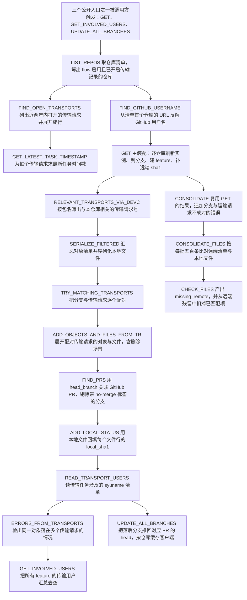
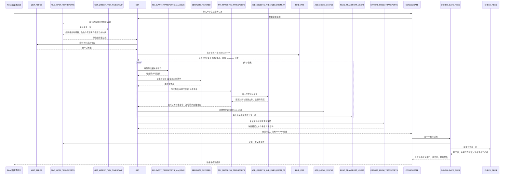

# ZCL_ABAPGIT_FLOW_LOGIC 分析报告

> 分析对象：`abapGit/abapGit — zcl_abapgit_flow_logic.clas.abap`（全局类 `ZCL_ABAPGIT_FLOW_LOGIC`，1114 行，5 个公开类方法 + 14 个私有类方法）
> 报告视角：代码 onboarding 走读，按真实调用链展开
> 源码里所有被引用的语句都逐字符取自该文件，示意改法一律放在 `abap-fix` 围栏里

---

## 一、程序定位与业务背景

### 1.1 这段代码在解决什么问题

先说清楚它**是什么**、**不是什么**。它不是 UI 层（没有任何 ALV、屏幕绘制、消息弹窗），不是传输请求的写入方（它只**读** CTS，从不 `IMPORT` 任何对象），也不是 Git 操作的执行者（真正的 `git` 命令在 `ZCL_ABAPGIT_GIT_FACTORY` / `ZCL_ABAPGIT_FLOW_GIT` 里）。它是 abapGit **Flow（流）功能的一层"事实装配 + 一致性判断"服务**。

要理解它，先要理解 Flow 要回答的业务问题。一家公司把 ABAP 对象纳入 Git 之后，CTS 传输请求并没有消失——它变成了 Git 之外的第二条变更通道。于是每天都有这样几件事需要有人回答：

1. **哪些分支还没有被"运输"进一个传输请求？** 一个功能分支（feature branch）上的改动，对应到开发系统里的传输请求，这是 SAP 交付治理的硬要求：不允许有游离在传输请求之外的代码。
2. **哪些传输请求还没有对应到任何分支？** 反向的情况同样有害——传输请求里的改动没进 Git，等于代码只走了一半。
3. **哪些对象只存在于两个世界的其中一边？** 本地文件树（`.abapgit` 目录，abapGit 序列化出来的产物）与远端 Git 仓库之间必须完全一致。任何一个对象单边存在，都是"这次同步出了问题"。
4. **一个对象落进了多个传输请求**，意味着这次变更被切成了两半，导入时会互相覆盖。

这四个问题就是本类的全部业务动机。四个问题恰好对应本类的四个公开入口：

| 它做的事 | 它刻意不做的事 |
|---|---|
| 装配"仓库 × 分支 × 传输请求 × 文件"的全景事实（`get`） | 不判断某次合并该不该做，只描述现状 |
| 把"分支没有运输请求 / 运输请求没有分支"两类事实翻成可读错误（`consolidate`） | 不替用户决定该建哪个运输请求 |
| 算出本地与远端的差集（`consolidate_files` / `check_files`） | 不删除、不推送任何文件，只产出清单 |
| 把落后于远端 commit 的分支推回对应 PR 的 head（`update_all_branches`） | 不建 PR、不评论 PR、不决定谁该合 |

一句话设计范式定性：

> **"只读事实装配器（Read-only Assembler）+ 无状态类方法（`CLASS-METHODS`）"——全类零实例状态、零数据库写入、零 Git 写操作，所有方法要么返回结构化事实、要么往结果结构里塞 `<tt>` 标记的展示文本；唯一的写动作集中在 `update_all_branches`，且只调 GitHub 的 PR 更新接口。**

### 1.2 为什么值得写成"一个类"，而不是几个互相独立的 FM

值得注意的一点是：这个类的 19 个方法里，有 11 个的返回类型都是同一个类的私有结构或同一族 CTS 结构（`trkorr`、`tadir-object`、`syuname`），而不是各自为政的行结构。这意味着"传输请求"在这个类里是一个**一等公民**，被提炼成了 `ty_transport` 私有结构：

- `find_open_transports` 产出它；
- `relevant_transports_via_devc`、`try_matching_transports`、`serialize_filtered`、`errors_from_transports`、`add_objects_and_files_from_tr` 消费它；
- 消费方几乎每次都只需要它的 `trkorr` 一列，于是又派生出 `ty_trkorr_tt` 作为"轻量投影"在方法之间传递。

**"重结构在源头取一次、轻投影在中间传递"是这份代码最值得学的一处设计**。如果每个方法各自定义一个自己的 transport 结构，19 个方法之间传参就会有一堆形状不同的表，`errors_from_transports` 之类的跨方法聚合根本写不出来。

### 1.3 依赖清单（读这段代码前必须知道的地形）

```
Z 对象（客户自有）  ZIF_ABAPGIT_FLOW_LOGIC        全局接口，承载 ty_information / ty_features /
                                                   ty_local_files / ty_consolidate / ty_path_name 等
                                                   所有对外数据类型；本类只引用它，不定义它
                    ZIF_ABAPGIT_REPO_ONLINE      在线仓库接口（get_url / get_name / get_key /
                                                   get_package / get_files_local_filtered）
                    ZIF_ABAPGIT_REPO             仓库基接口（本类只通过 zif_abapgit_repo~ 前缀显式
                                                   调过它的 refresh 方法）
                    ZIF_ABAPGIT_CTS_API          CTS 门面：list_open_requests / read_description /
                                                   read_creation_dates / list_r3tr_by_request /
                                                   read_request_and_tasks / read
                    ZIF_ABAPGIT_GIT_DEFINITIONS   Git 侧类型：ty_git_branch_list_tt / ty_expanded_tt /
                                                   c_git_branch-heads_prefix
                    ZIF_ABAPGIT_DEFINITIONS      ty_tadir_tt / ty_item / c_dot_abapgit
                    ZIF_ABAPGIT_SAP_PACKAGE      list_subpackages / are_changes_recorded_in_tr_req
                    ZIF_ABAPGIT_PERSISTENCE      仅用 ty_value 作为 lv_previous_key 的类型
                    ZCL_ABAPGIT_EXCEPTION        唯一的异常类型，全类唯一被抛出的通道
全局类（外部）        ZCL_ABAPGIT_FLOW_GIT         find_changes_in_git，本类最重的外部依赖
                    ZCL_ABAPGIT_FLOW_EXIT        扩展点，change_github_username 可被 Flow exit 覆写
                    ZCL_ABAPGIT_PR_ENUMERATOR     new( iv_url )->get_pulls( )，唯一的 GitHub 出口
                    ZCL_ABAPGIT_LOGIN_MANAGER     get_username( url )，从 URL 反解用户名
                    ZCL_ABAPGIT_OBJECT_FILTER_OBJ 序列化前的对象清单过滤器（被 CREATE OBJECT 实例化）
                    ZCL_ABAPGIT_PR_ENUM_GITHUB     update_pull_request_branch 的宿主
消息文本             无文本符号                      所有面向用户的字符串是英文硬编码字面量，
                                                   并混用 <tt> 标记，交给上层 UI 渲染
```

### 1.4 这份代码的成熟度信号——先给读者一个校准

这不是随手写的骨架代码，是 abapGit 里被真实使用、也在持续改的功能。但它带着三类明显的"进行中"痕迹，读者一开始就该知道，否则会误判某处是 bug 还是刻意为之：

- **6 处 `* todo` 注释**（`consolidate` 里的多仓库处理、`check_files` 里的路径不匹配分支、`consolidate_files` 里的 AFF 对象、`add_objects_and_files_from_tr` 里的 `/src/` 硬编码路径、以及两处"取数期间数据可能已变"的自我提醒）——作者明确标出了已知未完成项。
- **一处大段注释掉的代码**（`consolidate` 里的分支未更新检测），说明某个需求被推翻或搁置，但代码没删。
- **一处 `##NO_HANDLER`**（`find_github_username`）与若干 `CATCH zcx_abapgit_exception`，说明这里刻意选择了"失败即降级、不中断"。

本报告的分析对象就是这些痕迹**背后到底是什么**，以及哪些痕迹其实是没被标注的缺陷。

---

## 二、程序执行流程总览

这个类有三个公开入口，各自触发一条不同的链，但三条链在内部共享同一批私有方法。按真实运行顺序（不按源码声明顺序）展开：



### 责任链表

| 子程序 | 调用者 | 职责 |
|---|---|---|
| `LIST_REPOS`（公开） | `GET`、`UPDATE_ALL_BRANCHES` 之外的外部调用方 | 从 repo 服务取清单，筛掉 flow 未启用、以及所在包未开启传输记录变更的仓库，向下转型后装入结果表 |
| `FIND_OPEN_TRANSPORTS`（私有） | `GET`、`CONSOLIDATE_FILES`、`TRY_MATCHING_TRANSPORTS` 链路的 `GET` | 枚举近两天窗口内打开的传输请求，展开每个请求的 R3TR 对象，补标题、创建日期、最新时间戳、devclass，产出 `ty_transports_tt` |
| `GET_LATEST_TASK_TIMESTAMP`（私有） | `FIND_OPEN_TRANSPORTS` | 读请求及其任务，取最大 AS4DATE/AS4TIME 组合成时间戳；失败或无任务时退回当前时间戳 |
| `FIND_GITHUB_USERNAME`（私有） | `GET` | 取仓库清单首行的 URL 反解 GitHub 用户名，再交给 Flow exit 覆写；两处异常均被吞掉 |
| `GET`（公开） | Flow UI、`CONSOLIDATE` | 全类主干：装配"仓库 × 分支 × PR × 运输请求 × 文件 × 用户"的完整事实，产出 `ty_information` |
| `RELEVANT_TRANSPORTS_VIA_DEVC`（私有） | `GET` | 用包及其子包去匹配每个传输请求行的 devclass，产出纯 `trkorr` 投影 |
| `SERIALIZE_FILTERED`（私有） | `GET` | 把"相关运输请求的对象"与"Git 里变更的对象"合成一份去重的 TADIR 清单，交给仓库做一次过滤序列化 |
| `TRY_MATCHING_TRANSPORTS`（私有） | `GET` | 两阶段配对：先按 object+obj_name 把分支挂到传输请求上，再把未配对但落在包内的运输请求升格为独立 feature |
| `ADD_OBJECTS_AND_FILES_FROM_TR`（私有） | `TRY_MATCHING_TRANSPORTS` | 展开一个运输请求的全部对象与文件；本地找不到该对象时按"删除"处理，用文件名模式在远端清单里回捞，或造一条假路径记录 |
| `FIND_PRS`（私有） | `GET` | 一次 HTTP 拉全部 PR，按 `head_branch` 与分支名匹配，写入 PR 标题/链接/编号/草稿/作者，剔除带 `no-merge` 标签的分支 |
| `ADD_LOCAL_STATUS`（私有） | `GET` | 遍历 feature 与其文件行，在本地文件表里找到同名同路径的行，回填 `local_sha1` |
| `READ_TRANSPORT_USERS`（私有） | `GET` | 读请求及其任务，把每个任务的 `AS4USER` 无条件收集成用户表 |
| `ERRORS_FROM_TRANSPORTS`（私有） | `GET` | 按 object+obj_name 排序后比较相邻两行，检出同一对象落在两个不同运输请求的情况并生成 `<tt>` 标记的错误文本 |
| `GET_INVOLVED_USERS`（公开） | Flow UI 的"谁在动"面板 | 汇总所有 feature 的运输用户并剔除空值 |
| `CONSOLIDATE`（公开） | Flow UI 的就绪性检查 | 复用 `GET` 的结果，追加两类配对失败错误，再委托 `CONSOLIDATE_FILES` 做文件级比对 |
| `CONSOLIDATE_FILES`（私有） | `CONSOLIDATE` | 列分支、建 feature、算远端清单、跳过仍在开放运输请求里的对象、按批序列化并比对，最后把远端残留判为"只在远端" |
| `CHECK_FILES`（私有） | `CONSOLIDATE_FILES` | 逐个本地文件判断：在远端吗？在某个分支里吗？两者都没有则记入 missing_remote；命中则从远端清单中删除 |
| `BUILD_REPO_DATA`（私有） | `GET`、`CONSOLIDATE_FILES`、`TRY_MATCHING_TRANSPORTS` | 把仓库接口的三个 getter 抄成 `ty_feature-repo`，纯粹的数据搬运 |
| `UPDATE_ALL_BRANCHES`（公开） | Flow UI 的批量操作按钮 | 对所有"落后且有 PR"的分支，按仓库缓存 GitHub 客户端，逐个把远端 commit 推到 PR 的 head，返回更新/错误/跳过三个计数 |

下面按这条流程，逐个子程序展开。需要提前说明的是：全类只有 `CONSOLIDATE_FILES`、`GET`、`TRY_MATCHING_TRANSPORTS`、`ADD_OBJECTS_AND_FILES_FROM_TR` 四个方法是有真正算法的地方，其余是取数、搬运与判断，所以第三节的重点会明显偏向这四个。

---

## 三、分组分析

### 3.1 类定义段 `ZCL_ABAPGIT_FLOW_LOGIC` 的公共契约与私有布局（全局声明区 / 类定义段）

先把接口读透。这段声明占全文近两成，19 个方法的签名里藏着后面大半的风险点，所以先看它。

#### ① 五个公开入口的契约骨架（参数明细从略）

```abap
CLASS zcl_abapgit_flow_logic DEFINITION PUBLIC.
  PUBLIC SECTION.
    CLASS-METHODS get
      RETURNING
        VALUE(rs_information) TYPE zif_abapgit_flow_logic=>ty_information
      RAISING
        zcx_abapgit_exception.
    ...
    CLASS-METHODS get_involved_users
      IMPORTING
        is_information  TYPE zif_abapgit_flow_logic=>ty_information
      RETURNING
        VALUE(rt_users) TYPE zif_abapgit_flow_logic=>ty_users_tt.
    ...
    CLASS-METHODS consolidate
      IMPORTING
        ii_online             TYPE REF TO zif_abapgit_repo_online
      RETURNING
        VALUE(rs_consolidate) TYPE zif_abapgit_flow_logic=>ty_consolidate
      RAISING
        zcx_abapgit_exception.
```

**做什么** — 声明三个"读"入口：`get` 无输入、直接返回全景事实结构 `ty_information`；`get_involved_users` 吃一份已经装配好的 `ty_information`、吐出用户表 `ty_users_tt`；`consolidate` 吃一个在线仓库引用、吐出就绪性检查结果 `ty_consolidate`。三者都以 `zcx_abapgit_exception` 作为唯一失败通道。

**为什么** — 三处契约选择各有道理。`get` 不设 `IMPORTING` 是合理的：这个类是"读世界"的角色，事实的输入只有 SAP 系统与 Git 本身，让调用方什么都传进来反而会诱导它伪造事实。`get_involved_users` 刻意**不重新取数**、只接受一份 `ty_information`，把"取事实"与"从事实里投影出一个小结果"分成两个方法，调用方可以只调一次 `get` 然后反复投影——这是很干净的单一职责切分。`consolidate` 用 `REF TO zif_abapgit_repo_online` 而不是仓库 key 字符串，因为它的第一件事就是拿这个对象去 `get_url( )`，省掉一次服务查找，也顺带把"对象不存在"这件事提前到类型层。

**风险与改进** — 两处需要留意：

1. **`consolidate` 的 `ii_online` 是唯一"看起来该收窄"的参数**。方法体里它只被用在三处：`ii_online->get_url( )`（两次）、`consolidate_files( EXPORTING ii_online = ii_online )`，以及 `li_repo ?= ii_online` 之后取 `get_key( )`。而方法内部**又调了一次 `get( )`，那一次会把所有仓库重新枚举一遍**（见 3.16）。也就是说传进来的这个仓库对象，在自己这个方法里被用得很少，倒是被 `get( )` 顺带重算了一遍。契约读起来像"针对某一个仓库做检查"，实现却是"先算全部仓库，再筛出这一个"。这是 P0-1 的根因。
2. **`get_involved_users` 的 `ty_users_tt` 元素类型决定了去重语义，而这个类型不在本文件里**。方法体里 `INSERT lv_user INTO TABLE rt_users` 之后只做了一次 `DELETE ... WHERE table_line IS INITIAL`，没有任何显式去重语句。也就是说"同一用户出现在多个 feature 的运输用户里"会不会被折叠，完全取决于 `ty_users_tt` 在 `ZIF_ABAPGIT_FLOW_LOGIC` 里是用标准表 + `DEFAULT KEY` 声明的还是普通标准表。**需在 SE11 / SE24 核实该类型**；若它是普通标准表，UI 的"参与人"清单会按 feature 数量重复。

#### ② 结果结构与批量阈值常量（公有区的类型插在方法声明之间）

```abap
    TYPES ty_repos_tt TYPE STANDARD TABLE OF REF TO zif_abapgit_repo_online WITH DEFAULT KEY.

    ...
    TYPES: BEGIN OF ty_update_result,
             updated TYPE i,
             errors  TYPE i,
             skipped TYPE i,
           END OF ty_update_result.

    CLASS-METHODS update_all_branches
      IMPORTING
        it_features      TYPE zif_abapgit_flow_logic=>ty_features
      RETURNING
        VALUE(rs_result) TYPE ty_update_result
      RAISING
        zcx_abapgit_exception.
```

**做什么** — 定义两个公有区类型：仓库引用表 `ty_repos_tt`（`WITH DEFAULT KEY`，即以引用本身为键，天然去重），以及批量更新的三计数结果 `ty_update_result`（更新数、错误数、跳过数）。`update_all_branches` 返回后者。注意这两个 `TYPES` 夹在 `CLASS-METHODS` 声明之间，不是集中放在类型区。

**为什么** — `ty_repos_tt` 用 `WITH DEFAULT KEY` 是一个**刻意的去重决策**：仓库是以接口引用为元素的表，引用相同就是同一个仓库，用户重复勾选不会产生两行。用排序键或哈希键都会额外要求元素有可比较/可哈希的字段，而接口引用没有稳定的自然键，`DEFAULT KEY` 是这里唯一说得通的选择。`ty_update_result` 用三个裸 `i` 而不是嵌套结构，也是对的——批量操作的返回值只需要给 UI 画一句"成功 N、失败 M、跳过 K"，拆成结构体反而增加解析成本。

**风险与改进** — 三处：

1. **公有区夹着类型声明，可读性代价明显**。读者读到 `ty_repos_tt` 要往下翻几十行才看到它的使用者 `list_repos`，再翻十几行才看到 `ty_update_result` 的使用者 `update_all_branches`。这不是错误，但它让"找某个类型的用途"变成一次全文搜索。**把公有区的两个 `TYPES` 上移到 `PUBLIC SECTION.` 之后、方法声明之前**，是零风险的整理。
2. **`ty_update_result` 的三个字段没有任何单位说明**。`skipped` 到底表示"跳过了多少个分支"，还是"跳过了多少次 PR 更新"，从名字看不出来；实现里两种都发生了——没有 PR 编号时 `skipped + 1`，URL 正则匹配失败时也 `skipped + 1`（见 3.20）。调用方无法区分这两种性质完全不同的跳过。
3. **`DEFAULT KEY` 在这里同时被当成去重手段和"值相等"手段**。副作用是：`list_repos` 里如果 `?=` 转型失败导致旧引用被重复插入（见 3.2），重复行会被静默折叠——**缺陷不会以"重复行"的形式暴露，而是表现为"某个仓库莫名消失"**，排查难度因此上升。

#### ③ 私有区的核心结构与被保护区的空壳

```abap
  PROTECTED SECTION.
  PRIVATE SECTION.

    CONSTANTS c_max_missing_files TYPE i VALUE 1000.

    TYPES: BEGIN OF ty_transport,
             trkorr     TYPE trkorr,
             title      TYPE string,
             object     TYPE tadir-object,
             obj_name   TYPE tadir-obj_name,
             devclass   TYPE tadir-devclass,
             created_on TYPE d,
             changed_at TYPE timestamp,
           END OF ty_transport.

    TYPES ty_transports_tt TYPE STANDARD TABLE OF ty_transport WITH NON-UNIQUE KEY trkorr.
```

**做什么** — 私有区声明：截断阈值 `c_max_missing_files`（1000）、传输请求行结构 `ty_transport`（八列：请求号、标题、对象类型、对象名、包、创建日期、最新变更时间戳）、以 `trkorr` 为非唯一键的传输请求表 `ty_transports_tt`。`PROTECTED SECTION.` 声明为空，没有任何子类使用它。

**为什么** — `ty_transport` 是全类的数据枢纽（1.2 已说明），把它定义成扁平八列的结构、而不是直接从 `zif_abapgit_cts_api` 复用行类型，好处有两个：一是把 CTS 门面返回的行类型隔离在本类内部，CTS 门面改版时只需改 `find_open_transports` 一处；二是明确了这个类真正关心的恰好是这八列，尤其是 `devclass`——后面 `relevant_transports_via_devc` 和 `try_matching_transports` 全部靠它做包匹配。`WITH NON-UNIQUE KEY trkorr` 也切得准：传输请求里的一个对象占一行，同一个请求号必然出现很多次，键必须是 `trkorr` 且必须非唯一。

**风险与改进** — 四处：

1. **`changed_at TYPE timestamp` 与 `created_on TYPE d` 的语义层级不同**。`created_on` 是日期（粒度天），`changed_at` 是完整时间戳（粒度秒）。表里并排两列，前者用来跟"两年窗口"比较，后者用来显示"最后活动时间"。类型本身没错，但**类型差异就是数据精度差异的证据**：`created_on` 来自 `read_creation_dates`，天粒度意味着一个"两年前的今天"创建的请求在边界上会被判在窗口外还是内，取决于 CTS 侧怎么四舍五入——这个边界行为需在 SRU 核实。
2. **`PROTECTED SECTION.` 是死代码**。空的可继承区意味着"作者打算允许子类访问，但还没写"，而本类全部 19 个方法都是 `CLASS-METHODS`（静态方法），ABAP 里静态方法本来就不参与继承覆盖，这个声明连语义占位都算不上。删掉没有副作用。
3. **`c_max_missing_files` 只截断了"结果"，没有截断"取数"**。它在 `consolidate_files` 末尾才生效，那时 `missing_remote` 已经把所有缺文件行都插进去了（见 3.17 第 ④ 步）。也就是说这个常量保护的是 UI 和内存驻留，不是计算量。它守的是"别让 ALV 渲染一千行以上"这件事，命名却像在防内存溢出。
4. **`title TYPE string` 而 `created_on TYPE d`**：标题是不限长的 UNICODE 字符串，日期是内建 8 位数字日期，两者并存于同一行是合理的（CTS 标题确实是自由文本），但这也意味着 `errors_from_transports` 排序时若曾把 `title` 纳入排序键会付出无谓代价——实际上它只按 `object obj_name trkorr` 排，这一点做对了。

> **过渡** 契约读完了。接下来进入主干：`GET` 的第一步不是装配分支，而是先回答"哪些仓库该被纳入检查"——所以先看 `list_repos`。

### 3.2 子程序 `list_repos`（公开类方法）

这是 `get` 的第一个内部步骤，回答"这次 Flow 要看哪些仓库"。分三步：取清单、按两个条件过滤、转型入表。

#### ① 按调用方意图选择清单来源

```abap
    DATA lt_repos  TYPE zif_abapgit_repo_srv=>ty_repo_list.
    DATA li_repo   LIKE LINE OF lt_repos.
    DATA li_online TYPE REF TO zif_abapgit_repo_online.

    IF iv_favorites_only = abap_true.
      lt_repos = zcl_abapgit_repo_srv=>get_instance( )->list_favorites( abap_false ).
    ELSE.
      lt_repos = zcl_abapgit_repo_srv=>get_instance( )->list( abap_false ).
    ENDIF.
```

**做什么** — 声明三个变量，然后按 `iv_favorites_only` 在两个 repo 服务方法之间二选一：真则 `list_favorites( abap_false )`，假则 `list( abap_false )`，结果装进 `lt_repos`。`abap_false` 这个入参按 abapGit 的约定是"不强制读磁盘快照"，也就是取持久层里的清单。

**为什么** — 把"收藏夹范围"做成一个带默认值的布尔入参（声明里是 `DEFAULT abap_true`），而不是两个公开方法，是对的：外部只有一种需求——"看我的 Flow 收藏夹"，`abap_true` 作默认让最常见的调用不必写参数；需要看全量的内部调用显式传 `abap_false` 即可。这比 `list_favorites_only( )` / `list_all( )` 两个方法的方案少一半接口面积。`get_instance( )` 而非 `new( )` 也符合这个代码库的时代——全类都在用旧式工厂。

**风险与改进** — 两处：

1. **两个分支的方法名只差一个 `favorites_` 前缀，`abap_false` 参数的位置完全一致**。这类"选择器 + 布尔"的结构在阅读时极易看错——`list_favorites( abap_false )` 和 `list( abap_false )` 里的 `abap_false` 指的不是同一件事（前者大概是"不强制刷新"，后者大概是"不递归/不含离线"）。**需在 SE24 核实 `zcl_abapgit_repo_srv` 两个方法的形参语义**；如果两个 `abap_false` 含义不同，这里就是一处"同名布尔、不同含义"的经典误读温床。
2. **`list_favorites` / `list` 都可能抛 `zcx_abapgit_exception`，而本方法没有任何局部捕获**。这本身是对的（异常是本类的统一失败通道，不该在每个方法里吞一遍），但要注意调用链上 `consolidate` → `get` → `list_repos` 的异常传播路径：一次仓库服务抖动会让整次就绪性检查失败，而不是只失败一个仓库。P1 里有对应条目。

#### ② 两个过滤条件：flow 开关 + 运输记录开关

```abap
    LOOP AT lt_repos INTO li_repo.
      IF li_repo->get_local_settings( )-flow = abap_false.
        CONTINUE.
      ELSEIF zcl_abapgit_factory=>get_sap_package( li_repo->get_package( )
          )->are_changes_recorded_in_tr_req( ) = abap_false.
        CONTINUE.
      ENDIF.
```

**做什么** — 遍历清单里的每个仓库引用，读它的本地设置里的 `flow` 开关；不是 `abap_true` 就跳过。第二个条件读该仓库所属包的 `are_changes_recorded_in_tr_req( )`，返回 `abap_false` 也跳过。两个条件串成 `IF ... ELSEIF ... CONTINUE` 的链。

**为什么** — **这两个条件的合取正是本方法存在的业务理由**，值得说透。Flow 的全部结论都建立在"分支对应运输请求"这个假设上；如果一个包压根不记录变更到运输请求（`are_changes_recorded_in_tr_req( ) = abap_false`），那这个仓库里的对象既不会出现在任何运输请求里、也无法被运输，整个 Flow 检查对它没有意义——跑一遍只会产出一堆"这个分支没有运输请求"的假警报。反过来，只开 `flow` 不够——所以两个条件缺一不可。`ELSEIF` 的写法让两个 `CONTINUE` 共用一个分支出口，比两条独立 `IF` 更紧凑，语义也完全等价（两个条件都为假才会走到后面）。

**风险与改进** — 三处，第二处是本报告认为整段最值得警惕的地方：

1. **两个 getter 都可能抛 `zcx_abapgit_exception`，且调用点在 `LOOP` 内部没有保护**。整批仓库里只要有一个包的 SAP_PACKAGE 工厂抛异常，前面已经检查完的仓库白做，整个方法连带 `get`、`consolidate` 一起失败。批量遍历里逐条调服务是这类类库的通用风险，这里没有做任何"单仓库失败即跳过"的隔离。
2. **`get_local_settings( )-flow` 读的是可能过期的仓库实例**。这一点在本文件里**有作者自己留下的证据**：`get` 的方法体里有一段带注释的循环专门干这件事——注释原文是 `* Repository instances may contain stale snapshots when Flow is first opened`，而循环体只有三行：遍历 `lt_repos`、对每个引用调 `zif_abapgit_repo~refresh( )`、`ENDLOOP`（这段代码在 3.6 第 ② 步整段引用）。

   作者知道 repo 服务的实例可能是 Flow 首次打开时的旧快照。但 `list_repos` 的过滤条件用的正是**刷新之前**这份实例上的 `flow` 开关。也就是说：一个仓库上周还没开 flow、本周刚开了，`get` 拿到清单后会先 `refresh` 让实例变新，但 `list_repos` 早就用旧的 `flow = abap_false` 把它筛掉了——本次运行仍然看不到它。**这是 P0-3**：判断"仓库是否纳入 Flow"与"让仓库数据变新"两件事的顺序反了。
3. **`ELSEIF` 链让第二个条件承担了"第一个条件已失败"的信息**。也就是说当 `flow = abap_false` 时，`are_changes_recorded_in_tr_req( )` **根本不会被调用**——这既是性能上的好事（省掉一次工厂调用），也意味着**包工厂在这些仓库上从未被触达**。如果包工厂是懒加载且有副作用的（比如首次调用会做包扫描），这里会造成调用次数依赖过滤顺序的隐性耦合。影响不大，但值得知道。

#### ③ 向下转型并入表

```abap
      li_online ?= li_repo.
      INSERT li_online INTO TABLE rt_repos.
```

**做什么** — 把 `zif_abapgit_repo` 类型的引用向下转型成 `zif_abapgit_repo_online` 类型的引用存进 `li_online`，然后把 `li_online` 追加进结果表 `rt_repos`。

**为什么** — 这一行是整个方法的收口，也是全类反复出现的一个模式（`update_all_branches` 里还有一次一模一样的写法）。语义上"这个仓库能不能当在线仓库用"确实需要一个运行时判断，所以用转型而不是在类型层面强转是对的：`li_online ?= li_repo` 表达的是"如果是就升级，不是就别动"。

**风险与改进** — **这是全类最严重的一处缺陷（P0-2）**，机理必须说准：

- **`?=` 转型运算符在转型失败时的行为是"保持目标变量原值不变"，而不是"把目标变量置空"。** `li_online` 是在 `LOOP` **外面**声明的一次性工作变量，一旦某次转型成功，它就持有了那个仓库的引用；下一次循环如果 `li_repo` 是一个**没有在线实现**的仓库（纯本地仓库、或实例尚未建立在线引用），`?=` 静默失败，`li_online` **继续持有上一个仓库的引用**。
- 紧接着的 `INSERT li_online INTO TABLE rt_repos` 于是把**上一个仓库**又插了一遍，而当前这个仓库被彻底丢弃。
- 因为 `rt_repos` 是 `WITH DEFAULT KEY`（见 3.1 第 ② 步），重复插入的那一行被折叠——**最终症状不是"出现两行"而是"某个仓库凭空消失"**。在 Flow UI 上表现为：用户的某个仓库今天不出现在列表里，而代码里没有任何一行能解释为什么。
- 正确写法是先判空再插入（示意，源码中不存在）：

  ```abap-fix
        IF li_repo IS BOUND.
          li_online ?= li_repo.
        ENDIF.
        IF li_online IS NOT INITIAL.
          CLEAR li_online.
        ELSE.
          INSERT li_online INTO TABLE rt_repos.
        ENDIF.
  ```

  更简洁的形态是把转型结果放进一个**循环内声明**的变量，让"保持旧值"这条语义无处可乘：`DATA li_online_line TYPE REF TO zif_abapgit_repo_online.` 写在 `LOOP` 内部，然后 `li_online_line ?= li_repo.` / `IF li_online_line IS NOT INITIAL. INSERT ... ENDIF.`。这样连 `IS BOUND` 都不需要，因为每轮都会先被 `CLEAR` 或重新赋值。
- **这个缺陷是否真会触发，取决于 `zif_abapgit_repo` 的实现里有没有"非在线"实现类，以及 repo 服务返回的引用是否总是已完成在线初始化**——**需在 SE24 核实**。但即便今天所有仓库都是在线仓库，`?=` 这个写法本身就是"靠目标变量初值恰好为空"的隐式前提：只要将来有人往 `LOOP` 前加一行给 `li_online` 赋值，缺陷立刻显形。**这是一处不依赖运行时数据、只依赖代码可维护性的确定性缺陷。**

> **过渡** 仓库清单定了。接下来要拿到另一半事实：这个系统里到底有哪些打开着的运输请求——这是本类唯一一个会真正触达 CTS 的地方，也是全类性能特征最鲜明的入口。

### 3.3 子程序 `find_open_transports`（私有类方法）

本方法被 `get` 和 `consolidate_files` 各调一次。它把 CTS 里散落的多个接口读数汇成一张扁平的 `ty_transports_tt`。分三步。

#### ① 用日期区间把"所有打开的请求"收窄到两年窗口

```abap
    DATA lt_date      TYPE zif_abapgit_cts_api=>ty_date_range.
    DATA ls_date      LIKE LINE OF lt_date.

* only look for transports that are created/changed in the last two years
    ls_date-sign = 'I'.
    ls_date-option = 'GE'.
    ls_date-low = sy-datum - zif_abapgit_flow_logic=>c_open_transport_days.
    INSERT ls_date INTO TABLE lt_date.

    lt_trkorr = zcl_abapgit_factory=>get_cts_api( )->list_open_requests( lt_date ).
    lt_created_on = zcl_abapgit_factory=>get_cts_api( )->read_creation_dates( lt_trkorr ).
```

**做什么** — 构造一个"包含、GE、等于 `sy-datum` 减 `c_open_transport_days`"的日期区间行装进日期区间表，交给 `list_open_requests( )` 换成请求号表；再把这批请求号交给 `read_creation_dates( )` 换成创建日期表。注释写明意图是"只看近两年内创建或变更过的运输请求"。

**为什么** — 这一步是整个类**唯一必要且正确**的性能设计。CTS 的"打开请求"数量随系统使用年限线性增长，而 Flow 的结论只对"还可能被运输的请求"有意义——两年前的请求要么已被导入、要么已被放弃。日期区间放在这里，等于把后续所有按请求号展开对象的循环成本压到可控范围。把区间写成 `ty_date_range` 表而不是单值，也是对的：CTS 门面接受表参数，将来要加"排除某些请求号"或"闭区间"不必改签名。`ls_date-sign = 'I'` 是包含语义，配 `option = 'GE'` 得到"大于等于"，边界上的当天被包含进来——这个边界选择是对的（当天创建的请求不该被漏掉）。

**风险与改进** — 三处：

1. **注释说"created/changed"，代码只表达了一个下界**。日期区间只给了 `GE`，没有给上界（`LE sy-datum`），也没有区分"创建时间"与"变更时间"——`list_open_requests` 的形参名叫 `it_date`，具体作用在哪个日期字段上，**需在 SE24 / SRU 核实**。如果它作用在"变更时间"上，那么注释准确；作用在"创建时间"上，那么"两年内变更过的老请求"会被漏掉，而这类请求恰恰是 Flow 最该报出来的（一个三年前创建、上周刚动过的请求，没被检查到就等于没被治理）。
2. **`c_open_transport_days` 定义在接口 `zif_abapgit_flow_logic` 里而不是本类**。这个常量决定了取数范围，改动它的影响面是"所有 Flow 检查的范围"，比普通的配置项更大，但它藏在全局接口里、注释里没提。**建议在常量声明处写清"改成更大值会同时放大 `find_open_transports` 与 `consolidate_files` 的开销"**。
3. **`read_creation_dates( lt_trkorr )` 一次传全部请求号进去**。这是本方法少见的"做对了批处理"的地方——它没有在循环里逐个查创建日期。但这也带来一个隐含前提：**`ty_request_and_tasks_tt` / `ty_transport_creation_dates_tt` 这两个批量接口本身支持几百上千个请求号而不超时**。**需在 SE24 核实**；若不支持，这里需要一个分批循环，而本类在 `consolidate_files` 里已经示范了分批写法（每批 500），却没在取数侧用上。

#### ② 逐请求取标题与创建日期，并求最新活动时间戳

```abap
    LOOP AT lt_trkorr INTO lv_trkorr.
      ls_result-trkorr = lv_trkorr.
      ls_result-title  = zcl_abapgit_factory=>get_cts_api( )->read_description( lv_trkorr ).
      READ TABLE lt_created_on INTO ls_created_on WITH TABLE KEY trkorr = lv_trkorr.
      IF sy-subrc = 0.
        ls_result-created_on = ls_created_on-created_on.
      ELSE.
        CLEAR ls_result-created_on.
      ENDIF.
      ls_result-changed_at = get_latest_task_timestamp( lv_trkorr ).
```

**做什么** — 遍历请求号表：对每个请求号取一次描述填 `title`；用 `WITH TABLE KEY trkorr` 在批量取回的创建日期表里精确查一行，命中就填 `created_on`，未命中则清空该分量（不是清空整条结构）；最后调 `get_latest_task_timestamp` 填 `changed_at`。

**为什么** — **这里体现了本类最值得学的一处性能纪律**：创建日期是**批量取的**（上一步的 `read_creation_dates`），所以这里是纯内存 `READ TABLE`；而标题和时间戳是**逐个取的**，因为 CTS 门面没有对应批量接口。这种"能批量就批量、不能批量就明着逐个"的取舍，比假装全部都批量要诚实。`CLEAR ls_result-created_on.` 只清分量而不 `CLEAR ls_result` 整条结构，这一点很关键——因为下一段还要往同一条工作区里填对象信息，整条清掉会把 `trkorr`、`title` 也抹掉。

**风险与改进** — 四处：

1. **`ls_result` 是循环外声明的一次性工作区，从不整体清空**。当前逻辑下每轮都重新赋值 `trkorr`、`title`、`created_on`、`changed_at`，对象相关的 `object` / `obj_name` / `devclass` 三列在**内层循环**里逐个赋值——所以没有读到上一轮残值的地方。但这个"恰好每列都被覆盖"是**巧合式的安全**：任何人以后在内层循环里新增一列、或者把某列的赋值挪到条件分支里，就会立刻读出上一轮的值。**建议在 `LOOP` 内首行加一句 `CLEAR ls_result.`（前提是把 `trkorr`、`title` 等每轮必填的赋值补齐）或直接换成本方法专用的新结构**，把这份"巧合"变成"保证"。
2. **`read_description` 与 `get_latest_task_timestamp` 都是每个请求一次远程读**，两个加起来就是每请求两次。本方法没有把这两步拆出去并行或缓存，也没有对"标题只是展示用"这件事做任何取舍——也就是说，即使 UI 从不显示标题，本方法也照样为每个请求付一次取标题的成本。**建议把标题改成惰性取数**（在结构里存请求号，UI 要显示时再取），或者至少在类注释里写明"标题的成本换来的是列表一次渲染拿全"。
3. **`READ TABLE lt_created_on ... WITH TABLE KEY trkorr` 依赖 `ty_transport_creation_dates_tt` 真的有以 `trkorr` 组成的表键**。若它是标准表，这条 `WITH TABLE KEY` 会退化成全表线性扫描，而它在每个请求号上执行一次——总成本是 O(请求数 × 日期表行数)。**需在 SE11 核实该类型**；本类在别处（`add_objects_and_files_from_tr` 的 `ty_expanded_tt`）确实使用了 `WITH TABLE KEY path_name COMPONENTS`，说明作者知道并且会用这个手法，所以这里更可能是类型本身没给键。
4. **`ELSE. CLEAR ls_result-created_on.` 把"查不到创建日期"和"创建日期为空"折叠成了同一种结果**。前者意味着 CTS 侧没有这条记录（可能是已删除的请求，或 `read_creation_dates` 漏了它），后者才是真的没日期。二者在 UI 上无法区分：一个早就被删掉的请求会显示成一个"创建日期为空但仍然打开"的请求，恰好是最容易误导用户的组合。建议在 `ty_transport` 里加一个状态位区分，或至少在 `errors_from_transports` 的产出里把它报出来。

#### ③ 展开 R3TR 对象并逐个补 devclass

```abap
* LIMU skipped here:
" SOTT = Concept (Online Text Repository) - Short Texts for packages are not serialized anyhow
      CLEAR ls_limu_skip.
      ls_limu_skip-sign = 'I'.
      ls_limu_skip-option = 'EQ'.
      ls_limu_skip-low = 'SOTT'.
      INSERT ls_limu_skip INTO TABLE lt_limu_skip.
      lt_objects = zcl_abapgit_factory=>get_cts_api( )->list_r3tr_by_request(
        iv_request         = lv_trkorr
        it_skip_limu_types = lt_limu_skip ).

* R3TR can be skipped here
      LOOP AT lt_objects ASSIGNING <ls_object>
          WHERE object <> 'CINS'
          AND object <> 'NOTE'.
        ls_result-object   = <ls_object>-object.
        ls_result-obj_name = <ls_object>-obj_name.

        lv_obj_name = <ls_object>-obj_name.
        ls_result-devclass = zcl_abapgit_factory=>get_tadir( )->read_single(
          iv_object   = ls_result-object
          iv_obj_name = lv_obj_name )-devclass.
        IF ls_result-devclass IS NOT INITIAL.
          INSERT ls_result INTO TABLE rt_transports.
        ENDIF.
      ENDLOOP.
```

**做什么** — 构造一个 LIMU 排除表（等于 `SOTT`）传给 `list_r3tr_by_request` 拿该请求的对象清单；然后遍历这份清单，跳过 `CINS` 与 `NOTE` 两种对象类型，对每一个存活的对象读一次 TADIR 拿到 devclass，只有 devclass 非空的对象行才被插入结果表。注释解释了 LIMU 排除的理由（SOTT 是包的短文本，本来就不会被序列化），而 `CINS` / `NOTE` 的排除理由写成了"这里可以排除 R3TR"。

**为什么** — **排除 `SOTT` 是有实质理由的**（注释给了：包的短文本不参与序列化，留在结果里只会制造永远无法运输的假分支），**但排除 `CINS` 与 `NOTE` 的理由只有一句"这里可以排除"，这是把实现细节抄成了论证**。这两类对象在 TADIR 里是以 `CINS` / `NOTE` 为对象类型、`obj_name` 存注释文本键的条目，它们在 abapGit 的文件名体系里没有对应产物——也就是说排除它们的**结论大概是对的**，但注释没有告诉读者"为什么没有"，下一个改这段的人只能靠猜。而 devclass 非空的过滤是关键的正确性设计：Flow 后面所有包匹配都靠 `devclass`，没有 devclass 的对象（比如局部对象、临时对象）本来就不该参与 Flow 治理，提前丢弃比留着后面匹配失败更干净。

**风险与改进** — 四处，第一处是 P1 级的性能缺陷：

1. **每个对象都要读一次 TADIR**（P1-1）。`zcl_abapgit_factory=>get_tadir( )->read_single( ... )-devclass` 位于**内层循环**里，而内层循环的规模是"近两年内所有打开请求的所有对象"。一个活跃系统里这个数量轻易上千，等于每跑一次 `get` 就是上千次 TADIR 单行读；而 `get` 又会被 `consolidate` 调一次（3.16），`consolidate_files` 再自己调一次 `find_open_transports`（3.17），于是**一次就绪性检查要做三次这样的遍历**。正确的做法是先收集全部 (object, obj_name) 再一次性交给 TADIR 服务的批量接口（`zif_abapgit_tadir` 层面本类已经在别处用过批量 `read`，见 3.17），或者直接在 `list_r3tr_by_request` 的结果里就带上 devclass。
2. **`lv_obj_name = <ls_object>-obj_name.` 是纯粹的冗余赋值**。下一行 `read_single( iv_obj_name = lv_obj_name )` 用它，但它就是上一行的同一个值，中间没有任何可能改变它的语句。这一行的存在暗示作者当初在中间做过什么改动又删掉了，留着只会让读者以为有转换逻辑。
3. **`ASSIGNING <ls_object>` 只为了读两个字段，用了 `INTO` 会更直白**。`ASSIGNING` 的价值在于能直接改行内字段；这里 `ls_result-object` / `ls_result-obj_name` 都抄到了外部结构上，`<ls_object>` 从未被修改。改用 `LOOP AT lt_objects INTO ls_object.` 后，"只读"这件事在代码形状上就可见了。
4. **`IF ls_result-devclass IS NOT INITIAL.` 这个静默丢弃条件没有任何统计**。被丢弃的对象（本类之外的包的对象、局部对象）在 Flow 视角里"不存在"，但用户如果发现自己包里的某个对象在 Flow 报告里彻底不出现，没有任何线索可循。建议至少计数并作为 warning 放进 `ty_information`——本类的结果结构里已经有 `warnings` 通道（见 3.17 第 ④ 步），这里却没用。

> **过渡** 这一步把"逐个请求的成本"推到了"逐个对象的成本"。其中"最新变更时间"是唯一一个单独抽成了方法的部分，因为它的降级逻辑值得单独讲。

### 3.4 子程序 `get_latest_task_timestamp`（私有类方法）

分两步：读任务求最大值、把结果转成时间戳，两个出口都指向"退回当前时间"。

#### ① 读请求及其任务并求最大日期时间组合

```abap
    TRY.
        lt_tasks = zcl_abapgit_factory=>get_cts_api( )->read_request_and_tasks( iv_trkorr ).

        LOOP AT lt_tasks INTO ls_task.
          IF ls_task-as4date > lv_max_date
              OR ( ls_task-as4date = lv_max_date AND ls_task-as4time > lv_max_time ).
            lv_max_date = ls_task-as4date.
            lv_max_time = ls_task-as4time.
          ENDIF.
        ENDLOOP.
```

**做什么** — 在 `TRY` 保护下读该请求及其全部任务，遍历任务行，如果某行的 `as4date` 比当前最大值大、或者日期相等且 `as4time` 比当前最大值大，就把两个最大值都更新为这一行的值。两个最大值都声明为内建类型 `d` / `t`，初值为零。

**为什么** — **逐分量比较再取最大值的写法是对的**，比"拼成时间戳再比"多两个优点：一是避免了在 ABAP 里拼 14 位时间戳字符串再拆回来的笨拙写法；二是 `lv_max_date` 与 `lv_max_time` 在循环结束后还各自可用，第二步可以直接拿去 `CONVERT`，不需要再解析。`TRY` 包住整个取数加循环，说明作者预期 `read_request_and_tasks` 会抛异常——这个预期是对的，CTS 读一个已删除或无权访问的请求确实会失败。

**风险与改进** — 两处：

1. **多字段比较里的"短路"依赖 ABAP 的求值顺序，这一点是安全的**。`IF a > x OR ( a = x AND b > y )` 里第一个条件不成立时才会算第二个，不会出现"日期更大但时间更小却被判为最大"的错误。这段逻辑**没有问题**，值得肯定——它在双字段排序里是最容易写错的一种，而这里写对了。
2. **`OR` 后面的括号里存在一个可优化点**：如果 `lv_max_date` 为零（尚未找到任何最大值）且某任务的 `as4date` 也是零，那么 `as4date = lv_max_date` 成立，接着比较时间，可能把一个"日期为零但时间非零"的异常任务当成最大值。CTS 的任务不会这样，但**这依赖的是数据规整这个外部假设而不是代码保证**。若要严格，可先判 `lv_max_date IS INITIAL` 直接取第一行。影响极小，列在这里只是提示这种写法把正确性的一部分押在了数据质量上。

#### ② 两个出口都退回"当前时间"

```abap
        IF lv_max_date IS NOT INITIAL.
          CONVERT DATE lv_max_date TIME lv_max_time INTO TIME STAMP rv_changed_at TIME ZONE sy-zonlo.
        ELSE.
          GET TIME STAMP FIELD rv_changed_at.
        ENDIF.
      CATCH zcx_abapgit_exception.
        GET TIME STAMP FIELD rv_changed_at.
      ENDTRY.
```

**做什么** — 有任务时把最大日期与时间用 `CONVERT ... TIME STAMP` 转成时间戳，并用 `TIME ZONE sy-zonlo` 指定按本地时区解释；没有任何任务时用 `GET TIME STAMP` 填当前时间戳；`TRY` 块捕获 `zcx_abapgit_exception` 后同样填当前时间戳。

**为什么** — 意图很清楚：让 `changed_at` 永远有一个非空值，好让 `consolidate_files` 和 UI 都能直接显示"最后活动时间"而不必判空。用 `CONVERT` 而不是手工拼 14 位数字，是正确的现代写法。

**风险与改进** — **三处，第一处是 P0 级的数据语义错误，第二处是接口契约不一致**：

1. **`TIME ZONE sy-zonlo` 与任务时间戳的时区归属很可能相反（P0-4）**。CTS 任务上的 `AS4DATE` / `AS4TIME` 字段按 SAP 的传统是**UTC**（这是 `AS4` 系列字段的常见约定；abapGit 的 CTS 门面把它直接映射为 `as4date` / `as4time`）。`CONVERT ... TIME STAMP ... TIME ZONE` 的语义是"把给定的日期时间**当作某个时区的墙上时间**转成 UTC 时间戳"。如果输入本来就是 UTC，那么指定 `TIME ZONE sy-zonlo` 等于**多减了一次本地时区偏移**，得到的 `changed_at` 会比真实值偏移若干小时（夏令时切换附近偏移量还会变）。而这个值最终会进 UI 显示"最后活动"，用户会看到一个"凌晨 3 点还在运输"的假象。**这里必须先确认 CTS 门面返回的 `as4date` / `as4time` 到底是什么时区**（需在 SE24 核实 `zif_abapgit_cts_api` 与其实现，或者在 SRU 里对同一个已知请求比对 `E070` 表的原始值）——**两种可能里必有一种是错的**，因为 `TIME ZONE` 参数只有一个正确用法。改法二选一：输入若为 UTC，则去掉 `TIME ZONE sy-zonlo`；输入若为本地时间，则当前写法正确，但要确认 `sy-zonlo` 与 CTS 存储时区一致。
2. **方法声明了 `RAISING zcx_abapgit_exception`，实现里却把它全部吃掉（P1-2）**。定义段的方法签名是 `CLASS-METHODS get_latest_task_timestamp`，带 `IMPORTING iv_trkorr TYPE trkorr`、`RETURNING VALUE(rv_changed_at) TYPE timestamp`，末尾一行是 `RAISING zcx_abapgit_exception.`（这段签名在 3.1 第 ③ 步之后、方法定义区里，属全局声明区）。

   声明段承诺这条通道，实现里唯一的 `CATCH` 又把它封死了。这意味着**调用方（包括本类自己的 `find_open_transports`）会照着契约写出异常处理，而那个异常永远不会发生**——不是"不会发生"的证明，而是"这个方法吞掉了一切失败"的必然结果。这正是本报告在 1.3 里说的"契约与实现不一致"的那一类：调用方会以为取时间戳失败是一个可处理的分支。
3. **两个降级出口都返回"当前时间"，把失败伪装成了成功**。一个请求可能根本没有任务（刚创建还没动过），也可能任务读不出来（无权限 / 已删除）。这两种情况下 UI 显示的"最后活动时间"都是**打开 Flow 页面这一秒**。用户看到"1 分钟前还在动"，会以为有人正在动这个请求——实际上可能是三天前的旧请求，或者是当前用户无权访问的那个。**更诚实的降级是保留初值**（时间戳的初值是零，直接显示"未知"），或者至少区分"无任务"与"读取失败"两种语义不同的降级。P1-3。

> **过渡** 时间戳这条支线到此为止。接下来是三个辅助方法中最短的一个，它负责给整个 Flow 页面提供一个身份标识——GitHub 用户名。

### 3.5 子程序 `find_github_username`（私有类方法）

分两步：先用仓库 URL 反解用户名，再把结果交给 Flow exit 覆写。

```abap
    READ TABLE it_repos INTO li_repo_online INDEX 1.
    IF sy-subrc = 0.
      TRY.
          rv_username = zcl_abapgit_login_manager=>get_username( li_repo_online->get_url( ) ).
        CATCH zcx_abapgit_exception ##NO_HANDLER.
      ENDTRY.
    ENDIF.

    TRY.
        li_exit = zcl_abapgit_flow_exit=>get_instance( ).
        li_exit->change_github_username( CHANGING cv_username = rv_username ).
      CATCH zcx_abapgit_exception ##NO_HANDLER.
    ENDTRY.
```

**做什么** — 取传入仓库表的第一行（按 `INDEX 1`），若命中就用它的 URL 调 `zcl_abapgit_login_manager=>get_username( )` 反解出 GitHub 用户名存进 `rv_username`；异常被带 `##NO_HANDLER` 注释的空 `CATCH` 吞掉。随后无论前一步成功与否，都取 Flow exit 单例并调 `change_github_username( CHANGING cv_username = rv_username )`——注意这个参数是 `CHANGING`，所以 exit 插件可以直接改写用户名；这一步的异常同样被吞掉。

**为什么** — **`##NO_HANDLER` 在这里的用法是正确的**：ABAP 的空 `CATCH` 会触发扩展语法检查警告（既没有处理也没有重新抛出），`##NO_HANDLER` 显式声明"我知道我吞掉了它"。这比留警告干净，也比让一个纯展示性的用户名把整个 `get` 拖垮要好。`CHANGING` 传用户名而不是 `RETURNING`，让 Flow exit 成为一个**真正的扩展点**而不是只读回调：企业可以用自己的 exit 类按 URL 规则推导组织名，从而支持"一个 Flow 面板管多个 GitHub 组织"的场景。本类**默认行为**是取首行仓库的 URL，`get_username( )` 内部怎么处理 `.git` 后缀、SSH 形式的 URL、多层路径（`https://github.com/org/team/repo`），不在本文件可见范围内。

**风险与改进** — 四处：

1. **"只用第一行仓库推导用户名"是本方法最大的语义缺口（P1-4）**。`get` 允许多个仓库被纳入（见 3.2），而 Flow 的部署形态恰恰是"一个系统里既有组织 A 的仓库、又有组织 B 的仓库，甚至还有个人仓库"。此时 `rv_username` 只反映清单里排第一的那个。用户看到的 GitHub 用户名可能与他正在看的分支所属的组织完全无关，而页面上没有任何地方提示"这个用户名只代表其中一个仓库"。**改进方向有两条**：要么把 `ty_information` 里的用户名换成"按仓库列出"的结构；要么在取到多个不同用户名时显示为"多个"而不是随便挑一个。
2. **`it_repos` 为空时 `rv_username` 保持初值，且第二步仍然执行**。也就是说 Flow exit 会在"没有仓库"的情况下也被调用，如果某个 exit 实现假设一定存在有效用户名来改写，就可能拿到空值。这是"扩展点与前置条件不匹配"的典型形态：**exit 的契约里没有声明输入可能为空**。
3. **两次异常都被吞掉，用户看不到任何降级信号**。登录管理器失败（URL 不是 GitHub、或者 GitHub Enterprise 域名它不认识）与 Flow exit 失败，用户看到的都是"用户名为空"。**建议至少留一条 warning**——本类的结果结构已经有 `warnings` 通道可用（3.17 第 ④ 步），这里却完全没用。
4. **`READ TABLE ... INDEX 1` 的顺序依赖清单顺序**。清单来自 `list_repos( )`（默认只取收藏夹），收藏夹的顺序由 repo 服务的排序决定。**如果排序不是稳定的**（比如按最后访问时间排），那么"第一个仓库"会随用户最近访问了什么而变化，于是**页面上显示的 GitHub 用户名会在两次打开之间跳变**。这一条是否真会触发，取决于 `list_favorites( abap_false )` 的排序规则（需在 SE24 核实）；但把"身份标识"挂在"清单第一行"这个本质上不稳定的位置上，本身就该改。

> **过渡** 三个辅助方法讲完了。现在进入主干：`get`。它是全类最长、也是唯一一个把前面所有私有方法串起来的方法，分六步。

### 3.6 子程序 `get`（公开类方法 · 全类主干）

这是整个类的编排中枢。它的形态很清晰：**先做三件与仓库无关的全局准备，然后逐仓库跑一条五步流水线，最后跨仓库做一次全局一致性检查**。分六步展开。

#### ① 全局准备：传输请求快照、仓库清单、用户名、实例刷新

```abap
    lt_all_transports = find_open_transports( ).
    lt_real_transports = lt_all_transports.

* list branches on favorite + flow enabled + transported repos
    lt_repos = list_repos( ).
    rs_information-enabled_repositories = lines( lt_repos ).
    rs_information-github_username = find_github_username( lt_repos ).
```

**做什么** — 调 `find_open_transports` 取全量传输请求表，**紧接着把它整表复制到 `lt_real_transports`**；调 `list_repos` 取仓库清单，把行数写进结果的 `enabled_repositories`；调 `find_github_username` 把用户名写进结果。

**为什么** — **`lt_real_transports = lt_all_transports` 这一行是本方法里最容易被误读、也最关键的一行**，它必须结合 3.9 的 `try_matching_transports` 才有意义：那个方法把 `lt_all_transports` 当成 `CHANGING` 参数，**在配对成功后会从表里删掉被消耗掉的行**。而 `errors_from_transports` 恰恰需要看到**所有**运输请求（包括已被分支配对消耗掉的那些），否则"一个对象落在两个运输请求里"这种冲突就会被配对过程本身掩盖掉——因为配对时第一个请求被消耗掉了，第二个还在表里，冲突就看不见了。所以这个快照是**有意为之的正确设计**，而且 `ty_transports_tt` 是扁平结构的普通表，浅拷贝即完全独立，不存在共享行的隐患。**这是本类第二处值得学的地方**（第一处是 1.2 说的"重结构在源头取一次"）。

**风险与改进** — 三处：

1. **`rs_information-enabled_repositories = lines( lt_repos )` 这个数字名不副实**。它统计的是"通过过滤的仓库数"，字段名叫"启用的仓库数"。若将来 `list_repos` 的过滤条件变化（比如加一个"必须有 PR"的筛子），这个字段的含义会悄悄漂移，而 UI 上没有任何说明。建议要么改名，要么在 `zif_abapgit_flow_logic` 里给这个字段加注释说明它的准确定义。
2. **`find_github_username` 在实例刷新之前调用**。用户名是从仓库 URL 推导的，而刷新前的实例可能持有旧的 URL（这正是下一行循环要解决的问题）。**需在 SE24 核实 `get_url( )` 是否读持久层还是读实例快照**：如果读实例快照，用户名可能是旧 URL 对应的旧用户名。
3. **这四行里没有任何一处被 `TRY` 保护**。`find_open_transports`、`list_repos`、`find_github_username` 三个调用都可以抛 `zcx_abapgit_exception`（前两个明确声明了，第三个虽然声明里没有 `RAISING`，但它内部吞掉了自己的异常，所以实际不抛）。结果是**只要 CTS 门面出一次故障，整个 Flow 页面就空白**——没有降级视图、没有"上次成功结果"、没有任何提示。这是本类可用性上的一个结构性短板（P1-5）。

#### ② 刷新全部仓库实例（单独一轮循环）

```abap
* Repository instances may contain stale snapshots when Flow is first opened
    LOOP AT lt_repos INTO li_repo_online.
      li_repo_online->zif_abapgit_repo~refresh( ).
    ENDLOOP.
```

**做什么** — 单独一轮循环，对清单里每个仓库引用调一次 `refresh( )`，方法名通过接口限定 `zif_abapgit_repo~` 显式写出。

**为什么** — **这一轮单独拆出来而不是并进下面的主循环，是有讲究的**：注释说明了原因——Flow 首次打开时，repo 服务返回的实例可能是旧快照。如果把刷新和业务处理交替进行（刷新一个、处理一个），那么当处理第一个仓库时，其余仓库的实例仍然是旧的；而某些步骤（比如 `list_repos` 里的过滤、`get_url( )`）会读实例状态，混着做就会得到"有的仓库新、有的仓库旧"的混合结果。**先全部刷新、再全部处理，把"快照新鲜度"变成一个全局一致的前置条件**，这个拆法是对的。

**风险与改进** — 三处：

1. **刷新的返回值与异常都被完全忽略**。`refresh( )` 的返回值没有接收；如果它会抛 `zcx_abapgit_exception`，那么一个仓库刷新失败会让整个 `get` 失败（可能是最坏的那个仓库拖垮全部）。**建议逐个包裹 `TRY`，刷新失败的仓库跳过并在 `warnings` 里记一条**——这正是"批量操作要有单条失败隔离"的典型场景，而这个类在 `get_latest_task_timestamp` 里已经示范过一次静默降级（只是那次降级得不好）。
2. **刷新发生在 `list_repos` 的过滤之后**，所以 3.2 第 ② 步指出的"用旧快照判断 flow 开关"问题在这里依然存在——这一轮刷新救不回已经被筛掉的仓库。**顺序需要整体调整**：先取清单并刷新，再过滤。
3. **方法名前缀风格在同一条调用链里不统一**。这里是 `li_repo_online->zif_abapgit_repo~refresh( )`，而下面第 ③ 步里的 `li_repo_online->get_url( )`、`li_repo_online->get_key( )` 是直接调。同一方法内、同一个对象、同一族方法，两种写法混用。**统一去掉接口前缀**（如果 `zif_abapgit_repo_online` 确实继承了 `zif_abapgit_repo` 且没有遮蔽同名方法的话），或者统一保留——挑一种即可。

#### ③ 逐仓库列分支、建 feature、算远端差异

```abap
    LOOP AT lt_repos INTO li_repo_online.

      lt_branches = zcl_abapgit_git_factory=>get_v2_porcelain( )->list_branches(
        iv_url    = li_repo_online->get_url( )
        iv_prefix = zif_abapgit_git_definitions=>c_git_branch-heads_prefix )->get_all( ).

      CLEAR lt_features.
      LOOP AT lt_branches INTO ls_branch WHERE display_name <> zif_abapgit_flow_logic=>c_main.
        ls_result-repo = build_repo_data( li_repo_online ).
        ls_result-branch-display_name = ls_branch-display_name.
        ls_result-branch-sha1 = ls_branch-sha1.
        INSERT ls_result INTO TABLE lt_features.
      ENDLOOP.
```

**做什么** — 进入仓库主循环：用 Git porcelain 客户端按 `refs/heads/` 前缀列出远端全部分支，取回全部；在内存里过滤掉名字等于 `c_main` 的主分支（Git 的 `WHERE display_name <> ...` 是在内存过滤而不是让 Git 少传数据），对每个存活分支建一条 feature 记录，填入仓库信息、分支显示名、分支 commit 的 sha1。

**为什么** — **这里有一个值得肯定的契约选择**：`find_changes_in_git` 的参数清单里，`et_main_expanded` 是 `IMPORTING`（导出参数被当作返回值传入），而 `ct_features` 是 `CHANGING`。这个非对称是对的——`et_main_expanded` 是"这个仓库的远端全量清单"，每个仓库独立，各仓库之间不共享，用返回值传最自然；而 `ct_features` 要被本方法持续追加，属于过程数据。而 `lt_main_expanded` 也没有在仓库循环里 `CLEAR`，正因为 `IMPORTING` 会整体覆盖它，跨仓库不会串数据——**这是"靠参数语义保证隔离"而不是"靠手动清空保证隔离"，属于更好的写法**。`WHERE display_name <> c_main` 用内存过滤而非 Git 侧过滤，代价是多传一次主分支的引用，收益是主分支的 sha1 在下游仍然可用（`find_changes_in_git` 需要它作为对比基准）。

**风险与改进** — 四处：

1. **`ls_result` 从不 `CLEAR`，跨分支复用**。当前每轮都赋 `repo`（三列）、`branch-display_name`、`branch-sha1` 五个分量，但**其余分量（`changed_files`、`changed_objects`、`transport-*`、`pr-*`、`full_match`、`up_to_date`）会保留上一条分支的值**。它们随后会被 `find_changes_in_git`、`try_matching_transports`、`find_prs` 逐个赋值或追加，所以当前版本侥幸正确。但这与 3.3 第 ② 步第 1 点是同一类隐患：**工作区复用依赖"下游一定会覆盖每一列"这个隐含契约**，任何新增列或条件赋值都会读出上条分支的残值。建议在 `LOOP` 内首行 `CLEAR ls_result.`。
2. **`list_branches( )->get_all( )` 是每个仓库一次 Git 调用，且完全没有异常保护**。Git 不可达、仓库被删、凭据失效——任何一种都会让 `get` 整体失败，用户看到空白页而不是"这个仓库拉取失败"。**这是本类最需要逐条隔离的地方**，因为多仓库场景下"部分成功"是常态而非例外。
3. **主分支是在内存里被过滤掉的，但 `find_changes_in_git` 收到的是完整的 `lt_branches`**（注意 `it_branches = lt_branches` 传的是未过滤的那份）。所以 `find_changes_in_git` 是知道主分支存在的——这很可能是它需要的（用它算"相对主分支的差异"）。**但这一点依赖外部类 `zcl_abapgit_flow_git` 的实现约定，不在本文件可见范围内**，需在 SE24 核实 `it_branches` 是否真的期望包含主分支。如果它期望的是"只有 feature 分支"，那么本方法与 `consolidate_files`（3.17）里同样的写法就会把主分支当成一条普通分支处理，结论会错。
4. **`ls_result-repo = build_repo_data( li_repo_online )` 在循环内重复调用**。`build_repo_data` 只读三个 getter，不依赖分支，所以在整个仓库循环里它被调用了"分支总数"次而不是一次（3.19 会看到它有多便宜——只有三行）。这里没有性能问题，但把与分支无关的计算放进分支循环，是**嵌套层次**上的一个信号：如果将来 `build_repo_data` 变贵（比如要读本地设置文件），这个位置就会变成隐性热点。挪到分支循环之前是一行的事。

#### ④ 逐仓库：筛相关运输请求 → 序列化本地文件 → 配对分支与运输请求

```abap
      lt_relevant_transports = relevant_transports_via_devc(
        ii_repo        = li_repo_online
        it_transports  = lt_all_transports ).

      lt_local = serialize_filtered(
        it_relevant_transports = lt_relevant_transports
        ii_repo                = li_repo_online
        it_features            = lt_features
        it_all_transports      = lt_all_transports ).

      try_matching_transports(
        EXPORTING
          ii_repo          = li_repo_online
          it_local         = lt_local
          it_main_expanded = lt_main_expanded
        CHANGING
          ct_transports    = lt_all_transports
          ct_features      = lt_features ).
```

**做什么** — 三步串联：用 `lt_all_transports` 和当前仓库的包筛出"相关运输请求号"；把这批请求的对象与 Git 变更的对象合成清单、序列化成本地文件表；最后把分支与运输请求逐个配对，配对成功就把该运输请求从 `lt_all_transports` 里删掉（`CHANGING`），并往当前 feature 集合里追加内容。

**为什么** — **三步的顺序是对的，因为存在一条真实的数据依赖链**：先要知道"哪些运输请求与这个仓库相关"，才知道该序列化哪些对象；先要序列化出本地文件，配对时才能把对象落到具体的文件上并算出 local sha1。而 `lt_all_transports` 作为 `CHANGING` 被逐步消耗，是 3.1 第 ① 步说的"快照"策略的另一半——**工作表被消耗、快照被保留**，两者配合才能让 `errors_from_transports` 既看到全量、又不被配对过程污染。这个设计相当完整。

**风险与改进** — 四处：

1. **`serialize_filtered` 的产物 `lt_local` 在整个仓库循环里是同一张表，且每次被整体覆盖**。这意味着序列化产物**不能跨仓库累积**。当前逻辑不需要累积（每个仓库的包不同、对象不同），但这个前提没有写在任何地方。若将来 Flow 要支持"多个仓库属于同一个包"，那么第一个仓库序列化出来的文件会在第二个仓库开始时被丢弃，导致第二个仓库的 local sha1 全部为空、`full_match` 全部为 false。**建议要么在方法参数里显式声明"每次调用只覆盖本仓库"，要么把变量改名为 `lt_local_this_repo` 让读者一眼看出生命周期。**
2. **`try_matching_transports` 从 `lt_all_transports` 里删行，会让第二个仓库的 `relevant_transports_via_devc` 看到更小的表**。这看起来是个 bug，但它其实是**有意的**：一个运输请求被第一个仓库消耗掉，就不该再被第二个仓库配对（否则同一份代码会被挂到两个仓库的分支上）。**前提是"一个运输请求只属于一个包"**——而 `ty_transport` 有一列 `devclass`，同一个对象在理论上可以出现在不同包的多个请求里，此时"消耗掉"是错的。**需核实** CTS 是否允许一个对象同时挂在不同包的多个打开请求里；如果允许，这是一个真实的跨仓库数据丢失。
3. **`serialize_filtered` 是本方法最重的一步（会真的把对象序列化成文件），却没有任何进度保护或分批**。一次 `get` 里每个仓库都跑一遍完整的对象过滤序列化，这就是 3.3 第 ① 步提到的"CTS 侧已经批量、Git 侧全量"格局里最耗时的一环。
4. **三步里没有任何一步的异常被局部处理**，所以 `get` 的失败粒度仍然是"全部仓库一起失败"。结合 3.6 第 ① 步第 3 点，这是同一个结构性短板的多次体现——**P1-5 的具体修法就是在这三步外面各包一层 `TRY`，把失败降级成"该仓库本轮无数据"加一条 warning。**

#### ⑤ 关联 GitHub PR 并回填本地 sha1

```abap
      find_prs(
        EXPORTING
          iv_url      = li_repo_online->get_url( )
        CHANGING
          ct_features = lt_features ).

      add_local_status(
        EXPORTING
          it_local     = lt_local
        CHANGING
          ct_features = lt_features ).
```

**做什么** — 用当前仓库的 URL 调 `find_prs`，把 PR 信息（标题、链接、编号、草稿状态、作者）挂到匹配的分支上，并从 `lt_features` 里**删掉**带 `no-merge` 标签的分支；然后调 `add_local_status`，拿上一阶段序列化出来的本地文件表，把每个文件行的 `local_sha1` 回填上去。

**为什么** — **两步的顺序有硬依赖，必须是这样**：`add_local_status` 的作用是给每个文件行补上"本地实际内容是什么"，而 `consolidate` 判断"分支是否落后"靠的是 `remote_sha1` 与 `local_sha1` 不相等。所以必须先有 PR 信息（决定哪些分支还留在表里）、再回填本地状态（让留下的分支具备可比较性）。另外注意 `find_prs` 会**修改** `lt_features` 的行集合（删行），所以它绝不能排在 `try_matching_transports` 之前——那会把已配好运输请求的分支删掉、连带丢掉运输信息。当前顺序（配对 → PR → 本地状态）把这个约束固化下来了。

**风险与改进** — 两处：

1. **`find_prs` 是本方法唯一一次 GitHub HTTP 调用，且是整批取全量 PR**（见 3.11）。它一旦失败，整个 `get` 失败，**而且失败的是与 CTS 毫无关系的外部网络**——一个 GitHub 侧的限流会让 SAP 侧的 Flow 页面完全打不开。这是"可选信息阻断必需信息"的经典结构问题：**PR 信息只是展示用的增强，CTS 侧的分支与运输请求配对才是核心**。**建议把 `find_prs` 单独用 `TRY` 包住，失败时保留分支、不填 PR 字段。**
2. **`find_prs` 会删行，而 `lt_features` 随后还要被第 ⑥ 步遍历**——这一步本身是安全的（第 ⑥ 步遍历的是删行之后的结果）。但要注意 `lt_features` 在**下一个仓库**开始时会被 `CLEAR`（第 ③ 步），所以 `no-merge` 分支被删这件事**不会**影响下一个仓库。跨仓库行为是一致的。

#### ⑥ 计算 full_match、读运输用户、追加结果

```abap
      LOOP AT lt_features ASSIGNING <ls_feature>.
        <ls_feature>-full_match = abap_true.
        LOOP AT <ls_feature>-changed_files ASSIGNING <ls_path_name>.
          IF <ls_path_name>-remote_sha1 <> <ls_path_name>-local_sha1.
            <ls_feature>-full_match = abap_false.
          ENDIF.
        ENDLOOP.

        IF <ls_feature>-transport-trkorr IS NOT INITIAL.
          <ls_feature>-transport-users = read_transport_users( <ls_feature>-transport-trkorr ).
        ENDIF.
      ENDLOOP.

      INSERT LINES OF lt_features INTO TABLE rs_information-features.
```

**做什么** — 对当前仓库的每个 feature：先把 `full_match` 置为真，再遍历它的文件行，只要有一行的 `remote_sha1` 与 `local_sha1` 不相等就置为假；随后如果该 feature 有运输请求号，就读出该请求的任务用户表填进 `transport-users`。仓库循环结束后把本仓库的全部 feature 一次性追加进总结果。

**为什么** — **先置真再逐行翻红的写法是对的**，它天然处理了"没有任何变更文件"这个边界情形（空表 → 保持真，语义是"没有差异所以完全匹配"）。而且 `full_match` 的定义是"这一整个分支的所有文件在本地与远端逐个一致"，而不是"有没有任何本地改动"——**这是一致性检查而不是存在性检查**，语义选择准确。用 `<>` 比较两个 sha1（而不是"本地为空则视为未改"）也是对的：删除场景下本地确实没有文件，而 `add_objects_and_files_from_tr` 会造一条带假路径的记录让它参与比较。

**风险与改进** — 四处：

1. **`read_transport_users` 在 feature 循环内被调用，即每个有运输请求的分支一次 CTS 远程读**。一个仓库有二十个活跃分支就有二十次 `read_request_and_tasks`。多个仓库叠加，页面的加载时间会被这个循环主导。**建议改成先收集所有不同的 `trkorr` 去重，再逐个读、结果缓存复用**——如果两个 feature 共享同一个 `trkorr`（当前逻辑下因为配对后会删除而不太可能，但 `errors_from_transports` 那侧的"多请求冲突"场景恰恰意味着同一对象可能落在两个请求里），去重就更有价值了。P2-1。
2. **"空文件列表 → `full_match` 为真"在 `consolidate` 侧有副作用**（见 3.16）。`consolidate` 的第二个错误分支条件是"有运输请求、无分支、`full_match` 为假"。一个**刚创建、还没有任何文件改动的分支**（或者一个已被 `find_prs` 删掉但仍留在 feature 集合里的运输请求型记录）会被判为"完全匹配"，于是不会产生任何错误提示。**这可能是有意的**（"没差异"确实等于"完全匹配"），但也意味着"分支被误配到无关的运输请求上"这种错误场景在这个判定里是**不可见**的。
3. **`INSERT LINES OF` 追加而非直接赋值，使 `rs_information-features` 跨仓库累积**——这是对的（多仓库的结果集）。但它没有排序，所以最终结果里仓库的顺序取决于清单顺序，而清单顺序可能不稳定（3.5 第 4 点已指出）。**UI 上的仓库分组顺序会跳变**，建议追加前按仓库 key 排序或追加后统一排序。
4. **`full_match` 的计算把"本地文件不存在"和"本地文件内容不同"当成同一种"不匹配"**。业务上前者更重要——本地根本没有这个文件，说明改动根本没被应用到开发系统；后者只是版本落后。两者在 UI 上都表现为"分支不完整"，用户无法分辨。**建议在 `ty_feature` 上加一个 `files_missing_locally` 计数**，让 UI 能区分"改动没拿下来"与"拿下来但没更新"。

#### ⑦ 跨仓库的全局一致性检查

```abap
    errors_from_transports(
      EXPORTING
        it_all_transports  = lt_real_transports
      CHANGING
        cs_information     = rs_information ).
```

**做什么** — 所有仓库处理完之后，把第 ① 步做的**运输请求全量快照**交给 `errors_from_transports`，让它往同一个结果结构里追加错误文本与重复对象记录。

**为什么** — **放在循环外、放在末尾，是这个方法最正确的一个决定**。理由有三层：一是冲突检测的本质是**跨仓库的**（"这个对象落在两个运输请求里"这件事，只有当所有分支都装配完之后才知道哪些请求被消耗过）；二是它用的必须是**未被消耗的**全量表，所以要用 `lt_real_transports` 而不是 `lt_all_transports`（3.6 第 ① 步已说明）；三是它要读 `cs_information-features` 来判断某个运输请求是否被某个 feature 引用，而 features 只有在所有仓库都 `INSERT LINES OF` 之后才完整。**如果把它挪进仓库循环，第二个仓库开始时第一个仓库的 features 已经在了，判断会得到偏真的结果。**

**风险与改进** — 两处：

1. **它是 `get` 里唯一一个"跨仓库"的方法，却没有 `TRY` 保护**。虽然它内部只做内存排序与查找、不调远程接口（见 3.14），风险低，但它会**往 `rs_information-errors` 里追加面向用户的 HTML 标记文本**——一旦这些文本里有非法 HTML 片段（比如某个对象名里带 `<` 或 `&`，见 3.14 第 5 点），渲染层的行为不可控。
2. **它只检查"一个对象落在多个请求里"一种冲突**。业务上同样冲突、但形态不同的情况至少有三种，本方法一个都没查：**同一个对象出现在同一个请求里两次**（CTS 一般不允许，但 `find_open_transports` 是按对象逐行插入的，理论上可查）、**两个不同的分支配到了同一个运输请求**（`try_matching_transports` 会在配对后删除请求，所以天然避免了，值得肯定）、**一个运输请求跨了多个包却只被其中一个仓库配对**（3.6 第 ④ 步第 2 点提到的那种情况）。**建议至少把第三种报出来**，因为它的症状（用户看不到自己某个请求）最难自查。

> **过渡** 主干走完了。接下来拆开主干上挂的三个方法，从最纯粹的一个开始。

### 3.7 子程序 `relevant_transports_via_devc`（私有类方法）

这个方法做的是一次纯粹的**过滤投影**：把一张重的 `ty_transports_tt` 压成一张只含 `trkorr` 的轻表，条件是"这个运输请求里有对象属于本仓库的包或其子包"。分两步。

#### ① 从重表提取去重后的请求号列表

```abap
    FIELD-SYMBOLS <ls_trkorr>  LIKE LINE OF it_transports.
    FIELD-SYMBOLS <lv_package> LIKE LINE OF lt_packages.

    lt_trkorr = it_transports.
    SORT lt_trkorr BY trkorr.
    DELETE ADJACENT DUPLICATES FROM lt_trkorr COMPARING trkorr.

    lt_packages = zcl_abapgit_factory=>get_sap_package( ii_repo->get_package( ) )->list_subpackages( ).
    INSERT ii_repo->get_package( ) INTO TABLE lt_packages.
```

**做什么** — 把传入的重表整表复制到局部表 `lt_trkorr`，按 `trkorr` 排序，然后用 `DELETE ADJACENT DUPLICATES ... COMPARING trkorr` 把相同请求号的相邻行删到只剩一条；同时调 `list_subpackages( )` 取本仓库包的子包列表，再额外 `INSERT` 一行把主包自己补进去。

**为什么** — **先排序再 `DELETE ADJACENT DUPLICATES` 是去重这件事的正确形状**：`ADJACENT` 只在排序后相邻的行之间比较，所以排序是这个操作的前提条件，缺一不可。中间变量起名 `lt_trkorr` 而类型其实是 `ty_transports_tt`，是为了复用 `DELETE ADJACENT DUPLICATES` 这条语句——ABAP 的相邻去重要求比较字段在表里存在，所以不能直接对 `ty_trkorr_tt`（纯请求号表）做，得多带一份重结构。**这个"为了用一条语句而多复制一张重表"的代价是内存翻倍**，在请求数上千时值得权衡。补 `INSERT ii_repo->get_package( )` 这一行也是对的：`list_subpackages( )` 按名字只返回子包，主包本身不在里面，而主包里的对象当然算"相关"。

**风险与改进** — 四处：

1. **整张重表被复制了一份，而复制后唯一有用的信息只有 `trkorr` 一列**。`ty_transport` 有八列，其中 `title` 是不限长字符串。请求数上千时，这份复制是本方法的主要内存开销。**更省的做法是直接用一个 `ty_trkorr_tt` 累加去重**（每轮先查再插，代价是查的成本），或者——如果 CTS 门面能按对象类型/包直接过滤——**根本不需要这层去重，让 `relevant_transports_via_devc` 直接收窄查询条件**。
2. **`DELETE ADJACENT DUPLICATES` 保留下来的那一行是"排序后第一条"**，它的 `devclass`、`title` 等分量是任意的。但本方法后续只用 `<ls_trkorr>-trkorr`（见第 ② 步），**刻意绕开了这个任意性**——这是对的，但非常微妙：如果将来有人在这里改成读 `<ls_trkorr>-devclass`，就会拿到一个任意的包名。**建议在变量旁加一行注释**说明"这份表只保证请求号唯一"。
3. **`lt_packages` 可能含重复**。如果 `list_subpackages( )` 的实现本身已经把主包包含进来了（**需在 SE24 核实**），那么 `INSERT ii_repo->get_package( ) INTO TABLE lt_packages` 会产生第二行同名包。功能上无害（第二步的内层循环只是多跑一次并立刻 `EXIT`），但说明作者对这个接口的语义没有把握。
4. **`list_subpackages( )` 每个仓库调用一次，而 `try_matching_transports` 里为了同样的目的又调了一次**（见 3.9 第 ② 步）。两次调用之间如果包树发生变化（有人刚好传输了一个新的子包），两次得到的包集合会不一致——**这会让"相关"的判定与"配对"的判定用不同的包集合**，症状是某个请求在第一步被认定为相关、序列化了它的对象，但在第二步的包集合里找不到它的 devclass，于是被跳过。**这是一个真实的竞态窗口，虽然窄。** 修法很简单：把包列表算一次，作为参数传下去。P2-2。

#### ② 双重循环判定每个请求号是否命中任一包

```abap
    LOOP AT lt_trkorr ASSIGNING <ls_trkorr>.
      lv_found = abap_false.

      LOOP AT lt_packages ASSIGNING <lv_package>.
        READ TABLE it_transports TRANSPORTING NO FIELDS WITH KEY trkorr = <ls_trkorr>-trkorr devclass = <lv_package>.
        IF sy-subrc = 0.
          lv_found = abap_true.
          EXIT.
        ENDIF.
      ENDLOOP.
      IF lv_found = abap_false.
        CONTINUE.
      ENDIF.

      IF lv_found = abap_true.
        INSERT <ls_trkorr>-trkorr INTO TABLE rt_transports.
      ENDIF.
```

**做什么** — 对每个去重后的请求号，把 `lv_found` 复位为假；遍历包列表，对每个包用 `trkorr` + `devclass` 组合键在**原始传入表** `it_transports` 里做一次只判存在不取数据的 `READ TABLE`，命中就置真并 `EXIT` 内层循环；最终为真则把请求号插进结果表。

**为什么** — **"从原始表查、用去重表驱动"这个分工是关键的设计**（也是 3.7 第 ① 步第 2 点说的"微妙之处"的正解）：`lt_trkorr` 只提供"有哪些请求号要查"，`it_transports` 才是判断依据。这样就不受"去重时保留哪一行"的影响，判定永远基于完整的原始数据。`TRANSPORTING NO FIELDS` 用得对——只需要知道存不存在，不需要数据，这是 ABAP 里做存在性判断的正确写法，比 `INTO` 一条结构再丢弃更省。`EXIT` 及时退出内层循环也对：一个请求号命中第一个相关包就够了。`IF lv_found = abap_false. CONTINUE. ENDIF.` 后面紧跟 `IF lv_found = abap_true.`——这两句合起来等价于一个 `IF lv_found = abap_true. INSERT ... ENDIF.`，`CONTINUE` 那句是冗余的。

**风险与改进** — 三处：

1. **`READ TABLE it_transports WITH KEY trkorr = ... devclass = ...` 的成本是本方法的主要瓶颈（P2-3）**。`it_transports` 的表键是 `WITH NON-UNIQUE KEY trkorr`（3.1 第 ③ 步已确认），**`devclass` 并不是表键的一部分**。在 ABAP 里，用非表键字段做 `WITH KEY` 查找时，运行时只能退化成**线性扫描**（哈希表也一样）。于是总成本是 O(请求数 × 包数 × 平均行数)——而 `it_transports` 的行数是"所有请求的对象总数"，通常远大于请求数。**一次 `get` 的仓库循环里，这个量级乘以仓库数。** 正确做法是先 `SORT it_transports BY trkorr devclass.` 再用 `BINARY SEARCH`（注意 3.9 第 ② 步那里就用了一次 `BINARY SEARCH`），或者把 `devclass` 也加进表键。
2. **`INSERT <ls_trkorr>-trkorr INTO TABLE rt_transports` 的去重依赖返回类型**。`ty_trkorr_tt` 是 `STANDARD TABLE OF trkorr WITH DEFAULT KEY`，以元素本身为键，所以请求号天然去重。**这一处是"类型选对了"**，值得肯定——但同一个类型被 `relevant_transports_via_devc` 的调用方 `get`（3.6 第 ④ 步）拿去传给 `serialize_filtered`，后者会拿它去扫 `it_all_transports`（3.8 第 ① 步），也就是说**去重在这里生效、在那里不生效**，同一个值在链路上有两种形态。值得知道。
3. **`lv_found` 被 `CONTINUE` 与 `IF` 双重判断，虽冗余但无害**；真正的问题是**没有记录"哪些请求被判定为不相关"**。一个用户的包里有对象在运输请求里、但那个请求的 devclass 不在 `lt_packages` 里（包树与 TADIR 不一致是系统里真实存在的脏数据），这个对象就会彻底从 Flow 视野里消失，且没有任何提示。**建议把这类"看起来相关但没配上"的请求号作为 warning 输出**——`cs_information-warnings` 这个通道本类已经有了（3.17 第 ④ 步）。

> **过渡** 轻投影出来了。现在看它马上被喂给谁——`serialize_filtered`，本类里唯一一个真的会去碰文件系统、也就是唯一一个"重"的纯函数。

### 3.8 子程序 `serialize_filtered`（私有类方法）

这个方法的职责一句话说清：**算出"这次需要看哪些对象"，然后让仓库把这批对象序列化成一份本地文件清单。** 分三步。

#### ① 从相关运输请求收集对象清单

```abap
    FIELD-SYMBOLS <ls_filter> LIKE LINE OF lt_filter.

* from all relevant transports(matched via package)
    LOOP AT it_relevant_transports INTO lv_trkorr.
      LOOP AT it_all_transports ASSIGNING <ls_transport> WHERE trkorr = lv_trkorr.
        APPEND INITIAL LINE TO lt_filter ASSIGNING <ls_filter>.
        <ls_filter>-object = <ls_transport>-object.
        <ls_filter>-obj_name = <ls_transport>-obj_name.
      ENDLOOP.
    ENDLOOP.
```

**做什么** — 遍历 3.7 产出的请求号投影，对每个请求号在全量运输请求表里做一次带 `WHERE trkorr =` 的循环，把命中的每一行的 `object` 与 `obj_name` 两列抄进一份 TADIR 类型的过滤清单。

**为什么** — **只抄两列是对的**，因为下游 `zcl_abapgit_object_filter_obj` 需要的就是 (object, obj_name) 这个"我要哪些对象"的语义集合，多余的列只会浪费内表内存。用 `APPEND INITIAL LINE TO ... ASSIGNING` 而不是先 `APPEND` 再 `MODIFY` 或 `READ TABLE INDEX`，是为了跳过工作区那一跳——这是 ABAP 里构造内表的推荐写法之一。

**风险与改进** — 三处：

1. **这是全类最贵的一个双重循环（P2-4）**。外层是请求号数（可到上千），内层是 `LOOP AT it_all_transports ... WHERE trkorr = ...`——而 `it_all_transports` 是普通表（非唯一键），`WHERE` 过滤是**每轮线性扫描**。总成本 O(请求数 × 总行数)，且"总行数"是"所有请求的所有对象"。**改法**：把 `it_all_transports` 按 `trkorr` 排序后用二分查找，或者先把请求号排序后用一次顺序遍历做归并。值得注意的是，同一个类的 `try_matching_transports` 里已经用过 `SORT ... BY object obj_name` + `BINARY SEARCH` 的组合（3.9 第 ① 步），**同一份数据上已经证明作者会二分查找，只是没有用到这里。**
2. **它从 `it_all_transports` 取数据，而这份表在 `get` 的循环里正在被 `try_matching_transports` 逐步删行**。调用顺序上，`serialize_filtered` 在 `try_matching_transports` **之前**执行，所以本仓库还没有消耗任何行——**当前是安全的**。但这形成了一个**隐式的顺序契约**：如果有人把这两步调换，"相关的运输请求"会拿到一份已被消耗过的表，序列化的对象清单随之变窄（严格变窄，不会出错但会漏文件）。**这个顺序约束完全没有写在任何地方。** 建议至少在方法注释里写明"必须在 `try_matching_transports` 之前调用"。
3. **同一个对象可能因为多个运输请求而在 `lt_filter` 里出现多行**。这是刻意的——下一步才做去重。**但如果 `it_relevant_transports` 里有重复的请求号**（当前因为 `ty_trkorr_tt` 是 `DEFAULT KEY` 而不会重复），清单会等比例膨胀。类型选对了，所以列在这里只是提醒这个正确性来自类型而非代码。

#### ② 从 Git 变更对象追加清单

```abap
* and from git
    LOOP AT it_features INTO ls_feature.
      LOOP AT ls_feature-changed_objects INTO ls_changed_object.
        APPEND INITIAL LINE TO lt_filter ASSIGNING <ls_filter>.
        <ls_filter>-object = ls_changed_object-obj_type.
        <ls_filter>-obj_name = ls_changed_object-obj_name.
      ENDLOOP.
    ENDLOOP.
```

**做什么** — 再遍历一遍 feature 集合，对每个 feature 的"变更对象"内表逐行，把 `obj_type` / `obj_name` 两列抄进同一份过滤清单。

**为什么** — **"两个来源取并集"是这个方法存在的全部理由**。只看运输请求会漏掉"改了但还没建请求"的对象（这恰恰是 Flow 要抓的违规）；只看 Git 变更会漏掉"进了请求但没进任何分支"的对象（这也是 Flow 要抓的违规）。**两个来源各覆盖一半违规，合起来才覆盖全部。** 注释 `and from git` 与上一步的 `from all relevant transports(matched via package)` 一对，把这个设计意图写清楚了。

**风险与改进** — 三处：

1. **`it_features` 传进来，用的是 `INTO`（工作区）而非 `ASSIGNING`**，而 `ls_changed_object` 同样用 `INTO`。这两个循环都是纯读，所以没有正确性问题；但同一方法的第 ① 步用了 `ASSIGNING`、这里用 `INTO`，**同一个方法内两种循环写法混用**。统一成一种会让"哪些循环可能修改底层数据"一目了然——这里两处都是 `INTO`，说明作者认为它们不会改，值得保留这个信号。
2. **`ls_feature` 与 `ls_changed_object` 都是循环外声明的一次性工作区，且从不清空**。当前逻辑下每一列都被赋值，安全。**但与 3.6 第 ③ 步第 1 点是同一类隐患**：工作区复用依赖"下游覆盖每一列"。同一个类里至少 4 个方法用了这个模式，建议统一改成循环内 `DATA` 或在 `LOOP` 首行 `CLEAR`。
3. **两份来源的清单可能有大量重叠**（一个对象既在运输请求里、又在某个分支里——这是最常见的正常情况），而这份重叠要到下一步才去重。**中间阶段的重复会让 `lt_filter` 的内存占用按"重叠倍数"放大**，而它随后要被交给对象过滤器去真正遍历生成序列化任务。P2-5 建议把去重提前。

#### ③ 去重后一次性序列化

```abap
    SORT lt_filter BY object obj_name.
    DELETE ADJACENT DUPLICATES FROM lt_filter COMPARING object obj_name.

    CREATE OBJECT lo_filter EXPORTING it_filter = lt_filter.
    rt_local = ii_repo->get_files_local_filtered( lo_filter ).
```

**做什么** — 按 `object` + `obj_name` 排序，用相邻去重把完全重复的行删到一条（**保留第一条**）；然后用旧式 `CREATE OBJECT` 实例化对象过滤器对象，把整份清单交给它；最后调 `get_files_local_filtered( )` 返回本地文件表。

**为什么** — **排序 + 相邻去重这一步不可省**：对象过滤器会被实际用来驱动序列化任务，重复对象会导致同一对象被序列化两次、产生重复的文件清单行，进而让下游 `check_files` 出现重复的 missing_remote 报告。保留"第一条"在这里是无害的，因为重复的两行内容完全相同（只抄了两列）。`CREATE OBJECT` 而不是 `lo_filter = NEW #( )` 是风格问题，但值得指出：**同一段代码里 `zcl_abapgit_factory=>get_sap_package( ... )`、`zcl_abapgit_repo_srv=>get_instance( )` 全是新式工厂，唯独这里用了 `CREATE OBJECT`**。

**风险与改进** — 四处：

1. **`NEW #( )` 应当取代 `CREATE OBJECT`（P2-6）**。理由有三：新式写法不需要把 `lo_filter` 提前声明成 `DATA`，类型可以内联（`( it_filter = lt_filter )`）；`CREATE OBJECT` 在某些语法检查配置下会报警告；同一文件里的其它对象获取已经全部用新式写法，改这一处能让全类一致。**注意这是纯风格问题，不改变任何行为**——列在这里是因为它标记出"这段代码写得更早"，而更早的代码往往也更少被复查。
2. **清单里没有排除 `.abapgit` 自身**。`add_objects_and_files_from_tr`（3.10 第 ② 步）在遍历本地文件时明确排除了 `zif_abapgit_definitions=>c_dot_abapgit`，`check_files`（3.18 第 ① 步）也排除了它。**本方法没有做同样的排除**。这是否构成问题取决于 `get_files_local_filtered` 的实现是否自己加上了这个文件——**需在 SE24 核实 `zif_abapgit_repo` 的这个方法**。如果它会把 `.abapgit` 也放进 `rt_local`，那么"序列化产物清单里包含序列化产物自己"这件事会在下游形成一次无意义的自比较。
3. **清单里没有排除"主分支上已存在、但没有分支改动"的对象**。这不是缺陷，而是这个方法的**设计边界**：Flow 只关心"变化了的东西"，没变化的对象不需要序列化，所以本地 sha1 也不需要为它们准备。理解这个边界很重要——它解释了为什么 `add_local_status`（3.12）在某些文件行上找不到对应的本地文件从而留下空的 `local_sha1`，以及为什么 `full_match` 会因此变成假（3.6 第 ⑥ 步）。**这个"空 sha1 代表对象不在本次序列化范围内"的语义没有任何注释说明**，是本类最容易读错的一处隐含约定。
4. **整份清单一次性交给过滤器，没有分批**。与 3.17 第 ③ 步的"每 500 条一批"相比，本方法是全量一次。**两处的批大小策略不一致**，而本方法这批的对象数可能比 `consolidate_files` 的那批更大（因为它包含所有相关运输请求的对象）。如果序列化过程有内存或超时约束，这里是更可能触发的地方。P2-7。

> **过渡** 清单齐了，重活在 `get_files_local_filtered` 那边（本文件不可见）。本文件里真正的算法在下一步——把这份清单与分支配对。

### 3.9 子程序 `try_matching_transports`（私有类方法）

这是全类第二有算法的部分，做的是**两阶段配对**：先把"有 Git 改动的分支"挂到"恰好也改了同样对象的运输请求"上，再把"没配上任何分支、但落在本包内"的运输请求升格成独立的 feature。分两步。

#### ① 第一阶段：按 object + obj_name 把运输请求挂到分支上

```abap
    FIELD-SYMBOLS <ls_feature>   LIKE LINE OF ct_features.
    FIELD-SYMBOLS <ls_transport> LIKE LINE OF ct_transports.
    FIELD-SYMBOLS <ls_changed>   LIKE LINE OF <ls_feature>-changed_objects.

    SORT ct_transports BY object obj_name.

    LOOP AT ct_features ASSIGNING <ls_feature>.
      LOOP AT <ls_feature>-changed_objects ASSIGNING <ls_changed>.
        READ TABLE ct_transports ASSIGNING <ls_transport>
          WITH KEY object = <ls_changed>-obj_type obj_name = <ls_changed>-obj_name BINARY SEARCH.
        IF sy-subrc = 0.
          <ls_feature>-transport-trkorr = <ls_transport>-trkorr.
          <ls_feature>-transport-title = <ls_transport>-title.
          <ls_feature>-transport-created_on = <ls_transport>-created_on.
          <ls_feature>-transport-changed_at = <ls_transport>-changed_at.
```

**做什么** — 先把运输请求表按 `object` + `obj_name` 排序一次；然后双层循环：外层每个 feature、内层它的每个变更对象，在排序后的运输请求表里用 `object` + `obj_name` 组合键做一次二分查找；命中就把该运输请求的四列元数据写进这个 feature。

**为什么** — **排序与二分查找成对出现，这是 ABAP 里做有序查找的标准形状，做对了**（`SORT ... BY object obj_name` 必须在 `BINARY SEARCH` 之前，且查找键的字段顺序必须与排序顺序一致，这里都是 `object` 再 `obj_name`，一致）。相比 3.7 和 3.8 的线性查找，这一处是全类查找里效率最高的写法，值得作为正面样本记下来。四列元数据一次性搬过去（请求号、标题、创建日期、最新时间戳）也说明作者清楚"只有请求号不够，UI 还要显示标题和时间"。

**风险与改进** — 四处，其中第三处需要核实：

1. **配对键只用了 `object` + `obj_name`，没有用包**。这意味着"任意一个改了同名对象的运输请求"都会被配到分支上，哪怕那个请求里的对象属于**完全不同的包**。当前之所以没出事，是因为 `ct_transports` 在进入本方法前已经被 `relevant_transports_via_devc`（3.7）按包筛过一遍——**但那次筛选的产物是给 `serialize_filtered` 用的轻投影，而本方法收到的是未经包过滤的全量表**。调用链上（3.6 第 ④ 步）确实传的是 `lt_all_transports` 全量。所以：**配对阶段的包约束是隐式的，靠的是调用顺序保证 `lt_all_transports` 里剩下的都是相关的**——而"剩下的"这个说法又依赖 `DELETE` 只删已配对的（见本节第 ① 步后半段）。**整个正确性建立在一句没写下来的顺序契约上。**
2. **一个 feature 命中第一个运输请求后就 `EXIT` 内层循环，其余变更对象不再尝试配对**。这是刻意取舍：一个分支对应一个运输请求。于是出现一种真实场景：一个分支同时改了对象 A（请求 T1）和对象 B（请求 T2）——**T2 会被完全漏掉**。它不会被误配到别的分支，但会在第二阶段（见 3.9 第 ② 步）被当成"未配对的运输请求"升格成独立的 feature。**结果是同一个代码改动在 UI 上显示成两个条目**，而不是"一个分支对应两个请求"。这可能正是想要的语义（SAP 的交付单位是请求，不是分支），但值得明确。
3. **`BINARY SEARCH` 用在了一个非标准键的组合上，需要核实（P2-8）**。`ct_transports` 的表键是 `WITH NON-UNIQUE KEY trkorr`，而二分查找用的是 `object` + `obj_name`。ABAP 对 `BINARY SEARCH` 的要求是：**查找键的字段必须是排序所依据字段的一个前缀**，并且（对非初始标准键的表）运行时按排序后的物理顺序查找。本处排序与查找字段完全一致，**运行时行为是确定的**；但**语法检查是否会给警告，取决于 ABAP 版本对"查找键与表键不一致"的处理**——较新的版本会提示"查找键不是表键前缀"。**需在该系统上用一个小样例确认是否有警告、以及警告是否被当成错误。** 无论结果如何，"先建一份按 `object obj_name` 排序的本地副本、再用二分查"都是把这类不确定性降到最低的写法。
4. **排序只在方法开头做一次，而 `DELETE ... WHERE trkorr =` 出现在循环内部**（见下一段）。`DELETE ... WHERE` 在 ABAP 里**保持剩余行的相对顺序**，所以删除不会破坏二分查找的前提。这个推理是对的、值得肯定——但**它是一个必须成立的隐含前提**，代码里没有任何注释说明。加一句"排序结果不受 WHERE 删除影响，二分查找仍然有效"会省下后来者的一次怀疑。

#### ② 删掉已配对的请求，把未配对的落包内请求升格成 feature

```abap
          DELETE ct_transports WHERE trkorr = <ls_transport>-trkorr.
          EXIT.
        ENDIF.
      ENDLOOP.
    ENDLOOP.

* unmatched transports
    lt_trkorr = ct_transports.
    SORT lt_trkorr BY trkorr.
    DELETE ADJACENT DUPLICATES FROM lt_trkorr COMPARING trkorr.

    lt_packages = zcl_abapgit_factory=>get_sap_package( ii_repo->get_package( ) )->list_subpackages( ).
    INSERT ii_repo->get_package( ) INTO TABLE lt_packages.
```

**做什么** — 命中后把**该运输请求的所有行**（`WHERE trkorr =`，不分对象）从 `ct_transports` 里删掉，然后 `EXIT`；第一阶段结束后，把表里剩下的行复制一份、按 `trkorr` 排序、相邻去重得到一批"还没被任何分支认领的请求号"；再次取子包列表并补上主包。

**为什么** — **`DELETE ... WHERE trkorr =` 而不是只删当前命中的那一行，是这个方法最重要的一个决定**：既然配对的语义是"这个分支认领了这个运输请求"，那么这个请求下的**其它对象行也必须一起消失**，否则它们会在第二阶段被当成"未配对的请求"再升格一次，产生重复条目。删整表行 + `EXIT` 的组合，正好保证了"一个运输请求最多被一个 feature 认领"。第二阶段从"剩下的"出发而不是从"全部的"出发，也因此是自洽的。

**风险与改进** — 四处：

1. **`DELETE ... WHERE trkorr =` 在每个命中点执行一次，是线性扫描**（`ct_transports` 是普通表）。在"每个 feature 的每个对象都能配对"的极端情况下是 O(对象数 × 行数)。实践中命中点数量远小于对象数（多数 feature 配不上），但**最坏情况是配对成功率越高越慢**——这个反直觉的复杂度值得记一笔。改法：把"已认领的 trkorr"收集到一张小表里，第二阶段统一做一次差集。
2. **`DELETE` 是 `CHANGING` 语义，直接改掉了调用方的表**。在 `get` 里这份表就是 `lt_all_transports`（共享的、跨仓库累积的工作表），消耗掉是刻意的（3.6 第 ④ 步第 2 点）。但**方法名 `try_matching_transports` 完全没提示它会删调用方的数据**——名字读起来像纯查询。**建议在方法头注释里写明"`ct_transports` 会被消耗：已配对的请求号被移除"**，或者改用一个 `rt_consumed` 返回参数，让副作用显式化。
3. **`lt_packages` 是第二次调用 `list_subpackages( )`**（3.7 第 ① 步已经调过一次）。两处相隔不到一秒，正常情况下结果相同；但**包树在这两次调用之间变化的窗口是真实存在的**（有人刚好传输了一个子包）。更关键的是：3.7 用它决定"要不要序列化这些对象"，本方法用它决定"要不要升格成 feature"——**两个判定用不同的包集合，症状是一个运输请求的对象被序列化了却没有被升格成 feature，于是它只影响分支配对、不产生独立条目**。修法是把包列表作为参数传入，或者在 `get` 里算一次缓存起来。
4. **`DELETE ADJACENT DUPLICATES FROM lt_trkorr COMPARING trkorr` 之后，`lt_trkorr` 里的行仍然带着任意的 `devclass`**，而下一段正是用这个 `devclass` 去做包匹配。作者的处理方式（下一段里用 `WITH KEY trkorr = ... devclass = ...` 回查原始的 `ct_transports`，而不是直接用 `lt_trkorr` 的分量）是**正确的**——与 3.7 第 ① 步同一个模式。**这一处是本方法做得最稳的地方**，值得和 3.7 一起作为正面样本。

> **过渡** 配对到了运输请求号。接下来才真正展开内容：这个请求里的每个对象对应哪些文件，以及——最难的部分——对象在本地被删掉了该怎么办。

### 3.10 子程序 `add_objects_and_files_from_tr`（私有类方法 · 最复杂的一处）

这是全类最难读的方法，原因不是它长（84 行，不算最长），而是它同时处理了**四种语义完全不同的情形**：对象在本地有文件、对象在本地但被删了、对象远端有文件、对象远端也没有。每种情形的结果写法不一样，而它们之间的分界靠两个连续的内层 `LOOP` 留下的 `sy-subrc` 判断。分五步。

#### ① 声明段：三个结构工作区、三个标量、三个字段符号

```abap
    DATA ls_changed      LIKE LINE OF cs_feature-changed_objects.
    DATA ls_changed_file LIKE LINE OF cs_feature-changed_files.
    DATA ls_item         TYPE zif_abapgit_definitions=>ty_item.
    DATA lv_filename     TYPE string.
    DATA lv_extension    TYPE string.
    DATA lv_main_file    TYPE string.
```

**做什么** — 声明两个与 `cs_feature` 的内表行同构的工作区（`cs_feature` 是 `CHANGING` 形参，所以 `LIKE LINE OF cs_feature-changed_objects` 给出的是实际结构类型）、一个完整的 `ty_item` 结构（用于调文件名换算函数）、三个字符串标量。再往后是三个字段符号，分别指向 `it_transports`、`it_local`、`it_main_expanded` 的行。

**为什么** — **`LIKE LINE OF cs_feature-changed_objects` 而不是 `TYPE ty_feature-changed_objects` 这样的具名类型，是有意的**：它让声明与形参绑定，将来 `ZIF_ABAPGIT_FLOW_LOGIC` 改了 `ty_feature` 的定义，这里自动跟随。`ls_item` 用完整的 `ty_item` 而不是局部结构，是因为它要作为 `is_item` 传给文件名换算函数——**而这一步是本方法后面所有判断的基础**：只有把对象类型和对象名放进一个标准 item 结构，才能问出"这个对象在 Git 里叫什么文件名"。

**风险与改进** — 两处：

1. **`lv_filename`、`lv_extension`、`lv_main_file` 三个字符串承担了三层不同的中间含义，命名没有区分**。`lv_main_file` 是"不含通配符的完整文件名"（如 `zcl_foo.clas.xml`），`lv_filename` 是"把扩展名替换成星号后的匹配模式"（如 `zcl_foo.clas*`），`lv_extension` 先装 `'xml'`、再被 `CONCATENATE` 改成 `'.xml'`、再被 `REPLACE` 当成搜索串、最后没人用了。**同一个变量装三种东西，是本方法最难读的原因。** 建议改成 `lv_ext`（`xml` / `json`）、`lv_dot_ext`（`.xml`）、`lv_main_file`、`lv_pattern`（`zcl_foo.clas*`）四个名字各司其职。
2. **三个字段符号跨越三个不同的表，其中 `<ls_main_expanded>` 被两个内层循环共用**。共用一个字段符号指向两个不同表在 ABAP 里是允许的（字段符号在赋值时才定型），但**这意味着它的静态类型完全依赖赋值点**，编译器无法帮你发现"读到了错的那张表"。第 ② 步和第 ④ 步分别给它赋不同表的行，中间夹着 `ENDLOOP`——**这是一处真实的可读性陷阱**，也是本方法最值得加注释的地方之一。

#### ② 新增对象行，并在本地文件里按 obj_type + obj_name 匹配

```abap
    LOOP AT it_transports ASSIGNING <ls_transport> WHERE trkorr = iv_trkorr.
      ls_changed-obj_type = <ls_transport>-object.
      ls_changed-obj_name = <ls_transport>-obj_name.
      INSERT ls_changed INTO TABLE cs_feature-changed_objects.

      LOOP AT it_local ASSIGNING <ls_local>
          WHERE file-filename <> zif_abapgit_definitions=>c_dot_abapgit
          AND item-obj_type = <ls_transport>-object
          AND item-obj_name = <ls_transport>-obj_name.

        CLEAR ls_changed_file.
        ls_changed_file-path       = <ls_local>-file-path.
        ls_changed_file-filename   = <ls_local>-file-filename.
        ls_changed_file-local_sha1 = <ls_local>-file-sha1.

        READ TABLE it_main_expanded ASSIGNING <ls_main_expanded>
          WITH TABLE KEY path_name COMPONENTS
          path = ls_changed_file-path
          name = ls_changed_file-filename.
        IF sy-subrc = 0.
          ls_changed_file-remote_sha1 = <ls_main_expanded>-sha1.
        ENDIF.

        INSERT ls_changed_file INTO TABLE cs_feature-changed_files.
      ENDLOOP.
```

**做什么** — 遍历该运输请求号下的每一行（即每一个对象），把对象类型与对象名作为一条"变更对象"记录插进 `cs_feature-changed_objects`。然后遍历本地文件表，用三个条件筛选：文件名不是 `.abapgit`、item 的对象类型等于当前对象类型、item 的对象名等于当前对象名。对每个命中的本地文件组装一条文件记录（路径、文件名、本地 sha1），再用**路径 + 文件名两列**去远端清单里精确查一次，命中就补上远端 sha1，最后插进 `cs_feature-changed_files`。

**为什么** — **本方法唯一一处完全正确的查找，就是这里的 `WITH TABLE KEY path_name COMPONENTS path = ... name = ...`。** 它把 `path` 与 `name` 两列合起来作为表键去查——这正是 `ty_expanded_tt` 的真实表键定义（路径与文件名组成的复合键，3.10 第 ④ 步的 `WHERE name CP` 恰好绕开了它的正确用法）。**同一个类里，一个方法用了正确的复合键查找，另一个方法（`check_files`，3.18）却只用 `name` 单列去找**，这个对比是本报告最有价值的一处"同类代码不同写法"的样本。用 `ASSIGNING` 而不是 `INTO` 拿远端行，是因为只需要读 `sha1`；`CLEAR ls_changed_file` 在每轮开头是必需的（否则会残留上一轮的 `remote_sha1`）。

**风险与改进** — 四处：

1. **内层 `LOOP ... WHERE` 是一次线性扫描，而它在"对象数 × 本地文件数"的量级上运行（P1-6）**。`it_local` 是普通内表，`item-obj_type` / `item-obj_name` 是否为表键**需在 SE11 核实**；即便它们是表键，外层循环对每个对象都要扫一遍——而一个包里的打开请求往往覆盖整个包，对象数与文件数都是数百级。这就是"每个对象一次全表扫"的平方级代价。**改法：把 `it_local` 按 (obj_type, obj_name) 排序后二分查，或建一张以这两列为键的哈希局部表。** 这一处与 3.3 第 ③ 步第 1 点、3.8 第 ① 步第 1 点构成同一类问题：**本类在"按 key 取多行"的场景上系统性地使用线性扫描，只在唯一一处需要精确匹配的地方用对了二分查找。**
2. **`.abapgit` 排除条件写在 `it_local` 这一侧，而远端清单 `it_main_expanded` 那一侧没有对应排除**。本地文件表里有 `.abapgit` 吗？取决于 `get_files_local_filtered` 的实现（3.8 第 ③ 步第 2 点已标为待核实）。若它不含 `.abapgit`，这个 `WHERE` 条件就是恒真的冗余守卫；若它含，那这个守卫是必需的。**无论哪种，这个条件的写法都值得保留并补一句注释说明原因。**
3. **一条本地文件会被插入多次**。内层循环按 obj_type+obj_name 筛选，而本地文件表的每行是一个文件，一个对象有多个文件（`zcl_foo.clas.abap`、`zcl_foo.clas.xml`、`zcl_foo.clas.testclasses.abap`），所以每个对象会插入多条文件行——**这是正确的**（文件粒度）。但如果本地文件表里同一个文件出现了多行（比如序列化产物里有重复项），这里就会插入重复。`cs_feature-changed_files` 的表类型是否去重**需核实**，去重与否直接决定下游 `add_local_status` 和 `full_match` 的计算量。
4. **`ls_changed` 从不 `CLEAR`**，靠每轮对 `obj_type` / `obj_name` 两列的完整赋值保证正确（这两列正好是该结构的全部可写列，所以这里是**真正安全**的一次复用）。与 3.3、3.6 的情况不同——这里之所以安全，是因为结构只有两列且都被赋值。**判断工作区复用是否安全的标准应该是"结构的每一列是否都被无条件赋值"，而不是"看起来像不像会残留"。**

#### ③ 用 `sy-subrc` 判定"本地找不到 = 删除"

```abap
      IF sy-subrc <> 0.
* then its a deletion
        CLEAR ls_item.
        ls_item-obj_type = <ls_transport>-object.
        ls_item-obj_name = <ls_transport>-obj_name.

        IF zcl_abapgit_aff_factory=>get_registry( )->is_supported_object_type( <ls_transport>-object ) = abap_true.
          lv_extension = 'json'.
        ELSE.
          lv_extension = 'xml'.
        ENDIF.

        lv_main_file = zcl_abapgit_filename_logic=>object_to_file(
          is_item = ls_item
          iv_ext  = lv_extension ).
        CONCATENATE '.' lv_extension INTO lv_extension.
        lv_filename = lv_main_file.
        REPLACE FIRST OCCURRENCE OF lv_extension IN lv_filename WITH '*'.
```

**做什么** — 如果上一步那个 `LOOP ... WHERE` 一行都没命中（`sy-subrc <> 0`），就认定这个对象在本地已经被删除。构造一个只填了类型和名字的 item，按"AFF 工厂是否支持这个对象类型"决定用 `json` 还是 `xml` 扩展名，问出该对象的主文件名；把扩展名加上点前缀，拼出一个搜索串，再把主文件名里的第一处该扩展名替换成星号，得到一个文件名匹配模式。

**为什么** — **依赖 `LOOP AT ... WHERE` 结束后的 `sy-subrc` 来判断"没有匹配行"，是正确的**——ABAP 里 `LOOP AT itab [WHERE cond]` 结束后 `sy-subrc` 为 0 表示至少有一行满足条件、非 0 表示没有。所以 `IF sy-subrc <> 0.` 紧跟 `ENDLOOP` 确实是可靠的判空（虽然可读性差，因为中间没有语句）。而 `REPLACE FIRST OCCURRENCE OF ... WITH '*'` 生成 `zcl_foo.clas*` 这样的前缀模式，是在**无法枚举"一个对象会序列化出哪些文件"**的情况下做匹配的现实办法——一个类可能产出 `.abap`、`.xml`、`.testclasses.abap`、`.clas.locals_imp.abap` 等多个文件，用模式一次覆盖。

**风险与改进** — **四处，第一处是 P0 级的业务正确性缺陷**：

1. **`is_supported_object_type( )` 判的是"这个对象类型能不能被 AFF 处理"，不是"这个具体对象是否以 AFF 方式序列化"（P0-5）**。这两件事在 SAP 里是**可以不一致的**：一个经典类（`CLAS`）走 XML 序列化，一个用 ABAP for RAP 定义的、带 metadata 的类同样走 JSON 序列化，而 `is_supported_object_type( 'CLAS' )` 返回的是"CLAS 这个类型属于 AFF 支持范围"，与这个具体类是否有 metadata 无关。后果链条很完整：选错扩展名 → `object_to_file` 产出错误的主文件名 → `REPLACE` 得到错误的匹配模式 → 后面第 ④ 步的远端回捞**一条都匹配不到** → 落到第 ⑤ 步的兜底分支 → **造出一条 `path = '/src/'` 的假文件记录**（见 3.10 第 ⑤ 步）→ `full_match` 变假（3.6 第 ⑥ 步）→ `consolidate` 报出一条"有运输请求但没有分支对应"的错误（3.16 第 ② 步）。**结果是：一个 AFF 方式序列化的对象被本地删除后，Flow 会报一条它自己制造的假错误。** 正确的判据应该来自对象自身的序列化格式标志（例如 TADIR 里的相应指示、或 ABAP 仓库服务是否提供"这个对象是 JSON 还是 XML"的信息），而不是"对象类型是否在 AFF 名单上"。**这一点在本文件里也有旁证**：`consolidate_files` 里排除运输请求中对象时，作者自己写了注释 `* todo: this is not correct for AFF enabled objects`（见 3.17 第 ② 步）——**同一个作者在另一个方法里已经意识到了 AFF 判定的问题，但没有同步到这一处。**
2. **`sy-subrc` 的语义在这里承担了两个不相关的判断**。第 ② 步的 `sy-subrc` 来自 `LOOP it_local ... WHERE`，本步的判断依赖它；但同时第 ② 步内层还有一次 `READ TABLE it_main_expanded`，它也写 `sy-subrc`。之所以没出错，是因为 `LOOP` 结束时会按"有没有行满足条件"重设 `sy-subrc`（而不是保留最后一次 `READ` 的值）。**这个规则成立，但它依赖一个容易被忽略的语义**——建议把判断改写成更明确的形式（示意，源码中不存在）：

   ```abap-fix
        DATA lv_found_local TYPE abap_bool.
        CLEAR lv_found_local.
        LOOP AT it_local ASSIGNING <ls_local> WHERE ... .
          lv_found_local = abap_true.
          ...
        ENDLOOP.
        IF lv_found_local = abap_false.
   ```

   这样"本地找不到"就不再依赖对 `sy-subrc` 何时被重设的记忆。
3. **文件名匹配用 `REPLACE FIRST OCCURRENCE`，只替换第一处**。如果对象名本身含有 `xml` 或 `json` 作为后缀片段（例如 `zcl_json_helper.clas.xml`），第一处出现的 `.xml` 可能不是扩展名位置……实际上 `CONCATENATE` 出来的串是 `'.xml'`，所以第一处 `.xml` 通常就是扩展名。**但如果对象名里含 `.xml` 这样的片段**（SAP 对象名允许某些特殊字符吗？**需在 SE11 核实 `tadir-obj_name` 的允许字符集**），替换位置就会跑偏。属于低概率但非零的风险，一并记录。
4. **`lv_extension` 被就地覆写三次**（`'json'`/`'xml'` → `'.xml'` → 用作 `REPLACE` 的搜索串），之后就再也没有被读。变量名与它的最后一个实际含义（搜索串）完全不符，见第 ① 步第 1 点。

#### ④ 远端清单里按模式回捞；`.devc` 特例直接跳过

```abap
        IF lv_filename = 'package.devc*'.
* this might leave deleted packages in git, but its okay for now
          CONTINUE.
        ENDIF.

        LOOP AT it_main_expanded ASSIGNING <ls_main_expanded>
            WHERE name CP lv_filename.
          CLEAR ls_changed_file.
          ls_changed_file-filename    = <ls_main_expanded>-name.
          ls_changed_file-path        = <ls_main_expanded>-path.
          ls_changed_file-remote_sha1 = <ls_main_expanded>-sha1.
          INSERT ls_changed_file INTO TABLE cs_feature-changed_files.
        ENDLOOP.
```

**做什么** — 先判一个特例：如果匹配模式恰好是 `package.devc*`，说明被删的是**包**（DEVC），直接 `CONTINUE` 跳过本轮，不产出任何文件记录。否则遍历远端清单，用 `WHERE name CP lv_filename` 把文件名匹配该模式的所有行捞出来，为每一行组装一条只有远端侧信息（文件名、路径、远端 sha1）的文件记录插进结果表。

**为什么** — **回捞的逻辑本身是有价值的**：一个对象在本地被删、在远端还在，这是最常见的"半同步"状态，必须出现在 `changed_files` 里，UI 才能提示"这个分支有个对象本地没了"。它只填远端侧三列、不填 `local_sha1`——**这正是 3.6 第 ⑥ 步 `full_match` 判定为假的机制来源**（远端有非空 sha1、本地为空 → 不相等 → 不完整）。DEVC 的跳过也有实际考虑：包被删时 Git 里会留下一堆以 `.devc.xml` 结尾的成员对象文件，把它们全部当成"被删对象"报出来会造成消息风暴；作者用注释 `this might leave deleted packages in git, but its okay for now` 明确接受了这个不精确。

**风险与改进** — 四处：

1. **`CONTINUE` 跳过的是外层的 `LOOP AT it_transports`，但对象行已经被插进去了**。也就是说：被删的包会出现在 `cs_feature-changed_objects` 里（作为"这个运输请求改过的对象"），却不会出现在 `cs_feature-changed_files` 里（没有对应的文件记录）。**一个出现在对象列表却没有任何文件的对象**，在下游意味着什么？`serialize_filtered` 已经执行过（3.8），不会受影响；`try_matching_transports` 第一阶段已经配对完了，也不受影响；`add_local_status` 只遍历文件行，遍历不到它；`full_match` 遍历文件行，同样遍历不到它。**所以后果是：它静静地待在那里，不产生任何可观察的行为。** 这不是 bug，但"对象列表与文件列表可能不一致"这个不变量已经破了，值得记一笔。
2. **`WHERE name CP lv_filename` 只比文件名、不比路径，且用的是单列 `WHERE` 而不是复合键查找**。这与第 ② 步正确的 `WITH TABLE KEY path_name COMPONENTS` 形成鲜明对比（3.10 第 ② 步第 1 点已经点出）。后果有两层：性能上是对远端清单的一次线性扫描（在一个对象被删的场景下，代价尚可接受）；正确性上，**如果远端有两个同名不同路径的文件（例如 `src/zcl_foo.clas.abap` 与 `test/zcl_foo.clas.abap`），两行都会被回捞成"被删除的文件"**，其中一行其实还在。这在 abapGit 的文件布局里是可能的（测试类文件与主文件同目录，但如果一个包被复制过，就可能有重复）。
3. **`CP` 是大小写敏感的**。abapGit 生成的 Git 文件名全是小写，而 `lv_filename` 来自 `object_to_file`——**该函数是否返回小写，需要核实**（**在 SE24 核实 `zcl_abapgit_filename_logic=>object_to_file`**）。如果它返回大写（ABAP 对象名习惯是大写），那么 `CP 'zcl_foo.clas*'` 永远匹配不到小写的 Git 文件名，**回捞会 100% 失效，全部落到第 ⑤ 步的兜底分支**。对比之下，`consolidate_files` 里做同类判断时显式套了一层 `to_lower( ... )`（见 3.17 第 ② 步）——**这说明作者知道大小写是个问题，但只在那一处做了处理。** 这是本报告认为最需要优先核实的一条。
4. **`package.devc*` 的判断是字符串字面量硬编码**。包对象的主文件名规则（`package.devc`）被写成了 `IF lv_filename = 'package.devc*'` 这样的比较。如果将来 abapGit 改了包的文件命名规则、或者本地化/大小写不同，这条判断会静默失效——失效的后果是"包被删"不再被跳过，消息风暴回来。**更好的写法是在比较前先确认 `object_to_file` 的返回形态**，或者干脆用 `CONTAINS` 判断而不依赖整体相等。

#### ⑤ 兜底：远端也没有时，造一条假路径记录

```abap
        IF sy-subrc <> 0.
          CLEAR ls_changed_file.
          ls_changed_file-filename    = lv_main_file.
          ls_changed_file-path        = '/src/'. " todo?
* after its deleted locally and remote then remote and local sha1 will match(be empty)
          INSERT ls_changed_file INTO TABLE cs_feature-changed_files.
        ENDIF.

      ENDIF.

    ENDLOOP.
```

**做什么** — 如果远端清单里也没匹配到（第二个 `LOOP ... WHERE` 一行未命中），就造一条文件记录：文件名填算出来的 `lv_main_file`，路径硬编码为 `'/src/'`，插入结果表。注释解释了意图：本地和远端都删了之后，远端与本地的 sha1 都会是空的、会相等，于是 `full_match` 仍为真、不会产生错误提示。

**做什么（补）** — 最后两层 `ENDIF` / `ENDLOOP` 关闭删除分支与外层对象循环，整个方法结束。

**为什么** — **这个兜底的设计意图是正确且相当巧的**：它保证"本地已删、远端也已删"这种完全同步的状态不会被误报成问题。做法是给这个对象造一条**两侧都空**的文件记录——`remote_sha1` 初值空、`local_sha1` 初值空，3.6 第 ⑥ 步的 `<>` 比较因此得到"相等"，`full_match` 保持为真。**换句话说，这一步的产物不是"一条信息"，而是"一条刻意构造的空值，好让相等比较成立"。** 注释里那句 `after its deleted locally and remote then remote and local sha1 will match(be empty)` 把这个意图写得很清楚——这是全类注释写得最好的一处，因为它解释的是"为什么这里看起来什么都没做却有意义"。

**风险与改进** — 三处，第一处是 P0 级：

1. **`path = '/src/'` 是硬编码的假路径，而 `/src/` 在 abapGit 的文件布局里是真实存在的根目录（P0-6）**。于是这条记录看起来"路径是合法的"，于是 `add_local_status`（3.12）会用 `file-filename` + `file-path` 去本地文件表里查——**如果本地恰好有一个同名文件在 `/src/` 下（而它之所以不在结果里，只是因为它没被序列化进 `it_local`），就会被错误匹配上，并把那个不相关文件的 sha1 填进 `local_sha1`**，进而让 `full_match` 变成假、产生一条假错误。**源码里那句 `* todo?` 说明作者自己也不确定这个路径该怎么定。** 更好的做法是留空路径（初值），并且在 `add_local_status` 那边对空路径做显式跳过——或者更好：不要造记录，而是给文件行加一个显式的"已同步删除"标志位。
2. **这个兜底会掩盖第 ③ 步的 AFF 扩展名错误**。当第 ③ 步选错扩展名（3.10 第 ③ 步第 1 点）时，回捞必然失败，于是**每一次"删除一个 AFF 对象"都会走到这里造一条假记录**。假记录的两侧 sha1 都空，所以 `full_match` 反而为真——**也就是说 AFF 扩展名错误在这里表现为"删除操作被静默忽略"**，而不是我们前面推演的"产生假错误"。这个区别很重要：它让 P0-5 的**实际症状比预想的更隐蔽**（不报错、也不提示、只是 UI 上看不到这个对象的删除记录）。**这也反过来支持了"必须修"的结论——一个静默失效的删除检测比一个报错的更危险，因为没人会注意到它。**
3. **第二个 `LOOP` 的 `sy-subrc` 同样依赖"紧随其后的 `ENDLOOP` 之后读 `sy-subrc`"这个语义**，与第 ③ 步第 2 点同源。同样的改法（用显式的 `abap_bool` 标志）同样适用。

> **过渡** 到这里，本类最难的子程序走完了。剩下的方法都是相对独立的辅助件，按执行顺序继续。

### 3.11 子程序 `find_prs`（私有类方法）

负责把 GitHub 上的 Pull Request 关联到分支上。分两步：一次拉全量 PR 并提前返回，然后逐分支匹配。

#### ① 空分支表提前返回，避免无谓的 GitHub 调用

```abap
    FIELD-SYMBOLS <ls_branch> LIKE LINE OF ct_features.

    IF lines( ct_features ) = 0.
      " only main branch
      RETURN.
    ENDIF.

    lt_pulls = zcl_abapgit_pr_enumerator=>new( iv_url )->get_pulls( ).
```

**做什么** — 如果 `ct_features` 一行都没有（也就是说这个仓库只有主分支，3.6 第 ③ 步已经把主分支过滤掉了），立即 `RETURN`；否则用 `iv_url` 构造一个 PR 枚举器并取回全部 PR。

**为什么** — **这是一个很值得学的成本前置判断**。`get_pulls( )` 是一次真实的 GitHub HTTP 调用，而"只有主分支"是 Flow 里最常见的状态（大部分用户的主仓库就是只有 main）。用 `lines( ) = 0` 这个 O(1) 的判断挡住绝大多数无意义的网络请求，成本一行代码。注释 `only main branch` 也把推理链写清了：特征表为空 ⟺ 只有主分支 ⟺ 没有分支需要关联 PR。`lines( )` 而不是 `IS INITIAL` 也用对了——对内表而言行数才是它是否为空的标准判据。

**风险与改进** — 两处：

1. **`RETURN` 在 `ct_features` 为空时直接返回，`rv_*` 之类没有返回值的接口形状反而让这个方法比它的兄弟更好读**——它只有 `CHANGING`，没有 `RETURNING`。这与 `serialize_filtered`（有 `RETURNING`）、`add_local_status`（只有 `CHANGING`）形成了三种接口形状的混合。**形状混用本身不是问题**，但本类没有任何注释说明"改全不改"的约定，读者要逐个方法看签名才能知道哪些方法会动输入表（`try_matching_transports` 删行、`add_local_status` 改字段、`find_prs` 删整行）。
2. **`get_pulls( )` 异常未被捕获，会直接终止 `get`**（这一点与 3.6 第 ⑤ 步第 1 点已经指出的是同一件事，这里是它的源头）。**PR 信息是纯展示增强，而它现在能阻断 CTS 侧的全部事实装配**——这是一个优先级倒置：**可选信息不应该阻断必需信息。**

#### ② 按 head_branch 匹配、剔除 no-merge 标签、剥掉反引号

```abap
      lv_index = sy-tabix.

      READ TABLE lt_pulls INTO ls_pull WITH KEY head_branch = <ls_branch>-branch-display_name.
      IF sy-subrc <> 0.
        CONTINUE.
      ENDIF.

      READ TABLE ls_pull-labels WITH KEY table_line = 'no-merge' TRANSPORTING NO FIELDS.
      IF sy-subrc = 0.
        DELETE ct_features INDEX lv_index.
        CONTINUE.
      ENDIF.

      <ls_branch>-pr-title_raw = ls_pull-title.
```

**做什么** — 在遍历分支前先记下 `sy-tabix`。对每个分支按 `head_branch` 等于分支显示名去 PR 表里找；找到后检查这个 PR 的 labels 里有没有 `'no-merge'`，有就**按位置把当前分支整行从 `ct_features` 里删掉**并跳过；没有则把原始标题存进 `pr-title_raw`。

**为什么** — **`no-merge` 标签是一个真实存在的社区约定**：用标签标记"这个 PR 请勿合并"，通常用在长期实验分支、演示分支、需要保留的 WIP 分支上。abapGit 把它翻译成一个明确的产品行为——**这类分支完全不出现在 Flow 列表里**。这比"显示出来但打个标签"更彻底，也更符合 Flow 的定位（Flow 只关心"应该被交付的分支"）。而 `pr-title_raw` 与 `pr-title` 分成两列保存"原始标题"与"加工后标题"，说明渲染层确实需要区分——**这个设计是对的**。

**风险与改进** — 四处，第一处是需要核实的行为依赖：

1. **`lv_index = sy-tabix` 依赖一个非直觉的 ABAP 语义：循环内 `DELETE` 之后，循环从表首重新开始、`sy-tabix` 被重置**（ABAP 对 `LOOP AT itab`（不带 `WHERE`）内修改表内容的规定是：修改后循环从当前表的第一行重新处理）。**这个语义是本方法正确性的全部依据**，必须说清楚它为什么仍然正确：每次迭代开始时 `sy-tabix` 都会被赋值为"当前正在处理的那一行的位置"，所以 `lv_index` 记下的**永远是当前行**，`DELETE ct_features INDEX lv_index` 删的也就是正确的行。**结论：本方法没有索引错位缺陷。** 但它确实带来两个副作用：一是**已经处理过的行会被重复处理**（因为循环回到表首），在有 `no-merge` 标签的分支存在时，遍历次数最坏退化为 O(n²)；二是这种正确性建立在一条读者不会主动去查的语义上。**需在一个小样例上确认该重置行为在本系统的 ABAP 版本上与此一致。** P2-9。
2. **`READ TABLE lt_pulls WITH KEY head_branch = ...` 的查找成本取决于 `ty_pull_requests` 的表键**（**需在 SE11 核实**）。若它是标准表（行键），每个分支一次线性扫描，PR 表通常有几十到几百行，仓库分支数与 PR 数相乘，量级不大但可以忽略；若它有 `head_branch` 键，则是 O(1)。**更重要的是语义**：若一个仓库里存在多个 PR 指向同一个 `head_branch`（先开了一个、改名重开、或多个 PR 从同一分支拉出），`READ TABLE` 只取到"第一行"——**取到哪一个依赖表的物理顺序，用户看到的 PR 编号可能随机变化**。
3. **`DELETE` 整行会连带丢掉这一行已经积累的全部信息**。在当前调用点（3.6 第 ⑤ 步）里，`find_prs` 排在 `try_matching_transports` 之后，所以被删的行上**已经挂着运输请求号、对象列表、文件列表**。这些信息随整行一起消失——**对 `no-merge` 分支来说这是期望行为**（用户不想看到它）。但这个"删除会连带丢弃运输配对结果"的机制没有任何注释，而且如果将来有人把 `find_prs` 挪到配对之前，**被删行上的 Git 变更信息就丢了，配对结果会被污染**。这与 3.6 第 ⑤ 步指出的顺序硬依赖是同一件事，建议在两处都写明。
4. **`labels` 的查找用 `WITH KEY table_line = 'no-merge'`**，前提是 labels 内表以行本身为键（标准表 + `DEFAULT KEY`）。若它是带自定义键的表，`WITH KEY table_line` 会退化成线性扫描；若有同名标签但大小写不同（GitHub 标签本身**大小写不敏感**，而 ABAP 的字符串比较**大小写敏感**），`'No-Merge'` 就匹配不到——**GitHub 侧会把它显示成用户创建时的原始大小写**，而这里只能匹配全小写。这是一个真实的边界条件，值得核实与处理。P2-10。

#### ③ 剥掉 Markdown 反引号并写入 PR 展示字段

```abap
      " remove markdown formatting,
      REPLACE ALL OCCURRENCES OF '`' IN ls_pull-title WITH ''.

      <ls_branch>-pr-title = |{ ls_pull-title } #{ ls_pull-number }|.
      <ls_branch>-pr-url = ls_pull-html_url.
      <ls_branch>-pr-number = ls_pull-number.
      <ls_branch>-pr-draft = ls_pull-draft.
      <ls_branch>-pr-author = ls_pull-user.
    ENDLOOP.
```

**做什么** — 把 PR 标题里所有反引号删掉（Markdown 的行内代码标记），然后把"去掉反引号的标题 + 井号 + PR 编号"拼成展示用标题，再写入 URL、编号、草稿标志、作者五个字段。

**为什么** — **处理顺序是对的**：先存 `pr-title_raw`（原始），再剥反引号，最后拼展示标题——所以工具提示（hover）能看到原始 Markdown，而列表里看到的是干净的文本。这与上一段"两个标题列"的设计意图吻合。`#编号` 的拼接用的是**字符串模板 `|...|`** 而不是 `CONCATENATE`，符合现代 ABAP 写法，也避免了尾部空格问题。

**风险与改进** — 四处：

1. **只剥了反引号一种 Markdown 标记，其它全部原样保留（P2-11）**。GitHub PR 标题里常见的还有：`**粗体**`、`*斜体*`、`~~删除线~~`、`[文字](链接)`（行内链接，渲染后是一个蓝色文字）、还有换行（`\n`）。而用户看到的 UI 究竟把这段文本当作**纯文本**还是**HTML** 渲染，决定了这个缺陷有多严重：如果是纯文本，用户会看到一串 `**` 和方括号；如果是 HTML，未被处理的 `*` 和 `[]` 至少无害，但**已经在第 ② 步看到 `<tt>` 标记被当作契约使用（3.14）**——如果渲染层确实支持 HTML，那么**一个标题里带 `<` 的用户输入会被当作 HTML 注入**（XSS 风险，虽然在内网工具里危害有限）。**这是本报告认为这一小段最值得指出的一条：剥了反引号说明作者意识到"标题不是纯文本"，但只处理了最无害的一种标记。** 建议要么彻底做 HTML 转义，要么干脆只保留 `pr-title_raw` 由渲染层负责。
2. **就地修改 `ls_pull-title`**，而 `ls_pull` 是从 `lt_pulls` 里 `READ TABLE ... INTO` 出来的**工作区副本**——所以改它不会污染 PR 表。这一点是对的（用的是 `INTO` 而不是 `ASSIGNING`），但如果有人改成 `ASSIGNING`，`lt_pulls` 里的所有行都会被永久改掉，**而且这会破坏"一个 PR 被多个分支引用时原始标题还在"的假设**。值得加注释。
3. **`pr-draft` 用的是 `abap_bool` 还是原生 JSON 布尔**，取决于 `ty_pull_requests` 的定义（**需核实**）。如果它是原生 `bool`，那么下游判断草稿状态时要写 `IF <ls_branch>-pr-draft.` 而不是 `= abap_true`；如果已经转成了 `abap_bool`，那么"GitHub 的 draft 为 false"会被存成 `abap_false` 而不是空——**这个区别会影响 `update_all_branches` 会不会误跳过草稿 PR**（见 3.20 第 ① 步）。
4. **标题 + `#编号` 的拼接会让标题列变长**，而标题本身没有长度上限（`string`）。一个 200 字符的 PR 标题会占满 UI 一整行。**这属于呈现层的小问题**，但和 3.5 第 1 点那个"身份标识不稳定"放在一起看，会发现本类在"给 UI 准备文本"这件事上是零散地、没有统一策略的。

> **过渡** PR 挂上了。下一步是本类最朴素的一个方法。

### 3.12 子程序 `add_local_status`（私有类方法）

数据从远端来，到本地去。分一步。

```abap
    FIELD-SYMBOLS <ls_branch>       LIKE LINE OF ct_features.
    FIELD-SYMBOLS <ls_local>        LIKE LINE OF it_local.
    FIELD-SYMBOLS <ls_changed_file> TYPE zif_abapgit_flow_logic=>ty_path_name.

    LOOP AT ct_features ASSIGNING <ls_branch>.
      LOOP AT <ls_branch>-changed_files ASSIGNING <ls_changed_file>.
        READ TABLE it_local ASSIGNING <ls_local>
          WITH KEY file-filename = <ls_changed_file>-filename
          file-path = <ls_changed_file>-path.
        IF sy-subrc = 0.
          <ls_changed_file>-local_sha1 = <ls_local>-file-sha1.
        ENDIF.
      ENDLOOP.
    ENDLOOP.
```

**做什么** — 遍历所有 feature 的所有变更文件行，在本地文件表里用**文件名 + 路径两列**做一次查找；命中就把本地文件的 sha1 回填到该行的 `local_sha1` 上；未命中则**什么都不做**（该行的 `local_sha1` 保持初值）。

**为什么** — **这是全类唯一一处"路径 + 文件名"两列都用上的外部查找**（另一处是 3.10 第 ② 步对远端清单的复合键查找）。两列都用，意味着**同名不同路径的文件不会被混淆**——这是正确的：abapGit 的文件布局里同名文件出现在不同目录是可能的。命中就写、未命中就不写这个判断同样重要：它让"本地没有这个文件"表达为"`local_sha1` 为空"，而这正是 3.6 第 ⑥ 步 `full_match` 判定逻辑和 3.10 第 ⑤ 步兜底记录共同依赖的语义（**两边都空 → 相等 → 视为已同步**）。

**风险与改进** — 四处：

1. **查找成本依赖 `ty_local_files` 的表键**。`WITH KEY file-filename = ... file-path = ...` 表明作者认为这两列是表键（或者至少希望运行时走键查找）。**需在 SE11 核实 `zif_abapgit_flow_logic=>ty_local_files` 的表键定义**：若是标准表，这里就是"文件行数 × 本地文件数"的平方级扫描，在大包上会明显。**注意这是本类里唯一一处"看似用了键查找、但键未经验证"的地方**，与 3.7、3.8、3.10 的裸扫描相比，它的正确性依赖类型定义而不是代码形状。
2. **整个方法在运输请求相关文件上会做无效查找**。`add_objects_and_files_from_tr`（3.10 第 ④ 步）回捞出来的那批"远端有、本地没有"的文件，本地表里必然查不到；第 ⑤ 步那些 `path = '/src/'` 的兜底记录同样查不到。**换句话说，这个方法里有一批注定失败的查找**，而且它们失败得**完全无声**。建议至少在方法注释里写明"这是一个尽力回填的过程，查不到是正常状态"，否则读者会以为"没填上"是异常。
3. **`local_sha1` 只写不清零**。方法开始时没有把所有 `local_sha1` 清成空，依赖的是"所有文件行都是本轮新构造的"这个前提。在当前调用点（3.6 第 ⑤ 步）上成立。**若将来有人把这个方法改成可重复调用（对已装配好的结果二次回填），就会残留上一轮的 sha1。** 与 3.10 第 ② 步第 4 点那条"每一列是否被无条件赋值"的标准同源：这里 `local_sha1` 是**有条件**赋值，所以不满足那个标准——只是当前场景下"条件不成立"与"初值"恰好等价。
4. **三重 `ASSIGNING` 嵌套**（feature → 文件行 → 本地行）是本类唯一的三层嵌套改写链。每一层都只读不改（除了最内层的 `local_sha1`），**但没有任何"只读"的信号**。把最外两层改成 `INTO`（读 feature 与文件列表），代码形状就能表达"只有最内层是改写点"。可读性收益不大，但与 3.5 第 3 点、3.10 第 ① 步第 2 点一起看，本类在"哪些循环会修改数据"这件事上**整体缺少表达**。

> **过渡** 数据回填完毕。接下来两个方法是纯粹的数据收集与比对，分量不重，但正是在"去重"这一件小事上暴露出一个责任错位。

### 3.13 子程序 `read_transport_users`（私有类方法）

分一步：从 CTS 任务里抽出所有操作用户。

```abap
    DATA lt_tasks TYPE zif_abapgit_cts_api=>ty_request_and_tasks_tt.
    DATA ls_task  LIKE LINE OF lt_tasks.

    lt_tasks = zcl_abapgit_factory=>get_cts_api( )->read_request_and_tasks( iv_trkorr ).
    LOOP AT lt_tasks INTO ls_task.
      INSERT ls_task-as4user INTO TABLE rt_users.
    ENDLOOP.
```

**做什么** — 读该运输请求及其全部任务，把每个任务的 `as4user` **无条件**插入结果表。

**为什么** — **注意与 3.4 的对照：`get_latest_task_timestamp` 读的是同一个 CTS 接口，但那里用 `TRY` 包住、这里没有。** 这里不包是对的——`get_involved_users` 这个公开方法的用途就是"回答谁在动这些请求"，如果读失败还返回空列表，用户会以为"没人动过"；让异常往上抛，UI 至少能显示一个明确的失败。**这是全类里异常语义最正确的一处**：可展示性查询失败时，宁可失败也不返回假答案。

**风险与改进** — 三处：

1. **`INSERT` 不做任何判空，空用户名也会被插进去（P2-12）**。CTS 任务里存在 `AS4USER` 为空的记录（系统自动生成的记录类型、或某些导入任务的创建者字段留空）。本方法原样插入，**清理工作被推给了调用方**——3.15 的 `get_involved_users` 里那句 `DELETE rt_users WHERE table_line IS INITIAL.` 就是在补这个洞。**这是一处典型的责任错位：生产者不做校验，把校验放在消费者，而且中间还隔着 `get` 这一层**（`read_transport_users` 的结果先存进 `<ls_feature>-transport-users`，最终由 `get_involved_users` 遍历时才被清理）。后果是**每一个 feature 的 `transport-users` 列里都可能含空值**，任何绕过 `get_involved_users` 直接读 `ty_information-features` 的调用方都会看到空用户。**修正只需一行**（示意，源码中不存在）：

   ```abap-fix
        LOOP AT lt_tasks INTO ls_task.
          IF ls_task-as4user IS NOT INITIAL.
            INSERT ls_task-as4user INTO TABLE rt_users.
          ENDIF.
        ENDLOOP.
   ```

   然后 3.15 里那句 `DELETE` 就可以一并去掉——**两处改动互相印证，比单独改一处好。**
2. **`as4user` 的类型与返回表 `ty_users_tt` 的元素类型需要一致**。`get_involved_users` 里用的是 `syuname`，本方法直接用 `ls_task-as4user`。**需在 SE11 核实 `zif_abapgit_cts_api=>ty_request_and_tasks_tt-as4user` 与 `zif_abapgit_flow_logic=>ty_users_tt` 的元素类型**。类型不一致会导致隐式转换或运行期短截断——**后者尤其危险**：定长的用户名字段从更长的类型转换过来会被静默截断成另一个存在的用户名，产生"权限被记到别人头上"这类极难排查的问题。
3. **去重同样依赖返回表类型**（见 3.1 第 ① 步第 2 点）：同一个用户在这个请求的多个任务里出现多次，是否折叠取决于 `ty_users_tt` 的键。`get_involved_users` 也没有显式去重。**三处（`read_transport_users` 插入、`get_involved_users` 插入、类型本身的键）要一起看，才能确定"参与人清单"是否干净。**

### 3.14 子程序 `errors_from_transports`（私有类方法）

这是全类唯一做**冲突检测**的方法：找出"同一个对象落在两个不同运输请求里"。分两步：排序并比较相邻行、生成错误文本与结构化记录。

#### ① 排序后比较相邻两行

```abap
    lt_transports = it_all_transports.
    SORT lt_transports BY object obj_name trkorr.

    LOOP AT lt_transports INTO ls_transport.
      lv_index = sy-tabix + 1.
      READ TABLE lt_transports INTO ls_next INDEX lv_index.
      IF sy-subrc <> 0.
        CONTINUE.
      ENDIF.

      IF ls_next-object = ls_transport-object
          AND ls_next-trkorr <> ls_transport-trkorr
          AND ls_next-obj_name = ls_transport-obj_name.
```

**做什么** — 复制输入表、按 `object` + `obj_name` + `trkorr` 排序；遍历每一行，用 `sy-tabix + 1` 算出下一行的位置并 `READ TABLE ... INDEX` 取出来，最后一行取不到就跳过；如果下一行与当前行的对象类型、对象名相同、但运输请求号不同，就判定为冲突。

**为什么** — **排序键的设计是对的**：把 `trkorr` 放在排序键的最后一位，意味着**同一个对象的全部行会聚成连续的一段，且同一运输请求的行彼此相邻**。于是"是否落进多个请求"这个问题被化简成"这一段里有没有相邻的两行来自不同请求"——**把一个分组聚合问题变成了一个单趟相邻比较问题**，无需嵌套循环、无需哈希表。这个化简很聪明。

**风险与改进** — 四处，第一处是 P1 级的正确性缺陷：

1. **只比较"当前行与下一行"，在三个及以上请求时会产生重复报告（P1-7）**。设对象 `X` 依次落在 T1、T2、T3 三个请求里，排序后是 X-T1、X-T2、X-T3 三行连续。遍历到第一行时与第二行比 → 报一次（T1/T2）；遍历到第二行时与第三行比 → 又报一次（T2/T3）。**同一个冲突被报了两遍，错误文本里 T2 出现两次，`transport_duplicates` 里也有两行完全相同的内容。** 用户看到的是"这个对象落进 3 个传输请求"被表述为两条重复消息。**正确的做法是比较整段**（找出连续同 key 区间内 `trkorr` 的不同值数量大于 1），或者至少在插入前对 `cs_information-transport_duplicates` 做一次去重（它的表类型**需核实**是否自带键）。
2. **相邻比较只覆盖"排序后紧邻"这一种冲突形态，这一点是安全的**。如果同一个对象的两行之间**隔着另一个对象的行**呢？按上述排序键，这不会发生——`object` + `obj_name` 是排序键前缀，同 key 必然连续。**所以这一点没有问题**，值得肯定，因为它正是"排序键选对了"的直接好处。上一条说的重复是**计数**问题，不是**漏报**问题。
3. **`ls_transport-trkorr <> ls_next-trkorr` 这个条件在当前数据下是冗余的**。`find_open_transports` 对每个请求号的每个对象插入一行，所以同一个 (object, obj_name, trkorr) 组合不会重复出现，这个条件**永远为真**。它更像是防御性写法，代价是读者要多想一层"会不会有重复行"。**不过这个条件并非全无价值**：如果将来 CTS 门面改成了"一个请求里的同一个对象可能返回多条记录"，它就正好拦住了。保留是合理的，但建议补一句注释说明它是防御性的。
4. **`READ TABLE ... INDEX lv_index` 的位置查找在排序后的表上是 O(1)**，这一点用对了——比 `NEXT` 循环更直白，也比 `LOOP AT ... WHERE` 更省。**它依赖"`LOOP` 的 `sy-tabix` 就是当前物理行号"**，这在排序后的普通表上成立（3.11 第 ② 步第 1 点讨论过同一语义）。写法正确，无需修改。

#### ② 只在"至少有一个请求已被 feature 引用"时才报错

```abap
        READ TABLE cs_information-features WITH KEY transport-trkorr = ls_transport-trkorr TRANSPORTING NO FIELDS.
        lv_found1 = boolc( sy-subrc = 0 ).
        READ TABLE cs_information-features WITH KEY transport-trkorr = ls_next-trkorr TRANSPORTING NO FIELDS.
        lv_found2 = boolc( sy-subrc = 0 ).
        IF lv_found1 = abap_false AND lv_found2 = abap_false.
          " not in any favorite flow enabled repo
          CONTINUE.
        ENDIF.
```

**做什么** — 在已经判定冲突之后，又查两件事：这个冲突涉及的两个运输请求号，是否**至少有一个**出现在已装配好的 feature 集合里（用 `transport-trkorr` 做键查找，只判存在）。两个都不在，就跳过不报。

**为什么** — **这道过滤是本方法最重要的设计决策**，注释 `not in any favorite flow enabled repo` 说明了它的理由：**Flow 只治理用户收藏夹里、且开了 flow 的那些仓库；不在这个范围内的运输请求，哪怕同一对象落进了两个请求，也与 Flow 无关。** 如果不过滤，一个大型集团系统（几千个打开请求）里任何两个请求碰巧改了同名对象都会产生一条警告，Flow 页面会被完全无关的噪声淹没。`TRANSPORTING NO FIELDS` + `boolc( sy-subrc = 0 )` 是一对很地道的存在性判断写法——比"取一行再判空"更省，也更明确。

**风险与改进** — 三处：

1. **这两条 `READ TABLE` 的成本取决于 `ty_features` 的表键**（**需在 SE11 核实**）。若是标准表，这里是"冲突数 × feature 总数"的线性扫描。冲突通常不多，所以总量可控；但 feature 总数随仓库与分支数增长（每个仓库每个分支一条），量级并不小。**先 `SORT` 一次或建一张"trkorr → 是否被引用"的哈希表，会把这段从平方级拉回线性。**
2. **`lv_found1` 与 `lv_found2` 用 `boolc( sy-subrc = 0 )` 生成，这是对的**（用 `abap_true` / `abap_false` 而非 1/0），保证了后面的 `= abap_false` 判断不会踩"空值不等于 false"的坑。**这一处细节是对的，值得肯定。**
3. **判据是"至少一个被引用"，而不是"两个都被引用"**。这意味着一个场景会给出困惑而不是帮助：**冲突涉及的两个请求，一个被用户的仓库引用了、另一个完全无关**，此时照样会报出这条冲突，用户在界面上只认识其中一个请求号。**如果改成"两个都被引用才报"，又会漏掉"其中一个请求的改动根本没进任何分支"这个更值得关注的情况。** 正确的做法是把两个请求号都放进结构化记录并让 UI 能点进去（错误文本里确实两个都带了，这点是对的）。

#### ③ 生成面向用户的错误文本与结构化重复记录

```abap
        lv_message = |Object <tt>{ ls_transport-object }</tt> <tt>{ ls_transport-obj_name
          }</tt> is in multiple transports: <tt>{ ls_transport-trkorr }</tt> and <tt>{ ls_next-trkorr }</tt>|.
        INSERT lv_message INTO TABLE cs_information-errors.

        CLEAR ls_duplicate.
        ls_duplicate-obj_type = ls_transport-object.
        ls_duplicate-obj_name = ls_transport-obj_name.
        INSERT ls_duplicate INTO TABLE cs_information-transport_duplicates.
```

**做什么** — 拼一条带 `<tt>` 标记的英文消息（对象类型、对象名、两个请求号分别用 `<tt>` 包住），插进结果结构的错误表；同时组装一条只有 `obj_type` 与 `obj_name` 两列的结构化记录，插进 `transport_duplicates` 表。

**为什么** — **同时产出"文本"和"结构"两份，是本类处理 UI 需求的一个贯穿性模式**（`consolidate` 与 `consolidate_files` 里的错误与 warning 文本都是同一模式）。`<tt>` 是等宽字体标记，说明渲染层支持一小撮 HTML 子集，`<tt>` 被用来让对象名、请求号在句子里跳出来。分成两份的理由很实在：**文本给人看，结构给程序看**——`transport_duplicates` 可以被 Flow UI 用来做"点击冲突对象 → 高亮涉及的分支"这类交互，而纯文本做不到。消息里同时给出两个请求号（而不是只说"落进多个请求"），也让用户能立刻判断该合并哪两个。

**风险与改进** — 四处：

1. **对象名与对象类型未经 HTML 转义就拼进 HTML 片段（P2-13）**。SAP 对象名允许的字符集**需在 SE11 核实**，TADIR 的 object/obj_name 与 trkorr 通常是安全的——真正的风险在于：**如果将来有人扩展这条消息、加上 `ls_transport-title`（自由文本，CTS 里可以写任意字符）或者对象描述，那么一个标题里带 `<script>` 或 `&` 的运输请求就会造成注入。** 当前风险有限但不为零，而且这是一个"已经贴着一根引线"的写法：**扩展这个字符串的人不会知道自己踩到了什么。** 建议在方法注释里写明"拼进本消息的值必须来自 TADIR / trkorr，不要加自由文本"。
2. **错误文本是硬编码英文，且没有文本符号**（见 1.3 依赖清单最后一行）。本类一共产生三处面向用户的英文串（`consolidate` 两处、`consolidate_files` 一处），没有一处走消息类或文本符号。**内网工具用单一语言是可以接受的选择**，但既然已经用了 `<tt>` 这种表现层标记，说明作者在意呈现细节，那么消息文本的多语言化（或至少抽成常量）就是顺理成章的下一步。
3. **`transport_duplicates` 只记对象，不记涉及的请求号**。所以 UI 拿到这张表只能知道"这个对象有冲突"，要显示"冲突在 T1 与 T2 之间"必须去解析 `errors` 里的文本字符串——**这就把结构化数据退化成了文本解析**。建议在 `transport_duplicates` 的行结构里加上两个请求号列（或者一个请求号表），让 UI 不必解析文本。
4. **`INSERT` 不去重**（见本节第 ① 步第 1 点）：三个请求的冲突会产生两行内容相同的 `transport_duplicates`。**这一条与 P1-7 是同一个缺陷的两个表现**，修一处即可。

> **过渡** 冲突检测讲完了。最后一个"读"入口是最短的——它不做任何取数，只做投影。

### 3.15 子程序 `get_involved_users`（公开类方法）

分一步：汇总所有 feature 的运输用户并剔除空值。

```abap
    FIELD-SYMBOLS <ls_feature> LIKE LINE OF is_information-features.

    DATA lv_user TYPE syuname.

    LOOP AT is_information-features ASSIGNING <ls_feature>.
      LOOP AT <ls_feature>-transport-users INTO lv_user.
        INSERT lv_user INTO TABLE rt_users.
      ENDLOOP.
    ENDLOOP.

    DELETE rt_users WHERE table_line IS INITIAL.
```

**做什么** — 遍历 `is_information` 的全部 feature，对每个 feature 遍历它的运输用户表，把每个用户插入结果表；最后删掉结果表里所有为空值的行。

**为什么** — **这个方法的存在本身就是一个好设计**：调用方只需调一次 `get` 拿全景事实，然后想看"谁在动"时调这个方法做投影，而不必重新触发一次完整的 CTS + Git + GitHub 取数（3.1 第 ① 步已经点出这个契约切分）。它也是全类唯一一个**纯内存、无外部依赖、无异常**的方法——没有远程调用，所以没有 `TRY` 的必要，方法体可以一眼读完。

**风险与改进** — 四处：

1. **`DATA` 声明出现在 `FIELD-SYMBOLS` 之后**。ABAP 允许两种声明任意交错，语法检查也不报错，但全类的其它方法**一律是 `DATA` 在前、`FIELD-SYMBOLS` 在后**。这一处反了，属于全类唯一的声明顺序不一致。不影响运行，但会被 reviewer 提一次。
2. **这个 `DELETE` 在补 `read_transport_users` 的漏**（3.13 第 ① 步第 1 点已详述）。它是**兜底而不是主路径**：主路径上每个 feature 的 `transport-users` 里仍然带着空用户，只有经过本方法汇总之后才被清掉。**责任错位的后果是 `ty_information` 这个对外类型本身带着这个瑕疵**——任何直接消费 `ty_information-features` 的调用方（除了本方法）都会看到空用户。**这两处应当一起改。**
3. **去重仍然依赖 `ty_users_tt` 的表键**（3.13 第 ③ 点已述）。**如果它是 `DEFAULT KEY`（按用户名字符串本身去重），本方法得到的是干净的名单；如果不是，同一个用户会因为出现在多个 feature 的运输用户里而重复出现。** 这一点**需在 SE11 核实**，它是"这个公开方法的输出是否可用"的唯一决定因素。
4. **`DELETE` 之后不再排序**。返回的用户表顺序等于"feature 顺序 × 运输用户顺序"的展开顺序，而 feature 顺序取决于仓库清单顺序（3.5 第 4 点已指出这个顺序可能不稳定）。**如果 UI 把这个名单当成"最近活跃的人"来展示，顺序会跳变。** 建议在最后加一个 `SORT`，或者按"最后一次任务时间"排序（数据其实已经具备——`<ls_feature>-transport-changed_at`）。

> **过渡** 三个"读"入口至此全部讲完。剩下的两个入口一个是就绪性检查（`consolidate`），一个是唯一的写操作（`update_all_branches`）。先看检查——它的规模是全类最大的一个方法。

### 3.16 子程序 `consolidate`（公开类方法）

这个方法回答"这个仓库现在能不能安心做交付"。分三步：复用 `get` 的结果做分支侧检查、调用委托做文件侧检查。

#### ① 调 `get` 拿全景，再按仓库 key 过滤

```abap
    DATA lt_features  TYPE zif_abapgit_flow_logic=>ty_features.
    DATA ls_feature   LIKE LINE OF lt_features.
    DATA lv_string    TYPE string.
    DATA li_repo      TYPE REF TO zif_abapgit_repo.
    DATA ls_transport TYPE zif_abapgit_cts_api=>ty_transport_data.

* todo: handling multiple repositories

    li_repo ?= ii_online.
    lt_features = get( )-features.
```

**做什么** — 声明五个变量，记下一条 `todo` 注释（"多仓库处理"），把传入的在线仓库引用向下转型成仓库基接口引用放进 `li_repo`，然后**调用本类的 `get( )` 拿回全部仓库的全景事实，只取其中的 `features` 分量**。

**为什么** — **复用 `get( )` 而不是重写一遍取数，是正确的**：`get` 已经把分支、PR、运输请求、本地 sha1 全装配好了，重复实现只会引入第二套不一致的逻辑。方法名 `consolidate` 的语义（"把散在各处的状态汇总成一个结论"）也正是复用全景事实的自然结果。所以从"复用"这个角度看，`li_repo ?= ii_online` 之后的 `get( )-features` 是合理的。

**风险与改进** — **两处，第一处是本报告的头号缺陷**：

1. **一次针对单个仓库的就绪性检查，把所有仓库的全套取数重跑了一遍（P0-1）**。链条完整可推：`consolidate( ii_online )` → `get( )` → `list_repos( )` 枚举全部仓库 → 对**每一个**仓库列 Git 分支、`find_changes_in_git`、`serialize_filtered`（真正做对象序列化）、`try_matching_transports`、`find_prs`（GitHub HTTP）、`add_local_status`、逐 feature 的 `read_transport_users`；然后回到 `consolidate`，只为了 `WHERE repo-key = li_repo->get_key( )` **筛出自己那一个仓库的行**。也就是说：**用户点了某一个仓库的"检查"按钮，代价是所有仓库的 Git 拉取 + 对象序列化 + GitHub 请求全部重做一遍，其中 (仓库数 − 1) 份工作被立刻丢弃。** 紧接着第 ③ 步的 `consolidate_files` **还会把同一个仓库的这套活再做一遍**（3.17）。综合起来：一次 `consolidate` ≈ 3 × `find_open_transports` 全量枚举 + 1 套全仓库 Git/序列化 + 1 次重复的本地比对。**改进方向有两条**：一是把 `get` 内部那条"逐仓库流水线"抽成一个私有方法（形如 `collect_features_for_repo( ii_repo )` 返回单个仓库的 feature 集合），`get` 循环调用它、`consolidate` 直接调用它一次；二是让 `consolidate` 复用调用方已经拿到的 `ty_information`（就像 `get_involved_users` 那样接受一份已装配的事实），把"取事实"与"下结论"彻底分开。
2. **`li_repo ?= ii_online.` 在这里是恒等转换，但它示范了一个危险的模式**。`ii_online` 本身就是 `REF TO zif_abapgit_repo_online`，向下转型到它的父接口 `zif_abapgit_repo` **必然成功**，所以这行的失败分支永远不会走——它是安全的。**但它与 3.2 第 ③ 步、3.20 第 ① 步那两处真正会失败的 `?=` 长得一模一样**：同样的转型符、同样的"转型后立即使用"的形状、同样的没有 `sy-subrc` / `IS INITIAL` 检查。**一个恒安全的用法和两个可能失败的用法在代码上无法区分**，这正是 3.2 那个缺陷容易被误判为"写法很常见所以没问题"的原因。

#### ② 逐 feature 判定两类"不成对"并生成错误文本

```abap
    LOOP AT lt_features INTO ls_feature WHERE repo-key = li_repo->get_key( ).
      " IF ls_feature-branch-display_name IS NOT INITIAL
      "     AND ls_feature-branch-up_to_date = abap_false.
      "   lv_string = |Branch <tt>{ ls_feature-branch-display_name }</tt> is not up to date|.
      "   INSERT lv_string INTO TABLE rs_consolidate-errors.
      " ELSE
      IF ls_feature-branch-display_name IS NOT INITIAL
          AND ls_feature-transport-trkorr IS INITIAL
          AND lines( ls_feature-changed_files ) > 0.
* its okay if the changes are outside the starting folder
        lv_string = |Branch <tt>{ ls_feature-branch-display_name }</tt> has no transport|.
        INSERT lv_string INTO TABLE rs_consolidate-errors.
      ELSEIF ls_feature-transport-trkorr IS NOT INITIAL
          AND ls_feature-branch-display_name IS INITIAL
          AND ls_feature-full_match = abap_false.
        ls_transport = zcl_abapgit_factory=>get_cts_api( )->read( ls_feature-transport-trkorr ).
        lv_string = |Transport <tt>{ ls_feature-transport-trkorr }</tt> has no branch, created {
          ls_transport-as4date DATE = ISO }|.
        INSERT lv_string INTO TABLE rs_consolidate-errors.
      ENDIF.
* todo: branches without pull requests?
    ENDLOOP.
```

**做什么** — 遍历全景事实里属于当前仓库的 feature，用两个分支判定"不成对"：**分支有名字、但没有运输请求、且有变更文件**时报"这个分支没有运输请求"；**有运输请求、但没有分支名、且未完全匹配**时报"这个运输请求没有对应分支"，并额外调一次 CTS 的 `read` 取该请求的数据拼进消息。上方还有六行被注释掉的旧逻辑（检测"分支未更新"），方法末尾有一条"没有 PR 的分支怎么办"的 todo。

**为什么** — **两个判定的业务含义都是对的，而且都不容易想到**：第一个判定里 `AND lines( ls_feature-changed_files ) > 0` 这个条件是关键——**一个刚创建、还没有任何文件改动的分支没有运输请求是正常的，不该报**。作者用注释解释了另一个相关判断（改动在起始文件夹之外是可以接受的）。第二个判定用 `full_match = abap_false` 而不是"分支数为零"，是为了**把"运输请求里的对象没被任何分支覆盖"也算进来**——而这恰好是 3.10 第 ⑤ 步那个"两侧 sha1 都空"的兜底记录唯一会被触发的场景（因为有兜底记录时 `full_match` 会是真，所以那条路径**不会**报出假错误）。**作者对这两条机制的理解是自洽的。**

**风险与改进** — 四处：

1. **`WHERE repo-key = li_repo->get_key( )` 在每一轮循环里重新调用一次 `get_key( )`**。ABAP 的 `LOOP ... WHERE` 表达式对**每一行都求值一次**，所以 `get_key( )`（一次方法调用）被执行的次数等于这个仓库的 feature 数而不是 1 次。它是个 getter、代价很小，但**这是"把方法调用放进 WHERE"这一类写法里的典型反模式**：`sy-subrc` 与调用次数都会受影响，可读性也差——读者无法判断 `get_key( )` 到底被调了几次。正确写法是先算一次（示意，源码中不存在）：

   ```abap-fix
         DATA lv_repo_key TYPE ty_repos_tt-key-type-placeholder.
         lv_repo_key = li_repo->get_key( ).
         LOOP AT lt_features INTO ls_feature WHERE repo-key = lv_repo_key.
   ```

   （左边的类型请以 `ZIF_ABAPGIT_FLOW_LOGIC` 里 `ty_feature-repo` 的 key 分型为准，需在 SE11 核实。）
2. **六行注释掉的旧逻辑没有删除，也没有说明为什么废弃**。被注释的是"分支落后于远端"的检测——而**这个检测的实现在 `update_all_branches` 里已经存在了**（3.20 处理的正是"落后分支"，用 `branch-up_to_date <> abap_false` 跳过已更新的）。也就是说：作者把一个功能从 `consolidate` 挪到了 `update_all_branches`，但**没有把旧代码清掉，也没有在注释里写"已迁移到 `update_all_branches`"**。**这一行注释能省下一个接手者半小时的考古。** P2-14。
3. **第二个分支里新增了一次 CTS 远程读**（`read( ls_feature-transport-trkorr )`），而 `ty_feature-transport-created_on` 这个字段**已经在 `get` 的第 ⑥ 步之前被 `try_matching_transports` 填好了**（3.9 第 ① 步第 3 条：`<ls_feature>-transport-created_on = <ls_transport>-created_on`）。**也就是说这里为了显示一个创建日期，又去远程取了一遍本来已有的数据。** 这是 P1-8 一类问题（重复取数）的具体实例，而且**有一个零风险的改法：直接用 feature 上已有的 `transport-created_on` 列**。附带好处是**省掉了 `ls_transport` 这个变量和它可能抛异常的风险**——`read` 读一个已被删除的请求会抛 `zcx_abapgit_exception`，而这个方法没有 `TRY`，于是**一个孤立的陈旧运输请求号就能让整次 `consolidate` 失败**。
4. **末尾那条"没有 PR 的分支怎么办"的 todo，对应的 `pr-number IS INITIAL` 情形在 `update_all_branches` 里被当成 `skipped` 静默跳过**（3.20 第 ① 步第 2 条）。**两处合起来的效果是：一个没有 PR 的分支既不会被报成问题、也不会被更新，而是完全无声地消失。** 用户如果以为自己"点了批量更新就等于把所有分支都推上去了"，他不会知道自己漏掉了其中一半。

#### ③ 委托给 `consolidate_files` 做文件侧检查

```abap
    consolidate_files(
      EXPORTING
        ii_online      = ii_online
      CHANGING
        cs_information = rs_consolidate ).
```

**做什么** — 调用 `consolidate_files`，传入同一个在线仓库引用，把自己的结果结构作为 `CHANGING` 形参传下去，让它把 `missing_remote`、`only_remote`、`warnings` 三个分量填进同一份结构。

**为什么** — **这里的设计是对的，值得肯定**：`consolidate_files` 只往 `cs_information` 上**追加**自己的三块内容，不碰 `errors`——所以前面第 ② 步辛苦攒出来的分支侧错误不会被覆盖。**"分两块检查、共用一个结果结构、由委托方合并"的形状，比让 `consolidate_files` 返回一个独立结构再手工合并要干净得多。** 而且 `consolidate_files` 被声明成 `PRIVATE`，说明它就是为 `consolidate` 服务的内部实现细节，不是另一个入口——这一点在类设计上是清晰的。

**风险与改进** — 三处：

1. **委托之后就是重复劳动的来源（回到本节第 ① 步第 1 点）**。`consolidate_files` 内部会**重新列一遍 Git 分支、重新建一遍 feature、重新调一次 `find_changes_in_git`、再调一次 `find_open_transports`**（3.17 第 ② 步、第 ③ 步）——而这些结果 `get` 在 3.6 第 ③ 步已经全部算出来并存在 `rs_information-features` 里了。也就是说 **`consolidate` 的一次调用把"分支与远端差异"算了两遍**（两遍结果分别落在 `rs_information` 和 `rs_consolidate` 两份结构里，谁也不看谁）。**改进方向：给 `consolidate_files` 增加两个可选的 `IMPORTING` 参数（已建好的 feature 集合、已算好的远端清单、已取好的运输请求表），在 `consolidate` 这个场景下直接传进去。** 这是一个**纯加法**的接口扩展，不破坏现有调用方。
2. **两次调用 `find_open_transports` 之间没有一致性保证**。`get` 在 3.6 第 ① 步取了一次，`consolidate_files` 在 3.17 第 ③ 步又取一次，两次的结果可能不同（有人在两次之间运输了对象、或打开了新请求）。`consolidate` 的输出因此**混合了两个时间点的 CTS 快照**——而 3.17 第 ⑥ 步那条注释 `* todo: double check, there might have been changes while consolidation is running` 说明作者意识到了这个问题，只是把它记在了 `consolidate_files` 里，而真正的根源在 `consolidate` 的重复取数。
3. **`ii_online` 被原样往下传，但 `li_repo`（转型后的基接口引用）没有传**。结果是 `consolidate_files` 内部又做了一次 `li_repo ?= ii_online`（3.17 第 ② 步）——**同一个转型在两个方法里各做一遍**。如果把 `li_repo` 算一次、作为参数传下去，本类就少一处重复，也少一处"两处转型行为可能不一致"的隐患。

> **过渡** 委托下去的这一层是全类最长的方法，也是唯一一个把"批处理"这个概念真正用起来的地方。

### 3.17 子程序 `consolidate_files`（私有类方法 · 122 行）

它回答的是"本地文件树与远端 Git 仓库的差集在哪"。分七步。

#### ① 声明段：十八个局部变量

```abap
    DATA lt_branches TYPE zif_abapgit_git_definitions=>ty_git_branch_list_tt.
    DATA lt_tadir    TYPE zif_abapgit_definitions=>ty_tadir_tt.
    DATA lt_filter   TYPE zif_abapgit_definitions=>ty_tadir_tt.
    DATA lo_filter   TYPE REF TO zcl_abapgit_object_filter_obj.
    DATA lt_local    TYPE zif_abapgit_flow_logic=>ty_local_files.
    DATA lt_features TYPE zif_abapgit_flow_logic=>ty_features.
    DATA li_repo     TYPE REF TO zif_abapgit_repo.
    DATA lt_main_expanded TYPE zif_abapgit_git_definitions=>ty_expanded_tt.
    DATA ls_expanded LIKE LINE OF lt_main_expanded.
    DATA ls_branch   LIKE LINE OF lt_branches.
    DATA ls_only_remote TYPE zif_abapgit_flow_logic=>ty_path_name.
    DATA ls_result   LIKE LINE OF lt_features.
    DATA lt_all_transports TYPE ty_transports_tt.
    DATA lv_filename TYPE string.
    DATA lv_warning TYPE string.
    DATA lv_count   TYPE i.
    DATA ls_missing_remote LIKE LINE OF cs_information-missing_remote.

    FIELD-SYMBOLS <ls_tadir> LIKE LINE OF lt_tadir.
```

**做什么** — 声明十八个变量：六张内表、一个对象引用、六个结构工作区、三个标量，以及一个指向 TADIR 内表行的字段符号。注意 `ls_missing_remote` 与 `ls_only_remote` 都是 `cs_information` 的分量类型——**方法直接把形参的子结构提成局部工作区用**。

**为什么** — **`LIKE LINE OF cs_information-missing_remote` 与 `LIKE LINE OF cs_information-errors` 这类写法是恰当的**：它让工作区类型永远跟着接口定义走，同时避免为了一个工作区去引用接口里的完整行类型。`lv_count TYPE i` 单独提出来做计数器（而不是用 `sy-tabix`）也是对的——3.11 第 ② 步已经看到本类在别处用了 `sy-tabix`，两处风格不一致，但这里用显式计数器是正确的选择，因为 `DELETE TABLE ... FROM` 会改变表的物理位置、让 `sy-tabix` 的语义变得不可靠。

**风险与改进** — 三处：

1. **十八个局部变量、122 行、三层嵌套——这是全类最复杂的方法，也是最容易出错的地方**。特别值得注意的是 `lo_filter` 在第 ⑤ 步会被 `CREATE OBJECT` 两次赋值（两个分支各一次），而 `lt_local` 也会被整体覆盖两次（见第 ⑤ 步的风险点）。**建议把"过滤 + 序列化 + 比对"这三行抽成一个私有方法**，形如 `flush_filter_batch( )`，`consolidate_files` 就能从 122 行降到 60 行左右，批处理的逻辑也只剩一处。
2. **`lv_count` 声明在 `lv_filename`、`lv_warning` 之后，位置与使用顺序不匹配**（它在第 ⑥ 步才用）。纯粹是可读性问题。
3. **`lt_filter` 从不整体清空，只在每批之后 `CLEAR`**。第一批开始前它是空的（局部变量初值），所以当前安全。但与 3.3、3.6 同类：**"安全"依赖"没有人在 `CLEAR` 之前插入"这个约定**，而约定本身没有写在任何地方。

#### ② 列远端分支并建一份只含 feature 骨架的集合

```abap
    li_repo ?= ii_online.

* find all that exists local, serialize these, skip if no changes or if in any branch
    lt_branches = zcl_abapgit_git_factory=>get_v2_porcelain( )->list_branches(
      iv_url    = ii_online->get_url( )
      iv_prefix = zif_abapgit_git_definitions=>c_git_branch-heads_prefix )->get_all( ).

    CLEAR lt_features.
    LOOP AT lt_branches INTO ls_branch WHERE display_name <> zif_abapgit_flow_logic=>c_main.
      ls_result-repo = build_repo_data( ii_online ).
      ls_result-branch-display_name = ls_branch-display_name.
      ls_result-branch-sha1 = ls_branch-sha1.
      INSERT ls_result INTO TABLE lt_features.
    ENDLOOP.
```

**做什么** — 把在线仓库转型成基接口引用放进 `li_repo`；用 Git 客户端按 `refs/heads/` 前缀列出全部分支；在内存里排除主分支；对每个存活分支建一条只有仓库信息、分支名、分支 sha1 的 feature 记录。

**为什么** — **与 3.6 第 ③ 步是同一段代码，这里是它的第二份副本**。重复是可以接受的（`consolidate_files` 是独立入口，理论上可以单独调用），但**两份副本必须同步修改**——而 3.6 第 ③ 步的第 3 条风险（"主分支是否应该传给 `find_changes_in_git`"）同样适用于这里。**这种"同一段取数逻辑在两个方法里各写一遍"的结构，是 P0-1 最难修的地方**：如果抽出一个 `build_feature_skeleton( ii_repo )` 方法，两处都调用它，分支集合的构造规则就只有一个定义了。注释 `find all that exists local, serialize these, skip if no changes or if in any branch` 把整个方法的设计意图一句话讲清了，**这是全类注释写得最好的一处**——它在方法开头就说清了"哪些东西会被有意识地忽略"。

**风险与改进** — 两处：

1. **与 `get` 第 ③ 步完全重复（不再展开，见 3.6 第 ③ 步第 1 点第 3 条）**，并且 `build_repo_data( ii_online )` 同样在分支循环内被重复调用。
2. **这里传的 `lt_branches` 也是未过滤主分支的那一份**（`WHERE` 只影响 `lt_features` 的构建，不影响 `lt_branches` 本身），与 `get` 一致——所以 3.6 第 ③ 步第 3 条那个"需核实 `it_branches` 是否期望包含主分支"的问题在这里同样存在。**两个副本意味着同一个未核实的问题有两个落点。**

#### ③ 算远端清单、读本地 TADIR、取运输请求

```abap
    zcl_abapgit_flow_git=>find_changes_in_git(
      EXPORTING
        iv_url           = ii_online->get_url( )
        io_dot           = li_repo->get_dot_abapgit( )
        iv_package       = li_repo->get_package( )
        it_branches      = lt_branches
      IMPORTING
        et_main_expanded = lt_main_expanded
      CHANGING
        ct_features      = lt_features ).

    lt_tadir = zcl_abapgit_factory=>get_tadir( )->read(
      iv_package        = li_repo->get_package( )
      io_dot            = li_repo->get_dot_abapgit( )
      iv_ignore_delflag = abap_true
      iv_check_exists   = abap_false ).

    lt_all_transports = find_open_transports( ).
```

**做什么** — 调 `find_changes_in_git` 算出"远端有哪些文件、相对各分支的变化是什么"，结果分别进 `lt_main_expanded`（远端全量清单）和 `lt_features`（补齐变更文件）；再用 TADIR 服务读出本地对象目录（忽略删除标记、不检查存在性）；最后取一次全量运输请求。

**为什么** — `iv_ignore_delflag = abap_true` 是**正确且必要的**：TADIR 里的删除标记位表示"这个对象在本地上被标记为删除但文件还在"，而本方法要判断的恰恰是"本地到底还有没有这个文件"——**如果把标记为删除的对象也算成本地存在，删除检测（3.10 第 ③ 步那整段）就全部失效**。`iv_check_exists = abap_false` 让 TADIR 服务跳过文件存在性检查，理由相同：这里要的正是"文件已经不在了"的那些对象。**这两处参数选择体现了作者对这个流程的完整理解**，值得肯定——它们是这个方法能工作的前提，而不是随手填的值。

**风险与改进** — 四处：

1. **这是第三次 `find_open_transports( )`**（前两次在 `get` 与 `consolidate` 各自内部，见 3.16 第 ① 步）。**每一次都是一个完整的"近两年窗口 + 逐请求取标题 + 逐请求求最新时间戳 + 逐对象读 TADIR"全流程**，也就是 P1-1 的那份平方级开销被完整执行三遍。**改进：把 `find_open_transports` 的结果做成一个带时间戳的本地缓存，或者给 `consolidate` 加一个 `IMPORTING it_transports` 参数把 `get` 已经取好的表传下去。**
2. **两次调用 `get_package( )` 与 `get_dot_abapgit( )`**（一次给 `find_changes_in_git`、一次给 TADIR 的 `read`），各两次 getter 调用。代价极小，但说明"仓库元数据"没有缓存到局部变量——一个 `DATA lv_package TYPE ...` 能省掉四次调用，也让两处调用点用同一个值（**若 getter 内部有惰性加载，两次调用返回不同快照的风险是存在的**）。
3. **`lt_features` 与 `lt_main_expanded` 都在这里被填满，但随后第 ④ 步开始会**删除** `lt_main_expanded` 的行**——这是有意的（"在运输请求里的对象不算差异"）。这一层"先算全量、再逐项排除"的顺序是对的**，比在计算阶段就带着排除条件去算要清晰。
4. **整段没有 `TRY`**。`find_changes_in_git`、`tadir->read`、`find_open_transports` 三者都可能抛异常，任何一个失败都会让 `consolidate` 整体失败——**而这只是用户点的一次"检查这个仓库"**。P1-5 在这里的代价最直观。

#### ④ 排除仍在开放运输请求里的对象（含作者自标的 AFF 缺陷）

```abap
    LOOP AT lt_tadir ASSIGNING <ls_tadir>.
" skip the object if it is in any open transport
      READ TABLE lt_all_transports WITH KEY object = <ls_tadir>-object obj_name = <ls_tadir>-obj_name TRANSPORTING NO FIELDS.
      IF sy-subrc = 0 AND <ls_tadir>-object <> 'DEVC'.
* todo: this is not correct for AFF enabled objects
        lv_filename = |{ to_lower( <ls_tadir>-obj_name ) }.{ to_lower( <ls_tadir>-object ) }*|.
        DELETE lt_main_expanded WHERE name CP lv_filename.
        CONTINUE.
      ENDIF.

      INSERT <ls_tadir> INTO TABLE lt_filter.
```

**做什么** — 遍历本地 TADIR 条目，用 `object` + `obj_name` 组合键在运输请求表里查一次；命中、且对象类型不是 `DEVC`（包）时，构造一个"小写对象名 + 点 + 小写对象类型 + 星号"的模式，把远端清单里文件名匹配该模式的行**全部删掉**，然后跳过（不把该对象放进待序列化清单）。没命中或者对象是 DEVC 的，往过滤清单里加一行，继续。

**为什么** — **排除逻辑的业务理由是对的**：一个对象已经在某个打开的运输请求里，说明它的改动已经有了 SAP 侧的归属，那么"本地文件与远端不一致"对 Flow 来说就不是问题——**Flow 要管的是"Git 与运输请求之间的对应关系"，而不是"文件有没有被同步"**。这个区分很关键，也是本方法与 `serialize_filtered`（3.8）分工的原因：后者的清单来自运输请求与 Git 变更，而本方法的清单来自 TADIR。**`DEVC` 例外也有实际理由**——包的对象不应该整包排除，因为包里的对象还在被一个个地处理。作者用 `to_lower( ... )` 显式转小写，说明他知道 CP 模式的大小写敏感问题（对比 3.10 第 ④ 步第 3 点，那里没有转小写——**同一个类里的两处同类操作处理不一致，这正是 3.10 那个疑点的来源**）。

**风险与改进** — 四处，其中两处是作者已经标注的、一处是它衍生出来的：

1. **`* todo: this is not correct for AFF enabled objects` 是作者自己标的（P1-9）**。机制与 3.10 第 ③ 步第 1 点（P0-5）**完全同源**：这里用 `to_lower( <ls_tadir>-object )` 拼文件模式，隐含假设"文件名 = 对象名 + 对象类型 + 扩展名"，而 AFF 方式序列化的对象文件名是由 metadata 决定的、扩展名是 `.json`（模式里的 `*` 能覆盖扩展名，但**对象名部分未必等于 TADIR 的 obj_name**）。**后果是 AFF 对象即使已经在开放运输请求里，也不会被排除**——它会继续留在远端清单里、继续被序列化、最后在第 ⑦ 步（3.17 末尾）被报成"只在远端"。**于是 AFF 模式下的用户会看到一批永久性的假差异。** **这是本报告认为除 P0-5 之外最需要优先修的一处**，而且作者已经知道问题在哪——**缺的只是一个修复动作**。
2. **`DELETE lt_main_expanded WHERE name CP lv_filename` 在一个循环里反复执行**，每次都是对远端清单的一次全表扫描（`WHERE` + `CP` 无法用键）。TADIR 条目数 × 远端文件数，在大包上是可观的平方级开销。**改法：把要删的模式先收集成一张小表，最后统一做一次删除**；或者更好——像 3.10 第 ④ 步那样，直接用 `WITH TABLE KEY path_name COMPONENTS` 逐个精确删除（**前提是能算出确切文件名**，这又回到了第 1 点的 AFF 问题）。
3. **`DEVC` 例外导致"包"永远不会被排除，于是包本身会一路走到第 ⑦ 步**。而 `package.devc.xml` 这类文件如果本地真的没有了，它会被报成"只在远端"。**作者显然知道这一点**（3.10 第 ④ 步第 1 点引用的那句注释 `this might leave deleted packages in git, but its okay for now` 就是同一件事的另一面），但两处没有互相引用，**读者需要同时读到 3.10 第 ④ 步和这里才能拼出全貌**。
4. **过滤清单只收"不在开放运输请求里"的 TADIR 条目，而 TADIR 里也包含已标记删除的对象**（因为 `iv_ignore_delflag = abap_true`）。于是**已删除对象的 TADIR 条目会被拿去做序列化**——这看起来是矛盾的（要序列化的东西已经不在了），但其实是**正确的**：序列化需要枚举"应该存在的文件"，而 `get_files_local_filtered` 返回的是实际存在的文件，删除场景因此不会产生文件行。**这一层的推理是对的，值得肯定**——如果当初把 `iv_ignore_delflag` 设成 `abap_false`，删除检测就会彻底失效。

#### ⑤ 与 ⑥ 攒批：每满 500 条就序列化并比对一次，最后处理尾批

```abap
      IF lines( lt_filter ) >= 500.
        CREATE OBJECT lo_filter EXPORTING it_filter = lt_filter.
        lt_local = li_repo->get_files_local_filtered( lo_filter ).
        CLEAR lt_filter.
        check_files(
          EXPORTING
            it_local          = lt_local
            it_features       = lt_features
          CHANGING
            ct_main_expanded  = lt_main_expanded
            ct_missing_remote = cs_information-missing_remote ).
      ENDIF.
    ENDLOOP.

    IF lines( lt_filter ) > 0.
      CREATE OBJECT lo_filter EXPORTING it_filter = lt_filter.
      lt_local = li_repo->get_files_local_filtered( lo_filter ).
      CLEAR lt_filter.
      check_files(
        EXPORTING
          it_local          = lt_local
          it_features       = lt_features
        CHANGING
          ct_main_expanded  = lt_main_expanded
          ct_missing_remote = cs_information-missing_remote ).
    ENDIF.
```

**做什么** — 每次往过滤清单里追加一个 TADIR 条目之后，检查清单是否已达 500 条；达到就实例化过滤器对象、把整批拿去序列化、**整体覆盖** `lt_local`、清空清单、把这一批交给 `check_files` 比对。循环结束后，如果清单里还有尾批（未满 500 条），用同样五步处理掉。

**为什么** — **`lt_local = ` （覆盖）而不是 `APPEND`（追加）是正确的，而且这是一个必须如此的设计**：`check_files` 是**有状态的**——它每比对一个本地文件，就可能从 `ct_main_expanded`（远端残留表）里删掉匹配的条目（3.18 第 ② 步末尾的 `DELETE`）。所以每一批的比对都必须看到**截至上一批处理完为止的远端残留状态**，也就是 `ct_main_expanded`；如果把各批的 `lt_local` 追加成一张大表再一次性比对，虽然结果可能相同（`check_files` 本身是逐行幂等的），但内存占用会失去上界。**分批的真正收益不是内存，而是把"序列化"这个重活切成了可控的块**，而 `check_files` 在批与批之间共享 `ct_main_expanded` 这一点被用对了。尾批单独处理也是对的——否则最后不足 500 条的那些对象会被漏掉（这是一个很容易写错、而这里写对了的地方）。

**风险与改进** — 四处：

1. **批处理阈值 500 是裸魔法数字，且与 `c_max_missing_files` 没有任何关系**。前者控制的是"每批序列化多少对象"，后者控制的是"最多报多少条差异"。两个数量级差了两个数量级（500 vs 1000），但**都是"控制规模"的常量，却分散在类的两端**（一个在私有区常量区、一个在方法体内部）。建议把 500 也提成 `c_batch_size TYPE i VALUE 500.`，并加注释说明它与 `c_max_missing_files` 的分工。
2. **两个分支里的五行代码完全重复**（`CREATE OBJECT` → 序列化 → `CLEAR` → `check_files`）。这是第 ① 步第 1 点说的抽取建议的直接依据：**抽出一个 `flush_filter_batch( )` 私有方法，两处各剩一行调用**，批处理逻辑从此只有一处定义。
3. **`CREATE OBJECT lo_filter` 每次批都新建一个对象，而旧对象立刻变成垃圾**。在大包上（几百批）这是几百次短命对象的分配。**把 `lo_filter` 改成循环外一次创建、每次 `SET` 新的清单，或者改用 `lo_filter = NEW #( it_filter = lt_filter )` 每次创建新对象**——前者更好，因为过滤器对象显然是无状态的。
4. **每批的 `lt_local` 覆盖意味着 `lt_local` 在循环外的值只保留最后一批**——而方法结束时 `lt_local` 已经没有用途了，所以这没问题。**但同一个"覆盖"模式在 `get` 里是有问题的**（3.6 第 ④ 步第 1 点已述，因为那里的 `lt_local` 还要跨仓库使用）。**同一个变量名、同一类赋值、两个方法里一个安全一个不安全**，这正说明"覆盖赋值是否正确"必须结合变量的生命周期判断，而当前代码没有表达任何生命周期信息。

#### ⑦ 截断 missing_remote 并保留警告

```abap
    IF lines( cs_information-missing_remote ) > c_max_missing_files.
      lv_warning = |Only first { c_max_missing_files } missing files shown, {
        lines( cs_information-missing_remote ) } total|.
      INSERT lv_warning INTO TABLE cs_information-warnings.

      lv_count = 0.
      LOOP AT cs_information-missing_remote INTO ls_missing_remote.
        lv_count = lv_count + 1.
        IF lv_count > c_max_missing_files.
          DELETE TABLE cs_information-missing_remote FROM ls_missing_remote.
        ENDIF.
      ENDLOOP.
    ENDIF.
```

**做什么** — 如果差异表已超过 1000 行，先插一条 warning 说明"只显示前 1000 条、共 N 条"，然后遍历全表、用显式计数器，超过 1000 的行按**行内容**删除。

**为什么** — **`DELETE TABLE itab FROM wa`（按内容删除）与 `DELETE itab FROM wa`（按工作区位置删除）的区分用对了**：这里是 `DELETE TABLE`，删的是所有内容相同的行，而不是某一行——对于差异表里可能出现的重复行（3.10 第 ② 步第 3 点提过），按内容删除顺带做了去重。warning 文本把**被截断的条数**也报出来（`N total`），这个信息对用户很有价值——他知道自己看到的不是全部，也就知道问题比屏幕上显示的更严重。**先插 warning 再删数据**的顺序也对：这样即使循环中途出错，警告也已经留在结果里了。

**风险与改进** — 三处：

1. **截断发生在取数完成之后，因此它保护不了计算过程（回到 3.1 第 ③ 步第 3 点）**。要真让 1000 这个数字起作用，得在第 ⑤ 步的批处理循环里就停——比如某批处理完之后发现差异数已经过千，就跳过后续批次并直接 `EXIT`（并把 warning 说成"已达上限、提前结束检查"）。**那样这个常量才真的限制了成本。**
2. **`DELETE TABLE ... FROM` 在内表里逐行删除是 O(n) 起步的线性搬移**，这里要做 (总数 − 1000) 次；总数上千时，删除本身也有可观的成本。**更省的做法是一次性重建**：`lt_kept = cs_information-missing_remote[ lines(...) ]` 之类，或者干脆改 `check_files` 让它带一个上限参数、超过就不再 `INSERT`（示意，源码中不存在）：

   ```abap-fix
         IF lv_found_main = abap_false AND lv_found_branch = abap_false.
           IF lines( ct_missing_remote ) >= c_max_missing_files.
             lv_truncated = abap_true.
             EXIT.
           ENDIF.
   ```

   这样"截断"变成"停止收集"，既省掉删除，也把上限前移到了真正花钱的地方。
3. **`ls_missing_remote` 与 `cs_information-missing_remote` 是两份独立的结构数据**（前者是工作区，后者是表），`DELETE ... FROM` 用的是工作区的内容——这一点正确，但**它意味着"删除依据是这一行的内容"**，所以如果两行内容相同、其中一行在截断线内、另一行在线外，会一起被删（这其实是想要的行为）。值得知道，但不需要改。

#### ⑧ 把远端残留判为"只在远端"

```abap
* todo: double check, there might have been changes while consolidation is running
* or do smaller batches?

* those left in lt_main_expanded are only in remote, not local
    LOOP AT lt_main_expanded INTO ls_expanded.
      CLEAR ls_only_remote.
      ls_only_remote-path = ls_expanded-path.
      ls_only_remote-filename = ls_expanded-name.
      ls_only_remote-remote_sha1 = ls_expanded-sha1.
      INSERT ls_only_remote INTO TABLE cs_information-only_remote.
    ENDLOOP.
```

**做什么** — 先留下两条 todo 注释（"取数期间可能已有变化，要不要更小的批"与前半句），然后遍历远端清单里**剩下的所有行**——按前面第 ④ 步与 `check_files` 扣减之后，剩下什么就是什么——把每行的路径、文件名、远端 sha1 装成一条"只在远端"记录插进结果。

**为什么** — **"用扣减法而不是用正向条件判断"是这一段的核心设计，也做得对**：远端清单一开始是全量的，先排除"在开放运输请求里的对象"（第 ④ 步），再由 `check_files` 扣掉"在本地存在的对象"（3.18 第 ② 步末尾），**剩下的自然就是"远端有、本地没有"**。这样做的好处是**不需要把"什么叫本地存在"的判断逻辑写两遍**——一遍在 `check_files` 里用于扣减，另一遍如果要在 `consolidate_files` 里正向判断就会与前者产生漂移风险。`CLEAR ls_only_remote` 是必需的（结构有四列，本步只填三列，第四列必须显式清空）。

**风险与改进** — 四处：

1. **两条 todo 注释记录的是一个真实的竞态（P2-15）**："取数期间可能已有变化"。这个风险是结构性的——从第 ③ 步取 TADIR、到第 ⑤ 步序列化本地文件、再到第 ⑧ 步汇报，中间是**分钟级**的时间跨度，而这段时间里任何人都可能在传输对象或改代码。**当前的处理是"承认它存在但不做任何事"**，而读者会误以为结果是快照一致的。**一个零成本的改善：在结果结构里带一个"取数时间戳"，让 UI 能显示"数据采集于 X 分钟前"**；一个稍贵的改善是分两次读 TADIR 并对比，变化太大时提示重跑。
2. **`DELETE lt_main_expanded` 在第 ④ 步、`DELETE` 在 `check_files` 里，两处扣减的正确性都依赖各自的匹配键**——第 ④ 步用单列 `CP` 模式，`check_files` 用单列 `name`（3.18 的重点问题）。**扣减不彻底的后果就是假阳性**（把实际存在的文件报成"只在远端"），而这恰恰是本方法最核心的输出。**所以 3.18 的那两个单列查找问题在这里兑现成了业务症状。**
3. **`ls_only_remote` 只填三列，第四列（按 `ty_path_name` 的形状推断应是 `local_sha1`）保持空**——这与 `add_local_status`、`add_objects_and_files_from_tr` 的语义一致（本地没有 → 空）。**语义自洽**，这里没有问题。
4. **整个循环没有任何上限**

### 3.18 子程序 `check_files`（私有类方法）

这个方法做双向比对：本地文件逐个去远端清单里查、逐个去各分支的变更文件里查，据此决定它是"两边都没有的差异"还是"已匹配、需要从远端残留里扣掉"。分两步。**这是本报告认为"查找键写法"问题最集中的一个方法。**

#### ① 声明段与主循环：两个布尔标志记录两个维度的命中情况

```abap
    DATA ls_missing      LIKE LINE OF ct_missing_remote.
    DATA lv_found_main   TYPE abap_bool.
    DATA ls_feature      LIKE LINE OF it_features.
    DATA lv_found_branch TYPE abap_bool.

    FIELD-SYMBOLS <ls_local> LIKE LINE OF it_local.
    FIELD-SYMBOLS <ls_expanded> LIKE LINE OF ct_main_expanded.

    LOOP AT it_local ASSIGNING <ls_local> WHERE file-filename <> zif_abapgit_definitions=>c_dot_abapgit.
      READ TABLE ct_main_expanded WITH KEY name = <ls_local>-file-filename ASSIGNING <ls_expanded>.
      lv_found_main = boolc( sy-subrc = 0 ).

      lv_found_branch = abap_false.
      LOOP AT it_features INTO ls_feature.
        READ TABLE ls_feature-changed_files TRANSPORTING NO FIELDS
          WITH KEY filename = <ls_local>-file-filename.
        IF sy-subrc = 0.
          lv_found_branch = abap_true.
          EXIT.
        ENDIF.
      ENDLOOP.
```

**做什么** — 遍历本地文件（排除 `.abapgit`），对每个文件做两次判断：先在远端清单里**只按文件名**查一次，把结果折成 `lv_found_main`；再遍历所有 feature，在每个 feature 的变更文件表里**也只按文件名**查一次，命中就把 `lv_found_branch` 置真并立刻退出内层循环。

**为什么** — **把两个维度拆成两个独立的布尔标志，而不是直接算一个结论，是这个方法写得最好的地方**。因为下游的三分支判定（下一步）需要的不只是"有没有"，而是"哪一边有"：只有在"远端没有 **且** 分支里没有"时才是真正的缺失；而"远端有、分支里没有"要区分"路径不同"与"内容不同"两种次级情况。**如果在这里就把两个查询合成一个布尔，这三种情况就永远区分不出来。** `lv_found_branch = abap_false.` 在内层循环之前显式复位，也对——它保证了上一轮的 `abap_true` 不会泄漏到下一轮。`TRANSPORTING NO FIELDS` 用得对（分支侧只需要知道存不存在）。

**风险与改进** — **五处，第一、二处是同一个根因的两副面孔**：

1. **远端侧查找只用 `name` 单列，而同一张表的表键是 `path_name`（路径 + 文件名）——这是本方法最重要的问题（P0-7）**。证据来自同一个类里：`add_objects_and_files_from_tr` 对同一张 `ty_expanded_tt` 用的是 `WITH TABLE KEY path_name COMPONENTS path = ... name = ...`（3.10 第 ② 步），**说明表键确实由两列组成**。那么这里的 `WITH KEY name = ...` 至少有两重问题：**性能上**，非表键字段的查找会退化为线性扫描，于是总成本是 O(本地文件数 × 远端文件数)；**正确性上**，一旦远端存在两个同名不同路径的文件（abapGit 的布局里测试文件与主文件同目录，但复制过的包、测试数据目录都可能造成同名不同路径），查到的是"其中一个"，而下一步的 `<ls_expanded>-path` / `-sha1` 全部取自这个可能错误的行。**正确写法是照抄同类的正确形态**：

   ```abap-fix
         READ TABLE ct_main_expanded ASSIGNING <ls_expanded>
           WITH TABLE KEY path_name COMPONENTS
           path = <ls_local>-file-path
           name = <ls_local>-file-filename.
         lv_found_main = boolc( sy-subrc = 0 ).
   ```

   **这一处修改同时修掉一个性能和三个正确性问题，是全类性价比最高的单点修复。**
2. **分支侧查找也只用 `filename` 单列**（`WITH KEY filename = ...`）。而分支的变更文件行结构是 `ty_path_name`，**按 3.10 第 ② 步与 3.12 的证据，它同样是"路径 + 文件名"两列**。同样地：同名不同路径时，`lv_found_branch` 会被错误地置真，**于是一个"本地有、远端没有、但某个分支在另一个路径上有同名文件"的真实缺失，被静默地当成已匹配**——它既不进 `missing_remote`，也不会被正确判断，**从 UI 上完全消失**。而且注意这里还用了 `WITH KEY filename`（不是 `table_line`），**说明 `ty_feature-changed_files` 的表键不是行本身**，那么这个查找能否走键查找就完全取决于类型定义——**需在 SE11 核实**。如果是标准表，这就是"本地文件数 × feature 数 × 每 feature 文件数"的三重扫描，**这是全类最贵的一个查找**。
3. **内层循环用 `INTO` 而非 `ASSIGNING`**（`LOOP AT it_features INTO ls_feature`），**这一点是对的**——只读 feature，不修改。加上 `TRANSPORTING NO FIELDS` 的 `READ TABLE`，这个双重循环的成本几乎全在遍历上。**改法：把 `it_features` 里所有分支的变更文件名预先汇总成一张扁平的哈希表（文件名为键），一次建成，然后每个本地文件只需查这张表一次**。这把三重扫描降到 O(总变更文件数 + 本地文件数)，是一处结构性收益。
4. **两处 `lv_found_*` 都用 `boolc( sy-subrc = 0 )` 生成 `abap_bool`**，这一点写对了——保证了下一步的 `= abap_false` 判断可靠（与 3.14 第 ② 步第 2 点同款）。**值得肯定。**
5. **`WHERE file-filename <> c_dot_abapgit` 只排除了 `.abapgit` 一种文件**，而没有排除其他非对象文件（例如 `.gitignore`、README、LICENSE —— **如果这些也被序列化进了 `it_local`**）。**需核实 `get_files_local_filtered` 是否会把这类文件纳入**；若纳入，它们会进入比对流程，并因为"远端清单里可能有、也可能没有"而产生无意义的差异报告。

#### ② 三分支判定与"从远端残留中扣减"

```abap
      IF lv_found_main = abap_false AND lv_found_branch = abap_false.
        CLEAR ls_missing.
        ls_missing-path = <ls_local>-file-path.
        ls_missing-filename = <ls_local>-file-filename.
        ls_missing-local_sha1 = <ls_local>-file-sha1.
        INSERT ls_missing INTO TABLE ct_missing_remote.
      ELSEIF lv_found_branch = abap_false AND <ls_expanded>-path <> <ls_local>-file-path.
* todo
      ELSEIF lv_found_branch = abap_false AND <ls_expanded>-sha1 <> <ls_local>-file-sha1.
        CLEAR ls_missing.
        ls_missing-path = <ls_local>-file-path.
        ls_missing-filename = <ls_local>-file-filename.
        ls_missing-local_sha1 = <ls_local>-file-sha1.
        ls_missing-remote_sha1 = <ls_expanded>-sha1.
        INSERT ls_missing INTO TABLE ct_missing_remote.
      ENDIF.

      IF lv_found_main = abap_true OR lv_found_branch = abap_true.
        DELETE ct_main_expanded WHERE name = <ls_local>-file-filename AND path = <ls_local>-file-path.
      ENDIF.
    ENDLOOP.
```

**做什么** — 三分支判定：两边都没有 → 记一条只有本地信息的缺失（第一类）；否则若不在任何分支里、且远端的**路径**与本地不同 → 进入一个**只有注释 `* todo` 的空分支**，什么都不做；否则若不在任何分支里、且远端的 **sha1** 与本地不同 → 记一条同时带本地与远端 sha1 的缺失（第二类）。三分支之后，独立于上面的判定，只要"远端命中或分支命中"任一成立，就按 `name` + `path` 两列条件从远端清单里删掉这一行。

**为什么** — **先要明确指出一个容易被误判为缺陷、实际却正确的地方：两个 `ELSEIF` 读 `<ls_expanded>` 会不会读到上一轮的悬空值？答案是不会。** 推理很干净：第二个分支被求值的前提是"第一个分支为假"，也就是 `NOT( main 为假 AND branch 为假 )`，即"main 为真 **或** branch 为真"；而两个 `ELSEIF` 的条件都要求 `lv_found_branch = abap_false`，两者合并就推出 `lv_found_main = abap_true`，也就是上一步的 `READ TABLE` **本轮确实命中**、`<ls_expanded>` 本轮确实被赋值。**所以这段是安全的，不能记成缺陷。** 但它**安全得很脆弱**：它依赖"两个 `ELSEIF` 都恰好带了 `lv_found_branch = abap_false`"这个前提。任何人将来给某个 `ELSEIF` 去掉这个条件（看起来像是"清理冗余"），就会立刻引入一次悬空字段符号读取。**这正是"字段符号没有静态类型"在 3.10 第 ① 步第 2 点提到的风险的具体兑现。** 建议在这里加一行注释说明为什么可以安全解引用。

**末尾那个独立的 `DELETE` 是这个方法与 `consolidate_files` 的接口契约**：它把"这个文件已经对上了"这件事**从 `ct_main_expanded` 里扣掉**，从而让 `consolidate_files` 第 ⑧ 步残留扫描的语义成立（3.17 第 ⑧ 步第 2 点已经指出这条依赖）。它用两列条件删除（`name` **和** `path`），比前两处查找更严格——**这正好说明了单列查找的问题：如果前两处的 `READ` 认错了行，这个两列的 `DELETE` 就删不掉它，残留扫描（3.17 第 ⑧ 步）随后就会把它报成"只在远端"。** 于是同一个单列查找的缺陷，**同时表现为"漏报缺失"和"假报只在远端"两种症状**。

**风险与改进** — 五处，第一处是 P0 级：

1. **中间那个 `ELSEIF` 分支体是空的，只有 `* todo`——"远端存在但路径不同"这个情形被静默丢弃（P0-8）**。作者显然意识到了这个情形（它就是**文件被重命名或移动**的特征），但没有实现处理，后果链条完整：本地文件 `/src/zcl_foo.clas.abap`、远端只有 `/src2/zcl_foo.clas.abap` → `lv_found_main` 为真 → 第一个分支不进 → 第二个分支命中（路径不同）→ **什么都不做** → 第三个分支的 `ELSEIF` 因为是 `ELSEIF` 而不会执行（第一个匹配就定了）→ 于是**本地副本既没有被报成缺失，远端的旧路径也没有被识别为"已被移动"**；接着末尾那个两列 `DELETE` 因为 `path` 不匹配而删不掉任何行 → 远端那条 `/src2/` 的记录**留在残留表里** → `consolidate_files` 第 ⑧ 步把它报成"只在远端"。**最终症状：一次文件重命名会在 Flow 界面上产生一条假的"只在远端"记录，而真正需要用户知道的那条信息（"这个文件被移到了别处"）完全没有。** **修法是把它变成真正的判定**：把远端那条记录也作为一条 `missing_remote` 行插进去（带上它的远端路径与 sha1），这样 UI 就能同时呈现"本地在 src、远端在 src2"，用户一眼能看出这是移动而不是丢失。
2. **`DELETE ct_main_expanded WHERE name = ... AND path = ...` 在循环内逐行执行**，`WHERE` 在哈希表/排序表上同样是全表扫描。与本节第 1 点合起来，这是"**该用复合键查找的地方用了 `WHERE` 扫描**"的第三次出现（另两次是 3.17 第 ④ 步与 3.8 第 ① 步）。**改法：用 `READ TABLE ... WITH TABLE KEY path_name COMPONENTS` 拿到行号后按行号删除，或者直接 `DELETE ... WHERE` 换成对已知键的 `DELETE ct_main_expanded FROM <ls_expanded>`**——后者最省，因为行已经在手上（`READ` 成功时）。
3. **`lv_found_branch` 参与了末尾 `DELETE` 的条件判断，但删除的是远端清单的行**。也就是说**"这个文件在某个分支里（远端没有这个路径）"这个组合会导致远端清单里对应路径的那一行不被删除**——语义上是"只要任何一边对上了，就不算残留"，可以接受，但**它与中间分支的 `* todo` 叠加时会出现重复报告**（远端 `/src2/` 的行既被第 ⑧ 步报为残留，又可能在下一批里被另一个本地文件以同样的单列 `name` 命中而触发第二次判断）。**两个 P0 级问题叠加时，症状会互相掩盖**——这也是为什么这两处应当一起改。
4. **两个分支各自重复了四行 `ls_missing` 赋值**。第一个分支填三列（无远端 sha1）、第二个填四列，用 `CLEAR` 保证不残留。写法正确、冗余明显，**可以合并成"先 `CLEAR`、按需补远端列、最后统一 `INSERT`"的单一出口**——这也顺带避免了将来给第一个分支漏加一列的风险。
5. **`lv_found_main` 与 `lv_found_branch` 是 `abap_bool`，但 `boolc( sy-subrc = 0 )` 的两个调用点与后面的 `= abap_true` / `= abap_false` 判断之间隔着整个内层循环**。这意味着**内层循环里如果有任何语句改写了 `sy-subrc`，`lv_found_main` 这个变量就是必要的保护**——而它确实存在，所以这里是安全的。**这一处应该表扬**：很多人会依赖 `sy-subrc` 一路传到判断点，那样这段代码就真的脆了。

> **过渡** 双向比对讲完了。接下来是全类最短的一个方法——它短到几乎没有可分析的东西，但正因如此，它暴露的是"这类辅助方法该写到什么程度"的一个判断。

### 3.19 子程序 `build_repo_data`（私有类方法）

三行，一个目的：

```abap
    rs_data-name = ii_repo->get_name( ).
    rs_data-key = ii_repo->get_key( ).
    rs_data-package = ii_repo->get_package( ).
```

**做什么** — 从仓库接口的三个 getter 里各取一个值，填进返回结构 `ty_feature-repo` 的对应三列。

**为什么** — **这个方法的价值不在代码，在它的存在**。`ty_feature-repo` 是 feature 行里嵌套的一个结构，它散布在 feature 的三层嵌套里（feature → repo → 三列），每次要填都得到三个字段名写一遍。抽成一个方法后，"仓库信息"这个概念在代码里有了一个明确的名字，**3.6 第 ③ 步、3.9 第 ② 步、3.17 第 ② 步三处调用点读起来都是 `build_repo_data( ... )`，读者一眼就知道这里在填仓库信息**。三个 getter 都是无副作用的属性读取，所以方法天然纯、可预测、可测。

**风险与改进** — 三处，全是"无害但可改进"：

1. **`get_name( )` 与 `get_package( )` 在一次调用里可能来自不同的内部状态**（若实现里有惰性加载或缓存）。**需在 SE24 核实 `zif_abapgit_repo` 的实现**：若三个 getter 各自触发一次读取，那么这次调用就有内部一致性风险。**把三个值一次性取到一个局部结构再赋给返回值**并不能解决这个问题（问题在 getter 内部），但至少让调用点看起来是"取一次快照"。
2. **它被放在"分支循环内"调用了三次**（3.6 第 ③ 步第 4 条、3.17 第 ② 步第 2 条）——对一个三行的纯 getter 来说性能无关紧要，**但它是"计算位置放错了层"的一个清晰信号**：这个值在整个仓库层面不变，却在每个分支层面被算一次。挪到分支循环之前是零成本的改动，也让"仓库信息只取一次"这个事实显式化。
3. **没有为 `rs_data` 整体清空**。`rs_data` 是 `RETURNING` 参数（初值为空），所以当前安全；而且它恰好只填了三列、而 `ty_feature-repo` 也恰好只有三列——**与 3.10 第 ② 步第 4 点那个"结构只有两列且都被赋值"的真正安全情形一致**。**如果将来 `ty_feature-repo` 加了第四列而忘了填，这个方法就会返回带残值的结构。** 这是全类"依赖类型形状而非代码保证"的第五处（前三处是 `ls_result`、第五处是 `lv_previous_key` 之外的 `ls_changed`）。

> **过渡** 最后是全类唯一一个会改外部世界的方法。它也是唯一一个**性能优化意图最明确、但前置条件最隐蔽**的方法。

### 3.20 子程序 `update_all_branches`（公开类方法）

这是全类唯一的写操作：把落后的远端分支推回对应 PR 的 head。分三步。

#### ① 跳过已更新分支与无 PR 分支，按仓库缓存 GitHub 客户端

```abap
    LOOP AT it_features INTO ls_feature.
      IF ls_feature-branch-up_to_date <> abap_false.
        CONTINUE.
      ENDIF.
      IF ls_feature-pr-number IS INITIAL.
        rs_result-skipped = rs_result-skipped + 1.
        CONTINUE.
      ENDIF.

      IF lv_previous_key <> ls_feature-repo-key.
        li_repo_online ?= zcl_abapgit_repo_srv=>get_instance( )->get( ls_feature-repo-key ).
        lv_url = li_repo_online->get_url( ).
```

**做什么** — 遍历 feature：跳过"不落后"的（条件是"落后标志不正好等于假"），跳过没有 PR 编号的（计入 `skipped`）；然后判断当前 feature 的仓库 key 与缓存变量 `lv_previous_key` 是否不同——不同才去 repo 服务取那个仓库、转型成在线引用、读出 URL。

**为什么** — **这个缓存的动机是对的，而且在本方法里确实成立**：创建 `zcl_abapgit_pr_enum_github` 需要一个 HTTP agent（`zcl_abapgit_http_agent=>create( )`），每次都新建既浪费也可能触发新的会话建立。**按仓库缓存客户端**是批量操作的标准做法。它的实现方式也很朴素直接：拿"上一个处理过的仓库 key"和"当前仓库 key"比。

**风险与改进** — **五处，第一、二处是 P0 与 P1 级的**：

1. **`li_repo_online ?= ...` 与 3.2 第 ③ 步是完全相同的失败模式，这次的后果更严重（P0-2 的第二个落点）**。`zcl_abapgit_repo_srv=>get( ls_feature-repo-key )` 返回的是 `REF TO zif_abapgit_repo`，`?=` 向下转型成在线引用；**转型失败时 `li_repo_online` 保持上一轮的旧值**（第一轮时是空引用，那就直接空引用解引用、运行期短路）。如果它失败而保留了**上一个仓库**的引用，后果链条是：读到了**错误仓库的 URL** → 正则从错误 URL 里解析出错误的用户与仓库名 → `CREATE OBJECT lo_github` 用错误的 `iv_user_and_repo` 建成客户端 → **`lv_previous_key` 被更新成当前 feature 的 key，缓存被视为有效** → 后续同仓库的 feature 全部复用这个错误客户端 → **`update_pull_request_branch` 被发到了错误的 GitHub 仓库上**。这已经不是"报告错数据"而是"改错仓库"。**触发条件：repo 服务对某个 key 返回的引用不是在线实现**（纯本地仓库、或该仓库的在线实例尚未建立）。**需在 SE24 核实 `zcl_abapgit_repo_srv=>get( )` 的返回类型与失败行为**；但无论核实结果如何，这个写法都应该改——改法与 3.2 第 ③ 步给出的示意相同（把转型结果放进循环内声明的变量，未绑定就不往下走）。
2. **缓存的有效性依赖"`it_features` 按仓库 key 分组且连续"这个隐式前置条件，接口里没有任何声明或校验（P1-10）**。方法签名是 `it_features TYPE zif_abapgit_flow_logic=>ty_features`——**一个任意顺序的表**。当前唯一调用方（Flow UI）传进来的表来自 `get`（3.6 第 ③ 步按仓库逐个 `INSERT LINES`），**恰好是分组连续的**，所以现在是对的。但：任何调用方重排、筛选或者自行拼接这个表，缓存就会失效——**失效的表现不是错误，而是性能塌方**（每个 feature 一次 `get( )` + 一次 `CREATE OBJECT` + 一个新 HTTP agent）。反过来，如果某个 feature 的 key 与前一个相同但那个仓库的实例已被释放，`lo_github` 里持有的引用是否仍然有效，也依赖 `zcl_abapgit_pr_enum_github` 的实现。**修法：把缓存从"记住上一个 key"改成一张"key → 客户端"的哈希表**，那样顺序就无关了；或者在方法头注释里明确声明这个前置条件（成本更低，但只解决可读性不解决健壮性）。
3. **`IF ls_feature-branch-up_to_date <> abap_false. CONTINUE.` 的语义依赖字段类型**。这条判断的意思是"只有 `up_to_date` 正好是假才处理"。如果该字段是内建的三位 `abap_bool`，那么"未初始化"（空值）在与 `abap_false` 比较时**不等**——**一个从未被赋值的 feature 会被跳过**。而 `up_to_date` 是由外部类 `zcl_abapgit_flow_git=>find_changes_in_git` 填的（3.6 第 ③ 步），**如果该外部实现在某些路径下没有赋值它（例如某个分支没有对应 PR、或计算差异失败），这些分支就会被静默跳过，且不计入 `skipped`**。**需在 SE24 核实 `ty_feature-branch-up_to_date` 的类型与 `find_changes_in_git` 的赋值覆盖面。** 顺带一提：用 `<> abap_false` 而不是 `= abap_false` 的写法在这里是**正确的**（配合 CONTINUE），但它把"未初始化"和"已更新"折叠成了同一种跳过，两者的可诊断性差别很大。
4. **`rs_result-skipped = rs_result-skipped + 1.` 出现了两次，但含义完全不同**（3.1 第 ② 步第 2 点已经指出）：一次是"这个分支没有 PR"，一次是"这个仓库的 URL 不是 GitHub"。调用方拿到一个数字，**无法区分"30 个分支没开 PR"（正常的探索性分支）和"2 个仓库 URL 解析失败"（配置问题）**。**建议把 `skipped` 拆成两个计数，或者加一个原因码列**——这是零风险的接口增强，因为 `ty_update_result` 是本类自己定义的公有区类型。
5. **`LIKE` 风格的 `DATA li_repo_online` 与 `lo_github` 分开声明，而后者只在缓存重建分支里被赋值**。在缓存命中的那些迭代里，`lo_github` 靠的是**上一轮残留的值**——**这与 `li_online ?= ` 是同一种"依赖变量跨轮残留"的写法**，只是这里残留是**期望的**（缓存就是靠残留实现的）。**同一个类里"残留是缓存（正确）"与"残留是缺陷（错误）"两种情形并存，而代码上无法区分**，这是本类在可维护性上一个反复出现的模式。

#### ② 正则解出用户与仓库名，建客户端并缓存

```abap
        FIND FIRST OCCURRENCE OF REGEX 'github\.com\/([^\/]+)\/([^\/]+)'
          IN lv_url
          SUBMATCHES lv_user lv_repo ##REGEX_POSIX.
        IF sy-subrc <> 0.
          rs_result-skipped = rs_result-skipped + 1.
          CONTINUE.
        ENDIF.
        lv_repo = replace(
          val = lv_repo
          regex = '\.git$'
          with = '' ) ##REGEX_POSIX.

        CREATE OBJECT lo_github
          EXPORTING
            iv_user_and_repo = |{ lv_user }/{ lv_repo }|
            ii_http_agent    = zcl_abapgit_http_agent=>create( ).
        lv_previous_key = ls_feature-repo-key.
      ENDIF.
```

**做什么** — 在 URL 里找第一个匹配 `github.com/` 加两个斜杠分隔的非斜杠串的位置，把两个捕获组分别取进 `lv_user` 与 `lv_repo`；没匹配就计入 `skipped` 并跳过本 feature；匹配上了就把仓库名末尾的 `.git` 去掉，然后新建一个 GitHub PR 枚举客户端、传入"用户/仓库"与一个新 HTTP agent，最后把 `lv_previous_key` 更新为当前仓库 key。

**为什么** — **乐观地只用 `get( )` 返回的裸 URL 而不是让 GitHub 客户端自己解析，是本方法最脆弱的一处设计选择**。`##REGEX_POSIX` 是必要的——ABAP 的 PCRE 实现与 POSIX 在 `\d`、字符类等方面有差异，不加这个 pragma 在部分版本上会报警告或在某些字符上给出不同结果。用 `SUBMATCHES` 而不是反复 `MATCH` 提取，也对——一次匹配取两个捕获组，`SUBMATCHES` 的参数个数与捕获组个数必须严格一致，这里正好是两个。

**风险与改进** — 四处：

1. **正则没有锚定，会在任何位置匹配（相对正则而言）**。`'github\.com\/([^\/]+)\/([^\/]+)'` 里没有 `^`，所以 `https://notgithub.com/acme/repo`、`https://mygithub.com.internal/x/y` 之类的 URL 都会匹配上——**只要主机名里含有 `github.com` 后跟一个斜杠**。对内网 GitHub Enterprise 部署（主机名形如 `github.company.local`）来说，这恰好是想要的；对形如 `githubmirror.company.com/` 这类域名，就是错的。**而且 `FIND` 没有 `MATCH OFFSET` 限定位置，无法区分"URL 开头就是它"与"URL 中间某处碰巧有它"。** **修法是锚定到主机名**（示意，源码中不存在）：

   ```abap-fix
           FIND FIRST OCCURRENCE OF REGEX '^https?://[^/]*github\.com/([^/]+)/([^/]+)'
             IN lv_url
             SUBMATCHES lv_user lv_repo ##REGEX_POSIX.
   ```

   这样主机名里"只是含有" github.com 的情况会被排除。
2. **`.git` 后缀的剥离用的是 `replace( ... regex = '\.git$' ... )`，即替换**所有**匹配**——而 `$` 锚定使它只可能匹配结尾，所以这里只有一处替换，是对的。但要注意：**`replace` 在没有匹配时返回原值**，所以对不带 `.git` 的 URL 也安全。**这一点处理得对。**
3. **正则解出的 `lv_repo` 可能包含 URL 里的额外路径段**：形如 `https://github.com/org/team/repo.git` 时，`[^/]+` 会匹配 `team` 而不是 `repo`，于是 `iv_user_and_repo` 变成 `org/team`。**而这个仓库在 GitHub 上的坐标应该是 `org/repo`。** **需核实 `zif_abapgit_repo_online=>get_url( )` 返回的 URL 形态**：abapGit 通常把远端 URL 存成 `https://github.com/org/repo.git`（组织级账号），所以当前形态下两段刚好对。但**对于子组/子团队形式的 GitHub Enterprise 部署（`org/team/repo`），这里会取错仓库名**。**这与 P0-2 叠加时后果更严重**（错误的坐标 + 错误的缓存）。
4. **`CREATE OBJECT lo_github` 与同一方法里 3.17 第 ⑤ 步的 `CREATE OBJECT lo_filter` 是同样的旧式写法**（3.8 第 ③ 步第 1 点已就 `lo_filter` 讨论过）。同样的判语：纯风格问题，但**同一类里两处用同一写法，其实是自洽的**；真正不一致的是 `zcl_abapgit_factory=>get_sap_package( ... )` 这类新式工厂调用遍布全类。**统一到 `NEW #( ... )` 是全类级别的一次机械改动。**

#### ③ 逐个推送并把异常降级成一个错误计数

```abap
      TRY.
          lo_github->update_pull_request_branch(
            iv_pull_number       = ls_feature-pr-number
            iv_expected_head_sha = ls_feature-branch-sha1 ).
          rs_result-updated = rs_result-updated + 1.
        CATCH zcx_abapgit_exception.
          rs_result-errors = rs_result-errors + 1.
      ENDTRY.
    ENDLOOP.
```

**做什么** — 对每个待处理的 feature，调 `update_pull_request_branch`，传入 PR 编号与**期望的 head commit sha1**；成功就把 `updated` 加一；捕获 `zcx_abapgit_exception` 就把 `errors` 加一——**异常对象本身被完全丢弃**。

**为什么** — **`iv_expected_head_sha` 是这个方法里最重要的一行，它是乐观并发控制**。GitHub 的 PR head 更新接口支持"仅当 head 仍是这个 sha 时才更新"，于是：如果在这个 feature 被装配之后、批量执行之前，有人往那个分支推了新提交，这次更新会被 GitHub 拒绝而不是覆盖别人的提交。**在一个几十人同时开发的仓库里，这一个参数就是"批量操作会不会毁掉别人的工作"的分界线。** 作者显然知道这个接口有这个能力——**而全类其它方法（如 `find_prs`）都没有用到任何乐观并发手段**，这一点值得记下。

**风险与改进** — 四处：

1. **异常被降级成一个裸计数，诊断信息完全丢失（P1-11）**。`CATCH zcx_abapgit_exception` 之后既没有读 `get_text( )` 也没有往任何结果结构里写消息。用户在界面上看到"更新 12、错误 3"——**他不知道那 3 个是因为并发冲突、GitHub 限流、PR 已关闭、还是凭据过期**。而这四种情况的处理方式完全不同：并发冲突要重跑、限流要等、PR 已关闭要从列表里去掉、凭据过期要重新登录。**这是全类最影响可用性的一处**。`zcx_abapgit_exception` 本身带 `get_text( )`（**需在 SE24 核实该异常类的方法清单**），把它记进一个新增的 `ty_update_result-messages` 表，是几行代码的事。
2. **`updated` 计数统计的是"调用成功"，不区分"实际发生了变更"**。**如果 `update_pull_request_branch` 在 PR 的 head 已经等于期望 sha 时也返回成功**（GitHub 对这种"无变化"的请求通常返回一个"已经是最新"的状态而不报错），那么 `updated` 会把空操作也算进去。**需在 SE24 核实 `zcl_abapgit_pr_enum_github=>update_pull_request_branch` 的实现与它如何映射 GitHub 的响应码**。**这一条必须核实，不能断言**——但两种可能的语义差别对用户很重要："更新了 12 个"和"12 个本来就最新"是完全不同的两件事。
3. **`##NO_HANDLER` 没有加，而这个空 `CATCH` 会触发扩展语法检查警告**。对比 3.5 的 `find_github_username`，那里的两处 `CATCH` 都带了 `##NO_HANDLER`；这里的没有——**说明这段写得更早，或者作者在这里没有刻意消除警告**。**纯规范问题，一行注释即可。**
4. **整个方法没有任何批量层面的保护**。没有"如果错误数超过某个比例就停下来"，没有汇总提示，也没有 `IN_SYSDUMP` 守卫。**在一个有 50 个落后分支的仓库上，用户点一次"全部更新"就会发出 50 个 HTTP 请求**——**是否需要节流（THROTTLE）或进度反馈，取决于 `zcl_abapgit_pr_enum_github` 内部是否已经做了**（需核实）。**如果没有，那么"批量更新"这个功能在仓库稍大时就会遇到 GitHub 的次级速率限制，而用户看到的仍然只是那个裸计数。**

> **过渡** 19 个方法与整个类的声明段至此全部展开。下面两张图把数据在方法之间的流转画出来——这是本类"两阶段"的处理逻辑第一次能被一眼看出的地方。

---

## 四、执行流程全景图（数据视角）



这张图有一个必须反复强调的形状特征：**同一份事实在 `consolidate` 的一次调用里被算了两遍、在 `get` 内部又横跨三张表流转了三遍。** 展开来看——`get` 把"仓库 × 分支 × 运输请求 × 文件 × 用户 × PR"装配进 `ty_information`，`consolidate` 立刻丢掉其中除 `features` 以外的全部分量，然后 `consolidate_files` 又从列 Git 分支开始重算一遍；而 `find_open_transports` 在这一次调用里被跑了**三次**（`get` 一次、`consolidate_files` 一次，加上 `get` 内部那次已经在 `consolidate` 的两次调用里各发生一次——总共三次完整枚举）。从数据视角看，这意味着**用户点一次"检查这个仓库"产生的中间数据量正比于"系统里所有仓库的总数"，而不是"这一个仓库的大小"**。

第二个值得说的形状是**快照与工作表的分离**：`lt_real_transports` 是一份从未被消耗的全量快照（3.6 第 ① 步），`lt_all_transports` 是被 `try_matching_transports` 逐步删行的工作表。**这个分离是本类最正确的一个设计**——它让"配对消费"与"全局冲突检测"两件互相矛盾的事得以共存。但图上也暴露了一个副作用：图里 `EFT` 的箭头来自"未被消耗的运输请求快照"，**而它内部还要读 `cs_information-features` 才知道哪些请求被引用**（3.14 第 ② 步）——也就是说**冲突检测的正确性依赖 features 已经装配完成**，所以它只能放在仓库循环之后。这是正确的，但它把"顺序"变成了一条不可违反的规则，而代码里没有任何注释说明。

第三个形状特征在 `AO` 那一段：**删除场景是靠三条不同的代码路径产出三种不同形状的文件记录**——本地有文件（两侧都有 sha1）、远端回捞到（只有远端 sha1）、兜底造行（两侧都空）。**图上这三条路径最终都汇入同一个 `changed_files` 表，而下游 `full_match` 的判定对三种记录给出三种不同结论**（一致 / 不一致 / 一致）。**用一个显式的状态列来区分这三种记录，比靠"哪一列为空"来推断要健壮得多**——这也是 P0-5 与 P0-6 都会以"静默失效"方式表现的根本原因。

---

## 五、问题清单与改进建议（按优先级）

### 🔴 P0 业务正确性

| # | 所在子程序 | 问题 | 业务后果 | 建议 |
|---|---|---|---|---|
| P0-1 | `consolidate`（第 ① 步） | `consolidate( ii_online )` 内部调一次完整的 `get( )`，而 `get` 会枚举**所有**仓库并对每个仓库跑一遍列分支、Git 差异、对象序列化、GitHub PR 取数；随后只 `WHERE repo-key = li_repo->get_key( )` 筛出自己那一个仓库的行。紧接着 `consolidate_files` 又把同一个仓库的这套活重做一遍 | 用户点某一个仓库的"检查"按钮，代价是所有仓库的 Git 拉取、对象序列化、GitHub 请求全部重做一遍，其中绝大部分被立刻丢弃；一次 `consolidate` 里 `find_open_transports` 的完整枚举跑三次。仓库越多、对象越大，页面等待越久，最后很多用户会绕开这个功能 | 把 `get` 内部的"逐仓库流水线"抽成私有方法（如 `collect_features_for_repo`），`get` 循环调用、`consolidate` 调用一次；给 `consolidate_files` 增加可选的 `IMPORTING` 参数接收已算好的 feature 集合、远端清单与运输请求表。这是纯加法的接口扩展 |
| P0-2 | `list_repos`（第 ③ 步）、`update_all_branches`（第 ① 步） | 两处 `?=` 向下转型在**失败时保持目标变量原值**，且两处都紧接着解引用而没有任何 `IS INITIAL` / `sy-subrc` 校验。`list_repos` 里后果是当前仓库被丢弃、上一仓库的旧引用被重复插入（因 `DEFAULT KEY` 而折叠，症状为"仓库凭空消失"）；`update_all_branches` 里后果是从**错误仓库的 URL** 解析坐标、建成客户端、并且把缓存标记为有效 | 前者是用户无法自查的"某个仓库不见了"；后者是**把分支推送到错误的 GitHub 仓库**，已经不是数据问题而是破坏性操作 | 把转型结果放进 `LOOP` 内声明的变量（每轮自然重置），并判 `IS NOT INITIAL` 后再使用；两处一起改，因为它们是同一个错误模式的两次出现 |
| P0-3 | `list_repos`（第 ② 步）、`get`（第 ② 步） | 判断"仓库是否纳入 Flow"的过滤条件读的是 `get_local_settings( )->flow`，发生在 `get` 里那段带注释的"刷新实例以避免旧快照"循环**之前** | 一个仓库上周还没开 flow、本周刚开，本次 Flow 运行仍看不到它——用户明明已经打开开关，却看不到任何提示，而代码里没有任何一行能解释原因 | 调整顺序：先取清单并逐个 `refresh( )`，再按刷新后的 `flow` 开关过滤；或者在 `list_repos` 内部就完成刷新 |
| P0-4 | `get_latest_task_timestamp`（第 ② 步） | `CONVERT DATE ... TIME ... INTO TIME STAMP ... TIME ZONE sy-zonlo` 假定 `AS4DATE` / `AS4TIME` 是**本地墙上时间**；而 CTS 的 `AS4` 系列字段按惯例是 **UTC** | 若输入本就是 UTC，`TIME ZONE` 参数等于多减一次本地时区偏移，`changed_at` 会偏移若干小时（夏令时切换附近偏移量还会变），UI 上出现"凌晨 3 点还在运输"的假象。**两种可能里必有一种是错的**，因为 `TIME ZONE` 只有一个正确用法 | 先在 SE24 / SRU 核实 `zif_abapgit_cts_api` 返回的 `as4date` / `as4time` 的时区归属；输入若为 UTC 则去掉 `TIME ZONE sy-zonlo`，并补一行注释说明这两个字段是 UTC |
| P0-5 | `add_objects_and_files_from_tr`（第 ③ 步） | 用 `is_supported_object_type( )` 决定对象以 `json` 还是 `xml` 序列化，而它回答的是"这个**对象类型**在不在 AFF 支持范围"，不是"这个**具体对象**是否以 AFF 方式序列化"。经典类与带 metadata 的类可以同属 `CLAS` | 选错扩展名 → `object_to_file` 产出错误主文件名 → `REPLACE` 得到的匹配模式匹配不到任何远端文件 → 回捞必然失败 → 落到兜底分支造一条两侧皆空的假记录。**净效果是 AFF 方式序列化的对象一旦在本地被删除，Flow 既不报错也不提示，这条删除记录静默消失** | 改用对象自身的序列化格式标志（而非对象类型是否在 AFF 名单上）来决定扩展名。同一类里 `consolidate_files` 已经写了 `* todo: this is not correct for AFF enabled objects`，说明作者已知问题，应一并修 |
| P0-6 | `add_objects_and_files_from_tr`（第 ⑤ 步） | 兜底记录把路径硬编码为 `'/src/'`——**而 `/src/` 在 abapGit 的文件布局里是真实存在的根目录**，所以这条记录看起来完全合法；源码里的 `* todo?` 说明作者自己也不确定 | `add_local_status` 会用"文件名 + 路径"去本地文件表匹配，若本地恰好有同名文件在 `/src/` 下（它之所以不在结果里只是因为没被序列化进 `it_local`），就会被错误匹配并填入不相关文件的 sha1，进而让 `full_match` 变假、产生一条无法解释的错误 | 不要用假路径表达"已同步删除"。给文件行加一个显式的"已删除/已同步"标志位，或至少让路径保持初值并让 `add_local_status` 对空路径显式跳过 |
| P0-7 | `check_files`（第 ① 步）、`consolidate_files`（第 ④ 步） | 两处对同一张以 `path_name`（路径 + 文件名）为表键的 `ty_expanded_tt` 都只用单列 `name` 查找或 `WHERE` 匹配。同一类的 `add_objects_and_files_from_tr` 对这张表用的是正确的 `WITH TABLE KEY path_name COMPONENTS path = ... name = ...`，可作对照 | 三重后果：一是同名不同路径时查到错误的行，`-path` 与 `-sha1` 全部取错；二是性能退化为线性扫描，O(本地文件数 × 远端文件数)；三是末尾那个两列 `DELETE` 因为路径不匹配而删不掉行，残留扫描随后把它报成假的"只在远端"。**同一个缺陷同时表现为"漏报缺失"与"假报只在远端"** | 照抄同类正确形态改用 `WITH TABLE KEY path_name COMPONENTS`；删除改为 `DELETE ct_main_expanded FROM <ls_expanded>`（行已在手上），彻底不用 `WHERE` |
| P0-8 | `check_files`（第 ② 步） | 三个分支中的第二个分支体是空的（只有 `* todo`）："远端存在但路径不同"这个情形被静默丢弃。作者显然知道它对应文件重命名 / 移动 | 一次文件重命名会产生一条假的"只在远端"记录（远端旧路径条目因两列 `DELETE` 不匹配而残留，被 `consolidate_files` 第 ⑧ 步报出），而真正需要用户知道的那条信息（这个文件被移到了别处）完全没有。**用户看到的是一个错误的警告，而不是一个正确的提示** | 把这个分支变成真正的判定：把远端那条记录也作为一行插进差异表（带上它的远端路径与 sha1），让 UI 能同时呈现"本地在 src、远端在 src2"，用户一眼能判断这是移动而非丢失 |

### 🟠 P1 健壮性

| # | 所在子程序 | 问题 | 建议 |
|---|---|---|---|
| P1-1 | `find_open_transports`（第 ③ 步） | 每个对象都读一次 TADIR 拿 devclass，位置在"所有打开请求的所有对象"的内层循环里；而 `find_open_transports` 在一次 `consolidate` 中被完整执行三次 | 先收集全部 (object, obj_name) 再批量交给 TADIR 服务的批量接口（`zif_abapgit_tadir` 层面本类已用过批量 `read`），或让 `list_r3tr_by_request` 的结果直接带上 devclass |
| P1-2 | `get_latest_task_timestamp`（第 ② 步） | 声明段写了 `RAISING zcx_abapgit_exception`，实现里唯一的 `CATCH` 把它封死 | 删掉声明里的 `RAISING`，或者在确实需要向上抛的路径上重新抛出。当前状态下调用方（包括本类自己的 `find_open_transports`）会照着契约写出永远不可能触发的异常处理 |
| P1-3 | `get_latest_task_timestamp`（第 ② 步） | 两个降级出口（无任务、读取失败）都 `GET TIME STAMP` 填**当前时间** | 用户看到"1 分钟前还在动"，实际可能是三天前的旧请求，或者是当前用户无权访问的那个。保留初值（显示"未知"），或至少区分"无任务"与"读取失败"两种降级 |
| P1-4 | `find_github_username`（第 ② 步） | 只用仓库清单的**第一行** URL 反解 GitHub 用户名，而 `get` 允许多个仓库（含不同组织、甚至个人仓库）；清单顺序若不稳定，用户名会在两次打开之间跳变 | 把用户名改成按仓库列出；或取到多个不同用户名时显示为"多个"。至少在取不到值时留一条 warning（本类的结果结构已有 `warnings` 通道） |
| P1-5 | `get`（第 ① ④ ⑤ 步）、`list_repos`（第 ① 步）、`consolidate_files`（第 ③ 步） | 从 `find_open_transports` 到 `list_repos`、Git 客户端、TADIR、`serialize_filtered`、`find_prs`、逐 feature 的 `read_transport_users`，全程没有逐仓库 / 逐请求的异常隔离。任何一次失败都让**整个 Flow 页面空白**，且多半是与 CTS 无关的外部网络（GitHub 限流、仓库被删、凭据失效） | 在仓库循环与请求循环里加局部 `TRY`，失败降级为"该仓库本轮无数据"加一条 warning。`refresh( )` 的返回值与异常也应单独处理。多仓库场景下"部分成功"是常态而非例外 |
| P1-6 | `add_objects_and_files_from_tr`（第 ② 步） | 内层 `LOOP AT it_local ... WHERE item-obj_type = ... AND item-obj_name = ...` 是"对象数 × 本地文件数"的线性扫描 | 把 `it_local` 按 (obj_type, obj_name) 排序后二分查，或建一张以这两列为键的哈希局部表。同类的 `try_matching_transports` 已正确使用过 `SORT` + `BINARY SEARCH` |
| P1-7 | `errors_from_transports`（第 ① 步） | 只比较"当前行与下一行"。对象落在三个及以上请求时，同一冲突被报两次，错误文本里中间那个请求号出现两次，`transport_duplicates` 里也有两行相同内容 | 改为比较整段（连续同 key 区间内 `trkorr` 的不同值数量 > 1），或至少在插入前对 `transport_duplicates` 去重。**注意这不是漏报而是重复计数**，可以放心改成整段判定 |
| P1-8 | `consolidate`（第 ② 步） | 为了在消息里显示创建日期，又调一次 CTS `read( )`——而 `ty_feature-transport-created_on` 在 `get` 的配对阶段已经填好了 | 直接用 feature 上已有的 `transport-created_on` 列。附带省掉 `read` 读已删除请求时抛异常的风险（该异常无 `TRY`，一个孤立的陈旧请求号就能让整次 `consolidate` 失败） |
| P1-9 | `consolidate_files`（第 ④ 步） | 作者自己标注的 `* todo: this is not correct for AFF enabled objects`：排除运输请求中对象时用"小写对象名 + 对象类型"拼文件模式，对 AFF 对象不成立 | AFF 对象即使已在开放运输请求里也不被排除，会一路残留到末尾被报成"只在远端"。AFF 模式下用户会看到一批永久性假差异。**作者已经知道问题在哪，缺的只是修复动作**，建议与 P0-5 用同一个修法一起做 |
| P1-10 | `update_all_branches`（第 ① 步） | 缓存的有效性依赖"`it_features` 按仓库 key 分组且连续"，这个隐式前置条件在接口里没有任何声明或校验。当前唯一调用方恰好满足，但任何调用方重排或筛选都会让缓存失效 | 把缓存从"记住上一个 key"改成一张"key → 客户端"的哈希表，顺序就无关了；或在方法头注释里明确声明前置条件（成本低，但只解决可读性） |
| P1-11 | `update_all_branches`（第 ③ 步） | 异常被降级成裸计数，诊断信息完全丢失（既没读 `get_text( )`，也没往结果里写消息） | 用户看到"更新 12、错误 3"，分不清并发冲突、GitHub 限流、PR 已关闭还是凭据过期——而这四种情况的处理方式完全不同。往 `ty_update_result` 加一个消息表即可 |

### 🟡 P2 性能与规范

| # | 所在子程序 | 问题 | 建议 |
|---|---|---|---|
| P2-1 | `get`（第 ⑥ 步） | `read_transport_users` 在 feature 循环内调用，即每个有运输请求的分支一次 CTS 远程读 | 先收集所有不同的 `trkorr` 去重，再逐个读并缓存结果 |
| P2-2 | `relevant_transports_via_devc`（第 ① 步）、`try_matching_transports`（第 ② 步） | 同一个包里 `list_subpackages( )` 被调两次，两次结果分别用于"要不要序列化"和"要不要升格成 feature" | 把包列表在 `get` 里算一次，作为参数往下传。两次调用之间的包树变化会让两个判定用不同的包集合 |
| P2-3 | `relevant_transports_via_devc`（第 ② 步） | `READ TABLE it_transports WITH KEY trkorr = ... devclass = ...` 的 `devclass` 不是表键（表键只有 `trkorr`），退化为线性扫描；总成本 O(请求数 × 包数 × 行数) | 先 `SORT it_transports BY trkorr devclass.` 再用 `BINARY SEARCH`，或把 `devclass` 加进表键 |
| P2-4 | `serialize_filtered`（第 ① 步） | 外层遍历请求号、内层 `LOOP AT it_all_transports WHERE trkorr =`，非唯一键表上的 `WHERE` 是每轮线性扫描，总成本 O(请求数 × 总行数) | 按 `trkorr` 排序后二分查，或请求号排序后一次顺序遍历做归并。同类的 `try_matching_transports` 已证明作者会二分查找，只是没有用到这里 |
| P2-5 | `serialize_filtered`（第 ② 步） | 两个来源（运输请求对象 + Git 变更对象）的清单在合并后才去重，中间阶段的重叠会按倍数放大内存 | 把去重提前，或在追加时就用一张以 (object, obj_name) 为键的哈希表去重 |
| P2-6 | `serialize_filtered`（第 ③ 步）、`consolidate_files`（第 ⑤ 步）、`update_all_branches`（第 ② 步） | 三处 `CREATE OBJECT`，而全类的对象获取几乎都用新式工厂调用 | 统一到 `NEW #( ... )`。纯风格问题，不改变行为，但"这段写得更早"往往意味着"更少被复查" |
| P2-7 | `consolidate_files`（第 ⑥ ⑧ 步）、`serialize_filtered`（第 ③ 步） | 三个数量级策略互不一致：`c_max_missing_files` 只截断 `missing_remote`（1000）、`only_remote` 完全无上限、`consolidate_files` 每批 500 而 `serialize_filtered` 全量一次 | 把 `only_remote` 也加上限；让 `c_max_missing_files` 在 `check_files` 收集阶段就生效（超过即停止收集并报"已达上限、提前结束"），这样它才真的限制了成本而不只是限制了显示 |
| P2-8 | `try_matching_transports`（第 ① 步） | `BINARY SEARCH` 用在了一个非标准键的组合上（表键是 `trkorr`，查找键是 `object` + `obj_name`）。排序与查找字段一致，运行时行为确定，但语法检查是否警告取决于 ABAP 版本对"查找键与表键不一致"的处理 | 在本系统上用小样例确认是否有警告、以及警告是否被当作错误。无论结果如何，"先建按 `object obj_name` 排序的本地副本再二分查"已是最小风险写法，**值得补一行注释说明"排序结果不受 `DELETE ... WHERE` 影响，二分查找仍然有效"** |
| P2-9 | `find_prs`（第 ② 步） | `lv_index = sy-tabix` + 循环内 `DELETE ... INDEX` 依赖"`LOOP AT` 内修改表后循环从表首重启"的语义。**当前索引定位是正确的**（每次迭代 `sy-tabix` 都是当前行位置），但有 `no-merge` 标签时遍历次数最坏退化为 O(n²) | 不必改语义，但要加注释说明这段依赖；更稳的写法是先把要删的行收集起来、循环结束后统一删除。**需在本系统的 ABAP 版本上用小样例确认该重启语义** |
| P2-10 | `find_prs`（第 ② 步） | `READ TABLE ls_pull-labels WITH KEY table_line = 'no-merge'` 只能匹配全小写，而 GitHub 标签本身大小写不敏感、会按创建时的原始大小写返回 | 匹配前 `to_lower( )` 归一，或改成查该 PR 的标签数组里是否存在忽略大小写的匹配 |
| P2-11 | `find_prs`（第 ③ 步） | 只剥了反引号一种 Markdown 标记，粗体、斜体、删除线、行内链接、换行全部原样保留。既然已经意识到"标题不是纯文本"（才有 `pr-title_raw` 与剥除两步），处理就不彻底 | 要么彻底做 HTML 转义，要么只保留 `pr-title_raw` 交给渲染层。**顺带注意**：渲染层既然已支持 `<tt>`（3.14 第 ③ 步），那么未转义的 `<` 在 PR 标题里就有注入风险 |
| P2-12 | `read_transport_users`（第 ① 步）、`get_involved_users`（第 ① 步） | 生产者无条件插入 `as4user`（可能为空），消费者用一个 `DELETE ... WHERE table_line IS INITIAL` 兜底，而中间还隔着 `get` 这一层 | 生产者加 `IF ls_task-as4user IS NOT INITIAL.`，消费者那句 `DELETE` 一并删掉。**两处一起改，比单独改一处好**。否则 `ty_information-features` 这个对外类型本身带着瑕疵 |
| P2-13 | `errors_from_transports`（第 ③ 步） | 未经 HTML 转义就把值拼进 `<tt>` 片段。当前拼进去的是 TADIR 的 object/obj_name 与 trkorr，风险有限；但这是一个"已经贴着一根引线"的写法——扩展这个字符串、加上 `ls_transport-title`（自由文本）的人不会知道自己踩到了什么 | 在方法注释里写明"拼进本消息的值必须来自 TADIR / trkorr，不要加自由文本"；同时给 `transport_duplicates` 加上两个请求号列，让 UI 不必解析错误文本就能拿到冲突双方 |
| P2-14 | `consolidate`（第 ② 步） | 六行注释掉的"分支未更新"检测没有删除，也没写明"已迁移到 `update_all_branches`" | 删掉，或补一行注释指向 `update_all_branches`。**这一行注释能省下一个接手者半小时的考古** |
| P2-15 | `consolidate_files`（第 ⑧ 步） | 作者自己标注的 `* todo: double check, there might have been changes while consolidation is running`：从取 TADIR 到汇报是分钟级跨度，期间任何人都可能传输对象 | 零成本改善：结果结构带一个"取数时间戳"，让 UI 显示"数据采集于 X 分钟前"。稍贵改善：分两次读 TADIR 并对比，变化过大时提示重跑 |

### 🟢 P3 可扩展性

| # | 所在子程序 | 问题 | 建议 |
|---|---|---|---|
| P3-1 | 类 `ZCL_ABAPGIT_FLOW_LOGIC`（公共契约） | 一个类同时承担三个角色：全景事实装配（`get`）、就绪性判断（`consolidate`）、对外写操作（`update_all_branches`），而 `consolidate` 内部还要调 `get` | 把 `update_all_branches` 拆出去（它是唯一有副作用的部分），让 `ZCL_ABAPGIT_FLOW_LOGIC` 回归"只读事实装配器"这个清晰的角色。**这也让 P0-1 的重复取数问题在结构上消失**——因为两个入口不再共享同一个"必须先算全部"的方法 |
| P3-2 | `try_matching_transports`（第 ① 步）、`get`（第 ④ 步） | 两个方法的接口形状完全没有表达"会改坏调用方的数据"：`try_matching_transports` 的 `CHANGING ct_transports` 会被消耗（已配对的请求号被删），`find_prs` 的 `CHANGING ct_features` 会删整行，`add_objects_and_files_from_tr` 与 `add_local_status` 会就地改字段 | 在类注释里定一条约定（"`CHANGING` 表参数是否被消耗/删除"，并逐个注明），或者把"消耗掉的请求号"改成 `rt_consumed` 返回参数，让副作用显式化 |
| P3-3 | `get`（第 ⑤ 步）、`try_matching_transports`、`find_prs` | 三者的调用顺序存在硬依赖（配对 → PR → 本地状态），一旦调换就会丢数据，但代码里没有任何注释说明 | 依赖是真实的，所以应该在两个方向的调用点都写一行注释。特别地，`find_prs` 会删整行，**若被挪到配对之前，被删行上的 Git 变更信息与运输配对结果会一并丢失** |
| P3-4 | `consolidate_files`（第 ① ⑤ 步） | 122 行、18 个局部变量、三层嵌套；两个批处理分支里有五行完全重复的代码 | 抽出一个 `flush_filter_batch( )` 私有方法，两个分支各剩一行调用，方法可降到 60 行左右。批处理逻辑从此只有一处定义 |
| P3-5 | `get`（第 ③ 步）、`consolidate_files`（第 ② 步）、`build_repo_data` | 列分支、建 feature 这段取数逻辑在两个方法里各写了一份完整副本；`build_repo_data` 也在分支循环内被重复调用（它在仓库层面不变） | 抽出一个 `build_feature_skeleton( ii_repo )` 返回该仓库的 feature 骨架与分支集合，两处都调用它。**分支集合的构造规则从此只有一个定义**，而 P0-1 的重复取数问题也会因此变得更容易修 |
| P3-6 | 类定义段（公有区）、`find_open_transports`（第 ② 步） | 公有区把两个 `TYPES` 夹在方法声明之间；`find_open_transports` 把 `ls_result` 当成跨请求复用的工作区，只因为每列都被无条件赋值才安全；`get`、`consolidate_files` 的 `ls_result` 同理但只赋五列 | 把公有区的 `TYPES` 上移到方法声明之前；把"跨循环复用的工作区"改成循环内 `DATA`，或在 `LOOP` 首行加 `CLEAR`（前提是补齐每列的无条件赋值）。**这类隐患的判断标准是"结构的每一列是否被无条件赋值"，当前有三处只是"恰好"满足** |

---

## 六、整体评价与启发

**优点**

1. **"重结构在源头取一次、轻投影在中间传递"是这份代码最值得学的一处设计。** 传输请求在 `find_open_transports` 里被提炼成八列的 `ty_transport`，然后在 `relevant_transports_via_devc` 与 `try_matching_transports` 之间以纯 `trkorr` 投影（`ty_trkorr_tt`）传递。**如果每个方法各自定义一个自己的 transport 结构，19 个方法之间就会有一堆形状不同的表，`errors_from_transports` 这样的跨方法聚合根本写不出来。** 而且作者在两个用去重表的地方都刻意做成"去重表只提供请求号、判断依据回查原始表"（3.7 第 ① 步、3.9 第 ② 步第 4 条），**刻意绕开了 `DELETE ADJACENT DUPLICATES` 保留哪一行这个任意性**——这是一个很多人会踩、而这里没踩的坑。
2. **"工作表被消耗、快照被保留"这一对策略让互相矛盾的两件事得以共存。** `lt_all_transports` 被 `try_matching_transports` 逐步删行（所以一个运输请求最多被一个分支认领），而 `lt_real_transports` 保留完整快照供 `errors_from_transports` 做冲突检测（否则配对过程本身会把"同一对象落进两个请求"这个冲突掩盖掉）。**能在同一个方法里同时想到这两件事并写成两行相邻的代码，说明作者是真的推演过配对逻辑的副作用。**
3. **本类多处"先算全量、再逐项扣减"的设计选择是对的，而且省掉了重复的判断逻辑。** `consolidate_files` 先拿远端全量清单，再排除"在开放运输请求里的对象"，再由 `check_files` 扣掉"本地存在的"，剩下的自然就是"只在远端"。**如果正向写"什么算本地存在"的判断，就会与 `check_files` 里的那份产生漂移风险。** 同类的还有 `get_latest_task_timestamp` 用双分量比较求最大值（而不是拼时间戳再比）、`ty_transports_tt` 的键选成 `trkorr` 而不是表头。
4. **注释写在了刀刃上，而且写的是"为什么"而不是"是什么"。** 全类最有价值的三条注释：`find all that exists local, serialize these, skip if no changes or if in any branch`（在方法开头就说清了哪些东西被**有意识地忽略**）；`after its deleted locally and remote then remote and local sha1 will match(be empty)`（解释了一个看起来什么都没做的分支为什么有意义）；`not in any favorite flow enabled repo`（解释了一道会砍掉大量噪声的过滤）。**这三条注释的价值都高于它们所在的代码本身。**
5. **乐观并发控制用在了唯一需要它的地方。** `update_pull_request_branch( iv_expected_head_sha = ls_feature-branch-sha1 )` 把装配时的 commit 一起传下去，于是"批量更新"不会覆盖这期间别人推上去的新提交。**在一个几十人同时开发的仓库上，这一个参数就是"批量操作会不会毁掉别人的工作"的分界线**——而全类其它方法（如 `find_prs`）都没有用到任何乐观并发手段，说明作者知道这个机制，只是不需要处处用。
6. **成本前置判断做得很好。** `find_prs` 在 feature 表为空时直接 `RETURN`，用一次 O(1) 的 `lines( )` 判断挡住绝大多数无用的 GitHub HTTP 请求（"只有主分支"是 Flow 里最常见的状态）。`find_open_transports` 在最前面就用日期区间把"所有打开请求"收窄到两年窗口。**这两处的成本意识与 `consolidate` 里那次全量重算形成了鲜明对比——同一份代码里，作者在能想到的地方想到了，在想不到的地方就整类缺失。**

**短板**

1. **两个 `?=` 转型（`list_repos`、`update_all_branches`）是这份代码里最贵的一类缺陷。** 它们的共同点是：转型符失败时**保持目标变量原值**，而代码紧接着就解引用，且没有任何 `IS INITIAL` / `sy-subrc` 校验。一个"恒安全"的转型（`consolidate` 里 `li_repo ?= ii_online`）和两个"可能失败"的转型在代码形状上完全相同，所以**读者无法从形状判断哪一个需要小心**。前者让用户某个仓库凭空消失，后者会把分支推到错误的 GitHub 仓库上。**判断一段 `?=` 是否安全，唯一可靠的方法是去查被转型引用的来源方法是否可能返回非该子接口的实现——而这正是应该由代码自己用 `IS INITIAL` 检查回答的问题。**
2. **按 key 取多行的场景系统性使用线性扫描，只在唯一一处需要精确匹配的地方用对了二分查找。** `relevant_transports_via_devc`（非表键 `devclass` 查全表）、`serialize_filtered`（每请求一次 `WHERE` 全表扫）、`add_objects_and_files_from_tr`（每对象一次 `WHERE` 全表扫）、`consolidate_files`（每条目一次 `WHERE ... CP` 全表删）、`check_files`（每文件一次非表键查 + 一次 `WHERE` 删）——**五处，同一个模式。** 而同一类的 `try_matching_transports` 里已经出现过一次完全正确的 `SORT` + `BINARY SEARCH`。**这不是"作者不会二分查找"，而是"作者只在想到的那一处用了它"。** 这些扫描叠在一起，构成了 P1-1 与 P1-6 那两条平方级成本的来源。
3. **跨循环复用工作区、依赖"每列都被无条件赋值"这个隐含契约，三处都是"恰好"而非"保证"。** `get` 的 `ls_result` 只赋五列、`consolidate_files` 的 `ls_result` 同理、`find_open_transports` 的 `ls_result` 靠"结构恰好只有会被赋值的列"。当前每处都正确，**但正确性不在代码里，而在"没有人新增一列、也没有人把赋值挪进条件分支"这个前提里**。同样地，`lv_previous_key` 的缓存、`li_online` 的转型残留、`lo_github` 的跨轮复用——**同一个类里"残留是缓存（正确）"与"残留是缺陷（错误）"两种情形并存，而代码上无法区分。** 这正是"能用显式作用域表达的东西，不要靠初始值约定"这条原则要防的事。
4. **失败模式普遍是"静默降级"或"整链失败"，缺少中间地带。** 一端是 `get_latest_task_timestamp` 把读取失败表达成"刚刚活动过"、`find_github_username` 把登录失败表达成"用户名为空"、"多个仓库只认第一个"、AFF 扩展名判断错误导致删除记录**静默消失**（P0-5）；另一端是 CTS 门面抖一下、GitHub 限流一次、某个仓库被删，整个 Flow 页面空白。**两个方向都伤害可诊断性**，而本类的结果结构里明明已经有 `errors` 与 `warnings` 两个通道——它们被用得极少（全文只有 `errors_from_transports`、`consolidate`、`consolidate_files` 三处写错误文本，一处写 warning），**与这些通道本可以承担的"降级也要留痕"的职责完全不匹配。**
5. **"一个入口查全量再筛自己"这个结构出现在最关键的位置上。** `consolidate( ii_online )` 收一个仓库、却先算所有仓库，然后 `WHERE repo-key =` 把自己筛出来；`consolidate_files` 收同一个仓库、又把 `consolidate` 刚算过的东西重算一遍。**在一个类内部这不是错误，是设计选择——但这个选择没有被记录下来**，所以每一个新写的功能都会再叠一层重复取数（`find_open_transports` 在一次 `consolidate` 里跑了三遍就是证据）。**把"逐仓库流水线"抽成一个方法并让三个入口共享，是收益最大的一处重构**，同时也是 P0-1 的直接修法。

**可学到的设计经验**

- **转型符的失败语义必须自己检查，不能依赖初始值。** ABAP 的 `?=` 在转型失败时**保持目标变量不变**——这在循环里就是"上一轮的值泄漏到这一轮"。**把转型结果放进循环内声明的变量**，让"保持旧值"这条语义无处可乘；或者显式 `IF ... IS NOT INITIAL.`。**这条规则的适用面远超转型本身**：同一个类的"缓存"与"残留"共用这种写法，区分它们的是**有没有每次重新赋值**，而不是写法本身。判断方法很简单：**问自己"这个变量在这一轮开始时是什么值"——如果答案不是"上一轮我赋的值"，就是 bug。**
- **查找键要与表键对齐，而不是与业务直觉对齐。** 一个类的同一张表上出现两种查找写法（`WITH TABLE KEY path_name COMPONENTS path = ... name = ...` 与 `WITH KEY name = ...`）时，**前者是对的、后者是错的**——而从代码形状上几乎看不出区别，因为后者"更短、更容易读"。**唯一可靠的判据是去查表键定义**：业务上"同名即同一文件"的直觉，在这个类的文件布局里并不成立。**`ty_expanded_tt` 被同一个类的两个方法用两种键查找，正是最值得记住的对照样本。**
- **"先算全量、再逐项扣减"是集合差集的最健壮写法。** 只要把"什么算存在"的判断**写一遍**（在扣减方），正向条件就不会与它漂移。反过来，如果既要正向判断又要扣减，就得把同一个业务规则实现两遍——**这两遍之间必然会出现一处更新、另一处忘记更新的漂移**，而且漂移的表现是"某类对象被漏报或被重复报"，极难定位。
- **乐观并发参数要在"批量读到的状态"和"批量执行"之间传递。** 这个类的 `update_all_branches` 做对了：装配时读到的 `branch-sha1` 被原样传成 `iv_expected_head_sha`，于是"装配之后有人推了新提交"会被 GitHub 拒绝而不是被覆盖。**凡是"先读一批状态、再对一批对象执行写操作"的场景，都应该问一句：状态与执行之间有时间差吗？如果有，这个差异该由谁发现？** 本类的 `consolidate_files` 在这条规则上是一次反面示范（作者自己写了 `* todo: double check, there might have been changes while consolidation is running`）——**同样的时间差，它既没有检测也没有告知用户。**
- **"能被一句话说清的成本"值得单独花一行代码。** `find_prs` 的 `IF lines( ct_features ) = 0. RETURN.`、`find_open_transports` 开头的日期区间、`errors_from_transports` 的排序后相邻比较——这三处的收益（挡住绝大多数网络调用、砍掉数量级的计算量、把分组聚合成单趟遍历）都远大于它们的代码量。**而 `consolidate` 那次"为查一个仓库而算所有仓库"恰恰说明：同样的意识，没有被应用到自己新写的那个入口上。** 判断一段代码是否值得这种投入，最快的办法是问"这段的成本随什么增长"——如果答案是"系统里所有仓库的总数"，那它就是下一处该加前置判断的地方。
。`only_remote` 表与 `missing_remote` 不同，**不受 `c_max_missing_files` 约束**——而 `only_remote` 的规模理论上可能比 `missing_remote` 更大（远端有本地没有的对象，通常是"本地被整体删掉了"这种批量场景）。**P2-7 所说的"两个数量级不一致的批大小策略"在这里也表现为"两个数量级不一致的结果上限"。**


