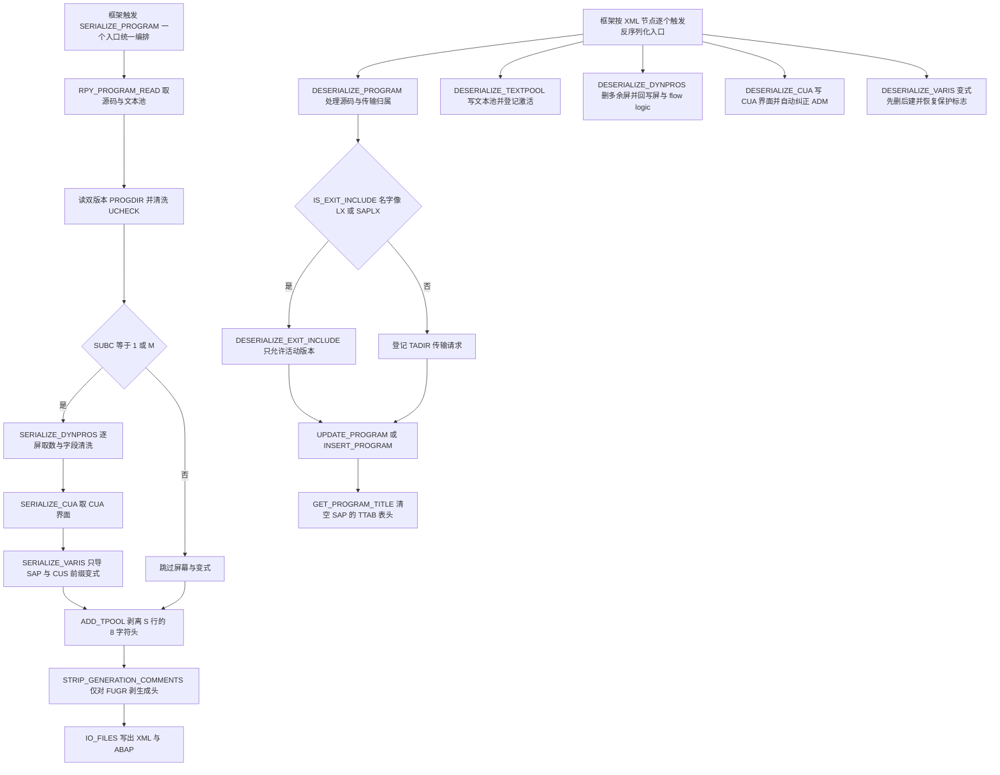
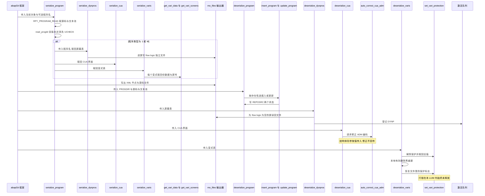

# ZCL_ABAPGIT_OBJECTS_PROGRAM 分析报告

> 分析对象：`abapGit — zcl_abapgit_objects_program.clas.abap`（1597 行，全局类 `ZCL_ABAPGIT_OBJECTS_PROGRAM`，`INHERITING FROM ZCL_ABAPGIT_OBJECTS_SUPER`）
> 报告视角：代码 onboarding 走读，按"序列化"与"反序列化"两条真实调用链展开

---

## 一、程序定位与业务背景

### 1.1 这段代码在解决什么问题

先说它**不是**什么：它不是报表、不画 ALV、不做任何业务计算。它是 abapGit 版本管理框架里的**"程序类对象"序列化适配层**——把一个 SAP ABAP 程序（可执行程序 REPS、函数组 FUGR、它们的屏幕、CUA 界面、变式、文本元素）完整拆成可序列化的数据，再从这些数据完整还原回去。

业务场景在于：SAP 里一个"程序"绝不是 DDIC 里的一个对象那么简单。`R3TR PROG` 底下至少挂着六类附属物：

| 附属物 | 实际存放处 | 丢了会怎样 |
|---|---|---|
| 源代码 | `REPOSRC` | 编译不过 |
| 屏幕（LIST / MODAL / SUBSCREEN） | `D020S`、`D021S`、`D021T` 与 flow logic | 程序能跑，但屏幕全错 |
| CUA 界面（状态栏、菜单、按钮、标题） | `RSMPE_*` 族 CUA 表 | 用户看到空菜单 |
| 变式（Variants） | `VARID`、`VARI`、`VART` | 用户的输入习惯与默认值丢失 |
| 文本元素 | `TEXTPOOL` | 所有文本变空白 |
| 传输归属 | `TADIR` | 拉下来的程序不在传输请求里，激活时报错 |

abapGit 的 Git 仓库里存的却是 `.abap` 与 `.xml` 文本文件。要在两者之间往返，就得有一个专职的"翻译官"。这个类就是那个翻译官，而且它是**双工**：一头 `serialize_*` 把 SAP 数据挖成文件，一头 `deserialize_*` 把文件塞回 SAP 数据。

设计范式一句话定性：

> **"双工适配器（Bidirectional Adapter）"——一个 ABAP 全局类，用 `serialize_*` / `deserialize_*` 成对方法把 SAP 内部 FM 与 DDIC 表的方言翻译成 abapGit 的文件方言，异常统一收敛到 `ZCX_ABAPGIT_EXCEPTION`。**

### 1.2 为什么值得做成一个类，而不是散落的函数模块

1. **它有跨方法的共享状态**。`mv_language`（当前语言）、`mo_files`（文件输出器）、`mo_i18n_params`（多语言参数）、`ms_item`（当前对象上下文）都来自父类 `ZCL_ABAPGIT_OBJECTS_SUPER`。这些状态散在 FM 里没法传，只能退化成函数组全局变量。
2. **序列化与反序列化必须共享同一套结构定义**。`ty_dynpro`、`ty_cua`、`ty_vari` 既是 `serialize_*` 的返回值，也是 `deserialize_*` 的输入形参。定义放在类里两头共用一份；放 FM 就得塞进一个公共 include，反而更容易漂移。
3. **版本兼容逻辑集中**。`insert_program` 与 `delete_vari` 里都有 `CATCH cx_sy_dyn_call_param_not_found` 的降级重试——这类"老 Release 上参数还不存在"的兼容写法散落在多处最容易漏改。
4. **异常契约统一**。所有 FM 错误都收敛成 `RAISING zcx_abapgit_exception`，让框架层能用一个 `TRY` 兜住整个 pull 过程。

代价是这个类很大：28 个方法，声明区占了近 280 行。它没有再往下拆成"屏幕适配器 / 变式适配器 / 界面适配器"三个协作对象，原因是这几条子流程之间共享 `ms_item`、`mo_files` 和激活队列 `ZCL_ABAPGIT_OBJECTS_ACTIVATION`，拆开反而要额外引入一堆构造参数与回调接口。

### 1.3 依赖清单（读这段代码前必须知道的地形）

```
父类          ZCL_ABAPGIT_OBJECTS_SUPER      提供 ms_item、mo_files、mv_language、mo_i18n_params
                                          以及 exists_a_lock_entry_for
接口          ZIF_ABAPGIT_XML_OUTPUT         XML 写入器，add 把结构体转成一个 XML 节点
              ZIF_ABAPGIT_SAP_REPORT         read_progdir、read_report、insert_report、
                                          update_progdir，以及 ty_progdir 结构
              ZIF_ABAPGIT_DEFINITIONS        ty_item，当前对象名与类型
              ZIF_ABAPGIT_LANG_DEFINITIONS   ty_tpool_tt，abapGit 自己的文本池行类型
激活队列      ZCL_ABAPGIT_OBJECTS_ACTIVATION  把 DYNP、CUAD、REPT、REPS 登记进去，等激活阶段统一处理
异常          ZCX_ABAPGIT_EXCEPTION          raise 与 raise_t100 两个入口
语言切换      ZCL_ABAPGIT_LANGUAGE           set_current_language 与 restore_login_language
标准 FM 源码  RPY_PROGRAM_READ、RPY_PROGRAM_INSERT、RPY_INCLUDE_UPDATE
标准 FM 屏幕  RS_SCREEN_LIST、RPY_DYNPRO_READ、RPY_DYNPRO_READ_NATIVE、
              RPY_DYNPRO_INSERT、RPY_DYNPRO_INSERT_NATIVE、RS_SCRP_DELETE
标准 FM 界面  RS_CUA_INTERNAL_FETCH、RS_CUA_INTERNAL_WRITE
标准 FM 变式  RS_ALL_VARIANTS_4_1_REPORT、RS_VARIANT_VALUES_TECH_DAT_255、
              RS_VARIANT_CONTENTS_255、RS_GET_SCREENS_4_1_VARIANT、
              RS_CREATE_VARIANT_255、RS_CHANGE_CREATED_VARIANT_255、RS_VARIANT_DELETE
直接 SQL      REPOSRC（存在性探测）、TADIR（传输归属）、VARIT 与 VARID（变式文本与
              保护标志）、D021T（原生屏幕文本）              ← 绕过了标准 FM
内存直写      ASSIGN 到 (SAPLSIFP)TTAB        直接清空 SAP 内部 TTAB 表头
```

### 1.4 两条调用链，以及谁触发它

这个类**没有事件块、没有 `INITIALIZATION`**，两个 `PUBLIC` 入口都由框架外部调用：

- `SERIALIZE_PROGRAM` —— 由 stage / commit / push 流程触发，把本地 SAP 对象挖成仓库文件。
- `DESERIALIZE_PROGRAM` —— 由 pull / restore 流程触发，把仓库文件塞回本地 SAP 对象。

值得注意的是，两侧的编排方式并不对称。**序列化侧是"一个入口统一编排"**：`serialize_program` 内部自己依次调用 `serialize_dynpros`、`serialize_cua`、`serialize_varis`，顺序与条件都在它自己手里。反序列化侧是"**每个 XML 节点一个入口，由外部依次调用**"**：`deserialize_textpool`、`deserialize_dynpros`、`deserialize_cua`、`deserialize_varis` 虽然与 `deserialize_program` 同属一个类、也同属 `PROTECTED` 可见性，但**在本文件内没有任何地方调用它们**。谁按什么顺序触发这些方法，需要在 SE24 里对 `ZCL_ABAPGIT_OBJECTS_PROGRAM` 做一次 "Used List" 才能确定，本报告不替它猜。除此之外还有三个对外暴露的锁检查方法 `IS_ANY_DYNPRO_LOCKED`、`IS_CUA_LOCKED`、`IS_TEXT_LOCKED`，供框架在 pull 之前判断"这个对象现在动得动不得"。

---

## 二、程序执行流程总览

两条链各自是一棵浅树，最深的嵌套只有屏级与变式级的 `LOOP`。



### 责任链表

| 子程序 | 调用者 | 职责 |
|---|---|---|
| `serialize_program`（`PUBLIC`，序列化唯一入口） | abapGit 框架的 stage / commit / push 流程 | 编排整个导出：定程序名、切语言、读源码与文本池、读双版本 PROGDIR、条件性拉屏幕 / 界面 / 变式、写 XML 与 ABAP 文件 |
| `serialize_dynpros`（`PROTECTED`） | `serialize_program`（`SUBC` 为 1 或 M 时） | 列出程序所有屏，跳过选择屏，逐屏读容器 / 字段 / flow logic，做输出样式、外键、文本三处清洗，装配成 `ty_dynpro` 表 |
| `serialize_cua`（`PROTECTED`） | `serialize_program` | 用 `RS_CUA_INTERNAL_FETCH` 取活动版本的完整 CUA 界面（ADM 加十一种元素表） |
| `serialize_varis`（`PROTECTED`） | `serialize_program` | 对每个导出的变式调 `get_vari_data` 与 `get_vari_screens`，装配成 `ty_vari` 表 |
| `get_varis_for_report`（`PROTECTED`） | `serialize_varis` 与 `deserialize_varis` | 调 `RS_ALL_VARIANTS_4_1_REPORT` 列出本地变式键，只保留 `SAP&*` 与 `CUS&*` 前缀 |
| `get_vari_data`（`PRIVATE`） | `serialize_varis` | 取变式的技术数据、参数值、对象清单与多语言描述，并对三张表排序 |
| `get_vari_screens`（`PRIVATE`） | `serialize_varis` | 取变式绑定的屏幕号并排序 |
| `add_tpool`（`PUBLIC` 类方法） | `serialize_program` | 把 SAP `TEXTPOOL` 行转成 abapGit 文本池行：对 `id = 'S'` 的行把 8 字符头从 `entry` 切到 `split` |
| `strip_generation_comments`（`PROTECTED`） | `serialize_program` | 仅对 FUGR，剥掉维护生成器写进源码里的时间戳与版本头 |
| `is_any_dynpro_locked` / `is_cua_locked` / `is_text_locked`（`PROTECTED`） | 框架在 pull 前的可操作性检查（具体调用点需 Used List 确认） | 分别探测 `ESCRP`、`ESCUAPAINT`、`EABAPTEXTE` 三类锁对象上是否存在本程序的锁 |
| `deserialize_program`（`PUBLIC`，源码反序列化入口） | abapGit 框架的 pull / restore 流程 | 判断是否 SAP 出口 Include，登记传输请求，按活动版本是否存在决定走更新还是插入，最后更新 PROGDIR 并登记激活 |
| `is_exit_include`（`PRIVATE`） | `deserialize_program`、`update_program`、`deserialize_exit_include` | 纯判定：程序名是否形如 `LX*` / `SAPLX*` / 命名空间下的 `/LX*` |
| `deserialize_exit_include`（`PRIVATE`） | `deserialize_program` | SAP 出口函数组的 Include 只能以活动版本落库：有活动版本就更新并置状态为 off，否则走插入 |
| `insert_program`（`PRIVATE`） | `deserialize_program` 与 `deserialize_exit_include` | 调 `RPY_PROGRAM_INSERT` 插源码；`name_not_allowed` 抛错；老 Release 上 `uccheck` 参数不存在时降级重试 |
| `update_program`（`PRIVATE`） | `deserialize_program` 与 `deserialize_exit_include` | 调 `RPY_INCLUDE_UPDATE` 改源码，并把 `EU510`、`EU522` 两条消息翻译成人类可读的异常文本 |
| `get_program_title`（`PRIVATE`） | `deserialize_program` 与 `deserialize_exit_include` | 从文本池取 `id = 'R'` 的标题行，并先清掉 SAP 的 `TTAB` 表头以规避长度串味 |
| `deserialize_textpool`（`PROTECTED`，本文件内无调用点） | 框架按 XML 的 TPOOL 节点触发（需 Used List 确认） | 按语言决定主语言存非活动、翻译存活动；空池走 `DELETE` 或 `INSERT` 空池，最后登记 `REPT` 激活 |
| `deserialize_dynpros`（`PROTECTED`，本文件内无调用点） | 框架按 XML 的 DYNPROS 节点触发（需 Used List 确认） | 列出本地屏做差集，逐屏修 SET/GET_PARAM、CHECK 的 modific、外键标志，按原生或普通两条路写回，最后删掉多余屏 |
| `uncondense_flow`（`PRIVATE`） | `deserialize_dynpros` | 按 `spaces` 表把 flow logic 每行右移对应位数，消除 SAP 存储时的条件压缩，还原成可读的 ABAP 源 |
| `deserialize_cua`（`PROTECTED`，本文件内无调用点） | 框架按 XML 的 CUA 节点触发（需 Used List 确认） | 界面全空就跳过；查 TADIR 拿包名，构造 TRKEY，调 `RS_CUA_INTERNAL_WRITE` 写入，最后登记 `CUAD` 激活 |
| `auto_correct_cua_adm`（`PRIVATE` 类方法） | `deserialize_cua` | 针对 issue #1807：CUA 的 ADM 若为空或编码全空白，就从 ACT、MENU、PFK 的动作编码里反推出应填的三个码 |
| `deserialize_varis`（`PROTECTED`，本文件内无调用点） | 框架按 XML 的 VARIS 节点触发（需 Used List 确认） | 先临时解除变式保护，逐个"本地有就删"再重建，最后把本地多出来的变式删掉，全过程用 `CLEANUP` 恢复原保护标志 |
| `create_vari` / `delete_vari`（`PRIVATE`） | `deserialize_varis` | 分别封装 `RS_CREATE_VARIANT_255` 加 `RS_CHANGE_CREATED_VARIANT_255` 的建变式两步，以及 `RS_VARIANT_DELETE` 的删变式（同样带老 Release 降级） |
| `set_vari_protection`（`PRIVATE`） | `deserialize_varis` | 直接 `UPDATE VARID` 改保护标志，返回改之前的旧值，供 `CLEANUP` 恢复 |
| `read_tpool`（`PUBLIC` 类方法） | abapGit 框架的文本读取路径（反向操作，调用点不在本文件） | `add_tpool` 的逆变换：把 `split` 与 `entry` 拼回一条完整的 `TEXTPOOL` 行 |

下面按这两条流程，逐个子程序展开。要先说清一件事：真正的复杂度不在算法，而在**它必须同时伺候三套方言**——SAP 标准 FM 的异常语义、SAP 内部 FM 的版本差异、以及 abapGit 自己的"文件要稳定可比对"的要求。第三套要求经常和前两套冲突（比如为了让两次导出字节一致，宁可清空 `OUTPUTSTYLE`），这类取舍是本文件最值得读的地方。

---

## 三、分组分析

本节共 37 个小节，按上面两条链的执行顺序排列。序列化侧先展开（入口 3.2 到 3.6、其下游 3.7 到 3.17），再展开三个锁探测方法（3.20），最后是反序列化侧（3.21 到 3.37）。

### 3.1 类定义段 `zcl_abapgit_objects_program` 的全局声明区

先看类型定义，因为后面 34 个小节反复出现的 `ty_cua`、`ty_dynpro`、`ty_vari` 都是它的产物。第一个代码块是 CUA 界面的载体。

```abap
    TYPES:
      BEGIN OF ty_cua,
        adm TYPE rsmpe_adm,
        sta TYPE STANDARD TABLE OF rsmpe_stat WITH DEFAULT KEY,
        fun TYPE STANDARD TABLE OF rsmpe_funt WITH DEFAULT KEY,
        men TYPE STANDARD TABLE OF rsmpe_men WITH DEFAULT KEY,
        mtx TYPE STANDARD TABLE OF rsmpe_mnlt WITH DEFAULT KEY,
        act TYPE STANDARD TABLE OF rsmpe_act WITH DEFAULT KEY,
        but TYPE STANDARD TABLE OF rsmpe_but WITH DEFAULT KEY,
        pfk TYPE STANDARD TABLE OF rsmpe_pfk WITH DEFAULT KEY,
        set TYPE STANDARD TABLE OF rsmpe_staf WITH DEFAULT KEY,
        doc TYPE STANDARD TABLE OF rsmpe_atrt WITH DEFAULT KEY,
        tit TYPE STANDARD TABLE OF rsmpe_titt WITH DEFAULT KEY,
        biv TYPE STANDARD TABLE OF rsmpe_buts WITH DEFAULT KEY,
      END OF ty_cua.
```

**做什么** — 定义一个结构 `ty_cua`：一个标量成员 `adm`（CUA 的界面总控记录，含动作码、菜单码、功能键码三个关键字段），加上十一个内表成员，分别对应状态栏、函数、菜单、标题文本、动作、按钮、功能键、状态设置、文档标题、标题、按钮图像（biv）十一种 CUA 元素。内表全部声明成 `STANDARD TABLE ... WITH DEFAULT KEY`，也就是**标准表 + 默认键**，没有指定排序键。

**为什么** — 十一种元素一张不多一张不少，与 `RS_CUA_INTERNAL_FETCH` 和 `RS_CUA_INTERNAL_WRITE` 的 `TABLES` 列表严格一一对应（见 3.10 与 3.32）。这是抄 FM 接口的正确做法：只要 FM 加了新元素，这个结构就得同步加一个成员，编译期就能发现遗漏。`adm` 单独放在第一个成员而不是并进 `sta` 表里，是因为它是**唯一的标量**——它是这堆界面元素的总索引，也是 `auto_correct_cua_adm` 唯一会改的东西。

**风险与改进** — 一处设计债：`WITH DEFAULT KEY` 让这十一个内表都没有默认主键。对 `sta`、`men`、`act`、`but` 这些表来说 `DEFAULT KEY` 就是"标准键"，即**全字段主键**，等于没有键。后果是这个结构被 `MOVE` 进 XML 之外的地方只要涉及 `READ TABLE ... WITH KEY`，都会退化成线性扫描。另外 `set` 作为成员名与 ABAP 的 `SET` 语句同名（虽然不冲突），`mtx` / `biv` 这类缩写也只有对着 FM 文档才认得出来，注释里应该补一句字段与 CUA 表的对应关系。改进方向：给元素表显式指定 `WITH UNIQUE KEY` 加上真正能定位一条记录的业务键（如 `act` 表按动作码、`men` 表按菜单码），并把缩写展开或加注。

第二个代码块是变式的载体，注意它比 CUA 多了一层嵌套。

```abap
    TYPES:
      BEGIN OF ty_vari,
        variant     TYPE varid-variant,
        flag1       TYPE varid-flag1,
        flag2       TYPE varid-flag2,
        transport   TYPE varid-transport,
        environmnt  TYPE varid-environmnt,
        protected   TYPE varid-protected,
        secu        TYPE varid-secu,
        xflag1      TYPE varid-xflag1,
        xflag2      TYPE varid-xflag2,
        variscreens TYPE ty_vari_dynnr_tt,
        objects     TYPE STANDARD TABLE OF vanz WITH DEFAULT KEY,
        values      TYPE ty_vari_value_tt,
        texts       TYPE STANDARD TABLE OF ty_vari_text WITH DEFAULT KEY,
      END OF ty_vari.
    TYPES:
      ty_vari_tt TYPE STANDARD TABLE OF ty_vari WITH DEFAULT KEY.
```

**做什么** — 定义 `ty_vari`：前八个成员是 `VARID` 表原样搬过来的技术字段（变式名、两个旗标、传输、环境、保护标志、安全级别、两个扩展旗标）；后四个是装配出来的集合——变式绑定的屏幕号表（`variscreens`）、变式里的对象清单（`objects`，类型 `VANZ`）、变式参数值表（`values`）、变式的多语言描述表（`texts`，行类型 `ty_vari_text` 只有 `langu` 与 `vtext` 两个字段）。再定义 `ty_vari_tt` 作为它的标准表。

**为什么** — 这个结构是**"数据库行 + 导出视图"的混合体**：`values` 与 `objects` 是标准 FM 直接给的 TABLES 参数，`texts` 是自己 `SELECT` 出来的，而前八个字段来自 `RS_VARIANT_VALUES_TECH_DAT_255` 的 `techn_data` 导入参数。把它们合成一个结构再整体交给 XML 写入器，是让"变式"在 abapGit 文件里表现为**一个节点**的最直接做法。`variscreens` 之所以单列而不是并进 `values`，是因为它来自另一个 FM（`RS_GET_SCREENS_4_1_VARIANT`），语义上属于"变式引用了哪些屏"而非"变式存了什么值"。

**风险与改进** — 三处：

1. **`texts` 的行类型 `ty_vari_text` 只有两列，而 `deserialize_varis` 往 `VARIT` 里写的时候手工补了 `mandt`、`report`、`variant` 三个字段**（见 3.34）。也就是说序列化侧把关键字段裁掉了，反序列化侧再猜回来。字段集不对称本身不是错（导出文件确实不该带客户端号），但**没有注释点破这一点**，接手的人会以为两侧字段集天然对等。
2. **`objects` 用 `STANDARD TABLE OF vanz WITH DEFAULT KEY` 而不是文件里已经定义好的 `ty_vari_object_tt`**，同一个概念在本文件里出现了两种写法（对比声明区里的 `ty_vari_object_tt`）。这是复制粘贴留下的痕迹，建议统一。
3. `flag1` 与 `flag2` 这类单字母旗标字段，`set_vari_protection` 直接拿它们和 `space` 比较（见 3.33），语义校核要看 `VARID` 的 DDIC 注释才能确定——**需在 SE11 核实这两个字段到底控制什么**。从代码用法反推，它们的作用是"只在非生成变式（flag 为空）上改保护标志"，但这属于推测。

第三个代码块是常量定义，这是整个类的"方言词典"。

```abap
    CONSTANTS:
      BEGIN OF c_state,
        active   TYPE r3state VALUE 'A',
        inactive TYPE r3state VALUE 'I',
        off      TYPE r3state VALUE '',
      END OF c_state.

    CONSTANTS c_native_dynpro TYPE c LENGTH 2 VALUE 'IN'.

    CONSTANTS c_sysvari_clnt        TYPE mandt      VALUE '000'.
    CONSTANTS c_sysvari_pattern_sap TYPE c LENGTH 5 VALUE 'SAP&*'.
    CONSTANTS c_sysvari_pattern_cus TYPE c LENGTH 5 VALUE 'CUS&*'.
```

**做什么** — 定义五组常量。`c_state` 三个值对应 `REPOSRC` 的三种状态：活动 `A`、非活动 `I`、关闭（空串）。`c_native_dynpro` 取 `'IN'`，是屏幕类型字段里"原生屏幕"的判定值。`c_sysvari_clnt` 硬编码客户端 `000`——因为 SAP 的变式表 `VARID` / `VARI` / `VART` 是全局表，不带客户端字段，读写时必须显式给 `mandt`。最后两个是变式名的通配模式，只导 `SAP` 与 `CUS` 开头的变式。

**为什么** — 把 `'A'`、`'I'` 这类魔数提成 `c_state` 结构是很有价值的做法：本文件在 12 处用到它们，读者看 `c_state-inactive` 就知道"这是在说非活动版本"，不用去猜 `'I'` 是什么。`c_sysvari_pattern_sap` 与 `c_sysvari_pattern_cus` 提成常量同样关键——这两个模式定义了**abapGit 到底导不导一个变式**这条业务边界（见 3.13），是产品决策而非实现细节，藏在 `LOOP ... WHERE` 里就没人知道边界在哪。

**风险与改进** — 两处：

1. **`c_sysvari_clnt = '000'` 是一个需要显式记录的假设**。变式表是全局表、只能用 `000` 客户端，这一条正确；但它对非 `000` 系统的含义是"这里的操作永远不会读到本客户端之外的变式"。注释里应写明"因 `VARID` 为全局表，SAP 侧变式固定存于 000 客户端"，否则接手的人会以为这里漏了本客户端的判断。
2. **`c_state-off` 用空串而不是任何有意义的值**，语义是"源系统里这个版本是关闭的"。它的唯一用途在 `deserialize_exit_include`（见 3.22）——出口 Include 不允许存非活动版本，所以置成 off。空串作为"关闭"是 SAP `R3STATE` 的约定，正确；但**这个约定没有注释**，而 `c_state` 里另外两个值都有字面量可读。
3. `c_native_dynpro` 用 `TYPE c LENGTH 2` 而不是 `TYPE rsmpe_dynpr-type` 之类的领域类型，牺牲了类型安全换来对 FM 接口的直接兼容。这是可接受的取舍，但配合它在 3.9、3.29 两处用 `CA` 做**子串**匹配（`ls_header-type CA c_native_dynpro`）需要留意——`CA` 判定的是"字段里是否包含 `IN` 这个两位串"，而不是"等于"。`'IN'` 之外的取值只要不含 `IN` 就走另一条路，这个语义是否符合 SAP 的原始约定**需核实**。

### 3.2 步骤① 定程序名并声明中间容器（`serialize_program` 的头部）

序列化入口共五步，这是第一步。方法的前置条件是：`ms_item` 与 `io_files` 必须已经由父类构造好，`iv_program` 可选。

```abap
    DATA: ls_progdir      TYPE zif_abapgit_sap_report=>ty_progdir,
          lv_program_name TYPE syrepid,
          lt_dynpros      TYPE ty_dynpro_tt,
          ls_cua          TYPE ty_cua,
          lt_varis        TYPE ty_vari_tt,
          li_report       TYPE REF TO zif_abapgit_sap_report,
          lt_source       TYPE TABLE OF abaptxt255,
          lt_tpool        TYPE textpool_table,
          ls_tpool        LIKE LINE OF lt_tpool,
          li_xml          TYPE REF TO zif_abapgit_xml_output.

    IF iv_program IS INITIAL.
      lv_program_name = is_item-obj_name.
    ELSE.
      lv_program_name = iv_program.
    ENDIF.
```

**做什么** — 声明十个局部容器：`ls_progdir` 装 PROGDIR 行（程序类型、UCCHECK 等元数据），`lt_dynpros` / `ls_cua` / `lt_varis` 分别装屏幕表、CUA 界面、变式表，`li_report` 是 `ZIF_ABAPGIT_SAP_REPORT` 的接口引用用来读双版本，`lt_source` / `lt_tpool` / `ls_tpool` 装源码与文本池，`li_xml` 是 XML 写入器。随后做一件事：把"要导哪个程序"这个参数归一化成 `lv_program_name`——`iv_program` 给了就用它，没给就退回当前对象 `is_item-obj_name`。

**为什么** — 参数名 `iv_program` 叫"程序"，但它其实是"要导哪个程序"的**覆盖值**：默认导当前对象。这一层归一化放在方法最开头是对的，后面所有子调用都只认 `lv_program_name`，避免了 `is_item-obj_name` 与 `iv_program` 两套来源在方法中段混用的经典错误。`lt_source` 显式写 `TYPE TABLE OF abaptxt255` 而不是 `abaptxt255_tab`，是 SAP 为 255 字符源码行提供的标准行类型别名，语义更直白。

**风险与改进** — 三处：

1. **`iv_program` 声明为 `OPTIONAL` 但没有任何格式校验**。这个值会被原样拼进 `lv_name`（3.30 的 `CONCATENATE`）并交给 `RPY_PROGRAM_READ`。如果调用方传进来一个带命名空间斜杠或超长的名字，错误会以 SAP 短转储的形式出现，而不是 abapGit 自己的异常。属于"契约宽松、后果不可控"的典型，建议开头补一次基本有效性检查。
2. **`lt_source` 与 `lt_tpool` 都是未清空的局部内表**，这里靠 ABAP 局部变量初值为空保证正确。可靠，但值得注意 `lt_source` 在下一步会被 `RPY_PROGRAM_READ` 填充、随后又在第三步被整体覆盖——**同名字段在方法内被两条不同路径写两次**（见 3.4），这种"读到的源码被丢掉"是本方法最容易看错的地方。
3. `zif_abapgit_sap_report=>ty_progdir` 这种用接口里的类型做行结构是 ABAP 里合法但偏少见的写法，好处是不必再建一个 Z 结构，代价是**读代码的人必须先打开接口才能知道 PROGDIR 有哪些字段**。本文件的 `insert_program` 就直接用了 `is_progdir-subc` 与 `is_progdir-uccheck`，可见这个接口结构被当成了公共契约。

### 3.3 步骤② 切语言读源码与文本池（`serialize_program` 的取数段）

```abap
    zcl_abapgit_language=>set_current_language( mv_language ).

    CALL FUNCTION 'RPY_PROGRAM_READ'
      EXPORTING
        program_name     = lv_program_name
        with_includelist = abap_false
        with_lowercase   = abap_true
      TABLES
        source_extended  = lt_source
        textelements     = lt_tpool
      EXCEPTIONS
        cancelled        = 1
        not_found        = 2
        permission_error = 3
        OTHERS           = 4.

    IF sy-subrc = 2.
      zcl_abapgit_language=>restore_login_language( ).
      RETURN.
    ELSEIF sy-subrc <> 0.
      zcl_abapgit_language=>restore_login_language( ).
      zcx_abapgit_exception=>raise_t100( ).
    ENDIF.

    zcl_abapgit_language=>restore_login_language( ).
```

**做什么** — 先把当前登录语言切到 `mv_language`，再调 `RPY_PROGRAM_READ` 一次读完两样东西：程序源码（进 `lt_source`）与文本元素（进 `lt_tpool`）。传了 `with_includelist = abap_false` 表示不要 include 列表，`with_lowercase = abap_true` 表示按小写读入。随后按 `sy-subrc` 分三路：`2` 表示程序不存在，先还原语言然后**静默返回**；其他非零表示出错，还原语言后抛 `raise_t100`；成功也还原语言。

**为什么** — 三处细节都值得说：

- **`with_lowercase = abap_true` 是 abapGit 的核心诉求**。SAP 源码表默认保留原始大小写，改过一次代码就会在导出文件里体现为大面积 diff；统一小写化让"只看真实改动"成为可能。这是"为可 diff 而牺牲保真"的一次明确的取舍，取舍方向写在 `serialize_program` 的设计里。
- **语言切换必须是成对的**。`RPY_PROGRAM_READ` 读的是"当前 SAP 语言"下的文本元素与程序名，所以读之前切、读之后还原。这对配对如果漏掉一次，后面所有 SAP 操作都在错误语言下跑，而且不报错——是典型的"静默灾难"。
- **`not_found` 被当成"静默成功"而不是错误**。因为程序本来就不存在是合法情况（例如用户配置了一个空对象），导出结果就是"什么都没有"。这个选择是对的，但**没有任何注释说明为什么 2 被特殊对待**，读者很容易误以为是漏判。

**风险与改进** — 三点：

1. **语言还原逻辑被复制了三遍**（两个分支各一次、成功路径一次）。这是"把收尾动作写在每条出口上"的典型写法，漏一条就是语言泄漏。`serialize_program` 里至少还有第三处（第三步的 `restore_login_language`）——**实际上这个方法前后一共出现了五次语言切换调用**。建议改成"只在方法最外层用一次 `TRY ... CLEANUP` 配对"的形状（示意，源码中不存在）：
```abap-fix
     DATA lv_not_found TYPE abap_bool.
     zcl_abapgit_language=>set_current_language( mv_language ).
     TRY.
         CALL FUNCTION 'RPY_PROGRAM_READ'
           ...（省略，与源码同）
       CLEANUP.
         zcl_abapgit_language=>restore_login_language( ).
     ENDTRY.
     lv_not_found = boolc( sy-subrc = 2 ).
   ```
   注意这样改会改变 `not_found` 分支的控制流（`RETURN` 要变成 `EXIT` 或设标志），不是纯机械替换，得配合重构。
2. **`sy-subrc = 2` 静默返回时，`io_files` 里一个文件都不会产生**。调用方拿到的结果是"这次导出没有贡献"，与"导出了但内容为空"在文件层面无法区分。建议返回一个成功标志，让框架至少能区分这两种情况。
3. **`cancelled = 1` 也会抛异常**。用户交互取消被当成错误，对后台批处理场景是合理的，但要确认 FM 在批处理下的 `sy-subrc` 取值——**这一点需在 SE37 里核实 `RPY_PROGRAM_READ` 的异常语义**。

### 3.4 步骤③ 读双版本元数据与源码（`serialize_program` 的版本处理段）

```abap
    " If inactive version exists, then RPY_PROGRAM_READ does not return the active code
    li_report = zcl_abapgit_factory=>get_sap_report( ).

    TRY.
        " Raises exception if inactive version does not exist
        ls_progdir = li_report->read_progdir(
          iv_name  = lv_program_name
          iv_state = c_state-inactive ).

        " Explicitly request active source code
        lt_source = li_report->read_report(
          iv_name  = lv_program_name
          iv_state = c_state-active ).
      CATCH zcx_abapgit_exception ##NO_HANDLER.
    ENDTRY.

    ls_progdir = li_report->read_progdir(
      iv_name  = lv_program_name
      iv_state = c_state-active ).

    clear_abap_language_version( CHANGING cv_abap_language_version = ls_progdir-uccheck ).
```

**做什么** — 三件事。第一，试着读**非活动**版本的 PROGDIR（只为拿 `uccheck` 语言版本这类元数据），若非活动版本不存在就抛异常，被 `CATCH` 吞掉；第二，把 `lt_source` 整体覆盖成**活动**版本的源码；第三，无条件再读一次**活动**版本的 PROGDIR 覆盖掉前面的结果。最后清掉 `uccheck` 里的 ABAP 语言版本后缀（`clear_abap_language_version`）。

**为什么** — 这段是全文件最难读的一段，但它解决的是一个真实的坑：**当程序同时存在活动与非活动两个版本时，`RPY_PROGRAM_READ` 返回哪一个是不确定的**。作者的处理办法是——第一遍照常读，然后用 `read_progdir` 确认非活动版本存在（存在则说明确实有双版本），再显式把源码换成活动版本，元数据也换成活动版本。注释 `" Explicitly request active source code"` 就在这一步正上方，把意图说清楚了，是本文件注释写得最好的几处之一。

**风险与改进** — 四点，前两点是实质缺陷：

1. **`CATCH zcx_abapgit_exception ##NO_HANDLER.` 把所有失败都吞成"没有非活动版本"**（P0）。这段 `TRY` 覆盖了两次调用：`read_progdir(inactive)` 与 `read_report(active)`。如果失败的是**第二次**（读活动版本源码失败），异常同样被吞，代码继续往下走，`lt_source` 会保持第二步里 `RPY_PROGRAM_READ` 读到的内容——而按注释所述，那份内容在双版本场景下**恰好是不确定的那一份**。结果是导出了一份可能来自非活动版本的源码，而用户以为自己导的是活动版本。更稳妥的形状是只把 `read_progdir(inactive)` 放进 `TRY`，把 `read_report` 挪出去让它正常传播（示意，源码中不存在）：
   ```abap-fix
     DATA lv_has_inactive_version TYPE abap_bool.
     TRY.
         ls_progdir = li_report->read_progdir(
           iv_name  = lv_program_name
           iv_state = c_state-inactive ).
         lv_has_inactive_version = abap_true.
       CATCH zcx_abapgit_exception ##NO_HANDLER.
         lv_has_inactive_version = abap_false.
     ENDTRY.
     IF lv_has_inactive_version = abap_true.
       lt_source = li_report->read_report(
         iv_name  = lv_program_name
         iv_state = c_state-active ).
     ENDIF.
   ```
   （`CATCH` 之后 `sy-subrc` 不会被置位，所以这个写法要靠 `READ TABLE` 之类的方式判定，属于示意而非可直接采纳的代码。）
2. **`read_progdir(active)` 完全没有异常处理**（P1）。它在 `TRY` 之外，`zcx_abapgit_exception` 会直接抛给框架。这一步失败通常是"程序确实不存在"，而第二步已经专门处理过 `not_found` 了——同一个"程序不存在"场景在这里走的是完全不同的路径，语义不一致。
3. **`ls_progdir` 被写了两次，第二次无条件覆盖第一次**（P1）。也就是说非活动版本的 PROGDIR 读出来只是为了判断"能不能读到"，它的内容本身被丢弃了。如果 abapGit 的目的是"优先保留非活动版本的元数据（例如新版本才有的字段）"，那第二次覆盖就是个 bug；如果目的只是"探测"，那第一次的赋值应该改成不保留结果。**这一条需要产品意图来定，代码本身无法判断**。
4. `clear_abap_language_version` 的实参是 `CHANGING cv_abap_language_version = ls_progdir-uccheck`，属于 CHANGING 传值语义（见 3.33 对 ABAP 传值规则的讨论）。这里**恰好**是有效的——因为传值传入的是结构体字段的副本，方法内的修改虽然传不回来，但……**这一点需核实**：若该方法依赖 `CHANGING` 回写来生效，则当前写法是 bug；若它是就地读取并返回新值给形参，则要确认调用点是否用了返回值。**建议在 SE24 查看该方法的定义确认**。

### 3.5 步骤④ 装配 XML 并条件性拉取屏幕、界面、变式（`serialize_program` 的输出段）

```abap
    IF io_xml IS BOUND.
      li_xml = io_xml.
    ELSE.
      CREATE OBJECT li_xml TYPE zcl_abapgit_xml_output.
    ENDIF.

    li_xml->add( iv_name = 'PROGDIR'
                 ig_data = ls_progdir ).
    IF ls_progdir-subc = '1' OR ls_progdir-subc = 'M'.
      lt_dynpros = serialize_dynpros( lv_program_name ).
      li_xml->add( iv_name = 'DYNPROS'
                   ig_data = lt_dynpros ).

      ls_cua = serialize_cua( lv_program_name ).
      li_xml->add( iv_name = 'CUA'
                   ig_data = ls_cua ).

      lt_varis = serialize_varis( lv_program_name ).
      li_xml->add( iv_name = 'VARIS'
                   ig_data = lt_varis ).
    ENDIF.
```

**做什么** — 先拿到 XML 写入器：调用方传了 `io_xml` 就复用它（让调用方能控制输出目的地），没传就自己 `CREATE OBJECT` 一个。然后无条件写 `PROGDIR` 节点，接着用一个 `IF` 把三种"重型"附属数据一起圈起来：**只有当程序类型（`SUBC`）是 `'1'`（可执行程序）或 `'M'`（模块池）时才去取屏幕、CUA 界面和变式**，并各写一个 `DYNPROS`、`CUA`、`VARIS` 节点。

**为什么** — 这个 `IF` 是全文件最有价值的一次业务判断，理由有三层。第一，**只有可执行程序和模块池才有屏幕与 CUA**；函数组（FUGR）的主程序和 TOP include 不需要（也不应该有）这些附属数据，所以 `FUGR` 被排除在外。第三，**这三个节点的成本远高于 PROGDIR**——`serialize_dynpros` 要对每一屏做两次 FM 调用加三次循环，`serialize_varis` 要对每个变式做三次 FM 调用。不判断类型地无条件调用，在最常见的函数组场景下会白白付出一大笔开销。第四，把三个节点收在一个 `IF` 里而不是三个独立 `IF`，让"这三样东西总是一起出现"这个不变量在代码形状上可见。

`IF io_xml IS BOUND` 的写法也是对的：`io_xml` 是 `REF TO` 形参，`IS BOUND` 判的是引用是否非空，比 `IF io_xml IS NOT INITIAL` 更快也更明确（初值判断对引用要先解引用）。

**风险与改进** — 三点：

1. **`'1'` 与 `'M'` 两个魔法值直写在 `IF` 里**（P2）。`PROGDIR-SUBC` 的取值含义是 SAP 的程序类型字典（`1` 可执行、`M` 模块池、`S` 子程序、`F` 函数组、`I` 接口、`T` 类型池、`X` 附加程序、`9` 国际化类型池）。判据只列了两个正向值，其余全部落入 else，这与"只有 1 和 M 有屏幕"的业务判断一致，但**没有任何注释，也没有常量**。一旦 SAP 增加一种带屏幕的新程序类型，这里会静默漏掉。建议提成常量结构并加注释：
   ```abap-fix
     CONSTANTS: c_progtype_executable TYPE progdir-subc VALUE '1',
                c_progtype_modpool    TYPE progdir-subc VALUE 'M'.
     IF ls_progdir-subc = c_progtype_executable OR
         ls_progdir-subc = c_progtype_modpool.
   ```
2. **`io_xml` 的存在性被判断了两次**（P2）：这里 `IF io_xml IS BOUND` 决定是否自建写入器，最后一步（3.6）又 `IF NOT io_xml IS BOUND` 决定是否把 XML 交给 `io_files`。第二次判断依赖的是形参而非 `li_xml`，逻辑上正确（只有调用方没给 XML 时才需要落到文件），但读代码的人要在脑子里维护"谁没绑"这个状态。建议在第一步就把结果存进一个布尔量，或者干脆把两次判断合并到方法末尾统一处理。
3. **`ls_cua` 是 `ty_cua` 结构（含 12 个成员）**，即使程序没有任何 CUA，`li_xml->add` 也会写出一个含 12 个空成员或空表的 `CUA` 节点。反序列化侧对应地有一整段 `lines( ... ) = 0` 的空判断（见 3.32）来识别"这是空界面"。这条往返路径能跑通，但它让 XML 文件体积和 diff 噪声都变大了——**是否值得为"空 CUA"也写节点，取决于 abapGit 的格式约定，需与文件格式负责人确认**。

### 3.6 步骤⑤ 过滤空标题行、文本池转换与落盘（`serialize_program` 的收尾段）

```abap
    READ TABLE lt_tpool WITH KEY id = 'R' INTO ls_tpool.
    IF sy-subrc = 0 AND ls_tpool-key = '' AND ls_tpool-length = 0.
      DELETE lt_tpool INDEX sy-tabix.
    ENDIF.

    li_xml->add( iv_name = 'TPOOL'
                 ig_data = add_tpool( lt_tpool ) ).

    IF NOT io_xml IS BOUND.
      io_files->add_xml( iv_extra = iv_extra
                         ii_xml   = li_xml ).
    ENDIF.

    strip_generation_comments( CHANGING ct_source = lt_source ).

    io_files->add_abap( iv_extra = iv_extra
                        it_abap  = lt_source ).
```

**做什么** — 三件事收尾。第一，从文本池里找 `id = 'R'`（程序标题行）那一条，如果它的 `key` 为空且 `length` 为 0，说明这是一条"空标题占位行"，`DELETE` 掉。第二，把文本池交给 `add_tpool` 转换后写成 `TPOOL` 节点。第三，调用方没给 `io_xml` 时把整个 XML 交给 `io_files` 落成文件；然后调 `strip_generation_comments` 清源码里的生成器注释，最后把源码交给 `io_files` 落成 `.abap` 文件。

**为什么** — `DELETE` 空标题行这一手非常关键，原因是 **`TEXTPOOL` 的 `id = 'R'` 行是"程序标题"，SAP 允许它长度为 0**，而 abapGit 要求"文件里没有的东西就是不存在"。如果不删，`RPY_INCLUDE_UPDATE` 那一侧会因为拿到一个空标题行而在某些 Release 上写入异常（3.25 提到 SAP 自身有个 TTAB 表头不清的 bug，`get_program_title` 就是为此打的补丁）。这是"用序列化侧过滤来补偿反序列化侧的标准 bug"的典型例子，注释虽然没写，但代码位置很说明问题。

`add_tpool` 用的是**类方法**而不是私有方法，因为 abapGit 的文本池转换在多处（读文件路径用 `read_tpool`，写文件路径用 `add_tpool`）需要同一对变换，把它们做成一对公共类方法是正确的形态。

**风险与改进** — 三点：

1. **`READ TABLE ... WITH KEY id = 'R'` 命中多行时只会取到第一行**（P1）。`TEXTPOOL` 表的键是 `(ID, KEY, LENGTH)`，一个程序可能有多个 `id = 'R'` 行（对应 `RPY_PROGRAM_UPDATE` 允许多行标题的情形）。这里只删"第一行"，如果空标题行不止一条，剩余的空行仍会被导出。对照 3.25 的 `get_program_title` 也是同样写法（同样只取第一行）——两处一致，但一致地不完整。稳妥形状是遍历清掉所有满足条件的行（示意，源码中不存在）：
   ```abap-fix
     LOOP AT lt_tpool ASSIGNING <ls_tpool_out> WHERE id = 'R'.
       IF <ls_tpool_out>-key = '' AND <ls_tpool_out>-length = 0.
         DELETE lt_tpool.
       ENDIF.
     ENDLOOP.
   ```
2. **`ls_tpool` 是用 `INTO` 取的工作区行，`DELETE ... INDEX sy-tabix` 依赖 `READ TABLE` 设置的 `sy-tabix`**。这是 ABAP 里的常见写法，但它把"要删哪一行"的答案藏在系统字段里。可读性和健壮性都弱于显式循环删除。
3. **`strip_generation_comments( CHANGING ct_source = lt_source )` 用 CHANGING 传值语义**（P1）。和 3.33 分析的 `auto_correct_cua_adm` 是同一类问题：ABAP 的 `CHANGING` 形参未声明 `REFERENCE` 时默认按值传递，内表会**复制一份**给被调方，方法内的 `DELETE ct_source` 改的是副本。`strip_generation_comments` 的全部工作就是删行，如果传值语义成立，它删的行不会回到 `lt_source`，函数组生成头会原样写进导出的文件。**这一条是本文件最需要立刻在 SE24 / SE38 里核实的一条**——请查 `strip_generation_comments` 的定义里 `ct_source` 是否声明为 `REFERENCE`（声明区的写法是 `ct_source TYPE STANDARD TABLE`，没有 `REFERENCE` 字样，也没有 `!` 前缀），以及调用点传的是内表还是 `REF TO`。内表形参在 ABAP 里**默认就是引用传递**（内表不可能按值传），所以这里很可能没问题；但**结构体形参 `cs_adm` 则是货真价实的按值传递**。两者的区别是本文件最容易踩坑也最值得讲清楚的地方，我在 3.33 展开。

### 3.7 步骤① 列出屏清单并过滤选择屏（`serialize_dynpros` 的取数段）

序列化入口的编排讲完了，下面进入它拉下来的第一个重型分支。`serialize_dynpros` 分三步：列屏并过滤、逐屏读并清洗、装配。本步是第一步。

```abap
    CALL FUNCTION 'RS_SCREEN_LIST'
      EXPORTING
        dynnr     = ''
        progname  = iv_program_name
      TABLES
        dynpros   = lt_d020s
      EXCEPTIONS
        not_found = 1
        OTHERS    = 2.
    IF sy-subrc = 2.
      zcx_abapgit_exception=>raise_t100( ).
    ENDIF.

    SORT lt_d020s BY dnum ASCENDING.

* loop dynpros and skip generated selection screens
    LOOP AT lt_d020s ASSIGNING <ls_d020s>
        WHERE type <> 'S' AND type <> 'W' AND type <> 'J'
        AND NOT dnum IS INITIAL.
```

**做什么** — 调 `RS_SCREEN_LIST`，传空的 `dynnr` 表示"把这个程序的所有屏都列出来"，结果进 `lt_d020s`（`D020S` 是一行一屏的轻量索引表，只有屏号与屏类型）。`sy-subrc = 2`（`OTHERS`）时抛异常，但 `not_found = 1` 被放过——程序没有屏是合法的。接着按屏号升序排序，然后开始遍历，条件是**屏类型既不是 `'S'`（选择屏）也不是 `'W'`（生成的列表屏）也不是 `'J'`（生成的临时屏），并且屏号非空**。

**为什么** — 排除 `'S'`、`'W'`、`'J'` 三种类型是这个方法的灵魂。SAP 会为 `PARAMETERS` / `SELECT-OPTIONS` **自动生成选择屏**，为 `WRITE` 之前的报表自动生成列表屏，为动态 `CALL SCREEN` 生成临时屏。这三类屏的元数据（字段、文本、flow logic）**完全由源码推导得出**，不是独立维护的对象：源码一改它们就变。如果把它们导出，pull 到别的系统后只要源码行数不同，生成屏就对不上，SAP 会报"屏幕与程序不一致"。所以正确做法就是"一个都不导"。这个判断写在 `LOOP ... WHERE` 里，紧挨着一句点破意图的注释 `* loop dynpros and skip generated selection screens`——注释把"跳过什么"说清楚了，省去读者去查 SAP 字典。

排序也不是可有可无的：屏号是字符串型（`'1000'`、`'0100'`），不排序的话导出文件的屏顺序取决于 `RS_SCREEN_LIST` 的内部实现，会造成无意义的 diff。

**风险与改进** — 三点：

1. **`sy-subrc = 1`（`not_found`）被放过，但没有任何注释**（P2）。这个"放过"是刻意的（程序没屏是常态），可是 `IF sy-subrc = 2` 这个只判 2 的写法看起来像"漏判了 1"。至少加一句注释说明 1 是"程序没有屏"。这与 3.3 的 `sy-subrc = 2` 是同一类可读性问题，全文件出现了四次。
2. **筛选用 `LOOP ... WHERE` 而不是 `DELETE ... WHERE`**（P3）。后者可以在一次操作里把要排除的行删掉，语义更直白（"删掉生成屏"），而且不需要把排除逻辑藏在 WHERE 里。两者性能相当，`DELETE ... WHERE` 的可读性更好。
3. **`type <> 'S' AND type <> 'W' AND type <> 'J'` 用的是三个否定条件**（P3）。SAP 的屏类型字典里还有别的值（`P` 弹出、`A` 子屏、`W` 工作区相关等），用一组否定条件意味着"以后 SAP 新增一种生成屏类型时这里会漏"。更稳的形状是列出**要保留**的类型（`( 'A', 'P' )` 之类），但前提是这份保留清单完整——**需在 SE11 查 `D020S-TYPE` 的完整取值范围后决定**。在不确定完整清单的情况下，保留否定写法并加注释是更安全的工程选择，这一点作者做对了。

### 3.8 步骤② 逐屏读取并做三处字段清洗（`serialize_dynpros` 的清洗段）

本步是整个类里代码密度最高的一段：一次外层 `LOOP`，里面套一次 FM 调用加三次 `LOOP`（字段清洗两处、容器清洗一处）。

```abap
      LOOP AT lt_fields_to_containers ASSIGNING <ls_field>.
* output style is a NUMC field, the XML conversion will fail if it contains invalid value
* field does not exist in all versions
        ASSIGN COMPONENT 'OUTPUTSTYLE' OF STRUCTURE <ls_field> TO <lv_outputstyle>.
        IF sy-subrc = 0 AND <lv_outputstyle> = '  '.
          CLEAR <lv_outputstyle>.
        ENDIF.

        "2746: we apply the same logic as in SAPLWBSCREEN
        "for setting or unsetting the foreignkey field:
        UNASSIGN <ls_field_int>.
        READ TABLE lt_fieldlist_int ASSIGNING <ls_field_int> WITH KEY fnam = <ls_field>-name.
        IF <ls_field_int> IS ASSIGNED.
          IF <ls_field_int>-flg1 O lc_flg1ddf AND
              <ls_field_int>-flg3 O lc_flg3for AND
              <ls_field_int>-flg3 Z lc_flg3fdu AND
              <ls_field_int>-flg3 Z lc_flg3fku.
            <ls_field>-foreignkey = 'X'.
          ELSE.
            CLEAR <ls_field>-foreignkey.
          ENDIF.
        ENDIF.

        IF <ls_field>-from_dict = abap_true AND
           <ls_field>-modific   <> 'F' AND
           <ls_field>-modific   <> 'X'.
          CLEAR <ls_field>-text.
        ENDIF.
      ENDLOOP.
```

**做什么** — 对每一屏的每一个字段做三件事，每一件都对应一个"不能照搬"的现实：

1. **清 `OUTPUTSTYLE`**。先用 `ASSIGN COMPONENT` 动态取该字段的 `OUTPUTSTYLE` 分量——注释说明了原因：它是个 `NUMC` 类型字段，而 `NUMC` 里出现非法字符会让 abapGit 的 XML 转换直接失败；注释还说明了第二个原因：这个分量在某些 SAP 版本里不存在，所以必须用动态 `ASSIGN` 而不是直接写 `<ls_field>-outputstyle`（直接写会在老版本上编译失败或运行失败）。值是两个空格就 `CLEAR`。
2. **重算 `foreignkey` 标志**。做法是先 `UNASSIGN` 掉上一轮用的字段符号，再从**原生格式**的字段表 `lt_fieldlist_int` 里按字段名 `fnam` 读出该字段，用三个位标志的组合判断它到底是不是外键字段，是就置 `'X'`，不是就 `CLEAR`。
3. **清 `text`**。如果字段标记为"来自 DDIC"（`from_dict`），并且它的 `modific` 既不是 `'F'` 也不是 `'X'`（即没有被用户或维护生成器改过），就把字段的固定文本 `text` 清空。

**为什么** — 这三处清洗分别对应三种不同性质的"不可移植状态"：

- `OUTPUTSTYLE` 属于**格式噪音**：它是输出样式的内部编号，跟目标系统的显示配置绑定，带过去只会让 XML 转换失败或产生无法解释的差异。
- `foreignkey` 属于**双份表示**：同一个"是不是外键字段"的信息在 `RPY_DYNPRO_READ` 返回的 `fields_to_containers`（外层格式）和 `RPY_DYNPRO_READ_NATIVE` 返回的 `fieldlist`（内层格式）里各有一份，两边可能不一致。作者选择以**内层格式**为准，并且**完全复刻了 SAP 自己 `SAPLWBSCREEN` 里的判断逻辑**（注释直接点了这个程序名和 issue 号 2746）。这是正确的选择：内层格式是屏幕字段的权威来源，外层格式的那一份由 SAP 的推导逻辑生成，重新推导才能保证往返一致。
- `text` 属于**冗余派生物**：字段来自 DDIC 时，字段的短文本本来就能从 DDIC 重新取，SAP 在导出屏幕时顺手带上的这份是缓存，会在 DDIC 改了描述之后变成陈旧数据。清掉它等于选择"永远从 DDIC 重新取"，这是唯一能保证多系统一致的做法。

`UNASSIGN` + `READ TABLE ... ASSIGNING` + `IF ... IS ASSIGNED` 这个三段式也是 ABAP 的正确写法：找不到就保持未赋值状态，而不是留着上一轮的指向。漏掉 `UNASSIGN` 会让"本屏找不到的字段"沿用上一个字段的数据——这类 bug 在测试里极难发现，作者的处理是对的。

**风险与改进** — 四点：

1. **`ASSIGN COMPONENT 'OUTPUTSTYLE' OF STRUCTURE` 的开销与脆弱性**（P1）。动态分量访问比静态访问慢，而且**字符串 `'OUTPUTSTYLE'` 一旦在某个 SAP 版本里改了名，这里就静默失效**（`sy-subrc <> 0`，代码直接跳过，不报错）。注释虽然写了"field does not exist in all versions"，但没有写"改名了会怎样"。改进方向是给这个降级加一次告警记录，否则线上出现"导出与期望不一致"时没有任何线索。
2. **位运算比较的对象是 `TYPE x` 的单字节常量**（P1）。声明区里 `lc_flg1ddf TYPE x VALUE '20'` 这类常量，本质上是把 SAP 内部 `MSEUSBIT` include 里的位定义**手抄了一份**。注释诚实写了"taken from include MSEUSBIT"，但**SAP 升级时这个 include 里的位定义如果变了，这里不会跟着变，也不会报错**。这是典型的"复制二进制常量"风险。更稳的做法是让常量从标准 DDIC 或标准类派生，或者至少在注释里写下 SAP 版本号与升级时的复核清单。
3. **`READ TABLE lt_fieldlist_int ... WITH KEY fnam` 在一个可能很大的表上做全键查找**（P2）。`lt_fieldlist_int` 的默认键（见声明区里 `TYPE TABLE OF d021s`）如果包含全字段，这就是线性查找，而它在一个"屏数 × 每屏字段数"的双层循环里。建议改用 `SORT` + `BINARY SEARCH` 或带 `WITH UNIQUE KEY` 的排序表。
4. **`modific` 的 `'F'` 与 `'X'` 两个魔法值**（P2）。这两个值代表"字段被谁改过"，语义完全不同（一个大概是维护生成器，一个是用户或其他工具），但代码里没有注释。`modific` 的取值含义**需在 SE11 核实 `RPY_DYFATC-MODIFIC` 的字段说明**；从本文件的用法看，作者至少知道 `'X'` 是"需要保留"的标记（3.29 里也把 CHECK 字段的 modific 改成 `'X'`），但 `'F'` 为什么必须排除，注释里没有解释。

### 3.9 步骤③ 容器清洗与结构装配（`serialize_dynpros` 的装配段）

```abap
      LOOP AT lt_containers ASSIGNING <ls_container>.
        IF <ls_container>-c_resize_v = abap_false.
          CLEAR <ls_container>-c_line_min.
        ENDIF.
        IF <ls_container>-c_resize_h = abap_false.
          CLEAR <ls_container>-c_coln_min.
        ENDIF.
      ENDLOOP.

      APPEND INITIAL LINE TO rt_dynpro ASSIGNING <ls_dynpro>.
      <ls_dynpro>-header = ls_header.

      " Store flow logic as separate ABAP files instead of XML
      mo_files->add_abap(
        iv_extra = 'screen_' && ls_header-screen
        it_abap  = lt_flow_logic ).

      READ TABLE lt_fieldlist_int TRANSPORTING NO FIELDS WITH KEY fill = 'X'.
      IF ls_header-type CA c_native_dynpro AND sy-subrc = 0.
        " In particular for dynpros with splitter
        <ls_dynpro>-nat_header = <ls_d020s>.
        CLEAR: <ls_dynpro>-nat_header-dgen, <ls_dynpro>-nat_header-tgen.
        <ls_dynpro>-nat_fields = lt_fieldlist_int.
        <ls_dynpro>-nat_texts  = lt_texts.
      ELSE.
        <ls_dynpro>-containers = lt_containers.
        <ls_dynpro>-fields     = lt_fields_to_containers.
      ENDIF.
```

**做什么** — 四件事。第一，遍历容器表：不允许垂直调整的容器（`c_resize_v = abap_false`）把最小行数 `c_line_min` 清零，不允许水平调整的（`c_resize_h = abap_false`）把最小列数 `c_coln_min` 清零。第二，往返回表 `rt_dynpro` 追加一行，把刚读到的 `ls_header` 装进 `header`。第三，**把 flow logic 单独交给 `mo_files` 存成一个独立的 ABAP 文件**，文件名带 `screen_` 前缀加屏号。第四，用 `READ TABLE ... TRANSPORTING NO FIELDS WITH KEY fill = 'X'` 探测原生字段表里有没有 `fill` 标记为 `'X'` 的字段；只有当屏类型包含 `'IN'`（`c_native_dynpro`）**且**存在这样的字段时，才走原生格式分支：把 `D020S` 索引行塞进 `nat_header`、清掉它的生成日期与生成时间（`dgen` / `tgen`）、把内层字段表塞进 `nat_fields`、把内层文本表塞进 `nat_texts`；否则走普通分支，装 `containers` 与 `fields`。

**为什么** — 三处都是"让导出结果可 diff"的努力：

- **容器最小尺寸清零**的逻辑很直白：一个不能调整大小的容器，它的最小尺寸就是不存在的（0），保留旧值只会让同一个屏幕在两台机器上导出不同数字。
- **flow logic 不进 XML 而单独存成 ABAP 文件**，是最有价值的一个决定。flow logic 是屏幕的处理流（PROCESS BEFORE OUTPUT 之类），SAP 存的是"条件压缩"过的版本（见 3.31 `uncondense_flow`），塞进 XML 会变成一坨不可读的编码文本；单独存成 ABAP 源文件后，它在 Git 里**可读、可 diff、可 review**，而且与同目录的 `.abap` 主源码用同一套 diff 习惯。这是把"SAP 内部表示"翻译成"人类可读表示"的典范。
- **`dgen` 与 `tgen` 被清掉**，同样是去噪：生成日期与时间每次读屏都不一样，带进文件就是每次 commit 都有一行无意义 diff。
- **原生分支的条件为什么还要加 `fill = 'X'` 这道探测**，注释写了一部分：`" In particular for dynpros with splitter`（分割器屏幕）。SAP 的原生格式在有 splitter（分隔条）的屏上会丢失信息，所以对这类屏必须退回普通格式。这是一条**为了不丢信息而主动降级**的正确取舍。

**风险与改进** — 三点：

1. **`ls_header-type CA c_native_dynpro` 用 `CA` 做子串判定**（P1）。`CA` 判的是"字段值里是否包含 `IN` 这个两位子串"。如果 SAP 的屏类型取值里存在任何包含 `IN` 的值（例如某种 `INPUT` 派生类型），就会被误判进原生分支。这个判断在 3.29 又用了一次。改成 `EQ` 更精确，前提是确认 SAP 的屏类型对原生屏就是精确的 `'IN'`——**需在 SE11 核实 `D020S-TYPE` 或 `RPY_DYHEAD-TYPE` 的取值**。
2. **`TRANSPORTING NO FIELDS` 的探测结果被后面的 `AND sy-subrc = 0` 消费，但 `ls_header-type` 的求值在它之前**（P1）。ABAP 的 `AND` 不保证短路（虽然实际实现通常短路，但**语言层面不保证求值顺序**），所以这段依赖"最后一次 `READ TABLE` 设置的 `sy-subrc`"的写法在语言上是脆弱的。更稳的形状是拆成两步：
   ```abap-fix
     READ TABLE lt_fieldlist_int TRANSPORTING NO FIELDS WITH KEY fill = 'X'.
     lv_is_native = ls_header-type = c_native_dynpro AND sy-subrc = 0.
     IF lv_is_native.
   ```
   同时这段 `READ TABLE` 和 3.8 里对 `lt_fieldlist_int` 的使用**共用同一个 `sy-subrc` 语义**，两处混用很容易在后续维护中踩到。
3. **`mo_files->add_abap` 在 `rt_dynpro` 已经追加之后才调用，且不接受失败**（P2）。`io_files` 是父类提供的输出器，如果写文件失败（磁盘满、路径冲突、`iv_extra` 拼出的文件名超长），这一屏的 flow logic 就丢了，但方法继续往下走，最终导出的文件里少一段 screen 文件。反序列化侧（3.28）会从 `mo_files->read_abap` 读同一段内容，读不到就会导致 flow logic 为空——**往返后屏幕的处理流静默消失**。这是一处数据完整性缺口，`io_files` 是否抛异常需在 SE24 核实其定义。

### 3.10 序列化 CUA 界面（`serialize_cua`）

```abap
    CALL FUNCTION 'RS_CUA_INTERNAL_FETCH'
      EXPORTING
        program         = iv_program_name
        language        = mv_language
        state           = c_state-active
      IMPORTING
        adm             = rs_cua-adm
      TABLES
        sta             = rs_cua-sta
        fun             = rs_cua-fun
        men             = rs_cua-men
        mtx             = rs_cua-mtx
        act             = rs_cua-act
        but             = rs_cua-but
        pfk             = rs_cua-pfk
        set             = rs_cua-set
        doc             = rs_cua-doc
        tit             = rs_cua-tit
        biv             = rs_cua-biv
      EXCEPTIONS
        not_found       = 1
        unknown_version = 2
        OTHERS          = 3.
    IF sy-subrc > 1.
      zcx_abapgit_exception=>raise_t100( ).
    ENDIF.
```

**做什么** — 一个方法、一次 FM 调用完成整个 CUA 界面导出：传程序名、当前语言、**固定的活动版本**状态，`IMPORTING` 取回界面总控 `adm`，`TABLES` 取回十一种元素表，**直接写进 RETURNING 参数 `rs_cua` 的对应成员**。异常判据是 `sy-subrc > 1` 才抛异常，也就是 `not_found = 1` 被放过。

**为什么** — `rs_cua` 是 `ty_cua` 类型（见 3.1），十二个成员与 FM 的十二个输出参数**一一对应且名字一致**，所以这些 `= rs_cua-sta` 这样的实参名同时充当了代码的可读性锚点——读者看一眼就知道哪张表是什么。这种"FM 输出参数直接绑到结构体成员"的写法，比先收进十二个局部内表再逐个搬一遍要短得多，代价是这个方法里没有可以做中间处理的局部变量。本方法也确实不需要中间处理。

`sy-subrc > 1` 而不是 `<> 0` 是一个刻意的差异化处理：`not_found` 表示"这个程序没有 CUA"，是绝大多数程序的常态（比如一个纯逻辑的报表根本不用 SE41 做过界面），抛异常会让 abapGit 在导出成千上万个程序时到处失败。而 `unknown_version` 与 `OTHERS` 才是真问题。

**风险与改进** — 三点：

1. **`sy-subrc = 1` 时 `rs_cua` 的状态没有被检查**（P1）。ABAP 的 `IMPORTING` / `TABLES` 参数在异常发生时的填充行为依赖 FM 的实现约定——FM 抛 `not_found` 时，`adm` 与十一个表里哪些被清空、哪些保持原状，**需在 SE37 里核实 `RS_CUA_INTERNAL_FETCH` 的接口说明**。如果 FM 在抛异常前已经写入了部分数据，`rs_cua` 就是"半个界面"，它会被无条件写进 XML 节点；反序列化侧（3.32）虽然有"全空才跳过"的判断，但"半空"的状态会一路写进 `RS_CUA_INTERNAL_WRITE`。稳妥的形状是在异常分支显式清空：
   ```abap-fix
     IF sy-subrc <> 0.
       CLEAR rs_cua.
       IF sy-subrc > 1.
         zcx_abapgit_exception=>raise_t100( ).
       ENDIF.
     ENDIF.
   ```
2. **`state = c_state-active` 硬编码只导活动版本**（P2）。这是有道理的（CUA 界面通常只维护一份），但如果某个程序同时存在活动与非活动两套 CUA，非活动那套就导不出来。串化侧同样只处理了源码的双版本（3.4），屏幕与 CUA 都没有双版本处理——**"哪些对象区分版本、哪些不区分"这份清单本文件没有写下来**，是接手时应该补齐的一份隐性契约。
3. **`##SUBRC_OK` 之类的抑制标记没加，但 `sy-subrc > 1` 的判断让 FM 的短转储被吞了**（P2）。`RS_CUA_INTERNAL_FETCH` 是 `OTHERS = 3` 的写法，抛异常后系统会留短转储，但因为这里只抛 `zcx_abapgit_exception`（不带原文），排障时得去 ST22 里翻短转储。abapGit 的惯例是加 `##FM_SUBRC_OK`（见 3.23 的 `insert_program`），这里没加，两处风格不一致。

### 3.11 步骤① 取变式键并一次拉齐单个变式的四份数据（`serialize_varis` 的取数段）

序列化侧的第二个重型分支。`serialize_varis` 分两步，本步是第一步。

```abap
    DATA: ls_vari  TYPE ty_vari,
          ls_varid TYPE varid,
          lt_varis TYPE ty_varikey_tt.

    FIELD-SYMBOLS: <ls_varikey> LIKE LINE OF lt_varis,
                   <ls_object>  LIKE LINE OF ls_vari-objects.

    lt_varis = get_varis_for_report( iv_program_name ).

    LOOP AT lt_varis ASSIGNING <ls_varikey>.
      CLEAR: ls_vari,
             ls_varid.

      get_vari_data( EXPORTING is_vari    = <ls_varikey>
                     IMPORTING es_varid   = ls_varid
                               et_values  = ls_vari-values
                               et_objects = ls_vari-objects
                               et_texts   = ls_vari-texts ).
```

**做什么** — 先调 `get_varis_for_report` 拿到要导出的变式键表 `lt_varis`，然后对每个变式键：清空工作结构 `ls_vari` 与 `ls_varid`，再调 `get_vari_data` **一次**把四份数据分开填进四个去处——技术数据 `VARID` 行进 `ls_varid`，参数值表进 `ls_vari-values`，变式对象清单进 `ls_vari-objects`，多语言描述进 `ls_vari-texts`。

**为什么** — 三处细节值得说。

第一，`get_vari_data` 的**实参直接绑到 `ls_vari` 的成员上**，中间不经过临时内表。这让"哪个 FM 输出进了 `ty_vari` 的哪个成员"这件事在代码里一目了然，也是 `ty_vari` 那个混合结构（3.1）能被这样直接使用的前提。

第二，调用点写的是 `get_vari_data( EXPORTING is_vari = ... IMPORTING es_varid = ... )`，而定义处 `is_vari` 是 `IMPORTING`、`es_varid` 等四个是 `EXPORTING`——**类别是反的**。这是 ABAP 方法调用的一处固有约定：形式上声明为 `EXPORTING` 的形参，在调用点是用 `IMPORTING` 传值的；形式上 `IMPORTING` 的用 `EXPORTING` 传。所以这段写法是**正确的**，但可读性极差：`IMPORTING es_varid = ls_varid` 看起来像"把 `ls_varid` 传进去"，实际是"从方法里取回值"。**建议核实一下团队是否想统一改成更清晰的形式**，或者至少在这类反向调用上加注释。

第三，`FIELD-SYMBOLS` 用 `ASSIGNING` 而不是 `INTO`，是因为下一步（3.12）要把 `get_vari_screens` 的返回值直接写进 `ls_vari-variscreens`，这样能省掉一次内表赋值。

**风险与改进** — 三点：

1. **`get_vari_data` 把四个输出一次性塞进三个不同去处，出错时是"部分成功"**（P2）。它在内部任一步 `raise_t100` 都会抛异常，异常向上传播，`lt_varis`（结果表）保持为空，方法直接失败——这一点是对的（不会导出半个变式）。但 `ls_vari` 是循环内的共享工作结构，靠每轮开头的 `CLEAR` 保证不串数据，这个模式对，但**没有注释点明**"必须每轮清空"。
2. **每轮 `CLEAR ls_vari` 会连带清掉 `ls_vari-variscreens` 等表成员**，这是对的；但 `ls_vari` 的行结构有 13 个成员（见 3.1），逐轮 `CLEAR` 的开销可以忽略，不必优化。
3. **`get_varis_for_report` 返回的键表可能为空**（P3）。空表时 `LOOP` 不进循环、方法返回空表，调用方（3.5）会把一个空的 `VARIS` 节点写进 XML。不算缺陷，但和 3.10 的"空 CUA 也写节点"是同一个取舍，需要与格式约定一并决定。

### 3.12 步骤② 搬运技术数据、清对象文本、补变式屏幕（`serialize_varis` 的装配段）

```abap
      MOVE-CORRESPONDING ls_varid TO ls_vari.

      " Clear texts - they will be provided in TEXTPOOL section
      LOOP AT ls_vari-objects ASSIGNING <ls_object>.
        CLEAR <ls_object>-text.
      ENDLOOP.

      ls_vari-variscreens = get_vari_screens( <ls_varikey> ).

      INSERT ls_vari INTO TABLE rt_varis.
    ENDLOOP.
```

**做什么** — 四件事：把 `VARID` 的技术数据整行搬进 `ls_vari`；遍历变式里的对象清单，把每个对象的 `text` 清空（注释说明这些文本会在 `TEXTPOOL` 节点里另行提供）；调 `get_vari_screens` 取这个变式绑定了哪些屏号，直接装进 `ls_vari-variscreens`；最后整行插进返回表 `rt_varis`。

**为什么** — 清 `text` 与 3.6 的"删空标题行"、3.8 的"清字段 `text`"是**同一条设计原则的三次应用**：凡是能从别处重建的文本，就不在结构化节点里重复存第二份。这保证了 abapGit 文件里同一个描述只有一处真值，多语言改动只改一处，往返也永远不会出现"两处描述不一致"。这个原则在整个文件里贯彻得很彻底，是本文件最值得学的一点（见第六节）。

`get_vari_screens` 的结果直接赋给结构成员而不是先收进局部表再 `INSERT`，也是为了少一次拷贝。

**风险与改进** — 三点：

1. **`MOVE-CORRESPONDING ls_varid TO ls_vari` 把 `mandt` 与 `report` 也搬了进去**（P1）。`ty_vari` 的结构里**没有** `mandt` 与 `report` 成员（见 3.1），所以 `MOVE-CORRESPONDING` 只搬同名字段，这两个不会进入导出结构——**这一点是这个类型设计做对的地方**：导出文件里不含客户端号与程序名。反序列化侧（3.34）因此必须手工补 `ls_varid-mandt` 与 `ls_varid-report`。字段集的不对称是有意为之，值得在 `ty_vari` 的定义处加一行注释说明，否则接手的人会以为反序列化侧那两行是冗余代码。
2. **`MOVE-CORRESPONDING` 的语义是"同名同类型才搬"**，一旦 SAP 给 `VARID` 加了一个与 `ty_vari` 同名的新字段，它会被自动搬进导出文件，**改变 abapGit 的文件格式而不需要改 abapGit 的代码**。这是一个隐式的格式契约风险：SAP 升级可能悄悄改变导出结果。改进方向是改成显式的字段清单搬运（代价是代码变长）——3.34 的"风险与改进"里给出了那一版示意。
3. **变式对象的 `text` 被清空后是否真的能在别处拿回来，注释没有回答**（P2）。注释说"会在 TEXTPOOL section 提供"，但程序的 `TEXTPOOL` 与变式对象文本（`VANZ-TEXT`）是不是同一套东西，**需核实**：可以查 `VANZ` 表的 `TEXT` 字段与 `TEXTPOOL` 的关系，或者在 SE38 里对一个带变式对象的程序看看它的 `TEXTPOOL` 里有没有对应条目。如果拿不回来，清空就是净数据丢失，属于 P1。

### 3.13 列出应导出的变式键（`get_varis_for_report`）

```abap
    DATA: ls_catalog TYPE rsvcat,
          ls_vari    LIKE LINE OF rt_varis.

    FIELD-SYMBOLS <ls_cat> TYPE cat_var.

    CALL FUNCTION 'RS_ALL_VARIANTS_4_1_REPORT'
      EXPORTING
        program = iv_repid
      IMPORTING
        cat     = ls_catalog
      EXCEPTIONS
        OTHERS  = 1.
    IF sy-subrc <> 0.
      zcx_abapgit_exception=>raise_t100( ).
    ENDIF.

    ls_vari-report = iv_repid.
    LOOP AT ls_catalog-cat ASSIGNING <ls_cat>
         WHERE variant CP c_sysvari_pattern_sap
         OR variant CP c_sysvari_pattern_cus.
      ls_vari-variant = <ls_cat>-variant.
      INSERT ls_vari INTO TABLE rt_varis.
    ENDLOOP.

    SORT rt_varis.
```

**做什么** — 调 `RS_ALL_VARIANTS_4_1_REPORT` 拿到该程序的**完整变式目录**（结构 `RSV_CAT`，成员 `cat` 是变式键 `CAT_VAR` 的内表），然后用 `WHERE ... CP` 只保留变式名匹配 `SAP&*` 或 `CUS&*` 两个模式的行，把程序名与变式名装进结果表 `rt_varis`。最后排序。

**为什么** — 这是全文件**最需要产品视角才能读懂的一段**。程序里可能有几十个变式，其中绝大多数是"某某用户临时试出来的输入组合"，把它们导进版本库会造成三件坏事：仓库体积膨胀、每次用户测试都产生 commit、以及把某个用户的敏感输入（订单号、客户号）固化到 Git 历史里。`SAP&*` 对应 SAP 标准变式，`CUS&*` 对应客户自己建的变式——这两类是"有名字、有意义、值得版本化"的。中间的 `&` 是 SAP 变式名的占位符约定，所以模式是 `SAP` 加任意后缀。

这个方法被两处复用：序列化侧（3.11）用它决定"导哪些"，反序列化侧（3.34）用它决定"删哪些"——两侧用**同一个过滤规则**才能保证往返一致，这一点做得很对。

**风险与改进** — 三点：

1. **`ls_vari` 是一个被反复赋值的共享工作结构，但只有 `report` 和 `variant` 两个字段被填**（P2）。因为 `rt_varis` 的元素类型是 `rsvarkey`（见声明区的 `ty_varikey_tt`），只有这两个字段，逻辑正确。但如果哪天有人把返回类型改成更宽的结构，`ls_vari` 的旧值会残留——建议在 `LOOP` 体内加 `CLEAR ls_vari` 或改用 `VALUE #( )` 构造。
2. **`WHERE` 子句里两个条件用 `OR` 连接在 `LOOP AT` 上，而过滤是隐式的**（P2）。读代码的人要在脑子里执行一遍模式匹配才知道边界在哪。这也是我把两个模式提成常量的价值所在——现在它们在 3.1 的常量块里，能被找到；但 `WHERE` 的写法本身仍然把"产品决策"藏在了语法里。加一句注释会好很多。
3. **`SORT rt_varis` 按默认键排**（P3）。默认键是全字段，实际等于按 `report` + `variant` 排，效果是对的，但显式写 `SORT rt_varis BY variant.` 更清楚。
4. **`EXCEPTIONS OTHERS = 1` 没有细分**（P2）。SAP 的变式 FM 可能因为"程序无变式"而抛异常，那样整次导出就失败了——**这一点需核实 `RS_ALL_VARIANTS_4_1_REPORT` 在无变式时的行为**。若它抛异常，这里应该有 `not_found` 之类的放行分支，与 3.7、3.10 的处理保持一致。

### 3.14 取单个变式的四份数据（`get_vari_data`）

`get_vari_data` 分两块：先取技术数据与参数值骨架，再补语言过滤与变式内容。本方法名里的 "DATA" 对应三个 `EXPORTING` 输出。

```abap
    DATA: lt_language_filter TYPE zif_abapgit_environment=>ty_system_language_filter,
          ls_language_filter LIKE LINE OF lt_language_filter.

    CLEAR: es_varid,
           et_values,
           et_objects,
           et_texts.

    CALL FUNCTION 'RS_VARIANT_VALUES_TECH_DAT_255'
      EXPORTING
        report         = is_vari-report
        variant        = is_vari-variant
        sorted         = abap_true
      IMPORTING
        techn_data     = es_varid
      TABLES
        variant_values = et_values " is ignored
      EXCEPTIONS
        OTHERS         = 1.
    IF sy-subrc <> 0.
      zcx_abapgit_exception=>raise_t100( ).
    ENDIF.

    " Use variant values from CONTENTS call
    " both calls have this parameter as non-optional
    CLEAR et_values.
```

**做什么** — 先把四个 `EXPORTING` 输出（`es_varid`、`et_values`、`et_objects`、`et_texts`）全部清空——ABAP 的 `EXPORTING` 形参是引用传入的，如果调用方传进来的内表本来有内容，不清就会与新数据混合。接着调 `RS_VARIANT_VALUES_TECH_DAT_255`：技术数据进 `es_varid`（一个 `VARID` 行），参数值进 `et_values`——**但这个 `TABLES` 参数的结果随即被 `CLEAR et_values` 丢掉**，因为它的输出"被忽略"。注释写明了原因：这个参数在两个 FM 里都是非可选的，不传会 dump，而真正需要值的是接下来那次调用。

**为什么** — `CLEAR` 在前、`CLEAR` 在后，是这个方法最值得学的一处写法。开头清空四个输出保证了"要么全有要么全无"的契约；中间那次 `CLEAR et_values` 配合注释解释清楚了"为什么调了又扔"——这是 SAP 内部 FM 的典型怪癖（参数非可选但结果无用），不了解的人会以为写错了。而 `sorted = abap_true` 这个参数是**故意要的**：它让这次（被丢弃的）调用顺带确认变式存在，随后真正的 `RS_VARIANT_CONTENTS_255` 再取一次数据。

把"存在性校验"与"数据获取"合并进同一次调用，是这个方法的巧妙之处——省掉一次往返。

**风险与改进** — 三点：

1. **`##FM_SUBRC_OK` 之类的抑制标记没加**（P2）。`OTHERS = 1` + `raise_t100` 是本文件的标准异常风格，但两次 FM 调用的短转储都会被吞掉。排障时需要在 ST22 里翻。风格上应与 `insert_program`（3.23）统一。
2. **`et_values` 被清空后重新取，中间如果抛异常，输出是"空"而不是"半成品"**（P2）。这一点实际上比大多数代码做得好——因为入口就 `CLEAR` 了。但也意味着**失败无法被区分于"变式没有值"**：调用方只能靠异常区分。如果将来有"变式存在但参数为空"的合法场景，这里需要额外的返回标志。
3. **`sorted = abap_true` 与后面 `SORT et_values` 重复**（P3）。既然这个 FM 已经排过序，第二次排是双保险；但如果哪天去掉第一次调用的数据用途（因为它被丢弃了），这个参数也应一起去掉，否则白付一次排序开销。

### 3.15 取变式描述文本与变式内容（`get_vari_data` 续）

```abap
    IF mo_i18n_params->ms_params-main_language_only <> abap_true.
      lt_language_filter = mo_i18n_params->build_language_filter( ).
    ENDIF.
    ls_language_filter-sign   = 'I'.
    ls_language_filter-option = 'EQ'.
    ls_language_filter-low    = mv_language.
    CLEAR ls_language_filter-high.
    INSERT ls_language_filter INTO TABLE lt_language_filter.

    " SELECT because RS_VARIANT_TEXT and related FMs cannot list available languages
    SELECT langu vtext FROM varit CLIENT SPECIFIED
      INTO CORRESPONDING FIELDS OF TABLE et_texts
      WHERE mandt = c_sysvari_clnt
        AND report = is_vari-report
        AND variant = is_vari-variant
        AND langu IN lt_language_filter
      ORDER BY langu.

    CALL FUNCTION 'RS_VARIANT_CONTENTS_255'
      EXPORTING
        report         = is_vari-report
        variant        = is_vari-variant
        execute_direct = abap_true
      TABLES
        valutab        = et_values
        objects        = et_objects
      EXCEPTIONS
        OTHERS         = 1.
    IF sy-subrc <> 0.
      zcx_abapgit_exception=>raise_t100( ).
    ENDIF.

    " reproducible order
    SORT et_values.
    SORT et_objects.
    SORT et_texts.
```

**做什么** — 三步。第一步准备语言过滤表：如果配置不是"只导主语言"，就调 `build_language_filter( )` 拿到一批已配置的语言，然后**无条件**再 `INSERT` 一条"等于当前语言"的记录进去。第二步直接写 SQL 从 `VARIT` 表读变式描述，带 `CLIENT SPECIFIED` 与 `mandt = '000'`，用 `IN` 接过滤表，`ORDER BY langu` 排序。第三步调 `RS_VARIANT_CONTENTS_255` 拿真正的参数值表与变式对象表。最后三句 `SORT` 把三张输出表全排一遍。

**为什么** — 绕过 SAP 标准 FM 直接 `SELECT VARIT` 的原因写在了注释里：`" SELECT because RS_VARIANT_TEXT and related FMs cannot list available languages`。SAP 的变式文本 FM 只能"给一个语言取文本"，**没有"列出这个变式有哪些语言"的接口**，所以多语言导出只能自己查表。这是一个用直连 SQL 绕过 FM 接口缺口的正确决策——它换来的是多语言变式描述能进版本库。

三句 `SORT` 的注释是 `" reproducible order`，点破了目的：**可重复的顺序**。内表顺序取决于 FM 的内部实现，不排序的话同一份数据在不同系统上导出会得到不同行序，Git 里就是一片无意义 diff。这是"让输出可 diff"这条主线在变式部分的落点，和 3.6 清 `dgen` / `tgen`、3.8 清 `OUTPUTSTYLE` 是同一套思路。

**风险与改进** — 四点：

1. **直接 `SELECT` 全局表 `VARIT`，绕过了 SAP 的授权与一致性层**（P1）。`VARIT` 是全局表（无客户端字段），所以必须 `CLIENT SPECIFIED` 加 `mandt = '000'`，这点做对了。但绕过 FM 的代价是：SAP 未来如果在这个表上加权限检查、或者改表结构，这个 `SELECT` 会静默失效。而且 SELECT 的字段投影（`langu`、`vtext`）与目标结构 `ty_vari_text` 的字段同名，所以 `INTO CORRESPONDING FIELDS` 成立——**这个"同名才成立"的耦合一旦有一边改名，`SELECT` 会报目标结构不匹配的运行时错误**，而错误信息通常很难指向根因。
2. **语言过滤是"已有配置 ∪ 当前语言"的并集，不是交集**（P1）。如果 abapGit 只配置了导出英文和德文，而 `mv_language` 是中文，那么这个变式会带着一个中文描述进仓库——**中文通常在 Git 里是编码敏感项**，一旦某台机器的 `.gitattributes` 或编辑器配置不当就是乱码。这里把当前语言无条件并进来，看起来是为了保证"至少有一个语言"，但代价是破坏语言白名单。是否有意为之，**需核实 abapGit 的多语言策略**（可查 `mo_i18n_params` 的构造与 `build_language_filter` 的实现，本文件不可见）。
3. **`ls_language_filter` 只 `CLEAR` 了 `high` 而没有 `CLEAR` 整行**（P3）。因为结构是行结构且在 `lt_language_filter` 之前刚从 `build_language_filter( )` 整体赋值，所以第一行一定是初值；但如果哪天把 `DATA` 改成 `FIELD-SYMBOLS` 或把 `INSERT` 提到 `CLEAR` 之前，就会带着垃圾值。统一 `CLEAR ls_language_filter.` 更稳。
4. **`SORT et_texts` 与 `SELECT ... ORDER BY langu` 重复**（P3）。ABAP 的 `SELECT` 结果内表顺序本来就不被保证，`ORDER BY` 是给数据库的，排序结果对内表有效——所以两次排序里第二次确实是冗余的。

### 3.16 取变式绑定的屏幕（`get_vari_screens`）

```abap
    DATA lt_dynnr LIKE rt_vari_screens ##NEEDED.

    CALL FUNCTION 'RS_GET_SCREENS_4_1_VARIANT'
      EXPORTING
        program     = is_vari-report
        variant     = is_vari-variant
      TABLES
        dynnr       = lt_dynnr
        variscreens = rt_vari_screens
      EXCEPTIONS
        OTHERS      = 1.
    IF sy-subrc <> 0.
      zcx_abapgit_exception=>raise_t100( ).
    ENDIF.

    SORT rt_vari_screens.
```

**做什么** — 调 `RS_GET_SCREENS_4_1_VARIANT` 取变式关联的屏幕号，`TABLES` 两个参数：真正要的是 `variscreens`（进 `rt_vari_screens`），`dynnr` 是 FM 的另一个输出，本方法不需要，于是声明了 `lt_dynnr` 来接住并用 `##NEEDED` 抑制代码检查器的"未使用变量"告警。异常时抛 `raise_t100`，最后排序。

**为什么** — `##NEEDED` 这个 pragma 用得对：它明确表达"这个变量我是故意不用的，别告警"，比关掉整个代码检查或加假赋值都好。ABAP Code Inspector / ATC 对 `TABLES` 参数未使用会报"变量从未被使用"，`##NEEDED` 是官方给的抑制手段。

这个方法只有 12 行，是全类最短的取数方法之一，`SORT` 也是为了与 3.15 的可重复顺序原则保持一致。

**风险与改进** — 两点：

1. **`lt_dynnr` 声明成 `LIKE rt_vari_screens`，但 FM 的 `dynnr` 参数类型未必是这个**（P1）。这里靠 ABAP 的隐式类型转换兜底——如果两个类型在长度或类型上不一致，编译期可能过、运行期截断。**这正是技能里点名的"两个 DDIC 字段的长度或类型是否一致"那一类需要核实的问题**：请在 SE37 查看 `RS_GET_SCREENS_4_1_VARIANT` 的 `DYNR` 参数声明，与 `ty_vari_dynnr_tt`（行类型 `rsdynnr`）逐项对照长度与类型。
2. **`sort` 用默认键**（P3）。默认键等于全字段，实际就是按屏号排，效果正确；显式写 `SORT rt_vari_screens BY dnum.`（或 FM 对应字段名）更清楚，但前提是 `rsdynnr` 的排序字段名要核实。

### 3.17 文本池格式转换（`add_tpool`）

```abap
    FIELD-SYMBOLS: <ls_tpool_in>  LIKE LINE OF it_tpool,
                   <ls_tpool_out> LIKE LINE OF rt_tpool.


    LOOP AT it_tpool ASSIGNING <ls_tpool_in>.
      APPEND INITIAL LINE TO rt_tpool ASSIGNING <ls_tpool_out>.
      MOVE-CORRESPONDING <ls_tpool_in> TO <ls_tpool_out>.
      IF <ls_tpool_out>-id = 'S'.
        <ls_tpool_out>-split = <ls_tpool_out>-entry.
        <ls_tpool_out>-entry = <ls_tpool_out>-entry+8.
      ENDIF.
    ENDLOOP.
```

**做什么** — 逐行转换文本池格式：往返回表追加一行空行，用 `MOVE-CORRESPONDING` 把整行搬过去；如果这行的 `id` 是 `'S'`（**字符串元素行**），就把 `entry` 的**前 8 个字符**切到 `split` 字段里，`entry` 只保留第 9 个字符起的剩余部分。

**为什么** — 这是一次纯粹的文件格式适配。SAP 的 `TEXTPOOL` 里，`id = 'S'` 的行把"字符串元素编号 + 序号"这 8 个字符的**前缀**和真正的文本内容塞在同一个 `entry` 字段里（前 4 字符是元素号，后 4 字符是序号）；abapGit 要把它拆成两个独立字段，这样 XML 里的节点才有意义（`split` 是可索引的，`entry` 是可读的）。这个"拆分"是 abapGit 文件格式的一部分，`read_tpool`（3.37）是它的逆运算。

**关键点在于这个方法是 `CLASS-METHODS`**——它不依赖任何实例状态（不读 `ms_item`、不读 `mv_language`、不调 `mo_files`），所以做成类方法是对的：abapGit 的读文件路径（不走 SAP，直接解析 XML）也需要它。

**风险与改进** — 三点：

1. **`<ls_tpool_out>-entry+8` 的偏移量 `8` 是一个裸魔法数**（P1）。它对应 SAP `TEXTPOOL` 里字符串元素前缀的固定长度，但源码里没有任何注释或常量说明这 8 字节是什么（前 4 位元素号、后 4 位序号属于推测）。**需核实 SAP `TEXTPOOL` 表对 `ID = 'S'` 行的格式约定**。这个偏移一旦理解错，导出的所有字符串元素会整体错位——而且**不会报错**，只会在 SE38 里表现为"文本内容多了乱码前缀"。这是本文件里最需要补注释的地方之一。
2. **`MOVE-CORRESPONDING` 把整个 SAP 行搬过去，包括那些 abapGit 用不到的字段**（P2）。这意味着导出文件里可能有冗余字段。好处是将来 SAP 加字段会自动跟上，坏处是**文件格式被 SAP 的表结构绑死了**——SAP 加一个内部字段，abapGit 的文件里就多一个字段，diff 变脏。
3. **`<ls_tpool_out>-split` 的赋值没有清空语义保障**（P3）。它是在 `MOVE-CORRESPONDING` 之后赋值的，如果目标结构的 `split` 字段类型比源字段窄，会有截断。**需核实两个 DDIC 字段长度是否一致**。

### 3.18 剥掉生成器写进源码的注释（`strip_generation_comments`）

这是序列化链条的最后一个加工程序，分两块：先判是不是函数组、是的话识别"主程序 / TOP"这一种生成头形态，再识别"Include"那一种。

```abap
    FIELD-SYMBOLS <lv_line> TYPE any. " Assuming CHAR (e.g. abaptxt255_tab) or string (FUGR)

    IF ms_item-obj_type <> 'FUGR'.
      RETURN.
    ENDIF.

    " Case 1: MV FM main prog and TOPs
    READ TABLE ct_source INDEX 1 ASSIGNING <lv_line>.
    IF sy-subrc = 0 AND <lv_line> CP '#**regenerated at *'.
      DELETE ct_source INDEX 1.
      RETURN.
    ENDIF.

    " Case 2: MV FM includes
    IF lines( ct_source ) < 5. " Generation header length
      RETURN.
    ENDIF.
```

**做什么** — 声明一个 `TYPE any` 的字段符号，然后在**非 FUGR 对象上直接返回**。对函数组，先看第 1 行是否匹配 `'#**regenerated at *'`（SAP 的维护生成器写的时间戳头），是就删掉这一行并返回（注释明确说这是 "MV FM main prog and TOPs" 的形态）。否则进入第二种形态：先看源码不足 5 行就直接返回（注释标注 "Generation header length"），再开始逐行匹配那套 5 行固定头。

**为什么** — 这个方法解决的是一个**非常具体的工程问题**：SAP 的维护生成器（Maintenance Views 之类）会给函数组的主程序和 include 写一段头部注释，里面有生成日期与生成器版本号。如果不剥掉，**每次有人在 SAP 里重新生成一次，abapGit 仓库里就会多出一行 diff**，而且这个 diff 毫无信息量。对一个以"diff 要有信息"为生命的版本管理工具来说，这是必须处理的噪音。

用 `FIELD-SYMBOLS <lv_line> TYPE any` 配合注释里那句 "Assuming CHAR (e.g. abaptxt255_tab) or string (FUGR)"，是因为**源码内表在不同代码路径下的行类型不同**：函数组主程序是 `string` 表（255 字符不够放），可执行程序是 `abaptxt255_tab`（定长 255）。用 `any` 是唯一能同时处理两种的写法。这是一次自觉的、以"兼容两种行类型"为代价的抽象。

**风险与改进** — 四点：

1. **`ASSIGN ... TO <lv_line> TYPE any` 与 CP 比较的组合在 `any` 类型上有隐性前提**（P1）。`<lv_line> CP '#**regenerated at *'` 依赖内表行类型支持字符串操作——`abaptxt255_tab`（`CHAR255`）和 `string` 都支持。但如果将来上游换成 `CHAR255` 之外的定长类型（比如带尾部空白的 `CHAR30`），CP 会因为尾部填充而失效。**这属于"依赖两个类型的长度与类型是否一致"那一类需核实的问题**：确认 `ct_source` 在本类所有调用点上（3.6 是唯一调用点）的实际行类型。
2. **方法名 `strip_generation_comments` 与实际行为不完全一致**（P2）。它只处理函数组，对其他对象类型直接返回——名字听起来像是对所有程序都做清理。更准确的名字应该体现"仅 FUGR"。
3. **用 `ms_item-obj_type` 而不是形参来判断对象类型**（P2）。这个方法通过 `CHANGING ct_source` 传源码，却通过**继承来的属性**读当前对象类型，两者是隐式耦合的。调用点（3.6）传的 `lt_source` 是当前方法的局部变量，恰好与 `ms_item` 描述的对象一致，所以正确；但这个"恰好"没有契约保护。建议把对象类型也做成形参。
4. **`DELETE ct_source INDEX 1` 的高开销**（P3）。`DELETE ... INDEX 1` 在内表上是一次 O(n) 的移动。源码最多几千行，且只在函数组上执行一次，可以接受。若要优化可改为先取出后 `DELETE` 尾部行。

### 3.19 识别 Include 形态的生成头（`strip_generation_comments` 续）

```abap
    READ TABLE ct_source INDEX 1 ASSIGNING <lv_line>.
    ASSERT sy-subrc = 0.
    IF NOT <lv_line> CP '#*---*'.
      RETURN.
    ENDIF.

    READ TABLE ct_source INDEX 2 ASSIGNING <lv_line>.
    ASSERT sy-subrc = 0.
    IF NOT <lv_line> CP '#**'.
      RETURN.
    ENDIF.

    READ TABLE ct_source INDEX 3 ASSIGNING <lv_line>.
    ASSERT sy-subrc = 0.
    IF NOT <lv_line> CP '#**generation date:*'.
      RETURN.
    ENDIF.

    READ TABLE ct_source INDEX 4 ASSIGNING <lv_line>.
    ASSERT sy-subrc = 0.
    IF NOT <lv_line> CP '#**generator version:*'.
      RETURN.
    ENDIF.

    READ TABLE ct_source INDEX 5 ASSIGNING <lv_line>.
    ASSERT sy-subrc = 0.
    IF NOT <lv_line> CP '#*---*'.
      RETURN.
    ENDIF.

    DELETE ct_source INDEX 4.
    DELETE ct_source INDEX 3.
```

**做什么** — 连续读第 1 到第 5 行，每读一行先 `ASSERT sy-subrc = 0`（上一块已经保证至少 5 行，所以这个断言在逻辑上永远成立），再逐行验证生成头的固定形状：第 1 行与第 5 行都是 `'#*---*'`（横线分隔符），第 2 行以 `'#**'` 开头，第 3 行以 `'#**generation date:'` 开头，第 4 行以 `'#**generator version:'` 开头。**任何一行不匹配就立刻 `RETURN`**（保守不动）。全部匹配则**只删第 3、4 两行**——也就是"生成日期"和"生成器版本"这两行噪音，保留前后两个分隔线，让源码顶部还留着一段可识别的 SAP 生成标记。

**为什么** — 这个"五段指纹校验 + 只删中间两行"的设计很讲究。第一，**全匹配才动手**，避免误删用户自己写的注释——这五行的组合足够独特，误判概率极低。第二，**保留第 1、2、5 行**，是承认"这段代码是 SAP 生成器写的"这个事实本身是有信息量的，删掉会让源码看起来像人工维护的，反而误导。第三，逐行校验而不是只看第 1 行，是因为主程序形态（3.18 的 Case 1）只有一行头，Include 形态有五行，两者的判据完全不同。

**风险与改进** — 四点：

1. **五处 `ASSERT` 出现在生产代码里**（P1）。ABAP 的 `ASSERT` 语义是：程序在**非测试**环境下遇到断言失败会**短转储**（dump），在测试环境下会被记录。依赖 `lines( ct_source ) >= 5` 之后连续 5 次 `READ TABLE` 必然成功，这条不变量成立；但把不变量写成 `ASSERT` 而不是显式判 `sy-subrc`，等于把"理论上不该发生"变成了"发生就 dump"。这个方法由用户的 pull 操作触发，一旦某条调用路径绕过 3.18 的长度检查，这里就是一个 dump 点。**建议核实 `ASSERT` 在该系统非测试运行时的实际行为**，并考虑改成 `IF sy-subrc <> 0. RETURN. ENDIF.`。
2. **`DELETE ... INDEX 4` 后再 `DELETE ... INDEX 3`**（P2）。删掉第 4 行后，原来的第 3 行就变成了第 3 行（前面行数不变），所以先删 4 再删 3 是正确的。这个顺序依赖很微妙，**没有任何注释说明**——将来有人调整顺序就会错位，而且错位后不会报错（只是保留了一行噪音）。至少应写一句"先删后一行，保证索引前移正确"。
3. **模式 `'#**'` 对第 2 行来说是一个极弱的判据**（P2）。任何以 `#**` 开头的注释都能通过这一关。它靠后面三行更强的判据兜底，所以整体是安全的；但单独看这一行的判据几乎没有过滤力。
4. **方法名里的 "comments" 是复数，但只删两行**（P3）。属于命名与行为的小幅偏差。

### 3.20 三个锁探测方法（`is_any_dynpro_locked` / `is_cua_locked` / `is_text_locked`）

这三个方法不在序列化入口的调用链上，是给框架做 pull 前置检查用的。它们共享同一个形状：构造一个锁对象参数，调父类的 `exists_a_lock_entry_for` 探测。

```abap
    DATA: lt_dynpros TYPE ty_dynpro_tt,
          lv_object  TYPE seqg3-garg.

    FIELD-SYMBOLS: <ls_dynpro> TYPE ty_dynpro.

    lt_dynpros = serialize_dynpros( iv_program ).

    LOOP AT lt_dynpros ASSIGNING <ls_dynpro>.

      lv_object = |{ <ls_dynpro>-header-screen }{ <ls_dynpro>-header-program }|.

      IF exists_a_lock_entry_for( iv_lock_object = 'ESCRP'
                                  iv_argument    = lv_object ) = abap_true.
        rv_is_any_dynpro_locked = abap_true.
        EXIT.
      ENDIF.

    ENDLOOP.
```

**做什么** — 先**完整跑一遍 `serialize_dynpros`**（代价与导出屏幕完全一样），然后对每一屏构造一个锁参数 `lv_object`，内容是"屏号"紧接"程序名"的字符串拼接，调 `exists_a_lock_entry_for( 'ESCRP', ... )` 探测；一旦发现被锁就把返回值置 `abap_true` 并 `EXIT`。

**为什么** — 思路是对的：**屏幕被锁，就不能改屏幕**，而"这个程序有哪些屏"这个信息只能靠枚举拿到，所以复用 `serialize_dynpros` 是最省事的做法——代价是**为了做一次锁检查，把整个屏幕导出流程（含字段清洗、flow logic 写文件）跑了一遍**。这里有一个明显的问题：`serialize_dynpros` 内部会调 `mo_files->add_abap( ... )` 把 flow logic 写进文件列表，也就是说**一次只读的锁检查会产生输出副作用**。

**风险与改进** — 四点，前两点是实质问题：

1. **锁检查有副作用**（P0）。`serialize_dynpros` 里那行 `mo_files->add_abap( iv_extra = 'screen_' && ls_header-screen it_abap = lt_flow_logic )` 会被执行，把每个屏的 flow logic 塞进 `mo_files`。如果框架在"检查锁 → 提示用户稍后重试"这条路径上调用 `is_any_dynpro_locked`，这些文件就白写了；如果框架没有清空 `mo_files`，甚至可能被混进本次 pull 的输出。改进方向：给 `serialize_dynpros` 加一个"仅查询不落盘"的开关，把 `add_abap` 调用收在开关之外（示意，源码中不存在）：
   ```abap-fix
     IF iv_write_files = abap_true.
       mo_files->add_abap(
         iv_extra = 'screen_' && ls_header-screen
         it_abap  = lt_flow_logic ).
     ENDIF.
   ```
2. **屏号在前、程序名在后**（P1）。`lv_object = |{ <ls_dynpro>-header-screen }{ <ls_dynpro>-header-program }|` 拼出来是 `0100ZPROG`。SAP 的 `ESCRP` 锁参数惯例是"程序名 + 屏号"（与 CUA 分支的 `|CU{ iv_program }|` 正好相反，见下方代码块）。如果 `exists_a_lock_entry_for` 用的是前缀匹配（SAP 的锁表 `SEQ` 系普遍用 `LIKE`），这个顺序会让匹配**永远失败**，结果是"锁检查永远返回未锁"。**这一条必须在 SE24 里核实 `exists_a_lock_entry_for` 的匹配方式与 `ESCRP` 锁参数的实际格式**——这是本文件里最值得优先验证的一条，因为它的失效方式是静默的。
3. **用 `serialize_dynpros` 的返回值做锁检查，等于重复导出**（P1）。一次 pull 前的锁检查会把全部屏幕 FM（每屏两次）跑一遍；如果这个检查和后面的真导出在同一个 LUW 里各跑一次，屏幕 FM 的调用次数直接翻倍。
4. **`RV_IS_ANY_DYNPRO_LOCKED` 依赖 RETURNING 参数的初值**（P3）。方法没有显式初始化它为 `abap_false`，靠 ABAP 的 RETURNING 参数初值为假。这是合法的，但显式写一行更清楚。

```abap
    DATA: lv_object TYPE eqegraarg.

    lv_object = |CU{ iv_program }|.
    OVERLAY lv_object WITH '                                          '.
    lv_object = lv_object && '*'.

    rv_is_cua_locked = exists_a_lock_entry_for( iv_lock_object = 'ESCUAPAINT'
                                                iv_argument    = lv_object ).
```

**做什么** — 构造 CUA 界面的锁参数：先拼 `CU` 加程序名得到 `CUZPROG`，然后用一串**空格**把字符串覆盖到固定长度（补空格），最后再拼一个 `*` 通配符。结果形如 `CUZPROG                         *`，传给 `exists_a_lock_entry_for( 'ESCUAPAINT', ... )`。

**为什么** — 这里至少说明了三件事。第一，`lv_object` 声明成 `TYPE eqegraarg`（SAP 的"通用参数"类型）而不是普通 `string`，是在向读者声明"这就是 SAP 锁对象参数的形状"。第二，程序名在前（`CU` 前缀 + 程序名），与上一段的 `ESCRP` 分支顺序相反——这正是第 2 条风险的直接证据。第三，**补空格再加 `*` 是把"精确匹配"改造成"前缀匹配"**：SAP 的 CUA 锁对象参数是按固定长度设计的（不同版本长度不同），用空格补齐再补通配符，就能同时覆盖"CUA 锁了这个程序"和"CUA 锁了这个程序的某个子对象"两种情况。这是一种在 SAP 内部表上做"宽容匹配"的常见技巧。

**风险与改进** — 三点：

1. **`OVERLAY` 补的空格长度是一个裸的、不可见的数字**（P1）。那串 42 个空格没有任何注释说明目标长度是多少、依据什么。SAP 升级改变锁参数长度时，这里会静默补错。改进方向是把目标长度提成常量并注释来源：
   ```abap-fix
     CONSTANTS c_escuapaint_len TYPE i VALUE 45.
     lv_object = |CU{ iv_program }|.
     lv_object = lv_object( c_escuapaint_len ) ...（示意：需用 PADL 之类的内建补齐）
   ```
   更稳的形状是 `lv_object = |{ lv_object ALPHA = OUT }|` 这类内建函数，或者用 `CONDENSE` 之外的方式表达"定长 + 通配"，但具体写法取决于 `eqegraarg` 的实际长度定义——**需在 SE11 核实该类型长度**。
2. **同一个方法的两个分支用了不同的构造风格**（P2）：屏幕分支用字符串模板 + `EQ` 顺序拼接，界面分支用 `OVERLAY` + `&&`。风格分裂让"这两个分支是不是在做同一件事"变得难以判断。
3. **三个方法的 `EQ` / `AR` 形状不统一**（P3）。`ESCUAPAINT` 用前缀通配，`ESCRP` 用精确拼接，`EABAPTEXTE` 用 `*` 前缀通配（见下一个代码块）。三种匹配语义并存，而 `exists_a_lock_entry_for` 只有一个 `iv_argument`，说明它内部大概是 `LIKE` 语义。三处不同的拼接方式都需要单独验证，属于典型的"复制后各自演化"。

```abap
    DATA: lv_object TYPE eqegraarg.

    lv_object = |*{ iv_program }|.

    rv_is_text_locked = exists_a_lock_entry_for( iv_lock_object = 'EABAPTEXTE'
                                                 iv_argument    = lv_object ).
```

**做什么** — 最简单的一个：把锁参数拼成 `*` 加程序名，即 `*ZPROG`，探测 `EABAPTEXTE`（程序文本元素的锁对象）上有没有对应的锁。

**为什么** — 这里的 `*` 放在**前面**，与 CUA 分支放在**后面**正好相反——因为 `EABAPTEXTE` 锁的是"以程序名结尾的任意文本元素锁记录"，`ESCUAPAINT` 锁的是"以程序名开头的 CUA 锁记录"。两种方向的通配，取决于 SAP 的锁表怎么存。这个差异只能靠核实锁表内容来确认，写注释时不能想当然。

**风险与改进** — 两点：

1. **`*` 前缀的通配方向未经核实**（P1）。与上一节第 2 条是同一个待验证项：`exists_a_lock_entry_for` 的匹配语义 + `EABAPTEXTE` 锁记录的实际内容。**请在 SE24 看父类实现，并到 SM13 或锁表里确认这两种锁的参数格式**。
2. **文本元素锁不需要枚举，直接用程序名**（P3）。与屏幕分支不同，这里不需要先跑一遍导出——因为 `EABAPTEXTE` 的锁粒度就是程序。三种方法里这个最干净，也反过来说明另外两个方法是可以简化的。

### 3.21 反序列化源码入口（`deserialize_program`）

到这里为止都在讲"从 SAP 挖出来"。从这一节开始方向反过来：把 abapGit 文件里的内容塞回 SAP。这个入口只有五步，没有分支循环，最能看清"框架编排 vs 类内编排"的差别。

```abap
    DATA:
      lv_progname TYPE reposrc-progname,
      lv_title    TYPE rglif-title.

    IF is_exit_include( is_progdir-name ) = abap_true.
      deserialize_exit_include(
        is_progdir = is_progdir
        it_source  = it_source
        it_tpool   = it_tpool
        iv_package = iv_package ).
      RETURN.
    ENDIF.

    zcl_abapgit_factory=>get_cts_api( )->insert_transport_object(
      iv_object   = 'ABAP'
      iv_obj_name = is_progdir-name
      iv_package  = iv_package
      iv_language = mv_language ).

    lv_title = get_program_title( it_tpool ).

    " Check if program already exists
    SELECT SINGLE progname FROM reposrc INTO lv_progname
      WHERE progname = is_progdir-name
      AND r3state = c_state-active.

    IF sy-subrc = 0.
      update_program(
        is_progdir = is_progdir
        it_source  = it_source
        iv_title   = lv_title ).
    ELSE.
      insert_program(
        is_progdir = is_progdir
        it_source  = it_source
        iv_title   = lv_title
        iv_package = iv_package ).
    ENDIF.

    zcl_abapgit_factory=>get_sap_report( )->update_progdir(
      is_progdir = is_progdir
      iv_package = iv_package ).

    zcl_abapgit_objects_activation=>add(
      iv_type = 'REPS'
      iv_name = is_progdir-name ).
```

**做什么** — 五步。第一步用 `is_exit_include` 判定：如果是 SAP 出口函数组的 Include，转给 `deserialize_exit_include` 然后**直接返回**（注意：这条路径**不登记传输请求**）。第二步对普通程序调 `ZCL_ABAPGIT_FACTORY=>get_cts_api( )->insert_transport_object` 把对象挂进传输请求。第三步从文本池取程序标题。第四步是核心分支：`SELECT SINGLE` 查 `REPOSRC` 里**活动版本**是否存在，`sy-subrc = 0` 走 `update_program`，否则走 `insert_program`。第五步更新 PROGDIR 里的包归属，然后登记 `REPS` 到激活队列。

**为什么** — 三处设计值得说。

第一，**"出口 Include 提前返回"这个判断放在方法最开头**，而且它带来一个副作用值得注意：出口 Include 不进传输请求。这是正确的——SAP 标准对象不能被用户传输，`insert_transport_object` 塞进去会导致传输请求出错。

第二，**存在性判定用直连 SQL 查 `REPOSRC` 而不是标准 FM**。这是刻意的性能选择：判断"程序在不在"如果走 `RS_INSERT_INTO_WORKING_AREA` 之类的 FM，代价与实际插入相当。直接 `SELECT SINGLE progname` 只取一列、走主键，代价极低。

第三，**先更新 PROGDIR 再登记激活**，顺序是对的：`update_progdir` 改的是 `TADIR` 的包归属，如果 PROGDIR 没跟上，激活阶段会因为"对象不在传输请求里"而失败。激活登记放在最后，确保前面任何一步失败时都不会留下一条待激活的脏记录。

**风险与改进** — 四点：

1. **存在性判定只看活动版本**（P0）。`WHERE progname = ... AND r3state = c_state-active`。SAP 的程序可以只存在非活动版本（比如上一次 pull 中途失败、源码写进去了但没激活）。这种情况下这段代码会判定"程序不存在"，走 `insert_program` 调 `RPY_PROGRAM_INSERT`——而对象其实已经在系统里，SAP 会抛 `already_exists = 1`，然后 `insert_program` 的 `ELSEIF sy-subrc > 0` 分支把它转成异常，整个 pull 失败。**用户看到的是"程序明明在，为什么说它不存在"**。正确判定应该同时考虑两个版本，例如（示意，源码中不存在）：
   ```abap-fix
     SELECT SINGLE progname FROM reposrc INTO lv_progname
       WHERE progname = is_progdir-name
         AND r3state = c_state-active.
     IF sy-subrc = 0.
       ...（省略：走 update_program）
     ELSE.
       SELECT SINGLE progname FROM reposrc INTO lv_progname
         WHERE progname = is_progdir-name
           AND r3state = c_state-inactive.
       IF sy-subrc = 0.
         ...（省略：仍走 update_program，只是状态不同）
       ELSE.
         ...（省略：走 insert_program）
       ENDIF.
     ENDIF.
   ```
2. **`lv_progname` 取了值却从来不用**（P1）。`SELECT SINGLE ... INTO lv_progname` 的目的只是判断存在性，取出来的程序名没有任何后续用途。更省的写法是 `SELECT SINGLE progname FROM reposrc WHERE ...`（不写 `INTO`），这样连 `lv_progname` 这个声明都能删掉。同样的模式在 3.22 又出现一次。
3. **`update_program` 分支没有传 `iv_package`**（P1）。看两个分支：`update_program` 只传 `is_progdir`、`it_source`、`iv_title`，而 `insert_program` 额外传了 `iv_package`。包归属改由第五步的 `update_progdir` 统一处理，所以功能上不缺——但两个方法的形参表不对称（`update_program` 声明里确实没有 `iv_package`），调用方必须在心里记住"包的事在别处管"。这个信息不在方法签名里，是一处隐性契约。
4. **`iv_language = mv_language` 传给了传输请求接口，但没有传给源码写入**（P2）。`update_program` 与 `insert_program` 内部各自做 `set_current_language` / `restore_login_language` 配对（3.24 与 3.23 都能看到 `update_program` 有，3.23 的 `insert_program` **没有**）。语言切换在两处、只在其中一处成对，是一个值得警惕的分布——见 3.23 的第 2 条。

### 3.22 判定出口 Include 并处理它（`is_exit_include` / `deserialize_exit_include`）

```abap
    rv_is_exit_include = boolc(
      iv_program CP 'LX*' OR iv_program CP 'SAPLX*' OR
      iv_program+1 CP '/LX*' OR iv_program+1 CP '/SAPLX*' ).
```

**做什么** — 一个纯判定，四种命名形态任意一种匹配就返回 `abap_true`：普通 `LX` 开头、`SAPLX` 开头、命名空间（偏移 1 处，即斜杠后）下的 `LX` 开头或 `SAPLX` 开头。用 `boolc( )` 把逻辑值直接转成 `abap_bool`。

**为什么** — SAP 的用户出口函数组（User Exit Function Group）有固定的命名约定：主程序叫 `SAPLX...`，include 叫 `LX...`（或带命名空间的 `/LX...`）。因为 SAP 的 `R3TR FUGR` 类对象不允许被传输，一旦 pull 到这类 include 就会出问题，所以框架必须先识别出来走特殊路径（只允许活动版本）。这个判定被放在 `is_exit_include` 这个**单独的私有方法**里而不是内联在 `deserialize_program`，因为 `update_program` 也要用它做错误分流（3.24 第 2 条），复用点有两处。

`boolc( )` 是 ABAP Open SQL 之后的语言内建函数，把逻辑表达式转成真/假值，比手写 `IF ... . rv = abap_true. ELSE. rv = abap_false. ENDIF.` 干净得多。

**风险与改进** — 三点：

1. **四种模式之间有重叠，且 `LX*` 与 `SAPLX*` 的关系被写成了并列**（P2）。`SAPLX...` 本身不匹配 `LX*`（因为开头是 `S`），所以两个并列条件是必要的；但命名空间形态 `/LX*` 与 `/SAPLX*` 同样是两个条件。写成四条并列条件，正确但啰嗦，而且**没有注释说明这些前缀的业务含义**，读者需要知道 SAP 的用户出口命名约定才能理解。更关键的是：**这是靠命名约定判断，而不是靠查 `R3TR FUGR` 的对象属性**，所以如果 SAP 或某个客户用了不遵循约定的名字（比如自建一个 `ZLXFOO`），这里会漏判。这属于"用字符串约定代替元数据查询"的经典脆弱点。
2. **`iv_program+1` 假定程序名第一个字符之后是命名空间斜杠**（P2）。SAP 的命名空间对象名形如 `/NAMESPACE/OBJECT`，所以偏移 1 处确实是斜杠。这个假定只在"有命名空间"的分支里用，而无分支是全量匹配，两者混在一个表达式里可读性一般。
3. **判定为纯函数但没有注释标注"无副作用"**（P3）。在一个满是 FM 调用的类里，一个显然无副作用的方法值得一句话标注，便于读者放心调用。

```abap
    DATA:
      lv_progname TYPE reposrc-progname,
      lv_title    TYPE rglif-title.

    " Includes in SAP exit function groups must be processed in active state only
    " (check in RS_INSERT_INTO_WORKING_AREA)
    lv_title = get_program_title( it_tpool ).

    SELECT SINGLE progname FROM reposrc INTO lv_progname
      WHERE progname = is_progdir-name
      AND r3state = c_state-active.

    IF sy-subrc = 0.
      update_program(
        is_progdir = is_progdir
        it_source  = it_source
        iv_title   = lv_title
        iv_state   = c_state-off ).
    ELSE.
      insert_program(
        is_progdir = is_progdir
        it_source  = it_source
        iv_title   = lv_title
        iv_package = iv_package ).
    ENDIF.
```

**做什么** — 与 `deserialize_program` 的后半段几乎一样：取标题、查 `REPOSRC` 的活动版本、按存在性二选一。**唯一的实质差别是走 `update_program` 时多传了一个 `iv_state = c_state-off`**，而 `insert_program` 分支不传（用它的默认值 `c_state-inactive`）。

**为什么** — 那条注释把原因说清楚了：`" Includes in SAP exit function groups must be processed in active state only (check in RS_INSERT_INTO_WORKING_AREA)`。SAP 的函数组 Include 存成非活动版本会连带影响整个函数组的激活行为，所以**必须以活动版本落库**。用 `c_state-off` 表达"不要非活动版本"是 `R3STATE` 字典里 `off` 的原义（见 3.1 的常量讨论）。

注意这里的注释还给出了**判断依据的出处**（`RS_INSERT_INTO_WORKING_AREA` 这个标准 FM），这是本文件里注释质量最高的两处之一——它不只说"为什么"，还说"我是怎么知道的"，接手的人可以直接去核。

**风险与改进** — 三点：

1. **`iv_state` 的两种传法导致状态不一致**（P1）。更新分支显式置 `off`，插入分支用默认值 `inactive`。也就是说**同一个出口 Include，在不同系统状态下的存储状态不同**：已存在的走 `off`（不产生非活动版本），不存在的走 `inactive`（产生非活动版本，等激活阶段处理）。如果激活队列里没有对应的登记（3.21 的 `REPS` 登记在提前 `RETURN` 的路径上**不会执行**），那个非活动版本可能永远停在非活动状态。这条路径的完整后果取决于框架后续流程，**需核实框架是否对非 REPS 类型也有激活登记**。
2. **与 `deserialize_program` 的存在性判定缺陷完全相同**（P0，详见 3.21 第 1 条）：只看活动版本。出口 Include 的场景下更容易触发，因为它们几乎总是 SAP 标准对象、几乎总是已经存在活动版本。
3. **这段代码与 `deserialize_program` 后半段重复了约 20 行**（P2）。两个方法共享"取标题 + 查存在 + 二选一"的骨架，差别只在 `iv_state` 与是否登记传输请求。这种重复是 1.4 提到的"没有把共同骨架抽出来"的直接后果。抽成一个私有辅助方法（例如 `write_program_source( ... iv_state = ... )`）能消掉一半的代码量，也让那个 `off` / `inactive` 的差异变成一个显式形参而不是两处手写。

### 3.23 插入源码（`insert_program`）

```abap
    TRY.
        CALL FUNCTION 'RPY_PROGRAM_INSERT'
          EXPORTING
            development_class = iv_package
            program_name      = is_progdir-name
            program_type      = is_progdir-subc
            title_string      = iv_title
            save_inactive     = iv_state
            suppress_dialog   = abap_true
            uccheck           = is_progdir-uccheck " does not exist on lower releases
          TABLES
            source_extended   = it_source
          EXCEPTIONS
            already_exists    = 1
            cancelled         = 2
            name_not_allowed  = 3
            permission_error  = 4
            OTHERS            = 5 ##FM_SUBRC_OK.
      CATCH cx_sy_dyn_call_param_not_found.
        CALL FUNCTION 'RPY_PROGRAM_INSERT'
          ...（省略重试分支重复的 EXPORTING 与 TABLES 参数，唯一差别是少 uccheck 一行）
    ENDTRY.
    IF sy-subrc = 3.
```

**做什么** — 主调用给 `RPY_PROGRAM_INSERT` 传开发类、程序名、程序类型、标题、是否存非活动（`save_inactive = iv_state`）、抑制对话框（`suppress_dialog = abap_true`，保证后台无人值守时不挂住），以及**关键的 `uccheck = is_progdir-uccheck`**——这个参数把 abapGit 文件里保存的 ABAP 语言版本传回给 SAP。异常清单四个具名异常加 `OTHERS`。紧接着 `CATCH cx_sy_dyn_call_param_not_found` 里**重试一次同一个 FM，只少 `uccheck` 一行**。最后判 `sy-subrc = 3`。

**为什么** — `CATCH cx_sy_dyn_call_param_not_found` 这个写法是本文件最值得学的一段兼容技巧。ABAP 的动态参数检查（`cx_sy_dyn_call_param_not_found`）在**编译期无法发现**："这个 FM 有没有 `UCCHECK` 参数"取决于当前 SAP Release，源码编译时不知道，运行到这行才知道。如果参数不存在，系统抛这个异常而不是 `OTHERS`。作者的应对是：**先用完整参数试，被拒绝了就去掉那一行再试**。这样同一份源码可以同时跑在新老 Release 上，不需要任何版本分支宏或条件编译。

`seduce_dialog = abap_true` 与 `uccheck` 之外的 `save_inactive = iv_state` 也体现了同一目标：**让 pull 的结果完全可预测**，不弹窗、不落非活动（除非调用方要求）。

**风险与改进** — 四点：

1. **`IF sy-subrc = 3` 这个判据的含义需要非常小心**（P0）。`name_not_allowed = 3`，而这里的特殊处理是"绕过标准 FM，手工写两个版本"（见下方代码块）。也就是说：**程序名不被允许时，代码不是报错，而是自己去 `insert_report` 直接写源码表**。这在两类场景下是必要的——用户出口函数组的 Include（SAP 不允许通过标准 FM 插入）和生成的表维护函数组。但这个例外条件写在一堆异常编号里，读代码的人必须逐个数编号才知道它在说什么。至少应把 3 提成常量或加一句注释。
2. **`##FM_SUBRC_OK` 抑制了短转储，但 `OTHERS = 5` 之后 `raise_t100( )` 不带原始消息文本**（P1）。用户看到的是 abapGit 包装后的异常，SAP 的原始诊断信息（消息号、参数）留在 ST22 的短转储里。这与全文件的 `raise_t100` 风格一致，属于"框架层不泄露 SAP 内部信息"的有意选择，但排障成本高。
3. **这个方法没有做语言切换**（P1）。`update_program`（3.24）里有 `set_current_language` / `restore_login_language` 的成对调用，这里一个都没有。两条写源码的路径行为不一致：如果 `RPY_PROGRAM_INSERT` 对当前 SAP 语言敏感（它写入的程序标题与文本符号与语言有关），那么在非登录语言下插入的程序，元数据语言可能与更新路径不一致。这条**需核实 `RPY_PROGRAM_INSERT` 是否依赖 `sy-langu`**。
4. **重试分支里的 `##FM_SUBRC_OK` 与主分支一样**，但 `CATCH` 之后 ABAP 的 `sy-subrc` 保留原值——这点是对的，代码依赖了它。**但依赖 `CATCH` 不改 `sy-subrc` 这个语言细节，没有任何注释**，属于"读代码时要查 ABAP 手册才能确认"的那一类。

```abap
      " For cases that standard function does not handle (like FUGR),
      " we save active and inactive version of source with the given PROGRAM TYPE.
      " Without the active version, the code will not be visible in case of activation errors.
      zcl_abapgit_factory=>get_sap_report( )->insert_report(
        iv_name         = is_progdir-name
        iv_package      = iv_package
        it_source       = it_source
        iv_state        = c_state-active
        iv_version      = is_progdir-uccheck
        iv_program_type = is_progdir-subc ).

      zcl_abapgit_factory=>get_sap_report( )->insert_report(
        iv_name         = is_progdir-name
        iv_package      = iv_package
        it_source       = it_source
        iv_state        = c_state-inactive
        iv_version      = is_progdir-uccheck
        iv_program_type = is_progdir-subc ).

    ELSEIF sy-subrc > 0.
      zcx_abapgit_exception=>raise_t100( ).
    ENDIF.
```

**做什么** — 当 `sy-subrc = 3` 时，绕过 SAP 的标准插入 FM，改调 abapGit 自己的 `insert_report` **两次**：一次写活动版本（`iv_state = c_state-active`），一次写非活动版本（`iv_state = c_state-inactive`），两次都带上 `iv_version = is_progdir-uccheck` 与 `iv_program_type = is_progdir-subc`。其他非零 `sy-subrc` 走 `raise_t100`。

**为什么** — 三句注释把设计讲清楚了。"Without the active version, the code will not be visible in case of activation errors" 是关键：**如果只写非活动版本，一旦激活失败，用户在 SE38 里看不到任何代码**，会以为 pull 没生效。所以宁可写两份。

用 `ZIF_ABAPGIT_SAP_REPORT` 这个接口而不是直接 `INSERT INTO reposrc`，是为了把"怎么写源码表"这件脏活封在实现里——但也意味着**这里存在一个接口之外的旁路**（标准 FM 失败时直接走接口实现），两条路径的校验规则未必一致。

**风险与改进** — 四点：

1. **两次 `insert_report` 之间没有一致性保护**（P0）。如果第一次写成功、第二次失败（磁盘满、表空间满、LUW 中途被取消），系统里就留下一个"只有活动版本"的程序。它的非活动版本缺席，而反序列化侧（3.21）的存在性判定只看活动版本——下次 pull 时会判定"存在"并走更新分支，看起来一切正常，但**状态与首次 pull 的意图不一致**。这里没有 `TRY ... CLEANUP` 做补偿。
2. **异常分支 `ELSEIF sy-subrc > 0` 覆盖了 `sy-subrc = 3` 之外的 1、2、4、5**（P2）。`already_exists = 1` 尤其值得注意：它正是 3.21 第 1 条那个缺陷（只看活动版本导致误判"不存在"）的必然后果。`insert_program` 本可以在这里对 `already_exists` 做更精细的处理（比如退回去走更新），却统一当成错误抛出。
3. **异常编号 `3` 硬编码在两处**（`IF sy-subrc = 3` 与 `name_not_allowed = 3`），中间隔了 30 行源码。用常量 `c_exc_name_not_allowed` 之类会更稳。
4. **`iv_version` 传的是 `is_progdir-uccheck`，而 3.6 的序列化侧刚刚用 `clear_abap_language_version` 清掉了语言版本后缀**（P1）。这两处配合是**自洽的**——导出时抹平系统差异，导入时按目标系统的实际版本写入。这个闭环值得肯定（见第六节优点 2），但**它是跨方法的隐性契约**：如果有人改了序列化侧的清理逻辑，导入侧就会写入一个清过的版本号，而且不会报错。

### 3.24 更新源码并翻译 SAP 消息（`update_program`）

```abap
    zcl_abapgit_language=>set_current_language( mv_language ).

    CALL FUNCTION 'RPY_INCLUDE_UPDATE'
      EXPORTING
        include_name     = is_progdir-name
        title_string     = iv_title
        save_inactive    = iv_state
      TABLES
        source_extended  = it_source
      EXCEPTIONS
        not_found        = 1
        cancelled        = 2
        permission_error = 3
        OTHERS           = 4.

    IF sy-subrc <> 0.
      zcl_abapgit_language=>restore_login_language( ).

      IF sy-msgid = 'EU' AND sy-msgno = '510'.
        zcx_abapgit_exception=>raise( 'User is currently editing program' ).
      ELSEIF sy-msgid = 'EU' AND sy-msgno = '522'.
        " for generated table maintenance function groups, the author is set to SAP* instead of the user which
        " generates the function group. This hits some standard checks, pulling new code again sets the author
        " to the current user which avoids the check
        IF is_exit_include( is_progdir-name ) = abap_false.
          zcx_abapgit_exception=>raise( |Delete function group and pull again, { is_progdir-name } (EU522)| ).
        ENDIF.
      ELSE.
        zcx_abapgit_exception=>raise_t100( ).
      ENDIF.
    ENDIF.

    zcl_abapgit_language=>restore_login_language( ).
```

**做什么** — 先切语言，调 `RPY_INCLUDE_UPDATE`（注意名字是 **INCLUDE** 而不是 PROGRAM，它对程序和 include 都适用）更新源码，异常时先还原语言，然后按 `sy-msgid` / `sy-msgno` 三路分流：`EU510` 抛一条自造消息"User is currently editing program"；`EU522` 且不是出口 Include 时抛一条带程序名的自造消息；其余走 `raise_t100`。成功路径也还原语言。

**为什么** — 这是全文件**"把 SAP 的技术错误翻译成业务语言"做得最好的一处**。SAP 的 `EU510` 和 `EU522` 原文对普通用户来说都是天书：`EU510` 的意思是"有人在 SE38 里正打开着这个程序"，`sy-msgid` 是 `EU`、`sy-msgno` 是 `510` 这两个数字本身没有可读性。作者把它们翻译成了两句用户能照做的提示，其中 `EU522` 那条甚至直接给出"删掉函数组再 pull 一次"的操作建议，并在异常文本里插入了程序名和消息号（`EU522` 字样）方便用户报障。

而 `EU522` 分支里"**只有非出口 Include 才报错**"这个反向判断，是与 3.22 的业务知识配套的：出口 Include 触发 `EU522` 恰恰说明它是 SAP 生成的表维护函数组 Include，属于预期情况，不该拦住用户。

**风险与改进** — 四点：

1. **语言还原在三条出口上重复出现**（P1）。异常分支一次、成功路径一次，而 `raise` 之后代码不会继续所以不会重复还原——这一点做对了。但整个方法仍然有两处 `restore_login_language`，与 3.3 是同一个模式问题。
2. **硬编码 `sy-msgid = 'EU' AND sy-msgno = '510' / '522'`**（P1）。消息号是 SAP 的内部约定，**跨 Release 可能变化**（SAP 偶尔会给同一个问题换个消息号）。这个判断没有任何版本保护或注释说明它对应哪个 Release。改进方向是至少在注释里记下"依据 SPN4X 或某个标准注释核实"，或者在 SE91 里把这两个消息号登记成可查的常量。
3. **`sy-msgid` / `sy-msgno` 的读取时机有微妙风险**（P2）。ABAP 里 `sy-msgid` 在 `MESSAGE` 语句或 FM 抛异常时会被设置，`CALL FUNCTION` 的 `OTHERS` 也会设置它。但在 `IF sy-subrc <> 0` 这个判断点读到的是否一定是刚才那次 FM 写的值，取决于中间有没有别的语句覆盖 `sy`——本文件中间只有 `restore_login_language( )` 一次调用。**这一条建议核实 `ZCL_ABAPGIT_LANGUAGE=>restore_login_language` 的实现**（本文件不可见）：如果它内部读了 `sy-msgid` 或者触发了别的消息，这里的判断就会失效。
4. **`raise( )` 的第二参数没有用**（P3）。`ZCX_ABAPGIT_EXCEPTION=>RAISE` 支持附加参数，这里只给了消息文本，导致异常对象里没有"消息号、字段值"这类结构化信息，上层框架拿不到可编程处理的数据。

### 3.25 取程序标题并清 SAP 的 TTAB 表头（`get_program_title`）

```abap
    DATA ls_tpool LIKE LINE OF it_tpool.

    FIELD-SYMBOLS <lg_any> TYPE any.

    READ TABLE it_tpool INTO ls_tpool WITH KEY id = 'R'.
    IF sy-subrc = 0.
      " there is a bug in RPY_PROGRAM_UPDATE, the header line of TTAB is not
      " cleared, so the title length might be inherited from a different program.
      ASSIGN ('(SAPLSIFP)TTAB') TO <lg_any>.
      IF sy-subrc = 0.
        CLEAR <lg_any>.
      ENDIF.

      rv_title = ls_tpool-entry.
    ENDIF.
```

**做什么** — 从文本池里找 `id = 'R'`（程序标题）那一行。找到的话，先用**动态 ASSIGN** 把 SAP 函数组 `SAPLSIFP` 的全局表 `TTAB` 的表头行赋给字段符号并 `CLEAR` 掉，然后再把文本池里的标题内容赋给返回值 `rv_title`。

**为什么** — 那三行注释是本文件里信息密度最高的一段注释，它解释了整段代码存在的原因：**SAP 的 `RPY_PROGRAM_UPDATE` 有一个 bug，表头行 `TTAB` 没有被清空，所以标题的长度可能"继承"自上一个处理过的程序**。这是个典型的 SAP 内存残留 bug：处理 A 程序时设了个 70 字符的标题，接着处理 B 程序（标题只有 10 字符），`TTAB` 的长度仍是 70，于是 B 的标题后面被填了一堆空格，程序目录里显示的标题就是"标题 + 一长串空格"。

作者的应对非常直接：**先把那块内存清干净，再交给 SAP**。用 `ASSIGN ('(SAPLSIFP)TTAB')` 而不是写死变量名，是因为 `(...)` 是 SAP 的动态内部内存引用语法，不会被编译器的语法检查拦下——因为 `SAPLSIFP` 是 SAP 的内部函数组，不是公开接口。

**风险与改进** — 四点：

1. **直接 `CLEAR` SAP 的内部全局变量**（P0）。这是本文件里侵入性最强的一处：它在修改 SAP 标准程序 `SAPLSIFP` 的运行状态。如果 `TTAB` 在那个函数组里有其他用途（不只是标题长度缓存），`CLEAR` 会破坏别的东西；如果 SAP 升级改名或删除 `TTAB`，`ASSIGN` 会失败（`sy-subrc <> 0`），代码**静默跳过**并继续用一个可能带着垃圾长度的标题——失效方式是完全静默的。这两点都应该被记录成一条明确的"技术债"：**如果 SAP 修复了 `RPY_PROGRAM_UPDATE` 的 bug，这段代码就可以删掉；在此之前它是必要的补丁**。
2. **补丁的存在没有写进类顶部的注释**（P1）。作者在方法内写清了原因，但没有写"这段代码对应 SAP 的哪个缺陷号、预计什么时候可以移除"。没有缺陷号，后来者不敢删，也不敢升级——这就是技术债典型的产生方式。
3. **`READ TABLE ... WITH KEY id = 'R'` 只取第一条**（P2，见 3.6 第 1 条）。同一个缺陷，两处一致地不完整。`TEXTPOOL` 允许多个 `id = 'R'` 行，对应多行标题，取第一条意味着**多行标题只导出第一行**。
4. **`ASSIGN ... TO <lg_any>` 后判 `sy-subrc` 的写法是正确的**（优点）。ABAP 里动态 `ASSIGN` 失败时字段符号保持未赋值，所以必须判 `sy-subrc`——作者判了。很多代码在这里会漏判，然后用 `CLEAR` 一个未赋值的字段符号，直接 dump。

### 3.26 写入文本池（`deserialize_textpool`）

这个方法分三块：定语言与状态、写文本池、登记激活。它是全文件里**注释承载了最多业务知识**的一个方法。

```abap
    DATA lv_language TYPE sy-langu.
    DATA lv_state    TYPE c.
    DATA lv_delete   TYPE abap_bool.

    IF iv_language IS INITIAL.
      lv_language = mv_language.
    ELSE.
      lv_language = iv_language.
    ENDIF.

    IF lv_language = mv_language.
      lv_state = c_state-inactive. "Textpool in main language needs to be activated
    ELSE.
      lv_state = c_state-active. "Translations are always active
    ENDIF.
```

**做什么** — 三个局部变量。语言取值：调用方给了 `iv_language` 就用它，没给就用当前语言 `mv_language`。**状态取值是关键**：如果目标语言就是当前主语言，状态设为非活动（注释：主语言的文本池需要被激活）；否则设为活动（注释：翻译永远是活动的）。

**为什么** — 这段判断的语义是**"主语言需要走激活流程，翻译不需要"**。原因是 SAP 的行为：程序的主文本元素属于程序本身，改了它必须激活程序才生效；而多语言翻译是独立的文本对象，存进去就是活动的，不需要动程序。所以 abapGit 在主语言上故意存成非活动、并在最后把程序登记进激活队列（见下方第三块），让用户在激活时统一看到变化；而翻译直接存活动，免去一次激活。

注意注释用的是"句号后紧跟注释"的紧凑写法（`lv_state = c_state-inactive. "Textpool in...`），这在 ABAP 里是常见风格，比单独起一行注释更省地方。

**风险与改进** — 三点：

1. **`lv_language = mv_language` 的比较含义需要确认**（P1）。`mv_language` 是 abapGit 的当前主语言（来自登录语言或配置），`iv_language` 是本次要写的语言。两者相等就当主语言——但如果 `iv_language` 传了一个系统里根本不存在或未维护的语言（比如只导英文的系统 pull 一个德文翻译），代码会把这些翻译存成活动状态，最终界面上用户看到的是空文本或系统回退语言。**这里没有对 `iv_language` 做有效性检查**。
2. **`iv_is_include` 参数在这一块还没用上**（提一下），它在第二块才发挥作用（见下）。参数在方法的最后一段才被读取，读者需要读完才知道它是干什么的——把声明集中放在第一块会更易读。
3. **`lv_delete` 在第一块声明但第二块才赋值**（P3）。这是 ABAP 常见的"先集中声明"风格，可接受。

```abap
    IF it_tpool IS INITIAL.
      IF iv_is_include = abap_false OR lv_state = c_state-active.
        DELETE TEXTPOOL iv_program "Remove initial description from textpool if
          LANGUAGE lv_language     "original program does not have a textpool
          STATE lv_state.

        lv_delete = abap_true.
      ELSE.
        INSERT TEXTPOOL iv_program "In case of includes: Deletion of textpool in
          FROM it_tpool            "main language cannot be activated because
          LANGUAGE lv_language     "this would activate the deletion of the textpool
          STATE lv_state.          "of the mail program -> insert empty textpool
      ENDIF.
    ELSE.
      INSERT TEXTPOOL iv_program
        FROM it_tpool
        LANGUAGE lv_language
        STATE lv_state.
      IF sy-subrc <> 0.
        zcx_abapgit_exception=>raise( 'error from INSERT TEXTPOOL' ).
      ENDIF.
    ENDIF.
```

**做什么** — 按"要写的文本池是不是空"分两路。**空池**时再按两个条件细分：不是 include **或**目标是翻译语言 → 删掉本地已有的文本池（注释：原程序本来就没有文本池，pull 过来也应该没有），并把 `lv_delete` 标记为真；否则（是 include 且是主语言）→ 插入一个**空**文本池。**非空池**时直接 `INSERT TEXTPOOL ... FROM it_tpool`，失败抛异常。

**为什么** — "include + 主语言 + 空文本池"这个组合的处理是全方法最难懂也最重要的一处，那五行注释是解谜的钥匙：**删除一个 include 的主语言文本池，等于激活"删除主程序文本池"这个操作，而这会把主程序的文本池一起干掉**。因为 include 和主程序在激活时是绑在一起的。所以不能删，只能插一个空的——让激活阶段看到"这里有一个空文本池"而不是"这里有一个删除动作"。

这是**用一个反直觉的写法（插空池）避免一个更危险的写法（删池）**，而且注释明确写出了这个取舍。如果哪天有人看到"为什么这里要 INSERT 空的"，注释能直接回答。

注释里 `mail program` 应该是 `main program` 的笔误（见第 3 条）。

**风险与改进** — 四点：

1. **`DELETE TEXTPOOL` 完全没有检查 `sy-subrc`**（P0）。`INSERT TEXTPOOL` 分支有 `IF sy-subrc <> 0` 检查，`DELETE TEXTPOOL` 分支一句都没有——**这是全文件里唯一一个该检查而完全没检查的 DB 操作**。后果是：本地原有的文本池删不掉，方法却当作成功返回，激活阶段也不会报错，用户最终看到的还是旧文本，而且**没有任何提示**。修法很简单（示意，源码中不存在）：
   ```abap-fix
         DELETE TEXTPOOL iv_program
           LANGUAGE lv_language
           STATE lv_state.
         IF sy-subrc <> 0.
           zcx_abapgit_exception=>raise( 'error from DELETE TEXTPOOL' ).
         ENDIF.
   ```
2. **`INSERT TEXTPOOL ... FROM it_tpool` 在空池分支（else 子句）也没检查 `sy-subrc`**（P1）。同一个漏洞，只是发生在更少走到的路径上（include + 主语言 + 空池）。正确形状是三条 DB 操作统一检查。
3. **注释里的 `mail program` 是 `main program` 的笔误**（P3）。这条注释是理解整个分支的关键，笔误会让读者以为自己漏看了什么。更重要的是：`mail` 与 `main` 只差一个字母，**要确认作者想说的是 `main`（主程序）**——从上下文（激活时 include 与 main 绑定）看一定是 main。
4. **`DELETE TEXTPOOL` 与 `INSERT TEXTPOOL` 是 ABAP 的静态语句而不是 FM**（P2）。这意味着它们的行为、语言相关细节、事务语义都依赖 ABAP 语句本身而不是可查的接口文档。**这对"可核实性"是负面的**：出问题时能查的资料更少。而且这类语句在部分场景下有已知限制（例如不能用 `INTO`），需要逐场景验证。

```abap
    "Textpool in main language needs to be activated (not for FUGS/FUGX)
    IF lv_state = c_state-inactive AND iv_program NP 'SAPLX*'.
      zcl_abapgit_objects_activation=>add(
        iv_type   = 'REPT'
        iv_name   = iv_program
        iv_delete = lv_delete ).
    ENDIF.
```

**做什么** — 收尾：如果状态是非活动（即主语言）**且**程序名不是 `SAPLX` 开头，就把 `REPT`（程序文本元素）登记到激活队列，并把 `lv_delete` 作为"这是一次删除操作"的标志一起带过去。

**为什么** — 注释解释了两件事：一是主语言文本池必须被激活才能生效（与第一块呼应），二是 **`SAPLX*` 要排除**，因为那是 SAP 的出口函数组主程序——它们不能走激活流程（与 3.22 的业务知识一致）。

`iv_delete` 这个参数很有意思：激活队列需要知道"这次是新增还是删除"，因为删除操作在激活时是**反向操作**（先激活新内容，再删除旧内容），如果顺序错了会丢数据。方法内 `lv_delete` 在空池删除分支被置真，正好把语义传下去。

**风险与改进** — 三点：

1. **`iv_program NP 'SAPLX*'` 与 3.22 的 `is_exit_include` 判定口径不一致**（P1）。`is_exit_include` 覆盖四种形态（含 `/LX*` 命名空间），这里只挡了 `SAPLX*` 一种。**结果是一个命名空间下的出口 Include（形如 `/NSAPLX...`）会走进激活队列**，而 3.22 明确说这类 Include 只能以活动版本处理、且不能被传输激活。改进方向是复用同一个判定方法：
   ```abap-fix
     IF lv_state = c_state-inactive AND is_exit_include( iv_program ) = abap_false.
   ```
2. **`iv_delete` 传出去但本方法没有删任何东西**（P2）。`lv_delete = abap_true` 表示"刚才执行了 `DELETE TEXTPOOL`"，这个语义跨越了两个方法——`deserialize_textpool` 与 `ZCL_ABAPGIT_OBJECTS_ACTIVATION=>add`。后者如何解释这个参数**本文件不可见**，需在 SE24 核实。这是第二处跨方法的隐性契约（第一处是 3.23 的 `uccheck` 清理）。
3. **`iv_language` 允许与主语言不同但没检查该语言是否在 `mo_i18n_params` 的过滤范围内**（P2）。`get_vari_data`（3.15）里做了一整套语言过滤（配置的语言 ∪ 当前语言），这个方法却完全不做过滤。也就是说**变式描述受语言白名单约束，程序文本元素不受**。两份多语言策略并存，是一处需要统一的地方。

### 3.27 步骤① 列本地屏并算出待删差集（`deserialize_dynpros` 的准备段）

反序列化侧最复杂的方法，共四步。这是第一步，与 3.7 的 `serialize_dynpros` 形成对照。

```abap
    CONSTANTS lc_rpyty_force_off TYPE c LENGTH 1 VALUE '/'.

    DATA: lv_name            TYPE dwinactiv-obj_name,
          lt_d020s_to_delete TYPE TABLE OF d020s,
          ls_d020s           LIKE LINE OF lt_d020s_to_delete,
          lt_params          TYPE TABLE OF d023s,
          ls_dynpro          LIKE LINE OF it_dynpros.

    FIELD-SYMBOLS: <ls_field> TYPE rpy_dyfatc.

    " Delete DYNPROs which are not in the list
    CALL FUNCTION 'RS_SCREEN_LIST'
      EXPORTING
        dynnr     = ''
        progname  = ms_item-obj_name
      TABLES
        dynpros   = lt_d020s_to_delete
      EXCEPTIONS
        not_found = 1
        OTHERS    = 2.
    IF sy-subrc = 2.
      zcx_abapgit_exception=>raise_t100( ).
    ENDIF.

    SORT lt_d020s_to_delete BY dnum ASCENDING.
```

**做什么** — 声明一个常量 `lc_rpyty_force_off`（值 `/`，后文反复用作"关闭某个标志"的强制值）与五个数据对象，然后调 `RS_SCREEN_LIST` 列出**本地已有**的所有屏进 `lt_d020s_to_delete`，按屏号升序排序。注释 `" Delete DYNPROs which are not in the list` 点明了意图：这张表**起手就是一个"待删集合"**，后面每导回一个屏幕就从里面划掉一条，剩下的就是要删的。

**为什么** — 这个"**先列全量、再逐条划掉、最后删剩余**"的三段式是反序列化侧的核心套路，它与序列化侧的 `LOOP ... WHERE` 过滤是镜像关系：序列化时"不导出生成屏"，反序列化时"删掉文件里没有的屏"。两者合起来才构成完整的同步语义——**pull 的目标状态是"本地屏幕集合等于文件里的屏幕集合"**。

变量名 `lt_d020s_to_delete` 直接把用途写进了标识符，比叫 `lt_d020s` 好得多。

`sorT ... BY dnum ASCENDING` 不是可选的：下一步的 `READ TABLE ... BINARY SEARCH` 依赖这个顺序（见下方第二块）。

**风险与改进** — 四点：

1. **这里用的是 `ms_item-obj_name` 而不是形参**（P1）。`serialize_dynpros` 用的是形参 `iv_program_name`，`deserialize_dynpros` 却读继承来的 `ms_item-obj_name`。两个方向不对称，导致这个方法的正确性依赖"框架调它时 `ms_item` 已经设好"，而接口上**没有任何东西表达这个前提**。传进来的是 `it_dynpros`（屏幕数据），但"哪个程序"是从对象上下文里猜的。这是 3.18 第 3 条同一个问题的更严重版本——**一个方法有两个程序名来源，且只有其中一个在签名里**。改进方向是加一个 `iv_program_name` 形参并在方法开头断言它与 `ms_item-obj_name` 一致（示意，源码中不存在）：
   ```abap-fix
     ASSERT iv_program_name = ms_item-obj_name.
   ```
2. **`lt_d020s_to_delete` 与 `ls_d020s` 分属两个用途，命名上区分不足**（P3）。前者是"待删集合"，后者是循环变量（第二步删屏时用），名字长得像，读代码时容易把"正在删的那一行"与"待删的集合"搞混。若把循环变量改名为 `ls_screen_to_remove` 会清楚得多。
3. **`sy-subrc = 2` 的单点判断**（P2，见 3.7 第 1 条）。全文件四处同样写法。
4. **`lv_name` 声明为 `TYPE dwinactiv-obj_name`**（P2）。用 SAP 激活模块的类型来声明一个"程序名加屏号"的拼接结果，语义校核上偏弱——`dwinactiv-obj_name` 的长度是否容得下"40 字符程序名 + 4 字符屏号"需要核实（**请在 SE11 查 `DWINACTIV-OBJ_NAME` 的长度**）。长度不够会被静默截断，而截断后的名字拿去激活会失败。

### 3.28 步骤② 逐屏划掉差集并还原 flow logic（`deserialize_dynpros` 的循环头）

```abap
* ls_dynpro is changed by the function module, a field-symbol will cause
* the program to dump since it_dynpros cannot be changed
    LOOP AT it_dynpros INTO ls_dynpro.

      READ TABLE lt_d020s_to_delete WITH KEY dnum = ls_dynpro-header-screen
        TRANSPORTING NO FIELDS
        BINARY SEARCH.
      IF sy-subrc = 0.
        DELETE lt_d020s_to_delete INDEX sy-tabix.
      ENDIF.

      " todo: kept for compatibility, remove after grace period #3680
      ls_dynpro-flow_logic = uncondense_flow(
        it_flow   = ls_dynpro-flow_logic
        it_spaces = ls_dynpro-spaces ).

      IF ls_dynpro-flow_logic IS INITIAL.
        ls_dynpro-flow_logic = mo_files->read_abap( iv_extra = 'screen_' && ls_dynpro-header-screen ).
      ENDIF.
```

**做什么** — 对文件里带来的每一屏（`it_dynpros`）做三件事。第一，用**二分查找**在待删集合里按屏号找这一屏；找到了就 `DELETE ... INDEX sy-tabix` 把它划掉（于是它不会被删）。第二，调 `uncondense_flow` 把 flow logic 的条件压缩还原成正常缩进——注释说明了这是"为兼容性保留的临时做法，issue #3680 的缓冲期结束后应删除"。第三，如果还原之后 flow logic 仍然为空，就去 `mo_files` 里读那个 `screen_` 前缀的文件作为兜底。

**为什么** — 三处都值得说。

第一，**为什么用 `INTO ls_dynpro` 而不是 `ASSIGNING <ls_dynpro>`**，注释直接回答了：`RPY_DYNPRO_INSERT` 会修改传入的行，如果用字段符号直接指向 `it_dynpros` 的元素（一个 `IMPORTING` 形参，本类无权修改），程序会 dump。这是一个**真实的 ABAP 陷阱**，注释挡住了后来者去"优化"它。

第二，**二分查找 + `DELETE ... INDEX` 的组合是安全的**。因为第一步已经 `SORT ... BY dnum ASCENDING`，而 `DELETE` 一个元素不破坏其余元素的相对顺序，所以剩余部分仍然有序，后续的二分查找继续有效。这一点值得确认——很多人会误以为"删了一行之后表就不有序了"，其实是错的。作者没有注释，但这个组合在这里确实是正确的。

第三，**flow logic 的两路来源**。第一路是文件里带来的 `flow_logic` 字段（经 `uncondense_flow` 还原）；第二路是从 `mo_files` 读独立文件。这与 3.9 的"flow logic 单独存成 ABAP 文件"是对称的——导出时写到独立文件，反序列化时优先用内嵌字段、为空才读文件。第三行那句 `IF ... IS INITIAL` 的兜底，正是为了兼容**旧版本 abapGit 格式**（那时 flow logic 可能在独立文件里而结构里没有）。

**风险与改进** — 四点：

1. **`mo_files->read_abap` 的文件名拼装与 3.9 的写入口径必须严格一致**（P0）。两边都是 `'screen_' && 屏号`，看起来对。但**导出时的屏号来自 `ls_header-screen`（`RPY_DYNPRO_READ` 的头），导入时来自 `ls_dynpro-header-screen`（文件里的结构）**——这两个字段如果取值范围不同（比如带前导零与否），拼出来的文件名就不同，**结果是 flow logic 静默丢失**：没有文件可读，`read_abap` 返回空，代码又已经做过 `uncondense_flow`，最终得到一个空 flow logic 的屏幕。这类失效不报错，只表现为屏幕行为异常。**这条需要在实测中验证一次往返**。
2. **`mo_files->read_abap` 是否可能抛异常没有判**（P1）。如果文件不存在，它返回空还是抛异常取决于父类实现，**需在 SE24 核实 `ZCL_ABAPGIT_OBJECTS_SUPER=>read_abap`**。若是抛异常，那么一个 screen 文件缺失就会让整个 pull 失败，而用户完全不知道缺的是哪个文件——错误信息里应该带上拼出来的文件名。
3. **`uncondense_flow` 的 `it_spaces` 来自文件**（P2）。`spaces` 是一张"每行右移多少位"的内表，是 `uncondense_flow` 的全部依据。它随文件一起往返，意味着**一个手工编辑过的文件可能带一张与 flow logic 不匹配的 spaces 表**，结果是整段 flow logic 缩进错乱但内容正确——不报错，只是难看。
4. **`" todo: kept for compatibility, remove after grace period #3680` 是一条带到期日的注释**（优点，但需行动）。作者明确写了"缓冲期结束后删除"，还给了 issue 号。这是本文件里技术债记录做得最好的一处。**但"缓冲期"已经过了多久、issue #3680 现在什么状态，需要去 GitHub 上核实**——如果早已解决而代码还在，这条注释就变成了误导。

### 3.29 步骤③ 修三个字段标志并选择写入路径（`deserialize_dynpros` 的字段修正段）

```abap
      LOOP AT ls_dynpro-fields ASSIGNING <ls_field>.
* if the DDIC element has a PARAMETER_ID and the flag "from_dict" is active
* the import will enable the SET-/GET_PARAM flag. In this case: "force off"
        IF <ls_field>-param_id IS NOT INITIAL
            AND <ls_field>-from_dict = abap_true.
          IF <ls_field>-set_param IS INITIAL.
            <ls_field>-set_param = lc_rpyty_force_off.
          ENDIF.
          IF <ls_field>-get_param IS INITIAL.
            <ls_field>-get_param = lc_rpyty_force_off.
          ENDIF.
        ENDIF.

* If the previous conditions are met the value 'F' will be taken over
* during de-serialization potentially overlapping other fields in the screen,
* we set the tag to the correct value 'X'
        IF <ls_field>-type = 'CHECK'
            AND <ls_field>-from_dict = abap_true
            AND <ls_field>-text IS INITIAL
            AND <ls_field>-modific IS INITIAL.
          <ls_field>-modific = 'X'.
        ENDIF.

        "fix for issue #2747:
        IF <ls_field>-foreignkey IS INITIAL.
          <ls_field>-foreignkey = lc_rpyty_force_off.
        ENDIF.

      ENDLOOP.
```

**做什么** — 对每一屏的每一个字段做三处修正，每一处都有注释说明起因：

1. **强制关闭 `SET_PARAMETER` / `GET_PARAMETER`**。当字段的 DDIC 元素带 `PARAMETER_ID` 且字段标记为"来自 DDIC"时，SAP 的导入逻辑会自动打开 `SET_PARAMETER` 与 `GET_PARAMETER` 标志，导致屏幕参数与程序参数互相覆盖——所以这里在它们还为空时填入 `lc_rpyty_force_off`（值 `/`，SAP 的"显式关闭"标志）。
2. **`CHECK` 类型的字段把 `modific` 设成 `'X'`**。注释说得很具体：如果上面那些条件成立，反序列化过程中会取到 `'F'` 这个值，而 `'F'` 会导致屏幕字段与其他字段重叠，所以改成正确的 `'X'`。
3. **字段的外键标志为空时强制关闭**。注释直接标了 `fix for issue #2747`，与 3.8 里序列化侧对 `foreignkey` 的重算是同一件事的两端。

**为什么** — 这三处与 3.8 的三处清洗是**严格对称的**：序列化侧清 `OUTPUTSTYLE`、重算 `foreignkey`、清 `text`；反序列化侧修 `set_param` / `get_param`、修 `modific`、修 `foreignkey`。这种对称不是巧合，而是作者对"往返一次之后系统状态必须与最初一致"这个不变量的刻意维护。

`lc_rpyty_force_off = '/'` 这个常量在这里承担了双重角色：它既是 `set_param` / `get_param` 的关闭值，也是 `foreignkey` 的关闭值。用同一个符号表达"显式关闭"，避免了三个 `'/'` 字面量散落——这是一个小而正确的抽象。

`IF ... IS INITIAL` 保护的写法（只在字段还没值时才填）是保守的正确做法：它不会覆盖文件里显式带来的值。

**风险与改进** — 四点：

1. **`lc_rpyty_force_off` 的值 `'/'` 是一个裸魔法数，语义靠注释而非命名承载**（P1）。名字里的 "force off" 暗示了它是"关闭值"，但为什么是斜杠而不是 `' '` 或 `'X'`，**需在 SE11 核实 `RPY_DYFATC-SET_PARAMETER` / `GET_PARAMETER` / `FOREIGNKEY` 的取值约定**。这类 SAP 内部字段的取值往往是历史遗留的符号约定，猜错不会报错，只会让屏幕行为诡异。
2. **`modific` 从 `'F'` 改成 `'X'` 的条件里没有判断 `modific` 当前是不是 `'F'`**（P1）。条件是"类型是 CHECK 且来自 DDIC 且无文本且 `modific` 为空"。注释说"如果前面的条件成立，反序列化会取到 `'F'`"——也就是说 `'F'` 是**反序列化过程产生的**，此刻还没产生，所以判 `IS INITIAL` 是对的。但这依赖一个**没有被代码表达出来的时序假设**：注释描述的是"SAP 稍后会发生什么"，代码没有对那个"稍后"做任何防护。如果 SAP 在某个 Release 上改成直接取 `'F'` 而不是从空变成 `'F'`，这里就不再生效。至少该补一句"此判断依赖 SAP 导入行为，升级时需回归验证"。
3. **`AND <ls_field>-text IS INITIAL` 这个条件带重复检查**（P3）。3.8 序列化侧已经把 `text` 清空了，所以这个条件在往返场景下恒为真。它防的是"文件里带着文本"的情况，逻辑上正确但与 3.8 的清理重复了——两处都在维护同一条不变量，分散在两个方向。
4. **第三处的注释 `fix for issue #2747` 没有说明"修什么"**（P2）。前两处的注释都完整讲了起因，只有这一条只有 issue 号。issue 号对外人无意义，除非能上网查。建议补一句现象描述。

```abap
      IF ls_dynpro-header-type CA c_native_dynpro AND ls_dynpro-nat_header IS NOT INITIAL.
        DELETE FROM d021t WHERE prog = ls_dynpro-header-program AND dynr = ls_dynpro-header-screen ##SUBRC_OK.
        INSERT d021t FROM TABLE ls_dynpro-nat_texts ##SUBRC_OK.

        ls_dynpro-nat_header-dgen = sy-datum.
        ls_dynpro-nat_header-tgen = sy-uzeit.

        CALL FUNCTION 'RPY_DYNPRO_INSERT_NATIVE'
          ...（省略三个 EXPORTING 与四个 TABLES 实参，以及五个 EXCEPTIONS 编号）
      ELSE.
        CALL FUNCTION 'RPY_DYNPRO_INSERT'
          EXPORTING
            header                 = ls_dynpro-header
            suppress_exist_checks  = abap_true
            suppress_generate      = ls_dynpro-header-no_execute
          TABLES
            containers             = ls_dynpro-containers
            fields_to_containers   = ls_dynpro-fields
            flow_logic             = ls_dynpro-flow_logic
          ...（省略十个 EXCEPTIONS 编号）
      ENDIF.
      IF sy-subrc <> 2 AND sy-subrc <> 0.
        zcx_abapgit_exception=>raise_t100( ).
    ENDIF.
```

**做什么** — 按屏幕类型二选一写回。走原生路径时：先删掉 `D021T` 里这一屏的旧文本，再插入文件带来的新文本（两条都带 `##SUBRC_OK` 抑制短转储）；把 `nat_header` 的生成日期与时间设为**当前日期当前时间**；调 `RPY_DYNPRO_INSERT_NATIVE`。走普通路径时调 `RPY_DYNPRO_INSERT`，传 `suppress_exist_checks = abap_true`（不检查屏是否已存在）与 `suppress_generate = ls_dynpro-header-no_execute`（按文件里的标记决定要不要生成）。最后统一判 `IF sy-subrc <> 2 AND sy-subrc <> 0` 才抛异常。

**为什么** — 四处细节：

1. **`nat_header` 的 `dgen` / `tgen` 在这里被重新写成当前时间**，与 3.9 里序列化侧把它们 `CLEAR` 掉是**同一个闭环的两端**。清空是为了导出文件不产生噪音，写当前时间是因为 SAP 要求这两个字段非空。**注意这也意味着往返之后这两个值一定变**——但它们从不进文件，所以 diff 不受影响。这个闭环做得很干净。
2. **`suppress_exist_checks = abap_true`** 是"覆盖式写入"的关键。序列化侧已经算好了差集（3.27、3.28），所以这里不需要 SAP 再检查一遍存在性——而且如果让 SAP 检查，它会发现屏已存在并抛 `already_exists`，把覆盖变成失败。
3. **`IF sy-subrc <> 2 AND sy-subrc <> 0`** 这个复合条件用 `AND` 连接，含义是"既不是 2 也不是 0"。两个 FM 的异常编号里 `2` 都是 `already_exists`（见 `RPY_DYNPRO_INSERT_NATIVE` 的 `already_exists = 2` 与 `RPY_DYNPRO_INSERT` 的 `already_exists = 2`），所以这个判断的意图是"覆盖已有屏不算错"。
4. **两条 `D021T` 操作被 `##SUBRC_OK` 抑制**——错误被完全吞掉。

**风险与改进** — 五点，前两点是实质缺陷：

1. **`DELETE FROM d021t` 与 `INSERT d021t` 的 `sy-subrc` 被完全吞掉**（P0）。这两条是**直连数据库的写操作**，失败时 `sy-subrc` 非零但代码不检查。后果链条很长：**DELETE 成功而 INSERT 失败** → 这一屏的文本全丢，用户看到的是一个没有标题、没有字段说明的屏幕；**DELETE 失败而 INSERT 成功** → 新旧文本行并存，屏幕文本错乱。两种都不报错，激活阶段也不会拦（激活只看程序与屏，不看 `D021T`）。修法（示意，源码中不存在）：
   ```abap-fix
         DELETE FROM d021t WHERE prog = ls_dynpro-header-program AND dynr = ls_dynpro-header-screen.
         IF sy-subrc <> 0.
           zcx_abapgit_exception=>raise( 'error from DELETE d021t' ).
         ENDIF.
         INSERT d021t FROM TABLE ls_dynpro-nat_texts.
         IF sy-subrc <> 0.
           zcx_abapgit_exception=>raise( 'error from INSERT d021t' ).
         ENDIF.
   ```
2. **DELETE 与 INSERT 之间没有 `COMMIT` 或异常保护**（P1）。它们在同一个 LUW 里，所以事务层面是原子的——这一点做对了。但如果 INSERT 失败后抛异常，LUW 回滚，文本就回到 pull 之前的状态，不会出现"删了没插"的中间态。**这说明只要修好第 1 条的 `sy-subrc` 检查，这块就完全可靠了。**
3. **`IF sy-subrc <> 2 AND sy-subrc <> 0` 里的魔数 `2` 依赖"两个 FM 的 `already_exists` 编号都是 2"**（P1）。这个巧合现在成立，但只要任一个 FM 在某个 Release 上调整了异常编号，这里的容忍就变成了"吞掉一个真错误"。应该提成常量并注释。
4. **`suppress_generate = ls_dynpro-header-no_execute`**（P2）。这个字段的名字暗示它控制"是否生成屏幕逻辑"。把文件里的值原样传给 SAP 是合理的，但**字段的语义需要核实**（`RPY_DYHEAD-NO_EXECUTE` 到底是"不执行生成"还是别的），注释里没有解释。
5. **两条路径的 EXCEPTIONS 编号不同（原生 5 个、普通 10 个），但代码只统一判了 `sy-subrc`**（P2）。普通路径特有的 `missing_required_field`、`illegal_field_value`、`field_not_allowed`、`not_generated`、`illegal_field_position` 这五个是**字段级错误**，它们的诊断信息（哪个字段、哪个值非法）在 `raise_t100` 里会丢失，用户只看到"反序列化失败"。这类错误恰恰是最需要精确信息的。

### 3.30 步骤④ 登记激活并删除多余屏（`deserialize_dynpros` 的收尾段）

```abap
      CONCATENATE ls_dynpro-header-program ls_dynpro-header-screen
        INTO lv_name RESPECTING BLANKS.
      ASSERT NOT lv_name IS INITIAL.

      zcl_abapgit_objects_activation=>add(
        iv_type = 'DYNP'
        iv_name = lv_name ).

    ENDLOOP.

    " Delete obsolete screens
    LOOP AT lt_d020s_to_delete INTO ls_d020s.

      CALL FUNCTION 'RS_SCRP_DELETE'
        EXPORTING
          dynnr                  = ls_d020s-dnum
          progname               = ms_item-obj_name
          with_popup             = abap_false
        EXCEPTIONS
          enqueued_by_user       = 1
          enqueue_system_failure = 2
          not_executed           = 3
          not_exists             = 4
          no_modify_permission   = 5
          popup_canceled         = 6.
      IF sy-subrc <> 0.
        zcx_abapgit_exception=>raise_t100( ).
      ENDIF.

    ENDLOOP.
```

**做什么** — 每写回一屏，就用 `CONCATENATE` 把程序名与屏号拼成一个名字（`RESPECTING BLANKS` 表示忽略尾随空格），断言结果非空，然后把 `DYNP` 登记到激活队列。循环结束后，遍历剩余的待删集合（也就是文件里没有的本地屏），对每一屏调 `RS_SCRP_DELETE` 删除，`with_popup = abap_false` 表示不弹确认框，**任何一个异常都立刻抛 `raise_t100`**（这里没有"某个异常编号就放过"的特例）。

**为什么** — 两个循环的分工就是 3.27 那句注释"`Delete DYNPROs which are not in the list`"的兑现：先加后减，加的是文件里的，减的是本地多余的，最终集合一致。这是"声明式同步"而不是"逐条 diff"——代价是要先全量列屏，好处是逻辑简单且不会漏。

`with_popup = abap_false` 与全文件其他 FM 的 `suppress_dialog = abap_true` 是同一意图：**pull 是无人值守操作，绝不能因为弹窗挂住**。

删屏这里**没有放过任何异常**，与 3.7、3.10、3.27 的"放过 `not_found` / `not_found = 1`"形成对比。原因大概是 `RS_SCRP_DELETE` 的异常清单里没有"屏不存在"这种需要容忍的情况（`not_exists = 4` 反而表示出错）。这个差异是合理的，但**没有注释说明为什么这里严、那里松**，读者要自己对比。

**风险与改进** — 四点：

1. **`ASSERT NOT lv_name IS INITIAL` 是生产代码里的第二个断言点**（P1，与 3.19 同类）。`CONCATENATE` 两个非空字段结果不可能为空，所以断言在逻辑上恒成立——但它把一个不可能发生的情况写成了"发生就 dump"。
2. **`CONCATENATE ... RESPECTING BLANKS` 与 3.20 那个待核实的锁参数格式可能是同一套约定**（P2）。激活队列需要的对象名是"程序名 + 屏号"，与 3.20 的 `ESCRP` 锁参数格式高度相似——**如果确认激活用的是 `程序名+屏号` 顺序（更符合 SAP 的对象名习惯），那么 3.20 那个"屏号+程序名"的拼接就是写反了**。这两处可以互相印证，是排查 3.20 第 2 条风险的最好线索。**建议在 SE24 看 `ZCL_ABAPGIT_OBJECTS_ACTIVATION=>add` 的实现，确认它怎么用 `iv_name`。**
3. **删屏放在最后，意味着"全部写完新屏"之前旧屏都还在**（P2）。这个顺序是对的（先加后减可以避免中间态丢屏），但如果某一屏写失败抛异常，方法直接退出，**待删的屏一个都不会被删**——这是正确的（不删比删错好），但用户会看到"pull 报错后屏幕状态是加了一部分新屏、没删任何旧屏"。这个中间态需要有文档说明。
4. **`ls_d020s-dnum` 与 `progname = ms_item-obj_name` 再次用了对象上下文而不是形参**（P1，见 3.27 第 1 条）。三处同源问题（列表、写回、删除）全用 `ms_item-obj_name`，签名上却只有 `it_dynpros`。这是本方法最值得改的一处接口契约问题。

### 3.31 还原 flow logic 的缩进（`uncondense_flow`）

```abap
    DATA: lv_spaces LIKE LINE OF it_spaces.

    FIELD-SYMBOLS: <ls_flow>   LIKE LINE OF it_flow,
                   <ls_output> LIKE LINE OF rt_flow.


    LOOP AT it_flow ASSIGNING <ls_flow>.
      APPEND INITIAL LINE TO rt_flow ASSIGNING <ls_output>.
      <ls_output>-line = <ls_flow>-line.

      READ TABLE it_spaces INDEX sy-tabix INTO lv_spaces.
      IF sy-subrc = 0.
        SHIFT <ls_output>-line RIGHT BY lv_spaces PLACES IN CHARACTER MODE.
      ENDIF.
    ENDLOOP.
```

**做什么** — 逐行处理 flow logic：先原样复制当前行，然后**按同一个行号**去 `spaces` 表里查"这行被压缩掉了多少个前导空格"，查到就把它右移回来。查不到就不动。

**为什么** — 这解释了一个 ABAP 里的经典现象：SAP 的屏幕 flow logic 存成"每行去掉前导空格并用一张 `spaces` 表记录每行去掉了多少"的形式。为什么要这么做？因为 flow logic 是空格式化的文本（关键字顶格），**如果真存成顶格格式，SAP 的表结构就要按行定长，而 flow logic 的行长度差异很大**，压缩后能省大量空间。代价就是导出来的 flow logic 全是顶格的、不可读。

所以导出侧（3.9）选择**单独存成可读的 ABAP 文件**，反序列化侧（3.28）调用本方法把它还原成"带缩进的可读形式"——**但真正写进 SAP 时用的还是压缩格式**（`RPY_DYNPRO_INSERT` 自己会重新压缩）。也就是说这个方法服务的是"文件里存什么"，不是"SAP 里存什么"。

`IN CHARACTER MODE` 这个补充项是必要的：flow logic 的行类型是 `swydyflow-line`，用字符模式右移才能保证不会出现字符集转换或尾部补零。

`READ TABLE it_spaces INDEX sy-tabix` 用的是**行号直接对应**——这依赖 `spaces` 表与 `flow` 表严格同序同长。这是一条**没有校验的隐式契约**：如果文件里 `spaces` 比 `flow` 短，后面的行不会右移（`sy-subrc` 非零，代码跳过，安全）；如果 `spaces` 比 `flow` 长，多出来的行不影响结果（循环不到）。所以**两种不一致都是安全的**——这是这个方法写得好的地方。

**风险与改进** — 四点：

1. **`<ls_output>-line = <ls_flow>-line` 与 `APPEND INITIAL LINE` 两步分开写**（P3）。ABAP 允许 `APPEND VALUE #( ... )` 或 `INSERT <ls_flow> INTO TABLE`，能省一次赋值。这属于风格选择，不是缺陷。
2. **`READ TABLE ... INDEX sy-tabix` 把 `sy-tabix` 当成"flow 的当前行号"用**（P2）。这依赖 `sy-tabix` 在 `LOOP` 内确实等于当前行号——在 `LOOP AT ... ASSIGNING` 里这个保证成立，但同样属于"要用 ABAP 手册确认"的那类细节，而且**内层的 `READ TABLE` 会改变 `sy-tabix`**。当前代码在 `READ` 之后不再用 `sy-tabix`，所以正确；但这是**巧合而非显式保护**。更稳的形状是声明一个显式的 `lv_idx TYPE i` 自己数（示意，源码中不存在）：
   ```abap-fix
     DATA lv_idx TYPE i.
     ...
     LOOP AT it_flow ASSIGNING <ls_flow>.
       lv_idx = lv_idx + 1.
       READ TABLE it_spaces INDEX lv_idx INTO lv_spaces.
   ```
3. **`it_spaces` 为空表时整个方法退化成"原样返回"**（P2）。这是正确行为，但也意味着**文件里若 `spaces` 表丢失，右移静默不发生**，flow logic 变成顶格格式写进 SAP——SAP 会照收（它自己会压缩），所以最终功能正常，只是文件里的可读性没了。属于"优雅降级"，值得肯定。
4. **这个方法的名字 `uncondense_flow` 描述的是 SAP 的术语**（P2）。`uncondense` 是相对 `condense` 而言，而 `condense` 在 ABAP 里是另一个内建函数（去前后空格），容易混淆。SAP 的文档用 "conditional compression" 指这套机制，所以名字是准确的——但对不熟悉 SAP 屏幕内部格式的读者，`uncondense` 会被误解成"去空格"。建议注释一句。

### 3.32 写入 CUA 界面（`deserialize_cua`）

这个方法分三块：空判断、取传输键与 ADM、写入并登记激活。

```abap
    DATA: ls_tr_key TYPE trkey,
          ls_adm    TYPE rsmpe_adm.


    IF lines( is_cua-sta ) = 0
        AND lines( is_cua-fun ) = 0
        AND lines( is_cua-men ) = 0
        AND lines( is_cua-mtx ) = 0
        AND lines( is_cua-act ) = 0
        AND lines( is_cua-but ) = 0
        AND lines( is_cua-pfk ) = 0
        AND lines( is_cua-set ) = 0
        AND lines( is_cua-doc ) = 0
        AND lines( is_cua-tit ) = 0
        AND lines( is_cua-biv ) = 0.
      RETURN.
    ENDIF.
```

**做什么** — 声明两个局部变量，然后逐个检查 CUA 的十一种元素表是否都为空。**只要有一张非空就继续；全空就直接返回**，什么也不做。

**为什么** — 这与 3.5 结尾那个"即使程序没有 CUA 也写一个空 `CUA` 节点"是配套的：序列化侧无条件写节点，反序列化侧就必须能识别"这个节点是空的、不用管"。如果不做这个判断，空 CUA 会走到下面的 `SELECT SINGLE devclass FROM tadir`——对一个确实没有 CUA 的程序，`TADIR` 里也不会有 `CUAD` 条目，于是抛 `not found in tadir` 异常，**整个 pull 失败**。所以这段判断不是优化，是必需的。

`lines( )` 而不是 `IS INITIAL`：两者对内表的语义几乎一样（空表都是 initial），但 `lines( )` 在现代 ABAP 里更明确表达"我关心的是行数"，而且在带表头行的旧式内表上语义更清晰。

**风险与改进** — 三点：

1. **十一个 `AND` 连写是这个文件里最"笨"的一段代码**（P2）。它可以压缩成一句（示意，源码中不存在）：
   ```abap-fix
     IF lines( is_cua-sta ) + lines( is_cua-fun ) + lines( is_cua-men )
        + lines( is_cua-mtx ) + lines( is_cua-act ) + lines( is_cua-but )
        + lines( is_cua-pfk ) + lines( is_cua-set ) + lines( is_cua-doc )
        + lines( is_cua-tit ) + lines( is_cua-biv ) = 0.
       RETURN.
     ENDIF.
   ```
   更彻底的做法是给 `ty_cua` 加一个辅助方法或用 `lines( )` 之外的反射式判空，但那超出了本文件的能力范围。至少这十一个条件应该配一句注释说明"对应 `ty_cua` 的十一种元素（ADM 不参与判断）"。
2. **`adm` 不在判空范围内**（P2）。`ty_cua` 有十二个成员，这里只查了十一个内表，没查 `adm`。这意味着"只有 ADM 有值、十一种表全空"的 CUA 会被当成空界面直接跳过。结合 3.33 会发现：这个状态恰好是**ADM 需要被自动纠正**的那种情形——于是修正被跳过了。这是一个真实的逻辑缺口。
3. **判空在方法最开头，但 `ls_tr_key` 的声明在它之前**（P3）。声明顺序与使用顺序一致，这个细节做对了。

```abap
    SELECT SINGLE devclass INTO ls_tr_key-devclass
      FROM tadir
      WHERE pgmid = 'R3TR'
      AND object = ms_item-obj_type
      AND obj_name = ms_item-obj_name.                  "#EC CI_GENBUFF
    IF sy-subrc <> 0.
      zcx_abapgit_exception=>raise( 'not found in tadir' ).
    ENDIF.

    ls_tr_key-obj_type = ms_item-obj_type.
    ls_tr_key-obj_name = ms_item-obj_name.
    ls_tr_key-sub_type = 'CUAD'.
    ls_tr_key-sub_name = iv_program_name.

    ls_adm = is_cua-adm.
    auto_correct_cua_adm( EXPORTING is_cua = is_cua CHANGING cs_adm = ls_adm ).

    sy-tcode = 'SE41' ##WRITE_OK. " evil hack, workaround to handle fixes in note 2159455
```

**做什么** — 三件事。第一，直连 `TADIR` 查这个对象所在的包（`devclass`）填进 `TRKEY` 的对应成员，查不到就抛 `'not found in tadir'`——注意这条消息**不携带程序名**。第二，把 `TRKEY` 补全：对象类型、对象名、子类型固定为 `'CUAD'`、子名称是程序名。第三，把文件里的 `adm` 复制到局部变量 `ls_adm`，调 `auto_correct_cua_adm` 试图修正它；然后**直接把 `sy-tcode` 改成 `'SE41'`**（SE41 是 CUA 编辑器的事务码），注释自称 "evil hack, workaround to handle fixes in note 2159455"。

**为什么** — `TADIR` 查询的那一行末尾有 `"#EC CI_GENBUFF`，这是 Code Inspector 的伪注释 `CI_GENBUFF`：它告诉检查器"这里故意让生成的缓冲字段没被使用"。`SELECT SINGLE ... INTO ls_tr_key-devclass` 这种写法里，检查器会抱怨 "生成的内表缓冲未被使用"，用这个伪注释消掉。这说明作者在意 Code Inspector 的洁净度——细节做得好。

`sy-tcode = 'SE41'` 是全文件最"脏"的一处。注释自己都叫它 evil hack 并给了 SAP Note 号 2159455：某些 SAP 的 CUA 写入 FM 会检查"当前是否在 CUA 编辑器里"（通过 `sy-tcode` 判断），不在编辑器上下文里就拒绝写入或行为异常。改 `sy-tcode` 是绕过这个检查的唯一办法。

**风险与改进** — 五点：

1. **`auto_correct_cua_adm( EXPORTING is_cua = is_cua CHANGING cs_adm = ls_adm )` 的修正很可能不会生效**（P0）。这是一个结构体形参、未声明 `REFERENCE`，ABAP 对 `CHANGING` 结构体形参**默认按值传递**，方法内对 `cs_adm` 的赋值改的是副本，返回后 `ls_adm` 原封不动。下面 3.33 会详细展开这一点——**这是本报告判定的最严重缺陷**。
2. **`sy-tcode` 被改之后没有改回来**（P1）。方法结束、`ENDPROGRAM` 时 `sy-tcode` 会随程序结束而失效，所以影响范围限于本次 LUW。但**在这中间**，如果框架层还有别的逻辑依赖 `sy-tcode`（比如判断"是否交互式"、决定弹窗行为），就会看到错误的 `'SE41'`。稳妥形状是改完立刻在需要的位置还原，或者至少加注释说明"框架层不应在此之后读 `sy-tcode`"。
3. **`'not found in tadir'` 异常消息不带程序名也不带对象名**（P2）。用户在几十个程序的 pull 里遇到这条消息，无法知道是哪一个挂了。源码里 `ls_tr_key-obj_name` 就在手边，用字符串模板带上（对比 3.24 的 `EU522` 那条异常就带了程序名，做法不一致）。
4. **`SELECT SINGLE devclass INTO ls_tr_key-devclass` 没有 `CLIENT SPECIFIED`**（P2）。`TADIR` 有客户端字段（`MANDT`），不写就默认当前客户端——这是对的（要的就是当前客户端的传输归属），但依赖了"省略即当前客户端"这个默认规则，没有注释。
5. **`##WRITE_OK` 抑制了 Code Inspector 对写系统字段的告警**（P1，副作用最小但值得记）。它是对的用法（有注释说明原因），但注意 `##WRITE_OK` 的范围是**这一行**，也就是 `sy-tcode` 的赋值确实被豁免了。如果 SAP Note 2159455 在未来某个版本被正式修复，这行 hack 就可以删——**注释里记了 Note 号但没有记"何时可以删"的判断依据**，建议补上。

```abap
    CALL FUNCTION 'RS_CUA_INTERNAL_WRITE'
      EXPORTING
        program   = iv_program_name
        language  = mv_language
        tr_key    = ls_tr_key
        adm       = ls_adm
        state     = c_state-inactive
      TABLES
        sta       = is_cua-sta
        ...（省略 fun / men / mtx / act / but / pfk / set / doc / tit / biv 十个同构的 TABLES 实参）
      EXCEPTIONS
        not_found = 1
        OTHERS    = 2.
    IF sy-subrc <> 0.
* if moving code from SAPlink, see https://github.com/abapGit/abapGit/issues/562
      zcx_abapgit_exception=>raise_t100( ).
    ENDIF.

    zcl_abapgit_objects_activation=>add(
      iv_type = 'CUAD'
      iv_name = iv_program_name ).
```

**做什么** — 调 `RS_CUA_INTERNAL_WRITE` 把整个 CUA 界面写回去，**固定存成非活动状态**（`state = c_state-inactive`），异常时抛 `raise_t100`（注释指向 issue 562，说明这条路径与从 SAPlink 迁代码有关）。成功后把 `CUAD` 登记到激活队列。

**为什么** — `state = c_state-inactive` 与序列化侧 `serialize_cua` 里的 `state = c_state-active` 形成不对称：**导出只导活动版本，导入一律写非活动版本**。这个不对称是正确的——导入意味着"要改动"，改动必须经过激活才能生效，而且只有非活动版本才能被安全地改（直接改活动版本会立刻影响用户正在运行的程序）。

登记 `CUAD` 而不是 `REPS`：CUA 在 SAP 里是独立于程序的一个对象（子类型 `CUAD`），激活要单独做。对象类型的区分在 3.21、3.26、3.30、3.32 四处各出现一次，与 `REPS`、`REPT`、`DYNP` 一起构成激活队列的四种类型。

**风险与改进** — 三点：

1. **`state = c_state-inactive` 之后没有 `COMMIT WORK` 或回滚保护**（P1）。整个 `deserialize_dynpros`、`deserialize_cua` 都靠框架层最终提交 LUW。中间任何一步失败，LUW 回滚——这一点是安全的。但**如果框架层在 pull 结束时做了 `COMMIT`，那么"写了非活动版本但没激活"的状态就落库了**，用户下次在 SE38 里看到的是旧代码 + 新代码待激活。这是可接受的设计（本来就该由用户激活），但**需要文档说明**。
2. **`raise_t100` 在这条路径上丢失了 issue 562 的上下文**（P3）。注释里那个 URL 是给维护者看的，异常消息里什么都没有。用户遇到 CUA 写入失败时，看到的是空消息。
3. **十一个 `TABLES` 实参直接绑到 `is_cua` 的成员**，与 3.10 完全对称。这一点做得好，值得肯定——序列化与反序列化的表清单肉眼可对照。

### 3.33 自动纠正 CUA 的 ADM 编码（`auto_correct_cua_adm`）

```abap
    CONSTANTS:
      lc_num_n_space TYPE string VALUE ' 0123456789',
      lc_num_only    TYPE string VALUE '0123456789'.

    FIELD-SYMBOLS:
      <ls_pfk> TYPE rsmpe_pfk,
      <ls_act> TYPE rsmpe_act,
      <ls_men> TYPE rsmpe_men.

    IF cs_adm IS NOT INITIAL
        AND cs_adm-actcode CO lc_num_n_space
        AND cs_adm-mencode CO lc_num_n_space
        AND cs_adm-pfkcode CO lc_num_n_space. "Check performed in form check_adm of include LSMPIF03
      RETURN.
    ENDIF.

    LOOP AT is_cua-act ASSIGNING <ls_act>.
      IF <ls_act>-code+6(14) IS INITIAL AND <ls_act>-code(6) CO lc_num_only.
        cs_adm-actcode = <ls_act>-code.
      ENDIF.
    ENDLOOP.

    LOOP AT is_cua-men ASSIGNING <ls_men>.
      IF <ls_men>-code+6(14) IS INITIAL AND <ls_men>-code(6) CO lc_num_only.
        cs_adm-mencode = <ls_men>-code.
      ENDIF.
    ENDLOOP.

    LOOP AT is_cua-pfk ASSIGNING <ls_pfk>.
      IF <ls_pfk>-code+6(14) IS INITIAL AND <ls_pfk>-code(6) CO lc_num_only.
        cs_adm-pfkcode = <ls_pfk>-code.
      ENDIF.
    ENDLOOP.
```

**做什么** — 一个纯计算的方法，唯一的"输入"除了 `is_cua` 就是那个 `CHANGING` 形参 `cs_adm`。做两件事。

第一件是**健康检查**：如果 `cs_adm` 非空，且它的三个编码字段（动作码、菜单码、功能键码）**每一个都只由空格与数字组成**（`CO` 运算符），就直接返回，认为 ADM 已经是好的。注释指出了这个判据的出处：`"Check performed in form check_adm of include LSMPIF03`——SAP 自己在 `LSMPIF03` 这个 include 的 `CHECK_ADM` FORM 里就是这么判的。

第二件是**反推**：分别遍历 ACT（动作）、MEN（菜单）、PFK（功能键）三张表，对每一行检查"编码的前 6 位是纯数字、后 14 位为空"，满足就把整个编码赋给对应的 ADM 字段。

**为什么** — 这是针对 issue #1807 的**历史数据修复**：SAP 很早的版本在保存 CUA 时**不把 ADM 写进数据库**，于是老 CUA 里的 ADM 是空的或全是空白。ADM 是 CUA 的总索引（记录"这个界面一共有几个动作、几个菜单、几个功能键，码分别是多少"），它空着会导致 CUA 界面行为异常。

反推的逻辑是可靠的：ADM 里的编码就是从这些元素表里取的，如果某个 ADM 编码在对应的元素表里找得到，且它是"纯数字前缀 + 空后缀"这种 SAP 生成的形状，那它八成就是应该填的值。

**这一段注释也是本文件里少见的"指出了判断依据在 SAP 哪里"**——和 3.22 那条一样，属于高价值注释。

**风险与改进** — 五点，第一条是全报告的核心发现：

1. **`cs_adm TYPE rsmpe_adm` 是结构体形参且未声明 `REFERENCE`，ABAP 对 `CHANGING` 结构体默认按值传递**（P0）。ABAP 的形参传递规则是：`IMPORTING` 形参默认按引用，`EXPORTING` 与 `CHANGING` 形参**默认按值**。所以 `deserialize_cua` 里 `auto_correct_cua_adm( EXPORTING is_cua = is_cua CHANGING cs_adm = ls_adm )` 传入的是 `ls_adm` 的**副本**，方法内三处 `cs_adm-actcode = ...` 全部写进副本，方法返回后 `ls_adm` **原封不动**。紧接着 `RS_CUA_INTERNAL_WRITE` 收到的 `adm = ls_adm` 仍然是那个空的或全空白的 ADM。**结论：issue #1807 的修复在当前代码下不生效。** 这是"方法存在的全部理由失效"级别的缺陷。
   - **核实方式**：在 SE24 打开 `ZCL_ABAPGIT_OBJECTS_PROGRAM` 的方法定义，看 `CS_ADM` 的"Pass Value"是否显示为默认（按值）；或写一个 ABAP Unit，调用后断言实参是否被修改。
   - **修法**（示意，源码中不存在）：
     ```abap-fix
         CLASS-METHODS auto_correct_cua_adm
           IMPORTING
             is_cua TYPE ty_cua
           CHANGING
             cs_adm TYPE rsmpe_adm REFERENCE.
     ```
   2. **`is_cua` 这个 `IMPORTING` 形参默认按引用传**（优点）。内表与结构体混着传，ABAP 逐个形参按规则选传递方式——作者不必显式声明，这是语言默认值带来的便利。
   3. **`CO` 的两个常量用 `string` 而不是 `c LENGTH n`**（P2）。`lc_num_n_space` 与 `lc_num_only` 内容分别是"空格加十个数字"和"十个数字"。用 `string` 是对的（长度可变），但 `CO` 比较时 `string` 参与比较比定长 `c` 略慢，且语义上更含糊。
   4. **`code+6(14)` 与 `code(6)` 的偏移与长度是裸数字**（P1，与 3.17 的 `entry+8` 同类）。SAP 的 CUA 编码格式是"6 位数字动作码 + 14 位数字子码"，这个约定完全没有注释。**需在 SE11 核实 `RSMPE_ACT-CODE` 等字段的长度与格式约定**。猜错的后果是反推出错误的 ADM 编码，而且不报错。
   5. **三个循环都取"最后一个匹配项"而不是"第一个"**（P2）。如果一张表里有多个符合"纯数字前缀 + 空后缀"的行，`cs_adm` 会被后一个覆盖。结果依赖 SAP 数据的表顺序（表本身无序），**不保证可重复**。加一句 `EXIT` 让第一个匹配就停（语义上也更符合"ADM 里的编码就是主编码"）会更稳。

### 3.34 重建变式并恢复保护标志（`deserialize_varis`）

反序列化侧最后一个方法，也是全文件里**异常与清理逻辑最讲究**的一个。分四块。

```abap
    DATA: lt_local_varis      TYPE ty_varikey_tt,
          ls_varikey          LIKE LINE OF lt_local_varis,
          lt_vari_text        TYPE STANDARD TABLE OF varit WITH DEFAULT KEY,
          ls_vari_text_create LIKE LINE OF lt_vari_text,
          ls_varid            TYPE varid,
          lv_recreate         TYPE abap_bool,
          lv_was_protected    TYPE abap_bool,
          lv_exists_locally   TYPE abap_bool.

    FIELD-SYMBOLS: <ls_vari>             LIKE LINE OF it_varis,
                   <ls_vari_text_remote> TYPE ty_vari_text.

    lt_local_varis = get_varis_for_report( iv_program_name ).

    ls_varikey-report = iv_program_name.
```

**做什么** — 声明七个工作对象：`lt_local_varis` 是本地变式键的快照，`lt_vari_text` 是要写入 `VARIT` 表的行集合，`ls_varid` 是变式的技术数据行，`lv_recreate` 与 `lv_was_protected` 是两个标志（前者**声明了但从未被赋值**），`lv_exists_locally` 用来回答"这个变式本地有没有"。然后调 `get_varis_for_report` 取本地变式快照，预先把程序名填进 `ls_varikey-report`（后续每轮只改 `variant` 字段，形成完整的键）。

**为什么** — `ls_varikey-report` 在循环**外面**设置一次，是这个方法里一个很好的小优化：变式键由"程序名 + 变式名"组成，两者中只有后者每轮变，所以把不变的量提到循环外，避免每轮重复赋值。

`get_varis_for_report` 在这里被复用的是**同一个过滤规则**（`SAP&*` 与 `CUS&*`），这一点非常关键：**序列化侧用这条规则决定导什么，反序列化侧就用同一条规则决定"多出来的删掉什么"**。如果两侧规则不一致，就会出现"导出时跳过的变式，反序列化时被当作多出来的删掉"——用户本地的私人变式会被误删。作者显然想清楚了这一层。

**风险与改进** — 三点：

1. **`lv_recreate` 声明后从未被赋值也从未被读取**（P1）。全文件的 `serialize_program` 里也有一个空的 `li_xml` 在某条路径上被跳过，但那是"可能在某路径未定义"；这里是**彻底的死变量**。它多半是某个早期方案（"决定是否重建"）的残留。死变量会误导读者以为存在某种条件分支，改进方向是删掉。
2. **`lt_local_varis` 在方法开头被整体复制一份**（P2）。`get_varis_for_report` 返回的是新表，所以这里是"生成一份快照"，语义正确。但变量名 `lt_local_varis` 与后面 `lt_varis`（3.11 的同类型）在不同方法里同名不同义，读代码时容易串。
3. **`lt_vari_text` 声明为 `STANDARD TABLE OF varit`，`ls_vari_text_create` 用 `LIKE LINE OF` 挂上去**（P2）。`VARIT` 是全局表，字段较多（见 3.15 那个方法）。在这里**只填了五个字段**（下面第二块），其余保持初始值——INSERT 时这些字段就是空值。SAP 对空字段的处理需确认（**需核实 `VARIT` 哪些字段允许为空**）。

```abap
    LOOP AT it_varis ASSIGNING <ls_vari>.
      CLEAR: lt_vari_text,
             ls_varid,
             lv_recreate,
             lv_was_protected,
             lv_exists_locally.

      ls_varikey-variant = <ls_vari>-variant.

      DELETE lt_local_varis WHERE variant = <ls_vari>-variant.
      lv_exists_locally = boolc( sy-subrc = 0 ).

      lv_was_protected = set_vari_protection( is_vari    = ls_varikey
                                              iv_protect = abap_false ).

      TRY.
          IF lv_exists_locally = abap_true.
            delete_vari( ls_varikey ).
          ENDIF.

          MOVE-CORRESPONDING <ls_vari> TO ls_varid.
          ls_varid-mandt  = c_sysvari_clnt.
          ls_varid-report = iv_program_name.
```

**做什么** — 对文件里带来的每个变式：清空四个工作对象（顺带把那个死变量也清一次）；填上变式名形成完整键；**从本地快照里 `DELETE ... WHERE` 掉同名的变式，然后用 `sy-subrc` 反推出它原来在不在**（`boolc( sy-subrc = 0 )`）；**先把本地变式的保护标志改成 `abap_false` 并记住旧值**；进入 `TRY`，如果本地本来就存在就先删掉，然后 `MOVE-CORRESPONDING` 把文件里的技术数据搬进 `ls_varid`，再补上客户端号与程序名。

**为什么** — "先解锁、记住旧值、最后恢复"这个三段式是本文件里**最值得学的资源管理范式**。SAP 的变式有"受保护"标志，受保护的变式不能被修改或删除。而 pull 的语义是"以仓库为准覆盖本地"，所以必须先解除保护、再删除重建。为了不出错，作者用 `CLEANUP` 保证无论成功失败都把旧值恢复回去（见第三块）。

`DELETE lt_local_varis WHERE variant = ...` 一行干两件事：**既从快照里划掉（标记"这个不再算多余"），又通过 `sy-subrc` 告诉我们划掉之前它是否在**。这个"一次操作、两种用途"的技巧很省，但**可读性代价高**——读者必须同时理解"集合运算"与"`sy-subrc` 复用"两件事。

`boolc( sy-subrc = 0 )` 的写法很干净：把"删除成功"直接变成布尔值。

**风险与改进** — 四点：

1. **`MOVE-CORRESPONDING <ls_vari> TO ls_varid` 把 `variscreens`、`objects`、`values`、`texts` 四个集合成员也试着搬**（P1）。它们在 `ls_varid`（`VARID` 行结构）里没有同名字段，所以不会被搬——**这次是对的，但纯属结构上的巧合**。如果哪天 `ty_vari` 加了一个与 `VARID` 某个字段同名的集合成员，`MOVE-CORRESPONDING` 的行为会变得难以预测。稳妥形状是显式搬字段（示意，源码中不存在）：
   ```abap-fix
         ls_varid-mandt       = c_sysvari_clnt.
         ls_varid-report      = iv_program_name.
         ls_varid-variant     = <ls_vari>-variant.
         ls_varid-flag1       = <ls_vari>-flag1.
         ls_varid-flag2       = <ls_vari>-flag2.
         ls_varid-transport   = <ls_vari>-transport.
         ls_varid-environmnt  = <ls_vari>-environmnt.
         ls_varid-secu        = <ls_vari>-secu.
   ```
2. **删了再建的窗口没有事务级保护**（P0）。`delete_vari` 成功而 `create_vari`（第三块）失败时，用户的变式**已经不在了**。`CLEANUP` 只恢复保护标志，不恢复变式本身。因为两者在同一个 LUW 里，最终 `ROLLBACK` 能救回数据——**前提是框架层在异常后回滚而不是提交**。这是一个关键的前提假设，本文件没有体现。**请核实 abapGit 框架在反序列化异常时的 LUW 处理**；如果是"捕获异常后仍然 COMMIT"，那这就是真实的数据丢失。
3. **`lt_local_varis` 的 `DELETE ... WHERE variant` 只比 `variant` 不比 `report`**（P2）。因为 `report` 是整表统一的（第一块就设好了），所以正确；但 `lt_local_varis` 的默认键如果包含全字段，这个 `WHERE` 就是全键查找——在这个快照规模（变式数量）下无所谓，可读性上不如显式写 `WHERE report = iv_program_name AND variant = ...`。
4. **解保护在 `TRY` 之外**（P2，见 3.36 第 2 条）：如果 `set_vari_protection` 自身抛异常（它的声明里有 `RAISING`），保护标志会被留在 `abap_false` 上，而 `CLEANUP` 还没建立。这是全方法唯一一处"清理保护缺失"的窗口。

```abap
          " Assemble text table
          LOOP AT <ls_vari>-texts ASSIGNING <ls_vari_text_remote>.
            ls_vari_text_create-mandt   = c_sysvari_clnt.
            ls_vari_text_create-report  = iv_program_name.
            ls_vari_text_create-variant = <ls_vari>-variant.
            ls_vari_text_create-langu   = <ls_vari_text_remote>-langu.
            ls_vari_text_create-vtext   = <ls_vari_text_remote>-vtext.
            INSERT ls_vari_text_create INTO TABLE lt_vari_text.
          ENDLOOP.

          create_vari( is_varid   = ls_varid
                       it_values  = <ls_vari>-values
                       it_texts   = lt_vari_text
                       it_screens = <ls_vari>-variscreens
                       it_objects = <ls_vari>-objects ).

          set_vari_protection( is_vari    = ls_varikey
                               iv_protect = ls_varid-protected ).

        CLEANUP.
          set_vari_protection( is_vari    = ls_varikey
                               iv_protect = lv_was_protected ).
      ENDTRY.
    ENDLOOP.
```

**做什么** — 在 `TRY` 块内：先把文件里的多语言描述**手工补齐三个字段**（客户端、程序名、变式名）后 `INSERT` 进工作表（注意 `ls_vari_text_create` 没有在每轮循环里 `CLEAR`，靠的是它在第一块被 `CLEAR lt_vari_text` 连带清空——见下方风险第 1 条）；调 `create_vari` 建变式（四个 TABLES 参数分别是参数值、文本、变式屏幕、对象清单）；建好后**把文件里带来的保护标志设回去**；最后 `CLEANUP` 里无条件恢复本地原有的保护标志。

**做什么之外**——这个 `TRY` 的结构值得单独说：ABAP 的 `TRY ... CLEANUP` 里**没有 `EXCEPTIONS`**，所以它**不捕获任何异常**，只是"无论如何都执行"的一段代码。这正是这里需要的语义：异常要继续往上抛给框架，但保护标志必须恢复。**用 `CLEANUP` 而不是 `CATCH` 来做资源清理，是 ABAP 里正确而且少被用到的写法。**

**为什么** — 保护标志的处理有三层，缺一不可：进循环先记下旧值并解除 → 建好后按文件设成目标值 → `CLEANUP` 里把旧值恢复（仅在异常路径生效）。第三层是保险，第一层的返回值正是为它准备的。

**风险与改进** — 四点：

1. **`ls_vari_text_create` 在内层 `LOOP` 里没有 `CLEAR`**（P1）。它靠第一块开头那句 `CLEAR: lt_vari_text, ...` 连带清空——但 `CLEAR lt_vari_text` **清的是表，不是表外面那个挂在 `LIKE LINE OF` 上的工作结构**。ABAP 里 `LIKE LINE OF` 声明的工作结构是独立于表的，所以每轮循环开始时 `ls_vari_text_create` 里是**上一轮残留的内容**。当前代码每个字段都被无条件覆盖，所以结果正确；但这是**"恰好正确"而不是"显式正确"**。加一行 `CLEAR ls_vari_text_create.` 在内层循环开头会消除这个隐患（示意，源码中不存在）：
   ```abap-fix
             CLEAR ls_vari_text_create.
             ls_vari_text_create-mandt   = c_sysvari_clnt.
   ```
2. **`INSERT ls_vari_text_create INTO TABLE` 用 `INTO TABLE` 而非 `APPEND`**（P3）。两者在这个场景（工作结构已知唯一）下等价。
3. **建好后立刻设保护，用的是 `ls_varid-protected`**（P2）。这个值来自 `MOVE-CORRESPONDING`，也就是文件里的值。逻辑正确。但如果 `create_vari` 成功而 `set_vari_protection` 失败（抛异常），`CLEANUP` 会把旧保护值恢复——**于是这个变式就既不是文件里说的受保护，也不是原来的状态**，而是一个刚建出来的新变式带着旧保护标志。语义上说得通（异常路径下回到安全状态），但值得在注释里点明。
4. **`create_vari` 的 `it_texts` 与 `it_objects` 都是"文件里有什么就给什么"**（P2）。反序列化侧完全不校验：文件里如果带了一个指向不存在对象的 `objects` 条目，SAP 的 FM 行为未知。**这属于"把文件当可信输入"的前提**——abapGit 的仓库通常来自受信任的开发者，所以这个前提成立；但如果支持从不受信任的 URL pull，就应该加校验。

```abap
    " remaining variants have been deleted on remote
    " => delete
    LOOP AT lt_local_varis INTO ls_varikey.
      CLEAR lv_was_protected.

      lv_was_protected = set_vari_protection( is_vari    = ls_varikey
                                              iv_protect = abap_false ).

      TRY.
          delete_vari( ls_varikey ).
        CLEANUP.
          set_vari_protection( is_vari    = ls_varikey
                               iv_protect = lv_was_protected ).
      ENDTRY.
    ENDLOOP.
```

**做什么** — 两句注释说明了意图：本地还剩下的变式，**说明远端已经把它们删了**，所以本地也要删。这个循环遍历前面划剩下的快照（也就是文件里没有、本地还存在的），对每个先解除保护再 `delete_vari`，`CLEANUP` 恢复旧保护标志。

**为什么** — 这与序列化侧的 `get_varis_for_report` 过滤规则完全对称，构成"以仓库为准"的完整语义：**文件里有就重建，文件里没有就删掉**。变式这种"用户会随手创建"的对象，如果不做这一步删除，用户本地的私人变式会永远留在 pull 后的系统里，逐渐堆积。

注意这个循环**没有再判 `lv_exists_locally`**——不需要，因为快照里剩下的就是本地独有的。

**风险与改进** — 三点：

1. **删变式的动作没有任何二次确认，也不检查变式是否为空参数**（P1）。SAP 里有"被程序默认引用"的变式（保存时选择"保存为变式"的那种），它们可能是用户唯一的输入记忆。删掉之后用户在 SE38 里选变式会发现"我的变式没了"，且**没有任何提示**（异常消息里只有 `raise_t100`）。建议在 `delete_vari` 之前把待删的变式名汇总到一条消息里，或者让框架在有变式被删时给用户一个汇总提示。
2. **两次 `set_vari_protection` 之间隔着一个可能抛异常的方法**（P2，见 3.34 第二块风险 4 条）。同样的窗口问题。
3. **`CLEAR lv_was_protected` 在循环里是多余的**（P3）。上一轮的值会被下一行的赋值立即覆盖，而且 `lv_was_protected` 不是表成员、不会被连带清空。这句 `CLEAR` 没有实际作用，删掉更干净。

### 3.35 建变式与删变式（`create_vari` / `delete_vari`）

```abap
    CALL FUNCTION 'RS_CREATE_VARIANT_255'
      EXPORTING
        curr_report    = is_varid-report
        curr_variant   = is_varid-variant
        vari_desc      = is_varid
      TABLES
        vari_contents  = it_values
        vari_text      = it_texts
        vscreens       = it_screens
      EXCEPTIONS
        variant_exists = 0
        OTHERS         = 1.
    IF sy-subrc <> 0.
      zcx_abapgit_exception=>raise_t100( ).
    ENDIF.

    CALL FUNCTION 'RS_CHANGE_CREATED_VARIANT_255'
      EXPORTING
        curr_report   = is_varid-report
        curr_variant  = is_varid-variant
        vari_desc     = is_varid
      TABLES
        vari_contents = it_values
        vari_text     = it_texts
        objects       = it_objects
      EXCEPTIONS
        OTHERS        = 1.
    IF sy-subrc <> 0.
      zcx_abapgit_exception=>raise_t100( ).
    ENDIF.
```

**做什么** — 建一个变式分**两次 FM 调用**：先 `RS_CREATE_VARIANT_255` 建骨架（程序名、变式名、整个 `VARID` 行作描述、参数值、文本、绑定屏幕），再 `RS_CHANGE_CREATED_VARIANT_255` 改内容（同样带参数值与文本，**外加 `objects` 对象清单**）。两次都判异常抛 `raise_t100`。

第一次调用的异常清单里有一处特别：`variant_exists = 0`。在 ABAP 里，把一个具名异常**编号为 0** 表示"这个异常发生时 `sy-subrc` 置 0"，也就是**把它当成功处理**。所以"变式已存在"在这里不报错——这是刻意的：pull 的场景下重复建同一个变式是正常的（用户可能反复 pull），报错反而烦人。

**为什么** — 为什么必须分两步？这是 SAP 内部 FM 的形状决定的：`RS_CREATE_VARIANT_255` 建立的是"变式的骨架 + 参数值 + 文本 + 屏幕绑定"，而**变式对象清单（`objects`）是在变式建好之后才能挂上去的**，所以必须再来一次 `RS_CHANGE_CREATED_VARIANT_255`。这个知识不写下来，后来者一定会想把两次调用合并——而合并不了。

**风险与改进** — 四点：

1. **`variant_exists = 0` 这个设计没有任何注释说明**（P2）。它是一个**反直觉的异常编号**（异常编号 0 意味着"吞掉"），读者需要 ABAP 的知识才能理解这是有意为之而不是笔误。补一句 `" already exists is not an error during pull` 就够了。
2. **`variant_exists = 0` 会掩盖真实的问题**（P1）。如果 pull 的输入文件里有两个同名的变式（3.34 第一块的死变量 `lv_recreate` 也许就是为此准备的），第二次的 `RS_CREATE` 会静默跳过，`RS_CHANGE_CREATED_VARIANT_255` 随后把内容覆盖上去——**最终是"后者胜"，而文件里的顺序是内表顺序，不保证稳定**。这与 3.33 第 5 条是同一类"不保证可重复"的问题。
3. **两次 FM 之间的失败窗口**（P1，与 3.34 第 2 条同类）。第一次成功第二次失败 → 变式存在但内容不全。因为在同一个 LUW 里，回滚能救，但前提同 3.34。
4. **`vari_desc = is_varid` 传的是整个 `VARID` 行**（P2）。FM 的这个参数是"变式描述"，而 `VARID` 里有很多与技术绑定的字段（`mandt`、`flag1` 等）。一次传一整个结构比逐字段传更省代码，但**把 DDIC 表结构直接暴露成了接口形状**——SAP 改字段就会影响这里。至少应在注释里说明"这个参数接受 `VARID` 行"。

```abap
    TRY.
        CALL FUNCTION 'RS_VARIANT_DELETE'
          EXPORTING
            report                = is_vari-report
            variant               = is_vari-variant
            flag_confirmscreen    = abap_true " true = No confirm screen
            " suppress parameters do not exist in older releases
            suppress_message      = abap_true
            suppress_input_dialog = abap_true
          EXCEPTIONS
            OTHERS                = 1 ##FM_SUBRC_OK.
      CATCH cx_sy_dyn_call_param_not_found.
        CALL FUNCTION 'RS_VARIANT_DELETE'
          EXPORTING
            report             = is_vari-report
            variant            = is_vari-variant
            flag_confirmscreen = abap_true " true = No confirm screen
          EXCEPTIONS
            OTHERS             = 1 ##FM_SUBRC_OK.
    ENDTRY.
    IF sy-subrc <> 0.
      zcx_abapgit_exception=>raise_t100( ).
    ENDIF.
```

**做什么** — 删变式，同样带老 Release 降级：先调 `RS_VARIANT_DELETE`，传 `flag_confirmscreen = abap_true`（注释说明 `true` 表示**不**弹确认框，这个负向语义容易读错，作者专门注释了）、`suppress_message` 与 `suppress_input_dialog`；`CATCH cx_sy_dyn_call_param_not_found` 里重试同一个 FM，只带 `report`、`variant`、`flag_confirmscreen` 三个参数。

**为什么** — 这是 3.23 那个 `CATCH cx_sy_dyn_call_param_not_found` 范式的第二次应用，两处的注释也对应：`" suppress parameters do not exist in older releases` 直接说明了原因。**同一个类里出现两次同一种兼容写法，说明它是这个项目处理 Release 差异的标准手法**——这本身就是值得学的一条约定。

`flag_confirmscreen = abap_true` 的注释 "true = No confirm screen" 是这个文件里注释价值的一个范例：这个参数的名字读起来像"弹确认框 = 真"，实际是"不弹 = 真"，没有这条注释几乎所有人都会读反。

**风险与改进** — 三点：

1. **`##FM_SUBRC_OK` 出现在 `OTHERS = 1` 上，抑制了所有异常的短转储**（P1）。删变式失败的原因**完全不可见**：用户只看到 `raise_t100` 转换后的空消息。这条路径失败时，SAP 侧的原始诊断只能从 ST22 找（而短转储已被抑制，ST22 里也没有）。这是全文件里可观测性最差的一处。
2. **删变式是破坏性最强的一步，却没有任何"这一步删的是什么"的记录**（P2，见 3.34 第四块风险 1 条）。异常消息里也没有变式名。
3. **`CATCH` 之后依赖 `sy-subrc` 保留原值**（P2）。ABAP 文档确认 `CATCH` 不修改 `sy-subrc`，代码依赖了这个语言保证。**建议核实 ABAP 文档的相应条目**，并在注释里点出这个依赖——因为它一旦不成立，重试分支的异常会被忽略（因为判断在 `ENDTRY` 之后，看到的是第一次的值）。

### 3.36 直接改变式保护标志（`set_vari_protection`）

```abap
    SELECT SINGLE FOR UPDATE protected
      FROM varid CLIENT SPECIFIED
      INTO rv_was_protected
      WHERE mandt   = c_sysvari_clnt
        AND report  = is_vari-report
        AND variant = is_vari-variant
        AND flag1   = space
        AND flag2   = space.

    IF sy-subrc <> 0 OR rv_was_protected = iv_protect.
      RETURN.
    ENDIF.

    UPDATE varid CLIENT SPECIFIED
      SET protected = iv_protect
      WHERE mandt   = c_sysvari_clnt
        AND report  = is_vari-report
        AND variant = is_vari-variant
        AND flag1   = space
        AND flag2   = space.
```

**做什么** — 两步。先 `SELECT SINGLE FOR UPDATE` 把这一行（`000` 客户端、指定程序与变式、且 `flag1` 与 `flag2` 都为空）锁住并取出 `protected` 字段存进 `rv_was_protected`。然后判断：**行不存在（`sy-subrc <> 0`）或者当前值已经等于目标值（`rv_was_protected = iv_protect`）就返回**；否则 `UPDATE` 那一行把 `protected` 改成目标值。**返回值 `rv_was_protected` 始终是"改之前的旧值"**，这是 3.34 两处 `CLEANUP` 恢复的依据。

**为什么** — 这个方法的**返回语义是全文件里最容易用错的一个**：`rv_was_protected` 在"值没变"和"行不存在"两种情况下都是**方法的初值 `abap_false`**，而不是"真实的旧值"。3.34 用它在 `CLEANUP` 里恢复保护标志，如果变式原本是**不存在**的（新建场景），那恢复成 `abap_false` 是对的；但如果变式原本存在且是 `abap_false`，而这次 `set_vari_protection` 是要设成 `abap_false`（第一次调用那个"解除保护"），那 `rv_was_protected` 返回的就是 `abap_false`——**也恰好对**。所以现有用法是对的，但**不是因为方法语义正确，而是因为三处调用点的巧合都对得上**。

`FOR UPDATE` 的用意是防止并发：两个用户同时 pull 同一个程序时，避免"都读到未保护 → 都删除重建"的交错。这个考虑是对的。

**风险与改进** — 五点，前三点是实质问题：

1. **绕过 SAP 标准 FM 直接 `UPDATE VARID`**（P0）。这是全类里侵入性第二强的一处（第一是 3.25 的 `ASSIGN`）。SAP 的变式保护是一个有语义的功能（谁设的、什么时候设的、为什么设），直接改 `protected` 字段绕过了 SAP 的所有一致性逻辑。SAP 那边可能还有 `ENHO` 增强挂在变式保存 FM 上，直接 `UPDATE` 不会触发任何增强。改进方向是查有没有对应的标准 FM 可用（**需核实 SAP 是否有 `RS_*_SET_VARIANT_PROTECTION` 之类的接口**，本文件也看不出作者为什么不用）。
2. **`FOR UPDATE` 的行锁没有释放**（P0）。`SELECT ... FOR UPDATE` 会持有行锁直到 `COMMIT WORK` / `ROLLBACK WORK` 或 LUW 结束。`set_vari_protection` 被 3.34 调用了**至少四次**（每个变式两次，外加收尾循环里每个变式两次），意味着一次 pull 会在同一个 LUW 里锁住**这个程序全部变式的行**且不释放。如果这个 LUW 后面还有耗时的操作（比如逐个程序的屏幕 FM 调用），锁会一直挂着，另一个用户在 SE38 里保存变式时就会撞上 `enqueued_by_user`。**这是本方法最实际的风险**，修法是每次 `UPDATE` 之后提交或释放：
   ```abap-fix
     UPDATE varid CLIENT SPECIFIED
       SET protected = iv_protect
       WHERE mandt   = c_sysvari_clnt
         AND report  = is_vari-report
         AND variant = is_vari-variant
         AND flag1   = space
         AND flag2   = space.
     COMMIT WORK.
   ```
   但要注意 `COMMIT WORK` 在 pull 事务里是**更大**的动作（会连带提交前面所有写入），是否合适需要结合框架的 LUW 设计决定——**建议先核实框架的事务边界**。
3. **返回值在"行不存在"时是初值而非明确标记**（P1）。见上面的分析。稳妥形状是把返回类型改成三态（未找到 / 原值），或者补一个 `EXPORTING ev_found` 标志。
4. **`flag1 = space AND flag2 = space` 这个附加条件意味着某些变式的保护标志永远改不了**（P2）。如果 SAP 用 `flag1` / `flag2` 标记某些变式（例如系统生成、临时变式），这些变式的 `protected` 就既不会被读也不会被写——对它们调用本方法是**静默无操作**。语义上可能是刻意的（不去碰系统变式），但**没有任何注释**，读者无法判断这是"正确的保护"还是"漏掉了条件"。
5. **两次查询的条件完全相同却写了两遍**（P3）。可以合并，但这个重复反而让"SELECT 之后可能修改 WHERE 条件"的风险显性化了。

### 3.37 反向读回文本池（`read_tpool`）

```abap
    FIELD-SYMBOLS: <ls_tpool_in>  LIKE LINE OF it_tpool,
                   <ls_tpool_out> LIKE LINE OF rt_tpool.


    LOOP AT it_tpool ASSIGNING <ls_tpool_in>.
      APPEND INITIAL LINE TO rt_tpool ASSIGNING <ls_tpool_out>.
      MOVE-CORRESPONDING <ls_tpool_in> TO <ls_tpool_out>.
      IF <ls_tpool_out>-id = 'S'.
        CONCATENATE <ls_tpool_in>-split <ls_tpool_in>-entry
          INTO <ls_tpool_out>-entry
          RESPECTING BLANKS.
      ENDIF.
    ENDLOOP.
```

**做什么** — 与 3.17 的 `add_tpool` 严格对称：逐行转换，`id = 'S'` 的行把 `split` 与 `entry` **拼回**一条完整的 `TEXTPOOL` 行（`RESPECTING BLANKS` 表示前导与尾随空格被保留，这正是必需的——SAP 的字符串元素前缀就是空格敏感的），其余行原样搬。

**为什么** — 一对互逆的类方法（`add_tpool` / `read_tpool`）放在同一个类里、都是 `PUBLIC` 类方法，是 abapGit 文本处理路径上正确的形态：写文件时用一个，读文件时用另一个，**格式知识集中在一处**。如果把其中一个做成私有方法，另一个就必须通过别的类来调用，格式知识就会分裂成两份。

`RESPECTING BLANKS` 在这里**是必需的而不仅是风格**：`split` 字段装的是定长前缀（元素号 + 序号），直接 `CONCATENATE` 会按字符串语义处理，而 `RESPECTING BLANKS` 保证了左侧的尾随空格不丢。

**风险与改进** — 三点：

1. **本文件的调用者不在这份源码里**（P2）。`read_tpool` 与 `add_tpool` 一样是 `PUBLIC` 类方法，但只有 `add_tpool` 在本文件里被调用（3.6）。`read_tpool` 的调用方在 abapGit 的解析侧（从 XML 读出文本池再写进 SAP 前的那一步），**需在 SE24 用 Used List 确认**。这不影响代码正确性，但影响"读这份报告的人能否完整理解往返路径"。
2. **与 3.17 共享同一个 `+8` 偏移约定**（P1，见 3.17 第 1 条）。两个方法各写一次 `entry+8` / `split && entry`，**同一个魔法数字在两个地方各出现一次**，如果 SAP 的前缀长度假设变了，必须同时改两处，否则写入和读出的格式不一致——而这种不一致的表现是"文本元素多了或少了几个空格"，极难排查。建议把偏移提成共享常量。
3. **转换是单向无损还是双向有损，取决于 `TEXTPOOL` 行类型里 `split` 字段的长度**（P1）。`split` 需要装下 8 个字符的前缀，如果 `abaptxt255` 里的 `split` 字段短于 8，`add_tpool` 那边就会截断。**需核实 `TEXTPOOL` 行的 `SPLIT` 字段长度**（这个 DDIC 校核两处都要做：3.17 与本节）。

---

## 四、执行流程全景图（数据视角）



从数据视角看这张图，有三个形状特征值得单独强调。

**第一，两侧的数据流向是不对称的。** 序列化侧数据只往外流、终点是 `mo_files`，反序列化侧只从框架进来、终点是 SAP 表；而且序列化侧是**一个入口统一编排**（`serialize_program` 内部调三个分支），反序列化侧是**四个独立入口由框架分别驱动**。这意味着"序列化侧的方法顺序是代码保证的，反序列化侧的方法顺序是框架保证的"——后者在本文件里**完全不可见**，也是本报告多处标注"需 Used List 确认"的原因。

**第二，flow logic 是唯一走"两条路"的数据。** 导出时它从 SAP 流向 `mo_files` 的独立文件（3.9），导入时优先用文件内嵌字段、为空才回 `mo_files` 读文件（3.28）。这是全类里唯一的双通道数据，也是最容易在往返中静默丢失的一处。

**第三，激活队列是所有写操作的收口。** `DYNP`（3.30）、`CUAD`（3.32）、`REPT`（3.26）、`REPS`（3.21）四种类型分别从四个不同方法登记进去，队列本身在本文件里不可见。**"写了非活动版本但激活失败"的中间态，是这个架构固有的状态**，用户会在 SE38 里看到"程序有待激活的更改"——这是设计使然，不是缺陷，但必须让用户知道。

---

## 五、问题清单与改进建议（按优先级）

### 🔴 P0 业务正确性

| # | 所在子程序 | 问题 | 业务后果 | 建议 |
|---|---|---|---|---|
| P0-1 | `auto_correct_cua_adm` | `CHANGING cs_adm TYPE rsmpe_adm` 是结构体形参且未声明 `REFERENCE`，ABAP 对 `CHANGING` 结构体默认按值传递，方法内三处对 `cs_adm` 的赋值全部写进副本 | 这个方法存在的唯一理由（issue #1807：早期 SAP 不把 CUA 的 ADM 存库）是失效的。`deserialize_cua` 随后拿未修正的 `ls_adm` 去写 `RS_CUA_INTERNAL_WRITE`，ADM 仍为空或全空白，CUA 界面的动作码、菜单码、功能键码与实际元素表对不上——**界面表现异常，且完全不报错** | 在 SE24 打开方法定义确认 `CS_ADM` 的 Pass Value 是否为默认按值；改声明为 `TYPE rsmpe_adm REFERENCE`，或让方法 `RETURNING` 修正后的结构体由调用方接收；改完后补一条 ABAP Unit 断言实参确实被修改 |
| P0-2 | `set_vari_protection` | `SELECT SINGLE FOR UPDATE` 取得行锁后既不 `COMMIT WORK` 也不 `ROLLBACK WORK`，而这个方法在一次 pull 里被调用至少四次（每个变式两轮，外加收尾循环） | 一次 pull 会在同一个 LUW 里锁住**该程序全部变式行的全部四行**，并一直持到框架提交。期间任何用户在 SE38 里保存变式都会撞上 `enqueued_by_user`，而 pull 越慢（屏幕 FM 调用多时）锁得越久 | 每次 `UPDATE` 之后释放锁（`COMMIT WORK` 或改用 SAP 提供的变式维护接口）；先核实框架的事务边界，确认在 pull 事务里 `COMMIT WORK` 是否会连带提交前面所有写入；若无安全的释放手段，至少把锁持有时间压到最短 |
| P0-3 | `deserialize_textpool` | `DELETE TEXTPOOL` 分支完全没有检查 `sy-subrc`（同一方法的 `INSERT TEXTPOOL` 分支是检查了的） | 本地原有的文本池删不掉，方法却当作成功返回，也不登记任何错误。用户最终看到的还是旧文本，**没有任何提示**，而且这个状态是持久的——每次 pull 都静默失败 | 三条 DB 操作统一判 `sy-subrc` 并抛异常（示意改法见 3.26 第二块）；补齐后这条路径才具备"要么成功要么报错"的契约 |
| P0-4 | `deserialize_dynpros` | 原生屏幕分支里的 `DELETE FROM d021t` 与 `INSERT d021t FROM TABLE` 两条直连 DB 的写操作都带 `##SUBRC_OK`，错误被完全吞掉 | 两种失效都无声：**DELETE 成功而 INSERT 失败** → 这一屏的文本全丢，用户看到没有标题、没有字段说明的屏幕；**DELETE 失败而 INSERT 成功** → 新旧文本行并存，屏幕文本错乱。激活阶段不检查 `D021T`，所以这一层错误永远不会被后续流程拦住 | 去掉 `##SUBRC_OK`，两条操作各自判 `sy-subrc` 并抛异常（示意改法见 3.29 第三块）。两条操作在同一个 LUW 里，补上检查后失败会整体回滚，反而比现在更安全 |
| P0-5 | `deserialize_program` 与 `deserialize_exit_include` | 判断"程序是否已存在"只查 `WHERE progname = ... AND r3state = c_state-active`，忽略仅有非活动版本的情况 | 源码已存在但只有非活动版本时（例如上一次 pull 中途失败），代码判定"不存在"并走 `insert_program`；`RPY_PROGRAM_INSERT` 抛 `already_exists = 1`，被 `ELSEIF sy-subrc > 0` 转成异常，整个 pull 失败。用户看到的是"程序明明在，为什么说它不存在" | 存在性判定补一次不带状态的兜底查询（示意改法见 3.21 第 1 条）；对 `already_exists` 单独处理而不是并入 `OTHERS` |
| P0-6 | `is_any_dynpro_locked` | 为了做一次**只读**的锁检查，完整调用了 `serialize_dynpros`，而后者内部会调 `mo_files->add_abap( ... )` 写文件 | 一次本该无副作用的"能不能动这个程序"检查，会往输出器里塞进这个程序**所有屏的 flow logic 文件**。若框架在"检查锁 → 提示稍后重试"这条路径上调用它，这些文件可能混入本次 pull 的输出，或在用户放弃后仍留在内存里 | 给 `serialize_dynpros` 增加"仅查询不落盘"的开关，把 `add_abap` 收在开关内（示意改法见 3.20）；或者为锁检查单独写一个只读屏枚举方法，避免复用有副作用的实现 |

### 🟠 P1 健壮性

| # | 所在子程序 | 问题 | 建议 |
|---|---|---|---|
| P1-1 | `is_any_dynpro_locked` | 锁参数拼成"屏号 + 程序名"（形如 `0100ZPROG`），而 `is_cua_locked` 拼的是"程序名 + 前缀"，`is_text_locked` 拼的是"程序名 + `*`" | 三处拼接方向不一致，屏幕分支很可能写反了。请在 SE24 看父类 `exists_a_lock_entry_for` 的匹配语义，再到 `SEQ` 系锁表或 SM13 里确认 `ESCRP` 锁参数的实际格式；`deserialize_dynpros` 里 `CONCATENATE 程序名 + 屏号` 送激活队列的做法是可互相印证的线索 |
| P1-2 | `serialize_program` | `TRY` 块覆盖了两次调用：`read_progdir(inactive)` 与 `read_report(active)`，两者都被同一个 `CATCH zcx_abapgit_exception ##NO_HANDLER.` 吞掉 | 只把 `read_progdir(inactive)` 放进 `TRY`，把 `read_report(active)` 挪到块外让它正常传播（示意改法见 3.4 第 1 条）；否则"读活动版本源码失败"会被误当成"没有非活动版本"，导出一份可能来自非活动版本的源码 |
| P1-3 | `deserialize_varis` | 每个变式"先 `delete_vari` 再 `create_vari`"，`CLEANUP` 只恢复保护标志，不回滚删除动作 | 正确性完全依赖"框架在反序列化异常时会 `ROLLBACK WORK`"这个前提。请核实框架的 LUW 处理；若异常后仍提交，用户变式就是**真丢了**。即使有回滚保证，也建议把"删 + 建"包在一个可补偿的结构里，让失败不依赖外部事务假设 |
| P1-4 | `serialize_dynpros` | 把 SAP `MSEUSBIT` include 里的位常量手抄成四个 `TYPE x` 常量（`lc_flg1ddf`、`lc_flg3fku`、`lc_flg3for`、`lc_flg3fdu`）用于重算 `foreignkey` | SAP 升级若调整位定义，这里不会跟着变，也不会报错，只是外键标志算错。建议注释里记下抄写时的 SAP 版本与复核清单；长期方案是让常量从标准 DDIC 或标准类派生 |
| P1-5 | `get_program_title` | 用 `ASSIGN ('(SAPLSIFP)TTAB')` 直接清空 SAP 内部全局变量，以规避 `RPY_PROGRAM_UPDATE` 的表头不清 bug | 这是必要的补丁，但侵入性极强：SAP 改名或删除 `TTAB` 时 `ASSIGN` 失败、`sy-subrc` 非零、代码**静默跳过**，用户看到的就是标题带一串空格。建议：查清对应的 SAP 缺陷号并写在注释里、明确"上游修复后可删除"的判断依据；若 SAP 已提供替代 FM，优先换用 |
| P1-6 | `deserialize_dynpros` | 列屏、写回、删屏三处都用 `ms_item-obj_name` 而不是形参，而方法签名里根本没有程序名 | 正确性依赖"框架调它时 `ms_item` 已设好"，接口上没有任何东西表达这个前提。加一个 `iv_program_name` 形参并在方法开头断言它与 `ms_item-obj_name` 一致（示意改法见 3.27 第 1 条） |
| P1-7 | `serialize_dynpros` 与 `deserialize_dynpros` | 两处都用 `header-type CA c_native_dynpro` 做原生屏判定，`CA` 判的是"包含 `IN` 这个两位子串"而不是"等于" | 若 SAP 的屏类型取值里存在任何包含 `IN` 的值，就会被误判进原生分支（那是一条丢 splitter 信息的路径）。请在 SE11 核实 `RPY_DYHEAD-TYPE` / `D020S-TYPE` 的完整取值；确认后改用 `EQ` |
| P1-8 | `update_program` | 硬编码 `sy-msgid = 'EU' AND sy-msgno = '510' / '522'` 做错误分流 | 消息号是 SAP 内部约定，跨 Release 可能变化，且这里没有任何版本保护。建议注释里记下依据（SPA / SPN4X），或换成一个不依赖消息号的前置检查；`sy-msgid` 的读取时机也需核实 `restore_login_language` 的实现是否会覆盖它 |
| P1-9 | `insert_program` 与 `update_program` | `update_program` 里有成对的 `set_current_language` / `restore_login_language`，`insert_program` 里一个都没有 | 两条写源码的路径行为不一致。请核实 `RPY_PROGRAM_INSERT` 是否依赖 `sy-langu`（写程序标题与文本符号时大概率相关）；若依赖，应补齐或在两处都去掉 |
| P1-10 | `deserialize_varis` | 解除保护（`set_vari_protection( iv_protect = abap_false )`）在 `TRY` 之前，异常窗口不在 `CLEANUP` 覆盖范围内 | 若解保护本身抛异常，变式的保护标志会停在 `abap_false` 且无人恢复。把解保护移进 `TRY` 块内、`CLEANUP` 之前，或在方法入口就无条件建立恢复逻辑 |
| P1-11 | `get_vari_data` | 语言过滤是"已配置语言 ∪ 当前语言"的**并集**，无条件把 `mv_language` 插进过滤表 | 白名单被绕过。以中文为例，若配置只导英文与德文，中文描述仍会进仓库，而中文在 Git 里是编码敏感项，一旦 `.gitattributes` 或编辑器配置不当就是乱码。请核实 abapGit 的多语言策略后决定是否改为纯并集或纯交集 |
| P1-12 | `delete_vari` | `OTHERS = 1 ##FM_SUBRC_OK` 抑制了短转储 | 删变式失败的原因完全不可见：用户只看到 `raise_t100` 转换后的空消息，ST22 里也没有短转储。这是全类里可观测性最差的一处。建议至少在异常文本里带上变式名与原始消息号 |
| P1-13 | `serialize_program` | 第三步的 `ls_progdir = li_report->read_progdir( active )` 在 `TRY` 之外，无异常处理 | 与第二步已专门处理过的 `not_found` 场景走的是完全不同的路径，语义不一致。且这一步失败通常是"程序确实不存在"，属于可预期情况，不该让 pull 直接崩掉 |

### 🟡 P2 性能与规范

| # | 所在子程序 | 问题 | 建议 |
|---|---|---|---|
| P2-1 | `add_tpool` 与 `read_tpool` | `entry+8` 这个 8 字符前缀偏移在两个互逆方法里各写一次，无常量、无注释 | 提成共享常量并注释"SAP `TEXTPOOL` 里 `id = 'S'` 行的 4 位元素号加 4 位序号"；请在 SE11 核实该前缀的格式约定与 `split` 字段长度是否容得下 |
| P2-2 | `auto_correct_cua_adm` | `code+6(14) IS INITIAL` 与 `code(6) CO lc_num_only` 两处裸偏移 | 同样补注释与常量；请在 SE11 核实 `RSMPE_ACT-CODE` 等字段的长度与格式约定 |
| P2-3 | `serialize_program` | 语言切换与还原散在方法内多处（读源码前切、两个异常分支各还原一次、成功再还原一次） | 改成"最外层一次 `TRY ... CLEANUP` 配对"的形状（示意改法见 3.3 第 1 条）；注意这会改变 `not_found` 分支的控制流，属于需要配合调整的重构 |
| P2-4 | `serialize_program` | `'1'` 与 `'M'` 两个程序类型魔法值直写在 `IF` 里 | 提成常量并注释其业务含义（`1` 可执行程序、`M` 模块池）；同时明确"其余类型一律不导屏幕与变式"这条产品边界是有意为之 |
| P2-5 | `is_cua_locked` | 用 `OVERLAY lv_object WITH '                                          '` 手工补齐定长，长度是不可见的裸数字 | 提成常量并注释依据；请在 SE11 核实 `eqegraarg` 的长度定义。`PADL` 之类的内建写法比 `OVERLAY` 更能表达意图 |
| P2-6 | `strip_generation_comments` 与 `deserialize_dynpros` | 生产代码路径上出现五处 `ASSERT`（`ASSERT sy-subrc = 0` 四处、`ASSERT NOT lv_name IS INITIAL` 一处） | 依赖的不变量都成立，但 `ASSERT` 在非测试运行时遇失败即 dump，而这个方法由用户的 pull 操作触发。请核实该系统上 `ASSERT` 的实际行为，并考虑改成显式判断后 `RETURN` |
| P2-7 | `deserialize_cua` | 十一个 `lines( ... ) = 0` 用 `AND` 连写；且 `ty_cua` 的 `adm` 成员没有参与判空 | 判空可压成一次求和（示意改法见 3.32 第 1 条）。更值得注意的是：`adm` 不在判空范围内意味着"只有 ADM 有值、十一种表全空"的 CUA 会被当成空界面跳过，恰好把 3.33 那个修正也跳过了 |
| P2-8 | `strip_generation_comments` 与 `uncondense_flow` | 用 `sy-tabix` 充当循环行号；`uncondense_flow` 里的内层 `READ TABLE` 本身也会改变 `sy-tabix` | 改用显式的 `DATA lv_idx TYPE i` 自己数（示意改法见 3.31 第 2 条），语义直白，也不受 `LOOP` / `READ TABLE` 之间的系统字段互相干扰影响 |
| P2-9 | `insert_program` | `IF sy-subrc = 3` 这个 30 行之外的异常编号硬编码，与 `name_not_allowed = 3` 分处两处 | 提成常量并加注释说明"3 是 `name_not_allowed`，含义是这个 FM 处理不了的对象要改走手工写入路径" |
| P2-10 | `deserialize_varis` | `lv_recreate` 声明、在每轮 `CLEAR` 列表里出现，但**从未被赋值也从未被读取** | 删掉。死变量会让读者以为存在某个"是否重建"的条件分支 |
| P2-11 | `serialize_varis` 与 `deserialize_varis` | 两处 `MOVE-CORRESPONDING` 把 SAP 的 `VARID` 行与 abapGit 的 `ty_vari` 隐式绑定 | SAP 给 `VARID` 加一个与 `ty_vari` 同名的字段，就会被自动搬进导出文件，**在不改 abapGit 代码的情况下改变文件格式**。改成显式字段清单搬运（示意改法见 3.34 第 1 条） |
| P2-12 | `deserialize_textpool` | 关键注释里把 `main program` 写成了 `mail program`；且用 `iv_program NP 'SAPLX*'` 排除出口 Include，与 `is_exit_include` 的四种形态口径不一致 | 修掉笔误（这条注释是理解整个分支的唯一钥匙）；排除条件改用 `is_exit_include( iv_program ) = abap_false`，否则命名空间下的出口 Include 会走进激活队列 |
| P2-13 | `get_varis_for_report` | `EXCEPTIONS OTHERS = 1` 没有细分，"程序无变式"这种常态若被 FM 当作异常抛出，整次导出就失败了 | 核实 `RS_ALL_VARIANTS_4_1_REPORT` 在无变式时的行为；若它抛异常，应加一个放行分支，与 3.7、3.10、3.27 的处理保持一致 |
| P2-14 | `serialize_cua` 与 `serialize_dynpros` | 固定只导活动版本，而 `serialize_program` 只对**源码**做了双版本处理 | 明确"哪些对象区分版本、哪些不区分"这份清单，并写进类注释或文件格式文档；否则后来者会以为屏幕与 CUA 也应该有双版本逻辑而"顺手补上"，反而破坏往返一致性 |
| P2-15 | `serialize_cua` | `OTHERS = 3` 未加 `##FM_SUBRC_OK`，而 `insert_program` / `delete_vari` 里的同类调用加了 | 统一风格；顺便决定这一处到底要不要保留短转储（若 `not_found = 1` 是常态被放过，短转储确实噪音大） |

### 🟢 P3 可扩展性

| # | 所在子程序 | 问题 | 建议 |
|---|---|---|---|
| P3-1 | `serialize_dynpros` | 用 `LOOP ... WHERE type <> 'S' AND ...` 三否定条件过滤生成屏，而不是 `DELETE ... WHERE` | 换成删除式写法，语义（"删掉生成屏"）比布尔条件更直观；在 SAP 类型字典未确认完整之前保留否定写法并补注释是更安全的选择，这一点作者做对了 |
| P3-2 | `deserialize_program` 与 `deserialize_exit_include` | 两处共享"取标题 + 查存在 + 二选一"约 20 行骨架，差别只在 `iv_state` 与是否登记传输请求 | 抽成一个私有辅助方法，把 `off` / `inactive` 这个差异变成显式形参而不是两处手写；顺带消掉 `lv_progname` 只取不用的问题 |
| P3-3 | `auto_correct_cua_adm` | 三个循环都取"最后一个匹配行"覆盖 `cs_adm`，结果依赖内表顺序 | 加 `EXIT` 让第一个匹配就停；语义上也更贴近"ADM 里的编码就是主编码"，且结果可重复 |
| P3-4 | `get_vari_screens` | `lt_dynnr` 声明成 `LIKE rt_vari_screens`，靠 ABAP 隐式类型转换与 FM 的 `DYNR` 参数对接 | 请在 SE37 核对 `RS_GET_SCREENS_4_1_VARIANT` 的 `DYNR` 参数类型，与 `ty_vari_dynnr_tt`（行类型 `rsdynnr`）逐项比对长度与类型；不一致时会静默截断 |
| P3-5 | `serialize_dynpros` | 位常量用 `TYPE x` 而不是文件其余部分统一使用的 `abap_bool` | 统一成 `abap_true` / `abap_false` 风格；但这四个是位掩码不是布尔量，真正该统一的是"类型表达"这个习惯 |
| P3-6 | `ty_cua` 与 `ty_vari` 的类型定义 | 十一种 CUA 元素表与 `objects` 表都声明成 `STANDARD TABLE ... WITH DEFAULT KEY`，等于没有键 | 给元素表指定 `WITH UNIQUE KEY` 加真正能定位一条记录的业务键（`act` 按动作码、`men` 按菜单码等），并把 `mtx` / `biv` 这类缩写加注 |
| P3-7 | `deserialize_cua` | `sy-tcode = 'SE41' ##WRITE_OK` 之后没有改回来 | 方法结束会随程序结束失效，但方法返回到框架层后、LUW 提交前，`sy-tcode` 是错的。若框架层用它做交互式判断或弹窗决策会误判；建议改完立即还原，或在注释里明确"此后框架不应读 `sy-tcode`" |
| P3-8 | `uncondense_flow` | 方法名 `uncondense` 会被误解成 ABAP 的 `condense`（去空格）的反义 | 注释一句"指 SAP 屏幕 flow logic 的条件压缩，与 ABAP 的 `CONDENSE` 无关" |
| P3-9 | 激活队列的四处登记 | `DYNP`（`deserialize_dynpros`）、`CUAD`（`deserialize_cua`）、`REPT`（`deserialize_textpool`）、`REPS`（`deserialize_program`）分散在四个方法里 | 在类注释里补一张"对象类型 → 登记方法 → 是否允许非活动版本"的表。这份隐性契约目前只能靠通读全文拼出来 |
| P3-10 | `serialize_program` | `io_xml` 的存在性被判断两次（一次决定是否自建写入器，一次决定是否交给 `io_files`） | 把第一次判断的结果存进布尔量，或把两次判断合并到方法末尾统一处理，减少读者要维护的状态 |

---

## 六、整体评价与启发

**优点**

1. **"凡是能从别处重建的，就不在结构化节点里存第二份"这条原则贯彻得极其彻底。** 删空的程序标题行（3.6）、清屏幕字段的固定文本（3.8）、清 `OUTPUTSTYLE` 这个格式噪音、清 `dgen` / `tgen` 这两个生成时间戳、清变式对象的文本（3.12）、序列化与反序列化两侧用**同一个**变式名模式决定"什么算多余"（3.13 / 3.34）——五处独立的位置，同一条原则，同一种判断。这不是巧合，是作者对"abapGit 文件里同一个事实只能有一处真值"的坚持。这条原则本身就值得任何一个做配置同步、模板化导出或多目标生成的团队抄走。

2. **序列化侧的双版本闭环做得很干净。** 源码在导出时先探测非活动版本是否存在、存在则显式改取活动版本（3.4），导出前用 `clear_abap_language_version` 抹掉语言版本后缀；导入时把这个后缀重新写回去（3.23）。**"抹平系统差异 + 记录目标系统信息"这两件事配成一对，中间不留缝。** 更难得的是 `insert_program` 的 `sy-subrc = 3` 分支：标准 FM 拒绝处理的对象（用户出口 Include、生成的表维护函数组）就绕过它，用接口直接写两个版本，而且注释写清了为什么必须连活动版本一起写（"否则激活出错时用户在 SE38 里看不到任何代码"）。

3. **`TRY ... CLEANUP` 用在了正确的位置。** `deserialize_varis` 需要"异常继续上抛、但保护标志必须恢复"，作者用不带 `EXCEPTIONS` 的 `CLEANUP` 精确表达了这一语义，而不是用 `CATCH` 把异常吃掉再加一句 `MESSAGE`。这是 ABAP 里正确且少被用到的写法，也是全文件技术含量最高的一处。

4. **注释写在了刀刃上，而且给依据。** `" Raises exception if inactive version does not exist`（3.4）、`"Explicitly request active source code"`（3.4）、`"suppress parameters do not exist in older releases"`（3.35）、`" Check performed in form check_adm of include LSMPIF03`（3.33）、`" (check in RS_INSERT_INTO_WORKING_AREA)`（3.22）、`" todo: kept for compatibility, remove after grace period #3680`（3.28）——这几条注释的共同特征是**不只说"为什么"，还说"我怎么知道的"（SAP Note 号、include 名、标准 FM 名、issue 号）**。这让后来者有办法自己复核，而不是只能选择相信或推翻整个方法。`flag_confirmscreen = abap_true " true = No confirm screen`（3.35）那条则是专门针对负向语义的纠偏注释，救过不知道多少人。

**短板**

1. **ABAP 的默认传值规则在本文件里被踩了一次，而且踩在最关键的地方。** `auto_correct_cua_adm` 的全部价值是修正 `cs_adm`，而 `CHANGING` 结构体形参默认按值传递，修正写进副本、方法返回即丢失——**issue #1807 的修复在当前代码下不生效，而且完全静默**。这类缺陷的特征是"代码看起来做了正确的事，跑起来也不报错，就是没效果"，最难靠读代码发现，必须靠理解语言规则或者一条 ABAP Unit。同一个类里 `strip_generation_comments` 用 `CHANGING ct_source`（内表）恰好没问题，因为内表形参在 ABAP 里默认按引用——**结构体按值、内表按引用，这条分界线正是本文件最容易踩坑的地方，而作者显然没有系统地想过这件事**。这说明代码里的"看起来对"和"真的对"之间缺少一道验证机制。

2. **侵入 SAP 内部的做法有三处，且都缺少失效预案。** `ASSIGN ('(SAPLSIFP)TTAB')` 直接清空 SAP 全局内存（3.25）、直接 `UPDATE VARID` 绕过变式维护 FM（3.36）、直连 `TADIR` / `REPOSRC` / `VARIT` / `D021T`（3.15、3.21、3.32、3.29）。前两处尤其危险：**它们的失效方式都是静默的**——SAP 升级改了内部结构，`ASSIGN` 失败被 `sy-subrc` 吞掉，代码继续用一个带垃圾的标题；`UPDATE` 则干脆没有替代路径。更值得注意的是**这三处都没有记录对应的 SAP 缺陷号**，所以没人知道它们是"临时补丁"还是"有意绕过"，也就没人敢动。

3. **静默失败被当成了一种常用的处理方式。** 不判 `sy-subrc` 的 `DELETE TEXTPOOL`（3.26）、`##SUBRC_OK` 吞掉的 `D021T` 写操作（3.29）、`##NO_HANDLER` 吞掉的整个 `TRY` 块（3.4）、`not_found = 1` 与 `variant_exists = 0` 的两处放行（3.10、3.35）、删变式失败后什么都不留的 `raise_t100`（3.35）。这些单独看都有理由，**但叠加起来形成了一个模式：出错时不告诉任何人**。对一个"把代码从一个系统搬到另一个系统"的工具来说，这个模式的代价特别高——用户看到的现象是"pull 成功了，但屏幕不对 / 文本不对 / 我的变式没了"，没有任何线索指向哪个环节。这份清单里 6 条 P0 里有 3 条属于这一类。

4. **两份多语言策略、两个版本策略、四处激活登记，全都靠通读全文才能拼出来。** `get_vari_data` 做语言白名单（3.15），`deserialize_textpool` 完全不做（3.26）；源码做双版本（3.4），屏幕与 CUA 只做活动版本（3.7、3.10）；`off` / `inactive` 两种落库状态分布在两个方法（3.21、3.22）；`SAP&*` 与 `CUS&*` 这条产品边界只在 3.1 的常量块里看得见。**这些都不算错误，但它们共同构成了一个"隐性契约"层**——类注释里既没有 `sy-subrc` 的处理约定，也没有版本与语言的策略表，也没有激活对象的对照表。接手的人只能靠把 37 个小节读完才能建立完整心智模型，而任何一个只看其中一个方法的人都会做出错误的局部判断。

**可学到的设计经验**

- **往返一致性必须被当成一等公民来设计。** 判断一个序列化/反序列化框架好不好，最快的办法不是读它的算法，而是问三个问题：**同一份数据序列化两次结果相同吗？序列化再反序列化后系统状态与最初相同吗？某一侧失败时另一侧的数据会被破坏吗？** 这份代码在前两问上做得相当好（排序、清洗、模式共享、双版本闭环），第三问上有明显缺口（先删后建、失败无回滚）。**"稳定"和"安全"是两个独立的性质，不能用一个做到另一个就不管。**

- **给"绕过标准接口"的地方建立登记制度。** 一个类里出现三处侵入 SAP 内部（内存直写、绕 FM 直改表、直连 SQL）时，应该有一份清单记录：为什么必须这么做、依据是什么、上游什么时候会修复、修复后怎么验证删除。**没有这张清单的侵入式补丁，最终都会变成谁也不敢动、谁也说不清的技术债。** 这份代码里 3.23、3.28 两处注释带了 issue 号和 SAP Note 号，做对了；3.25 与 3.36 两处没有，就留下了隐患。

- **默认参数语义是一条必须在 code review 里单独过的检查项。** `IMPORTING` 默认按引用、`EXPORTING` 与 `CHANGING` 默认按值；内表按引用、结构体按值；`RAISING` 的异常会真的传出去。这些默认值组合在一起，很容易造出一个"改了但没传回去"的方法。**最便宜的防线是给每个 `CHANGING` 非内表形参加一条 ABAP Unit，断言实参确实被修改**——这类断言写起来只要三行，却能拦住本报告里唯一的 P0。

- **对"用户会随手创建"的对象，pull 语义必须是完整替换而不是合并。** 本文件在变式上做对了：文件里有就重建、文件里没有就删掉，而且两侧共用同一个"什么算应导出"的过滤规则。**但删除动作完全没有提示**——用户不会知道自己哪个变式被删了。如果把这句提醒加上（"以下 3 个本地变式不在仓库中，将被删除：..."），这个设计的杀伤力会小很多。**任何破坏性同步操作，都必须让用户看见它将要做什么。**