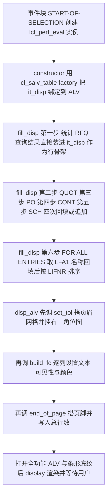
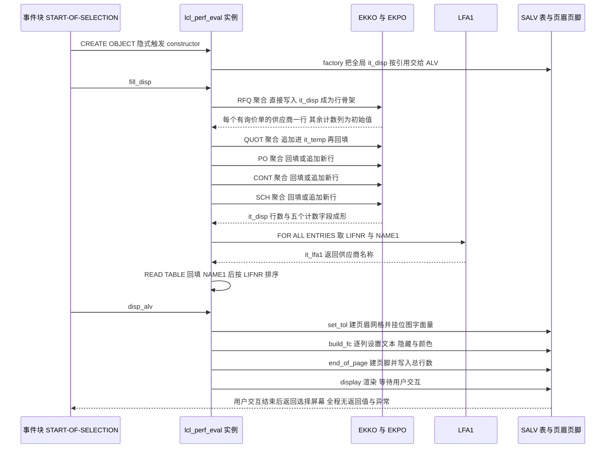

# ZMMR_PERF_EVAL_VEND 分析报告

> 分析对象：`Test-source/zvend.abap`（357 行，报表程序 `ZMMR_PERF_EVAL_VEND`，本地类 `lcl_perf_eval` + SALV 输出）
> 报告视角：代码 onboarding 走读，按真实调用链展开
> 覆盖范围：源码中可数的子程序共 9 个（`constructor`、`fill_disp`、`build_fc`、`disp_alv`、`set_tol`、`end_of_page` 六个方法，事件块 `START-OF-SELECTION`，加三块声明区与类定义段），本报告**全部展开**，没有只列名未展开的部分。

---

## 一、程序定位与业务背景

### 1.1 这段代码在解决什么问题

先把它**不是**什么说清楚：它不是 ME63 的供应商记分卡（不打准时率、不打价格偏差、不做评分），不是采购订单分析报表（不拆行项目、不算行金额），也**不做任何写操作**。它是一张**按供应商横向对比的"单据结构统计表"**：一行一个供应商，五个数字，分别是有询价单、有已维护报价、有采购订单、有合同、有计划协议。

业务问题从这几个数字的**关系**里来。采购部门衡量自己有没有真的"货比三家"，最直接的指标就是**询价单数与采购订单数的比值**：询价单多、订单少，说明询价比价走了流程但没转化，比价流于形式；两边接近，说明询价就是冲着下单去的，流程是实的。同理，报价数是询价数的子集（询了价、把报价留了档），合同与计划协议则是"长期协作"的代理变量。放进一张按 `LIFNR` 横向排列的表里，买方就能一眼看出哪些供应商只在"下单"这一端有量、哪些走了完整的寻源流程。

所以一句话业务定位：**它是采购寻源合规（sourcing compliance）的人工核查工具**——给出结构，不给结论；数字要靠人看、人判断。

### 1.2 设计范式定性

> **"本地类壳 + 程序全局状态 + 五次全表聚合扫描"**：用 OO 把一段报表脚本包成 `lcl_perf_eval`，但类**没有构造参数、没有方法参数、没有返回值**，六个方法全部靠读写程序级 `DATA` 通信；数据侧用五条结构同构的 `SELECT ... COUNT( DISTINCT ) GROUP BY lifnr` 覆盖采购凭证的五种业务类型；呈现侧用 SALV 的 top-of-list / end-of-list 装页眉页脚。

这个范式的优点是**局部化**（`lcl_` 前缀保证类名不与全局冲突，`CREATE OBJECT` 在事件块里一次性建好），缺点是**封装没拿到**——包装了一层语法糖，行为与一段 FORM 脚本完全等价。

### 1.3 依赖清单（读这段代码前必须知道的地形）

| 类别 | 名字 | 在本程序里的角色 |
|---|---|---|
| 数据表 | `EKKO` | 采购凭证抬头，提供 `LIFNR`、`EBELN`、`BEDAT`、`BSTYP`、`BSART`、`LOEKZ`、`STATU` |
| 数据表 | `EKPO` | 采购凭证项目，本程序只用它的 `EBELN` 与 `LOEKZ`（行项目级删除标识） |
| 数据表 | `LFA1` | 供应商主数据，取 `NAME1` 填名称列 |
| SALV | `CL_SALV_TABLE`、`CL_SALV_COLUMNS_TABLE`、`CL_SALV_COLUMN_TABLE` | 表格与列配置 |
| SALV 布局 | `CL_SALV_FORM_LAYOUT_GRID`、`CL_SALV_FORM_LAYOUT_LOGO`、`CL_SALV_FORM_LABEL`、`CL_SALV_FORM_TEXT`、`CL_SALV_FORM_LAYOUT_FLOW` | 页眉网格、页眉位图、标签、文本、页脚流式容器 |
| 外部资产 | 位图 `ZCHEM_N_LOGO_SMALL` | **字符串字面量**，目标系统里是否存在编译器看不见，见 3.7 |
| 消息 | 文本符号 `001`（选择屏标题）、`002`（ALV 初始化失败） | 依赖程序属性里分配的**消息类**（SE38 → 程序属性），未分配则激活即报语法错 |
| 常量 | `INCLUDE <color>` 引入的 `COL_…` 常量 | 让 `ls_color-col = 3` 这个裸数字有意义 |

### 1.4 它读不到、你也读不到的东西

诚实起见先划边界。以下都不在这 357 行里，因此本报告一律写"需核实"而不是断言：

- `ZCHEM_N_LOGO_SMALL` 这张位图是否存在于目标系统；
- 文本符号 `001`、`002` 的实际内容与所属消息类；
- `EKKO-BSTYP` / `EKKO-BSART` / `EKKO-STATU` / `EKKO-LOEKZ` / `EKPO-LOEKZ` 的合法值集合与业务含义（需在 SE11 或 SE16 核实）；
- `SELECT-OPTIONS` 未输入时范围表的行内容（需在 SE38 断点核实，见 3.7）；
- `BEDAT` 作为过滤条件是否符合业务期望的"日期"口径。

---

## 二、程序执行流程总览

程序是一条直线，没有分支入口、没有后台变式、没有 `INITIALIZATION`，也没有对话框。执行序列共七步：



### 责任链表

| 子程序 | 调用者 | 职责 |
|---|---|---|
| `START-OF-SELECTION`（事件块） | SAP 运行时的选择屏之后自动触发 | 全流程唯一驱动点：声明 `obj_rep`、`CREATE OBJECT` 触发构造函数，然后顺序调 `fill_disp` 与 `disp_alv` |
| `constructor`（方法） | `START-OF-SELECTION` 的 `CREATE OBJECT` | 用 `CL_SALV_TABLE=>FACTORY` 把全局内表 `it_disp` 按引用交给 SALV；工厂失败时吞异常、发信息 |
| `fill_disp`（方法） | `START-OF-SELECTION` 显式调用 | 五次聚合查询填出 `it_disp` 的五个计数字段，取供应商名称回填，最后排序；全部数据逻辑都在这里 |
| `disp_alv`（方法） | `START-OF-SELECTION` 显式调用 | 总控呈现：依次调 `set_tol`、`build_fc`、`end_of_page`，打开全部 ALV 功能、挂页眉页脚、开条形底纹、`display` |
| `set_tol`（方法） | `disp_alv` | 搭页眉：标题行、供应商号区间行、凭证日期区间行、运行日期行、四行占位，再把网格与右上角位图装配进 `lr_logo` |
| `build_fc`（方法） | `disp_alv` | 逐列配置 SALV 列：列宽优化、`LIFNR`/`NAME1` 上色并改文本、`BEDAT` 隐藏并设为技术列、五个计数字段设短中长文本 |
| `end_of_page`（方法） | `disp_alv` | 搭页脚：`Information:` 标签 + 总行数 |
| `it_disp` / `it_temp` / `it_lfa1`（被读写的内表） | 全部六个方法 | `it_disp` 是唯一的输出契约，同时被 constructor 绑给 SALV；`it_temp` 是四次回填的临时中转；`it_lfa1` 存名称 |

下面按这条流程，逐个子程序展开。

---

## 三、分组分析（按程序流程 / 子程序）

### 3.1 全局声明区（类型与工作对象）

这一块没有逻辑，但**缺陷密度最高**——输出的结构、ALV 的契约、以及选择屏的字段来源全部在这里定型，后面每一处问题都要回来找它。

#### ① 三个行结构：输出契约 `t_disp`、中转结构 `t_temp`、名称结构 `t_lfa1`（全局声明区）

```abap
TYPES:BEGIN OF t_disp,
   lifnr TYPE lifnr,
   name1 TYPE name1_gp,
   bedat TYPE bedat,
   rfq  TYPE I ,
   quot TYPE I ,
   po   TYPE I ,
   cont TYPE I ,
   sch  TYPE I ,
END OF t_disp,
BEGIN OF t_temp,
   lifnr TYPE lifnr,
  CNT   TYPE I ,
END OF t_temp,
BEGIN OF t_lfa1,
   lifnr TYPE lifnr,
   name1 TYPE name1_gp,
END OF t_lfa1.
```

**做什么** — 声明三个扁平结构作为内表行类型。`t_disp` 是最终输出行，八个字段：`LIFNR` 与 `NAME1`（供应商号与名称）、`BEDAT`，以及 `RFQ`/`QUOT`/`PO`/`CONT`/`SCH` 五个 `TYPE I` 计数字段。`t_temp` 只有 `LIFNR` 与 `CNT`，是四条查询共用的中转行。`t_lfa1` 只有 `LIFNR` 与 `NAME1`，是名称查询的结果行。

**为什么** — 用 `TYPES` + `LIKE LINE OF` 而不是直接 `SELECT ... INTO TABLE` 一个匿名结构，是为了让 `SELECT ... INTO CORRESPONDING FIELDS` 能按**字段名**自动对位：查询里写的 `AS rfq`、`AS CNT` 就是靠名字落进结构的，这正是五个计数列不需要任何手工搬运动作的原因。这个决定是对的，也是全文件最划算的一处设计。把 `it_temp` 单独抽出来同样有理由：四条查询的输出结构相同（`LIFNR` + 计数），共用一张表 + 一个工作区，省掉三份重复声明。

**风险与改进** — 四点，其中前两点改变业务口径：

1. **`bedat TYPE bedat` 是一个只被筛选、从不取数的死列。** 五条 `SELECT` 的输出列表里没有任何一条带 `BEDAT`（`INTO CORRESPONDING FIELDS` 只对得上名字），所以 `it_disp-bedat` 恒为初始值 `00000000`；随后 `build_fc` 又对它 `set_visible( abap_false )`。后果：这一列既不显示也没有数据，占着结构定义和 ALV 元数据；若哪天有人把 `set_visible` 去掉，屏幕上会出现一列全零的日期。这一条从源码就能判，不需要核实。
2. **`bedat` 复用了选择屏参照字段，选屏标题与 ALV 页眉的措辞却不一致。** `bedat` 在 `EKKO` 上是**凭证日期**（document date），而 `set_tol` 里给它写死的英文标签是 `'Posting Date:'`——Posting Date 在 SAP 语境里指**记账日期**。后果：用户按页眉理解，输入的是记账日期区间，系统实际按凭证日期筛；两者在跨月过账、凭证日期与过账日期不同的场景下会给出不同集合。标签与数据元素语义错配，且无任何地方提示这个口径。正确做法是把标签改成 `'Document Date:'`，或干脆把这一列从 `t_disp` 里删掉。
3. **`t_disp` 未指定表键，`it_disp` 因此是标准表。** 后面 `fill_disp` 的回填全部靠 `MODIFY ... WHERE lifnr = ...`，标准表上是线性扫描。后果：供应商规模上千时，四轮回填退化成 O(n²) 级别的内存扫描；而末尾那一句 `SORT it_disp BY lifnr` 也救不了 `MODIFY`（`MODIFY` 走 `WHERE`，不承诺利用排序）。改成 `TYPE SORTED TABLE OF t_disp WITH UNIQUE KEY lifnr` 即可让 SALV 之外的所有查找都变成 O(log n)，代价为零。
4. **`t_temp-CNT` 用 `TYPE I` 接聚合函数的计数。** `COUNT( DISTINCT ebeln )` 的结果类型是整数，四字节 `I` 装得下任何现实的单供应商凭证数，这一项无风险；但计数列没有任何上限保护，将来若把统计口径改成"项目行数"（`COUNT(*)` 而非 `COUNT(DISTINCT)`），`I` 的上限仍够用，属实无风险，列在这里只为说明"没检查过"。

#### ② 全局工作对象：ALV 句柄与三张内表（全局声明区）

```abap
DATA: "it_layout   TYPE lvc_s_layo,
       gr_table TYPE REF TO cl_salv_table,
       gr_functions TYPE REF TO cl_salv_functions,
       gr_columns TYPE REF TO cl_salv_columns_table,
       gr_column TYPE REF TO cl_salv_column_table,
       gr_display TYPE REF TO cl_salv_display_settings,
       lr_grid TYPE REF TO cl_salv_form_layout_grid,
       lr_gridx TYPE REF TO cl_salv_form_layout_grid,
       lr_logo TYPE REF TO cl_salv_form_layout_logo,
       lr_label TYPE REF TO cl_salv_form_label,
       lr_text TYPE REF TO cl_salv_form_text,
       lr_footer TYPE REF TO cl_salv_form_layout_grid,
       ls_color TYPE lvc_s_colo
      .
```

**做什么** — 声明十二个全局引用句柄与一张颜色结构 `ls_color`（`TYPE lvc_s_colo`，来自 ALV 的颜色结构，其 `col` 字段存放底色编号）。源码首行是被注释掉的 `it_layout TYPE lvc_s_layo`，作为引子说明这批声明原本属于"ALV 布局"那套写法。

**为什么** — 把 SALV 的六个入口句柄（表、列集合、单列、功能区、显示设置）与五个页眉页脚控件句柄一次性声明在全局，是因为它们的生命周期横跨三个方法：`gr_table` 从 `constructor` 活到 `display`，`lr_logo` 从 `set_tol` 活到 `set_top_of_list`，`gr_columns` 从 `build_fc` 的第一条用到最后一条。**放在全局保证了它们不会在方法返回时被释放**——这在对象引用的自动管理下是必要的，不是偷懒。

**风险与改进** — 两点：

1. **`lr_grid` 与 `lr_gridx` 都是 `TYPE REF TO cl_salv_form_layout_grid`，只能靠命名区分角色。** 后果：`set_tol` 里 `lr_grid` 被 `set_left_content` 长期持有、`lr_gridx` 只是构造过程中的中间物，两者的生命周期完全不同，类型上却毫无差别——将来有人在 `end_of_page` 里误用 `lr_gridx`，编译器不会拦。
2. **`ls_color` 从头到尾只被赋同一个值 `3`。** 后果：这个结构本可以是方法内的局部变量，现在占了一个全局名；且 `3` 究竟对应 `<color>` 里的哪个常量、期望什么底色，需核实（见 3.7① 第 2 点）——**它没有名字，含义只存在于作者的脑子里**。

```abap
DATA: it_disp TYPE TABLE OF t_disp,
       wa_disp LIKE LINE OF it_disp,
       it_temp TYPE TABLE OF t_temp,
       wa_temp LIKE LINE OF it_temp,
       it_lfa1 TYPE TABLE OF t_lfa1,
       wa_lfa1 LIKE LINE OF it_lfa1.
```

**做什么** — 声明十二个全局引用句柄与一张颜色结构。`gr_table` 是 ALV 主体，`gr_columns`/`gr_column` 是列配置入口，`gr_functions`/`gr_display` 是功能区与显示设置；`lr_grid` 与 `lr_gridx` 都是 `CL_Salv_FORM_LAYOUT_GRID`（前者装页眉标题，后者装页眉网格），`lr_logo` 是把两者装配起来的页眉布局，`lr_footer` 装页脚，`lr_label`/`lr_text` 是页眉里的标签与文本控件，`ls_color` 承载列前景/背景色。第二个块声明输出内表 `it_disp` 与其工作区 `wa_disp`、中转内表 `it_temp` 与 `wa_temp`、名称内表 `it_lfa1` 与 `wa_lfa1`。源码里紧挨着这段还有一行被注释掉的 `it_layout TYPE lvc_s_layo`（ALV 的旧式布局结构），已随注释失效。

**为什么** — 全部放在程序全局、而不是类的 `PRIVATE SECTION` 属性里，意味着这个类**没有任何私有状态**：所有方法共用同一批变量。这在报表程序里是常见的历史包袱——写报表的人习惯了 `FORM` + 全局 `DATA` 的写法，套上 OO 外壳后没改数据存放位置。好的一面是 SALV 布局对象必须在 `display` 之前建好且要在同一会话内存里存活（`lr_logo` 被 `set_top_of_list` 引用后就不能被释放），放全局最省事；坏的一面见风险栏。

**风险与改进** — 三点：

1. **类的封装价值为零，`fill_disp` 与 `disp_alv` 无法单测。** `wa_disp`、`it_disp` 这些都是程序全局，测试类要造出同样的输入得先构造整个报表的全局状态。后果很实际：这个程序里最值钱的那段逻辑（四个计数的口径差异）恰恰是最难被单测钉住的部分，而它一旦改错，**没有任何测试会红**——用户只会在下个月的采购绩效会上看到一张悄悄少了一列的表。改进方向：把这三个内表与句柄挪进 `PRIVATE SECTION` 属性，方法签名改成 `fill_disp( IMPORTING it_range TYPE ... )`、`disp_alv( )` 只负责读自己的属性，测试类就能直接 new 出对象、灌数据、断言 `it_disp`。
2. **`wa_disp` 同时是 `it_disp` 的工作区、选择屏参照的工作区、以及四段回填循环的载体。** 后果：`fill_disp` 的循环体里那句 `CLEAR : wa_disp, wa_temp.` 会把选择屏参照用的工作区一起清掉。本次无害（选择屏读数已发生在事件块之前），但只要有人加一个"换筛选条件重新统计"的功能按钮，这个 `CLEAR` 就会把参照结构清空、选择屏随之失效。一个变量承担三种角色，是这类偶发故障的常见根因。
3. **十二个句柄里有五个只被赋值一次就用完**（`gr_columns`、`gr_column`、`gr_functions`、`gr_display`、`ls_color`），却全部占着全局命名空间。后果不大，但读代码时无法一眼区分"这是贯穿全程的状态"还是"只是个临时手柄"，这也是这个类看起来比实际复杂的原因之一。

#### ③ 选择屏：一个块、两个区间（全局声明区）

```abap
SELECTION-SCREEN BEGIN OF BLOCK b1 WITH FRAME TITLE TEXT- 001.
  SELECT-OPTIONS : s_lifnr FOR wa_disp- lifnr,
   s_bedat FOR wa_disp- bedat.
SELECTION-SCREEN END OF BLOCK b1.
```

**做什么** — 在块 `b1`（带框、标题取自文本符号 `001`）里声明两个 `SELECT-OPTIONS`：`s_lifnr` 参照 `wa_disp-lifnr`，即供应商号区间；`s_bedat` 参照 `wa_disp-bedat`，即凭证日期区间。两者都是**非必填**——没有 `OBLIGATORY`，空表提交会放行。

**为什么** — 用 `SELECT-OPTIONS` 而不是 `PARAMETERS` 是对的：业务上"按日期区间出一张绩效表"和"只查某几个供应商"都是天然需求。参照字段直接指向 `wa_disp` 的字段，还顺带把 `BEDAT` 这个数据元素带进了选屏，用户看到的是 SAP 标准字段文本与标准搜索帮助，不用额外配 F4。这是报表选屏的标准写法，比手写 `RANGES` 表省事得多。

**风险与改进** — 三点：

1. **`s_bedat` 非必填，而五条查询都拿它做过滤，等于允许"全历史"聚合。** 后果：用户随手回车，五次对 `EKKO`+`EKPO` 的 `COUNT( DISTINCT )` 聚合会扫全表，生产系统的凭证表通常在千万行量级，数据库可能分钟级甚至超时；界面上因为**没有任何进度提示**（`sy-proc` 消息、`SET PROGRESS` 之类一个都没有），用户面对的是"选择屏卡死"的观感，只能强杀。建议：给 `s_bedat` 加默认值（进入屏幕时 `INITIALIZE` 填最近三个月），或在 `START-OF-SELECTION` 开头做一次 `CHECK s_bedat IS NOT INITIAL`，同时至少在开始前输出一条 `MESSAGE ... TYPE 'S'` 说明正在统计。
2. **`s_lifnr` 非必填与 `s_bedat` 非必填会叠加成"全供应商 × 全历史"。** 后果同上，且更慢。如果业务上确实允许只填日期跑全供应商，那这条要写进程序注释作为**有意为之**，否则下一个人一定会当成缺陷去"修"。
3. **选屏标题与所有输出文本都是英文硬编码或文本符号，而数据字典描述也是英文。** 后果：非英语系统的用户看到的是英文页眉与英文列标题，没法靠 `SE63` 翻译；`TEXT- 001` 里那个多余的空格（源码原文如此）虽不影响渲染，但说明这块是手敲的。列文本尤其值得看：`build_fc` 给五列写了 `'RFQ Created'`、`'Quotation Maintained'` 这类**长文本，却没有走文本符号**，等于把翻译成本推给了 ALV 运行时不可能解决的死路——这些串只能改代码。

#### ④ 类 `lcl_perf_eval` 的对外契约（类 `lcl_perf_eval` 定义段）

```abap
CLASS lcl_perf_eval DEFINITION .
  PUBLIC SECTION.
  METHODS: constructor ,
   fill_disp.
  METHODS build_fc.
  METHODS disp_alv.
  METHODS set_tol.
  METHODS end_of_page.

ENDCLASS.
```

**做什么** — 声明一个**只有 `PUBLIC SECTION`、没有 `PRIVATE SECTION`、没有属性**的本地类，公开五个方法：`constructor`（构造）与 `fill_disp`、`build_fc`、`disp_alv`、`set_tol`、`end_of_page`。所有方法均无导入、无导出、无异常、无 `RETURNING`。

**为什么** — 五个方法名各自说清了职责，`disp_alv` 作为呈现总控、`fill_disp` 作为数据总控的分法是对的——把"取数"和"画"分开，将来要加导出 Excel 或定时后台变式时，只需在 `disp_alv` 旁边加一条出口。类名 `lcl_` 前缀保证了它是本地类（只在本报表内可见），不会与全局类命名冲突，这一点也是对的。

**风险与改进** — 四点：

1. **方法零参数、零返回值，与全局变量通信，等于把 OO 用成了命名空间。** 后果具体到可执行：`fill_disp` 的输出只能从全局 `it_disp` 里取，`disp_alv` 的输入也只能从全局 `gr_table`/`lr_logo`/`lr_footer` 里取。这意味着**方法的执行顺序被全局变量隐式绑死**——把 `disp_alv` 里的 `end_of_page( )` 挪到 `gr_table-> display( )` 之前还是之后，语法检查都不会报错，但前者会让 SALV 在绑定页脚之前先读到了空的 `lr_footer`。类契约没有把这种顺序要求表达出来，编译器也无从校验。
2. **`constructor` 被公开声明，等于允许外部二次 `CREATE OBJECT`。** 后果：第二次实例化会再次执行 `CL_SALV_TABLE=>FACTORY`，把同一个 `it_disp` 重新绑到新表对象上，旧表对象（以及挂在它上面的全部列配置、页眉页脚）失去引用被回收。眼下 `START-OF-SELECTION` 只 `CREATE OBJECT` 一次，无害；但"允许但没人用"的公开构造函数是典型的接口超发，去掉 `PUBLIC` 下的显式声明（依赖默认构造）即可堵掉。
3. **`CLASS-METHODS` / `DATA` 一律没有出现，`PRIVATE SECTION` 缺失。** 后果：任何人往这个类里加一个新方法，第一件事就是继续往全局堆变量（因为没有别的地方可放），类的体积会随功能线性增长而内聚性不变。这是结构性问题，靠加注释解决不了。
4. **`build_fc`、`set_tol`、`end_of_page` 三个方法的名字不带动词**（`fc` 是 field catalog，`tol` 是 top of list），缩写没有注释、没有文档。后果：新人读 `disp_alv` 里那三行调用时，得点进每个方法才知道它改的是 ALV 还是页眉。ABAP 的命名惯例里 `set_`、`build_`、`fill_` 都有共识，`fc`/`tol` 是自造缩写。

### 3.2 事件块 `START-OF-SELECTION`

整个程序唯一的驱动点，四行里有三行是"调用别人"。

```abap
START-OF-SELECTION.
DATA : obj_rep TYPE REF TO lcl_perf_eval.

CREATE OBJECT : obj_rep.

obj_rep->fill_disp( ).
obj_rep->disp_alv( ).
```

**做什么** — 声明对象引用 `obj_rep`，用 `CREATE OBJECT` 实例化（这一句会触发 `constructor`），随后顺序调用 `fill_disp( )` 填数据、`disp_alv( )` 出画面。程序没有 `INITIALIZATION`（选项屏初始化）、没有对话框、没有 `AT SELECTION-SCREEN`，也没有任何条件分支。

**为什么** — 用事件块而不是把逻辑塞进 `constructor`，让"取数"与"显示"分成了两个可独立替换的步骤，这个分法比"构造函数里全做完"更好，是报表类程序里值得学的形状。局部声明 `obj_rep` 而不是放到全局，也保持了一部分局部性。

**风险与改进** — 三点：

1. **这里没有任何"前置校验"，也没有对 `fill_disp` 结果的判断。** `fill_disp` 跑完返回后，`obj_rep->disp_alv( )` 无条件执行。后果：一次查询没查到任何供应商时，用户看到的不是"没有数据"，而是一个**空 ALV**——页眉照样显示供应商区间、页脚照样显示 `Total Number of Entries` 后面跟 `0`，`LIFNR`/`NAME1` 两列还带着底色，一眼看过去像"程序坏了"。同时后面 3.6 还会执行一次 `FOR ALL ENTRIES` 的全表扫描（见 3.5⑥）。建议在这里加 `CHECK it_disp IS NOT INITIAL` 配一条 `MESSAGE ... TYPE 'S'`，既省掉那次全表扫描，也让用户拿到明确反馈。
2. **`CREATE OBJECT` 与显式 `constructor` 方法声明都是被 `CREATE OBJECT` 隐式调用的语义，调用顺序无编译期保障。** 后果：见 3.1④ 第 1 点——顺序错了不报错。改进方向是让 `constructor` 显式接管创建（`obj_rep = NEW #( )` 时代码会显式调用构造参数），或者干脆取消自定义构造函数，把 `factory` 调用挪进 `disp_alv` 的开头，让数据流变成"读全局 → 建表 → 配列 → 显示"，单向可读。
3. **`DATA : obj_rep TYPE REF TO lcl_perf_eval.` 用了 `TYPE REF TO` 而不是 `TYPE REF TO lcl_perf_eval.` 的现代写法差异——两者等价，此处无缺陷。** 真正值得记的是：这个引用在整个事件块里只被用来做三次转发。它存在的唯一理由是 OO 风格，而 `fill_disp` 与 `disp_alv` 完全可以是四个全局 `PERFORM`。这不是错误，是一次没有换来收益的抽象——**判断一次封装值不值，看它是否让调用点变少了**：这里调用点没少，反而多了 `CREATE OBJECT` 一行。

### 3.3 方法 `constructor`

只有十行，却是全程序第一个会让人误判的地方。

```abap
  METHOD constructor.
    TRY.
       cl_salv_table=> factory( IMPORTING r_salv_table = gr_table CHANGING t_table = it_disp ).
    CATCH cx_salv_msg.
    ENDTRY .

    IF gr_table IS INITIAL .
      MESSAGE TEXT -002 TYPE 'I' DISPLAY LIKE 'E'.
      EXIT .
    ENDIF .
  ENDMETHOD.
```

**做什么** — 调 `CL_SALV_TABLE=>FACTORY`，把输出句柄导入到全局 `gr_table`，并把全局内表 `it_disp` 以 `CHANGING` 交给 SALV 作为数据源（绑定发生在取数之前，靠引用语义后续 `MODIFY` 可见）。工厂抛 `CX_SALV_MSG` 时被捕获但不处理；随后检查 `gr_table` 是否初始，为初始则发 `TEXT-002` 信息并 `EXIT`。

**为什么** — 把 `factory` 放在最前面是对的：`CL_SALV_TABLE` 的列配置（`build_fc` 里那些 `get_column`）依赖已建立的表对象，提前建好让 `disp_alv` 只管调用。用 `CATCH` 而不是让异常直接冒泡，也符合 SALV 惯例——工厂在"表结构不被支持"时会抛异常，直接 dump 对报表用户很不友好。

**风险与改进** — 这里是全文件最需要警惕的一段，四点中有两点是**必然出错**的：

1. **`EXIT` 在方法实现里退出的是方法，不是程序。** 后果链条完整可追：`factory` 失败 → `gr_table` 保持初始 → `MESSAGE` 发出 → `EXIT` 只是结束构造函数 → 事件块**继续**执行 `obj_rep->fill_disp( )`，把五次昂贵聚合全部跑完 → 再进 `disp_alv` → `set_tol` 与 `build_fc` 里的 `gr_table->get_columns( )` 立刻在**初始引用**上取值，抛出 `CX_SY_REF_IS_INITIAL`。用户最终看到的是一条短转储，而不是开头那条设计给他看的友好信息。**这条从源码就能判**：ABAP 里 `EXIT` 在方法体内的语义就是结束方法。改法是让事件块有机会感知（示意，源码中不存在）：
   ```abap-fix
     IF gr_table IS INITIAL.
       MESSAGE TEXT-002 TYPE 'S'.
       LEAVE PROGRAM.
     ENDIF.
   ```
   或把失败信息存进一个属性，由 `START-OF-SELECTION` 判断后再决定是否 `disp_alv`。
2. **`CATCH cx_salv_msg.` 是空处理器，失败原因被彻底丢弃。** 后果：出问题时没有人知道是"表类型不支持"还是"数据异常"，短转储里也不会有业务上下文（工厂异常的文本没有被 `MESSAGE` 带出来）。至少该把 `sy-msgid`/`sy-msgno` 带参数 `MESSAGE` 出去，让用户截图就能定位。
3. **`MESSAGE TEXT -002 TYPE 'I' DISPLAY LIKE 'E'.` 的类型与显示方式自相矛盾。** `TYPE 'I'` 是信息类，`DISPLAY LIKE 'E'` 只是把它画成错误条的颜色。后果：程序继续往下跑（见第 1 点），屏幕上留下一条红色信息条之后紧跟着一条短转储，用户看到的是"红字 + dump"，比只看到 dump 更困惑。正确做法是 `TYPE 'E'` 或 `TYPE 'S'`，让"这是错误"和"这是提示"在语义上一致。
4. **`TEXT -002` 能激活，依赖程序属性里分配了消息类。** 后果：消息类没分配时 `TEXT-002` 解析不到，程序在 SE38 激活阶段就报语法错——这是"编译期失败"，比运行期静默降级好，但接手的人第一次看这份源码时，如果激活报错且提示指向消息符号，需要知道去 `SE38 → 程序属性` 看消息类。文本符号 `002` 的实际内容需在 SE38 或 SE91 核实，本报告不给它编一个字。

### 3.4 方法 `fill_disp`

这是全程序的主体，分六步：① 统计询价单并**顺带建立行骨架**；② 回填报价数；③ 回填采购订单数；④ 回填合同数；⑤ 回填计划协议数；⑥ 取名称回填并排序。前五步是同一段逻辑的五次复制，差异只在 `WHERE` 条件——而**差异恰恰是问题所在**，所以这五步要分开讲。

#### ① 统计询价单：这一步同时决定了输出表的行集合（方法 `fill_disp`）

```abap
    SELECT a~lifnr COUNT( DISTINCT a~ebeln ) AS rfq FROM ekko AS a
    JOIN ekpo AS b ON a~ ebeln = b ~ebeln
    INTO CORRESPONDING FIELDS OF TABLE it_disp
    WHERE a~lifnr IN s_lifnr AND bedat IN s_bedat
    AND b~loekz NE 'X'
    AND a~bstyp = 'A'
    GROUP BY a~lifnr .
```

**做什么** — 以 `EKKO AS a` 内连接 `EKPO AS b`，按 `a~lifnr` 分组、取 `COUNT( DISTINCT a~ebeln )` 命名为 `rfq`，用 `INTO CORRESPONDING FIELDS OF TABLE it_disp`（**覆盖式**，不是 `APPENDING`）写进输出表。筛选条件四个：`a~lifnr IN s_lifnr`、`bedat IN s_bedat`（未加别名，落在 `EKKO` 上）、`b~loekz NE 'X'`（行项目级删除标识不为 X）、`a~bstyp = 'A'`（凭证类型为询价单）。

**为什么** — `COUNT( DISTINCT ebeln )` 是这里的关键：内连接 `EKPO` 会把一张凭证放大成多行，不去重就会把"一张询价单有 20 个行项目"算成 20 次询价。`DISTINCT` 把口径拉回"凭证张数"，这正是业务要的量。与 `EKPO` 连接的唯一目的是过滤行项目删除标识——这个需求其实也可以写成 `EKKO` 上的 `EXISTS` 子查询，代价更低（见风险栏）。用 `INTO CORRESPONDING FIELDS` 覆盖而不是追加，让这一步成为**唯一的行骨架来源**，后面四步只负责往已有行上回填或追加——这个思路本身是清楚的。

**风险与改进** — 四点：

1. **这一步是全表唯一的行集合来源，而它的口径与后面四步不同，导致"有报价、无询价"的供应商被整行丢掉。** 具体推导：`it_disp` 的行最初只有"至少有一张询价单、且该凭证至少有一个行项目 `LOEKZ <> 'X'`"的供应商。接下来 QUOT 分支查的是**同一凭证类型 `BSTYP = 'A'`**，但判据换成抬头 `LOEKZ EQ space`。后果：一个询过价、抬头未标删除、但所有行项目都被标删除的供应商，会出现在 QUOT 查询结果里、却不出现�� RFQ 结果里；而 QUOT 那一段**没有"找不到就追加"的兜底**（见 3.4②），于是这个供应商既没有行可回填、后续三段也未必有它——整行从报表上消失，而它其实有已维护的报价。**这一条从源码就能判**，是本程序最严重的业务正确性问题。
2. **`b~loekz NE 'X'` 与其余四段的 `b~loekz EQ space` 口径不一致。** `NE 'X'` 只排除了 X，`EQ space` 严格限定空白。若 `EKPO-LOEKZ` 还存在其他取值（例如部分释放的删除相关取值，合法集合需在 SE11 核实），这些凭证会被算进 RFQ 分母而不会算进后面四段。后果：**RFQ / PO 这个最关键的业务比值，被口径差系统性地拉大**——数字看起来"询价比价做得很好"，实际混进了不该算的凭证。这一条的不确定部分只有"取值集合"，"两段口径不同"从源码就能判。
3. **本段只判行项目级 `LOEKZ`，不判抬头 `a~loekz`。** 后果：一张抬头已被标删除、但行项目删除标识尚未刷新的凭证，会作为有效询价单计数，而同一张凭证在 QUOT 分支因为 `loekz EQ space` 被排除。同一张凭证在两列里一列算一列不算，用户做比值时会得到互相矛盾的直觉。
4. **`bedat` 未加限定符却能通过激活，说明它被解析到了 `EKKO`。** 这本身不是缺陷（`EKPO` 的对应字段名是 `EDBAT`，不同名），但同一段 SQL 里 `a~lifnr` 加了别名、`bedat` 没加，说明这段是分多次改出来的。后果：一旦将来给连接加一张也有 `BEDAT` 的表（比如 `EKKO` 的某种扩展视图），这条语句立刻变成"字段二义"错误——**今天是巧合能编译，不是写法正确**。

#### ② 回填报价数：全文件唯一一个不带兜底的回填循环（方法 `fill_disp`）

```abap
    SELECT lifnr COUNT( DISTINCT ebeln ) AS CNT FROM ekko
    APPENDING CORRESPONDING FIELDS OF TABLE it_temp
    WHERE lifnr IN s_lifnr AND bedat IN s_bedat
    AND loekz EQ space
    AND ( bstyp = 'A' AND statu = 'A' )
    GROUP BY lifnr.
```

**做什么** — 不连接 `EKPO`，直接在 `EKKO` 上按 `lifnr` 分组，用 `COUNT( DISTINCT ebeln ) AS CNT` 统计每家供应商的凭证张数，用 `APPENDING CORRESPONDING FIELDS OF TABLE it_temp` 追加进中转表 `it_temp`（这是本段**第一次**使用 `it_temp`，前面没有 `REFRESH`）。筛选条件四条：`lifnr IN s_lifnr`、`bedat IN s_bedat`、`loekz EQ space`（抬头级删除标识）、`bstyp = 'A' AND statu = 'A'`。

**为什么** — 这一段与①最大的不同是**不连 `EKPO`**，因此是五段里最快的一段，代价是它的删除判据从行项目级退回抬头级（见风险栏第 2 点）。用 `APPENDING ... OF TABLE it_temp` 而不是直接写 `it_disp`，是为了让四条同构查询共用一个中转结构——这是本文件里最划算的一个复用。

**风险与改进** — 三点：

1. **`AND ( bstyp = 'A' AND statu = 'A' )` 用 `EKKO-STATU` 当"已维护报价"的判据，语义需要核实；而它与①段的删除口径不一致，从源码就能判。** `STATU` 记的是整张采购凭证的处理状态，不是"报价是否存在"；其合法取值集合需在 SE11 核实。但"①段用行项目级 `LOEKZ NE 'X'`、本段用抬头级 `LOEKZ EQ space`"这个不对称是源码里直接可见的。后果：`RFQ` 与 `QUOT` 两列派生自同一批 `BSTYP='A'` 的凭证却按两套规则切分，用户想算的"报价留存率 = QUOT / RFQ"分子分母口径不同，得出的数字没有业务含义。
2. **`( ... )` 外面这层括号里只包了一个 `AND` 条件。** 无功能影响，但它制造了"括号里还有别的东西"的错觉——与④段那个空括号同理，属于会误导后来人的噪声。
3. **本段是五段里唯一不写 `a~`/`b~` 限定符的（因为没有别名），却也是唯一不 `REFRESH it_temp` 的。** 后果：本次执行无害，但这段逻辑对"第二次调用"毫无防护，见下一块的风险栏。

```abap
    LOOP AT it_temp INTO wa_temp .
       wa_disp- lifnr = wa_temp -lifnr.
       wa_disp- quot = wa_temp -CNT.
      MODIFY it_disp FROM wa_disp TRANSPORTING lifnr quot WHERE lifnr = wa_temp-lifnr .
      CLEAR : wa_disp, wa_temp.
    ENDLOOP .
```

**做什么** — 遍历 `it_temp`，把每行的 `CNT` 写进 `wa_disp-quot`，用 `MODIFY it_disp FROM wa_disp TRANSPORTING lifnr quot WHERE lifnr = wa_temp-lifnr` 把这个数回填到 `it_disp` 里同 `LIFNR` 的那一行，循环体结尾 `CLEAR` 两个工作区。**这是全程序唯一一个回填后不判 `sy-subrc`、也没有 `APPEND` 兜底的循环**。

**为什么** — `TRANSPORTING lifnr quot` 是这里最见功力的一笔：`MODIFY` 只写回列出的字段，其余 `rfq`/`name1` 等保持 `it_disp` 里的现值，不会被工作区的初始值冲掉，比整行覆盖安全得多。`CLEAR` 工作区也是好习惯，避免上一轮的残留值被带进下一轮。

**风险与改进** — 三点，第一点是 P0：

1. **`MODIFY` 之后没有判 `sy-subrc`，没有"找不到就追加"的分支——而后面三段都有。** 后果已在 3.4① 第 1 点推导：QUOT 查到但 `it_disp` 里没有该供应商时，`MODIFY` 什么也不做、返回非零，但这行**被静默丢弃**。这不是"数字没填"，是"整行不见了"，而且丢得无声无息——报表看起来完全正常，只是少了一家供应商。改法（示意，源码中不存在）：
   ```abap-fix
         MODIFY it_disp FROM wa_disp TRANSPORTING lifnr quot
           WHERE lifnr = wa_temp-lifnr.
         IF sy-subrc NE 0.
           APPEND wa_disp TO it_disp.
         ENDIF.
   ```
2. **`AND ( bstyp = 'A' AND statu = 'A' )` 里 `statu` 的语义需要核实，但两段口径不一致从源码就能判。** `EKKO-STATU` 记的是**整张采购凭证的处理状态**，不是"报价是否存在"；把它当"已维护报价"的判据，等于用了一个业务上不同维度的字段。合法取值集合需在 SE11 核实，但"RFQ 段用行项目级 `LOEKZ`、QUOT 段用抬头级 `LOEKZ` + `STATU`"这个不对称是源码里直接可见的。后果：RFQ 列与 QUOT 列分别按两套判据统计同一批 `BSTYP='A'` 的凭证，列与列之间不满足任何可以推理的关系——用户想做的"报价留存率 = QUOT / RFQ"，分子分母口径不同，算出来的数没有业务含义。
3. **本段是唯一不连接 `EKPO` 的查询，因此是五段里最快的一段。** 这本身是对的（它不需要行项目级判据），但也暴露了口径切换的随意性：如果 `QUOT` 的业务定义确实是"抬头未删除的询价单"，那 RFQ 段为什么必须看行项目？没有一句话能解释这个差别。**建议在五段查询上方各加一行注释，写清"这一列的业务定义是什么、判据为什么选这个字段"**——这类报表的五条 SQL 恰恰是最需要文档的地方，因为半年后没人记得 `statu = 'A'` 是怎么来的。
4. **`it_temp` 在这一步之前没有 `REFRESH`。** 后果：本次执行无害（`it_temp` 初始为空），但这段逻辑对"第二次调用"毫无防护——而 `fill_disp` 是 `PUBLIC` 方法，任何人都可能加一个"重新统计"按钮。一旦被调用两次，第二次执行时 `it_temp` 里已有一批旧行，`APPENDING` 会把新旧**两批**都塞进去，回填循环会对同一供应商处理两遍（值相同，看起来"没问题"），但若这中间有人加了去重逻辑或按 `it_temp` 行数统计的逻辑，就会出错。后面三段每次都 `REFRESH it_temp`，唯独这一段没有——说明作者知道要刷新，只是漏了第一次。
5. **`bedat` 与 `lifnr` 同样未加限定符。** 本段没有别名（只有一张表），所以无二义风险，无缺陷；但与带别名的那几段并排看，风格不统一，让读者分不清"哪些限定符是必要的、哪些只是习惯"。

#### ③ 回填采购订单数：唯一带 `BSART` 排除的一段（方法 `fill_disp`）

```abap
    REFRESH it_temp.
    SELECT lifnr COUNT( DISTINCT a~ ebeln ) AS CNT FROM ekko AS a JOIN ekpo AS b ON a~ ebeln = b ~ebeln
    APPENDING CORRESPONDING FIELDS OF TABLE it_temp
    WHERE lifnr IN s_lifnr AND bedat IN s_bedat
    AND b~loekz EQ space
    AND bsart NE 'UB'
    AND ( a~ bstyp = 'F' )
    GROUP BY lifnr.

    LOOP AT it_temp INTO wa_temp .
       wa_disp- lifnr = wa_temp -lifnr.
       wa_disp- po = wa_temp -CNT.
      MODIFY it_disp FROM wa_disp TRANSPORTING lifnr po WHERE lifnr = wa_temp-lifnr .
      IF sy-subrc NE 0.
        APPEND wa_disp TO it_disp .
      ENDIF .
      CLEAR : wa_disp, wa_temp.
    ENDLOOP .
```

**做什么** — 先 `REFRESH it_temp`，再内连接 `EKPO` 按 `lifnr` 分组统计 `COUNT( DISTINCT a~ ebeln ) AS CNT` 追加进 `it_temp`；条件是 `lifnr IN s_lifnr`、`bedat IN s_bedat`、`b~loekz EQ space`（行项目未删除）、`bsart NE 'UB'`（排除某一种凭证类型）、`a~ bstyp = 'F'`（凭证类型为采购订单）。随后遍历 `it_temp`，把计数写进 `wa_disp-po` 回填 `it_disp`；**`MODIFY` 后判 `sy-subrc`，非零则把整行 `APPEND` 到 `it_disp`**，最后 `CLEAR` 工作区。

**为什么** — 这段是五段里写法最完整的一段，也是唯一"新建行"的段落（`IF sy-subrc NE 0. APPEND`）。它承担了一个隐含职责：**保证 `it_disp` 里出现"只下单、不询价"的供应商**——这类供应商在业务上恰恰是寻源合规的重点观察对象（比价流于形式的直接证据），也正是本报表第 1.1 节说的那张比值表分母的来源。设计意图是对的。

**风险与改进** — 四点：

1. **`bsart NE 'UB'` 只出现在这一段，其余四段没有任何 `BSART` 判据。** `'UB'` 的业务含义与其在 `EKKO-BSART` 合法值集合中的位置需在 SE11 核实（`BSART` 的取值域里 `'NB'`、`'UB'`、`'KB'`、`'LB'` 分别是不同采购类型，框架类凭证通常对应后三者）。但"排除只加在这一列"从源码就能判。后果：采购订单列里刻意排掉了一类凭证，合同列（`BSTYP='K'`）与计划协议列（`BSTYP='L'`）却没做对应排除，于是**同一类框架性凭证在不同列的统计口径不一致**，跨列相加或做比值时基数对不齐。
2. **`bsart` 没加限定符、`a~ bstyp` 加了限定符，同一段 SQL 内两种风格。** 无二义风险（`EKPO` 无 `BSART`、无 `BSTYP`），但它让人无法判断"这里的限定符是随手写的还是有意为之"。
3. **`APPEND wa_disp TO it_disp` 追加的是整个工作区行，其中 `rfq`、`quot`、`name1`、`bedat` 都是初始值。** 后果：本轮是安全的（`rfq`/`quot` 尚未回填时就是 0），但这个"靠执行顺序保证字段是初始值"的隐式契约没有任何注释保护。将来若有人把 QUOT 段挪到 PO 段之后，这个 `APPEND` 就会把 `quot` 的 0 值**覆盖掉真实统计结果**。建议在 `APPEND` 前后加注释说明"此处仅 PO 有值，其余计数依赖后续段落填充"。
4. **`MODIFY` 与 `IF sy-subrc NE 0` 之间没有 `ELSE`。** 无缺陷，但显式写成 `ELSE sy-subrc = 0` 的空分支、或至少注释一句，可省掉后来人反复确认"回填成功时到底做了什么"的功夫。

#### ④ 回填合同数（方法 `fill_disp`）

```abap
    REFRESH it_temp.
    SELECT lifnr COUNT( DISTINCT a~ ebeln ) AS CNT FROM ekko AS a JOIN ekpo AS b ON a~ ebeln = b ~ebeln
    APPENDING CORRESPONDING FIELDS OF TABLE it_temp
    WHERE lifnr IN s_lifnr AND bedat IN s_bedat
    AND b~loekz EQ space
    AND ( a~ bstyp = 'K' )
    GROUP BY lifnr.

    LOOP AT it_temp INTO wa_temp .
       wa_disp- lifnr = wa_temp -lifnr.
       wa_disp- cont = wa_temp -CNT.
      MODIFY it_disp FROM wa_disp TRANSPORTING lifnr cont WHERE lifnr = wa_temp-lifnr .
      IF sy-subrc NE 0.
        APPEND wa_disp TO it_disp .
      ENDIF .
      CLEAR : wa_disp, wa_temp.
    ENDLOOP .
```

**做什么** — 与③完全同构，只把凭证类型换成 `a~ bstyp = 'K'`（合同）、把回填字段换成 `wa_disp-cont`。筛选条件同样只有 `lifnr IN s_lifnr`、`bedat IN s_bedat`、`b~loekz EQ space` 三条，没有 `BSART` 判据。

**为什么** — 与③共用同一套"刷新 → 聚合 → 回填 → 兜底追加"的骨架，保证四个计数字段的处理方式完全一致，这在正确性上是好事：**读者只要验证过③的语义，②③④⑤四段就可以放心照抄理解**，只有 WHERE 里的差异需要逐段核对。

**风险与改进** — 两点：

1. **第③段点出的 `BSART` 口径缺口在这里以另一种形式出现：合同段靠 `BSTYP='K'` 定位，但框架合同（`BSART` 取框架类值的那几张）在 PO 段被显式排除，在这里却会被计入。** 后果：同一张框架凭证若其 `BSTYP` 落在 K 上，就出现在 `CONT` 列；若同一张凭证在 PO 段对应的 `BSTYP` 落在 F 上，它被排除在 `PO` 列之外。跨列的合计与比值因此没有统一基数。
2. **`( a~ bstyp = 'K' )` 外面套了一层无意义的括号。** 无功能影响，纯粹是让读者以为括号里还有别的条件待加——**代码里的空括号是一种噪声**，它会诱导读者去找不存在的第二个条件。

#### ⑤ 回填计划协议数（方法 `fill_disp`）

```abap
    REFRESH it_temp.
    SELECT lifnr COUNT( DISTINCT a~ ebeln ) AS CNT FROM ekko AS a JOIN ekpo AS b ON a~ ebeln = b ~ebeln
    APPENDING CORRESPONDING FIELDS OF TABLE it_temp
    WHERE lifnr IN s_lifnr AND bedat IN s_bedat
    AND b~loekz EQ space
    AND ( a~ bstyp = 'L' )
    GROUP BY lifnr.

    LOOP AT it_temp INTO wa_temp .
       wa_disp- lifnr = wa_temp -lifnr.
       wa_disp- sch = wa_temp -CNT.
      MODIFY it_disp FROM wa_disp TRANSPORTING lifnr sch WHERE lifnr = wa_temp-lifnr .
      IF sy-subrc NE 0.
        APPEND wa_disp TO it_disp .
      ENDIF .
      CLEAR : wa_disp, wa_temp.
    ENDLOOP .
```

**做什么** — 第五次同构回填，凭证类型换成 `a~ bstyp = 'L'`（计划协议），计数写进 `wa_disp-sch`。同样三段筛选条件、同样带 `sy-subrc` 兜底 `APPEND`。

**为什么** — 五种采购凭证类型各占一列，是这份报表的业务骨架（见 1.1）。把每一类拆成独立可读的段落、而不是用一个 `CASE bstyp` 在一个查询里分组，代价是**数据库要多扫四遍**，收益是**每列的口径可以独立调整、独立注释、独立优化**。对于一张口径敏感的人工核查表，这个取舍是对的。

**风险与改进** — 两点：

1. **五段之和意味着对 `EKKO` + `EKPO` 做五次聚合，而不是一次。** 后果：`s_bedat` 未填时是五次全历史扫描；即便填了一个月，驱动表 `EKKO` 上的 `COUNT(DISTINCT)` + `GROUP BY` 仍需排序或哈希，单次就不便宜。更好的形状是**一次扫描、五次条件聚合**（同一份结果集上用 `SUM( CASE WHEN bstyp='A' THEN 1 ELSE 0 END )` 之类，或者用内连接一次取回 `LIFNR`+`BSTYP` 集合后在内存里 `COUNT( DISTINCT )`）——数据库只扫一遍。是否需要改，取决于生产库 `EKKO` 的实际行数与这张报表的执行频率，两者需在 `ST12` 或系统监控里核实；但"五遍扫描"这件事从源码就能确定。
2. **`sch` 列的业务含义是"计划协议张数"，而列的短文本被写成 `'Sch. Crea.'`（见 3.8）。** 缩写与中长文本 `'Schedule Agreement Created'` / `'Schedule Agreement Created'` 三者并存的措辞不统一，用户看到的是"Sch. Crea."这个自造缩写，需要猜。后果是列的口径只能靠猜，猜错就把计划协议当成合同看待。

#### ⑥ 取供应商名称并排序（方法 `fill_disp`）

```abap
    SELECT lifnr name1 FROM lfa1
    INTO CORRESPONDING FIELDS OF TABLE it_lfa1
    FOR ALL ENTRIES IN it_disp
    WHERE lifnr = it_disp -lifnr.
```

**做什么** — 查 `LFA1` 的 `LIFNR` 与 `NAME1` 两列，用 `INTO CORRESPONDING FIELDS OF TABLE it_lfa1` 追加进名称内表 `it_lfa1`，并用 `FOR ALL ENTRIES IN it_disp` 与输出表做半连接，连接键是 `it_disp` 的 `LIFNR`。这一步只取两列，不把 `LFA1` 整表搬进内存。

**为什么** — "批量取回 + 内存关联"的形状是对的：一次查询换一张字典表，然后在 `it_disp` 上逐行查找，比在循环里发 `SELECT SINGLE` 快几个数量级。`FOR ALL ENTRIES` 也比写 `JOIN` 更可控——它不会把 `LFA1` 里其余上百万行卷进结果集。

**风险与改进** — 一点，也是本方法最危险的地方：

1. **`it_disp` 为空时，`FOR ALL ENTRIES IN it_disp` 的连接条件被完全丢弃，语句退化成对 `LFA1` 的无条件全表扫描。** 后果：本程序最容易被触发的场景恰恰是最容易出事的场景——用户在选屏上随手回车（或只填了永远不会命中的日期区间），`it_disp` 为空，于是**在五次 `EKKO` 聚合之后，再对 `LFA1` 做一次无条件全表扫描**，把这次本来"应该立刻返回空表"的执行拖成分钟级。在 `LFA1` 行数较大的生产系统上，这一步可能直接吃到语句超时或临时表溢出。**从源码就能判**：程序在任何位置都没有对 `it_disp` 判空。改法（示意，源码中不存在）：

   ```abap-fix
     CHECK it_disp IS NOT INITIAL.

     SELECT lifnr name1 FROM lfa1
       INTO TABLE it_lfa1
       FOR ALL ENTRIES IN it_disp
       WHERE lifnr = it_disp-lifnr.
   ```

   注意 `CHECK` 放在 `fill_disp` 开头更合适——这样连后面的 `SORT` 与名称回填都跳过，调用方也能立刻拿到空结果。

```abap
    LOOP AT it_disp INTO wa_disp .
      READ TABLE it_lfa1 INTO wa_lfa1 WITH KEY lifnr = wa_disp-lifnr .
      IF sy-subrc EQ 0.
         wa_disp- name1 = wa_lfa1 -name1.
        MODIFY it_disp FROM wa_disp TRANSPORTING lifnr name1 WHERE lifnr = wa_disp- lifnr .
      ENDIF .
    ENDLOOP .
```

**做什么** — 遍历 `it_disp` 的每一行，用 `READ TABLE it_lfa1 INTO wa_lfa1 WITH KEY lifnr = wa_disp-lifnr` 从名称内表里按供应商号取 `NAME1`；`sy-subrc = 0` 才把它写进 `wa_disp-name1`，再用 `MODIFY ... TRANSPORTING lifnr name1 WHERE lifnr = ...` 写回同一行。查不到时整行跳过，`NAME1` 保持初始值。

**为什么** — "批量取字典 + 内存关联"比在循环里逐行 `SELECT SINGLE` 快几个数量级，这是报表关联标准主数据的常规形状。`TRANSPORTING lifnr name1` 保证其余计数字段不受影响，与前五段的做法一致。

**风险与改进** — 三点：

1. **`READ TABLE it_lfa1 ... WITH KEY lifnr` 在标准表上是线性扫描，循环体里每行扫一次。** 后果：O(供应商数 × 供应商数) 的内存扫描。千级供应商时还能忍，但它夹在五段聚合中间，属于"能忍但不该忍"。把 `it_lfa1` 声明成 `TYPE SORTED TABLE OF t_lfa1 WITH UNIQUE KEY lifnr`（见 3.1①）后是 O(n log n)；或者改用一次 `LOOP AT it_lfa1` 反向填充，复杂度一样但更直白。
2. **名称缺失时静默跳过，`NAME1` 保持空白。** 后果：`it_disp` 里会混进名称为空的一行，ALV 上那一格也是空白——用户无法区分"这个供应商没维护名称（数据问题，值得追）"和"名称查询没查到（代码问题）"。建议给 `NAME1` 为空的行加红色前景色（`set_color` 已有现成机制），把数据质量问题暴露到屏幕上。
3. **`MODIFY ... WHERE lifnr = ...` 同样是标准表上的线性扫描。** 后果：与第 1 点同类，但发生五次（五段计数回填加这一次名称回填），累计代价是五次全表扫描。这一处和 3.1① 第 3 点是同一个根因：**表键缺失**。

```abap
    SORT it_disp BY lifnr .
```

**做什么** — 按 `LIFNR` 升序排序输出表 `it_disp`，这是 `fill_disp` 的最后一步，为 ALV 的默认呈现顺序做准备。

**为什么** — 人工比对供应商绩效时，按供应商号排是最自然、最稳定的顺序；不排的话，SALV 的默认顺序由数据到达顺序决定（RFQ 段的查询顺序），换一次筛选条件行的位置就全变了，用户无法跨次对照。

**风险与改进** — 两点：

1. **`SORT` 只让输出有序，并不会让此前的 `MODIFY`/`READ` 变快。** 后果：读者看到"排过序了"就容易以为前面的 `WITH KEY` 查找是二分查找。标准表的 `READ`/`MODIFY` 是否走二分搜索取决于键与排序键是否一致以及程序运行时优化设置，需在 SE38 里核实；但**不要依赖它**——把 `UNIQUE KEY` 写进数据结构（`SORTED TABLE`）才是确定性做法。
2. **排序发生在方法末尾，而 `gr_table` 在 `constructor` 时就已经绑定了 `it_disp`。** 后果：这一条实际是安全的（绑定是引用语义，重排不复制），但如果将来有人为了性能把 `it_disp` 改成带初始排序的 `SORTED TABLE`，这里这句 `SORT` 就会变成冗余甚至与表键冲突。**排序策略应当写在表类型里，而不是写在方法末尾**——同一个"输出顺序"的意图，现在分散在声明处（无）和执行处（一行 `SORT`）两处。

### 3.5 方法 `disp_alv`

呈现总控，十七行，无条件、无判断、无异常处理。

```abap
   METHOD disp_alv.

     set_tol( ).
     build_fc( ).
     end_of_page( ).

     gr_functions = gr_table->get_functions ( ).
     gr_functions-> set_all( abap_true ).
     gr_table-> set_top_of_list( lr_logo ).
     gr_table-> set_end_of_list( lr_footer ).
     gr_display = gr_table->get_display_settings ( ).
     gr_display-> set_striped_pattern( cl_salv_display_settings =>true ).


     gr_table-> display( ).

   ENDMETHOD.
```

**做什么** — 连续调用三个私有用途的方法：`set_tol( )` 先把 `lr_logo` 造出来（页眉），`build_fc( )` 配置列，`end_of_page( )` 把 `lr_footer` 造出来（页脚）。然后取功能区并 `set_all( abap_true )` 打开全部标准 ALV 功能，把 `lr_logo` 挂到 `set_top_of_list`、`lr_footer` 挂到 `set_end_of_list`，取显示设置并开条形底纹，最后 `display( )` 渲染。

**为什么** — 三个辅助方法**一个参数都没有、也没有返回值**，它们唯一的"输出"就是往全局 `lr_logo` / `lr_footer` / `gr_columns` 上写。这是一种"以副作用为接口"的设计：调用方不需要知道结果，只需要知道"调用完 `set_tol` 之后 `lr_logo` 就绪了"。对一个只有七步的报表来说，这种写法读起来是顺的——**先建内容、再统一装配**，比在每个构建点里随手把对象塞进 `set_top_of_list` 更不容易漏。`set_all( abap_true )` 一行打开全部功能，也避免了逐个开关的样板。

**风险与改进** — 四点：

1. **`gr_table-> display( )` 是全程序最后一个动作，它自己没有任何 `TRY` 保护，而页面上的位图名是一个字符串字面量（见 3.7）。** 后果：目标系统缺 `ZCHEM_N_LOGO_SMALL` 时，异常在**显示阶段**抛出，用户看到的是一条短转储加一片空白——而此时五次聚合全部已经跑完，耗时全部浪费，且报错信息里不会有"图片没上传"这四个字。`build_fc` 里有八个 `TRY`，`set_tol` 与 `end_of_page` 里一个都没有，这个分布本身就说明保护范围是随手贴的。**这是本程序最容易在别的系统上炸、且最难以自查的一处外部依赖**。
2. **`set_all( abap_true )` 打开了包括导出与打印在内的全部标准功能，而程序没有任何 `AUTHORITY-CHECK`。** 后果：任何能在事务 `ZMMR_PERF_EVAL_VEND` 上执行的用户，都能看到全量供应商的寻源结构数据（谁在比价、谁在下单、谁签了合同），并且一键导出成电子表格。报表本身运行在 `S_TCODE` 授权下，所以"能不能执行该事务"就是唯一门槛——如果这个事务的授权对象给得宽（比如给了采购员甚至查询岗），那么采购部门的商业敏感数据就随这个 ALV 的导出按钮一起流出去了。至少应当把导出/打印功能关掉（`gr_functions->set_export( abap_false )` 一类的逐项关闭），让数据留在事务里。
3. **三行无参调用依赖的是"全局变量在调用返回时已就绪"这条隐式契约。** 后果：把 `end_of_page( )` 挪到 `set_top_of_list` 之前，程序仍然编译通过、激活通过，只有运行时才会发现页脚没挂上——而这种错误在测试时往往一眼就看见，真正的问题是它**没有机制防止**。让这三个方法返回句柄（`lr_logo = set_tol( )`）或至少在方法名里体现"设置全局"（`build_tol_into_logo`），能把这个契约写在脸上。
4. **`set_striped_pattern( cl_salv_display_settings =>true )` 用类属性引用当布尔值。** 无功能缺陷，`abap_true` 更贴切。顺带指出：这行是官方示例的常见写法，说明这段代码是照着 SALV 示例抄的——**抄来的代码把示例里的"看起来合理"一并带了过来，包括八个空的 `CATCH`**（见 3.8）。

### 3.6 方法 `set_tol`

页眉是这个程序里唯一有"排版"意图的部分，分三步：① 标题与供应商号区间；② 凭证日期区间与运行日期；③ 占位行与右上角位图。

#### ① 标题与供应商号区间（方法 `set_tol`）

```abap
    DATA : lv_text( 30) TYPE C ,
           lv_date TYPE C LENGTH 10.

    CREATE OBJECT lr_grid.

     lr_grid-> create_header_information( row = 1 column = 1
    TEXT = 'MM: Vendor Evaluation'
    tooltip = 'MM: Vendor Evaluation' ).

     lr_gridx = lr_grid->create_grid ( row = 2 column = 1 ).
     lr_label = lr_gridx->create_label ( row = 2 column = 1
    TEXT = 'Vendor No # :' tooltip = 'Vendor #.' ).
```

**做什么** — 声明两个定长字符变量 `lv_text`（长 30）与 `lv_date`（长 10）。`CREATE OBJECT lr_grid` 造出页眉网格容器，在它的第 1 行第 1 列放一条标题信息 `'MM: Vendor Evaluation'`（文本与提示相同），再在 `lr_grid` 里创建子网格 `lr_gridx`（第 2 行第 1 列），在子网格第 2 行第 1 列放标签 `'Vendor No # :'`。

**为什么** — `create_header_information` 与 `create_grid` 的分工是对的：前者画标题栏，后者是标题栏下面的二维网格，用来把"标签 / 内容"排成两列三行。这个两列布局正是 SAP 报表页眉的经典形态，标题 + 参数回显 + 生成日期。标签与内容的配对（`create_label` 在列 1、`create_text` 在列 2，下一步展开）保证了视觉对齐。

**风险与改进** — 三点：

1. **`lv_text` 声明成 `TYPE C` 长度 30，是把定长字段当字符串用。** 后果在 3.6② 展开说，但先给结论：这个变量要被 `CONCATENATE` 拼成"起 - 止"的形式，可见内容最长 24 字符，加上 `WRITE ... TO` 写入后按定长规则补齐的尾部空格，**操作数总长度可能超过目标 30**，超出的部分按 ABAP 规则被截断。定长字符字段的尾部空格在 `CONCATENATE` 中是否计入操作数长度，需在 SE38 里用一个断点核实；但**无论核实结果如何，`C(30)` 这个上限本身已经把可显示内容卡死了**——而 24 字符的实际需求离 30 只差 6，任何一处截断都不会报错，只会静默显示半截区间。改成 `DATA lv_text TYPE string.` 与 `lv_date TYPE string.` 一次性消除整类问题。
2. **`'Vendor No # :'` 这个字符串本身有两处排版瑕疵**：冒号前多一个空格、`#` 号紧贴冒号。后果：页眉上显示成 `Vendor No # :`，在一份其他标签都没有空格的页眉里显得像打字错误。视觉小事，但它是"这段是手敲的、没人看过一眼"的证据。
3. **页眉网格 `lr_grid` 与子网格 `lr_gridx` 都是 `CL_Salv_FORM_LAYOUT_GRID` 类型，用两个同类型变量区分"容器"和"网格"角色。** 后果：读代码时看到两个几乎一样的类型声明，很难一眼看出谁是谁；更重要的是 `lr_grid` 后面被塞进 `lr_logo` 的左内容区，而 `lr_gridx` 只是中间的构造步骤——这个生命周期差异在命名上完全没体现。

#### ② 供应商号区间、凭证日期区间与运行日期（方法 `set_tol`）

```abap
    IF s_lifnr IS NOT INITIAL .
       lv_text = s_lifnr-low .
      IF s_lifnr-high IS NOT INITIAL.
        CONCATENATE lv_text ' to ' s_lifnr -high INTO lv_text SEPARATED BY space.
      ENDIF .
    ELSE .
       lv_text = 'Not Provided'.
    ENDIF .
     lr_text = lr_gridx->create_text ( row = 2 column = 2
    TEXT = lv_text tooltip = lv_text ).
```

**做什么** — 处理供应商号区间的显示：若 `s_lifnr` 非初始就取其 `low`，若 `high` 也非初始就拼成"低值 to 高值"，否则只显示 `low`；若 `s_lifnr` 初始则写 `'Not Provided'`。结果同时作为 `create_text` 的 `TEXT` 与 `tooltip`，放进页眉网格第 2 行第 2 列，与第 1 列的 `'Vendor No # :'` 标签配对。

**为什么** — 把"输入条件"回显到输出页眉，是报表的基本礼貌：用户看到的每个数字都能立刻回答"这是哪次筛选的结果"。空区间回显 `'Not Provided'` 而不是留白也是对的——空白会让人以为程序没读到输入屏。

**风险与改进** — 两点：

1. **`IF s_lifnr IS NOT INITIAL` 判断的是范围表的行数，不是"用户填没填"。** 对一个 `SELECT-OPTIONS` 而言，未输入时范围表的内容形态（是否仍留下一行 `SIGN='I'`、`LOW` 全初始的记录）在不同程序设置下并不相同，**需在 SE38 里断点核实**。两种可能的业务后果都很具体：若未输入时表为空，页眉显示 `'Not Provided'`（正确）；若表里留下一行全初始的记录，`IS NOT INITIAL` 为真，页眉会显示一串 `0000000000`，而不是作者设计的那句提示，用户据此会以为程序读错了区间。可靠的判法是看值不看表（示意，源码中不存在）：
   ```abap-fix
     IF s_lifnr-low IS INITIAL AND s_lifnr-high IS INITIAL.
       lv_text = 'Not Provided'.
     ELSE.
       ...
   ```
2. **`lv_text` 是定长 `C(30)`，而它在这里被 `CONCATENATE` 拼成"低值 to 高值"。** 后果：可见内容最长 24 字符，加上 `lv_text = s_lifnr-low` 之后按定长规则补齐的尾部空格，操作数总长度可能超过目标 30，超出部分按 ABAP 规则被截断且**不报错**。定长字段尾部空格是否计入 `CONCATENATE` 的操作数长度，需在 SE38 断点核实；但 `C(30)` 这个上限本身已把可显示内容卡死。详见下一步的风险栏。

```abap
     lr_label = lr_gridx->create_label ( row = 3 column = 1
    TEXT = 'Posting Date:' tooltip = 'Posting Date' ).
    IF s_bedat IS NOT INITIAL .
      WRITE s_bedat-low DD/MM/YYYY TO lv_text .
      IF s_bedat-high IS NOT INITIAL.
        WRITE s_bedat-high DD/MM/YYYY TO lv_date.
        CONCATENATE lv_text ' to ' lv_date INTO lv_text SEPARATED BY space.
      ENDIF .
    ELSE .
       lv_text = 'Not Provided'.
    ENDIF .

     lr_text = lr_gridx->create_text ( row = 3 column = 2
    TEXT = lv_text  tooltip = lv_text ).
```

**做什么** — 结构与上一块完全同构，只是换成凭证日期：先放标签 `'Posting Date:'`，再若 `s_bedat` 非初始就用 `WRITE s_bedat-low DD/MM/YYYY TO lv_text` 与 `WRITE s_bedat-high DD/MM/YYYY TO lv_date` 把两端各自格式化成 10 字符日期，然后拼成区间；否则写 `'Not Provided'`。结果作为文本与提示放进第 3 行第 2 列。

**为什么** — `WRITE ... TO` 格式化日期不需要 `CONVERT_DATEFIELD` 这个 FM，在报表里能省一次远程调用；日期区间是这类绩效报表最常用的筛选维度，把它放在页眉第三行、紧跟在供应商区间下面，符合"从粗到细"的阅读顺序。

**风险与改进** — 三点：

1. **`'Posting Date:'` 与实际筛选的 `EKKO-BEDAT`（凭证日期）语义不一致。** 后果：用户按"记账日期"理解去填区间，系统按凭证日期筛；跨月过账场景下两个口径给出不同集合，而这个差异屏幕上没有任何提示。**这一条从源码就能判**——`BEDAT` 的数据元素语义属于凭证日期，而标签写的是 Posting Date。改成 `'Document Date:'` 即可。
2. **`IF s_bedat IS NOT INITIAL` 的判断对象与上一块同一个问题。** 后果：未输入时若范围表留有全初始记录，`WRITE` 会把 `00000000` 按 `DD/MM/YYYY` 输出成 `00/00/0000` 并原样显示——一个看起来像日期、实际无意义的字符串，比 `'Not Provided'` 更糟。
3. **`CONCATENATE lv_text ' to ' lv_date INTO lv_text` 里 `lv_text` 同时是源和目标。** ABAP 允许这种写法（先求值再赋值），本身无缺陷；但它让"这一步到底在拼什么"需要读者自己确认一次，而同一段代码里 `lv_date` 是纯输出变量、`lv_text` 是输入输出变量，两种角色混在一个变量上。可读性损失换来的好处是少一个变量，不划算。

```abap
     lr_label = lr_gridx->create_label ( row = 4 column = 1
    TEXT = 'Run Date:' tooltip = 'Run Date' ).
     lr_text = lr_gridx->create_text ( row = 4 column = 2
    TEXT = sy- datum tooltip = sy -datum ).
```

**做什么** — 三块，对应页眉的三行内容。第一块：若 `s_lifnr` 非初始则取 `low`，若 `high` 也非初始就拼成 `低值 to 高值`，否则取 `low`；若 `s_lifnr` 初始则写 `'Not Provided'`。结果作为 `create_text` 的 `TEXT` 与 `tooltip` 放在第 2 行第 2 列。第二块结构相同：若 `s_bedat` 非初始，用 `WRITE ... DD/MM/YYYY TO` 把 `low` 与 `high` 各自格式化成 10 字符日期再拼起来，否则 `'Not Provided'`，放在第 3 行第 2 列；该行标签写死为 `'Posting Date:'`。第三块：第 4 行标签 `'Run Date:'`，值直接把 `sy-datum` 作为 `TEXT` 与 `tooltip`。

**为什么** — 用 `WRITE ... TO` 格式化日期而不是 `CONVERT_DATEFIELD`，是这个代码库一贯的老派写法，能跑、不依赖 FM，性能也更好。空区间的兜底文案 `'Not Provided'` 而不是留白，是对的——空白会让人以为程序没读到输入屏。`lv_text` 同时作为内容与提示，省一次变量。

**风险与改进** — 五点：

1. **`IF s_lifnr IS NOT INITIAL` 判断的是内表的行数，不是"用户填没填"。** 对一个 `SELECT-OPTIONS` 而言，未输入时范围表的内容形态（是否仍留下一行 `SIGN='I'`、`LOW` 全初始的记录）在不同程序设置下并不相同，**需在 SE38 里断点核实**。两种可能的业务后果都很具体：若未输入时表为空，页眉显示 `'Not Provided'`（正确）；若表里留下一行全初始的记录，`IS NOT INITIAL` 为真，页眉会显示一串 `0000000000`（供应商号）或 `00/00/0000`（日期，`WRITE` 把初始的 `00000000` 按格式输出来就是这样），而不是作者想让人看到的 `'Not Provided'`。**可靠的判法是看值不看表**（示意，源码中不存在）：
   ```abap-fix
     IF s_lifnr-low IS INITIAL AND s_lifnr-high IS INITIAL.
       lv_text = 'Not Provided'.
     ELSE.
       ...
     ENDIF.
   ```
2. **`lv_text` 被复用为三个语义不同的量**（供应商号文本 → 日期文本 → 拼接缓冲）。后果：任何一处提前 `CLEAR` 或提前退出都会污染后面两行的显示，而这三行之间隔着另一个 `IF`，读者很难在改代码时看出耦合。
3. **`'Posting Date:'` 与实际筛选的 `EKKO-BEDAT`（凭证日期）语义不一致。** 后果与 3.1① 第 2 点相同：用户以为在筛记账日期，系统按凭证日期筛。**这一条从源码就能判**——`BEDAT` 的语义属于凭证日期，而标签写的是 Posting Date。
4. **`TEXT = sy- datum tooltip = sy -datum` 让运行日期以 `YYYYMMDD` 原始形态出现**，与同一页眉上一行用 `DD/MM/YYYY` 格式化的日期并排显示。后果：同一块页眉里两种日期格式，看的人要在心里做一次转换；"报表是哪天跑的"这个最需要一眼可读的信息，反而是最难读的那个。
5. **`TEXT = lv_text` 传的是定长 `C(30)`，而 `create_text` 的文本参数是字符串类型。** 后果：定长字段赋值给字符串时按定长规则补齐，页眉文本与 tooltip 都会带上尾部空格——正文里看不出来，鼠标停上去会看到一串看不见但确实存在的空白。这与第 1 点的定长问题同源，改成 `string` 一次解决。

#### ③ 占位行与右上角位图（方法 `set_tol`）

```abap
     lr_label = lr_gridx->create_label ( row = 5 column = 1 ).
     lr_label = lr_gridx->create_label ( row = 6 column = 1 ).
     lr_label = lr_gridx->create_label ( row = 7 column = 1 ).
     lr_label = lr_gridx->create_label ( row = 8 column = 1 ).


    CREATE OBJECT lr_logo.
     lr_logo-> set_left_content( lr_grid ).
     lr_logo-> set_right_logo( 'ZCHEM_N_LOGO_SMALL' ).
```

**做什么** — 连续四次用空的标签控件在 `lr_gridx` 的第 5 到第 8 行第 1 列占位（不设任何文本），把页眉网格的高度撑到八行。随后 `CREATE OBJECT lr_logo` 造出页眉布局对象，把前面搭好的 `lr_grid` 设为左侧内容，再把**字符串字面量 `'ZCHEM_N_LOGO_SMALL'`** 设为右上角位图。

**为什么** — 四行空标签是用来"撑高"页眉的：让左上角的标题与位图在视觉上对齐，把右侧空出来的四行留白当作位图的呼吸空间。这是一个靠视觉调出来的技巧，在没有条件样式的 SALV 页眉里确实是常见做法。`set_left_content` + `set_right_logo` 的组合是 SALV 页眉的标准装配方式。

**风险与改进** — 三点，第三点是最需要单独拿出来说的一类：

1. **四个空标签是"用对象数量控制高度"的硬编码技巧。** 后果：页眉高度从此与代码里这四行死死绑定——将来有人想给第 5 行放真实内容，或者 `create_grid` 的行数语义在升级后变化，这四行的效果会变成"莫名多出四行空白"，而没有人会想到它们是**故意**加的。至少加一行注释说明"以下四行为占位，用于对齐右侧位图"。
2. **`lr_label` 被反复重新赋值，前一个标签对象随即被覆盖。** 后果：对象本身没丢（网格持有引用），但全局里只保留最后一个标签的指针，导致**任何一个标签对象都无法从代码里再访问**——将来想统一调整四个占位行、或想给某个标签设文本，只能顺着网格的行号反推。四个 `lr_label` 声明在一个方法里当"当前控件指针"用，是能工作但极易出错的模式。
3. **`'ZCHEM_N_LOGO_SMALL'` 是一个字符串字面量，指向一个存在于目标系统、编译器与语法检查都看不见的位图对象；调用它的 `set_right_logo` 外面没有 `TRY`，而整个 `set_tol` 方法也没有 `TRY`。** 全程序一共有八个 `TRY`，全在 `build_fc` 里，没有一个覆盖这一行。后果很具体：如果目标系统没上传这张位图，异常要到 `display` 阶段才暴露，用户看到的是一条短转储加一片空白，而报错信息里不会出现"图片"这两个字，排查的人会先怀疑数据、怀疑 SQL、怀疑 SALV 版本——**这是源码里唯一一处"编译器说它对、目标系统却可能没有"的依赖**。另外，这一行连注释里的 `T.code` 来源名都带着 `ZCHEM_` 这个明显来自示例项目的痕迹，进一步说明它是抄来的。是否该保留这张图，需要和业务确认；稳妥做法是改成可配置项（示意，源码中不存在）：
   ```abap-fix
     DATA lv_logo TYPE string.
     lv_logo = get_client_logo( ).
     IF lv_logo IS INITIAL.
       lv_logo = 'SAPLOGO'.
     ENDIF.
     lr_logo->set_right_logo( lv_logo ).
   ```
   这样缺图时至少能落到标准图而不是 dump。（`get_client_logo` 是示意的方法名，实际应换成从配置表或传输请求里取位图名的真实实现。）

### 3.7 方法 `build_fc`

分三步：① 两列身份字段的文本与颜色；② `BEDAT` 列的隐藏；③ 五个计数字段的中短长文本。

#### ① 引入颜色常量、优化列宽、`LIFNR` 与 `NAME1` 上色（方法 `build_fc`）

```abap
    INCLUDE <color>.
    TRY.
       gr_columns = gr_table->get_columns ( ).
       gr_columns-> set_optimize( abap_true ).
       gr_column ?= gr_columns-> get_column( 'LIFNR' ).
       ls_color- col = 3 .
       gr_column-> set_color( ls_color ).

    CATCH cx_salv_not_found.
    ENDTRY .
```

**做什么** — 方法开头 `INCLUDE <color>` 引入颜色常量组；随后第一个 `TRY` 块取 `gr_table->get_columns( )` 拿到列集合对象，`set_optimize( abap_true )` 开启列宽自动优化，用 `?=` 取得 `'LIFNR'` 列，把 `ls_color-col` 设为 3 并把这张颜色结构设给该列。异常分支为空。

**为什么** — `set_optimize( abap_true )` 让列宽按内容自适应，省掉手调列宽，在报表程序里性价比很高。`?=` 而不是 `=` 是一个值得注意的细节：`get_column` 找不到列时抛异常而不是返回初始引用，所以这里 `?=` 几乎等同于 `=`；它表达的"拿不到就跳过"意图本应由真实的跳过逻辑承担，而真正的跳过在 `CATCH` 里——意图与实现脱节，见风险栏。

**风险与改进** — 三点：

1. **`INCLUDE <color>` 被放在方法体内部。** 后果有两层：`INCLUDE` 通常出现在程序顶层或函数组 TOP include 的位置，写在方法实现里属于非常规用法，能否在 SE38 正常激活需在该程序里核实（若能激活，说明合法，但依然违反惯例）；二是它把 `<color>` 的常量**注入整个程序作用域**，而本方法真正用到的只有 `ls_color-col = 3` 这个裸数字，两者的关系没有任何注释。`3` 对应 `<color>` 中哪个常量、期望什么底色，需核实——**这是第二处编译器管不到的依赖**：它在任何系统上都能编译，含义却完全依赖 `<color>` 的内容。
2. **`ls_color-col = 3` 是裸魔法数字，且只给 `LIFNR` 一列上色。** 后果：五个计数字段全部不上色，这份报表的业务重心本应是**结构比例**（询价比价做了多少、转化了多少），视觉重心却落在身份列上——用户第一眼拿到的是"供应商是谁"，第二眼才去找数字。至少应准备一套规则（例如某列计数为 0 时标红），把颜色从装饰改成信息。
3. **`CATCH cx_salv_not_found.` 为空处理器，配置失败被彻底静默。** 后果：列配置失败的用户看到的只是"这列保持了 SALV 默认样式"——技术列名直接上屏，没有颜色，没有任何提示。最容易触发它的场景恰恰是日常维护：`t_disp` 里把字段改名，编译能过（`INTO CORRESPONDING FIELDS` 也跟着改），运行后这列静默退化。空 `CATCH` 把"我的字段名写错了"变成了"看起来有点丑"。至少该把异常文本带出来（示意，源码中不存在）：

   ```abap-fix
     CATCH cx_salv_not_found.
       MESSAGE ID sy-msgid TYPE 'W' NUMBER sy-msgno
               WITH sy-msgv1 sy-msgv2 sy-msgv3 sy-msgv4.
   ```

```abap
    TRY.
       gr_column ?= gr_columns-> get_column( 'NAME1' ).
       gr_column-> set_long_text('Vendor Name' ).
       gr_column-> set_short_text( 'V.Name' ).
       gr_column-> set_medium_text('Vendor Name' ).
       ls_color- col = 3 .
       gr_column-> set_color( ls_color ).
    CATCH cx_salv_not_found.
    ENDTRY .
```

**做什么** — 第二个 `TRY` 块：取得 `'NAME1'` 列，把长文本设为 `'Vendor Name'`、短文本设为 `'V.Name'`、中文本设为 `'Vendor Name'`，同样把 `ls_color-col` 设为 3 并上色。异常分支为空。

**为什么** — 三档文本各给不同措辞（长文本与中文本用全称、短文本用缩写）说明作者注意到列宽不同时标题的可读性差异，是有实际经验的一处。给名称列上色与供应商号列对齐，两列构成一个"身份块"，用户第一眼就能定位到是哪家供应商。

**风险与改进** — 两点：

1. **`?=` 在这里被重复使用，但作用是零。** 后果：`get_column` 找不到列时抛异常而**不会**返回初始引用，所以 `?=` 与 `=` 行为完全相同；真正决定"配置被跳过"的是那个空 `CATCH`。这行代码读起来像"拿不到就跳过所以安全"，实际含义是"拿不到就抛异常所以交给 `CATCH`"——**代码表达的意图和它实际提供的保护不是一回事**，这正是空 `CATCH` 最难发现的地方。
2. **`ls_color` 从头到尾只被赋同一个值 `3`，却在两个 `TRY` 里重复书写。** 后果：这是"该抽成配置表 + 循环"的直接证据——七列的配置写成一个内表 + 一个 `TRY`，八块变一块，且每列的口径从此有地方可以写注释。重复本身不算缺陷，但它精确标出了重构的边界在哪。

#### ② `BEDAT` 列：既隐藏又设为技术列（方法 `build_fc`）

```abap
    TRY.
       gr_column ?= gr_columns-> get_column( 'BEDAT' ).
       gr_column-> set_visible( abap_false ).
       gr_column-> set_technical( VALUE = if_salv_c_bool_sap=> true ).
    CATCH cx_salv_not_found.
    ENDTRY .
```

**做什么** — 取得 `'BEDAT'` 列，把它设为不可见，并同时把"技术列"标志置真。两个 `CATCH` 仍是空的。

**为什么** — 这是"我不想让人改这一列，但也不想去掉它"的常见处理：`set_technical` 会让该列不参与默认布局、排序与某些标准功能，配合 `set_visible( abap_false )` 就彻底不出现在屏幕上。之所以还保留它，多半是为了 SALV 内部需要一个完整的字段映射。

**风险与改进** — 两点：

1. **这一列既没有数据（见 3.1① 第 1 点，五条 `SELECT` 都不输出 `BEDAT`），也永远不显示。** 后果：`t_disp-bedat` 承担了选择屏参照字段的职责、参与了一次改错的风险，却在输出侧完全不参与——**如果直接把它从 `t_disp` 里删掉、把选择屏改成 `TYPES: BEGIN OF s_bedat, ...` 之类独立声明，代码会少一处耦合、少一个死字段、少一个 `build_fc` 里的 `TRY`**。这是一处"加字段容易、删字段没人做"的典型沉积。
2. **两层隐藏叠加（`set_visible` + `set_technical`）表达了同一个意图。** 后果：读代码的人要判断这两句哪句是必要的。SALV 的技术列本身就不作为普通列展示，再加 `set_visible` 属于重复保险——不算缺陷，但它让"这一列为什么必须存在"这件事更难回答。

#### ③ 五个计数字段的中短长文本（方法 `build_fc`）

```abap
    TRY.
       gr_column ?= gr_columns-> get_column( 'RFQ' ).
       gr_column-> set_short_text( 'RFQ' ).
       gr_column-> set_medium_text( 'RFQ Created' ).
    CATCH cx_salv_not_found.
    ENDTRY .

    TRY.
       gr_column ?= gr_columns-> get_column( 'QUOT' ).
       gr_column-> set_short_text( 'Quot.' ).
       gr_column-> set_medium_text( 'Quotation Maintained' ).
    CATCH cx_salv_not_found.
    ENDTRY .

    TRY.
       gr_column ?= gr_columns-> get_column( 'PO' ).
       gr_column-> set_short_text( 'PO Created' ).
    CATCH cx_salv_not_found.
    ENDTRY .

    TRY.
       gr_column ?= gr_columns-> get_column( 'CONT' ).
       gr_column-> set_short_text( 'Cont.' ).
       gr_column-> set_medium_text( 'Contract Created' ).
    CATCH cx_salv_not_found.
    ENDTRY .

    TRY.
       gr_column ?= gr_columns-> get_column( 'SCH' ).
       gr_column-> set_short_text( 'Sch. Crea.' ).
       gr_column-> set_medium_text( 'Sch. Agr. Created' ).
       gr_column-> set_long_text( 'Schedule Agreement Created' ).
    CATCH cx_salv_not_found.
    ENDTRY .
```

**做什么** — 五个独立的 `TRY` 块，逐列设置列标题。`RFQ` 只设短文本 `'RFQ'` 与中文本 `'RFQ Created'`；`QUOT` 设 `'Quot.'` 与 `'Quotation Maintained'`；`PO` 只设短文本 `'PO Created'`，没有中文本；`CONT` 设 `'Cont.'` 与 `'Contract Created'`；`SCH` 设短文本 `'Sch. Crea.'`、中文本 `'Sch. Agr. Created'`、长文本 `'Schedule Agreement Created'`。五块结尾都是空的 `CATCH cx_salv_not_found`。

**为什么** — 给列配三档文本是 SALV 的标准用法：短文本进列头、中文本进工具栏提示、长文本进导出表头，三者可以不同。`RFQ`/`QUOT`/`CONT` 保留两档、`PO` 只留一档（因为 `PO` 这个缩写本身就自解释），`SCH` 给足三档——这些选择看起来是作者在实际列宽下调出来的，是有经验的部分。

**风险与改进** — 三点：

1. **五块里只有两块给了长文本，`PO` 一块文本都没给全。** 后果：这三列在导出成 Excel 或另存为文件时，表头会退化成短文本 `'PO Created'`、`'Quotation Maintained'` 缺失，拿到文件的人无法从表头判断这一列统计的是**凭证张数**而不是别的什么。**导出是这份数据最主要的二次传播方式**，表头不完整等于把口径的说明责任丢给了最初那个记得的人。
2. **`'Sch. Crea.'` 与 `'Schedule Agreement Created'` 两种措辞并存。** 后果：短文本说的是"计划创建"，长文本说的是"计划协议已创建"——前者可以理解成"创建了一张计划"，后者明确是"计划协议"。同一列两种解释，用户在列宽窄的屏幕上只能看到前者，正好是最容易误读的那个。
3. **五个 `TRY` 块结构完全相同、异常处理完全相同、只有列名与文本不同。** 后果：这是本程序里最值得改成"配置表 + 循环"的地方。把列名与三档文本放进一张内表，循环里统一 `get_column` + 设文本 + 一个 `CATCH`，八块变一块——**改动量比读懂它还小**，而每列的口径从此有地方可以写注释。当前形状的代价是：想给某一列加颜色或改文本，得先在八个近乎相同的块里找到对应那一个。

### 3.8 方法 `end_of_page`

```abap
   METHOD end_of_page.

    DATA :lf_lines TYPE sy-tfill .

    DATA : "lr_label TYPE REF TO cl_salv_form_label,
           lf_flow TYPE REF TO cl_salv_form_layout_flow .

    CREATE OBJECT lr_footer.
     lf_lines = LINES( it_disp ).
     lr_label = lr_footer->create_label ( row = 1 column = 1 ).
     lr_label-> set_text( 'Information:' ).
     lf_flow = lr_footer->create_flow ( row = 2 column = 1 ).
     lf_flow-> create_text( TEXT = 'Total Number of Entries' ).
     lf_flow = lr_footer->create_flow ( row = 2 column = 2 ).
     lf_flow-> create_text( TEXT = lf_lines ).

   ENDMETHOD.
```

**做什么** — 局部声明一个 `sy-tfill` 类型的行数变量 `lf_lines` 与一个流式布局引用 `lf_flow`（源码里同一处 `DATA` 还有一行被注释掉的 `lr_label` 声明）。`CREATE OBJECT lr_footer` 造出页脚容器，`lf_lines = LINES( it_disp )` 取输出表行数，页脚第 1 行第 1 列放一个标签并用 `set_text` 写成 `'Information:'`，第 2 行第 1 列创建流式容器放入 `'Total Number of Entries'`，第 2 行第 2 列再创建一个流式容器放入 `lf_lines`。

**为什么** — 页脚用"标签 + 流式文本"而不是网格，是为了在 SALV 页脚里做横向排版：第 2 行拆成两个 `flow` 容器，就能让"Total Number of Entries"在左、数字在右。`LINES( )` 取表头里的行数，是 O(1) 的，比循环计数好——这一点比 `set_tol` 里的某些做法更规范。

**风险与改进** — 四点：

1. **`lf_lines` 声明成 `sy-tfill`，然后直接作为 `TEXT =` 传给一个字符型参数。** 后果：数值转字符时按 ABAP 规则处理（去前导零、按字段长度补齐），页脚上的数字可能带上不可见的前后空格或以补齐后的长度呈现——在流式容器里这种补齐通常表现为数字与标签之间出现一段空隙，取决于转换规则与容器排版。改成 `DATA lf_lines TYPE string.` 后 `lf_lines = |{ lines( it_disp ) }|` 更直白，也不依赖任何隐式转换规则。
2. **页脚统计的是 `it_disp` 的行数，也就是"本表供应商数"，与页眉的区间条件没有任何一致性校验。** 后果：如果某次执行里所有供应商都被 `fill_disp` 的逻辑丢掉了（见 3.4② 的静默丢弃），页脚会平静地显示一个更小的数字，而用户没有任何线索知道少了谁。页脚这类"自述性信息"最危险的地方在于：它让报表看起来是完整的。
3. **两个 `create_flow` 容器分别放在第 2 行第 1、2 列，而 SALV 的流式容器内部是自动排版的。** 后果：标签与数字之间的间距由容器排版规则决定，不是由代码里的列号精确控制的——换句话说"数字靠右"这件事其实是靠两个容器凑出来的，脆弱但可用。若追求稳定，应当把标签与数字放进同一个 `flow` 里，由容器自然排布。
4. **`CREATE OBJECT lr_footer` 与 `set_tol` 里的 `CREATE OBJECT lr_logo` / `lr_grid` 用的都是被标记为过时（obsolete）的 `CREATE OBJECT`。** 后果：在较新的 ABAP 语法检查设置下会给出过时提示（通常是警告不是错误），新人不清楚就以为有问题。改成 `lr_footer = NEW #( )` 之类既现代又少一行。这条与 `set_striped_pattern` 用类属性引用一样，是"照着老示例抄"的痕迹。

### 3.9 边界：源码里看不到、但决定成败的东西

按规矩把能确定的和不能确定的分开说。这一节没有代码块可贴——因为它们全都不在这 357 行里。

**做什么** — 已确定的部分：目标系统里是否存在位图 `ZCHEM_N_LOGO_SMALL`（源码只给了名字）；程序属性里分配的消息类以及文本符号 `001`、`002` 的内容；`EKKO` 各字段的合法值集合与业务含义；选屏未输入时范围表的行内容；生产库 `EKKO`/`EKPO`/`LFA1` 的实际行数与这张报表的执行频率。这些都不能从源码读出。

**为什么** — 本程序把**三样东西的关键信息放在了源码之外**：位图名在目标系统对象列表里、消息文本在 SE38 属性与 SE91 里、字段语义在 DDIC 里。第三样尤其值得展开——这份报表的正确性几乎全押在 `BSTYP` / `LOEKZ` / `STATU` / `BSART` / `BEDAT` 这五个字段的取值含义上，而源码只能告诉我们"用了哪个字段、怎么比较"，告诉不了我们"这个比较代表什么业务含义"。

**风险与改进** — 三点：

1. **口径文档不存在。** 后果：`set_tol` 的页眉只回显了"筛了什么"，没有回显"每列是怎么算的"；ALV 列标题只说了"RFQ Created"，没说"按 `BSTYP='A'` 且至少一个行项目 `LOEKZ <> 'X'` 的凭证张数"。任何一个接手的人（包括半年后的原作者）要回答"为什么这个供应商的 RFQ 数比 PO 数还多"，必须自己把五条 SQL 重读一遍并推断每条的业务含义。**建议在 `fill_disp` 的五条查询上方各写三行注释：列名、业务定义、判据字段**，这是这类报表最高性价比的一次性投入。
2. **`ZCHEM_N_LOGO_SMALL` 的存在性未验证，且调用点无保护。** 全程序八个 `TRY` 全在 `build_fc` 里，这个位图的调用点在 `set_tol`，**不在任何一个 `TRY` 内**。所以闸门意义上的"保护存在但覆盖错了对象"这一形态，在本程序里是成立的：需要确认的正是"每个被点名的外部资产是否真的被某个 `TRY` 罩住"，答案是否定的。
3. **没有 `AUTHORITY-CHECK`，而 ALV 又打开了全部功能。** 这本身可能不是缺陷——报表跑在 `S_TCODE` 授权下，能执行事务的人本来就有权看它的输出。要判断它是不是缺陷，得看这个事务的授权对象配置，那在 `SU53` / `ST01` 里能查，本报告无从判断。**但"不是缺陷"和"已经被想过"是两回事**：这个程序里没有任何一行代码或注释表明作者考虑过数据范围问题，因此在 `S_TCODE` 一旦被放宽（例如为了让只读岗也能查绩效而把授权对象扩到查询岗），**任何能运行该事务的用户都会看到全量供应商的寻源结构并一键导出**，没有任何第二道闸。建议至少把导出与打印功能按岗位关掉，把"谁能看到"从"谁能进事务"里剥出来。

---

## 四、执行流程全景图（数据视角）



从数据视角看这张图，有一个决定性的形状特征：**`it_disp` 是唯一的输出契约，它同时承担了"行骨架来源"和"结果容器"两个角色，而这正是 3.4① 那个丢行缺陷的根源**。第一段查询（RFQ）用 `INTO` 覆盖式写入，顺带把"哪些供应商该出现"这个决定权交给了自己；后面四段只有三段带 `APPEND` 兜底，于是"能否被看见"取决于**第一个被执行的查询口径恰好与后续查询的重叠度**——这是一个数据依赖的顺序巧合，不是设计。

第二个值得强调的形状：`it_temp` 作为中转表在 `fill_disp` 内部被复用四次，`it_lfa1` 作为名称字典也只活在这个方法里，而 `gr_table`、`lr_logo`、`lr_footer` 则跨越三个方法存活。**全局变量在这里事实上划分出了三种生命周期**（方法内临时、方法间共享、跨呈现阶段共享），却没有一个是用作用域表达的——全部是 `DATA`。第三点：`gr_table` 在 `constructor` 里建立、`it_disp` 在 `fill_disp` 里填充，两者之间没有一致性检查。如果 `fill_disp` 抛异常或提前返回，`disp_alv` 会拿一个空表去建列配置并显示——用户看到的是一张列结构完整、数据全空的 ALV。

---

## 五、问题清单与改进建议（按优先级）

### 🔴 P0 业务正确性

| # | 所在子程序 | 问题 | 业务后果 | 建议 |
|---|---|---|---|---|
| P0-1 | `fill_disp`（步骤② QUOT 回填循环） | `MODIFY it_disp ... WHERE lifnr = ...` 之后未判 `sy-subrc`、无"找不到就 `APPEND`"分支，而 PO/CONT/SCH 三段都有 | 有报价但没有询价单（行项目全被标删除）的供应商，其整行被静默丢弃——不是数字为空，是这家供应商从报表上消失，且无任何提示。而采购恰恰要拿这张表找"只维护了报价没走完流程"的供应商，这类漏掉的是最该被看见的行 | 照搬 PO 段的写法补上 `IF sy-subrc NE 0. APPEND wa_disp TO it_disp. ENDIF.`；补完后五段口径统一，"有没有行"不再取决于执行顺序 |
| P0-2 | `fill_disp`（步骤① RFQ 与步骤② QUOT 的 WHERE 条件） | 同一凭证类型 `BSTYP='A'` 用了两套删除判据：RFQ 段看行项目级 `LOEKZ NE 'X'`，QUOT 段看抬头级 `LOEKZ EQ space` 并追加 `statu = 'A'`；RFQ 段还完全没有抬头级判据 | 两个派生自同一批凭证的列之间不满足任何可推理的关系，用户想做的"报价留存率 = QUOT / RFQ"分子分母口径不同，算出来的数没有业务含义；RFQ 列还会把"抬头已删除、行项目未刷新"的凭证算进去，**让最关键的 RFQ/PO 比值系统性偏大**，从而给出"比价执行得很好"的错误结论 | 逐列定义清楚业务口径并写进注释；若"RFQ"要的是"发出过询价的凭证张数"，则应改为抬头级判据并与 QUOT 对齐；若确实要看行项目，则 QUOT 必须同样下推到 `EKPO` |
| P0-3 | `fill_disp`（步骤③ PO 的 `bsart NE 'UB'`） | `BSART` 排除只出现在采购订单一段，合同段与计划协议段没有任何对应排除 | 同一类框架性凭证在 `PO` 列被刻意排除、在 `CONT`/`SCH` 列却被计入，跨列合计与比值的基数对不齐；用户拿这张表做任何加总都会得到一个没有明确口径的数 | 确认 `'UB'` 的业务含义后，把同类排除补到 `CONT`/`SCH` 两段，或者去掉这个只加一处的过滤并在注释里说明为什么不区分 |
| P0-4 | `set_tol`（页眉区间显示） | `IF s_lifnr IS NOT INITIAL` / `IF s_bedat IS NOT INITIAL` 判断的是范围表的行数而不是"用户填没填" | 若未输入时范围表仍留有一行全初始记录（具体行内容需在 SE38 断点核实），页眉会把 `0000000000`、`00/00/0000` 当成用户输入回显出来，而不是作者设计的 `'Not Provided'`；用户据此以为程序读错了区间 | 改成判断值本身（`IF s_lifnr-low IS INITIAL AND s_lifnr-high IS INITIAL`），并在选屏上给两个区间配默认值，减少"未输入"这条路径本身 |

### 🟠 P1 健壮性

| # | 所在子程序 | 问题 | 业务后果 | 建议 |
|---|---|---|---|---|
| P1-1 | `fill_disp`（步骤⑥ 取供应商名称） | `FOR ALL ENTRIES IN it_disp` 前未判 `it_disp` 是否为空 | 输出为空时连接条件被完全丢弃，语句退化为对 `LFA1` 的无条件全表扫描——本来"应该立刻返回空表"的一次执行被拖成分钟级，在 `LFA1` 规模大的系统上可能直接语句超时 | 在 `fill_disp` 开头加 `CHECK it_disp IS NOT INITIAL`，同时在事件块里判断空结果并给出明确提示 |
| P1-2 | `constructor`（`EXIT` 与空 `CATCH`） | 方法体内的 `EXIT` 只结束构造函数，程序继续执行 `fill_disp` 与 `disp_alv`；`CATCH cx_salv_msg` 为空 | 五次昂贵聚合照跑一遍，然后 `set_tol`/`build_fc` 在初始引用 `gr_table` 上取值抛 `CX_SY_REF_IS_INITIAL`，用户看到的是短转储而不是开头那条友好信息；且失败原因被丢弃，无从排查 | 失败时 `LEAVE PROGRAM`，或把失败状态存进属性由事件块判断；空 `CATCH` 至少把 `sy-msgid`/`sy-msgno` 带参数输出 |
| P1-3 | `set_tol`（右上角位图） | 位图名 `'ZCHEM_N_LOGO_SMALL'` 是字符串字面量，调用点不在任何 `TRY` 内（全程序八个 `TRY` 全在 `build_fc`） | 目标系统缺该位图时，异常在 `display` 阶段抛出，用户看到空白屏幕加一条短转储，报错里没有"图片"二字，排查会先怀疑数据与 SQL；且此时五次聚合的耗时已全部浪费 | 位图名做成配置项并提供标准图兜底；至少把 `display` 整段包进 `TRY`，把异常文本 `MESSAGE` 出来 |
| P1-4 | `build_fc`（八个空 `CATCH`） | `CATCH cx_salv_not_found.` 全部为空处理器 | 列配置失败被降级成"外观不好看"：`t_disp` 里改一个字段名，编译照过、运行照跑，只是那一列静默退化成技术列名 + 无颜色，无任何提示 | 用配置内表 + 循环重写；统一在 `CATCH` 里把异常文本输出成警告 |
| P1-5 | `disp_alv`（`set_all( abap_true )`） | 打开全部 ALV 标准功能（含导出与打印），而程序全文没有 `AUTHORITY-CHECK` | 报表跑在 `S_TCODE` 授权下，谁能执行事务谁就能看到输出：任何能运行该事务的用户都会看到全量供应商的寻源结构（谁在比价、谁在下单、谁签了合同），并一键导出成电子表格。这本身未必是缺陷——取决于事务授权对象配置，那需在 SU53/ST01 核实——但代码里没有任何一处表明它被考虑过 | 至少关闭导出与打印，把"谁能看到"从"谁能进事务"里剥出来；并在注释里写明本事务的授权对象与数据范围假设 |
| P1-6 | `set_tol`（`lv_text TYPE C`） | 页面文本变量声明为定长字符而非 `string`，且被 `CONCATENATE` 与 `WRITE ... TO` 反复复用 | 定长字段尾部空格是否计入 `CONCATENATE` 操作数长度需在 SE38 断点核实，但无论结果如何，30 字符的上限本身就把"低值 to 高值"的显示卡死在哪、超出部分被静默截断；传给 `create_text` 时还会带来尾部空格，鼠标悬停即可看到 | 改成 `DATA lv_text TYPE string.` 与 `lv_date TYPE string.`，一次性消除截断、补空格与格式三类问题 |
| P1-7 | 全局（`START-OF-SELECTION`） | 输出为空时不提示、不跳过，仍继续进入 `disp_alv` 并执行 `P1-1` 的全表扫描 | 用户看到的是"列结构完整、底色齐全、数据全空"的 ALV，容易判定为程序故障；真实原因是筛选条件太窄，而这个信息没有被传达 | `fill_disp` 之后判断 `it_disp`，为空时输出一条 `TYPE 'S'` 信息并跳过呈现 |

### 🟡 P2 性能与规范

| # | 所在子程序 | 问题 | 业务后果 | 建议 |
|---|---|---|---|---|
| P2-1 | `fill_disp`（步骤① 至⑤） | 五条聚合查询各自完整扫描 `EKKO`+`EKPO`，其中四条内连接 `EKPO` 仅为读行项目级 `LOEKZ` | `s_bedat` 未填时是五次全历史聚合；生产库 `EKKO` 常用在千万行量级，用户面对的是"选屏卡死"的观感且无任何进度提示。是否已到不可接受的量，需用 `ST12` 核实，但"扫五遍"从源码即可确定 | 合并成一次扫描 + 条件聚合；或把行项目判据改写成 `EKKO` 上的 `EXISTS` 子查询；进入前输出一条 `TYPE 'S'` 说明 |
| P2-2 | `fill_disp`（步骤⑥ 名称回填） | `READ TABLE it_lfa1 ... WITH KEY` 在标准表上是线性扫描，循环体里每行扫一次；`MODIFY it_disp ... WHERE` 同理，四段回填也是线性扫描 | O(供应商数²) 级别的内存扫描；供应商规模上千时能忍，但它夹在五段聚合中间，属于"能忍但不该忍" | 把 `it_disp`/`it_lfa1` 声明为 `TYPE SORTED TABLE ... WITH UNIQUE KEY lifnr`，由 `SORT`/`READ`/`MODIFY` 维护索引；或改成一次 `LOOP AT it_lfa1` 反向填充 |
| P2-3 | `disp_alv` | `set_all( abap_true )` 一把打开全功能，而非按需逐项开 | 除数据外流面（见 P1-5）外，也让用户面对一排用不上的按钮 | 按岗位需要逐项 `set_xxx( abap_true/abap_false )` |
| P2-4 | `set_tol` 与 `end_of_page` | 使用被标记为过时的 `CREATE OBJECT`；`set_striped_pattern` 用类属性引用当布尔值；`end_of_page` 把 `LINES( )` 的结果存进 `sy-tfill` 再当字符串传 | 新版语法检查下的过时提示会干扰新人；数值转字符依赖隐式规则，页脚数字可能带不可见填充 | 改用 `NEW #( )`、`abap_true`、`TYPE string` + 字符串模板 |
| P2-5 | 全局（类型声明） | `it_disp` 的 `bedat` 列既不参与任何 `SELECT`、又被 `build_fc` 双重隐藏；`set_tol` 给它贴的标签 `'Posting Date:'` 与 `EKKO-BEDAT`（凭证日期）语义不符 | 用户按"记账日期"理解去填区间，系统按凭证日期筛；跨月过账场景下两个口径给出不同集合，而这个差异屏幕上没有任何提示 | 标签改为 `'Document Date:'`；若该列确无用途则从 `t_disp` 删掉，选择屏改用独立参照结构 |
| P2-6 | `set_tol`（占位行） | 四行空标签控件用来撑高页眉，无注释；`lr_label` 被反复覆盖，四个占位对象无法再从代码访问 | 页眉高度与这四行死死绑定且不可解释；将来想在第 5 行放真实内容的人会先花时间搞懂"这四行为什么存在" | 加注释说明用途；改用带样式的空文本或直接调整网格行数 |
| P2-7 | `build_fc`（八个 `TRY` 块） | 五个计数字段的列配置是八段近乎相同的重复代码，且全部是英文硬编码、不走文本符号 | 改一列文案要翻八块；非英语系统用户看到英文列标题，且无法通过 `SE63` 翻译（这些串只能改代码） | 抽成配置内表 + 循环；文案走文本符号 |

### 🟢 P3 可扩展性

| # | 所在子程序 | 问题 | 业务后果 | 建议 |
|---|---|---|---|---|
| P3-1 | 类 `lcl_perf_eval`（定义段与全部方法） | 本地类、零参数、零返回值、无 `PRIVATE SECTION`，全部状态在程序全局 | 类只提供了一层命名空间，没有封装：无法构造测试夹具，最值钱的口径逻辑改错时没有任何测试会红；新增功能只能继续往全局堆变量 | 把三张内表与句柄收进 `PRIVATE SECTION` 属性，方法签名显式收参；升为可被 ABAP Unit 覆盖的形态 |
| P3-2 | `disp_alv` 与三个辅助方法 | `set_tol`/`build_fc`/`end_of_page` 全是无参无返回值、纯副作用方法，靠"全局变量在返回时已就绪"这条隐式契约协作 | 调用顺序错了语法检查不报、激活不报，只有运行时才暴露；这种"顺序敏感但不可校验"的结构每加一个方法就多一分风险 | 让方法返回句柄（`lr_logo = set_tol( )`），或把三个方法合并成一个自洽的呈现构建过程 |
| P3-3 | `constructor`（公开构造） | `constructor` 在 `PUBLIC SECTION` 显式声明，允许二次 `CREATE OBJECT` | 二次实例化会重新执行 `factory`，把同一张 `it_disp` 重新绑到新表对象上，旧表对象连同其上的列配置与页眉页脚失去引用被回收 | 依赖默认构造即可，不必显式公开；确需重建时先显式释放旧对象 |
| P3-4 | `fill_disp`（五条聚合查询） | 口径只存在于代码形态里，没有"列定义"的单一来源 | 新增第六种凭证类型要复制一整段八行的查询 + 回填循环；口径与判据无处可查，只能重读 SQL 推断 | 把"列名 / 业务定义 / WHERE 条件"抽成一张可读的说明表（注释或配置），新增类型时按同一模板扩展 |
| P3-5 | `START-OF-SELECTION` | 无 `INITIALIZATION`、无 `AT SELECTION-SCREEN`、无对话框，也没有"换条件重算"的入口 | 用户改一次区间就要回到初始屏幕重跑，`wa_disp` 那个"三重角色"的耦合也正是在补这个功能时会爆 | 若要做 PFD（处理对话框），先把选择屏区间搬进独立的选择结构，不要挂在 `it_disp` 的工作区上 |

---

## 六、整体评价与启发

**优点**

1. **业务骨架抓得准，而且用最直白的方式表达。** 五种采购凭证类型各占一列、不做合并也不做透视，这是这份报表唯一正确的形状——因为用户的每一个判断都建立在"某一类凭证有多少张"之上，合并就没法判断。它还顺手给了这份报表真正的价值：RFQ 与 PO 的比值就是寻源合规率，而这层含义代码里一个字都没写，全靠列的排列让用户自己看出来。
2. **`COUNT( DISTINCT ebeln )` 与 `MODIFY ... TRANSPORTING` 这两处是全文件的技术亮点。** 前者意识到内连接 `EKPO` 会放大行数并主动去重，统计口径回到"凭证张数"；后者知道 `MODIFY` 会整行写回，于是用 `TRANSPORTING` 把改动限制在两个字段上，保住了其他列的现值。这两处说明作者是真的踩过坑，而不是照抄示例——对比同一文件里那八个空 `CATCH`，这个反差更明显。
3. **数据处理与呈现分开，是这份代码最值得继承的结构。** `fill_disp` 只管把 `it_disp` 填对，`disp_alv` 只管把它画出来，中间靠一张表交接。加导出 Excel、加后台变式、加定时邮件，都只需要动呈现侧。这是报表程序里少数几种"多写代码不会变复杂"的设计。
4. **工作区卫生做得干净。** 四段回填循环结尾都有 `CLEAR : wa_disp, wa_temp.`，`it_temp` 每次复用前 `REFRESH`，名字统一 `it_`/`wa_` 前缀，`lcl_` 保证本地类不冲突。这些"不好看但救命"的细节，说明写代码的人有基本的现场经验。

**短板**

1. **OO 只拿到了名字，没拿到能力。** 零参数、零返回值、无私有属性、状态全在全局——这个类等价于五个 `PERFORM`。更糟的是它给人一种"已经 OO 化了所以应该能测"的错觉，而实际上 `fill_disp` 里那套最敏感的口径逻辑一行测试都写不出来。**判断一次封装值不值，看它是否让调用点变少、让依赖变得可见**：这里两样都没发生。
2. **异常处理是装饰，不是保护。** 八个 `CATCH` 全部空实现，而真正需要保护的两处——工厂初始化失败（`constructor` 的 `EXIT` 退不出程序）和位图缺失（`set_tol` 在任何 `TRY` 之外）——都不在任何 `TRY` 之内。**保护放在了不会出事的地方，出事的地方没有保护**，这比完全不写 `TRY` 更糟：它让人误以为已经考虑过异常了。
3. **口径不一致，而且不一致的是最关键的那个比值。** RFQ 段看行项目级 `LOEKZ`、QUOT 段看抬头级 `LOEKZ` + `STATU`、PO 段多一条 `BSART` 排除、其余三段什么都没有。五列来自同一张凭证表，却被五套判据切出来。**报表的价值全部集中在列与列的关系上，而列与列的关系现在没有可推理的语义。** 这是本程序最贵的一处缺陷——不是崩溃、不是超时，而是"跑出来了、看着挺像那么回事、但数不能用"。
4. **外部依赖与静默降级。** 位图名硬编码、不在任何 `TRY` 内；列配置失败被空 `CATCH` 吞掉；空结果集不提示还继续扫全表。**这三处的共同点是：出问题时程序不会告诉任何人。** 一张不会说话的报表比一张会崩的报表更难维护，因为用户会去怀疑数据、怀疑环境，唯独不会怀疑"它刚才悄悄吞了一个异常"。

**可学到的设计经验**

- **报表的正确性藏在"列与列的关系"里，所以必须逐列写出口径。** 判断一张多指标报表能不能用，只问一个问题：**任意两列之间，能不能说清楚它们为什么可比。** 这张报表目前答不上来——`QUOT` 与 `RFQ` 来自同一批 `BSTYP='A'` 的凭证却用两套删除判据，`PO` 多一条 `BSART` 排除而 `CONT` 没有。**改法不是把五条 SQL 写对，是先在注释里用中文写清五列各自的业务定义与判据来源**，让"口径"成为可以被 review 的对象。口径是注释出来的，不是运行出来的。
- **一条查询链上，第一条查询承担的是"决定有哪些行"的隐含职责。** 这里的 RFQ 段用覆盖式 `INTO` 成了行骨架来源，于是"某个供应商出不出现"取决于它与第一个查询的重叠度——而后续三段的 `APPEND` 兜底只补了一半（QUOT 段漏了）。**经验：只要一个结果集的行集合由第一条查询决定，后续每一条查询都必须有"找不到就新建"的兜底，否则每一条都是一处静默丢行的入口。** 更稳的形状是最后统一 `it_disp` 的行集合（按 `LIFNR` 并集建表，再逐段回填），让行集合与指标计算彻底解耦。
- **`CATCH` 空实现是把"故障"改写成"外观"。** 空 `CATCH` 的危害不在于吞掉的那个异常，而在于它让**上游的错误被下游误读**：字段名写错 → 列配置失败 → 被吞 → 用户看到技术列名 → 报告"ALV 标题不对"，于是所有人去调文案，永远找不到那行 `get_column('QUO')`。**规则很朴素：`CATCH` 里至少要做一件事——记日志、发 `MESSAGE`、或者带一个明确的哨兵值**，让错误以"错误"的身份出现，而不是以"样式"的身份出现。
- **同一段代码里的"外部依赖"必须逐一确认它被谁保护着。** 本程序有八个 `TRY`，看起来保护很充分，但它们全在 `build_fc` 里；真正依赖目标系统存在的位图，调用点在 `set_tol`，一个 `TRY` 都没有。**保护的数量不重要，覆盖的位置才重要**：判断一份代码的异常处理是否可靠，不是数 `TRY` 有几个，而是把每个可能失败的外部依赖（FM、对象名、RFC 目标、文件路径）列出来，逐个确认它在某个 `CATCH` 的射程内。本程序这一列清单里，`'ZCHEM_N_LOGO_SMALL'` 是空的。