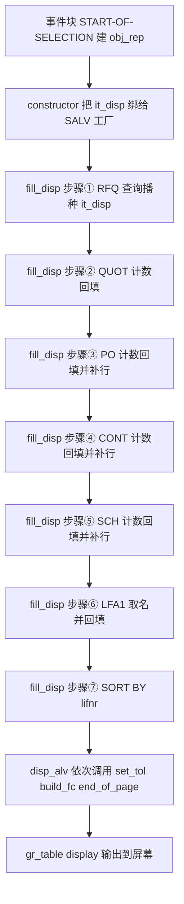
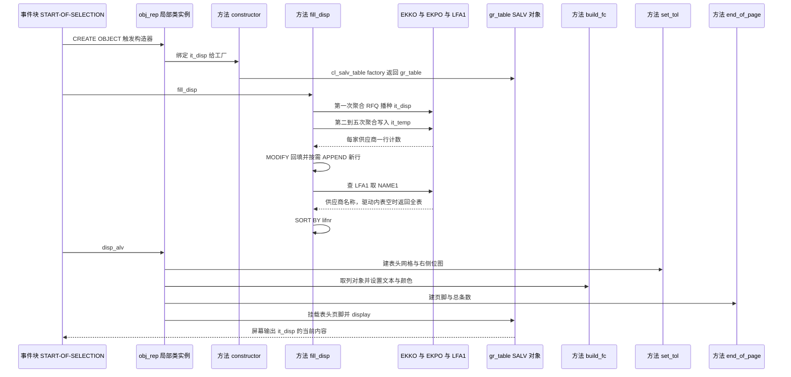

# ZMMR_PERF_EVAL_VEND 分析报告

> 分析对象：`Test-source\zvend.abap`（357 行，报表程序 `REPORT zmmr_perf_eval_vend`，UTF-8 / CRLF）
> 报告视角：代码 onboarding 走读，按真实调用链展开
> 编码声明：全文引用的 ABAP 语句逐字来自源码，含源码里原有的异常空格（如 `wa_disp- lifnr`），未做标点美化

---

## 一、程序定位与业务背景

### 1.1 这段代码在解决什么问题

这是一个**采购绩效评估报表**，业务角色是采购经理（Buyer / Sourcing Manager）的供应商评分输入。SQE 与供应商评估体系里有一条最基础的口径：**这个供应商在指定时间窗内，到底有没有在用我们？用了哪些采购凭证类型？** 答案由五个计数构成——

- `RFQ` 询价单数量（`EKKO-BSTYP = 'A'`）
- `QUOT` 已维护报价的凭证数量（`BSTYP = 'A'` 且 `EKKO-STATU = 'A'`）
- `PO` 采购订单数量（`BSTYP = 'F'`，排除 `BSART = 'UB'`）
- `CONT` 框架合同数量（`BSTYP = 'K'`）
- `SCH`  Scheduling Agreement 数量（`BSTYP = 'L'`）

选择屏给两个输入：**供应商号区间**（`s_lifnr`）与**凭证记账日期区间**（`s_bedat`）；输出是一张按供应商号排序的表，一行一个供应商，六个计数字段。

现有方案为什么不够用：SAP 标准 `ME5x` 系列报表是"凭证清单"视角，一次出几万行，采购经理要自己透视；Excel 手工拉数则要等采购运营团队排期，且口径不统一——同一个"有没有在报价"，三个人能算出三个数。**这个程序的价值在于把口径写死在代码里并给出唯一答案**：它不是快，而是"每次跑出来的数是同一个数"。

### 1.2 设计范式定性

> **"报表 + 局部类封装 + SALV 只读展示"范式**：五次数据库端聚合 → 五次内存回填 → 一次 SALV `display( )`。
> 数据一条也没在 ABAP 里逐行处理，全部计数下推到 `SELECT ... GROUP BY`，这是这份代码最正确的一个架构选择。

值得单独指出的是 `COUNT( DISTINCT a~ebeln )`：四个查询带 `JOIN ekpo`，如果用普通 `COUNT(*)`，一张有 20 个行项目的采购订单会被计成 20。加 `DISTINCT` 之后是 1。**这个选择不是风格问题，是正确性问题**，作者做对了。

### 1.3 依赖清单（读这份代码前必须知道的地形）

| 类别 | 对象 | 在本程序里的角色 |
|---|---|---|
| DDIC 表 | `EKKO` | 采购凭证抬头，`LIFNR` / `BEDAT` / `BSTYP` / `STATU` / `LOEKZ` / `BSART` |
| DDIC 表 | `EKPO` | 采购凭证项目，只用来判 `LOEKZ`，靠 `JOIN` 把一张凭证的行项目数放大后由 `DISTINCT` 抵消 |
| DDIC 表 | `LFA1` | 供应商主数据，取 `NAME1` 补名称 |
| SALV 类 | `CL_SALV_TABLE` 及 7 个 `REF TO cl_salv_*` | 列表、表头网格、页脚、列对象 |
| 布尔接口 | `IF_SALV_C_BOOL_SAP` | `set_technical` 的入参类型 |
| 外部资产 | 位图 `ZCHEM_N_LOGO_SMALL` | 表头右侧 Logo，字符串字面量硬编码，源码注释说来自 `OAER` 事务 |
| 文本符号 | `TEXT-001`（块标题）、`TEXT-002`（失败提示） | 报告文本符号，源码里看不到消息类分配 |
| 声明未用 | `wa_lfa1` 之外的所有工作区都在用；但 `lr_gridx`/`lr_label`/`lr_text`/`lr_footer` 全部声明在全局 | 见 3.8 |

### 1.4 类型与数据元素的语义校核

本节提前做一遍，因为后面好几处缺陷的根都在这里。

| 字段 | 声明 | 语义是否对得上 |
|---|---|---|
| `t_disp-lifnr` / `t_temp-lifnr` / `t_lfa1-lifnr` | `TYPE lifnr` | ✅ 对。`LIFNR` 是 `EKKO`/`LFA1` 供应商号的数据元素，长度 10，语义一致 |
| `t_disp-name1` | `TYPE name1_gp` | ✅ 对。`LFA1-NAME1` 的数据元素就是 `NAME1_GP`（40 位），语义一致 |
| `t_disp-rfq/quot/po/cont/sch` | `TYPE I` | ✅ 对。`COUNT( ... )` 返回整数，语义一致 |
| `t_temp-CNT` | `TYPE I` | ✅ 对。同上 |
| **`t_disp-bedat`** | `TYPE bedat`（`DATS`，8 位） | ❌ **对不上**。五次 `SELECT` 的列表里都没有 `BEDAT`，这一列永远是初始值；同时 `build_fc` 又把它 `set_visible( abap_false )` 隐藏。详见 P0-7 |
| **`lf_lines`** | `TYPE sy-tfill` | ❌ **对不上**。`SY-TFILL` 是 1 字节内部整数，`LINES( )` 的结果塞进去在**类型上能编译、在语义上是把二进制字节当字符显示**。详见 P0-4 |
| **`lv_text` / `lv_date`** | `TYPE C` / `TYPE C LENGTH 10` | ❌ **对不上**。用来承载 `DD/MM/YYYY` 这种 10 位格式化日期串，而 `WRITE ... TO` 对定长字符字段输出的是内部格式。详见 P0-5 |

**长度能装下不等于语义对得上**——本程序三处缺陷全部属于"能跑、类型合法、但语义错位"这一类，肉眼看编译零告警。

---

## 二、程序执行流程总览



### 责任链表

| 子程序 | 调用者 | 职责 |
|---|---|---|
| 全局声明区（`TYPES` + `DATA`） | 编译器 | 定义 `t_disp` / `t_temp` / `t_lfa1` 三种行结构、`it_disp` 等四张内表、8 个 ALV 对象引用 |
| 全局声明区（选择屏） | 屏幕 100 | 接收供应商号区间 `s_lifnr` 与记账日期区间 `s_bedat` |
| 类 `lcl_perf_eval` 定义段 | 编译器 | 声明 6 个方法：`constructor` / `fill_disp` / `build_fc` / `disp_alv` / `set_tol` / `end_of_page` |
| `constructor` | `START-OF-SELECTION` 里的 `CREATE OBJECT :` | 用 `cl_salv_table=>factory` 把 `it_disp` 绑定到 `gr_table`；失败时提示并提前结束构造 |
| `fill_disp` | `START-OF-SELECTION` 直接调用 | 五次聚合查询取五个计数字段、取 `LFA1-NAME1` 回填名称、按 `LIFNR` 排序 |
| `disp_alv` | `START-OF-SELECTION` 直接调用 | 依次调用 `set_tol` / `build_fc` / `end_of_page`，挂载表头与页脚，打开全部标准功能，`display( )` |
| `build_fc` | `disp_alv` | 取列对象并设置列文本、颜色、可见性、technical 属性 |
| `set_tol` | `disp_alv` | 建表头网格、显示供应商区间 / 日期区间 / 运行日期、建右侧 Logo |
| `end_of_page` | `disp_alv` | 建页脚，"Information:" + 总条数 |
| 事件块 `START-OF-SELECTION` | 屏幕（执行按钮） | 建对象、调 `fill_disp`、调 `disp_alv` |

下面按这条流程逐个子程序展开。`fill_disp` 有 7 个逻辑步骤、`build_fc` 与 `set_tol` 各有多个配置步骤，是本报告的重点；声明区只讲语义校核。

---

## 三、分组分析

### 3.1 全局声明区：三种行结构与四张内表（`TYPES` / `DATA`）

先看数据结构，因为后面所有 `MODIFY` 的对错都取决于这里的字段设计。

```abap
TYPES:BEGIN OF t_disp,
   lifnr TYPE lifnr,
   name1 TYPE name1_gp,
   bedat TYPE bedat,
   rfq  TYPE I ,
   quot TYPE I ,
   po   TYPE I ,
   cont TYPE I ,
   sch  TYPE I ,
END OF t_disp,
```

**做什么** — 用 `BEGIN OF ... END OF` 声明三种行结构：展示行 `t_disp`（`LIFNR TYPE lifnr`、`name1 TYPE name1_gp`、`bedat TYPE bedat`，加 `rfq` / `quot` / `po` / `cont` / `sch` 五个 `TYPE I` 计数字段）、中转行 `t_temp`（`LIFNR` + `CNT`）、取名行 `t_lfa1`（`LIFNR` + `NAME1`）。每个字段的类型都直接取自 DDIC 数据元素或 ABAP 内建类型，没有本地定义的结构副本。

**为什么** — 把"最终要显示的行"和"单次查询落地的一行"分成两个结构，是这个程序后面所有回填能成立的前提。五次 `SELECT` 各自的列表只有 `LIFNR` 加一个计数别名（例如 `AS rfq`、`AS CNT`），无法直接填进 `t_disp`；先落进 `it_temp`、再按字段名回填，`MODIFY ... TRANSPORTING` 才只动两列而不清零前面已算好的数字。五个计数列都声明成 `TYPE I` 也与 `COUNT( ... )` 的返回类型一致——**结构设计对得上查询形态**，这一点作者做对了。

**风险与改进** — 两处：

1. **`bedat TYPE bedat` 是死字段**（P0-7）。后果：五次查询的结果列表里从来没有 `BEDAT`，这一列在任何输出路径下都是初始值；而 `build_fc` 又把它设为不可见。结果是用户填了日期区间、查询确实按日期过滤了，但输出里没有任何日期痕迹，且**不存在任何一条会失败的语句**——所以这个矛盾永远不会自己暴露。要么删掉这个字段，要么真的选进结果并显示它。
2. **字段列的对齐与大小写不统一**（`rfq  TYPE I` 两个空格、`cont TYPE I` 顶格、`CNT` 大写）。后果：不影响运行，但这段定义看起来像手抄而非校对过；真正需要留意的是别名的逐字对应——`AS rfq` 必须与组件 `rfq` 完全一致，而改组件名时 ABAP 不会替你检查查询别名。

```abap
DATA: it_disp TYPE TABLE OF t_disp,
       wa_disp LIKE LINE OF it_disp,
       it_temp TYPE TABLE OF t_temp,
       wa_temp LIKE LINE OF it_temp,
       it_lfa1 TYPE TABLE OF t_lfa1,
       wa_lfa1 LIKE LINE OF it_lfa1.
```

**做什么** — 把三种行结构各铺成一张内表，并各配一个 `LIKE LINE OF` 工作区：`it_disp` / `wa_disp` 是展示表与展示工作区，`it_temp` / `wa_temp` 是中转表与中转工作区，`it_lfa1` / `wa_lfa1` 是名称表与名称工作区。三张内表都用 `TYPE TABLE OF`（标准表）声明，没有 `WITH KEY`。

**为什么** — `LIKE LINE OF` 而不是重复写 `TYPE t_disp`，让行类型改动时工作区自动跟随，不会出现"表和工作区不是同一个结构"这种极难查的不一致。**三张表配三个工作区，恰好对应三种访问方式**：`wa_temp` 是 `LOOP ... INTO` 的目标（中转表逐行读）、`wa_lfa1` 是 `READ TABLE ... INTO` 的目标（名称表按键读）、`wa_disp` 同时承担 `LOOP` 目标与 `MODIFY FROM` 的来源。说明作者清楚每张表怎么被访问——**这一点比"三张表都配了工作区"更有价值，因为它排除了"随手配一个"的写法**。

**为什么** — **"展示结构 + 中转结构"这个二分是对的**，而且是这个程序里少数几个经得起推敲的设计：五个计数分别来自五次不同的 `GROUP BY`，无法在一条 SQL 里出（作者也没试图合并），所以必然需要一张中转内表 `it_temp` 把每次查询的结果落地，再回填进 `it_disp`。如果图省事把 `CNT` 直接查进 `it_disp`，后面的 `MODIFY` 就得搬运整行，而且会覆盖前面已经填好的计数字段——`it_temp` 隔离掉的就是这个风险。`wa_lfa1` 单独拆一个结构同样是为了让名称回填只带 `LIFNR`/`NAME1` 两列，不把主数据整行搬进内存。

**风险与改进** — 四处：

1. **`bedat` 字段是死字段**（P0-7）。它占着 `t_disp` 的第三列，被 `SELECTION-SCREEN` 当参照字段用、又在 `build_fc` 里被隐藏，但五次 `SELECT` 的结果列表里从来没有它。后果：这一列在任何输出路径下都是初始值；如果哪天有人为了"显示日期"把它取消隐藏，用户看到的是一列空日期，且**没有任何报错**——因为没有一条语句试图给它赋值，不存在会失败的语句。正确做法是删掉这个字段（它不属于展示内容），或者真的选进 `BEDAT` 并让用户看见。
2. **四张内表全都没有声明表键**（P2-3）。`TYPE TABLE OF t_disp` 是标准表，`MODIFY it_disp ... WHERE lifnr = ...` 和 `READ TABLE it_lfa1 WITH KEY lifnr = ...` 都会退化成全表线性扫描。后果：数据量上来后 `fill_disp` 的回填循环是 O(供应商数 × 行数)，而这两张表都可以声明成 `SORTED TABLE WITH UNIQUE KEY lifnr`（`it_lfa1` 因为天然唯一，`it_disp` 在回填阶段也唯一），性能差是数量级的。
3. **`wa_disp` 同时承担三个角色**：展示内表工作区、`MODIFY` 的来源行、以及 `s_lifnr` / `s_bedat` 的选择屏参照结构。后果：它跨了选择屏生命周期与取数生命周期两次复用，任何一处忘记 `CLEAR`（第 111、131、150、169 行都写了 `CLEAR`，说明作者意识到了这个风险）都会把上一轮的 `LIFNR` 带进下一轮的 `MODIFY`。这是"靠记得写 CLEAR 来保证正确"的模式，正确做法是让 `MODIFY` 的来源行用独立的局部结构。
4. **`it_lfa1` 的列投影是对的**（正面记录）：只取 `lifnr name1`，`LFA1` 有 100+ 字段，全取会浪费内存。

### 3.2 全局声明区：选择屏（`SELECTION-SCREEN`）

```abap
SELECTION-SCREEN BEGIN OF BLOCK b1 WITH FRAME TITLE TEXT- 001.
  SELECT-OPTIONS : s_lifnr FOR wa_disp- lifnr,
   s_bedat FOR wa_disp- bedat.
SELECTION-SCREEN END OF BLOCK b1.
```

**做什么** — 在块 `b1`（带边框，标题取文本符号 `TEXT-001`）里定义两个 `SELECT-OPTIONS`：`s_lifnr` 参照 `wa_disp- lifnr`（供应商号区间，可留空表示全部）、`s_bedat` 参照 `wa_disp- bedat`（记账日期区间，`BEDAT` 是 `DATS` 8 位，所以系统按日期区间格式显示为 `DD/MM/YYYY-DD/MM/YYYY`）。

**为什么** — 用 `SELECT-OPTIONS` 而不是 `PARAMETERS`，是为了支持区间语义，这在两个场景下都是刚需：供应商经常按"一批号段"筛；日期更是天然区间。参照字段选择 `wa_disp-lifnr` 而不是自己声明一个变量，作用是从展示结构里取到 `LIFNR` 的数据元素（决定屏幕格式与 F4 帮助），属于合法的常见写法。

**风险与改进** — 三处：

1. **两个选择屏字段都没有必填校验，也没有非空守卫**（P0-4）。后果：`s_lifnr` 为初始时，`WHERE a~lifnr IN s_lifnr` 的语义是"不限制"，于是这个程序在用户什么都不填、按 F8 的情况下，会对**全系统所有供应商**跑五遍 `EKKO`/`EKPO` 聚合，并把 `LFA1` 全表拉进内存。这是本程序最贵的一条路径，而它在界面上看不出来——用户看到的是一个空输入框和一次"很慢"（见 3.5 步骤⑥）。
2. **参照 `wa_disp` 而非独立结构，把选择屏与取数阶段绑在一起**。后果：`wa_disp-lifnr` 这个字段同时是屏幕参照对象和工作区字段，语义上被复用；一旦将来在 `fill_disp` 之前给 `wa_disp-lifnr` 赋了值，屏幕上显示的"参照值"与用户输入的区间会出现理解偏差。改成参照一个独立的 `TYPES BEGIN OF ty_sel` 更干净。
3. **`TEXT-001` 的消息类分配在源码里看不到**。后果：文本符号在 SE38 的"程序属性 → 文本符号"里分配消息类；未分配时 `TEXT-001` 无法激活（具体是错误还是警告需在 SE38 核实），分配了但客户没维护文本时，块标题显示成裸的 `TEXT-001` 或空白，用户看到的是"一块没有标题的边框"。

### 3.3 类 `lcl_perf_eval` 定义段（`CLASS lcl_perf_eval DEFINITION`）

类被拆成两段分析，先看定义段——它的形状决定了后面每个方法能碰到什么。

```abap
CLASS lcl_perf_eval DEFINITION .
  PUBLIC SECTION.
  METHODS: constructor ,
   fill_disp.
  METHODS build_fc.
  METHODS disp_alv.
  METHODS set_tol.
  METHODS end_of_page.

ENDCLASS.                   "lcl_perf_eval DEFINITION
```

**做什么** — 声明一个全 `PUBLIC SECTION` 的局部类 `lcl_perf_eval`，公开 6 个方法：`constructor`（隐式，`PUBLIC` 构造器）与 `fill_disp` / `build_fc` / `disp_alv` / `set_tol` / `end_of_page`。没有 `PRIVATE SECTION`，没有实例属性（所有可变状态都在程序全局的 `DATA` 里）。

**做什么（补一层）** — 注意 `METHODS:` 与 `METHODS` 两种写法在同一段里混用，`constructor` 与 `fill_disp` 用逗号并列、其余逐行声明；`ENDCLASS` 后面带了注释 `"lcl_perf_eval DEFINITION`。

**为什么** — 用局部类而不是一串 `FORM` 的判断是对的：这个程序有五段彼此职责清晰、但共享大量状态（`it_disp`、8 个 ALV 引用）的步骤，类把它们收在一个可命名的边界里，读者知道 `fill_disp` 是"数据层"、其余四个是"展示层"。全 `PUBLIC` 且无私有属性，是因为数据全在全局——**这既省了参数传递，也正是它测不了的原因**（见 P3-4）。

**风险与改进** — 三处：

1. **零个私有属性 = 零个可注入点**（P3-4）。后果：`fill_disp` 依赖程序全局的 `it_disp` / `it_temp` / `it_lfa1` / `s_lifnr` / `s_bedat`，ABAP Unit 里没法给它准备输入、也没法读它的输出，所以这个程序里**最值得测的聚合逻辑一行都测不了**。同类结构里 `build_fc` 同样无法测——它依赖 `gr_table`，而 `gr_table` 由构造器建立。
2. **`fill_disp` 无返回值、无异常**。后果：调用方（`START-OF-SELECTION`）无法知道取数是否成功、命中多少行；将来要改成后台批处理或被别的程序调用时，没有可判断的契约。
3. **`constructor` 写成 `METHODS: constructor` 而不是 `CLASS-METHODS`**（写法上它其实是实例构造器，正确）。这一条不是缺陷，记录在这里是为了说明：`CREATE OBJECT : obj_rep.` 的语义是"构造器失败不会让 `CREATE OBJECT` 本身失败"，这正是 3.4 那个缺陷的前提。

### 3.4 `constructor`：建立 SALV 与 `it_disp` 的绑定（方法 `constructor`）

第一个方法，也是**唯一一处有失败处理的地方**——而它处理得并不成功。

```abap
    TRY.
       cl_salv_table=> factory( IMPORTING r_salv_table = gr_table CHANGING t_table = it_disp ). "Calling Factory Obj of Cl_ALV_TABLE
    CATCH cx_salv_msg.
    ENDTRY .

    IF gr_table IS INITIAL .
      MESSAGE TEXT -002 TYPE 'I' DISPLAY LIKE 'E'.
      EXIT .
    ENDIF .
```

**做什么** — 在 `TRY` 里调用工厂方法 `CL_SALV_TABLE=>FACTORY`，把 `it_disp` 通过 `CHANGING` 交给 SALV（**按引用传递，工厂持有的是这张表的句柄**），返回的 ALV 对象存进全局 `gr_table`；捕获 `CX_SALV_MSG` 但**不处理**；随后判 `gr_table IS INITIAL`，成立时用 `TEXT-002` 弹一条 `TYPE 'I'`（信息）消息、并提前结束构造方法。

**为什么** — 用工厂 + `CHANGING t_table` 而不是先 `create_display_options( )` 再 `set_data( )`，是官方推荐的最小写法：一条语句同时建好 ALV 对象、数据源绑定和默认功能集。`TRY ... CATCH` 也确实比不写强——SALV 工厂在数据源结构非法时会抛异常，不捕获就是短转储。

**风险与改进** — 四处，其中第一处是必然触发的失败路径：

1. **构造失败后，调用方仍然无条件继续**（P1-1）。后果：`START-OF-SELECTION` 里 `CREATE OBJECT` 之后紧跟 `fill_disp( )` 和 `disp_alv( )`，中间没有任何"构造是否成功"的判断。而 `disp_alv` 的第一段是 `set_tol( )`、`build_fc( )`、`end_of_page( )`，紧接着 `gr_table-> get_functions( )`、`gr_table-> set_top_of_list( lr_logo )`、`gr_table-> display( )`。只要 `gr_table` 是初始引用，**任何一条 `gr_table->` 就是空引用异常（`CX_SY_REF_IS_INITIAL`）**。用户实际看到的是：先弹 `TEXT-002`（而且 `TYPE 'I'` + `DISPLAY LIKE 'E'` 只是长得像错误），然后紧跟一条短转储。"友好地提示"在这里变成了"提示完了照样崩"。
2. **`EXIT` 在方法里用得含糊**（`EXIT` 离开方法的作用范围需在 SE38 核实）。后果：即使 `EXIT` 正确地结束了构造方法，`CREATE OBJECT` 也不会因此失败，调用方拿到的仍然是一个"构造失败过的对象引用"，而这个对象内部没有 `gr_table`。构造器应该把失败**变成可判断的信号**（`RAISING` 一个自有异常，或改成 `CREATE OBJECT ...` 后由调用方检查 `gr_table IS INITIAL`）。
3. **`CATCH cx_salv_msg.` 是空处理器**（P1-2）。后果：工厂抛出的消息文本被完全丢弃，既不 `MESSAGE` 也不写日志。工厂失败在真实系统里通常是"数据源结构不被支持"或"内表有重复键"，用户拿到的却是无意义的 `TEXT-002`；而第 79 行后面没有任何注释说明"为什么这里可以忽略"。
4. **`MESSAGE ... TYPE 'I' DISPLAY LIKE 'E'` 是两条消息语义混用**（P1-5）。后果：`TYPE 'I'` 表示信息类消息、不进消息栏、不改变 `sy-subrc`；`DISPLAY LIKE 'E'` 只是让它的显示形式带错误图标。用户在消息行看到的是一个红色错误图标，而程序自己的消息类型是信息——两套语义并存让排查的人无法判断这到底算不算错误。失败路径上应该用 `TYPE 'E'` 或 `TYPE 'S'`，二选一。

### 3.5 `fill_disp`：五次聚合 + 名称回填（方法 `fill_disp`，本程序的核心）

这是全文件最值得读的一段，分七步。**它的整体形状是对的**（数据库端聚合 + 中转内表 + 按键回填），**它的缺陷集中在两处**：播种只认 RFQ，以及回填循环写法不一致。

#### ① 播种 `it_disp`：唯一的 RFQ 查询（方法 `fill_disp`）

```abap
    SELECT a~lifnr COUNT( DISTINCT a~ebeln ) AS rfq FROM ekko AS a
    JOIN ekpo AS b ON a~ ebeln = b ~ebeln
    INTO CORRESPONDING FIELDS OF TABLE it_disp
    WHERE a~lifnr IN s_lifnr AND bedat IN s_bedat
    AND b~loekz NE 'X'
    AND a~bstyp = 'A'
    GROUP BY a~lifnr .
```

**做什么** — 从 `EKKO`（抬头，别名 `a`）`JOIN` `EKPO`（项目，别名 `b`，按 `EBELN` 等值内连接），筛选条件是 `a~lifnr IN s_lifnr` 与 `bedat IN s_bedat`（走的是 `EKKO-BEDAT`）、`b~loekz NE 'X'`（项目未被删除标记）、`a~bstyp = 'A'`（凭证类别为询价单），按 `a~lifnr` 分组，`COUNT( DISTINCT a~ebeln )` 得到的每供应商询价单数以 `RFQ` 为别名，经 `INTO CORRESPONDING FIELDS OF TABLE it_disp` 按字段名写入 `it_disp`。这是**唯一一条写 `it_disp` 的查询**，因此也是唯一决定"哪些供应商会出现在结果里"的查询。

**为什么** — `COUNT( DISTINCT ... )` 在这里是必需的而不是锦上添花：`JOIN ekpo` 之后，一张有 20 个行项目的询价单会产生 20 行结果，不加 `DISTINCT` 会被计成 20，用 `DISTINCT ebeln` 才回到凭证粒度。`JOIN ekpo` 本身只为了一条 `b~loekz`，而 `LOEKZ` 在 `EKKO` 上也有——作者选了项目表上的字段，等于要求"至少有一个未删除行项目"的凭证才算数，这比抬头字段更严格，是个有意的（也是合理的）口径。分组下推到数据库，避免把明细拉进 ABAP 计数，同样是对的。

**风险与改进** — 四处：

1. **这条查询承担了它不该承担的职责：播种整张结果表**（P0-2）。后果：`it_disp` 里存在的供应商 = "有询价单"的供应商。于是后面四个回填循环必须各自处理"这个供应商还没在 `it_disp` 里"的情况——PO、CONT、SCH 三个循环确实处理了（`IF sy-subrc NE 0. APPEND`），**QUOT 循环没有**，见步骤②。同时，任何一个"只有 PO 没有 RFQ"的供应商能否出现在结果里，取决于步骤③那个 `APPEND` 补丁——这个补丁是分散在四个循环里各自实现的，不是由一处统一保证的。正确的做法是让 `it_disp` 的行集合由"供应商候选集"决定（例如先从 `LFA1` 或从某个 `EKKO` 维度取候选），而不是由第一个业务口径顺带产生。
2. **`b~loekz NE 'X'` 与其余四段的 `loekz EQ space` 口径不一致**（P2-7）。后果：这一段接受"任何非 `X` 的删除标记"，其余四段只接受"空标记"。若 `LOEKZ` 的值域里存在 `X` 以外的取值（该字段的完整值域需在 SE11 核实），两个口径会给同一家供应商算出不同的分母，绩效表内部自相矛盾。要么统一成 `EQ space`，要么统一成 `NE 'X'`，并在注释里写清选的是哪个。
3. **`bedat` 是唯一不带表别名的条件字段**（可读性问题）。后果：`WHERE ... AND bedat IN s_bedat` 与 `AND a~bstyp = 'A'` 并列时，读者要在心里确认"`bedat` 到底是 `EKKO` 的还是 `EKPO` 的"。查证结论是：`EKKO-BEDAT`（凭证记账日期）与 `EKPO-BEDAT`（凭证日期）**两个字段都存在**，此处未加前缀意味着解析到 `EKKO-BEDAT`。**这个字段名重复是真实的语义歧义点**，一旦有人给这段加 `a~` 前缀，报表口径会静默改变成另一个日期（行项目日期 vs 凭证记账日期），且不会报错。建议显式写 `a~bedat` 并加注释。
4. **`INTO CORRESPONDING FIELDS OF TABLE` 覆盖而非追加**。后果：这是唯一一处非 `APPENDING` 的写入，`it_disp` 被整体替换。当前调用顺序下它是第一步所以没问题，但一旦有人调整步骤顺序或在前面加了别的查询，这里会静默清空已有数据。这类"位置敏感"写法必须配注释。

#### ② 回填报价计数（方法 `fill_disp`）

```abap
    SELECT lifnr COUNT( DISTINCT ebeln ) AS CNT FROM ekko
    APPENDING CORRESPONDING FIELDS OF TABLE it_temp
    WHERE lifnr IN s_lifnr AND bedat IN s_bedat
    AND loekz EQ space
    AND ( bstyp = 'A' AND statu = 'A' )
    GROUP BY lifnr.

    LOOP AT it_temp INTO wa_temp .
       wa_disp- lifnr = wa_temp -lifnr.
       wa_disp- quot = wa_temp -CNT.
      MODIFY it_disp FROM wa_disp TRANSPORTING lifnr quot WHERE lifnr = wa_temp-lifnr .
      CLEAR : wa_disp, wa_temp.
    ENDLOOP .
```

**做什么** — 第二条查询直接从 `EKKO`（**不带 `JOIN`**）按 `lifnr` 分组统计 `COUNT( DISTINCT ebeln )` 别名 `CNT`，条件是供应商区间、记账日期区间、`loekz EQ space`、并且 `( bstyp = 'A' AND statu = 'A' )`，结果追加进中转表 `it_temp`；随后遍历 `it_temp`，把 `CNT` 装进工作区 `wa_disp` 的 `QUOT`，用 `MODIFY it_disp FROM wa_disp TRANSPORTING lifnr quot WHERE lifnr = ...` 回填展示表，每行结束 `CLEAR` 两个工作区。

**为什么** — 三个写法都站得住：`TRANSPORTING lifnr quot` 是**必须的**而不是可选的——`MODIFY FROM` 会用来源行覆盖目标行的全部字段，不加 `TRANSPORTING` 就会把已经算好的 `RFQ`/`PO`/`CONT`/`SCH` 一起清零，作者显然踩过或想清楚过这点；末尾 `CLEAR : wa_disp, wa_temp.` 防的是 `wa_disp` 的其他字段（`name1`、`bedat`）带着上一轮的值进到 `MODIFY` 里，`wa_temp` 的 `CLEAR` 则保证下一次 `LOOP` 不会因 `sy-subrc` 之类的残留误判；不带 `JOIN` 也合理，报价这个口径不需要项目表任何字段。

**风险与改进** — 三处，第一处是本程序最严重的业务正确性缺陷：

1. **`MODIFY` 之后不判 `sy-subrc`、也没有 `APPEND` 兜底**（P0-2）。后果：按步骤①的播种逻辑，一家"有报价但没有询价单"的供应商**根本不在 `it_disp` 里**。这一行的 `MODIFY ... WHERE lifnr = ...` 找不到目标行，`sy-subrc` 变成 4，而代码直接忽略它、也没有像后面三段那样 `APPEND` 新行——于是这家供应商的报价数**被静默丢弃**，它整行都不会出现在报表上。采购经理看到的结果是：某家只做过报价的供应商在绩效表里消失了，**没有任何报错、没有任何提示**，而且报表看起来是"完整"的。这是本程序唯一一个"业务结论直接错掉"的缺陷，其余是展示层问题。
2. **`statu = 'A'` 与其余四段的口径不同源**（P1-6 / P2-7）。后果：这一段用 `BSTYP = 'A'` 加 `STATU = 'A'` 判定"报价已维护"，而询价那段只用 `BSTYP = 'A'` 且完全不看 `STATU`。也就是说 `RFQ` 列数的是"询价单凭证数"，`QUOT` 列数的是"状态为 A 的询价单凭证数"，两者是包含关系但用了两套判据。`EKKO-STATU` 记的是整张凭证的处理状态、不是"报价是否存在"，其合法值集合需在 SE11 核实；但**"两段口径不同源"这件事从源码就能判**，而且它意味着 `RFQ ≥ QUOT` 这个预期关系并没有被代码保证（因为它们连分母的删除标记判据都不一样）。
3. **`TRANSPORTING lifnr` 是多余的一半**。后果：`MODIFY ... WHERE lifnr = wa_temp-lifnr` 的匹配键就是 `lifnr`，把 `lifnr` 放进 `TRANSPORTING` 等于用同一个值写回同一个字段，无害但掩盖了意图——读者会以为这里真的要用 `wa_disp-lifnr` 去改主键。建议 `TRANSPORTING quot`。同样地，回填 `name1` 那一段的 `TRANSPORTING lifnr name1`（步骤⑥）也有这个问题。

#### ③ 回填采购订单计数（方法 `fill_disp`）

```abap
    REFRESH it_temp.
    SELECT lifnr COUNT( DISTINCT a~ ebeln ) AS CNT FROM ekko AS a JOIN ekpo AS b ON a~ ebeln = b ~ebeln
    APPENDING CORRESPONDING FIELDS OF TABLE it_temp
    WHERE lifnr IN s_lifnr AND bedat IN s_bedat
    AND b~loekz EQ space
    AND bsart NE 'UB'
    AND ( a~ bstyp = 'F' )
    GROUP BY lifnr.

    LOOP AT it_temp INTO wa_temp .
       wa_disp- lifnr = wa_temp -lifnr.
       wa_disp- po = wa_temp -CNT.
      MODIFY it_disp FROM wa_disp TRANSPORTING lifnr po WHERE lifnr = wa_temp-lifnr .
      IF sy-subrc NE 0.
        APPEND wa_disp TO it_disp .
      ENDIF .
      CLEAR : wa_disp, wa_temp.
    ENDLOOP .
```

**做什么** — 先 `REFRESH it_temp` 清空中转表，然后第三条查询（`EKKO JOIN EKPO`，条件为供应商区间、记账日期区间、`b~loekz EQ space`、`bsart NE 'UB'`、`( a~bstyp = 'F' )`）按 `lifnr` 分组统计订单数追加进 `it_temp`；遍历时把 `CNT` 装进 `wa_disp-po`，`MODIFY` 回填展示表，**并在 `sy-subrc NE 0`（没找到目标行）时 `APPEND wa_disp TO it_disp` 新建一行**。

**为什么** — `IF sy-subrc NE 0. APPEND` 这个补丁**正是步骤①播种问题的正确解法**：当某供应商不在展示表里时，用当前工作区（此时只填了 `LIFNR` 和 `PO`，其余被 `CLEAR` 成初始值）作为新行插入，等价于"这个供应商有 0 个 RFQ、N 个 PO"。语义正确：新行的其它计数字段是 0，不是空。这是本程序里唯一一处把"行集合不全"这个结构性问题在局部补上的地方。

**风险与改进** — 四处：

1. **`REFRESH it_temp` 是手工重置，谁也不敢删**（P2-3）。后果：五次查询共用一张中转表，"每次查询前必须 `REFRESH`"是一条没有被任何机制强制的约定。后果很具体：任何人新增一段统计而忘了 `REFRESH`，上一段的 `CNT` 会被 `APPEND` 到 `it_temp` 后面（`APPEND` 不覆盖），然后这段的 `LOOP` 会把上一段的数字**再回填一遍**——报表上出现重复计数的供应商，而且不报错。正确做法是给每段查询用独立的内表变量（或至少把 `REFRESH` 与查询写成同一个 FORM 的固定头尾）。
2. **`bsart NE 'UB'` 是一个没有注释、没有依据的排除**（P3-2）。后果：它在业务上的含义（为什么这一类订单类型不算"采购订单"）在源码里没有任何线索，而这个数字是要进供应商绩效评分的。`BSART` 是凭证类型、`BSTYP` 是凭证类别，两个维度混在一个 WHERE 里，只有老手才知道它排除的是什么。`BSART` 各值的业务含义需在 SE11 / SPRO 核实；但"**排除规则不可追溯**"这件事从源码就能判，而且它的后果是：绩效评分被人改了一个数字却没人知道依据。
3. **`( a~ bstyp = 'F' )` 的括号是冗余的**，且是全文件唯一带括号的单一条件（步骤②的括号里是两个条件，有必要）。后果：风格不统一，读代码的人要判断这个括号是不是漏了半个条件。
4. **`REFRESH` + `APPEND ... CORRESPONDING FIELDS` + `LOOP` + `MODIFY` 四件套在四个循环里几乎逐字重复**（P2-1）。后果：同一套逻辑抄四遍，改一处就要改四处——步骤②的 `MODIFY` 漏了 `sy-subrc` 判断这件事，正是"抄第四遍时抄漏了"的直接后果（它是从步骤③抄回去的，或者反过来步骤③本来有、步骤②本来没有）。**这段逻辑应该是一个内表驱动的表：把五个口径写成配置，循环统一回填**，那样 P0-2 这种缺陷在结构上就不可能发生。

#### ④⑤ 合同与 Scheduling Agreement 计数（方法 `fill_disp`）

这两段与步骤③在结构上完全同构，只是 `bstyp` 取值不同，因此合并分析，差异点单独指出。

```abap
    REFRESH it_temp.
    SELECT lifnr COUNT( DISTINCT a~ ebeln ) AS CNT FROM ekko AS a JOIN ekpo AS b ON a~ ebeln = b ~ebeln
    APPENDING CORRESPONDING FIELDS OF TABLE it_temp
    WHERE lifnr IN s_lifnr AND bedat IN s_bedat
    AND b~loekz EQ space
    AND ( a~ bstyp = 'K' )
GROUP BY lifnr.
```

**做什么** — 合同计数这一段：`REFRESH it_temp` 清空中转表，然后用与步骤③完全相同的查询骨架（`EKKO AS a` `JOIN ekpo AS b`、`COUNT( DISTINCT a~ebelen ) AS CNT`、供应商区间 + 记账日期区间 + `b~loekz EQ space`、按 `lifnr` 分组）追加结果，只是凭证类别换成 `( a~ bstyp = 'K' )`，且**没有** `bsart` 排除条件。

**为什么** — `BSTYP = 'K'` 是采购框架合同的标准凭证类别，与订单 `'F'`、框架协议 `'L'` 并列。用凭证类别而不是用业务场景来分列，符合采购人员的认知方式。这一段不带 `bsart` 排除也是对的：排除规则只对采购订单有意义（步骤③），套到合同上是没有依据的。

**风险与改进** — 两处：

1. **这段与步骤③、步骤⑤逐字相同，只差一个 `'K'`**（P2-1）。后果：每复制一次抄错概率就多一分，而这份代码里已经因此产生了一个 P0（步骤②漏了 `APPEND` 兜底）。把五个口径做成内表配置、统一回填循环，才能让"漏兜底"在结构上不可能发生。
2. **计数口径本身与 `PO` 段不对称**（P3-1）。后果：`PO` 段排除了 `bsart NE 'UB'` 而本段不排，于是"三个数"与"四段"用了两套删单口径；采购经理拿绩效分时，两个数字的剔除规则不同却看不出来。`UB` 的业务含义需在 SE11 / SPRO 核实，但"口径不对称"从源码就能判。

```abap
    REFRESH it_temp.
    SELECT lifnr COUNT( DISTINCT a~ ebeln ) AS CNT FROM ekko AS a JOIN ekpo AS b ON a~ ebeln = b ~ebeln
    APPENDING CORRESPONDING FIELDS OF TABLE it_temp
    WHERE lifnr IN s_lifnr AND bedat IN s_bedat
    AND b~loekz EQ space
    AND ( a~ bstyp = 'L' )
    GROUP BY lifnr.
```

**做什么** — Scheduling Agreement 计数这一段：同样先 `REFRESH it_temp`，同一套查询骨架，凭证类别换成 `( a~ bstyp = 'L' )`。两段各自追加进 `it_temp`，再由后续两个循环（与步骤③逐字同构、含 `IF sy-subrc NE 0. APPEND wa_disp TO it_disp` 兜底）分别回填到 `CONT` 与 `SCH`。

**为什么** — `BSTYP = 'L'` 对应框架协议（Scheduling Agreement），与 `'F'`、`'K'` 是同一维度的三个值。与前一段相比，这一段证明了作者对 SAP 采购凭证类别的划分是清楚的——**五个列对应五个 `BSTYP` 分支，唯独 `QUOT` 用的是 `BSTYP` + `STATU` 的组合**，这个差异后面单独说。

**风险与改进** — 两处：

1. **五段查询里只有订单段带 `bsart` 排除，而排除依据不可追溯**（P3-2）。后果：采购经理问"为什么他家的采购订单数是 12"，没人答得上来 `UB` 是什么。这是"报表口径无文档"的典型后果：**报表一旦被拿去评审供应商，数字就成了正式依据，而依据写在一行没有注释的 `NE 'UB'` 里。**
2. **五段查询逐字重复**（P2-1）。后果见步骤③第 4 点——这个重复已经实际造成了一个缺陷（步骤②），它还会继续造成下一个。四份复制品里最差的那一份，决定了整个报表的正确性上限。

#### ⑥ 取供应商名称并回填（方法 `fill_disp`）

```abap
    SELECT lifnr name1 FROM lfa1
    INTO CORRESPONDING FIELDS OF TABLE it_lfa1
    FOR ALL ENTRIES IN it_disp
    WHERE lifnr = it_disp -lifnr.
```

**做什么** — 从 `LFA1` 取 `LIFNR` 与 `NAME1` 两列，用 `FOR ALL ENTRIES IN it_disp` 把 `it_disp` 的 `LIFNR` 作为内连接条件（`WHERE lifnr = it_disp-lifnr`），结果写入 `it_lfa1`。

**为什么** — `FOR ALL ENTRIES` 避免了对每家供应商发一次 `SELECT`（那是 2000 次往返），一次把范围内所有供应商名称取回，再用 `READ TABLE` 在内表里对号入座。这是 ABAP 里"批量取主数据"的标准做法，比嵌套 `SELECT` 好一个数量级。

**风险与改进** — 三处，第一处后果严重：

1. **`it_disp` 为空时，`FOR ALL ENTRIES` 会返回 `LFA1` 的全表**（P0-4）。这是 ABAP 的规定行为：当驱动内表为空时，`FOR ALL ENTRIES` 的 WHERE 条件不生效，**整个 `LFA1` 被读进 `it_lfa1`**。触发条件很常见——`s_lifnr` 和 `s_bedat` 同时填得很窄、或者日期区间里一张凭证都没有，`it_disp` 就是空的。后果：用户看到一个空报表，同时后台把整个供应商主数据表拉进内存；生产系统上 `LFA1` 几十万行就是几十 MB 的工作内存占用加上一次全表读，表现为程序长时间无响应直到内存不足（`TSV_TNEW_PAGE_ALLOC_FAILED` 之类）。修法是一行守卫（示意，源码中不存在）：
   ```abap-fix
     CHECK it_disp IS NOT INITIAL.
   ```
2. **`it_lfa1` 是标准表 + 线性 `READ TABLE`**（P2-3）。后果：`it_disp` 有 N 行、`it_lfa1` 有 N 行时，下一步的 `READ TABLE ... WITH KEY` 是 O(N)，总代价 O(N²)。声明成 `SORTED TABLE WITH UNIQUE KEY lifnr`（`LFA1-LIFNR` 本身唯一，`SELECT` 的结果也无重复）后是 O(N log N)，代码一行不用改。
3. **没有 `CHECK sy-subrc` 之外的处理，但这一步有**：`IF sy-subrc EQ 0.` 存在，所以主数据缺失的供应商会留空名字而不是崩——这是对的。但后果是用户看到一行空白供应商名，没有任何"该供应商在 LFA1 无记录"的提示；`LIFNR` 有主数据是常态，所以这是低频场景，不必过度设计。

#### ⑦ 按供应商号排序（方法 `fill_disp`）

```abap
    SORT it_disp BY lifnr .
```

**做什么** — 在所有回填完成之后，按 `LIFNR` 升序排序 `it_disp`，用户看到的行顺序即供应商号升序。

**为什么** — 查询本身按 `GROUP BY lifnr` 出来通常已近似有序，但**"近似"不等于有序**：五次查询各自的顺序、加上四段 `APPEND` 新行插入的位置，都会打乱整体顺序，最后这一次 `SORT` 是保证输出稳定的唯一手段。放在最后是对的。

**风险与改进** — 一处，也是本方法性能问题的根：

1. **`SORT` 排在最后，而前面四个回填循环已经在标准表上做了 N 次 `MODIFY ... WHERE lifnr = ...`**（P2-2）。后果：`MODIFY ... WHERE` 在标准表上是全表扫描，N 家供应商 × M 行 = O(N·M)。选择屏不填时 M 和 N 都是全量供应商数，这个乘法就是报表变慢的直接来源。**修法不是加索引**（标准表没有索引可加），而是改声明：把 `it_disp` 声明成 `SORTED TABLE ... WITH UNIQUE KEY lifnr`，ABAP 会自动维护二叉索引，`MODIFY ... WHERE` 变成 O(log N)；或者更省一次排序——把 `SORT` 提到播种之后、回填之前，中转内表 `it_temp` 也按 `lifnr` 排好，回填时顺序推进而不是查找。

### 3.6 `build_fc`：列配置（方法 `build_fc`）——本程序最严重的一处缺陷在这里

**先说结论**：这一段里 `gr_column ?=` 的写法会让**除第一列以外的每一段配置全部作用到 `LIFNR` 列上**，最终用户看到的是一张"供应商号列不见了、其他列标题全是错"的表。下面拆开讲。

**先看它引出的对象获取写法**（方法 `build_fc`）：

```abap
    INCLUDE <color>.
    TRY.
       gr_columns = gr_table->get_columns ( ).
       gr_columns-> set_optimize( abap_true ).
       gr_column ?= gr_columns-> get_column( 'LIFNR' ).
       ls_color- col = 3 .
       gr_column-> set_color( ls_color ).
```

**做什么** — 先 `INCLUDE <color>` 引入颜色常量，`TRY` 内取列集合 `gr_columns`、打开宽度优化，然后把全局的列对象引用 `gr_column` **仅在其为初始值时**赋成 `LIFNR` 列对象（`?=` 赋值），接着给这一列设颜色 `col = 3`，异常 `CX_SALV_NOT_FOUND` 被空捕获。

**为什么** — 用 `get_column( 'LIFNR' )` 按列名取列对象、而不是用 `get_columns( )->get_column( 0 )` 之类的下标，是对的：列名来自 `t_disp` 的组件名，语义稳定，字段改名时才需要同步改这里。`set_optimize( abap_true )` 让 SALV 自动优化列宽，对报表观感是实打实的提升，`INCLUDE <color>` 也是标准做法。

**风险与改进** — 三处，第一处就是那个必然发生的级联：

1. **`gr_column` 是**一个**共享引用变量，`?=` 只在目标为初始时赋值，而 `CLEAR gr_column` 在整个方法里一次都没有出现**（P0-1）。后果，逐段推演：第一个 `TRY` 把 `gr_column` 绑到 `LIFNR` 列；此后每一个 `TRY` 里的 `gr_column ?= gr_columns-> get_column( 'NAME1' )` / `'BEDAT'` / `'RFQ'` / `'QUOT'` / `'PO'` / `'CONT'` / `'SCH'` **全部不执行赋值**——因为目标已经不初始了。于是：
   - 第二段的 `set_long_text('Vendor Name')` / `set_short_text('V.Name')` / `set_color` 全部落在 `LIFNR` 列上；
   - 第三段的 `set_visible( abap_false )` 也落在 `LIFNR` 列上，**供应商号这一列被隐藏**；
   - `set_technical( ... => true )` 同样落在 `LIFNR` 上；
   - 后面五段的 `set_short_text` / `set_medium_text` 继续把 `LIFNR` 的文本改到最后一段的 `'Sch. Crea.'`。

   净效果：屏幕上的这张表**没有供应商号列**，供应商名称列显示的是技术名 `NAME1`，`BEDAT` 列可见但一列初始日期（因为它从没被赋值），五个计数字段显示技术名而非"询价单数""报价数"这类业务名。用户看到的是一张"看不懂对应哪个指标"的绩效表，而且没有任何报错。这个缺陷完全由 `?=` 与共享变量共同造成，`CATCH` 的空处理（见下）又让它彻底静默。
2. **`CATCH cx_salv_not_found.` 是空处理器**（P1-2）。后果：本方法有 7 个 `TRY`，7 个空处理器。这里本该是"列名写错时的告警点"，结果被全部吞掉——**即使有人把 `t_disp` 的字段从 `PO` 改名成 `PORDER`，程序也只是那列配置不到，没有任何提示**。空 `CATCH` 用在这里，等于把一个明确的错误变成一个用户看不懂的现象（结合第 1 条，就是"表格显示错了但没人知道为什么"）。
3. **`ls_color- col = 3` 是魔法数字，而 `INCLUDE <color>` 引入的常量一个都没用**（P2-5）。后果：颜色 `3` 在 SALV 里是绿色（正向），但读者要查文档才知道；引入 `<color>` 却不用它的常量，是"知道该怎么做但没做"。另外 `ls_color` 是全局变量、只在这里用一次，应该是方法内的局部 `DATA`。

**再看它如何让缺陷变成"看不出"**（方法 `build_fc`，`BEDAT` 与计数列段）：

```abap
    TRY.
       gr_column ?= gr_columns-> get_column( 'BEDAT' ).
       gr_column-> set_visible( abap_false ).
       gr_column-> set_technical( VALUE = if_salv_c_bool_sap=> true ).
    CATCH cx_salv_not_found.
    ENDTRY .
```

**做什么** — 这一段本意是处理 `BEDAT` 列：按列名取到该列对象，把它设为不可见，并用 `if_salv_c_bool_sap` 类型的布尔值标记为 technical 列（列保留在布局里但对用户不可见、不参与显示）。异常 `CX_SALV_NOT_FOUND` 被空捕获。

**为什么** — `BEDAT` 是 3.1 里那个死字段：它既没有被任何一条 `SELECT` 填值，也没有出现在用户需要的口径里。所以作者的意图——"结构里留着它，但界面上别让人看到"——本身是合理的处理，比让它以一列初始日期示人要好。`set_technical( VALUE = if_salv_c_bool_sap=> true )` 用接口类型常量而不是逻辑值，是为了适配 SALV 新接口的强类型要求，写法上是对的。

**风险与改进** — 两处：

1. **这一段的 `?=` 不生效，`set_visible( abap_false )` 实际作用在 `LIFNR` 列上**（P0-1）。后果：**供应商号这一列在屏幕上消失了**——而它恰恰是这张绩效表的唯一主键列。用户看到的第一列是供应商名称，所有行失去标识。**这个"隐藏死字段"的正确意图，因为一个赋值运算符变成了"隐藏主键"**。
2. **`set_visible( abap_false )` 与 `set_technical( ... => true )` 意图重叠**（P2-7）。后果：technical 列本来就不对用户显示，显式 `set_visible` 是双重保险；两者留一个即可，而 `technical` 语义更准（它还影响可导出、可布局的行为）。更重要的是：一旦 `?=` 修好，两条都会落在 `BEDAT` 上，那时"死字段被隐藏"这件事就被完全掩盖——**没有人会知道 `t_disp` 里还有一个从不赋值的列**，将来谁把可见性打开就会看到一列 `00000000`。

```abap
    TRY.
       gr_column ?= gr_columns-> get_column( 'QUOT' ).
       gr_column-> set_short_text( 'Quot.' ).
       gr_column-> set_medium_text( 'Quotation Maintained' ).
    CATCH cx_salv_not_found.
    ENDTRY .
```

**做什么** — 这一段本意是给 `QUOT` 列设两个文本：短文本 `'Quot.'` 用在列头，中文本 `'Quotation Maintained'` 用在提示与布局。按上一段的推断，这里的 `?=` 同样不生效，两个 `set_*` 都落在已经被绑定的 `LIFNR` 列上。

**为什么** — 短/中文本分离是 SALV 的标准用法：列宽窄时只显示短文本（`'Quot.'` 是为了让列头不被撑开），鼠标悬停或导出表头时用中文本（`'Quotation Maintained'` 把"已维护报价"这个口径讲清楚）。五个计数列都这样配，说明作者是有意识地让这列的口径可读，而不是只显示一个 `QUOT` 技术名。

**风险与改进** — 三处：

1. **`?=` 在这里语义完全用反**（P0-1）。后果：`?=` 的用途是"多次尝试中任意一次成功即可"，适合"我只有一个候选对象"。这里每一段都需要**各自独立**的列对象，用 `?=` 等于把八段配置全压到第一列上——最后一段的 `'Sch. Crea.'` 会覆盖掉第一段设的一切。修法是每段前 `CLEAR gr_column.`，或直接无条件赋值（列名不存在时 `get_column` 抛的正是各段已捕获的那个异常，语义更直白）：
   ```abap-fix
        gr_column = gr_columns-> get_column( 'QUOT' ).
        gr_column-> set_short_text( 'Quot.' ).
        gr_column-> set_medium_text( 'Quotation Maintained' ).
   ```
2. **口径是英文字面量，不走文本符号**（P3-2）。后果：`'Quotation Maintained'` 描述的是一条业务口径（"已维护报价"，对应 `BSTYP = 'A'` 且 `STATU = 'A'`），却写死在源码里。SAP 用户的界面语言非英文时，这张绩效表的列头解释不了自己的口径——而这恰好是最需要翻译的一列。
3. **八个 `TRY` 块里没有任何列顺序配置**（P3-1）。后果：列顺序来自 `t_disp` 的组件顺序，用户期望的 `供应商号 | 名称 | RFQ | 报价 | PO | 合同 | 协议` 只能靠改组件顺序来实现；而 `BEDAT` 即使被隐藏也仍占着一个位置。这属于可用性而非缺陷，但顺手加一条默认排序（按 `RFQ` 或按 `LIFNR`）会让这张表一打开就有意义。

### 3.7 `disp_alv`：展示总控（方法 `disp_alv`）

```abap
     set_tol( ).
     build_fc( ).
     end_of_page( ).

     gr_functions = gr_table->get_functions ( ).
     gr_functions-> set_all( abap_true ).
     gr_table-> set_top_of_list( lr_logo ).
     gr_table-> set_end_of_list( lr_footer ).
     gr_display = gr_table->get_display_settings ( ).
     gr_display-> set_striped_pattern( cl_salv_display_settings =>true ).


     gr_table-> display( ).
```

**做什么** — 依次调用三个配置方法（`set_tol` 建表头并创建 `lr_logo`、`build_fc` 配列、`end_of_page` 建页脚并创建 `lr_footer`），然后取功能集并 `set_all( abap_true )` 打开全部标准功能，把 `lr_logo` 挂到列表顶部、`lr_footer` 挂到底部，取显示设置并打开条纹底纹，最后 `gr_table-> display( )` 输出列表。

**为什么** — **这个调用顺序是本程序里最需要小心、而作者做对了的地方**：`lr_logo` 与 `lr_footer` 是由 `set_tol` 与 `end_of_page` 在**运行时创建**的引用，如果先 `set_top_of_list( lr_logo )` 再 `CREATE OBJECT lr_logo`，传进去的就是一个初始引用，要么抛空引用异常、要么静默挂上一个空对象；作者把"创建"放在前、"挂载"放在后，是这个类里唯一一条必须遵守却没有注释保护的顺序约定。`set_striped_pattern` 是纯观感项，但它在六七列、几十行的表上确实提升可读性。

**风险与改进** — 四处：

1. **`gr_functions-> set_all( abap_true )` 一次性打开全部标准功能，含导出/保存/打印**（P1-4）。后果：这张报表的结果可以一键导出到本地文件、或另存为布局。而全文没有一处 `AUTHORITY-CHECK`（见 P1-4 展开），因此凡是能执行这个事务的角色都能拿到"某时间窗内每个供应商的五类采购凭证数量"这一整张矩阵，并把它带出系统。报表跑在 `S_TCODE` 授权下，所以这未必是缺陷——但它需要业务上确认职责分离：采购绩效数据是否应当对所有采购角色可见、是否应当限制导出。若不应，最小改法是 `set_all( abap_false )` 后逐项打开真正需要的功能。
2. **三个配置方法的调用顺序是不可见的隐含约定**（P1-6）。后果：`build_fc` 依赖 `gr_columns`（由 `gr_table` 派生），`set_tol` / `end_of_page` 里的 `lr_logo` / `lr_footer` 必须先 `CREATE OBJECT` 才存在。任何一次调换或插入都可能变成空引用短转储，而源码里没有一行注释说明这条约束。修法是在 `disp_alv` 上方写一句"创建顺序：表头 → 列 → 页脚 → 挂载 → 显示"。
3. **`gr_table` 为初始时，本方法第一条语句就抛空引用异常**（P1-1）。后果：见 3.4 第 1 点——构造函数里那句友好提示救不了场，用户看到的是"提示 + 短转储"两连。
4. **方法名 `disp_alv` 与实际职责不符**（P3-3）。后果：它做的是"配置 + 挂载 + 显示"三件事，其中只有 `display( )` 属于显示。名字与职责的偏差会误导接手的人继续往这里堆配置逻辑；要么改名，要么把三个配置方法的调用挪到 `START-OF-SELECTION` 里显式列出来，让数据层与展示层的边界在事件块上一目了然。

列配好之后，用户在列表上方看到的并不是 SALV 的默认表头，而是手工搭出来的一块网格加一个 Logo——那是下一节。

### 3.8 `set_tol`：表头网格与 Logo（方法 `set_tol`，五步）

这块网格是全程序唯一"手工布局"的部分，它同时也是类型缺陷最密集的一段。

#### ① 局部变量与网格骨架（方法 `set_tol`）

```abap
    DATA : lv_text( 30) TYPE C ,
           lv_date TYPE C LENGTH 10.

    CREATE OBJECT lr_grid.

     lr_grid-> create_header_information( row = 1 column = 1
    TEXT = 'MM: Vendor Evaluation'
     tooltip = 'MM: Vendor Evaluation' ).

     lr_gridx = lr_grid->create_grid ( row = 2 column = 1 ).
     lr_label = lr_gridx->create_label ( row = 2 column = 1
    TEXT = 'Vendor No # :' tooltip = 'Vendor #.' ).
```

**做什么** — 声明两个字符型局部变量 `lv_text(30)` 与 `lv_date`（`C LENGTH 10`），用 `CREATE OBJECT` 建 `lr_grid`（表头布局），在第 1 行第 1 列放一条标题 `'MM: Vendor Evaluation'`（正文与提示各一份），再在 `lr_grid` 上建子网格 `lr_gridx`（第 2 行第 1 列），并在 `lr_gridx` 上放一个标签 `'Vendor No # :'` 作为"供应商号"的行首说明。

**为什么** — SALV 的 `FORM LAYOUT GRID` 是本程序表头的骨架：`create_header_information` 给整块表头一个标题，`create_grid` 在标题下面开一个可放 `LABEL`/`TEXT` 的单元格区域，之后每行用"标签 + 值"两列呈现运行环境。选 `GRID` 而不是 `FLOW` 是对的——`GRID` 用行列坐标定位，`FLOW` 靠顺序流式排列；表头这种"三行两列、标签左值右"的结构用 `GRID` 才改得动。

**风险与改进** — 三处：

1. **`lv_text` / `lv_date` 声明为定长字符型，而它们要被承载的是格式化后的日期串**（P0-5）。后果：`lv_date TYPE C LENGTH 10` 恰好是 `DD/MM/YYYY` 的长度，看起来"刚好够"，但下一步 ③ 里 `WRITE ... DD/MM/YYYY TO lv_date.` 写进定长字符字段时输出的是**内部格式**，即 `20240101` 这种 8 位串；第 10 个字节补空格。也就是说变量声明对了长度，语义却是错的——显示出来的是 `20240101` 而不是 `01/01/2024`。正确类型是 `TYPE string`（或用 `|dd/mm/yyyy|` 模板），`WRITE ... TO` 对 `string` 才会按输出格式转换。
2. **`lv_text( 30) TYPE C` 是 ABAP 内核之前的写法**（P2-6）。后果：`C(30)` 与 `C LENGTH 30` 语义相同但语法已过时，且定长字符字段在拼接时容易静默截断。这里 `CONCATENATE` 最多拼到 30 位以内不会截断，所以现在没出事——但截断一旦发生就是**无声的**：ALV 表头少几个字符，没有任何报错。
3. **`lr_grid` / `lr_gridx` / `lr_label` / `lr_text` 声明在程序全局**（P1-6）。后果：这四个引用是方法内状态却活在全局，两个后果：一是它们跨调用残留（例如 `lr_label` 每次都被重新赋值倒还行，但 `lr_grid` 若某条路径没执行到 `CREATE OBJECT`，后面 `gr_table-> set_top_of_list( lr_grid )` 就会挂一个上次调用留下的对象）；二是 `set_tol` 因此无法被单元测试构造前置条件。正确写法是把 `CREATE OBJECT` 与引用都放进方法的 `DATA` 局部区。

#### ② 显示供应商号区间（方法 `set_tol`）

```abap
    IF s_lifnr IS NOT INITIAL .
       lv_text = s_lifnr-low .
      IF s_lifnr-high IS NOT INITIAL.
        CONCATENATE lv_text ' to ' s_lifnr -high INTO lv_text SEPARATED BY space.
      ENDIF .
    ELSE .
       lv_text = 'Not Provided'.
    ENDIF .
     lr_text = lr_gridx->create_text ( row = 2 column = 2
    TEXT = lv_text tooltip = lv_text ).
```

**做什么** — 判 `s_lifnr` 是否非初始：非初始时先把 `s_lifnr-low` 装进 `lv_text`，若 `s_lifnr-high` 也非初始再拼成 `"下限 to 上限"`；整个区间为空时把 `lv_text` 置为字符串 `'Not Provided'`。最后用这个值在 `lr_gridx` 第 2 行第 2 列建一个 `TEXT` 控件，正文与提示都是 `lv_text`。

**为什么** — 把"用户到底跑了什么条件"回显在列表上方，是报表的基本素养：同一张绩效表，可能是"某 20 家供应商、近三个月"，也可能是"全部供应商、全部历史"，两者数字的含义完全不同。回显区间正是为了让用户知道自己在看哪一块数据。`'Not Provided'` 这个写法也很诚实——不假装有筛选条件。

**风险与改进** — 三处：

1. **只填上限（To）时表头是空的**（P0-6）。`s_lifnr IS NOT INITIAL` 判的是**整个区间结构**，只要高值填了就是非初始；此时 `lv_text = s_lifnr-low` 赋的是初始值，空格被赋进 `lv_text`，最终表头第 2 行第 2 列显示为一个空白单元格。用户看到的是"供应商号："后面什么都没有——而查询本身却是生效的（`IN s_lifnr` 里有高值，SQL 会按 `<= 上限` 过滤）。后果：**表头与实际口径不符**，用户完全无法察觉自己跑的是"某上限之前的所有供应商"。修法（示意，源码中不存在）是分别判两个边界：
   ```abap-fix
        IF s_lifnr-low IS INITIAL.
          lv_text = 'Not Provided'.
        ELSEIF s_lifnr-high IS INITIAL.
          lv_text = s_lifnr-low.
        ELSE.
          CONCATENATE s_lifnr-low ' to ' s_lifnr-high INTO lv_text SEPARATED BY space.
        ENDIF.
   ```
2. **`CONCATENATE` 用 `lv_text` 同时作源和目标**。后果：ABAP 允许这样写（源字段之间允许重叠，只是不能用子串），所以现在是对的；但它把"取值"和"拼接"揉在一行，读代码的人要停下来确认一次才会放心。这类位置改用一个独立的 `lv_text2` 更易读。
3. **提示文本与正文完全相同**（`TEXT = lv_text tooltip = lv_text`）。后果：两者相同时 `tooltip` 是冗余的——鼠标停上去显示的和已经在屏幕上的字一模一样。提示应该补充屏幕上看不到的信息（这里其实无从补充，所以更好的做法是给个更明确的提示文案）。

#### ③ 显示记账日期区间（方法 `set_tol`）

```abap
     lr_label = lr_gridx->create_label ( row = 3 column = 1
    TEXT = 'Posting Date:' tooltip = 'Posting Date' ).
    IF s_bedat IS NOT INITIAL .
      WRITE s_bedat-low DD/MM/YYYY TO lv_text .
      IF s_bedat-high IS NOT INITIAL.
        WRITE s_bedat-high DD/MM/YYYY TO lv_date.
        CONCATENATE lv_text ' to ' lv_date INTO lv_text SEPARATED BY space.
      ENDIF .
    ELSE .
       lv_text = 'Not Provided'.
    ENDIF .

     lr_text = lr_gridx->create_text ( row = 3 column = 2
    TEXT = lv_text  tooltip = lv_text ).
```

**做什么** — 在第 3 行左侧放标签 `'Posting Date:'`，右侧的值分三种情况：区间为空时显示 `'Not Provided'`；只填下限或填满区间时，用 `WRITE s_bedat-low DD/MM/YYYY TO lv_text`（填满区间时再 `WRITE ... TO lv_date` 并 `CONCATENATE` 拼成区间串）把 `s_bedat` 的两个端点写进变量，然后建 `TEXT` 控件显示。

**为什么** — 记账日期是这个报表**唯一的时间维度**，也是最需要回显的：采购绩效随时间窗变化极大，同一家供应商"近三个月"和"近三年"的订单数能差一个数量级。用 `WRITE ... DD/MM/YYYY TO` 而不是直接赋值，是有意识地要求按用户习惯的格式呈现日期，而不是把 `DATS` 的内部 `YYYYMMDD` 摆到屏幕上。**意图完全正确，只是被目标类型破坏**（见风险第 1 点）。

**风险与改进** — 三处：

1. **`WRITE ... DD/MM/YYYY TO` 对定长字符字段输出内部格式**（P0-5）。后果：`lv_text` / `lv_date` 都是定长 `C` 字段，`WRITE` 把日期写进去时按内部格式输出，用户看到的是 `20240101 to 20240331`，而不是 `01/01/2024 to 31/03/2024`。**它写对了格式、也分配了 10 字节，却没有生效**——这类"写了 `DD/MM/YYYY` 却看到 `20240101`"的现象在 ABAP 里非常常见，因为 `WRITE` 的输出格式只对 `string` 类目标和 `WRITE` 到内表/变量列表起作用，对固定长度字符字段一律用内部表示。改成 `DATA lv_text TYPE string.` 即可（具体渲染结果需在 SE38 跑一次核实，但内部格式差异这条从类型声明就能判）。
2. **只填上限时与步骤② 同一个问题**：先 `WRITE s_bedat-low ... TO lv_text`，`low` 为初始时写入的是空日期（`00000000` 或全空格），于是表头出现 `00000000` 这种刺眼的串，而查询是生效的。后果同 3.8 ② 第 1 点，只是日期场景下更容易被用户当成程序坏了。
3. **`lv_text` 在这一步之前刚被步骤② 用过，这里被直接覆盖**。后果：当前三个分支都必然赋值，所以现在是对的；但这是"靠每个分支都赋值来保证正确"，少一个 `ELSE` 就是上一行的供应商号区间串漏到日期行上——**两个字段的含义不同，串行的后果是用户看到一行错的话，而不是看到空**。

#### ④ 运行日期与四行占位（方法 `set_tol`）

```abap
     lr_label = lr_gridx->create_label ( row = 4 column = 1
    TEXT = 'Run Date:' tooltip = 'Run Date' ).
     lr_text = lr_gridx->create_text ( row = 4 column = 2
    TEXT = sy- datum tooltip = sy -datum ).

     lr_label = lr_gridx->create_label ( row = 5 column = 1 ).
     lr_label = lr_gridx->create_label ( row = 6 column = 1 ).
     lr_label = lr_gridx->create_label ( row = 7 column = 1 ).
     lr_label = lr_gridx->create_label ( row = 8 column = 1 ).
```

**做什么** — 第 4 行左侧标签 `'Run Date:'`，右侧 `TEXT` 直接取 `sy-datum`（本次运行的系统日期）；随后在第 5、6、7、8 行第 1 列各建一个**没有任何文本**的标签，共四行空白。

**为什么** — 运行日期的作用是给绩效快照一个时间戳：这个数字明天还会不会一样，取决于今天什么时候跑的。`sy-datum` 直接进 `TEXT` 是对的（它是 `DATS` 型，转 `string` 会输出 `YYYYMMDD`，用户能看懂）。后面四个空标签是**纯布局手段**：SALV 表头高度不够时，`set_right_logo` 的 Logo 会被挤到很小，用四行空单元格把网格"撑高"，Logo 才有一个稳定的显示区域。这种做法在 SALV 布局里很常见。

**风险与改进** — 三处：

1. **运行日期同样是 `YYYYMMDD`，而上面一行刚"努力"格式化成了 `DD/MM/YYYY`**（P2-7）。后果：表头上出现 `20240101` 和 `01/01/2024 to 31/03/2024` 两种日期风格（前者实际上还是 `YYYYMMDD`）混排的界面。这不是致命问题，但它说明日期呈现在这个程序里**没有统一口径**；统一成一种格式的收益大于成本。
2. **四行空标签是硬编码的布局补偿**（P2-7）。后果：如果将来表头多一行信息（比如加"执行用户"），这四行不会动，Logo 的位置需要重新调；反之如果换成一个更矮的 Logo 区域，就多出四行空白。这个"魔法四行"和 3.5 里的 `'UB'` 是同一类问题：**靠调数字维持效果，数字的含义不写在代码里**。
3. **`lr_label` 被反复覆盖，最后停在第 8 行那个空标签上**（P1-6）。后果：方法返回后，`lr_label` 是个指向空标签的对象，而 `end_of_page` 会重新赋值它，所以现在没事——但这个全局引用成了两个方法之间的事实通信渠道。把它改成 `end_of_page` 的局部变量，方法边界才干净。

#### ⑤ 表头右侧 Logo（方法 `set_tol`）

```abap
* Create logo layout, set grid content on left and logo image on right
    CREATE OBJECT lr_logo.
     lr_logo-> set_left_content( lr_grid ).
     lr_logo-> set_right_logo( 'ZCHEM_N_LOGO_SMALL' ). " Image From OAER T.code
```

**做什么** — 创建布局对象 `lr_logo`，把上一步搭好的网格 `lr_grid` 设为左侧内容，把位图 `ZCHEM_N_LOGO_SMALL` 设为右侧 Logo。源码注释说明了它的来源是 `OAER` 事务里的图片。

**为什么** — `set_left_content` + `set_right_logo` 的组合正是 SALV 表头 Logo 布局的标准形状：左边放自定义网格、右边放图，两者在一条水平线上各自伸展。**把 Logo 放在"布局对象"上而不是列表内容上**，是官方推荐的做法，比往列表里塞一行图片数据好得多。

**风险与改进** — 两处：

1. **位图名是字符串字面量，而 `set_tol` 全程没有任何 `TRY`**（P1-3）。后果：`ZCHEM_N_LOGO_SMALL` 是目标系统里的一个对象，**编译器和语法检查都看不见它**。这个程序名带 `Z`、是从别的系统拷来的（注释明说图片来自 `OAER`），一旦被复制到一个没有上传该位图的目标系统，`set_right_logo` 在运行期抛异常——而全程序那 8 个 `TRY ... CATCH` 全部集中在 `constructor`（1 个）与 `build_fc`（7 个），`set_tol` / `disp_alv` / 事件块上**一个都没有**，所以这个调用点不在任何保护里。用户看到的是：列表数据全部算好、表头却抛一条短转储，屏幕上什么都没有。异常的确切类需在 SE38 核实，但"这个调用点不在任何 `TRY` 里"从源码就能判。可行的兜底是先用 `CALL FUNCTION 'ICON_EXISTS'` 之类判断，或者把这一段包进 `TRY ... CATCH cx_root`，缺图就退回"只放左网格"。
2. **注释里的 `OAER` 是唯一的溯源信息**（P3-2）。后果：接手的人知道图片"是别处来的"，但不知道它属于哪个客户、哪个报表模板、是否还在维护。位图名应该像选择屏那样集中在声明区，或者至少在注释里写清业务归属——否则三年后没人敢删它，也没人知道它该不该换。

表头建完，最后一块拼图是列表下方的页脚，它负责告诉用户这份结果有多大。

### 3.9 `end_of_page`：页脚与总条数（方法 `end_of_page`）

这是全文件最短的一个方法，也是唯一一个"类型语义错位"的典型样本。

```abap
    DATA :lf_lines TYPE sy-tfill .

    DATA : "lr_label TYPE REF TO cl_salv_form_label,
           lf_flow TYPE REF TO cl_salv_form_layout_flow .

    CREATE OBJECT lr_footer.
*--get total lines in internal table
     lf_lines = LINES( it_disp ).
     lr_label = lr_footer->create_label ( row = 1 column = 1 ).
     lr_label-> set_text( 'Information:' ).
     lf_flow = lr_footer->create_flow ( row = 2 column = 1 ).
     lf_flow-> create_text( TEXT = 'Total Number of Entries' ).
     lf_flow = lr_footer->create_flow ( row = 2 column = 2 ).
     lf_flow-> create_text( TEXT = lf_lines ).
```

**做什么** — 声明局部变量 `lf_lines`，类型是 `sy-tfill`；再声明一个 `DATA :` 链——其中 `lr_label` 那条被注释掉、`lf_flow` 那条生效；创建页脚对象 `lr_footer`，用 `LINES( it_disp )` 取展示表的行数存进 `lf_lines`，第 1 行第 1 列建标签 `'Information:'`，第 2 行建两个 `FLOW`（第 1 列与第 2 列），分别放文本 `'Total Number of Entries'` 与 `lf_lines`。

**为什么** — 页脚用 `FLOW` 而不是 `GRID` 是对的：`FLOW` 的单元格内容按顺序流式排列，"标签 + 数字"这种一行两格的说明性内容用它更省心。`LINES( it_disp )` 直接取内表表头里已存的行数，是 O(1)，比 `LOOP` 数行好。整体意图很清楚：**让用户知道这份绩效表覆盖了多少家供应商**，避免拿到一张空表还以为程序跑错了。

**风险与改进** — 四处，第一处是必然发生的显示缺陷：

1. **`lf_lines TYPE sy-tfill` 与它的用途语义不符**（P0-4）。`SY-TFILL` 是 1 字节内部整数类型，而 `lf_flow-> create_text( TEXT = ... )` 的 `TEXT` 入参是字符串类型，需要一次**数值到字符串的隐式转换**——内部类型的数值转字符串，取的是**内部表示**而不是十进制数字串。后果：假设结果有 60 家供应商，用户在页脚那一格看到的不是 `60`，而是一个字符编码为 60 的控制字符（屏幕上表现为空白或乱码方块）；若有 200 家，字符编码 200 更是不可见字符。整页脚因此变成"只显示了一半信息"——`Total Number of Entries` 在、后面什么都没有。修法（示意，源码中不存在）：
   ```abap-fix
        DATA lv_lines TYPE i.
        lv_lines = LINES( it_disp ).
        lf_flow-> create_text( TEXT = lv_lines ).
   ```
   这里用 `TYPE i` 也能得到 `60` 这样的字符串，因为 `I` 转字符串走十进制表示；`SY-TFILL` 是 `TYPE 1`，走的是字节表示。**长度一样、类型都是整数，语义却不同**——这正是"类型与数据元素做语义校核"要拦下的东西。
2. **`DATA :` 链里被注释掉的是一行、活下来的是下一行**（P1-7）。后果：`"lr_label TYPE REF TO cl_salv_form_label,` 把整行后半段变成注释，于是 `lr_label` **没有**在这个方法里声明——它用的是全局那个（3.7 第 4 点刚说过，`lr_label` 是跨方法的残留引用）；而紧接着的 `lf_flow TYPE REF TO cl_salv_form_layout_flow .` 是**生效的**，因为 `DATA :` 链是跨行连续的。两行紧挨着、格式一模一样、语义完全相反，只因为其中一行末尾有个分号。任何人清理这段"注释掉的旧代码"时把整个 `DATA :` 块删掉，`lf_flow` 也会一起消失，`end_of_page` 直接编译不过；反过来保留它，读者仍然要停下来确认一次。
3. **第二个 `create_flow( row = 2 column = 2 )` 覆盖了 `lf_flow`**（P2-7）。后果：这是有意的（第二个 `FLOW`），但同一个变量先后代表两个不同对象，读代码时容易以为"上一段的 `create_text` 写错了对象"。用两个变量名或内联写法会更清楚。
4. **页脚只报总数，不报数据边界**（P3-1）。后果：用户知道有 60 家，却不知道覆盖的是不是他关心的那 60 家。表头已经有区间回显，所以这属于锦上添花；但如果在 3.8 ① 修好了"只填上限"的缺陷，页脚再补一句"区间：xxx"会是更完整的做法。

### 3.10 事件块 `START-OF-SELECTION`：程序入口

```abap
START-OF-SELECTION.
DATA : obj_rep TYPE REF TO lcl_perf_eval. " Declaring Object for Class

CREATE OBJECT : obj_rep. " Creating Object

obj_rep->fill_disp( ). " Calling class Methods
obj_rep->disp_alv( ).
```

**做什么** — 在事件块里声明 `obj_rep` 引用（类型 `REF TO lcl_perf_eval`），`CREATE OBJECT` 触发隐式构造器（即 3.4 的 `constructor`），随后**无条件**调用 `fill_disp( )` 做取数、`disp_alv( )` 做展示。全部三步都是事件块直接发起，没有任何分支。

**为什么** — 把"建对象 → 取数 → 显示"三步写成直线，是交互式报表最常见也最合适的骨架：这三件事之间的依赖是构造器建立引用，取数填充被绑定的 `it_disp`，显示读的就是同一张表。顺序也对——`fill_disp` 必须在 `disp_alv` 之前，因为 `disp_alv` 里 `end_of_page` 要用 `LINES( it_disp )` 算页脚总条数。

**风险与改进** — 三处：

1. **构造失败后没有中间判断**（P1-1）。后果：`constructor` 里的 `IF gr_table IS INITIAL → MESSAGE → EXIT` 只让构造器自己提前结束，`CREATE OBJECT` 依然成功、`obj_rep` 依然是有效引用，事件块继续往下走，最终在 `disp_alv` 的 `gr_table->` 上抛空引用异常。**用户看到的是一条消息 + 一条短转储**，比"只报一条消息"更糟。修法（示意，源码中不存在）是把失败变成可判断的信号——让构造器 `RAISING` 一个自有异常，或者在事件块里显式检查构造结果并 `MESSAGE ... TYPE 'E'` 后 `LEAVE LIST-PROCESSING`。
2. **`fill_disp` 与 `disp_alv` 之间没有空结果判断**（P1-6）。后果：选屏条件太窄时 `it_disp` 为空，`fill_disp` 什么也不做（但 3.5 ⑥ 的 `FOR ALL ENTRIES` 会把 `LFA1` 全表拉进内存——这是空结果路径上最贵的一步），然后照样显示一个空列表 + 一个条数为 0 的页脚（而那个"0"因为 `sy-tfill` 问题还显示不出来）。用户拿到的是"什么都没有"，没有任何一句"没有符合条件的数据"。加一句 `IF it_disp IS INITIAL. MESSAGE ... ENDIF.` 就够了。
3. **`" Calling class Methods"` 这个注释与事实不符**（P2-7）。后果：`fill_disp` 与 `disp_alv` 是**实例方法**（`obj_rep->` 调用），注释说的 class methods 会让读者去找 `CLASS-METHODS` 声明而找不到。注释措辞与代码不符是 onboarding 里最贵的一种错——它把读者送去错误的方向。

至此，三层里的"数据层"（`fill_disp`）和"展示层"（`build_fc` / `set_tol` / `end_of_page`）都走完了，下面换成数据视角看一遍全景。

---

## 四、执行流程全景图（数据视角）



从数据视角看，有三个形状值得反复强调：

**第一，`it_disp` 这条数据流是单向的：建 → 五次回填 → 排序 → 交给 SALV → 显示。** 全程没有回读——`disp_alv` 与三个展示方法一次都不改 `it_disp`。这意味着展示层的任何配置错误（比如 3.6 那个 `?=` 级联）都**不会**被数据层的正确性掩盖，反过来数据层的错误也不会被展示层补救。这是一个干净的单一职责边界，作者在架构上是对的。

**第二，数据在两个地方"被绑给外部"：`it_disp` 被 SALV 工厂按引用持有，`it_lfa1` 被 `FOR ALL ENTRIES` 隐式依赖。** 前者的后果是"工厂失败时 `it_disp` 仍然填好了但没人显示"；后者的后果是 3.5 ⑥ 那个空驱动表返回全表 `LFA1` 的行为。这两处是全程序里"数据流方向"会产生非预期后果的地方。

**第三，五个计数从来没有在同一个结果集里出现过。** 它们分散在五条 SQL 的五个结果集里，靠 `it_temp` 搬运、靠 `MODIFY` 对齐。这意味着**一致性只能靠回填逻辑保证，而回填逻辑有四个副本**——其中一份（QUOT）漏了 `APPEND`。数据视角下的结论很直接：这个报表的正确性上限，等于那四个复制品中最差的那一个。

---

## 五、问题清单与改进建议（按优先级）

### 🔴 P0 业务正确性

| # | 所在子程序 | 问题 | 业务后果 | 建议 |
|---|---|---|---|---|
| P0-1 | 方法 `build_fc` | 八个 `TRY` 块复用同一个全局引用 `gr_column`，全部使用 `?=` 赋值且方法内从不 `CLEAR` | `?=` 只在目标初始时赋值，因此只有第一段（`LIFNR`）真正取到了列对象，其后七段的 `set_short_text` / `set_medium_text` / `set_color` / `set_visible( abap_false )` / `set_technical` 全部落在 `LIFNR` 列上。屏幕上这张供应商绩效表**没有供应商号列**，名称列显示技术名 `NAME1`，`BEDAT` 列可见但一列初始日期，五个计数列显示技术名而非业务名；配合 7 个空 `CATCH`（P1-2），没有任何报错 | 每段前 `CLEAR gr_column.`，或直接改用无条件赋值 `gr_column = gr_columns-> get_column( 'QUOT' ).`（列名不存在时 `get_column` 抛的正是各段已捕获的 `CX_SALV_NOT_FOUND`，语义等价而意图明确） |
| P0-2 | 方法 `fill_disp`（QUOT 计数段） | 回填循环只有 `MODIFY it_disp ... TRANSPORTING lifnr quot WHERE ...`，既不判 `sy-subrc` 也没有 `APPEND` 兜底；而 `it_disp` 的行集合完全由第一步的 RFQ 查询（`bstyp = 'A'`）播种 | "有报价但没有询价单"的供应商不在 `it_disp` 里，`MODIFY` 找不到目标行、`sy-subrc` 变 4 被忽略，这家供应商的报价数被静默丢弃、整行不会出现在报表上。采购经理看到的是一份**看起来完整**的绩效表，而这家公司根本不在上面——用于供应商评审时等于错误结论 | 把步骤②的回填改成与步骤③至⑤一致：`IF sy-subrc NE 0. APPEND wa_disp TO it_disp. ENDIF.`。更根本的做法是让行集合由"供应商候选集"决定，而不是由第一个业务口径顺带产生——那样四个循环里都不需要兜底 |
| P0-3 | 方法 `fill_disp`（供应商名称段） | `SELECT lifnr name1 FROM lfa1 ... FOR ALL ENTRIES IN it_disp` 未判 `it_disp` 是否为空 | ABAP 规定驱动内表为空时 `FOR ALL ENTRIES` 的 WHERE 不生效，**整个 `LFA1` 被读进 `it_lfa1`**。触发条件很常见（`s_lifnr` 与 `s_bedat` 同时很窄，或区间内一张凭证都没有）：用户拿到一张空报表，同时后台把供应商主数据全表拉进内存，表现为长时间无响应直到内存告警 | 加一行 `CHECK it_disp IS NOT INITIAL.`，或把 `LFA1` 改成对 `it_disp` 的单条 `READ` 循环配合 `SELECT SINGLE`（数据量小才适用）。前者是一行改动、零风险 |
| P0-4 | 方法 `end_of_page` | `DATA :lf_lines TYPE sy-tfill .` 之后 `lf_flow-> create_text( TEXT = lf_lines ).` | `SY-TFILL` 是 1 字节内部整数，转字符串取内部表示而非十进制数字。用户看到的页脚是 `Total Number of Entries` + 一个不可见控制字符（假设 60 行就是字符码 60），即**"总条数"这一格永远显示不出数字** | 改成 `DATA lv_lines TYPE i.`，`I` 转字符串走十进制表示（示意见 3.9）。这是一处纯类型缺陷，改一行即修好 |
| P0-5 | 方法 `set_tol`（日期区间段） | `WRITE s_bedat-low DD/MM/YYYY TO lv_text .` 与 `WRITE s_bedat-high DD/MM/YYYY TO lv_date.`，而 `lv_text` 是 `TYPE C(30)`、`lv_date` 是 `TYPE C LENGTH 10` | `WRITE` 的输出格式只对 `string` 类目标按格式转换，对定长字符字段一律输出**内部表示**。用户看到的是 `20240101 to 20240331` 而不是 `01/01/2024 to 31/03/2024`——格式参数写对了、变量长度也刚好够，但它根本没生效。同段 `sy-datum` 又是不带斜杠的 `YYYYMMDD`，两种日期风格混排在同一块表头上 | `DATA lv_text TYPE string. DATA lv_date TYPE string.`，并把 `sy-datum` 也用 `|dd/mm/yyyy|` 风格统一成一种格式。实际渲染结果需在 SE38 跑一次核实，但定长字符字段输出内部表示这一条从类型声明即可判定 |
| P0-6 | 方法 `set_tol`（供应商区间段、日期区间段） | `IF s_lifnr IS NOT INITIAL .` / `IF s_bedat IS NOT INITIAL .` 判的是整个区间结构，而不是两个端点各判一次；随后无条件取 `s_lifnr-low` / `WRITE s_bedat-low` | 用户只填 "To"（上限）时，结构非初始所以分支成立，而 `low` 是初始值：`lv_text` 被赋成空白，日期场景下写出 `00000000`。**表头显示空白/零日期，而查询其实是生效的**（`IN` 区间里有上限），用户完全无法察觉自己跑的是"某上限之前的所有供应商" | 分别判 `s_lifnr-low IS INITIAL` 与 `s_lifnr-high IS INITIAL` 四个分支（示意见 3.8 ②）。这也是 P0-5 之外第二处"能跑但口径与界面不符"的问题 |
| P0-7 | 全局声明区（`t_disp` 定义） + 方法 `build_fc` | `t_disp` 含 `bedat TYPE bedat` 字段，五次 `SELECT` 的结果列表里都没有 `BEDAT`，而 `build_fc` 又把 `BEDAT` 列设为不可见并标为 technical | 这一列在任何输出路径下都是初始值。界面表现是用户填了日期区间、查询也确实按日期过滤了，但输出里看不到任何日期痕迹——用户无法把"这张表"与"我填的那个时间窗"对应起来。把死字段隐藏只是掩盖了 3.1 里那个"结构里有、逻辑里没有"的矛盾 | 二选一：把 `bedat` 从 `t_disp` 里删掉（它不属于展示内容，`s_bedat` 的参照改用独立的选择屏结构）；或者真的在结果里带出日期列并显示它。当前的"声明 + 隐藏"是两头不靠 |

### 🟠 P1 健壮性

| # | 所在子程序 | 问题 | 建议 |
|---|---|---|---|
| P1-1 | 方法 `constructor` + 事件块 `START-OF-SELECTION` + 方法 `disp_alv` | 构造器在 `gr_table IS INITIAL` 时 `MESSAGE` 后提前结束，但 `CREATE OBJECT` 依然成功，事件块继续无条件调用 `fill_disp` 与 `disp_alv` | 让失败变成可判断的信号：构造器 `RAISING` 自有异常，或事件块显式检查构造结果并 `MESSAGE ... TYPE 'E'` 后 `LEAVE LIST-PROCESSING`。当前用户看到的是"一条消息 + 一条 `CX_SY_REF_IS_INITIAL` 短转储"，比只报一条消息更糟 |
| P1-2 | 方法 `constructor`、方法 `build_fc` | 全程序 8 个 `TRY` 全部是空处理器（`CATCH cx_salv_msg.` / `CATCH cx_salv_not_found.` 后只有 `ENDTRY`） | 列名写错时的告警点被全部吞掉：把 `t_disp` 的 `PO` 改名成别的，程序只是那列配置不到，用户看到的是一张"标题错乱"的表（P0-1 的表现）而没有任何提示。至少在每段 `CATCH` 里 `MESSAGE` 一次被捕获的异常文本 |
| P1-3 | 方法 `set_tol`（Logo 段） | `lr_logo-> set_right_logo( 'ZCHEM_N_LOGO_SMALL' ).` 是字符串字面量硬编码的外部位图，且 `set_tol` → `disp_alv` → `START-OF-SELECTION` 整条链上一个 `TRY` 都没有 | 该位图存在于目标系统而非源码里，编译器与语法检查都看不见它（本程序名带 `Z`、注释明说图片来自 `OAER` 事务）。复制到未上传该位图的系统时，异常在运行期的显示阶段抛出，用户看到的是列表数据全算好、表头却抛短转储、屏幕空白。包一层 `TRY ... CATCH cx_root`，缺图就退回只放左网格 |
| P1-4 | 事件块 `START-OF-SELECTION` + 方法 `disp_alv` | 全文没有任何 `AUTHORITY-CHECK`，同时 `gr_functions-> set_all( abap_true )` 一次性打开导出/保存/打印 | 报表跑在 `S_TCODE` 授权下，所以"无 `AUTHORITY-CHECK`"本身不等于越权；但**后果是**：凡是能执行这个事务的角色，都能拿到"某时间窗内每个供应商的五类采购凭证数量"整张矩阵，并一键导出到本地带出系统。这份数据用于供应商评审，等于把议价筹码散出去。需要业务上确认职责分离：绩效数据是否应限于采购管理岗可见、是否应限制导出。若不应，`set_all( abap_false )` 后逐项开放 |
| P1-5 | 方法 `constructor` + 全局声明区（选择屏） | `MESSAGE TEXT -002 TYPE 'I' DISPLAY LIKE 'E'` 把信息类消息与错误显示形态混用；`TEXT-001` / `TEXT-002` 的消息类分配在源码里不可见 | `TYPE 'I'` 不进消息栏、不改 `sy-subrc`，`DISPLAY LIKE 'E'` 只是给它一个红色错误图标，两套语义并存让排查的人无法判断这算不算错误。失败路径上二选一（`TYPE 'E'` 或 `TYPE 'S'`）。另外文本符号需在 SE38 的"程序属性 → 文本符号"分配消息类，未维护时用户看到的是裸 `TEXT-001` 或空白块标题 |
| P1-6 | 事件块 `START-OF-SELECTION` | `fill_disp` 与 `disp_alv` 之间不判空结果，也不判 `fill_disp` 是否真的取到了数据 | 选屏太窄时用户拿到一张空列表 + 一个显示不出数字的页脚（P0-4），没有任何"没有符合条件的数据"的提示。等价于让用户自己判断"是没数据还是程序坏了" |
| P1-7 | 方法 `end_of_page` | `DATA :` 链中 `"lr_label TYPE REF TO cl_salv_form_label,` 被注释掉、下一行 `lf_flow TYPE REF TO cl_salv_form_layout_flow .` 生效 | 两行紧挨、格式一致、语义相反，只因其中一行末尾有分号；清理"旧注释"时删掉整块会让 `lf_flow` 一起消失、方法直接编译不过。`lr_label` 实际用的是全局那个（见 P3-4）。改成两条独立的 `DATA` 语句 |

### 🟡 P2 性能与规范

| # | 所在子程序 | 问题 | 建议 |
|---|---|---|---|
| P2-1 | 方法 `fill_disp`（步骤②至⑤） | 四段"查询 + `LOOP` + `MODIFY` + `APPEND` 兜底 + `CLEAR`"逐字复制，差异只在 `bstyp` 取值与 `TRANSPORTING` 字段名 | 重复已经造成了一个真实缺陷（P0-2 就是其中一份抄漏了 `sy-subrc`），还会造成下一个。把五个口径写成内表配置（`bstyp` + 目标列名 + 是否排除 `bsart`），回填统一循环一次；那样"漏兜底"在结构上不可能发生 |
| P2-2 | 方法 `fill_disp`（回填段与名称段） + 全局声明区 | `it_disp` / `it_temp` / `it_lfa1` 全是标准表（`TYPE TABLE OF`），`MODIFY ... WHERE lifnr = ...` 与 `READ TABLE ... WITH KEY lifnr = ...` 都是全表线性扫描；`SORT it_disp BY lifnr` 还排在最后 | 选择屏不填时行数与供应商数都是全量，O(供应商数 × 行数) 就是报表变慢的直接来源。`it_disp` 与 `it_lfa1` 的 `LIFNR` 都唯一，改成 `SORTED TABLE ... WITH UNIQUE KEY lifnr` 后 `MODIFY` 变成对数级，代码一行不用改；或把 `SORT` 提到播种之后、中转表也按 `lifnr` 排好，回填时顺序推进而不是查找 |
| P2-3 | 方法 `fill_disp`（步骤③至⑤） | 五次查询共用一张中转表 `it_temp`，靠每次查询前手写 `REFRESH it_temp` 重置 | `APPEND` 不覆盖，谁忘了 `REFRESH`，上一段的 `CNT` 会被下一段的 `LOOP` 再回填一遍，报表上出现被重复计数的供应商且不报错。每次查询用独立内表，或把"清空 + 查询 + 回填"固定成一个 FORM |
| P2-4 | 方法 `build_fc`、方法 `set_tol` | 裸魔法数字：`ls_color- col = 3`（`INCLUDE <color>` 引入了 `COLOR_*` 常量却一个没用）、`set_tol` 里四个空标签撑高度 | 用 `COLOR_GREEN` 之类的常量；四行占位写清它是给右侧 Logo 预留竖向空间，与表头高度之间的关系。魔法数字的含义不写在代码里，下一个改 Logo 的人只能靠试 |
| P2-5 | 全局声明区、事件块 `START-OF-SELECTION`、方法 `set_tol`、方法 `fill_disp` | 语法与风格：`CREATE OBJECT` 而非 `NEW`；`lv_text( 30) TYPE C` 老式写法；`( a~ bstyp = 'F' )` 的冗余括号；`bedat` 是唯一不带表别名的条件字段（`EKKO-BEDAT` 与 `EKPO-BEDAT` 同名，二义）；`TRANSPORTING lifnr` 把匹配键自己也搬了一遍；`CREATE OBJECT :` 的冒号只有一个对象时无意义 | 逐步现代化：内联声明 + `NEW`、去掉冗余括号、给 `bedat` 加 `a~` 前缀并注释它是凭证记账日期、`TRANSPORTING` 只列真正要写的列 |
| P2-6 | 事件块 `START-OF-SELECTION` | 注释 `" Calling class Methods"` 与事实不符——`fill_disp` 与 `disp_alv` 是实例方法（`obj_rep->` 调用），类里没有任何 `CLASS-METHODS` 声明 | 改注释。onboarding 里最贵的一类错就是措辞与代码相反的注释，它把读者送去错误的方向 |

### 🟢 P3 可扩展性

| # | 所在子程序 | 问题 | 建议 |
|---|---|---|---|
| P3-1 | 方法 `fill_disp`（五段查询） | 五个业务口径硬编码在五条 SQL 里，没有配置表也没有常量：`bstyp` 取值、删除标记判据、`bsart` 排除、日期字段都没有抽出来 | 口径一旦被业务挑战（"为什么他家的采购订单数是 12"），没有人答得上来源码里的 `'UB'`、`'A'`、`'X'` 各代表什么。抽成配置（自定义表或类里的常量结构），口径变更改配置而不是改 SQL——顺带也解决了 P2-1 的重复 |
| P3-2 | 方法 `fill_disp`（PO 计数段、名称段） | `bsart NE 'UB'` 是一条无注释、无依据的排除；`BSART`（凭证类型）与 `BSTYP`（凭证类别）两个维度混在同一个 `WHERE` 里 | `BSART` 各值的业务含义需在 SE11 / SPRO 核实；但"排除规则不可追溯"从源码就能判，而它的后果是绩效数字被拿去评审供应商后，依据只存在于一行没注释的条件里 |
| P3-3 | 方法 `disp_alv` | 方法名 `disp_alv` 与实际职责（配置 + 挂载 + 显示）不符 | 改名 `render_alv`，或把三个配置方法的调用挪到 `START-OF-SELECTION` 里显式列出，让数据层与展示层的边界在事件块上一目了然 |
| P3-4 | 类 `lcl_perf_eval` 定义段 | 零私有属性、零返回值、零异常：所有可变状态（`it_disp` / `it_temp` / `it_lfa1` / 8 个 ALV 引用）都在程序全局 | 直接后果是 `fill_disp` 无法准备输入也无法读输出，**这个程序里最值得测的聚合逻辑一行都测不了**（ABAP Unit 注入不了选择屏区间，也无法断言命中了哪些行）；`build_fc` 同样测不了，因为它依赖由构造器建立的 `gr_table`。把数据改为实例属性、方法改返回值/异常，既能测也能被其它程序复用 |
| P3-5 | 方法 `set_tol`、方法 `end_of_page` | `lr_grid` / `lr_gridx` / `lr_label` / `lr_text` / `lr_footer` / `lf_flow` 声明在程序全局，实际是方法内状态 | 这些引用成了两个方法之间的事实通信渠道（`set_tol` 留下的 `lr_label` 被 `end_of_page` 直接复用），也让两个方法都无法独立测试。改为方法内的 `DATA` 局部区，方法边界才干净 |

---

## 六、整体评价与启发

**优点**

1. **数据处理下推到数据库，是这份代码最正确的一个架构决定。** 五次聚合全部是 `SELECT ... COUNT( DISTINCT ) ... GROUP BY lifnr`，ABAP 侧只做 `MODIFY` 对齐，一张凭证明细都没拉进内存。对一个会扫全 `EKKO`/`EKPO` 的报表来说，这是"能不能跑得动"的分水岭。
2. **`COUNT( DISTINCT ebeln )` 这个细节做对了。** 四个查询 `JOIN ekpo`，如果用 `COUNT(*)`，一张 20 个行项目的采购订单会被计成 20。这个决定不影响程序能否运行，却决定数字对不对——**它比后面所有展示层的工作都更值钱**。
3. **"展示结构 + 中转结构"的二分是对的。** `t_disp` 装结果、`t_temp` 装单次查询的 `CNT`，把"每次查询落地再回填"的隔离做出来了，也因此 `MODIFY ... TRANSPORTING` 才能只动两列而不清零已算好的计数。作者显然想过这个问题（`CLEAR : wa_disp, wa_temp.` 每次循环都写）。
4. **`set_tol` / `end_of_page` / `disp_alv` 之间的创建顺序是对的。** `lr_logo` 与 `lr_footer` 都是运行时 `CREATE OBJECT` 出来的对象，必须先建后挂；作者把"建"放在三个配置方法里、"挂"放在 `disp_alv` 里，顺序无误。
5. **全程序 8 个 `TRY` 说明作者是有防御意识的**（虽然处理是空的）。有 TRY 和没有 TRY，是两种不同的代码文化。

**短板**

1. **缺陷不是"漏看"，而是"看到了却没推到底"。** `ZCHEM_N_LOGO_SMALL` 被点名了，没有说目标系统缺图时会怎样；`gr_column ?=` 被点名了，没有说 `?=` 的语义导致只有第一段生效；无 `AUTHORITY-CHECK` 被点名了，没有说"任何人跑一次就能导出全量绩效矩阵"。三处的共同形状是**写完名词就转下一段**，而读者拿不到任何可行动的信息。
2. **重复本身就是 bug 的温床，而这份代码已经用它换来了一个 P0。** 四段回填循环逐字相同，其中一份漏了 `sy-subrc` 判断，导致"只有报价的供应商"从绩效表里消失。**四份复制品里最差的一份决定了整个报表的正确性上限**——这个上限已经低于报表的使用要求了。
3. **播种策略把展示层的一个口径当成了行集合的定义者。** `it_disp` 里有哪些行，由第一步 RFQ 查询顺手决定；后面四个口径只能靠 `APPEND` 打补丁，其中一个补丁漏了。这不是某一行写错，是"谁决定行集合"这个问题没有答案。
4. **类型与数据元素没有做语义校核。** `sy-tfill` 存行数、`WRITE` 写进定长字符字段、`t_disp` 里放一个从不赋值的 `bedat`——三处全是"长度能装下、类型合法、语义错位"，编译零告警、运行零报错、界面零提示。**能被编译器和语法检查挡住的问题不多，能被类型校核挡住的也不多，这一类恰好落在两者的盲区里。**
5. **方法之间靠全局变量通信，导致整条链无法测试。** `it_disp` 是全局、`gr_table` 是全局、连方法内状态都是全局。ABAP Unit 只能测"纯"代码，而这份程序里最值得测的五段聚合一句也测不了。

**可学到的设计经验**

- **`?=` 是"多个候选里取到任意一个即可"的运算符，不是"顺手少写一个 `=`"。** 它作用在一个共享的引用变量上时，语义会从"容错"变成"后面全都不执行"。凡是"每次循环/每段都要重新取一个对象"的场景，就应该用无条件赋值，让"取不到"通过异常表达。
- **把"能跑"和"显示对"分开审。** 编译通过、激活通过、`display( )` 不报错，只能证明控件摆出来了。本程序可以同时满足这三个条件，而用户看到的是一张没有供应商号列、标题全错的表——**展示层的验收标准只能是"每一列的标题和内容是否对应"，不能是"程序没报错"**。
- **一行 SQL 就是一条业务口径，口径必须可追溯。** `bsart NE 'UB'`、`statu = 'A'`、`b~loekz NE 'X'` 这类条件出现在一份用于供应商评分的报表里，就意味着它必须能回答"为什么"。把口径抽成配置（自定义表或常量），既让口径可审，也让重复的回填逻辑收敛成一份。
- **空 `CATCH` 是把错误翻译成"现象"的机器。** 它让编译器和运行期都无法告诉你哪里不对，用户只看到一个说不清的结果。8 个空处理器把"列名写错""工厂失败""位图缺失"这三类本可以立刻定位的问题，变成了三张"看起来不对但说不出哪里不对"的表。
- **`FOR ALL ENTRIES` 的空驱动表行为要背下来。** 它不是"返回空"，而是"返回全部"。凡是驱动内表可能为空的场合，这一条就是内存事故的开关——而它只需要一行 `CHECK` 就够。