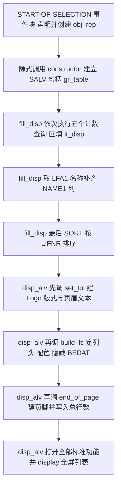
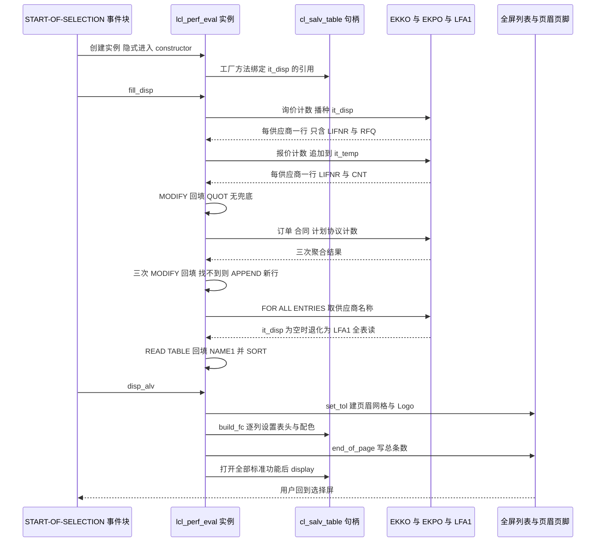

# ZMMR_PERF_EVAL_VEND 分析报告

> 分析对象：`Test-source/zvend.abap`（`REPORT zmmr_perf_eval_vend.`，357 行，SAP 标准 MM 采购域报表）
> 报告视角：代码 onboarding 走读，按真实调用链与真实执行顺序展开
> 深度说明：本文只依据这一份源码。凡是依赖运行时语义、FM 默认值、系统字段取值或 DDIC 定义的判断，一律标注「需核实」；凡是源码本身就能判的，直接给结论。

---

## 一、程序定位与业务背景

### 1.1 这段代码在解决什么问题

先把它的业务身份说准：这是一份**采购寻源行为统计报表**，回答的是采购策略团队最常问的一句话——**"我们跟这些供应商谈到哪一步了？"**。

一次完整的寻源动作在 SAP 里会留下五类单据，程序的五个计数列就是按这五类单据从左到右排开的：

| 列 | 业务对象 | 源码里的判据 | 采购视角要回答的问题 |
|---|---|---|---|
| `RFQ` | 询价单 | `a~bstyp = 'A'` | 哪些供应商我们发起过询价？ |
| `QUOT` | 报价单 | `bstyp = 'A' AND statu = 'A'` | 哪些供应商回了报价？ |
| `PO` | 采购订单 | `bstyp = 'F' AND bsart NE 'UB'` | 哪些供应商真正下了单？ |
| `CONT` | 采购合同 | `bstyp = 'K'` | 哪些供应商签了框架合同？ |
| `SCH` | 计划协议 | `bstyp = 'L'` | 哪些供应商进入了长期供应关系？ |

五列按 `LIFNR` 一行一行并排，构成一个典型的**寻源漏斗**：询价 → 报价 → 订单 → 合同/计划协议。用户的真实用法是——填一个供应商号区间和一个过账日期区间，得到一张"这个区间的供应商各走到哪一步了"的横截面表，然后据此判断：卡在"只询价没报价"名单上的供应商要催报价，停在"报价不下单"名单上的要谈价格，已经走到合同与计划协议的是战略供应商。

选择屏上只有两个参数，就是这两个筛选维度：

- `S_LIFNR`（供应商号区间）：把寻源漏斗切到某几个供应商，或某一段供应商（例如某个工厂的合格供应商名录）
- `S_BEDAT`（过账日期区间）：看某个时间窗内发生了什么，例如"上个季度新发展的供应商"

一句话设计范式定性：

> **"单页统计报表 + OO 外壳"：报表程序本身只有六个全局对象做编排，真正的逻辑挂在一个本地类 `lcl_perf_eval` 的六个方法上；取数与呈现分成两段，中间用一张以 `LIFNR` 为业务主键的行结构 `t_disp` 承接。**

### 1.2 为什么值得做成 OO，而不是一个三百行的报表

它选择了本地类而不是裸 `FORM`，并且把 `START-OF-SELECTION` 压到三行：

```
START-OF-SELECTION.
DATA : obj_rep TYPE REF TO lcl_perf_eval. " Declaring Object for Class

CREATE OBJECT : obj_rep. " Creating Object

obj_rep->fill_disp( ). " Calling class Methods
obj_rep->disp_alv( ).
```

三个理由值得记下来，因为它们可迁移：

1. **取数与呈现可以各自独立改**。`fill_disp` 只负责把五类计数装进 `it_disp`，`disp_alv` 只负责把它画出来。明天要加"金额列"，改的是 `fill_disp` 与 `t_disp`，不动任何一行界面代码。
2. **"我有一张内表"这件事被显式化了**。类实例 `obj_rep` 是整条链路上唯一的串接点；界面方法通过全局引用 `gr_table` 反向访问数据，两侧共享同一份内表而不是拷贝——这是 SALV 的正确用法（见 3.6 的分析）。
3. **`START-OF-SELECTION` 保持薄**。三行看得懂，说明"选择屏收集输入 → 取数 → 呈现"这条链在结构上没有被任何隐式行为污染。这是本文件结构上做得最好的部分，后面几个严重缺陷都出在方法**内部**，而不是出在这条骨架上。

### 1.3 依赖清单（读这份代码前必须知道的地形）

```
SAP 标准对象  EKKO / EKPO            采购凭证抬头与项目，取数主体
               LFA1                 供应商主数据，取 NAME1
SALV 控件类   CL_SALV_TABLE         全屏列表，主控句柄
               CL_SALV_COLUMNS_TABLE 列集合，build_fc 逐列配置
               CL_SALV_DISPLAY_SETTINGS 条纹图案
               CL_SALV_FORM_LAYOUT_LOGO   页眉右侧 Logo 版式
               CL_SALV_FORM_LAYOUT_GRID   页眉左侧网格与页脚
               CL_SALV_FORM_LABEL / _TEXT / _LAYOUT_FLOW  页眉页脚控件
异常类        CX_SALV_MSG           工厂方法失败
               CX_SALV_NOT_FOUND     取列名失败，build_fc 每列一个 TRY
外部资产      ZCHEM_N_LOGO_SMALL    位图名，字面量硬编码，只存在于目标系统
消息          文本符号 001 与 002    选择屏标题与失败提示，依赖 SE38 的消息类分配
INCLUDE       <color>               build_fc 开头引入的 SAP 标准颜色常量
声明后未用    IT_LAYOUT             被注释掉的数据引用，见 DATA 段首行
```

清单里最需要警惕的是最后四行：**位图名、文本符号、消息类、`INCLUDE <color>`**。前三者全部编译期不可见，缺一样都是运行期才发现；而这份代码在这三处都留了隐患（见 3.8、3.9 与 P1-2、P1-5、P2-4）。

### 1.4 这份代码经历过批量重排，可读性受损

`TYPE 'I'`、`wa_disp- lifnr`、`s_lifnr -high`、`TEXT- 001`、`ls_color- col`、`gr_table-> display( )` —— 这些写法在原生 ABAP 里不会出现。整份文件像是被某个"美化/格式化"脚本批量加过空格（ABAP 里 `->` 后加空格、`-` 后加空格都合法，所以语法检查全部通过）。结果是**语句的视觉节奏被打乱了**：读者会怀疑 `wa_disp- lifnr` 与 `wa_disp-lifnr` 是两个不同的东西，会怀疑 `TEXT- 001` 里那个空格有语法含义。

这带来一个具体的判断影响：**不要因为读起来别扭就去"修"这些空格**。它们无害但难看，真正的缺陷在别处（见第五节）。本报告所有代码引用都按源码原样保留，包括这些不自然的空格。

---

## 二、程序执行流程总览

程序没有分支控制流，`START-OF-SELECTION` 之后是一条直线。但这条直线上有一个**隐式调用**：本地类定义了 `CONSTRUCTOR` 方法，`CREATE OBJECT obj_rep` 会自动进入它——源码里从未显式写过对 `constructor` 的调用。



### 责任链表

| 子程序 | 调用者 | 职责 |
|---|---|---|
| `START-OF-SELECTION`（全局事件块） | 系统（用户按 F8） | 声明 `obj_rep`、创建实例、驱动 `fill_disp` 与 `disp_alv` 两段 |
| `constructor`（方法） | **隐式**：`CREATE OBJECT : obj_rep` | 用 `it_disp` 建立 `CL_SALV_TABLE` 句柄 `gr_table`；失败时发消息 002 |
| `fill_disp`（方法） | `START-OF-SELECTION` 显式调用 | 五个计数查询写入 `it_disp`，再取 `LFA1` 名称补 `NAME1`，最后排序 |
| `disp_alv`（方法） | `START-OF-SELECTION` 显式调用 | 按固定顺序调用三个呈现方法，打开全部标准功能并 `display` |
| `set_tol`（方法） | `disp_alv` 第一句 | 建页眉网格，回显供应商区间、过账日期区间与运行日期，创建右侧 Logo 版式 |
| `build_fc`（方法） | `disp_alv` 第二句 | 逐列设置列头三层文本、颜色、优化宽度，并隐藏 `BEDAT` 列 |
| `end_of_page`（方法） | `disp_alv` 第三句 | 建页脚流式布局，把 `LINES( it_disp )` 写成"总条数" |
| `it_disp`（全局内表） | 被 `constructor` 绑定、被 `fill_disp` 填充、被 SALV 渲染 | 唯一的结果载体，字段为 `LIFNR/NAME1/BEDAT/RFQ/QUOT/PO/CONT/SCH` |
| `it_temp`（全局内表） | 被 `fill_disp` 后四条查询复用 | 中转区：一次只装一个计数口径的聚合结果，回填后 `REFRESH` |
| `it_lfa1`（全局内表） | 被 `fill_disp` 的 `FOR ALL ENTRIES` 查询填充 | `LIFNR` 与 `NAME1` 的窄表，供 `READ TABLE` 回填名称 |

下面按这条流程，逐个子程序展开。

---

## 三、分组分析

### 3.1 类型与全局内表声明（全局声明区）

这一节是整份代码的"数据契约"，后面几乎所有缺陷都要回到这里来看。分三段。

#### ① 行结构 `t_disp` / `t_temp` / `t_lfa1`

```abap
TYPES:BEGIN OF t_disp,
   lifnr TYPE lifnr,
   name1 TYPE name1_gp,
   bedat TYPE bedat,
   rfq  TYPE I ,
   quot TYPE I ,
   po   TYPE I ,
   cont TYPE I ,
   sch  TYPE I ,
END OF t_disp,
BEGIN OF t_temp,
   lifnr TYPE lifnr,
  CNT   TYPE I ,
END OF t_temp,
BEGIN OF t_lfa1,
   lifnr TYPE lifnr,
   name1 TYPE name1_gp,
END OF t_lfa1.
```

**做什么** — 声明三个扁平结构：结果行 `t_disp`（`LIFNR` 供应商号、`NAME1` 供应商名称、`BEDAT` 过账日期、五个 `TYPE I` 计数字段）；中转行 `t_temp`（`LIFNR` 与 `CNT`）；名称窄行 `t_lfa1`（`LIFNR` 与 `NAME1`）。三个结构都只含少量字段，不含任何 include 结构、不含金额、不含时间。

**为什么** — 显式 `TYPES` 而不是让 `SELECT` 直接灌进一个匿名结构，是这段代码里正确的第一笔投资：`t_disp` 同时承担三个角色——`SELECT` 的目标表（`INTO CORRESPONDING FIELDS OF TABLE it_disp`）、`FOR ALL ENTRIES` 的驱动表、以及 `cl_salv_table` 的绑定表。有名字的结构才能被三处共用。`t_temp` 只装 `LIFNR` 与 `CNT` 是刻意的窄投影：后面四条查询每次只需要这两个字段，用同一张窄内表中转，省掉声明四张临时表。

**风险与改进** — 四点，前两点是语义级的：

1. **`BEDAT` 会被填上吗？答案是永远不会。** `t_disp` 是 `INTO CORRESPONDING FIELDS` 的目标，而五个 `SELECT` 的列表里只有 `LIFNR` 与一个聚合计数，**没有任何一条把 `BEDAT` 选出来**。所以 `it_disp` 里每一行的 `BEDAT` 都是初始值。源码随后用 `set_visible( abap_false )` 把这一列藏起来，等于用界面手段掩盖了一个数据结构问题（见 3.5 ②）。业务后果：用户按过账日期筛出了结果，列表里却没有任何日期可供核对，数字对不上时用户无法自查。改进：要么在结果里真正带出日期并保留一列，要么把 `BEDAT` 从 `t_disp` 里删掉，让类型契约说实话。
2. **`BEDAT` 这个数据元素在两套语义之间摇摆。** `EKKO-BEDAT` 与 `EKPO-BEDAT` 用的是同一个数据元素（前者是凭证过账日期，后者是凭证文档日期），长度与类型完全一致，**编译器与代码审查都无法区分**，而本程序恰恰在带 `EKKO`/`EKPO` 内连接的查询里不加限定地写 `bedat`（见 3.4 ① 与 ④）。类型相同掩盖了语义不同，这正是"类型与数据元素做语义校核"要抓的那一类。两个字段的数据元素绑定需在 SE11 核实，但"同一数据元素在两张表上承载不同业务语义、而源码不加限定"这个风险从源码就能判。
3. **计数用 `TYPE I` 是对的**：四个字节能到 2,147,483,647，远超任何合理的单供应商单据数。但页脚用了 `sy-tfill` 装行数，那是完全不同性质的内置类型（见 3.9），这里先记一笔。
4. **`t_temp` 被复用却没有 `REFRESH` 保护。** 第一条（报价）查询前不 `REFRESH` 是安全的，因为 `it_temp` 此前从未被使用；这是"恰好安全"而不是"设计安全"。任何人往后插一条查询就会踩到（见 3.4 ②）。

#### ② 结果内表与工作区

```abap
DATA: it_disp TYPE TABLE OF t_disp,
       wa_disp LIKE LINE OF it_disp,
       it_temp TYPE TABLE OF t_temp,
       wa_temp LIKE LINE OF it_temp,
       it_lfa1 TYPE TABLE OF t_lfa1,
       wa_lfa1 LIKE LINE OF it_lfa1.
```

**做什么** — 声明三张**标准表**（`TYPE TABLE OF`，未指定表键）与三个 `LIKE LINE OF` 工作区：`it_disp` 装最终结果、`it_temp` 装中转聚合、`it_lfa1` 装名称。`wa_disp` 同时还会在下一段里充当选择屏的参照字段。

**为什么** — `wa_disp` 被 `SELECT-OPTIONS ... FOR wa_disp- lifnr` 当作参照字段，这是 ABAP 选择屏的标准做法：参照字段必须能取到数据元素，才能继承它的选择文本、搜索帮助（供应商 F4 帮助就是靠这个挂上来的）与 F4 帮助屏。不为选屏单独声明变量而复用结果工作区，省了一个声明位。

**风险与改进** — 三点：

1. **三张表全部无键，这是本文件最大的一处性能债。** 标准表的 `MODIFY ... WHERE` 与 `READ TABLE ... WITH KEY` 都是**线性扫描**。`fill_disp` 里对 `it_disp` 执行了四次 `MODIFY ... WHERE` 循环、一次 `READ TABLE ... WITH KEY` 循环，末尾还有一次 `SORT`，整体是 O(V²)，V 是供应商数。取全量供应商时 V 可达数千，按四次 M×V 次行比较估算，ABAP 层要做上千万到上亿次行比较，全部发生在应用服务器内存里。业务后果：供应商范围一放宽，报表从秒级退化成分钟级，长时间占住工作进程槽位。改进：`it_disp` 改成 `TYPE SORTED TABLE OF t_disp WITH UNIQUE KEY lifnr`，`MODIFY` 与 `READ` 立即变成对数级，`FOR ALL ENTRIES` 也不再需要隐式排序。
2. **无键还直接影响了 ALV 的行为**。SALV 绑定一张无主键的标准表时，排序、刷新、以及用户点表头后的重排都只能依赖物理行序。本程序靠末尾那句 `SORT it_disp BY lifnr .` 提供一个稳定的物理序，但没有 `set_key_field`，一旦将来有人在 `fill_disp` 之后追加 `APPEND` 或 `INSERT`（例如补一行"合计"），行序与 SALV 的主键假设就脱节了。
3. **`wa_disp` 一物三职。** 它同时是选屏参照字段、`fill_disp` 四个循环的循环变量、以及 `APPEND wa_disp TO it_disp` 的追加源。源码靠每个循环结尾的 `CLEAR : wa_disp, wa_temp.` 来保证它是干净的——这个 `CLEAR` 是必要的，不是样板。改动任何一个循环时漏掉它，就会把上一轮的残留字段 `MODIFY` 进结果行。改进：让 `wa_disp` 只做循环变量，选屏另用一个 `g_ty_s_lifnr` 类型的工作区。

#### ③ ALV 句柄声明

```abap
DATA: "it_layout   TYPE lvc_s_layo,
       gr_table TYPE REF TO cl_salv_table,
       gr_functions TYPE REF TO cl_salv_functions,
       gr_columns TYPE REF TO cl_salv_columns_table,
       gr_column TYPE REF TO cl_salv_column_table,
       gr_display TYPE REF TO cl_salv_display_settings,
       lr_grid TYPE REF TO cl_salv_form_layout_grid,
       lr_gridx TYPE REF TO cl_salv_form_layout_grid,
       lr_logo TYPE REF TO cl_salv_form_layout_logo,
       lr_label TYPE REF TO cl_salv_form_label,
       lr_text TYPE REF TO cl_salv_form_text,
       lr_footer TYPE REF TO cl_salv_form_layout_grid,
       ls_color TYPE lvc_s_colo
      .
```

**做什么** — 声明十一个 ALV 相关对象引用：`gr_table`（全屏列表主句柄）、`gr_functions`（标准功能集）、`gr_columns` 与 `gr_column`（列集合与单列）、`gr_display`（显示设置）、`lr_grid` 与 `lr_footer`（页眉网格与页脚网格）、`lr_gridx`（页眉网格的第二层容器）、`lr_label` 与 `lr_text`（页眉的标签与文本控件）、`lr_logo`（页眉 Logo 版式）、`ls_color`（结构 `LVC_S_COLO`，唯一的非引用变量）。全部是 `PUBLIC` 语义的全局数据，没有一个带作用域前缀。

**为什么** — 一次性把要用到的引用全声明出来，是这类"报表即类"的小程序最常见也最省事的写法：省掉每个方法各自的 `DATA` 声明，代价是所有引用对所有方法可见。这本身不是错误，但它是 3.7 里那个"方法之间靠全局变量暗通信"的结构前提。

**风险与改进** — 三点：

1. **首行是被注释掉的 `it_layout`。** 它说明这份代码从 `REUSE_ALV_*` 时代改造过来——`lvc_s_layo` 是经典 ALV 的布局结构，SALV 根本没有对应概念（布局是 `cl_salv_layout` 自己算的）。所以这行注释是**改造完成后的残留**，不是待办。留着会让接手的人以为还有半件事没做完。
2. **十个引用在三个方法之间靠名字约定传递，没有一个参数。** 具体后果：`lr_logo` 在 `set_tol` 里创建、在 `disp_alv` 里被 `set_top_of_list( lr_logo )` 用掉；`lr_footer` 在 `end_of_page` 里创建、在 `disp_alv` 里被 `set_end_of_list( lr_footer )` 用掉；`gr_columns` 在 `build_fc` 里赋值、`set_color( ls_color )` 依赖 `ls_color` 已被填好。这三条跨方法的数据流全靠"谁先被调用"这个隐式约定维持，一旦有人调整 `disp_alv` 里三个调用的顺序，`set_top_of_list` 就会拿到初始引用，在 `SY_REF_IS_INITIAL` 上短转储。改进：给这三个方法各自加返回值或 `IMPORTING` 参数（`set_tol` 返回 `lr_logo`，`end_of_page` 返回 `lr_footer`）。
3. **`ls_color` 是唯一被跨调用点复用的结构**。它在 `build_fc` 里被写两次（`LIFNR` 与 `NAME1` 两段），两次写的都是同一个魔数 3，因此复用一个工作区在结果上是等价的。但一旦有人只改其中一处，两列的颜色就会不一致，而代码没有任何注释说明"这两处本该相同"。见 3.5 ①。

#### ④ 选择屏定义

```abap
SELECTION-SCREEN BEGIN OF BLOCK b1 WITH FRAME TITLE TEXT- 001.
  SELECT-OPTIONS : s_lifnr FOR wa_disp- lifnr,
   s_bedat FOR wa_disp- bedat.
SELECTION-SCREEN END OF BLOCK b1.
```

**做什么** — 声明一个带边框、标题为文本符号 001 的选择屏块 `B1`，块内有两个 `SELECT-OPTIONS`：供应商号 `S_LIFNR` 参照 `wa_disp- lifnr`，过账日期 `S_BEDAT` 参照 `wa_disp- bedat`。两个参数都不带默认值、都不加必填校验。

**为什么** — 用 `SELECT-OPTIONS` 而不是 `PARAMETER` 是对的：过账日期天然是一个区间（"2024 年上半年"），供应商名单天然是一段名录。而且参照字段取自 `t_disp`，于是供应商的 F4 帮助（基于 `LFA1` 的搜索帮助）会自动挂上——这是 3.1 ② 里"复用 `wa_disp` 作为参照字段"唯一真正的收益。

**风险与改进** — 三点：

1. **两个参数都非必填，等价于"允许全量扫描"。** 用户什么都不填直接 F8，`s_lifnr IN s_lifnr` 与 `bedat IN s_bedat` 会展开成无条件条件，于是五条 `EKKO` 查询各自做一次带聚合的全表扫描（见 3.4）。这是一次合法的、但可能非常重的操作，而界面上没有任何提示。改进：在 `START-OF-SELECTION` 开头检查 `s_lifnr` 与 `s_bedat` 是否都为空，是则 `MESSAGE ... 'I'` 要求至少输入日期区间；或者至少在页眉显式写出"All vendors / all dates"，让用户知道自己在跑全量。
2. **`TEXT- 001` 依赖 SE38 的消息类分配。** 文本符号要解析，必须在 SE38 的"文本符号"页给程序分配消息类（`TABA-MSGCL`）。未分配时文本符号解析为空，选择屏块标题变成空白，**且没有任何报错**——静默降级。是否已分配需在 SE38 核实，但从源码能判的是"这是一个未加保护的运行期依赖"。
3. **`s_lifnr` 是区间类型，而下游按单值读取它。** `set_tol` 里用 `IF s_lifnr IS NOT INITIAL` 判断、再直接取 `s_lifnr-low` 与 `s_lifnr-high`（见 3.7 ②）。这两点合在一起对排除符号和单边区间都是错的，属于本文件第二严重的一类缺陷（P0-4）。

### 3.2 本地类定义段 `lcl_perf_eval`（类 X 定义段）

```abap
CLASS lcl_perf_eval DEFINITION .
  PUBLIC SECTION.
  METHODS: constructor ,
   fill_disp.
  METHODS build_fc.
  METHODS disp_alv.
  METHODS set_tol.
  METHODS end_of_page.

ENDCLASS.                   "lcl_perf_eval DEFINITION
```

**做什么** — 定义本地类 `lcl_perf_eval`，只有一个 `PUBLIC SECTION`，暴露六个方法：`constructor` 与 `fill_disp` 写在同一条 `METHODS:` 冒号链上，其余四个各占一条。没有 `PRIVATE SECTION`，没有属性（`DATA`），没有接口，没有继承。

**为什么** — **全部 `PUBLIC` 而没有 `PRIVATE` 是一个设计信号，值得记下来**：`constructor` 是生命周期方法，`fill_disp` 是业务取数，`disp_alv` 是编排入口，而 `set_tol`、`build_fc`、`end_of_page` 纯粹是 `disp_alv` 的内部实现细节。三个界面方法本该私有。写成全 `PUBLIC` 的实际后果是：外部可以单独调 `obj_rep->set_tol( )` 而不调 `disp_alv`，那样 `lr_logo` 建好却没挂到列表上，`gr_table-> display( )` 会显示一个没有页眉的列表——**一个能编译通过、能通过代码审查、但产出错误界面**的调用序列。这是 OO 里"可见性即契约"被放弃的典型代价。

**风险与改进** — 三点：

1. **`constructor` 的可见性必须 `PUBLIC`，但它的失败没有出口。** ABAP 的 `CONSTRUCTOR` 方法不能声明异常（本程序也没有 `RAISING`），所以它唯一能表达失败的方式就是往全局状态里写"没成功"，然后指望调用方检查。而调用方 `START-OF-SELECTION` 完全不检查（见 3.10）。这是 P0-1 的根因，改进方向是让 `constructor` 返回一个布尔值，或者把工厂调用从 `constructor` 里挪到 `fill_disp` 之后、单独一个返回引用的方法里。
2. **`METHODS: constructor ,` 与 `fill_disp.` 挤在一条冒号链上**，`constructor` 后面那个带空格的逗号是重排留下的。这不影响语义，但它说明这段定义被工具改写过而没人复核。
3. **方法名不够自解释**：`build_fc` 里的 `fc` 大概是 field configuration，但源码里没有任何注释确认；`set_tol` 里的 `tol` 是 top of list 的缩写，也是猜的。两个缩写合起来让这个类的接口读起来像黑话。改进：改成 `build_field_config`、`build_header_layout` 之类，或至少在类定义处加三行注释说明每个方法的职责边界。

### 3.3 建立 ALV 句柄（方法 `constructor`）

```abap
  METHOD constructor.
    TRY.
       cl_salv_table=> factory( IMPORTING r_salv_table = gr_table CHANGING t_table = it_disp ). "Calling Factory Obj of Cl_ALV_TABLE
    CATCH cx_salv_msg.
    ENDTRY .

    IF gr_table IS INITIAL .
      MESSAGE TEXT -002 TYPE 'I' DISPLAY LIKE 'E'.
      EXIT .
    ENDIF .
  ENDMETHOD.                   "constructor
```

**做什么** — 调用 SALV 工厂方法 `cl_salv_table=> factory`，把全局引用 `gr_table` 绑定到整张内表 `it_disp`（`CHANGING t_table` 传的是引用，所以这是"把这张表交给列表控件"，不是"把它的副本交出去"）。整个调用包在 `TRY` 里只捕获 `cx_salv_msg`。捕获之后立刻检查 `gr_table` 是否初始，若初始则发一条 `TYPE 'I'`、`DISPLAY LIKE 'E'` 的消息 002，然后 `EXIT`。

**为什么** — 三件事里有一件做得很好：把 `it_disp` 在**取数之前**就交给 SALV 引用绑定，而 `display` 发生在最后。这正是 SALV 的正确姿势——控件持有的是活的内表引用，所以"先绑定、后填充、最后一次性 `display`"是干净的分工，避免了"填完了再重新绑定"的二次拷贝。`cl_salv_table=> factory` 用 `=>` 静态调用而不是 `CREATE OBJECT`，也是现代写法。

**风险与改进** — 四点，第一点是本文件最严重的缺陷：

1. **`EXIT` 在方法里只退出这个方法，不会终止报表。** `EXIT` 在 `FORM` 或模块里能终止整个处理块，但在方法里它的作用域就是这个方法。`constructor` 返回之后，`START-OF-SELECTION` 会继续执行下一句 `obj_rep->fill_disp( )` 与 `obj_rep->disp_alv( )`。业务后果有三层：（1）用户先看到一条"友好提示"，紧接着看到一条短转储，因为 `disp_alv` 会对初始的 `gr_table` 调 `get_functions( )`；（2）用户可能根本没看见那条提示就被转储打断；（3）在转储之前，五条 `EKKO` 聚合查询已经白跑了一遍——而报表本来就没有任何可显示的内容。改进方向有两种，见示意。

   ```abap-fix
     METHOD constructor.
       TRY.
          cl_salv_table=>factory(
            IMPORTING r_salv_table = gr_table
            CHANGING  t_table      = it_disp ).
       CATCH cx_salv_msg.
         gr_table = VALUE #( gr_table ).
       ENDTRY.

       IF gr_table IS INITIAL.
         MESSAGE id = zmmr_perf_eval TYPE 'E' NUMBER '002'.
       ENDIF.
   ```

   `MESSAGE ... TYPE 'E'` 会以消息对话框结束交互式报表，用户看到的是一条可读的错误而不是短转储；如果确实需要让 `START-OF-SELECTION` 提前退出，可以改用 `RAISING`（需要 `cl_salv_msg` 声明为异常）或返回一个布尔值给调用方判断。`EXIT` 在方法内的确切终止范围可在 SE38 用断点核实，但"它退不出方法之外"这一点是 ABAP 的确定语义。
2. **`CATCH cx_salv_msg.` 之后没有做任何补救，也没有再抛。** 异常被吃掉之后代码只是往下走，靠下一句 `IF gr_table IS INITIAL` 来发现失败。这意味着异常处理与失败判断是**两套并行的机制**，其中一套（异常）被丢弃了。而且 `cx_salv_msg` 只捕获工厂方法的异常，`gr_table` 为初始值也可能来自别的原因。更稳的形状是在 `CATCH` 里直接把状态写清楚，而不是靠事后探测。
3. **`MESSAGE TEXT -002` 依赖 SE38 的消息类分配**，与选择屏标题的 `TEXT- 001` 是同一个前提。未分配时行为需在 SE38 核实（不同版本可能给短转储，也可能给一个没有文本的对话框），但可以确定的是：**这条消息不是"友好提示"，而是整段代码唯一的失败出口**——所以它一旦解析不出来，用户看到的唯一线索就是短转储。
4. **`MESSAGE ... TYPE 'I' DISPLAY LIKE 'E'` 是一个自相矛盾的组合。** `TYPE 'I'` 表示信息类消息（不会中断流程，用户可以按继续），`DISPLAY LIKE 'E'` 只是让它长得像错误。真正想表达"出错了、请别继续"的场景应该用 `TYPE 'E'`。现在这个组合的后果是：用户看到一条红色样式的消息，本能地以为程序已经中止了，于是按继续键，然后撞上转储。改进：类型与显示方式对齐，别让样式去承担语义的活。

### 3.4 五类寻源计数（方法 `fill_disp`）

这是整个程序的核心，七个步骤。**先给一条贯穿全节的结论：五个计数没有共同的播种契约，也没有共同的口径**——播种内表 `it_disp` 的只有第一条查询，而五条查询对删除标记与文档状态的过滤各不相同。

#### ① 询价计数：唯一一条播种查询

```abap
    SELECT a~lifnr COUNT( DISTINCT a~ebeln ) AS rfq FROM ekko AS a
    JOIN ekpo AS b ON a~ ebeln = b ~ebeln
    INTO CORRESPONDING FIELDS OF TABLE it_disp
    WHERE a~lifnr IN s_lifnr AND bedat IN s_bedat
    AND b~loekz NE 'X'
    AND a~bstyp = 'A'
    GROUP BY a~lifnr .
```

**做什么** — 从 `EKKO` 抬头与 `EKPO` 项目做内连接，按 `a~lifnr` 分组，取 `COUNT( DISTINCT a~ebeln )` 作为 `rfq` 列，结果**直接写入 `it_disp`（不是 `it_temp`）**。筛选条件是四项：`a~lifnr IN s_lifnr`（供应商区间）、`bedat IN s_bedat`（日期区间）、`b~loekz NE 'X'`（项目删除标记不为 X）、`a~bstyp = 'A'`（单据类型为询价/报价）。这是整个方法里**唯一一条决定 `it_disp` 里有哪些行**的查询。

**为什么** — `COUNT( DISTINCT ebeln )` 而不是 `COUNT( * )`，是业务上必需的：一张询价单有多个项目行，不去重就会把"询价单数"变成"项目行数"，数字能翻好几倍。所以每个计数都用了 `DISTINCT`，这一点作者做对了。选择屏空值时 `IN` 展开成无条件，`GROUP BY` 让每行只对应一个供应商——这个"一个供应商一行"的形状与 `t_disp` 的设计一致。

**风险与改进** — 四点：

1. **删除标记口径与其余四列不一致（P0-2）。** 这里用 `b~loekz NE 'X'`，**包含**删除标记为 `O`（已置删除位）的项目行；而后面四条查询全部用 `loekz EQ space`，**只包含**完全未标记删除的项目行（见 3.4 ②③④⑤）。业务后果：`RFQ` 列会把已经处于删除流程中的项目算进去，而其他四列不会，于是漏斗的第一格被灌了水。采购策略团队最典型的用法就是"询价数减报价数 = 哪些供应商不响应"，删除标记导致的差额会被误读成"供应商不配合"。改进：把这里也改成 `EQ space`（见示意）。
2. **`bedat` 不加表别名限定，而 `EKKO` 与 `EKPO` 都有同名列（P0-3）。** `SELECT` 列表里的 `a~lifnr`、`a~ebeln` 都加了限定，唯独 `WHERE` 里的 `bedat` 没加。`EKKO-BEDAT` 是凭证过账日期，`EKPO-BEDAT` 是凭证文档日期，两者语义不同、数据元素相同。业务后果：用户看到页眉写的是 `Posting Date`（见 3.7 ③），按过账日期理解并核对账期，而筛选实际可能落在项目级文档日期上，跨月单据会被算进错的一期。需核实的是 ABAP SQL 解析器对这一处未限定引用的处理方式：若激活期就报字段二义性，则这条查询从未被成功激活；若放行，则口径取决于生成 SQL 的解析结果。但"这里存在一个没有唯一宿主表的字段引用"从源码就能判。改进：

   ```abap-fix
       SELECT a~lifnr COUNT( DISTINCT a~ebeln ) AS rfq FROM ekko AS a
         INNER JOIN ekpo AS b ON a~ebeln = b~ebeln
         WHERE a~lifnr IN s_lifnr
           AND a~bedat IN s_bedat
           AND b~loekz EQ space
           AND a~bstyp = 'A'
         GROUP BY a~lifnr
         INTO CORRESPONDING FIELDS OF TABLE it_disp.
   ```

   一并把 `JOIN` 写成显式的 `INNER JOIN`，补上被重排吃掉的空格，并在 `SELECT` 列表里同样用 `a~ebeln`。
3. **`INTO CORRESPONDING FIELDS OF TABLE` 会先清空 `it_disp`。** 这正是本程序需要的语义（它是第一条查询），但它是隐式的：谁在后面再写一条 `INTO CORRESPONDING FIELDS OF TABLE it_disp` 而忘了 `APPEND`，前面所有回填都会被清零且**不报错**。后面四条查询全部用了 `APPENDING CORRESPONDING FIELDS OF TABLE it_temp`，一致性靠的是作者记住了这个隐式清空。改进：把这层依赖写进注释，或改用 `it_temp` 中转后再统一汇总。
4. **这一条没有 `sy-dbcnt` 也没有空结果处理。** 查询返回零行时 `it_disp` 为空，而空内表恰好是后面 `FOR ALL ENTRIES` 的致命输入（见 3.4 ⑥）。这里是整条缺陷链的起点。

#### ② 报价计数（`EKKO` 单表）

```abap
    SELECT lifnr COUNT( DISTINCT ebeln ) AS CNT FROM ekko
    APPENDING CORRESPONDING FIELDS OF TABLE it_temp
    WHERE lifnr IN s_lifnr AND bedat IN s_bedat
    AND loekz EQ space
    AND ( bstyp = 'A' AND statu = 'A' )
    GROUP BY lifnr.
```

**做什么** — 只查 `EKKO` 单表（不连 `EKPO`），按 `LIFNR` 分组把 `COUNT( DISTINCT EBELN )` 作为 `CNT` **追加**进 `it_temp`。筛选条件：供应商区间、日期区间、抬头删除标记为空、单据类型为 `A` **且** 单据状态 `STATU` 为 `A`。这是五条查询里唯一不带内连接的一条。

**为什么** — 不连 `EKPO` 有实际好处：`EKPO` 有上千万行，连一次就是一次大范围连接；而报价计数问的是"有多少张报价单"，抬头行本身就够回答。**按业务对象选择连哪张表，而不是一律照抄**，这一条是整个 `fill_disp` 里最清醒的一处决策。

**风险与改进** — 三点：

1. **`STATU` 与 `BSTYP` 的口径和 `RFQ` 列不一致（P0-2 的另一半）。** 两列都用 `bstyp = 'A'`（同一批单据类型），但这一列多了一个 `statu = 'A'`，`RFQ` 列没有。所以 `RFQ` 数的是"发起过 `A` 类单据"，`QUOT` 数的是"`A` 类单据中 `STATU` 恰为 `A` 的那些"。`EKKO-STATU` 记的是**整张凭证的处理状态**，不是"这份报价是否被采用"，把它当"报价已维护"的判据本身就可疑；再加上两列过滤不同，"询价减报价"的差值里混着两种不同的口径。`STATU` 的合法值集合与各值的业务含义需在 SE11 核实，但"两列口径不一致"从源码就能判。
2. **它是唯一不带内连接的查询，因此也是唯一字段无歧义的查询。** 后面三条（订单、合同、计划协议）全都带 `EKKO`/`EKPO` 内连接，却像这条一样把 `lifnr`、`bedat`、`loekz` 写得完全不加限定。同一段代码里对同类问题给出了两种写法，一种安全一种危险——这说明作者知道可以不用连接，只是没有推广。
3. **`IT_TEMP` 用 `APPENDING` 追加而非清空。** 这里安全仅因为 `it_temp` 此前为空（`constructor` 之后没有任何语句往里写过东西）。后面三条查询都在前面加了 `REFRESH it_temp.`，唯独这条没有——不一致的代价是：谁在这条之前插一句往 `it_temp` 写的代码，`it_temp` 里就会残留旧数据，回填时把上一轮的计数写进结果。建议给每条查询前都无条件加 `REFRESH`，去掉"恰好安全"。

#### ③ 报价计数回填

```abap
    LOOP AT it_temp INTO wa_temp .
       wa_disp- lifnr = wa_temp -lifnr.
       wa_disp- quot = wa_temp -CNT.
      MODIFY it_disp FROM wa_disp TRANSPORTING lifnr quot WHERE lifnr = wa_temp-lifnr .
      CLEAR : wa_disp, wa_temp.
    ENDLOOP .
```

**做什么** — 遍历 `it_temp`，把每个供应商的 `LIFNR` 与 `CNT` 装进 `wa_disp` 的 `lifnr` 与 `quot` 两个字段，然后用 `MODIFY ... TRANSPORTING lifnr quot WHERE lifnr = ...` 找到 `it_disp` 里对应的行、只把这两列搬过去。循环末尾 `CLEAR` 两个工作区。

**为什么** — `TRANSPORTING lifnr quot` 是这段代码里值得表扬的一处克制：`wa_disp` 是全局工作区，可能残留别的字段；显式列出要传输的字段，保证"只碰这两列，其他列原样保留"。这个习惯很多人不做，做了就少一类难以定位的串列 bug。

**风险与改进** — 四点：

1. **这是四条回填路径里唯一没有 `IF sy-subrc NE 0. APPEND wa_disp TO it_disp .` 兜底的一条（P0-5）。** 后三条（订单、合同、计划协议）都有。业务后果不是"现在就会丢数"——在当前这五条查询的条件下，报价查询的供应商集合是询价查询的子集（两者同用 `bstyp = 'A'`，询价用 `loekz NE 'X'` 更宽松，报价用 `loekz EQ space` 更严格），所以 `MODIFY` 一定命中。**真正的危险是它与 P0-2 的修法互相咬合**：一旦按建议把询价查询的 `NE 'X'` 改成 `EQ space`，两条查询的供应商集合就不再互相包含，这条没有兜底的回填就会静默丢数——用户看到的是"这个供应商有报价但报价列是空的"，而报表不会给任何提示。**改动一条 WHERE 条件就能激活一个静默数据丢失**，这是本文件最需要向接手者喊出来的一点。修法见示意。

   ```abap-fix
       LOOP AT it_temp INTO wa_temp.
         CLEAR wa_disp.
         wa_disp-lifnr = wa_temp-lifnr.
         wa_disp-quot  = wa_temp-CNT.
         MODIFY it_disp FROM wa_disp TRANSPORTING lifnr quot
           WHERE lifnr = wa_disp-lifnr.
         IF sy-subrc NE 0.
           APPEND wa_disp TO it_disp.
         ENDIF.
       ENDLOOP.
   ```

2. **`MODIFY ... WHERE` 在标准表上是线性扫描，循环体每行都要扫一遍 `it_disp`。** 供应商数为 V 时这是 O(V²)。把 `it_disp` 声明为带唯一键的 `SORTED TABLE`（见 3.1 ②）即可变成对数级，改动只有一行声明。
3. **`CLEAR : wa_disp, wa_temp.` 是必需的，不是样板。** `wa_disp` 在进循环前是上一次循环残留的工作区（本方法第一个使用者是选屏参照），如果不 `CLEAR`，`TRANSPORTING` 之外的字段虽然不会被传输（因为显式列了字段），但 `APPEND wa_disp TO it_disp` 兜底时会把残留字段一起追加进结果行。所以任何"删掉这个 `CLEAR` 看起来没影响"的改动都是危险的。
4. **循环变量与工作区混用。** `LOOP AT it_temp INTO wa_temp` 之后再用 `wa_disp` 作中转，意味着 `wa_disp` 在循环里的角色不是"当前行"而是"待写入的补丁行"。这个区分靠命名体现不出来，改进：用一个局部 `DATA ls_patch TYPE t_disp.`，与选屏参照用的 `wa_disp` 分开。

#### ④ 采购订单计数

```abap
    " PO
    REFRESH it_temp.
    SELECT lifnr COUNT( DISTINCT a~ ebeln ) AS CNT FROM ekko AS a JOIN ekpo AS b ON a~ ebeln = b ~ebeln
    APPENDING CORRESPONDING FIELDS OF TABLE it_temp
    WHERE lifnr IN s_lifnr AND bedat IN s_bedat
    AND loekz EQ space
    AND bsart NE 'UB'
    AND ( a~ bstyp = 'F' )
    GROUP BY lifnr.
```

**做什么** — 先 `REFRESH it_temp` 清空中转表，然后连 `EKKO`/`EKPO` 内连接，按 `LIFNR` 分组把 `COUNT( DISTINCT a~ ebeln )` 追加进 `it_temp`。筛选条件：供应商区间、日期区间、删除标记为空、`bsart NE 'UB'`、单据类型为 `F`（订单）。结果供下一步回填到 `PO` 列。

**为什么** — `REFRESH it_temp.` 出现在这里是对的：这是第一条使用 `APPENDING` 的查询，必须先清空，说明作者清楚 `APPENDING` 的语义。（代价是上一条报价查询没有同样的保护，见 3.4 ②。）`COUNT( DISTINCT a~ ebeln )` 去重同样必需，一张订单的项目行数不等于订单数。

**风险与改进** — 四点：

1. **四个字段不加别名限定：`lifnr`、`bedat`、`loekz`、`bsart`（P0-3）。** 这四个名字在 `EKKO` 与 `EKPO` 上都存在，都不带限定就没有唯一宿主表。业务后果按严重程度排：`bedat` 决定统计的是过账日期还是文档日期（与页眉写着的 `Posting Date` 直接冲突）；`loekz` 决定是抬头的删除标记还是项目的删除标记，而"整张订单被标记删除"与"某个项目行被标记删除"是两种完全不同的业务状态；`bsart` 决定排除的是抬头的单据类型还是项目的单据类型；`lifnr` 影响最小（两表的 `LIFNR` 语义一致，但仍是二义引用）。这是本文件里最集中的一处缺陷群，也是最容易在上线前一次性修掉的一处。改进见 3.4 ① 的示意（同样适用于这三条）。
2. **`bsart NE 'UB'` 与 `bstyp = 'F'` 在业务上重复。** `BSART` 是单据类型，`BSTYP` 是单据类别；计划协议类单据的单据类型 `UB` 其 `BSTYP` 通常也是 `L`，因此这一条件被 `bstyp = 'F'` 基本覆盖了。真正想排除的往往是"由订单释放出来的计划协议"这类转换单据，而那类单据的识别标记不在 `BSART` 上。`BSART` 与 `BSTYP` 的取值对应关系需在 SE11 与订单类型配置中核实，但"这条条件与相邻条件重复"从源码就能判。改进：确认本意后删掉多余条件，或换成真正的排除口径（如按合同/转换标记过滤）。
3. **`( a~ bstyp = 'F' )` 的括号是多余的。** 单个条件不需要括号；它很可能是从同一模板里复制了 `AND ( bstyp = 'A' AND statu = 'A' )` 的形状（见 3.4 ②）而忘了删。多余括号本身无害，但它暴露了"复制粘贴改条件"的写法——而这正是 3.4 ① 里"漏改删除标记口径"和"漏加表别名"这两类错误的共同来源。
4. **`a~ ebeln` 与 `a~ bstyp` 里的空格**是 1.4 说的批量重排留下的。ABAP 里 `~` 后加空格合法，所以语法检查过；但它让"哪些字段加了别名"这件事在阅读时极易看漏——本文第一轮通读时 `a~ bstyp` 与 `bstyp` 的差别就差点被忽略。

#### ⑤ 订单计数回填（首次出现 `sy-subrc` 兜底）

```abap
    LOOP AT it_temp INTO wa_temp .
       wa_disp- lifnr = wa_temp -lifnr.
       wa_disp- po = wa_temp -CNT.
      MODIFY it_disp FROM wa_disp TRANSPORTING lifnr po WHERE lifnr = wa_temp-lifnr .
      IF sy-subrc NE 0.
        APPEND wa_disp TO it_disp .
      ENDIF .
      CLEAR : wa_disp, wa_temp.
    ENDLOOP .
```

**做什么** — 与报价回填同形，但搬的是 `PO` 列；`MODIFY` 之后多了一步 `IF sy-subrc NE 0.`，即供应商不在 `it_disp` 里时把这一行 `APPEND` 进去，从而**凭空生成一个此前没有的供应商行**。循环末尾同样 `CLEAR`。

**为什么** — 这个兜底是必需的，因为订单、合同、计划协议这三类单据的供应商完全可能没有询价记录（老供应商直接下单、外购件走框架）。如果没有这条兜底，这些供应商会连一行都不出现在报表里——而漏斗报表的语义是"每个供应商一格，没走到的环节显示 0"，不是"没走到的供应商不出现"。所以作者在三条回填里都加了它，方向是对的。

**风险与改进** — 三点：

1. **`APPEND` 出来的行只有 `LIFNR` 与 `PO` 有值，其余五列是初始值 0**，界面上看不出它是"新生成"还是"询价为 0"。业务后果：一个只下过订单、从未询价的供应商，会显示成"询价 0、报价 0"，与"询过价但结果为 0"在视觉上无法区分——而这两件事对采购策略的意义完全相反。若要把这个区分做出来，需要额外的标记列或注释。
2. **兜底逻辑依赖 `wa_disp` 此刻是干净的。** `APPEND` 搬的是整个 `wa_disp`，不是只有 `lifnr` 与 `po` 两个字段。上一轮循环结尾的 `CLEAR` 是唯一保证。改进：兜底前显式 `CLEAR wa_disp` 再赋值（见 3.4 ③ 的示意）。
3. **`MODIFY` 找不到就 `APPEND`，这条路径没有区分"确实不存在"和"查找条件写错"。** 如果 `WHERE lifnr = wa_temp-lifnr` 因为拼写或空值问题永远匹配不上，结果是**每个供应商都追加一行**，报表从"一个供应商一行"变成"一个供应商多行"，用户会看到同一个供应商号重复出现且每行只有一个数字。这类错误没有任何提示。改进：回填前先断言 `it_temp` 的 `LIFNR` 非空，或改用带键表让查找失败成为不可能。

#### ⑥ 合同计数与回填

```abap
    "Cont. Created
    REFRESH it_temp.
    SELECT lifnr COUNT( DISTINCT a~ ebeln ) AS CNT FROM ekko AS a JOIN ekpo AS b ON a~ ebeln = b ~ebeln
    APPENDING CORRESPONDING FIELDS OF TABLE it_temp
    WHERE lifnr IN s_lifnr AND bedat IN s_bedat
    AND loekz EQ space
    AND ( a~ bstyp = 'K' )
    GROUP BY lifnr.

    LOOP AT it_temp INTO wa_temp .
       wa_disp- lifnr = wa_temp -lifnr.
       wa_disp- cont = wa_temp -CNT.
      MODIFY it_disp FROM wa_disp TRANSPORTING lifnr cont WHERE lifnr = wa_temp-lifnr .
      IF sy-subrc NE 0.
        APPEND wa_disp TO it_disp .
      ENDIF .
      CLEAR : wa_disp, wa_temp.
    ENDLOOP .
```

**做什么** — 与订单那一对完全同形：先 `REFRESH it_temp`，再连 `EKKO`/`EKPO` 按 `LIFNR` 聚合出采购合同数（判据 `a~ bstyp = 'K'`）追加进 `it_temp`，然后循环回填到 `CONT` 列，找不到就 `APPEND` 新行。

**为什么** — 与订单段完全相同的形状，说明作者找到了一个可以机械复制的模板：改判据、改目标列、改中转字段名，其余不动。**这正是本方法可维护性的来源**：五种寻源阶段看起来是一段 60 行的重复代码，实际是同一个模式的五次实例化，读懂一段就读懂五段。

**风险与改进** — 三点：

1. **与订单段相同的四个未限定字段全部照抄**（`lifnr`、`bedat`、`loekz`、`bsart` 中的前三个），缺陷也被原样复制了五次。改进：把这一段改成"一张 `CASE` 聚合一次算完五列"，五个判据写进同一个 `CASE`，字段限定问题一次解决，`it_temp` 也不再需要（见 P2-1 的示意）。
2. **`COUNT( DISTINCT a~ ebeln )` 统计的是合同单据数，不是合同金额，也不是覆盖的物料数。** 采购合同业务上关心的是"签了多大规模的合同"，单据数几乎不携带规模信息。也就是说这一列对业务的解释力最弱，而它与 `RFQ`、`QUOT` 在界面上等宽等重、没有任何区别标记。
3. **括号 `AND ( a~ bstyp = 'K' )` 同样是模板残留**，与 3.4 ④ 第 3 点同源。

#### ⑦ 计划协议计数与回填

```abap
    "Sch Aggre
    REFRESH it_temp.
    SELECT lifnr COUNT( DISTINCT a~ ebeln ) AS CNT FROM ekko AS a JOIN ekpo AS b ON a~ ebeln = b ~ebeln
    APPENDING CORRESPONDING FIELDS OF TABLE it_temp
    WHERE lifnr IN s_lifnr AND bedat IN s_bedat
    AND loekz EQ space
    AND ( a~ bstyp = 'L' )
    GROUP BY lifnr.

    LOOP AT it_temp INTO wa_temp .
       wa_disp- lifnr = wa_temp -lifnr.
       wa_disp- sch = wa_temp -CNT.
      MODIFY it_disp FROM wa_disp TRANSPORTING lifnr sch WHERE lifnr = wa_temp-lifnr .
      IF sy-subrc NE 0.
        APPEND wa_disp TO it_disp .
      ENDIF .
      CLEAR : wa_disp, wa_temp.
    ENDLOOP .
```

**做什么** — 第三对同形代码，判据换成 `a~ bstyp = 'L'`（计划协议），回填到 `SCH` 列，最后一段 `APPEND` 兜底。这是五个计数中最后一个，也是 `SCH` 列数据到达的终点。

**为什么** — 五段复制到这里结束。此后 `it_temp` 不再被写入，说明中转表的设计意图（一次装一个口径）是自洽的：任何时刻 `it_temp` 里只有一个口径的聚合结果，`wa_temp` 的含义不会漂移。

**风险与改进** — 三点：

1. **缺陷复制到第五次。** 四个未限定字段、模板残留的括号、`MODIFY` 线性扫描、`APPEND` 兜底依赖 `CLEAR`，四项全部原样继承。改进方向不是"第五段再修一次"，而是把五段合并成一次聚合。
2. **`BSTYP` 的五值集合没有在代码里集中声明。** 五个判据 `'A'`、`'F'`、`'K'`、`'L'` 分散在五个方法体的五个位置，任何一个拼错（比如 `'K'` 写成 `'C'`）都会让整列变成 0，而报表**没有任何办法区分"这一列真的是 0"和"判据写错了"**。业务后果：一份静默失效的策略报表比一份报错的报表危险得多——用户会拿它做供应商分级。改进：把五个 `BSTYP` 值提为常量或查表，让口径集中在一处可审。
3. **计划协议与采购订单在业务上互斥，但报表把它们并列展示。** 供应商通常在两者中只处于一种，界面上却给出两列独立数字，没有提示"这一行是哪一种"。改进：要么合并成一列"长期供应关系"，要么加一列状态标识。

#### ⑧ 取供应商名称（`FOR ALL ENTRIES` 查询）

```abap
    SELECT lifnr name1 FROM lfa1
    INTO CORRESPONDING FIELDS OF TABLE it_lfa1
    FOR ALL ENTRIES IN it_disp
    WHERE lifnr = it_disp -lifnr.
```

**做什么** — 以 `it_disp` 为驱动表，对 `LFA1` 做一次带 `FOR ALL ENTRIES` 的两列投影查询，把 `LIFNR` 与 `NAME1` 装进 `it_lfa1`。`it_disp` 里有多少个供应商，`it_lfa1` 就会有多少行左右。

**为什么** — 两列投影（`SELECT lifnr name1`）而不是 `SELECT *`，是这份代码里第二个值得表扬的细节：`LFA1` 有一百多个字段，只取两列让传输量与内表占用降一个数量级。`FOR ALL ENTRIES` 而不是在 ABAP 层循环 `SELECT SINGLE`，也是对的——单条 `FOR ALL ENTRIES` 只往返一次数据库。

**风险与改进** — 三点，第一点是本文件第二严重的缺陷：

1. **没有判空：空驱动表会让 `FOR ALL ENTRIES` 退化成无条件全表读（P0-6）。** ABAP 的 `FOR ALL ENTRIES` 语义是"驱动表非空时追加 `WHERE <驱动表字段> = <驱动表字段>` 条件；驱动表为空时直接去掉这个条件"。而 `it_disp` 为空是完全可能的：用户填一个不存在的供应商号区间，五条查询全部返回零行，`it_disp` 就是空表。此时这条查询退化为 `SELECT lifnr name1 FROM lfa1` —— **一次把整张供应商主数据表读进 `it_lfa1`**。业务后果：用户输入一个不存在的供应商号（或者一个该供应商在日期区间内无单据的号），报表不会告诉他"没有数据"，而是替他读上百万行供应商主数据，表现为界面长时间无响应、内存飙升，最终可能短转储；而在这之前它还会给出"总条数 0"这个看起来正常的页脚。这是典型的**输入越界导致资源耗尽**，输入完全在合法范围内却没有任何拦截。改进见示意。

   ```abap-fix
       IF it_disp IS INITIAL.
         RETURN.
       ENDIF.

       SELECT lifnr name1 FROM lfa1
         INTO CORRESPONDING FIELDS OF TABLE it_lfa1
         FOR ALL ENTRIES IN it_disp
         WHERE lifnr = it_disp-lifnr.
   ```

   更稳的写法是同时加一句 `CHECK sy-subrc = 0` 之外的健壮性保证（例如 `IF it_disp IS INITIAL` 之外再判 `s_lifnr` 是否为空），并把"没有数据"这件事明确告诉用户，而不是让他等一次全表读。
2. **`it_disp -lifnr` 里的空格是重排留下的**，与源码其他位置的 `wa_disp-lifnr` 混用，读起来像两个不同的东西（1.4 已述）。另外 `FOR ALL ENTRIES` 放在 `INTO` 之后是正确的位置（ABAP 允许在 `INTO` 前后），但通常写在 `WHERE` 之前更常见。
3. **驱动表重复键会让结果行翻倍。** `FOR ALL ENTRIES` 不去重：`it_disp` 里若有两个相同 `LIFNR` 的行，`it_lfa1` 就会有两份相同的名称。当前 `it_disp` 靠"每个口径一个供应商一行"的约定保持唯一（见 3.4 ⑤ 第 3 点，那里说明了这个唯一性并非由声明保证）。改进：把 `it_disp` 声明为带唯一键的表（3.1 ②），唯一性由类型系统保证。
4. **`it_lfa1` 也没有键。** 下一步的 `READ TABLE ... WITH KEY` 因此是线性扫描，且因为前面没有 `SORT`，每次 `READ` 都要扫全表。

#### ⑨ 回填供应商名称并排序

```abap
    LOOP AT it_disp INTO wa_disp .
      READ TABLE it_lfa1 INTO wa_lfa1 WITH KEY lifnr = wa_disp-lifnr .
      IF sy-subrc EQ 0.
         wa_disp- name1 = wa_lfa1 -name1.
        MODIFY it_disp FROM wa_disp TRANSPORTING lifnr name1 WHERE lifnr = wa_disp- lifnr .
      ENDIF .
    ENDLOOP .
```

**做什么** — 遍历 `it_disp`，用 `READ TABLE it_lfa1 WITH KEY lifnr = wa_disp-lifnr` 按供应商号查名称，命中就把它写进 `wa_disp- name1`，再 `MODIFY` 回 `it_disp` 的 `name1` 列（`TRANSPORTING lifnr name1` 保证不碰其他列）。查不到就跳过，`name1` 留空。循环之后由 ⑩ 排序。

**为什么** — 用 `IF sy-subrc EQ 0` 判断 `READ` 命中，是正确姿势（不要比较 `wa_lfa1-lifnr` 是否为空，那在 `LFA1` 里有空供应商号的极端数据时会误判）。`LOOP ... INTO wa_disp` 循环体内 `MODIFY` 当前行是安全的：`MODIFY` 不改变 `sy-tabix`，不破坏 `LOOP` 的推进。这一点容易被误当成禁忌，但这里确实没问题。

**风险与改进** — 四点：

1. **`READ TABLE` 每次都是线性扫描，`MODIFY` 每次也是线性扫描，两条 O(V×N) 加在一起。** `it_lfa1` 与 `it_disp` 都无键且未排序，`it_disp` 已经 `SORT` 的机会在这段之前还不存在（排序在下一段）。改动很小：把 `it_lfa1` 声明为 `TYPE SORTED TABLE OF t_lfa1 WITH UNIQUE KEY lifnr`，`it_disp` 声明为带唯一键的 `SORTED TABLE`。
2. **`sy-subrc` 在 `MODIFY` 之后没有判断。** `it_lfa1` 的 `LIFNR` 来自 `it_disp`，理论上一定命中；但如果前一步的 `FOR ALL ENTRIES` 因别的原因取不到数据，这里会**静默地把整列 `name1` 留空**，用户看到一整列供应商号没有名称。改进：循环后判一次 `it_lfa1` 的行数与 `it_disp` 的一行数是否一致，不一致时给用户一条明确消息，而不是让他对着空名称猜发生了什么。
3. **`name1` 留空与"供应商名本身为空"在界面上不可区分。** `LFA1-NAME1` 理论上可以为空，此时用户看到空名称，无法判断是"主数据没维护名称"还是"回填失败"。这是 `sy-subrc` 判断存在但结果没被使用带来的典型盲区。
4. **循环体内 `MODIFY` 当前行属于"可读但脆弱"的写法。** 它依赖"`MODIFY` 不动 `sy-tabix`"这一语言细节。今天正确，但一旦有人把 `MODIFY` 改成 `APPEND`（去重逻辑出错时的常见应急改法），`LOOP` 指针行为就会变化并可能死循环。改进：先在 `it_lfa1` 里查一次，再统一 `SORT`，或者干脆在 `it_disp` 已经是 `SORTED TABLE WITH UNIQUE KEY lifnr` 之后用 `READ TABLE ... WITH TABLE KEY` 直接改。

#### ⑩ 收尾排序

```abap
    SORT it_disp BY lifnr .

  ENDMETHOD.                   "fill_disp
```

**做什么** — 方法的最后一句可执行语句：把 `it_disp` 按 `LIFNR` 升序排序。紧接着是 `ENDMETHOD`。这一步之后 `it_disp` 就是交给 `disp_alv` 的最终形态：每个供应商一行，按供应商号有序，`NAME1` 已填，五个计数列已填，`BEDAT` 为初始值。

**为什么** — 排序放在取数全部结束之后，而不是每轮回填之后，是对的：回填阶段依赖 `MODIFY ... WHERE` 按内容查找，与物理顺序无关；排序只在最后做一次。放在最后还避免了一个隐患——如果在 `MODIFY` 之前排序，那么每条 `APPEND` 又会把顺序打乱，最终还得再排一次。

**风险与改进** — 三点：

1. **排序没有让 SALV 知道主键。** `disp_alv` 里没有 `set_key_field`，所以这层物理排序只是"看起来有序"，不是"被控件承认的主键"。用户点表头排序后再回到初始视图时，行为由控件内部决定。改进：`build_fc` 里补 `gr_table->get_key( )->set_key_field( EXPORTING name = 'LIFNR' )`，让排序语义显式化。
2. **`it_disp` 仍然无键（3.1 ②）。** 这一句 `SORT` 恰恰说明作者知道需要有序，却没有把它升级成带键表类型——**类型能表达的东西，只用运行时语句表达**，是本文件反复出现的模式。
3. **方法内没有任何一条"结果合理性"的检查。** 行数为零、一行都没填上名称、`RFQ` 列全为 0 而 `PO` 列非零（逻辑上不可能，暗示查询条件被改坏了）——这三种情况都没有任何信号返回给调用方。改进：`fill_disp` 返回一个状态值（至少区分"空结果"与"有结果"），由 `disp_alv` 决定是提示还是直接显示。

### 3.5 逐列配置列头与配色（方法 `build_fc`）

三段代码：前两列（含配色）、被隐藏的 `BEDAT` 列、五个计数列。

#### ① `LIFNR` 与 `NAME1` 两列（含颜色）

```abap
    INCLUDE <color>.
    TRY.
       gr_columns = gr_table->get_columns ( ).
       gr_columns-> set_optimize( abap_true ).
       gr_column ?= gr_columns-> get_column( 'LIFNR' ).
       ls_color- col = 3 .
       gr_column-> set_color( ls_color ).

    CATCH cx_salv_not_found.
    ENDTRY .

    TRY.
       gr_column ?= gr_columns-> get_column( 'NAME1' ).
       gr_column-> set_long_text('Vendor Name' ).
       gr_column-> set_short_text( 'V.Name' ).
       gr_column-> set_medium_text('Vendor Name' ).
       ls_color- col = 3 .
       gr_column-> set_color( ls_color ).
    CATCH cx_salv_not_found.
    ENDTRY .
```

**做什么** — 先 `INCLUDE <color>`，再取出列集合并打开 `set_optimize`（自动最优列宽）。随后用 `gr_columns-> get_column( 'LIFNR' )` 拿到列对象，把 `ls_color- col` 设为 `3` 后 `set_color`。第二段对 `NAME1` 列除了同样的颜色，还设置了 long / short / medium 三层列头文本：`Vendor Name` / `V.Name` / `Vendor Name`。

**为什么** — `set_optimize( abap_true )` 是这段代码里性价比最高的一行：手工调 `set_width` 在 SALV 里既难读又难维护，让控件按内容算宽度是唯一正确的做法。**三层列头文本都给上**（短标题给窄列、Medium 给默认宽度、长标题给列宽拉满时的 tooltip）也是完整做法——很多程序只设一个，结果窄列上显示一个被截断的英文串。

**风险与改进** — 四点：

1. **`INCLUDE <color>` 被引进来，但它存在的原因被浪费了。** 颜色 3 是裸魔数，而 `<color>` 正好定义了一组有名字的颜色常量（如 `CC_COLOR_*`），引入它却不使用，等于既付了代价（把一批全局常量注入报表符号空间）又没拿到收益。色号 3 在 ALV 颜色体系里对应哪一种颜色需在 SE11 与前端配置中核实（不同前端的色彩表现并不一致），但"用魔数代替具名常量"这个判断从源码就能判。改进：改成具名常量，让"这一列是什么颜色"从标识符上就能读出来。
2. **每列一个 `TRY`，异常被静默吞掉（P1-3）。** 九个 `TRY` 块里只有 `CATCH cx_salv_not_found.`，`ENDTRY` 前什么都没有。业务后果：列名一旦拼错（比如把 `'SCH'` 写成 `'SCHED'`），`get_column` 抛异常被吃掉，**界面照常显示，只是那一列的表头退回成原始字段名**（`SCHED`），没有任何日志、没有消息、没有视觉提示。采购策略团队会以为"这一列的英文表头是系统自带的"，直到某天发现列名对不上才回头查代码。改进：`CATCH` 里至少 `MESSAGE` 一条警告，或者把失败列名收集起来在 `display` 前统一提示。
3. **`?=` 会让失败后的 `gr_column` 仍指向上一列。** `?=` 只在右边抛出异常时"什么都不赋值"，于是 `gr_column` 保留上一次成功取到的列对象。因为每个 `TRY` 内部自包含，这个陷阱在当前代码里没有真的咬人；但它是一个**潜伏的错误**——如果哪天有人在 `CATCH` 之后继续用 `gr_column`，就会把配置打到错误的列上。改进：每个 `TRY` 之前 `CLEAR gr_column.`，或在 `CATCH` 里把它置空。
4. **只有 `LIFNR` 与 `NAME1` 有颜色，五个计数列没有。** 业务后果是配色不承载任何业务含义——用户看到供应商号和名称是某种颜色，不会知道那代表"已评估"还是"新建"。如果配色的意图是标记供应商状态（这正是供应商评估报表最常见的用法），那么颜色应该跟着计数列走（例如有 `SCH` 的行标绿、只停在 `RFQ` 的行标黄）。

#### ② 被隐藏的 `BEDAT` 列

```abap
    TRY.
       gr_column ?= gr_columns-> get_column( 'BEDAT' ).
       gr_column-> set_visible( abap_false ).
       gr_column-> set_technical( VALUE = if_salv_c_bool_sap=> true ).
    CATCH cx_salv_not_found.
    ENDTRY .
```

**做什么** — 取 `BEDAT` 列对象，同时 `set_visible( abap_false )` 把它隐藏、并 `set_technical( VALUE = if_salv_c_bool_sap=> true )` 把它标成技术字段。技术字段在 SALV 里不出现在用户可选列的清单中。

**为什么** — 意识到结果结构里有一列不会被赋值，选择"隐藏"而不是"删掉"，在改造存量程序时是一个务实的折中：不动 `t_disp` 的定义（那是 `FOR ALL ENTRIES`、`MODIFY` 等一串代码依赖的东西），只在呈现层把它藏起来。

**风险与改进** — 三点：

1. **这是用界面掩盖数据结构问题（P0-7）。** 隐藏一个恒为空的列，用户看到的是一个"干净"的七列报表，但选择屏上的 `BEDAT` 过滤条件在结果里没有任何痕迹。业务后果：用户无法核对筛选是否生效——数字与预期不符时，唯一的怀疑对象就是"程序算错了"，而真正的线索（这一列根本没被算出来）被界面吃掉了。而且 `BEDAT` 还在 `t_disp` 里参与 `INTO CORRESPONDING FIELDS` 的字段对应，占着结构定义的位置却永远没有值。改进：把 `BEDAT` 从 `t_disp` 里删掉；真要保留可核对性，就在结果里带出日期并在页眉之外留一列。
2. **`set_technical` 用的是 `if_salv_c_bool_sap=> true` 而不是 `abap_true`。** 这个接口常量是 SALV 文档里给出的写法，语义上是正确的；但它与本文件其它地方一律用的 `abap_true`（见 3.6）不一致。同一份代码里两种真值写法并存，会让人怀疑"这个方法是不是不接受 `abap_true`"。统一成 `abap_true`（若该参数类型允许）能让代码风格一致；若确实必须是这个接口的常量类型，那就在类定义处注明。
3. **`set_visible( abap_false )` 与 `set_technical` 同时调用是冗余的。** 技术字段本来就不在可见列里，两者叠加看不出哪一条在起作用，读者必须查 SALV 文档才能确认。改进：留一条即可，并注明理由。

#### ③ 五个计数列的列头

```abap
    TRY.
       gr_column ?= gr_columns-> get_column( 'RFQ' ).
       gr_column-> set_short_text( 'RFQ' ).
       gr_column-> set_medium_text( 'RFQ Created' ).
    CATCH cx_salv_not_found.
    ENDTRY .

    TRY.
       gr_column ?= gr_columns-> get_column( 'QUOT' ).
       gr_column-> set_short_text( 'Quot.' ).
       gr_column-> set_medium_text( 'Quotation Maintained' ).
    CATCH cx_salv_not_found.
    ENDTRY .
    TRY.
       gr_column ?= gr_columns-> get_column( 'PO' ).
       gr_column-> set_short_text( 'PO Created' ).
    CATCH cx_salv_not_found.
    ENDTRY .

    TRY.
       gr_column ?= gr_columns-> get_column( 'CONT' ).
       gr_column-> set_short_text( 'Cont.' ).
       gr_column-> set_medium_text( 'Contract Created' ).
    CATCH cx_salv_not_found.
    ENDTRY .
    TRY.
       gr_column ?= gr_columns-> get_column( 'SCH' ).
       gr_column-> set_short_text( 'Sch. Crea.' ).
       gr_column-> set_medium_text( 'Sch. Agr. Created' ).
       gr_column-> set_long_text( 'Schedule Agreement Created' ).
    CATCH cx_salv_not_found.
    ENDTRY .
```

**做什么** — 五段完全同形的列配置，每段把三层层级文本按列名分别设好：`RFQ` 是 `RFQ` / `RFQ Created`（无长文本）；`QUOT` 是 `Quot.` / `Quotation Maintained`；`PO` **只有** `PO Created` 一个短文本；`CONT` 是 `Cont.` / `Contract Created`；`SCH` 是 `Sch. Crea.` / `Sch. Agr. Created` / `Schedule Agreement Created`（唯一三层齐全）。

**为什么** — 这五段是 3.4 里五段查询的镜像：查询里五个判据各写一次，这里五个列头各写一次。作者在两侧都选择了"复制五份"而不是抽象一次，导致查询口径与列头文案**没有任何绑定**——改名要改两处，加列要改两处。这不是错误，但它是后续维护最容易漏的地方。

**风险与改进** — 四点：

1. **五段的文本配置深度不一致（`PO` 段只设了一个 `short_text`）。** 业务后果非常具体：`PO` 列的表头是 `PO Created`，在列宽自动最优（`set_optimize`）且窗口够宽时，用户看到的是 `PO Created` 而不是有区分度的 `PO Created` 全称——而 `RFQ` 会显示 `RFQ Created`、`SCH` 会显示 `Sch. Agr. Created`。五个并列的漏斗列用五种粒度的表头，用户要靠猜来对齐列与业务对象。更糟的是 `PO` 段的 `short_text` 文本与 `medium_text` 的语义位置混了：`set_short_text` 通常给窄列或列选择器用，把长描述塞进去会在某些布局下被截成 `PO Cre`。改进：五段统一为 short / medium / long 三层齐全，或统一只设 medium。
2. **`PO` 段缺 `medium_text` 是复制漏改的痕迹**，与 3.4 ④ 里 `bsart NE 'UB'` 的多余条件、模板残留的括号同源。这个类的问题不是某一行错了，而是"复制之后逐段微调"这种做法本身没有校验。
3. **列头全部硬编码英文，没有走文本符号。** 与 3.1 ④ 里的 `TEXT- 001` 混用会造成一个不一致的印象：选择屏标题是"走文本符号体系"的，列头却是硬编码。实际上 SALV 列头也可以用文本符号（`'Quotation Maintained'(002)` 这种写法）。业务后果：非英语用户看到的是英文列头，而选择屏标题可能是本地语言。改进：统一走文本符号，或在注释里说明为何此处不用多语言。
4. **列名与 `t_disp` 的字段名靠字面量 `'RFQ'`、`'QUOT'` 等对上，没有类型检查。** 把 `t_disp` 里的字段改名（比如统一成小写）而忘记改这里，异常被 3.5 ① 第 2 点说的静默 `CATCH` 吃掉，列头退回字段名。改进：用常量或 `CONV` 化的方式从结构上取列名，让改名只有一处。

### 3.6 编排与显示（方法 `disp_alv`）

```abap
     set_tol( ).
     build_fc( ).
     end_of_page( ).

     gr_functions = gr_table->get_functions ( ).
     gr_functions-> set_all( abap_true ).
     gr_table-> set_top_of_list( lr_logo ).
     gr_table-> set_end_of_list( lr_footer ).
     gr_display = gr_table->get_display_settings ( ).
     gr_display-> set_striped_pattern( cl_salv_display_settings =>true ).

     gr_table-> display( ).
```

**做什么** — 这是一个纯编排方法，三件事按固定顺序做：先调三个界面方法（`set_tol` 建页眉 Logo 版式、`build_fc` 定列头、`end_of_page` 建页脚），再取出功能集并 `set_all( abap_true )` 全开，然后把两个版式对象分别挂到列表顶端与底端（`set_top_of_list( lr_logo )` / `set_end_of_list( lr_footer )`），最后打开条纹图案并 `gr_table-> display( )` 渲染全屏列表。

**为什么** — **顺序是这个方法的全部内容，而且顺序是对的**：`lr_logo` 在 `set_tol` 里创建、`lr_footer` 在 `end_of_page` 里创建，两次 `set_*_of_list` 必须排在它们之后。作者把三个界面方法集中在最前面、控件设置集中在后面，正是为了让"对象必须先存在"这个依赖一眼可见。这比把设置散落在各方法里要好——虽然它同时把跨方法的隐式契约固化成了调用顺序（见 3.2 第 1 点）。`set_top_of_list` / `set_end_of_list` 用 SALV 的正式接口而不是拼字符串，也是对的。

**风险与改进** — 四点：

1. **`set_all( abap_true )` 把标准功能全部打开（P1-4）。** 这一句同时打开了排序、筛选、汇总、**导出到本地文件、导出到剪贴板、导出为 Excel、打印**。业务后果：这份报表的数据是全量供应商的寻源行为画像，而"导出到本地文件"与"剪贴板"是两条离开 SAP 系统的数据外流路径——一旦报表本身没有按公司/采购组织做数据隔离（见 3.6 第 3 点），任何能执行这个报表的人都能把整张名单导到自己机器上。改进：按需开启（`set_export( abap_false )`、`set_print( abap_false )`），只保留真正会用的功能。
2. **跨方法的隐式调用顺序没有任何保护。** 三个方法都是 `PUBLIC`（见 3.2），可以被外部单独调用；`lr_logo` 与 `lr_footer` 的创建与使用分居两个方法，靠全局引用传递。业务后果很具体：只要有人"整理"这个方法，把 `gr_table-> set_top_of_list( lr_logo )` 挪到 `set_tol( )` 之前，`lr_logo` 还是初始引用，报表在 `set_top_of_list` 处以 `SY_REF_IS_INITIAL` 短转储——而代码审查很难发现，因为两行看起来毫无关系。改进：`set_tol` 与 `end_of_page` 改成返回引用参数（见 3.1 ③ 第 2 点），让依赖在签名里可见。
3. **全文没有 `AUTHORITY-CHECK`，数据的可见范围完全依赖事务授权（P1-1）。** 这不等于缺陷：报表跑在 `S_TCODE` 之下，任何能执行该 T-code 的用户本来就被允许看它的输出。但需要核实的是这个 Z 报表在 SE38 里绑定了哪个 T-code、以及它是否挂了除 `S_TCODE` 之外的权限对象（例如按采购组织的分析类权限对象）。如果是**只**挂 `S_TCODE`，那么任何采购、财务乃至审计岗位只要拿到那个事务的执行权，就能看到全量供应商名单与寻源进度——这不是技术漏洞，而是职责分离上的敞口：供应商分级是采购策略的内部信息，敞口意味着供应商名单、报价活跃度、下单频次可被无关岗位完整获取。改进：至少在程序入口显式判断 `sy-uname` 所属的业务角色，或用 SALV 的 `set_data_filter` 按采购组织收窄行。
4. **`gr_table` 为初始值时没有任何前置检查。** 这是 3.3 那个 `EXIT` 缺陷的下游后果：`constructor` 没能终止流程，`fill_disp` 白跑一遍数据，然后在这里对初始引用调 `get_functions( )` 而短转储。整条链上唯一能阻止短转储的地方是 `constructor`，而它用错了 `EXIT`。

### 3.7 页眉版式与条件回显（方法 `set_tol`）

五段代码。这个方法的意图很好——**把用户输入的筛选条件回显在列表顶部**——但实现里有本文件第二严重的一类缺陷。

#### ① 页眉网格骨架

```abap
    DATA : lv_text( 30) TYPE C ,
           lv_date TYPE C LENGTH 10.

    CREATE OBJECT lr_grid.

     lr_grid-> create_header_information( row = 1 column = 1
    TEXT = 'MM: Vendor Evaluation'
     tooltip = 'MM: Vendor Evaluation' ).

     lr_gridx = lr_grid->create_grid ( row = 2 column = 1 ).
```

**做什么** — 声明两个字符型局部变量（`lv_text` 30 字符、`lv_date` 10 字符），创建页眉网格 `lr_grid`，在上面放一行标题控件（文本与 tooltip 都是 `MM: Vendor Evaluation`），然后在 `lr_grid` 里再嵌一个子网格 `lr_gridx`，后续四行内容都建在 `lr_gridx` 上。

**为什么** — SALV 的页眉是"版式对象"而不是"控件堆"，所以必须先有容器（`lr_grid`）再有子容器（`lr_gridx`），这个两层结构是 SALV 页眉的标准搭法，作者的层次划分是对的。标题同时给 `TEXT` 与 `tooltip` 也是完整做法。

**风险与改进** — 三点：

1. **`lv_text( 30) TYPE C` 同时承担三种用途**：装单个供应商号（10 字符）、装两个日期拼成的区间串（24 字符）、装 `WRITE` 格式化后的日期（10 字符）。30 字符够用，但它是隐式的——没有任何地方声明"这段文字最长是多少"。业务后果：将来有人把 `' to '` 改成 `' 至 '`（中文两字符）或者加上"供应商"前缀，长度就逼近甚至超过 30，而定长字符字段的截断是**静默**的（不抛异常、不提示），页眉上会出现被截断的供应商号区间，用户会把它当成一个不同的值。改进：改成 `TYPE string`，或按最长可能值显式给足长度。
2. **`lv_date TYPE C LENGTH 10` 是为 `WRITE ... DD/MM/YYYY` 的输出准备的**，长度正好 10。这处是对的——作者知道 `WRITE` 格式化后是 10 个字符。但这也说明作者知道精确长度，那 `lv_text` 为什么给 30 而不是刚好够用的 26，值得问一句。
3. **方法名 `set_tol` 与它做的事不完全对应。** 它建的是整个页眉版式（标题、区间回显、运行日期、占位行、Logo），不只是"top of list"。名字比职责窄，读者会以为还有别的地方负责页眉剩余部分。改进：改名或在方法开头加一行注释说明职责范围。

#### ② 供应商号区间回显

```abap
     lr_label = lr_gridx->create_label ( row = 2 column = 1
    TEXT = 'Vendor No # :' tooltip = 'Vendor #.' ).

    IF s_lifnr IS NOT INITIAL .
       lv_text = s_lifnr-low .
      IF s_lifnr-high IS NOT INITIAL.
        CONCATENATE lv_text ' to ' s_lifnr -high INTO lv_text SEPARATED BY space.
      ENDIF .
    ELSE .
       lv_text = 'Not Provided'.
    ENDIF .
     lr_text = lr_gridx->create_text ( row = 2 column = 2
    TEXT = lv_text tooltip = lv_text ).
```

**做什么** — 建一个标签 `Vendor No # :`，然后判断选择屏对象 `s_lifnr` 是否非初始：非初始就取 `s_lifnr-low` 作为显示文本，只有在高界也非初始时才用 `CONCATENATE` 拼成 `低值 to 高值`；整个 `s_lifnr` 为初始则显示 `Not Provided`。最后把拼好的文本放进第 2 行第 2 列的文本控件。

**为什么** — "把选择条件回显在结果上方"是正确的可追溯性设计：用户看到的数字与筛选条件在同一屏，不需要来回对照。`CONCATENATE ... INTO lv_text` 而不是嵌套多个 `WRITE` 也是对的写法。

**风险与改进** — 四点，其中第一点是本方法的核心缺陷：

1. **`IS NOT INITIAL` 用在区间类型上，语义是"至少有一段被填过"，而显示逻辑假设的是"这是一个完整的闭区间"（P0-4）。** 三种用户输入会显示错误的信息：
   - **只填高界**（用户在上方输入框留空、只填上限，例如只填 `0000001000` 在高界）：`s_lifnr-low` 是空的，于是页眉显示 `Vendor No # : ` 后面什么都没有——用户看不到自己填了什么。
   - **排除符号**（`SIGN = 'E'`，例如"除了供应商 1000 之外全部"）：`low` 有值、`high` 空，代码会显示 `Vendor No # : 1000`，读起来完全像"供应商从 1000 开始"。用户看到的是一个与自己输入含义相反的描述。
   - **区间录入**（选择屏的区间行本身就支持在 `low` 与 `high` 分别填值，同时还可以追加多行区间/排除行）：显示逻辑只处理了"一段闭区间"这一种形状。

   业务后果：这是一份统计报表，用户对数字的信任建立在"我看到的筛选条件就是程序实际用的条件"之上。一旦页眉回显与实际筛选不符，**报表的可信度整体崩塌**——用户要么相信页眉（于是看到错误的供应商范围），要么不相信页眉（于是报表失去唯一的自证手段）。而且这类错误不会报错、不会留痕，只会安静地给出错误的说明文字。改进：不要自己拼区间串，用 `cl_abap_datfm` 之外的标准做法——最省事的是把 `s_lifnr` 交给 ALV 的页眉控件自己渲染，或者按三种情况分别出文案（单值 / 区间 / 排除），并把 `sign` 一起体现出来。

   ```abap-fix
       IF s_lifnr[] IS INITIAL.
         lv_text = 'Not Provided'.
       ELSE.
         CASE s_lifnr[ ]-sign.
           WHEN 'E'.
             lv_text = |Excluded: { s_lifnr[ ]-low }|.
           WHEN 'B'.
             lv_text = |Not { s_lifnr[ ]-low } to { s_lifnr[ ]-high }|.
           WHEN 'I'.
             lv_text = |Not { s_lifnr[ ]-low }|.
           WHEN OTHERS.
             IF s_lifnr[ ]-high IS INITIAL.
               lv_text = |From { s_lifnr[ ]-low }|.
             ELSE.
               lv_text = |From { s_lifnr[ ]-low } to { s_lifnr[ ]-high }|.
             ENDIF.
         ENDCASE.
       ENDIF.
   ```

   顺带修掉两件事：用 `s_lifnr[ ]` 而不是 `s_lifnr`（结构体与内表的区别在这里会咬人），以及不再依赖定长 `lv_text`。
2. **`IF s_lifnr-high IS NOT INITIAL.` 把"高界为空"当成"这是单点值"。** 但高界为空也可能意味着用户只填了低界（开区间，含义是"从 X 开始"）。代码把开区间显示成单点 `X`，用户的理解会是"就是供应商 X"。这与第 1 点是同一个缺陷的两面：显示逻辑缺少"缺哪一界"的分支。
3. **`Not Provided` 是硬编码英文**，且与 `'Vendor No # :'` 的英文风格一致。整份报表没有一处走文本符号，所以非英语环境下页眉与列头全是英文（见 3.5 ③ 第 3 点）。
4. **标签文本 `'Vendor No # :'` 本身有个拼写问题**：`No #` 里的 `#` 是多余的。源码作者把它当成"号"的意思写了个井号，实际显示会是 `Vendor No # :`，看起来像没写完的占位符。这是小问题，但它说明这一行是随手写的、没有在界面上看过一眼。

#### ③ 过账日期区间回显

```abap
    "Vendor
     lr_label = lr_gridx->create_label ( row = 3 column = 1
    TEXT = 'Posting Date:' tooltip = 'Posting Date' ).
    IF s_bedat IS NOT INITIAL .
      WRITE s_bedat-low DD/MM/YYYY TO lv_text .
      IF s_bedat-high IS NOT INITIAL.
        WRITE s_bedat-high DD/MM/YYYY TO lv_date.
        CONCATENATE lv_text ' to ' lv_date INTO lv_text SEPARATED BY space.
      ENDIF .
    ELSE .
       lv_text = 'Not Provided'.
    ENDIF .

     lr_text = lr_gridx->create_text ( row = 3 column = 2
    TEXT = lv_text  tooltip = lv_text ).
```

**做什么** — 与供应商号回显完全同形，只是取的是 `s_bedat-low` 与 `s_bedat-high`，并先用 `WRITE ... DD/MM/YYYY` 把系统日期字段格式化成 10 字符文本再拼接；标签文本是 `Posting Date:`。

**为什么** — 用 `WRITE ... TO` 而不是 `lv_text = s_bedat-low`（直接赋 `D` 类型会得到内部格式 `YYYYMMDD`）是对的：内部日期格式对用户毫无意义，必须格式化。这一处比供应商号那段写得好——它明确意识到日期需要格式化。

**风险与改进** — 四点：

1. **与供应商号段完全相同的区间语义缺陷（P0-4）。** 只填高界时 `WRITE s_bedat-low` 会输出空日期（`01/01/0000` 或空白，取决于 `WRITE` 的零处理），页眉显示一个无意义的日期；只填低界时显示单个日期，用户会理解成"仅这一天"，而实际筛选是"从这一天起没有上限"。业务后果在日期上比在供应商号上更严重：采购经理按"上季度"核对一个日期区间，看到"01.04.2024"会以为统计的是那一天，而实际统计的是"四月至今所有单据"——两者的数字可以差出几倍。
2. **标签写着 `Posting Date`，而筛选字段 `BEDAT` 在三条查询里指向哪张表并没有确定（P0-3）。** 这个组合是本文件里最需要向业务方交代清楚的一处：界面承诺"按过账日期统计"，而代码在 `EKKO`/`EKPO` 内连接中对 `bedat` 不加限定。`EKKO-BEDAT` 是过账日期（与文案相符），`EKPO-BEDAT` 是文档日期（与文案不符）。同一个报表里三条查询（订单、合同、计划协议）可能按其中一个口径统计，而页眉对三种情况说同一句话。
3. **`DD/MM/YYYY` 硬编码，不随用户日期格式设置变化。** 美国用户习惯 `MM/DD/YYYY`，看到 `03/04/2024` 会读成三月四日而不是四月三日。这不是致命问题，但在一份要交给多国采购团队看的报表里，属于会被投诉的细节。改进：用 `SET COUNTRY` 或 `WRITE ... TO lv_text` 配合 `sy` 的用户设置，或者干脆显示系统内部格式并加 tooltip 说明。
4. **`lv_text` 的 30 字符上限在这里第一次真正紧张。** 两个 `DD/MM/YYYY` 是 10 字符，`' to '` 是 4 字符，合计 24 字符，安全。但如果哪天改成显示时间（`DD/MM/YYYY HH24:MM` 约 16 字符，两段加连接符就是 36 字符），这里会静默截断。参见 3.7 ① 第 1 点。

#### ④ 运行日期与占位空标签

```abap
     lr_label = lr_gridx->create_label ( row = 4 column = 1
    TEXT = 'Run Date:' tooltip = 'Run Date' ).
     lr_text = lr_gridx->create_text ( row = 4 column = 2
    TEXT = sy- datum tooltip = sy -datum ).

     lr_label = lr_gridx->create_label ( row = 5 column = 1 ).
     lr_label = lr_gridx->create_label ( row = 6 column = 1 ).
     lr_label = lr_gridx->create_label ( row = 7 column = 1 ).
     lr_label = lr_gridx->create_label ( row = 8 column = 1 ).
```

**做什么** — 第 4 行放 `Run Date:` 标签，右侧文本控件的内容直接是 `sy-datum`（未格式化），tooltip 同为 `sy-datum`。接着在第 5、6、7、8 行第 1 列各建一个**没有任何文本的标签控件**。

**为什么** — 回显运行日期是好实践：同一份报表今天跑和下个月跑，数字可能不同（日期区间是相对输入的），页面上留个运行日期能帮用户判断数据的时效。四个空标签的作用是**垂直占位**：右侧 Logo 的高度会按内容撑开，左侧网格如果只到第 4 行，Logo 会在页眉里显得头重脚轻，建四个空标签把左侧"撑"到与 Logo 相当的高度。这是一种纯布局技巧。

**风险与改进** — 四点：

1. **`sy- datum` 未经格式化就显示。** 与上一段对日期的处理不一致：过账日期用 `WRITE ... DD/MM/YYYY` 格式化，运行日期却是内部格式（`YYYYMMDD`）。业务后果：页眉上两处日期长得不一样，用户会以为其中一处是"系统日期"另一处是"业务日期"，实际上是同一种格式的不同写法。改进：两处都用同一种格式化。
2. **四个空标签是魔数布局，改一行内容就会错位。** 业务后果：往页眉加第五行内容时，作者必须记得把占位往下挪，否则 Logo 与文本的相对位置会变。这类"用空控件撑布局"的做法在 SALV 页眉里常见但脆弱。改进：用行数常量或注释说明这四个空标签的作用，让下一个改这里的人知道它们不是遗留代码。
3. **`lr_label` 被反复覆盖。** 每次 `create_label` 返回的新引用都赋给同一个变量 `lr_label`，先前四个空标签的引用随即丢失。这依赖 SALV 版式对象内部持有子对象引用——**实际是否如此需在 SALV 文档中核实**，因为如果版式对象不持有，这些空标签会在方法结束时被垃圾回收，页眉布局就与预期不符。这是从源码就能提出的正确质疑，但不能仅凭源码断言结果。
4. **`Run Date:` 里的英文同样硬编码**，与整份报表的英文风格一致（见 3.7 ② 第 3 点）。

#### ⑤ 右侧 Logo 装配

```abap
* Create logo layout, set grid content on left and logo image on right
    CREATE OBJECT lr_logo.
     lr_logo-> set_left_content( lr_grid ).
     lr_logo-> set_right_logo( 'ZCHEM_N_LOGO_SMALL' ). " Image From OAER T.code
```

**做什么** — 创建页眉 Logo 版式对象 `lr_logo`，把前四步搭好的 `lr_grid`（含标题、四行条件回显、四个占位标签）设为左侧内容，把位图名 `ZCHEM_N_LOGO_SMALL` 设为右侧 Logo。最后一行注释说明图片来自 `OAER` 这个 T-code。

**为什么** — SALV 的页眉支持"左内容 + 右 Logo"的双栏版式，这三句正是标准写法。**这里有一处做得很好**：`set_left_content( lr_grid )` 传的是本方法前面刚搭好的那个网格对象，不是重新构造一份——版式与内容的分离是干净的。

**风险与改进** — 四点，第一点直接触发闸门的外部资产告警：

1. **`'ZCHEM_N_LOGO_SMALL'` 是字面量硬编码的外部资产，而且调用它的那一句没有任何保护（P1-5）。** 这个位图存在于目标系统里，编译器看不见、语法检查也看不见；位图没上传、被重新命名、或者只在开发系统存在而没随传输请求进生产系统时，异常会在**显示阶段**抛出。业务后果：报表前面所有工作（五条聚合查询、名称回填、列头配置、页眉搭建）全部白做，用户在最后一步看到短转储，而且转储里看不出是"位图没上传"——从用户角度看这是一份"莫名其妙就跑不起来的报表"。源码里一共有九个 `TRY` 块，**全部在 `build_fc` 里**，包的是 `get_column` 与 `cx_salv_not_found`；**这一句不在任何一个 `TRY` 保护范围内**。此外 `ZCHEM` 这个前缀说明这份报表是从一个化工行业的程序复制来的（注释里提到的 `OAER` 也是一个与本业务无关的事务），属于跨行业遗留依赖。改进：位图名提为常量并加注释说明来源；用 `IF <位图存在> ` 之类的手段在程序启动时检查，或至少把 `set_tol` 调用包在能给出可读消息的保护里。
2. **`lr_logo` 在这里创建，却在 `disp_alv` 里被 `set_top_of_list` 使用。** 跨方法的隐式契约（见 3.6 第 2 点）。这一处是全程序里最危险的一次跨方法传递——因为两个方法名完全看不出关系，代码审查最容易放过。
3. **`lr_grid` 被 `set_left_content` 交给了 `lr_logo`，它自己就不再是"独立的页眉"了。** 也就是说 `lr_grid` 的实际父容器是 `lr_logo`，而不是 `gr_table`。这个层级关系只体现在这一行代码里，谁要是以为 `gr_table` 直接管 `lr_grid`，改界面时就会改错地方。
4. **注释里的 `OAER` T-code 是一个未验证的来源说明。** 它写"Image From OAER T.code"，但没有写清楚该位图是否随传输请求一起走、是否需要在目标系统单独上传。改进：注释应该写"需要什么对象、在哪个系统维护、怎么验证存在"，而不是只写一个来源 T-code。

### 3.8 页脚与总条数（方法 `end_of_page`）

```abap
    DATA :lf_lines TYPE sy-tfill .

    DATA : "lr_label TYPE REF TO cl_salv_form_label,
           lf_flow TYPE REF TO cl_salv_form_layout_flow .

    CREATE OBJECT lr_footer.
*--get total lines in internal table
     lf_lines = LINES( it_disp ).
     lr_label = lr_footer->create_label ( row = 1 column = 1 ).
     lr_label-> set_text( 'Information:' ).
     lf_flow = lr_footer->create_flow ( row = 2 column = 1 ).
     lf_flow-> create_text( TEXT = 'Total Number of Entries' ).
     lf_flow = lr_footer->create_flow ( row = 2 column = 2 ).
     lf_flow-> create_text( TEXT = lf_lines ).
```

**做什么** — 声明一个 `sy-tfill` 变量 `lf_lines` 与一个流式布局引用 `lf_flow`（第一行里被注释掉了一个 `lr_label` 声明），创建页脚网格 `lr_footer`，用 `LINES( it_disp )` 取结果行数写进 `lf_lines`，然后在页脚第 1 行放一个 `Information:` 标签、第 2 行左右两格分别放文字 `Total Number of Entries` 与 `lf_lines` 的值。

**为什么** — `LINES( )` 取行数是 O(1) 的（行数存在内表头里），比 `LOOP` 出来数一遍好得多，这一点选得对。把"总条数"放进页脚而不是弹一条消息，好处是它在用户导出、打印、滚动时都一直可见。`create_flow` 用来做一个横向流式布局（同一行里左右两格并排）也是 SALV 页脚的正确工具。

**风险与改进** — 四点：

1. **`TYPE sy-tfill` 装一个可能达到数万的结果行数，是一处典型的类型与语义错配（P2-3）。** `LINES( )` 的返回类型就是 `sy-tfill`，作者直接把变量声明成了这个类型——看起来"类型自动匹配"，实际上是把一个**取值范围受限的内置字段**当成了通用整数。`sy-tfill` 的具体存储宽度与取值上限需在 ABAP 文档与 SE38 中核实（不同版本不同），但可以确定的是它的容量远小于 `TYPE I`。业务后果：当供应商范围放宽、`it_disp` 行数超过该上限时，这一行赋值就可能溢出，表现为页脚构建阶段的运行时异常——而这个异常发生在所有数据都算完之后，是最不该失败的一个步骤。改进：声明成 `TYPE i`（或需要更大范围时用 `TYPE int8`），让赋值不依赖内置字段的容量。
2. **被注释掉的 `lr_label` 声明说明这个方法被反复改过。** 它先声明再注释，说明曾经想在这里放一个标签控件，改用流式布局之后没删干净。这类残留会误导接手的人以为"页脚里还有一个标签的坑没填"。
3. **`lf_lines` 隐式转换成文本传进 `create_text`。** `create_text` 的 `TEXT` 参数期望文本对象，传入 `sy-tfill` 走的是隐式数值转文本。业务后果：这条转换路径是否会带上前导符号、是否受用户数字格式设置影响（例如某些设置下会带千分位逗号或小数点），需核实 `create_text` 的实际行为；如果页脚显示成 `12,345` 或 `1.2345`，用户会以为这是金额而不是行数。稳妥写法是 `create_text( TEXT = |Total: { lf_lines }| )` 或显式 `CONV string( )` 转换并格式化。
4. **空结果时页脚会显示"总条数 0"，这是一条假的安全感（P1-7）。** 用户看到 `Total Number of Entries 0` 会认为"程序跑完了，确实没有数据"，而实际上有三种完全不同的原因会产生这个 0：筛选条件真的没有匹配数据；`FOR ALL ENTRIES` 已经退化过一次全表读（3.4 ⑧）；或者某条查询的判据拼错了导致整列为 0（3.4 ⑦ 第 2 点）。三者用同一个 0 表示，用户无从分辨。改进：区分"没有数据"与"数据有问题"——例如把筛选条件原样回显到页脚（它已经在页眉了），并对零结果给一条明确消息。

### 3.9 报表入口（事件块 `START-OF-SELECTION`）

```abap
START-OF-SELECTION.
DATA : obj_rep TYPE REF TO lcl_perf_eval. " Declaring Object for Class

CREATE OBJECT : obj_rep. " Creating Object

obj_rep->fill_disp( ). " Calling class Methods
obj_rep->disp_alv( ).
```

**做什么** — 报表的执行入口，四条语句：声明 `obj_rep` 引用、创建实例（**这一步隐式触发 `constructor`**，也就是建立 SALV 句柄）、调 `fill_disp` 取数、调 `disp_alv` 显示。

**为什么** — 这个入口薄得恰到好处，全部业务逻辑都不在这里，所以流程非常容易复述。选择屏的值由系统在事件块执行前填好，`fill_disp` 直接就能读到 `s_lifnr` 与 `s_bedat`，中间没有传递——因为它们是全局的。这是报表程序的标准做法。

**风险与改进** — 四点：

1. **`CREATE OBJECT` 之后不检查 `constructor` 的结果，整条链没有任何失败出口（P0-1 的下游）。** 业务后果：ALV 句柄创建失败时，用户看到的是"一条友好消息"紧跟着"一条短转储"，而且在短转储之前五条 `EKKO` 聚合查询已经跑完。改进（示意）：

   ```abap-fix
   START-OF-SELECTION.
     DATA obj_rep TYPE REF TO lcl_perf_eval.

     obj_rep = NEW #( ).

     IF gr_table IS INITIAL.
       RETURN.
     ENDIF.

     obj_rep->fill_disp( ).
     obj_rep->disp_alv( ).
   ```

   更彻底的做法是让 `constructor` 把状态写进一个属性（`g_v_salv_ready`），入口按这个属性判断，而不是靠检查全局引用。
2. **`CREATE OBJECT : obj_rep.` 用了冒号形式去创建唯一一个对象。** 冒号链是为"一次创建多个"准备的语法，这里是遗留写法。改进：用 `obj_rep = NEW #( )`。
3. **`fill_disp` 的返回情况没有被检查。** 空结果、数据异常、名称回填失败——这三种情况都会静默通过（见 3.4 ⑩ 第 3 点、3.4 ⑨ 第 2 点）。改进：`fill_disp` 返回一个状态值，入口据此决定是提示"没有数据"还是继续显示。
4. **没有 `sy-batch` 分支，也没有空选择屏的前置校验。** 报表在后台运行时 `display` 依然会尝试弹全屏列表（行为取决于系统配置，通常会给出短转储或空屏幕）；同时空选择屏会触发全量扫描（见 3.1 ④ 第 1 点）。两个问题同一个修法：入口做一次输入与运行环境校验。

---

## 四、执行流程全景图（数据视角）



从数据视角看这张图，有三个形状特征值得反复强调：

**第一，`it_disp` 的行集合只由一条查询决定。** 五条聚合查询里有四条是"往已有行上补数字"，只有询价那条是"生成行"。于是"报表里有哪些供应商"这个最基本的问题，答案实际上只取决于 `bstyp = 'A'` 与 `b~loekz NE 'X'` 两个条件——这正是 P0-2 与 P0-5 互相咬合的根源：播种比回填宽，靠的是"宽的那条查询已经包含了所有窄的"这个**没有任何地方写下来的不变量**。只要有人收紧播种条件，四条回填里有一条就会静默丢数。

**第二，数据在应用服务器内存里的搬运次数远超必要。** 同一个 `it_disp` 被四次 `MODIFY ... WHERE` 线性扫描、再被一次 `READ TABLE ... WITH KEY` 逐行扫、再被 SALV 扫一遍，最后一次 `SORT` 还要全表重排。而五个计数其实可以由**一条**带 `CASE` 的聚合查询一次性算完——数据量能降一个数量级（见 P2-1）。

**第三，`NAME1` 是唯一一条"外部补全"的数据流，而它的驱动表可能为空。** 整条链路上最容易出资源事故的地方就在这里：一个完全合法的输入（一个不存在的供应商号）会让 `FOR ALL ENTRIES` 退化成对 `LFA1` 的无条件全表读（3.4 ⑧）。这也解释了为什么 `constructor` 里那个失败检查（P0-1）显得格外要命：它挡不住这条路径，只会在错误发生后给出一条误导性的提示。

---

## 五、问题清单与改进建议（按优先级）

### 🔴 P0 业务正确性

| # | 所在子程序 | 问题 | 业务后果 | 建议 |
|---|---|---|---|---|
| P0-1 | 方法 `constructor` + 事件块 `START-OF-SELECTION` | `IF gr_table IS INITIAL . ... EXIT .` 写在方法内部，`EXIT` 只退出该方法，不终止报表；入口处也不检查句柄是否创建成功 | ALV 创建失败时用户先看到一条"友好提示"、紧接着看到短转储；五条 `EKKO` 聚合查询已经白跑一遍；用户拿到的诊断信息指向错误的方向（以为是数据问题，实际是句柄没建成） | 把失败出口提到能真正终止的位置：入口按状态字段判断后 `RETURN`，或让 `constructor` 用 `MESSAGE ... TYPE 'E'` 直接结束交互式运行。`EXIT` 在方法内的确切终止范围可在 SE38 打断点核实，但"它退不出方法之外"是确定语义 |
| P0-2 | 方法 `fill_disp` 的五条计数查询 | 询价列用 `b~loekz NE 'X'`，其余四列用 `loekz EQ space`；同时询价列不加 `statu` 条件而报价列加了 `statu = 'A'` | 漏斗第一格被灌了水：删除标记为 `O` 的项目行被计入 `RFQ` 却不计入其他列。"询价数减报价数"是这份报表最典型的用法，删除标记造成的差额会被读成"供应商不响应报价"，据此发出的催办邮件会发给一批根本没问题的供应商 | 把 `b~loekz NE 'X'` 统一成 `b~loekz EQ space`；把五个删除标记条件集中成一处；`STATU` 的合法值与业务含义需在 SE11 核实，但"两列口径不一致"从源码即可判 |
| P0-3 | 方法 `fill_disp` 的四条内连接查询 | `WHERE` 里 `bedat`、`lifnr`、`loekz`、`bsart` 不加表别名限定，而这四个名字在 `EKKO` 与 `EKPO` 上都存在 | 页眉写着 `Posting Date`，而 `bedat` 在两张表上分别是凭证过账日期与凭证文档日期，业务含义相反；`loekz` 是抬头删除标记还是项目删除标记同样不确定。用户按过账日期核对账期，数字却可能来自另一种日期口径，跨月单据被算进错误期间。`bsart` 同理，订单的单据类型过滤可能落在项目级 | 五条查询里所有字段一律加别名（`a~bedat`、`b~loekz` 等），并把 `JOIN` 写成显式 `INNER JOIN`。ABAP SQL 解析器对这类未限定引用的处理（激活期报字段二义性，还是放行后由数据库侧解析）需在 SE38 核实；但"存在没有唯一宿主表的字段引用"从源码即可判 |
| P0-4 | 方法 `set_tol` 的区间回显两段 | 对 `SELECT-OPTIONS` 用 `IF ... IS NOT INITIAL` 判断，并直接取 `low` / `high` 拼字符串，没有区分排除符号 `E`、开区间与只填单侧 | 只填高界时页眉显示空白；填排除符号时页眉显示成一个包含该值的区间，读起来含义相反；只填低界时显示成单点值而实际是开区间。用户对数字的信任建立在"页眉条件就是程序实际条件"上，一旦不符，整份报表的可信度崩塌且无任何报错 | 改为按 `sign` 分支出文案（单值 / 区间 / 开区间 / 排除 / 不含），并改用 `s_lifnr[ ]` 访问内部表行。示意见 3.7 ② |
| P0-5 | 方法 `fill_disp` 的报价回填循环 | 四条回填路径里只有报价那条没有 `IF sy-subrc NE 0 . APPEND ...` 兜底；在当前查询条件下它恰好不会丢数，但这个"恰好"依赖于播种查询更宽松 | 与 P0-2 的修法互相咬合：一旦按建议把询价查询的删除标记收紧，两条查询的供应商集合不再互相包含，这条回填就会**静默丢数**——用户看到某供应商有报价但报价列是空的，报表不给任何提示。**改一处 WHERE 条件就能激活一个静默数据丢失** | 给报价回填补上与另三条一致的兜底；更根本的做法是先在代码里写下"播种集合必须包含全部回填集合"这个不变量，并把五条查询合并成一条聚合来消除这个约束（见 P2-1） |
| P0-6 | 方法 `fill_disp` 的 `FOR ALL ENTRIES` 查询 | 未判断驱动表 `it_disp` 是否为空就直接 `FOR ALL ENTRIES IN it_disp` | 驱动表为空时 `FOR ALL ENTRIES` 去掉连接条件，退化为 `SELECT lifnr name1 FROM lfa1` ——把整张供应商主数据表读进 `it_lfa1`。用户输入一个不存在的供应商号、或一个有单据但不在日期区间内的供应商号，就会触发上百万行读取：界面长时间无响应、内存飙升、可能短转储，而页脚还会显示"总条数 0"这类看起来正常的信息 | 查 `FOR ALL ENTRIES` 之前先 `IF it_disp IS INITIAL . RETURN .`；同时对零结果给一条明确消息而不是让用户等一次全表读。示意见 3.4 ⑧ |
| P0-7 | 结构 `t_disp` + 方法 `build_fc` | `t_disp` 声明了 `BEDAT` 列，但五条 `SELECT` 的列表里都没有它，因此这一列恒为初始值；源码用 `set_visible( abap_false )` 与 `set_technical` 把它藏起来 | 用户按过账日期筛选、在结果里却看不到任何日期可供核对；数字与预期不符时没有自查依据，唯一可怀疑的对象变成"程序算错了"，而真正的线索（这一列根本没被算出来）被界面吃掉。同时它与 P0-3 叠加：筛选字段本身指向哪张表都不确定，用户连"我筛的到底是什么"都无法确认 | 从 `t_disp` 里删掉 `BEDAT`；若需要可核对性，就在 `SELECT` 里真正带出日期并保留一列。至少不要用界面隐藏来代替数据结构修正 |

### 🟠 P1 健壮性

| # | 所在子程序 | 问题 | 建议 |
|---|---|---|---|
| P1-1 | 事件块 `START-OF-SELECTION` + 全文 | 源码有五条 `SELECT` 与一次 `READ TABLE` 读业务数据，全文没有 `AUTHORITY-CHECK`；数据的可见范围完全依赖事务授权 | 这本身不必然是缺陷：报表跑在 `S_TCODE` 之下，能执行事务的用户本来就被允许看它的输出。需要核实的是这个 Z 报表在 SE38 里绑定了哪个 T-code、以及是否挂了 `S_TCODE` 之外的权限对象。若**只**挂 `S_TCODE`，则任何采购、财务乃至审计岗位拿到该事务执行权就能看到全量供应商名单与寻源进度——供应商分级是采购策略的内部信息，这是一个职责分离上的敞口而非技术漏洞。建议在入口按业务角色收窄，或用 `set_data_filter` 按采购组织限制行集 |
| P1-2 | 全局声明区（选择屏）+ 方法 `constructor` | 文本符号 `001` 与 `002` 依赖 SE38 中为程序分配消息类；未分配时符号解析为空或行为不可预期 | 在 SE38 确认消息类已分配；把两条消息都改成带消息类与编号的具名形式（`MESSAGE id = zmmr_perf_eval TYPE 'E' NUMBER '002'`），让消息归属明确、并能集中翻译 |
| P1-3 | 方法 `build_fc` | 九个 `TRY` 块全部只有 `CATCH cx_salv_not_found.`，`ENDTRY` 前空无一物；列名拼错时异常被静默吃掉 | 在 `CATCH` 里给出可读消息，或把失败的列名收集起来在 `display` 前统一提示。列名拼错的表现是"表头悄悄退回成字段名"，没有日志、没有提示，采购策略团队会一直以为那是系统自带的表头 |
| P1-4 | 方法 `disp_alv` | `gr_functions-> set_all( abap_true )` 把导出到本地文件、剪贴板、Excel 与打印一并打开，而报表数据是全量供应商的寻源画像且本身无数据隔离 | 改为按需开启（显式 `set_export( abap_false )`、`set_print( abap_false )`），只保留真正会用的功能；配合 P1-1 的范围收窄，让"能看到"与"能带走"两件事都有边界 |
| P1-5 | 方法 `set_tol` | 位图名 `'ZCHEM_N_LOGO_SMALL'` 是字面量硬编码的外部资产，`set_right_logo` 这一句**不在任何 `TRY` 保护内**（九个 `TRY` 全在 `build_fc` 里，捕的是 `cx_salv_not_found`）；`ZCHEM` 前缀与注释里的 `OAER` 都指向一个与本业务无关的来源程序 | 位图名提为常量并注释清楚来源与维护方式；用存在性检查或在调用点包一层能给出可读消息的保护。目标系统缺该位图时，异常在显示阶段抛出，用户看到的是短转储而不是"图片没上传" |
| P1-6 | 方法 `constructor` | `MESSAGE TEXT -002 TYPE 'I' DISPLAY LIKE 'E'.` —— `TYPE 'I'` 表示信息类消息不中断流程，`DISPLAY LIKE 'E'` 只让它长得像错误 | 类型与语义对齐：失败场景用 `TYPE 'E'`。当前组合让用户以为程序已中止、按继续键、然后撞上 P0-1 的短转储 |
| P1-7 | 方法 `end_of_page` + 事件块 `START-OF-SELECTION` | 空结果时页脚统一显示 `Total Number of Entries 0`，而"真的没有匹配数据"、"已触发全表读"、"某条查询判据拼错导致整列为 0"三种截然不同的情况都产生这个 0 | 区分"没有数据"与"数据不可信"：对零结果给明确消息，并在页脚回显筛选条件（页眉已经在做，但页眉本身有 P0-4 的缺陷） |
| P1-8 | 方法 `fill_disp` 的名称回填循环 | `READ TABLE` 命中与否用 `sy-subrc` 判断了，但判断结果只用于跳过，没有用于报告；`it_lfa1` 与 `it_disp` 行数不一致时整列 `name1` 静默留空 | 循环结束后比一次行数，不一致时给消息。空名称与"回填失败"在界面上目前不可区分 |
| P1-9 | 事件块 `START-OF-SELECTION` | 没有 `sy-batch` 分支，后台运行时仍会走 `display` 弹全屏列表；也没有空选择屏前置校验 | 入口加一次环境与输入校验：后台时直接退出并写日志，筛选条件全空时要求至少输入日期区间并说明原因 |

### 🟡 P2 性能与规范

| # | 所在子程序 | 问题 | 建议 |
|---|---|---|---|
| P2-1 | 方法 `fill_disp` 的五条计数查询 | 同一张 `EKKO`（连同 `EKPO`）被五个带聚合的查询各扫一遍 | 改成一条带 `CASE` 的聚合查询：`SELECT lifnr CASE bstyp WHEN 'A' THEN 1 ELSE 0 END ... GROUP BY lifnr`，一次算出五列。这同时消掉 P0-3 的字段二义性（只需限定一次）、P0-5 的播种约束（不再有播种与回填之分）与 `it_temp` 中转表 |
| P2-2 | 全局声明区 + 方法 `fill_disp` 的四个回填循环与名称回填 | `it_disp` 与 `it_lfa1` 都是无键标准表，`MODIFY ... WHERE` 与 `READ TABLE ... WITH KEY` 全部线性扫描，整体 O(V²)；末尾一次 `SORT` 还要全表重排 | 把 `it_disp` 声明为 `TYPE SORTED TABLE OF t_disp WITH UNIQUE KEY lifnr`、`it_lfa1` 为带唯一键的 `SORTED TABLE`。改动集中在声明段，回填循环一行不用动 |
| P2-3 | 方法 `end_of_page` | `DATA : lf_lines TYPE sy-tfill .` 用取值范围受限的内置字段装可能达到数万的行数，赋值点又恰好在"所有计算都做完之后" | 声明成 `TYPE i`（需要更大范围时 `TYPE int8`）。`sy-tfill` 的具体容量需在 ABAP 文档核实，但"不该用它装行数"从源码即可判 |
| P2-4 | 方法 `build_fc` | `INCLUDE <color>` 被引入却不用它提供的具名颜色常量，颜色写成裸魔数 `ls_color- col = 3` | 要么改用具名常量（`<color>` 就有了存在理由），要么删掉这个 `INCLUDE`（当前它只注入了一批没被使用的全局常量）。色号 3 的具体颜色需在前端配置中核实 |
| P2-5 | 方法 `build_fc` 的五个计数列段 | 五段列头配置的完整度不一致：`PO` 段只设了 `short_text`，其余四段至少设到 `medium_text`；`SCH` 段三层齐全 | 五段统一为 short / medium / long 三层。当前状态下五个并列的漏斗列用五种粒度的表头，`PO Created` 这类长描述塞在 `short_text` 里会在窄列下被截断 |
| P2-6 | 方法 `fill_disp` | 注释掉的调试语句 `"WRITE sy-dbcnt.` 留在两条查询之间的空行里 | 删除。`sy-dbcnt` 确实有用，但应写成有意义的诊断（配合 P1-8 的行数比对），而不是注释掉的临时探针 |
| P2-7 | 全局声明区 | 首行 `DATA: "it_layout TYPE lvc_s_layo,` 是从 `REUSE_ALV_*` 改造过来时留下的注释行，`lvc_s_layo` 在 SALV 里没有对应概念 | 删除，避免让接手的人以为还有半件改造没做完 |
| P2-8 | 全文 | `CREATE OBJECT : obj_rep.` 用冒号链创建单个对象；`SET COUNTRY` 之类未用 | 改为 `obj_rep = NEW #( )` |
| P2-9 | 全文 | 大量不自然的空格：`TYPE 'I'`、`wa_disp- lifnr`、`s_lifnr -high`、`TEXT- 001`、`ls_color- col`、`a~ ebeln`、`gr_table-> display( )` | 这些是批量重排留下的，无害但会让人误读（例如以为 `wa_disp- lifnr` 与 `wa_disp-lifnr` 是两个东西）。若要清理，应单独一次提交并只动空格，不夹带逻辑改动；本报告所有引用均按源码原样保留 |

### 🟢 P3 可扩展性

| # | 所在子程序 | 问题 | 建议 |
|---|---|---|---|
| P3-1 | 类定义段 `lcl_perf_eval` | `set_tol`、`build_fc`、`end_of_page` 三个纯界面实现方法全部 `PUBLIC`，外部可单独调用 | 移入 `PRIVATE SECTION`。当前形状下 `obj_rep->set_tol( )` 可以独立执行，产出"建好但没挂上"的 `lr_logo`，而这能编译通过、能过代码审查 |
| P3-2 | 方法 `disp_alv` + 方法 `set_tol` / `end_of_page` | 方法之间靠全局引用 `lr_logo`、`lr_footer` 暗通信，跨方法的调用顺序是唯一契约且无保护 | `set_tol` 返回 `lr_logo`、`end_of_page` 返回 `lr_footer`，让依赖出现在签名里。当前把 `set_top_of_list` 挪到 `set_tol` 之前就会以 `SY_REF_IS_INITIAL` 短转储，而两行代码看不出任何关系 |
| P3-3 | 方法 `fill_disp` + 方法 `build_fc` + 结构 `t_disp` | 五个寻源阶段的信息被写在三处且无绑定：`t_disp` 的字段、`fill_disp` 的五条 `SELECT` 判据、`build_fc` 的五段列头。加一种阶段要改三处 | 用一张驱动表描述阶段（阶段码 → `BSTYP` 判据 → 列名 → 三层文本），查询与列头都由它生成。这样"漏改一处"这一类缺陷从结构上消失 |
| P3-4 | 方法 `fill_disp` | 只统计单据**件数**，没有金额、没有物料数、没有覆盖的采购组织。采购合同与计划协议的业务价值几乎全在金额上，"1 张合同"这个数字解释力极弱 | 至少给合同与计划协议加上 `EKKO` 的合同金额字段；或者给出漏斗转化率（`QUOT/RFQ`、`PO/QUOT`）而不是只有绝对数——漏斗报表真正回答的是"卡在哪一环" |
| P3-5 | 全文 | 没有任何可单独验证的纯逻辑。取数与呈现缠在一起，五个计数的口径无法用 ABAP Unit 断言 | 把"五个 `BSTYP` 判据 + 日期 + 删除标记"抽成一个纯函数（入参条件，出参聚合结果），先写单测覆盖口径边界再接界面。这是这份程序最值得做的一处结构改造 |
| P3-6 | 方法 `build_fc` | 没有 `set_key_field`，也没有按业务主键给 SALV 声明主键；`fill_disp` 末尾的 `SORT` 只是物理有序 | 补 `gr_table->get_key( )->set_key_field( EXPORTING name = 'LIFNR' )`，让排序与刷新语义显式化 |

---

## 六、整体评价与启发

**优点**

1. **"先绑定、后填充、最后一次性 `display`" 的顺序是对的，而且很关键。** `cl_salv_table=> factory( ... CHANGING t_table = it_disp )` 在取数之前就把内表按引用交给控件，于是"填数据"与"画数据"彻底分开，`fill_disp` 完全不需要知道 ALV 的存在。这是 SALV 用法里最值得记住的一条，很多人是在 `fill_disp` 里顺手把 SALV 建起来，结果把两层搅在一起。
2. **`COUNT( DISTINCT ebeln )` 与两列投影这两个细节，说明作者懂数据。** 不去重会让"询价单数"变成"项目行数"；`SELECT lifnr name1 FROM lfa1` 与 `t_temp` 只装两列的窄投影，则是在传输量上省了一个数量级。这两处不是风格问题，是正确性问题。
3. **报价那条查询不连 `EKPO`，是整个 `fill_disp` 里最清醒的一处决策。** 问"有多少张报价单"，抬头行本身就够回答，连上千万行的项目表纯属自找麻烦。它同时也是五条查询里唯一字段无歧义的一条——**同一段代码里对同类问题给出了两种写法，一种安全一种危险**，这说明作者知道可以不连，只是没有推广。
4. **`TRANSPORTING lifnr quot` 与 `IF sy-subrc EQ 0` 说明有 ABAP 经验。** 前者避免了全局工作区残留字段被搬进结果行，后者用系统字段而不是比较字段值来判断命中——后者在数据里存在空值时会误判。这两处是"写过、跑过、被打过"才会有的写法。
5. **`START-OF-SELECTION` 薄得恰到好处。** 四条语句，流程一眼能复述。选择屏填值 → 取数 → 呈现这条链在结构上没被任何隐式行为污染。**本文件所有严重缺陷都出在方法内部，没有一个出在这条骨架上**——这本身就是一个判断：骨架可以信赖，方法体需要逐行读。

**短板**

1. **守卫语句放错了层。** `EXIT` 写在 `constructor` 方法里，它只能退出方法；整条链上没有任何一处检查 `gr_table` 是否成功。这是本文件唯一一个"改一行就能消除一类故障"的缺陷，却被写在最深、最不显眼的位置。
2. **同一张内表被多条聚合查询回填，却没有任何地方写下"播种集合必须包含全部回填集合"这个不变量。** 五条查询的过滤条件各不相同，唯一的保障是"询价那条恰好比别的宽"。这个保障一旦因为一次看似无害的 WHERE 调整而失效，报表会**静默丢数**——不报错、不掉行、只是某个数字变成 0。**改动一行条件就能激活一个数据丢失**，这是比崩溃更坏的失败模式。
3. **类型与数据元素没有做语义校核。** `BEDAT` 恒空却用界面藏起来；`BEDAT` 在两张表上语义不同却不加限定；`SY-TFILL` 被用来装可能达到数万的行数；色号 3 是裸魔数而 `<color>` 就在旁边躺着。四处的共同点是**它们都能编译、都能跑、都能出结果**，只有理解语义的人才能发现它们是错的。
4. **呈现层在替数据结构擦屁股。** `BEDAT` 恒空 → 用 `set_visible` 藏起来 → 用户失去核对依据；区间回显不完整 → 用户失去对筛选条件的信任。这两处的共同后果是**报表失去了自我证明的能力**：数字和条件不在同一套可信的口径里，用户要么盲信、要么全不信。
5. **授权只有一道 `S_TCODE`。** 这不等于漏洞，但它意味着"能看到"和"能看到多少"完全没有被代码表达过；而 `set_all( abap_true )` 又把导出与打印一并打开，把"能看到"进一步延伸成"能带走"。供应商分级是采购策略的内部信息，这两道口子都不该由默认值来决定。

**可学到的设计经验**

- **守卫语句要放在能终止流程的那一层。** `EXIT` 在 `FORM` 与方法里的作用域不同，这一条差异足以让一段"看起来很严谨的失败处理"完全失效。写失败处理时先问一句：**这句话执行完之后，谁的流程真的停下来了？** 如果答案是"只有我"，那它就不是守卫。
- **回填型代码必须先写下不变量，再写代码。** "主键集合由谁播种""播种的条件是否宽于全部回填条件""没有命中时会发生什么"——这三条应该在动手写第一段 `MODIFY` 之前就明确写下来。多条聚合查询往同一张内表回填时，最省事的正确做法是**一条查询一次算完所有列**，让"播种"与"回填"这个区分根本不存在。
- **`JOIN` 里同名的字段必须限定，因为类型检查抓不到语义。** `EKKO-BEDAT` 与 `EKPO-BEDAT` 的数据元素、长度、类型完全一致，编译器与代码审查都看不出区别，只有业务语义不同。**口径必须写在代码里，不能指望 DDIC 提醒你**——凡是出现在内连接里的、又同时存在于多张表的字段名，一律加别名。
- **把选择屏的值回显出来之前，先问三个问题：符号是不是 `E`？哪一侧可能为空？缺的那一侧在业务上意味着什么？** 区间类型的选择屏有四种形状，而 `IF ... IS NOT INITIAL` 只回答了"有人填过东西吗"。回显错一次，整份报表的可信度就没了——**因为用户判断数字对不对的唯一依据就是页眉上那行字**。
- **区分"没有数据"与"数据不可信"。** 统一的 0 把三种原因（真的没有、全表读退化、判据写错）压成同一个答案，而这三件事对用户的意义完全相反。报表的最后一列不该只回答"有多少"，还要能回答"这些数字能不能信"。