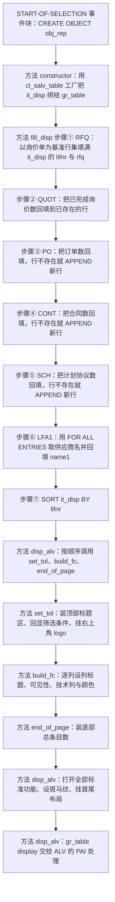
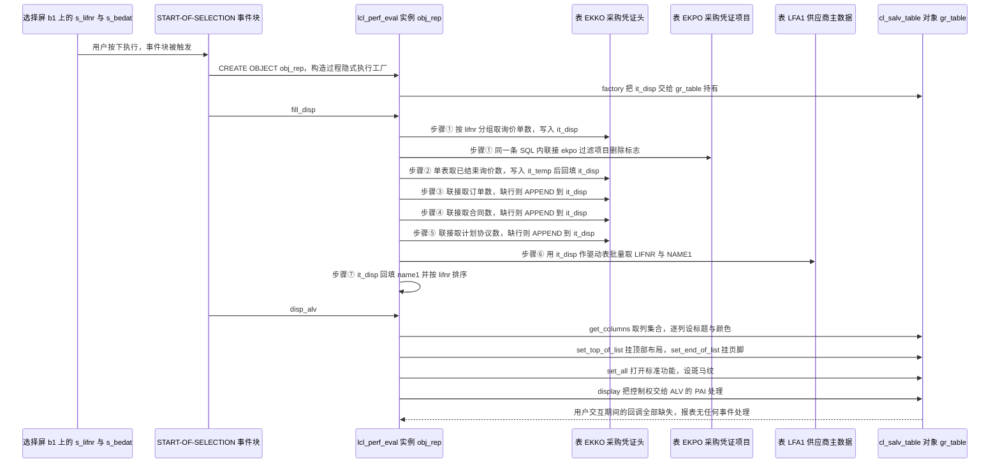

# ZMMR_PERF_EVAL_VEND 分析报告

> 分析对象：`Test-source/zvend.abap`（357 行，报表程序 `REPORT zmmr_perf_eval_vend`，本地类 `lcl_perf_eval` 共 6 个方法 + `START-OF-SELECTION` 事件块）
> 报告视角：代码 onboarding 走读，按真实调用链展开
> 一处需要先说明的落差：文件名是 `zvend.abap`，而源码首行的程序名是 `REPORT zmmr_perf_eval_vend`。两者不一致，接手时以 SE38 里程序属性的程序名为准，本报告一律以源码为准。

---

## 一、程序定位与业务背景

### 1.1 这段代码在解决什么问题

先说清楚它**不是**什么：它不做采购申请、不创建订单、不释放凭证、不做任何审批，也不写任何自定义表。它是一个**只读的聚合查询 + 一个手工装配的列表**。

业务场景是这样的：采购经理想知道一批供应商在采购流程上"走到哪一步了"。SAP 标准里 ME53N 是单张凭证，ME5 系列是逐张凭证清单，都没有"按供应商聚合、并且按采购流程阶段分桶计数"这个视角。而这恰恰是采购经理做供应商评审时最先要问的问题：

- 某供应商 RFQ 很多但 PO 很少 —— 询价比价做完了却不转化，要么是价格没谈拢，要么是把单子发给了别的供应商；
- 某供应商 PO 很多但 SCH 为 0 —— 从没签过长期协议，每次都在重新下单，采购成本降不下来；
- 某供应商 CONT 有量、PO 也有量 —— 已经在框架合同下走订单，流程是健康的。

所以这份程序做的事可以一句话讲清：**选一个供应商号区间和一个过账日期区间，把 `EKKO` 按 `BSTYP` 拆成"寻源 / 报价 / 下单 / 合同 / 计划协议"五个阶段，按供应商聚合出各阶段的凭证数量，再把供应商名称补上，装进一个 SALV 列表。**

| 它做的事 | 它刻意不做的事 |
|---|---|
| 把 EKKO 的采购凭证按流程阶段分桶计数（5 列指标） | 不区分公司代码、不区分采购组、不区分采购组织 |
| 按供应商聚合成一行，并把供应商名补齐 | 不判断单据是否被冻结（`LFA1-LDAKD`）、项目是否被质检冻结（`EKPO-KSTATUS`） |
| 在列表顶部回显本次实际生效的筛选条件 | 不要求筛选条件必输，空条件一律放行 |
| 打开全部标准 ALV 功能（排序、筛选、合计、导出） | 不做任何用户输入的校验或重算 |
| 装配一个有标题、有 logo、有条目总数的 SALV 表头 | 不做权限控制、不做公司代码级数据隔离 |

一句话设计范式定性：

> **"报表级 SQL 聚合 + 过程化 SALV 装配"——一个 REPORT，SQL 聚合全部塞在本地类的方法里以"取一行、回填一行"的方式展开，UI 用 `cl_salv_table` 的 factory 加 form layout 手工拼出顶部/底部/列样式；而这个类没有属性、没有构造参数，所有状态都挂在报表的全局 `DATA` 上，所以它不是可复用的类，只是把 `START-OF-SELECTION` 的语句按职责切成了六段。**

### 1.2 五个指标的业务口径（先对账，再谈代码）

这是这份程序最需要读者自己核一遍的东西，因为**同一份报表里的五列，筛选条件并不一致**：

| ALV 列 | 聚合数据源 | 计数对象 | 关键 WHERE 条件 | 实际业务口径 |
|---|---|---|---|---|
| `RFQ` | `EKKO` JOIN `EKPO` | `COUNT( DISTINCT a~ebeln )` | `a~bstyp = 'A'`、`b~loekz NE 'X'` | 询价单数，**不区分询价是否已完成** |
| `QUOT` | 仅 `EKKO` | `COUNT( DISTINCT ebeln )` | `bstyp = 'A' AND statu = 'A'`、`loekz EQ space` | 询价阶段已结束的询价单数 |
| `PO` | `EKKO` JOIN `EKPO` | `COUNT( DISTINCT a~ ebeln )` | `a~ bstyp = 'F'`、`bsart NE 'UB'`、`b~loekz EQ space` | 订单数，排除分包订单 |
| `CONT` | `EKKO` JOIN `EKPO` | `COUNT( DISTINCT a~ ebeln )` | `a~ bstyp = 'K'`、`b~loekz EQ space` | 合同数 |
| `SCH` | `EKKO` JOIN `EKPO` | `COUNT( DISTINCT a~ ebeln )` | `a~ bstyp = 'L'`、`b~loekz EQ space` | 计划协议数 |

三处必须记住的口径细节：

1. **`loekz` 在四个查询里指的不是同一张表。** `RFQ`、`PO`、`CONT`、`SCH` 里带表别名 `b~loekz`，落在 `EKPO`（项目删除标志）；而 `QUOT` 的 `FROM` 子句里只有 `ekko`，没有 `ekpo`，所以那条 `loekz EQ space` 只能解析到 `EKKO-LOEKZ`（**整个凭证头的删除标志**）。同名不同表、不同语义，是这份代码里最容易误读的一处。
2. **`RFQ` 用 `NE 'X'`、其余三列用 `EQ space`。** 两者在 `LOEKKZ` 只取空白或 `'X'` 时结果接近，但表达的是两种意图：前者是"至少有一个未删项目"，后者是"存在空删除标志的项目"。混用说明这两列不是同一次复制粘贴。
3. **`BSART NE 'UB'` 只作用于 `PO` 列。** `RFQ`、`QUOT`、`CONT`、`SCH` 四列都不排除分包业务，所以同一行里"分包合同数"和"分包订单数"的口径并不对齐 —— 如果业务上要把分包单独看，这张表会误导人。

`EKKO-STATU = 'A'` 的域值语义、`EKKO-BSART = 'UB'`（分包订单）的确认值、`EKPO-LOEKZ` 的固定值集合，**都需要在 SE11 检查这三个数据元素**；本报告不对具体含义下断言，只指出"代码依赖了它"。

### 1.3 依赖清单（读这段代码前必须知道的地形）

```
表          EKKO            采购凭证头，取 LIFNR / EBELN / BEDAT / BSTYP / STATU / BSART / LOEKZ
            EKPO            采购凭证项目，只用来过滤行删除标志 LOEKZ
            LFA1            供应商主数据，只取 LIFNR / NAME1
SALV 类     CL_SALV_TABLE、CL_SALV_FUNCTIONS、CL_SALV_COLUMNS_TABLE、CL_SALV_COLUMN_TABLE、
            CL_SALV_DISPLAY_SETTINGS、CL_SALV_FORM_LAYOUT_GRID、CL_SALV_FORM_LAYOUT_LOGO、
            CL_SALV_FORM_LAYOUT_FLOW、CL_SALV_FORM_LABEL、CL_SALV_FORM_TEXT、
            IF_SALV_C_BOOL_SAP
异常        CX_SALV_MSG（工厂）、CX_SALV_NOT_FOUND（取列）
文本符号    TEXT-001         选择屏块 b1 的标题
            TEXT-002         工厂失败时的消息文本
外部对象    ZCHEM_N_LOGO_SMALL   页面右上角的位图，来源注释写的是 OAER 事务
内嵌        INCLUDE <color>      build_fc 方法首行，为 ls_color 取色值
状态        it_disp / it_temp / it_lfa1 / gr_table / lr_* / ls_color / s_lifnr / s_bedat
                              全部是报表级全局 DATA，类的方法直接读写它们
```

注意 `ZCHEM_N_LOGO_SMALL` 这个名字里带着 `CHEM` —— 这是化工行业定制留下的痕迹，与程序名 `zmmr_perf_eval_vend` 一样，是被沿用的定制资产。**接手第一件事是去 SE91 确认这个位图在目标客户端是否存在**；缺失时 `set_right_logo` 的行为（静默空白还是在 `display()` 时抛 SALV 异常）需在 SE38 交互执行核实。

### 1.4 这份代码写出来的年代感

读之前先换一副眼睛。源码里有四类痕迹说明它是一段"能跑就行"的实用程序，而不是打磨过的产品：

- 方法名 `set_tol` 全程拼作 `set_tol`，`ENDMETHOD` 的注释却写成 `"set_Tol`；`disp_alv` 是 SALV 里的缩写习惯（`tol` 是 Tool 的误拼）；
- 变量名 `it_disp` / `it_temp` / `it_lfa1` 保留了 ABAP 4.0B 时代"实体名缩写"的命名法，`wa_disp- lifnr`、`wa_temp -CNT`、`s_lifnr -high` 里的连字符前后空格四处不一致，说明这些代码是从更早的段落式程序逐步搬进类的；
- 保留了 `INCLUDE <color>.` 和 `CREATE OBJECT`（不是 `NEW`）这类老写法；
- 被注释掉的 `it_layout TYPE lvc_s_layo`、`"WRITE sy-dbcnt.`、`DATA : "lr_label TYPE REF TO cl_salv_form_label,` 说明作者改过方向又没清干净。

判断这类代码有没有设计意图，要看它**主动做了什么**，而不是看它写得漂不漂亮。它主动做了两件对的事，都值得在后面的章节里对照读（详见 3.7 的回填兜底与 3.9 的 `?=` 用法）。

---

## 二、程序执行流程总览

程序的执行流是一条线，没有任何分支回跳：`START-OF-SELECTION` 建对象 → 构造函数建 SALV 工厂 → 取数 → 装配 → 显示。



### 责任链表

| 子程序 | 调用者 | 职责 |
|---|---|---|
| `START-OF-SELECTION`（事件块） | SAP 运行时的 PAI 链（用户按下执行） | 整个程序的唯一入口：声明并创建 `obj_rep`，然后无条件下发 `fill_disp` 与 `disp_alv` |
| 方法 `constructor` | `START-OF-SELECTION` 的 `CREATE OBJECT : obj_rep.` 隐式触发 | 调 `cl_salv_table=> factory` 把 `it_disp` 交给 `gr_table`；失败时弹一条消息后 `EXIT` |
| 方法 `fill_disp` | `START-OF-SELECTION` 的 `obj_rep->fill_disp( ).` | 七步取数：RFQ 建基准行集、QUOT/PO/CONT/SCH 四次回填、LFA1 补名称、`SORT` 排序 |
| 方法 `disp_alv` | `START-OF-SELECTION` 的 `obj_rep->disp_alv( ).` | 装配总控：依次调 `set_tol`、`build_fc`、`end_of_page`，再设功能区、斑马纹、首尾布局，最后 `display( )` |
| 方法 `set_tol` | `disp_alv` 内部 `set_tol( ).` | 建 `lr_grid` 顶部布局、逐行回显供应商区间 / 日期区间 / 运行日期、挂 `lr_logo` |
| 方法 `build_fc` | `disp_alv` 内部 `build_fc( ).` | 取 SALV 列集合并 `set_optimize`，再分七段 `TRY` 逐列设标题文本、隐藏 BEDAT、给 LIFNR/NAME1 上色 |
| 方法 `end_of_page` | `disp_alv` 内部 `end_of_page( ).` | 建 `lr_footer`，写入 `LINES( it_disp )` 作为总条目数 |
| `it_disp`（被反复读写的全局内表） | 被 `cl_salv_table` factory 绑定、被 `fill_disp` 四次回填、被 `end_of_page` 数行数 | 报表的唯一输出载体，也是四个聚合查询与 `FOR ALL ENTRIES` 的驱动表 |
| `it_temp`（被反复 `REFRESH` 的全局内表） | `fill_disp` 的 QUOT / PO / CONT / SCH 四段 | 四次聚合结果的落地面，每次用完 `REFRESH`，结构只有 `LIFNR` 与 `CNT` |

下面按这条流程，逐个子程序展开。

---

## 三、分组分析

### 3.1 全局声明区 结构定义：三个 TYPES 块（`t_disp` / `t_temp` / `t_lfa1`）

整个报表的数据形状在这里一次定死，后面所有取数与回填都围着它转。

```abap
TYPES:BEGIN OF t_disp,
   lifnr TYPE lifnr,
   name1 TYPE name1_gp,
   bedat TYPE bedat,
   rfq  TYPE I ,
   quot TYPE I ,
   po   TYPE I ,
   cont TYPE I ,
   sch  TYPE I ,
END OF t_disp,
BEGIN OF t_temp,
   lifnr TYPE lifnr,
  CNT   TYPE I ,
END OF t_temp,
BEGIN OF t_lfa1,
   lifnr TYPE lifnr,
   name1 TYPE name1_gp,
END OF t_lfa1.
```

**做什么** — 声明三个行结构：`t_disp` 是最终输出行，一行一个供应商，字段是 `LIFNR`（供应商号，`LIFNR`）、`NAME1`（供应商名，`NAME1_GP`）、`BEDAT`（凭证日期，`BEDAT`）加上五个计数列 `RFQ` / `QUOT` / `PO` / `CONT` / `SCH`；`t_temp` 是聚合结果的落地结构，只有 `LIFNR` 和 `CNT`；`t_lfa1` 是供应商主数据的窄投影，只有 `LIFNR` 和 `NAME1`。

**为什么** — `t_disp` 的列名直接当 ALV 列名用，所以列名同时承担了数据元素和界面标题两层职责，这是把结构直接交给 `cl_salv_table` factory 时最省事的做法。`t_temp` 只装 `LIFNR` + `CNT` 两列，是聚合查询的最小承接结构：四个查询形状完全一样，只有 `CNT` 的含义随 WHERE 变，换一个两列结构而不是四张表，是对的。`NAME1 TYPE name1_gp` 与 `LFA1-NAME1` 的数据元素一致，语义校核通过 —— 供应商名不区分语言版本，这里没有错配。

**风险与改进** — 三处，其中第一处是"字段存在但永远没有值"：

1. **`t_disp-bedat` 是一个永远为初始值的字段。** 全文件没有任何一条 SQL 往 `it_disp` 的 `BEDAT` 里写值（`INTO CORRESPONDING FIELDS OF TABLE` 只映射查询里出现的列），它的唯一用途是给选择屏当类型载体（见 3.3）。作者显然知情，因为 `build_fc` 里对它做了 `set_visible( abap_false )` 加 `set_technical` 的双重隐藏。但它留在输出结构里意味着 SALV 会为它建列、建技术字段、建排序入口，成本很小、可读性成本不小。建议把它移出 `t_disp`，单独建一个只给选择屏用的 DATA 对象。
2. **五个计数列全用 `TYPE I`（4 字节有符号整数）而不是 `TYPE n`。** 计数永远不会负，用 `TYPE n` 语义更准，并且 `COUNT( DISTINCT )` 的返回值本来就是无符号数。这个只是选型洁癖，不影响运行。
3. **`CNT` 大写、其余小写。** ABAP 不区分大小写，所以没有语法问题；但 `CNT` 是四段聚合唯一的落点，大小写不一致会让读者怀疑"是不是两套东西"。统一成小写即可。

### 3.2 全局声明区 内表与 SALV 引用：全部挂在报表全局

```abap
DATA: it_disp TYPE TABLE OF t_disp,
       wa_disp LIKE LINE OF it_disp,
       it_temp TYPE TABLE OF t_temp,
       wa_temp LIKE LINE OF it_temp,
       it_lfa1 TYPE TABLE OF t_lfa1,
       wa_lfa1 LIKE LINE OF it_lfa1.
```

**做什么** — 声明三张报表级内表及其工作区：`it_disp` 是最终输出表（一行一个供应商，`TYPE TABLE OF t_disp`），工作区 `wa_disp LIKE LINE OF it_disp`；`it_temp` 是四次聚合查询的落地面（`TYPE TABLE OF t_temp`，只有 `LIFNR` 与 `CNT` 两列），工作区 `wa_temp`；`it_lfa1` 是供应商主数据的窄投影（`TYPE TABLE OF t_lfa1`），工作区 `wa_lfa1`。**三张表都没有 `KEY` 附加项，所以全是标准表。**

**为什么** — `LIKE LINE OF` 而不是 `TYPE t_disp` 是老写法，两者等价，用 `LIKE LINE OF` 能保证内表被改名时工作区跟着改，不会漏改。`it_temp` 只装两列而不是直接往 `it_disp` 里聚合，是因为聚合结果与输出结构形状不同（`CNT` 是个中性名字，要靠 `TRANSPORTING` 才决定落到哪一列）—— 用一张中性中间表承接，让"这次聚合出来的数往哪放"这件事留在回填段里决定，这个分工是对的。

**风险与改进** — 三点，全部是结构性的：

1. **三张内表全无表键，是本程序性能的根因。** `TYPE TABLE OF t_disp` 声明的是标准表，后续所有 `MODIFY it_disp ... WHERE lifnr = ...` 与 `READ TABLE it_lfa1 ... WITH KEY lifnr = ...` 都退化为线性查找，而它们是在四段 `LOOP AT it_temp` 的循环体里执行的，整体复杂度是 O(供应商数²)。同时 `FOR ALL ENTRIES IN it_disp` 走的是驱动表全扫描。改成 `SORTED TABLE ... WITH UNIQUE KEY lifnr`（`it_temp` 用 `lifnr`）是一行改动，能把回填与查名都变成对数查找。**这是全文性价比最高的一条修改。**
2. **`wa_disp` 同时是选择屏的绑定目标和四段回填的工作区。** `SELECT-OPTIONS s_lifnr FOR wa_disp- lifnr` 让 `wa_disp` 成为选择屏初值的依赖对象，而它又被反复 `CLEAR`（见 3.7）。当前执行顺序上（选择屏在 PAI 阶段就处理完了，`START-OF-SELECTION` 里的 `CLEAR` 不会回溯影响 `s_lifnr`）所以没出事，但这是把两个生命周期绑在一起。具体是否真的影响初值，需在 SE38 交互执行核实。稳妥做法是给选择屏单独声明一个 DATA 对象。
3. **类没有属性也没有构造参数，所有状态都是报表全局变量。** 直接后果有三个：同一个 `lcl_perf_eval` 在一个程序里只能有一个实例、第二次 `CREATE OBJECT` 会共用并覆盖 `gr_table` 与三张内表；这个类**无法写 ABAP Unit**（单测要替换 `it_disp` 就得往报表全局里塞数据）；它也无法被别的报表复用 —— 而"供应商分阶段评估"正是那种应该有全局类的需求。如果这个报表还在被多处调用，把内表变成构造参数、把 SALV 引用变成属性是第一步。

```abap
DATA: "it_layout   TYPE lvc_s_layo,
       gr_table TYPE REF TO cl_salv_table,
       gr_functions TYPE REF TO cl_salv_functions,
       gr_columns TYPE REF TO cl_salv_columns_table,
       gr_column TYPE REF TO cl_salv_column_table,
       gr_display TYPE REF TO cl_salv_display_settings,
       lr_grid TYPE REF TO cl_salv_form_layout_grid,
       lr_gridx TYPE REF TO cl_salv_form_layout_grid,
       lr_logo TYPE REF TO cl_salv_form_layout_logo,
       lr_label TYPE REF TO cl_salv_form_label,
       lr_text TYPE REF TO cl_salv_form_text,
       lr_footer TYPE REF TO cl_salv_form_layout_grid,
       ls_color TYPE lvc_s_colo
      .
```

**做什么** — 声明十一个 SALV 引用与一个颜色结构：`gr_table`（表对象）、`gr_functions`（功能区）、`gr_columns`（列集合）、`gr_column`（单列）、`gr_display`（显示设置），以及 `lr_grid` / `lr_gridx` / `lr_footer`（三个同类型的 `CL_SALV_FORM_LAYOUT_GRID`，分别代表页眉外层、页眉内层、页脚）、`lr_logo`（左右分栏布局）、`lr_label`、`lr_text`，最后是颜色结构 `ls_color TYPE lvc_s_colo`。最上面一行 `it_layout TYPE lvc_s_layo` 被注释掉了。

**为什么** — 全部放在报表级 `DATA` 而不是类的属性里，是过程式报表程序最省事的选择：类的方法不需要任何参数就能读写这些对象，代码读起来是直的。`lr_grid`、`lr_gridx`、`lr_footer` 三者类型相同却用三个名字区分"页眉外层网格 / 页眉内层网格 / 页脚网格"，这个区分是必要的，因为它们在 `lr_logo` 与 `gr_table` 上占的槽位不同。`gr_column` 单列引用被 `build_fc` 的七段 `TRY` 反复复用，用一个全局而不是七个局部，是为了少写七次 `DATA`。

**风险与改进** — 两点：

1. **`ls_color` 全局复用且从不 `CLEAR`。** 当前无害（`INTENS` 与 `EMPH` 始终为初始值，只设了 `COL`），但一旦有人给某列加 `intens`，`build_fc` 的第二个 `TRY` 会把它带进 NAME1 列。在两处 `ls_color- col = 3 .` 之前补一句 `CLEAR ls_color.` 是零成本的防御。
2. **遗留的 `it_layout TYPE lvc_s_layo` 被注释掉。** 它指向的是 ALV Grid（`CL_GUI_ALV_GRID`）的布局结构，而本程序用的是 SALV，理论上不需要它 —— 这条注释说明程序曾经是或曾经想是 Grid 实现。留着不影响运行，但它是"这段代码改过方向"的证据，值得顺手清掉。

### 3.3 全局声明区 选择屏：两个都非必输的参数

```abap
SELECTION-SCREEN BEGIN OF BLOCK b1 WITH FRAME TITLE TEXT- 001.
  SELECT-OPTIONS : s_lifnr FOR wa_disp- lifnr,
   s_bedat FOR wa_disp- bedat.
SELECTION-SCREEN END OF BLOCK b1.
```

**做什么** — 定义一个带边框的块 `b1`，块标题取文本符号 `TEXT-001`；块内放两个 `SELECT-OPTIONS`：`s_lifnr` 绑定到 `wa_disp- lifnr`（供应商号区间），`s_bedat` 绑定到 `wa_disp- bedat`（凭证日期区间）。两个都没有 `OBLIGATORY`，也都没有默认值。

**为什么** — 两个参数分别对应 1.2 表格里的两组筛选条件：供应商号限定"看谁"，`BEDAT` 区间限定"看哪段时间"。用 `SELECT-OPTIONS` 而不是 `PARAMETER` 是对的，因为区间比单值实用得多（"看 2026 年整年"直接输 low 和 high 两个日期）。块标题走文本符号 `TEXT-001` 说明作者知道多语言是怎么做的 —— 这一点在 `build_fc` 和 `set_tol` 里被完全丢掉了（见 3.9 与 3.10）。

**风险与改进** — 两点，第一点是本程序最大的运行风险：

1. **两个参数都非必输，等于允许"空选择屏 = 全库扫描"。** `s_lifnr` 与 `s_bedat` 都留空时，四个聚合查询的 `WHERE lifnr IN s_lifnr` 与 `bedat IN s_bedat` 都不构成任何限制，而 `fill_disp` 会把 `EKKO` JOIN `EKPO` 的全量联接扫两遍（一次 RFQ、一次 PO/CONT/SCH 的三次各自再扫）。生产客户端的 `EKKO` + `EKPO` 动辄数千万行，**四个 GROUP BY 聚合查询会跑到数据库超时或吃满临时表**。作者显然撞过这个问题，因为 `fill_disp` 里留着被注释掉的 `"WRITE sy-dbcnt.`，但最终既没加必输也没加行数提示 —— 而 `set_tol` 里又明确处理了 `IS NOT INITIAL` 为假的情形（回显 `'Not Provided'`），也就是**空条件是被允许的既定行为**。这是"允许但没护栏"：要么给 `s_bedat` 加默认值（当年 1 月 1 日至今）并在 `fill_disp` 开头对 `s_bedat IS INITIAL` 抛错，要么在 `s_lifnr` 为空时警告用户"将统计全部供应商"。无论选哪条，都需要业务方先确认"看全库"是不是真实需求。
2. **绑定到 `wa_disp` 而不是专用 DATA 对象**，理由见 3.2 第 2 点。

### 3.4 类定义段 `lcl_perf_eval`：六个方法，全部无参数无返回值

```abap
CLASS lcl_perf_eval DEFINITION .
  PUBLIC SECTION.
  METHODS: constructor ,
   fill_disp.
  METHODS build_fc.
  METHODS disp_alv.
  METHODS set_tol.
  METHODS end_of_page.

ENDCLASS.                   "lcl_perf_eval DEFINITION
```

**做什么** — 声明一个本地类 `lcl_perf_eval`，`PUBLIC SECTION` 里暴露六个方法：`constructor`（无参数）、`fill_disp`（取数与回填）、`build_fc`（装配列）、`disp_alv`（装配总控与显示）、`set_tol`（装顶部布局）、`end_of_page`（装底部布局）。**六个方法都没有导入参数、没有返回值、没有异常声明。**

**为什么** — 方法划分本身是清楚的：`fill_disp` 管数据、`disp_alv` 管 UI、两个 form layout 方法各管一块界面、`constructor` 管对象建立。这个划分让 `START-OF-SELECTION` 从一大段 SQL 缩成了四行可读语句，收益是实的。类名前缀 `lcl_` 表示本地类，不能被别的程序引用 —— 这与 3.2 说的"全部状态挂全局"是一致的：既然本来就不能复用，作者也索性连属性都没给。

**风险与改进** — 三点：

1. **`set_tol` 这个名字既拼错又名不副实。** `tol` 大概是 `tool` 的误拼（`ENDMETHOD` 的注释写成 `"set_Tol`），而它实际做的是"装顶部布局（top of list）"——`tol` 也可能是 `top of list` 的缩写，那就不算拼错，但读者第一反应一定是 `tool`。改成 `set_top_layout` 或 `set_header` 能省掉一次查字典。
2. **六个方法全无返回值，调用链无法传递失败。** 这是 3.5 与 3.6 里空引用 dump 的结构性原因：`disp_alv` 没法知道 `build_fc` 有没有生效，`START-OF-SELECTION` 也没法知道 `constructor` 有没有建成功。至少给 `constructor` 和 `disp_alv` 一个 `RETURNING VALUE(rv_ok)`，或者让 `constructor` 直接抛 `cx_salv_error` 派生异常。
3. **`fill_disp` 一个名字覆盖四件事。** 它同时做取数、回填、补名称、排序，方法名只说了"填显示表"。拆成 `collect_counts` 与 `enrich_names` 会让 `dispatch` 的调用栈更清楚，也让"补名称"这段（唯一有独立性能与正确性风险的段落）可以被单独读、单独测。

### 3.5 事件块 `START-OF-SELECTION`：程序唯一的入口，也是唯一的编排点

```abap
START-OF-SELECTION.
DATA : obj_rep TYPE REF TO lcl_perf_eval. " Declaring Object for Class

CREATE OBJECT : obj_rep. " Creating Object

obj_rep->fill_disp( ). " Calling class Methods
obj_rep->disp_alv( ).
```

**做什么** — 用户按下执行后进入这个事件块：声明局部引用 `obj_rep`，用 `CREATE OBJECT : obj_rep.` 构造它（因为 `constructor` 无参数，所以这里没有实参；构造过程会隐式执行 3.6 的工厂调用），然后**无任何前置判断**地先调 `obj_rep->fill_disp( )` 做取数，再调 `obj_rep->disp_alv( )` 做显示。

**为什么** — 这是报表程序的标准编排：把选择屏处理（由 `AT SELECTION-SCREEN` 系列事件承担，本程序没有）与业务逻辑分开，四行就描述完整个流程。`CREATE OBJECT : obj_rep.` 带冒号的形式暗示曾经打算批量创建多个对象，后来只剩一个。

**风险与改进** — 三点，第一点是本程序最硬的一个缺陷：

1. **`constructor` 的失败信号没有传出来，随后必然空引用 dump。** 3.6 的构造函数在工厂失败时只弹一条 `TYPE 'I'` 的消息 —— 信息消息不会中止程序 —— 然后 `EXIT`。无论 `EXIT` 在方法实现里是等同于 `RETURN` 还是别的语义（**这一点需在 SE38 核实**），控制流都会回到事件块继续执行 `obj_rep->fill_disp( )`，跑完四个全量聚合查询，然后进 `disp_alv`；`disp_alv` 里 `gr_columns = gr_table->get_columns ( )` 与 `gr_functions = gr_table->get_functions ( )` 都是对**初始引用**的实例方法调用，抛 `CX_SY_REF_IS_INITIAL`，而 `build_fc` 的 `CATCH` 只写了 `cx_salv_not_found`，捕不住，异常直接冲出 `START-OF-SELECTION` —— **用户先等完整库扫描超时，再看到一个与"工厂失败"毫不相干的短转储**。建议在事件块里加一道就绪判断（示意，源码中不存在）：
   ```abap-fix
   START-OF-SELECTION.
     DATA obj_rep TYPE REF TO lcl_perf_eval.

     obj_rep = NEW #( ).
     IF obj_rep->is_ready( ) = abap_false.
       RETURN.
     ENDIF.
     obj_rep->fill_disp( ).
     obj_rep->disp_alv( ).
   ```
   `is_ready` 是需要新增的方法；返回 `RETURN` 而不是 `EXIT` 是因为在事件块层面 `RETURN` 的语义才是明确的（老系统上 `NEW #( )` 需要 7.40 以上，低版本仍用 `CREATE OBJECT obj_rep.`）。
2. **没有空结果处理。** `fill_disp` 之后不检查 `it_disp` 是否为空，直接 `disp_alv`。空结果时会显示一个带 logo、带标题、底部写着 `Total Number of Entries: 0` 的空 ALV —— 至少不会出错，但用户无法分辨"没有符合条件的供应商"和"程序没跑"。在 `fill_disp` 末尾加一条 `IF it_disp IS INITIAL. MESSAGE s000(zmmr_perf_eval). ENDIF.` 会清楚很多。
3. **注释 `' Calling class Methods` 说错了。** 调的是实例方法（`obj_rep->`），不是类方法（`=>`）。这类错误注释比没有注释更误导 —— 新人读它会以为 SALV 的用法应该改成静态调用。

### 3.6 方法 `constructor`：建 SALV 工厂，并把失败藏在一句消息里

```abap
  METHOD constructor.
    TRY.
       cl_salv_table=> factory( IMPORTING r_salv_table = gr_table CHANGING t_table = it_disp ). "Calling Factory Obj of Cl_ALV_TABLE
    CATCH cx_salv_msg.
    ENDTRY .

    IF gr_table IS INITIAL .
      MESSAGE TEXT -002 TYPE 'I' DISPLAY LIKE 'E'.
      EXIT .
    ENDIF .
  ENDMETHOD.                   "constructor
```

**做什么** — 在 `TRY` 里调 `cl_salv_table=> factory`，`r_salv_table` 拿到 `gr_table`、`t_table` 把报表内表 `it_disp` **按引用交给 ALV 对象**；`CATCH cx_salv_msg` 空处理；随后用 `IF gr_table IS INITIAL` 判断工厂是否真的建成，没建成就 `MESSAGE TEXT -002 TYPE 'I' DISPLAY LIKE 'E'` 再 `EXIT`。

**为什么** — `CHANGING t_table` 用 `CHANGING` 而不是 `IMPORTING` 是 SALV 的契约：`t_table` 是引用传参，ALV 拿到的就是 `it_disp` 本身，所以后续 `MODIFY it_disp` 的结果会自动反映到列表上，不需要再绑定一次。工厂会在这一刻按 `t_disp` 的结构**一次性建好全部列对象**，这就是为什么 `build_fc` 里能按列名 `'LIFNR'` / `'NAME1'` 取列。用工厂而不是 `CREATE OBJECT gr_table`，还能自动派生列标题、工具栏和标准功能。

**风险与改进** — 四点，前两点直接连着 3.5 的 dump：

1. **`EXIT` 的返回值语义需要核实，而且无论哪种理解都不解决问题。** 在 ABAP 里 `EXIT` 的文档语义是"退出循环 / FORM / 对话框模块"，在方法实现中的行为**需在 SE38 里核实**。但无论它是等同于 `RETURN` 还是别的情况，`constructor` 都没有把"我失败了"这件事告诉调用方 —— 事件块里那两行 `obj_rep->...` 前面没有任何判断。正确的形状是抛异常或设标志，让 `START-OF-SELECTION` 有东西可判。
2. **`MESSAGE ... TYPE 'I'` 是信息消息，不会中止程序，`DISPLAY LIKE 'E'` 只改图标不改行为。** 一个真正的失败（ALV 建不起来）被报告成信息，这是消息类型与严重程度不匹配。更糟的是它出现在一个即将 dump 的路径上：用户看到弹窗，点了继续，然后才崩溃，两次反馈指向不同问题。改成 `MESSAGE e002(zmmr_perf_eval).`（错误消息会中断 LUW 并留在消息行）或直接抛异常。
3. **`CATCH cx_salv_msg.` 是空处理，等于把异常信息完全丢弃。** 它后面那两行 `TRY` / `ENDTRY .` 之间没有任何语句。这里其实**不需要 TRY** —— `IF gr_table IS INITIAL` 已经覆盖了所有"工厂没建成"的情况，而且它对初始引用的判断比捕异常更直接。删掉 TRY 反而让代码更短更清楚；如果要保留 TRY，至少往日志里写一条，让"ALV 工厂建不起来"这件事事后可查。
4. **`cl_salv_table` 对 `t_table` 的引用被永久持有了。** 这是 SALV 的正常机制，但意味着 `it_disp` 的生命周期受 `gr_table` 约束。当前没有第二次调用，所以不成问题；如果这个类将来被改成可重复调用（见 3.2 第 3 点），必须保证 `gr_table` 与 `it_disp` 一起重建。

### 3.7 方法 `fill_disp`：七步取数，本程序的主战场（约占全文三分之一的篇幅）

这个方法分七步：① 用 RFQ 查询建基准行集，② QUOT 回填，③ PO 回填，④ CONT 回填，⑤ SCH 回填，⑥ 从 `LFA1` 补供应商名，⑦ 排序。前三步展开，后面几步合并讲。

#### ① RFQ：以询价单为基准行集（`fill_disp` 的第一段 SQL）

```abap
    "RFQ
    SELECT a~lifnr COUNT( DISTINCT a~ebeln ) AS rfq FROM ekko AS a
    JOIN ekpo AS b ON a~ ebeln = b ~ebeln
    INTO CORRESPONDING FIELDS OF TABLE it_disp
    WHERE a~lifnr IN s_lifnr AND bedat IN s_bedat
    AND b~loekz NE 'X'
    AND a~bstyp = 'A'
    GROUP BY a~lifnr .
```

**做什么** — 联接 `EKKO` 与 `EKPO`（别名 `a` / `b`），按 `a~lifnr` 分组，对每个供应商统计不重复的凭证号个数作为 `rfq`，写入 `it_disp`。筛选条件有四个：`LIFNR` 在 `s_lifnr` 区间内、`BEDAT` 在 `s_bedat` 区间内、`EKPO-LOEKZ` 不等于 `'X'`（项目未删除）、`EKKO-BSTYP = 'A'`（询价单）。这是全文**唯一一条给 `it_disp` 装行**的 SQL，也是后面四次回填的基准行集来源。

**为什么** — `COUNT( DISTINCT a~ebeln )` 是这段代码里最关键的一个决定。联接是 1:N 的（一个凭证头对应若干项目），如果用 `COUNT( * )` 或 `COUNT( a~ebeln )`，一张 30 行的询价单会被数成 30 个，`DISTINCT` 把中间结果压回"每个凭证号只算一次"，这样输出的才是"凭证张数"这个业务上说得通的量 —— 而程序的列标题 `'RFQ Created'` 正是这个意思。`INTO CORRESPONDING FIELDS OF TABLE` 按**字段名**映射，所以查询里的别名 `rfq` 正好落到 `t_disp-rfq`，`a~lifnr` 落到 `t_disp-lifnr`；而 `INTO TABLE` 语义是追加，此刻 `it_disp` 是空的，等于"装入"。这段思路是对的。

**风险与改进** — 四点，第三点是全文最贵的一条：

1. **`JOIN ekpo` 唯一的作用是过滤项目删除标志，却把 1:N 的行数放进了数据库。** 因为要的是 `DISTINCT` 的凭证数，联接并不会改变结果，只会让数据库多产出行、再多花一次去重开销。改成把存在性判断下推成 `EXISTS` 子查询，结果完全等价（示意，源码中不存在）：
   ```abap-fix
       SELECT a~lifnr COUNT( DISTINCT a~ebeln ) AS rfq
         FROM ekko AS a
         WHERE a~lifnr IN s_lifnr
         AND a~bedat  IN s_bedat
         AND a~bstyp  = 'A'
         AND EXISTS ( SELECT ekpo~ebeln FROM ekpo
                       WHERE ekpo~ebeln = a~ebeln
                       AND ekpo~loekz NE 'X' )
       GROUP BY a~lifnr
       INTO CORRESPONDING FIELDS OF TABLE it_disp.
   ```
2. **`bedat IN s_bedat` 没有加表别名。** 在这个联接查询里 `BEDAT` 只存在于 `EKKO`，所以 ABAP 能解析到 `a~bedat`；但同一条 SQL 里 `a~lifnr` 加了别名而 `bedat` 没有，读起来像"用了某个未说明的 `BEDAT`"。而 3.8 的 `PO` 查询里 `bsart` 同样裸写。统一加别名不改变行为，但消掉一类"到底解析到哪张表"的疑问。
3. **整条查询没有任何必输保护，是全文最贵的运行风险。** `s_lifnr` 与 `s_bedat` 都为空时（见 3.3），这一条会扫全量 `EKKO` JOIN `EKPO` 并做 `GROUP BY`。MM 的凭证头与项目表在生产客户端都是千万级起步，而 `fill_disp` 一共要做四次这样的聚合。**先在 `fill_disp` 开头拦一次，比在数据库里优化划算得多。**
4. **没有过滤凭证头与项目的业务状态。** `a~loekz`（凭证头删除标志）完全没查 —— 如果一张询价单的头被打了删除标志但项目标志仍是空的，这条查询照样把它算进 `RFQ`。项目状态 `EKPO-KSTATUS`（质检冻结等）也没查。所以"RFQ Created"这个列标题承诺的"已创建的询价单"，实际口径是"EKKO/EKPO 里存在未删除行且头没被删的 A 类凭证"—— 被冻结的也算。**这个偏差要不要修是业务决定，不是技术决定**，接手时应该问清楚采购经理要不要排除被冻结的凭证。

#### ② QUOT：唯一一段单表查询，也是唯一没有兜底分支的回填

```abap
    "Quot
    SELECT lifnr COUNT( DISTINCT ebeln ) AS CNT FROM ekko
    APPENDING CORRESPONDING FIELDS OF TABLE it_temp
    WHERE lifnr IN s_lifnr AND bedat IN s_bedat
    AND loekz EQ space
    AND ( bstyp = 'A' AND statu = 'A' )
    GROUP BY lifnr.
```

**做什么** — 只查 `EKKO` 一张表（`FROM` 子句里没有 `ekpo`），按 `LIFNR` 分组统计不重复凭证号个数作为 `CNT`，用 `APPENDING CORRESPONDING FIELDS OF TABLE it_temp` 追加进中间表。四个筛选条件：供应商号在 `s_lifnr` 区间内、凭证日期在 `s_bedat` 区间内、`loekz` 为空白、`bstyp = 'A'` 且 `statu = 'A'` 成立。`COUNT` 前的别名 `CNT` 正好对上 `t_temp` 的组件名 `CNT`，`INTO CORRESPONDING FIELDS` 因此能把两列都映射进去。

**为什么** — 这是五段聚合里**唯一不需要联接 `EKPO`** 的一段，因为它的判定条件全在凭证头上：`STATU`（采购凭证状态）本来就只存在于 `EKKO`。想清楚这一点，就理解了为什么其他四段要联接、这一段不用。`GROUP BY lifnr` 与 `COUNT( DISTINCT ebeln )` 的组合把结果压成"每供应商一个数"，和另外四段形状一致，所以后面能共用同一套回填模板。

**风险与改进** — 三点：

1. **`loekz EQ space` 在这条 SQL 里只能解析到 `EKKO-LOEKZ`（凭证头删除标志）。** 同一个 token、同一个比较符，在 ① 里写的是 `b~loekz`（项目）、这里是未限定的 `loekz`（凭证头）、在 ③ 里又回到 `b~loekz`。ABAP 会解析成功（不报错），所以这个差异不会以任何形式提示读者 —— 必须靠读 SQL 的 `FROM` 子句才能发现，而 1.2 的口径表正是把这一处标出来的原因。业务后果是：`QUOT` 这一列不检查项目删除标志，一张所有项目都被删的询价单只要头没被删，就仍然算作"已结束报价"。
2. **`statu = 'A'` 的域值语义需在 SE11 核实。** 程序把它当作"报价（quotation）已维护 / 询价阶段已结束"的判据，而 `EKKO-STATU` 的固定值集合及其业务含义**需在 SE11 检查该数据元素**。在核实之前，`QUOT` 这一列的业务解释（以及 `build_fc` 里那个 `'Quotation Maintained'` 的列标题）都建立在一个未验证的前提上。
3. **`bedat` 与 `loekz` 都没有加表别名。** 单表查询里解析不会出错，但与 ① 段的 `a~lifnr` / ③ 段的裸写 `bsart` 放在一起看，同一份代码里"何时加别名"没有统一规则，读起来像是有几张表参与判断。

```abap
    LOOP AT it_temp INTO wa_temp .
       wa_disp- lifnr = wa_temp -lifnr.
       wa_disp- quot = wa_temp -CNT.
      MODIFY it_disp FROM wa_disp TRANSPORTING lifnr quot WHERE lifnr = wa_temp-lifnr .
      CLEAR : wa_disp, wa_temp.
    ENDLOOP .
```

**做什么** — 第一段：只查 `EKKO` 一张表（没有 `EKPO`），按 `LIFNR` 分组统计不重复凭证数作为 `CNT`，`APPENDING CORRESPONDING FIELDS OF TABLE` 追加进 `it_temp`，条件是 `LIFNR` 与 `BEDAT` 在选择屏区间内、`LOEKZ` 为空白、`BSTYP = 'A'` 且 `STATU = 'A'`。第二段：遍历 `it_temp`，把 `CNT` 通过 `MODIFY it_disp ... TRANSPORTING lifnr quot WHERE lifnr = ...` 写回 `it_disp` 对应供应商行的 `QUOT` 列，每行结束 `CLEAR wa_disp, wa_temp`。

**为什么** — `INTO CORRESPONDING FIELDS` 用一次比四次容易写错，而"先聚到 `it_temp`、再回填主表"这个两段式本身是合理模式：让 SQL 只负责聚合、不负责拼行，回填逻辑单独可读。`TRANSPORTING lifnr quot` 明确了只更新这两列，避免把工作区里其他可能带旧值的字段一起写回去。循环末尾的 `CLEAR : wa_disp, wa_temp.` 是关键 —— 它保证工作区不会把上一次迭代的残留带进下一次（下一段 `PO` 就要靠这个前提，见 3.7 的 ③）。

**风险与改进** — 三点，第一点是会算错数的业务缺陷：

1. **这一段没有 `APPEND` 兜底，`QUOT` 会被静默丢弃（对应 3.7 的 ③ 少了一个分支）。** 后面 `PO` / `CONT` / `SCH` 三段都有 `IF sy-subrc NE 0. APPEND wa_disp TO it_disp.`，唯独 `QUOT` 这段没有。后果：当某个供应商**只有**询价阶段已结束的记录、但因为 `bstyp='A'` 且 `loekz NE 'X'` 的组合没进 `it_disp`（例如它所有询价单的项目都被删了），`MODIFY` 找不到行、`sy-subrc` 为 4，这段代码**什么都不做**，`QUOT` 的计数凭空消失，用户看到的 `QUOT` 是 0 或者空白 —— 一个"该供应商有 5 张已结束询价"的供应商会显示成没有报价记录。建议与后面三段统一（示意，源码中不存在）：
   ```abap-fix
       LOOP AT it_temp INTO wa_temp .
         CLEAR wa_disp.
         wa_disp-lifnr = wa_temp-lifnr.
         wa_disp-quot  = wa_temp-cnt.
         MODIFY it_disp FROM wa_disp TRANSPORTING lifnr quot
           WHERE lifnr = wa_temp-lifnr.
         IF sy-subrc NE 0.
           APPEND wa_disp TO it_disp.
         ENDIF.
       ENDLOOP.
   ```
2. **`loekz EQ space` 在这里指的是 `EKKO-LOEKZ`，不是 `EKPO-LOEKZ`。** 因为这条 SQL 的 `FROM` 只有 `ekko`，未限定的 `loekz` 只能解析到凭证头。同一个 token、同一个比较符，在 ① 里是 `b~loekz`（项目）、这里是 `EKKO` 头、在 ③ 里又是 `b~loekz`（项目）—— 1.2 表格里那三行差异的根因就在这里。后果是：`QUOT` 这一列不检查项目删除标志，**一张所有项目都被删的询价单，只要头没被删，就仍然算作"已结束报价"**，口径比 `RFQ` 松。
3. **`TRANSPORTING lifnr quot` 把键字段 `lifnr` 也放进了传输列表。** 它写的值和原值相同，所以没有副作用，但语义上多余（`MODIFY ... WHERE` 的条件已经是 `lifnr` 了）。去掉它能让"这一步只更新一列"这件事更直白。

#### ③ PO：订单数回填，带 `APPEND` 兜底（`fill_disp` 的 PO 段）

```abap
    " PO
    REFRESH it_temp.
    SELECT lifnr COUNT( DISTINCT a~ ebeln ) AS CNT FROM ekko AS a JOIN ekpo AS b ON a~ ebeln = b ~ebeln
    APPENDING CORRESPONDING FIELDS OF TABLE it_temp
    WHERE lifnr IN s_lifnr AND bedat IN s_bedat
    AND b~loekz EQ space
    AND bsart NE 'UB'
    AND ( a~ bstyp = 'F' )
    GROUP BY lifnr.
```

**做什么** — 先 `REFRESH it_temp` 清掉上一段的聚合结果，再联接 `EKKO`（别名 `a`）与 `EKPO`（别名 `b`），按 `LIFNR` 分组统计 `COUNT( DISTINCT a~ ebeln )` 作为 `CNT`，追加进 `it_temp`。五个条件：供应商号与凭证日期在选择屏区间内、`b~loekz`（项目删除标志）为空白、`bsart NE 'UB'`、`a~ bstyp = 'F'`（订单）。`bsart` 是五段里唯一出现的采购凭证类型过滤。

**为什么** — `COUNT( DISTINCT a~ ebeln )` 与 ① 段同一个理由：联接 1:N，用 DISTINCT 才能让输出落在"凭证张数"这个业务量纲上。`bsart NE 'UB'` 的意图从数据元素名可以读出来 —— `UB` 是分包采购的凭证类型，排除它意味着**这张表不打算把分包订单混进"PO Created"这一列**。这是个合理的业务取舍，但它是五段里独一份的过滤条件，代价见风险第 1 点。

**风险与改进** — 四点：

1. **`bsart NE 'UB'` 只在这一列生效，与其余四列口径不对齐。** `RFQ` / `QUOT` / `CONT` / `SCH` 都不排除分包业务，所以同一行里"分包合同数"和"分包订单数"来自两套筛选规则。采购经理若把分包合同和分包订单放在一起看，会得到"合同有量、订单无量"的错觉，而真实原因只是分包订单被排除在订单口径之外。**这个取舍要不要保留是业务决定，不该由代码悄悄决定**；若要保留，应在列标题或注释里写明"不含分包"。
2. **`bsart` 未加表别名，而 `a~ bstyp` 加了。** `BSART` 只存在于 `EKKO`，所以解析到 `a~bsart` 不会有歧义；但同一段里别名用一半不用一半，读者无法从写法判断哪些字段是"明确指向头表"、哪些是"碰巧唯一"。五段复制下来这个不一致被复制了四次。
3. **联接仍然唯一用于过滤项目删除标志，中间结果 1:N 展开白付。** 与 ① 段同样的问题，改成 `EXISTS` 子查询结果等价、开销更小（示意见 3.7 ①）。
4. **没有过滤凭证头删除标志与项目状态。** `a~loekz` 没查、`EKPO-KSTATUS` 没查，所以"被整体作废"或"被质检冻结"的订单照样计入 `PO`（与 P0-4 同源）。另外 `AND ( a~ bstyp = 'F' )` 外面套了一层无意义的单条件括号，而 ① 段的 `a~bstyp = 'A'` 没有括号 —— 这是四份复制里又一处形态漂移。

```abap
    LOOP AT it_temp INTO wa_temp .
       wa_disp- lifnr = wa_temp -lifnr.
       wa_disp- po = wa_temp -CNT.
      MODIFY it_disp FROM wa_disp TRANSPORTING lifnr po WHERE lifnr = wa_temp-lifnr .
      IF sy-subrc NE 0.
        APPEND wa_disp TO it_disp .
      ENDIF .
      CLEAR : wa_disp, wa_temp.
    ENDLOOP .
```

**做什么** — 先 `REFRESH it_temp` 清空上一轮的聚合结果，再联接 `EKKO` 与 `EKPO` 按 `LIFNR` 分组统计不重复凭证数追加进 `it_temp`，条件是供应商与日期区间在选择屏内、`EKPO-LOEKZ` 为空白、`BSART NE 'UB'`（排除分包订单）、`EKKO-BSTYP = 'F'`（订单）。随后遍历 `it_temp` 回填 `it_disp` 的 `PO` 列：**`MODIFY` 之后立刻判 `sy-subrc`，不为 0 说明这个供应商还没有基准行，就把整行 `APPEND` 进去。**

**为什么** — 这个 `sy-subrc` 分支是全文**最值得学的一处主动设计**。基准行集来自 ①（只包含"有询价单"的供应商），而 `PO` 这一段可能查出一批根本没有询价单的供应商（直接下单的采购、框架合同下的常规订单）。如果没有兜底，这些供应商在报表上会**整行消失** —— 他们的订单量是真实的，却看不见。作者识别到了这个交集问题，用 `APPEND` 把基准行集从"RFQ 的结果"扩展成"四段结果的并集"。这是一个新人很难主动想到的细节。

**风险与改进** — 四点：

1. **`it_disp` 是标准表，`MODIFY ... WHERE` 是线性查找。** 这一段在循环体里对 `it_disp` 做一次全表扫描，四段下来是四次。改成带 `WITH UNIQUE KEY lifnr` 的 `SORTED TABLE` 后，每段循环就是 O(n log n)，这是 3.2 第 1 点说的那条修改在本方法里的具体收益。
2. **`APPEND wa_disp TO it_disp.` 追加的行，只有 `LIFNR` 和 `PO` 两列有值。** `RFQ` / `QUOT` / `CONT` / `SCH` / `NAME1` 依赖 ① 段的 `CLEAR` 才是初始值 —— 这层隐式依赖成立的前提是"循环末尾的 `CLEAR` 永远在 `APPEND` 之后"。目前成立，但这个前提写在代码里、没写在注释里，改动循环顺序就会静默出错。建议在 `LOOP` 开头就 `CLEAR wa_disp`，让工作区的干净状态由循环自己保证。
3. **`APPEND` 新行时没有设表键**，与 ① 段的行混在同一个标准表里；随后 ⑥ 段的 `FOR ALL ENTRIES IN it_disp` 依赖这份并集，所以 ⑥ 段拿到的供应商列表是"四段结果的并集"而不是"RFQ 的结果"。这个隐含契约没有任何注释，值得补一句。
4. **`bsart NE 'UB'` 只在 `PO` 这一列生效。** `RFQ` / `QUOT` / `CONT` / `SCH` 四列都不排除分包业务（1.2 已列）。如果采购经理把分包合同和分包订单放在一起看，这张表会给出"合同有量、订单无量"的错觉，实际只是分包合同被排除在订单口径之外。这是口径设计问题，需要业务确认，不该由代码悄悄决定。

#### ④ CONT 与 ⑤ SCH：与 ③ 同构的两段复制

```abap
    "Cont. Created
    REFRESH it_temp.
    SELECT lifnr COUNT( DISTINCT a~ ebeln ) AS CNT FROM ekko AS a JOIN ekpo AS b ON a~ ebeln = b ~ebeln
    APPENDING CORRESPONDING FIELDS OF TABLE it_temp
    WHERE lifnr IN s_lifnr AND bedat IN s_bedat
    AND b~loekz EQ space
    AND ( a~ bstyp = 'K' )
    GROUP BY lifnr.

    LOOP AT it_temp INTO wa_temp .
       wa_disp- lifnr = wa_temp -lifnr.
       wa_disp- cont = wa_temp -CNT.
      MODIFY it_disp FROM wa_disp TRANSPORTING lifnr cont WHERE lifnr = wa_temp-lifnr .
      IF sy-subrc NE 0.
        APPEND wa_disp TO it_disp .
      ENDIF .
      CLEAR : wa_disp, wa_temp.
    ENDLOOP .
```

**做什么** — `CONT` 段在 `EKKO-BSTYP = 'K'`（合同）下做同样的聚合：`REFRESH it_temp` → 联接 `EKKO` 与 `EKPO` → 按 `LIFNR` 分组统计 `COUNT( DISTINCT a~ ebeln )` → 追加进 `it_temp` → 遍历 `it_temp` 把 `CNT` 回填到 `it_disp` 的 `CONT` 列 → `MODIFY` 找不到行时 `APPEND` 整行。

**为什么** — `BSTYP` 的 `K` 取值把合同类凭证与其他四类分开，这与 `build_fc` 里 `'Contract Created'` 的列标题是同一个意图的两种表达。**用 `BSTYP` 而不是 `BSART` 来区分阶段是对的**：`BSART` 是采购凭证类型（同一阶段内会分很多种，像 `UB` 分包、`LA` 框架协议），而 `BSTYP` 是"采购凭证类别"（`A` 寻源 / `F` 订单 / `K` 合同 / `L` 计划协议），正是"流程走到哪一步"这个维度。

**风险与改进** — 三点：

1. **合同类凭证同样没有 `bsart` 过滤、也没有凭证头与项目状态过滤。** 合同是否也有分包概念、`EKKO-BSTYP = 'K'` 的凭证是否会被单独作废，需在 SE11 核实 `BSTYP` 与 `BSART` 的组合取值。如果要加过滤，还得先确认加在哪一层才不会与 ③ 段那套排除逻辑互相打架。
2. **这段与 ③ 段只有两处字符之差**（`'F'` → `'K'`、`po` → `cont`、`bsart NE 'UB'` 消失），却是一份完整的复制。真实成本不是行数，而是"下一次改动只改三份里的两份"—— `QUOT` 段漏掉 `APPEND` 就是这么来的（见 ② 第 1 点）。
3. **`COUNT( DISTINCT a~ ebeln )` 的去重开销与 ③ 段完全重复。** 四段联接聚合各自付一次同样的代价。

```abap
    "Sch Aggre
    REFRESH it_temp.
    SELECT lifnr COUNT( DISTINCT a~ ebeln ) AS CNT FROM ekko AS a JOIN ekpo AS b ON a~ ebeln = b ~ebeln
    APPENDING CORRESPONDING FIELDS OF TABLE it_temp
    WHERE lifnr IN s_lifnr AND bedat IN s_bedat
    AND b~loekz EQ space
    AND ( a~ bstyp = 'L' )
    GROUP BY lifnr.

    LOOP AT it_temp INTO wa_temp .
       wa_disp- lifnr = wa_temp -lifnr.
       wa_disp- sch = wa_temp -CNT.
      MODIFY it_disp FROM wa_disp TRANSPORTING lifnr sch WHERE lifnr = wa_temp-lifnr .
      IF sy-subrc NE 0.
        APPEND wa_disp TO it_disp .
      ENDIF .
      CLEAR : wa_disp, wa_temp.
    ENDLOOP .
```

**做什么** — 两段结构完全一致的复制：`CONT` 段在 `EKKO-BSTYP = 'K'`（合同）下聚合并回填 `t_disp-cont`，`SCH` 段在 `EKKO-BSTYP = 'L'`（计划协议）下聚合并回填 `t_disp-sch`；两段都是先 `REFRESH it_temp`、再联接 `EKKO` 与 `EKPO` 按 `LIFNR` 分组统计 `COUNT( DISTINCT a~ ebeln )`、再遍历 `it_temp` 用 `MODIFY ... TRANSPORTING` 回填、`sy-subrc NE 0` 时 `APPEND`。

**为什么** — 三种凭证类型（订单 `F` / 合同 `K` / 计划协议 `L`）的聚合形状确实一样，所以"复制三段"在这个场景下是可以理解的 —— 它换来的是每段都能单独读懂，不引入任何控制流抽象。`REFRESH it_temp` 而不是复用一张表叠加，靠的是"这张表就是本段的中间产物"这个简单不变量。

**风险与改进** — 四点：

1. **四份复制代码（`PO` / `CONT` / `SCH` 三段回填 + 三段 SQL）里已经有两份不一致了。** `QUOT` 段缺 `APPEND` 兜底就是第一次走样（见 ③ 的第 1 点）。复制粘贴的代价不是"代码长"，而是**"下一次改动只改三份里的两份"**。既然四段的形状完全一致，用一个内表 `it_kinds = VALUE #( ( bstyp = 'A' ) ( bstyp = 'F' ) ... )` 驱动循环，或者把聚合结果一次性按 `LIFNR` + `BSTYP` + `STATU` 分组取回、回到 ABAP 里分桶（见第三节末的性能建议），都能消掉这份风险。
2. **`COUNT( DISTINCT a~ ebeln )` 这个 DISTINCT 现在是四份重复的去重开销。** 联接 1:N 的中间结果被数据库算了四遍，每次都要去重。把存在性过滤改成 `EXISTS`（见 ① 的建议改法）能同时省掉去重和联接展开。
3. **`BSTYP` 用 `NE` / `EQ` 之外的形态也可以更直白。** 现在的写法是 `AND ( a~ bstyp = 'F' )`（外面套了一层无意义的括号），三段各不相同：订单是 `AND ( a~ bstyp = 'F' )`、合同与计划协议也是同样的括号形态，而 ① 段的 `AND a~bstyp = 'A'` 没有括号。三份复制里又出现一处形态漂移。
4. **`CONT` / `SCH` 两列同样没有 `bsart` 过滤，也没有凭证头过滤。** 合同与计划协议有没有"分包"概念、`L` 类凭证是否也可能被单独作废，需要在 SE11 核实 `EKKO-BSART` 与 `BSTYP` 的组合取值。如果需要，也得先确认过滤条件加在哪一层才不会与 `PO` 段的排除逻辑打架。

#### ⑥ LFA1：补供应商名，`FOR ALL ENTRIES` 未判空 + 双重线性查找

```abap
    SELECT lifnr name1 FROM lfa1
    INTO CORRESPONDING FIELDS OF TABLE it_lfa1
    FOR ALL ENTRIES IN it_disp
    WHERE lifnr = it_disp -lifnr.
```

**做什么** — 以 `it_disp` 当前内容（也就是 ①③④⑤ 四段聚合结果的并集）为驱动表，用 `FOR ALL ENTRIES IN it_disp` 从 `LFA1` 取出 `LIFNR` 与 `NAME1` 两列，`INTO CORRESPONDING FIELDS OF TABLE it_lfa1` 把它们映射进两列的中间结构 `it_lfa1`，非连接条件是 `lifnr = it_disp -lifnr`（取驱动表当前行的供应商号）。这是本方法里唯一一条读 `LFA1` 的 SQL，也是整个程序唯一一次读供应商主数据。

**为什么** — 供应商名称只存在于主数据表，而输出结构里要求它与凭证计数同行。用一次 `FOR ALL ENTRIES` 批量取回，比"每供应商查一次"少一个数量级的数据库往返，这是正确的取数形态；用 `INTO CORRESPONDING FIELDS` 加两列的 `t_lfa1` 结构，保证 `NAME1` 落到 `t_lfa1-name1` 而不是变成带后缀的列名。`LFA1-NAME1` 的数据元素是 `NAME1_GP`，与 `t_disp-name1 TYPE name1_gp` 一致，语义校核通过 —— 供应商名不区分语言版本，这里没有错配。

**风险与改进** — 四点，第一点是本段的硬伤：

1. **`FOR ALL ENTRIES` 没有判空驱动表，这是 ABAP 里最经典的一个坑。** 按 ABAP 的语义，当驱动内表 `it_disp` 为空时，`FOR ALL ENTRIES` 的连接条件**不参与限制**，这条 `SELECT` 会退化成"不带任何供应商条件地读 `LFA1` 全表"。`LFA1` 在生产客户端是十万到百万行级，于是会出现一个很反直觉的现象：**用户把筛选条件收得越紧、结果为空时，程序反而读得越久**；而最后显示的是一个空列表 —— 前面付出的是一次全主数据扫描的代价。触发条件很容易达到：按供应商区间选一段从没下过单的新供应商，或 `s_bedat` 选一个没有凭证的年份（这恰好是本程序最自然的用法）。必须在 `SELECT` 前判一次（示意，源码中不存在）：
   ```abap-fix
       IF it_disp IS NOT INITIAL.
         SELECT lifnr name1 FROM lfa1
           INTO CORRESPONDING FIELDS OF TABLE it_lfa1
           FOR ALL ENTRIES IN it_disp
           WHERE lifnr = it_disp-lifnr.
       ENDIF.
   ```
2. **没有过滤供应商的冻结/作废状态。** `LFA1-LDAKD`（被冻结、Blocking）没有出现在 WHERE 里，所以被冻结的供应商照样出现在报表上并带着它的名称 —— 与 P0-4 同源，是"报表面看起来正常、但里面有一条业务上不该出现的行"。
3. **驱动表的行数决定了这条 SQL 的规模，而驱动表的行数由前面四段决定。** 这意味着 `FOR ALL ENTRIES` 的开销与"最终显示多少行"耦合在一起，而不是与"用户想查多少供应商"耦合 —— 当四段结果的并集很大时，这条 SQL 的 IN 列表也会很长，超长时还可能触及数据库的 IN 列表长度上限（**具体阈值需在 SE38 核实**）。这也是把内表改成排序表之外的另一个理由。
4. **`FOR ALL ENTRIES` 对驱动表去重后的顺序不保证。** 当前 `it_disp` 是标准表且调用前已 `SORT BY lifnr`，所以传进去的顺序是确定的；但这个确定性来自 ⑦ 段那一句 `SORT`，而 ⑥ 段跑在 ⑦ 之前 —— 也就是说现在的正确性依赖 `it_disp` 恰好是有序的。给 `it_disp` 加上带键的排序表类型会把这份隐含依赖变成类型保证。

```abap
    LOOP AT it_disp INTO wa_disp .
      READ TABLE it_lfa1 INTO wa_lfa1 WITH KEY lifnr = wa_disp-lifnr .
      IF sy-subrc EQ 0.
         wa_disp- name1 = wa_lfa1 -name1.
        MODIFY it_disp FROM wa_disp TRANSPORTING lifnr name1 WHERE lifnr = wa_disp- lifnr .
      ENDIF .
    ENDLOOP .
```

**做什么** — 第一段：以 `it_disp` 当前内容（也就是四段聚合的并集）为驱动表，用 `FOR ALL ENTRIES IN it_disp` 从 `LFA1` 取 `LIFNR` 与 `NAME1` 装进 `it_lfa1`，条件是 `lifnr = it_disp -lifnr`。第二段：遍历 `it_disp`，在 `it_lfa1` 里按 `LIFNR` 查一行，`sy-subrc = 0` 就把查到的 `NAME1` 写回 `it_disp` 那一行的 `NAME1` 列。

**为什么** — `FOR ALL ENTRIES` 在这里是比自写 `MODIFY` 循环更简洁的选择：供应商主数据通常不大，一次批量取回比一行一行查好得多。`INTO CORRESPONDING FIELDS OF TABLE` 加 `t_lfa1` 这个两列结构，保证 `NAME1` 落到 `t_lfa1-name1` 而不是变成 `NAME1_1` 之类。`IF sy-subrc EQ 0` 的守卫意味着"主数据里查不到这个供应商"时静默留空，不会因为 `wa_lfa1` 的上一次残留而写出错误的名称 —— 这点是对的。

**风险与改进** — 四点，第一点是本段的硬伤：

1. **`FOR ALL ENTRIES` 没有判空驱动表，这是 ABAP 里最经典的一个坑。** 按 ABAP 的语义，当驱动内表 `it_disp` 为空时，`FOR ALL ENTRIES` 的连接条件**不参与限制**，这条 `SELECT` 会退化成"不带任何供应商条件地读 `LFA1` 全表"。`LFA1` 在生产客户端是十万到百万行级，于是会出现一个很反直觉的现象：**用户把筛选条件收得越紧、结果为空时，程序反而读得越久**；而最后显示的是一个空列表 —— 前面付出的是一次全主数据扫描的代价。触发条件很容易达到：按供应商区间选一段从没下过单的新供应商，或 `s_bedat` 选一个没有凭证的年份（这恰好是本程序最自然的用法）。必须在 `SELECT` 前判一次（示意，源码中不存在）：
   ```abap-fix
       IF it_disp IS NOT INITIAL.
         SELECT lifnr name1 FROM lfa1
           INTO CORRESPONDING FIELDS OF TABLE it_lfa1
           FOR ALL ENTRIES IN it_disp
           WHERE lifnr = it_disp-lifnr.
       ENDIF.
   ```
2. **`it_lfa1` 是标准表，`READ TABLE ... WITH KEY lifnr = ...` 是线性查找。** 这段循环对每个供应商扫一次 `it_lfa1`，整体 O(供应商数 × 供应商数)。给 `it_lfa1` 加 `SORTED TABLE WITH UNIQUE KEY lifnr` 就变成二分查找。
3. **同一行循环里紧接着又有一次 `MODIFY ... WHERE`，是多余的线性扫描。** `LOOP AT it_disp INTO wa_disp` 已经把当前行拷进了工作区，往 `wa_disp-name1` 赋值之后再写回同一行，用的是同一套逻辑；`MODIFY` 的唯一作用是把改动落到内表里。既然 `wa_disp` 就是循环的工作区而 `it_disp` 是被 `LOOP` 遍历的同一张表，**可以直接在循环里 `MODIFY it_disp ... WHERE sy-tabix = sy-tabix` 或改用 `LOOP ... ASSIGNING`**——不过需要说明的是，当前回填走 `MODIFY ... WHERE lifnr = wa_disp- lifnr` 是**正确的**，只是多花一次扫描。修掉它的收益不大，但它说明这段代码在"工作区已经持有行"的场景里没有意识到可以省掉回写。
4. **`TRANSPORTING lifnr name1` 里的 `LIFNR` 同 ③ 多余**，但这里的 `MODIFY` 没有 `sy-subrc` 检查，是被外层 `IF sy-subrc EQ 0` 保护的 —— 注意这个 `sy-subrc` 是**上面 `READ TABLE` 的**结果，`MODIFY` 会把它覆盖成自己的结果。所以如果将来有人想根据 `MODIFY` 的成败做判断，读到的是被覆盖过的值。这不是当前的 bug，但这段代码里 `sy-subrc` 一共被复用三次（`READ TABLE` / `MODIFY`），给每一次判断配一句注释会安全得多。

#### ⑦ 排序：唯一的收尾动作

```abap
    SORT it_disp BY lifnr .
```

**做什么** — 对 `it_disp` 按 `LIFNR` 升序排序，作为本方法的最后一步。

**为什么** — 前面四段 `APPEND` 与 `MODIFY` 的执行顺序与供应商无关，排序给了用户一个稳定的、可预期的呈现顺序；而且 `LIFNR` 是这个输出里唯一的自然键，排序后用户在心里就能把 ALV 的顺序和供应商主数据的顺序对上。这一步放对位置了 —— 它必须在补名称之前或之后都可以，但必须在 `disp_alv` 之前，因为 SALV 在 `display()` 时才把数据读走。

**风险与改进** — 无明显功能风险，两点规范化建议：

1. **如果给 `it_disp` 加了 `SORTED TABLE WITH UNIQUE KEY lifnr`（3.2 的建议），这一句 `SORT` 就可以删掉**，因为主键本身就有序。两条路都行，但不要既声明键又 `SORT`。
2. **`SORT` 之后没有第二排序键。** 当前唯一键就是 `LIFNR` 且值唯一，所以结果确定；如果以后在同一行加第二个排序维度（比如先按供应商类别再按供应商号），这里要跟着加。

### 3.8 方法 `disp_alv`：装配总控，也是空引用爆点

```abap
  METHOD disp_alv.

     set_tol( ).
     build_fc( ).
     end_of_page( ).

     gr_functions = gr_table->get_functions ( ).
     gr_functions-> set_all( abap_true ).
     gr_table-> set_top_of_list( lr_logo ).
     gr_table-> set_end_of_list( lr_footer ).
     gr_display = gr_table->get_display_settings ( ).
     gr_display-> set_striped_pattern( cl_salv_display_settings =>true ).


     gr_table-> display( ).

  ENDMETHOD.                   "disp_alv
```

**做什么** — 按固定顺序调三个 UI 装配方法：`set_tol( )` 建顶部布局与 logo、`build_fc( )` 设列样式、`end_of_page( )` 建底部布局；然后从 `gr_table` 取功能区 `gr_functions` 并 `set_all( abap_true )` 打开全部标准功能，把 `lr_logo` 与 `lr_footer` 分别挂到列表的首端与末端，取显示设置 `gr_display` 并打开斑马纹，最后 `gr_table-> display( )` 把控制权交给 ALV 的 PAI 处理循环。

**为什么** — "先建好所有子对象，再一次性 `display()`"是 SALV 的正确用法：`set_top_of_list` / `set_end_of_list` / 列设置都必须在显示前完成。三个装配方法的调用顺序也合理 —— 先建布局对象（`lr_logo` / `lr_footer`）再挂到表上，所以 `set_top_of_list( lr_logo )` 能拿到已经填好内容的引用；`build_fc` 放在 `set_tol` 之后，是因为列设置与布局互不影响，先后无所谓，但保持"布局 → 列 → 收尾"的叙述顺序更好读。

**风险与改进** — 四点：

1. **`gr_functions = gr_table->get_functions ( )` 与 `gr_columns = gr_table->get_columns ( )` 都是在初始引用上调实例方法。** `constructor` 失败时 `gr_table` 为空（3.5、3.6），这里会抛 `CX_SY_REF_IS_INITIAL`。它出现在 `set_tol` 之后（`set_tol` 全程只操作 `lr_*`，不碰 `gr_table`，所以能跑完），而 `build_fc` 里的那一行才是第一个真正的爆点。**这个方法的第一行就应该是一道就绪检查**，把失败挡在耗时的 `fill_disp` 之后、SALV 操作之前。
2. **同一个类里出现两种"布尔真"的写法。** 这里写 `cl_salv_display_settings =>true`，而 `build_fc` 里写 `if_salv_c_bool_sap=> true`（`set_technical` 的参数）。`IF_SALV_C_BOOL_SAP` 是 SALV 较新内核推荐的真假值类型，而 `cl_salv_display_settings =>true` 这种属性式写法在老内核里常见 —— 两者在当前内核是否都可用，**需在 SE38 激活时核实**；从"同一个类里并存"这个事实看，更像是两次不同年代的复制。统一成 `if_salv_c_bool_sap=> true` 更符合新内核的官方建议。
3. **`set_all( abap_true )` 是一次无差别的全开。** 它把排序、筛选、合计、导出、经典 ALV 跳转等标准功能一次性打开，但报表从未设 `set_key`、也从未针对用户可触发的聚合做任何准备。后果是用户可以在列表里把 `RFQ` / `QUOT` 这类计数列求和（求和后的数字没有业务含义）、把 `NAME1` 聚合（聚合后计数会被重复计算），而且**报表没有任何提示告诉用户"这些操作改变了数字的含义"**。至少应该关闭聚合、显式设列键，或者干脆只开排序与导出。
4. **斑马纹这一行是纯装饰，但它是唯一给数据区带来视觉结构的设置。** 对一个一行一个供应商、横向要比较五个数字的列表来说，斑马纹能显著减少"看错行"的概率，这个选择是对的。`set_striped_pattern` 传的是布尔值而不是颜色，这一点符合 SALV 接口。

### 3.9 方法 `set_tol`：顶部布局，其中 `lv_text( 30)` 装不下要显示的内容

这个方法分五块：声明与页眉外层网格、供应商号区间回显、日期区间回显、运行日期与撑版面的空标签、右上角 logo。

#### ① 声明与页眉外层

```abap
    DATA : lv_text( 30) TYPE C ,
           lv_date TYPE C LENGTH 10.

    CREATE OBJECT lr_grid.

     lr_grid-> create_header_information( row = 1 column = 1
    TEXT = 'MM: Vendor Evaluation'
     tooltip = 'MM: Vendor Evaluation' ).
```

**做什么** — 声明两个字符型工作变量：`lv_text( 30)` 是 30 字节的 `TYPE C`，`lv_date TYPE C LENGTH 10` 是 10 字节的 `TYPE C`。然后 `CREATE OBJECT lr_grid` 建出页眉外层网格，并在它的第 1 行第 1 列放一条标题为 `'MM: Vendor Evaluation'` 的页眉信息，tooltip 相同。

**为什么** — 页眉信息用 `create_header_information` 而不是普通标签，是 SALV 里把一条标题独占一行的正确方式 —— 它有独立的字号与留白控制，比自己在网格里拼一个 label 好看。变量类型选 `TYPE C` 而不是 `string`，说明这份代码写的时候还没打算用字符串模板（7.02 之后 `string` + `|` 模板会是更自然的写法）。给 `lv_date` 单独留一个变量，是因为日期区需要两个缓冲分别格式化再拼接。

**风险与改进** — 三点，第一点是本段最实的一个缺陷：

1. **`lv_text( 30)` 这个长度装不下它要显示的内容（后面 ③ 会详细展开）。** 供应商号区间要拼 `"LIFNR低值 to LIFNR高值"`，日期区间要拼 `"DD/MM/YYYY to DD/MM/YYYY"`；而 `WRITE ... TO lv_text` 会把格式化结果**左对齐并用空格补满整个 30 字节**，所以进 `CONCATENATE` 时两个操作数都是 30 字节的有效长度，拼接结果远超 30。改成 `TYPE string` 并用字符串模板（示意，源码中不存在）：
   ```abap-fix
       DATA lv_text TYPE string.
       DATA lv_date TYPE string.

       lv_text = |{ s_bedat-low DD/MM/YYYY }|.
       IF s_bedat-high IS NOT INITIAL.
         lv_date = |{ s_bedat-high DD/MM/YYYY }|.
         lv_text = |{ lv_text } to { lv_date }|.
       ENDIF.
   ```
   字符串模板还会顺带解决 tooltip 里的尾随空格问题（见 ② 的第 2 点）。
2. **`lv_date` 也是 `TYPE C LENGTH 10`，同样会被补满空格。** 单看它（`WRITE ... TO lv_date` 后不再拼接）问题不大，但它作为 `CONCATENATE` 的操作数把整串空格也带进去了。`TYPE string` 之后 `WRITE ... TO` 不再适用，所以上面那个示意改法把格式化和存储一起换掉了。
3. **`lv_text` / `lv_date` 是方法内 `DATA`，但 `lr_grid` / `lr_label` / `lr_text` 是全局引用。** 局部缓冲与全局引用混用，让"这个方法改了哪些全局状态"不容易一眼看完。方法职责是清晰的（装顶部），但状态管理是散的。

#### ② 供应商号区间回显

```abap
     IF s_lifnr IS NOT INITIAL .
       lv_text = s_lifnr-low .
      IF s_lifnr-high IS NOT INITIAL.
        CONCATENATE lv_text ' to ' s_lifnr -high INTO lv_text SEPARATED BY space.
      ENDIF .
    ELSE .
       lv_text = 'Not Provided'.
    ENDIF .
     lr_text = lr_gridx->create_text ( row = 2 column = 2
    TEXT = lv_text tooltip = lv_text ).
```

**做什么** — 判断 `s_lifnr` 是否非初始：非空就把 `s_lifnr-low` 赋给 `lv_text`，若 `s_lifnr-high` 也非空则再 `CONCATENATE` 拼成 `"低值 to 高值"`（以空格分隔）；`s_lifnr` 为空则 `lv_text` 取字面量 `'Not Provided'`。最后在 `lr_gridx` 的第 2 行第 2 列放一个文本控件，`TEXT` 与 `tooltip` 都用 `lv_text`。

**为什么** — **顶部回显筛选条件是这份程序里一个明确的好设计。** 报表的顶部告诉用户"这一次到底跑了什么条件"，用户在筛选结果里发现异常时，第一件事就是抬头核对条件 —— 而不是靠回忆自己刚才输了什么。`IF s_lifnr-high IS NOT INITIAL` 这个二级判断让"只输入了低值"和"输入了完整区间"两种情况都能正确显示，是必要的细节。给 tooltip 也填上同一个值，让鼠标悬停能看全，思路是对的。

**风险与改进** — 四点：

1. **`lv_text = s_lifnr-low .` 是一次类型转换 + 长度填充。** `s_lifnr-low` 是 `LIFNR`（`CHAR(10)`），赋给 `TYPE C(30)` 的 `lv_text` 会右补 20 个空格。于是**即使只输入了一个供应商号，页眉上显示的也是一个带 20 个尾随空格的 30 字节串**。视觉上多数时候看不出来（末尾空格不显形），但它会一路带进 `CONCATENATE`，把 ① 说的长度问题提前引爆。
2. **`lv_text` 同时是 `CONCATENATE` 的源和目标。** ABAP 在这种情况下会用临时缓冲，不存在自我覆盖的 bug；但**可读性上是陷阱** —— 读者要停下来确认"右边的 `lv_text` 读到的是拼接前的值吗"。用两个变量或字符串模板更直观。
3. **区间文本没有经过任何格式化判断。** `SELECT-OPTIONS` 支持 `NOT BETWEEN`、包含符（`A*`）、排除符等模式；`s_lifnr-high` 非空时拼出的 `"X to Y"` 只对"简单上下界"这一种情形正确。用了包含符时页眉会显示一个与实际语义不符的区间。**这属于"回显只覆盖了一种输入形态"，需要在接受这种输入的界面上限制，或者按 `s_lifnr` 的包含/排除标志分别回显。**
4. **所有界面文字硬编码英文，没有走文本符号。** `'Not Provided'`、`' to '`、`'Vendor No # :'` 全是字面量，而选择屏块标题走了 `TEXT-001`（3.3）。同一个程序里两套多语言策略，**这是本程序在国际化上最不一致的一点**：外籍用户看到的选择屏是翻译过的，页眉却是英文。

#### ③ 日期区间回显（`WRITE` 与 `CONCATENATE` 叠加的地方）

```abap
    IF s_bedat IS NOT INITIAL .
      WRITE s_bedat-low DD/MM/YYYY TO lv_text .
      IF s_bedat-high IS NOT INITIAL.
        WRITE s_bedat-high DD/MM/YYYY TO lv_date.
        CONCATENATE lv_text ' to ' lv_date INTO lv_text SEPARATED BY space.
      ENDIF .
    ELSE .
       lv_text = 'Not Provided'.
    ENDIF .

     lr_text = lr_gridx->create_text ( row = 3 column = 2
    TEXT = lv_text  tooltip = lv_text ).
```

**做什么** — 与 ② 同构，只是把两个操作数换成了日期：`WRITE s_bedat-low DD/MM/YYYY TO lv_text` 把日期低值格式化成 `DD/MM/YYYY` 写进 `lv_text`，若高值存在则 `WRITE s_bedat-high DD/MM/YYYY TO lv_date` 写进 `lv_date`，再 `CONCATENATE` 成区间串；`s_bedat` 为空则取 `'Not Provided'`。最后在第 3 行第 2 列放文本控件，`TEXT` 与 `tooltip` 都用 `lv_text`。

**为什么** — `WRITE ... DD/MM/YYYY TO <target>` 是老版本里把 `DATS` 转成可读文本的标准手段，选 `DD/MM/YYYY` 而不是 `SY-DATUM` 的默认格式，好处是**格式不随用户的日期格式设置变化**，报表上出现的字符串永远一致 —— 这一点比 `sy- datum` 那行（见 ④）做得好。同样给 tooltip 填同一个值，长区间在窄列里被截断时鼠标悬停还能看全，也是对的。

**风险与改进** — 三点，第一点是本段的核心缺陷：

1. **这里必然把区间串截断。** `WRITE ... TO lv_text` 对 `TYPE C(30)` 的目标会**左对齐并空格补满到 30 字节**，所以 `lv_text` 参与 `CONCATENATE` 时的有效长度是 30（不是 10）；`lv_date` 同样被补满到 10（刚好等于 `DD/MM/YYYY` 的长度，这一个没问题）。于是结果长度约为 30 + 4 + 10 = 44 字节，写进目标 `lv_text`（`C(30)`）时按目标长度截断 —— 页眉上显示出来的区间字符串是**残缺**的（`CONCATENATE` 对超长结果按目标字段长度截断，具体运行时表现需在 SE38 交互执行核实）。也就是说：用户填了完整日期区间，页眉却显示不出第二个日期，而页眉恰恰是这份程序"回显筛选条件"这个好设计的落点。修法就是 ① 里给的 `TYPE string` + 字符串模板版本。
2. **`'Not Provided'` 这个兜底值把两种不同含义混成了一种。** "用户没填"和"用户只填了低值"在页眉上一模一样（都是单个值）。加上"区间截断"这条，页眉的三个分支里只有"完整区间"这一种是错的、其余两种是对的 —— 这是个典型的"只在最常用路径上出错"的缺陷，比全错更难被测出来。
3. **没有格式化零值或无效值。** `s_bedat-low` 为初始（选择屏第一个日期留空只填高值）时，`WRITE` 会输出 `00/00/0000`。选择屏的日期区间通常要求低值必填，所以这个分支不一定可达；**是否可达需在 SE38 交互执行核实**，不可达则可忽略。

#### ④ 运行日期与撑版面的空标签

```abap
     lr_label = lr_gridx->create_label ( row = 4 column = 1
    TEXT = 'Run Date:' tooltip = 'Run Date' ).
     lr_text = lr_gridx->create_text ( row = 4 column = 2
    TEXT = sy- datum tooltip = sy -datum ).

     lr_label = lr_gridx->create_label ( row = 5 column = 1 ).
     lr_label = lr_gridx->create_label ( row = 6 column = 1 ).
     lr_label = lr_gridx->create_label ( row = 7 column = 1 ).
     lr_label = lr_gridx->create_label ( row = 8 column = 1 ).
```

**做什么** — 在第 4 行放一个标签 `'Run Date:'` 与一个把 `sy- datum` 原样写上去的文本控件（tooltip 同值），然后在第 5 到第 8 行各创建一个**没有传任何文本的空标签**。

**为什么** — 回显运行时间是这类查询报表的标准做法：同一个报表今天跑和下个月跑结果会不同，没有时间戳就无法判断手上的数是哪一次算的。空标签是 SALV 里制造垂直留白的办法 —— 没有它们，内容会紧贴顶部，下方右侧的 logo 与左侧的内容块之间会显得头重脚轻。

**风险与改进** — 三点：

1. **`TEXT = sy- datum` 把系统日期按默认格式直接上屏，显示结果随用户的日期格式设置变化。** 同一条语句里 `sy- datum` 与 `tooltip = sy -datum` 甚至用了两种拼写（连字符前后空格不一致）。而 ③ 段费了力气用 `DD/MM/YYYY` 保证格式一致，这里的行为却相反 —— 同一个页眉里两种日期格式并存：录入条件是 `01/01/2026 to 31/12/2026`，运行日期可能显示成 `08.10.2026`。给 `sy-datum` 也套上 `DD/MM/YYYY` 就能一致。
2. **四个空标签是硬编码的版面 hack。** 行号 5 到 8 是写死的，加一行内容就得改这里。**没有传 `TEXT` 的标签是否一定占据一个网格行，需在 SE38 交互执行核实**；如果 SALV 对空标签有最小高度约定，那这四行就是靠它撑出来的；如果是零高度，这四行什么也没做、纯遗留代码。
3. **同一行的两列硬编码（第 2、3、4 行都是 `column = 1` 标签 + `column = 2` 文本）。** 布局完全靠坐标而不是相对定位，插入一行就要重排后面的所有坐标。

#### ⑤ 右上角 logo

```abap
* Create logo layout, set grid content on left and logo image on right
    CREATE OBJECT lr_logo.
     lr_logo-> set_left_content( lr_grid ).
     lr_logo-> set_right_logo( 'ZCHEM_N_LOGO_SMALL' ). " Image From OAER T.code
```

**做什么** — 建出 `lr_logo` 这个左右分栏布局，把 ①②③④ 装好的页眉网格 `lr_grid` 放进左栏（`set_left_content`），把位图 `ZCHEM_N_LOGO_SMALL` 放进右栏（`set_right_logo`）。注释说明了左右分栏的意图，并注明该位图是从 `OAER` 事务里取的。

**为什么** — `lr_logo` 的左右分栏是 SALV 里做"标题 + 公司 logo"页眉的标准形态，比在网格里硬凑要稳得多：左右两栏各自独立排版，logo 不会把文本挤走。这一层的封装把"左内容 + 右位图"这个组合封成了一个可传给 `set_top_of_list` 的对象，`disp_alv` 里那行 `gr_table-> set_top_of_list( lr_logo )` 因此只需传一个引用。

**风险与改进** — 三点：

1. **位图名 `ZCHEM_N_LOGO_SMALL` 是一个硬编码的外部依赖，而且是跨行业的遗留。** 名字里的 `CHEM` 指向化工行业，程序名却已经是通用的 `zmmr_perf_eval_vend`（"MMR Perf Eval Vend"）。位图在 SE91 的 `GRAPHICS` 里，**必须去目标客户端确认它存在**；缺失时 `set_right_logo` 的行为（静默留白还是在 `display()` 阶段抛 SALV 异常）**需在 SE38 交互执行核实**。更稳妥的做法是用一个配置表（`TPAK` 或自建 Z 表）存位图名，让不同客户端走不同 logo，而不是把名字写死在代码里。
2. **位图名与注释里的 `OAER` 事务没有建立可追踪的关系。** "Image From OAER T.code" 是一句三个月后没人看得懂的注释 —— 它没说位图是 `OAER` 事务生成的、也没说它现在是客户资产还是开发资产。位图这类对象恰恰是**最容易被清理工具误删**的一类，因为没有人知道谁在用它。补一句"位图名 / 来源事务 / 谁负责维护"三行注释，成本极低。
3. **`CREATE OBJECT lr_logo.` 与 `CREATE OBJECT lr_grid.` 是老式创建语法。** 7.40 之后 `lr_logo = NEW cl_salv_form_layout_logo( ).` 更短也更清楚。这属于风格层面的建议，不改不影响运行。

### 3.10 方法 `build_fc`：七段 `TRY` 逐列设样式，模式对但全靠空处理兜底

这个方法分三块看：取列集合并设 LIFNR / NAME1，隐藏 BEDAT 并设 RFQ / QUOT，最后设 PO / CONT / SCH。

#### ① 取列集合 + LIFNR / NAME1 的标题与颜色

```abap
    INCLUDE <color>.
    TRY.
       gr_columns = gr_table->get_columns ( ).
       gr_columns-> set_optimize( abap_true ).
       gr_column ?= gr_columns-> get_column( 'LIFNR' ).
       ls_color- col = 3 .
       gr_column-> set_color( ls_color ).

    CATCH cx_salv_not_found.
    ENDTRY .

    TRY.
       gr_column ?= gr_columns-> get_column( 'NAME1' ).
       gr_column-> set_long_text('Vendor Name' ).
       gr_column-> set_short_text( 'V.Name' ).
       gr_column-> set_medium_text('Vendor Name' ).
       ls_color- col = 3 .
       gr_column-> set_color( ls_color ).
    CATCH cx_salv_not_found.
    ENDTRY .
```

**做什么** — 方法第一行 `INCLUDE <color>.` 把颜色常量引入本方法；第一个 `TRY` 里从 `gr_table` 取列集合 `gr_columns`、调 `set_optimize( abap_true )` 自动优化列宽，然后按列名取 `LIFNR` 列、把 `ls_color-col` 设为 3 并 `set_color`。第二个 `TRY` 里按列名取 `NAME1` 列，设长 / 短 / 中三种列标题文本（`'Vendor Name'` / `'V.Name'` / `'Vendor Name'`），再同样把颜色设为 3。

**为什么** — **`gr_column ?= gr_columns-> get_column( 'LIFNR' ).` 里的 `?=` 是这份程序第二个值得学的地方。** 上一段结束时 `gr_column` 还持有上一列的引用，如果这一段 `get_column` 抛异常（列名对不上），`CATCH` 之后 `gr_column` 会继续指着**上一列**；那么接下来如果有一行漏了 `?=` 却直接 `gr_column->set_xxx`，改到的是错误的列。用 `?=` 相当于"先清空再取"，失败时引用保持初始 —— 即使后续误用也是空引用而不是错列。这个模式在七段 `TRY` 里一致地用对了，说明作者踩过这个坑。`set_optimize( abap_true )` 让列宽自适应内容，对一个有五个数字列的列表是省事又好看的一键设置。

**风险与改进** — 四点：

1. **七个 `CATCH cx_salv_not_found` 全是空处理，"列名对不上"被静默吞掉。** 列名是按 `t_disp` 的组件名硬编码的字符串（`'LIFNR'` / `'NAME1'` / `'BEDAT'` / `'RFQ'` / `'QUOT'` / `'PO'` / `'CONT'` / `'SCH'`）。一旦有人给 `t_disp` 改了字段名（比如把 `rfq` 改成 `rfq_cnt`），对应这段 `TRY` 里的设置会**静默失效**：列还在，但列标题回落成结构里的原始文本、颜色也没了，而且没有任何报错。至少 `CATCH` 里应该留一条注释说明"列名必须与 `t_disp` 组件名一致"，更好的做法是用 `get_columns( )->get_column( |{ ... }| )` 之外再加一层列存在性检查并写日志。
2. **`ls_color- col = 3` 没有说明这个 3 是哪种颜色。** `lvc_s_colo-col` 的固定值对应的具体颜色**需在 SE11 检查该字段的域固定值**（不同内核的固定值集合与顺序需核实）。写 `col = 3` 而不是命名常量，让"这两列上的是什么色"完全依赖查域值表 —— 这正是 `INCLUDE <color>` 本该解决的问题：SAP 的颜色常量体系里有命名常量可用，直接用常量比裸数字可读得多。
3. **`ls_color` 是全局变量且从不 `CLEAR`。** 当前每次只设 `COL`，`INTENS` 与 `EMPH` 始终为初始值，所以两列的颜色一致、不会串。但这个安全性依赖"永远只设 `COL`"这个隐含约定 —— 一旦有人给某一列加 `intens`，因为 `ls_color` 没清空，NAME1 列会连 PO 列的 intens 一起拿到。在两处 `ls_color- col = 3 .` 之前各加一句 `CLEAR ls_color.` 是零成本的防御。
4. **`gr_columns = gr_table->get_columns ( )` 与 `set_optimize` 被放进了第一个 `TRY` 里。** 这两行与"按列名取列"是两件事：`get_columns` 抛的不是 `cx_salv_not_found`，而是初始引用的 `CX_SY_REF_IS_INITIAL`（3.8 第 1 点）；把它包在只捕 `cx_salv_not_found` 的 `TRY` 里，读起来像是"取列集合也可能找不到列"，会误导读者对异常面的判断。建议把取列集合和 `set_optimize` 提到方法开头单独执行，七个 `TRY` 只负责按列名取列。

#### ② 隐藏 BEDAT + RFQ / QUOT 的列标题

```abap
    TRY.
       gr_column ?= gr_columns-> get_column( 'BEDAT' ).
       gr_column-> set_visible( abap_false ).
       gr_column-> set_technical( VALUE = if_salv_c_bool_sap=> true ).
    CATCH cx_salv_not_found.
    ENDTRY .

    TRY.
       gr_column ?= gr_columns-> get_column( 'RFQ' ).
       gr_column-> set_short_text( 'RFQ' ).
       gr_column-> set_medium_text( 'RFQ Created' ).
    CATCH cx_salv_not_found.
    ENDTRY .

    TRY.
       gr_column ?= gr_columns-> get_column( 'QUOT' ).
       gr_column-> set_short_text( 'Quot.' ).
       gr_column-> set_medium_text( 'Quotation Maintained' ).
    CATCH cx_salv_not_found.
    ENDTRY .
```

**做什么** — 第一段取 `BEDAT` 列并把它 `set_visible( abap_false )` 隐藏，同时 `set_technical( VALUE = if_salv_c_bool_sap=> true )` 标记为技术字段；第二段取 `RFQ` 列，把短标题设为 `'RFQ'`、中标题设为 `'RFQ Created'`；第三段取 `QUOT` 列，短标题 `'Quot.'`、中标题 `'Quotation Maintained'`。

**为什么** — `set_visible` + `set_technical` 双管齐下去隐藏一列是有讲究的：单靠 `set_visible( abap_false )` 只是"不显示"，用户一旦点列选择/导出仍可能拿到它；标成技术字段则把它从用户的操作面里彻底摘出去。`BEDAT` 恒为初始值（3.1 第 1 点），展示它毫无意义，作者这两行说明他清楚这一点。短 / 中标题分开设，是因为 SALV 在不同宽度下会分别取短标题和中标题 —— 只设一个会在窄列下回落成原始字段名 `'RFQ'` / `'QUOT'`，而 `set_medium_text` 给出的是有业务含义的 `'RFQ Created'` / `'Quotation Maintained'`。

**风险与改进** — 三点：

1. **`set_visible` + `set_technical` 是重复劳动。** 技术字段默认就不显示，`set_visible( abap_false )` 是冗余的。反过来说，如果哪天有人误删了 `set_technical` 这行，`set_visible` 还能兜住 —— 属于"冗余但起了保险作用"的写法，保留可以，但值得注释一句为什么两行都在。
2. **列标题的措辞与真实口径有偏差。** `'RFQ Created'` 暗示"创建时间"，但筛选用的是 `BEDAT`（凭证日期），**不是独立的创建时间戳**；采购凭证的 `BEDAT` 通常在录入时确定、很少改动，所以近似成立，但用户若能改凭证日期，统计口径就会漂。同样 `'Quotation Maintained'` 描述的是"报价被维护过"这件事（靠 `STATU = 'A'` 判断），而 `QUOT` 这一列的实际含义是"询价阶段已结束的询价单数" —— 这两件事不完全等价。**`EKKO-STATU` 的域值语义需在 SE11 核实**；在核实之前，建议把列标题改成不承诺语义的 `'RFQ (Documents)'` / `'Quot. Done'` 之类。
3. **`if_salv_c_bool_sap=> true` 与 3.8 段里的 `cl_salv_display_settings =>true` 并存**（同 3.8 第 2 点）。这一处用的是官方推荐的真假值类型，那一处不是 —— 统一到前者。

#### ③ PO / CONT / SCH 的列标题

```abap
    TRY.
       gr_column ?= gr_columns-> get_column( 'PO' ).
       gr_column-> set_short_text( 'PO Created' ).
    CATCH cx_salv_not_found.
    ENDTRY .

    TRY.
       gr_column ?= gr_columns-> get_column( 'CONT' ).
       gr_column-> set_short_text( 'Cont.' ).
       gr_column-> set_medium_text( 'Contract Created' ).
    CATCH cx_salv_not_found.
    ENDTRY .
    TRY.
       gr_column ?= gr_columns-> get_column( 'SCH' ).
       gr_column-> set_short_text( 'Sch. Crea.' ).
       gr_column-> set_medium_text( 'Sch. Agr. Created' ).
       gr_column-> set_long_text( 'Schedule Agreement Created' ).
    CATCH cx_salv_not_found.
    ENDTRY .
```

**做什么** — 三段同构的按列名取列：`PO` 列只设短标题 `'PO Created'`（**没有设中标题**）；`CONT` 列设短标题 `'Cont.'` 与中标题 `'Contract Created'`；`SCH` 列设短标题 `'Sch. Crea.'`、中标题 `'Sch. Agr. Created'`、长标题 `'Schedule Agreement Created'`。

**为什么** — 三段的列标题长度递增（`PO` 最短、`SCH` 配了完整三档），反映的是 SALV 的标题回退顺序：列宽够宽时用长标题，中等宽度用中标题，窄列用短标题。给 `SCH` 配长标题 `'Schedule Agreement Created'` 是因为"计划协议"这个词直接缩写成 `'Sch.'` 用户看不懂，需要一个完整说法兜底 —— 这个细节是加分的。

**风险与改进** — 三点：

1. **七段里只有 `PO` 一列没设 `set_medium_text`。** SALV 的回退顺序是"长 → 中 → 短"，某档没设时会往下退一档取用，所以 `PO` 实际会在中等宽度下显示短标题 `'PO Created'` —— 巧合之下这仍然读得通，但它是**七段里唯一的例外**，任何人做"统一补齐中标题"的清理时都会漏掉它。补一行 `set_medium_text` 就齐了。
2. **`'PO'` 这个列名是一个两字母的极短标识。** `t_disp` 里 `po` 与 `cont` / `sch` 并列，而 SALV 的列名就是结构组件名。`po` 在 SAP 里通常指"采购订单"，用两字母缩写在 MM 语境下不会歧义，但它与 `t_disp-po TYPE I`（一个计数）之间的语义距离比 `rfq` 大 —— 列名读起来像"这一列是订单号"，实际是"订单张数"。改成 `po_cnt` 或在列标题里带上单位能省掉这份误读。
3. **七段 `TRY` / `CATCH cx_salv_not_found` / `ENDTRY` 之间没有空行区分（`QUOT` 与 `PO` 之间、`CONT` 与 `SCH` 之间就没有），而其他段之间有空行。** 这是纯格式问题，但七段同构代码的视觉分隔不统一，会让"到底有几段"看起来比实际少。统一加空行即可。

### 3.11 方法 `end_of_page`：底部总条目数，`sy-tfill` 的宽度是真的不够

```abap
    DATA :lf_lines TYPE sy-tfill .

    DATA : "lr_label TYPE REF TO cl_salv_form_label,
           lf_flow TYPE REF TO cl_salv_form_layout_flow .

    CREATE OBJECT lr_footer.
*--get total lines in internal table
     lf_lines = LINES( it_disp ).
     lr_label = lr_footer->create_label ( row = 1 column = 1 ).
     lr_label-> set_text( 'Information:' ).
     lf_flow = lr_footer->create_flow ( row = 2 column = 1 ).
     lf_flow-> create_text( TEXT = 'Total Number of Entries' ).
     lf_flow = lr_footer->create_flow ( row = 2 column = 2 ).
     lf_flow-> create_text( TEXT = lf_lines ).
```

**做什么** — 声明 `lf_lines TYPE sy-tfill`（`SY-TFILL` 是 2 字节内部类型），另有一个被注释掉的 `lr_label` 声明和生效的 `lf_flow TYPE REF TO cl_salv_form_layout_flow`。`CREATE OBJECT lr_footer` 建出页脚网格，用 `LINES( it_disp )` 取输出表的行数存进 `lf_lines`，在第 1 行第 1 列放一个标签并 `set_text( 'Information:' )`，然后在第 2 行建**两个独立的** flow 容器（`column = 1` 与 `column = 2`），分别写入文字 `'Total Number of Entries'` 与 `lf_lines` 的数值。

**为什么** — 在页脚回显总条目数是很实用的一个细节：ALV 分页之后用户容易失去"一共有多少"的判断，尤其这个列表的每一行代表一个供应商、用户往往想知道自己圈定的区间里一共涉及几家。`LINES( it_disp )` 是 O(1) 的（行数存在表头里），比 `LOOP` 数行数好得多 —— 作者在这一点上是对的。分成两个 flow 容器放在同一行的两列，是 SALV 里做"标签 + 数值"两栏页脚的方式。

**风险与改进** — 四点，第一点是类型语义上的真实缺陷：

1. **`sy-tfill` 只有 2 字节，接不住 `lines( )` 的 4 字节 `i`。** `LINES( it_disp )` 的返回类型是 `i`（4 字节有符号整数），赋给 `TYPE sy-tfill`（2 字节，取值范围 0 到 65535）会在超过 65535 时**静默溢出**，页脚上显示一个错误的、绕回的小数字。供应商数量要超过 6.5 万才触发，所以当前大概率不发作 —— 但**这正是"当前数据量下不会暴露，规模变化后即失效"的那一类**：某天用户不填供应商区间、要看全库供应商评估，就会撞上。改成 `DATA lf_lines TYPE i.` 是一行的事。
2. **`lf_flow` 被连续两次赋值，第二个 flow 覆盖了第一个引用。** 因为第一个 flow 已经挂进 `lr_footer` 的布局里，视觉上不会丢；但读代码时容易以为第二个是"改"第一个。注释一行"每列一个 flow 容器"能省掉一次停顿。
3. **被注释掉的 `lr_label` 声明说明本地曾想局部化它。** `lr_label` 实际是全局引用（3.2），在 `end_of_page` 里又局部声明一次同名声明（虽然被注释掉）—— 说明作者曾在这个方法里试图隔离状态，没做完。**清掉这行注释**比留着它更好：留着会让下一个人以为"这里有个坑"。
4. **全部文字硬编码英文**（`'Information:'` / `'Total Number of Entries'`），与选择屏的 `TEXT-001` 又是一处不一致（同 3.9 ② 第 4 点）。整份程序共有 **13 处硬编码英文字面量**在用户界面上，而文本符号体系只用了 2 处 —— 这个比例本身就是一个可以一句话说清的改进方向。

### 3.12 边界：本文件不可见的外部依赖

有三类东西这份文件的可见范围之外，但决定着它能不能跑：`TEXT-001` / `TEXT-002` 的内容、位图 `ZCHEM_N_LOGO_SMALL` 的存在性、以及 `lcl_perf_eval` 之外的调用方。把能确定的和不能确定的分开说清楚。

**做什么** — 已确定：`TEXT-001` 是选择屏块 `b1` 的标题、`TEXT-002` 是 `constructor` 里工厂失败时的消息文本，两者都通过 REPORT 的文本符号体系解析，程序所在的功能组（`ZMMR_PERF_EVAL_VEND` 或其所属程序组）需要分配一个消息类；`ZCHEM_N_LOGO_SMALL` 是一个位图对象，代码假定它在当前客户端存在；本文件是报表程序，没有被任何其他程序直接调用（报表通过事务码启动）。不能确定的：`TEXT-001` / `TEXT-002` 的实际文案与是否已翻译、位图是否存在、消息类是否已分配 —— 这些都**需在 SE37 / SE91 / SE38 核实**。

**为什么** — 把这三项列出来，是因为它们都属于"代码里看不见、但缺了就会出问题"的依赖。文本符号没分配消息类时 `(001)` / `(002)` 解析为空白：**选择屏块标题会静默消失，失败消息会变成一条空消息** —— 后者尤其糟糕，因为它和"程序没报错的正常路径"在屏幕上看起来几乎一样。

**风险与改进** — 三点：

1. **`TEXT-002` 为空时的失败提示等于没有提示。** `constructor` 用 `MESSAGE TEXT -002 TYPE 'I'` 报告"ALV 工厂建不起来"这个严重问题；如果消息类没分配或 002 没维护，用户看到的是**一条空的信息消息**，然后程序继续往下走直到 3.8 段那个与真实原因无关的空引用 dump。**接手第一件事就是去 SE37 的 "Messages" 页确认消息类分配，并去 SE63 确认 001 与 002 的文案。**
2. **位图缺失时的表现需实测。** `lr_logo-> set_right_logo( 'ZCHEM_N_LOGO_SMALL' )` 传的是一个位图名，缺失时是静默留白还是在 `display()` 时抛 SALV 异常，**需在 SE38 交互执行核实**。无论哪种结果，把位图名做成配置项都比写死更稳（3.9 ⑤ 第 1 点）。
3. **程序名与文件名不一致，接手时先对齐。** 文件名是 `zvend.abap`，`REPORT` 语句写的是 `zmmr_perf_eval_vend`。这意味着**传输请求、SE38 程序列表、事务码配置里用的都是程序名而不是文件名**，而位图名里的 `ZCHEM` 又指向另一套历史命名。读这份代码前应先去 SE38 确认程序的真实属性（程序名、所属程序组、消息类），否则后面所有配置类改动都可能改到错的对象上。

---

## 四、执行流程全景图（数据视角）



从数据视角看这张图，有一个贯穿全文的形状特征：**`it_disp` 的行集合不是一次成型的，而是"先以 `RFQ` 为种子，再被 `PO` / `CONT` / `SCH` 三段逐步撑大"的四路并集** —— 而 `QUOT` 那一路没有参与撑大（3.7 ② 的第 1 点）。这意味着报表的行集合取决于四个查询结果的并集，任何一段的口径改动都会**同时改变"显示哪些供应商"和"每列的数字"**两件事，而用户看不出是哪一段引起的。

第二件事更值得反复强调：**数据只被读了一遍就被 SALV 接管了**。`fill_disp` 之后 `it_disp` 再没有第二段加工，`disp_alv` 的三个方法只碰界面对象。可这意味着报表没有任何"结果验证"环节 —— 四个 SQL 的条件互不一致（1.2 的三处口径差异）、没有和标准报表对数、没有总量与分项的交叉校验。最后那个形状特征在业务上是：**用户拿到的五个数字，是五个不同 WHERE 条件下的计数，被拼在同一行里**。理解这一点，就理解了这张表应该被怎么用：它是"看趋势和相对分布"的工具，不是"对账"的工具 —— 而它的呈现方式（精确到个位的整数、斑马纹、开全部聚合功能）却在暗示它是一份可以拿来核数的报表。这个暗示和它的实际保证之间的距离，是这份程序最值得记住的一点。

---

## 五、问题清单与改进建议（按优先级）

### 🔴 P0 业务正确性

| # | 所在子程序 | 问题 | 业务后果 | 建议 |
|---|---|---|---|---|
| P0-1 | 事件块 `START-OF-SELECTION` + 方法 `constructor` + 方法 `disp_alv` | 工厂失败时 `gr_table` 为初始引用，失败信号没有传给调用方；事件块无条件下发 `fill_disp` 与 `disp_alv` | 用户先等完四个全库聚合查询，然后看到一个 `CX_SY_REF_IS_INITIAL` 的短转储 —— 而真实原因是"ALV 工厂建不起来"（可能只是一条空的消息文本）。排查成本被放大到"先怀疑数据库性能、再怀疑 SQL、最后才想到是初始引用" | 在 `constructor` 里失败时抛异常或设 `rv_ok`；在 `disp_alv` 第一行加就绪检查；事件块里判断后再往下走（示意见 3.5）。三处缺一不可 |
| P0-2 | `fill_disp` 的 QUOT 回填段 | 与 PO / CONT / SCH 三段相比缺 `IF sy-subrc NE 0. APPEND wa_disp TO it_disp .` 兜底 | 只有"询价阶段已结束"记录、但没进 `RFQ` 基准行集的供应商，**整段 `QUOT` 计数被静默丢弃**，显示成 0 或空白。用户据此判断"该供应商没有报价记录"，而实际有 | 与其余三段统一：加 `sy-subrc` 判断与 `APPEND`（示意见 3.7 ②）。这是全文"复制代码走样"的唯一实例，也是最贵的一处 |
| P0-3 | `fill_disp` 的 LFA1 名称补全段 | `FOR ALL ENTRIES IN it_disp` 未判驱动表是否为空 | 按 ABAP 语义，驱动表为空时连接条件不生效，这条 SQL 退化为读 `LFA1` 全表。触发条件极易达到（筛到一个没有凭证的供应商或年份），结果是**用户筛得越紧、结果越空、程序反而读得越久**，最后显示一个空列表 | `SELECT` 前加 `IF it_disp IS NOT INITIAL.`（示意见 3.7 ⑥）。一行判断，消除一整类难查的性能故障 |
| P0-4 | `fill_disp` 的 RFQ 段与 QUOT / PO / CONT / SCH 四段 | 五段聚合都没有过滤供应商冻结状态（`LFA1-LDAKD`）、项目状态（`EKPO-KSTATUS`）与凭证头删除标志（`EKKO-LOEKZ`）；`QUOT` 一段更因为没有联接 `EKPO` 而只查了凭证头 | 列标题承诺的是"已创建的凭证"，实际口径是"存在未删除行、头未被整体删除的凭证"——**被冻结、被质检拦截、被作废的采购单都会被算作"Created"**。采购经理拿这张表做供应商评审时，"这个供应商下了多少单"这个数字包含了他不会履行的单 | 先向业务确认口径是否要排除冻结/作废；若要，改法是 `LFA1` 加 `WHERE ldakd <> 'X'`、SQL 加 `a~loekz EQ space`、必要时加 `EKPO-KSTATUS` 条件，并把"排除范围"写进程序注释 |

### 🟠 P1 健壮性

| # | 所在子程序 | 问题 | 建议 |
|---|---|---|---|
| P1-1 | 全局声明区（选择屏绑定）+ 方法 `fill_disp` | `SELECT-OPTIONS ... FOR wa_disp- lifnr` 让 `wa_disp` 同时成为选择屏的初值依赖对象和四段回填的工作区，而它被反复 `CLEAR` | 给选择屏单独声明 DATA 对象。是否真的影响初值**需在 SE38 交互执行核实**，但两者生命周期绑在一起本身是脆的 |
| P1-2 | 全局声明区（全局选择屏） | `s_lifnr` 与 `s_bedat` 都非必输，空条件等价于"全库统计"，而 `fill_disp` 要做四次 `EKKO` JOIN `EKPO` 的分组聚合 | 要么给 `s_bedat` 一个默认区间并在 `fill_disp` 开头对空值抛错，要么在空供应商区间时给出明确警告。注释掉的 `"WRITE sy-dbcnt.` 说明作者撞过这个问题，得给出结论 |
| P1-3 | 方法 `set_tol` 的日期区间回显段 | `lv_text TYPE C(30)` 装不下 `"DD/MM/YYYY to DD/MM/YYYY"`：`WRITE ... TO` 先把操作数补满 30 字节，拼接结果被按目标长度截断 | 改成 `TYPE string` + 字符串模板（示意见 3.9 ①）。供应商号区间那段同因同解 |
| P1-4 | 方法 `constructor` | `MESSAGE ... TYPE 'I'` 用信息消息报告一个失败事件，还用 `DISPLAY LIKE 'E'` 把它显示成错误图标；空 `CATCH cx_salv_msg.` 完全丢弃异常信息 | 用错误消息或抛异常；`TRY` 若保留，`CATCH` 里至少写一条日志。"信息消息 + 错误图标 + 继续执行"三者叠加，是最难排查的组合 |
| P1-5 | 边界（文本符号与位图） | `TEXT-001` / `TEXT-002` 依赖消息类分配，`ZCHEM_N_LOGO_SMALL` 是硬编码的跨行业位图名 | 去 SE37 "Messages" 页确认消息类、SE63 确认文案、SE91 确认位图存在。位图缺失时的行为**需在 SE38 交互执行核实**；建议改成配置表存位图名 |
| P1-6 | 全局声明区（三张内表） | `it_disp` / `it_temp` / `it_lfa1` 全是标准表，导致四段 `MODIFY ... WHERE`、一段 `READ TABLE ... WITH KEY`、一段 `FOR ALL ENTRIES` 全部走线性查找，整体 O(供应商数²) | 三张表都改成 `SORTED TABLE ... WITH UNIQUE KEY lifnr`（`it_temp` 用 `lifnr`）。这是全文性价比最高的一行级修改 |
| P1-7 | 全局声明区 + 类定义段 | 类没有属性也没有构造参数，所有状态都挂在报表全局变量上 | 同一个程序里无法存在第二个实例、无法写 ABAP Unit、无法被别的报表复用。把内表变构造参数、SALV 引用变属性是第一步；"供应商分阶段评估"正是应该有全局类的需求 |

### 🟡 P2 性能与规范

| # | 所在子程序 | 问题 | 建议 |
|---|---|---|---|
| P2-1 | `fill_disp` 的四段联接聚合 | 四次 `EKKO` JOIN `EKPO` 的分组聚合，联接唯一作用是过滤项目删除标志，却把 1:N 中间结果交给数据库去重四次 | 把存在性过滤下推为 `EXISTS` 子查询（示意见 3.7 ①）。更彻底的做法是一次性按 `LIFNR` + `BSTYP` + `STATU` 分组取回，回 ABAP 里分桶，从四次扫描变一次 |
| P2-2 | 方法 `set_tol` 的运行日期回显 | `TEXT = sy- datum` 未指定格式，显示结果随用户日期格式设置变化；同一页眉里 ③ 段的录入条件用的是固定的 `DD/MM/YYYY` | 给 `sy-datum` 也套 `DD/MM/YYYY`，让同一页眉内两种日期格式一致 |
| P2-3 | 方法 `end_of_page` | `lf_lines TYPE sy-tfill`（2 字节）承接 `LINES( it_disp )`（4 字节 `i`），超过 65535 静默溢出 | 改 `TYPE i`。当前供应商规模下不发作，属于"规模变化后即失效"的一类 |
| P2-4 | 方法 `disp_alv` 与方法 `build_fc` | 同一个类里并存两种"布尔真"写法：`if_salv_c_bool_sap=> true` 与 `cl_salv_display_settings =>true` | 核实当前内核下哪种可用，统一到 `if_salv_c_bool_sap=> true`（新内核的官方建议） |
| P2-5 | 方法 `disp_alv` | `gr_functions-> set_all( abap_true )` 无差别打开全部标准功能，未设列键、未针对用户可触发的聚合做任何防护 | 显式关闭聚合，或至少 `set_key` 后限定可聚合的列。用户把 `RFQ` 求和、把 `NAME1` 聚合后的数字没有业务含义，而界面不做任何提示 |
| P2-6 | 方法 `build_fc` 的七段 `TRY` | 七个 `CATCH cx_salv_not_found` 全是空处理；列名是硬编码字符串，与 `t_disp` 组件名的一致性没有任何保障 | `CATCH` 里留注释说明"列名必须与 `t_disp` 组件名一致"，或先断言目标列存在再设置。`t_disp` 改字段名时，这里会静默失效 |
| P2-7 | 方法 `build_fc` 的七段 `TRY` | 列名不一致：六列设了 `set_medium_text`，唯独 `PO` 列只设了短标题；七段之间的空行分隔也不统一 | 补齐 `PO` 的中标题；统一七段之间的空行 |
| P2-8 | 方法 `set_tol`、方法 `build_fc`、方法 `end_of_page` | 页眉、列标题、页脚共 13 处硬编码英文字面量，而选择屏块标题走了 `TEXT-001` —— 同一程序两套多语言策略 | 把这 13 处全部移进文本符号（`TEXT-001` 到 `TEXT-0xx`）。外籍用户目前会看到"翻译过的选择屏 + 英文的列表" |
| P2-9 | 方法 `build_fc` 的 LFA1 名称回填循环 | `LOOP AT it_disp INTO wa_disp` 后紧接着 `MODIFY it_disp ... WHERE lifnr = ...`，多一次线性扫描 | 用带键的排序表后，这次 `MODIFY` 的代价会小很多；彻底一点可以去掉这次回写，改为在循环内直接改键访问 |
| P2-10 | `fill_disp` 的 PO / CONT / SCH 三段与 QUOT 段 | `bsart NE 'UB'` 只作用于 `PO` 一列，其余四列都不排除分包业务；`loekz` 在 QUOT 段指向 `EKKO`、其余段指向 `EKPO`；`RFQ` 用 `NE 'X'`、其余用 `EQ space` | 这些是口径不对称而非运行缺陷，但会在业务解读上产生误判。逐条与采购经理确认后统一，并在注释里把五列的完整口径写清 |

### 🟢 P3 可扩展性

| # | 所在子程序 | 问题 | 建议 |
|---|---|---|---|
| P3-1 | 方法 `set_tol` 与方法 `fill_disp` | 方法名既拼错又名不副实（`set_tol` 的注释写成 `"set_Tol`；`fill_disp` 同时做取数、回填、补名、排序四件事） | 改成 `set_top_layout` / `set_header`；把 `fill_disp` 拆成 `collect_counts` 与 `enrich_names`，让"补名称"这段（唯一有独立风险的部分）可单独读、单独测 |
| P3-2 | 全局声明区（ALV 引用块） | 遗留注释掉的 `it_layout TYPE lvc_s_layo`；`ls_color` 全局复用且从不 `CLEAR`，当前无害但一旦有人设 `intens` 就会串色 | 清掉遗留声明；在两处 `ls_color- col = 3 .` 前各加一句 `CLEAR ls_color.` |
| P3-3 | 方法 `end_of_page` | 被注释掉的 `lr_label` 局部声明，说明这里曾想局部化状态但没做完；`lf_flow` 被连续两次赋值，容易误读成"改" | 清掉注释行；补一句"每列一个 flow 容器"的注释 |
| P3-4 | 事件块 `START-OF-SELECTION`、方法 `constructor`、方法 `set_tol` | `' Calling class Methods` 的注释与实际的实例方法调用不符；`CREATE OBJECT` / `CREATE OBJECT :` 是老式语法 | 修正注释；7.40 以上改用 `NEW #( )` / `NEW cl_salv_form_layout_grid( )` |
| P3-5 | `fill_disp` 的四段回填 | PO / CONT / SCH 三段与 QUOT 段共四份近似复制，已经走样一次（P0-2） | 用一张 `BSTYP` 映射内表驱动循环，或把聚合结果一次性按 `LIFNR` + `BSTYP` + `STATU` 分组取回后在 ABAP 里分桶 |
| P3-6 | 边界（位图与命名） | 位图名 `ZCHEM_N_LOGO_SMALL` 与程序名 `zmmr_perf_eval_vend`、文件名 `zvend.abap` 三者互相不属，来源注释 `' Image From OAER T.code` 无法回答"谁维护、会被谁删" | 位图名移入配置表；在程序注释里记"位图名 / 来源事务 / 维护责任人"；并到 SE38 核对程序真实属性与所属程序组 |

---

## 六、整体评价与启发

**优点**

1. **两处主动的缺陷防御，说明作者踩过坑而不是凭直觉写。** 一是 `fill_disp` 里 PO / CONT / SCH 三段的 `IF sy-subrc NE 0. APPEND wa_disp TO it_disp .` —— 基准行集来自 `RFQ` 单段、其他三段可能查出新供应商，作者识别到了这个"行集合不等于基准集合"的问题并做了兜底；二是 `build_fc` 七段里一致使用 `gr_column ?= gr_columns-> get_column( ... ).` —— 异常被捕获后引用保持初始，而不是继续指着上一列。这两处都不是新人会本能写出来的细节。
2. **`COUNT( DISTINCT )` 的选择是对的，而且理由充分。** 联接是 1:N 的，用 `COUNT( * )` 会把一张 30 行的询价单数成 30 个；`DISTINCT` 把联接结果压回"凭证张数"这个业务上说得通的量，正是列标题 `'RFQ Created'` 承诺的东西。用 `LINES( it_disp )` 取总条目数（`end_of_page`）也是 O(1) 的正确写法。
3. **顶部回显筛选条件是这类查询报表的正确姿势。** 用户看到异常结果时第一件事是核对条件，而不是回忆自己刚才输了什么。`IF s_lifnr-high IS NOT INITIAL` 这个二级判断、给 tooltip 也填上同一个值（长区间在窄列里被截断时还能看全），都是想过的细节。`set_tol` 这一段的意图比它的实现（`C(30)` 截断）好得多。
4. **隐藏 `BEDAT` 的两行是清醒的。** `set_visible( abap_false )` 加 `set_technical` 双重隐藏，说明作者清楚这个字段是空的（它只为给选择屏当类型载体）而不是忘了填。知道自己结构里有一个装饰字段并把它彻底从用户面前摘掉，这比"顺手也填上"更好。
5. **七段按列设置的 `TRY` 结构虽然啰嗦，但把"逐列设置"这件事的形状表达得很直白。** 每个 `TRY` 只做一件事（取一列、设它的属性），出错只影响一列。换成一段循环去动态拼列名与属性名，可读性反而更差。

**短板**

1. **失败路径完全没有贯通，是这份程序最贵的结构性缺陷。** `constructor` 知道自己失败了（`IF gr_table IS INITIAL`），但这个信息没有出口；`START-OF-SELECTION` 不问就直接往下调；`disp_alv` 与 `build_fc` 拿一个初始引用调实例方法；`MESSAGE TYPE 'I'` 用信息消息报告一个失败事件。**一个错误在五个地方各写了一半，任何一处补上都不会错，但五处一起补才有效。** 这类"传播链"缺陷比单点 bug 更难查，因为没有一处代码看起来是错的。
2. **四份复制代码已经走样一次，而走样的那处会静默算错数。** PO / CONT / SCH 三段有 `APPEND` 兜底、QUOT 段没有（P0-2）。同样是 `loekz`，三段指向 `EKPO`、一段指向 `EKKO`；同样是 `bstyp` 条件，一段加了无意义的括号、其余没加。**复制粘贴的真实代价不是代码变长，而是"下一次改动只改了一部分"——而漏改的那部分没有任何编译期或运行期的提示。**
3. **类型与语义上有多处"能跑但不对"。** `sy-tfill`（2 字节）接 `lines( )`（4 字节），>65535 溢出；`TYPE C(30)` 接 `WRITE ... TO` 补满空格的拼接结果，区间被截断；`t_disp-bedat` 恒为空值却留在输出结构里；列标题写 `'RFQ Created'` 而筛选用的是凭证日期而非创建时间戳；`QUOT` 的口径是"询价阶段已结束"而标题写的是"报价被维护"。**这些都不会让程序报错，只是让报表在某个规模、某个输入形态或某个业务解读下给出错误的答案。**
4. **类其实不是类，只是被切开的语句。** 六个方法全部无参数无返回值，状态全在报表全局变量上，无法复用、无法单测、无法存在第二个实例。这不是"OO 没学明白"，而是**它本来就不需要 OO**——把 SQL 与 UI 装配按职责切成六段读起来更清楚。作者做了对自己最合适的选择，只是这个选择让"类"这个外壳承担了它承担不了的期望。
5. **国际化只做了选择屏那一半。** 13 处硬编码英文出现在页眉、列标题、页脚，而选择屏块标题走了 `TEXT-001`。外籍用户会看到"翻译过的输入界面 + 英文的结果界面"，这个组合比全英文或全翻译都更让人困惑。

**可学到的设计经验**

- **失败信号必须有一条完整的传播链。** 判断一份代码会不会难查，先问"从最早知道出问题的地方，到最终应该停下来的地方，中间经过了几个函数，每一个是否检查了"。这条链上任何一环断掉，表现出来的症状（这里是"慢之后崩"）就与真实原因（这里是"工厂建不起来"）完全无关。**正确形状是：产生异常 → 传播或捕获后置标志 → 每个中间层都判断 → 入口处决定继续还是停止。** 五处都要改，改一处不够。
- **同一段逻辑复制多份之前，先把"它们必须一致"这件事变成结构。** 这份程序的三处缺陷（缺兜底分支、`loekz` 语义不同、括号与别名不一致）全部来自复制。等价做法有三档：抽成本地 FORM / 私有方法、抽成一张描述差异的配置内表（`BSTYP` → 目标列名 + 是否兜底）、或者直接用一次分组查询在 ABAP 里分桶。**第三档在这个场景里同时解决了性能问题**，是成本最低的方向。
- **聚合回填的"种子行集合"必须显式定义，谁都能扩大它。** 用 `RFQ` 一段的结果当基准、靠三段 `APPEND` 逐步撑大，这个模式本身没问题 —— 前提是"行集合 = 所有段落结果的并集"这个契约被写下来并被每段遵守。本程序漏了一段，于是那一段的数字凭空消失。**一行注释就能挡住这类缺陷，但更重要的是：每段回填都用同一套"找不到就追加"的模板，不给任何一段例外的机会。**
- **"当前不出错"和"这是对的"是两件事。** `sy-tfill` 装 65536 家供应商的行数、`C(30)` 装 44 字节的拼接串、空选择屏跑四次全库聚合、`FOR ALL ENTRIES` 驱动表为空 —— 四条在当前环境里都"大概不会发生"。但它们分别会在供应商规模涨 1.5 倍、日期区间填完整、把筛选收窄到空结果这三种**完全正常的使用动作**下发作。**判断一段代码好不好，按它被正常使用时会发生什么来判断，不按它今天碰巧没发生什么来判断。**
