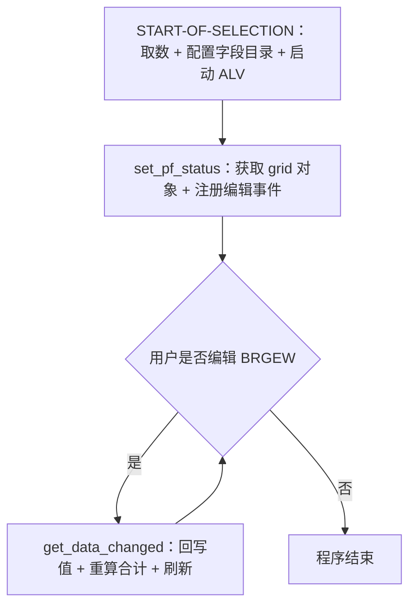
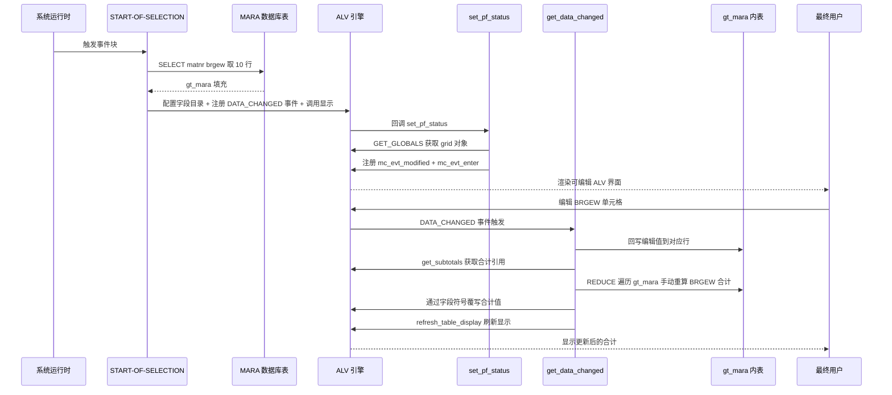

# ABAP 程序分析报告：ztest7 — 可编辑 ALV 合计动态刷新 POC

## 一、程序定位与业务背景

### 解决什么问题

在 SAP 经典 ALV Grid（`REUSE_ALV_GRID_DISPLAY` 函数模块）中，当你将某一列设为可编辑（`edit = 'X'`）同时开启合计（`do_sum = 'X'`）时，会遇到一个令人困扰的缺陷：**用户在界面上修改了单元格的值后，底部合计行不会自动更新**。原因是 ALV 引擎内部缓存了一份基于原始数据的合计值，交互式编辑仅触发 `DATA_CHANGED` 事件，但合计行本身不在该事件的自动回写范围内——合计仍然是程序启动时算出的旧值。

这个缺陷在物料重量汇总、成本估算、预算调整等"边编辑边看合计"的业务场景中极为常见。业务用户期望的体验是：改一个数字，合计立刻跟上——就像 Excel 那样。

### 现有方案为何不够

- **标准 ALV 行为**：`REUSE_ALV_GRID_DISPLAY` 不提供"编辑后自动重算合计"的内置开关。
- **OO ALV（`cl_gui_alv_grid`）**：即便用面向对象方式，合计更新仍需手动干预。
- **SALV（`cl_salv_table`）**：本身不支持内联编辑，无法直接解决此问题。

因此，开发者需要一套"拦截编辑事件 → 回写内表 → 手动覆写合计引用 → 刷新显示"的组合拳。`ztest7` 正是这套组合拳的概念验证（POC）：它用最少的代码（物料主数据 MARA 的毛重 BRGEW 字段）演示了完整的可编辑合计动态刷新链路。

### 整体设计范式定性

一句话：**事件回调驱动的合计覆写模式**——利用 `DATA_CHANGED` 事件拦截用户编辑，通过 `get_subtotals` 拿到 ALV 内部合计结构的引用句柄，用 `REDUCE` 手动重算后通过字段符号直接覆写，再 `refresh_table_display` 刷新界面。

---

## 二、程序执行流程总览

### 流程图



### 责任链表

| 子程序 | 调用者 | 职责 |
|--------|--------|------|
| `START-OF-SELECTION` | 系统运行时（事件触发） | 从 MARA 取 10 行数据，构建字段目录并将 BRGEW 设为可编辑可汇总，注册 DATA_CHANGED 事件，调用 REUSE_ALV_GRID_DISPLAY 启动 ALV 显示 |
| `set_pf_status` | REUSE_ALV_GRID_DISPLAY（PF 状态回调） | 通过 GET_GLOBALS_FROM_SLVC_FULLSCR 获取 ALV grid 对象引用，注册 mc_evt_modified 和 mc_evt_enter 两个编辑事件，处理 PF 状态按钮逻辑 |
| `get_data_changed` | REUSE_ALV_GRID_DISPLAY（DATA_CHANGED 事件回调） | 遍历修改单元格列表将编辑值回写 gt_mara，调用 get_subtotals 获取合计引用，用 REDUCE 手动重算 BRGEW 总计并覆写合计结构，刷新 ALV 显示 |

下面按这条流程，逐个子程序展开。

---

## 三、分组分析（按执行流程）

### 3.1 事件块 `START-OF-SELECTION`

本事件块是整个程序的入口，承担"取数 → 配置 → 启动"三步。它先从 MARA 捞一小批数据，接着通过 DDIC 结构 `ZTEST_S` 自动生成字段目录，再把 BRGEW 列标记为可编辑且可合计，最后注册 `DATA_CHANGED` 事件回调并启动 ALV 显示。

#### ① 从 MARA 取数

```abap
SELECT matnr,
       brgew
  FROM mara
  INTO TABLE _mara UP TO 10 ROWS.
IF sy-subrc EQ 0.
```

**做什么**
- 从 MARA 物料主数据表读取物料号（MATNR）和毛重（BRGEW）两个字段
- 限制取最多 10 行，存入内表
- 用 `sy-subrc` 判断取数是否成功，成功才继续后续流程

**为什么 / 设计点评**
- `UP TO 10 ROWS` 明确表明这是概念验证而非生产取数——用最小数据集快速演示效果，避免大量数据干扰调试
- MATNR + BRGEW 的字段组合是有意为之：物料号作为标识列不可编辑，毛重作为数值列可编辑且可合计，恰好覆盖"可编辑合计"场景的核心要素
- 数据来源选 MARA（物料主数据）而非自定义 Z 表，说明这是一个不依赖业务数据准备的通用 POC

**风险与改进**
- **🔴 变量名错误**：`INTO TABLE _mara` 中的 `_mara` 在全局声明区未声明，实际声明的内表名为 `gt_mara`。这会导致语法检查不通过或运行时 dump。应修正为 `INTO TABLE gt_mara`
- 仅用 `sy-subrc` 判断是否为空，若 MARA 完全无数据则直接跳过整个 ALV 流程，用户看不到任何提示——生产场景应给出"无数据"消息
- `UP TO 10 ROWS` 缺少 `ORDER BY`，取到的 10 行不可预期，虽然 POC 场景无妨，但若误用到生产会带来困惑

#### ② 构建并配置字段目录

```abap
CALL FUNCTION 'REUSE_ALV_FIELDCATALOG_MERGE'
  EXPORTING
    i_program_name         = sy-repid
    i_structure_name       = 'ZTEST_S'
  CHANGING
    ct_fieldcat            = gt_fieldcat
  EXCEPTIONS
    inconsistent_interface = 1
    program_error          = 2
    OTHERS                 = 3.
IF sy-subrc = 0.
  READ TABLE gt_fieldcat ASSIGNING FIELD-SYMBOL(<gs_fcat>) WITH KEY fieldname = 'BRGEW'.
  IF sy-subrc EQ 0.
    <gs_fcat>-edit = 'X'.
    <gs_fcat>-do_sum = 'X'.
  ENDIF.
```

**做什么**
- 调用 `REUSE_ALV_FIELDCATALOG_MERGE`，基于 DDIC 结构 `ZTEST_S` 自动生成字段目录存入 `gt_fieldcat`
- 检查函数调用成功后，在字段目录中按字段名 `BRGEW` 定位对应条目
- 将 BRGEW 列的 `edit` 标志设为 `X`（可编辑），`do_sum` 标志设为 `X`（参与合计）

**为什么 / 设计点评**
- 用 `REUSE_ALV_FIELDCATALOG_MERGE` + DDIC 结构而非手工逐字段构建 fieldcat，是 SAP 社区经典做法：字段标签、数据元素、对齐方式等元信息自动从 DDIC 继承，减少硬编码
- `ASSIGNING FIELD-SYMBOL` 而非 `MODIFY TABLE` 修改 fieldcat 条目，避免了"读出 → 改 → 写回"三步走，直接通过字段符号引用修改内表行，简洁高效
- `edit` + `do_sum` 两个标志同时开启，正是触发"合计不自动更新"问题的最小配置——这一步是整个 POC 的触发条件

**风险与改进**
- 如果 `ZTEST_S` 结构不存在或未激活，`REUSE_ALV_FIELDCATALOG_MERGE` 会返回非零 `sy-subrc`，外层 `IF` 会跳过整个 ALV 流程，但用户无任何错误提示
- `READ TABLE` 查找 BRGEW 若失败（结构定义与预期不符），内层 `IF` 静默跳过，ALV 虽然能显示但 BRGEW 不可编辑也不可合计——与 POC 目标相悖却无告警
- `sy-repid` 作为程序名传入在某些动态调用场景下可能不返回预期值，建议用变量缓存

#### ③ 注册事件并启动 ALV 显示

```abap
APPEND VALUE #( name = 'DATA_CHANGED' form = 'GET_DATA_CHANGED' ) TO gt_events.

CALL FUNCTION 'REUSE_ALV_GRID_DISPLAY'
  EXPORTING
    i_callback_program       = sy-repid
    it_fieldcat              = gt_fieldcat
    it_events                = gt_events
    i_callback_pf_status_set = 'SET_PF_STATUS'
  TABLES
    t_outtab                 = gt_mara.
ENDIF.
ENDIF.
```

**做什么**
- 向事件表 `gt_events` 追加一条记录：事件名 `DATA_CHANGED`，对应 FORM 名 `GET_DATA_CHANGED`
- 调用 `REUSE_ALV_GRID_DISPLAY` 启动 ALV 全屏显示，传入程序名、字段目录、事件表、PF 状态回调名
- 指定 `t_outtab = gt_mara` 作为输出数据源

**为什么 / 设计点评**
- `gt_events` 表是 `REUSE_ALV_GRID_DISPLAY` 的事件回调注册机制——通过 `name`/`form` 键值对将 ALV 内部事件映射到程序中的 FORM 例程，这是 function-based ALV 的标准扩展方式
- 同时注册 `i_callback_pf_status_set = 'SET_PF_STATUS'` 是此 POC 的关键：PF 状态回调在 ALV 初始化时被调用，正好是获取 grid 对象引用、注册编辑事件的时机——这个回调本质上被"借用"为初始化钩子
- 两个 `ENDIF` 对应前两层 `IF sy-subrc` 的嵌套，结构上保证了任一步失败即中止，避免在不完整配置下启动 ALV

**风险与改进**
- `REUSE_ALV_GRID_DISPLAY` 是 SAP 已标记为"不建议用于新开发"的传统函数模块，现代实践推荐 `cl_salv_table` 或 `cl_gui_alv_grid` 的 OO 方式
- 未传入 `i_save` 参数，用户无法保存布局变式——虽然 POC 无妨，但容易在复制到生产时遗漏
- 双层 `ENDIF` 嵌套较深，若中间步骤失败用户看不到任何诊断信息，不利于排错

---

### 3.2 FORM `set_pf_status`

`set_pf_status` 名义上是设置 PF 状态（工具栏按钮），但在这个 POC 中它的真实角色被重新定义了：**借 PF 状态回调的时机窗口，获取 ALV grid 对象的引用并注册编辑事件**。这是整个方案得以成立的基础——没有这一步，后续的 `get_data_changed` 无法拿到 grid 对象。

#### ① 获取 ALV 对象引用

```abap
FORM set_pf_status USING itr_extab TYPE slis_t_extab.

* Get the ALV Object reference
  CALL FUNCTION 'GET_GLOBALS_FROM_SLVC_FULLSCR'
    IMPORTING
      e_grid = go_grid.
  IF go_grid IS BOUND.
```

**做什么**
- FORM 头声明参数 `itr_extab`（排除按钮表，标准 PF 状态回调签名）
- 调用 `GET_GLOBALS_FROM_SLVC_FULLSCR` 从当前全屏 ALV 会话中提取内部的 `cl_gui_alv_grid` 实例引用，赋给全局变量 `go_grid`
- 检查 `go_grid IS BOUND` 确认引用有效

**为什么 / 设计点评**
- `REUSE_ALV_GRID_DISPLAY` 内部其实用的就是 `cl_gui_alv_grid`，但它把对象引用藏起来了。`GET_GLOBALS_FROM_SLVC_FULLSCR` 是 SAP 提供的"后门"函数，专门用来从全屏 ALV 中取回这个隐藏的 grid 实例——这是社区公认的惯用法
- 利用 PF 状态回调来获取 grid 引用是时机上的妙手：PF 状态回调在 ALV 首次渲染前就被调用，此时 grid 对象必然已创建且可用，保证 `IS BOUND` 为真
- 将 `go_grid` 声明为全局变量而非传参，是因为它需要在后续的 `get_data_changed` FORM 中再次使用——全局共享是 function-based ALV 事件回调架构的必然选择

**风险与改进**
- `GET_GLOBALS_FROM_SLVC_FULLSCR` 本身不返回 `sy-subrc`，若 ALV 未在全屏模式下运行（如嵌套容器），`go_grid` 可能为空，虽然 `IS BOUND` 检查能防住 dump，但后续逻辑会被静默跳过
- 全局变量 `go_grid` 的生命周期与 ALV 会话绑定，若 ALV 被关闭后 grid 对象被 GC 回收，`go_grid` 可能持有失效引用——虽然实际场景中不太会触发
- `itr_extab` 参数声明了却从未使用（PF 状态的排除按钮逻辑为空），属于死参数

#### ② 注册编辑事件

```abap
    CALL METHOD go_grid->register_edit_event
      EXPORTING
        i_event_id = cl_gui_alv_grid=>mc_evt_modified.

    CALL METHOD go_grid->register_edit_event
      EXPORTING
        i_event_id = cl_gui_alv_grid=>mc_evt_enter.
  ENDIF.
```

**做什么**
- 调用 grid 对象的 `register_edit_event` 方法，注册 `mc_evt_modified` 事件——每次单元格内容被修改（失去焦点时）即触发 `DATA_CHANGED`
- 再次调用同一方法，注册 `mc_evt_enter` 事件——用户按回车键时触发 `DATA_CHANGED`
- 两个注册完成后结束 `IF go_grid IS BOUND` 块

**为什么 / 设计点评**
- 默认情况下 OO ALV 的 `DATA_CHANGED` 仅在按回车时触发。`register_edit_event` 是 SAP 提供的显式扩展机制，允许开发者选择更多触发时机
- `mc_evt_modified` 让"修改即触发"成为可能——这是实现"合计实时刷新"体验的关键，否则用户必须每次按回车才能看到合计更新，体验大打折扣
- 同时注册 `mc_evt_enter` 是双保险：某些操作（如粘贴值后直接回车）走的是 enter 路径而非 modified 路径，两个事件都注册才能覆盖全部交互场景
- 两次调用完全独立、参数仅 `i_event_id` 不同，没有合并为循环——代码冗余但可读性好，对于两行代码来说可接受

**风险与改进**
- 无明显风险。这两个常量是 SAP 标准提供的事件 ID，调用方式是官方推荐做法
- 若未来需要注册更多编辑事件，可考虑用内表循环替代逐条调用，但当前仅两个，不必过度设计

#### ③ PF 状态处理

```abap
  " PF Status Code
  CASE sy-ucomm.
*	WHEN
    WHEN OTHERS.
  ENDCASE.
ENDFORM.
```

**做什么**
- 用 `CASE sy-ucomm` 准备处理用户命令（按钮点击）
- 目前只有一个注释掉的 `WHEN` 占位和一个 `WHEN OTHERS` 空分支
- `ENDFORM` 结束 FORM `set_pf_status`

**为什么 / 设计点评**
- 这个 `CASE` 块是 PF 状态回调的标准模板——开发者通常在这里处理自定义按钮的 `sy-ucomm` 值
- 在本 POC 中它确实没有实际逻辑，但保留框架说明作者有意将其作为可扩展的扩展点，而非遗漏
- 注释掉的 `*WHEN` 是 ABAP 社区常见的"留个坑"写法，提示后续开发者在此添加按钮处理

**风险与改进**
- 空的 `CASE ... WHEN OTHERS ... ENDCASE` 是死代码，编译器不报错但毫无意义。若确定不需要按钮逻辑，应直接删除整个 `CASE` 块
- 缺少 `SET PF STATUS` 语句——通常 PF 状态回调中应调用 `SET PF-STATUS` 来实际设置状态栏。此程序未设置自定义状态栏，意味着使用的是标准 ALV 默认状态，这对 POC 足够但生产可能需要自定义按钮（如"保存"）

---

### 3.3 FORM `get_data_changed`

这是整个 POC 的核心——每当用户编辑 BRGEW 单元格时，这个 FORM 就被 ALV 引擎回调。它完成三件事：把编辑后的值回写到 `gt_mara` 内表、通过 `get_subtotals` 拿到 ALV 内部合计结构引用并手动重算、刷新显示让合计行更新。如果没有这个 FORM，编辑后的合计永远是旧值。

#### ① 回写编辑值到内表

```abap
FORM get_data_changed USING io_data_changed TYPE REF TO cl_alv_changed_data_protocol.

  IF go_grid IS BOUND.

    LOOP AT io_data_changed->mt_mod_cells ASSIGNING FIELD-SYMBOL(<gs_changed>) WHERE fieldname = 'BRGEW'.
      READ TABLE gt_mara ASSIGNING FIELD-SYMBOL(<gs_tab>) INDEX <gs_changed>-row_id.
      IF sy-subrc EQ 0.
        <gs_tab>-brgew = <gs_changed>-value.
      ENDIF.
    ENDLOOP.
```

**做什么**
- FORM 头声明参数 `io_data_changed`——这是 ALV 引擎传入的变更数据协议对象，包含所有被修改的单元格信息
- 检查 `go_grid` 已绑定后开始处理
- 遍历 `io_data_changed->mt_mod_cells`（修改单元格列表），筛选字段名为 `BRGEW` 的条目
- 对每个修改的单元格，用 `row_id`（行索引）在 `gt_mara` 中定位对应行
- 将编辑后的新值 `<gs_changed>-value` 写入 `gt_mara` 对应行的 `brgew` 字段

**为什么 / 设计点评**
- `mt_mod_cells` 是 `cl_alv_changed_data_protocol` 的公开属性，存放本次编辑产生的所有变更记录——直接遍历它比逐行扫描内表高效得多
- `WHERE fieldname = 'BRGEW'` 的过滤条件很关键：如果未来 ALV 有多个可编辑列，这个 FORM 只关心 BRGEW 的变更，避免误改其他字段
- 使用 `ASSIGNING FIELD-SYMBOL` 而非 `MODIFY TABLE` 写回，直接通过引用修改内表行——这在 `LOOP` 内部是推荐做法，避免 `MODIFY` 带来的额外开销和索引管理
- `READ TABLE ... INDEX <gs_changed>-row_id` 的 `row_id` 是 ALV 内部行号，它和 `gt_mara` 的行索引一致（因为 ALV 的数据源就是 `gt_mara`），所以可以直接用索引定位

**风险与改进**
- **🟠 类型风险**：`<gs_changed>-value` 的类型是 `char128`（通用字符容器），而 `gt_mara-brgew` 是数值类型。直接赋值依赖 ABAP 的隐式类型转换，若用户输入非数字字符（如字母或空字符串），转换行为不可预期——应使用 `io_data_changed->get_cell_value` 或做显式校验
- 若 ALV 启用了排序或过滤，`row_id` 可能与 `gt_mara` 的物理行号不一致，导致回写错行——本 POC 未启用排序过滤所以安全，但生产场景需警惕
- `READ TABLE` 失败时（`sy-subrc <> 0`）静默跳过，无任何日志——生产场景应记录异常

#### ② 获取合计引用并手动重算

```abap
    go_grid->get_subtotals(
      IMPORTING
        ep_collect00 = gr_data   " Overall Total
    ).

    ASSIGN gr_data->* TO <gtr_sum_tab>.
    READ TABLE <gtr_sum_tab> ASSIGNING FIELD-SYMBOL(<l_sum>) INDEX 1.
    IF sy-subrc EQ 0.
      ASSIGN COMPONENT 'BRGEW' OF STRUCTURE <l_sum> TO FIELD-SYMBOL(<lg_val>).
      IF <lg_val> IS ASSIGNED.
        <lg_val> = REDUCE #( INIT lv_i TYPE ntgew_15 FOR <ls_t> IN gt_mara NEXT lv_i = lv_i + <ls_t>-brgew ).
      ENDIF.
    ENDIF.
```

**做什么**
- 调用 grid 对象的 `get_subtotals` 方法，获取整体合计（`ep_collect00`）的数据引用赋给 `gr_data`
- 将 `gr_data` 指向的匿名数据解引用为内表，赋给字段符号 `<gtr_sum_tab>`
- 读取合计内表第 1 行（整体合计行），赋给 `<l_sum>`
- 用 `ASSIGN COMPONENT 'BRGEW'` 从合计行结构中定位 BRGEW 字段，赋给 `<lg_val>`
- 用 `REDUCE` 操作符遍历 `gt_mara` 全部行，累加每行的 `brgew` 值，将结果直接写入 `<lg_val>`（即覆写合计行中的 BRGEW 值）

**为什么 / 设计点评**
- 这是整个方案的精髓所在：`get_subtotals` 返回的不是合计值的副本，而是**指向 ALV 内部合计数据结构的引用**。通过字段符号层层解引用后直接写入，等于绕过 ALV 引擎的缓存逻辑，从内部"篡改"了合计值——下次刷新时 ALV 会读取这个被覆写后的值
- `ep_collect00` 是"整体合计"（Overall Total），对应 ALV 界面最底部的那一行合计；如果有多级小计，还有 `ep_collect01`、`ep_collect02` 等，这里只取最高级
- `REDUCE` 操作符是 ABAP 7.40+ 的构造表达式，用一行代码完成传统 `LOOP ... ADD` 的累加逻辑——简洁且声明式，适合这种纯计算场景
- 累加类型用 `ntgew_15`（净重数据元素，15 位小数），与 BRGEW 的语义类型一致，避免精度损失
- 层层 `IF` 保护（`sy-subrc` 检查 + `IS ASSIGNED` 检查）体现了防御性编程意识，每一步引用操作前都确认上一步成功

**风险与改进**
- **🟠 合计引用空值风险**：`get_subtotals` 返回的 `gr_data` 可能为 `INITIAL`（若 ALV 未计算合计或 `do_sum` 未生效），后续 `ASSIGN gr_data->*` 会触发 `GETWA_NOT_ASSIGNED` dump——应在 `ASSIGN` 前检查 `gr_data IS BOUND` 或 `gr_data IS NOT INITIAL`
- **🟠 合计行索引假设**：`READ TABLE <gtr_sum_tab> INDEX 1` 假设合计内表至少有一行。若合计结构为空（例如所有 BRGEW 值为初始值导致 ALV 未生成合计行），此 `READ` 失败但被 `sy-subrc` 拦住——虽然不 dump，但合计不会被更新，用户看到的仍是旧值且无任何报错
- `REDUCE` 遍历整个 `gt_mara` 每次编辑都全量重算——10 行数据无碍，但若 POC 被误用到大数据量场景（数千行），每次单元格编辑都触发全表扫描会造成明显卡顿
- `ASSIGN COMPONENT 'BRGEW'` 按名称定位字段依赖合计结构确实包含 BRGEW 列——这在 `do_sum = 'X'` 时通常成立，但 ALV 内部结构在不同版本/补丁中可能有差异，属于隐性耦合

#### ③ 刷新显示

```abap
    gs_stable-col = 'X'.
    gs_stable-row = 'X'.

    go_grid->refresh_table_display(
      EXPORTING
        is_stable      = gs_stable      " With Stable Rows/Columns
        i_soft_refresh = 'X'            " Without Sort, Filter, etc.
      EXCEPTIONS
        finished       = 1              " Display was Ended (by Export)
        OTHERS         = 2
    ).
    IF sy-subrc <> 0.
    ENDIF.

  ENDIF.

ENDFORM.                    "get_data_changed
```

**做什么**
- 设置 `gs_stable` 的行和列标志均为 `X`——告诉 ALV 刷新时保持当前滚动位置和列位置不变
- 调用 grid 对象的 `refresh_table_display`，传入 `is_stable`（稳定行列）和 `i_soft_refresh = 'X'`（软刷新，不重排序、不过滤）
- 检查 `sy-subrc` 是否非零（理论上刷新被中断时返回 1），但 `IF` 块为空——不处理任何异常
- 结束 `IF go_grid IS BOUND` 块和整个 FORM

**为什么 / 设计点评**
- `is_stable` 是刷新体验的关键：没有它，每次编辑后 ALV 会跳回顶部左角，用户完全失去上下文。设置 `row = 'X'` 和 `col = 'X'` 确保"改第 5 行合计刷新后还在第 5 行"
- `i_soft_refresh = 'X'` 同样重要：它告诉 ALV "只更新数据和合计，不要重新排序、重新过滤、重新计算布局"——这既快又不会打乱用户当前的视图状态
- 这一步是"覆写合计"生效的最后一步：前面的 `REDUCE` 覆写的是 ALV 内部数据结构，但屏幕上显示的仍是旧渲染结果；只有 `refresh_table_display` 触发后，ALV 才会重新读取内部数据并重绘界面，合计行才真正更新
- 空 `IF sy-subrc <> 0` 块是明显的占位——作者知道这里可能有异常（如用户在刷新时导出数据导致中断），但选择不处理

**风险与改进**
- **🟡 空 IF 块**：`IF sy-subrc <> 0` 后什么也不做，是死代码。要么加错误处理逻辑（如记日志或给用户消息），要么直接删除这个 `IF` 块
- `i_soft_refresh = 'X'` 在某些 ALV 版本中可能与 `get_subtotals` 的合计覆写有微妙的交互——软刷新是否一定会重绘合计行取决于 ALV 内部实现，这在 SAP Note 中有讨论但无官方保证
- 刷新是同步调用，若内表很大或网络延迟（GUI → 应用服务器往返），用户会感受到短暂卡顿——POC 无碍，生产场景可考虑异步或节流

---

## 四、执行流程全景图（数据视角）



从全景图可以清晰看到数据的完整闭环：MARA → gt_mara → ALV 显示 → 用户编辑 → DATA_CHANGED 回调 → 回写 gt_mara → 手动重算合计 → 覆写 ALV 内部合计引用 → 刷新 → 用户看到新合计。其中"回写 + 重算 + 覆写"这三步正是标准 ALV 缺失的环节，也是本 POC 的核心贡献。

---

## 五、问题清单与改进建议（按优先级）

### 🔴 P0 — 业务正确性

| 编号 | 所在子程序 | 问题 | 改进建议 |
|------|-----------|------|---------|
| P0-1 | `START-OF-SELECTION` | `INTO TABLE _mara` 变量名错误：全局声明区声明的内表为 `gt_mara`，但 SELECT 写入 `_mara`，此变量未声明，会导致语法错误或运行时 dump | 将 `_mara` 改为 `gt_mara` |
| P0-2 | `get_data_changed` | `ASSIGN gr_data->* TO <gtr_sum_tab>` 前未检查 `gr_data` 是否为 `INITIAL`。若 `get_subtotals` 未返回有效引用（如合计未生成），此语句会触发 `GETWA_NOT_ASSIGNED` dump | 在 `ASSIGN` 前加 `IF gr_data IS BOUND` 守卫 |

### 🟠 P1 — 健壮性

| 编号 | 所在子程序 | 问题 | 改进建议 |
|------|-----------|------|---------|
| P1-1 | `get_data_changed` | `<gs_changed>-value`（`char128`）直接赋值给数值字段 `brgew`，依赖隐式类型转换。用户输入非数字字符时行为不可预期 | 使用 `io_data_changed->get_cell_value` 方法获取已类型转换的值，或在赋值前做 `NUMERIC_CHECK` 校验 |
| P1-2 | `get_data_changed` | `READ TABLE <gtr_sum_tab> INDEX 1` 假设合计行存在。若所有 BRGEW 为初始值且 ALV 未生成合计行，此 READ 失败后静默跳过，合计不更新但无报错 | 失败时应记录日志或给用户提示"合计刷新失败" |
| P1-3 | `get_data_changed` | 若 ALV 启用了排序/过滤，`<gs_changed>-row_id` 可能与 `gt_mara` 物理行号不一致，导致回写错行 | 本 POC 未启用排序过滤所以安全；生产场景应通过 `io_data_changed->get_row_id` 获取逻辑行号再做映射 |

### 🟡 P2 — 性能与规范

| 编号 | 所在子程序 | 问题 | 改进建议 |
|------|-----------|------|---------|
| P2-1 | 全局声明区 / 整体 | 使用已废弃的 `REUSE_ALV_GRID_DISPLAY` + `TYPE-POOLS: slis` 函数式 ALV，SAP 不建议用于新开发 | 现代实践推荐 `cl_gui_alv_grid` OO 方式或 `cl_salv_table`（后者不支持编辑，需 OO ALV） |
| P2-2 | `set_pf_status` | `CASE sy-ucomm ... WHEN OTHERS ... ENDCASE` 为空逻辑死代码，无任何分支处理 | 若不需要自定义按钮逻辑则删除整个 CASE 块；若需要则在 WHEN 中补充 `SET PF-STATUS` |
| P2-3 | `get_data_changed` | 末尾 `IF sy-subrc <> 0` 块体为空，是死代码占位 | 补充错误处理（记日志或 `MESSAGE`）或删除该 IF 块 |
| P2-4 | `get_data_changed` | 每次 `DATA_CHANGED` 都用 `REDUCE` 全量遍历 `gt_mara` 重算合计。10 行无碍，但若误用于大数据量场景每次编辑触发全表扫描 | 可缓存上一次合计值，采用增量更新（旧值减去旧单元格值加上新单元格值）；或限制 POC 使用范围并加注释说明 |

### 🟢 P3 — 可扩展性

| 编号 | 所在子程序 | 问题 | 改进建议 |
|------|-----------|------|---------|
| P3-1 | `START-OF-SELECTION` | 所有逻辑（取数、配置、启动）堆在单个事件块中，无模块化拆分 | 抽取为 `PERFORM get_data`、`PERFORM build_fieldcat`、`PERFORM display_alv` 等子例程，提升可测试性和可读性 |
| P3-2 | 全局声明区 | 全局变量（`gt_mara`、`go_grid`、`gr_data` 等）无封装，跨 FORM 共享依赖隐式约定 | 若迁移到 OO ALV，可将这些变量封装为类的实例属性；function-based 架构下至少应添加注释说明共享约定 |
| P3-3 | `get_data_changed` | 合计重算逻辑硬编码了字段名 `BRGEW`，若未来需支持多列可编辑合计则需修改 FORM 内部 | 可参数化字段名或设计通用回调，根据 `mt_mod_cells` 中出现的字段名动态重算对应列合计 |

---

## 六、整体评价与启发

### 优点

1. **精准定位痛点**：程序虽小（约 115 行），但准确抓住了"可编辑 ALV 合计不更新"这个 SAP 社区高频痛点，并用最小可行代码演示了完整解法——这是高质量 POC 的核心价值
2. **时机设计巧妙**：借用 `set_pf_status` 回调的时机窗口获取 grid 对象引用并注册编辑事件，是在 function-based ALV 架构约束下的优雅变通——不引入额外事件、不修改 ALV 调用方式，"顺手"完成了初始化
3. **合计覆写思路精髓**：`get_subtotals` 返回的是 ALV 内部合计结构的**引用**而非副本，通过字段符号直接覆写——这是理解 ALV 内部机制后才能想到的方案，比"重建 ALV"或"放弃 do_sum 手动画合计行"等替代方案优雅得多
4. **防御性编码意识**：关键引用操作前都有 `IS BOUND` / `sy-subrc` / `IS ASSIGNED` 守卫，体现了对运行时 dump 的警觉

### 短板

1. **变量名笔误**（`_mara` vs `gt_mara`）是最致命的硬伤——作为 POC 这说明缺少最基本的语法检查或测试运行
2. **`gr_data` 空引用风险**未防护，在合计未生成的边界条件下会 dump
3. **多处死代码**（空 CASE、空 IF）降低了代码的信噪比，给人"半成品"印象
4. **无任何用户反馈机制**——取数失败、字段目录构建失败、合计刷新失败都是静默跳过，调试和生产场景都难以排错

### 可学到的设计经验

1. **理解框架内部才能突破框架限制**：这个 POC 的核心思路——"通过 `get_subtotals` 拿到内部引用再覆写"——只有理解了 ALV 内部用 `cl_gui_alv_grid` 且合计以数据引用形式存放的开发者才能想到。**框架的约束往往不是绝对的，而是"公开 API 层面"的约束；理解内部机制后可以找到合法的后门**
2. **回调钩子可以承担多重职责**：`set_pf_status` 名义上是设置工具栏，实际被借用来做 grid 引用获取和事件注册——这是在"无法修改框架调用方式"约束下的常见变通模式：**找到必然被调用的回调，在它里面做更多初始化**
3. **引用覆写 vs 值重建**：面对"缓存不更新"问题，有两条路——重建整个缓存（让 ALV 重新计算合计）或覆写缓存中的值（直接改合计引用）。本 POC 选择了后者，因为前者在 function-based ALV 中几乎不可能实现（没有"强制重算合计"的公开 API）。**选择覆写而非重建，是在约束下的正确工程判断**
4. **POC 的价值在于暴露问题而非解决问题**：这个程序暴露了类型转换风险、空引用风险、死代码习惯等问题——这些都是从 POC 走向生产时必须补齐的。一个好的 POC 不需要解决所有问题，但应该让人看清"这条路通不通"以及"通的路上有哪些坑"
