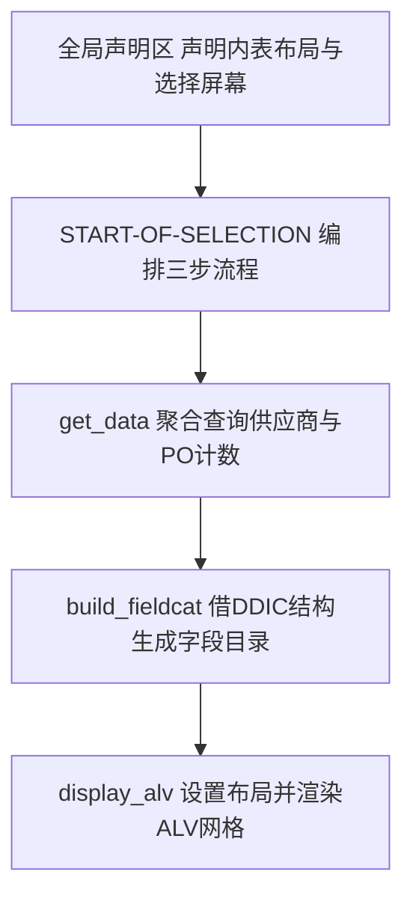
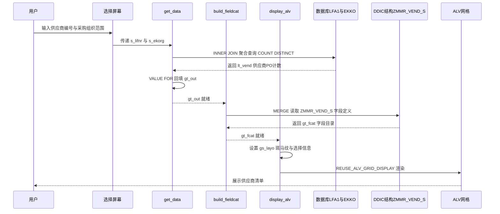

# zmmr_vend_list 程序走读报告

> 走读对象：报表程序 `zmmr_vend_list`（供应商清单 ALV 报表）
> 分析依据：源文件 `zmmr_vend_list.abap`

---

## 一、程序定位与业务背景

这是一个 **MM 模块的供应商清单报表**，解决的核心业务问题是：**采购员/采购主管需要在给定供应商编号范围与采购组织范围内，快速看到"每个供应商开了多少张采购订单"，用以评估供应商活跃度、对账与筛选重点合作对象。**

现有方案（手工 SE16N 分别查 LFA1 与 EKKO 再 VLOOKUP 透视）为何不够：

- LFA1 只给供应商主数据，看不到 PO 维度的"活跃度"；
- EKKO 是订单抬头，按供应商手工 COUNT 既慢又易错；
- 没有一屏式、可排序、可导出的清单视图。

本程序用一条聚合 SQL + ALV 把这件事一次做完，是典型的"取数-装配-展示"三段式过程报表。

整体设计范式一句话定性：**经典过程式 ABAP 报表，采用 REUSE_ALV_* 老式函数族 + DDIC 结构驱动字段目录，逻辑分层清晰但依赖全局共享状态与 STOP 隐式控制流。**

---

## 二、程序执行流程总览



| 子程序 | 调用者 | 职责 |
|---|---|---|
| 全局声明区 | ABAP 运行时（加载阶段） | 声明输出内表、字段目录、布局结构与选择屏幕区间 |
| START-OF-SELECTION | ABAP 运行时（事件触发） | 编排 get_data → build_fieldcat → display_alv 三步 |
| get_data | START-OF-SELECTION | INNER JOIN LFA1/EKKO 聚合统计供应商 PO 计数，回填 gt_out |
| build_fieldcat | START-OF-SELECTION | 借 DDIC 结构 ZMMR_VEND_S 生成 ALV 字段目录 |
| display_alv | START-OF-SELECTION | 设置斑马纹布局并渲染 ALV 网格 |

下面按这条流程，逐个子程序展开。

---

## 三、分组分析

### 3.1 声明区 `全局声明区`

全局声明区在程序加载阶段先行处理，是后续三个 FORM 共享状态的根基，先看数据声明部分。

#### ① 报表声明、类型池与全局数据对象

```abap
REPORT zmmr_vend_list.
TYPE-POOLS: slis.

TABLES: lfa1, ekko.

DATA: gt_out  TYPE TABLE OF zmmr_vend_s,
      gt_fcat TYPE slis_t_fieldcat_alv,
      gs_layo TYPE slis_layout_alv.
```

**做什么**

- 声明报表名 `zmmr_vend_list`，引入 `slis` 类型池；
- 声明表工作区 `lfa1`、`ekko`，供后续 SELECT-OPTIONS 的 `FOR` 参照；
- 声明三个全局数据对象：输出内表 `gt_out`（行类型为自定义结构 `zmmr_vend_s` 的表）、字段目录内表 `gt_fcat`、布局结构 `gs_layo`。

**为什么**

- `TYPE-POOLS: slis` 是 REUSE_ALV_* 函数族（字段目录、布局类型都定义在 SLIS）的必备依赖，老式 ALV 的"入场券"。
- `TABLES` 在这里并非要做表工作区操作，纯粹是为了让 SELECT-OPTIONS 的 `FOR lfa1-lifnr` 能取到 DDIC 字段元素描述（标签、检查表、转换例程），是 ABAP 报表的惯用写法。
- 三个全局对象集中在顶部声明，便于三个 FORM 隐式共享，是经典过程式 ABAP 的"共享状态"风格——简单，但耦合也由此而生。

**风险与改进**

- 全局可变状态 `gt_out`/`gt_fcat`/`gs_layo` 被多个 FORM 隐式共享，形成隐式数据耦合：某个 FORM 的成功依赖另一个 FORM 先把状态填好，难以独立单元测试与推理。若改面向对象，可用实例属性或显式参数传递让数据流可见。
- `gt_out` 行类型是 `zmmr_vend_s` 的 `TABLE OF`，而后面 `build_fieldcat` 又用字符串 `'ZMMR_VEND_S'` 走 DDIC——存在"行类型名"与"DDIC 结构名"同名的隐含双重维护，结构字段变更时必须两处同步，否则列错位或 dump。

#### ② 选择屏幕区间定义

```abap
SELECT-OPTIONS: s_lifnr FOR lfa1-lifnr,
                s_ekorg FOR ekko-ekorg.
```

**做什么**

- 定义两个选择屏幕区间：`s_lifnr`（供应商编号，参照 LFA1-LIFNR）与 `s_ekorg`（采购组织，参照 EKKO-EKORG），均支持区间、多值、排除等复合条件。

**为什么**

- SELECT-OPTIONS 比 PARAMETERS 更灵活，天然支持 BETWEEN、IN 列表、EXCLUDE，符合报表筛选的常见诉求。
- `FOR` 参照 DDIC 字段，自动带出字段标签、检查表与搜索帮助（F4），减少手工编码。

**风险与改进**

- 未加 `SELECTION-SCREEN` 屏幕修饰（BLOCK、注释、`OBLIGATORY`），用户可能两个条件都空跑全量。对 LFA1/EKKO 这类大表，全量 INNER JOIN 聚合是性能灾难。建议至少一个区间设 `OBLIGATORY`，或在 `AT SELECTION-SCREEN` 做强制校验。
- `s_ekorg` 参照 EKKO-EKORG 但实际是供应商维度的过滤——若用户不填 ekorg，INNER JOIN 会扫描全 EKKO，风险放大。

声明区奠定了共享状态与筛选输入，接下来进入事件块看流程如何编排。

### 3.2 事件块 `START-OF-SELECTION`

`START-OF-SELECTION` 是报表执行入口，决定整条流程的调用顺序，是理解程序行为的关键骨架。

```abap
START-OF-SELECTION.
  PERFORM get_data.
  PERFORM build_fieldcat.
  PERFORM display_alv.
```

**做什么**

- 在报表执行入口事件块中，按顺序调用三个 PERFORM：先 `get_data` 取数，再 `build_fieldcat` 构字段目录，最后 `display_alv` 渲染网格。

**为什么**

- 三步顺序清晰，是经典的"取数-装配-展示"分层，职责单一易读。
- 把逻辑拆到独立 FORM 而非全堆在事件块里，便于复用与单步推理，是过程式报表的良好实践。

**风险与改进**

- 顺序硬编码，且 `get_data` 内部用 `STOP` 控制后续流程——这是"靠副作用控制流程"的隐式写法：调用者从 `PERFORM get_data.` 这一行完全看不出它可能不返回、可能终止整个报表。建议让 `get_data` 返回标志位（如 `lv_subrc` 或布尔返回），由调用者显式决定是否继续，使控制流可见。
- 没有异常处理框架，任一 FORM 里的 `MESSAGE TYPE 'E'` 会直接终止，缺少统一的错误汇总与日志出口。

事件块把三步串起来后，真正干活的是三个 FORM。按调用顺序，先进入取数环节。

### 3.3 FORM `get_data`

`get_data` 是报表的数据核心，分两步：先用聚合 SQL 一次性把"供应商 + PO 计数"取到内联内表，再判断有没有数据决定回填还是终止。这是整段程序最值得细看的逻辑。

#### ① 聚合查询供应商与 PO 计数

```abap
FORM get_data.
  SELECT a~lifnr,
         a~name1,
         COUNT( DISTINCT b~ebeln ) AS po_cnt
    FROM lfa1 AS a
    INNER JOIN ekko AS b ON a~lifnr = b~lifnr
    WHERE a~lifnr IN @s_lifnr
      AND b~ekorg IN @s_ekorg
      AND b~bstyp = 'F'
    GROUP BY a~lifnr, a~name1
    INTO TABLE @DATA(lt_vend).
```

**做什么**

- 从 `lfa1`（供应商主数据）`INNER JOIN` `ekko`（采购订单抬头），用选择屏幕的供应商编号区间 `s_lifnr` 与采购组织区间 `s_ekorg` 过滤，并限定 `bstyp = 'F'`（仅标准采购订单）；
- 按 `lifnr`、`name1` 分组，用 `COUNT( DISTINCT ebeln )` 统计每个供应商的采购订单数量；
- 结果用 `INTO TABLE @DATA(lt_vend)` 内联声明为局部内表 `lt_vend`。

**为什么**

- 用 `INNER JOIN` 而非 `LEFT OUTER JOIN`，业务意图是只展示"有采购订单"的供应商，聚焦活跃供应商，与"评估活跃度"的目标一致。
- `COUNT( DISTINCT ebeln )` 去重统计订单数，避免重复抬头导致虚高计数，符合业务语义。
- `bstyp = 'F'` 过滤掉询价（A）、报价（B）、计划协议（L）等类型，只看正式采购订单，口径清晰。
- 聚合直接在数据库层完成（`GROUP BY` + `COUNT`），不把明细拉到应用层再 LOOP 累加，是性能友好的做法。
- `INTO TABLE @DATA(...)` 内联声明，符合现代 ABAP（7.40+）风格，减少全局声明负担，作用域局部化。

**风险与改进**

- `INNER JOIN` 会遗漏完全没有采购订单的供应商。若业务需求是"列出所有供应商及其 PO 数（含为 0 的）"，此处结果不正确，应改 `LEFT OUTER JOIN` 并用 `COUNT( DISTINCT b~ebeln )` 自动处理 NULL（无匹配时计数为 0）。**这是潜在的业务正确性问题，需与业务方确认口径。**
- 当 LFA1/EKKO 数据量巨大且 `s_ekorg` 条件宽松时，聚合会做全表扫描；应确保 EKKO 上有 `lifnr + ekorg + bstyp` 的复合索引支撑，否则响应慢。
- 没有对结果集做 `TOP N` 限制或分页，极端情况下返回行数可能过大，拖累 ALV 渲染与内存。

#### ② 结果回填与空结果处理

```abap
  IF sy-subrc = 0.
    gt_out = VALUE #( FOR ls IN lt_vend
                      ( lifnr = ls-lifnr name1 = ls-name1 po_cnt = ls-po_cnt ) ).
  ELSE.
    MESSAGE '无符合条件的供应商' TYPE 'I'.
    STOP.
  ENDIF.
ENDFORM.
```

**做什么**

- 检查 `sy-subrc`：若为 0（有数据），用 `VALUE #( FOR ... )` 构造表达式把 `lt_vend` 逐行映射到全局内表 `gt_out`（行类型 `zmmr_vend_s`）；若非 0（无数据），弹信息"无符合条件的供应商"并 `STOP` 终止报表。

**为什么**

- `sy-subrc` 检查是 ABAP 取数的标准防御，避免空表流入后续 ALV 渲染出"幽灵空表"。
- 用 `VALUE #( FOR ... )` 构造表达式而非 `LOOP ... APPEND`，更声明式、更紧凑，是现代 ABAP 推荐写法。
- `STOP` 终止流程，保证无数据时不渲染空 ALV，给用户明确的"无结果"反馈。

**风险与改进**

- `MESSAGE TYPE 'I'` 是信息弹窗，会打断流程且必须用户确认；若希望更友好，可用 `TYPE 'S'`（成功消息，状态栏显示）或干脆渲染空 ALV + 顶部文案，体验更顺。
- `STOP` 在新版 ABAP 中已不推荐，建议用 `RETURN` 或 `CHECK sy-subrc = 0` 早期返回——`STOP` 会触发一些遗留事件行为，且让控制流更显式。
- 这一步本质是"搬运"：把 `lt_vend` 映射到 `gt_out`。若 `lt_vend` 字段名与 `zmmr_vend_s` 一致，可直接 `SELECT ... INTO TABLE @gt_out` 跳过中间表与映射，少一次内存拷贝；或用 `CORRESPONDING` 让字段映射更显式可维护。

取数完成后，进入字段目录装配环节，为 ALV 渲染做准备。

### 3.4 FORM `build_fieldcat`

`build_fieldcat` 负责装配 ALV 字段目录，逻辑紧凑，单块呈现。

```abap
FORM build_fieldcat.
  CALL FUNCTION 'REUSE_ALV_FIELDCATALOG_MERGE'
    EXPORTING
      i_structure_name = 'ZMMR_VEND_S'
    CHANGING
      ct_fieldcat     = gt_fcat.
  IF sy-subrc <> 0.
    MESSAGE '字段目录生成失败' TYPE 'E'.
  ENDIF.
ENDFORM.
```

**做什么**

- 调用标准函数 `REUSE_ALV_FIELDCATALOG_MERGE`，传入 DDIC 结构名 `ZMMR_VEND_S`，函数读取该结构的字段定义自动生成 ALV 字段目录，回填到全局内表 `gt_fcat`；
- 若 `sy-subrc` 不为 0（生成失败），抛错误消息 `TYPE 'E'` 终止报表。

**为什么**

- 用 DDIC 结构驱动字段目录，字段标签、长度、引用表都由数据字典集中维护，避免在代码里逐条硬编码 `slis_fieldcat_alv`，是 ALV 字段目录的业界最佳实践之一——改结构即改 ALV，单一数据源。
- 相比手动 `APPEND` 字段目录，代码量小、可维护性高，且字段属性与 DDIC 自动对齐，不易漂移。
- `sy-subrc` 检查保证字段目录失败时立即终止，不让残缺目录流入渲染导致列错乱。

**风险与改进**

- `REUSE_ALV_FIELDCATALOG_MERGE` 基于结构名，要求 DDIC 中 `ZMMR_VEND_S` 存在且与 `gt_out` 行类型（同为 `zmmr_vend_s`）字段对齐——这是"行类型名"与"DDIC 结构名"同名的隐含耦合，结构变更必须两处同步（声明区 + 此处字符串），重构时易遗漏。
- 这是老式 ALV（REUSE_ALV_*）函数范式，SAP 推荐新代码用 `CL_SALV_TABLE`（一行生成、OO 可扩展）或 `CL_GUI_ALV_GRID`（全功能容器 ALV），便于扩展排序、过滤、布局保存等。
- 无字段级微调能力（如隐藏某列、改标题、设热点）：若需要，得在 merge 后再 `LOOP gt_fcat` 逐字段修改，目前未做。

字段目录就绪后，最后一步是设置布局并把数据交给 ALV 渲染。

### 3.5 FORM `display_alv`

`display_alv` 负责布局设置与最终渲染，逻辑紧凑，单块呈现。

```abap
FORM display_alv.
  gs_layo-zebra = 'X'.
  gs_layo-get_sel_info = 'X'.
  CALL FUNCTION 'REUSE_ALV_GRID_DISPLAY'
    EXPORTING
      is_layout   = gs_layo
      it_fieldcat = gt_fcat
    TABLES
      t_outtab    = gt_out.
ENDFORM.
```

**做什么**

- 设置布局：`zebra = 'X'` 开启斑马纹（隔行底色），`get_sel_info = 'X'` 让 ALV 获取选择屏幕信息（导出时带筛选条件）；
- 调用 `REUSE_ALV_GRID_DISPLAY`，传入布局 `gs_layo` 与字段目录 `gt_fcat`，以 `gt_out` 为数据表渲染 ALV 网格。

**为什么**

- 斑马纹提升大数据量下的可读性，隔行底色让眼睛不跳行，是默认该开的友好项。
- `get_sel_info` 让用户导出/打印时能带筛选条件，符合报表可追溯的实践。
- 直接把 `gt_out` 传出，不重新构造数据，简单直接。

**风险与改进**

- 未设置布局变式（`is_variant` / `i_save`），用户自定义布局无法持久化，下次进来又得重排，体验打折。
- 未传 `i_callback_program` 与 `user_command` 回调，无法双击行跳转 ME23N 等事务查看订单详情，扩展性受限——对一个"供应商 + PO 计数"报表，双击下钻是很自然的诉求。
- `REUSE_ALV_GRID_DISPLAY` 调用后未检查 `sy-subrc`，渲染失败会 dump 或静默无显示，缺最后一道防御。
- 用老式函数 ALV，新项目建议 `CL_SALV_TABLE` 一行调用且 OO 可扩展，或 `CL_GUI_ALV_GRID` 做全功能容器。

至此三个 FORM 走完，数据从数据库经聚合到内表、经字段目录装配、最终在 ALV 网格落地。下面用一张时序图把这条数据流转串起来。

---

## 四、执行流程全景图（数据视角）



数据从选择屏幕出发，经数据库聚合落入 `gt_out`，再借 DDIC 结构生成字段目录，最终在 ALV 网格呈现给用户——这条链路清晰但全部依赖全局状态传递。最后汇总跨子程序的问题与整体评价。

---

## 五、问题清单与改进建议（按优先级）

### 🔴 P0 — 业务正确性

- **`get_data`**：`INNER JOIN` 会遗漏完全没有采购订单的供应商。若业务口径是"所有供应商含 0 计数"，当前结果不正确，应改 `LEFT OUTER JOIN`。**需与业务方确认"是否包含无 PO 供应商"这一口径。**
- **`build_fieldcat` + 全局声明区**：`gt_out` 行类型 `zmmr_vend_s` 与 `i_structure_name = 'ZMMR_VEND_S'` 同名隐式耦合，结构字段变更若只改一处，ALV 列错位甚至 dump。建议用常量统一管理结构名，或让 SELECT 直接 `INTO TABLE @gt_out` 消除中间表。

### 🟠 P1 — 健壮性

- **`START-OF-SELECTION`**：依赖 `get_data` 内部 `STOP` 控制后续流程，隐式控制流难以推理。建议 `get_data` 返回标志位，由调用者显式决定是否继续。
- **`display_alv`**：`REUSE_ALV_GRID_DISPLAY` 调用后未检查 `sy-subrc`，渲染失败无处理。
- **全局声明区**：全局可变状态多 FORM 共享，隐式耦合，难独立测试。OO 重构可显式化数据流。

### 🟡 P2 — 性能与规范

- **`get_data`**：大表无索引支撑时 INNER JOIN 聚合慢；无结果集上限。建议确保 EKKO 有 `lifnr+ekorg+bstyp` 复合索引，并考虑分页或 `UP TO N ROWS`。
- **`build_fieldcat` / `display_alv`**：用老式 `REUSE_ALV_*` 函数族，SAP 推荐 `CL_SALV_TABLE` / `CL_GUI_ALV_GRID`。
- **全局声明区（选择屏幕）**：无 `OBLIGATORY`/校验，用户可空跑全量，对大表是灾难。建议加必填或 `AT SELECTION-SCREEN` 校验。

### 🟢 P3 — 可扩展性

- **`display_alv`**：无布局变式保存（`i_save`/`is_variant`），无 `user_command` 回调（无法双击跳转 ME23N）。建议补回调与变式，提升交互。
- **`build_fieldcat`**：无字段级微调能力，需 merge 后再 `LOOP gt_fcat` 修改，目前未做。
- **`get_data`**：`STOP` 已不推荐，建议 `RETURN` 或 `CHECK` 早期返回，使控制流现代化。

---

## 六、整体评价与启发

**优点**

- **分层清晰**：取数-装配-展示三段式，每个 FORM 职责单一，易读易改，是过程式报表的范本骨架。
- **DDIC 驱动字段目录**：用结构名驱动而非硬编码列属性，结构变更一处生效，维护性好。
- **聚合下推数据库**：`GROUP BY` + `COUNT( DISTINCT )` 在 DB 层完成，不把明细拉到应用层再 LOOP，性能友好。
- **现代语法点缀**：内联声明 `@DATA`、`VALUE #( FOR ... )` 构造表达式，代码紧凑，体现对新版语法的运用。

**短板**

- **全局共享状态 + 隐式 STOP 控制流**：可测试性与可推理性差，调用者看不出 `get_data` 可能不返回。
- **老式 ALV 函数族**：扩展性弱（布局保存、行命令、OO 集成都不便），新项目应转向 `CL_SALV_TABLE`。
- **INNER JOIN 业务语义可能不符"全量供应商"需求**：需与业务方确认口径。
- **无选择屏幕校验**：全量扫描风险，对大表不友好。

**可学到的设计经验**

1. **"取数-装配-展示"分层是过程式报表的黄金骨架**——即使老程序也该守住这条线，逻辑不混在一团。
2. **字段目录走 DDIC 结构而非硬编码**，是 ALV 维护性的关键决策，结构变更一处生效。
3. **聚合尽量下推 DB 层**（`GROUP BY` + `COUNT DISTINCT`），别拉到应用层 LOOP，这是报表性能的基本功。
4. **隐式控制流（STOP 副作用）是过程式 ABAP 的典型坑**——新代码应显式返回标志位或用异常，让控制流对调用者可见，这是从"能跑"到"可维护"的分水岭。
