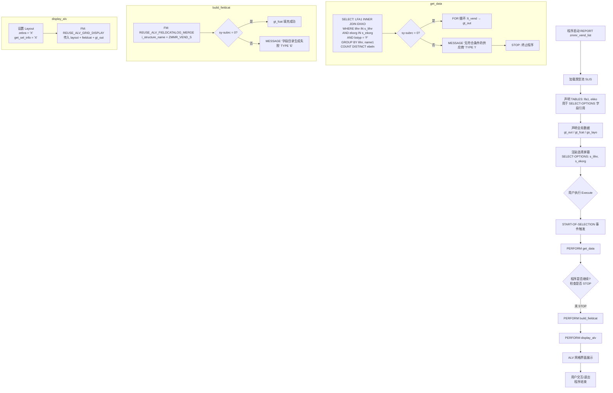

# ABAP 报表程序走读分析报告：ZMMR_VEND_LIST

> 源文件：`zmmr_vend_list.abap`（58 行）
> 分析范围：业务目的、架构设计、执行流程、子程序详解、风险与改进建议

---

## 一、业务目的

### 1.1 这是什么程序

`ZMMR_VEND_LIST` 是一个**供应商采购订单汇总报表**（Vendor – Purchase Order Summary Report）。它的核心业务诉求可以一句话概括：

> **"按供应商维度，统计其在指定采购组织下签订的标准采购订单（PO）数量。"**

### 1.2 业务场景

典型的使用场景是采购部门或采购经理需要快速回答以下问题：

| 业务问题 | 程序如何回答 |
|---------|-------------|
| 某一批供应商（或单个供应商）在我们公司下了多少张采购订单？ | 通过 `s_lifnr` 选择条件筛选供应商范围 |
| 这些订单分布在哪些采购组织？ | 通过 `s_ekorg` 选择条件筛选采购组织范围 |
| 哪些供应商是活跃供应商（有实际 PO）？ | INNER JOIN 天然过滤掉无 PO 的供应商 |
| 每个供应商的 PO 总数是多少？ | `COUNT(DISTINCT b~ebeln)` 聚合统计 |

### 1.3 输出内容

最终 ALV 展示三列数据：

| 字段 | DDIC 来源 | 含义 |
|------|----------|------|
| `LIFNR` | LFA1 | 供应商编号 |
| `NAME1` | LFA1 | 供应商名称 |
| `PO_CNT` | 计算列（COUNT DISTINCT） | 该供应商在筛选范围内的标准采购订单数量 |

---

## 二、架构设计

### 2.1 技术架构总览

这是一个典型的**经典过程式 ABAP 报表（Procedural Report）**，采用 SAP 传统的"选择屏幕 + 事件块 + 子程序"三段式结构。整体架构如下：

```
┌─────────────────────────────────────────────────┐
│              数据声明层 (Declaration)             │
│  TABLES / DATA / TYPE-POOLS / SELECT-OPTIONS     │
└──────────────────────┬──────────────────────────┘
                       │
                       ▼
┌─────────────────────────────────────────────────┐
│           事件入口 (START-OF-SELECTION)           │
│                                                   │
│   PERFORM get_data ──► PERFORM build_fieldcat     │
│                    ──► PERFORM display_alv         │
└──────────────────────┬──────────────────────────┘
                       │
        ┌──────────────┼──────────────┐
        ▼              ▼              ▼
┌──────────────┐ ┌────────────┐ ┌──────────────┐
│  get_data    │ │build_fcat  │ │ display_alv  │
│ (数据获取)    │ │(字段目录)   │ │(ALV 展示)    │
│              │ │            │ │              │
│ LFA1 ⨝ EKKO  │ │ DDIC 结构   │ │ Grid Display │
│ COUNT(DIST)  │ │ ZMMR_VEND_S│ │ Zebra 布局   │
└──────────────┘ └────────────┘ └──────────────┘
```

### 2.2 设计风格特征

| 维度 | 选择 | 说明 |
|------|------|------|
| 编程范式 | 过程式（Procedural） | 使用 `FORM/PERFORM`，非面向对象（OO） |
| ALV 技术 | 经典函数模块 | `REUSE_ALV_GRID_DISPLAY`，而非 `CL_SALV_TABLE` / `CL_GUI_ALV_GRID` |
| 数据获取 | Open SQL（内联声明） | 使用 `@DATA` 内联声明，属于较新的 ABAP 语法 |
| 数据传递 | 全局内表 | `gt_out` / `gt_fcat` 为全局 DATA，子程序直接访问 |
| 字段目录 | DDIC 结构驱动 | `REUSE_ALV_FIELDCATALOG_MERGE` 从结构 `ZMMR_VEND_S` 自动生成 |
| 布局配置 | 简单 Layout | 仅启用斑马纹（`zebra`）和选择信息传递（`get_sel_info`） |

### 2.3 设计哲学

这个程序体现了 SAP 报表开发的**"够用就好"哲学**：

1. **DDIC 驱动而非手工编码**：字段目录从 DDIC 结构 `ZMMR_VEND_S` 自动生成，而非逐字段 `APPEND` 手工构建。这意味着字段标签、长度、类型等元数据集中在数据字典中维护，避免了"代码与 DDIC 不一致"的经典问题。
2. **关注点分离（轻量级）**：数据获取、字段目录构建、展示三个职责分别封装在三个 `FORM` 中，虽然不如 OO 的类清晰，但在过程式 ABAP 中已属良好实践。
3. **声明式 SQL + 内联声明**：SQL 使用了 `@DATA(lt_vend)` 内联声明和 `VALUE #( FOR ... )` 构造表达式，体现了从旧式 ABAP 向现代 ABAP（7.40+）语法的迁移痕迹。

---

## 三、执行流程

### 3.1 完整执行流程图



### 3.2 分阶段详解

#### 阶段 1：初始化与声明（第 1-11 行）

| 行号 | 代码 | 作用 |
|------|------|------|
| 1 | `REPORT zmmr_vend_list.` | 程序声明，定义程序名 |
| 2 | `TYPE-POOLS: slis.` | 加载 SLIS 类型池，提供 ALV 相关类型（`slis_t_fieldcat_alv`、`slis_layout_alv` 等） |
| 4 | `TABLES: lfa1, ekko.` | 声明表工作区，使 `SELECT-OPTIONS` 能引用 `lfa1-lifnr` 和 `ekko-ekorg` 的字段属性（类型、长度、参考表等） |
| 6-8 | `DATA: gt_out ... gt_fcat ... gs_layo` | 全局数据对象：输出内表、字段目录内表、布局结构 |
| 10-11 | `SELECT-OPTIONS` | 自动生成选择屏幕，`s_lifnr` 和 `s_ekorg` 都支持范围、排除、模式等复杂条件 |

#### 阶段 2：事件入口（第 13-16 行）

`START-OF-SELECTION` 是选择屏幕执行后触发的默认事件块。三个 `PERFORM` 顺序调用，构成"取数 → 建目录 → 展示"的主线流程。**注意：这三个子程序之间通过全局变量 `gt_out`、`gt_fcat`、`gs_layo` 隐式传递数据，而非参数传递。**

#### 阶段 3：数据获取 `get_data`（第 18-36 行）

这是程序的核心逻辑。SQL 分析：

```abap
SELECT a~lifnr,                          -- 供应商编号
       a~name1,                          -- 供应商名称
       COUNT( DISTINCT b~ebeln ) AS po_cnt  -- 去重统计 PO 数量
  FROM lfa1 AS a                         -- 供应商主数据表
  INNER JOIN ekko AS b                   -- 采购订单抬头表
    ON a~lifnr = b~lifnr                 -- 关联条件：供应商编号
  WHERE a~lifnr IN @s_lifnr              -- 筛选：供应商范围
    AND b~ekorg IN @s_ekorg              -- 筛选：采购组织范围
    AND b~bstyp = 'F'                    -- 筛选：仅标准采购订单
  GROUP BY a~lifnr, a~name1              -- 按供应商分组
  INTO TABLE @DATA(lt_vend).            -- 内联声明结果内表
```

**关键设计点：**

1. **`INNER JOIN`**：只返回有采购订单的供应商。无 PO 的供应商不会出现在结果中。这是一个重要的业务语义决策（详见风险章节）。
2. **`COUNT( DISTINCT b~ebeln )`**：使用 `DISTINCT` 确保即使存在重复（理论上 ebeln 是主键不应重复，但写法上做了防御）。实际上由于 EKKO-EBELN 是主键，`COUNT(*)` 与 `COUNT(DISTINCT ebeln)` 结果相同，`DISTINCT` 是冗余的但无害。
3. **`bstyp = 'F'`**：`bstyp`（Purchasing Document Category）值为 `'F'` 表示标准采购订单（Standard PO）。其他值含义：`'A'` 紧急采购请求（不一定存在）、`'B'` 采购申请、`'K'` 合同、`'L'` 计划协议。这里只统计标准 PO。
4. **`GROUP BY a~lifnr, a~name1`**：按供应商编号和名称分组。严格来说只需 `GROUP BY a~lifnr`（因为 lifnr 是主键，name1 函数依赖于 lifnr），但 ABAP 的 Open SQL 在某些版本要求 SELECT 列表中非聚合字段必须在 GROUP BY 中出现。
5. **`@DATA(lt_vend)`**：内联声明，`lt_vend` 的类型由 SQL 结果集结构自动推断，无需预先声明。

**结果处理：**

```abap
IF sy-subrc = 0.
  gt_out = VALUE #( FOR ls IN lt_vend
                    ( lifnr = ls-lifnr name1 = ls-name1 po_cnt = ls-po_cnt ) ).
ELSE.
  MESSAGE '无符合条件的供应商' TYPE 'I'.
  STOP.
ENDIF.
```

- 如果查询成功，用 `VALUE #( FOR ... )` 构造表达式逐行将 `lt_vend` 映射到 `gt_out`。
- 如果查询无结果（`sy-subrc <> 0`），弹出信息消息并 `STOP` 终止程序。

#### 阶段 4：字段目录构建 `build_fieldcat`（第 38-47 行）

```abap
CALL FUNCTION 'REUSE_ALV_FIELDCATALOG_MERGE'
  EXPORTING
    i_structure_name = 'ZMMR_VEND_S'
  CHANGING
    ct_fieldcat     = gt_fcat.
```

- 调用标准函数模块，从 DDIC 结构 `ZMMR_VEND_S` 自动读取字段定义并填充 `gt_fcat`。
- **隐含依赖**：`ZMMR_VEND_S` 必须在 DDIC（SE11）中已创建，且其字段定义（LIFNR、NAME1、PO_CNT）需与 `gt_out` 的行类型 `zmmr_vend_s` 一致。
- 如果函数返回 `sy-subrc <> 0`（例如结构不存在），报错消息类型 `'E'`（Error），程序终止。

#### 阶段 5：ALV 展示 `display_alv`（第 49-57 行）

```abap
gs_layo-zebra = 'X'.            -- 斑马纹：隔行变色，提升可读性
gs_layo-get_sel_info = 'X'.     -- 将选择屏幕条件信息传递给 ALV（用于打印/导出时显示筛选条件）
CALL FUNCTION 'REUSE_ALV_GRID_DISPLAY'
  EXPORTING
    is_layout   = gs_layo       -- 布局设置
    it_fieldcat = gt_fcat       -- 字段目录
  TABLES
    t_outtab    = gt_out.       -- 数据源
```

- 调用经典 ALV Grid 函数模块，以全屏模式展示内表数据。
- **未检查 `sy-subrc`**：如果 ALV 展示失败（罕见但可能），程序不会报错。

---

## 四、子程序详解

### 4.1 子程序总览

| 子程序 | 行号 | 输入 | 输出 | 职责 |
|--------|------|------|------|------|
| `get_data` | 18-36 | 全局 `s_lifnr`、`s_ekorg` | 全局 `gt_out` | 执行 SQL 查询，构建输出内表 |
| `build_fieldcat` | 38-47 | DDIC 结构名（硬编码） | 全局 `gt_fcat` | 从 DDIC 自动生成 ALV 字段目录 |
| `display_alv` | 49-57 | 全局 `gt_fcat`、`gt_out` | 无（屏幕展示） | 配置布局并调用 ALV 展示 |

### 4.2 数据流依赖关系

```
s_lifnr ──┐
          ├──► get_data ──► gt_out ──────────────────────┐
s_ekorg ──┘                                                ├──► display_alv ──► 屏幕
ZMMR_VEND_S ──► build_fieldcat ──► gt_fcat ──────────────┘
gs_layo ──────────────────────────────────────────────────┘
```

**数据耦合分析**：三个子程序完全通过全局变量通信，没有使用 `USING/CHANGING` 参数。这意味着：
- 子程序不可复用（硬绑定全局变量）
- 调用顺序固定（`get_data` 必须先于 `build_fieldcat` 和 `display_alv`）
- 测试困难（无法注入 mock 数据）

### 4.3 各子程序详细说明

#### get_data（第 18-36 行）

**职责**：从数据库获取供应商-PO 汇总数据。

**逻辑**：
1. 执行聚合查询（LFA1 ⨝ EKKO，GROUP BY 供应商，COUNT DISTINCT PO）
2. 成功 → 用 `VALUE # FOR` 构造表达式将局部内表 `lt_vend` 映射到全局 `gt_out`
3. 失败 → 信息消息 + `STOP`

**评价**：
- SQL 逻辑清晰，使用现代语法（内联声明、`@` 转义、构造表达式）。
- `VALUE # FOR` 映射步骤是**冗余的**：`lt_vend` 的结构和 `gt_out` 的行类型理论上应一致（都来自同一个查询结果 / DDIC 结构），完全可以直接 `SELECT ... INTO TABLE @gt_out` 或 `gt_out = CORRESPONDING #( lt_vend )`。当前写法增加了一个中间变量和一次逐行拷贝。
- `STOP` 会触发 `END-OF-SELECTION` 事件（本程序没有定义），实际效果是返回选择屏幕。

#### build_fieldcat（第 38-47 行）

**职责**：从 DDIC 结构自动生成 ALV 字段目录。

**逻辑**：
1. 调用 `REUSE_ALV_FIELDCATALOG_MERGE`，传入 DDIC 结构名 `ZMMR_VEND_S`
2. 成功 → `gt_fcat` 自动填充
3. 失败 → 错误消息类型 `'E'`

**评价**：
- 这是 SAP ALV 开发的标准做法，避免了手工逐字段构建字段目录的繁琐和易错。
- 结构名 `ZMMR_VEND_S` 硬编码，是该程序与 DDIC 的强耦合点。如果结构被重命名或删除，运行时才会报错。

#### display_alv（第 49-57 行）

**职责**：以 ALV Grid 展示数据。

**逻辑**：
1. 配置布局（斑马纹 + 选择信息）
2. 调用 `REUSE_ALV_GRID_DISPLAY`

**评价**：
- 布局配置极简（仅两项），未配置列宽优化（`colwidth_optimize`）、标题栏（`grid_title`）、工具栏自定义等常见选项。
- 未检查 `sy-subrc`，ALV 异常时静默失败。

---

## 五、风险与改进建议

### 5.1 业务逻辑风险

#### 风险 1：INNER JOIN 排除无 PO 供应商（高风险）

**问题**：`INNER JOIN` 意味着没有任何采购订单的供应商不会出现在报表中。

**影响**：
- 如果业务需求是"列出所有供应商及其 PO 数量（包括 0）"，当前实现无法满足。
- 采购经理可能误以为"某些供应商不存在"，实际上他们只是尚未下单。

**建议**：
```abap
" 改为 LEFT OUTER JOIN
FROM lfa1 AS a
  LEFT OUTER JOIN ekko AS b
    ON a~lifnr = b~lifnr
       AND b~ekorg IN @s_ekorg
       AND b~bstyp = 'F'
WHERE a~lifnr IN @s_lifnr
GROUP BY a~lifnr, a~name1
```
**注意**：LEFT OUTER JOIN 的 WHERE 条件需移到 ON 子句中，否则会退化为 INNER JOIN。同时 `COUNT(DISTINCT b~ebeln)` 对无匹配行返回 0（NULL 不计数）。

#### 风险 2：bstyp = 'F' 硬编码（中风险）

**问题**：只统计标准采购订单（`bstyp = 'F'`），排除了合同（`'K'`）、计划协议（`'L'`）、采购申请（`'B'`）等。

**影响**：
- 如果业务希望看到"所有采购凭证"数量，当前实现会低估。
- 硬编码 `'F'` 未在程序注释或选择屏幕中说明，用户可能不理解为什么数量偏低。

**建议**：
- 如果是设计意图，在选择屏幕添加文本说明或注释。
- 如果需要灵活性，增加选择参数让用户指定 `bstyp` 范围。

#### 风险 3：SELECT-OPTIONS 无默认值限制（中风险）

**问题**：`s_lifnr` 和 `s_ekorg` 无默认值，用户可不填任何条件直接执行。

**影响**：
- 可能查询全量供应商 + 全量采购组织数据，在大型 SAP 系统中可能返回数十万行，导致性能问题和内存压力。

**建议**：
- 设置 `s_ekorg` 为必填（`OBLIGATORY`）或添加默认值。
- 在 `AT SELECTION-SCREEN` 事件中校验至少输入一个条件。

### 5.2 技术风险

#### 风险 4：全局变量耦合（中风险）

**问题**：三个 `FORM` 通过全局变量 `gt_out`、`gt_fcat`、`gs_layo` 通信，无参数传递。

**影响**：
- 子程序不可复用，难以单元测试。
- 调用顺序是隐式约束，重构时容易遗漏。

**建议**：
- 改用 `USING/CHANGING` 参数传递，或迁移为面向对象的类方法。

#### 风险 5：VALUE # FOR 冗余拷贝（低风险）

**问题**：`get_data` 中先用 `@DATA(lt_vend)` 接收 SQL 结果，再用 `VALUE # FOR` 逐行映射到 `gt_out`。

**影响**：多一次内存拷贝和中间变量，性能影响微小但代码冗余。

**建议**：
```abap
" 直接 SELECT INTO TABLE @gt_out
SELECT a~lifnr, a~name1, COUNT( DISTINCT b~ebeln ) AS po_cnt
  FROM lfa1 AS a INNER JOIN ekko AS b ON a~lifnr = b~lifnr
  ...
  INTO TABLE @gt_out.
```

#### 风险 6：DDIC 结构强依赖（中风险）

**问题**：`ZMMR_VEND_S` 结构名硬编码，且 `gt_out` 的行类型也引用 `zmmr_vend_s`。

**影响**：
- 如果 DDIC 结构被删除/重命名，运行时 `build_fieldcat` 报错。
- `gt_out` 声明（第 6 行 `TYPE TABLE OF zmmr_vend_s`）与 SQL 结果集结构必须完全一致，否则字段映射错位。

**建议**：
- 确保 `ZMMR_VEND_S` 的字段顺序和类型与 SQL 查询结果集完全匹配。
- 考虑用 `CORRESPONDING` 按字段名映射而非按位置。

#### 风险 7：display_alv 未检查 sy-subrc（低风险）

**问题**：`REUSE_ALV_GRID_DISPLAY` 调用后未检查 `sy-subrc`。

**影响**：如果 ALV 初始化失败（如 GUI 不可用），程序静默继续，无错误提示。

**建议**：添加 `sy-subrc` 检查和错误处理。

#### 风险 8：无权限检查（中风险）

**问题**：程序未对采购组织 `ekorg` 或供应商 `lifnr` 做权限检查（`AUTHORITY-CHECK`）。

**影响**：
- 用户可能看到无权访问的采购组织数据。
- 违反 SAP 安全最佳实践。

**建议**：
- 在 `AT SELECTION-SCREEN` 或 `START-OF-SELECTION` 中添加 `AUTHORITY-CHECK` 对象 `M_BEST_EKO`（采购组织）和 `M_LFA1_LNR`（供应商）。

#### 风险 9：使用过时的函数模块（技术债）

**问题**：`REUSE_ALV_GRID_DISPLAY` 和 `REUSE_ALV_FIELDCATALOG_MERGE` 属于 SAP 早期 ALV 技术。

**影响**：
- SAP 已推荐使用 `CL_SALV_TABLE`（简化 ALV）或 `CL_GUI_ALV_GRID`（全功能 ALV）。
- 旧函数模块在新 SAP S/4HANA 版本中仍支持但不再增强。

**建议**：新开发应使用 `CL_SALV_TABLE`；存量程序可保持现状，无需为迁移而迁移。

### 5.3 风险汇总矩阵

| # | 风险 | 严重度 | 类型 | 修复难度 |
|---|------|--------|------|---------|
| 1 | INNER JOIN 排除无 PO 供应商 | 高 | 业务逻辑 | 中 |
| 2 | bstyp = 'F' 硬编码 | 中 | 业务逻辑 | 低 |
| 3 | SELECT-OPTIONS 无默认/必填 | 中 | 安全/性能 | 低 |
| 4 | 全局变量耦合 | 中 | 可维护性 | 中 |
| 5 | VALUE # FOR 冗余拷贝 | 低 | 性能/代码 | 低 |
| 6 | DDIC 结构强依赖 | 中 | 可维护性 | 低 |
| 7 | display_alv 未检查 sy-subrc | 低 | 健壮性 | 低 |
| 8 | 无权限检查 | 中 | 安全 | 中 |
| 9 | 过时函数模块 | 低 | 技术债 | 高 |

---

## 六、总结

### 6.1 程序优点

1. **结构清晰**：三段式（取数-字段目录-展示）职责分明，易于理解。
2. **DDIC 驱动**：字段目录从 DDIC 结构自动生成，减少手工维护。
3. **现代 SQL 语法**：使用内联声明、`@` 转义、构造表达式，比传统 ABAP 更简洁。
4. **错误处理基本到位**：`get_data` 处理了无数据情况，`build_fieldcat` 处理了结构不存在情况。

### 6.2 程序不足

1. **INNER JOIN 语义可能不符合完整供应商清单的业务期望**（最关键问题）。
2. **全局变量耦合**导致子程序不可复用、不可测试。
3. **缺少权限检查**存在数据安全隐患。
4. **选择条件无约束**可能导致全量查询性能问题。
5. **冗余的中间变量拷贝**增加代码复杂度。

### 6.3 适用场景判断

该程序适合：**"已知有 PO 的供应商的 PO 数量快速统计"** 场景，作为采购经理的日常查询工具。如果需要完整的供应商清单（含无 PO 供应商）、需要权限管控、或需要更高可维护性，则需要重构。
