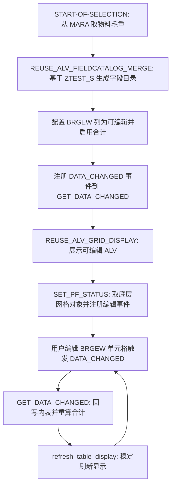
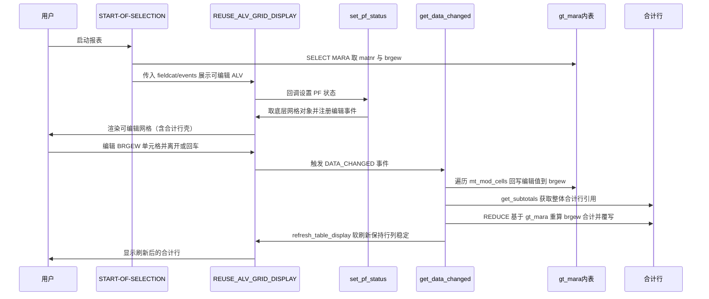

# ABAP 程序分析报告：ztest7 —— 可编辑 ALV 合计实时重算 POC

---

## 一、程序定位与业务背景

### 解决什么问题

在 SAP 的经典函数式 ALV（`REUSE_ALV_GRID_DISPLAY`）中，如果同时把某列设为**可编辑**（`edit = 'X'`）并启用**列合计**（`do_sum = 'X'`），会遇到一个长期困扰开发者的痛点：**用户在网格里改了某个单元格的值后，底部合计行不会跟着刷新**。原因是 ALV 内置的合计是在显示阶段基于原始内表数据计算好的，用户前端的编辑只停留在 UI 层，没有回写到驱动合计的内存数据里——合计行自然保持"旧值"。

`ztest7` 就是针对这个问题写的一个**最小可行性验证（POC）**：取物料主数据表 MARA 的物料号（MATNR）与毛重（BRGEW），最多 10 行，在 ALV 中把 BRGEW 列做成可编辑并启用合计；当用户编辑任意 BRGEW 单元格时，拦截 `DATA_CHANGED` 事件，把编辑值回写到内表，再用 `REDUCE` 构造表达式实时重算合计，直接覆写合计行里的 BRGEW，最后稳定刷新显示。

### 现有方案为何不够

| 方案 | 问题 |
|------|------|
| 纯 `do_sum`、不开放编辑 | 只读，用户无法在线调整重量 |
| 开放编辑、不开 `do_sum` | 没有合计行，看不到汇总 |
| 同时开 `edit` + `do_sum`（不做任何处理） | 合计行不随编辑刷新——本程序要补的缺口 |
| 完整迁移到 OO ALV（`cl_salv_table` / 自建容器 + `cl_gui_alv_grid`） | 改造代价大，老报表迁移成本高 |

本程序走的是**"低改造"路线**：继续用 REUSE 函数式 ALV，但在 PF 状态回调里"偷"到底层 `cl_gui_alv_grid` 对象引用，借它的能力注册编辑事件、读取合计行——以最小侵入达到目的。

### 整体设计范式（一句话）

**事件驱动的可编辑 ALV + 手动合计重算——以函数式 ALV 桥接 OO 网格对象，用 REDUCE 表达式重算合计并直接覆写合计行。**

---

## 二、程序执行流程总览



### 责任链表

| 子程序 | 调用者 | 职责 |
|--------|--------|------|
| 全局声明区 | 系统加载程序时 | 声明物料内表、字段目录、事件表、网格对象引用、稳定刷新控制结构、合计行数据引用及动态字段符号 |
| 事件块 START-OF-SELECTION | ABAP 运行时事件触发 | 查询 MARA 取数据；构建字段目录；配置 BRGEW 为可编辑并启用合计；注册 DATA_CHANGED 事件；调用 REUSE_ALV_GRID_DISPLAY 展示网格 |
| FORM `set_pf_status` | REUSE_ALV_GRID_DISPLAY 的 `i_callback_pf_status_set` 回调 | 通过 GET_GLOBALS_FROM_SLVC_FULLSCR 取回底层 cl_gui_alv_grid 对象引用；注册 mc_evt_modified 与 mc_evt_enter 两个编辑事件；处理 PF 状态命令 |
| FORM `get_data_changed` | ALV 的 DATA_CHANGED 事件（已在事件表中注册） | 遍历修改单元格回写 gt_mara；通过 get_subtotals 获取整体合计行引用；用 REDUCE 重算 BRGEW 合计并覆写合计行；稳定刷新显示 |

**下面按这条流程，逐个子程序展开。**

---

## 三、分组分析

### 3.1 全局声明区 `全局声明区`

全局声明区是一个紧凑的声明块，只含一个步骤：声明所有后续子程序共享的数据对象与字段符号。

```abap
REPORT ztest7.
TYPE-POOLS:slis.

DATA: gt_mara     TYPE TABLE OF ztest_s,
      gt_fieldcat TYPE slis_t_fieldcat_alv,
      gt_events   TYPE slis_t_event,
      go_grid     TYPE REF TO cl_gui_alv_grid,
      gs_stable   TYPE lvc_s_stbl,
      gr_data     TYPE REF TO data.

FIELD-SYMBOLS: <gtr_sum_tab> TYPE table.
```

**做什么**

- 声明报表程序名为 `ztest7`，引入 `slis` 类型池——这是经典函数式 ALV（REUSE 系列）所需的基础类型定义。
- 声明 `gt_mara`：物料数据内表，行类型为自定义结构 `ZTEST_S`（内含 MATNR 与 BRGEW 等字段）。
- 声明 `gt_fieldcat`：ALV 字段目录表（`slis_t_fieldcat_alv`），用于描述每列的属性（可编辑、合计等）。
- 声明 `gt_events`：ALV 事件表（`slis_t_event`），用于注册自定义事件处理 FORM。
- 声明 `go_grid`：指向 `cl_gui_alv_grid` 的对象引用——后续在 PF 状态回调中"偷"到底层网格对象后存到这里。
- 声明 `gs_stable`：`lvc_s_stbl` 稳定刷新控制结构（行/列是否保持位置）。
- 声明 `gr_data`：`REF TO data`，通用数据引用，用于接收 `get_subtotals` 返回的合计行内表。
- 声明字段符号 `<gtr_sum_tab>`：`TYPE table`，动态指向合计行内表，因为合计行的具体结构在编译期不可知。

**为什么 / 设计点评**

选择经典函数式 ALV（REUSE 系列）而非 OO ALV，是因为报表本身简单（单表取数、单层展示），REUSE 用法上手快、样板少。但程序又"越界"去拿 `cl_gui_alv_grid` 对象引用——说明 REUSE ALV 的封装不够用：可编辑 + 合计刷新这个需求，函数式 ALV 没给开箱即用的 API，必须下沉到 OO 层。`gr_data` 用通用 `REF TO data` 而非具体结构类型，是因为合计行的结构由 ALV 内部动态构造（字段数和顺序跟随字段目录），编译期无法静态描述，只能用泛型引用 + 字段符号动态寻址。这在动态 ALV 场景下是合理的取舍。

**风险与改进**

`gs_stable` 用的是 `lvc_s_stbl`（LVC 类型族），而字段目录用的是 `slis_t_fieldcat_alv`（SLIS 类型族）——两套类型体系在同一程序里混用。虽然在 REUSE ALV 中 LVC 与 SLIS 的字段名大多兼容、能跑通，但这是一种不够规范的做法：严格来说应统一到一套类型族，避免未来 SAP 版本中两套类型出现字段差异时踩坑。另外 `go_grid` 依赖 `GET_GLOBALS_FROM_SLVC_FULLSCR` 取回底层对象，本质上是利用了 REUSE ALV 的内部实现细节，属于"投机性桥接"，SAP 升级或改用 SALV 后会失效。

---

### 3.2 事件块 `START-OF-SELECTION`

`START-OF-SELECTION` 是整个程序的入口事件块，承担数据查询、ALV 配置与展示的全部准备工作。它分为四个步骤：① 查询物料毛重数据；② 基于结构生成字段目录；③ 配置 BRGEW 列为可编辑并启用合计；④ 注册事件并展示 ALV。

#### ① 查询物料毛重数据

```abap
START-OF-SELECTION.

  SELECT matnr,
         brgew
    FROM mara
    INTO TABLE _mara UP TO 10 ROWS.
  IF sy-subrc EQ 0.
```

**做什么**

- 从物料主数据表 `mara` 中取两个字段：物料号 `matnr` 与毛重 `brgew`。
- 放进内表（此处源码写为 `_mara`），最多取 10 行。
- 检查 `sy-subrc` 是否为 0（即查询成功有数据），成功才继续后续 ALV 配置。

**为什么 / 设计点评**

`UP TO 10 ROWS` 明确表明这是一个 POC——只取少量数据验证逻辑，不追求完整业务数据。用 `IF sy-subrc EQ 0` 做基本的数据存在性守卫，避免空数据时继续构建 ALV 没有意义。`mara` 表是 SAP 物料主数据的通用起点，`brgew`（毛重）作为可编辑合计的演示列也很直观。

**风险与改进**

源码中 `INTO TABLE` 的目标写为 `_mara`，但全局声明的内表名是 `gt_mara`——`_mara` 并未声明，这很可能是一个笔误（应为 `gt_mara`），会导致编译期语法错误或语义不明确。POC 中这类疏漏常见，但应修正。此外 `SELECT` 没有任何 `WHERE` 条件、没有 `ORDER BY`，取到的 10 行是随机的（取决于数据库返回顺序），在正式报表中应加业务过滤；无数据时（`sy-subrc <> 0`）直接静默结束，没有任何提示信息给用户，体验不佳。

#### ② 基于结构生成字段目录

```abap
    CALL FUNCTION 'REUSE_ALV_FIELDCATALOG_MERGE'
      EXPORTING
        i_program_name         = sy-repid
        i_structure_name       = 'ZTEST_S'
      CHANGING
        ct_fieldcat            = gt_fieldcat
      EXCEPTIONS
        inconsistent_interface = 1
        program_error          = 2
        OTHERS                 = 3.
    IF sy-subrc = 0.
```

**做什么**

- 调用函数 `REUSE_ALV_FIELDCATALOG_MERGE`，传入当前程序名 `sy-repid` 和 DDIC 结构名 `ZTEST_S`。
- 函数根据 `ZTEST_S` 的字段定义自动生成 ALV 字段目录，写回到 `gt_fieldcat`。
- 检查返回码 `sy-subrc`，成功才继续配置列属性。

**为什么 / 设计点评**

用 DDIC 结构（`ZTEST_S`）驱动字段目录生成，比手工逐字段 APPEND 更省事、也更不容易漏字段——结构改了字段目录自动跟着变。这是 REUSE ALV 的推荐做法。传入 `i_program_name = sy-repid` 是因为函数内部需要据此定位结构定义的上下文。

**风险与改进**

`ZTEST_S` 是一个自定义 DDIC 结构，程序本身没有声明它的字段定义——读者看不到 `ZTEST_S` 到底有哪些字段、各字段的数据元素是什么。这给语义校核带来盲区：如果 `ZTEST_S` 中 BRGEW 字段的数据元素不是 BRGEW 而是别的，会埋下类型隐患。建议在程序注释或文档中标注 `ZTEST_S` 的字段清单。此外 `EXCEPTIONS` 虽然声明了但 `sy-subrc <> 0` 时没有任何错误处理（直接跳到外层 `ENDIF` 静默结束），应至少给用户一条提示消息。

#### ③ 配置 BRGEW 列为可编辑并启用合计

```abap
      READ TABLE gt_fieldcat ASSIGNING FIELD-SYMBOL(<gs_fcat>) WITH KEY fieldname = 'BRGEW'.
      IF sy-subrc EQ 0.
        <gs_fcat>-edit = 'X'.
        <gs_fcat>-do_sum = 'X'.
      ENDIF.
```

**做什么**

- 在字段目录表 `gt_fieldcat` 中按字段名 `BRGEW` 查找对应行，用字段符号 `<gs_fcat>` 直接指向它（`ASSIGNING` 方式，避免值拷贝）。
- 找到后，把该列的 `edit` 置为 `'X'`（可编辑）。
- 把该列的 `do_sum` 置为 `'X'`（启用合计——ALV 会在底部生成合计行并对该列求和）。

**为什么 / 设计点评**

这是整个 POC 的关键配置点：`edit` 与 `do_sum` 同时开启，正是"可编辑列的合计不刷新"问题的触发条件。用 `ASSIGNING FIELD-SYMBOL` 直接修改内表行，是 ABAP 7.0+ 的惯用法，比 `MODIFY` 更简洁。`READ TABLE ... WITH KEY fieldname = 'BRGEW'` 用字段名定位，清晰且与结构无关。

**风险与改进**

`do_sum = 'X'` 让 ALV 自己算了一份合计（基于初始内表），但这份合计在用户编辑后不会刷新——后面 `get_data_changed` 里又要手动重算覆写它。也就是说，**这里 ALV 内置的合计与后面的手动 REDUCE 合计是两套并行逻辑**，前者负责"生成合计行的壳子"，后者负责"往壳子里填正确的值"。这种"借壳"做法虽然巧妙，但存在一致性风险：如果 ALV 内部合计逻辑在某些场景（如过滤、排序）下重新触发，可能把手动写的值覆盖掉。另外，没有对 `sy-subrc <> 0`（找不到 BRGEW 字段）做任何处理——如果 `ZTEST_S` 结构里没有 BRGEW，程序会静默跳过可编辑配置，ALV 变成只读且无合计，与预期不符却无任何提示。

#### ④ 注册事件并展示 ALV

```abap
      APPEND VALUE #( name = 'DATA_CHANGED' form = 'GET_DATA_CHANGED' ) TO gt_events.

      CALL FUNCTION 'REUSE_ALV_GRID_DISPLAY'
        EXPORTING
          i_callback_program       = sy-repid
          it_fieldcat              = gt_fieldcat
          it_events                = gt_events
          i_callback_pf_status_set = 'SET_PF_STATUS'
        TABLES
          t_outtab                 = gt_mara.
    ENDIF.
  ENDIF.
```

**做什么**

- 往事件表 `gt_events` 追加一条：事件名 `DATA_CHANGED`，对应 FORM 名 `GET_DATA_CHANGED`——即用户编辑单元格时，ALV 回调 FORM `get_data_changed`。
- 调用 `REUSE_ALV_GRID_DISPLAY` 展示 ALV：传入程序名、字段目录、事件表，并指定 PF 状态设置回调为 `SET_PF_STATUS`；数据源内表为 `gt_mara`。
- 两层 `ENDIF` 分别对应"字段目录生成成功"和"数据查询成功"的守卫闭合。

**为什么 / 设计点评**

事件注册用内表 `APPEND VALUE #(...)` 的方式（ABAP 7.40+ 构造表达式），比老式 `wa_events-name = ... . APPEND wa_events TO ...` 简洁。`DATA_CHANGED` 是 ALV 编辑场景的核心事件——它在单元格值被修改（离开单元格或按回车）时触发，是做实时校验和回写的标准时机。`i_callback_pf_status_set = 'SET_PF_STATUS'` 是为了在 ALV 全屏显示前有机会设置 PF 状态（GUI 状态栏），更重要的是——这个回调里能拿到底层网格对象，这是后续注册编辑事件的前提。

**风险与改进**

`REUSE_ALV_GRID_DISPLAY` 是阻塞调用（一直运行到用户关闭 ALV），期间所有交互都在回调里处理，没有外层超时或退出控制。`t_outtab` 用的是 `gt_mara`（而非前面 SELECT 写入的 `_mara`）——如果 `_mara` 确实是笔误，这里 `gt_mara` 仍是空的，ALV 会显示空表，但不会报错。这进一步印证 `_mara` 应为 `gt_mara` 的笔误。没有传入 `i_save`（布局保存）等参数，对 POC 可接受。

---

### 3.3 FORM `set_pf_status`

`set_pf_status` 是 REUSE_ALV_GRID_DISPLAY 的 PF 状态回调 FORM。它利用这个回调时机完成一件 REUSE ALV 本身没直接暴露的事：拿到底层 `cl_gui_alv_grid` 对象并注册编辑事件。分三步：① 获取底层网格对象引用；② 注册两个编辑事件；③ PF 状态命令处理（当前为空壳）。

#### ① 获取底层网格对象引用

```abap
FORM set_pf_status USING itr_extab TYPE slis_t_extab.

  CALL FUNCTION 'GET_GLOBALS_FROM_SLVC_FULLSCR'
    IMPORTING
      e_grid = go_grid.
  IF go_grid IS BOUND.
```

**做什么**

- 定义 FORM `set_pf_status`，接收参数 `itr_extab`（排除按钮表，PF 状态标准参数）。
- 调用 `GET_GLOBALS_FROM_SLVC_FULLSCR`——这个函数专门从全屏 REUSE ALV 中提取底层运行的 `cl_gui_alv_grid` 实例，存到全局 `go_grid`。
- 检查 `go_grid IS BOUND`（对象引用是否已绑定到实际实例），绑定了才继续注册事件。

**为什么 / 设计点评**

这是整个方案的"桥接"核心：REUSE_ALV_GRID_DISPLAY 内部其实就是创建了一个 `cl_gui_alv_grid` 实例来渲染，但 REUSE 函数没有直接给你操作它的接口。`GET_GLOBALS_FROM_SLVC_FULLSCR` 是 SAP 提供的一个"后门"函数，让你绕过封装拿到那个实例。拿到后，所有 `cl_gui_alv_grid` 的方法（注册编辑事件、读合计行等）都可以直接用了。把结果存到全局 `go_grid` 是因为后续 `get_data_changed` 也要用同一个实例，而两个 FORM 之间不传参，只能靠全局变量共享。

**风险与改进**

`GET_GLOBALS_FROM_SLVC_FULLSCR` 没有检查 `sy-subrc`——如果函数内部出错没取到网格对象，`go_grid` 会保持初始值（未绑定），虽然后面有 `IS BOUND` 守卫挡住，但应显式处理异常。更本质的风险是：**把 `go_grid` 设为全局变量且不释放**——REUSE ALV 关闭后，这个引用可能指向已销毁的控件实例，形成悬空引用；虽然下次 ALV 展示时会重新赋值，但在复杂调用链中有隐患。此外依赖"后门"函数本身是一种脆弱设计，SAP 没有正式承诺该函数在所有版本/补丁中行为一致。

#### ② 注册两个编辑事件

```abap
    CALL METHOD go_grid->register_edit_event
      EXPORTING
        i_event_id = cl_gui_alv_grid=>mc_evt_modified.

    CALL METHOD go_grid->register_edit_event
      EXPORTING
        i_event_id = cl_gui_alv_grid=>mc_evt_enter.
  ENDIF.
```

**做什么**

- 注册编辑事件 `mc_evt_modified`：当用户修改单元格并**离开该单元格**（焦点移走）时触发 `DATA_CHANGED`。
- 注册编辑事件 `mc_evt_enter`：当用户修改单元格并**按回车键**时触发 `DATA_CHANGED`。
- 两步都完成后用 `ENDIF` 闭合 `IS BOUND` 守卫。

**为什么 / 设计点评**

默认情况下，ALV 只在用户按回车或点击工具栏按钮时才触发 `DATA_CHANGED`——光修改完跳到下一个单元格是不触发的。这会导致用户改了好几行，合计一直不刷新，直到按回车才一次性更新。注册 `mc_evt_modified` 后，**只要焦点离开被修改的单元格就触发**，合计能更实时地刷新。两个事件都注册，覆盖"离开单元格"和"按回车"两种交互习惯，体验更完整。这两次调用逻辑相同只是参数不同，分开完整展示体现了重复但有差异的注册。

**风险与改进**

两次 `register_edit_event` 调用都没有 `EXCEPTIONS` 处理——如果注册失败（比如事件 ID 无效或控件状态不允许），不会有任何提示，后续编辑可能不触发 `DATA_CHANGED`，合计重算逻辑形同虚设却无人知晓。建议加上 `EXCEPTIONS` 检查并记日志。另外，`register_edit_event` 一般应在 ALV 首次显示前调用一次即可，而 `set_pf_status` 回调在某些场景（如刷新后重新设置状态）可能被多次调用——重复注册同一事件虽然 ALV 内部会去重，但属于不必要的工作，应考虑加一次性守卫标志。

#### ③ PF 状态命令处理

```abap
  CASE sy-ucomm.
    WHEN OTHERS.
  ENDCASE.
ENDFORM.
```

**做什么**

- 用 `CASE sy-ucomm` 准备处理用户命令（GUI 按钮的功能码），但当前只有一个空的 `WHEN OTHERS` 分支——没有实际处理任何按钮。
- `ENDCASE` 后 `ENDFORM` 结束该 FORM。

**为什么 / 设计点评**

这是一个预留的空壳：`set_pf_status` 的本职是设置 PF 状态（GUI 状态栏），但本 POC 真正用它的是为了那个"拿网格对象 + 注册事件"的副作用。`CASE sy-ucomm` 大概是想顺便处理用户命令，但还没写任何分支，只留了 `WHEN OTHERS` 占位。注释里写的 `* WHEN` 也说明开发者本想填但暂时空着。

**风险与改进**

空 `CASE` 加空 `WHEN OTHERS` 是死代码，没有任何作用，应要么填上实际功能码处理，要么删掉避免误导。更重要的是：这个 FORM 名为 `set_pf_status`，但**整个 FORM 里没有任何 `SET PF-STATUS` 语句**——它根本没设置 PF 状态！函数 `REUSE_ALV_GRID_DISPLAY` 的 `i_callback_pf_status_set` 回调期望 FORM 里调用 `SET PF-STATUS` 来配置 GUI 状态栏（启用哪些按钮），这里完全没做，意味着用户看到的是 ALV 默认的 GUI 状态（可能缺少自定义按钮）。FORM 名与实际职责不符，是命名与实现的脱节。

---

### 3.4 FORM `get_data_changed`

`get_data_changed` 是 `DATA_CHANGED` 事件的处理 FORM，也是整个 POC 的核心创新所在。它分四步完成"回写 + 重算 + 刷新"：① 回写编辑值到内表；② 获取合计行引用；③ 手动重算 BRGEW 合计；④ 稳定刷新显示。

#### ① 回写编辑值到内表

```abap
FORM get_data_changed USING io_data_changed TYPE REF TO cl_alv_changed_data_protocol.

  IF go_grid IS BOUND.

    LOOP AT io_data_changed->mt_mod_cells ASSIGNING FIELD-SYMBOL(<gs_changed>) WHERE fieldname = 'BRGEW'.
      READ TABLE gt_mara ASSIGNING FIELD-SYMBOL(<gs_tab>) INDEX <gs_changed>-row_id.
      IF sy-subrc EQ 0.
        <gs_tab>-brgew = <gs_changed>-value.
      ENDIF.
    ENDLOOP.
```

**做什么**

- 定义 FORM `get_data_changed`，接收参数 `io_data_changed`——这是一个"数据变更协议"对象，其属性 `mt_mod_cells` 是一张记录了所有被修改单元格的表（含行号、字段名、新值）。
- 守卫 `go_grid IS BOUND`，确保网格对象可用。
- 循环遍历 `mt_mod_cells` 中**字段名为 BRGEW** 的修改记录，用字段符号 `<gs_changed>` 直接指向每条修改记录。
- 对每条修改，用 `row_id`（修改单元格的行索引）去 `gt_mara` 内表里定位对应行（`READ TABLE ... ASSIGNING FIELD-SYMBOL(<gs_tab>)`），把新值 `<gs_changed>-value` 写回 `<gs_tab>-brgew`——即把 UI 层的编辑同步回内表。

**为什么 / 设计点评**

这一步是解决问题的关键前提：ALV 合计不刷新的根因就是编辑值没回写到驱动合计的内表。`mt_mod_cells` 是 SAP ALV 框架提供的标准数据变更记录表，遍历它而不是自己猜测哪行被改，是正确做法。`WHERE fieldname = 'BRGEW'` 精确过滤——本程序只有 BRGEW 可编辑，但这样写更严谨，将来加别的可编辑列时不会被误回写。用 `ASSIGNING FIELD-SYMBOL` 直接改内表行，避免 `MODIFY` 的索引管理，简洁高效。

**风险与改进**

`<gs_changed>-value` 是字符串类型（ALV 修改记录里的值统一存为字符），直接赋给 `<gs_tab>-brgew`（数量字段）依赖隐式类型转换。如果用户输入了非法字符（如字母、空值、多个小数点），转换可能出错或得到异常值，而这里没有任何校验。应在赋值前用 `NUMERIC_CHECK` 或 try/catch 校验输入合法性。此外，`LOOP AT ... WHERE` 是在内存中过滤（不是数据库），对 `mt_mod_cells` 这种小表没问题，但要注意 `mt_mod_cells` 在某些场景（如粘贴大段数据）可能含大量行，应考虑性能。`READ TABLE ... INDEX` 假设 `row_id` 与 `gt_mara` 的行索引一一对应——这在无排序、无过滤时成立，但如果 ALV 启用了排序/过滤，`row_id` 是视觉行号而非内表行号，会回写错行。

#### ② 获取合计行引用

```abap
    go_grid->get_subtotals(
      IMPORTING
        ep_collect00 = gr_data
    ).

    ASSIGN gr_data->* TO <gtr_sum_tab>.
    READ TABLE <gtr_sum_tab> ASSIGNING FIELD-SYMBOL(<l_sum>) INDEX 1.
    IF sy-subrc EQ 0.
      ASSIGN COMPONENT 'BRGEW' OF STRUCTURE <l_sum> TO FIELD-SYMBOL(<lg_val>).
```

**做什么**

- 调用 `go_grid->get_subtotals`，导入参数 `ep_collect00`（Overall Total，整体合计行）到通用数据引用 `gr_data`。
- 用 `ASSIGN gr_data->* TO <gtr_sum_tab>` 把数据引用解引用成内表字段符号——`gr_data` 指向的是一张合计行内表（通常只有一行整体合计）。
- `READ TABLE <gtr_sum_tab> ... INDEX 1` 读取合计行内表的第一行（整体合计行），用字段符号 `<l_sum>` 指向它。
- 找到后，用 `ASSIGN COMPONENT 'BRGEW' OF STRUCTURE <l_sum> TO FIELD-SYMBOL(<lg_val>)`——在合计行结构里按字段名 `BRGEW` 动态定位到对应字段，用 `<lg_val>` 指向它，后续直接给这个字段符号赋值即等于改合计行。

**为什么 / 设计点评**

这是"借壳填值"的关键步骤：`do_sum = 'X'` 让 ALV 生成了合计行的"壳"（结构、位置），但里面的 BRGEW 值是旧的。`get_subtotals` 拿到的是合计行的**引用**（不是拷贝），所以直接通过字段符号改 `<lg_val>` 就改了 ALV 内部的合计行数据，刷新后用户看到的就是新值。用 `ASSIGN COMPONENT 'BRGEW'` 动态寻址而非静态字段访问，是因为合计行结构是 ALV 动态构造的，编译期不知道字段位置，只能按名运行时定位——这是动态 ALV 编程的标准手法。注释 `ep_collect00 = gr_data` 后标的 `" Overall Total` 也说明开发者清楚这是整体合计而非分组小计。

**风险与改进**

`READ TABLE <gtr_sum_tab> ... INDEX 1` 假设整体合计行始终在合计内表的第一行位置——这是基于当前 ALV 行为的假设，如果 ALV 内部合计行结构发生变化（如增加排序合计行），`INDEX 1` 取到的可能不再是整体合计。更稳健的做法是遍历 `<gtr_sum_tab>` 找到代表整体合计的那一行（如有标识字段）。`ASSIGN COMPONENT 'BRGEW'` 失败（字段名不匹配）时 `<lg_val>` 不会 `ASSIGNED`，后面有 `IS ASSIGNED` 守卫，但如果合计行结构里根本没有 BRGEW（例如 `do_sum` 没生效或列名变化），整个重算静默失效，合计永远不刷新，无人察觉。`get_subtotals` 本身没有 `EXCEPTIONS`，调用失败也无处理。

#### ③ 手动重算 BRGEW 合计

```abap
      IF <lg_val> IS ASSIGNED.
        <lg_val> = REDUCE #( INIT lv_i TYPE ntgew_15 FOR <ls_t> IN gt_mara NEXT lv_i = lv_i + <ls_t>-brgew ).
      ENDIF.
    ENDIF.
```

**做什么**

- 守卫 `<lg_val> IS ASSIGNED`——只有成功定位到合计行的 BRGEW 字段才执行重算。
- 用 `REDUCE` 构造表达式（ABAP 7.40+）对 `gt_mara` 全表遍历：初始化累加器 `lv_i`（类型为 `ntgew_15`），对每一行 `<ls_t>` 执行 `lv_i = lv_i + <ls_t>-brgew`，最终 `lv_i` 就是所有行 BRGEW 的总和。
- 把算出的总和赋给 `<lg_val>`——即直接写入合计行的 BRGEW 字段，覆盖 ALV 内置的旧合计值。
- 两层 `ENDIF` 分别闭合 `IS ASSIGNED` 守卫和合计行读取成功守卫。

**为什么 / 设计点评**

`REDUCE` 是 ABAP 7.40 引入的迭代归约构造表达式，相比传统 `LOOP ... lv = lv + ...` 更声明式、更紧凑——一行完成"初始化 + 遍历 + 累加 + 返回"。用它来算合计，语义清晰：`INIT` 给初值，`FOR ... IN` 遍历内表，`NEXT` 定义累加规则。这是把"回写后的内表"重新汇总的正确时机——第①步已经把编辑值回写了 `gt_mara`，这里基于最新的 `gt_mara` 重算，结果自然正确。直接赋值给合计行字段符号，比"清掉 do_sum 再重新让 ALV 算"更轻量、更可控。这是整个 POC 设计上最巧妙的一环：**用 REDUCE 旁路了 ALV 内置合计刷新机制的缺陷**。

**风险与改进（重点）**

这是本程序**最需要警惕的语义类型错配**：

- 被求和的列是 `BRGEW`——SAP 数据元素 **BRGEW（Gross Weight，毛重）**，业务语义是"含包装的毛重"。
- 但 `REDUCE` 的累加器 `lv_i` 声明的类型是 `ntgew_15`——从命名看，这是基于数据元素 **NTGEW（Net Weight，净重）** 的变体（`_15` 后缀通常表示长度调整为 15）。
- NTGEW 与 BRGEW 虽然底层数据类型都是数量字段（QUAN，13 位长 3 位小数），技术存储格式一致，能跑通不报错——但**业务语义完全不同**：净重是去掉包装后的重量，毛重是含包装的重量。

按照语义类型校核原则，**用净重型数据元素（ntgew_15）去累加毛重值（brgew），属于语义错配**——不能因为长度/精度匹配就放过。这种错配的现实风险包括：
- 如果 `ntgew_15` 携带了与 NTGEW 关联的量纲/单位检查元数据（如参考字段指向净重单位字段），可能在单位换算时引入偏差；
- 代码可读性误导：维护者看到 `ntgew_15` 会以为这里算的是净重合计，与实际算的毛重合计矛盾；
- 后续如果有人基于这个合计做毛重/净重差异分析，会因类型语义混乱而误用。

**正确的做法**是让累加器类型与被求和列的语义一致——应使用基于 BRGEW 的类型（如 `brgew_15` 或直接 `brgew`），而非 `ntgew_15`。这不是"长度够用就行"的问题，而是数据元素名承载的业务语义不能错配。

其他次要风险：`REDUCE` 对全表遍历，如果 `gt_mara` 数据量大（本 POC 限 10 行无碍，但正式报表可能上万行），每次编辑都全表重算有性能开销，可考虑增量更新（旧值减去、新值加上）。`<lg_val>` 赋值后没有清空 `ASSIGN`（字段符号在 FORM 结束后自动解绑，可接受）。

#### ④ 稳定刷新显示

```abap
    gs_stable-col = 'X'.
    gs_stable-row = 'X'.

    go_grid->refresh_table_display(
      EXPORTING
        is_stable      = gs_stable
        i_soft_refresh = 'X'
      EXCEPTIONS
        finished       = 1
        OTHERS         = 2
    ).
    IF sy-subrc <> 0.
    ENDIF.

  ENDIF.

ENDFORM.
```

**做什么**

- 设置稳定刷新控制结构 `gs_stable`：`col = 'X'` 和 `row = 'X'` 表示刷新时保持列位置和行位置不跳动。
- 调用 `go_grid->refresh_table_display`：传入稳定控制 `is_stable`、`i_soft_refresh = 'X'`（软刷新——不重新排序、不过滤，只刷新显示值），声明了 `EXCEPTIONS`。
- `IF sy-subrc <> 0` 后是空体——异常分支没有实际处理。
- 闭合 `go_grid IS BOUND` 守卫的 `ENDIF`，然后 `ENDFORM` 结束整个 FORM。

**为什么 / 设计点评**

`is_stable` 的行列锁定是体验关键——如果不设，刷新后 ALV 滚动位置和光标列会跳回顶部，用户每改一个值屏幕就跳动一次，体验极差。`i_soft_refresh = 'X'` 选择软刷新，是为了避免重算排序和过滤（那些会打乱当前视图），只让显示值跟着合计行的更新而变化——这正是本场景需要的：合计行已被手动覆写，只需把新值显示出来。这一步和第③步配合，构成了"算完即刷"的闭环。

**风险与改进**

`IF sy-subrc <> 0. ENDIF.` 是一个**空异常处理块**——声明了 `EXCEPTIONS` 却对异常什么都不做，属于死代码。如果 `refresh_table_display` 失败（如显示已被导出关闭，对应 `finished = 1`），合计虽然算好了但用户看不到更新，且无任何提示。应至少记录日志或给用户提示。另外，`refresh_table_display` 软刷新在启用过滤的场景下可能不刷新被过滤掉的行对应的合计，本 POC 无过滤无碍，但正式使用需注意。`gs_stable` 在全局声明区声明、在此赋值——每次调用都重新赋值是合理的，但若 FORM 被并发调用（ALV 单线程不会）有隐患，POC 场景可接受。

---

## 四、执行流程全景图（数据视角）



---

## 五、问题清单与改进建议

### 🔴 P0 业务正确性

| 问题 | 所在子程序 | 说明与建议 |
|------|-----------|-----------|
| REDUCE 累加器类型 `ntgew_15` 与被求和列 `brgew` 语义错配 | `get_data_changed` ③ | 用净重型（NTGEW）数据元素累加毛重（BRGEW）值，属语义类型错配。技术上长度/精度匹配能跑通，但业务语义矛盾，可能误导维护者、在量纲检查场景引入偏差。应改用基于 BRGEW 的类型（如 `brgew_15`），不可因长度匹配就放过。 |
| 编辑值无合法性校验直接回写 | `get_data_changed` ① | `<gs_changed>-value`（字符串）直接赋给数量字段 `<gs_tab>-brgew`，依赖隐式转换。用户输入字母、多小数点等非法值会得到异常结果甚至 dump。应在赋值前用 `NUMERIC_CHECK` 或异常捕获校验。 |
| `READ TABLE ... INDEX row_id` 假设视觉行号等于内表行号 | `get_data_changed` ① | 若 ALV 启用排序或过滤，`row_id` 是视觉行号，与 `gt_mara` 内表索引不对应，会回写错行。POC 无排序过滤尚可，正式使用必须处理排序/过滤下的行号映射。 |

### 🟠 P1 健壮性

| 问题 | 所在子程序 | 说明与建议 |
|------|-----------|-----------|
| `INTO TABLE _mara` 目标变量疑似笔误 | `START-OF-SELECTION` ① | 全局声明的是 `gt_mara`，SELECT 写入 `_mara`，后者未声明，很可能编译报错或语义不明。应改为 `gt_mara`。 |
| 合计行读取用 `INDEX 1` 假设整体合计恒在首位 | `get_data_changed` ② | 依赖 ALV 内部合计行排序假设，若内部结构变化（如增加排序合计行）取错行。应遍历识别整体合计行而非固定索引。 |
| `refresh_table_display` 异常分支为空体 | `get_data_changed` ④ | `IF sy-subrc <> 0. ENDIF.` 什么都不做，刷新失败时合计更新用户看不到且无提示。应记录日志或提示。 |
| `register_edit_event` 无异常处理 | `set_pf_status` ② | 注册失败时 DATA_CHANGED 不触发，合计重算逻辑形同虚设却无人知晓。应加 `EXCEPTIONS` 检查。 |
| `GET_GLOBALS_FROM_SLVC_FULLSCR` 无 `sy-subrc` 检查 | `set_pf_status` ① | 函数失败时 `go_grid` 未绑定，虽有 `IS BOUND` 守卫但应显式处理失败分支。 |
| `set_pf_status` 内无 `SET PF-STATUS` 语句 | `set_pf_status` ③ | FORM 名为"设置 PF 状态"却从不调用 `SET PF-STATUS`，GUI 状态栏未被配置，命名与实现脱节。应补上或在注释说明意图。 |

### 🟡 P2 性能与规范

| 问题 | 所在子程序 | 说明与建议 |
|------|-----------|-----------|
| LVC 与 SLIS 类型族混用 | 全局声明区 | `gs_stable` 用 `lvc_s_stbl`（LVC），字段目录用 `slis_t_fieldcat_alv`（SLIS），两套混用不够规范。应统一到一套类型族。 |
| 每次编辑全表 REDUCE 重算 | `get_data_changed` ③ | POC 限 10 行无碍，正式报表大数据量时每次编辑全表遍历有开销。可改为增量更新（合计减旧值加新值）。 |
| 空 `CASE sy-ucomm` 死代码 | `set_pf_status` ③ | 只有空 `WHEN OTHERS` 的 CASE 无任何作用，应填充或删除避免误导。 |
| `go_grid` 全局引用不释放 | 全局声明区 / `set_pf_status` ① | ALV 关闭后引用可能悬空，复杂调用链有隐患。应考虑在退出时清理或用更受控的生命周期管理。 |

### 🟢 P3 可扩展性

| 问题 | 所在子程序 | 说明与建议 |
|------|-----------|-----------|
| 可编辑列与合计列硬编码为 BRGEW | `START-OF-SELECTION` ③ / `get_data_changed` ① | 字段名 'BRGEW' 散落多处硬编码，若要支持多列可编辑合计需改多处。可抽象为可配置字段清单。 |
| `ZTEST_S` 结构定义不可见 | 全局声明区 | 字段目录依赖 DDIC 结构 `ZTEST_S`，但程序内无其字段定义，读者无法做完整语义校核。应在文档中附结构定义。 |
| 无数据 / 无字段时静默结束 | `START-OF-SELECTION` ①② | 多处 `sy-subrc` 失败时无提示直接跳过，用户体验差。应加 `MESSAGE` 提示。 |
| `UP TO 10 ROWS` 硬编码 | `START-OF-SELECTION` ① | POC 可接受，正式报表需参数化行数或加业务条件。 |

---

## 六、整体评价与启发

### 优点

- **精准定位真问题**：可编辑 ALV 合计不刷新是 SAP 开发中的经典痛点，本程序用最小代码验证了一个切实可行的解法，POC 定位清晰。
- **"借壳填值"设计巧妙**：不推翻 ALV 内置合计（那样要重建合计行结构很麻烦），而是让 `do_sum` 生成合计行的"壳"，再用 `get_subtotals` 拿引用、`REDUCE` 算正确值直接覆写——以最小侵入达成目的。
- **REDUCE 用法恰当**：用 ABAP 7.40+ 的声明式归约表达式替代传统 LOOP 累加，代码紧凑、语义清晰，体现了现代 ABAP 风格。
- **刷新体验考虑周到**：`is_stable` 锁行列 + `i_soft_refresh` 软刷新，避免用户改值后屏幕跳动，体验细节到位。

### 短板

- **语义类型校核缺位**：`ntgew_15` 累加 `brgew` 是最典型的"技术能跑但语义错配"问题——这正是程序分析中需要批判性识别的隐患，却被当成普通类型用了。
- **异常处理普遍缺失**：从 SELECT 到 register_edit_event 到 refresh_table_display，几乎每个可能出错的调用都没有实质的异常处理，失败即静默。
- **桥接依赖脆弱**：`GET_GLOBALS_FROM_SLVC_FULLSCR` 是 SAP 未正式承诺稳定的"后门"函数，整个方案建立在此基础上，版本升级风险高。
- **命名与实现脱节**：`set_pf_status` 不设 PF 状态、`_mara` 笔误——细节疏漏反映出 POC 阶段对严谨性的放松。

### 可学到的设计经验

1. **函数式 ALV 的"OO 后门"模式**：当 REUSE ALV 的封装不够用时，`GET_GLOBALS_FROM_SLVC_FULLSCR` + 全局 `go_grid` 是获取底层 `cl_gui_alv_grid` 能力的标准桥接套路——但要清醒认识到这是对封装的突破，应隔离在最小范围内并做好版本兼容预案。
2. **"借壳填值"优于"推倒重来"**：面对框架内置功能的缺陷（合计不刷新），与其禁用内置功能自己重建，不如让内置功能生成结构壳子、自己只填值——减少重建成本，最大化复用框架能力。
3. **数据元素名承载业务语义，类型校核不能只看长度**：`ntgew` 与 `brgew` 技术格式相同但业务语义不同——选类型时必须按业务语义匹配，不能因"长度精度够用"就放过。这是 ABAP 数据字典设计哲学的核心教训。
4. **编辑事件注册要覆盖用户习惯**：同时注册 `mc_evt_modified`（离开单元格）和 `mc_evt_enter`（回车），让两种交互习惯都触发数据同步——细节决定实时刷新的体感。
