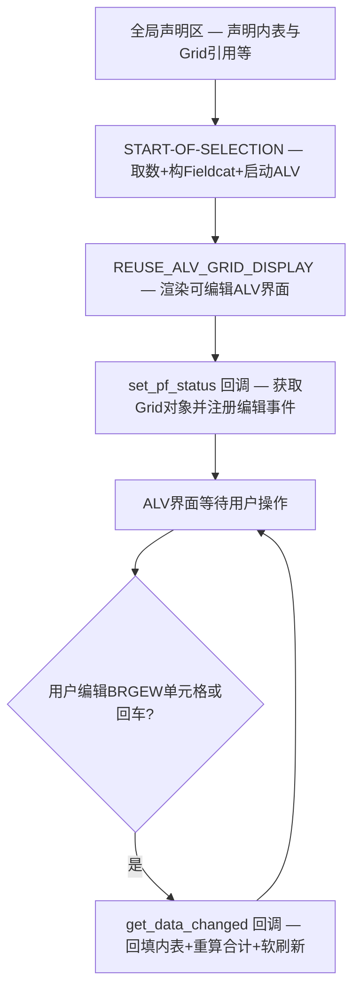
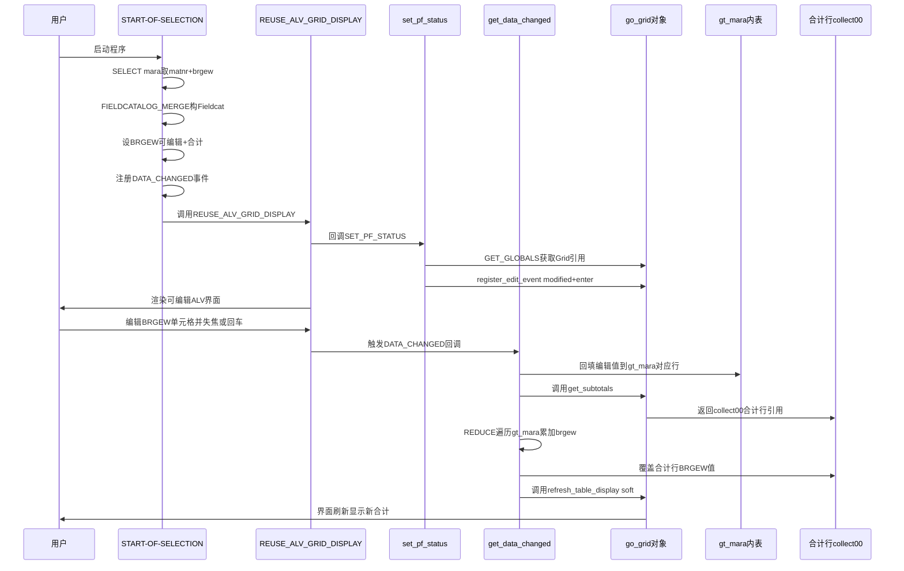

# ABAP 程序分析报告：ztest7 — 可编辑 ALV 合计手动重算 POC

---

## 一、程序定位与业务背景

### 解决什么问题

在 SAP 经典的 `REUSE_ALV_GRID_DISPLAY` 函数模块方案中，当某个数值字段被同时设置为**可编辑**（`edit = 'X'`）和**启用合计**（`do_sum = 'X'`）时，用户在界面上修改了单元格的值后，底部的合计行**不会自动重新计算**——合计行仍然显示修改前的旧值。这是 `REUSE_ALV_GRID_DISPLAY` 的一个已知局限：编辑事件触发的数据变更没有被传播到合计计算引擎中。

本程序正是针对这一痛点的**概念验证（POC）**：它用最少的代码验证了一条可行的手动重算路径——通过 `DATA_CHANGED` 事件回调获取 Grid 对象引用，手动回填编辑值到输出内表，再通过 `get_subtotals` 拿到合计行数据引用，用 `REDUCE` 表达式重新累加，最后用 `soft refresh` 刷新界面，使合计行与用户编辑后的数据保持一致。

### 现有方案为何不够

- **不处理 `DATA_CHANGED` 事件**：合计行永远停留在初始取数结果上，用户编辑后合计行不变。
- **直接调用 `refresh_table_display` 不够**：如果不先把编辑值回填到内表（`gt_mara`）并手动覆盖合计行的值，刷新后合计仍然是旧值——因为 `REUSE_ALV_GRID_DISPLAY` 内部并不在刷新时重算合计。
- **改用 `CL_SALV_TABLE`**：虽然更现代，但 `CL_SALV_TABLE` 默认不支持单元格编辑，切换方案成本高。

### 整体设计范式定性

一句话：**事件回调驱动的合计手动覆盖**——在 `REUSE_ALV` 经典 ALV 框架内，用 `DATA_CHANGED` 回调 + `get_subtotals` + `REDUCE` 组合，绕过框架的合计惰性更新，实现编辑后合计实时刷新。

---

## 二、程序执行流程总览

### 流程图



### 责任链表

| 子程序 | 调用者 | 职责 |
|--------|--------|------|
| 全局声明区 | 程序加载 | 声明输出内表 `gt_mara`、字段目录 `gt_fieldcat`、事件表 `gt_events`、Grid 对象引用 `go_grid`、稳定性结构 `gs_stable`、合计数据引用 `gr_data`、合计表字段符号 `<gtr_sum_tab>` |
| START-OF-SELECTION | 系统事件（程序执行入口） | 从 MARA 取物料号与毛重；调用 `REUSE_ALV_FIELDCATALOG_MERGE` 构建字段目录；设置 BRGEW 字段为可编辑且启用合计；注册 `DATA_CHANGED` 事件回调；调用 `REUSE_ALV_GRID_DISPLAY` 启动 ALV |
| set_pf_status | `REUSE_ALV_GRID_DISPLAY` 的 `i_callback_pf_status_set` 回调 | 在 ALV 首次渲染前通过 `GET_GLOBALS_FROM_SLVC_FULLSCR` 获取 `cl_gui_alv_grid` 对象引用；注册 `mc_evt_modified`（失焦触发）和 `mc_evt_enter`（回车触发）两种编辑事件；PF Status 状态码分发（当前为空壳） |
| get_data_changed | `DATA_CHANGED` 事件回调（由 Grid 在编辑后触发） | 遍历 `mt_mod_cells` 将 BRGEW 编辑值回填到 `gt_mara`；通过 `get_subtotals` 获取 Overall Total 合计行引用；用 `REDUCE` 重新累加全部 BRGEW 覆盖合计值；调用 `refresh_table_display` 软刷新界面 |

下面按这条流程，逐个子程序展开。

---

## 三、分组分析（按程序流程 / 子程序）

### 3.0 全局声明区

本区域是整个程序的共享状态层，所有 FORM 与事件块都通过这些全局变量耦合。共声明了 6 个全局变量和 1 个字段符号。

```abap
REPORT ztest7.
TYPE-POOLS:slis.

DATA: gt_mara     TYPE TABLE OF ztest_s,
      gt_fieldcat TYPE slis_t_fieldcat_alv,
      gt_events   TYPE slis_t_event,
      go_grid     TYPE REF TO cl_gui_alv_grid,
      gs_stable   TYPE lvc_s_stbl,
      gr_data     TYPE REF TO data.

FIELD-SYMBOLS: <gtr_sum_tab> TYPE table.
```

**做什么**

- 声明 `gt_mara` 为基于 DDIC 结构 `ztest_s` 的内表，作为 ALV 的输出数据源。
- 声明 `gt_fieldcat`（`slis_t_fieldcat_alv`）用于存放字段目录，`gt_events`（`slis_t_event`）用于注册 ALV 事件。
- 声明 `go_grid`（`cl_gui_alv_grid` 引用）用于在回调中持有 Grid 对象，`gs_stable`（`lvc_s_stbl`）用于刷新时固定行列位置。
- 声明 `gr_data`（`data` 引用）和字段符号 `<gtr_sum_tab>` 用于动态操作合计行数据。

**为什么 / 设计点评**

- 全局声明区的存在是因为 `REUSE_ALV_GRID_DISPLAY` 的回调机制（`SET_PF_STATUS`、`DATA_CHANGED`）是 FORM 级别的，FORM 之间无法通过参数传递 Grid 引用等共享状态，只能依赖全局变量。这是经典 ALV 编程范式的固有限制。
- `TYPE-POOLS: slis` 引入了 SLIS 类型池，这是 `REUSE_ALV` 系列函数的标配。相比之下，SALV 方案不需要类型池。
- `ztest_s` 是自定义 DDIC 结构（不在本文件中定义），`REUSE_ALV_FIELDCATALOG_MERGE` 需要它来按结构名自动生成字段目录。这说明输出结构是预定义的，字段固定。

**风险与改进**

- 全局变量 `go_grid`、`gr_data`、`gs_stable` 在 `set_pf_status` 和 `get_data_changed` 之间隐式传递状态，耦合度高且不可测试。如果未来需要多 Grid 实例，全局单例模式会冲突。
- 改进方向：若迁移到 `CL_GUI_ALV_GRID` 的 OO 方案，可将 Grid 引用和状态封装在局部类中，通过事件处理方法访问，消除全局变量。

---

从全局声明区进入程序入口，接下来是 `START-OF-SELECTION` 事件块。这是程序的主干流程，承担取数、配置字段属性、注册事件和启动 ALV 四个步骤。

### 3.1 事件块 `START-OF-SELECTION`

本事件块分为四步：① 从 MARA 取数；② 构建字段目录；③ 设置 BRGEW 为可编辑且合计；④ 注册 DATA_CHANGED 事件并启动 ALV。整个块被嵌套在两层 `sy-subrc` 检查中。

#### ① 从 MARA 取数

```abap
START-OF-SELECTION.

  SELECT matnr,
         brgew
    FROM mara
    INTO TABLE _mara UP TO 10 ROWS.
  IF sy-subrc EQ 0.
```

**做什么**

- 从物料主数据表 `mara` 中取物料号 `matnr` 和毛重 `brgew` 两个字段。
- 结果写入内表（源码中写作 `_mara`），限制最多 10 行。
- 取数成功后进入后续逻辑，失败则跳过整个 ALV 构建。

**为什么 / 设计点评**

- `UP TO 10 ROWS` 限制了取数量——这是 POC 的典型写法，目的是快速验证逻辑而非处理真实业务数据量。
- 字段使用逗号分隔（`matnr, brgew`）是新式 Open SQL 语法（7.40+），而 `INTO TABLE` 不带 `@` 前缀是旧式写法。新旧语法混用，说明代码可能是逐步迭代而来。
- 取毛重 `brgew`（Gross Weight）而非净重 `ntgew`，说明业务关注的是含包装的总重量。

**风险与改进**

- **变量名 `_mara` 未在任何 `DATA` 语句中声明**——声明的内表名是 `gt_mara`，此处 `_mara` 疑为拼写遗漏（丢失了 `gt` 前缀）。如果这不是笔误，程序将无法编译；如果编译通过（某些 ABAP 版本对未声明变量有隐式声明行为），取数结果不会进入 ALV 显示用的 `gt_mara` 内表，导致 ALV 显示空数据。这是 P0 级问题。
- `SELECT` 无 `WHERE` 条件，无 `ORDER BY`，取到的 10 行是随机的，不适合生产环境。
- 改进方向：确认变量名应为 `gt_mara`；生产环境应加 `WHERE` 业务条件和 `ORDER BY` 排序。

#### ② 构建字段目录

```abap
    CALL FUNCTION 'REUSE_ALV_FIELDCATALOG_MERGE'
      EXPORTING
        i_program_name         = sy-repid
        i_structure_name       = 'ZTEST_S'
      CHANGING
        ct_fieldcat            = gt_fieldcat
      EXCEPTIONS
        inconsistent_interface = 1
        program_error          = 2
        OTHERS                 = 3.
    IF sy-subrc = 0.
```

**做什么**

- 调用 `REUSE_ALV_FIELDCATALOG_MERGE`，以 DDIC 结构名 `ZTEST_S` 为蓝本自动生成字段目录 `gt_fieldcat`。
- 传入当前程序名 `sy-repid` 作为上下文标识。
- 函数执行成功（`sy-subrc = 0`）后进入字段属性配置步骤。

**为什么 / 设计点评**

- 用 `REUSE_ALV_FIELDCATALOG_MERGE` 按结构名自动生成 Fieldcat 是经典做法——避免手写每行 `CLEAR gt_fieldcat ... APPEND`，维护成本低。
- 结构 `ZTEST_S` 与内表 `gt_mara` 的类型一致（`TYPE TABLE OF ztest_s`），保证了 Fieldcat 与数据的字段对齐。

**风险与改进**

- `REUSE_ALV_FIELDCATALOG_MERGE` 失败时仅 `sy-subrc` 非零跳过，不输出任何错误信息。如果结构 `ZTEST_S` 不存在或程序名传错，用户看不到任何提示，程序静默退出。
- 改进方向：在 `sy-subrc` 非零分支加 `MESSAGE` 提示具体错误原因。

#### ③ 设置 BRGEW 为可编辑且合计

```abap
      READ TABLE gt_fieldcat ASSIGNING FIELD-SYMBOL(<gs_fcat>) WITH KEY fieldname = 'BRGEW'.
      IF sy-subrc EQ 0.
        <gs_fcat>-edit = 'X'.
        <gs_fcat>-do_sum = 'X'.
      ENDIF.
```

**做什么**

- 在字段目录中按字段名 `BRGEW` 定位到对应行，用 `ASSIGNING FIELD-SYMBOL` 直接拿到字段符号引用。
- 将该字段的 `edit` 标志设为 `X`（可编辑），`do_sum` 标志设为 `X`（启用合计）。
- 这两个标志的组合正是本程序要解决的核心矛盾点：可编辑 + 合计 = 合计不自动更新。

**为什么 / 设计点评**

- `READ TABLE ... ASSIGNING FIELD-SYMBOL` 直接修改内表行，无需 `MODIFY` 回写，简洁高效。
- 同时设 `edit` 和 `do_sum` 是刻意制造的场景——这正是问题复现的最小条件。
- 仅对 BRGEW 一个字段做配置，其余字段保持 `REUSE_ALV_FIELDCATALOG_MERGE` 的默认值，说明 POC 聚焦于验证合计重算逻辑，不做多余的界面定制。

**风险与改进**

- 字段名 `BRGEW` 硬编码在代码中，后续若有多个可编辑数值字段都需要合计重算，需重构为遍历配置或按 `do_sum = 'X'` 动态发现。
- `READ TABLE` 找不到 BRGEW 字段时静默跳过，不会报错。如果 `ZTEST_S` 结构中没有 BRGEW 字段，ALV 将不可编辑且无合计，但用户无感知。
- 改进方向：在 `sy-subrc` 非零时加 `MESSAGE` 提示字段未找到。

#### ④ 注册事件并启动 ALV

```abap
      APPEND VALUE #( name = 'DATA_CHANGED' form = 'GET_DATA_CHANGED' ) TO gt_events.

      CALL FUNCTION 'REUSE_ALV_GRID_DISPLAY'
        EXPORTING
          i_callback_program       = sy-repid
          it_fieldcat              = gt_fieldcat
          it_events                = gt_events
          i_callback_pf_status_set = 'SET_PF_STATUS'
        TABLES
          t_outtab                 = gt_mara.
    ENDIF.
  ENDIF.
```

**做什么**

- 将事件 `DATA_CHANGED` 与回调 FORM `GET_DATA_CHANGED` 的映射关系追加到事件表 `gt_events`。
- 调用 `REUSE_ALV_GRID_DISPLAY` 启动全屏 ALV，传入字段目录、事件表、PF Status 回调名和输出内表 `gt_mara`。
- `REUSE_ALV_GRID_DISPLAY` 是阻塞调用，在用户退出 ALV 界面后返回。

**为什么 / 设计点评**

- `VALUE #( name = ... form = ... )` 使用了 7.40+ 的构造表达式语法构建事件行，比传统的 `CLEAR gs_events ... APPEND` 更紧凑。
- 注册 `DATA_CHANGED` 事件是整个方案的关键——没有它，Grid 不知道编辑后该回调谁。
- `i_callback_pf_status_set = 'SET_PF_STATUS'` 传入 PF Status 回调名（字符串），`REUSE_ALV_GRID_DISPLAY` 在渲染前通过 `PERFORM` 动态调用该 FORM，这给了程序在 ALV 初始化阶段获取 Grid 对象的机会。

**风险与改进**

- FORM 名以字符串传递，编译期不检查——如果拼写错误，运行时才会报 `PERFORM_NOT_FOUND`。
- `REUSE_ALV_GRID_DISPLAY` 没有处理 `sy-subrc`，函数本身的异常被忽略。
- 改进方向：改用 `CL_GUI_ALV_GRID` 的 OO 方案时，事件可通过 `SET HANDLER` 注册，编译期可检查。

---

ALV 启动后，`REUSE_ALV_GRID_DISPLAY` 会在渲染界面之前调用 `SET_PF_STATUS` 回调。这个回调的核心使命不是设置 PF Status（那部分是空壳），而是趁此机会获取 Grid 对象引用并注册编辑事件。

### 3.2 FORM `set_pf_status`

本 FORM 分两步：① 获取 Grid 对象引用并注册编辑事件；② PF Status 状态码分发（当前为空壳）。

#### ① 获取 Grid 引用并注册编辑事件

```abap
FORM set_pf_status USING itr_extab TYPE slis_t_extab.

* Get the ALV Object reference
  CALL FUNCTION 'GET_GLOBALS_FROM_SLVC_FULLSCR'
    IMPORTING
      e_grid = go_grid.
  IF go_grid IS BOUND.
    CALL METHOD go_grid->register_edit_event
      EXPORTING
        i_event_id = cl_gui_alv_grid=>mc_evt_modified.

    CALL METHOD go_grid->register_edit_event
      EXPORTING
        i_event_id = cl_gui_alv_grid=>mc_evt_enter.
  ENDIF.
```

**做什么**

- 调用 `GET_GLOBALS_FROM_SLVC_FULLSCR` 从 `REUSE_ALV_GRID_DISPLAY` 的全屏 ALV 上下文中取出内部创建的 `cl_gui_alv_grid` 实例引用，赋值给全局变量 `go_grid`。
- 若 `go_grid` 已绑定（获取成功），连续注册两个编辑事件：
  - `mc_evt_modified`：单元格内容被修改且焦点离开时触发 `DATA_CHANGED`。
  - `mc_evt_enter`：用户在单元格中按回车时触发 `DATA_CHANGED`。
- 两种事件都注册，确保无论用户是失焦还是回车，编辑动作都能被捕获。

**为什么 / 设计点评**

- `GET_GLOBALS_FROM_SLVC_FULLSCR` 是连接 `REUSE_ALV` 函数模块世界与 `cl_gui_alv_grid` OO 世界的桥梁——`REUSE_ALV_GRID_DISPLAY` 内部创建了一个 `cl_gui_alv_grid` 实例但不暴露它，必须用这个函数才能拿到引用。这是一个非常有用的"逃生舱"技巧。
- 同时注册 `mc_evt_modified` 和 `mc_evt_enter` 是最佳实践——只注册其中一个会导致部分编辑场景被遗漏（例如只注册 `mc_evt_enter`，用户失焦不回车就不会触发回调）。
- 将这段逻辑放在 `SET_PF_STATUS` 回调中是因为这是 `REUSE_ALV_GRID_DISPLAY` 最早可用的回调时机，此时 Grid 对象已经创建但界面尚未完全渲染，注册编辑事件时机恰好。

**风险与改进**

- `GET_GLOBALS_FROM_SLVC_FULLSCR` 没有 `EXCEPTIONS` 声明，也没有检查 `sy-subrc`。如果函数内部出错，`go_grid` 可能为初始值（未绑定），后续 `IF go_grid IS BOUND` 会保护注册逻辑不崩溃，但用户不会收到任何提示。
- `register_edit_event` 本身可能抛出异常（如 Grid 尚未初始化），此处未用 `TRY-CATCH` 包裹。
- 改进方向：为 `GET_GLOBALS_FROM_SLVC_FULLSCR` 添加 `EXCEPTIONS` 并检查 `sy-subrc`；对 `register_edit_event` 用 `TRY-CATCH` 包裹。

#### ② PF Status 状态码分发

```abap
  " PF Status Code
  CASE sy-ucomm.
*	WHEN
    WHEN OTHERS.
  ENDCASE.
ENDFORM.
```

**做什么**

- 以 `CASE sy-ucomm` 分发用户命令（PF Status 按钮），当前所有命令都落入 `WHEN OTHERS` 空分支，不执行任何逻辑。
- 注释中有一个被注释掉的 `* WHEN`，说明预留了按钮处理的位置。

**为什么 / 设计点评**

- PF Status 处理是 `SET_PF_STATUS` 回调的"本职工作"，但本 POC 不需要自定义按钮，所以是空壳。`CASE` 框架保留是为了后续扩展。
- `WHEN OTHERS` 确保未处理的命令不会报错，默认透传给 ALV 框架。

**风险与改进**

- 无明显风险。空壳 `CASE` 是 POC 的合理简化，不会导致功能问题。
- 如果未来加自定义按钮（如"保存"），需在此处处理 `sy-ucomm` 并调用保存逻辑。

---

用户在 ALV 界面编辑 BRGEW 单元格后，`DATA_CHANGED` 事件触发，调用 `get_data_changed`。这是整个方案的核心——回填编辑值、重算合计、刷新界面。分为三步。

### 3.3 FORM `get_data_changed`

本 FORM 是方案核心，分三步：① 将编辑值回填到输出内表；② 获取合计行引用并重算；③ 软刷新界面。

#### ① 将编辑值回填到输出内表

```abap
FORM get_data_changed USING io_data_changed TYPE REF TO cl_alv_changed_data_protocol.

  IF go_grid IS BOUND.

    LOOP AT io_data_changed->mt_mod_cells ASSIGNING FIELD-SYMBOL(<gs_changed>) WHERE fieldname = 'BRGEW'.
      READ TABLE gt_mara ASSIGNING FIELD-SYMBOL(<gs_tab>) INDEX <gs_changed>-row_id.
      IF sy-subrc EQ 0.
        <gs_tab>-brgew = <gs_changed>-value.
      ENDIF.
    ENDLOOP.
```

**做什么**

- 首先检查 `go_grid` 是否已绑定（防御性检查，确保 Grid 对象存在）。
- 遍历 `io_data_changed->mt_mod_cells`（本次编辑变更的单元格列表），筛选字段名为 `BRGEW` 的变更记录。
- 对每条变更记录，按 `row_id`（行索引）定位 `gt_mara` 内表中的对应行，用 `ASSIGNING FIELD-SYMBOL` 直接引用。
- 将变更值 `<gs_changed>-value` 赋给 `<gs_tab>-brgew`，完成编辑值从 Grid 内部协议到输出内表的回填。

**为什么 / 设计点评**

- `mt_mod_cells` 是 `cl_alv_changed_data_protocol` 的核心属性，存放所有被修改的单元格信息（行号、字段名、新值）。回调参数 `io_data_changed` 就是这个协议对象的引用。
- 筛选 `fieldname = 'BRGEW'` 是因为只有 BRGEW 被设为可编辑，其他字段不会有变更。
- 手动回填到 `gt_mara` 是必须的——`REUSE_ALV_GRID_DISPLAY` 不会自动把编辑值同步到 `t_outtab` 指定的内表，如果不回填，后续 `REDUCE` 累加的就是旧值。

**风险与改进**

- `<gs_changed>-value` 的类型是 `LVC_VALUE`（字符型），赋值给 `<gs_tab>-brgew`（数值型）时存在隐式类型转换。如果用户输入了非数字字符，转换可能出错但此处无异常处理。
- `READ TABLE ... INDEX <gs_changed>-row_id` 若索引超出范围，`sy-subrc` 非零，`IF` 保护了回填不崩溃，但未记录或提示被跳过的行。
- 改进方向：用 `TRY-CATCH` 或 `cl_abap_conv_dyn_ce` 做安全转换；对跳过的行记录日志。

#### ② 获取合计行引用并重算

```abap
    go_grid->get_subtotals(
      IMPORTING
        ep_collect00 = gr_data   " Overall Total
    ).

    ASSIGN gr_data->* TO <gtr_sum_tab>.
    READ TABLE <gtr_sum_tab> ASSIGNING FIELD-SYMBOL(<l_sum>) INDEX 1.
    IF sy-subrc EQ 0.
      ASSIGN COMPONENT 'BRGEW' OF STRUCTURE <l_sum> TO FIELD-SYMBOL(<lg_val>).
      IF <lg_val> IS ASSIGNED.
        <lg_val> = REDUCE #( INIT lv_i TYPE ntgew_15 FOR <ls_t> IN gt_mara NEXT lv_i = lv_i + <ls_t>-brgew ).
      ENDIF.
    ENDIF.
```

**做什么**

- 调用 `go_grid->get_subtotals` 获取 ALV 的合计数据，`ep_collect00` 对应 Overall Total（总合计行），返回一个 `REF TO data` 引用。
- 将 `gr_data` 指向的数据对象分配给字段符号 `<gtr_sum_tab>`（合计行内表）。
- 读取合计行内表的第一行（`INDEX 1`），拿到合计行结构 `<l_sum>`。
- 在合计行结构中按组件名 `BRGEW` 动态定位字段，拿到字段符号 `<lg_val>`。
- 若字段已分配，用 `REDUCE` 表达式遍历 `gt_mara` 全部行，累加 `brgew` 值，结果直接赋给 `<lg_val>`——即覆盖合计行中的 BRGEW 合计值。

**为什么 / 设计点评**

- `get_subtotals` 的 `ep_collect00` 是 ALV 合计层级的第 0 层（Overall Total）。如果 ALV 配置了排序+小计，还会有 `ep_collect01`、`ep_collect02` 等小计层级。本 POC 没有排序小计，只有 Overall Total，所以取 `collect00` 即可。
- 通过 `ASSIGN COMPONENT 'BRGEW'` 动态访问合计行字段，是因为合计行结构不是静态已知的——它由 ALV 框架在运行时动态构建，只能用动态字段符号访问。
- `REDUCE` 是 7.40+ 的迭代归约表达式，用一行代码完成全部行的累加，比传统的 `LOOP ... lv_sum = lv_sum + ... ENDLOOP` 更紧凑。
- 整体思路是**绕过 ALV 的合计引擎，直接改写合计行的内存数据**——因为 `refresh_table_display` 不会触发合计重算，所以必须手动覆盖。

**风险与改进**

- **类型语义不匹配**：`REDUCE` 中 `lv_i` 声明为 `TYPE ntgew_15`（净重类型），但累加的是 `brgew`（毛重）。虽然底层都是 QUAN 域（长度 15、小数 3 位），类型技术上兼容，但数据元素名暗示了不同的业务语义——用净重类型存毛重合计是语义错配，不应被反向背书为"一致"。
- `READ TABLE <gtr_sum_tab> ... INDEX 1` 硬编码索引 1——当前 POC 无排序小计场景下，Overall Total 表只有一行，索引 1 正确。但如果未来加了排序小计配置，`collect00` 表可能有多行，索引 1 取到的可能不是期望的总合计行。
- `ASSIGN COMPONENT 'BRGEW'` 若合计行结构中没有 BRGEW 组件，`<lg_val>` 不会被分配，`IF <lg_val> IS ASSIGNED` 会跳过赋值——这是合理的防御，但合计行将保持旧值，用户不会收到提示。
- 改进方向：`lv_i` 应声明为与 BRGEW 语义一致的类型（如 `brgew_15` 或 `ztest_s-brgew`）；合计行索引应改为按条件查找而非硬编码。

#### ③ 刷新显示

```abap
    gs_stable-col = 'X'.
    gs_stable-row = 'X'.

    go_grid->refresh_table_display(
      EXPORTING
        is_stable      = gs_stable      " With Stable Rows/Columns
        i_soft_refresh = 'X'            " Without Sort, Filter, etc.
      EXCEPTIONS
        finished       = 1              " Display was Ended (by Export)
        OTHERS         = 2
    ).
    IF sy-subrc <> 0.
    ENDIF.

  ENDIF.

ENDFORM.                    "get_data_changed
```

**做什么**

- 设置稳定性结构 `gs_stable` 的 `col` 和 `row` 均为 `X`，表示刷新时保持当前滚动位置（行列不跳动）。
- 调用 `go_grid->refresh_table_display`，传入 `is_stable = gs_stable`（稳定刷新）和 `i_soft_refresh = 'X'`（软刷新——不重置排序、筛选、合计布局）。
- 软刷新会将内存中已修改的合计值推送到界面显示，同时不破坏用户当前的排序和筛选状态。
- `IF sy-subrc <> 0` 分支为空，异常被静默忽略。

**为什么 / 设计点评**

- `i_soft_refresh = 'X'` 是整个刷新策略的关键——硬刷新（默认）会重新执行排序和筛选，可能导致用户当前的滚动位置和排序状态丢失。软刷新仅更新数据内容，保留界面状态。
- `is_stable` 双轴固定（行+列）确保合计行在屏幕底部不会因为刷新而跳动，用户体验流畅。
- 这一步之所以放在 `REDUCE` 覆盖合计值之后，是因为刷新操作会将内存中的数据（包括被手动覆盖的合计行）同步到前端显示。如果先刷新再改合计，合计行的旧值已经显示，用户会看到闪动。

**风险与改进**

- `IF sy-subrc <> 0. ENDIF.` 是完全空的异常处理分支——`refresh_table_display` 失败时（如界面已被导出/关闭），异常被完全吞掉，合计刷新失败用户无感知。
- 改进方向：在异常分支中记录日志或 `MESSAGE` 提示刷新失败。

---

## 四、执行流程全景图（数据视角）



---

## 五、问题清单与改进建议（按优先级）

### 🔴 P0 — 业务正确性

| 序号 | 所在子程序 | 问题 | 改进建议 |
|------|-----------|------|---------|
| 1 | `START-OF-SELECTION` ① | `INTO TABLE _mara` 中 `_mara` 未声明，声明的内表名是 `gt_mara`。若非笔误则程序无法编译或取数结果不进入显示用内表，ALV 显示空数据 | 确认并修正为 `gt_mara` |
| 2 | `get_data_changed` ② | `REDUCE` 中 `lv_i` 声明为 `TYPE ntgew_15`（净重数据元素），但累加的是 `brgew`（毛重）。底层 QUAN 域兼容可运行，但语义类型不匹配——用净重类型存毛重合计 | 改为与 BRGEW 语义一致的类型，如 `brgew_15` 或直接用 `ztest_s-brgew` |
| 3 | `get_data_changed` ② | `READ TABLE <gtr_sum_tab> INDEX 1` 硬编码合计行索引。当前 POC 无排序小计场景下可行，但若未来加排序小计配置，collect00 表可能有多行，索引 1 取到的可能不是 Overall Total 行 | 改为按条件查找合计行或记录当前场景假设 |

### 🟠 P1 — 健壮性

| 序号 | 所在子程序 | 问题 | 改进建议 |
|------|-----------|------|---------|
| 1 | `set_pf_status` ① | `GET_GLOBALS_FROM_SLVC_FULLSCR` 未声明 `EXCEPTIONS` 也未检查 `sy-subrc`，函数失败时 `go_grid` 为空，后续注册静默跳过 | 添加 `EXCEPTIONS` 并检查 `sy-subrc`，失败时提示 |
| 2 | `get_data_changed` ① | `<gs_changed>-value`（字符型 `LVC_VALUE`）赋给 `<gs_tab>-brgew`（数值型）存在隐式转换，用户输入非数字时可能异常 | 用安全转换或 `TRY-CATCH` 包裹 |
| 3 | `get_data_changed` ③ | `refresh_table_display` 的 `IF sy-subrc <> 0. ENDIF.` 异常分支为空，刷新失败被完全吞掉 | 在异常分支中记录日志或提示 |
| 4 | `START-OF-SELECTION` ② | `REUSE_ALV_FIELDCATALOG_MERGE` 失败时仅 `sy-subrc` 非零跳过，无任何错误提示，程序静默退出 | 在失败分支加 `MESSAGE` 提示具体原因 |

### 🟡 P2 — 性能与规范

| 序号 | 所在子程序 | 问题 | 改进建议 |
|------|-----------|------|---------|
| 1 | `START-OF-SELECTION` ① | `SELECT ... UP TO 10 ROWS` 无 `WHERE` 条件，取数无业务过滤，仅适合 POC | 生产环境加 `WHERE` 业务条件 |
| 2 | 全局声明区 | 使用旧式 `REUSE_ALV_GRID_DISPLAY` + `slis` 类型池，而非推荐的 `CL_SALV_TABLE` 或 `CL_GUI_ALV_GRID` OO 方案 | 新项目考虑 SALV 方案 |
| 3 | `set_pf_status` ② | `CASE sy-ucomm. WHEN OTHERS. ENDCASE.` PF Status 处理为空壳 | POC 可接受，生产环境需实现按钮逻辑 |
| 4 | 全局声明区 | 6 个全局变量 + 1 个全局字段符号，FORM 间通过全局变量隐式耦合，不可测试 | 迁移到 OO 方案时封装为类成员 |
| 5 | `START-OF-SELECTION` ① | 新旧 SQL/ABAP 语法混用（逗号分隔字段列表是 7.40+，`INTO TABLE` 不带 `@` 是旧式） | 统一为新式 `@` 转义语法 |

### 🟢 P3 — 可扩展性

| 序号 | 所在子程序 | 问题 | 改进建议 |
|------|-----------|------|---------|
| 1 | `get_data_changed` 全局 | 整体手动重算合计是 workaround，依赖 `get_subtotals` 直接改写内存，较脆弱 | 较新 SAP 版本可探索 `CL_GUI_ALV_GRID` 事件机制或 SALV 方案是否已原生支持 |
| 2 | `get_data_changed` ① | 字段名 `BRGEW` 硬编码在多处（Fieldcat 配置、`mt_mod_cells` 筛选、`ASSIGN COMPONENT`） | 若需多字段可编辑合计，提取为配置表或按 `do_sum = 'X'` 动态发现 |
| 3 | `get_data_changed` ② | 合计重算逻辑内嵌在 FORM 中，无法复用 | 抽取为独立 FORM 或方法，参数化字段名和内表 |

---

## 六、整体评价与启发

### 优点

- **精准定位痛点**：准确识别了 `REUSE_ALV_GRID_DISPLAY` 可编辑 ALV 合计不自动更新的核心矛盾，用最小代码验证了可行解法。
- **回调时机选择巧妙**：将 Grid 对象获取放在 `SET_PF_STATUS` 回调中——这是 `REUSE_ALV_GRID_DISPLAY` 最早可用的回调时机，Grid 已创建但界面未完全渲染，注册编辑事件时机恰到好处。
- **双事件注册覆盖完整**：同时注册 `mc_evt_modified`（失焦）和 `mc_evt_enter`（回车），确保两种编辑交互方式都能触发回调，不遗漏场景。
- **软刷新+稳定刷新组合**：`i_soft_refresh = 'X'` + `is_stable` 双轴固定，刷新后不破坏排序筛选状态、不跳动滚动位置，用户体验流畅。

### 短板

- **`_mara` 拼写错误是硬伤**：取数结果可能根本没进入显示用内表，整个 POC 的基础不牢。
- **类型语义错配**：用 `ntgew_15`（净重）累加 `brgew`（毛重），能跑但不严谨。
- **异常处理多处为空壳**：`GET_GLOBALS_FROM_SLVC_FULLSCR` 无 `sy-subrc` 检查、`refresh_table_display` 异常分支为空、`REUSE_ALV_FIELDCATALOG_MERGE` 失败静默跳过——健壮性不足。
- **全局变量耦合**：6 个全局变量在多个 FORM 间隐式传递状态，不可测试、不可扩展。

### 可学到的设计经验

1. **`GET_GLOBALS_FROM_SLVC_FULLSCR` 是 `REUSE_ALV` 到 `CL_GUI_ALV_GRID` 的桥梁**：当你在函数模块 ALV 中需要 OO 级别的控制（注册事件、访问内部对象），这个函数是关键逃生舱。
2. **可编辑 ALV 合计手动重算的标准套路**：`DATA_CHANGED 回调` → `回填内表` → `get_subtotals 拿合计行引用` → `REDUCE 重算覆盖` → `soft refresh 刷新`——这套组合拳可作为模板复用。
3. **`register_edit_event` 需双注册**：`mc_evt_modified` + `mc_evt_enter` 缺一不可，否则部分编辑场景无法触发回调。
4. **`i_soft_refresh` + `is_stable` 是刷新时的黄金组合**：软刷新保留排序筛选，稳定刷新固定滚动位置，两者搭配才能在不打扰用户的前提下更新界面数据。
