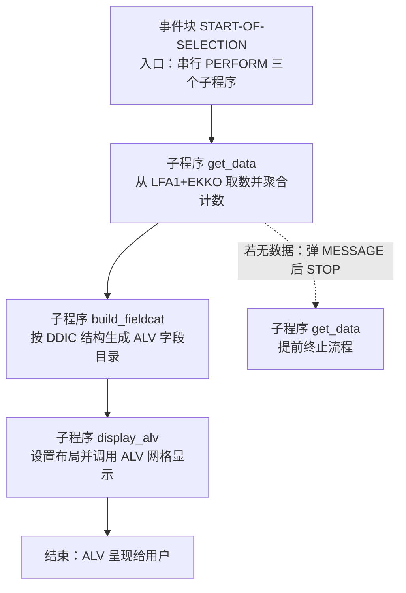
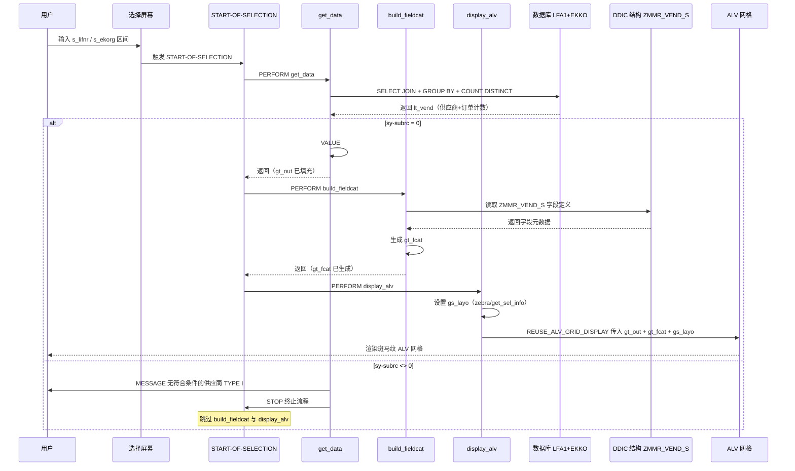

# ABAP 报表程序 ZMMR_VEND_LIST 走读分析报告

---

## 一、程序定位与业务背景

### 解决什么问题

这是一支典型的**采购物料管理域（MM）供应商报表程序**，面向采购部门或供应链管理人员，回答一个具体业务问题：

> "在我指定的采购组织和供应商范围内，每个供应商下过多少张**标准采购订单**（凭证类型 BSTYP = 'F'），请汇总成一张可排序、可导出的 ALV 列表。"

### 现有方案为何不够

在 SAP 标准 ECC / S/4HANA 系统中，供应商与采购订单分别存储于 LFA1（供应商主数据）和 EKKO（采购订单抬头）。用户要拿到"每供应商的订单计数"，通常的做法是：

- 去 ME2L / ME2N 等标准报表里按供应商过滤后人工数，**无法批量导出、无法跨采购组织汇总**；
- 或自己用 SQVI 拼一个查询，但**没有格式化输出、无法做斑马纹布局、无法复用字段目录**。

因此这支自定义报表的价值在于：**一条 SQL 完成 JOIN + 去重计数 + 分组，直接输出成标准 ALV**，让业务用户拿到一份干净、可导出 Excel 的供应商订单活跃度清单。

### 整体设计范式一句话定性

> 典型的 **过程式 ABAP 报表三段式**：SELECT-OPTIONS 选屏 → START-OF-SELECTION 串行 PERFORM 三个子程序（取数 → 装字段目录 → 显示 ALV），用 DDIC 结构 `ZMMR_VEND_S` 驱动字段目录生成，属于 SAP ECC 时代最主流的轻量级 ALV 报表写法。

---

## 二、程序执行流程总览

### 流程图（子程序视角）



### 责任链表（按执行先后排列）

| 子程序 | 调用者 | 职责 |
|---|---|---|
| `START-OF-SELECTION`（事件块） | 系统运行时 | 报表入口，按固定顺序调用 `get_data` → `build_fieldcat` → `display_alv` |
| `get_data`（FORM 子程序） | `START-OF-SELECTION` | 用内联声明 SELECT 从 LFA1 INNER JOIN EKKO 取数据，按供应商分组并对采购订单号做 DISTINCT 计数，结果搬入全局内表 `gt_out` |
| `build_fieldcat`（FORM 子程序） | `START-OF-SELECTION` | 调用函数 `REUSE_ALV_FIELDCATALOG_MERGE`，依据 DDIC 结构 `ZMMR_VEND_S` 自动生成字段目录 `gt_fcat` |
| `display_alv`（FORM 子程序） | `START-OF-SELECTION` | 设置斑马纹布局，调用 `REUSE_ALV_GRID_DISPLAY` 将 `gt_out` 经 `gt_fcat` 渲染为 ALV 网格 |

> 下面按这条流程，逐个子程序展开。

---

## 三、分组分析（按程序流程 / 子程序）

报告主体按 **PERFORM 调用顺序**（即程序真实执行流程）排列子程序，而非源码出现顺序。整个程序可拆为四个分组：全局声明区 → `get_data` → `build_fieldcat` → `display_alv`。

---

### 3.1 声明区 `全局声明区`

本区不含可执行逻辑，但奠定了整支程序的数据契约，是理解后续子程序的前提，故先于流程展开。

```abap
REPORT zmmr_vend_list.
TYPE-POOLS: slis.

TABLES: lfa1, ekko.

DATA: gt_out  TYPE TABLE OF zmmr_vend_s,
      gt_fcat TYPE slis_t_fieldcat_alv,
      gs_layo TYPE slis_layout_alv.

SELECT-OPTIONS: s_lifnr FOR lfa1-lifnr,
                s_ekorg FOR ekko-ekorg.
```

#### 做什么

- 声明程序为 `REPORT` 类型，加载 `SLIS` 类型池（ALV 的老式函数式 API 所需类型定义来源）。
- 用 `TABLES` 语句建立与 LFA1（供应商主数据）、EKKO（采购订单抬头）两张 DDIC 表的接口，主要为后面 `SELECT-OPTIONS ... FOR` 提供"参照字段"的字典上下文。
- 定义三个全局变量：输出内表 `gt_out`（行类型为自定义 DDIC 结构 `ZMMR_VEND_S`）、字段目录内表 `gt_fcat`、布局结构 `gs_layo`。
- 定义两个选择屏幕字段：`s_lifnr`（供应商编号区间）、`s_ekorg`（采购组织区间），二者均为标准 `SELECT-OPTIONS`，用户可在屏幕上填单值、区间、通配、排除等多条件。

#### 为什么 / 设计点评

- **用 DDIC 结构 `ZMMR_VEND_S` 作为输出行类型**，而不是在程序里手画一个本地 TYPES，这是这套报表的关键设计选择：它让字段目录能通过 `REUSE_ALV_FIELDCATALOG_MERGE` 直接从数据字典生成，**字段标签、长度、数据元素语义全部由 DDIC 统一管控**，改字段只改结构一处即可。这是 ECC 时代 ALV 报表的最佳实践之一。
- `TYPE-POOLS: slis` 和 `slis_t_fieldcat_alv` / `slis_layout_alv` 是老式函数式 ALV（`REUSE_ALV_GRID_DISPLAY`）的标配类型。在 S/4HANA 上已推荐改用 `cl_salv_table` 或 `cl_gui_alv_grid`，但这支程序明显是 ECC 时代产物，沿用 SLIS 是时代一致的选择。
- `SELECT-OPTIONS` 而非 `PARAMETERS`，给业务用户留出区间和多值输入的能力，**符合报表类程序的用户习惯**。

#### 风险与改进

- **`TABLES` 语句在面向对象和新式 ABAP 中已不推荐**，它会在程序内存里建一个表工作区（header line），这里其实只用它来给 `SELECT-OPTIONS FOR` 提供参照字段，可以用 `... FOR lfa1-lifnr` 直接写表名-字段名而无需 `TABLES` 声明（取决于 NetWeaver 版本），或改用 `SELECT-OPTIONS s_lifnr FOR @lfa1-lifnr` 的新式写法。保留 `TABLES` 是历史包袱，不算严重但属于规范层改进点。
- **`gt_out` 的行类型 `ZMMR_VEND_S` 是自定义 DDIC 结构，但本程序源码看不到其定义**。如果该结构字段（如 `po_cnt`）的数据元素与实际 SELECT 出来的 `COUNT( DISTINCT ... )` 类型不完全一致，可能在赋值时发生隐式转换。这是后续 `get_data` 中 `VALUE #` 赋值的潜在隐患点，需要在数据字典层校核。

---

从全局声明区出发，程序进入事件块入口。

### 3.2 事件块 `START-OF-SELECTION`

这是整支报表的调度核心，本身不做事，只负责按固定顺序触发三个子程序。

```abap
START-OF-SELECTION.
  PERFORM get_data.
  PERFORM build_fieldcat.
  PERFORM display_alv.
```

#### 做什么

- 系统在选择屏幕处理完成后进入 `START-OF-SELECTION` 事件块。
- 依次 PERFORM 三个子程序：先 `get_data` 把数据准备好，再 `build_fieldcat` 把字段目录装好，最后 `display_alv` 把 ALV 拉起来。

#### 为什么 / 设计点评

- 这种"取数 / 装配 / 显示"三段式拆分是过程式 ABAP 报表的最经典结构，**职责边界清晰**：取数子程序只管数据，装配子程序只管元数据，显示子程序只管呈现。
- 串行 PERFORM 而非把三件事揉在一个事件块里，**便于单独调试和替换**——比如未来想把显示换成 `cl_salv_table`，只动 `display_alv` 一处即可。
- 但这种拆分也有代价：三个子程序之间通过**全局变量 `gt_out` / `gt_fcat` / `gs_layo` 隐式传参**，调用关系在签名上看不出来，只能靠命名约定和读代码理解数据流。这是过程式 ABAP 的通病，本程序也不例外。

#### 风险与改进

- **无显式错误传播机制**：`get_data` 里若取不到数据会用 `STOP` 中断，`STOP` 会直接跳出整个报表处理，不再执行 `build_fieldcat` 和 `display_alv`。这种"硬中断"在简单报表里可接受，但在更复杂场景下会掩盖后续应做的清理工作。可考虑改为 `CHECK` + 返回标记位，让主流程显式决定是否继续。
- **顺序硬编码在事件块里**，无任何防护：若有人误把 `display_alv` 调到 `build_fieldcat` 之前，程序会因字段目录为空而 ALV 行为异常。过程式风格下这是天然风险，只能靠约定避免。

---

接下来进入第一个、也是最重要的取数子程序。

### 3.3 FORM 子程序 `get_data`

这是整支报表的业务核心：用一条 JOIN + GROUP BY + DISTINCT COUNT 的 SQL，把"供应商 + 其标准采购订单数量"一次性算出来。该子程序分两步：① 主查询聚合取数，② 结果回填与空数据处理。

```abap
FORM get_data.
  SELECT a~lifnr,
         a~name1,
         COUNT( DISTINCT b~ebeln ) AS po_cnt
    FROM lfa1 AS a
    INNER JOIN ekko AS b ON a~lifnr = b~lifnr
    WHERE a~lifnr IN @s_lifnr
      AND b~ekorg IN @s_ekorg
      AND b~bstyp = 'F'
    GROUP BY a~lifnr, a~name1
    INTO TABLE @DATA(lt_vend).
```

#### ① 主查询聚合取数

##### 做什么

- 从 LFA1（供应商主数据，别名 `a`）与 EKKO（采购订单抬头，别名 `b`）做 **INNER JOIN**，关联键为 `lifnr`（供应商编号）。
- WHERE 条件三重过滤：
  - `a~lifnr IN @s_lifnr`：供应商编号落在用户输入的选择屏幕区间内；
  - `b~ekorg IN @s_ekorg`：采购订单的采购组织落在用户输入区间内；
  - `b~bstyp = 'F'`：只统计**凭证类型为 'F' 的标准采购订单**（区别于框架协议 'L'、合同 'K' 等）。
- `GROUP BY a~lifnr, a~name1`：按供应商编号和名称分组。
- `COUNT( DISTINCT b~ebeln ) AS po_cnt`：对每组内的采购订单号做**去重计数**，得到该供应商的标准采购订单张数。
- 结果用 `INTO TABLE @DATA(lt_vend)` 内联声明为局部内表 `lt_vend`，字段名直接由 SELECT 列表决定（`lifnr`、`name1`、`po_cnt`）。

##### 为什么 / 设计点评

- **用 INNER JOIN 而非 LEFT OUTER JOIN**，意味着只列出"在指定采购组织下确实有标准采购订单"的供应商。这是符合业务意图的——报表叫"供应商订单活跃度清单"，没下过单的供应商列出来 `po_cnt = 0` 反而是噪音。但如果业务后来想看"零订单供应商"做招商，就需要改成 OUTER JOIN，这是一个**需要业务确认的设计取舍点**。
- **`COUNT( DISTINCT b~ebeln )`** 而非 `COUNT( b~ebeln )`。DISTINCT 是必要的防御：理论上 EKKO 里一个 `ebeln` 只会出现一次（抬头表），DISTINCT 与非 DISTINCT 结果相同，但加上 DISTINCT 表达意图更清晰，且万一未来数据源换成带明细的 EKPO 也不会重复计数。这是**防御性写法**，代价是数据库要多做一次去重，对抬头表来说几乎无成本。
- **`bstyp = 'F'` 是硬编码字面量**。'F' 在 SAP 里是采购订单凭证类型的标准常量，业务语义稳定，硬编码可接受。但更严谨的做法是用 DDIC 域 `BSTYP` 的固定值或常量池，便于读者理解 'F' = 标准 PO 的含义。
- **使用新式 `SELECT ... INTO TABLE @DATA(...)` 内联声明**，避免了在全局声明区预先定义一个临时内表，作用域收窄在 `get_data` 内，**比老式 `DATA: lt_vend TYPE TABLE OF ...` 更干净**。这是这支程序里少数紧跟新式 ABAP 的地方。

##### 风险与改进

- **性能风险（P1）**：`lfa1 INNER JOIN ekko` 在 EKKO 是大表（千万级采购订单历史）时，数据库需要扫描两张表做 JOIN + GROUP BY + DISTINCT COUNT。虽然 LFA1 的 `lifnr` 和 EKKO 的 `lifnr` 都有主键索引，但 **JOIN 后的中间结果集大小取决于 `s_ekorg` 的范围**。若用户不填 `s_ekorg`（即全采购组织），且历史订单量大，这条 SQL 可能很慢。建议：
  - 在 EKKO 上确认存在 `EKORG` + `LIFNR` 的复合索引；
  - 或考虑先从 EKKO 按 `ekorg` + `bstyp` 过滤出目标订单集，再 JOIN LFA1 取名称，减少 JOIN 输入规模。
- **语义校核（P0）**：`po_cnt` 字段最终回填到 `gt_out`，行类型是 `ZMMR_VEND_S`。该结构里 `po_cnt` 字段的数据元素必须能容纳 `COUNT( DISTINCT ebeln )` 的整数结果（类型 I 或与 `ebeln` 计数语义匹配的整型数据元素）。若 `ZMMR_VEND_S-po_cnt` 被错误定义为 `ebeln` 类型（字符型长度 10），赋值时会做隐式字符转换，**表面上能跑但语义错配**——这是技能规范强调的"类型语义校核"重点。需要在 SE11 打开 `ZMMR_VEND_S` 核对 `po_cnt` 的数据元素。
- **无 `UP TO n ROWS` 限制**：极端情况下若条件过宽，可能返回海量供应商行，导致 ALV 渲染慢或内存压力大。对供应商清单通常可控，但建议在程序注释或文档里说明预期数据量级。

---

```abap
  IF sy-subrc = 0.
    gt_out = VALUE #( FOR ls IN lt_vend
                      ( lifnr = ls-lifnr name1 = ls-name1 po_cnt = ls-po_cnt ) ).
  ELSE.
    MESSAGE '无符合条件的供应商' TYPE 'I'.
    STOP.
  ENDIF.
ENDFORM.
```

#### ② 结果回填与空数据处理

##### 做什么

- 检查 `sy-subrc`：SELECT 成功（= 0）则进入回填分支，否则进入空数据分支。
- **回填分支**：用 `VALUE #` + `FOR ... IN` 构造器表达式，遍历局部内表 `lt_vend`，逐行构造 `zmmr_vend_s` 行并装入全局内表 `gt_out`，字段一一对应（`lifnr`、`name1`、`po_cnt`）。
- **空数据分支**：弹出信息消息"无符合条件的供应商"（TYPE 'I'），然后用 `STOP` 直接终止整个报表处理。

##### 为什么 / 设计点评

- **为什么要把 `lt_vend` 再搬一次到 `gt_out`？** 从纯逻辑看，`lt_vend` 的结构与 `gt_out` 的行类型 `ZMMR_VEND_S` 字段名相同，似乎可以直接 `gt_out = lt_vend`。但这里用构造器表达式逐行赋值，**好处是显式声明了字段映射关系**——如果未来 `ZMMR_VEND_S` 加了新字段（如"最近订单日期"），这里必须同步赋值，编译器不会自动填充默认，**强迫开发者显式处理新字段**，是一种隐性防护。代价是代码更长，且多一次内存拷贝。
- 也可以用 `CORRESPONDING` 来做字段名匹配赋值：`gt_out = CORRESPONDING #( lt_vend )`，更简洁。当前写法偏保守但表达力强，可接受。
- **`STOP` 处理空数据**：`STOP` 会立即结束当前事件块的处理，跳过后续 `build_fieldcat` 和 `display_alv`。对用户来说就是弹个对话框、不显示 ALV。这在简单报表里是合理的——既然没数据，也没必要装字段目录和拉 ALV。

##### 风险与改进

- **`MESSAGE ... TYPE 'I'` 后跟 `STOP`**：TYPE 'I' 是信息消息，会以对话框形式弹出，用户点确认后才继续到 `STOP`。这个交互**打断 ALV 报表的预期流程**——用户期望"要么看到列表，要么看到明确提示"，弹框虽然能传达信息，但在批量调度或后台 JOB 运行场景下，对话框会成为阻塞点。改进建议：
  - 若报表可能在后台运行，应改用 `MESSAGE ... TYPE 'S' DISPLAY LIKE 'I'`，以状态栏消息形式提示，不阻塞；
  - 或用 `MESSAGE ... TYPE 'I'` 后立即 `LEAVE LIST-PROCESSING`，语义更明确。
- **`STOP` 是"硬终止"**：它不抛异常、不返回状态码，主流程无法感知"为什么停了"。如果未来程序要扩展（比如记录运行日志、发邮件通知），`STOP` 会跳过这些后续逻辑。更健壮的做法是返回一个标记位（如 `gv_no_data = abap_true`），由主流程显式决定是否继续。
- **`VALUE #` 构造器在 `gt_out` 已有数据时会整体覆盖**：本程序里 `gt_out` 是首次赋值，无残留数据问题。但若未来这段代码被复用到可重复调用的场景，需要先 `CLEAR gt_out` 或用 `gt_out = VALUE #( ... )`（当前写法已是赋值语义，会覆盖，安全）。

---

从 `get_data` 拿到填充好的 `gt_out` 后，流程进入字段目录装配。

### 3.4 FORM 子程序 `build_fieldcat`

本子程序把 DDIC 结构 `ZMMR_VEND_S` 转成 ALV 函数式 API 需要的字段目录内表。子程序较短，保持单块不拆。

```abap
FORM build_fieldcat.
  CALL FUNCTION 'REUSE_ALV_FIELDCATALOG_MERGE'
    EXPORTING
      i_structure_name = 'ZMMR_VEND_S'
    CHANGING
      ct_fieldcat     = gt_fcat.
  IF sy-subrc <> 0.
    MESSAGE '字段目录生成失败' TYPE 'E'.
  ENDIF.
ENDFORM.
```

#### 做什么

- 调用函数 `REUSE_ALV_FIELDCATALOG_MERGE`，传入 DDIC 结构名 `ZMMR_VEND_S`。
- 函数内部读取该结构的字段定义（字段名、数据元素、文本等），自动生成对应的 ALV 字段目录，通过 `CHANGING` 参数 `ct_fieldcat` 回填到全局内表 `gt_fcat`。
- 检查 `sy-subrc`：若不为 0（结构不存在、无权限等），弹出错误消息 `TYPE 'E'`。

#### 为什么 / 设计点评

- **这是函数式 ALV 的标准套路**：与其在程序里手工 `APPEND` 一行行字段目录（写字段名、写文本、写长度），不如把字段元数据**单一来源托管在 DDIC 结构**上，让函数替你生成。改字段标签、长度只改 SE11 结构一处，程序零改动。
- **`TYPE 'E'` 错误消息**会触发运行时错误（短转储 RAISE statement）或显示错误对话框后终止，取决于消息处理上下文。对于"字段目录生成失败"这种**程序无法继续的根本性错误**，用 'E' 是合理的——没有字段目录，ALV 没法显示。
- 这种子程序的**价值不在代码量，而在解耦**：把"字段元数据怎么来"这件事单独封装，主流程不关心细节。

#### 风险与改进

- **`i_structure_name = 'ZMMR_VEND_S'` 是大写硬编码字符串**。ABAP 里 DDIC 对象名本就大写，硬编码可接受，但若未来程序要支持多种输出结构（如详情版/汇总版），需要参数化。当前单一用途场景下无问题。
- **`sy-subrc` 检查只做了 MESSAGE，没有 STOP / RETURN**：`MESSAGE TYPE 'E'` 在某些上下文（如后台 JOB）会变成短转储，但不一定立即停止后续代码执行。严格来说应在 MESSAGE 后加 `STOP` 或 `LEAVE LIST-PROCESSING`，确保即使消息被吞掉也不会带着空的 `gt_fcat` 继续到 `display_alv`。
- **依赖 DDIC 结构存在且字段定义正确**：如果 `ZMMR_VEND_S` 在传输过程中丢失或字段定义与 `gt_out` 不一致，这里不会报字段级错（函数只看结构），但 ALV 显示时会出现列对不上数据的问题。这是隐式依赖，建议在程序文档里标注"本程序依赖 DDIC 结构 ZMMR_VEND_S"。

---

字段目录就绪，流程推进到最后一步：渲染 ALV。

### 3.5 FORM 子程序 `display_alv`

本子程序设置布局属性并调用 ALV 网格显示函数。子程序较短，保持单块不拆。

```abap
FORM display_alv.
  gs_layo-zebra = 'X'.
  gs_layo-get_sel_info = 'X'.
  CALL FUNCTION 'REUSE_ALV_GRID_DISPLAY'
    EXPORTING
      is_layout   = gs_layo
      it_fieldcat = gt_fcat
    TABLES
      t_outtab    = gt_out.
ENDFORM.
```

#### 做什么

- 设置布局结构 `gs_layo` 的两个属性：
  - `zebra = 'X'`：开启斑马纹（隔行变色），提升长列表可读性；
  - `get_sel_info = 'X'`：在 ALV 工具栏里保留选择屏幕信息，允许用户基于当前选择条件做进一步筛选交互。
- 调用函数 `REUSE_ALV_GRID_DISPLAY`，传入布局 `is_layout`、字段目录 `it_fieldcat`，把全局内表 `gt_out` 通过 `TABLES t_outtab` 交给 ALV 渲染。
- 函数内部接管 UI，呈现网格给用户；用户关闭 ALV 后函数返回，程序结束。

#### 为什么 / 设计点评

- **`zebra = 'X'` 是几乎零成本的可用性提升**，对供应商清单这种可能几百行的列表，斑马纹显著降低串行阅读疲劳。属于"应该默认开"的布局项。
- **`get_sel_info = 'X'`** 让 ALV 知道用户最初的选择条件，某些 ALV 交互（如基于选择屏幕的过滤）会用到。在这个简单报表里实际效果有限，但加上无副作用，属于保守增强。
- **没有设置 `i_callback_program`、`i_save`、`i_default` 等常见参数**：
  - 不设 `i_callback_program`，`REUSE_ALV_GRID_DISPLAY` 默认取当前程序名，通常可用；
  - 不设 `i_save`，意味着**用户无法保存 ALV 布局变式**（layout variant），这对频繁使用的业务用户是个损失——他们每次都要重新调整列宽、排序、过滤。
- **`REUSE_ALV_GRID_DISPLAY` 是全屏模式**（fullscreen ALV），不需要自定义容器，适合这种"纯展示"报表。若未来要嵌到自定义屏幕里，需改用 `cl_gui_alv_grid` + 容器。

#### 风险与改进

- **未检查 `sy-subrc`**：`REUSE_ALV_GRID_DISPLAY` 调用后没有判断返回码。若 ALV 渲染失败（极少见，但如字段目录与数据不匹配可能触发），程序会静默继续到结束，用户看不到任何提示。建议加 `IF sy-subrc <> 0` 的兜底 MESSAGE。
- **未启用布局变式保存（`i_save = 'A'` 或 'U'）**：业务用户无法保存自己习惯的列布局，每次重跑都要手动调。这是体验层改进点，加一行 `i_save = 'A'` 即可让用户保存全局/用户级变式，ROI 很高。
- **`REUSE_ALV_GRID_DISPLAY` 在 S/4HANA 上虽然仍可用，但属于过时 API**。新报表推荐用 `cl_salv_table`，代码更面向对象、更易扩展（加工具栏按钮、事件处理等）。但作为存量 ECC 报表，沿用本函数是合理的。
- **无用户交互回调**：没有 `i_callback_user_command` 等，意味着用户在 ALV 里点行没法触发"跳转到供应商主数据"之类的二级动作。如果业务有这种需求，需要扩展本子程序。

---

至此按执行流程走完全部子程序。下面用一张时序图把数据在各子程序间的流转串起来看一遍。

## 四、执行流程全景图（数据视角）



> 这张图清晰展示了"数据从数据库 → 局部内表 → 全局内表 → ALV"的搬运链路，以及空数据分支的提前终止路径。三个全局变量 `gt_out`、`gt_fcat`、`gs_layo` 是子程序之间的隐性数据通道。

---

## 五、问题清单与改进建议（按优先级）

### 🔴 P0 业务正确性

| # | 所在子程序 | 问题 | 改进方向 |
|---|---|---|---|
| 1 | `get_data` | **`po_cnt` 字段类型语义未校核**：`COUNT( DISTINCT b~ebeln )` 产生的是整数计数，回填到 `gt_out`（行类型 `ZMMR_VEND_S`）。若 DDIC 结构里 `po_cnt` 被定义为字符型（如复用 `ebeln` 的数据元素）或长度不足，会发生隐式转换，表面能跑但语义错配——这是技能规范强调的"不能只看长度匹配就放过"的重点 | 在 SE11 打开 `ZMMR_VEND_S`，确认 `po_cnt` 的数据元素为整型（如自建 `ZINT4` 或 `INT4`），与计数语义一致；若不符则修正结构定义 |
| 2 | `get_data` | **INNER JOIN 语义是否符合业务意图未确认**：当前只列出"在指定采购组织下有标准采购订单"的供应商。若业务实际想看"指定范围内的所有供应商及其订单活跃度（含 0）"，当前实现会漏掉零订单供应商 | 与业务确认报表口径；若需含零订单供应商，改为 `LEFT OUTER JOIN` 并对 `po_cnt` 做 `COALESCE` 兜底为 0 |

### 🟠 P1 健壮性

| # | 所在子程序 | 问题 | 改进方向 |
|---|---|---|---|
| 3 | `build_fieldcat` | **`MESSAGE TYPE 'E'` 后未显式停止**：错误消息在某些上下文（后台 JOB）不一定立即终止执行，可能带着空的 `gt_fcat` 继续到 `display_alv`，导致 ALV 异常 | 在 MESSAGE 后加 `STOP` 或 `LEAVE LIST-PROCESSING`，确保硬终止 |
| 4 | `display_alv` | **未检查 `REUSE_ALV_GRID_DISPLAY` 的 `sy-subrc`**：渲染失败会静默继续 | 加 `IF sy-subrc <> 0` 的兜底 MESSAGE |
| 5 | `START-OF-SELECTION` | **`get_data` 用 `STOP` 硬中断，主流程无感知**：未来扩展（日志、邮件）会被跳过 | 改为返回标记位（如 `gv_no_data`），由主流程显式判断是否继续 |

### 🟡 P2 性能与规范

| # | 所在子程序 | 问题 | 改进方向 |
|---|---|---|---|
| 6 | `get_data` | **`lfa1 INNER JOIN ekko` 在 `s_ekorg` 为空（全采购组织）时可能慢**：EKKO 大表全扫 + JOIN + GROUP BY + DISTINCT COUNT | 确认 EKKO 上 `EKORG`+`LIFNR` 复合索引；或先从 EKKO 过滤再 JOIN LFA1；考虑加 `UP TO n ROWS` 上限 |
| 7 | `get_data` | **`bstyp = 'F'` 硬编码字面量**：'F' = 标准 PO 的业务含义对读者不直观 | 改用 DDIC 域 `BSTYP` 的常量或定义程序常量 `CONSTANTS gc_bstyp_po TYPE bstyp VALUE 'F'` |
| 8 | 全局声明区 | **`TABLES: lfa1, ekko` 在新式 ABAP 中不推荐**：产生不必要的表工作区 | 用 `SELECT-OPTIONS ... FOR lfa1-lifnr` 直接引用，移除 `TABLES`（需确认 NetWeaver 版本支持） |
| 9 | `display_alv` | **未启用布局变式保存（`i_save`）**：业务用户无法保存习惯的列布局 | 加 `i_save = 'A'`（全局+用户变式均可保存），ROI 高 |
| 10 | `display_alv` / `build_fieldcat` | **使用过时的函数式 ALV API（SLIS / REUSE_ALV_*）**：S/4HANA 推荐 `cl_salv_table` | 存量程序可保留；新建报表应改用 `cl_salv_table` 或 CDS View + ALV ID |

### 🟢 P3 可扩展性

| # | 所在子程序 | 问题 | 改进方向 |
|---|---|---|---|
| 11 | `display_alv` | **无用户交互回调**：用户在 ALV 点行无法触发"跳转供应商主数据（XK03）"等二级动作 | 加 `i_callback_user_command`，实现双击跳转 |
| 12 | `build_fieldcat` | **`i_structure_name` 硬编码单一结构**：未来要多结构输出需重构 | 当前单一用途可接受；若需扩展可参数化结构名 |
| 13 | 整体架构 | **三个子程序通过全局变量隐式传参**：调用关系不在签名上显式 | 过程式风格通病；若重构可改为子程序带 USING 参数，或整体 OO 化 |

---

## 六、整体评价与启发

### 优点

1. **三段式拆分干净利落**：`get_data` / `build_fieldcat` / `display_alv` 职责边界清晰，单看子程序名就知道干啥，便于维护和单元调试。这是过程式 ABAP 报表的教科书式结构。
2. **DDIC 结构驱动的字段目录**：用 `ZMMR_VEND_S` 托管字段元数据 + `REUSE_ALV_FIELDCATALOG_MERGE` 自动生成字段目录，字段标签/长度单一来源管控，改字段只改 SE11 一处——这是这套写法的最大价值点。
3. **新式 ABAP 局部应用得当**：`SELECT ... INTO TABLE @DATA(...)` 内联声明、`VALUE #` + `FOR ... IN` 构造器表达式，在 ECC 时代程序里算是跟得上语法演进的。作用域收窄、表达力强。
4. **空数据有明确处理**：`sy-subrc` 检查 + MESSAGE 提示 + STOP，用户不会面对一个空 ALV 不知所措。

### 短板

1. **类型语义校核缺失**：`po_cnt` 与 `ZMMR_VEND_S-po_cnt` 的数据元素匹配只能靠人工在 SE11 核对，程序层无防护。这是最容易出隐蔽 bug 的地方。
2. **性能设计无显式考量**：JOIN + GROUP BY + DISTINCT COUNT 在大表上的表现取决于索引和选择条件，程序里没有任何注释说明预期数据量级或索引依赖。
3. **用户体验细节缺失**：未启用布局变式保存、无用户交互回调、错误消息可能在后台阻塞——这些都是低成本即可补齐的体验项。
4. **错误处理偏"硬终止"**：`STOP` 和 `MESSAGE TYPE 'E'` 都是粗暴的中断方式，主流程无法感知失败原因，不利于扩展。

### 可学到的设计经验

1. **DDIC 结构作为数据契约**：把输出行的字段定义从程序代码里抽出来放到 DDIC，让字段目录、数据回填、ALV 显示三方共享同一份元数据真相——这种"单一真相源"思维在任何语言里都适用（类比 TypeScript 的 interface、Protocol Buffers 的 schema）。
2. **取数与显示解耦**：`get_data` 只管把数据搬进全局内表，`display_alv` 只管把内表渲染出去。这种分层让"换显示方式"（如从 ALV 换成 Excel 导出、换成 Web API）只动一层。
3. **防御性写法的度**：`COUNT( DISTINCT ... )` 里的 DISTINCT 在抬头表上是冗余的，但加上几乎无成本且防未来数据源变更——这种"低成本防御"值得借鉴；但 `STOP` 这种"硬终止"则是过度防御，应换成可感知的返回机制。
4. **子程序命名即文档**：`get_data`、`build_fieldcat`、`display_alv` 三个名字一眼看懂职责，不需要注释。命名是过程式代码里最廉价的可读性投资。

---

> 本报告按程序真实执行流程（PERFORM 调用顺序）组织子程序分析，所有问题以子程序名定位（不用行号），所有代码块完整展开不压缩，每个代码块后均含"做什么 / 为什么 / 风险与改进"三层。Mermaid 图表标签已规避裸尖括号与井号字符。
