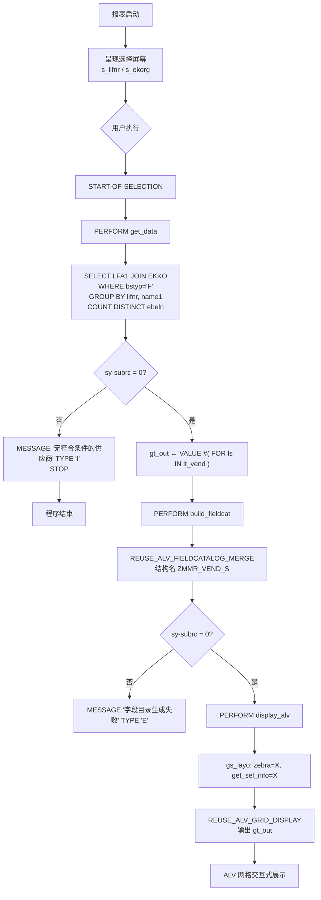

# ABAP 报表程序走读分析：`zmmr_vend_list`

> 源文件：`zmmr_vend_list.abap`（共 58 行）
> 程序类型：可执行报表（Executable Report，`REPORT` 语句声明）
> 技术风格：过程式 ABAP + SLIS ALV 框架 + 新版内联语法混用

---

## 一、程序概览

`zmmr_vend_list` 是一个典型的 SAP MM（物料管理）模块下的供应商采购统计报表。程序接收用户在选择屏幕上输入的供应商编号区间和采购组织区间，从供应商主数据表 `LFA1` 与采购订单抬头表 `EKKO` 中联表聚合，统计每个供应商名下的标准采购凭证（`bstyp = 'F'`）数量，最终以 ALV 网格形式展示结果。

整体规模很小（58 行），但结构清晰：选择屏幕 → 数据采集 → 字段目录构建 → ALV 展示，四段式职责分离。

---

## 二、业务目的

| 维度 | 说明 |
|------|------|
| **业务问题** | 采购或供应链人员需要快速查看某采购组织下、某些供应商范围内的采购订单活跃度（下了多少张标准 PO） |
| **使用者** | MM 关键用户 / 采购员 / 采购主管 |
| **输入** | 供应商编号区间 `s_lifnr`、采购组织区间 `s_ekorg`（均为 `SELECT-OPTIONS`，支持区间、排除、模式匹配） |
| **输出** | 供应商编号 `lifnr`、供应商名称 `name1`、采购订单计数 `po_cnt` 三列 ALV 列表 |
| **过滤口径** | 仅统计 `bstyp = 'F'`（标准采购订单，Standard PO）。其他类型（如框架协议 `L`、询价 `B`、计划协议 `K` 等）被排除 |

> 设计意图：聚焦"真实下单行为"，剔除框架协议/询价等非直接下单凭证，让 `po_cnt` 反映供应商的实际采购活跃度。

---

## 三、架构与设计

### 3.1 整体架构

程序采用经典的**过程式报表三层结构**，每一层对应一个 `FORM` 子例程：

```
┌──────────────────────────────────────────────┐
│  选择屏幕 (SELECT-OPTIONS)                   │
│   s_lifnr / s_ekorg                          │
└──────────────────┬───────────────────────────┘
                   │ START-OF-SELECTION
                   ▼
┌──────────────────────────────────────────────┐
│  数据采集层   get_data()                     │
│   LFA1 INNER JOIN EKKO → 聚合 → gt_out       │
└──────────────────┬───────────────────────────┘
                   ▼
┌──────────────────────────────────────────────┐
│  元数据层    build_fieldcat()                │
│   由 DDIC 结构 ZMMR_VEND_S 生成字段目录      │
└──────────────────┬───────────────────────────┘
                   ▼
┌──────────────────────────────────────────────┐
│  展示层      display_alv()                  │
│   REUSE_ALV_GRID_DISPLAY 渲染网格           │
└──────────────────────────────────────────────┘
```

### 3.2 设计特征

| 特征 | 体现 | 评价 |
|------|------|------|
| **职责分离** | 取数 / 字段目录 / 展示三件事分三个 `FORM` | 单一职责，可读性好，便于定位问题 |
| **数据字典驱动** | 字段目录用 `REUSE_ALV_FIELDCATALOG_MERGE` 从 DDIC 结构 `ZMMR_VEND_S` 自动生成 | 字段标签、长度、类型与 DDIC 保持一致，维护成本低 |
| **新语法混用** | `@DATA(lt_vend)` 内联声明、`VALUE #( FOR ls IN lt_vend ... )` 构造表达式 + `FOR` 迭代 | 在遗留报表框架内引入新语法，缩减样板代码 |
| **遗留 ALV 框架** | 使用 SLIS 类型组 + `REUSE_ALV_GRID_DISPLAY` 函数模块 | 非 OO、可扩展性弱于 `CL_SALV_TABLE` / `CL_GUI_ALV_GRID`，但在既有代码库中仍极常见 |
| **全局数据声明** | `gt_out / gt_fcat / gs_layo` 为程序级全局变量 | 过程式报表的典型做法，封装性差但在小规模报表中可接受 |

### 3.3 数据依赖

| 对象 | 类型 | 用途 |
|------|------|------|
| `LFA1` | 透明表 | 供应商主数据（一般数据段），提供 `lifnr`、`name1` |
| `EKKO` | 透明表 | 采购订单抬头，提供 `ebeln`、`ekorg`、`bstyp`、`lifnr` |
| `ZMMR_VEND_S` | DDIC 结构 | 自定义输出结构（`lifnr / name1 / po_cnt`），驱动字段目录生成 |
| `SLIS` | Type Group | ALV 类型定义（`slis_t_fieldcat_alv`、`slis_layout_alv`） |

---

## 四、执行流程



**关键时序说明：**

1. **选择屏幕阶段**：`SELECT-OPTIONS` 在 `START-OF-SELECTION` 之前由系统自动生成与处理；用户可输入区间、排除项、模式（如 `CP`）。`s_ekorg` 引用 `ekko-ekorg` 作为关联字段，但实际过滤在 `EKKO` 表上生效。
2. **取数阶段（`get_data`）**：单条 SQL 完成"联表 + 过滤 + 分组 + 去重计数"四件事，结果落入内联声明的 `lt_vend`，再通过 `VALUE #(... FOR ...)` 构造表达式转存到全局 `gt_out`。
3. **元数据阶段（`build_fieldcat`）**：完全委托给 DDIC，不在代码中硬编码字段标签——这是本程序最值得称道的设计点。
4. **展示阶段（`display_alv`）**：仅设置两项布局（斑马纹、显示选择条件信息）后调用标准 ALV。展示完全由 SAP 标准函数接管，用户可在 ALV 上排序、筛选、汇总、导出。

---

## 五、子程序详解

### 5.1 `FORM get_data`（第 18–36 行）— 数据采集

**核心 SQL 逻辑：**

```abap
SELECT a~lifnr, a~name1,
       COUNT( DISTINCT b~ebeln ) AS po_cnt
  FROM lfa1 AS a
  INNER JOIN ekko AS b ON a~lifnr = b~lifnr
  WHERE a~lifnr IN @s_lifnr
    AND b~ekorg IN @s_ekorg
    AND b~bstyp = 'F'
  GROUP BY a~lifnr, a~name1
  INTO TABLE @DATA(lt_vend).
```

**解读：**
- **联表方式：`INNER JOIN`**。意味着**没有任何标准 PO 的供应商不会出现在结果中**。这是本程序最重要的业务语义边界——它回答的是"有下单的供应商下了多少单"，而非"所有供应商的下单情况"。
- **`COUNT( DISTINCT b~ebeln )`**：由于 `EKKO` 中 `ebeln` 是主键、每行对应一张 PO，`DISTINCT` 在此处其实是冗余的，`COUNT(*)` 等价。但写 `DISTINCT` 是防御性写法——若未来 SQL 改为带 `EKKO` 之外的明细表（如 `EKPO`）联表，仍能保证按订单号去重。
- **`bstyp = 'F'`**：硬编码常量，限定标准采购订单（Standard PO）。SAP 采购凭证类型：`F`=标准、`L`=框架协议、`K`=计划协议、`B`=询价、`S`=报价等。
- **`GROUP BY a~lifnr, a~name1`**：`name1` 对同一 `lifnr` 唯一，分组包含它仅为满足 SQL 语法（被 SELECT 的非聚合列必须出现在 GROUP BY 中）。
- **结果转存**：`gt_out = VALUE #( FOR ls IN lt_vend ( ... ) )`。这里做了一次"表到表"的复制，从内联临时表 `lt_vend` 复制到全局 `gt_out`。严格说并非必要——`gt_out` 本身可直接作为 `INTO TABLE` 目标，省去一次构造。当前的写法可读性较好但效率略低。

**异常分支：**
- `sy-subrc <> 0` → 弹出信息提示"无符合条件的供应商"并 `STOP`，终止后续处理。`STOP` 会结束当前报表事件块，是合理的中止方式（虽然现代代码更倾向 `RETURN`）。

### 5.2 `FORM build_fieldcat`（第 38–47 行）— 字段目录构建

```abap
CALL FUNCTION 'REUSE_ALV_FIELDCATALOG_MERGE'
  EXPORTING i_structure_name = 'ZMMR_VEND_S'
  CHANGING  ct_fieldcat     = gt_fcat.
```

**设计要点：**
- 字段目录（field catalog）决定 ALV 显示哪些列、列名、对齐、可编辑性等。本程序**不逐字段手写**，而是通过 DDIC 结构 `ZMMR_VEND_S` 一次性生成。
- 好处：字段标签、长度、数据元素语义随 DDIC 自动同步，新增字段只需改 DDIC 结构，代码零改动。
- 风险：依赖 DDIC 结构 `ZMMR_VEND_S` 必须存在于系统且字段与 `gt_out`（同结构）对齐；若结构缺失或不一致，`sy-subrc <> 0`，程序以错误消息中止。
- 注：`ZMMR_VEND_S` 与 `gt_out` 的行类型同名，二者一致性由开发规范保证，但代码本身无显式校验。

### 5.3 `FORM display_alv`（第 49–57 行）— ALV 展示

```abap
gs_layo-zebra        = 'X'.   " 斑马纹（隔行换色）
gs_layo-get_sel_info = 'X'.   " 在 ALV 顶部显示用户的选择条件
CALL FUNCTION 'REUSE_ALV_GRID_DISPLAY'
  EXPORTING is_layout   = gs_layo
            it_fieldcat = gt_fcat
  TABLES    t_outtab    = gt_out.
```

**布局选项解读：**
- `zebra = 'X'`：提升长列表可读性，是 UX 友好的默认值。
- `get_sel_info = 'X'`：在 ALV 上方显示用户输入的选择条件，便于结果截图留痕、审计回溯。这是面向业务用户的贴心设置。

未设置但常见的布局项：`colwidth_optimize`（列宽自动优化）——本程序未启用，列宽将按 DDIC 字段长度默认呈现，对长名称（如 `name1`）可能显示不全，需用户手动拖宽。这是一个可改进点。

---

## 六、设计亮点

1. **三层职责分离**：取数、元数据、展示三件事互不耦合。若未来要把展示从 ALV 换成 SALV 或 Web DynPro，只需改 `display_alv`；要把数据源换成 CDS View，只需改 `get_data`。
2. **DDIC 驱动字段目录**：`REUSE_ALV_FIELDCATALOG_MERGE` 是 SAP 报表开发的"黄金路径"，让字段维护收敛到数据字典一处，代码与元数据解耦。
3. **单条 SQL 完成聚合**：不在 ABAP 层做循环计数，把 `COUNT(DISTINCT ...)` 下推到数据库层，符合"HANA/数据库做重活、ABAP 做轻活"的现代优化原则。
4. **新语法渐进式引入**：`@DATA`、`VALUE #( FOR ... )` 在不重构整体架构的前提下降低样板代码，是一种务实的现代化路径。
5. **失败即停**：取数为空或字段目录生成失败都立即中止并提示用户，避免带着错误数据继续走到展示层。

---

## 七、风险与改进建议

### 7.1 业务语义风险

| 风险 | 说明 | 建议 |
|------|------|------|
| **INNER JOIN 漏掉零订单供应商** | 无标准 PO 的供应商不出现，若业务诉求是"全量供应商 + 下单数（含 0）"则结果失真 | 若需全量，改 `LEFT OUTER JOIN` 并对 `po_cnt` 做 `COALESCE`/`INITIAL` 处理；明确业务诉求后再定 |
| **`bstyp='F'` 硬编码** | 用户无法选择其他凭证类型（如想看报价 `S`、计划协议 `K`） | 若有需求，增加 `SELECT-OPTIONS s_bstyp FOR ekko-bstyp DEFAULT 'F'`，把硬编码上升为用户可选项 |
| **无 `COUNT(*)` 简化** | `DISTINCT ebeln` 冗余（当前 SQL 形态下 `ebeln` 已唯一） | 若确认不会扩展到明细表联表，可简化为 `COUNT(*)`；保留 `DISTINCT` 也可作为防御性写法，权衡可读性 |

### 7.2 安全与权限风险

| 风险 | 说明 | 建议 |
|------|------|------|
| **缺少授权检查** | 未对供应商主数据（`LFA1`）/采购组织（`EKKO-EKORG`）做 `AUTHORITY-CHECK`，用户可能看到无权访问的数据 | 在 `get_data` 前对 `s_ekorg` 每个值做 `AUTHORITY-CHECK OBJECT 'M_BEST_EKO' ...`，或在选择屏幕 `AT SELECTION-SCREEN` 事件中校验 |
| **无结果集上限** | 不限制 `s_lifnr` 范围时可全量扫描，大数据量下内存/性能风险 | 视数据量决定是否加 `UP TO n ROWS` 或强制选择条件非空 |

### 7.3 技术债务

| 项 | 现状 | 现代替代 |
|----|------|----------|
| **遗留 ALV** | `REUSE_ALV_GRID_DISPLAY`（函数模块、非 OO、二次开发受限） | `CL_SALV_TABLE`（SALV，更现代、OO、易扩展）或 `CL_GUI_ALV_GRID`（全功能 OO ALV） |
| **子例程** | `FORM/PERFORM`（SAP 官方已不推荐扩展） | 局部类 + 方法（OO），或至少 `PERFORM` 仅用于遗留兼容 |
| **`STOP`** | 仍可用但偏旧 | `RETURN`（直接退出当前处理块）语义更清晰 |
| **无列宽优化** | `gs_layo` 未设 `colwidth_optimize = 'X'` | 加上该项，让 `name1` 等长字段自适应宽度 |
| **全局变量** | `gt_out/gt_fcat/gs_layo` 程序级全局 | 小报表可接受；若重构为 OO，封装为类属性 |

### 7.4 可维护性建议

1. **常量化**：把 `'F'` 提取为命名常量（如 `CONSTANTS gc_bstyp_standard TYPE ekko-bstyp VALUE 'F'`），消除魔法字符串。
2. **结构一致性显式保证**：`ZMMR_VEND_S` 与 `gt_out` 行类型同名耦合，建议在 `build_fieldcat` 失败分支外，再用 `gt_out` 与结构做类型断言或在 DDIC 层强约束。
3. **测试**：当前无单元测试。`get_data` 的 SQL 逻辑适合抽出为可测方法（OO 化后用 `CL_ABAP_UNIT_ASSERT` 验证不同选择条件下的计数）。
4. **国际化消息**：`MESSAGE '无符合条件的供应商' TYPE 'I'` 为硬编码中文文本，应改用消息类（`MESSAGE xxx(zz)`）以支持多语言。

---

## 八、总结

`zmmr_vend_list` 是一个**小而完整、职责清晰、DDIC 驱动**的经典过程式 ABAP 报表。它用一个 SQL 聚合 + 一个 DDIC 结构 + 一个标准 ALV 函数，干净地回答了"某采购组织下某些供应商下了多少张标准采购订单"这一业务问题。

其设计哲学可概括为三条：
1. **数据字典是单一真相源**——字段定义、标签、目录都来自 DDIC，代码不重复元数据。
2. **数据库做重活**——聚合下推 SQL，ABAP 只做编排与展示。
3. **失败快速中止**——任一阶段失败即提示并停机，不留隐性错误。

主要的改进空间集中在三处：**业务语义边界（INNER JOIN vs LEFT JOIN、bstyp 硬编码）**、**安全（授权检查缺失）**、**技术现代化（SALV/OO、常量化、消息类、列宽优化）**。这些都不影响当前程序"能正确跑、能交付业务价值"，但若进入持续演进的产品线，建议优先补齐授权检查与消息类国际化，其余按需迭代。
