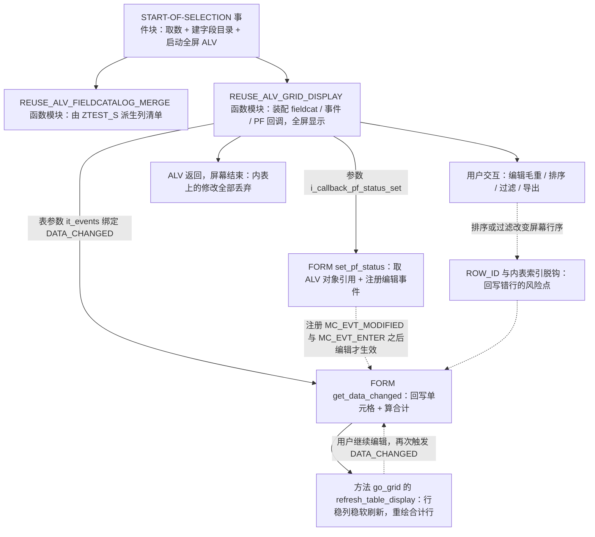
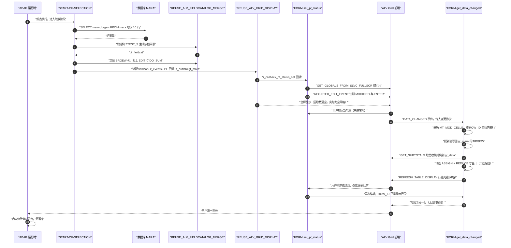

# ztest7 程序分析报告（Onboarding 级）

> 分析对象：`ztest7.abap`（`REPORT ztest7`，115 行，`TYPE-POOLS slis`）
> 阅读目标：搞清它想解决什么业务问题、整体架构怎么搭的、哪里会出错、出错时是什么现象。

---

## 一、程序定位与业务背景

### 1.1 它想解决什么业务问题

先还原业务场景。一线物流 / 包装 / 采购岗位在回答"这批货到底有多重"这个问题时，重量数据是散的：

- `MM03` 一次只能看一个物料，看不到横向对比，也没有任何合计；
- 采购订单 `ME23N`、交货单里的重量是单据上的，与主数据不一致时没人说得清哪个是准的；
- 用 `SE16` / `ME_TABLE` 导出来自己在 Excel 里算——合计是"死"的，改一个数就要重算一遍，而且没有校验、没有单位提示。

所以这段代码想做一个"**物料重量速查台**"：一次列出物料号与毛重，允许用户**直接在表格里改数字**，并**实时看到合计**。这是一个"交互式核对工具"的形态，而不是"跑一次出一张报表"的形态。

选字段也印证了这个意图：`MARA-BRGEW` 是最容易取到的重量字段（物料主数据自带，不需要库存），点两下就能跑通"取数 → 显示 → 编辑 → 合计"这条链路。

### 1.2 但先把话说清楚：它真实的身份是"技术验证型 POC"，不是业务程序

这一点必须先讲，否则后面所有"看起来能跑"的判断都会走偏。证据全在代码里：

| 现象 | 位置 | 说明 |
|---|---|---|
| `UP TO 10 ROWS`，无 `WHERE`、无 `ORDER BY` | `START-OF-SELECTION` | 取的是数据库物理顺序的前 10 行，无业务含义、不可复现 |
| 编辑结果不落库 | `set_pf_status` / `get_data_changed` | 没有任何保存按钮、没有任何写操作，改完就丢 |
| 空 `CASE ... WHEN OTHERS` | `set_pf_status` | 预留了功能位但没实现 |
| 手工用 `REDUCE` 算合计 | `get_data_changed` | 说明作者对 ALV 自带合计不放心，想自己控制 |
| 目标表名写错 | `START-OF-SELECTION` | `_mara` 从未声明（详见第三章） |

结论：**它验证的是"全屏 ALV 可编辑列 + 实时合计刷新"这条技术路径能不能走通，而不是解决真实的重量核对业务。** 判断它"能用"之前，必须先把这些 POC 痕迹清掉。

### 1.3 设计范式一句话定性

> **经典 `REUSE_ALV_*` 全屏报表范式 + 字段目录驱动（DDIC 派生列）+ `FIELDCAT-EDIT` 打开的内存可编辑列 + `DATA_CHANGED` 事件协议回写内表 + `REFRESH_TABLE_DISPLAY` 稳定刷新。**

这是 ABAP 里做"可编辑 ALV"最经典、也是官方文档推荐的一条路。技术路线本身选对了，问题几乎全部出在实现细节和数据语义上。

---

## 二、程序执行流程总览



### 责任链表

| 顺序 | 子程序 | 调用者（谁触发） | 职责 |
|---|---|---|---|
| 1 | 全局声明区 | ABAP 运行时加载程序时 | 持有数据表、字段目录、事件表、ALV 引用、稳定标志、合计容器 |
| 2 | `START-OF-SELECTION` | ABAP 运行时（报表进入取数阶段） | 选数、构建字段目录、标记可编辑与合计、注册事件、调用全屏显示 |
| 3 | `REUSE_ALV_FIELDCATALOG_MERGE` | `START-OF-SELECTION` | 从 DDIC 结构 `ZTEST_S` 反推列清单与默认格式 |
| 4 | `REUSE_ALV_GRID_DISPLAY` | `START-OF-SELECTION` | 装配 fieldcat / events / PF-STATUS 回调，承载全屏网格；程序在此转为事件驱动 |
| 5 | `set_pf_status` | `REUSE_ALV_GRID_DISPLAY` 的 `i_callback_pf_status_set` | 取 ALV 对象引用到 `go_grid`、注册修改与回车两个编辑事件 |
| 6 | `get_data_changed` | ALV Grid 触发 `DATA_CHANGED`（由 `it_events` 注册的 FORM） | 遍历被改单元格、按行号回写内表、算合计、稳定刷新 |
| 7 | `go_grid->get_subtotals` | `get_data_changed` | 取 ALV 汇总引擎算出的"总计"结构 |
| 8 | `go_grid->refresh_table_display` | `get_data_changed` | 保持行列位置与排序过滤状态下重绘（含合计行） |
| 9 | 结束 | ALV 返回到调用屏幕 | 内表上的修改随程序结束消失，无落库 |

下面按这条流程，逐个子程序展开。

---

## 三、分组分析（按程序执行流程）

先看全局：整个程序只有 4 个逻辑单元——一个事件块 + 两个 FORM + 一堆全局对象。事件块负责"准备与启动"，`set_pf_status` 负责"把 ALV 改造得可编辑"，`get_data_changed` 负责"接收编辑并反映到数据与屏幕"。真正的业务逻辑全在最后一步。

### 3.1 全局声明区

```abap
REPORT ztest7.
TYPE-POOLS:slis.

DATA: gt_mara     TYPE TABLE OF ztest_s,
      gt_fieldcat TYPE slis_t_fieldcat_alv,
      gt_events   TYPE slis_t_event,
      go_grid     TYPE REF TO cl_gui_alv_grid,
      gs_stable   TYPE lvc_s_stbl,
      gr_data     TYPE REF TO data.

FIELD-SYMBOLS: <gtr_sum_tab> TYPE table.
```

**第一层｜做什么**

- 建 6 个全局对象：显示用的内表 `gt_mara`、字段目录 `gt_fieldcat`、事件表 `gt_events`、ALV 控件引用 `go_grid`、刷新稳定标志 `gs_stable`、ALV 合计结果容器 `gr_data`。
- 建 1 个完全无类型的字段符号 `<gtr_sum_tab>`，专门用来"接住"ALV 返回的那个类型不确定的合计结构。
- `TYPE-POOLS: slis` 为 `REUSE_ALV_FIELDCATALOG_MERGE` 与全部 `SLIS_T_*` 类型提供运行时类型池，是这条技术路线的硬性前提。

**第二层｜为什么 / 设计点评**

报表式程序把跨 `FORM` 共享的状态放全局，是这套架构的常规解：显示表（`START-OF-SELECTION` 填）、ALV 引用（`set_pf_status` 填）、稳定标志与合计容器（`get_data_changed` 用）三处都要跨过程访问。

真正值得肯定的一点是**职责切分**：`set_pf_status` 只管"让 ALV 具备可编辑能力"，`get_data_changed` 只管"接收编辑结果"，两者不交叉。很多人写可编辑 ALV 会把两件事塞进同一个 `FORM`，结果状态变量互相污染。

**第三层｜风险与改进**

- 🟠 `gr_data TYPE REF TO data` + `<gtr_sum_tab> TYPE table` 把类型检查整个交给了运行时。这两个无类型容器是 3.4② 里"合计到底生效没有"这一连串疑问的直接来源。改进：合计改用强类型变量（见 3.4② 的修复片段）；无类型只保留在确实拿不到类型的地方，且每次 `ASSIGN` 后立即判 `SY-SUBRC`。
- 🟠 `gt_mara` 的行类型是自定义结构 `ZTEST_S`，而 SQL 取的是 `MARA` 的字段——声明区与取数区从这里就已经脱节，这是 `_mara` 问题的前奏。改进：明确 `ZTEST_S` 的定位（显示结构），并让它与取数来源一一对应。
- 🟡 命名不统一：`gt_` 前缀表示"全局表"但 `go_grid` 是对象引用、`gr_data` 是泛型引用，可读性尚可；但 `ZTEST_S` 这种以 `MARA` 缩写命名的自定义结构（`mara` + `s`）容易和真表 `MARA` 混淆。改进：命名体现业务语义，如 `Z_MAT_WEIGHT_DISPLAY`。

### 3.2 事件块 `START-OF-SELECTION`

分三步：① 取数；② 由 DDIC 结构派生字段目录并标记可编辑/合计列；③ 注册事件、启动全屏 ALV。

#### ① 取数

```abap
START-OF-SELECTION.

  SELECT matnr,
         brgew
     FROM mara
     INTO TABLE _mara UP TO 10 ROWS.
  IF sy-subrc EQ 0.
```

**第一层｜做什么**

从 `MARA` 取 `MATNR`（物料号）与 `BRGEW`（毛重）两列，最多 10 行，意图写进全局表 `gt_mara`；再用 `SY-SUBRC = 0` 当成"取数成功才继续"的门。

**第二层｜为什么 / 设计点评**

- `MARA-BRGEW` 是物料主数据上的**标准毛重**（Bruttogewicht），取它不需要库存、不需要工厂视图，是最短路径。
- `UP TO 10 ROWS` + 无 `WHERE`：这是典型的"先把交互链路跑通"的做法——把数据量压到最小，让注意力集中在 ALV 编辑与合计上。作为 POC 意图可以理解。

**第三层｜风险与改进**

- 🔴 `_mara` 从未声明，也从来不是 `gt_mara`。本程序唯一声明的显示表是 `gt_mara`，与它毫无关系。两种结局都不可接受：(a) `INTO TABLE` 的目标必须是已声明的内部表（隐式声明只在目标名与数据库表名相同的遗留场景成立），`SE38` 激活时报语法错；(b) 若因任何原因激活通过，取出的数据也被丢进一张与显示无关的表里丢弃。**无论哪种，屏幕上的 ALV 必然是空网格。** 修复：把目标改成 `gt_mara`，或显式取到局部表再 `MOVE-CORRESPONDING`。
- 🔴 `SY-SUBRC` 不是数据库 `SELECT` 的成功标志。`SELECT` 正常执行后 `SY-SUBRC` 的值不反映"查没查到"；而在隐式异常处理下若发生类型转换/溢出异常，`SY-SUBRC` 反而会非 0——此时这段 `IF` 会把整个 ALV 逻辑静默跳过，用户只看到白屏。修复：用 `IF gt_mara IS INITIAL`（或 `lines( ... )`）判断结果，异常时 `MESSAGE` 反馈。
- 🟠 无 `WHERE`、无 `ORDER BY`：取的是数据库物理顺序的前 10 行，每次运行可能不同、无业务含义、不可复现，也无法向业务方解释"为什么是这 10 个物料"。修复：补真实选择条件（物料范围、工厂、类别）与 `ORDER BY matnr`，并把行数参数化。
- 🟠 **数据源选错层面的风险**：`MARA-BRGEW` 是"物料 + 包装的标准毛重"，用于运费/包装计算；它不是"这批货实际有多重"。后者属于库存数量级视图（`MARC-NTGEW` / `MBEW`）。如果业务真实诉求是库存重量，选字段这一步就错了，后面所有代码都白写。修复：先与业务确认口径——主数据毛重 还是 库存净重。

#### ② 派生字段目录并标记可编辑与合计列

```abap
    CALL FUNCTION 'REUSE_ALV_FIELDCATALOG_MERGE'
      EXPORTING
        i_program_name         = sy-repid
        i_structure_name       = 'ZTEST_S'
      CHANGING
        ct_fieldcat            = gt_fieldcat
      EXCEPTIONS
        inconsistent_interface = 1
        program_error          = 2
        OTHERS                 = 3.
    IF sy-subrc = 0.
      READ TABLE gt_fieldcat ASSIGNING FIELD-SYMBOL(<gs_fcat>) WITH KEY fieldname = 'BRGEW'.
      IF sy-subrc EQ 0.
        <gs_fcat>-edit = 'X'.
        <gs_fcat>-do_sum = 'X'.
      ENDIF.
```

**第一层｜做什么**

- 调用 `REUSE_ALV_FIELDCATALOG_MERGE`，让 SAP 读 DDIC 结构 `ZTEST_S` 自动生成整张字段目录（列顺序、列宽、标题、转换例程、单位、搜索帮助全部来自数据字典），并交给 `gt_fieldcat`。
- 然后按字段名定位 `BRGEW` 列，在生成的默认配置上打两个补丁：`EDIT = 'X'`（该列可编辑）与 `DO_SUM = 'X'`（该列参与合计）。

**第二层｜为什么 / 设计点评**

"DDIC 驱动 + 定点打补丁"是比手写 40 个 fieldcat 组件更划算的做法：结构改一次，列定义自动跟着变，文本与格式永远和字段保持一致；需要特殊行为的列再单独找出来改。这比"全手写 fieldcat"的可维护性高一个量级。

`EDIT` / `DO_SUM` 打在生成结果上（而不是放弃生成、自己重建），保留了"最小干预"的好处，也避免了手写清单里最容易出的错——`no_outlen` / `emphasize` / `key` 之类的模板项漏配。

**第三层｜风险与改进**

- 🟠 异常被静默吞掉：`EXCEPTIONS` 列了 3 种，失败后只有 `IF sy-subrc = 0` 一句判断，**没有任何 `MESSAGE`、没有任何日志**。用户看到的就是一个"什么都没有的屏幕"。改进：失败时给一条 `MESSAGE ... TYPE 'S'/'E'`，至少写一条应用日志。
- 🟠 `ZTEST_S` 与内表的一致性在这里**没有**被真正校验：这个函数模块只拿到了结构名，拿不到内表，真正的 `inconsistent_interface` 检查发生在后续 `REUSE_ALV_GRID_DISPLAY` 里，而那个调用的异常并未处理（见 ③）。也就是说，结构与内表一旦不一致，表现是**未捕获异常直接 dump**，而不是友好报错。
- 🟠 字段名 `'BRGEW'` 硬编码，而且后面还会再出现两次（协议 `WHERE` 过滤、`ASSIGN COMPONENT`），共三处必须同步。改进：用 `CONSTANTS gc_fld_brgew TYPE string VALUE 'BRGEW'`；更好的做法是遍历字段目录找 `edit = 'X'` 的列做处理，不点名任何字段——这样加一列可编辑字段不用改代码。
- 🟡 `DO_SUM = 'X'`（ALV 自带合计）与后面手工 `REDUCE`（自己算合计）并存，屏幕上会出现"两个合计来源"。业务方一旦发现两者不一致，信任就没了。改进：二选一（见 3.4②）。
- 🟡 列标题来自 `ZTEST_S` 的 DDIC 文本，不含单位。重量列必须标单位（如"毛重 (kg)"），否则屏幕上那个数字没有任何解释。改进：改 `REF_TEXT` 或 `LIST_TABSTR` 覆写标题。
- 🟡 `EXCEPTIONS` 里写 `OTHERS = 3` 在这个函数模块上没有实际价值（`i_structure_name` 不存在走的是 `program_error`/短 dump），更像是从别处模板复制来的。可以留，但不建议把它当错误处理的一部分。

#### ③ 注册事件并启动全屏 ALV

```abap
      APPEND VALUE #( name = 'DATA_CHANGED' form = 'GET_DATA_CHANGED' ) TO gt_events.

      CALL FUNCTION 'REUSE_ALV_GRID_DISPLAY'
        EXPORTING
          i_callback_program       = sy-repid
          it_fieldcat              = gt_fieldcat
          it_events                = gt_events
          i_callback_pf_status_set = 'SET_PF_STATUS'
        TABLES
          t_outtab                 = gt_mara.
    ENDIF.
  ENDIF.
```

**第一层｜做什么**

- 往事件表里追加一条绑定：ALV 的 `DATA_CHANGED` 事件发生（单元格被改）时，回调本程序的 `GET_DATA_CHANGED`。
- 调 `REUSE_ALV_GRID_DISPLAY` 做**全屏**显示：把字段目录、事件表、PF-STATUS 回调名和显示数据表 `gt_mara` 一起交给它；`i_callback_program` 指向本报表，让 FM 能回调到本地 `FORM`。

**第二层｜为什么 / 设计点评**

- `IT_EVENTS` 绑定事件是比老式 `I_CALLBACK_DATA_CHANGED` 更现代的注册方式，也是 `SET_PF_STATUS` 之外的官方推荐路径：它能同时挂 `DATA_CHANGED`、`SUBTOTAL_END`、`SORT_END`、`USER_COMMAND` 等多个事件，且名字在运行时解析。
- `I_CALLBACK_PF_STATUS_SET` 而不是 `I_CALLBACK_PF_STATUS`，是因为前者会在 ALV **自己的显示上下文里**先执行一次回调——这正是 `GET_GLOBALS_FROM_SLVC_FULLSCR` 唯一合法的调用时机。选对了入口。
- 用 `t_outtab` 而不是 `t_data` 传初始数据，是因为不需要按 `it_sort` 先排序一次再传。

**第三层｜风险与改进**

- 🟠 `REUSE_ALV_GRID_DISPLAY` **完全没写 `EXCEPTIONS`**。`inconsistent_interface` / `program_error` / `table_is_empty` 一旦触发就是未捕获异常 dump。改进：补齐异常处理并给用户消息；尤其 `table_is_empty` 应该提示"没有可显示的数据"而不是 dump。
- 🟠 没有 `i_save` / `i_default_layout`：用户的排序、隐藏列、列宽每次退出都丢失，重复劳动。改进：`i_save = 'A'`（保存 ALV 布局变式，注意 `TABLES` 里 ALV 变式需要 SPA/GUI 变式参数或走 `REUSE_ALV_GRID_DISPLAY` 的 layout variant 机制）。
- 🟠 没有任何用户命令回调（`i_callback_user_command`）与工具栏回调：也就是说**没有保存/确认/取消按钮**——见 3.3 的讨论，这是最关键的业务缺口。
- 🟡 `TYPE-POOLS slis` + `REUSE_ALV_*` 是"经典 FM 时代"的架构。它能跑、且对老程序员最友好，但长期看应评估 OO 事件写法（`CL_GUI_ALV_GRID` 直接 `SET_HANDLER`），甚至 UI5/Fiori 的可编辑表格——需要权衡的是：可编辑 + 实时合计这个组合在 `CL_SALV_TABLE` 里的能力有限。
- 🟡 只注册了一条事件。若以后要"按分组做小计"或"合计行也允许编辑"，需要再注册 `SUBTOTAL_END` / `SORT_END`；建议把所有 ALV 事件注册集中到一个初始化 `FORM`（例如 `init_grid_events`），而不是散在事件块里。

事件块讲完，接下来两个 `FORM` 都是 ALV 回调：先看怎么把 ALV "改造成可编辑"，再看编辑发生后怎么把数据接住。

### 3.3 `FORM set_pf_status`

```abap
FORM set_pf_status USING itr_extab TYPE slis_t_extab.

* Get the ALV object reference
  CALL FUNCTION 'GET_GLOBALS_FROM_SLVC_FULLSCR'
    IMPORTING
      e_grid = go_grid.
  IF go_grid IS BOUND.
    CALL METHOD go_grid->register_edit_event
      EXPORTING
        i_event_id = cl_gui_alv_grid=>mc_evt_modified.

    CALL METHOD go_grid->register_edit_event
      EXPORTING
        i_event_id = cl_gui_alv_grid=>mc_evt_enter.
  ENDIF.

  " PF Status Code
  CASE sy-ucomm.
*	WHEN
    WHEN OTHERS.
  ENDCASE.
ENDFORM.
```

**第一层｜做什么**

三件事：① 调 `GET_GLOBALS_FROM_SLVC_FULLSCR` 把当前 ALV 控件的引用装进全局 `go_grid`；② 给 ALV 注册两个编辑事件（`MC_EVT_MODIFIED` 单元格值改变、`MC_EVT_ENTER` 回车确认）；③ 一个 `CASE sy-ucomm` 骨架，当前什么都不做。

**第二层｜为什么 / 设计点评**

这段是整份程序里**技术含量最高、也最正确**的一段：

- `CL_GUI_ALV_GRID` 默认是只读的，编辑必须通过 `REGISTER_EDIT_EVENT` 显式打开，而且**必须在 ALV 的回调里调用**。把"取控件引用"和"注册编辑事件"放在 PF-STATUS 回调里（而不是 `START-OF-SELECTION`），是因为 `GET_GLOBALS_FROM_SLVC_FULLSCR` 依赖 ALV 已建立的显示上下文，调用时机不对会直接报错。
- `IF go_grid IS BOUND` 是必要的防御：ALV 也可能走导出、列表等不需要控件的路径，此时引用不会绑定。没有这个判断，后面的方法调用会短路。
- 同时注册 `ENTER` 和 `MODIFIED`，兼顾"改完回车"和"改完离开单元格"两种交互习惯，是标准做法。

**第三层｜风险与改进**

- 🔴 `CASE sy-ucomm. ... WHEN OTHERS. ENDCASE.` 是空实现（`WHEN` 那行还被注释掉了）。结合事件块里既没有 `I_CALLBACK_USER_COMMAND`、也没有 `SET PF-STATUS` 语句这一事实，结论很直接：**当前用户按任何一个按钮，除了 ALV 自带的标准功能外什么都不会发生；编辑出来的数字无处可去。** 改进：至少加一个 `SAVE`（或"应用"）按钮，在 `SY-UCOMM` 分支里做校验 + 落库 + `COMMIT WORK`；在具备落库能力之前，至少在标题栏或状态栏明写"演示用，不保存"，避免用户误以为已经改了主数据。
- 🟠 因为没有自定义 `PF-STATUS`，ALV 走的是函数模块的**默认状态**：排序、过滤、合计、汇总、保存布局、导出、打印按钮全都在。这一点本身无害，但正是它把 3.4① 的行号 bug 放大了——用户一定会去排序。改进：显式 `SET PF-STATUS` 定义一个最小状态集，有意识地决定"要不要给用户排序/过滤"，把它变成一个明确的设计决策而不是默认继承。
- 🟠 `USING itr_extab TYPE slis_t_extab` 形参未使用，隐含"将来要放自定义按钮"的意图但没实现。改进：要么补上按钮定义，要么把形参去掉并注释说明（形参签名要与 FM 约定一致，所以只能留着）。
- 🟡 代码风格不统一：`"` 冒号注释、`*` 星号注释、以及 `*	WHEN` 里混进的制表符。改进：统一为行尾 `"` 注释或 `*` 注释，避免缩进噪声。
- 🟢 建议把编辑事件注册抽成一个小 `FORM`（如 `register_edit_events`），将来要注册更多事件时不用再动 PF-STATUS 回调。

ALV 具备可编辑能力之后，用户的每一次按键都会落进 `get_data_changed`。这是全文最关键、也最危险的一段，分三步：① 把协议里的改动写回内表；② 取 ALV 的汇总结构并"覆盖"合计；③ 稳定刷新屏幕。

### 3.4 `FORM get_data_changed`

#### ① 把修改写回内表

```abap
FORM get_data_changed USING io_data_changed TYPE REF TO cl_alv_changed_data_protocol.

  IF go_grid IS BOUND.

    LOOP AT io_data_changed->mt_mod_cells ASSIGNING FIELD-SYMBOL(<gs_changed>) WHERE fieldname = 'BRGEW'.
      READ TABLE gt_mara ASSIGNING FIELD-SYMBOL(<gs_tab>) INDEX <gs_changed>-row_id.
      IF sy-subrc EQ 0.
        <gs_tab>-brgew = <gs_changed>-value.
      ENDIF.
    ENDLOOP.
```

**第一层｜做什么**

- 拿到 ALV 传来的变更协议对象 `io_data_changed`（`CL_ALV_CHANGED_DATA_PROTOCOL`）。
- 遍历 `MT_MOD_CELLS`（本次被改的格子清单，而不是整张表），用 `WHERE fieldname = 'BRGEW'` 只挑毛重列。
- 每个被改格子：用 `ROW_ID` 当作**内表行号**去 `READ TABLE gt_mara`，把协议里的新值写回那一行的 `BRGEW` 字段。

**第二层｜为什么 / 设计点评**

思路本身是对的，而且是官方示例的经典写法：

- `MT_MOD_CELLS` 是 ALV 给出的**最小变更集**。10 行数据里改 1 格，只处理 1 格；不需要"整表重读 + 逐行比对"，也不需要读整张显示表。
- `ASSIGNING` 取行避免整行结构拷贝，`WHERE fieldname` 把非目标列挡掉——两处都是性能与可读性兼顾的细节。
- `IF sy-subrc EQ 0` 防止越界访问时把值写坏。

**第三层｜风险与改进**

- 🔴 **`ROW_ID` 是"屏幕显示行号"，不是内表行号。** 这是全程序最危险的一处。ALV 自带排序与过滤按钮（因为没自定义 PF-STATUS，它们全在），用户按"毛重"降序之后再改一个格子，值会写到**屏幕上是另一个物料的那一行**上——**而且不报错**。这类 bug 在演示时几乎发现不了（没排序），在真实使用中必然发生。修复三选一，按代价排序：
  1. **禁止重排序**（最省事）：自定义 `PF-STATUS` 不放排序/过滤/汇总图标，固定 `IT_SORT` 按唯一键排。代价是用户失去排序灵活性。
  2. **改成按键回写**：把 `MATNR` 作为隐藏技术列放进字段目录（`do_not_perform_input = 'X'`、`technical = 'X'`），回写时按物料号而非行号定位。前置条件是必须能从"显示行"拿到对应的 `MATNR`——而 `MT_MOD_CELLS` 本身不提供，必须靠键列可见或维护映射。
  3. **维护"显示行 ↔ 内表行"映射**：在 `SORT_END` / `SUBTOTAL_END` / `FILTER_END` 之后重建映射表，回写时先查映射。代码量最大，也最脆。
  无论选哪种，**验收用例必须是"先排序 / 先过滤，再改一格，看改的是不是原来那一行"**。
- 🔴 **`<gs_changed>-value` 这个成员名需要核对**。按 SAP 标准 `LVC_S_MOD` 的定义，修改值成员的常规写法是 `FIELDVALUE`。请在 SE11 看 `LVC_S_MOD`、在 SE38 激活一次确认：若结构里没有 `VALUE` 成员，本程序在激活时就报错（连"能不能跑"都还没开始）；若实际叫 `FIELDVALUE`，这一行是笔误。这属于"必须先落地验证、不能靠推理"的一条。
- 🟠 协议里的值以**字符形态**回传，这里直接赋给数值字段是隐式的"字符 → 数值"转换。粘贴非数字、或超出 `BRGEW` 允许范围的输入，会触发 `CONVT_NO_NUMBER` 短路（dump）。而且**完全没有任何业务校验**：负重量、6 位以上整数、超出 3 位小数都会照单全收。改进：包一层 `TRY ... CATCH cx_sy_conversion_no_number`，失败时通过 `ADD_PROTOCOL_ENTRY` 回显错误；同时加业务校验（重量不得为负、精度与数据元素一致）。
- 🟠 没有"改错能撤销"的能力。`EDIT = 'X'` 允许直接覆盖，刷新后原值不可恢复（内表已被改）。若这是核对工具，应保留"原值列"（只读）作为对照。
- 🟡 `ROW_ID` 没有上界校验。`IF <gs_changed>-row_id <= lines( gt_mara )` 是一行成本的保险。
- 🟡 字段名 `'BRGEW'` 第三次硬编码。建议提到常量，或改为遍历"所有 `edit = 'X'` 的列"。

#### ② 手工重算合计——这里是语义错配的重灾区

```abap
    go_grid->get_subtotals(
      IMPORTING
        ep_collect00 = gr_data   " Overall Total
    ).

    ASSIGN gr_data->* TO <gtr_sum_tab>.
    READ TABLE <gtr_sum_tab> ASSIGNING FIELD-SYMBOL(<l_sum>) INDEX 1.
    IF sy-subrc EQ 0.
      ASSIGN COMPONENT 'BRGEW' OF STRUCTURE <l_sum> TO FIELD-SYMBOL(<lg_val>).
      IF <lg_val> IS ASSIGNED.
        <lg_val> = REDUCE #( INIT lv_i TYPE ntgew_15 FOR <ls_t> IN gt_mara NEXT lv_i = lv_i + <ls_t>-brgew ).
      ENDIF.
    ENDIF.
```

**第一层｜做什么**

向 ALV 要"总计"结构（`EP_COLLECT00`，Overall Total）→ 用一个无类型字段符号把它当**表**接收 → 取其中第 1 行 → 定位这一行的 `BRGEW` 分量 → 用 `REDUCE` 表达式把 `GT_MARA` 全表的 `BRGEW` 累加，把结果写回那个分量。

**第二层｜为什么 / 设计点评**

作者的意图可以理解：他不想完全依赖 ALV 自带的合计，想要"自己算一遍"。这种控制欲本身不是坏事——业务上如果合计口径要变（比如按去重后的物料、按净重、排除某些行），手写累加是必要的。但当前的实现方式有两个前提性问题：**（1）写进的是别人返回给你的一份拷贝；（2）累加器用了错误的数据元素。**

先把字段语义摆正，这是判断这段代码对错的关键：

| 字段 | 数据元素 | 语义 | 长度/小数 | 单位 | 所在表 | 在本程序中的角色 | 结论 |
|---|---|---|---|---|---|---|---|
| `brgew` | `BRGEW_13_3` | **毛重**（Bruttogewicht，物料 + 包装） | 13 位 / 3 小数 | KG（隐含固定） | `MARA` | 显示列、可编辑列、**被加数** | 与字段本身自洽，但它是"物料标准毛重"，不是库存实际重量 |
| `ntgew_15` | 净重类数据元素（Nettogewicht） | **净重** | 15 位 / 2 或 3 小数（视系统里具体定义） | 库存单位 | `MARC` / `MBEW` | **累加器类型** | ❌ 语义错配：把毛重装进净重类型 |

关键在于：**毛重和净重不是同一个业务口径，也不是同一张表。** `MARA` 上只有毛重（物料级标准值），净重在 `MARC`（库存数量级视图）；毛重含内包装、外箱、托盘，因此 `毛重 ≥ 净重`。编译器不会拦你把一个数值累加进另一种语义的变量——它只看到 `TYPE ntgew_15` 是数值型，`brgew` 也是数值型，于是这段代码**能编译、能运行、屏幕上数字还对得上**。但任何下游（报表、接口、Excel 模板）一旦把这个"合计"理解成净重，误差就是"每行包装重量 × 行数"，且随行数线性放大。这类"类型对得上、业务对不上"的错误是最难查的一类，因为它没有任何报错。

**第三层｜风险与改进**

- 🔴 **净重 / 毛重语义错配**：`REDUCE #( INIT lv_i TYPE ntgew_15 ... )` 用净重类型累加毛重数值。同时请在 SE11 确认你们系统里 `NTGEW_15` 是否真实存在（SAP 常见的净重数据元素是 `NTGEW_15_3` / `NTGEW_15_2`）；若不存在，程序激活即报错。修复：累加器类型必须与被加字段的数据元素一致——这里是 `brgew_13_3`；若业务真要净重，就该去取 `MARC-NTGEW` 并按库存单位汇总。
- 🔴 **类型赌注 + 静默失效，这段代码很可能"什么都没做"**：
  - `ASSIGN gr_data->* TO <gtr_sum_tab>` 把 `EP_COLLECT00`（大概率是**单行合计结构**）当 `TYPE table` 接收。类型不兼容时，动态 `ASSIGN` 是**运行时错误**，不是安静跳过；而 `ASSIGN` 之后这里**没有判 `SY-SUBRC`**。
  - `ASSIGN COMPONENT 'BRGEW' OF STRUCTURE <l_sum>` 只有当 `EP_COLLECT00` 真的返回带 `BRGEW` 分量的行结构时才成功。若返回的是只含通用 `VALUE` 的合计结构，赋值失败，然后被 `IF <lg_val> IS ASSIGNED` **静默吞掉**。
  - 更根本的一点：`EP_COLLECT00` 是 ALV 汇总引擎算好后**返回给你的一份拷贝**。往这份拷贝里写值，通常不会改变屏幕上的合计行——合计行由 ALV 自己的排序/汇总引擎渲染（而下一步的 `REFRESH_TABLE_DISPLAY` 还会重算并覆盖它）。
  - **验证方法（1 分钟）**：把这段 `REDUCE` 整段注释掉再跑一遍，如果合计显示完全没变化 → 说明这段是装饰代码；如果会变 → 说明 ALV 用的是它的拷贝，必须查清副作用再决定能不能留。
- 🟠 **两个合计的口径不一致**：`DO_SUM` 让 ALV 按**当前显示集**（含过滤/汇总后的可见行）算它的合计；而 `REDUCE` 遍历的是 `GT_MARA` **全表**（不含过滤）。用户一筛选，"屏幕上的合计"和"程序算的合计"必然对不上，而用户没资格判断该信哪个。修复：只用一种口径——要么信任 ALV 的 `DO_SUM` / `GET_SUBTOTALS`，要么用过滤后的 `ROW_ID` 集合累加。
- 🟠 `GR_DATA IS INITIAL` 没判；两次 `ASSIGN` 后都没判 `SY-SUBRC`；`READ TABLE ... INDEX 1` 里的 `1` 从哪来没有任何说明（如果 `EP_COLLECT00` 是单行结构，这一层就是多余且误导的）。改进：合计变量直接用强类型，`GR_DATA` 这条无类型链整条删掉。
- 🟢 推荐的最小正确写法（交给 ALV 算，需要业务口径时再自己算，且类型对齐）：

```abap
* 业务侧自己算：类型与字段的数据元素一致，不借用 ALV 的结构
DATA lv_total TYPE brgew_13_3.
LOOP AT gt_mara ASSIGNING FIELD-SYMBOL(<ls_row>).
  lv_total = lv_total + <ls_row>-brgew.
ENDLOOP.
* 屏幕侧合计：交给 ALV（do_sum = 'X' 已在字段目录里标好）
* 若要自己定义口径，就关掉 do_sum，另起一个汇总区/状态栏展示
```

#### ③ 稳定刷新

```abap
    gs_stable-col = 'X'.
    gs_stable-row = 'X'.

    go_grid->refresh_table_display(
      EXPORTING
        is_stable      = gs_stable      " With Stable Rows/Columns
        i_soft_refresh = 'X'            " Without Sort, Filter, etc.
      EXCEPTIONS
        finished       = 1              " Display was Ended (by Export)
        OTHERS         = 2
    ).
    IF sy-subrc <> 0.
    ENDIF.

  ENDIF.

ENDFORM.                    "get_data_changed
```

**第一层｜做什么**

先把"行稳定"和"列稳定"两个标志打开，再调 `REFRESH_TABLE_DISPLAY`：告诉 ALV 重画屏幕，但**保持当前光标所在的行与列**（`IS_STABLE`），并且**保留用户当前的排序与过滤状态**（`I_SOFT_REFRESH = 'X'`）。`EXCEPTIONS` 声明了两种退出原因，随后用空的 `IF SY-SUBRC <> 0. ENDFORM` 收尾。

**第二层｜为什么 / 设计点评**

这一步是"编辑型 ALV"体验好坏的分水岭，做法本身是标准且正确的：

- 改完数据不刷新，屏幕就不反映；刷新时不加 `IS_STABLE`，光标会跳回第一行——用户连续改 10 个格子就得来回滚屏，这是最常见的 ALV 体验 bug。`LVC_S_STBL` 的 `row` / `col` 正是为此存在。
- `I_SOFT_REFRESH = 'X'` 表示"软刷新：保留排序、过滤、换页等用户状态"。这与本程序"用户可以排序过滤"的默认状态是一致的。
- 把刷新集中放在 `DATA_CHANGED` 回调末尾，是文档推荐的唯一安全位置（不能在编辑进行中随意刷新）。

**第三层｜风险与改进**

- 🟠 空的 `IF SY-SUBRC <> 0. ENDFORM` 什么也不做，等于把两类完全不同的退出混在一起：`FINISHED = 1` 意味着"显示已被导出/结束"，**这是正常流程**；`OTHERS = 2` 才是需要关注的错误。现在两者都被静默丢弃，既不提示也不记录。改进：分支处理——`= 1` 正常收尾（等用户回到屏幕），`= 2` 时给 `MESSAGE` 或写应用日志。
- 🟠 `I_SOFT_REFRESH = 'X'` 是双刃剑，值得专门记一笔：它保住了用户的排序 → **也就保住了"显示行 ≠ 内表行"的错位**（3.4①）。反过来，如果临时把软刷新关掉，屏幕行序会被重置回内表顺序，"合计对不上"这个症状就会**消失**，把真正的 bug 藏起来。这就是为什么"先排序再编辑"的验收用例不可省略。
- 🟡 `REFRESH_TABLE_DISPLAY` 每次编辑都会整表重算合计并重绘。10 行毫无感觉，5 万行就会明显卡顿；叠加 `UP TO 10 ROWS` 这种"少量数据"假设，这个 POC 撑不起真实数据量。改进：限制行数/分页，或确认刷新粒度需求后再谈性能。
- 🟡 这一步同时说明了一件事：**合计行是 ALV 自己画的**。也就是说，3.4② 里写进合计结构体的值很可能被这次刷新直接重算覆盖——两处代码的结论是一致的。
- 🟢 `GS_STABLE` 是全局且只置位不清除，语义上是"永远稳定"。可以接受，加一句注释说明这是固定策略而非运行状态会更清楚。

走到这里，用户的操作闭环了：改一格 → 回写内表 → 算合计 → 重绘。但内表上的数据从此就随程序结束而消失——**没有落库，是这个程序在业务上最致命的一点**。

---

## 四、执行流程全景图（数据视角）



数据流一句话总结：**取数（落空）→ 内表 → ALV 显示 → 用户编辑 → 协议回写内表 → 合计（口径存疑）→ 软刷新 → 丢弃。** 这条链上唯一真正"活"起来的部分，是用户编辑到屏幕刷新之间的这段内存交互；两头（取数、落库）都是断的。

## 五、问题清单与改进建议（按优先级）

### 🔴 P0 — 业务正确性

1. **取数落空，屏幕必然是空 ALV**（`START-OF-SELECTION`）
   `_mara` 从未声明，也不是 `gt_mara`。轻则数据被丢弃、重则激活即报语法错。修复：改成 `INTO TABLE gt_mara`（并确认 `ZTEST_S` 的字段构成与 SQL 列表一致），取数失败用 `MESSAGE` 反馈。

2. **按显示行号回写，排序/过滤后改错行且不报错**（`get_data_changed`）
   `ROW_ID` 是屏幕行号，ALV 默认带排序过滤按钮。修复：要么自定义 `PF-STATUS` 禁掉重排序并固定 `IT_SORT`，要么引入隐藏键列 `MATNR` 改按键回写。验收用例必须是"先排序/过滤，再改一格"。

3. **净重 / 毛重语义错配**（`get_data_changed`）
   `REDUCE #( INIT lv_i TYPE ntgew_15 ... )` 用净重数据元素累加毛重 `BRGEW`，且净重在 `MARC` 而非 `MARA`。能编译、能运行、无报错，业务含义全错。修复：累加器类型改为 `brgew_13_3`；若业务要净重，改取 `MARC-NTGEW` 并明确单位与库存数量级。同时确认 `NTGEW_15` 这个数据元素在你们系统是否存在。

4. **编辑结果不落库，且没有任何提示**（`set_pf_status` / `get_data_changed`）
   没有保存按钮、没有 `SY-UCOMM` 分支、没有写操作。用户会理所当然地认为改成功了。修复：加保存按钮 + 校验 + 落库 + `COMMIT WORK`；在此之前至少显式提示"不保存"。

5. **合计逻辑很可能从未生效，且失败被静默吞掉**（`get_data_changed`）
   `ASSIGN gr_data->* TO <gtr_sum_tab>` 存在类型不兼容的运行时错误风险；`ASSIGN COMPONENT` 后被 `IF IS ASSIGNED` 静默跳过；写入的又是 ALV 返回的拷贝。修复：删掉这条无类型链，用强类型变量；先做"注释掉看合计是否变化"的验证再决定保留与否。

### 🟠 P1 — 健壮性

6. **`SY-SUBRC` 被当作 SELECT 的成功标志**（`START-OF-SELECTION`）→ 隐式异常时整段 ALV 逻辑被跳过，用户只见白屏。改用 `IS INITIAL` / `lines( )` 判断。
7. **所有异常都被静默吞掉**（`START-OF-SELECTION` / `set_pf_status` / `get_data_changed`）→ 至少补 `MESSAGE`；生产程序应写应用日志。
8. **`REUSE_ALV_GRID_DISPLAY` 未处理异常**（`START-OF-SELECTION`）→ `inconsistent_interface` / `program_error` / `table_is_empty` 会直接 dump。补 `EXCEPTIONS`。
9. **两个合计口径不一致**（`get_data_changed`）→ ALV 按显示集算、`REDUCE` 按全表算。只保留一种口径。
10. **无任何输入校验**（`get_data_changed`）→ 协议值是字符，隐式转数值可能 `CONVT_NO_NUMBER` dump；负重量/超精度一律放过。补 `TRY/CATCH` + 业务校验。
11. **`UP TO 10 ROWS` 无 WHERE 无 ORDER BY**（`START-OF-SELECTION`）→ 结果不确定、不可复现、无业务含义。补真实选择条件与排序。
12. **`ZTEST_S` 与内表的一致性从未校验**（`START-OF-SELECTION`）→ 结构一改就是 dump。用 `REUSE_ALV_FIELDCATALOG_MERGE` 的接口参数或显式 `ASSIGN` 校验字段清单。
13. **空 `IF SY-SUBRC <> 0. ENDFORM` 把 `finished` 当错误吞掉**（`get_data_changed`）→ 导出流程被静默中断。分支处理。

### 🟡 P2 — 性能与规范

14. **字段名 `'BRGEW'` 硬编码 3 处 + 依赖 `ZTEST_S` 与 SQL 手工同步** → 提成常量，或遍历 `edit = 'X'` 的列处理。
15. **每次编辑都整表重算合计并重绘**（`get_data_changed`）→ 10 行无感，大数据量卡顿。限制行数/分页，或确认刷新粒度。
16. **无 `i_save` / `i_default_layout`**（`START-OF-SELECTION`）→ 用户每次重排布局。补 ALV 布局变式。
17. **无类型容器 `gr_data` / `<gtr_sum_tab>`**（全局声明区）→ 强类型化。
18. **重量列无单位标注**（`START-OF-SELECTION`）→ 列标题应写"毛重 (kg)"，否则合计数字无法解释。
19. **注释风格不统一**（`set_pf_status`）→ 统一为行尾 `"` 或 `*`。
20. **经典 FM 架构**（全程序）→ 长期可评估 OO 事件 / Fiori，但要权衡"可编辑 + 实时合计"在新技术栈里的能力。

### 🟢 P3 — 可扩展性

21. **隐藏键列 + 按键回写**（`get_data_changed`）→ 长期正解，让程序支持任意排序。
22. **抽成 OO 类**（全程序）→ 抽 `ZCL_ALV_EDITOR`（字段目录构建 / 事件注册 / 编辑回写 / 合计），可复用、可单元测试。
23. **业务闭环能力**（`set_pf_status`）→ 授权检查（按物料/工厂）、变更记录、消息类、撤销/重做。
24. **取数口径**（`START-OF-SELECTION`）→ 增加选择屏幕（物料范围、工厂、类别），把"前 10 行"换成真实业务条件。

**建议修复顺序**（先让它"能看对"，再让它"写得对"）：① P0-1（取数落空）→ 验证列是否出来 → ② P0-2（行号回写）→ 用"排序后编辑"验证 → ③ P0-3（净/毛重语义）→ 确认合计口径 → ④ P0-5（合计逻辑删或留）→ ⑤ P0-4（落库与提示）→ 最后收拾 P1/P2。

---

## 六、整体评价与启发

### 优点

1. **技术路线选得准**。"全屏 ALV + `FIELDCAT-EDIT` + `DATA_CHANGED` 协议 + `REFRESH_TABLE_DISPLAY`"是官方推荐的标准解，没有走那些"看起来更现代但做不了可编辑合计"的捷径。
2. **回调职责切分清晰**。`set_pf_status` 负责"让 ALV 可编辑"，`get_data_changed` 负责"接收编辑"，没有把两件事混在一个 `FORM` 里。全局对象也按用途分得开。
3. **两处细节做对了**：在 PF-STATUS 回调里取 ALV 引用（这是 `GET_GLOBALS_FROM_SLVC_FULLSCR` 唯一合法的时机）并注册 `MODIFIED` + `ENTER` 两个事件；`IS_STABLE` + `I_SOFT_REFRESH` 的刷新组合，避免了"改一格光标跳回顶部"这个最常见的体验 bug。
4. **防御式编程有意识**。`IF go_grid IS BOUND`、`IF sy-subrc EQ 0`、`WHERE fieldname` 过滤、`IF <lg_val> IS ASSIGNED`——作者知道动态操作要加保护。方向对，只是保护放的位置和彻底程度还不够。

### 短板

1. **两头都断**：取数落空（`_mara`）、落库缺失（无按钮无写入）。中间那段交互是通的，但程序没有头也没有尾。
2. **把"能跑"当成了"跑对"**。`ROW_ID` 当内表索引、净重类型累加毛重、`REF TO data` + 动态 `ASSIGN`——这三处都是"编译器不拦、屏幕不报、测试用例刚好没覆盖"的组合，是 ABAP 里最典型的静默错误来源。
3. **口径与语义没有把关**。两套合计、`UP TO 10 ROWS` 随机取数、列标题无单位、`MARA-BRGEW` 当"库存重量"——每一条单独看都能跑，放在一起就说明"业务语义"这一层在开发时被跳过了。
4. **反馈链缺失**。全程序没有一条 `MESSAGE`、没有一条错误日志。程序出问题时，用户和开发都只能靠猜。

### 可学到的设计经验

1. **可编辑 ALV 的三段式，以及它最容易漏的一环**。
   "PF-STATUS 回调注册编辑事件 → `DATA_CHANGED` 回写内表 → 稳定刷新屏幕"，这三步本程序都做全了。但漏掉的是**回写时的定位方式**：`ROW_ID` 是显示行号，所以"能不能排序"和"回写对不对"是一对必须一起回答的问题。要么禁掉重排序，要么引入键列改按键回写——**没有第三条"先不管，上线再说"的路**。

2. **类型是编译器的事，业务语义是你的事**。
   `lv_i TYPE ntgew_15` 累加 `brgew`，长度/精度都过得去，屏幕上数字也对得上——但毛重含包装、净重不含，两者不能混。**重量、金额、数量这类字段，必须按"数据元素 + 所在表 + 单位"三要素校核**，因为它们的业务含义写在字段名里，不在类型里。顺带记住：`MARA` 有毛重、`MARC` 才有净重，选错表比选错字段更隐蔽。

3. **动态类型操作 = 把错误藏起来**。
   `TYPE REF TO data` + `ASSIGN ... TO` + `IF IS ASSIGNED` 这个组合的危险在于：它把"类型不匹配"从**编译期错误**降级成了**运行时的静默空操作**。凡是动态赋值，都要满足两条：赋值后判 `SY-SUBRC`，以及"这条分支真的被执行过"的验证手段（写日志、断点、注释掉看现象变不变）。

4. **POC 与生产之间有一条明确的分界线**：有没有真实的取数条件、有没有校验、有没有授权、有没有落库与提交、有没有错误反馈。`UP TO 10 ROWS` + 空 `CASE` + 手工合计 + 目标表名写错，这四个特征同时出现时，可以直接判定"这是验证技术路径的脚本"，评审时不要按业务程序的标准去要求它，但也不要让它"验证通过"就上线——它验证的只是链路，不是正确性。

