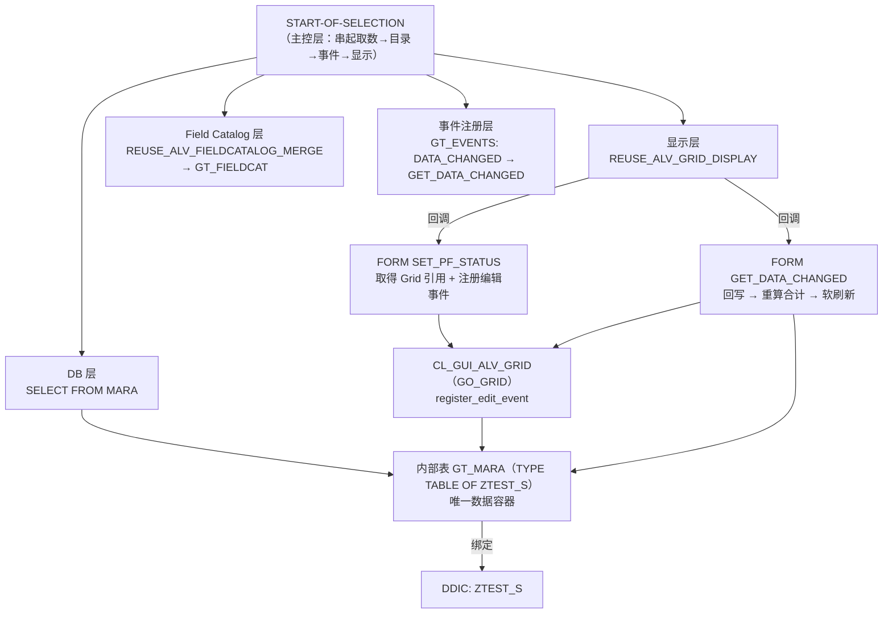
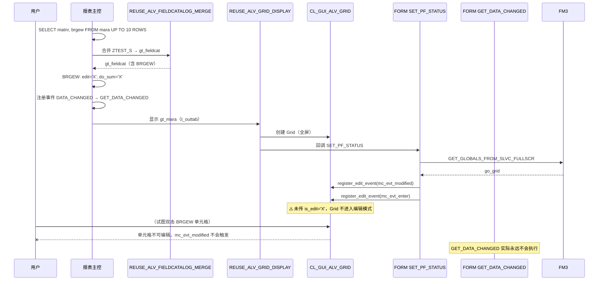

# ztest7 程序分析报告

> **分析对象**：`ztest7.abap`（115 行）
> **程序类型**：经典 ABAP 报表（`REPORT`）+ 全屏 ALV Grid（`REUSE_ALV_GRID_DISPLAY`）
> **分析视角**：业务目标 / 架构分层 / 执行流程 / 分组走读 / 风险清单 / 改造建议

---

## 0. 一句话结论

这是一份**「可编辑 ALV + 合计行」的技术验证（POC）程序**：把物料主数据表 `MARA` 的前 10 条记录（材料号 / 重量 `BRGEW`）用 ALV Grid 全屏展示，把 `BRGEW` 列设为可编辑并在编辑后回写内部表、重算合计、软刷新。但按现状，**它存在两处致命缺陷导致核心功能无法运行**（数据选到了未声明/错误的变量、ALV 未开启编辑模式），加上若干设计层问题（行号映射不安全、合计被手工覆盖而失去过滤语义），整体是一个「**结构正确但链路未闭合**」的原型，需要一轮收口才能变成可用程序。

---

## 1. 程序基本信息

| 项 | 值 |
|---|---|
| 程序名 | `ZTEST7` |
| 报表类型 | 交互式报表（全屏 ALV，无列表/分页逻辑） |
| TYPE-POOLS | `slis`（NW 平台上已由内核隐式包含，显式声明冗余但无害） |
| 代码量 | 115 行，含 2 个 FORM，0 个全局类/方法 |
| DDIC 依赖 | `ZTEST_S`（自定义行结构，ALV Field Catalog 的唯一来源） |
| 数据库依赖 | `MARA`（仅读取 `MATNR` / `BRGEW`） |
| FM 依赖 | `REUSE_ALV_FIELDCATALOG_MERGE`、`REUSE_ALV_GRID_DISPLAY`、`GET_GLOBALS_FROM_SLVC_FULLSCR` |
| OO 对象 | `CL_GUI_ALV_GRID`（动态获取）、`CL_ALV_CHANGED_DATA_PROTOCOL`（回调参数） |
| 回调 FORM | `SET_PF_STATUS`（PF-STATUS）、`GET_DATA_CHANGED`（DATA_CHANGED） |
| 数据落库 | **无**（不写 DB，不 `COMMIT`，编辑结果只存在于内存内部表） |
| 语法级别 | 使用了内联声明 `FIELD-SYMBOL(...)` / `VALUE #( )` / `REDUCE #( )` → 需 **7.40 SP05+** |

---

## 2. 它解决什么业务问题

### 2.1 显式声明的目标

从代码可直接读出的意图只有一条：

> 展示物料主数据的重量字段，允许用户在 ALV 上直接修改，修改后总重量要跟着变。

也就是说，它模拟的是典型的 **「主数据批量维护 / 数据校正」** 场景：用户不想进 MM03 一条条改，也不想跑 SM31 / LSMW，而是要在列表上「所见即所得」地改一个数值列。

### 2.2 隐含目标（POC 意图）

程序名 `ztest7`、只取 10 行、带 `TOTAL = 'TEST'` 标题，这些都说明它验证的是**技术点**而非业务价值，具体验证三件事：

1. `REUSE_ALV_FIELDCATALOG_MERGE` 基于 DDIC 结构自动生成 Field Catalog；
2. 通过 `get_globals_from_slvc_fullscr` 拿到 Grid 引用后 `register_edit_event`，打开单元格可编辑性；
3. `DATA_CHANGED` 回调中回写数据 → `get_subtotals` 取合计 → `refresh_table_display` 带 `is_stable` + `i_soft_refresh` 做不跳行、不重排的平滑刷新。

### 2.3 业务闭环缺口

| 业务环节 | 程序是否实现 | 说明 |
|---|---|---|
| 查询/取数 | 部分 | `UP TO 10 ROWS` 且无 `ORDER BY`，结果不确定 |
| 列表展示 | 部分 | 字段目录可生成，但取数目标变量错误导致列表为空 |
| 单元格可编辑 | ❌ | 缺 `is_edit = 'X'`，Grid 未进入编辑模式，用户无法输入 |
| 编辑值回写内部表 | ✅（逻辑） | 通过 `mt_mod_cells` + `row_id` 索引回写 |
| 合计/小计刷新 | ⚠️ | 计算了合计但**覆盖**了 ALV 自身的合计，且无小计行默认显示 |
| 输入校验 | ❌ | 无范围、无格式、无必填校验，`0`/负数/超大值均可提交 |
| 保存到数据库 | ❌ | 无 `UPDATE`、无 BAPI、无保存按钮 |
| 错误反馈 | ❌ | 所有 `EXCEPTIONS` 静默吞掉，用户无任何提示 |
| 日志/审计 | ❌ | 无 `CHANGE_LOG`，此类主数据修改通常有审计要求 |

**结论**：它解决的是「编辑交互与合计刷新的技术可行性」，**没有解决**「数据正确落库并可追溯」的业务闭环。

---

## 3. 整体架构

### 3.1 技术选型

| 决策 | 选择 | 评价 |
|---|---|---|
| 报表形式 | 全屏 Grid（非 REUSE_ALV_LIST_DISPLAY） | ✅ 正确，编辑 + 合计必须用 Grid |
| Field Catalog | FM 合并 DDIC 结构 `ZTEST_S` | ✅ 最佳实践，避免本地类型与 FM 不兼容 |
| 行结构 | DDIC `ZTEST_S` | ✅ 有利于传输/复用 |
| 编辑实现 | `register_edit_event` + `DATA_CHANGED` | ✅ 经典且正确的路线 |
| 合计实现 | `get_subtotals( ep_collect00 )` | ⚠️ 方向对，实现被手工覆盖抵消 |
| 架构形态 | 报表 + FORM + 全局变量 | ⚠️ 遗留式，后续维护成本高 |
| 布局变式 | 无 | ⚠️ 用户每次都要重调列宽 |

### 3.2 分层视图



### 3.3 全局对象清单

| 对象 | 类型 | 角色 | 备注 |
|---|---|---|---|
| `gt_mara` | `TABLE OF ztest_s` | Grid 数据容器（`t_outtab`） | ⚠️ 名字叫 mara 但行类型是 `ZTEST_S`，误导 |
| `gt_fieldcat` | `slis_t_fieldcat_alv` | 字段目录 | 运行时动态生成 |
| `gt_events` | `slis_t_event` | 事件注册表 | 只注册 `DATA_CHANGED` |
| `go_grid` | `REF TO cl_gui_alv_grid` | Grid 句柄 | 在 PF-STATUS 回调中动态赋值 |
| `gs_stable` | `lvc_s_stbl` | 刷新时的稳定标记 | 全局但只用一次，应为局部变量 |
| `gr_data` | `REF TO data` | 承接合计结果 | 完全动态类型 |
| `<gtr_sum_tab>` | `TYPE table` | 承接合计结构的动态容器 | 完全动态类型 |

**架构层面的核心特征**：**强全局依赖**。`go_grid` 由一个 FORM 赋值、由另一个 FORM 使用；`gt_mara` 同时承担「数据库取数结果」「Grid 数据源」「回写目标」三重身份。这在 POC 中可接受，但任何一处回调未触发，全局变量就处于未初始化状态，且无编译期保护。

### 3.4 回调契约

| Grid 侧 | 程序侧 | 签名匹配 |
|---|---|---|
| `i_callback_pf_status_set = 'SET_PF_STATUS'` | `FORM set_pf_status USING itr_extab TYPE slis_t_extab.` | ✅ 位置参数 |
| `it_events` 中 `name = 'DATA_CHANGED'` | `FORM get_data_changed USING io_data_changed TYPE REF TO cl_alv_changed_data_protocol.` | ✅ 位置参数，形参名不敏感 |
| `it_events` 中 `form = 'GET_DATA_CHANGED'` | FORM 名必须**大写** | ✅ 写法正确 |

---

## 4. 执行流程

### 4.1 时序



### 4.2 逐步说明

1. **行 13–18**：`START-OF-SELECTION` 开始，从 `MARA` 取 `MATNR`、`BRGEW` 最多 10 行 → `INTO TABLE _mara`。
   ⚠️ **`_mara` 在行 4–9 的 DATA 声明中并不存在**，标准 ABAP 不支持隐式声明，此行在语法检查阶段就会失败；即使某些环境容忍，也与后续 `t_outtab = gt_mara` 不匹配 → ALV 空表。

2. **行 19**：`IF sy-subrc EQ 0`。`SELECT ... INTO TABLE` 无数据时 `sy-subrc = 4`，此处相当于「有数据才继续」，但**不区分**「无数据」与「查询失败」，也不给用户任何提示。

3. **行 20–29**：调用 `REUSE_ALV_FIELDCATALOG_MERGE`，以 `sy-repid` + `'ZTEST_S'` 生成 `gt_fieldcat`。三个异常捕获但全部忽略返回值。

4. **行 30–35**：`READ TABLE ... ASSIGNING FIELD-SYMBOL(<gs_fcat>) WITH KEY fieldname = 'BRGEW'`，命中则设置 `edit = 'X'`、`do_sum = 'X'`。
   - ✅ 使用了内联 Field Symbol，类型由 `gt_fieldcat` 推断，无需 `TYPE ANY`。
   - ⚠️ `'BRGEW'` 魔法字符串，与后续两处重复。
   - ⚠️ 只设了 `do_sum`，**没有** `do_min/max/avg`，也没有 `just_local`、`emphasize`、`cellstyle`。

5. **行 37**：`APPEND VALUE #( name = 'DATA_CHANGED' form = 'GET_DATA_CHANGED' )`。
   - ✅ 用 `VALUE #( )` 追加结构，比 `INITIALIZE + ASSIGN COMPONENT` 干净。
   - ⚠️ 只注册了 `DATA_CHANGED`。若一次编辑涉及多行多单元格，**每个单元格触发一次回调 → 每个单元格触发一次刷新**，性能与视觉闪烁都是问题。更合适的是 `DATA_CHANGED_FINISH`（整批修改后一次回调）。

6. **行 39–46**：`REUSE_ALV_GRID_DISPLAY` 全屏显示，`i_callback_program = sy-repid`。
   - ❌ **缺 `is_edit = 'X'`**（P0）：Grid 不进入编辑模式，列目录里的 `edit = 'X'` 无效，用户无法输入，`GET_DATA_CHANGED` 永不触发。
   - ⚠️ 缺 `i_save`/`is_variant`（无布局变式）、缺 `it_sort`、缺 `i_callback_data_changed_finish`、缺 `i_callback_user_function`。

7. **行 51–65（回调 A）`SET_PF_STATUS`**：
   - `GET_GLOBALS_FROM_SLVC_FULLSCR` 取 `go_grid` —— 这是**唯一正确**的取法（`REUSE_ALV_*` 的 `e_grid` 不是可靠来源）。
   - 两次 `register_edit_event`：注册 `mc_evt_modified` + `mc_evt_enter`。
     - ⚠️ `mc_evt_modified` 与 `it_events` 中的 `DATA_CHANGED` **重复注册**（无害，但冗余）。
     - ✅ `mc_evt_enter` 是必要的：回车确认编辑依赖它。
   - ⚠️ `itr_extab` 参数完全未使用；行 68–71 的 `CASE sy-ucomm WHEN OTHERS ENDCASE` 是**死代码**。
   - ⚠️ 只设回调不设状态，实际使用的是系统默认状态（含 ALV 标准按钮）。

8. **行 74–97（回调 B）`GET_DATA_CHANGED` —— 程序的核心**：
   - **值回写**：遍历 `mt_mod_cells`，只处理 `fieldname = 'BRGEW'`；用 `<gs_changed>-row_id` 作 `INDEX` 从 `gt_mara` 取行，再 `ASSIGNING` 写值。
     - ⚠️ **`row_id` 是「显示行号」，不是「内部表行号」**。一旦用户排序或过滤，显示行号与 `gt_mara` 物理行号就错位，会把值写到**错误的行**——这是典型的隐性数据损坏 Bug（静默、无报错、难复现）。
   - **取合计**：`get_subtotals( ep_collect00 = gr_data )` → `ASSIGN gr_data->* TO <gtr_sum_tab>` → `READ TABLE ... INDEX 1` → `ASSIGN COMPONENT 'BRGEW' OF STRUCTURE <l_sum>` → `IF <lg_val> IS ASSIGNED`。
     - ⚠️ 前 4 步是为了拿到 ALV 算好的合计值；下一步却**把这个值丢掉**，用 `REDUCE` 手工重算覆盖。
     - ❌ **语义错误**：手工求和遍历的是**未过滤的** `gt_mara`。用户筛掉 5 行后，页面上显示的行加起来 ≠ 底部合计。ALV 自己算的 `ep_collect00` 本来就正确处理了过滤/排序。
     - ⚠️ `IF <lg_val> IS ASSIGNED` 在紧邻的 `ASSIGN` 之后必然为真，是冗余判断（只有组件不存在时 `ASSIGN` 才失败，此时 `sy-subrc <> 0`）。
   - ⚠️ `REDUCE` 没有 WHERE 条件，全部行累加；`lv_i TYPE ntgew_15` 与 `BRGEW`（净额/重量类金额）匹配尚可，但未防溢出。

9. **行 99–109**：`gs_stable-col = 'X'`、`row = 'X'`，然后
   ```abap
   go_grid->refresh_table_display(
     EXPORTING is_stable = gs_stable i_soft_refresh = 'X' ... )
   ```
   - ✅ **这是本程序写得最好的一段**：`i_soft_refresh = 'X'` 保证刷新时保留用户的排序/过滤/滚动位置；`is_stable` 避免编辑行在刷新中跳动。
   - ⚠️ `gs_stable` 用了 `=` 全赋值，OK；但作为全局变量使用无必要。

10. **行 110–111**：`IF sy-subrc <> 0. ENDIF.` —— **空 IF 块**，纯噪音，异常被静默丢弃。

11. **回写循环结束后**：程序没有 `SAVE`/`BACK` 退出逻辑，用户通过 ALV 标准按钮退出，所有编辑丢失（无提示）。

---

## 5. 分组讲解

### 组 A：全局声明区（行 1–11）

```abap
TYPE-POOLS:slis.

DATA: gt_mara     TYPE TABLE OF ztest_s,
      gt_fieldcat TYPE slis_t_fieldcat_alv,
      gt_events   TYPE slis_t_event,
      go_grid     TYPE REF TO cl_gui_alv_grid,
      gs_stable   TYPE lvc_s_stbl,
      gr_data     TYPE REF TO data.

FIELD-SYMBOLS: <gtr_sum_tab> TYPE table.
```

**要点**
- 行类型用 DDIC `ZTEST_S` 而非本地 `TYPES`——ALV 场景下的正确做法，FM 与 Field Catalog 才能自动合并。
- `gr_data REF TO data` + `<gtr_sum_tab> TYPE table` 是为了接收 `get_subtotals` 的动态返回，属于**被迫的动态类型**；代价是全程无法获得编译期类型检查。
- 全局 `gs_stable` / `gr_data` 只服务于一次回调，应为 FORM 内局部变量（FORM 内声明天然带保存的隐式栈，重复进入自动初始化）。

**问题**
| # | 问题 | 影响 |
|---|---|---|
| A-1 | `gt_mara` 命名与实际内容（`ZTEST_S` 行）不符 | 阅读者会误以为它装的是 MARA 记录 |
| A-2 | 6 个全局对象跨 2 个 FORM 传递 | 隐式耦合，无法单元测试 |
| A-3 | `TYPE-POOLS: slis` | 现代平台冗余 |
| A-4 | `gr_data`/`gs_stable` 不需要全局 | 污染命名空间 |

---

### 组 B：`START-OF-SELECTION` 主流程（行 13–48）

```abap
SELECT matnr, brgew FROM mara INTO TABLE _mara UP TO 10 ROWS.
```

**要点**：取数 + 生成字段目录 + 加工字段 + 注册事件 + 显示，五步串在一个事件块里，是典型的「报表脚本」写法。

**问题**
| # | 位置 | 问题 | 根因 / 影响 |
|---|---|---|---|
| **B-1** | 行 18 | `INTO TABLE _mara`，但声明的是 `gt_mara` | 变量不存在且拼写与下游 `t_outtab` 不符 → 编译失败 / 或 ALV 空表。**P0** |
| B-2 | 行 18 | `UP TO 10 ROWS` 无 `ORDER BY` | 行不确定，回归测试不可重复；也是纯演示代码残留 |
| B-3 | 行 19 | `sy-subrc` 既当「有数据」又当「成功」 | 无法区分空结果与查询异常，且无 `MESSAGE` |
| B-4 | 行 26–29 | 三个 `EXCEPTIONS` 全部忽略 | `program_error` 时用户面对空白屏幕 |
| B-5 | 行 31–35 | 字段名 `'BRGEW'` 魔法值 | 全程序出现 3 次，改名/多语言化即失控 |
| B-6 | 行 31–35 | 只设 `edit`/`do_sum` | 缺 `just_local`（值只落本地表时推荐）、`cellstyle`、`emphasize` |
| B-7 | 行 37 | 只注册 `DATA_CHANGED` | 多单元格编辑 → N 次回调 N 次刷新，卡顿与闪烁 |
| **B-8** | 行 39–46 | **缺 `is_edit = 'X'`** | Grid 未进入编辑模式，`edit='X'` 形同虚设，**整条编辑链路不生效**。**P0** |
| B-9 | 行 39–46 | 缺 `i_save` / `is_variant` | 用户每次重调列宽/隐藏列 |
| B-10 | 行 39–46 | 缺 `i_callback_user_function` / 无 `BACK`/`EXIT` 退出逻辑 | 编辑内容丢失无提示 |

---

### 组 C：`FORM set_pf_status`（行 51–72）

```abap
CALL FUNCTION 'GET_GLOBALS_FROM_SLVC_FULLSCR'
  IMPORTING e_grid = go_grid.
IF go_grid IS BOUND.
  CALL METHOD go_grid->register_edit_event
    EXPORTING i_event_id = cl_gui_alv_grid=>mc_evt_modified.
  CALL METHOD go_grid->register_edit_event
    EXPORTING i_event_id = cl_gui_alv_grid=>mc_evt_enter.
ENDIF.
```

**要点**
- ✅ **正确且必须**：全屏 REUSE_ALV 显示时，Grid 对象引用只能通过 `GET_GLOBALS_FROM_SLVC_FULLSCR` 获取（且必须在 PF-STATUS 回调里取，否则 Grid 尚未创建）。这是本程序中对该机制掌握最准确的一处。
- ✅ `IF go_grid IS BOUND` 判空，避免空引用 `CALL METHOD` 短转储（CX_SY_REF_IS_INITIAL）。
- ✅ 同时注册 `mc_evt_modified` 与 `mc_evt_enter`，覆盖了「实时修改」和「回车确认」两条路径。

**问题**
| # | 问题 | 影响 |
|---|---|---|
| C-1 | `mc_evt_modified` 与 `DATA_CHANGED` 事件重复 | 冗余但无害；可只保留 `mc_evt_enter` |
| C-2 | `itr_extab` 未使用 | 签名要求的形参，可留空 |
| C-3 | 行 68–71 `CASE sy-ucomm WHEN OTHERS. ENDCASE.` | **死代码**，`WHEN OTHERS` 是 CASE 的默认分支，块体为空，等价于不写 |
| C-4 | 只 `SET` 回调不 `SET` 状态 | 使用系统默认状态；若需自定义按钮/禁标准按钮需补 `SET_PF_STATUS_1000` |
| C-5 | 编辑事件注册位置 | 每次返回屏幕都注册一次（幂等，但可复现性依赖 PF-STATUS 的稳定性） |

---

### 组 D：`FORM get_data_changed`（行 74–115）

程序的心脏，共 4 步：**回写 → 取合计 → 软刷新**。

#### D-1 值回写（行 78–83）

```abap
LOOP AT io_data_changed->mt_mod_cells ASSIGNING FIELD-SYMBOL(<gs_changed>)
      WHERE fieldname = 'BRGEW'.
  READ TABLE gt_mara ASSIGNING FIELD-SYMBOL(<gs_tab>) INDEX <gs_changed>-row_id.
  IF sy-subrc EQ 0.
    <gs_tab>-brgew = <gs_changed>-value.
  ENDIF.
ENDLOOP.
```

**要点**
- ✅ `WHERE fieldname = 'BRGEW'` 过滤，避免处理无关列。
- ✅ 用 `ASSIGNING FIELD-SYMBOL(...)` 而非 `INTO`，零数据搬移。

**问题**
| # | 问题 | 说明 |
|---|---|---|
| **D-1** | `INDEX <gs_changed>-row_id` | `mt_mod_cells-row_id` 是**当前显示视图**的行号。排序/过滤后与 `gt_mara` 物理行号不一致 → **把值写入错误的行**，且无任何错误提示（静默数据损坏）。这是本程序**风险最高的逻辑缺陷** |
| D-2 | `<gs_changed>-value` 取值路径 | `LVC_S_MOD_CELL` 的单元格内容字段命名需在 SE24 中核实（社区常见写法为 `%_cell-value`）；若路径不对则为编译错误。建议统一写明并加注释 |
| D-3 | 直接赋值给 DDIC 字段 | `<gs_changed>-value` 为通用类型，赋值给 `BRGEW` 依赖隐式转换；若用户输入非数值会在转换时抛 `CX_SY_CONVERSION_NO_NUMBER`，回调内未捕获 → 直接 `SHORT_DUMP` |
| D-4 | `ASSIGNING` 后只查 `sy-subrc` | 建议 `IF sy-subrc EQ 0 AND IS ASSIGNED(<gs_tab>)`，语义更严谨（ASSIGNING 失败时 FS 处于未指定状态） |
| D-5 | 无边界校验 | 无最小/最大值、无零值/负值策略 |

#### D-2 取合计（行 85–97）

```abap
go_grid->get_subtotals( IMPORTING ep_collect00 = gr_data ).
ASSIGN gr_data->* TO <gtr_sum_tab>.
READ TABLE <gtr_sum_tab> ASSIGNING FIELD-SYMBOL(<l_sum>) INDEX 1.
IF sy-subrc EQ 0.
  ASSIGN COMPONENT 'BRGEW' OF STRUCTURE <l_sum> TO FIELD-SYMBOL(<lg_val>).
  IF <lg_val> IS ASSIGNED.
    <lg_val> = REDUCE #( INIT lv_i TYPE ntgew_15
                         FOR <ls_t> IN gt_mara
                         NEXT lv_i = lv_i + <ls_t>-brgew ).
  ENDIF.
ENDIF.
```

**要点**
- `GET_SUBTOTALS` 的 `EP_COLLECT00` 返回「无排序键时的全表合计」，数据结构与行结构同型，因此可以 `ASSIGN gr_data->*` 取回、再 `ASSIGN COMPONENT 'BRGEW'` 取出单列值——**手法本身是对的**。
- 但紧接着的一行把前面 4 步的意义全部抵消：

**问题**
| # | 问题 | 说明 |
|---|---|---|
| **D-6** | 用 `REDUCE` 覆盖 ALV 算好的合计 | ALV 的 `ep_collect00` **已正确考虑过滤/排序后的可见行**；手工对 `gt_mara` 全量求和会把被过滤掉的行也算进去 → **页面上显示的合计与可见行之和对不上**，这比不算合计更糟 |
| D-7 | 死代码链 | `get_subtotals` → `ASSIGN gr_data->*` → `READ TABLE` → `ASSIGN COMPONENT` → `IS ASSIGNED` 一整套，全部只为拿到一个马上要被丢弃的值 |
| D-8 | `IF <lg_val> IS ASSIGNED` 冗余 | 上一行刚 `ASSIGN`，必然已指定；失败应查 `sy-subrc` |
| D-9 | `REDUCE` 无过滤 | 无任何 WHERE 控制，即使 ALV 处于过滤态也全量累加 |
| D-10 | 未使能小计 | `do_sum = 'X'` 只声明「此列可合计」，**用户必须手工把小计拖到下方空白区**才会出现合计行。程序从未调用 `set_subtotal`，也未在 Field Catalog 中预设 `subtotal_text` |
| D-11 | `READ TABLE ... INDEX 1` | 依赖返回容器恰好是「单行表」，属实现细节假设；未见文档保证时的防御性判断 |

#### D-3 刷新（行 99–109）

```abap
gs_stable-col = 'X'.
gs_stable-row = 'X'.
go_grid->refresh_table_display(
  EXPORTING is_stable      = gs_stable
            i_soft_refresh = 'X'
  EXCEPTIONS finished = 1 OTHERS = 2 ).
IF sy-subrc <> 0.
ENDIF.
```

**要点**
- ✅ `i_soft_refresh = 'X'`（7.40 起）：刷新时**不重置排序/过滤/滚动位置**。这是编辑器场景的关键参数，缺失会导致每改一个值页面跳回顶部。
- ✅ `is_stable` 防止当前编辑行在刷新过程中跳动。
- ✅ 用 `refresh_table_display` 而非 `refresh_table`（后者是全量重绘，会丢焦点/滚动位置）。

**问题**
| # | 问题 | 说明 |
|---|---|---|
| D-12 | `IF sy-subrc <> 0. ENDIF.` | 空代码块，异常无声消失。应删除或 `MESSAGE` |
| D-13 | 捕获 `OTHERS` 后不处理 | `finished`（导出结束）属于正常分支，无需处理，但空 IF 让读者误以为漏写了逻辑 |
| D-14 | 每次单元格改动都刷新一次 | 配合只有 `DATA_CHANGED` 而无 `DATA_CHANGED_FINISH`，批量修改时刷新次数 = 单元格数 |

---

## 6. 关键机制剖析

### 6.1 为什么必须 `GET_GLOBALS_FROM_SLVC_FULLSCR`

`REUSE_ALV_GRID_DISPLAY` 是 FM 包装，内部按需创建 `CL_GUI_ALV_GRID`。调用方拿不到引用，有两条替代路径都不可靠：
- FM 的 `E_GRID` 参数：仅当调用方**自己先**创建了 ALV Controls 并传入 `i_grid` 时才被填充；
- 直接 `CREATE_CONTROLS` + `CALL METHOD` 自行显示：丧失 FM 的所有便利（变式、导出、回调）。

因此标准做法是：在 `i_callback_pf_status_set` 回调里用 `GET_GLOBALS_FROM_SLVC_FULLSCR` 取引用。本程序这一段是**教科书式正确**的。

### 6.2 编辑的三道开关

要让单元格真正可编辑，三者缺一不可：

| 开关 | 位置 | 本程序 |
|---|---|---|
| Field Catalog 的 `EDIT = 'X'` | 行 33 | ✅ |
| FM 参数 `IS_EDIT = 'X'` | 行 39 | ❌ **缺失** |
| `REGISTER_EDIT_EVENT`（`MC_EVT_MODIFIED` / `MC_EVT_ENTER`） | 行 58–64 | ✅ |

只满足其一不生效。程序满足 2/3，是「看起来对、跑起来不对」的典型原因。

### 6.3 `EP_COLLECT00` vs `IT_SUBTOTALS`

- `EP_COLLECT00`：**没有排序键时的总计**，结构与行数据同型，一次只能取一个总量，适合「页面底部单值」。
- `IT_SUBTOTALS`（类型 `SSTABLE`）：按 `TAB` / `COL` / `ST_AGGREGATE` 组成的表指定要算哪些小计，一次可取多级小计与总计。**要实现「可拖拽分组小计 + 总计」必须用 `IT_SUBTOTALS`**。

本程序只用了前者，因此最多显示一行总计，无法响应用户按任意列分组。

### 6.4 `ASSIGN COMPONENT` 的动态取值

`ASSIGN gr_data->*` 后得到的是**动态类型**结构，编译期无法知道有没有 `BRGEW`。用 `ASSIGN COMPONENT 'BRGEW' OF STRUCTURE <s>` 是合法且必要的，但失败时只置 `sy-subrc`（且 `ASSIGN` 语句本身**不抛异常**），必须检查。这段代码唯一的「保护」是 `IS ASSIGNED`，而位置放错了（应该在 `ASSIGN` 之后立刻判断，当前倒是紧邻的，所以逻辑上没错，只是显得多余）。真正的问题是——**为了一个最终被覆盖的值而做了这么长的动态链路**。

### 6.5 `IS_STABLE` 与 `I_SOFT_REFRESH` 的分工

| 参数 | 作用 | 缺失后果 |
|---|---|---|
| `is_stable-row` / `-col` | 标记稳定字段，刷新时这些行/列的位置与内容保持 | 编辑行跳动、错位 |
| `i_soft_refresh` | 只重绘数据，不重置排序、过滤、筛选、滚动 | 用户改完一个值，页面跳回第一行 |

两者配合是「就地刷新」的标准解法，本程序用法正确，是全篇最值得保留的部分。

---

## 7. 问题清单（按优先级）

### P0 — 阻断性，核心功能完全不可用

| 编号 | 位置 | 问题 | 影响 | 建议 |
|---|---|---|---|---|
| **P0-1** | 行 18 | `INTO TABLE _mara`，变量未声明且与 `gt_mara` 不符 | 语法检查失败 / ALV 空表 | 改为 `INTO TABLE gt_mara` |
| **P0-2** | 行 39–46 | `REUSE_ALV_GRID_DISPLAY` 缺 `is_edit = 'X'` | Grid 非编辑模式，用户无法输入，`GET_DATA_CHANGED` 永不触发 | 补 `is_edit = 'X'` |
| **P0-3** | 行 39–46 | 无任何保存路径 | 编辑结果 100% 丢失 | 增保存按钮 + `UPDATE`/BAPI，或明确声明为「仅演示」并加 `MESSAGE` 提示 |

### P1 — 数据正确性 / 功能语义错误

| 编号 | 位置 | 问题 | 影响 | 建议 |
|---|---|---|---|---|
| **P1-1** | 行 79 | 用 `row_id`（显示行号）索引 `gt_mara` | 排序/过滤后**静默写错行** | 增加隐藏唯一键字段作 `key_field`，按键匹配（见 8.2） |
| **P1-2** | 行 95 | `REDUCE` 覆盖 ALV 算出的合计，且对全表求和 | 过滤态下页面合计与可见行之和不一致 | 删除 `REDUCE`，直接使用 `ep_collect00` 的值 |
| **P1-3** | 行 87 | 只用 `EP_COLLECT00`，未预设小计 | 默认看不到任何合计行 | 调 `set_subtotal` 或 `it_subtotals` 使能 |
| **P1-4** | 行 81 | 直接赋值 + 无转换异常处理 | 非数值输入 → `CX_SY_CONVERSION_NO_NUMBER` 短转储 | 显式 `CONV` + `TRY/CATCH` 或 `CATCH` 校验 |
| **P1-5** | 行 78–83 | 无输入合法性校验 | 负数/0/超大值可写入 | 加范围校验，失败 `MESSAGE` + 刷新还原 |
| **P1-6** | 行 24–29 / 102–109 | 所有 `EXCEPTIONS` 静默忽略 | 用户只见空白屏幕，无法自助 | 分类处理：`MESSAGE` 提示 / 日志 |

### P2 — 工程质量与可维护性

| 编号 | 位置 | 问题 | 建议 |
|---|---|---|---|
| P2-1 | 行 31/78/93 | `'BRGEW'` 魔法字符串 3 处 | `CONSTANTS c_fld_brgew TYPE lvc_fname VALUE 'BRGEW'.` |
| P2-2 | 行 82 / 行 95 | 输入转换与 `REDUCE` 用魔法数字式赋值 | 显式 `CONV ntgew_15( ... )` |
| P2-3 | 行 4 | `gt_mara` 名实不符（装 `ZTEST_S`） | 改名 `gt_alv_data` / `gt_zt_s` |
| P2-4 | 行 9 / 11 | `gr_data`、`<gtr_sum_tab>`、行 99 `gs_stable` 全局 | 移入 FORM 局部声明 |
| P2-5 | 行 58–62 | `mc_evt_modified` 重复注册 | 只保留 `mc_evt_enter` |
| P2-6 | 行 68–71 | `CASE sy-ucomm WHEN OTHERS` 空块 | 删除 |
| P2-7 | 行 110–111 | `IF sy-subrc <> 0. ENDIF.` 空块 | 删除或补提示 |
| P2-8 | 行 51 | `itr_extab` 未用 | 保留签名即可，加注释说明 |
| P2-9 | 行 2 | `TYPE-POOLS: slis` 冗余 | 删除（现代平台） |
| P2-10 | 行 18 | `UP TO 10 ROWS` 无 `ORDER BY` | 演示期可接受；生产需确定性与筛选 |
| P2-11 | 全局 | 6 个全局对象跨 FORM 传递 | 改 OO 类或至少集中到 `gt_` 命名规范 + 注释分组 |
| P2-12 | 行 85–97 | 4 行动态赋值链只为取一个值 | 用 `GET_SUBTOTALS` + `ASSIGN COMPONENT` 一步到位，或直接用 `ep_collect00` |
| P2-13 | 行 37 | 只注册 `DATA_CHANGED` | 改 `DATA_CHANGED_FINISH`，批量修改只刷新一次 |

---

## 8. 改进建议

### 8.1 最小修复（保留现有结构，约 6 处改动）

```abap
CONSTANTS: c_fld_brgew TYPE lvc_fname VALUE 'BRGEW'.

START-OF-SELECTION.
  SELECT matnr, brgew FROM mara
    INTO TABLE gt_mara
    UP TO 10 ROWS.

  IF gt_mara IS INITIAL.
    MESSAGE '未查询到符合条件的数据' TYPE 'S'.
    RETURN.
  ENDIF.

  CALL FUNCTION 'REUSE_ALV_FIELDCATALOG_MERGE'
    EXPORTING
      i_program_name   = sy-repid
      i_structure_name = 'ZTEST_S'
    CHANGING
      ct_fieldcat      = gt_fieldcat
    EXCEPTIONS
      inconsistent_interface = 1
      program_error          = 2
      OTHERS                 = 3.

  IF sy-subrc <> 0.
    MESSAGE '字段目录生成失败，请检查结构 ZTEST_S' TYPE 'E'.
    RETURN.
  ENDIF.

  READ TABLE gt_fieldcat ASSIGNING FIELD-SYMBOL(<fcat>) WITH KEY fieldname = c_fld_brgew.
  IF sy-subrc EQ 0.
    <fcat>-edit       = 'X'.
    <fcat>-do_sum     = 'X'.
    <fcat>-just_local = 'X'.   " 值只落本地表，不写回 FM 的默认缓冲
  ENDIF.

  APPEND VALUE #( name = 'DATA_CHANGED_FINISH' form = 'GET_DATA_CHANGED' ) TO gt_events.

  CALL FUNCTION 'REUSE_ALV_GRID_DISPLAY'
    EXPORTING
      i_callback_program       = sy-repid
      it_fieldcat              = gt_fieldcat
      it_events                = gt_events
      i_callback_pf_status_set = 'SET_PF_STATUS'
      is_edit                  = 'X'                 " ← P0-2 修复
      i_save                   = 'A'                 " 布局变式
    TABLES
      t_outtab                 = gt_mara.
```

`GET_DATA_CHANGED` 内的最小改动：

```abap
FORM get_data_changed USING io_data_changed TYPE REF TO cl_alv_changed_data_protocol.

  DATA: ls_stable TYPE lvc_s_stbl,
        lv_value  TYPE ntgew_15.

  IF go_grid IS NOT BOUND.
    RETURN.
  ENDIF.

  LOOP AT io_data_changed->mt_mod_cells ASSIGNING FIELD-SYMBOL(<changed>)
        WHERE fieldname = c_fld_brgew.

    " ⚠️ P1-1 未根治：row_id 仍是显示行号，见 8.2
    READ TABLE gt_mara ASSIGNING FIELD-SYMBOL(<row>) INDEX <changed>-row_id.
    IF sy-subrc <> 0 OR NOT IS ASSIGNED(<row>).
      CONTINUE.
    ENDIF.

    " P1-4 显式转换 + 异常捕获，避免 SHORT_DUMP
    TRY.
        lv_value = CONV ntgew_15( <changed>-%_cell-value ).
      CATCH cx_sy_conversion_no_number.
        MESSAGE '重量必须为数字' TYPE 'E'.
        go_grid->refresh_table_display( i_soft_refresh = 'X' ).
        RETURN.
    ENDTRY.

    IF lv_value < 0.
      MESSAGE '重量不能为负数' TYPE 'E'.
      CONTINUE.
    ENDIF.

    <row>-brgew = lv_value.
  ENDLOOP.

  " P1-2 删除 REDUCE 覆盖，直接使用 ALV 计算的合计（已正确处理过滤/排序）
  go_grid->get_subtotals(
    IMPORTING ep_collect00 = gr_data ).

  ASSIGN gr_data->* TO FIELD-SYMBOL(<sum_tab>).
  IF sy-subrc EQ 0.
    ASSIGN COMPONENT c_fld_brgew OF STRUCTURE <sum_tab> TO FIELD-SYMBOL(<total>).
    IF <total> IS ASSIGNED.
      " 此处如需展示，可写入自定义状态栏 / 抬头；否则删除整段亦可
    ENDIF.
  ENDIF.

  ls_stable-col = 'X'.
  ls_stable-row = 'X'.
  go_grid->refresh_table_display(
    EXPORTING is_stable      = ls_stable
              i_soft_refresh = 'X'
    EXCEPTIONS
      finished = 1
      OTHERS   = 2 ).

ENDFORM.
```

### 8.2 根治行映射（P1-1）

正确做法是引入一个**与显示视图无关的稳定行标识**：

1. 在 `ZTEST_S` 中增加字段 `ROW_KEY TYPE char16`，取数时用 `matnr` 填充；
2. Field Catalog 中设置 `key_field = 'ROW_KEY'`、`do_key = 'X'`，并可 `no_outline = 'X'`；
3. 回写时按 `row_key` 匹配，而不是按行号：

```abap
LOOP AT io_data_changed->mt_mod_cells ASSIGNING FIELD-SYMBOL(<changed>).
  READ TABLE gt_mara ASSIGNING FIELD-SYMBOL(<row>)
    WITH KEY row_key = <changed>-row_id.   " row_id 即稳定键，与排序/过滤无关
  IF sy-subrc = 0.
    <row>-brgew = CONV ntgew_15( <changed>-%_cell-value ).
  ENDIF.
ENDLOOP.
```

这样排序、过滤、分页、后续分页加载都不会错行。

### 8.3 让合计真正显示（P1-3）

```abap
" PF-STATUS 回调中，取到 go_grid 之后：
DATA(ls_sub) = VALUE #( st_tab = 'GT_MARA' st_col = c_fld_brgew st_aggregate = 'SUM' ).
go_grid->set_subtotal( it_subtotals = ls_sub ).

" 或者不预设，让用户在 ALV 的“小计”按钮里自行拖拽
```

若需要按任意列分组小计，则把 `get_subtotals` 的 `EP_COLLECT00` 换成 `IT_SUBTOTALS`（类型 `SSTABLE`）。

### 8.4 结构演进建议

当前「全局变量 + FORM 回调」是 BC 时代的形态，功能一旦超过两个编辑列就会失控。建议演进路径：

| 阶段 | 目标 | 做法 |
|---|---|---|
| Step 1（当前 + 8.1） | 修好，跑通 | 6 处最小改动 |
| Step 2 | 消除全局 | 把取数/目录/事件/显示抽到本地类 `ZCL_ALV_EDITOR_BASE`，通过接口注入 |
| Step 3 | 补业务闭环 | 加 `IT_CHECK` 校验接口（行校验、跨行校验）、`SAVE` 按钮 + `UPDATE mara` 或 BAPI |
| Step 4 | 审计与权限 | `CHANGE_LOG` 记录（用户/时间/旧值/新值）；页面级 `AUTHORITY-CHECK` |
| Step 5 | 性能 | 字段目录缓存、`DATA_CHANGED_FINISH`、大数据量改用 `EDIT_MASK` + 单元格级 `SET_CELL` |

---

## 9. 重构示例：OO 骨架（可选，供 Step 2 参考）

```abap
CLASS lhc_ztest7 DEFINITION FINAL.
  PUBLIC SECTION.
    INTERFACES if_salv_gui_... " 或继续用 REUSE_ALV，只包一层
  PRIVATE SECTION.
    DATA: mv_data   TYPE ztest_s_tab,
          mo_grid   TYPE REF TO cl_gui_alv_grid.
    METHODS: build_fieldcat   RETURNING VALUE(rt_cat) TYPE slis_t_fieldcat_alv
              RAISING   cx_sy_no_authorization,
             validate_row     IMPORTING is_row    TYPE ztest_s
                              RETURNING VALUE(rv_ok) TYPE abap_bool
                              RAISING   zcx_validation_error,
             write_back       IMPORTING it_rows   TYPE ztest_s_tab
                              RAISING   cx_dynamic_check.
ENDCLASS.
```

价值：校验规则、字段目录、保存逻辑都能被单测覆盖，且 `go_grid` 不再是跨回调的隐式全局。

---

## 10. 测试与验证清单

修复后至少跑通以下用例：

| # | 用例 | 预期 |
|---|---|---|
| T1 | 空结果（表被清空 / 加无效条件） | 显示明确提示，不白屏 |
| T2 | 正常打开 | 10 行以内，`BRGEW` 列可双击进入编辑 |
| T3 | 修改单元格后回车 | 值回写内部表，行不跳动，滚动位置不变 |
| T4 | 合计 | 底部/小计区显示合计值，等于可见行之和 |
| T5 | **排序后修改** | 值写到正确的物料行（验证 P1-1 修复） |
| T6 | **过滤后修改 + 看合计** | 合计只含过滤后可见行（验证 P1-2 修复） |
| T7 | 输入非数字 `abc` | 友好报错，值不被写入 |
| T8 | 输入负数 | 按业务规则拒绝并提示 |
| T9 | 批量改多行多列 | 页面不卡顿，只刷新一次（验证 `DATA_CHANGED_FINISH`） |
| T10 | `BACK` 退出 | 有未保存修改时弹出确认 |
| T11 | 布局变式 | 退出后重进保留列宽 |
| T12 | 权限 | 无 `MARA` 维护权限的用户不可编辑 |

---

## 11. 调试与运行指引

1. **直接运行**：`SE38` → `ZTEST7` → `F8`（前提：DDIC 结构 `ZTEST_S` 已存在，且包含 `MATNR`、`BRGEW` 两列，且 `BRGEW` 类型与 `ntgew_15` 兼容）。
2. **确认 Field Catalog**：`BREAK-POINT` 于 `GET_DATA_CHANGED` 首行，或临时在循环里 `WRITE <gs_changed>` 观察 `mt_mod_cells` 结构。
3. **确认 Grid 已进入编辑模式**：`SET_PF_STATUS` 之后 `go_grid->check_display_if_needed( )`，或直接在 Grid 上双击单元格看是否出现输入框。
4. **观察合计来源**：在行 95 前 `BREAK-POINT`，用 `<l_sum>` 与 `REDUCE` 结果对照，可立刻发现过滤态下的差异。
5. **建议开启 ST05 / ST12**：批量编辑场景下回调次数决定性能。

---

## 12. 总结

| 维度 | 评价 |
|---|---|
| 业务价值 | 定位为 POC，业务闭环（落库、校验、审计）缺失 |
| 架构合理性 | 全局变量 + REPORT + FORM 的经典形态，规模小时够用，规模一大难维护 |
| 技术亮点 | `GET_GLOBALS_FROM_SLVC_FULLSCR` 取引用、`i_soft_refresh` + `is_stable` 就地刷新、DDIC 驱动 Field Catalog——这三处是对的，应保留 |
| 正确性 | **两处 P0 使核心功能不通**（`_mara` 取数目标、`is_edit` 缺失），两处 P1 造成静默数据错误（行号映射、合计覆盖） |
| 最该先做 | 8.1 的 6 处最小改动 → 能立刻看到可编辑 + 正确的合计；随后补 8.2 稳定键与保存逻辑 |
| 是否可投产 | ❌ 当前状态不可投产；完成 P0/P1 + T1~T12 后可作为维护类报表的骨架 |

**一句话建议**：保留 `SET_PF_STATUS` 与刷新那一段的写法，把它当作正确样板；先做最小修复让链路跑通，再用「稳定行键 + OO 化 + 校验与保存接口」三步把它从 POC 变成可投产的维护工具。