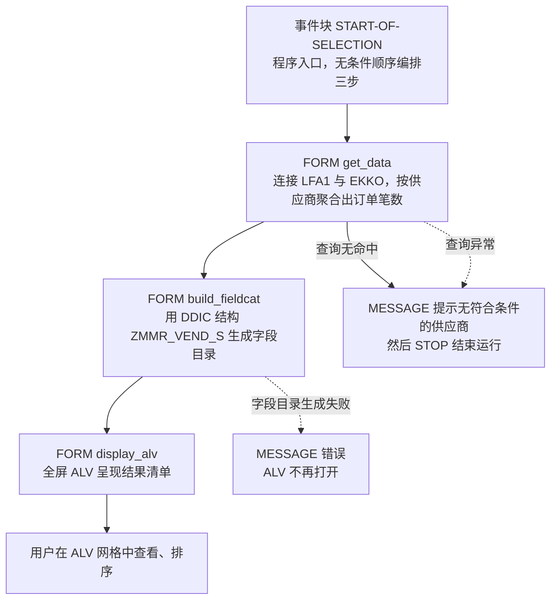
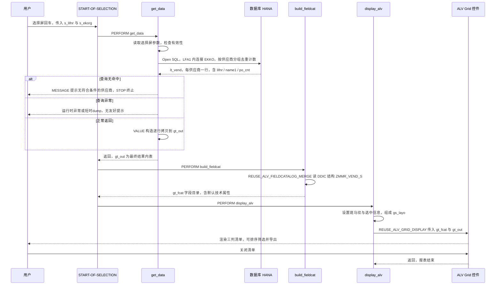

# ZMMR_VEND_LIST 供应商采购订单数量清单 —— 源码走读报告

> 分析对象：`zmmr_vend_list.abap`（58 行，经典报表 + REUSE_ALV 全屏 ALV）
> 分析视角：业务意图 → 执行流程 → 逐子程序三层剖析 → 风险分级

---

## 一、程序定位与业务背景

### 1.1 它解决什么问题

这是一份典型的**采购主数据稽核 / 采购分析类报表**。它要回答的问题只有一句话：

> **在我指定的供应商范围内、在指定的采购组织范围内，每个供应商名下挂了多少笔采购订单？**

选屏上两个参数就是问题的两个限定词：

- `s_lifnr`（供应商号，源自 `LFA1-LIFNR`）—— 分析主体
- `s_ekorg`（采购组织，源自 `EKKO-EKORG`）—— 分析范围

输出一张三列的清单：`LIFNR`（供应商号）、`NAME1`（供应商名称）、`PO_CNT`（采购订单笔数）。

### 1.2 现有方案为什么不够

如果采购部门想要这个数字，今天有几条路，各有代价：

| 现有做法 | 为什么不够 |
|---|---|
| 手工在 `ME23N` / `ME2N` 里按供应商跑一遍 | 一次一个供应商，几十家供应商要重复几十次；无法横向比较 |
| `ME2N` 全量导出后 Excel 透视表 | 导出的是行项目（PO item），行数几十万；要按"订单号去重"再按供应商分组；口径全靠人 |
| 让 SAP 标准报表 `ME5A` 之类的清单倒着用 | 标准报表以订单行/物料为中心，不以"供应商 → 订单数"聚合；口径不对 |
| `MB51` / 采购分析类 Cube | 配置成本高、要跑批，不适合"临时问个数"的场景 |

所以作者做了一个**取数 + 聚合 + 全屏清单**的最小闭环：进去填两个条件，出来一张可排序的表。这个定位是合理的——**一个 58 行的程序，回答一个窄而常被问到的问题**，属于典型的"部门级轻量分析报表"。

### 1.3 它**没有**回答什么（先说清楚边界，后面才不容易误读）

这一点比"它做了什么"更重要，因为报表最大的风险来自用户对口径的误解：

- 它数的是 **EKKO 表头行**，不是订单行项目。100 个订单行可能只算 1 笔。
- 它**只数 `BSTYP = 'F'`**（采购订单），不含计划订单（K）、库存调拨订单（L）。
- 它**不判断单据状态**：`LOEKZ`（作废标记）、`BEDAT`（归档标记，值为 `'A'` 表示已归档、统计上应排除）都没有过滤。
- 它**不涉及金额**：没有订单价值、没有净价、没有交货与发票匹配情况。因此它不是"供应商采购规模"报表，只是"采购订单笔数"报表。
- 它**不穿透**：清单上的数字无法点击回看是哪几张 PO。

> 一句话定性（设计范式）：**过程式报表（Procedural Report）**——`START-OF-SELECTION` 作为唯一入口，`PERFORM` 串起 `取数 → 构字段目录 → 显示` 三个职责单一的 FORM，用全局 DATA 传递中间结果，最后由 `REUSE_ALV_GRID_DISPLAY` 承担交互与输出。没有 OO 抽象、没有框架、没有对象化，这是 SAP 7.20–7.40 时代最主流也最省事的报表写法。

---

## 二、程序执行流程总览

整个程序没有分支嵌套、没有循环调度、没有用户对话框，**执行流是一条笔直的直线**，三个 FORM 各管一段，谁也不知道谁的存在之外的事。这是新手最容易读懂的一种结构，也是本程序最值得称道的部分。



### 责任链表

| 子程序 | 调用者 | 职责 |
|---|---|---|
| 全局声明区 | ABAP 运行时（程序加载时） | 建立类型池依赖、声明 3 个全局数据对象与 2 个选屏参数 |
| 事件块 `START-OF-SELECTION` | ABAP 运行时（用户回车后自动触发） | 唯一的编排者：按固定顺序 `PERFORM` 三个 FORM，本身不含业务逻辑 |
| `FORM get_data` | 事件块 `START-OF-SELECTION` | 唯一的数据库访问点；执行一条 JOIN + GROUP BY 聚合查询，把结果搬进全局 `gt_out`；无数据时提示并终止 |
| `FORM build_fieldcat` | 事件块 `START-OF-SELECTION` | 调用 `REUSE_ALV_FIELDCATALOG_MERGE` 依据 DDIC 结构 `ZMMR_VEND_S` 生成 ALV 字段目录，失败则抛错终止 |
| `FORM display_alv` | 事件块 `START-OF-SELECTION` | 配置 `SLIS_LAYOUT_ALV`（斑马纹、选中行信息），调用 `REUSE_ALV_GRID_DISPLAY` 把 `gt_out` 推给全屏网格控件 |

下面按这条流程，逐个子程序展开。

---

## 三、分组分析（按程序流程）

### 3.1 全局声明区

这一段只有 11 行，但它是全程序"编译期契约"的所在：类型、结果结构、选屏字段三件事都在这里定下来，后续三个 FORM 都只是它的执行者。

```abap
REPORT zmmr_vend_list.

TYPE-POOLS: slis.

TABLES: lfa1, ekko.

DATA: gt_out  TYPE TABLE OF zmmr_vend_s,
      gt_fcat TYPE slis_t_fieldcat_alv,
      gs_layo TYPE slis_layout_alv.

SELECT-OPTIONS: s_lifnr FOR lfa1-lifnr,
                s_ekorg FOR ekko-ekorg.
```

#### 做什么

- 声明报表名 `ZMMR_VEND_LIST`，并拉入类型池 `SLIS`——这是后续使用 `SLIS_T_FIELDCAT_ALV`、`SLIS_LAYOUT_ALV` 这两个 ALV 类型的前提（它们定义在 SLIS 类型池里，不是 DDIC 表）。
- 用 `TABLES` 语句把 `LFA1`、`EKKO` 声明为隐式数据库表对象，因此后面可以直接写 `lfa1-lifnr` 而不需要 `DATA` 声明。
- 声明三个全局数据对象：`GT_OUT` 结果内表（行结构 `ZMMR_VEND_S`）、`GT_FCAT` 字段目录、`GS_LAYO` ALV 布局控制。
- 声明两个选择屏参数：`S_LIFNR` 参照 `LFA1-LIFNR`，`S_EKORG` 参照 `EKKO-EKORG`。参照关系让选屏自动带上 LIFNR 的搜索帮助、输入校验与 `low/high` 区间能力。

#### 为什么 / 设计点评

**结果结构独立成 DDIC 结构 `ZMMR_VEND_S` 是这个程序最正确的一个决定。** 报表的输出契约不写在程序里，而是写在 DDIC 里，带来三个直接收益：

1. **字段目录可以零代码生成**（`build_fieldcat` 的 `REUSE_ALV_FIELDCATALOG_MERGE` 靠的就是它），不用手写十几行 `APPEND fieldcat`。
2. **类型安全是编译期保证**。`COUNT(DISTINCT)` 的结果类型必须能塞进 `ZMMR_VEND_S-PO_CNT`，塞不进去程序直接激活失败，不会等到生产环境才发现。
3. **输出契约可被复用**。将来若有接口（RFC/HTTP）、ALV 变式或另一个程序复用同一张清单，共享同一个结构即可。

**选屏参数用 `SELECT-OPTIONS` 而不是 `PARAMETERS`**，同样是对的：采购人员几乎一定会问"帮我看某个供应商**，或者**某几个区间"，范围选择是刚需。

**但声明方式本身是过时的。** `TABLES` 是 ABAP/4 之前的遗留语句，它的作用仅仅是"让 `lfa1-lifnr` 这种写法成立"，而为此付出的代价是：把整个 `LFA1`（约 20 万行供应商主数据）声明进程序内存关系，并让程序在语义上"看起来像是要用 `TABLES` 里的表"。同理 `TYPE-POOLS: slis` 也是遗留依赖——现代写法可以直接用 `LVC_T_FCAT` / `LVC_S_LAYOUT`，这两个类型不依赖 SLIS 类型池，而 `REUSE_ALV_GRID_DISPLAY` 一样接收它们。

#### 风险与改进

- **`TABLES` 语句应改为显式 `DATA`**。声明式的写法让"我到底用了这张表的哪个字段"变得不可见，也让后续维护者不确定该不该往 `TABLES` 里继续加表。改进：

  ```abap
  DATA: gv_lifnr TYPE lfa1-lifnr,
        gv_ekorg TYPE ekko-ekorg.

  SELECT-OPTIONS s_lifnr FOR gv_lifnr,
                  s_ekorg FOR gv_ekorg.
  ```

- **`TYPE-POOLS: slis` 是可以被彻底去掉的依赖**。把类型换成 `lvc_t_fcat` 与 `lvc_s_layout`，程序即与已 EOL 的 SLIS 类型池解耦。
- **三个全局变量没有必须做成全局的理由**。它们都是"每次运行生成一次、用完即弃"的中间结果。做成全局的直接代价是：`display_alv` 无法不依赖全局状态就被调用，`get_data` 失败时残留的 `gt_out` 内容也可能被误用。改进方向是让它们成为 FORM 的局部变量，并通过 `USING/TABLES` 形参传递——见 3.5 节的改进示例。
- **`ZMMR_VEND_S-PO_CNT` 的 DDIC 类型需要校核（这是本程序最容易埋雷的地方）**。`COUNT(DISTINCT b~ebeln)` 在 Open SQL 中返回一个整型计数器，而 ABAP 的隐式转换对 NUMC/CHAR 是"补零/截断"而非报错：若该字段被误建为 `NUMC(3)`，笔数 `5` 会变成 `'500'` 并在 ALV 上原样显示；若建为 `CHAR`，ALV 会对文本求和得到荒谬结果。**计数器必须用 `INT` / `INT2`（或 `NUMC` 且配 `NO_ZERO = 'X'`，但强烈不建议）**，这一项请在激活前确认。
- **无任何代码注释**。这类报表最大的维护成本不是逻辑复杂，而是"口径"不可追溯（详见 1.3 节那些不查 DDIC 就读不出来的东西）。至少应在选屏声明上方注释写清：`PO_CNT = 采购订单(BSTYP=F)的 EKKO 表头去重计数，不排除作废与归档单据`。SAP 的编码规范对此有明确要求（DDIC 语义必须落在代码注释与选择屏文本中）。

---

### 3.2 事件块 `START-OF-SELECTION`

程序真正的入口。它决定了"整条流水线按什么顺序跑"，是整个程序架构中唯一具备"编排职责"的地方。

```abap
START-OF-SELECTION.
  PERFORM get_data.
  PERFORM build_fieldcat.
  PERFORM display_alv.
```

#### 做什么

- 用户在选择屏回车（执行按钮）后，ABAP 运行时自动进入 `START-OF-SELECTION` 事件块。
- 顺序发出三条 `PERFORM`：`get_data` → `build_fieldcat` → `display_alv`，三条之间没有任何条件判断、没有任何分支。

#### 为什么 / 设计点评

**把编排逻辑留在事件块、把业务逻辑留在 FORM，是过程式报表的标准且正确的分层。** 好处非常具体：

- 事件块只有 3 行，新人打开程序第一眼就知道全貌，不需要读任何 FORM 就能建立"取数—加工—显示"的心智模型。
- 每个 FORM 职责单一、互不调用，`get_data` 可以被单元测试思路覆盖，`display_alv` 可以单独替换成 Excel 下载而不动取数逻辑。
- 三步的**严格顺序**体现了 ALV 的数据依赖：`get_data` 依赖选屏范围，`build_fieldcat` 依赖 `ZMMR_VEND_S` 而非数据，`display_alv` 同时依赖前两者的产物（`gt_fcat` + `gt_out`）。

**为什么先 `build_fieldcat` 后 `display_alv` 而不是让 `display_alv` 内部自己调 FM？** 因为把字段目录单独抽成一步，好处是"显示"这一层可以换成别的实现（`REUSE_ALV_LIST_DISPLAY`、`REUSE_ALV_TREE_DISPLAY`、导出 Excel）而不需要重复写字段目录。这是**为变化预留接缝**的朴素做法，值得肯定。

#### 风险与改进

- **这里没有任何对输入的校验，真正的守卫责任被推给了 `get_data`**。`START-OF-SELECTION` 是最合适做"选屏合法性校验"的地方（例如两个参数都不填时是否允许、是否给出默认采购组织），但目前空选屏会一路畅通到数据库。这是一个架构上的空档，不是单点 bug。
- **没有 `PERFORM` 之间的返回值/状态传递机制**。当前靠"`get_data` 里遇到问题直接 `MESSAGE` + `STOP` 强行中断"来防止后续步骤在空数据上继续执行。这个做法能工作，但代价是**程序无法被复用**（见下方 `STOP` 分析）。
- 若将来要把这个报表改成可被其它程序 `SUBMIT` 调用、或要在同一次运行中输出多份清单（例如按采购组织分别出一张），现有 `START-OF-SELECTION` 结构需要重构为参数化的 FORM 入口。现在不必改，但要有意识：**这是这个程序规模增长时的第一个天花板**。

---

### 3.3 子程序 `FORM get_data`

全程序唯一与数据库打交道的子程序，也是唯一有真实业务逻辑的地方。三步走：一条聚合查询 → 一次结果搬运 → 一个空结果守卫。

#### ① 一条 JOIN + GROUP BY 的聚合查询

```abap
FORM get_data.
  SELECT a~lifnr,
         a~name1,
         COUNT( DISTINCT b~ebeln ) AS po_cnt
    FROM lfa1 AS a
    INNER JOIN ekko AS b ON a~lifnr = b~lifnr
    WHERE a~lifnr IN @s_lifnr
      AND b~ekorg IN @s_ekorg
      AND b~bstyp = 'F'
    GROUP BY a~lifnr, a~name1
    INTO TABLE @DATA(lt_vend).
```

##### 做什么

- 以 `LFA1`（供应商主数据）为左表，`EKKO`（采购订单抬头）为右表，用 `INNER JOIN ON a~lifnr = b~lifnr` 把订单挂到供应商头上。
- 用 `a~lifnr IN @s_lifnr` 把供应商限制在选屏范围内，用 `b~ekorg IN @s_ekorg` 把订单限制在选屏采购组织范围内，并固定 `b~bstyp = 'F'` 只取采购订单。
- 按 `a~lifnr, a~name1` 分组，对每组内的 `b~ebeln` 做去重计数，结果命名为 `PO_CNT`。
- 用 `INTO TABLE @DATA(lt_vend)` 把结果接进一个**内联声明**的匿名结构内表：三列分别是 `LIFNR`、`NAME1`、`PO_CNT`。因为有 `GROUP BY`，"每个供应商一行"的形状由数据库保证，ABAP 侧不需要再去重。
- 注意别名 `a`/`b` 的存在意义：`COUNT(DISTINCT b~ebeln) AS po_cnt` 中的 `AS po_cnt` 是**给结果列起别名**，这正是 `lt_vend` 结构里第三列名字的来源。

##### 为什么 / 设计点评

**这个设计里有三个明确的正确决策，值得单独表扬：**

1. **聚合发生在数据库端，而不是在 ABAP 里循环计数。** 报表结果"按供应商聚合"，如果写成 `SELECT` 明细 + ABAP 内部 `SORT` + `LOOP` 累加，ABAP 内存里要先装下几十万行订单抬头（EKKO 在中大型系统里轻易过百万行），还会跑上 O(n log n) 的排序。这个作者直接把 `GROUP BY` 下推到 DB——**结果集从"每张 PO 一行"压缩成"每家供应商一行"**，ABAP 内存占用和传输量下降几个数量级。这是本程序最正确的性能决策。
2. **JOIN 条件的方向与 WHERE 条件的方向是配合的。** 聚合列 `a~name1` 来自 `LFA1`，而 `LFA1` 的主键就是 `LIFNR`，恰好有 `a~lifnr IN @s_lifnr` 这个可驱动的高选择性条件，数据库能把它当驱动表，再走 `EKKO` 上以 `LIFNR` 打头的索引去匹配。如果把 `LFA1` 放右边并用 `b~lifnr` 做连接条件，驱动表就变成了没有过滤条件的 `EKKO`，性能会明显变差。
3. **内联声明 `@DATA(lt_vend)` 而不是先 `DATA` 再 `SELECT`。** 这是 7.40 SP08 之后的推荐写法，把"数据对象诞生"和"数据对象被填充"绑在同一处，杜绝了"声明了但忘了用"或"类型推导到了错误字段"的经典问题。

**关于 `COUNT(DISTINCT b~ebeln)` 的判断（这里有值得推敲的地方）：** 由于 `EKKO` 是**抬头表**（一个采购订单号在 EKKO 中只对应一行），当前 join 条件下 `COUNT(*)` 与 `COUNT(DISTINCT b~ebeln)` 的结果**完全等价**，`DISTINCT` 是纯粹的额外开销——它强制数据库在聚合前额外做一次去重/排序键。但这个"冗余"有其价值：一旦将来有人为了显示订单金额而把 `EKPO`（订单行）或 `EKEK`（交货计划行）也 join 进来，行数就会被放大，此时 `DISTINCT` 立刻变成救命的设计。**代价小、防御价值高，保留是合理的**，但值得加注释说明"为何需要 DISTINCT"，否则下一个维护者很可能误以为这里曾出过重复行而把它删掉。

##### 风险与改进

- 🔴 **空选屏 = 全量扫描（最大的现实风险）。** `SELECT-OPTION` 未输入值时，其选择表是初始空表，`IN` 条件会退化为空值列表、**限制条件被忽略**。也就是说用户两个参数都不填，这个查询会退化成"对全公司所有供应商、全部采购组织的全部采购订单做一次去重计数"。在 EKKO 上百万行的系统里，这可能跑几分钟、吃满临时表空间甚至触发 SQL 运行时内存警告。改进方向（按推荐度排序）：
  1. 在 `START-OF-SELECTION` 或 `get_data` 开头做校验，至少 `s_ekorg` 必填（采购组织选择性高、基数小，最容易收敛结果）；
  2. 增加一个可选的创建日期区间 `EKKO-BEDAT`（或 `EKDAT`）选屏参数，让业务能按时间切片；
  3. 配合 SQL Trace 分析实际执行计划，必要时为 `EKKO` 建 `(EKORG, BSTYP)` 类型的二级索引。
- 🟠 **`INNER JOIN` 会静默丢弃主数据异常的行。** 若某采购订单的 `LIFNR` 在 `LFA1` 中已不存在（主数据被误删、迁移遗留），这些订单不会出现在清单里，而**清单上没有任何迹象表明数据不完整**。如果换成 `LFA1` 左连接加计数，可以额外算出一个"孤儿订单数"暴露问题——但这超出了当前报表的目标，通常不值得；至少应在注释里记录这个已知口径盲区。
- 🟠 **供应商主数据的有效性状态未参与过滤。** `LFA1-LOEVM`（删除标记）、`LFA1-BLOCKL`（供应商被冻结）都没有排除或输出。这意味着清单会把"已冻结甚至已删除的供应商"和正常供应商平铺在一起，用户无从分辨。**在采购合规场景下这是个实际问题**：采购在向一个被冻结的供应商继续下单，这是稽核报告应该报出来的。而这套报告目前报不出来。
- 🟠 **单据状态未过滤，直接影响数字的业务含义。** `EKKO-LOEKZ = 'X'`（作废）、`EKKO-BEDAT = 'A'`（已归档）都仍会被计入。这不是"数字错了"，而是"数字的含义比用户以为的宽"——用户几乎必然会把它读成"有效采购订单数"。**改进方式有两种**：要么在 WHERE 里加 `AND b~bedat <> 'A'` 让口径收敛到"有效订单"；要么保持现状但在注释和选择屏上明确写出统计口径。**当前代码的口径是隐性的，这是最容易引发业务纠纷的地方。**
- 🟡 **`COUNT(DISTINCT)` 的返回类型与 DDIC 字段的隐式转换。** 见 3.1 节讨论：`COUNT` 返回整型计数器，`VALUE #( )` 的逐行赋值会做隐式转换。若 `ZMMR_VEND_S-PO_CNT` 不是整型字段，显示值会错或转换失败。**这是本程序里唯一一处"DDIC 类型决定业务结果对错"的地方，请在激活前确认。**
- 🟡 **`INNER JOIN` 上没有 `MANDT` 之外的问题，但 `@s_lifnr` 的大小写不容错。** `LFA1-LIFNR` 是大写 CHAR(10)，用户在选屏输入小写供应商号会匹配不到任何数据，最终只看到"无符合条件的供应商"这条提示——**提示信息把"输入格式错"和"真的没有订单"混为一谈**。小问题，但排查成本不低。

##### 改进示例：把时间维度加上（可选增强）

```abap
SELECT-OPTIONS s_ekorg FOR gv_ekorg,
                s_erdate FOR gv_ekko-ekdate.

  SELECT a~lifnr,
         a~name1,
         COUNT( DISTINCT b~ebeln ) AS po_cnt
    FROM lfa1 AS a
    INNER JOIN ekko AS b ON a~lifnr = b~lifnr
    WHERE a~lifnr IN @s_lifnr
      AND b~ekorg IN @s_ekorg
      AND b~bstyp  = 'F'
      AND b~ekdate IN @s_erdate
      AND b~bedat  <> 'A'
    GROUP BY a~lifnr, a~name1
    INTO TABLE @DATA(lt_vend).
```

> 加上 `BEDAT <> 'A'`（排除归档）与 `EKDAT` 区间（限定期间）之后，这份报表才真正具备"分析"属性：同一供应商在不同年度的订单笔数可以直接对比，而不是给出一个跨十年累加的、无法解释的数字。

---

#### ② 结果搬运：一次纯粹的逐行拷贝

```abap
  IF sy-subrc = 0.
    gt_out = VALUE #( FOR ls IN lt_vend
                      ( lifnr = ls-lifnr name1 = ls-name1 po_cnt = ls-po_cnt ) ).
  ELSE.
    MESSAGE '无符合条件的供应商' TYPE 'I'.
    STOP.
  ENDIF.
```

##### 做什么

- 检查 `SY-SUBRC`：为 `0` 表示查询至少返回一行，此时用 `VALUE #( FOR ls IN lt_vend ... )` 构造一个 `TABLE OF ZMMR_VEND_S` 类型的内表，并逐行把三个字段（供应商号、供应商名、订单笔数）显式映射到目标结构的同名组件中，赋给全局内表 `GT_OUT`。
- `SY-SUBRC <> 0` 则提示用户"无符合条件的供应商"，然后 `STOP` 终止程序。

##### 为什么 / 设计点评

这里要分两半看，因为**这两半的质量差异极大**。

**上半段（`VALUE #( ... )`）是纯粹的形式主义。** 逐字段搬运三个同名字段到另一个同构的行结构里，**没有做任何重命名、类型转换、默认值填补、格式化或过滤**——它就是一次"换个类型重新装一遍"。因为 `LT_VEND` 与 `ZMMR_VEND_S` 结构完全一致，直接一句 `gt_out = lt_vend`（或干脆一开始就让查询 `INTO TABLE @gt_out`，内联声明都不用）在语义上完全等价。**它带来的唯一收益是编译期的类型兼容性检查**——而这个检查在 `gt_out = lt_vend` 时同样会发生。代价则是：让读者以为"这里有一段数据加工"，其实没有；以及大结果集下多一次内表分配。

不过话说回来，这种"显式映射"的写法有一个常被忽视的好处：**它是将来做字段变换时的现成插槽**。如果将来 `ZMMR_VEND_S` 要加一列"冻结标记"或把供应商名换成按语言取值的后描述，这里只需加一行。**所以我的建议不是删掉它，而是：要么补上它该做的事（清洗、格式化、派生），要么就承认它只是搬运并简化掉——最忌讳的是保持现状，让代码的"叙事"与实际逻辑脱节。**

**下半段（`SY-SUBRC` 判断 + `STOP`）是本程序最需要改的地方，后面第三层详细展开。**

##### 风险与改进

- 🟠 **`SY-SUBRC` 是脆弱的判断依据。** 它依赖"紧跟在 Open SQL 之后"这一隐含约定，一旦有人在中间插一句 `CLEAR`、一次内表初始化或另一个 `SELECT`，判断就会失真——而且是**静默失真**：不会报语法错，只是结果不对。更严重的是，`SY-SUBRC` 反映不了 `INTO TABLE` 的**异常**场景：非法输入值导致的转换错误、权限检查失败、短时dump，都不会走到 `ELSE` 分支。现代写法是直接判断内表：

  ```abap
    IF lt_vend IS INITIAL.
      MESSAGE '无符合条件的供应商' TYPE 'S'.
      RETURN.
    ENDIF.

    gt_out = VALUE #( FOR ls IN lt_vend
                      ( lifnr = ls-lifnr name1 = ls-name1 po_cnt = ls-po_cnt ) ).
  ```

  把"没有数据"表达为"提前返回"（`RETURN` 退出 FORM），而不是"强行终止整个程序"（`STOP`），这样 `START-OF-SELECTION` 里的后续 `PERFORM` 仍需被调用方显式判空——把控制权交回调用者，是一个函数应该有的姿态。

- 🟠 **`STOP.` 让这个 FORM 变得不可复用。** `STOP` 终止的是**整个程序运行上下文**，不是当前 FORM。一旦这个报表将来被别的程序 `SUBMIT` 调用，或者被改造成"打印 + 导出 + 显示"多模式运行，宿主的流程会在一个"没有数据"的分支上被无声掐断。规范做法是：用 `RETURN` 退出 FORM + 让调用方检查，或抛异常（`RAISE EXCEPTION TYPE zcx_...`）。当前场景下 `STOP` 的危害有限（它就是入口），但它是**代码层面最容易被后来者复制到复用场景的坏味道**。
- 🟠 **`MESSAGE` 用字面量，违反消息规范。** 裸字面量消息无法翻译、无法集中维护、没有消息号，也不受 `SE91` 的消息类治理；而且 `TYPE 'I'` 与字面量消息组合时，用户实际看到的位置（状态栏消息行 vs 弹窗）容易与预期不符。改进：`MESSAGE id 'ZMSG' TYPE 'S' NUMBER '001'`，或在无消息类基础设施时至少把文本常量提到程序顶部集中定义。
- 🟡 **供应商名称未做清洗。** `LFA1-NAME1` 是 `CHAR(30)`，历史遗留数据里常有前后空格、全角字符、拼写变体。若 `ZMMR_VEND_S-NAME1` 定义为 `CHAR` 而非 `CHAR` 带 `CONV`，ALV 上会看到肉眼无差别但排序错乱的名称。若结构字段是更短的 `CHAR(n)`，则会发生**静默截断**（ABAP 侧不报错，ALV 上名字末尾直接消失）。至少在映射处做一次 `SHIFT_LEFT` 或在字段目录里确认宽度一致。
- 🟡 **供应商号未做展示格式化。** `LIFNR` 是定长 10 位带前导零的字符，直接显示是 `0000012345`。SAP 生态里通常会去掉前导零（`ALPHA_TO_NUMERIC` 或在字段目录里设 `EDIT_MASK`）更易读。这是纯体验问题，不影响正确性。

---

### 3.4 子程序 `FORM build_fieldcat`

最短的一个 FORM，也是最容易被新人当成"样板"跳过的 FORM——但它其实包含了一个重要的架构选择。

```abap
FORM build_fieldcat.
  CALL FUNCTION 'REUSE_ALV_FIELDCATALOG_MERGE'
    EXPORTING
      i_structure_name = 'ZMMR_VEND_S'
    CHANGING
      ct_fieldcat     = gt_fcat.
  IF sy-subrc <> 0.
    MESSAGE '字段目录生成失败' TYPE 'E'.
  ENDIF.
ENDFORM.
```

##### 做什么

- 调用标准 FM `REUSE_ALV_FIELDCATALOG_MERGE`，参数 `I_STRUCTURE_NAME = 'ZMMR_VEND_S'` 告诉它"去 DDIC 里读这个结构的描述"。
- FM 读取该结构每个组件的 DDIC 信息（数据元素、长文本、货币/数量参考单位、转换例程），生成完整的 ALV 字段目录（每个字段的行：技术名、标题文本、输出长度、是否可搜索/排序/汇总等默认属性），通过 `CT_FIELDCAT` 回写进全局 `GT_FCAT`。
- 若 `SY-SUBRC <> 0`，以错误消息终止。

##### 为什么 / 设计点评

**用 `MERGE` 而不是手写字段目录，是这个程序最划算的一处决定。** 手写同等效果的字段目录大约需要 40–60 行样板代码（每字段一个 `APPEND`，加 `H_TAB`/`LVC_FIELDNAME`/`SCR_TEXT_s`/`NEED_DISP` 等），而 `MERGE` 是**零代码**且**天然与 DDIC 同步**：字段一旦在 `ZMMR_VEND_S` 里加一列，下次运行清单自动多一列，不需要改程序也不会漏改。SAP 自己的 Demo 报表也大量这么做。

**`REUSE_ALV_FIELDCATALOG_MERGE` 相比 `REUSE_ALV_FIELDCATALOG_MERGE_FIELDS` 的好处**是它对整个 DDIC 结构生效，一次调用覆盖所有字段；对本程序这种"整张清单都是结构字段"的比例是正确选择。

**但它同时也是黑盒。** FM 生成的字段目录带有大量默认值，而这些默认值几乎从不恰好符合业务期望——这是接下来第三层要展开的重点，也是这个 FORM 唯一有实质改进空间的地方。

##### 风险与改进

- 🟠 **没有做任何字段目录的后加工，结果几乎肯定不是业务想要的。** 至少有三处应当调整：

  ```abap
    " ① 订单笔数列允许在清单底部合计
    READ TABLE gt_fcat ASSIGN FIELD <fcat>
      WITH KEY fieldname = 'PO_CNT'.
    IF sy-subrc = 0.
      <fcat>-do_sum   = 'X'.   " 底部显示合计行
      <fcat>-no_zero = 'X'.   " 隐藏 0 值行
    ENDIF.

    " ② 不锁死第一列为固定键列，保留用户自由排序的能力
    LOOP AT gt_fcat ASSIGNING <fcat>.
      <fcat>-no_key = 'X'.
    ENDLOOP.

    " ③ 收紧显示宽度，避免 10 位供应商号撑开整列
    LOOP AT gt_fcat ASSIGNING <fcat>.
      IF <fcat>-fieldname = 'LIFNR'.
        <fcat>-cwidth = <fcat>-cwidth - 3.
      ENDIF.
    ENDLOOP.
  ```

  其中 **`DO_SUM = 'X'` 是最有价值的一条**：一份"供应商 × 订单笔数"清单，不显示总计行是明显的缺失——用户每次都要自己拿计算器求和。而 `REUSE_ALV_GRID_DISPLAY` **不会自动计算合计**，必须显式在字段目录里声明，这是 ALV 最常见的踩坑点之一。

- 🟡 **没有把 `I_MAIN_PROGRAM` 传给 FM。** 对纯 DDIC 结构这不是必需的，但显式传 `i_main_program = sy-repid` 能让 FM 在需要解析文本元素、检查表、搜索帮助关联时有一致的上下文，也让"字段标题来自哪里"变得可追溯。属于低成本的一致性改进。
- 🟡 **没有用户变式持久化。** `REUSE_ALV_FIELDCATALOG_MERGE` 本身支持 `I_USER_INFO`（SY-UNAME）+ `I_SAVEKEY` 合并用户保存的字段目录变式，本程序两个都没传。配合 `display_alv` 的 `i_save` 一起补上（见 3.5 节），用户才能保存自己的排序与列宽——否则每次运行都是同一张"出厂设置"的表。
- 🟡 **`SY-SUBRC` 检查的实际覆盖力有限。** 这个 FM 的失败模式主要不是"返回了错误 return code"，而是 `ZMMR_VEND_S` 不存在（激活期就会报短时dump，被挡在生产之外）或字段过多导致短时dump（此结构只有 3 个字段，不可能）。所以这段检查更像"心理保险"而非真实防护。它无害，但不要因此认为**这个 FORM 有了错误处理就很健壮**——真正的健壮性来自 DDIC 结构本身的正确性。
- 🟡 **错误消息同样是字面量。** `MESSAGE '字段目录生成失败' TYPE 'E'`，同样存在不可翻译、不可集中维护的问题。

---

### 3.5 子程序 `FORM display_alv`

程序的输出出口。配置极少，功能极简，但**正因为极简，把"一个可交付的 ALV 报表需要什么"这件事衬托得非常清楚**。

#### ① 设置布局控制

```abap
FORM display_alv.
  gs_layo-zebra = 'X'.
  gs_layo-get_sel_info = 'X'.
```

##### 做什么

- `ZEBRA = 'X'`：启用斑马纹隔行底色，提升多行数据的横向阅读效率。
- `GET_SEL_INFO = 'X'`：允许 ALV 向后端请求选中行的信息（这是后续做按钮功能或获取选中数据的前提）。

##### 为什么 / 设计点评

这两行是 ALV 布局里性价比最高的两个开关：斑马纹让 3 列宽表格在几十行数据下依然可读（对"一屏扫完某列找大数"的场景帮助很大），`GET_SEL_INFO` 则是**唯一一处为将来交互做的伏笔**——但作者没有把它用起来（见第三层）。

值得注意的是：`GS_LAYO` 明明是 `display_alv` 的私有配置，却声明成了全局 DATA。这是"为了图省事把所有东西放全局"这类写法的典型残留：本程序里它恰好被正确使用了，但这个约束没有在类型上体现出来。

##### 风险与改进

- 🟢 **`GS_LAYO` 应当是 `display_alv` 的局部变量。** 更好的做法是把它定义成 FORM 的结构形参，让"这个 FORM 需要什么布局"显式可见：

  ```abap
  FORM display_alv USING it_fieldcat TYPE lvc_t_fcat
                       is_layout   TYPE lvc_s_layout.
    is_layout-zebra        = 'X'.
    is_layout-get_sel_info = 'X'.
    is_layout-i_default    = 'X'.
    is_layout-grid_title   = |供应商采购订单数量清单（采购组织：{ TEXTINTO s_org TABLE s_ekorg }）|.
    is_layout-grid_settings-hide_selection = 'X'.

    CALL FUNCTION 'REUSE_ALV_GRID_DISPLAY'
      EXPORTING
        is_layout   = is_layout
        it_fieldcat = it_fieldcat
        i_save      = 'A'
      TABLES
        t_outtab    = gt_out.
  ENDFORM.
  ```

  这样一来，`GS_LAYO`、`GT_FCAT` 两个全局变量都可以消失，`display_alv` 变成一个纯粹的"输入 → 显示"函数，也更容易被第二个调用点复用。

- 🟡 **没有标题。** 加上 `grid_title`（建议把选屏条件拼进去）是低成本高回报的改进：用户截图发邮件时，别人靠标题就能知道这是哪段范围的数据，而不��得回头问。

---

#### ② 调用全屏 ALV 控件

```abap
  CALL FUNCTION 'REUSE_ALV_GRID_DISPLAY'
    EXPORTING
      is_layout   = gs_layo
      it_fieldcat = gt_fcat
    TABLES
      t_outtab    = gt_out.
ENDFORM.
```

##### 做什么

- 调用经典 ALV 全屏控件 FM，把 `GT_FCAT`（字段目录）和 `GT_OUT`（结果内表）交给 ALV 框架。
- `TABLES t_outtab = gt_out` 采用**表参数**传值：ALV 把结果集交给全屏网格控件显示，用户可以排序、筛选、导出 Excel、打印。
- 函数返回即代表用户在 ALV 界面上关闭了报表，程序随之结束。

##### 为什么 / 设计点评

**选 `REUSE_ALV_GRID_DISPLAY` 而不是 `REUSE_ALV_LIST_DISPLAY` 是正确的。** 前者基于 `CL_GUI_ALV_GRID` 全屏控件，支持斑马纹、列宽拖拽、列头排序、Excel/Word 导出、保存布局变式；后者是列表控件的老式界面，交互能力弱得多。**这是一个"报表交付质量"级别的选择，不能小看。**

**用 `TABLES` 参数传递结果集（而不是先取全屏字段再用 `it_outtab` 的 variant 形式）是这个场景下的惯用法**：`REUSE_ALV_GRID_DISPLAY` 的 `T_OUTTAB` 与 `ET_OUTTAB` 两个版本行为一致，前者写起来更简洁。

**但这一行也是整份程序"设计上限"的所在。** 整个交互层被压缩到了最小：`IT_FIELDCAT` + `IS_LAYOUT` + `T_OUTTAB`，**没有排序、没有合计、没有变式、没有回调、没有跳转**。报表到了这一步就"封顶"了——用户能做的只有看和导。

##### 风险与改进

- 🔴 **清单上的 `PO_CNT` 是"死数字"：没有任何穿透能力。** 这是本程序最实质的业务缺口。一份供应商 PO 笔数清单，用户下一步几乎必然会问"**是哪几张？**"，而现在的答案是"再手工跑一次 `ME2N`"。SAP 在 ALV 里对此有标准解法：把供应商号设为热点列（`HOTSPOT_ON_CLICK = 'X'`），再实现 `IT_CALLBACK_USER_FORM` 与 `USER_COMMAND`，用户点击时用 `RS_LIST_*` 系列 FM 读取当前行、调用 `ALV_SHOW_LIST` / `F2` / 跳转事务来展示该供应商的订单明细。这会让报表从"一张表"升级成"一个分析工具"。**是否要做取决于使用频度**——如果只是每月跑一次给领导看数字，穿透的收益可能不值得那段回调代码的复杂度；但如果这是采购日常自用工具，这基本是必须补的一步。
- 🟠 **没有 `IT_SORT`，排序依赖 ALV 默认行为。** 没有显式排序时，ALV 通常把字段目录里带 key 属性的第一列（此处是 `LIFNR`）当作初始键列，表现为"按供应商号升序"。这**碰巧**符合直觉，但属于依赖默认的脆弱设计。同时，"按订单笔数从多到少看"恰恰是这份报表最常见的读法（找采购量大的供应商），而它现在做不到——除非手工点列头。至少应设一个默认排序（如按 `PO_CNT` 降序）或至少按 `LIFNR` 升序显式声明。
- 🟠 **没有 `I_SAVE = 'A'` / `I_DEFAULT_LAYOUT`。** 后果具体而明显：**用户每次调整好列宽、排好序、关掉不用的列，下次运行全部白费。** 对一份每月都要跑、数据量又不同的报表，这是相当糟糕的体验，改进只需两个参数：

  ```abap
        is_layout          = gs_layo
        it_fieldcat        = gt_fcat
        i_save             = 'A'
        i_default_layout   = 'X'
  ```

  注意 `I_DEFAULT_LAYOUT = 'X'` 必须与 `I_SAVE` 配对，否则变式机制不生效（一个很容易漏掉、且漏掉之后完全没有报错提示的坑）。
- 🟡 **`GET_SEL_INFO = 'X'` 被开了却没用。** 这是"为将来做伏笔"却没兑现的典型：开了这个开关意味着 ALV 会向后端多发一次选中行请求，但程序并没有 `USER_COMMAND`，多出来的开销无处产生。要么删掉这个开关，要么补上回调把它用起来。
- 🟡 **`REUSE_ALV_GRID_DISPLAY` 没有失败处理。** FM 返回即用户关闭界面，正常情况下没问题；但若被放进后台作业、被 RPC 调用或在某些 GUI 不可用的场景下运行，控件创建会短时dump。当前是纯前台报表，风险可接受。
- 🟢 **空结果分支是死代码，靠 `get_data` 的守卫"挡住"了。** 因为 `get_data` 在无数据时已经 `MESSAGE` + `STOP`，`display_alv` 永远拿不到空内表。这是当前设计成立的隐含前提——**一旦有人把 `STOP` 改成 `RETURN`（3.3 节建议的改法），就必须同步在 `START-OF-SELECTION` 里加判空，否则用户会看到一个空网格却没有解释。** 两处改动必须一起做，这也是"隐式契约"的典型代价。

---

#### ③ 架构层面的替换选项：SALV

在正式结论之前，值得把一个更根本的问题摆到台面上：这份报表是否应该继续用 REUSE_ALV。

对一份**纯查询、只读、无字段级计算、无复选框交互**的清单，SAP 官方推荐的现代做法是 SALV（`CL_Salv_Table`），它用 OO 方式封装了 ALV，并自带一整套 REUSE_ALV 需要逐项手工打开的功能：

```abap
DATA: lo_table TYPE REF TO cl_salv_table,
      lo_cols  TYPE REF TO cl_salv_columns_tab,
      lo_col   TYPE REF TO cl_salv_column,
      lo_agg   TYPE REF TO cl_salv_aggregations,
      lo_fav   TYPE REF TO cl_salv_favorites.

lo_table = cl_salv_table_factory( r_data = gt_out )->create( ).

" ① 字段标题与列优化：一次调用批量处理
lo_cols = lo_table->get_columns( ).
lo_cols->set_optimize( abap_true ).
lo_agg  = lo_table->get_aggregations( ).
LOOP AT gt_out INTO DATA(ls_row) GROUP BY lifnr.
  lo_agg->add_aggregation( iv_column  = 'PO_CNT'
                          iv_function = if_salv_agg=>sum ).
ENDLOOP.

" ② 顺序执行：查询 → 显示（一行 ALV 配置，属性全有默认值）
lo_table->get_settings( )->set_layout( if_salv_layout=>zebra ).
lo_table->get_settings( )->set_header_info( VALUE #( (if_salv_layout=>title '供应商采购订单数量清单') ) ).
lo_table->get_favorites( )->set_default( ).

lo_table->display( ).
```

对比收益（不需要手写就能拿到）：

| 能力 | 当前写法 | SALV |
|---|---|---|
| 用户布局变式持久化 | 需自己传 `i_save`/`i_user_info` | 默认带 Favorites 支持 |
| Excel / PDF / Word 导出 | ALV 工具栏里有，零成本 | 同样默认提供 |
| 排序、筛选、合计 | 需手工设 `IT_SORT`、`DO_SUM` | 手工设聚合对象，但可一行加上 |
| 类型池依赖 | 需要 `TYPE-POOLS: slis` | 无 |
| 用户交互（点击/按钮） | `USER_COMMAND` + `RS_LIST_*` | `CL_SALV_EVENTS_TABLE` + `CL_SALV_EVENTS_USER_DATA`，更干净 |
| 代码量 | 布局 + 字段目录 + 调用 ≈ 30 行 | 查询 + 显示 ≈ 15 行 |

**但我不认为"立刻重写成 SALV"就是本程序应该做的第一件事。** 诚实的判断是：

- 如果这份报表的使用者是 SAP 团队内部、且团队模板/标准就是 REUSE_ALV，**保持现状是合理的**——REUSE_ALV 在需要 `I_CALLBACK_USER_FORM`、复选框式多选、或需要把 FM 嵌进复杂调用链时仍有优势，且它是几十年来最被理解的写法（新人更容易接手）。
- 如果这份报表**要交给业务部门自助使用**，那么"没有布局变式、没有合计、不能点进去看明细"这三项会持续产生支持成本，而 SALV 用更少的代码就能补上前两项。

**优先级更高的其实是"补齐已有框架缺失的功能"（合计、排序、变式、标题），而不是"换框架"。** 换框架解决的是代码风格问题，补功能解决的是用户问题。

---

## 四、执行流程全景图（数据视角）

下图展示数据与控制在各子程序之间的流转，包括异常分支与最终呈现给用户的形态。



**这张图里最值得注意的一条数据流向是 `lt_vend` → `gt_out`**：它跨过了"结果内表"和"DDIC 结构表"两种类型，但内容逐字段完全相同。也就是说，**本程序真正的数据形态转换次数是 0 次**——从数据库出来是什么形状，到 ALV 进去就是什么形状。这种"零转换"的直接好处是不会有转换缺陷；直接代价是，如果这个报表未来需要加任何派生字段（供应商分组、上期对比、金额合计、冻结标记），转换点已经现成地摆在那里了——`VALUE #( ... )` 那一行就是它的位置。

---

## 五、问题清单与改进建议（按优先级）

### 🔴 P0 — 业务正确性

1. **统计口径隐式化，用户会误读**（`FORM get_data`）
   当前 `PO_CNT` 的真实含义是"范围内 `BSTYP = 'F'` 的 EKKO 抬头去重计数"，**不排除作废单据（`LOEKZ = 'X'`）、不排除归档单据（`BEDAT = 'A'`）、不区分订单行项目**。采购人员几乎必然会把它读成"有效采购订单数"。
   **改进**：在 WHERE 中加 `AND b~bedat <> 'A'`，并在选屏与代码注释中显式写明统计口径。若刻意要保留宽口径，也必须写在文档里。

2. **空选屏触发全量聚合扫描**（`FORM get_data` / 事件块 `START-OF-SELECTION`）
   未输入的 `SELECT-OPTION` 会被 `IN` 条件忽略，导致对全公司全部采购订单做去重计数。EKKO 上百万行的系统上这是分钟级查询与临时表压力。
   **改进**：在 `START-OF-SELECTION` 中校验，至少将采购组织设为必填；补充创建日期区间参数；用 SQL Trace 验证执行计划，必要时为 `EKKO(EKORG, BSTYP)` 建二级索引。

3. **`ZMMR_VEND_S-PO_CNT` 的 DDIC 类型决定数字是否正确**（`FORM get_data` / 全局声明区）
   若被误建为 `NUMC(n)`，整型计数器会被右补零（`5` → `'500'`）并原样显示；建为 `CHAR` 则 ALV 合计失效。
   **改进**：激活前确认该字段为 `INT`/`INT2` 整型，或至少在字段目录中显式设置 `NO_ZERO = 'X'` 与 `DO_SUM = 'X'`。

### 🟠 P1 — 健壮性与交互完整性

4. **`STOP.` 使程序不可复用、且混淆了错误与空结果**（`FORM get_data`）
   **改进**：改为 `RETURN` 退出 FORM，并在 `START-OF-SELECTION` 中判空；更彻底的做法是抛自定义异常。

5. **`SY-SUBRC` 判断 Open SQL 结果既脆弱又覆盖不全**（`FORM get_data`）
   **改进**：改用 `IF lt_vend IS INITIAL.`，它是 Open SQL `INTO TABLE` 的规范检查方式，且不受中间语句干扰。

6. **清单无穿透能力**（`FORM display_alv`）
   **改进**：供应商号设为热点列 + 实现 `IT_CALLBACK_USER_FORM` / `USER_COMMAND`，点击跳转到该供应商的订单明细。这是本程序最大的功能缺口。

7. **无合计行、无默认排序、无布局变式持久化**（`FORM build_fieldcat` / `FORM display_alv`）
   **改进**：字段目录中设 `DO_SUM = 'X'`、`NO_KEY = 'X'`、`NO_ZERO = 'X'`；ALV 调用中加 `IT_SORT`（按 `PO_CNT` 降序）、`I_SAVE = 'A'` 与 `I_DEFAULT_LAYOUT = 'X'`。合计这项尤其关键——`REUSE_ALV_GRID_DISPLAY` 不会自动求和。

8. **消息全部为裸字面量**（`FORM get_data` / `FORM build_fieldcat`）
   **改进**：建 `ZMSG` 消息类，用 `MESSAGE ID ... TYPE 'S' NUMBER '...'`。同时确认期望的显示位置（状态栏 vs 弹窗）与实际行为一致。

9. **供应商主数据的冻结/删除状态未纳入**（`FORM get_data`）
   被冻结甚至已删除的供应商，其 PO 笔数仍会计入且无法区分。对合规稽核场景，这是应当被报出来的信号。
   **改进**：至少在输出中增加一个状态列；若不需要，则在注释中记录该口径盲区。

### 🟡 P2 — 性能与规范

10. **`TABLES` 语句与 `TYPE-POOLS: slis` 是遗留依赖**（全局声明区）
    **改进**：`TABLES lfa1, ekko` 改为 `DATA gv_lifnr TYPE lfa1-lifnr` 等；ALV 类型换为 `lvc_t_fcat` / `lvc_s_layout` 即可摆脱 SLIS 类型池。

11. **三个全局变量应为局部变量 + FORM 形参**（全局声明区 / `FORM display_alv`）
    **改进**：`FORM display_alv USING it_fieldcat TYPE lvc_t_fcat is_layout TYPE lvc_s_layout.`，消除全局状态，让显示逻辑可被第二处调用点复用。

12. **`VALUE #( FOR ... )` 是一次无转换的逐行拷贝**（`FORM get_data`）
    **改进**：要么直接 `gt_out = lt_vend`，要么在映射处补上真正该做的清洗（`SHIFT_LEFT` 名称、供应商号去前导零）。

13. **代码无任何注释，且 DDIC 语义未在代码中落地**（全局 / 各 FORM）
    **改进**：按 SAP 规范，在选屏声明与 `PO_CNT` 计算处注释写明业务口径。这份报表的维护成本几乎全在口径上。

14. **`I_MAIN_PROGRAM` 未传入 FM**（`FORM build_fieldcat`）
    **改进**：显式传 `i_main_program = sy-repid`，保证字段标题来源可追溯。

15. **供应商名宽度可能截断**（`FORM get_data` / `FORM build_fieldcat`）
    **改进**：确认 `ZMMR_VEND_S-NAME1` 长度 ≥ `LFA1-NAME1`（30），或在字段目录中确认 `C_WIDTH` 与 DDIC 输出一致。

### 🟢 P3 — 可扩展性

16. **无法切换输出形态（PDF / Excel 批量 / 后台运行）**（`FORM display_alv`）
    **改进**：把"数据获取"与"数据呈现"彻底分离（当前已具备雏形，差的是把中间结果从全局变量改为参数），即可挂接多种输出。

17. **单一维度聚合，扩展成本低但也受限于单维度**（`FORM get_data`）
    **改进**：若将来要"按采购组织 × 供应商"或"按年度 × 供应商"，`GROUP BY` 直接加列即可——当前结构对此是友好的，无需重构。

18. **架构层面可考虑 SALV 替代 REUSE_ALV**（`FORM display_alv`）
    **改进**：见 3.5 节 ③ 的对比表。**但优先级低于 P1/P2 的功能补齐**——先让现有实现能合计、能排序、能保存变式，再考虑换框架。

---

## 六、整体评价与启发

### 优点

1. **执行流是一条直线，架构分层干净。** `START-OF-SELECTION` 只做编排，三个 FORM 各司其职、互不调用、依赖顺序清晰。58 行的程序能让人 5 分钟读完并建立完整心智模型，这是正确的过程式报表写法。
2. **两个关键的技术决策做对了**：`GROUP BY` 下推到数据库端（避免 ABAP 内存里装下几十万行明细并自行排序），以及把结果结构独立为 DDIC 结构 `ZMMR_VEND_S`（换来零代码字段目录、编译期类型保障、契约可复用）。
3. **现代写法与遗留写法混杂但方向正确**：Open SQL 内联声明 `@DATA(...)`、现代 Open SQL 语法（`a~lifnr`、`IN @s_lifnr`、`AS po_cnt`）、全屏 Grid ALV 都是当前推荐路线；遗留的只有 `TABLES` 与 `TYPE-POOLS`，清理成本很低。

### 短板

1. **口径隐式化，是这份报表最实质的风险。** 程序回答的问题和用户以为它回答的问题之间存在偏差（作废/归档单据、行项目 vs 抬头、跨采购组织累加），而这些偏差**只写在源码里，没有写在任何用户能看到的地方**。报表类程序里，让用户误解口径的代价，远大于任何技术缺陷。
2. **交互层只做了"最小可用"。** 没有合计、没有默认排序、没有布局变式、没有穿透。对一份采购人员会反复使用的清单，这四项的缺失是持续的支持成本来源。
3. **防御性代码用错了位置。** `SY-SUBRC` + `MESSAGE` + `STOP` 看起来是错误处理，实际上既覆盖不到真正的异常场景（转换错误、权限失败），又把 FORM 变成了一次性用品。**正确的错误处理应该把控制权还给调用者，而不是替调用者做决定。**

### 可以学到的设计经验

1. **"窄而明确"的问题配"短而直"的程序，是合理的。** 面对"每家供应商几笔采购订单"这样一个每天都会被问到的窄问题，用 58 行换回一个自助工具，比推动采购分析 Cube 或让业务等开发排期划算得多。**报表程序的价值不在技术含量，在于它存在。** 判断要不要重写它，先问"谁在用、多久用一次、现在的替代路径有多痛"。

2. **把数据聚合放在数据库端，是报表性能的第一杠杆。** 同样的业务结果，"DB 端 `GROUP BY`"与"ABAP 端排序累加"可能相差几十倍内存与时间。判断标准很简单：**问问自己，结果集是变小了还是变大了？** 变小（明细→聚合）就该下推，变大（逐个单据展开）就该留在 ABAP 端做。

3. **把输出契约放进 DDIC，而不是放进程序。** 这一个决定同时解决了三件事——字段目录零代码、类型安全编译期保障、契约跨程序可复用。**任何报表/接口的输出结构都值得先用一次"要不要建 DDIC 结构"的眼光审视。**

4. **"分步骤"的代码要用注释或命名讲清每步的意图。** 本程序的 `VALUE #( FOR ... )` 就是一个反例：它没有做转换，却让人以为做了。当代码里出现"看起来在做某事"的步骤时，要么让它真的做那件事，要么让它明显地只是搬运。**代码的叙事必须和代码的行为一致**，否则维护成本会以指数增长。

5. **先补齐功能，再考虑换框架。** 面对"要不要换成 SALV"这类问题，先问一个更靠前的问题：**当前实现缺的东西，用户是否真的需要？** 本程序的 P1 清单（合计、排序、变式、穿透）全部可以用三行参数和一个回调解决，收益远大于框架替换。**架构整洁是手段，用户能干活才是目的。**
