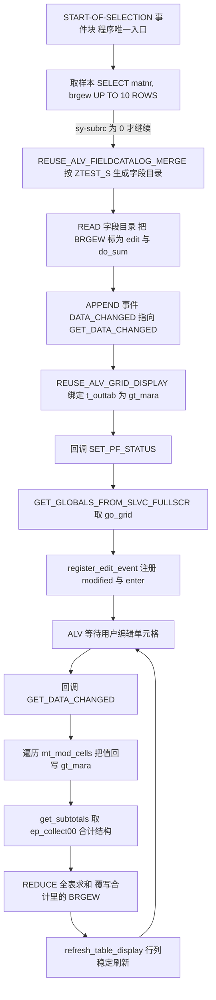
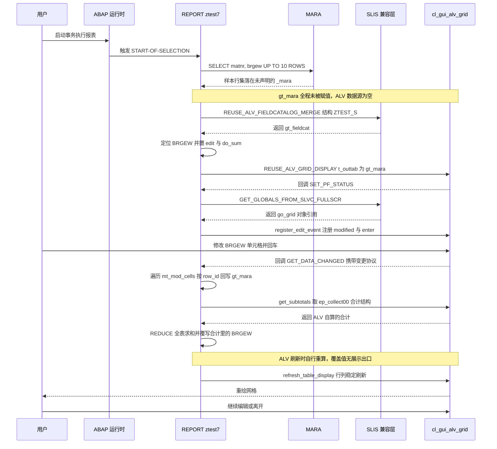

# ABAP 程序分析报告：`REPORT ztest7`

> 源码：`evals/ztest7.abap`（115 行）　|　类型：报表程序（可执行 Report）+ ALV Grid 可编辑合计 PoC

---

## 一、程序定位与业务背景

### 1.1 它想解决什么问题

SAP MM 里物料主数据带两个重量字段：**净重 `MARA-NTGEW`**（物料自身重量）和**毛重 `MARA-BRGEW`**（含包装的总重量，通常约等于净重 + 包装重 `TARGW`）。现场做批量导入、盘点调账、或者 ERP 与外围系统重量口径打架之后，业务方常有这样一句话："把这几十条物料的重量捞出来，在一屏里直接改掉，看看合计对不对，先别落库。"

这句话拆开就是三个硬需求：

1. **一屏可控**：不要弹一堆选择屏参数，一进事务就能看到数据；
2. **可编辑**：ALV 自带的合计（`do_sum`）是只读的，业务方要能直接改单元格；
3. **能看合计**：改完立刻看到总计，验证"这几箱加起来够不够发车"。

标准系统能覆盖吗？
- `MM02` 逐条维护 —— 慢，且立刻落库，无法"先别落库"；
- `MM51` 批量维护 —— 能改，但要求维护权限、走 `BAPI`/`CALL DIALOG` 流程、有审核痕迹，重量这种"先试算"的场景代价过高；
- Excel 中转 —— 最常见的翻车点，数据与系统口径脱节、回写出错。

所以这个程序**把"重量复核"这件事降级成一次会话内的试算**：不落库、不写日志、不问权限，只在内存内表里改，改完当场算个总数给它看。这是一种非常典型的 **"会话内试算板（in-session scratchpad）"** 定位。

### 1.2 设计范式一句话定性

> **走 SLIS 兼容层包装的 `cl_gui_alv_grid` 可编辑合计三明治：DDIC 结构生成字段目录 → 把重量列标成可编辑 → 用 `DATA_CHANGED` 事件把单元格修改回写内表 → 取 ALV 的 subtotal 结构再手工覆写 → 稳定刷新。**

选 SLIS（`REUSE_ALV_*`）而不是 `cl_salv`，是因为 SLIS 把字段目录生成、事件挂载、回调 FORM 的样板全藏起来了 —— 十行代码就能让一个对 `cl_gui_alv_grid` 不熟的人搭出可编辑网格。代价是多一层类型映射、一层遗留类型池依赖，以及后面第三节里那些"类型对了语义错了"的坑。

### 1.3 但必须先泼一盆冷水

从写法特征看（`REDUCE #( INIT lv_i TYPE ntgew_15 ...)`、`ASSIGN gr_data->*` + `ASSIGN COMPONENT`、空的 `CASE sy-ucomm`、空实现 `IF sy-subrc <> 0. ENDIF.`），这是一份**从 SAP 可编辑合计示例裁剪下来的 PoC 骨架**，不是可投产代码，而且它当下**连激活都过不去**：

- 取数落进了一个全程序从未声明的 `_mara`，而 ALV 真正绑定的 `gt_mara` 从头到尾没被填过数据；
- 手工算出来的合计写回了 ALV 的"合计收集结构"，而 ALV 刷新时是**自己从内表重算**的 —— 那段代码大概率是**死代码**；
- 累加器用 `ntgew_15`（净重），要加的却是 `brgew`（毛重）—— 类型共享域所以能跑，但语义是错的。

**真正值得读的不是它的业务，而是它完整演示了 ALV 可编辑交互的骨架，以及"骨架离能上线还差多少步"。** 下面按这条主线展开。

---

## 二、程序执行流程总览



### 责任链表

| 子程序 | 调用者 | 职责 |
|---|---|---|
| 全局声明区（`DATA` / `FIELD-SYMBOLS` / `TYPE-POOLS:slis`） | 系统加载程序时 | 声明内表、字段目录、事件表、grid 引用、合计容器与动态 field-symbol |
| 事件块 `START-OF-SELECTION` | 事务启动，由 ABAP 运行时隐式触发 | 取样本数据、生成字段目录、标记可编辑列、挂事件、显示 ALV（全流程的编排者） |
| `FORM set_pf_status` | `REUSE_ALV_GRID_DISPLAY` 的 `i_callback_pf_status_set` 回调 | 借 SLIS 完整屏接口拿 `go_grid` 引用，注册两个编辑事件，处理 PF-STATUS 命令 |
| `FORM get_data_changed` | `it_events` 里 `DATA_CHANGED` → `GET_DATA_CHANGED` 回调 | 遍历被修改单元格回写内表、读合计结构、手工覆写合计、稳定刷新 |

下面按这条流程，逐个子程序展开。

---

## 三、分组分析（按程序流程 / 子程序）

### 3.1 全局声明区（`TYPE-POOLS` / `DATA` / `FIELD-SYMBOLS`）

这个程序把 6 个数据对象全部声明为**全局变量** —— 报表程序没有类壳，也没有像样的封装层，FORM 之间只能靠共享内存通信。这是 ALV 回调类程序的标准形态，理解这一点才能明白后面 `go_grid` 为什么要在 `set_pf_status` 里赋值、在 `get_data_changed` 里直接读。

```abap
REPORT ztest7.
TYPE-POOLS:slis.

DATA: gt_mara     TYPE TABLE OF ztest_s,
      gt_fieldcat TYPE slis_t_fieldcat_alv,
      gt_events   TYPE slis_t_event,
      go_grid     TYPE REF TO cl_gui_alv_grid,
      gs_stable   TYPE lvc_s_stbl,
      gr_data     TYPE REF TO data.

FIELD-SYMBOLS: <gtr_sum_tab> TYPE table.
```

**做什么** — 声明五类对象：数据内表 `gt_mara`（行类型是自定义结构 `ztest_s`，**不是** MARA 的行类型）、字段目录 `gt_fieldcat`、事件表 `gt_events`、ALV 对象引用 `go_grid` 与稳定刷新参数 `gs_stable`，以及一个用来接合计结果的无类型引用 `gr_data` 和一个泛型内表 field-symbol `<gtr_sum_tab>`；`TYPE-POOLS:slis.` 拉入 SLIS 类型池，让 `slis_*` 类型在程序里可用。  
**为什么** — ALV 的两个回调都是 FORM（不是方法），没有 `this`，只能靠全局变量跨越 `set_pf_status` → 用户交互 → `get_data_changed` 这段生命周期传递状态；`REF TO cl_gui_alv_grid` 是为了让回调里能调用 `register_edit_event`、`get_subtotals`、`refresh_table_display` 这些 OO 方法；`<gtr_sum_tab> TYPE table` 是"结构未知时的标准姿势" —— 合计结构的行类型随字段目录变化，只能先按泛型内表接住。  
**风险与改进** — 四个问题叠加：**① `TYPE-POOLS:slis.` 是 SLIS 遗留依赖**，直接用 `cl_gui_alv_grid` 或 `cl_salv_table` 就不需要它，现在只是为跑 FM 而背上了类型池；**② 命名撒谎**：`gt_mara` 里装的是 `ztest_s` 的行，`gr_data` / `<gtr_sum_tab>` 用小写而其他用 `gt/go` 前缀，命名规范自相矛盾，读代码的人会以为 `gt_mara` 就是 MARA 的投影（这也正是 3.2 那个 bug 的心理来源）；**③ 全局状态无生命周期管理** —— `<gtr_sum_tab>` 一旦 ASSIGN 成功就常驻，下次回调若 `get_subtotals` 没填 `gr_data`，它还持着上次的旧数据；**④ `TYPE REF TO data` 的 `gr_data`** 是初始化的无类型引用，若 `get_subtotals` 的 `ep_collect00` 是强类型形参，赋值会编译失败（建议在 SE24 里确认 `CL_GUI_ALV_GRID->GET_SUBTOTALS` 的形参类型，若为具体类型应直接声明对应类型而非 `REF TO data`）。

---

### 3.2 事件块 `START-OF-SELECTION` —— 分 5 步

这是全程序唯一的事件块，也是**全部编排逻辑**：它同时承担了取数、字段目录生成、可编辑列标记、事件挂载、ALV 显示五件事，没有拆成任何 FORM。接下来按这 5 步拆开看。

#### ① 取样本数据

```abap
START-OF-SELECTION.

  SELECT matnr,
         brgew
    FROM mara
    INTO TABLE _mara UP TO 10 ROWS.
  IF sy-subrc EQ 0.
```

**做什么** — 从 `MARA` 只投影 `MATNR` 与 `BRGEW` 两列，取前 10 行放进内表 `_mara`；取完立刻用 `sy-subrc = 0` 判定"有数据"才继续往下走；没有 `WHERE`、没有 `ORDER BY`。  
**为什么** — 投影两列是刻意的省内存做法：`MARA` 有 800+ 字段，全取会把工作内存撑爆；`UP TO 10 ROWS` 说明作者要的是"演示数据"而不是"业务数据"。`IF sy-subrc EQ 0` 也是 ABAP 里对 `SELECT INTO TABLE` 最常见的写法。  
**风险与改进** — **① 致命：`_mara` 全程序没有任何 `DATA` 声明**。ABAP 的"内表隐式声明"只对 `LOOP AT` / `READ TABLE` / `SORT` 等语句成立，`SELECT ... INTO TABLE` 不在其列，所以这是**激活期语法错误，程序根本编译不过**。即使补上声明，接下来的逻辑仍然是断的：数据进了 `_mara`，ALV 绑的却是 `gt_mara`（初始为空表）→ **屏幕上会是一张只有表头、没有一行的空 ALV**。这一处极可能是从 SAP 示例改名时留下的搜索替换事故（示例里这个内表就叫 `gt_mara`）。修复：把 `_mara` 改成 `gt_mara`，并同时确认 `ZTEST_S` 里 `BRGEW` 与 `MARA-BRGEW` 兼容。**② 无 `WHERE` 的 `UP TO 10 ROWS` 仍是危险动作**：`MARA` 是百万级大表，ABAP 优化器无法确定终止点，实际会顺着主索引/全表扫一段才凑够 10 行，SQL Trace 上表现为几百毫秒到数秒的随机读；生产上必须先给选择屏或至少一个高选择性条件（如 `MATNR IN s_matnr`）。**③ 没有 `ORDER BY`**，取到哪 10 行由存储顺序决定，两次运行可能不同，演示不可复现。**④ `sy-subrc` 语义被用反**：查不到数据时 `sy-subrc = 4`，整个 ALV 被静默跳过，用户看到空白屏幕且没有任何提示；正解是 `IF sy-subrc = 4. MESSAGE '没有符合条件的数据' TYPE 'S'.`，或至少 `IF lines( gt_mara ) > 0`。

#### ② 用 DDIC 结构生成字段目录

```abap
    CALL FUNCTION 'REUSE_ALV_FIELDCATALOG_MERGE'
      EXPORTING
        i_program_name         = sy-repid
        i_structure_name       = 'ZTEST_S'
      CHANGING
        ct_fieldcat            = gt_fieldcat
      EXCEPTIONS
        inconsistent_interface = 1
        program_error          = 2
        OTHERS                 = 3.
    IF sy-subrc = 0.
```

**做什么** — 把 DDIC 结构 `ZTEST_S` 的字段定义（名称、长度、转换例程、标题文本）一次性转换成 ALV 字段目录表 `gt_fieldcat`；`i_program_name` 告诉 FM 去 `SAPLIXXX` 里找参数默认值，`ct_fieldcat` 以 `CHANGING` 回写；三个异常全部捕获，但异常值未被使用，只留一个 `sy-subrc = 0` 的闸门。  
**为什么** — 这是 SLIS 的招牌能力：手工写字段目录要重复几十行"字段名/长度/标题/小计文本"，而 DDIC 结构已经包含了这些信息，直接自动生成既省代码又保证与数据字典一致 —— 字段目录与内表行类型同源于 `ZTEST_S`，这是正确的单一事实来源。  
**风险与改进** — **① 异常被捕获后不处理**：`inconsistent_interface`（字段目录与内表不一致）和 `program_error`（结构不存在）都是可预期的失败，现在会让 ALV 整块不显示，用户面对空白屏幕无从判断原因；应至少 `MESSAGE ... TYPE 'E'` 区分提示。**② 它拉进来的是"整套字段"**，其中除 `BRGEW` 外的列都会以只读展示；如果 `ZTEST_S` 里带了大字段（描述、附加字段），要注意一次传输的数据量与 `it_outtab` 传输次数。**③ 依赖 `i_program_name`**：FM 会在当前程序里读取 `slis_variants` 相关默认值，隐含要求该程序可访问 `SAPLIXXX`，在受限角色或某些升级场景下容易踩坑。**④ 更轻的替代**：`cl_gui_alv_grid` 本身支持 `create_fieldcatalog_from_info` / 直接 `gt_fieldcat` 由 `REUSE_ALV_FIELDCATALOG_MERGE` 之外的方式构造；若只是 2~3 列，SLIS 这层封装其实过重。

#### ③ 把 `BRGEW` 标为可编辑且可合计

```abap
      READ TABLE gt_fieldcat ASSIGNING FIELD-SYMBOL(<gs_fcat>) WITH KEY fieldname = 'BRGEW'.
      IF sy-subrc EQ 0.
        <gs_fcat>-edit = 'X'.
        <gs_fcat>-do_sum = 'X'.
      ENDIF.
```

**做什么** — 在字段目录里按字段名 `BRGEW` 定位那一行，就地把它改成 `edit = 'X'`（单元格可编辑）与 `do_sum = 'X'`（参与合计），其余字段保持 DDIC 生成的原样。  
**为什么** — ALV 的可编辑能力完全由字段目录驱动：`-edit` 决定单元格能否进编辑态，`-do_sum` 决定该列是否被纳入合计计算。两个标记放在 `REUSE_ALV_GRID_DISPLAY` 之前设置，是唯一正确的时机 —— 网格一旦创建，字段目录的属性就固化了。  
**风险与改进** — **① 硬编码字段名**：一旦 `ZTEST_S` 里这列被改名或换成同义的 `NTGEW`，`READ TABLE` 找不到、`sy-subrc ≠ 0`，代码**静默跳过**，表现为"功能突然消失"且没有任何日志；应改成按数据元素/序号匹配，或在失败时 `MESSAGE ... TYPE 'E'`，更稳妥的做法是把要改的属性配到 `ZTEST_S` 之外的配置里。**② 只设 `edit` 没设配套的 `-no_outtab = 'X'`**：ALV 允许自行修改 `t_outtab`（尤其 `mc_evt_enter` 路径），而本程序又在 `DATA_CHANGED` 里自己回写，两条写入路径并存时"谁是数据的真相"就不清楚了；`get_data_changed` 模式应当配 `no_outtab = 'X'`，让内表只被回调这一条路径修改。**③ `-do_sum` 并不等于"会显示合计行"**：要让 ALV 真的画出小计/总计行，还需要 `-subtotl`（小计文本）、以及排序或小计设置；本程序两者都没有，**合计行大概率压根不显示** —— 这直接决定了 3.4 ③ 那段手算合计逻辑会不会是白干。**④ 字段语义的深层问题（见 3.4 ③ 的对照表）**：把**毛重**列开放为可编辑，本身就破坏了物料主数据"毛重 = 净重 + 包装重"的不变量。

#### ④ 挂载 `DATA_CHANGED` 事件

```abap
      APPEND VALUE #( name = 'DATA_CHANGED' form = 'GET_DATA_CHANGED' ) TO gt_events.
```

**做什么** — 用 `VALUE #(...)` 行构造器往事件表 `gt_events` 追加一条记录：事件名 `DATA_CHANGED`、回调 FORM 名 `GET_DATA_CHANGED`，该表随后作为 `it_events` 传给 ALV，使网格在数据被修改后回调本程序。  
**为什么** — 这是"可编辑 ALV"的核心接线。ALV 自己并不知道业务上该怎么处理修改，`DATA_CHANGED` 事件把变更的上下文（`CL_ALV_CHANGED_DATA_PROTOCOL`，含被改单元格行列号与新值）交给程序，由程序决定写回内表、校验、报错还是重算 —— 责任从框架回到了业务代码。写成 `APPEND VALUE #( ... ) TO` 而不是 `gt_events-append VALUE #( ... )`，风格上稍旧但完全等价。  
**风险与改进** — **① 只挂了 `DATA_CHANGED`、没挂 `DATA_CHANGED_FINISHED`**：前者适合做轻量回写，后者适合做"本次修改会话结束"的批量落库/汇总；只挂前者意味着每次按键都触发一次全量合计与刷新（见 3.4 ④）。**② 事件名是字符串字面量 `'DATA_CHANGED'`、FORM 名是字符串 `'GET_DATA_CHANGED'`**，两者都没有编译期校验 —— 把 FORM 改名后事件静默失效，运行时不报错、也不进 `DATA_CHANGED`。**③ 没有挂 `USER_COMMAND`**：后面 `set_pf_status` 里的 `CASE sy-ucomm` 因此注定是空转（见 3.3 ③）。**④ `it_events` 里若同时需要 `HOTSPOT`、`TOP_OF_DRAW`、`DOUBLE_CLICK`，本程序一个都没用**，功能面是最小集。

#### ⑤ 显示 ALV

```abap
      CALL FUNCTION 'REUSE_ALV_GRID_DISPLAY'
        EXPORTING
          i_callback_program       = sy-repid
          it_fieldcat              = gt_fieldcat
          it_events                = gt_events
          i_callback_pf_status_set = 'SET_PF_STATUS'
        TABLES
          t_outtab                 = gt_mara.
    ENDIF.
  ENDIF.
```

**做什么** — 启动全屏 ALV：字段目录用 `gt_fieldcat`，事件用 `gt_events`，回调宿主程序是本程序（`sy-repid`），PF-STATUS 由 `SET_PF_STATUS` 这个 FORM 负责设置，数据源 `t_outtab` 绑定 `gt_mara`；三层的 `IF` 收口后，程序在此进入 ALV 的事件循环，直到用户离开。  
**为什么** — 全屏 Grid 而不是 `REUSE_ALV_LIST_DISPLAY`，是因为**只有 Grid 支持 `register_edit_event` 与 `DATA_CHANGED` 回调**，`cl_gui_listview` 没有编辑能力 —— 这是"可编辑合计"这个需求对技术选型的硬约束。`i_callback_program` 是 SLIS 的机制约定：回调 FORM 通过"程序名 + FORM 名"被 FM 定位，与 ABAP 的动态 `PERFORM` 一脉相承。  
**风险与改进** — **① `t_outtab` 绑的是空的 `gt_mara`**（见 3.2 ①），这是整条链路上最致命的一环；**② `i_default_layout` / `i_save` 未设置**：用户每次进事务都是默认布局、无法保存个性化变式，"一屏可控"打折；**③ 没有 `i_grid_title`**，标题空着，试算场景下最好写清数据范围（如"MARA 毛重试算 - 10 行样本"）与"修改不会保存"；**④ 没有 `i_callback_top_of_draw` / `st_toolbar` 类事件**，也就没有"一键重算/恢复原值"这类出口 —— 而对一个不落库的试算板来说，这恰恰是最该有的按钮；**⑤ 没有 `i_check_variant_exist`** 之类的小程序复制保护，这类演示程序被复制去改字段时容易连带把 `sy-repid` 指向别处。

---

### 3.3 `FORM set_pf_status` —— 分 3 步

ALV 显示时，SLIS 会回调这个 FORM 来设置状态栏。**这段代码真正的职责是"把 `go_grid` 这个对象引用偷到手"** —— 一旦有了它，后面所有 OO 能力（注册编辑事件、读合计、刷新）才能用。三个步骤：借 SLIS 完整屏接口取引用 → 注册两个编辑事件 → 处理 PF-STATUS 命令。

#### ① 借 SLIS 完整屏接口取 ALV 对象引用

```abap
FORM set_pf_status USING itr_extab TYPE slis_t_extab.

* Get the ALV Object reference
  CALL FUNCTION 'GET_GLOBALS_FROM_SLVC_FULLSCR'
    IMPORTING
      e_grid = go_grid.
  IF go_grid IS BOUND.
```

**做什么** — 调用 `GET_GLOBALS_FROM_SLVC_FULLSCR`，把当前活动 ALV 的 `CL_GUI_ALV_GRID` 对象引用导入到全局变量 `go_grid`；随后用 `IS BOUND` 判断引用是否有效，把后续逻辑包在保护里。  
**为什么** — 这是"事件驱动编程"最经典的一招：`REUSE_ALV_GRID_DISPLAY` 是函数模块，返回后调用方只持有数据内表，**拿不到控件实例**；而 `CL_GUI_ALV_GRID` 的编辑能力、合计、刷新全是实例方法。FM 内部由 SLIS 统一维护"当前活动全屏 grid"的全局引用，这里通过专用 FM 把它取出来。同理，PF-STATUS 回调的存在本身也源于"没有控件句柄就无法直接设置状态栏"的限制。  
**风险与改进** — **① `USING itr_extab TYPE slis_t_extab`**：SLIS 期望的参数名是 `IT_EXTAB`（附加帮助表），这里用 `itr_extab`；ABAP 标识符不区分大小写所以能跑，但**名字对不上会让阅读者以为这是别的回调**，建议改成 `it_extab` 与 FM 文档一致；形参甚至直接不写也合法（`FORM set_pf_status.`），SLIS 只按 FORM 名匹配。**② 该 FORM 只在"PF-STATUS 需要设置"时被调用一次**，`go_grid` 的赋值时机依赖 SLIS 内部流程，属于隐式契约：如果将来去掉 `i_callback_pf_status_set`，`go_grid` 就永远是空的，整个程序会静默失效（`get_data_changed` 里的 `IF go_grid IS BOUND` 会把一切吃掉）。**③ 依赖 SLIS 的全局引用**：同一屏幕上有多个 ALV、或用了 split screen 时，这类"偷引用"会拿到错误实例；需要更稳的做法是自己 `cl_gui_alv_grid=>create_fcode` / 自己管理控件生命周期。**④ `itr_extab` 形参完全没用**：真要支持 F1 帮助，`IT_EXTAB` 应回填附加帮助条目，这里留空等于放弃了扩展点。

#### ② 注册两个编辑事件

```abap
    CALL METHOD go_grid->register_edit_event
      EXPORTING
        i_event_id = cl_gui_alv_grid=>mc_evt_modified.

    CALL METHOD go_grid->register_edit_event
      EXPORTING
        i_event_id = cl_gui_alv_grid=>mc_evt_enter.
```

**做什么** — 对拿到的 grid 实例连续调用两次 `register_edit_event`，分别注册 `mc_evt_modified`（单元格内容被修改并提交时触发）与 `mc_evt_enter`（用户在该单元格上按回车时触发）两个编辑事件。  
**为什么** — `REUSE_ALV_GRID_DISPLAY` 的 `it_events` 只能覆盖 SLIS 的那一批事件；`CL_GUI_ALV_GRID` 的 OO 事件（编辑、选择、点击、按钮）必须通过 `register_edit_event` / `register_event` 显式订阅。同时注册"修改"与"回车"，是想覆盖两种交互习惯：用户改完直接 Tab/点击别处（modified），或改完按回车确认（enter）。**这是"注册"而非"打开编辑"** —— 单元格能不能编辑早在字段目录阶段就由 `-edit` 决定了，这里只是订阅通知。  
**风险与改进** — **① 两个事件共用同一个 FORM，但两者携带的数据不同**：`mc_evt_modified` 的 `DATA_CHANGED` 协议里 `mt_mod_cells` 有内容，程序靠它精确回写；`mc_evt_enter` 场景下标准协议里的改动信息不可靠，惯用做法是额外调 `go_grid->get_cell_value( )` 按当前行读取新值。当前代码**没有区分事件来源**，导致回车路径下修改可能落空或落错行 —— 典型现象是"鼠标改的值生效了，按回车的没生效"。**② 未做注册去重**：`SET_PF_STATUS` 若因某种原因被调用两次（重设布局、PFCONT 刷新），同一事件会注册两次，回调触发两次、刷新两次。**③ 缺少 `mc_evt_*_cell` 系列**（`mc_evt_modify_cell`、`mc_evt_current_cell`），它们只在**单个单元格**事件时触发，正是这种"逐格改、逐格看合计"场景更合适的选择，注册全表 `modified` 事件在性能上更差（见 3.4 ④）。**④ 注册失败无检查**：`register_edit_event` 有异常（控件已释放等），此处不捕获。

#### ③ PF-STATUS 命令分支（空壳）

```abap
  " PF Status Code
  CASE sy-ucomm.
*	WHEN
    WHEN OTHERS.
  ENDCASE.
ENDFORM.
```

**做什么** — 用一个空 `CASE sy-ucomm. WHEN OTHERS. ENDCASE.` 占住 PF-STATUS 的位置：所有命令落到 `OTHERS` 分支、什么都不做；上一行还有一句被注释掉的 `*	WHEN` 残留，说明这里原本打算加命令分支但没写。  
**为什么** — SLIS 的 `i_callback_pf_status_set` 模式要求"由用户的 FORM 负责设置状态栏"。若这个 FORM 里既不设命令也不设状态，`GET_GLOBALS_FROM_SLVC_FULLSCR` 之后的 ALV 会使用 SLIS 默认状态；但保留 `CASE` 骨架是"预留扩展点"的常见写法，也确实是 SAP 示例的原有形态。  
**风险与改进** — **① 这是"命令永远不会被业务处理"的空壳**：用户在状态栏按的任何按钮，`sy-ucomm` 都不会被分派到具体分支；而且因为 FORM 内没有 `PF-STATUS`/`SET PF-STATUS` 语句去真正装命令，状态栏里可能连标准命令（返回、退出、保存布局）都没有 —— 试算板至少该有 **"恢复原值"、"重新计算"、"导出"、"退出"** 四个按钮，以及 `i_save = 'A'` 让用户保存布局。**② 被注释掉的 `WHEN` 残留**是明确的"未完成"信号，会让接手人误以为逻辑在别处实现。**③ 更好的做法**是 `FORM set_pf_status` 里只取 `go_grid`，把命令处理拆到 `i_callback_user_command` 对应的 FORM，两者职责分离、互不干扰；本程序没挂 `user_command`，所以状态栏这条路从根上就没打通。

---

### 3.4 `FORM get_data_changed` —— 分 5 步

这是整个程序的核心回调，也是缺陷最密集的地方：**回写内表 → 读合计 → 手工覆写合计 → 稳定刷新 → 空错误分支**。它的意图很好（改一个值立刻看到新合计），但每一层都有问题，其中"合计"这一步同时踩了类型、语义和可见性三个坑。

#### ① 遍历被修改的单元格并回写内表

```abap
FORM get_data_changed USING io_data_changed TYPE REF TO cl_alv_changed_data_protocol.

  IF go_grid IS BOUND.

    LOOP AT io_data_changed->mt_mod_cells ASSIGNING FIELD-SYMBOL(<gs_changed>) WHERE fieldname = 'BRGEW'.
      READ TABLE gt_mara ASSIGNING FIELD-SYMBOL(<gs_tab>) INDEX <gs_changed>-row_id.
      IF sy-subrc EQ 0.
        <gs_tab>-brgew = <gs_changed>-value.
      ENDIF.
    ENDLOOP.
```

**做什么** — 拿到事件传入的变更协议对象 `io_data_changed`，直接读它的公开属性 `mt_mod_cells`（被修改单元格清单），按 `fieldname = 'BRGEW'` 过滤出重量列的修改；每条修改记录带着 `row_id`（ALV 行号）回 `gt_mara` 里按下标定位该行，把 `<gs_changed>-value`（类型为 `any` 的单元格新值）赋给 `<gs_tab>-brgew`；找不到行时靠 `sy-subrc` 静默跳过。  
**为什么** — **用 `row_id` 回按下标定位，而不是用字段值做 key**，在报表场景下是安全的：`DATA_CHANGED` 的 `row_id` 就是 ALV 当前排序/过滤后视图里的行序号，而 `t_outtab` 与 ALV 视图行序是一一对应的（ALV 排序不移动内表，只改视图映射），所以 `READ TABLE ... INDEX row_id` 命中的是正确行。这比构造"物料号 + 重量"的组合 key 更直接，也避免了重复 key 问题。批量 `mt_mod_cells` 一次处理，也支持"多单元格粘贴"场景。  
**风险与改进** — **① 零输入校验，短 dump 风险最高的一处**：`<gs_changed>-value` 类型是 `any`，若用户输入 `'abc'`、`'12,5'`（带小数逗号）或 `'1.000 KG'`（带单位），赋给量纲字段（`BRGEW` 属 `MENGEN` 域、字符型长度 15）会触发转换异常 `CONVT_NO_NUMBER` / `CONVT_CHAR_INPUT`；这类异常在 `DATA_CHANGED` 回调里往往**直接短转储**，用户填错一个字符程序就挂了。正解是在赋值前后做校验，并**用协议回填错误**让用户看到提示：`io_data_changed->add_protocol_entry( i_msgid = 'ZBAR' i_msgno = '001' i_msgty = 'E' i_msgv1 = ... )`，ALV 会把单元格标红并保留原值继续可用。**② 兼容性未校验**：`READ TABLE` 假定 `gt_mara` 的行类型 `ZTEST_S` 里有一个可写的 `BRGEW` 组件。若结构里字段被改名、或属性加了 `WRITE-PROTECTED`，这里是**编译期就报错**（好过运行期），但如果字段存在而 ALV 因某种原因不提供该值，仍会写进 0。**③ `IF sy-subrc EQ 0` 只挡住了行不存在**，没有区分"越界"与"类型错"，且失败时不告知用户 —— 用户会以为改成功了。**④ 与 ALV 自身写入路径重叠**：字段目录没有设 `no_outtab = 'X'`，`mc_evt_enter` 场景下 ALV 可能已先写了一次内表，这里再写一次；单值场景幂等不出错，但**若内表字段是数值类型且赋值走了转换，可能出现二次舍入差异**。**⑤ `mt_mod_cells` 是 ALV 公共属性但属于内部约定**：升级后若属性改名或改为 `protected`，这段代码会直接失败；更稳的写法是 `io_data_changed->get_cell_value( )` 逐格读取。

#### ② 读取 ALV 的合计结构

```abap
    go_grid->get_subtotals(
      IMPORTING
        ep_collect00 = gr_data   " Overall Total
    ).

    ASSIGN gr_data->* TO <gtr_sum_tab>.
    READ TABLE <gtr_sum_tab> ASSIGNING FIELD-SYMBOL(<l_sum>) INDEX 1.
    IF sy-subrc EQ 0.
```

**做什么** — 调 `get_subtotals`，把 ALV 当前算出的**总体合计**（collect00）取进 `gr_data`；再用 `ASSIGN gr_data->*` 把这个引用指向泛型内表 field-symbol `<gtr_sum_tab>`，然后按下标 1 取出合计行 `<l_sum>`，准备去改它里面的 `BRGEW`。  
**为什么** — 这一步是"取现成答案再改"的思路：ALV 自己已经按 `do_sum` 算好了合计，本意是"拿到这个合计、把某个成分改成手工重算的值"。用 `ASSIGN` 而不是 `ASSIGNING` 到具体类型，是因为合计结构的行类型等于字段目录结构的行类型，随 DDIC 变化 —— 这种"动态结构"在 ALV 编程里只能靠泛型 field-symbol 处理。  
**风险与改进** — **① 未赋值就使用 → 短转储风险（🔴）**：`gr_data` 只有在 ALV 确实存在小计时才会被填充。当用户用了筛选、排序里没有小计级别、或字段目录根本没让合计行生效（3.2 ③ 已说明 `-subtotl` 缺失）时，`get_subtotals` 可能什么都不返回 → `gr_data` 保持初始的**空引用** → `ASSIGN gr_data->*` 会以引用为空的**动态错误中断**（动态指向空引用不是返回 `sy-subrc = 4`，而是运行时异常）；即便没断，`<gtr_sum_tab>` 未 ASSIGN 时紧接着的 `READ TABLE` 会因"内表未赋值"再次报错。**必须补 `IF gr_data IS BOUND AND gr_data IS NOT INITIAL`，并对 `<gtr_sum_tab>` 加 `IS ASSIGNED` 守卫**，这也是 `ASSIGN COMPONENT` 那一步作者做了 `IS ASSIGNED` 检查、而这两处却没做的原因 —— 守卫做了一半。**② `INDEX 1` 的位置假设**：`EP_COLLECT00` 是"按小计级别索引的集合表"，第 1 行是否一定是总计取决于排序与小计配置；一旦用户排序或配置了多个小计级别，`INDEX 1` 可能取到分组小计而非总计 —— **正确做法是按 `LEVEL` 或字段目录的 `SUBTOTL` 标记定位总计行，而不是按位置**。**③ 全局 field-symbol 的脏数据**（见 3.1）：`<gtr_sum_tab>` 是全局的，上一次 ASSIGN 的结果会一直保留；这次 `get_subtotals` 若没填数据，`ASSIGN` 又失败，就出现"用上一次的结构算这一次的数据"的幽灵状态。**④ `ep_collect00 = gr_data` 的类型匹配待确认**（见 3.1 风险 ④），若 `GET_SUBTOTALS` 形参是强类型，这里应直接用有类型的内表/结构变量，`REF TO data` 只在形参确为泛型时才成立。

#### ③ 用 `REDUCE` 全表求和并覆写合计

```abap
      ASSIGN COMPONENT 'BRGEW' OF STRUCTURE <l_sum> TO FIELD-SYMBOL(<lg_val>).
      IF <lg_val> IS ASSIGNED.
        <lg_val> = REDUCE #( INIT lv_i TYPE ntgew_15 FOR <ls_t> IN gt_mara NEXT lv_i = lv_i + <ls_t>-brgew ).
      ENDIF.
    ENDIF.
```

**做什么** — 先在合计结构 `<l_sum>` 里按**组件名**定位 `BRGEW` 字段（`ASSIGN COMPONENT ... OF STRUCTURE`），拿到字段符号 `<lg_val>`；然后用 `REDUCE` 内表表达式把 `gt_mara` **全表**的 `BRGEW` 逐行累加，累加器的初始类型声明为 **`ntgew_15`**，把这个和写回合计结构里的 `BRGEW`；如果字段目录的结构里没有 `BRGEW` 组件，`ASSIGN` 失败、`IS ASSIGNED` 为假、整段被跳过。  
**为什么** — `REDUCE #( INIT ... NEXT ... )` 是 7.4 之后的现代写法，比 `LOOP ... ACCUMULATE` 或排序后逐行相加更短、也避免排序副作用，方向是对的。`ASSIGN COMPONENT` 定位字段、再用 `IS ASSIGNED` 兜底，则是处理"结构随字段目录浮动"的常规手法，比直接 `DATA lv_sum TYPE ZTEST_S` 更灵活。`INIT lv_i TYPE ...` 这种写法只有 REDUCE 支持，所以作者选它是有意的。

**风险与改进** — 这里叠了四层问题，从"可见性"到"类型语义"到"业务语义"，必须一层层剥开看。先做最关键的**类型 / 数据元素语义校核**：

| 名称 | 业务语义 | 数据元素 / 域 | 长度 | 本程序中的角色 |
|---|---|---|---|---|
| `MARA-NTGEW` | **净重** Net Weight（物料自身重量） | `NTGEW` / `MENGEN` | 15 | 本程序**没用** |
| `ntgew_15`（仅作为 REDUCE 的 `INIT` 类型） | **净重** Net Weight | `NTGEW_15` / `MENGEN` | 15 | 却被当成"毛重合计"的累加器类型 |
| `MARA-BRGEW` | **毛重** Gross Weight（含包装，通常 ≈ 净重 + 包装重） | `BRGEW` / `MENGEN` | 15 | `SELECT` 取的就是它，也被设为可编辑/可合计 |

`NTGEW_15` 与 `BRGEW` **共享同一个域 `MENGEN`（量纲，长度 15）**，所以赋值可以通过、`+` 运算可以通过、程序不会报任何错 —— 这就是最危险的地方：**类型系统给了绿灯，语义系统拉响了警报**。"长度与精度完全一致"绝不能当成"字段语义一致"的证据。正确的证据是：两列的业务含义是否可互换、是否共用同一份单位口径、是否满足 `BRGEW ≈ NTGEW + TARGW` 的不变量 —— 这里答案是明确的"否"。从写法痕迹看，这行几乎肯定是从 SAP 官方示例（示例里那列是**净重**）复制后，把 `SELECT` 换成了 `BRGEW`，却忘了把累加器类型改过来。

- **A 可见性：这段大概率是死代码（最需要先验证的一条）** — `EP_COLLECT00` 是 ALV **单向输出**的"小计收集结果"，`get_subtotals` 只是把 ALV 当前算好的值**读**给你；你改它之后，ALV 在下次 `refresh_table_display` 时会**自己从内表重算小计**，并不会去读你改过的这份结构。也就是说，除非把该值写进一个真正参与显示的位置（比如给内表追加一行"合计"、或做成屏幕上的独立输出字段），否则这段 `REDUCE` + `ASSIGN COMPONENT` 的结果**没有任何展示出口**。改法：把合计物化成内表的一行（配合 `ZTEST_S` 上的行类型标志字段），或改用 ALV 原生小计（设 `-subtotl` + 排序小计，让 ALV 自己算自己显示）。**在验证这一点之前，这段代码是本程序最大的"看起来在工作、实际什么都没做"的区域。**
- **B 业务语义：毛重与净重、跨单位求和** — ①**破坏主数据不变量**：`BRGEW` 是"净重 + 包装重"的派生量，直接在屏幕上把它改成任意值，物料就不满足这条不变量了；若将来有人给本程序补上 `MODIFY mara`，这就变成了一次无校验的主数据污染。②**跨单位求和无意义**：`MARA-BRGEW` 的单位是物料的**基本计量单位**（`MARA-EINHE`，可能是 KG / G / TO / LB），把 10 条单位不同的物料重量直接相加，得到的数字没有物理意义；而 `ZTEST_S` 里没有任何单位字段，用户无从判断，至少应取 `EINHE` 展示甚至按单位分组后合计。③**重复劳动**：ALV 的 `do_sum` 本来就会在每次刷新时按内表重算合计，这个 `REDUCE` 在能力上与 ALV 重叠，只是没生效。④**合计"混入非业务行"**：全表求和默认所有行都是数据行，一旦内表里追加了合计行/小计行会出现自己加自己的经典 bug；本程序恰好"没追加合计行"是对的，但这份正确性是隐式的、脆的。
- **C 溢出与类型** — `BRGEW` 是**字符型量纲字段**（C(15)，域 `MENGEN`），量纲字段相加靠隐式数值转换，结果仍写回 C(15)：超过 15 位就**静默溢出**（或显示成 `**********`），金额/重量合计没有溢出保护是报表的经典事故；同时字符量纲字段的 `+` 依赖隐式转换，比数值类型慢且易踩前导零、尾随空格的坑。**建议用 `REDUCE #( INIT sum TYPE ... )` 或先 `CONV` 到数值型累加，再 `CONV` 回字段类型，并显式处理溢出**；或者干脆交给 ALV 原生 `do_sum`（它内部按字段类型正确处理）。
- **D 硬编码与静默降级** — 组件名 `'BRGEW'` 硬编码，且失败只靠 `IS ASSIGNED` 静默跳过；被改的字段名一旦与结构不符，用户看到的还是旧合计，却不会有任何提示。

#### ④ 稳定刷新

```abap
    gs_stable-col = 'X'.
    gs_stable-row = 'X'.

    go_grid->refresh_table_display(
      EXPORTING
        is_stable      = gs_stable      " With Stable Rows/Columns
        i_soft_refresh = 'X'            " Without Sort, Filter, etc.
      EXCEPTIONS
        finished       = 1              " Display was Ended (by Export)
        OTHERS         = 2
    ).
```

**做什么** — 组装稳定刷新参数 `LVC_S_STBL`（`col`/`row` 都置 `'X'`，即本次刷新前后行序与列序保持不变），然后调 `refresh_table_display`，以 `i_soft_refresh = 'X'` 告知 ALV **保留用户的排序、筛选、列宽等布局状态**，只重画内容；捕获 `finished`（显示已因导出等结束）与 `OTHERS` 两个异常。  
**为什么** — 编辑场景下刷新必须"稳"：如果用户正在编辑第 7 行，刷新导致行跳动，体验直接崩掉；`is_stable` + `i_soft_refresh` 是官方推荐组合 —— 前者保证行列位置不乱，后者避免把用户的排序筛选条件重置回去。异常里的 `finished` 注释写明"Display was Ended (by Export)"，说明作者知道这条路径存在。  
**风险与改进** — **① 刷新粒度过粗**：每改一个单元格就整表 `refresh_table_display`，10 行看着还行，几千行就是明显闪烁与性能问题（`REUSE_ALV_GRID_DISPLAY` 的全量重传 + 前端重绘）。ALV 为此提供了 `is_stable` 里的 `it_sort_no` / `it_sortname` 精确到行列重绘，或用 `io_data_changed->add_protocol_entry( i_msgid = 'SAV' i_msgno = '001' ... )` 只更新单元格内容；**更省的做法是改用 `mc_evt_modify_cell` 单格事件并刷新受影响的那一格**。**② 每次编辑都重算合计**（见下）。**③ `gs_stable` 是全局变量**且在每次事件里只置位不复位，目前恰好够用，但一旦以后要做"部分行不刷新"的差异化逻辑，很容易被上一次调用残留的 `X` 影响 —— 应在传参前显式 `INIT` 或按场景构造。**④ 异常虽捕获但不用**（见 ①下一步）。**⑤ 没有把"合计"变化通过 `DATA_CHANGED` 协议告诉 ALV**：更符合 ALV 编程模型的做法是 `io_data_changed->set_data_changed( )` 配合 `add_protocol_entry( )`，让 ALV 知道哪些单元格的数据是被程序改过的，避免出现"ALV 认为没变、显示却是新值"的不一致。

#### ⑤ 空实现的错误分支

```abap
    IF sy-subrc <> 0.
    ENDIF.

  ENDIF.

ENDFORM.                    "get_data_changed
```

**做什么** — 检查上一步 `refresh_table_display` 的 `sy-subrc`，非 0 时进入一个**空的 `IF` 分支**（什么都没有做就结束），随后闭合 `IF go_grid IS BOUND` 与 `ENDFORM`。  
**为什么** — 这显然是写了一半的骨架：作者打算在这里对刷新失败（例如因导出导致控件已释放）做点什么，但没写。保留 `IF sy-subrc <> 0` 的框架本身是合理的调试习惯 —— 先占位、后填充。  
**风险与改进** — **① 空 `IF` 会被静态检查器直接报为无效代码**（SAP Code Inspector 的 `EMPTY_STRUCTURE`/`UNUSED` 类提示），也让阅读者分不清"确实无需处理"还是"忘了写"。**② `finished` 与"真实错误"应当区别对待**：`finished`（`sy-subrc = 1`）是正常终止路径，静默忽略是对的；而 `OTHERS = 2` 是真异常，至少应 `MESSAGE ... TYPE 'S'` 或写日志，否则"刷新失败导致合计不更新"这类问题在现场根本无法排查。**③ 这条空分支是本程序的"完成度标记"** —— 连同 3.3 ③ 里被注释的 `*	WHEN`、3.2 ① 里未声明的 `_mara`，三处痕迹共同说明：**这份源码处在"示例骨架 + 局部改造"的中间态，既没做完，也还没被验证过**。它适合当教学样本，不适合当改造起点。

---

## 四、执行流程全景图（数据视角）



---

## 五、问题清单与改进建议（按优先级）

### 🔴 P0 业务正确性

| # | 位置 | 问题 | 改进方向 |
|---|---|---|---|
| 1 | 事件块 `START-OF-SELECTION` | `_mara` 全程序无 `DATA` 声明（`SELECT ... INTO TABLE` 不支持隐式内表声明）→ **激活期语法错误，程序编译不过** | 声明内表并直接取进 `gt_mara`；确认 `ZTEST_S` 与 `MARA` 的行映射 |
| 2 | 事件块 `START-OF-SELECTION` | 取数落 `_mara`，而 `t_outtab` 绑的是从未赋值的 `gt_mara` → **即使编译通过，ALV 也是空表** | 让数据源与取数目标统一为同一内表 |
| 3 | `FORM get_data_changed`（② ③） | 合计被写回 ALV 的"小计收集结构"，ALV 刷新时自己从内表重算 → **手算合计极可能是死代码，界面上看不到任何变化** | 把合计物化为内表行 / 用 `-subtotl` + ALV 原生小计 / 写进独立输出字段，三选一 |
| 4 | `FORM get_data_changed`（③） | 累加器类型写成 `ntgew_15`（**净重**），要加的却是 `brgew`（**毛重**）；两者共享 `MENGEN` 域所以能跑 → **静默的语义错配** | 累加器类型改用与目标字段一致的类型；上线前补一轮"字段语义 vs 数据元素"核对清单 |
| 5 | `FORM get_data_changed`（③）+ 事件块 `START-OF-SELECTION`（③） | 把**毛重**开放为可编辑，破坏"毛重 = 净重 + 包装重"的不变量；且跨 `MARA-EINHE` 不同单位求和无业务意义 | 试算场景改可编辑对象（如"试算重量"单独字段），或只读展示 + 单列调整值；合计前按单位分组 |
| 6 | `FORM get_data_changed`（④） | 用户输入零校验：输入 `'abc'`、`'12,5'`、`'1 KG'` 会触发量纲转换异常，在回调里往往**直接短转储** | 赋值前校验并用 `add_protocol_entry` 回填错误，让单元格标红而非崩溃 |

### 🟠 P1 健壮性

| # | 位置 | 问题 | 改进方向 |
|---|---|---|---|
| 7 | `FORM get_data_changed`（②） | `gr_data` 为空引用时 `ASSIGN gr_data->*` 与随后的 `READ TABLE <gtr_sum_tab>` **缺 `IS BOUND`/`IS ASSIGNED` 守卫**，会短转储；作者只给内层 `ASSIGN COMPONENT` 做了检查，守卫做了一半 | 补 `IF gr_data IS BOUND` 与 `<gtr_sum_tab> IS ASSIGNED` 双守卫 |
| 8 | `FORM get_data_changed`（③） | `INDEX 1` 假设"第 1 行一定是总计"，排序或配置多级小计后会取到分组小计 | 按 `LEVEL`/`SUBTOTL` 定位总计行，或自己维护小计级别 |
| 9 | 事件块 `START-OF-SELECTION`（①） | `IF sy-subrc EQ 0` 把"无数据"当成"不显示"，用户看到空白屏幕且无任何提示 | `sy-subrc = 4` 时 `MESSAGE '无符合条件的数据' TYPE 'S'` |
| 10 | `FORM set_pf_status`（②）+ `FORM get_data_changed`（①） | `mc_evt_modified` 与 `mc_evt_enter` 共用 FORM 但未区分事件来源，回车路径的修改可能不生效或落错行 | 改为注册单格事件 `mc_evt_modify_cell`，或按事件分别 `get_cell_value` 取值 |
| 11 | `FORM get_data_changed`（④） | 每次单元格修改都触发全表求和 + 整表 `refresh_table_display`，行数一多即闪烁与卡顿 | 改单格事件 + 精确行列重绘，或用协议只更新目标单元格 |
| 12 | `FORM get_data_changed`（③） | 字符型量纲字段（C(15)）求和无溢出保护，超限会显示 `**********` | 数值型累加 + 显式溢出处理，或交给 ALV 原生 `do_sum` |
| 13 | 事件块 `START-OF-SELECTION`（②） | `inconsistent_interface`/`program_error` 捕获后不处理，失败时静默无 ALV | 按异常值给不同错误提示或写日志 |
| 14 | `FORM get_data_changed`（⑤） | `IF sy-subrc <> 0. ENDIF.` 空实现；`OTHERS` 异常静默吞掉 | 区分 `finished`（正常）与 `OTHERS`（记日志/提示） |

### 🟡 P2 性能与规范

| # | 位置 | 问题 | 改进方向 |
|---|---|---|---|
| 15 | 事件块 `START-OF-SELECTION`（①） | `MARA` 无 `WHERE` 的 `UP TO 10 ROWS`，仍可能扫大量数据；且无 `ORDER BY`，结果不可复现 | 加选择屏或高选择性条件；生产上禁止裸全表 |
| 16 | 事件块 `START-OF-SELECTION`（①~⑤） | 五个不同关注点（取数/字段目录/可编辑标记/事件/显示）全堆在一个事件块，无 FORM 拆分 | 按职责拆 FORM，主事件块只做编排 |
| 17 | `FORM set_pf_status`（①） | `USING itr_extab` 形参名与 SLIS 约定的 `IT_EXTAB` 不一致（虽能跑），易误导 | 与 FM 文档对齐命名，或直接省略形参 |
| 18 | 事件块 `START-OF-SELECTION`（③） | 字段名 `'BRGEW'` 硬编码，结构改名后功能静默消失 | 按数据元素/序号匹配，或失败时明确报错 |
| 19 | 事件块 `START-OF-SELECTION`（③） | 设了 `edit` 却没设 `no_outtab = 'X'`，ALV 与回调两条写入路径并存 | 配 `no_outtab = 'X'`，让 `DATA_CHANGED` 成为唯一写入路径 |
| 20 | 全局声明区 | 命名自相矛盾：`gt_mara` 装 `ztest_s` 行；`gr_data`/`<gtr_sum_tab>` 小写而其余用 `gt/go` 前缀 | 统一命名规范，名字必须能自解释 |
| 21 | `FORM set_pf_status`（③） | `CASE sy-ucomm` 空壳 + 被注释的 `WHEN`；状态栏无任何业务命令，也无 `i_save` | 补"恢复原值/重新计算/退出"命令与布局保存 |
| 22 | 全局声明区 / 事件块 `START-OF-SELECTION`（②） | `TYPE-POOLS:slis.` 与 `REUSE_ALV_*` 全套遗留封装 | 新程序直接用 `cl_salv_table`（但需自建编辑事件）或 `cl_gui_alv_grid` |

### 🟢 P3 可扩展性

| # | 位置 | 问题 | 改进方向 |
|---|---|---|---|
| 23 | `FORM get_data_changed`（④） | 每次事件都重刷全表，没有"批处理修改"的出口 | 挂 `DATA_CHANGED_FINISHED`，一次修改会话结束时统一重算/落库 |
| 24 | `FORM get_data_changed`（③） | 合计只存在内存局部结构里，导出、打印、其他报表都取不到 | 合计物化为内表行，或统一到一个可复用的地方 |
| 25 | 全局声明区 / `FORM set_pf_status`（①） | `go_grid` 靠"SLIS 回调时偷全局引用"取得，隐式契约、不可测 | 若继续用 Grid 风格，自行管理控件生命周期并显式传递 |
| 26 | 事件块 `START-OF-SELECTION`（④⑤） | 事件名与 FORM 名都是字符串字面量，改名后静默失效；缺 `USER_COMMAND`、`HOTSPOT` 等扩展点 | 用常量集中管理事件/FORM 名称，按需挂更多回调 |
| 27 | 整个程序 | 硬编码"不落库"却没有任何 UI 提示，用户会误以为已保存 | 标题栏/PF-STATUS 上明确标注"修改仅在本次会话有效" |

---

## 六、整体评价与启发

### 优点

1. **技术选型判断是对的**。要在全屏 ALV 上做"可编辑 + 实时合计"，就必须用 `cl_gui_alv_grid`（`cl_gui_listview` 无编辑能力），就必须自己 `register_edit_event` 拿 `go_grid` 引用，就必须用 `DATA_CHANGED` 而不是 `USER_COMMAND`。作者把这条链路从字段目录、事件注册、协议回写一路接通了，**骨架是对的、顺序也是对的**。
2. **数据字典单一事实来源**。字段目录从 `ZTEST_S` 自动生成而不是手写，可编辑列靠 `-edit` 声明而不是靠改内表，配置与数据同源，长期维护成本低。
3. **现代语法用得克制**。`VALUE #( ... ) TO` 追加、`REDUCE #( INIT ... NEXT ... )` 求和、`ASSIGN COMPONENT ... OF STRUCTURE` 动态定位，都是恰当选择，没有为了炫技而滥用。

### 短板

1. **它现在跑不起来，而且就算跑起来也什么都没做**。`_mara` 未声明导致编译不过（P0-1）；即使补上，ALV 数据源是空表（P0-2）；即使有数据，手算合计也没有展示出口（P0-3）。这是本程序最需要先说清楚的一件事。
2. **语义校核缺席**。`ntgew_15`（净重）当毛重累加器，靠"共享域所以能跑"蒙混过关 —— 这类"类型系统放行、语义系统报警"的错，比语法错误危险得多，因为它会一路带到生产。
3. **防御式编程只做了一半**。内层 `ASSIGN COMPONENT` 有 `IS ASSIGNED` 守卫，外层 `gr_data->*` 与 `<gtr_sum_tab>` 却没有；空 `IF sy-subrc <> 0` 与被注释的 `WHEN` 说明作者知道还有事情没做完。
4. **没有一层业务校验**。试算板可以简陋，但"用户输入非法字符会不会崩""毛重改了算不算主数据错误""不同单位的重量能不能相加"这三个问题必须有答案，而程序一个都没回答。

### 可以学到的设计经验

1. **"类型能过"不等于"语义对"**。凡是看到 `TYPE` 一个数据元素、却去装另一个字段的数据（金额当数量、净重当毛重），都要回到业务文档确认一次；长度和精度一致只是**必要条件**，绝不是充分条件。SAP 里大量字段共享 `MENGEN`（量纲）、`CURR`（金额）这类宽域，域本身不携带业务语义。
2. **可编辑 ALV 的正确姿势是"三件套"**：字段目录 `-edit`（可编辑）+ `-no_outtab`（禁止 ALV 直接改内表）+ `DATA_CHANGED` 里回写与 `add_protocol_entry` 回填错误。缺任何一件，都会出现"能改但不知道改没改成"或者"改错一个字符就短转储"。
3. **别把合计算在"框架的收集结构"里**。`get_subtotals` 是只出不进的读取接口，ALV 每次显示都会自己重算小计；要展示自定义合计，唯一可靠的方式是让它成为**真正参与显示的数据**（内表追加合计行 / ALV 原生小计 / 独立输出字段）。
4. **框架封装要清楚自己的代价**。SLIS 帮你藏起了 `cl_gui_alv_grid` 的样板，代价是"要拿控件引用必须走 `GET_GLOBALS_FROM_SLVC_FULLSCR` 这种隐式全局引用"、"事件名和 FORM 名都是字符串没有编译期检查"。用 SLIS 就接受这些，换来的是可读性；不打算长期维护的 PoC，直接 OO 反而更干净。
5. **完成度是可以从代码痕迹上看出来的**。空 `IF`、注释掉的 `WHEN`、命名与内容不符（`gt_mara` 里装着 `ztest_s`）、改名留下的孤儿符号（`_mara`）—— 这四处同时出现，说明这份源码是"示例 + 局部改造"的中间态。**读程序先读这些痕迹，比逐行读逻辑更快判断该不该接手。**