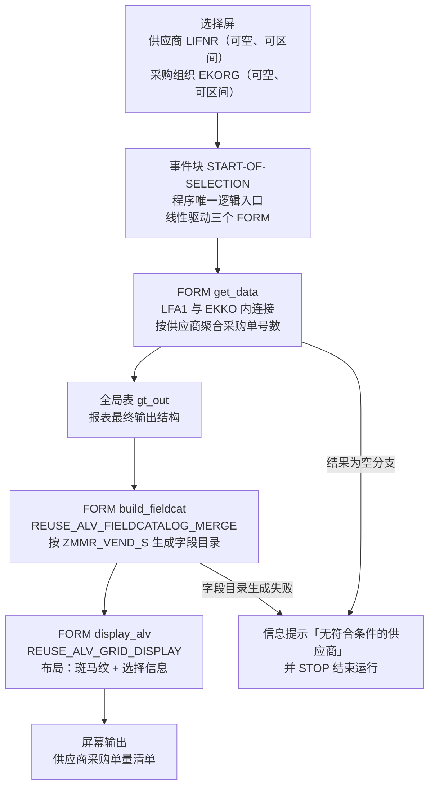
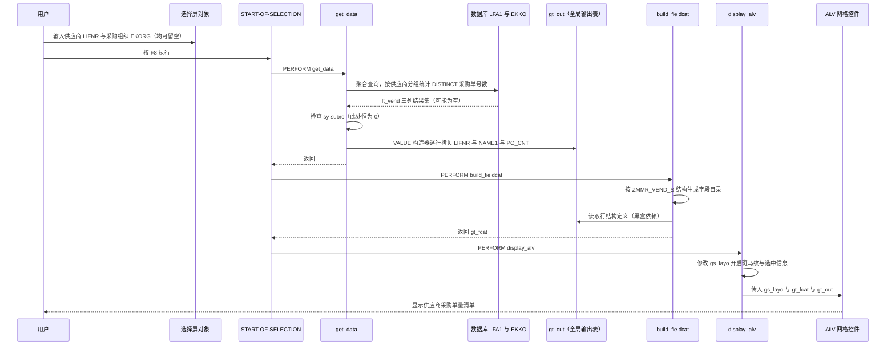

# `Z MMR_VEND_LIST` 供应商采购单量报表 — 程序走读

## 一、程序定位与业务背景

### 1.1 这份清单回答什么业务问题

程序的输出只有三列：**供应商编号、供应商名称、采购单数量**。这是一个非常聚焦的问题：

> 「在我们关心的采购组织和供应商范围内，哪些供应商的采购业务量最大？」

典型使用场景有三类：

1. **供应商绩效评估 / 分级管理**：用单量作为履约份额的粗粒度指标，识别主力供应商与边缘供应商，为供应商分级、淘汰、返利谈判提供底数。
2. **采购集中度分析（CR-n 测算）**：算出单量排名前若干名供应商占总量多少，判断采购是过度分散还是过度集中，这是采购策略评审的必答题。
3. **异常识别**：单量畸高的供应商往往对应"下单太碎、单价失控"或"某类物料被单一供应商锁定"，单量畸低则可能是新供应商导入停滞。

### 1.2 为什么标准事务码不够用

| 需求 | 标准做法 | 卡在哪里 |
| --- | --- | --- |
| 看单个供应商的单量 | `ME2N` / `ME5N` 按供应商查采购单据 | 是**逐单明细视图**，要人工数条数或导出后自己透视 |
| 看供应商主数据 | `MM03` | 主数据里**根本没有**采购单量这个字段 |
| 全供应商横向对比 | 没有现成事务码 | 只能靠 `EKTO`/`EKKI` 之类的成本视图，但口径含全收货、全转储行项目，与"开过的单子"不是一回事 |
| Excel 汇总 | 从 MKTO/ME5N 导出 | 口径与筛选条件容易和业务口径打架，且随时间腐烂 |

结论：这类"横向对比型统计"是 SAP 标准前台天然薄弱的地带，必须自建报表。本程序就是填补这个缺口的最短实现。

### 1.3 设计范式一句话定性

> **典型的「选择屏 → 一次聚合查询 → ALV 清单」三段式经典报表**：没有任何 OO 抽象、没有弹窗、没有标准 BAPI/函数模块调用，全部业务逻辑压在 `START-OF-SELECTION` 线性驱动的三个 `FORM` 里，属于典型的 **procedural（过程式）报表**。

这个定性的含义很重要：**它没有可扩展的分层，也没有可复用的服务层**。所有改善只能在现有骨架内做加减法，不存在"接入架构"的动作。

---

## 二、程序执行流程总览

### 2.1 执行流程图



需要特别说明的是：**图中"结果为空"这条分支实际上是走不到的**，原因在 `get_data` 的第三步分析里展开，这是本程序最值得警惕的一处缺陷。

### 2.2 责任链表

| 序 | 子程序 | 调用者 | 触发方式 | 职责 |
| --- | --- | --- | --- | --- |
| 1 | 全局声明区 | 系统（编译期） | 程序启动前装载 DDIC 类型池、声明工作区与选择屏 | 提供类型依赖、全局内表 `gt_out` / `gt_fcat` / `gs_layo` |
| 2 | 事件块 `START-OF-SELECTION` | ABAP 运行时 | 用户按 F8 或执行变式 | 程序唯一逻辑入口，按固定顺序驱动后三个子程序 |
| 3 | `FORM get_data` | `START-OF-SELECTION` | 第 1 个 `PERFORM` | 执行带 `COUNT(DISTINCT)` 的聚合查询，把结果填入全局输出表 `gt_out` |
| 4 | `FORM build_fieldcat` | `START-OF-SELECTION` | 第 2 个 `PERFORM` | 以 `ZMMR_VEND_S` 为结构源自动生成 ALV 字段目录 |
| 5 | `FORM display_alv` | `START-OF-SELECTION` | 第 3 个 `PERFORM` | 布置 `slis_layout_alv`，调用 `REUSE_ALV_GRID_DISPLAY` 输出清单 |

值得注意的是：**三个子程序之间没有任何相互调用**。它们通过全局变量 `gt_out` / `gt_fcat` / `gs_layo` 单向传递数据，耦合是隐式的数据耦合而非显式的参数耦合。这在短程序里是优点（省事），在长程序里就是万恶之源。

下面按这条流程，逐个子程序展开。

---

## 三、分组分析

### 3.1 声明区 全局声明区

这一节分三步：程序类型与类型池、表依赖声明、输出结构与选择屏。

#### ① 程序类型与类型池

```abap
REPORT zmmr_vend_list.
TYPE-POOLS: slis.
```

**做什么** — 声明这是一份可执行报表程序（`REPORT`，非模块池、非函数组），并引入 `SLIS` 类型池，为后续 `slis_t_fieldcat_alv`、`slis_layout_alv` 等 Classic ALV 类型提供定义来源。

**为什么** — Classic ALV 的整套接口（`REUSE_ALV_FIELDCATALOG_MERGE` / `REUSE_ALV_GRID_DISPLAY`）都建立在 `SLIS` 类型池之上，没有这条语句，后面的类型声明会直接编译失败。`TYPE-POOLS` 对报表程序是必需的（函数组自带），这一步没得选。

**风险与改进** — `TYPE-POOLS: slis.` 本身就锁定了技术路线：这是 SAP 20 多年前定型的 Classic ALV，官方已不再演进（后续能力靠 ALV 网格控件扩展的零散补丁，以及 SAP 自己的 Fiori）。如果这个报表未来要加"导出 Excel""保存布局""下钻到单据清单"，Classic ALV 全都要手写 FUNCTION 补；更彻底的方案是改用 `SALV`（`cl_salv_table` + `cl_salv_model`），可排序/过滤/导出/合计全免费送。这属于是否做技术升级的战略决策，不必在本次需求里强推，但值得在技术债台账上记一笔。

#### ② 表依赖声明

```abap
TABLES: lfa1, ekko.
```

**做什么** — 用 `TABLES` 语句引入 `LFA1`（供应商主数据）与 `EKKO`（采购订单抬头）两张表，在全局数据区隐式生成同名的两个工作区。

**为什么** — 这一行的真实作用是"建立 DDIC 类型依赖"，让下一小节的 `SELECT-OPTIONS ... FOR lfa1-lifnr` 能引用到字段类型。用一行同时解决两个表的类型引用，是最省事的写法。

**风险与改进** — `TABLES` 已被 SAP 标注为遗留语句，不建议在新程序使用。问题不在性能（工作区按需装载，内存占用可忽略），而在**可读性**：隐式生成的工作区 `lfa1` / `ekko` 在代码里从头到尾没被赋值，读者必须先知道这条遗留约定才能理解下一行的 `FOR lfa1-lifnr`。建议改成显式的本地类型 + 区间表声明，把依赖写在明面上。

#### ③ 输出结构与选择屏

```abap
DATA: gt_out  TYPE TABLE OF zmmr_vend_s,
      gt_fcat TYPE slis_t_fieldcat_alv,
      gs_layo TYPE slis_layout_alv.

SELECT-OPTIONS: s_lifnr FOR lfa1-lifnr,
                s_ekorg FOR ekko-ekorg.
```

**做什么** — 声明三个全局内表/结构（输出表、字段目录、ALV 布局控制），以及两个选择屏对象：`s_lifnr` 限定供应商范围、`s_ekorg` 限定采购组织范围。

**为什么** — 把状态全部放在全局，是过程式报表最常见也最直白的做法：`START-OF-SELECTION` 逐个 `PERFORM`，`FORM` 之间靠全局变量传值，省去参数表和返回值的样板代码。`gt_` / `gs_` 前缀命名也符合 SAP 惯例。

**风险与改进** — 三个真实问题：

1. **`ZMMR_VEND_S` 是本程序的核心依赖，却是黑盒**。程序里任何地方都没有它的字段清单，只能从 `VALUE #( ... )` 的构造和三列输出反推它是 `LIFNR` / `NAME1` / `PO_CNT`。如果这个 DDIC 结构后续被别的需求加了字段（例如"合计金额""采购组织"），`get_data` 的搬运逻辑会**静默丢列**——详见 3.3 第二步。
2. **两个选择屏字段都没有加 `OBLIGATORY`，也都允许区间（interval）**。留空意味着"不过滤"，即对 `EKKO` 做全表级别的聚合扫描；区间输入则无法走单值索引。这是本程序最大的性能隐患，详见第五章 P0-2。
3. **`s_ekorg` 存在但 `s_bukrs`（公司代码）不存在**。采购单是有公司代码的，跨公司代码汇总单量意味着用户无法回答"华东区哪个供应商单量最大"。要么补公司代码选择屏，要么在文档里明说这是全集团口径。

### 3.2 事件块 `START-OF-SELECTION`

```abap
START-OF-SELECTION.
  PERFORM get_data.
  PERFORM build_fieldcat.
  PERFORM display_alv.
```

**做什么** — 用户按 F8 后，ABAP 运行时进入本事件块，按固定顺序依次调用三个 `FORM`：取数 → 建字段目录 → 显示 ALV。执行完毕后程序结束，返回选择屏。

**为什么** — `START-OF-SELECTION` 是报表程序的标准逻辑入口，天然适合放"主流程编排"。这里没有 `AT SELECTION-SCREEN`（选择屏校验）、没有 `INITIALIZATION`（默认值），说明作者把程序当成一个纯粹的"输入参数 → 出结果"的黑盒，对交互体验没有投入。

**风险与改进** — 结构上是清晰的，但**编排逻辑与业务逻辑被混在同一层**，且缺少两道本该有的关卡：

- **入口无校验**：应该在这里（或 `AT SELECTION-SCREEN`）拦截"两个选择屏都为空"的组合，因为那等价于对 `EKKO` 全表做聚合。
- **顺序无解耦**：`PERFORM` 是硬编码的线性序列。如果将来要支持"用户点某行下钻到单据明细"，就必须往这条链里插新环节并重构成 OO（例如 `lcl_report` 私有类 + 一个抽象取数接口），否则 3 个 `FORM` 会迅速膨胀成 10 个。

风险等级不高（现阶段需求简单），但它是**技术债的计时器**，值得在评审时明确记录。

### 3.3 FORM `get_data`

这是整个程序的核心，也是缺陷最集中的一节。分三步：聚合查询、结果搬运、空结果处理。

#### ① 聚合查询

```abap
  SELECT a~lifnr,
         a~name1,
         COUNT( DISTINCT b~ebeln ) AS po_cnt
    FROM lfa1 AS a
    INNER JOIN ekko AS b ON a~lifnr = b~lifnr
    WHERE a~lifnr IN @s_lifnr
      AND b~ekorg IN @s_ekorg
      AND b~bstyp = 'F'
    GROUP BY a~lifnr, a~name1
    INTO TABLE @DATA(lt_vend).
```

**做什么** — 以 `LFA1` 为左表内连接 `EKKO`，条件是供应商编号相等；筛选条件是 `LFA1-LIFNR IN` 选择屏范围、`EKKO-EKORG IN` 选择屏范围、以及 `EKKO-BSTYP = 'F'`（只统计采购订单）；按 `LIFNR` + `NAME1` 分组，用 `COUNT(DISTINCT EBELN)` 统计每个供应商名下**不重复的采购单号个数**，结果放进内联声明的临时表 `lt_vend`。

**为什么** — 三个设计决策都值得肯定：

- **聚合下推到数据库**。用 `GROUP BY` + `COUNT` 一次取回结果，而不是把明细拉回 ABAP 再 `LOOP` 累加。在 `EKKO` 这种百万级表上，这是唯一正确的做法。
- **`COUNT(DISTINCT EBELN)` 而不是 `COUNT(*)`**。这是本程序里最有含金量的一笔：内连接后同一张采购单会因多行项目（`EKPO`）而在 `EKKO` 中出现多次，用 `COUNT(*)` 会把"行项目数"错当成"单据数"，数字虚高。`DISTINCT` 把它纠正回"单号数"。
- **`BSTYP = 'F'` 限定单据类型**。`EKKO-BSTYP` 区分采购订单、转储订单、库存调拨单等类型，不过滤会把非采购业务的单据混进来，导致口径不可解释。

**风险与改进** — 有 5 个层次的问题，从业务正确性到性能依次是：

1. **`DISTINCT` 掩盖了采购单号的粒度问题**（P0）。`EKKO` 的文档标识实际是 **EBELN + EBAKG（采购组）** 的复合键——同一个采购单号可以在不同采购组下各有一条抬头记录。`COUNT(DISTINCT EBELN)` 会把它们合并成 1，这在业务口径上是**对的**（用户数的是"单号"），但代码里没有任何注释说明作者知道这个复合键的存在，下一个接手的人很可能"好心"改成 `COUNT(*)` 或去掉 `DISTINCT`，数字立刻翻倍。**必须加注释把口径钉死**，或者改用 `COUNT(DISTINCT CONCAT( b~ebeln, b~ebakg ))`（注意这会把口径改成"单号+采购组"，需业务确认）。这是本程序最典型的"沉默的正确"——没有测试、没有注释保护，极其脆弱。
2. **缺少业务过滤标志**（P0）。至少应补 `LFA1-LFKZ`（供应商集中删除标识）过滤，避免已删除的供应商出现在清单里；`EKKO` 上也可以考虑过滤内存未完成的单据（`MEMTR` 相关的完整性标识，含义以系统 DDIC 为准）。清单类报表最容易被投诉的点就是"为什么这个已经作废的供应商还在列表里"。
3. **`a~lifnr IN @s_lifnr` 是冗余的认知陷阱**（P1）。连接条件 `a~lifnr = b~lifnr` 已经保证两侧相等，因此 `a~lifnr IN s_lifnr` 和 `b~lifnr IN s_lifnr` 在语义上完全等价。当前写法在 `s_lifnr` 有值时其实**性能更好**（LFA1 主键区间扫描 → EKKO 的 LIFNR 索引回表），所以不必改；但要在注释里点破这个等价关系，否则读者会误以为"筛选只作用于供应商侧"。
4. **空选择屏 = 全表扫描**（P1）。`s_lifnr` 留空时该条件失效，`EKKO` 的所有行都会进入聚合；`s_ekorg` 留空同理。`EKKO` 在 ECC 里是最大的几张表之一，这个组合足以拖垮生产机。必须在入口拦截，或至少给 `s_lifnr` 加 `OBLIGATORY`。
5. **`GROUP BY a~lifnr, a~name1` 中的 `NAME1` 是多余但无害的**（P2）。`LIFNR` 是 `LFA1` 主键，供应商名称是函数依赖的，加上它不会改变分组结果，只是让分组键变宽、排序/哈希成本略增。真正的隐患是**名称随语言变化**：`NAME1` 默认按 `SY-LANGU` 取，不同语言登录会看到不同名称，导致同一份报表的两次截图对不上。这个不是错，但应该在文档里说明。

#### ② 结果搬运

```abap
  IF sy-subrc = 0.
    gt_out = VALUE #( FOR ls IN lt_vend
                      ( lifnr = ls-lifnr name1 = ls-name1 po_cnt = ls-po_cnt ) ).
  ELSE.
    MESSAGE '无符合条件的供应商' TYPE 'I'.
    STOP.
  ENDIF.
```

**做什么** — 在 `SY-SUBRC = 0` 的前提下，用 `VALUE #( FOR ... )` 构造器逐行遍历 `lt_vend`，把 `LIFNR`、`NAME1`、`PO_CNT` 三个字段搬进全局输出表 `gt_out`；否则弹出信息消息并 `STOP` 结束运行。

**为什么** — 选 `VALUE #( ... )` 而不是 `APPEND` 循环或 `LOOP ... ENDLOOP`，是现代 ABAP 里最合适的写法：没有中间变量、没有 `MODIFY`/`INSERT` 的表键语义问题，运行在 SAP 内核里对大内表的性能也优于逐行 `APPEND`。作者的执行顺序也是对的——**先搬运再判空**（虽然判空写错了），这样"成功但没数据"和"执行失败"在结构上是分开处理的。

**风险与改进** — 3 个问题，第一个是 P0：

1. **拷贝本身很可能是多余的（P0）。** `lt_vend` 由 Open SQL 按 `lifetime` 内联声明，其字段与 `ZMMR_VEND_S` 逐一同名同型，所以这段循环实质是**同构表的整表深拷贝**，`gt_out = lt_vend` 一行即可。代价是结果集在内存里同时存在两份——`LFA1` 全量供应商 × 采购组织分组的行数在生产上可达数十万级，翻倍的内存不划算。
2. **静默丢列（P0）。** `VALUE #( ... )` 只构造显式列出的三个字段。**如果 `ZMMR_VEND_S` 在 DDIC 里不止这三列（被别的报表加了"合计金额""最近下单日"之类），这些列会全部是初始值且运行时毫无报错**。改进方向有两条：把 `lt_vend` 直接 `SELECT ... INTO TABLE @gt_out` 让 Open SQL 按位置映射；或在搬运前加断言，校验结构字段集合与预期一致。
3. **聚合类型与输出类型的窄化（P2）。** Open SQL 聚合表达式的结果类型是 8 字节整数（`INT8`），而报表计数列通常是 4 字节（`INT4`）甚至 2 字节（`INT2`）。这里经由内联表发生了一次隐式窄化，值域内无碍、溢出则抛运行期异常。建议在 SELECT 里显式 `CAST( COUNT( DISTINCT b~ebeln ) AS abap.int4 )`，或把 DDIC 字段改成 `INT8`——不要留这种"平时没事、上量就炸"的隐式转换。

#### ③ 空结果处理

```abap
  ELSE.
    MESSAGE '无符合条件的供应商' TYPE 'I'.
    STOP.
  ENDIF.
ENDFORM.
```

**做什么** — 当 `SY-SUBRC <> 0` 时，弹出信息类型消息"无符合条件的供应商"，随后执行 `STOP` 立即结束程序运行。

**为什么** — 作者显然认为这里需要给用户一个"没查到数据"的明确反馈，这个意图是对的。`TYPE 'I'` 的选择也合理（不是错误，不需要 dump，用户只是筛得太窄），符合报表程序的交互规范。

**风险与改进** — **这是本程序最严重的一处缺陷，且它是死代码**：

1. **`SY-SUBRC` 在这里永远不会是 0 以外的值（P0）。** 承接上一步：`IF sy-subrc = 0.` 判的是"语句执行成功"，而 `INTO TABLE @DATA(lt_vend)` 只要没抛异常就是成功，**表存在且可能为空**；真遇到数据库错误，ABAP 运行时是直接 short dump，不会给 `SY-SUBRC` 赋值。所以这个 `ELSE` 分支**永远走不到**。用户实际体验是：条件筛不到数据时，什么提示都没有，只看到一张只有表头的空 ALV，还以为程序坏了。正确写法是 `IF lt_vend IS INITIAL.`（或 `IF lines( lt_vend ) = 0.`）。
2. **`STOP.` 的语义过重（P1）。** 即便修好判空条件，`STOP` 也会直接终止运行、跳过列表处理结束，用户被弹回选择屏却拿不到任何上下文。更合适的收尾是 `MESSAGE ... TYPE 'S'`（成功提示走消息条）配 `LEAVE LIST-PROCESSING.`，或者干脆输出空表并把提示放在标题栏/消息条——因为"没数据"本身就是一种合法结果，值得在 ALV 里体面地呈现。
3. **消息硬编码（P2）。** `'无符合条件的供应商'` 是字面量，无法翻译、无法被 `WHERE-USED` 追踪，应归入 `ZMMR` 消息类。

### 3.4 FORM `build_fieldcat`

```abap
FORM build_fieldcat.
  CALL FUNCTION 'REUSE_ALV_FIELDCATALOG_MERGE'
    EXPORTING
      i_structure_name = 'ZMMR_VEND_S'
    CHANGING
      ct_fieldcat     = gt_fcat.
  IF sy-subrc <> 0.
    MESSAGE '字段目录生成失败' TYPE 'E'.
  ENDIF.
ENDFORM.
```

**做什么** — 调用 `REUSE_ALV_FIELDCATALOG_MERGE`，把 DDIC 结构 `ZMMR_VEND_S` 的字段定义自动转换成一组 `slis_fieldcat_alv` 行，填入全局表 `gt_fcat`；若函数返回非零 `sy-subrc`，则报错终止。

**为什么** — `MERGE` 变体是 Classic ALV 里最省事也最主流的字段目录生成方式：不需要为每列手写 `APPEND VALUE #( ... )`，DDIC 加字段自动反映到报表上，改列标题只要改 DDIC 文本。这个选择本身是对的。

**风险与改进** — 问题在细节：

1. **结构名写成字面量**（P1）。`'ZMMR_VEND_S'` 是硬编码字符串，编译期不做任何校验。如果这个 DDIC 结构被重命名或删除，程序能编译通过，运行到 `build_fieldcat` 直接 short dump——典型的"编译通过 ≠ 能跑"。更稳的写法是用内联行类型：先 `DATA: ls_out TYPE zmmr_vend_s.`，然后传 `st_structure = ls_out`（该参数自 7.40 起可用），或至少用常量集中管理。
2. **消息是硬编码文本**（P2）。`MESSAGE '字段目录生成失败' TYPE 'E'` 违反 SAP 的消息类规范，无法通过 SE63 翻译、无法被 `WHERE-USED` 追踪、无法按 `MESSAGE-ID` 定位。应该写成 `MESSAGE ID 'ZMMREP' TYPE 'E' NUMBER '001'`，并在 `ZMMR` 消息类里维护文本。
3. **`TYPE 'E'` 的语义要确认**（P1）。`MESSAGE ... TYPE 'E'` 在报表里会终止程序并弹错误消息框，用户无法继续。这是**故意的吗**？字段目录生成失败通常是 DDIC/传输问题，用户改参数也救不回来，硬失败可能比给一个空 ALV 更合适——但如果这是一个允许"降级显示"的场景，静默失败反而更好。至少应该有个注释说明"此处失败意味着 DDIC 结构缺失，属于不可恢复错误"。
4. **没有任何目录加工**（P2）。`MERGE` 出来的是"能显示"的目录，不是"好用"的目录：`PO_CNT` 应该设 `do_sum = 'X'` 打开列求和、`LIFNR` 应该设为固定列（`fix = 'X-L'`）方便横向对照、行 0 应该放合计行文本、`selmode` 应该设成 `'A'` 支持多选（`gs_layo-get_sel_info = 'X'` 已经暗示了想做选择，但没有配套动作）。这些不是 bug，是功能缺口。

### 3.5 FORM `display_alv`

这一节分两步：布置布局、调用显示。

#### ① 布置布局

```abap
  gs_layo-zebra = 'X'.
  gs_layo-get_sel_info = 'X'.
```

**做什么** — 直接修改全局布局结构 `gs_layo`（未先 `CLEAR`），打开斑马纹隔行底色，并要求 ALV 在选中行时显示选中信息行。

**为什么** — `slis_layout_alv` 有 50 多个字段，逐个声明再赋值极其啰嗦（正属于 SKILL 里说的"样板清单"），直接在全局结构上逐字段赋值是最经济的选择。

**风险与改进** — 两个问题：

1. **依赖"全局结构初值为空"这一隐式前提**（P2）。`gs_layo` 是全局的，未 `CLEAR` 就赋值，一旦将来有人在别处（初始化事件、其他 `FORM`）写过它，斑马纹和选中信息的行为会被污染。程序刚启动时确实为空所以现在没问题，但正确写法是先 `CLEAR gs_layo.` 再赋值。
2. **`get_sel_info = 'X'` 是一个"半成品功能"**（P2）。打开选中信息显示，却没有任何 `i_callback_user_function` / `i_callback_pf_status_set`，用户选中行之后什么都做不了。这要么是需求做到一半停了，要么是抄来的模板没删干净。评审时应确认意图。

#### ② 调用显示

```abap
  CALL FUNCTION 'REUSE_ALV_GRID_DISPLAY'
    EXPORTING
      is_layout   = gs_layo
      it_fieldcat = gt_fcat
    TABLES
      t_outtab    = gt_out.
```

**做什么** — 调用 Classic ALV 全屏网格显示，把全局表 `gt_out` 作为数据源、`gt_fcat` 作为列定义、`gs_layo` 作为布局控制，一次性输出清单。函数返回即结束程序。

**为什么** — 这是 `REUSE_ALV_GRID_DISPLAY` 最精简的调用形态：三个必要参数 + 布局，不带回调、不带变式注册、不带导出。数据源用 `TABLES` 传入 `gt_out` 而不是在 `EXPORTING` 里传 `i_grid_display`，符合"输出表由调用方持有"的惯例。

**风险与改进** — 有 4 个缺口，按影响排序：

1. **没有注册布局变式，用户存不了自己的排版**（P1）。`REUSE_ALV_GRID_DISPLAY` 必须配合 `it_variant` / `i_save` 和 `REUSE_ALV_VARIANT_FCAT` 才能把字段目录注册成可选布局变式。现在用户点工具栏的"保存布局"会报错或静默失效。采购类报表通常要给业务方排版自由度，这是常见的可用性投诉来源。
2. **没有默认排序，而这恰好是本报表的核心诉求**（P1）。用户打开报表的动机就是"看谁单量最多"，而 ALV 打开时是按数据库返回顺序（实际是分组键顺序，即供应商号升序）显示的，等于让用户自己点表头排序。正确做法是传 `it_sort`（含 `sfield = 'PO_CNT'` 与 `subtot = 'X'`），让结果**按采购单量降序 + 自动小计**开头。这不是"锦上添花"，是让报表真正可用的一步。
3. **没有变式/用户级持久化，程序不幂等**（P3）。用户每次运行看到的列宽、排序都是系统默认值。补齐第 1 点即可一并解决。
4. **异常与空表未处理**（P3）。`gt_out` 为空时直接进 ALV，用户看到的是一张只有表头的空清单，没有任何解释（参见 3.3 第三步，这里是本该有的兜底位置）。

---

## 四、执行流程全景图（数据视角）



从这张图能直观看到数据流：**`lt_vend`（临时、局部）是唯一真正承载业务数据的容器，`gt_out` 只是一个中转副本**。而 `gt_fcat` 的生成依赖一个我们在这个源码文件里看不到的 DDIC 结构 `ZMMR_VEND_S`——这就是整个程序最大的可观测性缺口：新人接手时无法从代码推断出报表到底有哪些列。

---

## 五、问题清单与改进建议（按优先级）

### 🔴 P0 业务正确性

| # | 问题 | 所在子程序 | 说明与改进方向 |
| --- | --- | --- | --- |
| P0-1 | 空结果提示是死代码，`IF sy-subrc = 0` 永不进入 `ELSE` | `get_data` | `INTO TABLE @DATA(...)` 执行成功后 `SY-SUBRC` 恒为 0（表存在，只是可能为空）；数据库错误会 short dump 而不是置非零。**结果是无数据时不提示、ALV 显示空表**。改为 `IF lt_vend IS INITIAL.` 或 `IF lines( lt_vend ) = 0.`，并用 `LEAVE LIST-PROCESSING.` 退出（比 `STOP.` 更友好，可以回选择屏改条件）。 |
| P0-2 | `COUNT(DISTINCT b~ebeln)` 掩盖了 EKKO 的复合文档键（EBELN + EBAKG），且无注释无测试保护 | `get_data` | 数字当前是正确的，但任何人"顺手优化"成 `COUNT(*)` 就会翻倍。**必须补注释钉死口径**（"EBELN 与 EBAKG 组成文档标识，此处按业务口径只数单号数，故用 DISTINCT 合并"），并在 Z 单元测试里锁住这个行为。 |
| P0-3 | 缺少删除/完整性标志过滤 | `get_data` | 补 `LFA1-LFKZ`（集中删除标识）过滤已删除供应商；`EKKO` 侧按需过滤内存未完成的单据（完整性标识以系统 DDIC 为准）。清单类报表的常见投诉源就是"作废数据还在列表里"。 |
| P0-4 | `ZMMR_VEND_S` 结构不可见，搬运逻辑可能静默丢列 | `get_data` | `VALUE #( ... )` 只构造了三个字段，若 DDIC 结构后续新增列，它们会全部是初始值且**不报错**。要么在 `get_data` 开头加断言校验结构字段集合，要么改用 `SELECT ... INTO TABLE @gt_out` 让 Open SQL 直接按位置映射。 |

### 🟠 P1 健壮性与可用性

| # | 问题 | 所在子程序 | 说明与改进方向 |
| --- | --- | --- | --- |
| P1-1 | 两个选择屏均可留空，等价于对 `EKKO` 全表聚合 | `get_data` | 在 `START-OF-SELECTION` 开头拦截"两个都空"的组合并提示；或给 `s_lifnr` 加 `OBLIGATORY`。上线前务必用 `ST05` / `AD01` + `AD03` 或 SQL Trace 确认最大选择集下的执行计划。 |
| P1-2 | 选择屏允许区间，单值索引失效 | `get_data` | `s_lifnr` 建议加 `NO-INTERVALS`（区间对 `LIFNR` 几乎无业务意义，且无法走索引）；确需区间时要在文档中明确性能影响。 |
| P1-3 | `REUSE_ALV_FIELDCATALOG_MERGE` 的结构名硬编码为字面量 | `build_fieldcat` | 改为传 `st_structure = ls_out`（`DATA: ls_out TYPE zmmr_vend_s.`），或用常量集中管理，避免 DDIC 重命名后运行期 short dump。 |
| P1-4 | 未注册布局变式，用户无法保存自己的排版 | `display_alv` | 补 `i_save = 'X'` + `it_variant` + `CALL FUNCTION 'REUSE_ALV_VARIANT_FCAT'` 注册字段目录为变式源。 |
| P1-5 | 打开报表不按采购单量排序，与业务核心诉求错位 | `display_alv` | 传 `it_sort`（`sfield = 'PO_CNT'`、`subtot = 'X'`）与 `i_sort_down = 'X'`，让结果一打开就是"从多到少 + 小计"。 |
| P1-6 | 全流程无 `AUTHORITY-CHECK` | `get_data` | 供应商主数据 + 采购单量属于采购敏感数据，应按采购活动组 + 公司代码做授权检查（采购单侧可用 `AUTH1`）。这是审计最容易挑出来的一条。 |

### 🟡 P2 性能与规范

| # | 问题 | 所在子程序 | 说明与改进方向 |
| --- | --- | --- | --- |
| P2-1 | `VALUE #( FOR ... )` 是一次无意义的全表深拷贝 | `get_data` | `lt_vend` 与 `zmmr_vend_s` 字段完全一致时，`gt_out = lt_vend` 即可。当前写法让结果集在内存里存在两份（`LFA1` 全量供应商 × 分组结果，量级不小）。 |
| P2-2 | 聚合结果类型为 `int8`，输出字段很可能是 `INT4`，存在隐式窄化 | `get_data` | 在 SELECT 里显式 `CAST( COUNT( DISTINCT b~ebeln ) AS abap.int4 )`，或在 DDIC 里把 `PO_CNT` 定义为 `INT8`。窄化在溢出时抛运行期异常，属于"平时没事、上量就炸"的典型隐患。 |
| P2-3 | 消息未使用消息类 | `get_data` / `build_fieldcat` | 改用 `MESSAGE ID 'ZMMREP' TYPE '...' NUMBER '...'` 并在 `ZMMR` 消息类中维护文本，便于翻译与追踪。 |
| P2-4 | 字段目录零加工 | `build_fieldcat` | `PO_CNT` 设 `do_sum = 'X'`（合计）、`LIFNR` 设固定列、行 0 放合计行文本、设 `selmode = 'A'`。 |
| P2-5 | `gs_layo` 未 `CLEAR` 即赋值 | `display_alv` | 补 `CLEAR gs_layo.`，消除对全局结构初值的隐式依赖。 |
| P2-6 | `get_sel_info = 'X'` 无配套回调 | `display_alv` | 补 `i_callback_user_function`（如选中行后跳转 `ME23N` 下钻），或删除该设置。 |

### 🟢 P3 可扩展性

| # | 问题 | 所在子程序 | 说明与改进方向 |
| --- | --- | --- | --- |
| P3-1 | `TABLES: lfa1, ekko.` 是遗留语句 | 全局声明区 | 改为显式 `TYPES` / `DATA` 声明，把 DDIC 依赖写在明面上（注意改完后 `IN @s_lifnr` 需改为 `IN TABLE @s_lifnr[]`）。 |
| P3-2 | `FORM` 之间靠全局变量隐式传值 | `START-OF-SELECTION` / `get_data` | 现阶段三个 `FORM` 尚可控；一旦要加下钻、导出、变式保存，应重构成一个本地类（`lcl_report`）+ 参数化的取数方法，而不是继续加 `PERFORM`。 |
| P3-3 | Classic ALV 技术路线 | `build_fieldcat` / `display_alv` | 需要排序/过滤/导出/合计等标准能力时，评估迁移到 `SALV`（`cl_salv_table` + `cl_salv_model`），可省掉大量手写回调。 |
| P3-4 | 无 `INITIALIZATION` / `AT SELECTION-SCREEN` | `START-OF-SELECTION` | 按需补默认值（如默认限定某几个采购组织）和选择屏合法性校验。 |

---

## 六、整体评价与启发

### 优点

1. **取数方式选对了**。把 `GROUP BY` + `COUNT(DISTINCT)` 下推到数据库，而不是拉明细回 ABAP 循环累加——这是报表程序里最正确也最容易被新人写错的一个决策，作者做对了。
2. **口径有意识**。`BSTYP = 'F'` 限定单据类型、`DISTINCT` 处理单号重复，都说明作者理解"采购单数量"这个指标的语义，而不是随手 `COUNT(*)`。
3. **结构诚实、规模匹配**。三个 `FORM`、一百多行、零依赖封装，对一个一次性查询型报表来说，这套骨架是正确的规模。**用 OO 框架来套它属于过度设计**，不要因为"现在很朴素"就上重构。

### 短板

1. **正确性有硬伤**。`IF sy-subrc = 0` 判断空结果是明确的逻辑错误（`INTO TABLE` + 内联声明后 `SY-SUBRC` 恒为 0），意味着"无数据"这个最常见的用户场景完全没被处理。
2. **关键语义靠隐式约定保护**。`DISTINCT` 的必要性、`ZMMR_VEND_S` 的字段组成、`a~lifnr` 与 `b~lifnr` 的等价性，三处"沉默的知识"都没有注释和测试，任何一次看似无害的改动都可能悄悄改掉报表口径。
3. **没有对性能不设防**。两个都不设限的选择屏 + 全表聚合 + 无授权检查 + 无 DDIC 可见性——四件事叠加，在生产数据量下是能出事的组合。
4. **交付即"最小可用"**。没有默认排序、没有布局变式保存、没有字段目录加工、没有消息类。用户拿到的第一份报表是需要自己动手整理才能用的状态。

### 可以学到的设计经验

1. **报表的价值不在取数，在口径**。`COUNT(DISTINCT EBELN)` 背后是一个真实的业务判断（单号 ≠ 行项目数 ≠ 采购组数）。写这类程序时，把口径写成注释和测试，比写对 SQL 更重要——因为 SQL 错了会报错，口径错了只会安静地给出错误的数字。
2. **`SY-SUBRC` 不是万能判空**。它只回答"语句是否成功执行"，不回答"有没有取到数据"。凡是 `INTO TABLE` / `SELECT ... INTO` 后面跟判空，都要先想清楚用的是 `IS INITIAL`、`lines()` 还是 `sy-subrc`；更稳妥的现代写法是 `IF NOT lt_vend IS INITIAL` 或直接用 `VALUE #( ... )` 配合异常处理。
3. **过程式报表的债不在代码量，在耦合方式**。三个 `FORM` 顺序调用本身没问题，真正的债是"子程序之间靠全局变量传值 + 关键知识靠隐式约定"。判断是否该重构的信号不是行数，而是：**是否有无法从代码本身推断出来的知识**。本程序里 `ZMMR_VEND_S` 就是这样一个典型。
4. **让报表"一打开就能用"**。默认排序、合计列、布局变式保存这三点，几乎不需要写代码，却决定了一份报表是"业务真的在用"还是"业务打开一次就再也不用了"。