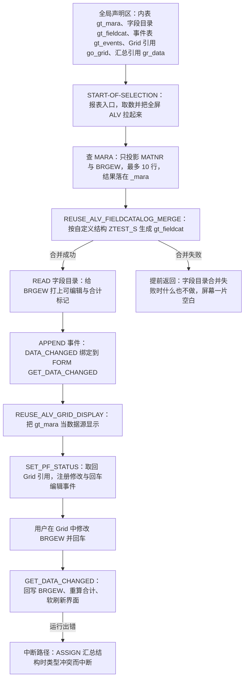
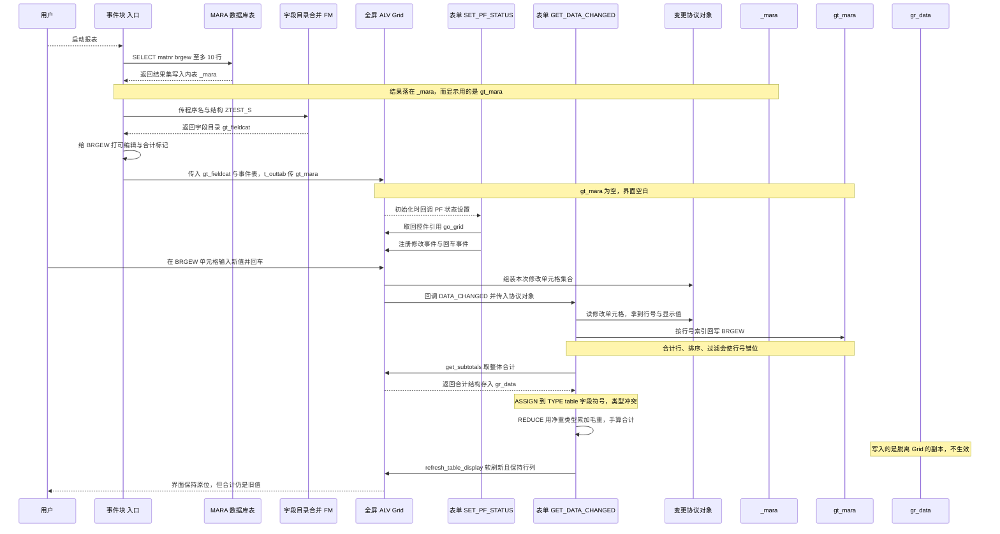

# ZTEST7 分析报告 —— 可编辑 ALV 的毛重维护原型

> 分析对象：`ztest7.abap`（`REPORT ztest7`，基于 `REUSE_ALV_*` 的全屏可编辑 ALV）
> 读者定位：第一次接手这份代码、需要理解它"想干什么"以及"哪里会炸"的工程师

---

## 一、程序定位与业务背景

### 1.1 它想解决什么问题

毛重（`MARA-BRGEW`）不是一个随便可以改的字段。它挂在物料主数据上，决定包装规格、运费核算、仓储容量与运输超限判定。而在标准 SAP 里想改一个物料的毛重，只有两条路：

- **MM02 逐个物料进后台维护**——一个物料一次事务，几十个物料就是几十次往返；
- **用批导 / LSMW / 直接 DB 改 `MARA`**——效率高，但没有任何校验，错了就是生产事故（包装算错、运费算错）。

`ztest7` 想提供的第三条路：**把 `MARA` 的关键字段拉成一个可编辑的 Grid，用户直接改，回车即生效**。这是运维/实施人员非常常见的"小工具"诉求——把"进 MM02 改 N 次"压缩成"在一个列表里改 N 行"。

从代码痕迹看，这是一份 **PoC（概念验证）/ 培训演示**，不是投产工具：

- 报表名 `ztest7`、无选择屏、无任何 `WHERE` 条件；
- `SELECT ... UP TO 10 ROWS`——只取 10 行；
- 只有一个可编辑字段，且只做内存回写，**从不落库**；
- 有两处明显的空壳（`CASE sy-ucomm` 里注释掉的 `WHEN`、`IF sy-subrc <> 0. ENDIF.` 空体）。

这很重要：它决定了我们该用什么标准去评价它。作为 PoC，"能不能跑起来展示毛重可编辑 + 合计"是验收标准；作为工具，缺陷清单会翻三倍。下面第三节对两种标准都会给出结论。

### 1.2 整体设计范式（一句话定性）

**经典函数模块式报表 + 全屏 ALV，状态全部挂全局，"取数 → 建字段目录 → 显示 → 事件回调改数据"四段式**——即 `REUSE_ALV_*` 时代的标准模板（SAP 至今仍在 `SAPD` 示例里沿用），属于"能跑但耦合到全局"的**过程式老式架构**，没有任何对象化封装。

---

## 二、程序执行流程总览



### 责任链表

| 子程序 | 调用者 | 职责 |
|---|---|---|
| 全局声明区 | 系统（程序加载时） | 摊平全部状态：数据内表、字段目录、事件表、Grid 引用、稳定布局结构、汇总结果引用、泛型字段符号 |
| 事件块 `START-OF-SELECTION` | 系统隐式（报表执行推进到此事件时） | 程序入口：取数 → 生成字段目录 → 打开可编辑与合计 → 挂 `DATA_CHANGED` 事件 → 调 `REUSE_ALV_GRID_DISPLAY` 进全屏 |
| `REUSE_ALV_FIELDCATALOG_MERGE`（FM） | 事件块 `START-OF-SELECTION` | 读取 DDIC 结构 `ZTEST_S` 的描述符，生成 `slis_t_fieldcat_alv` |
| `REUSE_ALV_GRID_DISPLAY`（FM） | 事件块 `START-OF-SELECTION` | 接收内表作为唯一数据源，驱动 Grid 全屏显示，随后程序进入 PAI 循环 |
| FORM `SET_PF_STATUS` | ALV 通过 `i_callback_pf_status_set` 在初始化 PBO 时回调 | 用 `GET_GLOBALS_FROM_SLVC_FULLSCR` 取回 Grid 引用，注册 `mc_evt_modified` / `mc_evt_enter` 两个编辑事件 |
| 用户编辑动作 | Grid 控件（用户在单元格输入并回车） | 触发已注册的编辑事件，Grid 汇总后回调 `DATA_CHANGED` |
| FORM `GET_DATA_CHANGED` | Grid 通过 `it_events` 回调 | 遍历修改单元格把新值写回内表；调 `get_subtotals` 取合计并用 `REDUCE` 重算写回；调 `refresh_table_display` 软刷新 |

下面按这条流程，逐个子程序展开。

---

## 三、分组分析

### 3.1 全局声明区

本节只有一个代码块，是整个程序的状态底座——一共 6 个全局数据对象加 1 个全局字段符号，一次读完。

```abap
REPORT ztest7.
TYPE-POOLS:slis.

DATA: gt_mara     TYPE TABLE OF ztest_s,
      gt_fieldcat TYPE slis_t_fieldcat_alv,
      gt_events   TYPE slis_t_event,
      go_grid     TYPE REF TO cl_gui_alv_grid,
      gs_stable   TYPE lvc_s_stbl,
      gr_data     TYPE REF TO data.

FIELD-SYMBOLS: <gtr_sum_tab> TYPE table.
```

**做什么** — 用一个声明块摊平程序的全部运行状态：`gt_mara` 是承载给用户看的数据内表（行结构为自定义 DDIC 结构 `ZTEST_S`），`gt_fieldcat` 存 ALV 字段目录，`gt_events` 存 ALV 事件到 FORM 的映射，`go_grid` 存全屏 Grid 控件引用，`gs_stable` 存刷新时保持滚动位置用的布局结构，`gr_data` 存 ALV 回传的合计结果；`<gtr_sum_tab>` 是一个泛型内表字段符号，专门用来在不知道行结构的情况下接收合计结果。

**为什么** — 这是 `REUSE_ALV_*` 时代的标准约束：这些 FM 全部是**无状态、全局回调式**的，`REUSE_ALV_GRID_DISPLAY` 之后控制权交回 PAI，回调 FORM 里没有任何参数能传递上下文，所以状态只能靠全局变量串起来。`TYPE-POOLS:slis.` 是配套动作——`slis` 是旧 ALV 的类型池，不显式引入，`slis_t_fieldcat_alv` 之类的类型在编译器眼里不成立。`REF TO data` 而不是写死某个汇总结构类型，说明作者当时也不确定 `get_subtotals` 到底回什么，用泛型引用"先接住再说"。这个选择在"不确定"面前是合理的，但它把不确定性一路带进了后续的 ASSIGN，见 3.4。

**风险与改进**

- **状态泄漏到全局是最大结构性风险**：`gr_data`、`go_grid` 只在特定路径被赋值，`SET_PF_STATUS` 与 `GET_DATA_CHANGED` 各自 `IF go_grid IS BOUND` 判空，整个程序存在"某条路径下 grid 未绑定但事件照发"的理论缝隙。改进方向是把这几个对象降为 FORM 局部或封进一个 `LOCAL FRIENDS` 的上下文类。
- **`<gtr_sum_tab> TYPE table` 是"类型擦除"而非"类型未知"**：字段符号一旦声明为 `TYPE table`，运行时 ASSIGN 会强制要求目标确实是内表，否则直接抛运行错误。泛型在这里不是"更灵活"，而是"放弃了编译期检查，只把错误推迟到运行时"——这正是 3.4 第 ② 步爆雷的根因。
- **命名与数据元素语义**：`gt_mara` 叫 MARA 但行结构是自定义的 `ZTEST_S`，只靠命名让人以为它就是 `MARA`。建议至少在 `ZTEST_S` 上加注释标明它投影了哪些字段、是否带 UOM。
- **`TYPE-POOLS:slis.`** 说明这是旧 ALV 体系。新代码应直接用 `CL_GUI_ALV_GRID` + `LVC_T_FIELCAT`（或 `CL_SALV_TABLE` + `SALV_EDIT`），可省掉字段目录 FM 和这堆类型池依赖。

至此状态底座铺好，但里面有一个"数据内表 `gt_mara` 到底由谁填"的关键空缺——顺着流程往下走就会撞上。

---

### 3.2 事件块 `START-OF-SELECTION`

这是报表入口，全部逻辑套在一个 `IF sy-subrc EQ 0` 的巨型嵌套里。按逻辑拆成 5 步：取数 → 生成字段目录 → 打开可编辑与合计 → 挂事件 → 显示。

#### ① 取数：只投影 MATNR 与 BRGEW，结果落进 `_mara`

```abap
  SELECT matnr,
         brgew
    FROM mara
    INTO TABLE _mara UP TO 10 ROWS.
  IF sy-subrc EQ 0.
```

**做什么** — 对 `MARA` 做一次带投影的 `SELECT`，只取物料号与毛重两列，装进内表 `_mara`，并用 `UP TO 10 ROWS` 限制最多 10 行；紧接着用 `IF sy-subrc EQ 0.` 开出一个大括号，把后续步骤全部嵌进去。

**为什么** — 投影取列是对的：`MARA` 有 200+ 字段，一次取两列在内表内存和网络上都是数量级的节省；`MATNR` 上有主索引，`UP TO 10 ROWS` 在没有 `WHERE` 的情况下靠数据库端的行数限制兜住，不会全表拖回。`sy-subrc` 判断也算稳妥，`SELECT ... INTO` 失败（表锁、内存不足）时不会带着空数据继续往下走。

**风险与改进**

- 🔴 **`INTO TABLE _mara` 与后面要显示的 `gt_mara` 不是同一张表。** `_mara` 是本次查询的唯一结果，而 `REUSE_ALV_GRID_DISPLAY` 的 `t_outtab` 传的是 `gt_mara`——`gt_mara` 从头到尾没有任何一条语句往里写数据。净效果是：**表格永远空、查询白做**。`_mara` 之所以能通过语法检查，是靠 ABAP 的隐式声明规则（以 `_` 开头的名字在 `SELECT ... INTO` 中会被自动声明为内表），这种遗留写法类型完全由 `SELECT` 列表推导，跟 `ZTEST_S` 毫无关系。改法：`DATA(gt_mara) TYPE TABLE OF ztest_s.` + `INTO TABLE @gt_mara`（前提是 `ZTEST_S` 的字段与 `MARA` 同名同义），或先查进局部表再 `MOVE-CORRESPONDING` 进 `gt_mara`。
- 🟠 **无 `WHERE` + 无 `ORDER BY` + `UP TO 10 ROWS` = 随机且不可复现的样本。** 数据库返回哪 10 行取决于访问路径与缓冲状态，同一份代码两次运行看到不同物料，任何"这里有 bug"的复现都无从谈起。作为 PoC 可以接受，作为工具必须给选择屏（至少物料号区间）+ 稳定排序。
- 🟠 **毛重字段带了单位，却没取单位字段。** `MARA` 的毛重 `BRGEW` 与净重 `NTGEW` 都是**带单位的数量字段**，各自配 `BRGEW_UOM` / `NTGEW_UOM`。只取 `BRGEW` 不取 UOM，等于拿到一个没有量纲的数字，后面第 3.4 ② 步还要拿它求和——这是从第一步就埋下的业务缺陷。
- 🟡 **巨型 `IF` 嵌套**：`sy-subrc` 为 0 时进入，为 0 才继续，逻辑上是"取数失败就什么都不做"。但"什么都不做"等于**白屏**，用户看到的只是空白屏幕，没有任何提示。失败路径必须有消息出口。

#### ② 生成 ALV 字段目录

```abap
    CALL FUNCTION 'REUSE_ALV_FIELDCATALOG_MERGE'
      EXPORTING
        i_program_name         = sy-repid
        i_structure_name       = 'ZTEST_S'
      CHANGING
        ct_fieldcat            = gt_fieldcat
      EXCEPTIONS
        inconsistent_interface = 1
        program_error          = 2
        OTHERS                 = 3.
```

**做什么** — 调用旧 ALV 的字段目录生成 FM：把程序名 `sy-repid` 与 DDIC 结构名 `ZTEST_S` 交给它，由它去 DDIC 读取字段描述、技术属性（内建类型、长度、小数位、金额/数量字段标识）并翻译成 `slis_t_fieldcat_alv` 格式，结果写回 `gt_fieldcat`。

**为什么** — 字段目录手写非常啰嗦（每个字段都要填 `ref_field`、`do_sum`、`key`、文本…），而 FM 可以从 DDIC 自动推导，字段新增时不用改代码。这里的选择其实是对的：`ZTEST_S` 作为"字段目录"和"数据内表行结构"的共同契约，一次定义、处处一致，`gt_mara` 的行结构和 `gt_fieldcat` 的来源是同一个结构——**这是全程序唯一一处类型上自洽的设计**。用 `i_structure_name` 而非 `i_structure_name` + 手工追加，也是标准姿势。

**风险与改进**

- 🟠 **三个异常声明了，却只用一个 `sy-subrc = 0` 一刀切，失败即静默退出。** `program_error` 一般意味着结构 `ZTEST_S` 不存在或 `sy-repid` 语义不对（这个 FM 依赖系统为程序做的描述符关联）；`inconsistent_interface` 意味着接口不一致。两种失败原因完全不同，对排查的人也完全不同，合并成一个判断等于把线索丢了。改进：`CASE sy-subrc. WHEN 1. MESSAGE e001(...) ...` 分支给不同提示，至少用 `MESSAGE` 告知"字段目录生成失败"。
- 🟡 **`i_program_name = sy-repid` 隐含部署约束**：该 FM 依赖 SE37/程序上下文可解析的 `sy-repid`，在某些上下文中（如被 `INCLUDE` 拼装、手工改名后未激活）会失败。PoC 场景可接受，工具场景建议改为手写 `lt_fieldcat` 或改用 `LVC_T_FIELCAT` + `CL_ALV_TABLE=>...` 路径。
- 🟡 `ZTEST_S` 是否存在、投影了哪些字段，代码里完全看不出。若该结构只投影了 `MATNR`/`BRGEW` 两列，则 3.2 ① 的数据量与它勉强匹配；若它还带 `NTGEW`、`MEINS` 等列，说明作者的取数投影是**漏了**，而不是刻意精简。这属于必须向原作者确认的开放问题。

字段目录生成成功后，程序开始在这份目录上做"可编辑"和"合计"两个关键开关——而这两处开关的实际效果，直接决定了后面能不能用。

#### ③ 打开 BRGEW 的可编辑与合计标记

```abap
    IF sy-subrc = 0.
      READ TABLE gt_fieldcat ASSIGNING FIELD-SYMBOL(<gs_fcat>) WITH KEY fieldname = 'BRGEW'.
      IF sy-subrc EQ 0.
        <gs_fcat>-edit = 'X'.
        <gs_fcat>-do_sum = 'X'.
      ENDIF.
```

**做什么** — 在 `gt_fieldcat` 里按字段名 `BRGEW` 找到那一行，用内联 `FIELD-SYMBOL(<gs_fcat>)` 直接拿到它的引用（不复制，便于修改），把 `edit` 置为 `X` 允许该列单元格编辑，把 `do_sum` 置为 `X` 让 ALV 对该列做求和并在合计行显示。

**为什么** — 方向是对的，而且是本程序在业务抽象上做得最好的一处：**没有把整张表设成 `edit = 'X'`，而是精准地只开放 `BRGEW` 一列**。"只开放要改的那一列、其余只读"是可编辑 ALV 的基本纪律，说明作者对场景有认知。`do_sum = 'X'` 交给 ALV 内置的汇总引擎去算并显示合计行，也比自己在程序里画一行汇总数据更稳妥——ALV 的汇总是跟着用户的排序和过滤走的，自动满足"看到的和算出来的一致"。

**风险与改进**

- 🟠 **合计列选错了字段口径，且未处理单位。** `do_sum` 让 ALV 对 `BRGEW` 求和，但毛重带单位，不同物料的毛重单位可能是 kg、g、t、件……`MARA-BRGEW` 的单位在 `BRGEW_UOM`，不同物料可以不同。**把不同单位的毛重直接相加，得到的数字没有业务含义**。这是真正的业务正确性问题，不是风格问题。要么把 `BRGEW_UOM` 也取进内表并要求用户只在同一单位下看合计，要么干脆不给毛重做合计（见 3.4 ② 的进一步讨论）。
- 🟡 **`WITH KEY fieldname = 'BRGEW'` 依赖了隐含的标准键条件。** `slis_t_fieldcat_alv` 的标准表键是首字段 `table`（结构名）。写 `WITH KEY fieldname = ...` 时，若未显式给出标准键字段，ABAP 会把结构字段条件"叠加"到标准键上，实际条件近似 `table = 'SLIS_T_FIELDCAT_ALV' AND fieldname = 'BRGEW'`。因为所有条目都来自同一个结构，`table` 恒等，**这次是"碰巧对了"**。正确写法是 `WITH KEY table = gt_fieldcat fieldname = 'BRGEW'`，把意图写明，不依赖巧合。
- 🟡 **`IF sy-subrc EQ 0` 里若找不到 `BRGEW` 就静默继续**，`edit` 没设成功，程序照样跑，用户看到一个完全只读的表格却不知道为什么。失败也应有提示。

#### ④ 把 `DATA_CHANGED` 事件绑定到回调 FORM

```abap
      APPEND VALUE #( name = 'DATA_CHANGED' form = 'GET_DATA_CHANGED' ) TO gt_events.
```

**做什么** — 用 `VALUE #(...)` 行构造器在内存中造出一个 `slis_event` 结构（`name = 'DATA_CHANGED'`，`form = 'GET_DATA_CHANGED'`），追加到事件表 `gt_events`；这个表随后交给 Grid，用于把 Grid 的 `DATA_CHANGED` 事件路由到报表里的 FORM `GET_DATA_CHANGED`。

**为什么** — 这是 ALV 事件机制的正解：**用 `it_events` + `form` 绑定，而不是把 `it_callback_data_changed` 指向一个 CB**，好处是回调在 ABAP 层面直接是 `FORM ... USING io_alv_changed_data_protocol_ref`，能享受完整的过程式上下文（全局内表、事务代码），而且是 SAP 官方示例一贯的写法。用 `VALUE #(...)` 而不是 `APPEND ls_event.` 先赋值再追加，省掉一个临时变量，符合现代 ABAP 风格；程序里其他地方用内联 `FIELD-SYMBOL`、用 `REDUCE` / `APPEND VALUE`（见 3.4），风格是统一的现代 ABAP 写法——只是新语法没有救回业务正确性。

**风险与改进**

- 🟡 **只绑了 `DATA_CHANGED`，没绑 `DATA_CHANGED_FINISH`。** `DATA_CHANGED` 是每单元格修改即触发，`DATA_CHANGED_FINISH` 是用户离开编辑（回车/切换单元格）时触发一次。做"修改即时回写内表 + 更新合计"用 `DATA_CHANGED` 是对的；但如果后续要做**批量校验**（多个单元格一起改、一起校验、失败整体回滚），`DATA_CHANGED` 的逐格触发会做很多无效功。更根本的：如果这个毛重维护工具要做事务性校验，"用户改一格就落一次库"是不可接受的。
- 🟡 **`DATA_CHANGED` 与"总行是否重算"存在天然矛盾。** `DATA_CHANGED` 在一次回车里合并本次所有改动，只触发一次回调——这没问题；但结合 3.4 ③ 的软刷新，会发现合计并不会随这次修改更新。事件绑对了，链路是断的。

#### ⑤ 用 `REUSE_ALV_GRID_DISPLAY` 进入全屏

```abap
      CALL FUNCTION 'REUSE_ALV_GRID_DISPLAY'
        EXPORTING
          i_callback_program       = sy-repid
          it_fieldcat              = gt_fieldcat
          it_events                = gt_events
          i_callback_pf_status_set = 'SET_PF_STATUS'
        TABLES
          t_outtab                 = gt_mara.
    ENDIF.
  ENDIF.
```

**做什么** — 调用全屏 ALV 显示 FM：传入字段目录 `gt_fieldcat`、事件表 `gt_events`，用 `i_callback_program = sy-repid` 告诉 FM 回调去哪个程序里找、用 `i_callback_pf_status_set = 'SET_PF_STATUS'` 指定 PF-STATUS 设置回调的 FORM 名，并把 `t_outtab = gt_mara` 作为数据源。之后控制权交给 GUI，程序进入 PAI 事件循环。

**为什么** — 这一步的设计意图是标准且正确的：**ALV 的数据源 `t_outtab` 传的就是真正的业务内表本身**（而不是副本），这个选择有一个明确好处——用户排序时 ALV 直接就地重排这张内表，`DATA_CHANGED` 回调里"按行号索引回去改"才有可能对得上（同源数据、同一份顺序）。前提是：**你必须始终把 `t_outtab` 和"回写目标"当成同一张表**。这一步正是这么设计的，但从 3.2 ① 传进来的是另一张表 `_mara`，契约从这里就被破坏了。

**风险与改进**

- 🔴 **`t_outtab = gt_mara` 而查询结果在 `_mara`**：见 3.2 ①。这是全程序最致命的一处——**类型上完全合法（`gt_mara` 就是内表）、运行时完全合法（传一张空表进去 ALV 照常显示），所以没有任何报错，但屏幕上永远是空的**。这类"编译通过、运行通过、功能为零"的缺陷最难靠测试发现，因为**没有一个报错可以指着你**。
- 🟠 **`i_callback_pf_status_set` 指定的 FORM 不会真的设置 PF-STATUS**。见 3.3——`SET_PF_STATUS` 里那个 `CASE sy-ucomm ... WHEN OTHERS` 是空壳，从未调用 FM `SET_PF_STATUS`。结果是 ALV 用默认状态栏，用户要退出得按标准的 F3/Ctrl+Q，没有任何自定义按钮（比如"保存"、"校验"、"导出"）。
- 🟡 **没有 `i_save`**，用户调整的列宽、排序、过滤器布局每次运行都丢失；没有 `i_grid_title`，没有 `i_callback_top_button` / `i_callback_top_button_exceptions`；没有 `it_exclude` / `i_callback_user_command`（配套上一条的按钮），所以**这个可编辑工具连"保存"这个最基本动作都没有入口**。作为 PoC 演示"可编辑 + 合计"是够的，作为工具是不完整的。
- 🟡 **无 `it_sort` 也无 `it_no_filter`**：ALV 默认允许用户排序和过滤，这对"编辑"是危险的——排序就地重排 `gt_mara`，过滤会从 `gt_mara` 里**删掉**不匹配的行。可编辑 + 可排序 + 有合计的组合，正是 3.4 ① 行号定位失灵的根源。

到这里，报表的"开场"就结束了。控制权交给 Grid 之后的第一件事，是回调 PF-STATUS 设置——程序也正是趁这个机会才第一次拿到 Grid 的引用。

---

### 3.3 FORM `SET_PF_STATUS`

这是一个紧凑的子程序，保持单块不拆——它的全部职责就是"把 Grid 引用抓到手，并打开编辑事件"。

```abap
FORM set_pf_status USING itr_extab TYPE slis_t_extab.

* Get the ALV Object reference
  CALL FUNCTION 'GET_GLOBALS_FROM_SLVC_FULLSCR'
    IMPORTING
      e_grid = go_grid.
  IF go_grid IS BOUND.
    CALL METHOD go_grid->register_edit_event
      EXPORTING
        i_event_id = cl_gui_alv_grid=>mc_evt_modified.

    CALL METHOD go_grid->register_edit_event
      EXPORTING
        i_event_id = cl_gui_alv_grid=>mc_evt_enter.
  ENDIF.

  " PF Status Code
  CASE sy-ucomm.
*	WHEN
    WHEN OTHERS.
  ENDCASE.
ENDFORM.
```

**做什么** — 从 ALV 的全局上下文里取出全屏 Grid 控件引用存入全局 `go_grid`，判空后向它注册两个编辑事件：`mc_evt_modified`（单元格值变化）与 `mc_evt_enter`（用户回车确认）。FORM 末尾有一个空的 `CASE sy-ucomm` 空壳，被注释掉的 `WHEN` 说明作者原本打算在这里按功能码分支、挂自定义按钮。

**为什么** — `GET_GLOBALS_FROM_SLVC_FULLSCR` 这一招是社区公认的绕法：`REUSE_ALV_GRID_DISPLAY` 是 FM，不返回 Grid 引用；而 `CL_GUI_ALV_GRID` 的 `REGISTER_EDIT_EVENT` 必须在**全屏 ALV 已经 active 之后**调用（在显示前调会失败）。`PF_STATUS_SET` 回调正好是"Grid 已经起来、但用户还没按键"的那个时间窗，所以整个 ALV 编辑示例生态都长在这个写法上。从这个角度看它是**约定而非 hack**，值得肯定作者知道这个门道。

**风险与改进**

- 🟠 **编辑事件注册在"每次 PBO 都跑"的 FORM 里。** `PF_STATUS_SET` 在每次 PAI 处理前都会重入，这里等于**每次用户回车都重新注册一次编辑事件**。虽然 `REGISTER_EDIT_EVENT` 是幂等覆盖的、不致命，但：① 有无谓开销；② 如果 Grid 对象被换过（用户切换到别的 ALV 界面、变式/清单→Grid 切换），`go_grid` 可能指向的不是当前显示的那个 Grid，后续 `GET_DATA_CHANGED` 里的 `refresh_table_display` 就打在了错误的控件上。更稳妥的做法是：把注册放到显示完成后的固定时机（或在 `SET_PF_STATUS` 里加一个"已注册"标志位），并确保 Grid 引用每次都重新取。
- 🟠 **`GO_GRID IS BOUND` 判空之后是"静默不注册"**：`GET_GLOBALS_FROM_SLVC_FULLSCR` 在非全屏 ALV 上下文里会抛 `PARAMETER_ERROR`，此处未加 `EXCEPTIONS` 兜底；一旦异常或取不到引用，程序不报错地继续，用户会得到一个"点不动"的表格。
- 🟠 **空 `CASE sy-ucomm ... WHEN OTHERS` 与被注释的 `WHEN`**：这是**未完成的明确信号**，也是本程序最该被 Code Review 拦下的一处。一个只有 `WHEN OTHERS` 且什么都不做的 `CASE`，等价于死代码，而且会误导后来者以为"命令处理在别处"。应删除，或补上真正的 `WHEN` 分支并调用 FM `SET_PF_STATUS` 传入真正计算出的状态（`itr_extab` 正是为此准备的参数）。
- 🟡 **`itr_extab` 声明了但从未使用**：扩展 PF-STATUS 的入口参数被完全忽略，ATC 的可执行检查会直接报"参数未使用"。命名上 `itr_extab` 的 `i_tr_` 前缀暗示"input table reference"（引用参数），但它是普通 `USING` 传入的内表，前缀误导。
- 🟡 **命名与风格不统一**：FORM 名用全大写（`set_pf_status` 应小写），FORM 参数用新式 `io_data_changed`（见 3.4），而 FM 调用用旧式 `i_*` / `e_*`，三套命名混在一份文件里。

Grid 引用拿到了、编辑事件也注册了，于是用户在单元格里敲下一个毛重、按回车——控制权被交给了本程序最后一个、也是最复杂的一段逻辑。

---

### 3.4 FORM `GET_DATA_CHANGED`

这是全程序的重心，也是缺陷密度最高的地方，拆成 3 步：① 定位修改行并回写 → ② 读回合计并用 `REDUCE` 重算 → ③ 刷新界面。

#### ① 遍历修改单元格，按行号定位并回写

```abap
FORM get_data_changed USING io_data_changed TYPE REF TO cl_alv_changed_data_protocol.

  IF go_grid IS BOUND.

    LOOP AT io_data_changed->mt_mod_cells ASSIGNING FIELD-SYMBOL(<gs_changed>) WHERE fieldname = 'BRGEW'.
      READ TABLE gt_mara ASSIGNING FIELD-SYMBOL(<gs_tab>) INDEX <gs_changed>-row_id.
      IF sy-subrc EQ 0.
        <gs_tab>-brgew = <gs_changed>-value.
      ENDIF.
    ENDLOOP.
```

**做什么** — 拿到 ALV 传进来的变更协议对象 `io_data_changed`，遍历它的 `mt_mod_cells`（本次回车中被改动的单元格集合），筛出字段名为 `BRGEW` 的那些，用协议里记录的**行号** `row_id` 作索引去 `gt_mara` 里 `READ TABLE ... ASSIGNING` 出该行的引用（不复制，直接持有），再把协议里的新值 `value` 赋给该行的 `BRGEW` 字段。读不到行（`sy-subrc` 不为 0）就跳过，不报错。

**为什么** — "只处理被改动的那几格，而不是全表重刷"是正确的性能与正确性直觉：ALV 编辑场景下每次回车都全量回写既浪费也容易误伤用户在编辑中的行。`LOOP AT ... WHERE fieldname = 'BRGEW'` 限定在目标列，`READ TABLE ... ASSIGNING` 拿到引用后**直接改原表**（而不是 `MODIFY` 复制一份）也都是对的写法，语义清晰、效率高。这段代码的**意图**没问题，问题全在"用什么把行号换算成行"。

**风险与改进**

- 🔴 **按 `row_id` 做 `INDEX` 定位，在"合计 + 可排序 + 可过滤"下必然失真。** 三重风险叠加：① **合计行**——`do_sum = 'X'` 时 ALV 会把合计行插入内表，行号与内表实际行号发生偏移；② **排序**——用户点表头排序时 ALV 就地重排 `gt_mara`，若排序发生在某次修改之前或刷新重算，行号就对不上；③ **过滤**——过滤会从 `gt_mara` 里删除不匹配的行，索引整体前移，被过滤掉的行**在内存里直接消失**。`READ TABLE` 静默失败 + `IF sy-subrc EQ 0` 静默跳过，结果是**用户的修改无声丢失或写到别的行上**。正确做法是用协议对象自带的引用：`<gs_changed>-data_ref` 直接指向被改的那一行，`ASSIGN <gs_changed>-data_ref->* TO <ls_row>` 后赋值——**它与行号无关，也不受排序过滤影响**。这是 ABAP ALV 官方文档明确推荐的方式，也是本程序最该改的一处。
- 🟠 **`value` 是 ALV 传来的字符值，直接赋给数量字段没有任何转换校验。** 协议里的 `value` 是显示值（字符型），赋给 `MARA` 的数量型字段靠 ABAP 隐式转换完成。这里没有 `CONV`、没有合法性判断、没有错误回显：如果用户输入空串、带千分位逗号或中文输入法的非数字串，结果要么被静默转成 `0`（用户以为改了 1000，实际存了 0），要么在某些设置下抛转换异常。改进：用 `CL_ALV_CHANGED_DATA_PROTOCOL` 的 `SET_PROTOCOL_ENTRY` / `ADD_PROTOCOL_ENTRY` 把校验失败回显给用户。
- 🟠 **缺少业务校验：毛重不得小于净重。** 这是本程序最该有、却完全没有的一条。物料主数据的净重 `NTGEW` 与毛重 `BRGEW` 之间存在 `NTGEW ≤ BRGEW` 的不变式，允许用户把毛重改成小于净重，会直接产出**数据不一致的物料主数据**，影响包装、运费、库存核算。哪怕是 PoC，"可编辑毛重"这个动作本身就必须配上这条校验，否则演示给业务用户时就会演示出脏数据。
- 🟡 **没有任何落库动作**：回写只改内存内表，`gt_mara` 里改完就随程序结束消失。作为 PoC 这是诚实的（至少没有偷偷写 `MARA`），但必须让使用者知道它只是个演示——目前没有任何提示。
- 🟡 无 `MESSAGE`、无 `LEAVE`/`SET SCREEN` 分支：`io_data_changed` 为空、Grid 已销毁（导出后继续处理）等情况都没有处理。

写回内存完成，接下来程序想"顺手把合计也更新一下"——而这一步，是全程序埋得最深的一颗雷。

#### ② 取回 ALV 合计，并用 `REDUCE` 重算后写回

```abap
    go_grid->get_subtotals(
      IMPORTING
        ep_collect00 = gr_data   " Overall Total
    ).

    ASSIGN gr_data->* TO <gtr_sum_tab>.
    READ TABLE <gtr_sum_tab> ASSIGNING FIELD-SYMBOL(<l_sum>) INDEX 1.
    IF sy-subrc EQ 0.
      ASSIGN COMPONENT 'BRGEW' OF STRUCTURE <l_sum> TO FIELD-SYMBOL(<lg_val>).
      IF <lg_val> IS ASSIGNED.
        <lg_val> = REDUCE #( INIT lv_i TYPE ntgew_15 FOR <ls_t> IN gt_mara NEXT lv_i = lv_i + <ls_t>-brgew ).
      ENDIF.
    ENDIF.
```

**做什么** — 向 Grid 要整体合计（`ep_collect00`），存进全局引用 `gr_data`；把这个引用解引用后 ASSIGN 给泛型内表字段符号 `<gtr_sum_tab>`，再 `READ TABLE ... INDEX 1` 取第一行到 `<l_sum>`；若读到了，用 `ASSIGN COMPONENT 'BRGEW' OF STRUCTURE` 动态定位到该结构里的 `BRGEW` 分量 `<lg_val>`，若这个分量确实存在，就把 `REDUCE` 求和的结果（对 `gt_mara` 每一行的 `BRGEW` 累加）赋给它——**也就是试图用自己算的和覆盖 ALV 给的合计**。

**为什么** — 分两层看。**表层动机可以理解**：ALV 的 `DATA_CHANGED` 回调不会自动重算合计，作者大概是发现"改完单元格合计没变"，于是手工补算。**但这个补救方向从根上就是错的**——ALV 的合计本来就该由它自己按当前排序/过滤状态重算，手工再算一遍等于建立第二套真相来源。更关键的是**这段代码根本没有生效的机会**：即使中间不报错，往 `gr_data` 这个**已经脱离 Grid 的副本**里写值，也不会把新合计推回 Grid，Grid 显示的仍是它自己算的那个旧值。作者"手算一遍"的直觉方向可能没错，但**写入的位置错了**——正确的位置是 `gt_mara` 里那条合计行本身。`REDUCE` 的用法本身值得肯定：现代 ABAP 里这是表达求和的正确工具，比一堆 `ADD 1 TO lv_sum` 干净得多。

**风险与改进**

- 🔴 **ASSIGN 类型冲突：首次编辑即运行时错误。** `ep_collect00` 是 `CL_GUI_ALV_GRID` 里对应 FM `es_collect00` 的**单条汇总结构**（把整张表的合计装在一条与出表行同类型的结构里），而 `<gtr_sum_tab>` 声明为 `TYPE table`。ASSIGN 到 `TYPE table` 的字段符号时，若目标实际不是内表，会抛**不可捕获的运行时错误**（dump），而不是设置 `sy-subrc`。所以这一行会直接让程序在用户第一次改单元格时崩掉。而且这两行逻辑本身**互相矛盾**：如果 `ep_collect00` 是表，那么 `READ TABLE ... INDEX 1` 之后 `ASSIGN COMPONENT ... OF STRUCTURE` 成立；如果它是结构（作者显然这么认为），那 `ASSIGN ... TO <gtr_sum_tab>` 必炸。**无论哪种解释，这段代码都不可能同时成立**——说明作者对这个 API 的返回形态没有确认过，而 `REF TO data`（3.1）的宽松声明让编译器无法拦截。
- 🔴 **语义校核：`NTGEW_15` 是净重数据元素，这里却用来累加毛重。** `REDUCE #( INIT lv_i TYPE ntgew_15 ...)` 的累加器类型写成 `ntgew_15`——这个数据元素的名字本身就点明了它是**净重（Net weight）**：在物料主数据里，`NTGEW_15` 是净重字段的典型数据元素（`MARC-NTGEW` 一类，毛重对应的是 `BRGEW_15`），而本程序累加的 `gt_mara`-`brgew` 是**毛重（Gross weight）**。长度和精度都是 15 位 3 小数、赋值与加法都能通过编译和运行，所以编译器一句都不会说——**但净重与毛重是两个不同的业务量，用净重的类型去表达毛重的合计，是典型的"长度对上、语义对不上"**。这类缺陷必须在 Code Review 里靠人眼抓出来，因为它是完全静默的：算出来的数长得一模一样，只是含义错了。正确写法：累加器用毛重的数据元素（或直接用内表行类型 `ztest_s` 的对应分量类型，让类型自己说话）。
- 🔴 **业务量纲缺失：不同单位的毛重直接相加。** `REDUCE` 对 `gt_mara` 所有行无差别求和，而毛重带单位（`BRGEW_UOM`）。PoC 恰好只取了 10 行，量纲问题不容易被察觉；一旦真正用来汇总几百个物料，"10 公斤的螺丝 + 3 吨的钢板 = 1003 公斤"就是彻底错误的结论。要么按单位分组、要么统一换算到基准单位（`UMCONV` / 单位换算 FM）、要么按设计意图**取消毛重的合计**（见下方"最该做的一步"）。
- 🟠 **写回汇总值的对象选错了，因此这段"补救"是无用功。** `gr_data` 是在 `get_subtotals` 之后拿到的一份**值拷贝**，Grid 并不再引用它。往里写新合计，Grid 不会知道；随后的 `REFRESH_TABLE_DISPLAY` 若触发 Grid 自行重算，会用 Grid 自己的（旧的或重新算的）值覆盖显示。改进两条路：① **删掉整段手算**，让 Grid 用 `GET_SUBTOTALS` 之外的机制自己更新（最简单：编辑后不用软刷新，见 ③）；② 保留自定义逻辑，但必须**直接修改 `gt_mara` 里那条合计行**。
- 🟠 **`IF <lg_val> IS ASSIGNED` 是唯一一处真正的防御性编程。** `ASSIGN COMPONENT` 失败时字段符号保持未赋值，这里判空避免了后续操作——**这是全程序写得最谨慎的一句**，可惜它防的是一个自己造出来的伪问题（分量找不到只是因为上游已经错了）。另外要注意：`ASSIGN COMPONENT` 拿到的是该分量的**原类型**（很可能是字符型或无格式化的数量型），把 `REDUCE` 的数值赋进去走的是"数值 → 字符"的隐式转换，可能产生带千分位/按用户小数格式化的字符串，合计单元格会出现左对齐的"1,234.500"这类显示问题。
- 🟡 `GET_SUBTOTALS` 未传 `it_sort` / `it_group`，依赖 Grid 当前的排序分组状态；此时若用户刚改过排序，取回的合计口径与用户预期可能不一致。
- 🟡 **最该做的一步：如果这个工具真的没有单位口径和净重校验的业务价值，就把 `do_sum` 和整段合计逻辑一起删掉。** 一个没有量纲、不接受校验的数字，显示在界面上比不显示更危险——它会让使用者相信一个假的结论。合计不是"顺手加的功能"，它是一个需要业务口径才能存在的东西。

合计这摊事终于处理完（或者按上面的分析，并没有被真正处理），最后一步是把界面刷新一下——而这一步的刷新参数，又与前面的编辑策略互相矛盾。

#### ③ 稳定刷新界面

```abap
    gs_stable-col = 'X'.
    gs_stable-row = 'X'.

    go_grid->refresh_table_display(
      EXPORTING
        is_stable      = gs_stable      " With Stable Rows/Columns
        i_soft_refresh = 'X'            " Without Sort, Filter, etc.
      EXCEPTIONS
        finished       = 1              " Display was Ended (by Export)
        OTHERS         = 2
    ).
    IF sy-subrc <> 0.
    ENDIF.

  ENDIF.

ENDFORM.                    "get_data_changed
```

**做什么** — 把 `gs_stable` 的 `col` 与 `row` 都置 `X`，表示刷新时要保持列和行的可见位置（不让用户视口跳回顶部），然后调用 Grid 的 `refresh_table_display` 传 `is_stable = gs_stable` 与 `i_soft_refresh = 'X'`；异常分支 `IF sy-subrc <> 0. ENDIF.` 什么都不做。FORM 结尾的 `IF go_grid IS BOUND` 与 `ENDFORM` 收束全流程。

**为什么** — `is_stable` 保持行列位置，是可编辑 Grid 的必要体验：否则每改一格，整个表格跳回顶部、光标丢失、用户要重新滚动找位置。`i_soft_refresh = 'X'` 表示"只更新数据、不重排序/过滤/重算合计"，这是**保守但与编辑场景匹配**的选择——因为正在编辑的行不能被重新排序冲掉。所以这一步的两个参数组合本身是有道理的，问题出在它和 3.4 ② 的组合上。

**风险与改进**

- 🟠 **`i_soft_refresh = 'X'` 直接抵消了 3.4 ② 全部手算的意义。** 软刷新的定义就是**不重排序、不重过滤、不重算合计**。这意味着：用户在 ② 段里千辛万苦手算并写入的那个合计值，在这次刷新时既不会被 Grid 采用，也不会被 Grid 重算——**合计永远是 ALV 首次显示时算的那个旧值**。整个 ② 段逻辑在最常见路径下是纯粹的无用功。想让合计跟着变，就必须放弃软刷新做全量刷新（代价是视口与编辑位置会跳），或者干脆**不用 `do_sum`，把合计改成在标题栏/状态栏自己显示**——后者对"编辑态"是最干净的方案，因为它不与 Grid 的排序/过滤抢主导权。
- 🟠 **空 `IF sy-subrc <> 0. ENDIF.`**：声明了 `finished` 和 `OTHERS` 两个异常却不处理，条件体是空的。这是本程序第二处"未完成"的硬证据。`OTHERS = 2` 会把 `error_cntl_error`、`no_active_tab`（导出/打印结束后 Grid 已销毁）等真实错误一并吞掉，结果是：用户按了导出，程序静默地继续往下走，后续操作全部打在已失效的控件上。改进：至少 `finished` 时 `LEAVE LIST-PROCESSING` 或静默退出；其他异常记录日志并给用户 `MESSAGE`。
- 🟠 **`gs_stable` 是全局变量但语义是"本次刷新的临时参数"**：它从初始化就一直是 `col = row = 'X'`，却被复用于每次刷新。作为过程式写法勉强可接受，但全局状态意味着**不同回调路径可能互相踩**（例如将来在别处也要"不保持位置"地刷新，就必须先清空）。应改为 FORM 内的局部变量。
- 🟡 缺少"保存"落库环节（与 3.4 ① 同源问题）：用户改完只能看着自己改的数，关掉程序就没了。工具化时必须有明确的保存按钮 + 事务/校验闭环。

三个事件块拆完，`DATA_CHANGED` 这条数据线走完了全程。下面把整条数据在各个子程序之间的流转画清楚，再汇总问题。

---

## 四、执行流程全景图（数据视角）



---

## 五、问题清单与改进建议（按优先级）

### 🔴 P0 — 业务正确性 / 程序不可用

| # | 问题 | 所在子程序 | 改进方向 |
|---|---|---|---|
| 1 | 查询结果写入 `_mara`，ALV 显示的 `gt_mara` 从未被填充 → 界面永远空白，`_mara` 是死代码 | 事件块 `START-OF-SELECTION` | `DATA(gt_mara) TYPE TABLE OF ztest_s` + `INTO TABLE @gt_mara`；或查进局部表后 `MOVE-CORRESPONDING` |
| 2 | `ASSIGN gr_data->* TO <gtr_sum_tab>` 把单条汇总结构 ASSIGN 给 `TYPE table` 字段符号 → 用户首次编辑即运行时错误 | 表单 `GET_DATA_CHANGED` | 直接 `ASSIGN gr_data->* TO <ls_sum>`（结构），去掉 `READ TABLE ... INDEX 1`；或把字段符号声明为确定的结构类型，让编译期拦截 |
| 3 | 按 `row_id` 索引回写，在 `do_sum` 合计行、用户排序、过滤删行三重作用下行号错位 → 改错行或修改丢失 | 表单 `GET_DATA_CHANGED` | 改用 `<gs_changed>-data_ref->*` 直接定位被改行；或限制 `it_no_sort` / `it_no_filter`，且可编辑列禁用合计 |
| 4 | `REDUCE` 累加器用净重数据元素 `NTGEW_15`，累加的却是毛重 `BRGEW` → 净重/毛重语义错配，长度精度一致所以编译运行全通过 | 表单 `GET_DATA_CHANGED` | 累加器改用毛重对应类型（或内表行类型），让类型表达业务含义 |
| 5 | 毛重带 UOM，不同物料单位不同，直接求和无业务含义；`do_sum` 同样在合计不同量纲 | 事件块 `START-OF-SELECTION` / 表单 `GET_DATA_CHANGED` | 取入 `BRGEW_UOM` 并分组或统一换算；无法定义口径时**取消毛重合计** |
| 6 | 可编辑毛重却没有 `NTGEW ≤ BRGEW` 校验 → 允许产出不一致的物料主数据 | 表单 `GET_DATA_CHANGED` | 回写前校验，不通过则回滚并用 `ADD_PROTOCOL_ENTRY` 回显 |

### 🟠 P1 — 健壮性

| # | 问题 | 所在子程序 | 改进方向 |
|---|---|---|---|
| 7 | `REUSE_ALV_FIELDCATALOG_MERGE` 的 3 个异常合并成一个 `sy-subrc = 0`，失败即静默白屏 | 事件块 `START-OF-SELECTION` | 分支处理并 `MESSAGE` 提示不同原因 |
| 8 | ALV 传来的字符值直接赋给数量字段，无转换校验、无错误回显 | 表单 `GET_DATA_CHANGED` | 显式转换 + 合法性判断 + 协议对象回显 |
| 9 | 手算合计写进 `gr_data` 副本，Grid 不会采用；软刷新又禁止重算 → 合计恒为旧值 | 表单 `GET_DATA_CHANGED` | 删除手算段让 Grid 自己重算；或直接改 `gt_mara` 中的合计行 |
| 10 | `refresh_table_display` 异常分支为空体，`OTHERS` 吞掉真实错误 | 表单 `GET_DATA_CHANGED` | 删除空 `IF`；`finished` 时正常结束，其余异常记录并提示 |
| 11 | 无 `WHERE` + 无 `ORDER BY` + `UP TO 10 ROWS` → 随机不可复现的样本 | 事件块 `START-OF-SELECTION` | 加选择屏与稳定排序 |
| 12 | 编辑事件在每次 PBO 重入的 FORM 中重复注册，Grid 引用可能失效 | 表单 `SET_PF_STATUS` | 单一注册时机 + 每次重新确认引用有效性 |
| 13 | `GET_GLOBALS_FROM_SLVC_FULLSCR` 未处理异常，取不到引用时静默继续 | 表单 `SET_PF_STATUS` | 补 `EXCEPTIONS` 与失败提示 |

### 🟡 P2 — 性能与规范

- `WITH KEY fieldname = 'BRGEW'` 依赖隐含标准键条件，靠"所有条目同结构"才碰巧正确 → 显式写 `WITH KEY table = gt_fieldcat fieldname = 'BRGEW'`（事件块 `START-OF-SELECTION`）
- FORM 名全大写、FORM 参数用新式 `io_`、FM 调用用旧式 `i_` / `e_`，三套命名混用（全局声明区 / 表单 `SET_PF_STATUS`）
- `itr_extab` 声明未使用、`i_tr_` 前缀误导，ATC 可执行检查会报错（表单 `SET_PF_STATUS`）
- `<gtr_sum_tab> TYPE table`、`gr_data`、`gs_stable` 都是全局，应下沉为 FORM 局部（全局声明区）
- 空壳 `CASE sy-ucomm ... WHEN OTHERS` 与被注释的 `WHEN`，是未完成的信号，应删除或补齐（表单 `SET_PF_STATUS`）
- 缺 `it_sort` / `it_no_filter` / `it_no_outdel` 等保护性设置，可编辑表默认允许排序过滤（事件块 `START-OF-SELECTION`）
- 依赖 `TYPE-POOLS: slis` 与 `REUSE_ALV_FIELDCATALOG_MERGE`，属旧 ALV 体系（全局声明区 / 事件块 `START-OF-SELECTION`）
- `_mara` 依赖下划线隐式声明的遗留写法，类型完全由 `SELECT` 列表推导（事件块 `START-OF-SELECTION`）
- 无授权检查：PoC 无落库尚可，一旦要真正写 `MARA` 必须补 `AUTHORITY-CHECK`（全局声明区）
- 数量型字段赋值为字符表示可能产生格式化字符串，合计显示格式不可控（表单 `GET_DATA_CHANGED`）

### 🟢 P3 — 可扩展性

- 缺 `i_save`（布局不保存）、`i_grid_title`、`i_callback_top_button` / `i_callback_user_command`，连"保存"入口都没有（事件块 `START-OF-SELECTION`）
- 缺统一消息出口：所有失败路径都是静默退出，用户无从判断"是没数据还是出错了"（全程序）
- 数据模型只有 `MATNR` + `BRGEW`，没有物料描述与毛重单位，用户看不懂自己在改什么（全局声明区）
- 未区分 `DATA_CHANGED` 与 `DATA_CHANGED_FINISH`，将来做批量事务性校验时需要重构（事件块 `START-OF-SELECTION`）
- 缺少最小演示数据集与自测说明，接手者无法自助复现（`UP TO 10 ROWS` 随机样本，见 `START-OF-SELECTION`）

**修复方向示意**（聚焦结构性问题，完整工具化还需补齐上面 P1/P2）：

```abap
" 1) 数据必须落进真正要显示的内表
DATA(gt_mara) TYPE TABLE OF ztest_s.
SELECT matnr, brgew FROM mara
  INTO TABLE @gt_mara
  WHERE matnr IN @s_matnr
  ORDER BY matnr.

" 2) 写回用 data_ref 定位被改行，不依赖行号
LOOP AT io_data_changed->mt_mod_cells
      ASSIGNING FIELD-SYMBOL(<ls_mod>)
  WHERE fieldname = 'BRGEW'.
  ASSIGN <ls_mod>-data_ref->* TO FIELD-SYMBOL(<ls_row>).
  IF <ls_row> IS ASSIGNED.
    <ls_row>-brgew = <ls_mod>-value.
  ENDIF.
ENDLOOP.

" 3) 合计结构本身就是出表行结构：直接整体接收，不再包一层内表
DATA(gr_data) TYPE REF TO data.
go_grid->get_subtotals( IMPORTING ep_collect00 = gr_data ).
" ep_collect00 对应 FM 的 es_collect00，是一条结构：
" 既不需要 TYPE table 的字段符号，也不需要再 READ TABLE 取第一行
```

**做什么** — 给出三处结构层面的修法：数据落进真正显示的内表；写回改用协议对象自带的 `data_ref` 引用定位，摆脱行号依赖；合计结构按"结构"接收，不再用泛型内表字段符号绕。
**为什么** — 这三处改动量都很小，却分别消除了 P0 的第 1、2、3 项——它们是"编译器拦不住、运行时也不报错"的静默缺陷，靠读代码和 Code Review 才能发现；第 3 处尤其重要：把模糊的 `TYPE table` 换成确定语义，未来的类型错配会在编译期暴露。
**风险与改进** — 这段只是骨架：第 2 处仍需补字符到数量的转换校验与 `NTGEW ≤ BRGEW` 业务校验（P0 第 6 项），第 1 处的 `INTO TABLE @gt_mara` 要求 `ZTEST_S` 的 `MATNR`/`BRGEW` 与 `MARA` 字段同名同义，否则要 `MOVE-CORRESPONDING` 中转；第 3 处拿到合计结构后**并不应该再手算覆盖**（P1 第 9 项），正确做法是让 Grid 重算或取消 `do_sum`。示范本身若缺校验就照抄，仍会产出脏数据。

---

## 六、整体评价与启发

### 优点

- **语法层面确实是现代 ABAP**：`REDUCE #( INIT ... FOR ... NEXT ... )`、`APPEND VALUE #( ... )`、`ASSIGNING FIELD-SYMBOL(<x>)` 内联声明用得准确且统一，没有一处语法炫技或过时写法。作者显然读过近年的 SAP 官方示例。
- **"只开放 `BRGEW` 一列可编辑，其余只读"** 是可编辑 ALV 的正确纪律，说明对业务场景有认知而不是"整表全放开"。
- **让 ALV 内置汇总引擎（`do_sum`）而不是自己画汇总行**，方向正确；知道要用 `GET_GLOBALS_FROM_SLVC_FULLSCR` 在 PF-STATUS 里抓 Grid 引用，也是这个生态里公认的正确门道。
- **`IF <lg_val> IS ASSIGNED`** 是全程序唯一一处防御性判空，写得克制而准确。

### 短板

- **数据流在入口就断了**：查出来的数据没有进入要显示的表，于是后面整条回写/合计链路都是空转。这是唯一一个"从代码结构就能看出、却完全不会被任何报错提示"的缺陷。
- **类型层面把结构当表**：`REF TO data` + `TYPE table` 的组合把编译期检查换成了运行时崩溃，是新式语法掩盖旧式错误的典型样本。
- **完全没有业务语义**：净重/毛重、单位、净重上限、变更留痕、授权——一个涉及物料主数据的可编辑工具，这五件事一件都没有。
- **错误处理三处全部空转**：字段目录合并失败静默、异常分支空 `IF`、空壳 `CASE`，三处"未完成"信号叠在一起。

### 可学到的设计经验

- **ALV 可编辑报表有一条铁律：`t_outtab` 传进去的那张表，必须就是回写时操作的那张表。** 一旦"查询到 A 表、显示 B 表"，后面所有基于行号、基于 `READ TABLE` 的回写逻辑全部作废，而且**没有任何报错会提醒你**。接手任何可编辑 ALV，第一件事就是顺着数据流把"哪张表被 SELECT 填、哪张表被传进 `t_outtab`"对一遍。
- **类型擦除不是灵活，是把编译期检查换成运行时崩溃。** `REF TO data` 接不确定结构、`TYPE table` 字段符号接不确定内表，这一对组合让本该在 ADT 里报错的 `ASSIGN` 冲突变成了运行期 dump。宁可写错类型让编译器骂，也不要写"看起来什么都能接"的泛型。
- **累加任何带单位的数量字段之前，先确认数据元素名在说哪件事。** `NTGEW_15` 是净重、`BRGEW_15` 是毛重，两者长度精度完全一致，编译器永远不会提示你搞反了；这类语义错配只能靠人读数据元素名。再往前一步：单位不同的数量根本不能直接相加，正确口径（统一换算 / 分组 / 不给合计）必须在写第一行 `REDUCE` 之前就定下来。
- **空 `IF ... ENDIF.`、空壳 `CASE ... WHEN OTHERS`、被注释掉的 `WHEN`，都是"这段逻辑没写完"的物理证据。** Code Review 对这三样应当零容忍——它们的存在会让后来者误以为失败路径已经被处理。
- **失败路径必须有消息出口。** 本程序至少三处"出错就什么都不做"，共同后果是用户面对白屏时无法区分"没数据""结构没建""代码报错了"。哪怕是 PoC，`MESSAGE` 也是最低成本的自我解释。
- **合计功能是需要业务授权的，不是顺手就能加的。** ALV 内置汇总跟着排序过滤走，自己手算一份等于建立第二套真相；一旦两者对不上，用户看到的是矛盾的数字，而矛盾的数字比没有数字更危险。