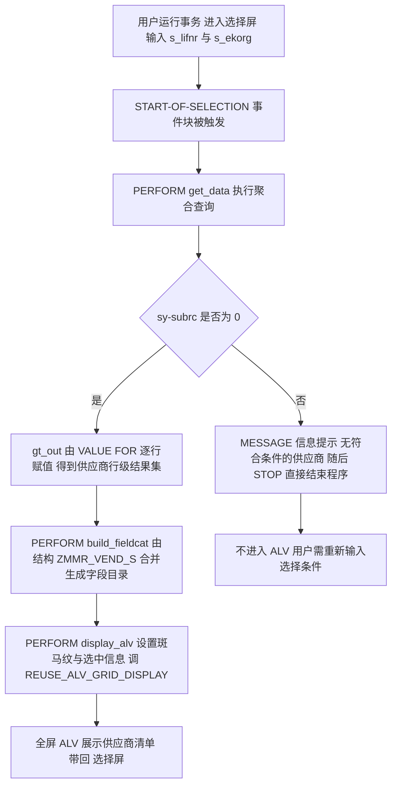
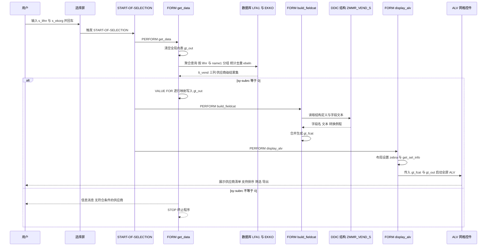

# ZMMR_VEND_LIST 走读报告：供应商采购订单张数统计报表

> 分析对象：`zmmr_vend_list.abap`（REPORT 程序，58 行，过程化 PERFORM 分层，SLIS 全屏 ALV）
> 读法假设：你刚接手这个程序，需要在 10 分钟内搞清"它算什么、怎么跑、哪里会炸"。
> 阅读地图：第一章讲业务动机，第二章给执行链与责任表，第三章逐子程序拆解（报告主体），第四章用时序图看数据流转，第五章按优先级列问题，第六章给整体评价。

---

## 一、程序定位与业务背景

### 1.1 它在回答一个什么问题

用一句业务话讲清楚：**"在我指定的采购组织范围内，每个供应商名下挂了多少张采购订单？"**

输出粒度是**供应商级**（一行一个供应商，三列：供应商号、供应商名称、采购订单张数）。这个粒度是理解全部后续代码的钥匙——它不是订单清单，也不是订单行清单，而是一个**供应商活跃度计数看板**。

真实需求通常来自三个场景：

| 场景 | 谁在用 | 想得到的结论 |
|---|---|---|
| 供应商分级 / 淘汰盘点 | 采购主管、品类经理 | 哪些供应商是主力（下单频繁、量级大），哪些是"僵尸供应商"（挂名、几乎不下单），谁该被约谈或替换 |
| 采购集中度与寻源决策 | 采购分析岗、寻源团队 | 订单是否过度集中在少数几家手里，用来判断"我们有没有替代来源" |
| 订单底稿取证 | 内审、ERP 支持 | 快速给出一个供应商名下的订单张数底稿，做抽样核对的第一层筛选 |

注意：这三个场景真正关心的**都不是"张数"本身**，而是"张数背后的量级和活跃度"。这决定了第三章 3.3 ① 会指出的一个核心口径问题——程序只数了订单**头**，没有数行、量、额。

### 1.2 为什么不能直接用标准事务

SAP 采购模块当然有查询工具，但都对不上这个粒度：

- `ME5A` / `ME5B`（采购订单列表）：是**订单级**输出，而且要逐行输入供应商号才好用，跑一次输出几十页订单，回来还要自己 Ctrl+Shift+F5 加个 SubTotal 才勉强能数。
- `ME2N`（采购订单按供应商查）：需要逐个输入供应商号，无法"一次列出所有供应商"。
- `ME5A` 上方那些"显示汇总"的小按钮：`ME5B` 的分类汇总、`MB51` 的收货汇总，都绑定在**收货/入库**口径上，不是订单创建口径。
- `ME21N` / `ME23N`：单据级明细，压根不是报表。

也就是说，标准工具要么粒度太细（订单/订单行），要么需要逐个输入供应商（等于没法用），要么口径不同（收货 vs 订单）。要"一次跑出供应商维度的订单张数"，标准事务做不到，**这正是这个 Z 程序存在的唯一理由**——它填的是标准报表填不上的那个格子。理解了这一点，你就能判断这个程序"该不该存在"：该，因为它替代的是"人工去 ME5A 里数"。

### 1.3 整体设计范式（一句话定性）

**经典"三段式报表"范式：事件块 `START-OF-SELECTION` 只做调度，逻辑切成 `取数 → 建字段目录 → 展示` 三个 FORM，取数用一条 SQL 内聚合（GROUP BY + COUNT）把数据量压到供应商行级，最后用 SALIS 的全屏 ALV 输出。**

这个范式的优点是**结构对称、职责单一、可独立测试**（每个 FORM 都是无参 FORM，理论上能单独 PERFORM 验证）。它的时代印记也很明显：全篇用 `FORM`/`PERFORM`、全局内表、`TABLES` 声明、内联 `@DATA(...)` 与 `@` 主机变量转义——**同一段代码里新旧两代 ABAP 语法混用**（SQL 段是 7.40 风格，ALV 段是 6.0 风格）。这不是错误，但它是一个信号：这份程序大概率是在老版本上写了主体，后来为了修一个 SQL 问题顺手用了新语法，而整体 ALV 层从没重构过。

---

## 二、程序执行流程总览

### 2.1 执行流程图



整条链是**单次、线性、无分支回环**的：取数 → 建目录 → 展示，四个 FORM 里没有一个再 PERFORM 另一个。这种平坦性对 onboarding 是好事——你不需要维护一棵调用树。

### 2.2 责任链表

| 顺序 | 子程序 | 调用者 | 职责（一句话） |
|---|---|---|---|
| 0 | 全局声明区 | 系统（编译期） | 声明程序类型、SLIS 类型池、LFA1/EKKO 表对象、三个全局对象（输出内表、字段目录、布局）、两个选择屏 |
| 1 | `START-OF-SELECTION` | 系统（用户回车触发） | 报表的唯一入口，只负责按固定顺序 PERFORM 三个 FORM，本身不含业务逻辑 |
| 2 | `get_data` | `START-OF-SELECTION` | 聚合 LFA1 与 EKKO，按供应商分组统计订单张数写入 `gt_out`；无数据时弹信息并 `STOP` |
| 3 | `build_fieldcat` | `START-OF-SELECTION` | 用 `REUSE_ALV_FIELDCATALOG_MERGE` 从 DDIC 结构 `ZMMR_VEND_S` 自动生成字段目录 `gt_fcat`，失败报 E 级消息 |
| 4 | `display_alv` | `START-OF-SELECTION` | 配置布局（斑马纹、选中信息）后调 `REUSE_ALV_GRID_DISPLAY` 全屏输出 `gt_out` |

声明区之所以排进责任链表，是因为它承担了三份真实契约：**输出结构契约**（`ZMMR_VEND_S` 决定了 ALV 有哪些列）、**展示契约**（SLIS 类型池决定了 ALV 能力边界）、**输入契约**（`TABLES` 决定了选择屏拿得到 F4 值帮助）。这三条契约在后面都会被引用到，所以它不能被当成"样板"跳过。

### 2.3 数据在流程中的形态变化

一条主线，帮你建立心智模型：**EKKO 的海量订单行 → SQL 内聚合成供应商行级 → 内表 `lt_vend` → 显式逐字段拷贝到 `gt_out` → ALV 直接以 `gt_out` 为数据源。** 数据量在 `get_data` 里被压掉两三个数量级，后面两个 FORM 处理的都是小结果集——这是整份程序性能设计的核心思路，第三章会反复回到它。

下面按这条流程，逐个子程序展开。

## 三、分组分析（按程序流程 / 子程序）

全篇只有四个执行单元（三个 FORM + 一个事件块），但真正值得拆开讲的是 `get_data`——它占了程序将近一半的思考量。所以本节先轻后重：声明区和事件块各一节，`get_data` 拆三步，`build_fieldcat` 与 `display_alv` 各一节。

### 3.1 全局声明区

```abap
REPORT zmmr_vend_list.
TYPE-POOLS: slis.

TABLES: lfa1, ekko.

DATA: gt_out  TYPE TABLE OF zmmr_vend_s,
      gt_fcat TYPE slis_t_fieldcat_alv,
      gs_layo TYPE slis_layout_alv.

SELECT-OPTIONS: s_lifnr FOR lfa1-lifnr,
                s_ekorg FOR ekko-ekorg.
```

**做什么** —（全局声明区）声明这是一个可执行 REPORT；引入 `SLIS` 类型池以获得 ALV 相关的类型定义；声明 `LFA1`（供应商主数据）、`EKKO`（采购订单抬头）两个表对象；定义三个全局对象——`gt_out` 为 `ZMMR_VEND_S` 行类型的内表（ALV 的数据载体）、`gt_fcat` 为 ALV 字段目录内表、`gs_layo` 为 ALV 布局结构；最后声明两个选择屏对象 `s_lifnr`（供应商号）与 `s_ekorg`（采购组织）。

**为什么** — 这里每一个声明都在替后面的代码"买单"，值得逐个说动机：

- `TYPE-POOLS: slis` 是使用经典 ALV 的**硬性前提**。SLIS 的类型（`slis_t_fieldcat_alv` 等）住在 `SAPLSLIS` 的类型池里，不引入编译器就认不出这些类型。SAP 官方文档也推荐这条语句。
- `TABLES: lfa1, ekko` 的唯一实际用途是**给 `SELECT-OPTIONS ... FOR` 提供 F4 值帮助**。写法上 `TABLES` 已在现代 ABAP 中不推荐（更常见的是 `DATA wa TYPE lfa1` 之类），但对于"只需要一个字段带值帮助的选择屏"这个场景，`TABLES` 仍然是最省事的写法。注意它**没有**在 `get_data` 里被用来当工作区——那里的 SQL 用的是内联 `@DATA(lt_vend)`。
- 三个对象声明为**全局**（而不是 FORM 内的局部变量）是刻意的：FORM 之间要传数据，而 `START-OF-SELECTION` 里的 PERFORM 是"平级调用"、没有返回值通道，全局变量是最直接的共享方式。这不是好设计，但对这个规模的程序完全够用。
- 命名遵循了 `gt_` / `gs_` 前缀约定（global table / global structure），是 SAP 社区事实标准。

**风险与改进** — 有三点值得记一笔：

1. **结构与取数逻辑隐式耦合**。`gt_out` 的行类型是 `ZMMR_VEND_S` 这个 DDIC 结构，而 `get_data` 里的 `SELECT` 列表是手写字段名。两者靠"字段名恰好一致"来对齐——将来若有人给 `ZMMR_VEND_S` 加一个字段而忘了改 SELECT，ALV 会多出一列全空；反过来改了 SELECT 别名而忘了改结构，编译能过、运行会空列或短 dump。**改进**：把 `SELECT` 列表与结构绑定，或至少在结构上加注释说明"此结构与 ZMMR_VEND_LIST 的 SELECT 列表必须同步维护"。
2. **`Z` 命名对象的传输依赖**。`ZMMR_VEND_S` 是客户自建结构，如果目标系统里这个结构缺失或版本不同，`REUSE_ALV_FIELDCATALOG_MERGE` 会失败（程序里有错误处理，但只是报消息）。这类跨系统依赖在开发/测试/生产不一致时很难排查。
3. **无类型化的选择屏**。`SELECT-OPTIONS` 直接挂在表字段上，符合惯例，不算问题——但 `s_ekorg` 对应 `EKKO-EKORG`（采购组织），值帮助来自 EKKO 的检查表，实际是 `TPAK` 采购组织，通常可用；真正的问题是**没做任何输入校验**，见 3.3 ①。

### 3.2 事件块 `START-OF-SELECTION`

```abap
START-OF-SELECTION.
  PERFORM get_data.
  PERFORM build_fieldcat.
  PERFORM display_alv.
```

**做什么** —（事件块 `START-OF-SELECTION`）用户回车后，SAP 生成的隐式选择屏开始处理，ABAP 运行时的 `START-OF-SELECTION` 事件块被触发。此处按固定顺序调用三个 FORM：`get_data` 取数、`build_fieldcat` 生成字段目录、`display_alv` 展示。

**为什么** — 这是报表程序的标准入口事件，语义是"用户在选择屏上按了执行"。`START-OF-SELECTION` 之后紧跟 PAI 处理（在报表里通常不需要），再往前是 `INITIALIZATION`（可以做默认值、变式加载），本程序都没有用到。

选它而不是 `AT SELECTION-SCREEN`，是因为这三个 FORM 属于"执行"而非"输入校验"阶段。**这是一条正确的分界**：`AT SELECTION-SCREEN` 应该放"参数是否合法"的判断，而本程序把这种判断完全省掉了（见 3.3 ① 的风险部分）——分界意识有，校验本身缺失。

**风险与改进** — 这一段本身**没有明显风险**，它是全篇写得最干净的地方：顺序正确、命名规范、缩进规范、没有任何多余代码。唯一可提的改进是：若未来要加参数校验（强烈建议），正确做法是在此之前新增一个 `AT SELECTION-SCREEN` 块，而不是塞进 `get_data`——因为校验失败时不应该已经付出查询代价了。

### 3.3 FORM `get_data`（本程序的核心，分三步看）

这一个 FORM 干了三件不同性质的事：一条聚合 SQL、一段结果判空、以及一次结果集转换。混在同一个 FORM 里是全篇最需要改进的地方，所以拆成三步，每步的风险性质完全不同。

#### ① 取数：一条聚合 SQL

```abap
  SELECT a~lifnr,
         a~name1,
         COUNT( DISTINCT b~ebeln ) AS po_cnt
    FROM lfa1 AS a
    INNER JOIN ekko AS b ON a~lifnr = b~lifnr
    WHERE a~lifnr IN @s_lifnr
      AND b~ekorg IN @s_ekorg
      AND b~bstyp = 'F'
    GROUP BY a~lifnr, a~name1
    INTO TABLE @DATA(lt_vend).
```

**做什么** — 从 `LFA1`（供应商主数据）出发，`INNER JOIN` 到 `EKKO`（采购订单抬头表），连接条件为供应商号相等。筛选条件三条：供应商号落在选择屏 `s_lifnr` 范围内、采购组织落在 `s_ekorg` 范围内、且**单据类型 `BSTYP` 固定为 `'F'`**（采购订单，区别于框架协议 `'L'`、库存调拨 `'B'`、已过账凭证 `'C'` 等）。按供应商号 + 供应商名分组，用 `COUNT(DISTINCT b~ebeln)` 算出每个供应商名下的**去重订单张数**，取别名 `po_cnt`，结果装进内联声明的内表 `lt_vend`。

**为什么** — 这条 SQL 里有四个设计选择，逐个评：

- **聚合在 DB 端做，而不是拉明细回 ABAP 再数**。这是全篇**最正确的一个决策**。EKKO 在生产系统动辄百万级订单，如果写成"SELECT 明细 + LOOP 累加"，传输量和 ABAP 侧循环都是灾难。放 DB 侧聚合，ABAP 侧拿到的直接是供应商行级结果集（通常几十到几千行），传输量压掉两三个数量级。
- **`COUNT(DISTINCT b~ebeln)` 而不是 `COUNT(*)`**。在 `LFA1 JOIN EKKO` 这个特定连接下，EKKO 每个 `EBELN` 只会匹配一个 LFA1 记录（供应商号是 LFA1 主键），理论上 `COUNT(*)` 就够了。但 `DISTINCT` 在语义上更保险——**万一将来把连接改成对多行的表（比如 EBBAN、EBAN），`COUNT(*)` 会把订单张数放大成订单行张数，而 `DISTINCT` 仍然给出正确的"文档数"**。这是"为未来的改动提前买保险"，代价是一点点 DB 排序开销，我认可这个取舍。
- **`GROUP BY a~lifnr, a~name1` 同时带 name1**。ABAP/Open SQL 要求 SELECT 列表里非聚合的列必须出现在 GROUP BY 里，所以带 `name1` 是**语法强制**，不是冗余。虽然从关系论角度 `name1` 由 `lifnr` 函数依赖（同一供应商号只对应一个当前名称），严格说只需 `GROUP BY a~lifnr` 再取 `MAX(a~name1)`，但那样写反而更晦涩。
- **硬编码 `b~bstyp = 'F'`**。这保证了"采购订单"口径不被库存调拨单、框架订单污染，业务上是必要的。**但它同时是本程序最大的可扩展性限制**（见风险）。

**风险与改进** — 这一块有真问题，而且是 P0 级的：

1. **完全依赖 ABAP 端不做校验，选择屏可以为空 → 全表扫描**。这是最严重的问题。`s_lifnr` 和 `s_ekorg` 都是 `SELECT-OPTIONS`，**默认可以不填**。用户直接回车，两个 `IN @s_xxx` 条件都退化为"不过滤"，于是这条 `INNER JOIN` 变成"LFA1 全表 × EKKO 全表"再聚合。在生产系统上，这足以造成分钟级的数据库负载尖峰，甚至触发短时 dump（`TSV_TNEW_PAGE_ALLOCATOR`）。**改进**：在 `START-OF-SELECTION` 之前加 `AT SELECTION-SCREEN` 块，至少把 `s_lifnr` 设为必填（`INITIALIZATION` 里设默认值，或在 `AT SELECTION-SCREEN` 里 `MESSAGE ... TYPE 'E'`）；`s_ekorg` 视业务场景可给默认值。**注意**：不能简单写成"`s_lifnr` 必填"就完事——一个只填 `s_lifnr`、不填 `s_ekorg` 的用户，仍会扫描该供应商的全部历史订单；真正的防护是同时限制 `s_ekorg`，或在 `EKKO` 上按日期分段（SAP 的 `EKKO` 有 `BEDAT`/`LFDAT` 字段可作范围）。
2. **没有"已删除/已归档"标记过滤**。EKKO 有删除标记字段 `LOEKZ`（采购订单删除标识），LFA1 也有（供应商删除标识）。SAP 采购订单一般是**做归档（LOEKZ = 'X'）而不是物理删除**，归档后的单据在 EKKO 里仍然存在。因此当前统计会把**已归档的采购订单也算进"活跃订单张数"**里——这对"供应商活跃度"这个业务目的是直接的口径错误。**改进**：加 `AND b~loekz <> 'X'`（以及供应商侧的对应过滤），或按业务需要做成选择屏参数。注意 `LOEKZ` 可为空，所以正确写法是 `COALESCE(b~loekz, '') <> 'X'` 或用 `NOT ( b~loekz = 'X' )`，不能直接写 `b~loekz = ''`。
3. **口径是"订单头张数"，不是"订单行数"也不是"采购额"**。回顾第一章的三个业务场景——供应商分级、集中度分析、内审取证——**没有一个是靠"订单张数"就能支撑决策的**。采购主管真正想知道的是"这个供应商下了多少钱、多少件"。`EBELN` 只标识订单头，若要行级或金额级指标，得关联 `EBPO`（订单项目）或用 `EKKO-EBELN` 下的 `EBAN`（交货/开票）。**这不是代码 bug，是需求边界问题**，但接手时必须搞清楚：这个数字当初是"要个大概"还是"这就是 KPI"。如果是 KPI，程序是不完整的。
4. **`INNER JOIN` 意味着"有订单的供应商"才出现**。没下过订单的供应商不在结果里。第一章提到"识别僵尸供应商"的需求——**这个程序恰恰做不到**，因为僵尸供应商的订单数天然是 0，会被 JOIN 掉。要支持该场景，得改成 `LEFT JOIN` 且以 LFA1 为主表（并把 `COUNT` 结果为 0 的行也输出），但那又会带来全表聚合的性能问题，与第 1 点冲突。**这是这个程序最本质的设计张力：口径收得越紧越快，越松越有用。**
5. **`INNER JOIN` 方向的性能提示缺失**。SQL 没有 `ST04` 指导优化器走哪条路。`EKKO` 上有以 `LIFNR` 为首列的索引，`LFA1` 主键是 `LIFNR`，理论上以 LFA1 驱动、索引探 EKKO 才是对的；但优化器在统计信息缺失时可能选反，**用 EKKO 驱动去扫 LFA1**。改进手段是加 SQL hint 或用 CDS/视图预定义连接顺序，或者干脆**拆成两步**（先聚合 EKKO 得到 `lifnr + po_cnt`，再用 `FOR ALL ENTRIES` 关联 LFA1 取 name1），这样连接顺序完全由开发者控制。
6. **`COUNT(DISTINCT ...)` 与 `GROUP BY` 同时存在时的 DB 侧排序成本**。在 `GROUP BY` 里加 `DISTINCT` 会让数据库多做一次去重排序。结果集小的时候无所谓，**但当用户选了超大供应商区间（"所有供应商"）时，这就是个可观的额外开销**——又指向第 1 点：空选择屏防护是第一位的。

#### ② 结果判空与提前退出

```abap
  IF sy-subrc = 0.
```

**做什么** —（FORM `get_data`）检查上一条 `SELECT` 的 `sy-subrc`，为 0 表示查询成功取到数据，进入填充分支；非 0 则走 `ELSE` 分支，给出信息消息并 `STOP` 直接结束程序。

**为什么** — 意图是明确的：查不到数据时**不要弹一个空 ALV**，而是给一句人话。这是很多报表没做的细节，值得肯定。

**风险与改进** — 判空方式本身有技术瑕疵，行为也有 UX 问题：

1. **`sy-subrc` 在聚合查询上不能用来判断"有无数据"**。这是 ABAP 里一个经典的坑：当 `SELECT` 列表里**含有聚合函数**时，即使没有任何行满足 `WHERE`，数据库**仍会返回一行**（聚合值为 0，其余字段为空）；此时 `sy-subrc` 也是 0。本程序因为带了 `GROUP BY`，空结果时 DB 不会返回那"一行 0 值"（分组无匹配则不产生组），所以 `sy-subrc <> 0` 目前恰好能工作——**但这是"恰好"，不是"设计"**。一旦有人去掉 `GROUP BY`（例如改成 `SELECT ... COUNT(*)` 全表统计），空结果会变成"一行全空数据"，`sy-subrc` 仍是 0，程序就会给用户显示一条空的垃圾行。**改进**：判空应该判**内表是否为空**，即 `IF lt_vend IS INITIAL`（或 `lines( lt_vend ) = 0`），这在所有情况下都正确，且语义直白。
2. **提前 `STOP` 的代价：用户输错了就得重来一遍**。`STOP` 直接终止程序，**选择屏的输入值不会保留**（用户要重新输入供应商号和采购组织）。对一个"筛选条件没查到数据"这种极常见的正常情况，让用户重输是明显的体验缺陷。**改进**：不要 `STOP`，而是照常往下走到 ALV，让 ALV 显示空清单 + 在标题里写"无数据"；或者用 `MESSAGE ... TYPE 'S'`（状态消息，显示在同一行的消息栏）而不是弹窗 + 退出。
3. **消息是硬编码中文字面量**：`MESSAGE '无符合条件的供应商' TYPE 'I'`。ABAP 的规范做法是用**消息类 + 消息号**（`MESSAGE ID 'ZMSG' TYPE 'S' NUMBER '001'`），这样可以走 SE91 翻译、支持多语言、也便于统一维护。中文直写还带来**编码风险**：ABAP 源码编辑器在非 Unicode 客户端下保存中文可能乱码，一旦乱码就是**源码级损坏**（改回来很麻烦）。这条是全篇最容易被忽略、后果又最烦人的风险之一。
4. **信息级别用 `I` + `STOP` 组合起来语义含混**。`I` 是"信息"（不中断），`STOP` 才是中断动作。消息级别与后续动作应当匹配：真要中断用户流程就该用 `E`（错误）或 `S`（状态，不中断）。现在是"用信息消息的语气，说了一个终止程序的事实"。

#### ③ 结果集转换

```abap
    gt_out = VALUE #( FOR ls IN lt_vend
                      ( lifnr = ls-lifnr name1 = ls-name1 po_cnt = ls-po_cnt ) ).
```

**做什么** — 遍历内联内表 `lt_vend` 的每一行，用 `VALUE #( FOR ... )` 行构造器语法，把三列（供应商号、供应商名、订单张数）按名映射到 `ZMMR_VEND_S` 结构的对应字段上，整体赋给全局内表 `gt_out`。

**为什么** — 目的是"把匿名内表转成 `ZMMR_VEND_S` 类型的内表"。因为 `lt_vend` 是内联声明的**匿名结构**（只有三列，且列名来自 SELECT 别名），而 `gt_out` 需要 `ZMMR_VEND_S` 这个明确的 DDIC 类型——ALV 后面要靠这个类型去 merge 字段目录。

**但这一步是整段代码里最值得质疑的地方**：如果 `lt_vend` 的三列本来就和 `ZMMR_VEND_S` 字段名一致，那么 `gt_out = lt_vend` 一行就够了；就算需要显式拷贝，`lt_vend` 也可以声明成 `TYPE zmmr_vend_s` 让内联省掉。现在的写法是**用最重的语法做最轻的事**：建了一个三字段的匿名内表，再逐字段手工映射。

**风险与改进** — 三个问题：

1. **纯样板代码，应当消除**。改进方向有两条，选哪条取决于你想要哪种安全性：
   - 让 SELECT 直接产出目标结构（在 `get_data` 里 `DATA lt_vend TYPE TABLE OF zmmr_vend_s`，然后 `INTO TABLE @lt_vend`），`gt_out = lt_vend` 一行搞定。这样编译期就能保证类型一致，也省掉了手写映射可能出现的错列。
   - 保留两段式但去掉手工映射：`gt_out = CORRESPONDING lt_vend`（ABAP 7.40 特性，按组件名对应）。**注意语义差别**：`CORRESPONDING` 是不认识的组件就忽略，比显式映射宽松——如果你担心"结构多了一个字段，ALV 出现空列"，显式映射反而会**在编译期报错**（`lt_vend` 里没有那个组件）。所以这里"笨写法"有一点点防御价值，但代价是可读性。
2. **单行多字段写在同一物理行，可读性差**。`( lifnr = ls-lifnr name1 = ls-name1 po_cnt = ls-po_cnt )` 这行三个赋值挤在一起，在 SAP 标准的 pretty printer 下也无法自动拆开（新版 pretty printer 对 `VALUE #( )` 展开支持有限）。**改进**：按行拆开。代码量只多两行，可读性提升明显。
3. **这一层没有做任何转换/清洗，是好事，但也是浪费**。既然逐字段映射的机制已经搭好了，本来是最适合放"数据加工"的地方（比如名称截位、订单张数转成带千分位的显示文本、把供应商名按公司代码语言取多语言名称）。现在白白搭了个架子没干活。要么简化掉，要么就把加工用上。

取数讲完了，接下来两个 FORM 都是"ALV 装配"，逻辑轻、但坑在细节。

### 3.4 FORM `build_fieldcat`（分两步：它做了什么，以及它替我们省掉了什么）

#### ① 从 DDIC 结构自动合并字段目录

```abap
  CALL FUNCTION 'REUSE_ALV_FIELDCATALOG_MERGE'
    EXPORTING
      i_structure_name = 'ZMMR_VEND_S'
    CHANGING
      ct_fieldcat     = gt_fcat.
  IF sy-subrc <> 0.
    MESSAGE '字段目录生成失败' TYPE 'E'.
  ENDIF.
```

**做什么** —（FORM `build_fieldcat`）调用 FM `REUSE_ALV_FIELDCATALOG_MERGE`，把 DDIC 结构 `ZMMR_VEND_S` 的字段定义（名称、长度、数据元素、文本标签、转换例程）自动合并成一个字段目录内表 `gt_fcat`。若 FM 返回 `sy-subrc <> 0`，则以 `E`（错误）级消息终止程序。

**为什么** — `REUSE_ALV_FIELDCATALOG_MERGE` 是 ALV 领域最被低估的一块省事技巧：**它把"ALV 有哪些列、每列叫什么、怎么对齐、怎么显示"这个显示契约从代码里搬到了 DDIC 结构上**。**把"显示什么"变成"结构里有什么"，是声明式编程的思路**，在报表开发里非常划算，而且它还顺带白送了一批东西：DDIC 里的字段文本标签自动成为 ALV 列标题（用户看到的是中文列名而不是 `LIFNR`）、`CURRENCY` 字段自动右对齐、`NUMC` 字段带前导零显示——这些手工做都要写代码。对比见下一步。

**风险与改进** — 一个设计取舍，两个隐患：

1. **完全依赖结构字段顺序，用户无法在程序里调整**。生成的列顺序 = DDIC 结构里的字段顺序。这就意味着"哪列在最左边"变成了一个**数据传输/维护问题**，而不是代码问题：想调整顺序，要么改结构（影响所有引用者），要么在 `build_fieldcat` 生成之后显式重排 `gt_fcat-[]`。当前三列顺序恰好是"供应商号、名称、张数"，符合阅读习惯，所以暂时没暴露。**改进**：将来加列导致顺序不对应人需要在意的顺序时，在 `build_fieldcat` 末尾加一句显式重排。
2. **错误处理太轻，掩盖了真正的失败原因**。这个 FM 失败的常见原因是：结构名打错、结构未激活、结构在传输中缺失或版本不一致。程序只报一句"字段目录生成失败"，**开发人员得自己去查传输请求**。**改进**：把 `i_structure_name` 与程序名一起打进消息文本；消息级别也可考虑 `TYPE 'A'`，让用户知道这是环境问题而非自己输错了。
3. **`i_structure_name` 是硬编码字符串**。结构一旦改名或跨系统传输不一致，就是**运行时报错而非编译期报错**。这是 `REUSE_ALV_FIELDCATALOG_MERGE` 的固有代价，可以接受，但要记在接手清单上。另外 `MESSAGE ... TYPE 'E'` 在报表里会弹错误框并结束处理单元，**用户看到的是一个没有上下文的红框**——这也是为什么建议把结构名放进消息里。

#### ② 对照：不用它的话，字段目录长什么样

```abap
  CLEAR gt_fcat.
  APPEND INITIAL LINE TO gt_fcat.
  MOVE 'LIFNR' TO gt_fcat-sfieldname.
  MOVE '供应商号' TO gt_fcat-seltext.
  MOVE sy-rcnt TO gt_fcat-refno.
```

**做什么** — 清空字段目录，追加一行，然后把技术字段名、中文列标题、参考序号逐个搬进结构里。**为一列（`LIFNR`）就要写四行。**

**为什么** — 它是 ALV 最典型的样板代码：每加一列复制一遍，改标题还得同步维护长文本与长描述。本程序有三列字段，手写要十几行且极易出错（列顺序靠 `refno` 决定，写漏一个 `refno` 就排到末尾去了）。`REUSE_ALV_FIELDCATALOG_MERGE` 一次调用取代了它们——**这是"用元数据代替样板"的直接体现，也是这个程序 58 行却功能完整的原因之一**。

**风险与改进** — 这段样板本身没有风险，它出现在报告里是为了对照。但对照也说明了一件事：**字段目录的维护成本并没有消失，只是从代码转移到了 DDIC 结构**。改列标题要去 SE11 改数据元素文本，改列顺序要去改结构字段顺序——这正是 ① 里风险第 1 条说的"顺序问题变成了传输问题"的由来。**改进方向**：如果希望列标题与顺序能脱离结构单独调整，`REUSE_ALV_FIELDCATALOG_MERGE` 之后可以用 `MODIFY gt_fcat FROM TABLE ...` 批量覆盖 `seltext`，或直接传 `it_exclude` 隐藏不想要的列。

### 3.5 FORM `display_alv`（分两步：现状，以及最该补的那一段）

#### ① 现状：配好布局，交给 ALV 网格控件

```abap
  gs_layo-zebra = 'X'.
  gs_layo-get_sel_info = 'X'.
  CALL FUNCTION 'REUSE_ALV_GRID_DISPLAY'
    EXPORTING
      is_layout   = gs_layo
      it_fieldcat = gt_fcat
    TABLES
      t_outtab    = gt_out.
```

**做什么** —（FORM `display_alv`）先给全局布局结构 `gs_layo` 设两个属性：`zebra = 'X'` 开启斑马纹隔行底色，`get_sel_info = 'X'` 让 ALV 在选中行时在状态栏显示选中行的合计信息。然后调 `REUSE_ALV_GRID_DISPLAY`，把 `gs_layo`（布局）、`gt_fcat`（字段目录）和 `gt_out`（数据）交给全屏 ALV 网格控件显示。

**为什么** — `REUSE_ALV_GRID_DISPLAY` 是 SALIS 里最常用的全屏 ALV。它调起 SAP 标准的 `CL_ALV_TABLE` 控件，用户得到的是**完整的 ALV 功能集**：列排序、列宽拖拽、筛选、汇总、Excel 导出（工具栏的 Spreadsheet 图标）、打印。**换句话说，这个程序没有写任何"显示表格"的代码，就免费获得了一个功能完备的表格控件。** 这是"用控件而不是自己画"的典型收益——也是本程序 58 行就能交付可用界面的原因。

`zebra` 和 `get_sel_info` 这两个参数是典型的"两行成本、两行收益"：斑马纹在宽表上显著提升可读性；`get_sel_info` 让用户勾选若干行时立刻看到合计。**这两个选择说明作者是有 ALV 使用经验的**，不是照抄模板——同时也说明作者把注意力放在了显示细节上，**却漏掉了下面这个更重要的显示问题**。

**风险与改进** — 三个改进点，一个隐患：

1. **没有标题与选择条件回显**。`i_grid_title` 没设置，ALV 标题栏是空的。用户看到一张三列的表，不知道自己刚才筛的是哪个采购组织。**改进**：`i_grid_title = '供应商采购订单张数统计'`，更进一步把 `s_lifnr` / `s_ekorg` 的取值范围拼进标题——这对一个"数据来源不可追溯"的报表来说很关键。
2. **没有 `i_save` / 布局持久化**。用户每次调整的列宽、排序、隐藏列在运行结束后全部丢失（`gs_layo` 是每次运行重新初始化的全局变量，SAP 后台会重置全局数据）。**改进**：加 `i_save = 'A'`（允许用户保存布局变式，`ALV_VARIANT` 那套机制），或 `i_save = 'L'`（仅本地布局）。这是 ALV 最容易被忽略、用户最能感知到的体验差距。
3. **`TABLES` 传参的语义隐患**。`TABLES t_outtab = gt_out` 是引用传参（允许 FM 修改调用方的数据），而 `is_layout` / `it_fieldcat` 是 `EXPORTING` 传值。这个混用没错（SLIS 就这么定义），但要点是：**ALV 的排序、筛选等操作会直接反映到 `gt_out` 上**。当前 `gt_out` 用完即弃，无害；但如果将来在 `display_alv` 之后还要用 `gt_out`（导出、传下一页、回写），**必须意识到它的内容与顺序可能已被 ALV 改过**。这是 `TABLES` 传参的固有语义，不是 bug，但要知道。
4. **未设置 `no_out` / `tech_col`**：三个字段全部对用户可见。`PO_CNT` 应该显示（是核心指标），`LIFNR` 可以显示（也可设为技术列、以 `NAME1` 为主显示）。**这一项属于"锦上添花"**，按需要做。

#### ② 最该补的一段：默认排序

```abap
  DATA: ls_sort TYPE slis_sortinfo_alv.
  ls_sort-sfield = 'PO_CNT'.
  ls_sort-sord   = 'D'.
  ls_sort-senab  = 'X'.
  APPEND ls_sort TO gt_sort.
```

**做什么** —（FORM `display_alv`）构造一条排序信息：排序字段 `PO_CNT`（订单张数列）、降序（`'D'`）、`senab = 'X'` 表示按数值而非文本排序，追加进排序表 `gt_sort`，再把 `gt_sort` 通过 `it_sorttab` 传给 FM。

**为什么** — **没有默认排序是本程序在"业务价值"层面最刺眼的缺失**。用户拿到一个"供应商 vs 订单张数"的列表，最想看的当然是"张数最多的排最前"，但 ALV 打开时是 DB 返回的顺序（`GROUP BY` 通常按分组键有序输出，也就是供应商号顺序）。用户必须自己点一次表头才知道谁最重要。

而 `senab` 是这段代码里最关键的一个字符。**不写它，ALV 会按文本比较排序，"10" 会排在 "9" 前面**——一张"订单张数"报表，最多的供应商竟然不在第一行，整张表的可信度立刻打折。这种细节是老手和新手的分界线，也是第一章说的"这个报表的全部意义在展示"这句话最直接的注脚。

**风险与改进** — 补上排序后仍有两点要处理：排序字段名 `'PO_CNT'` 是**硬编码字符串**，与 `ZMMR_VEND_S` 结构脱钩，改字段名就静默失效（ALV 不会报错，只是不排序）；`gt_sort` 也应声明为全局（与 `gt_fcat`、`gs_layo` 并列）以保持风格一致。**改进**：结构字段改名时同步改这里，或把排序字段写成常量集中管理。

四个执行单元拆完了。下面把视角从"程序内部"切到"数据在时间轴上的流动"，看一遍 `gt_out` 这个内表是在哪一刻、经过谁的手变成最终屏幕上的三列。

---

## 四、执行流程全景图（数据视角）



三个观察点：

- **数据形态的两次收缩**：第一处在 `get_data` 的 SQL 里（EKKO 百万级订单 → `lt_vend` 供应商级），第二处在 `display_alv` 里（内表 → 屏幕行）。性能设计的核心在前一处，后一处是呈现。
- **DDIC 只被读了一次，且在数据之外**。`ZMMR_VEND_S` 在取数阶段不参与，在 `build_fieldcat` 阶段才被读入——**这正是"结构与取数字段列表必须手工对齐"这个隐患的根源**（见 3.1 风险第 1 条）：两个阶段各自独立地假设结构里有什么，没有编译期保证。
- **`gt_out` 的写只有一处，读有两处**（`build_fieldcat` 读结构、`display_alv` 读数据）。所以 `gt_out` 完全可以是 `get_data` 的局部变量再传参——用全局纯粹是为了 PERFORM 之间共享，这为第六章"最值得学的一点"埋下伏笔：程序结构对称，代价是没有参数契约。

---

## 五、问题清单与改进建议（按优先级）

### 🔴 P0 — 业务正确性

1. **空选择屏导致全表聚合扫描**（FORM `get_data`）
   `s_lifnr` 与 `s_ekorg` 均可留空，此时 `IN @s_xxx` 条件失效，SQL 退化为 LFA1 与 EKKO 的全表 JOIN + GROUP BY + DISTINCT 计数。生产系统上足以引发数据库负载尖峰与短时 dump（`TSV_TNEW_PAGE_ALLOCATOR`）。
   **改进**：新增 `AT SELECTION-SCREEN` 块，把 `s_lifnr` 设为必填并校验非空；`s_ekorg` 给默认值或同样校验；必要时引入 `EKKO-BEDAT` 日期范围做时间窗限制。

2. **统计口径包含已归档/已删除的采购订单**（FORM `get_data`）
   未过滤 EKKO 的删除标记，SAP 采购订单走归档（`LOEKZ = 'X'`）而非物理删除，归档单据仍参与计数，直接导致"活跃订单张数"虚高。
   **改进**：加 `AND b~loekz <> 'X'`（注意该字段可为空，须用 `NOT ( b~loekz = 'X' )` 或 `COALESCE` 写法）；供应商侧同理。

3. **口径只到"订单头张数"，与业务目的不匹配**（FORM `get_data`）
   第一章的三个场景（供应商分级、集中度分析、审计取证）都需要量级信息，而 `COUNT(DISTINCT ebeln)` 只给头数。若这个数字被当作 KPI 使用，程序是不完整的。
   **改进**：关联 `EBPO`（订单项目）补行数与数量，或补净金额（`EBPO-NETWR`）字段；同步升级 `ZMMR_VEND_S` 与字段目录。

4. **中文消息硬编码 + 源码编码损坏风险**（FORM `get_data`、FORM `build_fieldcat`）
   `MESSAGE '无符合条件的供应商' TYPE 'I'` 与 `MESSAGE '字段目录生成失败' TYPE 'E'` 直接写中文字面量。ABAP 源码在非 Unicode 环境下保存可能乱码，属**源码级不可逆损坏**；同时无法走 SE91 翻译与多语言。
   **改进**：建 `ZMSG` 消息类，改为 `MESSAGE ID 'ZMSG' TYPE 'S' NUMBER '001'`。

### 🟠 P1 — 健壮性

5. **用 `sy-subrc` 判断聚合查询有无数据**（FORM `get_data`）
   聚合查询在无匹配时 DB 的返回行为依赖是否有 `GROUP BY`，当前"恰好"正确但非设计保证。
   **改进**：改判 `IF lt_vend IS INITIAL`，语义直白且所有情况正确。

6. **无数据时 `STOP` 丢弃用户输入**（FORM `get_data`）
   用户输错条件就得重新输入一遍，而"没查到数据"是正常业务结果不是错误。
   **改进**：去掉 `STOP`，继续走到 ALV 显示空清单并给状态消息；或在标题里注明无数据。

7. **消息级别与后续动作语义不匹配**（FORM `get_data`）
   `TYPE 'I'` 是信息（不中断）语义，却紧跟 `STOP`。
   **改进**：要么 `TYPE 'S'` + 不中断，要么 `TYPE 'E'` + 明确中断。

8. **失败消息缺上下文**（FORM `build_fieldcat`）
   只报"字段目录生成失败"，用户无从判断是结构未激活、未传输还是版本不一致。
   **改进**：消息中带上程序名与 `i_structure_name`，或改用 `TYPE 'A'` 并给出排查线索。

9. **`INNER JOIN` 方向无控制**（FORM `get_data`）
   优化器在统计信息缺失时可能选反向驱动表，导致本该索引探 EKKO 的查询变成扫描 LFA1。
   **改进**：拆成"先聚合 EKKO、再用 `FOR ALL ENTRIES` 取名称"两步，连接顺序由代码决定。

### 🟡 P2 — 性能与规范

10. **结果集转换是纯样板**（FORM `get_data`）
    `VALUE #( FOR ... )` 逐字段映射只是把匿名内表转成 `ZMMR_VEND_S`，无任何加工价值，且三个赋值挤在一行。
    **改进**：让 SELECT 直接产出目标类型 + `gt_out = lt_vend`；或用 `CORRESPONDING`（注意其宽松匹配语义）。若保留显式映射，按行拆开提高可读性。

11. **缺少默认排序**（FORM `display_alv`）
    报表核心指标是订单张数，却按供应商号顺序展示，用户需自行点表头。
    **改进**：`it_sorttab` 按 `PO_CNT` 降序，并置 `senab = 'X'` 让数字按数值排序（否则 "10" 会排在 "9" 前）。

12. **缺少标题与选择条件回显**（FORM `display_alv`）
    空标题栏让用户无法确认当前数据的筛选范围。
    **改进**：设置 `i_grid_title`，把 `s_lifnr` / `s_ekorg` 的取值拼入标题。

13. **无布局持久化**（FORM `display_alv`）
    用户调整的列宽/排序/隐藏列每次运行丢失。
    **改进**：`i_save = 'A'`。

14. **`TABLES` 参数与 `EXPORTING` 混用**（FORM `display_alv`）
    `t_outtab` 为引用传参，ALV 的排序筛选会直接改写 `gt_out`。
    **改进**：当前无风险；仅需在接手清单上记录"`display_alv` 之后 `gt_out` 不可信"这一约束。

15. **`TABLES` 声明与内联声明混用**（全局声明区、FORM `get_data`）
    声明区用 `TABLES lfa1, ekko`（老式），取数用 `@DATA(lt_vend)`（7.40 新式），风格不统一。
    **改进**：若已确认最低版本支持 7.40，全篇统一到新式语法；否则也不必强改，仅在接手清单记录版本依赖。

### 🟢 P3 — 可扩展性

16. **单据类型硬编码**（FORM `get_data`）
    `b~bstyp = 'F'` 锁死为采购订单，框架协议（`'L'`）、库存调拨（`'B'`）无法纳入。
    **改进**：做成选择屏参数或多选框。

17. **无权限检查**（FORM `get_data`）
    供应商名称与订单量属于可采购数据，不同采购组织的数据可见范围应受控。
    **改进**：加 `AUTHORITY-CHECK`（采购组织范围对象），至少在 `s_ekorg` 上做校验。

18. **全局变量承担数据共享**（全局声明区）
    三个全局对象是为了在平级 PERFORM 间传值，导致没有参数契约、无法单独复用。
    **改进**：改用 FORM 参数（`USING`/`CHANGING`）或全局类属性；这一步是向 OO 重构演进的自然入口。

19. **字段目录列顺序不可调**（FORM `build_fieldcat`）
    列顺序等于 DDIC 结构字段顺序，结构调整会影响所有引用者。
    **改进**：在 `build_fieldcat` 末尾显式重排 `gt_fcat`，或用 `REFILL` 指定展示字段。

20. **无后续处理能力**（FORM `display_alv`）
    ALV 之后没有 `BACK`、没有导出、没有下钻到订单明细。
    **改进**：加 `i_callback_double_click` 双击跳转 `ME23N` 显示该供应商的订单列表，是这个报表投入产出比最高的后续增强。

---

## 六、整体评价与启发

### 6.1 优点

1. **把聚合放在 DB 侧，是对这类报表最重要的一次决策**。EKKO 是采购域最大的表之一，作者选择了一条 `GROUP BY` + `COUNT` 的 SQL 一次取回供应商级结果，而不是"拉明细回 ABAP 再数"。这一条决定了程序在生产系统上能不能用——**能**。
2. **结构对称、职责单一，读起来几乎没有认知负担**。四个执行单元、线性无回环、每个 FORM 一个职责，FORM 全部无参。onboarding 成本极低，这在这个规模的程序里不容易做到。
3. **免费拿到完整 ALV 能力集**。`REUSE_ALV_GRID_DISPLAY` 一次调用换来排序、筛选、汇总、Excel 导出、打印；`REUSE_ALV_FIELDCATALOG_MERGE` 一次调用换来自动列标题与 DDIC 转换例程。**声明式地用控件和元数据代替手写样板**，是报表开发里最划算的两笔交易。
4. **细节体现经验**：`COUNT(DISTINCT b~ebeln)` 而非 `COUNT(*)`（为未来改连接留出正确性）、`bstyp = 'F'` 守住采购订单口径、`zebra` 与 `get_sel_info` 两个低成本高回报的布局设置。**作者知道自己在做什么**，这不是照模板抄出来的程序。

### 6.2 短板

1. **缺少输入防护，这是全篇唯一的 P0 级问题**。两个 `SELECT-OPTIONS` 都可以留空，留空即全表聚合。报表类程序最基本的一条纪律——**永远别让用户能触发无界查询**——没有执行。
2. **业务口径不完整**。只数订单头，不数行、不看金额、不滤归档。而第一章列出的三个真实场景，没有一个能靠"订单张数"支撑决策。**代码没错，但需求边界比看上去宽。**
3. **细节层面对新语法的接纳是半途的**。SQL 用了 `@DATA(...)` 与 `@` 转义，ALV 层却是完整的 6.0 风格（`TABLES`、全局内表、`FORM`），两种时代的写法混在同一份代码里，说明重构从未发生。
4. **几乎没做"呈现价值"**。无默认排序、无标题、无布局保存、无双击下钻。**取数侧花了心思，展示侧是裸的**——而这个报表的全部意义恰恰在于展示结果。

### 6.3 可以学到的设计经验

1. **"计数"类需求的第一决策是聚合位置，不是 SQL 写法**。同样是 `COUNT(DISTINCT ebeln)`，放 DB 侧还是 ABAP 侧，差距是两个数量级。凡是"对大表做汇总"的报表，先问聚合在哪儿做。
2. **`SELECT-OPTIONS` 的可选性是隐藏的性能开关**。`SELECT-OPTIONS` 天然允许空值，而空值在 `IN @s_xxx` 里意味着"条件消失"。**每个 `SELECT-OPTIONS` 都应该配一个"留空会怎样"的问题**，答案往往是"扫描全表"。
3. **`sy-subrc` 不是"有没有数据"，是"语句是否成功"**。判断结果集是否为空，判断内表（`IS INITIAL` / `lines( )`）；判断语句是否成功，才看 `sy-subrc`。聚合查询让这个区别变得尤其重要。
4. **ALV 的价值有一半在默认值里**。默认排序、标题、布局保存、双击跳转这四项，加起来不超过 30 行代码，却决定用户是"看一眼"还是"用起来"。**报表的价值在最后 20% 的呈现代码里，不在 SQL 里。**
5. **结构驱动的元数据优于手写样板，但要有对齐机制**。`REUSE_ALV_FIELDCATALOG_MERGE` 把"列定义"交给 DDIC 是正确方向，代价是取数侧与展示侧的字段列表必须手工保持一致。**任何"元数据驱动"的方案，都要问一句：谁来保证它和实际数据一致？** 本程序没有答案，这就是 P0 第 3 条的结构性来源。
6. **"业务问题 → 标准工具能否直接回答"是判断 Z 程序该不该存在的第一问**。这个程序的存在理由很扎实：标准事务给的是订单级或收货级，没有供应商维度计数。**但存在理由成立，不等于当前实现到位**——本程序证明了前一半（P0 第 1、2、3 条），还没做完后一半（P2 第 11、12、13 条）。接手它的正确姿势，是把它当成一个"骨架正确的原型"。

---

*报告完。接手建议顺序：先补 `AT SELECTION-SCREEN`（P0-1，改动最小、收益最大），再确认订单张数的口径是否就是业务要的（P0-3，需要业务对话），最后补排序与标题（P2-11、12）。*
