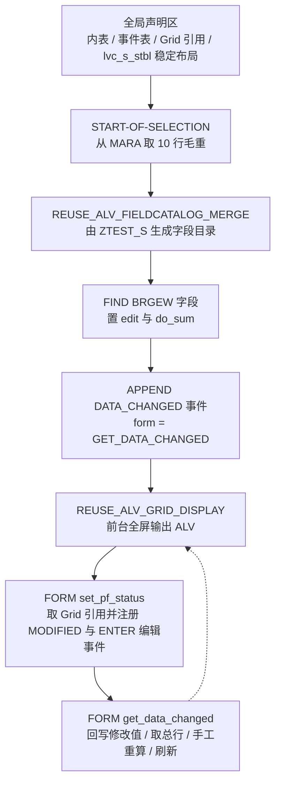
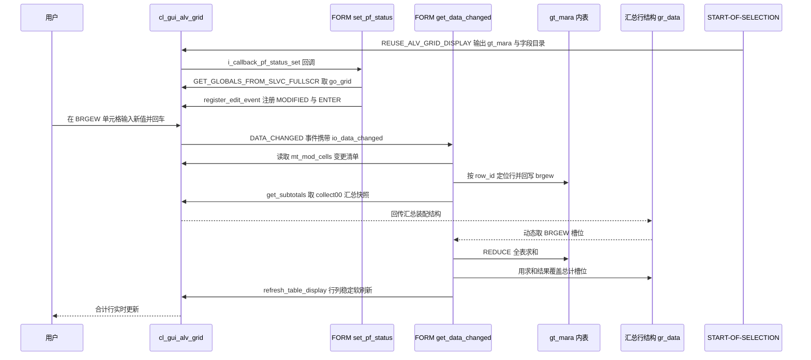

# ztest7 分析报告：可编辑 ALV 与实时合计

> 源文件：`ztest7.abap`（`REPORT ztest7`，`TYPE-POOLS: slis`）
> 报告类型：代码 onboarding 走读

---

## 一、程序定位与业务背景

### 1.1 它解决什么问题

这是一份典型的**验证性程序（Proof of Concept）**，它要回答的是 SAP ALV 开发中的一个具体问题：

> "让用户在 ALV 报表里直接改数字单元格，并且合计行在每次修改后立刻正确重算，需要哪些 API、哪些事件、哪几步必须手工处理？"

ABAP 传统 `REUSE_ALV_GRID_DISPLAY` 出来的 ALV 报表本质是**只读清单**——屏幕上的数字来自 `MARA`（物料主数据），用户改不了。要让它"可编辑 + 可实时汇总"，就必须补上三件事：

1. 把 ALV 的 `DATA_CHANGED` 事件打开，并把某个字段的 `edit` 属性置上；
2. 在事件回调里把用户在屏幕上的新值**回写到内表**，否则内表还是老值，后续任何运算都会用错数据；
3. 合计（`do_sum`）由 Grid 控件自己算，但**总行**（Grand Total）需要单独用 `get_subtotals` 取回来，并且**编辑之后 Grid 不会自动重算总行**，必须自己算、自己刷。

本程序 `ztest7` 就是把这三件事串成一条可运行的最小链路：从 `MARA` 取毛重 `BRGEW`，在 ALV 里让用户改毛重，改完立刻在总行看到新合计。它回答的是"能不能行、API 怎么串"，而不是"毛重业务上允不允许改"。

### 1.2 整体设计范式（一句话定性）

**单报表 + 回调驱动的事件驱动式 ALV 增强**：所有交互逻辑集中在 `START-OF-SELECTION` 拉起的两个 `FORM` 回调里（`set_pf_status` 负责接管 Grid 引用，`get_data_changed` 负责数据回写与重算），数据源是裸 `SELECT ... UP TO 10 ROWS` 的教学式取数，没有任何 ZDDIC 之外的业务语义。

> 必须先说清楚的一点：`_mara`（单下划线）是 SAP **提取数据时的临时内表命名约定**，一个正式的 Z 程序里不会用它持久保存数据。这个命名本身就暗示了"程序是拿来做实验的"。

---

## 二、程序执行流程总览

### 2.1 主流程图



### 2.2 责任链

| 子程序 | 调用者 | 职责 |
| --- | --- | --- |
| 全局声明区 | 编译期 | 声明 `gt_mara` / `gt_fieldcat` / `gt_events` / `go_grid` / `gs_stable` / `gr_data`，以及字段符号 `<gtr_sum_tab>` |
| `START-OF-SELECTION` | SAP 运行时进入报表时 | 取数 → 生成字段目录 → 标记可编辑与合计 → 注册 `DATA_CHANGED` → 输出全屏 ALV |
| `REUSE_ALV_FIELDCATALOG_MERGE` | `START-OF-SELECTION` | 以 DDIC 结构 `ZTEST_S` 为蓝本，反查该程序用到的字段，生成 `slis_t_fieldcat_alv` |
| `REUSE_ALV_GRID_DISPLAY` | `START-OF-SELECTION` | 前台全屏显示 ALV，触发 `set_pf_status` 回调 |
| `FORM set_pf_status` | `REUSE_ALV_GRID_DISPLAY`（`i_callback_pf_status_set`） | 用 `GET_GLOBALS_FROM_SLVC_FULLSCR` 拿到 `go_grid`，注册 `mc_evt_modified` 与 `mc_evt_enter`，让单元格进入编辑模式 |
| `FORM get_data_changed` | Grid 事件 `DATA_CHANGED`（用户改值并回车或离开单元格） | 把屏幕新值写回 `gt_mara`，`get_subtotals` 取总行，手工 `REDUCE` 重算合计并回写，再 soft refresh |
| `FORM get_subtotals`（Grid 方法） | `FORM get_data_changed` | 取回汇总行装配结构，程序再从中定位总计行 |
| `FORM refresh_table_display`（Grid 方法） | `FORM get_data_changed` | 以列/行稳定方式重画，避免光标跳行 |

### 2.3 为什么是这个顺序

注意 ALV 的**两段式生命周期**：显示阶段（`START-OF-SELECTION` → `REUSE_ALV_GRID_DISPLAY`）之后，程序并不会往下执行，而是进入事件循环。`set_pf_status` 与 `get_data_changed` 都不是"主流程的下一步"，而是被 Grid 在**用户交互时回调**进来的。这一点没想清楚的人读这份代码会觉得流程断裂——流程图里我用虚线标出了 `get_data_changed` 回到 ALV 的那一跳。

下面按这条流程，逐个子程序展开。

---

## 三、分组分析

### 3.1 全局声明区

```abap
DATA: gt_mara     TYPE TABLE OF ztest_s,
      gt_fieldcat TYPE slis_t_fieldcat_alv,
      gt_events   TYPE slis_t_event,
      go_grid     TYPE REF TO cl_gui_alv_grid,
      gs_stable   TYPE lvc_s_stbl,
      gr_data     TYPE REF TO data.

FIELD-SYMBOLS: <gtr_sum_tab> TYPE table.
```

**做什么** — 一次性声明本程序用到的六个全局对象：`gt_mara` 承载取自 `MARA` 的结果且行结构绑定 DDIC 结构 `ZTEST_S`；`gt_fieldcat` 存放动态生成的字段目录；`gt_events` 存放要注册到 Grid 的事件及其回调 `FORM` 名；`go_grid` 持有 Grid 控件的对象引用；`gs_stable` 保存刷新时的行/列稳定标志；`gr_data` 是一个完全泛化的 `REF TO data`，专门用来接 `get_subtotals` 的返回值；最后声明完全泛型的字段符号 `<gtr_sum_tab>`，供后面动态 `ASSIGN` 使用。

**为什么** — 这几行几乎每一行都在为"泛化 + 回调"服务。`gr_data TYPE REF TO data` 和 `<gtr_sum_tab> TYPE table` 是这里的两个关键设计选择：`get_subtotals` 的 `ep_collect00` 返回的结构是**运行期才确定**的装配行（含 subtotal 类型、行类型、以及各列的汇总值），静态类型很难精确描述，所以干脆用弱类型接住再动态拆。而 `go_grid` 之所以需要，是因为非 OO 的 `REUSE_ALV_GRID_DISPLAY` 只给你一个回调 `FORM`，要调用 `register_edit_event` / `get_subtotals` 这些实例方法，必须先把控件引用偷出来——`GET_GLOBALS_FROM_SLVC_FULLSCR` 就是干这件事的"官方后门"。

**风险与改进** —
- `gt_fieldcat` / `gt_events` 是全局对象却只在 `START-OF-SELECTION` 用一次，本可以是局部变量。放全局的代价是污染工作区、掩盖数据依赖关系。建议改为 `DATA` 局部声明。
- `gr_data` 与 `<gtr_sum_tab>` 全弱类型，编译器无法校验任何字段名与列位置，`ASSIGN COMPONENT 'BRGEW'` 写错就变成运行期 `CX_SY_CONVERSION_NO_NUMBER` 之类难查的短 dump。若目标系统支持，建议改用 `lvc_t_collect` 之类的强类型结构接 `ep_collect00`。
- 全局声明区缺少 `NO-DISPLAY`、状态栏、消息定义等常规报表声明，也说明这确实是实验程序。

---

### 3.2 事件块 `START-OF-SELECTION`

这个事件块是本程序最长的段落，按逻辑拆成四步：取数、生成字段目录、标记可编辑与合计、注册事件并输出 ALV。

#### ① 取数：从 MARA 拿 10 行毛重

```abap
  SELECT matnr,
         brgew
    FROM mara
    INTO TABLE _mara UP TO 10 ROWS.
  IF sy-subrc EQ 0.
```

**做什么** — 从物料主数据表 `MARA` 只取两个字段：物料号 `MATNR` 与毛重 `BRGEW`，用 `UP TO 10 ROWS` 截断前 10 行，结果放进提取专用内表 `_mara`。取数成功（`sy-subrc = 0`）才继续往下走。

**为什么** — 这是 ALV 验证程序的标准取数姿势：**投影取列**（只 SELECT 用得到的 2 列，不 SELECT *）+ `UP TO n ROWS` 硬限行 + 不带任何 `WHERE` 条件。三个选择各有道理：投影列避免了 `MARA` 上百个字段的内存与传输开销；限行让"用户能随便改几个数"这件事在几秒内可感知；不带 `WHERE` 则是为了让任何人拿到程序就能立刻看到结果，不需要先在选择屏上填条件。它服务的是"演示"这个目的，不是"生产可用"。

**风险与改进** —
- `SELECT` 只投影了 `MATNR`/`BRGEW`，但输出内表 `gt_mara` 的行类型是 `ZTEST_S`。`SY-SUBRC = 0` 只保证语句执行无错，**不保证列结构匹配**——如果 `ZTEST_S` 还定义了第三个字段，该字段在 ALV 里会一直是初始值。作者没有做结构校核，这里靠 DDIC 约定兜住了，属于隐式依赖。
- `IF sy-subrc EQ 0` 后没有 `ELSE`，也没给用户任何提示。取数为空时屏幕一片空白且无消息。建议补 `MESSAGE s000(...)` 或 `LEAVE LIST-PROCESSING`。
- 无 `WHERE` 意味着这是全表扫描的前 10 行；`MARA` 无默认排序，**取到哪 10 行不可重现**（不同系统/不同统计状态结果不同）。演示可接受，生产必须加 `WHERE` + 选择屏。
- `_mara` 与后续输出的 `gt_mara` 是**两张不同的表**。`_mara` 在事件块结束后就没意义了，说明这里本意应直接 `INTO TABLE gt_mara`。属于命名遗留，不是 bug，但会误导读者。

#### ② 生成字段目录：由 DDIC 结构反推字段清单

```abap
    CALL FUNCTION 'REUSE_ALV_FIELDCATALOG_MERGE'
      EXPORTING
        i_program_name         = sy-repid
        i_structure_name       = 'ZTEST_S'
      CHANGING
        ct_fieldcat            = gt_fieldcat
      EXCEPTIONS
        inconsistent_interface = 1
        program_error          = 2
        OTHERS                 = 3.
```

**做什么** — 以本程序名 `SY-REPID` 与 DDIC 结构 `ZTEST_S` 为输入，让 FM 通过 SE91 反查"这个程序里哪些字段确实被用过"，把命中的字段翻译成 ALV 字段目录条目，输出到 `gt_fieldcat`。

**为什么** — 这是 SAP 推荐的标准做法，替代手写 `APPEND ls_fcat` 的十几行样板。核心价值在于**字段目录与源程序自动同步**：如果重构时删掉了 `ZTEST_S` 里某个字段的引用，字段目录也会自动少一列，不会出现"代码已改、ALV 还显示旧列"的漂移。手写字段目录在字段改名时是典型的维护事故来源。

**风险与改进** —
- 三个异常被声明但**完全没有处理**：`EXCEPTIONS` 段之后既无 `sy-subrc` 判断也无 `MESSAGE`。三个分支被丢进一个静默的空壳，等于写了个假的错误处理。建议至少 `MESSAGE e000(ztest7)`.
- `i_structure_name = 'ZTEST_S'` 是硬编码字符，与 `gt_mara TYPE TABLE OF ztest_s` 的隐式关联重复了一遍。同样信息写两处，改结构名要改两个地方。
- 该 FM 反查 SE91，对**动态构造**的字段（如本程序用到的 `ASSIGN COMPONENT` 场景）不可靠。后续如果把列做成动态的，这里得换成手写 `ls_fcat-ref` 方案。
- 未指定 `i_extra_fprog` / `i_no_topics`，字段目录的分组与标题全部走结构描述，演示可接受，正式报表通常要补 `i_spare_feld`（隐藏列）与按钮例外。

#### ③ 把 BRGEW 标成可编辑且参与合计

```abap
      READ TABLE gt_fieldcat ASSIGNING FIELD-SYMBOL(<gs_fcat>) WITH KEY fieldname = 'BRGEW'.
      IF sy-subrc EQ 0.
        <gs_fcat>-edit = 'X'.
        <gs_fcat>-do_sum = 'X'.
      ENDIF.
```

**做什么** — 在生成好的字段目录里按字段名 `BRGEW` 定位到那一行，通过 `ASSIGNING` 拿到可直接修改的字段符号引用，然后把它的 `edit` 置 `X`（该列可被用户编辑）并把 `do_sum` 也置 `X`（该列参与合计）。定位失败就整段跳过，不报错。

**为什么** — 字段目录是 `slis_t_fieldcat_alv` 的内表，对它的修改标准姿势就是 `READ TABLE ... ASSIGNING`，这样能直接改内存里的字段目录本身，而不是"读出来 → 改 → 写回去"。`edit = 'X'` 是 ALV 允许编辑的开关；`do_sum = 'X'` 让这一列在表格底部自动出现小计。注意这两行是**唯一**让"用户能改 + 有合计"成立的地方——没有它们，后面整套 `DATA_CHANGED` 逻辑根本不会被触发，程序退化成一个只读报表。

**风险与改进** —
- 字段名硬编码 `'BRGEW'`（大写），ABAP 内核会隐式转大写所以能匹配，但这写法把"字段存在"这件事硬编码到了流程里。改成与结构联动（如循环判断 `fcat->fieldname` 是否在可编辑白名单内）更易扩展。
- **`READ TABLE` 失败被静默吞掉**（无 `ELSE` 分支）。这意味着如果 `ZTEST_S` 里字段被改名或从结构中删除，程序不报错、只显示一个不可编辑的只读报表——这种"降级而不报错"最难排查。建议失败时抛消息或至少 `WRITE` 提示。
- 业务语义问题：毛重 `BRGEW` 是**物料主数据**字段，直接在清单里让用户改并且不回写数据库，主数据与清单会立刻不一致。若这真是业务需求，必须补保存逻辑（`UPDATE mara SET brgew = ...`）+ 权限校验 + 变更记录；若只是 POC，应在代码注释或说明里写明"仅内存修改，不落库"。
- 没有对同一字段加 `fix` / `no_outtab` 之类的反向约束，也没有处理"其他字段为何不可编辑"的说明，字段级权限粒度为零。

#### ④ 注册 DATA_CHANGED 并输出全屏 ALV

```abap
      APPEND VALUE #( name = 'DATA_CHANGED' form = 'GET_DATA_CHANGED' ) TO gt_events.

      CALL FUNCTION 'REUSE_ALV_GRID_DISPLAY'
        EXPORTING
          i_callback_program       = sy-repid
          it_fieldcat              = gt_fieldcat
          it_events                = gt_events
          i_callback_pf_status_set = 'SET_PF_STATUS'
        TABLES
          t_outtab                 = gt_mara.
```

**做什么** — 往事件表 `gt_events` 里 `APPEND` 一条 `DATA_CHANGED` 事件，绑定回调 `FORM get_data_changed`（`FORM` 名用大写、事件名用带下划线的大写，FM 内部转大写匹配）；随后调用 `REUSE_ALV_GRID_DISPLAY`，把 `gt_fieldcat` 作为列定义、`gt_events` 作为事件定义、`gt_mara` 作为数据源输出全屏 ALV，并把 PF-STATUS 设置回调指向 `FORM set_pf_status`。

**为什么** — `i_callback_program = sy-repid` 是这个 FM 的核心约定：告诉 ALV"回调 `FORM` 就到当前程序里找"。由此 `i_callback_pf_status_set`、`it_events` 里的 `form = 'GET_DATA_CHANGED'` 才能被找到。`VALUE #(...)` 是行结构构造表达式，`gt_events` 的行类型是 `slis_event`，两个关键字正好对上它的 `name` / `form` 字段——比 `CLEAR ls_event. ls_event-name = ...` 的样板写法干净得多。`REUSE_ALV_GRID_DISPLAY`（而非 `..._LIST_DISPLAY`）提供的是真正的 `cl_gui_alv_grid` 控件，编辑、编辑事件、小计、刷新等能力全部依赖它。

**风险与改进** —
- `DATA_CHANGED` 只有在 `set_pf_status` 里成功注册了 `mc_evt_modified` 之后才会真正触发。这两处**必须成对成立**，而代码里两者分处两个 `FORM`、中间没有互相校验——任一处被改坏，程序会静默退化成"能编辑但合计不更新"。这是本程序最脆弱的耦合点。
- 传的是 `REUSE_ALV_GRID_DISPLAY`（全屏，带 ALV 工具栏）而非 `_LIST_DISPLAY`，但没有配 `i_callback_pf_status`（只配了 `_set`）。因此 ALV 标准工具栏的"保存/刷新/排序"等按钮走的是**标准动态函数**，用户能点"保存"，但没有任何 `FORM user_command` 去接 `SY-UCOMM`——点了不会有任何反应，容易被误认为程序失灵。要么补 `i_callback_user_command`，要么明确隐藏工具栏。
- `EXCEPTIONS` 段完全缺失（此 FM 允许省略，但作者在别处 FM 上写了三个异常，风格不一致）。`TABLES t_outtab` 在较新系统上会提示过时（应改 `it_outtab` + 显式 `is_variant` 处理），不影响运行。
- 内层没有对 `sy-subrc` 做收尾判断，`START-OF-SELECTION` 末尾没有 `END-OF-SELECTION` 逻辑，整段被三层 `IF` 包裹，缩进可达 6 层——可读性尚可但嵌套偏深。

---

### 3.3 子程序类型 `FORM set_pf_status`

这个 `FORM` 分两步：把 Grid 引用抓出来并注册编辑事件；然后处理 `SY-UCOMM`。

#### ① 抓取 Grid 引用并注册编辑事件

```abap
FORM set_pf_status USING itr_extab TYPE slis_t_extab.

* Get the ALV Object reference
  CALL FUNCTION 'GET_GLOBALS_FROM_SLVC_FULLSCR'
    IMPORTING
      e_grid = go_grid.
  IF go_grid IS BOUND.
    CALL METHOD go_grid->register_edit_event
      EXPORTING
        i_event_id = cl_gui_alv_grid=>mc_evt_modified.

    CALL METHOD go_grid->register_edit_event
      EXPORTING
        i_event_id = cl_gui_alv_grid=>mc_evt_enter.
  ENDIF.
```

**做什么** — 调用 `GET_GLOBALS_FROM_SLVC_FULLSCR`，把当前全屏 ALV 控件的引用取到全局变量 `go_grid` 里；随后判断引用是否已绑定（`IS BOUND`），若有效则调用 `register_edit_event` 两次，分别注册 `mc_evt_modified`（单元格值被修改并提交时触发）与 `mc_evt_enter`（用户在该单元格按回车时触发）。

**为什么** — `GET_GLOBALS_FROM_SLVC_FULLSCR` 是 SAP 为这个场景留的标准通道：`REUSE_ALV_GRID_DISPLAY` 是非 OO 函数，不返回控件引用，而后续大量能力（编辑事件、单元格取值、刷新）都是 `cl_gui_alv_grid` 的**实例方法**。不通过它就只能停留在 `REUSE_ALV` 的功能子集里。`IS BOUND` 判断是必要的防御：若 ALV 因异常未显示成功，`E_GRID` 就是 unbound，直接调方法会 short dump。

注册**两个**编辑事件是有意为之、也是常见做法：`mc_evt_modified` 只覆盖"值变了并离开单元格"，用户在最后一格改完直接点工具栏保存时有时收不到；加上 `mc_evt_enter` 后，用户在合计区或最后一行按回车也能强制触发一次数据同步。代价是同一次编辑可能回调两次，需要回调内部自己幂等。

**风险与改进** —
- **`REGISTER_EDIT_EVENT` 必须至少调用一次，否则编辑模式根本不开启，`mc_evt_modified` 永不触发。** 作者在正确的位置做了这件事，但没有任何注释说明"这两次调用不可省略"，后来者极易在"清理冗余代码"时删掉。这属于高危知识，应写成注释或提到变量声明处。
- `go_grid` 是全局变量，生命周期超出 `FORM`。若报表被重复执行（例如在同一会话中再次进入、或后台调用），残留的 `go_grid` 可能指向已销毁控件。稳健做法是在 `START-OF-SELECTION` 开头 `CLEAR go_grid`，或每次显示前重新赋值（当前代码确实每次都重新赋值，风险被掩盖）。
- 两个事件都注册、而 `get_data_changed` 未做重复触发防护 → `REDUCE` 会被算两遍、`refresh_table_display` 被调两次。虽然本例重算是幂等的（纯求和），但一旦以后加了"求平均值""累加到全局变量"之类非幂等逻辑，就是隐性 bug。建议在回调里用 `io_data_changed->mprotocol` 或一个 `TIME`/`SY-TIMESTAMP` 判重。
- `set_pf_status` 的形参 `itr_extab`（扩展工具栏）完全没用到。保留形参是因为 FM 调用协议要求，可接受，但形参未使用会让读者误以为漏了功能。
- 这个 `FORM` 里混了**两件不相干的事**：控件初始化 + `SY-UCOMM` 派发。见下一步。

#### ② 处理 SY-UCOMM（当前为空实现）

```abap
  " PF Status Code
  CASE sy-ucomm.
*	WHEN
    WHEN OTHERS.
  ENDCASE.
ENDFORM.
```

**做什么** — 一个空的 `CASE`：`WHEN OTHERS.` 分支体是空的，注释掉了一行 `WHEN` 占位。整个 `CASE` 不改变任何数据、不做任何动作，等价于一句 `sy-ucomm.`。

**为什么** — 这是作者预留的扩展骨架。编辑器行为是：数据全走 `DATA_CHANGED` 事件，工具栏按钮属于另一条链路（`i_callback_user_command` + `FORM user_command`）。作者想留一个统一的 `CASE` 位置，但**放错了 `FORM`**：`SET_PF_STATUS` 只负责设置状态栏，不是用户命令的派发点。真正该读 `SY-UCOMM` 的是 `FORM user_command`，而且注册回调时必须传 `i_callback_user_command`，本程序**没有传**。所以这一段是死代码加误导代码。

**风险与改进** —
- 空 `CASE` + 注释掉的 `WHEN` 是明确的误导：读者会以为"点按钮已有处理，只差补分支"，而实际上**回调通道根本没接通**。建议要么删掉，要么补 `i_callback_user_command = 'USER_COMMAND'` 与配套 `FORM` 后再写分支。
- `sy-ucomm` 在 PF-STATUS 回调里取值是**语义错位**：此时它通常仍是上一次事件的值，把它当命令分发依据会读到过期状态。这正是应当删除该 `CASE` 的核心理由。
- 若未来要实现"保存"动作，`SY-UCOMM` 的 `SAVE` 还要在 `FORM` 里检查 `RSU_IS_USING_LAYOUT_GUI` 之类，且必须区分"用户真的点了保存"与"ALV 自动触发"，否则会重复写库。

---

### 3.4 子程序类型 `FORM get_data_changed`

这是全程序技术含量最高的地方，分四步：回写数据、取小计装配、手工重算总计、刷新显示。

#### ① 把屏幕上的新值写回内表

```abap
FORM get_data_changed USING io_data_changed TYPE REF TO cl_alv_changed_data_protocol.

  IF go_grid IS BOUND.

    LOOP AT io_data_changed->mt_mod_cells ASSIGNING FIELD-SYMBOL(<gs_changed>) WHERE fieldname = 'BRGEW'.
      READ TABLE gt_mara ASSIGNING FIELD-SYMBOL(<gs_tab>) INDEX <gs_changed>-row_id.
      IF sy-subrc EQ 0.
        <gs_tab>-brgew = <gs_changed>-value.
      ENDIF.
    ENDLOOP.
```

**做什么** — 进入回调后先确认 `go_grid` 已绑定，然后遍历 `DATA_CHANGED` 协议对象里的 `mt_mod_cells`（本次用户改动的单元格清单），只用 `WHERE fieldname = 'BRGEW'` 过滤出毛重列；对每个改动单元格，取它的 `row_id`（行号）用 `INDEX` 到 `gt_mara` 里定位到对应行，把协议里的新 `value` 直接赋给该行的 `BRGEW` 字段。定位失败则跳过。

**为什么** — 这是 ALV 可编辑场景的**第一性原理**：`REUSE_ALV_GRID_DISPLAY` 用的是 `TABLES t_outtab` 传内表，ALV 显示的是它自己内部的一份副本。用户在屏幕上改数字，只改了控件内的值，**`gt_mara` 完全不知情**。任何后续运算（包括合计、导出、后续 `MODIFY`）都会读到旧值。所以必须手工把新值回写，这就是整个程序存在的理由。

筛选 `mt_mod_cells` 而不是无条件处理，是必要的防御：`mt_mod_cells` 里可能包含用户在其他列的改动（本例只有 `BRGEW` 可编辑，但 `DATA_CHANGED` 事件是整表级别的），限定 `fieldname` 保证只处理自己负责的那一列。用字段符号 `ASSIGNING` 避免复制整行，是性能上的正确选择。

**风险与改进** —
- **`ASSIGN` 到未赋值字段符号的经典崩溃风险**：`ASSIGNING FIELD-SYMBOL(<gs_tab>)` 在 `READ TABLE` 未命中时不会赋值，但代码先判断 `sy-subrc` 再使用，顺序正确。不过 `READ TABLE ... ASSIGNING` 在结构化行类型上的行为是把字段符号**指向整行**，后续 `<gs_tab>-brgew` 直接改内表行——这是对的写法，比 `READ ... INTO` 再 `MODIFY` 强得多。保持。
- **完全没有区分 `ALV_CHANGED_DATA_PROTOCOL` 的 `m_data_changed` 分支**。该类除了单元格值，还有单元格样式、字段属性的变更（如 `IT_FIELDCAT` 更新）；真实项目里标准写法是按 `io_data_changed->m_data_changed = abap_true` 分派不同处理。本例只有值变更，勉强成立，但没有把这层区分显式写出来，遇到"用户改列宽/隐藏列也触发回调"时会误导。
- `mt_mod_cells` 是**逐格变更**清单，若用户用 ALV 的"整列填充/粘贴"一次改 1000 行，循环里就是 1000 次 `READ TABLE`（每次 O(1) 定位，尚可接受），但没有走 `io_data_changed->modify_cell()` / `add_protocol_entry` 这类协议 API，属于"绕过协议直接改内表"。绕过协议的代价是：**ALV 不知道哪些单元格被你程序改过**，后续如果有排序、过滤、导出，内表与屏幕的对应关系需要你自己保证。
- 错误处理仅 `IF sy-subrc EQ 0`。数据不一致被静默吞掉。可接受但建议留 `WRITE` 或消息，至少在开发期可查。
- 业务层遗留：回写只改内存、不落库、不记日志、不做权限校验（同 3.2 ③）。另外**没有做任何合法性校验**——毛重被改成负数、超出 `BRGEW` 的定义范围（如超出 `MARA-BRGEW` 的 13 位 3 小数）时，`REDUCE` 求和或后续写库都可能溢出或产生非法的 `QUAN` 值。编辑型 ALV 至少要加一行范围校验 + `MESSAGE` 反馈。

#### ② 取回汇总装配结构

```abap
    go_grid->get_subtotals(
      IMPORTING
        ep_collect00 = gr_data   " Overall Total
    ).

    ASSIGN gr_data->* TO <gtr_sum_tab>.
    READ TABLE <gtr_sum_tab> ASSIGNING FIELD-SYMBOL(<l_sum>) INDEX 1.
    IF sy-subrc EQ 0.
```

**做什么** — 调用 Grid 实例方法 `get_subtotals`，把编号 00（Overall Total，即整表总计）的汇总行装配结构取到弱类型引用 `gr_data` 里；再用 `ASSIGN gr_data->*` 把这个装配结构整体解引用到泛型内表字段符号 `<gtr_sum_tab>`，然后读它的**第 1 行**到字段符号 `<l_sum>`，读失败就不处理。

**为什么** — `DO_SUM = 'X'` 只让 Grid 在**显示层面**画出小计行。用户一旦编辑，Grid 会自己重算**分组小计**（`do_sum` 那几行），但**总计行（Grand Total）**是否重算、何时重算，Grid 的行为是不可靠的——这正是本程序要手工接管的原因。`get_subtotals` 是唯一能"读出"Grid 内部汇总结果的官方 API，`ep_collect00` 对应 collect level 00，也就是整表总计。参数名带 `ep_`（pass by parameter）而非 `et_`（table），接收的是一个包含多列汇总值的**单行结构**，所以后面要 `READ ... INDEX 1` 把它当成"只有一行的内表"来读——这是这段代码最反直觉、也最需要注释的地方。

**风险与改进** —
- `ASSIGN gr_data->*` 用在**非 typed 引用**上（`REF TO data`）是本程序里风险最高的一行。它依赖运行期类型恰好是内表；一旦 Grid 版本变化返回了结构而非内表，会直接 `CX_SY_ASSIGN_ERROR` 短 dump，而且 SE38 编译期完全测不出来。正确做法是显式声明 `DATA lt_collect TYPE lvc_t_collect`，用 `et_collect00 = lt_collect` 直接接，让编译器守住类型。
- `ASSIGN COMPONENT 'BRGEW'`（下一步）用的是**字段目录里的显示字段名**，而 `get_subtotals` 的汇总行字段名是按 ALV 字段名的**内部大小写**（通常全大写）组织的。此处恰好同为 `BRGEW` 才能对上；字段一改名就断。至少应加注释说明这是"显示名即内部名"的隐含前提。
- 全程没有检查 `get_subtotals` 是否有 `EXCEPTIONS`。该方法在 Grid 已释放时会失败。
- `mt_mod_cells` 为空（用户进单元格没改值就退出）时，这套取总计 + 重算 + 刷新照样全跑一遍，属于无效工作。真实项目应先 `IF mt_mod_cells IS INITIAL. RETURN. ENDIF.` 短路，直接省掉绝大部分刷新开销。

#### ③ 手工重算总计并写回

```abap
      ASSIGN COMPONENT 'BRGEW' OF STRUCTURE <l_sum> TO FIELD-SYMBOL(<lg_val>).
      IF <lg_val> IS ASSIGNED.
        <lg_val> = REDUCE #( INIT lv_i TYPE ntgew_15 FOR <ls_t> IN gt_mara NEXT lv_i = lv_i + <ls_t>-brgew ).
      ENDIF.
```

**做什么** — 从总计行结构里**按组件名 `BRGEW`** 动态取出该列的汇总值槽位到字段符号 `<lg_val>`，槽位存在则用 `REDUCE` 表达式对 `gt_mara` 全表做一次内建 `FOR` 累加，把每行 `BRGEW` 求和后**直接写回这个槽位**，从而覆盖 Grid 给出的旧总计。

**为什么** — 理解这段的关键是：**`GET_SUBTOTALS` 取回的是"编辑前"的快照**。程序不去逐位修补 Grid 的汇总，而是**用当前内表 `gt_mara`（已在步骤 ① 回填了新值）重新算一遍**，结果直接覆盖汇总行对应的列槽位。这是一种"以数据源为准、覆盖缓存"的策略，比尝试增量修补 Grid 内部结构可靠得多——因为 `gt_mara` 是我们自己唯一的事实来源，它的求和结果必然与屏幕数据一致。

用 `REDUCE #( ... )` 做求和是现代 ABAP 的惯用法，替代了传统 `LOOP ... lv_sum = lv_sum + ... ENDLOOP.`，好处是无副作用、就地表达意图、可读性高。动态取组件而非静态 `ls_sum-brgew`，是为了适配 `get_subtotals` 那个通用装配结构（里面是任意列名的槽位，只能按名取）。

**风险与改进** —
- **类型语义错配，需要重点标注**：`INIT lv_i TYPE ntgew_15` 用的是 **`NTGEW`（净重）** 的数据元素来累加 **`BRGEW`（毛重）**。两者在 `MARA` 中都是 `QUAN` 类、带 3 位小数，**长度与小数位恰好兼容，编译能过、运行也不报错**——但业务语义是错的：拿"净重"的类型去装"毛重"的和。净重与毛重是两个独立的业务量（毛重 = 净重 + 包装重），不存在换算关系，这种"碰巧类型兼容"的写法一旦被后人"照抄"到净重场景，会得到一个单位错误却无人察觉的合计。**必须改为 `TYPE brgew`（或 `mara-brgew`）**，让类型自己说出业务含义。
- 同样的问题存在于这个程序的取数侧：选的是 `BRGEW`，而"物料数量"类需求通常真正想要的是 `NTGEW`。如果需求本意是净重，那取数字段本身就选错了——建议先向需求方确认"要合计的是毛重还是净重"，因为这两个数在业务上不等价。
- `REDUCE` 的结果 `<lg_val>` 的数据类型由槽位本身决定（右值隐式转换），而左值求和变量是 `ntgew_15`。如果 `gt_mara` 的行数很多，累加溢出时 ABAP 默认**不抛异常而是截断/溢出报错行为依版本而异**，此处无溢出保护。建议对行数与量级做边界考虑。
- `ASSIGN COMPONENT` 的失败仅靠 `IS ASSIGNED` 静默跳过。组件名拼错（如写成 `brgwe`）在弱类型下编译期毫无提示，运行后表现为"合计永远不更新"。至少应有消息。
- 全程没有区分"合计行当前是否真的可见/是否有 collect 行"，如果用户按了"隐藏合计"或 Grid 未渲染总计，`get_subtotals` 返回的 `collect00` 可能为空，此时整段静默无效——用户会看到合计没变却得不到任何提示。
- 效率：全表 `REDUCE` 是 O(n)，在真实报表动辄几千行、且每次编辑都触发一次的情况下，虽然量级可接受，但配合步骤 ④ 的整表 soft refresh 会明显拖手。更好的做法是维护一个增量累计值，只在数据真正变化时更新。

#### ④ 以行/列稳定方式刷新显示

```abap
    gs_stable-col = 'X'.
    gs_stable-row = 'X'.

    go_grid->refresh_table_display(
      EXPORTING
        is_stable      = gs_stable      " With Stable Rows/Columns
        i_soft_refresh = 'X'            " Without Sort, Filter, etc.
      EXCEPTIONS
        finished       = 1              " Display was Ended (by Export)
        OTHERS         = 2
    ).
    IF sy-subrc <> 0.
    ENDIF.
```

**做什么** — 先给全局结构 `gs_stable` 的 `col` 与 `row` 字段都置 `X`，表示刷新时**行与列位置都保持稳定**（不因重画而跳行）；然后调用 `refresh_table_display`，用 `i_soft_refresh = 'X'` 做**软刷新**（只重画数据，不重置排序、过滤、选中等控件状态）；两个异常被声明，`finished` 表示显示已因导出等原因结束。

**为什么** — 这是整段代码里体验价值最高的一行设计。刚改完一个单元格就整表重画，用户的行会跳回原位、光标丢失、正在输入的连续编辑被打断——逐格录入毛重的体验会非常痛苦。`is_stable` + `i_soft_refresh` 正是为此而生：保留用户当前的排序/过滤/滚动位置，只把数据刷新进去。这一行让 POC 从"能跑"变成"能用"。

注意注释 `i_soft_refresh = 'X'  " Without Sort, Filter, etc.` 容易误读：它指的是**不重置**排序过滤，而不是"没有排序过滤功能"。SAP 的这类注释经常这样写，属于历史遗留的误导性表述。

**风险与改进** —
- **空的 `IF sy-subrc <> 0. ENDIF.` 是纯粹的噪音**：声明了 `finished` 和 `OTHERS` 两个异常却什么都不做，等于没有错误处理。要么按 `sy-subrc` 区分"显示已结束（正常，直接退出）"与"其他错误（报消息）"，要么把异常段删掉。本程序三处存在同样问题（`start-of-selection` 的 FM、`get_subtotals`、`refresh_table_display`），属于一致性的坏习惯。
- `gs_stable` 是全局对象，每次都重设成 `'X'/'X'` 属于重复赋值。若将来要按上下文切换（如编辑完恢复原排序），应显式判断。
- `i_soft_refresh = 'X'` 有一个**易被忽略的副作用**：软刷新**不重算排序与过滤**，意味着若用户在编辑后数据变化影响了排序键（本例排序键若为 `BRGEW`，用户改的正是它），屏幕顺序会与数据实际顺序不一致，直到用户手动重排。同理，若用户之前设了过滤条件，新数据不在过滤范围内会看不到。对"合计随编辑变化"的场景，`soft_refresh` 是对的（保体验）；但需要意识到排序不刷新的语义。
- `refresh_table_display` 在 `DATA_CHANGED` 回调里同步调用，而 `register_edit_event` 又同时注册了 `mc_evt_modified` 与 `mc_evt_enter`。**同一次编辑可能触发回调两次 → 两次 `refresh_table_display`**，在极端情况下会与控件的内部状态机产生竞争。这是 3.3 ① 提到的双事件注册的必然代价，建议只保留 `mc_evt_modified`，或在回调里做防重入。
- 异常 `finished` 的正确处理是**静默退出**（这是用户按导出/正常结束时触发的，不是错误），其余才需要提示。当前代码把两者混在一起空处理，等于把错误也静默了。

---

## 四、执行流程全景图（数据视角）



图里最值得注意的是**数据方向是双向的**：屏幕 → 内表（步骤 ① 回写），内表 → 屏幕（步骤 ③ 重算 + ④ 刷新）。中间那层"汇总行结构 `gr_data`"只是一个临时快照，不是权威数据源。任何时候权威数据都在 `gt_mara`——这一条理解到位，整段代码的逻辑就通了。

---

## 五、问题清单与改进建议（按优先级）

### 🔴 P0 业务正确性

| # | 问题 | 所在子程序 | 影响 / 建议 |
| --- | --- | --- | --- |
| P0-1 | **数据类型语义错配**：`REDUCE` 用 `ntgew_15`（净重）累加 `brgew`（毛重），类型碰巧兼容故不报错，但业务含义错误 | `FORM get_data_changed` | 改为 `TYPE brgew`；并向需求方确认合计对象究竟是毛重还是净重，两者不可互换 |
| P0-2 | **可编辑主数据却不落库**：允许用户直接改 `MARA` 的毛重，无保存、无 `UPDATE`、无变更记录、无权限校验 | `FORM get_data_changed` | 若为真实需求，补保存 `FORM` + 权限对象 + 审计日志；若为 POC，必须在代码中显式注释"仅内存、不落库" |
| P0-3 | **无输入合法性校验**：毛重可被改成负数或超出 `BRGEW` 定义范围的值，直接进入求和与后续业务 | `FORM get_data_changed` | 回写时加范围/符号校验，失败用 `MESSAGE` 阻断并保持原值 |
| P0-4 | **依赖 DDIC 隐式匹配未校核**：`SELECT` 只投影 2 列，内表行类型却是 `ZTEST_S`（可能更多字段），列与结构不匹配时静默显示空值 | `START-OF-SELECTION` | 明确 `ZTEST_S` 与 `MARA` 投影列的一致性；不匹配就编译期暴露而非运行期空白 |

### 🟠 P1 健壮性

| # | 问题 | 所在子程序 | 影响 / 建议 |
| --- | --- | --- | --- |
| P1-1 | **`get_subtotals` 错误使用无类型引用**：`ASSIGN gr_data->*` 作用于 `REF TO data`，编译期零校验、运行期可能 short dump | `FORM get_data_changed` | 改用 `DATA lt_collect TYPE lvc_t_collect` 强类型接收 |
| P1-2 | **多处 `EXCEPTIONS` 声明后零处理**（`REUSE_ALV_FIELDCATALOG_MERGE` 三个、`refresh_table_display` 两个、全局空的 `IF sy-subrc <> 0`） | `START-OF-SELECTION` / `FORM get_data_changed` | 逐个补 `MESSAGE`；`finished` 应静默退出，其余报错 |
| P1-3 | **用户命令通道未接通**：只配了 `i_callback_pf_status_set`，没配 `i_callback_user_command`，而 `set_pf_status` 里的 `CASE sy-ucomm` 是死代码且语义错位 | `FORM set_pf_status` | 删除该空 `CASE`；确需按钮行为则补 `i_callback_user_command` 与配套 `FORM` |
| P1-4 | **双编辑事件 + 同步刷新可能重复触发**：`mc_evt_modified` 与 `mc_evt_enter` 同时注册，回调无防重入 | `FORM set_pf_status` / `FORM get_data_changed` | 只保留 `mc_evt_modified`，或在回调内做幂等保护 |
| P1-5 | **失败路径全部静默**：`READ TABLE` 找不到 `BRGEW`、取不到行、组件名不匹配，都不提示 | `START-OF-SELECTION` / `FORM get_data_changed` | 关键分支补 `ELSE MESSAGE`；开发期至少 `WRITE` |
| P1-6 | **`go_grid` 为全局引用，跨多次报表执行可能残留** | `FORM set_pf_status` | `START-OF-SELECTION` 开头 `CLEAR go_grid`，或在事件结束后解绑 |
| P1-7 | **空变更仍走完整流程**：`mt_mod_cells` 为空时照样求和 + 刷新 | `FORM get_data_changed` | 开头加 `IF io_data_changed->mt_mod_cells IS INITIAL. RETURN. ENDIF.` |

### 🟡 P2 性能与规范

| # | 问题 | 所在子程序 | 影响 / 建议 |
| --- | --- | --- | --- |
| P2-1 | **每次编辑全表 `REDUCE` + 全表 soft refresh**，真实报表（数千行）下手感会明显变差 | `FORM get_data_changed` | 维护增量合计；或分批/延迟刷新 |
| P2-2 | **绕过 `ALV_CHANGED_DATA_PROTOCOL` 直接改内表**，ALV 不知哪些单元格被程序改动 | `FORM get_data_changed` | 用 `modify_cell` / `add_protocol_entry` 让协议保持一致 |
| P2-3 | **`UP TO 10 ROWS` 不带 `WHERE`**，全表扫描取前 10 行，命中行不可重现 | `START-OF-SELECTION` | 生产必须加选择屏 + `WHERE` + 明确排序 |
| P2-4 | **硬编码字符串 `'BRGEW'`、`'ZTEST_S'`** 散落各处，与类型声明重复 | 全局声明区 / `START-OF-SELECTION` / `FORM get_data_changed` | 集中定义为常量，或以字段符号驱动 |
| P2-5 | **全局内表 `gt_fieldcat`/`gt_events` 实际只需局部作用域** | 全局声明区 | 改为 `START-OF-SELECTION` 内局部 `DATA` |
| P2-6 | **误导性注释** `"Without Sort, Filter, etc."` 实为"不重置排序过滤" | `FORM get_data_changed` | 修正注释为"保留排序/过滤状态" |
| P2-7 | **`CASE sy-ucomm. * WHEN` 注释掉的占位符** | `FORM set_pf_status` | 整段删除，注释掉的代码是长期噪音 |

### 🟢 P3 可扩展性

| # | 问题 | 所在子程序 | 影响 / 建议 |
| --- | --- | --- | --- |
| P3-1 | **只能编辑一列**，扩展到多列需复制整段 `LOOP` 与 `ASSIGN COMPONENT` | `FORM get_data_changed` | 把可编辑字段做成白名单内表，循环驱动回写与合计 |
| P3-2 | **无分组小计层次**（只用 `collect00` 整表总计） | `FORM get_data_changed` | 需要按物料类型分组小计时引入 `collect01+` 与对应 `do_sum` 策略 |
| P3-3 | **依赖 `REUSE_ALV_FIELDCATALOG_MERGE` 的 SE91 反查**，动态构造字段不支持 | `START-OF-SELECTION` | 列定义若要动态化，改手写 `ls_fcat-ref` |
| P3-4 | **无 ALV 变式（layout variant）支持** | `START-OF-SELECTION` | 真实报表应接入 `REUSE_ALV_VARIANT_F4` 与变式保存 |
| P3-5 | **`mt_mod_cells` 只处理值变更**，未区分样式/属性类变更 | `FORM get_data_changed` | 按 `m_data_changed` 分派，或显式注释本例只有值变更 |

---

## 六、整体评价与启发

### 6.1 优点

1. **把 POC 该有的要素凑齐了**。为了回答"ALV 能不能编辑 + 合计能不能实时"这一个技术问题，本程序不引入选择屏、不引入 Z 表、不引入保存逻辑，只保留最短链路。这对验证性代码是**正确的克制**——很多技术验证代码失败的原因不是技术难，而是把非必要的东西一起做了。
2. **`DATA_CHANGED` + `get_subtotals` + `refresh_table_display` 这三段组合拳，是 ALV 可编辑报表的标准解法**。特别是"用 `REDUCE` 以数据源为准覆盖 Grid 汇总快照"这个思路，比尝试增量修补 Grid 内部状态要稳健得多，值得记住。
3. **`is_stable` + `i_soft_refresh` 这一行是全文最见功力之处**。新人往往只写 `refresh_table_display( )` 了事，写完觉得"怎么一改就跳行"，然后误以为是 Bug。作者显然在实际使用中踩过这个坑。
4. **现代 ABAP 语法用得地道**：`VALUE #( ... )` 构造行、`READ TABLE ... ASSIGNING FIELD-SYMBOL( )` 直接改内表、`REDUCE #( ... FOR ... NEXT ... )` 内建求和、`go_grid->method( )` 实例方法调用——语法层面没有炫技，每一处都在缩短样板代码。

### 6.2 短板

1. **类型语义与业务语义双双缺席**。`ntgew_15` 累加 `brgew` 是最典型的反面案例：长度匹配所以不报错，ABAP 层面"正确"，业务层面完全错误。这说明作者把 ALV 当成了纯技术对象，而没有把"MARA 里这两个重量字段各自代表什么"纳入设计。
2. **错误处理是形式主义**。四处声明了 `EXCEPTIONS`，零处真正处理；连 `IF sy-subrc <> 0. ENDIF.` 这种空壳都留着。这比不写异常更糟——它营造了"已处理"的错觉。
3. **可编辑主数据却无持久化闭环**。程序停在"改了内存里的值"，没有下一步。作为 POC 可接受，但代码里没有任何注释说明这个边界，后来者极易误以为"改完就生效"。
4. **两段本该合并的职责被拆散**。控件初始化在 `set_pf_status`，数据处理在 `get_data_changed`，两者的正确性互为前提却无任何交叉校验，任何一处被删掉都会静默退化。

### 6.3 可学到的设计经验

- **可编辑 ALV 的闭环是四步，缺一不可**：字段目录 `edit = 'X'` → 注册编辑事件 → 事件回调里回写内表 → 刷新显示。少任何一步，现象都是"能改但数据不对"，且都不报错。本程序最有价值的地方在于它把四步写全了——新手照着这个骨架能一次做对。
- **"谁的数据说了算"要有明确答案**。这个程序里 `gt_mara` 是唯一事实来源，Grid 的汇总只是可随时丢弃的缓存。理解到这一层，"为什么要手工重算"这个问题自动消失——不是 Grid 不会算，是**我们不信任过期的缓存**。这个原则在设计任何"UI + 数据"双副本的场景都成立。
- **弱类型是把双刃剑**。`REF TO data` + `TYPE table` + `ASSIGN COMPONENT` 三件套让代码"跑起来了"，代价是编译器完全失去防护能力，SAP 的 SE38 再也帮不上忙。**能用强类型表达的地方就用强类型**；实在动态，也要在注释里写清"这段为什么必须动态"以及"改成什么样子可以静态"。
- **体验优化的成本极低，收益极高**。两行 `gs_stable-col/row = 'X'` + `i_soft_refresh = 'X'`，把"能用"变成"好用"。写 ALV 报表时，值得把 `refresh_table_display` 的参数当成默认模板背下来。

### 6.4 如果要把它变成生产程序

按这个顺序改，收益递减但都很值：① 修 `ntgew_15` → `brgew`，并确认业务要的是毛重还是净重；② 补 `EXCEPTIONS` 处理与 `MESSAGE`，删掉所有空壳 `IF`/`CASE`；③ 补保存链路 + 权限 + 审计日志 + 输入校验；④ 换成 `lvc_t_collect` 强类型，消除 `ASSIGN gr_data->*`；⑤ 用可编辑字段白名单改造 `get_data_changed`，让它能处理多列；⑥ 补 ALV 变式与空变更短路。
