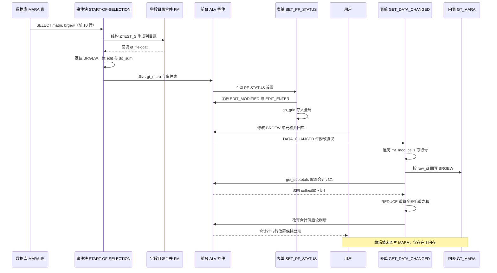

# ztest7 分析报告：经典 ALV 的"可编辑列 + 手工接管合计"技术验证

## 一、程序定位与业务背景

先把话说在前面：**`ztest7` 不是一个业务程序，是一份技术验证件（PoC）**。它没有任何选择屏、没有业务校验、没有保存动作，程序名 `ztest7` 也直接说明了这一点。读这份代码时，如果按"一个物料重量维护报表"去理解，会一路找业务规则然后发现根本不存在；正确的读法是——**它只回答一个技术问题："ALV 里那一列能不能改？改了之后底部的总计能不能跟着变？"**

这个问题为什么需要单独立一个程序？因为答案不是"天然能"。SAP 的可编辑 ALV 有两个众所周知的坑：

1. **编辑能力不是打开 `EDIT = 'X'` 就完事**。经典 ALV（`REUSE_ALV_GRID_DISPLAY`）里单元格可以显示为可编辑样式，但真正把改动内容封装成 `CL_ALV_CHANGED_DATA_PROTOCOL` 抛回程序，必须显式向 `CL_GUI_ALV_GRID` 注册 `EDIT_MODIFIED` / `EDIT_ENTER` 事件。不注册，`DATA_CHANGED` 永远不来，程序看起来"能改"，其实改完什么都没发生。
2. **可编辑列和自动合计是一对老冤家**。一旦 `DO_SUM = 'X'`，ALV 会在底部画合计行；但用户改完单元格之后，`REFRESH_TABLE_DISPLAY` **不会重算小计**，合计行会顽固地显示改之前的旧值。这不是 bug，是控件设计上的取舍（小计需要用户自己通过布局或排序触发），但对"改一个数、合计立刻变"的业务预期就是硬伤。

`ztest7` 选的解法很有代表性：**用 `GET_SUBTOTALS` 把合计行的那条记录原样取回来，自己用 `REDUCE` 算出正确总和再写回去，然后软刷新**。这是社区里流传的标准绕法——不是官方 API，但确实work，而且代价可控。整份程序就是围绕这一个绕法搭的骨架。

**整体设计范式一句话定性**：单程序、表单回调式（非 OO）的经典 ALV，采用"取数 → 生成字段目录 → 打开编辑 → 注册编辑事件 → 接住单元格改动 → 手工改写合计行 → 稳定刷新"的**补丁式交互链路**，把控件不提供的能力在程序侧补齐。

业务上被假想的场景也很清楚：某个场景需要**在一屏内直接维护物料毛重，并即时看到这批物料的毛重合计**（比如包装规格变更后的重量核对）。但请注意，这份程序只做到"改完能看到合计变化"就停了，**改完的值不落库、不校验、不留痕**——所以它是"演示到一半"，不是"做完"。

---

## 二、程序执行流程总览

程序很短，主干只有一个事件块加两个 FORM，但控制流有一个容易看漏的地方：`SET_PF_STATUS` 不是你调用的，是 `REUSE_ALV_GRID_DISPLAY` 在创建控件**之后**回调进来的，所以它的执行位置夹在"显示"和"用户编辑"之间。

```mermaid
flowchart TD
  A["START-OF-SELECTION 从 MARA 取前 10 行毛重"]
  B["REUSE_ALV_FIELDCATALOG_MERGE 由结构 ZTEST_S 生成列目录"]
  C["READ TABLE gt_fieldcat 打开 BRGEW 的编辑与合计"]
  D["APPEND gt_events 挂 DATA_CHANGED 回调"]
  E["REUSE_ALV_GRID_DISPLAY 全屏接管并显示可编辑 ALV"]
  F["SET_PF_STATUS 取 ALV 控件引用并注册编辑事件"]
  G["GET_DATA_CHANGED 接住单元格修改事件"]
  H["遍历 mt_mod_cells 定位被改的 BRGEW 单元格"]
  I["按 row_id 回写 gt_mara 对应行"]
  J["get_subtotals 取回合计行记录"]
  K["REDUCE 重算毛重合计并改写合计行"]
  L["refresh_table_display 稳定软刷新"]

  A --> B --> C --> D --> E
  E -.-> "控件已实例化，回调" --> F
  F --> G
  G --> H --> I --> J --> K --> L
  L -.-> "用户继续编辑再次触发" --> G
```

责任链表（按真实执行先后排列）：

| 子程序 | 调用者 | 职责 |
|---|---|---|
| 全局声明区 | 系统加载程序时 | 集中持有内表、字段目录、事件表、控件引用、动态合计句柄 |
| `START-OF-SELECTION` | ABAP 运行时（用户执行报表） | 取数、装配字段目录、挂事件、调 ALV 显示 |
| `REUSE_ALV_FIELDCATALOG_MERGE` | `START-OF-SELECTION` | 由 DDIC 结构 `ZTEST_S` 自动生成列目录，避免手写字段清单 |
| `READ TABLE gt_fieldcat` 段 | `START-OF-SELECTION` | 把 `BRGEW` 列标记为可编辑、可汇总 |
| `APPEND gt_events` 段 | `START-OF-SELECTION` | 把 `GET_DATA_CHANGED` 挂进 `DATA_CHANGED` 回调链 |
| `REUSE_ALV_GRID_DISPLAY` | `START-OF-SELECTION` | 取得前台控制权，显示可编辑全屏 ALV |
| `SET_PF_STATUS` | `REUSE_ALV_GRID_DISPLAY` 在实例化控件时回调 | 取 `go_grid` 引用、注册 `MODIFIED` / `ENTER` 编辑事件 |
| `GET_DATA_CHANGED` | ALV 控件在用户编辑后触发 | 把单元格改动写回内表、改写合计行、稳定刷新 |
| `get_subtotals` / `REDUCE` / `refresh_table_display` | `GET_DATA_CHANGED` 内部 | 取回并重算合计、把新合计写回、保留排序滚动地刷新显示 |

下面按这条流程，逐个子程序展开。

---

## 三、分组分析（按程序流程 / 子程序）

### 3.1 全局声明区 `ztest7` 的容器与句柄

这个声明区只有六行 DATA 和一条 FIELD-SYMBOLS，但每一处选择都在暗示设计取向，所以值得逐个拆开看。整体分两步：一是数据容器，二是跨回调存活的句柄。

#### ① 数据容器：内表、字段目录、事件表

```abap
DATA: gt_mara     TYPE TABLE OF ztest_s,
      gt_fieldcat TYPE slis_t_fieldcat_alv,
      gt_events   TYPE slis_t_event.
```

**做什么** — 声明三张容器：`gt_mara` 装最终要显示的物料行（行结构是自定义 DDIC 结构 `ZTEST_S`，不是 `MARA`）；`gt_fieldcat` 装列描述（经典 ALV 的 `SLIS_T_FIELDCAT_ALV`）；`gt_events` 装事件到回调的映射表。

**为什么** — 把行类型放在 DDIC 结构 `ZTEST_S` 上，是让"表长什么样"这件事只在一个地方定义，程序和 ALV 都从它派生，避免 SELECT 列表与列目录各写一份、改一处漏一处。列目录用 `SLIS_T_FIELDCAT_ALV` 而不是自己拼结构，是因为后文要交给 `REUSE_ALV_*` 这套经典 ALV，接口类型必须对齐。

**风险与改进** — `ZTEST_S` 的字段定义必须做语义校核，这是全程序最关键的隐含前提：`ZTEST_S-BRGEW` 要与 `MARA-BRGEW` 同数据元素（`BRGEW_15`，QUAN 13,3），`MATNR` 要与 `MARA-MATNR` 同为 CHAR 40。否则后面 `ASSIGN COMPONENT 'BRGEW'` 和"编辑值直接赋给 `brgew`"这两步会静默走到字符路径或精度截断上。另外变量名 `gt_mara` 与实际行类型 `ZTEST_S` 不符，纯属误导性命名，建议改 `gt_output` 之类。

#### ② 跨回调存活的句柄与动态结构

```abap
DATA: go_grid     TYPE REF TO cl_gui_alv_grid,
      gs_stable   TYPE lvc_s_stbl,
      gr_data     TYPE REF TO data.

FIELD-SYMBOLS: <gtr_sum_tab> TYPE table.
```

**做什么** — 声明三样必须在 FORM 回调之间存活的东西：ALV 控件对象引用 `go_grid`；稳定刷新参数 `gs_stable`；以及用于承接 ALV 合计记录的无类型引用 `gr_data`。字段符号 `<gtr_sum_tab>` 是完全泛化的内表（`TYPE table`），用来接住 `gr_data->*` 指向的那张合计表。

**为什么** — 经典 ALV 的回调是独立的 FORM，没有 OO 实例可挂属性，所以**全局变量是唯一能让 `go_grid` 在"显示阶段"和"编辑阶段"之间活下来的载体**，这属于范式约束而非偷懒。`gr_data TYPE REF TO data` 配合 `ASSIGN gr_data->*` 是 7.40 动态类型化的典型用法：ALV 的合计记录结构随字段目录变化，硬编码一个 collect 结构类型必然脆，用动态引用 + 组件名访问可以绕开这个耦合。用 `ASSIGN COMPONENT 'BRGEW' OF STRUCTURE` 而不是直接写 `<sum>-brgew`，也是同一个动机——按名字取组件，换列名时改字符串即可。

**风险与改进** — 动态化的代价是**放弃了编译期检查**：把 `'BRGEW'` 写成 `'BRGE'` 会静默得到未分配的字段符号，本程序靠 `IF <lg_val> IS ASSIGNED` 挡住了崩溃，但排查起来很痛苦。同时 `ASSIGN gr_data->* TO <gtr_sum_tab>` **没有检查是否成功**就 `READ TABLE`，一旦 `gr_data` 未绑定或非内表类型，会直接短转储。另外 `gs_stable` 是全局可变状态，多个回调共享时容易互相污染，POC 可接受，生产代码建议局部化。

---

### 3.2 事件块 `START-OF-SELECTION`

这是全流程的装配段，分四步：取数、生成列目录、打开编辑与合计、挂事件并显示。

#### ① 从 MARA 取前 10 行毛重

```abap
  SELECT matnr,
         brgew
    FROM mara
   INTO TABLE _mara UP TO 10 ROWS.
```

**做什么** — 从物料主数据表 `MARA` 取 `MATNR`（物料号）和 `BRGEW`（毛重）两列，装入内表，用 `UPTO 10 ROWS` 限制最多 10 行。

**为什么** — 只投影两个字段而非 `SELECT *`，在 `MARA` 这种两百多字段的宽表上是必要的克制，内存和传输量都更可控。`UPTO 10 ROWS` 显然是为了演示时"表格短一点、合计一眼能看完"，属于典型的 PoC 取数策略。

**风险与改进** — 三个问题叠加在一起：**第一**，目标写成 `_mara`，而声明区和后文 ALV 用的都是 `gt_mara`。`INTO TABLE` 不做隐式声明，这里要么激活报语法错误，要么显示的是一张和 ALV 无关的空表——无论哪种，结果都不是作者想要的，这是一处必须修的笔误。**第二**，没有 `WHERE`，这是一次 `MARA` 全表扫描；`UPTO` 虽然能让数据库提前中断，但不改变"无业务过滤"的性质。**第三**，没有 `ORDER BY`，所以每次运行取到的是"物理顺序前 10 条"，不确定也不可复现——这让底部的"总计"在业务上毫无意义，因为它的基数是随机的。**第四**，直读 `MARA` 绕过了标准的授权检查（工厂/销售组织维度的数据范围），PoC 无所谓，投产是大忌。另外建议补上逻辑删除/删除标记过滤，并把 10 行改成选择屏或明确的演示标记。

#### ② 由结构自动合并字段目录

```abap
    CALL FUNCTION 'REUSE_ALV_FIELDCATALOG_MERGE'
      EXPORTING
        i_program_name         = sy-repid
        i_structure_name       = 'ZTEST_S'
      CHANGING
        ct_fieldcat            = gt_fieldcat
      EXCEPTIONS
        inconsistent_interface = 1
        program_error          = 2
        OTHERS                 = 3.
```

**做什么** — 调用经典 ALV 的字段目录合并 FM，把 DDIC 结构 `ZTEST_S` 的字段清单连同文本标签、转换例程、可见性等属性一并灌进 `gt_fieldcat`，列顺序与结构字段顺序一致。

**为什么** — 这是 SAP 推荐的标准做法：**字段清单的单一事实源放在 DDIC**。结构里加一列，ALV 自动多一列，不用回来改代码；字段的中文标签、ALV 默认格式（日期、金额、单位的显示方式）也一起解决。手写 `it_fieldcat` 要重复劳动三到五倍，且一旦结构变更就不同步。`i_program_name = sy-repid` 是必须项——FM 会在调用程序里生成一个 `DATA` 声明代码的 INCLUDE，需要与当前程序一致。

**风险与改进** — `OTHERS = 3` 兜住了所有异常，但三个分支后面都没有任何处理，FM 一旦失败（比如 `ZTEST_S` 结构未激活、或 include 生成异常）用户看到的就是一张空白报表，没有任何 `MESSAGE`。至少应 `MESSAGE` 区分报错。另外这个 FM 依赖 SE11 为结构自动生成的 include 程序 `ZTEST_S`，**结构改动后必须重新激活该 include**，否则列目录会是旧的——这是这套方案最常见的"改 DDIC 后 ALV 不变"故障源。

#### ③ 定位 BRGEW 列，打开编辑与合计

```abap
      READ TABLE gt_fieldcat ASSIGNING FIELD-SYMBOL(<gs_fcat>) WITH KEY fieldname = 'BRGEW'.
      IF sy-subrc EQ 0.
        <gs_fcat>-edit = 'X'.
        <gs_fcat>-do_sum = 'X'.
      ENDIF.
```

**做什么** — 在生成的列目录里按 `FIELDNAME = 'BRGEW'` 定位到毛重那一列（用 `ASSIGNING` 拿到行引用，直接改内存），把 `EDIT` 和 `DO_SUM` 都置为 `'X'`，即这一列既可编辑、又参与底部合计。

**为什么** — 不用循环遍历所有列，而是**按字段名精确定位后定点改配置**，是这个写法值得学的地方：字段目录的绝大部分是生成物，只有少数几列需要人工干预，"定位式增强"比"重建式配置"改动面小得多，也不会覆盖掉 FM 生成的其他属性（尤其 `REF_FIELDS` 之类的引用字段关系）。

**风险与改进** — 两处要留意。**其一，`IF sy-subrc EQ 0` 失败时完全静默**：如果 `ZTEST_S` 里那一列不叫 `BRGEW`（比如被命名成 `GROSS_WEIGHT`），程序会照常显示，但列既不可编辑也不参与合计，而用户和开发者都看不出原因——这是 PoC 最典型的"现象级故障"。至少该写一条 `MESSAGE 'W...'`。**其二，只设 `DO_SUM = 'X'` 并不保证出现合计行**：合计行还需要有小计层级（`FIELDCAT-SUBTOTAL = 1` 配合 `IT_SORT`），或者用户自己在布局里勾选"总计"。本程序两者都没做，意味着 `GET_SUBTOTALS` 很可能取回空表，后面第五节的静默失效就源于此。另外 `EDIT = 'X'` 没有配 `EDIT_CHECK`（编辑检查），也就没有任何输入合法性校验。

#### ④ 挂上回调事件并显示 ALV

```abap
      APPEND VALUE #( name = 'DATA_CHANGED' form = 'GET_DATA_CHANGED' ) TO gt_events.

      CALL FUNCTION 'REUSE_ALV_GRID_DISPLAY'
        EXPORTING
          i_callback_program       = sy-repid
          it_fieldcat              = gt_fieldcat
          it_events                = gt_events
          i_callback_pf_status_set = 'SET_PF_STATUS'
        TABLES
          t_outtab                 = gt_mara.
```

**做什么** — 向事件表追加一条映射：`DATA_CHANGED` 事件发生时不走标准的目标结构回写，而是回调本程序的 FORM `GET_DATA_CHANGED`。随后调用全屏 ALV 显示 FM，把 `gt_fieldcat` 作为列定义、`gt_events` 作为事件定义、`gt_mara` 作为数据源传入，并指定 `SET_PF_STATUS` 负责工具栏和状态栏的初始化。

**为什么** — 用 `IT_EVENTS` 而不是 `I_CALLBACK_DATA_CHANGED`，是因为前者能拿到 `CL_ALV_CHANGED_DATA_PROTOCOL` 对象，只传"本次被改动的单元格列表"；后者传的是全量 `ALV_CHANGED_DATA_PROTOCOL`，拿到的是整张表。前者是官方明确推荐的做法，**避免了在回调里把全表数据再写回控件而触发的修改循环**，也是本程序里技术选型最扎实的一处。把 PF-STATUS 的构造放在回调 FORM 里而不是静态 `SET PF-STATUS` 语句，是为了能在这一刻拿到 ALV 控件引用——这是下一节的关键。

**风险与改进** — 没有设置 `IS_DEFAULT_LAYOUT` / `I_SAVE`，用户改过的列宽、排序、隐藏不会保存，程序一退全丢（PoC 无所谓）。`GT_EVENTS` 没有在追加前清空，本例只调用一次显示 FM 所以无碍，但**如果将来在同一屏内做"刷新后重显"式的二次调用，`DATA_CHANGED` 会被追加两次，回调就会双跑**。另外 `GT_FIELDCAT` 与 `T_OUTTAB` 的行结构必须字段名严格对齐，前面提到的 `ZTEST_S` 语义校核在这里再兑现一次。

带着"控件已经被创建、且用户已经看见屏幕"的认知，接着看回调段。

---

### 3.3 表单 `SET_PF_STATUS`

`REUSE_ALV_GRID_DISPLAY` 在控件实例化之后会回调这个 FORM 来设置状态栏/工具栏，并顺带完成"编辑事件注册"。分三步。

#### ① 借 PF-STATUS 回调取 ALV 控件引用

```abap
FORM set_pf_status USING itr_extab TYPE slis_t_extab.

* Get the ALV Object reference
  CALL FUNCTION 'GET_GLOBALS_FROM_SLVC_FULLSCR'
    IMPORTING
      e_grid = go_grid.
  IF go_grid IS BOUND.
```

**做什么** — 在 PF-STATUS 回调里调用经典 ALV 的辅助 FM，把当前屏幕上那个 `CL_GUI_ALV_GRID` 实例的引用取到全局变量 `go_grid`，并用 `IS BOUND` 确认引用有效。

**为什么** — 这是这套"经典 ALV + OO 控件"混合范式里**唯一能拿到控件对象的时机点**。`REUSE_ALV_GRID_DISPLAY` 没有像 OO 版本那样把控件引用作为 importing 参数交出来；而 PF-STATUS 回调恰好在控件建好、屏幕还没交给用户之前触发，所以放这里是官方示例的标准做法——比"显示完了再取"更稳，因为那时用户已经可能开始操作了。

**风险与改进** — 这段代码是**范式混合的集中体现**：`TYPE-POOLS: slis` 加 `REUSE_ALV_*` 是一套（经典 ALV 的 FORM 回调、静态事件表），而 `CL_GUI_ALV_GRID` / `LVC_S_STBL` / 事件协议是另一套（OO ALV）。两者叠加能work，但代价是类型体系与心智模型双轨。**如果这个程序要长期维护，直接用 `CL_GUI_ALV_GRID` 建 OO ALV 一步到位**（把事件放到 `CL_GUI_ALV_GRID` 的 `CL_EVENT_RECEIVER` 子类里），或者干脆全面用经典 ALV 的 `DATA_SAVED` 旧回调——二选一都比现在清爽。另外 `IS BOUND` 为假时直接静默返回，后果是"编辑完全失效"且无任何提示，这里至少应给一条消息。

#### ② 注册两种编辑事件

```abap
    CALL METHOD go_grid->register_edit_event
      EXPORTING
        i_event_id = cl_gui_alv_grid=>mc_evt_modified.

    CALL METHOD go_grid->register_edit_event
      EXPORTING
        i_event_id = cl_gui_alv_grid=>mc_evt_enter.
  ENDIF.
```

**做什么** — 向控件注册两个编辑事件：`MC_EVT_MODIFIED`（单元格内容发生变化时）和 `MC_EVT_ENTER`（用户在该行按回车时）。注册之后，编辑引发的 `DATA_CHANGED` 才会带着"哪些单元格被改了"的信息回调到 `GET_DATA_CHANGED`。

**为什么** — 这一步是整份程序**技术含量最高、也最容易被误以为多余**的地方。经典 ALV 里 `EDIT = 'X'` 只负责把单元格渲染成可输入样式，控件默认**不把编辑内容组装成事件抛出来**；不注册编辑事件，用户敲进去的值不进入修改协议，回调不触发，程序看起来"能改"实则一切照旧。"事件不注册就没有编辑反馈"是初学者最容易踩的空坑，这份代码踩准了。

**风险与改进** — **两个事件同时注册，大概率重复触发**：`ENTER` 在同一行内按回车时，`MODIFIED` 已经先触发过一次修改协议，回调会跑两遍，带来的直接代价是第三步那段全表 `REDUCE` 式重算与刷新被执行两次（数据小的时候看不出来，量大就是白白的 CPU 和闪烁）。建议二选一：交互式编辑取 `MODIFIED`，需要"行级提交语义"取 `ENTER`。**更要紧的一点**：`MODIFIED` 是**按键级/输入态**事件，对 QUAN（数值）字段，用户在改写的过程中会短暂处于 `"1."`、`"-"`、`""` 这类中间状态，这些值会被送进修改协议，后续的赋值会触发 `CONVT_NO_NUMBER` 转换错误。对数值列，稳妥做法是只注册 `ENTER`，或用 `EDIT_CHECK` 配一个校验 FORM 把非法中间态挡在外面。

#### ③ 空的功能分支

```abap
  " PF Status Code
  CASE sy-ucomm.
*	WHEN
    WHEN OTHERS.
  ENDCASE.
ENDFORM.
```

**做什么** — 按惯例对 `SY-UCOMM` 做功能分支分派，但当前只有注释掉的 `WHEN` 和一个空的 `WHEN OTHERS`，即**没有任何按钮被激活**。

**为什么** — 保留这个骨架是为了说明"将来要加工具栏按钮时往这里填"，`CASE` 结构本身没有技术负担。

**风险与改进** — 语法上无风险，但**业务上是这个程序最大的空洞**：没有保存、没有导出、没有撤销、没有校验反馈。用户改完一屏毛重，只在屏幕上短暂存在——按 F5、切换布局、退出报表，数据全部消失且无任何提示。`SET_PF_STATUS` 的存在意义本来就是为了挂这些动作的入口，现在这个入口是空的。**如果这份代码要投产，第一个要补的就是这里**：一个"保存"按钮 + 一个合法性校验 + 一个"放弃修改"按钮（后者还必须调 `REFRESH_TABLE_DISPLAY` 时用 `IS_STABLE = 'X'` 从 `GT_MARA` 重新取数，否则放弃不掉）。

至此，编辑事件已经注册、控件已经在用户手上。下面是被触发的那一段。

---

### 3.4 表单 `GET_DATA_CHANGED`

这是整个程序的主战场，分四步：接住修改协议、按行号回写、取回并改写合计、稳定刷新。

#### ① 遍历修改协议，定位被改的 BRGEW 单元格

```abap
FORM get_data_changed USING io_data_changed TYPE REF TO cl_alv_changed_data_protocol.

  IF go_grid IS BOUND.

    LOOP AT io_data_changed->mt_mod_cells ASSIGNING FIELD-SYMBOL(<gs_changed>) WHERE fieldname = 'BRGEW'.
      READ TABLE gt_mara ASSIGNING FIELD-SYMBOL(<gs_tab>) INDEX <gs_changed>-row_id.
      IF sy-subrc EQ 0.
        <gs_tab>-brgew = <gs_changed>-value.
      ENDIF.
    ENDLOOP.
```

**做什么** — 从回调参数拿到修改协议对象，遍历 `MT_MOD_CELLS`（本次被改动的单元格清单，用 `WHERE fieldname = 'BRGEW'` 只挑毛重列），对每个改动单元格按 `ROW_ID` 取出 `GT_MARA` 的对应行，把单元格的值赋给该行的 `BRGEW` 字段。

**为什么** — 直接消费 `MT_MOD_CELLS` 是这套交互的正确姿势：协议只列出**变化的那几格**，程序按差量回写内表。相比"拿到全量表再整张覆盖回控件"的旧做法，它天然规避了修改循环，也避免了大表上的无谓 IO。`LOOP AT ... ASSIGNING` 配合内联 `FIELD-SYMBOL` 是 7.40 之后的标准写法，比 `READ TABLE ... INTO` 再改回去更简洁。

**风险与改进** — **赋值这一步没有任何合法性校验**：`VALUE` 是字符形态的单元格内容，直接赋给 QUAN 字段，脏输入（`abc`、`1,5`、`12个`）会抛转换错误短转储。结合上一节注册的 `MODIFIED` 按键级事件，"用户正在输入的中间态"被当作最终值回写，崩溃概率被显著放大。这一步至少要做 `FIND`/正则判定或改用 `EDIT_CHECK` 校验 FORM。

#### ② 用 row_id 定位内表行——本程序最危险的写法

```abap
      READ TABLE gt_mara ASSIGNING FIELD-SYMBOL(<gs_tab>) INDEX <gs_changed>-row_id.
```

**做什么** — 把修改协议里的 `ROW_ID`（控件给出的**显示行号**）直接当成 `GT_MARA` 的**物理行序号**，取出该行做回填。

**为什么** — 作者的逻辑是成立的：在"未排序、未过滤、未展开小计"的裸表状态下，ALV 的显示行号恰好等于内表行号，直接按 `INDEX` 取是 O(1) 的，且这是 SAP 官方示例与社区示例里最常见的写法。理解成本低，演示效果直接。

**风险与改进** — **这是全程序的首要正确性缺陷**。`ROW_ID` 是 UI 坐标系，不是数据主键。一旦用户**点击表头排序**，或者设了过滤，屏幕第 3 行对应的就不是 `GT_MARA` 的第 3 行，此时编辑一个单元格，改的会是**另一个物料**的毛重——而且界面上看不出任何异常，合计还会跟着错数据一起变，这种"静默改错记录"在业务上是不可接受的。**更讽刺的是，这个缺陷与本程序第四步自己引入的设置直接冲突**：那边用 `IS_STABLE` + `I_SOFT_REFRESH = 'X'` 明确保留了用户的排序状态，等于亲手把这个假设推翻。正确做法有三选一：改按业务主键定位（`GT_MARA[ matnr = <changed>->row_id-matnr ]` 或先从协议取该行数据再 `READ TABLE ... WITH KEY matnr`）、把 `ROW_ID` 传成 `WITH KEY` 与排序字段组合的键、或干脆用 `GT_MARA[ ]` 配合主键表。

#### ③ 取回合计行记录，并用 REDUCE 重算后改写

```abap
    go_grid->get_subtotals(
      IMPORTING
        ep_collect00 = gr_data   " Overall Total
    ).

    ASSIGN gr_data->* TO <gtr_sum_tab>.
    READ TABLE <gtr_sum_tab> ASSIGNING FIELD-SYMBOL(<l_sum>) INDEX 1.
    IF sy-subrc EQ 0.
      ASSIGN COMPONENT 'BRGEW' OF STRUCTURE <l_sum> TO FIELD-SYMBOL(<lg_val>).
      IF <lg_val> IS ASSIGNED.
        <lg_val> = REDUCE #( INIT lv_i TYPE ntgew_15 FOR <ls_t> IN gt_mara NEXT lv_i = lv_i + <ls_t>-brgew ).
      ENDIF.
    ENDIF.
```

**做什么** — 向控件取回"总计"层的汇总记录（`EP_COLLECT00`），泛型引用落进 `GR_DATA`；把该引用解指向一张内表，读取第一条（总计行）；再按组件名 `BRGEW` 取到其中存放合计值的位置，用 `REDUCE` 表达式把 `GT_MARA` 全表 `BRGEW` 重新求和，**覆盖掉控件自己算出来的旧合计**。

**为什么** — 这是整个 PoC 的核心 hack，值得讲透动机：`REFRESH_TABLE_DISPLAY` 只重画界面，**不会重算小计**，所以"编辑后合计不更新"用官方 API 根本解决不了。`GET_SUBTOTALS` 提供了唯一一条缝隙——把控件内部那条合计记录**取出来给你**，你在程序侧改成正确的值，再刷回去，界面上的合计就对了。`REDUCE` 写法比传统 `LOOP ... SUM ... ENDLOOP` 更紧凑，且直接产出初值与累加过程，语义一目了然。用动态 `ASSIGN COMPONENT 'BRGEW'` 而不是硬编码合计记录的类型，是因为那张结构的形状完全由字段目录决定，动态访问才能扛住列定义变化。

**风险与改进** — 这一段是缺陷最密集的地方：

- **累加器的数据类型语义错配（P0）**：`INIT lv_i TYPE ntgew_15` 用的是 `NTGEW_15`，即 SAP 的**净重**数据元素，而累加的是 `BRGEW`（**毛重**）。二者同属 QUAN、同为 13 位 3 小数，**赋值时不会有任何转换错误**，代码能跑、结果看着也"合理"，但语义已经完全错位：拿一个净重类型的容器去装毛重总和。这个类型是从别处复制粘贴来的痕迹。**修复方式**：改用 `BRGEW_15`；更稳妥的做法是不要自己声明类型，直接借目标字段的类型（`INIT lv_i = <lg_val>` 让 `REDUCE` 推断，或直接 `lv_sum = lv_sum + <ls_t>-brgew` 用 `LV_SUM` 参照 `GT_MARA-BRGEW` 的类型），这样类型永远跟着数据走。
- **单位不可加（P0，业务侧）**：`MARA-BRGEW` 存的是**物料基本计量单位下的毛重**。把 10 个不同物料的毛重直接相加，实质是把 KG、TON、PC、L 这种不同单位的数凑在一起求和——这是业务上无意义的总量。真正的合计必须先按 `MARA-MARUN`（基本单位）分组，或统一换算到一个报表级单位后再求和。这一条比类型错配更致命，因为它连界面上的数都不该出现。
- **`ASSIGN` 结果未判**：`ASSIGN gr_data->* TO <gtr_sum_tab>` 之后直接 `READ TABLE`，如果 `GR_DATA` 未绑定、或返回的不是内表，会直接短转储。补一个 `IF gr_data IS BOUND` 与 `IF <gtr_sum_tab> IS ASSIGNED` 即可。
- **合计行可能压根不存在**：如第三节所述，`DO_SUM = 'X'` 单独设置并不保证有总计行，`GET_SUBTOTALS` 可能返回空表，此时 `READ TABLE` 的 `SY-SUBRC = 4` 让整段静默跳过——表现为"合计怎么改都不动"，且无任何提示。
- **其余层级小计仍是旧值**：这里只改了总计层。若将来通过 `IT_SORT` 打开排序层级小计，那些小计不会被这次覆盖，用户会看到"总计更新了但分项还是旧的"。
- **性能**：每改一格就把全表 `REDUCE` 一遍，是 O(n)。演示的 10 行无所谓，几万行时每次输入都会全表扫。改进方向是维护增量（`旧合计 + 新值 - 旧值`）或只在回车提交时算一次。

#### ④ 稳定刷新

```abap
    gs_stable-col = 'X'.
    gs_stable-row = 'X'.

    go_grid->refresh_table_display(
      EXPORTING
        is_stable      = gs_stable      " With Stable Rows/Columns
        i_soft_refresh = 'X'            " Without Sort, Filter, etc.
      EXCEPTIONS
        finished       = 1              " Display was Ended (by Export)
        OTHERS         = 2
    ).
    IF sy-subrc <> 0.
    ENDIF.

  ENDIF.

ENDFORM.                    "get_data_changed
```

**做什么** — 构造"行、列位置均保持"的稳定刷新参数，用 `I_SOFT_REFRESH = 'X'` 做**软刷新**：保留用户的排序、过滤与滚动位置，只把数据和合计的显示值更新掉；不指定异常处理，末尾留了一个空的 `IF SY-SUBRC <> 0.` 分支。

**为什么** — 刷新体验的关键就在这两个参数。如果不设 `IS_STABLE`，每次编辑后界面都会跳回顶部，用户正在编辑第 8 行却被甩到第 1 行，连续录入直接不可用；如果不用软刷新，控件会重建排序与过滤，用户精心排好的顺序被重置。**这两个参数是"编辑型 ALV 好不好用"的分水岭**，作者在这一点上做对了——讽刺的是，做对的同时和第二步的 `ROW_ID` 假设埋下了正面冲突。

**风险与改进** — `IF SY-SUBRC <> 0. ENDIF.` 是**遗留的空分支**，既不处理也不注释，属于典型的调试残留，应删除或补上提示（`FINISHED` 通常意味着用户已退出/正在导出，忽略是合理的，但应写注释说明）。`OTHERS = 2` 同理。另外软刷新保留了排序这一点，除了影响第二步的正确性，还意味着**用户在编辑时看到的合计行位置与内表物理顺序无关**——再次说明 `ROW_ID` 那一步必须改成按主键寻址。

---

## 四、执行流程全景图（数据视角）

同一份数据在三处存在：`MARA`（持久化）、`GT_MARA`（程序内存）、ALV 控件的显示模型。**数据在三者之间的每一次搬运都是潜在的语义损失点**，下图按搬运顺序展开。



从这张图能直观看到两件事：**数据只往一个方向流动**（`MARA` → 内存 → 控件 → 内存 → 控件），**没有任何一条路径回到 `MARA`**，所以整个交互的本质是"一次性计算 + 前端演练"；以及**每次编辑都会产生一轮"读控件内部状态 → 改写控件内部状态"**的回环，这条回环走得通，纯粹依赖控件允许把合计记录引用交出来。

---

## 五、问题清单与改进建议（按优先级）

### 🔴 P0 业务正确性

1. **合计累加器用了净重数据元素**（`GET_DATA_CHANGED`）：`REDUCE #( INIT lv_i TYPE ntgew_15 ... <ls_t>-brgew )` 用 `NTGEW_15`（净重）累加 `BRGEW`（毛重）。两者同精度所以不报错，语义错配被完全掩盖。改用 `BRGEW_15`，或直接由目标字段类型驱动累加器类型。
2. **不同计量单位的毛重被直接相加**（`GET_DATA_CHANGED`）：`MARA-BRGEW` 是物料基本单位的毛重，跨物料求和没有业务意义。必须按基本单位分组，或统一换算到报表级单位后再合计。
3. **用显示行号当数据定位**（`GET_DATA_CHANGED`）：`INDEX <gs_changed>-row_id` 在排序或过滤后会把编辑写到**另一个物料**上，且界面无任何异常。改为按 `MATNR` 主键定位；这也顺带消除了它与软刷新保留排序之间的自相矛盾。
4. **编辑值无合法性校验**（`GET_DATA_CHANGED` + `SET_PF_STATUS`）：单元格值直接赋给 QUAN 字段，配合按键级 `MC_EVT_MODIFIED` 捕获的输入中间态（`"1."`、`"-"`），极易触发 `CONVT_NO_NUMBER` 短转储。改用 `EDIT_CHECK` 配校验 FORM，或只注册 `ENTER` 事件。
5. **编辑结果无持久化路径**（`SET_PF_STATUS` + 全局）：工具栏为空、无保存、无校验反馈、无撤销，用户改完一屏数据按 F5 即全部丢失且无提示。作为 PoC 可以，作为业务程序这是不可上线的硬伤。

### 🟠 P1 健壮性

6. **取数目标名与显示目标名不一致**（`START-OF-SELECTION`）：`INTO TABLE _mara` 与 `T_OUTTAB = gt_mara` 不是同一张表，`INTO TABLE` 不做隐式声明，属于笔误级缺陷。
7. **无过滤、无排序的取数**（`START-OF-SELECTION`）：无 `WHERE` 的 `MARA` 全表扫描、`UPTO 10 ROWS` 无 `ORDER BY` 导致结果不确定，总计的业务含义无从谈起；同时直读 `MARA` 绕过了标准授权检查。
8. **合计行未真正启用**（`START-OF-SELECTION` 的字段配置）：只设 `DO_SUM = 'X'` 而不设小计层级或 `IT_SORT`，`GET_SUBTOTALS` 可能返回空表，导致合计永远不更新且无任何提示。
9. **动态指针未判有效性**（`GET_DATA_CHANGED`）：`ASSIGN gr_data->*` 之后直接 `READ TABLE`，`GR_DATA` 未绑定或非内表类型时会直接 dump。
10. **两个编辑事件重复注册**（`SET_PF_STATUS`）：`MODIFIED` 与 `ENTER` 同时注册会让同一次编辑触发两遍回调，代价是全表重算与刷新的双倍开销。
11. **异常与失败路径全部静默**（`START-OF-SELECTION`、`SET_PF_STATUS`、`GET_DATA_CHANGED`）：字段目录合并的三个异常分支、字段定位失败、`REFRESH_TABLE_DISPLAY` 的 `OTHERS` 都没有任何 `MESSAGE`，故障表现为"界面空白"或"合计不动"这类难以定位的现象。

### 🟡 P2 性能与规范

12. **每格编辑全表重算**（`GET_DATA_CHANGED`）：每次 `DATA_CHANGED` 都对 `GT_MARA` 完整 `REDUCE` 一遍，是 O(n) × 每事件，行数大时是实打实的浪费。可改为增量更新或仅在回车提交时计算。
13. **遗留的空异常分支**（`GET_DATA_CHANGED`）：`IF sy-subrc <> 0. ENDIF.` 是不做任何处理的调试残留，应删除或补注释。
14. **两套范式混用**（全局声明区、`SET_PF_STATUS`）：`TYPE-POOLS: slis` 加 `REUSE_ALV_*` 的经典 ALV，与 `CL_GUI_ALV_GRID`、`LVC_S_STBL`、修改协议 OO 栈并行使用，建议二选一统一到 `CL_GUI_ALV_GRID`，避免类型与心智模型双轨。
15. **命名与前缀不统一**（全局声明区及各 FORM）：`GT_MARA` 装的是 `ZTEST_S` 行；`<GS_FCAT>`、`<GS_CHANGED>`、`<GS_TAB>`、`<L_SUM>`、`<LS_T>` 混用 `GS_`（结构）与 `L_`（行）、`GS_`（单元格）三种语义，增加阅读成本。
16. **全局可变状态**（全局声明区）：`GS_STABLE`、`GR_DATA` 作为跨回调共享的可变状态，扩展成多屏或多次调用时容易互相污染。

### 🟢 P3 可扩展性

17. **DDIC 结构的再激活依赖**（`REUSE_ALV_FIELDCATALOG_MERGE`）：结构变更后必须重新激活自动生成的 include 程序 `ZTEST_S`，否则列目录陈旧。这是本方案最常见的运维坑，应在开发文档中写明。
18. **列目录无增量维护**（`START-OF-SELECTION`）：当前只对 `BRGEW` 一列做增强，新增可编辑列时需要再加一段 `READ TABLE`。若列会持续扩展，可改为循环遍历 `GT_FIELDCAT` 按字段名表驱动地批量设置属性。
19. **可扩展的业务能力尚未起步**（`SET_PF_STATUS`）：按钮栏、自定义单元格样式（把非法值标红）、Excel 导出、按物料的有效毛重范围校验、修改日志留痕——这些才是从 PoC 走向可用工具的清单。
20. **展示层未做分层与过滤**（`START-OF-SELECTION`）：`IT_SORT` 与 `IT_FILTER` 未使用，等于把 ALV 最有价值的排序/过滤能力也一并让给了"没有用户选项"的现状。

---

## 六、整体评价与启发

**优点**

1. **技术选型的核心判断是对的**。用修改协议 `MT_MOD_CELLS` 做差量回填、用 `GET_SUBTOTALS` 取回合计记录再改写、用 `IS_STABLE` + 软刷新保住用户位置——这三件事都是围绕"编辑型 ALV 的真实痛点"展开的，不是堆功能，而是逐个解决控件本身不提供的能力。尤其"可编辑 ≠ 有编辑反馈，必须注册编辑事件"这个坑，程序踩得很准。
2. **DDIC 单一事实源用得干净**。字段清单以 `ZTEST_S` 为准自动合并，程序只在"哪一列特殊"上做定点增强，既避免了两处维护，又没有覆盖 FM 生成的其他属性。
3. **动态类型化的取舍有分寸**。合计记录结构随字段目录变化，用 `REF TO data` 加 `ASSIGN COMPONENT` 绕开硬编码，比照抄一份 collect 结构健壮得多。
4. **代码结构对读者友好**。装配段、PF-STATUS 回调、编辑回调三段分离，全局只暴露必需的容器和句柄，作为 ALV 编辑模板的可读性是合格的。

**短板**

- **三处"看起来对、其实错"的写法**（`NTGEW_15` 累加毛重、`ROW_ID` 当主键、`_mara` 与 `gt_mara` 不一致）构成了它与"可上线"之间最远的距离。其中类型错配最隐蔽：因为长度精度一致，系统不报错、结果看着也像那么回事，只有做业务校核才能发现——**代码跑得通，从来不等于代码是对的**。
- **业务闭环完全缺失**。没有校验、没有消息、没有保存、没有撤销，编辑只是屏幕上的一次性演算。它诚实地停在 PoC 的位置，但停在哪里必须写清楚，否则很容易被当成"半成品业务程序"误投产。
- **合计的业务意义未被质疑**。跨物料求和忽略了计量单位这一层，把一个技术演示里最容易被接受的假设（数值能相加）原样带进了业务语境。

**可学到的设计经验**

1. **"框架支持"和"业务可用"之间隔着三件套**：合法性校验、持久化、明确反馈。这份程序把编辑这一半做完了，另外两半一个没碰，这正是 PoC 与可用工具的分界线。
2. **UI 坐标不是数据身份**。任何"拿 `ROW_ID` 去寻址内表"的写法，都要先回答一个问题：排序、过滤、小计会不会变？本程序自己开启的软刷新保留排序，已经把这个假设否掉了——**一个模块的设置会悄悄推翻另一个模块的前提**，跨模块看代码时必须交叉验证。
3. **总量要自己负责**。控件提供编辑能力不等于提供正确的派生数据；取回内部状态、在应用侧改写、再刷回去，是可以接受的工程绕法，但前提是**用组件名而不是硬编码结构去表达"我改的是哪一格"**，并且要清楚这个绕法只覆盖了你显式处理的那几层小计。
4. **类型兼容不等于语义一致**。看到 `BRGEW` 被一个 `NTGEW_15` 变量累加时，长度与精度完全对得上，编译器、运行时、业务结果都不会报错——**这恰恰是最该停下来做一次语义校核的时刻**。数据元素的名字是业务语义的直接线索，`BRGEW`（毛重）与 `NTGEW`（净重）之间隔着的不是精度而是业务含义。
5. **PoC 要么彻底像 PoC，要么彻底按生产写**。现在这份代码两头都不靠：为了演示而 `UPTO 10 ROWS`、注释掉 `WHEN`、留空异常分支，同时又用了生产级的动态类型化和稳定刷新。这种"半成品"状态最危险——它看起来已经快完成了。