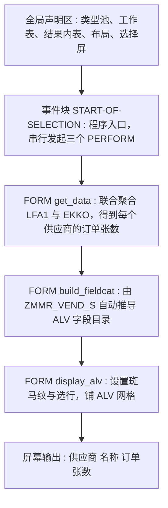
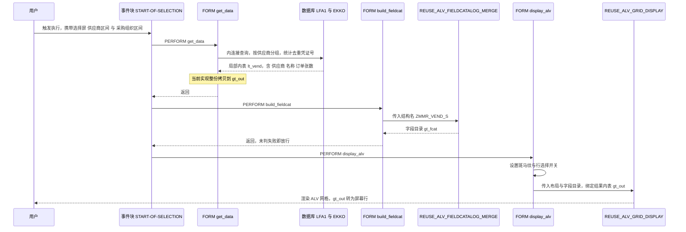

# 供应商采购订单数报表 `zmmr_vend_list` 走读

## 一、程序定位与业务背景

先说这份报表要回答业务上的哪一句话。采购员手上通常有一个供应商名单（可能是从年度框架协议、供应商评级表、或者某次专项采购的入围名单里来的），接下来要判断的是：**这批供应商里，哪些真的在给我下订单？各自下了多少单？** 这个问题回答完，才能谈得上给谁加安全库存、跟谁续约、跟谁砍量。

为什么 SAP 标准事务解决不了这个诉求？SAP 里跟采购凭证沾边的那几个清单，视角都不对：`ME5A` 是"已收货货物"，站在入库和库存覆盖角度，是**物料**视角；`ME5B` 是"已发运"，站在运输角度；`ME6A`/`ME6B` 走收货/发货标签走 `EKBE` 聚合，是**采购凭证**视角。三个都是一张凭证一行、或者一个物料一行，都没有"按供应商聚合出订单张数"这个维度。供应商主数据 `LFA1` 几十万行，`EKKO` 几百万行，一个供应商下过几张单这个问题，标准前台没人给你答案，只能自己查。所以这个 Z 报表的存在是合理的：**用一次数据库聚合，把凭证视角翻转成供应商视角。**

整体设计范式一句话定性：**"一次性 Open SQL 聚合 + SAP 标准 ALV 函数模块输出"的单层经典报表**——没有中间层、没有结果持久化、没有下钻，取数算显示一步到位。这个范式本身对"临时性、一次性、数据量可控"的报表是最优解，问题几乎全部出在细节而不是架构。

值得提前说清的一点业务口径：`po_cnt` 是**采购订单的张数**（表头去重计数），它既不是行数（`EKPO` 里的订单行），也不是金额（要 `EKPO` 的净价才完整），更不是"有效订单数"（不含已作废、草稿、未审批）。这份报表的三个 WHERE 条件，实际上定义了这张报表的全部业务含义，后面每条问题我都会回到这个口径上来。

---

## 二、程序执行流程总览



| 序号 | 子程序 | 调用者 | 职责 |
|---|---|---|---|
| 1 | 全局声明区 | 系统加载程序时 | 引入 SLIS 类型池、声明工作表、结果内表 `gt_out`、布局 `gs_layo`、字段目录 `gt_fcat`，并挂出两个选择屏区间 |
| 2 | 事件块 `START-OF-SELECTION` | ABAP 运行时自动触发 | 主控块，按取数 → 建目录 → 显示的顺序串行驱动三个 PERFORM，本身不含业务逻辑 |
| 3 | `FORM get_data` | 事件块 `START-OF-SELECTION` | `LFA1` 内连接 `EKKO`，按供应商聚合 `COUNT(DISTINCT EBELN)`，结果落到 `gt_out` |
| 4 | `FORM build_fieldcat` | 事件块 `START-OF-SELECTION` | 调 `REUSE_ALV_FIELDCATALOG_MERGE`，把 `ZMMR_VEND_S` 的字段结构翻译成 `gt_fcat` |
| 5 | `FORM display_alv` | 事件块 `START-OF-SELECTION` | 装配 `gs_layo` 与 `gt_fcat`，调 `REUSE_ALV_GRID_DISPLAY` 把 `gt_out` 铺上屏幕 |

三个 PERFORM 是完全串行、无分支、无循环的直线流水线。这种编排方式的好处是执行顺序一眼可见，坏处是**任何一个环节失败，控制流没有回旋余地**——这个缺陷在第 3.4 节会具体爆出来。

下面按这条流程，从声明区开始，逐个子程序展开。

---

## 三、分组分析

### 3.1 子程序类型 `全局声明区`

先看报表骨架和选择屏。整段可以拆成两步：第一步是加载框架，第二步是声明数据对象与输入界面。

#### ① 报表头与类型池

```abap
REPORT zmmr_vend_list.
TYPE-POOLS: slis.

TABLES: lfa1, ekko.
```

**做什么** — 声明这是一个独立报表程序，引入 SAP 标准类型池 `SLIS`（ALV 的字段目录、布局等结构都定义在这里），并声明 `LFA1`（供应商主数据）与 `EKKO`（采购凭证表头）两张表的工作区。

**为什么** — 这是本程序里我最欣赏的一个决定：**它没有把标准 ALV 函数组复制成 Z 函数组**。国内 ABAP 报表有一半是这么长的：先 SE37 复制 `SAPLALV` 改名，再 `FUNCTION-POOLS` 一路复制，改个字段目录也要重新传输一遍，升级时永远在合并冲突。而这个程序直接 `TYPE-POOLS: slis` + 直接调 `REUSE_ALV_*`，不占用函数组、不需要传输、跟着 SAP 升级走。`TABLES` 声明在这里的唯一作用是给下面 `SELECT-OPTIONS ... FOR lfa1-lifnr` 提供参照——工作区 `LFA1`/`EKKO` 本身在程序正文里从头到尾没被读写过一次，属于纯声明开销。

**风险与改进** — `TABLES` 是 BC 时代的写法，会实打实生成两个隐式工作区：旧语法、老编辑器无法用新 SQL 语法、现代 Code Inspector 也会报警。改法是只为选择屏造一个数据对象：`DATA: lv_lifnr TYPE lfa1-lifnr, lv_ekorg TYPE ekko-ekorg.`，然后 `SELECT-OPTIONS: s_lifnr FOR lv_lifnr, s_ekorg FOR lv_ekorg.`。另外 `zmr_vend_list` 这个报表目前**完全没有 `INITIALIZATION` 和 `AT SELECTION-SCREEN` 段**，意味着没有任何输入校验、没有任何默认值赋值，屏幕一出来就是空的、什么都能直接 F8，这一点在 3.3 节会变成实打实的性能事故。

#### ② 数据对象与选择屏

```abap
DATA: gt_out  TYPE TABLE OF zmmr_vend_s,
      gt_fcat TYPE slis_t_fieldcat_alv,
      gs_layo TYPE slis_layout_alv.

SELECT-OPTIONS: s_lifnr FOR lfa1-lifnr,
                s_ekorg FOR ekko-ekorg.
```

**做什么** — 声明三个全局内表/结构：结果集 `gt_out`（行结构是自定义的 `ZMMR_VEND_S`）、ALV 字段目录 `gt_fcat`、ALV 布局控制 `gs_layo`；再挂两个选择屏区间：供应商 `s_lifnr`（对应 `LFA1-LIFNR`，12 位）、采购组织 `s_ekorg`（对应 `EKKO-EKORG`，3 位）。

**为什么** — 这里的设计核心是**"让数据结构当接口"**：`ZMMR_VEND_S` 一处定义，SQL 的字段别名往它里面填、`REUSE_ALV_FIELDCATALOG_MERGE` 拿它生成列、ALV 最终渲染它。以后要加一列"未交数量"，只要改这一个结构，SQL 里加一个 `AS` 别名，ALV 自动多一列，**报告里不用改一行代码**。这种做法比在字段目录里手写 `slis_fieldcat_alv` 结构要稳得多——手写版每加一列就得同步改 SELECT、字段目录、输出内表三处，早晚会漏。选择屏也选得对：用户填区间而不是填 `CHAR1` 自由文本，口径由 SAP 校验、边界由 SAP 兜住。

**风险与改进** — 两点需要核对。一是 **`ZMMR_VEND_S-PO_CNT` 的数据元素**：SQL 侧 `COUNT(...)` 返回整数，如果这个字段被定义成了字符型或长度不足的 `NUMC`，运行期会走隐式转换；供应商订单量破万时（`NUMC(4)` 封顶 9999）会直接抛转换异常 dump。上线前务必在 SE11 确认它是 `ABAP INT` 或足够长的 `NUMC`。二是 **两个选择屏都是非必填**，`s_ekorg` 为空时报表会跨全部采购组织统计，`s_lifnr` 为空时会触发全表扫描——这是 3.3 节的 P2 性能隐患，也是这里埋的引线。另一个小点是 `gt_fcat` 和 `gs_layo` 声明成全局变量，在单次顺序执行的报表里完全够用，但如果以后要加 `AT SELECTION-SCREEN` 里预置布局，`gs_layo` 全局化反而是优势，可以保留。

### 3.2 子程序类型 `事件块 START-OF-SELECTION`

```abap
START-OF-SELECTION.
  PERFORM get_data.
  PERFORM build_fieldcat.
  PERFORM display_alv.
```

**做什么** — 程序主控块：用户按下执行按钮后，ABAP 运行时触发该事件块，它按取数、建字段目录、显示的顺序串行调用三个 PERFORM，自身不做任何业务判断。

**为什么** — 在无事务码、无对话框、`START-OF-SELECTION` 是第一个可执行事件块的报表程序里，这段就是整个执行图的根。三行 PERFORM 把"我要干什么"和"怎么干"彻底分开：读代码的人在这一行就知道全流程，不必翻文件；写代码的人改任何一个 FORM 都不影响主控结构。这是 ABAP 报表最经典也最稳的骨架。

**风险与改进** — 风险不在这一段本身，而在**它是一条没有出口的直线**。三个 PERFORM 之间没有任何状态校验：`get_data` 失败时 `build_fieldcat` 照样跑，`build_fieldcat` 报错时 `display_alv` 照样跑（这个后果很具体，见 3.4 节）。另外注意 `START-OF-SELECTION` 只在**非空选择屏时**触发——如果将来给 `s_lifnr` 设了必输，这个事件块在后台、空选择屏场景下都不执行，取数逻辑会整块跳过。这类报表如果打算上定时后台任务跑，得改成 `START-OF-SELECTION` 之前先判 `sy-ucomm = 'ON'`，或者干脆把取数逻辑放 `INITIALIZATION`。目前是前台手工报表，暂不构成缺陷，但属于要记住的约束。

### 3.3 子程序类型 `FORM get_data`

这是整个程序的技术核心，也是业务口径的唯一定义处。整段按逻辑拆成三步：第一步联合聚合查询，第二步成功分支的结果搬运，第三步失败分支的提示与终止。

#### ① 供应商与采购订单的联合聚合查询

```abap
SELECT a~lifnr,
       a~name1,
       COUNT( DISTINCT b~ebeln ) AS po_cnt
  FROM lfa1 AS a
  INNER JOIN ekko AS b ON a~lifnr = b~lifnr
  WHERE a~lifnr IN @s_lifnr
    AND b~ekorg IN @s_ekorg
    AND b~bstyp = 'F'
  GROUP BY a~lifnr, a~name1
  INTO TABLE @DATA(lt_vend).
```

**做什么** — 从 `LFA1`（供应商主数据）内连接 `EKKO`（采购凭证表头），条件是供应商在 `s_lifnr` 区间内、采购组织在 `s_ekorg` 区间内、且凭证类别 `BSTYP = 'F'`（采购订单/框架协议），按 `LIFNR` 和 `NAME1` 分组，输出"每个供应商的采购凭证张数（`EBELN` 去重）"，结果装进内联声明的局部内表 `lt_vend`。

**为什么** — 这个写法比"教科书式的经典 ABAP"要新，而且新得对。老式做法是先 `SELECT ebeln lifnr ekorg FROM ekko` 把几万行凭证读进内表，再 `SELECT ... FROM lfa1 FOR ALL ENTRIES` 补名称，内存往返两次、传输量大；这里把"聚合"整个下推给数据库，`COUNT(DISTINCT)` 一次算完，只把聚合后的几百上千行搬回 ABAP 层——**这是报表取数的正确方向**。`@s_lifnr` 的转义符用法也对：选择屏本质是内表，Open SQL 里必须写成 `IN @selopt`，很多人写成 `IN s_lifnr` 会直接语法错误。`@DATA(lt_vend)` 内联声明进一步把结果表的作用域收在 FORM 内，是 7.40 之后推荐的写法。选择范围也划得合理：供应商和采购组织都是**强筛选维度**（区间形式，可批量），而凭证类别固定为 `'F'`，符合"我要看采购订单，不是要看库存调拨单（`UE`）和费用报销（`SR`）"这个典型采购视角。

**风险与改进** — 这一步是问题最密集的地方，逐条说：

- **口径缺失（P0）**：`bstyp = 'F'` 只区分了单据大类，服务类（`'S'`）、运输类（`'T'`）采购订单被完全排除在外。如果业务方问的是"所有采购凭证"，这里少统计了一类，需要业务确认。
- **口径缺失（P0）**：**没有任何状态过滤**。`EKKO-LOGSO = 'X'` 表示凭证被逻辑删除，另有未审批、已作废的情况也仍在 `EKKO` 里躺着。现在的 `po_cnt` 会把作废单、草稿单全部计成"真实订单数"，采购经理拿着这份名单去谈判，数字对不上采购台账就会来找开发。这条至少要加 `AND b~logso <> 'X'`；若要求"已审批订单"，还得关联审批对象表（如 `EKAB`/系统审批记录），成本明显上一个台阶。
- **口径缺失（P0）**：`EKKO` 有公司代码 `BUKRS` 字段，本程序既不筛也不分组。一个供应商在多个公司代码下单时，`po_cnt` 是**跨公司代码合并计数**。业务上"这家供应商给我们下过几单"和"这家供应商在 A 公司下过几单"是两个完全不同的数，必须确认。另外 `EKORG` 在这里**只当过滤器、当不了维度**——`s_ekorg` 留空就变成全采购组织汇总，粒度不可控。
- **性能（P2）**：两个选择屏都非必填。`s_lifnr` 为空时 `IN @s_lifnr` 这整个条件被 SQL 优化器**直接丢弃**，等价于全表扫 `EKKO`；`EKKO` 的唯一索引以 `EBELN` 为前导，对"按 `LIFNR` 区间统计"没有任何帮助（实际执行计划请用 ST05 确认），再叠加 `COUNT(DISTINCT)` 强制去重排序/哈希，百万级行数下可能跑到分钟级，甚至拖垮应用服务器。**改进：在 `AT SELECTION-SCREEN` 里对 `s_lifnr` 设必输**，或者至少在 `get_data` 开头 `IF s_lifnr[] IS INITIAL. MESSAGE '请输入供应商范围' TYPE 'S'. STOP. ENDIF.`，把护栏建在入口而不是事后。
- **性能（P2）**：`GROUP BY a~lifnr, a~name1` 把冗余的文本列 `NAME1` 也拖进了分组键和排序键。`LFA1` 按 `LIFNR` 唯一，所以分组结果不会因此多出行，但把一个 40 字符的可变长文本带进排序缓冲区纯属浪费。**更省的做法是：先只对 `EKKO` 做 `GROUP BY lifnr` 聚合成一个极小的结果集，再用 `FOR ALL ENTRIES` 补名称**，或者干脆写个 CDS 聚合视图，让 `LFA1` 的 `NAME1` 以 `LEFT JOIN` 方式在最后贴上去。
- **技术细节**：`COUNT(DISTINCT b~ebeln)` 在实践上等价于"凭证张数"——`EKKO` 的唯一索引是 `MANDT + EBELN + EBEWG`，严格说 `EBELN` 单列不唯一，但 SAP 的 `BUFRNUMOBJNUM` 号码检查保证了同一客户端内采购凭证号不重复，所以结果可用。真正的坑在前面已提：它数的是**表头张数**，不是行数、不是金额。如果业务真正想要的是金额，还得往下沉到 `EKPO`。

#### ② 成功分支：结果搬到全局结果内表

```abap
IF sy-subrc = 0.
  gt_out = VALUE #( FOR ls IN lt_vend
                    ( lifnr = ls-lifnr name1 = ls-name1 po_cnt = ls-po_cnt ) ).
```

**做什么** — 判定 `sy-subrc` 为 0（认为取数成功）后，用表推导表达式 `VALUE #( ... )` 遍历内联内表 `lt_vend`，把 `LIFNR`、`NAME1`、`PO_CNT` 三个字段逐个映射构造出行结构，**整份拷贝**到全局结果内表 `gt_out`。

**为什么** — 作者显然在追求新语法：内联 `@DATA` 声明 + `VALUE #( FOR ... )` 表推导，这套组合是 7.40+ 的现代写法，比 4.6E 老时代 "LOOP AT lt_vend / APPEND ls TO gt_out / ENDLOOP" 干净得多。**问题在于这个 `IF` 和这次拷贝都没有实际价值。**

**风险与改进** — 两处都要改：

- **P0 正确性**：`SELECT ... INTO TABLE` 之后判断 `sy-subrc` 是**死代码**。对内表目标形式的 Open SQL，`SY-SUBRC` 恒为 0；执行成功返回 0 行、还是返回 5000 行，都是 0；SQL 出错时抛的是**异常/short dump**而不是置 `SY-SUBRC`。所以 `ELSE` 分支永远进不去，**"无符合条件的供应商"这条提示永远不会弹给用户**。用户输了个不存在的供应商号，看到的是一张干干净净的空 ALV，最可能的第一反应是"程序坏了"。**正确写法是判断内表**：`IF lt_vend IS INITIAL.`。
- **P2 冗余**：`lt_vend` 和 `gt_out` 的行类型都是 `ZMMR_VEND_S`（SQL 的字段别名直接对上结构字段），三个字段一对一，`gt_out = lt_vend` 一行就够，`VALUE #( FOR ... )` 是纯粹的逐行搬砖：多一层循环、多一层中间结构开销，还把字段名硬编码了第二遍——**将来 `ZMMR_VEND_S` 加第四个字段，这里就会静默丢字段**。而且 `lt_vend` 是内联声明的局部内表，出 FORM 就消失，所以没必要中转。要么直接 `INTO TABLE @gt_out` 让 SQL 直接填全局内表，要么保留 `lt_vend` 但用 `gt_out = lt_vend` 整体赋值。

#### ③ 失败分支：提示并终止

```abap
ELSE.
  MESSAGE '无符合条件的供应商' TYPE 'I'.
  STOP.
ENDIF.
ENDFORM.
```

**做什么** — 在取数被认为失败（`SY-SUBRC <> 0`）的分支上弹一条信息类型的消息，然后用 `STOP` 结束整个程序运行。

**为什么** — 意图是对的：查不到数据时给用户一句人话，而不是甩一张空表。消息文案"无符合条件的供应商"也写得贴合场景，是能被业务读懂的话。`STOP` 在报表程序里是可接受的终止方式，理论上没有副作用问题。

**风险与改进** — **如 ② 所述，这个 `ELSE` 分支不可达，是本程序最"看不见"的一个缺陷**：它给了写代码的人一种"空结果已经处理好了"的错觉，实际上一行都没执行。修复时把整个 `IF` 的条件换成 `lt_vend IS INITIAL` 即可。另外两个小点：一是 `MESSAGE TYPE 'I'` 是信息消息、框体 OK、无红色，用户需要点一下才继续，这个交互选得合理；二是 `STOP` 是较老的做法，报表里推荐的等价物是 `LEAVE LIST-PROCESSING`，区别在于 `STOP` 语义上是"强行结束"，而 `LEAVE` 语义是"正常退出列表处理"，后者对未来做后台变式、异常清理更友好——**不是必须改，记一笔**。

### 3.4 子程序类型 `FORM build_fieldcat`

`get_data` 把数据准备好了，ALV 却还不知道该画哪几列。这一步就是补上这层翻译，拆成"调函数模块"和"检查返回码"两步。

#### ① 用数据结构的结构名生成字段目录

```abap
CALL FUNCTION 'REUSE_ALV_FIELDCATALOG_MERGE'
  EXPORTING
    i_structure_name = 'ZMMR_VEND_S'
  CHANGING
    ct_fieldcat     = gt_fcat.
```

**做什么** — 调用 SAP 标准函数模块 `REUSE_ALV_FIELDCATALOG_MERGE`，传入 DDIC 结构 `ZMMR_VEND_S` 的名字，让函数模块去读这张表的域信息（域标签、输出长度、转换例程、货币/数量参考字段等），据此自动生成 ALV 字段目录，回填到 `gt_fcat`。

**为什么** — 这是"让数据结构当接口"的兑现处，也是这个程序设计上最漂亮的一笔。传统写法要在 `FORM` 里手写一串 `APPEND VALUE slis_fieldcat_alv( fieldname = ... )` 的 `APPEND`，一列一个结构，三五个字段就十几行，加列还得回来改。这里把"列的定义权"完全交给 `ZMMR_VEND_S`：SQL 查出来的 `po_cnt` 能不能带出参考字段、文本域能不能补全成 40 字符的中文名，都由 DDIC 决定，**报告程序本身零维护**。用 `CHANGING` 而不是 `EXPORTING` 接内表也是对的（内表出参必须是 `CHANGING`），这一处细节说明作者对 FM 接口约定是熟的。

**风险与改进** — 无语法风险。唯一要注意的是**`ZMMR_VEND_S` 存在激活风险**：如果这个结构里放了数据元素但没激活，FM 会抛异常而非置 `SY-SUBRC`，程序直接 short dump。所以传输时必须确认该结构在目标系统已激活（它应该作为同一传输请求的一部分，且 `ZMMR_VEND_S` 属于 `ZMMR` 这个 Z 结构命名空间，最好是 `Z 表格/结构` 而不是内嵌 DDIC 追加项）。

#### ② 返回码检查与失败提示

```abap
IF sy-subrc <> 0.
  MESSAGE '字段目录生成失败' TYPE 'E'.
ENDIF.
ENDFORM.
```

**做什么** — 检查函数模块的返回码，非 0 时弹一条错误类型的消息"字段目录生成失败"。

**为什么** — 检查 `SY-SUBRC` 这个动作本身是标准 FM 编程的肌肉记忆，值得肯定：调用 FM 后不判返回码是常见错误。而且**没有**用 MESSAGE 之后 `STOP`，至少没有再往下堆逻辑。

**风险与改进** — **这是一处真实的控制流缺陷（P1）**：`MESSAGE ... TYPE 'E'` 只会弹出一个红色消息框，用户点回车后**程序继续从下一句往下执行**，并不会终止！所以 `build_fieldcat` 返回后，控制权回到 `START-OF-SELECTION`，第三行 `PERFORM display_alv` 照常执行，此时传进去的 `gt_fcat` 要么是空的、要么只填了一半。`REUSE_ALV_GRID_DISPLAY` 拿到空字段目录去配一个非空内表，结果不可预期，最坏是 short dump。换句话说：**这个错误提示不但没起到拦截作用，反而把一次"干净的失败"变成了"不明原因的崩溃"**。改法有三选一：`MESSAGE '字段目录生成失败' TYPE 'S'. STOP.`（沿用本程序自己的风格）、改成 `TYPE 'A'`（错误消息，程序直接终止）、或者 `LEAVE LIST-PROCESSING.`。顺带说，这里用 `TYPE 'E'`、而 3.3 节 ③ 用 `TYPE 'I' + STOP`，两个 FORM 的错误风格不统一，说明这套错误处理是分两次、凭不同心情写出来的，而不是一个统一约定。

### 3.5 子程序类型 `FORM display_alv`

数据有了、列定义有了，最后一步是铺屏幕。这段很短，保持单块分析更清楚，逻辑上仍是两步：设布局、调 FM。

#### ① 装配 ALV 布局控制

```abap
gs_layo-zebra = 'X'.
gs_layo-get_sel_info = 'X'.
```

**做什么** — 给布局结构 `gs_layo` 打开斑马纹隔行底色，并要求 ALV 显示行选择按钮（前面多一列勾选框）。

**为什么** — 斑马纹是列表报表的标准可用性配置，行数多时能显著降低横向串行读取的成本，`'X'` 是正确写法。`get_sel_info` 的意图看得很清楚：作者想让用户能勾选行做后续操作——这个产品思路本身是对的，说明作者是从"这表会给别人用"的角度在写。

**风险与改进** — **这里有一个"设了功能但没接线"的问题（P3）**：`get_sel_info = 'X'` 只是把选择框**显示出来**，但 `REUSE_ALV_GRID_DISPLAY` 的参数里并没有传 `I_CALLBACK_USER_COMMAND`，程序里也没有任何地方读 `S_SELFIELD` 或处理 `E_USER_COMMAND`。结果是用户能勾、能选，但**勾完之后什么都不会发生**——选行高亮会保留，功能却没有落地。对使用者来说这比不显示选择框更让人困惑。更麻烦的是它容易误导后续维护者：新人看到选择框，会以为"这表支持批量操作"然后去问业务，功能其实不存在。**两个选择：要么补上 `i_callback_program = 'ZMM...' / i_callback_user_command = 'USER_COMMAND'` 并实现下钻逻辑（这本来也是这张报表最该有的功能，见 P3-1）；要么先把这个 `'X'` 去掉，把选择框留给真正需要它的版本。**

#### ② 输出 ALV 网格

```abap
CALL FUNCTION 'REUSE_ALV_GRID_DISPLAY'
  EXPORTING
    is_layout   = gs_layo
    it_fieldcat = gt_fcat
  TABLES
    t_outtab    = gt_out.
ENDFORM.
```

**做什么** — 调用标准 FM `REUSE_ALV_GRID_DISPLAY`，把布局 `gs_layo` 和字段目录 `gt_fcat` 传进去，把结果内表 `gt_out` 作为 `t_outtab` 绑定，ALV 网格在屏幕上渲染出来。

**为什么** — 传参方式完全正确：**内表出参放 `TABLES`、结构入参放 `EXPORTING`**，是 `REUSE_ALV_*` 系列的标准契约，写对了。整个 ALV 没有用 `REUSE_ALV_GRID_LIST_DISPLAY` 的变体也没有自己 `WRITE` 手工列表，说明作者选择了现代的做法。

**风险与改进** — 功能上**能跑，但只是"能跑"**，离好用还差几步：

- **没有默认值排序**：用户要回答"谁下得最多"，默认顺序却是数据库返回的顺序（近似 `LIFNR` 顺序），必须自己点列头排一次降序。**`REUSE_ALV_FIELD_CATALOG_MERGE` 生成的 `gt_fcat` 里 `PO_CNT` 完全没有被加工**——没有 `sort_down = 'X'`，没有 `ref` 引用字段（`PO_CNT` 若是 `NUMC` 就没法直接触发数值排序），更没有 `emphasize` / `cell-color` 把"下单量大的供应商"标出来。**这份报表最有价值的信息是订单张数，作者却没有在视觉上做任何强调，这是产品层面最大的浪费。** 建议在 `build_fieldcat` 里加一个 `LOOP AT gt_fcat ... WHERE fieldname = 'PO_CNT' → sort_down = 'X' → ... ENDLOOP`。
- **没有保存能力**：未传 `i_save`，也未传 `i_default_layout`。用户每次进来都要重新排序、重新调列宽。采购类报表通常是高频、参数固定的，加上 `i_save = 'A'` 和一个默认布局名后，用一次就再也不用重复劳动。
- **没有空结果文案**：回到 3.3 节 ③ 的问题，用户搜不到数据时既没有"无符合条件的供应商"的提示，也没有列表标题能说明"这是按当前选择范围统计的"。ALV 空白一片，用户无法判断是"没有数据"还是"跑错了"。
- **没有下钻（最重要的功能缺口）**：这张报表只给了一个数字，用户看到"某供应商 128 单"之后的下一个问题一定是"哪些单？最近什么时候下的？金额多少？"——**而程序没有任何跳转到 `ME5A`/`ME51N`/`EKPO` 明细的路径**。`is_key = 'X'` 的关键字段、热点列、`AT_SEL_FIELD` 回调、`I_CALLBACK_USER_COMMAND` 跳事务码，一个都没有。一份"能看数但追不下去"的报表，业务价值只有一半。这也是为什么 `get_sel_info` 那行更可惜：选择框的交互入口都摆好了，下游逻辑却完全没写。

三个 FORM 走完，数据从 `LFA1` + `EKKO` 出发，经过聚合、翻译、渲染，最终落在屏幕上。下面换一张图，从数据流转的角度再看一遍这条链路。

---

## 四、执行流程全景图（数据视角）



从这张图能看出两处结构性的东西：一是**数据只流过一次**，`lt_vend` 到 `gt_out` 的中转是纯冗余，`gt_out` 声明为全局却没有被第二个消费者用到；二是**错误路径缺一条回到 `START-OF-SELECTION` 的边**——`build_fieldcat` 失败后，序列图上那条"返回"依然画着虚线接到主控，而真实运行中程序是会继续往下走到 `display_alv` 的。

---

## 五、问题清单与改进建议（按优先级）

### 🔴 P0 — 业务正确性

1. **`IF sy-subrc = 0` 是死代码，"无符合条件的供应商"永远不显示**（子程序 `get_data`）。内表目标的 Open SQL 中 `SY-SUBRC` 恒为 0，空结果集与成功结果集无法区分，`ELSE` 分支不可达。**改为 `IF lt_vend IS INITIAL. ... ELSE. ... ENDIF.`**
2. **未过滤已删除与未审批的采购凭证，`po_cnt` 口径不可信**（子程序 `get_data`）。`EKKO-LOGSO = 'X'` 的逻辑删除单、作废单、草稿单全部计入统计，业务拿到的"订单数"与采购台账对不上。**至少加 `AND b~logso <> 'X'`；若要"已审批"口径，需关联审批记录表，成本更高，应与业务方明确是否需要。**
3. **`bstyp = 'F'` 排除了服务类与运输类采购订单**（子程序 `get_data`）。业务问"所有采购凭证"时会漏统计 `'S'`（服务）和 `'T'`（运输）。**需与业务确认口径**，若需全口径应去掉该条件或改为可配置。
4. **未按公司代码 `BUKRS` 分组，跨公司代码合并计数**（子程序 `get_data`）。供应商在多公司代码下下单时被压成一行，数字既不是"A 公司的单数"也不是"B 公司的单数"，是两者的混合。**要么加 `GROUP BY b~bukrs` 并显示公司代码，要么明确该报表只做粗口径供应商活跃度筛选，并在列表里说明。**
5. **`PO_CNT` 的 DDIC 定义需核对**（子程序 `get_data`）。SQL 返回整数，若 `ZMMR_VEND_S-PO_CNT` 是字符型或短 `NUMC`，破万时会隐式转换异常 dump。**上线前在 SE11 确认字段为 `ABAP INT` 或 `NUMC` 长度足够。**
6. **`ZMMR_VEND_S` 与 `gt_out` 字段一对一，`VALUE #( FOR ... )` 硬编码字段名会静默丢字段**（子程序 `get_data`）。将来结构加列而这里没改，新列在 ALV 上恒为空且无任何报错。**改用 `INTO TABLE @gt_out` 或 `gt_out = lt_vend`。**

### 🟠 P1 — 健壮性

7. **`MESSAGE TYPE 'E'` 之后程序继续执行**（子程序 `build_fieldcat`）。错误消息不终止 ABAP 执行，`PERFORM display_alv` 照常带着空/半残的 `gt_fcat` 调用 ALV FM，行为不可预期。**改 `TYPE 'S' + STOP`、`TYPE 'A'` 或 `LEAVE LIST-PROCESSING`。**
8. **两个 FORM 的错误处理风格不统一**（子程序 `get_data` / `build_fieldcat`）。一处 `TYPE 'I' + STOP`，一处 `TYPE 'E'` 且不终止，缺少统一的错误约定。**建议统一为"失败即提示即离开"，并在程序头注释里写清约定。**
9. **全程无权限过滤**（全局声明区 / `get_data`）。供应商主数据通常不做标准授权对象控制，如果这份报表的输出（供应商名称 + 采购活跃度）要开放给采购以外的角色，属于敏感经营信息。**若面向多角色开放，需补 `GZT` 授权对象校验或 Z 自建权限校验。**
10. **无 `AT SELECTION-SCREEN` 段，屏幕无校验无默认值**（全局声明区）。任何输入直接放行，错误口径只能靠事后看结果。**加一个 `AT SELECTION-SCREEN` 做必输校验、区间合法性校验和默认值（如把 `s_ekorg` 默认成用户所在的采购组织）。**

### 🟡 P2 — 性能与规范

11. **空选择屏退化为 `EKKO` 全表扫描**（子程序 `get_data`）。`s_lifnr` 为空时条件被整体丢弃，而 `EKKO` 唯一索引以 `EBELN` 为前导，对按 `LIFNR` 区间统计无帮助，叠加 `COUNT(DISTINCT)` 去重排序，百万行量级下耗时可观。**给 `s_lifnr` 设必输，或在 `get_data` 开头拦截空区间。** 实际执行计划建议用 ST05 确认后再决定是否要补统计中间表。
12. **`GROUP BY a~lifnr, a~name1` 把文本列拖进分组键**（子程序 `get_data`）。`NAME1` 是冗余列，拉长排序缓冲且无收益。**改为只对 `EKKO` 聚合，再用 `FOR ALL ENTRIES` 补名称，或用 CDS 视图 + `LEFT JOIN` 贴名称。**
13. **新旧 ABAP 语法混用**（全局声明区 / `get_data` / `build_fieldcat`）。`TABLES` / `PERFORM` / `IF sy-subrc` 是 BC 写法，`@DATA` / `VALUE #` 是 7.40+ 写法，同一文件两套范式，Code Inspector 报警、后续维护者无所适从。**既然已经在用新语法，建议一次性清理：弃用 `TABLES` 改 `DATA` 工作区，弃用 `SY-SUBRC` 改 `IS INITIAL` 判定。**
14. **`STOP` 建议替换为 `LEAVE LIST-PROCESSING`**（子程序 `get_data`）。`STOP` 语义是强行结束，不利于未来加统一清理逻辑和后台变式。**报表中两者等价，属规范性建议，非缺陷。**
15. **`COUNT(DISTINCT EBELN)` 每次全量实时计算**（子程序 `get_data`）。高频执行时重复消耗数据库资源。**若报表转高频或数据量增长，考虑改为 CDS 聚合视图（ABAP 层做聚合，数据库可加缓存），这是本程序可扩展性上最实在的一步。**

### 🟢 P3 — 可扩展性

16. **无下钻，报表是分析断点**（子程序 `display_alv`）。用户看到订单数后无法查看具体凭证。建议给 `LIFNR` 设 `is_key`、加 `AT_SEL_FIELD` 双击回调或 `I_CALLBACK_USER_COMMAND` 跳转 `ME5A`/`EKPO` 明细。**这是本程序从"能看"到"能用"的关键一步。**
17. **字段目录零加工，`PO_CNT` 无排序与强调**（子程序 `build_fieldcat`）。加 `sort_down = 'X'` 让列表默认按订单量降序，加 `cell-color` 或 `emphasize` 突出重点供应商。**改动量极小、业务收益极高，是性价比最高的优化。**
18. **`get_sel_info = 'X'` 但无 `I_CALLBACK_USER_COMMAND`，选择框形同虚设**（子程序 `display_alv`）。要么补齐回调实现下钻/批量功能，要么暂时去掉该开关，避免误导。
19. **未开启 `i_save` / 默认布局**（子程序 `display_alv`）。用户每次重排。**加 `i_save = 'A'` 配合 `i_default_layout`，让高频报表可复用排序与筛选。**
20. **空结果与列表标题缺失**（子程序 `display_alv`）。修完 P0-1 后至少有了文字提示；建议再加 `set_pf_status_set` / 标题文本，让用户明确"这是按当前选择范围统计的订单张数"。

---

## 六、整体评价与启发

**优点**

- **架构克制是最大的加分项**：独立报表 + 标准 `REUSE_ALV_*`，没有复制 `SAPLALV` 函数组、没有自造 FM 层、没有嵌套 include、传输即用、升级不冲突。放在国内 Z 报表的语境里，这个骨架是"教科书正确"的。
- **聚合下推到数据库**：一次 Open SQL 出聚合结果，比经典的"读凭证内表 + `FOR ALL ENTRIES` 补名称"少一轮数据往返，是报表取数的正确方向。
- **数据结构当接口**：`ZMMR_VEND_S` 一处定义，SQL 别名、字段目录、ALV 输出同源，加字段不用改报告代码。这是本程序最值得学的一点。
- **内联 `@DATA(lt_vend)` + `VALUE #` 的新式写法**：说明作者不是从 20 年前的模板抄来的，只是没清理干净。

**短板**

- **业务口径没人定义**。三个 WHERE 条件就是这张报表的全部业务含义，但没有任何地方说明"订单张数"到底含不含作废单、含不含服务类凭证、跨不跨公司代码。这是程序之外的风险，也是最容易在验收后才爆的风险。
- **空值与错误处理形同虚设**。看起来有 `SY-SUBRC` 检查、看起来有"无数据"提示，实际一条都走不到；`MESSAGE 'E'` 后面还接着调用 ALV。
- **没有入口护栏**。空选择屏直接放行全表扫描，是典型的"本地开发数据量小没感觉、上生产第一次跑就出事"。
- **报表只到"看数"不到"追数"**。数字给了，下钻没有，选行又只是摆设。

**可学到的设计经验**

1. **报表的难点从来不在 ALV，在口径。** 三个 `WHERE` 条件比 50 行渲染代码重要得多。写这类聚合报表，第一件事是拿白纸把"订单数"这个词的定义写清楚——含不含作废、含不含服务、跨不跨公司代码、按表头还是按行。口径不定，代码写得再漂亮也是错的。
2. **`SY-SUBRC` 是 Open SQL 的历史包袱，一旦用了 `@DATA` 内联语法就该换成 `IS INITIAL`。** 两套范式混用的代价不是"风格不统一"这么轻——`SY-SUBRC` 在内表目标下的语义是**假的**，它会让写代码的人以为自己处理了空结果，实际没有。这是一类非常隐蔽、也最容易在 code review 里漏掉的缺陷。
3. **`MESSAGE` 不是控制流。** `TYPE 'E'` 只是弹窗，不终止执行。凡是写了 `MESSAGE` 就以为"下面不会跑了"的地方，都是 bug 温床。要终止就显式 `STOP` / `LEAVE`，让意图写在代码里。
4. **老报表最有效的改造是减法，不是加法。** 与其加接口、加按钮、加框架，不如先把复制来的函数组、没人用的 `TABLES` 工作区、全局中转内表删干净——这个程序已经做对了一半（没复制函数组），只要再把 `TABLES` 换成 `DATA`、把 `VALUE #` 拷贝换成整体赋值，它就从"半新半旧的遗留代码"变成"干净的现代报表"了。
