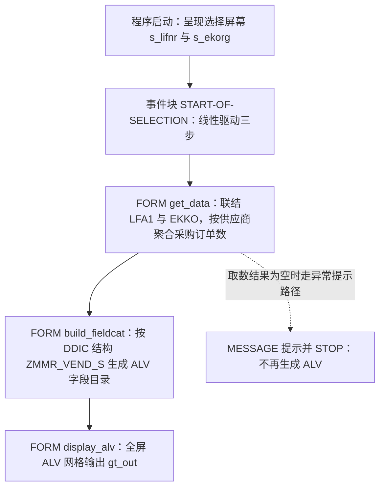
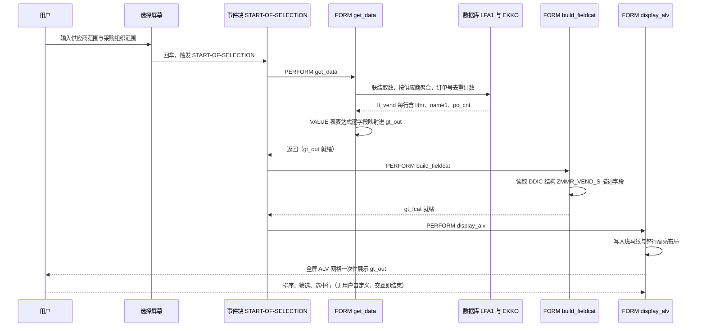

# zmmr_vend_list 供应商采购订单统计报表 —— 走读报告

> 分析对象：`Z MMR_VEND_LIST`（REPORT，classic ALV，58 行）
> 视角：业务目的 → 执行流程 → 逐子程序三层拆解 → 问题清单 → 整体评价

---

## 一、程序定位与业务背景

### 它解决什么问题

这是一个**供应商侧的“采购活跃度盘点”报表**，不是明细打印。业务上典型的提问场景有三种：

1. 采购经理要在一个采购组织范围内，快速看清“哪些供应商被下过采购订单、每个供应商被下了多少单”，用于**供应商分级 / 引入新供应商前的现状摸底**。
2. 采购员在挑选询价对象时，想快速排除“完全没有采购关系的供应商”。
3. 管理层做**采购集中度（Concentration）判断**：头部供应商占了多少单量，是否过度集中。

换句话说，它的输出粒度是**一个供应商一行**，字段只有三个：供应商编号、供应商名称、采购订单数量。这是一张典型的“**列表概览（List Overview）**”，用于快速浏览与筛选，不是用于逐单核对。

### 现有方案为什么不够

- **SAP 标准事务**（ME5A、ME1N 的供应商采购订单清单）要么给出逐单明细，用户要自己在 Excel 里做透视；要么直接跳转到逐单列表，看不到“一个供应商被下了几单”这个聚合口径。
- **查询 / 报表工具（SQ01、Query）**能做到聚合，但要先把这段口径固化成一个数据源、分配权限、维护变式，开发与治理成本远高于一个 58 行的 Z 报表。
- 业务侧真正需要的往往是**一个可以立刻改口径、立刻看到结果的轻量工具**。这个程序正是这个定位：开发成本极低，逻辑全部内联在一个程序里，改一句 WHERE 条件就能立刻响应业务口径变化。

所以它的设计范式可以一句话定性：

> **“单程序、内联逻辑、DDIC 驱动字段目录、全屏只读 ALV”** —— 最轻量的 classic 报表骨架，所有复杂度都压在取数 SQL 里，展示层几乎零成本。

### 读这份代码前需要先知道的两件事

- 报表的输出字段目录 **100% 依赖 DDIC 结构 `ZMMR_VEND_S`**，这个结构不在本源码里，是本程序唯一的隐藏依赖，也是理解口径的钥匙。
- 程序用的全是 SLIS 时代（4.6C 之前）的经典 ALV 函数模块 `REUSE_ALV_*`，属于**遗留但仍被广泛使用**的技术栈；理解它有助于读懂大量现存 Z 程序。

---

## 二、程序执行流程总览

程序是典型的三段式：`START-OF-SELECTION` 里线性 `PERFORM` 三个 FORM —— **取数 → 生成字段目录 → 显示**。没有分支、没有循环嵌套、没有用户交互回调。



> 注意 Mermaid 中那条虚线：作者**显然意图**在“无数据”时走一条友好提示路径，但实际代码里这条路径永远不会被触发（详见 `get_data` 的风险分析）。

**责任链**（按执行先后排列）：

| 子程序 | 调用者 | 职责 |
| --- | --- | --- |
| 全局声明区 | 系统（程序加载时） | 引入 SLIS 类型池、声明 `TABLES`、输出内表 `gt_out` / 字段目录 `gt_fcat` / 布局 `gs_layo`、定义选择屏幕 |
| 事件块 `START-OF-SELECTION` | ABAP 运行时的选择屏幕回车事件 | 报表逻辑的唯一入口，按固定顺序驱动下面三步 |
| `FORM get_data` | `START-OF-SELECTION` | 用一条 `INNER JOIN` SQL 取供应商 + 采购订单去重计数，转储进 `gt_out` |
| `FORM build_fieldcat` | `START-OF-SELECTION` | 调用 `REUSE_ALV_FIELDCATALOG_MERGE`，从 `ZMMR_VEND_S` 自动生成 ALV 字段目录 |
| `FORM display_alv` | `START-OF-SELECTION` | 设置斑马纹与选中行高亮，调用 `REUSE_ALV_GRID_DISPLAY` 全屏展示 |

下面按这条流程，逐个子程序展开。

---

## 三、分组分析（按程序流程 / 子程序）

### 3.1 子程序类型 `全局声明区`

这一段不是“可执行的子程序”，但它是程序最先被系统处理的部分：**程序加载时先编译声明区，再据声明区生成选择屏幕，最后才进入事件块**。所以它排在最前面讲。

```abap
REPORT zmmr_vend_list.
TYPE-POOLS: slis.

TABLES: lfa1, ekko.

DATA: gt_out  TYPE TABLE OF zmmr_vend_s,
      gt_fcat TYPE slis_t_fieldcat_alv,
      gs_layo TYPE slis_layout_alv.

SELECT-OPTIONS: s_lifnr FOR lfa1-lifnr,
                s_ekorg FOR ekko-ekorg.
```

**做什么** — 声明这个报表的四个“角色”：程序名与 SLIS 类型池引入；把 `LFA1`、`EKKO` 两张表挂进程序；声明三个全局对象 —— 结果内表 `gt_out`（结构 `ZMMR_VEND_S` 的表）、ALV 字段目录 `gt_fcat`、ALV 布局 `gs_layo`；最后用 `SELECT-OPTIONS` 生成两个范围选择屏，供应商号取自 `lfa1-lifnr`，采购组织取自 `ekko-ekorg`。

**为什么** — 三个对象的划分不是随意的，它复刻了 ALV 编程的经典契约：`REUSE_ALV_FIELDCATALOG_MERGE` 产出 `it_fieldcat`、`REUSE_ALV_GRID_DISPLAY` 同时接收 `is_layout` + `it_fieldcat` + `t_outtab`。这三者声明为**全局变量**而不是 FORM 的局部变量，是因为 classic ALV 的函数模块 FORM 参数里它们都是 `REFERENCE`（`CHANGING` / 表参数），全局声明能让三个 FORM 之间天然共享，避免参数层层传递。选择屏用 `SELECT-OPTIONS ... FOR lfa1-lifnr` 而不是自建 Range 表，是让用户得到标准的供应商号 F4 帮助、模板按钮和区间输入能力。

**风险与改进** — 两处技术债：① `TYPE-POOLS: slis.` 与 `TABLES: lfa1, ekko.` 都是**废弃语句**，前者自 7.40 起不再需要（标准 SLIS 类型池会被隐式解析），后者自 4.0C 起不再需要（DDIC 表可隐式引用）。留着不会报错，但会让新人误以为“没有 SLIS 类型池就跑不了”。② `gt_out` 的行结构 `ZMMR_VEND_S` 不在本文件内 —— **字段名、类型、数据元素全部不可见**，这是本次评审最大的盲区（见第五章的语义校核）。建议至少在程序头加一句注释，说明依赖的 DDIC 对象及其字段口径。

---

### 3.2 事件块 `START-OF-SELECTION`

```abap
START-OF-SELECTION.
  PERFORM get_data.
  PERFORM build_fieldcat.
  PERFORM display_alv.
```

**做什么** — 报表逻辑的唯一入口。用户回车执行后，ABAP 运行时触发这个事件块，按书写顺序依次调用 `get_data`、`build_fieldcat`、`display_alv` 三个 FORM，没有任何条件分支。

**为什么** — 这是 classic 报表最标准的骨架：`INITIALIZATION` 管默认值与变式加载，`START-OF-SELECTION` 管选屏后的取数与输出，`END-OF-SELECTION` 管分页。三个 FORM 的顺序不能换 —— `build_fieldcat` 依赖 DDIC 结构（在编译期就确定，不依赖数据），`display_alv` 依赖前两步的产物 `gt_fcat` 与 `gt_out`。放在同一个事件块里线性串联，让“数据流”和“代码流”方向一致，是最容易读懂的组织方式。

**风险与改进** — 无明显功能风险，但**没有用户交互扩展位**：ALV 函数模块没有传 `i_callback_program`，所以 ALV 工具栏上的回调、导出、隐藏列都不会回来触发程序逻辑，`display_alv` 之后程序直接 `LEAVE LIST-PROCESSING` 正常结束。也就是说这个报表是**“一次性静态展示”**，想加“点击供应商号跳转明细”“导出 Excel”等需求时，必须回头改这一层设计。提前知道这个边界，比以后加功能时少走弯路。

---

### 3.3 FORM `get_data`

这是整个程序**唯一承载业务逻辑**的地方，也是全部风险集中处。整体分两步：① 一条 `INNER JOIN` + 聚合的 Open SQL 取数；② 用表表达式把结果转储进 `gt_out`。（衔接的 `FORM get_data.` / `ENDFORM.` 随下面片段自然分布。）

#### ① 取数：按供应商聚合采购订单数

```abap
FORM get_data.
  SELECT a~lifnr,
         a~name1,
         COUNT( DISTINCT b~ebeln ) AS po_cnt
    FROM lfa1 AS a
    INNER JOIN ekko AS b ON a~lifnr = b~lifnr
    WHERE a~lifnr IN @s_lifnr
      AND b~ekorg IN @s_ekorg
      AND b~bstyp = 'F'
    GROUP BY a~lifnr, a~name1
    INTO TABLE @DATA(lt_vend).
```

**做什么** — 从供应商主数据 `LFA1` 出发，`INNER JOIN` 到采购订单抬头表 `EKKO`（按 `LIFNR` 关联），筛出采购组织在 `s_ekorg` 范围内、且**单据类型 `BSTYP = 'F'`（采购订单）** 的记录，按 `LIFNR` + `NAME1` 分组，每组输出一行，并把该供应商的**采购订单号去重计数**命名为 `po_cnt`。结果装进内联声明的临时内表 `lt_vend`。

**为什么** — 这一条 SQL 同时解决了三件事，选这个写法是合理的：① **为什么不选主表反查 `LFA1`、也不左连接** —— `INNER JOIN` 天然实现“只显示有采购订单的供应商”，这正是本报表的核心口径，把业务规则交给数据库比在 ABAP 侧 `READ TABLE` 过滤更简洁也更快。② **为什么用 `COUNT( DISTINCT b~ebeln )` 而不是 `COUNT( * )`** —— `EKKO` 是**抬头表，一个采购订单只有一行**，`COUNT(*)` 本身在纯单表单 join 下也正确；但一旦将来把明细表 `EKPO` 或其他抬头挂进 join，`COUNT(*)` 会因行放大而虚增，`DISTINCT` 是防御性写法。③ **为什么把 `NAME1` 放进 `GROUP BY`** —— `LFA1` 的 `LIFNR` 是主键，`NAME1` 与 `LIFNR` 一一对应，放进 `GROUP BY` 不会拆散分组，但能让 `NAME1` 合法地出现在 SELECT 列表里，这是标准写法而非多余。

**风险与改进** — 这一句里藏着 5 个问题：

1. 🔴 **未排除已删除的采购订单**。`EKKO-LOEEW = 'X'` 表示该采购订单已被删除，程序完全没过滤，`po_cnt` 会把已删单算进去。业务核对时一定会出现“对不上”的争议。修正：加 `AND b~loeew <> 'X'`。
2. 🔴 **未排除被冻结/被删除的供应商**。`LFA1-LTBLK = 'X'`（冻结）与 `LFA1-LDELV = 'X'`（删除标记）都没过滤，业务上这类供应商应排除或单独标识。
3. 🟠 **`bstyp = 'F'` 硬编码且无口径说明**。`BSTYP` 还有 `SA`（框架订单）、`LA`（计划协议）、`KA`（采购计划订单）等，用户看到 `PO_CNT` 很容易误以为“该供应商的全部单据数”。字段别名或程序注释里至少要写清“仅采购订单”。另外是否要放开 `BSTYP` 选择屏，应由业务口径决定，而不是代码里悄悄定死。
4. 🟠 **`po_cnt` 受 `s_ekorg` 限制，不是“采购订单总数”**。同一个供应商在采购组织 A 有 30 单、组织 B 有 5 单，输入 A 时显示 35，输入“不限”时显示 35，空范围时显示全量 —— **同一个字段在三种输入下含义不同**。这在报表设计里是典型的口径陷阱，必须在字段描述或标题行写明。
5. 🟡 **空选择屏即全表聚合**。`s_lifnr` 与 `s_ekorg` 都允许为空，此时 `COUNT(DISTINCT EBELN)` 需要读出 `EKKO` 的所有命中行做去重排序，无法走索引覆盖，数据量大时会明显变慢甚至被内存管理杀掉。建议加最小限度约束或至少在选择屏文本里给出提示。

另外记一笔**版本兼容**：`COUNT( DISTINCT expr )` 与 `@DATA(...)` 内联声明、`@` 主机变量转义，都是 **7.40 SP05 附近**才提供的 ABAP SQL 写法。低版本系统上传输会直接语法错误，程序里没有任何版本说明，建议在程序头注明最低 Release 要求。

---

#### ② 转储：把结果映射进输出结构

```abap
  IF sy-subrc = 0.
    gt_out = VALUE #( FOR ls IN lt_vend
                      ( lifnr = ls-lifnr name1 = ls-name1 po_cnt = ls-po_cnt ) ).
  ELSE.
    MESSAGE '无符合条件的供应商' TYPE 'I'.
    STOP.
  ENDIF.
ENDFORM.
```

**做什么** — 检查 `sy-subrc`，为 0 则把 `lt_vend` 的每一行按 `lifnr` / `name1` / `po_cnt` 三个字段手工映射，装进输出内表 `gt_out`；非 0 则提示“无符合条件的供应商”后 `STOP` 终止程序。

**为什么** — 用 `VALUE #( ... )` 逐字段映射，而不是直接 `gt_out = lt_vend`，在 ABAP 里是**有意的类型动作**：`lt_vend` 的行类型是 `SELECT ... INTO TABLE @DATA()` 产生的**匿名结构**，而 `gt_out` 的行类型是 DDIC 结构 `ZMMR_VEND_S`，两者不是同一个类型。逐字段映射强制了两侧字段的对应关系，任何一侧改名都会在编译期暴露，而不是等到运行时静默丢字段。同时它也是唯一能在这里插入**字段级转换逻辑**的地方（比如后续要给 `PO_CNT` 加单位、千分位或限制长度），这是留下它的正当理由。

**风险与改进** — 🔴 **P0：`IF sy-subrc = 0` 这个判断是错的，它让整条错误提示成为死代码**。Open SQL 执行成功时 `sy-subrc` 恒为 0，**返回 0 行也是 0**；只有发生数据库错误才会非 0。因此：

- 用户传了一个必然查不到数据的供应商号 → `lt_vend` 为空 → `sy-subrc` 仍是 0 → 走 if 分支 → `gt_out` 为空 → **继续生成字段目录并显示一个空白的 ALV**，用户看到的是“白屏 + 0 行”，完全没有提示；
- 反过来，数据库真的出问题时（比如 LUW 溢出、临时表不可用），程序却会提示 **“无符合条件的供应商”**，把系统故障误报成业务结果。

正确写法是判空集合而不是判 `sy-subrc`：

```abap
  IF lt_vend IS INITIAL.
    MESSAGE '无符合条件的供应商' TYPE 'S'.
    RETURN.
  ENDIF.
```

顺带说，`MESSAGE ... TYPE 'I'` + `STOP` 也不是最佳组合：`TYPE 'I'` 在报表里会弹窗并要求用户点确认，随后 `STOP` 硬终止；若换成 `TYPE 'S'` 状态栏提示并 `RETURN`，用户体验和可维护性都更好。另外这里**没有 `MESSAGE ... TYPE 'I'` 之外的任何日志（`WRITE` / 应用日志）**，一旦 ALV 显示为空，业务侧没有任何排查线索。

**小结**：两步加起来是 18 行代码，承担了程序 90% 的业务语义。取数逻辑本身可圈可点（一句话完成过滤 + 聚合），但**“成功/失败”的判定方式**是典型的初学者写法，且缺失了 SAP 采购数据里三四个必备的排除条件。

---

从 `get_data` 拿到数据后，展示层就绪只差两块拼图：字段目录和布局。因此下一步 `build_fieldcat` 负责“从 DDIC 推出要显示哪些列”，这是 ALV 与 DDIC 的接线环节。

### 3.4 FORM `build_fieldcat`

```abap
FORM build_fieldcat.
  CALL FUNCTION 'REUSE_ALV_FIELDCATALOG_MERGE'
    EXPORTING
      i_structure_name = 'ZMMR_VEND_S'
    CHANGING
      ct_fieldcat     = gt_fcat.
  IF sy-subrc <> 0.
    MESSAGE '字段目录生成失败' TYPE 'E'.
  ENDIF.
ENDFORM.
```

**做什么** — 调用 `REUSE_ALV_FIELDCATALOG_MERGE`，只给它一个 DDIC 结构名 `'ZMMR_VEND_S'`，函数内部通过 `DESCRIBE` 读取该结构的全部字段（字段名、长度、数据元素、域值、固定长度/小数的转换例程），自动生成完整字段目录并回写到全局 `gt_fcat`。失败则弹出错误消息。

**为什么** — 这是**“DDIC 驱动”的经典做法**，收益非常实在：字段目录与输出内表天然一致，**不可能出现“内表有字段但 ALV 没显示”这类错配**；列标题、金额/数量的小数点与千分位格式化、数据元素的技术设置（大小写、日期格式）全部由 DDIC 决定，程序里一行格式化代码都不用写。对比一下手写 `ls_fieldcat` 的老代码：每个字段要 8~10 行、还要 `MOVE-CORRESPONDINDING` 到 `dm_subtitle`，改一次列标题就要改程序 —— 这正是 classic ALV 时代被 `MERGE` 取代的原因，**这个选择是正确且先进的**。

**风险与改进** — 🟠 唯一的缺陷是**“完全自动”也意味着“完全不可改”**：因为没有在 `MERGE` 后追加自己的字段目录修改，业务用户看到的技术列名就是 `LIFNR`、`NAME1`、`PO_CNT`，而不是“供应商编号”“供应商名称”“采购订单数”。想改中文标题，正确做法不是 `MODIFY` 数据源，而是① 维护 `ZMMR_VEND_S` 各字段的数据元素描述（列名会随短描述自动带出），或 ② 在 `MERGE` 之后循环 `gt_fcat`，按字段名覆写 `REUSE_ALV_ALV_FIELDS_CATALOG` 的 `no_outlen` / `tech_name_at` 等参数。另外 `MESSAGE ... TYPE 'E'` 在报表里会直接终止并 dump 到错误弹窗 —— `MERGE` 失败通常是结构名写错或字段全部被排除，属于编程错误而非业务异常，用 `TYPE 'E'` 可以接受；但如果想留追溯，建议改成抛异常或在 `MERGE` 的 `i_excl_ident` 里显式排除技术字段。

---

字段目录就绪，数据与格式说明都已具备，`display_alv` 只剩最后一步：把两者拼成用户看到的网格。

### 3.5 FORM `display_alv`

```abap
FORM display_alv.
  gs_layo-zebra = 'X'.
  gs_layo-get_sel_info = 'X'.
  CALL FUNCTION 'REUSE_ALV_GRID_DISPLAY'
    EXPORTING
      is_layout   = gs_layo
      it_fieldcat = gt_fcat
    TABLES
      t_outtab    = gt_out.
ENDFORM.
```

**做什么** — 先设置两项 ALV 布局属性（`zebra = 'X'` 隔行斑马纹、`get_sel_info = 'X'` 选中行整行高亮），然后调用全屏 ALV 显示函数，把 `gs_layo` 作为布局、`gt_fcat` 作为列定义、`gt_out` 作为数据表一次性传入，ALV 随即接管屏幕。

**为什么** — **只设置必要的两个布局属性**，是克制的正确选择：斑马纹与整行选中高亮是全屏 ALV 最能提升可读性的两项设置，且不改变数据语义。其余属性（`grid_title` 表头标题、`info_row` 行数统计、`is_variant` 布局变式）全部留空，靠系统默认值兜底。数据通过 `TABLES t_outtab` 以**表参数**而非内表结构传入，是 `REUSE_ALV_GRID_DISPLAY` 的标准契约；注意因为 `it_fieldcat` 已显式提供，`TABLES` 参数的结构信息不会被用来推导列，**列定义完全来自前一步**，两者职责不重叠。

**风险与改进** — 🟠 **“一次性传全量 + 不注册变式”**是这一层的两个短板：① 没有 `is_variant = 'X'` / `is_layout_variant = 'X'`，用户对列顺序、列宽、隐藏列的调整**刷新或重跑后全部丢失**，对经常使用的报表是很实际的不满；② 没有 `it_sort`，默认按数据库返回顺序（实际是分组顺序，通常是 `LIFNR` 升序，但**不保证**）展示，供应商数量多时用户想要的“按订单数降序看头部供应商”必须手工点表头完成；③ 报表标题缺失 —— 现在屏幕上唯一的文字是列名，用户不知道当前是选了哪个采购组织范围、字段口径是“仅采购订单”。`grid_title` 加一句 `供应商采购订单统计（仅采购订单，范围受采购组织筛选影响）` 就能解决。④ 数据量大时（`s_lifnr` 为空的全量结果）没有分页/包大小控制，classic ALV 会一次性把内表拷进控件内表，内存占用直接翻倍。

---

## 四、执行流程全景图（数据视角）

同一条链路，换个角度：**数据是怎么在四个环节之间流转的，谁生产、谁消费**。



**三个关键的数据形态转换，看图时留意**：

| 环节 | 数据形态 | 谁生产 | 谁消费 |
| --- | --- | --- | --- |
| 取数 | `lt_vend`（匿名结构内表，3 列，聚合结果） | 数据库 + `get_data` | `get_data` 自己 |
| 映射 | `gt_out`（`ZMMR_VEND_S` 结构内表，DDIC 类型） | `get_data` | `display_alv` |
| 列定义 | `gt_fcat`（`slis_t_fieldcat_alv`） | `build_fieldcat` ← 读 DDIC | `display_alv` |
| 展示 | 屏幕上的 ALV 控件 | `display_alv` | 用户 |

注意**数据流与列定义流是两条独立的线**：`gt_fcat` 完全由 DDIC 决定，与 `lt_vend` / `gt_out` 里的实际数据没有交互。这正是 3.4 节说“字段目录不可能与数据错配”的根本原因 —— 它们同源于一个 DDIC 结构。同时也意味着：**改显示列必须改 DDIC，改口径必须改 SQL，两者不能互相替代。**

---

## 五、问题清单与改进建议（按优先级）

### 🔴 P0 — 业务正确性

| # | 所在子程序 | 问题 | 改进方向 |
| --- | --- | --- | --- |
| 1 | `get_data` | `IF sy-subrc = 0` 判定错误：查询成功但 0 行时 `sy-subrc` 仍为 0，“无符合条件的供应商”提示是**死代码**；反而数据库真出错时会误导提示为“无数据” | 改为 `IF lt_vend IS INITIAL. ... ENDIF.`，并用 `TYPE 'S'` + `RETURN` |
| 2 | `get_data` | 未过滤已删除采购订单 `EKKO-LOEEW = 'X'`，`po_cnt` 系统性偏高 | 加 `AND b~loeew <> 'X'` |
| 3 | `get_data` | 未过滤冻结/已删除供应商 `LFA1-LTBLK = 'X'`、`LFA1-LDELV = 'X'` | 按业务口径加过滤或单独标识 |
| 4 | `get_data` | `bstyp = 'F'` 硬编码，“只统计采购订单”这一口径既不可见也不可调 | 加注释/标题说明，或把单据类型做成选择屏 |
| 5 | `get_data` | `po_cnt` 的值随 `s_ekorg` 范围变化，字段名却是“采购订单数”，口径陷阱 | 字段描述或 ALV 标题写明“受采购组织范围影响” |

### 🟠 P1 — 健壮性

| # | 所在子程序 | 问题 | 改进方向 |
| --- | --- | --- | --- |
| 6 | `get_data` | 空选择屏 = 全量聚合 + `DISTINCT` 去重，数据量大时超时/OOM | 加最小约束或提示；必要时改预聚合方案 |
| 7 | `get_data` | `VALUE #( )` 手工逐字段映射：`ZMMR_VEND_S` 改字段名即编译失败；**类型不兼容时会静默转换**（见下方语义校核） | 保留显式映射但加注释；或改用 CDS/AMDP 直接返回 `ZMMR_VEND_S` |
| 8 | `build_fieldcat` | 列名直接暴露技术名（`LIFNR`/`NAME1`/`PO_CNT`），业务用户看不懂 | 维护数据元素描述，或 `MERGE` 后覆写字段目录 |
| 9 | `display_alv` | 未注册布局变式，用户的列顺序/宽度/隐藏调整刷新即丢 | `is_variant = 'X'` + `is_layout_variant = 'X'` |
| 10 | `display_alv` | 无默认排序、无报表标题、无行数统计 | 加 `it_sort`、`grid_title`、`info_row` |
| 11 | `get_data` | 全程无 `AUTHORITY-CHECK`，采购数据可见性完全依赖菜单/事务级权限 | 若采购组织有权限对象，需在取数前校验 |
| 12 | `build_fieldcat` | 失败时 `MESSAGE TYPE 'E'` 直接终止 dump，无日志留痕 | 抛应用异常或写应用日志，便于定位 |

### 🟡 P2 — 性能与规范

| # | 所在子程序 | 问题 | 改进方向 |
| --- | --- | --- | --- |
| 13 | 全局声明区 | `TYPE-POOLS: slis.`（7.40 起废弃）与 `TABLES: lfa1, ekko.`（4.0C 起废弃） | 直接删除，DDIC 引用可隐式解析 |
| 14 | `get_data` | `COUNT( DISTINCT )` 阻止索引覆盖读取，必须读出 `EBELN` 做去重排序；且 `INNER JOIN` 的连接列 `EKKO-LIFNR` 无索引前缀时会全表扫 | 确认 `EKKO` 的 `LIFNR`/`EKORG`/`BSTYP` 索引是否齐备；必要时限制范围 |
| 15 | `display_alv` | 全量数据一次性传入 ALV 控件内表，内存占用翻倍，无包大小控制 | 大数据量场景改 `CL_SALV_TABLE`（自带分页/导出）或限制取数行数 |
| 16 | `get_data` | `COUNT( DISTINCT )`、`@DATA(...)`、`@` 转义均为 7.40 SP05 前后才支持 | 程序头注明最低 Release，便于传输与运维 |
| 17 | `display_alv` | 导出需另接旧式导出函数模块 | 直接用 `CL_SALV_TABLE` → `XLSX`/OOXML |

### 🟢 P3 — 可扩展性

| # | 所在子程序 | 问题 | 改进方向 |
| --- | --- | --- | --- |
| 18 | `get_data` | 输出结构与取数逻辑强耦合；想加“采购金额”“最近下单日期”必须改 DDIC 并重写映射 | 引入 CDS View / AMDP 作为取数层，`ZMMR_VEND_S` 作为契约 |
| 19 | `display_alv` | 无变式、无期间变量，无法做期间对比（本期 vs 上期） | 开放 `BEDAT` 范围，支持两期对比 |
| 20 | 全局声明区 | `ZMMR_VEND_S` 是隐藏依赖，无注释说明 | 程序头注明依赖对象与字段口径，便于接手者自查 |
| 21 | 全局声明区 | 未做静态检查（`TEXT-001` 类）/ `abapGit` 对象迁移规范 | 接入 ATC 传输检查，规范对象与文本 |

### ⚠️ 类型与数据元素语义校核（本次评审无法确认的点）

`SELECT` 里两个字段的语义是**可以确认的**：`a~lifnr` 与 `b~lifnr` 同为数据元素 `LIFNR`（在 `LFA1`/`EKKO` 语境下语义一致，均为“供应商/合作伙伴编号”），关联键**语义匹配、类型匹配**，这一点是严谨的，不是巧合。

但 `po_cnt` 存在**语义错配风险**：`COUNT( DISTINCT ... )` 在 ABAP SQL 里返回的是**系统整型**（长度 8 的整数域），而 DDIC 里 `ZMMR_VEND_S-PO_CNT` 的数据类型**不在本源码中，无法校核**。若它被建成 `CHAR(10)` 或 `NUMC`，`VALUE #( )` 的映射会**静默做类型转换**（整数 → 字符），ALV 上再按字符显示，排序会变成字典序（`'9' > '10'`），且未来做汇总时会得到荒谬结果。**建议核实 `ZMMR_VEND_S-PO_CNT` 的数据类型应为 `INT2`/`INT4`，并带明确的数据元素描述。** 同理 `NAME1` 为 `CHAR(30)`，值右侧带空格，展示无碍，但若下游拿它做 `CONCAT` 或比较需 `CONDENSE`。

---

## 六、整体评价与启发

### 优点

1. **骨架干净、职责分离正确**。取数、列定义、展示三件事各归一个 FORM，名字与内容完全对应，`START-OF-SELECTION` 里三行就能看懂整个程序。这是 58 行代码能做到可维护的主要原因。
2. **`REUSE_ALV_FIELDCATALOG_MERGE` 的选择非常正确**。把列定义交给 DDIC，是 ALV 编程里最重要的“省事且省 bug”的决定：格式（小数点、千分位、日期）自动正确，且结构改动不必改程序。
3. **聚合逻辑下沉到数据库**。`GROUP BY` + `COUNT( DISTINCT )` 一句完成“按供应商聚合并统计订单数”，没有把明细拉回 ABAP 再用 SORT/MERGE 加工，避免了 ABAP 侧的大内表内存问题 —— 方向是对的，只是过滤条件还不够严谨。
4. **纯只读报表定位清晰**。没有 edit mode、没有 UPDATE/DELETE、没有回调改写数据，作为一份分析报表是安全的。

### 短板

1. **错误处理是初学者式的**。`sy-subrc` 判断对象选错，导致最有价值的“用户友好提示”成为死代码，同时又把系统故障误报为业务结论 —— 这是本程序最需要优先修的一处。
2. **业务口径缺失**。删除标记、冻结供应商、单据类型、采购组织范围这四件事共同决定了 `po_cnt` 的含义，而界面上没有任何提示。**报表里“字段没说明”比“字段算错”更危险**，因为用户会拿它去做判断。
3. **技术栈停留在 legacy**。`TYPE-POOLS` / `TABLES` / 全量传内表的 ALV 都是 4.6C 时代遗产，在大数据量与扩展性上都已到边界。
4. **完全静态**。没有变式、没有默认排序、没有标题、没有授权检查，作为“会被业务天天用的报表”，体验层欠债明显。

### 可学到的设计经验（3-4 条）

1. **“成功”不等于“有数据”** —— 这是本程序最贵的一课。`sy-subrc = 0` 只表示数据库没报错，表为空时它同样是 0。**判断结果集合永远用 `IS INITIAL` / `IS NOT INITIAL`，`sy-subrc` 只用来区分技术故障。** 这类 bug 极其隐蔽，因为它编译通过、单测通过、数据正常时也完全看不出来，只有在“查不到数据”这个分支才暴露。
2. **口径必须写在脸上**。聚合类字段（尤其是计数、求和）天然依赖筛选条件，一旦筛选条件可选，就必须在字段标题或 ALV 标题里写清它受什么影响。否则同一张表在不同输入下含义不同，是报表引发业务争议的头号来源。
3. **“能跑”与“对”是两个层次**。`INNER JOIN` + `COUNT(DISTINCT)` 在语法与结果上都无懈可击，但缺了 `LOEEW`、缺了 `LTBLK`，数据就是偏的。**取数 SQL 写完要逐个追问：表里的标记为“已删除/已冻结/作废”的记录，是否都被排除了？** SAP 的业务数据表几乎都有这类标志字段。
4. **越轻的骨架，越要靠命名与注释承载知识**。这类 58 行程序没有文档也能跑，于是“口径是什么、依赖哪个 DDIC 对象”只存在于作者脑子里。**至少在程序头写三行注释：业务用途、依赖的 DDIC 结构、关键字段口径** —— 成本几乎为零，但对接手者的价值极高。

---

*（本报告基于所提供的 `Z MMR_VEND_LIST` 源码静态分析。`ZMMR_VEND_S` 的字段定义、索引配置、事务变式与实际数据分布不在分析范围内，涉及这些内容的结论已在上文明确标注为待核实项。）*