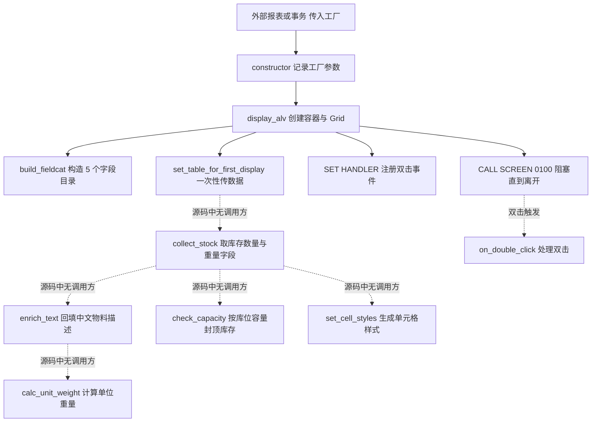
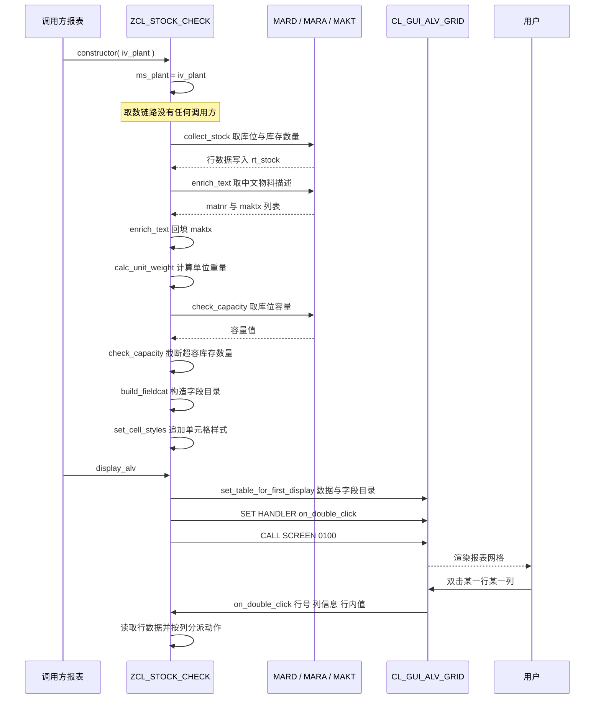

# ZCL_STOCK_CHECK — 原材料库存 / 重量合理性巡检报表 · Onboarding 分析报告

> 分析对象：`ZCL_STOCK_CHECK`（全局类，CLASS-POOL 实现，MM Reporting team）
> 分析视角：业务动机 → 执行链路 → 逐方法拆解 → 数据流转 → 问题分级
> 读者假设：刚接手这块 MM 报表、需要能改它但还没改过 ABAP OO 的工程师

---

## 一、程序定位与业务背景

### 它要解决什么问题

MM 的原材料（非产成品）仓经常出现两类"账面看着正常、实际不对"的数据：

1. **重量口径不对**。MARA 上一个物料有采购单位分母（EINA）和单位净重（NTGEW），收货员按采购单位录单、仓管按基本单位盘库，两边一旦不同步，"总重量"就全错了。月末成本核算、运费分摊、航空材/化工原料的安全库存上限都要用到这个数。
2. **库存与库位不匹配**。MARD 上每个（工厂 / 库位 / 物料）有一行"非限制库存"和一行"存储区段数"。账面库存远大于该物料实际占用的区段数，通常意味着重复过账、负库存冲销没做干净，或者库位确实该清理了。

这个类要做的事情就是：把这两类异常捞成一张可以双击下钻的清单，顺手带出物料描述方便业务看。
类头的注释写得很明确 —— `stock / weight sanity check for raw materials`，归属 MM Reporting team，也就是报表团队做、给采购与仓储业务用。

### 现有做法为什么不够

在把它做成全局类之前，这类巡检报表通常是 `SAPLIST00` + 手写 `WRITE/ALV_FUNCTION_MODULE` 的"一次性程序"：逻辑粘在 PAI 里，取数、加工、显示顺序全靠从上往下读代码；想给别的报表复用一份，只能复制粘贴再改一遍；想在后台跑一次更不可能，因为里面塞着屏幕调用和消息弹窗。

把逻辑抽成全局类、暴露成明确的方法签名，本质是把"巡检规则"变成**可被别的报表直接调用的服务**。这个方向是对的。

### 整体设计范式（一句话定性）

这是一个**状态持有型的瘦 ALV 骨架类**：用 4 个私有属性把"工厂 + 数据内表 + Grid + 容器"挂在对象上，把 ALV 报表的加工链拆成 9 个公开方法，期望的形态是"取数 → 补文本 → 计算 → 校验 → 建字段目录 → 一次性显示 → 事件响应"。

### 交接时必须先知道的一件事

**这份源码目前过不了语法检查**。`on_double_click` 里引用了两个本类不存在的对象（`mt_stock`、`ms_stock`），`check_capacity` 的 `FROM mard-mvbeln` 根本不存在，`enrich_text` 在 `WITH EMPTY KEY` 内表上做了无 WHERE 的 `MODIFY`。所以下面第五章里有些标注是"编译期问题"、有些是"运行期问题"——读的时候请分清。接手第一步是把语法清干净，第二步才是把语义和数据链路修对。

---

## 二、程序执行流程总览

先看清楚一件事：这个类里**唯一能被走通的路径**是"外部程序调 `display_alv` → 显示一张空表 → 卡在屏幕上"。下面这张图用虚线标出来的五个方法，源码中**没有任何调用方**。



责任链表：

| 子程序 | 调用者 | 职责 |
|---|---|---|
| 类定义段（PUBLIC SECTION） | 编译期 | 声明 `ty_stock` / `ty_stock_tab` 与 9 个方法签名 |
| 私有属性段（PRIVATE SECTION） | 编译期 | 持有工厂、单值内表、ALV Grid、自定义容器四个引用/变量 |
| `constructor` | 外部报表（本源码中无调用方） | 把 `iv_plant` 存进 `ms_plant` |
| `display_alv` | 外部报表（本源码中无调用方） | 建容器、建 Grid、把数据交给 ALV、注册事件、进入屏幕 |
| `build_fieldcat` | `display_alv` | 构造物料号/描述/库位/库存/重量 5 个字段目录 |
| `on_double_click` | ALV Grid 的 `double_click` 事件 | 响应双击，当前实现读一张不存在的表 |
| `collect_stock` | **无调用方** | 从 MARD 取库位与库存数量，遗留一段没执行的 Open SQL 字符串 |
| `enrich_text` | **无调用方** | 用 FOR ALL ENTRIES 从 MAKT 取中文描述回填 |
| `calc_unit_weight` | **无调用方** | `ntgew / eina` 得到"单位重量" |
| `check_capacity` | **无调用方** | 把超出库位容量的 `mstock` 截断到上限 |
| `set_cell_styles` | **无调用方** | 给 `MSTOCK` 列追加删除线与颜色 |

下面就按这条流程——先看类给了我们什么接口和数据契约，再从入口往下游逐个方法展开。

---

## 三、分组分析

### 3.1 类定义段（PUBLIC SECTION）

这个 section 是整个类的**对外契约**，也是最值得先读的部分：它决定了调用方能传什么进来、能拿什么出去。本节分三步看结构类型、内表类型、方法签名。

#### ① 输出结构 `ty_stock`

```abap
  PUBLIC SECTION.

    TYPES: BEGIN OF ty_stock,
             matnr  TYPE mara-matnr,
             maktx  TYPE makt-maktx,
             lgort  TYPE mard-lgort,
             mstock TYPE mard-mstock,
             eina   TYPE mara-eina,
             ntgew  TYPE mara-ntgew,
           END OF ty_stock.
```

**做什么** — 定义一个 6 字段的行结构：物料号、物料描述、库位、非限制库存数量、采购单位分母、单位净重。类型全部直接引用 DDIC（`mara-xxx` / `mard-xxx` / `makt-xxx`），没有自己复制一份声明。

**为什么** — 这是 ALV 报表的标准做法：**不要把 DDIC 表本身绑给 ALV**。`mard` 有上百个字段，直接输出会把几十个无关字段也铺到屏幕上，而且一旦有人在 SELECT 里多加一列，ALV 结构就跟着漂。中间加一层自己的结构，屏幕布局就跟底层表解耦了。直接引用 DDIC 字段而不是手写 `CHAR(40)`，也是对的——以后字段长度调整不会漏改代码。

**风险与改进** — 结构里**只有原始值，没有业务结论**。`calc_unit_weight` 算出来的单位重量、`check_capacity` 判断出的"是否超容"，在这张结构里都无处安放，这直接逼着 `check_capacity` 去就地改写 `mstock`（见 3.7）。建议改成"原始值 + 结论值"并存：`mstock`（账面值）、`over_cap`(TYPE abap_bool)、`uw`（单位重量）、`msg`。另外 `lgort` 和 `matnr` 天然是这张表的业务主键，定义内表时应该体现出来（见 3.1②）。

#### ② 内表类型 `ty_stock_tab`

```abap
    TYPES ty_stock_tab TYPE STANDARD TABLE OF ty_stock WITH EMPTY KEY.
```

**做什么** — 声明承载 `ty_stock` 行的标准表，**显式声明为空键表**。

**为什么** — `STANDARD TABLE` 意味着插入快、读取按物理顺序，适合"取一次、遍历、绑定 ALV"的一次性加工链，这个选择本身是对的。

**风险与改进** — `WITH EMPTY KEY` 在这里踩了两个坑，都是硬伤：① 对空键表，`READ TABLE ... WITH KEY` 只能线性查找、无法 `BINARY SEARCH`，内表一大就是 O(N²)（`enrich_text` 正是这么写的）；② 更致命的是，空键表上 `MODIFY ... FROM` **没有 WHERE 子句就无法定位行**，ABAP 要求必须有 WHERE，否则语法错误——`enrich_text` 就是这么写的。另外业务主键是 `matnr + lgort`（MARD 的键就是工厂+库位+物料），建议直接声明成 `WITH DEFAULT KEY`（`matnr` + `lgort`），既拿到键查找，又让 `MODIFY FROM` 合法。

#### ③ 九个方法签名

```abap
    METHODS constructor
      IMPORTING iv_plant TYPE werks OPTIONAL.

    METHODS collect_stock
      IMPORTING it_matnr         TYPE mara-matnr_tab
      RETURNING VALUE(rt_stock) TYPE ty_stock_tab
      RAISING   cx_sy_move_cast_error.

    METHODS enrich_text
      CHANGING ct_stock TYPE ty_stock_tab.

    METHODS calc_unit_weight
      IMPORTING is_row       TYPE ty_stock
      RETURNING VALUE(rv_uw) TYPE p DECIMALS 4.

    METHODS check_capacity
      IMPORTING iv_warehouse TYPE mard-lgort
      CHANGING  ct_stock    TYPE ty_stock_tab.

    METHODS build_fieldcat
      RETURNING VALUE(rt_fieldcat) TYPE lvc_t_fcat.

    METHODS display_alv.

    METHODS on_double_click
      IMPORTING iv_row    TYPE lvc_row
                iv_column TYPE lvc_col
                iv_data   TYPE any.

    METHODS set_cell_styles
      IMPORTING is_row     TYPE ty_stock
      CHANGING  ct_styling TYPE lvc_t_scol.
```

**做什么** — 9 个方法全部 `PUBLIC`，构成一条完整加工链的六个环节（取数 / 补文本 / 计算 / 校验）加展示与交互两层。`constructor` 走导入参数而非 setter 注入，`collect_stock` 是唯一的 `RETURNING` 取数方法，`enrich_text` / `check_capacity` / `set_cell_styles` 走 `CHANGING` 就地改表。

**为什么** — 参数传递方式的区分是有讲究的：纯计算类（`calc_unit_weight`）用 `IMPORTING` + `RETURNING`，保证不改调用方的数据；批量加工类（`enrich_text`、`check_capacity`）用 `CHANGING` 传引用，避免整表复制；ALV 交互类（`on_double_click`）用 ALV 事件的标准签名 `lvc_row` / `lvc_col` / `any`。这套区分是教科书级别的，`on_double_click` 的签名尤其关键——写对了，`SET HANDLER` 才能直接挂上去，不需要任何适配。

**风险与改进** — 三处签名层面的问题：① `iv_plant TYPE werks OPTIONAL` 中 `werks` 拿到的是 **DDIC 结构 WERKS**（工厂主数据整条记录），不是 4 位工厂码，真正想要的是 `mard-werks`；② `collect_stock` 声明了 `RAISING cx_sy_move_cast_error` 但方法体里从不抛出，等于给每个调用方强加一个永不触发的 `TRY/CATCH`；③ 签名里没有"库位范围"这个最关键的筛选维度——`collect_stock` 不接收 `lgort` 范围，而 `check_capacity` 却按单个库位判断容量，两者在数据口径上对不上（详见 3.4③ 与 3.7）。另外只有 `collect_stock` 声明了 `RAISING`，其余 8 个方法没有，取数失败时调用方无法统一处理，建议要么统一抛业务异常类，要么统一不抛。

---

### 3.2 私有属性段（PRIVATE SECTION）

取数方法跑完，`display_alv` 就要把结果呈上屏幕。这一节先看对象替我们持有了哪些状态。

```abap
  PRIVATE SECTION.

    DATA ms_plant TYPE werks.
    DATA ms_plants TYPE werks_tab.
    DATA mo_grid   TYPE REF TO cl_gui_alv_grid.
    DATA mo_container TYPE REF TO cl_gui_custom_container.
```

**做什么** — 声明四个成员：一个"当前工厂"、一个未命名的工厂内表、一个 ALV Grid 引用、一个自定义控件容器引用。`mo_` 前缀说明作者知道这是引用类型对象，用的是 OO 惯例命名。

**为什么** — 把 Grid 和容器挂在对象上而不是局部变量，是因为它们要活过 `display_alv` 的栈帧（`CALL SCREEN` 是阻塞的，返回时机不确定），必须由对象持有；同时 `on_double_click` 是事件驱动的，回调时没有原方法栈可用，共享状态只能靠成员属性。工厂也放成员上，是为了让 `check_capacity` 这种没有 `iv_plant` 入参的方法也能拿到上下文。整体是"有状态报表类"的标准布局。

**风险与改进** — 三处问题：① `ms_plant TYPE werks` 拿到的是 DDIC **结构**而不是字段类型，后面 `'...' || ms_plant` 会把整条工厂主数据记录拼进 SQL、`mard-werks = ms_plant` 也在拿结构比字符——这是全类最隐蔽的一个类型语义错误，应改成 `TYPE mard-werks`；② `ms_plants TYPE werks_tab` 声明后**全类从未被读写**，而且用单数 `ms_` 前缀命名一张内表，纯属误导，直接删掉或改名为 `mt_plants` 并真正用起来；③ 生命周期没有管理：`mo_grid` / `mo_container` 在 `display_alv` 每次调用时都会 `CREATE OBJECT` 重建，旧对象靠 GC 兜底，没有 `CLEAR`；标准做法是进入时 `CLEAR mo_grid`、离开时释放，或至少保证只创建一次。

---

### 3.3 方法 `constructor`

有了数据契约和成员属性，接下来的问题是"这个对象带着什么上下文被创建"。答案是构造器——而它只有两行。

```abap
  METHOD constructor.

    ms_plant = iv_plant.

  ENDMETHOD.                    "constructor
```

**做什么** — 把导入参数 `iv_plant` 原样赋给成员 `ms_plant`，不做任何加工、不做任何校验。

**为什么** — 构造函数只做一件事是对的：它保证对象一被创建就处于可用状态，调用方不需要"建完对象还得记得调一次初始化方法"。这也让工厂成为类的**隐式输入**，后面所有方法都不再显式接收 `iv_plant`——减少了每个方法的参数噪音。命名用 `ms_` / `ms_stock` 这种 OO 惯例前缀，也让读代码的人一眼知道它是对象状态。

**风险与改进** — `iv_plant` 是 `OPTIONAL` 但**没有任何校验**：传空（初值）不会报错，而是把空工厂一路带到 `collect_stock` 的 `WHERE werks = ms_plant`，最后静默返回 0 行，再弹一句"No stock records found"——排查的人会往数据上找原因，而真实原因是没传参数。建议在构造时用 `T001A-WERKS` 或 `T000-WERKS` 做一次存在性检查，不合法就用异常类 `RAISING cx_sy_no_handler` / 自定义异常抛出去。另外 `TYPE werks` 的类型语义错误就在这一行定型（见 3.2①），改动要连带 3.4② 的 SQL 条件一起改。

---

### 3.4 方法 `collect_stock`

这是全类最该重写的方法，也是问题最密集的方法。分三步看：先看一段被写下但从未执行的 SQL 拼接，再看真正执行的语句，最后看结果为空时的处理。

#### ① 拼接了一段从未执行的 Open SQL

```abap
  METHOD collect_stock.

    DATA lv_sql TYPE string.

    lv_sql = |SELECT mard~lgort mard~mstock mara~eina mara~ntgew mara~matnr|
           && |  FROM mard INNER JOIN mara ON mara~matnr = mard~matnr|
           && | WHERE mard~werks = '{ ms_plant }'|
           && |   AND mard~lgort IN iv_warehouse_range( )|.
```

**做什么** — 作者显然先设计了正确方案：MARD 内连接 MARA，按工厂和库位范围过滤，同时取库位、库存数量、采购单位分母、单位净重四个字段，还补了 `mara~matnr`。这段逻辑被拼成字符串存进 `lv_sql`，**然后再没有任何语句使用它**——没有 `EXECUTE IMMEDIATE`，没有传给任何 FM，`lv_sql` 出了声明就死了。

**为什么** — 从 SQL 设计本身看意图是对的：JOIN MARA 正是为了拿到 `eina` / `ntgew`（这两个字段只在 MARA 上），并且主动加了 `lgort IN` 的范围过滤，避免全厂全库位扫描。但实现方式（运行时拼字符串）恰恰是最差的一种：拼出来的 SQL 在编译期完全不做字段检查，字段不存在、要 JOIN 的键写错，全部推迟到运行期才炸；优化器也拿不到静态语句的信息，二级索引用不用得上全看运行时解析。ABAP 里要动态条件，正确做法是 `SELECT ... WHERE lgort IN lt_range` 传内表，让 `IN` 自己去覆盖范围，而不是拼字符串。

**风险与改进** — `iv_warehouse_range( )` 是一个**在本方法里根本不存在**的变量（方法签名里只有 `iv_matnr`），它被写死在字符串里所以编译期没报错，这种"藏在字符串里的语法错误"是动态 SQL 最难查的一类问题。另外 `'{ ms_plant }'` 直接把变量插进 SQL 的引号里，等于把"所有值都必须自己保证不含单引号"这个责任接了下来——这次侥幸安全（工厂码不会含引号），但一旦这个类以后接受用户输入构造工厂范围就会变成注入面。**结论：整段 `lv_sql` 应该删掉，把 JOIN 和库位过滤直接写进 ② 的静态 SELECT，并把库位范围作为 `IMPORTING` 参数传进来。**

#### ② 真正执行的 SELECT（字段与源表对不上）

```abap
    SELECT matnr lgort mstock eina ntgew
      FROM mard
      INTO TABLE rt_stock
      WHERE werks  = ms_plant
        AND matnr IN it_matnr.
```

**做什么** — 从 MARD 按工厂和物料范围取 `matnr / lgort / mstock / eina / ntgew` 五列，装进返回内表 `rt_stock`。这就是全类唯一的取数语句。

**为什么** — 用 `INTO TABLE` 一次全量取回交给内存处理，对报表场景（数据量在几千到几万行）是对的，比在 `LOOP` 里反复 `READ TABLE` 好得多。列清单显式写出而不是 `SELECT *`，避免把 MARD 的宽字段拖进内存——方向正确。

**风险与改进** — 三处硬伤：① **字段与源表不匹配**：`eina` 和 `ntgew` 存在于 MARA，不在 MARD，这一句在运行期会直接抛 SQL 错误（`MARD` 上没有这两个字段）。字段清单照抄了 ① 里那段 JOIN 版的 SELECT，却忘了把 JOIN 也抄过来——这正是"改了一半"最典型的样子。② **工厂条件类型错**：`werks = ms_plant` 拿 4 位字符和 DDIC 结构比（见 3.2①），结果不是取不到数就是取到错值；配合 `ms_plant` 为空时还会静默返回 0 行。③ **缺少两个必要过滤**：没有 `lgort` 过滤（`ty_stock` 里有 `lgort`，`check_capacity` 又按库位判断，但取数阶段压根不接受库位范围），也没有 `mstock <> 0` 过滤——MARD 是全厂 × 全库位 × 全物料的大表，一份 MRP 跑出来的物料范围全部命中时，结果集里绝大多数是零库存行，把真正要看的异常行淹没掉。修正方向：JOIN MARA 补齐字段、把库位范围作为导入参数、并默认排除零库存行（或给一个 `iv_skip_zero` 开关）。

#### ③ 无效循环与"无数据"提示

```abap
    LOOP AT rt_stock ASSIGNING FIELD-SYMBOL(<ls>).
      <ls>-matnr = <ls>-matnr.
    ENDLOOP.

    IF rt_stock IS INITIAL.
      MESSAGE 'No stock records found' TYPE 'S'.
    ENDIF.

  ENDMETHOD.                    "collect_stock
```

**做什么** — 用 `ASSIGNING` 拿到行的字段符号，然后把自己的 `matnr` 赋给自己——整个循环对数据没有任何影响。之后判断结果表是否为空，为空则弹一条成功级消息。

**为什么** — `ASSIGNING FIELD-SYMBOL` 本身是个好习惯：只改要改的字段、不复制整行、字段符号在 `LOOP` 外依然可读。空结果给个提示也是负责的做法。**但这两件事的前提是那行代码真的有事可做。**

**风险与改进** — ① `<ls>-matnr = <ls>-matnr` 是彻底的自赋值死代码，编译器会给"无意义的赋值"警告。它大概率是"想把物料号去空格 / 统一大写 / 补前导零"写到一半留下的残骸——如果确实需要规范化，应该写成 `TOUPPER( )` / `CONDENSE( )` / `SHIFT_LEFT( )`；如果不需要，整段删掉。② `MESSAGE ... TYPE 'S'` 出现在取数方法里是职责错位：取数方法不该有 UI 副作用，调用方（可能是后台批处理、可能是被别的报表内嵌调用）无法区分"确实没有数据"和"数据被过滤掉了"，也没有办法决定要不要继续。更麻烦的是这是在**类（class pool）**里，消息类只能是空白字面量，运维在 SU53 里看不到有意义的消息号。正确做法是取数方法只返回空表，把提示上移到 `display_alv` 或调用方；真要报错就用异常类。③ 顺带一句：空内表时的 `matnr IN it_matnr` 不会退化成全表扫描（IN 列表为空意味着无解，返回 0 行），但如果调用方传进来的是"全厂物料范围"，②的过滤缺失就会真的变成大扫描。

---

### 3.5 方法 `enrich_text`

取数拿到的是一串裸物料号，屏幕上只能看到 `MATNR`。接下来这个方法负责把描述补上——它是"加工链第二棒"，写法上同样分两步。

#### ① FOR ALL ENTRIES 取中文描述

```abap
  METHOD enrich_text.

    DATA lt_text TYPE TABLE OF makt.

    SELECT matnr maktx FROM makt
      INTO TABLE lt_text
      FOR ALL ENTRIES IN ct_stock
      WHERE matnr = ct_stock-matnr
        AND spras = 'ZH'.
```

**做什么** — 以 `ct_stock` 的物料号为驱动表，用 `FOR ALL ENTRIES` 从 MAKT 一次取回全部物料的中文描述，装进局部内表 `lt_text`。

**为什么** — 选 `FOR ALL ENTRIES` 而不是先查全部 MAKT 再 `READ` 过滤，是对的：MAKT 是全语言描述表（每个物料 × 每种语言一行，几十万到几百万行），全量拉进内存既慢又占内存；FAE 把驱动表下推到数据库，一次索引查找搞定。这是 ABAP 里做"按物料清单补描述"的标准解法。列清单只取 `matnr` + `maktx`，不 `SELECT *`，也对。

**风险与改进** — ① **`spras = 'ZH'` 硬编码**：在任何非中文的 SAP 系统（尤其是英文 client）上，这一句一条描述都取不到，整列全空，而且没有任何报错提示，业务只会说"描述怎么没了"。语言必须来自 `sy-langu`，或者做成导入参数让调用方指定，双语系统还要考虑取完 `ZH` 再回退到 `sy-langu`。② **FAE 前未判空**：`ct_stock` 为空时应该直接 `RETURN`，既省一次数据库往返，也让"没有数据要补描述"这个语义显式化。③ 顺带说明：`lt_text` 未 `SORT` 也未去重，目前 `spras = 'ZH'` 恰好保证一个物料一行，所以不会重复；但一旦改成"多语言取几列"就会立刻产生重复行，回填时会按最后一次匹配覆盖——这行隐患要记着。

#### ② 逐行回填（空键表上无 WHERE 的 MODIFY）

```abap
    LOOP AT ct_stock INTO DATA(ls_row).
      READ TABLE lt_text INTO DATA(ls_text) WITH KEY matnr = ls_row-matnr.
      ls_row-maktx = ls_text-maktx.
      MODIFY ct_stock FROM ls_row.
    ENDLOOP.

  ENDMETHOD.                    "enrich_text
```

**做什么** — 遍历待输出内表，按物料号在描述表里查找，把 `maktx` 写回，然后整行 `MODIFY` 回内表。意图是"回填描述字段"。

**为什么** — 思路是对的，`ty_stock` 里 `maktx` 就是在 `enrich_text` 这一步被填上的（取数时它一直是初值）。用 `DATA(...)` 内联声明在 `LOOP` 和 `READ` 里各建一次结构，是 7.40 之后的推荐写法，比预先声明一堆结构变量干净。

**风险与改进** — ① **编译期错误**：`ct_stock` 的类型是 `WITH EMPTY KEY`（见 3.1②），对空键表执行 `MODIFY ... FROM` **没有 WHERE 子句就无法定位行**，ABAP 要求必须有 WHERE，否则语法错误——这一行过不去。② 即使补上 `WHERE matnr = ...` 也仍然是错的：业务主键是 `matnr + lgort`，只按 `matnr` 回写会命中第一个匹配行，把同物料不同库位的行写成一样。③ **性能**：`lt_text` 是未排序的标准表，`READ TABLE ... WITH KEY matnr` 退化成线性查找，外层再套一层循环就是 O(N²)。正确写法是先 `SORT lt_text BY matnr`，或者把 `lt_text` 声明成 `HASHED`，再用 `ASSIGNING` 直接改字段（省掉整行 `MODIFY`）。④ **没判 `sy-subrc`**：`READ` 失败时目标结构不被修改、保持初值，于是描述静默变空——"这个物料本来就没有中文描述"和"这条没查到"两种情况无法区分，业务侧同样只会说"描述没了"。⑤ 遍历内表的同时用 `MODIFY` 改它自己属于危险写法，`ASSIGNING` 直改字段更安全也更省。

---

### 3.6 方法 `calc_unit_weight`

补齐了文本，接下来是核心业务计算。这个方法很短，但单位换算这件事很重。

```abap
  METHOD calc_unit_weight.

    DATA lv_base TYPE p DECIMALS 4.

    lv_base = is_row-eina.

    IF lv_base IS INITIAL.
      rv_uw = 0.
      RETURN.
    ENDIF.

    rv_uw = is_row-ntgew / lv_base.

  ENDMETHOD.                    "calc_unit_weight
```

**做什么** — 取行上的采购单位分母 `eina` 作为除数，检查是否为 0（为 0 则返回 0），否则用 `ntgew / eina` 得到返回值 `rv_uw`，即所谓的"单位重量"。全程除零保护完整，方法把该做的防护都做了。

**为什么** — 单点计算做成 `RETURNING` 值函数、输入输出都只读，是最容易理解和最容易测试的形态；把除零前置成 `IF ... RETURN`，比让运行期的除零异常往外抛更贴近业务（重量 0 本来就是合法结果）。这一段的工程习惯是好的，问题不在写法，在公式。

**风险与改进** — **公式的量纲不成立，这是 P0 级的语义错误**：① `ntgew` 是 MARA 上的**单位净重**，单位是物料的基本计量单位（通常 KG），它本身已经是"每基本单位的重量"了；② `eina` 是**采购计量单位的换算分母**（采购单位里含几个基本单位），它描述的是数量单位，跟重量没有换算关系；③ 所以 `ntgew / eina` 得到的既不是单位重量（正确的"单位重量"就是 `ntgew` 本身），也不是总重量（正确口径是 `mstock * ntgew` 基本单位，或收货单位口径 `mstock / eina * ntgew`）。举个具体例子：物料 1 公斤装、1 箱装 10 公斤（`ntgew = 1 KG`，`eina = 10`），库存 5 箱（`mstock = 50 KG` 基本单位），本方法返回 `0.1`——这个数没有任何业务含义。**修法：让这个方法接收"数量 + 数量所属单位 + 重量所属单位"，用 `CONV` 和 `MDAT`/`UMASZ` 做真正的单位换算；或者干脆把它改造成"总重量 = mstock * ntgew"，并把口径（基本单位 / 收货单位）做成参数。** 附带两点：`DATA lv_base TYPE p DECIMALS 4` 是内部格式定点数，精度和溢出行为都由系统内部约定控制，报表里做重量计算建议用 `abap_decfloat34` 或明确 `p LENGTH ... DECIMALS ...` 的外部格式，并把单位一起返回；`IS INITIAL` 对数值可用但业务上更直白的是 `IF lv_base = 0`。最后一点很关键：**这个方法目前没有任何调用方，算出来的值既没有字段承载、也没进字段目录，即使接通数据链路也看不到。**

---

### 3.7 方法 `check_capacity`

重量算完，该看库存和库位的关系了。这个方法的意图是"库位放不下就把数量截到上限"，分两步看。

#### ① 取"库位容量"——源表、字段、目标类型三重错误

```abap
  METHOD check_capacity.

    DATA lv_slots TYPE i.

    SELECT SINGLE mstbw FROM mard-mvbeln INTO @lv_slots
      WHERE werks = ms_plant AND lgort = iv_warehouse.
```

**做什么** — 作者想从"某个东西"里取库位容量到局部变量 `lv_slots` 里，条件是当前工厂 + 入参库位。`lv_slots` 声明为 `TYPE i`（整数），意图表达"有几个仓位"。

**为什么** — 用 `SELECT SINGLE` 取一个常量值（容量）在思路上成立，比在循环里逐行查好得多。`INTO @lv_slots` 的内联转义写法也是 7.40+ 的正确姿势。变量名 `lv_slots` 也说明了作者认为这是一个"仓位数"。

**风险与改进** — 这一句集中了三个层次的错误，**任何一层都足以让它跑不起来**。① **`FROM mard-mvbeln` 是无效的**：`mvbeln` 不是 MARD 的字段，它是采购订单头那个 CDS 视图（EKKV/MVBELN）的名字，写在 `FROM` 后面根本找不到表；而且 `MSTBW` 也不在采购订单视图里。② **量纲与类型都不对**：MARD-MSTBW 是**存储区段数量**，带单位"仓位"，是 13 位 3 小数的 `QUAN`；取进 `TYPE i`（INT4，上限约 21 亿）会隐式转换掉小数位，甚至在极端值下溢出。这实际上是把一个带单位、带小数的数量当成"整数个数"。③ **语义上就不是"库位容量"**：MSTBW 是**每个物料在该库位上实际占用的存储区段数**，属于物料级属性，同一个库位下不同物料的 MSTBW 完全不同；它不能代表"这个库位一共能放多少"。真正的库位容量在 LAGP / 库位主数据那边。用 `SELECT SINGLE` 在 MARD 上按 `werks + lgort` 查，缺了 `matnr`，只会返回任意一行的 MSTBW——这个数跟当前循环处理的行没有关系。**正确做法：`ty_stock` 里增加 `mstbw` 字段，在取数阶段一并 SELECT 出来（和物料主键一起定位，本来就是同一行），容量判断放在内存里做；真正要库位容量则查 LAGP/LTYP 这一层的库位定义。**

#### ② 用容量封顶 `mstock`

```abap
    LOOP AT ct_stock ASSIGNING FIELD-SYMBOL(<ls>).
      IF <ls>-mstock > lv_slots.
        <ls>-mstock = lv_slots.
      ENDIF.
    ENDLOOP.

  ENDMETHOD.                    "check_capacity
```

**做什么** — 遍历待输出内表，凡是库存数量超过 `lv_slots` 的，就把 `mstock` 直接改成 `lv_slots`。

**为什么** — 遍历 + `ASSIGNING` + 内存内判断，不额外查数据库，这部分是对的。如果目的只是"标出超容的行"，思路应该是**加一个标志位而不是改数据**。

**风险与改进** — 三处必须改：① **`SELECT SINGLE` 没查找到时 `lv_slots` 保持初值 0，`sy-subrc = 8` 从头到尾没人检查**，于是 `mstock > 0` 的行会被**全部截断成 0**——屏幕上显示的库存数量集体消失，而方法不报任何错。结合 ① 里"源表根本不存在"的事实，这段循环在真实环境下等于"把所有库存数量抹成 0"。这是全类最危险的缺陷：它不是让报表不好看，而是让报表**撒谎**。② **量纲错配**：`mstock` 是物料数量（基本计量单位），`lv_slots` 是仓位数量，两个单位不同的东西直接比较大小，没有物理意义；即使换对源表，这个比较也不成立。③ **破坏性改写**：把筛选结论直接写回源字段，原始账面库存被永久覆盖，界面上再也无法区分"实际库存 50"和"被截断到 3"。`set_cell_styles` 拿到这个被改过的 `is_row` 也就没法判断"为什么这行要标红"。**修法：`ty_stock` 增加 `over_cap TYPE abap_bool`（或 `mstbw` + 计算字段），这里只置标志不改数值，把渲染工作交给样式方法，账面值永远保留。**

---

### 3.8 方法 `build_fieldcat`

数据和业务结论都有了，接下来要决定"屏幕上长什么样"。这一步就是构建 ALV 字段目录——它是报表的第二套 schema，需要人工和第一套（`ty_stock`）做语义对照。

```abap
  METHOD build_fieldcat.

    APPEND VALUE #(
      fieldname  = 'MATNR'
      ref_field  = 'MATNR'
      tabname    = 'TY_STOCK'
      seltext_m  = 'Material'
      just_field = 'X' ) TO rt_fieldcat.

    APPEND VALUE #(
      fieldname  = 'MAKTX'
      ref_field  = 'MAKTX'
      tabname    = 'TY_STOCK'
      seltext_m  = 'Description' ) TO rt_fieldcat.

    APPEND VALUE #(
      fieldname  = 'LGORT'
      ref_field  = 'LGORT'
      tabname    = 'TY_STOCK'
      seltext_m  = 'Storage Location' ) TO rt_fieldcat.

    APPEND VALUE #(
      fieldname  = 'MSTOCK'
      ref_field  = 'MSTOCK'
      tabname    = 'TY_STOCK'
      seltext_m  = 'Stock Qty'
      cfield     = 'MSTOCK'
      no_outline = 'X' ) TO rt_fieldcat.

    APPEND VALUE #(
      fieldname  = 'NTGEW'
      ref_field  = 'NTGEW'
      tabname    = 'TY_STOCK'
      seltext_m  = 'Gross Weight (kg)' ) TO rt_fieldcat.

  ENDMETHOD.                    "build_fieldcat
```

**做什么** — 用 `VALUE #(...)` 构造内表行的现代写法，逐个 `APPEND` 五个字段：物料号（带 `just_field`，双击时 ALV 才认为是可点字段）、描述、库位、库存数量、重量，最后返回 `rt_fieldcat`。

**为什么** — 用代码构造字段目录而不是依赖 SM31 里手工维护的 ALV 变式，是 ALV 报表里更可控的做法：字段顺序、文本、哪些列参与合计全部在源码里可读、可评审、可版本管理，也不需要 BASIS 团队手工维护变式。`VALUE #()` 的行构造器写法比 `CLEAR` + 逐字段赋值紧凑得多，也更不容易漏字段名。`fieldname` 一律大写、与 `ty_stock` 组件名一致，这样字段目录和内表靠组件名自动对上——机制是对的。

**风险与改进** — 这是全类语义错误最容易藏的地方，因为**编译器一个都发现不了**：① **`NTGEW` 的标签写成 `'Gross Weight (kg)'`（毛重），但 NTGEW 是净重**（毛重是 MARA-BRGEW）。屏幕会一本正经地告诉业务"这是毛重"，业务据此算出来的所有重量都错了一点点还不自知——这是最危险的一类缺陷。必须改成 `Net Weight (kg)`。② `tabname = 'TY_STOCK'` 是**误导性样板**：`set_table_for_first_display` 并不用字段目录里的 `TABNAME`，它用 `it_outtab` 的实际表名做绑定，真正让字段显示出来的是 `fieldname` 与内表组件名的匹配。留着它会让人误以为字段绑定靠 `tabname` 生效，改内表名字时反而找不到原因。③ `ref_field` 的用途是引用另一个字段取格式/货币/日期显示信息，这里全部自引用（`ref_field = fieldname`），等于没配；`cfield = 'MSTOCK'` 让数量列把自己当参照货币字段，同样无意义，正确的做法是给数值列配 `NO_ZERO`、`CURRENCY` 或参照正确的单位字段。④ `no_outline = 'X'` 是 ALV 树控件（`CL_GUI_ALV_TREE_VIEW`）的选项，用在 `CL_GUI_ALV_GRID` 上不生效，属于从别处抄来的残留。⑤ **缺字段**：`eina` 没进目录；`calc_unit_weight` 的结果没有任何字段承载；`check_capacity` 的超容标志也没有字段。这三个业务结论一个都显示不出来。⑥ **缺 `build_layout`**：没有 `build_layout` 就没有列宽优化、汇总行、冻结列、变式保存；配合 3.9 的 `CALL SCREEN`，用户在 0100 屏幕上没有任何 ALV 变式可以保存。⑦ 单位不该写进标签文本（`'Gross Weight (kg)'`），应该作为独立列或用 `seltext` + 单位参照字段，否则多单位物料的显示是错的。

---

### 3.9 方法 `display_alv`

字段目录准备好了，真正把界面拉起来的就是这个方法。它是全类的展示枢纽，也是"整条链路没接通"这件事暴露得最清楚的地方。分三步看。

#### ① 创建容器与 Grid

```abap
  METHOD display_alv.

    DATA lt_stock TYPE ty_stock_tab.
    DATA lv_ok    TYPE abap_bool.

    CREATE OBJECT mo_container
      EXPORTING
        container_name = 'STOCK_AREA'
        repaint_detlevel = 1.

    CREATE OBJECT mo_grid
      EXPORTING
        i_container = mo_container
        ex_initial_layout = '1'.
```

**做什么** — 声明一个空的 `lt_stock` 和一个未使用的布尔变量，然后创建一个自定义控件容器（绑定到屏幕上的自定义控件 `STOCK_AREA`）和一个 ALV Grid，把容器交给 Grid。

**为什么** — `CL_GUI_CUSTOM_CONTAINER` + `CL_GUI_ALV_GRID` 的组合是全屏 ALV 的经典做法：容器负责占据屏幕 0100 上的控件区域，Grid 负责渲染数据和事件。相比 `ALV_FUNCTION_MODULE` 或 `REUSE_ALV_GRID_DISPLAY`，它能做事件处理、能加颜色、能做交互下钻，也不需要额外的变式维护。`ex_initial_layout = '1'` 表示不做初始布局优化（由后续 `build_layout` 决定），配合"没有 `build_layout`"的现状，这个标志其实是多余的但无害。**把数据内表声明成本地变量、作为参数传给 Grid，而不是存进成员属性，也是对的**——因为 `set_table_for_first_display` 是一次性调用，之后要刷新必须用 `refresh_table_display`，内表的生命周期由调用方控制更清楚。

**风险与改进** — ① `CREATE OBJECT` 已被 `NEW` 取代（7.40+），且内联声明 `NEW cl_gui_alv_grid( ... )` 更短；这是风格问题，不影响运行。② **`repaint_detlevel` 这个参数名要在 ABAP 帮助里核对**：`CL_GUI_CUSTOM_CONTAINER` 的标准导出参数是重绘相关的 `REP_AINTENS`（取值是 `'FULL'` / `'LIGHT'` / `'MEDIUM'` / `'NO'`），不存在 `repaint_detlevel = 1` 这种写法。若拼错就是语法错误（见第五章同类问题的清单）。③ **`i_container` 同样要核对**：`CL_GUI_ALV_GRID` 把容器挂上去的标准参数名是 `i_grid_owner`；请以 `CL_GUI_ALV_GRID` 帮助里的 `EXPORTING` 参数表为准。④ 容器控件名 `'STOCK_AREA'` 是纯字面量且硬编码——容器名和屏幕 0100 上的自定义控件名必须一致，改屏幕时不会有任何编译期提醒。

#### ② 一次性把数据交给 ALV

```abap
    mo_grid->set_table_for_first_display(
      CHANGING
        it_outtab        = lt_stock
        it_fieldcatalog  = build_fieldcat( )
      EXCEPTIONS
        program_error = 1
        OTHERS        = 2 ).

    IF sy-subrc <> 0.
      lv_ok = abap_false.
    ENDIF.
```

**做什么** — 调用 `set_table_for_first_display`，把字段目录（由 `build_fieldcat( )` 内联调用生成）和数据内表 `lt_stock` 交给 Grid，一次性完成设置与显示。异常列表里挂了 `program_error` 和 `OTHERS` 两个处理器，然后检查 `sy-subrc`。

**为什么** — `set_table_for_first_display` 是"一次性"接口：设置 + 显示一步到位，之后要改数据只能走 `refresh_table_display`。这个选择适合"加工完所有数据、一次性呈现"的报表模式，和加工链的设计一致。字段目录内联调用而不落局部变量，也是干净写法。

**风险与改进** — 这一段有**三个独立的问题，叠加结果是"空屏且不报错"**：① **数据链路根本不存在**：`lt_stock` 在上一行才声明，本方法里从未被任何语句填充——`collect_stock`、`enrich_text`、`check_capacity`、`set_cell_styles` 全都没有调用方。**这就是整张报表为什么永远是空的**：字段目录建得再漂亮，交给 Grid 的是一个空内表。② **`sy-subrc` 判断形同虚设**：`program_error` 和 `OTHERS` 捕获的都是**类异常**（`cx_program_error` 一族），而 ABAP 方法调用抛出类异常时 `sy-subrc` 不会被赋值——`sy-subrc` 的赋值规则只对非类异常有效。所以这个 `IF sy-subrc <> 0` 分支基本上永远不会进，异常被静默吞掉。正确写法是 `TRY ... CATCH cx_sy_no_handler / cx_program_error / cx_sy_conversion_no_number`，并在 `CATCH` 里给出明确提示。③ **`lv_ok` 赋值后从未被读取**：即使那个分支真的进了，也只是给一个局部变量赋了个值就结束，没有 `MESSAGE`、没有日志、调用方完全不知情。异常处理不能只有"记一下然后丢掉"。

#### ③ 注册事件并进入屏幕

```abap
    SET HANDLER on_double_click FOR mo_grid.

    CALL SCREEN 0100.

  ENDMETHOD.                    "display_alv
```

**做什么** — 把 `on_double_click` 注册为 Grid 的双击事件处理器，然后 `CALL SCREEN 0100` 进入 0100 屏幕并阻塞，直到用户离开。

**为什么** — `SET HANDLER ... FOR <引用>` 是注册 Grid 事件的标准写法，比已废弃的 `USER_COMMAND` + 内表 `double_click` 方案干净得多。`CALL SCREEN 0100`（非 `SET SCREEN`）是**阻塞式**的：调用栈停在这里，用户在 0100 上操作，直到 `LEAVE TO SCREEN` 才返回——这正是"一个类方法把整张报表撑到底"的经典范式，也让调用方不需要写任何屏幕流转代码。这个范式适合"一次性交互式巡检报表"。

**风险与改进** — ① **0100 屏幕在这个类池里根本不存在**。全局类的类池要提供屏幕，得把屏幕定义和流逻辑写在类池的 include（`...00` / `...01`）里；本源码只有类定义与实现，屏幕 0100 不存在 → `CALL SCREEN 0100` 会以短转储结束。屏幕上还必须有名为 `STOCK_AREA` 的自定义控件，"容器 + Grid"才有落脚点。也就是说：`display_alv` 单独拿出来**永远跑不通**。② **没有屏幕流逻辑**：没有 PAI 的返回处理、没有 PBO 的 `LOOP AT SCREEN` 尺寸刷新，用户改变窗口大小时容器不会自适应；用户按 F3/返回时也没有明确路由。③ **阻塞语义没有文档化**：`CALL SCREEN` 之后代码不会往下走，所以 `display_alv` 无法被安全地内嵌到别的报表或后台任务里；一旦有人想在后台跑这个"巡检"，会直接被屏幕调用卡死。要复用就必须把"取数 + 返回数据"和"显示"分成两层。④ 事件注册只有双击，没有 `hotspot_click`、`click`、`data_changed`，后续想加"点物料号跳 MARA 概览"要重新改注册。⑤ Grid 创建之后没有 `mo_grid->refresh_table_display( )` 之类的收尾，也没有对 `mo_grid` / `mo_container` 做生命周期管理。

---

### 3.10 方法 `on_double_click`

界面起来之后，双击一行的响应逻辑就是它。这是全类编译错误最集中的方法。

```abap
  METHOD on_double_click.

    READ TABLE mt_stock INTO ms_stock WITH KEY matnr = iv_data.

    WRITE: / iv_row, iv_column, iv_data.

    CASE iv_column-fieldname.
      WHEN 'MSTOCK'.
        CHECK iv_row > 0.
      WHEN 'NTGEW'.
        MESSAGE 'Weight is maintained in MARA, not per stock record' TYPE 'S'.
    ENDCASE.

  ENDMETHOD.                    "on_double_click
```

**做什么** — 作者的意图是：双击某一行时，把事件带来的当前值（`iv_data`）当作物料号去查数据内表 `mt_stock`，结果放进结构 `ms_stock`，然后按被双击的列名分支处理——双击库存列做点校验，双击重量列提示"重量在 MARA 维护"。

**为什么** — 方法签名（`lvc_row` / `lvc_col` / `any`）与 `CL_GUI_ALV_GRID` 的 `double_click` 事件完全对应，**这一点是对的**：`SET HANDLER` 可以直接挂上去，不需要任何签名适配或中间包装。用 `iv_column-fieldname` 分派不同列的响应，也是 ALV 交互的标准做法——同一个网格，不同列双击给出不同上下文（跳明细、跳凭证、跳主数据）。`CHECK` 跳过表头行/汇总行也是常见防御。这段代码的设计意图本身是合理的。

**风险与改进** — ① **编译期错误：`mt_stock` 与 `ms_stock` 在本类中都不存在。** 数据内表 `lt_stock` 是 `display_alv` 的局部变量、私有属性里只有 `ms_plant` / `ms_plants` / `mo_grid` / `mo_container`。这一行直接让整个类过不了语法检查。修法：把数据内表提升为成员属性（`mt_stock`），让 `display_alv` 用 `mt_stock` 而不是局部 `lt_stock`，事件回调才有共享数据可读——这也是 `on_double_click` 需要的唯一一种共享方式。② **`iv_data` 是 `TYPE any`**，`READ ... WITH KEY matnr = iv_data` 要把它动态赋给 `CHAR(40)`，需要运行期类型检查，类型不匹配就是转储；应该显式 `CONV mara-matnr( iv_data )` 或先 `IF ty_dummy IS INSTANCE OF` 判断。③ **`WRITE: / iv_row, iv_column, iv_data.` 是列表输出调试语句**，应该从生产代码里拿掉。而且 `iv_column` 是结构（LVC_COL 含 TABNAME/FIELDNAME/ID），`iv_data` 是 `any`——`WRITE` 一个结构在 ABAP 里是不允许的（编译或运行期都会出问题），`WRITE` 一个 `any` 则完全依赖运行时类型，隐患很大。④ **`WHEN 'MSTOCK'` 分支只有一句 `CHECK iv_row > 0`，等于什么都没做**；`WHEN 'NTGEW'` 弹一条消息就结束。整个"双击下钻"功能其实没有实现——类头注释里"双击看明细"的预期没有兑现。要做真正的下钻，正确姿势是 `SET PARAMETER ID 'MAT' FIELD ls_row-matnr` 后 `CALL TRANSACTION 'MM03'`，或者调 ALV 树展开。⑤ 只处理了两个字段名，新增列要记得同步 `CASE`，可以改成 `WHEN OTHERS` 兜底 + 默认动作。

---

### 3.11 方法 `set_cell_styles`

加工链的最后一棒是渲染。本类把它单独拆成方法是对的，但这个实现目前是一个"条件写死"的版本。

```abap
  METHOD set_cell_styles.

    APPEND VALUE #(
      fname       = 'MSTOCK'
      color       = 6
      intens      = 0
      style       = cl_gui_richtext=>strikeout
      lstyle      = cl_gui_richtext=>strikeout_col_neg
      ) TO ct_styling.

  ENDMETHOD.                    "set_cell_styles
```

**做什么** — 往 `ct_styling` 里追加一条样式：作用列 `MSTOCK`，颜色 `6`、强度 `0`，正文样式用删除线（`cl_gui_richtext=>strikeout`），负值显示样式用删除线（`strikeout_col_neg`）。

**为什么** — 把"哪列、什么颜色、什么样式"从显示代码里抽出来做成方法，是 ALV 报表里很值得保留的拆分：显示逻辑和业务判断分开，改样式时不用碰数据加工。`fname` 是 `LVC_S_SCOL` 的正确组件名，`cl_gui_richtext=>strikeout` 用类常量而不是 `'STRIKETHROUGH'` 魔法值，也是对的写法——常量自解释。

**风险与改进** — ① **`is_row` 导入参数完全没被使用**：方法签名说"给我这一行，我判断要不要标"，实现却是"不管什么行都标"。结果就是整列所有单元格统一加删除线——**一个恒为真的样式等于没有样式**，业务看不出任何异常。正确实现应该基于 `is_row` 判断（例如 `over_cap = abap_true` 或单位重量落在合理区间外）来决定颜色，并把决策依据写进注释。② **删除线的语义用错了**：删除线通常表示"作废/不可用/已修正"，而"库存超容"要表达的是"警告"；`intens = 0` 配删除线看起来像"这条数据被划掉了"，容易让业务误以为记录无效。异常提示应该用颜色 + 粗体（`emphasize` 或 `cl_gui_richtext=>bold`），删除线留给真正的作废行。③ **`color = 6` / `intens = 0` 用裸数字**，应换成 `lvc_color_*` 之类的命名常量或 `if_color( )`，可读性和可维护性都差一截。④ **这个方法没有任何调用方**，且缺少配套的 `CHANGING ct_scol` 汇总与 `mo_grid->modify_cell_styles( )` 调用——ALV 的颜色要生效，必须先把各行的 `lvc_t_scol` 汇总起来传给 Grid，缺了这一步样式永远不显示。⑤ 严格说 `CL_ALV_CHANGED_EVENT_PROTOCOL` 也不是必需（颜色可以初始化时一次性设置），但如果将来想做"改了就重算颜色"，就需要实现这个接口并配合 `data_changed`。

---

## 四、执行流程全景图（数据视角）

下面这张图展示数据本该如何在各方法之间流转。注意虚线框部分——在当前源码里，那四步**根本不会被触发**。



对照这张图，最该记住的三个断点：

1. **顶部断点**：`constructor` 与 `display_alv` 之间，数据加工的四个方法（`collect_stock` → `enrich_text` → `calc_unit_weight` → `check_capacity`）整段缺失调用。
2. **中部断点**：数据最终没有进入任何成员属性，只有一份 `display_alv` 栈上的局部内表 `lt_stock`；事件回调 `on_double_click` 拿不到它，这正是它会去引用一个不存在的 `mt_stock` 的根源。
3. **底部断点**：`set_cell_styles` 产出的 `lvc_t_scol` 从未被汇总传给 Grid，`CHECK`/`MESSAGE` 也没有把任何业务结论回写到数据里——从数据视角看，这个类目前只完成了"读进来（且读失败）"，没有完成"算出来、写回去、标出来"。

一句话概括：**这是一个加工链的骨架，链子一环都没焊上。**

---

## 五、问题清单与改进建议（按优先级）

### 🔴 P0 — 业务正确性（会导致报错、错数或让业务误判）

| # | 问题 | 所在子程序 | 改进建议 |
|---|---|---|---|
| 1 | 数据链路完全未接通：`lt_stock` 是空的局部内表，四个加工方法无任何调用方，ALV 永远空屏 | 方法 `display_alv` | 在 `display_alv` 取数之前按序调用 `collect_stock` → `enrich_text` → `calc_unit_weight` → `check_capacity`，并把结果存进成员属性供事件回调使用 |
| 2 | `eina` / `ntgew` 字段不在 MARD 上，SELECT 的字段清单与源表不匹配，运行期 SQL 错误 | 方法 `collect_stock` | JOIN MARA 取这两个字段，或把重量/分母从 MARA 单独一次取回后按 `matnr` 合并 |
| 3 | `lv_sql` 拼接了从未执行的 SQL，且引用本方法不存在的变量 `iv_warehouse_range( )` | 方法 `collect_stock` | 删除整个 `lv_sql`；需要动态条件时用静态 SQL + `IN` 传内表，不要拼字符串 |
| 4 | `ms_plant` 用 `TYPE werks` 拿到的是 DDIC 结构而非 4 位工厂码，导致 SQL 条件与字符串拼接都基于错误的值 | 方法 `constructor`、方法 `collect_stock`、私有属性段 | 改成 `TYPE mard-werks`（或 `TYPE t000-werks`），并同步修正拼接与比较 |
| 5 | `SELECT SINGLE mstbw FROM mard-mvbeln` 的源表不存在，`mstbw` 也不在其中 | 方法 `check_capacity` | 容量数据随主键在 `collect_stock` 里一并取到 `ty_stock`；要库位真实容量请查 LAGP / 库位主数据 |
| 6 | `SELECT SINGLE` 找不到记录时 `lv_slots` 保持 0 且无人检查 `sy-subrc`，循环把所有 `mstock` 截断为 0 | 方法 `check_capacity` | 检查 `sy-subrc`，查不到就跳过该库位或置标志；同时**绝不改写账面值**，改为置 `over_cap` 标志 |
| 7 | `mstock`（物料数量）与 `lv_slots`（仓位数量）单位不同，直接比较大小没有物理意义 | 方法 `check_capacity` | 两者本就不可比；容量判断应针对 `mstbw`（同物料同库位的存储区段数），并用比率而非绝对值表达 |
| 8 | `ntgew / eina` 量纲不成立，得到的数值没有任何业务含义 | 方法 `calc_unit_weight` | 明确口径：单位重量 = `ntgew`；总重量 = `mstock * ntgew`（基本单位）或 `mstock / eina * ntgew`（收货单位）；单位换算走 `MDAT` |
| 9 | `NTGEW` 在字段目录中被标为 `Gross Weight (kg)`（毛重），而它是净重，毛重是 `BRGEW` | 方法 `build_fieldcat` | 改为 `Net Weight (kg)`；单位从标签文本里拿出来做独立列或单位参照字段 |
| 10 | `mt_stock` / `ms_stock` 两个变量在本类中不存在，整个类无法通过语法检查 | 方法 `on_double_click` | 把数据内表提升为成员属性 `mt_stock`，`display_alv` 与事件回调共用 |
| 11 | `MODIFY ct_stock FROM ls_row` 在 `WITH EMPTY KEY` 内表上没有 WHERE 子句，ABAP 要求必须有 WHERE | 方法 `enrich_text`、类定义段 | 内表改为 `WITH DEFAULT KEY`（`matnr` + `lgort`）；同时 `ASSIGNING` 直改字段，去掉整行 `MODIFY` |
| 12 | `CALL SCREEN 0100` 但类池中没有 0100 屏幕定义，屏幕上也没有名为 `STOCK_AREA` 的自定义控件 | 方法 `display_alv` | 补屏幕流逻辑（PAI/PAO）+ 自定义控件；或改用 `cl_salv_table` + `salv_screen_display` |

### 🟠 P1 — 健壮性（不崩，但静默出错或难以排查）

| # | 问题 | 所在子程序 | 改进建议 |
|---|---|---|---|
| 1 | `spras = 'ZH'` 硬编码，非中文系统整列描述为空且无任何提示 | 方法 `enrich_text` | 改用 `sy-langu`，或做成导入参数并支持回退到 `sy-langu` |
| 2 | `READ TABLE ... WITH KEY matnr` 在未排序的标准表上线性查找，外层再套循环 = O(N²) | 方法 `enrich_text` | 先 `SORT ... BY matnr` 后 `BINARY SEARCH`，或把 `lt_text` 声明为 `HASHED` |
| 3 | `READ` 后未判 `sy-subrc`，"查不到" 与 "本来就没有描述" 无法区分，描述静默变空 | 方法 `enrich_text` | 判 `sy-subrc`，未命中时置占位文案或留空并在 UI 上可辨识 |
| 4 | `FOR ALL ENTRIES` 前未判空内表 | 方法 `enrich_text` | 开头 `IF ct_stock IS INITIAL. RETURN. ENDIF.` |
| 5 | `EXCEPTIONS program_error = 1 OTHERS = 2` 捕获的都是类异常，方法调用抛类异常时 `sy-subrc` 不被赋值，判断形同虚设 | 方法 `display_alv` | 改用 `TRY ... CATCH cx_program_error / cx_sy_conversion_no_number` |
| 6 | `lv_ok` 赋值后从未被读取，异常被静默吞掉，调用方零感知 | 方法 `display_alv` | 在 `CATCH` 里给明确 `MESSAGE`，并考虑把失败作为返回值交还调用方 |
| 7 | `iv_plant` 可选且不做任何存在性校验，空工厂一路传到 SQL，最终表现为"没有数据" | 方法 `constructor` | 构造时校验 `T001A-WERKS`，不合法就抛异常 |
| 8 | 取数方法内弹 `MESSAGE`，把"确实无数据"与"被过滤掉了"混为一谈；类池中消息类只能是空白字面量，SU53 无法定位 | 方法 `collect_stock` | 取数方法只返回空表，提示上移到 `display_alv` 或调用方 |
| 9 | `iv_data` 是 `TYPE any`，直接赋给 `matnr` 需要运行期类型检查，类型不符会转储 | 方法 `on_double_click` | 显式 `CONV mara-matnr( iv_data )` 或先做类型判断 |
| 10 | `WRITE: / iv_row, iv_column, iv_data.` 是列表输出调试语句，且 `iv_column` 是结构、`iv_data` 是 `any` | 方法 `on_double_click` | 从生产代码移除，改用 `MESSAGE` 或写日志 |
| 11 | `set_cell_styles` 的 `is_row` 参数完全未使用，样式对所有行无条件生效，等于没有业务含义 | 方法 `set_cell_styles` | 基于 `over_cap`、单位重量等业务标志决定颜色与样式 |
| 12 | `collect_stock` 缺少 `lgort` 与 `mstock <> 0` 过滤；取数阶段不接受库位范围，与 `check_capacity` 的单库位口径对不上 | 方法 `collect_stock`、类定义段 | 增加库位范围导入参数；默认排除零库存行 |
| 13 | 结果集没有排序，显示顺序由数据库返回顺序决定；`ty_stock_tab` 是空键表，也无法用 `SORT` + `BINARY SEARCH` 做后续处理 | 类定义段、方法 `display_alv` | 定键（`matnr` + `lgort`）并在 `collect_stock` 末尾按业务顺序 `SORT` |

### 🟡 P2 — 性能与规范

| # | 问题 | 所在子程序 | 改进建议 |
|---|---|---|---|
| 1 | `<ls>-matnr = <ls>-matnr` 自赋值空循环，编译器会给"无意义赋值"警告 | 方法 `collect_stock` | 删除，或补上真正需要的规范化逻辑 |
| 2 | `RAISING cx_sy_move_cast_error` 声明了却从不抛出，白给每个调用方强加 `TRY/CATCH` | 方法 `collect_stock`、类定义段 | 要么在确实可能转换失败处 `RAISE`，要么去掉声明 |
| 3 | 字符串拼接 Open SQL 绕过编译期字段检查、二级索引使用不可控，且未对单引号转义 | 方法 `collect_stock` | 全部改回静态 SQL，动态条件用 `IN` |
| 4 | 拼接 SQL 的 `SELECT` 列表顺序与 `ty_stock` 组件顺序不一致，作者显然是照着它写的字段清单 | 方法 `collect_stock` | 以 `ty_stock` 为唯一事实来源重写 SELECT |
| 5 | `CREATE OBJECT` 已被 `NEW` 取代；`repaint_detlevel`、`i_container` 两个参数名需在 ABAP 帮助里核对（容器挂载的标准写法是 `i_grid_owner`） | 方法 `display_alv` | 改用内联声明 `NEW`，并逐一核对导出参数名 |
| 6 | `ms_plants TYPE werks_tab` 声明后从未使用，且用单数 `ms_` 前缀命名内表 | 私有属性段 | 删除或改名为 `mt_plants` 并真正使用 |
| 7 | `DATA lv_base TYPE p DECIMALS 4` 内部格式定点数，精度与溢出行为不易预期 | 方法 `calc_unit_weight` | 用 `abap_decfloat34` 或明确的外部格式 `p LENGTH ... DECIMALS ...`，并把单位一起返回 |
| 8 | `color = 6` / `intens = 0` 用裸数字而非命名常量 | 方法 `set_cell_styles` | 换 `lvc_color_*` 之类的常量或 `if_color( )` |
| 9 | 消息与列表输出混用：`MESSAGE ... TYPE 'S'` 在 ALV 事件回调里弹状态栏消息，提示转瞬即逝 | 方法 `on_double_click`、方法 `collect_stock` | 改为在报表顶部加消息行，或用完整提示对话框 |
| 10 | 缺少 `build_layout`，无列宽优化、无汇总行、无变式保存、无冻结列 | 方法 `build_fieldcat`、方法 `display_alv` | 补 `build_layout`（ALV_LAYOUT + ALV_SCOLS），并启用 `SAVE_VARIANTS` |

### 🟢 P3 — 可扩展性

| # | 问题 | 所在子程序 | 改进建议 |
|---|---|---|---|
| 1 | 取数条件硬编码在方法体里（工厂来自成员、库位范围不存在、语言硬编码），无法按场景复用 | 方法 `collect_stock`、方法 `enrich_text` | 抽出一份输入结构（工厂、库位范围、物料范围、语言、是否排除零库存），让同一份逻辑服务多个场景 |
| 2 | 异常契约不统一：只有 `collect_stock` 声明了 `RAISING`，其余方法没有，调用方无法统一处理失败 | 类定义段 | 定义一个业务异常类（继承 `CX_STATIC_CHECK`），由取数类方法抛出 |
| 3 | 业务结论无处承载，只能靠就地改写源字段表达（`check_capacity` 改 `mstock`） | 类定义段、方法 `check_capacity` | `ty_stock` 增加 `mstbw`、`over_cap`、`uw`、`msg_type` 等结论字段，账面值与结论值并存 |
| 4 | `calc_unit_weight` 的结果既无字段承载也未进字段目录，即使接通链路也看不到 | 方法 `calc_unit_weight`、方法 `build_fieldcat` | 增加 `uw` 字段并列入字段目录，明确其口径与单位 |
| 5 | 双击下钻未实现，`CASE` 只有提示消息，`WHEN 'MSTOCK'` 分支是空的 | 方法 `on_double_click` | 用 `SET PARAMETER ID 'MAT' FIELD ...` + `CALL TRANSACTION 'MM03'`，或用 ALV 树展开明细 |
| 6 | 状态持有 + `CALL SCREEN` 阻塞的范式让类不可重入、不可单测、无法后台运行 | 方法 `display_alv`、私有属性段 | 拆成"取数服务"与"显示层"两层；显示层用 `cl_salv_table` + `salv_screen_display` |
| 7 | 事件注册只有 `double_click`，没有 `data_changed` / `click` / `hotspot_click` | 方法 `display_alv`、方法 `on_double_click` | 按需补充事件，并实现 `CL_ALV_CHANGED_EVENT_PROTOCOL` 支持"改了就重算颜色" |

---

## 六、整体评价与启发

### 优点

1. **拆分粒度是对的**。取数、补文本、计算、校验、字段目录、显示、事件、样式各自独立，这正是 ALV 报表"一条直线加工链"的经典分解。把 `build_fieldcat` 和 `set_cell_styles` 从显示代码里抽出来，说明作者是有意识地让"屏幕长什么样"和"数据是什么"分离——这是很多人写全屏 ALV 时不会做的事。
2. **事件接口签名完全正确**。`on_double_click` 的 `lvc_row` / `lvc_col` / `any` 与 `CL_GUI_ALV_GRID` 的 `double_click` 事件精确对应，`SET HANDLER` 可以直接挂载，不需要任何适配层。用 `SET HANDLER` 而非已废弃的 `USER_COMMAND` + `double_click` 内表，也是跟得上时代的写法。
3. **中间结构层选得对**。输出 `ty_stock` 而不是直接绑 `MARD`，把屏幕布局与底层宽表解耦，`ty_stock` 同时充当加工链的传递媒介——这个设计本身是对的（虽然当前实现把结论字段漏掉了）。
4. **现代语法用得不少**。`VALUE #( )` 行构造、`DATA(...)` 内联声明、`FIELD-SYMBOL(<>)`、`@` 内联转义，说明作者对 7.40+ 的写法是熟悉的。
5. **除零防护做得到位**。`calc_unit_weight` 里 `IF lv_base IS INITIAL ... RETURN`，`enrich_text` 里先批量取数再内存回填，这两处的性能与防护意识是对的。

### 短板

1. **集成度为零**。9 个方法里 4 个核心加工方法零调用者，报表注定空屏；没有 `build_layout`、没有屏幕、没有生命周期管理。骨架画完了，装配工没来。
2. **语义错误成片出现，且编译器一个都发现不了**。工厂字段类型（`TYPE werks` 取到结构）、重量标签（净重标成毛重）、单位重量公式（净重除采购分母）、容量字段（物料区段数当库位容量）、数量与仓位跨单位比较——这些全属于"能写出来、跑得过去（如果能跑）、但业务结论全错"的一类缺陷，是这类报表最贵的 bug。
3. **多处状态与结论用"改数据"来表达**。`check_capacity` 改写 `mstock`、`set_cell_styles` 用恒真样式——两者都说明结构里缺字段，作者用最省事的方式绕过去了，代价是原始信息永久丢失。
4. **无法编译**。`mt_stock` / `ms_stock` 未声明、`mard-mvbeln` 不存在、空键表上无 WHERE 的 `MODIFY`，说明这份代码在写完时就没有真正激活过，长期停留在"看起来能跑"的状态。

### 可学到的设计经验

1. **ALV 报表要按"加工链"切方法，不要按"取数 / 显示"两刀切。** 但切完之后必须**有人把链子串起来**：这个类每一步的方法都写得像模像样，唯独缺一个把它们首尾相接的地方。拆得越细，忘了接线的机会越大——所以最该先写的是这条链的调用代码，方法可以后补。
2. **输出结构是加工链的契约，结论必须有自己的字段。** 凡是"要在界面上表达的业务判断"，都应该是结构里的一列（`over_cap` / `uw` / `msg_type`），而不是靠就地改写源字段来偷懒。就地改写会让原始值不可恢复，也让样式方法失去判断依据——这个类的 `check_capacity` 和 `set_cell_styles` 正是同一个错误的两面。
3. **字段目录是报表的第二套 schema，必须人工做语义对照。** 编译器能校验 `FIELDNAME` 拼写，但校验不了 `NTGEW` 该标成净重还是毛重。**ALV 标签和 DDIC 数据元素必须逐列对着核一遍**，这是编译器永远帮不了忙的那部分工作。同理，单位不要写进标签文本（`'Gross Weight (kg)'`），多单位物料一定会错。
4. **数字的业务含义要追到数据元素，不能只看类型能不能对上。** `p DECIMALS 4` 和 `ntgew` 类型匹配，所以能编译；但 `ntgew / eina` 跨了两个不同量纲。判断一个公式对不对，问的应该是"量纲是什么"，而不是"能不能跑"。
5. **状态持有 + `CALL SCREEN` 的全局类适合一次性交互报表，但别指望它可复用。** 一旦需要后台跑批、被别的报表内嵌、或做单元测试，就得把"取数"和"显示"拆成两层——那时候会发现，显示层其实可以直接交给 `cl_salv_table` + `salv_screen_display`，它自带屏幕和变式，省掉 `CALL SCREEN 0100` 和自定义控件的全部维护成本。
6. **异常处理不能只有"记一下然后丢掉"。** `lv_ok = abap_false.` 然后再没人读，是"看起来处理了异常"的最坏形态：比不写还糟，因为下一个维护者会以为这里已经有兜底。异常要么改变控制流（抛出去），要么改变用户可见的状态（提示信息），两者都没有就等于没写。