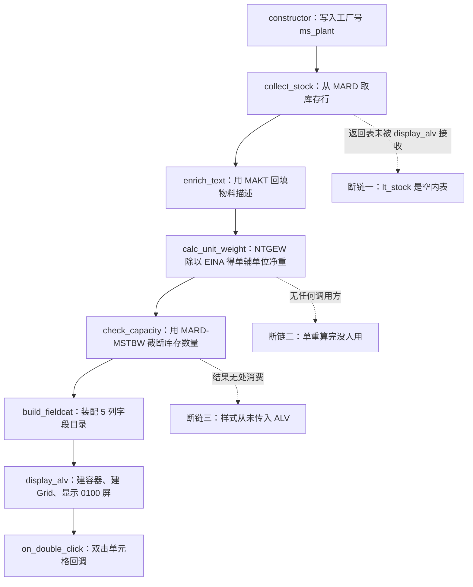
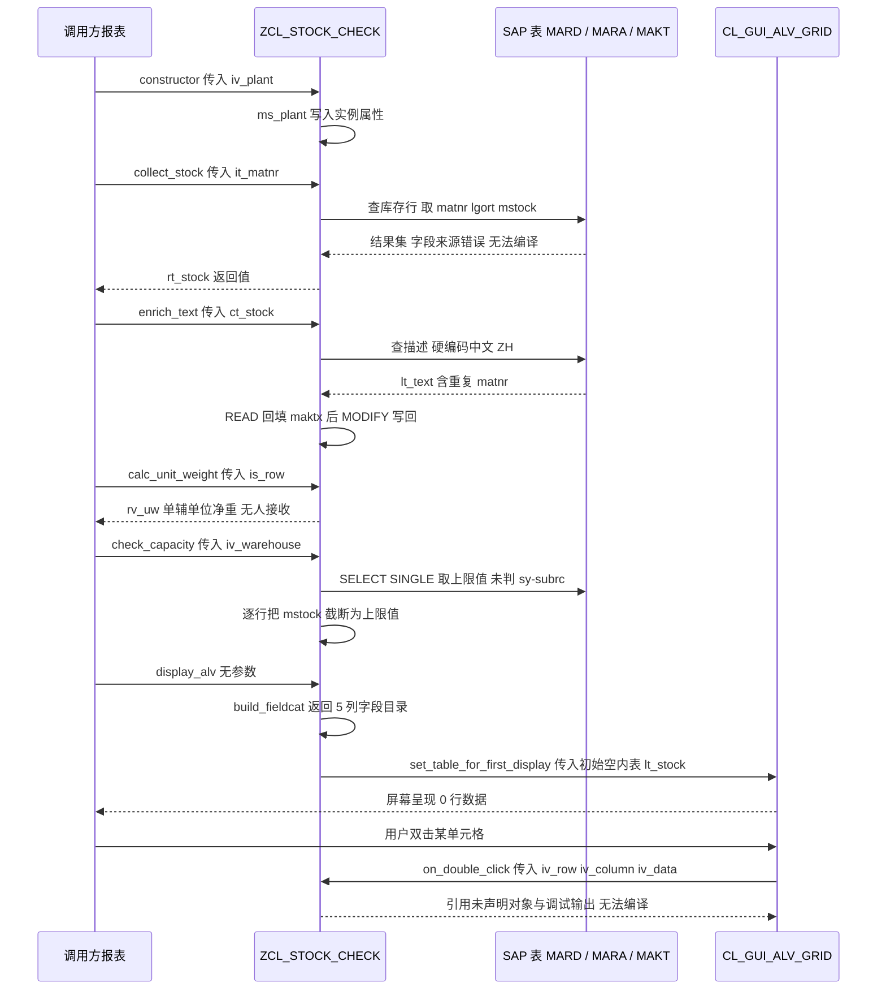

# ZCL_STOCK_CHECK 全局类 Onboarding 分析报告

> 分析对象：`zcl_stock_check.clas.abap`（256 行，CLASS-POOL 全局类，MM Reporting 团队）
> 关注点：取数逻辑 / CL_GUI_ALV_GRID 显示链路 / 明显问题
> 阅读前提：熟悉 ABAP OO、Open SQL、MM 库存数据模型（最好知道 MARA / MARD / MAKT / MARD-MSTBW 的业务含义）

---

## ⚠️ 开篇必读：本文件当前无法通过编译

在进入架构讲解之前，必须先把最重要的一句话放在最前面：**这份源码以现状提交是编译不过的**，至少有 4 处硬错误横跨 4 个方法。因此"这个类是怎么工作的"这个问题，严格来说答案是"它还没有工作过"。本报告会在第三章逐个方法指出每处硬错误的位置、原因与修法，并在第五章汇总。

为了让新同学建立正确的心智模型，本报告的分析顺序是：**先按设计意图讲清楚它想做什么（第一、二章）→ 再按执行流程逐个方法拆解（第三章）→ 再从数据视角回看整条链路（第四章）→ 最后把问题按优先级归档（第五、六章）**。请把"意图"和"实现"分开读，这是理解本程序的关键。

---

## 一、程序定位与业务背景

### 1.1 它想解决什么业务问题

从文件头注释和字段结构可以反推出原始需求。MM Reporting 团队需要一个**原材料库存与重量的合理性检查工具**，典型场景是这样的：

原材料（钢材、型材、电缆、化工原料）在 SAP 里通常**按基本计量单位记账**（KG、M、T），但车间现场是**按辅助计量单位领用和清点的**（支、根、卷、桶、件）。SAP 用来换算的字段是 MARA 的 `EINR` / `EINA`（辅单位的分子 / 分母）以及 `MEINS`（辅单位）。当财务或物控需要核对"这一盘货到底多少公斤、每支多少公斤"时，就会用到：

```
单辅单位净重 = MARA-NTGEW ÷ MARA-EINA
```

同时，MARD 里有一个 `MSTBW`（Maximum Stock Quantity，最大库存量），MM 顾问常用它做"某物料在某库位不应该超过某个上限"的粗放合理性检查。类名里的 `stock_check`、注释里的 `stock / weight sanity check`，对应的就是这两件事。

所以业务诉求可以拆成三问：

| 业务提问 | 期望的程序动作 | 对应方法（设计意图） |
|---|---|---|
| 这个工厂 / 这些物料在哪些库位有多少库存？ | 按工厂 + 物料范围取库存行 | `collect_stock` |
| 每支 / 每卷净重是多少？单据重量对得上吗？ | 净重 ÷ 辅单位分母 | `calc_unit_weight` |
| 库存有没有超过库位（物料级）上限？ | 用 MSTBW 做上限校验 | `check_capacity` |

最后要在一个可排序、可导出、可双击钻取的全屏 ALV 里给用户看，并且用颜色 / 删除线标出"有问题"的单元格。这解释了类里为什么同时出现了 `ty_stock` 结构、`lvc_t_fcat`、`cl_gui_alv_grid` 和 `lvc_t_scol`。

### 1.2 现有做法为什么不够用

在 SAP 世界里，"查库存 + 算单重 + 看上限"这类需求最常见的原始做法是写一个 `SELECT ... FROM mara JOIN mard` 的 `z` 报表，让业务自己在 Excel 里算。这类方案的问题是：

1. **SQL 里算不出单辅单位净重**。Open SQL 不支持字段间除法，必须先取到 ABAP 变量再算，所以必然需要一层 ABAP 逻辑代码。
2. **上限校验无法只看一个数字**。MSTBW 是 MARD 的字段，粒度是 物料 + 工厂 + 库位，和"当前库存"是同一个粒度但不同来源，必须并列显示才能让人判断。
3. **量化的"可疑行"没有视觉标记**。手工报表里所有行长得一样，业务要自己找差异行。

这就解释了为什么作者要写一个类而不是写报表：他想把这个三步流程封装成一个**可被别的报表复用的工具**，调用方负责画屏幕、传参数，类负责取数和判断。这是合理的方向。

### 1.3 整体设计范式定性

一句话定性：**这是一个"平坦式（flat）全管道工具类"——把取数、派生计算、校验、ALV 装配、事件处理全部塞进同一个 `FINAL` 全局类，方法之间靠约定顺序手工串联，没有对象内部的数据管道，也没有任何状态隔离。**

这个范式在"一次性的分析脚本"里是可以接受的，甚至挺顺手；一旦要进生产，问题就会集中爆发——因为**串联顺序没有被代码强制**。本程序 90% 的严重 bug 都源自这一点：`display_alv` 忘了去调 `collect_stock`，`calc_unit_weight` 干脆没人调，`set_cell_styles` 生成了样式却从没塞进 `it_scol`。作者把"管线"画在了脑子里，没有画在代码里。

---

## 二、程序执行流程总览

### 2.1 设计意图下的流程图

下图是**作者期望的执行顺序**（也是本报告第三章的排列依据）。注意三处虚线标注的真实断链——它们不是笔误，而是当前代码里"看起来该连、其实没连"的地方。



### 2.2 责任链表

| 子程序 | 类型 | 调用者 | 职责 | 实际接线状态 |
|---|---|---|---|---|
| 类定义段 `PUBLIC SECTION` | 声明 | 编译器 | 定义 `ty_stock` 行结构 / 表类型 / 8 个公开方法契约 | 参与编译，但有类型缺陷 |
| 私有属性段 `PRIVATE SECTION` | 声明 | 编译器 | 持有工厂号、工厂表、Grid 引用、容器引用 | 部分为死变量 |
| `constructor` | 方法 | 调用方报表（或 `CREATE OBJECT`） | 把 `iv_plant` 存进 `ms_plant`，后续所有查询共用 | 已接线，无校验 |
| `collect_stock` | 方法 | 调用方报表 | 按 `ms_plant` + `it_matnr` 取 MARD 库存行，返回 `ty_stock_tab` | 无内部调用方，靠外部 |
| `enrich_text` | 方法 | 调用方报表 | 用 MAKT 按 MATNR 批量补 `maktx` 描述到内表 | 无内部调用方 |
| `calc_unit_weight` | 方法 | 调用方报表 | 返回该行的单辅单位净重 | ⚠️ **全类无调用方** |
| `check_capacity` | 方法 | 调用方报表 | 用 MSTBW 做库存上限判断 | ⚠️ **全类无调用方** |
| `build_fieldcat` | 方法 | `display_alv` | 装配 5 列 `lvc_t_fcat` | ✅ 已接线 |
| `display_alv` | 方法 | 调用方报表 | 建容器 + Grid + 显示 0100 屏 | ⚠️ 喂的是空内表 |
| `on_double_click` | 方法 | `CL_GUI_ALV_GRID` 事件 `DOUBLE_CLICK` | 双击单元格后的响应 | ✅ 已注册，但代码编译失败 |
| `set_cell_styles` | 方法 | 调用方报表 | 生成 `lvc_t_scol` 单元格样式 | ⚠️ **无调用方，且未传给 ALV** |

下面按这条流程，逐个方法展开。

---

## 三、分组分析（按程序流程 / 子程序）

### 3.1 类定义段 `ZCL_STOCK_CHECK` 定义段（`PUBLIC SECTION`）

这一段分两步看：先看它定义的行结构 `ty_stock`（决定 ALV 里到底能显示什么数据），再看它对外承诺的方法契约（决定调用方能怎么用）。**结论先行：`ty_stock` 里缺了 `calc_unit_weight` 的输出位置，这从类型层面就注定了"重量合理性检查"不可能落地。**

#### ① 库存行结构与表类型

```abap
CLASS-POOL zcl_stock_check.

PUBLIC
FINAL
CREATE PUBLIC .

  PUBLIC SECTION.

    TYPES: BEGIN OF ty_stock,
             matnr  TYPE mara-matnr,
             maktx  TYPE makt-maktx,
             lgort  TYPE mard-lgort,
             mstock TYPE mard-mstock,
             eina   TYPE mara-eina,
             ntgew  TYPE mara-ntgew,
           END OF ty_stock.

    TYPES ty_stock_tab TYPE STANDARD TABLE OF ty_stock WITH EMPTY KEY.
```

**做什么** — 声明一个 6 字段的行结构：物料号 `MATNR`、物料描述 `MAKTX`、库位 `LGORT`、非限制性使用库存 `MSTOCK`、辅单位换算分母 `EINA`、净重 `NTGEW`。再声明内表类型 `ty_stock_tab`，**主键设为 `WITH EMPTY KEY`**（不做任何去重和唯一性约束）。

**为什么** — `ty_stock` 用 `mara-xxx` / `mard-xxx` 现场引用而不是复述一遍 `CHAR 40`、`QUAN` 之类的类型，好处是字段长度 / 小数位与表结构永远同步，改表不用改代码，这是 ABAP 的推荐做法。`ty_stock` 作为**公开类型**放在 `PUBLIC SECTION` 也是对的，因为 `RETURNING` 参数要用它，调用方必须能引用。选 `STANDARD TABLE` 而非 `SORTED` / `HASHED`，对量级几千行的报表来说是合理的取舍。

**`WITH EMPTY KEY` 这一行是本程序里少见的"作者想对了"的证据**：真正的业务粒度是 **MATNR + LGORT**（同一物料可以在多个库位有库存），这个组合天然不唯一，作者显然意识到了，所以显式关掉了唯一性检查。这里必须给它记一分。

**风险与改进** — 类型与数据元素做一次语义校核，问题比长度不匹配严重得多：

| 字段 | 数据元素 / 类型 | 语义校核结论 |
|---|---|---|
| `matnr` | MATNR，CHAR 40 | ✅ 与 `MARD-MATNR` 一致，同时是业务粒度键之一 |
| `maktx` | MAKTX，CHAR 40 | ✅ 描述在 MAKT，**必须配合 SPRAS 才有意义**，本类把它当"一定有值"处理 |
| `lgort` | LGORT，CHAR 4 | ✅ 库位，与 MATNR 合成粒度 |
| `mstock` | MSTOCK，QUAN 13,3 | ⚠️ 这是**非限制性使用库存**，不含质检 / 冻结 / 委外库存。一个叫"库存检查"的报表只展示它却不声明口径，业务会误以为看到了全部库存 |
| `eina` | EINAU，QUAN 13,3 | ⚠️ 语义是**辅单位换算的分母**，孤立一个数字没有意义，必须配合 `EINR` + `MEINS` 解释。本类既没取 `MEINS`，也没取 `EINR`，等于把一个三元组砍成了两元 |
| `ntgew` | NTGEW，QUAN 13,3 | ❌ NTGEW 是**净重**（同族的 `BRGEW` 才是毛重），单位取自物料基准重量单位，**不保证是 KG** |

最大的结构缺陷是：**`ty_stock` 里没有 `calc_unit_weight` 的落点**。方法算出一个 `rv_uw` 却无处存放，`build_fieldcat` 里也就没有对应的列。整个类名和注释承诺的 "weight sanity check" 在类型层面就无法实现。改进方向：加 `uw TYPE p DECIMALS 4`（或直接加 `meins TYPE mara-meins` + `einr`），并把 `mstock` / `eina` / `ntgew` 统一带上单位字段，让 ALV 的 `qfield` 能显示计量单位。

#### ② 公开方法契约

```abap
    METHODS constructor
      IMPORTING iv_plant TYPE werks OPTIONAL.

    METHODS collect_stock
      IMPORTING it_matnr         TYPE mara-matnr_tab
      RETURNING VALUE(rt_stock) TYPE ty_stock_tab
      RAISING   cx_sy_move_cast_error.

    METHODS enrich_text
      CHANGING ct_stock TYPE ty_stock_tab.

    METHODS calc_unit_weight
      IMPORTING is_row       TYPE ty_stock
      RETURNING VALUE(rv_uw) TYPE p DECIMALS 4.

    METHODS check_capacity
      IMPORTING iv_warehouse TYPE mard-lgort
      CHANGING  ct_stock    TYPE ty_stock_tab.

    METHODS build_fieldcat
      RETURNING VALUE(rt_fieldcat) TYPE lvc_t_fcat.

    METHODS display_alv.

    METHODS on_double_click
      IMPORTING iv_row    TYPE lvc_row
                iv_column TYPE lvc_col
                iv_data   TYPE any.

    METHODS set_cell_styles
      IMPORTING is_row     TYPE ty_stock
      CHANGING  ct_styling TYPE lvc_t_scol.
```

**做什么** — 公开 8 个方法。取数类（`collect_stock` / `enrich_text` / `check_capacity`）用 `IMPORTING` / `CHANGING` 传内表，计算类（`calc_unit_weight`）用 `RETURNING`，展示类（`build_fieldcat` / `display_alv`）无参数，事件回调（`on_double_click`）的三个参数刻意命名成 `iv_*` 以避免与事件属性重名。

**为什么** — 参数命名的 `iv_`（input value）/ `is_`（input structure）/ `ct_`（changing table）前缀遵循 ABAP 社区惯例，能让调用方不看签名就猜出传值语义；`on_double_click` 用 `iv_` 而不用事件标准的 `r_` / `e_` 前缀，是为了避免 `SET HANDLER` 时和事件属性重名，属于被广泛认可的规避写法。`RETURNING VALUE(x)` 而不是"传引用参数"也是现代 ABAP 的推荐风格。

**风险与改进** — 契约层有四个问题：

1. `iv_plant TYPE werks OPTIONAL` —— 用了裸数据元素而非 `mard-werks`（丢失与 WERKS 的检查表关联），且设为 `OPTIONAL` 却不校验、不抛异常，导致对象可以处于"没有工厂号"的非法状态却被正常使用。改进：改成 `TYPE mard-werks`，去掉 `OPTIONAL`；若确需默认工厂，至少在 `constructor` 里 `IF ms_plant IS INITIAL. RAISING EXCEPTION ...`，并定义自己的业务异常类而不是用系统异常。
2. `RAISING cx_sy_move_cast_error` —— 这是 `SELECT ... INTO` 赋值失败时的系统异常，属于"给调用方一个几乎不可能发生的兜底"。而且真实业务错误（工厂不存在、权限不足、库位不存在）一个都没覆盖。改进：定义 `zcx_stock_check`（继承 `CX_STATIC_CHECK`）统一承载业务异常。
3. `it_matnr TYPE mara-matnr_tab` —— 用 DDIC 表类型做公开 API 参数可以接受，但**没有约束"不可为空表"**。空表传进来，后面 `enrich_text` 的 FOR ALL ENTRIES 就会走空驱动分支（第 3.5 节）。
4. `iv_data TYPE any` 作为事件处理方法的参数 —— 语义上极弱，调用方（ABAP 运行时）会塞什么完全不可控，第 3.10 节展开讲这个坑。
5. `display_alv` 无 `RAISING`、无参数 —— 它隐式依赖"调用方报表里有一个 0100 屏和一个名为 `STOCK_AREA` 的自定义控件"，这个前提完全没有在契约里表达。

**为什么这个契约整体是失败的**：一个类的方法签名就是它对世界的假设。这里所有签名都假设"调用方会按 `constructor → collect_stock → enrich_text → … → display_alv` 的顺序手工调用"，但没有任何一个签名能强制这个顺序。**改进方向**：加一个入口方法（比如 `run( iv_plant it_matnr )`）把管线封在类内，外部只能调这一个；或者在 `display_alv` 里显式接受 `it_stock` 参数，让"数据从哪来"变成签名的一部分。

---

### 3.2 类实现段与私有属性段（`PRIVATE SECTION`）

类实现的骨架只有两样东西：类头和四个实例属性。它们构成了这个类全部的内部状态，所以值得单独看——**四个属性里有一个是死的，而两个活着的引用属性带来的是内存和重入性问题。**

```abap
CLASS zcl_stock_check IMPLEMENTATION.

  PRIVATE SECTION.

    DATA ms_plant TYPE werks.
    DATA ms_plants TYPE werks_tab.
    DATA mo_grid   TYPE REF TO cl_gui_alv_grid.
    DATA mo_container TYPE REF TO cl_gui_custom_container.
```

（实际源码里 `PRIVATE SECTION` 位于 `CLASS-POOL` 生成的定义段尾部、`CLASS ... IMPLEMENTATION` 之前，上面为便于阅读做了合并。）

**做什么** — 声明四个实例属性：`ms_plant` 保存工厂号、`ms_plants` 声明了一个工厂号内表、`mo_grid` 保存 Grid 控件对象引用、`mo_container` 保存自定义容器对象引用。它们是类的全部状态。

**为什么** — 把 ALV 控件作为实例属性而不是方法内局部变量，是为了让 `on_double_click` 事件回调能通过 `SET HANDLER ... FOR mo_grid` 找到宿主对象；这个思路本身是对的（事件处理必须有持久引用，否则 Grid 一旦被 GC 回调就失效）。`ms_plant` 存在实例上而不是每次方法传参，是为了少写参数、少写重复的 `iv_plant`，在小工具类里是可接受的取舍。

**风险与改进** — 三个问题，其中一个是纯粹的死代码：

1. **`ms_plants` 从声明到 `ENDCLASS` 全类没有一次被引用**。`werks_tab` 是标准 DDIC 表类型（`STANDARD TABLE OF werks`），声明本身合法，所以它不会报错，只会安静地占位——但它会误导所有读代码的人以为"多工厂场景"已经考虑过了。改进：删除。
2. **`mo_grid` / `mo_container` 从不释放**。`display_alv` 里没有任何 `cl_gui_alv_grid=>grid_free( mo_grid )` 或 `mo_container->free( )`。如果调用方在一个会话里多次进入这个报表，旧容器不会立刻释放，累积表现为内存增长甚至 `TSV_TNEW_PAGE_ALLOC_FAILED`。改进：在 `display_alv` 入口先判活（`IF mo_grid IS BOUND. mo_grid->grid_free( ). mo_grid = INITIAL. mo_container->free( ). mo_container = INITIAL. ENDIF.`），或在类里实现一个 `destroy` 方法交给调用方。
3. **属性名 `ms_plant`（单数）和 `ms_plants`（复数）只差一个 s**，ABAP 的单字符命名约定让这种混淆极易发生——读代码时很容易把 `ms_plants` 看成"ms_plant 的复数集合"从而误判需求。改进：死属性删掉，命名冲突自然消失。

**顺带一个命名质量观察**：这个类实现了完整的"取数 → 计算 → 展示"三层，但三层全部塞在一个类里，没有 `zcl_stock_check_data`（取数）/ `zcl_stock_check_logic`（规则）/ `zcl_stock_check_ui`（ALV）的拆分。类名 `FINAL` 又堵死了继承扩展的可能。

---

### 3.3 方法 `constructor`（方法 constructor）

**做什么** — 把传入的 `iv_plant` 原样赋给实例属性 `ms_plant`。整个方法只有一行有效语句，没有任何校验。

```abap
  METHOD constructor.

    ms_plant = iv_plant.

  ENDMETHOD.                    "constructor
```

**为什么** — 因为 `collect_stock` 需要一个"当前工厂"上下文，而作者不想在每个方法上重复传 `iv_plant`，所以把工厂号提升为对象状态。这一步的动机是清楚的，也符合 SAP 里"上下文放在对象里"的常见做法。

**风险与改进** — **无校验的构造函数是典型的"非法状态对象"来源**。调用方完全可以写 `CREATE OBJECT lo_check.`（因为 `iv_plant` 是 `OPTIONAL`），然后 `collect_stock` 会执行：

```abap
WHERE werks = ms_plant
```

`ms_plant` 是初始的 `''`，ABAP 会当成 `werks = '    '`（空白补齐）去查 MARD，返回空结果集。而后 `collect_stock` 只会弹一句 "No stock records found" —— 用户看到的是"没有库存记录"，而不是"你没填工厂号"。**这是最难排查的一类 bug：错误提示把配置错误伪装成了业务事实。**

改进：`iv_plant` 改必填；若业务上确实要支持默认工厂，则在构造函数里检查并抛异常：

```abap
  METHOD constructor.

    IF iv_plant IS INITIAL.
      RAISE EXCEPTION TYPE zcx_stock_check
        EXPORTING textid = zcl_stock_check=>no_plant_given.
    ENDIF.

    ms_plant = iv_plant.

  ENDMETHOD.                    "constructor
```

另外 `TYPE werks` 应改为 `TYPE mard-werks`：直接引用表字段能带上数据元素与检查表的关系，也让"这个工厂来自 MARD"这一事实体现在签名里。

---

### 3.4 方法 `collect_stock`（方法 collect_stock）

这是整个类的取数核心，也是问题最密集的方法。它按三步走：**① 拼了一段永不执行的 SQL 字符串 → ② 执行了另一段字段对不上的真实 SELECT → ③ 做了一次自赋值空转再弹一句消息**。三步各有问题。

#### ① 拼接动态 SQL 字符串（从未执行）

```abap
    DATA lv_sql TYPE string.

    lv_sql = |SELECT mard~lgort mard~mstock mara~eina mara~ntgew mara~matnr|
           && |  FROM mard INNER JOIN mara ON mara~matnr = mard~matnr|
           && | WHERE mard~werks = '{ ms_plant }'|
           && |   AND mard~lgort IN iv_warehouse_range( )|.
```

**做什么** — 声明一个 `string` 类型的 `lv_sql`，用竖线模板字符串拼出一段 `MARD INNER JOIN MARA` 的 Open SQL 文本，条件是工厂等于 `ms_plant`、库位在一个叫 `iv_warehouse_range` 的区间内。**拼完之后，这个变量再也没有被 `EXECUTE` 过。**

**为什么** — 从语句形态看，作者最初打算走动态 SQL：`MARD INNER JOIN MARA` 确实比纯 MARD 多取到了物料级的 `eina` / `ntgew`（这两字段只在 MARA 上），这恰好暴露了他真正想要的数据结构。后来大概是遇到了动态 SQL 的性能 / 维护困扰，或者在 SE38 里跑不通，于是改成静态 SELECT，却**忘了把这段草稿删掉**。

**风险与改进** — 这段死代码的危害远大于"多几行"。它有三个叠加问题：

1. **语法上根本不成立**：`iv_warehouse_range` 这个标识符在 `collect_stock` 的签名里根本不存在（签名只有 `it_matnr`），而 `IN` 后面也没有跟任何表达式。就算有人"顺手"加一句 `EXECUTE IMMEDIATE lv_sql INTO TABLE @rt_stock`，也会直接语法失败。更糟的是，它是**字符串拼接**而不是模板变量绑定，一旦将来被启用，`ms_plant` 这种用户输入会原样拼进 SQL——虽然工厂号字段本身不太可能被注入，但这个坏范式不该留在代码里示范给新人。
2. **它是最好的文档，也是最坏的文档**：新人读代码时，看到 `mard~lgort IN iv_warehouse_range` 会以为"这个类支持按库位过滤"，而方法签名里根本没有库位入参。**死代码比没有代码更具误导性**，因为它会伪造出"已经考虑过"的能力假象。
3. **它掩盖了真正的设计缺口**：库位过滤需求到底存不存在？如果 `check_capacity` 需要按库位逐个查 MSTBW，那 `collect_stock` 就应该接受 `iv_warehouse`。现在两个方法各说各话。

**改进**：直接删掉。如果确实要动态 SQL，用 `SELECT ... FROM mara INNER JOIN mard ON mara~matnr = mard~matnr WHERE mard~werks = @ms_plant AND mard~matnr IN @it_matnr INTO TABLE @DATA(lt).` 的静态写法就够；如果要用动态 SQL，参数必须用 `REF` / `IN` 绑定而非字符串拼接。

#### ② 真正执行的 SELECT（字段不存在，无法编译）

```abap
    SELECT matnr lgort mstock eina ntgew
      FROM mard
      INTO TABLE rt_stock
      WHERE werks  = ms_plant
        AND matnr IN it_matnr.
```

**做什么** — 从 `mard` 单表取 5 个字段装进 `rt_stock`，过滤条件是工厂等于 `ms_plant` 且物料号落在 `it_matnr` 区间内。这才是本方法真正执行的查询。

**为什么** — 思路是对的：先从库存表 MARD 拿到"哪些物料在哪些库位有记录"，作为后续补描述、做判断的驱动表。`IN it_matnr` 能命中 `MARD` 的主索引 `MARD-PK`（WERKS + MATNR + LGORT，前缀匹配），性能上是最优路径。这部分的设计值得肯定。

**风险与改进** — **这里是本类第一个硬错误：这段代码编译不过。**

1. **`EINA` 和 `NTGEW` 不在 `MARD` 上**。它们是 MARA 的字段（辅单位换算分母、物料净重），MARD 只有库位 / 工厂级的库存、数量、交货期、批次相关字段。ABAP 会在语法检查阶段报 "Field `EINA` is unknown in `MARD`"，整个类编译失败。死掉的 `lv_sql` 里那个 `INNER JOIN mara` 恰恰说明了正确写法应该长什么样 —— 作者写对了草稿，却写错了正式代码。
2. **修的时候别照抄 `lv_sql` 的 `INNER JOIN`**。正确写法是在保持 MARD 驱动表的前提下逐字段补齐来源，两种都可以：
   - 方案 A（推荐，2 次查询，符合"驱动表 + 补数"惯例）：
     ```abap
     SELECT matnr lgort mstock
       FROM mard
       INTO TABLE @rt_stock
       WHERE werks  = @ms_plant
         AND matnr IN @it_matnr.

     IF rt_stock IS NOT INITIAL.
       SELECT matnr eina ntgew
         FROM mara
         INTO TABLE @DATA(lt_mara)
         FOR ALL ENTRIES IN @rt_stock
         WHERE matnr = @rt_stock-matnr.

       LOOP AT rt_stock ASSIGNING FIELD-SYMBOL(<ls>).
         READ TABLE lt_mara INTO DATA(ls_mara) WITH KEY matnr = <ls>-matnr.
         IF sy-subrc = 0.
           <ls>-eina  = ls_mara-eina.
           <ls>-ntgew = ls_mara-ntgew.
         ENDIF.
       ENDLOOP.
     ENDIF.
     ```
     注意 `lt_mara` 必须声明成带唯一键的结构表（`SORTED TABLE ... WITH UNIQUE KEY matnr`），否则最后那个 `READ TABLE` 会踩到和 `enrich_text` 一模一样的坑（见 3.5）。
   - 方案 B（单次 JOIN，字段少、量小时更紧凑）：
     ```abap
     SELECT mard~matnr mard~lgort mard~mstock mara~eina mara~ntgew
       FROM mard INNER JOIN mara ON mara~matnr = mard~matnr
       INTO TABLE @rt_stock
       WHERE mard~werks  = @ms_plant
         AND mard~matnr IN @it_matnr.
     ```
3. **`RAISING cx_sy_move_cast_error` 在这里形同虚设**。这个异常本来正是 `SELECT ... INTO` 目标结构与结果集不匹配时抛出的，作者显然是想"防御"字段类型问题；但既然字段来源就已经错了，问题在编译期就暴露，运行时永远不会走到这个异常。修完字段后要重新想清楚：这个异常还要不要留？留就要在文档里说清触发条件。
4. **缺库位过滤**。方法签名没有库位入参，意味着一次可能拉出该工厂**所有物料所有库位**的库存行。在真实 MM 环境里，一个工厂的非限制库存行轻松上万，全量拉进内表再灌进 ALV 会同时吃内存和数据库。改进：增加 `IMPORTING it_lgort TYPE mard-lgort_tab OPTIONAL` 并在 WHERE 里条件拼接。

#### ③ 自赋值循环与空结果消息

```abap
    LOOP AT rt_stock ASSIGNING FIELD-SYMBOL(<ls>).
      <ls>-matnr = <ls>-matnr.
    ENDLOOP.

    IF rt_stock IS INITIAL.
      MESSAGE 'No stock records found' TYPE 'S'.
    ENDIF.
```

**做什么** — 遍历结果内表，把每一行的 `matnr` 赋给它自己（对数据没有任何影响）；然后判断结果集是否为空，若为空就弹一条成功类消息 "No stock records found"。

**为什么** — 从内联声明 `FIELD-SYMBOL(<ls>)` 的用法看，作者当时的意图应该是"规范化 / 补全字段"（比如 `to_upper` 物料号，或者在这里塞别的赋值）。实际写出来的是一个自我赋值。

**风险与改进** — 两个问题，一个是无害的，一个是架构级的：

1. **自赋值是彻底的空操作**：`<ls>-matnr = <ls>-matnr` 在 ABAP 里连优化器都不会当成有意义的语句，但它会给每个新读代码的人制造"这里在做什么处理？"的疑问。这段循环如果删掉，程序行为完全不变。**改进：删除。**
2. **`MESSAGE` 出现在取数方法里是架构反模式**。数据获取方法应该是"哑"的：查不到就返回空表，让调用方决定是提示、是无声忽略、还是写日志。一旦取数方法自己发消息，就产生三个后果：
   - **无法在无对话场景使用**。这个类想被后台批处理或其他报表复用，而 `MESSAGE 'TYPE S'` 在后台会直接抛 `MESSAGE_TYPE_S_NOT_ALLOWED`（或被系统忽略），在批处理里就是一次不可预期的短时dump。
   - **调用方失去了控制权**。想批量调 `collect_stock` 处理 1000 个物料的调用方，会被 1000 次弹窗淹没，无法抑制。
   - **掩盖了"空结果"的真实原因**。空结果可能是工厂号错（3.3 节）、库位过滤太窄、权限不足、物料无库存，消息却说"没有库存记录"，把排查方向带偏。
   
   **改进**：删掉 `MESSAGE`，把空判断上移到调用方：
   ```abap
   IF rt_stock IS INITIAL.
     MESSAGE 'No stock records found in plant &1' TYPE 'S' WITH ms_plant.
   ENDIF.
   ```
   顺便把文本纳入 message class（`00`）而不是硬编码英文字符串，便于 SOTD 维护多语言。

---

### 3.5 方法 `enrich_text`（方法 enrich_text）

这个方法的**意图和骨架都是对的**（FOR ALL ENTRIES 批量取描述 + 回填），是全类里最接近"正确实现"的一个。但它的两个实现细节各自引入了一个会显示错数据的问题。这一节分两步。

#### ① 用 FOR ALL ENTRIES 批量取描述

```abap
    DATA lt_text TYPE TABLE OF makt.

    SELECT matnr maktx FROM makt
      INTO TABLE lt_text
      FOR ALL ENTRIES IN ct_stock
      WHERE matnr = ct_stock-matnr
        AND spras = 'ZH'.
```

**做什么** — 把整个 MAKT（物料文本）表结构装进内表 `lt_text`，然后用 `FOR ALL ENTRIES IN ct_stock` 做一次批量查询，取出这些物料在**中文**（`spras = 'ZH'`）下的描述。

**为什么** — 用 FAE（`FOR ALL ENTRIES`）一次取回所有物料的描述，而不是在循环里逐个 `SELECT SINGLE`，避免了典型的 N 次数据库往返。这是正确的性能模式，也是 ABAP 社区公认的 `READ` 循环反模式的正解。`WHERE matnr = ct_stock-matnr` 是 FAE 的标准写法：把驱动内表的字段作为内连接条件，驱动字段必须是结构的顶层字段（`ty_stock-matnr` 满足）。

**风险与改进** — 两个问题，一个性能一个正确性：

1. **硬编码 `spras = 'ZH'`**。这意味着：非中文 SAP 系统的用户看到的所有描述都是空的（因为 `sy-langu` 可能是 `EN`/`DE`，MAKT 里没有对应文本 → `READ` 找不到 → 见下一步的严重问题）。而且字段标题写的是英文 `Material` / `Description`，**数据取中文、界面说英文**，i18n 逻辑自相矛盾。改进：改为 `AND spras = @sy-langu`；如果业务需要"中文优先，英文兜底"，应该在 `ty_stock` 里同时准备两个文本字段，或者用 `TRY` + 二次查询的方式兜底。
2. **驱动表 `ct_stock` 里 MATNR 可能重复**。因为 `ty_stock_tab` 是 `WITH EMPTY KEY`（3.1 节），同一物料出现在 N 个库位就有 N 行 MATNR 相同。FAE 会为每个驱动行各返回一次结果 → `lt_text` 里出现 N 份完全相同的 `matnr` / `maktx` 重复记录。**数据结果不受影响**（下一步 `READ` 只取第一条），但查询返回的行数和内表体积白白翻倍。物料—库位组合多的时候这个浪费是可观的。改进：先按 MATNR 去重再 FAE，或者把 `lt_text` 声明成 `SORTED TABLE ... WITH UNIQUE KEY matnr` 并用 `INSERT ... INTO TABLE` 的去重语义。
3. **空驱动表没有守卫**。现代 ABAP Release（7.40+）在 FAE 驱动表为空时返回空结果集，不会 dump，所以这里**不是运行时 bug**，但依赖版本行为不是好习惯。空 `ct_stock` 传进来的场景在 3.1 节说过（`it_matnr` 是 `OPTIONAL` 语义的表类型），所以是真实可能的。建议显式 `IF ct_stock IS INITIAL. RETURN. ENDIF.`，既省一次数据库往返，也让读者一眼看懂边界。

#### ② 逐行 READ 回填描述

```abap
    LOOP AT ct_stock INTO DATA(ls_row).
      READ TABLE lt_text INTO DATA(ls_text) WITH KEY matnr = ls_row-matnr.
      ls_row-maktx = ls_text-maktx.
      MODIFY ct_stock FROM ls_row.
    ENDLOOP.
```

**做什么** — 遍历目标内表（**逐行拷贝到局部结构 `ls_row`**），在描述内表里按 MATNR 查一行，把描述赋给 `ls_row-maktx`，再把整行 `MODIFY` 回目标内表。

**为什么** — 意图很清楚：内表是通过 `IMPORTING` 传进来的（值传递），修改局部结构后必须写回，写回的正规做法就是 `MODIFY ... FROM`。作者知道要用 `MODIFY`，这一点是对的。

**风险与改进** — 这是本方法最危险的地方，**一个编译错误 + 两个运行时数据错误**，三层叠加：

1. **【编译错误】`WITH KEY matnr` 在 `STANDARD TABLE OF makt` 上非法**。`lt_text` 被声明为 `TYPE TABLE OF makt`（标准表，主键 = 全部字段）。ABAP 规定 `READ TABLE ... WITH KEY k1 = v1` 中的键说明**必须是内表主键的前缀**，而标准表的主键就是所有字段，所以只写 `matnr` 会被拒绝（"key specification is not a prefix of the table key"）。正确修法是换内表类型：
   ```abap
   TYPES: BEGIN OF ty_text,
            matnr TYPE mara-matnr,
            maktx TYPE makt-maktx,
          END OF ty_text.
   DATA lt_text TYPE SORTED TABLE OF ty_text WITH UNIQUE KEY matnr.

   SELECT matnr maktx FROM makt
     INTO TABLE @lt_text
     FOR ALL ENTRIES IN @ct_stock
     WHERE matnr = @ct_stock-matnr
       AND spras = @sy-langu.
   ```
   `SORTED TABLE ... WITH UNIQUE KEY matnr` 同时解决了"重复行"和"按键查找 O(log n)"两个问题——改完之后，第二步里的 `READ` 也能直接吃到索引，不需要扫全表。
2. **【运行时错误】循环内 `DATA(ls_text)` 会保留上一次迭代的值**。内联声明的变量作用域是整个循环体，编译时只声明一次，**每轮迭代不会重新初始化**。第一行匹配成功、第十行没匹配上时，`ls_text` 里还是第九行物料的描述，于是第十行会显示**别的物料的名字**。而 `READ TABLE ... INTO` 在未找到时（`sy-subrc = 4`）不会给目标赋值，也不会清空。这是最典型的"内联声明在循环里用"翻车案例。改进：把 `DATA(ls_text)` 提到循环外声明并在每轮之前 `CLEAR`，或者在循环内用 `TYPES ... BEGIN OF` 局部结构 + `READ ... INTO DATA(...)` 配合显式 `sy-subrc` 判断，或者干脆改成一次 JOIN / 排序后线性移动指针匹配。
3. **【运行时错误】`MODIFY ct_stock FROM ls_row` 在非唯一键表上无法定位到具体行**。`ct_stock` 是 `WITH EMPTY KEY` 的标准表，`MODIFY ... FROM` 用主键字段定位行；当"同一 MATNR 出现在两个库位"这种重复键存在时，ABAP 只会改到**第一条匹配行**，`sy-subrc` 仍然是 0（不报错）。结果是：**只有一个库位那一行拿到了描述，另一个库位那行永远是空的**，而用户完全看不出为什么。改进：用 `ASSIGNING` 就地改，彻底绕开 `MODIFY`：
   ```abap
   LOOP AT ct_stock ASSIGNING FIELD-SYMBOL(<ls>).
     READ TABLE lt_text INTO DATA(ls_text) WITH KEY matnr = <ls>-matnr.
     IF sy-subrc = 0.
       <ls>-maktx = ls_text-maktx.
     ENDIF.
   ENDLOOP.
   ```
   这同时消掉了整行拷贝的性能浪费，也是 3.4 节③ 那个自赋值循环"本来想做什么"的正确答案。
4. `LOOP AT ct_stock INTO DATA(ls_row)` 逐行整结构拷贝，对几万行的内表是明显的额外开销。统一改用 `ASSIGNING` 可以在同一个类里把所有这类循环一次性规范化。

---

### 3.6 方法 `calc_unit_weight`（方法 calc_unit_weight）

**全类最"干净"的一个方法，逻辑和防御都对，但结果被彻底丢弃** —— 也就是说，类名里承诺的 weight 检查在代码里从来没有真正发生。

```abap
  METHOD calc_unit_weight.

    DATA lv_base TYPE p DECIMALS 4.

    lv_base = is_row-eina.

    IF lv_base IS INITIAL.
      rv_uw = 0.
      RETURN.
    ENDIF.

    rv_uw = is_row-ntgew / lv_base.

  ENDMETHOD.                    "calc_unit_weight
```

**做什么** — 取传入行的 `eina`（辅单位换算分母）作为除数，先检查它是否为零：为零则把返回值置 0 并**提前 `RETURN`**；非零则返回 `ntgew / eina`，即"每个辅单位的净重"。

**为什么** — 这个公式的业务含义是准确的：MARA 的重量字段（`NTGEW`）是按物料的**基本计量单位**记录的，而 `EINR` / `EINA` 定义了辅单位相对基本单位的换算系数，所以 `NTGEW / EINA` 得到的就是"一辅单位（支 / 卷 / 桶）有多少净重"。这正是 1.1 节推演出来的业务诉求。

**必须记功的两点**：

1. **对除零做了显式防护**。ABAP 里 `p` 类型除以 0 会抛 `CX_SY_ZERODIVIDE`，很多新手会漏掉。这里先判 `IS INITIAL` 再提前返回，是有意识的健壮性设计，值得表扬。
2. **选 `RETURNING` 而不是 `EXPORTING rv_uw`**。函数式接口让调用方无法忘记接收结果，风格正确。
3. **而且那句提示信息写得很内行**：`on_double_click` 里 "Weight is maintained in MARA, not per stock record" 准确反映了 MM 数据模型——净重是物料级属性，不是库存记录级属性。作者懂这个领域。

**风险与改进** — 逻辑对，但**整体是死的**，这是最大的问题：

1. **【致命】全类无任何调用方**。`calc_unit_weight` 只在定义处出现一次。连带后果：`ty_stock` 里没有存放它的字段（3.1 节）、`build_fieldcat` 里没有对应的列（3.8 节）、`display_alv` 里没有任何调用（3.9 节）。**换句话说，用户在 ALV 上永远看不到单辅单位净重——而这正是这个类存在的理由。** 这类"定义了但没接线"的方法，编译和代码审查都很难发现，是典型的"演示能过、上线即废"。
2. **【类型风险】`rv_uw TYPE p DECIMALS 4` 没有指定长度**。ABAP 中裸写 `TYPE p` 默认是 `p(8)`，即 **4 位整数 + 4 位小数**，取值范围约 ±9999.9999。`NTGEW` 是 `QUAN(13,3)`，理论上最大 10^10；`EINA` 最小可以是 0.001（QUAN 3 位小数）。极端组合下 `NTGEW = 9999999.999` / `EINA = 0.001` = 约 10^13，直接溢出。绝大多数实际业务值不会触发，但这是一个**未做量纲防护的隐式截断**。改进：显式写成 `TYPE p LENGTH 15 DECIMALS 4`，并在方法开头校验 `is_row-ntgew` 是否超过阈值；更稳妥的是改用 `abap_decfloat`（`decfloat34`）避免精度和溢出双重问题。
3. **【语义风险】返回 0 无法区分两种含义**。"净重确实是 0"和"辅单位分母为 0 无法计算"都返回 0，调用方无法决定是标红、标灰还是不标。改进：返回初始值（不计算）表示无法计算，或增加一个 `EXPORTING ev_status` / 单独的方法 `is_calculable`。
4. **【设计风险】算完了但类型里没地方放**。修正顺序应该是：先给 `ty_stock` 加字段（如 `uw` 和 `meins`），再在 `build_fieldcat` 里加列并配 `qfield = 'MEINS'`，最后在 `collect_stock` 之后（或 `display_alv` 里）真正调用它。**先定数据结构，再写计算，最后接线** —— 这个顺序本程序全程倒过来了，所以每一层都在返工。

---

### 3.7 方法 `check_capacity`（方法 check_capacity）

这个方法的**业务动机可以理解，但实现是全类里最危险的一段**：它没有做"检查"，而是在**直接篡改用户看到的库存数量**，而且在最常见的一条路径上会把所有库存清零。本节分两步。

#### ① 取"库位容量上限"

```abap
    DATA lv_slots TYPE i.

    SELECT SINGLE mstbw FROM mard-mvbeln INTO @lv_slots
      WHERE werks = ms_plant AND lgort = iv_warehouse.
```

**做什么** — 声明一个 4 字节整型 `lv_slots`，从 MARD 中 `SELECT SINGLE` 取一个叫 `mstbw` 的字段，按"工厂 + 库位"过滤，把结果灌进这个整数。

**为什么** — 动机可理解：`MARD-MSTBW` 是"最大库存量"，MM 顾问确实常拿它当"这个物料在这个库位不该超过的量"来粗查。用 `SELECT SINGLE` 按 库位+工厂 一次取回再在内存里比较，避免逐行查库，这个思路是对的。

**风险与改进** — **这一个 SELECT 里塞了三个独立缺陷**：

1. **【字段与数据元素不匹配 —— 语义警铃】** 这里写的是数据元素 `mstbw`（对应 `MARD-MSTBW`，最大库存量，类型 `QUAN(13,3)`），但字段名写成了 **`mvbeln`**（参考单据项目，语义上是单据引用，跟容量毫无关系）。两者不是同一个字段。即使 `mvbeln` 在该表结构上恰好存在，取到的是单据项目号而**不是**库存上限；若是语法解析不通过则直接编译失败。无论哪种，结果都是错的。这属于"数据类型对不上但长度看着差不多"的典型伪装——**只看长度和精度做校核会放过它，必须按数据元素名做语义核对**。修正：字段改为 `mard-mstbw`。
2. **【类型不匹配 —— 精度与溢出】** `MSTBW` 是 `QUAN(13,3)`（13 位、3 位小数），目标是 `TYPE i`（4 字节整数，约 10 位有效数字、无小数）。ABAP 允许这种隐式转换并在编译期给警告，运行时把小数部分**直接截断**、超出范围抛 `CX_SY_CONVERSION_NO_NUMBER`。也就是说 100.9 变成 100，而 9999999.999 变成溢出异常。**改进**：接收变量必须是 `TYPE mard-mstbw`（或 `abap_decfloat`），绝不能用 `i`。
3. **【粒度错配 —— 同一个上限套在所有行上】** 就算前两处修好，逻辑本身仍然是错的：`lv_slots` 是按 **工厂 + 库位** 查到的**一个**上限值，然后被套用到 `ct_stock` 里的**每一行**。而 `ct_stock` 里每行是不同的物料——不同物料的 MSTBW 完全不同。用一个物料的上限去判断另一个物料是否超限，检查结果是彻底无意义的。**改进**：把 `mstbw` 作为一列一起取进 `ty_stock`（`SELECT mstbw FROM mard` 直接加到取数语句里），逐行和自己的上限比，或者按 MATNR 分组循环查询。
4. **【未命中时静默为 0 —— 见下一步的连锁放大】** `SELECT SINGLE` 查不到行时，`sy-subrc = 4`，目标变量保持初始值 `0`，而这里**没有检查 `sy-subrc`**。这个 `0` 会直接引爆下一步。

#### ② 用"上限"截断每行库存

```abap
    LOOP AT ct_stock ASSIGNING FIELD-SYMBOL(<ls>).
      IF <ls>-mstock > lv_slots.
        <ls>-mstock = lv_slots.
      ENDIF.
    ENDLOOP.
```

**做什么** — 遍历传入的库存内表，凡是 `mstock` 大于 `lv_slots` 的行，**把该行的 `mstock` 就地改写成 `lv_slots`**。方法返回后，调用方拿到的内表里那些行的库存数值已经被替换掉了。

**为什么** — 从"检查"的意图看，作者可能想实现"把超过上限的部分标记出来"。但实际写出来的是"把超限的数值抹平到上限"——这是**改数据**，不是**做检查**。

**风险与改进** — 这是全类**最可能造成实际业务伤害**的一段，有两个叠加的严重问题：

1. **【严重】`SELECT SINGLE` 未命中 → 所有正库存被清零**。把上一步和这一步合起来看：只要 `mard` 里不存在"工厂 = `ms_plant` 且 库位 = `iv_warehouse`"的行（库位输错、库位不存在、权限不足、字段名取错导致取到 NULL），`lv_slots` 就是 `0`；而每一行 `mstock > 0` 都满足 `<ls>-mstock > 0`，于是**每一行的库存数量都被改写成 0**。用户看到的是一张"全厂库存为 0"的报表——而数据库里的数据一个字都没变。如果用户基于这张报表去盘点、去调拨、去做计提，损失是实打实的。**改进**：至少加 `IF sy-subrc <> 0. RETURN. ENDIF.`，更好的做法是根本不写显示数据。
2. **【严重】检查逻辑以改数据的方式呈现**。即使一切正常，用户也无法区分"这个物料真的没有库存"和"这个物料超过上限被截断了"。ALV 上看到的 `MSTOCK` 到底是真值还是被加工过的值？**一个叫 `check_capacity` 的方法，签名是 `CHANGING ct_stock`，本质上是个数据加工器而不是检查器——名字和签名都在骗人。** 改进：把上限值本身显示成一列（`MSTOCK` 与 `MAXBW` 并列），超限的行用 `set_cell_styles` 的颜色标出来（这样 `set_cell_styles` 才终于有了用武之地），绝不修改原始数量。
3. **【隐患】`<ls>-mstock > lv_slots` 的类型比较**。`MSTOCK` 是 `QUAN(13,3)`，`lv_slots` 是 `TYPE i`（假设已修正为 `QUAN`，这里仍需注意）：ABAP 比较时会按数值比较，但如果 `lv_slots` 保持 `i` 而被截断，比较基准本身就是错的（见步骤 ① 第 2 点）。数量字段比较时**不考虑基本单位换算**——如果不同物料的基本单位不同（KG vs PC），把它们放在一起比大小毫无业务意义。改进：比较前先换算到统一单位，或按 `MEINS` 分组。

---

### 3.8 方法 `build_fieldcat`（方法 build_fieldcat）

这个方法本身是全类最"安全"的：纯装配、无副作用、不改任何数据。但它把上游的两处错误**固化了**——`NTGEW` 列的标题写错，正是它干的。本节分两步（文本/位置三列、数量/重量两列）。

#### ① 文本与位置三列

```abap
    APPEND VALUE #(
      fieldname  = 'MATNR'
      ref_field  = 'MATNR'
      tabname    = 'TY_STOCK'
      seltext_m  = 'Material'
      just_field = 'X' ) TO rt_fieldcat.

    APPEND VALUE #(
      fieldname  = 'MAKTX'
      ref_field  = 'MAKTX'
      tabname    = 'TY_STOCK'
      seltext_m  = 'Description' ) TO rt_fieldcat.

    APPEND VALUE #(
      fieldname  = 'LGORT'
      ref_field  = 'LGORT'
      tabname    = 'TY_STOCK'
      seltext_m  = 'Storage Location' ) TO rt_fieldcat.
```

**做什么** — 依次向返回表 `rt_fieldcat` 追加三条字段目录项：物料号（右对齐、不可作为输出键）、物料描述、库位。每条都指定 `fieldname` / `ref_field` / `tabname` / `seltext_m`。

**为什么** — `lvc_t_fcat` 是 ALV 的字段目录类型，`fieldname` 指向数据结构的组件名，`seltext_m` 是列标题（"M" 后缀表示手工标题，不会被 ALV 自动取数据字典文本覆盖）。用 `VALUE #()` 行构造器一次性给出全部属性，比传统的 `APPEND fcat TO ...` + 逐字段 `MOVE` 高效且可读，作者显然知道 `VALUE #()` 这个写法——这一点比 `on_double_click` 里遗留的 `WRITE` 好太多。

**风险与改进** — 两个问题，一个是纯冗余，一个是可能致命的：

1. **`ref_field` 与 `fieldname` 完全相同，纯属冗余**。`ref_field` 的作用是"当 ALV 结构里的字段名和数据元素名不一致时，声明真实的数据元素来源"。两者字面相同的时候它不提供任何信息，只增加读者困惑。三处都一样，属于复制粘贴时把 `ref_field` 顺手填了。**改进：删掉 `ref_field`。**
2. **`tabname = 'TY_STOCK'` 与实际传入的数据对象名不一致 —— 命名检查风险**。`lvc_t_fcat-tabname` 必须是**数据对象（DATA 变量）名**，也就是 `display_alv` 里那个 `lt_stock`，而不是**类型名** `TY_STOCK`。ALV Grid 在 `set_table_for_first_display` 时会用这个名字做字段目录与内表结构的**一致性 / 命名检查**（`lvc_check_name_exist`），名字对不上时轻则字段目录被忽略（列显示不出来或顺序错乱），重则在检查里报错。**改进**：统一改成 `tabname = 'LT_STOCK'`，或者在 `display_alv` 里把内表改成有名字的全局/类属性，使两者字面一致。**这个字段必须在"和谁一致"上先想清楚再写，它不是随手能填的字符串。**
3. **`seltext_m` 硬编码英文，而数据取的是 `spras = 'ZH'` 的中文描述**（3.5 节）。界面语言与数据语言不一致。改进：字段目录标题改走 `scrtext_m`（自动取 DDIC 短文本，随登录语言变化），只有确实需要固定语言的业务列才用 `seltext_m`。

#### ② 数量与重量两列

```abap
    APPEND VALUE #(
      fieldname  = 'MSTOCK'
      ref_field  = 'MSTOCK'
      tabname    = 'TY_STOCK'
      seltext_m  = 'Stock Qty'
      cfield     = 'MSTOCK'
      no_outline = 'X' ) TO rt_fieldcat.

    APPEND VALUE #(
      fieldname  = 'NTGEW'
      ref_field  = 'NTGEW'
      tabname    = 'TY_STOCK'
      seltext_m  = 'Gross Weight (kg)' ) TO rt_fieldcat.
```

**做什么** — 再追加两条：库存数量列（带 `cfield = 'MSTOCK'` 和 `no_outline = 'X'`），以及重量列，标题写作 **"Gross Weight (kg)"（毛重，公斤）**。

**为什么** — 作者想给用户呈现"数量 + 重量"两个可核对维度，数量列通常还需要显示单位和右对齐，这在方向上是对的。

**风险与改进** — 这一步有两处问题，**其中第一处是本报告强调的类型与数据元素语义校核的正面案例**：

1. **【语义错标】`NTGEW` 是净重，不是毛重；单位也不保证是 KG**。MARA 的重量字段家族里，`NTGEW` = **Net Weight（净重）**，同族的 `BRGEW` 才是 **Gross Weight（毛重）**。也就是说**列标题和数据源说的不是同一件事**。更麻烦的是第二层：MARA 的重量字段以**物料的基准重量单位**表示，绝大多数物料是 KG，但配置成 G、LB、TON 的物料同样合法——所以 `(kg)` 这个硬编码单位对一部分物料是**错的**。**这里必须点名批评**：字段和长度都对得上（`QUAN(13,3)`），语法完全合法，代码能跑，只有按数据元素的业务语义核对才能发现它是错的。**改进：**
   ```abap
   APPEND VALUE #(
     fieldname  = 'NTGEW'
     tabname    = 'LT_STOCK'
     seltext_m  = 'Net Weight'
     qfield     = 'MEINS' ) TO rt_fieldcat.
   ```
   标题改成 `Net Weight`，并把物料的基准单位取进结构（`meins TYPE mara-meins`）用 `qfield` 让 ALV 自动显示单位，从根上消掉单位假设。
2. **`cfield = 'MSTOCK'` 用在数量列上是无意义的**。`cfield` 的语义是"金额列的参考货币字段"或"用于合计的键字段"，数量列要显示单位应该用 `qfield`（参考计量单位字段）。把数量字段自己填进 `cfield`，ALV 拿不到单位，合计也可能算错。**改进：删掉 `cfield`，改成 `qfield = 'MEINS'`。**
3. **`no_outline = 'X'` 在这里没有配套逻辑**。`no_outline` 禁止该列出现在列选择器大纲里，通常用于"只有程序内部使用、不给用户看也不给用户选"的辅助列。当前它挡住的是用户要核对的重���列，而真正该隐藏 / 该突出的（比如超限标记、上限值、计算出的单重）一个都没有。**改进：删掉它，或把它用在对的地方。**
4. **最关键的遗漏**：这个方法从头到尾**没有为 `calc_unit_weight` 的结果建列**，也没有为 `check_capacity` 用到的上限值建列。字段目录只有 5 列，正是"重量检查没落地"在展示层的直接体现。修完 3.6、3.7 之后，这里必须扩到 7~8 列（加 `MEINS`、`UW` 单辅单位净重、`MAXBW` 上限、可选的 `OVER` 超限标记），**这个类才算真的做完**。

---

### 3.9 方法 `display_alv`（方法 display_alv）

这是全流程的出口，也是**最讽刺的一个方法**：它是唯一被认真写完 ALV 搭建步骤的方法（容器、Grid、字段目录、事件、屏幕，全套），但它把一个**初始空内表**交给了 ALV，所以屏幕上永远只有列头没有数据。这一节分三步。

#### ① 创建自定义容器与 Grid 对象

```abap
    CREATE OBJECT mo_container
      EXPORTING
        container_name = 'STOCK_AREA'
        repaint_detlevel = 1.

    CREATE OBJECT mo_grid
      EXPORTING
        i_container = mo_container
        ex_initial_layout = '1'.
```

**做什么** — 创建一个 `cl_gui_custom_container` 指向屏幕上名为 `STOCK_AREA` 的自定义控件，再创建一个 `cl_gui_alv_grid` 并把容器挂给它，设置初始布局（全功能工具栏）。

**为什么** — 需要提一句背景：`cl_gui_alv_grid` 的旧式完整用法**必须**依附一个 Screen 上的 Custom Control（`CL_GUI_CUSTOM_CONTROL`），不能凭空显示。`cl_gui_custom_container` 是 SAP 提供的封装类，用来把那个自定义控件包起来。所以"先容器、后 Grid"的两步构造顺序是这个 API 的标准姿势，`ex_initial_layout = '1'` 打开标准工具栏（含导出/排序/布局设置），也是报表类 ALV 的常规需求。这部分**步骤是对的**。

**风险与改进** — 两处运行时硬约束 + 一处过时用法：

1. **【运行时前提】屏幕 0100 上必须真的存在名为 `STOCK_AREA` 的自定义控件**。这个控件由调用方报表在 SE51 里画好，且**在容器对象创建的那一刻必须处于 active 状态**。而本方法在后面才 `CALL SCREEN 0100`——也就是说，**容器对象是在屏幕还没显示、控件还不存在的时候被创建的**。正确顺序必须是：屏幕已显示 → 在 PBO 里创建容器和 Grid，或者在 PAI 里 `CHECK sy-dynnr` 之后处理。这里顺序颠倒，创建容器这一步就会失败。
2. **【运行时前提】类池里没有屏幕**。`CLASS-POOL` 里**不允许定义屏幕**，屏幕 0100 属于调用方报表。所以 `display_alv` 这个"无参数、什么都不管、直接 `CALL SCREEN 0100`"的写法，只有在**恰好有一个报表提供了 0100 屏和那个自定义控件**时才成立，而这个前提在类的签名里完全没有体现（3.1 节已指出）。类名 / 注释里也看不到任何"调用前置条件"说明。
   **改进（两条路，推荐第二条）**：
   - 保持 Grid 路线：把容器创建、`CALL SCREEN`、事件注册、PBO/PAI 回调**全部留在调用方报表**，本类只提供数据和一个 `get_data( )` 方法；屏幕相关的生命周期由报表管理。
   - 改用 `CL_SALV_TABLE`（**推荐**）：
     ```abap
     DATA lo_alv TYPE REF TO cl_salv_table.
     lo_alv = cl_salv_table=>factory( r_table = lt_stock ).
     lo_alv->get_display_options( )->set_strict( abap_false ).
     lo_alv->display( ).
     ```
     SALV 不需要屏幕、不需要自定义控件、不需要 `CALL SCREEN`，`set_table_for_first_display` 的那一堆前置条件全部消失。**如果这个类的目标只是"把数据漂亮地展示出来"，用 ALV Grid 属于选了成本最高的那条路。**
3. **【过时】`i_container` 与 `repaint_detlevel` 在 7.40+ 已标记过时**。新的参数是 `container`（`REF TO cl_gui_container`），`repaint_detlevel` 在新版 GUI 控件下会产生警告。改进：升级到 `EXPORTING container = mo_container`，或在新建程序时直接上 SALV。
4. 顺带：`ex_initial_layout = '1'` 打开了全功能工具栏（含可能不允许用户使用的功能如修改/删除/页面布局保存）。只读检查报表通常建议在 `set_table_for_first_display` 里配一个精简的 `is_layout` / `i_toolbar`（比如 `cl_gui_alv=>function_exclude( cl_gui_alv=>fc_modify )`）。**改进：显式裁剪工具栏，别让用户点出报表没有实现的功能。**

#### ② 把字段目录和（空）内表交给 Grid

```abap
    mo_grid->set_table_for_first_display(
      CHANGING
        it_outtab        = lt_stock
        it_fieldcatalog  = build_fieldcat( )
      EXCEPTIONS
        program_error = 1
        OTHERS        = 2 ).

    IF sy-subrc <> 0.
      lv_ok = abap_false.
    ENDIF.
```

**做什么** — 调用 `set_table_for_first_display`，把内表 `lt_stock` 作为输出表、`build_fieldcat( )` 的返回值作为字段目录传进去；声明捕获 `program_error` 和 `OTHERS` 两个异常，然后检查 `sy-subrc`，失败时把 `lv_ok` 置为假。

**为什么** — 这是 `set_table_for_first_display` 的标准调用形式：一次完成数据、字段目录、默认布局、事件绑定的设置。`it_fieldcatalog` 直接用方法调用的返回值传入，连中间变量都省了，语法上是合法的（`CHANGING` 参数接收函数式调用结果）。

**风险与改进** — **本方法最核心的缺陷就在这里：`lt_stock` 从未被填充过。**

1. **【致命】传给 ALV 的是初始空内表 → 网格永远 0 行**。往前看：`lt_stock` 就在方法第一行声明，声明后**再没有任何赋值**。`collect_stock` 的返回值 `rt_stock` 从没和它发生过关系。所以不管调用方在外部怎么正确地 `collect_stock` → `enrich_text` → 把数据准备好再调 `display_alv`，**显示的一律是零行**。这是"看起来能跑、实际什么都不显示"的经典自欺。
   **正确写法（两种）**：
   ```abap
   " 变体 A：display_alv 变成纯展示方法，数据由调用方准备
   METHODS display_alv
     IMPORTING it_stock TYPE ty_stock_tab.

   " 变体 B：把管线收进类内，外部只调一个入口
   METHODS run
     IMPORTING iv_plant  TYPE mard-werks
               it_matnr  TYPE mara-matnr_tab
               it_lgort  TYPE mard-lgort_tab OPTIONAL.
   ```
   **变体 B 是这个类真正该走的路**：既然作者想写"可复用的工具类"，就应该由类内部保证 `collect_stock` 的结果一定流进 ALV，而不是指望每个调用方都记得手工传对。当前设计把最容易忘的一步留给了调用方，而这一步恰好是唯一决定"有没有东西可看"的一步。
2. **【缺参数】`it_scol` / `st_scol` 根本没传**。`set_table_for_first_display` 的 `CHANGING` 参数里有 `it_scol`（单元格样式）和 `st_scol`（单元格颜色），这里是 `EXTENDED OPTIONS` / `CHANGING` 双双缺省。**这就是 `set_cell_styles` 永远派不上用场的直接原因**——样式方法生成了 `lvc_t_scol`，却没有任何通道把它送到 Grid。要接上：
   ```abap
   CHANGING
     it_outtab       = lt_stock
     it_fieldcatalog = build_fieldcat( )
     it_scol         = set_cell_styles_for_all( lt_stock )
   ```
3. **【吞异常】`EXCEPTIONS` 声明了但没有任何应对**。`lv_ok` 被赋成 `abap_false` 之后**再也没被读取**——既没有 `MESSAGE`，也没有 `RAISE EXCEPTION`，也没有降级逻辑。用户看到的画面和一个成功路径毫无区别（同样是一张空表）。而且 `OTHERS = 2` 这种写法在 ABAP 里虽然合法，但会连 `program_error` 之外的异常一起吞掉，排查时无从下手。
   **改进**：至少要给用户可见的反馈，且区分程序错误和未知错误：
   ```abap
   EXCEPTIONS
     program_error = 1
     OTHERS        = 2.

   IF sy-subrc = 1.
     MESSAGE 'ALV program error' TYPE 'E'.
   ELSEIF sy-subrc = 2.
     MESSAGE ID 'ZDEMO' TYPE 'E' NUMBER '001'.
   ENDIF.
   ```
   更规范的做法是 `RAISING` 自己的异常类，让错误交给调用方决定是弹窗还是写日志。
4. **【规范】没有 layout、没有默认排序、没有总计**。`it_sort`、`is_layout`（斑马纹 / 总计行）、`it_exclude`（禁用功能）全部缺省。作为"合理性检查报表"，**默认按超限 / 异常排序列、给关键列加总计**几乎是必备要求。改进：至少加 `it_sort`（按 `MSTOCK` 降序）和 `is_layout`（`grid_title` + `info_fcat`）。

#### ③ 注册事件并显示屏幕

```abap
    SET HANDLER on_double_click FOR mo_grid.

    CALL SCREEN 0100.
```

**做什么** — 把 `on_double_click` 注册为 `mo_grid` 的事件处理方法，然后 `CALL SCREEN 0100` 切换到 0100 屏幕。

**为什么** — 事件必须在 `CALL SCREEN` **之前**注册，否则 Grid 首次显示时用户快速双击可能还没挂上处理方法——这个顺序是对的。`CALL SCREEN 0100` 是让"承载自定义控件的屏幕"显示出来的唯一方式，顺序（先建对象、再注册事件、再 `CALL SCREEN`）在思路上是标准流程。

**风险与改进** — 顺序问题之外还有三个：

1. **【顺序缺陷】先创建对象再 `CALL SCREEN`，容器拿不到 active 的控件**。如步骤 ① 第 1 点：`cl_gui_custom_container` 要求控件已经显示在屏幕上。这一句 `CALL SCREEN` 放得太晚，正确位置是在它**之前**（且屏幕的 PBO 里还要有配套逻辑）。这是 ALV Grid 最经典的时序坑。
2. **【生命周期缺口】`display_alv` 之后没有任何清理**。`CALL SCREEN` 之后代码继续往下走，方法返回时 `mo_grid` / `mo_container` 仍被实例属性引用着，Grid 也不会被 `grid_free`。用户在 ALV 里按返回、报表再被调用一次，就会在同一个屏幕号上再创建一个 Grid，旧的可能还残留在屏幕上（经典现象：屏幕上出现两个 ALV / 出现 `System Exception DIMSUPERSET` 之类的动态创建报错）。**改进**：类里实现配套的 `destroy( )`，在方法入口先释放旧对象（见 3.2 节的写法），并在屏幕的 PAI 里处理用户退出动作。
3. **【架构风险】`CALL SCREEN` 出现在一个业务类里**。屏幕生命周期（PBO / PAI / 退出）是报表的职责，混进"业务工具类"意味着这个类**无法在批处理、无法在无对话场景、无法在 Fiori / OData 服务里复用**——而它做的明明是纯数据加工。改进：数据加工和 UI 呈现分开（见步骤 ② 的变体 B）。
4. `display_alv` 声明了 `DATA lv_ok TYPE abap_bool` 并赋值，但**之后再无读取**（见步骤 ② 第 3 点）。死变量，删掉。

---

### 3.10 方法 `on_double_click`（事件块 on_double_click / DOBLE_CLICK 事件）

双击回调是 ALV 的交互入口，本方法也是**全类第二个编译不过的地方**。这一节分两步。

#### ① 读实例缓存（引用了不存在的对象）

```abap
  METHOD on_double_click.

    READ TABLE mt_stock INTO ms_stock WITH KEY matnr = iv_data.

    WRITE: / iv_row, iv_column, iv_data.
```

**做什么** — 试图从一个叫 `mt_stock` 的内表里按 MATNR 读取一行到 `ms_stock` 这个结构里；然后用 `WRITE` 语句把 `iv_row`、`iv_column`、`iv_data` 三个参数打到屏幕上。

**为什么** — 意图是"双击某行后，取出完整行数据去做后续处理"（比如跳转显示物料明细、弹出凭证）。如果 `mt_stock` 是保存当前显示数据的内表、`ms_stock` 是工作区，这个逻辑本身是合理的 ALV 双击响应套路。用 `WRITE` 打印参数则完全是另一个意图——**调试**。

**风险与改进** — 三层问题，第一层是致命的：

1. **【编译失败】`mt_stock` 和 `ms_stock` 两个对象在这个类里根本不存在**。私有属性只有 `ms_plant`、`ms_plants`、`mo_grid`、`mo_container` 四个（见 3.2 节），局部变量只有 `iv_row` / `iv_column` / `iv_data` 三个导入参数。ABAP 会报 "Field `MT_STOCK` is unknown" 和 "Field `MS_STOCK` is unknown"，整个类**编译不过**。这是一个"从别的程序复制过来的代码忘了删"的典型痕迹——原程序里大概有一个模块级内表 `mt_stock`。
   **改进**：要么删掉这段（当前也没有任何后续逻辑用得上这个"完整行"），要么**正确地**把它建起来——双击场景下最省事的做法是直接用 Grid 的行标识再查一次，或者在 `set_table_for_first_display` 之后保存一份数据引用：
   ```abap
   DATA mt_stock TYPE ty_stock_tab.   " 类属性，供事件回调使用

   " display_alv 里绑定：
   mo_grid->set_table_for_first_display(
     CHANGING it_outtab        = mt_stock
               it_fieldcatalog  = build_fieldcat( ) ).
   ```
   注意 `it_outtab` 传的是内表**本身**，ALV 内部会持有它，所以数据是活的；这里不能传局部变量（`display_alv` 一返回局部变量就失效，回调里就是空引用）。
2. **【遗留调试代码】`WRITE: / iv_row, iv_column, iv_data`** —— 这三行的唯一作用是让作者在调试窗口里看参数值。它在生产里**不产生任何输出**：ALV Grid 是全屏显示，`WRITE` 在全屏状态下没有可写的消息行，语句会白跑（或在某些情况下触发对话相关的不适）。**改进：删掉。**
3. **【语义风险】`WRITE: iv_data` 与 ALV 实际传入的数据形状不匹配**。ALV Grid 的 `DOUBLE_CLICK` 事件参数 `r_data`（这里对应 `iv_data`）类型是 `any`，实际传入的通常是**被点击单元格的行上下文结构**（`LVC_S_ROW` 一类的通用结构），而不是一个纯 MATNR 字符。对结构做 `WRITE` 会直接报运行时错误（ABAP 不允许对非基本类型做 `WRITE`）。**改进**：不要依赖 `iv_data` 的形状，改用 `iv_column-fieldname` 判断用户点了哪一列（这段代码下半部分其实做对了，见下一节），需要整行数据时从绑定内表里按 `iv_row` 重新读。

#### ② 按列名分支的空动作

```abap
    CASE iv_column-fieldname.
      WHEN 'MSTOCK'.
        CHECK iv_row > 0.
      WHEN 'NTGEW'.
        MESSAGE 'Weight is maintained in MARA, not per stock record' TYPE 'S'.
    ENDCASE.
```

**做什么** — 用 `iv_column-fieldname` 判断用户双击的是哪一列：点 `MSTOCK` 列时检查 `iv_row > 0`；点 `NTGEW` 列时弹一条消息说明"重量维护在 MARA，不是按库存记录维护的"。

**为什么** — `CASE ... WHEN 'MSTOCK'` 这个**判断本身是双击回调的标准写法**，用字段目录里的 `fieldname` 来区分点击目标，这是 ALV 交互的标准套路，比直接 `READ` 之后无差别响应好得多。而 `NTGEW` 分支的那句提示信息，从 MM 数据模型角度看是**准确且有价值的**——它正确指出净重是物料级属性，这既是业务知识，也是对当前数据模型的一个坦率承认（把重量平铺到库位级行上，本身就是个有损设计）。

**风险与改进** — 两个问题，一个是类型比较，一个是空动作：

1. **【类型错误】`CHECK iv_row > 0` 是一次无意义的比较**。`lvc_row` 类型的本质是**字符型复合行标识**（内部把表格名/行号编码成一个字符串，`WRITE` 出来也不是纯数字行号）。拿一个字符型字段和数字字面量 `0` 做比较，ABAP 会做**类型比较**（字符 vs 数字 → 转成字符再比），结果永远不成立；而且这个 `CHECK` 后面**没有任何语句**，即使成立也没有任何效果——它既不退出也不提示。这是一个纯占位的空动作。
   **改进：直接删掉整个 `WHEN 'MSTOCK'` 分支**（或补上真正的业务逻辑，比如点库存列弹出该物料的库存明细）。留着一个什么都不做的分支，会让人以为这个交互已经实现了。
2. **【逻辑缺口】没有 `WHEN OTHERS`。** 只处理了 2 列，用户双击物料号列、描述列、库位列时**完全无响应**（看起来像"点不动"）。改进：补默认分支，给一个通用提示或者真正实现物料号列的下钻。
3. **【提示方式】在事件回调里弹消息要谨慎**。`MESSAGE ... TYPE 'S'` 在 ALV 全屏状态下会显示为状态栏消息，可接受；但如果后续要在同一分支里做耗时操作或连续弹多条，交互体验会很差。更重要的是：**这个方法整体是空的**——双击一个检查类报表的行，用户最想看到的是"为什么这行被标红"，而这里没有这个能力。改进：双击时展示该行的完整判定明细（真实库存、上限、单重、是否超限、判定依据）。

---

### 3.11 方法 `set_cell_styles`（方法 set_cell_styles）

**做什么** — 向 `ct_styling`（实际类型是 `lvc_t_scol`）追加一条样式记录：针对字段 `MSTOCK`，颜色 `6`、`intens = 0`、样式用 `cl_gui_richtext=>strikeout`、负数样式用 `cl_gui_richtext=>strikeout_col_neg`。

**为什么** — 作者的意图很清楚：**给库存数量列加删除线**，视觉上表达"这个值被修正过 / 不可信"。这和 3.7 节 `check_capacity` 里"把库存截断成上限"的动作是一对——先改数据，再给改过的数据加删除线提示。这个**设计思路本身是对的**（视觉标记异常值是合理性检查报表的标准做法），问题全部出在实现细节和接线缺失上。

**风险与改进** — 四个问题，其中前两个是"样式值语义用错"，一个是"通道缺失"：

1. **【语义错误：样式常量用错了类】** `cl_gui_richtext=>strikeout` 是 **SAPscript / RichText 控件**的属性（用于描述一个 Text 对象的字符格式），**不是 ALV 单元格样式**。ALV 的 `style` 参数要求的是 `lvc_s_stylename` 这个数据域的值，取值来自固定的枚举：`HEADING`、`TOTAL`、`NEGATIVE`、`ERROR`、`ACTIVE`、`INACTIVE`、`GOOD`、`BAD`、`NORMAL`、`DISABLED`。把一个 `CL_GUI_RICHTEXT` 的属性（通常是整型或字符常量）赋给 `lvc_s_stylename`，即使侥幸通过转换也是**一个不存在的样式名**——ALV 拿到后会渲染失败或忽略。同样的问题在 `lstyle = cl_gui_richtext=>strikeout_col_neg` 上。**而且 ALV 的行样式里根本没有"删除线"这个概念**，它在标准样式集里无法表达。**改进**：想表达"这行数据被加工过"，应该用颜色语义而不是删除线：
   ```abap
   CONSTANTS lc_color_warning TYPE lvc_color TYPE 6.
   CONSTANTS lc_color_error   TYPE lvc_color TYPE 6.

   APPEND VALUE #(
     fname     = 'MSTOCK'
     cellcolor = lc_color_warning ) TO ct_styling.
   ```
   更符合 ALV 习惯的是 `lvc_s_col`（整行 / 单元格着色）或 `cellcol`（仅单元格），按 `em = '1'` 决定是否覆盖手工着色。
2. **【通道缺失：样式永远到不了 ALV】** 即使上面的值改对了，`ct_styling` 也没有任何通道能送到 Grid：`display_alv` 调用 `set_table_for_first_display` 时**没有传 `it_scol`**，也没有给 `on_double_click` 之外的任何回调留位置。所以 `set_cell_styles` 即使被调用，生成的样式也会被立刻丢弃。**改进**：在 `display_alv` 里传 `it_scol`，或者（更简单）直接给 `build_fieldcat` 里的相关字段加 `emphasize = 'XX'` 做固定强调。
3. **【死参数】`is_row` 完全没被使用**。方法签名接收 `is_row TYPE ty_stock`（一整行数据），但函数体一次都没引用它。这意味着**样式与行内容无关**——无论哪个物料、是否超限、库存是多少，所有行的 `MSTOCK` 都会得到同一个样式。这样的样式等于没有样式：真正需要被标记的"超限行"和正常行长得一样。**改进**：`is_row` 要么用于条件判断（`IF is_row-mstock > is_row-maxbw. ...` 才追加样式），要么从签名里删掉。
4. **【魔法数字 + 命名误导】** `color = 6` 是裸数字；而且**颜色方向可能反了**——ALV 的颜色 `0`~`3` 是绿色系（0 白/绿，1 黄/橙，2 橙/红，3 红），`4`~`7` 是蓝色系。把数字写死而不注释含义，新人无从判断这条到底是"警告色"还是"装饰色"。同时参数名叫 `ct_styling`（CHANGING table），但类型是 `lvc_t_scol`（**表**类型，行是 `lvc_s_scol` 结构），叫 `ct_scol` 或 `it_scol` 更贴切；`scol` 里的 `s` 本来就表示"结构行集合（structure collection）"，这个命名习惯值得照抄。

---

### 3.12 值得记功的三处设计

分析到这里必须把好的地方单独列出来，否则报告会变成一份纯投诉单，失去学习价值：

1. **`ty_stock_tab` 显式使用 `WITH EMPTY KEY`**（3.1 节）。作者理解了业务粒度是 物料 + 库位、不唯一，所以主动关掉了唯一性约束。这是很多"新手默认值"里少数几个**需要理解才能写对**的地方，值得记功。
2. **`calc_unit_weight` 的除零防护 + 提前 `RETURN`**（3.6 节）。作者知道 `p` 类型除以 0 会抛异常，并且用 `IS INITIAL` 检查做了防护。这是正确的健壮性习惯。
3. **`on_double_click` 里"重量维护在 MARA，不是按库存记录维护"这句提示**（3.10 节）。这句话准确反映了 MM 数据模型（净重是物料级属性，不是库存记录级属性），说明作者**真的懂业务**。业务理解是这个类最雄厚的资产——所有 bug 都是编码质量问题，没有一个是业务理解问题。这也是它值得修而不该重写的原因。

---

## 四、执行流程全景图（数据视角）

下图按**数据实际在哪里被产生、被修改、被消费**来画。请特别留意三处断链：数据在 `collect_stock` 产生之后就再也没流向 ALV；`calc_unit_weight` 的返回值悬空；`lt_stock` 是一张从头到尾没有任何写入者的内表。



**从这张图能读出的三个结论**：

1. **数据的所有权没有交接**。`collect_stock` 产生的 `rt_stock` 通过返回值交给调用方，之后 `enrich_text` / `check_capacity` 各自修改副本，最终 `display_alv` 却读另一张 `lt_stock`。**整条链路上没有任何一个对象负责"持有当前结果"**，数据靠调用方手工传递，一旦漏一步就静默失效。
2. **`lv_ok` / `rv_uw` / `lt_styling` 三个"产出物"都没有下游**。这不是三个独立的疏漏，而是同一个设计缺陷的三次显形：**方法签名是"输入进、结果出"，但没有一层负责把"结果"接到"下一层的输入"上**。
3. **`CL_GUI_ALV_GRID` 侧完全没有参与业务**。它被动接收了一张空表和一个字段目录，然后忠实地画出 5 个空列。ALV 从头到尾不知道"超限"和"单重"这两个概念——因为**判定逻辑和呈现逻辑被同一个类的不同方法隔开了，中间没有任何数据结构承载判定结果**。

---

## 五、问题清单与改进建议（按优先级）

优先级口径：**P0 = 不修就不能上生产或会造成错误业务决策；P1 = 会导致运行时异常或严重可维护性/排查困难；P2 = 性能、健壮性、规范类问题；P3 = 可扩展性与架构演进。**

### 🔴 P0 — 业务正确性（不修不能上生产）

| # | 所在子程序 | 问题 | 后果 | 改进 |
|---|---|---|---|---|
| P0-1 | `collect_stock` | 从 `MARD` 取 `EINA` / `NTGEW`，这两个字段在 `MARA` 上 | **编译失败**，整个类不可用 | 补 `INNER JOIN mara`，或按驱动表分两步查询（3.4 节给了完整写法） |
| P0-2 | `on_double_click` | 引用未声明的 `mt_stock` / `ms_stock` | **编译失败** | 删掉该行；若需整行数据，改用类属性内表并通过 `it_outtab` 传入绑定 |
| P0-3 | `enrich_text` | 对 `STANDARD TABLE OF makt` 使用 `WITH KEY matnr`（键不是表键前缀） | **编译失败** | 改用 `SORTED TABLE ... WITH UNIQUE KEY matnr` 并只 SELECT 两个字段 |
| P0-4 | `display_alv` | 把初始空内表 `lt_stock` 传给 ALV，`collect_stock` 的结果从未接入 | **屏幕上永远 0 行**，功能形同虚设 | 新增 `run( )` 入口方法把管线封在类内；或让 `display_alv` 接收 `IMPORTING it_stock` |
| P0-5 | `check_capacity` | `SELECT SINGLE` 未判 `sy-subrc`，未命中时上限值为 `0` | **所有正库存被改写为 0**，用户据此决策会造成实际损失 | 判 `sy-subrc` 后 `RETURN`；根本解法是不修改原始数据 |
| P0-6 | `check_capacity` | `CHANGING ct_stock` 直接覆写 `MSTOCK` | "检查"变成"篡改"，用户无法区分真值与被加工的值 | 增加独立的超限标记列，绝不改原始数量 |
| P0-7 | `check_capacity` | 字段/数据元素错配（元素 `mstbw` 配字段 `mvbeln`）+ `QUAN(13,3)` 灌入 `TYPE i` | 取不到上限值；小数被截断、大数溢出 | 字段改 `mard-mstbw`；变量改 `TYPE mard-mstbw` 或 `abap_decfloat` |
| P0-8 | `check_capacity` | 用一个"工厂+库位"级的上限去判断**所有物料**的行 | 检查结果业务上完全无意义 | 把 `mstbw` 取进 `ty_stock`，逐行与自己比 |
| P0-9 | `enrich_text` | 循环内 `DATA(ls_text)` 跨迭代保留上次值，`READ` 未判 `sy-subrc` | **上一个物料的描述显示到下一个物料上**，产生误导性业务数据 | 循环外声明并 `CLEAR`；判 `sy-subrc` 后才赋值 |
| P0-10 | `enrich_text` | 在 `WITH EMPTY KEY` 表上用 `MODIFY ... FROM` 回写 | 同物料多库位时**只有第一行**拿到描述，其余行空白且无提示 | 改用 `LOOP ... ASSIGNING FIELD-SYMBOL(<ls>)` 就地修改 |
| P0-11 | `build_fieldcat` | `NTGEW` 列标题写作 `Gross Weight (kg)` | **净重标成毛重、单位硬编码为 KG**，业务按错标题理解数据 | 标题改 `Net Weight`，单位由 `qfield = 'MEINS'` 驱动 |
| P0-12 | `calc_unit_weight` | 结果无落点、无调用方、无 ALV 列 | **类名承诺的 weight 检查从未实现** | 先给 `ty_stock` 加 `uw` / `meins` 字段，再加字段目录列，最后接线调用 |

### 🟠 P1 — 健壮性与可排查性

| # | 所在子程序 | 问题 | 改进 |
|---|---|---|---|
| P1-1 | `collect_stock` | 拼了永不执行的动态 SQL 字符串，且引用了不存在的 `iv_warehouse_range` | 删除。若确需动态 SQL，用 `@` 绑定参数而非字符串拼接 |
| P1-2 | `collect_stock` | 取数方法内 `MESSAGE`，后台批处理会不可预期中断，调用方失去控制权 | 删掉，上移至调用方；文本纳入 message class |
| P1-3 | `collect_stock` | 自赋值 `<ls>-matnr = <ls>-matnr` 空转 | 删除（顺带可见作者本意应是回填/规范化字段） |
| P1-4 | `enrich_text` | 硬编码 `spras = 'ZH'`，非中文环境全部描述为空 | 改 `sy-langu`，或做"主语言 + 兜底"两级查询 |
| P1-5 | `enrich_text` | FAE 驱动表含重复 MATNR → 结果行数无谓翻倍 | 先按 MATNR 去重，或用 `SORTED ... WITH UNIQUE KEY` |
| P1-6 | `constructor` | `iv_plant OPTIONAL` 且无校验，对象可处于非法状态，错误被伪装成"无库存记录" | 改必填；非法状态抛业务异常 |
| P1-7 | `display_alv` | 类池中无屏幕，`CALL SCREEN 0100` 依赖调用方报表；`STOCK_AREA` 控件不存在时创建容器失败 | 数据与 UI 分离，或改用 `CL_SALV_TABLE` |
| P1-8 | `display_alv` | 容器创建早于 `CALL SCREEN`，控件尚未 active | 顺序调整为"屏幕已显示 → PBO 中创建容器与 Grid" |
| P1-9 | `display_alv` | `EXCEPTIONS ... OTHERS` 吞掉异常，`lv_ok` 赋值后不再读取 | 区分 `program_error` 与 `OTHERS` 给出反馈，或 `RAISING` 自定义异常 |
| P1-10 | `display_alv` | 从未释放 `mo_grid` / `mo_container` | 入口先释放旧对象；提供 `destroy( )` 供调用方调用 |
| P1-11 | `on_double_click` | `WRITE: ...` 调试残留，全屏 ALV 下无输出，且对通用结构 `WRITE` 会抛运行时错误 | 删除 |
| P1-12 | `on_double_click` | `CHECK iv_row > 0`：`lvc_row` 是字符型复合键，与数字比较永远不成立；且后面无任何语句 | 删除该分支 |
| P1-13 | `set_cell_styles` | `cl_gui_richtext=>strikeout` 不是 ALV 样式值（应为 `HEADING`/`TOTAL`/`NEGATIVE`/`ERROR`/`GOOD`/`BAD` 等），ALV 无删除线概念 | 改用 `cellcolor` / `lvc_s_col` 的颜色语义 |
| P1-14 | `set_cell_styles` | `it_scol` 从未传给 `set_table_for_first_display`，样式生成了也丢弃 | 在 `set_table_for_first_display` 的 `CHANGING` 里传 `it_scol` |
| P1-15 | `display_alv` | `i_container` / `repaint_detlevel` 在 7.40+ 已过时 | 改用 `container` 参数，或直接上 SALV |

### 🟡 P2 — 性能与规范

| # | 所在子程序 | 问题 | 改进 |
|---|---|---|---|
| P2-1 | `collect_stock` | 缺库位过滤条件，可能一次拉全厂库存进内存 | 增加 `it_lgort TYPE mard-lgort_tab OPTIONAL` 并条件拼接进 WHERE |
| P2-2 | `collect_stock` | `RAISING cx_sy_move_cast_error` 是几乎不可能触发的系统异常，且不覆盖真实业务错误 | 定义 `zcx_stock_check`（`CX_STATIC_CHECK`）承载业务异常 |
| P2-3 | `enrich_text` | `LOOP ... INTO` 逐行整结构拷贝 | 统一改 `ASSIGNING FIELD-SYMBOL` |
| P2-4 | `calc_unit_weight` | `TYPE p DECIMALS 4` 未指定长度（默认 4 位整数），极值组合会溢出 | 显式 `p LENGTH 15 DECIMALS 4`，或改用 `decfloat34` |
| P2-5 | `calc_unit_weight` | 返回 `0` 无法区分"净重为 0"与"分母为 0 算不了" | 不计算时返回初始值，或增加状态输出 |
| P2-6 | `build_fieldcat` | `ref_field` 与 `fieldname` 字面相同，纯冗余 | 删除 `ref_field` |
| P2-7 | `build_fieldcat` | `tabname = 'TY_STOCK'`（类型名）与实际数据对象 `lt_stock` 不一致 | 改为 `tabname = 'LT_STOCK'`，与传参名称保持字面一致 |
| P2-8 | `build_fieldcat` | `cfield = 'MSTOCK'` 用于数量列属语义误用 | 数量列显示单位用 `qfield = 'MEINS'` |
| P2-9 | `build_fieldcat` | 老式 `APPEND VALUE #( ) TO`，未用表表达式一次性构造 | 改 `rt_fieldcat = VALUE lvc_t_fcat( ( ... ) ( ... ) )` |
| P2-10 | `build_fieldcat` | 无排序、无总计、无斑马纹、无工具栏裁剪 | 加 `it_sort`、`is_layout`、只读报表用 `i_toolbar` 排除 `fc_modify` 等 |
| P2-11 | `set_cell_styles` | `color = 6` 魔法数字，方向与含义不明 | 定义常量并注明语义（警告 / 正常） |
| P2-12 | `set_cell_styles` | `is_row` 参数完全未使用，样式与行内容无关 | 用于条件判断，或从签名删除 |
| P2-13 | 私有属性段 | `ms_plants TYPE werks_tab` 声明后全类未引用 | 删除 |
| P2-14 | `display_alv` | `lv_ok` 赋值后不再读取 | 删除或补上处理逻辑 |
| P2-15 | `on_double_click` | `CASE` 无 `WHEN OTHERS`，点其他列无任何响应 | 补默认分支或实现下钻 |
| P2-16 | 类定义段 | 字段标题硬编码英文、数据硬编码中文，语言策略不一致 | 优先用 `scrtext_m` 随登录语言取 DDIC 短文本 |
| P2-17 | 类定义段 | `ty_stock.mstock` 只含非限制性使用库存，未含质检 / 冻结 / 委外库存，报表未声明口径 | 明确口径说明，或增加库存类型维度列 |
| P2-18 | 全类 | 无任何单元测试 | 为 `calc_unit_weight`（尤其分母为 0）和 `check_capacity`（未命中路径）补 SE31 单元测试 |

### 🟢 P3 — 可扩展性

| # | 所在子程序 | 问题 | 改进 |
|---|---|---|---|
| P3-1 | 全类 | 三层（取数 / 计算 / 展示）挤在一个类里，且 `FINAL` 封死继承 | 拆分为 `_data` / `_logic` / `_ui`；或保留单类但用 `run( )` + 私有辅助方法隔离层次 |
| P3-2 | 全类 | 方法顺序靠约定，无任何强制手段（P0-4 / P3-1 都源于此） | 引入单一入口方法，把管线封装在类内部 |
| P3-3 | `collect_stock` | 无库位 / 语言 / 库存类型过滤参数，全部能力被写死 | 参数化，或提供 Builder 式工厂方法 |
| P3-4 | `display_alv` | 直接依赖 ALV Grid + 屏幕，无法在批处理、Fiori、OData 中复用 | 展示层抽象为接口，或提供不依赖对话的服务式取数方法 |
| P3-5 | 全类 | 无"判定结果"数据结构，超限 / 可计算 / 已加工等状态无处承载 | 在 `ty_stock` 中加入判定列（`MAXBW`、`UW`、`OVERFLW` 等），让判定结果成为可传递的数据 |
| P3-6 | 全类 | `ty_stock_tab` 用 `WITH EMPTY KEY`，下游任何按键操作都要重新设计 | 明确粒度后改用 `SORTED TABLE WITH NON-UNIQUE KEY matnr lgort`，兼顾灵活与查找性能 |

### 建议的修复顺序

不要一次性大改，按下面四步走，每步都能独立验证、独立交付：

1. **让它能编译**：修 P0-1、P0-2、P0-3、P0-7（字段与类型）。删除 P1-1、P1-3、P1-11、P1-12、P2-13、P2-14 这些纯死代码。这一步做完，SE38 能激活，工作流才推得动。
2. **让它显示得出东西**：修 P0-4（把管线封进 `run( )`）、P0-10、P0-9、P1-4、P1-5。这一步做完，业务方能看到数据，反馈才会真正开始。
3. **让它做对判断**：修 P0-5、P0-6、P0-7、P0-8、P0-11、P0-12，补 P2-1。这一步做完，"检查"的语义才立得住。
4. **让它接得上样式与规范**：修 P1-13、P1-14、P2-6~P2-10，按 P3 表做架构演进。

---

## 六、整体评价与启发

### 优点

1. **业务理解是真的**。`EINA` 作分母算单辅单位净重、想到用 `MARD-MSTBW` 做上限粗查、还知道"净重是 MARA 的物料级属性而非库存记录级属性"——这三条都需要 MM 模块的实际经验才能写出来。**这个类的价值在业务模型，不在代码。**
2. **`calc_unit_weight` 的防除零 + 提前 `RETURN` 是教科书级的正确写法**（3.6 节），说明作者对 ABAP 运行时会抛异常这件事有认知。
3. **`WITH EMPTY KEY` 是有意识的选择**（3.1 节）：作者意识到业务粒度 物料+库位 不唯一，这在新手代码里通常表现为"默认 unique 然后莫名其妙丢数据"。
4. **方法拆分粒度合理**。8 个方法各自职责清晰、命名基本达意（`collect` / `enrich` / `calc` / `check` / `build` / `display` / 事件 / 样式），已经具备可复用的骨架形态。

### 短板

1. **没有任何一处把"数据从哪来、到哪去"写进代码**。这是所有严重问题的唯一根源：`display_alv` 喂空表、`calc_unit_weight` 没人调、`set_cell_styles` 样式送不出去、`check_capacity` 改完的数据没人消费。**方法签名设计了"输入和输出"，唯独没有设计"谁负责连接"**——这是典型的"用段落思维写管道程序"。
2. **死代码当成草稿纸，且从不清理**。拼好的动态 SQL、自赋值循环、`WRITE` 调试输出、未使用的 `ms_plants`——这些代码不只是无用，它们在**主动误导**后来的人（让人以为库位过滤已考虑、以为自赋值在做规范化、以为 `mvbeln` 是有意义的字段名）。死代码的真实成本不是占行数，是**污染心智模型**。
3. **语义校核缺席**。`NTGEW` 标成毛重、`cfield` 用在数量列、`cl_gui_richtext` 常量当 ALV 样式、`QUAN(13,3)` 灌 `TYPE i`——这些全部能通过编译、全部"看起来像那么回事"，只有按业务语义逐个核对才能发现。**ABAP 的类型系统只能挡住长度错配，挡不住语义错配。**
4. **ALV Grid 是这个需求下成本最高的技术选择**。为了显示一张几千行的只读表格，付出了自定义控件、`CALL SCREEN`、PBO/PAI 时序、控件生命周期、字段目录命名一致性这一整套成本，而 `CL_SALV_TABLE` 三行代码就能做到。**选型时先问"我需不需要 Grid 的编辑 / 事件 / 布局保存能力"，这个报表一样都不需要。**
5. **零测试**。哪怕只给 `calc_unit_weight` 写一个 SE31 单元测试（分母为 0、分母为 1 的情况），P0-5 那种"全量清零"的问题也会在第一次运行时就被拦下。

### 可以学到的设计经验（5 条）

1. **先设计数据结构，再写计算，最后接线。** 这个程序把顺序完全倒过来了：`calc_unit_weight` 先算出来，但 `ty_stock` 里没有字段放它、`build_fieldcat` 里没有列显示它，于是这个方法注定是死的。**ABAP 的类型定义就是你的数据模型——模型里没有的东西，代码里永远接不上。**

2. **"方法签名会设计"是个错觉：签名只设计了两端，中间那一段谁也没设计。** `collect_stock` 有明确的输入输出，`enrich_text` 有明确的输入输出，但"谁的输出接到谁的输入"这一步在整个类里**一次也没出现**。可靠的做法是**只暴露一个入口方法**（`run( )`），把中间步骤全部变成类的私有实现——外部根本没有机会忘记调用某一步。本程序 P0-4、P3-2、P3-5 三个问题全部源于这一个结构性缺失。

3. **类型对 ≠ 语义对；能编译 ≠ 能用。** `NTGEW → 'Gross Weight (kg)'`、`MSTBW → mvbeln`、`QUAN → TYPE i`、`strikeout → lvc_s_stylename`，四个错误全部"语法合法、长度匹配、编译通过"，但每一个都是错的。**做代码审查时，长度和精度核对只能筛掉三成问题；剩下七成必须回到数据元素的业务含义上。** 这也是为什么"跑通了"绝不能作为验收标准——尤其对报表类程序，业务方看得懂比机器跑得过高得多。

4. **死代码的真正危害是"伪造已完成度"。** 那段拼好的 `lv_sql` 让所有读代码的人（包括三个月后的作者自己）相信"库位过滤已经考虑过了"，于是没人再去补这个能力。**在团队代码规范里，"清理未使用代码"应当和"写注释"同等级别对待**：要么删，要么 `@TODO` + 负责人 + 关联需求单号，绝不能让它悬在那里假装是已完成的功能。

5. **选技术要看需求下限，不是看技术上限。** 这个报表要的是"一张只读、能排序导出、能标异常"的表。`CL_SALV_TABLE` 能满足，代价是三行；`CL_GUI_ALV_GRID` 也能满足，代价是自定义控件 + 屏幕 + 生命周期 + 命名一致性一整套隐性复杂度，而这份复杂度的绝大部分（容器时序、屏幕归属、控件释放）在需求文档里**一个字都没有**。**先把需求写成清单，再逐项对能力；清单上没有的能力，不要为它付代价。**
