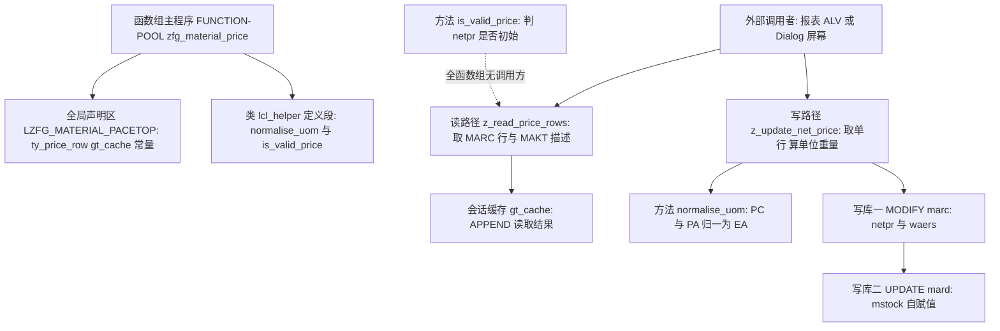
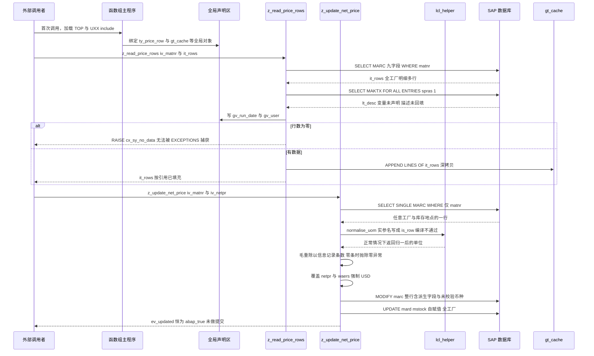

# ZFG_MATERIAL_PRICE 函数组走读报告

> 范围：`zfg_material_price.fg.abap`（函数组主程序 + local class）、`lzfg_material_pacetop.abap`（全局数据段）、`lzfg_material_pacu01.abap`（两个 FM 的实现）。
> 关注点：两个 FM 的职责分工、数据如何流转、数据库写操作是否安全。

---

## 一、程序定位与业务背景

### 1.1 它想解决什么

函数组头部的注释写得很直白：*price / weight maintenance for purchasing infos*，归属 MM Purchasing（物料管理-采购）。翻译成业务语言，这个函数组要回答采购员每天都会遇到的两个问题：

1. **"这个物料在我们各个工厂的采购视图里，现在是什么价格、什么重量？"** —— 对应读接口 `Z_READ_PRICE_ROWS`。
2. **"供应商今天报了新价，帮我把这个物料的净价批量改掉。"** —— 对应写接口 `Z_UPDATE_NET_PRICE`。

背后的业务压力很典型。采购员拿到一张供应商报价单，要在系统里把几十上百个物料的净价更新掉。正常路径有三条，每一条都不好走：

- 走 ME21N / MK20 采购信息记录界面逐条改 —— 慢，而且界面上的价格口径受**价格单位（EKPRO）**和**价格基本数量（MENGE）**约束，改错一处的误差可能成百倍；
- 走 MM02 改价格 —— 受**价格控制（Preiskontrolle：移动平均价 / 标准价 / 无价格控制）**限制，很多物料根本不允许手工改；
- 直接 `MODIFY marc` —— 快，但代价是**绕过采购视图的一致性维护层**（这正是本文要重点讨论的部分）。

所以作者选择了第三条路：自己写一个函数组做"数据库直写门面（Facade）"。这是一条在中小型自开发里非常常见、也非常危险的路。

### 1.2 为什么需要包一层而不是各自写 SELECT

把两个操作包成函数组的动机是成立的：**"读价格"和"改价格"共用一份 `ty_price_row` 行结构**——读出来什么形状，改回去就是什么形状，避免了字段清单两处维护、容易漏字段的问题。同时把"重量合理性检查"（`gc_weight_tol`）和"单位归一化"（`normalise_uom`）抽成可复用的类方法。设计意图是清晰的。

### 1.3 整体设计范式（一句话定性）

> 这是一个**"经典函数组 + 全局会话数据 + `TABLES` 按引用外传结果表"的数据库直写型服务门面**——用过程式接口封装了本该由 BAPI / Info Record 业务 API 承担的写操作，把一致性、授权、单位换算这些脏活留给了调用方和数据库。

定性之后先给个结论，免得读到后面忘了：**这个函数组的"读"半边是可用的（有 bug 但可修），"写"半边目前不具备投产条件**——它对 MARC 的写操作在事务边界、目标行确定性、字段语义、异常处理四个层面同时不成立。后面 §3.4 和 §5 会逐条拆。

---

## 二、程序执行流程总览

### 2.1 流程图



### 2.2 责任链表

| 子程序 | 调用者 | 职责 |
|---|---|---|
| 函数组主程序 `FUNCTION-POOL zfg_material_price` | SAP 系统（首次调用 / SE37 激活） | 函数组入口，INCLUDE 全局数据段与 UXX 函数实现段，并定义 `lcl_helper` |
| 全局声明区 `LZFG_MATERIAL_PACETOP` | 主程序 INCLUDE 语句 | 定义 `ty_price_row` 行结构、`ty_price_rows` 表类型、会话变量 `gt_cache` / `gv_run_date` / `gv_user` / `gv_language`，以及 `gc_weight_tol` / `gc_cap_currency` 两个常量 |
| 类 `lcl_helper` 定义段 | 主程序 | 声明两个静态方法：`normalise_uom`（UOM 归一）、`is_valid_price`（价格有效性） |
| 方法 `normalise_uom` | 函数 `z_update_net_price`（唯一调用点，**实参名写错**） | 把 `PC` / `PA` 归一为 `EA`，其余原样返回 |
| 方法 `is_valid_price` | **无调用方**（全函数组零引用） | 判断 `ty_price_row-netpr` 是否为初始值 |
| 函数 `z_read_price_rows` | 外部调用者（报表 / ALV / Dialog） | 按物料号读 MARC 所有行，追加读 MAKT 描述（未回填），填充会话缓存，成功时通过 `TABLES it_rows` 回传 |
| 函数 `z_update_net_price` | 外部调用者 | 读单行 MARC、算"单位重量"、改 `netpr` 与 `waers`（币种硬编码 USD）、`MODIFY marc`、`UPDATE mard`，恒返回 `abap_true` |
| `gt_cache`（会话缓存） | 仅被 `z_read_price_rows` 写入 | 累加读取结果，**无任何读取方** |
| `MODIFY marc` / `UPDATE mard` | 函数 `z_update_net_price` | 唯一的持久化点，两笔写操作**无 WHERE 工厂限定、无行数校验、无 COMMIT** |

下面按这条流程，逐个子程序展开。

---

## 三、分组分析

### 3.1 函数组主程序 `FUNCTION-POOL zfg_material_price`

这个主程序很短，只有 43 行，但它是整个函数组的"骨架声明"，分四步看：入口与 include 链、local class 声明、`normalise_uom` 实现、`is_valid_price` 实现。

#### ① 入口与 include 链

```abap
FUNCTION-POOL zfg_material_price.

*"* use this source for any type of program (pool)
*"*   function group ZFG_MATERIAL_PRICE

INCLUDE lzfg_material_pacetop.    "session data, type declarations
INCLUDE lzfg_material_pacuxx.    "function implementations
```

**做什么** — 声明这是一个函数组（而非报表或类池），随后按顺序 INCLUDE 两个 include：`LZFG_MATERIAL_PACETOP` 承载会话数据与类型声明，`LZFG_MATERIAL_PACUXX` 承载函数实现。

**为什么** — 函数组主程序本身没有业务代码，它的作用是把"一份编译单元里的多个物理文件"拼成一个程序。`FUNCTION-POOL` 而不是 `REPORT` 是关键区分：函数组会被多个 FM 反复进入，全局数据在**同一对话内跨调用保持**，这正是作者想用 `gt_cache` 做缓存的前提。

**风险与改进** — 这里有一个**结构级隐患，优先级 P0**：include 命名不符合函数组的标准约定。SAP 规则是：函数组名由 TOP include 名推导（`L<函数组名>TOP`），U include 必须形如 `L<函数组名>U01…U49`（或 `UXX` 模式），系统靠这个命名约定去**定位函数模块定义**并在生成函数组索引时识别它们。这里 TOP 叫 `PACETOP`、UXX 叫 `PACUXX`，按约定会被解读为另一个函数组 `ZFG_MATERIAL_PACETOP`（19 字符，已超 18 字符上限）。而实现在 `LZFG_MATERIAL_PACU01` 里（按约定应为 `LZFG_MATERIAL_PAU01`）——**主程序只 INCLUDE 了 `pacuxx`，没有任何语句把 `pacu01` 引进编译链**。在真实系统里这会导致两个后果之一：激活时因找不到 U include 而报 `INCLUDE not found`，或者系统无法识别出函数模块，函数组里根本不存在 `Z_READ_PRICE_ROWS` / `Z_UPDATE_NET_PRICE`。**建议**：统一改成 `LZFG_MATERIAL_PRICETOP` + `LZFG_MATERIAL_PAUXX`（或让 UXX 显式 INCLUDE `LZFG_MATERIAL_PAU01`），并在 SE37 里确认函数模块列表能看到两个 FM。

#### ② local class `lcl_helper` 声明

```abap
*"*---------------------------------------------------------------------*
*"*       CLASS lcl_helper DEFINITION
*"*---------------------------------------------------------------------*
CLASS lcl_helper DEFINITION.
  PUBLIC SECTION.
    METHODS normalise_uom
      IMPORTING iv_uom  TYPE marc-uom
      RETURNING VALUE(rv_uom) TYPE marc-uom.
    METHODS is_valid_price
      IMPORTING is_row  TYPE ty_price_row
      RETURNING VALUE(rv_ok) TYPE abap_bool.
ENDCLASS.
```

**做什么** — 在主程序里声明一个 **local class（局部类）**，对外暴露两个静态方法：`normalise_uom` 入参出参都是 `MARC-UOM`（基本计量单位，CHAR 3）；`is_valid_price` 入参是 `ty_price_row` 整个结构，出参是 `ABAP_BOOL`。两个方法都没有可注入的依赖。

**为什么** — **把 class 放在主程序、而不是放进 U include，这是函数组的正解，值得记住。** 因为 local class 的 class pool 是**按主程序整体生成**的，所以 U include 里的 FM 能看到它们，且与 INCLUDE 语句的文本先后顺序无关。如果把类定义写进 U01，那么每个 FM 各自生成时都会要求一个独立的 class pool，类会重复或不可见。很多人第一次写函数组会把类塞进 UXX，结果 FM 里报"类未定义"。

同时，声明在 `PUBLIC SECTION` 且方法全为静态方法（`METHODS` 写在 local class 中即为静态），调用形式是 `lcl_helper=>normalise_uom(...)`，无需实例化——对这种无状态的纯函数工具来说选择正确。

**风险与改进** — 无状态逻辑放在 local class 里有个长期代价：**它无法被单元测试**。SEW 单元测试要求被测对象是全局类池（`SE38` 里可见的类）或 Function Module，local class 只能"间接触发"（通过调用它的 FM 来间接覆盖），断言写不出来。`is_valid_price` 的判定规则其实是这段代码里最需要测试保护的业务规则，却选了最难测的容器。**改进**：把 `lcl_helper` 抽成独立全局类（例如 `ZCL_MM_PRICE_HELPER`），既能单测，又能让其他程序复用。另外注意两个方法的入参命名风格不统一（`iv_uom` 是标量前缀 `iv_`，`is_row` 是结构前缀 `is_`），组内应统一。

#### ③ 方法 `normalise_uom` 实现

```abap
CLASS lcl_helper IMPLEMENTATION.
  METHOD normalise_uom.
    CASE iv_uom.
      WHEN 'PC' OR 'PA'.
        rv_uom = 'EA'.
      WHEN OTHERS.
        rv_uom = iv_uom.
    ENDCASE.
  ENDMETHOD.                    "normalise_uom
```

**做什么** — 一个 `CASE`：入参是 `PC` 或 `PA` 时返回 `EA`（Each，单件）；其他任何值原样返回。

**为什么** — 意图是消除同一实物在不同系统里单位代码不一致的问题——`PC` 大概是 Piece 的变体（某些外围系统/旧接口的自造码），`PA` 是 Pallet（托盘），统一成 `EA` 后才能做单位比较和汇总。`RETURNING` + `CASE` 的写法干净、无副作用，是纯函数的正确形态。

**风险与改进** — 这一步有**四层问题，优先级 P0～P1**：

- **量纲错配（最严重）**：`PA` 是托盘，把托盘码归一成 `EA`，等于**默认"一托盘 = 一件"**。如果后续有人用这个返回值去换算单价，托盘价会被当成单件价，误差是包装倍率（几十到上百倍）。单位归一化的正确前提是知道换算倍率，而 `normalise_uom` 的签名里**没有任何倍率参数**——这个方法在语义上就不成立。
- **返回后被丢弃**：唯一调用点（见 §3.4③）把返回值赋给了 `lv_uom`，然后 `lv_uom` **在整个 FM 里再也没被用过**；而且 `ty_price_row` 里**根本没有 UOM 字段**，所以归一化结果在结构上无处落库。整段是死代码。
- **健壮性缺失**：没有大小写/空格归一，`'ea'` 或 `'EA '` 会走 `OTHERS` 原样返回；入参为空也不报错，静默返回空。
- **硬编码映射表**：`CASE` 写死在代码里，业务新增一个单位码就要改程序发版。

**改进方向**：如果目的是"算出可比的**标准单价**"，正确公式应该基于采购信息记录的价格单位，而不是改 UOM 代码：

```abap
"概念示意：标准单价 = 净价 × 价格单位 / 价格基本数量
lv_std_price = ls_eine-netpr * ls_eine-ekpro / ls_eine-menge.
```

这段应该基于 `EINE-EKPRO`（价格单位，如"每箱"）和 `EINE-MENGE`（价格基本数量）来做换算，而不是对 UOM 代码做映射表。

#### ④ 方法 `is_valid_price` 实现

```abap
  METHOD is_valid_price.
    rv_ok = COND #( WHEN is_row-netpr IS INITIAL THEN abap_false
                     ELSE abap_true ).
  ENDMETHOD.                    "is_valid_price
```

**做什么** — 判断行结构里的 `netpr` 是否为初始值，是则返回 `abap_false`，否则 `abap_true`。

**为什么** — 写法上是本文件里质量最高的一处：用 `COND #( )` 一次性表达式（7.40+ 语法）替代冗长的 `IF/ELSE/ENDIF`，用 `abap_false` / `abap_true` 替代 `'X'` / 空格。这是现代 ABAP 的推荐风格，比同文件里 `IF lv_count = 0 ... ENDIF` 的写法更有示范价值。语义上意图是"净价为 0 视为无效价格"，在采购语境下这是常见业务规则（0 价通常意味着没维护）。

**风险与改进** — 判定口径过于粗糙，且**这个方法全函数组零调用**——整个函数组只有它的定义和实现，没有一处 `lcl_helper=>is_valid_price`。这意味着"价格有效性校验"这个业务环节在运行时**根本没有发生**。风险点：

- **`IS INITIAL` 判金额**：对 `MARC-NETPR` 这种带 5 位小数的金额字段，`IS INITIAL` 等价于"等于 0.00"，但业务上"0 元清零"可能是合法的主动操作，代码无法区分"未维护"和"故意置零"。
- **数据源本身就不可靠**：`MARC-NETPR` 是**标准价估算价格**（用于移动平均价 / 标准价估值），不是采购员实际维护的采购价——后者在 `EINE-NETPR`。拿它判断"采购价是否有效"会得到系统性错误结论。
- **缺少状态维度**：真正判断一条信息记录是否可用，还要看 `EINE-AENRF`（删除标识）、`EINE-EINAE`（停用标识）、以及供应商是否被冻结。方法签名只接收一个行结构，连这些字段都没有。

**改进方向**：改成接收 `EINE` 记录并综合状态标志判断，同时把"0 / 空 / 负 / 超上下限"分成不同返回码而不是一个 bool；并把它真正接到写流程里（写前校验、写后记消息）。

### 3.2 全局数据段 `LZFG_MATERIAL_PACETOP`

这是整个函数组的"契约层"，分三步：行结构定义、表类型与全局变量、两个常量。

#### ① 行结构 `ty_price_row` 定义

```abap
TYPES: BEGIN OF ty_price_row,
         matnr   TYPE mara-matnr,
         werks   TYPE marc-werks,
         lgort   TYPE marc-lgort,
         eina    TYPE mara-eina,
         brgew   TYPE mara-brgew,
         ntgew   TYPE mara-ntgew,
         netpr   TYPE marc-netpr,
         waers   TYPE marc-waers,
         eifn    TYPE marc-eifn,
       END OF ty_price_row.
```

**做什么** — 定义一个 9 字段的扁平行结构，把"库存/仓储域"（`werks` 工厂、`lgort` 库存地点）、"采购信息域"（`eina` 采购信息记录数、`eifn` 外部/供应商侧编号、`netpr` 净价、`waers` 币种）、"重量域"（`brgew` 毛重、`ntgew` 净重）三个语义域揉进了同一个结构。类型取自 DDIC 的真实字段（`MARA` / `MARC`）。

**为什么** — 用 DDIC 字段类型而不是本地基本类型，是**正确的类型引用纪律**：长度、小数位、单位（QUAN / CURR）都自动跟随，字段改名时编译器会报错。这个选择比"自己写 `TYPE c LENGTH 40`"高明得多。

**风险与改进** — 这个结构有三处**语义校核不通过**，需要逐一挑明：

- **跨表借用类型**：`eina` / `brgew` / `ntgew` 三个字段的类型引用的是 **`MARA`**（物料主数据），但实际 `SELECT` 的来源是 **`MARC`**（工厂级库存 + 采购视图）。MARA 与 MARC 的同名字段在长度或小数位上并不保证一致（尤其重量类 `QUAN` 字段，工厂级视图常有不同精度）。一旦不一致，`SELECT ... INTO TABLE it_rows` 在**编译期完全合法**，却会在**运行期抛转换错误**。**改进**：类型统一引用 `MARC`（读取源表），或用 SE11 逐一比对两者定义后再定稿。
- **净价与币种的数据元素用错了域**：`netpr` / `waers` 取自 `MARC`。`MARC-NETPR` 的语义是"**标准价估算价格**"（`MAWRT`，用于价格控制为移动平均价 / 标准价时的估值），而采购员口中的"净价"是 **`EINE-NETPR`（采购信息记录价格）**。这两者在业务上会取不同的值——MARC-NETPR 由标准价估算过程回写，EINE-NETPR 由采购员手工维护。**即使类型完全匹配，语义也是错配的**，绝不能因为"能跑通"就当作一致。
- **结构横跨三个语义域，却被整体 `MODIFY` 写回**：见 §3.4⑥。`eina`（信息记录**条数**，由一致性服务派生的计数）、`brgew` / `ntgew`（重量，主数据维护）在写路径里被**原样回写数据库**——`eina` 尤其危险，它是由 `EINA` 实际行数派生出来的派生字段，手工回写会与真实信息记录脱钩。`ntgew` 读进来则从头到尾没用过，是纯死字段。
- **缺少写路径必需字段**：结构里既没有 `UOM`（导致 `normalise_uom` 的结果无处放），也没有 `EINE-EKPRO` / `EINE-MENGE`（价格单位与基本数量），更没有 `TIMM`（税标识）、`BPRNG`（价格控制）、`MWAP`（移动平均价）。**结论：这个结构是为"展示"设计的，不是为"更新"设计的**；拿它做 `MODIFY` 是类型层面的方便换来的语义层面的事故。

#### ② 表类型与全局变量

```abap
TYPES ty_price_rows TYPE STANDARD TABLE OF ty_price_row WITH EMPTY KEY.

DATA: gt_cache    TYPE ty_price_rows,
      gv_run_date TYPE datum,
      gv_user     TYPE sy-uname,
      gv_language TYPE sy-langu.
```

**做什么** — 定义行结构的表类型，并声明四个全局变量：一个 `gt_cache` 会话内表，加三个 `gv_*` 标量（运行日期、用户名、语言）。

**为什么** — 用函数组全局变量做**会话级缓存**，是这个函数组最核心的设计意图：把一次 `Z_READ_PRICE_ROWS` 的结果留在内存里，供后续同会话的 `Z_UPDATE_NET_PRICE` 复用，避免重复查库。`WITH EMPTY KEY` 对老式栈表是默认也是唯一选择，语法上没有更好的选项。

**风险与改进** — 这个"缓存"目前**三处失效**：

- **只写不读**：全函数组没有任何一处从 `gt_cache` 里读数据。缓存机制是空的，只剩下内存占用。
- **只增不去、无去重**：`APPEND LINES OF it_rows TO gt_cache` 每次调用都追加一份完整副本。假设一个 ALV 报表逐行取 500 个物料的价格，`gt_cache` 会膨胀到 500 × N 行；因为 `WITH EMPTY KEY` 没有唯一键可去重，同一物料重复读取就是纯重复数据。**改进**：改成存在性检查 + 唯一键插入（`STANDARD SORTED TABLE WITH UNIQUE KEY matnr`），或者干脆加一个"按需加载"标志位，只在真正需要时读一次库。
- **`gv_language` 从未赋值**：`gv_run_date` 和 `gv_user` 在读 FM 里被赋了值（但没人读），`gv_language` 连赋值都没有，恒为初始值。任何后续想用它取文本的功能都会拿到空语言。`gv_run_date` / `gv_user` / `gv_language` 这组变量说明**重构做了一半就停了**——原设计里应该有一个统一的"运行上下文"，但没有收口。

#### ③ 两个常量

```abap
CONSTANTS gc_weight_tol TYPE p DECIMALS 4 VALUE '0.5'.
CONSTANTS gc_cap_currency TYPE c LENGTH 3 VALUE 'USD'.
```

**做什么** — 一个内部类型 `P DECIMALS 4` 的 `0.5`（命名暗示"重量容差"），一个 `C LENGTH 3` 的 `'USD'`（命名暗示"资本/本位币"，但值是美元）。

**为什么** — 硬编码成常量而不是魔法值散落在代码里，是好的习惯；`gc_` 前缀清晰标识"全局常量"。

**风险与改进** — 两个都是业务规则，却都写死在程序里，**P1**：

- **`gc_weight_tol` 语义不明**：`0.5` 是什么的单位？是"每条信息记录的毛重上限"？还是"允许的重量偏差比例"？命名 `tol`（tolerance，容差）与代码里的用法（作为上限做截断）也对不上。而且 `P` 类型没有参考字段，SAP 里的金额/数量字段应该是**带单位的 `QUAN` 类型并以业务字段为参照**，否则运算中的单位一致性完全靠程序员记忆。
- **`gc_cap_currency = 'USD'` 是本文件最危险的两行之一**：把本位币硬编码成美元，意味着**任何调用方都无法用本币以外的币种更新价格**；更严重的是，代码在写入价格时**只改价格不改币种换算**（见 §3.4⑤），等于把一个本币价格按美元重新解释。**改进**：币种应作为 `IV_WAERS` 入参传入；若要统一折算，必须走 `TCURX` 汇率表 + `CURRENCY_CONVERSION`。币种这种国家级配置更应该放配置表（如 `ZMMPRICE_CFG`），而不是程序常量。

### 3.3 读路径 `z_read_price_rows`

读接口分五步走：局部变量与接口、读 MARC、读 MAKT 描述、计数与异常、回填会话缓存。

#### ① 局部变量与接口

```abap
FUNCTION z_read_price_rows.
*"----------------------------------------------------------------------
*"* Local Interface:
*"*  IMPORTING
*"*     VALUE(IV_MATNR) TYPE  MARA-MATNR
*"*  TABLES
*"*     IT_ROWS        TYPE  ZFG_MATERIAL_PRICE=>TY_PRICE_ROWS
*"*  EXCEPTIONS
*"*     NO_DATA       1
*"*----------------------------------------------------------------------

  DATA lv_count TYPE i.
```

**做什么** — 声明一个行计数变量。接口只有一个入参 `IV_MATNR`（物料号），一个 `TABLES` 参数 `IT_ROWS`（结果表），一个 classic 异常 `NO_DATA`。

**为什么** — `TABLES` 参数用于返回结果表是这个年代的通行做法。但**这里暴露了一个架构级别的信息**：接口里**只有物料号，没有工厂参数**。

**风险与改进** — 这个接口签名是整个函数组最致命的设计缺陷的源头，**P0**：

- `Z_READ_PRICE_ROWS` 返回的是 **MARC 的工厂级 / 库存地点级明细行**（一个物料在 500 个工厂就是 500 行），但它的接口**不允许调用方指定工厂**，调用方拿到的是"全工厂全集"，无法收窄。
- 而配套的 `Z_UPDATE_NET_PRICE` 也**没有工厂参数**（见 §3.4）。于是这个"读-改"组合在设计上就无法闭环：调用方从读取结果里挑出一行（带着 `werks` / `lgort`），却**没有任何办法把这个工厂信息传回给写函数**。
- 这是**结构性缺陷，不是参数遗漏**。正确做法是两个 FM 共享一个带 `werks` / `lgort` 的行结构作为 `IMPORTING` 入参（值传参），让"改哪一行"由调用方明确指定。

**改进方向**（连同接口一起）：

```abap
FUNCTION z_update_net_price.
*"*  IMPORTING
*"*     VALUE(IV_ROW)  TYPE  ZFG_MATERIAL_PRICE=>TY_PRICE_ROW
*"*     VALUE(IV_NETPR) TYPE  MARC-NETPR
*"*     VALUE(IV_WAERS) TYPE  MARC-WAERS
*"*     VALUE(IV_PRICEUNIT) TYPE  EINE-EKPRO
*"*  RETURNING
*"*     VALUE(EV_UPDATED) TYPE  ABAP_BOOL
*"*  EXCEPTIONS
*"*     NOT_FOUND 1  NO_DATA 2
```

用整行入参同时传递主键（`matnr` / `werks` / `lgort`）和价格口径，从签名上就杜绝"写到哪个工厂不明确"。

#### ② 读 MARC 明细

```abap
  SELECT matnr werks lgort eina brgew ntgew netpr waers eifn
    FROM marc
    INTO TABLE it_rows
    WHERE matnr = iv_matnr.
```

**做什么** — 从 `MARC` 显式列出 9 个字段装进 `it_rows`（`TABLES` 参数被直接赋值 = 出参），筛选条件只有物料号。返回该物料在**所有工厂、所有库存地点**的采购视图行。

**为什么** — 显式字段列表投影取列，而不是 `SELECT *`，是**正确的性能实践**：MARC 有数百个字段，投影能显著降低内存和传输量；`matnr` 是 MARC 主键首字段，条件命中主键索引，效率没问题。

**风险与改进** — 语法和数据量上都没问题，问题全在语义与契约上，**P1**：

- **无工厂限定**：调用方无法收窄范围（已在 ① 提到）。对采购员来说"只要中国工厂的价格"是常态。
- **返回的是 MARC 价格不是采购价**：`MARC-NETPR` 是标准价估算价格，采购员要的采购价在 `EINE`（通过 `EINA` → `EINE`）。也就是说**这个函数从数据源上就取错了表**，业务上应该查 `EINE` 关联 `LFM`（供应商）、`EINE-EKPRO`（价格单位）、`EINE-MENGE`（价格基本数量）。这是需要跟业务确认的第一个问题。
- **无 `sy-subrc` 处理**：`INTO TABLE` 失败（网络、超时、字段转换错误）时不会有任何提示，下游拿到空表还以为是"没数据"。
- **无权限检查**：应该用 `AUTHORITY-CHECK` 校验用户对采购信息记录的显示权限。

#### ③ 读 MAKT 描述（未回填）

```abap
  SELECT maktx FROM makt
    INTO TABLE lt_desc
    FOR ALL ENTRIES IN it_rows
    WHERE matnr = it_rows-matnr
      AND spras = '1'.
```

**做什么** — 想用 `FOR ALL ENTRIES` 把物料描述 `MAKT-MAKTX` 查进 `lt_desc`。注意 `lt_desc` 在这个 FM 里**从未被 `DATA` 声明**。

**为什么** — 意图是给 ALV 报告显示物料描述，让采购员不用对着物料号干活，这个需求本身合理。用 `FOR ALL ENTRIES` 把 N 个物料号的描述批量查回，也比逐个 `SELECT SINGLE` 好。`FOR ALL ENTRIES` 自身对空内表是安全的（自动不查库），这一点没问题。

**风险与改进** — 这一段有三处叠加问题，**P0**：

- **语法错误：`lt_desc` 未声明**。函数模块里的局部内表必须先 `DATA lt_desc TYPE ...` 声明才能用。这段代码在真实激活时会直接报语法错。**这是我在这份代码里找到的第一个"连编译都过不去"的问题**。
- **查了但不用**：`lt_desc` 即使声明了也没有被 `APPEND` 进 `it_rows`，而 `ty_price_row` 结构里**没有 `maktx` 字段**。所以描述数据取回来了、然后被丢弃——**纯粹的无效 DB 访问**。修复方向不是删掉，而是给 `ty_price_row` 加 `maktx TYPE makt-maktx` 字段，把描述真正回填。
- **语言硬编码 `spras = '1'`**：`'1'` 是中文，`'E'` 是英文，`'D'` 是德文。作者显然按本项目的中文环境写死。这在多语言系统、英文界面、或需要在不同 SPRAS 下导出的场景下会静默返回空描述。**改进**：用 `sy-langu` 或把 `SPRAS` 作为入参。

另外**顺序问题**：`lv_count = 0` 的空结果判断在第 ④ 步，也就是在 MAKT 查询**之后**。空结果时白白多打一次库（`FOR ALL ENTRIES` 会让这次查询不返回行，但往返通信和 SQL 解析的开销仍在）。**改进**：把空判断提到所有取数之前。

#### ④ 计数与异常抛出

```abap
  lv_count = lines( it_rows ).

  gv_run_date = sy-datum.
  gv_user     = sy-uname.

  IF lv_count = 0.
    RAISE EXCEPTION TYPE cx_sy_no_data.
  ENDIF.
```

**做什么** — 统计行数；把运行日期和用户名写进全局变量；行数为 0 时 `RAISE EXCEPTION TYPE cx_sy_no_data`。

**为什么** — "查无数据"是一个必须让调用方知道的业务结论，用异常（而不是空表静默返回）是更负责任的设计——否则调用方会把"没维护价格"和"查询失败"混为一谈。`lines( )` 也是现代写法。

**风险与改进** — **异常机制自相矛盾，P0**：

- **接口声明的是 classic `EXCEPTIONS NO_DATA 1`，实现却抛 OO 异常 `cx_sy_no_data`——两套机制不通。** classic 函数模块的调用方用 `EXCEPTIONS no_data = 1` 是**捕不到** OO 异常的：在非 RFC 函数模块里 `RAISE EXCEPTION TYPE ...` 抛出的异常无法通过 `EXCEPTIONS` 列表处理，结果是**不可捕获的运行期短 dump**。而且 `CX_SY_NO_DATA` 本身是为 `SELECT SINGLE` 无数据场景设计的异常类，用在函数模块里是明确的反模式。
- **二选一的正确做法**：
  - 方案 A（推荐）：在函数组属性里**勾选"允许 RFC"**，接口改成 `RAISING cx_sy_no_data`，调用方用 `TRY/CATCH`；
  - 方案 B：保持 classic 语义，把 `RAISE EXCEPTION TYPE cx_sy_no_data` 换成 classic 异常赋值（如 `MESSAGE no_data TYPE 'X'`，或按 SAP 例程用异常变量），让 `EXCEPTIONS no_data = 1` 真正生效。
- **全局变量在异常之前就被污染**：`gv_run_date` / `gv_user` 的赋值在 `RAISE` 之前执行。调用方若捕获异常后继续在同会话内操作，会拿到**半初始化的会话上下文**。这类"失败也要清场"的问题在小函数组里特别容易积累成偶发 bug。
- **行数判断用 `IF lv_count = 0`**：功能上没错，但 `IF it_rows IS INITIAL` 语义更直白；这不是重点，重点是**异常类型与接口不匹配**。

#### ⑤ 回填会话缓存

```abap
  APPEND LINES OF it_rows TO gt_cache.
```

**做什么** — 把整批读取结果追加到全局缓存 `gt_cache`。

**为什么** — 见 §3.2②：作者想在同会话内复用读取结果，减少重复查库。放在异常判断**之后**是正确顺序——没有数据就不该进缓存，这一点作者想对了。

**风险与改进** — `APPEND LINES OF` 是**深拷贝**，这份数据随后在调用方的 `it_rows` 和 `gt_cache` 里各存在一份，等于内存占用翻倍；配合"无去重 + 无读取方"（§3.2②），这个缓存**纯粹是净损失**：占内存、不可用、还在更新场景下可能与后续读到的数据不一致（缓存不会随数据库变更失效）。**改进**：要么真正实现读路径（`gt_cache` 改成唯一键表，写前先查缓存并做失效策略），要么**直接删掉**——YAGNI 原则下，删掉比留一个没人用的缓存更负责。

### 3.4 写路径 `z_update_net_price`（重点）

这是用户最关心的部分，也是问题最密集的部分。分八步：局部变量与接口、取单行、调用 UOM 归一、单位重量计算、回填价格与币种、`MODIFY marc`、`UPDATE mard`、返回标志。

#### ① 局部变量与接口

```abap
FUNCTION z_update_net_price.
*"----------------------------------------------------------------------
*"* Local Interface:
*"*  IMPORTING
*"*     VALUE(IV_MATNR) TYPE  MARA-MATNR
*"*     VALUE(IV_NETPR) TYPE  MARC-NETPR
*"*  EXPORTING
*"*     VALUE(EV_UPDATED) TYPE  ABAP_BOOL
*"*----------------------------------------------------------------------

  DATA ls_row    TYPE ty_price_row.
  DATA lv_uom    TYPE marc-uom.
  DATA lv_weight TYPE p DECIMALS 4.
```

**做什么** — 声明三个局部变量：行结构、UOM、重量。接口有两个入参（物料号、净价），一个出参 `EV_UPDATED`。

**为什么** — 变量声明集中在函数头部，符合可读性要求。`EXPORTING` 而不是 `TABLES` 输出结果，符合这个函数"只需要一个成败标志"的设计。

**风险与改进** — 接口层的问题最集中，**P0**：

- **入参缺工厂与库存地点**：与 §3.3① 同一个结构性缺陷。`IV_MATNR` 单键不能确定 MARC 的唯一行（MARC 主键是 `MATNR + WERKS + LGORT`），**这是本 FM 一切后续问题的根源**。
- **缺币种入参**：`IV_NETPR` 传进来一个价格，却没告诉程序这个价格是哪个币种的，程序在第 ⑤ 步擅自把它当成 USD。这是典型的"接口信息不足导致实现自行其是"。
- **缺价格单位入参**：`MARC-NETPR` 是**每 1 个基本单位的净价**。如果供应商的报价是"每箱 100 支、共 50 元"，调用方必须同时告知价格单位（`EINE-EKPRO` = 100）和价格基本数量（`EINE-MENGE` = 100），系统才能正确落 0.5 元/支。**接口完全不承载这个信息，写入的价格在口径上必然是错的**（详见 ⑤）。
- **无 `EXCEPTIONS`**：调用方除了 `EV_UPDATED` 拿不到任何失败信息，而 `EV_UPDATED` 恒为真（见 ⑧）。
- `lv_uom` / `lv_weight` 两个变量声明后语义上已经"注定白写"（见 ③④）。

#### ② 取单行 MARC（本 FM 最严重的问题）

```abap
  SELECT SINGLE * FROM marc INTO @ls_row
    WHERE matnr = iv_matnr.
```

**做什么** — 意图是按物料号取 MARC 的一行到行结构，用于后续修改。

**为什么** — `SELECT SINGLE` 配合 `sy-subrc` 判断"记录存在性"是很常见的写法。`SELECT SINGLE` 在 ABAP 里是"取第一行"而非"保证唯一"，作者大概知道这一点但接口没给他更好的选择。

**风险与改进** — **这里叠了三个 P0 级的错误**：

- **目标行不确定**：`WHERE` 只有 `matnr`，而 MARC 的完整主键是 `MATNR + WERKS + LGORT`。一个物料在 50 个工厂就是 50 行，`SELECT SINGLE` 会返回数据库访问路径上的**任意一行**（由优化器决定，不可预测、不可重现）。更糟的是下面的 `MODIFY marc FROM ls_row` 会用这一行里的 `werks` / `lgort` 当主键——**于是价格被写到某个不知名的工厂的库存地点上**。这是典型的"跨工厂数据污染"，在生产上会直接造成估值错误和盘点差异，且极难定位。**改进**：接口加 `IV_WERKS` / `IV_LGORT`，`WHERE` 条件补全主键。
- **`SELECT SINGLE *` 目标结构字段不足**：`SELECT SINGLE *` 取的是 MARC **整行（数百字段）**，而 `ls_row`（`ty_price_row`）只有 **9 个字段**。整行到部分结构的字段映射在 ABAP 中不成立——按关键字文档，`INTO` 目标结构必须与数据库结构兼容，字段不足会**在激活 / 编译期报错，或在运行期抛结构转换错误**。即使它侥幸能过，后续拿到的也只是"恰好同名的 9 个字段"，其余字段全丢。**可靠写法**两种：

```abap
"写法 A：显式字段列表，与 ty_price_row 精确对应
  SELECT SINGLE matnr werks lgort eina brgew ntgew netpr waers eifn
    FROM marc
    INTO  @ls_row
    WHERE matnr = @iv_matnr
      AND werks = @iv_werks
      AND lgort = @iv_lgort.

"写法 B：先取整表结构，再 MOVE-CORRESPONDING
  SELECT SINGLE * FROM marc
    INTO  @DATA(ls_marc)
    WHERE matnr = @iv_matnr
      AND werks = @iv_werks
      AND lgort = @iv_lgort.
  MOVE-CORRESPONDING FIELDS (matnr werks lgort eina brgew ntgew netpr waers eifn)
        FROM ls_marc TO ls_row.
```

- **完全没有 `sy-subrc` 判断**：这直接引出下一步的除零崩溃。见 ④。

#### ③ 调用 `normalise_uom`（写错 + 结果丢弃）

```abap
  lv_uom = lcl_helper=>normalise_uom( is_row = ls_row-waers ).
```

**做什么** — 试图调用 UOM 归一化方法，把结果存到 `lv_uom`。

**为什么** — 意图是让后续写入的价格单位统一（见 §3.1③ 的设计动机）。

**风险与改进** — **这一行同时有编译期错误和语义期错误，四个问题全在这一行，P0**：

- **编译期：实参名写错。** `normalise_uom` 的形参名是 `IV_UOM`，代码却传了 `IS_ROW`（`is_row` 是 `is_valid_price` 的形参名）。**ABAP 的关键字实参名必须与形参名一致**，会直接报语法错。**这是文件里第二个"编译不过"的问题**。
- **语义期：传错了字段。** 就算把实参名改对，传入的应该是 `ls_row-uom`（单位），代码传的是 **`ls_row-waers`（币种）**——把 USD 这样的币种代码塞进一个做单位归一的 `CASE` 里。`'USD'` 会走 `WHEN OTHERS` 原样返回，于是 `lv_uom` 变成 `'USD'`。**而 `ty_price_row` 里根本没有 `UOM` 字段**，说明作者对"要归一单位"这件事从数据模型上就没准备好。
- **结果被丢弃**：`lv_uom` 赋值之后**再没有任何一处使用**。`ls_row` 里没有 UOM 字段可以承接它。整行是死代码。
- **顺带丢掉了重要信息**：`ls_row-waers` 的原值（该工厂当前的币种）在第 ⑤ 步被 `gc_cap_currency` 覆盖了，而 `normalise_uom` 只是**读它算 UOM、不改它**，所以原币种信息在这里被白白消耗掉一次却没有被保存。

**改进**：如果单位归一确实是业务需求，先在 `ty_price_row` 加 `uom TYPE marc-uom` 字段（`SELECT` 时一并取），再写 `lv_uom = lcl_helper=>normalise_uom( iv_uom = ls_row-uom )`，然后把归一结果**真正用于标准单价换算**。否则就删掉这个类方法。

#### ④ 单位重量计算（量纲错误 + 除零）

```abap
  lv_weight = ls_row-brgew / ls_row-eina.

  IF lv_weight > gc_weight_tol.
    lv_weight = gc_weight_tol.
  ENDIF.
```

**做什么** — 用**毛重除以采购信息记录条数**得到一个"单位重量"，超过 `0.5` 就截断到 `0.5`。

**为什么** — 作者想实现业务注释里说的 "weight maintenance"（重量维护 / 校验）：如果算出来的单位重量异常大，说明这条采购信息可疑，想把它压到容差上限。

**风险与改进** — **这里有一个量纲级别的错误和一个必现的运行时异常，P0**：

- **量纲完全错配（P0）**：`brgew` 是**物料的毛重**（重量单位，通常 KG），`eina` 是**采购信息记录的条数**（纯计数，无量纲）。`毛重 / 条数` 这个除法**在物理意义上不成立**——它算出的是"每条信息记录分摊多少公斤毛重"，而一个物料有 3 条信息记录，毛重就被"分摊"成 3 份。这个值既不是单件毛重，也不是任何业务量。
  - **正确的"单件毛重"**应该基于计量单位换算：MARC 的 `UMREZ` / `UMREN`（计量单位换算的分子 / 分母，含义是"每个库存单位含多少个基本单位"）或 MARA 的 `MEINS`（基本计量单位），单件毛重 = `brgew` 按换算率折算到基本单位。**注意**：`BRGEW` 在不同视图中的计量基准并不相同（主数据侧通常以基本计量单位 `MEINS` 为基准），这里必须用 SE11 核对实际字段定义和业务口径后再写公式，不能凭字段名推。
  - **更根本的问题**：本函数要改的是**价格**，重量校验和价格修改在业务上也没有必然因果。如果目的是"剔除重量异常的价格"，那应该把校验结果作为**独立标志返回给调用方**，让业务决定跳过与否，而不是在函数内部静默截断。
- **除零（P0，必现）**：`eina` 为 0（该物料**没有采购信息记录**，这是极其常见的状态）时，`ls_row-brgew / ls_row-eina` 抛 **`CX_SY_ZERODIVIDE`**，函数直接 dump。触发条件比想象中宽：物料新建未维护采购信息、或 `SELECT` 命中的是一行 `eina = 0` 的记录。**改进**：先判 `IF ls_row-eina IS INITIAL OR ls_row-eina <= 0` 提前 `LEAVE` / 置标志，绝不能裸除。
- **未命中时连带崩溃**：`②` 步的 `SELECT SINGLE` 如果没找到记录且未判 `sy-subrc`，`ls_row` 全为初始值，这里就是 `0 / 0`——**所以除零崩溃是"查无数据"场景下的必然结果**，两个缺陷叠在一起。
- **静默截断且结果被丢弃**：`lv_weight` 被截断后**从未被使用**，不做任何判断、不抛消息、不写标志。它是一段**只改本地变量、没有任何可观察效果**的代码。**改进**：要么把校验结果通过出参 / 异常暴露给调用方，要么删掉。

#### ⑤ 回填净价与币种（本 FM 最危险的一步）

```abap
  ls_row-netpr = iv_netpr.
  ls_row-waers = gc_cap_currency.
```

**做什么** — 把调用方传入的净价写进行结构的 `netpr` 字段，并把币种**强制覆盖**为常量 `'USD'`。

**为什么** — 意图是"更新价格，同时把币种统一为 USD"。作者大概遇到了"不同工厂币种不一致导致汇总出错"的问题，于是用"统一币种"的方式绕过。

**风险与改进** — **这两行是整个函数组里业务危害最大的一行，P0**：

- **无汇率换算的"改币种"等于篡改价格含义**：`MARC-WAERS` 是这个价格**当前所代表的币种**。把一个本币（比如 CNY）的价格数字 `iv_netpr` 原封不动写进去、同时把币种标签改成 `USD`，等于**告诉系统"这个数字现在是美元"**。系统不会报错，它会安静地把错误价格用于移动平均价计算、进而污染库存估值和财务期间结转。正确的做法只有两条：要么币种由调用方传入并**保持原币种**（`ls_row-waers` 不动），要么真要折算就必须查 `TCURX` 汇率并按汇率换算后再改币种。
- **价格口径缺失，误差可能成百倍**：`MARC-NETPR` 是**每 1 个基本单位**的价格。采购合同里"每箱 50 元、每箱 100 支"是常态，供应商报价落在 `EINE` 上，配套 `EINE-EKPRO`（价格单位 = 100）和 `EINE-MENGE`（价格基本数量 = 100）。本函数**既不读也不写这两个字段**，调用方传进来的 `iv_netpr` 是"每箱价"还是"每支价"完全无从判断，写库后单价误差可达 100 倍。**这是采购场景最经典的致命错误类型**。
- **写错数据域**：`MARC-NETPR`（`MAWRT`，标准价估算价格）与 `EINE-NETPR`（采购信息记录价格）不是同一个价格。前者由价格控制逻辑维护、用于估值；采购员要改的是后者。往 `MARC-NETPR` 写采购价，会造成"采购价改了但采购信息记录没变"、"价格控制为标准价时两个价格互相覆盖"的混乱。
- **配套字段一个没改**：`MARC` 里还有 `TIMM`（税标识）、`MWAKT`（价格控制：1 移动平均价 / 2 标准价 / 3 无价格控制）、`MWAP`（移动平均价）、`MWST`（是否自动估价）。**只改 `NETPR` 而不动这些字段，会产生内部不一致的 `MARC` 记录**：价格控制为 3（无价格控制）时这个 `NETPR` 根本不生效（白改）；为 1/2 时 `NETPR` 与 `MWAP` 对不上，下一次估价又会把它冲掉（改了就白改）。

#### ⑥ `MODIFY marc`（直写生成表）

```abap
  MODIFY marc FROM ls_row.
```

**做什么** — 把行结构整行 `MODIFY` 回 `MARC` 持久化。这是本 FM 的**第一笔写操作**。

**为什么** — 作者想让数据库变更一步到位。写法本身（`MODIFY ... FROM wa`，工作区主键字段作为条件）在这个"工作区恰好含主键字段"的前提下是常规做法。

**风险与改进** — **P0，四个层面**：

- **主键来自不确定的那一行**（详见 ②）：`ls_row-werks` / `ls_row-lgort` 是 `SELECT SINGLE` 随机命中的工厂和库存地点，`MODIFY` 就写到这里。**P0：跨工厂数据污染。**
- **主键为空会写入垃圾行**：如果 `SELECT SINGLE` 没命中且未判 `sy-subrc`（`②` 已说明没有判），`ls_row` 全初始，此时 `matnr` / `werks` / `lgort` 全是空白，`MODIFY` 等于尝试**用空主键插入一行 MARC**。好在 `④` 步的除零会先抛异常挡住——**这属于"因崩溃而侥幸没写坏数据"，是运气不是防护**。如果哪天有人把 `④` 删了，这就是一次真实的空键写入事故。
- **整行结构回写派生字段（P0 语义风险）**：`MODIFY marc FROM ls_row` 会把**工作区里所有同名字段**写回，不只是本次要改的 `netpr`。于是 `eina`（采购信息记录**条数**，由 `EINA` 表实际行数派生的**派生字段**）、`brgew` / `ntgew`（重量）、`eifn`（外部编号）**全部被原样回写**。即使值没变（因为是刚读出来的），这也带来两个问题：一是**扩大了写入面**（本来只想改一个字段，现在动了 9 个，其中 4 个是派生/只读性质），二是这些字段的**一致性不由本程序负责**——如果读取期间（`②` 到 `⑥` 之间）有并发事务修改了 `eina`，本程序的回写会把新值**覆盖回旧值**，造成更新丢失（lost update）。**改进**：定点更新，只碰要改的字段：

```abap
  UPDATE marc SET netpr = @iv_netpr
    WHERE matnr = @iv_matnr
      AND werks = @iv_werks
      AND lgort = @iv_lgort.
  IF sy-dbmod <> 1.
    " 未命中或命中多行，报错退出
  ENDIF.
```

  `UPDATE ... SET` 天然只写指定字段，也没有"空键插入"的风险（未命中就是 0 行），是这个场景更安全的写法。
- **MARC 是生成表（Derived Table）**（P0 架构风险）：`MARC` 由 SAP 的**采购视图 / 库存视图**维护，直写 `MARC` **绕过了整个一致性维护层（CD - Consistency Layer）**。后果是：采购信息记录 `EINE` 不变（采购价与信息记录脱钩）、`MARA` / `MAKT` 的相关视图不同步、`MARD`（只在有库存时才有行）不联动、变更文档（`CDHDR` / `CDPOS`）不生成、审计和 SoD 全部失效。**更重要的是：SAP 不支持直接 `MODIFY` 生成表**，标准做法是通过业务 API：`BAPI_INFO_RECORD`（维护采购信息记录）、采购订单 `BAPI_PO_CHANGE2`，或物料主数据 BAPI。**结论：这一行应该整体替换为 `BAPI` + `BAPI_TRANSACTION_COMMIT`**，而不是修补。
- **无授权检查**：改采购价格属于敏感操作，应在 FM 内 `AUTHORITY-CHECK` 校验用户是否具备采购信息记录维护权限（并在 FM 文档里声明 Required Object），而不是依赖调用方自觉。

#### ⑦ `UPDATE mard`（无谓的全工厂写）

```abap
  UPDATE mard SET mstock = mstock WHERE matnr = iv_matnr.
```

**做什么** — 对 `MARD` 执行一次"字段自赋值"更新，条件只有物料号。

**为什么** — 这确实是 SAP MM 里的一个**已知惯用法**：`MARD` 只在物料有库存时才被创建，直接 `MODIFY mard` 会在尝试插入；用 `UPDATE mard SET mstock = mstock` 可以在**不改变值**的前提下确保该行存在（相当于一次"存在性 touch"）。所以"自赋值"本身不是无脑写法。

**风险与改进** — 但把它用在这里，四个理由都站不住，**P0**：

- **与价格修改无因果关系**：改 `MARC-NETPR` 不需要 touch `MARD`，这两个数据对象分属不同的一致性分支。这行和它上一行的 `MODIFY marc` 之间**没有任何业务逻辑关系**，属于"顺手加的"。
- **没有工厂限定 → 全工厂行扫描 + 大量锁**：`WHERE matnr = @iv_matnr` 会命中该物料在**所有工厂**的所有 `MARD` 行。对有库存的热门物料，这是几十上百行。`UPDATE` 会对每一行加行锁并生成未提交的修改记录，**在高峰时段与库存过账争锁**；同时这些未提交修改要等调用方 `COMMIT` 才释放，如果调用方持有这个内部表很久，会显著拖长 MM 事务。**改进**：至少加 `AND werks = @iv_werks` 限定工厂——更正确的是**直接删掉这行**。
- **会触发下游连锁反应**：`MARD` 是 MM 变更文档的触发源之一，touch 它会走一遍物料凭证 / 变更文档的更新逻辑，产生无业务意义的记录，并可能触发相关的后台更新（`MARC` 派生、`MAST` 汇总库存校验）。**用"没有实际含义的写"换取副作用，是 MM 开发里最典型的反模式**（因为它被用来"保险起见触发刷新"，但实际只会制造锁和日志噪音）。
- **`MARD` 的行本来就会由 `MARC` 的正常维护流程按需创建**，不需要应用自己"确保存在"。如果确实要显式创建，应该用官方 API 或在正确的过账上下文里做。

#### ⑧ 返回成功标志

```abap
  ev_updated = abap_true.
```

**做什么** — 无条件把成功标志置为 `abap_true`。

**为什么** — 让调用方知道函数跑完了。

**风险与改进** — **这是在"报告一个没发生过的成功"，P0**：

- 前面的 `SELECT SINGLE` 可能没找到记录、可能找到了错误的工厂、可能抛了除零异常——**只要代码走到这一行，作者就宣称更新成功**。
- `MODIFY marc` 和 `UPDATE mard` 都可能因为数据库错误、锁冲突、超时而失败，代码**没有检查 `sy-dbmod`**，也没有 `TRY/CATCH` 任何 `CX_DBDABAP` / `CX_SQL_ERROR`。
- `EV_UPDATED` 是 `ABAP_BOOL`（一位布尔），只能表达"成功/失败"，不能表达"部分成功"或失败原因。**改进**：改为配合 `EXCEPTIONS not_found 1 no_data 2 db_error 3`（或 RFC + OO 异常），并在每一步之后检查 `sy-subrc` / `sy-dbmod` 后再决定返回值。

### 3.5 事务与错误处理专项小结（用户重点关注）

把 §3.4 的事务相关问题集中结论一次：

| 关注点 | 现状 | 结论 |
|---|---|---|
| 事务边界 | FM 内做了 `MODIFY` + `UPDATE` 两笔写，**没有 `COMMIT WORK`、没有 `ROLLBACK`** | 事务控制完全外包给调用方。`MODIFY` 类 FM 不自己 commit 是**惯例**（正确），但必须在 FM 的函数文档里明确写出"调用方负责提交或回滚"，并在失败路径上保证不留半成品 |
| 异常路径的原子性 | `RAISE` 只在读 FM 的 ④ 步；写 FM 的 ④ 步除零会抛出 `CX_SY_ZERODIVIDE` | 写 FM 若在 `MODIFY` 之后、`UPDATE mard` 之前抛异常，**已执行的写操作不会被自动回滚**（ABAP 异常不隐式回滚 `UPDATE`），调用方若捕获异常并继续提交，就会提交半成品数据。必须在 FM 内用 `TRY ... CATCH ... ROLLBACK`，或把两步写合成一个受控单元 |
| 错误反馈 | 写 FM **无 `EXCEPTIONS`、无 `sy-subrc` / `sy-dbmod` 检查、`EV_UPDATED` 恒真** | 调用方完全无法判断成败。这是"能编译、能跑、但结果不可信"的组合 |
| 写操作范围 | `MODIFY marc` 9 字段整体回写；`UPDATE mard` 命中全部工厂 | 写入面远大于业务需求，锁范围和 lost update 风险都被放大 |
| 一致性 | 直写 `MARC` / `MARD` 生成表 | 绕过 CD 层，派生表、变更文档、后台更新全部失效。**这是架构级问题，不是修 bug 能解决的** |
| 幂等性 | 无版本号、无时间戳、无变更前值记录 | 重复调用会重复覆盖；出错后无法回溯原值 |
| 授权与审计 | 无 `AUTHORITY-CHECK`、无变更文档、无日志 | 采购价格属于敏感数据，缺少这两项在多数企业的内审中是**直接不通过项** |

**给这一块的整体判断**：这个写路径**不应该被"修补"，而应该被"重写"**。正确形态是用 `BAPI_INFO_RECORD`（或 `BAPI_PO_CHANGE2`）完成价格维护，让 SAP 自己处理一致性、变更文档、Enqueue 和价格单位；应用层只负责参数校验、单位换算、授权和结果反馈。

---

## 四、执行流程全景图（数据视角）



这条时序图把关键问题都标在了箭头上，可以对照着看三处结构性错配：**读接口拿的是工厂级明细、写接口却只有物料号级主键**；**读出的 `werks` / `lgort` 没有任何路径能传回写接口**；**整条链上没有一个环节检查 `sy-subrc` / `sy-dbmod`，也没有一个环节负责提交或回滚**。

---

## 五、问题清单与改进建议（按优先级）

### 5.1 P0 — 业务正确性（阻断投产）

| # | 问题 | 所在子程序 | 改进方向 |
|---|---|---|---|
| P0-1 | `SELECT SINGLE` 只按 `matnr` 过滤，`MODIFY` 用随机命中的 `werks` / `lgort` 当主键，**价格写到未知工厂** | 函数 `z_update_net_price` | 接口加 `IV_WERKS` / `IV_LGORT`，`WHERE` 补全主键；改用定点 `UPDATE ... SET` |
| P0-2 | 写接口无工厂参数，与读接口返回的工厂级明细**在设计上无法闭环** | 函数 `z_read_price_rows` / `z_update_net_price` | 用整行结构作 `IMPORTING` 入参，签名上传递主键 |
| P0-3 | `SELECT SINGLE * FROM marc INTO @ls_row` 取整行（数百字段）到 9 字段结构，**字段映射不成立** | 函数 `z_update_net_price` | 显式字段列表，或 `INTO @DATA(ls_marc)` + `MOVE-CORRESPONDING` |
| P0-4 | `SELECT SINGLE` 后**无 `sy-subrc` 判断**，未命中时全空结构继续往下走 | 函数 `z_update_net_price` | 每步取数后立即判 `sy-subrc`，未命中抛 `not_found` |
| P0-5 | `lv_weight = brgew / eina` 用"信息记录条数"当除数，**量纲错误**；`eina = 0` 时**必现除零 dump** | 函数 `z_update_net_price` | 单件毛重应基于 `UMREZ` / `UMREN` 换算；除法前强制判分母 |
| P0-6 | `MODIFY marc` 直写**生成表**，绕过一致性维护层；`EINE` / `MARA` / `MARD` / 变更文档全部不联动 | 函数 `z_update_net_price` | 改用 `BAPI_INFO_RECORD` / `BAPI_PO_CHANGE2` + `BAPI_TRANSACTION_COMMIT` |
| P0-7 | 币种被硬编码为 `USD` 且**无汇率换算**，等于把本币价格按美元重新解释 | 全局声明区（`gc_cap_currency`）、函数 `z_update_net_price` | 币种作入参传入并保持原币种；需折算时走 `TCURX` |
| P0-8 | 写 `MARC-NETPR`（标准价估算价）而非 `EINE-NETPR`（采购信息价格），且**丢弃 `EKPRO` 价格单位与 `MENGE` 基本数量**，单价可能错百倍 | 函数 `z_update_net_price`、全局声明区（`ty_price_row`） | 结构补上 `EINE` 关联字段，先折算成基本单位单价再写 |
| P0-9 | `UPDATE mard SET mstock = mstock WHERE matnr = @iv_matnr` **无工厂限定**，扫描并锁定全部工厂行，且与价格修改无因果关系 | 函数 `z_update_net_price` | 直接删除该语句 |
| P0-10 | `lt_desc` **未声明** → 语法错误，函数组无法激活 | 函数 `z_read_price_rows` | 补 `DATA lt_desc`，并把 `maktx` 加进 `ty_price_row` 真正回填 |
| P0-11 | `RAISE EXCEPTION TYPE cx_sy_no_data` 与接口 `EXCEPTIONS no_data = 1` **机制冲突**，classic 调用方捕不到且会 dump | 函数 `z_read_price_rows` | 二选一：启用 RFC + `RAISING`，或改回 classic 异常语义 |
| P0-12 | `lcl_helper=>normalise_uom( is_row = ... )` **实参名写错** → 语法错误；且传的是币种 `waers` 而非单位 | 函数 `z_update_net_price` | 改为 `iv_uom = ls_row-uom`，并在结构中补 `uom` 字段 |
| P0-13 | include 命名不符函数组约定（`pacetop` / `pacuxx` / `pacu01`），且主程序**未 INCLUDE 承载 FM 的 `pacu01`** | 函数组主程序 | 统一为 `LZFG_MATERIAL_PRICETOP` + `LZFG_MATERIAL_PAUXX` / `PAU01`，SE37 确认 FM 可识别 |
| P0-14 | `EV_UPDATED` 恒为 `abap_true`，无 `EXCEPTIONS`、无 `sy-dbmod` 检查 → **报告未发生的成功** | 函数 `z_update_net_price` | 加 `EXCEPTIONS`，逐步校验 `sy-subrc` / `sy-dbmod` 后再返回 |

### 5.2 P1 — 健壮性

| # | 问题 | 所在子程序 | 改进方向 |
|---|---|---|---|
| P1-1 | `SELECT ... INTO TABLE it_rows` 后无 `sy-subrc` 处理，取数失败与无数据不可区分 | 函数 `z_read_price_rows` | 判 `sy-subrc`，失败抛异常 |
| P1-2 | `spras = '1'` 语言硬编码，多语言场景静默返回空描述 | 函数 `z_read_price_rows` | 用 `sy-langu` 或作入参 |
| P1-3 | MAKT 查询在空结果判断**之前**，无数据时多打一次库 | 函数 `z_read_price_rows` | 把 `lines( ) = 0` 判断提到取数前 |
| P1-4 | `gv_run_date` / `gv_user` 在抛异常前已被赋值，失败时会话状态被污染 | 函数 `z_read_price_rows` | 移到成功路径，或加统一初始化 / 清理 |
| P1-5 | `gt_cache` 只写不读、无去重、每次调用深拷贝全量 → 内存线性膨胀 | 全局声明区、函数 `z_read_price_rows` | 改唯一键表 + 存在性检查，或直接删除该缓存 |
| P1-6 | 改采购价格**无 `AUTHORITY-CHECK`**，敏感主数据操作缺少权限校验 | 函数 `z_update_net_price` | 校验采购信息记录维护对象权限 |
| P1-7 | `MODIFY` / `UPDATE` 抛异常后**不自动回滚**，调用方可能提交半成品 | 函数 `z_update_net_price` | FM 内 `TRY ... CATCH ... ROLLBACK`，或合并写入单元 |
| P1-8 | 批量更新无分段、无 Enqueue 控制，高峰期与库存过账争锁 | 函数 `z_update_net_price` | 批量场景加 `CALL FUNCTION IN UPDATE TASK` 或分批 + 锁控制 |
| P1-9 | `normalise_uom` 把 `PA`（托盘）归一为 `EA`（单件），**默认一托盘等于一件** | 方法 `normalise_uom` | 改为按 `EKPRO` / `MENGE` 做单价标准化，或该方法直接删除 |
| P1-10 | `is_valid_price` 用 `IS INITIAL` 判金额，把"0 元清零"误判为无效；且不看删除 / 停用标志 | 方法 `is_valid_price` | 综合 `AENRF` / `EINAE` 判断，空/零/负分开返回 |

### 5.3 P2 — 性能与规范

| # | 问题 | 所在子程序 | 改进方向 |
|---|---|---|---|
| P2-1 | `ty_price_row` 中 `ntgew` 读进来从未使用；`lv_uom`、`lv_weight` 均为死变量 | 全局声明区、函数 `z_update_net_price` | 删除死字段与死变量 |
| P2-2 | `eina` / `brgew` / `ntgew` / `eifn` 被整体 `MODIFY` 回写，其中 `eina` 是派生字段，存在 lost update | 函数 `z_update_net_price` | 定点 `UPDATE ... SET netpr = ...` |
| P2-3 | `MODIFY marc` 改了 `netpr` 却不同步 `TIMM` / `MWAKT` / `MWAP`，产生内部不一致记录 | 函数 `z_update_net_price` | 走 BAPI，或明确价格控制场景并同步相关字段 |
| P2-4 | 类型跨表借用（`mara-*` 用于 `marc` 读取），一旦长度 / 小数位不一致会在**运行期**抛转换错误 | 全局声明区 | 类型统一引用 `MARC`，或用 SE11 逐一核对 |
| P2-5 | `gc_weight_tol` 语义不明（容差还是上限）、`P` 类型无参照字段无单位 | 全局声明区 | 改配置表；类型参照 `MARA-BRGEW` 带单位 |
| P2-6 | `gv_language` 声明后从未赋值，恒为初始值 | 全局声明区 | 赋初值或删除 |
| P2-7 | 函数文档不完整：未声明"调用方负责 commit"、未声明 Required Object、未说明单位口径 | 函数 `z_update_net_price` | 补全 Function Module Documentation |
| P2-8 | 硬编码 `'1'` / `'USD'` / `0.5` 散在程序中，跨环境不可维护 | 全局声明区、函数 `z_read_price_rows` | 移到配置表 |
| P2-9 | 实参命名前缀不统一（`iv_uom` vs `is_row`）；`is_row` 用于行结构而非内表 | 类 `lcl_helper` 定义段 | 统一 `is_` / `it_` 约定 |
| P2-10 | `IF lv_count = 0` 可写成 `IF it_rows IS INITIAL`，可读性更好 | 函数 `z_read_price_rows` | 现代化写法 |

### 5.4 P3 — 可扩展性

| # | 问题 | 所在子程序 | 改进方向 |
|---|---|---|---|
| P3-1 | `TABLES` 参数按引用传递，调用方可被副作用影响；`ty_price_rows` 无唯一键无法安全去重 | 函数 `z_read_price_rows` | 出参改值传参（`STANDARD TABLE ... WITH EMPTY KEY` 支持值传参） |
| P3-2 | 接口直接暴露 `ZFG_MATERIAL_PRICE=>TY_PRICE_ROWS`，把内部类型变成对外契约，结构调整会波及所有调用方 | 函数 `z_read_price_rows` | 抽出独立类型池 include 或 CDS View 作为共享契约层 |
| P3-3 | `lcl_helper` 是 local class，**无法做单元测试** | 类 `lcl_helper` 定义段 | 抽为全局类（`ZCL_MM_PRICE_HELPER`），补 SEW 单元测试 |
| P3-4 | 无日志、无 `BAL_LOG`、无 dry-run 模式，批量更新出问题无法追溯 | 函数 `z_update_net_price` | 加可选 `IV_DRYRUN` 与应用日志 |
| P3-5 | 整体是过程式 + 全局变量架构，无法演进到 CDS / RAP / BAPI 暴露 | 函数组主程序 | 新需求走 CDS 视图 + RAP 或标准 BAPI，老接口逐步包一层适配 |
| P3-6 | 接口类型无版本化机制，破坏性变更无法灰度 | 全局声明区 | 新增版本化类型（`..._V2`）并行过渡 |

---

## 六、整体评价与启发

### 6.1 优点（值得保留的）

1. **local class 放在函数组主程序里定义**，让 U include 中的 FM 共享同一套工具方法——这是函数组的正解，很多人第一次写会把类塞进 UXX 然后踩坑。
2. **显式字段列表投影 + `SELECT ... INTO TABLE` + `lines( )`**：读路径在 ABAP 性能实践上是规范的，避开了 `SELECT *` 和逐行 `SELECT SINGLE` 两个常见坑。
3. **`ty_price_row` 引用真实 DDIC 字段类型**（`mara-matnr` 等）而不是本地基本类型，长度 / 精度自动跟随，是正确的类型纪律。
4. **抽象出了 `lcl_helper` 并用 `COND #( )` / `abap_true` 这类现代语法**（见 `is_valid_price`），说明作者有意识地跟新语法走，写出来的"意图代码"很干净。
5. **"查无数据"用异常而不是空表静默返回**，业务意识是对的——只是异常类型选错了。

### 6.2 短板（必须解决的）

1. **"会用 ABAP 语法"和"懂 MM 业务数据模型"是两回事，这份代码只过了前一半。** `brgew / eina`（毛重除以信息记录条数）、`PA → EA`（托盘当单件）、`MARC-NETPR` 当采购价、丢 `EKPRO` / `MENGE`——这四个错误单独拎出来都是业务事故，而它们在语法层面全部合法。**MM 域的代码，字段语义校核的工作量应该和语法检查等量齐观**；尤其当类型引用恰好"能对上"时，更要问一句"这个字段的业务语义对得上吗"。
2. **绕过了 SAP 的业务 API，直接打数据库**。MM 域的写操作涉及一致性维护、变更文档、Enqueue、派生表刷新、单位与价格口径——这些不是"防御性代码"，是 SAP 数据模型本身。`MODIFY marc` / `UPDATE mard` 这两行的存在，等于宣布"我承担 SAP 一致性层的全部责任"，而函数里没有一行代码履行这个责任。
3. **只写了一半的抽象**：`gt_cache` 有写无读、`gv_language` 有声明无赋值、`is_valid_price` 零调用、`lv_uom` / `lv_weight` 赋值即弃、货币统一了但没做汇率——代码里到处是"设计了但没接线"的断头路。这通常意味着项目中途改过需求，但没人回头清理。
4. **错误处理基本不存在**：14 个 P0 里有一半是"没检查返回值"或"报告了假成功"。这是最容易被评审放过、也最容易在生产上放大的问题类型。

### 6.3 可以学到的设计经验（4 条）

1. **"读得到工厂级明细"和"写得了工厂级明细"必须成对设计。** 这个函数组最深刻的教训不是某个 bug，而是**接口签名决定了功能上限**：读接口只有物料号、返回工厂级行；写接口也只有物料号。于是"读回来的工厂信息"永远传不回"写回去的地方"，这个闭环从接口定义的那一刻就没建立起来，后面无论怎么修 `WHERE` 条件都是治标。**评审时先看签名，再看代码。**
2. **写主数据前先问三件事：改的是不是业务真正维护的那张表？价格带不带单位口径？目标行是不是唯一的？** 这个函数在三点上全否。用 `EINE-NETPR` 而不是 `MARC-NETPR`、把 `EKPRO` / `MENGE` 一起带、目标行用完整主键定位——MM 领域的"改价格"永远绕不开这三问。
3. **一致性与事务不是可选项。** 生成表（`MARC` / `MARD` / `MAKT`）直写会让派生数据、变更文档、后台更新全部失联；而 ABAP 的异常**不会**隐式回滚已经执行的 `UPDATE`。业务 API（`BAPI` + `BAPI_TRANSACTION_COMMIT`）的价值就在这里：它把这些责任打包给了 SAP。自己写门面，就等于自己签下了这份责任清单。
4. **"设计了但没接线"的代码是最贵的负债。** 死代码不会自己报错，它只是安静地误导下一个读者以为"这里有校验"。要么接上线（`is_valid_price` 真的被调用、`gt_cache` 真的被读取、`lv_weight` 真的被判断），要么删干净。半成品的抽象比没有抽象更危险。
