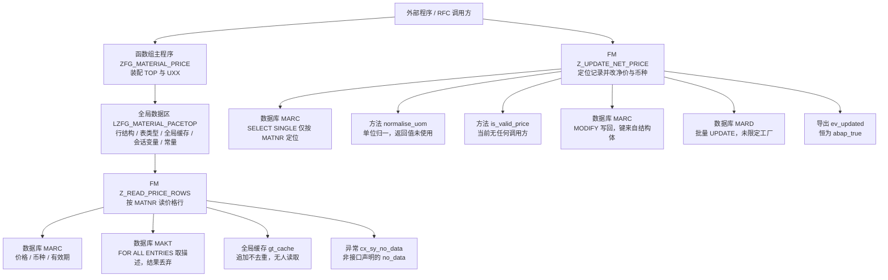
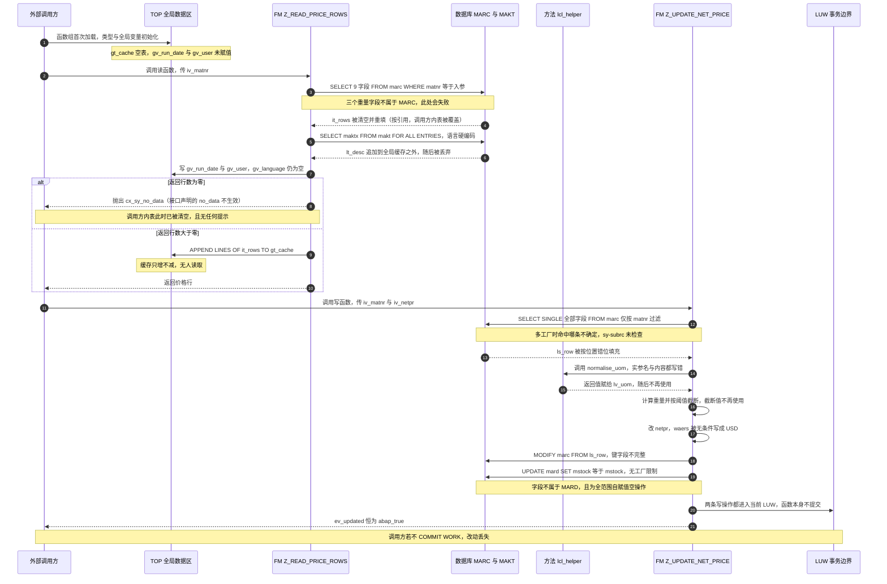

# 函数组 ZFG_MATERIAL_PRICE 源码走读报告

> 分析对象：`zfg_material_price.fg.abap`（函数组主程序）+ `lzfg_material_pacetop.abap`（TOP 全局数据）+ `lzfg_material_pacu01.abap`（U01 函数实现）
> 业务归属：MM Purchasing
> 阅读目标：搞清楚两个 FM 各自的职责边界、数据从表到结构体再到全局缓存的完整流转，以及数据库写操作在事务、错误处理、键完整性上是否存在真实缺陷。

---

## 一、程序定位与业务背景

### 1.1 它解决什么问题

物料的采购价格与重量信息在 SAP 里是**分散在两张主数据表**里的：

- **MARC**（Plant-Specific Material Master）持有"某物料 × 某工厂 × 某库位"维度的**记忆价格** `NETPR`、**币种** `WAERS`、**价格有效期起始日** `EIFN`；
- **MARA**（General Material Master）持有与工厂无关的**毛重** `BRGEW`、**净重** `NTGEW`、**内容量单位** `EINA`。

前端事务 MM03/MM02 只能让人手工在屏幕上维护，接口程序、上传框架、批处理作业无法复用。要让外部程序（RFC、接口、批导）能"按物料号取一批价格行"和"改一个物料的净价"，SAP 的标准做法就是把这段逻辑封装成一个**函数组**，对外暴露两个 FM。

`ZFG_MATERIAL_PRICE` 正是这样一���"主数据微服务"：它不建任何表、不跑批处理、不画屏幕，只做**取数**与**回写**两件事。

### 1.2 现有方案为什么不够

如果不用函数组，外部只能直接写 `SELECT ... FROM MARC` 或用 BAPI。而直接写 SQL 有三个绕不开的痛点：

1. **字段清单重复**：MARC 里价格相关字段和 MARA 里重量相关字段混在一起，每次都要重新拼；
2. **无异常契约**：`SELECT` 查不到数据时 sy-subrc = 4，调用方容易忽略，然后拿着空内表继续算；
3. **写库无边界**：`MODIFY MARC` 一旦键不完整，轻则改错记录，重则整段 LUW 回滚后调用方还以为是成功的。

函数组把"读什么、怎么判空、怎么写"封在里面，理论上应该给出一个清晰的契约。**这个函数组有那个契约的骨架，但执行层没填完。**

### 1.3 整体设计范式（一句话定性）

> **典型的"函数组 + 函数组全局状态 + local class 抽公共逻辑"结构，意图是做成一个可被 RFC 调用的主数据服务；但读路径的 SQL 字段、异常契约、写路径的定位逻辑与键完整性三处都存在阻断性缺陷，当前状态下这套代码大概率无法通过激活（激活时的语法/类型检查就会拦下）。**

需要先给一句免责声明：下文逐段分析时，会反复出现"这里会编译报错""这里字段不存在"这类结论。我不会因此跳过业务语义分析——**正因为它编译不过，才能把作者想干什么、哪里想错了，看得比能跑的代码更清楚。**

---

## 二、程序执行流程总览

### 2.1 流程图



### 2.2 责任链表

| 子程序 | 调用者 | 职责 |
|---|---|---|
| 函数组主程序 `ZFG_MATERIAL_PRICE` | SAP 运行时（首次调用该函数组时） | 声明 FUNCTION-POOL，INCLUDE TOP 与 UXX，把 `lcl_helper` 挂进函数组 |
| 全局数据区 `LZFG_MATERIAL_PACETOP` | 主程序 INCLUDE | 定义 `ty_price_row` 行结构、`ty_price_rows` 表类型、三个全局变量、两个常量 |
| FM `Z_READ_PRICE_ROWS` | 外部程序（RFC / 批处理 / 上传框架） | 按物料号读价格行 → 尝试读描述 → 记会话上下文 → 判空抛异常 → 追加进全局缓存 |
| FM `Z_UPDATE_NET_PRICE` | 外部程序（RFC / 批处理） | 用 `SELECT SINGLE` 定位一条 MARC 记录 → 改净价与币种 → 写 MARC → 顺带 UPDATE MARD → 返回恒真的 `ev_updated` |
| 方法 `normalise_uom` | FM `Z_UPDATE_NET_PRICE`（唯一调用点） | 把 `PC`/`PA` 归一成 `EA`，其余原样返回 |
| 方法 `is_valid_price` | **无调用方** | 判断行结构里 `netpr` 是否为初始值，语义上是"价格是否为空" |
| 全局缓存 `gt_cache` | 仅被 FM `Z_READ_PRICE_ROWS` 追加 | 累积历次读取结果；**无任何读取方，也无清理、无去重、无失效** |

下面按这条流程，逐个子程序展开。

---

## 三、分组分析

### 3.1 函数组主程序 `ZFG_MATERIAL_PRICE`

这个主程序只有 43 行，做三件事：声明函数组、INCLUDE 两个 include、在末尾挂一个 local class。分两步看：入口装配，以及（类定义的挂载位置，后面在 3.5 单独分析）。

#### ① 函数组入口与 INCLUDE 装配

```abap
FUNCTION-POOL zfg_material_price.

*"* use this source for any type of program (pool)
*"*   function group ZFG_MATERIAL_PRICE

INCLUDE lzfg_material_pacetop.    "session data, type declarations
INCLUDE lzfg_material_pacuxx.    "function implementations

*"*---------------------------------------------------------------------*
*"*       CLASS lcl_helper DEFINITION
*"*---------------------------------------------------------------------*
```

**做什么** — 声明 `FUNCTION-POOL zfg_material_price`，把 TOP（全局类型与数据）和 UXX（各 U0n 的聚合驱动）两个 include 文本内联进主程序。类定义的注释头紧随其后，说明 `lcl_helper` 是在主程序末尾定义的。

**为什么** — 函数组是"**一个主程序 + 若干 include**"的编译单元：SAP 把它们拼成一个整体再生成程序，主程序名必须与函数组名完全一致（`zfg_material_price`）。`PACUXX` 是"U 系列聚合 include"，它内部再 `INCLUDE lzfg_material_pacu01 / u02 / u03 ...`——这正是为什么我们手上的实现文件叫 `pacu01` 而主程序里看不到它。TOP 必须在所有 U0n 之前，因为 U0n 里的 FM 要用 `ty_price_row` 这个类型；这个顺序约束是硬性的。

**风险与改进** — 三点。① **`lcl_helper` 的定义位置在两个 INCLUDE 之后**。ABAP 对主程序内的全局类做整体解析，跨 include 的前向引用通常能过，但在旧版本或某些增强场景下会报"类未定义"。稳妥写法是把 `CLASS lcl_helper DEFINITION` 整块挪到两个 `INCLUDE` **之前**，把 IMPLEMENTATION 留在后面——这是更保险也更好读的习惯。② 主程序里除了 INCLUDE 和类定义，不应有任何可执行语句；当前是干净的，保持。③ 注释里 `*"*   function group ZFG_MATERIAL_PRICE` 的大小写与实际声明不一致（声明是小写），不影响功能但会让 SE80 里按文本搜索时对不上，无实际风险，顺手改一致即可。

#### ② 类定义段的挂载（`lcl_helper` 声明与实现）

`CLASS lcl_helper DEFINITION` 到文件末尾的 `ENDCLASS.` 是这个函数组唯一的 OO 部分，**它定义在函数组主程序里，因此对整个函数组全局可见**——包括 U01 里的两个 FM。它是本函数组唯一的"逻辑复用单元"。完整代码在 3.5 / 3.6 展开分析，这里先建立位置感：它在**两个 INCLUDE 之后**，也就是在编译顺序上"晚于"使用它的 U01。

**做什么** — 声明一个全局于本函数组的类 `lcl_helper`，含两个纯函数式方法（`normalise_uom` 做单位归一、`is_valid_price` 做价格非空判断），无状态、无属性。

**为什么** — 把与数据访问无关的纯计算抽成方法，是为了让"规则"和"取数/写库"分离。`normalise_uom` 这类映射规则（PC/PA → EA）在采购域是常见业务约定（很多企业把"件""双"统一按"个"计价），确实值得独立出来。

**风险与改进** — `lcl_helper` 只有 1 个真实调用点（`normalise_uom`），`is_valid_price` **零调用**。为一个调用点、两个各 5 行的方法专门建类，属于轻微过度设计；更轻的做法是直接用 `COND #( )` 写在 FM 里。**但反面是**：既然抽了类却没调用干净，说明这个类是在"计划中"而不是"用出来的"——评审时应重点确认 `is_valid_price` 是漏接线还是待删除。真正的风险不在结构，而在下面 3.5 / 3.6 会看到的"调用点参数全写错了"。

---

### 3.2 全局数据区 `LZFG_MATERIAL_PACETOP`（全局声明区）

TOP include 是整个函数组的"共享内存"。分三步：行结构、表类型与全局变量、两个常量。

#### ① 行结构 `ty_price_row`

```abap
TYPES: BEGIN OF ty_price_row,
         matnr   TYPE mara-matnr,
         werks   TYPE marc-werks,
         lgort   TYPE marc-lgort,
         eina    TYPE mara-eina,
         brgew   TYPE mara-brgew,
         ntgew   TYPE mara-ntgew,
         netpr   TYPE marc-netpr,
         waers   TYPE marc-waers,
         eifn    TYPE marc-eifn,
       END OF ty_price_row.
```

**做什么** — 定义一个 9 字段的扁平结构，把"价格维度"（来自 MARC：工厂、库位、净价、币种、有效期）和"重量维度"（来自 MARA：内容量单位、毛重、净重）缝合在一起，外加主键 `matnr`。它同时承担三个角色：SELECT 的目标结构、TABLES 参数的类型、以及 `lcl_helper` 的入参类型。

**为什么** — 用 `TYPE mara-matnr` 这类**从 DDIC 引用类型**而不是手写 `c(40)`，是 SAP 里的标准做法：主数据字段的长度/精度一旦被 SAP 调整（历史上 `MATNR` 确实从 18 位扩到 40 位），引用型自动跟随，不会出现"长度不匹配"的截断告警。这个习惯在本文件里做得很到位。

**风险与改进** — 这里有一个必须点名的**语义校核**：`EINA` / `BRGEW` / `NTGEW` 引自 **MARA** 是**正确的**（这三个字段确实只存在于 MARA，MARC 里没有），`NETPR` / `WAERS` / `EIFN` 引自 **MARC** 也是**正确的**。所以**结构定义本身没问题**——问题出在 3.3 的取数语句上，它错误地从 MARC 去取这三个 MARA 字段。换句话说：作者在 TOP 里想清楚了"重量来自 MARA"，却在 U01 里忘了这个区分。**结构定义正确不代表使用正确，两处必须交叉核对。** 另外结构体名叫 `ty_price_row`，但里面塞了 3 个重量字段和 1 个计量单位字段，名字与内容不符；叫 `ty_mat_plant_info` 之类更贴合实际语义。字段顺序（而非命名）会成为下面 `MODIFY` 的隐患，见 3.4。

#### ② 表类型与函数组全局变量

```abap
TYPES ty_price_rows TYPE STANDARD TABLE OF ty_price_row WITH EMPTY KEY.

DATA: gt_cache    TYPE ty_price_rows,
      gv_run_date TYPE datum,
      gv_user     TYPE sy-uname,
      gv_language TYPE sy-langu.
```

**做什么** — 定义结果表类型（`WITH EMPTY KEY`，即不做主键排序的纯堆表），并声明四个函数组级全局变量：一个价格行缓存表 `gt_cache`、一个运行日期、一个用户名、一个语言字段。

**为什么** — ① `WITH EMPTY KEY` 是正确的选择：价格行是"按 DB 顺序返回、调用方自己决定怎么排"的结果集，不按 MATNR 排序也没关系；`EMPTY KEY` 还省掉了读回时的一次排序开销。用 `SORTED` 反而是无谓的成本。② 用 `sy-uname` / `sy-langu` / `datum` 引用系统类型而不是 `c(12)`，同样是好习惯。③ 全局变量的**动机**看起来是"记录本次运行的上下文（谁、什么时候、什么语言）"，供后续日志或审计使用。

**风险与改进** — 四个问题，从重到轻。① **`gt_cache` 是最危险的一个**：函数组全局变量在**同一工作进程的整个会话生命周期内都存活**。对 RFC 无状态调用，每次进来是新的，影响有限；但在**对话框程序 / 长生命周期 SAP GUI 会话**里反复调用，读 FM 每次 `APPEND LINES OF`，缓存**只增不减、不去重、不覆盖**——同一个物料调 100 次就多 100 份副本。百万行内表会吃掉可观的工作进程内存（roll memory 上升 → ST02 里 SMEXT/roll 管理变差 → 甚至短时 dump）。而且**全文件没有任何一处读取 `gt_cache`**。所以它现在既慢又无用。② `gv_language` **从头到尾没有被赋值过**，因此 `spras = '1'` 这个硬编码（3.3 ②）本该用 `gv_language` 却没有用上——**变量和硬编码并存，是"重构做了一半"的典型信号**。③ `gv_run_date` / `gv_user` 只在**读** FM 里赋值（3.3 ③），写 FM 不赋值；这意味着缓存里的行"看起来有审计信息"，但**审计信息与数据产生方不一致**，一旦将来真拿 `gt_run_date` 做过滤，会得到误导性的结果。④ 语义上：会话级全局变量存放"用户/时间"是反模式，这些应该随数据行走（放进 `ty_price_row` 扩展字段），或者干脆在 FM 内取 `sy-uname` 局部使用。

#### ③ 两个业务常量

```abap
CONSTANTS gc_weight_tol TYPE p DECIMALS 4 VALUE '0.5'.
CONSTANTS gc_cap_currency TYPE c LENGTH 3 VALUE 'USD'.
```

**做什么** — 声明两个常量：毛重容差 `0.5`（4 位小数的 packed 数），以及"资本化币种" `USD`（3 位字符）。

**为什么** — 作者显然希望把两个业务规则参数化：一个是重量阈值，一个是目标币种。抽成常量而不是魔法值，方向是对的。

**风险与改进** — 这两个常量各有一处硬伤。① `gc_weight_tol` 在 3.4 ③ 里被用来**截断重量**，但截断后的 `lv_weight` **从未被使用**——它既不参与写库也不导出给调用方。也就是说这条"业务规则"实际上是个空转。更严重的是语义：重量容差跟"改净价"这件事在业务上**没有任何因果关系**，看不出为什么"毛重算出来超过 0.5"就意味着净价要怎么处理。合理的业务规则可能是"单价与重量的比值超过阈值就报错"，但当前写法既没报错也没影响结果。**这条常量应该连同 3.4 ③ 一起删掉，或者改成真正的校验并配一个 EXCEPTION。** ② `gc_cap_currency = 'USD'` 是把**币种写死在代码里**。币种是典型的**配置数据**（FI 里的 company code / 采购组织都各有币种），写死 USD 意味着这套代码只适用于美元主体；一旦用到人民币主体，写进去的 `NETPR` 数值配 USD 币种就是**金额与币种的双重错误**（见 3.4 ④）。应改为从 `MARC-EINRI`（采购信息记录）或 `T001W`（公司代码视图的采购组织）读取，或作为 FM 的 `IMPORTING` 参数传入。此外常量名 `cap_currency`（capital currency）**没有任何业务定义**支撑——"资本币种"是 FI 的概念，与物料采购价无关，命名本身就在误导读者。

---

### 3.3 FM `Z_READ_PRICE_ROWS`（读路径）

这是本函数组的主入口，接口契约是"给我物料号，我还你一批价格行；没有就抛 `no_data`"。分四步走。

#### ① 按物料号读价格行到调用方内表

```abap
FUNCTION z_read_price_rows.
*"----------------------------------------------------------------------
*"* Local Interface:
*"*  IMPORTING
*"*     VALUE(IV_MATNR) TYPE  MARA-MATNR
*"*  TABLES
*"*     IT_ROWS        TYPE  ZFG_MATERIAL_PRICE=>TY_PRICE_ROWS
*"*  EXCEPTIONS
*"*     NO_DATA       1
*"----------------------------------------------------------------------

  DATA lv_count TYPE i.

  SELECT matnr werks lgort eina brgew ntgew netpr waers eifn
    FROM marc
    INTO TABLE it_rows
    WHERE matnr = iv_matnr.
```

**做什么** — 从 MARC 读取 9 个字段（物料号、工厂、库位、内容量单位、毛重、净重、净价、币种、有效期起始日）装进 `it_rows`，过滤条件只有 `matnr = iv_matnr`，一次把该物料在**所有工厂/库位**的价格行都取出来。返回的行包含"一个物料的多个工厂"维度——也就是说调用方拿到的是**价格矩阵**，不是单值。

**为什么** — 写法上有两处是对的：① 显式列出字段而不用 `SELECT *`，避免了把 MARC 的两百多个字段全拉进内存与内表宽度膨胀；② 用 `INTO TABLE it_rows` 直接灌进 TABLES 参数内表，省掉一次 `APPEND`。字段清单的**顺序**与 `ty_price_row` 的声明顺序完全一致（MATNR, WERKS, LGORT, EINA, BRGEW, NTGEW, NETPR, WAERS, EIFN），这在"按位置映射"的 Open SQL 里是硬要求，作者显然是对着 TOP 的结构逐字抄下来的。

**风险与改进** — **这段代码有四个独立问题，其中两个是阻断性的。**

1. 🔴 **`EINA` / `BRGEW` / `NTGEW` 不存在于 MARC**。这三个字段只在 MARA 里（`EINA` = 内容量单位，`BRGEW` = 毛重，`NTGEW` = 净重）。从 MARC 选这三个字段会在激活时的 SQL 静态检查报错（"字段在数据库表中不存在"），运行期也会 SQL 错误。**修法**：要么 `FROM marc INNER JOIN mara ON marc~matnr = mara~matnr`（一次读全，字段列表前缀区分 `marc~netpr` / `mara~brgew`），要么拆成两条 SELECT 再 `APPEND` 到同一结构。**推荐 JOIN**，少一次 DB 往返，而且顺带能保证两边数据一致。
2. 🔴 **`TABLES` 参数是"按引用"传递**。`it_rows` 不是一个新内表，而是调用方**实际那一张内表的别名**。`INTO TABLE it_rows` 会先清空它再填。这意味着：调用方传进来一张有 5000 行的内表，函数一进去就**被清空了**；而且如果后面第 ④ 步抛异常，调用方拿到的是**一张已经被清空、且调用方毫无察觉的表**。这是 `TABLES` 最经典的坑。**改法**：把它改成真正的类型化参数 `it_rows TYPE ty_price_rows`，或者函数内部读进局部表 `lt_rows`，成功后再赋给 `it_rows`。
3. 🟠 **`WHERE` 只有 `matnr`，没有 `werks`**。接口**不接受工厂参数**，所以调用方无法限定范围。价格是工厂级的业务对象，跨工厂取价必然要靠调用方自己筛。而且如果调用方把 `it_rows` 当"这个物料的价"来用（只取第一行 `READ TABLE ... INDEX 1`），就会拿到**数据库返回顺序不确定的某个工厂**的价格——这是极易产生错价的场景。**改法**：加 `iv_werks` 为必填输入参数，`WHERE matnr = iv_matnr AND werks = iv_werks`；若确实要支持全部工厂，把工厂也作为输出明确暴露并在文档里写清。
4. 🟠 **`iv_matnr` 没有 `REQUIRED` 约束，也没有初始值检查**。接口注释里只有 `VALUE(IV_MATNR) TYPE MARA-MATNR`，缺 `REQUIRED`。调用方传空串进来，SQL 会拿 `matnr = ' '` 去查，返回 0 行，然后走到第 ④ 步抛异常。功能上"没崩"，但错误信息会误导排查的人以为是"物料不存在"，实际是"参数没传"。**改法**：接口加 `REQUIRED`，函数开头加 `IF iv_matnr IS INITIAL. RAISE EXCEPTION ... ENDIF.`

#### ② 用 FOR ALL ENTRIES 读物料描述

```abap
  SELECT maktx FROM makt
    INTO TABLE lt_desc
    FOR ALL ENTRIES IN it_rows
    WHERE matnr = it_rows-matnr
      AND spras = '1'.
```

**做什么** — 以 `it_rows` 为驱动表，对 MAKT 做 `FOR ALL ENTRIES` 关联，取物料描述 `MKTX`，语言固定为 `SPRAS = '1'`，结果装进内表 `lt_desc`。

**为什么** — 意图很清楚：`it_rows` 里一个 MATNR 出现 N 次（N = 工厂数），直接用 `JOIN` 查 MAKT 会因为驱动表不唯一而报 SQL 错误，所以要用 `FOR ALL ENTRIES` 把驱动表去重后在应用侧关联。技术上这是**正确的工具选择**——`FOR ALL ENTRIES` 正是为"内表做驱动"设计的。

**风险与改进** — 这段的问题密度比上一段还高。

1. 🔴 **`lt_desc` 从未声明**。整个 U01 里没有 `DATA lt_desc`（也没有 `lt_makt` 之类）。`SELECT ... INTO TABLE lt_desc` 引用了一个不存在的标识符，激活时必然报错。在 7.40 以上的语法版本下这是硬编译错误。**修法**：加 `DATA lt_desc TYPE ty_desc.`（配套定义描述行类型），或直接用 `SELECT SINGLE`。
2. 🔴 **查出来的描述**被**完全丢弃**。`lt_desc` 在全文件后续代码里**再无任何引用**，而且 `ty_price_row` 里根本没有 `MKTX` 字段。也就是说这是一次**纯浪费的数据库往返**：多打一次 DB、传输一次数据，然后扔掉。**修法**：要么把 `maktx` 加进 `ty_price_row` 并在第 ① 步的 SELECT 里一起取（JOIN MAKT，一次搞定），要么**直接删掉这段**。强烈建议后者——它带来的唯一效果是拖慢接口。
3. 🟠 **`FOR ALL ENTRIES` 前没有空表检查**。`it_rows` 为空时（非法的 `iv_matnr` 场景），这个 SELECT 仍会发到 DB 上（SAP 虽不会报错，但依然是一次无意义的 round trip）。SAP 官方明确要求 FAE 之前必须判空。虽然紧接着的第 ④ 步会抛异常，但那是**在这之后**——该省的一次 DB 调用没省掉。
4. 🟠 **`FOR ALL ENTRIES` 会被驱动表的重复键放大结果**。`it_rows` 里同一 MATNR 有几行工厂，MAKT 的结果就被复制几份。虽然结果被丢弃所以看不出来，但一旦按 2 的建议把 `maktx` 塞进 `ty_price_row`，同样的写法会导致**描述列在行内重复**，正确做法是先用 `SORT` + `DELETE DUPROG MATNR` 对驱动表去重，或改 JOIN。
5. 🟡 **语言硬编码 `'1'`**。`SPRAS` 在 MAKT 中是 1 位字符，`'1'` 是 SAP 内部语言键里的**中文**。这意味着：**在中文（ZH）系统上恰好能跑，在英文/德文系统上恒定返回空描述**。TOP 里那个从未赋值的 `gv_language` 显然就是为此准备的。**改法**：`AND spras = sy-langu`，并把 `gv_language` 删掉或真正初始化。
6. 🟡 顺带：`MAKT` 的描述字段在 SAP 里是 `MAKTX`，且一行物料可以有多个语言记录；即便修好语言，仍应确认是否只取一种语言（一般取物料主语言 `MARA-SPRAS` 或 `sy-langu`）。

#### ③ 记行数与会话上下文

```abap
  lv_count = lines( it_rows ).

  gv_run_date = sy-datum.
  gv_user     = sy-uname.
```

**做什么** — 统计返回行数存入局部变量 `lv_count`；同时把当前系统日期赋给全局变量 `gv_run_date`、当前用户名赋给 `gv_user`。

**为什么** — `lines( )` 是给内部表算行数的标准方式，比 `DESCRIBE TABLE ... LINES` 简洁且性能一致。取 `sy-datum` / `sy-uname` 记录"本次读取发生在什么时候、由谁触发"，看起来是为审计/日志准备。

**风险与改进** — ① **`lv_count` 是唯一用来判空的依据，却绕了一圈**：完全可以 `IF it_rows IS INITIAL.`，不必引入 `lv_count`。虽然 `lines()` 本身开销极小，但多一个变量就多一处可能与内表状态不同步的地方（例如以后有人在 `lv_count` 赋值后、判空前又往 `it_rows` 里 `APPEND` 一行，逻辑就错了）。**改法**：直接 `IF it_rows IS INITIAL`。② **一个"读"函数写了全局状态，这是最大的设计问题**。`Z_READ_PRICE_ROWS` 从接口看是纯查询（只给 `it_rows` 和异常），却在内部修改函数组全局变量，**这个副作用没有在接口上体现**。后果：调用方调一次读函数，全局的 `gv_run_date` / `gv_user` 就被改写；如果同一会话里还有其他代码依赖这两个值（比如 3.4 写 FM 后续要看"数据是谁读的"），会拿到错误的时间戳。**改法**：读函数保持纯净，审计信息随数据走或在需要写的地方局部记录。③ 顺带：`gv_run_date` / `gv_user` 在本文件里**写入后再无人读取**，同样是"预留但未接线"。

#### ④ 判空抛异常并追加全局缓存

```abap
  IF lv_count = 0.
    RAISE EXCEPTION TYPE cx_sy_no_data.
  ENDIF.

  APPEND LINES OF it_rows TO gt_cache.

ENDFUNCTION.                    "Z_READ_PRICE_ROWS
```

**做什么** — 若返回 0 行，抛出异常类 `cx_sy_no_data`（SAP 标准"无数据"异常）；否则把本批结果整体追加到函数组全局缓存 `gt_cache`，函数正常结束。

**为什么** — 意图是给调用方一个明确的失败信号，避免它拿着空内表往下走；`APPEND LINES OF` 是整表追加的批量写法，比逐行 `APPEND` 快得多。

**风险与改进** — **这是本函数组最需要返工的一段。**

1. 🔴 **抛出的异常类型与接口声明的 `EXCEPTIONS NO_DATA 1` 完全不匹配**。经典函数模块的 `EXCEPTIONS` 列表声明的是**消息类型**，调用方写的是 `EXCEPTIONS no_data = 1`；而 `RAISE EXCEPTION TYPE cx_sy_no_data` 抛出的是**一个真正的 OO 异常类**。结果：
   - 调用方按接口写的 `IF sy-subrc = 1` **永远不成立**——因为 sy-subrc 不会被置成 1；
   - `cx_sy_no_data` 会作为未处理异常**逃出函数模块**，调用方若没写 `EXCEPTIONS cx_sy_no_data = 1` 就会**短时 dump**（RFC 调用则是 RFC 失败返回）。
   - 接口里那个 `NO_DATA 1` 是**完全的死声明**，误导所有调用方。
   **修法（二选一，必须一致）**：
   - 保持经典风格：`MESSAGE no_data TYPE 'E'` 配 `sy-subrc = 1`，或干脆 `MESSAGE e000(...)`，让接口声明与抛出对齐；
   - 或者彻底 OO 化：删掉 `EXCEPTIONS`，改在 FM 上加 `EXCEPTIONS cx_sy_no_data = 1` 明确声明异常类，让调用方显式处理。
   **我倾向后者**——既然函数组里已经有 `lcl_helper` 这个 OO 元素，全量用异常类更一致。
2. 🔴 **异常抛出时机太晚**。两轮 DB 查询（① 和 ②）都做完、全局变量也改了，才发现没数据。正确顺序是：查完第 ① 步就判空抛异常，第 ② 步整个跳过。省下的是一整次 DB 往返和一次无意义的结果传输。
3. 🟠 **异常路径上，调用方的内表已经被清空了**（因为 ① 用 `INTO TABLE it_rows` 直接写引用）。调用方捕获到 `cx_sy_no_data` 时，它原本传进来的数据**已经没了**，而且异常消息不会告诉它这一点。配合 ① 里的 `TABLES` 风险，这是**"静默数据丢失"**。**改法**：函数内部用局部表承接，异常路径不碰调用方的内表。
4. 🟠 **全局缓存只写不清**（详见 3.2 ②）：`gt_cache` 只增不减、不去重、无失效、无读取方。对话框长会话下是内存泄漏源；并且**读 FM 追加了缓存，写 FM 却完全不知道缓存的存在**——写完之后缓存不会失效，读 FM 再调一次拿到的还是旧缓存（3.4 会看到写 FM 根本不碰 `gt_cache`）。**这个缓存目前是纯粹的负担，建议直接删除**；若确实需要缓存，至少要：改成 KEYED 表按 MATNR 覆盖写、提供清理入口（FM 结束或超阈值时 `CLEAR`）、并且**写 FM 成功后必须失效对应键**。
5. 🟡 无明显风险但值得记一笔：本函数**没有任何写库操作**，因此不涉及 COMMIT/ROLLBACK；但它把 `it_rows`（按引用）交给外部，这个"数据所有权"问题已在 ① 记过。

---

### 3.4 FM `Z_UPDATE_NET_PRICE`（写路径）

这是最需要小心的一个——它动数据库。接口契约是"给我物料号和新净价，我改掉，返回是否成功"。分五步看，每一步都涉及正确性。

#### ① 用 `SELECT SINGLE *` 定位记录

```abap
FUNCTION z_update_net_price.
*"----------------------------------------------------------------------
*"* Local Interface:
*"*  IMPORTING
*"*     VALUE(IV_MATNR) TYPE  MARA-MATNR
*"*     VALUE(IV_NETPR) TYPE  MARC-NETPR
*"*  EXPORTING
*"*     VALUE(EV_UPDATED) TYPE  ABAP_BOOL
*"----------------------------------------------------------------------

  DATA ls_row    TYPE ty_price_row.
  DATA lv_uom    TYPE marc-uom.
  DATA lv_weight TYPE p DECIMALS 4.

  SELECT SINGLE * FROM marc INTO @ls_row
    WHERE matnr = iv_matnr.
```

**做什么** — 声明三个局部变量（行结构、单位、重量），然后从 MARC 取**全部字段**的一条记录装进 `ls_row`，条件只有 `matnr = iv_matnr`。

**为什么** — 意图是"先把当前记录读出来，看一眼现状，再在上面改两个字段写回去"。如果只想改 `netpr`，其实**根本不用读**——直接 `UPDATE marc SET netpr = ... WHERE matnr = ... AND werks = ...` 更快更安全。这里的"先读后写"是典型的 ABAP `MODIFY` 模式（读出来 → 改内存 → `MODIFY` 整体写回），在只改少数字段时反而比 `UPDATE` 风险更高。

**风险与改进** — 三个问题，其中第一个是**最严重的数据正确性缺陷**。

1. 🔴 **`SELECT SINGLE` 只用 `MATNR` 过滤，命中哪条记录是不确定的**。MARC 的主键是 `MATNR + WERKS + LGORT`。一个物料一旦在 2 个工厂有记录（比如 `1000` 和 `2000` 工厂），`SELECT SINGLE` 会**任意挑一条**（实际由优化器决定，通常是索引顺序上的第一条，通常是排序最靠前的工厂号）。后果：**改 A 工厂的净价，结果写到了 B 工厂**。而且这是**静默**的——不报错、不抛异常，`ev_updated` 还返回 `abap_true`。这是本次走读里**最典型的"错价"事故来源**。**改法（必须）**：接口新增 `iv_werks`（和 `iv_lgort`，视业务粒度），`WHERE matnr = iv_matnr AND werks = iv_werks`，SQL 就唯一确定了；或者保留 `SELECT SINGLE` 但改成"用 `SELECT ... FROM marc` 取到内表，若 `lines() > 1` 就抛异常要求调用方给工厂"。
2. 🔴 **`SELECT SINGLE *` 的目标结构与字段列表不匹配**。`SELECT ... *` 展开的是 MARC 的全部字段（两百多个），而 `ls_row` 是 `ty_price_row`（9 个字段）。激活时 ABAP 会因"目标结构无法容纳字段列表"报错；即使某些版本允许按位置映射，后面 `ls_row-waers`、`ls_row-brgew` 拿到的也会是**错位的值**（MARC 第 N 个字段被读进第 N 个结构分量）。**修法**：既然本地只需要几个字段，就写显式字段列表 `SELECT SINGLE matnr werks lgort netpr waers eifn FROM marc INTO @ls_row ...`，与结构对齐。
3. 🟠 **完全没有检查 `sy-subrc`**。`SELECT SINGLE` 找不到记录时 sy-subrc = 4，`ls_row` 保持初始值，代码**继续往下走**：第 ⑤ 步会用 `matnr = ' '` 的键去 `MODIFY`，结果要么短时 dump，要么（更糟）行为不可预期。**改法**：`IF sy-subrc <> 0. RAISE EXCEPTION ... ENDIF.`，在拿到第一条 SELECT 之后就判。
4. 🟠 `iv_matnr` 同样没有 `REQUIRED`，也没有初始值检查。见 3.3 ① 第 4 点，此处问题更严重——**空物料号 + 写库 = 灾难**。
5. 🟡 另外注意 `lv_uom TYPE marc-uom`：**MARC 里没有 `UOM` 字段**（基本计量单位是 `MARC-MEINS`）。这个类型引用本身就会报错。修法：`TYPE marc-meins`。

#### ② 调用 `normalise_uom` 做单位归一

```abap
  lv_uom = lcl_helper=>normalise_uom( is_row = ls_row-waers ).
```

**做什么** — 调用 local class 的 `normalise_uom` 方法，把结果赋给 `lv_uom`。

**为什么** — 作者的意图是：把记录上的计量单位归一化（`PC`/`PA` → `EA`），得到一个"标准单位"，后续可能用于单位换算或价格重算。

**风险与改进** — **这一行有三层独立的错误，任何一层都足以让它跑不起来，而且叠加起来说明这段是"没被真正执行过"的死代码。**

1. 🔴 **实参名称写错了**。`normalise_uom` 的形参是 `IMPORTING iv_uom`（见 3.5），这里却传 `is_row =`。ABAP 静态检查会直接报"实参 `is_row` 不存在"。顺带说明：`is_row TYPE ty_price_row` 是**另一个方法** `is_valid_price` 的形参名——作者把两个方法的签名**记混了**。
2. 🔴 **实参内容也错了**：传的是 `ls_row-waers`，即**币种**字段，而不是单位字段。要归一化单位应传 `ls_row-...` 里真正的单位字段。而 `ty_price_row` 里**根本没有单位字段**（`EINA` 是 MARA 的"内容量单位"，不是 MARC 的基本计量单位 `MEINS`）。所以这一步**在数据模型上就没有可归一化的对象**。
3. 🔴 **类型不兼容**：即使形参名对了，把 `waers`（`marc-waers`，币种 CHAR 3）传进 `marc-uom` 参数（若该类型存在的话）也是把币种当单位做映射——语义完全错位。
4. 🟠 **`lv_uom` 赋值后从未被使用**。全文件里 `lv_uom` 只出现在这一行。所以这次"归一化"即使成功执行也是**纯开销**。**修法**：要么删掉这一行和 `lv_uom`，要么先在 `ty_price_row` 里补上真正的 `meins` 字段、把 `normalise_uom` 的形参和实参对齐，再决定归一化结果要用来做什么（很可能是要做单位换算后重算净价——那才是这个方法存在的意义）。
5. 🟡 一个方法论提醒：`normalise_uom` 里 `'PC'/'PA' → 'EA'` 这条映射规则本身**依赖业务约定**（1 双鞋算 1 个？2 只算 1 双？）。这类规则应该做成可维护的映射表或配置，至少要加注释说明来源，否则业务一变就得改代码。

#### ③ 计算重量并按阈值截断

```abap
  lv_weight = ls_row-brgew / ls_row-eina.

  IF lv_weight > gc_weight_tol.
    lv_weight = gc_weight_tol.
  ENDIF.
```

**做什么** — 用"毛重除以内容量单位"算出一个 `lv_weight`，如果超过阈值 `gc_weight_tol`（0.5）就把它压到阈值。

**为什么** — 表面意图是"算出一个重量指标，超过容差就归一化"，避免异常大的重量参与后续计算。

**风险与改进** — 这三行的每一个成分都站不住。

1. 🔴 **`EINA` 是"内容量单位"，不是数量**。`MARA-EINA` 的值是一个**计量单位代码**（如 `KG`、`L`、`ST`），是一个 CHAR，不是可除的数字。拿 `BRGEW`（数量型，除以它等于**除以单位代码**）在语义上是**量纲错误**；在技术上也过不了编译（packed 除以 char 需要显式转换，ABAP 会报类型不兼容）。**就算能跑，结果也是无意义的数字。** **修法**：要算"单位重量"，应该用 `MARC-MEINS` 配合 `MARM-UMREZ/UMREN` 做换算，或直接用 MARA 里已经按基本单位归一的 `BRGEW`（它的语义就是"每基本计量单位的毛重"）——**根本不需要再除一次**。
2. 🔴 **除零没有防护**。若 `eina` 对应的值是 0（或者按上面说的被当成数值转换后得到 0），运行期直接 `CX_SY_ITS_NUMBER` / 除零 dump。**修法**：除之前 `IF ls_row-eina = 0. ... ENDIF.`。
3. 🟠 **截断逻辑方向错了**。`IF lv_weight > tol. lv_weight = tol.` 是"上限截断"，但**没有下限**——负重量（毛重为负的脏数据）会原样通过。真实的"容差校验"应该是**双向**的：`IF lv_weight < -tol OR lv_weight > tol. <报错> ENDIF.`
4. 🔴 **截断结果从未被使用**（同 2.2 的 ③）：`lv_weight` 在第 ④ ⑤ 步里完全不出现。所以这条"业务规则"**对最终写库没有任何影响**。`gc_weight_tol` 这个常量也因此是纯装饰。**修法**：删掉两步，或改成真正生效的校验（见第五章 P1 建议）。
5. 🟡 还有一个数据层的问题：`ls_row-brgew` 要从 MARC 读——但 `BRGEW` 不在 MARC（见 3.3 ① 第 1 点）。所以即使 SQL 修好了，这里的取值来源也得跟着改成 MARA 侧。

#### ④ 组装写回值（改净价 + 硬编码币种）

```abap
  ls_row-netpr = iv_netpr.
  ls_row-waers = gc_cap_currency.
```

**做什么** — 把调用方传入的 `iv_netpr` 写进行结构的 `netpr` 字段，并把币种字段 `waers` **无条件改成常量 `gc_cap_currency`（即 `'USD'`）**，然后准备整条写回。

**为什么** — `MODIFY db FROM wa` 的标准模式：改内存结构体里的字段，再整条写回。这里改了两个字段——价格和币种。

**风险与改进** — 币种这一行是**数据灾难级的**，必须重点讲。

1. 🔴 **无条件把币种改成 `'USD'`**。MARC 的 `NETPR`（记忆价格）和 `WAERS`（币种）是**一对不可分割的语义单元**。原来的 `waers` 可能是 `CNY`，价格是 `12.50 CNY/KG`。执行这一行后记录变成 `12.50 USD/KG`——**数值没变，含义全变了**。而且函数**没有任何确认机制**：没有 `iv_waers` 输入、没有检查 `waers` 是否与 `MARC-EINRI`（采购信息记录的币种）一致、没有异常。**改法（首选）**：`iv_netpr` 之外增加 `iv_waers`，并且默认**不改** `waers`（只在调用方显式传且做了汇率换算时才更新）；同时校验币种与采购信息 `EINRI` 一致，不一致就抛异常。
2. 🔴 **价格与"计价单位"脱节**。`MARC-NETPR` 的价格是**每 `MARC-PEINH`（价格单位）** 的价。若 `PEINH = 1000`，那么 `NETPR = 12.50` 表示"每 1000 个单位 12.50 元"，即单价 0.0125。这里既没读也没校验 `PEINH`，调用方传进来的 `iv_netpr` 到底是不是"每价格单位"的价格**完全依赖口头约定**。这是采购领域最常见的错价来源之一。**改法**：接口文档写清 `iv_netpr` 的单位口径，或加参数 `iv_peinh` 一起传，并在读现有记录时校验 `PEINH` 未被隐式改变。
3. 🔴 **改的是 MARC 的"记忆价格"，不是真正的采购价**。SAP 定价时，采购订单价格取自 **`EINE`（采购信息记录的条件价格）** 和 `EKPO`（订单价格），`MARC-NETPR` 只是**内存价格 / 报表参考价**。所以这个 FM 执行成功后，**PO 定价不会变**——业务上"改价"这个目标其实没有达成。**改法**：如果业务目标是"修改采购信息价格"，必须同时 `MODIFY eine`（更新条件价 `EINP/EINP_TAX` 等）或走 BAPI（如 `BAPI_PO_GETDETAIL` 相关流程），并在接口文档里明确"MARC-NETPR 变更仅影响报表展示"。这一点建议和业务方确认清楚再定方案。
4. 🟠 **`ls_row-waers` 被改坏后，第 ⑤ 步的 `MODIFY marc FROM ls_row` 会把改坏的币种落库**，且因为是整条 `MODIFY`，同一条记录里的其他 MARC 字段（`EINRI`、`EINKP`、`LIFNR`、`PRDAT` 等采购信息字段）也会随这条被写回——虽然 `MODIFY` 只改结构体里有的字段，但**写回时刻意把币种错误一起提交了**。
5. 🟡 `MODIFY` 之前没有做任何**值域校验**：`iv_netpr` 是负数怎么办？超出 `NETPR` 的 15 位 2 位小数精度怎么办？`NETPR` 允许为 0（表示"无价"），但业务上 0 价往往意味着错误输入。**改法**：入口处 `CHECK iv_netpr >= 0`，并考虑对 0 值要求显式确认。

#### ⑤ 写库：MODIFY MARC + 批量 UPDATE MARD

```abap
  MODIFY marc FROM ls_row.

  UPDATE mard SET mstock = mstock WHERE matnr = iv_matnr.

  ev_updated = abap_true.

ENDFUNCTION.                    "Z_UPDATE_NET_PRICE
```

**做什么** — 两条数据库写操作：第一条把内存结构体 `ls_row` **整条写回 MARC**（`MODIFY db FROM wa` 无 `WHERE`，用结构体里的键字段定位）；第二条对 MARD 执行一条 `UPDATE`，把 `mstock` 赋值为它自己。最后无条件把 `ev_updated` 设为 `abap_true`。

**为什么** — `MODIFY db FROM wa` 是"读—改—整条写回"模式的落库动作。第二条 `UPDATE` 的意图看不出来：把 `mstock` 赋值为 `mstock` 是**自赋值**，语义上是空操作。作者可能是想"强制更新一下、让某些缓存失效"，也可能只是调试时留下的语句忘了删。

**风险与改进** — **这一段集中了本函数组最严重的写库缺陷。**

1. 🔴 **`MODIFY marc FROM ls_row` 的键不完整，会导致改错记录或 dump**。`MODIFY db FROM wa` 用工作区里的**主键字段**（MARC: `MATNR` + `WERKS` + `LGORT`）定位记录。但 `ls_row` 里的 `werks` / `lgort` 来自第 ① 步那次**不确定的 `SELECT SINGLE *`**；而在第 ① 步的问题修好之前，`ls_row` 本身是被错位填充的。于是：键字段可能是 `matnr = '1000', werks = '  ', lgort = '  '`（不存在的工厂），`MODIFY` 会尝试更新一条**不存在的记录**——ABAP 的 `MODIFY ... FROM wa` 在这种情况下通常**短时 dump**（`MODIFY` 无 `WHERE` 时不设 sy-subrc，失败即 dump）。**改法**：先修好第 ① 步（显式字段列表 + 工厂参数 + sy-subrc 检查），再考虑**优先改用 `UPDATE marc SET netpr = @lv_netpr, waers = @lv_waers WHERE matnr = @iv_matnr AND werks = @iv_werks`**——`UPDATE` 带 `WHERE` 只写指定字段，键不明确就不会误伤，且能拿到 sy-subrc 做错误处理。
2. 🔴 **`UPDATE mard SET mstock = mstock` 有两个独立问题。**
   - **字段错误**：`MSTOCK`（非限制性库存）**存在于 MARC，不存在于 MARD**。MARD 存的是工厂/库位级 MRP 数据（`UMREZ`/`UMREN` 换算、`EPPRO` 优先级、`DISST` 库存策略、`BSTDT` 有效期等），里面**没有** `MSTOCK`。这条 SQL 在激活检查或运行期必然报错。
   - **即使字段存在，这仍是危险写法**：`WHERE` **只有 `matnr`**，没有任何工厂/库位限制，一条语句会**批量更新该物料在所有工厂、所有库位、所有有效期的 MARD 记录**。SAP 的 `UPDATE` 遇到这种语句会按二级索引逐行更新，大物料可能锁表、拖慢整个系统。而且 `SET mstock = mstock` 是**自赋值空操作**——**花了大范围更新的代价，什么也没改**。**修法**：直接删除这一句。
3. 🔴 **没有任何 `sy-subrc` 检查，也没有任何错误出口**。整个 FM 的 `EXCEPTIONS` 列表是**空的**（接口只声明了 `IMPORTING` 和 `EXPORTING`）。这意味着：
   - `MODIFY` 失败 → 短时 dump（`MODIFY ... FROM wa` 不检查 sy-subrc，失败直接 dump）；
   - `UPDATE` 失败 → 运行期 SQL 异常；
   - 调用方**没有任何 `EXCEPTIONS` 子句可以写**，既不能优雅处理失败，也拿不到失败信息。
   **改法**：接口加 `EXCEPTIONS not_found = 1 db_error = 2`（或用 `cx_sy_no_data` / `cx_sy_db_error` 这类异常类），每条 DB 语句后 `IF sy-subrc <> 0. ... ENDIF.`，失败时抛明确异常。
4. 🔴 **完全没有事务控制（COMMIT / ROLLBACK）**。`MODIFY` 和 `UPDATE` 都在当前 **LUW（逻辑工作单元）** 里，函数模块**不提交**。这本身在"函数模块被上层调用"的模式下是**可以接受甚至正确的**约定（由调用方决定何时提交）——但前提是：
   - **调用方必须知道要提交**。RFC 调用方（接口程序）如果不在自己的 `COMMIT WORK`，价格修改就**丢失**；
   - **对话框程序**里，改动会挂起直到下一次 `COMMIT WORK` 或屏幕变更，中途 `BACK`/报错会导致 LUW 回滚，而调用方已经收到了 `ev_updated = abap_true`——**"报告成功"与"实际落库"不一致**；
   - 没有任何 `ROLLBACK` 分支，一旦 `UPDATE mard` 那条 SQL 报错，ABAP 会做 LUW 回滚，但 `ls_row` 已经改坏，前面的 `MODIFY` 也不会保留——而外部**同样只看到 `abap_true`**。
   **修法（推荐）**：在 FM 内每条写语句后检查 sy-subrc，**任一失败就 `MESSAGE ... TYPE 'E'` 或抛异常让调用方回滚**；`COMMIT WORK` 是否放在 FM 内应由接口契约明确约定并在函数组文档里写清（RFC 场景通常由调用方提交，dialog 场景可由 FM 提交）。绝不能出现"返回成功但没提交"的模糊地带。
5. 🔴 **`ev_updated` 恒为 `abap_true`**，且位置在两条写库语句**之后**。它表达的是"函数执行到了最后一行"，**不是**"数据成功落库"。结合 4，调用方拿到 `abap_true` 时，数据可能：改错了工厂（3.4 ①）、币种被改坏（3.4 ④）、或者压根没提交。**这个导出参数在当前实现下是有害的**——它比没有返回值更危险，因为它给了调用方虚假的成功保证。**修法**：改成基于 `sy-subrc`/异常的真实结果，参数名也要改得更准确（`ev_found` 之类）。
6. 🟡 缺少**授权检查**。改物料采购价属于受控数据（SAP 侧有 `M_MATNR`/采购信息相关授权对象）。这个 FM 通过 RFC 暴露时若外部系统账号权限过宽，等于**开放写价权限**。**改法**：入口加 `AUTHORITY-CHECK`，对象缺失时抛 `CX_AUTH_ERROR` 或返回失败标志。
7. 🟡 缺少**修改日志**。改价格这种敏感动作，若数据进入 `CDHDR/CDPOS`（因为 `MODIFY` 走的是标准 DB 接口，会触发变更文档）则还好；但如果是 `UPDATE ... WHERE` 绕过表维护程序，直接改同样会写变更文档。**关键是应该主动记录"谁在什么时候把哪个物料的哪个工厂的价格从 A 改成 B"**，供对账与追责。当前 `gv_user` / `gv_run_date` 是存了但没接到写路径上（第 ③ 步只在读 FM 里赋值）。
8. 🟡 事务粒度：一个 FM 里做两条不同表（`marc`、`mard`）的写，跨表的原子性完全依赖 LUW。删掉 MARD 那条之后只剩单表 `MARC`，风险面小很多——这本身就是删掉它的另一个理由。

---

### 3.5 方法 `normalise_uom`（类定义与实现）

先看类定义（`CLASS lcl_helper DEFINITION`，在主程序末尾）：

```abap
CLASS lcl_helper DEFINITION.
  PUBLIC SECTION.
    METHODS normalise_uom
      IMPORTING iv_uom  TYPE marc-uom
      RETURNING VALUE(rv_uom) TYPE marc-uom.
    METHODS is_valid_price
      IMPORTING is_row  TYPE ty_price_row
      RETURNING VALUE(rv_ok) TYPE abap_bool.
ENDCLASS.
```

**做什么** — 声明一个 `PUBLIC SECTION` 局部类，两个方法都是**函数式**（`IMPORTING` + `RETURNING`，无 `CHANGING`、无 `EXPORTING`）：`normalise_uom` 做单位归一，`is_valid_price` 做价格非空判定。

**为什么** — 纯函数式签名（而不是修改传入结构体）是更好的设计：调用方一眼能看出"这不会改我的数据"，也天然无状态、可测试。`PUBLIC SECTION` 单独列出方法清单，比不加限定更清晰。

**风险与改进** — 🔴 **`TYPE marc-uom` 是个不存在的类型**。MARC 里没有 `UOM` 字段，基本计量单位字段是 **`MEINS`（`MARC-MEINS`）**。这个类型引用在激活时会报错（"类型 MARC-UOM 未找到"）。**修法**：`TYPE marc-meins`。⚠️ 顺带说明：即便改对，这里的"单位"到底指 `MARC-MEINS`（基本计量单位）还是 `MARA-EINA`（内容量单位）还是 `MARM-UNR`（替代单位）？三者语义不同，作者没有交代。这是一个**语义空洞**——类型改成什么，取决于业务上想归一化哪一层单位。④ 另一个小问题：`is_valid_price` 的形参名叫 `is_row` 但用 `iv_` 前缀更一致（不过 `is_` 前缀配完整结构体在 ABAP 社区是常见约定，可接受）。

#### `normalise_uom` 实现

```abap
CLASS lcl_helper IMPLEMENTATION.
  METHOD normalise_uom.
    CASE iv_uom.
      WHEN 'PC' OR 'PA'.
        rv_uom = 'EA'.
      WHEN OTHERS.
        rv_uom = iv_uom.
    ENDCASE.
  ENDMETHOD.                    "normalise_uom
```

**做什么** — 用 `CASE` 判断输入单位：若是 `PC`（件/piece）或 `PA`（双/pair），返回 `EA`（个/each）；其余情况原样返回。

**为什么** — `CASE ... WHEN OTHERS` 覆盖全部输入，是**穷尽式**写法，比一串 `IF` 好：新单位不用改逻辑就自动透传。作者给 `ENDMETHOD` 加了方法名注释，这也是好习惯，方便在大文件里跳转。

**风险与改进** — ① 🟡 **硬编码单位代码**：`'PC'`/`'PA'`/`'EA'` 直接写字符串。SAP 里的计量单位代码虽然标准化，但各企业可能有自定义单位或启用单位转换（UoM 换算）。若企业**启用了 `UMREZ/UMREN` 换算**，正确做法是按换算率做数学转换，而不是把代码替换掉。**改法**：至少把映射抽成常量表并加注释；更好是接 `MARM` 的换算率。② 🟡 **映射规则的业务依据未记录**：`PC → EA` 隐含"1 件 = 1 个"。如果业务上"1 双 = 2 个"，这个映射就是**数据失真**源。③ 🔴 **这个方法实际是"死代码"**：唯一调用点 `z_update_net_price` 传错了参数（见 3.4 ②），即使修好形式，那个 `lv_uom` 也从未被使用。所以**归一化的结果对最终输出毫无影响**。④ 无明显其他风险——方法本身写得干净，是本函数组里质量最高的一段（除了它没被正确接线）。

---

### 3.6 方法 `is_valid_price`（实现）

```abap
  METHOD is_valid_price.
    rv_ok = COND #( WHEN is_row-netpr IS INITIAL THEN abap_false
                     ELSE abap_true ).
  ENDMETHOD.                    "is_valid_price
```

**做什么** — 判断行结构里的 `netpr`（净价）是否为初始值：是则返回 `abap_false`，否则返回 `abap_true`。语义是"这个物料**有**价格吗"。

**为什么** — 意图是给调用方一个"价格有效性"的判定。**注意 `NETPR = 0` 判定为"无价格"这个约定是对的**：在 SAP 里 `NETPR = 0` 就是业务上的"无价"，不是"免费"，所以 `IS INITIAL` 的判断符合业务语义。用内联 `COND #( )` 而不是 `IF ... ENDIF.` 赋值，是现代 ABAP 7.40+ 的惯用写法，可读性好。

**风险与改进** — ① 🔴 **零调用方**：全文件没有任何地方调用 `is_valid_price`（读 FM 里没有、写 FM 里也没有）。**一个从未被调用的方法，等于没有测试、没有验证、随时可能与调用方语义脱节。** 而且从设计意图看，它**本该**用在两处：`Z_UPDATE_NET_PRICE` 里校验 `iv_netpr` 是否合理、`Z_READ_PRICE_ROWS` 里判断返回的行是否含有效价。**修法**：要么接进这两处（尤其写 FM——见第五章建议"用 `is_valid_price` 拦截无效价"），要么删掉。② 🟡 依赖 7.40+ 内联语法：这让整个函数组（它的主程序）**不能编译到 7.40 以下的版本**。若该函数组需要兼容 ECC 低版本，应改用 `IF ... ELSE ... ENDIF.`，或确认系统版本。③ 🟡 判定条件过窄：只看 `netpr` 非空，不看 `waers`（币种）是否为空。**有价格但没币种**在业务上也是无效价格。**改法**：`rv_ok = COND #( WHEN is_row-netpr IS INITIAL OR is_row-waers IS INITIAL THEN abap_false ELSE abap_true )`。④ 无明显其他风险。

---

### 3.7 函数组全局状态的读写配对（跨子程序视角）

这一步不针对某个子程序，而是把 3.2 ② / 3.3 ③④ / 3.4 ⑤ 里散落的全局变量串起来看，因为**函数组最容易被忽视的风险就是"共享内存的隐式耦合"**。

```abap
DATA: gt_cache    TYPE ty_price_rows,
      gv_run_date TYPE datum,
      gv_user     TYPE sy-uname,
      gv_language TYPE sy-langu.
```

（上面已完整展示，此处不重复。只看数据流：）

| 全局变量 | 唯一写入点 | 唯一读取点 | 问题 |
|---|---|---|---|
| `gt_cache` | `Z_READ_PRICE_ROWS`（`APPEND LINES OF`） | **无** | 只增不减、不去重、无失效；写 FM 完全不知道它存在 |
| `gv_run_date` | `Z_READ_PRICE_ROWS`（第 ③ 步） | **无** | 只在读路径赋值；写路径改价不记时间 |
| `gv_user` | `Z_READ_PRICE_ROWS`（第 ③ 步） | **无** | 同上 |
| `gv_language` | **无** | **无** | 死变量；`spras = '1'` 硬编码本该用它 |

**做什么** — 表格呈现函数组全局变量的"写-读"配对情况。

**为什么** — 用这张表来审查函数组的隐式状态耦合，是最有效的手段之一：任何"有写无读"、"只在一条路径赋值"的全局变量，都是设计未完成的信号。

**风险与改进** — 🔴 **四项全局变量，四项都不成立**。具体看：① 写 FM `Z_UPDATE_NET_PRICE` 修改了数据却**完全不知道 `gt_cache` 的存在**——如果这个缓存将来被启用，**写完价格后缓存不会失效**，读 FM 拿到的还是旧值，这是**典型的缓存一致性 bug**。在当前"无人读取"的状态下，它又只是内存负担。**结论：`gt_cache` 应当删除**；如果业务上确实需要缓存，价格这种低频写、高频读的字段，正确的做法是：(a) 用 `KEYED` 表按 `matnr` 覆盖写而非追加；(b) 写 FM 成功后按同一键 `DELETE` 失效；(c) 提供清理入口。② `gv_run_date` / `gv_user` 语义错位：它们记录的是"**读**的时刻与操作人"，却被命名为看起来像"数据版本"的变量。**改法**：审计字段应该跟着数据行走（扩展 `ty_price_row`），或在写 FM 里在提交前记录。③ `gv_language` 是死变量，与硬编码 `'1'` 二选一。④ **最根本的一条**：**这个函数组其实不需要任何全局变量**。两个 FM 之间没有共享计算结果的需求（写 FM 不用读 FM 的缓存），`lcl_helper` 已经是 `PUBLIC` 可直接调用。**去掉 `DATA` 段，只保留 `TYPES` 和 `CONSTANTS`（且常量最好也去掉），这个函数组的耦合就降到零。** 这是我读完 79 行 U01 + 43 行主程序 + 27 行 TOP 后最强烈的判断：全局变量段不是"设计的一部分"，而是"重构没做完的残留"。

---

## 四、执行流程全景图（数据视角）

下面这张图按一次"外部程序先读、后改"的完整数据流，把数据库、结构体、全局缓存、local class、异常传播和事务边界串起来。



**看图要点**（数据视角的四条主线）：

1. **所有权错位**：`it_rows` 是**调用方的表**（`TABLES` 按引用），读函数一进去就清空重填；异常路径下调用方数据已被销毁且不知情。
2. **写入点与读取点严重不对称**：`gt_cache`、`gv_run_date`、`gv_user` 三个全局变量**只有写、没有读**；`gv_language` 连写都没有。这不是"设计"，是残留。
3. **异常契约断裂**：接口声明 `EXCEPTIONS NO_DATA 1`，实际抛 `cx_sy_no_data`。调用方按契约写的异常处理永远不触发。
4. **事务边界缺失**：写函数把两条写操作丢进当前 LUW 后就返回 `abap_true`，**没有提交、没有回滚、没有错误出口**。这是"报告成功"与"数据落库"之间最大的裂缝。

---

## 五、问题清单与改进建议（按优先级）

> 标注格式：**（所在子程序名）**。按"先编译能不能过、再数据对不对、最后健壮性与规范"排序。

### 🔴 P0 — 业务正确性 / 阻断性

1. **（FM `Z_READ_PRICE_ROWS`）从 MARC 读取 MARA 的字段**：`EINA` / `BRGEW` / `NTGEW` 不存在于 MARC，SQL 激活检查与运行期均会失败。*修法*：`INNER JOIN mara ON marc~matnr = mara~matnr`，显式加表前缀取字段。
2. **（FM `Z_READ_PRICE_ROWS`）`lt_desc` 未声明**：`SELECT ... INTO TABLE lt_desc` 引用未声明标识符，编译错误。*修法*：声明内表类型，或直接删除该查询（结果本就丢弃）。
3. **（FM `Z_READ_PRICE_ROWS`）异常类型与接口声明不匹配**：接口 `EXCEPTIONS NO_DATA 1`，实际 `RAISE EXCEPTION TYPE cx_sy_no_data`。调用方的 `EXCEPTIONS no_data = 1` 永不触发，未声明 `cx_sy_no_data` 的调用方会短时 dump。*修法*：删掉经典 `EXCEPTIONS` 声明，改在 FM 上显式声明 `EXCEPTIONS cx_sy_no_data = 1`。
4. **（FM `Z_UPDATE_NET_PRICE`）`SELECT SINGLE` 只按 `MATNR` 定位，命中记录不确定**：MARC 主键是 `MATNR + WERKS + LGORT`。多工厂物料会**静默改错工厂的价格**。*修法*：接口新增必填 `iv_werks`（必要时 `iv_lgort`）并加入 `WHERE`；或取到内表后判断行数大于 1 即抛异常。
5. **（FM `Z_UPDATE_NET_PRICE`）`SELECT SINGLE *` 与目标结构不匹配**：`SELECT ... *` 展开 MARC 全字段，`ls_row` 只有 9 个字段，激活报错 / 字段错位。*修法*：改用显式字段列表。
6. **（FM `Z_UPDATE_NET_PRICE`）币种被无条件改写为 `'USD'`**：`waers = gc_cap_currency` 让原本 `CNY` 的价格变成 `12.50 USD`，金额语义被静默篡改。*修法*：新增 `iv_waers` 入参；默认**不修改** `waers`；并校验与 `MARC-EINRI` 一致，不一致抛异常。`gc_cap_currency` 这个硬编码常量应删除。
7. **（FM `Z_UPDATE_NET_PRICE`）`UPDATE mard SET mstock = mstock`**：① `MSTOCK` 不属于 MARD（属于 MARC），SQL 报错；② 无工厂/库位限制，会**批量更新该物料所有工厂库位**的 MARD 记录；③ 自赋值是空操作。*修法*：**直接删除这一句**。
8. **（FM `Z_UPDATE_NET_PRICE`）`MODIFY marc FROM ls_row` 键字段不完整**：无 `WHERE` 的 `MODIFY` 依赖工作区主键，而 `werks` / `lgort` 来源不可靠 → 改错记录或短时 dump。*修法*：修好 4、5 之后，优先改为带 `WHERE` 的 `UPDATE marc SET netpr = ... AND werks = ...`。
9. **（FM `Z_UPDATE_NET_PRICE`）`ev_updated` 恒为 `abap_true`**，且位于写库语句之后，无任何 `sy-subrc` 支撑，FM 也**没有任何 `EXCEPTIONS`**。调用方拿不到失败信号，错误处理完全缺失。*修法*：每条 DB 语句后 `CHECK sy-subrc`，失败抛异常；导出参数反映真实结果。
10. **（FM `Z_UPDATE_NET_PRICE`）无事务控制**：`MODIFY` / `UPDATE` 进入当前 LUW，函数不 `COMMIT WORK`、失败无 `ROLLBACK` 分支。RFC 调用方不提交则**改价丢失**；对话框中途回滚则"已报告成功但数据未落库"。*修法*：明确约定提交责任（RFC 由调用方提交、dialog 由 FM 提交），失败路径必须让调用方能回滚。
11. **（全局声明区 / 全局变量）`ty_price_row` 权重与价格混装且字段顺序敏感**：该结构同时是 SELECT 目标、`MODIFY` 工作区、`is_valid_price` 入参。字段顺序一旦与 MARC 的实际布局不一致，`MODIFY` 会写错列。*修法*：写库时用显式 `UPDATE ... SET`，不要用 `MODIFY ... FROM` 传自定义结构。

### 🟠 P1 — 健壮性

12. **（FM `Z_READ_PRICE_ROWS`）`TABLES` 参数按引用清空调用方内表**：函数一进入就销毁调用方数据，异常路径下调用方损失原数据且无提示。*修法*：改类型化参数，或内部用局部表、成功后再赋值。
13. **（FM `Z_READ_PRICE_ROWS`）`FOR ALL ENTRIES` 前未判空**：`it_rows` 为空时仍发一次无意义 DB 请求；驱动表有重复 MATNR 时结果被放大。*修法*：FAE 前判空并去重驱动表。
14. **（FM `Z_READ_PRICE_ROWS` / FM `Z_UPDATE_NET_PRICE`）`iv_matnr` 均无 `REQUIRED`、无初始值检查**：传空值时读函数抛"无数据"（误导），写函数则会尝试用空键更新数据库。*修法*：接口加 `REQUIRED`，函数入口加初始值判断抛明确异常。
15. **（FM `Z_READ_PRICE_ROWS`）判空抛异常时机太晚**：两轮 DB 查询和全局变量写入都完成后才抛异常。*修法*：第 ① 步查询后立即判空。
16. **（方法 `normalise_uom` / FM `Z_UPDATE_NET_PRICE`）调用点参数全错**：实参名 `is_row` 不属于该方法；传入的是币种 `waers` 而非单位；返回的 `lv_uom` 从未使用。*修法*：确定归一化哪一层单位（`MEINS` / `EINA` / `UMR`），补齐结构字段，对齐形参，并让结果真正参与后续计算或删除。
17. **（FM `Z_UPDATE_NET_PRICE`）重量计算无防护**：`brgew / eina` 中 `EINA` 是单位代码（量纲错误）；无除零保护；阈值截断上下限不对称（无下限）；截断结果从未使用。*修法*：删除整段；若要保留重量校验，改为 `IF` 抛异常并双向比较。
18. **（全局数据区）`gt_cache` 只增不减、不去重、无失效、无读取方**：对话框长会话内存泄漏；写 FM 改价后缓存不失效。*修法*：删除；确需缓存则改 `KEYED` 表覆盖写 + 写路径失效 + 提供清理入口。
19. **（全局数据区）`gv_language` 是死变量，语言却硬编码 `'1'`**：`'1'` 是中文语言键，英文/德文系统恒返回空描述。*修法*：改用 `sy-langu`；`gv_language` 赋值或删除。
20. **（FM `Z_UPDATE_NET_PRICE`）改的是 MARC 记忆价，不是采购价**：定价实际取 `EINE`/`EKPO`，本 FM 成功后 PO 价格不变，业务目标未达成。*修法*：与业务确认目标；如需改采购信息价，必须同步处理 `EINE` 或走 BAPI。
21. **（FM `Z_UPDATE_NET_PRICE`）无授权检查（`AUTHORITY-CHECK`）**：通过 RFC 暴露写价能力，若账号权限过宽等于开放改价。*修法*：入口加授权对象检查，失败抛异常。
22. **（方法 `is_valid_price`）零调用，且判定条件不完整**：只查 `netpr` 不查 `waers`；本应用于拦截无效价却未接线。*修法*：接入写 FM 校验 `iv_netpr`（含 0 与负数），并补 `waers` 判定；否则删除该方法。

### 🟡 P2 — 性能与规范

23. **（FM `Z_READ_PRICE_ROWS`）查询 MAKT 描述但结果丢弃**：`lt_desc` 全文件无引用，纯浪费一次 DB 往返。*修法*：删除；或把 `maktx` 纳入 `ty_price_row` 并在 ① 步用 JOIN 一次取回。
24. **（全局数据区 / FM `Z_UPDATE_NET_PRICE`）两个业务常量硬编码且语义不明**：`gc_cap_currency = 'USD'` 是配置数据写死在代码；`gc_weight_tol = 0.5` 参与了一个结果不被使用的计算。*修法*：删除，或改为配置读取 / 真正的校验。
25. **（全局数据区）`gv_run_date` / `gv_user` 只在读 FM 赋值、写 FM 不赋值**：审计信息与数据来源错位。*修法*：审计字段随数据行走（扩展结构体），或只在写路径提交前记录。
26. **（FM `Z_UPDATE_NET_PRICE`）`lv_uom TYPE marc-uom` 引用不存在的类型**：MARC 无 `UOM` 字段，基本计量单位是 `MEINS`。*修法*：`TYPE marc-meins`。
27. **（FM `Z_READ_PRICE_ROWS` / FM `Z_UPDATE_NET_PRICE`）`lv_count` 绕了一圈判空**：直接 `IF it_rows IS INITIAL` 更简洁、也更不易与内表状态脱节。*修法*：改用 `IS INITIAL`。
28. **（方法 `normalise_uom` / 方法 `is_valid_price`）`COND #(` 内联语法要求 7.40+**：整个函数组无法编译到低版本。*修法*：确认系统版本；如需兼容低版本改回 `IF/ELSE`。
29. **（FM `Z_READ_PRICE_ROWS` / FM `Z_UPDATE_NET_PRICE`）价格单位（`PEINH`）未读未校验**：`NETPR` 是"每价格单位"价，接口未约定 `iv_netpr` 口径，易错价。*修法*：接口文档明确单位口径，或增加 `iv_peinh` 入参并校验。
30. **（方法 `is_valid_price`）依赖内联 `COND` 且命名风格不统一**：`is_row` 用 `is_` 前缀而其他用 `iv_`，小问题。*修法*：统一命名约定（不影响功能）。

### 🟢 P3 — 可扩展性

31. **（全局数据区）函数组全局变量段整体缺乏必要性**：两个 FM 之间无共享计算需求，`lcl_helper` 已是 `PUBLIC` 可直接调用。*修法*：TOP 只保留 `TYPES`，删除 `DATA` 段，函数组耦合降为零。
32. **（类 `lcl_helper`）为 5 行方法专门建类属轻微过度设计**：一个真实调用点 + 一个零调用点。*修法*：确认 `is_valid_price` 去留后，若无扩展计划可降级为局部辅助；但更建议**保留类并把两个方法都真正用起来**（扩展性上类优于散落的 `COND #()`）。
33. **（方法 `normalise_uom`）单位映射硬编码、未考虑单位换算**：企业启用 `UMREZ/UMREN` 后，按代码映射而非按换算率换算会失真；映射规则无注释、无业务依据。*修法*：接 `MARM` 换算率，或把映射抽成带注释的常量表。
34. **（函数组主程序 `ZFG_MATERIAL_PRICE`）类定义位于两个 INCLUDE 之后**：跨 include 前向引用虽通常可过，但旧版本/增强场景可能报"类未定义"。*修法*：把 `CLASS lcl_helper DEFINITION` 整块上移到两个 `INCLUDE` 之前，IMPLEMENTATION 保持在后。
35. **（函数组主程序 `ZFG_MATERIAL_PRICE`）注释与声明大小写不一致**（`FUNCTION-POOL zfg_material_price` vs 注释里 `ZFG_MATERIAL_PRICE`）。*修法*：统一大小写便于 SE80 文本搜索（不影响功能）。
36. **（FM `Z_READ_PRICE_ROWS`）无工厂粒度输入**：`WHERE` 只有 `matnr`，调用方无法按工厂取价，跨工厂误用风险高。*修法*：增加 `iv_werks`（必填），或在输出中明确区分工厂维度并写进接口文档。

---

## 六、整体评价与启发

### 优点

1. **DDIC 类型引用用得很规范**：`TYPE mara-matnr` / `marc-netpr` / `sy-uname` 全部从标准类型引用，而非手写长度；`WITH EMPTY KEY` 的表类型选择恰当（结果集不需要排序）。这是有经验的人写出来的习惯。
2. **接口契约意识是对的**：作者为两个 FM 都写了完整的 `Local Interface` 注释块（`IMPORTING` / `TABLES` / `EXPORTING` / `EXCEPTIONS`），并把 `lcl_helper` 抽成无状态纯函数——**结构上的意图是健康的**：读路径与写路径分离、纯计算与 I/O 分离、契约前置。
3. **写路径主动用 `MODIFY` 而非零散的 `UPDATE`**：说明作者知道"读—改—整条写回"能保证记录一致性（不会出现"读了 A 写了 B"的中间态）。方向正确，只是这次键没取对。

### 短板

1. **契约只在注释里，没有落到代码里**：`EXCEPTIONS NO_DATA 1` 声明了却抛异常类；`ev_updated` 声明了却恒为真；`gv_language` 声明了却硬编码语言。**三处"声明与实现脱节"**——这是本函数组最系统性的问题：作者搭好了骨架，但没把每根骨头接上。
2. **数据模型认知有断层**：TOP 里正确地知道重量来自 MARA、U01 里却从 MARC 取；`MSTOCK` 在 MARC 却去改 MARD；`WAERS` 是币种却当单位归一。**类型引用写对了，语义却错了**——这正是"能过类型检查不代表业务正确"的典型：MARC/MARA 字段名高度相似（`brgew`/`eina` 让人以为 MARC 也有），但**表归属记不清就会一路错到底**。
3. **写库缺少事务与错误处理的基本纪律**：无 `sy-subrc`、无 `EXCEPTIONS`、无 `ROLLBACK` 分支、无 `COMMIT` 约定、无授权检查。改价格这种敏感操作，**"报告成功"和"数据落库"之间没有任何保证**。
4. **单物料无工厂维度的定位**：`WHERE matnr` 单键操作在价格这种工厂级对象上是**结构性缺陷**，不是笔误。它会静默改错数据，比崩溃更危险。

### 可学到的设计经验（4 条）

1. **"声明了什么"和"实现了什么"必须逐条对齐。** 评审函数模块时，把接口注释里的 `IMPORTING` / `EXPORTING` / `EXCEPTIONS` / `TABLES` 拉成清单，逐项确认代码里真的用了、真的赋值了、真的抛了。本报告 4 个 P0 里有 3 个（异常不匹配、`ev_updated` 恒真、`gv_language` 死变量）都是靠这条抓出来的。这个清单在 SE37 里 10 分钟就能列完，性价比极高。

2. **写库前先问三件事：键完整吗？失败怎么知道？谁提交？** 本例三条全缺。`MODIFY ... FROM wa` 的隐式键来自工作区，键来源不可靠就是灾难；不查 `sy-subrc` 等于放弃错误处理；不约定 `COMMIT` 责任等于把数据可靠性外包给"调用方碰巧记得"。**写数据库的代码，这三条是准入门槛，不是加分项。**

3. **函数组全局变量是隐式耦合的温床，能不用就不用。** 本例 4 个全局变量全部"有写无读"或"从未赋值"，而两个 FM 之间根本不存在共享状态需求。`lcl_helper` 已经是 `PUBLIC`、可以直接跨 FM 调用——**共享逻辑用 `PUBLIC` 类，不要用全局变量**。判断标准很简单：这个全局变量有没有真正的读取方？没有就删。

4. **TABLES 参数的"按引用"语义要在接口上兑现。** `TABLES` 让函数能直接改调用方的内表（省一次拷贝），但代价是**函数一进去就清空它**，异常路径下调用方数据静默丢失。现代 ABAP 里，对于需要严格控制数据所有权的接口，**优先用类型化参数 + 函数内部局部表 + 成功后再赋值**；`TABLES` 只留给"就是要原地改调用方数据"的场景，并且在函数注释里写明这一点。

---

*报告结束。全文结论基于对三份源码文件的逐行走读；标注为"编译报错/字段不存在"的判断依据 DDIC 字段归属（MARC 持有价格类字段、MARA 持有重量类字段、MARD 持有工厂级 MRP 字段不含 MSTOCK），建议在 SAP 系统上用激活（Activation）做最终确认。*
