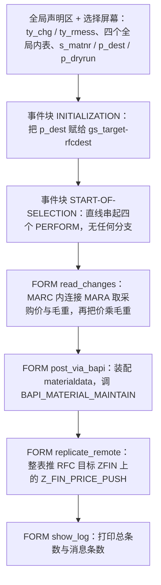
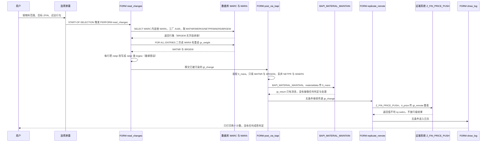

# ZREPORT_BAPI_UPLOAD 源码分析报告

> 分析对象：`zreport_bapi_upload.abap`（REPORT，126 行，含 4 个 FORM）
> 分析重点：BAPI 调用正确性、RFC 复制的正确性、价格计算是否算错
> 读者定位：第一次接手这个报表、需要把它改对的 ABAP 开发

---

## 一、程序定位与业务背景

### 1.1 它想解决什么问题

想象一个场景：采购部门每周从 Excel 拿回一份"新谈判价格"清单，里面只有物料号和价格。业务要求是——这批价格要落到 SAP 的物料采购视图里，并且**同时**出现在集团另一套财务系统（通过 RFC）上，否则月末合并报表对不上。

在这之前，现场的做法通常是 SAP01 手工逐条维护：MM03 → 采购视图 → 改价格 → 保存。一天上百条，没人干得了，也没法留痕。于是有人写了 `ZREPORT_BAPI_UPLOAD`：选择屏输物料范围和目标系统，程序一次把数据取出来、批量上传、再推到远端，最后打一份清单当作凭证。

**一句话定性**：这是一个典型的 **"抽取—批量写入—跨系统复制"三段式批处理报表**，整体设计范式是**过程式脚本 + 全局共享内表作为唯一数据载体**，没有抽象、没有错误状态管理。

### 1.2 这个范式为什么是这个范式

三段之间靠四个全局内表接力（`gt_change` / `gt_return` / `gt_remote` / `gr_weight`），而不是靠 FORM 的形参传值。这是报表程序里最常见也最省事的选择：数据量不大时，写起来快，不用设计接口结构体，不用考虑参数传引用还是传值。

**代价也很直接**——全局内表成了"隐式契约"：谁能改、谁改过、谁读，全靠程序员之间的口头约定。这个程序里 `gt_change` 被 `read_changes` 改写（价格乘了毛重），又被 `post_via_bapi` 读、被 `replicate_remote` 原样复制走。三个 FORM 都以为自己拿到的是"干净的业务数据"，实际上拿到的是已经被上一段污染过的数据。这就是本报告要重点拆解的第一颗雷。

### 1.3 为什么现在必须认真看这三个点

用户问的三个问题，正好对应程序里三段最脆弱的代码：

1. **BAPI 调用正确性** —— `BAPI_MATERIAL_MAINTAIN` 到底把什么写到了哪里，返回的消息有没有被处理。
2. **RFC 复制正确性** —— `Z_FIN_PRICE_PUSH` 的异常声明了但没评估，成功日志无条件打印。
3. **价格计算** —— `netpr * brgew`，把采购价乘了毛重。

结论先摆在前面：**这三处都有真实缺陷，其中价格计算是量纲错误（把金额乘上重量），BAPI 的返回表完全没有被判定，RFC 的异常分支是死代码。**下面逐段拆。

---

## 二、程序执行流程总览



### 责任链

| 子程序 | 调用者 | 职责 |
| --- | --- | --- |
| 全局声明区 + 选择屏幕 | 系统（编译期） | 声明 `ty_chg`/`ty_rmess` 结构、四个全局内表与 `gs_target`，暴露物料范围 / RFC 目标 / 试运行三个输入 |
| 事件块 `INITIALIZATION` | 系统（屏幕返回后） | 把选择屏上的 `p_dest` 灌进 RFC 目标结构 `gs_target`，供后续 RFC 使用 |
| 事件块 `START-OF-SELECTION` | 系统（F8 执行） | 唯一的驱动流：`read_changes` → `post_via_bapi` → `replicate_remote` → `show_log`，四步之间没有任何条件判断 |
| FORM `read_changes` | `START-OF-SELECTION` | 取 A100 工厂的采购价，用 MARC 内连接 MARA 把毛重一并带出来；再二次查 MARA 拿毛重；最后把 `gt_change` 里每行的 `netpr` 改写成 `netpr * brgew` |
| FORM `post_via_bapi` | `START-OF-SELECTION` | 把 `gt_change` 转成 `lt_mara`（只填 MATNR + BRGEW），非试运行时调 `BAPI_MATERIAL_MAINTAIN`，然后把返回消息和"uploaded"逐条打印 |
| FORM `replicate_remote` | `START-OF-SELECTION` | 把 `gt_change` 整表复制到 `gt_remote`，用 `Z_FIN_PRICE_PUSH` 推到 `gs_target` 指向的系统，最后无条件打印"replicated to" |
| FORM `show_log` | `START-OF-SELECTION` | 打印 `gt_change` 与 `gt_return` 的行数作为执行小结 |

下面按这条流程，逐个子程序展开。

---

## 三、分组分析（按程序流程 / 子程序）

### 3.1 子程序类型 全局声明区（含类型与选择屏幕）

这一段没有 FORM，是整份代码的"地基"：先定义两个结构，再挂四个全局内表，最后搭选择屏。分三步看。

#### ① 两个自建结构

```abap
TYPES: BEGIN OF ty_chg,
         matnr TYPE mara-matnr,
         werks TYPE marc-werks,
         netpr TYPE marc-netpr,
         waers TYPE marc-waers,
       END OF ty_chg.

TYPES: BEGIN OF ty_rmess,
         typeid   TYPE char1,
         msgid    TYPE msgid,
         msgno    TYPE msgnum,
         msgv1    TYPE char50,
         msgv2    TYPE char50,
       END OF ty_rmess.

TYPES ty_rmess_tab TYPE STANDARD TABLE OF ty_rmess WITH EMPTY KEY.
```

**做什么** — `ty_chg` 声明一个四字段的"价格变更行"：物料号（`MARA-MATNR`）、工厂（`MARC-WERKS`）、采购价（`MARC-NETPR`）、币种（`MARC-WAERS`）。`ty_rmess` 声明一个仿 BAPI 返回消息的结构，带 `typeid`（消息类型）、`msgid`、消息号和两个文本参数，`ty_rmess_tab` 把它包成标准表（`WITH EMPTY KEY`，即无主键的顺序表）。

**为什么** — 直接引用 DDIC 类型（`mara-matnr` 等）而不是自己写 `char40`，是对的：字段长度随 DDIC 走，SPA/增强调整后不需要改代码。`ty_rmess` 用 `EMPTY KEY` 也符合"消息表只顺序遍历、不做主键查找"的用法。

**风险与改进** — 两处隐患。其一，`ty_rmess` 是**自造的消息结构**：SAP 标准已有 `bapi_messtab`（基于 `bapiret2`），带 `msgv3`、`msgv4`、`spras`、`expiredate`，而且是 BAPI 生态里所有 FM 约定返回的类型；自造结构少一半字段，一旦 BAPI 返回了带 `msgv3` 的长文本，日志就会丢内容。更关键的是：**自造结构掩盖了一个致命事实——`typeid` 的取值语义（`E`=错误、`A`=警告终止、`W`/`I`/`S`=成功/信息）完全靠程序员自觉，没有任何编译期或运行期约束**，而这段代码恰恰没有去判它。其二，`ty_chg` 只有四个字段，**没有状态字段、没有消息字段、没有时间戳**——后面 `post_via_bapi` 想说"这一行上传成功了"都无处记录，只能靠无差别 `WRITE`。建议：`gt_return` 直接声明为 `TYPE STANDARD TABLE OF bapiret2`；`ty_chg` 增加 `stat TYPE char1` 与 `mstat TYPE char1` 两列承载行级结果。

#### ② 全局内表声明

```abap
DATA: gt_change  TYPE TABLE OF ty_chg,
      gt_return  TYPE ty_rmess_tab,
      gt_remote  TYPE TABLE OF ty_chg,
      gr_weight  TYPE TABLE OF p,
      gs_target  TYPE rfcdest.
```

**做什么** — 声明四张全局表加一个目标结构：`gt_change` 作主数据表（贯穿全程），`gt_return` 收 BAPI 消息，`gt_remote` 作 RFC 发送副本，`gr_weight` 意图存毛重；`gs_target` 存 RFC 目标。

**为什么** — 全局声明让四个 FORM 可以零参数接力，不必层层传表，这在报表里是常见取舍。

**风险与改进** — `gr_weight TYPE TABLE OF p` 是**明确的语法错误**：`p` 是基本类型（定点数），行类型不是结构体，所以 `READ TABLE ... WITH KEY matnr = ...` 和 `ls_w-brgew` 这种"带字段名的访问"根本无从谈起（行类型上不存在 `matnr`、`brgew` 组件）。这段代码在激活期就会报错，即使去掉 `WITH KEY` 和 `-brgew`，一张 P 类型内表也装不下"物料号 + 毛重"两列。正确写法应为 `gr_weight TYPE TABLE OF mara`（直接复用 DDIC 结构，`ls_w-brgew` 就成立）或自建 `ty_wt`。另外三张表都没有声明表键：`gt_change TYPE TABLE OF ty_chg` 落成无显式主键的标准表，后续 `READ TABLE`/`MODIFY ... WITH KEY` 都得全表扫描，性能和行为都不确定，建议明确 `WITH UNIQUE KEY matnr werks`（如果业务上确实一物料一工厂一行）。

#### ③ 选择屏

```abap
SELECTION-SCREEN BEGIN OF BLOCK b.
  SELECT-OPTIONS s_matnr FOR gt_change-matnr.
  PARAMETERS p_dest TYPE rfcdest DEFAULT 'ZFIN'.
  PARAMETERS p_dryrun AS CHECKBOX.
SELECTION-SCREEN END OF BLOCK b.
```

**做什么** — 一个块内三个输入：物料号范围（多选 + 区间）、RFC 目标系统（下拉/输入，默认 `ZFIN`）、试运行开关（复选框）。

**为什么** — 三个参数正好对应程序的三个阶段边界（取数范围、推送目标、是否真写），参数化程度是合格的，`p_dryrun` 的存在说明作者意识到了"直接跑会写库"的风险。

**风险与改进** — 三点。（1）`s_matnr` **非必填**：用户留空直接 F8，就变成"对 MARC 里工厂 A100 的全部物料做 JOIN 全量读取并逐行改写"，在物料主数据上百万级的系统里这是一次内存灾难。应加 `OBLIGATORY`，或在 `AT SELECTION-SCREEN` 里拦截空值。（2）`p_dest TYPE rfcdest` 只做了**类型**约束，没做**白名单**约束：任何人只要有事务权限，就能把目标改成任意可达的 RFC 名称，从而把采购价推到别的系统（甚至测试系统或外部伙伴）。应改为 `p_dest TYPE zrtfc_dom`（Z 表维护允许的目标），或在 `AT SELECTION-SCREEN` 里用 `RFCDEST_GET` 校验存在性与可写性。（3）`s_matnr FOR gt_change-matnr` 引用的是内表组件，虽然合法，但 F4 价值检查、值提示、文本标注都拿不到 DDIC 的维护——改为 `FOR mara-matnr` 即可白拿。

### 3.2 子程序类型 事件块 `INITIALIZATION`

过了选择屏就进入 `INITIALIZATION`。这是全程序最短的一个块，但也是唯一一个"提前失败"的候选位置。

```abap
INITIALIZATION.
  gs_target-rfcdest = p_dest.
```

**做什么** — 把选择屏上的 `p_dest` 拷进结构 `gs_target` 的 `RFCDEST` 组件，供 `replicate_remote` 做 RFC 的 `DESTINATION` 实参。

**为什么** — RFC 的 `DESTINATION` 参数在 FM 里可以写成结构（内部会转成系统级的连接参数），用一个 `TYPE rfcdest` 的结构包一层是常见写法，好处是未来要追加 `rfcdest-rfc_destination` 之类属性时有地方放。

**风险与改进** — 这个块**什么校验都没做**，而它恰恰是唯一"零成本"的校验时机：如果在这里校验 `p_dest` 的存在性和用户对该目标的权限，后面 `read_changes` 跑完几万行、金额都算好了，才发现目标系统连不上，前面所有 CPU 和内存全白费。更严重的是顺序问题：**程序的真实写入顺序是"先本地 BAPI 写库、再推远端"，而远端可用性却最晚才被检验**。建议把 `RFCDEST_GET` 校验和 `DESTINATION_UNAVAILABLE` 的前置探测放在这里（甚至 `post_via_bapi` 之前），让配置错误在动数据之前就暴露。

### 3.3 子程序类型 事件块 `START-OF-SELECTION`

这是整份代码的"总导演"，一共四行，但它决定了整个程序的容错能力上限。

```abap
START-OF-SELECTION.

  PERFORM read_changes.
  PERFORM post_via_bapi.
  PERFORM replicate_remote.
  PERFORM show_log.
```

**做什么** — 顺序调用四个 PERFORM：取数 → BAPI 上传 → RFC 复制 → 打印日志。

**为什么** — 把流程写在事件块里而不是散落在各 FORM 的调用处，是正确的可读性选择；新人 `Ctrl+Shift+F5` 就能看到主干。

**风险与改进** — **四个 PERFORM 之间零分支**，这是本程序的结构性病灶：上游失败不会阻止下游。取数一条没取到，照样去调 BAPI；BAPI 全军覆没，照样推 RFC 把脏数据发出去；RFC 挂了，照样打印 `show_log` 给出"看起来正常"的收尾。正确形态应该是逐段判定：

```abap
IF lines( gt_change ) = 0.
  MESSAGE '000' TYPE 'S' DISPLAY LIKE 'E'.
  RETURN.
ENDIF.

PERFORM post_via_bapi.
IF gv_upload_failed > 0.
  MESSAGE '价格未全部上传成功，终止 RFC 推送' TYPE 'E'.
  RETURN.
ENDIF.
PERFORM replicate_remote.
```

另外，`START-OF-SELECTION` 没有任何 `AT SELECTION-SCREEN ON VALUE-REQUEST`、变式保存、`SUBMIT` 兼容处理，程序只能在屏幕上 F8 跑（见 3.4 风险中的后台执行问题）。

### 3.4 子程序类型 FORM `read_changes`

这是本报告里问题最集中的 FORM，分三步：主查询、二次查毛重、逐行改写。第一步和第二步都存在结构性问题，第三步是致命的价格错误。

#### ① 主查询：MARC 内连接 MARA

```abap
FORM read_changes.

  SELECT marc~matnr marc~werks marc~netpr marc~waers mara~brgew
    FROM marc INNER JOIN mara ON mara~matnr = marc~matnr
    INTO TABLE gt_change
    WHERE marc~matnr IN s_matnr
      AND marc~werks  = 'A100'.

  ENDFORM.
```

**做什么** — 打算从 `MARC`（物料的工厂级数据）内连接 `MARA`（物料基本数据），按物料范围 + 工厂 `A100` 取 `MATNR`、`WERKS`、`NETPR`（采购价）、`WAERS`（币种）以及 `MARA-BRGEW`（毛重），结果装进全局表 `gt_change`。

**为什么** — 从 `MARC` 出发是对的：采购价是工厂级字段，只有 `MARC` 才有；连接 `MARA` 取毛重也在合理意图之内。`ON mara~matnr = marc~matnr` 命中 `MARA` 的主索引，连接代价可接受。工厂硬编码 `A100` 说明这是一个单工厂范围的批量工具。

**风险与改进** — **这段 SELECT 在当前类型定义下无法成立**：`SELECT` 列表有 5 个字段，而目标结构 `ty_chg` 只有 4 个字段，且 `ty_chg` 里**根本没有可以承接 `mara~brgew` 的字段**。平铺 `SELECT ... INTO TABLE` 要求目标结构与字段数匹配，这里属于不匹配情形，程序在激活期就会失败。即便补上 `brgew` 字段让它跑通，也只是把毛重"顺路带出来"，真正的问题在下一步。另外 `mara~brgew` 写在这个 JOIN 里其实**纯属多余**——下一步已经专门查了一次 MARA。建议砍掉 JOIN、第一步只取 `MARC` 的四个字段，让 `gt_change` 语义干净（"采购价变更行"），重量另表存放。

#### ② 二次查毛重

```abap
  SELECT matnr brgew FROM mara
    INTO TABLE gr_weight
    FOR ALL ENTRIES IN gt_change
    WHERE matnr = gt_change-matnr.

  LOOP AT gt_change INTO DATA(ls_chg).
    READ TABLE gr_weight INTO DATA(ls_w) WITH KEY matnr = ls_chg-matnr.
```

**做什么** — 以 `gt_change` 的物料号为驱动，用 `FOR ALL ENTRIES` 再从 `MARA` 读一次 `MATNR` + `BRGEW` 进 `gr_weight`；随后逐行遍历 `gt_change`，用物料号去 `gr_weight` 里查对应的毛重。

**为什么** — `FOR ALL ENTRIES` + 主键 `READ` 的组合在教材上很常见：一次批量取、避免逐行 `SELECT`（N 次数据库往返）。思路本身没错，只是落地细节坏了。

**风险与改进** — 三处。（1）**`gr_weight` 是 `TABLE OF p`**，如 3.1 ② 所述，行类型是基本类型，没有 `matnr`/`brgew` 组件，这三句（`INTO TABLE gr_weight`、`WITH KEY matnr`、`ls_w-brgew`）**全部是非法的**，程序编译不过。改成 `TYPE TABLE OF mara` 即可。（2）**`READ TABLE` 完全不检查 `sy-subrc`**：物料在 MARA 中不存在、或 `FOR ALL ENTRIES` 因某种原因没取到行，`ls_w` 保留上一次循环的残值，接着就去参与乘法——这是典型的"静默用脏数据算账"。（3）`FOR ALL ENTRIES` 会**为重复物料产生重复行**（`gt_change` 里同一 MATNR 出现 N 次，`gr_weight` 就有 N 行相同记录），白占内存；应改成 `SELECT DISTINCT`，或干脆在第一步 JOIN 时一次取全。

#### ③ 逐行改写价格（核心缺陷）

```abap
  LOOP AT gt_change INTO DATA(ls_chg).
    READ TABLE gr_weight INTO DATA(ls_w) WITH KEY matnr = ls_chg-matnr.
    ls_chg-netpr = ls_chg-netpr * ls_w-brgew.
    MODIFY gt_change FROM ls_chg.
  ENDLOOP.

ENDFORM.                       "read_changes
```

**做什么** — 对每一条价格变更行：读出该物料的毛重，把 `netpr`（采购净价）**乘以**毛重 `brgew`，然后整行 `MODIFY` 回 `gt_change`。

**为什么** — 意图很清楚：作者想把"单价"折算成"总金额"。但这一步在**数据元素语义**上就站不住，下面三层详细说。

**风险与改进（这是全程序最严重的问题 🔴）** — 从数据元素语义校核，这个乘法是**量纲错误**：

| 项 | 数据元素 | 业务含义 | 类型 |
| --- | --- | --- | --- |
| 被乘数 | `MARC-NETPR`（NETPR） | 采购净价，**金额** | `CURR(11,2)` |
| 乘数 | `MARA-BRGEW`（BRGEW） | 毛重，**重量**，基本单位千克 | `QUAN(13,3)` |

金额 × 重量 = 既不是金额也不是重量，是**没有物理意义的第四种量**。三重问题叠加：

1. **语义错配**：毛重（甚至净重 `MARA-NTGEW`）从来不是价格换算系数。采购价的"计价分母"在采购信息记录 `EINE` 里，字段是 `APIN-KUMBW`（价格单位数量）和 `APIN-KUMVW`（价格单位分母）、配 `APIN-PRICE` 与 `APIN-PMAT`（价格单位类型，如 1 EA / 10 KG / 1 托盘）。正确的"总金额"公式是 `PRICE × KUMBW / KUMVW`，跟物料毛重毫无关系。如果业务上真存在"每公斤价"，那单价字段本身应该是条件记录里的价格单位价格，而不是 `MARC-NETPR` 再乘重量。
2. **类型溢出（会短时 dump）**：`CURR(11,2)` 最大只能存到 999,999,999.99。任何一个重量大于 1 的物料（绝大多数工业物料毛重都远大于 1 kg），乘完就超出 `NETPR` 的值域。ABAP 内置类型转换不做静默截断，会抛 `CX_SY_CONVERSION_NO_OVERFLOW`，未捕获就是**短时 dump**。也就是说这不是"算错一点"，而是"跑到第一个重物料就崩"。
3. **污染下游**：改写后的值留在 `gt_change` 里，被 `post_via_bapi` 当成"要写的价格"写进 **MARA 的毛重字段**，又被 `replicate_remote` 原样推到远端系统。一处量纲错误，沿着三个 FORM 扩散成数据污染 + 跨系统污染。

顺带的小问题：`MODIFY gt_change FROM ls_chg` 整行回写是无必要的（`ls_chg` 本来就是从该行拷出来的副本），且在无主键表上 `MODIFY` 会触发全表比较，整体 O(n²)；直接用 `MODIFY gt_change[ sy-tabix ]-netpr = ...` 或在带唯一键的表上按键改写更省。

**改进方向**：如果业务真的是"折成总金额"，第一步就不该乘重量——应该引入价格单位字段，把金额字段换成 `CURR(15,2)` 或直接用 `BAPICURR-AMT` + `WAERS` 配对，并且在乘法前做量级检查（`IF ls_w-brgew IS INITIAL OR ls_chg-netpr > ... / ls_w-brgew. EXIT.`）或用 `TRY/CATCH cx_sy_conversion_no_overflow` 兜底；如果业务不是"折总金额"（我倾向于是），那这行乘法应当**直接删掉**——`netpr` 原值上传即可。

### 3.5 子程序类型 FORM `post_via_bapi`

前面把数据（不管算得对不对）交到了这一段。分四步：装配结构体、调 BAPI、打印返回消息、打印成功清单。这一段是用户点名要看的重点。

#### ① 装配 `lt_mara`

```abap
FORM post_via_bapi.

  DATA lt_mara TYPE TABLE OF mara.
  DATA ls_mara TYPE mara.

  LOOP AT gt_change INTO DATA(ls_chg).

    CLEAR ls_mara.
    ls_mara-matnr = ls_chg-matnr.
    ls_mara-brgew = ls_chg-netpr.
    APPEND ls_mara TO lt_mara.

  ENDLOOP.

  ENDFORM.
```

**做什么** — 对 `gt_change` 的每一行，新 `CLEAR` 一个 `MARA` 结构体，只填两个字段——`MATNR` 和 **`BRGEW`**——把被当成"价格"的那个值（其实上一段刚用毛重乘过）写进**毛重字段**，追加进 `lt_mara`。

**为什么** — 作者想用 `BAPI_MATERIAL_MAINTAIN` 的 `MATERIALDATA` 表批量更新物料主数据基本视图，这条 FM 路线在语法上成立：传一个装满 `MARA` 行的内表给 FM 的 `MATERIALDATA` 表参数，FM 逐行调用 `BAPI_MATERIAL_SAVEDATA` 类接口落库。

**风险与改进** — **这里是全程序的第二个 🔴，而且和上一段的量纲错误叠加成数据损坏**：

1. **目标字段彻底错了**。采购价 `NETPR` 在 `MARC`（采购视图），是采购条件记录的载体；**`MARA-BRGEW` 是物料基本数据里的毛重**。把金额写进毛重字段，等于用一段程序把一批物料的毛重全部改成了乱码式的"金额×重量"值，而且这个值来自一次量纲错误的乘法。这是**数据损坏**，不是"算错一点"。
2. **价格根本没被上传**。`gt_change` 里明明带着 `netpr` 和 `waers`，装配时**两个都没往 `lt_mara` 里放**。采购价上传要么走条件记录路线（`BAPI_PRICES_CONDITIONS` 写 `EINE`），要么走采购视图/采购信息记录路线（`BAPI_MATERIAL_PRICES` 之类，字段是价格 + 价格单位 + 币种）。`BAPI_MATERIAL_MAINTAIN` 的 `MATERIALDATA` 更新的是 `MARA` 基本数据，**不是采购价**。换句话说：这个 FM 调用即使全部成功，也一行采购价都没写进去——它只改了毛重。
3. **`ls_mara TYPE mara` 传整张 DDIC 表给 BAPI 结构参数有风险**。`MATERIALDATA` 的结构是 `BAPIMATERIALM`，它基于 `MARA` 但含若干 BAPI 追加字段；把完整 `mara` 当作该表参数传入时，如果 FM 侧结构含 `MARA` 没有的组件，ABAP 的 FM 参数传递会因缺组件而短时 dump。即使当前版本碰巧能跑，也把 FM 和 `MARA` 的字段名硬绑死了。应显式用 `TYPE STANDARD TABLE OF bapimaterialm`，或更好——自建一个只含所需字段的装配结构。
4. **`CLEAR ls_mara` + 只填两字段 = 隐式"只更新非初始字段"语义**。`BAPI_MATERIAL_MAINTAIN` 对未传入/初始的字段不做清零，这一点是幸运的（不会把其他 `MARA` 字段洗白），但它依赖的是 FM 的内部字段级更新逻辑而不是显式声明，属于隐式契约。可靠做法是显式构造 `BAPIMATERIALM` 并只填真正要改的字段。
5. 没有按 `MATNR` 去重。若 `gt_change` 出现重复物料（`MARC` 里同物料同工厂理论上唯一，但 `FOR ALL ENTRIES` 若没去重、或将来工厂条件放开到多工厂），同一物料会被写多次，第二次调用 BAPI 可能报"无变更/已存在"。应在装配前按 `MATNR` 去重。

#### ② 调用 BAPI（试运行开关）

```abap
  IF p_dryrun IS INITIAL.
    CALL FUNCTION 'BAPI_MATERIAL_MAINTAIN'
      TABLES
        materialdata  = lt_mara
        return        = gt_return.
  ENDIF.
```

**做什么** — 只有在**未勾选试运行**时，才调 `BAPI_MATERIAL_MAINTAIN`，把 `lt_mara` 传给它、把返回消息表接进全局 `gt_return`。试运行勾上时，整个 BAPI 调用被跳过。

**为什么** — 用 `p_dryrun` 包住写入调用，是很典型的"先看后写"防护。FM 选择上，`BAPI_MATERIAL_MAINTAIN` 确实是 SAP 推荐的物料主数据写入 FM（比 BDC、直接 `UPDATE` 好得多）。

**风险与改进** — 三个问题。（1）**没有 `COMMIT WORK`**（详见 3.6 风险与改进的事务边界讨论，这里先记一笔：写入停在 LUW 里，报表自己却已经往下走并报"uploaded"了）。（2）**没有判 FM 是否正常返回**：`CALL FUNCTION` 后不看返回码，BAPI 的业务失败全部体现在 `gt_return` 里，不看就等于没调用。（3）**试运行只挡了本地 BAPI，没挡 RFC**——见 3.6。另外 `IF p_dryrun IS INITIAL` 用 `IS INITIAL` 判断复选框虽然合法，但 `= abap_false` 更明确。**这一段最该补的是事务边界**：BAPI 校验通过后 `COMMIT WORK`，异常/有错误则 `ROLLBACK WORK`；若坚持整批提交，就要明确"一条错全批回滚"意味着已经成功的那部分也没了——更稳妥是按 N 条切分 LUW 分段提交。

#### ③ 打印返回消息（只打印，不处理 🔴）

```abap
  LOOP AT gt_return INTO DATA(ls_ret).
    WRITE: / ls_ret-typeid, ls_ret-msgid, ls_ret-msgno, ls_ret-msgv1.
  ENDLOOP.
```

**做什么** — 遍历 BAPI 回来的消息表，把每条消息的类型 ID、消息类、消息号、文本参数打到列表上。

**为什么** — 至少"把消息显示出来"，比完全静音好，调试期确实能看到 BAPI 说了什么。

**风险与改进** — **这是用户问的"BAPI 返回表的错误必须被真正处理"的核心缺陷（🔴）**。当前对 `gt_return` 的处理**止步于 `WRITE`**，没有任何一处基于消息内容做决策。后果链条非常直接：

- `gt_return` 里出现 `typeid = 'E'`（错误）或 `'A'`（错误终止）：BAPI 已经**没有写库**，物料保持原样。但程序往下走：既不回滚，也不 `RETURN`，还会在下一步把同批数据**推到远端系统**——远端收到的是一个本地根本没写成功的"假成功"数据。
- `gt_return` **为空**：作者在下游把它当成成功。但 BAPI 只返回**错误和警告**，成功不产生消息——"没有消息"必须被显式解释为"成功"，而不是反过来把"有错误消息"解释为"成功但有提示"。
- `gt_return` 里是 `'W'`（警告）：程序完全无视，可能带着 BAPI 明确警告的脏数据继续推远端。
- **`gt_return` 在调用前没有 `CLEAR`**：全局表若被重复进入（比如同一次运行里将来要分批调用），上一批的旧消息会混进来，统计和判定都失真。
- `WRITE` 到列表在**后台运行时直接丢失**，等于消息链彻底断掉。

**必须改成"判定 + 分支"**：

```abap
DATA: lv_err  TYPE i,
      lv_warn TYPE i.

CLEAR gt_return.

LOOP AT gt_return INTO DATA(ls_ret).
  CASE ls_ret-typeid.
    WHEN 'E' OR 'A'.
      lv_err = lv_err + 1.
  WHEN 'W'.
      lv_warn = lv_warn + 1.
  ENDCASE.
  " 同步写到行级状态字段，并把 msgid/msgno/msgv1 存进日志表
ENDLOOP.

IF lv_err > 0.
  ROLLBACK WORK.
  MESSAGE lv_err COLOR 1 TYPE 'E'.   " 或者 MESSAGE ... DISPLAY LIKE 'E'
  RETURN.
ENDIF.
COMMIT WORK.
```

要点：`typeid` 必须 `CASE` 分派；错误计数驱动 `ROLLBACK WORK` / `MESSAGE` / `RETURN`；警告要记账并写日志表；消息还要按行回填到 `ty_chg` 增补的状态字段，才能定位"是哪条物料失败了"。

#### ④ 无条件打印 uploaded

```abap
  LOOP AT gt_change INTO DATA(ls_chg2).
    WRITE: / 'uploaded', ls_chg2-matnr.
  ENDLOOP.

ENDFORM.                       "post_via_bapi
```

**做什么** — 遍历 `gt_change`，为**每一行**打印"uploaded + 物料号"。

**为什么** — 意图是给操作者一份"已上传"清单，作为当天操作的凭证。

**风险与改进** — **这是虚假成功日志（🔴）**。这行 `WRITE` 在三种情况下都是错的：

1. BAPI 报 `E`/`A` 的物料，`WRITE` 照样说 uploaded；
2. **勾选了 `p_dryrun` 时**，BAPI 根本没调用（② 的 `IF` 整段被跳过），`gt_return` 是空的，这里却打印了满屏 "uploaded"——**试运行反而比不试运行报得更漂亮**，极具误导性；
3. 一条成功都没发生时，屏幕上也是 "uploaded"。

修法很直接：**只对状态为成功的行打印**，并且打印行里带上价格和币种（`ls_chg2-matnr, ls_chg2-netpr, ls_chg2-waers`），失败行打印 `failed + msgid/msgno/msgv1`。更根本的做法是把这些 `WRITE` 换成写日志表 + 最后 `ALV` 展示（见 3.7）。

### 3.6 子程序类型 FORM `replicate_remote`

`gt_change` 到了这里已经算坏了，但这一段不只"接着传坏数据"，它本身的 RFC 写法也有明确错误。分三步看。

#### ① 整表复制

```abap
FORM replicate_remote.

  DATA lv_ok TYPE c.

  gt_remote = gt_change.

ENDFORM.                       "replicate_remote
```

**做什么** — 在 FORM 局部声明一个 `TYPE c` 的变量 `lv_ok`，然后把全局 `gt_change` 整表复制到全局 `gt_remote`，作为待发送的报文。

**为什么** — 单独建一张发送表再发，形式上做到了"发送副本不污染发送方"，符合 RFC 的常见做法（远端 FM 若在调用期间回写报文，也不会改动 `gt_change`）。

**风险与改进** — 两个问题。（1）`lv_ok` 声明后**既没赋值也没被读取**，是 ATEXT 类未使用变量警告，同时暴露作者本想记结果却没写完；应让它承载成功/失败状态，而不是另开一个被遗忘的标志。（2）**这份副本原样继承了上一段被量纲错误污染的价格**：`gt_change` 里的 `netpr` 是 `原采购价 × 毛重` 的结果，`waers` 还在、`werks` 也在，唯独价格已经失去业务含义。RFC 这一步等于把错误数据复制到集团另一套财务系统，**污染从单系统扩散成跨系统**。另外 `gt_remote` 是全局表却只在本 FORM 用，应下沉为局部内表；同时**复制前不判空**，`gt_change` 为空时仍会白跑一趟网络往返。

#### ② RFC 调用与异常声明

```abap
  CALL FUNCTION 'Z_FIN_PRICE_PUSH'
    DESTINATION gs_target
    TABLES
      it_price = gt_remote
    EXCEPTIONS
      system_failure = 1
      destination_unavailable = 2
      OTHERS = 3.

```
**做什么** — 以 `gs_target` 为 `DESTINATION` 调用 RFC 目标系统上的 FM `Z_FIN_PRICE_PUSH`，把 `gt_remote` 作为 `TABLES` 参数 `it_price` 送出；同时声明了 `system_failure = 1`、`destination_unavailable = 2`、`OTHERS = 3` 三个可捕获异常。

**为什么** — 选自定义 FM `Z_FIN_PRICE_PUSH` 作为推送封装，比在报表里直接 `BAPI_..._CALL` 或写 `IDOC` 更可控，符合 Z 系统"远端逻辑封装在 FM 里"的通行做法；用 `DESTINATION` + `EXCEPTIONS` 的经典 RFC 风格也说明作者知道连接异常需要显式声明。

**风险与改进** — 这一步是用户问的"RFC 复制正确性"的核心，**问题比 BAPI 那段还集中**：

1. **异常声明了但 `sy-subrc` 从头到尾没被评估（🔴 P0）**。`EXCEPTIONS system_failure = 1 ...` 只是告诉 FM "出问题时填 1/2/3 到 `sy-subrc`"，**判读是调用方的责任**。当前代码一个 `IF sy-subrc <> 0` 都没有。结果就是：目标系统宕机、连接超时、目标不存在、业务异常，全都被吞掉，程序继续往下打 "replicated to ZFIN"。这是一条**与真实世界相反的日志**。
2. **`TABLES it_price = gt_remote` 是隐式类型耦合（🔴 P0 的隐藏项）**。这里没写参数名清单，`it_price` 既是 FM 参数名也必须是内表名——**远端 FM 的参数名改一个字母，这段代码就断**。更要命的是**类型**：`gt_remote` 是 `TABLE OF ty_chg`，其字段类型来自**本地** DDIC（`marc-netpr`、`mara-matnr`）。RFC 传表时按**远端 FM 参数定义**反序列化，如果远端期望的是 `ZFIN_PRICE_TAB`（自定义结构），字段名/顺序/类型不一致就会出现**静默错位赋值**或远端短时 dump，而本地只看到 `sy-subrc = 0` 或一句 `OTHERS`。**正确做法**：定义一个明确的共享接口结构（建在独立的接口/传输请求里，两边共同引用），`TABLES it_price[]` 显式写参数名清单，并且远端 FM 必须返回行级结果表（`RETURN` / `RET_TAB`）让本地能判成败。**当前代码连远端返回了什么都没接——本地无从知道远端到底写了多少条。**
3. **`OTHERS = 3` 把所有异常压成一个编号**，丢掉业务细节。至少应把 `Z_FIN_PRICE_PUSH` 自己抛出的具名异常（逐条列出，如 `data_error`、`authorization_denied`）也列进 `EXCEPTIONS`，否则业务错误和系统错误无法区分。
4. **远端无幂等控制**：重跑一次就是再推一次，远端若不是按业务键幂等写入就会重复累加，程序层面既没有版本号/时间戳也没有去重。

#### ③ 无条件写成功日志

```abap
  WRITE: / 'replicated to', p_dest.

ENDFORM.                       "replicate_remote
```

**做什么** — 打印一行"replicated to + 目标系统名"，表示远端复制完成。

**为什么** — 作者想给操作者一个"推送已完成"的收尾确认，与 `post_via_bapi` 的 "uploaded" 是同一套日志风格。

**风险与改进** — **这是虚假成功日志（🔴 P0）**，而且与"试运行仍真推远端"叠加，是本程序最容易造成生产事故的组合。（1）这行在 `sy-subrc = 1/2/3` 时同样执行，目标系统根本没收到数据，屏幕上却写着"已复制到 ZFIN"。（2）**`p_dryrun` 完全管不到这里**——`START-OF-SELECTION` 无条件 `PERFORM replicate_remote`，而 `p_dryrun` 只在 `post_via_bapi` 里包了 BAPI 调用。操作者勾了"试运行"以为在安全演练，实际远端系统已经被真实改写。要么在 `START-OF-SELECTION` 用 `p_dryrun` 跳过整个写入段，要么把开关传进本 FORM 早退。（3）**事务边界必须显式设计**（用户点名的 COMMIT WORK / ROLLBACK 问题，完整讨论见 3.5 ②）：BAPI 的写入停在**本地** LUW 里，RFC 走**远端**连接，两者不在同一 LUW——`ROLLBACK WORK` 永远回滚不了远端已提交的变更，RFC 结束也不会替本地提交。因此顺序只能是"BAPI 校验通过 → `COMMIT WORK` → 再推 RFC"，且必须在推远端之前确认本地已提交成功，否则会出现"本地回滚了、远端已写入"的不一致。同时要记住 `COMMIT WORK` 提交的是**整个当前 LUW**、不是"这一批价格"——将来若中途 `ROLLBACK`，会把本程序前面已成功的写入一起回滚，这才是必须按批切分 LUW 分段提交（或改用 `BAPI_TRANSACTION_COMMIT`）的原因。正确判定形态：

```abap
CASE sy-subrc.
  WHEN 0.
    " 有行级 RET_TAB 就逐行回填状态；再记录日志
  WHEN 1.
    MESSAGE 'RFC 系统级故障（连接或资源）' TYPE 'E'.
  WHEN 2.
    MESSAGE '目标系统不可用，请检查 RFC 目标与连接参数' TYPE 'E'.
  WHEN OTHERS.
    MESSAGE 'RFC 业务异常，请查看远端日志' TYPE 'E'.
ENDCASE.
```

### 3.7 子程序类型 FORM `show_log`

最后一段，是整个程序对操作者交代的唯一输出。

```abap
FORM show_log.

  WRITE: / 'total', lines( gt_change ).
  WRITE: / 'messages', lines( gt_return ).

ENDFORM.                       "show_log
```

**做什么** — 打印 `gt_change` 的行数（标签 `total`）和 `gt_return` 的行数（标签 `messages`）作为收尾。

**为什么** — 批处理报表给个总数，是最省事的执行反馈。

**风险与改进** — 这个"日志"提供的信息量约等于零。（1）**`messages` 是消息条数，不是错误数**——全部成功时它显示 0，全部失败时它显示 100，两者在屏幕上长得一样。必须改成输出 `error / warning / success` 三个计数，其中 success 需按 3.5 ③ 的逻辑显式推导。（2）**`total` 语义含混**：是"处理条数"还是"总金额"？（结合 3.4 ③ 的错误计算，这里最可能是"总金额"的本意，但打的是行数，容易误导。）应改成 `processed` / `total amount` 分开。（3）**缺关键上下文**：没有用户名、RFC 目标、执行时间戳、`p_dryrun` 状态，事后无法追溯"这条记录是哪次、哪个目标系统推的"。（4）**`WRITE` 列表输出在后台运行时全部丢失**——这个程序只在 F8 下能用（`START-OF-SELECTION` 直接 `WRITE`，也没做变式/后台变式支持），一旦挂后台跑完，日志证据为零。（5）建议：写日志表（或 `BAL` 应用日志 + `APPL_LOG`）并持久化 `matnr`、价格、币种、成功/失败、`msgid/msgno/msgv1`、目标系统、时间戳；前台用 `ALV` 或 SALV 展示，可导出可追溯。

---

## 四、执行流程全景图（数据视角）



图里最能说明问题的是两条断掉的信息流：`gt_return` 进了 `post_via_bapi` 就再没出去（没有箭头通向任何决策）；RFC 的返回异常停在 `sy-subrc` 里没人读。**整张图的四个环节各自都在"发出请求"，却没有一个环节"确认结果"**——这是这份程序最本质的架构缺陷。

---

## 五、问题清单与改进建议（按优先级）

### 🔴 P0 业务正确性

| # | 问题 | 所在子程序 | 改进方向 |
| --- | --- | --- | --- |
| 1 | `netpr * brgew` 是量纲错误（金额 × 重量），且结果超出 `CURR(11,2)` 值域会 `CX_SY_CONVERSION_NO_OVERFLOW` 短时 dump | `FORM read_changes` | 删除该乘法；若确需折总金额，改用价格单位 `APIN-KUMBW`/`APIN-KUMVW` 并换金额型字段，乘法前做量级检查或 `TRY/CATCH` 兜底 |
| 2 | 把（被污染的）"价格"写进 `MARA-BRGEW`（毛重，`QUAN(13,3)`），而 `NETPR`/`WAERS` 被丢弃——采购价一行都没上传，物料毛重却被批量改坏 | `FORM post_via_bapi` | 采购价走 `BAPI_PRICES_CONDITIONS`（条件记录 `EINE`）或 `BAPI_MATERIAL_PRICES`（采购视图/价格单位路线），按其真实结构装配 |
| 3 | `gt_return` 只被 `WRITE` 出来，`typeid` 从未判定；错误不 `ROLLBACK`、不中断，后续照推远端 | `FORM post_via_bapi` | `CASE typeid WHEN 'E' OR 'A'` 计数并驱动 `ROLLBACK WORK` + `MESSAGE` + `RETURN`；`CLEAR gt_return` 后调用；消息回填行级状态 |
| 4 | 无论成败都逐行打印 "uploaded"，勾试运行时更会打印满屏 uploaded | `FORM post_via_bapi` | 只对成功行打印，并带上价格与币种；失败行打印 `msgid/msgno/msgv1` |
| 5 | BAPI 写入后无 `COMMIT WORK`，失败也无 `ROLLBACK WORK`，LUW 边界与"全批成功还是分段提交"未设计 | `FORM post_via_bapi`、`FORM replicate_remote` | 校验通过后 `COMMIT WORK`（或 `BAPI_TRANSACTION_COMMIT`），有错 `ROLLBACK WORK`；需要部分成功时按批切分 LUW；顺序固定为"本地提交成功 → 才推 RFC" |
| 6 | RFC `EXCEPTIONS` 声明了 `system_failure`/`destination_unavailable`/`OTHERS`，但 `sy-subrc` 从未评估，`lv_ok` 是死代码 | `FORM replicate_remote` | `CASE sy-subrc` 分派三种失败，各发明确 `MESSAGE`；`lv_ok` 承载成功/失败结果 |
| 7 | 无条件打印 "replicated to"，日志与真实结果相反 | `FORM replicate_remote` | 仅 `sy-subrc = 0` 时打印，并打印远端实际成功条数 |
| 8 | 勾选试运行仍会真的调用 RFC 写远端系统 | `FORM replicate_remote`、`事件块 START-OF-SELECTION` | `p_dryrun` 为真时跳过整个写入段（本地 BAPI + RFC） |
| 9 | RFC 表参数与远端 FM 隐式耦合（无参数名清单、无字段清单、不接远端返回表），字段错位或远端静默失败本地不可知 | `FORM replicate_remote` | 定义共享接口结构，两边共同引用；`TABLES it_price[]` 显式清单；远端返回 `RETURN`/`RET_TAB` 行级结果并在本地判定 |
| 10 | 主查询 `SELECT` 5 字段写入只有 4 字段的 `ty_chg`，且 `ty_chg` 无 `BRGEW` 可承接；程序在激活期即失败 | `FORM read_changes` | 拆掉 JOIN 只取 MARC 四字段，毛重另表存放；同步修正 `gr_weight` 类型 |
| 11 | `gr_weight TYPE TABLE OF p` 行类型为基本类型，`WITH KEY matnr`/`ls_w-brgew` 非法，编译不过 | `FORM read_changes`、`全局声明区` | 改为 `TYPE TABLE OF mara`（或自建 `ty_wt`），并为内表声明显式表键 |
| 12 | `p_dest` 无白名单校验，有事务权限者可把采购价推到任意可达 RFC 目标；目标可用性又是最晚才被检验 | `事件块 INITIALIZATION`、`FORM replicate_remote` | 用 Z 表维护目标白名单 + `RFCDEST_GET` 校验 + `AUTHORITY-CHECK`；把校验前移到 `INITIALIZATION` |

### 🟠 P1 健壮性

| # | 问题 | 所在子程序 | 改进方向 |
| --- | --- | --- | --- |
| 13 | `READ TABLE gr_weight` 不判 `sy-subrc`，查不到时用上一轮残值参与运算 | `FORM read_changes` | 判 `sy-subrc`，查不到则报错该物料并计入失败清单 |
| 14 | `s_matnr` 非必填，留空即触发 MARC×MARA 全量 JOIN 并逐行改写 | `全局声明区`、`事件块 START-OF-SELECTION` | `OBLIGATORY` 或 `AT SELECTION-SCREEN` 拦截；取数加 `UP TO n ROWS` 分页 |
| 15 | 无 `AUTHORITY-CHECK`，任何有事务权限者都能批量改采购价 | `事件块 START-OF-SELECTION` | 按业务对象（物料/工厂）做对象级授权检查 |
| 16 | `ty_rmess` 自造消息结构，缺 `msgv3`/`msgv4`/`spras`，长消息被截断 | `全局声明区` | 直接用 `bapi_messtab` / `TABLE OF bapiret2` |
| 17 | 消息只写列表，后台运行时全部丢失 | `FORM post_via_bapi`、`FORM show_log` | 写 `APPL_LOG`/日志表并持久化行级明细 |
| 18 | `gt_change` 无去重，重复物料会被多次提交 BAPI | `FORM post_via_bapi` | 按 `MATNR` 去重后再装配，或按唯一键改写内表 |
| 19 | `gt_remote` 全程非空检查缺失，空表也发 RPC；远端无幂等控制，重跑可能重复累加 | `FORM replicate_remote` | 空表早退；远端按业务键做幂等写入或带版本号/时间戳 |
| 20 | `lt_mara TYPE TABLE OF mara` 传整张 DDIC 表给 BAPI 结构参数，隐式依赖字段名（BAPI 追加字段缺组件会短时 dump） | `FORM post_via_bapi` | 用 `bapimaterialm` 或自建最小装配结构显式声明 |

### 🟡 P2 性能与规范

| # | 问题 | 所在子程序 | 改进方向 |
| --- | --- | --- | --- |
| 21 | 全量 JOIN 后一次性 `INTO TABLE` 到内表，物料主数据量级下内存不可控 | `FORM read_changes` | 缩小投影、`UP TO n ROWS` 分页、或直接流式（游标）处理 |
| 22 | `FOR ALL ENTRIES` 为重复物料产生重复行，白占内存 | `FORM read_changes` | `SELECT DISTINCT` 或并入第一步 JOIN 一次取全 |
| 23 | 无主键表上 `MODIFY gt_change FROM ls_chg` 整行回写，整体退化为 O(n²) | `FORM read_changes` | `MODIFY gt_change[ sy-tabix ]-netpr = ...` 或声明唯一键后按键改写 |
| 24 | 无编码风格统一（`WRITE:` 列表输出、`TABLES`/`EXCEPTIONS` 老式调用、`IS INITIAL` 判断复选框） | 全局 | 前台改 `ALV`/SALV 或 `WRITE` 到 `CONV` 报表；条件用 `= abap_false`；逐步迁到 `CL_GUI_ALV_*` 或 `WRITE` 到 `LIST` 转换 |
| 25 | 工厂 `A100` 硬编码，选择屏无法覆盖 | `FORM read_changes` | 参数化工厂范围或走配置表 |

### 🟢 P3 可扩展性

| # | 问题 | 所在子程序 | 改进方向 |
| --- | --- | --- | --- |
| 26 | `ty_chg` 无状态列，无法承载行级结果，无法做断点续传 | `全局声明区` | 增 `stat`/`msgid`/`msgno`/`msgv1`/`chgusr`/`chgtim` 列，写入后即成为可追溯的日志载体 |
| 27 | 整段逻辑写成 PERFORM 全局脚本，无法单元测试 | 全局 | 封装为 `zcl_price_push`（一个 `zif_price_source` 适配取数 + 一个 `zif_price_sink` 适配 BAPI/RFC 写入），本地 BAPI 与远端各一个 sink 实现 |
| 28 | 只支持一个 RFC 目标，批量多目标需多次改代码 | `FORM replicate_remote` | `gt_targets` 目标表 + 循环推送，逐目标单独判定 `sy-subrc` |
| 29 | 无后台变式、无 `SUBMIT` 入口，只能 F8 | `事件块 START-OF-SELECTION` | 支持后台变式 + `SUBMIT ... IN BACKGROUND`，日志必须落表 |
| 30 | 缺少"金额守恒"这类基本断言 | `FORM read_changes`、`FORM post_via_bapi` | 上传前断言"单价 × 价格单位数量 = 总额"，或与源文件总额核对，超差中止 |

---

## 六、整体评价与启发

### 优点

1. **写入路线选对了 FM**。用 `BAPI_MATERIAL_MAINTAIN` 而不是 BDC 或直接 `UPDATE`，说明作者知道 BAPI 是 SAP 推荐的集成接口——这是这份代码里最有价值的一个正确决定。
2. **读 MARC 而非 MARA 是业务正确的**。采购价是工厂级数据，只在 `MARC-NETPR`，这个起点选对了（后面的错误都发生在"取到价之后怎么处理"，不在"从哪取"）。
3. **参数化意识尚可**。物料范围、RFC 目标、试运行三个参数覆盖了三段流程的输入边界，`p_dryrun` 的存在说明作者意识到直接跑会写库。
4. **驱动流写在 `START-OF-SELECTION`**，主干一眼可见，可读性基线是合格的。

### 短板

1. **没有"确认结果"的意识**。这是贯穿全篇的头号问题：BAPI 返回消息只 `WRITE`，RFC 异常只声明不判，最后无条件打"uploaded"和"replicated to"。程序**只负责发出请求，从不确认结果**——在一个会同时写本地 SAP 和远端财务系统的批量程序里，这是最危险的组合。
2. **没有数据元素的语义校核**。`NETPR`（金额，`CURR 11,2`）× `BRGEW`（重量，`QUAN 13,3`）——只看代码"乘一下好像说得通"，不看数据元素名，就会写出这种代码。而 BRGEW/NTGEW 这类"毛重/净重"命名，本身就在提醒你它是重量域。
3. **事务边界缺失**。BAPI 写完不 `COMMIT WORK`，出错不 `ROLLBACK WORK`，"全批提交还是分段提交"也没有决策记录；同时忽略了"远端提交无法回滚"这一物理约束。
4. **跨系统类型契约缺失**。`gt_remote` 用本地 `ty_chg` 直接上 RFC，不写参数名清单、不接远端返回表——这类代码在字段一改就会以最难排查的方式失败。
5. **试运行是假的**。`p_dryrun` 只挡本地不挡远端，这是"看起来有防护、实际更危险"的典型。

### 可学到的设计经验

1. **BAPI 返回表必须驱动分支，不是驱动 `WRITE`。** 一条铁律：调完 BAPI，必须 `CLEAR return` → `LOOP` 判 `typeid`（`E`/`A` 错误、`W` 警告）→ 错误则 `ROLLBACK WORK` + `MESSAGE` + `RETURN`，成功才 `COMMIT WORK`。并且要记住"BAPI 成功不产生消息"这个反直觉的事实：**空表才是成功**，不能反过来把"有消息"当成功。
2. **金额乘金额之前，先确认乘数的语义域。** 金额只能与数量（且必须是业务规定的计价数量，如 `APIN-KUMVW`/`APIN-KUMBW`）相乘；重量字段不是换算系数。类型上 `CURR(11,2)` × `QUAN(13,3)` 会溢出到 `CX_SY_CONVERSION_NO_OVERFLOW`，而这类异常默认是短时 dump——乘之前就该做量级检查或 `TRY/CATCH`。
3. **RFC 的异常声明是给调用方的"活合同"，不读 `sy-subrc` 等于没签收。** 而且 RFC 的正确性只有两条底线：`EXCEPTIONS` 逐个 `CASE` 分派 + 显式接远端的行级返回表；其余（参数名清单、共享接口结构、空表早退、幂等）都属于让失败可诊断的必要投资。
4. **批量写入的三段式模型 + 两条不变量**。抽取—写入—复制三段之间必须用显式状态传递，不能靠共享可变内表"默默传脏数据"（本例中 `gt_change` 被乘法污染后又流向下游）；以及：**先本地提交成功，再推远端**，因为 `ROLLBACK WORK` 永远回滚不了远端已提交的变更。凡是写操作，就三选一：显式 `COMMIT`、显式 `ROLLBACK`、或有文档记录的 LUW 分段策略——不能不选。
