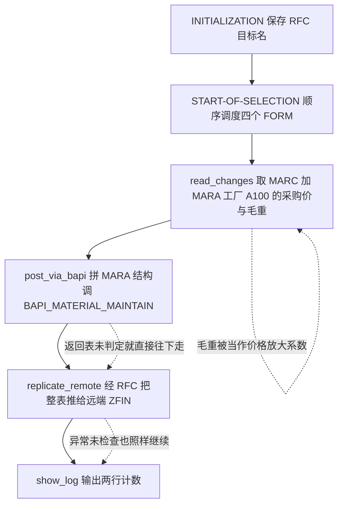
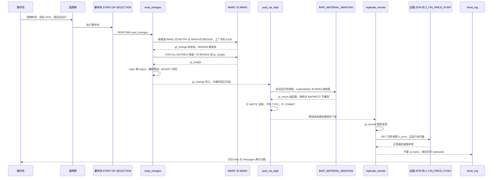

# ZREPORT_BAPI_UPLOAD 程序分析报告

> 分析对象：`evals/zreport_bapi_upload.abap`（REPORT，约 126 行）
> 关注重点：BAPI 调用正确性、RFC 复制正确性、价格计算是否算错
> 覆盖范围：4 个 FORM + 声明区 + 事件块，逐段三层拆解

---

## 一、程序定位与业务背景

### 1.1 这段程序想解决什么问题

从头部注释看，作者的意图很明确：

> Upload purchase price changes via BAPI, then replicate to a remote system over RFC.

也就是**采购价变更的批量落库 + 跨系统同步**。这类需求在真实项目里非常常见：主系统（ECC/S/4）里有人通过前台或批导改了物料的采购价，集团要求在一天之内把价格同步到财务或 MES 侧的 `ZFIN` 系统，用来开票、算料价、做成本核算。手工维护价格主数据不仅慢，而且两边对不上，财务月底结账时对差异头疼。所以这个程序承担的是"**批量的价格传输器**"角色。

### 1.2 现有做法为什么不够

价格同步常见的三种做法与本程序的关系：

| 做法 | 适用场景 | 本程序为什么没选（代码里其实也没选对） |
|---|---|---|
| 直接 `UPDATE` 表 | 一次性脚本、测试环境 | SAP 明确禁止绕过 BAPI 直接改带校验的主数据；这里用了 BAPI，方向是对的 |
| BAPI 维护主数据 | 结构化、带校验 | 用了 `BAPI_MATERIAL_MAINTAIN`，但**目标字段选错了**（详见 3.4） |
| ALE/IDoc 或中间件（PI/PO） | 需要状态跟踪、失败重传 | 本程序只有 `WRITE` 到内表，没有任何传输日志与重跑机制 |

### 1.3 整体设计范式（一句话定性）

**"报表 + 四段式 PERFORM 直线流程 + 内表全程传递数据"的经典 ABAP 报表范式**：无 OO、无 ALV、无错误处理中枢，是一个**只求跑通 happy path 的原型脚本**，而不是可以上生产的批量工具。

### 1.4 一句话结论（先给判断，省得读到最后才发现）

三条主线问题都很严重，而且互相叠加：

1. **价格算错了，而且是量纲级别的错**：`NETPR × BRGEW` 把"价格"和"毛重（千克）"相乘，结果既不是钱也不是重量，最后却被写进 `MARA-BRGEW`（毛重字段）——程序跑完，物料主数据的毛重被污染。
2. **BAPI 错误没有被处理**：返回表只被 `WRITE` 出来，随后仍然无条件打印 `uploaded`；并且返回表的自造结构与 BAPI 的 `BAPIRET2` 不兼容；全程没有 `COMMIT WORK` / `ROLLBACK`，数据库改动在程序结束时被隐式回滚。
3. **RFC 复制不看结果**：`EXCEPTIONS` 写得很漂亮，但从不检查 `sy-subrc`，失败也打印 `replicated to`；而且 **dry run 勾上以后，远端照样被真写**。

---

## 二、程序执行流程总览



### 责任链表

| 序 | 子程序 | 调用者 | 职责 |
|---|---|---|---|
| 1 | 全局声明区 / 选择屏 | 编译器 / 屏幕 | 声明 2 个结构、6 个全局内表与变量、3 个输入字段；`SELECT-OPTIONS` 借用了内表字段 |
| 2 | 事件块 `INITIALIZATION` | ABAP 运行时 | 把 `p_dest` 复制进 `gs_target-rfcdest`，作为后续 RFC 目标 |
| 3 | 事件块 `START-OF-SELECTION` | ABAP 运行时（F4 执行后） | 顺序 `PERFORM` 四个 FORM，是本程序唯一的调度中枢 |
| 4 | `FORM read_changes` | `START-OF-SELECTION` | 联表取 `MARC-MATNR/WERKS/NETPR/WAERS`，再查 `MARA-BRGEW`，并把 `netpr` 乘上毛重 |
| 5 | `FORM post_via_bapi` | `START-OF-SELECTION` | 构造 `MARA` 结构内表，非试运行时调 `BAPI_MATERIAL_MAINTAIN`，然后只 `WRITE` 返回消息 |
| 6 | `FORM replicate_remote` | `START-OF-SELECTION` | 整表赋值给 `gt_remote`，RFC 调远端 `Z_FIN_PRICE_PUSH`，异常声明了但不判断 |
| 7 | `FORM show_log` | `START-OF-SELECTION` | 打印 `gt_change` 行数与 `gt_return` 行数 |

下面按这条流程，逐个子程序展开。

---

## 三、分组分析（按程序流程 / 子程序）

### 3.1 全局声明区（含选择屏与 `INITIALIZATION`）

这一组分四步：结构定义、全局变量、选择屏、`INITIALIZATION`。这是全程序"地基"——后面三个 FORM 的所有正确性问题，一半的根都能在这里找到。

#### ① 两个自定义结构类型

```abap
TYPES: BEGIN OF ty_chg,
         matnr TYPE mara-matnr,
         werks TYPE marc-werks,
         netpr TYPE marc-netpr,
         waers TYPE marc-waers,
       END OF ty_chg.

TYPES: BEGIN OF ty_rmess,
         typeid   TYPE char1,
         msgid    TYPE msgid,
         msgno    TYPE msgnum,
         msgv1    TYPE char50,
         msgv2    TYPE char50,
       END OF ty_rmess.

TYPES ty_rmess_tab TYPE STANDARD TABLE OF ty_rmess WITH EMPTY KEY.
```

**做什么** — 定义两套传输结构：`ty_chg` 是"物料号 + 工厂 + 采购价 + 币种"的四元组，充当全程序唯一的数据载体（`gt_change` 装源数据，`gt_remote` 装推送数据）；`ty_rmess` 是"消息类别 + 消息 ID + 消息号 + 两个参数"的返回结构，配套 `ty_rmess_tab` 作为 BAPI 返回表容器。

**为什么** — 不用 DDIC 表而用本地类型，是报表程序传内表的常规做法：避免在 `T000` 段建临时表结构、随程序走、传输参数与表字段的绑定是"结构对应结构"而不是"单字段赋值"，代码短。`ty_chg` 直接引用 `MARC`/`MARA` 的数据元素（`mara-matnr`、`marc-netpr`），保证了类型与长度一致——这部分是**做对了的**。

**风险与改进** — `ty_rmess` 是**对 `BAPIRET2` 的手写重造，而且是不兼容的重造**。`BAPI_MATERIAL_MAINTAIN` 的 `RETURN` 参数正式类型是 `BAPIRET2` 表，其字段顺序为 `TYPE(1) / ID(20) / NUMBER(3) / MESSAGE(1) / LOG_NO(10) / MSGID(20) / NUMBER(3) / MSGV1..4(50) / PARAM(24)`。这里的前三个字段碰巧位置与长度都对得上（1/20/3），**从第 4 个字段起全部错位**（`MSGV1 CHAR50` 撞上 `MESSAGE CHAR1`），运行时要么抛转换错误，要么把消息内容读成乱码。另外 `BAPIRET2` 自带 4 个 `MSGV*` 和一个 `PARAM`，这里只有 2 个，错误信息的关键参数会丢。改进：直接用 `TYPES: ty_ret_tab TYPE STANDARD TABLE OF bapiret2 WITH EMPTY KEY.`，绝不自己造。

#### ② 全局内表与变量声明

```abap
DATA: gt_change  TYPE TABLE OF ty_chg,
      gt_return  TYPE ty_rmess_tab,
      gt_remote  TYPE TABLE OF ty_chg,
      gr_weight  TYPE TABLE OF p,
      gs_target  TYPE rfcdest.
```

**做什么** — 声明 4 个全程序共享内表（变更源、返回消息、待推送、毛重缓存）和 1 个结构（RFC 目标）。用 `DATA:` 链式声明把同类放在一起，是老式报表常见的排版习惯。

**为什么** — 全局内表的取舍很清楚：`gt_change` 必须全局，因为 `read_changes` 填、`post_via_bapi` 读、`replicate_remote` 推、`show_log` 计数，是典型的"一份数据贯穿全流程"。`gt_remote` 单独一份是为了给 RFC 一个与本地工作区分开的容器，这个思路本身合理（远端可能触发回包，避免自引用）。

**风险与改进** — **`gr_weight TYPE TABLE OF p` 这一行有严重问题**。`p` 是 1 字符 packed 基础类型，不是合法的行类型；历史上 `TABLES p` 表示"行布局类似 `PA` 内表的通用结构"，而现代 `TYPE TABLE OF ...` 后面跟的必须是行**类型**，不是行**布局**。也就是说这行要么在语法检查阶段就报错，要么被理解成"1 个字符的行类型"，那么后面 `SELECT matnr brgew ... INTO TABLE gr_weight` 会因为行里根本没有 `matnr`/`brgew` 字段而失败。改进：定义具名结构（`TYPES BEGIN OF ty_w ... matnr TYPE mara-matnr, brgew TYPE mara-brgew ... END OF ty_w. TYPES ty_w_tab TYPE STANDARD TABLE OF ty_w.`），或者干脆 `gr_weight TYPE STANDARD TABLE OF mara WITH KEY matnr`。另外 `gr_weight` 应该声明 `WITH KEY` 或 `SORTED`，否则每次 `READ TABLE` 都是线性搜索。

#### ③ 选择屏

```abap
SELECTION-SCREEN BEGIN OF BLOCK b.
  SELECT-OPTIONS s_matnr FOR gt_change-matnr.
  PARAMETERS p_dest TYPE rfcdest DEFAULT 'ZFIN'.
  PARAMETERS p_dryrun AS CHECKBOX.
SELECTION-SCREEN END OF BLOCK b.
```

**做什么** — 三个输入：物料号区间（`s_matnr`）、RFC 目标（`p_dest`，默认 `ZFIN`）、试运行开关（`p_dryrun`）。用 `BLOCK` 分组提升可读性，是好习惯。

**为什么** — `p_dest TYPE rfcdest` 这个类型选得对：数据元素 `RFCDEST` 自带值帮助（F4 → 维护的 RFC 目标列表），比 `TYPE c LENGTH 15` 强太多，值得肯定。`AS CHECKBOX` 而不是单选按钮，语义也正确（试运行是开关不是模式）。

**风险与改进** — 两个问题。第一，**`SELECT-OPTIONS ... FOR gt_change-matnr` 拿内表字段当选择屏的数据对象**，这个写法本身就是坏味道：选择屏的 range 表在屏幕初始化时就被写入 `gt_change` 的第一个组件，等于把"数据载体"和"输入参数"耦在一起，一旦程序重入或 `gt_change` 已有内容就会互相踩；正确做法是独立声明 `DATA: s_matnr TYPE mara-matnr.`，`gt_change-matnr` 用 `LIKE` 关联即可。第二，**没有 `OBLIGATORY`、没有 `AT SELECTION-SCREEN` 校验**：`s_matnr` 留空等于全表扫描 `MARC`（千万级行），见 3.3 ① 的性能问题；`p_dest` 也没有校验目标是否存在/是否可连通。改进：加 `AT SELECTION-SCREEN ON VALUE-REQUEST FOR p_dest` 或在 `START-OF-SELECTION` 里用 `rfcdest` 表校验。

#### ④ 事件块 `INITIALIZATION`

```abap
INITIALIZATION.
  gs_target-rfcdest = p_dest.
```

**做什么** — 在初始化阶段把输入参数 `p_dest`（15 字符）赋给结构字段 `gs_target-rfcdest`（同为 `rfcdest`），得到 RFC 调用所需的 `DESTINATION` 参数。

**为什么** — `CALL FUNCTION ... DESTINATION` 要求传的是目标名（`char` 语义），ABAP 惯例是包一层 `rfcdest` 结构（`RfcDestination`）以获得类型检查和 F4 帮助。这样 RFC 目标在程序内是"一个结构"而不是"一个字符串"，后续要加 `rfcoptions`、连接参数时有扩展位。时机选在 `INITIALIZATION`（选择屏处理完成、执行之前）也是正确的。

**风险与改进** — `gs_target` 是**多此一举**：整个程序只用它的 `rfcdest` 一个字段，直接 `DESTINATION p_dest` 即可。保留结构体的真正价值在于同时维护 `RfcConnectOptions` / 通信模式，而这里没有。更实际的改进是加一句校验：读取 `rfcdest` 目录（函数 `RFCDEST_RFC_FAILURE_LOG` 不可用，实践中用 `TSTC`/`TRIC` 查配置或 `CALL FUNCTION 'RFCDEST_MAINTAIN'` 的查询接口），或先用 `ALRFCDEST` 类的静态方法做 `is_destination_usable` 检查。另外本段完全没有 `MESSAGE` 输出，目标填错只能等 RFC 失败。

### 3.2 事件块 `START-OF-SELECTION`

#### ① 四个 `PERFORM` 的直线调度

```abap
START-OF-SELECTION.

  PERFORM read_changes.
  PERFORM post_via_bapi.
  PERFORM replicate_remote.
  PERFORM show_log.
```

**做什么** — 作为唯一调度入口，顺序驱动 4 个 FORM：取数 → BAPI 落库 → RFC 推送 → 输出日志。

**为什么** — 报表程序的标准入口模式（`INITIALIZATION` 初始化 → `START-OF-SELECTION` 主逻辑 → `LIST` 列表输出）。选 `START-OF-SELECTION` 而非 `AT SELECTION-SCREEN`，是为了让 F4 后重跑也能重新取数，逻辑上是自洽的。

**风险与改进** — **四步是无条件串行的，没有一个"熔断点"**，这是全程序最结构性的缺陷：

- 取数结果为空（0 行）时，照样会调 BAPI、照样会 RFC 推一张空表、照样打印 `total 0`；
- 任何一步失败也没有 `MESSAGE ... EXIT` 或 `RETURN`，失败状态不会阻止后续步骤继续破坏数据；
- 全程没有 `MESSAGE-ID` 参数（`AT SELECTION-SCREEN` 才需要），失败也只是一屏 `WRITE`。

改进：每个 FORM 返回 `SUBRC`，在这里判断；`gt_change` 为空就 `MESSAGE '没有符合条件的数据' TYPE 'S'` 后直接 `LEAVE LIST-PROCESSING`；BAPI 有 E/A 级消息时必须跳过 RFC 推送。

### 3.3 子程序类型 `FORM read_changes`

这是全程序的"数据层"，分三步：联表取数 → 二次查毛重 → 价格乘毛重并回写。**用户问的"价格计算有没有算错"，答案就在第 ③ 步。**

#### ① 联表取数（`MARC` INNER JOIN `MARA`，工厂硬编码）

```abap
FORM read_changes.

  SELECT marc~matnr marc~werks marc~netpr marc~waers mara~brgew
    FROM marc INNER JOIN mara ON mara~matnr = marc~matnr
    INTO TABLE gt_change
    WHERE marc~matnr IN s_matnr
      AND marc~werks  = 'A100'.

```

**做什么** — 从 `MARC`（物料工厂级数据）内连接 `MARA`（物料基础数据），取 `MATNR / WERKS / NETPR / WAERS` 四个字段装进 `gt_change`；筛选条件是物料号在选择屏区间内**且工厂等于字面量 `'A100'`**。注意 `SELECT` 列表里还有第五个字段 `mara~brgew`，而目标结构 `ty_chg` 只有 4 个组件。

**为什么** — `MARC-NETPR` 是"当前采购价"，`MARC-WAERS` 是币种，这两个必须一起取，方向是对的。`INNER JOIN` 而不是先查 `MARC` 再 `FOR ALL ENTRIES` 查 `MARA`，在这个场景下更省一趟往返。但既然后面还要再查一次 `MARA`（第 ② 步），这个 JOIN 就变成了**纯粹多余**。

**风险与改进** — 三个问题：

- **取的第 5 个字段 `mara~brgew` 被静默丢弃**（`ty_chg` 里没有 `brgew` 组件），取它毫无意义，反而让人误以为"毛重已经一起查出来了"。要么在 `ty_chg` 里加 `brgew`，要么别查。
- **工厂 `'A100'` 硬编码**。这是最典型的"脚本级"写法：换工厂必须改代码，跨工厂场景直接漏数。改进：加 `PARAMETERS p_werks TYPE marc-werks` 或 `SELECT-OPTIONS s_werks FOR lt_werks`。
- **`s_matnr` 为空 = 全表 JOIN 扫描**。`IN` 空区间等价于不加条件，`MARC` 有千万级行；虽然 `werks = 'A100'` 帮忙过滤，但 `MARC` 的主索引是 `MATNR`，`WERKS` 大概率不是索引前缀，代价仍然很高。改进：选择屏设为必填，或在 `START-OF-SELECTION` 开头拦截空区间。

#### ② 用 `FOR ALL ENTRIES` 二次查询毛重

```abap
  SELECT matnr brgew FROM mara
    INTO TABLE gr_weight
    FOR ALL ENTRIES IN gt_change
    WHERE matnr = gt_change-matnr.

```

**做什么** — 用 `FOR ALL ENTRIES IN gt_change` 驱动，对每个物料号从 `MARA` 取出 `matnr` 与 `brgew`，装进 `gr_weight` 缓存表。

**为什么** — `FAE` 的语义是"外层结果在空表时外层不执行、否则以内表全字段做等值匹配"，在这里的动机大概是"先有物料号集合，再按 `MATNR` 命中 `MARA` 索引取毛重"。从性能角度它比第 ① 步那种"大 JOIN 再丢掉字段"更省，但**前提是第 ① 步没有取过这个字段**——而它取过了，所以这里是纯粹的重复 IO。

**风险与改进** —

- **与第 ① 步完全重复**：同一批物料的同一列 `BRGEW` 在两行 SQL 里各查一次，`MARA` 被访问两遍。改进：既然 JOIN 已经带出 `brgew`，就在 `ty_chg` 里加 `brgew TYPE mara-brgew`，删掉这个 FORM 步骤。
- **`FAE` 造成重复行**：`gt_change` 是按 `MARC` 行的，若同一物料在 `A100` 工厂有多行（或后续放开工厂条件变成多工厂多行），`gt_change` 会有重复 `matnr`，`FAE` 的内表含重复值会让外层结果**成倍膨胀**。当前靠 `MARC` 每物料每工厂一行的约束侥幸无害，一旦放开工厂条件就会炸。改进：`FAE` 前先 `DELETE ADJACENT DUPLICATES` 或改用 `SELECT DISTINCT`。
- **没有 `sy-subrc` 保护**：`gt_change` 为空时 `FAE` 外层不执行（不 dump），但也没有任何提示，后面第 ③ 步的循环自然空转，用户会以为"跑成功但 0 条"。

#### ③ 价格乘毛重并回写内表（量纲错误发生地）

```abap
  LOOP AT gt_change INTO DATA(ls_chg).
    READ TABLE gr_weight INTO DATA(ls_w) WITH KEY matnr = ls_chg-matnr.
    ls_chg-netpr = ls_chg-netpr * ls_w-brgew.
    MODIFY gt_change FROM ls_chg.
  ENDLOOP.

ENDFORM.                       "read_changes
```

**做什么** — 逐行遍历 `gt_change`，按 `matnr` 从 `gr_weight` 读出该物料的毛重 `brgew`，然后执行 `netpr = netpr * brgew`，再把整行 `MODIFY` 回 `gt_change`。

**为什么** — 从纯语法看这是一次"用附加因子放大单价"的运算，作者大概想表达"单价 × 毛重 = 该物料的总价"或"把单位价格换算成重量价"。**但这个意图本身在数据语义上不成立**，详见下面的数据元素校核。

**风险与改进** — 这是全程序**最严重**的逻辑缺陷，必须从数据元素语义角度校核（不能因为"字段长度/类型都是数值"就放过）：

| 数据元素 | 业务含义 | 单位 / 量纲 | 备注 |
|---|---|---|---|
| `MARC-NETPR` | 采购价格 | **货币/价格单位**（如 元/千克、元/箱、元/1000 件），依赖 `MARC-UMREN` 价格单位与 `MARC-EINH` 计价单位 | 是"每 N 个计价单位的金额"，不是绝对金额 |
| `MARA-BRGEW` | **毛重** | 基本计量单位 KG（千克） | 是物理重量，与价格毫无关系 |

- **量纲错误**：`价格(元/单位) × 毛重(kg)` 得到的量纲是 `元·kg/单位`，既不是金额（缺 `MARC-UMREN` 的换算）也不是重量（多了货币因子）。正确算法要看业务意图：若要"总金额"，应按 `NETPR / UMREN × MENGE`（数量）；若要"重量价"，应按 `NETPR / NTGEW`（净重）或 `NETPR / BRGEW`（毛重）；若要"毛重对应的钱"，也应先做单位换算。**这段代码无论哪种意图都是错的。**
- **`READ TABLE` 不查 `sy-subrc`，且内联变量不重置**：`DATA(ls_w)` 声明在循环体内部，但它**只声明一次，跨迭代保留上一次的值**。如果某个 `matnr` 在 `gr_weight` 里读不到（理论上 `MARC INNER JOIN MARA` 保证了存在，但一旦第 ① 步改成 `LEFT JOIN`、或 `FAE` 因重复行导致偏移、或未来拆成增量逻辑），`ls_w` 会**沿用上一个物料的毛重**并静默算出一个错误的"价格"。改进：`READ TABLE ... INTO DATA(ls_w) WITH KEY matnr = ls_chg-matnr.` 之后立刻 `IF sy-subrc <> 0. MESSAGE ... TYPE 'E' EXITTING. ENDIF.`，或者在 `READ` 之前 `CLEAR ls_w.`
- **`MODIFY ... FROM ls_chg` 整行回写**：因为 `ls_chg` 是整行拷贝，功能上可行，但语义脆弱——`MODIFY itab FROM wa` 对字符型分量的初值不覆盖，一旦将来只 `ls_chg-netpr = ...` 而不整行赋值，其他字段可能残留旧值。改进：直接 `MODIFY gt_change ASSIGNING ... ` 或干脆 `gt_change[ ... ]-netpr = ...` / 用 `LOOP AT gt_change INTO DATA(ls_x). ... ENDLOOP.` 就地改写，省一次回写。
- **没有舍入、没有币种处理**：`NETPR` 是 `CURR15(3)`（3 位小数），乘完不做 `ROUND( ... 3 )` 也不回写币种；`WAERS` 取了却从未使用，多币种物料混算后无法追溯。改进：`ROUND( ... )`，并在第 ③ 步之前就按 `WAERS` 分组或至少把币种一起推到远端。
- **没有变更检测**：价格源就是 `MARC` 自己，程序没有任何"哪些物料真的变了"的判定（对比字段、时间戳、上次成功日志），每次执行都是**全量重推全量重写**。这是设计缺陷而非语法缺陷，见第五章 P1。

### 3.4 子程序类型 `FORM post_via_bapi`

用户重点关注的 **BAPI 调用**段，分三步：装配 `MARA` 结构 → 试运行判断与调用 → 消息处理。**BAPI 的正确性问题集中在第 ① 步的字段语义和第 ③ 步的返回表处理。**

#### ① 把"价格"装配进"毛重"字段

```abap
FORM post_via_bapi.

  DATA lt_mara TYPE TABLE OF mara.
  DATA ls_mara TYPE mara.

  LOOP AT gt_change INTO DATA(ls_chg).

    CLEAR ls_mara.
    ls_mara-matnr = ls_chg-matnr.
    ls_mara-brgew = ls_chg-netpr.
    APPEND ls_mara TO lt_mara.

  ENDLOOP.

```

**做什么** — 声明 `mara` 结构的内表 `lt_mara` 与工作区 `ls_mara`，逐条把 `gt_change` 的物料号写进 `matnr`，把（已经被毛重污染过的）`netpr` 写进 `brgew`，`APPEND` 成待维护清单。

**为什么** — `lt_mara TYPE TABLE OF mara` 这个声明是**正确的**：`BAPI_MATERIAL_MAINTAIN` 的 `MATERIALDATA` 参数正式类型就是 `MARA` 结构表，程序用全量 `mara` 结构（而非裁剪结构）传入，符合 BAPI 接口定义。每行先 `CLEAR ls_mara` 也是标准做法，防止上一行的残留值被 BAPI 写进数据库——这一点做对了。

**风险与改进** — **字段张冠李戴，`MARA-BRGEW` 是毛重（千克），不是价格**。`BAPI_MATERIAL_MAINTAIN` 的语义是"把传入结构中**非初始**的字段写进物料主数据"，也就是说这一行的效果是：**用错误计算出来的"价格"去覆盖物料的毛重**。这不是把价格同步错了，而是**破坏现有的物料主数据**（毛重会变成一个几十万的数值，影响库存、运费、重量单位换算、标签打印等下游）。再叠加一层现实约束：在 S/4HANA 上 `MARA-BRGEW` 属受限/可推导字段，直接写往往无效或被拒绝——所以这套代码在两边系统都做不成"价格传输"。改进：采购价属于**条件技术**（`MARC-NETPR` 由采购条件/信息记录派生），根本不是 `MARA` 基础数据字段；正确路径是维护条件记录（BAPI `BAPI_CREATEPRICECONDITIONS`）或直接调用对应的价格维护 FM/BAPI，把"物料+工厂+价格+币种+有效期"传过去，`MARA` 一个字段都不该动。

#### ② 非试运行时调用 BAPI（且无提交）

```abap
  IF p_dryrun IS INITIAL.
    CALL FUNCTION 'BAPI_MATERIAL_MAINTAIN'
      TABLES
        materialdata  = lt_mara
        return        = gt_return.
  ENDIF.

```

**做什么** — 用 `IF p_dryrun IS INITIAL` 包住 `BAPI_MATERIAL_MAINTAIN` 调用，把 `lt_mara` 作为 `materialdata` 传进物料数据表、`gt_return` 作为 `return` 接收错误消息表；勾选试运行则完全跳过调用。

**为什么** — "试运行开关"这个概念本身是对的，实现方式（用 `IS INITIAL` 判断 checkbox）也标准。`TABLES` 关键字调用老式 BFM、参数名带表名（`materialdata` / `return`），是 `BAPI_MATERIAL_MAINTAIN` 的标准用法。

**风险与改进** — **这一步有两处必须处理却完全没处理的问题：**

1. **没有 `COMMIT WORK` / `ROLLBACK`**。BAPI 的数据库修改进入**调用者 LUW（逻辑工作单元）**，它的生命周期是：从上一次 `COMMIT WORK` 开始，到显式 `COMMIT WORK` 结束，或在程序结束时被**隐式回滚**。本程序从头到尾没有 `COMMIT WORK`、没有 `BAPI_TRANSACTION_COMMIT`、也没有 `ROLLBACK WORK`，所以：**程序末尾 SAP 会把这批 BAPI 修改全部回滚，一行都不会落库**。也就是说"上传"这个动作在物理上根本没发生，但屏幕却打印了 `uploaded` 和行数——这是比"算错"更严重的**"报了假成功"**。
   - 正确写法：调用 BAPI → 检查返回表里有没有 `TYPE = 'E'` 或 `'A'` → 有则 `BAPI_TRANSACTION_ROLLBACK`（或 `ROLLBACK WORK`）并 `MESSAGE` 报错终止；无则 `BAPI_TRANSACTION_COMMIT`（或 `COMMIT WORK`）真正落库。
   - 反向风险也要讲清楚：**绝不能"先提交、后判错"**。如果将来有人图省事在 BAPI 后立刻加 `COMMIT WORK`，而错误表还没判定，就会把半成品数据固化到库——正确顺序永远是"先判错，再提交"。这正是本程序目前最危险的地方：`show_log` 是在最后才打印消息的，语义上就把"日志"当成了"判定"。
2. **`gt_return` 声明类型与 BAPI 接口不兼容**。`CALL FUNCTION ... TABLES` 的实参不做字段名映射，而是按**位置逐字段**转换到形参的行类型。`gt_return` 的行类型是自造的 `ty_rmess`（1/20/3/50/50），而形参是 `BAPIRET2`（1/20/3/**1**/**10**/20/3/50/50/50/50/24），从第 4 个字段起长度全部对不上（`CHAR50` → `CHAR1`），运行时不是抛转换错误就是把消息内容整体错位。改进：用 `TYPES ty_ret_tab TYPE STANDARD TABLE OF bapiret2 WITH EMPTY KEY.` 并把 `gt_return` 改成这个类型。
3. 补充：BAPI 调用前**没有检查 `gt_return` 是否需要清空**（本次是第一次赋值所以安全，但若 `post_via_bapi` 被复用/重入就会累积）；也没有 `STSCA` 权限检查与 `BAPI_GET_ERROR` 风格的消息翻译，屏幕上看不到可读的业务错误。

#### ③ 遍历返回表：只 `WRITE`，然后无条件报成功

```abap
  LOOP AT gt_return INTO DATA(ls_ret).
    WRITE: / ls_ret-typeid, ls_ret-msgid, ls_ret-msgno, ls_ret-msgv1.
  ENDLOOP.

  LOOP AT gt_change INTO DATA(ls_chg2).
    WRITE: / 'uploaded', ls_chg2-matnr.
  ENDLOOP.

ENDFORM.                       "post_via_bapi
```

**做什么** — 第一个循环把返回表里的 `typeid / msgid / msgno / msgv1` 四个字段 `WRITE` 出来；第二个循环**无条件**给 `gt_change` 里的每一条打印 `uploaded <物料号>`。

**为什么** — 作者显然知道要"看返回消息"，所以写了第一个循环。但只 `WRITE` 不判断，等于**把错误当成普通日志**——这是报表程序里最常见的一类"看起来处理了、其实没处理"。第二个循环的意图应该是"成功后打印确认清单"，但代码里没有任何成功标志把它和前一个循环的结果关联起来。

**风险与改进** — **BAPI 返回的错误必须被真正处理，而不是只 `WRITE` 出来**。具体缺了四件事：

- **没有按 `TYPE` 分级**：`BAPIRET2-TYPE` 的 `E`（错误）、`A`（终止，字段级锁定失败）、`W`（警告）、`I`（信息）、`S`（成功）各有不同处理。至少要 `LOOP AT gt_return WHERE type = 'E' OR type = 'A'` 收集失败物料，并 `MESSAGE ... TYPE 'E'` 或 `ROLLBACK` 后终止。
- **没有把消息翻译成可读文本**：`msgid + msgno` 是裸的，屏幕上只有 `002 / 00000023` 这种数字，业务人员根本看不懂。应按消息类读 `T100`，或用 `MESSAGE ID ... NUMBER ... WITH ...` 输出最终文本。
- **无法把错误归位到具体物料**：`ty_rmess` 里没有 `matnr` 字段（`BAPIRET2` 也没有，物料号在 `MSGV1` 里），代码没有解析 `msgv1` 去匹配 `gt_change`，所以用户看到一个错误，却不知道是哪个物料失败。用 `BAPIRET2` 时可按 `msgv1` 解析，或用 `BAPI_MATERIAL_MAINTAIN` 逐条调用以获得天然对应关系。
- **无条件打印 `uploaded` 是"假成功"的根源**：第 ② 步说了，没有 `COMMIT`、错误没判定、试运行时 BAPI 根本没被调用——但这个循环照样在试运行、照样在没有任何物料成功的情况下打印全部 `uploaded`。改进：引入 `DATA lv_error TYPE i VALUE 0.` 之类，成功计数只在对应物料无 E/A 时 +1；试运行时应打印的是"**计划**"清单（`would update <matnr>: brgew = ...`）而不是"已完成"。

### 3.5 子程序类型 `FORM replicate_remote`

用户重点关注的 **RFC 复制**段，分三步：整表复制 → RFC 调用与异常声明 → 无条件打印。**这里的问题和 BAPI 段性质相同但后果更严重：试运行也会真写远端。**

#### ① 整表复制为待推送表

```abap
FORM replicate_remote.

  DATA lv_ok TYPE c.

  gt_remote = gt_change.

```

**做什么** — 声明一个 `c` 类型的局部变量 `lv_ok`（声明后**从未被赋值也从未被使用**），把 `gt_change` 整体复制到 `gt_remote`。

**为什么** — 用独立内表作为 RFC 载荷，可以避免"同一个内表既作源又作目的地"的语义混乱，也方便以后在推送前做过滤、加密、字段改名。整表赋值是复制（`=` 对内表是深拷贝），不会互相污染，这一点是对的。

**风险与改进** —

- **`gt_remote` 是 `ty_chg`，也就是把已经被毛重污染的 `netpr` 原样推给远端**。远端 `ZFIN` 拿到的"价格"带着错误的量纲，**污染就从本系统扩散到集团财务系统**了。数据正确性问题在 3.3 ③ 已经产生，这里是二次伤害。
- **`lv_ok` 是死变量**：说明作者原本打算用"成功标志"来做判断，但最后没写。改进：要么用它（`IF lv_ok = 'X'` 才打印成功），要么删掉。**死变量是"意图与实现脱节"最直接的可读性信号**，review 时应当立刻回头查这一段的错误处理。
- 没有在推送前做任何过滤/校验（比如价格 ≤ 0 的行、单位异常的行）。

#### ② RFC 调用与异常声明

```abap
  CALL FUNCTION 'Z_FIN_PRICE_PUSH'
    DESTINATION gs_target
    TABLES
      it_price = gt_remote
    EXCEPTIONS
      system_failure = 1
      destination_unavailable = 2
      OTHERS = 3.

```

**做什么** — 以 `gs_target`（即 `ZFIN`）为目标系统，同步 RFC 调用远端函数 `Z_FIN_PRICE_PUSH`，把 `gt_remote` 通过 `TABLES it_price` 传过去；声明了三个异常分支（`system_failure` = 1、`destination_unavailable` = 2、`OTHERS` = 3）。

**为什么** — 用 `TABLES` 传内表是 RFC 传结构化数据的标准方式，异常列表也写了，说明作者知道 RFC 可能失败。**但是**："声明了异常"和"处理了异常"是两件事。

**风险与改进** — 四处硬伤：

1. **从不检查 `sy-subrc`，异常形同虚设**。`EXCEPTIONS` 里填了 1/2/3 之后必须 `IF sy-subrc <> 0. ... ENDIF.`，本程序**完全没有**。结果就是第 ③ 步无条件打印 `replicated to`——**RFC 失败、目标系统不可达、远端业务异常，用户看到的都是"已复制"**。改进：`CASE sy-subrc. WHEN 1. ... WHEN 2. ... WHEN OTHERS. ... ENDCASE.`，配合 `MESSAGE ID sy-msgid TYPE sy-msgtype NUMBER sy-msgno WITH sy-msgv1 sy-msgv2 sy-msgv3 sy-msgv4` 输出可读原因。
2. **`dry run` 完全没有保护到这一段**。`IF p_dryrun IS INITIAL` 只包住了第 3.4 ② 的 BAPI 调用，**RFC 这一段是裸露的**：勾上"试运行"，本系统不写库，但**远端 `ZFIN` 照样被真实写入**。这是最危险的一条——试运行的语义就是"只看不写"，而这里恰恰在最需要保护的地方失守。改进：把整个 `post_via_bapi` + `replicate_remote` 都放进 `IF p_dryrun IS INITIAL ... ELSE (只打印计划) ... ENDIF.`，或者干脆在 `START-OF-SELECTION` 入口用 `IF p_dryrun = 'X' AND NOT is_dry_run_confirmed( ). RETURN. ENDIF.`
3. **异常名 `destination_unavailable` 需要核对**。RFC 调用（`CALL FUNCTION ... DESTINATION`）的标准预定义异常是 `SYSTEM_FAILURE` 和 `COMM_ERROR`（通信层/目标系统不可达）；`DESTINATION_UNAVAILABLE` 并不是这个语句的预定义异常，除非**远端函数自己 `RAISE`** 了同名异常，否则在语法检查阶段就可能被判为未知异常。改进：先在 `SE37` 打开远端 `Z_FIN_PRICE_PUSH` 看它 `EXCEPTIONS` 段真实声明了什么，再照抄；至少要补上 `COMM_ERROR`。
4. **接口结构未核对 + 没有事务语义**：RFC 按**远端 FM 声明的** `it_price` 行类型做结构转换，本地传的是 `ty_chg`（4 字段的匿名结构）。如果远端 FM 的 `it_price` 是它自己的 Z 结构（字段名/顺序/个数不同），要么转换失败，要么字段错位成别的含义。必须两件事：① 在远端 FM 里给 `it_price` 显式声明一个与本地**共用**的 DDIC 结构（最好建 `ZD_PRICE_LINE` 之类的持久化结构，Z 端直接引用，避免两边各造一份）；② 明确事务语义——同步 RFC 中，远端 LUW 只有在调用方 `COMMIT WORK` 时才一并提交，否则远端会回滚。当前程序既不提交远端也不提交本地，**两边都白做**。

#### ③ 无条件打印复制结果

```abap
  WRITE: / 'replicated to', p_dest.

ENDFORM.                       "replicate_remote
```

**做什么** — 打印一行 `replicated to <目标系统>`，然后结束该 FORM。

**为什么** — 这是典型"我调用了，所以成功了"的写法，唯一的目的是让操作者感觉程序跑完了。

**风险与改进** — **这是"假成功"的第二处。** 它与 3.4 ③ 的 `uploaded` 构成一个完整的错觉链：`BAPI 写了 → 打印 uploaded → RFC 推了 → 打印 replicated → 打印 total 行数`，操作者看到的是一个完整成功的运行记录，实际上：数据算错、写错字段、错误未判定、两端都未提交、dry run 还会真写远端。改进：把这行改成条件打印（`sy-subrc = 0` 且 `gt_return` 无 E/A 才打印），并补上"失败物料数 / 成功物料数 / 提交状态（COMMITTED / ROLLED BACK / NOT COMMITTED）"三行真实状态。

### 3.6 子程序类型 `FORM show_log`

#### ① 统计两行计数

```abap
FORM show_log.

  WRITE: / 'total', lines( gt_change ).
  WRITE: / 'messages', lines( gt_return ).

ENDFORM.                       "show_log
```

**做什么** — 打印 `gt_change` 的行数（标为 `total`）和 `gt_return` 的行数（标为 `messages`）。

**为什么** — 用内置函数 `lines( )` 取内表行数是最省事的做法，不需要先 `DESCRIBE TABLE`。放在最后作为"运行摘要"的形式意图是对的。

**风险与改进** — 作为"日志"它提供的信息量接近于零，而且有误导性：

- **`total` 不区分成功与失败**：`gt_change` 有 100 行不代表 100 条被成功写入（可能全部 `E` 级错误、或试运行、或最终全部回滚）。
- **`messages` 只报数量不报级别**：5 条消息里 4 条 `S`、1 条 `E`，和 5 条全是 `E`，屏幕上长得一模一样。而 3.4 ③ 已经把消息内容 `WRITE` 在前面了，这里又没有与之关联。
- **`gt_remote` 的行数完全没统计**，RFC 实际推了多少条无从得知。
- **没有目标系统、试运行状态、提交状态**这三个运维必需信息。
- 全部输出用 `WRITE` 到列表，无法后台运行、无法 `LIST` 事件块接管、无法导出 ALV。改进：换成 ALV（`REUSE_ALV_GRID_DISPLAY`）或写传输日志表（`ZPRICE_PUSH_LOG`：物料、工厂、旧价、新价、消息、目标、时间戳、操作人），把"是否成功"变成可查询的事实。

---

## 四、执行流程全景图（数据视角）



从这张图能一眼看出的两条数据线：**`netpr` 字段被"价格"这一含义贯穿始终但中途换了量纲**（`NETPR × BRGEW` 后不再是价格），以及**错误状态从未在数据流上被表达**（没有标志位、没有 `SUBRC`、没有失败清单），所以下游的 RFC 和 `show_log` 只可能看到"成功"。

---

## 五、问题清单与改进建议（按优先级）

### 🔴 P0 业务正确性（必须改，否则会损坏主数据）

| # | 所在子程序 | 问题 | 改进 |
|---|---|---|---|
| P0-1 | `FORM read_changes` | `netpr = netpr * brgew` 是**量纲错误**：价格（货币/价格单位）乘毛重（千克），产物不是金额也不是重量。`WAERS` 取了不用，多币种混算；无舍入 | 先明确业务意图：总金额用 `NETPR / UMREN × MENGE`，重量价用 `NETPR / NTGEW`（或 `BRGEW`）；结果 `ROUND( ... 3 )`，币种随行传递 |
| P0-2 | `FORM post_via_bapi` | 把（已污染的）`netpr` 写进 `MARA-BRGEW`（毛重，kg），**直接覆盖物料主数据**；S/4HANA 上该字段又属受限字段，写了也不成功 | 采购价走条件技术（`BAPI_CREATEPRICECONDITIONS` 或价格维护 FM），传"物料+工厂+价格+币种+有效期"；`MARA` 不动 |
| P0-3 | `FORM post_via_bapi` | `gt_return` 用自造 `ty_rmess` 承接 `BAPIRET2`，第 4 个字段起长度全不匹配（`CHAR50` 撞 `CHAR1`），运行时转换错误或消息错位 | 改用 `TYPES ty_ret_tab TYPE STANDARD TABLE OF bapiret2 WITH EMPTY KEY.` |
| P0-4 | `FORM post_via_bapi` | **BAPI 错误只被 `WRITE` 出来**，未按 `TYPE` 判定 `E`/`A`/`W`，未翻译成可读文本，未归位到具体物料 | `LOOP ... WHERE type = 'E' OR type = 'A'` 收集失败清单 + `MESSAGE ... TYPE 'E'` 终止；用 `MESSAGE ID msgid NUMBER msgno WITH msgv1..4` 还原文本 |
| P0-5 | `FORM post_via_bapi` | **全程无 `COMMIT WORK` / `ROLLBACK WORK` / `BAPI_TRANSACTION_COMMIT`**：BAPI 修改进入调用者 LUW，程序结束被隐式回滚，数据一行都没落库，但屏幕已报"成功" | 顺序固定为"调用 → 判错 → 无 E/A 才 `BAPI_TRANSACTION_COMMIT`；有 E/A 则 `BAPI_TRANSACTION_ROLLBACK` 并终止"。**绝不能先提交后判错** |
| P0-6 | `FORM post_via_bapi` | 无条件打印 `uploaded`（试运行、全部失败、最终回滚的情况下都照打），**假成功** | 引入成功计数与失败清单；试运行只打印"计划更新"清单 |
| P0-7 | `FORM replicate_remote` | **`dry run` 未覆盖本段**：勾上试运行，远端 `ZFIN` 仍被真实写入 | 把 BAPI 与 RFC 都纳入 `IF p_dryrun IS INITIAL` 的保护范围，`ELSE` 分支只输出计划 |
| P0-8 | `FORM replicate_remote` | 声明 `EXCEPTIONS` 后**从不检查 `sy-subrc`**，无条件打印 `replicated to` | `CASE sy-subrc. WHEN 1/2/OTHERS.` 分别 `MESSAGE ... TYPE 'E'` 并明确"未推送" |
| P0-9 | `FORM read_changes` | `gr_weight TYPE TABLE OF p` 不是合法的行类型声明（`p` 是 1 字符 packed 基础类型），`SELECT matnr brgew ... INTO TABLE` 无法落到这样的行上 | 显式定义 `ty_w`/`ty_w_tab`，或 `TYPE STANDARD TABLE OF mara WITH KEY matnr` |
| P0-10 | `FORM replicate_remote` | 污染数据被原样推到远端财务系统，错误跨系统扩散 | 修复 P0-1 后才允许推送；并在推送前加数值/量纲合理性校验（`netpr > 0`、量级阈值） |

### 🟠 P1 健壮性（正确性之外的"会出事"）

| # | 所在子程序 | 问题 | 改进 |
|---|---|---|---|
| P1-1 | `FORM read_changes` | `READ TABLE` 不判 `sy-subrc`，且内联 `DATA(ls_w)` 跨迭代不重置，读取失败会**沿用上一个物料的毛重** | `READ` 后立刻判 `sy-subrc`，失败 `MESSAGE ... EXITING`；或 `READ` 前 `CLEAR ls_w.` |
| P1-2 | `FORM read_changes` | `MARA` 被访问两遍（JOIN 带了 `brgew` 又 `FAE` 查一次），且 JOIN 取的第 5 字段被静默丢弃 | `ty_chg` 加 `brgew`，删除第二个 SELECT |
| P1-3 | `FORM read_changes` | 工厂硬编码 `'A100'`；`s_matnr` 非必填 → 空区间等于全表 JOIN 扫描 `MARC` | 加 `s_werks` 选择屏；`s_matnr` 设必填或在 `START-OF-SELECTION` 拦截空区间 |
| P1-4 | `FORM read_changes` | `FOR ALL ENTRIES` 会随内表重复值放大结果集，一旦放开多工厂条件即失效 | 内表先去重（`DELETE ADJACENT DUPLICATES` / `SELECT DISTINCT`） |
| P1-5 | `FORM read_changes` | 价格源即 `MARC` 自身，**无变更检测**（无对比基准、无时间戳、无上次成功日志），每次全量重写重推 | 增加输入基准（文件 / 变更表 / 条件记录有效期），只处理真实变更 |
| P1-6 | `FORM replicate_remote` | 异常名 `destination_unavailable` 需与远端 FM 的 `EXCEPTIONS` 段核对，标准预定义异常是 `SYSTEM_FAILURE` / `COMM_ERROR` | 先看 `SE37` 里 `Z_FIN_PRICE_PUSH` 的真实声明，再照抄并补 `COMM_ERROR` |
| P1-7 | `FORM replicate_remote` | 本地 `ty_chg` 与远端 `it_price` 行类型未共用 DDIC 结构，RFC 按远端声明转换，字段可能错位 | 建持久化 Z 结构（如 `ZD_PRICE_LINE`）两端共用 |
| P1-8 | `FORM replicate_remote` | 未做目标可用性预检（`RFCDEST` 是否存在、连接是否可用），把可预见的失败留到运行时 | 推送前用 `ALRFCDEST` 做存在性/可用性检查并 `MESSAGE` 提示 |
| P1-9 | `FORM replicate_remote` | 远端事务语义未定义：同步 RFC 中远端 LUW 需调用方 `COMMIT WORK` 才提交，否则远端回滚 | 在 RFC 成功后明确提交策略，或在远端 FM 内自行 `BAPI_TRANSACTION_COMMIT` |
| P1-10 | 全局声明区 / 选择屏 | `SELECT-OPTIONS ... FOR gt_change-matnr` 借用内表字段当选择屏数据对象，数据载体与输入参数耦合 | 独立声明 `s_matnr TYPE mara-matnr`，`ty_chg-matnr` 用 `LIKE` 关联 |
| P1-11 | 事件块 `START-OF-SELECTION` | 四个 FORM 无条件串行、无熔断；空结果也照样调 BAPI 和 RFC | 各 FORM 返回 `SUBRC`，入口统一判断；空结果直接 `LEAVE LIST-PROCESSING` |
| P1-12 | `FORM show_log` | 统计口径误导：`total` 不分成功失败、`messages` 不分消息级别、`gt_remote` 行数缺失、无提交状态 | 输出"成功数/失败数/目标系统/试运行标记/COMMITTED 或 ROLLED BACK" |

### 🟡 P2 性能与规范

| # | 所在子程序 | 问题 | 改进 |
|---|---|---|---|
| P2-1 | `FORM post_via_bapi` / `FORM show_log` / `FORM replicate_remote` | 全部输出用 `WRITE` 硬编码英文，无消息类、无文本元素，不可翻译、不可后台、不可收集 | 抽 `MESSAGE` + 消息类（或 `text-xxx`），或改 ALV |
| P2-2 | `FORM read_changes` | `gr_weight` 未声明键，`READ TABLE WITH KEY matnr` 退化为线性搜索 | `TYPE SORTED TABLE ... WITH UNIQUE KEY matnr`，或 `STANDARD TABLE ... WITH KEY matnr` |
| P2-3 | `FORM read_changes` | `MODIFY gt_change FROM ls_chg` 整行回写，且依赖 `wa` 承载全行（字符型分量初值不覆盖的语义陷阱） | 在 `LOOP AT gt_change INTO DATA(ls_x)` 内就地赋值，省掉回写 |
| P2-4 | `FORM post_via_bapi` | 同一 FORM 内两个循环各自内联 `ls_chg` / `ls_chg2`，第二个循环完全没用到 BAPI 结果 | 用 `READ`/`ASSIGNING` 把 BAPI 结果与物料关联起来，让"成功清单"有依据 |
| P2-5 | `FORM read_changes` | `SELECT` 列表含目标结构没有的 `brgew`，"取而不存" | 同 P1-2 |

### 🟢 P3 可扩展性

| # | 所在子程序 | 问题 | 改进 |
|---|---|---|---|
| P3-1 | 全部 4 个 FORM + 事件块 | 直线流程、无抽象层，价格换算逻辑被硬编码在取数里，无法复用也无法单测 | 把"价格换算/单位推导"抽成 `CL_PRICE_CALCULATOR`（依赖 `MARC-UMREN/EINH` 驱动），配单元测试 |
| P3-2 | `FORM replicate_remote` | 目标系统名、函数名、载荷结构全部硬编码 | 参数化 `p_dest` + 远端 FM 名可配；结构用共享 DDIC |
| P3-3 | `FORM post_via_bapi` / `FORM replicate_remote` | 没有传输日志，重跑只能全量重来，无法断点续传、无法对账 | 建 `ZPRICE_PUSH_LOG`（物料、工厂、目标、时间戳、消息、成功标志、提交状态），支持按状态重跑 |
| P3-4 | `FORM read_changes` | 一次性读全量到内存，没有分批 | 数据量大时按物料区间分批（`PACKAGE SIZE` / 游标） |

---

## 六、整体评价与启发

### 优点

1. **范式选得对**：报表 + `PERFORM` 分段 + 内表贯穿，是 ABAP 报表的标准形态，代码骨架清晰，四个 FORM 一眼能看出职责，新人接手不难。
2. **用 BAPI 而不是 `UPDATE` 改主数据**，方向正确——只要把字段和错误处理修好，这就是能上生产的路。
3. **`p_dest TYPE rfcdest` 带 F4**、每行先 `CLEAR ls_mara`、`WITH EMPTY KEY` 避免误判重复键、连 `MODULE` 段、代码不压缩不写伪码——这些细节说明作者有基本功。
4. **问题被隔离在数据层**：`read_changes` 之后所有 FORM 都只认 `gt_change` 这一个契约，修好换算逻辑不会波及推送与日志。

### 短板

1. **对数据元素语义缺乏敬畏**：`NETPR`（价）乘 `BRGEW`（重）再写回 `BRGEW`（重），一条链上错了三次。类型兼容（都是数值）不等于语义兼容，这是 ABAP 报表最典型的"能跑就没人管"。
2. **错误处理完全缺失**：BAPI 返回表只 `WRITE`，RFC 异常不判 `sy-subrc`，全程没有 `COMMIT`/`ROLLBACK`——最终结果是"什么都没改成，但屏幕上全是成功"。
3. **dry run 保护放错了位置**：只护住了本系统的 BAPI，漏掉了破坏性最强的远端 RFC 调用。
4. **意图与实现脱节**：死变量 `lv_ok`、声明却不用的小 `lv_ok`、`ty_chg` 里缺 `brgew` 却查了它——这些"半截意图"是判断代码成熟度最可靠的信号。

### 可学到的设计经验（4 条）

1. **"能跑"不等于"对"。** 判断类型是否匹配之前，先问三个问题：两个数据元素的**业务含义**是什么、单位/量纲是什么、被写进的字段**允许**这个含义吗？长度和精度匹配只是最低门槛。
2. **错误处理是"判定 + 动作"，不是"打印"。** BAPI 返回表的唯一正确用法是：`TYPE = 'E'/'A'` → 记失败清单 → `ROLLBACK` → `MESSAGE ... EXITING`；`RETURN` 表不判类型，等于没调 BAPI。
3. **记住 LUW。** 任何写操作都要回答两个问题：什么时候 `COMMIT`（判错之后）、什么时候 `ROLLBACK`（有错就整体撤销）。没有 `COMMIT` 的"成功"是幻觉；先 `COMMIT` 后判错会固化脏数据。
4. **试运行开关必须覆盖所有写路径。** 只要程序里存在第二个出口（这里就是 RFC），`dry run` 就必须包住全部写操作，否则"试运行"会变成"半真半假的灾难"——比直接开跑更危险，因为操作者以为自己没有风险。

### 一句话改造建议

按 **P0-1 修正换算 → P0-2 改走条件技术 → P0-3/4 换成 `BAPIRET2` 并判定 → P0-5 判错后提交 → P0-7/8 用 `sy-subrc` 修好 RFC 与试运行** 这五步改完，程序才能从"能演示"变成"敢让用户按生产键"。若后续要做长期维护，第一件事是把价格换算从 `read_changes` 里抽成独立类，并为"多币种 + 多价格单位 + 毛重/净重"补齐单元测试。
