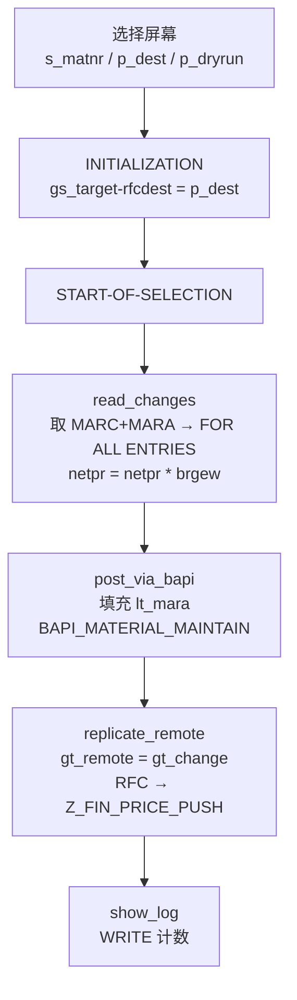

# ABAP 报表分析报告：ZREPORT_BAPI_UPLOAD

**源文件**：`evals/zreport_bapi_upload.abap`（126 行，REPORT 级程序，4 个 FORM）
**分析重点**：BAPI 调用、RFC 复制的正确性；价格计算是否算错
**结论等级**：❌ 不具备生产可用性，且存在"会写坏主数据"级别的高风险行为

---

## 0. 结论速览

程序的设计意图是清晰的：**读工厂 A100 的物料采购净价 → 按毛重做一次换算 → 通过 BAPI 写回本地系统 → 再通过 RFC 推送到 ZFIN**。但三个核心环节全部有问题：

| 环节 | 判定 | 一句话原因 |
|---|---|---|
| 价格计算 | ❌ 业务上不成立 | `NETPR × BRGEW` 把"单价"当"金额"放大；毛重为空时把价格直接清零 |
| BAPI 调用 | ❌ 选错 BAPI + 缺参数 | 用 `BAPI_MATERIAL_MAINTAIN` 维护采购价，把价格数字写进了 `MARA-BRGEW`（毛重字段） |
| RFC 复制 | ❌ 传输类型不可跨系统 | 传的是 REPORT 内 `TYPES` 定义的本地结构，远端无对应 DDIC 类型；异常声明了却从不判断 `sy-subrc` |
| 取数 | ❌ 静默空跑 | 第一个 `SELECT` 的字段列表比目标结构多一个字段，`gt_change` 恒空，且全程序无一处 `sy-subrc` 判断 |
| 日志 | ❌ 假成功 | `RETURN` 结构与 `BAPIRET2` 不兼容 → 消息表永远为空 → E 类错误被完全吞掉 |

最危险的三件事：

1. **`ls_mara-brgew = ls_chg-netpr`（第 78 行）** —— 这会把物料毛重覆盖成价格数字，不可逆。
2. **`p_dryrun` 只挡住了 BAPI，没挡住 RFC（第 83-88 行 vs 第 107 行）** —— "试运行"依然会真实写入 ZFIN。
3. **`sy-subrc` 从未被判断** —— 无论失败与否都会打印 `replicated to ZFIN`。

---

## 1. 程序结构与执行流程



| FORM | 行号 | 职责 | 状态 |
|---|---|---|---|
| `read_changes` | 47-66 | 取 MARC+MARA，计算新价格 | ❌ 结构不匹配 + 计算错误 |
| `post_via_bapi` | 69-98 | 调 BAPI 写回，打印消息 | ❌ BAPI 用错、缺 BAPI_TRANSACTION/COMMIT |
| `replicate_remote` | 101-118 | RFC 推送到 ZFIN | ❌ 类型不可传输、异常不判断 |
| `show_log` | 121-126 | 打印总条数与消息数 | ⚠️ 基于空表统计 |

全局数据结构：

```abap
DATA: gt_change  TYPE TABLE OF ty_chg,      " 无 KEY → 标准键=全字段
      gt_return  TYPE ty_rmess_tab,        " 本地结构，非 BAPIRET2
      gt_remote  TYPE TABLE OF ty_chg,
      gr_weight  TYPE TABLE OF p,          " 基本类型行，不是结构
      gs_target  TYPE rfcdest.
```

---

## 2. 取数分析：`read_changes`

### 2.1 目标结构字段数不匹配（P0，总根源）

```abap
TYPES: BEGIN OF ty_chg,
         matnr TYPE mara-matnr,
         werks TYPE marc-werks,
         netpr TYPE marc-netpr,
         waers TYPE marc-waers,
       END OF ty_chg.                        " ← 只有 4 个字段

SELECT marc~matnr marc~werks marc~netpr marc~waers mara~brgew   " ← 5 个字段
  FROM marc INNER JOIN mara ON mara~matnr = marc~matnr
  INTO TABLE gt_change                       " ← 目标只有 4 个字段
```

`mara~brgew` 没有落点，ABAP 在运行期把 `sy-subrc` 置为 4 且 **不填充 `gt_change`**，而程序从不检查 `sy-subrc`。于是：

- `gt_change` 恒为空 → `FOR ALL ENTRIES IN gt_change`（第 55 行）源表为空；
- `LOOP AT gt_change` 一次都不进 → 价格计算根本不执行；
- 程序"成功"跑完，什么都没做。

**这就是为什么现场会看到"程序跑了，但没效果"。** 后面 4.6/5.x 里"错误被吞掉"的表现，很多都是这个根因的连锁反应。

修法二选一：把 `brgew` 加进 `ty_chg`（推荐，反正下面要算），或从 SELECT 列表里去掉 `mara~brgew`。

### 2.2 `gr_weight` 声明为 `TABLE OF p`（P0）

```abap
DATA gr_weight TYPE TABLE OF p.               " 行类型是基本类型 P，不是结构

SELECT matnr brgew FROM mara INTO TABLE gr_weight ...
  READ TABLE gr_weight INTO DATA(ls_w) WITH KEY matnr = ls_chg-matnr.  " 对非结构表非法
  ls_chg-netpr = ls_chg-netpr * ls_w-brgew.                            " 对基本类型取组件，编译期即失败
```

三处连锁问题：目标类型与结果集不兼容（运行期失败）、`WITH KEY matnr` 对非结构表非法、`ls_w-brgew` 对基本类型行取组件是编译错误。

而且这段查询**完全是冗余的** —— 上一个 JOIN 已经把 `mara~brgew` 查出来了（虽然因为 2.1 没落进目标结构）。

### 2.3 `FOR ALL ENTRIES` 未判空（P1）

```abap
SELECT matnr brgew FROM mara
  INTO TABLE gr_weight
  FOR ALL ENTRIES IN gt_change                " ← gt_change 可能为空
  WHERE matnr = gt_change-matnr.
```

`FOR ALL ENTRIES` 的源表为空时，`WHERE` 条件形同虚设，会退化成 **MARA 全表读取**。在 2.1 的 bug 下这是必然发生的：全表扫描 + 结果无意义。

必须在前面加 `IF gt_change IS NOT INITIAL.`，或直接删掉这段查询（改用 JOIN 结果）。

### 2.4 `READ TABLE` 不查 `sy-subrc` → 用上一行脏数据（P0）

```abap
LOOP AT gt_change INTO DATA(ls_chg).
  READ TABLE gr_weight INTO DATA(ls_w) WITH KEY matnr = ls_chg-matnr.   " 未命中时 ls_w 保持原值
  ls_chg-netpr = ls_chg-netpr * ls_w-brgew.
```

`READ TABLE ... INTO` 未命中时**不清空目标结构**，而内联声明的 `ls_w` 会跨 `LOOP` 迭代保留上一轮的值。结果：某个物料查不到重量时，静默套用**上一个物料的毛重**去算价格，全程无任何提示。

修法：

```abap
LOOP AT gt_change INTO DATA(ls_chg).
  CLEAR ls_w.
  READ TABLE gr_weight INTO DATA(ls_w) WITH KEY matnr = ls_chg-matnr.
  IF sy-subrc <> 0.
    APPEND VALUE #( matnr = ls_chg-matnr error = '未取到毛重，跳过' ) TO gt_error.
    CONTINUE.
  ENDIF.
  ...
ENDLOOP.
```

### 2.5 `MODIFY` 未指定键/MTYPE → 数据翻倍（P0）

```abap
TYPES ty_chg_tab TYPE TABLE OF ty_chg.        " 无 KEY 定义 → 标准键 = 全部字段
MODIFY gt_change FROM ls_chg.                 " MTYPE 默认 'A'
```

`ls_chg` 的 `netpr` 已被改写，与表内原行**全字段不等**，标准键匹配不上 → 按默认 `MTYPE 'A'` **追加一条新行**。结果 `gt_change` 由 N 行变 2N 行，同一物料的新旧价格并存，后续 BAPI 和 RFC 都会重复提交同一物料。

修法（三选一，推荐第 1 种）：

```abap
" 1) 直接改内层（最干净）
LOOP AT gt_change ASSIGNING FIELD-SYMBOL(<chg>).
  <chg>-netpr = <chg>-netpr * <chg>-brgew.
ENDLOOP.

" 2) 用 SY-TABIX 定位（要求 LOOP AT gt_change，非 gt_change 副本）
MODIFY gt_change FROM ls_chg AT sy-tabix.

" 3) 改成带唯一键的排序表，从根上杜绝
TYPES ty_chg_tab TYPE SORTED TABLE OF ty_chg
  WITH UNIQUE KEY matnr werks.
```

### 2.6 其他取数问题

| 问题 | 级别 | 说明 |
|---|---|---|
| 工厂 `'A100'` 硬编码 | P1 | 应为选择屏幕参数；后台/跨工厂运行时范围失控 |
| `waers` 取出后从未使用 | P1 | 币种没参与任何计算，多币种场景得到的是"原币数字 × 毛重" |
| 无变更权限校验 | P1 | 未做 `PFCG_MARD_WERK` 之类的检查；BAPI 本身也不含权限语义 |
| `gt_return` 是全局变量但从不 `CLEAR` | P2 | 多次调用会累积旧消息 |

---

## 3. 价格计算正确性专题（重点之一）

核心代码只有一行（第 62 行）：

```abap
ls_chg-netpr = ls_chg-netpr * ls_w-brgew.
```

### 3.1 业务维度不成立 —— 单价 × 毛重 = 什么？

`MARC-NETPR` 是**按价格单位计的净价（单价）**，不是金额。乘以 `MARA-BRGEW`（毛重）之后得到的是一个"元 × 公斤"的数字，**在采购价格体系里没有对应的字段承载它**：

- 如果业务意图是"**总价**"（采购总额），总价字段属于采购订单 / 信息记录 / 条件记录层面，且必须写进正确的 BAPI 字段，**不能写回 `MARC-NETPR`**（那是单价字段，会把单价直接放大 N 倍）。
- 如果业务意图是"**按重量分摊的单位成本**"，正确算法应是 `总金额 ÷ 重量`，方向与现在**正好相反**：

```abap
lv_unit_price = lv_gross_amount / <chg>-brgew.    " ← 与现有实现方向相反
```

结论：**这不是"算错小数位"级别的错误，而是公式方向与业务口径都需要业务方重新确认。** 在口径确认前，不应上线。

### 3.2 毛重为空 → 全部价格被清零（P0 数据事故）

`brgew IS INITIAL` 时乘积为 0。SAP 中大量物料未维护毛重（尤其是非实物/服务类物料）。只要这段逻辑接上 BAPI，**未维护毛重的物料价格会被批量置 0**。没有任何 `IF brgew > 0` 的前置保护，也没有跳过标记，这是本程序最容易造成生产事故的行为。

### 3.3 单位与币种缺失

- `BRGEW` 的单位在 `MARA-BRGEU`（毛重单位，常规为 KG），程序未读取、未展示、未做一致性判断；
- `waers` 读了不用，没有汇率换算，多币种（EUR/JPY 等小数位不同、汇率不同）下结果是纯数字游戏；
- 价格单位（`PRINE`/`UMREN`）完全没涉及，无法判断 `NETPR` 到底是"每 EA""每 KG"还是"每 1000 EA"。

### 3.4 精度与舍入

`BRGEW` 是浮点型 P（DECIMAL 13,3），与 `NETPR`（DECIMAL 15,2）相乘会产生远超目标精度的中间值。直接赋给 `ty_chg-netpr`（15 位 2 小数）会发生隐式转换，可能截断、也可能触发转换溢出，且**未做显式舍入**，对账时会出现分位差异。

```abap
CONSTANTS lc_dec TYPE p DECIMALS 2 VALUE 2.     " 建议绑定目标字段类型
<chg>-netpr = ROUND( val = lv_price dec = lc_dec ).
```

### 3.5 缺失的业务校验

- 未判断 `netpr` 本身是否为 0 / 初始值（原价为 0 的记录被静默放大或清零）；
- 无变更幅度阈值校验（例如变动 > ±20% 拒绝并报警），无法拦截手滑或脏数据；
- 无异常项隔离机制：出错物料与正常物料混在同一张表里往下传。

### 3.6 建议的价格计算骨架

```abap
" 结构里直接带上 brgew，取消第二次 FOR ALL ENTRIES 查询
TYPES: BEGIN OF ty_chg,
         matnr TYPE mara-matnr,
         werks TYPE marc-werks,
         netpr TYPE marc-netpr,
         waers TYPE marc-waers,
         brgew TYPE mara-brgew,
         error TYPE char80,
       END OF ty_chg.

LOOP AT gt_change ASSIGNING FIELD-SYMBOL(<chg>).
  IF <chg>-brgew IS INITIAL OR <chg>-brgew <= 0.
    <chg>-error = '毛重未维护，已跳过'.
    DELETE gt_error.
    APPEND <chg>-matnr TO lt_failed.
    CONTINUE.
  ENDIF.

  " 公式需业务确认；示例：金额分摊为重量单位成本
  IF <chg>-gross_amount IS INITIAL.
    <chg>-error = '缺少分摊金额，已跳过'.
    CONTINUE.
  ENDIF.
  <chg>-netpr = ROUND( val = <chg>-gross_amount / <chg>-brgew
                       dec = mpc_2 ).
ENDLOOP.
```

---

## 4. BAPI 调用正确性专题（重点之二）

代码（第 69-98 行）：

```abap
LOOP AT gt_change INTO DATA(ls_chg).
  CLEAR ls_mara.
  ls_mara-matnr = ls_chg-matnr.
  ls_mara-brgew = ls_chg-netpr.        " ← 把价格写进了毛重字段
  APPEND ls_mara TO lt_mara.
ENDLOOP.

IF p_dryrun IS INITIAL.
  CALL FUNCTION 'BAPI_MATERIAL_MAINTAIN'
    TABLES
      materialdata  = lt_mara
      return        = gt_return.        " ← 结构不兼容
ENDIF.
```

### 4.1 BAPI 选错业务对象（P0，最严重）

`BAPI_MATERIAL_MAINTAIN` 的 `MATERIALDATA` 承载的是**物料主数据段**（MARA/MARC/MAKT…），它**不维护采购价**。因此这段代码的实际语义是：

> **把算出来的价格数字，写进所有命中物料的 `MARA-BRGEW`（毛重）字段。**

这不是"结果不对"，而是**主数据被污染**，且毛重是大量下游逻辑（装箱、运输、收货过账、成本核算）的输入，几乎不可逆。

正确的价格类 BAPI（按场景选）：

| 业务场景 | 推荐 BAPI / 方法 |
|---|---|
| 采购订单价格变更 | `BAPI_PO_PRICES` / `BAPI_PO_CHANGE` |
| 采购信息记录（IRP）价格 | `BAPI_INFORECORD_SRV` |
| 条件记录（自定义价格条件） | `BAPI_PRICES_CONDITIONS` |
| 确实要改物料主数据的价格相关段 | `BAPI_MATERIAL_MAINTAIN` 的 `PRICEMAINX`（**不是** MARA-BRGEW） |

同时这类 BAPI 至少需要 `COND_TYPE`、`COND_RECORD_NO`、`PERIOD`（价格有效期）、`NET_PRICE`、`PRICE_UNIT`、`CURRENCY` 等参数，**当前程序一个都没传** —— 即使换成正确的 BAPI，也必须补齐参数表。

### 4.2 缺少 `BAPI_TRANSACTION`（P0）

`BAPI_MATERIAL_MAINTAIN` 的 `BAPI_TRANSACTION` 是必填参数（`START` / `TEST` / `COMMIT` / `ROLLBACK`）。缺失时调用直接失败（`SY-SUBRC = 4` 或短转储）。正确用法是**先 `TEST` 预检 → 回读 `RETURN` 校验 → 再 `COMMIT` 真正执行**，本程序把这条最佳实践完全跳过了。

### 4.3 缺少 `COMMIT WORK`（P0）

BAPI 只在内部暂存更新，不 `COMMIT WORK` 就会回滚。本程序没有任何提交动作，所以即使 BAPI 返回成功，数据也不会落库 —— 除非后续 RFC 调用触发了隐式提交。这会让"本地到底写没写成功"变得完全不可知。

### 4.4 `RETURN` 结构不兼容 → 错误信息全丢（P0）

```abap
TYPES: BEGIN OF ty_rmess,                " 本地自定义
         typeid TYPE char1,
         msgid  TYPE msgid,
         msgno  TYPE msgnum,
         msgv1  TYPE char50,
         msgv2  TYPE char50,
       END OF ty_rmess.                   " 与 BAPIRET2 字段名/类型均不同
```

BAPI 的 `RETURN` 返回的是标准结构 **BAPIRET2**（`TYPE / ID / NUMBER / MESSAGE / V1~V4 / NO`）。本地 `ty_rmess` 字段名和类型都对不上（连最关键的 `MESSAGE` 文本字段都没有），表无法被正常填充。

连锁后果：

- 第 90-92 行的消息循环**永远不执行**；
- `show_log` 的 `messages` 计数**永远是 0**；
- **E 类（错误）和 A 类（警告）消息被完全吞掉**，操作者看到的是一片"uploaded"。

```abap
DATA gt_return TYPE TABLE OF bapiret2.
LOOP AT gt_return INTO DATA(ls_ret).
  MESSAGE ls_ret-message TYPE 'I'.
  IF ls_ret-type = 'E' OR ls_ret-type = 'A'.
    lv_has_error = 'X'.
  ENDIF.
ENDLOOP.
IF lv_has_error IS SET.
  " 至少：只把无 E 消息的行推给 RFC；强一点：ROLLBACK + 中止
ENDIF.
```

### 4.5 `CALL FUNCTION ... TABLES` 已废弃（P1）

`TABLES` 加法只适用于 RDI 函数模块；BAPI/RFC 必须用 `PARAMETERS` / `RETURNING`。另外 `return` 与保留字 `RETURNING` 冲突，迁移新语法时必须改写。示例：

```abap
CALL FUNCTION 'BAPI_MATERIAL_MAINTAIN'
  EXPORTING
    bapi_transaction = 'TEST'
  PARAMETERS
    materialdata = lt_mara
  EXCEPTIONS ... .                          " 由 FM 定义决定
```

### 4.6 不检查 `sy-subrc`、不按行定位失败项（P0）

BAPI 调用后既不看 `SY-SUBRC`，也不把 `RETURN` 的 `typeid/id` 与 `gt_change` 的物料做关联匹配。结果：

- 不知道**哪个**物料失败；
- 失败项和成功项混在一起**继续往下走**，`replicate_remote` 会把本地没写成功的物料**照样推给 ZFIN**。

→ **本地失败、远端成功，两端数据分叉**，且无任何痕迹。这是比 4.1 更容易在运行中悄悄发生的问题。

### 4.7 `p_dryrun` 只挡了 BAPI，挡不住 RFC（P0 语义漏洞）

```abap
IF p_dryrun IS INITIAL.
  CALL FUNCTION 'BAPI_MATERIAL_MAINTAIN' ...
ENDIF.
...
FORM replicate_remote.                       " ← 完全不看 p_dryrun
  CALL FUNCTION 'Z_FIN_PRICE_PUSH' DESTINATION gs_target ...
```

"试运行"模式会**真实调用 RFC 写 ZFIN**，而本地因为是 dry run 根本没写成功。结果是：试跑一次，FI 侧数据就被改一次。所谓试运行反而比正式运行更危险（正式运行至少有本地落库）。

### 4.8 日志误导（P1）

`LOOP AT gt_change ... WRITE 'uploaded'` 在 dry run 下也照样打印 "uploaded"，且因为 `gt_return` 是空的，什么失败信息都没有。操作者无法区分"已成功写入""试运行""全部失败"三种截然不同的结果。

---

## 5. RFC 复制正确性专题（重点之三）

代码（第 101-118 行）：

```abap
DATA lv_ok TYPE c.                           " 声明后从未使用

gt_remote = gt_change.                       " 整体复制内部表

CALL FUNCTION 'Z_FIN_PRICE_PUSH'
  DESTINATION gs_target
  TABLES
    it_price = gt_remote                     " ← 本地 TYPES 结构跨系统
  EXCEPTIONS
    system_failure = 1
    destination_unavailable = 2
    OTHERS = 3.

WRITE: / 'replicated to', p_dest.             " 无条件打印成功
```

### 5.1 传输的行类型在远端不存在（P0）

`it_price` 的行类型 `ty_chg` 是在 REPORT 里用 `TYPES` 定义的**非 DDIC 类型**。RFC 目标系统上的 `Z_FIN_PRICE_PUSH` 不可能引用同一个类型定义 —— 远端没有这个类型，两边的字段布局也没有任何机制保证一致。

后果：轻则字段错位/转换失败、重则 RFC 短转储。这不是"可能出问题"，而是**这类调用方式本身就不成立**。

修法（三选一）：

```abap
" 1) 把 ty_chg 提升为 DDIC 结构（ZSTR_PRICE_CHG），两端共用 —— 推荐
" 2) 传扁平行结构
DATA gt_remote TYPE TABLE OF ty_flat.        " 全部 CHAR 字段
" 3) 改用 BAPI / IDoc 传 ITEM 形参
```

### 5.2 声明了 EXCEPTIONS 却不判断 `sy-subrc`（P0）

这是全程序最直接的"假成功"：无论 RFC 是**系统故障**、**目标不可用**还是**通信超时**，第 116 行都会无条件打印 `replicated to ZFIN`。使用者看到成功，实际远端一条数据都没收到。

```abap
CASE sy-subrc.
  WHEN 0.
    COMMIT WORK.
  WHEN 1 OR 2.
    MESSAGE e001(zcl_report) WITH 'RFC 目标系统不可用'.
  WHEN 3.
    MESSAGE e002(zcl_report) WITH 'RFC 通信中断：目标系统无响应'.
  WHEN OTHERS.
    MESSAGE e003(zcl_report) WITH '未知 RFC 错误'.
ENDCASE.
```

### 5.3 `EXCEPTIONS` 清单不完整（P1）

指定 `DESTINATION` 时，除了已声明的两项，还应声明 **`COMMUNICATION_FAILURE`** 与 **`APPLICATION_FAILURE`**。缺 `COMMUNICATION_FAILURE` 意味着"目标系统未维护 RFC 用户 / 未响应 / 目标宕机"这类**最常见的故障**无法被单独区分，只能落进 `OTHERS` 甚至抛短转储。

### 5.4 `gs_target` 构造不完整（P1）

```abap
gs_target-rfcdest = p_dest.                  " 只有 rfcdest
```

- 未设置 `CLIENT`：ZFIN 若在非当前 Client，需要 `gs_target-client = sy-mandt` 或明确的目标 Client；
- 未设置 `NO_DIALOG = 'X'`：目标系统若弹出对话框，RFC 会挂起直到超时或抛异常。

```abap
gs_target-rfcdest   = p_dest.
gs_target-client    = sy-mandt.              " 或硬编码目标 Client
gs_target-no_dialog = 'X'.
```

### 5.5 无幂等控制、无状态跟踪（P0）

- 没有"是否已推送/失败/跳过"的状态落库，重跑即重复推送；
- 推的是**计算后的目标值**而非变更增量，两端公式版本一旦不一致就会静默互相覆盖；
- 推送后**不回读确认**（不检查远端是否真写成功）。

建议至少建一张日志表：`MATNR / WERKS / 旧值 / 新值 / 时间 / 用户 / BAPI 结果 / RFC 结果`。

### 5.6 事务顺序与两端一致性（P0）

当前顺序是 **BAPI（无 COMMIT）→ RFC**，但既没有定义"本地提交成功才推送"的顺序，也没有把两端放进同一个远程事务。结果要么本地提交了但 RFC 失败（远端缺数据），要么本地回滚了但 RFC 已成功（远端多数据）—— 两种不一致都没人知道。

必须明确二选一：

- **方案 A**：BAPI `COMMIT WORK` 成功后，才把"校验通过的行"推 RFC；RFC 失败写日志，进入待重推队列。
- **方案 B**：完全不做本地写入，整批走 RFC 在目标系统的事务内完成。

### 5.7 其他（P2）

- `lv_ok` 是死代码 —— 说明 RFC 的返回状态本来就没打算接；
- 同步串行 RFC，大批量时界面阻塞，且没有超时/重试策略；
- 没有对 `p_dest` 做有效性预检（`RFCDEST_GET` 读不到就直接中止会更好）；
- 推送结果没有回显条数，无法与 `lines(gt_change)` 对账。

---

## 6. 问题清单（按严重级别）

| # | 位置 | 问题 | 级别 | 后果 |
|---|---|---|---|---|
| 1 | `:78` | 价格写入 `MARA-BRGEW`（毛重） | **P0** | 物料主数据被污染，不可逆 |
| 2 | `:84-87` | 用 `BAPI_MATERIAL_MAINTAIN` 维护采购价 | **P0** | BAPI 业务对象选错 |
| 3 | `:84` | 缺 `BAPI_TRANSACTION` | **P0** | BAPI 调用失败/短转储 |
| 4 | (无) | 缺 `COMMIT WORK` | **P0** | 更新回滚，数据不落库 |
| 5 | `:87` | `RETURN` 结构与 `BAPIRET2` 不兼容 | **P0** | E 类错误被吞，"假成功" |
| 6 | `:107-114` | RFC 传本地 `TYPES` 结构 | **P0** | 远端无此类型，调用不成立 |
| 7 | `:116` | 声明 `EXCEPTIONS` 不判 `sy-subrc` | **P0** | 失败也报"replicated to" |
| 8 | `:83` vs `:107` | `p_dryrun` 不覆盖 RFC | **P0** | 试运行真实写远端 |
| 9 | `:62` | `netpr * brgew` 公式方向错误 | **P0** | 价格被放大 N 倍 |
| 10 | `:62` | 无 `brgew > 0` 保护 | **P0** | 未维护毛重的物料价格被清零 |
| 11 | `:63` | `MODIFY` 无键无 MTYPE | **P0** | 表数据翻倍、重复提交 |
| 12 | `:49-53` | SELECT 字段数(5) ≠ 目标结构(4) | **P0** | `gt_change` 恒空，静默空跑 |
| 13 | `:28` | `gr_weight TYPE TABLE OF p` | **P0** | 类型不兼容 / 编译期失败 |
| 14 | `:61` | `READ TABLE` 不查 `sy-subrc` | **P0** | 静默使用上一行的毛重 |
| 15 | 全程序 | 无任何 `sy-subrc` 判断 | **P0** | 所有失败静默 |
| 16 | `:94` | BAPI 失败项未过滤就进 RFC | **P0** | 两端数据分叉 |
| 17 | `:105` | RFC 无幂等/无日志/无确认 | **P0** | 重跑重复推送、结果不可信 |
| 18 | `:107` | BAPI 无 commit 就 RFC，顺序未定义 | **P0** | 事务一致性无保障 |
| 19 | `:55-58` | `FOR ALL ENTRIES` 源表未判空 | P1 | MARA 全表扫描 |
| 20 | `:62` | 无显式 ROUND、精度转换风险 | P1 | 分位对账差异 |
| 21 | `:53` | 工厂 `'A100'` 硬编码 | P1 | 范围失控 |
| 22 | `:11` | `waers` 未参与计算 | P1 | 多币种结果错误 |
| 23 | `:13` | 未取 `BRGEU` 重量单位 | P1 | 单位口径不明 |
| 24 | `:111-114` | 缺 `COMMUNICATION_FAILURE`/`APPLICATION_FAILURE` | P1 | 常见故障无法分类 |
| 25 | `:38` | `gs_target` 缺 `CLIENT`/`NO_DIALOG` | P1 | 跨 Client 错写、RFC 挂起 |
| 26 | `:85-87` | `CALL FUNCTION ... TABLES` 废弃 | P1 | 新语法迁移障碍 |
| 27 | `:95` | dry run 也打印 `uploaded` | P1 | 日志误导 |
| 28 | (无) | 无权限检查、无变更阈值校验 | P1 | 越权 / 误操作无拦截 |
| 29 | `:103` | `lv_ok` 死代码 | P2 | 意图未完成 |
| 30 | `:121-126` | 用 `WRITE` 而非 `MESSAGE`/日志落盘 | P2 | 不可审计、后台不可查 |
| 31 | `:26` | `gt_return` 全局且不 `CLEAR` | P2 | 消息累积 |
| 32 | `:62-63` | 无出错行隔离机制 | P2 | 错误行污染正常行 |

---

## 7. 改进建议

### P0 —— 上线前必须完成

1. **先跟业务确认价格口径**：是总价、单价，还是重量单位成本？公式方向必须由业务签字确认，不能靠代码猜。
2. **换用正确的价格 BAPI**（采购订单 `BAPI_PO_PRICES` / 信息记录 `BAPI_INFORECORD_SRV` / 条件 `BAPI_PRICES_CONDITIONS`），并补齐 `COND_TYPE`、`PERIOD`、`PRICE_UNIT`、`CURRENCY` 等参数；**绝不把价格写进 `MARA-BRGEW`**。
3. **BAPI 调用改为 `TEST` → 校验 `RETURN` → `COMMIT` → `COMMIT WORK`** 的标准三段式。
4. **`gt_return` 改为 `TYPE TABLE OF bapiret2`**，按 `type` 分级处理：出现 `E` 则 `ROLLBACK` 并中止，且该行不进 RFC。
5. **全程序补齐 `sy-subrc` 判断**：两个 `SELECT`、`READ TABLE`、`MODIFY`、两次 `CALL FUNCTION` 一个都不能漏。
6. **RFC 行类型 DDIC 化**（`ZSTR_PRICE_CHG`），补齐 `COMMUNICATION_FAILURE` / `APPLICATION_FAILURE`，按 `sy-subrc` 分级 `MESSAGE` 报错。
7. **`p_dryrun` 覆盖全流程**：BAPI、RFC、`COMMIT WORK` 全部跳过，并在输出开头显著打印 `*** DRY RUN - 未写入任何系统 ***`。
8. **价格计算加护栏**：`brgew > 0`、显式 `ROUND`、出错行进 `gt_error` 隔离、变动幅度阈值校验。

### P1 —— 稳定性与可运维性

- 工厂改为选择屏幕参数；删除冗余的 `FOR ALL ENTRIES` 查询，`brgew` 直接进 `ty_chg`。
- `gt_change` 改为 `SORTED TABLE ... WITH UNIQUE KEY matnr werks`，杜绝重复行；循环内改用 `ASSIGNING` 或 `MODIFY AT sy-tabix`。
- `gs_target` 补 `client` 与 `no_dialog`；推送前用 `RFCDEST_GET` 预检 `p_dest`。
- 增加日志表 + spool 文本，把成功/失败/跳过条数分别回显，与取数条数对账。
- 加变更权限校验（PFCG）与操作留痕。

### P2 —— 工程化

- 把 BAPI 封装与 RFC 封装抽成 `ZCL_BAPI_MATERIAL_PRICE` / `ZCL_RFC_PRICE_PUSH`，FORM 只保留编排逻辑，便于单测与复用。
- 引入 ABAP Unit：Mock BAPI 的 `RETURN`（含 E 类），验证"失败即中止且不进 RFC"这条关键路径。
- 用消息类 `ZCL_REPORT_MSG` 替换硬编码 `WRITE`。

---

## 8. 改造后的骨架（示意）

```abap
FORM post_and_replicate.
  DATA lt_price TYPE TABLE OF zstr_price_chg.
  DATA lv_failed TYPE abap_bool.

  read_changes.                                  " 修好 2.1~2.5 的取数与计算

  IF p_dryrun IS INITIAL.
    " 1) 试调用
    CALL FUNCTION 'BAPI_INFORECORD_SRV'
      EXPORTING
        bapi_transaction = 'TEST'
      TABLES ...
      EXCEPTIONS error = 1.
    IF sy-subrc <> 0 OR has_error_in( gt_return ).
      MESSAGE e010(zcl_report) WITH 'BAPI 校验失败，未做任何写入'.
    ENDIF.

    " 2) 正式调用
    CALL FUNCTION 'BAPI_INFORECORD_SRV'
      EXPORTING
        bapi_transaction = 'START'
      TABLES ...
      EXCEPTIONS error = 1.
    IF sy-subrc <> 0 OR has_error_in( gt_return ).
      MESSAGE e011(zcl_report) WITH 'BAPI 执行失败，已回滚'.
    ENDIF.
    COMMIT WORK.                                  " 本地先落库
  ELSE.
    WRITE: / '*** DRY RUN - 未写入任何系统 ***'.
  ENDIF.

  " 3) 只推校验通过的行
  append_only_clean_rows( ).                     " 过滤 gt_error / E 消息行
  IF gt_remote IS NOT INITIAL AND p_dryrun IS INITIAL.
    CALL FUNCTION 'Z_FIN_PRICE_PUSH'
      DESTINATION gs_target
      PARAMETERS
        it_price = gt_remote
      EXCEPTIONS
        system_failure          = 1
        destination_unavailable = 2
        communication_failure   = 3
        application_failure     = 4
        OTHERS                  = 5.
    CASE sy-subrc.
      WHEN 0.  WRITE: / 'replicated to', p_dest.
      WHEN OTHERS. MESSAGE e012(zcl_report) WITH 'RFC 推送失败，数据已入待重推队列'.
    ENDCASE.
  ENDIF.
ENDFORM.
```

---

## 9. 建议的验证顺序

1. 在测试系统用小范围（单物料）跑 **DRY RUN**，确认日志条数 = 取数条数，且日志明确标注未写入；
2. 手工核对 3 个物料：新价格是否符合业务公式（尤其是毛重为空的物料必须被跳过而不是置 0）；
3. 故意停用 ZFIN 或填错 `p_dest`，确认程序**报错中止**而不是打印 `replicated to`；
4. 构造一条 BAPI 返回 `E` 的场景，确认该物料**没有**被推送到 RFC；
5. 连续跑两次，确认第二次能识别出"已处理"并跳过（幂等验证）。

---

## 10. 一句话总结

这个程序有清晰的设计骨架（取数 → BAPI → RFC → 日志），但在 **BAPI 业务对象选择、RFC 传输类型、异常检查、价格公式口径** 四个方面同时存在 P0 级缺陷，且其中"价格写进毛重字段"和"dry run 仍真实推送远端"两条属于会造成真实数据损害的行为，**建议在业务口径确认与 P0 缺陷全部修复前，不要在生产系统运行**。