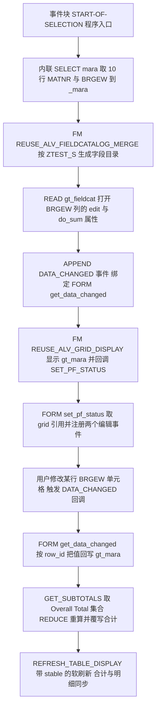
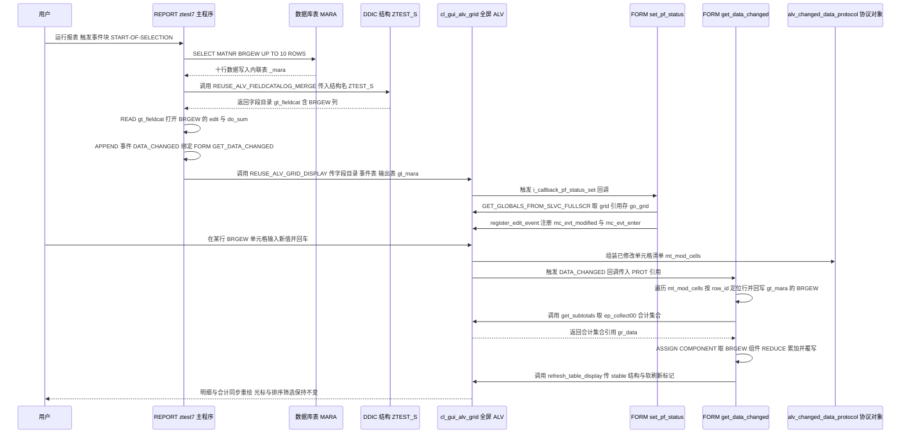

# ABAP 程序分析报告：`REPORT ztest7`

> 分析对象：`ztest7.abap`（115 行，单 REPORT 程序）
> 分析定位：新人 onboarding 级源码走读，业务视角优先

---

## 一、程序定位与业务背景

### 1.1 它想解决什么问题

想象仓储现场的一个真实场景：仓库管理员拿着一张物料清单（物料号 + 毛重），发现系统里的毛重跟实物对不上——可能是包装规格变了，可能是上次抽检后手工修正过。他需要改数字，并且希望表格底部的"合计"立刻跟着变，而不是自己拿计算器加一遍。

在标准 SAP 里，这有几条常见但都不顺手的路：

1. **走主数据维护界面**（MM01/MB52 或自建维护表）：毛重 `MARA-BRGEW` 属于物料主数据，走维护意味着申请权限、拿锁、可能触发审核流程。对"顺手改一个数"这种诉求来说，代价过高。
2. **只读 ALV + 手工在 Excel 里加总**：能看不能改，数据还要二次加工，容易出现"系统一个数、Excel 一个数"的版本分裂。
3. **老式 ALV（`REUSE_ALV_LIST_DISPLAY` / FM `REUSE_ALV_*` 的 classic list）**：classic list 根本不支持单元格编辑。

所以这个程序做的事就一句话：**在一张全屏 ALV Grid 上打开单元格编辑，把用户的改动捕获下来，并把合计数实时刷回合计行。** 这是 SAP ALV 开发里的一个经典手课题材，涵盖 `EDIT` 属性、`DATA_CHANGED` 事件、`GET_SUBTOTALS` 合计 API、`REFRESH_TABLE_DISPLAY` 稳定刷新这四个核心知识点。

### 1.2 整体设计范式（一句话定性）

这是一个**技术验证型的 POC / demo program（技术演示程序）**，而不是一个交付给业务的功能程序：它演示"ALV 可编辑 + 合计实时刷新"的技术手法，**不落库、不做校验、不做权限**，跑完即散。

这个定性必须先讲清楚，否则后面所有"为什么它算出来的合计没有业务意义""为什么改完刷新一下就丢了"的批评都会被误读成"程序写错了"——它是 demo，作者要证明的是"这条路走得通"，不是"这个报表能给仓库用"。

### 1.3 数据链路全景（先给一个整体印象）

```
MARA(数据库) ──取 10 行──> 内联表 _mara ──(未连接)──X
                                                    ↓ 断链
DDIC 结构 ZTEST_S ──> 字段目录 gt_fieldcat ──> ALV Grid ──> gt_mara(始终为空)
                                                    ↑
用户改单元格 ──> DATA_CHANGED ──> 回写 gt_mara ──> 重算合计 ──> 稳定刷新
```

关键结论先放这里：**取数端和显示端断链了**。程序第 ① 步取进的是内联表 `_mara`，但第 ③ 步丢给 ALV 的是全局表 `gt_mara`，`gt_mara` 从头到尾没人往里写数据。这是本次分析发现的最硬的一个缺陷（详见第五章 P0-1）。

---

## 二、程序执行流程总览



### 责任链表

| 子程序 | 调用者 | 职责 |
| --- | --- | --- |
| 全局声明区 | 程序加载时由系统处理 | 声明输出表、字段目录、事件表、grid 引用、stable 结构与合计集合引用 |
| 事件块 `START-OF-SELECTION` | 系统隐式启动（可执行报表入口） | 串起取数、生成字段目录、打开可编辑可合计、注册事件、显示 ALV 五件事 |
| 内联 `SELECT ... FROM mara`（写在事件块内） | 事件块 `START-OF-SELECTION` | 取 10 行 `MATNR` 与 `BRGEW`，落入内联表 `_mara` |
| FM `REUSE_ALV_FIELDCATALOG_MERGE` | 事件块 `START-OF-SELECTION` | 以 DDIC 结构 `ZTEST_S` 为蓝本自动生成字段目录 |
| 字段目录改写段 | 事件块 `START-OF-SELECTION` | 把 `BRGEW` 列的 `edit` 与 `do_sum` 置 `X` |
| FM `REUSE_ALV_GRID_DISPLAY` | 事件块 `START-OF-SELECTION` | 全屏显示 `gt_mara`，挂接 PF-STATUS 回调与事件表 |
| FORM `set_pf_status` | FM `REUSE_ALV_GRID_DISPLAY`（经 `i_callback_pf_status_set`） | 取 grid 对象引用，注册 `mc_evt_modified` 与 `mc_evt_enter` |
| FORM `get_data_changed` | ALV Grid（经 `gt_events` 的 `DATA_CHANGED`） | 回写明细、重算并覆写合计行、带 stable 刷新 |
| 方法 `go_grid->get_subtotals` | FORM `get_data_changed` | 取回 `ep_collect00`（Overall Total）合计集合 |
| `REDUCE` 累加表达式 | FORM `get_data_changed` | 遍历 `gt_mara` 累加 `BRGEW` |
| 方法 `go_grid->refresh_table_display` | FORM `get_data_changed` | 稳定刷新，使合计与明细同步、光标不跳行 |

下面按这条流程，逐个子程序展开。

---

## 三、分组分析（按程序流程 / 子程序）

从全局声明区开始，顺着 `START-OF-SELECTION` 的五步主干往下走，再拐进两个 FORM 回调。整条主干里藏着那个"断链"，两个 FORM 里藏着"合计不可靠"。

### 3.1 程序声明区

#### ① 数据对象声明

```abap
REPORT ztest7.
TYPE-POOLS: slis.

DATA: gt_mara     TYPE TABLE OF ztest_s,
      gt_fieldcat TYPE slis_t_fieldcat_alv,
      gt_events   TYPE slis_t_event,
      go_grid     TYPE REF TO cl_gui_alv_grid,
      gs_stable   TYPE lvc_s_stbl,
      gr_data     TYPE REF TO data.
```

**做什么** — 声明五类全局对象：`gt_mara` 是 ALV 的输出内表（行类型 `ZTEST_S`，一个自定义 DDIC 结构）；`gt_fieldcat` 承载自动生成的字段目录；`gt_events` 承载 ALV 事件到 FORM 的绑定关系；`go_grid` 持有 OO 控件的 ALV Grid 引用，供 FORM 回调里调用实例方法；`gs_stable` 是一次性的刷新参数（行/列是否保持稳定）；`gr_data` 是用来接收合计集合的通用引用。

**为什么** — 声明区划出了三类不同生命周期的对象：**跨过程共享的**（`go_grid`，FORM 回调里必须用到，FORM 之间没有参数传递通道，只能靠全局变量传递）、**批量构造后只读的**（`gt_fieldcat`、`gt_events`，构造完就交给 ALV）、以及**必须全局的输出表**（`gt_mara`）。这里最值得学的其实是 `gr_data TYPE REF TO data` + 内联字段符号的组合：`get_subtotals` 返回的 `ep_collect00` 是一个"行类型在编译期不可知"的动态表，`REF TO data` 只能装下它的引用，具体结构要在运行时用 `ASSIGN gr_data->* TO <fs>` 才知道。这是 SAP 处理动态类型数据的标准手法，比 `FIELD-SYMBOLS <x> TYPE any TABLE` 更通用（因为 `any TABLE` 保留不动点类型，赋值时会做类型检查而失败）。`gs_stable` 用 `lvc_s_stbl` 而不是直接写内联常量也符合惯例，方便扩展。

**风险与改进** —
- `TYPE-POOLS: slis.` 在一个 `REPORT` 里语义可疑。`TYPE-POOLS` 语句的本意是"在本程序中引入某个类型池的类型"，而 `SLIS` 的类型（`slis_t_fieldcat_alv` 等）通过内置类型池 `SAPLTSL` 已经全局可见，这句在报表里**不产生任何作用**，更像是 IDE 生成代码时带进来的样板残留。建议核实它是否真的可编译（部分程序类型下会直接报语法错）并删除。
- `gr_data` 是 `REF TO data` 且全局共享，没有 `IS BOUND` 保护就往下 `ASSIGN`，一旦接收失败就是 `CX_SY_ASSIGN_ERROR` 短消息（详见 3.4 ②）。
- 字段符号只声明了一个（`<gtr_sum_tab>`），其余（`<gs_fcat>`、`<gs_changed>`、`<gs_tab>`、`<l_sum>`、`<lg_val>`）都是内联声明。`REF TO data` 场景无法用内联字段符号（内联声明没有可赋值的类型位置），所以这里只能全局声明——这一点作者处理对了。

#### ② 字段符号声明

```abap
FIELD-SYMBOLS: <gtr_sum_tab> TYPE table.
```

**做什么** — 声明一个泛型表字段符号 `<gtr_sum_tab>`，作为 `gr_data` 所指动态数据的"落脚容器"，供后面 `ASSIGN gr_data->* TO <gtr_sum_tab>` 使用。

**为什么** — 这是承接上一段结论的配套声明：`get_subtotals` 的 `ep_collect00` 参数类型在具体场景里等于"ALV 输出表行类型构成的表"，但用 `FIELD-SYMBOLS` 声明时你并不知道 `ZTEST_S` 到底是什么结构（在只读源码、不查 DDIC 的情况下无法确定）。所以先声明成 `TYPE table`（泛型内表，不做类型检查），运行时再由 `ASSIGN ... TO` 拿到真实类型。用字段符号而不是内表变量，是因为 `ASSIGN COMPONENT 'BRGEW' OF STRUCTURE <l_sum>` 需要一个可以被指向"任意内部结构任意组件"的入口。

**风险与改进** — 声明成 `TYPE table` 等于放弃了全部编译期类型检查，字段名拼错（比如把 `'BRGEW'` 写成 `'BRGE_V'`）在编译期无感知，运行期 `ASSIGN COMPONENT` 才会以 `CX_SY_ASSIGN_ERROR`/`CX_SY_NO_HANDLER` 形式炸出来。改进方向：如果能确认 `ZTEST_S` 的完整字段清单，这里完全可以声明成 `FIELD-SYMBOLS <gtr_sum_tab> TYPE ztest_s_tab`，把错误提前到编译期；字段名 `'BRGEW'` 也应提成常量。

### 3.2 事件块 `START-OF-SELECTION`

这是程序的主干，一共分五步：取数、生成字段目录、打开可编辑可合计属性、注册事件、显示 ALV。整体写法是 `IF sy-subrc = 0` 的层层套娃，层层之间其实并没有依赖关系，属于"防御性冗余"。

#### ① 取数

```abap
  SELECT matnr,
         brgew
    FROM mara
    INTO TABLE _mara UP TO 10 ROWS.
```

**做什么** — 从数据库表 `MARA`（物料主数据）取 `MATNR`（物料号）与 `BRGEW`（毛重）两列，最多 10 行，装进内联声明的内表 `_mara`。

**为什么** — 选 `MARA` 而不是业务单据表，说明作者的目标就是"拿一份最小的物料清单当数据源"，`UP TO 10 ROWS` 也是典型的 demo 取数手法：不排序、不加条件，只为让屏幕上有几行东西可编辑。至于只取两列，是好的实践——`MARA` 有 200+ 字段，投影取列显著降低传输量。

**风险与改进** —
- 🔴 **落表对象错了**：数据进了内联表 `_mara`，而后面 `REUSE_ALV_GRID_DISPLAY` 传的是全局表 `gt_mara`。两者之间没有任何赋值，`gt_mara` 永远是空表，屏幕上是**空 ALV**。而且第 ③ 步 `REUSE_ALV_FIELDCATALOG_MERGE` 传的是 `i_structure_name = 'ZTEST_S'`，也就是按 `gt_mara` 的行类型生成列定义——列有、数据没有，自洽性检查不出来（ABAP 的泛型 `t_outtab` 只在运行时校验）。改进：改成 `INTO TABLE @gt_mara UP TO 10 ROWS.`（前提是 `ZTEST_S` 含 `MATNR` 与 `BRGEW`），或者保留 `_mara` 再显式做一次类型适配搬运。
- `SELECT` 未限定 `MANDT`。在多客户端（Three-Tenant）系统里，这条语句会**跨客户端读数据**，同一个物料号可能来自多个客户端，在 ALV 上表现为重复行。改进：加 `WHERE mandt = @sy-mandt`。
- `UP TO 10 ROWS` 没有 `ORDER BY`，返回哪 10 行由优化器/缓冲决定，**结果不确定且不可复现**。demo 尚可，业务程序必须给排序，否则用户刷新两次看到的不是同一批数据。
- 表名 `MARA` 直接以字面量出现。虽然 ABAP 里表名可以用变量拼，但这里没必要，直接写可读性更好，也不容易在 grep 依赖时漏掉。

#### ② 生成字段目录

```abap
  IF sy-subrc EQ 0.
    CALL FUNCTION 'REUSE_ALV_FIELDCATALOG_MERGE'
      EXPORTING
        i_program_name         = sy-repid
        i_structure_name       = 'ZTEST_S'
      CHANGING
        ct_fieldcat            = gt_fieldcat
      EXCEPTIONS
        inconsistent_interface = 1
        program_error          = 2
        OTHERS                 = 3.
```

**做什么** — 调用 FM `REUSE_ALV_FIELDCATALOG_MERGE`，以 DDIC 结构 `ZTEST_S` 为蓝本，让 FM 自动读取该结构的所有字段（含文本元素、币种/数量参考字段的格式化信息），生成完整的字段目录塞进 `gt_fieldcat`，并声明了三个异常。

**为什么** — 正确选择。传统做法是手写 `slis_t_fieldcat_alv`、逐字段设 `ref`/`scrlen_s`/`no_outlen`/`do_sum`，几十行样板还容易漏；这个 FM 把这些全自动化，是 ALV 的标准解法。传 `i_program_name = sy-repid` 是让 FM 把结构解析结果缓存到程序自身的 `slis_fieldcat` 隐式表里。异常声明 `inconsistent_interface` / `program_error` 是这个 FM 的两个典型异常（结构不存在、字段名拼错会报前者），显式列出来是好习惯——比 `IF sy-subrc = 0.` 的裸判断更可读。

**风险与改进** —
- 结构名 `'ZTEST_S'` 硬编码。如果这个 demo 想同时演示别的结构，这里就得改代码。改进：提成常量或做成选择屏参数。
- `ZTEST_S` 里如果用了 `APPEND STRUCTURE`（追加结构），FM 会把追加结构的技术字段也一并生成成 ALV 列，屏幕上会出现用户看不懂的字段（如 `MATNR_APPENDED`）。改进：确认 `ZTEST_S` 是**纯 append 结构**（把 `MARA` 的子字段平铺进来的做法），而不是 `INCLUDE/APPEND`，必要时在生成后过滤掉不需要的列。
- 反过来，如果 `ZTEST_S` 的字段**多于**第 ① 步 SELECT 的两列（比如还带 `MAKTX`），那些列会显示成空白，且 ALV 不会报错。要么补 SELECT，要么在生成后把多余列 `no_out = 'X'` 隐藏掉。
- 三个 `EXCEPTIONS` 列了但没读 `sy-subrc`（下一行只判断 `IF sy-subrc = 0.`）。中间若插入任何语句就会误判。这里紧邻无害，但一旦有人加一行日志就会踩坑。改进：每个 FM 调用后立刻处理 `sy-subrc`。

#### ③ 打开 `BRGEW` 列的可编辑与可合计属性

```abap
    IF sy-subrc = 0.
      READ TABLE gt_fieldcat ASSIGNING FIELD-SYMBOL(<gs_fcat>) WITH KEY fieldname = 'BRGEW'.
      IF sy-subrc EQ 0.
        <gs_fcat>-edit = 'X'.
        <gs_fcat>-do_sum = 'X'.
      ENDIF.
```

**做什么** — 在刚生成的字段目录里按 `fieldname = 'BRGEW'` 定位到毛重列，用 `ASSIGNING` 拿到该行的引用（不是拷贝），然后把 `edit` 和 `do_sum` 两个属性都置成 `X`：前者让该列单元格可编辑，后者让该列参与 ALV 内置合计。

**为什么** — 这是全程序的核心开关，用**最小改动**打开了两个能力，比手写字段目录时逐行设置优雅得多。`READ TABLE ... ASSIGNING FIELD-SYMBOL(...)` 是现代写法，比 `READ TABLE ... INDEX ... ` + `MODIFY ... FROM` 的拷贝-改-写三段式更安全也少一次拷贝，值得推荐。

**风险与改进** —
- `'BRGEW'` 硬编码两处（此处 + 第 ① 步 SELECT + 事件回调里的 `WHERE fieldname = 'BRGEW'`）。一旦字段改名，三处都要改，漏改一处就是"列不能编辑"或"事件不触发"的诡异 bug。改进：定义 `CONSTANTS c_field_brgew TYPE lvc_fname VALUE 'BRGEW'.` 统一引用。
- `edit = 'X'` 放在**字段目录**里，而真正的"注册编辑事件"放在 `set_pf_status` 里——这两件事是**耦合**的：只设 `edit` 而不 `register_edit_event`，单元格点不动。作者把它们放在两个不同的地方，实现了上是合理的（字段目录在显示前构造，grid 引用必须等显示时才有），但这个隐式耦合没有任何注释说明，读者很容易只改一半。改进：加注释点明"edit 属性 + register_edit_event 必须成对出现"。
- `do_sum = 'X'` 让 ALV 内置合计生效，而第 ④ 步 `get_data_changed` 又手工覆写这个合计——两套机制抢同一个格子，这是第五章 P0-3 的根因。改进：见第五章。
- `IF sy-subrc = 0.` 与上一层的 `EQ 0` 写法不一致（同一段代码里混用两种空值判断风格），不影响功能，属规范问题。

#### ④ 绑定 DATA_CHANGED 事件

```abap
      APPEND VALUE #( name = 'DATA_CHANGED' form = 'GET_DATA_CHANGED' ) TO gt_events.
```

**做什么** — 往事件表 `gt_events` 里追加一条记录，把 ALV 的 `DATA_CHANGED` 事件绑定到本程序里的 FORM `get_data_changed`。

**为什么** — 这是 `REUSE_ALV_*` 系列 FM 的标准事件绑定机制：事件**名字**（`'DATA_CHANGED'`）和回调 **FORM 名字**（`'GET_DATA_CHANGED'`）一一对应。选 `DATA_CHANGED`（而不是老式的 `DATA_CHANGED` FORM + `ED_IT_USERPROT` 保护位那套）说明作者用的是较新的、允许在事件里读改数据的回调，比 classic 时代的做法灵活。`APPEND VALUE #(...) TO` 是 7.40 的内联构造写法，比 `APPEND INITIAL LINE TO gt_events. ... MOVE ... TO gt_events[].` 紧凑得多。

**风险与改进** —
- FORM 名 `'GET_DATA_CHANGED'` 硬编码字符串，编译器无法校验——写错就是"事件永远不触发"的静默失败。改进：ABAP 里无法直接取 FORM 名，只能靠命名纪律 + 单元测试覆盖。
- 与 OO 风格的回调（`i_callback_data_changed`）二选一即可，两种混用在同一程序里是"事件为什么不触发"的经典困惑源。这里选 FORM 风格是自洽的（因为要用 PF-STATUS FORM 拿 grid 引用），但应知道这是"为了拿 grid 而选的连带决定"，不是必须。
- 只绑了 `DATA_CHANGED`，没绑 `DATA_CHANGED_FINISHED`、`HOTSPOT_CLICK` 等。真要做输入校验（如"毛重不能为负"），`DATA_CHANGED` 里用 `add_protocol_entry` 或改用 `DATA_CHANGED_FINISHED` 更合适。

#### ⑤ 调用 ALV 显示

```abap
      CALL FUNCTION 'REUSE_ALV_GRID_DISPLAY'
        EXPORTING
          i_callback_program       = sy-repid
          it_fieldcat              = gt_fieldcat
          it_events                = gt_events
          i_callback_pf_status_set = 'SET_PF_STATUS'
        TABLES
          t_outtab                 = gt_mara.
    ENDIF.
  ENDIF.
```

**做什么** — 把字段目录、事件表、输出内表一起交给 FM `REUSE_ALV_GRID_DISPLAY`，以全屏 Grid 的形式显示，并指定"显示前先回调本程序的 FORM `set_pf_status`"。

**为什么** — `i_callback_program = sy-repid` 是 `REUSE_ALV_*` 系列事件的开关，不传它，后面的 `it_events` 和 `i_callback_pf_status_set` 都不会触发——这是初学者最常见的"事件不生效"原因，这里传对了。`i_callback_pf_status_set` 而不是 `i_callback_pf_status` 的区别是：前者只替换 PF-STATUS（工具栏），保留标准 ALV 的菜单；后者整块替换。这个选择合理，因为 demo 主要想改工具栏区域（尽管它实际上一条命令都没加）。**没有**用 `i_edit = 'X'` 而是留空、走 FORM 里 `register_edit_event` 的路子，是有隐含代价的（见 3.3 的讨论）。

**风险与改进** —
- 🔴 `t_outtab = gt_mara` 传的是空的 `gt_mara`（见 3.2 ①），屏幕将是空表——`IF sy-subrc = 0.` 判断的是上一个 FM，这层"保护"完全没起到作用，反而制造了"程序跑通了"的错觉。
- `EXCEPTIONS` 列表被整个省略。虽然 `REUSE_ALV_GRID_DISPLAY` 确实没有可捕获的异常（其失败都以短消息形式弹出），但同一程序里 ② 处的 FM 明确列了异常、⑤ 处没列，风格不统一。更实际的风险是：**ALV 显示失败时程序直接往下走，用户看到空白屏幕而无任何解释**。
- `i_callback_program` 之外没有 `i_save`，也没有任何持久化出口——用户改完退出，数据全丢。作为 demo 可以接受，但如果这份代码的定位是"给仓库用的毛重修正工具"，这就是致命的业务缺失。
- 未设 `i_default_layout` / `is_variant`，每次进入都是默认列宽和默认排序。demo 无所谓，正式报表通常需要保存布局变式。

### 3.3 FORM `set_pf_status`

这个 FORM 名义上是"设置工具栏状态"，实际上承担了**两个**职责：① 取到 grid 对象引用；② 注册编辑事件。分工上的这层混淆是本章的主要看点。整个 FORM 分三步。

#### ① 取得 ALV Grid 对象引用

```abap
FORM set_pf_status USING itr_extab TYPE slis_t_extab.

* Get the ALV Object reference
  CALL FUNCTION 'GET_GLOBALS_FROM_SLVC_FULLSCR'
    IMPORTING
      e_grid = go_grid.
  IF go_grid IS BOUND.
```

**做什么** — 调用 FM `GET_GLOBALS_FROM_SLVC_FULLSCR`，把当前活动的全屏 ALV Grid 控件引用取出来存进全局变量 `go_grid`，随后用 `IS BOUND` 做一次防御性检查。

**为什么** — 这是"经典变通"的标准姿势，理由值得讲清楚：程序用的是 `REUSE_ALV_GRID_DISPLAY` 这个**隐式创建**全屏 Grid 的 FM，调用返回后你手上只有一个"表格句柄"，拿不到 OO 控件引用。而本程序后续需要调用实例方法（`register_edit_event`、`get_subtotals`、`refresh_table_display`），必须有 `cl_gui_alv_grid` 引用。而 `GET_GLOBALS_FROM_SLVC_FULLSCR` 正是"ALV 全屏模式下从 FULLSCREEN 控件树里反查当前活动控件"的标准后门，SAP 自己的示例程序也是这么写的。选它而不是 `i_edit = 'X'`，是因为——这是这段代码最需要说明的权衡——**`i_edit = 'X'` 虽然也能打开编辑，但那样你就少了一个"显示时机的钩子"**；而 `i_callback_pf_status_set` 回调恰好提供了这个钩子，作者顺带在这里把 grid 引用也一并解决了。一次回调干两件事，这在 demo 里高效，在生产代码里会让 FORM 职责不纯（见下）。

`IF go_grid IS BOUND` 这句防御是好习惯：`GET_GLOBALS_FROM_SLVC_FULLSCR` 在找不到活动 Grid 时 `e_grid` 保持 unbound，若直接往下调实例方法会 dump。这一步作者做对了。

**风险与改进** —
- ⚠️ **只支持全屏模式**。这是 `FULLSCR` 后缀 FM 的硬约束：如果有人把这段 ALV 改成放进 `CL_GUI_CONTAINER` 里显示，`GET_GLOBALS_FROM_SLVC_FULLSCR` 取不到引用，编辑功能会**静默失效**（不报错的空操作）。改进：改用 `CALL METHOD cl_gui_alv_grid=>get_gui_object` 配 `cl_gui_control=>get_active_object`，或干脆自己创建 `cl_gui_alv_grid` 实例显式持有引用（OO ALV 路线）。这条约束最好在代码里加注释说明。
- FORM 实际逻辑全在 `IF go_grid IS BOUND` 内，但 `itr_extab` 形参完全没用到。`i_callback_pf_status_set` 的回调签名本来就带 `slis_t_extab`（用于追加额外工具栏按钮），不用可以，但应注明。
- 回调 FORM 里做"注册编辑事件"这件事，和它的**名义职责**（PF-STATUS）没有任何语义关系。改进：把取 grid 与注册事件抽成一个专用 FORM（如 `setup_grid`），在 `START-OF-SELECTION` 里 `PERFORM` 一次，或干脆改用 OO 方式在显示后立即 `REGISTER_EDIT_EVENT`，让 `set_pf_status` 只负责工具栏命令。

#### ② 注册两个编辑事件

```abap
    CALL METHOD go_grid->register_edit_event
      EXPORTING
        i_event_id = cl_gui_alv_grid=>mc_evt_modified.

    CALL METHOD go_grid->register_edit_event
      EXPORTING
        i_event_id = cl_gui_alv_grid=>mc_evt_enter.
  ENDIF.
```

**做什么** — 对 grid 实例调用两次 `register_edit_event`，分别注册 `mc_evt_modified`（单元格值被用户改动并离开时触发）和 `mc_evt_enter`（用户在单元格上按 Enter 时触发），使这两个事件能回调到 `gt_events` 里绑定的 `DATA_CHANGED` FORM。

**为什么** — 这是 ALV Grid 可编辑的**必要条件**：不注册编辑事件，`DATA_CHANGED` 根本不会触发（`DATA_CHANGED` 事件是编辑事件的一种，不注册就不发）。同时注册 `enter` 是为了覆盖一种真实使用习惯——用户在单元格里改完直接敲回车，期望与"改完点击别处"效果一致。两次调用而不用 `cl_gui_alv_grid=>mc_evt_all`（注册全部编辑事件），说明作者是对着 ALV 事件清单挑的，克制是对的。

**风险与改进** —
- `mc_evt_modified` 与 `mc_evt_enter` 在"改完按回车"这一个动作里**会先后都触发**，于是 `get_data_changed` 被跑两遍，合计被重算两次。结果值一样所以看不出来，但这是无谓的重复计算；如果后续在回调里加了写库、日志、消息，就可能双写。改进：只注册 `mc_evt_modified`（它已覆盖值变更），或按实际需求单注册。
- `register_edit_event` 是**全局级**注册（对整个 Grid 生效），具体哪些单元格能编辑由第 ③ 步的字段目录 `edit = 'X'` 控制。这个"两层控制"的分工容易被误解（很多人以为注册了就能编辑所有单元格）。改进：加注释说明。
- 如果 `set_pf_status` 因任何原因被再次调用（例如 PF-STATUS 被重新设置），`register_edit_event` 会重复注册同类事件，事件处理器列表里出现重复项。当前程序只显示一次 ALV，所以不会发生；但一旦有人把 ALV 改成"查询后刷新重显示"的循环，这里就会累积。改进：注册前判断事件是否已注册，或把注册动作移到只执行一次的地方。
- 缺少一个常见配套动作：若希望用户不能随意新增/删除行，需要在 `set_pf_status` 的 `CASE sy-ucomm` 里对 `SORT_*`/`DELETE_*`/`INSERT_*` 命令做处理，并设置 `i_grid_display` 相关保护位。这里 `CASE ... WHEN OTHERS.`（见 ③）是空的，等于完全放弃了这层保护。

#### ③ 空的命令分派骨架

```abap
  " PF Status Code
  CASE sy-ucomm.
*	WHEN
    WHEN OTHERS.
  ENDCASE.
ENDFORM.
```

**做什么** — 什么都不做。这个 `CASE` 只有一个 `WHEN OTHERS` 空分支，还留着一条被注释掉的 `WHEN`，是作者预留命令分派的样板位置。

**为什么** — 可以理解——写 ALV demo 时留一个分派骨架是常见习惯，方便后续接 `SAVE`、`SAVE_ALL`、`DELETE` 等按钮。`SY-UCOMM` 是标准的用户命令入口，比 `OK-CODE` 规范。

**风险与改进** —
- 这是纯死代码，而且是最容易被后来者误读的"看起来有逻辑其实没有"的代码类型。`WHEN OTHERS` 是 CASE 的兜底分支，单独存在时等价于什么都不写，编译器不会提示。改进：删掉，需要时再加。
- 注释掉的 `WHEN` 残留在正式源码里（很多项目会开启语法检查规则禁止注释代码行）。改进：清理。
- 缺 `i_callback_user_command = '...'`。PF-STATUS 里加按钮需要两步：`set_pf_status` 里补按钮 + `user_command` 回调里处理 `sy-ucomm`，这里第二步完全缺失，等于工具栏无法扩展。

### 3.4 FORM `get_data_changed`

这是整个程序最核心的回调，也是问题最集中的地方。它要干三件事：把用户改的值落到内表、重算并覆写合计、带 stable 刷新显示。分四步看。

#### ① 把单元格改动回写到底层内表

```abap
FORM get_data_changed USING io_data_changed TYPE REF TO cl_alv_changed_data_protocol.

  IF go_grid IS BOUND.

    LOOP AT io_data_changed->mt_mod_cells ASSIGNING FIELD-SYMBOL(<gs_changed>) WHERE fieldname = 'BRGEW'.
      READ TABLE gt_mara ASSIGNING FIELD-SYMBOL(<gs_tab>) INDEX <gs_changed>-row_id.
      IF sy-subrc EQ 0.
        <gs_tab>-brgew = <gs_changed>-value.
      ENDIF.
    ENDLOOP.
```

**做什么** — 声明回调 FORM（参数 `io_data_changed` 是协议对象 `cl_alv_changed_data_protocol` 的引用）。进入后先确认 grid 引用有效，然后遍历协议对象里的"已修改单元格清单" `mt_mod_cells`，只处理 `fieldname = 'BRGEW'` 的那些；对每一个，用它携带的 `-row_id` 作行号，去 `gt_mara` 里按 `INDEX` 定位到对应行，再把协议里的 `-value`（字符型）赋给该行的 `-brgew`。

**为什么** — `DATA_CHANGED` 回调的标准骨架，FORM 名必须与第 ④ 步 `gt_events` 里绑定的字符串完全一致（`GET_DATA_CHANGED`），这里是对的。参数类型 `REF TO cl_alv_changed_data_protocol` 也是标准签名（FORM 参数名不重要，靠位置匹配）。用 `mt_mod_cells` + `ASSIGNING` 遍历、而不是 `MODIFY`，避免了对每个单元格做一次整行拷贝-改-写，是效率更好的写法。`WHERE fieldname = 'BRGEW'` 的过滤保证了将来放开其他列编辑时这段逻辑不会被误触发。

**风险与改进** —
- 🔴 **`-row_id` 不是 `gt_mara` 的物理行号，这是本程序最危险的一处代码。** `mt_mod_cells` 每一项的 `-row_id` 是 ALV **当前显示序列**里的行号：一旦用户点击列头排序、或使用了 ALV 的筛选（Filter），显示顺序就与底层表 `gt_mara` 的物理顺序不一致。此时 `-row_id` 指向的行是**完全错误的物料**，而 `READ TABLE ... INDEX` 会成功返回、`sy-subrc = 0`，于是错误被静默写入——用户看到"毛重改了"，实际改的是别的物料。同时本程序用了 `mc_evt_modified`，用户改数字的本能动作就是"改完点列头看看谁的数最大"，所以这个 bug 几乎必然被触发。
  正确的做法有三条，推荐程度递减：
  1. **不要自己回写。** 全屏 ALV Grid 在 `DATA_CHANGED` 触发时，已经（或在你不干预的情况下会把）值写进 `t_outtab`；你的职责是"读改后的事件参数做校验和后续处理"，而不是重复搬运一遍。这一行手工回写在功能上是冗余的，而这份冗余恰恰是 bug 来源。
  2. 若确实需要程序控制写入（例如"拒绝不合法输入"），应通过协议对象完成：`io_data_changed->mp_alv` / `add_protocol_entry`（带消息号拒绝改动）、以及按规范设置 `io_data_changed->m_data_changed`，让"谁负责写数据"这件事只有一个答案。
  3. 若必须自己写，就得把显示行号映射回物理行号——用 `io_data_changed->mp_alv` 提供的行信息，或维护一个"显示行号 → 物理行号"的映射表，在排序/筛选后重建。
- 🟠 **字符直赋数值字段，无转换保护。** `-value` 是字符（用户输入的原始文本），`-brgew` 是数量字段。`=` 赋值会做隐式转换，一旦用户输入 `"12,5"`、`"abc"`、`"1 234"` 这类非纯数值文本，就会在赋值处抛转换异常（短消息），而且是**用户每敲一个非数字字符就可能触发一次**。改进：赋值前用 `CONV` 显式转换并检查（`IF <gs_changed>-value IS INITIAL OR <gs_changed>-value CN ' 0123456789.,'`），非法输入走 `add_protocol_entry` 提示拒绝，而不是让它崩。
- `IF go_grid IS BOUND` 在这个 FORM 里**其实可以不用**——因为能被 `DATA_CHANGED` 回调就意味着 grid 必然存在。它是从 `set_pf_status` 复制过来的防御，无害但冗余。
- `-value` 与 `-brgew` 语义不同（一个是"ALV 传来的原始显示字符串"，一个是"数量字段"），中间缺一步显式的"取显示值 → 转内部值"。ALV 其实提供 `mt_uc_info` / 协议对象的相关方法来取内部值，直接用 `-value` 会绕过 ALV 自己的格式化逻辑，负号、小数点、千分位在某些 UoM 下会出问题。
- `IF sy-subrc EQ 0.` 只是防御 `READ TABLE` 越界，但越界本身不该发生（`row_id` 来自 ALV）。真正需要防的不是越界而是**错行**，所以这个检查防错了对象。

#### ② 取回 ALV 内置合计集合

```abap
    go_grid->get_subtotals(
      IMPORTING
        ep_collect00 = gr_data   " Overall Total
    ).

    ASSIGN gr_data->* TO <gtr_sum_tab>.
```

**做什么** — 调用 grid 实例方法 `get_subtotals`，把 `ep_collect00`（"整体合计"，即所有 `do_sum = 'X'` 字段的汇总结果）接收到全局引用 `gr_data`；紧接着把这个引用所指的数据整体赋给字段符号 `<gtr_sum_tab>`，让后者获得"合计行组成的内表"这个动态类型。

**为什么** — ALV 的 `do_sum` 合计**只读不写**：`get_subtotals` 是唯一的读取接口，返回的是一个动态类型（行结构等于输出表行结构）的表，通常只有 1 行。`ASSIGN gr_data->* TO <fs>` 这一步是这类 API 的标准消费方式——因为编译期不知道具体类型，必须先"落地"到一个泛型字段符号，再逐层用 `READ TABLE` / `ASSIGN COMPONENT` 取值。

**风险与改进** —
- 🟠 **缺少 `IF gr_data IS BOUND` 保护，`ASSIGN gr_data->*` 会短消息。** `ep_collect00` 在以下情形下会保持 unbound 或为空表：ALV 数据为空（当前程序因为 P0-1 就是这个状态）、合计尚未计算、字段目录里没有任何 `do_sum = 'X'` 的列、或 grid 尚未完成首次绘制。`ASSIGN` 一个 unbound 引用是运行时错误 `CX_SY_ASSIGN_ERROR`，程序直接 dump，用户看到 ABAP 短消息而不是正常空表。改进：
  ```abap
  IF gr_data IS BOUND.
    ASSIGN gr_data->* TO <gtr_sum_tab>.
    ...
  ENDIF.
  ```
  这一句保护是**必须的**，不是可选的健壮性装饰——在当前这条"空表"路径上它是第一道会炸的地方。
- `ASSIGN` 的成功与否也没检查（`ASSIGN ... TO` 的返回值被丢弃）。失败时 `<gtr_sum_tab>` 保持未赋值，后续 `READ TABLE <gtr_sum_tab>` 同样会抛异常。
- 拿到合计集合后又**自己重算一遍**（下一步），等于认定"ALV 给的合计不可信"。这个假设需要证据：如果 ALV 的合计本来就对，那么下一步是纯冗余；如果 ALV 的合计确实不对，正确的修法是修刷新路径（让 ALV 重算），而不是每次编辑后手工盖回去。

#### ③ 定位合计行并用自算值覆写

```abap
    READ TABLE <gtr_sum_tab> ASSIGNING FIELD-SYMBOL(<l_sum>) INDEX 1.
    IF sy-subrc EQ 0.
      ASSIGN COMPONENT 'BRGEW' OF STRUCTURE <l_sum> TO FIELD-SYMBOL(<lg_val>).
      IF <lg_val> IS ASSIGNED.
        <lg_val> = REDUCE #( INIT lv_i TYPE ntgew_15 FOR <ls_t> IN gt_mara NEXT lv_i = lv_i + <ls_t>-brgew ).
      ENDIF.
    ENDIF.
```

**做什么** — 从合计集合里取第 1 行（整体合计只有一行），再用 `ASSIGN COMPONENT` 按组件名 `'BRGEW'` 定位到该行的毛重组件（字段符号 `<lg_val>`，同样带 `IS ASSIGNED` 保护）；随后用 `REDUCE` 表达式遍历 `gt_mara`，把每行 `-brgew` 累加到一个 `lv_i` 上，最后把累加结果写回合计行的 `BRGEW` 单元格。

**为什么** — `ASSIGN COMPONENT ... OF STRUCTURE ... TO FIELD-SYMBOL(...)` 是处理动态结构字段的标准手段，比先 `CREATE DATA` + `GET-COMPONENT` 更直接。`REDUCE` 是 7.40 SP05 引入的求和惯用法，`INIT` 子句显式给出累加器的类型和初值（0），语义完整、无隐式类型推断，比 `LOOP AT ... lv_i = lv_i + ... ENDLOOP` 少三行样板。

**风险与改进** — 这一步的问题最密集，逐条列：
- 🔴 **类型与数据元素语义错配（必须做语义校核，不能因为能跑就放过）。** 累加器声明为 `ntgew_15`——`NTGEW` 是**净重**（net weight），而累加的对象是 `BRGEW`，即**毛重**（gross weight）。毛重累加后装进净重类型的变量，再写进 ALV 的"毛重"合计格。数值方向上当前不会出事（15 位累加器比目标位数更宽，不会溢出），但这是典型的"能跑但语义错"：任何人复用这段 `REDUCE` 去算净重、或把 `<lg_val>` 改名成"净重合计"，都会得到一个看起来对的结果。SAP 的数据元素命名惯例里，**重量类字段后缀决定口径**（`BRGEW` gross / `NTGEW` net / `GEWRG` gross weight 变体），累加口径必须与数据元素严格一致。改进：`INIT lv_i TYPE brgew_...`（用与 `MARA-BRGEW` 相同的技术字段类型，或直接 `TYPE mara-bgew` 对应的类型常量），并显式命名变量为 `lv_total_brgew`。
- 🔴 **这个"合计"在业务上根本没有意义。** 它把**不同物料的毛重**直接相加，而 `MARA-BRGEW` 存的是**该物料基本计量单位下**的毛重。10 个物料如果基本单位分别是 `PCS`、`KG`、`M`，把它们加成一个数字是无意义的求和（量纲不一致）。即使单位相同，跨物料累加"主数据里的单件毛重"也不构成任何业务指标——用户真正想看的通常是"这批订单的总净重"，那应该来自库存/交货单的行项目，而不是 `MARA` 主数据。改进：如果目的是 demo，总数无所谓但应加注释"仅演示，不代表业务口径"；如果目的是业务，必须明确合计口径（同一物料 + 同一 UoM + 选定数量），或者干脆去掉合计。
- 🟠 **手工覆写合计是"抢 ALV 的活"，且不可持久。** `get_subtotals` 是只读接口，写进它返回的集合**只是本次绘制的临时状态**。下一次任何触发 ALV 重算合计的动作（排序、筛选、翻页、软刷新、`refresh_table_display`）都会用 ALV 自己算的合计覆盖掉这个值。所以这段逻辑的正确结果很可能是"合计闪一下正确，随后被改回"。改进：不要与 ALV 内置 subtotal 抢同一个格子。可选路线：(a) 让 ALV 自己算，只调用 `refresh_table_display` 触发重算，删除整个 `get_subtotals` + `REDUCE` 块；(b) 把合计做成**独立的合计行**（追加到数据表尾部的一个汇总行）；(c) 用 `set_title` / `set_footer` 把合计显示在标题栏/页脚，完全绕开 subtotal 机制；(d) 换 `CL_ALV_TABLE`/自定义汇总列。
- 🟠 `ASSIGN COMPONENT 'BRGEW'` 的组件名是字面量，与第 ③ 步字段目录里的 `'BRGEW'`、第 ① 步 `WHERE fieldname = 'BRGEW'` 三处重复，命名漂移风险同前。
- 🟡 `lv_i` 只在 `REDUCE` 的 `INIT` 子句里声明，作用域仅限该表达式。它既不叫 `lv_total_brgew` 也不带业务含义，看代码的人无法从名字判断它在算什么。改进：把累加器提到 FORM 局部 `DATA lv_total_brgew TYPE ...` 并起名，让"合计口径"在声明处就一目了然。
- 🟡 `READ TABLE ... INDEX 1` 硬编码"第 1 行就是整体合计"。依赖 `ep_collect00` 只返回一行的隐含约定。虽然该约定成立，但没注释，属于"读代码要猜"的地方。改进：加注释说明 `ep_collect00` 只含整体合计一行。
- 🟡 `IF <lg_val> IS ASSIGNED.` 之后没有 `ELSE`，失败时静默跳过，合计格里留着 ALV 的旧值（或空白）。改进：失败时写 `0` 或加消息。

#### ④ 带 stable 的稳定刷新

```abap
    gs_stable-col = 'X'.
    gs_stable-row = 'X'.

    go_grid->refresh_table_display(
      EXPORTING
        is_stable      = gs_stable      " With Stable Rows/Columns
        i_soft_refresh = 'X'            " Without Sort, Filter, etc.
      EXCEPTIONS
        finished       = 1              " Display was Ended (by Export)
        OTHERS         = 2
    ).
    IF sy-subrc <> 0.
    ENDIF.
```

**做什么** — 设置 `gs_stable` 的 `col` 与 `row` 均为 `X`（刷新后保持列顺序、行顺序稳定），然后调用 `refresh_table_display`，用"稳定 + 软刷新"模式重绘 ALV：软刷新只重算数据与合计，**不**重置用户的排序、筛选、滚动位置。异常声明了 `finished`（显示已结束，例如用户走了导出功能）和 `OTHERS`，但 `IF sy-subrc <> 0.` 是空的。

**为什么** — **`is_stable` 是这段代码里最有价值的一行。** ALV 编辑场景里最恼人的体验就是"改完一个单元格，光标/滚动位置跳回顶部，合计反而看不到了"。`lvc_s_stbl` 的 `row`/`col` 都是 `X` 时，ALV 会记住当前的行位置、列顺序、滚动偏移，重绘后光标还在原单元格附近、合计行仍停在视野内。这说明作者**踩过这个坑**，是有实际经验而不是照抄代码。`i_soft_refresh = 'X'` 同样关键：不带它会走完全刷新，排序和筛选被清空——这恰好也是第 ① 步"按 `row_id` 回写"能侥幸正确的前提，但同时也是它脆弱的原因（软刷新不会重置排序，所以用户排序后 `row_id` 就永久错位了）。

**风险与改进** —
- 🟠 **空的 `IF sy-subrc <> 0. ENDIF.`：** 这是"吞异常"的典型写法——既不区分 `finished`（显示已结束，属于正常结束流程）也不处理 `OTHERS`（真错误），等于把真实问题静音。改进：
  - `finished`：正常返回，直接忽略即可（甚至不需要声明）；
  - `OTHERS`：至少要 `MESSAGE` 出去或写日志，否则 grid 崩溃时用户只看到画面不动、无从判断。
  更好的做法是干脆去掉 `EXCEPTIONS`（不需要区分就不声明），或写完整的分支。
- 🟡 `gs_stable` 是**全局**结构，每次事件都重新赋同样的值，没有必要全局化——写成内联常量或在 FORM 局部声明 `DATA ls_stable TYPE lvc_s_stbl.` 即可。全局化还会带来"别处改了这个变量"的隐患（当前无此问题，但可扩展性差）。
- 🟡 在 `refresh_table_display` 之前**没有对合计格子做 `modified_cell` / `set_current_cell_via_id` 之类的定向更新**。如果只是想让合计变，其实有更轻的手段；`refresh_table_display` 是"整表重绘"级别的动作，粒度偏粗。在数据量大时会带来可见的闪烁与性能开销。改进：数据量上千行时改用定向的 `modify_cell` 或干脆依赖 ALV 自带的 `do_sum` 重算。
- 🟡 `EXCEPTIONS` 注释 `Display was Ended (by Export)` 说明作者见过"用户点了导出导致 grid 提前结束"的场景——这暴露一个体验问题：**导出走的路径没有做同样的合计计算**，导出的表格里合计可能不对。改进：导出走同一套合计逻辑。
- 🟢 收尾 `ENDFORM.                    "get_data_changed` 带了注释说明 FORM 用途，这是好习惯（FORM 头没有注释说明的地方反而更常见）。

---

## 四、执行流程全景图（数据视角）



图上最该注意的那条断点：`DB-->>REP: 写入内联表 _mara` 之后，`_mara` 就再没有出现在任何后续消息里——数据流在这一步之后断了，而 `_mara` 这个对象在整个程序后半程再也没有被引用过。

---

## 五、问题清单与改进建议（按优先级）

### 🔴 P0 — 业务正确性

| 编号 | 所在子程序 | 问题 | 改进方向 |
| --- | --- | --- | --- |
| P0-1 | 事件块 `START-OF-SELECTION` | `SELECT ... INTO TABLE _mara` 取到的数据与 ALV 展示的 `gt_mara` 完全无关，`gt_mara` 始终为空。屏幕是空表，后续合计恒为 0，`get_subtotals` 拿不到集合 | 改为 `INTO TABLE @gt_mara`，或在取数后显式搬运；并补一次"取数行数 > 0"的业务校验 |
| P0-2 | FORM `get_data_changed` | 用 `mt_mod_cells` 的 `-row_id` 直接作 `gt_mara` 的 `INDEX` 做回写。`row_id` 是**显示行号**，排序/筛选后与物理行号不一致，会把值静默写到**错误物料**上；`READ TABLE` 仍返回成功，错误不可见 | 不要自己搬运数据值；让 ALV 负责写入，回调只做校验（`add_protocol_entry`）与后续处理。若必须自己写，需建立显示行号到物理行号的映射 |
| P0-3 | FORM `get_data_changed` | 合计口径三重错配：① 累加**毛重**（`BRGEW`）却用**净重**（`ntgew_15`）累加器，语义与数据元素不符；② 把**不同物料、基本计量单位可能不同**的毛重直接相加，量纲不一致，结果无业务意义；③ 手写值覆盖 ALV 内置 subtotal，下次重算即失效 | 累加器类型改为与 `BRGEW` 一致；业务场景下合计应基于"同一物料/同一单位 + 选定数量"，来源应是库存或单据行而非 `MARA` 主数据；展示层建议改用 title/footer 或独立合计行，不与 ALV subtotal 争抢 |

### 🟠 P1 — 健壮性

| 编号 | 所在子程序 | 问题 | 改进方向 |
| --- | --- | --- | --- |
| P1-1 | FORM `get_data_changed`（合计步骤） | `ASSIGN gr_data->*` 前没有 `IF gr_data IS BOUND`；空表/无 `do_sum`/未完成首次绘制时 `ep_collect00` 会 unbound，直接 `CX_SY_ASSIGN_ERROR` 短消息 | 加 `IS BOUND` 判断；`ASSIGN ... TO` 的返回值也要检查 |
| P1-2 | FORM `get_data_changed`（回写步骤） | 协议里的 `-value` 是**字符**，`=` 直接赋给数量字段，输入 `"abc"`、`"1,5"`、`"1 234"` 即触发转换异常短消息 | 赋值前显式 `CONV` + 合法性检查，非法值走 `add_protocol_entry` 拒绝并给出消息 |
| P1-3 | 事件块 `START-OF-SELECTION`（取数步骤） | `SELECT` 未限定 `MANDT`，多客户端系统会跨客户端取数，物料重复 | 加 `WHERE mandt = @sy-mandt` |
| P1-4 | FORM `get_data_changed`（刷新步骤） | `IF sy-subrc <> 0. ENDIF.` 静默吞掉 `finished` 与 `OTHERS`，grid 异常时无任何提示 | 区分正常结束与真实错误；`OTHERS` 至少 `MESSAGE` 或写日志 |
| P1-5 | 全程序 | 编辑后的值**不落库、无保存按钮、无授权校验**，用户退出即丢失，且没有任何提示。作为 demo 可接受，一旦被当作功能上线就是数据静默丢失 | 加 `SAVE` 工具栏按钮 + `USER_COMMAND` 回调 + `authority_check`；或在标题明确标注"演示程序，数据不保存" |
| P1-6 | FORM `set_pf_status` | `GET_GLOBALS_FROM_SLVC_FULLSCR` 只在全屏模式下有效，一旦改成容器内显示，编辑功能会**静默失效** | 改用 `cl_gui_alv_grid=>get_gui_object` + `cl_gui_control=>get_active_object`，或直接持有 `cl_gui_alv_grid` 实例引用 |
| P1-7 | FORM `set_pf_status` | 同时注册 `mc_evt_modified` 与 `mc_evt_enter`，"改完按回车"会触发两次 `DATA_CHANGED`，回调重复执行 | 只注册 `mc_evt_modified`；如需回车行为，注意去重 |

### 🟡 P2 — 性能与规范

| 编号 | 所在子程序 | 问题 | 改进方向 |
| --- | --- | --- | --- |
| P2-1 | 全局声明区 | `TYPE-POOLS: slis.` 在 `REPORT` 中语义可疑/多余（`SLIS` 类型已通过 `SAPLTSL` 全局可见），部分程序类型下可能直接语法错 | 核实可编译性后删除 |
| P2-2 | 事件块 `START-OF-SELECTION` | 结构名 `'ZTEST_S'`、字段名 `'BRGEW'`、事件名 `'DATA_CHANGED'`、FORM 名 `'GET_DATA_CHANGED'` 全部硬编码字面量，且 `'BRGEW'` 重复三处 | 提 `CONSTANTS` 统一引用，字段名漂移可一处修全 |
| P2-3 | 事件块 `START-OF-SELECTION`（取数步骤） | `UP TO 10 ROWS` 无 `ORDER BY`，返回哪 10 行不确定、不可复现 | 补 `ORDER BY PRIMARY KEY` 或按业务字段排序 |
| P2-4 | FORM `set_pf_status` / FORM `get_data_changed`（刷新步骤） | 死代码：`CASE sy-ucomm. WHEN OTHERS. ENDCASE.`、被注释的 `WHEN`、空的 `IF sy-subrc <> 0. ENDIF.` | 删除，或补全为真实逻辑 |
| P2-5 | FORM `set_pf_status` | FORM 名义职责是设 PF-STATUS，实际还承担"取 grid 引用 + 注册编辑事件"，职责不纯；且注册动作若被重复调用会累积重复事件 | 抽出独立的 grid 初始化 FORM，或改用 OO 方式在显示后立即注册 |
| P2-6 | 全程序 | 新旧 ABAP 风格混用：同一段里既有 `sy-subrc EQ 0` 传统写法，又有 `VALUE #( )`、`ASSIGNING FIELD-SYMBOL(...)`、`REDUCE` 等 7.40 写法 | 统一风格（推荐全 7.40+ 内联写法） |
| P2-7 | FORM `get_data_changed` | "ALV 已写值"与"程序再写一遍"双重回写，多余且掩盖了真正的写入责任 | 明确单一写入方，见 P0-2 |
| P2-8 | FORM `get_data_changed` | 每次编辑都走 `refresh_table_display` 整表重绘，粒度粗，数据量大时有闪烁与性能开销 | 评估定向更新（如 `modify_cell`）或依赖 ALV 自带合计重算 |

### 🟢 P3 — 可扩展性

| 编号 | 所在子程序 | 问题 | 改进方向 |
| --- | --- | --- | --- |
| P3-1 | 全程序（整体结构） | 所有逻辑（取数、字段目录、事件处理、grid 引用、合计计算）都堆在一个 REPORT 的全局变量与 FORM 里，无法复用、无法测试 | 封装成 `ZCL_ALV_EDIT_DEMO`（local class + 接口），grid 引用与事件处理作为方法；主程序只保留取数与显示编排 |
| P3-2 | FORM `set_pf_status` | 缺 `i_callback_user_command`，工具栏无法扩展 | 加 `USER_COMMAND` 回调，配合 `SAVE` / `SAVE_ALL` / `CANCEL` 命令 |
| P3-3 | 事件块 `START-OF-SELECTION` | `REUSE_ALV_GRID_DISPLAY` + `GET_GLOBALS_FROM_SLVC_FULLSCR` 是样板量最大的路线 | 评估 `CL_ALV_TABLE`（OO，可自行控制 subtotal 与工具栏）或 `CL_SALV_TABLE`（可编辑 + 变式，样板最少） |
| P3-4 | 事件块 `START-OF-SELECTION` | 无布局变式（`is_variant`）、无列宽定制、无空表提示文案 | 加 `is_variant`、`no_out` 隐藏技术列，并为"查无数据"提供明确 message |

---

## 六、整体评价与启发

### 优点

1. **技术选点准，四块知识点都踩在点上。** `EDIT` 属性 + `register_edit_event` + `DATA_CHANGED` + `GET_SUBTOTALS` + `IS_STABLE` 软刷新，这五者组合起来正好是"ALV 可编辑并让合计实时刷新"的完整最小闭环。作为 demo 它把知识点串成了一条线，而不是散点堆砌，教学价值是真实存在的。
2. **`is_stable` 体现了真实经验。** `gs_stable-col/row = 'X'` 和 `i_soft_refresh = 'X'` 这两个参数是"改完不跳行、不丢排序"的关键，很多 demo 只写 `refresh_table_display( )` 空参。作者显然被跳行问题咬过。
3. **几处防御性写法是对的。** `IF go_grid IS BOUND`、`IF <lg_val> IS ASSIGNED`、`READ TABLE ... ASSIGNING` 而非拷贝改写、`REUSE_ALV_FIELDCATALOG_MERGE` 而非手写字段目录、`EXCEPTIONS` 显式声明、`i_callback_program = sy-repid` 传对——这些都是"知道坑在哪"的痕迹。
4. **`ASSIGN gr_data->*` + `ASSIGN COMPONENT` 处理动态类型数据的手法地道。** 这是 SAP 处理"编译期不知道类型"的官方思路，比满地 `CREATE DATA` + `GET-COMPONENT` 干净。

### 短板

1. **程序从未真正跑通过。** 取数写进 `_mara`、显示读 `gt_mara`，这条断链意味着屏幕一直是空的。demo 也会做这种低级错误，说明它**没有被执行验证过**（如果跑过一次，一眼就能看到空表）。这是最值得警惕的一点：**未经运行验证的代码，无论结构多漂亮都不可信。**
2. **回写用 `row_id` 当物理索引，是静默数据损坏。** 排序是编辑场景的高频动作，一触发就写错行，且 `READ TABLE` 成功掩盖了错误。这类 bug 上线后会表现为"用户的数改了别人的物料"，极难定位。
3. **合计这一层是"框架对抗"而非"框架使用"。** 作者不信任 ALV 的 `do_sum`，于是引入 `get_subtotals` + `ASSIGN COMPONENT` + `REDUCE` 手工覆写——但写的是 ALV 下一次重算就会覆盖掉的临时状态。更根本的是，被加总的量（不同物料、不同基本单位的毛重）本身就没有合计意义。**能算出来的数不等于有意义的数**，这是本程序最值得警惕的方法论问题。
4. **类型语义校核缺席。** 毛重 `BRGEW` 用净重 `ntgew_15` 累加器，纯粹因为"都是 QUAN、位数更宽、能跑"就过了。SAP 的数据元素命名（`BR`/`NT` 前缀区分毛净重、`_15` 表示位数与小数位）承载着业务口径，不做语义校核的"看起来一致"是最隐蔽的一类技术债。

### 可学到的设计经验

1. **动态类型数据的三段式消费套路。** 接口给 `REF TO data` → `ASSIGN ref->* TO <fs_table>` → `READ TABLE ... ASSIGNING` + `ASSIGN COMPONENT ... OF STRUCTURE`。这条链在处理 `get_subtotals`、`get_selected_rows`、`ALV 导出数据` 等所有动态返回值的场景里都通用，值得直接背下来。**但每一步都必须配边界检查**（`IS BOUND`、`ASSIGN` 返回值、`sy-subrc`）——本程序恰好在第一步就漏了。
2. **ALV 刷新的三个参数各有分工，别混用。** `i_soft_refresh = 'X'` 控制"保不保留排序筛选"，`is_stable` 控制"保不保持光标与滚动位置"，不带参数则是完全重绘。编辑场景下前两个通常都要开，但它们不能互相替代。同时记住：**软刷新不重置排序**，这既是它友好的一面，也是 P0-2 里"排序后行号错位"能长期潜伏的原因。
3. **"让控件自己写、程序只做校验"是 ALV 编辑的正确分工。** `DATA_CHANGED` 回调的定位是"通知 + 干预"，不是"数据搬运"。想拒绝非法输入就调 `add_protocol_entry`，想把某个值改回去就调协议对象的相关方法。一旦自己开始 `READ TABLE ... INDEX <row_id>`，就等于接管了 ALV 的内部行映射，而那个映射并不稳定。
4. **技术 demo 的验收标准是"能跑出可见效果"，不是"读起来结构对"。** 本程序的骨架（事件绑定、编辑注册、稳定刷新）都对，唯独最关键的数据流在第一步就断了。**做完 demo 必须自己点一遍**：有数据吗？能编辑吗？编辑后合计变吗？排序后再编辑还对吗？——最后这一步正是能提前抓到 P0-2 的动作。
