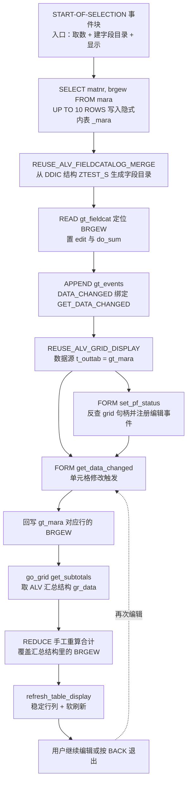
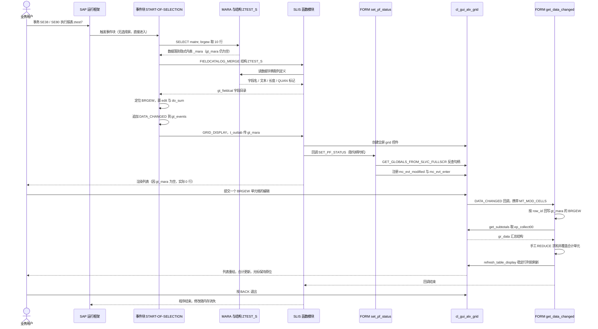

# ztest7 报表程序分析报告

> 分析对象：`ztest7.abap` — `REPORT ztest7`，115 行，过程式报表 + SLIS 全屏可编辑 ALV
> 报告性质：Onboarding 级源码走读（业务视角优先，Why > What，含批判性评审）

---

## 一、程序定位与业务背景

### 1.1 它试图解决什么问题

先别看代码里有哪些 FORM，先问一句：**一个业务人员为什么要打开这个程序？**

把关键取数摊开看就清楚了：`SELECT matnr, brgew FROM mara`。

- `MATNR` = 物料号
- `BRGEW` = **毛重**（Bruttogewicht / Gross Weight），数量型字段，单位跟随物料的**基本单位 MEINS**

再加上界面上"列可编辑 + 合计实时刷新"，作者想做的事就是一句话：**把一批物料的毛重摆在屏幕上，让业务人员直接改，改完立刻看到合计。**

那什么业务场景需要在报表里改毛重，却不去 MM01 里改主数据？合理的有三种可能：

1. **场景试算 / what-if**：换包装方案、换托盘装载方式、评估运输成本，要在真实物料清单上快速试算"总毛重变了多少"，但绝不能把试算值污染到物料主数据里。这是最合理的动机。
2. **外部数据采集**：毛重由地磅/外部系统算出，需要人工录进来暂存。**但本程序没有任何暂存表、没有保存动作**，所以这条动机不成立 —— 它只是"看起来像"，实际不是。
3. **纯粹的写法验证**：作者只是想验证"可编辑 ALV + 实时合计"这一族写法能不能跑通。综合代码里的硬编码结构名、`UP TO 10 ROWS`、空 `CASE` 骨架来看，**这条才是最接近事实的解释**。

### 1.2 现有方案为什么不够

如果只是要"一批物料的总重"，SAP 里已有更合适的答案：

- **采购视图 / MRP 视图**本来就显示毛重与净重；
- 若是运费重量口径，**运输主数据（重量组 TG）**已处理取整与体积重折算；
- 要做多物料试算聚合，正路是 **HANA CDS 计算视图**或 **Fiori 分析应用**，而不是全屏 ABAP 报表。

所以这个程序的设计前提只能是一句话：**"需要在列表上下文里现场改数、即时看到合计"**。需求本身合理，但 ABAP 全屏可编辑 ALV 是实现它的**最重方式** —— 它把一次性的计算任务包装成了一个有状态、有交互、有焦点管理的界面。

### 1.3 设计范式一句话定性

> **过程式报表 + SLIS 函数模块全屏可编辑 ALV + 在编辑回调里手工重算合计的 "what-if 沙盘"。**

三个关键词：过程式（无 OO 分层）、SLIS（老一代 ALV 封装）、手工（自己算合计而不信 ALV）。没有类、没有校验、没有持久化、没有单元测试、没有选择屏。

### 1.4 但必须先给一句预警：这个程序现在跑不出它想跑的结果

新人最容易在这里浪费半天，所以先摊开结论。问题分两个层次：**激活期（编译）** 和 **运行期**。

| 层次 | 作者意图 | 代码实际 | 后果 |
|---|---|---|---|
| 激活期 | 用 `REDUCE` 求毛重合计 | `REDUCE` 的循环变量 `<ls_t>` **从未声明** | SYNTAX_ERROR，**程序根本无法激活** |
| 运行期 | 取 10 行毛重到展示结构 | 数据写进隐式内表 `_mara`，而 ALV 的 `t_outtab` 是 `gt_mara` | 数据源为空 → **屏幕白屏** |
| 运行期 | 合计 = 毛重之和 | 累加容器是 `TYPE ntgew_15`（**净重**语义） | **类型语义错配**，合计口径与所在列不一致 |
| 运行期 | 注册编辑事件 | `register_edit_event` 无 `EXCEPTIONS` 子句 | 异常裸奔到运行时 → 短 dump 风险 |
| 业务语义 | "可编辑" | 无校验、无保存、无回写主数据 | 用户可能误以为已改主数据 |

也就是说：这是一份**教科书级别的"能编译过、但一运行就白屏"的 demo**。它的价值不在"能用"，而在于它把 ALV 可编辑 + 合计这一族写法集中示范了一遍，同时也集中示范了这一族写法最容易踩的三个坑。后面第三章会逐段把它们拆开。

---

## 二、程序执行流程总览

### 2.1 执行流程图



注意流程的**双入口特征**：`set_pf_status` 由 SLIS 在构建状态栏时回调（冷路径，一次），`get_data_changed` 由 grid 在用户每次提交单元格时回调（热路径，可循环任意次）。这个程序的所有复杂度都压在那条热路径上。

### 2.2 责任链表

| 子程序 | 调用者 | 职责 |
|---|---|---|
| 全局声明区 | 编译期 | 声明数据容器（`gt_mara`）、SLIS 描述表（`gt_fieldcat` / `gt_events`）、grid 句柄（`go_grid`）、刷新参数（`gs_stable`）、动态结果容器（`gr_data` / `<gtr_sum_tab>`） |
| 事件块 `START-OF-SELECTION` | SAP 运行框架（报表无选择屏，直接进事件块） | 程序入口：取 MARA 数据 → 生成并改造字段目录 → 绑定回调 → 调用 SLIS 显示 |
| `FORM set_pf_status` | `REUSE_ALV_GRID_DISPLAY` 经 `i_callback_pf_status_set` 回调 | 用 `GET_GLOBALS_FROM_SLVC_FULLSCR` 反查 `go_grid`，注册 `mc_evt_modified` / `mc_evt_enter`；预留 `sy-ucomm` 命令骨架（当前为空） |
| `FORM get_data_changed` | grid 的 `DATA_CHANGED` 事件（是否真触发取决于上一行是否成功注册） | ① 把改动单元格回写进 `gt_mara`；② 取 ALV 汇总结构并用 `REDUCE` 手工覆盖合计；③ 稳定刷新 |
| 内联 `REDUCE` 表达式（嵌在 `get_data_changed` 内） | `FORM get_data_changed` ② | 遍历 `gt_mara` 累加 BRGEW，覆盖合计单元格的值 |

下面按这条流程，逐个子程序展开。

---

## 三、分组分析（按程序流程 / 子程序）

### 3.1 全局声明区

```abap
REPORT ztest7.
TYPE-POOLS:slis.

DATA: gt_mara     TYPE TABLE OF ztest_s,
      gt_fieldcat TYPE slis_t_fieldcat_alv,
      gt_events   TYPE slis_t_event,
      go_grid     TYPE REF TO cl_gui_alv_grid,
      gs_stable   TYPE lvc_s_stbl,
      gr_data     TYPE REF TO data.

FIELD-SYMBOLS: <gtr_sum_tab> TYPE table.
```

**做什么**

- `gt_mara TYPE TABLE OF ztest_s` —— ALV 的工作内表，元素类型指向 DDIC 结构 `ZTEST_S`。它同时被当作"数据容器"和"显示结构来源"。
- `gt_fieldcat` / `gt_events` —— SLIS 的字段目录表与事件表，分别在显示入口与回调绑定处被填充。
- `go_grid` —— 全屏 grid 的对象引用，供 PF-STATUS 回调取句柄、编辑回调操作界面。
- `gs_stable` —— 传给 `refresh_table_display` 的稳定行列开关。
- `gr_data TYPE REF TO data` + `<gtr_sum_tab> TYPE table` —— 承接 `get_subtotals` 的动态返回值，靠 `ASSIGN` 拆成内表再按分量访问。
- `TYPE-POOLS:slis.` —— 引入 SLIS 类型池（全屏 ALV 的类型与常量来源）。

**为什么**

这六项恰好覆盖了 SLIS 编程骨架的五个角色：数据容器、界面描述、界面句柄、调用参数容器、动态结果容器。`go_grid` 之所以只能是 `REF TO` 而不能是"我们自己创建的对象"，是因为全屏 grid 由 SLIS 的 FM 内部创建并持有，程序无法直接构造 —— 这个限制会在 3.3 结账，也是本程序最核心的技术债。

**风险与改进**

- **`ztest_s` 同时承担两个职责**：既当数据容器（决定 SELECT 投影多少列），又当显示结构（决定 fieldcat 有多少列）。这两个职责应该解耦：数据容器可以是含更多字段的 Z 结构或直接用 `mara`，显示结构单独定义。否则改一个必然动到另一个（3.2 ① 会看到它已经咬上了）。
- **双重动态是绕开类型系统的产物**：`get_subtotals` 的 `ep_collect00` 签名是 `TYPE ANY`，作者用 `REF TO data` + 无类型字段符号来承接。代价是静态检查全部失效 —— 后面"合计结构里没有 BRGEW"这种事只能运行时才知道。作者自己写了 `IF <lg_val> IS ASSIGNED` 兜底，说明他也不确定。
- **全部状态是全局的**：没有局部化、无并发隔离、无法单元测试。若把它改造成 OO，`gt_mara` 应是类的属性，回调 FORM 应被换成类事件处理方法。
- **命名误导**：`gs_stable` 用 `gs_`（global/static）前缀，实质只服务一次刷新调用；`<gtr_sum_tab>` 用 `<gtr_>` 表达"gt 的替身"，是自造缩写，不是 ABAP 社区习惯。命名应表达用途（`gv_stable` / `<sum_tab>`）。
- **`TYPE-POOLS:slis` 是 7.40 之前的写法**：新程序可直接用 `cl_gui_alv_grid` + `salv` 系列，彻底去掉 SLIS 依赖与这个类型池。

### 3.2 事件块 `START-OF-SELECTION`

这个事件块承担了四个步骤：取数、生成字段目录、改造字段目录并绑定回调、调用显示。把显示交给 SLIS 之前，程序必须先把"列表长什么样"和"改动后谁来接"准备好。

#### ① 取数：MARA 的两列

```abap
START-OF-SELECTION.

  SELECT matnr,
         brgew
    FROM mara
   INTO TABLE _mara UP TO 10 ROWS.
  IF sy-subrc EQ 0.
```

**做什么**

- 从 `MARA` 投影 `MATNR`、`BRGEW` 两列，限制最多 10 行，写入内部表 `_mara`。
- 仅当 `sy-subrc = 0`（至少取到一行）才继续往下走，否则整段跳过、程序静默结束。

**为什么**

- 投影两列而非 `SELECT *`：MARA 有 200+ 字段，取需要的列省内存、省传输。
- `UP TO 10 ROWS`：这是"演示程序控制代价"的典型手法 —— 避免在开发机上为了试一个 ALV 而全表扫 MARA。配合 `sy-subrc` 判断是有意识的防御（`SELECT INTO TABLE` 无数据时返回 4 而不是 0）。
- 数据源选 MARA 而不是 CDS 视图：对一个 demo 而言，标准表最容易拿。

**风险与改进**

- 🔴 **写错了目标对象，这是全程序最大的 P0**：`_mara` 从未声明，是 `SELECT ... INTO TABLE` **隐式生成**的内表（只有 MATNR/BRGEW 两列）。而 ALV 的数据源是 `t_outtab = gt_mara`。二者毫无关系，结果是**屏幕 0 行**。危险之处在于"未声明也能通过语法检查"—— 编译器不会拦你，用户看到的是一张有列没行的空表，还以为是"这个物料没有数据"。
- 🔴 **即使改成 `gt_mara` 也未必显示得出来**：fieldcat 是从 DDIC 结构 `ZTEST_S` 的**全部**字段生成的，而 SELECT 只投影了两列。SLIS 的 `GRID_DISPLAY` 会逐列检查 fieldcat 在 outtab 中是否有对应字段，缺列会报错/短 dump。正确修法是让 SELECT 投影与 `ZTEST_S` 字段**一一对应**，或把 `ZTEST_S` 建成只含这两列的纯展示结构。这是 3.1 提到的"两个职责混在一个 DDIC 对象上"的直接代价。
- 🟠 **`UP TO 10 ROWS` 没有 `ORDER BY`**：结果不确定、不可重现，写不出测试断言；而且它与程序定位（全量报表）背离 —— 真实需求要么给选择屏 + 区间，要么在注释里明说"这是样例程序"。
- 🟠 **无数据时完全静默**：`sy-subrc <> 0` 直接落到事件块末尾，屏幕一点反馈都没有。用户只能靠猜。至少应有一条 `MESSAGE ... TYPE 'S'`。
- 🟡 **隐式内表是反模式**：类型、字段名、可空性全靠隐式推断。代码可读性和可维护性都差，且极易与后续使用点脱节（本例就是）。

#### ② 生成字段目录

```abap
    CALL FUNCTION 'REUSE_ALV_FIELDCATALOG_MERGE'
      EXPORTING
        i_program_name         = sy-repid
        i_structure_name       = 'ZTEST_S'
      CHANGING
        ct_fieldcat            = gt_fieldcat
      EXCEPTIONS
        inconsistent_interface = 1
        program_error          = 2
        OTHERS                 = 3.
    IF sy-subrc = 0.
```

**做什么**

- 让 SLIS 从 DDIC 结构 `ZTEST_S` 自动生成 `gt_fieldcat`：列名、长文本、输出长度、小数位、转换例程，以及 QUAN / CURRENCY 这类字段的编辑格式标记，全部取自数据字典。
- 声明了 `inconsistent_interface`、`program_error`、`OTHERS` 三个异常。
- 只有 `sy-subrc = 0` 时，字段目录才算数，继续往下走。

**为什么**

自动生成 fieldcat 是**方向正确**的做法：列文本与转换规则属于数据字典的职责，不该在程序里二次维护。它省掉几十行 `APPEND` 和几十个可能出错的德语/中文文本硬编码，也让列的显示长度与实际字段类型天然一致。`i_program_name = sy-repid` 是 FM 要求的调用上下文。

**风险与改进**

- 🟠 **异常声明了却不区分处理**：`inconsistent_interface`（接口不一致）与 `program_error`（结构读不到）是完全不同的故障（前者通常是程序问题，后者是 DDIC/传输问题），现在都被压缩成一个 `sy-subrc = 0` 判断，出错即整段跳过 → 用户看到白屏。这是"样板式异常处理"的典型样本：**看起来有容错，实际零诊断信息**。至少应按异常编号分支给不同提示。
- 🟡 **结构名是硬编码字符串** `'ZTEST_S'`：DDIC 改名或未随传输到位时触发 `program_error`，同样静默失败。字符串一旦散落就无法被重构工具检查。
- 🟡 **自动生成不保证好看**：若 `BRGEW` 对应数据元素的短文本在当前语言下缺失，列头会以技术名显示；也没有任何 `spa_gap` / `just` / `key` 调整，列宽全靠默认。

#### ③ 打开可编辑与合计列，并绑定回调

```abap
      READ TABLE gt_fieldcat ASSIGNING FIELD-SYMBOL(<gs_fcat>) WITH KEY fieldname = 'BRGEW'.
      IF sy-subrc EQ 0.
        <gs_fcat>-edit = 'X'.
        <gs_fcat>-do_sum = 'X'.
      ENDIF.

      APPEND VALUE #( name = 'DATA_CHANGED' form = 'GET_DATA_CHANGED' ) TO gt_events.
```

**做什么**

- 在字段目录里按字段名定位 `BRGEW` 列，把这一列同时标记为**可编辑**（`edit = 'X'`）与**参与合计**（`do_sum = 'X'`）。
- 往事件表里追加一条绑定：事件 `DATA_CHANGED` → 回调 `GET_DATA_CHANGED`。

**为什么**

这是可编辑 ALV 的两个必要开关，缺一不可：`EDIT` 决定单元格是否接受输入，`DO_SUM` 决定该列是否进入 `get_subtotals` 的合计。少任何一个，用户都会遇到"看起来能改但没反应"或"改了但合计不动"。用 `ASSIGNING FIELD-SYMBOL` 而不是 `READ ... INTO` 再 `MODIFY`，避免整行拷贝，是干净的写法。`APPEND VALUE #(...)` 的行式构造也很地道。

**风险与改进**

- 🟠 **字段名硬编码 `'BRGEW'`，且失败被静默吞掉**：`ZTEST_S` 里若字段改名，`READ` 返回 4，程序照常显示 —— 只是那一列既不可编辑也不合计。**失败模式对用户完全不可见**，这是最难排查的一类缺陷。至少应 `MESSAGE` 提示"未找到 BRGEW 字段，可编辑功能未启用"。
- 🟡 **事件名与 FORM 名都是字符串字面量**（`'DATA_CHANGED'` / `'GET_DATA_CHANGED'`），而非 SLIS 常量（如 `slis_ev_data_changed`）。拼错不报错，只是回调永不触发。同理，FORM 名与 `it_events-form` 的一致性没有任何静态保障。
- 🔴 **选了 `DATA_CHANGED` 而非 `DATA_CHANGED_FINISHED`，这是本程序最关键的架构选择**：前者是"单元格修改过程中"触发，回调里带着 `cl_alv_changed_data_protocol` 对象（可以回写单元格显示值、可以拒绝修改），而且 ALV 仍在等待程序给出生效值；后者是"用户完成编辑（离开单元格/整表结束）"触发，更适合做后处理与刷新。**在 `DATA_CHANGED` 里直接 `refresh_table_display` 是公认的高风险写法**（详见 3.4 ③）。
- 🟡 **`gt_events` 未先 `CLEAR` 就 APPEND**：报表只跑一遍时无害，但若将来被循环调用、被 `SUBMIT`、或加了二次进入点，事件会重复注册。

#### ④ 调用全屏显示

```abap
      CALL FUNCTION 'REUSE_ALV_GRID_DISPLAY'
        EXPORTING
          i_callback_program       = sy-repid
          it_fieldcat              = gt_fieldcat
          it_events                = gt_events
          i_callback_pf_status_set = 'SET_PF_STATUS'
        TABLES
          t_outtab                 = gt_mara.
```

**做什么**

- 把字段目录、事件表、工作内表一次性交给 SLIS，指定回调宿主为当前报表程序（FM 需要用它 `CALL FUNCTION` 找回本程序里的 FORM）。
- 通过 `i_callback_pf_status_set` 要求 SLIS 在构建状态栏时回调 `SET_PF_STATUS` —— 这是全屏模式下**唯一**能拿到 grid 句柄的时点。

**为什么**

这是 SLIS 全屏（`REUSE_ALV_GRID_DISPLAY`，区别于 `..._LIST`）的入口。全屏与列表的区别在于：全屏下 grid 是真实 `CL_GUI_ALV_GRID` 控件（可编辑、可排序、可优化），而 `..._LIST` 是一次性生成的输出列表（不能编辑）。要"可编辑"，只能走全屏，也就必然要走 `i_callback_pf_status_set` 这条反查句柄的路。

**风险与改进**

- 🔴 **渲染出的是"有列无行"的空表**：因为 `t_outtab = gt_mara` 而数据在 `_mara`（见 ①）。叠加 ② 中"fieldcat 列可能多于 SELECT 投影列"的隐患，这一行同时是正确性和健壮性的双重风险点。
- 🟠 **没有任何 `EXCEPTIONS`**：FM 失败时屏幕一片空白，用户与支持同事都无从下手。
- 🟡 **没有默认布局**：无斑马纹、无列宽优化、无合计行位置、无 `is_layout` / `it_fieldcat` 的显示参数。用户必须自己点两次工具栏才能看到合计 —— 直接削弱了本程序唯一的存在理由。
- 🟡 **没有 `it_sort`**：合计与排序是配套的。`SORT_ORDER` 为空时合计行会被排到最后，用户很难把"毛重最大的物料"拎出来，而那正是他改毛重时最想做的事。
- 🟡 **没有选择屏、没有 `i_save` 变式保存、没有 title、没有 log**：作为 demo 够用，作为交付给业务人员的工具不合格。

至此，准备工作做完了，接下来就交给 SLIS 与用户交互。

### 3.3 `FORM set_pf_status`

这个 FORM 有两件事：反查 grid 句柄并注册编辑事件；预留 `sy-ucomm` 命令分发骨架（目前是空的）。它是"冷路径" —— 每次显示只被调用一次，但**成败决定了 3.4 的回调是否有人接**。

#### ① 反查句柄并注册编辑事件

```abap
FORM set_pf_status USING itr_extab TYPE slis_t_extab.

* Get the ALV Object reference
  CALL FUNCTION 'GET_GLOBALS_FROM_SLVC_FULLSCR'
    IMPORTING
      e_grid = go_grid.
  IF go_grid IS BOUND.
    CALL METHOD go_grid->register_edit_event
      EXPORTING
        i_event_id = cl_gui_alv_grid=>mc_evt_modified.

    CALL METHOD go_grid->register_edit_event
      EXPORTING
        i_event_id = cl_gui_alv_grid=>mc_evt_enter.
  ENDIF.
```

**做什么**

- 通过 SLIS 的全屏全局导出 FM 拿到 `go_grid` 句柄（只有在 PF-STATUS 回调时 grid 已建好、尚未显示，才能这样反查）。
- 在句柄有效的前提下，注册两个编辑事件：`mc_evt_modified`（单元格提交）与 `mc_evt_enter`（回车确认）。

**为什么**

- `GET_GLOBALS_FROM_SLVC_FULLSCR` 是这一代 API 里官方唯一（也是几乎唯一）的句柄反查手段，是全屏 SLIS 的固有债：谁创建、谁持有，外部就拿不到引用。
- 必须注册编辑事件，`DATA_CHANGED` 才会在用户改单元格时被抛出。也就是说，3.2 ③ 里挂的那条 `it_events` 绑定能否生效，**完全取决于这一步**。两处配置任一缺失，结果都是"界面可编辑但回调不进"，而这个故障表现和"回调进了但写错了"极难区分。

**风险与改进**

- 🟠 **两个 `register_edit_event` 都没有 `EXCEPTIONS` 子句**：`REGISTER_EDIT_EVENT` 在事件已注册时抛 `event_already_registered`。全屏 SLIS 在字段可编辑时通常已自行注册相关事件，重复注册的幂等性完全依赖 SLIS 内部实现与版本。即便当前版本恰好不触发，这种"把潜在异常暴露给 ABAP 运行时（→ ST22 短 dump）"的写法本身就是缺陷。必须显式捕获。
- 🟠 **两个事件语义重叠**：一次"改完按回车"的操作可能同时落 `mc_evt_modified` 与 `mc_evt_enter`，两次 `DATA_CHANGED` → 两次 `get_subtotals` + 两次整表刷新。应二选一（通常只要 `mc_evt_modified`），或在回调里按事件来源判重。
- 🟡 **入参 `itr_extab` 完全没用**：SLIS 专门把扩展功能表传进来，就是为了让你往 ALV 上挂自定义按钮。作者拿了参数却丢弃，等于放弃了一条已经铺好的路。要么真的 `APPEND` 几个按钮到 `itr_extab`，要么在注释里写明为何不用 —— 现在的状态是沉默。
- ✅ `go_grid IS BOUND` 检查是好习惯，应保留。注意这也意味着：**若句柄拿不到，后续编辑回调会被整块跳过**，界面看起来正常但数据永远不更新。
- 🟢 **现代替代方案**：不要用全屏 SLIS。直接 `CREATE OBJECT go_grid`，再 `set_table_variant` + `check_list_consistency`，句柄天然在手，不需要全局导出 FM，也不需要 PF-STATUS 回调，同时可以用类事件（`CL_EVENTS`）代替字符串表单名。这条路的副作用是必须自己管状态栏。

#### ② 命令分发骨架

```abap
  " PF Status Code
  CASE sy-ucomm.
*	WHEN
    WHEN OTHERS.
  ENDCASE.
ENDFORM.
```

**做什么**

- 一个空的 `CASE`：除 `OTHERS` 外没有任何分支，而 `OTHERS` 分支体也是空的，等价于"什么都不做"。
- 注释里留了一行被注释掉的 `WHEN`，说明作者打算在这里写命令分支，只是还没写。

**为什么**

PF-STATUS 回调里的 `sy-ucomm` 分发是 SLIS 全屏的标准扩展点，用来挂 `BACK` / `EXIT` / 保存 / 导出 / 校验等动作。先占位再实现是可理解的推进节奏。

**风险与改进**

- 🟠 **这是死代码**：`CASE sy-ucomm. WHEN OTHERS. ENDCASE.` 语义上等于 `CASE sy-ucomm. ENDCASE.`，比空 CASE 还多一层误导（读起来像"处理了其它情况"）。编译器对此类空分支也可能给出提示。
- 🟡 **缺 `BACK` / `EXIT` 的显式处理**：全屏 SLIS 对 BACK 有隐式行为，但依赖隐式行为意味着换 FM、换版本或改成非全屏时容易漏。
- 🔴 **缺业务命令，才是真正的要害**：一个"列可编辑"的 ALV 通常必须配套两类能力 —— 提交时校验（`EDITOR_CHECK`）与保存动作。本程序一个都没有。**可编辑 + 无校验 + 无保存，是最危险的一种组合**：用户输入"12,5"（逗号小数点）就可能短 dump；用户改完按下保存会以为主数据变了，实际上程序一退出就全部蒸发。业务人员不会知道，也没义务知道。程序该在标题栏或状态栏明确写出"试算值，不写回主数据"。

准备与交互骨架都已就位，下面进入真正的业务逻辑核心：编辑回调。

### 3.4 `FORM get_data_changed`

这是本程序的**热路径**，也是全部复杂度的集中地。它会在用户每次提交单元格时被调用，三个步骤分别是：回写数据、重算合计、稳定刷新。三步之间强耦合 —— 第二步的合计依赖第一步的写入是否成功，第三步的刷新又依赖第二步是否算完。

#### ① 把修改回写到内表

```abap
FORM get_data_changed USING io_data_changed TYPE REF TO cl_alv_changed_data_protocol.

  IF go_grid IS BOUND.

    LOOP AT io_data_changed->mt_mod_cells ASSIGNING FIELD-SYMBOL(<gs_changed>) WHERE fieldname = 'BRGEW'.
      READ TABLE gt_mara ASSIGNING FIELD-SYMBOL(<gs_tab>) INDEX <gs_changed>-row_id.
      IF sy-subrc EQ 0.
        <gs_tab>-brgew = <gs_changed>-value.
      ENDIF.
    ENDLOOP.
```

**做什么**

- 遍历本次编辑涉及的单元格清单 `MT_MOD_CELLS`，按 `fieldname = 'BRGEW'` 过滤出目标列。
- 按协议里的 `row_id`（行号）在工作内表 `gt_mara` 中定位对应行，把协议携带的 `value` 直接赋给该行的 `BRGEW`。

**为什么**

- `MT_MOD_CELLS` 是 ALV 给出的**增量变更清单**，只含被改动过的单元（行号、列名、新值），而不是整表快照。这是 ALV 数据交互的核心设计点：**只回写被改的部分**，否则会丢掉用户的编辑焦点、行选择与滚动位置。
- 按 `fieldname` 过滤而非无条件处理，是正确的最小处理：将来若放开更多可编辑列，只需扩条件，不必重写循环。
- 用 `ASSIGNING FIELD-SYMBOL` 而非 `READ ... INTO` + `MODIFY`，直接定位行、零拷贝，是这一族写法里的推荐姿势。

**风险与改进**

- 🔴 **完全没有数值校验**：`MT_MOD_CELLS` 的 `VALUE` 本质是字符，而目标 `BRGEW` 是 QUAN（数量型）。用户输入 `1.234,56`（千分位/逗号小数点）或直接敲字母，隐式转换会抛 `CONVT_NO_NUMBER` —— 又是一次未捕获的运行时错误，短 dump 直接把用户踢出会话。
- 🔴 **清空/零值语义未定义**：用户删除单元格内容时 `VALUE` 为空，赋给 QUAN 得到 0，等于把"未知/不适用"静默改写成"零毛重"。业务上这两个含义完全不同。
- 🟠 **按 `INDEX row_id` 定位，正确性依赖 ALV 的行号约定**：`row_id` 是"当前展示行对应 outtab 的行号"，只要回调内不重排内表就成立。代码里紧接着的全表 `REDUCE` 虽不重排，但**任何人将来在这个回调里加一次 `SORT`，回写就会静默写到错误的行**。这类"当前正确、修改即错"的耦合没有任何注释保护，应改为按业务键（MATNR）定位。
- 🟡 **字段符号风格混用**：这里是内联声明（7.40+），声明区是全局 `<gtr_sum_tab>`。后果是这个程序**无法向下移植**到 7.02/7.10 老系统，也无法在同代码库保持一致风格。
- 🟡 **这一步此刻在写一张空表**：因为 3.2 ① 的取数 bug，`gt_mara` 是空的，`READ ... INDEX` 永远失败，被 `IF sy-subrc EQ 0` 静默跳过。三个 bug 互相掩盖，**修好上一个才暴露下一个** —— 这也是调试此类代码必须按层推进的原因。

#### ② 取 ALV 汇总并手工覆盖

```abap
    go_grid->get_subtotals(
      IMPORTING
        ep_collect00 = gr_data   " Overall Total
    ).

    ASSIGN gr_data->* TO <gtr_sum_tab>.
    READ TABLE <gtr_sum_tab> ASSIGNING FIELD-SYMBOL(<l_sum>) INDEX 1.
    IF sy-subrc EQ 0.
      ASSIGN COMPONENT 'BRGEW' OF STRUCTURE <l_sum> TO FIELD-SYMBOL(<lg_val>).
      IF <lg_val> IS ASSIGNED.
        <lg_val> = REDUCE #( INIT lv_i TYPE ntgew_15 FOR <ls_t> IN gt_mara NEXT lv_i = lv_i + <ls_t>-brgew ).
      ENDIF.
    ENDIF.
```

**做什么**

- 向 grid 索要第一组汇总（Overall Total），返回结构放进动态引用 `gr_data`。
- 把动态对象 `ASSIGN` 成内表，读取第 1 行的汇总记录。
- 用动态分量 `BRGEW` 定位到合计单元，最后用 `REDUCE` 把 `gt_mara` 全部行的 BRGEW 手工累加，**覆盖** ALV 自己算出来的合计值。

**为什么**

- 作者的动机清晰且有历史依据：**他不信任 ALV 自己算的合计**。可编辑 ALV 的经典坑是"用户改完单元格、屏幕上的合计没跟着变"—— ALV 的汇总基于它自己缓存的行数据，而程序刚把新值写进了内表，ALV 并不知道。于是干脆自己算一遍再写回去。
- `ASSIGN COMPONENT` 的动态写法也有其道理：`get_subtotals` 的返回类型是 `ANY`，硬编码结构名会引入额外耦合，先 ASSIGN 成功再做分量访问，是相对安全的顺序。

**风险与改进**

- 🔴 **激活期硬伤：`<ls_t>` 从未声明**。声明区的 `FIELD-SYMBOLS` 只有 `<gtr_sum_tab>`；`REDUCE` 的 `FOR ... IN` 循环变量**不是**内联声明的（7.40 里必须写成 `FOR ls_t IN gt_mara` 才会按内部结构推断类型）。**程序在这一行就通不过语法检查，无法激活。** 这是新同事接手后必然遇到的第一个问题。
- 🔴 **业务语义双重错配（最值得记的一条）**：`BRGEW` 是**毛重**，累加容器却是 `TYPE ntgew_15`（**净重**语义的数据元素）。即使语法修好、能跑通，合计单元的口径也和它所在的那一列（毛重列）**不是一回事**。这里必须做语义校核 —— 类型"长度对得上、能赋值"绝不代表口径正确。更深一层：`MARA` 上的 `BRGEW` / `NTGEW` 都是 **QUAN 数量型**，单位跟随物料**基本单位 MEINS**。把 10 个基本单位不同的物料毛重直接相加，**量纲在业务上根本不成立**（一个 KG、一个 PC、一个 L 加不出任何有意义的数字）。SAP 的正确做法是折算到统一基准单位（`CONV_PU`），或在 HANA CDS 里按 `UMRESZ` 聚合。
- 🔴 **手写合计与 ALV 合计双轨并存**：`do_sum = 'X'` 让 ALV 算一遍，程序又算一遍覆盖它。两套逻辑一旦不同步（例如编辑事件被触发两次、或将来程序内部改了内表却没走回调），屏幕上就是"错的比对的正确"，且极难察觉。更稳妥的做法是二选一：保留 `do_sum`，把事件换成 `DATA_CHANGED_FINISHED` 后交给 ALV 依据最新内表重算；或关掉 `do_sum`，自绘合计行并**明确标注口径**（"合计未折算基本单位"）。
- 🟡 `READ TABLE ... INDEX 1` 假设了汇总组的第一行就是总合计，依赖 ALV 内部排序；`ep_collect00` 本身已是"总收集"，多此一举但无害。
- 🟡 累加变量 `lv_i` 是 `REDUCE` 的 `INIT` 内联定义，作用域仅限表达式，且未对溢出与负值做任何处理。
- ✅ `IF <lg_val> IS ASSIGNED` 检查是好习惯，保留 —— 它正是把"合计结构里没有 BRGEW"这类错误从崩溃降级成"合计不动"的保险。

#### ③ 稳定刷新

```abap
    gs_stable-col = 'X'.
    gs_stable-row = 'X'.

    go_grid->refresh_table_display(
      EXPORTING
        is_stable      = gs_stable      " With Stable Rows/Columns
        i_soft_refresh = 'X'            " Without Sort, Filter, etc.
      EXCEPTIONS
        finished       = 1              " Display was Ended (by Export)
        OTHERS         = 2
    ).
    IF sy-subrc <> 0.
    ENDIF.

  ENDIF.

ENDFORM.                    "get_data_changed
```

**做什么**

- 打开"行位置、列位置稳定"开关。
- 用**软刷新**重画表格（保留当前排序与筛选状态），把内部状态（① 回写后的内表、② 覆盖后的合计）推到屏幕上。
- 声明并捕获了 `finished`（显示已因导出而结束）与 `OTHERS` 两个异常。

**为什么**

- `IS_STABLE` 是这段里最有价值的一行。不设它，`refresh_table_display` 会重置用户当前的编辑焦点、滚动位置和列布局。在"逐行试算毛重"的场景里，用户每改一个数字就要重新找位置 —— 这是可编辑 ALV 最影响使用体验的一点。`I_SOFT_REFRESH = 'X'` 保留排序与筛选，也是正确选择。
- 回调末尾的 `IF go_grid IS BOUND ... ENDIF` 收口，让整个编辑逻辑在句柄失效时安全退化而不是崩溃。

**风险与改进**

- 🟠 **`IF sy-subrc <> 0. ENDIF.` 是空分支**：异常声明了、判定写了、结果什么都不做 —— 等于把失败静默吞掉。现状是"看起来有容错，实际没有诊断信息"。要么至少 `WRITE` / `MESSAGE` 落日志，要么干脆不写 `EXCEPTIONS` 让它按默认处理。半吊子的容错比不写更糟，因为它让人误以为这条路已被覆盖。
- 🔴 **在 `DATA_CHANGED` 里刷新，事件生命周期用错了**：此时 ALV 仍在等待程序对本次编辑给出最终处理结果，grid 也可能正在重建行。此时"程序同时在改内表 + ALV 同时在等协议"两者交叠，典型症状是连续编辑两行后第一行合计错位、光标跳到别的列。
- 🔴 **业务正确性风险：无校验、无保存、界面却显示为"可编辑"**。用户改完毛重，若误以为写回主数据并据此做出运输/采购决策，后果是实际的业务事故。程序必须显式声明"试算不落库"，或在提供保存能力时补上授权对象校验。
- 🟠 **性能**：每次单元格提交都做一次 `get_subtotals` + 一趟全表 `REDUCE` + 一次整表刷新，代价是**每次击键 O(n)**。这里 n = 10 无所谓；一旦去掉 `UP TO 10 ROWS` 变成几万行，"可编辑 ALV + 实时合计"立刻变成卡顿灾难。正确姿势是只在用户完成编辑区编辑（`DATA_CHANGED_FINISHED`）或点击"计算"按钮时才重算。
- 🟡 `gs_stable` 是全局变量却每轮重复赋值，可直接局部化为内联结构；且 `col` / `row` 一律 `'X'`，无法针对具体列做稳定控制。
- ✅ `i_soft_refresh` 用得正确；`is_stable` 的语义理解到位 —— 这两点说明作者对 ALV 刷新有一定经验，只是缺系统性的事件模型认知。

至此，一次完整的"用户改一个毛重 → 屏幕合计更新"闭环就走完了。下面把数据在各个子程序之间的流转画清楚。

---

## 四、执行流程全景图（数据视角）



这张图要看的不是"调用顺序"，而是**数据在哪一步断了**：箭头 `DDIC -->> SOS` 落进的是 `_mara`，而 `SLIS -->> 用户` 读的是 `gt_mara`。整条链在第一步就分叉了，后面所有逻辑都在处理一张空表。

---

## 五、问题清单与改进建议（按优先级）

### 🔴 P0 — 业务正确性

1. **取数目标与展示数据源不是同一张表**（事件块 `START-OF-SELECTION`）：`SELECT ... INTO TABLE _mara` 写入未声明的隐式内表，而 `REUSE_ALV_GRID_DISPLAY` 的 `t_outtab = gt_mara`。结果是屏幕 0 行。**改进**：直接 `INTO TABLE gt_mara`，并确保 SELECT 投影字段与 `ZTEST_S` 字段一一对应；更彻底的做法是把显示结构与数据容器在 DDIC 上分开定义。
2. **`REDUCE` 的循环变量 `<ls_t>` 未声明**（`FORM get_data_changed`）：程序无法通过语法检查、无法激活。**改进**：改写为 `REDUCE lv_sum( INIT lv_sum = ... FOR ls_t IN gt_mara ... )`，让 7.40 自动推断内部结构；或补一个 `FIELD-SYMBOLS <ls_t> TYPE ztest_s.`。
3. **合计的语义与列的语义不一致，且量纲不成立**（`FORM get_data_changed`）：毛重 `BRGEW` 累加进净重语义的 `TYPE ntgew_15`；更根本地，跨不同基本单位（MEINS）直接相加数量字段在业务上无意义。**改进**：容器类型改为与列一致的 `BRGEW` 类型；并明确合计口径 —— 要么按统一基准单位折算后聚合（`CONV_PU` 或 HANA CDS `SUM(... * umrez/umren)`），要么在列标题/合计行上显式标注"未折算，仅供参考"。
4. **"可编辑"但无校验、无保存、无提示**（`FORM set_pf_status` + `FORM get_data_changed`）：用户输入非法值会 `CONVT_NO_NUMBER` 短 dump；编辑结果随程序退出消失，而界面看起来像在改数据。**改进**：至少补 `EDITOR_CHECK` 校验与"试算不落库"的明确提示；若要做成真正的维护工具，则必须补授权对象校验、变更日志与保存动作。

### 🟠 P1 — 健壮性

5. **`register_edit_event` 未声明 `EXCEPTIONS`**（`FORM set_pf_status`）：事件重复注册会抛 `event_already_registered`，异常暴露给运行时即短 dump。**改进**：补 `EXCEPTIONS event_already_registered = 1` 并按分支降级处理。
6. **两个编辑事件语义重叠**（`FORM set_pf_status`）：`mc_evt_modified` 与 `mc_evt_enter` 可能对同一次编辑各抛一次 `DATA_CHANGED`，导致重复重算与重复刷新。**改进**：只保留 `mc_evt_modified`。
7. **未捕获异常一律静默**（`FORM set_pf_status`、`FORM get_data_changed`、事件块 `START-OF-SELECTION`）：`refresh_table_display` 后的空 `IF`、fieldcat merge 的 `sy-subrc = 0`、回写的 `IF sy-subrc EQ 0`、`REUSE_ALV_GRID_DISPLAY` 无异常声明 —— 失败模式全部是"白屏"或"合计不动"，零诊断信息。**改进**：建立统一约定：`sy-subrc <> 0` 必须落 `MESSAGE` 或 `WRITE` 到 ALV 的消息行；不能写的场景至少写日志。
8. **`sy-ucomm` 分发是空壳**（`FORM set_pf_status`）：`CASE ... WHEN OTHERS ... ENDCASE` 等价于空 CASE；`BACK` / `EXIT` 依赖隐式行为。**改进**：显式处理 `BACK` / `EXIT`，删除无意义空壳。
9. **`UP TO 10 ROWS` 无 `ORDER BY`，且无数据时静默结束**（事件块 `START-OF-SELECTION`）：结果不可重现，无法写断言；无数据时用户得不到任何反馈。**改进**：补选择屏与区间条件、去掉 `UP TO 10 ROWS`（或明确定位为样例并加注释）；无数据时给提示。
10. **按 `INDEX row_id` 定位内表行**（`FORM get_data_changed`）：正确性依赖"回调内不重排内表"这一未加注释的隐含前提，一旦有人加一次 `SORT` 即静默写错行。**改进**：改为按 `MATNR` 等业务键定位，或在代码中显式注释锁定该前提。

### 🟡 P2 — 性能与规范

11. **每次击键 O(n) 的重算与整表刷新**（`FORM get_data_changed`）：`get_subtotals` + 全表 `REDUCE` + `refresh_table_display` 叠加，在小数据量下无害，去掉 `UP TO 10 ROWS` 后即成瓶颈。**改进**：把重算时机收敛到 `DATA_CHANGED_FINISHED` 或显式的"计算"按钮。
12. **`DATA_CHANGED` 中途刷新，事件生命周期用错**（`FORM get_data_changed`）：协议未确认与 grid 重建交叠，连续编辑时易出现合计错位、光标跳列。**改进**：改用 `DATA_CHANGED_FINISHED`；或在 `DATA_CHANGED` 中用 `add_protocol_entry` 声明每个单元的程序最终值，让 ALV 依据协议刷新而不手动 `refresh_table_display`。
13. **全局状态与硬编码字符串**（全局声明区、事件块 `START-OF-SELECTION`）：`'ZTEST_S'` / `'BRGEW'` / `'DATA_CHANGED'` / `'GET_DATA_CHANGED'` 全是字面量；`gs_stable` 名为全局却只服务一次调用。**改进**：结构名与事件名使用 DDIC 类型常量；可编辑列/合计列改为配置驱动（一张 X 字段或 Customizing 表），避免"改字段名 → 功能静默失效"。
14. **字段符号风格混用**（`FORM get_data_changed`）：内联声明（7.40+）与全局 `FIELD-SYMBOLS` 并存，导致无法向下移植。**改进**：统一为内联声明（或按目标系统版本统一为全局声明）。
15. **字段目录缺少布局与排序配置**（事件块 `START-OF-SELECTION`）：无 `it_sort`、无 zebra、无合计行位置，用户要看合计需自行操作两次。**改进**：给 `BRGEW` 列配 `do_sum` + `spa_gap`/`just`，并在启动后调用一次 `set_default_layout` / 提供固定变式。

### 🟢 P3 — 可扩展性

16. **DDIC 职责混淆**（全局声明区）：`ZTEST_S` 既是数据容器又是显示结构。**改进**：拆为数据表类型与显示结构两者，`fieldcat` 只来自显示结构。
17. **SLIS 技术债**（全局声明区、`FORM set_pf_status`）：`TYPE-POOLS:slis` + `GET_GLOBALS_FROM_SLVC_FULLSCR` + 字符串 FORM 名回调，是 7.40 之前的形态，句柄获取方式尤其脆弱。**改进**：改用直接 `CREATE OBJECT go_grid` + `CL_EVENTS` 类回调，或直接基于 SALV / Fiori 分析应用实现同一需求。
18. **缺少可测试性与可观测性**（全程序）：过程式 + 全局状态，无法单元测试，也没有任何日志。**改进**：把取数、字段目录构造、合计计算抽成本地类方法（输入内表 → 输出合计值），即可直接写单元测试覆盖合计口径这类最容易出错的逻辑。
19. **未提供任何扩展出口**（`FORM set_pf_status`）：`itr_extab` 收了却不用；无导出、无变式保存、无批量维护入口。**改进**：利用 `itr_extab` 加"导出""恢复初始值""说明"按钮；把"是否落库"做成开关，同一套代码服务试算与维护两种场景。

---

## 六、整体评价与启发

### 优点

1. **技术选型的时代印记很清晰**：fullscreen ALV + `DATA_CHANGED` + `get_subtotals` + 稳定刷新，这是一套在旧式可编辑 ALV 里被反复验证过的组合，说明作者踩过这类界面的坑，而不是照抄教程。
2. **`is_stable` 用对了**。这是整段代码里最有"实战感"的一行 —— 它对应"用户改一个数字后光标/滚动位置不能丢"这个真实痛点，说明作者在意使用体验，而不只是让代码跑通。
3. **增量处理而非整表回写**（`MT_MOD_CELLS` + `ASSIGNING FIELD-SYMBOL`）：符合 ALV 数据交互的正确姿势，也是这一族写法里值得保留的示范。
4. **方向正确的关键决策**：用 `FIELDCATALOG_MERGE` 从 DDIC 自动生成字段目录，而不是手写 `APPEND`。列文本与转换规则交给数据字典，这是对的。

### 短板

1. **演示级代码被当成完整程序**。硬编码结构名、`UP TO 10 ROWS`、空 `CASE` 骨架、注释掉的 `WHEN` —— 这些都指向"验证写法"的阶段，但代码里没有任何一处说明它尚未完工。
2. **三层缺陷互相掩盖**：语法错误（`<ls_t>`）、取数写错表（`_mara`）、事件可能未注册（无 `EXCEPTIONS`）。修好一个才暴露下一个，说明它从未被真正运行过。
3. **异常处理是"声明式"的**：所有异常都声明了、都没有区分处理。结果是失败全部表现为"白屏"或"合计不动"——**诊断信息为零**。这是本程序最系统性的问题，比任何单个 bug 都更值得警惕。
4. **业务语义缺席**：把毛重之和写进净重变量、跨基本单位求和、没有"试算不落库"的提示。程序只关心"数字算出来了"，不关心"这个数字在业务上意味着什么"。
5. **无分层、不可测**：取数、界面描述、交互、业务计算全塞在一个 115 行的事件块里与两个 FORM 里，任何改动都要在脑子里模拟完整状态机。

### 可学到的设计经验

1. **"能通过语法检查"与"能工作"之间隔着十万八千里**。本程序的 `_mara` 就是活教材：未声明的内表隐式存在、语法零错误、编译器绝不提醒，但数据静静地流向了错误的地方。**别名与隐式声明是 ABAP 里最廉价的 bug 来源** —— 变量名起对，就是最有效的第一道防线。
2. **类型对得上 ≠ 语义对得上**。毛重 `BRGEW` 与净重 `NTGEW_15` 都能编译、都能赋值，但它们不是一回事；更隐蔽的是量纲 —— 不同基本单位的数量字段相加在业务上根本不成立。做数据元素级别的**语义校核**，是分析 SAP 代码时不可跳过的一步。
3. **可编辑界面必须自带三件套：校验、保存、免责声明**。缺任何一件，"可编辑"都会变成业务事故的入口。本程序三件全缺，因此它作为"能编辑的报表"是不合格的，作为"写法示例"才是合格的。
4. **告警优于沉默，空容错劣于无容错**。`IF sy-subrc EQ 0. ENDIF.`、空 `CASE ... WHEN OTHERS`、被声明却从不区分的异常 —— 这些写法最危险的地方在于它们让代码"看起来已经考虑过失败路径"。真正的健壮性来自于：**每一个失败分支都能告诉人发生了什么**。

**给下一位接手者的最短路径**：先补 `<ls_t>` 让程序能激活（或者干脆不激活，直接照着本文把 4 个 P0 一起修掉）；然后做一次 DDIC 层面的重构 —— 把数据容器和显示结构拆开，把"哪些列可编辑、哪些列参与合计"抽成配置；最后把编辑回调从 `DATA_CHANGED` 迁到 `DATA_CHANGED_FINISHED`，去掉手写合计。做完这三步，这个"毛重试算沙盘"才真正具备交付给业务的资格。
