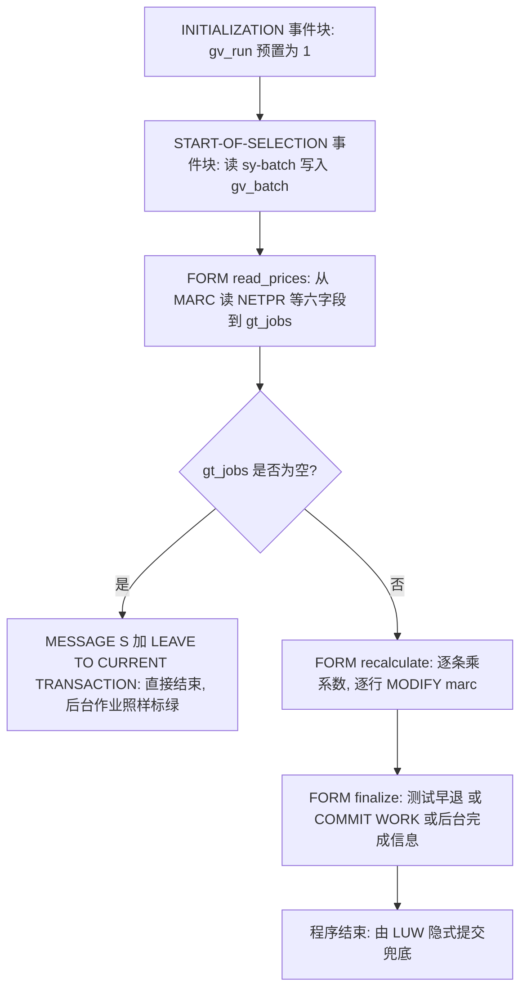
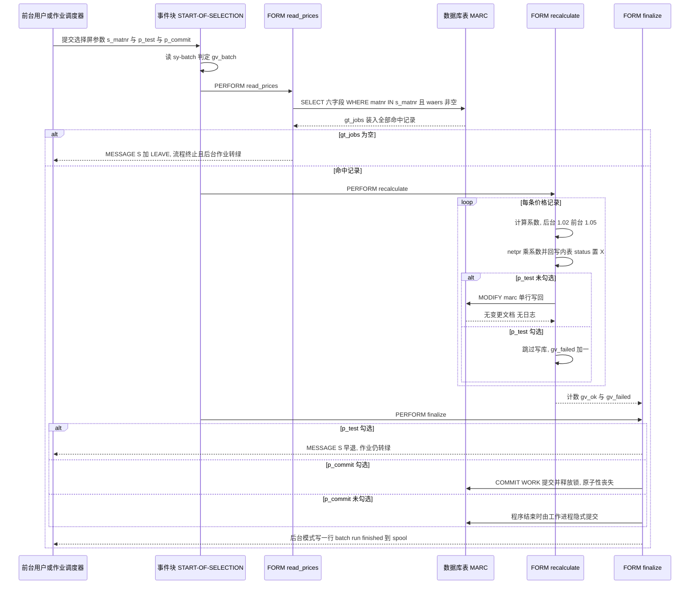

# zprice_batch 夜间调价程序分析报告

> 分析对象：`REPORT zprice_batch`（纯报表程序，无 OO，无函数组）
> 分析重点：取数（`read_prices`）、调价与落库（`recalculate`）、提交段（`finalize`），以及**前台执行与后台作业的行为差异**

---

## 一、程序定位与业务背景

### 它解决什么问题

`zprice_batch` 是一个「夜间批量调价」工具。每天（或人工触发）跑一次，把 `MARC`（物料-工厂视图）里每个物料工厂组合的 `NETPR`（净价/标准价参考字段）整体乘上一个系数，写回数据库。核心意图是**在采购行情整体上行的场景下，让工厂物料的参考价格保持"新鲜"，避免 MM 报表、框架协议比价、库存估价时读到几个月前的陈旧价格**。程序的注释说得很直白：

```abap
*"----------------------------------------------------------------------
*"* Nightly price recalculation. Runs both interactively and as a
*"* background job — detects which, then behaves accordingly.
*"----------------------------------------------------------------------
```

注意 "behaves accordingly"（按运行方式改变行为）——这正是本程序最危险的地方，第四章会专门拆开讲。

### 现有方案为什么不够

这个需求用 SAP 标准功能本来应该走：价格确定的条件记录（信息记录 `EINE`、条件表 `A027/A028` 等）+ `BAPI_PRICES_CONDITIONS`，由后台作业调用，价格条件自动带有效期、带变更文档、可回溯。而眼前这个程序的做法是**直接对透明表 `MARC` 做 `MODIFY`**：

- 系数（1.02 / 1.05）**硬编码在源码里**，想改成 1.015 必须走传输请求、改程序、再激活；
- 系数**依赖运行方式**（后台 1.02、前台 1.05），这意味着"我先在前台试一下"这个再正常不过的动作，会真的把全系统价格抬高 5%；
- 价格是**原地覆盖**，上一轮的原价被永久丢弃，没有备份表、没有反转程序、没有变更文档；
- 没有有效期判断，`MARC-DATNR`（记录有效期起）和 `MARC-EINTR`（有效期止）被查出来却从没用过。

所以现有方案的问题不在"能不能调价"，而在于**调价的量纲、边界、留痕三件事全靠程序员的口头约定**，没有落到代码里。

### 整体设计范式（一句话定性）

> 这是一个**典型的"报表程序 + PERFORM 串联"的批处理范式**（Batch-Update 风格），单层结构、无封装、无日志、无错误处理——把 `MARC` 当成一张可以随便覆写的 Excel 表来用；能跑通，但把 SAP 数据一致性模型（LUW、变更文档、更新任务、锁）全部绕开了。

---

## 二、程序执行流程总览

程序是纯 `REPORT`，没有事件块拆分模块，全流程只有一条直线。下面这张图把 6 个可识别单元（声明区算编译期单元，其余 5 个是运行期单元）串起来：



### 责任链表

| 子程序 | 调用者 | 职责 |
|---|---|---|
| 全局声明区 | 编译器 + 前台选择屏 | 定义 `ty_job` 行结构与 `gt_jobs` 内表、6 个全局变量、3 个选择屏参数 |
| 事件块 `INITIALIZATION` | 运行时（`START-OF-SELECTION` 之前自动触发） | 把 `gv_run` 预置为 1，作为后续记录计数起点 |
| 事件块 `START-OF-SELECTION` | 前台用户回车 / 后台调度器 | 判定 `sy-batch` → `gv_batch`，再依次 `PERFORM` 三个 FORM |
| FORM `read_prices` | 事件块 `START-OF-SELECTION`（第 2 个 PERFORM） | 按 `s_matnr` 从 `MARC` 读 `NETPR`/`WAERS`/`EINTR`/`DATNR` 到 `gt_jobs`；空结果发 S 消息并离屏 |
| FORM `recalculate` | 事件块 `START-OF-SELECTION`（第 3 个 PERFORM） | 逐条乘 1.02/1.05、写回 `status`、逐行 `MODIFY marc`、累计 `gv_ok`/`gv_failed` |
| FORM `finalize` | 事件块 `START-OF-SELECTION`（第 4 个 PERFORM） | 测试模式早退、可选 `COMMIT WORK`、后台完成信息 |

下面按这条流程，逐个子程序展开。

---

## 三、分组分析（按程序流程 / 子程序）

### 3.1 全局声明区（结构、内表与选择屏）

整个声明区分三步看：行结构与内表定义、全局计数与开关、选择屏参数。

#### ① 行结构与内表定义

```abap
TYPES: BEGIN OF ty_job,
         matnr   TYPE mara-matnr,
         werks   TYPE marc-werks,
         netpr   TYPE marc-netpr,
         waers   TYPE marc-waers,
         eintr   TYPE marc-eintr,
         datnr   TYPE marc-datnr,
         status  TYPE char1,
       END OF ty_job.

TYPES ty_job_tab TYPE STANDARD TABLE OF ty_job WITH EMPTY KEY.

DATA gt_jobs   TYPE ty_job_tab.
```

**做什么** — 定义一个 7 字段的行结构 `ty_job`：前 6 个字段（`MATNR` 物料号、`WERKS` 工厂、`NETPR` 净价、`WAERS` 币种、`EINTR` 有效期止、`DATNR` 有效期起）逐字抄自 `MARA`/`MARC` 的数据元素，第 7 个 `status` 是自造的 `char1` 状态位；再用 `STANDARD TABLE ... WITH EMPTY KEY` 建成标准内表 `gt_jobs`，承载本次作业要处理的全部价目。

**为什么** — **直接 `TYPE` 引用 DDIC 字段**（`TYPE marc-netpr`）而不是自己写 `TYPE c LENGTH 15`，是个好习惯：长度、小数位、语言字段、转换规则全部自动跟随 DDIC 变更，不需要维护类型对照表。用 `TYPE mara-matnr` 也对，物料号定义在 MARA 上，MARC 侧同源。`status` 放最后而不是插在中间，是为了让前 6 个字段与 `SELECT` 列表顺序一致，读代码时一眼能对上——这个顺序后面会带来麻烦（见第三层）。

**风险与改进** — 三点：
1. **`status` 是"外来字段"，而 `recalculate` 里拿同一个结构去做 `MODIFY marc FROM ls_job`**。`MARC` 的实际字段序列是 `MATNR / WERKS / LGORT / BWKEY / ...`，本结构跳过了 `LGORT`、`BWKEY` 还多带了 `status`。`MODIFY dbtab FROM wa` 要求 `wa` 与表结构兼容（按位对应），这在 ECC 上通常直接短转储（结构不兼容），即便在某些版本/语言环境下能跑通，也是靠位置匹配——**一旦有人调整 `MARC` 字段顺序或在本结构中间插字段，就会静默把价格写到别的字段上去**。改进：单独建 `ty_marc_upd`，只含真正要写的 `MATNR / WERKS / NETPR`，落库时用显式字段清单（`UPDATE marc SET netpr = @lv WHERE matnr = @lv AND werks = @lv`），让"读结构"和"写结构"物理分离。
2. **`NETPR` 是 `CURR` 类型（15 位、5 位小数）**，`ls_job-netpr * lv_factor` 赋值回同类型字段时会**隐式四舍五入到 5 位小数并静默截断高位**。价格乘完不写回新值、也不做 `ROUND( )` 显式控制，读代码的人完全看不出精度被吃掉了。建议显式 `ls_job-netpr = ROUND( ls_job-netpr * lv_factor, 2 )`，把调价精度做成业务上可讨论的决定。
3. **`WAERS`（币种）、`EINTR`/`DATNR`（有效期）被查出来却从不在逻辑里使用**。这不是"无害的多查一列"，而是**信号了作者想做有效期判断但没做**（见 3.4 风险层）。要么删掉，要么在 `WHERE` 里真正用起来。

#### ② 全局计数与运行模式开关

```abap
DATA gv_run    TYPE i.
DATA gv_ok     TYPE i.
DATA gv_failed TYPE i.
DATA gv_batch  TYPE abap_bool.
DATA gv_commit TYPE i.
```

**做什么** — 声明 5 个全局变量：`gv_run` 记录被处理的记录数，`gv_ok` / `gv_failed` 记录成功与失败数，`gv_batch` 记录是否后台运行，`gv_commit` 声明后从未被赋值或使用。

**为什么** — 报告式程序里用全局变量在 FORM 之间传状态是标准做法，不必为此上局部结构和传参。`gv_batch` 用 `abap_bool` 而不是 `char1`，写法上是对的，避免了 `'X'` / `' '` 的老式判断。

**风险与改进** — `gv_commit` 是**死代码**（全文无任何读写），要么删掉，要么说明它是被漏掉的"是否已提交"标记。四个计数器在 `INITIALIZATION` 里也没有统一重置，目前因为程序不重入所以无害，但一旦有人把这个程序改成可重入（比如 `CALL FUNCTION` 复用或拆成子例程被多次 `PERFORM`），计数会跨轮累加成"污染"数据。建议在 `INITIALIZATION` 里集中清零，而不是只初始化一个变量。

#### ③ 选择屏参数

```abap
SELECTION-SCREEN BEGIN OF BLOCK b.
  SELECT-OPTIONS s_matnr FOR gt_jobs-matnr.
  PARAMETERS p_test AS CHECKBOX.
  PARAMETERS p_commit AS CHECKBOX.
SELECTION-SCREEN END OF BLOCK b.
```

**做什么** — 一个 `BLOCK b` 里放三个输入：物料号区间 `s_matnr`（取数范围）、`p_test` 测试模式开关、`p_commit` 提交开关。

**为什么** — 用 `BLOCK` 而不是散落的参数，是为了让 F4 帮助、变式保存、后台作业配置的界面一致性更好。`SELECT-OPTIONS ... FOR gt_jobs-matnr` 这种"以内表字段为参照"写法的含义是：参照内表行的 `MATNR` 组件**背后的数据元素**（`MATNR`）生成选择屏，所以搜索帮助会自动带上标准的物料号 F4——这是选内表字段而非写裸 `TYPE mara-matnr` 的好处。

**风险与改进** — 三个参数各自都是坑：
1. `s_matnr` **没有 `AT SELECTION-SCREEN` 校验，也没有必输标记**。留空进入就等于授权程序全表扫描 `MARC`（数据量通常在百万级以上）并逐行改写。改进：在 `AT SELECTION-SCREEN` 里对空区间显式拦截或强制确认，并记录作业变体。
2. `p_test` 与 `p_commit` 是**完全靠人记的护栏**。后台调度里若把 `p_test` 设成 `X`，作业会"成功"但一条数据都没改（见 3.6）；若忘了设 `p_test`，前台手一抖就是全量 5% 涨价（见 3.7）。把安全开关放在选择屏上，实质是把它交给"人的记忆"。
3. `p_commit` 让用户以为"不勾就不落库"——**这个理解是错的**，见 3.6 的重点分析。

---

### 3.2 事件块 `INITIALIZATION`

这个事件块只有一行，但它的语义决定了后面统计输出的正确性，所以还是完整看一遍。

#### ① 预置运行计数

```abap
INITIALIZATION.
  gv_run = 1.
```

**做什么** — 在选择屏处理完成、进入取数之前，把全局计数器 `gv_run` 初始化为 1。

**为什么** — `INITIALIZATION` 是"选择屏已填、程序主体尚未开始"的那个事件点，是做默认赋值、环境变量准备、变体覆盖的标准位置。放在这里比在 `START-OF-SELECTION` 里更靠前，也比写在声明区更能体现"运行时决定"。

**风险与改进** — **存在典型的 off-by-one 与命名误导**：`gv_run` 名字叫"运行次数"，实际被 `recalculate` 当作"记录计数"用（每条记录 `gv_run = gv_run + 1`），初值取 1 意味着处理 N 条记录后输出是 `N+1`。最终 `WRITE: / 'run', gv_run` 输出的数字天然偏大 1，做对账时会被当成 bug 排查半天。改进：初值改 0，变量改名 `gv_count`（或直接用内表行数 `lines( gt_jobs )` 代替计数器）。

---

### 3.3 事件块 `START-OF-SELECTION`

这是整个程序的控制塔，承担两件事：识别运行方式、串联三个 FORM。分两步看。

#### ① 识别前台还是后台

```abap
START-OF-SELECTION.

  IF sy-batch = 'X'.
    gv_batch = abap_true.
  ENDIF.
```

**做什么** — 读系统字段 `sy-batch`：若为 `'X'`（后台模式），把全局布尔量 `gv_batch` 置真，否则保持初始假值。

**为什么** — 前台和后台共用一个程序是常见诉求（同一套调价逻辑，作业 nightly 跑，人工也随时能跑）。`sy-batch` 是判断运行方式的**唯一可靠依据**（不能用 `sy-dyngr`、`sy-ctid` 之类的间接信号）。把判断提到事件块而不是散在各个 FORM 里，方向是对的。

**风险与改进** — **双真源问题**：这里算出了 `gv_batch`，但 `recalculate` 里又**重新直接读 `sy-batch`**：

```abap
    lv_factor = COND #( WHEN sy-batch = 'X' THEN 1.02 ELSE 1.05 ).
```

于是同一个语义问题有两套判断依据，`gv_batch` 只被 `finalize` 用来决定打不打一行日志。后果是：将来若有人为了"可测试"把 `recalculate` 改成 `PERFORM ... USING gv_batch`，两处就会分叉；或者把三个 `PERFORM` 顺序调换，`gv_batch` 的赋值时机也可能跑偏。改进：**只保留一个真源**——`START-OF-SELECTION` 算一次 `gv_batch`，下游一律传这个变量，全文不再出现第二处 `sy-batch`。

#### ② 串联三个处理阶段

```abap
  PERFORM read_prices.
  PERFORM recalculate.
  PERFORM finalize.
```

**做什么** — 严格按 `取数 → 调价落库 → 收尾提交` 的顺序调用三个 FORM，无条件、无分支、返回值不接收。

**为什么** — 三阶段划分本身是对的，职责清楚：`read_prices` 只管取、`recalculate` 只管算和写、`finalize` 只管提交与留痕。线性串联让"数据在哪一步变脏"很容易定位，这在批处理里是重要优点。

**风险与改进** — `PERFORM` 全部**不带返回值、不设 `sy-subrc` 契约**，FORM 之间只能靠全局变量通信。这意味着：`read_prices` 取数失败（除权限/短转储外几乎取不到失败）、`recalculate` 落库失败都**无法被上层感知**，流程会带着残缺数据继续往下走。改进：`read_prices` 用 `FORM ... RETURNING lv_count`，`recalculate` 返回成功/失败计数并在 `START-OF-SELECTION` 里判断失败数为 0 才允许进入 `finalize` 的提交分支。风险无本质变化但接口会清晰很多。

---

### 3.4 FORM `read_prices`

取数段分两步：一条 `SELECT` 取价目，一条空结果拦截。

#### ① 按选择屏区间取价目记录

```abap
FORM read_prices.

  SELECT matnr werks netpr waers eintr datnr
    FROM marc
    INTO TABLE gt_jobs
    WHERE matnr IN s_matnr
      AND waers <> ' '.

  IF gt_jobs IS INITIAL.
```

**做什么** — 从 `MARC` 表读取 `MATNR`、`WERKS`、`NETPR`、`WAERS`、`EINTR`、`DATNR` 六个字段，装进 `gt_jobs` 内表；筛选条件是物料号落在 `s_matnr` 区间内，并且**币种字段不为空**。

**为什么** — 投影取列是对的：`MARC` 有 200+ 字段，本程序只需要 6 个，取列既省网络传输也省内存。`matnr IN s_matnr` 命中 `MARC` 主索引 `MATNR-WERKS` 的前导列，区间扫描代价可控。`SELECT ... INTO TABLE` 一次性取全量，是批处理的标准写法（避免循环里反复读库）。

**风险与改进** — 这里有 4 个真实风险，其中 1 个是 P0：
1. 🔴 **`s_matnr` 留空 = 全表扫描 + 内存耗尽**。`MARC` 在中型企业就有百万级以上行，一条不带任何下界的 `SELECT INTO TABLE` 会把全表拉进内表（每行约 60–70 字节，加上内表开销轻松上百 MB），再叠加后面 3.5 的逐行写库，夜间作业大概率 `TSV_TNEW_PAGE_ALLOC_FAILED` 短转储，作业停在错误状态。改进：取数前先做计数校验，`SELECT COUNT(*)`（同样条件下）超过阈值就 `MESSAGE ... TYPE 'E'` 中止；或强制 `s_matnr` 必输。
2. 🟠 **`AND waers <> ' '` 是"静默漏调"**。`MARC-WAERS` 为空的记录（即那些从未定过币种/未维护价格的工厂物料）会被**无声无息地排除**。作业照样"成功"，但这些工厂的价格永远停在旧值，报表上看不出任何异常。而且这个条件本身对 `MARC` 没有任何索引支持，属于**为了过滤而牺牲索引**。改进：把币种为空当作独立的处理分支（要么补齐币种后调价，要么写进异常清单），而不是一条 `WHERE` 静默过滤。
3. 🟠 **完全无视有效期**。`EINTR`（有效期止）和 `DATNR`（有效期起）都被查出来了，却没进 `WHERE` 也没进逻辑。程序会给**已经过期**或**尚未生效**的价目记录改价，而这些记录在采购订单定价时根本不会被采用——改完只是让 `MARC-NETPR` 这个"参考字段"与真实生效价更对不上。改进：`WHERE eintr >= sy-datum`，或至少在报告里区分"当期有效 / 已过期"。
4. 🟡 **缺 `MANDT` 之外的客户端语义说明、缺取数日志**。`SELECT FROM marc` 会自动附加 `sy-client`，这点没问题；但取数完成后没有输出"本次取到 N 条、涉及 M 个工厂"，一旦全表扫描成功，作业会在毫无提示的情况下进入写入阶段。

#### ② 空结果的短路处理

```abap
  IF gt_jobs IS INITIAL.
    MESSAGE 'No price records found' TYPE 'S'.
    LEAVE TO CURRENT TRANSACTION.
  ENDIF.

ENDFORM.                       "read_prices
```

**做什么** — 如果 `gt_jobs` 为初始（没查到任何记录），发一条 `S`（成功）级消息，然后 `LEAVE TO CURRENT TRANSACTION` 立即离开当前事务，FORM 与其后的两个 `PERFORM`（`recalculate`、`finalize`）都不会执行。

**为什么** — "空结果不做任何写入"是**语义上正确**的保护，省掉一次全空循环；用消息告知用户而非静默返回，也是基本的人机交互规范。

**风险与改进** — 🔴 **这是后台作业里最典型的监控陷阱**：后台模式下 `MESSAGE ... TYPE 'S'` **不会被显示**（没有屏幕可输出），而 `LEAVE TO CURRENT TRANSACTION` 属于**正常离场**，SM21 里不会记一条错误，作业最终状态是**绿色 Finished**。于是调度平台上看到的是"昨夜调价作业成功完成"，实际上一条价格都没改——而业务上"没找到任何价目"通常意味着**参数变体错了或源表被误清**，本该是需要人介入的异常。改进：按运行方式分流，前台发 `S` 消息留在屏幕上，后台发 `MESSAGE 'xxx' TYPE 'A'`（终止并把作业标红）或 `RAISE EXCEPTION TYPE cx_sy_no_data`，让作业进入可告警的失败态；至少写一行 `WRITE` 进 spool。

---

### 3.5 FORM `recalculate`

这是全程序的核心，也是问题最密集的一段。分四步：逐条算新价、回写内表状态、分支落库与计数、输出统计。

#### ① 逐条计算调价系数与新价

```abap
FORM recalculate.

  DATA lv_factor TYPE p DECIMALS 4.

  LOOP AT gt_jobs INTO DATA(ls_job).

    gv_run = gv_run + 1.

    lv_factor = COND #( WHEN sy-batch = 'X' THEN 1.02 ELSE 1.05 ).

    ls_job-netpr  = ls_job-netpr * lv_factor.
    ls_job-status = 'X'.
```

**做什么** — 循环遍历 `gt_jobs` 的每一行（行结构以内联声明 `DATA(ls_job)` 定义），把记录计数 `gv_run` 加 1；每一行都**重新**用内联 `COND` 表达式算出调价系数：后台跑取 `1.02`，前台跑取 `1.05`；然后把 `NETPR` 乘上该系数写回工作区，并把 `status` 打上 `'X'` 标记"已处理"。

**为什么** — `LOOP AT ... INTO DATA(ls_job)` 用内联声明省掉一整段 `DATA` 声明，ABAP 7.40 之后的常规写法，可读性不输老式 `DATA ls_job TYPE ty_job` + `LOOP AT ... INTO ls_job`。`COND #(...)` 同样是现代语法，条件表达式比 `IF/ELSE` 赋值更紧凑。

**风险与改进** — 4 个风险，2 个 P0：
1. 🔴 **调价系数依赖运行方式 = 同一份数据、两种结果**。`sy-batch` 是**环境事实**，不是业务参数。让"业务规则"挂在"怎么启动它"上，破坏了可重入性与可复现性：今天在后台跑出 2%，昨天为了验证在 SAP GUI 里跑了一小段（假设当时 `s_matnr` 只填了两个物料），今天同样的物料值就不是同一个值；财务做对账时无法解释差异来源。更糟的是前端调试是**无意识的破坏性操作**——`sy-batch` 为空，系数自动变成 1.05，用户完全不知情。改进：系数**只从选择屏或配置表读取**（`p_factor` 或 `ZPRICE_CFG`），`sy-batch` 顶多用来控制"是否允许前台执行"和日志级别，不参与定价计算。
2. 🔴 **几何级数涨价，没有封顶**。`MARC-NETPR` 是**原地覆盖**的，今天的结果就是明天的输入。连续 250 个交易日按 1.02 复利约 **141 倍**，按 1.05 复利量级更夸张。程序里**没有**"相对基准价/上次价"的概念，**没有**绝对涨幅上限，**没有**原值留存与回滚路径。改进：把 `MARC` 里的价格只当作"上轮结果"输入，另设 `ZPRICE_LOG`（物料/工厂/原价/新价/系数/运行时间/运行人）留痕，并加业务级封顶规则（如相对标准价偏差超过 X% 拒绝并转人工）。
3. 🟠 **精度被静默截断**。`netpr` 是 `CURR`（5 位小数），乘法结果回写同类型字段时隐式取整/四舍五入，15 位总长的高价物料还有高位截断风险。建议 `ROUND( ... , 2 )` 显式化，并把"调价精度"作为业务参数而不是继承 DDIC 副作用。
4. 🟡 **`ls_job` 命名与 `ty_job`（"作业行"）混淆**。这里装的是**单条**价目记录，不是作业信息，叫 `ls_price` / `ls_rec` 更贴切；同理 `gv_run` 实为记录数。这类命名债在小程序里无害，但会让后来者在读 `gt_jobs`（一批记录）时反复确认"到底是行还是批"。

#### ② 回写内表状态位

```abap
    MODIFY gt_jobs FROM ls_job.
```

**做什么** — 把工作区（含调价后的 `NETPR` 和 `status = 'X'`）整行写回内表 `gt_jobs` 的对应行，使内表与工作区保持一致。

**为什么** — `MODIFY itab FROM wa` 按主键定位行。`ty_job_tab` 是 `STANDARD TABLE ... WITH EMPTY KEY`，`EMPTY KEY` 意味着**没有主键**，`MODIFY` 会退化为**全表线性查找**逐行比对。因为 `MARC` 的主键是 `MATNR + WERKS`（唯一），内表里不会出现重复行，逻辑上"全表找到唯一那行"是安全的——这也是作者敢这么写的原因。

**风险与改进** — 🟠 **隐形的 O(n²)**。标准表 + 无键 `MODIFY`，每条记录都要扫一遍全表比对字段。N 条记录 → 约 N²/2 次字段比较。1 万条时是 5000 万次比较（内存里还能忍），10 万条就是 50 亿次——**这还没算数据库往返**，就足以让夜间作业跑出窗口。改进二选一：`gt_jobs` 声明为 `SORTED TABLE ... WITH UNIQUE KEY matnr werks`（`MODIFY` 变 O(log n)），或者干脆**不做这次回写**——`status` 只用于事后统计，本来也没被 `finalize` 读走，用一个单独的计数内表或直接丢弃更省事。

#### ③ 分支落库与成功/失败计数

```abap
    IF p_test IS INITIAL.
      MODIFY marc FROM ls_job.
      gv_ok = gv_ok + 1.
    ELSE.
      gv_failed = gv_failed + 1.
    ENDIF.

  ENDLOOP.
```

**做什么** — `p_test` 为空（正式模式）时，把整行工作区 `MODIFY` 进 `MARC` 表并把 `gv_ok` 加 1；`p_test` 有值（测试模式）时不写库，反而把 `gv_failed` 加 1。

**为什么** — 试算/正式用同一个选择屏开关切换，不另做程序，让"先跑一次 `p_test` 看看"成为可能——**出发点是好的**，这是批处理程序常见的 dry-run 套路。

**风险与改进** — 这一段集中了 4 个高危问题：
1. 🔴 **`MODIFY marc FROM ls_job` 结构不兼容 / 字段错位**。前文 3.1 ① 已详述：`ls_job` 跳过了 `MARC` 的 `LGORT`/`BWKEY`、多带了 `status`，`MODIFY dbtab FROM wa` 依赖结构兼容，这既可能直接短转储，也可能在某些版本下**位置错配把价格写进错误字段**。必须改成显式字段清单的 `UPDATE`（或独立 `ty_marc_upd` + `MODIFY marc FROM TABLE`，批量写）。
2. 🔴 **绕过应用层写透明表**。`MARC` 正常通过 MM 模块维护，带业务校验、锁、**变更文档**。直接 `MODIFY` 的后果：没有 `CDHDR/CDPOS` 变更记录（财务/内审无法追溯谁在什么时候把哪个价格改了多少）；**不经过更新任务（V2）**，与 MM 正在进行的采购订单、收货过账之间不产生冲突检测 → 典型的 lost update；碰上 `MM02/ME21` 的业务锁会直接 `DUMP_DBSYS_LOCKS` 短转储或静默丢弃。改进：用 BAPI（如 `BAPI_MATERIAL_PRICES`）或至少走 `SCDX` + 自己的日志表，并显式处理锁冲突。
3. 🟠 **循环内单行 DB 语句**。N 条记录 = N 次数据库往返 + N 次 MARC 缓冲失效（每次 `MODIFY` 都会让该记录的 buffer page 失效，后续读全部落盘）。1 万条就是 1 万次往返，夜间作业的 DB 负载和墙钟时间都会被放大。改进：先在内存算完，按 `matnr werks` 排序后用 `MODIFY marc FROM TABLE lt_sorted` 一次批量提交（SAP 标准性能指南明确要求表修改用 `FROM TABLE` 形式）。
4. 🟠 **计数语义反了**。测试模式下**每条都被记成 `gv_failed`**，最终输出 `failed = N, ok = 0`。这份统计会被运维当成"昨夜全部处理失败"，触发一次不必要的排查；而真正的语义（"这 N 条只是试算、没落库"）完全丢失。改进：测试模式单独用 `gv_skipped`，输出行明确区分 `written` / `skipped(test)` / `failed`。
5. 🟡 **`IF p_test IS INITIAL` 与 `finalize` 里 `IF p_test EQ 'X'` 两种写法混用**。功能上等价（复选框未勾选即初始值 `' '`），但同一语义两套写法，读代码时容易怀疑"是不是漏了一种状态"。统一成 `p_test = abap_true` / `EQ 'X'` 其一即可。
6. 🟡 **无任何写后校验**：没有 `sy-subrc` 检查（`MODIFY` 不提供 `sy-subrc`），没有回读比对，改没改成功只有数据库自己知道。至少应记录"尝试写 N 条"并依赖 V1 数据库的完整性保证，或用 `WRITE ... 'S'` 让 `MARC` 的 `NO_MSG` 标记位生效（当前写法等于忽略了 `MARC-NOMSG`）。

#### ④ 输出本轮统计

```abap
  WRITE: / 'run', gv_run, 'ok', gv_ok, 'failed', gv_failed.

ENDFORM.                       "recalculate
```

**做什么** — 用 `WRITE` 在列表输出里打一行统计：处理记录数、成功数、失败数。

**为什么** — 批处理程序用 `WRITE` 输出最基本的处理结果，是最小成本的可观测手段，不需要额外建日志表。

**风险与改进** — 🟡 **这行输出在两个场景下都不可靠**：
- **后台作业**：输出进 spool，如果作业名/spool 名固定，**下一次运行会覆盖前一次的输出**，想复盘"上周三那批调了多少"就没了。必须配 `SPC` 输出参数改名或写业务日志表。
- **前台**：输出混在列表里，没有可追溯的记录清单，用户无法回答"哪些物料被改了 5%"。
- 另外 `run` 的值天然偏大 1（见 3.2 ①），`failed` 在测试模式下恒等于总数（见 3.5 ③），这份输出的**两个关键数字都是错的**。改进：输出改为写入 `ZPRICE_LOG` 逐行记录（物料/工厂/原价/新价/系数/时间/模式），作业结束后只在 spool 打一句汇总行。

---

### 3.6 FORM `finalize`

提交段是本程序里**事务语义最需要讲清楚**的地方，分三步：测试模式早退、显式提交、后台完成标记。

#### ① 测试模式早退

```abap
FORM finalize.

  IF p_test EQ 'X'.
    MESSAGE 'Test mode - no data written' TYPE 'S'.
    RETURN.
  ENDIF.
```

**做什么** — 若 `p_test` 被勾选，发一条 `S` 消息后 `RETURN` 退出本 FORM，跳过后面的提交和后台日志。

**为什么** — `RETURN` 在 FORM 内部的作用是"结束这个 FORM"（不是结束程序），**用在这里是正确的**——它避免了测试模式还去执行 `COMMIT WORK`。这是本章唯一一个"用法正确"的地方，值得肯定。

**风险与改进** — 🟠 **后台不可见，等于静默空跑**：和 3.4 ② 同理，`MESSAGE 'S'` 在后台不显示，作业仍是绿色。如果调度变体里 `p_test` 被误设为 `X`，这个"每天跑一次的调价作业"会**连续几个月一条不改**，而监控面板上全是绿灯。这是最典型的"配置型静默故障"。改进：后台模式下把测试模式视为**配置错误**，用 `MESSAGE ... TYPE 'A'` 让作业变红；或至少写一条 `WRITE` + 强制变更 spool 名，让"试算"和"正式"在运维视图里可区分。

#### ② 条件式显式提交

```abap
  IF p_commit EQ 'X'.
    COMMIT WORK.
    WRITE: / 'committed'.
  ENDIF.
```

**做什么** — 当 `p_commit` 被勾选时，调用 `COMMIT WORK` 提交数据库 LUW 并结束当前工作进程，随后在输出里打一行 `committed`；未勾选则什么都不做。

**为什么** — 作者的意图应该是"给操作者一个是否落库的最后闸门"：勾了立刻落库可见，不勾就留在事务里等系统结束时自动提交。

**风险与改进** — 🔴🔴 **这一段是整个程序风险最高的地方，有两层理解偏差**：
1. **不勾 `p_commit` ≠ 不落库**。在 ABAP 中，dialog step（前台回车、后台 work process 执行的一个 step）结束时，工作进程会执行**隐式数据库提交**。也就是说，**只要 `p_test` 为空，`MARC` 的修改最终一定会提交**，勾不勾 `p_commit` 都不改变最终结果。`p_commit` 在这里提供的"安全感"是假的，反而是**最危险的一种误解**——调度人员可能因为"没勾提交"而认为当晚会回滚，于是在别的流程里基于"价格还是旧的"做决策。
2. **勾了 `p_commit` 才是真正改变语义**：它会在**程序运行到一半**提交 LUW 并**释放所有记录锁**，且后续语句进入一个**新的隐式事务**。这带来两个真实后果：① **原子性丧失**——如果 `COMMIT WORK` 之后、程序结束之前（比如后面的 `WRITE` 抛短转储、或作业被 `SM35` 中止）出故障，数据库里留下的是**已提交的部分结果**，没有任何回滚可能，只能靠人工反调价；② `COMMIT WORK` 会把此前入队的 **V2 更新任务一并提交**，破坏 V1/V2 的先后一致性边界，在有并发更新时可能造成中间态外露。
3. 改进方向：**删掉这个参数**。批处理程序不需要、也不应该把"要不要提交"交给选择屏——正确做法是**一次运行一个完整的 LUW**，全成功才提交（靠 LUW 的原子性天然保证），失败则整批不落库；如果确实需要"分批提交"以控制 undo 表空间，那属于**刻意的部分提交设计**，必须在提交点前后写日志、记录断点、支持续跑，而不是用一个无日志的复选框。

#### ③ 后台完成标记

```abap
  IF gv_batch EQ abap_true.
    WRITE: / 'batch run finished'.
  ENDIF.

ENDFORM.                       "finalize
```

**做什么** — 如果判定为后台模式，就往输出里写一行"批处理运行结束"；前台则不写这行。

**为什么** — 给后台 spool 留一个明显的结束标记，方便运维在长输出里快速定位程序正常走到收尾，是常见的小技巧。

**风险与改进** — 🟡 这行日志的**信息量接近零**：它只说明"代码流到了 `finalize` 的最后一行"，不说明改了多少条、失败多少条、用了什么系数。前面 3.5 ④ 已经指出统计数字本身是错的，于是后台 spool 里两条汇总信息**都不可信**。建议把这一行换成真正的汇总（`mode / factor / read / written / skipped / failed / duration`），并把 `gv_batch` 换成前面提到的唯一真源变量（与 `recalculate` 里的 `sy-batch` 判断统一）。

---

### 3.7 串联视角：同一段代码在两种运行方式下的结果对照

前面分散讨论过的运行方式差异，这里集中对照一次。触发差异的代码只有两处：

```abap
START-OF-SELECTION.

  IF sy-batch = 'X'.
    gv_batch = abap_true.
  ENDIF.
```

```abap
FORM recalculate.
  ...
    lv_factor = COND #( WHEN sy-batch = 'X' THEN 1.02 ELSE 1.05 ).
```

**做什么** — `sy-batch` 在后台作业中为 `'X'`、在前台 SAP GUI 中为空。同一个 `zprice_batch`，在两种启动方式下走的是同一条控制流，但**定价参数、可见性、事务边界、可观测性四项全部不同**。

**为什么** — 作者显然希望"后台批量用温和的 2%，前台人工跑用 5% 快一点见效"，这在业务上有一定的合理性（比如前台是"季度性一次性调整"，后台是"日度微调"）。问题不在意图，而在**实现位置**：把一个业务规则挂在了系统字段上，而不是挂在一个业务参数上。

**风险与改进** — 🔴 **这是用户问"后台有没有风险"时最该记住的一条**：后台与前台不只是"运行时间不同"，而是**产出不同的数据**。逐项对照：

| 维度 | 前台 SAP GUI | 后台作业 |
|---|---|---|
| 调价系数 | `1.05`（+5%） | `1.02`（+2%） |
| 典型触发人 | 开发/顾问"试一下" | 调度器 nightly |
| 破坏性 | 全量执行即**永久涨价 5%** | 永久涨价 2%，且逐日复利 |
| 空结果提示 | 屏幕上有 `S` 消息，看得见 | 消息不显示，作业**转绿** |
| 测试模式提示 | 屏幕上有提示 | 提示消失，作业**转绿** |
| 统计输出 | 混在列表中 | 进 spool，**同名会被覆盖** |
| 提交语义 | step 结束隐式提交 | step 结束隐式提交，与前台一致 |

改进：① 把系数改为选择屏/配置项（`p_factor` 或 `ZPRICE_CFG`），运行方式只影响日志与并发保护；② 前台入口加 `AT SELECTION-SCREEN` 保护——非测试模式在前台运行时先弹 `MESSAGE ... TYPE 'W'` 要求显式确认，或干脆禁止前台非测试执行；③ 汇总信息与异常在后台一律写日志表 + 非零退出码，让"没改数据"能被监控发现。

---

## 四、执行流程全景图（数据视角）

这张图展示一条价目记录从 `MARC` 进入内表、经历调价、被写回、最终提交的全过程，以及失败/空结果两条旁路。



---

## 五、问题清单与改进建议（按优先级）

### 🔴 P0 业务正确性

| # | 问题 | 所在子程序 | 影响 | 改进方向 |
|---|---|---|---|---|
| P0-1 | 调价系数挂在 `sy-batch` 上，前台 1.05 / 后台 1.02 | `recalculate`（判定见 `START-OF-SELECTION`） | 同一批数据两种结果；前台调试即破坏性涨价 5%，无法复现与对账 | 系数改为选择屏/配置项；前台非测试执行加确认或禁止 |
| P0-2 | 原地覆盖无上限，2%/日几何复利（250 日约 141 倍） | `recalculate` | 长期运行后价格失真到不可用，且无原值可回滚 | 建 `ZPRICE_LOG` 留原价/新价/系数/人/时；加封顶与偏差规则；支持反调价 |
| P0-3 | `MODIFY marc FROM ls_job` 用非表结构（跳过 `LGORT`/`BWKEY`、多带 `status`） | `recalculate` | 结构不兼容短转储，或位置错配把价格写进错误字段 | 用只含 `MATNR`/`WERKS`/`NETPR` 的 `ty_marc_upd` + 显式字段清单 `UPDATE` |
| P0-4 | 绕过应用层直接改透明表，无变更文档、无更新任务、无锁冲突处理 | `recalculate` | 审计断链；与 MM 并发写产生 lost update；可能 `DUMP_DBSYS_LOCKS` | 改走 BAPI / 至少 `SCDX` + 业务日志；显式处理锁冲突 |
| P0-5 | `s_matnr` 可空 + `SELECT INTO TABLE` 全量装载 | `read_prices` | 百万行全表读入内表，内存耗尽短转储，夜间作业跑不完 | 取数前计数校验 + 超阈值中止；或强制物料号必输 |
| P0-6 | 空结果 / 测试模式在后台都正常结束（绿） | `read_prices`、`finalize` | 作业连续空跑数月无人察觉，业务侧价格长期未更新 | 后台改用 `MESSAGE ... TYPE 'A'` 或抛异常；写日志 + 汇总进 spool |
| P0-7 | `p_commit` 提供"不勾就不落库"的错觉；勾选反而中途提交丧失原子性 | `finalize` | 运维基于错误前提做决策；中途故障留下已提交的部分结果 | 删除该参数，全量单 LUW；要分批提交则记录断点并支持续跑 |

### 🟠 P1 健壮性

| # | 问题 | 所在子程序 | 改进方向 |
|---|---|---|---|
| P1-1 | `AND waers <> ' '` 静默排除币种为空的工厂，且使索引失效 | `read_prices` | 币种为空单独列异常清单，不用 `WHERE` 静默过滤 |
| P1-2 | 查出 `EINTR`/`DATNR` 却不做有效期判断，改已过期/未生效记录 | `read_prices`、`recalculate` | `WHERE eintr >= sy-datum`，报告区分"当期/过期" |
| P1-3 | `STANDARD TABLE ... EMPTY KEY` + 循环内 `MODIFY gt_jobs` → O(n²) | `recalculate` | 改 `SORTED TABLE ... UNIQUE KEY matnr werks`，或删掉这次回写 |
| P1-4 | 循环内逐行 `MODIFY marc`，N 条 N 次往返 + 缓冲失效 | `recalculate` | 内存算完后按主键排序，`MODIFY marc FROM TABLE` 批量提交 |
| P1-5 | 测试模式把每条记成 `gv_failed`，汇总语义反了 | `recalculate` | 独立 `gv_skipped`，输出 `written / skipped / failed` |
| P1-6 | 无授权校验（工厂、价格组），任何用户可改全量价格 | `START-OF-SELECTION`、`recalculate` | 加 `AUTHORITY-CHECK`；后台变体限定工厂范围 |
| P1-7 | 无 `AT SELECTION-SCREEN` 校验，空区间与全量更新无确认 | 选择屏（全局声明区） | 加输入校验与二次确认 |
| P1-8 | `gv_run` 初值 1 导致计数偏大；`gv_commit` 死代码；计数未统一重置 | `INITIALIZATION`、全局声明区 | 初值改 0、变量改名、删除死代码、初始化集中清零 |
| P1-9 | 双真源：全文两处独立判断后台模式 | `START-OF-SELECTION`、`recalculate`、`finalize` | 只保留 `gv_batch` 一个变量，下游传参 |
| P1-10 | `PERFORM` 不带返回值，上层无法感知取数/落库失败 | `START-OF-SELECTION` | `FORM ... RETURNING` 契约，失败则不进入提交分支 |

### 🟡 P2 性能与规范

| # | 问题 | 所在子程序 | 改进方向 |
|---|---|---|---|
| P2-1 | `WRITE` 汇总两条数字都错（`run` 偏 1、`failed` 反义） | `recalculate`、`finalize` | 汇总由数据库实际结果生成，不靠累加计数器 |
| P2-2 | 后台 spool 同名被覆盖，无法复盘历史 | `recalculate`、`finalize` | 配 `SPC` 输出改名参数，或写业务日志表 |
| P2-3 | `p_test IS INITIAL` 与 `p_test EQ 'X'` 混用 | `recalculate`、`finalize` | 统一为 `abap_true` 风格判断 |
| P2-4 | `ls_job` 命名与"单条记录"语义不符 | `recalculate` | 改名 `ls_price`；`gv_run` 改 `gv_count` |
| P2-5 | 无锁检查、无写后校验、无异常捕获 | `recalculate` | 捕获 `cx_sy_db_*` / 锁冲突并计数上报 |
| P2-6 | 精度截断隐式发生 | `recalculate` | 显式 `ROUND( , 2 )`，精度作为业务参数 |

### 🟢 P3 可扩展性

| # | 问题 | 所在子程序 | 改进方向 |
|---|---|---|---|
| P3-1 | 直接改 `MARC-NETPR` 这一参考字段，与实际采购定价（条件记录）脱节 | `recalculate` | 明确业务目标：若影响订单定价应改信息记录/条件表；否则说明本作业只维护参考价并加注说明 |
| P3-2 | 系数硬编码在源码 | `recalculate` | 抽到配置表（可按工厂/价格组/物料组差异化） |
| P3-3 | 前台与后台两套行为维护成本高 | 全部 | 抽成 `CL_...` 调价服务，系数与提交策略由调用方显式传入 |
| P3-4 | 无"试算—评审—执行"两阶段 | `recalculate`、`finalize` | 增加差异清单输出与审批状态，正式执行读审批结果 |
| P3-5 | 单次全量处理，不可断点续跑 | `recalculate` | 按工厂/物料组分片，作业日志记录断点，支持重启续跑 |

---

## 六、整体评价与启发

### 优点

1. **三段式职责划分干净**：`read_prices` / `recalculate` / `finalize` 各司其职，"取数—算—写—提交"这条链在阅读时非常容易跟上。对批处理程序来说，这种线性结构本身就是可维护性。
2. **类型全部引用 DDIC**：`TYPE marc-netpr` 而非手写 `c LENGTH 15`，长度/小数位/转换规则自动跟随数据字典，省掉一整套类型维护。
3. **试算开关的存在本身是好实践**：`p_test` 让"先看看会改什么"成为可能，思路对，只是实现细节（计数语义、后台不可见）把它废掉了一半。
4. **现代语法用得干净**：`DATA(ls_job)` 内联声明与 `COND #(...)` 内联条件表达式，是 ABAP 7.40+ 的规范写法，没有为了"兼容老版本"而牺牲可读性。

### 短板

1. **把"业务规则"绑定在了"运行方式"上**（`sy-batch` → 系数），这是全程序最致命的设计错误：它让程序不可复现、不可审阅，前台的一次"试跑"就等于一次真实的全量涨价。
2. **绕过应用层直接写透明表**，一次性丢掉了变更文档、更新任务冲突检测、业务锁校验——SAP 花 decades 建的整套一致性保护全部失效。
3. **后台语义完全没被当作一等公民对待**：空结果、测试模式都让作业转绿；`S` 消息在后台不显示；汇总数字本身是错的；spool 还会被覆盖。**这套程序在后台跑得"看起来很成功"，而这恰恰是最危险的形态。**
4. **可观测性接近于零**：没有日志表、没有逐行变更记录、没有异常清单，"改了哪些物料、改前改后是多少"这个最基本的问题无法回答。
5. **性能上是双重灾难**：全表可能装载 + 循环内无键 `MODIFY` + 循环内逐行 DB 写，量级上去后必然超时。

### 可以学到的设计经验

- **业务参数归业务，运行模式归运行。** 任何进入计算结果的量，都不应该由 `sy-batch`、`sy-dyngr` 这类"环境事实"决定；环境只该影响日志、并发策略和交互方式。把这条守住，程序就可复现、可测试、可审计。
- **"没有消息"不等于"没有异常"。** 后台环境里 `MESSAGE ... TYPE 'S'` 是沉默的。**要让人看见失败，就让作业以非成功状态结束**（`TYPE 'A'`、异常、或非零退出），这是后台程序的第一性设计原则。
- **原地覆盖 + 无上限 + 无日志 = 不可逆。** 任何批量改价程序，在写第一条数据之前必须先回答三个问题：**原值存在哪、怎么回滚、涨到什么程度要停手**。这三个问题在本程序里一个都没有答案。
- **批量更新的正确姿势是"内存算完 + 按键排序 + `FROM TABLE` 一次提交"**。逐行 `MODIFY` 配标准表循环，是 ABAP 批处理里最容易写、也最容易拖垮生产的两行代码组合。
- **直接写 DDIC 表 = 放弃 SAP 的一致性保证。** 如果一个需求"确实要直接改表"，那它必须被当成一次有审计风险的操作来设计（锁顺序、变更文档、事务粒度、失败补偿），而不是一段看起来很短的 `MODIFY`。

---

*报告完。分析基于 `REPORT zprice_batch` 源码全文；`MARC` 字段序列、表大小、后台隐式提交等结论依赖实际系统版本与配置，落地前请在测试系统验证。*
