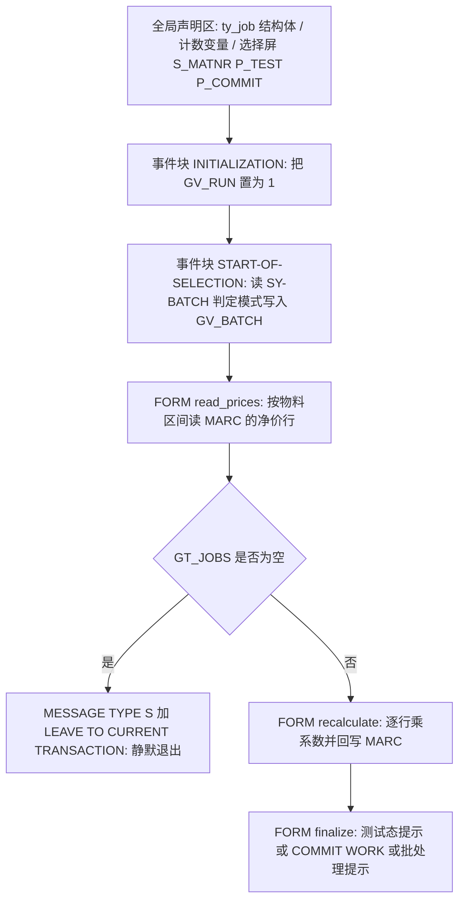
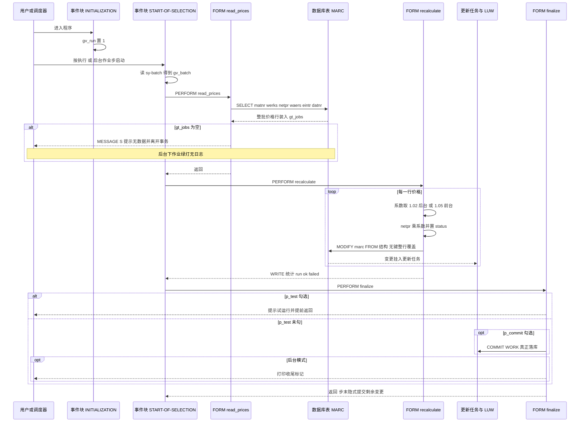

# ZPRICE_BATCH 夜间调价程序 · Onboarding 分析报告

> 分析对象：`zprice_batch.abap`（`REPORT zprice_batch`，108 行）
> 关注点：取数、调价逻辑、提交（COMMIT WORK）三段，以及**后台运行**与**前台运行**行为不一致带来的风险

---

## 一、程序定位与业务背景

### 1.1 这段代码在业务上解决什么问题

这是一支夜间批量调价脚本。业务背景可以这样还原：公司在做年度价格谈判或原材料成本波动后，销售/采购部门需要在一个固定时间点（通常是当晚批处理窗口）把一批物料在工厂层面的**净价**整体上浮一个比例（例如后台作业上浮 2%）。这个动作有三个硬性要求：

1. **量级大**——涉及成百上千个物料 × 工厂组合，人工维护条件记录不现实；
2. **时间固定**——必须落在夜间批处理窗口完成，不能占用白天业务；
3. **可追溯**——价格属于财务敏感数据，事后必须能回答"哪条价格、什么时候、从多少改成多少、谁批的"。

而这个程序提供的是一个"三段式"的能力：批量读 MARC 价格行 → 逐行乘系数 → 提交。为了兼顾调试，它还提供了选择屏上的 `p_test`（试运行）和 `p_commit`（显式提交）两个开关。

### 1.2 为什么现有方案"不够"——这是理解风险的起点

这是全篇最需要先讲清楚的一层背景：**SAP 标准的定价并不从 MARC-NETPR 走。**

- 采购订单（PO）定价、MRP 成本模拟（Standard Cost Estimate）、标准价计算、价格差异分析，读的都是**条件记录**（KONV + EINE/EKOP/KONV 的价格条件），由价格管控方案（Price Control Procedure）驱动，通常挂在条件组 `NKPR`（采购）或 `PR00`（内部）上，并且带**有效期、价格单位/价格分母、币种、条件金额字段**四元组。
- `MARC-NETPR`（Net Order Price，净订单价）是物料工厂视图上的一个**手工维护的净价参考字段**，它不带价格单位（`NEUPR`）、价格分母（`PEINH`）、也不带有效期。它在部分标准场景里被用作"没有条件记录时的兜底价"以及报表参考价。
- `MARC-EINTR`（Purchasing Info Record Price）则是**采购信息记录价**，是另一条独立的价格来源，采购订单在无信息记录时会回退到它。

所以本程序做的事情在架构上等价于："绕过条件记录与价格管控，直接 UPDATE 一个参考字段"。这是一个**明确的业务捷径**。理解这一点后，后面所有的 P0 才有解释力——不是代码写得糙，而是它要改的那张表和那个字段，本来就不承担它被赋予的职责。

同一张表里还有大量与采购、库存、MRP 紧密耦合的字段（`MARC-BESKZ` 采购类型、`MARC-BSTYP` 采购策略、`MARC-PRPRO`/`MARC-MRPPV` 再订货点、`MARC-SZANG`/`MARC-MINBM` 订货量、`MARC-BINPT` 库位指针、`MARC-USE01` 库存段…）。这些字段与 NETPR 处在同一条记录上——本程序对它们的处理方式是"原样带回、整行覆盖"，这是 3.5 节最大的事故来源。

### 1.3 设计范式一句话定性

> **经典直线型批处理流水线**：`INITIALIZATION` 播种状态 → `START-OF-SELECTION` 判定运行模式并串联三个 FORM（`read_prices` 取数 / `recalculate` 调价 / `finalize` 收尾）→ 全程无对话框交互控制、无异常处理、无日志。

它的结构骨架是合格的（取数与计算分离、收尾集中），但**外围工程能力（校验、日志、事务边界、模式一致性）几乎为零**。这是一个典型的"能跑通就算完成"的运维脚本，被放进生产系统承担了改财务数据的职责。

---

## 二、程序执行流程总览



**责任链表**

| 子程序 | 调用者 | 职责 |
| --- | --- | --- |
| 全局声明区 | 编译器 | 定义 `ty_job` 行结构、内表 `gt_jobs`、计数器 `gv_run/ok/failed`、模式开关 `gv_batch`、选择屏三个参数 |
| 事件块 `INITIALIZATION` | ABAP 运行时（进入选择屏前自动触发） | 把 `gv_run` 初始化为 1，作为后续的运行计数起点 |
| 事件块 `START-OF-SELECTION` | ABAP 运行时（用户按执行 或 后台作业步启动） | 由 `sy-batch` 推导运行模式写入 `gv_batch`；按 read → recalculate → finalize 顺序串联三个 FORM |
| FORM `read_prices` | `START-OF-SELECTION` | 从 MARC 读取 `matnr/werks/netpr/waers/eintr/datnr` 装入 `gt_jobs`；结果为空则提示并直接离开事务 |
| FORM `recalculate` | `START-OF-SELECTION` | 遍历 `gt_jobs`，按运行模式取调价系数放大 `netpr`、置 `status`、回写内存表与数据库表 MARC，最后 `WRITE` 统计 |
| FORM `finalize` | `START-OF-SELECTION` | 试运行态提前返回；否则按 `p_commit` 决定是否 `COMMIT WORK`；批处理态额外打印收尾信息 |

下面按这条流程，逐个子程序展开。

---

## 三、分组分析（按程序流程 / 子程序）

### 3.1 全局声明区（类型定义 / 全局变量 / 选择屏）

这个 section 分三步：先看数据结构的语义，再看全局变量的用途，最后看选择屏暴露了哪些开关。

#### ① 数据结构 `ty_job` 与内表

```abap
TYPES: BEGIN OF ty_job,
         matnr   TYPE mara-matnr,
         werks   TYPE marc-werks,
         netpr   TYPE marc-netpr,
         waers   TYPE marc-waers,
         eintr   TYPE marc-eintr,
         datnr   TYPE marc-datnr,
         status  TYPE char1,
       END OF ty_job.

TYPES ty_job_tab TYPE STANDARD TABLE OF ty_job WITH EMPTY KEY.

DATA gt_jobs   TYPE ty_job_tab.
```

**做什么** — 定义一个行结构 `ty_job`，把"一个物料在一个工厂上的一条价格"描述清楚：主键 `matnr` + `werks`，价格 `netpr`，币种 `waers`，采购信息记录价 `eintr`，一个日期型字段 `datnr`，外加一个自用的处理状态位 `status`；`gt_jobs` 声明为**标准表（STANDARD TABLE）且空键**，即内部表的"主键"退化为行号，**逻辑上不保证唯一**。

**为什么** — 用 `TYPE mara-matnr` / `TYPE marc-netpr` 这类**直接引用数据字典字段**（而不是 `TYPE c` / `TYPE p`）是正确的做法：它绑定了内建类型（MATNR 是 CHAR 40、NETPR 是 C 15 的金额类型、WERKS 是 CHAR 4），同时绑定了 F4 搜索帮助和字段标签。做全行 `MODIFY` 时还能靠字段名自动映射（见 3.5 ③），这份类型声明是有价值的。

选 `STANDARD TABLE ... WITH EMPTY KEY` 而不是 `SORTED TABLE` 或 `HASHED TABLE`，从使用方式看是合理的——这张表只被顺序 `LOOP` 一遍，从不需要按键查找。但它没有把这个"只用一遍、只读不删"的约束表达出来，是后面 3.5 ② 那次无意义 `MODIFY gt_jobs` 的直接诱因。

**风险与改进** — 结构本身没有语法风险，但有三点语义隐患：

1. **`netpr` 与 `eintr` 语义不同却被同一个语句一起写**：`netpr` 是净订单价（不含税），`eintr` 是采购信息记录价（另一条价格来源）。同一个 `MODIFY` 把两者一起搬回 MARC，但程序只放大 `netpr`、对 `eintr` 不动，结果是**净价与信息记录价脱钩**，价差字段失去参考价值。这个"语义校核"不能因为两边都是金额类型就放过。
2. **`datnr` 读了但从不用**：`datnr` 出现在 `SELECT` 列表里、也出现在 `MODIFY` 的结构里，却没有被任何逻辑读写或判断。如果它在 MARC 上承载价格有效期语义（程序自己把它当成"日期型字段"取出来，说明作者认为它有意义），那么"改价不改有效期"会导致新价不生效或到点即失效。上线前必须先在 SE11 里确认这个字段的真实语义。
3. **`status` 是个孤儿字段**：只在内存表里被置为 `'X'`，从不读出、从不写进任何日志或报表。它暗示作者原本想做"逐行处理状态跟踪"，但这一层没有实现。

改进方向：把"要读的字段"和"要写的字段"分成两个结构（读结构 / 更新结构），更新结构只放真正需要修改的字段——这一条能直接消灭 3.5 ③ 的 P0 事故。

#### ② 全局变量

```abap
DATA gv_run    TYPE i.
DATA gv_ok     TYPE i.
DATA gv_failed TYPE i.
DATA gv_batch  TYPE abap_bool.
DATA gv_commit TYPE i.
```

**做什么** — 声明四个实际使用的全局量：运行计数 `gv_run`、成功计数 `gv_ok`、失败计数 `gv_failed`、后台模式标志 `gv_batch`；另外声明了 `gv_commit`。

**为什么** — 计数器放全局（而非 FORM 的局部变量）本身是合理选择：这三个计数在 `recalculate` 里累加、在 `recalculate` 的结尾和 `finalize` 里都要被读取，跨 FORM 传递时全局变量比带 `USING` 参数更简洁。用 `abap_bool` 承载布尔语义（而不是 `char1`）也符合现代 ABAP 风格。

**风险与改进** — `gv_commit TYPE i` **声明了但全程序从未被赋值、也从未被读取**，是一个彻底的死变量；它很可能本是打算做"是否已提交"的记录位或提交批次号，最终没写完就搁下了。死变量的危害不只是占用内存：它会让读代码的人误以为"提交状态"是有人跟踪的，从而漏掉真正的 `COMMIT WORK` 控制逻辑（见 3.6 ②）。应直接删除，或补上它原本该承担的语义（例如记录本次提交的 LUW 序号 / 提交时间）。

另外，`gv_ok` / `gv_failed` 是一对**成功/失败**的语义命名，但 3.5 ③ 会说明它们实际被用来统计"试运行行数"——命名与语义不符是这个流水线里最容易被后续维护者误读的地方。

#### ③ 选择屏

```abap
SELECTION-SCREEN BEGIN OF BLOCK b.
  SELECT-OPTIONS s_matnr FOR gt_jobs-matnr.
  PARAMETERS p_test AS CHECKBOX.
  PARAMETERS p_commit AS CHECKBOX.
SELECTION-SCREEN END OF BLOCK b.
```

**做什么** — 在 BLOCK `b` 里暴露三个输入项：物料号选择屏 `s_matnr`（多值区间，可留空）、试运行开关 `p_test`、显式提交开关 `p_commit`。

**为什么** — `SELECT-OPTIONS s_matnr FOR gt_jobs-matnr` 这种"用内表字段作为参照字段"的写法是 7.40 之后的标准套路，ABAP 会自动把 `gt_jobs-matnr` 解析到 MARA-MATNR 上并挂上标准物料搜索帮助（F4），用户能选到合法物料号——比手写 `PARAMETERS p_matnr TYPE c40` 高一个档次。两个 `AS CHECKBOX` 复选框直接把"试运行"和"是否提交"这两个最危险的行为开关摆在明面上，形式上是好的。

**风险与改进** — 三个输入项没有一个是**必填**，也没有一个在后台模式下被约束或覆盖：

1. **`s_matnr` 可留空 = 放开全表**。空的选择表在 `WHERE ... IN` 中不产生有效限制，语义上等于"扫全 MARC"。MARC 在任何中大型 ERP 里都是千万行量级的表（物料 × 工厂），一次全表读 + 后面每行一次 `MODIFY`，在后台作业里既会把系统拖垮，也会把整张物料工厂视图的采购/MRP 参数全部覆盖掉。
2. **`p_test` 在后台是个沉默的杀手**。后台作业如果沿用了一个带 `p_test = 'X'` 的变体（调试留下的），程序会跑完整个循环、打印"failed = 全部行数"，最后在 `finalize` 里 MESSAGE TYPE 'S' 后正常结束，**SM36 里作业状态是绿的、没有任何告警**。第二天早上没人发现价格没调。
3. **`p_test` 与 `p_commit` 可以同时勾选**，但两者的语义在此程序里并没有互斥约束；用户勾了 `p_test` 以为"模拟提交"，实际上代码在 `finalize` 里 `p_test` 分支直接 `RETURN`，`p_commit` 分支根本不执行——`COMMIT WORK` 静默跳过。

改进方向（按优先级）：`s_matnr` 改必填或在 `START-OF-SELECTION` 开头硬拦截 `IF s_matnr[] IS INITIAL`；后台模式下用 `IF gv_batch = abap_true. p_test = abap_false. ENDIF.` 之类的强制覆盖（并写日志），或至少把 `p_test` 设成 `NO-DISPLAY` + 单独的后台变体；两个复选框加 `CHECKBOX` 互斥校验（`p_test = 'X' AND p_commit = 'X'` 时报 `MESSAGE e`）。

---

### 3.2 事件块 `INITIALIZATION`

这个 section 只有一步，但它是 3.5 ④ 里一个计数错误的源头。

#### ① 初始化运行计数

```abap
INITIALIZATION.
  gv_run = 1.
```

**做什么** — 在进入选择屏之前，把全局计数器 `gv_run` 置为 **1**。`INITIALIZATION` 事件块由 ABAP 运行时在显示选择屏之前自动调用，不需要 `PERFORM`。

**为什么** — 选 `INITIALIZATION` 而不是 `START-OF-SELECTION` 来做状态初始化，从"每个 dialog step 只触发一次"的语义上讲差别不大（后台作业步同样只走一次 `START-OF-SELECTION`），所以这个选择本身是可接受的。

**风险与改进** — 计数初值与累加位置不匹配，产生了**差一（off-by-one）错误**：`gv_run` 在 3.5 ① 的循环里是"**先加一、再处理**"，所以第一条记录会把 `gv_run` 变成 2，循环结束时 `gv_run = 记录数 + 1`。日志里打出的 `run` 值永远比真实处理条数大 1，而 `ok + failed` 又恰好等于记录数——两行数字自相矛盾，一旦有人拿它做"跑了几条"的对账就会踩坑。

更根本的问题是命名与用途错位：`gv_run` 这个名字读起来像"本次运行标识 / run id"（夜间作业通常需要它来标记这一批是哪一次调整，便于事后追责），实际却当成了循环计数器。这暗示作者没有"运行批次"这个概念——也就顺理成章地没有运行日志、没有重跑幂等控制。

改进方向：把两件事分开——`gv_count` 初值 0 在 `START-OF-SELECTION` 里 `= 0` 并在循环里 `+ 1`；如果真的需要 run 概念，用 `sy-datum` + `sy-uzeit` 拼一个 `gv_run_id` 写进日志表和价格变更记录，让"这次调价"可识别、可回滚。

---

### 3.3 事件块 `START-OF-SELECTION`

这个 section 分两步：先判定运行模式，再串联三个 FORM。

#### ① 前后台模式判定

```abap
START-OF-SELECTION.

  IF sy-batch = 'X'.
    gv_batch = abap_true.
  ENDIF.
```

**做什么** — 读取系统字段 `sy-batch`（前台为空，后台为 `'X'`），若为后台则把全局布尔量 `gv_batch` 置为 `abap_true`；前台运行时不赋值，隐式保持初始值 `abap_false`。这是整个程序唯一的"运行模式开关"来源。

**为什么** — `sy-batch` 是判断"本程序由调度器启动"的标准做法，判断放在 `START-OF-SELECTION` 而不是散落在各处，是正确的"入口收敛"设计；用 `abap_bool` 而非 `char1` 承载，语义也更干净。

**风险与改进** — 设计上的意图（"判定一次，全局复用"）在 3.6 ③ 得到了兑现，却在 3.5 ① 被破坏了——**同一个事实在程序里存在两个真相来源**：`gv_batch` 在这里算好存起来，而 `recalculate` 却又去重新读 `sy-batch`。目前两者的判定条件恰好等价，所以还没出事，但这是典型的定时炸弹：一旦将来有人把 `gv_batch` 改成可由选择屏控制（例如"在后台强制按前台系数跑"），`recalculate` 里的 `sy-batch` 就成了漏改的第二真相，调价系数会静默走错分支，而代码表面上完全看不出问题。

改进方向：`START-OF-SELECTION` 里改用 `gv_batch = COND #( WHEN sy-batch = abap_true THEN abap_true ELSE abap_false )` 一次性赋全值（前台显式给 `abap_false`，避免依赖隐式初始），此后全程序**只读 `gv_batch`，不再出现 `sy-batch`**。

#### ② 串联三个 FORM

```abap
  PERFORM read_prices.
  PERFORM recalculate.
  PERFORM finalize.
```

**做什么** — 按固定顺序执行三个步骤：`read_prices` 取数 → `recalculate` 调价并写库 → `finalize` 收尾提交。没有条件分支、没有返回值检查、没有 `sy-subrc` 判读、没有 `MESSAGE` 中断后跳过后续步骤的机制。

**为什么** — 这就是经典的直线型流水线：三个 FORM 各自职责单一（取数 / 计算 / 收尾），依赖关系是单向的，没有互相回调。**这种"三段式分离"是本程序结构上最值得肯定的地方**——它让"取数逻辑"和"业务算法"和"事务收尾"可以被分别理解和修改，是 3.1 提到的值得保留的骨架。顺序也和业务直觉一致：先有数据，才谈调价，最后才提交。

**风险与改进** — 骨架没问题，问题在于**流水线的三段之间没有任何契约**：

1. **没有失败短路机制**。如果 `read_prices` 因为任何原因（不只是 `gt_jobs` 为空）没取到数据，或者只取到一部分，`recalculate` 和 `finalize` 照样会执行。`finalize` 甚至可能在"一条都没改"的情况下执行 `COMMIT WORK`。
2. **没有数据量护栏**。三个 FORM 之间不传递任何信息，`recalculate` 无从知道自己面对的是 5 行还是 500 万行。一个本该只影响几十个物料的调价，因为选择屏留空就可能变成全表操作，且没有任何地方会喊停。
3. **`finalize` 无条件被调用**。`p_test` 分支里的 `RETURN` 是它唯一的"退出"手段——用流程控制的副作用（跳过 COMMIT）来表达业务状态，读起来很别扭；更清晰的做法是让 `recalculate` 返回一个处理条数，由 `START-OF-SELECTION` 决定是否进入提交阶段。

改进方向：在 `read_prices` 结束后加一个显式的数据量上限校验（例如 `IF lines( gt_jobs ) > 100000. MESSAGE e... ENDIF.`，阈值做成可配置）；让 `finalize` 的提交决策基于"确实改了数据"这个事实，而不是基于一个复选框。

---

### 3.4 FORM `read_prices`

这个 section 分两步：先把 MARC 读进内存表，再处理"一条都没读到"的情况。

#### ① 从 MARC 读价格行

```abap
FORM read_prices.

  SELECT matnr werks netpr waers eintr datnr
    FROM marc
    INTO TABLE gt_jobs
    WHERE matnr IN s_matnr
      AND waers <> ' '.

ENDFORM.                       "read_prices
```

**做什么** — 从物料工厂视图 MARC 里，按选择屏物料区间 `s_matnr` 投影读取六个字段（物料号、工厂、净价、币种、采购信息记录价、日期），一次性灌进内表 `gt_jobs`。唯一的附加过滤是币种不能为空。

**为什么** — **投影取列是正确的**：MARC 有上百个字段，而本程序只关心 6 个，`SELECT 字段列表` 让数据库只返回需要的列，在大范围扫描时能显著降低传输量和内表内存占用（这本来是该程序唯一做对的数据访问细节）。用 `INTO TABLE` 一次性读入而不是 `SELECT ... ENDSELECT` 逐行游标处理，也符合"读一遍、算一遍、写一遍"的批处理模型。

**风险与改进** — 这一段是整个程序风险最集中的地方，有五个层次的问题：

1. **过滤条件形同虚设**。`waers <> ' '` 几乎筛不掉任何行——工厂层面的币种字段在实践中基本都填了（最少也是本位币）。真正该过滤的：只处理有效价格（`netpr > 0`，否则 0 乘 1.02 还是 0，纯粹浪费一条 `MODIFY`）、只处理参与价格管控的工厂、排除采购被冻结/已停用的工厂、以及限定在需要调价的工厂/公司代码范围内。**现在的实际语义是"所有币种非空的物料工厂行"**，这个范围对一个夜间改价作业来说太宽了。
2. **没有 `sy-subrc` 判读**。`SELECT` 结束后 `sy-subrc` 已隐式被设置，但代码直接跳到 `IF gt_jobs IS INITIAL`。`NO-DATA`（查询本身合法但无结果）和 `NOT FOUND`（查询出错，如内存不足、LUW 已满）在业务上需要完全不同的处理，现在被合并成同一个分支。
3. **全量载入内存的风险被放大了**。配合"选择屏可留空"，最坏情况是把整张 MARC 读进内表。后台作业虽没有 dialog step 的内存限制，但进程照样会被撑爆；而且即便内存撑得住，解析出来的海量行在后续循环里逐条发 `MODIFY`，会把更新任务队列塞满。
4. **行重复风险**。投影里的 `matnr` + `werks` 正是 MARC 的主键，理论上不会有重复行；但内表被声明成 `WITH EMPTY KEY` 的标准表，程序内部没有任何唯一性保证，一旦将来 `SELECT` 列表里少写了 `werks`（比如只按工厂范围查），同一物料就会有多行、调价系数会被重复施加。
5. **没有包大小 / 分批机制**。真正的夜间批处理应该用 `PACKAGE SIZE` 游标或分批切片 + 每批 `COMMIT WORK`，让作业可中断、可续跑、内存恒定。本程序一次性 `INTO TABLE` 读全量，后台作业一旦中途失败，前面所有已发往更新任务的 `MODIFY` 会随着 LUW 回滚或随步末隐式提交全部落库——**没有中间态可观察**。

改进方向：把过滤条件收窄并显式化；引入 `sy-subrc` 分支（`NO-DATA` 走"无数据"提示、`NOT FOUND` 走错误退出）；改成 `SELECT ... PACKAGE SIZE n` + 工作区 + `GET RUNNING CURSOR` 的分批模型；给选择屏加必填拦截和条数上限校验。

#### ② 空结果处理

```abap
  IF gt_jobs IS INITIAL.
    MESSAGE 'No price records found' TYPE 'S'.
    LEAVE TO CURRENT TRANSACTION.
  ENDIF.

ENDFORM.                       "read_prices
```

**做什么** — 如果取数结果是空表，就发一条**成功类**消息（`TYPE 'S'`）说明"没有找到价格记录"，然后 `LEAVE TO CURRENT TRANSACTION` 跳出当前事务，跳过 `recalculate` 和 `finalize` 全部后续逻辑。

**为什么** — `LEAVE TO CURRENT TRANSACTION` 而不是 `LEAVE LIST` / `LEAVE PROGRAM`，在报表程序里是标准做法：它能安全地退出当前 dialog step 并回到选择屏，不会像 `LEAVE TO SCREEN 0` 那样在某些上下文（尤其是 AT SELECTION-SCREEN 输出场景）里报错。用 `gt_jobs IS INITIAL` 而不是 `IF sy-subrc = 8` 来判空，在现代 ABAP 里是可读性更好的写法。

**风险与改进** — **这是后台运行最阴险的一处缺陷**：

1. **`MESSAGE TYPE 'S'` 在后台作业里几乎等于沉默**。`S` 级消息只弹在屏幕上，后台作业没有屏幕，消息被丢弃。结果是：作业跑完、状态显示**成功（绿）**、日志里什么都没有。SM36 上看起来"跑过了"，但实际上**一条价格都没改**。如果是因为选择屏变体里物料号填错、或者 MARC 上的币种字段恰好为空导致没查到——这类"配置失误伪装成正常完成"，正是夜间批处理最危险的一类事故。
2. **`LEAVE TO CURRENT TRANSACTION` 在后台等于"正常结束步"**。它不会把作业标成失败，不触发 EarlyWatch 的异常检查，不产生任何 BTSTEP 级别的告警。
3. **没有区分"没查到"和"不该查"**。空结果有两种完全不同的成因：①选择条件本来就该有数据但没匹配上（异常）；②确实没有需要调价的物料（正常）。现在一律按"正常"处理。
4. **没有写任何应用日志**。`gt_jobs` 为空这件事应该被持久化下来，让监控第二天能看到。

改进方向（后台优先）：在 `IF gv_batch = abap_true` 时改用 `MESSAGE e000 WITH 'No price records found'` 或调用 `MESSAGE ... TYPE 'E'` / `RAISING EXCEPTION`，让 SM36 显示红色并触发告警；两种成因用不同消息区分；无论前台后台都写一条应用日志（`BAL_LOG_CREATE` + `BAL_LOG_ADD` + `BAL_LOG_SAVE`，或 7.55+ 用 `IF_XCO_MESSAGE_COLLECTION`），让作业日志里能查到"本次处理 0 条"。

---

### 3.5 FORM `recalculate`

这是程序的核心，分四步：循环与系数选取、内存表回写、数据库回写、统计输出。**第③步是全程序最危险的一行代码。**

#### ① 循环遍历与调价系数

```abap
FORM recalculate.

  DATA lv_factor TYPE p DECIMALS 4.

  LOOP AT gt_jobs INTO DATA(ls_job).

    gv_run = gv_run + 1.

    lv_factor = COND #( WHEN sy-batch = 'X' THEN 1.02 ELSE 1.05 ).

    ls_job-netpr  = ls_job-netpr * lv_factor.
    ls_job-status = 'X'.

ENDFORM.                       "recalculate
```

**做什么** — 声明一个 4 位小数的定点数局部变量 `lv_factor`；遍历 `gt_jobs` 的每一行到内联声明的工作区 `ls_job`；先把 `gv_run` 加一；然后根据 `sy-batch` 选取系数——**后台 1.02、前台 1.05**；把净价乘以系数写回工作区，再把处理状态位 `status` 置为 `'X'`。

**为什么** — 系数用 `COND #( )` 条件表达式在一行内完成二选一，比 `IF ... ELSE ... ENDIF` 三行更紧凑，也更符合现代 ABAP 风格（`COND` 是 7.40 引入的 `CASE` 家族成员，读起来接近 SQL 的 `CASE WHEN`）。`lv_factor` 声明为 `p DECIMALS 4` 而不是 `p DECIMALS 2`，是为了让 1.02 / 1.05 这类系数有足够精度、且乘法中间结果不提前截断——方向是对的。

**风险与改进** — 业务风险在这里，而且它正是用户最关心的"后台运行有没有风险"的答案：

1. **前后台系数不同 = 前台试算无法复现后台结果**（🔴 P0）。用户在前台选同样的物料范围跑一遍，看到的是 1.05 的结果；夜里 SM36 真正落库的是 1.02 的结果。**试运行看到的数字和实际发生的数字不是一回事**，这等于把"验证"环节架空了。更糟的是没有第二种模拟方式——用户根本没法在前台预演后台会写出什么。
2. **双重真相来源**。这里重新读 `sy-batch`，而不是用 3.3 ① 已经算好的 `gv_batch`（与 3.3 ② 提到的隐患呼应）。同一个判定散落两处，是典型的后期改动事故源。
3. **倍数累乘，无边界**。系数作用在**数据库里的当前价**上，没有基准价概念。夜间作业每天跑一次、价格每天 ×1.02，就是**几何级增长**：一年后是 1.02^365 ≈ 1375 倍。这在业务上是否有意为之取决于调价方案，但程序没有任何上限/下限校验、没有例外清单、没有"累计涨幅超过 X% 就不许跑"的护栏。
4. **静默截断**。`netpr` 是金额型 C 字段（NETPR，15 位含 2 位小数），`ls_job-netpr * lv_factor` 的结果被隐式写回该字段时按字段精度四舍五入到 2 位小数。低价物料（比如 0.03）连乘多次后可能舍入成原值，看起来"跑过了"但价格纹丝不动，日志里还记作 `ok`。
5. **`gv_run` 的差一错误**在此处定型（见 3.2 ①），且它同时被当成"循环序号"而非运行标识。
6. **`status` 是纯粹的自娱自乐**。置了 `'X'`，从不读出、不入库、不打日志——上一行刚写完价格，下一行就把它覆盖成新的价，日志里也无法区分"成功"和"部分成功"。

改进方向：**把系数提到选择屏上**（`PARAMETERS p_factor TYPE p DECIMALS 4 DEFAULT '1.0200'`），让前台和后台用同一个值，试运行与生产就自然一致了；如果业务上确实要区分模式（比如后台保守、前台激进），那也必须把两个值都做成参数并在日志里明确记录本次实际使用的系数。系数选取改用 `gv_batch`。累乘问题则需要引入基准价字段或"上次调价基准"记录，至少加一条累计涨幅上限校验。`status` 要么删掉，要么真正落库成一张调价明细表（物料 / 工厂 / 调价前 / 调价后 / 系数 / 运行标识 / 时间）——这张表同时也是回滚的唯一依据。

#### ② 回写内存表

```abap
    MODIFY gt_jobs FROM ls_job.

ENDFORM.                       "recalculate
```

**做什么** — 把刚算好的工作区 `ls_job`（新价格 + 状态位）按**行号**写回内表 `gt_jobs` 的同一行。因为 `gt_jobs` 是 `STANDARD TABLE ... WITH EMPTY KEY`，其隐式主键就是行序号，而 `ls_job` 正是从当前行读出来的，行号自然对得上，所以修改生效。

**为什么** — 如果把这里当成"给处理结果做标记、供后续统计或输出用"，那这个写法在技术上是成立的：`MODIFY ... FROM` 只改指定行的字段、不增删行，所以在 `LOOP` 中进行"就地修改"是安全的，不会破坏遍历。

**风险与改进** — 但**没有任何地方会读到这些被改过的行**。`gt_jobs` 在 `recalculate` 之后只剩两个用途：`finalize` 里对 `IS INITIAL` 的间接依赖（实际没有）和程序结束时的垃圾回收。也就是说这是一个**纯粹的无效写**：

1. **零收益**。写进去的 `status = 'X'` 和新 `netpr` 无人消费，纯粹浪费 CPU 与内表维护开销（`MODIFY` 在标准表上是覆盖行指针指向的整行结构体）。
2. **零风险的假象**。它让人误以为"处理结果被记录下来了"，从而掩盖了 3.5 ③ 那个真正致命的写库缺陷——调试时看到内表里价格已经变了，容易以为"这一步是好的"，实际落库那一步是另一回事。
3. **可维护性陷阱**。在 `LOOP` 遍历一个标准表的同时对它做 `MODIFY`（哪怕只是就地改）是个脆弱模式：一旦将来有人在这段里加了 `SORT`（改变行号与行的对应）、`DELETE`（行号移位）或 `APPEND`，`MODIFY ... FROM wa` 就会**改到错误的行上，而且不报错**。这是那种在 code review 里被放过去、半年后以数据错乱形式爆出来的坑。

改进方向：直接删掉这一行。如果确实要保留"处理状态"的概念，把它放进 3.5 ③ 建议的调价明细表里按行追加；如果你想保留内存态快照，那就用 `LOOP AT gt_jobs INDEX lv_idx` 显式按索引更新并加注释说明为什么，绝不能依赖隐式行号语义。

#### ③ 回写数据库表 MARC

```abap
    IF p_test IS INITIAL.
      MODIFY marc FROM ls_job.
      gv_ok = gv_ok + 1.
    ELSE.
      gv_failed = gv_failed + 1.
    ENDIF.

  ENDLOOP.
```

**做什么** — 非试运行模式下，把整个 `ls_job` 结构按字段名映射执行 `MODIFY marc FROM`（**无键 `MODIFY`、无 `WHERE` 子句**），同时 `gv_ok` 加一；试运行模式下不发数据库语句，反而把 `gv_failed` 加一。

**为什么** — 作者显然想做"试运行只算不写"（`IF p_test IS INITIAL` 保护写库路径），这个开关的位置本身是对的：它在循环内部逐行判断，`p_test` 的语义是"整批不落库"。用 `MODIFY` 而不是 `UPDATE` 也算合理——`MODIFY` 在键值全填的情况下能定位到行。

**风险与改进** — 三个问题，从致命到隐蔽：

1. **🔴🔴 P0：无键 `MODIFY` 触发全行覆盖，MARC 上所有未被 SELECT 的字段被清空**。`MODIFY dbtab FROM wa` 的语义是"用工作区构造整行数据更新该行"——**工作区里没有的字段，一律被写入其初始值**。`ls_job` 只有 6 个字段，而 MARC 有 100 多个。这意味着每次 `MODIFY` 都会把 `MARC-BESKZ`（采购类型）、`MARC-BSTYP`（采购策略）、`MARC-PRPRO`（MRP 类型）、`MARC-MRPPV`（再订货计划值）、`MARC-SZANG`/`MARC-MINBM`（再订货量/最小量）、`MARC-BINPT`（库位指针）、`MARC-USE01`（库存段）等**全部采购与 MRP 参数清成初始值**。而且这**不是偶发**：只要 `p_test` 未勾选，跑 1 行毁 1 行，跑 500 万行就毁 500 万行。程序退出时不会报任何错，作业绿灯，后果在下一次 MRP 运行时才爆出来——那时全系统的采购建议和再订货点已经全乱了。**这是本次分析中最需要立刻处理的一条。**
   - 同理，`ls_job` 里的 `status` 字段在 MARC 中没有对应字段，按名映射会被忽略——它既不参与写入、也不会被 MODIFY 回读，纯粹是空气。
   - 正确写法是构造一个**只含待改字段的更新结构**，并用 `WHERE` 明确限定键：

     ```abap
     DATA: ls_key   TYPE ty_job,
           ls_update TYPE marc-netpr.

     MODIFY marc FROM ls_update
       WHERE matnr = ls_job-matnr
         AND werks = ls_job-werks.
     ```

     `MODIFY ... FROM wa WHERE ...` 只更新工作区中出现的字段，其余字段在数据库中保持不变。同时 `ls_update` 应包含所有需要同步的字段（如同时改 `eintr` 就一起放进去），并且**上线前必须在测试系统上做一次数据比对，确认未改字段前后一致**。
2. **🔴 计数器语义完全颠倒**。试运行模式下**根本没有执行任何数据库写**，却把计数累加到 `gv_failed`。这导致两件事：① 试运行结束时打出的 `failed = N` 会被运维当成"N 条写入失败"，是一次彻底的误导；② 真实写库路径上如果真的发生失败（更新任务在 LUW 结束时才报错），`gv_failed` **永远不会增长**——计数器变成了一个恒为"试运行行数或 0"的死指标。
   - 改进：`gv_failed` 只在捕获到实际失败时递增（`WRITE ... ` 的 `sy-subrc`、或 `GET RUNNING CURSOR` 分批提交时的错误捕获），试运行单独用一个 `gv_dryrun` 计数。
3. **⚠️ `MODIFY` 的成功 ≠ 数据已落库**。ABAP 的 `MODIFY` 只是把变更发往**更新任务（update task）**，真正的 SQL 在 `COMMIT WORK` 或 LUW 结束时才执行。这直接导致 3.5 ④ 输出的 `ok = N` 是"已提交到更新队列的条数"，不是"已成功落库的条数"。在后台作业里，如果步末的隐式提交因为 `OPEN_CTS`/更新队列满/数据库死锁而部分失败，作业状态可能仍是绿的（除非 `SY-SUBRC` 被检查），而计数器已经报告"全部成功"。**没有任何一致性校验手段**（没有逐行读回比对，没有 `NUMOFDB` 级别的验证）。
   - 改进：分批 `COMMIT WORK`（每 N 条一次），每批提交后检查 `sy-subrc`；批处理模式下追加一次读回抽样比对（抽查若干物料的 `netpr` 是否等于期望值），并把结果写进应用日志。

#### ④ 输出统计

```abap
  WRITE: / 'run', gv_run, 'ok', gv_ok, 'failed', gv_failed.

ENDFORM.                       "recalculate
```

**做什么** — 循环结束后用一条 `WRITE` 在列表屏幕上打印四个数字：运行计数、成功数、失败数。由于是 `/` 换行输出，这行会出现在基础列表的第一行。

**为什么** — 用 `WRITE` 输出是经典报表程序里最轻量的做法，前台执行时用户能立刻看到"处理了多少条"。选择 `/` 而不是行内追加，是为了让这行统计在结果列表顶部可见。

**风险与改进** — 在**后台作业**下，这条 `WRITE` 的输出默认进 basic list，而 basic list 既没有配置 spool 打印、也没有设置输出参数时，**SM36 的作业日志里什么都看不到**。也就是说：

1. 后台跑完之后，除了作业状态是绿的，没有任何"处理了 N 条"的证据。这与 3.4 ② 叠加后，后台作业的**可观测性基本为零**。
2. 即使有 spool 输出，那是一堆无格式的列表文本，**不进入应用日志，运维无法做监控告警**。
3. 数字本身还不可信：`run` 因为差一错误偏大（3.2 ①），`ok`/`failed` 语义颠倒（3.5 ③），`ok` 不代表真正落库（3.5 ③）。三个数字里没有一个可以直接用来判断"这次调价是否成功"。

改进方向：把统计信息从 `WRITE` 改为**同时写入应用日志**——`BAL_LOG_CREATE` / `BAL_LOG_ADD` / `BAL_LOG_SAVE`（适用于所有版本），或 7.55+ 的 `IF_XCO_MESSAGE_COLLECTION`（原生写入后台作业日志，运维在 SM21/SM36 里直接可见）。同时把"本次运行标识、开始/结束时间、处理条数、系数、参数值"一并记录，让"夜间调价"成为一件可审计的事。

---

### 3.6 FORM `finalize`

这个 section 分三步：试运行出口、提交、批处理提示。

#### ① 试运行提前返回

```abap
FORM finalize.

  IF p_test EQ 'X'.
    MESSAGE 'Test mode - no data written' TYPE 'S'.
    RETURN.
  ENDIF.

ENDFORM.                       "recalculate
```

**做什么** — 若 `p_test` 勾选，发一条成功消息说明"试运行模式，未写入数据"，然后 `RETURN` 退出这个 FORM，从而**跳过后面所有的提交与批处理提示逻辑**。

**为什么** — 用 `RETURN` 在 FORM 内提前退出是 ABAP 标准做法，等价于"结束当前过程"，控制流清晰。这里返回的位置是刻意选的：放在提交逻辑之前，天然保证了"试运行绝不落库"——这是个正确且重要的安全属性，值得肯定。

**风险与改进** — 逻辑本身安全，但有两处不严谨：

1. **判断方式与程序其他部分不一致**。这里用 `IF p_test EQ 'X'`，而 3.5 ③ 的写库保护用的是 `IF p_test IS INITIAL`。同一个 `CHAR1` 复选框，两处用两种判断风格。功能上等价（`AS CHECKBOX` 只会是 `X` 或空格），但**同一个开关在同一个程序里出现两种写法，会让维护者怀疑"是不是漏了一种状态"**，而这种怀疑往往是正确的直觉——这里缺的不是状态，是一致性。
2. **同样是 `MESSAGE TYPE 'S'`**。后台试运行作业依然是绿灯、零日志。结合 3.5 ③ 的计数颠倒，运维看到的是"failed = 5000"外加"试运行模式"提示在没人看的地方——这两个信号加在一起，可能比什么都不报更糟：**它看起来像是"跑了 5000 条但都失败了"，会诱发有人去查数据库权限之类的无关方向**。

改进方向：统一用 `IS INITIAL` 风格（或者统一用一个布尔变量承载）；后台模式下把试运行结果升级为 `MESSAGE ... TYPE 'I'` 并写应用日志，日志里明确写 `DRYRUN=Y / records=N / factor=1.0200`，让试运行和真实运行在日志里可区分。

#### ② 条件提交

```abap
  IF p_commit EQ 'X'.
    COMMIT WORK.
    WRITE: / 'committed'.
  ENDIF.

ENDFORM.                       "recalculate
```

**做什么** — 只有当 `p_commit` 勾选时才执行 `COMMIT WORK`，提交当前 LUW（逻辑工作单元）中累积的所有数据库变更，并向列表输出一行 `committed`。未勾选时不执行任何显式提交。

**为什么** — 把提交控制暴露成选择屏参数，形式上给了操作者"何时真正落库"的控制权，这是**正确的事务边界意识**。放在 `finalize` 集中处理、而不是散在循环里每行提交，也避免了大量小事务——这个取舍是对的（`COMMIT WORK` 本身有成本，且频繁提交无法整体回滚）。

**风险与改进** — 事务语义上有四个必须讲清楚的点：

1. **不勾 `p_commit` 时会发生什么？** ABAP 会在 **dialog step 结束**（前台）或 **background step 结束**（后台，由作业驱动隐式执行）自动提交 LUW。所以**"不勾选"并不等于"不落库"**，只是把提交时机推迟到步末。前台场景下这意味着：用户看到结果列表、还停留在屏幕上时，数据其实还锁在更新任务里；一旦此时用户取消或程序异常终止 LUW，这些修改全部丢失。**这正是"前台试算看结果"和"后台正式落库"在事务边界上的根本差异**，也是 `p_commit` 这个开关存在的真正理由，但代码里没有任何地方把这件事告诉操作者。
2. **勾选 `p_commit` 后无法整体回滚**。`COMMIT WORK` 之后，之前所有变更都已持久化并释放锁。如果紧接着的步骤失败（当前没有后续步骤，但将来加了校验就会），**不存在"整体回滚"这个选项**——只能靠人工反调或事先准备的调价明细表回滚。本程序没有准备这张表。
3. **没有错误处理和回滚路径**。`COMMIT WORK` 之后没有检查任何 `sy-subrc`；整个程序从头到尾没有一处 `ROLLBACK`、没有一处 `TRY...CATCH`、没有一处异常处理。更新任务在提交阶段暴露的失败（唯一可能暴露真实失败的地方）**完全无人接收**。
4. **`COMMIT WORK` 提交的是整个 LUW，不只是本程序的数据**。在 report 里的裸 `COMMIT WORK` 会把当前 LUW 里累积的所有变更一并提交并释放所有数据库锁。虽然在标准 report 里通常只有本程序的变更，但一旦将来被集成到别的流程（例如被 `CALL TRANSACTION` 包进来），这个提交会"顺手"把上游未完成的变更一起提交掉——这是个隐蔽但真实的耦合风险。

改进方向：把提交与"实际改了多少行"绑定，而不是与复选框绑定——例如 `IF gv_ok > 0 AND p_commit = 'X'`；提交后追加一致性校验（按 `MODIFY ... WHERE` 的 `sy-subrc` 统计真正成功的条数）；补上 `ROLLBACK` 路径（在捕获到异常时回滚整个 LUW，放弃本批调价）；改成**分批提交**（每 N 条 `COMMIT WORK` 一次），使后台作业可中断、可续跑、失败影响面可控。

#### ③ 批处理提示

```abap
  IF gv_batch EQ abap_true.
    WRITE: / 'batch run finished'.
  ENDIF.

ENDFORM.                       "finalize
```

**做什么** — 当全局标志 `gv_batch` 为真（后台运行）时，向列表输出一行 `batch run finished` 作为收尾标记；前台运行不输出这行。

**为什么** — 这一行代码**正确使用了 3.3 ① 算好的 `gv_batch`，而不是重新读 `sy-batch`**——和 3.5 ① 形成鲜明对比，也反过来说明 3.5 ① 读 `sy-batch` 是遗漏而非有意为之。用 `EQ abap_true` 比较 `abap_bool` 变量写法规范。

**风险与改进** — 逻辑无害，但价值几乎为零，且暴露了流程一致性问题：

1. **同样是 `WRITE`，后台同样看不到**（同 3.5 ④）。这行"收尾标记"在后台作业日志里根本不会出现，起不到标记程序跑完的作用。
2. **试运行模式下这行不会出现**。因为 3.6 ① 的 `RETURN` 已经跳过了它——也就是说，**夜间最需要日志的批处理路径，恰恰是日志最少的路径**（试运行没标记、真实运行标记看不见）。
3. **不携带任何可审计信息**。只是"跑完了"三个字，没有条数、没有时间、没有系数、没有 run 标识。
4. **一致性瑕疵**：全程序三处判断运行模式（3.3 ① 用 `sy-batch` 判定、3.5 ① 用 `sy-batch` 判定、3.6 ③ 用 `gv_batch` 判定），两用一弃。统一成 `gv_batch` 是零成本的清理。

改进方向：把这条 `WRITE` 换成（或补充）一条应用日志，携带 `run_id / 开始时间 / 结束时间 / 处理条数 / 实际系数 / p_test / p_commit`；让试运行与真实运行都写日志，只靠 `DRYRUN` 标志区分。

---

## 四、执行流程全景图（数据视角）



从这张图能一眼看出的数据流特征：**读是一次性全量读入，写是逐行无键整行覆盖，提交是可选的、且在后台往往由步末隐式补上。** 这三者叠加，就是本程序全部风险的来源。

---

## 五、问题清单与改进建议（按优先级）

### 🔴 P0 — 业务正确性

| # | 所在子程序 | 问题 | 改进建议 |
| --- | --- | --- | --- |
| P0-1 | FORM `recalculate`（数据库回写） | `MODIFY marc FROM ls_job` 是**无键整行覆盖**：工作区只有 6 个字段，MARC 其余上百个采购/MRP 字段（采购类型、采购策略、MRP 类型、再订货点、订货量、库位指针、库存段等）**全部被清空**。不报错、不回显，作业绿灯，MRP 下一次运行时才爆 | 改用只含 `netpr`（及确需同步的 `eintr`）的更新结构 + `MODIFY marc FROM ls_update WHERE matnr = ... AND werks = ...`；上线前在测试系统做全字段比对 |
| P0-2 | 事件块 `START-OF-SELECTION` / FORM `recalculate` | **前后台系数不同**（前台 1.05、后台 1.02），前台试运行结果无法复现后台实际结果，验证环节被架空 | 把系数提到选择屏（`PARAMETERS p_factor`），前后台共用同一个值；确需分模式则两个值都做成参数并记入日志 |
| P0-3 | FORM `read_prices` | **选择屏可留空 + 过滤条件形同虚设**（`waers <> ' '` 几乎不过滤），最坏情况对整张 MARC 执行"读全量 + 逐行整行覆盖" | `s_matnr` 必填或入口硬拦截空选择表；过滤条件收窄（`netpr > 0`、限定工厂/公司代码、排除冻结数据）；加处理条数上限校验 |
| P0-4 | FORM `read_prices` | 空结果用 `MESSAGE TYPE 'S'` + `LEAVE TO CURRENT TRANSACTION`，**后台作业绿灯无告警**——"配置失误"伪装成"正常完成" | 后台模式改用 `MESSAGE ... TYPE 'E'` 让 SM36 变红并触发告警；区分"没查到"与"不该查到"；写应用日志 |
| P0-5 | FORM `recalculate` | 系数**作用在当前库价上逐日累乘**，无基准价、无上限校验、无例外清单，夜复一日会几何级增长 | 引入基准价/上次调价记录，增加累计涨幅上限校验与例外清单；每次调价写明细表作为回滚依据 |

### 🟠 P1 — 健壮性

| # | 所在子程序 | 问题 | 改进建议 |
| --- | --- | --- | --- |
| P1-1 | FORM `recalculate` | **计数器语义颠倒**：试运行（不写库）累加 `gv_failed`，真实写库从不累加；`ok` 也只是"进了更新队列"而非"已落库" | 试运行单列 `gv_dryrun`；分批提交后按 `sy-subrc` 统计真实成功数；必要时读回抽样比对 |
| P1-2 | FORM `recalculate` | 整个程序**无异常处理、无 `ROLLBACK` 路径**，更新任务在 LUW 结束时的真实失败无人接收 | 补 `TRY...CATCH` / `sy-subrc` 判读；异常时 `ROLLBACK` 放弃本批；分批提交使失败可隔离 |
| P1-3 | FORM `finalize` | 提交时机不可控：不勾 `p_commit` 时由**步末隐式提交**，前台则要等 dialog step 结束；`COMMIT WORK` 后无整体回滚手段 | 提交决策绑定"确实改了多少行"；补一致性校验与回滚路径；改分批提交以支持中断续跑 |
| P1-4 | 全局声明区（选择屏） | `p_test` / `p_commit` 无必填、无互斥、**后台模式下可被沿用**（调试变体带 `p_test = 'X'` → 作业绿灯、零改动） | 后台模式强制覆盖 `p_test = abap_false` 或设为 `NO-DISPLAY` + 独立后台变体；两复选框加互斥校验 |
| P1-5 | FORM `recalculate` | 调价**无授权校验**，前台任意有执行权的人可对全系统物料工厂视图改价 | 入口加权限对象校验 + 工厂/公司代码范围限制；前台模式限制可调价范围 |
| P1-6 | 全局声明区（类型定义） | `netpr`（净订单价）与 `eintr`（采购信息记录价）被同一语句写回却只放大前者，价格来源脱钩；`datnr` 读了不用（若承载有效期语义，则改价不改有效期） | 明确字段语义与同步策略；确认 `datnr` 含义后决定是否同步维护有效期；价格来源与条件记录的一致性需业务确认 |

### 🟡 P2 — 性能与规范

| # | 所在子程序 | 问题 | 改进建议 |
| --- | --- | --- | --- |
| P2-1 | FORM `read_prices` | 一次性 `INTO TABLE` 读全量 MARC 到内表，后台内存与运行时长不可控，无中间可观察点 | 改 `PACKAGE SIZE` 分批游标 + `GET RUNNING CURSOR`，内存恒定、作业可续跑 |
| P2-2 | 事件块 `START-OF-SELECTION` | 三个 FORM 之间**无数据量护栏、无失败短路**，`finalize` 可能在零改动时也走到提交 | 取数后加条数上限校验；由 `START-OF-SELECTION` 依据处理结果决定是否进入提交阶段 |
| P2-3 | 事件块 `INITIALIZATION` | `gv_run` 初值 1 + 循环内先加一 → `run` 恒为"记录数 + 1"，与 `ok + failed` 自相矛盾 | 初值改 0 并在循环末累加；另起 `gv_run_id`（日期 + 时间）表达"本次运行" |
| P2-4 | FORM `recalculate`（内存表回写） | `MODIFY gt_jobs FROM ls_job` 是零收益的无效写；且在 `LOOP` 中依赖隐式行号，极脆弱 | 删除该行；确需快照则显式按 `INDEX` 更新并加注释 |
| P2-5 | 全局声明区 | `gv_commit` 声明后从未使用（死变量），误导读者以为提交状态有人跟踪 | 删除，或补上其原本该承担的语义 |
| P2-6 | FORM `read_prices` / `recalculate` / `finalize` | `sy-subrc` 未判读；`p_test` 判断风格不统一（`EQ 'X'` vs `IS INITIAL`）；运行模式判定散落三处（两处读 `sy-batch`、一处读 `gv_batch`） | 统一判读 `sy-subrc`；统一用 `IS INITIAL`；`gv_batch` 作为唯一真相来源，`START-OF-SELECTION` 里一次性赋全值 |

### 🟢 P3 — 可扩展性

| # | 所在子程序 | 问题 | 改进建议 |
| --- | --- | --- | --- |
| P3-1 | FORM `finalize` / `recalculate` | 统计与收尾全靠 `WRITE`，后台不可见、无 spool 配置时**零日志** | 应用日志（`BAL_LOG_*` 或 `IF_XCO_MESSAGE_COLLECTION`）记录 run_id / 时间 / 条数 / 系数 / 参数，并让监控可告警 |
| P3-2 | 全局声明区（类型定义） | `status` 字段被置 `'X'` 却从不消费，调价明细无处落地，**无法审计、无法回滚** | 建调价明细表（物料 / 工厂 / 原价 / 新价 / 系数 / run_id / 时间），同时解决审计与回滚 |
| P3-3 | 程序整体 | 无变更文档（Change Document），不满足财务数据可追溯要求 | 对自定义价格字段接入 `CD_HANDOVER` / `CHANGE_DOCUMENT_CREATE_OBJECTS`（自定义对象） |
| P3-4 | FORM `recalculate` | 结构式直改数据库字段，无法承载"分批 / 分范围 / 试算预览 / 结果导出"等需求 | 抽象出独立的调价服务（`FORM` 抽取或封装成类方法），把系数、范围、试算策略参数化，便于复用与测试 |

---

## 六、整体评价与启发

### 6.1 优点

1. **三段式骨架是对的**。`read_prices` / `recalculate` / `finalize` 三个 FORM 职责单一、依赖单向、收尾集中。这是全篇唯一值得原样保留的结构——很多同类脚本会把取数、计算、写库搅在一个大循环里，那种代码是无法单独测试的。
2. **`p_test` 的开关位置是安全的**。写库保护放在循环内、试运行分支在 `finalize` 开头就 `RETURN`，"试运行绝不落库"这个安全属性在当前实现下成立。
3. **`SELECT` 做了投影取列**。只取 6 个字段而不是 `SELECT *`，在大范围访问 MARC 时能实实在在降低传输量和内存占用——这个意识是有的。
4. **提了一下运行模式**。`START-OF-SELECTION` 里集中判定 `sy-batch` 并存全局，说明作者意识到"前后台行为需要区分"这件事（虽然执行得不彻底）。

### 6.2 短板

1. **对目标字段的语义缺少校核**。这是最深层的问题：`MARC-NETPR` 在标准 SAP 里不承担实际定价职责（定价走条件记录与价格管控），而程序直接整行覆盖它，作者似乎把它当成了"价格表"。类型与数据元素看起来"匹配"（都是 C 15 金额），但业务语义不匹配。
2. **事务边界只有"一个复选框"这一个维度**。没有考虑"处理了 0 条要不要提交"、"部分失败怎么办"、"提交后如何回滚"、"后台步末隐式提交会发生什么"。事务语义是批处理程序里最容易出事、也最需要显式设计的一环，这里几乎是空白。
3. **可观测性为零**。没有应用日志、没有变更明细、没有变更文档、后台 `WRITE` 不可见。一个改财务数据的夜间作业，事后无法回答"改了什么、为什么改、谁批的"——这在审计层面是不可接受的。
4. **模式一致性差**。前后台系数不同、运行模式判定散落三处、复选框判断两种风格、死变量残留、计数差一——这些都是小问题，但叠加起来传达出一个信号：**这个程序被"快速修补"过多次，而不是被设计过。**
5. **架构层面的越界**。绕过条件记录与价格管控直接改库字段，意味着这套逻辑无法与标准 SAP 的审批流、价格管控、有效期机制共存；一旦业务方要加"调价上限"或"例外清单"，就必须在程序里重新发明一遍。

### 6.3 可学到的设计经验（4 条）

1. **"没有日志的后台作业"等于"没有运行的程序"。** 前台跑挂了会弹窗，后台跑挂了只有一行绿灯。凡是后台执行的任务，**第一件事不是写业务逻辑，是先想清楚"成功和失败分别写到哪里"**——应用日志 / 作业日志 / 变更文档，三选一必须落。本程序把这件事完全留给了 `WRITE`，而 `WRITE` 在后台是无处可去的。
2. **`MODIFY dbtab FROM wa` 是全行覆盖，不是字段更新。** 这是 ABAP 里最经典、后果最严重的一类事故：语法合法、编译通过、运行不报错、作业绿灯，几小时后才在下游业务里爆出来。**心智模型要记牢**：`MODIFY ... FROM wa` = "用 wa 拼出一整行"；`MODIFY ... FROM wa WHERE ...` + 只含待改字段的 wa = "只改这几个字段"。凡是结构体字段少于表字段的场景，就必须用后者。这个程序的 `ty_job` 只有 6 个字段而 MARC 有 100 多个，属于教科书级的踩坑。
3. **"前台能跑通"不等于"后台跑对了"。** 本程序前后台系数不同（1.05 / 1.02），前台试运行验证的根本不是后台会发生的事。更普遍的是：`MESSAGE TYPE 'S'`、无 spool 的 `WRITE`、依赖步末隐式提交——这些在后台全部静默失效。**任何带 `sy-batch` 分支的程序，都必须为两个分支各自设计证据输出**，并且要能回答"我能用什么证据证明后台这次跑对了"。同时要警惕第二个真相来源：`sy-batch` 在 `START-OF-SELECTION` 判过一次，就不该在别处再判一次。
4. **正确性优先级高于"跑通"。** 一个改财务数据的程序，`sy-subrc` 判读、条数上限校验、权限校验、失败短路、`ROLLBACK` 路径、试运行与真实运行的证据区分——这些都不是"锦上添花"，而是让这个程序**有资格**跑在生产的前提。当一个脚本被放进夜间批处理窗口，它就不再是脚本，而是一个生产作业，它必须按生产作业的标准被审阅：边界在哪里、失败了怎么办、怎么证明它做对了、怎么把它改回去。
