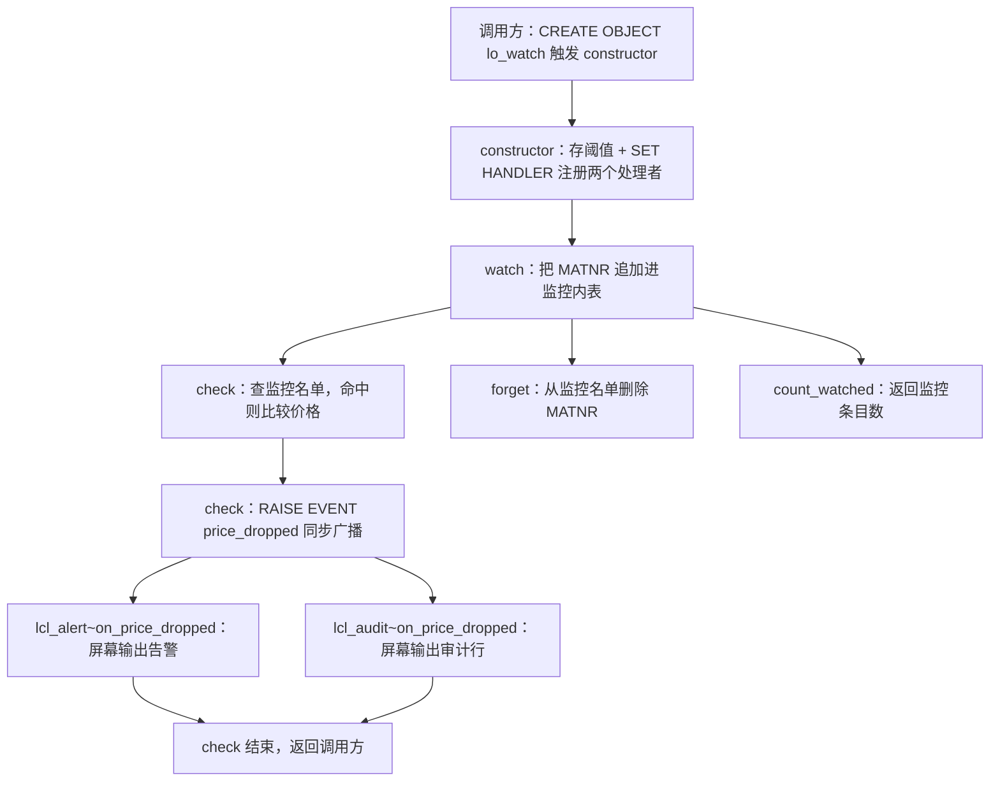
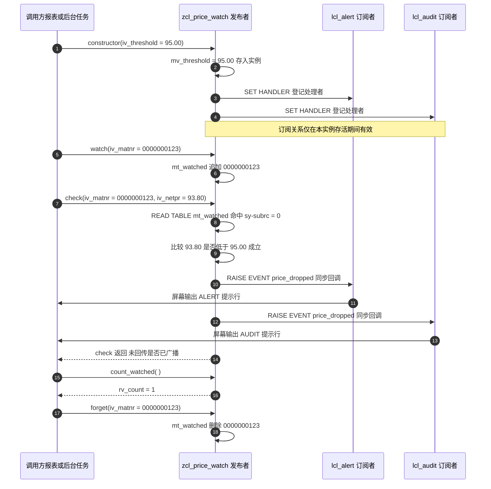

# 价格监控类 `ZCL_PRICE_WATCH` 源码分析报告

> 分析对象：`zcl_price_watch.clas.abap`（类池形式的全局类，119 行）
> 关注点：CLASS-EVENTS 广播机制、RAISE EVENT 触发、SET HANDLER 订阅三者的关系与注册时机，以及发布/订阅链路上的遗漏

---

## 一、程序定位与业务背景

### 1.1 它要解决什么问题

电商/供应链场景里，采购或销售团队会盯着一批关键物料的价格。价格一跌破心理线，就要有人被立刻通知——发邮件、写审计台账、在监控大屏上弹红字。这类需求的共同特征是：**一个地方发现了事实，多个互不相干的地方要各自做出反应**。

朴素做法是在价格检查的地方直接写三行：`WRITE` 一句、`INSERT` 一张审计表、发一封邮件。问题在于：检查逻辑从此和通知方式死死绑死。将来想把 `WRITE` 换成企业微信推送，就得去改价格检查的代码；换一个检查逻辑（比如改成按跌跌幅而不是绝对价），三处通知代码要跟着复制一遍。每多一种通知渠道，检查逻辑就多改一次。

### 1.2 本程序的设计范式

本程序采用 **发布—订阅（Publish–Subscribe）** 范式，而且是 ABAP 里最原味的一种：**静态事件（`CLASS-EVENTS`）+ 事件处理方法（`FOR EVENT ... OF ...`）+ 运行时注册（`SET HANDLER`）**。发布者 `zcl_price_watch` 只负责一件事——判断"这个物料在不在监控名单里、当前价有没有跌破阈值"，跌破就广播一个事件；两个订阅者 `lcl_alert`、`lcl_audit` 各自实现同一个接口 `if_price_listener`，各自决定怎么响应。

一句话定性：**这是一个"发布者只管判断、订阅者只管响应"的观察者模式实现，机制骨架搭得对，但发布端与订阅端之间的接线（注册）没有真正接通。**

### 1.3 为什么这个骨架值得关注

ABAP 的事件机制在新手眼里常常被误解成"DELIMITER / 屏幕流式输出"那一套（因为文档里 `EVENTS` 一词最早出现在 `WRITE ... AT NEW-PAGE` 的上下文里）。实际上 `CLASS-EVENTS` 是完全独立的内存内回调机制，和屏幕格式毫无关系。理解它，等于理解了在 ABAP 里怎么做"一个事实驱动多个反应"——这在报表程序之外（后台 Job、RFC 服务、CDS 消费、类池里的服务类）都是核心能力。本程序正好把这套机制压缩在 119 行里，是个很好的教学样本。

---

## 二、程序执行流程总览



**责任链表**（按运行时先后排列；`constructor` 由 `CREATE OBJECT` 触发，`watch`/`check`/`forget`/`count_watched` 由外部调用方触发，两个处理方法由 `RAISE EVENT` 同步触发）：

| 子程序 | 调用者 | 职责 | 运行时点 |
| --- | --- | --- | --- |
| `constructor` | 调用方（`CREATE OBJECT`） | 保存阈值，订阅 `lcl_alert` 与 `lcl_audit` 两个处理者 | 对象创建时 |
| `watch` | 调用方 | 把物料号追加进监控名单 | 使用方登记关注项时 |
| `check` | 调用方（定时检查、价格变更场景） | 判断物料是否被监控、当前价是否低于阈值 | 每次价格检查时 |
| `lcl_alert~on_price_dropped` | `check` 内的 `RAISE EVENT` | 输出告警文本 | 事件广播时（同步） |
| `lcl_audit~on_price_dropped` | `check` 内的 `RAISE EVENT` | 输出审计行文本 | 事件广播时（同步） |
| `forget` | 调用方 | 从监控名单删除物料号 | 取消关注时 |
| `count_watched` | 调用方 | 返回监控名单条目数 | 需要展示监控规模时 |

**静态上下文（不参与运行时调用，但决定了整条链路能否成立）**：`类 zcl_price_watch 定义段`（声明 `CLASS-EVENTS price_dropped`）、`接口 if_price_listener 定义段`（`FOR EVENT price_dropped OF zcl_price_watch` 声明事件契约）、`类 lcl_alert / lcl_audit 定义段`（`INTERFACES if_price_listener` 认领契约）。

下面按这条流程，逐个子程序展开。

---

## 三、分组分析

本程序没有传统意义上的"入口"——报表有 `START-OF-SELECTION`，类则由外部 `CREATE OBJECT` 或方法调用驱动。所以阅读顺序应从**静态契约**出发（事件声明和处理方法声明），再顺着**对象生命周期**（构造 → 登记 → 检查 → 广播 → 清理）走一遍，最后看广播时同步跑起来的那两个处理方法。

### 3.1 类池与事件声明 `zcl_price_watch`（类定义段，共四步）

这是整份源码的地基，四步分别是：**① 类池与可见性、② `CLASS-EVENTS` 事件声明、③ 对外方法签名、④ 实例属性**。前两步决定"广播"这件事有没有被正确表达出来，是本报告的重点。

#### ① 类池与可见性

```abap
CLASS-POOL zcl_price_watch.

"* use this source for any type of program (pool)

PUBLIC
FINAL
CREATE PUBLIC.
```

**做什么** — 用 `CLASS-POOL` 把 `zcl_price_watch` 定义成一个**全局类池**（class pool），也就是"容器 + 一个常驻类"的结构：容器本身不产出可实例化的对象，它的唯一职责是容纳这个类以及若干只在池内可见的局部类。`FINAL` 禁止继承，`CREATE PUBLIC` 允许任何程序 `CREATE OBJECT`。

**为什么** — 这里的关键动机是**可见性分层**。类池里的 `lcl_alert`、`lcl_audit` 对池外程序完全不可见（除了通过全局接口的间接引用），这正是我们要的封装：外部不能随手 `CREATE OBJECT` 一个告警类，也不能改掉监控行为。同时 `CREATE PUBLIC` 让监控服务能被报表、后台 Job、RFC 服务各自实例化，`FINAL` 则把"别继承这个类"这条约定交给编译器执行，省掉口头约定。`"* use this source for any type of program (pool)` 是 SE24 自动加的注释，提示该 include 可被任何程序类型使用（报表、池、函数组包含），不是业务代码。

**风险与改进** — 三个可讨论点。第一，`CREATE PUBLIC` + 静态事件的组合，等于把"发广播的能力"对全体程序开放：任何程序都可以 `RAISE EVENT zcl_price_watch=>price_dropped`，伪造一个根本不存在的价格下跌。你的两个订阅者会被这条假事件触发。这类"事件源"通常应通过单例（`CREATE PUBLIC` 但只提供一个 `NEW`/工厂方法）或至少在 `check` 里做额外校验来收口。第二，`FINAL` 是对的，但接口 `if_price_listener` 是 `PUBLIC` 的全局接口，外部程序可以自行实现它——不过后面会看到，外部实现出来的订阅者**根本没人帮它注册**，所以这个"开放"目前是虚的。第三，类池本身增加了一层不必要的心智负担：如果把 `lcl_alert`/`lcl_audit` 换成两个独立的全局类（`zcl_price_alert`/`zcl_price_audit`），就不用类池了，可测试性也更好（见 3.4）。

#### ② `CLASS-EVENTS price_dropped` 事件声明

```abap
PUBLIC SECTION.

  CLASS-EVENTS price_dropped
    EXPORTING iv_matnr TYPE mara-matnr
              iv_netpr TYPE marc-netpr.
```

**做什么** — 在 `PUBLIC SECTION` 里声明一个**静态事件** `price_dropped`（`CLASS-EVENTS` 默认就是静态的，因为没有加 `FOR EVENT ... OF` 之外的实例限定）。事件不带任何 `iv_` 形参携带数据，而是通过 `EXPORTING` 把两个**带类型的参数**交给订阅者：`iv_matnr`（物料号，来自 MARA）、`iv_netpr`（标准价格，来自 MARC）。任何程序都可以 `RAISE EVENT zcl_price_watch=>price_dropped EXPORTING ...` 触发它，订阅者在 `on_price_dropped` 里用同名 `IMPORTING` 参数接住。

**为什么** — 这是 ABAP 事件机制里最该用对的一点：**`EXPORTING` 的定类型事件参数，是订阅者与发布者之间唯一受编译期保护的契约**。对比无参事件 `CLASS-EVENTS price_dropped.`，订阅者若想知道是哪个物料跌价，只能去读某个全局变量、某个 `me->` 属性，或者干脆猜——那样编译器和 IDE 全无感知。写成 `EXPORTING` 之后，ABAP 会校验处理方法的形参与事件的形参在**类型和名字上都兼容**，谁漏了参数、改了类型，激活就报错，而不是等到运行期静默拿不到数据。这就是"把接口契约写进签名"思想在事件机制里的落地。

至于为什么是**静态事件**而不是实例事件：静态事件的 `RAISE` 语法是 `RAISE EVENT class=>evt`（针对类，不针对对象），处理方法也不需要指明事件源对象。价格监控是一个**领域级事实**（"某个物料跌价了"），而不是"某一个监控对象的状态变化"——用静态事件在语义上是对的，也避免了"必须持有发布者引用才能 raise"的麻烦。代价是事件源被编译进签名里（`FOR EVENT ... OF zcl_price_watch`），这个类以后不能改名、不能拆成两个同族类，这是一笔需要意识到的长期债。

**风险与改进** — 这里有本程序最需要修正的设计问题，分两层：

- **载荷信息量严重不足**。`price_dropped`（"跌价了"）只带 `iv_matnr` 和 `iv_netpr` 两个值，导致：(a) 订阅者**无法算出跌幅**，只能知道"当前价低于阈值"，不知道从多少跌到多少，告警里写不出"从 94.5 跌到 93.8"；(b) 缺少 `iv_werks`（工厂）、`iv_waers`/`iv_peinh`（币种与价格单位）、`iv_oldpr`（旧价）、`iv_chgts`/`iv_timestamp`（变更时间戳）、以及一个幂等用的**事件 ID**。没有事件 ID，订阅者就没有去重依据，一旦上游重跑或价格被重复推送检查，告警就会重复轰炸。
- **数据元素语义错配**。`iv_netpr TYPE marc-netpr` 单独出场是危险的：MARC-NETPR 的含义**完全依赖同一行的 `waers`（币种）和 `peinh`（价格单位）**。同一条 `93.8` 数值，在 USD/件 和 CNY/箱 下是两个数量级不同的价格，而订阅者拿不到这两个字段。正确做法是定义一个自有类型把币种和单位一起带过去。另外 `marc-netpr` 是 **MARC** 的字段（工厂级），而 `iv_matnr` 取的是 **MARA** 的物料号（客户端级）——一个工厂级价格配一个工厂无关的物料号作为事件主键，等于宣告"本类不区分工厂"。而 MARC 里一个物料在 N 个工厂就是 N 行，本类只传一个 MATNR，订阅者根本不知道是哪家工厂的价跌了。`netpr` 还有两个附加坑：PC = S 时标准价不一定随实际采购价同步更新；金额类字段有取整规则，直接用 `<` 比较可能在取整边界上误触发。

- 补充一条命名问题：`price_dropped`（跌价）与代码实际判断的"低于阈值"（`iv_netpr < mv_threshold`）不是一回事。第一次从 96 跌到 94 叫跌价，价格从 94 涨到 94.2 又跌回 93.9 也叫跌价，但**连续两次 `check` 都读到 93.5，也叫跌价**——本类没有任何"上次价格"状态，所以不存在穿越检测，只有一个纯阈值判断。要么把事件改名为 `below_threshold`，要么给 `check` 加一个 `mv_lastpr` 缓存做穿越/滞回判定。

#### ③ 对外方法签名

```abap
METHODS constructor
  IMPORTING iv_threshold TYPE marc-netpr.

METHODS watch
  IMPORTING iv_matnr TYPE mara-matnr.

METHODS forget
  IMPORTING iv_matnr TYPE mara-matnr.

METHODS check
  IMPORTING iv_matnr TYPE mara-matnr
            iv_netpr TYPE marc-netpr.

METHODS count_watched
  RETURNING VALUE(rv_count) TYPE i.
```

**做什么** — 声明五个公开实例方法：`constructor` 接收一个阈值；`watch`/`forget` 以物料号为键做监控名单的增删；`check` 同时接收物料号与当前价，把"是否在监控中"和"是否低于阈值"两件事合在一次调用里判断；`count_watched` 返回监控条目数。前四个用 `IMPORTING` 传入形参，最后一个用 `RETURNING VALUE(...)` 返回。

**为什么** — 这个对外契约整体是清晰的，值得肯定的有两点：一是**入参用 `TYPE mara-matnr` / `TYPE marc-netpr` 直接引用 DDIC 数据元素**而不是 `TYPE string` 或 `TYPE n`，让 IDE 能提供类型提示、代码模板和 F4 帮助，也让调用方的类型不匹配在编译期暴露；二是 `check` 把"查名单"和"比价格"合成一步，调用方不需要先问 `count_watched` 或自己 `READ` 名单，调用成本最低。

**风险与改进** — 契约层面有四个问题。第一，`check` 没有任何返回值，调用方**无法知道这次调用到底有没有触发事件**（`RETURNING rv_dropped TYPE abap_bool` 就够了），也就无法在界面提示"已告警"或跳过重复处理。第二，`check` 的 `iv_netpr` 沿用了上一节的语义错配：没有工厂、币种、价格单位。第四个也是最实际的——`check` 需要外部**主动调用**才有机会广播事件，但整份源码里没有任何定时任务、CDS 消费、或者价格变更捕获机制来调用它。对一个叫"price_watch"（价格**监控**）的类来说，这是最大的功能缺口：机制搭好了，触发源缺失，等于一台没有点火装置的引擎（详见第五章 P0 第 1 条）。第三，`count_watched` 返回 `TYPE i`，若 `watch` 允许重复追加，这个数字会虚高且失去意义（见 3.4）。第四，`watch` 与 `forget` 返回空 `void`，调用方无法区分"新增成功""本来就已存在""删除了"和"根本没监控过"，这四种情况在业务上通常要区别对待（至少要能提示"该物料已在监控中"）。

#### ④ 实例属性

```abap
PRIVATE SECTION.

  DATA mv_threshold TYPE marc-netpr.
  DATA mt_watched   TYPE STANDARD TABLE OF mara-matnr WITH EMPTY KEY.
```

**做什么** — 两个私有实例属性：`mv_threshold` 保存构造时传入的阈值；`mt_watched` 是一个标准表，内表行结构就是 `mara-matnr` 本身（匿名结构），声明为 `WITH EMPTY KEY`（空键内表）。

**为什么** — `mv_threshold` 用 `TYPE marc-netpr` 而不是自行定义类型，是为了省事：阈值与 `iv_netpr` 同类型，比较时不需要任何转换，最直白。`WITH EMPTY KEY` 是标准表的关键优化——不建任何主键/次键索引，行结构只有一行（MATNR），不设键就省掉了"未声明的附加行结构"（技术键），在只用 `READ TABLE` / `APPEND` / `DELETE` 的场景下是正确的选择，也是本程序在表类型上做得最好的一处。属性全部放在 `PRIVATE SECTION`，外部无法绕过 `watch`/`forget` 直接改名单，这条封装线守住了。

**风险与改进** — 三个隐患。第一，`mv_threshold` **没有默认值也没有初始化保护**。当前唯一赋值点是 `constructor`，所以现状下不会读到 initial；但这个类被 `CREATE PUBLIC` 开放，任何人只要新增一个不调 `constructor` 的构造路径（比如未来加个 `DEFAULT CONSTRUCTOR` 或反序列化场景），`iv_netpr < 0` 这种比较就会在阈值未定义时静默产生错误结果。建议 `DATA mv_threshold TYPE marc-netpr DEFAULT '9999999999'.` 或在 `check` 开头加有效性断言。第二，`mara-matnr` 单字段内表，**没有工厂维度**——和上一节一致的语义错配：价格是工厂级（MARC），监控粒度却只有物料级（MARA）。一个物料在 3 个工厂都有价格，这个类只能笼统地"监控"它，无法回答"哪家的价跌了"。第三，内表声明为 `STANDARD TABLE`（全序表）：`READ TABLE ... WITH TABLE KEY` 只能线性查找、`DELETE ... WHERE` 是 O(n) 全扫。监控名单通常很小，标准表够用；但如果名单会长到几千条（一个工厂关注几百个 SKU 是常态），改成 `HASHED TABLE` 更合适。**但更重要的不是表类型，而是缺少唯一性约束**——`WITH EMPTY KEY` 只是"不需要键"，并没有阻止 `watch` 反复追加同一个 MATNR（见 3.4）。

### 3.2 事件契约接口 `if_price_listener`（接口定义段，共一步）

声明完事件之后，类池里还有一份"事件契约"。它是把"事件"和"处理方法"缝在一起的针脚。

```abap
INTERFACE if_price_listener PUBLIC.
  METHODS on_price_dropped
    FOR EVENT price_dropped OF zcl_price_watch
    IMPORTING iv_matnr TYPE mara-matnr
              iv_netpr TYPE marc-netpr.
ENDINTERFACE.                   "if_price_listener
```

**做什么** — 声明一个全局接口 `if_price_listener`，其中唯一的方法 `on_price_dropped` 用 `FOR EVENT price_dropped OF zcl_price_watch` 显式认领：只要某个类 `INTERFACES if_price_listener`，这个类就被要求实现一个"能接收 `zcl_price_watch` 的 `price_dropped` 事件"的方法。`IMPORTING` 的两个形参**与事件声明的 `EXPORTING` 一一对应**（同名同类型：`iv_matnr` / `iv_netpr`）。

**为什么** — `FOR EVENT ... OF ...` 是本程序设计里最漂亮的一处，值得单独说清楚它解决什么问题。ABAP 的事件机制有一个硬性规定：**一个事件只能把参数送给显式声明为"该事件处理方法"的方法**。也就是说，光有一个叫 `on_price_dropped` 的普通方法是没用的，系统不会因为名字相同就自动调用它；必须用 `FOR EVENT evt OF cls` 声明它绑定到哪个事件去，运行时 `SET HANDLER` 才会把这对（事件，方法）建立连接。把它封装进接口的好处是**只写一次**：`lcl_alert` 和 `lcl_audit` 都只需 `INTERFACES if_price_listener`，`FOR EVENT` 那一行不必重复两遍，ABAP 会强制它们实现同一个契约。第三个好处是**可插拔性**——任何程序都可以实现这个接口来订阅，`zcl_price_watch` 不需要知道订阅者是谁，这是发布—订阅模式成立的必要条件。用接口而不是让两个类各自散着写方法签名，等于把"我是一个订阅者"这件事变成了**类型系统里可见的标记**：任何读代码的人只要看到 `INTERFACES if_price_listener`，就知道这个类会去收事件。

**风险与改进** — 有一处需要留意：接口定义在**类池内部**。语法上 `INTERFACE ... PUBLIC` 使其成为全局接口（池外可见、可被实现），但它和 `zcl_price_watch` 类池共享生命周期：接口被删或被改名会连带影响所有实现者，接口的 DDIC 变更（增删参数）会同时打断池内两个订阅者和池外的第三方。这种"逻辑上全局、物理上寄生"的安排是类池式设计的通病，扩展到更多订阅者或跨程序复用时应把接口提为独立对象。另外，既然接口定位是"供外部订阅者实现"，就应该在接口上加一段注释说明**实现者必须自备实例引用并由发布者注册**——因为发布者只负责注册，不负责创建（这一点是本程序最大的接线漏洞，见 3.3 与第五章）。方法命名上 `on_price_dropped` 缺少 `event_` 前缀，在接口里通常写成 `if_price_listener~on_price_dropped` 这样的全限定形式调用，可读性尚可，不算问题。

### 3.3 订阅注册 `constructor`（方法 `constructor`，共两步）

静态契约备齐之后，运行时的第一个动作是**创建对象**，而订阅关系就是在这一刻"装上去"的。这个方法分两步：**① 保存阈值、② 注册两个处理者**。第 ② 步是全篇最关键、也是问题最集中的地方。

#### ① 保存阈值

```abap
METHOD constructor.
  mv_threshold = iv_threshold.
```

**做什么** — 把调用方传入的 `iv_threshold` 原样赋给实例属性 `mv_threshold`，之后所有 `check` 的价格比较都以它为基准。

**为什么** — 这是最直白的"构造即初始化"，没有额外设计可评。唯一值得肯定的是：阈值是**实例级**属性而不是全类静态属性，因此可以为不同的监控场景创建不同的 `zcl_price_watch` 实例、各用各的阈值（比如危险品类用一个低阈值，日用品用一个高阈值），这比硬编码阈值灵活。

**风险与改进** — 没有校验 `iv_threshold` 是否为 initial 或负数。阈值传 0 意味着"任何价格都算跌价"，传负数意味着"永远不触发"，这两种误传都不会报错，表现为"监控看起来没生效"这种极难排查的现象。建议构造时对边界值做一次检查（或至少在代码注释里写清 0 / 负数的语义）。另外，如果采用上一节建议的"穿越检测 + 滞回"方案，这里还需要一个 `DATA mv_lastpr TYPE marc-netpr.` 之类的状态位在构造时初始化。

#### ② `SET HANDLER` 注册两个处理者

```abap
  SET HANDLER lcl_alert=>on_price_dropped.
  SET HANDLER lcl_audit=>on_price_dropped.
```

**做什么** — 意图是把两个局部类的处理方法登记到 `price_dropped` 事件的处理链上：事件一旦被 `RAISE`，ABAP 会在**同一个工作流内、同步地**依次调用这两个方法。`SET HANDLER` 是这套机制里唯一的"订阅"动作——事件已声明、处理方法已声明，缺了它，两者永不相遇。

**为什么** — 之所以把注册放在构造函数里，是遵循了 ABAP 事件处理的一条核心约定：**注册语句放在对象构造期间，订阅关系就自动与该对象引用共存亡**。对象还活着，订阅就在；对象被释放，ABAP 自动清掉它的注册，订阅者不需要写任何反注册代码。放在构造函数里是官方推荐做法（比放在 `INITIALIZATION` 段更内聚，比散落在各处更可靠），这个选择本身是对的。

**风险与改进** — 但这两行代码**在语义上不成立**，是本程序最硬的缺陷，需要讲透三层：

- **第一层：`=>` 只能用于静态方法，处理者不是静态的。** `SET HANDLER` 的操作数只有两种合法形式：`class=>meth_name`（静态处理方法）或 `ref->meth_name`（实例处理方法）。`on_price_dropped` 是通过 `INTERFACE if_price_listener` 声明的普通方法，**没有 `STATIC` 附加项**，因此它是实例方法，引用它的正确写法只能是 `lo_alert->on_price_dropped`。用 `lcl_alert=>on_price_dropped` 会让 `=>` 指向一个非静态方法，激活阶段就会报语法/语义错误（或者在某些工具链下被容忍，但注册关系不会按预期建立）。这段代码是**从 C# / Java 的 `static` 事件 + 静态处理者习惯照搬过来**的痕迹——在那些语言里事件处理者常写成静态方法，而 ABAP 的接口实现方法默认就是实例方法。
- **第二层：订阅者从来没有被实例化。** 正确写法要求先有一个对象引用，但全类**没有任何 `lo_alert` / `lo_audit` 之类的 `TYPE REF TO` 属性**，也没有 `CREATE OBJECT`。也就是说，两个订阅者类在本程序里是"只声明不存在的"——有类、有实现、有接口，但没有一个活着的实例，`on_price_dropped` 也就永远不会被调用。即便把 `=>` 改成 `->`，如果引用是一个**方法内的局部变量**，方法一返回引用计数就归零、实例被 GC、注册随即失效；必须把它存为 `zcl_price_watch` 的实例属性来"持有"订阅者。这一条是发布—订阅链路最实质的漏洞：机制全对，实例缺失。
- **第三层：静态事件 + 实例级注册，是脆弱的组合。** `price_dropped` 是全局静态事件（`RAISE` 时针对的是类，不是某个对象），而它的订阅却建立在一个**特定实例**的构造函数里，注册的有效期随之被这个实例的存活期绑架。如果这个 `zcl_price_watch` 实例在一次报表运行中被创建、用完、释放，后续某个流程再 `CREATE OBJECT` 一个新实例，看起来"又订阅上了"；但如果中途实例因为没有强引用被提前回收，订阅会**静默消失**——没有任何异常、没有日志，只是"告警莫名其妙不发了"。这类"事件源是全局的、订阅是实例的"的错配，是 ABAP 事件机制最常见的线上坑。稳妥做法是二选一：把事件改成实例事件（`CLASS-EVENTS ... ` 配 `SET HANDLER ... FOR`），让发布与订阅同生共死；或保留静态事件，把注册移到 `INITIALIZATION` 之类的程序级静态上下文，并显式持有订阅者引用。
- **第四层：没有去重，也没有对外注册入口。** 多次 `CREATE OBJECT` 会执行多次 `SET HANDLER`（对同一个对象引用 ABAP 会自动去重，对不同引用则**会重复注册、事件被多次触发**），本类没有任何"只注册一次"的保护。同时 `zcl_price_watch` 也没有提供 `subscribe( io_listener )` 之类的公开方法，`if_price_listener` 接口因此是**半开放**的：外部程序可以实现它，却找不到任何途径把实现注册进来。要把"两个写死的局部类"变成"可插拔的订阅体系"，缺的就是这个入口。

### 3.4 监控名单维护 `watch` / `forget`（方法 `watch`、`forget`，各一步）

订阅装好之后，调用方要告诉这个对象"哪些物料需要盯"。这一对方法是发布端的"订阅源名单"——注意与事件订阅不是一回事，`watch` 管理的是"被观察对象清单"，`forget` 管理的是"退出观察"。

#### ① `watch`：登记关注项

```abap
METHOD watch.
  IF iv_matnr IS INITIAL.
    RETURN.
  ENDIF.

  APPEND iv_matnr TO mt_watched.
ENDMETHOD.                    "watch
```

**做什么** — 检查物料号是否为空，空则直接返回；否则把 `iv_matnr` **追加**到内表 `mt_watched` 末尾，返回新条目数由调用方感知不到（方法无返回值）。

**为什么** — `IF iv_matnr IS INITIAL ... RETURN` 这个前置拦截是好习惯：物料号是主键类字段，空值几乎一定是调用方漏传或传了空结构，让它进名单只会污染数据，所以宁可直接忽略。`APPEND` 配 `WITH EMPTY KEY` 的标准表是最省事的选择——标准表的 `APPEND` 是 O(1) 摊还，不需要维护任何索引，名单只增不查序时正合适。

**风险与改进** — **这里有一个明确的功能缺陷：`APPEND` 不做去重，同一个物料可以被重复 `watch` 任意多次**。后果是连锁的：(a) `count_watched` 会把同一个物料数多次，返回值失去"监控物料数"的语义；(b) `forget` 只能一次删干净（`DELETE ... WHERE` 删全部匹配），所以名单会突然"从 5 掉到 0"；(c) 内存被无意义地膨胀。最省事的修法是把 `APPEND` 换成一行：

```abap
  INSERT iv_matnr INTO TABLE mt_watched.
```

`INSERT INTO TABLE` 内部就是"先查后插"，重复插入自动被忽略、不报错、`sy-subrc` 告诉你是否真的插入，正合这个场景。第二个问题是**静默失败**：`iv_matnr` 为空时直接 `RETURN`，调用方得不到任何反馈，也无法区分"忽略了空值"和"登记成功"。至少应在注释里写清这个约定，业务上若需要提示则用 `MESSAGE` 或 `RAISING` 异常把情况抛回去。第三，如果未来 `watch` 支持批量登记（一次传一个 MATNR 区间），可以提供一个接受内表的重载版本。

#### ② `forget`：取消关注项

```abap
METHOD forget.
  DELETE mt_watched WHERE table_line = iv_matnr.
ENDMETHOD.                    "forget
```

**做什么** — 在 `mt_watched` 中按整行匹配（表结构只有一个字段 `table_line`，即 MATNR）删除所有等于 `iv_matnr` 的条目。

**为什么** — `DELETE itab WHERE table_line = iv_matnr` 用**整行比较**而不是 `WHERE matnr = iv_matnr`，这在单字段内表上是完全等价且更简洁的写法，ABAP 也推荐这种风格。与 `watch` 的 `APPEND` 配对，形成了"增 / 删"这一对最基本的名单维护操作。

**风险与改进** — 三点小问题。第一，方法名叫 `forget`（"忘掉"），但在发布—订阅语境下这个词很容易被读成"**取消事件订阅**"，而它实际做的是"**取消价格监控**"——它动的是监控名单，与 `SET HANDLER` 的订阅关系毫无关系。建议改名 `unwatch` 或 `stop_watching`，用 `watch` / `unwatch` 这一对对称命名，避免与事件订阅的概念混淆（这是本类概念层面的一个真实歧义点）。第二，方法不返回删除结果，也不检查 `sy-subrc`，对不存在的物料调用 `forget` 完全静默。第三，"删除全部匹配"这个语义只有在 `watch` 去重之后才符合直觉；当前因为允许重复，一次 `forget` 会连带清掉所有重复项，行为虽正确但可观测性差——`DELETE` 之后应把 `sy-deletd` 带回给调用方。

### 3.5 价格检查与广播 `check`（方法 `check`，共三步）

这是整个类的核心，分三步：**① 查监控名单决定是否关心、② 与阈值比较、③ `RAISE EVENT` 广播**。第 ③ 步之后，同步流入两个订阅者方法（见 3.6）。

#### ① 判断该物料是否在监控中

```abap
METHOD check.
  READ TABLE mt_watched WITH TABLE KEY table_line = iv_matnr.
  IF sy-subrc <> 0.
    RETURN.
  ENDIF.
```

**做什么** — 在监控名单里按整行键查找 `iv_matnr`，`sy-subrc <> 0` 表示没找到，直接 `RETURN` 结束本次检查；找到则落到 `sy-tabix` 指向的那一行，继续往下。

**为什么** — 这一步是事件机制的**天然过滤器**：先确认"这是我在乎的物料"，再谈价格。不在监控名单里的物料直接返回，避免了对全系统物料做无意义的价格比较，也让 `RAISE EVENT` 只在真正相关时发生。用 `READ TABLE ... WITH TABLE KEY` 而不是 `LOOP AT` + `EXIT` 是标准写法，前者只取一行、语义直白。`IF sy-subrc <> 0` 的早退（Guard Clause）写法也优于把主逻辑包在 `IF sy-subrc = 0 ... ENDIF` 里，减少一层缩进。

**风险与改进** — 基本无风险。唯一可提的是：`READ TABLE` 的 `sy-tabix` 在命中后指向命中行，但此处并未利用这个信息（例如取出该行的工厂等扩展属性）——如果将来名单要带上"每个物料各自的阈值"，这里就应该 `READ TABLE ... INTO ls_entry` 把整行读出来，为 3.5 第 ② 步做"按物料取阈值"做准备。这不是错误，是当前设计的一个自然扩展点。

#### ② 与阈值比较

```abap
  IF iv_netpr < mv_threshold.
```

**做什么** — 唯一一条业务判断语句：当传入的当前价 `iv_netpr` **低于**实例阈值 `mv_threshold` 时，进入下一步广播；否则本次 `check` 静默结束。

**为什么** — 用实例属性而不是硬编码常量做比较阈值，使阈值可由调用方在构造时给定，灵活且可测试（构造一个 `mv_threshold` 极高的实例，"什么都不该触发"；构造一个极低的，"每个被监控物料都触发"——这套设计天然适合写单元测试）。因为 `iv_netpr` 与 `mv_threshold` 类型相同（都是 `marc-netpr`），比较无需转换，也不存在精度截断。

**风险与改进** — **这一行是全类业务风险最集中的地方**，四条：

- **"跌价"被实现成了"低于阈值"。** 代码没有任何"上一次价格"的概念，所以判据是纯阈值而非跌幅。一次价格从 94 跌到 93.5 触发；**下一次 `check` 仍然读到 93.5，还触发**；下下次还是 93.5，继续触发。**只要价格停在阈值下方，每次检查都会重复广播一次"跌价"**。对告警类程序这是灾难性的——用户会迅速把通知静音，或者更糟，把它当成系统故障去排查。要修就得引入 `mv_lastpr`（上次检查价）做穿越检测：只有"上次在阈值上方、这次在阈值下方"才广播；更稳的做法是加**滞回带**（回补带，如阈值 95、回收阈值 97），避免价格在阈值附近抖动时反复触发。
- **单值阈值没有维度。** `mv_threshold` 是一个裸的 `marc-netpr`，不带币种、价格单位，也不带工厂。前一节已经提到 `netpr` 脱离 `waers`/`peinh` 就没有意义，这里是同一个错误的延续：**同一家公司不同工厂用的必然是不同币种**（海外工厂 USD、国内工厂 CNY），用同一个数值阈值去比两边的价格，结论必然有一个是错的。至少应把阈值做成 `BEGIN OF waers ... END OF waers` 的结构（按工厂/币种分别维护），或至少把币种一起纳入比较。
- **`iv_netpr < mv_threshold` 与价格取整/精度。** 金额类数据元素在 SAP 内部按条件记录取整（常见 2 位或 4 位小数），`check` 传入的价可能来自上游四舍五入后的值。若阈值恰好落在一位小数的中间，边界行情会产生"这一轮 94.999 不触发、下一轮 94.998 触发"的抖动，与上面的重复广播叠加会更明显。
- **没有任何上下文。** 判断失败（不是"低于阈值"，而是"压根没在监控"）与判断成功这两种情况，调用方都无法从返回值区分（`check` 无返回值，见 3.1 第 ③ 步）。

#### ③ `RAISE EVENT` 同步广播

```abap
    RAISE EVENT price_dropped
      EXPORTING iv_matnr = iv_matnr
                iv_netpr = iv_netpr.
  ENDIF.
ENDMETHOD.                    "check
```

**做什么** — 在"低于阈值"分支里触发静态事件 `price_dropped`，把 `iv_matnr` 与 `iv_netpr` 显式赋值给事件的两个 `EXPORTING` 参数。此句之后 ABAP 会在**同一工作流内同步**调用所有已注册且仍有效的处理方法（本程序意图是 `lcl_alert` 与 `lcl_audit`），两个都返回后 `check` 才结束。

**为什么** — 这是发布—订阅模式里发布端**唯一**需要写的一行，也是这个模式最漂亮的地方：发布者对订阅者一无所知。它不知道有几个订阅者、订阅者叫什么、订阅者要做什么（甚至不知道订阅者是不是同一个类被注册了两次）。想加"邮件通知""大屏推送"，只需再实现一个 `if_price_listener` 并注册，`check` 一行都不用改。这正是本类相对"在价格检查里直接 `WRITE`/`INSERT`/`SEND` 三连"的全部价值所在。`EXPORTING` 里逐个具名赋值（而不是位置传参）也便于日后扩展参数而不破坏可读性。

**风险与改进** — 三条：

- **同步执行 = 异常会打断发布者。** `RAISE EVENT` 不是异步派发，ABAP 在触发点直接调用处理方法。这意味着**任何一个订阅者抛出 `MESSAGE`、未捕获异常、或数据库短时出错，都会中止 `check`、把异常冒泡给发布者的调用方**——一个"旁路通知"机制反过来搞垮了主流程，这正是事件驱动设计最经典的脆弱点。若要让通知失败不影响到价格检查，必须在 `RAISE EVENT` 前后用 `TRY. ... CATCH ... ENDTRY.` 把广播包起来（或让处理者自己捕获所有异常并只记日志）。本程序两个处理者目前都只 `WRITE`，暂时不会抛异常，但只要有人加一句 `MESSAGE e001`，雷就埋好了。
- **广播后不留痕。** 事件放出去之后，`check` 不返回任何信息，发布者自己也不知道消息有没有人接、有几个人接。若运维需要"知道告警确实发出去了"，应让订阅者落一张通知台账表（含事件 ID、时间戳、接收方、结果），并让事件载荷带上幂等键。
- **事件可被任意程序伪造。** `price_dropped` 是静态事件，语法上是 `RAISE EVENT zcl_price_watch=>price_dropped`，任何程序都能调用；配合 3.1 第 ① 步提到的 `CREATE PUBLIC`，内部审计/测试类都能凭空造出"价格下跌"。若不希望被外部伪造，可考虑把事件改为实例事件（`SET HANDLER ... FOR` + `RAISE EVENT` 只能用对象引用触发），或增加一个"仅信任调用方"的校验。

### 3.6 事件处理者 `lcl_alert` / `lcl_audit`（类定义段与方法实现，各一步）

`check` 里那句 `RAISE EVENT` 执行之后，ABAP 就切换到订阅者。这两个处理者是本程序唯一真正"对业务产生输出"的地方，各自只有一句话实现，结构也完全对称，所以放在一节里对照着看。

#### ① `lcl_alert`：告警响应

```abap
CLASS lcl_alert DEFINITION FINAL.
  PUBLIC SECTION.
    INTERFACES if_price_listener.
ENDCLASS.


CLASS lcl_alert IMPLEMENTATION.
  METHOD if_price_listener~on_price_dropped.
    WRITE: / 'ALERT: price drop for', iv_matnr.
  ENDMETHOD.                    "if_price_listener~on_price_dropped
ENDCLASS.                       "lcl_alert
```

**做什么** — 局部类 `lcl_alert` 声明 `FINAL` 并 `INTERFACES if_price_listener`（因此必须实现 `on_price_dropped`）。实现里用 `WRITE: /` 向列表输出告警行：空行加一句 `ALERT: price drop for` 和触发事件的物料号。注意**只用了 `iv_matnr`，`iv_netpr` 完全没被使用**。

**为什么** — `lcl_alert` 声明在类池里且不带 `PUBLIC`，因此**池外不可见、不可被单独创建**——这是有意的隔离：它只是 `zcl_price_watch` 的内部协作者。实现方法用全限定名 `if_price_listener~on_price_dropped` 而不是短名 `on_price_dropped`，在有多个接口或方法同名时更清晰，推荐。`WRITE: /` 里的 `/` 表示输出前先换行——若后面接第二个订阅者，输出格式天然是分行的，这个细节考虑到了。

**风险与改进** — `WRITE` 是**交互式列表输出**，用在一个"业务服务类"里有四个硬伤：其一，**在后台 Job、RFC、对话框受限场景、Update Task 里 `WRITE` 要么无效要么直接抛 `MESSAGE` 短转储**，一个价格监控类迟早要跑后台，那时这里就是雷；其二，输出只在屏幕上，**没有任何持久化**，进程一结束就没了，事后无法追溯"当时告过警没有"；其三，作为告警手段，"打印一行字"对使用者几乎没有价值，真正有用的告警要走邮件、消息号、飞书/钉钉、或写入待办；其四，`iv_netpr` 拿到手却不用，**告警里没有价格、没有币种、没有跌幅**，收到告警的人还得自己去查一次价才知道严重程度——这直接印证了 3.1 第 ② 步的"载荷不足"问题在这里的代价。建议改为：把类抽成一个可配置的告警通道，先落一张 `ZPRICE_ALERT_LOG` 台账表（带事件 ID、MATNR、净价、币种、工厂、触发时间），再根据配置决定是否发消息；至少也要用 `cl_demo_output=>write` 之外的真实通道，并输出全部载荷字段。

#### ② `lcl_audit`：审计响应

```abap
CLASS lcl_audit DEFINITION FINAL.
  PUBLIC SECTION.
    INTERFACES if_price_listener.
ENDCLASS.


CLASS lcl_audit IMPLEMENTATION.
  METHOD if_price_listener~on_price_dropped.
    WRITE: / 'AUDIT entry created for', iv_matnr, iv_netpr.
  ENDMETHOD.                    "if_price_listener~on_price_dropped
ENDCLASS.                       "lcl_audit
```

**做什么** — 结构与 `lcl_alert` 完全对称：同样 `FINAL`、同样 `INTERFACES if_price_listener`、同样实现 `on_price_dropped`。唯一区别是输出文本变成 `AUDIT entry created for`，并且**把 `iv_netpr` 也打印了出来**。

**为什么** — 作者显然想演示"一个事件、两个互不相干的订阅者"这件事，两个类用同一份 `if_price_listener` 契约、彼此不调用、也不共享任何状态——这是发布—订阅模式最值得学的一点：**订阅者之间零耦合**。想验证"改订阅者不会影响发布者"这个卖点，这个对是最小可行的实验，`lcl_alert` 里就算写错了也完全不影响 `lcl_audit` 被调用。作为教学示例，它是对的。

**风险与改进** — **方法名和文本承诺了代码没有做到的事**，这是比"功能不全"更严重的信号：`AUDIT entry created`（审计记录已创建）——但这里既没有 `INSERT` 到任何表，也没有调用任何变更文档、审计日志或输出到持久介质，**它只是在屏幕上写了一行字，屏幕上那行字就是全部的"审计记录"**。运维排查时如果信了这句话，会得出"审计留痕了"的错误结论，而实际上系统里什么都没有。正确的审计订阅者应该：写一张自建台账表（`INSERT` 成功才算创建），或触发 SAP 的变更记录（CDHDR / `CHANGE_DOCUMENT_*`），至少要用文件/日志（`cl_demo_output` 不算）留痕；并把 `iv_netpr` 与 `iv_matnr` 一起持久化，同时记录处理时间与处理人。另外两个类都声明 `FINAL` 虽然符合"叶节点协作者"的定位，但也意味着**无法通过继承扩展出不同的告警通道**（比如 `lcl_alert_email` 无法 `INHERITING FROM lcl_alert`），在需要变体时只能复制粘贴——这是 `FINAL` 带来的长期成本，值得有意识地权衡。

### 3.7 名单规模查询 `count_watched`（方法 `count_watched`，一步）

最后一个方法，用于让调用方知道监控面有多大，通常出现在监控界面上。

```abap
METHOD count_watched.
  rv_count = lines( mt_watched ).
ENDMETHOD.                    "count_watched
```

**做什么** — 用内建函数 `lines( )` 取得 `mt_watched` 的行数，赋给返回参数 `rv_count`（类型 `i`）。

**为什么** — `lines( )` 是 ABAP 7.40 之后的标准写法，比旧式的 `DESCRIBE TABLE ... LINES` 简洁得多，也避免了一次多余的 `sy-dbcnt` 赋值，是这个方法里值得学的现代语法。方法放在 `PUBLIC SECTION` 的最后，符合"主流程方法在前、辅助查询方法在后"的阅读习惯，调用方一眼能找到。用 `RETURNING VALUE(rv_count) TYPE i` 而不是 `CHANGING`/`EXPORTING`，在现代 OO 风格里也是更推荐的写法。

**风险与改进** — 自身实现没有问题，但它**放大了 3.4 第 ① 步的缺陷**：因为 `watch` 允许重复追加，`lines( )` 统计的是"行数"而不是"不同物料数"，重复 `watch` 同一个物料会让这个返回值虚高。如果这个数字要显示在监控界面上当作"当前监控 128 个物料"，用户看到 130 却只对应 128 个物料，就会开始怀疑整个类。修法同样是 3.4 里那句 `INSERT ... INTO TABLE`——从源头保证唯一性，`count_watched` 不用改。另外 `lines( )` 对标准表是 O(1)（行数存在表头里），性能无虞；如果内表是 hashed 同样 O(1)。顺带一提：这个方法返回的是一个"只读快照"式的数字，如果界面要显示明细，还得另外提供读取名单的方法（如 `get_watched`），目前没有。

---

## 四、执行流程全景图（数据视角）

下图展示一次完整的"监控登记 → 价格检查 → 事件广播 → 双向通知"过程中，数据如何在各个子程序之间流转。注意 RAISE EVENT 是**同步**的：`lcl_alert` 与 `lcl_audit` 的调用发生在 `check` 尚未返回之时，两者是先后串行而非并行。



从数据视角还能读出三条关键结论：**第一**，`iv_netpr` 从 `check` 的形参一路原样透传到两个订阅者，中间没有任何加工、换算、格式化或补充字段——事件的载荷就是广播内容的全部，一旦 `check` 传入的价缺少币种/工厂/旧价，订阅者就永远补不回来。**第二**，`iv_matnr` 同时是"监控名单的主键"和"事件载荷的标识"，但 `forget` 之后，事件载荷并不携带"该物料已取消监控"的信息——若在同一个工作流里 `forget` 之后又 `check`，`READ TABLE` 会早退，不会重复广播，这里逻辑是自洽的。**第三**，`iv_threshold` 从未进入过事件流：订阅者**拿不到阈值**，因此无法判断这次跌价"离阈值有多远"、无法做"逼近阈值就预警"的分级处理——这是事件载荷设计的又一处缺口。

---

## 五、问题清单与改进建议（按优先级）

### 🔴 P0 业务正确性

1. **没有触发源，整个类永远不会自己工作**（`check` / 全类）：`check` 是唯一会广播的入口，但它必须被外部主动调用。整份源码里**没有任何定时任务、Job 调度、CDS 变更捕获、或者价格变更的钩子**来调用它。一个叫 `price_watch` 的监控类，必须有人（或有机制）"定时去看一眼"，否则监控名单再长也只是一张静态表。**改进**：明确并记录调用契约（谁、多久、调一次），补一个后台 Job 或 `SWITCH` 驱动的批处理；并在类文档里写清这个前提。
2. **订阅者从未被实例化，`SET HANDLER` 写法在语义上不成立**（`constructor`）：`on_price_dropped` 是接口实例方法，`SET HANDLER` 必须用 `ref->method` 而非 `class=>method`；且全类没有 `lo_alert`/`lo_audit` 引用，两个订阅者**没有活实例**，`WRITE` 永远不会执行。**改进**：在 `PRIVATE SECTION` 持有 `DATA lo_alert TYPE REF TO lcl_alert.`，构造时 `CREATE OBJECT lo_alert.`，注册改为 `SET HANDLER lo_alert->on_price_dropped.`。
3. **"跌价"被实现为"低于阈值"，导致重复告警**（`check`）：没有上次价格状态，价格持续低于阈值时**每次 `check` 都会广播一次**。**改进**：加 `DATA mv_lastpr TYPE marc-netpr.`，仅在"上次 ≥ 阈值 且 本次 < 阈值"时广播；并考虑滞回带（如告警 95 / 恢复 97）。
4. **事件载荷信息量不足，且数据元素语义错配**（`类 zcl_price_watch 定义段` 的 `CLASS-EVENTS` / `check` / `lcl_alert` / `lcl_audit`）：只有 `iv_matnr` + `iv_netpr`；`marc-netpr` 是**工厂级**价格，脱离同一行的 `waers`/`peinh`（币种、价格单位）无意义，而 MATNR 来自工厂无关的 MARA；缺 `iv_werks`、`iv_oldpr`、变更时间戳、事件 ID。**改进**：定义自有类型（如 `BEGIN OF ty_price_alert ... matnr werks netpr waers peinh oldpr ts uuid ... END OF`）作为事件 `EXPORTING`，把工厂、币种、单位、旧价全部带上，并保留一个幂等事件 ID。
5. **阈值无维度，跨工厂比较必然出错**（`constructor` / `check`）：单个 `marc-netpr` 阈值用于所有工厂，而各工厂币种不同，同一数值含义天差地别。**改进**：阈值按工厂/币种结构化存储，比较时同时校验币种匹配。

### 🟠 P1 健壮性

6. **事件同步执行，订阅者异常会打断主流程**（`check` 的 `RAISE EVENT` / `lcl_alert` / `lcl_audit`）：任一处理者抛异常或 `MESSAGE` 都会中止 `check` 并冒泡给调用方。**改进**：广播用 `TRY. ... CATCH cx_root. ... ENDTRY.` 包裹，或约定处理者内部自捕获并只记日志。
7. **静态事件 + 实例级注册的错配，订阅可能静默消失**（`constructor`）：`price_dropped` 是全局静态事件，注册却写在实例方法里，订阅有效期被发布者实例的存活期绑架，实例被 GC 后订阅无声消失。**改进**：要么事件改实例事件（`SET HANDLER ... FOR`），要么注册移到程序级静态上下文并显式长期持有订阅者引用。
8. **告警与审计都没有持久化，且 `WRITE` 在后台不可用**（`lcl_alert` / `lcl_audit`）：`WRITE` 只在屏幕上，后台 Job 里直接抛 `MESSAGE`；进程一结束信息即丢失。**改进**：落 `ZPRICE_ALERT_LOG` 台账表，告警通道与审计通道分别实现，消息类业务里彻底移除 `WRITE`。
9. **`lcl_audit` 的行为与承诺不符**（`lcl_audit~on_price_dropped`）：文本声称"AUDIT entry created"，实际只打印一行字，**没有任何记录被创建**。**改进**：改为真实 `INSERT`（并检查 `sy-subrc`）或调用变更文档机制；在此之前至少改掉误导性文本。
10. **`mv_threshold` 无初始化保护**（`constructor` / `check`）：一旦将来出现不经过 `constructor` 的构造路径，阈值保持 initial，比较结果不可预期。**改进**：给属性加 `DEFAULT` 初值，或在 `check` 开头做有效性检查。
11. **阈值不做边界校验**（`constructor`）：传 0 等于"任何价都告警"、传负数等于"永不告警"，都不报错，表现为"监控像坏了"。**改进**：构造时校验，或至少约定并注释。

### 🟡 P2 性能与规范

12. **`watch` 允许重复追加，污染名单与计数**（`watch` / `count_watched`）：`APPEND` 不去重，`count_watched` 虚高，`forget` 一次删多条。**改进**：`INSERT iv_matnr INTO TABLE mt_watched.` 一行解决。
13. **监控名单用标准表，查找与删除是线性扫描**（`check` / `forget` / `mt_watched` 声明）：名单规模上百后 `READ TABLE` 变成 O(n)。**改进**：改 `HASHED TABLE`；若要保留顺序则 `SORTED TABLE WITH UNIQUE KEY table_line`，顺带解决第 12 条。
14. **方法命名 `forget` 与"取消事件订阅"概念混淆**（`forget`）：实际语义是"取消价格监控"。**改进**：改名 `unwatch`，与 `watch` 对称。
15. **静默失败普遍**（`watch` / `forget` / `check`）：空物料号、不在名单、删除失败全部无声返回，调用方无法区分。**改进**：至少在文档中写清 no-op 契约；业务上需要区分则引入 `RAISING` 异常。
16. **`check` 无返回值**（`check`）：调用方无法知道是否广播过。**改进**：`RETURNING VALUE(rv_dropped) TYPE abap_bool.`。
17. **类池承载可复用组件**（`类 zcl_price_watch 定义段` / `lcl_alert` / `lcl_audit`）：接口与订阅者类寄生在类池内，池外测试、复用、独立演进都受限。**改进**：把 `if_price_listener`、`lcl_alert`、`lcl_audit` 提升为独立全局类，池里只留 `zcl_price_watch`，顺带获得可单元测试的边界。
18. **格式细节**（`lcl_alert` / `lcl_audit`）：`iv_netpr` 以原始数值输出，未做价格格式化（金额应有 2/4 位小数、千分位、币种后缀）；`netpr` 也不宜直接 `WRITE` 到列表。

### 🟢 P3 可扩展性

19. **没有对外的订阅注册入口**（`zcl_price_watch 定义段` / `constructor`）：`if_price_listener` 是全局接口、池外可实现，但**无人帮第三方注册**，接口的"可插拔"设计落空。**改进**：新增 `METHODS subscribe FOR ... ` 或 `add_listener( io_listener TYPE REF TO if_price_listener )`，让订阅者来自配置而不是硬编码两行 `SET HANDLER`。
20. **订阅无去重、无反注册**（`constructor`）：多实例构造会重复注册、事件被多次触发；也没有 `REMOVE HANDLER` 路径。**改进**：注册时检查是否已在链上，或在接口层做幂等（凭事件 ID 去重）。
21. **两个订阅者行为同质**（`lcl_alert` / `lcl_audit`）：两者都只 `WRITE`，无法证明多订阅者的实际价值。**改进**：让两个类真正分化（一个发消息、一个落库），或先只留一个，把"多订阅者"留到确有第二种反应时再加。
22. **两个类都 `FINAL`，无法派生变体**（`lcl_alert` / `lcl_audit`）：需要邮件变体时只能复制粘贴。**改进**：若确有变体需求，去掉 `FINAL` 改用模板方法（Template Method）抽取公共部分；否则保持 `FINAL` 也可接受，但要有意识地权衡。
23. **事件源被写死在 `FOR EVENT ... OF zcl_price_watch`**（`接口 if_price_listener 定义段`）：类一旦改名或拆成同族类，所有订阅者实现全部要改。**改进**：把事件源抽到一个稳定的基类/接口上，让 `zcl_price_watch` 继承之，后续扩展无需动订阅者。

---

## 六、整体评价与启发

### 优点

- **范式选对了**：面对"一个事实触发多个反应"的需求，用发布—订阅 + 事件机制是 ABAP 里的正解，比"在价格检查里堆 `WRITE`/`INSERT`/`SEND`"在扩展性上高出一个量级。
- **事件契约写进了签名**：`CLASS-EVENTS ... EXPORTING` + `FOR EVENT ... OF ...` + `IMPORTING`，三者类型同名对齐，编译期即校验，订阅者不可能漏收参数。这是很多人在写 `WRITE ... AT NEW-PAGE` 之外的事件时根本不知道的正确姿势。
- **接口收编处理方法**：`if_price_listener` 让两个订阅者"零重复"实现同一契约，订阅者之间零耦合；任何读代码的人看到 `INTERFACES if_price_listener` 就知道这个类会收事件，**意图在类型系统里是可见的**。
- **注册位置正确**：把 `SET HANDLER` 放进构造函数，是 ABAP 里"注册与对象引用共存亡"的标准做法，方向没错（只是写法不成立）。
- **两个纯技术细节做得地道**：`WITH EMPTY KEY` 对单字段内表是正确的优化；`lines( )` 是 7.40 之后的现代写法。
- **代码简洁克制**：119 行讲清一件事，没有多余抽象，作为教学样本很合适。

### 短板

- **事件机制只搭了一半，关键接线缺失**：订阅者没有实例、`SET HANDLER` 用了静态方法写法、"两个类"目前只是一段设想的意图。
- **最要命的是触发源缺失**：一个价格监控类需要定时去 `check`，却没有任何地方去 `check`。事件机制解决的是"通知怎么发"，没解决"什么时候去发现事实"。
- **业务语义与类型语义双双不匹配**：`price_dropped` 实际是"低于阈值"（无穿越检测，必然重复告警）；`marc-netpr` 脱离币种/价格单位/工厂而单独流转（拿 `MARA` 的物料号去承载 `MARC` 的价格，等于宣布"不区分工厂"）。
- **演示性压倒实用性**：两个订阅者都只 `WRITE`，`lcl_audit` 甚至宣称"审计记录已创建"却什么也没创建。放在后台 Job 里，`WRITE` 直接抛异常。
- **健壮性几乎为零**：无异常隔离、无反注册、无去重、无参数校验、无静默失败反馈。

### 可学到的设计经验

1. **事件机制的三件套是"声明—签名—注册"，缺一不可。** 事件已声明（`CLASS-EVENTS`）、处理方法已绑定（`FOR EVENT ... OF ...`）、注册已执行（`SET HANDLER`），三者齐备才叫"订阅"。很多"事件没反应"的工单，根因就是漏了第三条——或者第三条写错了形式。

2. **`EXPORTING` 事件参数是免费的类型契约，但它的字段设计就是你的 API 设计。** `iv_matnr` + `iv_netpr` 两个字段，直接决定了订阅者能做什么、不能做什么。回头看，缺工厂、缺币种、缺旧价、缺幂等 ID 这四个漏洞，源头都是同一个：**定类型事件参数定得太少**。设计事件载荷时，标准做法是"把订阅者为了完成工作所必需的最小信息集，一次给全"，而不是"给个 ID 让它自己回去查"——后者会导致订阅者反向依赖发布者，耦合又回来了。

3. **"订阅关系"是有生命周期的，而且生命周期由注册语句的位置决定。** 写在实例方法里，就跟实例一起生灭；写在静态上下文里，就跟程序一起生灭。发布端是静态事件、订阅端却是实例级注册——这种错配产生的故障是**静默的**（没有异常、没有日志，只有一天收不到告警时才会被发现）。所以：先想清楚"这件事的生命周期应该有多长"，再决定 `SET HANDLER` 写在哪。

4. **发布者不该知道订阅者，接口也不该白声明。** 真正的解耦不止于"发布者代码里不写 `WRITE`"，还包括**提供注册入口**（`subscribe( )`）让外部订阅者能接上来，否则接口只是形式上的可扩展。判断一个发布—订阅设计是否完整，可以问三个问题：订阅者怎么注册？怎么取消？能不能被别人复用？本程序三个都答不上来。

5. **命名要匹配语义，否则"忘记"和"没想清楚"会一起传下去。** `price_dropped` 实为"低于阈值"、``forget` 实为"取消监控"、``AUDIT entry created` 实为"只打印了一行字"。这类名实不符在短程序里只是不准确，在多人协作里则会变成"所有人都以为有人处理了"的系统性盲区——**最贵的 bug 往往不是崩溃，而是安静地说谎。**

**总体结论**：`zcl_price_watch` 是一份**范式正确、实现未完成**的骨架。它已经解决了最难的部分——想清楚用事件解耦、并且把事件契约写进了类型签名；欠下的是把订阅者实例化、把注册写对、补上触发源、把事件载荷补齐、把 `WRITE` 换成真实通道。这些都不是架构问题而是接线问题，改完它就能成为一个可用的价格监控服务；反过来说，在接线修好之前，它在生产里**一条告警也发不出去**。
