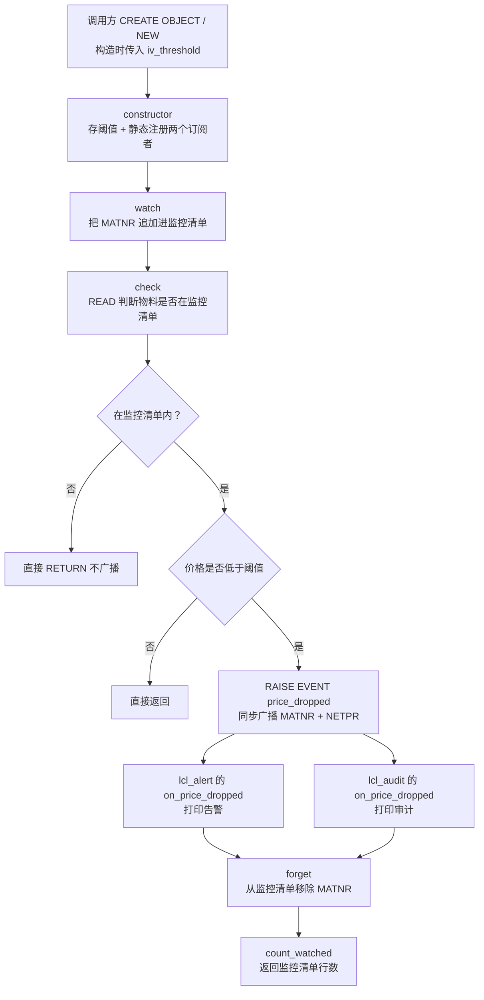
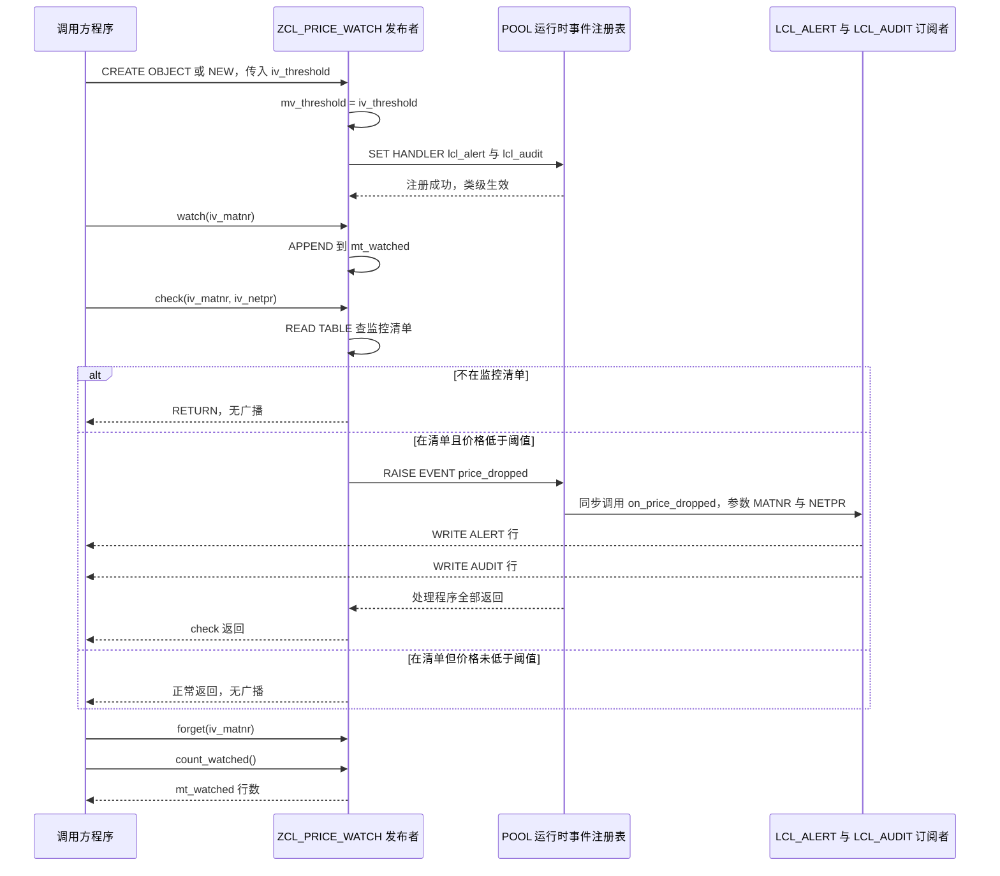

# ZCL_PRICE_WATCH 价格监控类 · Onboarding 分析报告

> 分析对象：`zcl_price_watch.clas.abap`（CLASS-POOL 全局类，FINAL / CREATE PUBLIC）
> 分析重点：CLASS-EVENTS 事件机制怎么工作、发布/订阅的设计是否完整

## 一、程序定位与业务背景

**业务场景**：采购或销售需要盯住一批"重点物料"的净价（`MARC-NETPR`）。一旦某个物料的实际价格跌破警戒线，就要有人被通知（采购员改单、计划员重算预测），同时留一条审计痕迹说明"系统什么时候、对哪个物料、报了多少价"。这个类承担的就是"判定 + 广播"这一段：它记住**我在盯哪些物料**、**警戒线是多少**，在有人把价格喂进来时判断是否破线，破线就把消息广播出去。

**为什么不用更简单的写法**：最常见的写法是把判价和动作写在同一个报表里——`IF 价格 < 阈值. WRITE. ENDIF.`，一旦再加一个"写审计表"的动作就得改报表逻辑，再加一个"发邮件"又得改一次。而"价格监控"本身的规则（盯谁、阈值多少、怎么判）是稳定的，变的只是"通知谁、通知之后干什么"。所以这里把它拆成**发布者（`zcl_price_watch`）+ 订阅者（`lcl_alert` / `lcl_audit`）**，判价规则留在发布者，动作全部下沉到订阅者；新增动作时发布者一行都不用改。

**为什么不用标准事件机制**：BADI、ALE Change Point 这类全局机制粒度太粗（它们按单据/对象类型触发，不认识"本次运行临时盯这一批物料"这种会话内的临时关注列表），而且依赖配置与激活。而本例里的"监控清单"是**进程内、临时、随调用方而变**的状态，用自建对象 + 类事件表达最直接。

**设计范式一句话定性**：这是一个**进程内、同步广播的观察者（Observer）实现**——发布者持有状态、判定阈值、抛出一个类事件；订阅者靠静态注册挂载到事件上，回调在同一工作进程、同一 LUW 内就地执行。

顺带一个可信的小观察：文件头注释写的是 "one subscriber class reacts"，但实现里有两个订阅者、并且用了接口统一签名。说明这段代码后来被扩展过，头注释没跟上——这类"注释落后于实现"的地方在读老程序时最容易误导人。

## 二、程序执行流程总览



**责任链表**（按实际执行先后排列）：

| 子程序 | 调用者 | 职责 |
| --- | --- | --- |
| 全局声明区 `CLASS-EVENTS price_dropped` | 编译器 / 订阅方 | 声明类事件的名称与两个事件参数（MATNR、NETPR） |
| 全局声明区 公开方法签名 | 编译器 / 调用方 | 声明 `constructor` / `watch` / `forget` / `check` / `count_watched` 的调用契约 |
| 私有属性 `mv_threshold` / `mt_watched` | 编译器 | 存放警戒线与监控清单（keyless 标准表） |
| 接口 `if_price_listener~on_price_dropped` | `SET HANDLER` 编译期绑定 | 定义处理程序签名，并用 `FOR EVENT … OF zcl_price_watch` 钉住所处理的事件 |
| 订阅者类 `lcl_alert` | `RAISE EVENT` 运行时回调 | 打印一条 ALERT 告警 |
| 订阅者类 `lcl_audit` | `RAISE EVENT` 运行时回调 | 打印一条 AUDIT 审计行 |
| 方法 `constructor` | ABAP 运行时（`CREATE OBJECT` / `NEW` 自动调用） | 保存阈值，并把两个订阅者注册到类事件上 |
| 方法 `watch` | 调用方（通常来自选择屏或清单导入） | 把物料号追加进监控清单 |
| 方法 `check` | 调用方（通常是批处理里的价格扫描） | 判断物料是否被监控且是否破价，破价则广播事件 |
| 方法 `forget` | 调用方 | 把物料号移出监控清单 |
| 方法 `count_watched` | 调用方（概览展示） | 返回监控清单的行数 |

下面按这条流程，先看发布者自己的门面与状态，再看它广播出去的契约和两个订阅者，然后逐个方法展开，最后把 `CLASS-EVENTS` / `RAISE EVENT` / `SET HANDLER` 三者串成一条完整链路。

## 三、分组分析

### 3.1 全局声明区 `CLASS-POOL` 头与公开方法面

这一节两步：先看类池的形态与公开面，再看私有状态。

#### ① 类池形态与事件、方法的公开契约

```abap
CLASS-POOL zcl_price_watch.

PUBLIC
FINAL
CREATE PUBLIC.

  PUBLIC SECTION.

    CLASS-EVENTS price_dropped
      EXPORTING iv_matnr TYPE mara-matnr
                iv_netpr TYPE marc-netpr.

    METHODS constructor
      IMPORTING iv_threshold TYPE marc-netpr.

    METHODS watch
      IMPORTING iv_matnr TYPE mara-matnr.

    METHODS forget
      IMPORTING iv_matnr TYPE mara-matnr.

    METHODS check
      IMPORTING iv_matnr TYPE mara-matnr
                iv_netpr TYPE marc-netpr.

    METHODS count_watched
      RETURNING VALUE(rv_count) TYPE i.
```

**做什么** — 用 `CLASS-POOL` 起一个全局类（SE24 里就是普通的全局类，`CLASS-POOL` 只是源文件的物理形态）；`FINAL` 禁止继承，`CREATE PUBLIC` 允许任何程序创建实例。公开面上先声明**一个类事件** `price_dropped`，它携带 `iv_matnr`（物料号）与 `iv_netpr`（净价）两个参数；再声明五个实例方法，其中 `METHODS constructor IMPORTING iv_threshold` 就是这个类的**实例构造函数**——名字叫 `constructor` 不是随便起的，它是 ABAP 里保留的预定义实例构造方法名。

**为什么** — 事件参数用 `EXPORTING`、处理程序侧用 `IMPORTING` 接收，是 ABAP 事件参数的标准对应方式：事件是"往外送数据"，处理程序是"往里收数据"。把事件和方法都放在 `PUBLIC SECTION`，外部代码既能 `CREATE OBJECT` 建监控器，也能 `SET HANDLER` 挂自己的处理程序——这正是发布者该有的开放姿态。`constructor` 只声明 `IMPORTING`、不返回任何值，符合"构造函数只负责定义对象初始状态"的规范。

**风险与改进** — ① **构造函数参数是必填的**，调用方必须写 `CREATE OBJECT lo TYPE zcl_price_watch EXPORTING iv_threshold = …` 或 `NEW zcl_price_watch( iv_threshold = … )`，漏传是编译错误——这反而是好事，杜绝了"阈值没初始化"这一类隐患。② 事件参数只有 MATNR 和 NETPR，**没有阈值、币种、价格基准、时间戳、来源实例**：订阅者拿到事件后无法判断"这条事件是不是我该管的""是哪套阈值触发的"，也无法做幂等去重。建议扩成一个结构体参数（见问题清单 P3）。③ 五个方法里没有一个带 `RAISING` 或 `EXCEPTIONS`，全部静默失败；`constructor` 也不校验阈值合法性，`iv_threshold` 传 0 或负数意味着"一切价格都算破价"，这类错误只能在运行结果里看出来。④ 类事件只有一个（`price_dropped`），语义缺口见问题清单 P1。

#### ② 私有状态：阈值与监控清单

```abap
  PRIVATE SECTION.

    DATA mv_threshold TYPE marc-netpr.
    DATA mt_watched   TYPE STANDARD TABLE OF mara-matnr WITH EMPTY KEY.
```

**做什么** — 两个实例属性：`mv_threshold` 存警戒线（`MARC-NETPR` 类型，15 位 3 位小数的打包小数），`mt_watched` 存被监控的物料号清单，是一张**没有键的标准表**（`WITH EMPTY KEY`），也就是一个纯"多重集"——允许重复行。

**为什么** — 监控清单是会话级临时状态，不该暴露给调用方，放 `PRIVATE SECTION` 是对的。选标准表而不是哈希表/排序表，是"清单短、插入多、查找少"的朴素判断：初期几十个物料时线性查找完全够用。

**风险与改进** — ① **无键 + 不去重 = 允许重复登记**，而 `count_watched` 返回的是行数不是物料数，一旦同一个物料被 `watch` 两次，"当前监控 5 个"实际只有 4 个，后面会详细展开。② 选标准表让 `check` 的存在性判断退化成线性扫描：批处理里对 N 个物料逐个 `check`，配 M 个监控项就是 O(N×M)；`lines( )` 也是线性复杂度。改 `SORTED TABLE … WITH UNIQUE KEY table_line` 后查找 O(log n)、`lines( )` 常数时间，顺带强制去重，是这里收益最高的一处改动。③ `MARA-MATNR` 是 40 位定长字符，表里 `'000123'` 与 `'123'` 是两个不同的值，登记前若不做 `CONDENSE`，同样会造出重复项。

### 3.2 接口 `if_price_listener`：事件契约

```abap
INTERFACE if_price_listener PUBLIC.
  METHODS on_price_dropped
    FOR EVENT price_dropped OF zcl_price_watch
    IMPORTING iv_matnr TYPE mara-matnr
              iv_netpr TYPE marc-netpr.
ENDINTERFACE.                   "if_price_listener
```

**做什么** — 声明唯一方法 `on_price_dropped`，关键在 `FOR EVENT price_dropped OF zcl_price_watch`：这句话把该方法在**编译期**绑定成"`zcl_price_watch` 的 `price_dropped` 事件的处理程序"，参数再用 `IMPORTING` 按事件声明的顺序和类型逐个接收。这一行是整条事件链的接头处——ABAP 正是靠它让 `SET HANDLER` 能"看方法就知道该挂到哪个事件上"。

**为什么** — 抽成接口的好处是订阅者类只需写一句 `INTERFACES if_price_listener`，就同时获得"方法实现"和"处理程序资格"；`SET HANDLER` 里可以直接写 `lcl_alert=>on_price_dropped` 这种与具体类方法无关的引用，将来换订阅者实现不用动注册代码。这是"面向接口"在事件场景里最实在的一处收益。

**风险与改进** — ① **定义顺序倒置**：两个订阅者类（`INTERFACES if_price_listener`）出现在接口声明之前，而程序内的局部类/局部接口**不支持前向引用**（要前向引用必须显式写 `CLASS … DEFINITION DEFERRED`，本文件没有）。按 ABAP OO 规则这段源码激活时就会报错，请在 SE24 里先确认这份 include 的真实激活状态与激活时间戳。② **接口是类池内的局部接口，池外看不见它**：真正的业务订阅者（采购审批流、邮件发送、接口写审计表）没法 `INTERFACES if_price_listener`，只能照着 `FOR EVENT` 再抄一遍签名——接口并没有兑现"可插拔订阅"的意图。要么提升为全局接口 `zif_price_listener`，要么承认它只是池内两个类的签名统一工具，那就要诚实写清用途。③ 事件参数没有阈值/币种/时间戳/来源实例（已在 3.1 提到，此处再强调一次），这是订阅者能力的直接天花板。

### 3.3 订阅者类 `lcl_alert`：第一个订阅者

这一步分两段：定义段与处理程序实现。

#### ① 定义段

```abap
CLASS lcl_alert DEFINITION FINAL.
  PUBLIC SECTION.
    INTERFACES if_price_listener.
ENDCLASS.
```

**做什么** — 一个 `FINAL` 的无状态局部类，公开面上只有一句 `INTERFACES if_price_listener.`，意思是"我实现了这个接口，因此具备 `on_price_dropped` 这个处理程序方法"。

**为什么** — 订阅者被刻意做成无状态的哑对象（没有属性、没有自己的构造函数），因为事件已经把需要的信息（MATNR、NETPR）全带在参数里了，处理程序不需要回头查发布者的状态——这是事件驱动解耦的典型写法，也便于未来加更多订阅者。

**风险与改进** — 无明显语法风险。设计上的问题是它被 `FINAL` + 局部类双重锁死：调用方无法注入自己的实现、无法给它换策略，只能改类池源码。若这段代码是要长期演进的生产件，把 `if_price_listener` 提成全局接口后，这里应换成由调用方传入的 `REF TO zif_price_listener`（依赖注入），发布者类就能在 `zcl_price_watch` 之外复用。

#### ② 处理程序实现

```abap
METHOD if_price_listener~on_price_dropped.
  WRITE: / 'ALERT: price drop for', iv_matnr.
ENDMETHOD.                    "if_price_listener~on_price_dropped
```

**做什么** — 被 `RAISE EVENT` 同步调用一次，把告警物料号写到列表缓冲里新起一行。实现里只用了 `iv_matnr`，**完全忽略 `iv_netpr`**——也就是它只知道"哪个物料破价了"，不知道"破到多少钱"。

**为什么** — 作为 demo 级别的订阅者，`WRITE` 是最省事的可视化手段，能立刻看到广播是否打通，适合教学与冒烟验证。方法名用 `if_price_listener~on_price_dropped` 全限定，是实现接口方法的标准写法（实现部分的方法名必须带接口前缀）。

**风险与改进** — ① **`WRITE` 不是生产可用的通知手段**：在后台/批处理里输出进 spool，日志里查不到；在前台又会把业务输出混进调用方的列表，无法追踪"到底通知过谁"。应换成应用日志（`BAL`/日志表）、消息类 `MESSAGE ... IN TYPE 'S'`，或至少 `cl_demo_output`。② **忽略 `iv_netpr`** 让订阅者无法做分级（比如跌 5% 走邮件、跌 20% 走审批），要么在实现里用上参数，要么在事件里补齐业务维度。③ 处理程序里没有任何错误处理——这是同步回调，异常会直接冒泡终止整个监控运行（见 3.8 与问题清单 P0）。

### 3.4 订阅者类 `lcl_audit`：第二个订阅者

与 `lcl_alert` 结构完全同构，差别只在实现里多用了 `iv_netpr`。

#### ① 定义段

```abap
CLASS lcl_audit DEFINITION FINAL.
  PUBLIC SECTION.
    INTERFACES if_price_listener.
ENDCLASS.
```

**做什么** — 第二个无状态 `FINAL` 局部类，同样只实现 `if_price_listener`，因此同样拿到 `price_dropped` 的处理程序资格。

**为什么** — 这正是发布/订阅的收益点：第二个订阅者的存在对发布者**零成本**——`lcl_price_watch` 的代码没有因为多了一个审计通道而改动一行，第三个订阅者同样不需要动发布者。两条通道共享同一套 `if_price_listener` 契约，签名一致性由编译器保证。

**风险与改进** — 与 3.3 相同的结构性问题（局部 `FINAL`、无法注入）。额外一条：两个订阅者类之间没有任何差异说明（注释里只有句尾的类名标记），新人很容易把两者当成重复代码删掉一个。给 `lcl_audit` 补一句"此处应替换为写审计表"之类的说明，是很便宜的可维护性投资。

#### ② 处理程序实现

```abap
METHOD if_price_listener~on_price_dropped.
  WRITE: / 'AUDIT entry created for', iv_matnr, iv_netpr.
ENDMETHOD.                    "if_price_listener~on_price_dropped
```

**做什么** — 被同一个事件同步回调，把物料号与净价一起写到列表缓冲。名称说"created an entry"，实际并没有写任何持久化数据，只打印了一行。

**为什么** — 审计通道设计上刻意只订阅、不决策：它不关心价格是不是真的需要人工确认，只负责"留痕"。这是订阅者应有的纪律——同一件事的第二双眼睛不重复第一双眼睛的判断逻辑。

**风险与改进** — ① **名不副实**：方法文本说"创建审计条目"，实现只是 `WRITE`，一旦有人以为审计已经落库而去查表，就会踩空。要么改成真正的 `INSERT`（并明确事务/LUW 归属，见 3.8），要么把文本改成 "AUDIT would record"。② 真正写库时这里是全类最大的风险点：同步广播 + 同一 LUW 意味着审计记录与监控判定在同一个数据库事务里，监控程序后半段任何异常都会把审计一起回滚，"该留的痕"反而丢了——真要留痕，更该走异步（`CALL FUNCTION IN UPDATE TASK` / 消息队列），而不是塞在事件回调里。③ 同样缺错误处理与生产级日志。

### 3.5 方法 `constructor`：实例构造函数与订阅者注册（关键步骤）

这一步分两段：保存阈值，以及静态注册事件处理程序。

#### ① 保存警戒线

```abap
METHOD constructor.
  mv_threshold = iv_threshold.
```

**做什么** — ABAP 运行时在 `CREATE OBJECT` / `NEW` 成功后**自动调用一次**实例构造函数（每实例一次，且不能显式调用），把调用方传入的 `iv_threshold` 写进实例属性 `mv_threshold`。因为 `iv_threshold` 是必填参数，编译器保证不会有"阈值未初始化"的实例存在。

**为什么** — 用标准的实例构造函数而不是普通方法，好处是"阈值"这件事在语法层面就是对象创建的一部分：调用方想拿到一个监控器，就必须先回答"警戒线是多少"，不会出现半初始化的对象。

**风险与改进** — 构造函数里没有任何校验：`iv_threshold` 传 0 或负数会被原样接受，语义上等于"任何价格都破价"，而且这个错误要等到运行结果里才看得出来。建议加一道检查（`IF iv_threshold IS INITIAL OR iv_threshold <= 0. RAISE EXCEPTION TYPE cx_...`），构造函数本来就允许声明 `EXCEPTIONS`。

#### ② 静态注册两个订阅者

```abap
  SET HANDLER lcl_alert=>on_price_dropped.
  SET HANDLER lcl_audit=>on_price_dropped.
ENDMETHOD.                    "constructor
```

**做什么** — 执行两条 `SET HANDLER`，把 `lcl_alert` 和 `lcl_audit` 的处理程序方法登记到 `price_dropped` 事件上。因为是 `CLASS-EVENTS`（静态/类事件），`SET HANDLER` **不需要 `FOR` 子句**（`FOR` 只用于实例事件）。运行时把"事件 → 处理程序"的绑定写进 ABAP 为该类维护的系统表；这是**静态注册**：不需要对象引用，注册一次对本程序（本内层会话）内该类的**所有实例**生效，注册之后所有 `RAISE EVENT price_dropped` 都会命中这两个处理程序。

**为什么** — 把注册放进构造函数，调用方只需 `NEW zcl_price_watch( iv_threshold = 10 )` 一次，就完成"建监控器 + 上线告警/审计两条通道"，不用再写 `SET HANDLER`——这是事件驱动封装的标准做法，比让每个调用方都记得注册强得多。选 `CLASS-EVENTS` 而不是实例事件，是因为监控事件属于"类级业务语义"，用类事件就省掉了"哪个实例触发的"这层分发逻辑（代价见风险）。

**风险与改进** — 这是全类**最值得重做**的地方：
- ① **注册是类级而不是实例级**：第二个实例的构造函数重复执行这两条 `SET HANDLER` 时，ABAP 会返回 `sy-subrc = 4`（该处理程序已注册同一事件），代码完全没检查。更实质的问题是：事件参数里没有来源实例，**订阅者无法区分事件来自哪个监控器**。一旦业务上出现"每个工厂一套阈值""每批采购单一个监控器"的多实例场景，订阅者会把所有实例的事件混在一起处理——这就是过度广播。建议把 `iv_threshold`（或一个来源标记/实例引用）放进事件参数。
- ② **没有注销路径**：ABAP 的静态注册只能整批用 `SET HANDLER … ACTIVATION ' '` 取消，单条注册无法撤销；本类也没有对外暴露 register/unregister 方法。对象生命周期结束后，类事件处理程序的注册依然有效（本会话内一直有效），这在长跑批里要留意。
- ③ **`sy-subrc` 完全不检查**：重复注册返回 4 属于可预期情况，但至少应显式处理或注释说明，避免后来者误以为"注册失败就是有问题"。
- ④ 事件处理程序的**执行顺序未定义**，不能依赖 `lcl_alert` 一定先于 `lcl_audit` 执行；ABAP 官方文档明确说处理程序的调用顺序未定义且可能在运行中变化，要求按"同时执行"来编程。
- ⑤ 若要支持外部订阅者与按实例解绑，正确姿势是让订阅者改成**实例方法**并用 `SET HANDLER lo_subscriber->on_price_dropped FOR lo_watch`（或 `FOR ALL INSTANCES`）注册——实例方法注册会在运行时持有订阅者引用，可被 GC 回收，也能精确到单个监控器实例。

### 3.6 方法 `watch`：登记监控对象

```abap
METHOD watch.
  IF iv_matnr IS INITIAL.
    RETURN.
  ENDIF.

  APPEND iv_matnr TO mt_watched.
ENDMETHOD.                    "watch
```

**做什么** — 校验物料号非初始值后，直接把它追加进监控清单 `mt_watched`，不做任何存在性判断——同一物料可以重复登记。

**为什么** — 这是"登记意图"的入口，做成纯追加最省事：调用方可以放心地批量登记（选屏一行就调一次），不担心重复。空值守卫挡住了最常见的误调用。

**风险与改进** — ① **不去重导致登记与取消语义不对称**：`watch` 三次就存三行，`count_watched` 随之虚高；而 `forget` 的 `DELETE … WHERE table_line =` 会一次删光所有重复行，于是"登记三次、取消一次"把清单清空了。清单里存的是"关注对象"，本该天然唯一。② 空值守卫只做了 `IS INITIAL`，没处理 `CONDENSE` 后的空白串，也没处理 `MATNR` 是 40 位定长字符带来的格式差异（`'000123'` 与 `'123'` 是两个值），这两类都会造出重复项。③ `watch` 返回 `RETURN` 提前退出，调用方无法区分"参数非法"和"登记成功但本来就是空的"。改进方向：把表类型改成 `SORTED TABLE … WITH UNIQUE KEY table_line`（查找顺便提速），`APPEND` 前用 `line_exists( )` 或 `INSERT … INTO TABLE` 去重。

### 3.7 方法 `check`：判价与广播（核心步骤）

这一步分三段：查清单、比阈值、抛事件。

#### ① 判断物料是否被监控

```abap
METHOD check.
  READ TABLE mt_watched WITH TABLE KEY table_line = iv_matnr.
  IF sy-subrc <> 0.
    RETURN.
  ENDIF.
```

**做什么** — 用 `READ TABLE … WITH TABLE KEY table_line = …` 在监控清单里做**存在性判断**（不取数据、不带 `INTO`，只判在不在），`sy-subrc <> 0` 说明这个物料不在监控范围内，直接 `RETURN`，连阈值都不比。

**为什么** — 先过滤"是否被关注"再比价格，省掉了大量无意义的数值比较：价格扫描往往覆盖全库物料，但真正被盯的可能只有几十个。这个顺序在业务上也是对的——没关注的物料价格再低也不该惊动任何人。

**风险与改进** — ① **`READ TABLE` 不带 `INTO` 只做存在性判断是可以的**（这是惯用写法），但对 `STANDARD TABLE … WITH EMPTY KEY` 而言 `WITH TABLE KEY table_line` 退化为全表线性扫描；换成排序表或哈希表后这里自动变成 O(log n)/O(1)，也可直接改写成 `IF line_exists( mt_watched[ iv_matnr ] )`。② 这里用 `sy-subrc` 判断而非 `IF NOT FOUND`，是老式写法，`line_exists( )` 更直观。③ `iv_matnr` 未做初始值守卫（`watch` 做了），虽然不会误命中，但入口校验不统一。

#### ② 比较价格与阈值

```abap
  IF iv_netpr < mv_threshold.
```

**做什么** — 在被监控的前提下，判断送进来的净价 `iv_netpr` 是否低于实例上的警戒线 `mv_threshold`，只有严格小于才继续。

**为什么** — 这是整个类的业务核心。类型上两者都是 `MARC-NETPR`（打包小数 15 位 3 位小数），ABAP 的打包小数比较是精确的数值比较，**不存在浮点精度问题**——这一点是安全的，不必担心。

**风险与改进** — 真正的问题在语义校核，不在类型：
- ① **初始值与"真实零价"不可区分**：`MARC-NETPR` 未维护时是初始值（数值上等于 0），于是"价格还没维护"的物料会被判成"破价"，触发一轮毫无意义的告警与审计。建议在比较前先 `IF iv_netpr IS INITIAL. RETURN. ENDIF.`，或要求调用方先做数据完备性检查。
- ② **币种与价格基准维度缺失**：`MARC-NETPR` 的币种来自定价记录（`MARC-PRIN` 及定价视图），接口只带了一个裸 `NETPR`。阈值 `5.00` 与某工厂以 EUR 定价的净价直接比较，在多币种场景下是维度错误。至少应在事件参数和接口层带上币种/价格基准，或者在文档里明确"单币种单价格基准"的适用范围。
- ③ 阈值与实际价格都做整数量级比较，没有容差、没有相对跌幅概念——跌 0.01 与跌 50% 在这里没有区别。

#### ③ 抛出类事件（同步广播）

```abap
    RAISE EVENT price_dropped
      EXPORTING iv_matnr = iv_matnr
                iv_netpr = iv_netpr.
  ENDIF.
ENDMETHOD.                    "check
```

**做什么** — 在 `check` 内部、`RAISE EVENT` 之后立刻执行已注册的全部处理程序（这里是 `lcl_alert` 和 `lcl_audit`），**全部处理程序返回后才继续往下走**。也就是说这是一次**同步、就地**的广播：同一工作进程、同一 ABAP LUW、同一调用栈，没有队列、没有持久化、没有异步派发。`RAISE EVENT` 只能写在方法里、且只能抛本类（或其超类、已实现接口）声明的事件，因此整个类的广播点**只有 `check` 这一个**，外部调用方无法主动触发或补发事件。

**为什么** — 同步广播换来的好处是简单且确定：处理程序里可以安全地读写调用方的上下文，`check` 返回后即代表"所有通知都已发生"，代码不需要处理回调时序。对于"打印一行告警"这种轻量动作，同步是恰当的选择。

**风险与改进** — ① **参数顺序即位置**：`RAISE EVENT` 的实参按事件参数声明的顺序对应，这里 `iv_matnr`、`iv_netpr` 的书写顺序与 `CLASS-EVENTS` 声明一致，属于正确写法；但一旦给事件增删参数，这里极易静默错位（写错顺序编译期不一定报错）。② **同步广播无错误隔离**：处理程序里的异常不能被 `check` 的调用方逐个捕获，任一处理程序出错都会终止整个监控运行。当前两个处理程序只是 `WRITE`，无害；一旦换成"写审计表""发邮件"，风险立刻升级。③ **同一 LUW**：处理程序里的 DB 修改与 `check` 的逻辑同事务，`check` 之后任何异常都会把告警/审计一起回滚。真正的留痕与通知应当异步（`IN UPDATE TASK` 或消息队列），而不是塞进同步回调。④ **事件语义不完整**：只有"跌破"，没有"回升到阈值以上"；也没有"某物料开始被监控/被移出监控"的通知。订阅者因此无法感知监控清单的变化，长跑场景下会拿着过期的认知继续动作——这是发布/订阅设计里最常见的遗漏。

### 3.8 方法 `forget`：取消监控

```abap
METHOD forget.
  DELETE mt_watched WHERE table_line = iv_matnr.
ENDMETHOD.                    "forget
```

**做什么** — 按整行条件删除监控清单里该物料的**全部**行，不返回任何结果，也不检查 `sy-subrc`。

**为什么** — `DELETE … WHERE` 写法最简单，且能一次性清掉重复登记（虽是无意为之，见下），符合"取消关注"的直觉语义。

**风险与改进** — ① **静默失败**：物料本来就不在清单里时，`forget` 也什么都不做，调用方无从得知——这是典型的"清理脚本跑完看着都对，其实有一半没生效"的场景。建议 `RETURNING rv_found TYPE abap_bool`，或抛出明确异常。② **与 `watch` 的语义不对称**：`watch` 允许重复登记，`forget` 一次删光，多登记的那几分永远等不到逐次取消，登记/取消不是一一对应的操作。③ **性能**：`DELETE … WHERE` 是一次全表条件删除，即使该物料不存在也要扫一遍；监控项上万时，`forget` 应当用按键删除（`DELETE mt_watched WHERE table_line = …` 换成有键表后即为对数复杂度）。④ `iv_matnr` 为初始值时同样静默返回。

### 3.9 方法 `count_watched`：规模概览

```abap
METHOD count_watched.
  rv_count = lines( mt_watched ).
ENDMETHOD.                    "count_watched
```

**做什么** — 用内建函数 `lines( )` 返回监控清单的行数，作为只读查询暴露给调用方（典型用途是界面上显示"当前监控 N 个物料"）。

**为什么** — 一行代码、零副作用、零依赖，是这类概览方法该有的样子；也顺带把"清单"这个内部实现细节变成了可观测的契约（代价见风险）。

**风险与改进** — ① **返回的是"行数"而不是"物料数"**：因为 `watch` 不去重，这个数字和用户心里的"监控物料个数"会不一致，而它偏偏又是唯一对外暴露清单规模的方法，两边一旦同屏展示就会互相打脸。② **线性复杂度**：标准表的 `lines( )` 不是常数时间，把 `mt_watched` 换成 `SORTED`/`HASHED` 表后这里自动变成 O(1)，与 `check` 的查找优化是同一次改动。③ `TYPE i` 在当前场景足够，无额外风险。

### 3.10 事件机制小结：三行语句的关系与注册时机

这一节不是独立子程序，而是把前面分散的三处代码合成一条完整链路，回答"事件机制到底怎么工作"。

| 环节 | 语句 | 作用 | 时机与作用域 |
| --- | --- | --- | --- |
| 声明事件 | `CLASS-EVENTS price_dropped EXPORTING …` | 规定事件名称与参数清单，事件由**类**拥有，`RAISE EVENT` 只能在类内部触发 | 编译期；公开面可见，池外代码也能 `SET HANDLER` |
| 绑定处理程序 | `METHODS on_price_dropped FOR EVENT price_dropped OF zcl_price_watch` | 让 ABAP 在编译期知道"这个方法处理哪个类的哪个事件"，从而允许 `SET HANDLER` 只写方法名 | 编译期（接口 `if_price_listener` 与两个订阅者类都靠它拿到资格） |
| 登记 | `SET HANDLER lcl_alert=>on_price_dropped.` | 把处理程序写入该事件在当前内层会话的系统表；类事件不需要 `FOR` | 运行期，构造函数自动执行时；静态注册，**对整个类的所有实例生效**，需先有实例被创建才存在注册 |
| 广播 | `RAISE EVENT price_dropped EXPORTING …` | 同步取出注册表里的全部处理程序并逐个就地调用，全部返回后才继续 | 运行期，`check` 内；同一工作进程、同一 LUW；**唯一广播点** |

**关键结论（回答"发布订阅有没有遗漏"）**

- 机制本身是**通的**：声明 → 绑定 → 注册 → 广播四个环节齐全，`constructor` 里注册的处理程序会被 `check` 的 `RAISE EVENT` 同步调用，两个订阅者都能收到。
- **注册时机**：`constructor` 是实例构造函数，由 `CREATE OBJECT`/`NEW` 自动调用一次，所以"建监控器"这个动作本身就完成了订阅上线，不需要调用方额外写 `SET HANDLER`；但注册是**类级**的，所以"第二个实例的注册"实际上是空操作（`sy-subrc = 4`），而订阅者又无法从事件参数里分辨事件来自哪个实例。
- **遗漏一：订阅者入口是封闭的**。`if_price_listener` 与两个订阅者都是类池内的局部声明，池外业务代码无法接入这条广播；真正的可插拔订阅需要全局接口 + 外部订阅者实例注册。
- **遗漏二：没有注销**。静态注册无法单条撤销，类也没有对外的 register/unregister API，会话内注册长期有效。
- **遗漏三：事件语义单薄**。只有"跌破"没有"回升"，没有"开始监控/结束监控"，订阅者与发布者的状态会随时间脱节。
- **遗漏四：没有事件级错误隔离与持久化**。同步广播 + 同一 LUW + 无重试，任何一个处理程序失败就是整次监控失败；真正需要可靠留痕的场景应走异步或队列。

## 四、执行流程全景图（数据视角）



## 五、问题清单与改进建议（按优先级）

### 🔴 P0 业务正确性

1. **订阅者无法外部接入（`if_price_listener` 定义段）** — 接口是类池内的局部接口，池外业务代码不可见，"发布/订阅"实际是封闭在池内的两个 demo 类。要兑现广播的设计意图，需把接口提升为全局接口 `zif_price_listener`，并允许调用方以 `REF TO zif_price_listener` 注入自己的订阅者实例。
2. **局部接口定义顺序倒置，前向引用（`if_price_listener 定义段` / `lcl_alert 定义段`）** — 两个订阅者类在接口声明之前就 `INTERFACES if_price_listener`，而程序内局部类/接口不支持前向引用（需先写 `CLASS … DEFINITION DEFERRED`）。请优先在 SE24 确认该 include 的激活状态；把接口上移到订阅者类之前是零成本的修复。
3. **净价初始值被判成破价（方法 `check`）** — `MARC-NETPR` 未维护时为初始值 0，`0 < mv_threshold` 成立，于是"价格缺失"被当成"价格崩了"，批量刷出一堆假告警与假审计。比较前应加 `IF iv_netpr IS INITIAL. RETURN. ENDIF.`，或由调用方做数据完备性检查。
4. **币种/价格基准维度缺失（方法 `check` + `CLASS-EVENTS` 声明）** — `MARC-NETPR` 的币种由定价记录决定，接口只传裸数值，多币种或多价格基准场景下阈值比较是维度错误。应在事件参数中带上币种与价格基准，或在接口上明确限定适用范围。
5. **同步广播无错误隔离（方法 `check` + `lcl_audit~on_price_dropped`）** — 事件处理程序与 `check` 同一 LUW、同步执行，处理程序异常无法被调用方单独捕获，DB 失败会回滚监控逻辑。需要可靠留痕的订阅者应改为异步（`IN UPDATE TASK` 或消息队列），并在订阅者内部自行 `TRY/CATCH`。
6. **多实例时过度广播且无法区分来源（方法 `constructor` + `CLASS-EVENTS` 声明）** — 注册是类级的，事件参数里没有来源实例，订阅者会把所有监控器的事件混为一谈。建议在事件参数中增加阈值或来源标识。

### 🟠 P1 健壮性

1. **重复注册被忽略（方法 `constructor`）** — 第二次 `SET HANDLER` 同一处理程序返回 `sy-subrc = 4`，代码不检查。至少应显式处理或注释说明，避免误解为注册失败。
2. **没有注销路径（方法 `constructor`）** — 静态注册只能整批 `SET HANDLER … ACTIVATION ' '` 取消，单条无法撤销；类也未暴露 register/unregister。长跑批与多场景复用时容易残留。
3. **处理程序执行顺序未定义（方法 `constructor`）** — 官方文档明确顺序未定义，禁止依赖"告警先于审计"。若两者有先后依赖，必须合并到一个处理程序内串行调用。
4. **事件语义缺口（`CLASS-EVENTS` 声明）** — 缺少"价格回升""开始监控""结束监控"事件，订阅者无法感知监控清单变化，长跑会基于过期认知动作。
5. **登记与取消语义不对称（方法 `watch` + 方法 `forget`）** — `watch` 不去重、`forget` 一次删光全部重复行，监控清单退化成多重集，`count_watched` 与真实物料数不符。
6. **`forget` 静默失败（方法 `forget`）** — 不返回结果、不抛异常，调用方无法区分"取消成功"与"本来就没在监控"。建议返回 `abap_bool` 或抛异常。
7. **构造函数不校验阈值（方法 `constructor`）** — 传 0 或负数语义上等于"一切价格都破价"，无任何提示。构造函数允许 `EXCEPTIONS`，应利用。
8. **全类无异常出口（方法 `watch` / `forget` / `check` / `count_watched`）** — 没有任何 `RAISING`/`EXCEPTIONS`，所有失败模式都表现为"静默无效果"，故障定位成本高。

### 🟡 P2 性能与规范

1. **监控清单选型错误（私有属性区 + 方法 `check`）** — `STANDARD TABLE … WITH EMPTY KEY` 让 `READ TABLE … WITH TABLE KEY` 与 `lines( )` 都是线性复杂度，批处理逐物料判价时 O(N×M)。改为 `SORTED TABLE … WITH UNIQUE KEY table_line`（查找 O(log n)、`lines( )` 常数时间、顺带强制去重）或 `HASHED TABLE … WITH UNIQUE KEY table_line`（O(1)），是一次改动三处受益。
2. **物料号未做格式归一（方法 `watch`）** — `MARA-MATNR` 是 40 位定长字符，`'000123'` 与 `'123'` 是两个值，应先 `CONDENSE` 并按业务约定补零/去零再入库。
3. **`WRITE` 不适合作为生产通知手段（`lcl_alert~on_price_dropped` / `lcl_audit~on_price_dropped`）** — 后台输出进 spool、不可追踪、前台又会污染业务列表。应改用应用日志或消息类。
4. **审计通道名不副实（`lcl_audit~on_price_dropped`）** — 文本声称已创建审计条目，实际只打印。应改为真实落库（含事务边界考量）或修改文本。
5. **`READ TABLE` + `sy-subrc` 的老式写法（方法 `check`）** — 改用 `line_exists( mt_watched[ iv_matnr ] )` 更直观，也顺带要求内表有键。

### 🟢 P3 可扩展性

1. **事件参数升级为结构体（`CLASS-EVENTS` 声明）** — 用 `EXPORTING is_event TYPE ty_price_event` 承载 MATNR、NETPR、阈值、币种、时间戳、来源实例，以后加字段不再影响所有处理程序的签名。
2. **阈值下沉到清单粒度（私有属性区）** — 把 `mv_threshold` 拆成 `mt_watched` 的行结构（MATNR + 阈值 + 币种 + 价格基准），支持"不同物料不同警戒线"，也顺带解决来源识别问题。
3. **订阅者改为实例方法动态注册（方法 `constructor`）** — `SET HANDLER lo_subscriber->on_price_dropped FOR lo_watch`（或 `FOR ALL INSTANCES`）支持按实例绑定与解绑，并让运行时持有引用以便 GC 回收。
4. **补一个批量入口（方法 `check`）** — 新增 `check_all( it_prices )`，让调用方传入价格内表一次性判价并收集事件，减少调用方循环与重复注册需求。

## 六、整体评价与启发

**优点**

- 关注点切得干净：判价规则留在发布者，"怎么响应"全部下沉到订阅者，新增响应方式对发布者零改动，这是发布/订阅最值得学的一点。
- 订阅者无状态、事件自带全部参数，不依赖回调期间发布者的内部状态，避免了隐藏耦合。
- `constructor` 里自动完成订阅上线，调用方 API 极简（`NEW` 一个对象就开始工作），封装完整。
- 全流程无状态泄漏与隐藏单例，所有状态都在实例属性上，测试与推理成本低。

**短板**

- 事件机制的"广播面"实际是封闭的：局部接口 + 局部订阅者让外部代码无法接入，也没有注销路径，注册时机被构造函数绑死——机制完整但可扩展性为零。
- 集合类型选型与去重策略缺失，让 `watch` / `check` / `forget` / `count_watched` 四个方法互相打脸（行数 ≠ 物料数、登记与取消不对称、O(n) 查找），这是最集中的问题域。
- 所有失败模式都静默，且 `WRITE` 占位让两个订阅者都停留在 demo 状态；同步广播一旦接上真实 DB 写入或外部调用，缺少错误隔离会直接放大成生产故障。

**可学到的设计经验**

- ① **ABAP 事件三件套的分工要记牢**：`CLASS-EVENTS` 定契约（只有类内部能 `RAISE`），`FOR EVENT … OF` 在编译期把处理程序与事件绑定，`SET HANDLER` 在运行期登记；类事件不需要 `FOR` 子句，注册是**类级而非实例级**，且处理程序执行顺序未定义，不要依赖它。
- ② **注册位置决定架构**：放在构造函数里换来调用方 API 极简，代价是多实例场景失去区分度、没有注销。把"订阅"显式化成 `subscribe( )` / `unsubscribe( )` 或由调用方注入实例监听器（`REF TO zif_price_listener`），能同时解决这两件事。
- ③ **事件参数就是订阅者的能力上限**：只给 MATNR 和 NETPR，订阅者就只能"打印一行"；设计事件时先问一句"订阅者拿到这个事件需要知道什么"，把阈值、币种、时间戳、来源一次性放进结构体，能省掉后续无数次的签名变更。
- ④ **同步广播只适合轻量通知**：需要可靠留痕（写库、发外部消息、跨系统通知）时，同步回调 + 同一 LUW 会让"该留的痕"跟着业务异常一起回滚；这类订阅者应主动转异步或队列，并在订阅者内部自兜错误，而不是指望发布者隔离它。
- ⑤ **"能编译"和"语义对"是两回事**：`MARC-NETPR` 类型匹配说明比较是精确的，但初始值即零价、币种由定价记录决定，这些都是类型系统看不见、业务语义才暴露的问题——判价类程序上线前一定要做一次数据语义校核。