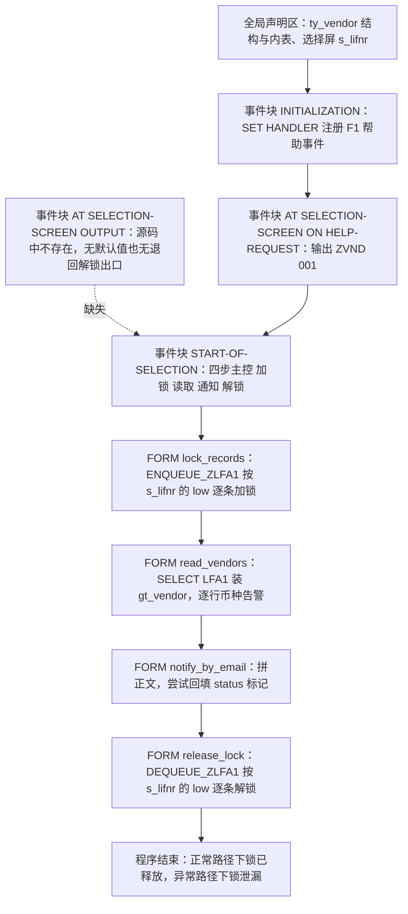
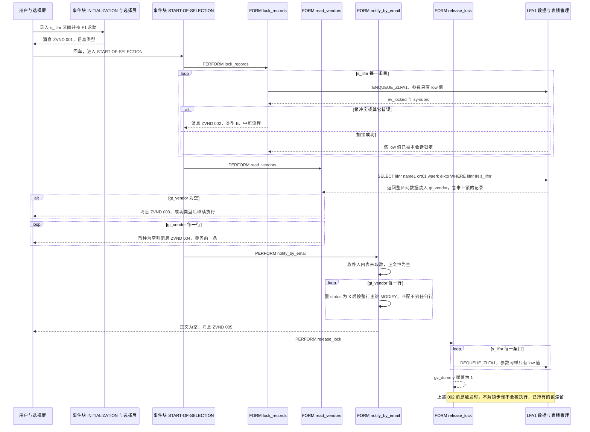

# 供应商主数据维护程序 `ZVENDOR_NOTIFY` 走读报告

## 一、程序定位与业务背景

### 1.1 这段程序想解决什么问题

文件头的注释把设计意图说得很明白："Vendor master maintenance with message class, number range and table locking. Uses MESSAGE ID / NUMBER as the positive pattern."——即：这是一个**供应商（LFA1 主数据）批量处理程序**，作者希望示范三件事：消息类（message class）的规范用法、编号、以及对供应商主记录加表锁。

把它放进真实的采购主数据维护场景里看，程序想承担的应该是这样一件事：采购或财务拿到一份供应商清单（可能是系统外 Excel、可能是审计发现的需要整改的供应商），需要**批量核对并回写供应商主数据**（比如补齐币种、标记已通知/已整改），并且担心两个 Key Master 人员在同一天维护同一家供应商造成互相覆盖，因此给 LFA1 记录加锁。

**现有方案的不足**：SAP MM 的 BP/供应商主数据维护通常一个供应商一个事务（BP01 等），几百家供应商靠手工逐个维护不现实；用通用表维护工具（SM30）直接改 LFA1 又绕过了业务校验。所以需要一个"按范围批量走"的自开发程序 —— 这就是本程序存在的理由。

### 1.2 但现状是：它只完成了一半，而且是"无害的一半"

读完 4 个 FORM 之后，最重要的第一判断是：

- 程序**没有任何数据库写入**。全文没有一句 `MODIFY lfa1 ...` / `INSERT` / `COMMIT WORK`。名字叫 `notify`、注释叫 `maintenance`，实际做的只有"加锁 → 读 → 打个内存标记 → 解锁"，磁盘上什么都不会变。
- 程序**没有发任何邮件**。`FORM notify_by_email` 里 `lt_recipients` 声明后从未被 `SELECT` 填充，`lv_body` 恒为空，所以 `MESSAGE ... 005` 是每次运行必发的。
- 程序**没有取过任何编号**。注释里的 "number range" 在代码里没有对应物，全文只用到消息号 `001`–`005`（message number，不是 number range 对象）。

所以整体设计范式可以这样定性：**这是一份"报表 + 演示骨架"式的程序骨架（skeleton），它示范了加锁/解锁与消息类的调用形状，但业务动作（写库、发信）尚未落地**。判断它对错，必须区分"形状对不对"和"内容有没有"——下面按这个尺度逐段拆。

---

## 二、程序执行流程总览

这是一份 report program，入口顺序是编译期声明 → `INITIALIZATION` → 选择屏 PAI/PO 事件块 → `START-OF-SELECTION` 主控序列。执行流程上只有一个"主干"，四个 FORM 被 `START-OF-SELECTION` 线性调用，无分支循环依赖。



**责任链表**

| 子程序 | 调用者 | 职责 |
| --- | --- | --- |
| 全局声明区 | 编译器（程序启动前） | 定义 `ty_vendor` 行结构、空键标准表 `gt_vendor`、工作区 `gs_vendor`、标志 `gv_locked` / `gv_dummy`、选择屏 `s_lifnr` |
| 事件块 `INITIALIZATION` | ABAP 运行时，在选择屏 PAI/PO 之前自动触发 | `SET HANDLER 'ON_HELP_REQUEST'` 把 F1 帮助请求路由到同名的 FORM 逻辑 |
| 事件块 `AT SELECTION-SCREEN ON HELP-REQUEST` | 用户在选择屏按 F1，由 SET HANDLER 激活 | 输出一条固定信息消息 `ZVND/001`（源码中并无真正的 F1 文本） |
| 事件块 `AT SELECTION-SCREEN OUTPUT` | 应由选择屏 PBO 触发 | **源码中不存在**：既无默认值/校验，也无"用户退回选择屏时释放锁"的出口 |
| 事件块 `START-OF-SELECTION` | 用户在选择屏回车（Enter） | 主控序列：依次 `PERFORM lock_records` / `read_vendors` / `notify_by_email` / `release_lock` |
| `FORM lock_records` | `START-OF-SELECTION` | 遍历选择屏条目，调 `ENQUEUE_ZLFA1` 为 `s_lifnr-low` 加锁，冲突时发 E 消息 |
| `FORM read_vendors` | `START-OF-SELECTION` | `SELECT ... FROM lfa1 WHERE lifnr IN s_lifnr` 装 `gt_vendor`；空表发 S 消息；逐行检查币种发 W 消息 |
| `FORM notify_by_email` | `START-OF-SELECTION` | 拼接收件人正文、尝试把 `status` 置 `'X'`，正文为空时发 W 消息 |
| `FORM release_lock` | `START-OF-SELECTION` | 遍历选择屏条目调 `DEQUEUE_ZLFA1` 解锁，随后写 `gv_dummy = 1` |

下面按这条流程，逐个子程序展开。

---

## 三、分组分析（按程序流程 / 子程序）

### 3.1 子程序类型 `全局声明区`

这一段决定后面所有 FORM 能拿到什么类型的数据，分三步看：行结构、内表与全局变量、选择屏绑定。

#### ① 供应商行结构 `ty_vendor`

```abap
TYPES: BEGIN OF ty_vendor,
         lifnr   TYPE lfa1-lifnr,
         name1   TYPE lfa1-name1,
         ort01   TYPE lfa1-ort01,
         waerk   TYPE lfa1-waers,
         eikto   TYPE lfa1-eikto,
         status  TYPE char1,
       END OF ty_vendor.
```

**做什么** — 声明一个 6 字段的匿名结构：供应商号 `LIFNR`、名称 `NAME1`、城市 `ORT01`、币种 `WAERS`、采购电话 `EIKTO`，外加一个自造的 `status` 标记位。其中 5 个字段直接引用 LFA1 的数据元素做类型，`status` 是本地 `char1`。

**为什么** — 直接 `TYPE lfa1-xxx` 而不是自己写 `TYPE char10`，可以让类型与 DDIC 联动：LFA1 字段长度/转换规则变化时这里跟着变，也避免手写长度出错，是 ABAP 里推荐做法。`status` 单独放一个 `char1` 而不放进 LFA1，是因为它不对应任何 DB 字段，是程序运行期的临时标记。

**风险与改进** — 三个语义问题必须点出来：
- `waerk TYPE lfa1-waers` 命名与数据元素不一致。`LFA1-WAERS` 的语义是"**供应商所属公司代码的记账货币**"，由供应商公司代码（`LFGSM`，源自 `T000F`）带出，不是"单据币种"。一家供应商可以挂多个采购组织，各公司代码可以是不同币种，跨公司代码读这一个字段会得到误导性的结果。字段名应叫 `waers`，若真要做金额换算必须带上公司代码上下文。
- `eikto` 是"**采购联系电话号码**"，与程序名 `notify`、FORM 名 `notify_by_email` 表达的"邮件通知"毫无关系。这几乎可以确定是取数字段选错：作者想取邮件地址（`ADR6-ADR_EMAIL`），却取了 LFA1 上恰好存在的电话字段。字段语义错配即使编译通过也是错误。
- `status TYPE char1` 命名不当。`status` 在 SAP 惯例里指多值业务状态（订单状态、审批状态），此处实际是"已处理标记"，应命名为 `is_notified` 或 `processed`。更严重的是：这个标记只存在于 `gt_vendor` 内表，从不落库、从不显示，没有任何消费方——它是一个事实上的死字段（详见 3.7）。

#### ② 容器与全局变量

```abap
TYPES ty_vendor_tab TYPE STANDARD TABLE OF ty_vendor WITH EMPTY KEY.

DATA gt_vendor  TYPE ty_vendor_tab.
DATA gs_vendor  TYPE ty_vendor.
DATA gv_locked  TYPE abap_bool.
DATA gv_dummy   TYPE i.
```

**做什么** — 声明一张**无主键标准表** `gt_vendor` 作为结果容器、一份结构 `gs_vendor` 作为选择屏与工作区绑定目标、以及两个全局变量：`gv_locked`（`abap_bool`，用于接收加锁 FM 的返回值）和 `gv_dummy`（`i` 类型计数器）。

**为什么** — 结果集用内表而非直接写入 DDIC 结构的单行，是因为程序要遍历做逐行校验（币种检查、状态标记），这是报表程序的常规做法。`gv_locked` 的意图是走"函数模块返回值判断加锁结果"的正统路子，比只看 `sy-subrc` 更明确。

**风险与改进** —
- `WITH EMPTY KEY` 意味着整行内容就是主键。程序后面既要遍历 `gt_vendor`，又想在 `notify_by_email` 里按行内容 `MODIFY` —— 这两者天然冲突，是 3.7 中 P0 缺陷的直接成因。若程序只需要遍历，`WITH EMPTY KEY` 没问题；一旦需要按 `lifnr` 定位更新，就应该 `SORT TABLE gt_vendor BY lifnr` 或改用 `INITIAL SIZE` + `SORT` 的标准表 / 带唯一键的 HASHED/SORTED 表。
- `gv_dummy` 是纯占位变量：声明后全程序只有一处 `gv_dummy = 1`，且该赋值与解锁毫无语义关系。作者写它多半只是为了让 `release_lock` "看起来有内容"，属于代码气味。
- `gv_locked` 声明后除了被 `CLEAR` 和被 FM 覆盖，从未被读取（详见 3.5、3.8）。

#### ③ 选择屏声明 `s_lifnr`

```abap
SELECT-OPTIONS s_lifnr FOR gs_vendor-lifnr.
```

**做什么** — 声明一个供应商号区间选择屏，绑定到 `gs_vendor-lifnr`（LFA1 的供应商号数据元素），允许输入单值、含值、排除、区间四种形式，并生成选择屏字段的搜索帮助（F4）。

**为什么** — 用 `SELECT-OPTIONS` 而不是 `PARAMETERS` 是对的：批量维护天然需要"一批"供应商。绑定到 DDIC 字段 `gs_vendor-lifnr` 而非裸 `TYPE lfa1-lifnr`，是为了让屏幕字段自动继承 LFA1 的搜索帮助、字段标签和转换规则。

**风险与改进** — 没有 `MEMORY ID`（用户每次要重输）、没有默认值、**没有必输与空值拦截**。这带来一个具体后果：用户留空直接回车时，`s_lifnr` 内表为空 → `lock_records` 循环体一次都不进（不加锁）→ `read_vendors` 的 `WHERE lifnr IN s_lifnr` 在现代 ABAP 动态 WHERE 语义下返回空集 → 只弹一条 "无数据" 消息 → 程序"成功结束"。用户完全可能误以为"已处理全部供应商"。建议至少在 `START-OF-SELECTION` 开头加 `IF s_lifnr IS INITIAL. MESSAGE ... TYPE 'S'. RETURN. ENDIF.`，或给选择屏加 `OBLIGATORY`。另外区间可以拉到很宽（如 `0000000001-9999999999`），建议加行数上限保护。

---

### 3.2 子程序类型 `事件块 INITIALIZATION`

`INITIALIZATION` 段很短，但它是 F1 帮助能否工作的开关，必须放在最前面讲清楚，因为它直接决定了 3.3 那个事件块是否可达。

```abap
INITIALIZATION.
  SET HANDLER 'ON_HELP_REQUEST'.
```

**做什么** — 在选择屏 PAI/PO 之前，把 ABAP 标准事件 `ON HELP-REQUEST` 绑定到同名的程序全局例程名，使选择屏的 F1 请求能够进入本程序的帮助处理逻辑。

**为什么** — 在 report program 中，AT SELECTION-SCREEN 事件块需要先通过 `SET HANDLER` 激活（等价于在 dynpro 上勾选"用户帮助（F1）"）。名字必须与事件名一致并全大写。这里把它放在 `INITIALIZATION`（而不是 `START-OF-SELECTION`）是符合规范的——帮助事件发生在选择屏 PPO 阶段，早于 `START-OF-SELECTION`。

**风险与改进** — 这行代码本身没有缺陷，但它激活的是一条**空的内容通道**：绑定之后，F1 走到的事件块里既没有调用 `SET TEXT`/`DOCUMENTATION_SHOW` 之类的帮助文本设置，也没有 `HELP-REQUEST FOR` 的字段级上下文，等于"F1 通道已通，里面没货"。更关键的一点在本节之外：`ON HELP-REQUEST` 只有在对应的选择屏幕参数后面写了 `ON HELP-REQUEST FOR s_lifnr-low`（字段级）或 `ON HELP-REQUEST FOR BEGIN OF BLOCK`（块级）时才绑定得到具体上下文；本程序**只有全局事件块，没有任何字段级 `ON HELP-REQUEST`**。因此"F1 → 报一条信息消息"这个做法虽然能跑通，但对用户而言是把帮助键变成了信息提示，属于语义误用（详见 3.3）。

---

### 3.3 子程序类型 `事件块 AT SELECTION-SCREEN ON HELP-REQUEST`

这里必须分两步走：先看源码里**确实存在**的帮助事件块，再看源码里**同样应该有、却没有**的 `AT SELECTION-SCREEN OUTPUT` 事件块——后者是本程序锁管理的一处关键缺口。

#### ① 已有的帮助事件块

```abap
AT SELECTION-SCREEN ON HELP-REQUEST.

  MESSAGE ID 'ZVND' TYPE 'I' NUMBER '001'.
```

**做什么** — 用户在选择屏上按 F1（帮助请求）时，程序不弹出任何文档或动态帮助，而是输出一条类型为 `I`（Information）的消息 `ZVND/001`，文本来自消息类 `ZVND` 中的消息 001（无参数）。

**为什么** — 用消息类而不是硬编码 `WRITE '请输入供应商号'`，是本程序在消息处理上最值得肯定的一点：文本集中在 T100/SE63 维护，可翻译、可版本化、程序里不出现中文字符串，是 SAP 官方推荐的消息处理范式。用 `TYPE 'I'` 而不是 `'E'` 也说明作者意识到 F1 场景不该阻断程序。

**风险与改进** —
- **语义与场景不匹配**：帮助事件里用 `TYPE 'I'`，会把消息行显示为一条系统信息。用户按 F1 期待的是解释性文本，收到的是"信息 001"，观感上接近"系统告警 + 无处求助"，反而更容易困惑。帮助场景应改 `TYPE 'S'`（状态消息，视觉上更弱），或干脆回到标准做法：用字段级 `ON HELP-REQUEST FOR s_lifnr-low` + 短文本，或在事件块内 `CALL FUNCTION 'DOCUMENTATION_SHOW'`。
- **没有任何上下文**：`AT SELECTION-SCREEN ON HELP-REQUEST` 捕获的是整屏所有 F1 请求，而程序不区分用户是在 `s_lifnr` 上按 F1 还是在空白处按 F1，永远给同一条 001。若要按字段给不同帮助，必须在参数定义处用 `ON HELP-REQUEST FOR` 拆分，或改用 `SET HANDLER` 绑定带字段上下文的写法。
- **交付前置检查**：消息类 `ZVND` 必须存在于 T100，且 001–005 的 `&1` 参数个数要与源码里的 `WITH` 实参严格一致。`MESSAGE ID/NUMBER/TYPE/WITH` 只是**引用**消息，消息文本本身不在程序里——如果 `ZVND` 没建、或 002/004 的文本里没写 `&1`，运行时会出现"消息类未找到"或参数残留（本报告无法从源码验证这一层，属于上线前必查项）。

#### ② 缺失的 `AT SELECTION-SCREEN OUTPUT` 事件块

源码中**没有** `AT SELECTION-SCREEN OUTPUT` 段落。`INITIALIZATION` 之后直接就是帮助事件块，然后是 `START-OF-SELECTION`。这个"缺失"比很多显式 bug 更值得讨论，因为它同时踩在用户关心的两个主题上。

**做什么** — 程序没有在选择屏输出（PBO）阶段做任何事：没有为 `s_lifnr` 填默认值、没做输入合理性校验、没有把上次运行结果回显、**也没有在用户退回选择屏时释放任何表锁**。

**为什么** — `AT SELECTION-SCREEN OUTPUT` 在批量维护程序里通常承担三个职责：填默认值（用户最常查的供应商号）、把不可行的输入就地拦掉、以及**在 PAI 流程中做锁的移交**。第三点对表锁程序尤其关键：交互式报表的标准锁生命周期是"进入 PAI 加锁 → 处理 → 退回选择屏时解锁"，解锁放在 OUTPUT 里，才能覆盖"用户按返回/取消/重新执行"这些**不会走完 `START-OF-SELECTION` 尾部**的路径。本程序把解锁只挂在 `START-OF-SELECTION` 的最后一步，锁的生命周期就等于"主控序列能否跑完"，这正是 3.4 要展开的加解锁时机问题。

**风险与改进** —
- **加锁与校验顺序颠倒**：本程序先加锁、后读数，锁的是连"这条记录存不存在"都还不知道的对象。若在 OUTPUT 里先做一次轻量只读校验（供应商号是否存在、用户是否有 `LFA1` 维护权限），可以把大量无意义的锁挡在前面，减少与他人锁冲突的概率。
- **锁无生命周期管理**：没有 OUTPUT 事件块，也就没有"退回选择屏自动解锁"这条兜底路径，用户在执行后按返回/取消/重新执行，锁只能等事务结束才释放。
- **空输入无提示**：由于没有 OUTPUT 校验，选择屏留空、回车后一路走到 `read_vendors` 才靠"无数据"消息收场，用户反馈链路太长。

---

### 3.4 子程序类型 `事件块 START-OF-SELECTION`

这是全程序唯一的主控段，用户问的"锁的加解锁时机"答案主要落在这一段和 3.5/3.8 三处代码的配合关系上，所以先整体给结论，再逐 FORM 展开。

```abap
START-OF-SELECTION.

  PERFORM lock_records.
  PERFORM read_vendors.
  PERFORM notify_by_email.
  PERFORM release_lock.
```

**做什么** — 选择屏回车后进入 `START-OF-SELECTION`，按固定顺序调用四个 FORM：`lock_records` 加锁 → `read_vendors` 读 LFA1 → `notify_by_email` 处理与标记 → `release_lock` 解锁。全程没有状态变量、没有 TRY/CATCH、没有返回码分支，四个 PERFORM 是"一条直线"。

**为什么** — 线性主控是报表程序的标准写法，优点是没有隐式控制流、极易阅读；把加锁放最前、解锁放最后，符合"先上锁再干活"的直觉顺序。**但线性主控的代价是：一旦中间任何一个 PERFORM 以非正常方式终止执行，序列就会断在断点上，后面的 `release_lock` 永远不会跑**——这就是表锁程序最经典的漏锁成因。本程序主控里**没有任何一个异常/终止路径的补救机制**（没有 `ON ERROR`、没有 `TRY`、没有把解锁放进 `CLEANUP` 或后置例程），所以这个代价被完整地暴露了出来。

**加解锁时机总表**（这是本程序最核心的一张对照）：

| 时机维度 | 当前实现 | 问题 | 应有的做法 |
| --- | --- | --- | --- |
| 加锁触发点 | `START-OF-SELECTION` 第一步，先加锁后读数 | 未做存在性/权限校验就上锁；且根本没写库 | 先做参数与授权校验 → 再加锁 → 在锁保护下读数 |
| 锁定范围 | 只锁 `s_lifnr` 每条的 **low** | 区间只锁下界、`INCLUDE`/`EXCLUDE`（含号/减号）完全没锁 → 读到的记录与锁住的记录不是同一集合（TOCTOU） | 锁与读必须**同一集合**：逐值处理 EQ/NE/LE/GE/BT，或用数值范围 BUFFER |
| 解锁触发点 | `START-OF-SELECTION` 最后一步 | 唯一路径，**前面任何一步中断即漏锁**；用户按返回/取消/重新执行也不解锁 | 至少在 `AT SELECTION-SCREEN OUTPUT` 与 PAI 出口都解锁；写库场景按"加锁 → 改 → `COMMIT WORK` → 解锁"固定顺序 |
| 异常路径 | 无 | `MESSAGE TYPE 'E'`（003 处 002 消息）会中断 `START-OF-SELECTION`，已取得的锁全部滞留 | 改用 `TYPE 'W'` + 冲突记录表，或给主控加可保证执行的解锁后置逻辑 |
| 解锁结果校验 | 不检查 | `DEQUEUE_ZLFA1` 返回 `sy-subrc` 12/13（锁已不存在）无人处理，也无消息 | 检查 `sy-subrc`，异常时写日志/发 W 消息 |

**风险与改进** — 主控段整体有两个必须点名的风险：
- **无异常安全网**：`lock_records` → `read_vendors` 之间任何 `MESSAGE ... TYPE 'E'` 或运行时错误都会跳过 `release_lock`。在交互式报表里，SAP 的锁会一直保留到事务结束甚至保留在 roll area 中更久，**其他 Key Master 用户随后维护这些供应商会撞上冲突锁**，而本程序既不会在用户界面上解释，也没有日志。这是本程序"锁"这个主题下最严重的一条。
- **无事务边界**：即便将来补上写库语句，也必须明确顺序是"加锁 → 读 → 改 → `COMMIT WORK` → 解锁"，且在 `COMMIT WORK` 之前不能解锁。当前代码里既没有写也没有 `COMMIT WORK`，说明作者还没走到这一步——那么现在的加锁就纯属额外风险（见 3.5 的 P0 第 3 条）。

---

### 3.5 子程序类型 `FORM lock_records`

这是本程序最需要逐行审视的地方，也是"锁的加解锁时机"的第一现场。分三步：加锁调用、异常捕获与判断、"继续下一条"的意图与它的失效。

#### ① 逐条目加锁

```abap
FORM lock_records.

  LOOP AT s_lifnr.

    CLEAR gv_locked.

    CALL FUNCTION 'ENQUEUE_ZLFA1'
      EXPORTING
        iv_lifnr         = s_lifnr-low
      IMPORTING
        ev_locked        = gv_locked
      EXCEPTIONS
        conflict_lock    = 1
        OTHERS           = 2.

  ENDLOOP.

ENDFORM.                       "lock_records
```

（注：原程序在调用后紧跟 `IF sy-subrc <> 0` 判断，见下一步；此处先单独呈现调用与异常结构。）

**做什么** — 遍历选择屏 `s_lifnr` 的每一条目，对**每条的 `low` 值**调用 `ENQUEUE_ZLFA1` 请求 LFA1 记录锁，把函数模块的 `ev_locked` 输出存入全局变量 `gv_locked`，并声明两个异常：`conflict_lock`（已被他人加锁）和 `OTHERS`（其他所有错误）。

**为什么** — 使用 `ENQUEUE_` 生成的表锁 FM 而不是 `LOCK OBJECT`，是 LFA1 这种"单表、非聚合对象"的标准做法：`ENQUEUE_<TABNAME>` 由 SE01 自动生成，锁粒度就是单条主键记录，与 LFA1 的主键（`LIFNR`）天然对齐，并且由 SAP 基础设施统一管理锁表、锁冲突消息和 `COMMIT WORK` 时的自动解锁。`CLEAR gv_locked` 表明作者想在每轮循环前重置状态位，属于正确的防御性习惯。

**风险与改进** —
- **只锁 `low`，是本程序最严重的功能缺陷**。`SELECT-OPTIONS` 的内表语义是：一条含号/减号/区间（BT）记录只占**一行**，`s_lifnr-low` 是下界、`s_lifnr-high` 是上界。于是用户输入 `100000-200000`（或 `100000 ZZZZZZ`）时，程序**只锁了供应商 100000**，而后续 `read_vendors` 却按 `lifnr IN s_lifnr` 读整个区间。锁集合 ⊊ 读集合，中间就是典型的 **TOCTOU 窗口**：别的用户在这期间改了区间内其他供应商，本程序读到的数据既没被自己锁住、也无法保证一致性。反过来，含号（排除）选择时更荒谬——被加锁的那条记录根本不在读取范围内，等于白锁、白冲突。
- **`CLEAR gv_locked` 无实际作用**：`IMPORTING` 是传值参数，函数模块每次都会覆盖 `gv_locked`，循环前的 `CLEAR` 立刻被覆盖，纯粹是噪音。
- **锁了却不做写操作**：本程序加锁之后从不 `MODIFY lfa1`，一个只读报表持有主数据锁是典型的"成本大于收益"——收益为零（防止不了任何不一致，因为没有写），成本是真实的（与 MM/BP 事务抢锁、冲突报错、漏锁滞留）。要么补上写库逻辑让锁名副其实，要么直接删掉加锁/解锁。

#### ② 锁失败的判断与 E 消息

```abap
    IF sy-subrc <> 0.
      MESSAGE ID 'ZVND' TYPE 'E' NUMBER '002' WITH s_lifnr-low.
      CONTINUE.
    ENDIF.
```

**做什么** — 加锁调用返回后检查 `sy-subrc`；非 0 表示加锁失败，于是发出错误级消息 `ZVND/002`，并带上冲突的供应商号作为 `&1` 参数；紧接着写一条 `CONTINUE` 跳过本轮循环、继续尝试下一条。

**为什么** — 用 `sy-subrc` 判断 FM 是否成功是 ABAP 的通行做法，`MESSAGE ID/NUMBER/TYPE/WITH` 把失败原因（哪个供应商被锁）参数化传给用户，避免了拼字符串，这部分写法本身规范。作者的**意图**很清楚：某条冲突就跳过它，继续锁剩下的，最后统一处理——这是批量维护程序应对锁冲突的常规设计。

**风险与改进** — 这段代码的意图与效果完全相反，是全程序第二严重的问题：
- **`TYPE 'E'` 会中断整个处理流程**。在 report program 的 `START-OF-SELECTION` 中，`MESSAGE ... TYPE 'E'` 通常导致程序终止（回退到选择屏/抛出错误），它**不是**"报到消息行然后继续下一条"。因此紧随其后的 `CONTINUE` 是**永远执行不到的死代码**，而作者"跳过冲突、继续锁其余记录"的核心设计意图被完全架空：一条冲突就终结全批。
- **直接导致锁泄漏**。程序终止时 `START-OF-SELECTION` 后面三个 PERFORM 全部不执行，`release_lock` 不会跑。此时**前面几轮已经成功加上的锁全部留在系统里**，直到事务结束才释放；用户看到的是"程序报错退出"，却完全不知道自己已经锁住了哪些供应商，而其他用户随后打开这些供应商会收到"被用户 XXX 锁定"——本程序对此毫无说明，也没有日志。
- **消息文本会误报**。`OTHERS = 2` 把所有非冲突错误（FM 内部错误、数据库错误、字段转换失败等）也归到 `002` 这条"被他人锁定"的消息里，用户会照着错误方向排查。
- **改进方向**：把失败分支改成"记录到冲突表 → 继续"（`TYPE 'W'` 或干脆不发消息，循环结束后统一发一条 `002` 并带上冲突清单），并保证 `release_lock` 无论成功与否都能执行；锁集合与读集合必须统一（见 ①）。

#### ③ FORM 收尾

```abap
ENDFORM.                       "lock_records
```

**做什么** — 结束 `lock_records`，不做任何汇总、不返回成功/失败标志给主控。

**为什么** — ABAP 的 PERFORM 没有返回值机制，靠全局变量传递结果。`lock_records` 全部用消息类对外报告，形式上自洽。

**风险与改进** — 缺少"本次锁成功了几条、冲突了几条"的汇总信息。批量维护程序在部分失败时，事后追责与重跑都需要这个计数；目前只能靠用户数消息条数（而消息行还会被后面的消息覆盖，见 3.7）。建议用全局计数内表记录 `{ lifnr, 结果 }`，最后统一输出。

---

### 3.6 子程序类型 `FORM read_vendors`

承接上一步完成实际取数，分三步：SELECT 取数、空结果处理、逐行数据质量告警。

#### ① 按区间读 LFA1

```abap
FORM read_vendors.

  SELECT lifnr name1 ort01 waerk eikto
    FROM lfa1
    INTO TABLE gt_vendor
    WHERE lifnr IN s_lifnr.

```

**做什么** — 从 LFA1 读取 `lifnr`、`name1`、`ort01`、`waerk`、`eikto` 五个字段，条件是供应商号落在选择屏 `s_lifnr` 范围内，整表装入全局内表 `gt_vendor`。

**为什么** — 字段投影是正确取舍：LFA1 有 200+ 字段，本程序只用到 5 个，`SELECT` 列表显式列出可以显著降低内存与传输量。`WHERE lifnr IN s_lifnr` 命中 LFA1 主键索引（`MANDT` + `LIFNR`），对单个/少量值是索引范围扫描，代价可控——前提是区间不会开得太大。`INTO TABLE` 一次性取全量，也是配合后续遍历的常规做法。

**风险与改进** —
- **读的范围大于锁的范围**（承接 3.5 ①）：这里是全区间读，而 `lock_records` 只锁了 low，锁与读不是同一集合。
- **没有 `ORDER BY`**：LFA1 主键索引扫描通常天然有序，但一旦走其他访问路径或将来表结构变化，结果顺序不确定；而下游 `notify_by_email` 的 `MODIFY` 逻辑恰恰依赖于"找得到行"（见 3.7），顺序稳定本身就是一种保护。
- **无 `INTO TABLE @` / 7.40 主机变量风格**：风格上与文件里其它 7.40 语法（`WITH EMPTY KEY`、`DATA(ls_vendor)`、`CONCATENATE LINES OF`）混用，见 3.7 ③与第六章。
- **空选择屏无拦截**：`s_lifnr` 为空时动态 WHERE 不返回任何行，直接落入下一步的"无数据"分支，用户得不到"你没填选择条件"的准确提示。

#### ② 空结果处理

```abap
  IF gt_vendor IS INITIAL.
    MESSAGE ID 'ZVND' TYPE 'S' NUMBER '003'.
  ENDIF.
```

**做什么** — 判断 `gt_vendor` 是否为空；为空时输出消息 `ZVND/003`（无参数），随后**继续往下执行**，不返回、不中断。

**为什么** — `IS INITIAL` 判断内表是否为空是标准写法，不额外 `DESCRIBE TABLE` 一次；发消息给用户一个明确反馈而不是"什么都没发生"，方向是对的。

**风险与改进** —
- **消息类型用错**：`TYPE 'S'` 是"成功/状态"消息，被用来表达"没查到任何数据"这种业务异常。在批量维护里，"一条都没查到"通常意味着**输入错了**（供应商号写错、选错了公司代码范围、系统里根本没有这家供应商），用成功消息会误导用户以为"处理完成，0 条"。应改成 `TYPE 'W'` 或 `TYPE 'E'`。
- **没有停止后续处理**："没数据"之后仍然继续 `notify_by_email`（必然再触发一次 005 警告）和 `release_lock`，把一次本该一句话结束的输入错误，变成了两条无意义消息。应在消息后 `RETURN`，或让主控判断结果。
- **无参数、无排查线索**：消息 003 不带任何上下文（用户输入了什么、命中多少条）。建议带上选择条件摘要或至少说明"检查供应商号是否正确"。

#### ③ 逐行币种检查

```abap
  LOOP AT gt_vendor INTO DATA(ls_vendor).

    IF ls_vendor-waerk IS INITIAL.
      MESSAGE ID 'ZVND' TYPE 'W' NUMBER '004' WITH ls_vendor-lifnr.
    ENDIF.

  ENDLOOP.

ENDFORM.                       "read_vendors
```

**做什么** — 遍历 `gt_vendor`，逐行检查币种字段 `waerk` 是否为空；为空则发警告消息 `ZVND/004`，并把该行的供应商号作为 `&1` 参数传入。

**为什么** — 这是典型的"批量数据质量体检"：借批量维护程序顺带扫出主数据缺失项。选 `W`（警告）而非 `E` 也很合理——发现缺失不该中断整批。`WITH ls_vendor-lifnr` 参数化传递同样规范。用内联声明 `DATA(ls_vendor)` 而不是预先声明工作区，是 7.40 的惯用写法，减少样板。

**风险与改进** —
- **警告行会被覆盖，用户实际只看到最后一条**。`MESSAGE TYPE 'W'` 打在消息行上，后一条会顶掉前一条。命中 300 家缺币种的供应商时，用户只记得"最后那家"，前面的静默丢失。正确做法是收集到内表，循环结束后发一条汇总消息（如"共 300 家供应商缺币种，前 10 家：…"），明细写日志。
- **语义校核（重要）**：`LFA1-WAERS` 是**供应商公司代码的记账货币**，由 `LFA1-LFGSM` 指向的 `T000F-WAERS` 带出。因此这条警告的真实业务含义是"该供应商的采购组织/公司代码没有维护币种"，而不是"这家供应商没有币种"。消息 004 只带 `&1`（供应商号），没有说明是哪个公司代码的问题，用户拿到告警无法定位。要么把公司代码一起带进消息，要么在消息文本里点明"采购公司代码未维护币种"这一真实原因。
- **`IS INITIAL` 判空对 CUKY 字段是否合适**：`WAERS` 是 CUKY 域的定长 5 位字符，`IS INITIAL` 能可靠判断全空格，技术上没问题；但更规范的做法是显式与初始值 `INITIAL_SPACE` 比较，或用 `IF ls_vendor-waerk IS INITIAL OR ls_vendor-waerk = space`，语义更直白（`IS INITIAL` 也对 `00` 这类非空格值返回 false，这里无影响，仅为可读性）。
- **没有做任何写回**：既然发现了缺失项却只告警不改，程序的"维护"属性仍不成立（见 3.7、第六章）。

---

### 3.7 子程序类型 `FORM notify_by_email`

这个 FORM 的名字与内容之间的落差是本程序最大的一处"名不副实"，分三步讲：收件人与正文、状态回填、正文为空的告警。

#### ① 收件人内表与正文拼接

```abap
FORM notify_by_email.

  DATA lt_recipients TYPE STANDARD TABLE OF adr6-adr_email.
  DATA lv_body       TYPE string.

  CONCATENATE LINES OF lt_recipients INTO lv_body SEPARATED BY space.

```

**做什么** — 声明一张 `ADR6-ADR_EMAIL` 类型的收件人内表和一个字符串正文变量，随即用 `CONCATENATE LINES OF` 把内表所有行用空格拼进 `lv_body`——**中间没有任何一句 `SELECT`**。

**为什么** — 选 `ADR6-ADR_EMAIL` 作为邮件地址类型是对的（ADR6 是全球地址簿的标准邮件地址表，`ADR_EMAIL` 是唯一的"全球邮件地址 ID"字段）；用 `CONCATENATE LINES OF` + `SEPARATED BY space` 也是把多收件人拼成一个正文串的常见写法。这两步本身是无害的样板。

**风险与改进** —
- **`lt_recipients` 恒为空**：声明后从未 `SELECT` 填充，因此 `CONCATENATE LINES OF` 结果恒为空串，`lv_body IS INITIAL` 恒为真，**消息 005 每次运行必发**。这不是偶发 bug，是这段代码的必然结果。
- **缺少必要的关联路径**：即使要补取数，也**不能只 `SELECT FROM adr6`**。供应商在 LFA1 里的地址指向是 `LFA1-ADRNR` → `ADR2-ADRNO`（地址号）→ `ADR6-ADRNR`（邮件地址记录）。也就是说，正确实现至少需要两段取数（先按 `LIFNR IN s_lifnr` 从 LFA1 取 `ADRNR`，再按地址号从 ADR6 取 `ADR_EMAIL`），并用 `FOR ALL ENTRIES` 关联。缺了这段关联，ADR6 里有几千百万条记录，直接查会全表扫描。
- **取数字段与意图矛盾**：前面 3.1 提到，结构里专门取的是 `eikto`（采购电话）——这进一步说明本 FORM 只是骨架占位，没有真实取数设计。
- **根本没有发信动作**：即使 `lv_body` 有值，程序也没有调用 `SOAM_FUNCTION_SEND` / `CL_SMTAPI_V2_SEND` / `BCS` 之类的发送 FM。FORM 结束即"通知完成"，语义上是空的。

#### ② 状态回填 `MODIFY`

```abap
  LOOP AT gt_vendor INTO DATA(ls_vendor).
    ls_vendor-status = 'X'.
    MODIFY gt_vendor FROM ls_vendor.
  ENDLOOP.

```

**做什么** — 遍历 `gt_vendor`，把每行工作区的 `status` 置 `'X'`，然后用 `MODIFY gt_vendor FROM ls_vendor` 把这行写回内表。意图是"给所有处理过的供应商打一个已通知/已整改标记"。

**为什么** — `MODIFY itab FROM wa` 按内表主键定位并替换整行，作者的思路是"改完再写回"，是内表更新的标准动作之一。这里需要点出关键前提：`MODIFY ... FROM` 是**按主键查找**而非按行号更新，而 `gt_vendor` 声明为 `WITH EMPTY KEY` 的标准表——主键就是**整行内容**。

**风险与改进** — 这是一处**编译期无法发现、运行时静默失效**的缺陷：
- 因为整行就是主键，而代码先把 `status` 从空值改成 `'X'` 才去 `MODIFY`，查找时使用的 key 已经与库中那一行**不同**（原来是 `status = 空格`），因此**永远匹配不到目标行**。对标准表而言，`MODIFY` 找不到行时既不插入也不报错（不像 `INSERT`），**整个循环是完全的空操作**。程序员以为"标记成功"，实际 `gt_vendor` 里每一行的 `status` 仍然是初始值。
- 正确写法有三种：① 用行号：`LOOP AT gt_vendor INDEX sy-tabix` + `MODIFY ... FROM ls INDEX sy-tabix`；② 用引用改原行：`LOOP AT gt_vendor ASSIGNING FIELD-SYMBOL(<ls>)` → `<ls>-status = 'X'`（推荐，最直接）；③ 先按 `lifnr` 排序并在循环前 `SORT gt_vendor BY lifnr UNIQUE`，让主键可用。
- **即使修好了，标记也无人消费**：`status` 只存在于内存内表，程序结束时随内存释放，既不显示也不落库。这个字段要么需要配 `MODIFY lfa1` 落库（那锁才有意义），要么应该删掉。留着一个不生效也不落库的"假状态字段"，是维护者最容易误读的地方。

#### ③ 空正文告警

```abap
  IF lv_body IS INITIAL.
    MESSAGE ID 'ZVND' TYPE 'W' NUMBER '005'.
  ENDIF.

ENDFORM.                       "notify_by_email
```

**做什么** — 检查 `lv_body` 是否为空，为空则发警告消息 `ZVND/005`（无参数），然后 FORM 结束。

**为什么** — 与 3.6 ② 一样，用消息向用户交代结果，方向正确——"一个供应商都没通知到"是必须让用户知道的事。

**风险与改进** —
- **这条警告 100% 必发**（承接 ①：`lt_recipients` 恒空）。也就是说，当前版本每次运行，用户至少会看到"003 或 004"和"005"两条无意义消息，而这些消息恰恰掩盖了真正应该报警的问题（空选择、无数据、锁冲突）。
- **消息语义空泛**："没有正文"对用户没有行动价值，缺少"目标供应商 x 家、找到邮箱 y 个"这类可执行信息。
- **告警而非处理**：按设计意图，正文为空应当意味着"没取到邮箱"，合理的处理是记录日志、汇总告警、标记这些供应商待人工处理，而不是只发一条消息就继续把流程走完。

---

### 3.8 子程序类型 `FORM release_lock`

程序的最后一个 FORM，也是唯一处理锁释放的地方。用户问的"解锁时机"在这里落地，因此逐句都要评。

#### ① 逐条目解锁

```abap
FORM release_lock.

  LOOP AT s_lifnr.
    CALL FUNCTION 'DEQUEUE_ZLFA1'
      EXPORTING
        iv_lifnr = s_lifnr-low.
  ENDLOOP.

```

**做什么** — 再次遍历 `s_lifnr`，对每条的 `low` 值调用 `DEQUEUE_ZLFA1` 释放 LFA1 记录锁。

**为什么** — `DEQUEUE_` 与 `ENQUEUE_` 成对使用，`iv_lifnr` 传参形式与加锁时完全一致（同样的错误：都用 `low`），这保证了"加了哪条就解哪条"，因此**不会重复解锁**（不构成新的缺陷，但同样也不构成"正确加锁"）。把解锁放在主控最后一步，形式上符合"先加锁后解锁"的配对直觉。

**风险与改进** —
- **不在异常路径上**：这是最要紧的一点。`release_lock` 只在 `START-OF-SELECTION` 尾部被调用，一旦前面发生（a）`lock_records` 里的 `MESSAGE TYPE 'E'`，（b）`read_vendors` 里的任何运行时错误/短 dump，（c）用户在列表屏幕上按返回、取消、重新执行，（d）程序后续要补上的 `COMMIT WORK` 失败——解锁就都不会发生，锁滞留。**同一份代码里只要有一处 `MESSAGE ... TYPE 'E'`，这个"加解锁配对"就名存实亡**，而 `lock_records` 正好就有一处。
- **正确的时机安排**：交互式程序的锁生命周期应覆盖整个"进入 PAI 到退出选择屏"这段，典型做法是在 `AT SELECTION-SCREEN OUTPUT`（或每个 PAI 出口）里释放，而不是在 `START-OF-SELECTION` 尾部；写库程序则必须在 `COMMIT WORK` **之后**才解锁。
- **不检查返回值**：`DEQUEUE_ZLFA1` 会通过 `sy-subrc` 反馈情况（`12`/`13` 表示记录未被加锁或锁已释放，属非致命情况）。这里完全没检查，用户/运维无从知道"程序以为自己解锁了，实际没有"。
- **建议补 EXCEPTIONS 与检查**：为 `DEQUEUE` 加上异常与 `sy-subrc` 判断，异常时至少发一条 `W` 消息并写日志——锁没解掉是必须让用户知道的事。

#### ② 占位赋值与 FORM 收尾

```abap
  gv_dummy = 1.

ENDFORM.                       "release_lock
```

**做什么** — 在解锁循环之后给全局变量 `gv_dummy` 赋值为 1，然后结束 FORM。

**为什么** — 无。这行赋值与解锁、与邮件通知、与供应商主数据都不存在任何语义关系，是纯粹的凑数语句。

**风险与改进** — 这是全程序最典型的"代码气味"：作者在写完解锁后需要一个"看起来有内容的结尾"（也可能是为了避免 `ENDFORM` 前空行），于是加了一行赋值。真正的危害是可维护性：接手的人看到 `gv_dummy = 1` 会以为这里有隐含的业务标记逻辑，从而不敢删也不敢改。**应该直接删掉**。如果确实需要记录什么（比如"本批次已释放 N 条锁"），就用有业务含义的计数变量，并配合日志。

---

## 四、执行流程全景图（数据视角）

下图跟踪一份选择屏输入与一条供应商主数据在四个 FORM 之间的流转，重点看**锁集合（只含 low 值）与数据集合（整个区间）不一致**如何贯穿全程。



---

## 五、问题清单与改进建议（按优先级）

### 🔴 P0 业务正确性

1. **加锁范围与读取范围不一致（TOCTOU）**（`FORM lock_records` / `FORM read_vendors` / `FORM release_lock`）
   `ENQUEUE`/`DEQUEUE` 只用 `s_lifnr-low`，而 `SELECT ... WHERE lifnr IN s_lifnr` 读整个区间。区间选择时只锁了下界，其余记录在无锁保护下被读取；含号/减号选择时更荒谬——被锁的记录根本不在读取范围内。必须让锁与读使用同一集合：逐条目判断 `sign`（`E`/`Z` 取 low、`I` 展开、`B`/`A` 处理 low 与 high 两端），或用数值范围 BUFFER 逐段加锁。

2. **`MESSAGE TYPE 'E'` 中断主控流程导致已持有的锁泄漏**（`FORM lock_records` / `事件块 START-OF-SELECTION`）
   002 消息用错误级，`CONTINUE` 成为死代码，"跳过冲突继续处理"的设计意图失效；更严重的是 `release_lock` 不再执行，前面成功加上的锁滞留到事务结束，其他用户维护这些供应商会撞冲突锁。改进：冲突分支改为记录冲突表 + `TYPE 'W'` 或循环后统一消息；并把解锁移到保证执行的位置（见 P0 第 3 条与 P1 第 2 条）。

3. **主控缺少异常安全的解锁出口**（`事件块 START-OF-SELECTION` / `FORM release_lock`）
   解锁只有"主控尾部"这一条路径。补 `AT SELECTION-SCREEN OUTPUT`（源码中缺失）并在其中释放锁，才能覆盖用户按返回/取消/重新执行等不跑完主控的出口；写库场景必须固定"加锁 → 读 → 改 → `COMMIT WORK` → 解锁"顺序。

4. **`MODIFY gt_vendor FROM ls_vendor` 在 `WITH EMPTY KEY` 表上必然匹配不到行**（`FORM notify_by_email`）
   先把 `status` 改成 `'X'` 再按整行主键 `MODIFY`，key 与库中行不同，标准表找不到行时静默不动作，循环等于空操作。改用 `LOOP ... ASSIGNING FIELD-SYMBOL(<row>)` 直接改原行，或 `MODIFY ... INDEX sy-tabix`，或先 `SORT ... BY lifnr UNIQUE`。

5. **名为"维护程序"却没有任何数据库写入**（全程序 / `FORM notify_by_email`）
   全文无 `MODIFY lfa1` / `INSERT` / `COMMIT WORK`；`status` 标记既不落库也不显示。即整份程序当前的功能价值是"加锁—读—解锁"，净效果为零，锁成了纯风险。要么补上写库逻辑（补上之后第 1、2、3 条才算真正有意义），要么摘掉加解锁、把它降级为纯校验报表。

### 🟠 P1 健壮性

6. **`OTHERS = 2` 掩盖真实失败原因**（`FORM lock_records`）
   内部错误、数据库错误都被归入"冲突锁"消息 002，用户排查方向被带偏。改为显式列出 `ENQUEUE_ZLFA1` 的全部异常，并按 `sy-subrc` 区分文案；不要用 `OTHERS` 兜底后再发一条语义不符的消息。

7. **死变量与占位语句**（`全局声明区` / `FORM lock_records` / `FORM release_lock`）
   `gv_dummy = 1` 与解锁无关，应删除；`gv_locked` 被 `CLEAR`、被 FM 覆盖后从未读取，应删除或真正用于结果判断；`CLEAR gv_locked` 每轮清理是无效动作。

8. **`DEQUEUE` 不检查返回、无异常处理**（`FORM release_lock`）
   `sy-subrc` 12/13 表示锁本就不存在或已释放，非致命但应显式处理并写日志。"锁没解掉"是必须让用户知道的事，目前程序完全沉默。

9. **空选择屏无拦截**（`全局声明区` / `事件块 AT SELECTION-SCREEN OUTPUT`）
   `s_lifnr` 留空时：不加锁、SELECT 返回空、只发一条成功类型消息，用户可能误认为已处理全部。建议 OUTPUT 阶段做默认值与输入校验，`START-OF-SELECTION` 开头加 `IS INITIAL` 判断并 `RETURN`。

10. **通知逻辑整体未实现**（`FORM notify_by_email`）
    `lt_recipients` 从未取数（ADR6 需要经 `LFA1-ADRNR` → `ADR2` → `ADR6` 两段关联），也没有任何发送 FM 调用，005 警告每次必发。这是"功能缺失"而非"边界情况"，需要单独立项补齐。

11. **循环内逐条发消息导致信息丢失**（`FORM read_vendors` / `FORM notify_by_email`）
    004 在循环里逐行发 `W`，消息行互相覆盖，用户只看到最后一条。应收集到内表、循环后发一条汇总消息（计数 + 样例），明细写日志。

### 🟡 P2 性能与规范

12. **消息类型与后果不匹配**（`FORM read_vendors` / `FORM lock_records` / `事件块 AT SELECTION-SCREEN ON HELP-REQUEST`）
    "无数据"用了 `TYPE 'S'`（成功）后还继续跑后续逻辑；"跳过这条"用了 `TYPE 'E'`（中断）；帮助场景用 `TYPE 'I'`（系统信息）会盖掉状态行。消息类型的选型必须与后果一致：无数据用 `W`/`E` 并停止，帮助用 `S` 或真正的 F1 文本。

13. **语义/命名校核未通过**（`全局声明区` / `FORM read_vendors`）
    `waerk TYPE lfa1-waers` 名实不符且丢失公司代码上下文；`eikto`（采购电话）被取进一个"邮件通知"程序；`status` 实为处理标记却用了 status 这个多值状态名；消息类 `ZVND` 与程序名 `ZVENDOR_NOTIFY` 命名不一致。命名不一致会直接影响 SE63 消息维护与后续检索效率。

14. **文件头注释与实现不符**（`全局声明区`）
    注释宣称 "number range"，代码中没有任何编号对象（`NUMBER_GET_MESSAGE` / `Txxx` / `SNRO`）的使用，只有 message number。文档漂移会误导后续维护者以为编号逻辑已存在。建议改为 "message class and table locking"，或补上真正的编号分配。

15. **语法风格混用、内表未排序**（`全局声明区` / `FORM read_vendors` / `FORM notify_by_email`）
    7.40 语法（`WITH EMPTY KEY`、内联 `DATA()`、`CONCATENATE LINES OF`）与全小写关键字、无主机变量/逗号的经典写法并存；`gt_vendor` 既是无主键标准表又被按下标顺序依赖。风格不统一在交接时是真实的理解成本。

### 🟢 P3 可扩展性

16. **缺少日志与可观测性**（`FORM lock_records` / `FORM release_lock`）
    锁冲突、被跳过的记录、解锁失败都没有落地位置。建议统一写 BAL 日志（`BAL_LOG_ADD`），至少记录供应商号、结果、冲突方、时间。这条对排障的价值远高于再加几个 `MESSAGE`。

17. **无事务边界与授权检查**（`事件块 START-OF-SELECTION` / `全局声明区`）
    程序没有 `AUTHORITY-CHECK`（供应商主数据维护是敏感操作），也没有任何事务边界的显式说明。补写库功能时必须一并补上：进入即 `AUTHORITY-CHECK OBJECT` 或权限对象过滤，改完 `COMMIT WORK` 再解锁。

18. **可测试性为零**（全程序）
    逻辑全部硬编码在 PERFORM 里，`FORM` 之间只能靠 `gt_vendor` 这个全局内表隐式传参（`notify_by_email` 完全依赖 `read_vendors` 的副作用），无法单独测试任何一个 FORM。若后续要真正落地维护逻辑，建议把读、校验、回写拆成带参数的 FORM 或一个本地类。

---

## 六、整体评价与启发

### 优点

- **消息类的用法是全程序最规范的部分**：没有一处硬编码文本，全部走 `MESSAGE ID 'ZVND' TYPE 'x' NUMBER '00x'`，并且用 `WITH` 传参而不是拼字符串。这一套（消息类集中在 T100/SE63 维护、支持多语言、文本与逻辑分离）正是文件头注释里说的 "positive pattern"，也是这份代码里最值得保留、最值得复制的部分。
- **用 `ENQUEUE_` / `DEQUEUE_` 生成的表锁 FM 而不是 `LOCK OBJECT`**，与 LFA1 单表对象对齐，粒度合适、加解锁调用形状正确，是规范做法。
- **SELECT 字段投影克制**：只取 5 个字段而不是 `SELECT *`，对 LFA1 这种宽表是明确的性能意识。
- **主控线性、无隐式控制流**，程序结构一眼可见，符合报表程序的可读性要求。

### 短板

- **锁管理只做了一半**：加锁在主控头部、解锁在尾部，中间是一路可以中断的 `MESSAGE TYPE 'E'` 和未实现的业务逻辑，形成了一条"锁会泄漏"的完整故障链。这是本程序最需要先修的地方。
- **名为维护、实为只读**：没有任何写库动作，也没有发信动作，所有"业务价值"目前都停留在注释和函数名上。
- **多处静默失效**：`MODIFY` 空操作、005 必发、`gv_dummy`/`gv_locked` 死代码——这些都不会报错，只会让人以为"程序跑过了"。
- **语义校核普遍缺位**：`waerk`/`eikto`/`status` 三个字段的名字与实际业务含义都对不上，`number range` 的注释也是无中生有。

### 可以学到的设计经验

1. **"加解锁配对"不等于"锁会释放"**。真正的配对是"每一次可能中断的处理，都必须有一条保证执行到解锁的路径"。凡是持有表锁的 ABAP 程序，都要能回答这个问题：用户按返回怎么办？中间发了 `MESSAGE ... TYPE 'E'` 怎么办？短 dump 怎么办？本程序一个都答不上来——这正是应该在 code review 里被拦下的模式。
2. **锁的范围必须与读/写的范围严格一致**。用 `SELECT-OPTIONS` 时最容易犯的错就是只取 `low`；`sign` 的四种取值、`high`、`EXCLUDE` 都必须被显式处理。区间越界不是性能问题，是一致性问题。
3. **消息类型是控制流，不只是文案**。`TYPE 'E'` 会终止程序、`TYPE 'W'` 会被覆盖、`TYPE 'S'` 表达成功——选型错了，意图（"跳过这条继续"）就会被系统行为推翻。判断标准很简单：**消息类型必须与"接下来还会不会继续执行"一致**。
4. **命名与语义校核是评审的第一道关**。`waerk TYPE lfa1-waers` 编译通过、`eikto` 取到电话、`status` 标记永不落库——这三类问题编译器一个都抓不住，只有对照数据元素说明（DDIC 文本）逐字段核才能发现。同理，`CONCATENATE LINES OF` 一个从未取数的内表、`MODIFY` 一个 `WITH EMPTY KEY` 的表，这类"看起来在做事、实际什么都没做"的代码，正是 onboarding 时最需要有人当面点破的地方。
