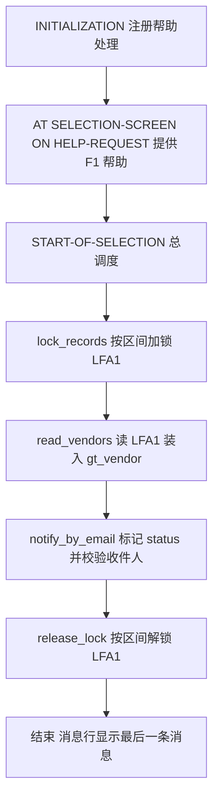
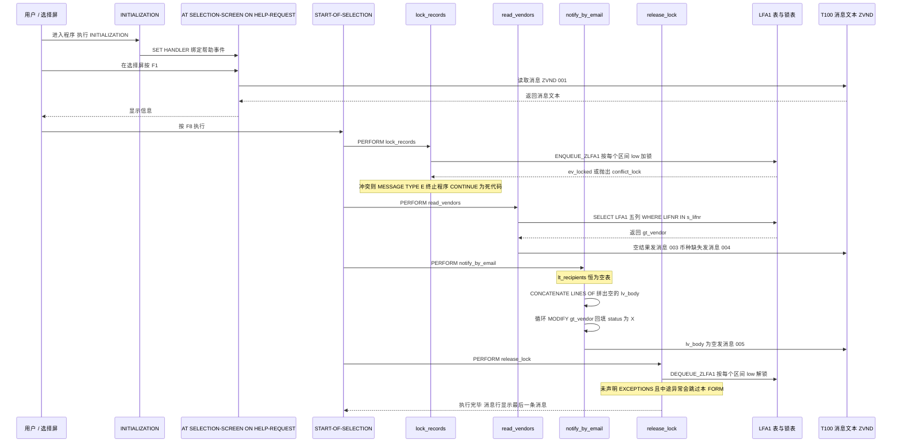

# zvendor_notify 程序走读报告

> 分析对象：`REPORT zvendor_notify`（供应商主数据维护程序）
> 报告主题：表锁的加解锁时机与异常路径、消息类（消息号）的使用是否规范

---

## 一、程序定位与业务背景

### 1.1 它想解决什么问题

供应商主数据（业务伙伴，LFA1）是全公司共享的"黄金数据"：采购下单、发票校验、付款都要读它。可现实中它有个老毛病——**同一个供应商被几个人同时改**，尤其是财务在补币种、供应商在补地址、采购在补税号的时候。SAP 对此的标准答案不是禁止并发，而是**逻辑锁（ENQUEUE / DEQUEUE）**：谁要动一条记录，先在锁表里"占坑"，别人撞上就得到冲突提示。

本程序做的事，可以概括成一句话：**在一个选择屏范围（LIFNR 的多段区间）内批量处理供应商，先把记录锁住防止别人插队，读出主数据，做一轮通知/状态标记，最后解锁放行。**

文件头的注释把它的定位说得很清楚：

```abap
*"----------------------------------------------------------------------
*"* Vendor master maintenance with message class, number range and
*"* table locking. Uses MESSAGE ID / NUMBER as the positive pattern.
*"----------------------------------------------------------------------
```

（全局声明区）

**做什么** — 用注释声明程序的三项对外能力：消息类、编号、表锁，并自我标注为 `MESSAGE ID / NUMBER` 的正面示例。
**为什么** — Z 程序没有标准文档，注释是最cheap的知识载体；把"本程序演示了什么范式"写在头部，是给后续维护者的第一手线索，方向是对的。
**风险与改进** — **注释与代码不符，属于文档性缺陷**：全文没有任何编号范围（Number Range）对象的使用——没有 `TABLES snro`、没有 `NUMBER_GET_NEXT` / `NUMBER_RANGE_CHECK`、类型 `ty_vendor` 里也没有流水号字段。程序里唯一出现的 `NUMBER` 是消息号 `001`–`005`。所谓 "number range" 实际是 "message number"。注释会让接手的同事去 `SNRO` 里白找一轮，应改为 "message class and message numbers"。这类"注释比代码乐观"的偏差，是 Z 程序最常见的隐性坑。

### 1.2 现有方案为什么不够

SAP 标准的供应商维护路径是 `BP_TRANSACTION` / `LFA1` 维护全屏（事务 V51/V52 等）或 `BAPI_VENDOR_MAINTAIN`。它们的问题在于**一次只处理一个供应商**，批量场景（"这 300 家供应商的付款币种都缺，给我统一补齐并通知采购"）就只能靠人反复进出，效率低且无法保证一致性。

所以这个程序的价值取向很清楚：**用报表程序做批处理入口，把"锁—读—处理—解锁"的骨架搭起来，把重活儿（真正的邮件发送、真正的字段回写）留给后续或别的功能组。**

### 1.3 设计范式一句话定性

> **经典报表 + 全局状态 + PERFORM 线性调度**的对话框式批处理框架，锁管理采取**手工 ENQUEUE / DEQUEUE 直控**范式，而数据维护本身仍停留在"只读 + 内存标记"的骨架阶段。

一个必须先摆到台面上的判断：**这是一个"半成品"程序**。四个 FORM 里有三个是完整逻辑，唯独最核心的 `notify_by_email`（发通知）是空壳——收件人表从未填充，邮件从未发送，`status` 只改在内存里从未落库。看代码时先接受这个前提，后面的"风险"才好正确排序：不是"哪里写错了"，而是"骨架里哪几块砖还没砌上，以及没砌上之前为什么已经产生了副作用（锁、消息）"。

---

## 二、程序执行流程总览

程序只有一个事件链：`INITIALIZATION` → 选择屏事件 → `START-OF-SELECTION`，后者按固定顺序 PERFORM 四个 FORM。下图按**代码意图**绘制（`INITIALIZATION` 中那行 `SET HANDLER` 有语法问题，见 3.3，会导致程序无法激活）。



### 责任链表

| 子程序 | 调用者 | 职责 |
|---|---|---|
| 全局声明区（类型/变量/选择屏） | 系统（程序激活时） | 定义 `ty_vendor` 结构、内表类型、全局变量，选择屏 `s_lifnr` 的技术属性 |
| `INITIALIZATION` | 系统，进入选择屏前 | 试图把帮助处理绑定到事件上 |
| `AT SELECTION-SCREEN ON HELP-REQUEST` | 系统，用户按 F1 时 | 响应 F1，输出提示消息 `ZVND 001` |
| `START-OF-SELECTION` | 系统，用户按 F8 执行后 | 总调度，顺序调用下面 4 个 FORM |
| `lock_records` | `START-OF-SELECTION`（PERFORM） | 按选择屏区间逐行 ENQUEUE ZLFA1，冲突时抛错误消息 |
| `read_vendors` | `START-OF-SELECTION`（PERFORM） | `SELECT` 读 LFA1 五个字段到 `gt_vendor`，做空结果与币种校验并发消息 |
| `notify_by_email` | `START-OF-SELECTION`（PERFORM） | 拼接收件人、回填 `status = 'X'`、空收件人告警（真正的发信缺失） |
| `release_lock` | `START-OF-SELECTION`（PERFORM） | 按选择屏区间逐行 DEQUEUE ZLFA1，末尾置 `gv_dummy` |

下面按这条流程，逐个子程序展开。

---

## 三、分组分析

### 3.1 类型定义 ty_vendor（全局声明区）

```abap
TYPES: BEGIN OF ty_vendor,
         lifnr   TYPE lfa1-lifnr,
         name1   TYPE lfa1-name1,
         ort01   TYPE lfa1-ort01,
         waerk   TYPE lfa1-waers,
         eikto   TYPE lfa1-eikto,
         status  TYPE char1,
       END OF ty_vendor.
```

**做什么** — 定义一个与 LFA1 投影同形的行结构：供应商号 `lifnr`、名称 `name1`、城市 `ort01`、币种字段（取自 `lfa1-waers`）、税号 `eikto`，外加一个本地字段 `status` 用于标记处理状态。字段类型全部引用 `lfa1-` 前缀，不写死长度，保证与表结构永久同步。
**为什么** — "投影而非 `TABLES lfa1`"是现代 ABAP 的标准做法：只声明用得到的字段，内表内存占用小一个数量级，且 SELECT 的投影列在语法检查阶段就与表定义绑定。
**风险与改进** — 三处需要校核：
1. **字段名与语义错配**。`waerk` 取的是 `lfa1-waers`（供应商**记账币种**），名字却长得像 waerk（work/warehouse 之类），极易被后来者当成"工厂/仓库币种"用。应改名为 `waers`。
2. **`status TYPE char1` 是裸类型**。它承载的是业务状态（`'X'` = 已通知），却用内建的 `CHAR1` 而不是自建域（`zdom_vend_status`）或枚举，写错成 `'XY'`、`'1'` 编译期毫无阻力。既然本程序宣称要立"规范"的样板，状态字段用裸 `CHAR1` 是自打嘴巴。
3. **`eikto` 选了却不用**。EIKTO 是统一社会信用代码/税号，属敏感税务数据。取而不用是典型的"最小化取数"违背——真要发通知，需要的是邮箱，不是税号。这一列应当在取数时就删掉（见 3.7 的数据保护风险）。

### 3.2 内表类型与全局变量（全局声明区）

```abap
TYPES ty_vendor_tab TYPE STANDARD TABLE OF ty_vendor WITH EMPTY KEY.

DATA gt_vendor  TYPE ty_vendor_tab.
DATA gs_vendor  TYPE ty_vendor.
DATA gv_locked  TYPE abap_bool.
DATA gv_dummy   TYPE i.

SELECT-OPTIONS s_lifnr FOR gs_vendor-lifnr.
```

**做什么** — 声明一个标准内表类型 `ty_vendor_tab` 及三个全局数据对象：`gt_vendor`（全量结果表）、`gs_vendor`（结构，仅用于给选择屏提供字段参照）、`gv_locked`（加锁返回值）、`gv_dummy`（整数占位）。`SELECT-OPTIONS s_lifnr FOR gs_vendor-lifnr` 定义选择屏的供应商号区间。
**为什么** — `WITH EMPTY KEY` + 标准表意味着内表是**纯行堆**，不存在主键/次键的重复约束；`gs_vendor` 作为 `SELECT-OPTIONS ... FOR` 的参照对象是合法的老写法，能让选择屏自动继承 LIFNR 的 DDIC 属性（文本、可能的搜索帮助、F4）。
**风险与改进** — 有三处硬伤：

1. **`WITH EMPTY KEY` 与后续操作语义冲突（最需要警惕的一条）**。空键表的直接后果是：`MODIFY ... FROM ...`、`DELETE`（带键）、`SORT`（带键）、`READ ... WITH KEY` 全部退化为整行比较或全表扫描，且编译器**不会**报任何错。`notify_by_email` 里那个 `MODIFY gt_vendor FROM ls_vendor` 之所以"能跑通"，纯粹是因为空键表里"整行内容 == 整行键"，恰好匹配上了它自己刚读出来的那一行。这是靠巧合成立，不是靠设计成立。正确做法是 `WITH UNIQUE KEY lifnr` 或 `WITH DEFAULT KEY`——既保留了读取时的语义，又让 MODIFY 变成真正的主键更新。

2. **`gv_locked` 是死变量，`gv_dummy` 是纯废码**。`gv_locked` 在加锁前被 `CLEAR`，加锁后从 `ev_locked` 接收值，然后**再也没被读过**；`gv_dummy` 被赋 1 之后也再无用途。它们的存在会让读者误以为"程序有做了 ev_locked 判定 / 有做善后收尾"，而事实是两者都没做。删掉比留着更诚实。

3. **选择屏无任何必填约束**。`SELECT-OPTIONS` 不加 `OBLIGATORY`、程序里也没有 `AT SELECTION-SCREEN ON CHECK` 校验空输入。更糟的是：空选择屏（`s_lifnr` 只有一行 sign 为空、值为全 0）会让后面的 `LOOP AT s_lifnr` 照样进循环，`read_vendors` 的 `WHERE lifnr IN s_lifnr` 退化成**全表读 LFA1**，再叠加一条"锁住供应商 0000000000"的无意义锁。这是典型的"批处理程序被空输入击穿"。

> 附带的版本约束：`WITH EMPTY KEY` 与后续代码里的内联声明 `DATA(ls_vendor)` 分别要求 **7.40 SP05 / 7.40** 以上的内核。这意味着本程序无法在 7.02/7.10 等老系统上编译。这个下限应当写进注释或程序文档。

### 3.3 事件块 INITIALIZATION

```abap
INITIALIZATION.
  SET HANDLER 'ON_HELP_REQUEST'.
```

**做什么** — 在进入选择屏之前，尝试把名为 `ON_HELP_REQUEST` 的对象注册为某个事件的处理程序。
**为什么** — 意图很清楚：为选择屏的 F1 帮助做程序化扩展，这在 OO 化之后通常通过 `SET HANDLER FOR EVENT OF ...` 或在报表级直接用 `AT SELECTION-SCREEN ON HELP-REQUEST` 事件块实现。作者显然见过"事件注册"这种写法，就照搬到了报表事件上。
**风险与改进** — **这是一行语法错误，会导致程序无法通过激活检查（syntax error），从而整个程序根本跑不起来**。原因有三层：

1. `SET HANDLER` 的合法形式必须指明事件：`SET HANDLER FOR EVENT <event> OF <class> FOR <handler>`、全局类形式 `SET HANDLER FOR EVENT OF cl_x ON form_name`，或 `FOR ALL EVENTS OF`。单给一个程序名（或 FORM 名）没有 `FOR` 子句，语法上不成立。
2. `ON_HELP_REQUEST` 带下划线，不是任何合法的事件名——事件名用 `AT SELECTION-SCREEN ON HELP-REQUEST`，处理过程才允许下划线命名。
3. **报表级事件根本不需要注册**：它们靠 `AT SELECTION-SCREEN ON HELP-REQUEST` 事件块被动触发，而不是靠 `SET HANDLER` 主动订阅。

改进就是**删掉整个 INITIALIZATION 块**。这件事也顺带提醒：`INITIALIZATION` 常被拿来放默认值（给选择屏赋初值、变式变量回填），此处它唯一的作用就是引入缺陷。

### 3.4 事件块 AT SELECTION-SCREEN ON HELP-REQUEST

```abap
AT SELECTION-SCREEN ON HELP-REQUEST.

  MESSAGE ID 'ZVND' TYPE 'I' NUMBER '001'.
```

**做什么** — 声明选择屏的 F1 帮助事件。当用户在选择屏任意字段上按 F1 时，进入本事件块，发出 `ZVND` 消息类 001 号消息（类型 I = 信息）。
**为什么** — 选择屏事件块是 SAP 推荐的可编程扩展点：F1（HELP-REQUEST）、F4（VALUE-REQUEST）、回车（ON CHECK）、PAI（USER-COMMAND）都可以挂逻辑。这比在程序里到处 `MESSAGE` 更"内向"，不打扰正常执行流程。
**风险与改进** —

1. **这里的消息大概率不会出现在 F1 弹窗里**。F1 的内容来源是数据元素的字段文档（或 `DOKU` 语句），系统用它填充帮助文本框；`MESSAGE ... TYPE 'I'` 在这个事件块里既不构成 F1 的文本来源，语义上也怪——类型 I 是"信息提示"，会走消息行而不是帮助窗口。用户按 F1 期望看到"这个字段是供应商号，请输入 10 位数字"，结果只得到一个信息条，可读性更差。正确做法：把说明写进 LFA1-LIFNR 的数据元素文档，或在此事件块用 `DOKU BEGIN-VS ... DOCU END-VS` 程序化设置帮助文本。

2. **消息参数占位未验证**。消息 001 是否定义了 `&1`–`&4` 占位符，本程序没有传 `WITH`，如果 T100 中写了 `&1` 则文本会被截断。建议在报告 5.1 中作为规范检查项固化下来。

3. **缺 `FOR s_lifnr[...]` 的静态绑定**。报表级 SELECT-OPTIONS 若要用静态绑定形式，写成 `AT SELECTION-SCREEN ON HELP-REQUEST FOR s_lifnr-low`（或 `-high`）处理效率更高，也便于区分低值/高值给不同说明。现在的不带 `FOR` 形式作用于所有字段，只能给出一段通用文案——这是可接受的取舍，但要有意识。

> 无锁、无数据影响、无明显业务风险；本层唯一的问题是"帮助机制用错了地方"，属于 P2 级改进项。

### 3.5 事件块 START-OF-SELECTION（总调度）

这个 FORM 群很短，但它定义了**整个程序的事务边界和失败语义**，值得完整贴出：

```abap
START-OF-SELECTION.

  PERFORM lock_records.
  PERFORM read_vendors.
  PERFORM notify_by_email.
  PERFORM release_lock.
```

**做什么** — 用户按 F8 后，线性调用四个 FORM：先加锁、再读数据、再做通知处理、最后解锁。顺序即"先占坑、再干活、最后放行"。
**为什么** — 这是经典报表的"主控 + 子程序"范式，把一段线性流程拆成可独立阅读的四个黑盒，避免所有逻辑堆在 `START-OF-SELECTION` 里。顺序本身也符合锁管理的直觉：必须先锁后读，才能保证读到的是加锁时刻的快照。
**风险与改进** — **这是全程序最危险的一处结构缺陷：锁的释放与业务处理没有绑定**。四个 PERFORM 是"平铺"的，第 2、3 步里任何一条 `MESSAGE ... TYPE 'E'` 或未捕获的异常，都会让流程在 `release_lock` 之前中断。加锁在第 1 步、解锁在第 4 步，中间隔着两道可能终止程序的关卡。程序里也没有 `AT EXIT OF PROGRAM` 之类的兜底 `AT EXIT` 块来补做解锁。详见 3.9 与第五章 P0 条目。

改进方向：把"加锁 + 处理 + 解锁"包进**一个** FORM，用结构化异常或 `ON EXCEPTION` 保证解锁必达（下一节的 3.6 给具体写法）；或者在 `START-OF-SELECTION` 的最外层加一层 `PERFORM` 包裹 + 一个 `xmessage`-free 的统一异常出口。

### 3.6 FORM lock_records —— 表锁的加锁时机

这是全程序风险最高的一段，我们拆成三步看。

#### ① 遍历选择屏区间

```abap
FORM lock_records.

  LOOP AT s_lifnr.

    CLEAR gv_locked.
```

**做什么** — 遍历选择屏内表的**每一行**（每个签名的区间项），每轮先把 `gv_locked` 清空，准备发起一次加锁。
**为什么** — `LOOP AT s_lifnr`（无 WHERE 子句）遍历的是选择屏内表本体，每行是一条用户输入的约束——可以是"包含"(sign 空)、"排除"(E)、"不含"(N)，每行带 `low` 和 `high`。这是加锁时最直观的循环形态。
**风险与改进** — **这里的语义错配是本程序锁逻辑的第一颗雷**：一个选择屏项**不等于**一个供应商号。用户可以填 `LIFNR = 100000..999999`（区间），也可能填排除项 `E 500000`。当前代码只拿每行的 `low` 去加锁，于是：

- 区间 `100000..999999` 只锁了 `100000` 一家供应商，后面 `read_vendors` 却会读 90 万条；
- **排除项也被加锁了**——用户明确说"不含 500000"，程序反而去锁它，纯属自找的锁冲突；
- 空选择屏时 `low` 为全 0，锁出一条无意义的记录。

锁覆盖范围与读取范围不一致，这是分布式并发里最经典的数据竞争来源。改进：**先读、后按实际键加锁**，让锁的对象集合天然等于被访问的对象集合。

#### ② 发起加锁调用

```abap
    CALL FUNCTION 'ENQUEUE_ZLFA1'
      EXPORTING
        iv_lifnr         = s_lifnr-low
      IMPORTING
        ev_locked        = gv_locked
      EXCEPTIONS
        conflict_lock    = 1
        OTHERS           = 2.
```

**做什么** — 调用函数模块 `ENQUEUE_ZLFA1`（一个对 `ENQUEUE_E_LFA1` 的 Z 包装层），传入 `s_lifnr-low` 作为供应商号；把返回值写入 `gv_locked`，并声明处理 `conflict_lock`（锁冲突）和 `OTHERS` 两类异常。
**为什么** — 用 `CALL FUNCTION` 直接调 ENQUEUE 而非写 `SET LOCK LIST` 或用 OO 封装，是逻辑锁最经典、最兼容的写法；声明 `EXCEPTIONS` 是硬性纪律——ENQUEUE 不声明异常时，若 FM 抛出异常会导致未捕获的运行时错误（short dump）。
**风险与改进** — 三处需要修：

1. **`ev_locked` 被接收后完全不使用（语义未校核）**。`ENQUEUE_E_LFA1` 的 `EV_LOCKED` 语义是：**为 'X' 表示锁由更新任务持有，本次 ENQUEUE 只是转交给更新任务，本事务并不"拥有"这条锁**；为 ' ' 表示锁已由当前事务成功持有、后续 DEQUEUE 可以释放它。代码在 ① 里 `CLEAR` 了它，接收到后却从不判断——一旦锁被转交，本程序后续即使跑到 `release_lock`，DEQUEUE 也释放不掉锁，产生**锁残留**。这正是 `gv_locked` 应该被检查的地方。

2. **`OTHERS = 2` 掩盖了真正的失败原因**。`ENQUEUE_E_LFA1` 的标准异常集是 `conflict_lock`（他人已锁）、`intrablock_lock`（本事务内已锁同一记录，属编程错误）、`others`（如数据库异常）。把 `OTHERS` 一锅端，意味着 `intrablock_lock` 这种"代码写错了"的信号，会和"数据库抖动"混在一起、被同一条消息糊弄过去。建议按语义分别处理，异常名写全。

3. **锁对象类型需确认**。`ENQUEUE_E_LFA1`（SAP 标准 FM）与 `ENQUEUE_ZLFA1`（本程序调用的封装层）锁的是 LFA1 整条记录——不是某一列、也不是整个 LFA1 表。所以加锁粒度是"单个供应商的全字段行"。对本程序（只读、无落库）来说，这是锁了一堆自己根本不打算改的记录，纯属过度。

### ③ 冲突处理与"续跑"

```abap
    IF sy-subrc <> 0.
      MESSAGE ID 'ZVND' TYPE 'E' NUMBER '002' WITH s_lifnr-low.
      CONTINUE.
    ENDIF.

  ENDLOOP.

ENDFORM.                       "lock_records"
```

**做什么** — 检查 `sy-subrc`：非零（加锁失败）时，发出 `ZVND` 002 号错误消息（类型 E，带 `s_lifnr-low` 作为参数），随后执行 `CONTINUE` 跳过本轮、继续下一轮区间。
**为什么** — 用 `sy-subrc` 判定 ENQUEUE 成败、`CONTINUE` 跳过本区间，是"部分失败、尽量处理其余"的朴素容错思路。出发点（一个区间冲突不应拖垮整批）是对的。
**风险与改进** — **这里的 `CONTINUE` 是死代码，是个隐蔽但致命的 bug**，必须点破：

1. **`MESSAGE TYPE 'E'` 会立即终止程序**。ABAP 中不带 `RAISING`/`INTO` 的 `MESSAGE`，其行为由类型决定；类型 **E 是错误消息，会在消息显示后终止程序逻辑**——它不是"抛个标志位让当前循环继续"，而是 `LEAVE` 到消息处理栈外。紧随其后的 `CONTINUE` **永远不会执行**。所以"逐区间容错"在效果上并不成立：第一条冲突就把整个批次打断。

2. **类型选错了**。要实现"跳过本条、继续处理"，`E`/`A` 都是错的类型，应该用 `W`（警告，记录 `sy-msgid` 后继续），或者更规范的收集式：把失败的供应商号 `APPEND` 到一张错误表，循环结束后统一发一条 `E`（带错误数量或汇总列表）。

3. **唯一能做到"容错"的结构**：

```abap
    IF sy-subrc <> 0.
      APPEND s_lifnr-low TO lt_failed.
      CONTINUE.
    ENDIF.
```

（FORM lock_records）—— 收集错误、继续加锁，全循环结束后再判断 `lt_failed` 是否为空决定报错还是继续。错误信息从"某一条冲突打断一切"变成"告诉你哪几条没锁上"，对批量程序才是可用的语义。

4. **还漏了一件事：失败的那把锁不用解锁是对的，但成功的那几把没人记**。因为 ① 里每轮都 `CLEAR gv_locked`，到 3.9 的解锁时已经无从知道"到底哪几把锁是我拿到的、哪几把是我没拿到的"。建议改用一张已加锁键的表（`lt_locked`）显式记账，解锁时按表释放，而不是"把选择屏再遍历一遍"。这是锁管理从"盲放"变"记账"的关键升级，也是后面所有异常路径都能收干净的前提。

### 3.7 FORM read_vendors —— 读数与字段级校验

#### ① 取数

```abap
  SELECT lifnr name1 ort01 waerk eikto
    FROM lfa1
    INTO TABLE gt_vendor
    WHERE lifnr IN s_lifnr.
```

**做什么** — 从 LFA1 查询供应商号、名称、城市、币种、税号五个字段，装入全局内表 `gt_vendor`，过滤条件为 `LIFNR IN s_lifnr`（按选择屏的区间/集合语义）。
**为什么** — `SELECT ... INTO TABLE` 加投影列，是"少取、准取"的标准姿势：LFA1 有 200+ 字段、记录量在大型集团可达百万级，只取 5 列能显著降低数据库传输量和 ABAP 端内存开销；`IN` 内部表让选择屏的区间/排除逻辑直接下推到数据库，不在 ABAP 端做过滤。语法正确，这一段是全程序写得最规整的地方。
**风险与改进** —

1. **无 PACKAGE / 分块，全量进内存**。`INTO TABLE` 一次性装下所有匹配行。选个"全部供应商"就会把 LFA1 拖进内表。在面向生产的批处理里应改 `SELECT ... INTO TABLE @DATA(lt) PACKAGE SIZE 1000`，或先 `SELECT COUNT(*)` 试探，超量直接拒绝/缩小范围。

2. **空选择屏 → 全表扫描**。`s_lifnr` 完全为空时，`IN` 内部表整体为空，SQL 退化为无条件全表读。这应与 3.2 提到的选择屏 `OBLIGATORY` / `AT SELECTION-SCREEN ON CHECK` 一起治理。

3. **`eikto` 是敏感税号，且取了不用**。LFA1-EIKTO（统一社会信用代码/纳税人识别号）在中国区属于税务敏感字段。取而不用之外，更关键的是**本程序没有任何授权检查**：谁执行了这个报表，就能批量带走全公司供应商的税号。应在程序开头加 `AUTHORITY-CHECK`（对象 LFA1，actgrp '03' 显示权限），未通过直接 `MESSAGE TYPE 'E'` 拒绝。这是数据保护视角下比锁缺陷更严重的问题。

4. **`SELECT` 未指定 `CLIENT` 字段**。LFA1 是客户相关表，`FROM lfa1` 隐式取当前 `SYST-MANDT`，选屏也无 MANDT 字段。当前程序在单客户端下没问题，但若将来做跨客户端抽取（或被别的客户端提交调用），需显式加 MANDT 条件。属于"当下无害、扩展时踩雷"的项。

#### ② 空结果处理

```abap
  IF gt_vendor IS INITIAL.
    MESSAGE ID 'ZVND' TYPE 'S' NUMBER '003'.
  ENDIF.
```

**做什么** — 查询后判断结果表是否为空，若为空则发一条 `ZVND` 003 号消息，类型 S（状态消息，显示在状态栏）。
**为什么** — 在取数点就地反馈"没查到数据"，让用户立刻知道筛选条件太窄，不用等到后面处理步骤才发现没东西可做。这符合"最早失败"的直觉。
**风险与改进** —

1. **类型 S 用错了场景**。S 是"状态/操作成功提示"，是给"你成功了"用的；"没查到数据"是一个**没有达成预期**的情况，用 S 会误导——用户看到绿色状态条，以为操作成功。应该用 `TYPE 'I'`（信息，"未找到符合条件的供应商，请放宽条件"）或 `TYPE 'W'`（警告）。

2. **发完消息不退出，后续步骤照跑**。空结果没有 `EXIT`/`RETURN`，于是 `START-OF-SELECTION` 接着 `PERFORM notify_by_email`——对空表遍历（无害），但随后 `IF lv_body IS INITIAL` 又会发一条 005 警告（见 3.8）。**最终用户会看到 003 和 005 两条"不同措辞说同一件事"的消息**，因为后发的 S/W 覆盖先发的 S/Q。空结果的正确处理是"发一条消息 + 终止流程"（在 `START-OF-SELECTION` 里用返回值判断，而不是在 FORM 里就地决定）。

3. **发消息的位置违反了分层**。`MESSAGE` 属于展示层逻辑，ABAP 官方文档明确建议"除类型 X 外，MESSAGE 应只出现在展示层，不应出现在应用逻辑层"。`read_vendors` 是取数 + 校验的"应用逻辑"，却内嵌消息。更规范的做法是让 FORM 只把状态（`gt_vendor` 是否为空、有哪些 `waerk` 缺失的供应商）通过返回值/内表传出去，由 `START-OF-SELECTION` 或一个专门的报告层统一发消息。这也正好呼应 5.1 的规范建议。

#### ③ 币种字段校验

```abap
  LOOP AT gt_vendor INTO DATA(ls_vendor).

    IF ls_vendor-waerk IS INITIAL.
      MESSAGE ID 'ZVND' TYPE 'W' NUMBER '004' WITH ls_vendor-lifnr.
    ENDIF.

  ENDLOOP.
```

**做什么** — 遍历取回的供应商，逐条检查记账币种 `waerk` 是否为空；为空则发 `ZVND` 004 号警告消息，带供应商号作为 `&1` 参数。
**为什么** — 币种为空是供应商主数据的经典脏数据（新建供应商时漏填），下游付款、发票校验都会因此报错或走错账套。程序主动扫描并提示，是有价值的数据质量检查。用 `W` 类型（非阻断）也符合"警告但不中断"的批量场景定位。
**风险与改进** —

1. **在循环里逐条发消息，批量化后必然丢信息**。假设 500 家供应商有 80 家缺币种，ABAP 的消息行在后一条 `MESSAGE` 执行时会**覆盖**前一条（同一屏幕位置），用户最终只能看到**最后一条**（且与循环顺序绑定，非供应商号排序，行为不可预期）。批量场景的正确模式是**收集 + 汇总**：

```abap
  DATA lt_missing TYPE STANDARD TABLE OF ty_vendor WITH EMPTY KEY.
  LOOP AT gt_vendor INTO DATA(ls_vendor).
    IF ls_vendor-waerk IS INITIAL.
      APPEND ls_vendor TO lt_missing.
    ENDIF.
  ENDLOOP.
  IF lt_missing IS NOT INITIAL.
    MESSAGE ID 'ZVND' TYPE 'W' NUMBER '004' WITH 10.
  ENDIF.
```

——把每家的供应商号聚合进 `lt_missing`，最后发一条"共 N 家供应商缺少记账币种，详见列表/请导出处理"。要保留逐家信息，就配合 ALV 或 Excel 导出，而不是刷消息行。

2. **内联声明 `DATA(ls_vendor)` 在此 FORM 的作用域内，与后续 `notify_by_email` 中同名内联变量是两个不同作用域**——这点目前没问题（同名的内联变量只在同一 FORM 内复用）。但**跨 FORM 用同名内联变量容易引发误读**，建议提级为 FORM 级 `DATA ls_vendor TYPE ty_vendor.`，让变量的生命周期显式可见。

3. **校验规则过于单薄**。`EIKTO`（税号）同样为空在很多场景是更严重的合规风险，却完全没查；而 `status` 也没被读回来参与判断（它是纯本地字段，读不到 DB）。校验规则设计缺优先级，建议按"阻断 > 警告 > 提示"分层设计，而不是只查一个字段。

### 3.8 FORM notify_by_email —— 名不副实的处理步骤

先说结论：**这个 FORM 没有做任何"发通知"的事**。它是本程序的功能缺口所在，但目前仍然产生了副作用（改内存字段、发消息），因此不能算"无害的空壳"。

#### ① 收件人声明与拼接（无数据来源）

```abap
FORM notify_by_email.

  DATA lt_recipients TYPE STANDARD TABLE OF adr6-adr_email.
  DATA lv_body       TYPE string.

  CONCATENATE LINES OF lt_recipients INTO lv_body SEPARATED BY space.
```

**做什么** — 声明一个 `adr6-adr_email` 类型的内表 `lt_recipients`（ADDR6 是地址簿-用户邮箱表）和一个字符串 `lv_body`；随后把 `lt_recipients` 的所有行用空格拼接进 `lv_body`。**由于 `lt_recipients` 声明后从未被填充（没有 `SELECT`、没有 FM 调用），它恒为空表。**
**为什么** — `CONCATENATE LINES OF ... SEPARATED BY space` 是把内表行拼成单个字符串的惯用写法（如拼 WHERE 条件、拼 IN 列表）；用 `string` 类型承接避免了定长字段截断。手法本身没问题。
**风险与改进** —

1. **`lt_recipients` 是恒空的死变量，这段代码纯粹是空转**。没有从任何数据源读取收件人——正确做法通常是从 ADRC（地址簿，按 `sy-uname` 查 `USERNAME` 字段）或自定义的角色-邮箱配置表读取。这里选了 `adr6-adr_email` 字段，说明作者想走"取用户邮箱"的路子，但只写了字段类型没写取数逻辑。**收件人永远为空 → `lv_body` 永远为空 → ③ 的告警每次运行必触发**。

2. **`CONCATENATE LINES OF` 之后没检查 `sy-subrc`**。该语句在结果为空时会置 `sy-subrc`，作者却改用 `IF lv_body IS INITIAL` 间接判断。可接受，但注意 `IS INITIAL` 的语义是"是否初始值"，如果后续改成填充真实数据，"内容为空串"和"内容全空格"这两种边界就区分不出来了。更严谨的是用行数判断：`IF lt_recipients IS INITIAL`。

3. **`lv_body` 这个命名高度误导**。它不是"邮件正文 body"，而是"收件人地址列表"。建议改名 `lv_recipients_str`。名实不符是这个 FORM 的通病，也正是它让人误以为邮件功能已经写好了。

#### ② status 回填（只改内存）

```abap
  LOOP AT gt_vendor INTO DATA(ls_vendor).
    ls_vendor-status = 'X'.
    MODIFY gt_vendor FROM ls_vendor.
  ENDLOOP.
```

**做什么** — 遍历所有取回的供应商，把每行内存记录的 `status` 字段置为 `'X'`，再用 `MODIFY gt_vendor FROM ls_vendor` 写回内表。
**为什么** — 作者显然想在"已通知"语义上给每个供应商打个标记（`status = 'X'` 表示已通知/已处理）。内存态打标是后续"筛选出本次处理过的记录"的常规前置动作，作为设计意图是合理的。
**风险与改进** —

1. **`status` 是纯内存字段（`ty_vendor` 独有，LFA1 无此列），标记后从不落库、也从不参与任何下游判断**。用户按 F8 跑完，看到程序执行了，但下次再跑还是"没通知过"的状态——**这个标记没有任何持久意义**。要么把"已通知"标志落到真实的自定义表（如 `ZVEND_LOG`），要么删掉这个字段，不要给读者"程序记录了处理状态"的错觉。

2. **`MODIFY gt_vendor FROM ls_vendor` 在空键表上是全行线性扫描**。`gt_vendor` 声明为 `WITH EMPTY KEY`（见 3.2），`MODIFY` 只能拿整行内容当键做查找，每次 O(n)。在循环里就是 O(n²) 复杂度。n 上万时明显拖慢，且这完全是可避免的开销。

3. **同一行的 MODIFY 是冗余的**。循环变量 `ls_vendor` 是刚读出来的同一行，原样写回（除 `status`）对标准表的行顺序没有影响。`status` 是后续才可能被用到的字段，如果当下没有消费者，那这整段就是纯粹的空转开销。要么让它服务于真正的下游判断，要么整个删掉。

### 3.9 FORM release_lock —— 解锁时机与异常路径

#### ① 按区间解锁

```abap
FORM release_lock.

  LOOP AT s_lifnr.
    CALL FUNCTION 'DEQUEUE_ZLFA1'
      EXPORTING
        iv_lifnr = s_lifnr-low.
  ENDLOOP.
```

**做什么** — 再次遍历选择屏内表，对每一行用 `s_lifnr-low` 调用 `DEQUEUE_ZLFA1` 释放 LFA1 的逻辑锁。
**为什么** — 这是"锁什么就解什么、同一把尺子量进量出"的直觉实现：加锁在 `lock_records` 里按 `low` 加，解锁也按 `low` 解，看起来对称。但**这个对称是脆弱的**。
**风险与改进** —

1. **没有任何异常处理**。`ENQUEUE_ZLFA1` 声明了 `EXCEPTIONS`，`DEQUEUE_ZLFA1` 这里**一个都没声明**。函数模块抛出未被声明的异常会导致运行时 short dump（程序崩溃）。解锁 FM 的 `OTHERS` 异常应该被捕获并记录——因为此时程序正处在"最后清理"阶段，这里崩溃意味着**前面所有的锁都释放不掉**，全部残留。

2. **解锁范围与实际加锁范围依赖"两次遍历结果一致"这个隐含前提**。如果 `s_lifnr` 在两次 `LOOP` 之间被改动（虽然本程序不会改，但一旦有人在 `lock_records` 里往 `s_lifnr` 追加了一行、或加了 `APPEND` 记录失败的区间），解锁就会漏掉真正的锁、或者多解别人的锁。这就是为什么要在加锁时用 `lt_locked` 记账（见 3.6 ③ 第 4 点）——**用"我实际锁了哪些键"这张表来解锁，而不是用"我打算锁哪些键"那张选择屏来解锁**。

3. **`ev_locked = 'X'` 的锁残留风险在解锁侧彻底爆发**（呼应 3.6 ② 第 1 点）。若某条记录是"转交更新任务持有的锁"，`DEQUEUE_E_LFA1` 无法释放它。本程序既不检查 `ev_locked`、也不在 `OTHERS` 里重试或记录，这类锁就成了遗留到 SM12 里的孤儿锁，必须靠系统清理任务兜底。**在 `release_lock` 至少应该捕获异常并把失败键 `APPEND` 到日志表，供事务 SM12/SM13 追查。**

4. **解锁出现在业务流程末尾，而非与加锁成对**。这是最根本的设计问题：

```abap
START-OF-SELECTION.
  PERFORM lock_records.
  PERFORM read_vendors.
  PERFORM notify_by_email.
  PERFORM release_lock.
```

（事件块 START-OF-SELECTION）—— 第 2 步 `read_vendors` 和第 3 步 `notify_by_email` 里都有 `MESSAGE TYPE 'E'`（002 在 `lock_records` 里，004/005 是警告但也可能被未来代码升格为 E），任何一条 `E` 或未捕获异常都会让程序在 `release_lock` 之前就死掉——**锁不解，异常路径上没有任何兜底清理机制**。

补充一条容易被忽略的 SAP 运行时语义：`MESSAGE TYPE 'E'` 会终止 SAP LUW，对话框场景下的 LUW 回滚会**连带释放本次事务内获得的逻辑锁**，所以"错误退出 → 锁自动没了"在纯对话框下有一定偶然兜底。但这个"自动兜底"不是设计，是副作用——**只要调用链里任何一个被调用的 FM/BAPI 内部做了 `COMMIT WORK`（这在真实业务代码里极其常见），锁就会真正残留**。不能依赖它。

**改进方案（按推荐程度排序）**：

- 方案 A（最稳）：**在 `lock_records` 里一把锁配一个容器**。改用 `ENQUEUE` 循环填充 `lt_locked` 表，把解锁动作放在 `START-OF-SELECTION` 的 `EXCEPTION` 处理或 `PERFORM` 的统一出口里，保证无论中间发生什么都能跑到解锁。
- 方案 B（结构化异常）：ABAP OO 场景用 `TRY ... CATCH ... ENDTRY`，在 CATCH 分支里 DEQUEUE 后再重抛异常。
- 方案 C（善后兜底）：在 `INITIALIZATION` 后加 `AT EXIT OF PROGRAM` 处理块，或在报告属性里开"LUW 结束自动 DEQUEUE"，兜住所有非正常退出路径。
- 方案 D（最省心）：**不要手工锁**。既然本程序只读不写，加锁本身就没有意义（见 5.1）；真正要维护 LFA1 时，直接调 `BAPI_VENDOR_MAINTAIN` 或 `LFA1_MAINTAIN`，由 BAPI 内部完成锁管理、校验和 COMMIT WORK，还自带错误返回表。这是最推荐的方向。

### 3.10 gv_dummy —— 占位变量的诊断价值

```abap
    gv_dummy = 1.

ENDFORM.                       "release_lock"
```

**做什么** — 在解锁循环结束后，给全局整型变量 `gv_dummy` 赋值为 1，不做任何其他事。
**为什么** — 这是一个调试/占位用的变量，作用是"程序末尾有个可观察的执行痕迹"（在调试器里看 `gv_dummy = 1` 就知道 `release_lock` 跑完了）。
**风险与改进** — 单纯的死代码，无业务逻辑影响，但它反映出**程序缺少正确的执行状态跟踪机制**：正确做法是用 `gv_dummy`（或改名为 `gv_lock_released`）记录实际状态，或者干脆去掉这个变量，改用一张"处理结果表"承载真实信息（成功数、失败数、失败供应商清单），供后续消息和日志使用。占位变量不应成为功能实现的一部分。

---

## 四、执行流程全景图（数据视角）

下图追踪数据（含锁状态、消息）在各子程序间的流转。注意 `gt_vendor` 作为全局变量，是 `read_vendors` → `notify_by_email` 之间**唯一**的数据通道（没有通过 FORM 参数传递）。



### 数据流观察

- **锁的生命周期横跨了 4 个 FORM**，中间夹着两个可能终止程序的关卡——这是全文最需要在 review 时盯住的数据流风险。
- **`gt_vendor` 的"写—读"跨 FORM 传递靠全局变量隐式完成**，`read_vendors` 填充、`notify_by_email` 消费，没有任何显式参数/返回值。这让两个 FORM 隐式耦合，改动其一时另一个也受影响，且单元测试无法单独运行任一 FORM。
- **消息是唯一的输出通道**，且没有回退给用户结构化结果（无 ALV、无导出文件、无返回消息表），用户只能从零散的消息行里拼凑"发生了什么"。

---

## 五、问题清单与改进建议

### 🔴 P0 —— 业务正确性（必须修，否则程序有安全/数据风险）

| # | 问题 | 所在子程序 | 影响 | 改进建议 |
|---|---|---|---|---|
| P0-1 | `SET HANDLER 'ON_HELP_REQUEST'` 语法错误，`SET HANDLER` 未指定 `FOR EVENT` | `INITIALIZATION` | 程序无法通过激活检查，整个程序跑不起来 | 删除整个 `INITIALIZATION` 块；报表级帮助直接用 `AT SELECTION-SCREEN ON HELP-REQUEST` |
| P0-2 | 锁覆盖范围 ≠ 读取范围：按 `s_lifnr-low` 逐项加锁，但读取用 `WHERE lifnr IN s_lifnr`（含区间/排除） | `lock_records` / `read_vendors` | 读 90 万条只锁 1 条 → 真实的数据竞争；反之锁了不该锁的记录 → 阻塞他人 | 改为"先读 → 遍历 gt_vendor 按实际 lifnr 逐条加锁"，并用 `lt_locked` 记账 |
| P0-3 | 锁在 `release_lock`（流程最后一步）释放，中间的错误消息/异常可直接跳过解锁；无 `AT EXIT` 兜底 | `START-OF-SELECTION` / `release_lock` | 锁残留 → 用户在 SM12 里看到"被 Z 程序锁定"却查不到占用者 | 把加锁/解锁收敛到同一 FORM 的 `TRY...CATCH`（或 ABAP 异常）内；解锁放进统一 `EXCEPTION` 出口 |
| P0-4 | 排除项（sign = E/N）也被加锁 | `lock_records` | 用户明确排除的供应商反被锁住，制造非预期冲突 | 同 P0-2，加锁前按 sign 过滤 |
| P0-5 | `MESSAGE TYPE 'E'` 后紧跟 `CONTINUE`（死代码），批量"逐条容错"实际是"首错即停" | `lock_records` | 语义与设计意图不符，误导维护者 | 收集失败键到 `lt_failed`，循环后统一判断报错；`CONTINUE` 换成 `APPEND` |

### 🟠 P1 —— 健壮性

| # | 问题 | 所在子程序 | 影响 | 改进建议 |
|---|---|---|---|---|
| P1-1 | `DEQUEUE_ZLFA1` 未声明任何 `EXCEPTIONS` | `release_lock` | 解锁 FM 抛异常 → short dump，所有锁残留 | 补 `OTHERS = 1`，捕获后把失败键写入日志表 |
| P1-2 | `ev_locked` 接收后从不判断，未区分"本事务持有锁"与"转交更新任务持有锁" | `lock_records` | 转交的锁 DEQUEUE 释放不掉 → 孤儿锁 | `IF gv_locked = abap_true` 时不计入 `lt_locked`，并记录提示 |
| P1-3 | 循环内逐条 `MESSAGE TYPE 'W'`，后一条覆盖前一条 | `read_vendors` | 批量化后用户只能看到最后一条警告，其余静默丢失 | 收集到 `lt_missing`，循环后发一条汇总消息（或导出列表） |
| P1-4 | 消息类型用错：空结果用 S（状态/成功）、F1 帮助用 I（信息） | `read_vendors` / `AT SELECTION-SCREEN ON HELP-REQUEST` | 语义误导：用户以为"操作成功"，实际"没查到数据" | 空结果改 I 或 W；F1 内容改用 DDIC 文档 / `DOKU` |
| P1-5 | 无选择屏必填校验（`OBLIGATORY` / `AT SELECTION-SCREEN ON CHECK`） | 全局声明区 / `START-OF-SELECTION` | 空输入 → 全表 `SELECT LFA1` + 锁无意义记录 + 消息刷屏 | `SELECT-OPTIONS ... OBLIGATORY`，或在 `ON CHECK` 里拦截空输入 |
| P1-6 | 消息类 ZVND 未在程序中声明（`MESSAGE-ID zvnd.`），且 T100 中 001-005 是否存在未校验 | 全局声明区 / 全部发消息处 | 消息类/消息号不存在 → 运行时错误甚至 short dump；T100 文本缺 `&1` 占位符导致文本截断 | 补 `MESSAGE-ID zvnd.`，并在 `WHERE-USED` 中确认 001-005 均已在 SU21/T100 定义 |

### 🟡 P2 —— 性能与规范

| # | 问题 | 所在子程序 | 影响 | 改进建议 |
|---|---|---|---|---|
| P2-1 | `SELECT ... INTO TABLE` 一次性全量读 LFA1 | `read_vendors` | 大范围选区间时内存飙升 | 加 `PACKAGE SIZE`，或先 `COUNT(*)` 试探 |
| P2-2 | 空键内表（`WITH EMPTY KEY`）上做 `MODIFY`，每次全表线性扫描，循环内变 O(n²) | `notify_by_email` | 数据量大时性能劣化 | 改 `WITH UNIQUE KEY lifnr`，或只保留需要的字段 |
| P2-3 | `status TYPE char1` 裸类型承载业务状态 | 全局声明区 | 拼错值编译期不报错 | 建域（`zdom_vend_status`）或用枚举约束 |
| P2-4 | `eikto`（税号）取了不用，且程序无 `AUTHORITY-CHECK` | `read_vendors` | 税务敏感数据可被任意用户批量读取（数据保护红线） | 取数列删掉 `eikto`；程序开头加 LFA1 显示权限检查 |
| P2-5 | 消息散落在业务逻辑层（`read_vendors` / `notify_by_email` 内部直接 `MESSAGE`） | `read_vendors` / `notify_by_email` | 逻辑与展示耦合，难以测试与复用 | FORM 只返回数据/状态，由 `START-OF-SELECTION` 统一发消息 |
| P2-6 | `waerk` 字段名与 `waers`（记账币种）语义错配 | 全局声明区 | 误导后续维护者 | 字段名改为 `waers` |
| P2-7 | `lt_recipients` 恒空、`gv_locked` 死变量、`gv_dummy` 占位、`lv_body` 名实不符 | `notify_by_email` / `release_lock` | 死代码掩盖真实功能缺口，误导排查方向 | 补真实取数逻辑，或删除；变量改名与职责对齐 |

### 🟢 P3 —— 可扩展性与设计

| # | 问题 | 所在子程序 | 改进建议 |
|---|---|---|---|
| P3-1 | 手工 ENQUEUE/DEQUEUE 直控范式，但本程序只读不写——锁了不用改的数据 | `lock_records` / `release_lock` | 若只读则完全不锁；若要维护则改用 `BAPI_VENDOR_MAINTAIN`（内部自带锁与校验），或用锁范围和读写范围严格对齐的方案 |
| P3-2 | `gt_vendor` 通过全局变量在 FORM 间隐式传递 | `read_vendors` / `notify_by_email` | 改用 FORM 参数（`FORM read_vendors USING rt_vendor TYPE ty_vendor_tab`）显式传递 |
| P3-3 | F1 帮助事件不带 `FOR s_lifnr[...]` 静态绑定，无法区分低值/高值 | `AT SELECTION-SCREEN ON HELP-REQUEST` | 改用静态绑定形式，或在 DDIC 层维护字段文档 |
| P3-4 | 文件头注释称"number range"但无任何编号范围对象使用 | 全局声明区 | 修正注释为"message class and message numbers"，或补真正的编号范围实现 |
| P3-5 | 空结果发消息后不终止流程，继续跑 `notify_by_email`，导致重复消息（003+005） | `START-OF-SELECTION` | 空结果时用返回值提前 `EXIT`，跳过后续步骤 |

---

## 六、整体评价与启发

### 优点（值得保留的）

1. **消息类 + 消息号（`MESSAGE ID / NUMBER`）是本程序最值得称道的部分。** 所有面向用户的输出都走 `MESSAGE ID 'ZVND' TYPE ... NUMBER ...` 集中管理，不散落 `WRITE`/`MESSAGE 001`，这正是 SAP 推荐的现代化消息处理范式，比 `MESSAGE 002` 这种"裸消息号"写法（易与 SAP 标准消息撞号、翻译失效、维护者看不懂）高明一档。消息类型（I/S/W/E）也基本覆盖了场景分级。这部分值得作为团队样板推广——但请连同 5.1 里的类型误用一起修正后再推广。
2. **数据投影而非 `TABLES lfa1`。** 五个字段的类型全部引用 `lfa1-` 前缀，DDIC 变更自动跟随，不会出现"类型与表定义漂移"的经典问题。
3. **取数委托数据库下推。** `WHERE lifnr IN s_lifnr` 让选择屏的区间/排除逻辑交给 SQL 处理，而非在 ABAP 端过滤，思路正确（尽管加锁逻辑没有跟上，见 P0-2）。

### 短板（必须正视的）

1. **程序整体处于"骨架未完成"状态。** 最核心的 `notify_by_email` 没有收件人来源、没有发信、没有落库；`status` 标记只改在内存；`gv_dummy` 是占位。它更像一个**教学示例或半成品模板**，而非可投产的维护程序。
2. **锁管理是"看起来有、实际上不安全"。** 这是最需要警惕的地方：代码里有 `ENQUEUE`/`DEQUEUE` 结构和 `conflict_lock` 异常处理，形式上很像规范实现，但**加锁键选错（区间取 low、排除项误锁）、释放路径在最末端、无异常兜底、不检查 `ev_locked`、解锁不处理异常**——五个环节任意一个都足以让锁残留或失效。有锁代码的存在，反而比没有锁更容易让人误判程序的安全性。
3. **注释与代码不符。** 头部注释承诺了 "number range"，代码里没有。这类乐观注释会误导后续维护方向，比没有注释更危险。

### 可学到的设计经验（4 条）

1. **"锁"的安全性取决于覆盖范围、获取时机、释放路径三者同时正确，而不是取决于"有没有调 ENQUEUE"。** 覆盖范围必须与实际访问的数据集合严格相等（本例：正确做法是先读后锁）；获取必须在首次访问之前；释放必须在所有退出路径（含错误和异常）上都能到达。
2. **在循环体内发 `MESSAGE`，等于丢掉除最后一条之外的所有信息。** 批量程序要"收集 + 汇总"，这是消息处理从"交互式"转向"批量化"的必答题。判断标准很简单：一屏能显示的消息条数是 1 条，不是 n 条。
3. **`MESSAGE TYPE 'E'` 会终止程序，不是"设置标志位"。** 它后面的代码（比如本例中的 `CONTINUE`）是死代码。想在批量中"跳过错误继续跑"，只能靠 `W` 类型 + 收集，或 `TRY...CATCH` 捕获结构化异常后重抛。
4. **F1 帮助、消息行、成功提示是三套不同的展示机制，不要混用。** F1 走字段文档/`DOKU`，消息行走 `MESSAGE`，成功提示走状态栏。用 `MESSAGE TYPE 'I'` 去"做 F1"是把展示机制用错了地方。