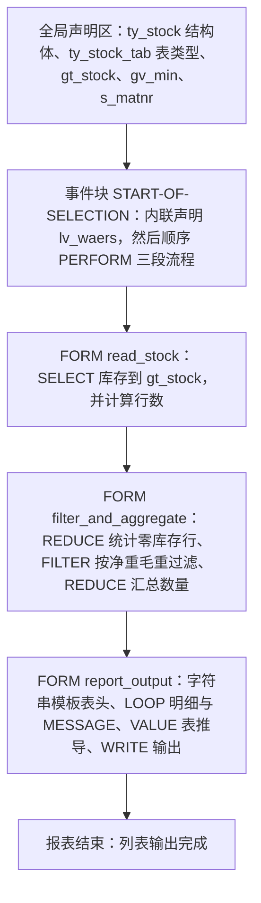
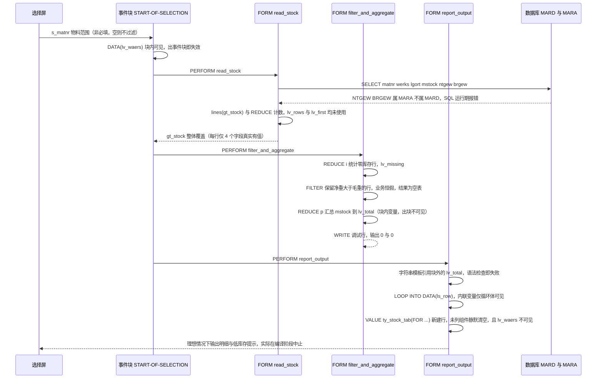

# zmodern_lo 源码分析报告：把 7.40 新语法当成"炫技演示"写出来的库存概览报表

> 本次校核的三个重点（内联声明作用域 / FILTER、REDUCE、VALUE `#` 语义 / `ntgew` 与 `brgew` 字段语义）在下文每个子程序里逐一给出结论。整体结论先摆在这里：**程序目前无法编译，也无法跑出数据**，原因全部集中在"新语法用在了作用域之外的变量"和"字段语义与业务语义对不上"这两类问题上，而语法本身几乎每处都是"合法但不正确"。

---

## 一、程序定位与业务背景

### 1.1 它想解决什么

想象一个离散制造企业的仓库主管：每天下班前想知道 A100 工厂里，哪些物料还有库存、每种多少、净重毛重分别是多少、币种怎么记、哪些物料已经低到需要补货。传统 ABAP 做法要声明 6~7 个全局内表、`FIELD-SYMBOL` 关联字段名、`MOVE-CORRESPONDING` 手工搬运字段、`SORT`+`READ TABLE` 统计，再 `WRITE` 拼输出，二百行起步，而且字段一旦改名就是一次大范围改动。

`zmodern_lo` 想用一套"单内表 + 声明式管道"的做法把这件事压到 97 行：

```
选择屏物料范围  ->  一张内表装到底  ->  过滤/汇总  ->  字符串模板 + 表推导输出
```

### 1.2 整体设计范式定性

**这是一份"语法演示型"报表：以展示 ABAP 7.40 新语法为目标，而不是以交付一个可靠的库存报表为目标。**

它把新特性当主角：内联声明 `DATA(x)`、`lines( )` 表表达式、`FILTER`、`REDUCE`、`VALUE ty_stock_tab( FOR ... )` 表推导、字符串模板格式选项，每样都用了一遍，而且很多地方是在**已经有更简单写法的情况下特意绕远路**（例如用 `REDUCE` 手写行数计数器，而上一行就是 `lines( )`）。这类代码在培训课件里很漂亮，在生产系统里是事故源——因为新语法只缩短了字符数，没有缩短**语义距离**。

### 1.3 新语法校核速览

| 语法点 | 所在位置 | 结论 |
|---|---|---|
| `DATA(x)` 作用域 | `START-OF-SELECTION` / `LOOP ... INTO DATA(x)` | ❌ 事件块里的局部变量被 FORM 引用 → 编译失败；✅ `LOOP` 内联作用域正确 |
| `FILTER` | `FORM filter_and_aggregate` | ⚠️ 语法正确，但 WHERE 条件业务恒假，结果恒为空 |
| `REDUCE i(...)` | `FORM read_stock` / `FORM filter_and_aggregate` | ✅ 语义正确 / ⚠️ 计数逻辑冗余、变量名与语义不符 |
| `REDUCE p(...)` | `FORM filter_and_aggregate` | ⚠️ 结果类型精度不匹配，累加有截断与溢出风险 |
| `REDUCE i(...)`（跨 FORM 用结果） | `FORM filter_and_aggregate` → `FORM report_output` | ❌ `lv_total` 是块内局部变量，跨 FORM 不可见 → 编译失败 |
| `VALUE ty_stock_tab( FOR ... )` | `FORM report_output` | ⚠️ 语义正确但是**新行构造器**，不是复制器；未列出的组件静默清空 |
| 字符串模板 `\|{ x W = 12 }\|` | `FORM report_output` | ✅ 格式选项合法，但引用的变量未声明 |
| `mara-ntgew` / `mara-brgew` | 全局声明区 + `FORM read_stock` | ❌ 从 `mard` 查这两个字段 → 运行期 SQL 错误；且"净重大于毛重"物理上不可能 |
| `mard-mstock` 当库存总量 | 全局声明区 | ❌ 语义错配：受限库存 ≠ 可用库存 |
| `SELECT-OPTIONS ... FOR gt_stock-matnr` | 全局声明区 | ⚠️ F4 值列表绑到结果表，选屏时为空且会被 SELECT 覆盖 |

---

## 二、程序执行流程总览



| 子程序 | 调用者 | 职责 |
|---|---|---|
| 全局声明区 | 系统加载程序时自动执行 | 定义 `ty_stock` / `ty_stock_tab`、全局内表 `gt_stock`、全局变量 `gv_min`，声明选择屏 `s_matnr` |
| 事件块 `START-OF-SELECTION` | SAP 运行时，用户在选择屏点"执行" | 用内联声明造一个常量币种，然后按 `read_stock` → `filter_and_aggregate` → `report_output` 顺序驱动整个流程 |
| `FORM read_stock` | `START-OF-SELECTION` 第 1 个 `PERFORM` | 从 `MARD` 取工厂 A100 的物料库存装载进 `gt_stock`，再用 `lines( )` 与 `REDUCE` 各算一次行数 |
| `FORM filter_and_aggregate` | `START-OF-SELECTION` 第 2 个 `PERFORM` | 用 `REDUCE i` 数零库存行，用 `FILTER` 按净重/毛重过滤 `gt_stock`，用 `REDUCE p` 汇总数量，并 `WRITE` 一行调试输出 |
| `FORM report_output` | `START-OF-SELECTION` 第 3 个 `PERFORM` | 拼字符串表头、逐行 `WRITE` 明细并对疑似低库存行发成功消息、再用 `VALUE ... ( FOR ... )` 推导一张新内表并整体 `WRITE` |

下面按这条流程，逐个子程序展开。

---

## 三、分组分析（按程序流程 / 子程序）

### 3.1 子程序类型 `全局声明区`

全局声明区承担三件事：定义报表的数据契约、建全局状态、挂选择屏。三件事互相咬合，后面所有问题都从这里的字段语义选择开始向下传播。拆成三步看。

#### ① 定义数据契约 `ty_stock`

```abap
TYPES: BEGIN OF ty_stock,
         matnr TYPE mara-matnr,
         maktx TYPE makt-maktx,
         werks TYPE mard-werks,
         lgort TYPE mard-lgort,
         mstock TYPE mard-mstock,
         ntgew TYPE mara-ntgew,
         brgew TYPE mara-brgew,
         waers TYPE mara-waers,
       END OF ty_stock.
```

**做什么** — 定义一个匿名结构 `ty_stock`，八个字段分别来自四张 DDIC 表：物料号与描述来自 `MARA`/`MAKT`，工厂、库位、库存数量来自 `MARD`，净重、毛重、基本单位币种来自 `MARA`。

**为什么** — 结构体是报表的"单一数据契约"：`SELECT` 的投影列、内表类型、后续 `FILTER`/`REDUCE`/`VALUE` 的组件引用、输出模板都复用同一组字段名。7.40 报表推荐这个做法，字段改名时只需改一处，代价是每个字段的来源表必须真的对得上。

**风险与改进** — 这一步有**三处字段语义错配**，是全篇多数 bug 的根因：

1. `mstock TYPE mard-mstock` 取的是 `MARD-MSTOCK`「受限库存数量」（受限、批次、供货商库存那一类），而报表口径是"总可用库存"。真正对应可用量的是 `mard-mbstock`「非限制库存」。用 `MSTOCK` 做库存概览，选数字段本身就选错了。
2. `ntgew` / `brgew` 声明自 `MARA`，说明作者知道重量在物料主数据里——但后面查询却打在 `MARD`，声明与取数来源不一致。
3. `waers TYPE mara-waers` 声明自 `MARA`，可是全程序没有从 `MARA` 取过 `waers`，最后只能在 `report_output` 里硬编码一个 `'USD'` 塞进去。字段的"来源承诺"是假的。

建议：把结构体按真实取数结果重排——库存字段统一用 `mard-mbstock`，重量与币种要么 JOIN `MARA` 一起取，要么明确标注这些字段由调用方填充。

#### ② 建表类型与全局状态

```abap
TYPES ty_stock_tab TYPE STANDARD TABLE OF ty_stock WITH EMPTY KEY.

DATA gt_stock   TYPE ty_stock_tab.
DATA gv_min     TYPE p DECIMALS 2.
```

**做什么** — 定义 `ty_stock_tab` 为标准表、非唯一键（`WITH EMPTY KEY`）；声明全局内表 `gt_stock` 作为唯一的数据载体，以及全局变量 `gv_min` 作为最小库存阈值。

**为什么** — "全程只维护一张内表"是这类报表最舒服的形态：没有中间表、没有手工字段搬运，`SELECT` 直接 `INTO TABLE` 落进最终结构。`WITH EMPTY KEY` 允许同一物料在多个库位出现多行——对库位级库存明细是正确的选择，前提是下游永远只顺序遍历。

**风险与改进** — `gv_min` **从头到尾没有被赋值**，恒为 0，而 `report_output` 的判断逻辑却拿它当"最小库存"用；这是一个看起来像配置项、实际是死值的东西，比没有还危险。类型上它还是 `p DECIMALS 2`，而 `mstock` 是三位小数的 `QUAN`，比较时靠 ABAP 自动对齐小数位才碰巧没出事，语义上应直接用 `mard-mstock` 域类型。另外 `WITH EMPTY KEY` 一旦将来有人写 `READ TABLE ... WITH KEY`，会得到"表有非唯一键"的运行时错误，建议在注释里写明"本表可能有重复行"。

#### ③ 挂选择屏

```abap
SELECT-OPTIONS s_matnr FOR gt_stock-matnr.
```

**做什么** — 声明物料号多选（`IN` 语义），供 `read_stock` 的 `WHERE matnr IN @s_matnr` 使用。

**为什么** — 报表最自然的入口就是物料范围，比让人手输多选文本框强得多。

**风险与改进** — `FOR gt_stock-matnr` 把 F4 值列表的来源绑到了**结果内表的组件**上，这等于"用输出当输入字典"，有两处硬伤：选择屏显示/校验发生在 `START-OF-SELECTION` 之前，那时 `gt_stock` 还是空的，F4 候选集必然为空；随后 `read_stock` 的 `SELECT ... INTO TABLE @gt_stock` 又会覆盖这张表，让这个绑定彻底失去意义。标准写法是先 `DATA matnr TYPE mara-matnr.`，再 `SELECT-OPTIONS s_matnr FOR matnr.`，F4 自动落到 `MARA` 的物料搜索帮助。顺带一提：这个多选**非必填**，空范围等于"不过滤"，必须配合 `OBLIGATORY` 或取数前的空值判断。

至此，全局声明区给出的信号是："这份程序把新语法的演示成本，摊在了对业务表字段的理解不足上"。接下来看事件块。

### 3.2 子程序类型 事件块 `START-OF-SELECTION`

这是整份程序的调度中枢，只做两件事：造一个常量币种、按序 `PERFORM` 三段流程。而"造常量"这个动作本身，就是本次校核要回答的第一个问题的现场。

#### ① 内联声明常量币种

```abap
START-OF-SELECTION.

  DATA(lv_waers) = 'USD'.
```

**做什么** — 在事件块里用内联声明生成一个类型自动推导的字符串变量，字面量 `'USD'`，值 `'USD'`，看起来是为最后拼装结果表时填 `waers` 字段准备的。

**为什么** — 单个常量不值得占一行全局声明，`DATA(x)` 局部化是 7.40 的正确直觉，写法本身挑不出毛病。

**风险与改进** — 🔴 **这是全篇最关键的坑。** 内联声明变量的作用域是它所在的**块**，这里就是 `START-OF-SELECTION` 事件块。`PERFORM` 调用的 `FORM` 有自己的作用域链，**看不到调用方的局部变量**。所以 `report_output` 里的 `waers = lv_waers` 引用的是一个未声明对象 `LV_WAERS`，ABAP 会直接报语法错误（未声明的标识符），整份程序**编译不过**，根本走不到运行期。

必须记住的三条作用域规则：

- `DATA(x)` 有效范围 = 所在块（事件块 / `FORM` 块 / `LOOP` 块）内的后半段，从声明行到块结束。
- 被 `PERFORM` 调用的 `FORM` 看不到调用者的局部变量；反向也看不到。所以跨子程序传值要么走全局 `DATA`，要么用 `FORM ... USING/PARAMETERS/TABLES`。
- 真要"先声明后复用"，就要提升为全局：`DATA gv_waers TYPE mara-waers.`，然后在事件块里 `gv_waers = 'USD'.`；顺带把币种做成选择屏参数更好，别写死美元。

另外，硬编码 `'USD'` 与结构体里 `waers TYPE mara-waers`（基本计量单位的币种）是两回事：前者是作者拍脑袋的展示值，后者是主数据里该物料真实记账的币种。真要输出币种，应该从 `MARA` 取；如果只是输出习惯，至少应该读 `sy-curr` 之类运行时上下文。

#### ② 顺序驱动三段流程

```abap
  PERFORM read_stock.
  PERFORM filter_and_aggregate.
  PERFORM report_output.
```

**做什么** — 直线式调用三段 `FORM`，顺序即数据流：取数 → 过滤汇总 → 输出。

**为什么** — 报表程序保持"一条直线"是好习惯，比层层嵌套调用栈好读；三个 `PERFORM` 的名字也已经把意图说清楚了。

**风险与改进** — 缺一个"空结果早退"钩子。`gt_stock` 为空时三个 `FORM` 照样跑完，输出会是"0 行、总量 0"这种看起来像"确实没有库存"的结果，而真实原因可能是 SQL 报错被吞、或是过滤条件把数据全干掉了。建议在 `read_stock` 取数后立刻判断：

```abap
  IF gt_stock IS INITIAL.
    MESSAGE 'No stock data found.' TYPE 'S'.
    RETURN.
  ENDIF.
```

注意 `RETURN` 在事件块里是终止整个 `START-OF-SELECTION`，在 `FORM` 里只退出当前 `FORM`——别混用。另一个可读性建议：`lv_waers` 这种跨段共享的值，应该在事件块里显式传给需要的 `FORM`，而不是让下游"以为"它能看见。

调度本身没问题，但跨段共享值的方式错了。下面进入第一段 `FORM`，看取数。

### 3.3 子程序类型 `FORM read_stock`

这个 `FORM` 干两件事：把库存取进 `gt_stock`，再算行数。第一件事里藏着两个致命字段语义错误，第二件事是纯粹的语法练习。

#### ① SELECT 装载库存

```abap
FORM read_stock.

  SELECT matnr werks lgort mstock ntgew brgew
    FROM mard
    INTO TABLE @gt_stock
    WHERE matnr IN @s_matnr
      AND werks  = 'A100'.

```

**做什么** — 从 `MARD` 投影取 6 列（物料号、工厂、库位、库存数量、净重、毛重），按物料多选范围 + 固定工厂 `'A100'` 过滤，`INTO TABLE` 整体覆盖写入全局内表 `gt_stock`。

**为什么** — `INTO TABLE` 直接落在最终结构上，省掉中间表和 `MOVE-CORRESPONDING`，这是 7.40 报表最值得学的一点；`matnr IN @s_matnr` 把选择屏的区间/多值语义直接下推到数据库，比手工拼 `RANGE` 好维护。

**风险与改进** — 🔴 **`ntgew` 和 `brgew` 不是 `MARD` 的字段**，它们是 `MARA`（物料主数据）的净重/毛重；`MARD` 只有 `MATNR`、`WERKS`、`LGORT`、`MSTOCK`/`MBSTOCK` 这类库存字段。ABAP SQL 的字段存在性是运行期检查的，所以程序能过语法检查，跑到这一句就抛 SQL 错误（字段不存在）并 dump。**这意味着后面 `FILTER` 里的 `ntgew`/`brgew` 逻辑这段代码从未被执行过，也从未被验证过。**

其他问题：

- `mstock` 取的是 `mard-mstock`（受限库存数量），不是可用库存 `mard-mbstock`——业务口径错误，比编译错误更隐蔽，因为它能跑。
- `matnr IN @s_matnr` 非必填，空范围等于全量；`werks = 'A100'` 是纯字面量，没有任何参数化。`MARD` 的可用索引以 `MATNR` 开头，这里退化成对全库 `MARD` 的准全表扫描，行数轻松几十万。
- `INTO TABLE` 是**覆盖式**写入：目标表原有内容先被清空。这跟 3.1 ③ 把 F4 绑在 `gt_stock-matnr` 上的设计直接冲突。
- 缺少库存相关授权校验（如工厂/库位对象），固定工厂 A100 意味着任何能执行该报表的人都看得到 A100 全量库存。

修法二选一：一次 JOIN 拿到重量与币种，或者先读 `MARD` 再 `FOR ALL ENTRIES` 补 `MARA`：

```abap
  SELECT mard~matnr mard~werks mard~lgort mard~mbstock AS mstock
         mara~ntgew  mara~brgew  mara~waers
    FROM mard
    INNER JOIN mara ON mara~matnr = mard~matnr
    INTO TABLE @gt_stock
    WHERE mard~matnr IN @s_matnr
      AND mard~werks = @gv_werks.
```

#### ② 计算行数（`lines` 与 `REDUCE` 双写）

```abap
  DATA(lv_rows) = lines( gt_stock ).
  DATA(lv_first) = CONV i( REDUCE i( INIT m = 0
                                     FOR row IN gt_stock
                                     NEXT m = m + 1 ) ).

ENDFORM.                       "read_stock
```

**做什么** — 声明局部变量 `lv_rows` 取内表行数；再声明 `lv_first`，用 `REDUCE` 以累加器 `m` 遍历 `gt_stock`，每次加 1，最终值等于行数。

**为什么** — `lines( )` 是表表达式里标准的行数取值写法，O(1)、零分配，语义直白。`REDUCE` 的通用骨架也写对了：`INIT` 必须显式给初值（这是 `REDUCE` 最常见的运行时坑，这里没踩），`FOR` 声明迭代对象与迭代变量，`NEXT` 定义累加步骤，类型规约 `i` 指定结果类型——这段确实是标准写法。

**风险与改进** — 三个问题叠在一起：① **两个变量后面一次都没用**。`lv_rows` 本该是 3.2 ② 里说的空表早退抓手，`lv_first` 则是纯死代码。② **逻辑重复**：`CONV i( REDUCE i( ... ) )` 算出来的东西和上一行的 `lines( gt_stock )` 完全一样，只是把 O(1) 的表表达式换成了 O(n) 的全表遍历；外层 `CONV i( )` 对一个已经是 `i` 的结果也没有任何作用，属于"为了展示新语法而用"。③ `INIT m = 0` 里累加器叫 `m`（像个金额/数量缩写），语义完全对不上；`FOR row IN gt_stock` 里的 `row` 也一次都没被引用，ATL/代码质量检查会告警。要么删掉这段，要么让它真正干点事（比如只统计零库存行）。

`read_stock` 结束：一个字段取错导致运行期就崩，取数口径也选错了库存字段，而"检查结果"的部分又完全没接上。下面看第二段。

### 3.4 子程序类型 `FORM filter_and_aggregate`

这个 `FORM` 是新语法密度最高的一段，四步：数零库存行、`FILTER` 过滤、`REDUCE` 汇总、`WRITE` 调试。其中 `FILTER` 那一行是用户重点问的字段语义问题的核心。

#### ① 用 `REDUCE` 数零库存行

```abap
FORM filter_and_aggregate.

  DATA(lv_missing) = REDUCE i( INIT sum = 0
                               FOR row IN gt_stock
                               NEXT sum = sum + COND i(
                                 WHEN row-mstock IS INITIAL THEN 1 ELSE 0 ) ).

```

**做什么** — 用 `REDUCE i` 遍历 `gt_stock`，把"本行库存数量为零"这件事映射成 1/0，再累加进 `sum`，结果是零库存行的条数。

**为什么** — `REDUCE` 相比"先 `FILTER` 出零库存行再 `lines( )`"的好处是**单趟遍历、常数内存**；`IS INITIAL` 判断数值字段零值，比 `= 0` 更能表达"未维护/初始状态"的业务含义，这在库存语义里是有区分度的。累加器放在 `INIT` 而不是用 `sum = 0` 的隐式初值，也符合 `REDUCE` 的强制要求。

**风险与改进** — 三个可打磨点：① 变量名 `lv_missing` 与它算的东西对不上——它数的是零库存行，不是"缺失"（缺描述？缺主数据？）。在一个库存报表里，"缺货"和"没维护库存"是两回事，建议改名 `lv_zero_stock`。② `COND i( WHEN ... THEN 1 ELSE 0 )` 在 `REDUCE` 里只能取一个值，无法同时统计多个口径；如果要同时数"零库存行"和"负库存行"，更适合用 `CORRESPONDING` + `FILTER` 链式筛选（`FILTER( ... WHERE ... ) FILTER( WHERE ... )`）后再 `lines( )`。③ 零库存计数是**全量**口径，紧接着 `FILTER` 又把数据裁掉，两者不在同一口径上，容易在读报表时误以为表头数字对应过滤后的数据——建议在变量名或注释里写明"过滤前口径"。

#### ② 用 `FILTER` 按净重毛重过滤（业务恒假条件）

```abap
  gt_stock = FILTER ty_stock_tab( gt_stock
                                  WHERE ntgew > brgew ).
```

**做什么** — `FILTER` 操作符以 `gt_stock` 为源表，把满足 `ntgew`（净重）大于 `brgew`（毛重）的行收集成一张新的 `ty_stock_tab`，并赋值回 `gt_stock`——覆盖掉原表。

**为什么** — `FILTER` 是 7.40 表表达式的三件套之一，语义是"从一张表出发，按组件条件筛出子集"，结果是**一张新表**，源表不变。相比 `LOOP` + `APPEND` + `DELETE`，它把意图写在一行里、可读性极高。写法上 `FILTER ty_stock_tab( ... WHERE ... )` 也完全正确：必须给结果类型、必须给源表、WHERE 里的裸组件名（`ntgew`、`brgew`）会被解析为源表结构 `ty_stock` 的组件——这几条规则都用对了。

**风险与改进** — 🔴 **业务条件物理上恒为假。** 净重（`NTGEW`）是物料本体重量，毛重（`BRGEW`）是本体 + 包装/毛皮重，业务不变式恒为 `净重 ≤ 毛重`。`ntgew > brgew` 只可能在主数据录错、单位换算错误或称重差异等异常数据下出现，正常数据一条都匹配不到。后果是：**即使把 ① 里那个 SQL 字段错误修掉，这一行也会把 `gt_stock` 过滤成空表**，`lv_total` 恒为 0，`report_output` 的 `LOOP` 一次都不进，最终输出就是"Stock overview 0 rows total qty 0"。用户看到的是"没有库存"，真实原因是过滤器把全部数据干掉了。

作者想做的其实是**数据质量校验**（筛出净重毛重倒挂的脏主数据），那种需求应该：① 反过来用 `FILTER( gt_stock WHERE brgew > 0 AND ntgew > brgew )` 单独筛一份"待核查清单"；② 正常报表口径改用真正有业务含义的条件，例如 `WHERE ( mstock <> 0 )` 或按最小库存阈值 `mstock < gv_min`。

另外两个次要点：结果写回源变量 `gt_stock`（源表既是输入又是输出）虽然不报错——源表在求值后才被整体替换，语义安全——但阅读时极易误以为 `FILTER` 是"原地过滤"，建议改成 `DATA(lt_filtered) = FILTER ...` 或直接把结果赋给一个新的局部内表，让"过滤产生了新数据"这件事显式化。

#### ③ 用 `REDUCE p` 汇总数量

```abap
  DATA(lv_total) = REDUCE p( INIT sum = 0
                             FOR row IN gt_stock
                             NEXT sum = sum + row-mstock ).

```

**做什么** — 用 `REDUCE` 把 `gt_stock` 的 `mstock` 逐行累加，结果是全表库存总量，放在局部变量 `lv_total`。

**为什么** — 单趟累加、常数内存，是标准解法；`INIT sum = 0` 保证空表时不报未初始化，`ROW` 迭代变量在这里真正被引用了，语义清晰。

**风险与改进** — ⚠️ **结果类型选错了。** `REDUCE p(` 只给了内置类型 `p`，没给长度和 `DECIMALS`，按默认规则解析为**0 位小数**的 packed 字段。而累加项 `row-mstock` 是 `MARD-MSTOCK`，一个 `QUAN` 字段（小数 3 位、长度 13 位）。把 3 位小数的值累进 0 位小数的累加器，意味着每一步都要做隐式换算与舍入，行数一多就会出现精度丢失；更糟的是 0 位小数 packed 的最大量级远小于 `QUAN` 的上限，总量上十万行级就会溢出（`P 的字段溢出` 引发运行时错误）。`REDUCE` 的类型规约应该直接用 DDIC 类型：

```abap
  DATA(lv_total) = REDUCE mard-mstock( INIT sum = CONV mard-mstock( 0 )
                                       FOR row IN gt_stock
                                       NEXT sum = sum + row-mstock ).
```

这样长度、小数位、符号位全部跟随领域类型，也顺带暴露"总量是否该用 3 位小数"这个业务问题。

#### ④ 调试输出

```abap
  WRITE: / lv_missing, lv_total.

ENDFORM.                       "filter_and_aggregate
```

**做什么** — 把零库存行数和库存总量写到列表上，中间没有换行控制，两个数会在同一行并排输出。

**为什么** — 作为调试手段，`WRITE` 是最轻的查看方式，不用弹窗、不依赖 ALV。

**风险与改进** — 这是**遗留的调试语句**，遗留在"过滤 + 汇总"的业务逻辑里，属于典型的"调试完忘了删"。它带来三个实际问题：① 生产用户会在明细表头看到一行莫名其妙的 `0  0`；② `lv_missing` 全程序再无其他用途，说明这个统计本身可能就是调试产物；③ 这行输出夹在"过滤前"和"输出"之间，进一步混淆了数据口径。正确做法是把调试信息降级到 `MESSAGE` 或仅在测试环境保留，正式输出统一在 `report_output` 里完成。

至此，第二段把新语法用得最漂亮，但结论也最危险：`FILTER` 条件业务恒假、`REDUCE` 结果类型精度错配、跨 `FORM` 传值用不了。最后一段会把这些矛盾全部引爆。

### 3.5 子程序类型 `FORM report_output`

这个 `FORM` 五步：拼表头、逐行 `WRITE`、`IF` 判断 + `MESSAGE`、用 `VALUE ... ( FOR ... )` 推导新表、整体 `WRITE` 新表。它同时踩了三个坑：**两个未声明变量、一个语义反了的库存判断、以及一个被误解的 `VALUE #` 构造语义**。

#### ① 字符串模板拼表头

```abap
FORM report_output.

  DATA(lv_header) = |Stock overview { lines( gt_stock ) } rows|
                    && | total qty { lv_total  W = 12 }|.

  WRITE: / lv_header.

```

**做什么** — 用两个相邻的字符串模板拼出表头：第一段用 `lines( gt_stock )` 嵌进行数，第二段用 `lv_total` 嵌进库存总量并套用 `W = 12` 的输出宽度格式选项，两段用 `&&` 连接，最后整行 `WRITE`。

**为什么** — 字符串模板（`|`）取代 `CONCATENATE` + `WRITE` 手工对齐是 7.40 的标准升级点：内嵌表达式直接写 `lines( gt_stock )`，格式选项 `W = 12` 复用 `WRITE` 的输出语义，不必自己 `RIGHT-pad`。相邻模板之间用 `&&` 显式连接（相邻模板直接相连也合法，这里用 `&&` 更清楚）。

**风险与改进** — 🔴 **编译不过**：`lv_total` 是 `filter_and_aggregate` 里的块内局部变量，在本 `FORM` 的作用域里根本不存在。语法检查阶段就会报未声明标识符。

顺带两点：① `W = 12` 对 `p` 类型合法（数值型支持 `W`），但这里再次暴露 `lv_total` 的类型问题——如果是 `p` 默认 0 位小数，模板里的小数位就已经被吃掉了；② 表头里的行数取自 `gt_stock`（过滤后），而总量来自 `lv_total`（也是过滤后），口径一致这点没大问题，但一旦有人改成"过滤前的数量 + 过滤后的总量"，就会立刻产生无法解释的数字差异，建议在变量名上体现口径。

#### ② 循环打印明细（内联工作区）

```abap
  LOOP AT gt_stock INTO DATA(ls_row).

    WRITE: / |{ ls_row-matnr ALPHA = OUT } qty { ls_row-mstock W = 10 }|.
```

**做什么** — 遍历 `gt_stock`，用内联声明 `DATA(ls_row)` 声明循环工作区，逐行输出物料号（`ALPHA = OUT` 去掉前导零）和库存数量（宽度 10）。

**为什么** — 这是**本程序里唯一一处作用域完全正确的内联声明**：`LOOP ... INTO DATA(x)` 的变量只在循环体内有效，每轮迭代自动重新初始化，不需要声明全局工作区、不需要在循环结束后手工 `CLEAR`。7.40 的 `LOOP ... INTO DATA(...)`、表推导里的 `FOR` 迭代变量都遵循同一套块作用域规则。

**风险与改进** — 无明显功能风险，两点规范建议：① `ls_row` 只在循环体内可见，这正是它该有的作用域；但要注意，若以后在循环外需要"最后一行"，就得显式另存变量，别指望内联变量跨块存活。② 输出用裸 `WRITE` 而非 ALV，行数一多既慢又不能排序/汇总；`ALPHA = OUT` 对 40 位 `CHAR` 的物料号是对的（去掉前导零），如果某天改成 `MATNR` 数值型含义就要重新确认格式选项。

#### ③ 低库存判断与消息提示

```abap
    IF ls_row-mstock > 0 AND ls_row-mstock <> gv_min.
      MESSAGE |Material { ls_row-matnr } below minimum| TYPE 'S'.
    ENDIF.

  ENDLOOP.
```

**做什么** — 在每行明细之后，判断"库存大于 0 且不等于 `gv_min`"，满足就发一条成功消息，提示该物料低于最小库存。

**为什么** — 用 `MESSAGE` 而不是弹窗，是报表里提示"零星异常"的常见做法；把提示文案也用字符串模板拼出来，与输出风格统一。

**风险与改进** — 🔴 **逻辑与文案语义相反。** 文案说"低于最小库存"，条件却是"大于 0"——真要判"低于最小库存"，应该是 `ls_row-mstock > 0 AND ls_row-mstock < gv_min`。而 `gv_min` 恒为 0（3.1 ② 已说明从未赋值），于是整个条件退化成"库存非零"，等于**给每一条正常库存记录都发一条"低于最小库存"的消息**。三重问题叠加：条件写反、阈值是死值、消息文案与条件不匹配。

还有两个次要问题：① 在 `LOOP` 内逐行 `MESSAGE`，每条消息会互相覆盖，物料多了就变成"刷屏"且看不出是哪一行；应该收集到内表，循环结束后一次性提示条数并可展开明细。② 结合 3.4 ② 的恒假过滤条件，`gt_stock` 是空的，这个 `IF` 一次都不会执行——**这解释了为什么这段代码的逻辑错误至今没被发现**：它在真实运行路径下是死代码。

#### ④ 用 `VALUE ty_stock_tab( FOR ... )` 推导结果表

```abap
  DATA(lt_good) = VALUE ty_stock_tab(
    FOR row IN gt_stock
    WHERE ( mstock > 0 )
    ( matnr  = row-matnr
      maktx  = row-maktx
      mstock = row-mstock
      waers  = lv_waers ) ).
```

**做什么** — 用 `VALUE` 的表推导（生成器）形式：遍历 `gt_stock`，在 `WHERE` 里只保留库存大于 0 的行，每一行**新构造**一个 `ty_stock` 结构，显式填 4 个组件（物料号、描述、库存数量、币种），未列出的 4 个组件保持初始值。

**为什么** — 这是 7.40 "把内表当值"最优雅的用法：不用 `APPEND` + `MOVE-CORRESPONDING`，一行把"筛选 + 字段投影 + 常量填充"三件事做完。`WHERE ( mstock > 0 )` 用圆括号包住条件是文档推荐写法，在条件复杂时更清晰。**符号名要分清**：`VALUE ty_stock_tab( FOR ... )`（或省略类型的 `VALUE #( FOR ... )`）里的 `FOR` 是**表推导/生成器**；而 `VALUE #( ( a b ) ( c d ) )` 这种是**内表构造器**。同一关键字两种语义，写之前先确认自己要的是哪一个。

**风险与改进** — 🔴 又是编译错误：`lv_waers` 是 `START-OF-SELECTION` 的块内变量，这里不可见（3.2 ① 已详述）。

⚠️ 语义陷阱两处：

1. **它不是在复制行，是在新建行。** `FOR` 每轮产出一个 `ty_stock` 的**初始值**，只有你在圆括号里点名的组件才会被赋值。所以 `werks`、`lgort`、`ntgew`、`brgew` 四个字段被静默清成空值——而 `werks`/`lgort` 明明刚从 `MARD` 取到了真实值。写这种推导时，必须把"未列出的组件会丢"当成默认假设逐个核对，别凭直觉以为"只写了想展示的几个字段"。
2. **币种来源与结构声明脱节。** `waers` 在结构里声明自 `mara-waers`，这里却被一个硬编码的 `'USD'` 覆盖，等于用展示值冒充主数据值。

改进方向：投影 + 常量填充改用 `CORRESPONDING` + `MAPPING`，把"哪些字段来自源、哪些是常量"写清楚，既不会漏字段也不会误填：

```abap
  DATA(lt_good) = VALUE ty_stock_tab(
    CORRESPONDING ty_stock( gt_stock WHERE ( mstock > 0 ) )
    ( waers = gv_waers ) ).
```

顺带提醒一个容易静默出错的规则：`FOR ... IN itab WHERE` 里的裸组件名会先按**源行**解析，源行没有同名组件时才落到**目标结构**。这里 `mstock` 在源行和目标结构里同名，按源行 `row-mstock` 解析，判定的是取数原值——正是想要的；但只要哪天你把目标组件改名成 `qty`，同一个表达式就会立刻变成对目标结构的引用，语义**无声改变**，不报任何错。

#### ⑤ 整体输出内表

```abap
  WRITE: / lt_good.

ENDFORM.                       "report_output
```

**做什么** — 把推导出来的整张内表 `lt_good` 直接 `WRITE` 到列表上。

**为什么** — 想让用户在明细之后看到"合格库存"的汇总视图。

**风险与改进** — 这行几乎没有收益：`lt_good` 除了这一处没有第二个消费者，等于"为了用 `VALUE #` 而构造一张表，再把它 dump 出来"。三个问题：① `WRITE` 内表是调试式输出，行数多时会刷屏，且不具备排序、筛选、合计能力；② 用完整内表 `WRITE` 会连带输出所有组件，包括那些被静默清空的字段，容易误导阅读者以为它们真的有值；③ 与 3.4 ④ 同样的问题——真正的报表应该用 ALV（`REUSE_ALV_GRID_DISPLAY`）承接这张推导表，做合计行、列排序、导出 Excel。合理路线是：`VALUE #` 负责"筛选 + 投影"，ALV 负责"呈现"，而不是 `WRITE` 负责一切。

---

## 四、执行流程全景图（数据视角）



---

## 五、问题清单与改进建议（按优先级）

### 🔴 P0 业务正确性（阻断上线）

1. **`lv_waers` 跨子程序引用，程序编译失败**（`FORM report_output`）— 事件块里的内联声明变量对 `PERFORM` 调用的 `FORM` 不可见，`waers = lv_waers` 引用未声明对象。改进：提升为全局 `DATA gv_waers TYPE mara-waers.`，或改用 `FORM ... USING` 传参。
2. **`lv_total` 跨子程序引用，程序编译失败**（`FORM report_output`）— 同上，`lv_total` 是 `filter_and_aggregate` 的块内局部变量，字符串模板引用不到。改进：提升为全局，或在 `report_output` 内自行 `REDUCE` 一次（更内聚）。
3. **`ntgew` / `brgew` 从 `MARD` 查询，运行期 SQL 报错**（`FORM read_stock`）— 两字段属 `MARA`。改进：JOIN `MARA`，或读 `MARD` 后 `FOR ALL ENTRIES` 补 `MARA`。
4. **`FILTER` 条件业务恒假，修复取数后仍会清空全表**（`FORM filter_and_aggregate`）— 净重不可能大于毛重，过滤结果恒为空集，后续总量恒为 0、明细恒不输出。改进：校验需求改用反向条件筛脏数据，报表口径改用 `mstock` 相关条件。
5. **低库存判断语义与文案相反**（`FORM report_output`）— 条件是"库存大于 0 且不等于阈值"，文案却写"低于最小库存"，且 `gv_min` 恒为 0，实际会给每条正常记录发提示。改进：条件改为 `ls_row-mstock > 0 AND ls_row-mstock < gv_min`，并给 `gv_min` 真实赋值（建议做成选择屏参数）。

### 🟠 P1 健壮性

6. **库存口径字段选错**（全局声明区 / `FORM read_stock`）— `mard-mstock` 是受限库存数量，可用库存应为 `mard-mbstock`；这类错误能跑通但业务结论全错，最难发现。
7. **非必填选择屏 + 无空结果早退**（`FORM read_stock` / `FORM filter_and_aggregate`）— 空范围导致准全表扫描；无 `IF gt_stock IS INITIAL` 判断，空结果一路跑完还输出"0 行"，误导排查方向。
8. **F4 值列表绑到结果内表**（全局声明区）— `SELECT-OPTIONS ... FOR gt_stock-matnr` 在选屏阶段该表为空，且会被 `SELECT INTO TABLE` 覆盖。改进：`DATA matnr TYPE mara-matnr.` + `SELECT-OPTIONS s_matnr FOR matnr.`
9. **遗留调试语句**（`FORM filter_and_aggregate`）— `WRITE: / lv_missing, lv_total` 遗留在业务逻辑中，并混淆"过滤前/过滤后"口径。
10. **循环内逐条 `MESSAGE`**（`FORM report_output`）— 应收集异常行，循环结束后统一提示条数。
11. **整体 `WRITE` 内表**（`FORM report_output`）— 无排序无合计且可能刷屏，应由 ALV 承接 `lt_good`。
12. **无库存授权校验、工厂硬编码**（`FORM read_stock`）— `werks = 'A100'` 写死且无工厂/库位权限校验，任何可执行用户都能看全量库存。

### 🟡 P2 性能与规范

13. **`REDUCE` 结果类型精度错配**（`FORM filter_and_aggregate`）— `REDUCE p(` 未给 `DECIMALS`，累加 3 位小数的 `QUAN` 有舍入与溢出风险。改进：改用 `REDUCE mard-mstock( ... )`。
14. **行数统计重复实现**（`FORM read_stock`）— `CONV i( REDUCE i( ... ) )` 与上一行 `lines( )` 等价却是 O(n)；`lv_rows` 与 `lv_first` 均未使用，且 `row` 未被引用、`m` 命名与语义不符。
15. **变量命名与语义不符**（`FORM filter_and_aggregate`）— `lv_missing` 数的是零库存行而非"缺失"，建议改名并在注释中标注统计口径。
16. **表推导静默丢字段**（`FORM report_output`）— `VALUE ... ( FOR ... )` 只填 4 个组件，`werks` / `lgort` / `ntgew` / `brgew` 被清空。改进：改用 `CORRESPONDING ... ( )` 显式区分来源字段与常量字段。
17. **币种硬编码 `'USD'`**（事件块 `START-OF-SELECTION` / 全局声明区）— 与 `mara-waers` 声明语义脱节，应取自主数据或改用运行时币种上下文。
18. **阈值变量类型不匹配**（全局声明区）— `gv_min TYPE p DECIMALS 2` 与 3 位小数的 `mstock` 比较靠隐式对齐小数位，建议直接用 `mard-mstock` 域类型。
19. **`FILTER` 结果写回源变量**（`FORM filter_and_aggregate`）— `gt_stock = FILTER ty_stock_tab( gt_stock ... )` 语义安全但易被误读为原地过滤，建议赋值给独立内表。
20. **常量与参数硬编码**（`FORM read_stock`）— 工厂 `A100`、币种 `USD` 均应上移到选择屏或配置表。

### 🟢 P3 可扩展性

21. **`WITH EMPTY KEY` 的隐含约束未文档化**（全局声明区）— 本表允许重复行，后续若引入按键读取会遇非唯一键错误，建议在类型定义处注明。
22. **结构体字段来源与实际取数不一致**（全局声明区）— `maktx`（来自 `MAKT`）从未被查询填充，任何时候输出物料描述都是空串；结构体应与取数结果严格对齐。
23. **流程缺少可复用边界**（事件块 `START-OF-SELECTION` / `FORM read_stock`）— 三段 `FORM` 之间只能靠全局变量传递数据，扩展一个输出维度就要加一个全局变量；可考虑把过滤/汇总逻辑下沉为带 `USING`/`RETURNING` 的方法。

---

## 六、整体评价与启发

### 优点

- **结构体作为单一数据契约**是这个程序最值得学的一点：一张 `ty_stock` 贯通 `SELECT` 投影、内表类型、`FILTER`/`REDUCE` 的组件引用、输出模板，字段改名只需改一处，报表程序的"改名灾难"被绕开了。
- **`LOOP ... INTO DATA(ls_row)` 的作用域用法完全正确**，是内联声明的标准范式；`REDUCE` 的 `INIT` 初值、`FILTER` 的类型规约与源表写法也都规范，新语法本身用得不算野。
- **行数 97、单内表、单趟遍历**的思路方向正确：`FILTER`/`REDUCE`/`VALUE #` 都是常数内存的单趟操作，没有把全量数据反复拷贝到中间表，这个架构选择是对的。
- 注释 `ENDFORM. "read_stock` 这类标记在多人协作的报表里很实用。

### 短板

- **新语法替代了"可见性"，没有替代"作用域契约"**：`DATA(x)` 的作用域是块、不是文件，三处跨子程序引用（`lv_waers`、`lv_total`）直接让程序编译不过。写新语法的报表，必须先画作用域边界，再决定变量放全局还是局部。
- **字段语义校核完全缺席**：`mard-mstock` 当可用库存、从 `mard` 查 `ntgew`/`brgew`、`ntgew > brgew` 恒假、硬编码 `USD`、结构体有 `maktx` 却从不取——四处 DDIC 字段的业务含义都没有对过一遍。新语法让代码"读起来更专业"，但对编译器来说 `mard-mstock` 和 `mard-mbstock` 毫无区别。
- **没有一行防御性代码**：无空结果早退、无必填校验、无权限校验、无异常输出，且两处调试 `WRITE` 留在生产路径。
- **存在"演示驱动开发"的痕迹**：`REDUCE` 手写行数计数、`VALUE #` 推导的表只为了 `WRITE` dump、`lv_rows`/`lv_first` 死变量——这些不是需求，是语法点的占位符。

### 可学到的设计经验

1. **新语法只缩短字符，不缩短语义距离。** `lines( gt_stock )` 一行能写完的事，不要用 `REDUCE` 写五行——多出来的四行不是能力，是需要额外解释的负债。凡是"为了展示语法而存在的代码"，在生产库里都是删除候选。
2. **`DATA(x)` 用之前先问它要活多久。** 作用域 = 所在块。要跨 `FORM`/跨类方法就用全局变量或参数传递；只在本块内用就用内联声明。这条规则能一次性消灭本程序里的两处编译错误。
3. **DDIC 字段名是业务契约，不只是列名。** 净重不大于毛重、受限库存不等于可用库存、非限制库存才是可用量——`NTGEW`/`BRGEW`/`MSTOCK`/`MBSTOCK` 这些缩写记不住没关系，但必须去 `SE11` 看字段的中文标签和业务含义再写 `WHERE` 条件。**凡是写 `WHERE`，就一定去过一遍字段的语义**。
4. **`VALUE ... ( FOR ... )` 是行构造器，不是行复制器。** 用它做投影时，未点名的组件一律初始值；字段一多就改用 `CORRESPONDING ... ( )` 显式列出常量字段。同理，`FOR ... IN itab WHERE` 里的裸组件名会按源行优先解析，目标结构一旦改名语义会无声改变——**表推导的每一处投影都值得逐字段核对一遍**。
