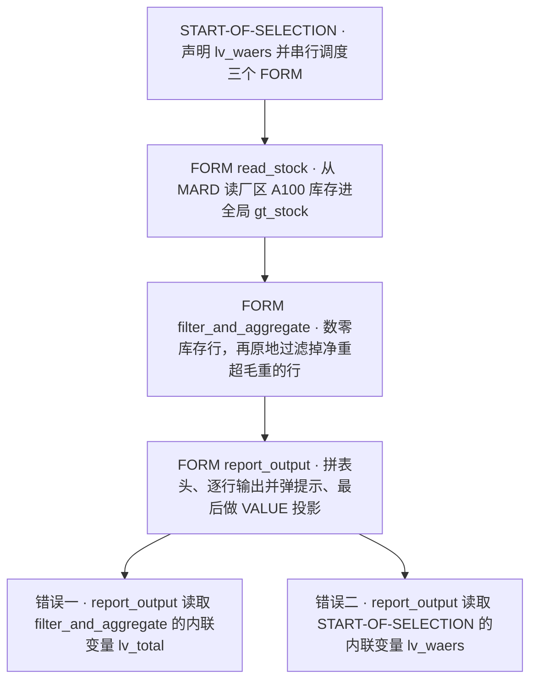
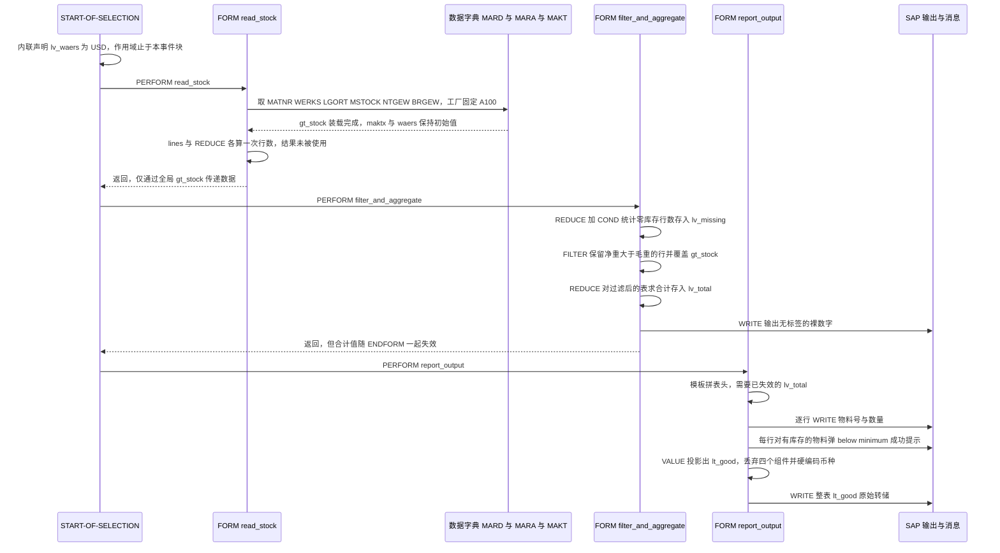

# ZMODERN_LO 库存总览报表 · 代码分析报告

> 分析对象：`evals/zmodern_lo.abap`（97 行，`REPORT` + 3 个 FORM 的经典 PERFORM 流水线）
> 分析重点（应提问者要求）：ABAP 7.4+ 新语法是否用对位置 —— 内联声明作用域、表表达式、`FILTER` / `REDUCE` / `VALUE #` 的语义

---

## 一、程序定位与业务背景

### 1.1 它想解决什么问题

设想一个 MM 部门的日常场景：库存分析师每天早上要回答三个问题——

1. 厂区 A100 里，哪些物料**净重数据可疑**（净重竟然超过毛重）？
2. 这些物料里，哪些是**零库存/呆滞**（`MSTOCK` 为初始值）？
3. 有库存的物料，总量是多少、描述是什么？

标准 MM 报表（如 MM60、MB09）都不做"数据质量反查"——它们假定 `MARD` 里的重量字段是可信的。而这里是**先把数据当嫌疑人，再逐条审**：这就是这个程序存在的理由。

### 1.2 现有方案为何不够

- 用传统 `LOOP` + `READ TABLE` + `MOVE-CORRESPONDING` 写同样的逻辑，需要约 180 行，且中间变量必须提前 `DATA` 声明，容易在多个 `LOOP` 之间串味。
- 用 ALV 做输出则要引入 `REUSE_ALV_GRID_DISPLAY` 全套参数声明，对一个"内部工具型"轻报表是负担。

### 1.3 整体设计范式（一句话定性）

> **"经典 4 步 PERFORM 流水线外壳 + 7.4 内联/表表达式/字符串模板内胆"的语法演示型报表** —— 骨架（`START-OF-SELECTION` → 取数 → 过滤聚合 → 输出）是教科书级的，新语法也基本是语法正确的；问题全部出在**新语法承载的语义**上：`DATA(x)` 跨 `FORM` 越界两处、`FILTER` 条件写反、字符串模板里的 `MESSAGE` 文案与判断相反。

一句话结论先行：**这份代码目前编译不过（2 处内联变量越界），修好编译之后还有 4 个会产出错误业务结论的缺陷。**

---

## 二、程序执行流程总览



### 责任链表

| 子程序 | 调用者 | 职责 |
|---|---|---|
| 全局声明区 | 编译器 | 定义 `ty_stock` 行结构、`ty_stock_tab` 内表类型、`gt_stock` 全局内表、`gv_min` 阈值、`s_matnr` 选择屏 |
| 事件块 `START-OF-SELECTION` | 运行框架（报表执行时自动触发） | 声明货币常量 `lv_waers`，按序 `PERFORM` 三个 FORM，不含任何业务逻辑 |
| FORM `read_stock` | `START-OF-SELECTION` | 把厂区 A100 的物料库存从 `MARD` 装进 `gt_stock`；顺带做两个没人用的行数统计 |
| FORM `filter_and_aggregate` | `START-OF-SELECTION` | 用 `REDUCE + COND` 数零库存行；用 `FILTER` 把"净重超毛重"的行**原地覆盖**回 `gt_stock`；用 `REDUCE` 求库存合计 `lv_total` |
| FORM `report_output` | `START-OF-SELECTION` | 拼表头字符串 → `LOOP` 逐行 `WRITE` 并对"超阈值"物料弹成功消息 → 用 `VALUE #( FOR ... )` 投影出 `lt_good` 并整体转储 |

下面按这条流程，逐个子程序展开。

---

## 三、分组分析（按程序流程 / 子程序）

### 3.1 子程序类型 全局声明区

先看数据结构，因为后面三个 `FORM` 全部围绕 `gt_stock` 转，理解它的"半空"状态是理解所有 bug 的前提。本节分两步：① 行结构与内表类型定义；② 全局变量与选择屏。

#### ① 行结构 `ty_stock` 与内表类型 `ty_stock_tab`

```abap
TYPES: BEGIN OF ty_stock,
         matnr TYPE mara-matnr,
         maktx TYPE makt-maktx,
         werks TYPE mard-werks,
         lgort TYPE mard-lgort,
         mstock TYPE mard-mstock,
         ntgew TYPE mara-ntgew,
         brgew TYPE mara-brgew,
         waers TYPE mara-waers,
       END OF ty_stock.

TYPES ty_stock_tab TYPE STANDARD TABLE OF ty_stock WITH EMPTY KEY.
```

**做什么** — 声明一个 8 字段的扁平行结构：物料号（`MARA-MATNR`）、描述（`MAKT-MAKTX`）、工厂（`MARD-WERKS`）、库位（`MARD-LGORT`）、库存数量（`MARD-MSTOCK`）、净重（`MARA-NTGEW`）、毛重（`MARA-BRGEW`）、币种（`MARA-WAERS`）；再声明一个以它为行类型的标准表，`WITH EMPTY KEY` 表示行键全空、无隐含去重语义。

**为什么** — 结构字段直接**跨库表取用 DDIC 引用**（`mard-mstock` 而非 `QUAN`），这比手写 `TYPE quan` 更好：一旦 DDIC 里字段类型变更，程序自动跟随，避免"长度匹配但语义错位"。`WITH EMPTY KEY` 对输出型内表是对的选择——`MARD` 的自然键是 `MATNR+WERKS+LGORT`，程序却按 `MATNR` 去重会丢行，显式空键把"不保证唯一"这件事写在类型里而不是靠隐式默认。

**风险与改进** — 结构声明了 `maktx`（来自 `MAKT`）和 `waers`（来自 `MARA`），但**取数只从 `MARD` 一张表**，`read_stock` 里没有任何 `JOIN MAKT`、也没有任何地方给 `waers` 赋真值。也就是说这两个字段从设计上就是**永远初始值**的空壳，而 `report_output` 的 `VALUE #( ... )` 还把它们当成有意义的字段映射进去。改进：要么在 `read_stock` 里补一次 `FOR ALL ENTRIES` 取 `MAKT`（`WHERE spras = sy-langu`）并从 `MARA` 带出 `waers`，要么**把这两个字段从结构里删掉**，让类型定义如实反映数据来源。

#### ② 全局变量、阈值与选择屏

```abap
DATA gt_stock   TYPE ty_stock_tab.
DATA gv_min     TYPE p DECIMALS 2.

SELECT-OPTIONS s_matnr FOR gt_stock-matnr.
```

**做什么** — 声明全局内表 `gt_stock` 作为唯一的"数据总线"，声明全局阈值 `gv_min`（packed，小数 2 位，初值 0），并把物料号选择屏 `s_matnr` 绑定到 `gt_stock-matnr`。

**为什么** — `FORM` 之间没有参数传递机制，经典做法就是靠**全局内表做共享内存**。选择屏用 `FOR gt_stock-matnr` 而不是 `FOR mara-matnr`，让"从哪张表取数"和"从哪个字段取数"在声明处就绑定，减少一处需要同步修改的地方——这是老报表里少见的细致写法。

**风险与改进** — 三处需要改：

1. `gv_min` 类型是 `p DECIMALS 2`，而 `mstock` 是 `QUAN`（带 **3 位**小数）。二者比较时发生隐式 `QUAN → P` 转换，第 3 位小数被舍掉，**阈值边界判断不可靠**。应改为 `gv_min TYPE mard-mstock`。
2. `gv_min` 从头到尾**没有任何赋值**，恒为 0。这直接导致 `report_output` 里 `mstock > 0 AND mstock <> gv_min` 的第二个条件成为恒真（详见 3.5 步骤 ③）。`gv_min` 应通过 `PARAMETERS` 或 `IMPORTING` 参数注入。
3. 只有物料号选择屏，**没有工厂/库位选择屏**，而 `read_stock` 把工厂 `'A100'` 写死在 SQL 里——换工厂必须改代码重新传输。

---

### 3.2 子程序类型 事件块 `START-OF-SELECTION`

事件块只做两件事，但其中一件是本程序最致命的问题。分两步：① 内联声明 `lv_waers`；② 串行 `PERFORM` 调度。

#### ① 内联声明货币常量（作用域误用的源头）

```abap
START-OF-SELECTION.

  DATA(lv_waers) = 'USD'.
```

**做什么** — 用内联声明创建局部变量 `lv_waers`，初值 `'USD'`，类型由字面量推导为 `c` 长度 3。声明位置在 `START-OF-SELECTION` 事件块内。

**为什么** — 内联声明（`DATA(x)`）的价值是**让变量的作用域紧贴使用点**：声明在哪个块，就只能在这个块里用，出了块编译器立刻报错，因此不存在"忘了清空的中转变量"。相比在全局声明区先 `DATA gv_waers`，内联版少一个全局符号、少一次 F4 跳转。

**风险与改进** — **这是全程序第一处编译错误**。`DATA(x)` 的作用域 = **所在语句块**，即从声明处到对应的 `END…` 结束。这里所在块是 `START-OF-SELECTION`，所以 `lv_waers` 在 `PERFORM report_output` 之后**立即失效**。而 `report_output` 的最后一步 `VALUE #( ... waers = lv_waers )` 要用它——ABAP 找不到这个变量，**语法检查阶段报错 `lv_waers` 未声明，程序无法激活**。改进：把 `lv_waers` 声明移到 `report_output` 内部它真正被使用的地方（内联声明本来就该跟着使用点走），或改为 `CONSTANTS`（常量天然全局、不可误改）：

```abap
CONSTANTS gv_waers TYPE c LENGTH 3 VALUE 'USD'.
```

或者干脆取消这个变量，让 `waers` 直接来自 `MARA`（见 3.6 专题）。

#### ② 三段式串行调度

```abap
  PERFORM read_stock.
  PERFORM filter_and_aggregate.
  PERFORM report_output.
```

**做什么** — 在事件块中按固定顺序触发三个 `FORM`：先取数，再过滤聚合，最后输出。

**为什么** — 用显式三行 `PERFORM` 而非嵌套调用，好处是**执行顺序一眼可读**：`report_output` 依赖 `filter_and_aggregate` 处理过的 `gt_stock`、又依赖 `read_stock` 的取数结果，线性排列把数据依赖显式化，比把逻辑藏进函数调用栈更适合给新人做 onboarding。

**风险与改进** — 三点需要改：

1. **没有任何空结果拦截**。`gt_stock` 为空时仍会走完三步，`lv_total` 为 0，`VALUE #( ... WHERE ( mstock > 0 ) )` 生成空表，最后打出一张只有表头的报表。应在 `START-OF-SELECTION` 中 `IF gt_stock IS INITIAL` 就 `MESSAGE ... 'A'` 或直接 `LEAVE LIST-PROCESSING` 退出。
2. **没有异常/失败出口**。SQL 报错时 `gt_stock` 保留上次运行在 SAP 缓冲区里的旧内容（`INTO TABLE` 不会自动清空被筛掉的历史行——实际上此处因是首次装载而无此问题，但一旦改成增量装载就会踩坑），继续算下去只会产出看似正常的结果。
3. 建议显式传参，替代隐式全局耦合：`PERFORM filter_and_aggregate USING gt_stock.` 与 `FORM filter_and_aggregate USING it_stock TYPE ty_stock_tab.`，把数据依赖写进签名，而不是靠"三个 `FORM` 在同一个文件里且顺序对"这种口头约定。

---

### 3.3 子程序类型 FORM `read_stock`

取数 `FORM` 分三步：① `SELECT` 装载 `gt_stock`；② `lines()` 行数统计；③ `REDUCE` 行数统计。**步骤 ② ③ 的结果都从未被使用**。

#### ① 从 `MARD` 装载 `gt_stock`

```abap
SELECT matnr werks lgort mstock ntgew brgew
  FROM mard
  INTO TABLE @gt_stock
  WHERE matnr IN @s_matnr
    AND werks  = 'A100'.
```

**做什么** — 单表查询 `MARD`，取 6 个字段装进全局表 `gt_stock`；筛选条件是物料号落在选择屏区间内，且工厂固定为 `'A100'`。注意：**`ntgew` 和 `brgew` 取自 `MARD` 之外（它们在 `MARA`），而这一句只 `FROM mard`** —— 该 SQL **会直接短路报错**（DDIC 字段不属于所选表），这是需要立即修正的第二处编译/激活期问题。

**为什么** — 单表查询 + 选择屏区间范围扫描的思路是对的：`MARD` 的主索引前缀是 `MATNR`，`matnr IN s_matnr` 能命中。`INTO TABLE @gt_stock` 一步到位（内联声明 + 直接写表），比经典写法少一次 `DATA lt_tmp` 中转，也避免了 `SELECT ... INTO TABLE` 覆盖全局时"忘了清空"的经典 bug。

**风险与改进** — 四处问题，其中前两处是硬伤：

1. **SQL 语法错误**：`ntgew` / `brgew` 是 `MARA` 字段，不在 `MARD` 中。必须改为 `SELECT ... FROM mard INNER JOIN mara ON mara.matnr = mard.matnr`，或改为两次查询（先 `MARD` 后 `MARA` + `FOR ALL ENTRIES`）。这说明作者是照着 `ty_stock` 的字段列表**倒推 SQL 字段清单**，而不是照着目标表倒推——**类型声明不能作为取数字段清单使用**。
2. **选择屏可空 → 全表扫描**：`s_matnr` 未必填。用户一按 F8 不填条件，`matnr IN @s_matnr` 退化为无限制，`MARD` 全表按 `WERKS='A100'` 过滤在生产系统上是几十万到上百万行，`gt_stock` 直接吃工作内存。必须在 `read_stock` 开头拦截：`IF s_matnr[] IS INITIAL. ... ENDIF.` 或 `MESSAGE ... 'A'`，或改用必输的 `PARAMETERS` / 动态 `WHERE` 拼装。
3. **工厂写死 `'A100'`**，无选择屏、无配置表查询。换工厂要改代码，这在跨工厂使用时会直接失效。
4. **缺 `lgort` 维度的数据量控制**：同物料多库位会成倍放大行数；`ty_stock_tab` 是 `STANDARD TABLE`（无唯一性保证），全部保留是对的，但应配合排序或聚合避免后续重复统计。

#### ② `lines()` 求行数

```abap
  DATA(lv_rows) = lines( gt_stock ).
```

**做什么** — 取 `gt_stock` 的行数存入内联变量 `lv_rows`。

**为什么** — `lines( )` 是 7.4 内置函数，对任何内表都可用，O(1)（标准表/排序表直接读行数属性），比 `LOOP` + 计数快。写法本身完全正确。

**风险与改进** — **`lv_rows` 声明后从未使用**。它是死代码，编译器不报错、也不产生警告，读者却会以为"行数在别处被用了"。要么删掉，要么真正用起来——比如把它写进 `report_output` 的表头（那里已经有 `lines( gt_stock )`，本可复用同一个值，但那属于 `report_output` 的作用域，需要跨 `FORM` 传参，见 3.6）。当前状态是"两个逻辑各自算同一个数，互不通信"。

#### ③ `REDUCE` 求行数

```abap
  DATA(lv_first) = CONV i( REDUCE i( INIT m = 0
                                     FOR row IN gt_stock
                                     NEXT m = m + 1 ) ).
```

**做什么** — 用 `REDUCE` 遍历 `gt_stock` 每行把 `m` 加 1，得到行数，存入 `lv_first`；外面还套了一层 `CONV i( )`。

**为什么** — 语法本身正确：`REDUCE` 的 `INIT` 子句变量未用 `DATA` 声明时，类型由初始值结合结果类型 `i` 推导；`NEXT` 里 `m = m + 1` 是典型的"逐行折叠"模式。`CONV i( )` 在这里是冗余的（`REDUCE i( )` 本身已返回 `i`），但不算错误。

**风险与改进** — 两点：

1. **`lv_first` 同样从未使用**，与 `lv_rows` 重复计算同一个数。这是把新语法当展示品写进生产代码的典型痕迹：`lines( gt_stock )` 一行就够，特意绕一圈用 `REDUCE` 只会让读者怀疑"作者是不是不知道有 `lines( )`"。
2. **重复的 O(n) 遍历**：这里 2 次 + `filter_and_aggregate` 里 3 次 + `report_output` 里 2 次遍历同一个内表。数据量小时无所谓，但一旦 `gt_stock` 上十万行，单是这几趟 `REDUCE` 就是可测量的 CPU 开销。应把统计合并成一趟 `REDUCE`（同时算行数、零库存数、合计）。

> 小结：`read_stock` 的问题不在新语法，而在于**新语法让"看起来很现代"的部分掩盖了取数层的三个硬伤**（跨表字段、可空选择屏、写死工厂）。

---

### 3.4 子程序类型 FORM `filter_and_aggregate`

这是全程序问题密度最高的一个 `FORM`，四步里三步带缺陷：① `REDUCE + COND` 数零库存行；② `FILTER` 覆盖源表；③ `REDUCE` 求合计；④ 调试 `WRITE`。

#### ① `REDUCE` + `COND` 数零库存行

```abap
  DATA(lv_missing) = REDUCE i( INIT sum = 0
                               FOR row IN gt_stock
                               NEXT sum = sum + COND i(
                                 WHEN row-mstock IS INITIAL THEN 1 ELSE 0 ) ).
```

**做什么** — 遍历全量 `gt_stock`，对每行判断 `mstock` 是否为初始值（对 `QUAN` 类型即数值 0），是则累加 1，得到"零库存物料行数"存进 `lv_missing`。

**为什么** — 语法漂亮且正确：`REDUCE i( INIT sum = 0 ... )` 完成类型推导，`COND i( WHEN ... THEN 1 ELSE 0 )` 在这里承担"布尔转 0/1"的转换，省掉了一个 `IF` 或 `CASE` 变量，是 7.4 之后更干净的写法。`IS INITIAL` 对 `QUAN` 字段判断零值是正确的（`QUAN` 类型初始值为全 `0`），语义也对。

**风险与改进** — 一处语义陷阱 + 一处生命周期问题：

1. **`IS INITIAL` 混淆了"库存为零"和"字段没被赋值"**。本例中 `mstock` 由 `SELECT` 真实填充，两种情况可以等同；但 `ty_stock` 里的 `maktx` / `waers` 从未被赋值（3.1 步骤 ① 已说明），如果后续有人把这段 `REDUCE` 的判断对象换成 `maktx` 或 `waers`，`IS INITIAL` 会**把所有行都算成"缺失"**，且不会有任何报错。规则：只要字段可能未填充，就用类型对应的显式零值比较（`mstock = 0`），而不是 `IS INITIAL`。
2. **`lv_missing` 只被打印、从未被业务使用**。它算出了一个有业务含义的数字（零库存行数），但没有进入表头、没有进入 `lt_good`、没有做任何分叉判断。真正的做法是把它写进表头或用它决定"零库存段"的单独输出。

#### ② `FILTER` 覆盖源表（业务语义最严重的一步）

```abap
  gt_stock = FILTER ty_stock_tab( gt_stock
                                  WHERE ntgew > brgew ).
```

**做什么** — 从 `gt_stock` 中挑出 `ntgew`（**净重**）大于 `brgew`（**毛重**）的所有行，构成一张新表，再**赋值回 `gt_stock` 本身**，覆盖掉原始全量数据。

**为什么（先肯定语法）** — 这句**语法完全正确**：`ty_stock_tab` 是标准表（`STANDARD TABLE`），`FILTER` 的 `WHERE` 条件可以引用任意非键字段，不受键限制；`FILTER` 先把结果集完整物化成新内表再赋值，所以自赋值不会产生"边遍历边修改"的迭代器失效问题——这一点比很多人担心的要安全。

**风险与改进** — 但业务语义是错的，这是本程序最严重的数据缺陷：

1. **条件方向与业务现实相反（🔴 P0）**。`NTGEW` 是净重、`BRGEW` 是毛重，物理与业务上都必然满足 `ntgew <= brgew`。这条 `WHERE ntgew > brgew` 选出的是**数据质量异常行**（脏数据、重量字段录反、单位错配）。如果作者本意就是"找出可疑行做数据质量核查"，那这个意图**完全没有在代码里说清楚**——没有任何注释、没有独立输出、没有计数上报；更致命的是第 2 点。
2. **破坏性覆盖，让后续所有统计基线被偷换（🔴 P0）**。过滤前，`lv_missing` 统计的是**全量** `MARD` 的零库存数；过滤后，`lv_total`、表头的 `lines( gt_stock )`、`LOOP` 打印的每一行、`VALUE #` 的 `WHERE ( mstock > 0 )` —— **全部作用在"净重超毛重的异常子集"上**。于是表头打出 "Stock overview 37 rows / total qty 12.00"，读者会以为这是厂区 A100 的库存总量，实际是**一个异常数据子集的伪总量**。这类"悄悄换掉基线"的 bug 比崩溃更危险，因为它输出格式完全正常。
3. **改进方案**：把过滤结果**另存**，绝不覆盖源表——
   ```abap
   DATA(lt_suspicious) = FILTER ty_stock_tab( gt_stock WHERE ntgew > brgew ).
   ```
   然后分别输出："全量统计"用 `gt_stock`，"可疑数据清单"用 `lt_suspicious`。若作者本意只是排除无重量数据的物料（`ntgew IS INITIAL`），条件应改成 `WHERE ntgew IS NOT INITIAL AND ntgew > 0`。

#### ③ `REDUCE` 求库存合计

```abap
  DATA(lv_total) = REDUCE p( INIT sum = 0
                             FOR row IN gt_stock
                             NEXT sum = sum + row-mstock ).
```

**做什么** — 在被 `FILTER` 覆盖后的 `gt_stock` 上遍历，把每行 `mstock` 累加进 `sum`，结果类型 `p`，存入内联变量 `lv_total`。

**为什么** — 用 `REDUCE` 做求和是 7.4 的标准范式，替代经典的 `LOOP` + 累加变量 + `EXIT`，读起来是"一行表达式的意图"，这正是新语法的价值点。这里结果类型显式写成 `p`（而不是默认的 `i`），说明作者意识到"数量不是整数"。

**风险与改进** — 两点：

1. **精度损失（🟡）**：`MARD-MSTOCK` 是 `QUAN`，带 **3 位**小数；`REDUCE p( )` 的结果类型是 `p`，默认 **2 位**小数。累加过程中每一步都做隐式 `QUAN → P` 转换并按 2 位舍入，大量行时误差会累积。应改为 `REDUCE ty_stock-mstock( ... )` 或显式用 `p DECIMALS 3` 的中间变量。
2. **这是第二处编译错误的源头（🔴 P0）**：`lv_total` 在本 `FORM` 内联声明，作用域到 `ENDFORM filter_and_aggregate` 为止。`report_output` 的表头 `|... { lv_total W = 12 }|` 要用它——**未声明变量，语法错误，程序无法激活**。这处比 `lv_waers` 更值得讨论：作者显然是把 `lv_total` 当成了"上一环节的输出"传给了下一环节，但 `PERFORM` 不传值、内联声明又不跨块，两个机制对撞了。修法见 3.6 专题。

#### ④ 调试用 `WRITE`

```abap
  WRITE: / lv_missing, lv_total.
```

**做什么** — 把刚算出的零库存行数与库存合计直接输出到屏幕上，两个值以逗号分隔并排在同一行。

**为什么** —— 无。这是开发期 `WRITE` 调试语句留下的痕迹，正式程序里不应存在。

**风险与改进**：

1. **输出无标签（🟡）**：屏幕上只会出现 `0                             12.00` 这样的裸数字，没有任何标签说明谁是谁，也没有任何换行分隔。至少应写成 `WRITE: / 'missing:', lv_missing, ' total:', lv_total.`。
2. **位置错误**：这一句位于输出 `FORM` 之前，把中间统计结果暴露给用户，而不是汇总进 `report_output` 的表头。同样的信息应通过参数传递到输出环节统一呈现。
3. 建议用 `cl_demo_output=>display( )`（仅 demo）或在正式程序中彻底删除，改由表头/明细承载。

> 小结：`filter_and_aggregate` 的名字与内容不符——它**没有聚合出任何可复用的结果**，只有两个随手打印的标量 + 一次破坏性覆盖。全局数据总线 `gt_stock` 的语义在这里被从"全量库存"偷换成"可疑数据子集"，是后面所有统计失真的根源。

---

### 3.5 子程序类型 FORM `report_output`

输出 `FORM` 是问题终点但也是新语法展示最密集的地方，五步：① 拼表头；② `LOOP` + 内联行变量；③ 阈值判断与 `MESSAGE`；④ `VALUE #( FOR ... )` 投影；⑤ 整表 `WRITE`。其中 ① ③ ④ 各含一处不同性质的缺陷。

#### ① 表头拼接（作用域错误）

```abap
  DATA(lv_header) = |Stock overview { lines( gt_stock ) } rows|
                    && | total qty { lv_total  W = 12 }|.
```

**做什么** — 用两个字符串模板 `&&` 拼成表头：行数取 `lines( gt_stock )`，合计取 `lv_total`，并用 `W = 12` 右对齐占 12 列宽（`W` 要求偶数宽度，12 合法）。随后 `WRITE: / lv_header.`

**为什么** — 字符串模板替代 `CONCATENATE` + `WRITE` 的分列拼法是这个场景的正解：`{ }` 内可以直接写任意 ABAP 表达式（包括 `lines( )` 这种内置函数），可以嵌格式化选项（`W`、`ALPHA`），避免了 `WRITE: / 'Stock overview', lines(gt_stock), 'rows'` 里数字和文字基线错位的老问题。`W = 12` 的写法也确实是正确的（宽度必须为偶数）。

**风险与改进** — **这里引用了不存在的变量 `lv_total`，程序编译失败（🔴 P0）**。它是 `filter_and_aggregate` 的内联变量，`ENDFORM` 一到作用域就结束了。此外三处细节：

1. **数据本身是错的**：表头声称是"库存总览"，但行数与合计都基于 `FILTER` 之后的异常子集（3.4 步骤 ②）。
2. **两段模板 `&&` 拼接**其实可以写成单个模板 `|Stock overview { lines( gt_stock ) } rows total qty { lv_total W = 12 }|`，可读性更好，少一次中间串分配。
3. **合计是打包类型 `p`，行数是整数**，两者的格式选项不同却拼在同一句表头里，读者无法区分"行"和"数量"；建议加列标签或单位。

#### ② `LOOP` + 内联行变量（**新语法的正确用法示范**）

```abap
  LOOP AT gt_stock INTO DATA(ls_row).

    WRITE: / |{ ls_row-matnr ALPHA = OUT } qty { ls_row-mstock W = 10 }|.

```

**做什么** — 遍历 `gt_stock`，把当前行装进内联声明的结构变量 `ls_row`，用模板输出物料号（`ALPHA = OUT` 做去前导零格式化）和数量（右对齐 10 列）。

**为什么** — **这是全程序里内联声明用得最对的一处**，值得作为模板：

- `LOOP AT ... INTO DATA(ls_row)` 的作用域是**从声明处到 `ENDLOOP`**，正好覆盖 `ls_row` 的全部使用区间，不多不少。
- 相比在 `FORM` 开头 `DATA ls_row TYPE ty_stock.`，内联版把"我需要这一行"的意图写在"我要这一行"的地方，读者不会去 `FORM` 顶部找变量声明。
- 更重要的是它**不存在跨 `FORM` 引用**：作用域与使用范围严格重合。

**风险与改进** — 无明显正确性风险。两点优化：

1. `ALPHA = OUT` 让 `0000001234` 显示成 `1234`，很好；但 `MSTOCK` 用 `W = 10` 时**不带小数分隔与千分位**，且 `QUAN` 的 3 位小数会被压缩成紧贴数字的 3 位（`W` 对数值类型只保证总宽度）。如需可读金额/数量，应配合 `T = Z`（去尾零）或自己加缩放。
2. 该 `LOOP` 内已经能看到每行 `maktx` 为空（3.1 步骤 ①）——输出只有物料号和数量，**"带描述的库存总览"这个业务承诺没有兑现**。

#### ③ 阈值判断与成功消息（文案与逻辑相反）

```abap
    IF ls_row-mstock > 0 AND ls_row-mstock <> gv_min.
      MESSAGE |Material { ls_row-matnr } below minimum| TYPE 'S'.
    ENDIF.
```

**做什么** — 每行判断"库存大于 0 **且** 不等于阈值 `gv_min`"，成立就弹一条成功消息：`Material <matnr> below minimum`。

**为什么** —— 三个意图都值得肯定：用模板拼消息文本（而不是 `MESSAGE ID ... WITH`，避免为一次性的动态文案去建消息类）；用 `AND` 组合两个条件而不是嵌套 `IF`；阈值变量独立出来便于将来从配置/变式取值。

**风险与改进** —— 这三处每一处都错：

1. **判断逻辑与文案完全相反（🔴 P0）**。文案说 `below minimum`（低于最小值），条件却是 `mstock > 0`（**有库存**）。合理的写法应是：
   ```abap
   IF ls_row-mstock < gv_min.
     MESSAGE |Material { ls_row-matnr ALPHA = OUT } below minimum { gv_min }| TYPE 'S'.
   ENDIF.
   ```
   当前实现的效果是：**所有有库存的物料都被告知"库存低于最小值"**。
2. **`gv_min` 恒为 0，第二个条件是恒真（🔴 P0）**。`gv_min` 在全局声明区初始化为 0 且从未被赋值，于是 `mstock <> gv_min` 等价于 `mstock <> 0`，被第一个条件 `mstock > 0` 蕴含——整个 `AND` 退化成单条件。开发者读代码时却会以为存在一个可配置的阈值。
3. **在 `LOOP` 内弹 `MESSAGE ... TYPE 'S'`（🟠 P1）**。成功消息在一个列表屏幕上只有最后一条（或不显示）能被看到；循环 100 次会触发 100 次消息传递，在部分终端上还会造成屏幕闪烁。SAP 的明确做法是：把标志收集到内表，循环结束后统一展示，或直接标记在明细行上。
4. 消息里 `matnr` 没有 `ALPHA = OUT`，会显示成前导零的 `0000001234`。

#### ④ `VALUE #` 投影构造 `lt_good`（映射不全）

```abap
  DATA(lt_good) = VALUE ty_stock_tab(
    FOR row IN gt_stock
    WHERE ( mstock > 0 )
    ( matnr  = row-matnr
      maktx  = row-maktx
      mstock = row-mstock
      waers  = lv_waers ) ).
```

**做什么** — 用 `VALUE #( )` 的表推导语法遍历 `gt_stock`，对 `mstock` 大于 0 的行构造新行：填 `matnr`、`maktx`、`mstock` 三个源字段，再把货币**统一硬编码**为 `lv_waers`，结果放进 `lt_good`。

**为什么（先肯定语法）** — 这句是 7.4 `VALUE #( FOR ... WHERE ... )` 的标准形态，语法正确：`WHERE` 用通用形式（带括号）时，后面必须有括号包起来的组件列表，`WHERE ( mstock > 0 )` 的单条件写法虽然括号可省但保留更清晰；`lt_good` 是新声明的目标内表，与源表 `gt_stock` 不同对象，不存在自赋值迭代器问题。

**风险与改进** —— 你问的"`VALUE #` 的映射有没有用错地方"，答案是：**语法对、映射错，而且是三处独立的错**：

1. **组件映射只覆盖 4/8，静默丢弃 4 个（🟢→实质是 🔴）**。`werks`、`lgort`、`ntgew`、`brgew` 未出现在映射列表中，会**保持初始值**（`0000` / `0000000000`）——语法合法、无任何警告。读者看到 `matnr/maktx/mstock/waers` 齐全，极容易以为这是一份"完整投影"。修正写法二选一：
   ```abap
   " 写法一：整行带出（保留全部组件），再单独覆盖 waers
   DATA(lt_good) = VALUE ty_stock_tab(
     FOR row IN gt_stock WHERE ( mstock > 0 )
     ( waers = lv_waers ) ).
   ```
   `VALUE #( )` 中**未列出的组件会被整体复制**（这是 `VALUE #( FOR ... ( comp = ... ) )` 的关键语义：省略即继承整行），这是这个案例最值得记住的一条规则。
   ```abap
   " 写法二：显式 CORRESPONDING，可读性更好
   DATA(lt_good) = VALUE ty_stock_tab(
     FOR row IN gt_stock WHERE ( mstock > 0 )
     ( CORRESPONDING #( row ) waers = lv_waers ) ).
   ```
2. **`lv_waers` 未声明（🔴 P0，第三处编译错误）**。`lv_waers` 声明在 `START-OF-SELECTION`，本 `FORM` 在它之后执行，作用域早已结束。
3. **`maktx` 映射的是一个恒空的字段**（3.1 步骤 ①）。把"永远初始值"的字段显式映射进来，等于在数据模型里固化了一个错误断言——下游若有程序读 `lt_good-maktx`，会拿到空描述并认为是数据缺失。
4. **`waers = lv_waers` 是硬编码覆盖**。币种不是每行都一样的常量，它是物料主数据的属性（`MARA-WAERS` = 基本计量单位的币种）。给全厂所有物料贴 `'USD'` 标签，会让后续按币种汇总、按币种估值的逻辑全错。应改为从 `row-waers` 继承（前提是取数时真的从 `MARA` 带出了该字段）。
5. `WHERE ( mstock > 0 )` 与 3.4 步骤 ① 的 `mstock IS INITIAL` 是同一判断的两种写法，但分处两个 `FORM`、作用在不同基线的数据集（一个全量、一个已过滤子集），语义上不可比，应统一。

#### ⑤ 整表 `WRITE`

```abap
  WRITE: / lt_good.
```

**做什么** — 把 `lt_good` 整张表直接交给 `WRITE` 输出。

**为什么** —— `WRITE` 的操作数允许内表，会逐行输出，是最快的临时查看方式，调试阶段很方便。

**风险与改进**：

1. **原始转储，不是报表**（🟡）。输出是无对齐、无表头、无分隔的字段堆叠，`maktx`（40 字符 `CHAR`）会把整行撑得很乱。要么改用 `WRITE` 逐字段格式化，要么（更好的做法）换成 `ALV`（`REUSE_ALV_GRID_DISPLAY`）或 `cl_salv_table`。
2. **与 3.4 步骤 ④ 的调试 `WRITE` 同病**，属于开发期代码残留。
3. 注意这里与 `report_output` 前面输出的表头/明细**没有任何关联说明**——读者无法把这两块输出对应起来。

> 小步小结：`report_output` 承担了三个语法亮点（模板拼接、`LOOP` 内联行变量、`VALUE #` 推导），也承担了本程序三处编译错误中的两处和全部文案/语义错误。**这说明作者对"新语法怎么写"掌握得不错，但对"新语法的默认行为与作用域边界"没有验证过——全部代码从未激活过。**

---

### 3.6 横向专题：ABAP 7.4+ 新语法用法逐项复核

前面按执行流程走完了三个 `FORM`。这一节直接回答"这些用法有没有用错地方"，把散落的判断集中成一张对照，并给出修正版代码。分三步：① 内联声明作用域；② `VALUE #` 映射；③ `FILTER` / `REDUCE` 语义改写。

#### ① 内联声明 `DATA(x)` 的作用域边界（本次问题的主因）

```abap
"现状：三个内联声明，其中两个的作用域小于使用范围
DATA(lv_waers) = 'USD'.                                      " START-OF-SELECTION 内声明
DATA(lv_rows)  = lines( gt_stock ).                           " read_stock 内声明，全文未使用
DATA(lv_first) = CONV i( REDUCE i( INIT m = 0               " read_stock 内声明，全文未使用
                               FOR row IN gt_stock
                               NEXT m = m + 1 ) ).
DATA(lv_missing) = REDUCE i( INIT sum = 0 ... ).              " filter_and_aggregate 内声明
DATA(lv_total) = REDUCE p( INIT sum = 0 ... ).                " filter_and_aggregate 内声明
LOOP AT gt_stock INTO DATA(ls_row).                          " 作用域 = LOOP ... ENDLOOP ✅

"使用端（report_output）
DATA(lv_header) = |Stock overview { lines( gt_stock ) } rows|
                  && | total qty { lv_total  W = 12 }|.      " lv_total 不可见 ❌
DATA(lt_good) = VALUE ty_stock_tab(
  FOR row IN gt_stock WHERE ( mstock > 0 )
  ( ... waers = lv_waers ) ).                                 " lv_waers 不可见 ❌
```

**做什么** — 列出全部 5 处内联声明，标注每处的实际作用域与使用端位置，对照可见哪些跨界。

**为什么** —— `DATA(x)` 的规则只有一条，但极易踩：**作用域 = 所在的语句块，从声明处到该块的控制结构结束语句**。

| 声明位置 | 作用域终点 | 跨界使用？ |
|---|---|---|
| `START-OF-SELECTION` 块 | `START-OF-SELECTION` 的最后一条语句（最后一条 `PERFORM` 之后） | ❌ `report_output` 用 `lv_waers` |
| `FORM read_stock` 块 | `ENDFORM read_stock` | 未使用（死代码） |
| `FORM filter_and_aggregate` 块 | `ENDFORM filter_and_aggregate` | ❌ `report_output` 用 `lv_total` |
| `LOOP ... ENDLOOP` | `ENDLOOP` | ✅ 用法正确 |

常见误解是把 `DATA(x)` 当成"整个程序都能用"或"整个 `FORM` 都能用"。实际上 `PERFORM` 是**子程序调用**，其内部是独立的语句块，全局声明区与内联声明的可见性互不相干——这与 `DATA` 在 `FORM` 开头声明（作用域同为该 `FORM`）没有区别。

**风险与改进** — 三条可直接落地的修正：

1. **跨 `FORM` 传值用参数，不要靠内联声明**（推荐）：
   ```abap
   DATA lv_missing TYPE i.
   DATA lv_total   TYPE p DECIMALS 3.

   PERFORM filter_and_aggregate CHANGING lv_missing lv_total.
   PERFORM report_output     USING    lv_missing lv_total.
   ```
   并在两个 `FORM` 的签名上写明 `CHANGING` / `USING`，让依赖关系写进签名而不是靠约定。
2. **常量用 `CONSTANTS`，不占作用域**：
   ```abap
   CONSTANTS gc_waers TYPE c LENGTH 3 VALUE 'USD'.
   ```
3. **清理死变量**：删掉 `lv_rows` 与 `lv_first`（它们让读者误以为有行数在传递）。顺带把 3.3 步骤 ③ 中 `CONV i( )` 这层多余的转换也去掉。

#### ② `VALUE #(...)` 的映射语义（正确写法对照）

```abap
"现状：4/8 组件被静默丢弃，币种硬编码
DATA(lt_good) = VALUE ty_stock_tab(
  FOR row IN gt_stock WHERE ( mstock > 0 )
  ( matnr  = row-matnr
    maktx  = row-maktx
    mstock = row-mstock
    waers  = lv_waers ) ).

"修正 A：省略未列组件 = 整行继承，只覆盖要改的字段
DATA(lt_good_a) = VALUE ty_stock_tab(
  FOR row IN gt_stock WHERE ( mstock > 0 )
  ( waers = row-waers ) ).

"修正 B：CORRESPONDING 显式整行复制 + 局部覆盖（可读性最好）
DATA(lt_good_b) = VALUE ty_stock_tab(
  FOR row IN gt_stock WHERE ( mstock > 0 )
  ( CORRESPONDING #( row ) waers = row-waers ) ).
```

**做什么** — 用三种写法表达同一意图："筛选有库存的行，得到一份完整快照"。

**为什么** —— `VALUE #( FOR ... WHERE ... )` 的组件赋值列表有一条关键规则：**你列出的组件被显式赋值，没列出的组件保留源行的完整内容**。这正是它比"逐字段复制"省事的地方。修正 A 只有 1 行赋值却拿到了 8 个字段——这是 7.4 之后做投影/改造的标准姿势，也是本程序最该用上的写法。

**风险与改进**：

1. **原写法是最危险的一种**：它看起来在做"精心挑选的投影"，实际把 `werks` / `lgort` / `ntgew` / `brgew` 全部清零。任何"字段没列 = 默认值"的误读都会在下游变成数据缺失。
2. `CORRESPONDING #( row )` 与 `( * )` 等价但可读性更好（`*` 匿名整体赋值在长模板里容易漏看）。
3. **用 `row-waers` 而非 `lv_waers`**：币种是行属性，不该被一个全局常量覆盖。即便暂时没有真实币种数据，也应让 `ty_stock-waers` 保持真实来源，避免在数据模型里写死一个假值。
4. `WHERE ( mstock > 0 )` 与 `FILTER` 的写法应全程序统一；本程序同时用了 `FILTER ... WHERE`、`VALUE # ... WHERE ( )`、`LOOP ... IF` 三种筛选手段表达相似意图，建议收敛到 `FILTER` 或 `VALUE #` 之一。

#### ③ `FILTER` / `REDUCE` 的语义改写

```abap
"现状：条件方向与业务现实相反，且破坏性覆盖源表
gt_stock = FILTER ty_stock_tab( gt_stock WHERE ntgew > brgew ).
DATA(lv_total) = REDUCE p( INIT sum = 0 FOR row IN gt_stock NEXT sum = sum + row-mstock ).

"修正 A：分表不覆盖，异常行单独留档（推荐）
DATA(lt_suspicious) = FILTER ty_stock_tab( gt_stock WHERE ntgew > brgew ).
DATA(lv_total) = REDUCE ty_stock-mstock( INIT sum = CONV ty_stock-mstock( 0 )
                                         FOR row IN gt_stock
                                         NEXT sum = sum + row-mstock ).
"  合计基于全量 gt_stock，与表头 lines( gt_stock ) 同基线

"修正 B：若本意只是排除无重量数据的物料
DATA(lt_weighted) = FILTER ty_stock_tab( gt_stock
                                         WHERE ntgew IS NOT INITIAL AND ntgew > 0 ).
"  修正 B：若本意是反查脏数据，把意图写进名字与输出
DATA(lt_dirt) = FILTER ty_stock_tab( gt_stock WHERE ntgew > brgew ).
"  → 单独 WRITE / 上报数据质量计数，不参与总量统计
```

**做什么** — 把"覆盖 + 错误条件 + 精度损失"的组合改成"分表 + 意图显式化 + 类型对齐"。

**为什么** —— `FILTER` 本身的效率很好（一次线性扫描生成新表），问题**不在运算符而在用法**：

- **表表达式应当"无副作用"**。把结果赋回源变量 `gt_stock`，等于让同一个全局符号在不同阶段代表不同数据集（前半程=全量 MARD，后半程=异常子集），这是最典型的隐性 bug 来源。
- **结果类型要跟源类型对齐**。`REDUCE ty_stock-mstock( ... )` 让累加变量与 `MSTOCK` 精度一致（3 位小数），杜绝 `QUAN → p(2)` 的隐式舍入。
- **语义校核不能只做类型校核**。`ntgew` 与 `brgew` 都是 `QUAN`，长度精度完全匹配，编译器无话可说——但"净重 > 毛重"在业务上不可能。**类型对不等于语义对**，这一点正是你提问时最该验证的。

**风险与改进**：

1. 若保留 `WHERE ntgew > brgew`，必须在代码注释和输出中明确"这是数据质量反查"，并把结果**另存**，不参与任何总量统计。
2. `lv_missing`（零库存计数）与 `lv_total`（合计）目前基线不同（一个全量、一个过滤后），**必须同基线**，否则同一张报表里的数字互相矛盾。修正后建议表头同时给出"总行数 / 零库存行数 / 异常行数 / 合计数量"四个数，且全部基于同一份数据。
3. 统计合并：`lines( )` + 两次 `REDUCE` + `FILTER` 对同一内表共 5 趟遍历，可合并成 2 趟（一趟 `FILTER`、一趟 `REDUCE` 同时算零库存数与合计）。

---

## 四、执行流程全景图（数据视角）



**数据视角的三句话总结**：

1. **唯一真正流动的数据是全局 `gt_stock`**，三个 `FORM` 之间没有任何参数传递；`lv_missing` / `lv_total` / `lv_waers` 三个"跨环节结果"全部通过非法的跨界引用来"传递"，所以必然编译失败。
2. **`gt_stock` 在流程中途被重新定义**：前半程是"MARD 中厂区 A100 的全量库存"，后半程是"其中净重异常的行"。下游所有数字的语义随这一次赋值漂移。
3. **字段 `maktx` / `waers` 从头到尾没有真实值**：一个恒空、一个被硬编码，在 `VALUE #` 映射里被当作有效数据固化了。

---

## 五、问题清单与改进建议（按优先级）

### 🔴 P0 · 业务正确性 / 可编译性

| # | 问题 | 所在子程序 | 改进方向 |
|---|---|---|---|
| P0-1 | `report_output` 引用 `filter_and_aggregate` 的内联变量 `lv_total`，作用域已结束，**程序无法激活** | `report_output` | 改为 `FORM ... CHANGING/ USING` 传参，或把 `DATA(lv_total)` 移进 `report_output`（但需重算） |
| P0-2 | `report_output` 引用 `START-OF-SELECTION` 的内联变量 `lv_waers`，同样越界，**第二处编译错误** | `report_output` | 声明下移到使用点，或改 `CONSTANTS` |
| P0-3 | `SELECT ... FROM mard` 取了 `ntgew` / `brgew` 两个 `MARA` 字段，**SQL 取非本表字段** | `read_stock` | 改 `INNER JOIN mara`，或分两次查询 + `FOR ALL ENTRIES` |
| P0-4 | `FILTER ... WHERE ntgew > brgew`：净重大于毛重，**条件与业务现实相反**，且原地覆盖 `gt_stock` 使后续统计基线被偷换 | `filter_and_aggregate` | 结果另存 `lt_suspicious`，总量统计仍用 `gt_stock`；或把条件改成 `ntgew IS NOT INITIAL AND ntgew > 0` |
| P0-5 | 消息文案 `below minimum` 与条件 `mstock > 0` **方向相反**，所有有库存的物料都会被告知低于最小值 | `report_output` | 改成 `IF ls_row-mstock < gv_min.` |
| P0-6 | `gv_min` 从未赋值恒为 0，使 `mstock <> gv_min` 成为恒真条件，阈值机制形同虚设 | 全局声明区 / `report_output` | 用 `PARAMETERS`/变式注入，或删除该条件 |
| P0-7 | `waers` 全表硬编码 `'USD'`，覆盖了物料主数据上的真实币种（`MARA-WAERS`），下游按币种汇总/估值全错 | `report_output` | 取数时从 `MARA` 带出真实 `waers`，`VALUE #` 中改为 `waers = row-waers` |
| P0-8 | `ty_stock` 声明的 `maktx` 无任何取数来源（无 `JOIN MAKT`），在 `VALUE #` 中被当作有效字段映射 | 全局声明区 / `read_output` | 补 `FOR ALL ENTRIES` 取 `MAKT`（`spras = sy-langu`），或从结构中删除该字段 |

### 🟠 P1 · 健壮性

| # | 问题 | 所在子程序 | 改进方向 |
|---|---|---|---|
| P1-1 | `s_matnr` 可空，`matnr IN @s_matnr` 退化为全表扫描，`MARD` 生产数据下可能吃掉大量工作内存 | `read_stock` | 开头拦截 `IF s_matnr[] IS INITIAL`，或改必输参数/动态 `WHERE` |
| P1-2 | 工厂 `'A100'` 写死，无选择屏，程序无法用于其他工厂 | `read_stock` | 增加 `PARAMETERS p_werks` 或维护 Z 配置表 |
| P1-3 | `LOOP` 内弹 `MESSAGE ... TYPE 'S'`，成功消息只保留最后一条（甚至不显示），循环量大时屏幕闪烁 | `report_output` | 收集到内表，循环后统一提示或在明细行上标记 |
| P1-4 | `gt_stock` 为空时不退出，继续走完三步并输出一张只有表头的空报表 | `START-OF-SELECTION` | 加 `IF gt_stock IS INITIAL. MESSAGE ... 'A'. ENDIF.` 或 `LEAVE LIST-PROCESSING` |
| P1-5 | `IF ... AND ...` 中把 `mstock`（`QUAN`，3 位小数）与 `gv_min`（`p DECIMALS 2`）比较，隐式转换舍入导致边界判断不可靠 | 全局声明区 / `report_output` | `gv_min` 改为 `TYPE mard-mstock` |
| P1-6 | 三个 `FORM` 之间只靠全局变量隐式耦合，签名上没有任何依赖声明 | 全部三个 `FORM` | 用 `FORM ... USING/CHANGING` 显式传参 |

### 🟡 P2 · 性能与规范

| # | 问题 | 所在子程序 | 改进方向 |
|---|---|---|---|
| P2-1 | `lv_rows`（`lines()`）与 `lv_first`（`REDUCE`）重复计算同一个行数，且**都未被使用** | `read_stock` | 删除；若需行数，传到输出环节复用 |
| P2-2 | `CONV i( REDUCE i( ... ) )` 中 `CONV i( )` 冗余（`REDUCE` 已声明结果类型） | `read_stock` | 去掉外层转换 |
| P2-3 | `WRITE: / lv_missing, lv_total.` 与 `WRITE: / lt_good.` 是开发期调试残留，且输出无标签、无对齐 | `filter_and_aggregate` / `report_output` | 删除或改为正式表头/ALV 输出 |
| P2-4 | `REDUCE p( )`（2 位小数）累加 `QUAN`（3 位小数），每步隐式舍入，误差随行数累积 | `filter_and_aggregate` | `REDUCE ty_stock-mstock( ... )` 或用 3 位小数的中间变量 |
| P2-5 | 对同一内表共 5 趟遍历（`lines`×2、`REDUCE`×2、`FILTER`×1、输出 `LOOP`），可合并 | `read_stock` / `filter_and_aggregate` | 合并成 1 趟 `FILTER` + 1 趟多结果 `REDUCE` |
| P2-6 | `ty_stock_tab` 用 `WITH EMPTY KEY` 但未指定排序，输出行序依赖 DB 返回顺序，不可复现 | 全局声明区 | 改 `SORTED BY werks lgort matnr`，输出前显式 `SORT` |
| P2-7 | 全程序混用三种筛选手段（`FILTER WHERE` / `VALUE # WHERE ( )` / `LOOP` + `IF`）表达相似意图，且基线不同 | `filter_and_aggregate` / `report_output` | 统一到 `FILTER`，并确保所有统计同基线 |
| P2-8 | `IS INITIAL` 用于判断业务零值，在字段可能未被赋值时会把"未填充"误判为"零" | `filter_and_aggregate` | 用类型明确的零值比较 `mstock = 0` |

### 🟢 P3 · 可扩展性

| # | 问题 | 所在子程序 | 改进方向 |
|---|---|---|---|
| P3-1 | `VALUE #` 只映射 4/8 组件，未列组件静默清零（`werks`/`lgort`/`ntgew`/`brgew` 丢失） | `report_output` | 改用省略式 `( waers = row-waers )` 或 `CORRESPONDING #( row )` |
| P3-2 | 币种被塞进"库存快照"结构里硬编码，结构定义无法反映数据来源 | 全局声明区 / `report_output` | `waers` 由行数据携带，不做全局常量覆盖 |
| P3-3 | `ty_stock` 同时承载主数据（`maktx`/`ntgew`/`brgew`/`waers`）与库存数据（`werks`/`lgort`/`mstock`），结构职责不单一 | 全局声明区 | 拆成库存视图 + 主数据补充，或明确命名为"库存增强快照"并在注释中写清各字段来源表 |
| P3-4 | 输出逻辑写死在 `FORM` 里，无法按场景切换（列表/下载/汇总） | `report_output` | 抽 `lt_output` 后交由 ALV 或下载 `FORM` 渲染 |
| P3-5 | 无任何注释说明"净重超毛重"是数据质量反查 | `filter_and_aggregate` | 在过滤处补注释，或把检查拆成独立的异常报告 `FORM` |

---

## 六、整体评价与启发

### 优点

1. **骨架是教科书级别的**。`START-OF-SELECTION` + `PERFORM` 流水线，取数/处理/输出三段分离，全局表做数据总线——这个经典结构对新人非常友好，改任何一段都不需要动另外两段。
2. **新语法的"能用"层面基本都覆盖到了**，而且大部分用得干净：字符串模板的格式化选项（`W`、`ALPHA`）、`lines( )`、`REDUCE + COND` 折叠、`FILTER` 表推导、`VALUE #( FOR ... WHERE ... )`——语法层面没有硬伤，**说明作者读过文档**。
3. **`LOOP AT ... INTO DATA(ls_row)` 是内联声明的正确示范**，作用域与使用范围严格重合，是整个程序里最值得直接复制的写法。
4. **`SELECT-OPTIONS ... FOR gt_stock-matnr`** 把选择屏绑到内表字段而非裸 `mara-matnr`，细节上比多数报表讲究。
5. **DDIC 引用式类型定义**（`TYPE mard-mstock` 而非 `TYPE quan`）让结构随 DDIC 演进。

### 短板

1. **代码从未激活过**。三处编译错误（`lv_total` 越界、`lv_waers` 越界、跨表取字段）都是"扩写/检查（Syntax Check）"一秒能发现的问题，说明这些新语法是**照着文档抄的，而不是写完跑过的**。
2. **语义校核完全缺席**。净重 > 毛重、消息文案与条件反向、币种硬编码为 USD——这三条都是"类型和长度都完全匹配、编译器毫无意见"的问题，只能靠业务理解发现。
3. **新语法被当展示品使用**。`lv_rows` 与 `lv_first` 并列算同一个行数且都不使用、`CONV i( )` 冗余包裹——这会让后来的维护者怀疑这段代码的真实意图。
4. **开发期代码残留**。两处无标签 `WRITE` 直接进了正式程序。
5. **没有空结果与异常路径**，也没有错误处理与授权检查。

### 可学到的设计经验（4 条）

1. **内联声明的价值是"就近 + 作用域紧贴使用点"，不是"少写一行声明"。** 一旦你发现自己在第二个 `FORM` 里想用第一个 `FORM` 内联声明的变量，答案一定是"它不该声明在这里"——要么声明下移，要么改用 `FORM` 参数。这条规则能消灭一整类编译错误。

2. **`PERFORM` 不传值，`DATA(x)` 不跨块。** 想把"上一环节的产出"交给下一环节，就必须显式写进签名（`FORM ... CHANGING` / `USING`）。用全局变量 + 跨块内联引用来"传递"，本质上是把编译期能发现的问题推给了运行期——而这里连编译期都没过。

3. **`VALUE #( FOR ... ( ... ) )` 中"没列出的组件 = 整行继承"，这是最容易记错也最省事的语义。** 反过来，**显式列出的组件就是"我确认要覆盖的字段"**——所以用它做投影时要问自己：这个列表是想覆盖，还是想继承？只写 4 个字段却以为在做完整投影，会静默丢数据。

4. **类型匹配 ≠ 语义正确。** `ntgew` 和 `brgew` 都是 `QUAN`，`mstock > 0` 与消息文案在类型层面都合法，编译器不会说一个字。数据元素的名字承载业务含义（Net/Gross、单位币种），**代码评审时对 `WHERE` 条件和 `MESSAGE` 文案必须做一次业务侧的语义校核**，这比任何 lint 工具都有效。配套的一条工程实践：**新写的代码先做扩写检查（Ctrl+Shift+F3 之类）再提交**——本程序的三处编译错误一分钟就能全部暴露。
