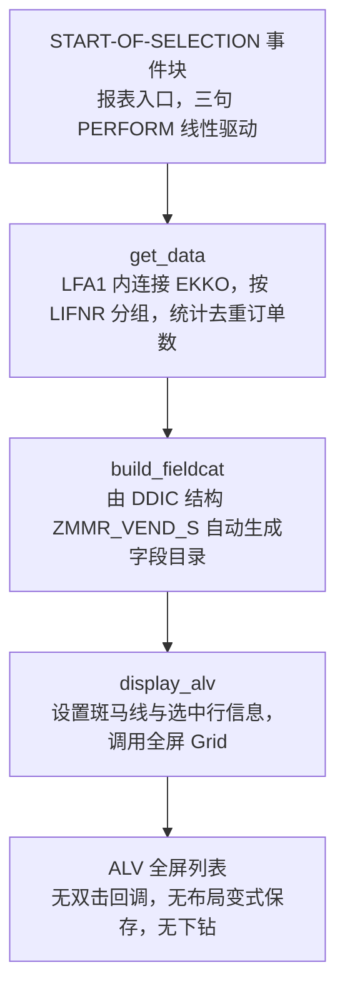
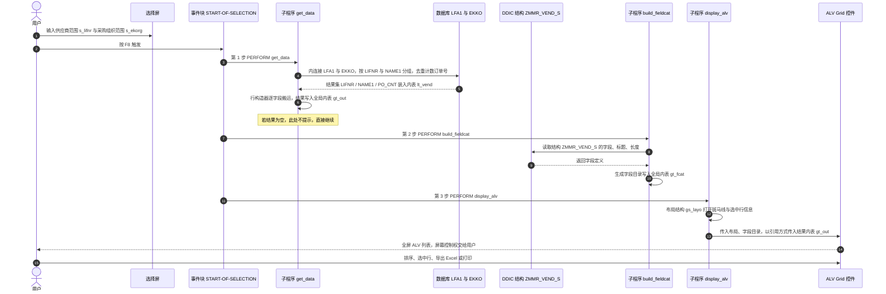

# ZMMR_VEND_LIST 源码走读报告

> 走读目标：搞清楚一个 58 行的经典 ABAP 报表，是怎么把"供应商 + 采购订单数"这件事从一次数据库聚合查询变成一张可交互列表的；以及它在业务正确性、健壮性、性能上留下了哪些坑。
>
> 分析对象：`Zmmr_vend_list.abap`（`REPORT zmmr_vend_list`）。全文位置标注一律用子程序/事件块/声明区名称，不出现行号。

---

## 一、程序定位与业务背景

### 1.1 它在回答一个什么业务问题

采购部与财务共享中心（SSC）每月需要回答一个非常具体的问题：

> **"在我们关心的采购组织和供应商范围内，每家供应商名下挂了多少张采购订单？"**

这个问题听起来朴素，但真正难在三处：

1. **数据分散在两张表**。供应商主数据在 `LFA1`（供应商编号、名称），采购订单在 `EKKO`（订单头，订单项在 `EKPO`）。只看 `LFA1` 拿不到订单数，只看 `EKKO` 拿不到供应商名称。必须连接。
2. **天然一对多**。一家供应商对应成百上千张订单。直接 `SELECT ... FROM ekko` 会把屏幕塞爆，用 `SELECT SINGLE` 又只能拿一行。**必须让数据库在传输层就把结果折叠成"每供应商一行"**，否则报表毫无意义。
3. **结果要能看、不能只看**。不是让用户去 SE16 里自己加 group by 视图，而是要一张能排序、能选中行、能导出的 ALV。

### 1.2 为什么现有方案不够

- 标准 `MB51` / `ME1PO` 是"订单清单"，颗粒度是订单行，天然**不做供应商维度的聚合**；导出后仍要人工透视。
- `LFA1` 与 `EKKO` 各自的标准报表都无法同时给出"供应商名称 + 订单计数"这个形状。
- 让顾问每次临时写一段 Open SQL 做 group by，属于不可复用的手工活。

所以这是一个**典型的自建分析报表**：一次聚合查询 + 一次字段目录生成 + 一次列表输出。没有持久化、没有后台批处理、没有后续处理、没有用户扩展点。

### 1.3 整体设计范式（一句话定性）

> **"声明式取数 + DDIC 结构充当契约 + 全屏 Grid 输出"的三段式经典过程式报表。**

三段分别是 `get_data`（取数）、`build_fieldcat`（字段目录）、`display_alv`（输出），各自封装成一个 `FORM`，靠一个 DDIC 结构 `ZMMR_VEND_S` 把三段串成流水线；整条链路没有状态机、没有回调、没有扩展点、没有持久化。

定性补充：这是 ECC 时代的"教科书 ALV 报表"写法（`START-OF-SELECTION` + 三个 `PERFORM` + SLIS 全屏 Grid），既不是 OO 报表也不是 CDS 分析报表。它的可读性完全来自"一眼看得完"，它的天花板也完全来自"没有扩展点"。

### 1.4 角色与使用方式

| 角色 | 关注点 |
| --- | --- |
| 采购员 / 采购主管 | 按采购组织或供应商范围查订单密度，判断供应商活跃度 |
| 财务 / 内控 | 供应商集中度核对、批量询价前的供应商摸底 |
| SAP 顾问（维护者） | 增删展示字段、加筛选条件、加下钻 |

典型用法：事务码 `ZMM` → 输入选择屏 → F8 → 得到一张供应商清单。

---

## 二、程序执行流程总览



### 责任链表

| # | 子程序 / 事件块 | 调用者 | 职责 |
| --- | --- | --- | --- |
| 1 | 全局声明区（程序启动时隐式执行） | ABAP 运行时 | 声明 `LFA1` / `EKKO` 表结构、三个全局内表与布局、两个选择屏字段，并绑定 DDIC 结构 `ZMMR_VEND_S` |
| 2 | `START-OF-SELECTION`（事件块） | ABAP 运行时（用户按 F8 或执行列表变式） | 报表入口，按固定顺序线性触发下面三个子程序 |
| 3 | `get_data`（`FORM`） | `START-OF-SELECTION` 第 1 句 | 一次 Open SQL 聚合查询，按供应商分组算出采购订单数，写入全局内表 `gt_out` |
| 4 | `build_fieldcat`（`FORM`） | `START-OF-SELECTION` 第 2 句 | 用 `REUSE_ALV_FIELDCATALOG_MERGE` 从 DDIC 结构 `ZMMR_VEND_S` 反射出 ALV 字段目录 |
| 5 | `display_alv`（`FORM`） | `START-OF-SELECTION` 第 3 句 | 填充布局参数，用 `REUSE_ALV_GRID_DISPLAY` 输出全屏列表 |

下面就按这条执行顺序，逐个子程序展开。

---

## 三、分组分析（按程序流程 / 子程序）

全局声明区虽然不写逻辑，却是整条流水线的**契约来源**——`ZMMR_VEND_S` 这个结构同时承担了"结果内表类型""字段目录来源""查询列的落点"三重角色，后面每一个子程序都在用它。所以必须放在最前面看。

### 3.1 全局声明区

（全局声明区，分两步：先看报表头与遗留声明，再看全局内表与选择屏字段。）

#### ① 报表头与遗留的 ALV 类型池声明

```abap
REPORT zmmr_vend_list.
TYPE-POOLS: slis.

TABLES: lfa1, ekko.
```

**做什么** — 声明这是一个可执行报表（`REPORT`），加载遗留的类型池 `slis` 以获得 ALV 的结构类型，并用已废弃的 `TABLES` 语句把 `LFA1` 和 `EKKO` 两张表的完整结构生成到程序全局数据区。

**为什么** — `TYPE-POOLS: slis.` 是 ALV 刚引入时（ECC 6.0 之前）的历史包袱：那时调用 `REUSE_ALV_*` 前必须显式声明类型池，否则 `slis_t_fieldcat_alv` 这类类型解析不到。`TABLES` 语句则是 ABAP/4 时代的写法，它的唯一作用是**给 `SELECT-OPTIONS ... FOR` 提供类型推导依据**（在旧语法里 `FOR lfa1-lifnr` 必须有一个表结构可依），它不参与任何数据访问。

**风险与改进** — 三条都该改：

- `TYPE-POOLS: slis.` 属**冗余遗留**，NetWeaver 7.0 之后类型池由功能模块自动装载，这行只是让新人误以为 SLIS 类型必须显式声明，反而强化了对老 ALV 接口的依赖。直接删掉。
- `TABLES` 已被 SAP 官方列入过时语句，后续版本在新代码检查（ATC）中会被标记。替代写法是 `DATA lfa1 TYPE lfa1.`，`SELECT-OPTIONS` 依然能自动取到数据元素。顺带一提，`TABLES ekko` 为了一张只用到 `ekorg` 的选择屏，把 140+ 字段的整张表结构搬进了内存，代价可忽略，但语义上极具误导性——让人误以为后面会读 `EKKO`。
- `REPORT` 头缺 `MESSAGE-ID`，也没声明 `LINE-SIZE` / `LINE-COUNT`。前者在后续需要统一消息类时是障碍，后两者会在程序被当作列表输出时丢失标题与页脚。

#### ② 全局内表与选择屏字段

```abap
DATA: gt_out  TYPE TABLE OF zmmr_vend_s,
      gt_fcat TYPE slis_t_fieldcat_alv,
      gs_layo TYPE slis_layout_alv.

SELECT-OPTIONS: s_lifnr FOR lfa1-lifnr,
                s_ekorg FOR ekko-ekorg.
```

**做什么** — 声明三个全局对象：`gt_out` 是结果内表，类型直接来自 DDIC 结构 `ZMMR_VEND_S`；`gt_fcat` 是字段目录内表；`gs_layo` 是布局结构。另外定义两个选择屏字段：供应商编号范围 `s_lifnr`（`CHAR(10)`，走 `LFA1-LIFNR`），采购组织范围 `s_ekorg`（`CHAR(3)`，走 `EKKO-EKORG`）。

**为什么** — 这里有一个**很聪明、也很值得学的设计**：`gt_out` 的类型不是手写 `BEGIN OF ... END OF`，而是直接 `TYPE TABLE OF zmmr_vend_s`。这一个 DDIC 结构同时扮演三个角色：

1. 结果内表的行结构；
2. `build_fieldcat` 里字段目录的反射来源；
3. `get_data` 里查询列的落点。

好处是**加展示字段只需要改 DDIC 一处**，ALV 自动多一列，`VALUE # FOR` 里补一个分量即可，不需要动任何 ALV 相关代码。这对维护成本是实打实的收益。

**风险与改进** — 三处要留意：

- **这个"聪明"有反噬**。DDIC 结构一旦加了新字段（比如有人想加 `waers` 货币、`menge` 总金额），ALV 会**自动多出两列**却全是空的——因为 `get_data` 并没有取这两个值，而 `VALUE # FOR` 里没列出的分量保持初始值。DDIC 结构成了隐式契约，而契约变更的唯一守卫是开发者记不记得去改 ABAP。
- `gt_fcat` / `gs_layo` 声明为全局变量，本质上是用全局内存代替参数传递。经典过程式写法没错，但 `build_fieldcat` 其实**完全不需要数据**，它只是把全局 `gt_fcat` 填满——如果改成 `FORM build_fieldcat USING rt_fcat TYPE slis_t_fieldcat_alv.`，这条链路的耦合会立刻清晰很多。
- 两个选择屏字段都**非必填、且没有分组标题**（缺 `SELECTION-SCREEN BEGIN OF BLOCK`）。两个空范围直接等于"查全库"，这是后面性能问题的源头。另外 `s_lifnr` 用 `FOR lfa1-lifnr` 派生 F4，在有几十万个供应商的系统上会弹出一个巨大的清单列表，实际使用体验很差；业界通行做法是额外提供"按名称/公司代码"的搜索帮助作为次级入口。

### 3.2 事件块 `START-OF-SELECTION`

（事件块很短，保持单块不拆。）

```abap
START-OF-SELECTION.
  PERFORM get_data.
  PERFORM build_fieldcat.
  PERFORM display_alv.
```

**做什么** — 这是报表的唯一入口事件块。用户按 F8（或通过保存的列表变式启动）时触发，按固定顺序同步调用三个子程序：先取数，再生成字段目录，最后输出。

**为什么** — `START-OF-SELECTION` 的语义是"选择屏已通过校验，准备执行查询"，放在这里保证了三个 `PERFORM` 一定在选择屏之后跑。这是 ECC 报表的标准骨架，读者一眼就能知道全局执行顺序，不需要反向推导。

**风险与改进** — 顺序本身是对的，但**没有任何错误传播机制**：

- `get_data` 里如果走"无数据"分支，用的是 `STOP` 而不是 `RETURN`。`STOP` 会终止整个程序运行单元；对一个 `START-OF-SELECTION` 驱动的报表，`RETURN` 语义更准确，也不会妨碍日后把它改成被别的程序调用。
- 三个 `PERFORM` 之间的控制流是"一条直线"。任何一步需要失败中止，目前只能靠 `MESSAGE ... TYPE 'E'` + 短转储（见 3.4 的分析）。缺一个统一的错误出口约定。
- 缺 `NO-DISPLAY` / `LINE-SIZE` 等 `REPORT` 级属性（已在 3.1 ① 提到），以及 `SELECTION-SCREEN BEGIN OF BLOCK` 的选择屏分块。

### 3.3 子程序 `get_data`

这是整个程序**唯一承载业务逻辑**的地方，也是风险最集中的地方。它有三步：主查询、把结果搬进结果内表、判断空结果。

#### ① 主查询：连接 + 过滤 + 分组聚合

```abap
FORM get_data.
  SELECT a~lifnr,
         a~name1,
         COUNT( DISTINCT b~ebeln ) AS po_cnt
    FROM lfa1 AS a
    INNER JOIN ekko AS b ON a~lifnr = b~lifnr
    WHERE a~lifnr IN @s_lifnr
      AND b~ekorg IN @s_ekorg
      AND b~bstyp = 'F'
    GROUP BY a~lifnr, a~name1
    INTO TABLE @DATA(lt_vend).
```

**做什么** — 用一条 Open SQL 把 `LFA1`（别名 `a`）与 `EKKO`（别名 `b`）按供应商编号内连接，从 `a` 取供应商编号与名称，从 `b` 取采购订单号并按订单号去重计数；过滤条件是供应商编号落在 `s_lifnr` 范围、采购组织落在 `s_ekorg` 范围、订单类型限定为 `'F'`（采购订单）；最后按"供应商编号 + 供应商名称"分组，每组产出一行 `LIFNR / NAME1 / PO_CNT`，装进行内声明的内表 `lt_vend`。

**为什么** — 这一步的写法有几处是**对的、值得肯定的**：

- **把聚合下推到数据库**。用 `GROUP BY` + `COUNT( DISTINCT ... )` 在传输层折叠成"每供应商一行"，而不是把明细拉回 ABAP 再 `LOOP AT ... ENDLOOP` 计数。这是在 Open SQL 里做分析的标准姿势，比在应用层聚合快一个数量级，也避免了内存溢出。
- **`COUNT( DISTINCT b~ebeln )` 而不是 `COUNT(*)`**。连接后一行是一个"供应商-订单"组合，同一供应商的多张订单会各占一行，所以必须去重才能得到"订单张数"这个业务量。写成 `COUNT(*)` 会得到订单行数，语义完全错。这是一处关键的正确判断。
- **`b~bstyp = 'F'`** 是把采购订单从 EKKO 里挑出来的标准做法（`'F'` = 采购订单）。它排除了询价单（`'A'`）、框架订单（`'B'`）、库存调拨单（`'K'`）等，虽然后两者在很多系统里也存在。
- **用了内联声明 `@DATA(lt_vend)`**，不占全局符号表，也不用单独 `DATA` 声明，作用域精确限制在 `FORM` 内。这是新式 Open SQL 的好习惯。

**风险与改进** — 这一步的问题比优点多，逐条说：

- **【最严重】聚合查询下 `sy-subrc` 恒为 0，"无数据"分支形同虚设。** 详见 ③ 的三层分析。
- **【语义校核·关键】采购组织取在表头，与业务口径可能不一致。** `EKORG`（采购组织）既存在于订单头 `EKKO`，也存在于订单项 `EKPO`。SAP 文档明确说明 ECC 6.00 之后 `EKKO-EKORG` 保存的是**第一张订单项的采购组织**。一份订单可能有 10 个项、分属 5 个采购组织。那么"筛选采购组织 = 1000"时：用 `EKKO-EKORG` 过滤会**漏掉**那些"第一项不属于 1000、但确实有项属于 1000"的订单，同时会**错算归属**那些"第一项属于 1000、但用户可能以为不包含"的订单。业务口径要的是"含采购组织 1000 的订单"，就应该连接 `EKPO` 按项过滤，再 `COUNT( DISTINCT ebeln )`。
- **【语义校核】完全没有做订单项级过滤，因此计数可能虚高。** 只查了订单头，意味着一张**所有订单项都已被删除**（`EKPO-DELETE_FLAG = 'X'`）、或订单头已被标记删除（`EKKO-LOEKZ = 'X'`）的订单，照样会被计入 `po_cnt`。业务方看到"这供应商有 8 张采购订单"，点进去可能发现其中 3 张全是空的。这种"报表数字对不上明细"的问题，是采购报表最常见的投诉来源。
- **【语义校核】没有做供应商有效性过滤。** `LFA1` 是全球供应商主数据，含已冻结、已删除（公司代码级的删除标记在 `LFY1-LDAKD`，`LFA1` 上还有 `LFA1-DELET` 之类字段）、只在一个公司代码下有效的各种状态。本程序既没按供应商类型（`LFA1-ACCTTYPE` = 供应商 `K`）过滤，也没排除已删除标记。
- **【类型/数据元素校核】`PO_CNT` 的语义只到"表头去重计数"，字段名却叫 `PO_CNT`（采购订单数），没有区分"订单张数"与"订单行数"。** 更要紧的是：**如果 `ZMMR_VEND_S-PO_CNT` 在 DDIC 里被定义成 `CHAR` 或 `NUMC` 而不是数值类型，ALV 上的求和/排序会按文本规则走**（`'9' > '10'`），用户在合计行点一下求和就会得到荒谬结果。ABAP SQL 的 `COUNT` 返回内置整型（长度 8），赋值时会发生隐式转换——能跑通不代表语义对。这种"类型错配但能跑"的情况必须按风险记，不能反向认为"字段长度匹配所以一致"。建议字段名改为 `po_hdr_cnt` 明确表头口径，类型必须是数值。
- **【语义校核】`EKORG` 出现在过滤条件里，却没有出现在 `GROUP BY` 和结果集中。** 所以当用户一次选入两个采购组织时，结果是**跨采购组织合并计数的一行**，用户无法判断 12 张订单里多少来自 A 、多少来自 B。这是可以接受的设计选择，但必须在字段标题或程序文档里写明；否则用户会以为"每个采购组织一行"。如果 `ZMMR_VEND_S` 里恰好有个 `EKORG` 字段，`REUSE_ALV_FIELDCATALOG_MERGE` 会把它自动显示成**一列全空的值**（见 3.4 的风险）。
- **【性能】一次可能扫描数千万行的聚合，且无任何边界约束。** `EKKO` 是 SAP 里最大的表之一。选择屏两个字段都非必填，等于允许"全表聚合"，这在生产系统上是分钟级的操作，而且会把临时表空间撑爆。即便用户填了采购组织，数据库仍需在 `EKORG` 索引上取出大量行做 HASH JOIN 再去重。
- **改进方向（按性价比排序）**：① 选屏加日期范围 `b~bedat BETWEEN`（凭证日期有索引，是**单点收益最大**的一刀）；② 把 `s_lifnr` 或 `s_ekorg` 至少一个设为必填；③ 打开 SQL Trace 跑一次真实的 `EXPLAIN`，确认走的是哪个索引；④ 中期把它下沉成 CDS 视图（`SELECT ... FROM zmmr_cds_vend_po_cnt`，带 `KEY LIFNR` 和 `COUNT( DISTINCT )` 聚合），让 ABAP 侧只 `INTO TABLE`，数据库能缓存聚合结果；⑤ 用 ALV 的 `i_default_layout` / `it_exclude` 不解决性能，真正要靠 ①④。

#### ② 结果集到 `gt_out` 的逐字段搬运

```abap
  IF sy-subrc = 0.
    gt_out = VALUE #( FOR ls IN lt_vend
                      ( lifnr = ls-lifnr name1 = ls-name1 po_cnt = ls-po_cnt ) ).
  ELSE.
    MESSAGE '无符合条件的供应商' TYPE 'I'.
    STOP.
  ENDIF.
ENDFORM.
```

**做什么** — 若 `sy-subrc = 0`，就遍历 `lt_vend` 的每一行，用值构造器 `VALUE #` 把三个分量 `LIFNR`、`NAME1`、`PO_CNT` 逐个搬进全局结果内表 `gt_out`；否则弹一条提示并停机。

**为什么** — `VALUE #( FOR ... )` 是 7.40 之后的行构造器写法，好处有两点：一是**不用先 `APPEND` 到工作区、再逐字段赋值**，代码量减半；二是**它是一次显式的字段映射**，编译器会在结构体不匹配时给出可读的错误，而不是像 `MOVE-CORRESPONDING` 那样悄悄按名字模糊匹配。作为"查询结果 → 输出结构"之间的适配层，形式上很干净。

**风险与改进** — 但这一整段是**纯冗余的搬运工**，而且掩盖了真正的问题：

- **完全可以在 SQL 里一步到位。** `lt_vend` 与 `gt_out` 的行类型如果一致（`ZMMR_VEND_S` 就是按这三列建的），直接 `INTO TABLE @gt_out` 即可；即便不完全一致，也应该 `INTO TABLE @gt_out` 让数据库做一次类型转换，而不是拉回内表再用 ABAP 循环搬一遍。这一层循环没有做任何过滤、转换、派生或排序——它只是复制。
- **未列出的分量会保持初始值，这是静默故障源。** 假如 `ZMMR_VEND_S` 后来被加了第 4 个字段（比如 `total_amt`），`VALUE #` 不会报错，那一列会**全部是 0** 并且正常显示在 ALV 上。这种"没报错、就是数字不对"的缺陷，比直接短转储难查十倍。这恰恰是 3.1 ② 提到的"DDIC 结构即隐式契约"的具体代价。
- **换成了 `MOVE-CORRESPONDING` 也救不了**（那会自动填上同名字段，反而掩盖"结构变了"这件事）。真要保留这层映射，应该配一句运行时断言，例如比较 `lt_vend` 与 `gt_out` 的行数与关键字段是否一致。
- **`IF sy-subrc = 0` 这个守卫在这里是无意义的。** 见下。

#### ③ 空结果判定与消息处理（错误分支的真实行为）

```abap
  IF sy-subrc = 0.
    MESSAGE '无符合条件的供应商' TYPE 'I'.
    STOP.
  ENDIF.
```

**做什么** — 当 `sy-subrc` 不为 0 时，弹出信息"无符合条件的供应商"，然后 `STOP` 终止程序。语义上作者显然想表达"查不到数据就提示用户并停下"。

**为什么** — 意图是对的：**让用户明确知道"这次查询没有结果"，而不是对着一个空白 ALV 面板怀疑是不是程序坏了。** 这个 UX 考虑值得肯定，很多报表恰恰缺这一环。

**风险与改进** — 但这个分支**几乎永远进不去**，这是本程序最实的一个正确性缺陷：

- **在 `GROUP BY` 聚合查询之后，`sy-subrc` 恒为 0。** 这是 Open SQL 的既定行为：聚合查询即使一行都没返回，也必须返回一个"最大值为 0 / 计数值"的合法结果集，因此不设"未找到"的状态。所以"查询条件太窄、没有匹配供应商"这一最常见场景，`sy-subrc` 依然是 0，程序会带着**一张空内表**继续往下走 `build_fieldcat` 和 `display_alv`，最后屏幕上只剩一个**空 ALV，没有任何提示**。用户只能自己反推"是没数据还是程序坏了"。
- **正确做法是判内表本身，而不是判 `sy-subrc`**：把条件改成 `IF lt_vend IS INITIAL.`，走 `MESSAGE ... TYPE 'S'` + `RETURN`（用状态栏提示而不是弹窗），并让 `display_alv` 不被调用。
- **`TYPE 'I'` 用得也不合适**。信息弹窗会中断操作流；"没有数据"属于正常结果而非需要打断的事，用 `TYPE 'S'` 写状态栏、或干脆**什么都不提示、只让 ALV 显示空**（这本身就是明确的信号）都更好。
- **消息写法违反 SAP 约定**：中文文本硬编码、消息类默认 `00`、没有 `&1` 占位符，意味着**永远无法翻译**。应改为自建消息类 `zmmr_msg`，文本进 SE63，`TEXT-001`，代码里写 `MESSAGE '无符合条件' TYPE 'S' DISPLAY LIKE 'E'.` 或直接 `MESSAGE ID 'ZMMR_MSG' TYPE 'S' NUMBER '001'.`。
- **`STOP` 用错关键字**。`STOP` 是"以状态 1 退出整个程序"，`RETURN` 才是"退出当前处理块/程序"。报表里用 `STOP` 会让后续想复用这个逻辑（比如做成 FM 给别的程序调用）的人踩坑。
- 顺带一提：**`IF sy-subrc = 0` 包住整段赋值，等于暗示"SQL 失败时不做赋值"**。这层防御其实多余——Open SQL 出错时（`sy-subrc = 4`）目标内表本来就会被置空。作者想防的是"没查到"，但用错了工具。

### 3.4 子程序 `build_fieldcat`

（子程序紧凑，保持单块不拆。）

```abap
FORM build_fieldcat.
  CALL FUNCTION 'REUSE_ALV_FIELDCATALOG_MERGE'
    EXPORTING
      i_structure_name = 'ZMMR_VEND_S'
    CHANGING
      ct_fieldcat     = gt_fcat.
  IF sy-subrc <> 0.
    MESSAGE '字段目录生成失败' TYPE 'E'.
  ENDIF.
ENDFORM.
```

**做什么** — 调用 ALV 的 `REUSE_ALV_FIELDCATALOG_MERGE`，指定 DDIC 结构 `ZMMR_VEND_S`，让 SAP 自动反射出这个结构的全部字段、字段文本、长度与小数位，生成 ALV 字段目录内表 `gt_fcat`；返回码非 0 则报错误消息。

**为什么** — 在 SLIS 这套老 ALV 里，有两种拿字段目录的方式：`REUSE_ALV_FIELDCATALOG`（手工维护一张程序全局的字段目录内表）和 `REUSE_ALV_FIELDCATALOG_MERGE`（从 DDIC 结构反射）。**这个程序选后者是对的，而且是最优选择**：

- 省掉几十行手工 `APPEND slis_fieldcat_alv` 的样板代码；
- 字段标题、字段长度、数据类型、小数位全部来自 DDIC，**与数据字典天然一致，不会出现"标题长度不够截断"这类经典问题**；
- 增删展示字段只改 DDIC 一处。

而且它被放在 `display_alv` 之前调用（由 `START-OF-SELECTION` 的顺序保证），输出顺序也是对的。

**风险与改进** — 三个真实问题：

- **`MESSAGE ... TYPE 'E'` 会导致短转储，而不是友好报错。** 在对话框程序里，`TYPE 'E'` 如果不带 `SAVE IN` 或 `IN PROGRAM`，程序会以短转储（`MESSAGE_TYPE_E_NOT_ALLOWED`）结束，用户看到的是报错弹窗 + 事务回滚，而不是一个可读的错误页。报表里正确做法是 `MESSAGE ... TYPE 'A'`（警告并结束，会走消息处理机制）或 `TYPE 'S'` + `RETURN`。
- **失败原因完全没被诊断。** `REUSE_ALV_FIELDCATALOG_MERGE` 返回非 0 的常见原因是 `ZMMR_VEND_S` 这个 DDIC 对象不存在、未激活、或传输不完整。这些都不是能靠 `MESSAGE` 文案看出来的，应把 `sy-subrc` 一起带上，或者至少在报错前 `WRITE` 一次结构状态便于排查。
- **反射式的代价：字段标题质量完全取决于 DDIC。** `REUSE_ALV_FIELDCATALOG_MERGE` 把 `ZMMR_VEND_S` 各组件的**短文本**当作 ALV 字段标题。如果建结构时没认真填 DDIC 文本（比如直接把字段名当描述、或用英文描述），ALV 上会出现 `PO_CNT` 这种可读性很差的标题，而且**运行时改不了**（除非调用后再手工覆盖 `gt_fcat` 里的 `scr_text_s` / `scr_text_m`）。这是"反射式"这类设计的通病：省代码，但把展示质量的责任推给了建结构的人。
- 扩展建议：`MVC` 之后可以让 `ZMMR_VEND_S` 直接基于 CDS 视图的投影结构，这样字段与查询列永远同源，连"DDIC 加了字段但查询没取"的问题也一起消失。

### 3.5 子程序 `display_alv`

分两步：先设置布局，再调用全屏 Grid。参数传递上有个**关键点容易被忽略**：结果内表 `gt_out` 并没有通过 `USING` 传进来，而是靠全局变量直接被读取——这是经典过程式报表的常态，也是理解这个程序耦合度的关键。

#### ① 布局设置

```abap
FORM display_alv.
  gs_layo-zebra = 'X'.
  gs_layo-get_sel_info = 'X'.
```

**做什么** — 给全局布局结构 `gs_layo` 设置两个开关：`ZEBRA = 'X'` 打开斑马线（隔行底色交替），`GET_SEL_INFO = 'X'` 打开"选中行信息"提示（用户在 ALV 里选中若干行时，状态栏显示已选行数）。

**为什么** — 这两个都是 SLIS 的合法字段，语义正确、没有拼写错误，方向也对：**面向"列表要一眼能读"的场景**——斑马线在几十上百行数据下显著降低串行读错的风险，选中行信息则是多行选择操作的基础反馈（后续如果要接回调做批量处理，这个开关就已经开好了）。能看出作者是有 UX 意识、而不是纯粹"能显示出来就行"。

**风险与改进** — 布局只设了两个字段，把 SLIS 最实用的几个能力都留空了：

- **没有 `VARIANT` + `I_SAVE = 'A'`**：用户无法保存自己的列顺序、宽度、隐藏/显示设置，`gs_layo` 每次都是同一副样子。
- **没有 `SLIS_VIA = 'X'`**：这也是个实用开关，能让 ALV 的显示行为在 `SLIS` 与 `SALV` 之间切换而不改调用方代码。
- **缺 `TITLE` / `I_GRID_TITLE`**：屏幕上没有标题，用户在同时开着多个 ALV 时分不清这是哪个报表的输出。
- **缺 `INFO` 级别参数**：`ROW_TEXT`、`NO_HEADER` 之类不影响正确性，属于锦上添花。

#### ② 调用全屏 Grid 输出

```abap
  CALL FUNCTION 'REUSE_ALV_GRID_DISPLAY'
    EXPORTING
      is_layout   = gs_layo
      it_fieldcat = gt_fcat
    TABLES
      t_outtab    = gt_out.
ENDFORM.
```

**做什么** — 调用全屏 ALV Grid，把 `gs_layo` 作为布局、`gt_fcat` 作为字段目录传入，并通过废弃的 `TABLES` 实参引用传入结果内表 `gt_out`，直接进入 ALV 的显示循环并接管屏幕。

**为什么** — `REUSE_ALV_GRID_DISPLAY` 是 SLIS 里最"重"的函数，也是全屏 ALV 的标准入口：它内部启用了 `REUSE_ALV_FIELDCATALOG_MERGE` 所提供的字段描述，配合 full-screen grid 控件提供排序、筛选、分组、导出 Excel、打印、以及 ALV 工具栏。选它是对的——对一张纯展示型清单，没有比它更省事的方案，而且**不需要写一行回调代码**。

**风险与改进** — 四个值得改的点：

- **`TABLES t_outtab = gt_out.` 是废弃写法。** `REUSE_ALV_GRID_DISPLAY` 的目标内表现在应该走 `EXPORTING` 下的 `IT_OUTTAB`。`TABLES` 参数在新版本的 ATC 检查里会被标记。虽然功能上还能用，但它是"我在用 SLIS 而非 SALV"的信号。
- **把全局 `gt_out` 通过引用交给 ALV，等于交出了所有权。** ALV 的数据驱动机制依赖目标内表在显示期间**不再被修改**；一旦以后有人在这个 FORM 之后还去改 `gt_out`，行为会非常难查。更清晰的写法是 `FORM display_alv USING it_data TYPE tt_zmmr_vend_s.`，让依赖显式化。
- **【扩展性的核心缺口】没有任何回调。** 没有 `I_CALLBACK_PF_STATUS_SET`（不能定制工具栏，也不能屏蔽 `&SELECT` / `&SAVE` 之类按钮）、没有 `I_CALLBACK_USER_FUNCTION`（双击行 / 按钮点击都没有行为）、没有 `I_CALLBACK_TOP_TR_DBLCLICK`（**双击供应商行进不去采购订单明细，也跳不到 `ME23N`**）。对一张"供应商 + 订单数"清单来说，双击下钻到该供应商的订单列表是最自然的下一步需求，缺了它这个报表就停在"只能看数、不能干活"的程度。
- **调用后没有检查返回码。** 这一点在本例中可接受（`REUSE_ALV_GRID_DISPLAY` 是全屏接管，正常返回即用户已离开 ALV），但如果后面加了 `I_SAVE` 和变式保存，就要开始处理用户取消保存的分支了。
- 中期演进建议：如果这个报表只是"看一眼"，`REUSE_ALV_GRID_DISPLAY` 是够的；如果它会持续加交互（下钻、导出、邮件推送），应该迁到 **SALV**（`CL_SALV_TABLE`）或直接用 SALV IDA / CDS 分析视图，那套的回调、聚合、图形集成都是内置的，不需要手写工具栏和回调注册。

### 3.6 过渡

到这里，"取数 → 字段目录 → 输出"这条闭环就结束了：`gt_out` 是三段之间传递的唯一实质数据，`ZMMR_VEND_S` 是三段之间共享的唯一契约。接下来从数据视角把这条链路再走一遍。

---

## 四、执行流程全景图（数据视角）

下图展示数据在事件块与三个子程序之间如何流转，以及每一步的产物落在哪个内存对象上。



**从这张图能读出的三件事：**

1. **数据只在一个方向流动**：DB → `lt_vend` → `gt_out` → ALV。没有任何回调让 ALV 反向影响数据（因为没有回调），也没有任何地方把 ALV 的用户操作写回数据库。**这是一个只读报表**，这也决定了它不需要考虑更新时的锁、并发和提交。
2. **`SY-SUBRC` 在图上的位置很尴尬**：它只出现在"数据库返回结果集"这一步之后，而聚合查询下这一步永远不会给出"没找到"的信号。**图上唯一代表用户反馈的箭头（`ALV-->>U`）是单向的、也是最后一步**——一旦结果为空，用户在这张图上收不到任何来自程序的提示。
3. **`ZMMR_VEND_S` 是隐式中心**：它同时出现在"结果集形状"和"字段目录来源"两条链上，但图上没有任何一条箭头明确标出这个依赖——它只是被当成了类型名在用。这种"看不见的耦合"正是 3.1 ② 和 3.3 ② 讨论的风险根源。

---

## 五、问题清单与改进建议（按优先级）

### 🔴 P0 — 业务正确性

| # | 问题 | 所在子程序 | 建议 |
| --- | --- | --- | --- |
| 1 | **聚合查询后 `sy-subrc` 恒为 0，"无符合条件"提示分支实际不可达。** 用户查不到数据时会看到一个空 ALV 且没有任何说明 | `get_data` | 判断 `lt_vend IS INITIAL` 而非 `sy-subrc`；配 `MESSAGE ... TYPE 'S'` + `RETURN` |
| 2 | **采购组织过滤取在订单头 `EKKO-EKORG`，而该字段只是"第一订单项的采购组织"。** 多采购组织的订单会被漏算或错算归属 | `get_data` | 改为连接 `EKPO`，按 `EKPO-EKORG` 过滤后再 `COUNT( DISTINCT ebeln )` |
| 3 | **完全没有订单项级过滤。** 所有订单项都被删除、或订单头已被标记删除的订单，照样计入 `po_cnt`，报表数字与明细对不上 | `get_data` | 加 `ekpo-delete_flag = ' '`、`ekko-loekz = ' '` 等有效性条件 |
| 4 | **没有供应商有效性过滤。** 已冻结、已删除（公司代码级 `LFY1-LDAKD`）、非供应商类型的 `LFA1` 记录都会被计入 | `get_data` | 按 `LFA1-ACCTTYPE` = 供应商过滤，并排除删除标记 |
| 5 | **`PO_CNT` 语义与字段名、DDIC 类型都可能错配。** 只统计表头去重张数，但名字叫"采购订单数"；若 DDIC 里被建成 `CHAR`/`NUMC`，ALV 求和与排序会按文本规则走而给出错误合计 | `get_data` | 字段改名 `po_hdr_cnt` 明确口径，类型强制为数值；同时考虑补一个 `COUNT(*)` 订单项数列 |
| 6 | **无任何授权检查，也无公司代码维度。** `EKKO` 有 `BUKRS`，本程序跨公司代码聚合作者可见的订单数 | 全局声明区 / `get_data` | 增加 `b~bukrs` 选择屏字段并置必填（或取用户默认公司代码），配合 `AUTHORITY-CHECK` |

### 🟠 P1 — 健壮性

| # | 问题 | 所在子程序 | 建议 |
| --- | --- | --- | --- |
| 7 | **`MESSAGE ... TYPE 'E'` 会导致短转储**，而非友好报错 | `build_fieldcat` | 改用 `TYPE 'A'` 或 `TYPE 'S'` + `RETURN` |
| 8 | **消息文本硬编码中文、无消息类、无占位符，无法翻译** | `get_data` / `build_fieldcat` | 建 `ZMMR_MSG` 消息类，文本入 SE63，用 `MESSAGE ID ... NUMBER ...` |
| 9 | **`STOP` 用错关键字**，应用 `RETURN` | `get_data` / `START-OF-SELECTION` | 换 `RETURN`，保留被复用的可能性 |
| 10 | **`TYPE 'I'` 弹窗打断操作流** | `get_data` | 空结果用状态栏提示，或干脆不提示（空 ALV 本身就是信号） |
| 11 | **三个 `PERFORM` 之间没有统一的错误传播约定**，只能靠 `MESSAGE` + 短转储中止 | `START-OF-SELECTION` | 定义"哪一步失败、后续哪几步跳过"的显式约定 |
| 12 | **`REUSE_ALV_FIELDCATALOG_MERGE` 失败原因未诊断**，只抛一句文案 | `build_fieldcat` | 把 `sy-subrc` 带入消息，或先检查 `ZMMR_VEND_S` 的 DDIC 激活状态 |
| 13 | **废弃语句**：`TABLES` 声明、`TYPE-POOLS: slis.`、`REUSE_ALV_GRID_DISPLAY` 的 `TABLES` 实参 | 全局声明区 / `display_alv` | 分别改为 `DATA ... TYPE ...`、直接删除、迁移到 `EXPORTING it_outtab` |

### 🟡 P2 — 性能与规范

| # | 问题 | 所在子程序 | 建议 |
| --- | --- | --- | --- |
| 14 | **一次可能扫描数千万行的聚合，无任何边界约束。** 两个选择屏字段都非必填，等于允许全库聚合，分钟级耗时且撑爆临时表空间 | 全局声明区 / `get_data` | 加凭证日期范围 `b~bedat BETWEEN`（**收益最大的一刀**）；至少一个选择屏字段设必填 |
| 15 | **结果顺序不确定**：SQL 无 `ORDER BY`，ALV 也未传 `IT_SORT` | `get_data` / `display_alv` | SQL 加 `ORDER BY po_cnt DESC`，或在 ALV 传 `it_sort` |
| 16 | **无 SQL Trace 证据支撑索引使用**，开发期也没留下任何性能说明 | `get_data` | 上线前用 `ST05` / `SQL Trace` 确认 `EKORG` 与 `LIFNR` 的索引命中情况 |
| 17 | **选择屏无分块、无标题、无变式预填**，`s_lifnr` 的 F4 在供应商多时体验很差 | 全局声明区 | 加 `SELECTION-SCREEN BEGIN OF BLOCK`；额外提供按名称搜索的搜索帮助入口；支持变式预填采购组织 |
| 18 | **布局未保存**（缺 `VARIANT` + `I_SAVE = 'A'`），用户无法保存列宽与显示偏好 | `display_alv` | 补变式名与 `i_save = 'A'` |
| 19 | **ALV 无标题**，多窗口并行时无法区分 | `display_alv` | 补 `i_grid_title` 或 `gs_layo-title` |
| 20 | **`REPORT` 头缺 `MESSAGE-ID`、`LINE-SIZE`、`LINE-COUNT`** | 全局声明区 | 按需补齐，便于统一消息类与列表模式输出 |

### 🟢 P3 — 可扩展性

| # | 问题 | 所在子程序 | 建议 |
| --- | --- | --- | --- |
| 21 | **ALV 完全无回调：无工具栏定制、无按钮、无双击下钻。** 报表停在"只能看数、不能干活" | `display_alv` | 补 `I_CALLBACK_TOP_TR_DBLCLICK` 下钻到供应商订单明细（双击跳 `ME23N` 是最自然的下一步）；长期考虑迁 `CL_SALV_TABLE` 或 SALV IDA |
| 22 | **三个子程序靠全局变量通信**，`gt_out`/`gt_fcat`/`gs_layo` 共享可变状态，依赖关系不可见 | 全局声明区 / 全部子程序 | 改用 `FORM ... USING` 传参；`gt_fcat` 只在 `build_fieldcat` 内部需要，无需全局化 |
| 23 | **`VALUE # FOR` 是纯冗余搬运，且未列出的分量会静默保持初始值** | `get_data` | 直接 `INTO TABLE @gt_out`；若必须保留映射层，加运行时断言校验字段完整性 |
| 24 | **DDIC 结构 `ZMMR_VEND_S` 同时充当三重角色（内表类型 / 字段目录来源 / 查询落点），变更时无处校验** | 全局声明区 / `build_fieldcat` | 用 CDS 视图做单一数据源，ABAP 侧只做取数与展示，让结构变更的连锁反应消失 |
| 25 | **`EKORG` 是过滤维度却不进 `GROUP BY` 与结果集**，跨采购组织合并计数且无从区分 | `get_data` | 明确设计意图并在字段标题/文档中写明；如需下钻分析则把 `EKORG` 加入 `GROUP BY` |

---

## 六、整体评价与启发

### 优点（值得抄的部分）

1. **"DDIC 结构当契约"的设计非常克制。** `ZMMR_VEND_S` 一个结构同时解决结果类型、字段目录来源、查询落点三个问题，把 SLIS 最啰嗦的部分（手工 `APPEND` 字段目录、逐个声明行结构）压缩到零样板。**这是老 ALV 报表里最值得学的一招**：字段目录靠反射而非手写，加展示字段的成本几乎为零。
2. **聚合下推到数据库的写法是对的，而且是完整正确。** `GROUP BY` + `COUNT( DISTINCT ebeln )` 而不是拉明细回 ABAP 计数；`COUNT` 而不是 `COUNT(*)` 这个区分说明作者真的想清楚了"订单张数"的业务含义；`bstyp = 'F'` 精准限定采购订单。内联声明 `@DATA(lt_vend)`、`IN @s_lifnr` 这类新式写法也在用。
3. **行首就能看完的线性骨架。** `START-OF-SELECTION` 三句 `PERFORM`，没有 `END-OF-SELECTION` / `INITIALIZATION` / `TOP-OF-PAGE` 的碎片化逻辑，执行顺序不需要推理。58 行里没有一个多余的分支。
4. **有 UX 意识。** 斑马线、选中行信息、空结果想给提示——这三条说明作者是站在使用者角度写的，不是"能跑就行"。

### 短板（必须补的）

1. **空结果分支实际不可达，是最伤用户的一条。** 聚合查询后 `sy-subrc` 恒为 0，作者精心写的提示语永远不会出现在"用户最需要它"的时刻。这个错误很隐蔽：代码看起来做了错误处理，测试时若用有数据的选择条件根本发现不了，**只有生产环境上用窄条件查数据的用户才会撞上**。
2. **口径层面的语义债。** 采购组织取在表头、订单项级删除标记没过滤、供应商有效性没过滤、`PO_CNT` 名不副实——这四条叠加的结果是：**报表数字和用户在 `ME23N` 里看到的对不上**。报表程序里这类问题不叫 bug，叫"信任危机"，一旦业务方不再信任数字，报表就废了。
3. **零交互、零扩展点。** 没有回调、没有双击下钻、没有布局变式。用户拿到这张表只能"看"和"导出"，无法从"某供应商有 12 张订单"跳到"这 12 张是哪几张"。
4. **性能上是"能跑就不错了"的写法。** 无日期范围、无必填约束、无 Trace 证据。这种 SQL 在测试系统（数据量小）秒回，在生产系统（`EKKO` 数千万行）会变成一个需要被 DBA 追着调优的对象。

### 可以学到的设计经验（4 条）

1. **老技术栈里也有好设计，别因为"这套 API 过时了"就否定全部。** SLIS 的 `FIELD_CATALOG_MERGE` 依然是最省事的字段目录方案；`START-OF-SELECTION` + 线性 `PERFORM` 的骨架依然是最易读的执行流骨架。**过时的是接口形态，不是它承载的设计意图。**
2. **`sy-subrc` 是被误用得最彻底的一个系统字段。** `SELECT SINGLE` / `READ TABLE` 之后它是可靠的"找到没找到"信号；但在 **`INTO TABLE` 尤其 `GROUP BY` 聚合之后，它只回答"SQL 跑通了没有"，不回答"有没有数据"。** 聚合查询永远返回一行结果（计数为 0），所以永远 `sy-subrc = 0`。**结论：凡是 `INTO TABLE`，就判内表 `IS INITIAL`；这条规则应该形成肌肉记忆，而不是每次重新推理。**
3. **"能跑通"不等于"语义对"。** 类型错配最阴险——`COUNT` 的整型结果塞进 `CHAR(10)` 字段，赋值成功、ALV 显示正常、报表能跑，唯一暴露的时刻是用户在合计上点了求和。同理，`EKKO-EKORG` 对上 `EKPO-EKORG` 类型完全一致、字段名完全一致，但**语义不等价**（表头 vs 项级）。**做类型与数据元素校核时必须问一句："这两个值在业务上真的是一回事吗"，而不能停在"长度/精度匹配"。**
4. **DDIC 结构是契约，契约变更需要守卫。** 一个结构同时驱动数据与展示时，改结构会连锁触发"ALV 多空列""查询列没取""映射漏分量"三类问题，而且全都不报错。**代价最小的守卫是：让查询与展示共用同一个数据源（CDS 视图），而不是让它们共用一个名字。**

### 如果要动手改，我建议的顺序

**第一步（半小时，零风险，收益最大）**：把 `get_data` 的 `IF sy-subrc = 0` 改成 `IF lt_vend IS INITIAL` + `MESSAGE ... TYPE 'S'` + `RETURN`；删掉 `TYPE-POOLS: slis.`。
**第二步（半天）**：加 `b~bedat BETWEEN` 日期范围选择屏并置必填，`ST05` 跑一次 Trace 确认索引。
**第三步（两天）**：把查询下沉到 CDS 视图（连接 `EKPO` 做项级过滤 + 有效性条件），修掉 P0 的第 2–6 条；ALV 加双击下钻回调。
**第四步（视需求量）**：迁 `CL_SALV_TABLE` 或 SALV IDA，换掉整条 SLIS 依赖。