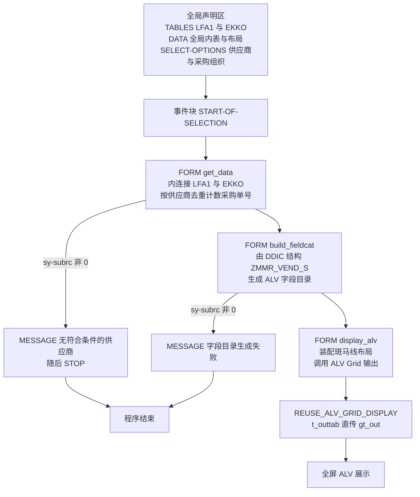
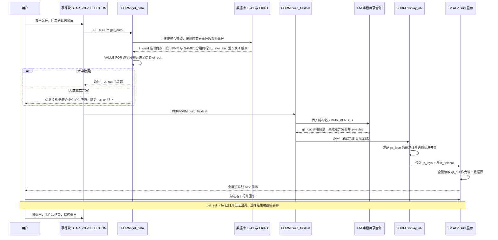

# ABAP 程序分析报告：`zmmr_vend_list`（供应商采购单数清单报表）

> 分析对象：`evals/zmmr_vend_list.abap`（`REPORT` 型报表程序，58 行）
> 阅读目标：搞清楚"这张报表在数什么数、这个数能不能拿去开会"

---

## 一、程序定位与业务背景

### 1.1 它在业务上解决什么问题

想象采购与财务的月度/季度供应商评审会。业务方想要的从来不是"某个供应商的采购单明细"，而是一张**排序后的清单**：

- 这个供应商跟我做了几笔采购单？
- 哪些供应商的单据量大、值得单独谈价格？
- 上个月和这个月对比，供应商活跃度有没有掉？

于是核心问题被压缩成一句话：**"按供应商维度，数一数采购订单有多少张。"**

这个数字对应到代码里就是 `COUNT( DISTINCT b~ebeln )` —— 供应商（LFA1-LIFNR）挂上采购订单号（EKKO-EBELN），去重计数。程序名 `zmmr_vend_list`（MM 域 + Report + Vendor List）也自我说明了一切。

### 1.2 现有方案为什么不够

SAP 标准里其实有好几个"沾边"的报表，但没有一个直接给出这个口径：

| 现有手段 | 能给你什么 | 缺什么 |
| --- | --- | --- |
| ME21N / FBL1N 采购订单凭证 | 单张订单全貌 | 得逐个供应商钻取，无法做"谁量大"的横向对比 |
| LFA1 供应商主数据报表（如 ME63/供应商清单） | 供应商静态属性、地址、伙伴关系 | 完全没有采购发生额视角，静态清单对谈判没用 |
| ME80R/ME83 等 MRP 报表 | 计划与实际需求 | 面向物料，不面向供应商行为 |
| 手工拉 EKKO 导 Excel 做数据透视 | 灵活 | 无权限管控、口径无人维护、数据刷新靠人 |
| 标准聚合类报表（如供应商分析） | 部分 KPI | 通常按"采购金额"而非"单据张数"，且口径常被后台配置改写，难以核对 |

所以自研一张**口径明确、只投影必要字段**的小报表，是合理且经济的选择。这不是重复造轮子，而是把"评审会要的那一列数"固化下来。

### 1.3 设计范式一句话定性

**教科书式的"取数 → 整形 → 输出"三段式报表**：`START-OF-SELECTION` 里用三个 `PERFORM` 线性编排 `get_data` → `build_fieldcat` → `display_alv`，无递归、无状态回退、无 OO 抽象，是 SAP 报表最经典也最保守的形态。

它的**亮点**在数据层：语义克制（只投影 3 个字段 + 1 个聚合）、`COUNT(DISTINCT)` 用得对、宿主机变量用了 `@` 转义、`INTO TABLE @DATA()` 是 7.40 之后写法而不是"伪现代老代码"。

它的**短板**同样在数据层与控制层：把大量业务判断藏进了一个字面量（`BSTYP = 'F'`）和几处**没有标签的 `sy-subrc` 判断**里 —— 而 `sy-subrc` 恰好是这份代码里最危险的地方，下文会重点拆解。

---

## 二、程序执行流程总览

整条链路很短，只有三个 `PERFORM`，但每一跳都有可以出事的缝隙：



### 责任链表

| 子程序 | 调用者 | 职责 | 返回方式 |
| --- | --- | --- | --- |
| `全局声明区` | ABAP 运行时（加载程序时） | 声明 `TABLES` 参照表、三个全局对象、两个选择屏范围 | 无返回，靠副作用建立运行时环境 |
| `START-OF-SELECTION` | ABAP 运行时（用户回车后） | 线性编排三个 `PERFORM`，本身不含业务逻辑 | 无 `RETURNING`，靠 PERFORM 顺序 + `STOP` 控制流 |
| `get_data` | `START-OF-SELECTION`（`PERFORM get_data`） | 一次内连接聚合查询，结果从内联临时表搬运进全局表 `gt_out`；无数据时提示并 `STOP` | 修改全局 `gt_out`；失败路径直接终止程序 |
| `build_fieldcat` | `START-OF-SELECTION`（`PERFORM build_fieldcat`） | 调 `REUSE_ALV_FIELDCATALOG_MERGE` 由 DDIC 结构自动生成字段目录 | 修改全局 `gt_fcat`；错误消息声称"生成失败"但判断本身无效 |
| `display_alv` | `START-OF-SELECTION`（`PERFORM display_alv`） | 设置 `zebra` / `get_sel_info`，调 `REUSE_ALV_GRID_DISPLAY` 输出全屏 ALV | 修改全局 `gs_layo`，输出全局 `gt_out` |

下面按这条流程，逐个子程序展开。

---

## 三、分组分析（按程序流程 / 子程序）

### 3.0 全局声明区

先看程序"长什么样"：它没有自定义选择屏，没有 `INITIALIZATION` 块，没有 `AT SELECTION-SCREEN` 校验，全部依赖隐式标准选择屏。声明区分两步看。

#### ① 程序头与类型池

```abap
REPORT zmmr_vend_list.
TYPE-POOLS: slis.
```

**做什么** — 声明这是一个可执行报表 `zmmr_vend_list`，并显式 `TYPE-POOLS: slis`，把 ALV 的公共类型池拉进程序，使 `slis_t_fieldcat_alv`、`slis_layout_alv` 可在 DATA 段直接引用。

**为什么** — 用到 SALES ORDER MGMT 的 `slis` 类型时，`TYPE-POOLS` 是必要的显式声明（不像 FM 内部自带 type pool，报表里必须自己声明）。程序名沿用 `z` 前缀 + 描述性短名，符合企业自有对象命名规范，也便于和标准报表在事务里区分。

**风险与改进** — 无明显功能风险。仅一点：`TYPE-POOLS: slis` 说明程序仍锁在 **ALV Function Module** 这条老路上；如果哪天做现代化改造，这条声明和后文两个 FM 都应整体换成 `cl_salv_table` / SALV-XLSX，不是局部替换。

#### ② 全局变量与选择屏范围

```abap
TABLES: lfa1, ekko.

DATA: gt_out  TYPE TABLE OF zmmr_vend_s,
      gt_fcat TYPE slis_t_fieldcat_alv,
      gs_layo TYPE slis_layout_alv.

SELECT-OPTIONS: s_lifnr FOR lfa1-lifnr,
                s_ekorg FOR ekko-ekorg.
```

**做什么** — `TABLES` 把 LFA1 与 EKKO 两个 DDIC 结构登记进全局名字空间（并隐式产生同名工作区）；`DATA` 声明三个全局对象：结果内表 `gt_out`（行结构 `ZMMR_VEND_S`）、ALV 字段目录 `gt_fcat`、ALV 布局 `gs_layo`；两个 `SELECT-OPTIONS` 生成供应商范围 `s_lifnr` 与采购组织范围 `s_ekorg`，供后续 SQL 的 `IN` 条件使用。

**为什么** — 把结果放进**全局**内表是因为 ALV FM 的 `t_outtab` 是 `C`-type 表参数，需要一个"活着的"内表引用；同时全局化也是把 `get_data`（取数）与 `display_alv`（输出）解耦的标准手法，否则就得让 `get_data` 带 `TABLES` 参数或用 `FORM ... USING`。选择屏字段用 `FOR lfa1-lifnr` 而不是手写 `TYPE c LENGTH 10`，是为了直接继承 DDIC 类型与 F4 搜索帮助 —— 这是正确做法，别退回 `TYPE c LENGTH 10`。

**风险与改进** — 三处值得改：

1. **`TABLES` 语句已废弃**（ABAP 关键字 `TABLES` 自 7.40 起被官方弃用）。它不仅产生隐式工作区，还把 DDIC 结构"注入"全局命名空间，让程序无法在单元测试里被替换、也无法顺畅迁到 CDS 视图。替代写法：把选择屏范围声明为内表（`TYPES ty_lifnr TYPE lfa1-lifnr.` + `DATA it_lifnr TYPE STANDARD TABLE OF ty_lifnr WITH DEFAULT KEY.` + `SELECT-OPTIONS s_lifnr FOR it_lifnr.`），SQL 里传 `IN @it_lifnr[]`。
2. **`ZMMR_VEND_S` 是程序与 DDIC 之间的隐性契约**：字段一改，ALV 自动跟着变（好处），但字段改名/删除会**直接 dump**，且因为 `build_fieldcat` 的错误判断无效（见 3.4），用户看到的是短时转储而不是业务消息。
3. **`s_lifnr` 与 `s_ekorg` 都没有标 `OBLIGATORY`，也没有默认值与块标题**，程序也没有自建的 `SELECTION-SCREEN BEGIN OF BLOCK ...`。业务含义是"允许用户什么都不填就跑"，这在 `get_data` 里是一个真实的性能地雷（见第五章 P0-4）。

---

### 3.1 事件块 `START-OF-SELECTION`

声明区就绪，运行时随后把控制权交给事件块。这一步是"调度层"，本身不含业务判断，但它的写法决定了后面三个子程序失败时的控制流形状。

```abap
START-OF-SELECTION.
  PERFORM get_data.
  PERFORM build_fieldcat.
  PERFORM display_alv.
```

**做什么** — 用户在选择屏回车后进入此事件块，按"取数 → 生成字段目录 → 输出 ALV"的固定顺序依次 `PERFORM` 三个 `FORM`；三者之间没有任何状态判断，每个 `FORM` 都假定前一个已经成功。

**为什么** — 把三个子程序拆开而不是写在一个大 `FORM` 里，是报表可读性的基本功：取数逻辑（可能变动最频繁）和展示逻辑（几乎不变）分离，改 SQL 不会碰到 ALV 调用。顺序也是对的 —— 没有字段目录就不能输出 ALV，没有数据就不该建目录。

**风险与改进** — 这是典型的**"隐式契约"**：三个 `PERFORM` 之间没有任何 subrc 传递，取数失败只能靠 `get_data` 内部自己 `STOP` 来短路（见 3.2 第 ③ 步）。一旦有人后来把 `get_data` 改成"失败也返回"，这里就会拿着空内表继续建目录、继续输出空 ALV。建议改成显式契约：`FORM get_data USING VALUE(p_ok) TYPE abap_bool.` 或让 `START-OF-SELECTION` 检查 `IF gt_out IS INITIAL ... RETURN.` 后再往下走。这不是洁癖 —— 报表里最常见的线上故障正是"空报表"和"错提示"，两者都源于这条隐式契约。

---

### 3.2 子程序类型 `FORM get_data` —— 整份程序的核心，分三步看

这一段承担了全部业务语义：口径（`BSTYP = 'F'`）、口径失真风险（缺 `LOKZ`/日期）、以及控制流（`STOP`）。分三步展开。

#### ① 聚合取数：内连接 LFA1 与 EKKO，按供应商去重计数

```abap
SELECT a~lifnr,
       a~name1,
       COUNT( DISTINCT b~ebeln ) AS po_cnt
  FROM lfa1 AS a
  INNER JOIN ekko AS b ON a~lifnr = b~lifnr
  WHERE a~lifnr IN @s_lifnr
    AND b~ekorg IN @s_ekorg
    AND b~bstyp = 'F'
  GROUP BY a~lifnr, a~name1
  INTO TABLE @DATA(lt_vend).
```

**做什么** — 一次 Open SQL 聚合查询：以 LFA1 为主表，按 `LIFNR` 内连接 EKKO（连接键 `LIFNR`），筛选条件为供应商在 `s_lifnr` 范围内、采购组织在 `s_ekorg` 范围内、且凭证类别 `BSTYP = 'F'`（采购订单）；按 `LIFNR` + `NAME1` 分组，把"该供应商名下不重复的采购订单号个数"以别名 `po_cnt` 输出，结果装进内联声明的临时内表 `lt_vend`。列投影只有 `LIFNR`、`NAME1` 两列原始字段 + 一个聚合值。

**为什么** — 三个选择都站得住脚：

- **投影克制**：LFA1 有 200+ 字段、EKKO 有近 200 字段，这里只搬 3 个值进 ABAP 层，比先全量取回再 `LOOP` 聚合省掉一到两个数量级的传输量。
- **`COUNT(DISTINCT b~ebeln)` 而不是 `COUNT(*)`**：内连接之后一个供应商会被展开成 N 行（一张采购单一行），`COUNT(*)` 数的是"明细行展开数"而不是"订单张数"。用 `DISTINCT` 去重才等于业务要的"采购单张数"。这是本段最见功力的地方。
- **`BSTYP = 'F'` 这个过滤不能省**：EBELN 在 EKKO 里并不是全表唯一 —— 交货计划订单（`BSTYP = 'L'`）按 `EBELN` + `EBELNNG`（交货序号）唯一。只按 `EBELN` 去重，在混入 `L` 类凭证时会数出"一张计划订单被数成多张"的错误数字。加上 `F` 的约束，EBELN 才在这一子集内是唯一键，去重才成立。
- **`@` 转义 + `INTO TABLE @DATA(...)`**：宿主机变量用 `@` 前缀、内联声明临时内表，是 7.40+ 推荐写法，避免了旧式 `INTO TABLE lt_vend` 前的 DECLARE 与 `sy-subrc` 语义歧义。这说明作者是有意识在写新式 Open SQL。

**风险与改进** — 这一步是全程序的风险密度高点，四条：

1. **口径失真：缺删除标记过滤。** EKKO 有表头删除标记 `LOKZ`。带删除标记的采购单（整单已删除/逻辑作废）仍会被 `COUNT(DISTINCT)` 数进来。评审会上出现"这个供应商做了 8 单，其中 3 单已作废"，数字当场就会被质疑。应补 `AND b~lokz = @abap_false`（或 `<> 'X'`）。
2. **口径失真：缺期间限制。** 只有采购组织过滤，没有 `BEDAT`/`MADT` 范围，等于统计的是"历史全量单据"。若业务真实诉求是"上季度采购单数"，这张报表给不出答案 —— 而报表最尴尬的不是报错，是**给出一个口径不对但看起来很专业的数字**。建议补 `AND b~bedat BETWEEN @gv_date_from AND @gv_date_to`，并在选择屏上显式增加"凭证日期范围"字段。
3. **跨采购组织的数字被合并。** 用户选 3 个采购组织时，某供应商在三地的单据被合并成一个 `po_cnt`，行上**看不出数字由哪些组织构成**。评审场景几乎一定会追问"这 8 单里几个是华东的"。若要支持这个追问，`GROUP BY` 需要补 `EKORG`，或改为"主行按供应商汇总 + 下钻明细"的两级结构。
4. **执行计划风险：先连接后聚合 vs 先聚合后连接。** 当前写法让数据库把 `NAME1`（MD 类型，长字段）带进分组键，并且要先产出全部连接行才能分组。多数优化器能把它下推成哈希聚合，但当供应商范围很大时，先用派生表把 EKKO 聚合到"供应商 + 组织"粒度、再用内连接去 LFA1 拿名称，执行计划更可控也少搬字符串。建议在 `ST05` 里实测两种写法的 `Rows Examined`，再定稿。

#### ② 把结果落到全局内表 `gt_out`

```abap
IF sy-subrc = 0.
  gt_out = VALUE #( FOR ls IN lt_vend
                    ( lifnr = ls-lifnr name1 = ls-name1 po_cnt = ls-po_cnt ) ).
ELSE.
  MESSAGE '无符合条件的供应商' TYPE 'I'.
  STOP.
ENDFORM.
```

**做什么** — `sy-subrc = 0`（查询有命中）时，用 `VALUE #( FOR ls IN lt_vend ... )` 逐行把 `lt_vend` 的 `lifnr`、`name1`、`po_cnt` 三个值构造出来整体赋给全局表 `gt_out`；`sy-subrc` 非 0 时，弹出信息消息"无符合条件的供应商"并 `STOP` 终止程序。`gt_out` 的行类型固定为 DDIC 结构 `ZMMR_VEND_S`。

**为什么** — Open SQL 的 `INTO TABLE` 在**读到至少一行**时把 `sy-subrc` 置 0、**没读到行**时置 4，所以用 `sy-subrc = 0` 判空是这个语句的标准用法，逻辑上成立。用 `VALUE #( FOR ... )` 而不是 `MOVE-CORRESPONDING` 或直接整体赋值，是为了**显式控制字段映射**：临时内表 `lt_vend` 的结构是从 SELECT 列表推导出来的（字段名 `LIFNR` / `NAME1` / `PO_CNT`），与 `ZMMR_VEND_S` 只是"碰巧同名同义"，把映射写出来是一种防御式写法，意图是对的。

**风险与改进** — 这一步有五条实质问题：

1. **`sy-subrc` 是三态，不是布尔。** Open SQL 里 `sy-subrc` 除了 0（读到数据）和 4（无数据），还有 **8 —— 权限校验失败**。当前 `ELSE` 分支把 4 和 8 混为一谈：**当用户缺 `LFA1`/`EKKO` 的读权限时，程序会告诉他"无符合条件的供应商"**，用户会老老实实去缩小选择范围，而真正的原因（未授权）被吞掉了。这是把系统事实伪装成业务事实，排查成本极高。正确做法：`IF sy-subrc = 0. ... ELSEIF sy-subrc = 4. <业务空结果提示> ... ELSE. <权限/系统错误提示> ENDIF.`
2. **`VALUE #( FOR ... )` 是冗余搬运且脆。** `lt_vend` 的三列与 `ZMMR_VEND_S` 的三列**一一对应**，`gt_out = lt_vend` 一次整体赋值即可。现在这个写法有两个副作用：多一次全量行拷贝；以及 —— **一旦 `ZMMR_VEND_S` 将来加字段，`po_cnt` 之外的任何新字段都会静默保持初值**，编译通过、运行不报错，只是数据悄悄错掉。若坚持显式映射，应改用 `gt_out = CORRESPONDING #( lt_vend )`，新增字段时报错而不是静默。
3. **类型/数据元素需要语义校核（这一项必须人工到 SE11 确认）。** `COUNT(DISTINCT ...)` 在 ABAP SQL 中返回的派生类型与 `ZMMR_VEND_S-PO_CNT` 的定义之间存在隐式转换。必须核对：若 `PO_CNT` 是 `NUMC` 或 `CHAR`，ALV 靠左对齐且排序按字符序，**"10" 会排在 "9" 后面**，评审现场的排序直接错乱；若定义为带小数的 `DECIMAL`，则会显示成 `8.000`；若定义为 `CURRENCY` 之类的带类型金额字段，则**类型语义彻底错配**（数"张"却用金额字段承载）。请到 SE11 确认 `PO_CNT` 应为 `DEC`/`INT` 长度 0 小数，或更好的是 `ABAP_INT8`（整数，天然按数值排序）。同时确认 `LIFNR` 若被后续导出到 Excel，NUMC 的前导零会被吃掉 —— 若报表有导出诉求，应在输出层而非这里处理。
4. **`MESSAGE` 硬编码中文 + `TYPE 'I'` + `STOP` 的组合。** 三点问题：消息文本直接写在代码里，没有走消息类与 T100（SAP 的翻译与文本维护机制被绕过）；`TYPE 'I'` 是信息消息，正常操作序列应该是 `TYPE 'S'`（状态消息，可自然回退到选择屏）；`STOP` 是**硬终止**，一旦本程序将来被 `SUBMIT` 调用或在批量链路中复用，它会把调用链一起掐断。规范写法是设置返回码、让 `START-OF-SELECTION` 决定是否 `LEAVE LIST-PROCESSING`。
5. **`IF ... ELSE` 与 `ENDFORM` 挤在一处**，代码里 `ENDIF.` 之后紧贴 `ENDFORM.`（`ENDIF.` 的句点与 `ENDFORM` 同句），符合语法但可读性差，建议 `ENDFORM.` 独立成行。

#### ③ 收尾：`ENDFORM` 与控制流出口

```abap
ENDFORM.
```

**做什么** — 结束 `get_data` 的形式化边界，把控制权交回 `START-OF-SELECTION` 继续下一个 `PERFORM`；正常路径下 `gt_out` 已装载，非正常路径下程序已在 `STOP` 处终止，不会再返回这里。

**为什么** — `FORM` / `ENDFORM` 边界让编译器可以做静态检查，也是 ABAP 里最轻量的"作用域"。这里没有 `FORM ... USING/CHANGING/TABLES` 参数，全部靠全局变量通信 —— 这是经典报表的通行做法，代价就是上文第 ① 节讨论的"隐式契约"。

**风险与改进** — 无独立风险，仅承接上文：真正的返回契约缺失（成功/失败无返回值），以及 `get_data` 承担了提示消息 + 终止程序的 UI 职责，让取数逻辑与界面逻辑耦在一起。建议把提示与终止上移到事件块，取数只负责填数据。

---

### 3.3 子程序类型 `FORM build_fieldcat`

这段只有一次 FM 调用，代码很紧凑，保持单块不拆。但它是本程序里**最隐蔽的正确性问题**所在。

```abap
FORM build_fieldcat.
  CALL FUNCTION 'REUSE_ALV_FIELDCATALOG_MERGE'
    EXPORTING
      i_structure_name = 'ZMMR_VEND_S'
    CHANGING
      ct_fieldcat     = gt_fcat.
  IF sy-subrc <> 0.
    MESSAGE '字段目录生成失败' TYPE 'E'.
  ENDIF.
ENDFORM.
```

**做什么** — 调用 ALV 字段目录合并 FM，把 DDIC 结构 `ZMMR_VEND_S` 的三个字段及其文本、输出长度自动转换成 ALV 字段目录，写入全局表 `gt_fcat`；随后检查 `sy-subrc`，非 0 时抛出错误消息"字段目录生成失败"。

**为什么** — 用 `REUSE_ALV_FIELDCATALOG_MERGE` 由 DDIC 结构自动生成字段目录，是 ALV 的推荐姿势（比早期 `REUSE_ALV_FIELDCATALOG_MERGE` 的手写 `slis_fieldcat_alv` 追加方式好得多）：字段标题、单位、输出长度全部来自 DDIC 的一致性检查，新增字段不需要改代码，改文本也不需要重新激活程序。这段是全程序"最应该被表扬"的一段。

**风险与改进** — **`IF sy-subrc <> 0` 是无效判断，这是 P0 级缺陷：**

- **该 FM 不以 `sy-subrc` 报告错误。** `REUSE_ALV_FIELDCATALOG_MERGE` 的错误出口是 `EXCEPTIONS`（`NO_INTERFACE`、`PROGRAM_ERROR`、`INVALID_PARAMETER`、`FIELD_NOT_FOUND` 等）与新版的类异常；成功时它**根本不会刻意把 `sy-subrc` 置 0**。所以：
  - **漏报**：若 `ZMMR_VEND_S` 被改名或删除（DDIC 变更后程序未重新激活），FM 抛异常 → 用户看到的是**短时转储**，而不是作者精心写好的"字段目录生成失败"消息。这条消息在真实场景里几乎永远不会被看到。
  - **误报**：更危险的是反方向 —— `sy-subrc` 是全局状态，前面 `get_data` 的 SQL 把它置成 0 之后，中间 FM 调用若在内部把它改成非 0（例如某些 ALV FM 以 `RT_ERROR` 之类的方式残留 `sy-subrc`），这里就会在**一切正常**的情况下抛出 `TYPE 'E'` 错误消息并终止程序。一个在评审会上突然报错的报表，比一个空报表更让人恼火。
- **改进方向**：把错误处理改成真正的接口契约 —— 用带异常处理的封装调用（`TRY. ... EXCEPTION cx_root INTO DATA(lx_exc). MESSAGE ... ENDTRY.`，或走 `zcl_alv_helper=>build_fieldcat(...)` 返回 subrc），并在 FM 前用一个明确的结构存在性检查（`CHECK ddic_structure_exists( )` 或 `CALL FUNCTION 'DDIC_OBJECT_EXISTENCE'` 类方案）把"结构改名"这类最常见的失败提前转成友好消息。同时建议不要硬编码结构名字符串，至少提成常量，或用 `i_structure_name = '(NAME)'` 配合 `ct_fieldcat` 的手工补全。
- 顺带：`MESSAGE ... TYPE 'E'` 在报表里属于**程序中断式**消息，后台执行时会直接让作业失败。若只是"配置有点问题"，应考虑 `TYPE 'S'` 或转成日志。

---

### 3.4 子程序类型 `FORM display_alv`

数据有了、字段目录有了，最后一步是呈现。这里也有两处值得说的话，拆成"布局装配"和"输出调用"两步看。

#### ① 装配 ALV 布局

```abap
FORM display_alv.
  gs_layo-zebra = 'X'.
  gs_layo-get_sel_info = 'X'.
```

**做什么** — 在全局布局结构 `gs_layo`（类型 `SLIS_LAYOUT_ALV`）上打开两个显示选项：`zebra = 'X'` 开启斑马线隔行底色；`get_sel_info = 'X'` 让 ALV 在用户选中行时收集选择信息（写入 `es_listinfo`）。

**为什么** — `zebra` 对列表报表几乎是标配：大量数字行的纯白底极易串行，斑马线是最低成本的阅读辅助，一个字符解决。`get_sel_info` 打开说明作者**打算**支持用户勾选行做后续动作（导出、二次查询、下钻），这是正确的 ALV 可交互方向。

**风险与改进** — `get_sel_info = 'X'` 与程序实际行为**不自洽**：程序没有传 `i_callback_user_command`，也没有在 FM 返回后读取 `es_listinfo`，更没有提供 `i_callback_pf_status_set`。也就是说用户辛辛苦苦勾了行、按下回车，**ALV 把选择信息收集好之后直接丢掉，什么也不会发生**。这属于"做了一半的交互"，比不做更容易让用户困惑。二选一：要么接上回调与 PF-STATUS（勾选后 F8 导出、F5 下钻），要么把这个开关摘掉，别给用户一个空承诺。另外 `gs_layo` 是全局变量且没有显式初始化，若将来 `display_alv` 被复用（例如同一屏显示两个列表）会串味，建议改成局部变量传 `is_layout`，或每次进来先 `CLEAR gs_layo.`。

#### ② 调用 ALV Grid 输出

```abap
  CALL FUNCTION 'REUSE_ALV_GRID_DISPLAY'
    EXPORTING
      is_layout   = gs_layo
      it_fieldcat = gt_fcat
    TABLES
      t_outtab    = gt_out.
ENDFORM.
```

**做什么** — 调用全屏 ALV Grid FM，把上一步装配的布局 `gs_layo`、上上步生成的字段目录 `gt_fcat` 传入，并把全局结果内表 `gt_out` 通过表参数 `t_outtab` 作为数据源一次性全量输出，ALV 停留直到用户返回。

**为什么** — 这里有**两个做得对的地方**，值得点出来：

- **没有引入 `es_output`**。ALV FM 的 `es_output` 只在 FM 需要修改数据时才有意义（可编辑表格、单元格样式/颜色/备注修改、隐藏技术字段）。本程序传的是自建 `gt_fcat`、输出是只读明细，因此直接 `t_outtab` 直传全局内表是**正确且最少代码**的写法。很多人会习惯性加上 `es_output`，那是纯冗余。
- **`t_outtab` 用 `TABLES` 传参是正确的**。`REUSE_ALV_GRID_DISPLAY` 的 `t_outtab` 是 `TYPE c` 语义的表参数（相当于形如 `gt_out TYPE ...`），用 `TABLES` 而非 `PARAMETER TABLE OF` 是标准写法。

**风险与改进** — 这一步是纯输出，风险相对可控，但有四个改进点：

1. **缺用户布局变体保存**：未传 `i_save = 'A'`，用户调好的列顺序、列宽、筛选都留不下来，下一次打开全部复位。评审场景里用户几乎一定会拖列、筛采购组织，应开启 `i_save`，并配 `is_variant` 与 `i_default_layout`。
2. **缺排序**：未传 `it_sort`，行顺序由优化器的返回顺序决定。评审会需要"按采购单数从多到少"这种一眼可见的排序，指定 `it_sort`（按 `PO_CNT` 降序）几乎没有成本。
3. **缺标题**：`i_grid_title` 未设置，用户看到的是一片无名列表，容易和别的报表混淆，建议给上报表名与数据时点说明。
4. **FM 调用失败无处理**：这里连 `sy-subrc` 检查都没有（好过误报式的无效检查），但也没走 `TRY`。真正的健壮做法是包一层 `TRY ... EXCEPTION cx_sy_message / cx_root` 的封装，把 ALV 侧异常转成可读消息。另外**别忘了授权**：`LIFNR` + 供应商名称 + 采购单量属于采购敏感信息，程序全篇没有任何 `AUTHORITY-CHECK`，任意有事务权限的用户都能按任意供应商区间导出清单。生产上线前应至少对采购组织范围做基于权限对象（如采购员/采购组织的 AUTHPUT 或 F_BKOP 相关对象）的校验，并在报表标题注明口径来源。

---

## 四、执行流程全景图（数据视角）

从用户视角看，一次运行里数据是这样流动的：



数据流的关键观察：**只有一条数据通路**（选择屏 → SQL → `gt_out` → ALV），没有中间状态回写、没有缓存、没有二次查询。这种单通路设计让程序非常好推理，也让它**没有任何"数据来自哪里"的线索留在屏幕上** —— 用户无法从界面判断 `po_cnt` 到底是全量还是当期、是否含删除单据，这正是第五章把口径问题列为 P0 的原因。

---

## 五、问题清单与改进建议（按优先级）

### 🔴 P0 — 业务正确性

| # | 所在子程序 | 问题 | 后果 | 建议 |
| --- | --- | --- | --- | --- |
| P0-1 | `get_data` | `ELSE` 分支把 `sy-subrc = 8`（Open SQL 权限校验失败）与 `sy-subrc = 4`（无数据）合并处理 | 缺权限的用户看到"无符合条件的供应商"，会去反复缩小选择范围，真实原因被彻底掩盖，排查成本极高 | 拆成 `IF sy-subrc = 0 / ELSEIF sy-subrc = 4 / ELSE` 三分支，最后一支提示权限或系统错误 |
| P0-2 | `build_fieldcat` | `IF sy-subrc <> 0` 对 `REUSE_ALV_FIELDCATALOG_MERGE` 是无效判断（错误走 `EXCEPTIONS`/类异常） | 双向失效：结构被改名则直接短时转储而非友好消息；FM 内部若残留 `sy-subrc` 则在正常场景抛出 `TYPE 'E'` 误报并中断程序 | 改用带 `EXCEPTIONS` 的封装调用或 `TRY/CATCH`；FM 前加 DDIC 结构存在性检查，把"结构改名"转成业务消息 |
| P0-3 | `get_data` | 聚合缺少 `LOKZ` 删除标记过滤与凭证日期范围 | `po_cnt` 统计的是"含整单删除标记、历史全年度"的采购单张数，与评审会上"本期采购活跃度"的直觉严重偏离；**这是最危险的一类缺陷，因为它看起来完全正常** | 补 `AND b~lokz = @abap_false`；增加 `BEDAT` 范围并在选择屏显式暴露"凭证日期"；报表标题或 ALV 页脚注明口径 |
| P0-4 | `全局声明区` + `START-OF-SELECTION` | 两个 `SELECT-OPTIONS` 均非必填，程序无空条件拦截，直接进入 LFA1 × EKKO 全量内连接聚合 | 空条件 = 全库规模连接聚合，用户一个回车就可能跑出长运行甚至 DB 短时 dump；后台批量调用更危险 | 选择屏加 `OBLIGATORY` 与块标题；在 `START-OF-SELECTION` 里先 `IF it_lifnr[] IS INITIAL. MESSAGE ... . LEAVE LIST-PROCESSING. ENDIF.` —— 拦截成本远低于一次失败 |

### 🟠 P1 — 健壮性

| # | 所在子程序 | 问题 | 建议 |
| --- | --- | --- | --- |
| P1-1 | `get_data` | 用 `MESSAGE TYPE 'I'` + `STOP` 承担控制流，把取数逻辑和 UI 终止逻辑耦合，且 `STOP` 会掐断 `SUBMIT` 调用链 | 取数只填数据并返回成功标志；提示与终止上移到 `START-OF-SELECTION`；用 `TYPE 'S'` 或 `LEAVE LIST-PROCESSING` 代替 `STOP` |
| P1-2 | `全局声明区` | `TABLES` 语句已废弃，隐式工作区 + 全局 DDIC 绑定，阻断单元测试与 CDS 迁移 | 改用 `TYPES ... TYPE lfa1-lifnr` + 内表 `WITH DEFAULT KEY` + `SELECT-OPTIONS ... FOR it_lifnr`，SQL 传 `IN @it_lifnr[]` |
| P1-3 | `display_alv` | ALV FM 调用无任何异常处理，失败时可能以空 `gt_fcat` 继续走到不可预期的界面 | 包一层 `TRY ... EXCEPTION cx_sy_message / cx_root`，转成可读消息 |
| P1-4 | `全局声明区` / `display_alv` | 全篇无 `AUTHORITY-CHECK`，供应商名称与采购单量对采购敏感信息可被任意越权查询 | 对采购组织范围做权限对象校验；把"口径与权限范围"标注在 ALV 标题上 |
| P1-5 | `get_data` | `get_data`/`build_fieldcat`/`display_alv` 之间无返回值契约，全靠"前一个不会失败"的假设 | 引入 subrc 或 `abap_bool` 返回值，让 `START-OF-SELECTION` 显式短路 |
| P1-6 | `get_data` | 硬编码中文消息文本绕过消息类与 T100 | 建 Z 消息类，用 `MESSAGE zmsg 001 WITH ...` 并在 T100 维护文本 |

### 🟡 P2 — 性能与规范

| # | 所在子程序 | 问题 | 建议 |
| --- | --- | --- | --- |
| P2-1 | `get_data` | 先连接后聚合，且把 `NAME1`（MD 长字段）带进 `GROUP BY`，大数据量下执行计划不可控 | 到 ST05 用 `Rows Examined` 实测"先派生表聚合 EKKO 再关联 LFA1"的写法并定稿；`NAME1` 用 `MAX( a~name1 )` 或连接后再取名，避免进分组键 |
| P2-2 | `get_data` | `NAME1` 对一次性供应商（`Erfasrt = 'X'`）可能为空，行上出现无名供应商 | 按需补 `IFCOE`/一次性供应商标识，或至少在输出层标明名称为空 |
| P2-3 | `display_alv` | 未传 `it_sort`，行序由优化器决定 | 按 `PO_CNT` 降序（或 `LIFNR` 升序）指定 `it_sort`，评审会需要可预期的顺序 |
| P2-4 | `get_data` | `BSTYP = 'F'` 是裸字面量，承载了"只数采购订单、不数计划订单"的业务口径 | 提成常量或至少加注释；并在文档里说明未来若纳入 `BSTYP = 'L'`，`COUNT(DISTINCT EBELN)` 会失效（需改用 `EBELN`+`EBELNNG`） |
| P2-5 | `get_data` | `VALUE #( FOR ... )` 逐字段搬运冗余，且 `ZMMR_VEND_S` 新增字段时会**静默保持初值** | 换 `gt_out = CORRESPONDING #( lt_vend )`，让结构变更在编译期暴露 |
| P2-6 | `display_alv` | 未设 `i_grid_title` | 补报表名 + 数据时点 + 口径说明 |

### 🟢 P3 — 可扩展性

| # | 所在子程序 | 问题 | 建议 |
| --- | --- | --- | --- |
| P3-1 | `display_alv` | `get_sel_info = 'X'` 但无回调、无 PF-STATUS，勾选结果被丢弃 | 要么接上 `i_callback_user_command` + `i_callback_pf_status_set`（F8 导出、F5 下钻），要么摘掉这个开关 |
| P3-2 | `display_alv` | 未传 `i_save = 'A'`，用户布局无法保存 | 开启用户变体保存 + `is_variant` |
| P3-3 | `全局声明区` | 无下钻能力，`LIFNR` 不是 `HOTSPOT` | 把 `LIFNR` 设为热点列，回调里用 `SET PARAMETER` 跳 ME23/ME21 或自写订单明细 |
| P3-4 | `get_data` | 结果只有"张数"，没有金额、期间、组织维度 | 支撑"供应商采购额占比"评审需要补 `EKPO-NETWR` 汇总与期间维度；跨组织合并问题（见 3.2 第 ① 步第 3 条）一并解决 |
| P3-5 | `build_fieldcat` | 结构名 `'ZMMR_VEND_S'` 硬编码 | 提成常量或改用 `i_structure_name = '(NAME)'` + 手工补关键字段，使列结构与程序解耦 |
| P3-6 | `display_alv` | 字段目录完全来自 DDIC，未加附加帮助 | 在 `build_fieldcat` 里给关键字段补 `REF`/`TOOLTIP`，让用户知道口径 |

---

## 六、整体评价与启发

### 优点（先说值得学的）

1. **数据层的语义克制做得很到位。** LFA1 200+ 字段、EKKO 近 200 字段的表，只投影 `LIFNR`、`NAME1` 两列加一个聚合值进入 ABAP 层。新人写报表最常见的毛病就是"先全取回来再 LOOP 聚合"，这份代码在取数第一行就想清楚了这张报表只需要三列。
2. **`COUNT( DISTINCT b~ebeln )` 与 `BSTYP = 'F'` 是一对不可拆的组合。** 内连接必然把一个供应商展开成多行，用 `DISTINCT` 回到"订单张数"这个业务粒度；而 EBELN 只在 `F` 类凭证中唯一，所以必须同时有 `BSTYP` 约束。这两行说明作者理解"聚合键要匹配业务唯一性"，而不是碰巧写对。
3. **语法姿态是新的。** `@` 转义宿主机变量、`INTO TABLE @DATA(...)` 内联声明、`REUSE_ALV_FIELDCATALOG_MERGE` 由 DDIC 自动生成字段目录（而非手写 `APPEND` 追加 `slis_fieldcat_alv`），这不是"穿新皮的 old code"。
4. **`t_outtab` 直传全局 `gt_out` 而不引入 `es_output`**，是只读 ALV 场景下的正确解法，很多"教科书复制粘贴"式代码反而会画蛇添足。
5. **骨架极简、职责清晰**：`get_data` 变动最频繁、`display_alv` 几乎不变，两者分离良好，58 行的程序能被人完整读懂。

### 短板（也是本次分析的重点）

- **三处 `sy-subrc` 判断，两处是错的**：SQL 后的 `IF sy-subrc = 0` 勉强成立但漏掉了 `= 8`；FM 后的 `IF sy-subrc <> 0` 完全无效且双向出错；`display_alv` 连检查都没有。也就是说**这份程序没有一处错误处理是符合接口契约的**。
- **业务口径靠一个字面量维持**：删除标记、时间范围、采购组织合并三个维度都没有表达，报表输出的数字"看起来对"但没人能说清它到底在数什么。
- **选择屏是裸的**：无必填、无默认值、无块标题、无附加帮助，也无空值守卫 —— 一个回车就能压垮数据库。
- **输出层的投入明显不足**：没有标题、没有排序、没有布局保存、没有下钻、没有真正生效的勾选交互。评审场景里，报表价值有一半在"能被读懂、被排序、被追问"。

### 可带走的四条经验

1. **`sy-subrc` 不是万能错误开关，它是一种接口契约，必须先查那个接口怎么报错。** Open SQL 是 0 / 4 / **8** 三态（第三态是权限失败），ALV FM 走的是 `EXCEPTIONS` 或类异常。搞混契约的代价是双向的：**漏报**让该出现的友好消息变成短时转储，**误报**让一个本来没问题的报表在评审会上突然终止。写 `IF sy-subrc` 之前，先去 SE37 看那个 FM 的异常列表。
2. **业务口径就是代码。** `LOKZ`、`BEDAT`、`BSTYP` 这些看起来只是"多写一行"的过滤条件，实际决定了报表数字能否上台面。**写聚合之前先问一句：我数的这个东西，业务上是靠哪个字段被唯一确定的？** 只数张数的报表，如果不用问这句话，数字大概率是错的 —— 而且不会报错。
3. **报表的第一行代码应该是守卫，不是 SQL。** 非必填选择屏 + 大表聚合，等于把一次误操作变成一次数据库事故。`IF it_lifnr[] IS INITIAL` 这种空值拦截成本极低，却能挡掉绝大多数线上故障。**便宜的校验要放在最前面。**
4. **让未完成的承诺消失，比留着它更好。** `get_sel_info = 'X'` 开了却不接回调，用户会以为勾选有用；`MESSAGE TYPE 'I'` + `STOP` 让程序在 `SUBMIT` 场景里会掐断整条链。**代码里的"半截设计"是负债：它消耗用户的信任，却不产生任何功能。** 要么补齐，要么删掉。

---

*本报告基于静态源码分析。标注为"需人工确认"的项（尤其 `ZMMR_VEND_S` 字段类型、`REUSE_ALV_FIELDCATALOG_MERGE` 的实际 `sy-subrc` 行为、SQL 实际 `Rows Examined`）请在 SE11 / ST05 / 调试器中实测确认后再定稿。*