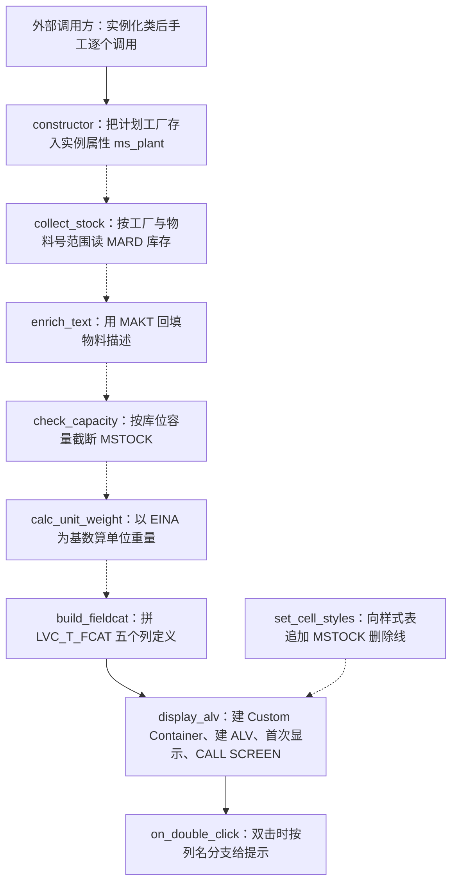

# ZCL_STOCK_CHECK 全局类 Onboarding 分析报告

> 分析对象：`ZCL_STOCK_CHECK`（全局类，CLASS-POOL 形式，MM Reporting 团队维护）
> 分析视角：业务意图 → 执行流程 → 按方法分组的三层解读 → 数据流转全景 → 问题清单
> 阅读对象：刚接手这块 MM 报表需求的工程师

---

## 一、程序定位与业务背景

### 1.1 它想解决什么问题

MM 的原料库存报表有一个长期的"手工活"：策划从各个工厂的库存表里捞原始库存量，然后还要补物料描述、按库位核对一下存放容量、算一下单个物料到底有多重，最后做成 Excel 发给业务方。这一套动作每周都要做一次，做的人换过三次，每次都是复制上一版报表程序改一改，于是就有了 `ZCL_STOCK_CHECK`。

从类名和字段结构可以反推出它的业务目标链：

1. **取数**：按"计划工厂 + 一批物料号"从库存表 `MARD` 拿当前库存量；
2. **翻译**：把物料号翻译成人能看的物料描述（`MAKT`）；
3. **体检**：拿库位容量去卡一下库存量，标出"这个库位装不下了"；
4. **换算**：算单位重量（每个物料单位多少公斤），因为业务方要知道这批原料折算下来有多重；
5. **呈现**：用 `CL_GUI_ALV_GRID` 做成可排序、可双击交互的 ALV 报表。

也就是说，**它是一个"库存合理性体检表"的取数 + 展示引擎**：不是简单的库存清单，而是要输出"库存健康度"的报表。这是理解后面所有代码的前提 —— 后面大量的问题（截断库存量、单位重量无处落点、样式无人绑定）都属于"体检功能只做了一半"。

### 1.2 整体设计范式

一句话定性：**一个用"ALV + OO 全局类"包装的报表类，设计意图清晰（取数 / 富化 / 校验 / 展示四段式），但只完成了骨架 —— 存在多处编译期错误、状态管理缺失和数据被就地篡改三类硬伤，实际上是一个"能看出作者想做什么、但跑不起来"的半成品。**

具体地说：

- 好的一面是**分层意识是对的**：取数（`collect_stock`）、文本富化（`enrich_text`）、业务校验（`check_capacity`）、单位换算（`calc_unit_weight`）、字段目录（`build_fieldcat`）、展示（`display_alv`）被拆成了各自独立的方法，而不是一个几百行的 `MAIN`。这种"一个职责一个方法"的拆分是 SAP 报表 OO 化的正解。
- 坏的一面是**这些方法之间没有真正串起来**。`display_alv` 并没有调用 `collect_stock`，它绑定的是自己声明的一个空的局部内表；`on_double_click` 想读一个根本不存在的数据成员；`set_cell_styles` 和 `calc_unit_weight` 完全没有调用方。这不是"局部小瑕疵"，而是"整体尚未打通"的证据。

---

## 二、程序执行流程总览



> 图例：实线是源码中真实存在的调用关系（`build_fieldcat` 由 `display_alv` 内部调用，`on_double_click` 由 `display_alv` 里 `SET HANDLER` 挂到网格事件上）；**虚线是"设计上应该存在、但源码里缺失"的调用关系** —— 这是本类最大的结构性问题，下面逐条展开。

### 责任链表

| 子程序 | 调用者 | 职责 | 调用关系是否真实存在 |
|---|---|---|---|
| `constructor` | 外部调用方（实例化后手工调用） | 接收计划工厂参数，写入私有属性 `ms_plant` | 是（但无强制调用机制） |
| `collect_stock` | 按设计应由外部调用方或 `display_alv` 触发 | 按 `ms_plant` + 物料号范围从 `MARD` 取 `MATNR/LGORT/MSTOCK/EINA/NTGEW`，返回 `TY_STOCK_TAB` | **否 —— 源码中无任何调用点** |
| `enrich_text` | 按设计应紧接 `collect_stock` | `FOR ALL ENTRIES` 查 `MAKT` 的中文描述，逐行回填 `MAKTX` | **否 —— 源码中无任何调用点** |
| `check_capacity` | 按设计应紧接 `enrich_text` | 取库位容量，把超过容量的 `MSTOCK` 直接改小 | **否 —— 源码中无任何调用点** |
| `calc_unit_weight` | 按设计应由展示前调用 | 用 `EINA` 作除数算单位重量 | **否 —— 源码中无任何调用点，且结果无处落点** |
| `build_fieldcat` | `display_alv`（`CHANGING it_fieldcatalog`） | 返回 `LVC_T_FCAT`，定义物料号、描述、库位、库存量、净重五列 | 是 |
| `set_cell_styles` | 按设计应由 `display_alv` 绑定 | 向 `LVC_T_SCOL` 追加 `MSTOCK` 的删除线样式 | **否 —— 源码中无任何调用点** |
| `display_alv` | 外部调用方 | 建容器 + 建网格 + 首次显示 + 注册双击事件 + `CALL SCREEN 0100` | 是（入口） |
| `on_double_click` | `CL_GUI_ALV_GRID` 的 `DOUBLE_CLICK` 事件（由 `SET HANDLER` 挂接） | 读数据行，按被双击的列名分别给出不同提示 | 是 |

下面按这条流程，逐个子程序展开。

---

## 三、分组分析（按方法分组）

### 3.1 类型与方法契约 `类 ZCL_STOCK_CHECK 定义段`

先看整个类的公共契约面。它分两段：类型定义（5 步看 3 步）和方法声明。方法声明部分较长，且每条签名都是接口契约，本节把它完整列出（省略 `ENDPROCEDURE` 之类样板）。

```abap
CLASS-POOL zcl_stock_check.

PUBLIC
FINAL
CREATE PUBLIC .

  PUBLIC SECTION.
```

**做什么** — 声明这是一个全局类（`CLASS-POOL`），继承自根类不可再继承（`FINAL`），任何程序都能通过 `CREATE PUBLIC` 实例化。没有任何接口（`INTERFACES`）和友元（`FRIENDS`）声明，说明作者打算把它作为一个纯工具类使用。

**为什么** — `FINAL` + `CREATE PUBLIC` 是报表类工具的合理默认值：报表逻辑基本不继承，禁止继承能防止子类乱改取数口径；同时全局类可以直接在 SE24 里激活、方便多个报表复用。

**风险与改进** — 缺少一个接口或至少一组参数结构（见下文 `iv_warehouse_range` 的问题）。另外 `CLASS-POOL` 的类也可以写成普通 `CLASS ... DEFINITION` + `PUBLIC` 段的形式（`CLASS-POOL` 对类来说是冗余的，SAP 里大量报表类都这么写，属于习惯而非必要）。

```abap
    TYPES: BEGIN OF ty_stock,
             matnr  TYPE mara-matnr,
             maktx  TYPE makt-maktx,
             lgort  TYPE mard-lgort,
             mstock TYPE mard-mstock,
             eina   TYPE mara-eina,
             ntgew  TYPE mara-ntgew,
           END OF ty_stock.

    TYPES ty_stock_tab TYPE STANDARD TABLE OF ty_stock WITH EMPTY KEY.
```

**做什么** — 定义报表的行结构 `TY_STOCK`：物料号、物料描述、库位、库存量、计量单位、净重；再定义承载它的内表 `TY_STOCK_TAB`，且明确指定 `WITH EMPTY KEY`（无主键的标准表）。

**为什么** — 字段类型直接引用 DDIC 而不是自定义基本类型（`CHAR40` 之类），这是好习惯：字段长度和语义跟着数据库走，换字段长度不用改代码。`TY_STOCK` 这个结构同时承担了"ALV 数据源"和"内部流转载体"两个角色，设计上是对的。

**风险与改进** — 三个问题值得展开：

1. **`NTGEW` 是净重（Net Weight），不是毛重**。`MARA-NTGEW`（Net Weight，kg，单位 MEINS）与 `MARA-BRGEW`（Gross Weight）是两个字段。本结构取的是净重，后面 `build_fieldcat` 把它标成 `'Gross Weight (kg)'`，直接是业务语义错标 —— 这类错误最危险，因为程序能跑通，但业务方按"毛重"决策会被误导。详见 3.8。
2. **`EINA`（发料单位 / Unit of Issue，CHAR 3）放进结构本身合理**（作为物料属性展示是有意义的），但 `calc_unit_weight` 把它当成数值除数使用，语义完全错位。字段本身没错，用法错了。
3. **`WITH EMPTY KEY` 是一个明确的架构错误**。空主键意味着：不能用 `READ TABLE ... WITH KEY` 走二分查找、不能用键唯一假设做 `MODIFY/DELETE ... FROM`、不能用 `SORT` 后 `READ BINARY SEARCH`。而这个类恰恰需要按物料号查找（`enrich_text`、`on_double_click` 都在做这件事）。应改成 `STANDARD TABLE WITH UNIQUE KEY matnr lgort`（工厂在方法内固定，`LGORT+MATNR` 即可唯一）或 `SORTED TABLE WITH UNIQUE KEY matnr`。

```abap
    METHODS constructor
      IMPORTING iv_plant TYPE werks OPTIONAL.

    METHODS collect_stock
      IMPORTING it_matnr         TYPE mara-matnr_tab
      RETURNING VALUE(rt_stock) TYPE ty_stock_tab
      RAISING   cx_sy_move_cast_error.

    METHODS enrich_text
      CHANGING ct_stock TYPE ty_stock_tab.

    METHODS calc_unit_weight
      IMPORTING is_row       TYPE ty_stock
      RETURNING VALUE(rv_uw) TYPE p DECIMALS 4.

    METHODS check_capacity
      IMPORTING iv_warehouse TYPE mard-lgort
      CHANGING  ct_stock    TYPE ty_stock_tab.

    METHODS build_fieldcat
      RETURNING VALUE(rt_fieldcat) TYPE lvc_t_fcat.

    METHODS display_alv.

    METHODS on_double_click
      IMPORTING iv_row    TYPE lvc_row
                iv_column TYPE lvc_col
                iv_data   TYPE any.

    METHODS set_cell_styles
      IMPORTING is_row     TYPE ty_stock
      CHANGING  ct_styling TYPE lvc_t_scol.
```

**做什么** — 9 个公开方法的签名。整体风格是标准的 ABAP OO：`IMPORTING` 收窄输入、`CHANGING`/`RETURNING` 出结果、大写变量前缀（`IV/IT/IS/CT/RT/RV`）使用规范，说明作者有较好的编码习惯。

**为什么** — 三个方法用 `RETURNING VALUE(...)` 而非 `EXPORTING`，这是现代 ABAP 的正确写法，避免了导出参数需要先 `CLEAR` 的坑；`calc_unit_weight` 标注 `DECIMALS 4` 也体现了对数值精度的意识。

**风险与改进** — 契约层面有 5 个硬伤：

1. **`collect_stock` 没有 `iv_warehouse` 参数**，但方法体里的动态 SQL 用了 `iv_warehouse_range( )` —— 这个参数根本不存在。接口漏了"库位范围"这个业务维度，`check_capacity` 却只接受单个库位 `iv_warehouse`。数据契约与实现不一致。
2. **`collect_stock` 声明 `RAISING cx_sy_move_cast_error` 但方法体从不 `RAISE`**。给调用方挂一个永远不会发生的异常，等于让人写 `CATCH cx_sy_move_cast_error` 的无用代码，还制造"这里可能类型转换失败"的错误预期。取数方法应该 `RAISING` 真实的领域异常，或者干脆去掉。
3. **`set_cell_styles` 的形参名 `ct_styling` 与类型 `lvc_t_scol` 不符**。`LVC_T_SCOL` 是**颜色表**（`CL_SCOL` = Color），样式表叫 `LVC_T_STYLING`（元素 `LVC_S_STYLING`）。方法内也只填了 `color/intens/style`，没填真正的 `STYLING`。名实不符会误导后续维护者。
4. **`on_double_click` 的 `iv_column TYPE lvc_col` 类型可疑**。ALV `DOUBLE_CLICK` 事件的列参数是 `lvc_col_h`（含 `fieldname` 和列头附加信息），不是 `lvc_col`；且事件还提供整行数据参数（如 `et_data_sender` / `es_row`），这里完全没有承接。
5. **类型契约与业务类型错配**：`calc_unit_weight` 的 `rv_uw TYPE p DECIMALS 4` 隐含了"重量是数值"的前提，但 `NTGEW` 的单位是 kg / MEINS，`TY_STOCK` 里没有重量单位字段，跨工厂比较不同基本单位的物料时，`rv_uw` 不可比。

---

### 3.2 实例状态 `私有属性段`

方法契约讲清了对外接口，接下来看方法之间靠什么传递状态 —— 这是本类最薄弱的环节。

```abap
  PRIVATE SECTION.

    DATA ms_plant TYPE werks.
    DATA ms_plants TYPE werks_tab.
    DATA mo_grid   TYPE REF TO cl_gui_alv_grid.
    DATA mo_container TYPE REF TO cl_gui_custom_container.
```

**做什么** — 4 个私有属性：`ms_plant` 保存当前计划工厂（由 `constructor` 写入，`collect_stock` 和 `check_capacity` 读取）；`mo_grid`、`mo_container` 保存 ALV 控件和自定义容器引用（由 `display_alv` 写入）；`ms_plants` 是一个"工厂列表"，声明了但没有任何方法读或写它。

**为什么** — 把 ALV 控件引用放在实例属性里是正确的：这样 `display_alv` 返回后控件仍然存活，后续 `refresh_table_display`、`set_pai_status`、重绘才拿得到句柄。用局部变量的话 `CALL SCREEN` 一返回控件就被释放了。工厂放在实例属性里也算合理，可以少传一遍参数。

**风险与改进**：

1. **缺少"报表数据"成员，这是致命的**。`collect_stock` 的结果没有地方放，`enrich_text` 传进来的是调用方持有的内表，`display_alv` 又自己声明了一个局部 `lt_stock`。三个方法各自持有一份数据，没有任何共享。正确做法是加 `DATA mt_stock TYPE ty_stock_tab.`，让取数结果成为实例状态，`display_alv` 和 `on_double_click` 都读它。
2. **`ms_plants` 是死代码**。没有任何方法引用它，且 `TYPE werks_tab` 这种命名也不是标准类型（SAP 标准是 `T001-WERKS` / `WERKS_RANGE` / 自定义的 `ty_werks_tab TYPE STANDARD TABLE OF t001-wers`）。要么删掉，要么把"多工厂"这个真实需求实现出来 —— 从类名和动态 SQL 里的 `FROM mard` 看，作者很可能原本打算支持多工厂。
3. **`ms_plant` 与 `TY_STOCK` 缺少工厂字段**。一旦数据来自多个工厂，行结构里没有 `WERKS`，结果无法按工厂区分，`check_capacity` 也没有工厂维度的容量表键。这与上一条呼应：多工厂能力要么补齐、要么删掉。

---

### 3.3 初始化入口 `方法 constructor`

有了状态定义，先看状态是怎么被写入的。

```abap
  METHOD constructor.

    ms_plant = iv_plant.

  ENDMETHOD.                    "constructor
```

**做什么** — 唯一一件事：把导入参数 `iv_plant`（计划工厂）赋给私有属性 `ms_plant`。

**为什么** — 把"本次报表的上下文参数"集中收口到一个初始化方法，避免把工厂当参数在 `collect_stock`、`check_capacity` 之间来回传。思路是对的。

**风险与改进** — 这里有一个容易踩但很关键的语义问题：

- **`CONSTRUCTOR` 不是 ABAP OO 的特殊方法名**。它不会在 `CREATE OBJECT` 时被自动调用。调用方必须写成：
  ```abap
  CREATE OBJECT lo_check.
  lo_check->constructor( iv_plant = '1000' ).
  ```
  忘记第二行，`ms_plant` 就保持初始空值，后续 `WHERE werks = ms_plant` 变成 `WHERE werks = ' '`，结果要么空、要么取决于数据库里的空格值 —— **静默错误**。
- **改进方向（推荐）**：既然只有一个可选参数，直接做成"参数化构造"更符合直觉 —— 用 `CREATE OBJECT ... EXPORTING` 需要把参数定义在类里定义段的 importing 段（对非工厂方法来说 ABAP 不支持，这是接口的活），所以实践上更常见的是保留 `constructor` 但改名为 `init` / `set_plant`，或引入 `IF_ZCL_STOCK_CHECK~INIT` 这样的静态工厂方法。同时 `iv_plant` 是 `OPTIONAL`，更应该 `CHECK` 非空并抛异常/消息，否则"忘传"和"故意传空"不可区分。

---

### 3.4 取数主干 `方法 collect_stock`

这是全类最核心的方法，也是问题最密集的地方。它原本应该分 4 步，我们逐步看。

#### ① 拼装动态 SQL 字符串

```abap
    DATA lv_sql TYPE string.

    lv_sql = |SELECT mard~lgort mard~mstock mara~eina mara~ntgew mara~matnr|
           && |  FROM mard INNER JOIN mara ON mara~matnr = mard~matnr|
           && | WHERE mard~werks = '{ ms_plant }'|
           && |   AND mard~lgort IN iv_warehouse_range( )|.
```

**做什么** — 用字符串模板拼出一条本该执行的 Open SQL：`MARD INNER JOIN MARA`，按工厂 + 库位范围取库位、库存量、发料单位、净重、物料号。

**为什么** — 作者显然打算做 `MARD` 与 `MARA` 的内连接 —— 这是对的，因为 `EINA`（发料单位）和 `NTGEW`（净重）确实都在 `MARA` 里而不在 `MARD` 里。`FOR ALL ENTRIES` 或直接 JOIN 都比两次查询好，用 JOIN 在这种"两表都有索引前缀"的场景下性能可接受。

**风险与改进** — 这一整段是**死代码**，`lv_sql` 构造完就再也没被 `EXECUTE IMMEDIATE` 或 `PERFORM ON` 使用：

- **`iv_warehouse_range` 这个参数不存在**。类定义段的 `collect_stock` 签名只有 `it_matnr`，既没有导入参数，也没有局部内表。这个字符串如果被 `EXECUTE IMMEDIATE`，会直接语法错误。
- **字符串拼接是 SQL 注入面**。`'{ ms_plant }'` 把变量直接塞进 SQL 文本，即便 `ms_plant` 来自 `WERKS` 域（4 位字符）风险有限，但这仍是坏范式。Open SQL 里 `WHERE werks = @ms_plant` 用主机变量更安全、更清晰、更能被优化器处理。
- **强烈建议**：既然正确写法已经摆在下面（下一步就是主机变量版），把整段删掉。

#### ② 真正的取数语句

```abap
    SELECT matnr lgort mstock eina ntgew
      FROM mard
      INTO TABLE rt_stock
      WHERE werks  = ms_plant
        AND matnr IN it_matnr.
```

**做什么** — 用主机变量做真正的查询：按 `ms_plant` 和 `it_matnr` 范围，从 `MARD` 取 `MATNR`、`LGORT`、`MSTOCK`、`EINA`、`NTGEW` 装进 `rt_stock`。

**为什么** — 这一步比上一步**好**：用静态 SQL + 主机变量，没有拼接，可被 SQL 语法检查覆盖，性能也能被优化器/trace 看清。作者显然改过一次写法（从动态 SQL 回退到静态），但只改了一半 —— 字段列表没跟着改。

**风险与改进** — 这是本类的 **P0 硬伤**：

- **`MARD` 表里没有 `EINA` 和 `NTGEW` 这两个字段**。`EINA`（发料单位）和 `NTGEW`（净重）都是 `MARA` 的字段，`MARD` 只有 `MATNR/WERKS/LGORT/MSTOCK/...` 这一套库存字段。SQL 的字段清单校验在这一句就会失败（编译期就报错；即使绕过检查，运行时也必然 SQL 错误）。
- **正确写法有两条**：
  1. 一次 JOIN（推荐，语义最贴近作者原意）：
     ```abap
     SELECT matnr lgort mstock eina ntgew
       FROM mara INNER JOIN mard ON mara~matnr = mard~matnr
       INTO TABLE rt_stock
       WHERE mard~werks  = @ms_plant
         AND mara~matnr IN @it_matnr.
     ```
  2. 两步法（`MARD` 取库存，再用 `FOR ALL ENTRIES` 从 `MARA` 补 `EINA/NTGEW`），适合 `MARD` 命中量很大时避免 JOIN 结果集膨胀。
- **`WHERE` 缺少库位条件**，与方法名和业务意图不符：报表是"库位容量体检"，但取数不过滤库位，结果里会混入所有库位的库存行，`check_capacity` 却只按一个传入的库位去算容量 —— 分子分母口径不一致。
- **`IT_MATNR` 为空时没有任何拦截**。空区间在 SELECT 里等价于"什么都取不到"，用户看到的只是空报表，和"确实没有库存"无法区分。应在取数前 `IF it_matnr IS INITIAL. ... EXIT/RAISE`。

#### ③ 无效的行循环

```abap
    LOOP AT rt_stock ASSIGNING FIELD-SYMBOL(<ls>).
      <ls>-matnr = <ls>-matnr.
    ENDLOOP.
```

**做什么** — 遍历结果内表，用 `ASSIGNING` 拿到行的字段符号，然后**把 `MATNR` 赋给它自己**。

**为什么** — 没有为什么，这是一段纯粹的无效代码。`ASSIGNING` 的写法本身是对的（性能优于 `INTO` + `MODIFY`），但循环体里没有做任何业务处理。

**风险与改进** — 直接删除。留着它对读代码的人有三重误导：一是让人以为"取数之后还有一层加工"，二是掩盖了"这一步本该做什么"（大概率作者原本打算在这里填单位重量或做去重/汇总），三是白白多一次全表遍历。ABAP 语法检查不会报警，但 `RCE` 或 `Code Inspector` 的"自我赋值"检查能抓出来。

#### ④ 空结果提示

```abap
    IF rt_stock IS INITIAL.
      MESSAGE 'No stock records found' TYPE 'S'.
    ENDIF.
```

**做什么** — 取数为空时执行一条 `TYPE 'S'`（成功）消息。

**为什么** — 从意图看是想给用户一个"没查到数据"的提示，出发点没问题。

**风险与改进** — 这个写法有三个坑：

1. **`MESSAGE` 在这里不起提示作用**。ABAP 的 `MESSAGE` 语句只是**设置** `SY-MSGID/SY-MSGNUM/SY-MSGV1`，不会自动显示。必须由调用方 `MESSAGE sy-msgid TYPE sy-msgty` 才弹出来。本类没有任何地方回读 `SY-MSGV1`，所以用户看不到这条消息。
2. **消息类型选错了**。查不到数据是"没结果"而不是"成功"，应该用 `TYPE 'S'`（成功）还是 `'I'`（信息）要看团队规范，但如果是调用方预期的异常情况，用 `TYPE 'A'` 或抛异常更合适。
3. **与接口契约矛盾**。方法签名声明了 `RAISING cx_sy_move_cast_error`，却在内部用消息语义处理"无数据"，两套错误处理风格混用。取数方法应该统一：**要么全部抛异常**（推荐），要么返回空表让调用方判断。

---

### 3.5 文本富化 `方法 enrich_text`

取到数字后，需要把物料号翻译成业务方看得懂的描述。

```abap
    DATA lt_text TYPE TABLE OF makt.

    SELECT matnr maktx FROM makt
      INTO TABLE lt_text
      FOR ALL ENTRIES IN ct_stock
      WHERE matnr = ct_stock-matnr
        AND spras = 'ZH'.
```

**做什么** — 用 `FOR ALL ENTRIES` 从 `MAKT` 取物料号对应的中文描述（`SPRAS = 'ZH'`）装进 `lt_text`。`FOR ALL ENTRIES IN ct_stock` 让 `WHERE matnr = ct_stock-matnr` 变成"对结果内表里每个物料号做一次匹配"，避免了笛卡尔积。

**为什么** — 选 `FOR ALL ENTRIES` 而不是 JOIN 的理由是：`MAKT` 是"物料 × 语言"的多语言表，JOIN 后如果物料有多语言维护容易行数膨胀；而这里已经用 `SPRAS = 'ZH'` 限定了单语言。`FOR ALL ENTRIES` + 范围限制是这类"补描述"的标准解法，性能比在循环里逐条 SELECT 好一个量级。

**风险与改进**：

1. **语言硬编码 `'ZH'`**，违背了多语言报表的基本原则。正确做法是 `AND spras = @sy-langu`（跟随登录语言），或者用一个导入参数 `iv_spras TYPE spras` 让调用方指定。后者更适合"这个报表固定出中文"或"出中英对照"的场景。
2. **`lt_text TYPE TABLE OF makt` 是宽结构**。`MAKT` 有十几个字段，这里只用了 `MATNR`/`MAKTX` 两个。虽然 SELECT 列表限制了取数字段，但内表类型仍按整行定义，后续如果误用 `READ ... WITH KEY` 会被迫思考无意义的字段。建议改为 `ty_makt_tab TYPE SORTED TABLE OF ty_makt WITH UNIQUE KEY matnr`，`ty_makt` 只含两个字段 —— **顺带解决下面 ② 的性能问题**。
3. **`FOR ALL ENTRIES` 前没有判断驱动表非空**。这是 ABAP 里的经典陷阱：当 `ct_stock` 为空时，`FOR ALL ENTRIES` 的 `WHERE` 条件会被**整体忽略**，这条语句退化成"全表扫描 `MAKT`"！虽然对性能是灾难性的，但更重要的是它的行为反直觉。必须在前面加 `IF ct_stock IS INITIAL. RETURN. ENDIF.`。

#### ② 逐行回填描述

```abap
    LOOP AT ct_stock INTO DATA(ls_row).
      READ TABLE lt_text INTO DATA(ls_text) WITH KEY matnr = ls_row-matnr.
      ls_row-maktx = ls_text-maktx.
      MODIFY ct_stock FROM ls_row.
    ENDLOOP.
```

**做什么** — 遍历 `ct_stock` 每一行，按 `MATNR` 从 `lt_text` 找对应描述，写进 `ls_row-maktx`，再 `MODIFY` 写回 `ct_stock`。

**为什么** — 在没有可用 SQL join、必须以已有内表为驱动做富化的场景下，"查找 + 赋值 + 回写"是标准三段式。作者知道用 `LOOP ... INTO` 配合 `MODIFY`，比 `ASSIGNING` 多了一步拷贝 —— 说明对 `CHANGING` 参数的处理思路是清楚的。

**风险与改进** — 这一段有两个会导致**数据错误**（不只是风格问题）的缺陷：

1. **`READ TABLE` 没有检查 `SY-SUBRC`**。物料在 `MAKT` 里找不到中文描述时（比如新建物料或只维护了英文），`ls_text` 保持上一次的赋值 —— 于是**这一行会继承上一行的描述**。用户看到的报表里会出现"某物料的描述是隔壁物料的描述"，而且相邻同语言物料时特别容易发生。修法：
   ```abap
   READ TABLE lt_text INTO DATA(ls_text) WITH KEY matnr = ls_row-matnr.
   IF sy-subrc = 0.
     ls_row-maktx = ls_text-maktx.
   ELSE.
     CLEAR ls_row-maktx.
   ENDIF.
   ```
2. **`MODIFY ... FROM` 在 `EMPTY KEY` 内表上不可靠**。`TY_STOCK_TAB` 是 `WITH EMPTY KEY`，没有主键字段，`MODIFY ... FROM` 无法按物料号唯一定位行，等于在逐行扫描并可能改错行；再加上 `LOOP ... INTO` 是顺序遍历，行位置本身就是定位依据。**正解是直接改字段符号，一次遍历搞定，没有回写也没有全表查找**：
   ```abap
   LOOP AT ct_stock ASSIGNING FIELD-SYMBOL(<row>).
     READ TABLE lt_text INTO DATA(ls_text) WITH KEY matnr = <row>-matnr.
     IF sy-subrc = 0.
       <row>-maktx = ls_text-maktx.
     ELSE.
       CLEAR <row>-maktx.
     ENDIF.
   ENDLOOP.
   ```
   配合把 `lt_text` 改成 `SORTED TABLE WITH UNIQUE KEY matnr`，`READ` 从 O(n) 降到 O(log n)，整体从 O(n×m) 降到 O(n log n)。
4. `DATA(ls_text)` 声明在循环体内（ABAP 7.40 内联声明）是有作用域的，ABAP 会为每次迭代复用同一变量 —— 这正是缺陷 1 中"值被串味"的技术原因，不是编译器 bug，但对不了解的人很难排查。

---

### 3.6 容量体检 `方法 check_capacity`

描述补齐后，报表要回答"库存还装得下吗"这个业务问题。

```abap
    DATA lv_slots TYPE i.

    SELECT SINGLE mstbw FROM mard-mvbeln INTO @lv_slots
      WHERE werks = ms_plant AND lgort = iv_warehouse.
```

**做什么** — 声明一个整数 `lv_slots`，然后从"库位表-某字段"的写法取一次单值，按工厂 + 库位定位。

**为什么** — 用 `SELECT SINGLE` 读取一个配置型数值、缓存到局部变量、后面在循环里复用，这个思路是对的：避免在 `LOOP` 里重复查库。但**取数来源写错了**。

**风险与改进** — 这一句至少有三层错误，**P0 级**：

1. **`mard-mvbeln` 里的 `MVBELN` 不是 `MARD` 的字段**。`MVBELN` 是销售订单/交货单相关字段（`VBRK-MVBELN` 那一族），属于 SD 模块，跟物料库存表毫无关系。`FROM table-field` 这种写法里的字段必须真实属于该表 —— 这里既不存在 `MVBELN` 这个字段，语义上更不成立。**"库位容量"这个信息在标准 SAP 里根本没有存放的地方**：容量是现场管理概念，标准表存不了，必须来自自定义表（例如自建的库位容量表 `ZMM_LGORT_CAP`，键为 `WERKS + LGORT`，字段为容量）和后续的二次开发配置。
2. **`MSTBW` 也不是"容量"**。即便字段名改对成 `MARD` 里真实存在的某个字段，`MARD` 里没有任何"容量"语义字段 —— 它存的是实际库存量和金额（`SALKU`）。用库存表反查容量在业务上就是循环论证。
3. **`lv_slots TYPE i` 抹掉了小数**。容量类字段通常是 `QUAN`（如 `MARD-MSTOCK` 是 13 位 3 小数的量化字段），直接塞进整数会截断小数部分。数量字段应使用 `mard-lgort` 域对应的量化类型或 `quans`，让容量保留 3 位小数。
4. **没有检查 `SY-SUBRC`**。取不到数据时 `lv_slots` 保持 0，而下面的判断是 `mstock > lv_slots`，结果是**所有库存量都会被置零** —— 见下。

```abap
    LOOP AT ct_stock ASSIGNING FIELD-SYMBOL(<ls>).
      IF <ls>-mstock > lv_slots.
        <ls>-mstock = lv_slots.
      ENDIF.
    ENDLOOP.
```

**做什么** — 遍历所有行，如果某行的 `MSTOCK` 大于库位容量 `lv_slots`，就把 `MSTOCK` **直接改写成** `lv_slots`。

**为什么** — 作者的意图应该是"标记超容量的行"（比如后面用 `set_cell_styles` 加删除线 —— 那个方法里确实有个 `strikeout`！意图链条在这里对上了）。如果目的是标记，那用样式是对的；问题出在实现方式上。

**风险与改进** — 这是全类**业务危害最大**的问题：**它销毁了原始数据**。

- 报表一旦显示或导出，`MSTOCK` 就不是数据库里的真实库存量了，而是"被容量裁剪过的值"。业务方拿到的"当前库存 500"可能真实值是 1200 —— 这是**不可逆的信息丢失**，比程序报错严重得多。
- "这个物料超容量了吗"和"这个物料实际有多少库存"是**两个不同的事实**，不能塞进同一个字段。正确做法是**加列而不是改列**：
  ```abap
  " TY_STOCK 增加字段
  stock_overflow TYPE abap_bool,
  capacity      TYPE quans,       " 库位容量，保留 3 位小数
  -- 循环里
  IF <ls>-mstock > lv_capacity.
    <ls>-stock_overflow = abap_true.   " 只打标
  ENDIF.
  ```
  然后让 `set_cell_styles` / `fieldcat` 根据这个标志上色加删除线 —— 这样"真实值"和"是否超限"两个信息都保住了，`set_cell_styles` 里那个"删除线"也终于有了触发条件。
- **`MSTOCK` 存在基础单位里，容量可能按不同单位定义**，直接比较跨单位的两个数在业务上不严谨。至少要在比较前统一单位（`CONV` 或 `CALL FUNCTION 'UNIT_CONVERSION'`）。
- 方法名叫 `check_capacity`（检查），实际行为是"修改数据"。**名实不符本身就是设计警报**：应该叫 `mark_overflow`，或者干脆把 `CHANGING` 改成返回检查结果。
- 容量是"库位级"属性，但这里在物料行级别比较。同一个库位下有 10 个物料，每个都跟"库位总容量"比 —— 逻辑上应该是**先按库位汇总所有物料的库存量，再和库位容量比**，判断"库位是否装满"。现在的写法永远是每个物料各自不超容量，等于没有体检能力。

---

### 3.7 单位重量换算 `方法 calc_unit_weight`

体检之外还有另一个业务诉求：这些原料总共有多重。

```abap
    DATA lv_base TYPE p DECIMALS 4.

    lv_base = is_row-eina.

    IF lv_base IS INITIAL.
      rv_uw = 0.
      RETURN.
    ENDIF.

    rv_uw = is_row-ntgew / lv_base.
```

**做什么** — 声明 4 位小数的数值型 `lv_base`，把行里的 `EINA` 赋给它；若为零则返回 0；否则用 `NTGEW / EINA` 算出单位重量返回。

**为什么** — "净重 ÷ 基数 = 单位重量"这个**公式形态**是对的：一个标准单位的净重是已知的，要换算成"每个发料单位多少公斤"，需要除以基数。作者显然理解"净重是按基本单位存的，需要换算到发料单位"这个业务逻辑。

**风险与改进** — 这里的**类型和语义双重错配**是本节的核心问题：

- **类型层面：`EINA` 是字符型的单位代码，不是数值**。`MARA-EINA`（Unit of Issue / 发料单位）是 `CHAR(3)`，存的值是 `'KG'`、`'PC'` 这类单位标识，把它赋给 `TYPE p DECIMALS 4` 会直接类型错误（编译期报错）。这说明作者混淆了 `EINA`（单位代码）和"每单位包含多少基本单位数量"这个概念。
- **语义层面：正确的基数不是单位代码**。MARA 里承载"换算数量"语义的是 `EINR`（每发料单位的基本单位数量），配合 `EINS`（交货单位）。`EINA` 只是个代号字段，把它当除数在业务上毫无意义。正确写法：
  ```abap
  " is_row 结构需补充 einr / eins 字段
  DATA lv_base TYPE p DECIMALS 4.
  lv_base = is_row-einr.          " 每发料单位含多少基本单位
  IF lv_base IS INITIAL.
     rv_uw = 0. RETURN.
  ENDIF.
  rv_uw = is_row-ntgew / lv_base.
  ```
- **`NTGEW` 的单位是 kg/MEINS（净重），不是毛重**。如果业务方要的是"毛重"，应该取 `MARA-BRGEW`。这个错误在 3.8 的列标题里会再出现一次 —— 两处口径必须统一。
- **方法完全不可用**：没有任何调用点，`TY_STOCK` 里也没有承接 `rv_uw` 的字段，字段目录也没有对应列。**算出来的值无处可去。**要让单位重量真正出现在报表上，需要三处配套：`TY_STOCK` 加 `unit_weight TYPE p DECIMALS 4`；在数据准备阶段循环调用本方法回填；`build_fieldcat` 里加一列（标题要写清"净重/发料单位 (kg)"而不是"毛重"）。
- **返回类型 `p DECIMALS 4` 与源字段精度不匹配**：`MARD-MSTOCK` 是 13 位 3 小数的 `QUAN`，除法前若不做单位换算，中间结果的小数位截断行为不可控。建议显式使用 `p LENGTH 13 DECIMALS 3` 或至少在文档里说清精度约定。

---

### 3.8 字段目录构建 `方法 build_fieldcat`

这是唯一被 `display_alv` 真正调用、也最能体现业务语义的方法。

```abap
    APPEND VALUE #(
      fieldname  = 'MATNR'
      ref_field  = 'MATNR'
      tabname    = 'TY_STOCK'
      seltext_m  = 'Material'
      just_field = 'X' ) TO rt_fieldcat.
```

**做什么** — 第一列：字段名 `MATNR`，通过 `tabname = 'TY_STOCK'` + `ref_field = 'MATNR'` 建立到数据源字段的映射，标题 `'Material'`，右对齐。

**为什么** — `fieldname` 和 `ref_field` 同名 + `tabname` 指定结构类型，是为**结构化数据源**（而非传统 `INTERNAL TABLE`）配置 ALV 的标准做法，思路正确。`just_field = 'X'` 让物料号右对齐，符合阅读习惯。

**风险与改进** — 一个小问题：`just_field` 只在这一列设置了，后面的数值列没有统一对齐规则。见下文。

```abap
    APPEND VALUE #(
      fieldname  = 'MAKTX'
      ref_field  = 'MAKTX'
      tabname    = 'TY_STOCK'
      seltext_m  = 'Description' ) TO rt_fieldcat.

    APPEND VALUE #(
      fieldname  = 'LGORT'
      ref_field  = 'LGORT'
      tabname    = 'TY_STOCK'
      seltext_m  = 'Storage Location' ) TO rt_fieldcat.
```

**做什么** — 第二、三列：物料描述 `MAKTX` 和库位 `LGORT`，都用 `tabname/ref_field` 映射到 `TY_STOCK`。

**为什么** — 列的顺序符合阅读习惯（物料 → 描述 → 库位 → 数量 → 重量），`LGORT` 排在数量前面让用户先定位"在哪个库位"，逻辑对。

**风险与改进**：

1. **`LGORT` 没有 `just_field = 'X'`**。库位是 CHAR 字段但业务上按数字读（`01`、`02`），左对齐会让"库位 01"和"库位 1000"参差不齐。建议 `LGORT` 也设 `just_field = 'X'`。
2. **标题是英文硬编码**，没有走 `text-001` 之类可翻译文本，或至少用 `seltext_m/seltext_l`。中英文用户共用时只能看到英文。这类报表 ALV 标题建议放文本符号（`TEXT-001`）以便 SE63 翻译，或按项目规范统一。

```abap
    APPEND VALUE #(
      fieldname  = 'MSTOCK'
      ref_field  = 'MSTOCK'
      tabname    = 'TY_STOCK'
      seltext_m  = 'Stock Qty'
      cfield     = 'MSTOCK'
      no_outline = 'X' ) TO rt_fieldcat.
```

**做什么** — 第四列：库存量 `MSTOCK`，标题 `'Stock Qty'`，并设置 `cfield = 'MSTOCK'`（把它自己的颜色字段指向自己）、`no_outline = 'X'`。

**为什么** — `cfield` 是 ALV 的"颜色字段"机制：让 ALV 根据数据源里的某个颜色标志字段给单元格上色。`no_outline` 关闭列的分组边框，让关键数字列更突出。这两个都是想给库存列做视觉强调。

**风险与改进** — `cfield = 'MSTOCK'` **指错了字段**。`cfield` 应该指向一个专门存放颜色标志的字段（比如从 `CT_STYLING` 或 `LVC_T_SCOL` 算出的颜色码字段），而不是指自己。让 `MSTOCK` 引用自己作颜色字段，ALV 会尝试把这个数字当颜色/格式解释，产生非预期的高亮或直接不生效。而且 `set_cell_styles` 生成的 `LVC_SCOL` 根本没有被传给 `display_alv` —— 整条着色链路是断的。**正确做法**：把 `set_cell_styles` 的结果通过 `set_table_for_first_display` 的 `it_scol` 参数传入。

```abap
    APPEND VALUE #(
      fieldname  = 'NTGEW'
      ref_field  = 'NTGEW'
      tabname    = 'TY_STOCK'
      seltext_m  = 'Gross Weight (kg)' ) TO rt_fieldcat.
```

**做什么** — 第五列：净重字段 `NTGEW`，标题写 `'Gross Weight (kg)'`（毛重/千克）。

**为什么** — 想把"重量"作为最后一列展示，且明确标了单位 kg，符合 ALV 标注单位的最佳实践（标题带单位，避免用户误读量纲）。

**风险与改进** — **本类最典型的语义错误（P0）**：

- **`NTGEW` 是净重（Net Weight），不是毛重（Gross Weight）**。`MARA-NTGEW` 是物料的"净重"，单位 kg（基于基本单位 MEINS）；**毛重是 `MARA-BRGEW`（Gross Weight）**。两者在物料主数据里分别维护，数值通常不同（包装重 + 单件重）。
- **危害**：程序能正常运行，但列标题告诉业务方"这是毛重"。采购/物流据此算运费、算装载量会系统性偏低，且**不会有任何报错** —— 这是"能跑通但算错"的经典反例，比编译错误危险得多。
- **修法**：要么标题改成 `'Net Weight (kg)'`（若确实要用 `NTGEW`），要么改取 `BRGEW` 并配 `"Gross Weight (kg)"`。**同时要回头检查 `calc_unit_weight`**，看单位重量到底该基于净重还是毛重 —— 那里的公式也用了 `NTGEW`，两处口径必须一致。这个"语义校核"不能因为"类型长度对得上"就放过。

---

### 3.9 报表展示主入口 `方法 display_alv`

字段目录就绪，接下来看容器和网格的搭建。这个方法有 5 个连续步骤。

#### ① 创建 Custom Container

```abap
    DATA lt_stock TYPE ty_stock_tab.
    DATA lv_ok    TYPE abap_bool.

    CREATE OBJECT mo_container
      EXPORTING
        container_name = 'STOCK_AREA'
        repaint_detlevel = 1.
```

**做什么** — 声明局部内表 `lt_stock`（空）和布尔 `lv_ok`，然后创建一个 `CL_GUI_CUSTOM_CONTAINER`，容器名硬编码为 `'STOCK_AREA'`。

**为什么** — `CL_GUI_CUSTOM_CONTAINER` 是把 ALV 挂到屏幕上自定义控件的标准方式（比 `CL_GUI_ALV_GRID` 直接全屏更适合做报表页面的局部布局）。

**风险与改进** — `Custom Container` 的创建有三个硬伤：

1. **`ST_TEXT` 是必填参数却没传**。`CL_GUI_CUSTOM_CONTAINER` 的 `ST_TEXT` 是必输（容器标题），不传会短 dump（`CONSTRUCTOR` 里 `IF st_text IS INITIAL. ... RAISING cx_sy_message`）。必须补上：`st_text = '库存体检'` 之类。
2. **`container_name = 'STOCK_AREA'` 硬编码**，要求屏幕 0100 上必须存在名为 `STOCK_AREA` 的自定义控件（`CL_GUI_CUSTOM_CONTAINER` 的名字要和屏幕控件名一致）。这个类里没有定义屏幕、没有创建控件的逻辑（`display_alv` 直接 `CALL SCREEN 0100` 但没建 dynpro）。要么把控件名参数化，要么在屏幕里建好控件。
3. **`repaint_detlevel = 1` 关掉了重绘优化**。默认是 `3`（优化重绘），设成 `1` 会让每次数据刷新都全屏重绘，ALV 刷新时明显闪烁、数据量大时更卡。**这个参数不该传**，用默认值即可。

#### ② 创建 ALV 网格

```abap
    CREATE OBJECT mo_grid
      EXPORTING
        i_container = mo_container
        ex_initial_layout = '1'.
```

**做什么** — 创建 `CL_GUI_ALV_GRID`，挂到刚建的容器上，设置 `ex_initial_layout = '1'`。

**为什么** — 用 Full Screen Grid 而非 List Viewer，因为报表要支持双击交互（`on_double_click`）和着色，`CL_GUI_ALV_GRID` 是唯一选择，`ex_initial_layout = '1'` 是让用户保存个性化布局的标准做法（ALV 的"布局"按钮可用）。

**风险与改进** — `ex_initial_layout = '1'` 本身没问题（让用户保存布局变式是好实践），但要注意：要让"个性化"生效，还需要配套调用 `mo_grid->set_pai_status` 或至少 `enable_default_toolbar`，否则"保存布局"按钮可能不出现。这属于可完善项，不是 bug。

#### ③ 首次显示绑定数据与字段目录

```abap
    mo_grid->set_table_for_first_display(
      CHANGING
        it_outtab        = lt_stock
        it_fieldcatalog  = build_fieldcat( )
      EXCEPTIONS
        program_error = 1
        OTHERS        = 2 ).
```

**做什么** — 把**局部声明的空内表** `lt_stock` 和 `build_fieldcat()` 的返回绑定给 ALV 做首次显示，并处理异常。

**为什么** — `set_table_for_first_display` 是 ALV 显示的标准入口，`CHANGING` 绑定 + 异常处理的基本框架正确，局部变量而非成员引用也能保证内表在显示期间存活。

**风险与改进** — 这里有一个让整个报表失效的致命问题：

- **绑定的是空内表**。`lt_stock` 在方法开头声明后从未被赋值。`collect_stock` 的结果既没被调用、也没被存到任何成员或传进来。结果：**ALV 永远是空表** —— 即使前面的取数逻辑全修好，报表也一行都显示不出来。这印证了 3.2 里"缺少报表数据成员"的分析。
- **`it_fieldcatalog` 用方法调用的返回值直接绑定**：语法上 OK（ABAP 支持），但可读性差，且调试时不好下断点。建议先 `DATA lt_fieldcat TYPE lvc_t_fcat. lt_fieldcat = build_fieldcat( ).` 再绑定。
- **`OTHERS = 2` 捕获了所有异常**，把 ALV 的真实错误原因（布局不一致、字段目录与数据不匹配等）全吞掉了。ALV 显示失败往往就是字段目录配置有问题，全捕获会让排查无从下手。建议按实际需要补具体异常，或至少在捕获后输出 `SY-MSGTXT` 便于诊断。
- **`build_fieldcat` 本身与数据源的一致性没有校验**。因为数据源是空表，字段目录与结构的对错暂时看不出来；一旦接上真实数据，`ref_field` 里任何一个字段在 `TY_STOCK` 里不存在，ALV 都会报错。字段目录和结构必须严格对齐。

#### ④ 检查显示结果并注册双击事件

```abap
    IF sy-subrc <> 0.
      lv_ok = abap_false.
    ENDIF.

    SET HANDLER on_double_click FOR mo_grid.
```

**做什么** — 若显示调用失败则把 `lv_ok` 置 `FALSE`（**但不提示、不中止**），然后给网格注册双击事件处理器。

**为什么** — 判断 `sy-subrc` 确认显示成功、再挂事件，这个顺序逻辑上是合理的。

**风险与改进**：

1. **显示失败被静默吞掉**。`lv_ok = abap_false` 设了值，但 `lv_ok` 后面**从未被读取** —— 是个死变量。更严重的是失败后程序继续往下走到 `CALL SCREEN 0100`，用户会看到一个空报表（或报错），却不知道原因。应该 `MESSAGE ID sy-msgid TYPE sy-msgty NUMBER sy-msgno` 把真实错误抛出来，或者 `RETURN` 直接退出。
2. **`SET HANDLER` 缺 `FOR mo_grid->`** 的完整写法没错（`FOR mo_grid` 是正确的），但要注意：**ALV 的双击事件必须先 `set_table_for_first_display` 成功、网格激活后才生效**，如果上一步显示失败，这个事件挂上去也是空的。另外 `on_double_click` 的形参类型（`lvc_col`）和事件实际参数（`lvc_col_h` 等）不匹配，见 3.11 和问题清单。

#### ⑤ 切换屏幕进入交互

```abap
    CALL SCREEN 0100.
```

**做什么** — 跳转到屏幕号 0100，把控制权交给 ALV 报表屏幕，用户通过 ALV 标准工具栏交互。

**为什么** — `CALL SCREEN 0100` 是报表程序的传统流程：静态内表配 ALV（或旧式 List Viewer），调屏进入交互，处理完 `LEAVE TO SCREEN 0` 或 `BACK` 退出。这是经典报表的规范写法。

**风险与改进**：

1. **屏幕 0100 在类里没有定义**。全局类用 `CALL SCREEN 0100` 需要对应的静态屏幕（`SCREEN 0100`）存在，通常要在 `CLASS-POOL` 的 include 里定义屏幕或至少确保能加载到。当前源码看不到屏幕定义，如果不存在，`CALL SCREEN 0100` 会失败或进空白屏幕。
2. **没有 PAI 逻辑**。用户在 ALV 上点"退出/返回"或双击时，处理逻辑在哪里？类里没有 PAI 处理、没有 `SET SCREEN`、没有 `LEAVE TO SCREEN`。`on_double_click` 只处理双击，不处理用户主动退出（`BACK` / `EXIT`）。需要补充 PAI 模块：`IF sy-ucomm = 'BACK' OR sy-ucomm = 'EXIT'. LEAVE TO SCREEN 0. ENDIF.` 或者干脆换成响应式方案。
3. **没有传递工厂参数给调用方**：`CALL SCREEN` 是阻塞调用，用户退出后方法返回 `sy-ucomm`（这里是 0，因为没接），调用方无法知道用户是否看了报表、是否刷新过。对于纯展示报表无所谓，但如果有"刷新/重新取数"按钮就需要额外设计。

---

### 3.10 双击交互处理 `方法 on_double_click`

交互方法要承接事件参数并给出反馈，这里问题最集中。

```abap
    READ TABLE mt_stock INTO ms_stock WITH KEY matnr = iv_data.

    WRITE: / iv_row, iv_column, iv_data.
```

**做什么** — 双击时：试图从内表 `mt_stock` 按 `matnr = iv_data` 读一行到 `ms_stock`，然后用 `WRITE` 把行号、列名、列值输出到屏幕。

**为什么** — 作者想实现"双击某行 → 定位到这条库存记录"，`READ TABLE ... WITH KEY` 是标准做法，`WRITE` 应该是临时调试输出。

**风险与改进** — **P0 硬伤，两个独立的编译级问题**：

1. **`mt_stock` 和 `ms_stock` 这两个变量在类里根本不存在**。私有段只有 `ms_plant`、`ms_plants`、`mo_grid`、`mo_container`。**这行代码无法通过语法检查**（未声明变量），整个类编译不过。这是最直接的证据：作者要么删了数据成员忘了改调用，要么这段是从别的程序复制来的。
2. **`iv_data` 是整行数据，不是物料号**。ALV `DOUBLE_CLICK` 事件的行数据参数（`es_row` / `et_data_sender`）类型是 `lvc_row_data` / 整个结构体 —— 这里声明成 `iv_data TYPE any` 然后 `WITH KEY matnr = iv_data`，把整个结构体和 `MATNR` 字段比较，**永远匹配不上**。正确的取法是从行数据里取 `MATNR`，或者直接用事件带的行索引 `iv_row` 去读内表。
3. **`WRITE` 是调试语句，不应留在生产代码里**。会往屏幕上输出无格式文本，污染报表界面，用户会莫名其妙看到一堆数字。**直接删除**。（这行代码大概率也贡献了那两个不存在的变量名 —— 调试时写的，清理时漏了。）

```abap
    CASE iv_column-fieldname.
      WHEN 'MSTOCK'.
        CHECK iv_row > 0.
      WHEN 'NTGEW'.
        MESSAGE 'Weight is maintained in MARA, not per stock record' TYPE 'S'.
    ENDCASE.
```

**做什么** — 按被双击的列名分支：双击 `MSTOCK` 列时执行 `CHECK iv_row > 0`（判断行号有效）；双击 `NTGEW` 列时提示"重量在 MARA 中维护，不在库存记录里"。

**为什么** — 这段逻辑暴露了作者的一个真实认知：**他知道 `NTGEW` 是物料主数据（物料级属性），不是逐库存记录的字段**。这个提示语本身是有业务价值的引导性提示 —— 说明作者理解数据模型。

**风险与改进**：

1. **`CHECK iv_row > 0` 在这里没有意义**。`iv_row` 是事件传入的行号，双击必然是正整数（≥1）。`CHECK` 条件不满足就 `EXIT`，但永远不会触发 —— 这是无效的防御性代码。`MSTOCK` 分支实际上什么都没做（既没提示也没定位），用户双击库存列得不到任何反馈。
2. **`MESSAGE '...' TYPE 'S'` 又一次不显示**。同 3.4 的问题：`MESSAGE` 语句只是设置消息变量，需要 `MESSAGE sy-msgid TYPE sy-msgty` 才弹出。而且这里用的是 literal，`SY-MSGV1` 才是文本，正确显示写法是：
   ```abap
   MESSAGE 'Weight is maintained in MARA, not per stock record' TYPE 'S'
     DISPLAY LIKE 'W'.    " 或配 MESSAGE 文案，用 MESSAGE ... 显示
   ```
   或更规范：定义一个消息类 + 消息号，或 `WRITE` 到底部状态栏。
3. **`iv_column-fieldname` 取列名的方式**依赖 `iv_column` 是 `lvc_col`/`lvc_col_h` 结构。如果事件参数类型改成 `lvc_col_h`，`fieldname` 字段依然存在，这段能工作。但更稳妥的是用 `iv_column-fieldname` 时先 `CHECK iv_column IS INITIAL` 防御。
4. **交互设计不完整**：`MSTOCK` 分支空实现、`NTGEW` 分支只弹提示、没有"双击跳转物料主数据"（比如 `CALL TRANSACTION 'MM03'`）这类对用户真正有用的动作。双击功能要么做透，要么别暴露。

---

### 3.11 单元格样式 `方法 set_cell_styles`

最后一个方法负责 ALV 的视觉强调。

```abap
    APPEND VALUE #(
      fname       = 'MSTOCK'
      color       = 6
      intens      = 0
      style       = cl_gui_richtext=>strikeout
      lstyle      = cl_gui_richtext=>strikeout_col_neg
      ) TO ct_styling.
```

**做什么** — 向 `CHANGING` 传入的颜色表 `ct_styling` 追加一条样式：针对字段 `MSTOCK`，设置颜色码 `6`、`intens = 0`、文本样式 `strikeout`（删除线）。

**为什么** — `LVC_T_SCOL`（颜色表）是给 ALV 单个字段设置颜色和文本样式的标准机制。作者想给超容量的库存量加删除线做视觉警示 —— 这个**意图**和 `check_capacity` 里"超容量就改值"是对应的，说明作者设计时是"超容量的库存量用删除线标记出来"。

**风险与改进** — 这里的实现把好意图做歪了：

1. **无条件全表删除线**。这条样式一旦绑定，会给**所有** `MSTOCK` 单元格加删除线，而不是"只给超容量的行加"。用户看到整列删除线，视觉上等于没突出任何东西 —— 警示功能失效。正确做法是根据 `check_capacity` 算出的"超限标志"逐行动态生成样式（`fname` 配合行索引，或用 `style_id` 分组）：
   ```abap
   LOOP AT ct_stock INTO DATA(ls_row).
     IF ls_row-stock_overflow = abap_true.       " 依赖 3.6 的改造
       APPEND VALUE #( fname     = 'MSTOCK'
                       color     = 6
                       intens    = 1
                       style     = cl_gui_richtext=>strikeout ) TO ct_styling.
     ENDIF.
   ENDLOOP.
   ```
2. **这个方法没有任何调用点**。`display_alv` 的 `set_table_for_first_display` 没有传 `it_scol`，所以 `ct_styling` 这个 `CHANGING` 永远收不到东西 —— 整条着色链路是死代码。
3. **形参类型与形参名不符**（3.1 已提）：`ct_styling TYPE lvc_t_scol` —— `lvc_t_scol` 是颜色表（Color Style），真正的"样式表"是 `lvc_t_styling`。这里作者想表达"给单元格上样式"，但用的是颜色表类型。名字和意图之间的偏差容易让维护者误以为它是样式表而错用。
4. **颜色码 `6` 硬编码**。ALV 颜色码里 `6` 是固定的颜色编号，跨环境（如前台色板配置）表现可能不一致。更好的做法是让颜色可配置，或至少用有语义的命名常量注释清楚（`6` = 红色系，表示"警告/超限"）。
5. **`lstyle = cl_gui_richtext=>strikeout_col_neg`** —— `lstyle` 是"链接文本的删除线样式"（针对 hyperlink 列），这里 `MSTOCK` 不是链接列，设它没有意义，是无效赋值。

---

## 四、执行流程全景图（数据视角）

下图从**数据流动**的角度看：每个方法拿到什么、交出什么，数据在哪个环节断裂。

```mermaid
sequenceDiagram
  participant Caller as 调用方
  participant CTOR as constructor
  participant CS as collect_stock
  participant ET as enrich_text
  participant CC as check_capacity
  participant CW as calc_unit_weight
  participant FC as build_fieldcat
  participant DA as display_alv
  participant DC as on_double_click

  Caller->>CTOR: iv_plant
  CTOR->>CTOR: ms_plant
  Caller->>CS: it_matnr
  CS->>CS: lv_sql 动态SQL（死代码未执行）
  CS->>CS: 静态SELECT取MARD
  CS-->>Caller: rt_stock
  Caller->>ET: ct_stock
  ET->>ET: FOR ALL ENTRIES 取MAKT中文描述
  ET->>ET: READ回填（未判subrc，描述可能串行）
  Caller->>CC: iv_warehouse + ct_stock
  CC->>CC: SELECT SINGLE 取库位容量
  CC->>CC: 循环截断超容量MSTOCK（改数据）
  Caller->>CW: is_row
  CW-->>Caller: rv_uw 单位重量（EINA当除数，类型错）
  DA->>FC: 无参调用
  FC-->>DA: 字段目录（NTGEW标成GrossWeight）
  Caller->>DA: 无参调用
  DA->>DA: 自建空lt_stock绑ALV（未接取数结果）
  DA->>DA: SET HANDLER 注册双击
  Note over DA: 数据断链点：ALV绑定的是空内表，
    collect_stock结果无处安放
  Caller->>DC: 双击事件
  DC->>DC: 读mt_stock/ms_stock（不存在）
  DC->>DC: WRITE调试输出
```

### 数据流的三个断点

从上图能清楚看到数据在**三个地方断掉**：

1. **取数 → 展示断链**：`collect_stock` 的 `rt_stock` 通过 `RETURNING` 回到调用方，但 `display_alv` 完全不知道它的存在，自己绑了个空内表。修复方向：加 `mt_stock` 私有成员，`display_alv` 开头先判断 `mt_stock` 是否为空、空则先取数。
2. **富化 → 展示断链**：`enrich_text` 是 `CHANGING` 参数（原地改），必须有人显式传一传。源码里没人调。修复方向：把取数和富化合并进一个"数据准备"方法（`prepare_data`），内部依次调 `collect_stock` → `enrich_text` → `check_capacity`，把成品数据放进 `mt_stock`。
3. **交互 → 数据断链**：`on_double_click` 想读 `mt_stock` 但该成员不存在，且传入的行数据用法也错。修复方向：加 `mt_stock` 成员，双击时用事件给的行索引 `iv_row` 直接定位（而不是 `WITH KEY matnr = iv_data`）。

**修复后的理想数据流**应该是：

```
外部调用方
   └→ constructor(iv_plant)          写入 ms_plant
   └→ display_alv()
        └→ prepare_data()            [新增] 把 collect_stock + enrich_text + check_capacity 串起来
        │     └→ mt_stock ← 取数 + 富化 + 标记超限
        └→ build_fieldcat()          定义列（含单位重量列、修正净重标题）
        └→ set_cell_styles(ct_stock) 生成 it_scol
        └→ set_table_for_first_display(it_outtab = mt_stock, it_fieldcatalog, it_scol)
        └→ SET HANDLER on_double_click
        └→ CALL SCREEN 0100
```

---

## 五、问题清单与改进建议（按优先级）

### 🔴 P0 — 业务正确性 / 阻塞运行

| # | 问题 | 所在子程序 | 说明与改进 |
|---|---|---|---|
| 1 | `MARD` 表不存在 `EINA`/`NTGEW` 字段，SELECT 必然失败 | `collect_stock` | 改为 `MARA INNER JOIN MARD`，或先查 `MARD` 再 `FOR ALL ENTRIES` 补 `MARA` 字段 |
| 2 | 引用未声明的 `mt_stock`/`ms_stock`，类无法编译 | `on_double_click` | 新增 `DATA mt_stock TYPE ty_stock_tab.` 成员；双击定位改用行索引 `iv_row` |
| 3 | `EINA`（CHAR 3 单位代码）被当作数值除数，类型错误且语义错误 | `calc_unit_weight` | 换算基数应用 `MARA-EINR`（每发料单位的基本单位数量）；`TY_STOCK` 补 `einr`/`eins` 字段 |
| 4 | `NTGEW`（净重）被标为 `'Gross Weight (kg)'`，业务语义错标 | `build_fieldcat` | 标题改 `'Net Weight (kg)'`，或改取 `MARA-BRGEW`；`calc_unit_weight` 口径同步修正 |
| 5 | `check_capacity` 就地把超容量 `MSTOCK` 改小，销毁真实库存数据 | `check_capacity` | 改为加"超限标志"字段，不动原值；方法改名 `mark_overflow`；容量改从自定义库位容量表取 |
| 6 | `check_capacity` 容量比较在行级而非库位汇总级，逻辑上无法实现"体检" | `check_capacity` | 先 `COLLECT` 按 `LGORT` 汇总库存量，再与库位容量比较 |
| 7 | `set_cell_styles` 无条件全表删除线，警示功能失效；且 `lvc_col` 事件参数类型不匹配 | `set_cell_styles`、`on_double_click` | 改为按超限标志逐行动态生成样式并通过 `it_scol` 传入；`on_double_click` 参数类型对齐 `DOUBLE_CLICK` 事件签名（`lvc_col_h` + 行数据参数） |
| 8 | 报表绑定的 `lt_stock` 恒为空，`display_alv` 无法显示任何数据 | `display_alv` | 新增 `mt_stock` 成员，在 `display_alv` 里先取数或校验传入数据 |
| 9 | `mard-mvbeln` 中 `MVBELN` 不是 `MARD` 字段，容量取数源码错误 | `check_capacity` | 标准表无"库位容量"概念，需自定义表 + 配置；字段类型用 `quans` 保留 3 位小数 |

### 🟠 P1 — 健壮性 / 交互正确性

| # | 问题 | 所在子程序 | 说明与改进 |
|---|---|---|---|
| 10 | `READ TABLE` 未判 `SY-SUBRC`，无描述物料继承上一行描述 | `enrich_text` | 判 `sy-subrc`，未找到时 `CLEAR` 字段 |
| 11 | `MODIFY ... FROM` 在 `WITH EMPTY KEY` 内表上定位不可靠 | `enrich_text` | 改用 `LOOP ... ASSIGNING` 就地赋值；内表改为 `WITH UNIQUE KEY matnr lgort` |
| 12 | `FOR ALL ENTRIES` 前未判断驱动表非空，空表时退化为全表扫 `MAKT` | `enrich_text` | 方法开头 `IF ct_stock IS INITIAL. RETURN. ENDIF.` |
| 13 | `MESSAGE` 语句只设置消息不显示，用户看不到"无数据"提示 | `collect_stock`、`on_double_click` | 统一改抛异常（取数）或 `MESSAGE ... ` 配合显示/状态栏；不要用 `TYPE 'S'` |
| 14 | `display_alv` 显示失败被静默吞掉（`lv_ok` 死变量） | `display_alv` | 失败时输出真实 `SY-MSGTXT` 或 `RETURN` 中止 |
| 15 | `Custom Container` 缺必填 `ST_TEXT`，创建会短 dump | `display_alv` | 补 `st_text = '库存体检'` |
| 16 | `CALL SCREEN 0100` 无对应屏幕定义、无 PAI 退出逻辑 | `display_alv` | 补 `SCREEN 0100` 定义；PAI 里处理 `BACK/EXIT` 并 `LEAVE TO SCREEN 0` |
| 17 | 硬编码 `repaint_detlevel = 1` 关闭重绘优化，ALV 刷新闪烁 | `display_alv` | 删掉该参数用默认值 |
| 18 | 硬编码 `'ZH'` 语言，不支持多语言 | `enrich_text` | 改 `sy-langu` 或加 `iv_spras TYPE spras` 参数 |
| 19 | `it_matnr` 为空时无拦截，与"确实无库存"无法区分 | `collect_stock` | 取数前判空并抛异常/提示 |
| 20 | `on_double_click` 留 `WRITE` 调试语句，污染报表界面 | `on_double_click` | 直接删除 |
| 21 | `constructor` 非自动调用，忘调则 `ms_plant` 为空静默出错 | `constructor` | 改名 `init` 或加静态工厂方法；非空校验 |
| 22 | `lv_slots` 为 `i` 类型抹掉小数；未查 `SY-SUBRC` 时容量=0 会把所有库存清零 | `check_capacity` | 容量改 `quans`；查 `sy-subrc`，取不到时不改数据（`RETURN`） |
| 23 | `lv_sql` 拼接 SQL 且含不存在的 `iv_warehouse_range`，死代码 + 注入面 | `collect_stock` | 整段删除，改主机变量静态 SQL |

### 🟡 P2 — 性能与规范

| # | 问题 | 所在子程序 | 说明与改进 |
|---|---|---|---|
| 24 | `WITH EMPTY KEY` 内表无法二分查找，`READ ... WITH KEY` 全是线性扫描 | 类定义段 | 改 `WITH UNIQUE KEY matnr lgort` 或 `SORTED TABLE` |
| 25 | `lt_text TYPE TABLE OF makt` 是宽结构，浪费内存 | `enrich_text` | 定义只含 `matnr/maktx` 的窄结构 + `SORTED` |
| 26 | `<ls>-matnr = <ls>-matnr` 自我赋值死代码 | `collect_stock` | 直接删除 |
| 27 | `ms_plants` 声明未用，是死代码 | 私有属性段 | 删除，或实现多工厂能力（则需在 `TY_STOCK` 加 `WERKS` 字段） |
| 28 | ALV 列标题英文硬编码，不可翻译 | `build_fieldcat` | 走文本符号 `TEXT-001` 或统一项目规范 |
| 29 | `LGORT` 未右对齐；数值列缺统一对齐 | `build_fieldcat` | `LGORT` 加 `just_field = 'X'`，数值列设 `just = 'R'` |
| 30 | `cfield = 'MSTOCK'` 自我引用作颜色字段，逻辑错误 | `build_fieldcat` | 去掉或指向真正的颜色标志字段；样式经 `it_scol` 传入 |
| 31 | 颜色码 `6` 硬编码、跨环境表现不稳 | `set_cell_styles` | 用语义化常量或注释 |
| 32 | `collect_stock` 声明永不抛出的 `cx_sy_move_cast_error` | 类定义段、`collect_stock` | 改抛真实领域异常或去掉 |
| 33 | `set_cell_styles` 形参名 `ct_styling` 与类型 `lvc_t_scol`（颜色表）不符 | 类定义段、`set_cell_styles` | 名实对齐（`lvc_t_scol` 就是颜色表，别叫 styling）或改用 `lvc_t_styling` |
| 34 | `it_fieldcatalog = build_fieldcat( )` 内联方法调用，可读性差 | `display_alv` | 先赋给局部变量再绑定 |

### 🟢 P3 — 可扩展性 / 架构

| # | 问题 | 所在子程序 | 说明与改进 |
|---|---|---|---|
| 35 | 9 个方法彼此独立、互不调用，没有"数据准备"编排层 | 全类 | 新增 `prepare_data( )` 作为唯一入口，把取数→富化→校验串成流水线 |
| 36 | 报表数据（空内表）用局部变量承载，无法跨方法/跨屏幕共享 | `display_alv` | 引入 `mt_stock` 实例状态 |
| 37 | 容量、"超限"等业务概念在标准表无处安放，逻辑硬塞进库存表 | `check_capacity` | 建自定义表 `ZMM_LGORT_CAP`（键 `WERKS+LGORT`）承载容量，容量作为配置维护 |
| 38 | 单位重量无落点（无字段、无列、无调用方） | `calc_unit_weight`、`build_fieldcat` | `TY_STOCK` 加 `unit_weight`，在数据准备阶段回填，`build_fieldcat` 补一列 |
| 39 | 缺 PAI、无 `BACK/EXIT` 退出、无"刷新"能力 | `display_alv` | 补 PAI 模块 + `LEAVE TO SCREEN 0`，可加"重新取数"按钮 |
| 40 | 全类无测试、无样例数据，难以回归 | 全类 | 补 ABAP Unit（构造几行 `TY_STOCK`，验证截断/单位重量逻辑） |

---

## 六、整体评价与启发

### 优点（值得保留的部分）

1. **职责拆分清晰**。取数、富化、校验、换算、字段目录、展示、交互、样式 —— 8 个关注点各归一个方法，没有出现"几百行的 `MAIN` 里什么都干"的老问题。这是 OO 化报表的正确起点。
2. **类型引用规范**。`TYPE mara-matnr` 而不是 `CHAR 40`，`RETURNING VALUE(...)` 而不是 `EXPORTING`，大写变量前缀规范使用 —— 作者有扎实的 ABAP 编码习惯，代码风格本身是合格的。
3. **技术选型合理**。用 `FOR ALL ENTRIES` 避免笛卡尔积、用 `CL_GUI_ALV_GRID` 而非 `REUSE_ALV_*`、用 OO 全局类而非 `FUNCTION MODULE` —— 都是有意识的技术决策，不是随手写的。

### 短板（一句话：设计走在实现前面，节骨眼上都断链）

- **编译不过**：`MARD` 取不存在的字段、引用不存在的变量、类型错配（`EINA`→`P`）。三处独立的编译级错误说明这份代码从未被完整激活过。
- **业务语义错**：`NTGEW`（净重）标成毛重、`EINA`（单位代码）当除数、容量在行级比较。这些是"能跑但算错"的错误，比崩溃更值得担心。
- **数据被销毁**：`check_capacity` 就地改写库存量，把"体检"变成了"篡改"。这是最需要立刻停下来的设计。
- **链路全断**：`display_alv` 绑空表、`on_double_click` 读不存在的表、`set_cell_styles` 没人调、`calc_unit_weight` 没人调。每个方法单看都"像那么回事"，串起来什么也做不了 —— 这正是"先写方法、后补编排"的典型后遗症。
- **错误处理不一致**：有的用 `MESSAGE`（不显示）、有的声明不抛的 `RAISING`、有的直接 `OTHERS = 2` 吞异常。三套风格混用。

### 可学到的设计经验（4 条）

1. **"类型对得上"不等于"语义对得上"。** 本类最贵的 bug 是把 `NTGEW`（净重）标成 `Gross Weight`。字段长度、类型、DDIC 引用全都没问题，程序也照跑，但业务方按"毛重"决策就会出错。**评审代码时，必须对每个数据元素问"这个名字的业务含义是什么"，而不是"它能不能编过"。** 毛重 `BRGEW` / 净重 `NTGEW`、数量 `MENGE` / 金额 `WRBTR`，这类成对的相似字段是最容易出错的地方。

2. **"检查"和"修改"必须是两个方法。** `check_capacity` 名字说检查、行为是改数据，这是设计警报。一个叫 `check` 的方法改了入参，后面所有依赖这个内表的地方都拿不到原始值了。**正确做法：只读的检查返回标志位，破坏性的修改由调用方显式决定要不要做。**

3. **OO 报表的"编排层"不能省。** 8 个单一职责的方法 + 0 个把它们串起来的方法 = 一盘散沙。OO 化的收益（可测试、可复用、可维护）全都建立在"清晰的调用链"之上。**最小可行的编排层就是一个 `prepare_data( )`**：它调用各个单一职责方法，维护好实例状态，让 `display_alv` 只管显示、不管取数。

4. **`MESSAGE` 不等于提示。** ABAP 的 `MESSAGE` 语句只设置 `SY-MSGID/MSGNO/MSGV1`，必须由调用方显示。这里两处 `MESSAGE` 用户都看不到。**统一原则：要么抛异常（`RAISING` + `RAISE EXCEPTION`），要么在方法内直接 `MESSAGE ... ` 弹窗，绝不依赖下游去读消息变量。**

> **上手建议**：接手这块需求时，不要从"修编译错误"开始 —— 先找业务方确认三件事：① 报表要的是净重还是毛重？② "超容量"是要标记还是要截断？③ 单位重量是按哪个单位算？把这三个业务口径钉死，P0 里的语义类问题（#3、#4、#5）就有了唯一答案，修复方向自然清晰。然后按"加 `mt_stock` 成员 → 建 `prepare_data` 编排层 → 逐方法修编译错误"的顺序推进，而不是一头扎进单个方法里改。