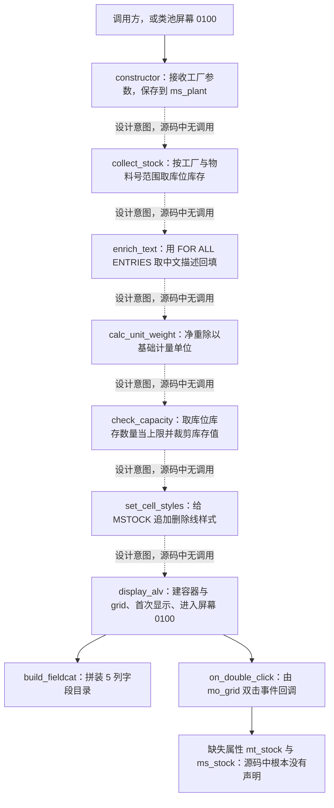
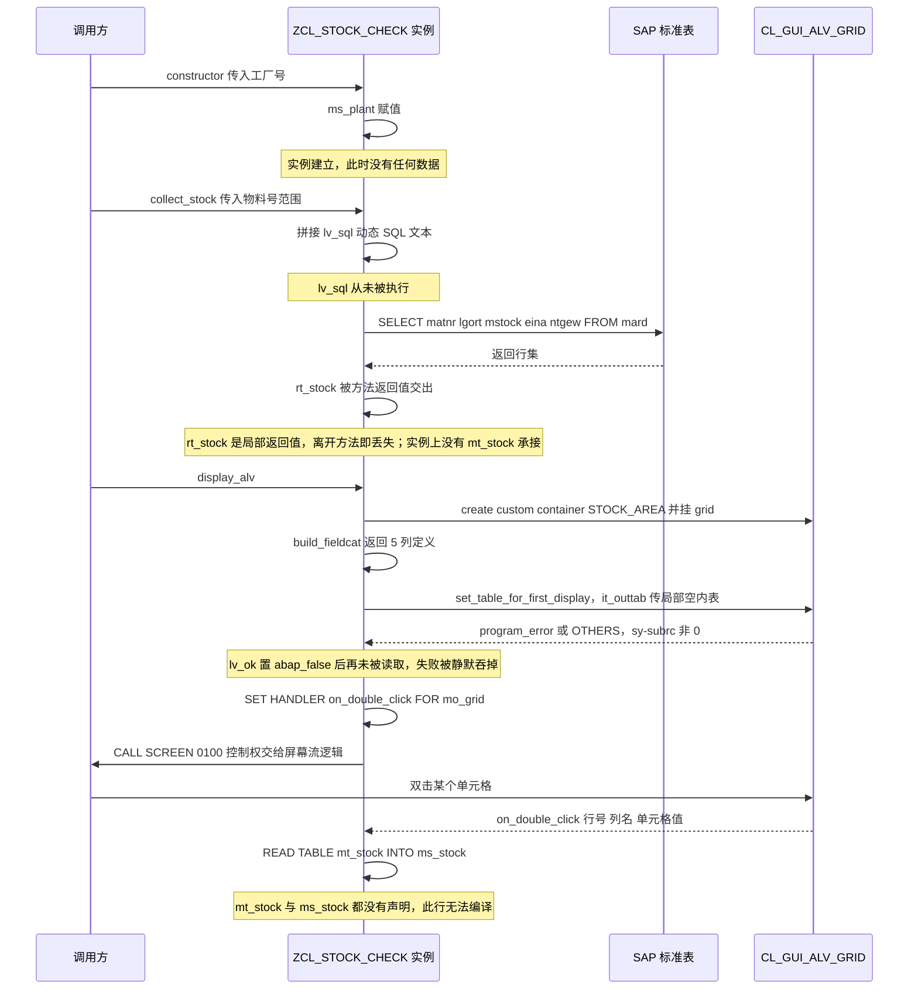

# ZCL_STOCK_CHECK 程序分析报告（Onboarding 走读）

> 源文件：`zcl_stock_check.clas.abap`　类型：全局类（类池 `CLASS-POOL`）+ 全屏 BCALV 报表　所属：MM Reporting team
> 一句话结论：**这是一份只完成了一半、且当前无法通过语法检查的 ALV 报表骨架**——数据链在 `collect_stock` 返回处断开、字段与表名多处不存在、`NTGEW` 被标成毛重、`MSTBW` 被当成库容。下面按执行流程逐段拆开讲。

---

## 一、程序定位与业务背景

### 1.1 它想解决什么问题

MM 日常盘点和对账里，原料（原材料、包装物）这一类物料有个反复出现的痛点：

- 仓库系统告诉你的**库存数量**，和**实物重量**经常对不上。差异来源通常是计量单位（基础单位不是 1）、移动类型录错、单位换算错，或者有人为了"平账"直接改了库存字段。
- 库存数量本身还受**库位容量**约束：某个储位放不下这么多，哪怕账面数量有，实际也堆不进去，堆不进去就意味着盘亏风险或者要找临时库位。

所以业务方想要一个"原料库存体检表"：一张表里同时看到 **物料号、中文描述、库位、库存数量、重量**，一眼看出哪些行数量异常、哪些行超容量。典型使用场景是月度/季度 MM 成本对账前，由 MM Reporting 团队导出给自己或成本会计复核；双击某一行希望能看到明细（比如该库位的批次/库存明细），重量列双击提示"重量在 MARA 上维护，不在库存记录上"。

### 1.2 现有方案为什么不够

MM 里的现成工具不够用：

- `MB09`（库存清单）字段太多、太技术化，没有重量维度，不做"数量 vs 重量"的合理性提示；
- `MB03`（物料主数据）是单物料视图，无法批量体检；
- `MARDRO` / `A719` 之类的表浏览器可以看数，但不会告诉你"这行超容了"。

要做一个"多字段 + 自定义提示 + 结论性提示"的体检表，就只能自己写 BCALV 全屏报表，这就是这个类存在的理由。

### 1.3 设计范式定性

一句话：**这是典型的"全局类 + 类池屏幕 + BCALV 全屏报表"的三件套封装**——把取数、文本增强、派生计算、字段目录、样式、显示、双击回调八个环节都收进一个 `FINAL CREATE PUBLIC` 的类里，对外只暴露 9 个方法和两个公共类型。这个范式本身是对的（比 `REUSE_ALV_GRID_DISPLAY` + FM 拼凑更好维护），但当前实现只把"骨架"搭完了：**8 个环节里只有 2 个真正被调用过**。

读者需要预先知道的三件事（源码里没写，读起来很吃力）：

1. 这是一个 **class pool**（`CLASS-POOL zcl_stock_check.`），意味着屏幕 `0100` 存在类池的 T100 里，且屏幕上有一个名为 `STOCK_AREA` 的**活动自定义控件**——`display_alv` 里的 `container_name = 'STOCK_AREA'` 就指向它。屏幕上没有任何容器或控件，这个类直接白屏/短转储。
2. 屏幕上还有 PBO/PAI 流逻辑（类池必须配套），负责在 PBO 里重设 `container_name`。这部分**不在本文件内**，属于跨 artifact 依赖。
3. 类内部的四个私有属性里**少了一个 `mt_stock`**，而 `on_double_click` 却在用它——这是本文件最硬的证据：数据链的"落地点"被漏掉了。

---

## 二、程序执行流程总览

下面这张图用实线表示**源码中真实存在的调用**，虚线表示**设计意图串联、但源码里没有任何调用者**。这个区分本身就是本次分析最重要的结论之一。



读法：真正跑通的只有三处——外部触发 `constructor`、`display_alv` 调 `build_fieldcat`、`display_alv` 注册的处理器被 `mo_grid` 回调。中间的 `collect_stock → enrich_text → calc_unit_weight → check_capacity → set_cell_styles` 全是**孤儿方法**。

### 责任链表

| 子程序 | 调用者 | 职责 |
|---|---|---|
| 类定义段（公开类型与方法契约） | 编译期 | 定义 `ty_stock` 行结构、`ty_stock_tab` 表类型，并声明 9 个公开方法的输入、输出与异常 |
| 私有属性段 | 类实例创建时 | 保存工厂号、一条没用的工厂列表、以及 grid 与 container 两个 UI 引用 |
| `constructor` | 外部调用方 | 把传入的工厂号写入 `ms_plant`，构造一个"有工厂上下文、但没有任何数据"的实例 |
| `collect_stock` | 无（设计意图：外部调用方 → 显示前） | 拼一段从未执行的动态 SQL；再用静态 SELECT 按工厂 + 物料号范围取库位库存；结果只通过返回值交出；空结果仅弹消息 |
| `enrich_text` | 无（设计意图：`collect_stock` 之后） | 用 `FOR ALL ENTRIES` 一次性取 `MAKT` 的中文描述，逐行线性查找并回填 `MAKTX` |
| `calc_unit_weight` | 无（设计意图：展示前装配行数据） | 用净重除以基础计量单位，得到"每基础单位的重量"；除数为零时返回 0 |
| `check_capacity` | 无（设计意图：`enrich_text` 之后） | 取单个库位的一条 `MSTBW` 当上限，把超出的库存数量静默改写成上限值 |
| `build_fieldcat` | `display_alv` | 拼装 MATNR / MAKTX / LGORT / MSTOCK / NTGEW 五列的字段目录 |
| `set_cell_styles` | 无（设计意图：`display_alv` 传 `it_scol` 之前） | 生成一条针对 MSTOCK 列的黄色底 + 删除线样式 |
| `display_alv` | 外部调用方（并落到类池屏幕 0100） | 创建 custom container 与 ALV grid，用局部空内表首次显示，注册事件处理器，`CALL SCREEN 0100` |
| `on_double_click` | `mo_grid` 的双击事件 | 按 `iv_data` 查内表、`WRITE` 调试输出、按列名分支出提示或空分支 |

下面按这条流程，逐个子程序展开。

---

## 三、分组分析（按程序流程 / 子程序）

### 3.1 类定义段 `zcl_stock_check` 的公开类型与方法契约

这一段是全类的"合同"：调用方能拿到什么类型、能调什么方法、出错会抛什么。它不含可执行逻辑，但错误全在这里埋着——所以放在执行流程的最前面讲。本段分两步：① 行结构与表类型定义，② 九个方法的契约声明。

#### ① 行结构与表类型定义

```abap
    TYPES: BEGIN OF ty_stock,
             matnr  TYPE mara-matnr,
             maktx  TYPE makt-maktx,
             lgort  TYPE mard-lgort,
             mstock TYPE mard-mstock,
             eina   TYPE mara-eina,
             ntgew  TYPE mara-ntgew,
           END OF ty_stock.

    TYPES ty_stock_tab TYPE STANDARD TABLE OF ty_stock WITH EMPTY KEY.
```

**做什么** — 定义一个 6 字段的行结构 `ty_stock`：物料号（取自 `MARA-MATNR`）、物料描述（取自 `MAKT-MAKTX`）、库存地点（取自 `MARD-LGORT`）、库存数量、基础计量单位（`MARA-EINA`）、净重（`MARA-NTGEW`）；再把它包成一个标准表 `ty_stock_tab`。

**为什么** — 用 DDIC 类型而不是裸写 `c40` / `quan`，是对的：字段长度、校验规则、搜索帮助、金额/数量单位参考全部跟着走，字段加长或改类型时报表自动跟上，这是 SAP 编码规范里"永远优先用 DDIC 类型"的具体收益。行结构同时承载了 `MARD` 侧字段（库位、数量）和 `MARA` 侧字段（基础单位、净重），说明作者从一开始就意识到**库存数量和重量来自两张表、需要做连接**——这个设计意图是对的，方向也对。

**风险与改进** — 三处需要校核：

- **`mstock TYPE mard-mstock` 根本取不到。** `MARD` 里没有 `MSTOCK` 这个字段。`MSTOCK` 是 `BAPI_MATERIAL_STOCK_SRV_LIST` 的 **BAPI 外部字段名**，它在底层映射到的是 `MARD-MABST` / `MARC-MABST`（非限制性库存）。这是 SAP 报表开发里最经典的一类混淆：BAPI 报表工具里看到的列名不等于 DDIC 字段名。这一行在语法检查阶段就会失败（"字段/符号 MARD-MSTOCK 未定义"）。
- **`ntgew` 的语义是"净重"，不是毛重。** `MARA-NTGEW` 数据元素为 `Net Weight`（净重，单位 KG，作为数量的参考单位），毛重是 `MARA-BRGEW`（`Gross Weight`）。后面 `build_fieldcat` 会把它标成 `Gross Weight (kg)`，错误从这里就开始埋了。
- **`WITH EMPTY KEY` 是一个性能上的自我设限。** 空键内表只能顺序处理，无法用主键二分查找；`enrich_text` 里那个 `READ TABLE ... WITH KEY matnr` 就退化成全表线性扫描。更关键的是：空键内表同时失去了"以物料号去重"的能力，而本业务（同一物料多库位）恰恰最常见的诉求就是"每个物料一行"。若改成 `ty_stock_tab TYPE STANDARD TABLE OF ty_stock WITH UNIQUE KEY matnr lgort`，则既保留了库位维度，又让 ALV 可排序、可做唯一键布局保存。

另外结构本身还有**缺口**：没有承载计算结果的字段（`calc_unit_weight` 算出来的东西无处安放）、没有"是否超容"的标记字段（于是 `check_capacity` 选择了直接改数值）、没有 `MSKU` / 计量单位 / 批次维度。

#### ② 九个方法的契约声明

```abap
    METHODS constructor
      IMPORTING iv_plant TYPE werks OPTIONAL.

    METHODS collect_stock
      IMPORTING it_matnr         TYPE mara-matnr_tab
      RETURNING VALUE(rt_stock) TYPE ty_stock_tab
      RAISING   cx_sy_move_cast_error.

    METHODS enrich_text
      CHANGING ct_stock TYPE ty_stock_tab.

    METHODS calc_unit_weight
      IMPORTING is_row       TYPE ty_stock
      RETURNING VALUE(rv_uw) TYPE p DECIMALS 4.

    METHODS check_capacity
      IMPORTING iv_warehouse TYPE mard-lgort
      CHANGING  ct_stock    TYPE ty_stock_tab.

    METHODS build_fieldcat
      RETURNING VALUE(rt_fieldcat) TYPE lvc_t_fcat.

    METHODS display_alv.

    METHODS on_double_click
      IMPORTING iv_row    TYPE lvc_row
                iv_column TYPE lvc_col
                iv_data   TYPE any.

    METHODS set_cell_styles
      IMPORTING is_row     TYPE ty_stock
      CHANGING  ct_styling TYPE lvc_t_scol.
```

**做什么** — 声明 9 个公开方法：1 个构造、1 个取数（带返回值并声明异常）、2 个数据加工（一个 `CHANGING` 就地改、一个纯函数式计算）、1 个容量检查（`IMPORTING` + `CHANGING`）、1 个字段目录工厂、1 个显示、1 个事件回调、1 个样式生成。

**为什么** — 契约写法总体规范：用 `VALUE(...)` 传返回值而不是老式 `EXPORTING`，用 `RETURNING` 而不是改全局属性，用 `CHANGING` 明确表示"会改你的表"，这些都是 OO ABAP 的推荐风格。`calc_unit_weight` 采用"传入整行 + 返回标量"的**纯函数**签名是本类最好的一处设计：它无副作用、无数据库访问，可以被单元测试直接调用，也可以在别处复用。`collect_stock` 用 `RETURNING` 而不是写实例属性，也保留了"取数与展示解耦"的可能性——可惜实现时没守住。

**风险与改进** — 契约层面有四个问题：

- **`RAISING cx_sy_move_cast_error` 是个假契约。** 方法体里没有任何 `RAISE EXCEPTION`，也没有任何可能触发该异常的语句。而 `CX_SY_MOVE_CAST_ERROR` 是 SAP 内部的**类型转换/赋值**异常，属于"框架异常"，把它作为对外业务契约暴露，等于告诉调用方"这个方法可能因为赋值失败而失败"，但实际上永远不会发生；真出问题时调用方 catch 的是个错的东西。要么删掉 `RAISING`，要么定义自己的领域异常（如 `ZCX_STOCK_CHECK`），把"物料号非法""工厂不存在""数据库错误"这些真正的失败原因规范化。
- **`it_matnr` 声明为 `mara-matnr_tab` 但语义上是"范围表"。** `mara-matnr_tab` 是一个 `TAB` 表类型（`STANDARD TABLE OF mara-matnr`），可以直接被 `IN` 使用，这一点没问题；但它**没有声明必填**，也没有 `VALUE` 默认值。`WHERE matnr IN it_matnr` 在空表时等价于"不限制物料"，也就是全工厂全库位扫描 `MARD`。
- **`on_double_click` 的 `iv_data TYPE any` 是全类唯一的无类型参数。** 事件回调里最常见的坑就是拿到 `any` 后直接参与运算或作为键比较。这里它被直接当成 `matnr` 用于 `WITH KEY matnr = iv_data`——如果动态类型是数值型（双击 MSTOCK 列）或整个行结构，会发生数字转换错误或类型不匹配短转储。事件数据应当用具体类型（`ty_stock` / `lvc_row` 结构）或至少在方法内做 `is_of_type` 防御。
- **缺少承载数据的状态属性契约。** 公开方法里 `display_alv` 不接收任何参数，`on_double_click` 不接收任何参数——它们都假设"数据在实例上"。但私有属性段里没有这个属性（见 3.2），这说明**契约本身漏了一个成员**。要么给 `display_alv` 加 `IMPORTING it_stock`，要么补 `mt_stock` 属性；当前写法两头不靠。

---

### 3.2 私有属性段 `zcl_stock_check` 的实例状态

私有属性是类的"隐式契约"——它决定了这个对象是有状态还是无状态、能不能后台跑、能不能被安全地多次创建。本段分两步：① 数据属性，② UI 引用属性。

#### ① 数据属性

```abap
    DATA ms_plant TYPE werks.
    DATA ms_plants TYPE werks_tab.
```

**做什么** — 声明两个数据属性：`ms_plant` 保存单个工厂号（DDIC 类型 `WERKS`），`ms_plants` 保存一个工厂号范围表（DDIC 类型 `WERKS_TAB`）。

**为什么** — 把工厂号缓存成属性而不是每次从参数传，是为了让 `collect_stock` / `check_capacity` 这类"只关心某工厂"的取数方法签名更短。但这也是**有状态设计的代价**：方法的输入变得不完整、单元测试必须先 `NEW` 再 `constructor`，而且**这个类从此只能在前台跑**——后台作业没有屏幕，`CALL SCREEN 0100` 直接不可用。MM Reporting 的体检表如果将来要做成定时后台报表抽取，这份设计就必须改。更干净的做法是取数方法 `IMPORTING iv_plant`（工厂是取数的输入，不是运行期状态），把"哪些工厂"交给调用方传。

**风险与改进** —

- **`ms_plants` 是彻底的死属性。** 全类没有任何一处读写它。它的存在说明作者**原本设计了"多工厂"版本**（复数 `plants`），但只写了字段，忘了改逻辑——`collect_stock` 里的 SQL 明确是单工厂（`WHERE mard~werks = '{ ms_plant }'`），而且是单值拼接。更矛盾的是：单值拼接进 SQL 字符串本身就是多工厂场景的致命伤（范围表无法拼成单值条件）。死属性不会报错，但会误导下一个读代码的人以为多工厂已经支持。
- **`ms_plant` 类型用了 `werks` 而不是自建 `ty_`**。SAP 推荐自建 `ty_plant TYPE werks_d` 之类，好处是将来要做工厂校验（比如限定某个 plant parameter、限定销售组织）时只改一处。这里 `constructor` 也没有任何校验：`iv_plant` 传空串、传一个不存在的工厂号都不拦。
- **`iv_plant` 是 `OPTIONAL` 但没有默认值。** 可选 + 无默认 + 无校验 = 允许构造出一个"没有工厂"的对象，后面 `WHERE werks = ''` 匹配不到任何行，返回空表，用户只看到"No stock records found"这条极具误导性的消息。
- **缺少数据落点属性。** 这是最关键的一条：`on_double_click` 里 `READ TABLE mt_stock INTO ms_stock`，说明作者设想中应该有 `mt_stock`（表）和 `ms_stock`（行工作区）两个私有属性，但**它们没有声明**。这直接导致整个类无法通过语法检查。

#### ② UI 引用属性

```abap
    DATA mo_grid   TYPE REF TO cl_gui_alv_grid.
    DATA mo_container TYPE REF TO cl_gui_custom_container.
```

**做什么** — 把 custom container 和 ALV grid 两个 ActiveX 控件的引用保存在实例上，供 `display_alv` 创建、`on_double_click` 回调时使用。

**为什么** — 把控件引用存成属性（而不是局部变量）的唯一合理理由是**回调需要访问**：如果 `on_double_click` 里要读 grid 的当前选择、要 `refresh_table_display`，必须有引用可达。`mo_grid` 作为属性是站得住脚的。SAP 的 BCALV 示例代码也是这么写的。

**风险与改进** —

- **控件没有析构清理。** 类里没有定义析构方法，也没有在离开屏幕时 `RELEASE` 引用。`CL_GUI_ALV_GRID` 和 `CL_GUI_CUSTOM_CONTAINER` 都持有前端控件句柄，靠 GC 回收 ActiveX 是**不可靠**的（前端控件由 SAP GUI 持有，不受 ABAP GC 直接控制），典型后果是内存 / 动态内存 `STX_COMMIT` / 前端资源泄漏。
- **重入即崩。** 因为是实例属性，第二次调用 `display_alv` 会 `CREATE OBJECT mo_container` 一个**同名**（`STOCK_AREA`）的容器。在同一个屏幕上，第二次创建同名 `CL_GUI_CUSTOM_CONTAINER` 会直接短转储。如果这个类被做成单例式的报表入口（很常见：启动程序里 `CREATE OBJECT` 一次），第二次进屏幕就挂。
- **类里持有 UI 控件，等于把类绑死在全屏前台。** 更好的分层是：把取数与计算（`collect_stock` / `enrich_text` / `calc_unit_weight` / `check_capacity`）放到一个**无 UI 的服务类**里做成可后台执行的，本类只负责把服务结果渲染成 ALV。这样体检逻辑就能被其他程序（后台报表、接口、BW 抽取）复用，也才能写单元测试。

---

### 3.3 方法 `constructor`

方法很短，只有一行赋值，按规范保持单块不拆。

```abap
  METHOD constructor.

    ms_plant = iv_plant.

  ENDMETHOD.                    "constructor
```

**做什么** — 接收调用方传来的工厂号（`werks` 型，可选），直接赋给私有属性 `ms_plant`，不做任何加工。此后再没有别的初始化动作（没有清空结果表、没有给 grid 设初始值）。

**为什么** — 构造器只做"建立上下文"、把取数结果留给后续方法，这是标准做法；把工厂号作为构造参数（而不是每个方法都传一遍）也是常见风格。这里唯一的遗憾是它**只承担了"记工厂"这一件事**，导致整个类退化成"有状态记分板"，见 3.2 的讨论。

**风险与改进** — 无语法风险，但有三个健壮性缺口：

- **不做必填校验。** `iv_plant` 可选，`OPTIONAL` 在 ABAP 里意味着"可以不传"，未传时是初始值（空串）。后面所有查询都会退化成"什么也查不到"，而用户看到的是"No stock records found"。应当在构造器里 `IF ms_plant IS INITIAL` 时直接 `MESSAGE ... TYPE 'E'`（或抛领域异常），让错误在最早的时点暴露。
- **不校验工厂存在性。** `WERKS` 类型不保证工厂在 `T001W` 里存在。手输一个不存在的工厂号，结果同样是空结果 + 误导性提示。可以用 `SELECT SINGLE FROM t001w` 做一次存在性检查，或者至少把"工厂无效"和"无库存记录"区分成两条消息。
- **不校验工厂是否在权限范围内。** `WERKS` 上通常挂着 `T000A` 里的工厂权限（plant authorization）。很多场景下无权限的工厂应给出明确提示而不是空表。如果这是给 MM Reporting 团队自用的工具，影响不大；但只要有可能被别人调用，就应该补。

---

### 3.4 方法 `collect_stock`

这是全类最应该被认真读的方法，也是问题最密集的地方。它承担了"取数"这个核心职责，源码里却留下了三段互相对不上的逻辑。本段分四步：① 拼一段从未执行的动态 SQL，② 真正执行的静态 SELECT，③ 一个无意义的自赋值循环，④ 空结果只弹消息。

#### ① 拼一段从未执行的动态 SQL

```abap
    DATA lv_sql TYPE string.

    lv_sql = |SELECT mard~lgort mard~mstock mara~eina mara~ntgew mara~matnr|
           && |  FROM mard INNER JOIN mara ON mara~matnr = mard~matnr|
           && | WHERE mard~werks = '{ ms_plant }'|
           && |   AND mard~lgort IN iv_warehouse_range( )|.
```

**做什么** — 用字符串模板拼出一条带表别名、`INNER JOIN`、`WHERE` 条件的 Open SQL 语句文本，存进局部变量 `lv_sql`。**这条语句从头到尾没有被执行**——方法体里没有任何 `EXECUTE IMMEDIATE`、`PERFORM ... ON COMMIT` 或动态 `SELECT ... FROM (lv_sql)` 之类的调用。

**为什么** — 这段死代码是全类最有价值的"设计化石"：它暴露了作者**原本设计**的实现方式——静态 SQL 只能单表 `SELECT`，无法同时取 `MARD` 的库位/数量和 `MARA` 的单位/净重，所以打算改用动态 SQL + `INNER JOIN`。这个**问题识别是对的**（确实需要连接两张表），**手段是错的**（拼接字符串）。同时它还透露了第二个需求：作者想支持**按库位范围过滤**（`lgort IN iv_warehouse_range`），而这个参数在正式实现里彻底消失了。所以读这段代码的价值在于：**它证明了 `check_capacity` 需要 `iv_warehouse` 是有业务理由的**（要按库位分组做容量判断），只是实现没跟上。

**风险与改进** —

- **语法上根本不成立。** `iv_warehouse_range( )` 是对一个**不存在的方法/参数**的函数式调用——`collect_stock` 的 `IMPORTING` 里只有 `it_matnr`，没有 `iv_warehouse_range`，也没有对应的局部变量或类型。这一行在语法检查阶段就会失败。
- **若真的执行，是严重的性能与安全反模式。** 把变量插值进 SQL 文本会导致：① 无法用 SQL  Trace 分析、无法命中 prepared statement 缓存；② 只要有人把 `iv_plant` 改成来自选择屏的输入，就是**SQL 注入**；③ `werks` 是 CHAR 4，拼进 SQL 时需要处理尾部空格，条件可能静默失配。
- **正确做法是静态 SQL + `FOR ALL ENTRIES` 或普通 `JOIN`。** 需要的连接语义（`MARD` 是按物料的库位行、`MARA` 是按物料的主数据行）完全可以用标准 Open SQL 的 `INNER JOIN` 表达，不需要动态化：

  ```abap
  SELECT matnr lgort mabst
         FROM mard
         INNER JOIN mara ON mara~matnr = mard~matnr
         WHERE mard~werks  = ms_plant
           AND mard~lgort  IN lt_lgort
           AND mara~matnr  IN it_matnr
      INTO TABLE @rt_stock.
  ```

  这里既用上了索引（MARD 的主键前缀是 `MATNR-WERKS-LGORT`，`MARA` 主键是 `MATNR`），又满足了两表取数与库位过滤，还不需要字符串拼接。
- **`lv_sql` 应当直接删除**，而不是"留着以后用"。死代码在接手时最容易被误当成有效逻辑，是评审时必须清掉的一类东西。

#### ② 真正执行的静态 SELECT

```abap
    SELECT matnr lgort mstock eina ntgew
      FROM mard
      INTO TABLE rt_stock
      WHERE werks  = ms_plant
        AND matnr IN it_matnr.
```

**做什么** — 用静态 Open SQL 从 `MARD` 单表取 `matnr lgort mstock eina ntgew` 五个字段，筛选条件是工厂等于 `ms_plant` 且物料号在 `it_matnr` 范围内，结果直接灌进返回值 `rt_stock`。

**为什么** — 用 `INTO TABLE` 一次性取全、内表声明为 `ty_stock_tab`，避免了边取边改的开销，也保证了返回表有明确的结构类型（比裸内表更容易被调用方和 ALV 使用）。这一点是对的。

**风险与改进** — 这一段有**四个层次**的问题，从编译到业务：

- **编译不过：字段不存在。** `MARD` 表里**没有 `EINA` 也没有 `NTGEW`**，更没有 `MSTOCK`（见 3.1 ①）。`EINA`、`NTGEW` 都在 `MARA` 上，`MSTOCK` 是 BAPI 字段名。所以这条 SELECT 会因为"未知数据库字段"而失败。**必须改回 `JOIN MARA`**，同时把 `mstock` 换成真实字段（`MARD-MABST`，非限制性库存）。
- **结果结构与目标表对不齐。** `rt_stock` 的组件顺序是 `matnr maktx lgort mstock eina ntgew`，SELECT 列表是 `matnr lgort mstock eina ntgew`——少一列 `maktx`。`SELECT ... INTO TABLE` 按**位置顺序**赋值，这意味着即使字段名都改对了，也会出现整列错位（`lgort` 会被写进 `maktx`）的静默数据错误。**SELECT 列表的字段顺序必须与结构组件顺序完全一致**，这是 ABAP 里最难发现的错误之一。
- **缺少库位过滤，业务口径不对。** 设计里的 `lgort IN iv_warehouse_range` 在实现中丢失，结果是**全工厂全库位**的库存都被取出来。`check_capacity` 后面拿单个库位的"容量"去裁剪所有库位的行，口径直接错乱。
- **`it_matnr` 为空 = 全工厂全库位全物料扫描。** `WHERE ... IN <空内表>` 在 Open SQL 里等于不加限制。`MARD` 是 MM 里最大的表之一（行数量级常在亿级），这会直接造成长事务、内存压力和临时表空间暴涨。应在方法开头拦截：`IF it_matnr IS INITIAL. ... ENDIF.`，或者把它改成必填参数 / 提供 `ITAB_OR_SELOPT` 参数。

#### ③ 无意义的字段符号自赋值

```abap
    LOOP AT rt_stock ASSIGNING FIELD-SYMBOL(<ls>).
      <ls>-matnr = <ls>-matnr.
    ENDLOOP.
```

**做什么** — 用 `ASSIGNING` 遍历结果内表，把每行的 `MATNR` 赋给它自己。净效果为零。

**为什么** — 这类代码通常是重构留下的残迹：原本大概是想在循环里做点什么（去重、转换单位、剔除测试物料、打标记），后来那件事被删了，循环壳留了下来。用 `ASSIGNING FIELD-SYMBOL` 而不是 `INTO wa` 说明当时打算**就地修改**行——这与作者真正需要做的事（给每行算 `calc_unit_weight`、标记超容）是同一个模式。

**风险与改进** — 纯性能浪费（在数据量大时是纯粹的无用 CPU），但更严重的是**它是设计缺失的证据**：这个位置本该挂上 `calc_unit_weight` 的结果。正确做法是在这里顺手把派生字段算出来：

```abap
    LOOP AT rt_stock ASSIGNING FIELD-SYMBOL(<ls_row>).
      <ls_row>-uw = calc_unit_weight( is_row = <ls_row> ).
    ENDLOOP.
```

前提是给 `ty_stock` 加上 `uw` 字段。另外如果确实要用 `ASSIGNING`，注意它是**直接修改**内表；对 ALV 展示用的内表，在取数阶段就地改是安全的（此时还没交给 ALV）。

#### ④ 空结果只弹消息

```abap
    IF rt_stock IS INITIAL.
      MESSAGE 'No stock records found' TYPE 'S'.
    ENDMETHOD.
```

**做什么** — 如果结果表为空，弹一条 `'S'`（成功）级别的消息 `No stock records found`，然后方法正常结束，返回空表。

**为什么** — 用 `IS INITIAL` 判空、对空结果给出用户可见的提示，方向是对的（比 ALV 白屏强）。

**风险与改进** —

- **消息级别选错，且文案有误导性。** `TYPE 'S'` 是状态提示，用户会以为操作成功了。取不到数据应该用 `'W'`（警告）或 `'E'`（错误），并且文案要区分"没有库存记录"和"筛选条件太宽/工厂错"。另外文案是硬编码英文，与类里 `spras = 'ZH'` 硬编码中文的取向互相矛盾——**i18n 方向不统一**。
- **方法名带 `RAISING` 却只发消息。** 调用方无法程序化判断失败（`sy-subrc` 也永远是 0）。取数类方法应当把"没数据"和"出错"区分开：没数据 → 空表返回（正常语义）；出错（工厂无效、SQL 失败）→ 抛领域异常或返回 `abap_bool` 成功标志。
- **消息用 `MESSAGE` 而不是异常**意味着自动化场景（后台任务、接口调用）里这条消息会丢失，调用方只看到一个空表。综合来看，3.1 ② 里提的"定义自己的领域异常"是这里最该补的东西。

---

### 3.5 方法 `enrich_text`

给内表补上中文物料描述，逻辑不长但有两处效率问题。本段分两步：① 用 `FOR ALL ENTRIES` 取描述，② 逐行线性查找回填。

#### ① 用 `FOR ALL ENTRIES` 一次性取中文描述

```abap
    DATA lt_text TYPE TABLE OF makt.

    SELECT matnr maktx FROM makt
      INTO TABLE lt_text
      FOR ALL ENTRIES IN ct_stock
      WHERE matnr = ct_stock-matnr
        AND spras = 'ZH'.
```

**做什么** — 以传入的内表 `ct_stock` 为驱动表，用 `FOR ALL ENTRIES` 把其中的物料号去重后一次性查 `MAKT` 表，条件是物料号匹配且语言固定为 `'ZH'`，取回 `MATNR` + `MAKTX`。

**为什么** — 选 `FOR ALL ENTRIES` 是对的做法：它避免了"在循环里对内表逐行 `SELECT SINGLE`"（N+1 查询）这个报表开发里的头号性能杀手。`MAKT` 的主键是 `MATNR` + `SPRAS`，这个条件正好命中主键，扫描代价可控。**这一段是本方法里唯一写得不错的地方**，值得肯定。

**风险与改进** —

- **没有判驱动表是否为空。** 这是 `FOR ALL ENTRIES` 最经典的坑：当驱动表为空时，条件里的 `matnr = ct_stock-matnr` **被完全忽略**，SQL 退化成 `WHERE spras = 'ZH'`，即**扫描整张 `MAKT` 的中文记录**。表小的时候看不出来，`MAKT` 数据量大时就是一次全表扫描。必须在 SELECT 前加：

  ```abap
    IF ct_stock IS INITIAL.
      RETURN.
    ENDIF.
  ```

  （这一点和 `WHERE ... IN <空内表>` 恰好是**相反**的语义，一个忽略条件、一个不忽略条件，两边都得显式拦截。）
- **硬编码 `spras = 'ZH'`。** 中文描述在本场景（MM Reporting 内部工具）可能是有意为之，但作为全局类里的硬编码常量有两个问题：① 其他系统/其他语言的客户端（如海外工厂、SAP 登录语言为 `DE` 的同事）会看到空描述；② 无法做成可配置。更稳妥的是提供 `iv_spras TYPE spras` 参数、默认值取 `sy-langu`，或者退一步用 `makt-maktx` 之外的 `MARa-MAKTX`（物料短文本，单语言、由主数据维护）。
- **`lt_text TYPE TABLE OF makt` 没有键声明。** 直接用了 `TYPE TABLE OF`，等价于无键标准表。这是下一步性能问题的根因，此处埋下。

#### ② 逐行线性查找并回填描述

```abap
    LOOP AT ct_stock INTO DATA(ls_row).
      READ TABLE lt_text INTO DATA(ls_text) WITH KEY matnr = ls_row-matnr.
      ls_row-maktx = ls_text-maktx.
      MODIFY ct_stock FROM ls_row.
    ENDLOOP.
```

**做什么** — 遍历 `ct_stock` 的每一行到工作区 `ls_row`，用 `READ TABLE ... WITH KEY matnr` 从 `lt_text` 里找到对应描述，写进 `ls_row-maktx`，再 `MODIFY` 写回内表。

**为什么** — 这是"先批量取、后逐行回填"的经典两段式写法（避免逐行查库），模式本身正确。用 `MODIFY ct_stock FROM ls_row` 而不是 `ASSIGNING` 是等价且合法的，两种写法在性能上没差别——**不是问题**。

**风险与改进** —

- **O(n²) 的性能陷阱。** `lt_text` 声明为无键表，`READ TABLE ... WITH KEY matnr` 找不到索引只能**线性扫描整张表**；而外层又遍历 n 行 `ct_stock`。复杂度是 n × m（n 是库存行数，m 是不同物料数）。本场景下 m 通常远大于 n（库存行 = 物料 × 库位），所以实际代价是 **n × m**，几万行开始明显变慢。修法有三种，按推荐顺序：
  1. `DATA lt_text TYPE SORTED TABLE OF makt WITH UNIQUE KEY matnr spras.` —— `READ` 直接二分，O(n log m)，改动最小；
  2. `DATA lt_text TYPE HASHED TABLE OF ty_text WITH UNIQUE KEY matnr.` —— O(n)，对"按键乱序查"最优；
  3. 用 `VALUE #( FOR ... )` 或 `CORRESPONDING` 一次性构造整表，避开逐行 `MODIFY`。

  另外顺带提醒：ALV 展示用的内表如果改用字段符号直接写（`<ls_row>-maktx = ...`），连 `MODIFY` 都省了，每行少一次全表定位。
- **不判断 `sy-subrc`。** 查不到时 `ls_text` 保持初始值，`maktx` 被写成空串（这里恰好无害，因为 `MAKTX` 本来就是空的）；但如果哪天有人先填了描述再调这个方法，**空结果会把已有描述覆盖掉**。而且"物料没有中文描述"是一个值得提示用户的数据质量问题，现在被完全静默吞掉了。
- **中文描述的缺失没有统计反馈。** 体检表的价值就在于"发现数据问题"，而这里把"没有中文描述"这种问题自己吞了。建议在方法末尾汇总缺失数量，`MESSAGE` 一条 `TYPE 'W'` 提示"共 N 个物料缺少中文描述"——这才让方法名副其实。

---

### 3.6 方法 `calc_unit_weight`

方法很短，保持单块不拆，但它是本类里唯一值得逐字读的计算逻辑。

```abap
  METHOD calc_unit_weight.

    DATA lv_base TYPE p DECIMALS 4.

    lv_base = is_row-eina.

    IF lv_base IS INITIAL.
      rv_uw = 0.
      RETURN.
    ENDIF.

    rv_uw = is_row-ntgew / lv_base.

  ENDMETHOD.                    "calc_unit_weight
```

**做什么** — 把行的基础计量单位 `EINA` 存进局部变量 `lv_base`；若 `lv_base` 为初始值（零），直接把返回值设为 0 并提前 `RETURN`；否则用净重 `NTGEW` 除以 `lv_base`，结果作为返回值 `rv_uw` 交出。

**为什么** — **方法名和实现不符，这是本方法最需要警惕的地方。** `calc_unit_weight` 字面意思是"单件重量"，而实际算的是 `NTGEW / EINA`。这两者只在 `EINA = 1` 时才相等：

- `MARA-EINA` 是**基础计量单位**（Grundmengenbezugseinheit），多数物料是 1（PCS）或 1（KG）；
- 但散装/液体物料的基础单位经常是 **1000 KG、1000 L、100 KG** 这类"整包装"单位；
- `MARA-NTGEW` 是**一个基础单位的净重**。

所以：物料 A（`EINA = 1 KG`，`NTGEW = 5`）算出 5.0000，恰好等于单件净重，看起来一切正常；物料 B（`EINA = 1000 KG`，`NTGEW = 2500`，即每 1000 KG 净重 2500 KG）算出 **2.5000**——这个数的含义是"每 1 KG 基础单位含 2.5 KG 净重"，**不是**单件重量。如果报表列名叫 `Unit Weight`，MM 的同事会按"每件 2.5 KG"去理解，结论直接是错的。

换句话说，这个方法算的是**混合比例/组分含量**（每基础单位重量），而不是单件重量。如果业务真实需求是"每单位重量"，方法应该直接返回 `NTGEW`；如果需求确实是"按基础单位归一化"，那方法名应该改成 `calc_weight_per_base_uom`，并且结果字段必须带单位标注。

**风险与改进** —

- **除数类型 `p DECIMALS 4` 有量程溢出风险。** `P DECIMALS 4` 隐含 `P LENGTH 8`，即 `P8.4`，最大可表示 **9999.9999**。`EINA` 是数量型（QUAN，可达 `10^15` 量级）；散装物料以 `10000 KG`、`100000 KG` 等大包装作基础单位并不罕见，一旦出现，`lv_base = is_row-eina` 这一句就会在转换时溢出并短转储（`CONVERT_NO_NUMBER` 一类）。修法很简单：把 `lv_base` 和 `rv_uw` 改成 `TYPE ty_stock-eina`（或 `p LENGTH 15 DECIMALS 4`），与源字段量程对齐。
- **用 `p` 承载数量字段，丢掉了计量单位。** `MARA-NTGEW` 是带参考单位（KG）的数量型字段，赋给 `p` 之后，代码里就再也分不清"这个 5 是 5 KG 还是 5 LB"。ALV 里若不做参考字段处理，用户看到的就是一个没有单位的裸数字。建议返回值带上单位，或者在 `ty_stock` 里额外存一个单位字段供 ALV 展示。
- **`IF lv_base IS INITIAL` 的除零保护做得好，值得肯定** —— ABAP 里 `0` 做除数会直接短转储，很多报表程序就栽在这里，作者用 `IS INITIAL` 判断并提前 `RETURN`，规避了这个常见坑。
- **但"零"和"未维护"被合并了。** `EINA` 未维护（空）和 `EINA` 真的是 0，在 ABAP 里都表现为初始值，方法统一返回 0。报表用户看到 0 会以为"重量为 0"，而不是"主数据没维护基础单位"。**体检类报表最重要的能力是区分这两种情况**，应该返回初始值并让调用方识别，或者干脆抛异常提示主数据缺失。
- **`NTGEW` 未维护时同样静默返回 0。** 净重为空 → 分子 0 → 结果 0，与"净重为零"无法区分。这是同一类问题。
- **方法体没有任何注释说明量纲。** 一个做量纲计算的方法，至少要写一句"返回值 = 每 1 基础计量单位的净重，单位 KG"。

---

### 3.7 方法 `check_capacity`

这是全类**业务风险最高**的方法：它把一个库存数量当成库容上限，然后静默改写真实库存。本段分两步：① 取"容量"，② 逐行裁剪。

#### ① 取单库位的"容量"

```abap
    DATA lv_slots TYPE i.

    SELECT SINGLE mstbw FROM mard-mvbeln INTO @lv_slots
      WHERE werks = ms_plant AND lgort = iv_warehouse.
```

**做什么** — 声明局部整数 `lv_slots`，试图从表 `mard-mvbeln` 里按工厂和库位条件取单个值 `MSTBW` 存进 `lv_slots`。语义上作者是想把它当作"该库位的库容上限"。

**为什么** — 用 `SELECT SINGLE` 取一个标量（而不是取表）来避免内表开销，方向正确；`WHERE werks = ... AND lgort = ...` 也体现了"按库位判断"的业务意图。

**风险与改进** — 这一句有**三层**问题，从语法到业务逐层剥开：

- **语法：表名 `mard-mvbeln` 不存在。** ABAP 里 `FROM` 后面只跟一个表名（或视图名），`mard-mvbeln` 会被当成表名去 DDIC 里找，找不到就报错。想指定单表的内表名，语法是 `INTO @data(@data)` 之类，**表名不能带 `-字段名` 后缀**。作者大概是想写"从 `MARD` 取字段"但手误把字段名拼进了 `FROM` 后面。
- **类型：`MSTBW`（数量型 QUAN）赋给 `TYPE i`（INT4）。** `MSTBW` 是带 3 位小数的数量，`I` 是 4 字节整数且**不是字符型转换目标**。Open SQL 的 `INTO` 目标必须与源字段类型兼容或可转换，`QUAN` → `INT4` 两头都不满足，编译或运行期就会报类型错误（`DBIF_SQL_INCONSISTENT_TYPE` 一类）。退一步说，即使侥幸跑通，量程也完全不对：`MSTBW` 上限约 `10^15`，`INT4` 只有约 `10^9`；精度也会丢掉 3 位小数。
- **业务（最严重）：`MARD-MSTBW` 不是库容，是库存数量。** `MARD` 的主键是 `MATNR` + `WERKS` + `LGORT`——**它本身就是"某物料在某工厂某库位上的一行库存记录**"，一个库位有 N 个物料就有 N 行。所以：
  - ① `MARD` 里根本不存在"每个库位一行、记录容量"的这种数据结构；
  - ② `SELECT SINGLE` 在没有 `MATNR` 条件的情况下**不唯一**，ABAP 会静默取到任意一行（不会报错），于是"库容上限"变成了"某一行物料的库存数量"，随物料而变、随 buffer 而变、随优化器而变——**这是一个不可复现的随机数**；
  - ③ 把库存数量当库容，是**量纲错误**。真正的库位/储位容量在 LE-WM（储位主数据 `LHB` 系列、装载量标记等）或 `LAGP` 一类的 WM 侧数据里，与 `MARD` 的库存量毫无关系。

  也就是说：这个方法从数据模型层面就不成立，不是"字段选错"而是"表选错了"。

- **`sy-subrc` 完全没判。** `SELECT SINGLE` 未命中时 `sy-subrc = 1`，`lv_slots` 保持初始值 **0**，而代码下一步就是"把所有行的库存都改成 0"。一次查不到数据 → 整张报表的库存列全部归零，且无任何提示。

#### ② 逐行静默裁剪库存值

```abap
    LOOP AT ct_stock ASSIGNING FIELD-SYMBOL(<ls>).
      IF <ls>-mstock > lv_slots.
        <ls>-mstock = lv_slots.
      ENDIF.
    ENDLOOP.
```

**做什么** — 遍历传入的库存表 `ct_stock`，对每一行判断：若该行库存数量大于上一步取到的"上限" `lv_slots`，就把该行的库存数量**直接改写成 `lv_slots`**。方法返回后，调用方手上的内表已经被永久修改。

**为什么** — 从"体检表"的产品目标看，作者想表达的是"这一行超容了，需要提示"。实现上选了**改值**而不是**标记**，这是一个典型的设计岔路口走错：一旦选择改值，就丢掉了原始库存，后续任何对账都失去了依据。

**风险与改进** —

- **静默篡改真实业务数据（最严重）。** `CHANGING` 参数意味着修改对调用方可见且不可逆。这张表是"库存体检"的输入，体检之后再也不能用它去核对账实——**体检工具污染了被体检对象**。正确的做法是**只读 + 标记**：给 `ty_stock` 加一个 `capacity_flag TYPE c LENGTH 1` 或 `over_cap_amount` 字段，超限时只写标记（然后由 `set_cell_styles` 或 ALV 的 `cellcolor` 把它显示成醒目颜色），原始 `mstock` 一个字节都不动。顺带说一句：`set_cell_styles` 想给 MSTOCK 加**删除线**——这说明作者的**真实意图本来就是"标记"而不是"改值"**，两处实现自相矛盾。
- **`lv_slots` 为 0 时全表归零。** 见上一步的 `sy-subrc` 问题：一旦 `SELECT SINGLE` 没命中（或那条 SQL 因为表名/类型问题修好后仍无匹配），所有行的库存都会变成 0。对一张给人看的报表，**全零的库存列会被当成真实结论**，这是最容易造成误判的失败模式。必须先判 `IF sy-subrc <> 0 OR lv_slots IS INITIAL. RETURN. ENDIF.`。
- **一个库位的上限套用到所有库位。** `iv_warehouse` 是单值参数，但 `ct_stock` 里包含多个库位（`LGORT` 是输出字段之一，取数也没做库位过滤）。于是 B 库位的行会被用 A 库位的"容量"来判断和裁剪。要么在循环里按 `<ls>-lgort` 分组各取各的容量，要么先过滤出单库位再调用。
- **比较的对象量纲不对。** `<ls>-mstock`（库存数量，单位 MD，即物料的库存计量单位，可能是 PCS 也可能是 KG）与 `lv_slots`（来自分数量字段，单位同样是 MD）——即使两个字段都修对了，**跨物料比较也是无意义的**：拿"500 KG 面粉的库存"和"2000 PCS 螺丝的库存"比大小毫无意义。库容判断必须**在物料层面、且在同一单位下**做，而"库位总容量"是库位级别属性，两者根本不在一个粒度上。
- **量程/精度截断。** 即便上述都修好，把 `QUAN`（13,3）截到 `INT4` 再写回 `QUAN` 字段，也会丢掉小数位——库存数量出现整数化，对 `MARD` 这种数量字段是不可接受的。容量上限应该用 `p LENGTH 15 DECIMALS 3` 或直接 `quan` 来承载。

---

### 3.8 方法 `build_fieldcat`

字段目录是 ALV 的"表头定义"，直接决定用户看到什么。本方法有 5 个 `APPEND`，逻辑高度同构，按列语义拆成三步：① 物料与描述列，② 库位与库存列，③ 重量列。

#### ① 物料号与描述列

```abap
    APPEND VALUE #(
      fieldname  = 'MATNR'
      ref_field  = 'MATNR'
      tabname    = 'TY_STOCK'
      seltext_m  = 'Material'
      just_field = 'X' ) TO rt_fieldcat.

    APPEND VALUE #(
      fieldname  = 'MAKTX'
      ref_field  = 'MAKTX'
      tabname    = 'TY_STOCK'
      seltext_m  = 'Description' ) TO rt_fieldcat.
```

**做什么** — 用行构造 `VALUE #(...)` 向返回表追加两条字段定义：`MATNR`（标题 Material，右对齐，作为对齐参考列）和 `MAKTX`（标题 Description）。

**为什么** — 用 `VALUE #` + `APPEND` 代替 `CLEAR` + 一连串 `APPEND` 逐字段赋值，是现代 ABAP 的推荐写法：无需中间变量、字段名拼错会在编译期被发现、无需 `CLEAR rt_fieldcat`（返回参数本身已初始）。这是本方法里最好的实践。

**风险与改进** —

- **`tabname = 'TY_STOCK'` 是错的，这是 ALV 最经典的坑之一。** `LVC_S_FCAT-TABNAME` 指的是**运行时传给 `it_outtab` 的那张内表的名称**（一个在当前程序里可见的数据对象名，比如 `display_alv` 里的 `LT_STOCK`），而不是 DDIC 结构类型的名字。ALV 在运行时按 `tabname + fieldname` 去内表里取数据；`TY_STOCK` 是个类型名，ALV 找不到名为 `TY_STOCK` 的内表，结果就是**列定义建立了但取不到值**（轻则全空，重则短转储）。正确写法有两种：
  - 把 `display_alv` 里的内表名传给 `build_fieldcat`，用同一个名字（最直接）；
  - 或者干脆**不填 `tabname`**——单内表 ALV 时 ALV 会自动使用唯一的输出表，填错的代价比不填更大。
- **`ref_field = 'MATNR'` 拿不到任何 DDIC 增强。** `REF_FIELD` 的用途是引用一个 **DDIC 引用**（形如 `MARA-MATNR`），从而把主数据的搜索帮助（F4）、域值、转换例程挂到 ALV 列上。写成裸组件名 `'MATNR'` 只会让 ALV 在输出结构里找一个同名组件，找不到就静默忽略——**结果是这一列没有 F4、没有搜索帮助、没有域值校验**。对 `MATNR` 这种最需要 F4 的列来说，这是实打实的体验损失。应改为 `ref_field = 'MARA-MATNR'`。
- **标题硬编码英文。** `seltext_m = 'Material'` / `'Description'`，与 `enrich_text` 里硬编码 `spras = 'ZH'` 取中文描述形成鲜明对比——**英文表头配中文内容**，对中文用户是割裂的。要么全英文（并支持 ALV 的 `texts` / `I_SALV_WD_FIELDCAT` 多语言变体），要么走中文。SAP 的标准做法是配 `texts` 变体表，把短/中/长文本按语言全维护一遍。
- **缺 `seltext_s`（标题栏/导出头显示）与 `col_pos`。** 列顺序只能依赖 `APPEND` 顺序，用户无法调整。

#### ② 库位与库存数量列

```abap
    APPEND VALUE #(
      fieldname  = 'LGORT'
      ref_field  = 'LGORT'
      tabname    = 'TY_STOCK'
      seltext_m  = 'Storage Location' ) TO rt_fieldcat.

    APPEND VALUE #(
      fieldname  = 'MSTOCK'
      ref_field  = 'MSTOCK'
      tabname    = 'TY_STOCK'
      seltext_m  = 'Stock Qty'
      cfield     = 'MSTOCK'
      no_outline = 'X' ) TO rt_fieldcat.
```

**做什么** — 追加 `LGORT`（库位，标题 Storage Location）和 `MSTOCK`（库存数量，标题 Stock Qty），后者额外带了两个属性：`cfield = 'MSTOCK'` 和 `no_outline = 'X'`。

**为什么** — `no_outline = 'X'` 让这一列不显示 ALV 的分组汇总轮廓线，对于数值列是常见做法（避免汇总小计的视觉干扰），合理。`ref_field` 想借 DDIC 引用把数量字段的单位和 F4 带进来，方向也对。

**风险与改进** —

- **`cfield = 'MSTOCK'` 完全无效，属于配置噪音。** `LVC_S_FCAT-CFIELD` 的语义是"用**同一行另一个字段的值**来查 `CELL-COLOR` 决定整行/单元底色"，它只有在配合 `CELL-COLOR` 时才起作用，而且**只对颜色有效，对样式无效**。这里既没有 `CELL-COLOR`，样式又是通过 `LVC_S_SCOL`（`it_scol`）传的——两条路径完全不通。看起来作者想表达"按 MSTOCK 的值变色/加样式"，但那应该走 `CELL-COLOR`（整表路径）或 `IT_SCOL`（逐单元格路径），`CFIELD` 在这里是误用。
- **`tabname` 同样是错的**（见上一步）。`LGORT`、`MSTOCK` 两列都受影响。
- **`MSTOCK` 这个列名继续是错的。** 底层字段应是 `MARD-MABST`（或按业务需要取 `MABST` / `MSTBW` / `MBINSOL` 等），`MSTOCK` 只是 BAPI 的外部名。继续用 `MSTOCK` 会让读代码的人以为可以直接换成 `MARD-MSTOCK`（换不了），也让 `ref_field` 无法指向 DDIC 引用。
- **缺少单位信息与数字格式。** 库存数量必须展示计量单位（MD），否则"1000"既可能是 1000 PCS 也可能是 1000 KG。正确做法是加一个单位列（从 `MAKT-MEINS` 取），或对数量列用 `cellcolor`/参考字段把单位带出来。同时建议加 `emphasize = 'X'` 让关键列更醒目，并给出 `do_sum = 'X'` 之类（若允许合计）。
- **`LGORT` 列缺 `just_field`/对齐配置。** 库位是 CHAR 字段，默认左对齐尚可，但按 3.1 ① 建议给 `ty_stock_tab` 加唯一键之后，最好加 `key`/`fix_column` 让关键列在横向滚动时固定。
- **列可被用户随意改动。** 没有 `IT_EXCLUDE`，也没调用 `grid->set_grid_layout(...)` 统一控制（如禁止新增列、禁止拖拽）。对一张"体检表"，允许用户改列配置容易造成口径混乱。

#### ③ 重量列

```abap
    APPEND VALUE #(
      fieldname  = 'NTGEW'
      ref_field  = 'NTGEW'
      tabname    = 'TY_STOCK'
      seltext_m  = 'Gross Weight (kg)' ) TO rt_fieldcat.
```

**做什么** — 追加最后一列 `NTGEW`，标题写作 `Gross Weight (kg)`（毛重，单位千克）。

**为什么** — 把重量放在最后一列、作为展示重点之一，布局意图是合理的。

**风险与改进** —

- **标题与字段语义不符：这是本次分析里最典型的语义错配。** `MARA-NTGEW` = `Net Weight` = **净重**；毛重是 `MARA-BRGEW` = `Gross Weight`。当前标题让读者以为看到的是毛重，实际是净重。在"用重量核对库存"的场景里，毛重和净重对应的件数、包装重量都不一样——**一个搞错方向的标签会让整张体检表的结论反过来**。要么改标题为 `Net Weight (kg)`，要么改字段为 `BRGEW`。同时建议**两列都给出来**（净重 + 毛重），因为"毛重 - 净重 = 包装重量"这个差值本身就是一个很好的体检指标。
- **`calc_unit_weight` 算出来的列根本不在这里。** 方法存在，但没有对应的 fieldcat 条目，也没有对应的结构字段。这意味着"重量合理性"这个核心分析能力**没有被呈现出来**——`calc_unit_weight` 是一个彻底的孤儿方法。要么在 `ty_stock` 加 `uw` 字段并在 fieldcat 里加一列，要么删掉这个方法（业务若不需要归一化重量）。
- **`ref_field = 'NTGEW'` 同样不是 DDIC 引用**，应为 `MARA-NTGEW`，这样才能把数量字段的参考单位（KG）带进 ALV。当前写法会让这一列显示成没有单位的裸数字，而标题里手写的 `(kg)` 是唯一的信息来源——一旦 `NTGEW` 的单位在其他系统里不是 KG，标题就会撒谎。
- **`tabname` 错误同上。**
- **`display_alv` 里没有传 `IT_SALV` 的替代品如 `IT_SORTTAB`**：用户第一次进来没有任何预排序，库存这种数据默认按物料号排才对。

---

### 3.9 方法 `set_cell_styles`

```abap
  METHOD set_cell_styles.

    APPEND VALUE #(
      fname       = 'MSTOCK'
      color       = 6
      intens      = 0
      style       = cl_gui_richtext=>strikeout
      lstyle      = cl_gui_richtext=>strikeout_col_neg
      ) TO ct_styling.

  ENDMETHOD.                    "set_cell_styles
```

**做什么** — 向传入的 `lvc_t_scol`（ALV 的单元格样式表）追加一条样式规则：目标列 `MSTOCK`，静态底色为颜色码 6（黄），强度 `intens = 0`，主样式为删除线 `strikeout`，负值样式为 `strikeout_col_neg`。对方法自身的 `is_row` 参数**没有任何使用**。

**为什么** — 用 `CL_GUI_RICHTEXT=>` 常量而不是裸写样式数字（`1` = 加粗、`2` = 倾斜……）是正确的，避免了魔法值。用 `CHANGING` 参数让调用方自己决定往哪张样式表里塞，签名设计也是干净的。

**风险与改进** —

- **这个方法从未被调用，`IT_SCOL` 也从未被传入，所以这条样式永远不生效。** `display_alv` 的 `set_table_for_first_display` 里只传了 `it_outtab` 和 `it_fieldcatalog`。这是数据链断裂的**第三处**（前两处是 `mt_stock` 缺失、`lt_stock` 为空）。要生效，需要 `display_alv` 里 `DATA lt_scol TYPE lvc_t_scol. ... it_scol = lt_scol` 且在调用前 `set_cell_styles( CHANGING ct_styling = lt_scol )`。
- **样式规则与业务逻辑自相矛盾。** 一个**无条件**、对**所有行**都生效的删除线，既不区分是否超容，也不区分数据是否可信。而 `check_capacity` 又选择了直接改值（见 3.7）。**"划删除线"是"标记"的语言，"改值"是"篡改"的语言**，作者同时用了两种，说明心里其实想的是标记超容行。正确设计：让 `check_capacity` 打标记（`over_cap = 'X'`），让 `set_cell_styles` 依据标记**逐行**生成样式（只给超容的 `MSTOCK` 单元格加颜色/加粗），不要无条件全表划线。全表删除线还有个副作用：用户无法区分"本来就有的线"和"新增的提示"。
- **`style` 与 `lstyle` 同时设置，语义冲突。** 在 `LVC_S_SCOL` 里，`STYLE` 是**固定样式**，`LSTYLE` 是**随数值符号变化的样式**（正值用 `STYLE`、负值用 `LSTYLE`，需要打开 `CLASS-NEGATIVE` 之类的条件）。库存数量是数量型不会是负数，`lstyle` 在这里永远不生效；而两个都填会让读代码的人误以为"负数自动换样式"。这里应该只填 `style`（或只填 `lstyle` 并配合数值型字段的负数样式机制），不要两个一起填。
- **`color = 6` 是魔法值。** ALV 的颜色码是 1..7 的数字约定（6 = 黄），换个人维护就成了密码。SAP 提供了语义常量（如 `CX_COLOR_INHERIT`、`if_color_*`）或 ALV 的颜色类，应该用常量或至少写注释。
- **`is_row` 参数从未被使用。** 签名里声明了"传入当前行"，实现里一次都没读。既然样式规则与行无关（无条件全表），这个参数就是多余的；等改成"按标记逐行生成样式"时才真正需要它——那时参数才配得上签名。
- **数值型告警更适合用 `LVC_S_COL`（底色）或 fieldcat 的 `CELL-COLOR`，而不是 `LVC_S_SCOL`。** `LVC_S_SCOL` 的 `STYLE` 只支持加粗/倾斜/下划线/删除线这几类**逻辑样式**，不适合表达"这行数据可疑"。若目标是"让超容行醒目"，用 `LVC_S_COL`（整行底色）或干脆用 fieldcat 的 `CELL-COLOR` + `CFIELD`（整表路径，更省代码），比维护一个 `set_cell_styles` 方法简单得多。

---

### 3.10 方法 `display_alv`

这是唯一把前面所有零件"装起来"的方法，也是问题最集中的一处。本段分四步：① 创建容器与 grid，② 首次显示并吞掉异常，③ 注册事件处理器，④ 进入屏幕。

#### ① 创建自定义容器与 ALV grid

```abap
    DATA lt_stock TYPE ty_stock_tab.
    DATA lv_ok    TYPE abap_bool.

    CREATE OBJECT mo_container
      EXPORTING
        container_name = 'STOCK_AREA'
        repaint_detlevel = 1.

    CREATE OBJECT mo_grid
      EXPORTING
        i_container = mo_container
        ex_initial_layout = '1'.
```

**做什么** — 声明一个**局部的**空内表 `lt_stock` 和一个**局部的**布尔 `lv_ok`；用旧式 `CREATE OBJECT` 创建 `CL_GUI_CUSTOM_CONTAINER`，容器名 `STOCK_AREA`（必须与屏幕 0100 上的活动自定义控件同名），刷屏级别 1（防闪烁）；再创建 `CL_GUI_ALV_GRID`，挂到这个容器上，初始布局。

**为什么** — `CL_GUI_CUSTOM_CONTAINER` + `CL_GUI_ALV_GRID` 是 BCALV 的标准两步法，`repaint_detlevel = 1` 抑制闪烁、`ex_initial_layout = '1'` 使用标准布局，这两个参数的选择都是常规且正确的。

**风险与改进** —

- **`container_name` 与屏幕的耦合是不可见的依赖。** 屏幕上必须存在一个 ActiveX / 自定义控件类型的屏幕字段，且名字恰好是 `STOCK_AREA`，否则 `CREATE OBJECT` 直接短转储。类里既没有注释说明这一点，也没有在类头部注明"依赖类池屏幕 0100 上的控件 STOCK_AREA"。**跨 artifact 的硬依赖必须写在代码里**，否则接手的人改屏幕字段名后只会看到一个莫名其妙的转储。
- **控件建在了错误的层级。** 容器和 grid 被创建成**实例属性**，但容器本身只属于**这一屏**。正确的粒度是局部变量（或一个专管的 UI 层对象），属性只需要保留 `mo_grid`（因为事件回调需要它）。存成属性带来的直接后果见 3.2 ②：重入即崩、无析构泄漏。
- **`lt_stock` 是局部变量，等于没有数据。** 这张内表在本方法里从头到尾**没有任何一行数据**——`collect_stock` 的结果从来没被赋给它。`it_outtab = lt_stock` 等于把一张空表交给 ALV，屏幕 100% 空。
- **`lv_ok` 声明在这里却从未被赋值**（下一段才有），声明位置偏前，属于小瑕疵。
- **`CREATE OBJECT` 是老写法。** 现代写法是 `mo_container = NEW #( ... )` / `mo_grid = NEW #( ... )`，可读性和类型安全都更好。

#### ② 首次显示并吞掉异常

```abap
    mo_grid->set_table_for_first_display(
      CHANGING
        it_outtab        = lt_stock
        it_fieldcatalog  = build_fieldcat( )
      EXCEPTIONS
        program_error = 1
        OTHERS        = 2 ).

    IF sy-subrc <> 0.
      lv_ok = abap_false.
    ENDIF.
```

**做什么** — 调用 `set_table_for_first_display` 做首次全屏显示：输出表传局部空内表 `lt_stock`，字段目录传 `build_fieldcat( )` 的返回值（就地内联调用）。异常列表里列了 `program_error` 和 `OTHERS`，随后判断 `sy-subrc`，非 0 时把 `lv_ok` 置为 `abap_false`。

**为什么** — 显式列出 `EXCEPTIONS` 比让它自然短转储要好；把 `build_fieldcat( )` 直接内联进参数位置（而不是先存到局部变量）也是现代 ABAP 的常见简洁写法。

**风险与改进** —

- **`it_outtab` 传的是空的局部内表 → 屏幕必然是空的。** 这是**数据链断裂的最终落点**，也是整个类最致命的一处：前面积累的所有取数逻辑，成果全在 `collect_stock` 返回时就随局部变量一起消失了。正确设计是**在类上建一个 `mt_stock TYPE ty_stock_tab` 属性**，由 `collect_stock`（或一个 `IF run. ... ENDIF` 入口方法）填充，之后 `enrich_text` / `check_capacity` / `display_alv` / `on_double_click` 全部读它——这也正是 `on_double_click` 里那句 `READ TABLE mt_stock` 所假设的结构。
- **`lv_ok` 只写不读，异常被彻底吞掉。** 赋了 `abap_false` 之后，`lv_ok` 再也没被读过，方法直接往下走到 `CALL SCREEN 0100`。也就是说：**`set_table_for_first_display` 失败和成功，用户看到的都是一张空屏幕**。而且因为 `lv_ok` 声明为 `abap_bool`，它的初始值本身就是 `abap_false`，那句赋值连"标记失败"都没做到位。正确做法是失败时 `MESSAGE ... TYPE 'E'`（或抛领域异常）并停止后续步骤；成功标志则应当在 `lv_ok = abap_true` 之后再读它做分支。
- **`OTHERS = 2` 让两个异常码无法区分。** 命名异常与 `OTHERS` 都落到 `sy-subrc`，但调用方拿不到"是布局错误还是控件未就绪"的信息。加上 `lv_ok` 不读，这层信息彻底消失。至少应该 `CASE sy-subrc. WHEN 1. ... WHEN 2. ... ENDCASE.` 分别给出可区分的提示。
- **没有传 `it_scol`、`it_sorttab`、`it_exclude`。** 后果：`set_cell_styles` 的样式进不来（3.9）、表格没有任何预排序（用户看到的是数据库返回顺序）、用户可以增删列。至少应该补：`it_sorttab`（按 `MATNR` 升序）、`it_exclude = VALUE #( ( fname = cl_alv_fieldcat=>layout_no_... ) )` 或显式禁止修改。
- **没有设置 `it_fieldcat` 之外的输出结构名。** 修好 `tabname` 之后还要注意：`it_outtab` 传的是 `WITH EMPTY KEY` 的表，ALV 可以接受，但布局保存/变体会失效。
- **缺少调用前的容器刷新。** 容器在 PBO 重建时通常需要 `mo_container->set_active( )` 之类的处理，本方法完全依赖屏幕流逻辑，属于跨 artifact 隐式依赖。

#### ③ 注册事件处理器

```abap
    SET HANDLER on_double_click FOR mo_grid.
```

**做什么** — 把当前实例的 `on_double_click` 方法注册为 `mo_grid` 的事件处理器。

**为什么** — BCALV 的事件处理就是这个模式（标准示例里也会写 `SET HANDLER ... FOR gr_grid`）。意图清晰。

**风险与改进** —

- **签名与真实事件不匹配。** `CL_GUI_ALV_GRID` 的双击事件定义在接口 `IF_ALV_EVENTS_GRID_MULTI` 里（`DOUBLE_CLICK`），其导入参数是行/列/行数据/选中行等结构化参数。而本方法的签名是 `iv_row TYPE lvc_row, iv_column TYPE lvc_col, iv_data TYPE any`，**三个参数都对不上**（`iv_data` 尤其可疑：双击事件给的是整行结构或行内字段，不会是裸 `any` 标量）。`SET HANDLER` 要求处理器签名与事件签名一致，这里不匹配，注册不会成功（运行期报处理器未找到，编译期也可能报错）。规范做法是用 SAP 标准事件类（如继承 `CL_ABAP_EVENT_HANDLER` 并 `FOR ALV GRID SHOWING`，或实现 `IF_ALV_EVENTS_GRID_MULTI`），由它把参数转成我们需要的形状。
- **注册了但从未失效。** 对控件事件，通常需要在 PBO 里配对处理（重新创建后注册、销毁前 `SET HANDLER ... FOR mo_grid INACTIVE`）。当前只在 `display_alv` 里注册一次，之后既没有 ACTIVATE 逻辑也没有 INACTIVE 逻辑，`mo_grid` 一旦被重建就注册丢失。
- **注册时机偏晚。** 它在 `set_table_for_first_display` 之后，用户在显示瞬间的双击不会被捕获。SAP 标准示例通常在 `ex_initial_layout` 之后、首次显示之前就注册。

#### ④ 进入屏幕 0100

```abap
    CALL SCREEN 0100.
```

**做什么** — 调用类池的屏幕 `0100`，阻塞式地把控制权交给屏幕的 PBO/PAI 流逻辑，直到用户通过标准返回/退出功能码离开。

**为什么** — 类池报表里 `CALL SCREEN` 是标准写法，能把屏幕的自定义控件流程接起来。

**风险与改进** —

- **这是一个单向胡同。** 方法里没有任何 `LEAVE TO SCREEN`、没有 `BACK`、没有用户命令处理，`lv_ok`、`lt_stock` 也没有在返回后做任何清理。唯一的出口是屏幕流逻辑里实现的返回/退出功能码（**不在本文件内**）。读这个类的人看不到"怎么退出"，也不知道数据什么时候被清掉。
- **屏幕 0100 与其流逻辑都是类池里的隐式依赖。** 类池要求屏幕 `0100` 存在于 T100（通过 SE24 屏幕号维护），并且必须有配套的 PBO/PAI 流逻辑，否则 `CALL SCREEN 0100` 会因为找不到流逻辑而报动态错误。**这些都不在源码里**，也就是说：**光看这个文件，你无法确认它能跑**。
- **应该把 `lv_ok` 的处理放回这里之前。** 当前是"失败也照样进屏幕"，正确顺序应是：失败 → 报错并返回；成功 → 注册事件 → `CALL SCREEN`。

---

### 3.11 方法 `on_double_click`

双击回调用来处理"点击行查看明细"的交互。本段分三步：① 查内表，② 调试输出，③ 按列名分支。

#### ① 按 `iv_data` 查内表

```abap
    READ TABLE mt_stock INTO ms_stock WITH KEY matnr = iv_data.
```

**做什么** — 意图是：在内表 `mt_stock` 里按 `MATNR = iv_data` 查一行，查到的行放进工作区 `ms_stock`。

**为什么** — 用 `READ TABLE` 做"单击/双击取当前行"的定位，是全屏 ALV 最常见的数据回传方式；比在 grid 上反复 `get_selected_rows` 更省事。

**风险与改进** —

- **`mt_stock` 和 `ms_stock` 都没有声明 → 整个类无法通过语法检查。** 这是本次分析中最硬的**编译级**问题：ABAP 会报"字段/结构 `MT_STOCK` 未定义"。私有属性段里只有 `ms_plant`、`ms_plants`、`mo_grid`、`mo_container`。补上这两个属性（并由入口方法填充）之后，这一行才成立。
- **`iv_data` 是 `any`，直接当 `matnr` 用没有防御。** `WITH KEY matnr = iv_data` 要求把 `iv_data` 的动态类型赋给 `MARA-MATNR`（CHAR 40）。如果用户双击的是 MSTOCK 列（数值型）或 NTGEW 列（数量型），就会触发类型转换甚至转储；正确做法是校验 `IF iv_column-fieldname = 'MATNR' ...`，或用 `IF iv_data IS INSTANCE OF mara-matnr`，或干脆不要从事件参数里取值——从 `es_row` / 行数据里按已知结构取。
- **`WITH KEY matnr` 在空键表上是线性查找。** 若按 3.1 ① 的建议给 `mt_stock_tab` 加唯一键，这条会变成 O(1)。当前写法可用但不优。
- **不判断 `sy-subrc`。** 查不到时 `ms_stock` 保持初始值，后续若有人用它做 `ntgew / eina` 计算，会得到"0 除以 0"这类莫名其妙的错误。
- **后续流程缺失。** 查出行之后，既没有跳转到明细屏幕，也没有做 `MESSAGE` 或 detail screen 的数据传递——这一行查出来的 `ms_stock` 在本方法里**完全没被用到**，纯粹是死代码。

#### ② 调试输出

```abap
    WRITE: / iv_row, iv_column, iv_data.
```

**做什么** — 用经典的 `WRITE` 语句把行号、列信息、单元格值输出到屏幕上。

**为什么** — 显然这是**调试代码**（`WRITE: /` 是 ABAP 里最典型的调试手段），作者大概是排查双击事件为什么没触发时加的。

**风险与改进** —

- **在全屏 ALV / 类池上下文里 `WRITE` 是不允许的**。全屏程序的输出只能进消息区或列表，`WRITE` 会触发"程序中不允许使用 WRITE"一类的运行期错误（尤其在 `CALL SCREEN 0100` 之后执行到回调里）；在后台执行时更是毫无意义。
- **`iv_column` 是结构 `LVC_COL`，`WRITE` 一个结构会打印它的全部字段**（`FIELDNAME`、`TABNAME`、`TABINDEX`），输出不可读。
- **必须删除。** 如果是为了调试双击事件是否触发，正确做法是在 `on_double_click` 里 `MESSAGE ... TYPE 'S'` 打一条可见提示，或用 `WRITE` 换成一个 `lvc_s_fcat` 之外的调试手段（在 ALV 里临时加一列显示事件参数是可以的）。更简单的判断方式：看 `sy-subrc` 或直接看断点。

#### ③ 按列名分支

```abap
    CASE iv_column-fieldname.
      WHEN 'MSTOCK'.
        CHECK iv_row > 0.
      WHEN 'NTGEW'.
        MESSAGE 'Weight is maintained in MARA, not per stock record' TYPE 'S'.
    ENDCASE.
```

**做什么** — 按用户双击的列名分派：`MSTOCK` 列只做一次 `CHECK iv_row > 0`（无后续动作）；`NTGEW` 列弹一条状态消息说明"重量在 MARA 上维护，不在库存记录上"；其他列无反应。

**为什么** — 用 `CASE ... fieldname` 做列级差异化响应，是正确的交互设计：不同列的业务含义不同，双击后该给的东西也不同（比如库存列双击应下钻到该库位明细，重量列双击应提示重量来自主数据）。`NTGEW` 那条消息的**文案本身是有业务价值的**——它准确说明了重量是主数据（`MARA`）属性、不是库存记录的属性，这个知识点值得保留。

**风险与改进** —

- **`CHECK iv_row > 0` 是一个空分支。** `WHEN 'MSTOCK'` 里除了这个 `CHECK` 什么都不做，用户双击库存列**没有任何反应**——这恰恰是最该有反馈的一列（库存应该能下钻到批次/库位明细，`MSTORE`/`MARDRO`/`MBINSOL` 那一路数据）。这是本类**最大的功能空洞**：一个"库存体检表"的双击入口是空的。至少应该：拼一个列表屏幕 0110 的 `RM_DATA` 参数把当前行带过去，或 `CALL TRANSACTION 'MB03'`，或按 3.7 的标记做高亮定位。
- **`CHECK` 用在这里语义不当。** `CHECK` 只是"条件不满足就跳到方法末尾"，在只有一条语句的分支里和 `IF ... ENDIF` 效果一样但更容易被误读成有后续处理。而且 `iv_row > 0` 这个校验其实应该放在方法**开头**统一做（双击空白区域时 `iv_row` 可能为初始值 0），而不是塞在某个列分支里。
- **没有对 `iv_column` 做初始值判断。** 用户点击表格空白处或行头/选择列时，事件的 `es_column` 可能未填充；此时 `iv_column-fieldname` 为空串，`CASE` 自然不匹配，功能上"碰巧安全"，但语义上没有交代。
- **消息文案硬编码英文。** 与 3.5 ① 的 `'ZH'` 硬编码、3.8 的英文表头一起看，这个类的 i18n 处理是**三处三种取向**。既然中文描述是硬编码的，提示文案更应该中文。
- **双击 NTGEW 提示"重量在 MARA 维护"与 3.6 的方法名冲突。** 这里作者已经意识到重量是主数据属性，那么 `calc_unit_weight` 到底想表达什么就很可疑了——它是"用主数据重量做的派生计算"，与"库存记录"无关。**这个方法更像是一个没有出口的半成品**。

---

## 四、执行流程全景图（数据视角）

这张图展示的是**真实发生**的数据流转，而不是设计意图。请注意 `rt_stock` 消失的位置和 `on_double_click` 触发的位置——它们之间有一段空白，而那段空白正是这个类当前不能工作的原因。



按设计意图，正确的数据流应该是这样一条**单链**：


两图的差距就是这份代码要补的工作量：**一次落点（`mt_stock`）、两次串接（显示与样式）、一个改标记而非改值的业务决定**。

---

## 五、问题清单与改进建议（按优先级）

### 🔴 P0 业务正确性 / 阻塞上生产

| # | 所在子程序 | 问题 | 改进 |
|---|---|---|---|
| 1 | 方法 `on_double_click` | `READ TABLE mt_stock INTO ms_stock` 引用了两个**未声明**的属性（私有属性段只有 `ms_plant`/`ms_plants`/`mo_grid`/`mo_container`），类无法通过语法检查 | 补 `mt_stock TYPE ty_stock_tab` 与 `ms_stock TYPE ty_stock`，并由入口方法填充 |
| 2 | 方法 `collect_stock` ① | 动态 SQL 中调用了**不存在**的 `iv_warehouse_range( )`（该方法无此参数/局部变量），语法错误 | 删除整段死代码 |
| 3 | 方法 `collect_stock` ② | `SELECT ... eina ntgew FROM mard` 取了 **`MARD` 上不存在的字段**；且 SELECT 列表顺序与 `ty_stock` 组件顺序不一致，会静默错列 | 改回 `INNER JOIN mara`，字段用 `mard-mabst`；SELECT 列表顺序与结构严格对齐 |
| 4 | 类定义段（`ty_stock`） | `mstock TYPE mard-mstock` **取不到**——`MARD` 无 `MSTOCK`，该名是 `BAPI_MATERIAL_STOCK_SRV_LIST` 的外部字段名 | 改用真实字段（如 `MARD-MABST`） |
| 5 | 方法 `check_capacity` ① | `SELECT SINGLE mstbw FROM mard-mvbeln` —— `mard-mvbeln` 不是合法表名（`FROM` 后不能带字段名）；且 `lv_slots TYPE i` 与 QUAN 源字段类型不兼容 | `FROM mard`，容量改用 `p LENGTH 15 DECIMALS 3` |
| 6 | 方法 `check_capacity` ① | 把 **`MARD-MSTBW`（库位上的库存数量）当成库位容量**：`MARD` 主键是 `MATNR+WERKS+LGORT`，一个库位根本没有"一行容量"；`SELECT SINGLE` 不带 `MATNR` 时静默取任意一行，得到的"上限"是随机值 | 库容若真需要，从 LE-WM 储位主数据（`LHB` 系列）或经业务确认的容量模型取，并按库位+物料分别判断 |
| 7 | 方法 `check_capacity` ② | **静默篡改真实库存**：`CHANGING` 把超限行的 `mstock` 改写成上限，体检工具污染了被体检对象，之后无法对账 | `ty_stock` 加 `over_cap TYPE c LENGTH 1` 标记字段，只标记不改值 |
| 8 | 方法 `check_capacity` ① | `SELECT SINGLE` 未命中时 `lv_slots` 保持 0，② 会把**全表库存归零**且无任何提示 | 先判 `IF sy-subrc <> 0 OR lv_slots IS INITIAL. RETURN. ENDIF.` |
| 9 | 方法 `display_alv` ② | `it_outtab` 传的是**空局部内表** `lt_stock`，`collect_stock` 的结果无人承接 → ALV 永远空屏 | 加 `mt_stock` 属性并贯穿全链 |
| 10 | 方法 `build_fieldcat` ②③ | `tabname = 'TY_STOCK'` 用了 **DDIC 类型名**而非运行时内表名，ALV 取不到列数据 | 传真实内表名（`LT_STOCK`），或留空由 ALV 自动推断 |
| 11 | 方法 `build_fieldcat` ③ | `NTGEW` 列标题写作 `Gross Weight (kg)`，而 `MARA-NTGEW` 是**净重**（毛重是 `MARA-BRGEW`）→ 结论方向可能反 | 改标题为 `Net Weight (kg)`，或改字段为 `BRGEW`，建议两列都给 |
| 12 | 方法 `calc_unit_weight` | 方法名承诺"单件重量"，实现是 `NTGEW / EINA`（每基础计量单位重量）。`EINA = 1000 KG` 等大包装物料下数值含义完全不同（算得 2.5 ≠ 每件 2.5 KG） | 明确需求：若要单件重量直接返回 `NTGEW`；若要归一化则改名 `calc_weight_per_base_uom` 并在结果列标注单位 |

### 🟠 P1 健壮性

| # | 所在子程序 | 问题 | 改进 |
|---|---|---|---|
| 13 | 方法 `display_alv` ② | `lv_ok` 只写不读，`program_error` 与 `OTHERS` 被静默吞掉，失败与成功都是白屏 | 失败时 `MESSAGE ... TYPE 'E'` 或抛领域异常；成功时 `lv_ok = abap_true` 后再读 |
| 14 | 类定义段 / 方法 `collect_stock` ④ | 声明 `RAISING cx_sy_move_cast_error` 却从不抛出，是失真的异常契约 | 定义领域异常（工厂无效、物料非法、DB 错误），或删除 `RAISING` |
| 15 | 方法 `collect_stock` ④ | 空结果用 `TYPE 'S'` 成功消息提示，文案硬编码英文且无法程序化判断 | 改 `'W'`/`'E'`，区分"无库存"与"条件无效"，文案与返回值语义对齐 |
| 16 | 私有属性段 ② | 无析构清理，容器与 grid 引用不释放；重入时二次创建同名 `STOCK_AREA` 容器直接转储 | 加析构方法释放控件；容器改局部变量，仅 `mo_grid` 保留为属性 |
| 17 | 方法 `enrich_text` ① | `FOR ALL ENTRIES` 未判驱动表为空，空表时条件被忽略 → **扫描整张 `MAKT`** | SELECT 前 `IF ct_stock IS INITIAL. RETURN. ENDIF.` |
| 18 | 方法 `collect_stock` ② | `WHERE matnr IN <空内表>` 等于不加限制 → **全工厂全库位全物料扫描 `MARD`**（亿级表） | 方法开头拦截空 `it_matnr`，或改成必填/`ITAB_OR_SELOPT` 参数 |
| 19 | 方法 `enrich_text` ① | 硬编码 `spras = 'ZH'`，其他语言客户端得空描述 | 加 `iv_spras TYPE spras` 参数、默认 `sy-langu` |
| 20 | 方法 `display_alv` ③ | `SET HANDLER on_double_click FOR mo_grid` 的签名（`iv_row`/`iv_column`/`iv_data any`）与 `IF_ALV_EVENTS_GRID_MULTI~DOUBLE_CLICK` 不匹配，注册不会成功；注册后也从不失效 | 继承标准事件基类或实现 `IF_ALV_EVENTS_GRID_MULTI`，在 PBO 配对注册/失效 |
| 21 | 方法 `display_alv` ④ | `CALL SCREEN 0100` 依赖**类池屏幕 0100 及其 PBO/PAI 流逻辑**，且源码里没有 PBO 的容器重建代码；这是纯黑盒依赖 | 在类注释中显式声明屏幕号、控件名与流逻辑依赖；或改用 `CL_GUI_ALV_GRID` 直接 FULLSCREEN 不依赖自定义容器 |
| 22 | 方法 `on_double_click` ①③ | `iv_data TYPE any` 未做类型防御；`ms_stock` 查出来完全没被使用；`CHECK iv_row > 0` 位于空分支 | 校验事件参数类型；把行数据真正用于下钻 |
| 23 | 方法 `calc_unit_weight` | `lv_base TYPE p DECIMALS 4` 即 `P8.4`，上限 9999.9999；`EINA` 以 `10000 KG` 等大包装为基准时会**溢出并短转储** | 改用 `p LENGTH 15 DECIMALS 4` 或 `TYPE ty_stock-eina` |
| 24 | 方法 `calc_unit_weight` | 用 `p` 承载数量字段丢失计量单位；`NTGEW`/`EINA` 未维护与"值为 0"被混为一谈 | 结果带单位返回；未维护时返回初始值或抛异常，让报表能区分"0"与"没维护" |

### 🟡 P2 性能与规范

| # | 所在子程序 | 问题 | 改进 |
|---|---|---|---|
| 25 | 方法 `collect_stock` ① | `lv_sql` 死代码；若真执行则是字符串拼接 SQL（不可 Trace、不可复用 prepared statement、注入风险、CHAR 尾部空格失配） | 删除；需要 JOIN 就用静态 `INNER JOIN` |
| 26 | 方法 `collect_stock` ③ | `<ls>-matnr = <ls>-matnr;` 空转循环 | 删除，或在此处回填 `calc_unit_weight` 结果 |
| 27 | 方法 `enrich_text` ② | `lt_text` 无键 + `READ ... WITH KEY` → 外层 n × 内层 m 的 **O(n²)** 线性查找 | `SORTED TABLE ... WITH UNIQUE KEY matnr spras` 或 `HASHED` 表；或改字段符号就地赋值省掉 `MODIFY` |
| 28 | 方法 `enrich_text` ② | `sy-subrc` 未判，查不到时静默写空描述，会覆盖已有值，且"缺中文描述"这一数据质量问题被吞掉 | 判 `sy-subrc`；末尾汇总缺失条数给 `'W'` 提示 |
| 29 | 类定义段 | `WITH EMPTY KEY` 放弃了二分查找与唯一键能力，而本业务（物料 × 库位）最适合 `(matnr lgort)` 唯一键 | `WITH UNIQUE KEY matnr lgort` |
| 30 | 方法 `build_fieldcat` ①②③ | `ref_field = 'MATNR'` 不是 DDIC 引用，**F4 与搜索帮助拿不到**；应为 `MARA-MATNR` / `MAKT-MAKTX` / `MARD-LGORT` / `MARD-MABST` / `MARA-NTGEW` | 全部改成 DDIC 引用形式 |
| 31 | 方法 `build_fieldcat` ② | `cfield = 'MSTOCK'` 未配 `CELL-COLOR` 时**完全无效**，且 `CFIELD` 只对颜色生效、对样式无效 | 删掉，或改走 `CELL-COLOR` 整表路径 |
| 32 | 方法 `set_cell_styles` | 方法从未被调用，`display_alv` 从未传 `IT_SCOL`，样式不生效 | `display_alv` 声明 `lt_scol` 并传入 |
| 33 | 方法 `set_cell_styles` | 无条件对**所有行**加删除线，不区分是否超容；且与 `check_capacity` 的"改值"策略自相矛盾 | 依据 `check_capacity` 的标记**逐行**生成样式 |
| 34 | 方法 `set_cell_styles` | `style` 与 `lstyle` 同时设置语义冲突（数量字段不会是负数，`lstyle` 永不生效）；`color = 6` 是魔法值；`is_row` 参数从未使用 | 只设 `style`；颜色改用常量；等改成逐行样式后再真正使用 `is_row` |
| 35 | 方法 `display_alv` ①②④ | `CREATE OBJECT` 老写法；无 `it_sorttab`（无预排序）、无 `it_exclude`（列可随意增删） | 用 `NEW #(`；加按 `MATNR` 升序的排序表与列布局控制 |

### 🟢 P3 可扩展性

| # | 所在子程序 | 问题 | 改进 |
|---|---|---|---|
| 36 | 私有属性段 ① | `ms_plants TYPE werks_tab` 是死属性，暴露"多工厂"设计只做了一半（逻辑仍是单值拼接） | 要么实现多工厂（并把工厂改为参数传入取数方法），要么删除 |
| 37 | 方法 `collect_stock` ①② | 设计里的库位过滤 `lgort IN iv_warehouse_range` 只存在于死代码，正式实现丢失 → 无法按库位出报表，而 `check_capacity` 又需要库位参数 | 增加 `it_lgort` 参数并在 SELECT 中生效 |
| 38 | 方法 `collect_stock` / `check_capacity` | 依赖构造期状态 `ms_plant` 而非导入参数 → 不可单元测试、不可复用、类被绑定在前台 | 工厂作为取数方法的 `IMPORTING` 参数；`ms_plant` 只作默认 |
| 39 | 类定义段 / 方法 `build_fieldcat` | `calc_unit_weight` 算出的值既无结构字段也无 ALV 列 → 重量合理性分析这一核心能力完全没出口 | `ty_stock` 加 `uw` 字段，fieldcat 加对应列（带单位），或删除该方法 |
| 40 | 类定义段 / 方法 `build_fieldcat` | 标题硬编码英文，与硬编码 `'ZH'` 描述矛盾；无 `seltext_s`、`col_pos`、`emphasize`、单位列、`key`/`fix_column` | 配 `texts` 变体维护多语言短/长文本；补关键列与单位列配置 |
| 41 | 方法 `constructor` | `iv_plant` 可选、无必填校验、不校验工厂存在性与 `T000A` 权限 | 构造器内 `CHECK`/`MESSAGE` 或抛领域异常，必要时查 `T001W` |
| 42 | 方法 `on_double_click` ③ | `WHEN 'MSTOCK'` 是空分支，最该下钻的列反而没功能；`WRITE: /` 是残留调试代码，在全屏上下文不可用 | 实现下钻（列表屏幕 0110 / `CALL TRANSACTION 'MB03'`）；删除 `WRITE` |
| 43 | 类定义段 | 类持有 UI 控件引用 → 无法后台执行、定时抽取或被接口复用 | 拆成"无 UI 的取数/计算服务类" + "ALV 渲染类"两层 |

---

## 六、整体评价与启发

### 6.1 优点

1. **类型引用规范到位。** 所有字段类型都指向 DDIC（`mara-matnr`、`makt-maktx`、`mard-lgort`、`mara-eina`、`mara-ntgew`、`mara-matnr_tab`），没有一个裸 `c40` / `n13`。这让字段长度、单位参考、校验规则自动跟随主数据演进，是 SAP 编码规范里最值得保留的一条习惯。
2. **`FINAL` + 明确的 PUBLIC/PRIVATE 边界 + 公共类型对外暴露。** `ty_stock` / `ty_stock_tab` 作为公共类型发布，调用方拿数据不必依赖 ALV 结构；`FINAL` 防止了无意义的继承。类的接口切分（取数 / 增强 / 计算 / 字段目录 / 样式 / 显示 / 回调）是清晰的。
3. **`calc_unit_weight` 的纯函数签名。** 输入一行、返回一个标量、无副作用、无 DB 访问——这是全类唯一"可以写单元测试"的写法，方向完全正确（只是实现里的量纲和类型有 bug，见 3.6）。
4. **除零前置保护。** `IF lv_base IS INITIAL ... RETURN.` 这个在 ABAP 里直接短转储的坑，作者主动规避了，值得表扬。
5. **`FOR ALL ENTRIES` 而不是循环里 `SELECT SINGLE`。** `enrich_text` 的取数方式避开了 N+1 查询这个报表开发头号性能杀手（尽管漏了驱动表非空判断）。
6. **现代 ABAP 写法用得不少。** `VALUE #(...)` 行构造、`RETURNING VALUE(...)`、`it_fieldcatalog = build_fieldcat( )` 内联、`MODIFY ... FROM` 工作区写法，说明作者读过较新的规范文档。

### 6.2 短板

1. **当前状态无法编译。** `mt_stock` / `ms_stock` 未声明、`mard-mvbeln` 表名非法、`mard-mstock` / `MARD` 上的 `EINA`/`NTGEW`/`MSTOCK` 不存在、`iv_warehouse_range( )` 调用不存在的方法。这不是"质量一般"，而是**这份代码从未成功激活过**。
2. **数据链在 `collect_stock` 返回处断开。** 8 个方法里只有 2 个有真实调用者，`collect_stock` / `enrich_text` / `calc_unit_weight` / `check_capacity` / `set_cell_styles` 全是孤儿。ALV 拿到的是空局部表。这属于"设计做了、实现没接上"，是最容易在上线评审被漏掉的一类缺陷。
3. **三处语义错配（本次分析的重点）。** `NTGEW` 净重标成毛重、`MSTBW` 库存数量当库容上限、`NTGEW / EINA` 当单件重量。这三处都"能看懂代码在做什么"，但业务结论是错的——**这比语法错误危险得多**。
4. **异常与失败反馈全面缺位。** `lv_ok` 只写不读、`RAISING` 是假契约、`sy-subrc` 一处没判、空结果用 `'S'` 消息、消息硬编码英文。任何一条失败路径对用户都表现为"白屏 + 无提示"。
5. **跨 artifact 依赖完全没有文档化。** 屏幕 0100、`STOCK_AREA` 控件、PBO/PAI 流逻辑、类池本身——这些是能否跑起来的关键，单看本文件无法验证，也没有任何注释提示。
6. **错误处理姿态不统一。** 一处显式列 `EXCEPTIONS`，另一处直接 `CREATE OBJECT` 短转储；一处想用样式标记，另一处直接改数据。同一份代码里对"失败怎么办""提示还是静默""标记还是修改"三种问题的答案都不一致。

### 6.3 可以学到的设计经验

1. **ALV 的 `tabname` 是"运行时内表名"，不是"DDIC 类型名"。** 这是全 SAP BCALV 教程里最常被跳过的一步，也是最常见的报错来源之一。判断方法很简单：**问自己"ALV 在运行时能读到哪个变量"，`tabname` 就填哪个变量名**；单输出表的场景干脆留空，让 ALV 自己推断，填错的代价比不填大。
2. **"字段名长得像"≠"字段存在"，"长度/精度匹配"≠"语义正确"。** BAPI 报表工具（`BAPI_MATERIAL_STOCK_SRV_LIST`）里看到的 `MSTOCK` 是外部名，DDIC 里叫 `MARD-MABST`；`MARA-NTGEW` 是净重不是毛重；`MARD-MSTBW` 是库存数量不是库容；`EINA` 是基础计量单位，拿它当除数得到的是"每基础单位重量"而不是"单件重量"。**评审时必须做语义校核（What does the name *mean* in the business?), 而不是只做类型校核（Does it compile?）**。MM 报表里这三类错误是最高频的，而且都能通过"读代码看起来很合理"的检验。
3. **体检类工具的第一原则是"只读不改"。** 体检工具一旦修改被体检对象，就失去了作为证据的资格；一旦"标记"与"修改"两种表达方式在同一份代码里混用（`set_cell_styles` 划删除线 vs `check_capacity` 改数值），说明业务意图没有被真正想清楚。**先确定"我只报告、不修改"，再写代码**。
4. **派生计算要有出口。** `calc_unit_weight` 存在、也被调用得很好的签名包装，但没有结构字段、没有 ALV 列、也没有调用者——一个算不出、显示不出、算错了也没人知道的计算方法，等于没有。**每个"算出来的东西"都必须有字段、有列、有单位标注**，否则它就是下一个语义陷阱。
5. **数据链要有单一可信落点。** ALV 类报表最稳的模式是：类上有一个数据属性（如 `mt_stock`），所有加工方法就地改它，所有显示与回调都读它，显示方法只负责"渲染"。反模式是在显示方法里传临时变量、把返回值一路丢弃——**这正是本类当前的问题**。`on_double_click` 里的 `READ TABLE mt_stock` 说明作者**本来就想这么设计**，只是漏写了属性和赋值。
6. **死代码是意图的化石，也是最好的风险证据。** `collect_stock` 里那段从未执行的 `lv_sql` 同时告诉了三件事：作者需要两表 JOIN（所以判断对了问题）、作者打算支持库位过滤（所以 `check_capacity` 的参数有来源）、作者用了错误的手段（字符串拼接）。**读遗留代码时，先把所有死代码找出来标注一遍**——它们往往比活代码更能说明"这东西原本要干什么"和"哪里还没做完"。
7. **无 UI 的逻辑要能独立于 UI 运行。** 一旦类里持有 `CL_GUI_ALV_GRID` 引用，这个类就再也不能后台跑、不能被定时任务调、不能被接口调、不能写单元测试。把取数/计算与渲染拆成两层，是让"MM 体检逻辑"从一次性工具变成可复用资产的前提。
8. **跨 artifact 的硬依赖必须写进代码注释。** 屏幕号 `0100`、自定义控件名 `STOCK_AREA`、依赖 PBO 流逻辑——这三行注释能省掉接手人一天的排查。类头的注释里目前只有一句 "Owned by: MM Reporting team"，信息密度远低于成本。