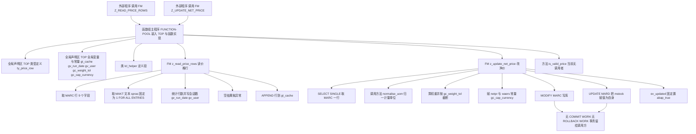

# ZFG_MATERIAL_PRICE 走读报告：采购价格 / 重量维护函数组

> 分析范围：`zfg_material_price.fg.abap`（函数组主程序 + local class）、`lzfg_material_pacetop.abap`（全局数据）、`lzfg_material_pacu01.abap`（两个 FM 实现）。
> 阅读对象：第一次接手这个函数组的 MM 采购开发同事。

---

## 一、程序定位与业务背景

### 1.1 它在业务上解决什么问题

采购信息记录（Purchasing Info Record，EINA/EINE）是 SAP MM 里最脏的一块数据：一个物料对同一个供应商可以按工厂、库存地点、有效期、价格单位维护出成百上千行价格。日常业务里最常见的动作是"批量刷新一批物料的采购净价"，来源可能是外部主数据平台的价格接口、年度框架协议调价、或者人工在 Excel 里算完一次性回灌。

这类批量回灌天然需要三件事：

1. **先看清楚现状**：给定物料，把它当前的采购信息行（工厂、库存地点、价格、币种、采购信息号）读出来，供调用方做比对或展示。
2. **再改写目标行**：给定物料和新的净价，把价格写回去，并且要留下痕迹。
3. **统一计量与校验**：不同工厂用的计量单位可能不一致（PC/PA 这类包装单位），写回前要归一；价格要有个"合理"的判断，别把 0 或者天文数字写进去。

`ZFG_MATERIAL_PRICE` 就是这样一个"窄而浅"的工具型函数组：两个 FM 对应前两件事，两个 local class 方法对应第三件事。文件头注释也写明了归属：`Function group: price / weight maintenance for purchasing infos / Owned by: MM Purchasing`。

### 1.2 为什么做成函数组而不是服务 / 类

选函数组（FUNCTION-POOL）的理由从代码痕迹能反推出来：

- 它需要**对外暴露 RFC 可调用接口**（FM 天然支持 SE37 注册后 RFC 调用），而"服务"（SRV/OData）那一套在这里纯属杀鸡用牛刀；
- 它需要在**多个 FM 之间共享数据结构**。`ty_price_row` 这条 9 字段的行结构同时被读 FM 的 TABLES 参数、写 FM 的内部工作区、以及 `is_valid_price` 的入参引用——在函数组里，一个 TOP include 就能让三者共用同一份类型定义，不需要把类型复制三遍；
- 代价是**所有 FM 共享同一份全局内存**，而且这份内存在一次 SAP-LUWA 工作区里是黏着的，不会在每次 FM 调用时自动重置。这一点是本函数组后面所有风险的根源，第 3.3 节会详细讲。

一句话定性：**这是一个"共享全局数据 + TABLES 按引用传参 + 直接写标准主数据表"的老式函数组工具，属于"能跑但把风险都留在运行时"的典型形态。**

---

## 二、程序执行流程总览

### 2.1 装配与调用全景



### 2.2 责任链表

| 子程序 | 调用者 | 职责 |
| --- | --- | --- |
| 函数组主程序 `FUNCTION-POOL zfg_material_price` | SAP 运行时（激活 / 首次调用） | 装入 TOP 与函数实现 include，声明 `lcl_helper` |
| 全局类型声明区 `ty_price_row` / `ty_price_rows`（全局声明区） | 编译期被 FM 接口与类方法引用 | 定义跨 FM 共享的行结构与表类型，并作为 FM 的 TABLES 参数类型公开 |
| 全局变量与常量（全局声明区） | 运行时被两个 FM 直接读写 | `gt_cache` 行缓存、`gv_run_date`/`gv_user` 会话戳、`gc_weight_tol` 阈值、`gc_cap_currency` 币种 |
| FM `z_read_price_rows` | 外部程序（RFC 或 `CALL FUNCTION`） | 读 MARC 行 + MAKT 文本，回填 `IT_ROWS`，追加进 `gt_cache`，无数据时抛 `NO_DATA` |
| FM `z_update_net_price` | 外部程序（`CALL FUNCTION`） | 改 MARC 的净价与币种，附带一次无意义的 MARD 自更新，返回 `EV_UPDATED` |
| 方法 `lcl_helper=>normalise_uom` | FM `z_update_net_price` | 把 `PC`/`PA` 这类包装单位映射成 `EA`，其余原样返回 |
| 方法 `lcl_helper=>is_valid_price` | 目前无任何调用者 | 判断 `netpr` 是否非零，返回 `abap_bool` |

下面按这条流程，逐个子程序展开。

---

## 三、分组分析

### 3.1 函数组主程序 `FUNCTION-POOL zfg_material_price`

本节要看三步：include 装配、类定义段的物理位置、以及本地类的作用域。

#### ① include 装配

```abap
FUNCTION-POOL zfg_material_price.

*"* use this source for any type of program (pool)
*"*   function group ZFG_MATERIAL_PRICE

INCLUDE lzfg_material_pacetop.    "session data, type declarations
INCLUDE lzfg_material_pacuxx.    "function implementations
```

**做什么** — 声明这是一个函数组（函数池），并把两个 include 源码在文本层面展开到本程序里：`lzfg_material_pacetop` 提供会话数据与类型声明，`lzfg_material_pacuxx` 提供所有 FUNCTION 的实现体。

**为什么** — 函数组的三个 include 有固定约定：`LZ...TOP` 是全局数据入口，`LZ...UXX` 是函数实现入口，名字由 SAP 自动匹配（`FUNCTION-POOL` 语句所在程序之外的 include 里，靠命名约定被自动展开的部分），而主程序里显式 `INCLUDE` 的是"补充"部分。这里显式写出两个 include 属于冗余但无害的写法，说明作者（或生成工具）想让人一眼看到组装关系。

**风险与改进** — **这里有一个致命不一致**：本函数组实际提供的函数实现位于 `lzfg_material_pacu01.abap`（U01 命名），而主程序 include 的是 `lzfg_material_pacuxx`，并且全文没有任何地方 include U01。两个后果：

- 如果系统里真只有这 U01 一个文件，那么函数组的 FM 实现体为空，`Z_READ_PRICE_ROWS` / `Z_UPDATE_NET_PRICE` 在 SE37 里根本不存在，函数组不可激活；
- 如果系统里另有一个 `LZFG_MATERIAL_PACUXX`（本次未提供），那么本次读到的这两个 FM 实现就是**死代码**。

**改进**：二选一。要么把实现文件改名为 `LZFG_MATERIAL_PACUXX`，要么在主程序里显式 `INCLUDE lzfg_material_pacu01.`。同时补一句注释说明 U01 与 UXX 的分工。函数组激活时必须通过 SE37 跑一次激活才能暴露这类命名错配，纯文本阅读最容易漏。

#### ② 本地类定义段

```abap
CLASS lcl_helper DEFINITION.
  PUBLIC SECTION.
    METHODS normalise_uom
      IMPORTING iv_uom  TYPE marc-uom
      RETURNING VALUE(rv_uom) TYPE marc-uom.
    METHODS is_valid_price
      IMPORTING is_row  TYPE ty_price_row
      RETURNING VALUE(rv_ok) TYPE abap_bool.
ENDCLASS.
```

**做什么** — 定义一个只有两个 `RETURNING` 方法的本地类。`normalise_uom` 输入输出都是 `marc-uom`；`is_valid_price` 直接吃第 3.2 节定义的 `ty_price_row` 行结构，返回 `abap_bool`。

**为什么** — 两个方法都是纯函数（无副作用、结果由入参决定），把它们放进类而不是写成 `FORM`/独立 FM，好处是可以在函数组内部按方法名调用、参数名可读、不占用全局符号表里的名字（本地类只在函数池内可见，不会污染系统全局类名空间），而且未来可以自然扩展成"采购信息维护工具集"。用 `RETURNING VALUE(...)` 而不是 `EXPORTING`，是现代 ABAP 的推荐风格，调用点可以直接把返回值内联使用。

**风险与改进** — **位置有风险**：这段 `CLASS lcl_helper DEFINITION` 出现在 `INCLUDE lzfg_material_pacuxx.`（也就是函数实现体）**之后**。本地类必须在文本上先定义、后使用，而 `z_update_net_price` 的实现体里就调用了 `lcl_helper=>normalise_uom`。ABAP 对本地类的顺序要求比对全局类严格得多，编译器遇到"先用后定义"会报语法错误（或至少在部分语法检查设置下变成警告），这个顺序必须在真实系统上用 SE38 编译验证一次。

**改进**：把整个 `CLASS lcl_helper DEFINITION` / `IMPLEMENTATION` 段整体上移到两个 `INCLUDE` 语句**之前**，即紧跟 `FUNCTION-POOL` 语句。这是函数组里放本地类的标准做法。同时注意：`is_valid_price` 依赖的 `ty_price_row` 定义在 TOP include 里，而 TOP include 又在类之前，顺序上没问题——如果把类上移，要确保仍在 TOP include 之后（`INCLUDE` 是文本展开，展开后顺序不变，实际风险只相对于函数实现 include）。

另外，`ty_price_row` 用 `TYPE ty_price_row` 而非 `TYPE ZFG_MATERIAL_PRICE=>TY_PRICE_ROWS` 的行类型直接引用，属于正常写法；但要注意本地类方法签名里用到了全局类型，意味着**类与 TOP include 存在编译期耦合**，TOP 一改，类签名跟着改，函数组整体重新激活。

### 3.2 全局类型声明区 `ty_price_row` / `ty_price_rows`

本节分两步看：行结构定义本身，以及表类型定义。

#### ① 行结构字段声明

```abap
TYPES: BEGIN OF ty_price_row,
         matnr   TYPE mara-matnr,
         werks   TYPE marc-werks,
         lgort   TYPE marc-lgort,
         eina    TYPE mara-eina,
         brgew   TYPE mara-brgew,
         ntgew   TYPE mara-ntgew,
         netpr   TYPE marc-netpr,
         waers   TYPE marc-waers,
         eifn    TYPE marc-eifn,
       END OF ty_price_row.
```

**做什么** — 定义一行"物料采购视图"的扁平结构，共 9 个字段：物料号、工厂、库存地点、采购信息号、毛重、净重、净价、币种、采购信息项目号。

**为什么** — 作者的意图很清楚：**不把 MARA/MARC 整表搬出来，而是定义一个跨两张表的投影结构**。MARA 有 200+ 字段、MARC 也有 100+，接口层暴露一个 9 字段的窄结构，调用方（尤其是 RFC 外部系统）拿到的数据形态稳定、可控。这是正确的数据传输设计，比 `IT_MARC TYPE MARC` 干净得多。

**风险与改进** — **类型与数据元素必须做语义校核，不能只看长度匹配**。逐字段校核：

| 字段 | 声明类型 | 业务含义 | 校核结论 |
| --- | --- | --- | --- |
| `matnr` | `mara-matnr` | 物料号 | ✅ 正确，也是 MARC 主键前缀 |
| `werks` | `marc-werks` | 工厂 | ✅ 正确，MARC 键字段 |
| `lgort` | `marc-lgort` | 库存地点 | ✅ 正确，MARC 键字段 |
| `eina` | `mara-eina` | 采购信息记录号 | ⚠️ 语义正确但取表可疑：采购信息号权威来源在 MARC-EINA（物料-工厂-库存地点-采购信息号），应直接写 `marc-eina` 避免"结构声明说来自 MARA、查询却从 MARC 取"的错位 |
| `brgew` | `mara-brgew` | **毛重** | 🔴 结构声明正确（毛重确实在 MARA），但 3.4 节的 SELECT 却试图从 MARC 取 `brgew`——MARC 并没有毛重字段（重量字段在 MARA，MARC 侧是处理单位相关的 `MGWGT` 等），这条 SELECT 存在 DDIC 风险，应在 SE11 用 `MARC` 的字段清单核实 |
| `ntgew` | `mara-ntgew` | **净重** | 🔴 同 `brgew`，结构类型对，取表错；且毛重与净重两个字段在整条链路上从未被真正使用（见 3.5 节 ③） |
| `netpr` | `marc-netpr` | 净价 | ⚠️ 语义校核不通过：采购价的权威位置是 **EINE-NETPR（且配套 EINE-PREX 价格单位、EINE-PRED/PRDE 有效期）**；MARC-NETPR 只是物料工厂层面的参考/评估价，不带有效期。把 netpr 定型成 `marc-netpr` 等于把"参考价"当"采购价"用 |
| `waers` | `marc-waers` | 价格币种（`CUKY`，长度 **5**） | 🔴 与 3.3 节 `gc_cap_currency TYPE c LENGTH 3 VALUE 'USD'` 语义与长度都不匹配；且币种不是能靠常量一刀切的东西 |
| `eifn` | `marc-eifn` | 采购信息记录项目号 | ⚠️ 语义正确，但结构里**没有价格有效期字段**（如 `prdat`/`eindt`），而 3.5 节要写的正是价格——写价不带有效期是业务上的硬伤 |

**改进**：把 `brgew`/`ntgew` 的取表统一为 MARA（或删掉——它们在本程序里没有任何真实用途）；`eina` 改声明为 `marc-eina`；净价改为面向 EINE/EINA 的结构（补 `eine-netpr`、`eine-prex`、`eindt`、`lifnr`），否则这个函数组永远只能改到"没有时效概念"的评估价上。

#### ② 表类型声明

```abap
TYPES ty_price_rows TYPE STANDARD TABLE OF ty_price_row WITH EMPTY KEY.
```

**做什么** — 定义以 `ty_price_row` 为行类型的标准内表，**无主键**（`WITH EMPTY KEY`）。

**为什么** — 这个选择值得肯定：数据来自一个可能返回多行的 `SELECT`，调用方只做遍历/显示，**不做 `READ TABLE` 按主键查找、不做 `DELETE`/`SORT` 按键去重**，所以给一个 EMPTY KEY 内表省掉了主键索引的构建开销和主键唯一性校验（重复行也不会报运行时错误）。对批量读取场景是恰当的内存优化。

**风险与改进** — `WITH EMPTY KEY` 是 7.40 语法，如果函数组仍需向下兼容到 7.02/7.20（很多老函数组为了 SE80 语法检查或 ECC 补丁基线会保留低版本），这里需要去掉并接受空主键的运行期开销。另外它要求 line type 是结构（本例满足）。除此之外无明显风险。

组与组之间：类型定义是后面所有 FM 与方法的公共词汇表，理解它之后才能读懂"数据在哪些字段上流动"。

---

### 3.3 全局变量与常量（全局声明区）

本节分两步：会话级的全局变量，以及两个常量。

#### ① 全局变量

```abap
DATA: gt_cache    TYPE ty_price_rows,
      gv_run_date TYPE datum,
      gv_user     TYPE sy-uname,
      gv_language TYPE sy-langu.
```

**做什么** — 声明四份函数组级内存：一张 `gt_cache` 行缓存（`ty_price_rows` 类型），以及 `gv_run_date`（运行日期）、`gv_user`（用户名）、`gv_language`（登录语言）三个标量。

**为什么** — 前者显然是想做"读一次缓存多次复用"的性能优化；后三者是想把"这次是谁、在什么时间、什么语言环境下跑的"记下来，供调用方或后续审计使用。这类"会话上下文戳"在批量维护类程序里是常见做法。

**风险与改进** — 这一段是本函数组**最需要重新设计**的地方：

- 🔴 **函数组的全局数据不是每次调用重置的**。它们绑定在 SAP-LUWA 工作区上，函数模块被反复调用时不会自动 `CLEAR`。这意味着 `gt_cache` 在一次长会话（对话框程序里翻页、后台作业里循环调用 RFC、同一 LUWA 里多次调用）里会**只增不减**，重复调 `z_read_price_rows` 就把同一批 MARC 行反复 `APPEND` 进缓存 → 内存单调增长 → 最后 `STX` / `MEMORY_OVERFLOW`。要缓存就必须有失效与上限策略（本程序一个都没有）。
- 🔴 **`gt_cache` 只写不读**。两个 FM 都没有从 `gt_cache` 读任何一行，`is_valid_price` 也没有拿它当数据源。也就是说，这个缓存是**纯粹的单向内存泄漏**，连"减少 SELECT"这点好处都没兑现。
- 🟠 **`gv_language` 声明了却从未赋值**，而 3.4 节取 MAKT 文本时硬编码了 `spras = '1'`。这说明作者本来打算用会话语言，落地时漏了。这是一处典型的"意图与实现脱节"。
- 🟠 **`gv_run_date` / `gv_user` 只在读 FM 里被赋值**（3.4 节 ③），而真正需要审计留痕的是**写 FM**（3.5 节）。也就是说：谁改了价、改了多少，系统里根本没留下记录。
- 🟢 **改进**：`gt_cache` 要么删掉，要么改成有上限（例如 `DELETE` 后重新填充、或按 `matnr` 分区存哈希表、或每次 FM 入口 `CLEAR gt_cache`）；`gv_language` 改为在 FM 入口用 `sy-langu` 赋值并用于 MAKT 取文本；把会话戳移到写 FM，并且配合真正的变更日志（见 3.5 节）。

#### ② 常量

```abap
CONSTANTS gc_weight_tol TYPE p DECIMALS 4 VALUE '0.5'.
CONSTANTS gc_cap_currency TYPE c LENGTH 3 VALUE 'USD'.
```

**做什么** — 声明两个业务常量：权重容差 `0.5`（4 位小数的 packed 数），以及"封顶币种" `USD`（3 位字符）。

**为什么** — 意图分别是"重量比值超过 0.5 就不让它更大"和"统一按 USD 记账"。作为把业务口径写进常量的做法，方向是对的（比散落在代码里的魔数好）。

**风险与改进** — 两个都有问题：

- 🟠 **`gc_weight_tol` 的单位是隐含且可疑的**。它是个没有单位的 packed 数字，而 `BRGEW` 是**带单位的数量字段**（MARA-GEWE，常见 KG 或 LB）。拿 `0.5` 去跟重量比值比，等于默认"所有工厂的重量单位都一样"，跨单位场景下判断完全失效。而且它叫 `tol`（tolerance，容差），语义上应该是"超了就报错/告警"，而 3.5 节 ③ 却拿它做**静默截断**——容忍和截断是两种相反的处理策略。4 位小数相比 `MARA-BRGEW` 的 3 位小数还有精度对齐问题。
- 🔴 **`gc_cap_currency` 是本程序最危险的一行**。`MARC-WAERS` 的数据元素是 `CUKY`，长度 **5**；`gc_cap_currency` 只有 **3**。往 5 位字段里塞 3 位 `'USD'` 会得到右对齐补空格的结果（`␣␣␣USD` 之类），**与系统里真正的 USD 币种键（`'USD'` 或带空格的标准写法，具体取决于域值）比较时可能不相等** → `NEKRF`/价格比较、金额格式化、后续按币种分组的逻辑全错。更根本的问题是：**把所有物料的价格币种强制改成 USD 是业务灾难**——EUR 物料的价格被贴上 USD 标签，等于金额错了一倍汇率且没有任何换算、没有价格有效期、没有审批。这行必须删掉，或者至少改成"币种由调用方传入，并校验与 `MARC-WAERS` 现有值一致时才改"。长度也应改成 `TYPE waers`（跟随数据元素）而不是硬写 3。

组与组之间：全局数据讲完，接下来进入真正干活的两个 FM——它们都直接读写这份全局内存。

---

### 3.4 FM `z_read_price_rows`（读价格行）

这个 FM 分五步：取 MARC 行、取 MAKT 文本、统计并写会话戳、空结果抛异常、追加进缓存。

先看它对外承诺的接口：

```abap
FUNCTION z_read_price_rows.
*"----------------------------------------------------------------------
*"* Local Interface:
*"*  IMPORTING
*"*     VALUE(IV_MATNR) TYPE  MARA-MATNR
*"*  TABLES
*"*     IT_ROWS        TYPE  ZFG_MATERIAL_PRICE=>TY_PRICE_ROWS
*"*  EXCEPTIONS
*"*     NO_DATA       1
*"*----------------------------------------------------------------------
```

**做什么** — 声明一个导入参数 `IV_MATNR`（物料号）、一个表参数 `IT_ROWS`（输出行表）、一个异常 `NO_DATA`。

**为什么** — `TABLES` 参数是函数组的"祖传"接口形式（RFC 场景下自动支持）。用 `TABLES` 而不是 `IMPORTING IT_ROWS TYPE ty_price_rows` 属于过时写法，现代 ABAP 规范已弃用。

**风险与改进** — 🟠 三个层面：

1. **接口契约是单向的**：文档写的是 `TABLES IT_ROWS`，按语义应当是**输出**表，但 ABAP 里 `TABLES` 参数被声明为内部表传参、**不会自动获得输出语义**。同一系统内调用（`CALL FUNCTION`）时内表按引用传，实际能拿到数据；但走 RFC 边界时，`TABLES` 的行为与"输出"不完全等价，外部系统的序列化契约会变得含糊。**改进**：改成 `IMPORTING it_rows TYPE ty_price_rows`（输入引用，函数内部直接 `ASSIGN`）或 `EXPORTING et_rows TYPE ty_price_rows`（输出值传递），并加 `READ-ONLY` 标注只读意图。
2. **共享全局类型作参数类型**：把函数组的 `ty_price_rows` 直接作为 FM 接口类型（`ZFG_MATERIAL_PRICE=>TY_PRICE_ROWS`），意味着**任何字段变更都是接口破坏性变更**，所有 RFC 消费者都要重新激活。这是老函数组的固有代价，可接受但要写进文档。
3. **`IT_ROWS` 传入时不清空**：函数没有 `CLEAR it_rows.`，如果调用方（RFC 场景）传入的是非空表，旧数据会和新数据混在一起。**改进**：入口先 `CLEAR it_rows.`。

#### ① 取 MARC 行

```abap
  DATA lv_count TYPE i.

  SELECT matnr werks lgort eina brgew ntgew netpr waers eifn
    FROM marc
    INTO TABLE it_rows
    WHERE matnr = iv_matnr.
```

**做什么** — 按物料号从 MARC 取 9 个字段灌进 `it_rows`，命中 MARC 的主索引 `MATNR` 前缀（另有 `MATNR/WERKS/LGORT` 的二级索引）。

**为什么** — 字段投影而不是 `SELECT *`，理由前面说过：窄结构、稳定契约、省内存。条件只有 `matnr`，粒度是"这个物料的所有工厂 + 所有库存地点"，符合"批量刷新前先看现状"的场景。

**风险与改进** — 🔴 这里有两层问题：

- **DDIC 层**：`brgew`、`ntgew` 是 **MARA** 的字段（毛重/净重），MARC 里并不存在这两个列。选字段列表里出现 MARC 没有的字段，SELECT 在语法检查阶段就会失败（`marc` 结构的组件不存在）。请务必在 SE11 打开 `MARC` 的字段清单核实——我按标准 DDIC 判断是高风险项，但需要在真实系统上确认一次。**改进**：要么把重量从 MARA 单独查（`SELECT matnr brgew ntgew gewe FROM mara`）再按 `matnr` 回填，要么干脆不要重量（它在本程序里毫无用途）。而 `eina` 应该来自 `marc-eina`（不是 `mara-eina`）。
- **健壮性层**：`iv_matnr` 初始（空）时，`WHERE matnr = ' '` 通常返回 0 行，随后走 `NO_DATA` 异常——行为可接受，但更友好的做法是入口 `IF iv_matnr IS INITIAL. ... ENDIF.` 直接短路。另外没有对返回行数做上限控制，单个超大物料的 MARC 行数虽然有天然上限（工厂 × 库存地点），风险有限。
- **`INTO TABLE it_rows` 会覆盖调用方已有内容**：本系统内调用时这等于自动清空重填，行为其实是对的（比不 `CLEAR` 好），但与第 ③ 步之后"不清空"的隐患并存，建议显式化。

#### ② 取 MAKT 文本

```abap
  SELECT maktx FROM makt
    INTO TABLE lt_desc
    FOR ALL ENTRIES IN it_rows
    WHERE matnr = it_rows-matnr
      AND spras = '1'.
```

**做什么** — 用 `FOR ALL ENTRIES` 以 `it_rows` 的 MATNR 为驱动表，从 MAKT 取物料描述，装进 `lt_desc`。

**为什么** — 思路是对的：MAKT 里有大量其他物料的描述，如果先全查再手工过滤是浪费；FAE 能把结果限制在实际需要的 MATNR 集合内，比裸 JOIN 更可控、更容易读。

**风险与改进** — 🔴 **三重问题**：

- **`lt_desc` 从未声明**。TOP include 里没有它，FM 的 `DATA` 段里也没有（`DATA lv_count TYPE i.` 只声明了一个）。未声明的内表在 FM 里是语法错误，**这个 FM 根本无法激活**。
- **取回来的文本没有任何去处**。`ty_price_row` 里**没有 `maktx` 字段**，`lt_desc` 取完之后既没 `APPEND`、没 `READ TABLE` 回填、也没参与输出。调用方拿到的 `IT_ROWS` 里一个描述字符都没有——这次 SELECT 是纯粹的无效开销。
- **语言硬编码 `spras = '1'`**。SAP 语言键 `'1'` 是**中文（简体）**，`'E'` 才是英文。也就是说这个函数组在英文系统上取不到任何描述（结果是空表，但不会报错，属于**静默错误**）；而 TOP 里已经声明了 `gv_language`（`sy-langu` 类型）却没用。**改进**：`AND spras = @sy-langu`（或用 `gv_language`），并把 `maktx` 加进 `ty_price_row` 后回填。
- **FAE 的驱动表**：`it_rows` 在此处是上一步 SELECT 的结果（已初始化），不是未初始化的空表，FAE 行为正确（空表返回空结果，不全表扫描）。这一点**无风险**，但仍建议在 FAE 前加 `IF it_rows IS NOT INITIAL.` 双保险——若将来有人在前面加了 `CLEAR`，这行就变成潜在的全表扫描陷阱。

#### ③ 统计行数并写会话戳

```abap
  lv_count = lines( it_rows ).

  gv_run_date = sy-datum.
  gv_user     = sy-uname.
```

**做什么** — 用内置函数 `lines( )` 取出行数存进局部变量 `lv_count`，并把当前日期、当前用户名写进函数组全局变量。

**为什么** — `lv_count` 供下一步判断空结果；`gv_run_date`/`gv_user` 意图是给调用方提供一个"这次读取发生在什么时候、由谁触发"的上下文。

**风险与改进** — 🟠 这两行是"做了一半的审计"：

- `lv_count` 只被用来做 `= 0` 判断（下一步），语义上完全等价于 `it_rows IS INITIAL`，多一个变量不算错，但也没体现"计数"的价值（比如日志里打出行数——这恰恰是最该做的）。
- 真正的审计信息写进了**调用方看不见的全局内存**：调用方拿到了 `IT_ROWS` 却拿不到"什么时候读的"。更严重的是，**写 FM 完全不写这两个戳**（见 3.5 节），所以整个函数组没有留下任何可追溯的修改记录。**改进**：把这三个上下文字段放进 FM 的 `EXPORTING` 参数，让调用方能拿到并落日志；写操作则应该生成真正的变更文档。

#### ④ 空结果抛异常

```abap
  IF lv_count = 0.
    RAISE EXCEPTION TYPE cx_sy_no_data.
  ENDIF.
```

**做什么** — 当查询结果为空时，抛出一个 `cx_sy_no_data` 类异常。

**为什么** — 意图是让调用方通过 `EXCEPTIONS no_data` 感知"无数据"。

**风险与改进** — 🔴 **异常机制用错了，这是本函数组最典型的 ABAP 概念错误**：

- FM 头里声明的是**经典 FM 异常** `EXCEPTIONS NO_DATA 1`。经典异常在 FM 内部的正确触发方式是 `MESSAGE no_data TYPE 'E'`（消息文本正好是异常名，运行时不弹窗，直接转成异常传给调用方）。而 `RAISE EXCEPTION TYPE cx_sy_no_data` 抛的是**类异常**，类异常**不会**进入 FM 的 `EXCEPTIONS` 列表，调用方写的 `EXCEPTIONS no_data = 1` 永远不会被触发。
- 结果就是：调用方要么走异常分支永远进不去、要么因为类异常无人 `CATCH` 而直接 **short dump**。要么改代码：
  - 若保持经典接口：改成 `MESSAGE no_data TYPE 'E'`；
  - 若改用类异常：FM 签名保留 `EXCEPTIONS` 无用，应改为在 FM 内 `CATCH cx_sy_no_data`，或干脆不做 FM，改成类方法 + `RAISING`。
- 附带一个小问题：判断条件用 `lv_count = 0` 而不是 `it_rows IS INITIAL`，行为等价，无风险。

#### ⑤ 追加进缓存

```abap
  APPEND LINES OF it_rows TO gt_cache.

ENDFUNCTION.                    "Z_READ_PRICE_ROWS
```

**做什么** — 把本次查到的所有行整体追加到函数组全局缓存 `gt_cache`，FM 结束。

**为什么** — 显然是想让后续 FM 调用能复用已读数据，少打数据库。

**风险与改进** — 🔴 前面在 3.3 节已经说过，这里给出具体后果链：`gt_cache` 只被写、从不被读，所以每次调用读 FM 都是"数据库 SELECT + 纯内存泄漏"。更糟的是在对话框工作区里，缓存跨屏幕存活且不重置，**同一物料重复调用 N 次就在缓存里堆 N 份**，然后再也没有人清理它。

**改进（按推荐度排序）**：

1. 删掉 `gt_cache` 与这段 `APPEND`（YAGNI——现在没人读它）；
2. 若确实要缓存：改成 `gt_cache` 在 FM 入口 `CLEAR`，或按 `matnr` 做 key 覆盖写（`DELETE gt_cache WHERE matnr = iv_matnr`），并加上最大行数保护；
3. 让另一个 FM / `is_valid_price` 真正读它，否则缓存名存实亡。

组与组之间：读 FM 走完了"看清楚现状"这一步。但它交付的行数据里没有重量和币种校验——真正的风险其实集中在下一个 FM。

---

### 3.5 FM `z_update_net_price`（改净价）

这个 FM 分七步：接口、`SELECT SINGLE` 取行、调 `normalise_uom`、算权重并截断、赋净价与币种、`MODIFY MARC` 写库、`UPDATE MARD` 的无意义自更新、返回标志。

#### ① 接口

```abap
FUNCTION z_update_net_price.
*"----------------------------------------------------------------------
*"* Local Interface:
*"*  IMPORTING
*"*     VALUE(IV_MATNR) TYPE  MARA-MATNR
*"*     VALUE(IV_NETPR) TYPE  MARC-NETPR
*"*  EXPORTING
*"*     VALUE(EV_UPDATED) TYPE  ABAP_BOOL
*"*----------------------------------------------------------------------

  DATA ls_row    TYPE ty_price_row.
  DATA lv_uom    TYPE marc-uom.
  DATA lv_weight TYPE p DECIMALS 4.
```

**做什么** — 声明导入 `IV_MATNR`（物料号）与 `IV_NETPR`（新净价），导出 `EV_UPDATED`（是否更新成功）；局部工作区 `ls_row` 用 `ty_price_row` 类型，另有 `lv_uom`、`lv_weight` 两个标量。

**为什么** — 用 `VALUE(...)` 传基本类型、返回 `abap_bool` 表示成败，是符合现代 ABAP 规范的接口。返回布尔而不是抛异常也算一种设计选择。

**风险与改进** — 🟠 接口本身是本 FM 最大的设计缺陷来源：

- **缺少 `IV_WERKS` / `IV_LGORT`**。MARC 的主键是 `MATNR + WERKS + LGORT`，而 FM 只给了物料号。于是"改哪个工厂的价格"这个问题**在接口层面就没有答案**，只能靠下面第 ② 步的 `SELECT SINGLE` 随便挑一行。**改进**：补齐 `IV_WERKS`、`IV_LGORT`；更符合业务的是干脆以 `EINA/EIFN`（采购信息记录号 + 项目号）为定位键，直接改 EINE 的价格。
- **`IV_NETPR TYPE MARC-NETPR`** 沿用了第 3.2 节的语义错配（把 MARC 参考价当采购价）。
- **`ABAP_BOOL` 作为 EXPORTING** 比 `TYPE abap_bool` 的 `EXPORTING ev_updated TYPE abap_bool` 老式写法（多了个 `VALUE`），在 `SE38` 新语法检查下会提示，可接受。
- **`lv_uom` 声明后不会有任何作用**（第 ③ 步可见）。
- **没有 `EXCEPTIONS`**：任何错误（找不到行、除零、转换失败）只能以消息/短 dump 形式中止，无法让调用方优雅处理。**改进**：至少加 `not_found` 与 `conversion_failed`。

#### ② 取一行作为工作区

```abap
  SELECT SINGLE * FROM marc INTO @ls_row
    WHERE matnr = iv_matnr.
```

**做什么** — 按物料号从 MARC 读**一整行全部字段**到局部结构 `ls_row`。

**为什么** — 作者的意图是"拿到完整行 → 改两个字段 → `MODIFY` 写回"，这是标准的"读-改-写"（read-modify-write）模式。

**风险与改进** — 🔴 **这是本 FM 最危险的一步，有三个独立的问题**：

- **`SELECT SINGLE * ... INTO` 一个只有 9 个字段的结构**：类型不匹配。`ls_row` 是 `ty_price_row`，不是 MARC 的结构；把 MARC 全字段灌进一个 9 字段结构，编译器会报结构不兼容（`INTO` 的目标结构必须能容纳所有被选字段）。正确写法应是显式字段列表并**与目标结构字段一一对应**（正好就是第 3.4 节那种投影写法），或者直接 `INTO @ls_row` 但结构改成 MARC 类型。
- **不检查 `sy-subrc`**。`SELECT SINGLE` 找不到行时 `sy-subrc = 4`，本程序完全无视，继续往下走：后面用初始值字段做除法、给 `ev_updated` 置真。**调用方会收到"更新成功"，而数据库一个字节都没变。**
- **没有排序的多行结果不确定**。物料在 MARC 里通常有多个工厂/库存地点行，`SELECT SINGLE` 无 `ORDER BY`，取到哪一行取决于 DB 的访问路径与缓冲，**结果不可复现**。同一份代码今天改 A 工厂、明天改 B 工厂，这是典型的"偶发"生产事故。

**改进**：定位键补全 `werks`/`lgort`（或改用 EINA/EIFN）；检查 `sy-subrc`，`IF sy-subrc <> 0` 时抛 `not_found` 或返回 `abap_false`；显式字段列表。

#### ③ 调 `normalise_uom` 并计算权重

```abap
  lv_uom = lcl_helper=>normalise_uom( is_row = ls_row-waers ).

  lv_weight = ls_row-brgew / ls_row-eina.

  IF lv_weight > gc_weight_tol.
    lv_weight = gc_weight_tol.
  ENDIF.
```

**做什么** — 第一行试图调用 `lcl_helper` 的单位归一方法并把结果存入 `lv_uom`；第二行用毛重除以采购信息号算出一个"权重"；第三、四行用容差常量给这个权重做上限截断。

**为什么** — 作者想解决的是两个真实的业务问题：不同工厂单位不统一（所以要归一），以及"重量数据离谱"要有个护栏（所以要容差）。出发点都是对的。

**风险与改进** — 🔴 **这三行里每一行都有错**：

- **调用本身编译不过**。方法签名是 `normalise_uom( IMPORTING iv_uom TYPE marc-uom RETURNING ... )`，而这里写的是 `is_row = ls_row-waers`：实参名 `is_row` 不存在（那是 `is_valid_price` 的形参名），传的值是 `waers`（币种，CHAR 5）也不是 UOM。正确写法应是 `lv_uom = lcl_helper=>normalise_uom( iv_uom = ls_row-<某个 UOM 字段> ).` —— 顺带说，`ty_price_row` 里**根本没有 UOM 字段**（`MARC-UMREN` 或 MARA-UMREN 才是），所以这条调用在语义上也无法成立。
- **`lv_uom` 拿到之后从未被使用**。归一化的结果没有写回任何字段（既没赋给 `ls_row` 的 UOM，也没参与后面的计算），所以即使调用修好了，这个方法也是**纯粹的空转**。
- **`ls_row-brgew / ls_row-eina` 是把重量除以一个编号**。`EINA` 是采购信息记录号，数据元素 `CHAR(10)`，**它不是一个数量**。这里会出现两种结局：① 采购信息号是纯数字（SAP 里常见形如 `0000000010` 的零填充值）→ 隐式转换成数值，程序"跑过去了"，得到一个物理意义为零的数字；② 采购信息号含字母 → `CONVT_NO_NUMBER` **short dump**。这正是"能跑"和"对"之间的差别——**不能因为第一种情况能跑就认为这行代码是对的**。
- **截断方向是错的**。`IF lv_weight > gc_weight_tol. lv_weight = gc_weight_tol.` 把一个坏数据**悄悄改成另一个数**，然后这个被改过的数**后面根本没人用**（`lv_weight` 在 FM 结束前不再出现）。所以这三行合起来的净效果是：**一个必崩或必错的除法 + 一次无用的赋值**。若原本意图是"校验重量合理性"，正确做法是超限时抛异常或记消息，而不是静默截断。

**改进**：删掉这整段（`lv_uom` 与 `lv_weight` 在正确的实现里都不需要）；若要保留单位归一，必须先把 UOM 字段加进 `ty_price_row`，并在 FM 入口做；重量比值若真需要，应当是 `ntgew / brgew` 或与 `MARA-EINA` 无关的业务口径，并且单位要与 `MARA-GEWE` 对齐。

#### ④ 赋值净价与币种

```abap
  ls_row-netpr = iv_netpr.
  ls_row-waers = gc_cap_currency.
```

**做什么** — 把调用方传入的新净价写进工作区的 `netpr`，把币种直接覆盖为常量 `'USD'`。

**为什么** — 净价赋值显然是本 FM 的核心目的；币种赋值则说明作者打算"统一币种口径"，可能对接了某个只收 USD 的外部价格接口。

**风险与改进** — 🔴 币种这一行是**业务正确性 P0**：

- 把所有物料的价格币种强制改为 USD，**没有任何汇率换算、没有价格单位（`MARC-PEINH`）处理、没有有效期、没有变更文档、没有审批**。对一张 EUR 物料写入原封不动的价格数字却贴上 USD 标签，账实差异按汇率倍数放大，且系统内所有按币种汇总的报表全错。
- 类型上还有长度不匹配（`CUKY` 长 5 vs 常量长 3，见 3.3 节 ②），可能导致币种键与系统标准值不相等。
- 净价也没有任何合理性校验——`IV_NETPR` 传 `-1` 或 `999999999` 都会被照写。`is_valid_price` 恰好就是干这个的（见 3.7 节），**但它从来没有被调用过**。

**改进**：删除这行币种覆盖，改为"币种由调用方传入并强制校验与 `MARC-WAERS` 一致，不一致直接拒绝"；净价写入前调用 `lcl_helper=>is_valid_price` 校验，并结合 `MARC-EINE-NETPR + PRDE 有效期 + PEINH 价格单位` 完整写价。

#### ⑤ 写库：`MODIFY MARC`

```abap
  MODIFY marc FROM ls_row.
```

**做什么** — 把局部工作区 `ls_row` 按主键写回 MARC。

**为什么** — `MODIFY` 会按表的主键字段（`MATNR/WERKS/LGORT`）定位记录，若存在则整体更新、不存在则插入。由于 `ls_row` 里包含了这三个键字段（由第 ② 步的 `SELECT SINGLE` 填的），定位是能成立的。

**风险与改进** — 🔴🔴 **写数据库这块的问题集中在这里，这是整个函数组最该重写的部分**：

- **结构与表不匹配，会导致写坏数据**。`MODIFY dbtab FROM wa` 要求 `wa` 的字段是目标表的字段子集，且**要能覆盖要写的字段**。`ty_price_row` 里的 `brgew`、`ntgew` **不是 MARC 的字段**（在 MARA），字段顺序也与 MARC 不一致。这种"给部分字段结构做 MODIFY"的写法，轻则编译失败，重则在能编译的变体里把 MARC 上其余上百个字段**写成初始值**（因为工作区里没有它们），造成**采购主数据被清空**。**必须改成 `MODIFY marc FROM ls_row` + 明确的字段列表方案，或干脆用 BAPI/标准 FM（如 `MB_CREATE_MATERIAL`、或针对采购信息的标准 API）**。
- **没有事务（LUW）管理**。FM 内既没有 `COMMIT WORK` 也没有 `ROLLBACK WORK`。
  - `MODIFY` 会开启一个隐式更新的 LUW，数据在 SAP-LUWA 里挂起，**由调用方的事务决定何时提交**；
  - 后果之一：调用方若 `ROLLBACK`，改价被回滚——这本身是好事（可以回滚）；后果之二：调用方若在同一个 LUWA 里先读后写再读，读到的是未提交的一致视图，行为取决于缓冲与 FM 语义，容易踩坑；
  - 后果之三（本 FM 特有）：**若这段 FM 是通过 RFC 调用的，RFC 结束不会隐式提交**，数据会一直挂到调用方 LUWA 结束。若调用方是个长事务甚至干脆是后台作业里忘提交，那就成了"数据看不见的幽灵修改"。同时，**在 FM 里直接 `COMMIT WORK` 也是错的做法**（RFC 场景与更新任务中受限，而且会擅自切断调用者的事务单元）。业界通行结论是：**由调用方负责提交，FM 只负责写和抛异常**。这一点应在 FM 文档注释里写死。
  - 后果之四：写操作**没有错误处理**。`MODIFY` 后不检查 `sy-dbcnt`，也不检查 `sy-subrc`。数据库层面的问题（表锁定、空间不足、MARC 被他人锁定）会以 `OPEN SQL` 类消息或短 dump 呈现，调用方无 `EXCEPTIONS` 可接。
- **没有加锁 → 丢失更新**。MARC 是高频维护的表。两个会话同时改同一行时，后提交的覆盖先提交的（典型 lost update）。**改进**：`ENQUEUE_EZMARC`（或对应锁 FM）在改前 `SET HANDLER` 处理锁冲突，或者在 `MODIFY ... WHERE matnr = ? AND (dats/timestamp 未变)` 上做乐观锁校验。
- **没有授权检查**。写 MARC 涉及对象 `M_MARC_WERKS` 等，FM 直接写库会**绕过对话程序的权限检查**。通过 RFC 入口时尤其危险：任何一个能调这个 FM 的用户都能改任意工厂的采购价。**改进**：FM 入口用 `AUTHORITY-CHECK` 或 `IF SAPL...AUTH_CHECK`，并且 FM 必须从 `S_TCODE` / 业务角色层面限制 RFC 调用。
- **没有变更文档（Change Document）**。`MARC` 的变更通过 CD 对象自动记录的前提是走标准维护路径；直接 `MODIFY` 虽然会触发 MARC 的 CD（因为 MARC 配置了 CD 对象 `MARC`），但**前提是你的 CD 文档激活、无人为规避**，更稳妥的做法是显式 `CHANGE_DOCUMENT` 或走 BAPI。至少要把 `gv_user`/`gv_run_date` 落到调用方可取的地方。
- **静默改标准表、无 ALM 输出**。写 MM 主数据没有 `BAL_SA_MSG` / `MESSAGE` / `miALV` 之类日志，问题排查只能靠 ST22 与 CD。

#### ⑥ 无意义的 MARD 自更新

```abap
  UPDATE mard SET mstock = mstock WHERE matnr = iv_matnr.
```

**做什么** — 对 MARD 表执行一条 UPDATE，条件只有物料号，把 `MSTOCK` 赋值为它自己。

**为什么** — 猜作者意图是"库存也要跟着价格一起刷新"或"确保库存行被 touch 一下"。但赋值 `mstock = mstock` 语义上就是**什么都没改**。

**风险与改进** — 🔴 **零功能价值 + 真实副作用**：

- **没有 WHERE 之外的限定**：只要传物料号，**该物料所有工厂、所有库存地点的 MARD 行**全部被更新一遍（可能上百行）。
- **`UPDATE` 无条件会真正打开 LUW 并加更新锁**：它会修改表统计信息（V001/表空间统计），触发 FK 检查，并且**对所有命中行加排他锁**；行数多时会**锁升级为表锁**，进而阻塞其他会话对 MARD 的访问。换来的是零数据变化。
- **`MSTOCK` 字段是否存在于 MARD 需要用 SE11 核实**（MARD 是物料-工厂-库存地点的库存汇总视图，MSTOCK 通常在 MBEW；MARD 上更常见的是 MGIDNR/STORLOCATION 相关字段）。若字段名不对，这条语句连编译都过不了。无论如何，"`UPDATE ... SET x = x`" 这种写法在任何评审里都该被打回。
- **隐含一个错误的业务信号**：调用方可能以为"库存被刷新过了"，实际上只是被无意义地锁了一遍。

**改进**：直接删除。若确有业务需要，必须明确改的是哪张表的哪个字段（库存金额通常是 `MBEW-MBWRT`，且改库存金额属于极高风险操作，绝不能顺手写在价格维护 FM 里）。

#### ⑦ 返回成功标志

```abap
  ev_updated = abap_true.

ENDFUNCTION.                    "Z_UPDATE_NET_PRICE
```

**做什么** — 无条件把返回标志置为 `abap_true`，FM 结束。

**为什么** — 意图是告诉调用方"更新成功"。

**风险与改进** — 🔴 **这是"最危险的假阳性"**：标志位在函数末尾无条件置真，意味着：

- 物料不存在（`SELECT SINGLE` 返回 `sy-subrc = 4`）→ 仍然返回 `abap_true`；
- `MODIFY` 实际影响 0 行 → 仍返回 `abap_true`；
- `iv_netpr` 是负数/天文数字 → 仍返回 `abap_true`；
- 数据库报错 → short dump（这条至少不会撒谎）。

**改进**：`IF sy-subrc <> 0 AFTER SELECT` 与 `MODIFY` 后检查 `sy-dbcnt`（`IF sy-dbcnt <> 1`）分别置 `abap_false` 并写错误消息或抛异常；更推荐抛 `not_found` / `update_failed` 异常，让调用方无法忽略。

组与组之间：写 FM 的逻辑到这里结束——结论是"接口缺键、结构错位、异常用错、无事务无锁无授权"。接下来看它调用的那个方法本身。

---

### 3.6 方法 `lcl_helper=>normalise_uom`

```abap
CLASS lcl_helper IMPLEMENTATION.
  METHOD normalise_uom.
    CASE iv_uom.
      WHEN 'PC' OR 'PA'.
        rv_uom = 'EA'.
      WHEN OTHERS.
        rv_uom = iv_uom.
    ENDCASE.
  ENDMETHOD.                    "normalise_uom
```

**做什么** — 用一个两分支的 `CASE`：当输入单位是 `'PC'` 或 `'PA'` 时返回 `'EA'`（每个/件），其余单位原样返回。

**为什么** — 典型的主数据清洗需求：不同工厂的物料单位有人填 `PC`（Piece）、有人填 `PA`（Package），需要归一到统一的 `EA` 才好做价格计算。写成纯函数、无副作用、返回值而非改参数，符合工具方法的定位。`RETURNING VALUE` 也让调用点更简洁。

**风险与改进** — 🟠 方法本身写得干净，但存在几个问题：

- **它当前无法被调用**：3.5 节 ③ 的调用点传了错误的实参名与错误的字段（`waers` 而非 UOM），且传的是 `abap_char` 赋给 `lv_uom`（`lv_uom` 类型是 `marc-uom`，赋值本身类型相容，问题只在调用语法）。
- **业务映射硬编码且无出处**：`PC`→`EA`、`PA`→`EA` 意味着"一包 = 一件"，这在实务中几乎从不成立（`PA` 是包装单位，通常 N 件/包）。真要归一，应该用 `MARC-UMREN`（分母单位换算）或包装单位物料的 `MARM-EUMR`，而不是在代码里写死"1:1"。**改进**：改成"取 `UMREN/EUMR` 做换算"，或至少把这张映射表挪到可维护的配置（ customizing 表）里。
- **输入为空**：`iv_uom` 初始时走 `WHEN OTHERS` 返回空值，不报错也不告警。**改进**：`IF iv_uom IS INITIAL` 时给出明确返回值或抛异常。
- **返回值未被使用**：如前所述，即使调用修好，结果也只落在 `lv_uom` 里，之后被丢弃。**改进**：要么把归一后的单位写回数据库（并纳入变更文档），要么承认这个方法当前不需要，直接删掉。

### 3.7 方法 `lcl_helper=>is_valid_price`

```abap
  METHOD is_valid_price.
    rv_ok = COND #( WHEN is_row-netpr IS INITIAL THEN abap_false
                     ELSE abap_true ).
  ENDMETHOD.                    "is_valid_price
```

**做什么** — 判断入参行结构的 `netpr` 是否为初始值（数值 0），返回 `abap_false`/`abap_true`。

**为什么** — 用 `COND #( )` 内联条件赋值（7.40 语法），比 `IF/ELSE` 三行更紧凑，在有 `abap_bool` 语义的场景里是推荐写法；`IS INITIAL` 对 packed 数值等价于"等于 0"。

**风险与改进** — 🟠 方法**从未被任何地方调用**（两个 FM 都没用它），也就是说 3.5 节那个"任何数字都能写进价格"的洞，防护措施已经写好了却没接上。而且判断逻辑本身也不够：

- **把"免费物料"误判为非法**：`NETPR = 0` 在采购里完全合法（赠品、样品、内部免费供货）。用 `IS INITIAL` 判非法会误杀。
- **只校验金额，不校验配套信息**：价格单位 `PEINH`（每 1/每 100/每公斤）、币种 `WAERS`、有效期、供应商都为空时，价格仍然"有效"，业务上是错的。
- **没有精度/范围校验**：`NETPR` 的数据元素允许较大值，没有上限保护。

**改进**：把校验补成"币种非空 + 价格单位非空 + `netpr >= 0` + 净重为正时重量合理"，并在 `z_update_net_price` 写库前调用；同时处理"免费物料"这一合法场景（例如用独立的允许标志或约定用负价表示折扣）。

组与组之间：两个方法都写完了。本函数组的全貌已经清楚——下面用数据视角再串一遍。

---

## 四、执行流程全景图（数据视角）

```mermaid
sequenceDiagram
  participant APP as 调用方程序
  participant FG as 函数组 ZFG_MATERIAL_PRICE
  participant TOP as 全局数据区
  participant RF as FM z_read_price_rows
  participant MR as 表 MARC
  participant MK as 表 MAKT
  participant WF as FM z_update_net_price
  participant HU as 方法 normalise_uom
  participant MD as 表 MARD
  participant DB as SAP-LUWA 事务

  APP to RF: CALL FUNCTION 传入 IV_MATNR 与 IT_ROWS
  RF to MR: SELECT 9 个字段 WHERE matnr 等于入参
  MR to RF: MARC 行集，含工厂与库存地点
  RF to MK: SELECT maktx FOR ALL ENTRIES 语言固定为 1
  MK to RF: 文本行集，写入未声明的 lt_desc 后丢弃
  RF to RF: lines() 统计并写 TOP 的 gv_run_date 与 gv_user
  RF to RF: 行数为 0 时抛类异常 cx_sy_no_data
  RF to TOP: APPEND LINES OF 追加到 gt_cache
  RF to APP: 返回 IT_ROWS 内容，且 gt_cache 不重置

  APP to WF: CALL FUNCTION 传入 IV_MATNR 与 IV_NETPR
  WF to MR: SELECT SINGLE 全字段，键只有物料号
  MR to WF: 任意一行，未检查 sy-subrc
  WF to HU: 调用单位归一方法，实参名与字段类型都不对
  HU to WF: 正常路径返回单位，但调用点实参不合法
  WF to WF: 毛重除以采购信息号得到权重并按容差截断
  WF to WF: netpr 赋入参，waers 被常量 USD 覆盖
  WF to MR: MODIFY MARC，部分字段结构与表结构不匹配
  MR to WF: 写结果不检查 sy_dbcnt
  WF to MD: UPDATE MARD 令 mstock 等于自身
  MD to WF: 更新 0 行但仍打开 LUW 并加锁
  WF to WF: ev_updated 无条件置 abap_true
  WF to DB: LUW 保持打开，无 COMMIT 也无 ROLLBACK
  DB to APP: 由调用方事务最终提交或回滚
```

从这张图能看出三件事：**数据只有出、没有回**（`gt_cache` 是单向的）；**错误信息只有一条能走通到调用方**（`IT_ROWS`），异常、标志位、消息全部不可靠；**事务边界完全外移**（最后一行），写 FM 对自己的成败一无所知。

---

## 五、问题清单与改进建议（按优先级）

### 🔴 P0 业务正确性

| # | 问题 | 所在子程序 | 建议 |
| --- | --- | --- | --- |
| 1 | 把所有物料价格币种强制覆盖为常量 `'USD'`，无换算、无有效期、无变更文档 | FM `z_update_net_price` | 删除该行；币种改由调用方传入并校验与 `MARC-WAERS` 一致 |
| 2 | `gc_cap_currency` 长度 3 与数据元素 `CUKY`（`MARC-WAERS`，长 5）不匹配，币种键可能与系统标准值不相等 | 全局声明区（常量） | 常量改为 `TYPE waers`，跟随数据元素 |
| 3 | `netpr` 语义错配：`MARC-NETPR` 是评估/参考价，采购价权威在 `EINE-NETPR` 且需配 `PREX` 价格单位与 `PRDE/EINDT` 有效期 | 全局类型声明区 `ty_price_row` / FM `z_update_net_price` | 结构改为面向 EINA/EINE，补价格有效期字段 |
| 4 | `MODIFY marc FROM ls_row` 用 9 字段结构写百字段表，且结构中 `brgew`/`ntgew` 不属于 MARC，可能清空其余字段 | FM `z_update_net_price` | 改用标准 BAPI/标准 FM，或显式字段级 UPDATE 并只动目标字段 |
| 5 | 写 MARC 前无 `ENQUEUE` 锁，也无乐观锁条件，并发改价必然丢失更新 | FM `z_update_net_price` | 加锁（`ENQUEUE_EZMARC` 等）并处理锁冲突，或用带时间戳条件的 UPDATE |
| 6 | 写标准主数据表前无 `AUTHORITY-CHECK`，RFC 入口下任何调用者都能改任意工厂采购价 | FM `z_update_net_price` | 入口做授权校验，并从 TCODE/业务角色侧限制 RFC 调用 |
| 7 | FM 接口缺 `IV_WERKS`/`IV_LGORT`，`SELECT SINGLE` 无排序，取到哪一行不可复现 | FM `z_update_net_price` | 补齐工厂/库存地点参数，或改以 `EINA/EIFN` 定位 |
| 8 | FM 声明经典异常 `NO_DATA`，实现却抛类异常 `cx_sy_no_data`，调用方异常分支永远进不去，直接 short dump | FM `z_read_price_rows` | 改 `MESSAGE no_data TYPE 'E'`，或整体改为类方法 + `RAISING` |
| 9 | `ev_updated` 无条件置 `abap_true`，找不到行 / 影响 0 行都报成功 | FM `z_update_net_price` | 检查 `sy-subrc` 与 `sy-dbcnt`，失败置假或抛异常 |

### 🟠 P1 健壮性

| # | 问题 | 所在子程序 | 建议 |
| --- | --- | --- | --- |
| 10 | `SELECT ... brgew ntgew FROM marc` 取了 MARC 不存在的字段（毛重净重在 MARA），SELECT 无法通过语法检查 | FM `z_read_price_rows` | 从 MARA 单独查重量并按物料回填，或删除重量字段 |
| 11 | `lt_desc` 从未声明，且取回的 `maktx` 无处安放（`ty_price_row` 无该字段），取数纯属浪费 | FM `z_read_price_rows` | 补 `maktx` 字段并回填，或整段删除 |
| 12 | 语言硬编码 `spras = '1'`（SAP 语言键中 1 = 中文），英文系统上静默取不到描述；`gv_language` 声明却未使用 | FM `z_read_price_rows` / 全局声明区 | 改用 `sy-langu` 或在入口给 `gv_language` 赋值 |
| 13 | `lv_uom = lcl_helper=>normalise_uom( is_row = ls_row-waers )` 实参名与类型都不对，调用无法编译；结果 `lv_uom` 也从未被使用 | FM `z_update_net_price` | 结构补 UOM 字段后按 `iv_uom = ` 调用，并把归一结果写回 |
| 14 | `ls_row-brgew / ls_row-eina` 用重量除以采购信息编号（CHAR 10）：数字编号时静默算错，含字母时 `CONVT_NO_NUMBER` 短 dump | FM `z_update_net_price` | 删除该计算；若需重量校验，改用真实数量口径并对齐 `MARA-GEWE` 单位 |
| 15 | `is_valid_price` 逻辑存在但从未被调用，写库前无任何价格合理性校验 | FM `z_update_net_price` / 方法 `is_valid_price` | 写库前调用并补齐币种、价格单位、非负校验 |
| 16 | 函数实现 include 名为 `lzfg_material_pacu01`，主程序却 include `lzfg_material_pacuxx`，实现体与 include 不匹配 | 函数组主程序 | 统一命名或在主程序显式 include U01，并用 SE37 激活验证 |
| 17 | `lcl_helper` 定义段位于函数实现 include 之后，本地类"先用后定义"存在语法检查风险 | 函数组主程序 / 类 `lcl_helper` 定义段 | 把类整体上移到 include 语句之前 |
| 18 | `UPDATE mard SET mstock = mstock WHERE matnr = ?` 无业务效果，却对所有工厂/库存地点行加锁并可能锁升级 | FM `z_update_net_price` | 删除该语句 |
| 19 | `gt_cache` 只写不读且永不重置，长会话/后台作业中单调增长直到 STX | 全局声明区 / FM `z_read_price_rows` | 删除，或加 `CLEAR` / 按 `matnr` 覆盖写 / 行数上限 |
| 20 | 写 FM 无 `EXCEPTIONS`，所有失败路径只能短 dump，调用方无法优雅处理 | FM `z_update_net_price` | 增加 `not_found`、`update_failed` 等异常 |
| 21 | `it_rows`（`TABLES`）未显式清空，RFC 场景下可能与传入旧数据混合 | FM `z_read_price_rows` | 入口 `CLEAR`，或改用明确的 `EXPORTING` |

### 🟡 P2 性能与规范

| # | 问题 | 所在子程序 | 建议 |
| --- | --- | --- | --- |
| 22 | 无效 SELECT 造成额外数据库负载（MAKT 文本取完即丢） | FM `z_read_price_rows` | 随第 11 条一并删除 |
| 23 | `FOR ALL ENTRIES` 前无 `IF it_rows IS NOT INITIAL` 双保险，将来有人在前面加 `CLEAR` 即成全表扫描陷阱 | FM `z_read_price_rows` | FAE 前加非空判断 |
| 24 | `TABLES` 参数为过时写法，内部表参数语义（按引用 / 输出）含糊 | FM `z_read_price_rows` | 改 `IMPORTING ... READ-ONLY` 或 `EXPORTING` |
| 25 | `gv_run_date`/`gv_user` 只在读 FM 赋值，写操作无任何可追溯痕迹 | 全局声明区 / FM `z_update_net_price` | 把上下文放进 FM `EXPORTING`；写操作补变更文档 |
| 26 | `SELECT SINGLE *` + `lv_count = 0` 等冗余写法；`lv_count` 未用于日志 | FM `z_read_price_rows` / FM `z_update_net_price` | 改为显式字段列表、`IS INITIAL` 判断，并把行数写进消息 |
| 27 | `gc_weight_tol` 为无单位 packed 4 位小数，与 `MARA-BRGEW`（3 位小数、带 `GEWE` 单位）精度与量纲均不匹配 | 全局声明区（常量） | 明确单位，精度对齐数据元素 |
| 28 | `eina` 声明为 `mara-eina` 却期望取 `marc-eina` 的值，类型与来源错位 | 全局类型声明区 `ty_price_row` | 统一声明为 `marc-eina` |
| 29 | `WITH EMPTY KEY` 为 7.40 语法，若需兼容 7.02/7.20 老语法检查会失败 | 全局类型声明区 `ty_price_rows` | 按目标基线评估是否降级 |

### 🟢 P3 可扩展性

| # | 问题 | 所在子程序 | 建议 |
| --- | --- | --- | --- |
| 30 | `normalise_uom` 把 `PC`/`PA` 一律当 1:1 映射为 `EA`，业务上几乎不成立且硬编码 | 方法 `normalise_uom` | 改用 `MARC-UMREN/EUMR` 换算，映射表外置到配置 |
| 31 | `is_valid_price` 把 `NETPR = 0`（赠品/样品）判为非法 | 方法 `is_valid_price` | 用 `>= 0` 并为免费物料单独约定 |
| 32 | 函数组本质只服务"按物料改价"一种场景，缺批量、缺供应商维度、缺有效期维度 | 函数组主程序 | 若要长期演进，考虑从函数组迁到带构造器注入的 OO 工具类，接口层保留 RFC 薄壳 |

---

## 六、整体评价与启发

### 优点

1. **接口投影是对的**：定义 `ty_price_row` 这种窄结构而不是 `IT_MARC TYPE MARC`，是函数组对外契约最值得肯定的设计；对 RFC 消费者来说字段稳定、传输量可控。
2. **表类型用 `WITH EMPTY KEY`**：意识到这批数据只做遍历不做按键查找，主动省掉主键索引开销，是有经验的选择。
3. **方法用 `RETURNING VALUE(...)` 写成纯函数**：`normalise_uom` / `is_valid_price` 无副作用、参数名可读、本地类不污染全局符号表，方向完全正确。
4. **业务意图可读**：想解决"单位不统一""价格离谱""需要知道谁在什么时候读的"这三个真实问题——问题找对了，只是落地全错了。

### 短板

1. **写数据库这块问题集中且严重**（对应你的关注点）：`MODIFY` 用不匹配的部分字段结构写标准表、全程无锁、无限时校验、无 `AUTHORITY-CHECK`、无变更文档、返回标志恒真、再叠一条 `UPDATE ... SET x = x` 的纯副作用语句。**一句话结论：这段代码当前不应被允许在任何生产系统上执行写操作**——最坏情况不是改错价格，而是把 MARC 上其他字段写成初始值，或并发下静默丢改。
2. **概念层面的基础错误**：经典 FM 异常 vs 类异常混用（`z_read_price_rows`）、`SELECT SINGLE *` 灌进窄结构、重量除以编号——这些不是"写得糙"，而是 ABAP 基础概念没对齐，写代码时缺少"这个语句最终会变成什么 SQL/什么内存操作"的心智模型。
3. **全局数据当缓存用而无生命周期管理**：`gt_cache` 只写不读、不重置，是函数组全局数据最经典的翻车方式。
4. **零防御性校验**：整个函数组没有一处 `sy-subrc` 检查、没有一处 `sy-dbcnt` 检查、没有一处 `iv_* IS INITIAL` 检查。

### 可学到的设计经验

1. **TABLES 参数是"半共享内存"**。函数组里"接口参数 + 全局数据"两份内存指向同一个类型，边界模糊，排查问题时必须先把"数据从哪来"分清：走 `it_rows` 的是调用方的、走 `gt_cache` 的是本 LUWA 的、`ty_price_row` 类型是编译期共享的。任何"改了一处另一处行为变了"的现象，都从这三者之一查起。
2. **写标准表的三件套永远要一起设计**：**定位键要唯一**（本例缺 `WERKS/LGORT`）、**加锁或乐观锁**、**返回真实的成功/行数**。缺任何一件，`MODIFY` 就会从"更新一行"退化成"碰运气"。
3. **事务边界属于调用方，但失败信息必须属于自己**。FM 不该擅自 `COMMIT WORK`（会切断调用者事务，且 RFC 场景受限），但必须把"改没改成、改了几行"如实报出来——`ev_updated = abap_true` 写在最后一行而不是跟着检查走，是这类代码最危险的习惯。
4. **"能跑"不等于"对"**。`BRGEW / EINA` 在采购信息号是纯数字时能算出结果、`WAERS` 塞 3 位字符时能通过赋值——**评审时必须追问数据元素语义（毛重 brgew vs 净重 ntgew、金额 netpr vs 数量、采购信息号 eina vs 计量单位 uom）**，一旦语义对不上，即便运行不报错也应直接判为缺陷。
5. **数据元素的类型要从目标字段抄，别自己写长度**。`TYPE c LENGTH 3` 写 `'USD'` 去填 `CUKY`，是"类型与数据元素语义校核"最容易被跳过的例子；常量类型一律跟随数据元素（`TYPE waers`）。
