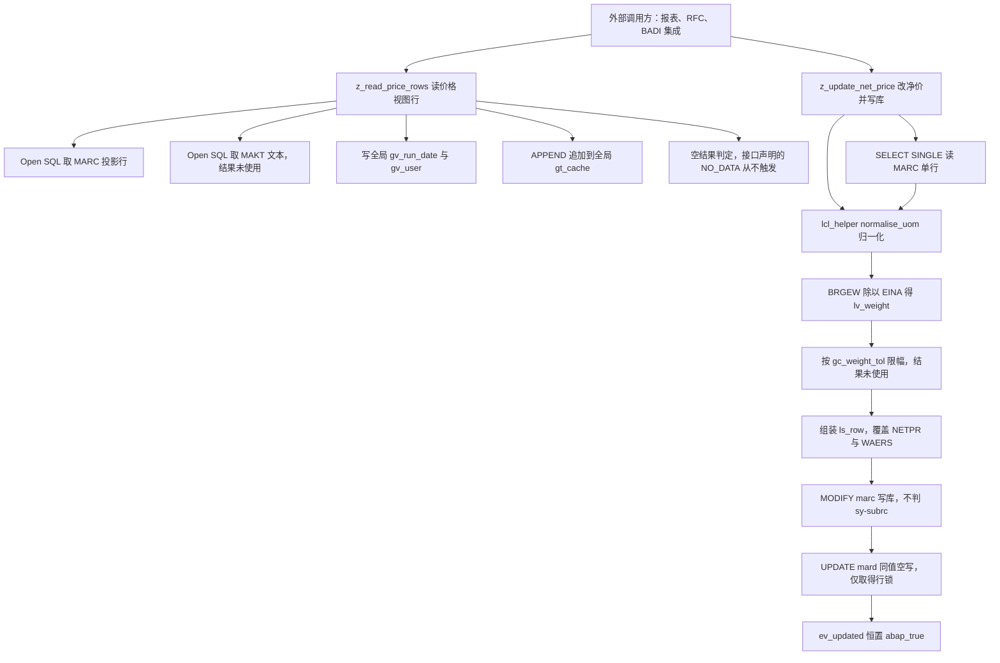
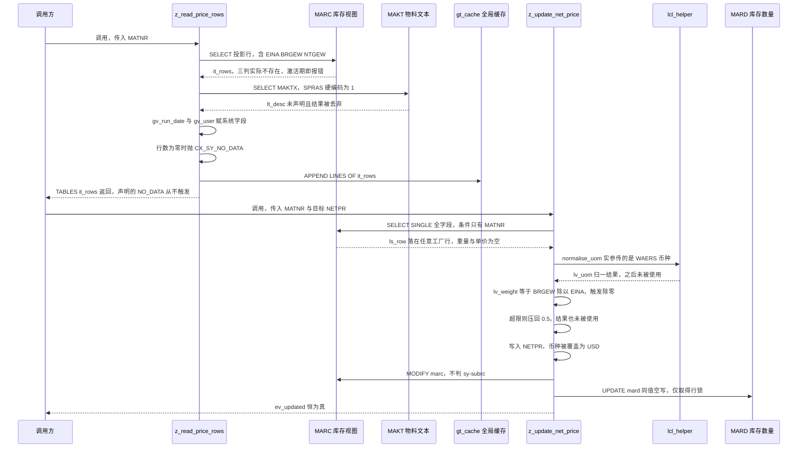

# ZFG_MATERIAL_PRICE 函数组走读报告

> 分析对象：`zfg_material_price.fg.abap`（函数组主程序）、`lzfg_material_pacetop.abap`（全局数据段）、`lzfg_material_pacu01.abap`（函数实现段），以及主程序内定义的局部类 `lcl_helper`。
> 读者假设：有 ABAP 基础、但第一次接触本函数组，需要搞清两个 FM 的职责边界、数据怎么流转、以及写数据库这段到底有没有问题。

---

## 一、程序定位与业务背景

### 1.1 它想解决什么

函数组头部的注释写得很直白：`price / weight maintenance for purchasing infos. Owned by: MM Purchasing.` 也就是说，这段代码属于 MM 采购域，目标是把"物料在某个工厂 / 库存地点下的价格与重量信息"作为一个可复用的数据服务提供给上层（报表、BADI、RFC 集成、自开发程序），避免每个消费方各自写一遍 MARC/MARA/MART 取数逻辑。

MM 域里有两类典型需求会把这种函数组逼出来：

- **批量比价/询价前置**：用户在一个 ALV 上勾选一批物料，界面要同时显示采购价、币种、单位毛重净重、有效期截止日。直接 SELECT MARC 拼字段，每个程序都写一遍，字段口径很快就会分裂（有人用 MARC-NETPR，有人用 EINA-NETPR，有人用 EKKP-NETPR）。
- **接口侧批量回写**：外部系统拿到一批新价格，要求写回 SAP 的参考价字段。这类操作一旦没有统一的校验与事务边界，很容易出现"更新了但没生效"或者"更新了半个工厂"的事故。

### 1.2 为什么用函数组而不是 OO 类

从骨架看，作者选择的是**经典函数组 + 全局类型 + TABLES 参数**的老派结构：用 `TYPES` 定义共享行结构 `TY_PRICE_ROW`，把行结构类型挂在函数组命名空间 `ZFG_MATERIAL_PRICE=>TY_PRICE_ROWS` 上让外部能引用；两个 FM 一个读、一个写；再配一个局部类 `lcl_helper` 放纯逻辑。

选这套而非 local class 的合理动机是**跨程序复用类型定义**。SAP 里 OO 类的类型要跨程序共享必须建成真类（真类带 TC00 事务，激活与传输都有成本），而函数组类型挂到函数组命名空间几乎零成本。在"给一群报表提供统一取数/回写入口"的场景下这是当年最省事的做法，可理解。

代价也很明确：函数组带全局数据就**不能作为 stateless RFC 服务器启动**（SAP 会拒绝含全局变量的程序作为 RFC 目标），也无法做有意义的单元测试，本组里的 `lcl_helper` 两个方法因此没有任何一个被测试覆盖。设计范式一句话定性：**一个"MM 价格数据网关"的函数组实现——读、写、校验三种职责平铺在两个 FM 加一个辅助类上，全局状态无保护。**

### 1.3 本次走读要回答的三个问题

1. 两个 FM 的职责边界是否清晰、是否有越权行为；
2. 一条价格数据从数据库到调用方、再从调用方回到数据库，中间经历了什么；
3. **写数据库这段有没有问题**——结论先给：问题严重，且不止一处。详见第五章；其中 `z_read_price_rows` 在激活期就有两处硬语法错误，`z_update_net_price` 存在必然触发的除零崩溃、静默不更新、更新任意工厂、币种被硬写死为 USD、以及一次纯加锁的空写。

---

## 二、程序执行流程总览

先看整体形状。两个 FM 是并行的入口（由外部调用方二选一触发），`lcl_helper` 是 `z_update_net_price` 内部的被调方，从不被外部直接使用。



### 责任链表

| 子程序 | 调用者 | 职责 |
| --- | --- | --- |
| `FUNCTION-POOL zfg_material_price`（函数组主程序） | SAP 运行时，装载函数组时自动执行 | 声明 FUNCTION-POOL、装载 TOP 与 UXX 两个 include、顺带定义局部类 `lcl_helper` |
| 全局数据段 `LZFG_MATERIAL_PACETOP` | 主程序的 `INCLUDE` 语句，被系统自动展开 | 定义共享行类型 `TY_PRICE_ROW`、表类型 `TY_PRICE_ROWS`、四个全局变量与两个业务常量 |
| `z_read_price_rows` | 外部调用方（报表/集成程序），传入 `MATNR` | 从 MARC 取该物料全部工厂/库存地点行，附带取一次 MAKT 文本（未用），把结果通过 `TABLES` 交给调用方并追加进全局缓存 |
| `z_update_net_price` | 外部调用方（报表/集成程序），传入 `MATNR` 与目标 `NETPR` | 读一行 MARC，做单位归一化与重量试算，把 `NETPR`/`WAERS` 覆盖后 `MODIFY` 回 MARC，再对 MARD 做一次同值 `UPDATE`，最后无条件返回成功标志 |
| `lcl_helper` 定义段 | 主程序执行时声明，全函数组可见 | 声明 `normalise_uom` 与 `is_valid_price` 两个纯逻辑方法 |
| `lcl_helper=>normalise_uom` | 仅 `z_update_net_price` 调用 | 把 `PC`/`PA` 归一到 `EA`，其余原样返回；返回值在调用方被丢弃 |
| `lcl_helper=>is_valid_price` | 无调用者（死代码） | 判断行结构的 `NETPR` 是否非初始值，返回 `ABAP_BOOL` |

下面按这条流程，逐个子程序展开。

---

## 三、分组分析（按程序流程 / 子程序）

### 3.1 函数组主程序 `FUNCTION-POOL zfg_material_price`

这一节分两步看：先看主程序骨架（只做三件事），再看它顺手定义的局部类。

#### ① 主程序骨架与 include 装载

```abap
FUNCTION-POOL zfg_material_price.

*"* use this source for any type of program (pool)
*"*   function group ZFG_MATERIAL_PRICE

  INCLUDE lzfg_material_pacetop.    "session data, type declarations
  INCLUDE lzfg_material_pacuxx.    "function implementations
```

**做什么** — 声明函数组入口（`FUNCTION-POOL` 语句本身不含业务逻辑，只是把当前程序标记为函数组主程序），随后按顺序 `INCLUDE` 两个 include：TOP 段提供会话级类型与数据声明，UXX 段提供函数实现。SE37 生成并激活函数组时会执行这三行，TOP 先展开、UXX 后展开，保证函数实现编译时能看到类型声明。

**为什么** — 这是 SAP 生成函数组的标准骨架。`INCLUDE L<函数组>UXX` 而不是逐个 `INCLUDE L<函数组>U01/U02/...`，是因为 SAP 会把函数实现集中到 U01…U05（每段约 63KB 的限制），再由自动生成的 UXX 统一串起来。手工维护时**永远不要改 UXX**（激活会被重写），只改 U01 起的实现段——本组正是这种规范做法。

**风险与改进** — include 命名不对。SAP 为函数组 `ZFG_MATERIAL_PRICE` 生成的 include 名是 `LZFG_MATERIAL_PRICETOP` / `LZFG_MATERIAL_PRICEUXX` / `LZFG_MATERIAL_PRICEU01`（函数组名后直接拼后缀，超长才截断）。这里的 `PACETOP` / `PACUXX` / `PACU01` 三个名字里都多了一个 `PAC`，且三处前缀互相一致却与函数组名不匹配，说明是手工重命名过的。**如果系统里实际存在的确实是这三个名字，说明它们不是本函数组自动生成的 include，`lzfg_material_pacuxx` 的内容不会自动 include `lzfg_material_pacu01`**，FM 实现将无法链接、函数组激活报 "INCLUDE ... not found"。属于必须在系统里核实一次的环境级问题——代码审查时这种"能读通但激活不了"的差异最难查。同时建议：把头注释里的 Report 名（`ZFG_MATERIAL_PRICE` / `LZFG_MATERIAL_PACETOP` / `LZFG_MATERIAL_PACU01`）与实际 include 名对齐，否则新接手的人会以为是三个不同的函数组。

#### ② 局部类 `lcl_helper` 的定义

```abap
*"*---------------------------------------------------------------------*
*"*       CLASS lcl_helper DEFINITION
*"*---------------------------------------------------------------------*
CLASS lcl_helper DEFINITION.
  PUBLIC SECTION.
    METHODS normalise_uom
      IMPORTING iv_uom  TYPE marc-uom
      RETURNING VALUE(rv_uom) TYPE marc-uom.
    METHODS is_valid_price
      IMPORTING is_row  TYPE ty_price_row
      RETURNING VALUE(rv_ok) TYPE abap_bool.
ENDCLASS.


CLASS lcl_helper IMPLEMENTATION.
  METHOD normalise_uom.
    CASE iv_uom.
      WHEN 'PC' OR 'PA'.
        rv_uom = 'EA'.
      WHEN OTHERS.
        rv_uom = iv_uom.
    ENDCASE.
  ENDMETHOD.                    "normalise_uom

  METHOD is_valid_price.
    rv_ok = COND #( WHEN is_row-netpr IS INITIAL THEN abap_false
                     ELSE abap_true ).
  ENDMETHOD.                    "is_valid_price
ENDCLASS.
```

**做什么** — 紧跟两个 `INCLUDE` 之后声明了一个类：一个把计量单位归一化的转换方法，一个判断价格行是否有效的校验方法。实现部分同步跟在定义段下方，两个方法都是纯函数——无副作用、无数据库访问、结果由 `RETURNING` 抛出。

**为什么** — 把无副作用的纯逻辑从 FM 里剥出来放进类是**正确的方向**：这类逻辑可以脱离数据库单测，也可以被未来的其他程序复用；`RETURNING VALUE(...)` 加 `abap_bool` 的签名也符合现代 ABAP 风格，隐式返回避免了 EXPORTING 参数被忽略时初值为空的坑。`COND #( WHEN ... IS INITIAL THEN abap_false ELSE abap_true )` 的写法比 `IF ... = 0` 更明确表达"检查初始化状态"而非"比较数值"。

**风险与改进** — 有三点，第 ① 点是硬伤：

- **代码位置错误（激活会丢代码）**：`CLASS lcl_helper DEFINITION/IMPLEMENTATION` 直接手写在 `FUNCTION-POOL` 主程序里。主程序是 SE37 的**生成对象**，激活函数组时会被重新生成，手写内容会被清掉或被"对象被修改，是否保存"提示覆盖。标准做法是把局部类挪进独立 include（如 `LZFG_MATERIAL_PRICELCL`，用 `CLASS lcl_helper DEFINITION LOAD.` 装载），或干脆建成真类 `ZCL_MATERIAL_PRICE_HELPER`。
- **命名与作用域不符**：`LCL_` 前缀在 SAP 约定里表示"某个 include 内私有"，而写在函数组主程序里的类是**函数组全局可见**的。应改 `LCH_`（function group class pool）或 `CL_`（真类），否则读代码的人会误判其可见性。
- **类定义放在 `INCLUDE` 之后**：本例顺序恰好安全（TOP 提供 `ty_price_row`，类定义用到它）。但依赖是隐式的——若有人调整 include 顺序或把类挪到 TOP 之前，就会激活失败。建议在 include 之后、类之前加一句注释点明这个依赖。

### 3.2 全局数据段 `LZFG_MATERIAL_PACETOP`

这是整个函数组的**类型契约与状态中心**，分四步：行结构、内表类型、全局变量、业务常量。

#### ① 行结构 `ty_price_row`

```abap
TYPES: BEGIN OF ty_price_row,
         matnr   TYPE mara-matnr,
         werks   TYPE marc-werks,
         lgort   TYPE marc-lgort,
         eina    TYPE mara-eina,
         brgew   TYPE mara-brgew,
         ntgew   TYPE mara-ntgew,
         netpr   TYPE marc-netpr,
         waers   TYPE marc-waers,
         eifn    TYPE marc-eifn,
       END OF ty_price_row.
```

**做什么** — 定义一个扁平结构，代表"某个物料在某个工厂/库存地点下的一行价格信息"：标识三件套（MATNR/WERKS/LGORT）、采购侧的价格单位（EINA）、两个重量（BRGEW 毛重、NTGEW 净重）、净价与币种（NETPR/WAERS）、以及价格有效期截止日（EIFN）。这个结构同时充当三个角色：`TABLES` 参数的行类型、`SELECT` 的目标结构、`MODIFY` 的写入结构。

**为什么** — 用一个共享结构而不是多个 FM 各传各的散参数，是函数组做数据契约的标准手法：`TABLES IT_ROWS TYPE ZFG_MATERIAL_PRICE=>TY_PRICE_ROWS` 这样外部程序就能拿到类型，字段口径全局唯一。放在 TOP 里也保证了 U01 的函数实现和主程序里的类都能看到它。

**风险与改进** — **这是全组最要命的设计缺陷**：`ty_price_row` 把 **MARA（物料主数据）与 MARC（工厂级库存视图）的字段混装进了同一个结构**，而 MARC 根本没有 `EINA`、`BRGEW`、`NTGEW` 三个字段（它们只存在于 MARA）。直接后果在 3.3 ② 和 3.4 ④ 全面爆发：

- `z_read_price_rows` 的 `SELECT ... FROM marc` 一旦写出这三列，SQL 预编译阶段就会报"字段 EINA 在 MARC 中不存在"，**函数模块根本无法通过激活检查**；
- `z_update_net_price` 用 `SELECT SINGLE * FROM marc` 填充它，这三个字段永远保持初始值，于是 `BRGEW / EINA` 恒为 `0 / 0`；
- `MODIFY marc FROM ls_row` 时，同名组件映射不上就被忽略，所谓的"整行写回"其实只有 `NETPR`/`WAERS` 落库，重量和价格单位根本没写进去——**代码读起来像更新了一整行，实际只更新了两个字段**，维护者极易误判。

改进方向：拆成两个结构，例如 `ty_mara_price`（MATNR/EINA/BRGEW/NTGEW，从 MARA 取）与 `ty_marc_price`（MATNR/WERKS/LGORT/NETPR/WAERS/EIFN，从 MARC 取）；确实要拼装展示行时，再用一个显式命名的 `ty_view_row`（例如带 `mara_eina`/`marc_netpr` 之类的前缀区分来源），并为它单独提供装配逻辑。**关键是让"这张行来自哪张表"在类型名上可见**，而不是靠读者去翻 DDIC。

#### ② 内表类型 `ty_price_rows`

```abap
TYPES ty_price_rows TYPE STANDARD TABLE OF ty_price_row WITH EMPTY KEY.
```

**做什么** — 定义标准内表类型 `TY_PRICE_ROWS`，元素为 `TY_PRICE_ROW`。被 `z_read_price_rows` 用作 `TABLES` 参数类型，也被全局变量 `gt_cache` 用作缓存容器。

**为什么** — 显式声明表类型而不是在变量处直接写 `TYPE STANDARD TABLE OF ty_price_row WITH EMPTY KEY`，好处是类型可以被挂到函数组命名空间给外部引用（`TABLES` 参数需要），并且 `WITH EMPTY KEY` 让追加与遍历不依赖任何键——对"SELECT INTO TABLE 的结果集"和"只追加的缓存"这两类用途，这是正确的选择。

**风险与改进** — 无明显风险，但要注意它对 `FOR ALL ENTRIES` 的连带影响：驱动内表为空时 SQL 会**静默返回空结果集而不报错**，所以任何用 `ty_price_rows` 做 FAE 驱动表的地方都必须先判非空（本组 3.3 ③ 恰好在判空之前就做了 FAE，顺序上侥幸没踩坑，但依赖的是"后面会抛异常"这个巧合，而不是显式守卫）。另外 `WITH EMPTY KEY` 的内表如果要传给非 Open SQL 的接口（如 RFC/BAPI/序列化），需要补显式键，否则对方拿不到可判重的字段。

#### ③ 全局变量

```abap
DATA: gt_cache    TYPE ty_price_rows,
      gv_run_date TYPE datum,
      gv_user     TYPE sy-uname,
      gv_language TYPE sy-langu.
```

**做什么** — 声明四个函数组全局变量：一个价格行缓存表、一个运行日期、一个用户名、一个语言键。`gv_run_date` 与 `gv_user` 在 `z_read_price_rows` 里被赋成 `SY-DATUM` / `SY-UNAME`；`gt_cache` 被 `APPEND LINES OF` 追加；`gv_language` 全组未见任何赋值。

**为什么** — 意图上看，作者想做"运行上下文快照 + 结果缓存"：把取数时刻的用户与日期记下来，便于后续审计或做价格有效期判断（配合行里的 `EIFN`）。缓存表则希望跨调用复用，避免同一 session 内重复读库。

**风险与改进** — 这四个变量有三个问题：

- **`gv_language` 从未被赋值**：这是死变量，却暴露出设计意图——作者原本想按用户语言取描述（后面 3.3 ③ 却硬编码了 `SPRAS = '1'`）。要么在 `z_read_price_rows` 开头补 `gv_language = sy-langu`，要么整条链路改用 `sy-langu`，然后删掉这个变量。
- **只读 FM 里写全局变量**：`z_read_price_rows` 的语义是"读数据"，却在里面改 `gv_run_date`/`gv_user`。一旦同一 session 内多次调用，这些"快照"会互相覆盖，且调用方拿到数据时无从知道数据是哪一次读的。应当把这些赋值移到更新 FM，或干脆做成 FM 的 `EXPORTING` 参数由调用方决定。
- **`gt_cache` 只增不减、不去重**：`APPEND LINES OF it_rows TO gt_cache.` 每调一次就整批追加，同一物料重复调用会产生重复行；在 dialog 程序中函数组内存在 LUW 结束前一直常驻，长会话（用户挂机后继续操作）里会持续涨内存。建议改为"按 MATNR 覆盖写"（先 `DELETE gt_cache WHERE matnr = ...` 再追加），并提供一个 `z_clear_price_cache` 之类的清理 FM。

#### ④ 业务常量

```abap
CONSTANTS gc_weight_tol TYPE p DECIMALS 4 VALUE '0.5'.
CONSTANTS gc_cap_currency TYPE c LENGTH 3 VALUE 'USD'.
```

**做什么** — 两个硬编码常量：重量阈值 `0.5`（4 位小数），以及写库时强制使用的币种 `'USD'`。

**为什么** — 把业务规则从代码里提出来命名成常量，好过散落的字面量；至少读者一眼能看出"0.5"是什么、为什么币种被覆盖。

**风险与改进** — 两处都硬编码了不该硬编码的东西：

- `gc_weight_tol = 0.5` 的量纲不明。看 3.4 ④ 它是被拿去和 `BRGEW / EINA` 比较的，即"公斤/币种"，这不是任何有意义的物理量。真正的重量阈值应该对应"单位包装重量偏差"，比较对象应是 `MARC-EANZ`（每包装单位的采购数量）或 `MARA-EISZ`（EAN 比例），而不是单价。
- `gc_cap_currency = 'USD'` 是一颗**业务数据炸弹**：`z_update_net_price` 无条件执行 `ls_row-waers = gc_cap_currency.`，把参考价的币种改成美元。对 CN 公司代码（本位币 CNY）而言，这等于把一条人民币口径的价格标成美元，后续 MR21 重算或 MBEW 估值会直接把两个币种混算。而且常量名里的 "cap" 在本组中没有任何对应业务概念（既不是封顶，也不是币种上限），命名与语义双不符。改进：去掉这个赋值，若确需按本位币归一，应从 `T001`/`TCURM` 取公司代码本位币，或直接沿用传入参数 `iv_netpr` 对应的币种（把它作为 `IMPORTING` 传入）。
- 两者都应外置为配置（`Z_PRICE_CFG` 之类的自定义表或 `T000` 集群），让业务能自助调整，不至于每次都要 ABAP 改代码重激活。

### 3.3 函数 `z_read_price_rows`（读路径）

这是函数组对外提供的读取入口，分五步：接口声明、取 MARC 行、取 MAKT 文本、写上下文全局变量并判空、追加缓存。

#### ① 接口声明

```abap
FUNCTION z_read_price_rows.
*"----------------------------------------------------------------------
*"* Local Interface:
*"*  IMPORTING
*"*     VALUE(IV_MATNR) TYPE  MARA-MATNR
*"*  TABLES
*"*     IT_ROWS        TYPE  ZFG_MATERIAL_PRICE=>TY_PRICE_ROWS
*"*  EXCEPTIONS
*"*     NO_DATA       1
*"----------------------------------------------------------------------
```

**做什么** — 声明一个入参 `IV_MATNR`（物料号）、一个表参数 `IT_ROWS`（类型为函数组命名空间下的 `TY_PRICE_ROWS`）、一个异常 `NO_DATA`。

**为什么** — `TABLES` 参数用于返回**多行**结果集，是经典函数模块的标准做法（EFORM 的 `IT_*` 风格在报表生态里兼容面最好）。把异常显式列出来而不是靠 `MESSAGE` 冒泡，是正确的错误传播方式。

**风险与改进** — 声明了 `NO_DATA` 但实现里从未 `MESSAGE no_data TYPE no_data RAISING`（见 ④），异常形同虚设；调用方按惯例写了 `EXCEPTIONS no_data = 1` 的分支却永远进不去，会误以为"有数据"。

#### ② 取 MARC 视图行

```abap
  SELECT matnr werks lgort eina brgew ntgew netpr waers eifn
    FROM marc
    INTO TABLE it_rows
    WHERE matnr = iv_matnr.
```

**做什么** — 意图是按物料号从 MARC（物料×工厂×库存地点视图）取出全部工厂/库存地点行，连同采购单价与毛净重一起装进 `IT_ROWS` 输出表。

**为什么** — 选 MARC 而不是 MARA 是对的：价格、币种、价格有效期（NETPR/WAERS/EIFN）本质是工厂级数据，MARC 才是正确的来源；投影取列（而非 `SELECT *`）也符合性能规范；`WHERE matnr = ?` 命中 MARC 的主键前缀（MATNR/WERKS），代价可控。

**风险与改进** — **P0 硬错误**：`EINA`、`BRGEW`、`NTGEW` 是 MARA 的字段，MARC 上不存在（后两者在 MARC 无对应列，采购单价同理）。Open SQL 在语法检查阶段就会报"字段 EINA 在表 MARC 中不存在"，**这个函数模块不可能通过激活**，进而整个函数组无法激活。即便在某些允许字段列表动态化的场景下绕过检查，运行期取到的也只会是空值。正确写法是拆成两条 SQL：

- MARC 取 `matnr werks lgort netpr waers eifn`；
- MARA 单独取 `matnr eina brgew ntgew`，然后在 ABAP 里按 `matnr` 关联回填（一次 `READ TABLE` + `MOVE-CORRESPONDING`，或对 MARC 结果做 `SORT` 后按索引直读）。

顺带注意：`it_rows` 是 `TABLES` 参数（传入即清空），作为 `INTO TABLE` 目标不会与调用方残留数据混合，这是对的；但两个 SELECT 都**没有判 `SY-SUBRC`**，也没有区分"物料不存在"与"物料存在但无工厂行"这两种完全不同的情况。

#### ③ 取物料描述（MAKT）

```abap
  SELECT maktx FROM makt
    INTO TABLE lt_desc
    FOR ALL ENTRIES IN it_rows
    WHERE matnr = it_rows-matnr
      AND spras = '1'.
```

**做什么** — 意图是按 `IT_ROWS` 里出现的物料号去 MAKT（物料文本）取描述，存进 `LT_DESC`。但这段实际上什么都没做成。

**为什么** — 用 `FOR ALL ENTRIES` 而不是 `JOIN` 或二次 `SELECT ... IN matnr`，是避免 `IN` 列表超过 1000 个元素的经典手法，思路本身没问题（前提是驱动表非空，这里 ④ 的判空虽然晚了，但抛异常前结果集已空，不会造成脏数据，只是白查一次）。

**风险与改进** — 这段有**两处 P0 级问题**：

- **`LT_DESC` 从未声明**。它既不在本 FM 的 `DATA` 里（只有 `lv_count`），也不在 TOP 的全局变量里。这是一个未声明标识符，**语法错误，函数模块同样激活不了**。
- **结果彻底废弃**。即使补上声明，`LT_DESC` 在本 FM 后续没有任何读取，也没被 `APPEND`/`MOVE` 回 `IT_ROWS`；更根本的是 **`TY_PRICE_ROW` 里根本没有描述字段**（见 3.2 ①，九个字段没有文本）。所以这是一次纯粹的数据库往返浪费，在物料批量读取场景下会成倍放大。
- **语言硬编码 `spras = '1'`**。MAKT 的语言键随 SAPscript 语言键体系而变，`'1'` 在标准 SAP 里对应德文，`SY-LANGU` 才是"当前用户登录语言"；作者自己还在 TOP 里留了个 `gv_language` 却没用。应改为 `AND spras = @gv_language`（并确保它被赋成 `sy-langu`）。
- 整段建议直接删除；若确实要带描述，先给 `TY_PRICE_ROW` 加 `maktx TYPE makt-maktx`，再决定用 `SELECT ... JOIN` 一次取完（MAKT 是小表，1 对 N 展开会放大行数，需评估）。

#### ④ 计数、写上下文变量与空结果判定

```abap
  DATA lv_count TYPE i.

  lv_count = lines( it_rows ).

  gv_run_date = sy-datum.
  gv_user     = sy-uname.

  IF lv_count = 0.
    RAISE EXCEPTION TYPE cx_sy_no_data.
  ENDIF.
```

**做什么** — 取结果集行数存进 `lv_count`，把当前日期与用户名写进函数组全局变量，然后当行数为 0 时抛出异常类 `cx_sy_no_data`。

**为什么** — 判空本身必要：一个以"读该物料价格"为目的的 FM 返回空集，调用方几乎一定要区分"没数据"与"有数据但字段为空"。把日期/用户记下来用于审计的思路也说得通。

**风险与改进** — 三处问题：

- **异常类型与接口不符**：FM 声明的异常是 `NO_DATA`，正确写法是 `MESSAGE no_data TYPE no_data RAISING no_data.`。`RAISE EXCEPTION TYPE cx_sy_no_data` 抛的是一个全局异常类（`CX_SY_NO_DATA`，SAP 通用"无数据"类），它会以 class-based exception 形式穿透 FM 边界，调用方 `EXCEPTIONS no_data = 1` 永远接不到，而调用方通常也没写 `TRY...CATCH`，最终变成短 dump。**声明的异常与抛出的异常必须统一**。
- **副作用位置错误**：`gv_run_date`/`gv_user` 是全局变量，在抛异常之前赋值，等于把一次失败读取的上下文也写进了全局状态；而且只读 FM 不该有这类副作用。
- **顺序颠倒**：判空应该紧跟 ② 的 `SELECT`，而不是夹在两次 `SELECT` 之间。现在是"查 MARC → 查 MAKT（FAE 驱动表可能为空，静默返回空）→ 记全局 → 才判空"，多花一次数据库往返。规范顺序是"取数 → 判 sy-subrc/行数 → 判空抛异常 → 后续处理"。

#### ⑤ 追加到全局缓存

```abap
  APPEND LINES OF it_rows TO gt_cache.

ENDFUNCTION.                    "Z_READ_PRICE_ROWS
```

**做什么** — 把本次取到的全部行追加进函数组全局缓存表 `gt_cache`，FM 结束。

**为什么** — 意图是给同一 session 内的后续调用（尤其是紧随其后的 `z_update_net_price`）提供一份"刚才读到的内容"作为比对基准。追加而非覆盖，符合"缓存只增"的朴素实现。

**风险与改进** — 缓存本身设计有问题：

- **无边界、无去重、无失效**：每次调用整批追加，同一物料重复读产生重复行；缓存里也没有时间戳，无法判断新鲜度；更没有任何 FM 能读它（`gt_cache` 在全组中只有这一处写入、零处读取），所以它是**纯内存泄漏**。
- **缓存内容与用途不匹配**：即使将来有人读，缓存里的 `MAKTX`（②③ 想取的东西）并不存在，重量字段因 ② 的错误恒为空，缓存能提供的价值非常有限。
- 建议：要么删掉（最省事，因为无人读取），要么做实——在 `z_update_net_price` 成功后用缓存里的旧值写 `CDHDR`/变更日志，并把 `gt_cache` 改成按 MATNR 覆盖的哈希式用法（`DELETE ... WHERE matnr =` 后追加）。

读完这条路径先记住一个结论：**这个"读"函数在语法层面就跑不起来（EINA/BRGEW/NTGEW 字段错误 + LT_DESC 未声明），而且它的异常契约、文本取数、语言硬编码、缓存策略这四处设计都需要重做。** 接下来看写路径，而写路径的问题更严重。

### 3.4 函数 `z_update_net_price`（写路径）

这是全组风险最集中的地方，也是用户提问"写数据库这块有没有问题"的正主。它分八步逐步走向崩溃。

#### ① 接口声明

```abap
FUNCTION z_update_net_price.
*"----------------------------------------------------------------------
*"* Local Interface:
*"*  IMPORTING
*"*     VALUE(IV_MATNR) TYPE  MARA-MATNR
*"*     VALUE(IV_NETPR) TYPE  MARC-NETPR
*"*  EXPORTING
*"*     VALUE(EV_UPDATED) TYPE  ABAP_BOOL
*"----------------------------------------------------------------------
```

**做什么** — 声明两个入参（物料号、目标净价，类型直接取 `MARC-NETPR`）与一个导出标志 `EV_UPDATED`（`ABAP_BOOL`），没有 `TABLES` 参数、**没有 `EXCEPTIONS`**。

**为什么** — 用导出 `ABAP_BOOL` 而不是靠异常表达成败，是函数模块里常见且直白的做法（不同于 3.3 的 `NO_DATA`），配合 `EXPORTING` 的具名参数 `EV_UPDATED = ...` 在现代调用点可读性也不错。

**风险与改进** — **没有 `EXCEPTIONS` 出口，这是写操作接口的关键缺陷**：数据库失败（锁冲突、短 dump、被字段限制拒绝）无法反馈给调用方，唯一出口 `EV_UPDATED` 又在代码末尾被无条件置真（见 ⑧），调用方没有任何途径区分"真的更新了"和"什么都没发生"。正确做法：加 `EXCEPTIONS not_found = 1 db_error = 2`，内部判 `sy-subrc` 与 `CATCH cx_sy_db_error`，并把「失败」显式冒泡。另外入参直接复用 `MARA-MATNR`/`MARC-NETPR` 也提示了与 3.2 ① 相同的类型混用问题：净价字段挂在 MARC 上，但这里做的是"按物料改价"的全局语义，两者不是一回事。

#### ② 单行读取 MARC

```abap
  DATA ls_row    TYPE ty_price_row.
  DATA lv_uom    TYPE marc-uom.
  DATA lv_weight TYPE p DECIMALS 4.

  SELECT SINGLE * FROM marc INTO @ls_row
    WHERE matnr = iv_matnr.
```

**做什么** — 声明三个局部变量（行结构、计量单位、试算重量），然后按物料号从 MARC 取**一行**记录放进 `ls_row`，作为后续改写并写回的载体。

**为什么** — "读出来 → 改 → 写回去"（read-modify-write）是更新单条记录最常见的手法，因为 MARC 是横向展开的横向表（一个物料多工厂多库存地点），不带工厂条件就没法定位唯一行，作者显然意识到了这点才用 `SELECT SINGLE`。

**风险与改进** — 这里埋下了三个必然后果：

- **`WHERE` 缺 `werks` / `lgort`**：一个物料在多个工厂时，`SELECT SINGLE` 不报错，只是返回数据库碰到的**任意一行**。于是后续 `MODIFY marc FROM ls_row` 会把价格改到**某个随机工厂**上。这是静默的、跨工厂的数据污染，比报错更难追溯。接口层就必须把工厂作为必填入参（或改成 `TABLES` 返回全部行、由调用方逐行回写），或者在代码里显式检测"命中行数大于 1"并抛异常要求调用方补工厂条件。
- **`SELECT SINGLE *` 取全字段**：只需要 MATNR/WERKS/LGORT/NETPR/WAERS 几列，取全字段浪费网络与内存；更糟的是 `*` 意味着 `MARC` 以后加字段也会被一起读进来，行为不可预期。应改成显式投影列表。
- **目标结构非 DDIC 结构**：`INTO @ls_row` 目标是非 DDIC 结构，只能按字段名隐式匹配。这与 3.2 ① 的类型混装叠加后，`BRGEW`/`NTGEW`/`EINA` 三个 MARA 字段**永远保持初始值 0**——下一步的除法就是这么来的。

#### ③ 调用单位归一化（参数语义错配）

```abap
  lv_uom = lcl_helper=>normalise_uom( is_row = ls_row-waers ).
```

**做什么** — 调用局部类做计量单位归一化，把返回值赋给 `lv_uom`。实际传入的是 `ls_row-waers`（**币种**），而方法的形参 `iv_uom` 类型是 `MARC-UOM`（**基本计量单位**）。

**为什么** — 意图可以理解：MARC 同时带 `UOM`（基本计量单位）和采购侧单位（`EANZ`/`UMREZ`），有时需要把 `PC`/`PA` 这类包装单位归一到 `EA` 才能和重量或体积同台比较。把这类映射放进辅助类而不是散在 FM 里，位置是对的。

**风险与改进** — **典型的"长度相同就以为语义相同"错误**：`MARC-WAERS` 与 `MARC-UOM` 都是 `CHAR 3`，所以这个错误**不会触发任何转换异常或短 dump**，运行时一切正常通过，纯粹靠人眼看代码才能发现——这正是类型系统最容易失守的地方。传的是币种，走的是单位归一化的 CASE 分支（`'USD'` 落入 `WHEN OTHERS` 原样返回），结果毫无业务含义。修复有两条路：要么这里应该传 `ls_row-...-uom`（但 `ty_price_row` 里根本没有 `uom` 字段，说明设计时就没想清楚要归一哪个单位）；要么这个方法本身就多余，应当删掉。

补充一点：**`lv_uom` 在后续代码里完全没被使用**。也就是说，整个步骤对最终写库结果没有任何影响，属于可以整段删除的死逻辑——删掉之后，这个语义错配也随之消失。

#### ④ 重量试算与限幅（必然崩溃点）

```abap
  lv_weight = ls_row-brgew / ls_row-eina.

  IF lv_weight > gc_weight_tol.
    lv_weight = gc_weight_tol.
  ENDIF.
```

**做什么** — 用毛重除以采购单价，得到一个内部名叫"重量"的 `LV_WEIGHT`，再以常量 `GC_WEIGHT_TOL = 0.5` 为上限做限幅（超过就压回 0.5）。

**为什么** — 作者显然想实现一个"单位重量合理性校验"：算出每个单位价格对应的重量，如果异常大就截断，避免脏数据污染。手法本身（计算 → 与阈值比较 → 限幅）是常见的防御式编程。

**风险与改进** — **P0，且有三重问题**：

- **必然除零崩溃**。② 里说过，`ls_row` 由 `SELECT SINGLE * FROM marc` 填充，`BRGEW` 与 `EINA` 都是 MARA 字段，在这里恒为初始值 `0`。于是 `0 / 0` 触发 `CX_SY_ZERODIVIDE` **未捕获异常 → 短 dump**。**这个 FM 被调用一次就 dump 一次**，而且是在写库之前 dump（数据尚未被改动，这点算是不幸中的万幸）。即使将来把字段从 MARA 正确取到，`EINA`（采购单位价格）为 0 的物料同样会除零——**任何除法前都必须判分母**。
- **量纲错误**。`EINA` 的语义是"**采购单位的价格**"（Einheitspreis，币种/单位），不是数量。拿"重量 ÷ 价格"得到的是"公斤/币种"这种毫无意义的量。真正的"单位重量"应该除以 `MARC-EANZ`（每包装单位的采购数量）或 `MARA-EISZ`（EAN 比例），或者在 MARA 里直接取 `BRGEW` 与 `EISZ` 相除。**这不是笔误，是数据元素语义没校核**：字段长度都是数值型、都能算术运算，类型系统不会拦你。
- **结果未被使用**。限幅后的 `lv_weight` 在后面既没写进 `ls_row`、也没参与任何判断或 `MODIFY`。它对数据库的影响是零，唯一效果是让程序崩溃。修法：要么把这个校验做成真正的 `is_valid_price` 调用（不合格就抛异常拒绝更新），要么删掉。

#### ⑤ 组装待写结构（含币种覆盖）

```abap
  ls_row-netpr = iv_netpr.
  ls_row-waers = gc_cap_currency.
```

**做什么** — 把入参 `IV_NETPR` 写进结构体的 `NETPR` 字段（这是本次更新的**唯一实质目的**），同时**无条件把币种 `WAERS` 覆盖为常量 `'USD'``。

**为什么** — 写入目标字段是本 FM 存在的理由，符合预期。覆盖币种大概是"统一成美元口径"的想法，可能是早期某个一次性需求的遗留。

**风险与改进** — 币种覆盖是**严重的数据正确性问题**：`MARC-NETPR` 与 `MARC-WAERS` 是成对的"参考价 + 其币种"。把人民币口径的价格标成美元（或把欧元价格标成美元而不做汇率折算），会让后续所有基于参考价的计算（MR21 价格确定、加权平均价、移动平均价估值、期末重估）全部按错误币种解释。对 CN 公司代码而言这是数据污染而非显示问题。建议：

- 删除这行，保留 `ls_row-waers` 原有值；
- 或把币种作为 `IMPORTING iv_waers TYPE marc-waers` 传入，并在更新前校验它与公司代码本位币的关系；
- 若业务确实需要币种归一，应带汇率折算（`CALL FUNCTION 'CURRENCY_CONVERSION'`）后再写。

另外要注意 `ls_row` 是从 `MODIFY` 目标表反读再改写的结构，只要它带的 `LGORT`/`EIFN` 等字段有值，`MODIFY` 就会把这些字段一起写回（MARC 的非键字段全部按结构赋值）。若 ② 读到的是"某工厂某库存地点"的行，改写后 `LGORT` 原样写回是安全的；但一旦将来有人扩展这个 FM 往 `LS_ROW` 里塞新的非键字段，**都会无条件覆盖进 MARC**——read-modify-write 模式天然带有"读到脏值就写回脏值"的传播风险，建议改用显式 `UPDATE marc SET netpr = @iv_netpr WHERE matnr = ... AND werks = ...`，只碰要改的字段。

#### ⑥ 写库：`MODIFY marc`

```abap
  MODIFY marc FROM ls_row.
```

**做什么** — 把组装好的整行结构按 MARC 主键（MATNR/WERKS）写回数据库：NETPR 与 WAERS 会落库，其余同名组件按原值写回（MARA 字段因 MARC 无对应列而被忽略）。

**为什么** — 在"已 `SELECT SINGLE` 读到完整行"的语境下，`MODIFY ... FROM wa` 是自然写法，ABAP 会按主键定位并写入结构中的同名字段。

**风险与改进** — **这里没有任何错误处理，是写路径最大的风险点**：

- **不判 `SY-SUBRC`**：物料不存在（或该工厂行不存在）时，`MODIFY` 静默不插入，`SY-SUBRC = 4`，**不报错、不抛异常、不 dump**。而 ⑧ 无条件把 `EV_UPDATED` 置为真——调用方会拿到"更新成功"，而数据库里什么都没发生。这类"静默 no-op + 谎报成功"是最难排查的一类缺陷。
- **无事务边界、无异常捕获**：代码里既没有 `COMMIT WORK`，也没有 `CATCH cx_sy_db_error`。在 dialog 程序里，对 SAP 表的 MODIFY 落在独立的更新 LUW（或由 `COMMIT WORK` 决定何时提交），如果 FM 之后调用方再做别的操作失败，无法用 `ROLLBACK` 把这次修改退回去——因为它可能已经提交了。**更新类 FM 必须明确事务语义**：要么在 FM 末尾显式 `COMMIT WORK` 并在文档里写明"本 FM 会立即提交"，要么不提交、让调用方在同一 LUW 中统一控制（此时 FM 不应使用会隐式提交的语句）。
- **绕过了价格维护的业务链路**：`MARC-NETPR` 是参考价字段，正常由 MR21 类事务经价格确定逻辑维护，可能伴随 `CDHDR` 变更日志、账户凭证（CO 记账）、`MBEW-MAPV` 移动平均价联动。裸 `MODIFY` 全绕开这些，而且如果该字段配了字段级输入限制（BEPFL/BERFEL），直接写等于**绕过权限模型**。
- **无授权校验**：整个 FM 没有 `AUTHORITY-CHECK`，物料/工厂级的对象检查（如采购订单级 `E_BANF`、物料级 `M_MATNR`、工厂级 `M_MARC_PLANT`）全部缺失。任何能调用本 FM 的程序都能改任意物料的参考价。
- **修复方向**：改用显式 `UPDATE marc SET netpr = @iv_netpr WHERE matnr = @iv_matnr AND werks = @lv_werks`，判 `sy-subrc`（0=成功，4=未找到→抛 `not_found`）；更新前加 `AUTHORITY-CHECK`；外面包一层 `TRY...CATCH cx_sy_db_error`，失败时回滚并冒泡 `db_error`；由调用方或明确的 FM 尾部决定 `COMMIT WORK`。

#### ⑦ `UPDATE mard` 同值空写

```abap
  UPDATE mard SET mstock = mstock WHERE matnr = iv_matnr.
```

**做什么** — 对 MARD（物料×工厂×库存地点的库存数量表）执行一条"把 `MSTOCK` 更新成它自己"的语句，条件只有 `MATNR`，然后什么都不做。**这不改变任何数据。**

**为什么** — 唯一可能的动机是"触发库存相关的一致性检查/更新"，或者是把从别处拷来的代码片段顺手留着。但 SAP 里没有这种"UPDATE 同字段触发机制"，这条语句在数据层面是彻底的空操作。

**风险与改进** — **必须删除**。它带来的是纯风险，没有任何收益：

- **加排他行锁**：`UPDATE` 会把命中行加排他锁（且 `WHERE` 只带 `MATNR`，会锁住该物料在**所有工厂、所有库存地点**的 MARD 行）。MARD 是库存数量核心表，与 MR21 成本核算、MRM 重估、领料过账、周期结算等并发作业高度竞争；人为持锁会引发**锁等待/死锁**，严重时对方抛 `CX_SY_LOCK_TIMEOUT` 或短 dump，把库存过账链路拖垮。
- **不做则已可见的浪费**：即便不锁，一次多余的 `UPDATE` 也是额外的数据库往返与日志开销。
- 如果真实意图是"价格变更后要触发某些库存/成本后续动作"，正确做法是调用对应的 BAPI 或事务（比如 `BAPI_STANDARD_PRICE_UPDATE`、MR21 的 BAPI、或写队列表由后台作业异步处理），把锁与事务纳入受控的范围，而不是靠一条空 `UPDATE` 蒙混。

#### ⑧ 无条件返回成功

```abap
  ev_updated = abap_true.

ENDFUNCTION.                    "Z_UPDATE_NET_PRICE
```

**做什么** — 无论前面发生了什么，都把导出标志置为真并结束 FM。

**为什么** — 意图显然是想给调用方一个成功信号。但问题在于，前面的 ⑥⑦ 都没有把结果传回来，⑧ 也就无从判断，只能"假定成功"。

**风险与改进** — 这是把前面所有静默失败**放大成业务事故**的一步：物料不存在 → 什么也没写 → 但调用方收到 `X` → 上层据此刷新界面、提示"价格已更新"、继续后续业务流程。这类缺陷在生产上极难定位，因为错误提示显示成功。正确写法：

```abap
  IF sy-subrc = 0.
    ev_updated = abap_true.
  ELSE.
    ev_updated = abap_false.
    RAISE EXCEPTION not_found.       " 前提是接口已声明 EXCEPTIONS not_found
  ENDIF.
```

（这段改进代码仅为说明正确形态；真正落地上还应配合 ⑥ 的 `UPDATE` 与异常捕获。）原则是：**导出标志必须来自真实的执行结果，而不是常量。**

### 3.5 局部类 `lcl_helper` 的两个方法

类的定义段已在 3.1 ② 一并展开，这里按用户要求把每个方法单独走一遍。

#### ① 方法 `normalise_uom`

```abap
  METHOD normalise_uom.
    CASE iv_uom.
      WHEN 'PC' OR 'PA'.
        rv_uom = 'EA'.
      WHEN OTHERS.
        rv_uom = iv_uom.
    ENDCASE.
  ENDMETHOD.                    "normalise_uom
```

**做什么** — 入参 `iv_uom`（类型 `MARC-UOM`），若为 `'PC'`（Piece，件）或 `'PA'`（Pack，包装）则归一为 `'EA'`（Each，个），其余原样返回。

**为什么** — 把若干常见包装单位折叠成一个统一单位，是数据预处理里的常见需求：下游要按"每个最小单位"计算时，包装单位必须先拆开。方法做成纯函数、无副作用、无数据库访问，是正确的形态（也正因为如此，它本可以独立单测——可惜没有测试）。

**风险与改进** — 三个层面：

- **调用方式错误（最严重）**：唯一调用点 3.4 ③ 传的是 `ls_row-waers`（币种），不是计量单位。长度都是 3，编译与运行都不报错，纯粹靠人工阅读发现。修复：删除调用（因为返回值本就没用），或改传真实单位字段。
- **映射规则本身有风险**：`PC`→`EA` 的转换隐含假设"1 件 = 1 个"，但 SAP 中 `PC` 与 `EA` 的关系由 `MARC-UMREZ`/`UMREN`（分母/分子换算）描述，直接等同会丢掉 `1 PC = 6 EA` 之类的换算倍数。若目的是"把包装单位下的重量/数量折算成基本单位"，必须结合 `UMREZ`/`UMREN` 做换算，而不是硬映射到 `EA`。另外 `PA`（Pack）与 `PC`（Piece）在物料主数据里并非等价，归到同一档会掩盖差异。
- **硬编码不可配置**：两个字面量写死在方法里，若不同工厂/物料类型有不同约定，只能改代码。应改为读取配置表或用 `CASE` 之外的白名单常量区。

#### ② 方法 `is_valid_price`

```abap
  METHOD is_valid_price.
    rv_ok = COND #( WHEN is_row-netpr IS INITIAL THEN abap_false
                     ELSE abap_true ).
  ENDMETHOD.                    "is_valid_price
```

**做什么** — 接收一个 `TY_PRICE_ROW` 行结构，判断其 `NETPR` 字段是否非初始值，返回 `ABAP_BOOL`。

**为什么** — 写法本身很规范：`COND #( )` 内联条件把"是否为初始值"映射成布尔，避免了 `IF` 分支的样板；返回 `abap_bool` 而不是 `X` 空字符，类型更精确；方法无副作用。

**风险与改进** — 问题是**名字承诺的比实现做的多**，而且完全没被使用：

- **名不副实**：方法叫 `is_valid_price`（价格是否有效），实际只回答"净价是否为零"。价格是否有效至少还要看：币种是否为空、是否为零、`EIFN`（有效期截止日）是否已过期、是否为负数（退货/红冲场景）、以及是否落在价格单位允许的精度范围内。当前实现对 `NETPR = -5`（负价）也返回真。
- **参数类型耦合数据库结构**：形参是 `TYPE ty_price_row`（依赖 3.2 ① 那个混装类型），意味着这个"校验方法"与数据库结构死死绑在一起——将来表结构一变，校验逻辑跟着变，且无法单独传几个标量做测试。更合适的签名是 `IMPORTING iv_netpr TYPE marc-netpr iv_waers TYPE marc-waers iv_eifn TYPE marc-eifn`，或者干脆接收 `ty_price_row` 但把"什么算有效"的规则集中在一处。
- **零调用点**：全组没有任何地方调用它（`z_update_net_price` 里那句被删的重量校验本该由它承担）。死代码的代价是"看起来做了校验，实际没有"。改进二选一：在 `z_update_net_price` 组装 ⑤ 之前真的调用它做准入判断（不合格就抛异常拒绝更新），或者删除它、把校验放到独立的 `z_check_price` FM 里。

---

## 四、执行流程全景图（数据视角）

下面这张图按"数据从哪来、经过谁、到哪去"排列，可以对着看两条路径的数据形状变化。



看这张图时抓三条主线：

1. **读路径的数据是"胖"的**——行结构里带着三个永远为空的字段，以及一次查了却扔掉的描述文本；
2. **写路径的数据是"歪"的**——重量字段空、币种被改、行定位不到唯一工厂；
3. **两条路径都往全局变量里写东西**（`gv_run_date`/`gv_user`/`gt_cache`），而这些全局变量在整个函数组里从来没有被读取过——**数据在流动，但没有一个消费者**。

---

## 五、问题清单与改进建议（按优先级）

### 🔴 P0 业务正确性（会 dump、会写错数据、或根本无法激活）

| 序号 | 问题 | 所在子程序 | 改进方向 |
| --- | --- | --- | --- |
| 1 | `SELECT ... eina brgew ntgew FROM marc` —— 这三列是 MARA 字段，MARC 不存在，**激活期 SQL 语法错误**，整个函数组无法激活 | `z_read_price_rows`（②） | 拆成 MARC + MARA 两条 SQL，在 ABAP 里按 MATNR 关联回填；并在类型层把两者分开（见第 18 条） |
| 2 | `lt_desc` 全组未声明 —— **第二处语法错误**，同样导致激活失败 | `z_read_price_rows`（③） | 声明它，或整段删除（推荐后者，见第 8 条） |
| 3 | `lv_weight = ls_row-brgew / ls_row-eina` —— 两个操作数因字段错配恒为 0，**每次调用必抛 `CX_SY_ZERODIVIDE` 短 dump**；且即便有值，`EINA` 是价格不是数量，量纲错误 | `z_update_net_price`（④） | 删除该计算；若确需单位重量校验，改除 `MARC-EANZ` 或 `MARA-EISZ`，并且**除法前必须判分母** |
| 4 | `MODIFY marc` 不判 `SY-SUBRC` + `SELECT SINGLE` 条件缺 `WERKS` —— 物料无行时静默不更新，多工厂时**改到任意工厂**；`ev_updated` 又恒置真，**谎报成功** | `z_update_net_price`（②⑥⑧） | 改用显式 `UPDATE ... SET netpr = @iv_netpr WHERE matnr = @iv_matnr AND werks = @lv_werks`；接口补 `WERKS` 入参；判 `sy-subrc` 并冒泡异常；导出标志由结果决定 |
| 5 | `ls_row-waers = gc_cap_currency` 无条件把币种覆盖为 `'USD'` —— 与 `MARC-NETPR` 的估值货币语义冲突，污染后续 MR21/MBEW 估值 | `z_update_net_price`（⑤） | 删除该赋值；或把币种作为入参传入并在需归一时走 `CURRENCY_CONVERSION` 折算 |
| 6 | `UPDATE mard SET mstock = mstock` —— 空操作，只为给库存表加排他行锁，与 MR21/MRM/领料过账并发时**可能造成锁等待或死锁** | `z_update_net_price`（⑦） | 直接删除；若需触发后续动作，改调 BAPI 或写队列表异步处理 |

### 🟠 P1 健壮性（异常契约、事务、权限、内存）

| 序号 | 问题 | 所在子程序 | 改进方向 |
| --- | --- | --- | --- |
| 7 | 接口声明 `EXCEPTIONS no_data`，实现却 `RAISE EXCEPTION TYPE cx_sy_no_data` —— 调用方按约定写的 `EXCEPTIONS no_data = 1` 永远不触发，未写 `TRY` 的调用方直接短 dump | `z_read_price_rows`（①④） | 改为 `MESSAGE no_data TYPE no_data RAISING no_data.` |
| 8 | MAKT 查询结果完全没用：`lt_desc` 未声明、未回填、且 `ty_price_row` 里没有文本字段；`FOR ALL ENTRIES` 驱动表还可能为空 | `z_read_price_rows`（③） | 删掉整段；若要带描述，给行结构加 `maktx` 并一次 JOIN 取回 |
| 9 | `WHERE spras = '1'` 硬编码语言，绕过 `sy-langu`；同时 TOP 里的 `gv_language` 从未赋值 | `z_read_price_rows`（③）、全局数据段（③） | 用 `gv_language`，并在读 FM 入口赋 `sy-langu`；否则删除该全局变量 |
| 10 | 两个 FM 都**没有 `AUTHORITY-CHECK`** —— 任意能调用者都能读任意物料价格、改任意物料参考价 | `z_read_price_rows`、`z_update_net_price` | 读路径至少加物料级检查；写路径加物料 + 工厂级检查（`M_MATNR` / `M_MARC_PLANT` 等），并核对字段级输入限制 |
| 11 | 写 FM **没有 `EXCEPTIONS` 出口**，且无 `COMMIT WORK` / `ROLLBACK` / `CATCH cx_sy_db_error`，事务边界不明、失败无法反馈 | `z_update_net_price`（①⑥） | 加 `EXCEPTIONS not_found = 1 db_error = 2`；用 `TRY...CATCH` 包裹写操作；明确"提交责任在 FM 还是调用方"并在注释与文档中写死 |
| 12 | `gt_cache` 只增不减、不去重、无失效机制、全组零读取 —— 长会话内存持续增长 | `z_read_price_rows`（⑤） | 删除，或改为按 MATNR 覆盖写并提供清理 FM |
| 13 | 只读 FM 里写全局变量 `gv_run_date`/`gv_user`，破坏"读操作无副作用"的预期，重复调用互相覆盖 | `z_read_price_rows`（④） | 移到更新路径，或改为 FM 的 `EXPORTING` 参数 |

### 🟡 P2 性能与规范

| 序号 | 问题 | 所在子程序 | 改进方向 |
| --- | --- | --- | --- |
| 14 | `SELECT SINGLE *` 取 MARC 全字段，只用 5 列 | `z_update_net_price`（②） | 改为显式投影列表 |
| 15 | `lcl_helper=>normalise_uom( is_row = ls_row-waers )` —— 形参类型 `MARC-UOM`（单位），实参是 `MARC-WAERS`（币种），**长度相同故不报错**，纯靠人眼发现 | `z_update_net_price`（③） | 删除调用点（返回值本就未用），或改传真实单位字段并结合 `UMREZ`/`UMREN` 换算 |
| 16 | 局部类**手写在 `FUNCTION-POOL` 主程序**里 —— 主程序是 SE37 生成对象，激活函数组时手写代码会被重写覆盖 | `FUNCTION-POOL zfg_material_price`（主程序 ②） | 挪到独立 include（`CLASS lcl_helper DEFINITION LOAD.`）或建成真类 |
| 17 | 命名与风格不统一：`z_` 前缀 FM 与 `IV_`/`EV_` 形参，`iv_`/`rv_`/`is_row` 类形参，英式拼写 `normalise`，`lcl_helper` 实为函数组全局类 | 全组 | 统一为一套约定：FM 名去掉冗余 `z_` 或加 `Z_` 段标识，类形参用 `is_`/`iv_`/`rv_`；`LCL_` 改 `LCH_` |

### 🟢 P3 可扩展性与长期维护

| 序号 | 问题 | 所在子程序 | 改进方向 |
| --- | --- | --- | --- |
| 18 | `ty_price_row` 把 MARA 与 MARC 字段混装成一个"行" —— 这是第 1、3、4 号 P0 的共同根因 | 全局数据段（①） | 拆成 `ty_mara_price` / `ty_marc_price` 两个类型；展示用装配结构显式命名前缀区分字段来源 |
| 19 | 业务常量硬编码（`gc_weight_tol = 0.5`、`gc_cap_currency = 'USD'`） | 全局数据段（④） | 外置为配置表，或改为 FM 入参，让业务可自助调整 |
| 20 | `is_valid_price` 名不副实（只判非零、不判币种/有效期/负价）且零调用点 | `lcl_helper`（方法 ②） | 要么在写 FM 中真的调用它做准入判断并补齐校验维度，要么删除；补单元测试 |
| 21 | 函数组带全局数据（`gt_cache`/`gv_*`），**SAP 不允许含全局变量的程序作为 stateless RFC 服务器启动** —— 若本组设计目标包含 RFC 调用（按组名与返回型接口看很可能有），则该目标当前不可达 | 全局数据段（③） | 若需 RFC：改为真类（`ZCL_MATERIAL_PRICE`）暴露接口；或把所有状态从参数传入，保留 FM 仅作薄包装 |

---

## 六、整体评价与启发

### 优点

- **函数组骨架规范**：TOP/UXX/U01 的三段式、类型挂函数组命名空间、`TABLES` 参数返回结果集、`COND #( )` 内联条件、`RETURNING` 隐式返回 —— 这些都说明作者对经典 ABAP 规范是熟悉的，代码风格本身不差。
- **辅助类的位置选对了**：把纯逻辑抽成无副作用、可单测的方法放进辅助类，是正确的方向（虽然没落实到位）。
- **业务感知是有的**：`TY_PRICE_ROW` 里同时带了 `EIFN`（价格有效期截止日）和毛净重，说明作者理解采购价格场景需要哪些维度。

### 短板

- **未做数据元素语义校核**：这是全组最致命的习惯问题。`EINA`（价格）当数量用、`WAERS`（币种）当单位用、`MARC` 当 MARA 用，三处错误长度类型全对、编译运行零阻力，只有懂业务的人读代码才能发现。**在 SAP 里，"字段能被算术运算"不等于"字段之间有物理意义可算"。**
- **错误处理与事务意识缺失**：写库路径上不判 `sy-subrc`、不捕获 DB 异常、不定事务边界、无授权检查，最后用一个常量把失败伪装成成功。
- **死代码与拼凑痕迹**：`lv_uom`、`lv_weight`、`gt_cache`、`gv_language`、`MAKTX` 查询、`lv_count`——大量逻辑写了不用，说明这段代码是"边想边加"而非"先设计后实现"，且很可能从未在测试系统成功跑通过（否则第一关激活就挂了）。

### 可以学到的设计经验

1. **写数据库前先问三个问题**：会不会更新 0 行？更新的是哪一行（主键条件够不够）？更新完怎么告诉调用方。这次三个问题全没答，所以失败会静默发生。
2. **同长度不等于同语义**：ABAP 的类型系统只校验长度与类型，不校验业务含义。涉及跨表拼装的 `TYPES` 时，把"这张行来自哪张表"写进类型名或字段名，比写注释可靠得多。
3. **更新类 FM 的三件套**：显式 `UPDATE ... WHERE`（而不是 `MODIFY FROM wa`）、`AUTHORITY-CHECK`、带 `EXCEPTIONS` 的失败冒泡 —— 少任何一件，这类 FM 就会成为事故源。
4. **不可解释的空操作要当报警处理**：`UPDATE ... SET x = x` 这种语句在任何代码里出现，都应该被当成"这里原本想做的事没做完"的信号，追问清楚再决定删除还是补齐。
5. **先让代码能激活，再谈优化**：本组甚至没通过语法检查，因此第 12、14、17 条性能与规范类优化都排在后面 —— 修复顺序永远是"可激活 → 不崩溃 → 不写错 → 不锁死别人 → 才轮到性能与风格"。
